# Opinion Poll by YouGov for The Times, 3–4 March 2019

<a href="#voting-intentions">Voting Intentions</a> | <a href="#seats">Seats</a> | <a href="#coalitions">Coalitions</a> | <a href="#technical-information">Technical Information</a>

## Voting Intentions

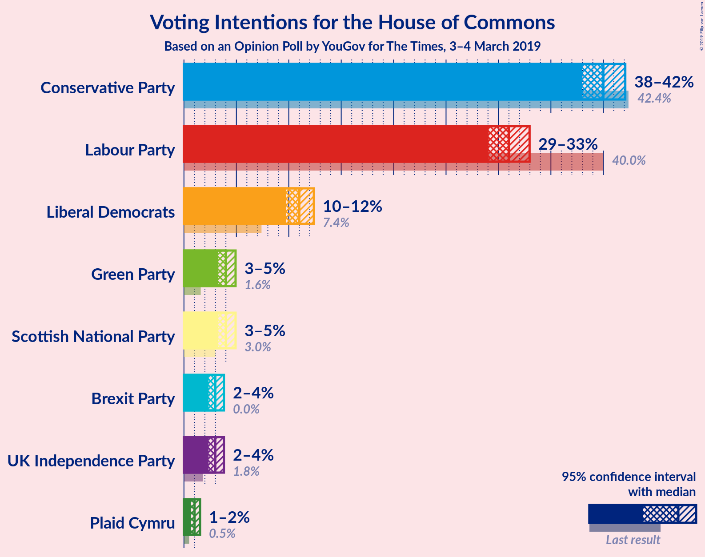

### Confidence Intervals

| Party | Last Result | Poll Result | 80% Confidence Interval | 90% Confidence Interval | 95% Confidence Interval | 99% Confidence Interval |
|:-----:|:-----------:|:-----------:|:-----------------------:|:-----------------------:|:-----------------------:|:-----------------------:|
| Conservative Party | 42.4% | 40.0% | 38.7–41.4% |38.3–41.8% |38.0–42.1% |37.3–42.8% |
| Labour Party | 40.0% | 31.0% | 29.7–32.3% |29.4–32.6% |29.1–33.0% |28.5–33.6% |
| Liberal Democrats | 7.4% | 11.0% | 10.2–11.9% |10.0–12.2% |9.8–12.4% |9.4–12.8% |
| Scottish National Party | 3.0% | 4.3% | 3.8–4.9% |3.6–5.1% |3.5–5.2% |3.3–5.5% |
| Green Party | 1.6% | 4.0% | 3.5–4.6% |3.4–4.8% |3.2–4.9% |3.0–5.2% |
| UK Independence Party | 1.8% | 3.0% | 2.6–3.5% |2.5–3.7% |2.3–3.8% |2.2–4.1% |
| Plaid Cymru | 0.5% | 0.7% | 0.5–1.0% |0.5–1.1% |0.4–1.2% |0.4–1.4% |

*Note:* The poll result column reflects the actual value used in the calculations. Published results may vary slightly, and in addition be rounded to fewer digits.

## Seats

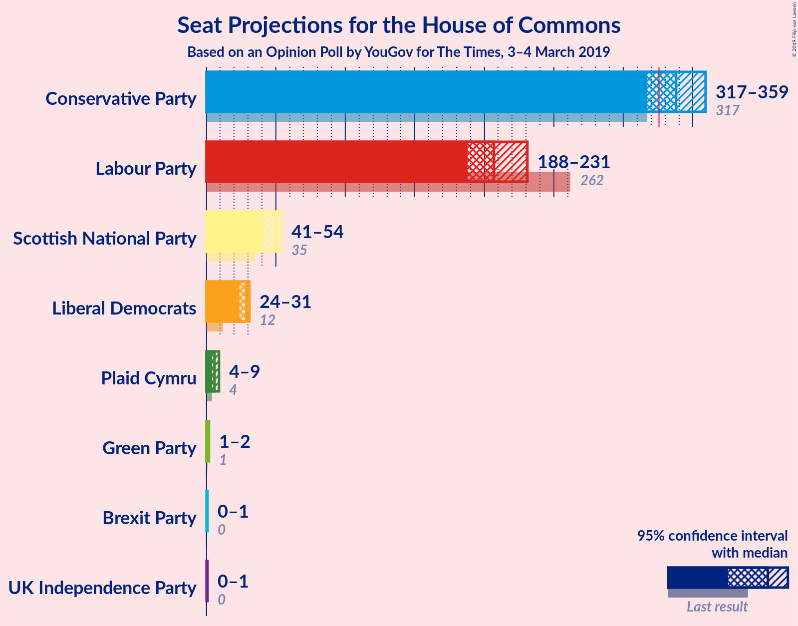

### Confidence Intervals

| Party | Last Result | Median | 80% Confidence Interval | 90% Confidence Interval | 95% Confidence Interval | 99% Confidence Interval |
|:-----:|:-----------:|:------:|:-----------------------:|:-----------------------:|:-----------------------:|:-----------------------:|
| <a href="#conservative-party">Conservative Party</a> | 317 | 341 | 337–341 |310–342 |310–365 |308–365 |
| <a href="#labour-party">Labour Party</a> | 262 | 210 | 202–219 |202–233 |185–233 |185–238 |
| <a href="#liberal-democrats">Liberal Democrats</a> | 12 | 29 | 28–30 |24–30 |24–30 |24–31 |
| <a href="#scottish-national-party">Scottish National Party</a> | 35 | 50 | 48–54 |41–54 |41–54 |41–54 |
| <a href="#green-party">Green Party</a> | 1 | 1 | 1 |1 |1 |1–2 |
| <a href="#uk-independence-party">UK Independence Party</a> | 0 | 0 | 0 |0–1 |0–1 |0–1 |
| <a href="#plaid-cymru">Plaid Cymru</a> | 4 | 5 | 4–6 |4–6 |3–6 |2–9 |

### Conservative Party

*For a full overview of the results for this party, see the [Conservative Party](party-conservativeparty.html) page.*

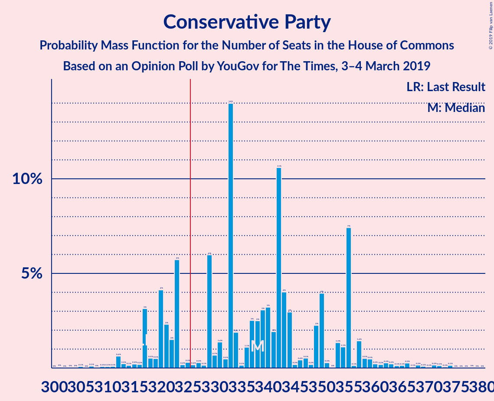

| Number of Seats | Probability | Accumulated | Special Marks |
|:---------------:|:-----------:|:-----------:|:-------------:|
| 308 | 0.9% | 100% |  |
| 309 | 0% | 99.1% |  |
| 310 | 4% | 99.1% |  |
| 311 | 0% | 95% |  |
| 312 | 0% | 95% |  |
| 313 | 0% | 95% |  |
| 314 | 0% | 95% |  |
| 315 | 0% | 95% |  |
| 316 | 0% | 95% |  |
| 317 | 0% | 95% | Last Result |
| 318 | 0% | 95% |  |
| 319 | 0% | 95% |  |
| 320 | 0% | 95% |  |
| 321 | 0% | 95% |  |
| 322 | 0% | 95% |  |
| 323 | 0% | 95% |  |
| 324 | 0% | 95% |  |
| 325 | 0% | 95% |  |
| 326 | 0% | 95% | Majority |
| 327 | 0% | 95% |  |
| 328 | 0% | 95% |  |
| 329 | 0% | 95% |  |
| 330 | 0% | 95% |  |
| 331 | 0% | 95% |  |
| 332 | 0% | 95% |  |
| 333 | 0% | 95% |  |
| 334 | 0.1% | 95% |  |
| 335 | 0% | 95% |  |
| 336 | 5% | 95% |  |
| 337 | 0.7% | 90% |  |
| 338 | 37% | 89% |  |
| 339 | 0.3% | 52% |  |
| 340 | 0% | 52% |  |
| 341 | 42% | 52% | Median |
| 342 | 6% | 10% |  |
| 343 | 0% | 3% |  |
| 344 | 0.6% | 3% |  |
| 345 | 0% | 3% |  |
| 346 | 0% | 3% |  |
| 347 | 0% | 3% |  |
| 348 | 0% | 3% |  |
| 349 | 0% | 3% |  |
| 350 | 0% | 3% |  |
| 351 | 0% | 3% |  |
| 352 | 0% | 3% |  |
| 353 | 0% | 3% |  |
| 354 | 0% | 3% |  |
| 355 | 0% | 3% |  |
| 356 | 0% | 3% |  |
| 357 | 0% | 3% |  |
| 358 | 0% | 3% |  |
| 359 | 0% | 3% |  |
| 360 | 0% | 3% |  |
| 361 | 0% | 3% |  |
| 362 | 0% | 3% |  |
| 363 | 0% | 3% |  |
| 364 | 0% | 3% |  |
| 365 | 3% | 3% |  |
| 366 | 0% | 0.1% |  |
| 367 | 0% | 0.1% |  |
| 368 | 0% | 0.1% |  |
| 369 | 0% | 0.1% |  |
| 370 | 0% | 0.1% |  |
| 371 | 0.1% | 0.1% |  |
| 372 | 0% | 0% |  |

### Labour Party

*For a full overview of the results for this party, see the [Labour Party](party-labourparty.html) page.*

| Number of Seats | Probability | Accumulated | Special Marks |
|:---------------:|:-----------:|:-----------:|:-------------:|
| 185 | 3% | 100% |  |
| 186 | 0% | 97% |  |
| 187 | 0% | 97% |  |
| 188 | 0% | 97% |  |
| 189 | 0% | 97% |  |
| 190 | 0% | 97% |  |
| 191 | 0.1% | 97% |  |
| 192 | 0% | 97% |  |
| 193 | 0% | 97% |  |
| 194 | 0% | 97% |  |
| 195 | 0% | 97% |  |
| 196 | 0% | 97% |  |
| 197 | 0% | 97% |  |
| 198 | 0% | 97% |  |
| 199 | 0% | 97% |  |
| 200 | 0% | 97% |  |
| 201 | 0.7% | 97% |  |
| 202 | 41% | 96% |  |
| 203 | 0% | 55% |  |
| 204 | 0.8% | 55% |  |
| 205 | 0% | 54% |  |
| 206 | 0% | 54% |  |
| 207 | 0.2% | 54% |  |
| 208 | 0% | 54% |  |
| 209 | 0.6% | 54% |  |
| 210 | 42% | 54% | Median |
| 211 | 0% | 12% |  |
| 212 | 0% | 12% |  |
| 213 | 0% | 12% |  |
| 214 | 0% | 12% |  |
| 215 | 0% | 12% |  |
| 216 | 0% | 12% |  |
| 217 | 0% | 12% |  |
| 218 | 0% | 12% |  |
| 219 | 6% | 12% |  |
| 220 | 0% | 5% |  |
| 221 | 0% | 5% |  |
| 222 | 0% | 5% |  |
| 223 | 0% | 5% |  |
| 224 | 0% | 5% |  |
| 225 | 0% | 5% |  |
| 226 | 0% | 5% |  |
| 227 | 0% | 5% |  |
| 228 | 0% | 5% |  |
| 229 | 0% | 5% |  |
| 230 | 0% | 5% |  |
| 231 | 0% | 5% |  |
| 232 | 0% | 5% |  |
| 233 | 4% | 5% |  |
| 234 | 0% | 0.9% |  |
| 235 | 0% | 0.9% |  |
| 236 | 0% | 0.9% |  |
| 237 | 0% | 0.9% |  |
| 238 | 0.9% | 0.9% |  |
| 239 | 0% | 0% |  |
| 240 | 0% | 0% |  |
| 241 | 0% | 0% |  |
| 242 | 0% | 0% |  |
| 243 | 0% | 0% |  |
| 244 | 0% | 0% |  |
| 245 | 0% | 0% |  |
| 246 | 0% | 0% |  |
| 247 | 0% | 0% |  |
| 248 | 0% | 0% |  |
| 249 | 0% | 0% |  |
| 250 | 0% | 0% |  |
| 251 | 0% | 0% |  |
| 252 | 0% | 0% |  |
| 253 | 0% | 0% |  |
| 254 | 0% | 0% |  |
| 255 | 0% | 0% |  |
| 256 | 0% | 0% |  |
| 257 | 0% | 0% |  |
| 258 | 0% | 0% |  |
| 259 | 0% | 0% |  |
| 260 | 0% | 0% |  |
| 261 | 0% | 0% |  |
| 262 | 0% | 0% | Last Result |

### Liberal Democrats

*For a full overview of the results for this party, see the [Liberal Democrats](party-liberaldemocrats.html) page.*

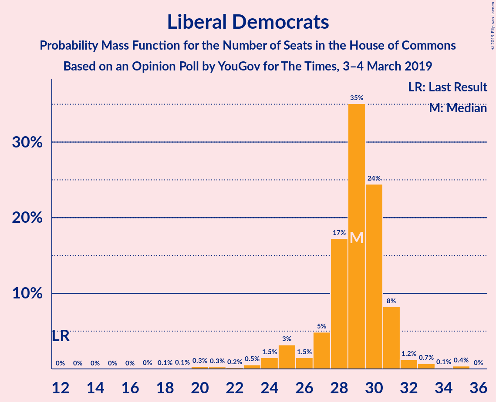

| Number of Seats | Probability | Accumulated | Special Marks |
|:---------------:|:-----------:|:-----------:|:-------------:|
| 12 | 0% | 100% | Last Result |
| 13 | 0% | 100% |  |
| 14 | 0% | 100% |  |
| 15 | 0% | 100% |  |
| 16 | 0% | 100% |  |
| 17 | 0% | 100% |  |
| 18 | 0% | 100% |  |
| 19 | 0% | 100% |  |
| 20 | 0% | 100% |  |
| 21 | 0% | 100% |  |
| 22 | 0% | 100% |  |
| 23 | 0% | 100% |  |
| 24 | 6% | 100% |  |
| 25 | 0% | 94% |  |
| 26 | 0.9% | 94% |  |
| 27 | 0.2% | 93% |  |
| 28 | 4% | 92% |  |
| 29 | 42% | 88% | Median |
| 30 | 45% | 46% |  |
| 31 | 0.8% | 0.8% |  |
| 32 | 0% | 0% |  |

### Scottish National Party

*For a full overview of the results for this party, see the [Scottish National Party](party-scottishnationalparty.html) page.*

| Number of Seats | Probability | Accumulated | Special Marks |
|:---------------:|:-----------:|:-----------:|:-------------:|
| 35 | 0% | 100% | Last Result |
| 36 | 0% | 100% |  |
| 37 | 0.1% | 100% |  |
| 38 | 0% | 99.9% |  |
| 39 | 0% | 99.9% |  |
| 40 | 0% | 99.9% |  |
| 41 | 6% | 99.9% |  |
| 42 | 0% | 93% |  |
| 43 | 0% | 93% |  |
| 44 | 0% | 93% |  |
| 45 | 0.6% | 93% |  |
| 46 | 0% | 93% |  |
| 47 | 0% | 93% |  |
| 48 | 40% | 93% |  |
| 49 | 0% | 53% |  |
| 50 | 6% | 53% | Median |
| 51 | 0.1% | 47% |  |
| 52 | 0% | 47% |  |
| 53 | 0.7% | 47% |  |
| 54 | 47% | 47% |  |
| 55 | 0.1% | 0.1% |  |
| 56 | 0% | 0% |  |

### Green Party

*For a full overview of the results for this party, see the [Green Party](party-greenparty.html) page.*

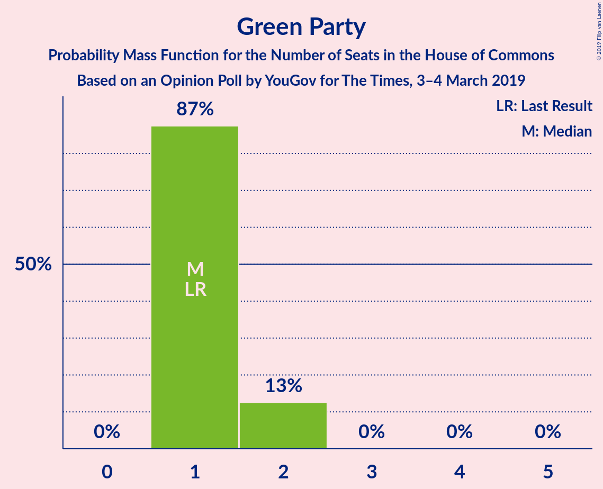

| Number of Seats | Probability | Accumulated | Special Marks |
|:---------------:|:-----------:|:-----------:|:-------------:|
| 1 | 98.7% | 100% | Last Result, Median |
| 2 | 1.3% | 1.3% |  |
| 3 | 0% | 0% |  |

### UK Independence Party

*For a full overview of the results for this party, see the [UK Independence Party](party-ukindependenceparty.html) page.*

| Number of Seats | Probability | Accumulated | Special Marks |
|:---------------:|:-----------:|:-----------:|:-------------:|
| 0 | 93% | 100% | Last Result, Median |
| 1 | 7% | 7% |  |
| 2 | 0% | 0% |  |

### Plaid Cymru

*For a full overview of the results for this party, see the [Plaid Cymru](party-plaidcymru.html) page.*

| Number of Seats | Probability | Accumulated | Special Marks |
|:---------------:|:-----------:|:-----------:|:-------------:|
| 0 | 0.2% | 100% |  |
| 1 | 0% | 99.8% |  |
| 2 | 0.6% | 99.8% |  |
| 3 | 4% | 99.1% |  |
| 4 | 42% | 96% | Last Result |
| 5 | 11% | 53% | Median |
| 6 | 42% | 43% |  |
| 7 | 0% | 0.8% |  |
| 8 | 0% | 0.8% |  |
| 9 | 0.7% | 0.7% |  |
| 10 | 0% | 0% |  |

## Coalitions

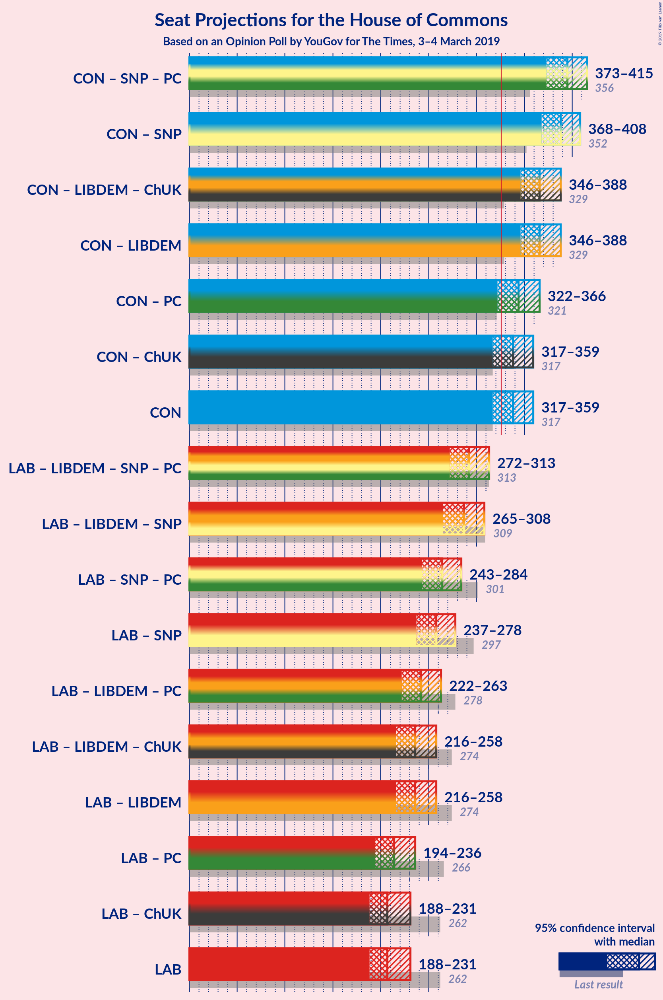

### Confidence Intervals

| Coalition | Last Result | Median | Majority? | 80% Confidence Interval | 90% Confidence Interval | 95% Confidence Interval | 99% Confidence Interval |
|:---------:|:-----------:|:------:|:---------:|:-----------------------:|:-----------------------:|:-----------------------:|:-----------------------:|
| Conservative Party – Scottish National Party – Plaid Cymru | 356 | 392 | 100% | 388–399 | 369–399 | 369–416 | 365–416 |
| Conservative Party – Scottish National Party | 352 | 386 | 100% | 383–395 | 364–395 | 364–413 | 362–413 |
| Conservative Party – Liberal Democrats | 329 | 367 | 100% | 366–371 | 338–371 | 338–395 | 334–395 |
| Conservative Party – Plaid Cymru | 321 | 345 | 95% | 342–346 | 315–347 | 315–368 | 311–368 |
| Conservative Party | 317 | 341 | 95% | 337–341 | 310–342 | 310–365 | 308–365 |
| Labour Party – Liberal Democrats – Scottish National Party – Plaid Cymru | 313 | 290 | 0% | 289–293 | 289–320 | 266–320 | 266–321 |
| Labour Party – Liberal Democrats – Scottish National Party | 309 | 286 | 0% | 284–289 | 284–315 | 263–315 | 263–318 |
| Labour Party – Scottish National Party – Plaid Cymru | 301 | 264 | 0% | 260–265 | 260–292 | 236–292 | 236–295 |
| Labour Party – Scottish National Party | 297 | 258 | 0% | 256–260 | 256–287 | 233–287 | 233–292 |
| Labour Party – Liberal Democrats – Plaid Cymru | 278 | 245 | 0% | 236–248 | 236–266 | 218–266 | 218–267 |
| Labour Party – Liberal Democrats | 274 | 239 | 0% | 232–243 | 232–261 | 215–261 | 215–264 |
| Labour Party – Plaid Cymru | 266 | 216 | 0% | 206–224 | 206–238 | 188–238 | 188–241 |
| Labour Party | 262 | 210 | 0% | 202–219 | 202–233 | 185–233 | 185–238 |

### Conservative Party – Scottish National Party – Plaid Cymru

| Number of Seats | Probability | Accumulated | Special Marks |
|:---------------:|:-----------:|:-----------:|:-------------:|
| 356 | 0% | 100% | Last Result |
| 357 | 0% | 100% |  |
| 358 | 0% | 100% |  |
| 359 | 0% | 100% |  |
| 360 | 0% | 100% |  |
| 361 | 0% | 100% |  |
| 362 | 0% | 100% |  |
| 363 | 0% | 100% |  |
| 364 | 0% | 100% |  |
| 365 | 0.9% | 100% |  |
| 366 | 0% | 99.1% |  |
| 367 | 0% | 99.1% |  |
| 368 | 0% | 99.1% |  |
| 369 | 4% | 99.1% |  |
| 370 | 0% | 95% |  |
| 371 | 0% | 95% |  |
| 372 | 0% | 95% |  |
| 373 | 0% | 95% |  |
| 374 | 0% | 95% |  |
| 375 | 0% | 95% |  |
| 376 | 0% | 95% |  |
| 377 | 0% | 95% |  |
| 378 | 0% | 95% |  |
| 379 | 0% | 95% |  |
| 380 | 0% | 95% |  |
| 381 | 0% | 95% |  |
| 382 | 0% | 95% |  |
| 383 | 0% | 95% |  |
| 384 | 0% | 95% |  |
| 385 | 0% | 95% |  |
| 386 | 0% | 95% |  |
| 387 | 0% | 95% |  |
| 388 | 6% | 95% |  |
| 389 | 0% | 88% |  |
| 390 | 0% | 88% |  |
| 391 | 0.6% | 88% |  |
| 392 | 42% | 88% |  |
| 393 | 0.2% | 46% |  |
| 394 | 0% | 46% |  |
| 395 | 0.8% | 46% |  |
| 396 | 0% | 45% | Median |
| 397 | 0% | 45% |  |
| 398 | 0% | 45% |  |
| 399 | 42% | 45% |  |
| 400 | 0% | 3% |  |
| 401 | 0% | 3% |  |
| 402 | 0% | 3% |  |
| 403 | 0% | 3% |  |
| 404 | 0% | 3% |  |
| 405 | 0% | 3% |  |
| 406 | 0% | 3% |  |
| 407 | 0% | 3% |  |
| 408 | 0% | 3% |  |
| 409 | 0% | 3% |  |
| 410 | 0% | 3% |  |
| 411 | 0% | 3% |  |
| 412 | 0% | 3% |  |
| 413 | 0.1% | 3% |  |
| 414 | 0% | 3% |  |
| 415 | 0% | 3% |  |
| 416 | 3% | 3% |  |
| 417 | 0% | 0% |  |

### Conservative Party – Scottish National Party

| Number of Seats | Probability | Accumulated | Special Marks |
|:---------------:|:-----------:|:-----------:|:-------------:|
| 352 | 0% | 100% | Last Result |
| 353 | 0% | 100% |  |
| 354 | 0% | 100% |  |
| 355 | 0% | 100% |  |
| 356 | 0% | 100% |  |
| 357 | 0% | 100% |  |
| 358 | 0% | 100% |  |
| 359 | 0% | 100% |  |
| 360 | 0% | 100% |  |
| 361 | 0% | 100% |  |
| 362 | 0.9% | 100% |  |
| 363 | 0% | 99.1% |  |
| 364 | 4% | 99.1% |  |
| 365 | 0% | 95% |  |
| 366 | 0% | 95% |  |
| 367 | 0% | 95% |  |
| 368 | 0% | 95% |  |
| 369 | 0% | 95% |  |
| 370 | 0% | 95% |  |
| 371 | 0% | 95% |  |
| 372 | 0% | 95% |  |
| 373 | 0% | 95% |  |
| 374 | 0% | 95% |  |
| 375 | 0% | 95% |  |
| 376 | 0% | 95% |  |
| 377 | 0% | 95% |  |
| 378 | 0% | 95% |  |
| 379 | 0% | 95% |  |
| 380 | 0% | 95% |  |
| 381 | 0% | 95% |  |
| 382 | 0% | 95% |  |
| 383 | 6% | 95% |  |
| 384 | 0% | 88% |  |
| 385 | 0% | 88% |  |
| 386 | 42% | 88% |  |
| 387 | 0% | 46% |  |
| 388 | 0% | 46% |  |
| 389 | 0.6% | 46% |  |
| 390 | 0.7% | 46% |  |
| 391 | 0.8% | 45% | Median |
| 392 | 0% | 44% |  |
| 393 | 0.2% | 44% |  |
| 394 | 0% | 44% |  |
| 395 | 41% | 44% |  |
| 396 | 0% | 3% |  |
| 397 | 0% | 3% |  |
| 398 | 0% | 3% |  |
| 399 | 0% | 3% |  |
| 400 | 0% | 3% |  |
| 401 | 0% | 3% |  |
| 402 | 0% | 3% |  |
| 403 | 0% | 3% |  |
| 404 | 0% | 3% |  |
| 405 | 0% | 3% |  |
| 406 | 0% | 3% |  |
| 407 | 0% | 3% |  |
| 408 | 0.1% | 3% |  |
| 409 | 0% | 3% |  |
| 410 | 0% | 3% |  |
| 411 | 0% | 3% |  |
| 412 | 0% | 3% |  |
| 413 | 3% | 3% |  |
| 414 | 0% | 0% |  |

### Conservative Party – Liberal Democrats

| Number of Seats | Probability | Accumulated | Special Marks |
|:---------------:|:-----------:|:-----------:|:-------------:|
| 329 | 0% | 100% | Last Result |
| 330 | 0% | 100% |  |
| 331 | 0% | 100% |  |
| 332 | 0% | 100% |  |
| 333 | 0% | 100% |  |
| 334 | 0.9% | 100% |  |
| 335 | 0% | 99.1% |  |
| 336 | 0% | 99.1% |  |
| 337 | 0% | 99.1% |  |
| 338 | 4% | 99.1% |  |
| 339 | 0% | 95% |  |
| 340 | 0% | 95% |  |
| 341 | 0% | 95% |  |
| 342 | 0% | 95% |  |
| 343 | 0% | 95% |  |
| 344 | 0% | 95% |  |
| 345 | 0% | 95% |  |
| 346 | 0% | 95% |  |
| 347 | 0% | 95% |  |
| 348 | 0% | 95% |  |
| 349 | 0% | 95% |  |
| 350 | 0% | 95% |  |
| 351 | 0% | 95% |  |
| 352 | 0% | 95% |  |
| 353 | 0% | 95% |  |
| 354 | 0% | 95% |  |
| 355 | 0% | 95% |  |
| 356 | 0% | 95% |  |
| 357 | 0% | 95% |  |
| 358 | 0.1% | 95% |  |
| 359 | 0% | 95% |  |
| 360 | 0% | 95% |  |
| 361 | 0% | 95% |  |
| 362 | 0% | 95% |  |
| 363 | 0% | 95% |  |
| 364 | 0% | 95% |  |
| 365 | 5% | 95% |  |
| 366 | 6% | 90% |  |
| 367 | 38% | 84% |  |
| 368 | 0% | 46% |  |
| 369 | 0.2% | 46% |  |
| 370 | 0% | 45% | Median |
| 371 | 41% | 45% |  |
| 372 | 0.7% | 4% |  |
| 373 | 0% | 3% |  |
| 374 | 0.6% | 3% |  |
| 375 | 0% | 3% |  |
| 376 | 0% | 3% |  |
| 377 | 0% | 3% |  |
| 378 | 0% | 3% |  |
| 379 | 0% | 3% |  |
| 380 | 0% | 3% |  |
| 381 | 0% | 3% |  |
| 382 | 0% | 3% |  |
| 383 | 0% | 3% |  |
| 384 | 0% | 3% |  |
| 385 | 0% | 3% |  |
| 386 | 0% | 3% |  |
| 387 | 0% | 3% |  |
| 388 | 0% | 3% |  |
| 389 | 0% | 3% |  |
| 390 | 0% | 3% |  |
| 391 | 0% | 3% |  |
| 392 | 0% | 3% |  |
| 393 | 0% | 3% |  |
| 394 | 0% | 3% |  |
| 395 | 3% | 3% |  |
| 396 | 0% | 0.1% |  |
| 397 | 0% | 0.1% |  |
| 398 | 0.1% | 0.1% |  |
| 399 | 0% | 0% |  |

### Conservative Party – Plaid Cymru

| Number of Seats | Probability | Accumulated | Special Marks |
|:---------------:|:-----------:|:-----------:|:-------------:|
| 311 | 0.9% | 100% |  |
| 312 | 0% | 99.1% |  |
| 313 | 0% | 99.1% |  |
| 314 | 0% | 99.1% |  |
| 315 | 4% | 99.1% |  |
| 316 | 0% | 95% |  |
| 317 | 0% | 95% |  |
| 318 | 0% | 95% |  |
| 319 | 0% | 95% |  |
| 320 | 0% | 95% |  |
| 321 | 0% | 95% | Last Result |
| 322 | 0% | 95% |  |
| 323 | 0% | 95% |  |
| 324 | 0% | 95% |  |
| 325 | 0% | 95% |  |
| 326 | 0% | 95% | Majority |
| 327 | 0% | 95% |  |
| 328 | 0% | 95% |  |
| 329 | 0% | 95% |  |
| 330 | 0% | 95% |  |
| 331 | 0% | 95% |  |
| 332 | 0% | 95% |  |
| 333 | 0% | 95% |  |
| 334 | 0% | 95% |  |
| 335 | 0% | 95% |  |
| 336 | 0% | 95% |  |
| 337 | 0% | 95% |  |
| 338 | 0% | 95% |  |
| 339 | 0.2% | 95% |  |
| 340 | 0% | 95% |  |
| 341 | 0% | 95% |  |
| 342 | 5% | 95% |  |
| 343 | 0% | 90% |  |
| 344 | 37% | 90% |  |
| 345 | 42% | 53% |  |
| 346 | 1.3% | 11% | Median |
| 347 | 6% | 9% |  |
| 348 | 0% | 3% |  |
| 349 | 0% | 3% |  |
| 350 | 0% | 3% |  |
| 351 | 0% | 3% |  |
| 352 | 0% | 3% |  |
| 353 | 0% | 3% |  |
| 354 | 0% | 3% |  |
| 355 | 0% | 3% |  |
| 356 | 0% | 3% |  |
| 357 | 0% | 3% |  |
| 358 | 0% | 3% |  |
| 359 | 0% | 3% |  |
| 360 | 0% | 3% |  |
| 361 | 0% | 3% |  |
| 362 | 0% | 3% |  |
| 363 | 0% | 3% |  |
| 364 | 0% | 3% |  |
| 365 | 0% | 3% |  |
| 366 | 0% | 3% |  |
| 367 | 0% | 3% |  |
| 368 | 3% | 3% |  |
| 369 | 0% | 0.1% |  |
| 370 | 0% | 0.1% |  |
| 371 | 0% | 0.1% |  |
| 372 | 0% | 0.1% |  |
| 373 | 0% | 0.1% |  |
| 374 | 0% | 0.1% |  |
| 375 | 0% | 0.1% |  |
| 376 | 0.1% | 0.1% |  |
| 377 | 0% | 0% |  |

### Conservative Party

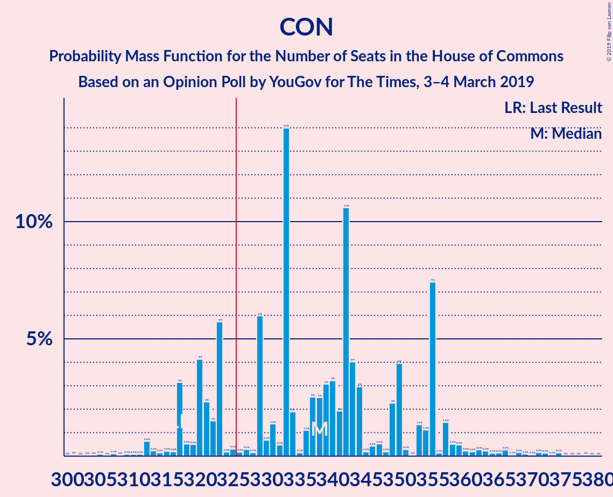

| Number of Seats | Probability | Accumulated | Special Marks |
|:---------------:|:-----------:|:-----------:|:-------------:|
| 308 | 0.9% | 100% |  |
| 309 | 0% | 99.1% |  |
| 310 | 4% | 99.1% |  |
| 311 | 0% | 95% |  |
| 312 | 0% | 95% |  |
| 313 | 0% | 95% |  |
| 314 | 0% | 95% |  |
| 315 | 0% | 95% |  |
| 316 | 0% | 95% |  |
| 317 | 0% | 95% | Last Result |
| 318 | 0% | 95% |  |
| 319 | 0% | 95% |  |
| 320 | 0% | 95% |  |
| 321 | 0% | 95% |  |
| 322 | 0% | 95% |  |
| 323 | 0% | 95% |  |
| 324 | 0% | 95% |  |
| 325 | 0% | 95% |  |
| 326 | 0% | 95% | Majority |
| 327 | 0% | 95% |  |
| 328 | 0% | 95% |  |
| 329 | 0% | 95% |  |
| 330 | 0% | 95% |  |
| 331 | 0% | 95% |  |
| 332 | 0% | 95% |  |
| 333 | 0% | 95% |  |
| 334 | 0.1% | 95% |  |
| 335 | 0% | 95% |  |
| 336 | 5% | 95% |  |
| 337 | 0.7% | 90% |  |
| 338 | 37% | 89% |  |
| 339 | 0.3% | 52% |  |
| 340 | 0% | 52% |  |
| 341 | 42% | 52% | Median |
| 342 | 6% | 10% |  |
| 343 | 0% | 3% |  |
| 344 | 0.6% | 3% |  |
| 345 | 0% | 3% |  |
| 346 | 0% | 3% |  |
| 347 | 0% | 3% |  |
| 348 | 0% | 3% |  |
| 349 | 0% | 3% |  |
| 350 | 0% | 3% |  |
| 351 | 0% | 3% |  |
| 352 | 0% | 3% |  |
| 353 | 0% | 3% |  |
| 354 | 0% | 3% |  |
| 355 | 0% | 3% |  |
| 356 | 0% | 3% |  |
| 357 | 0% | 3% |  |
| 358 | 0% | 3% |  |
| 359 | 0% | 3% |  |
| 360 | 0% | 3% |  |
| 361 | 0% | 3% |  |
| 362 | 0% | 3% |  |
| 363 | 0% | 3% |  |
| 364 | 0% | 3% |  |
| 365 | 3% | 3% |  |
| 366 | 0% | 0.1% |  |
| 367 | 0% | 0.1% |  |
| 368 | 0% | 0.1% |  |
| 369 | 0% | 0.1% |  |
| 370 | 0% | 0.1% |  |
| 371 | 0.1% | 0.1% |  |
| 372 | 0% | 0% |  |

### Labour Party – Liberal Democrats – Scottish National Party – Plaid Cymru

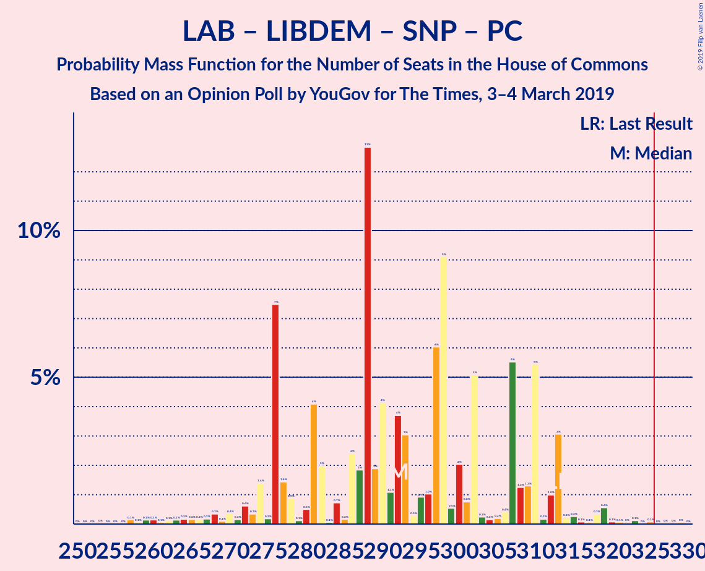

| Number of Seats | Probability | Accumulated | Special Marks |
|:---------------:|:-----------:|:-----------:|:-------------:|
| 260 | 0.1% | 100% |  |
| 261 | 0% | 99.9% |  |
| 262 | 0% | 99.9% |  |
| 263 | 0% | 99.9% |  |
| 264 | 0% | 99.9% |  |
| 265 | 0% | 99.9% |  |
| 266 | 3% | 99.9% |  |
| 267 | 0% | 97% |  |
| 268 | 0% | 97% |  |
| 269 | 0% | 97% |  |
| 270 | 0% | 97% |  |
| 271 | 0% | 97% |  |
| 272 | 0% | 97% |  |
| 273 | 0% | 97% |  |
| 274 | 0% | 97% |  |
| 275 | 0% | 97% |  |
| 276 | 0% | 97% |  |
| 277 | 0% | 97% |  |
| 278 | 0% | 97% |  |
| 279 | 0% | 97% |  |
| 280 | 0% | 97% |  |
| 281 | 0% | 97% |  |
| 282 | 0% | 97% |  |
| 283 | 0% | 97% |  |
| 284 | 0% | 97% |  |
| 285 | 0% | 97% |  |
| 286 | 0.6% | 97% |  |
| 287 | 0% | 97% |  |
| 288 | 0% | 97% |  |
| 289 | 7% | 97% |  |
| 290 | 41% | 89% |  |
| 291 | 0.3% | 48% |  |
| 292 | 0% | 48% |  |
| 293 | 38% | 48% |  |
| 294 | 0% | 10% | Median |
| 295 | 5% | 10% |  |
| 296 | 0% | 5% |  |
| 297 | 0% | 5% |  |
| 298 | 0% | 5% |  |
| 299 | 0% | 5% |  |
| 300 | 0% | 5% |  |
| 301 | 0% | 5% |  |
| 302 | 0% | 5% |  |
| 303 | 0% | 5% |  |
| 304 | 0% | 5% |  |
| 305 | 0% | 5% |  |
| 306 | 0% | 5% |  |
| 307 | 0% | 5% |  |
| 308 | 0% | 5% |  |
| 309 | 0% | 5% |  |
| 310 | 0% | 5% |  |
| 311 | 0% | 5% |  |
| 312 | 0% | 5% |  |
| 313 | 0% | 5% | Last Result |
| 314 | 0% | 5% |  |
| 315 | 0% | 5% |  |
| 316 | 0% | 5% |  |
| 317 | 0% | 5% |  |
| 318 | 0% | 5% |  |
| 319 | 0% | 5% |  |
| 320 | 4% | 5% |  |
| 321 | 0.9% | 0.9% |  |
| 322 | 0% | 0% |  |

### Labour Party – Liberal Democrats – Scottish National Party

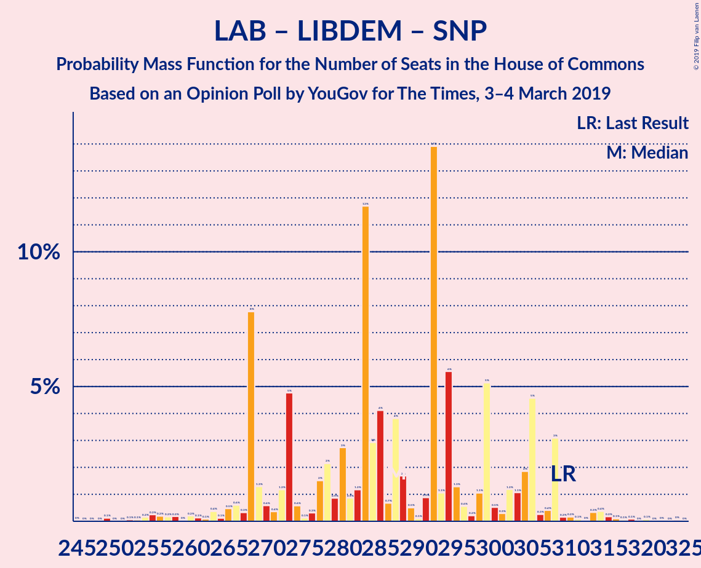

| Number of Seats | Probability | Accumulated | Special Marks |
|:---------------:|:-----------:|:-----------:|:-------------:|
| 255 | 0.1% | 100% |  |
| 256 | 0% | 99.9% |  |
| 257 | 0% | 99.9% |  |
| 258 | 0% | 99.9% |  |
| 259 | 0% | 99.9% |  |
| 260 | 0% | 99.9% |  |
| 261 | 0% | 99.9% |  |
| 262 | 0% | 99.9% |  |
| 263 | 3% | 99.9% |  |
| 264 | 0% | 97% |  |
| 265 | 0% | 97% |  |
| 266 | 0% | 97% |  |
| 267 | 0% | 97% |  |
| 268 | 0% | 97% |  |
| 269 | 0% | 97% |  |
| 270 | 0% | 97% |  |
| 271 | 0% | 97% |  |
| 272 | 0% | 97% |  |
| 273 | 0% | 97% |  |
| 274 | 0% | 97% |  |
| 275 | 0% | 97% |  |
| 276 | 0% | 97% |  |
| 277 | 0% | 97% |  |
| 278 | 0% | 97% |  |
| 279 | 0% | 97% |  |
| 280 | 0% | 97% |  |
| 281 | 0% | 97% |  |
| 282 | 0% | 97% |  |
| 283 | 0% | 97% |  |
| 284 | 8% | 97% |  |
| 285 | 0.8% | 89% |  |
| 286 | 41% | 89% |  |
| 287 | 37% | 47% |  |
| 288 | 0% | 10% |  |
| 289 | 5% | 10% | Median |
| 290 | 0% | 5% |  |
| 291 | 0.2% | 5% |  |
| 292 | 0% | 5% |  |
| 293 | 0% | 5% |  |
| 294 | 0% | 5% |  |
| 295 | 0.1% | 5% |  |
| 296 | 0% | 5% |  |
| 297 | 0% | 5% |  |
| 298 | 0% | 5% |  |
| 299 | 0% | 5% |  |
| 300 | 0% | 5% |  |
| 301 | 0% | 5% |  |
| 302 | 0% | 5% |  |
| 303 | 0% | 5% |  |
| 304 | 0% | 5% |  |
| 305 | 0% | 5% |  |
| 306 | 0% | 5% |  |
| 307 | 0% | 5% |  |
| 308 | 0% | 5% |  |
| 309 | 0% | 5% | Last Result |
| 310 | 0% | 5% |  |
| 311 | 0% | 5% |  |
| 312 | 0% | 5% |  |
| 313 | 0% | 5% |  |
| 314 | 0% | 5% |  |
| 315 | 4% | 5% |  |
| 316 | 0% | 0.9% |  |
| 317 | 0% | 0.9% |  |
| 318 | 0.9% | 0.9% |  |
| 319 | 0% | 0% |  |

### Labour Party – Scottish National Party – Plaid Cymru

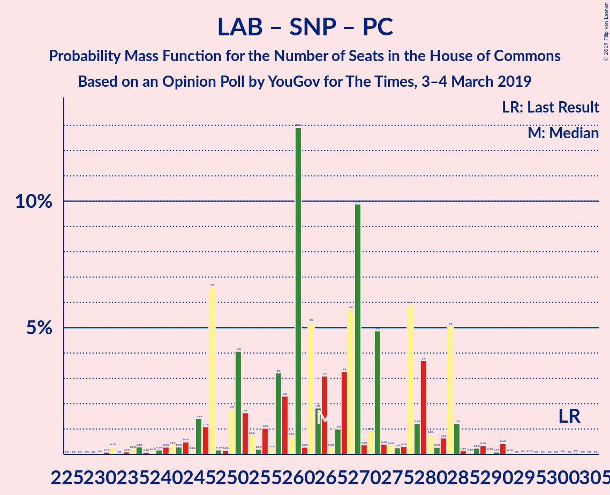

| Number of Seats | Probability | Accumulated | Special Marks |
|:---------------:|:-----------:|:-----------:|:-------------:|
| 233 | 0.1% | 100% |  |
| 234 | 0% | 99.9% |  |
| 235 | 0% | 99.9% |  |
| 236 | 3% | 99.9% |  |
| 237 | 0% | 97% |  |
| 238 | 0% | 97% |  |
| 239 | 0% | 97% |  |
| 240 | 0% | 97% |  |
| 241 | 0% | 97% |  |
| 242 | 0% | 97% |  |
| 243 | 0% | 97% |  |
| 244 | 0% | 97% |  |
| 245 | 0% | 97% |  |
| 246 | 0% | 97% |  |
| 247 | 0% | 97% |  |
| 248 | 0% | 97% |  |
| 249 | 0% | 97% |  |
| 250 | 0% | 97% |  |
| 251 | 0% | 97% |  |
| 252 | 0% | 97% |  |
| 253 | 0% | 97% |  |
| 254 | 0% | 97% |  |
| 255 | 0% | 97% |  |
| 256 | 0.6% | 97% |  |
| 257 | 0% | 97% |  |
| 258 | 0.7% | 97% |  |
| 259 | 0% | 96% |  |
| 260 | 41% | 96% |  |
| 261 | 0.3% | 55% |  |
| 262 | 0% | 54% |  |
| 263 | 0.7% | 54% |  |
| 264 | 37% | 54% |  |
| 265 | 6% | 16% | Median |
| 266 | 5% | 10% |  |
| 267 | 0% | 5% |  |
| 268 | 0% | 5% |  |
| 269 | 0% | 5% |  |
| 270 | 0% | 5% |  |
| 271 | 0% | 5% |  |
| 272 | 0% | 5% |  |
| 273 | 0% | 5% |  |
| 274 | 0% | 5% |  |
| 275 | 0% | 5% |  |
| 276 | 0% | 5% |  |
| 277 | 0% | 5% |  |
| 278 | 0% | 5% |  |
| 279 | 0% | 5% |  |
| 280 | 0% | 5% |  |
| 281 | 0% | 5% |  |
| 282 | 0% | 5% |  |
| 283 | 0% | 5% |  |
| 284 | 0% | 5% |  |
| 285 | 0% | 5% |  |
| 286 | 0% | 5% |  |
| 287 | 0% | 5% |  |
| 288 | 0% | 5% |  |
| 289 | 0% | 5% |  |
| 290 | 0% | 5% |  |
| 291 | 0% | 5% |  |
| 292 | 4% | 5% |  |
| 293 | 0% | 0.9% |  |
| 294 | 0% | 0.9% |  |
| 295 | 0.9% | 0.9% |  |
| 296 | 0% | 0% |  |
| 297 | 0% | 0% |  |
| 298 | 0% | 0% |  |
| 299 | 0% | 0% |  |
| 300 | 0% | 0% |  |
| 301 | 0% | 0% | Last Result |

### Labour Party – Scottish National Party

| Number of Seats | Probability | Accumulated | Special Marks |
|:---------------:|:-----------:|:-----------:|:-------------:|
| 228 | 0.1% | 100% |  |
| 229 | 0% | 99.9% |  |
| 230 | 0% | 99.9% |  |
| 231 | 0% | 99.9% |  |
| 232 | 0% | 99.9% |  |
| 233 | 3% | 99.9% |  |
| 234 | 0% | 97% |  |
| 235 | 0% | 97% |  |
| 236 | 0% | 97% |  |
| 237 | 0% | 97% |  |
| 238 | 0% | 97% |  |
| 239 | 0% | 97% |  |
| 240 | 0% | 97% |  |
| 241 | 0% | 97% |  |
| 242 | 0% | 97% |  |
| 243 | 0% | 97% |  |
| 244 | 0% | 97% |  |
| 245 | 0% | 97% |  |
| 246 | 0% | 97% |  |
| 247 | 0% | 97% |  |
| 248 | 0% | 97% |  |
| 249 | 0% | 97% |  |
| 250 | 0% | 97% |  |
| 251 | 0% | 97% |  |
| 252 | 0% | 97% |  |
| 253 | 0% | 97% |  |
| 254 | 2% | 97% |  |
| 255 | 0% | 95% |  |
| 256 | 41% | 95% |  |
| 257 | 0% | 54% |  |
| 258 | 37% | 54% |  |
| 259 | 0% | 17% |  |
| 260 | 11% | 17% | Median |
| 261 | 0.2% | 5% |  |
| 262 | 0% | 5% |  |
| 263 | 0% | 5% |  |
| 264 | 0% | 5% |  |
| 265 | 0% | 5% |  |
| 266 | 0% | 5% |  |
| 267 | 0% | 5% |  |
| 268 | 0% | 5% |  |
| 269 | 0% | 5% |  |
| 270 | 0% | 5% |  |
| 271 | 0% | 5% |  |
| 272 | 0% | 5% |  |
| 273 | 0% | 5% |  |
| 274 | 0% | 5% |  |
| 275 | 0% | 5% |  |
| 276 | 0% | 5% |  |
| 277 | 0% | 5% |  |
| 278 | 0% | 5% |  |
| 279 | 0% | 5% |  |
| 280 | 0% | 5% |  |
| 281 | 0% | 5% |  |
| 282 | 0% | 5% |  |
| 283 | 0% | 5% |  |
| 284 | 0% | 5% |  |
| 285 | 0% | 5% |  |
| 286 | 0% | 5% |  |
| 287 | 4% | 5% |  |
| 288 | 0% | 0.9% |  |
| 289 | 0% | 0.9% |  |
| 290 | 0% | 0.9% |  |
| 291 | 0% | 0.9% |  |
| 292 | 0.9% | 0.9% |  |
| 293 | 0% | 0% |  |
| 294 | 0% | 0% |  |
| 295 | 0% | 0% |  |
| 296 | 0% | 0% |  |
| 297 | 0% | 0% | Last Result |

### Labour Party – Liberal Democrats – Plaid Cymru

| Number of Seats | Probability | Accumulated | Special Marks |
|:---------------:|:-----------:|:-----------:|:-------------:|
| 218 | 3% | 100% |  |
| 219 | 0% | 97% |  |
| 220 | 0% | 97% |  |
| 221 | 0% | 97% |  |
| 222 | 0% | 97% |  |
| 223 | 0.1% | 97% |  |
| 224 | 0% | 97% |  |
| 225 | 0% | 97% |  |
| 226 | 0% | 97% |  |
| 227 | 0% | 97% |  |
| 228 | 0% | 97% |  |
| 229 | 0% | 97% |  |
| 230 | 0% | 97% |  |
| 231 | 0% | 97% |  |
| 232 | 0% | 97% |  |
| 233 | 0% | 97% |  |
| 234 | 0% | 97% |  |
| 235 | 0% | 97% |  |
| 236 | 41% | 97% |  |
| 237 | 0.2% | 56% |  |
| 238 | 0% | 56% |  |
| 239 | 0.8% | 56% |  |
| 240 | 0.7% | 55% |  |
| 241 | 0.6% | 54% |  |
| 242 | 0% | 54% |  |
| 243 | 0% | 54% |  |
| 244 | 0.1% | 54% | Median |
| 245 | 42% | 54% |  |
| 246 | 0% | 12% |  |
| 247 | 0% | 12% |  |
| 248 | 6% | 12% |  |
| 249 | 0% | 5% |  |
| 250 | 0% | 5% |  |
| 251 | 0% | 5% |  |
| 252 | 0% | 5% |  |
| 253 | 0% | 5% |  |
| 254 | 0% | 5% |  |
| 255 | 0% | 5% |  |
| 256 | 0% | 5% |  |
| 257 | 0% | 5% |  |
| 258 | 0% | 5% |  |
| 259 | 0% | 5% |  |
| 260 | 0% | 5% |  |
| 261 | 0% | 5% |  |
| 262 | 0% | 5% |  |
| 263 | 0% | 5% |  |
| 264 | 0% | 5% |  |
| 265 | 0% | 5% |  |
| 266 | 4% | 5% |  |
| 267 | 0.9% | 0.9% |  |
| 268 | 0% | 0% |  |
| 269 | 0% | 0% |  |
| 270 | 0% | 0% |  |
| 271 | 0% | 0% |  |
| 272 | 0% | 0% |  |
| 273 | 0% | 0% |  |
| 274 | 0% | 0% |  |
| 275 | 0% | 0% |  |
| 276 | 0% | 0% |  |
| 277 | 0% | 0% |  |
| 278 | 0% | 0% | Last Result |

### Labour Party – Liberal Democrats

| Number of Seats | Probability | Accumulated | Special Marks |
|:---------------:|:-----------:|:-----------:|:-------------:|
| 215 | 3% | 100% |  |
| 216 | 0% | 97% |  |
| 217 | 0% | 97% |  |
| 218 | 0.1% | 97% |  |
| 219 | 0% | 97% |  |
| 220 | 0% | 97% |  |
| 221 | 0% | 97% |  |
| 222 | 0% | 97% |  |
| 223 | 0% | 97% |  |
| 224 | 0% | 97% |  |
| 225 | 0% | 97% |  |
| 226 | 0% | 97% |  |
| 227 | 0% | 97% |  |
| 228 | 0% | 97% |  |
| 229 | 0% | 97% |  |
| 230 | 0% | 97% |  |
| 231 | 0.7% | 97% |  |
| 232 | 41% | 96% |  |
| 233 | 0% | 55% |  |
| 234 | 0% | 55% |  |
| 235 | 0.8% | 55% |  |
| 236 | 0% | 54% |  |
| 237 | 0.2% | 54% |  |
| 238 | 0% | 54% |  |
| 239 | 43% | 54% | Median |
| 240 | 0% | 12% |  |
| 241 | 0% | 12% |  |
| 242 | 0% | 12% |  |
| 243 | 6% | 12% |  |
| 244 | 0% | 5% |  |
| 245 | 0% | 5% |  |
| 246 | 0% | 5% |  |
| 247 | 0% | 5% |  |
| 248 | 0% | 5% |  |
| 249 | 0% | 5% |  |
| 250 | 0% | 5% |  |
| 251 | 0% | 5% |  |
| 252 | 0% | 5% |  |
| 253 | 0% | 5% |  |
| 254 | 0% | 5% |  |
| 255 | 0% | 5% |  |
| 256 | 0% | 5% |  |
| 257 | 0% | 5% |  |
| 258 | 0% | 5% |  |
| 259 | 0% | 5% |  |
| 260 | 0% | 5% |  |
| 261 | 4% | 5% |  |
| 262 | 0% | 0.9% |  |
| 263 | 0% | 0.9% |  |
| 264 | 0.9% | 0.9% |  |
| 265 | 0% | 0% |  |
| 266 | 0% | 0% |  |
| 267 | 0% | 0% |  |
| 268 | 0% | 0% |  |
| 269 | 0% | 0% |  |
| 270 | 0% | 0% |  |
| 271 | 0% | 0% |  |
| 272 | 0% | 0% |  |
| 273 | 0% | 0% |  |
| 274 | 0% | 0% | Last Result |

### Labour Party – Plaid Cymru

| Number of Seats | Probability | Accumulated | Special Marks |
|:---------------:|:-----------:|:-----------:|:-------------:|
| 188 | 3% | 100% |  |
| 189 | 0% | 97% |  |
| 190 | 0% | 97% |  |
| 191 | 0% | 97% |  |
| 192 | 0% | 97% |  |
| 193 | 0% | 97% |  |
| 194 | 0% | 97% |  |
| 195 | 0% | 97% |  |
| 196 | 0.1% | 97% |  |
| 197 | 0% | 97% |  |
| 198 | 0% | 97% |  |
| 199 | 0% | 97% |  |
| 200 | 0% | 97% |  |
| 201 | 0% | 97% |  |
| 202 | 0% | 97% |  |
| 203 | 0% | 97% |  |
| 204 | 0% | 97% |  |
| 205 | 0% | 97% |  |
| 206 | 41% | 97% |  |
| 207 | 0.3% | 56% |  |
| 208 | 0.8% | 56% |  |
| 209 | 0% | 55% |  |
| 210 | 0.7% | 55% |  |
| 211 | 0.6% | 54% |  |
| 212 | 0% | 54% |  |
| 213 | 0% | 54% |  |
| 214 | 0% | 54% |  |
| 215 | 0% | 54% | Median |
| 216 | 42% | 54% |  |
| 217 | 0.1% | 12% |  |
| 218 | 0% | 12% |  |
| 219 | 0% | 12% |  |
| 220 | 0% | 12% |  |
| 221 | 0% | 12% |  |
| 222 | 0% | 12% |  |
| 223 | 0% | 12% |  |
| 224 | 6% | 12% |  |
| 225 | 0% | 5% |  |
| 226 | 0% | 5% |  |
| 227 | 0% | 5% |  |
| 228 | 0% | 5% |  |
| 229 | 0% | 5% |  |
| 230 | 0% | 5% |  |
| 231 | 0% | 5% |  |
| 232 | 0% | 5% |  |
| 233 | 0% | 5% |  |
| 234 | 0% | 5% |  |
| 235 | 0% | 5% |  |
| 236 | 0% | 5% |  |
| 237 | 0% | 5% |  |
| 238 | 4% | 5% |  |
| 239 | 0% | 0.9% |  |
| 240 | 0% | 0.9% |  |
| 241 | 0.9% | 0.9% |  |
| 242 | 0% | 0% |  |
| 243 | 0% | 0% |  |
| 244 | 0% | 0% |  |
| 245 | 0% | 0% |  |
| 246 | 0% | 0% |  |
| 247 | 0% | 0% |  |
| 248 | 0% | 0% |  |
| 249 | 0% | 0% |  |
| 250 | 0% | 0% |  |
| 251 | 0% | 0% |  |
| 252 | 0% | 0% |  |
| 253 | 0% | 0% |  |
| 254 | 0% | 0% |  |
| 255 | 0% | 0% |  |
| 256 | 0% | 0% |  |
| 257 | 0% | 0% |  |
| 258 | 0% | 0% |  |
| 259 | 0% | 0% |  |
| 260 | 0% | 0% |  |
| 261 | 0% | 0% |  |
| 262 | 0% | 0% |  |
| 263 | 0% | 0% |  |
| 264 | 0% | 0% |  |
| 265 | 0% | 0% |  |
| 266 | 0% | 0% | Last Result |

### Labour Party

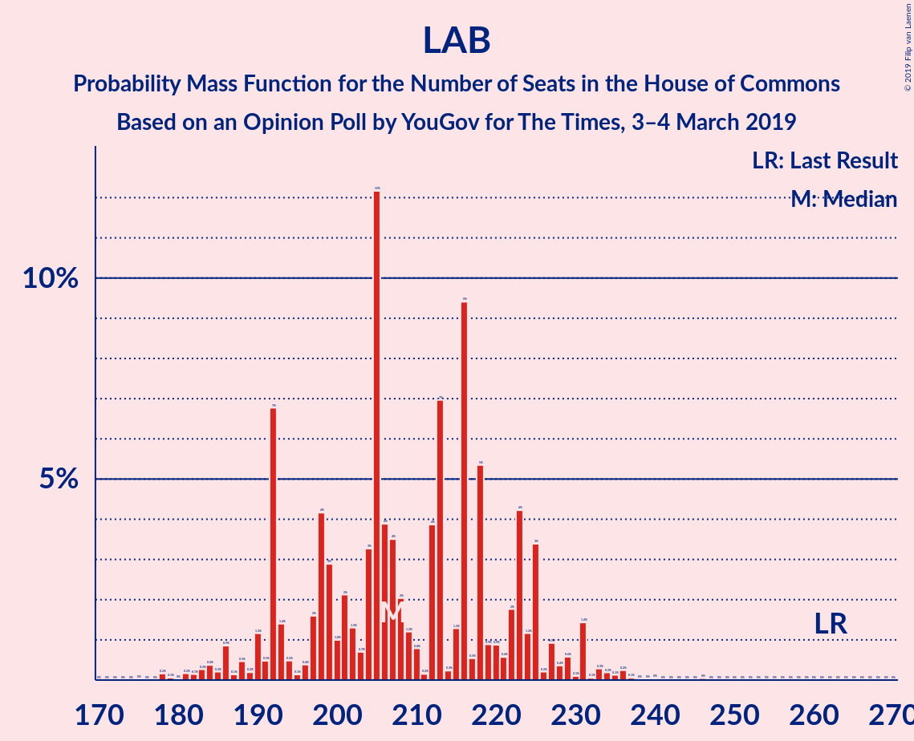

| Number of Seats | Probability | Accumulated | Special Marks |
|:---------------:|:-----------:|:-----------:|:-------------:|
| 185 | 3% | 100% |  |
| 186 | 0% | 97% |  |
| 187 | 0% | 97% |  |
| 188 | 0% | 97% |  |
| 189 | 0% | 97% |  |
| 190 | 0% | 97% |  |
| 191 | 0.1% | 97% |  |
| 192 | 0% | 97% |  |
| 193 | 0% | 97% |  |
| 194 | 0% | 97% |  |
| 195 | 0% | 97% |  |
| 196 | 0% | 97% |  |
| 197 | 0% | 97% |  |
| 198 | 0% | 97% |  |
| 199 | 0% | 97% |  |
| 200 | 0% | 97% |  |
| 201 | 0.7% | 97% |  |
| 202 | 41% | 96% |  |
| 203 | 0% | 55% |  |
| 204 | 0.8% | 55% |  |
| 205 | 0% | 54% |  |
| 206 | 0% | 54% |  |
| 207 | 0.2% | 54% |  |
| 208 | 0% | 54% |  |
| 209 | 0.6% | 54% |  |
| 210 | 42% | 54% | Median |
| 211 | 0% | 12% |  |
| 212 | 0% | 12% |  |
| 213 | 0% | 12% |  |
| 214 | 0% | 12% |  |
| 215 | 0% | 12% |  |
| 216 | 0% | 12% |  |
| 217 | 0% | 12% |  |
| 218 | 0% | 12% |  |
| 219 | 6% | 12% |  |
| 220 | 0% | 5% |  |
| 221 | 0% | 5% |  |
| 222 | 0% | 5% |  |
| 223 | 0% | 5% |  |
| 224 | 0% | 5% |  |
| 225 | 0% | 5% |  |
| 226 | 0% | 5% |  |
| 227 | 0% | 5% |  |
| 228 | 0% | 5% |  |
| 229 | 0% | 5% |  |
| 230 | 0% | 5% |  |
| 231 | 0% | 5% |  |
| 232 | 0% | 5% |  |
| 233 | 4% | 5% |  |
| 234 | 0% | 0.9% |  |
| 235 | 0% | 0.9% |  |
| 236 | 0% | 0.9% |  |
| 237 | 0% | 0.9% |  |
| 238 | 0.9% | 0.9% |  |
| 239 | 0% | 0% |  |
| 240 | 0% | 0% |  |
| 241 | 0% | 0% |  |
| 242 | 0% | 0% |  |
| 243 | 0% | 0% |  |
| 244 | 0% | 0% |  |
| 245 | 0% | 0% |  |
| 246 | 0% | 0% |  |
| 247 | 0% | 0% |  |
| 248 | 0% | 0% |  |
| 249 | 0% | 0% |  |
| 250 | 0% | 0% |  |
| 251 | 0% | 0% |  |
| 252 | 0% | 0% |  |
| 253 | 0% | 0% |  |
| 254 | 0% | 0% |  |
| 255 | 0% | 0% |  |
| 256 | 0% | 0% |  |
| 257 | 0% | 0% |  |
| 258 | 0% | 0% |  |
| 259 | 0% | 0% |  |
| 260 | 0% | 0% |  |
| 261 | 0% | 0% |  |
| 262 | 0% | 0% | Last Result |

## Technical Information

### Opinion Poll

+ **Polling firm:** YouGov
+ **Commissioner(s):** The Times
+ **Fieldwork period:** 3–4 March 2019

### Calculations

+ **Sample size:** 2172
+ **Simulations done:** 1,024
+ **Error estimate:** 2.64%

