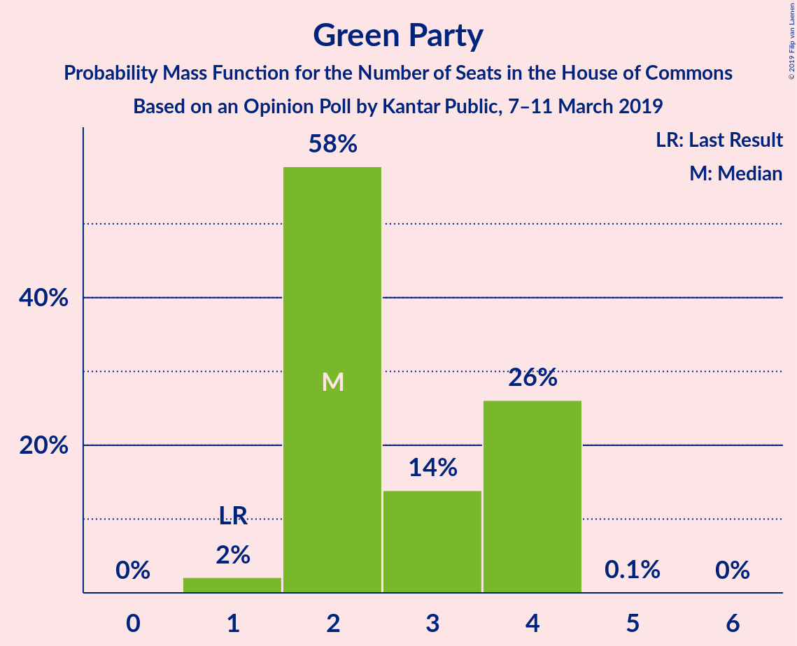
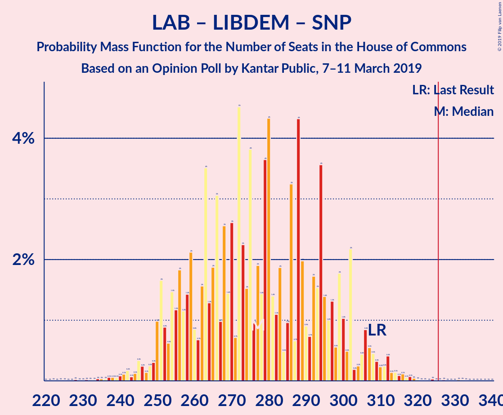

# Opinion Poll by Kantar Public, 7–11 March 2019

<a href="#voting-intentions">Voting Intentions</a> | <a href="#seats">Seats</a> | <a href="#coalitions">Coalitions</a> | <a href="#technical-information">Technical Information</a>

## Voting Intentions

### Confidence Intervals

| Party | Last Result | Poll Result | 80% Confidence Interval | 90% Confidence Interval | 95% Confidence Interval | 99% Confidence Interval |
|:-----:|:-----------:|:-----------:|:-----------------------:|:-----------------------:|:-----------------------:|:-----------------------:|
| Conservative Party | 42.4% | 41.4% | 39.6–43.3% |39.0–43.8% |38.6–44.3% |37.7–45.2% |
| Labour Party | 40.0% | 31.3% | 29.6–33.1% |29.1–33.6% |28.7–34.1% |27.9–34.9% |
| Liberal Democrats | 7.4% | 8.1% | 7.1–9.2% |6.9–9.5% |6.6–9.8% |6.2–10.4% |
| UK Independence Party | 1.8% | 6.1% | 5.3–7.1% |5.0–7.4% |4.8–7.6% |4.5–8.1% |
| Green Party | 1.6% | 6.1% | 5.3–7.1% |5.0–7.4% |4.8–7.6% |4.5–8.1% |
| Scottish National Party | 3.0% | 5.0% | 4.3–6.0% |4.1–6.2% |3.9–6.5% |3.6–6.9% |

*Note:* The poll result column reflects the actual value used in the calculations. Published results may vary slightly, and in addition be rounded to fewer digits.

## Seats

### Confidence Intervals

| Party | Last Result | Median | 80% Confidence Interval | 90% Confidence Interval | 95% Confidence Interval | 99% Confidence Interval |
|:-----:|:-----------:|:------:|:-----------------------:|:-----------------------:|:-----------------------:|:-----------------------:|
| <a href="#conservative-party">Conservative Party</a> | 317 | 355 | 336–355 |320–366 |313–370 |292–376 |
| <a href="#labour-party">Labour Party</a> | 262 | 200 | 200–214 |196–233 |186–236 |179–254 |
| <a href="#liberal-democrats">Liberal Democrats</a> | 12 | 13 | 13–17 |13–20 |10–23 |4–29 |
| <a href="#uk-independence-party">UK Independence Party</a> | 0 | 2 | 1–2 |1–2 |1–2 |1–2 |
| <a href="#green-party">Green Party</a> | 1 | 4 | 3–4 |2–4 |2–4 |1–4 |
| <a href="#scottish-national-party">Scottish National Party</a> | 35 | 54 | 54–57 |54–57 |51–58 |41–58 |

### Conservative Party

*For a full overview of the results for this party, see the [Conservative Party](party-conservativeparty.html) page.*

| Number of Seats | Probability | Accumulated | Special Marks |
|:---------------:|:-----------:|:-----------:|:-------------:|
| 292 | 0.9% | 100% |  |
| 293 | 0% | 99.1% |  |
| 294 | 0% | 99.1% |  |
| 295 | 0% | 99.1% |  |
| 296 | 0% | 99.1% |  |
| 297 | 0% | 99.1% |  |
| 298 | 0% | 99.1% |  |
| 299 | 0% | 99.1% |  |
| 300 | 0% | 99.1% |  |
| 301 | 0% | 99.1% |  |
| 302 | 0% | 99.1% |  |
| 303 | 0% | 99.1% |  |
| 304 | 0% | 99.1% |  |
| 305 | 0% | 99.1% |  |
| 306 | 0% | 99.1% |  |
| 307 | 0% | 99.1% |  |
| 308 | 0.4% | 99.1% |  |
| 309 | 0% | 98.7% |  |
| 310 | 0% | 98.7% |  |
| 311 | 0% | 98.7% |  |
| 312 | 0.2% | 98.7% |  |
| 313 | 3% | 98.5% |  |
| 314 | 0% | 95% |  |
| 315 | 0% | 95% |  |
| 316 | 0% | 95% |  |
| 317 | 0% | 95% | Last Result |
| 318 | 0% | 95% |  |
| 319 | 0% | 95% |  |
| 320 | 2% | 95% |  |
| 321 | 0% | 94% |  |
| 322 | 1.4% | 94% |  |
| 323 | 0% | 92% |  |
| 324 | 0% | 92% |  |
| 325 | 0.3% | 92% |  |
| 326 | 0% | 92% | Majority |
| 327 | 0% | 92% |  |
| 328 | 0.5% | 92% |  |
| 329 | 0% | 91% |  |
| 330 | 0% | 91% |  |
| 331 | 0% | 91% |  |
| 332 | 0% | 91% |  |
| 333 | 0% | 91% |  |
| 334 | 0% | 91% |  |
| 335 | 0% | 91% |  |
| 336 | 1.5% | 91% |  |
| 337 | 0% | 90% |  |
| 338 | 0% | 90% |  |
| 339 | 0.2% | 90% |  |
| 340 | 0.6% | 90% |  |
| 341 | 0% | 89% |  |
| 342 | 0.1% | 89% |  |
| 343 | 0% | 89% |  |
| 344 | 0% | 89% |  |
| 345 | 0.1% | 89% |  |
| 346 | 0% | 89% |  |
| 347 | 0% | 89% |  |
| 348 | 0.3% | 89% |  |
| 349 | 0% | 89% |  |
| 350 | 0% | 89% |  |
| 351 | 0% | 89% |  |
| 352 | 0.5% | 89% |  |
| 353 | 0% | 88% |  |
| 354 | 0% | 88% |  |
| 355 | 80% | 88% | Median |
| 356 | 0% | 8% |  |
| 357 | 0% | 8% |  |
| 358 | 2% | 8% |  |
| 359 | 0% | 5% |  |
| 360 | 0% | 5% |  |
| 361 | 0% | 5% |  |
| 362 | 0% | 5% |  |
| 363 | 0% | 5% |  |
| 364 | 0% | 5% |  |
| 365 | 0% | 5% |  |
| 366 | 0.8% | 5% |  |
| 367 | 1.1% | 5% |  |
| 368 | 0% | 4% |  |
| 369 | 0% | 4% |  |
| 370 | 2% | 3% |  |
| 371 | 0% | 1.5% |  |
| 372 | 0% | 1.4% |  |
| 373 | 0% | 1.4% |  |
| 374 | 0% | 1.4% |  |
| 375 | 0% | 1.4% |  |
| 376 | 1.2% | 1.4% |  |
| 377 | 0% | 0.2% |  |
| 378 | 0% | 0.2% |  |
| 379 | 0% | 0.2% |  |
| 380 | 0% | 0.2% |  |
| 381 | 0% | 0.2% |  |
| 382 | 0% | 0.2% |  |
| 383 | 0.1% | 0.2% |  |
| 384 | 0% | 0.2% |  |
| 385 | 0% | 0.2% |  |
| 386 | 0.1% | 0.2% |  |
| 387 | 0% | 0.1% |  |
| 388 | 0% | 0.1% |  |
| 389 | 0% | 0.1% |  |
| 390 | 0% | 0.1% |  |
| 391 | 0% | 0.1% |  |
| 392 | 0% | 0.1% |  |
| 393 | 0% | 0.1% |  |
| 394 | 0% | 0.1% |  |
| 395 | 0% | 0.1% |  |
| 396 | 0% | 0.1% |  |
| 397 | 0% | 0.1% |  |
| 398 | 0% | 0.1% |  |
| 399 | 0% | 0.1% |  |
| 400 | 0% | 0.1% |  |
| 401 | 0% | 0.1% |  |
| 402 | 0.1% | 0.1% |  |
| 403 | 0% | 0% |  |

### Labour Party

*For a full overview of the results for this party, see the [Labour Party](party-labourparty.html) page.*

| Number of Seats | Probability | Accumulated | Special Marks |
|:---------------:|:-----------:|:-----------:|:-------------:|
| 162 | 0.1% | 100% |  |
| 163 | 0.1% | 99.9% |  |
| 164 | 0% | 99.8% |  |
| 165 | 0% | 99.8% |  |
| 166 | 0% | 99.8% |  |
| 167 | 0% | 99.8% |  |
| 168 | 0% | 99.8% |  |
| 169 | 0% | 99.8% |  |
| 170 | 0% | 99.8% |  |
| 171 | 0% | 99.8% |  |
| 172 | 0% | 99.8% |  |
| 173 | 0% | 99.8% |  |
| 174 | 0% | 99.8% |  |
| 175 | 0% | 99.8% |  |
| 176 | 0% | 99.8% |  |
| 177 | 0% | 99.8% |  |
| 178 | 0% | 99.8% |  |
| 179 | 1.1% | 99.8% |  |
| 180 | 0.1% | 98.7% |  |
| 181 | 0.1% | 98.7% |  |
| 182 | 0% | 98.6% |  |
| 183 | 0% | 98.6% |  |
| 184 | 0% | 98.5% |  |
| 185 | 0% | 98.5% |  |
| 186 | 3% | 98.5% |  |
| 187 | 0% | 95% |  |
| 188 | 0% | 95% |  |
| 189 | 0% | 95% |  |
| 190 | 0% | 95% |  |
| 191 | 0% | 95% |  |
| 192 | 0% | 95% |  |
| 193 | 0% | 95% |  |
| 194 | 0.1% | 95% |  |
| 195 | 0% | 95% |  |
| 196 | 2% | 95% |  |
| 197 | 0% | 93% |  |
| 198 | 0.5% | 93% |  |
| 199 | 0% | 92% |  |
| 200 | 81% | 92% | Median |
| 201 | 0% | 12% |  |
| 202 | 0.1% | 12% |  |
| 203 | 0% | 11% |  |
| 204 | 0.2% | 11% |  |
| 205 | 0% | 11% |  |
| 206 | 0.1% | 11% |  |
| 207 | 0.1% | 11% |  |
| 208 | 0.1% | 11% |  |
| 209 | 0% | 11% |  |
| 210 | 0% | 11% |  |
| 211 | 0% | 11% |  |
| 212 | 0% | 11% |  |
| 213 | 0% | 11% |  |
| 214 | 1.3% | 11% |  |
| 215 | 0% | 10% |  |
| 216 | 0% | 10% |  |
| 217 | 0% | 10% |  |
| 218 | 0% | 10% |  |
| 219 | 0.2% | 10% |  |
| 220 | 0.9% | 10% |  |
| 221 | 2% | 9% |  |
| 222 | 0% | 7% |  |
| 223 | 0% | 7% |  |
| 224 | 0% | 7% |  |
| 225 | 0.5% | 7% |  |
| 226 | 0% | 7% |  |
| 227 | 0% | 7% |  |
| 228 | 0% | 7% |  |
| 229 | 0% | 7% |  |
| 230 | 0% | 7% |  |
| 231 | 0% | 7% |  |
| 232 | 1.4% | 7% |  |
| 233 | 0.3% | 5% |  |
| 234 | 0.4% | 5% |  |
| 235 | 0% | 4% |  |
| 236 | 3% | 4% |  |
| 237 | 0% | 1.1% |  |
| 238 | 0% | 1.1% |  |
| 239 | 0% | 1.1% |  |
| 240 | 0% | 1.1% |  |
| 241 | 0% | 1.1% |  |
| 242 | 0% | 1.1% |  |
| 243 | 0.2% | 1.1% |  |
| 244 | 0% | 0.9% |  |
| 245 | 0% | 0.9% |  |
| 246 | 0% | 0.9% |  |
| 247 | 0% | 0.9% |  |
| 248 | 0% | 0.9% |  |
| 249 | 0% | 0.9% |  |
| 250 | 0% | 0.9% |  |
| 251 | 0% | 0.9% |  |
| 252 | 0% | 0.9% |  |
| 253 | 0% | 0.9% |  |
| 254 | 0.9% | 0.9% |  |
| 255 | 0% | 0% |  |
| 256 | 0% | 0% |  |
| 257 | 0% | 0% |  |
| 258 | 0% | 0% |  |
| 259 | 0% | 0% |  |
| 260 | 0% | 0% |  |
| 261 | 0% | 0% |  |
| 262 | 0% | 0% | Last Result |

### Liberal Democrats

*For a full overview of the results for this party, see the [Liberal Democrats](party-liberaldemocrats.html) page.*

| Number of Seats | Probability | Accumulated | Special Marks |
|:---------------:|:-----------:|:-----------:|:-------------:|
| 3 | 0.1% | 100% |  |
| 4 | 0.6% | 99.9% |  |
| 5 | 0% | 99.3% |  |
| 6 | 0.1% | 99.3% |  |
| 7 | 0% | 99.2% |  |
| 8 | 0.3% | 99.2% |  |
| 9 | 0.2% | 98.9% |  |
| 10 | 1.2% | 98.7% |  |
| 11 | 1.4% | 97% |  |
| 12 | 0.3% | 96% | Last Result |
| 13 | 80% | 96% | Median |
| 14 | 2% | 16% |  |
| 15 | 3% | 14% |  |
| 16 | 0.6% | 11% |  |
| 17 | 0.5% | 10% |  |
| 18 | 5% | 10% |  |
| 19 | 0% | 5% |  |
| 20 | 0.8% | 5% |  |
| 21 | 0% | 5% |  |
| 22 | 1.0% | 5% |  |
| 23 | 1.1% | 4% |  |
| 24 | 0.1% | 2% |  |
| 25 | 0% | 2% |  |
| 26 | 0% | 2% |  |
| 27 | 0% | 2% |  |
| 28 | 0.2% | 2% |  |
| 29 | 2% | 2% |  |
| 30 | 0.1% | 0.1% |  |
| 31 | 0% | 0% |  |

### UK Independence Party

*For a full overview of the results for this party, see the [UK Independence Party](party-ukindependenceparty.html) page.*

| Number of Seats | Probability | Accumulated | Special Marks |
|:---------------:|:-----------:|:-----------:|:-------------:|
| 0 | 0% | 100% | Last Result |
| 1 | 14% | 100% |  |
| 2 | 86% | 86% | Median |
| 3 | 0% | 0% |  |

### Green Party

*For a full overview of the results for this party, see the [Green Party](party-greenparty.html) page.*

| Number of Seats | Probability | Accumulated | Special Marks |
|:---------------:|:-----------:|:-----------:|:-------------:|
| 1 | 1.0% | 100% | Last Result |
| 2 | 6% | 99.0% |  |
| 3 | 5% | 93% |  |
| 4 | 88% | 88% | Median |
| 5 | 0% | 0% |  |

### Scottish National Party

*For a full overview of the results for this party, see the [Scottish National Party](party-scottishnationalparty.html) page.*

| Number of Seats | Probability | Accumulated | Special Marks |
|:---------------:|:-----------:|:-----------:|:-------------:|
| 35 | 0% | 100% | Last Result |
| 36 | 0% | 100% |  |
| 37 | 0% | 100% |  |
| 38 | 0% | 100% |  |
| 39 | 0% | 100% |  |
| 40 | 0% | 100% |  |
| 41 | 0.8% | 100% |  |
| 42 | 0% | 99.2% |  |
| 43 | 0% | 99.2% |  |
| 44 | 0% | 99.2% |  |
| 45 | 0.3% | 99.2% |  |
| 46 | 0% | 98.9% |  |
| 47 | 0% | 98.8% |  |
| 48 | 0% | 98.8% |  |
| 49 | 0% | 98.8% |  |
| 50 | 1.3% | 98.8% |  |
| 51 | 0.1% | 98% |  |
| 52 | 0.3% | 97% |  |
| 53 | 0% | 97% |  |
| 54 | 82% | 97% | Median |
| 55 | 2% | 15% |  |
| 56 | 0.1% | 13% |  |
| 57 | 10% | 13% |  |
| 58 | 3% | 3% |  |
| 59 | 0.3% | 0.3% |  |
| 60 | 0% | 0% |  |

## Coalitions

### Confidence Intervals

| Coalition | Last Result | Median | Majority? | 80% Confidence Interval | 90% Confidence Interval | 95% Confidence Interval | 99% Confidence Interval |
|:---------:|:-----------:|:------:|:---------:|:-----------------------:|:-----------------------:|:-----------------------:|:-----------------------:|
| Conservative Party – Scottish National Party | 352 | 409 | 100% | 393–409 | 374–415 | 370–425 | 349–426 |
| Conservative Party – Liberal Democrats | 329 | 368 | 98.9% | 354–368 | 333–384 | 331–386 | 314–390 |
| Conservative Party | 317 | 355 | 92% | 336–355 | 320–366 | 313–370 | 292–376 |
| Labour Party – Liberal Democrats – Scottish National Party | 309 | 267 | 0.9% | 267–286 | 261–304 | 255–311 | 246–333 |
| Labour Party – Scottish National Party | 297 | 254 | 0% | 254–271 | 241–290 | 236–293 | 236–311 |
| Labour Party – Liberal Democrats | 274 | 213 | 0% | 213–232 | 211–250 | 200–254 | 196–276 |
| Labour Party | 262 | 200 | 0% | 200–214 | 196–233 | 186–236 | 179–254 |

### Conservative Party – Scottish National Party

| Number of Seats | Probability | Accumulated | Special Marks |
|:---------------:|:-----------:|:-----------:|:-------------:|
| 349 | 0.9% | 100% |  |
| 350 | 0% | 99.1% |  |
| 351 | 0% | 99.1% |  |
| 352 | 0% | 99.1% | Last Result |
| 353 | 0% | 99.1% |  |
| 354 | 0% | 99.1% |  |
| 355 | 0% | 99.1% |  |
| 356 | 0% | 99.1% |  |
| 357 | 0% | 99.1% |  |
| 358 | 0% | 99.1% |  |
| 359 | 0% | 99.1% |  |
| 360 | 0% | 99.1% |  |
| 361 | 0% | 99.1% |  |
| 362 | 0.4% | 99.1% |  |
| 363 | 0% | 98.7% |  |
| 364 | 0% | 98.7% |  |
| 365 | 0% | 98.7% |  |
| 366 | 0% | 98.7% |  |
| 367 | 0% | 98.7% |  |
| 368 | 0% | 98.7% |  |
| 369 | 0% | 98.7% |  |
| 370 | 3% | 98.7% |  |
| 371 | 0% | 95% |  |
| 372 | 0% | 95% |  |
| 373 | 0% | 95% |  |
| 374 | 2% | 95% |  |
| 375 | 0% | 94% |  |
| 376 | 0% | 94% |  |
| 377 | 0% | 94% |  |
| 378 | 0% | 94% |  |
| 379 | 0% | 94% |  |
| 380 | 1.4% | 94% |  |
| 381 | 0% | 92% |  |
| 382 | 0.5% | 92% |  |
| 383 | 0.3% | 92% |  |
| 384 | 0% | 91% |  |
| 385 | 0% | 91% |  |
| 386 | 0% | 91% |  |
| 387 | 0% | 91% |  |
| 388 | 0% | 91% |  |
| 389 | 0% | 91% |  |
| 390 | 0% | 91% |  |
| 391 | 0.2% | 91% |  |
| 392 | 0.1% | 91% |  |
| 393 | 2% | 91% |  |
| 394 | 0.2% | 89% |  |
| 395 | 0% | 89% |  |
| 396 | 0% | 89% |  |
| 397 | 0% | 89% |  |
| 398 | 0.6% | 89% |  |
| 399 | 0% | 89% |  |
| 400 | 0% | 89% |  |
| 401 | 0% | 89% |  |
| 402 | 0% | 89% |  |
| 403 | 0% | 89% |  |
| 404 | 0% | 89% |  |
| 405 | 0% | 89% |  |
| 406 | 0% | 89% |  |
| 407 | 0.9% | 89% |  |
| 408 | 0% | 88% |  |
| 409 | 80% | 88% | Median |
| 410 | 0% | 7% |  |
| 411 | 0% | 7% |  |
| 412 | 0% | 7% |  |
| 413 | 0% | 7% |  |
| 414 | 0% | 7% |  |
| 415 | 2% | 7% |  |
| 416 | 0% | 5% |  |
| 417 | 0% | 5% |  |
| 418 | 0% | 5% |  |
| 419 | 0% | 5% |  |
| 420 | 0% | 5% |  |
| 421 | 0.1% | 5% |  |
| 422 | 0% | 4% |  |
| 423 | 0% | 4% |  |
| 424 | 1.1% | 4% |  |
| 425 | 2% | 3% |  |
| 426 | 1.2% | 1.5% |  |
| 427 | 0% | 0.3% |  |
| 428 | 0% | 0.3% |  |
| 429 | 0% | 0.3% |  |
| 430 | 0% | 0.3% |  |
| 431 | 0% | 0.3% |  |
| 432 | 0% | 0.3% |  |
| 433 | 0% | 0.2% |  |
| 434 | 0% | 0.2% |  |
| 435 | 0% | 0.2% |  |
| 436 | 0% | 0.2% |  |
| 437 | 0% | 0.2% |  |
| 438 | 0% | 0.2% |  |
| 439 | 0% | 0.2% |  |
| 440 | 0% | 0.2% |  |
| 441 | 0% | 0.2% |  |
| 442 | 0.1% | 0.2% |  |
| 443 | 0% | 0.2% |  |
| 444 | 0% | 0.2% |  |
| 445 | 0.1% | 0.2% |  |
| 446 | 0% | 0.1% |  |
| 447 | 0% | 0.1% |  |
| 448 | 0% | 0.1% |  |
| 449 | 0% | 0.1% |  |
| 450 | 0% | 0.1% |  |
| 451 | 0% | 0.1% |  |
| 452 | 0% | 0.1% |  |
| 453 | 0% | 0.1% |  |
| 454 | 0% | 0.1% |  |
| 455 | 0% | 0.1% |  |
| 456 | 0% | 0.1% |  |
| 457 | 0% | 0.1% |  |
| 458 | 0.1% | 0.1% |  |
| 459 | 0% | 0% |  |

### Conservative Party – Liberal Democrats

| Number of Seats | Probability | Accumulated | Special Marks |
|:---------------:|:-----------:|:-----------:|:-------------:|
| 314 | 0.9% | 100% |  |
| 315 | 0% | 99.1% |  |
| 316 | 0% | 99.1% |  |
| 317 | 0% | 99.1% |  |
| 318 | 0% | 99.1% |  |
| 319 | 0% | 99.1% |  |
| 320 | 0% | 99.1% |  |
| 321 | 0% | 99.1% |  |
| 322 | 0% | 99.1% |  |
| 323 | 0% | 99.1% |  |
| 324 | 0% | 99.1% |  |
| 325 | 0.2% | 99.1% |  |
| 326 | 0% | 98.9% | Majority |
| 327 | 0% | 98.9% |  |
| 328 | 0% | 98.9% |  |
| 329 | 0% | 98.9% | Last Result |
| 330 | 0% | 98.9% |  |
| 331 | 3% | 98.9% |  |
| 332 | 0% | 96% |  |
| 333 | 2% | 96% |  |
| 334 | 0% | 94% |  |
| 335 | 0% | 94% |  |
| 336 | 0% | 94% |  |
| 337 | 0.4% | 94% |  |
| 338 | 0% | 93% |  |
| 339 | 0% | 93% |  |
| 340 | 0% | 93% |  |
| 341 | 0% | 93% |  |
| 342 | 0% | 93% |  |
| 343 | 0% | 93% |  |
| 344 | 0.6% | 93% |  |
| 345 | 0.7% | 93% |  |
| 346 | 0% | 92% |  |
| 347 | 0% | 92% |  |
| 348 | 0% | 92% |  |
| 349 | 2% | 92% |  |
| 350 | 0% | 91% |  |
| 351 | 0% | 91% |  |
| 352 | 0% | 91% |  |
| 353 | 0% | 91% |  |
| 354 | 1.3% | 91% |  |
| 355 | 0% | 89% |  |
| 356 | 0% | 89% |  |
| 357 | 0% | 89% |  |
| 358 | 0% | 89% |  |
| 359 | 0% | 89% |  |
| 360 | 0.4% | 89% |  |
| 361 | 0% | 89% |  |
| 362 | 0% | 89% |  |
| 363 | 0% | 89% |  |
| 364 | 0% | 89% |  |
| 365 | 0% | 89% |  |
| 366 | 0% | 89% |  |
| 367 | 0.2% | 89% |  |
| 368 | 80% | 89% | Median |
| 369 | 0% | 8% |  |
| 370 | 0% | 8% |  |
| 371 | 0% | 8% |  |
| 372 | 0.1% | 8% |  |
| 373 | 3% | 8% |  |
| 374 | 0% | 6% |  |
| 375 | 0% | 6% |  |
| 376 | 0% | 6% |  |
| 377 | 0% | 6% |  |
| 378 | 0.1% | 6% |  |
| 379 | 0.1% | 6% |  |
| 380 | 0% | 5% |  |
| 381 | 0% | 5% |  |
| 382 | 0% | 5% |  |
| 383 | 0% | 5% |  |
| 384 | 2% | 5% |  |
| 385 | 0% | 3% |  |
| 386 | 2% | 3% |  |
| 387 | 0% | 1.4% |  |
| 388 | 0% | 1.4% |  |
| 389 | 0% | 1.4% |  |
| 390 | 1.1% | 1.4% |  |
| 391 | 0% | 0.2% |  |
| 392 | 0.1% | 0.2% |  |
| 393 | 0% | 0.2% |  |
| 394 | 0% | 0.2% |  |
| 395 | 0% | 0.2% |  |
| 396 | 0% | 0.2% |  |
| 397 | 0% | 0.2% |  |
| 398 | 0% | 0.2% |  |
| 399 | 0% | 0.2% |  |
| 400 | 0% | 0.2% |  |
| 401 | 0.1% | 0.2% |  |
| 402 | 0% | 0.1% |  |
| 403 | 0% | 0.1% |  |
| 404 | 0% | 0.1% |  |
| 405 | 0% | 0.1% |  |
| 406 | 0% | 0.1% |  |
| 407 | 0% | 0.1% |  |
| 408 | 0.1% | 0.1% |  |
| 409 | 0% | 0% |  |

### Conservative Party

| Number of Seats | Probability | Accumulated | Special Marks |
|:---------------:|:-----------:|:-----------:|:-------------:|
| 292 | 0.9% | 100% |  |
| 293 | 0% | 99.1% |  |
| 294 | 0% | 99.1% |  |
| 295 | 0% | 99.1% |  |
| 296 | 0% | 99.1% |  |
| 297 | 0% | 99.1% |  |
| 298 | 0% | 99.1% |  |
| 299 | 0% | 99.1% |  |
| 300 | 0% | 99.1% |  |
| 301 | 0% | 99.1% |  |
| 302 | 0% | 99.1% |  |
| 303 | 0% | 99.1% |  |
| 304 | 0% | 99.1% |  |
| 305 | 0% | 99.1% |  |
| 306 | 0% | 99.1% |  |
| 307 | 0% | 99.1% |  |
| 308 | 0.4% | 99.1% |  |
| 309 | 0% | 98.7% |  |
| 310 | 0% | 98.7% |  |
| 311 | 0% | 98.7% |  |
| 312 | 0.2% | 98.7% |  |
| 313 | 3% | 98.5% |  |
| 314 | 0% | 95% |  |
| 315 | 0% | 95% |  |
| 316 | 0% | 95% |  |
| 317 | 0% | 95% | Last Result |
| 318 | 0% | 95% |  |
| 319 | 0% | 95% |  |
| 320 | 2% | 95% |  |
| 321 | 0% | 94% |  |
| 322 | 1.4% | 94% |  |
| 323 | 0% | 92% |  |
| 324 | 0% | 92% |  |
| 325 | 0.3% | 92% |  |
| 326 | 0% | 92% | Majority |
| 327 | 0% | 92% |  |
| 328 | 0.5% | 92% |  |
| 329 | 0% | 91% |  |
| 330 | 0% | 91% |  |
| 331 | 0% | 91% |  |
| 332 | 0% | 91% |  |
| 333 | 0% | 91% |  |
| 334 | 0% | 91% |  |
| 335 | 0% | 91% |  |
| 336 | 1.5% | 91% |  |
| 337 | 0% | 90% |  |
| 338 | 0% | 90% |  |
| 339 | 0.2% | 90% |  |
| 340 | 0.6% | 90% |  |
| 341 | 0% | 89% |  |
| 342 | 0.1% | 89% |  |
| 343 | 0% | 89% |  |
| 344 | 0% | 89% |  |
| 345 | 0.1% | 89% |  |
| 346 | 0% | 89% |  |
| 347 | 0% | 89% |  |
| 348 | 0.3% | 89% |  |
| 349 | 0% | 89% |  |
| 350 | 0% | 89% |  |
| 351 | 0% | 89% |  |
| 352 | 0.5% | 89% |  |
| 353 | 0% | 88% |  |
| 354 | 0% | 88% |  |
| 355 | 80% | 88% | Median |
| 356 | 0% | 8% |  |
| 357 | 0% | 8% |  |
| 358 | 2% | 8% |  |
| 359 | 0% | 5% |  |
| 360 | 0% | 5% |  |
| 361 | 0% | 5% |  |
| 362 | 0% | 5% |  |
| 363 | 0% | 5% |  |
| 364 | 0% | 5% |  |
| 365 | 0% | 5% |  |
| 366 | 0.8% | 5% |  |
| 367 | 1.1% | 5% |  |
| 368 | 0% | 4% |  |
| 369 | 0% | 4% |  |
| 370 | 2% | 3% |  |
| 371 | 0% | 1.5% |  |
| 372 | 0% | 1.4% |  |
| 373 | 0% | 1.4% |  |
| 374 | 0% | 1.4% |  |
| 375 | 0% | 1.4% |  |
| 376 | 1.2% | 1.4% |  |
| 377 | 0% | 0.2% |  |
| 378 | 0% | 0.2% |  |
| 379 | 0% | 0.2% |  |
| 380 | 0% | 0.2% |  |
| 381 | 0% | 0.2% |  |
| 382 | 0% | 0.2% |  |
| 383 | 0.1% | 0.2% |  |
| 384 | 0% | 0.2% |  |
| 385 | 0% | 0.2% |  |
| 386 | 0.1% | 0.2% |  |
| 387 | 0% | 0.1% |  |
| 388 | 0% | 0.1% |  |
| 389 | 0% | 0.1% |  |
| 390 | 0% | 0.1% |  |
| 391 | 0% | 0.1% |  |
| 392 | 0% | 0.1% |  |
| 393 | 0% | 0.1% |  |
| 394 | 0% | 0.1% |  |
| 395 | 0% | 0.1% |  |
| 396 | 0% | 0.1% |  |
| 397 | 0% | 0.1% |  |
| 398 | 0% | 0.1% |  |
| 399 | 0% | 0.1% |  |
| 400 | 0% | 0.1% |  |
| 401 | 0% | 0.1% |  |
| 402 | 0.1% | 0.1% |  |
| 403 | 0% | 0% |  |

### Labour Party – Liberal Democrats – Scottish National Party

| Number of Seats | Probability | Accumulated | Special Marks |
|:---------------:|:-----------:|:-----------:|:-------------:|
| 224 | 0.1% | 100% |  |
| 225 | 0% | 99.9% |  |
| 226 | 0% | 99.9% |  |
| 227 | 0% | 99.9% |  |
| 228 | 0% | 99.9% |  |
| 229 | 0% | 99.9% |  |
| 230 | 0% | 99.9% |  |
| 231 | 0% | 99.9% |  |
| 232 | 0% | 99.9% |  |
| 233 | 0% | 99.9% |  |
| 234 | 0% | 99.9% |  |
| 235 | 0% | 99.9% |  |
| 236 | 0% | 99.9% |  |
| 237 | 0.1% | 99.9% |  |
| 238 | 0% | 99.8% |  |
| 239 | 0% | 99.8% |  |
| 240 | 0% | 99.8% |  |
| 241 | 0% | 99.8% |  |
| 242 | 0.1% | 99.8% |  |
| 243 | 0% | 99.8% |  |
| 244 | 0% | 99.8% |  |
| 245 | 0% | 99.8% |  |
| 246 | 1.2% | 99.8% |  |
| 247 | 0% | 98.6% |  |
| 248 | 0% | 98.6% |  |
| 249 | 0% | 98.6% |  |
| 250 | 0% | 98.6% |  |
| 251 | 0% | 98.6% |  |
| 252 | 0% | 98.6% |  |
| 253 | 0% | 98.6% |  |
| 254 | 0.1% | 98.6% |  |
| 255 | 2% | 98% |  |
| 256 | 0% | 97% |  |
| 257 | 0% | 96% |  |
| 258 | 0% | 96% |  |
| 259 | 1.1% | 96% |  |
| 260 | 0% | 95% |  |
| 261 | 0.8% | 95% |  |
| 262 | 0% | 95% |  |
| 263 | 0% | 95% |  |
| 264 | 0% | 95% |  |
| 265 | 0% | 95% |  |
| 266 | 0% | 95% |  |
| 267 | 80% | 95% | Median |
| 268 | 2% | 15% |  |
| 269 | 0% | 12% |  |
| 270 | 0.1% | 12% |  |
| 271 | 0.6% | 12% |  |
| 272 | 0% | 11% |  |
| 273 | 0% | 11% |  |
| 274 | 0% | 11% |  |
| 275 | 0% | 11% |  |
| 276 | 0% | 11% |  |
| 277 | 0.3% | 11% |  |
| 278 | 0% | 11% |  |
| 279 | 0% | 11% |  |
| 280 | 0% | 11% |  |
| 281 | 0% | 11% |  |
| 282 | 0.8% | 11% |  |
| 283 | 0% | 10% |  |
| 284 | 0.2% | 10% |  |
| 285 | 0% | 10% |  |
| 286 | 0.2% | 10% |  |
| 287 | 0% | 10% |  |
| 288 | 0% | 10% |  |
| 289 | 1.3% | 10% |  |
| 290 | 0% | 9% |  |
| 291 | 0% | 9% |  |
| 292 | 0% | 9% |  |
| 293 | 0% | 9% |  |
| 294 | 0% | 9% |  |
| 295 | 0% | 9% |  |
| 296 | 0.5% | 9% |  |
| 297 | 0% | 8% |  |
| 298 | 0% | 8% |  |
| 299 | 0.3% | 8% |  |
| 300 | 0% | 8% |  |
| 301 | 1.4% | 8% |  |
| 302 | 0% | 6% |  |
| 303 | 0% | 6% |  |
| 304 | 2% | 6% |  |
| 305 | 0% | 5% |  |
| 306 | 0% | 5% |  |
| 307 | 0% | 5% |  |
| 308 | 0% | 5% |  |
| 309 | 0% | 5% | Last Result |
| 310 | 0% | 5% |  |
| 311 | 3% | 5% |  |
| 312 | 0% | 1.5% |  |
| 313 | 0% | 1.5% |  |
| 314 | 0.2% | 1.5% |  |
| 315 | 0% | 1.3% |  |
| 316 | 0% | 1.3% |  |
| 317 | 0.4% | 1.3% |  |
| 318 | 0% | 0.9% |  |
| 319 | 0% | 0.9% |  |
| 320 | 0% | 0.9% |  |
| 321 | 0% | 0.9% |  |
| 322 | 0% | 0.9% |  |
| 323 | 0% | 0.9% |  |
| 324 | 0% | 0.9% |  |
| 325 | 0% | 0.9% |  |
| 326 | 0% | 0.9% | Majority |
| 327 | 0% | 0.9% |  |
| 328 | 0% | 0.9% |  |
| 329 | 0% | 0.9% |  |
| 330 | 0% | 0.9% |  |
| 331 | 0% | 0.9% |  |
| 332 | 0% | 0.9% |  |
| 333 | 0.9% | 0.9% |  |
| 334 | 0% | 0% |  |

### Labour Party – Scottish National Party

| Number of Seats | Probability | Accumulated | Special Marks |
|:---------------:|:-----------:|:-----------:|:-------------:|
| 218 | 0.1% | 100% |  |
| 219 | 0% | 99.9% |  |
| 220 | 0% | 99.9% |  |
| 221 | 0% | 99.9% |  |
| 222 | 0.1% | 99.9% |  |
| 223 | 0% | 99.8% |  |
| 224 | 0% | 99.8% |  |
| 225 | 0% | 99.8% |  |
| 226 | 0% | 99.8% |  |
| 227 | 0% | 99.8% |  |
| 228 | 0% | 99.8% |  |
| 229 | 0% | 99.8% |  |
| 230 | 0% | 99.8% |  |
| 231 | 0% | 99.8% |  |
| 232 | 0.1% | 99.8% |  |
| 233 | 0% | 99.8% |  |
| 234 | 0% | 99.8% |  |
| 235 | 0% | 99.8% |  |
| 236 | 2% | 99.7% |  |
| 237 | 0% | 97% |  |
| 238 | 0% | 97% |  |
| 239 | 0.1% | 97% |  |
| 240 | 0% | 97% |  |
| 241 | 3% | 97% |  |
| 242 | 0% | 95% |  |
| 243 | 0% | 95% |  |
| 244 | 0% | 95% |  |
| 245 | 0% | 95% |  |
| 246 | 0.1% | 95% |  |
| 247 | 0% | 94% |  |
| 248 | 0% | 94% |  |
| 249 | 0% | 94% |  |
| 250 | 0% | 94% |  |
| 251 | 0% | 94% |  |
| 252 | 0.1% | 94% |  |
| 253 | 2% | 94% |  |
| 254 | 80% | 92% | Median |
| 255 | 0.5% | 12% |  |
| 256 | 0.2% | 11% |  |
| 257 | 0% | 11% |  |
| 258 | 0% | 11% |  |
| 259 | 0% | 11% |  |
| 260 | 0% | 11% |  |
| 261 | 0% | 11% |  |
| 262 | 0% | 11% |  |
| 263 | 0% | 11% |  |
| 264 | 0% | 11% |  |
| 265 | 0.4% | 11% |  |
| 266 | 0% | 11% |  |
| 267 | 0% | 11% |  |
| 268 | 0% | 11% |  |
| 269 | 0% | 11% |  |
| 270 | 0% | 11% |  |
| 271 | 1.3% | 11% |  |
| 272 | 0% | 9% |  |
| 273 | 0% | 9% |  |
| 274 | 0% | 9% |  |
| 275 | 2% | 9% |  |
| 276 | 0% | 8% |  |
| 277 | 0.2% | 8% |  |
| 278 | 0.6% | 8% |  |
| 279 | 0.5% | 7% |  |
| 280 | 0% | 7% |  |
| 281 | 0% | 7% |  |
| 282 | 0% | 7% |  |
| 283 | 0% | 7% |  |
| 284 | 0.1% | 7% |  |
| 285 | 0% | 7% |  |
| 286 | 0% | 7% |  |
| 287 | 0% | 7% |  |
| 288 | 0.4% | 7% |  |
| 289 | 0% | 6% |  |
| 290 | 1.4% | 6% |  |
| 291 | 0.3% | 5% |  |
| 292 | 0% | 4% |  |
| 293 | 3% | 4% |  |
| 294 | 0% | 1.1% |  |
| 295 | 0% | 1.1% |  |
| 296 | 0% | 1.1% |  |
| 297 | 0% | 1.1% | Last Result |
| 298 | 0% | 1.1% |  |
| 299 | 0% | 1.1% |  |
| 300 | 0% | 1.1% |  |
| 301 | 0.2% | 1.1% |  |
| 302 | 0% | 0.9% |  |
| 303 | 0% | 0.9% |  |
| 304 | 0% | 0.9% |  |
| 305 | 0% | 0.9% |  |
| 306 | 0% | 0.9% |  |
| 307 | 0% | 0.9% |  |
| 308 | 0% | 0.9% |  |
| 309 | 0% | 0.9% |  |
| 310 | 0% | 0.9% |  |
| 311 | 0.9% | 0.9% |  |
| 312 | 0% | 0% |  |

### Labour Party – Liberal Democrats

| Number of Seats | Probability | Accumulated | Special Marks |
|:---------------:|:-----------:|:-----------:|:-------------:|
| 168 | 0.1% | 100% |  |
| 169 | 0% | 99.9% |  |
| 170 | 0% | 99.9% |  |
| 171 | 0% | 99.9% |  |
| 172 | 0% | 99.9% |  |
| 173 | 0% | 99.9% |  |
| 174 | 0% | 99.9% |  |
| 175 | 0% | 99.9% |  |
| 176 | 0% | 99.9% |  |
| 177 | 0% | 99.9% |  |
| 178 | 0.1% | 99.9% |  |
| 179 | 0% | 99.8% |  |
| 180 | 0% | 99.8% |  |
| 181 | 0% | 99.8% |  |
| 182 | 0% | 99.8% |  |
| 183 | 0.1% | 99.8% |  |
| 184 | 0% | 99.8% |  |
| 185 | 0% | 99.8% |  |
| 186 | 0% | 99.8% |  |
| 187 | 0% | 99.8% |  |
| 188 | 0% | 99.8% |  |
| 189 | 0% | 99.8% |  |
| 190 | 0% | 99.8% |  |
| 191 | 0% | 99.8% |  |
| 192 | 0% | 99.8% |  |
| 193 | 0% | 99.8% |  |
| 194 | 0% | 99.7% |  |
| 195 | 0% | 99.7% |  |
| 196 | 1.2% | 99.7% |  |
| 197 | 0% | 98.6% |  |
| 198 | 0% | 98.5% |  |
| 199 | 0% | 98.5% |  |
| 200 | 2% | 98.5% |  |
| 201 | 0% | 97% |  |
| 202 | 1.1% | 97% |  |
| 203 | 0.1% | 95% |  |
| 204 | 0% | 95% |  |
| 205 | 0% | 95% |  |
| 206 | 0% | 95% |  |
| 207 | 0% | 95% |  |
| 208 | 0% | 95% |  |
| 209 | 0% | 95% |  |
| 210 | 0% | 95% |  |
| 211 | 2% | 95% |  |
| 212 | 0% | 93% |  |
| 213 | 80% | 93% | Median |
| 214 | 0.5% | 13% |  |
| 215 | 0% | 12% |  |
| 216 | 0% | 12% |  |
| 217 | 0% | 12% |  |
| 218 | 0.1% | 12% |  |
| 219 | 0% | 12% |  |
| 220 | 0.8% | 12% |  |
| 221 | 0% | 11% |  |
| 222 | 0% | 11% |  |
| 223 | 0.1% | 11% |  |
| 224 | 0.6% | 11% |  |
| 225 | 0% | 11% |  |
| 226 | 0% | 11% |  |
| 227 | 0% | 11% |  |
| 228 | 0.2% | 11% |  |
| 229 | 0% | 11% |  |
| 230 | 0% | 11% |  |
| 231 | 0% | 11% |  |
| 232 | 2% | 11% |  |
| 233 | 0% | 9% |  |
| 234 | 0% | 9% |  |
| 235 | 0% | 9% |  |
| 236 | 0% | 9% |  |
| 237 | 0% | 9% |  |
| 238 | 0% | 9% |  |
| 239 | 0% | 9% |  |
| 240 | 0% | 9% |  |
| 241 | 0.3% | 9% |  |
| 242 | 0.5% | 8% |  |
| 243 | 1.4% | 8% |  |
| 244 | 0% | 6% |  |
| 245 | 0% | 6% |  |
| 246 | 0% | 6% |  |
| 247 | 0% | 6% |  |
| 248 | 0% | 6% |  |
| 249 | 0% | 6% |  |
| 250 | 2% | 6% |  |
| 251 | 0% | 5% |  |
| 252 | 0% | 5% |  |
| 253 | 0% | 5% |  |
| 254 | 3% | 5% |  |
| 255 | 0% | 1.5% |  |
| 256 | 0.2% | 1.5% |  |
| 257 | 0% | 1.3% |  |
| 258 | 0% | 1.3% |  |
| 259 | 0% | 1.3% |  |
| 260 | 0% | 1.3% |  |
| 261 | 0% | 1.3% |  |
| 262 | 0% | 1.3% |  |
| 263 | 0.4% | 1.3% |  |
| 264 | 0% | 0.9% |  |
| 265 | 0% | 0.9% |  |
| 266 | 0% | 0.9% |  |
| 267 | 0% | 0.9% |  |
| 268 | 0% | 0.9% |  |
| 269 | 0% | 0.9% |  |
| 270 | 0% | 0.9% |  |
| 271 | 0% | 0.9% |  |
| 272 | 0% | 0.9% |  |
| 273 | 0% | 0.9% |  |
| 274 | 0% | 0.9% | Last Result |
| 275 | 0% | 0.9% |  |
| 276 | 0.9% | 0.9% |  |
| 277 | 0% | 0% |  |

### Labour Party

| Number of Seats | Probability | Accumulated | Special Marks |
|:---------------:|:-----------:|:-----------:|:-------------:|
| 162 | 0.1% | 100% |  |
| 163 | 0.1% | 99.9% |  |
| 164 | 0% | 99.8% |  |
| 165 | 0% | 99.8% |  |
| 166 | 0% | 99.8% |  |
| 167 | 0% | 99.8% |  |
| 168 | 0% | 99.8% |  |
| 169 | 0% | 99.8% |  |
| 170 | 0% | 99.8% |  |
| 171 | 0% | 99.8% |  |
| 172 | 0% | 99.8% |  |
| 173 | 0% | 99.8% |  |
| 174 | 0% | 99.8% |  |
| 175 | 0% | 99.8% |  |
| 176 | 0% | 99.8% |  |
| 177 | 0% | 99.8% |  |
| 178 | 0% | 99.8% |  |
| 179 | 1.1% | 99.8% |  |
| 180 | 0.1% | 98.7% |  |
| 181 | 0.1% | 98.7% |  |
| 182 | 0% | 98.6% |  |
| 183 | 0% | 98.6% |  |
| 184 | 0% | 98.5% |  |
| 185 | 0% | 98.5% |  |
| 186 | 3% | 98.5% |  |
| 187 | 0% | 95% |  |
| 188 | 0% | 95% |  |
| 189 | 0% | 95% |  |
| 190 | 0% | 95% |  |
| 191 | 0% | 95% |  |
| 192 | 0% | 95% |  |
| 193 | 0% | 95% |  |
| 194 | 0.1% | 95% |  |
| 195 | 0% | 95% |  |
| 196 | 2% | 95% |  |
| 197 | 0% | 93% |  |
| 198 | 0.5% | 93% |  |
| 199 | 0% | 92% |  |
| 200 | 81% | 92% | Median |
| 201 | 0% | 12% |  |
| 202 | 0.1% | 12% |  |
| 203 | 0% | 11% |  |
| 204 | 0.2% | 11% |  |
| 205 | 0% | 11% |  |
| 206 | 0.1% | 11% |  |
| 207 | 0.1% | 11% |  |
| 208 | 0.1% | 11% |  |
| 209 | 0% | 11% |  |
| 210 | 0% | 11% |  |
| 211 | 0% | 11% |  |
| 212 | 0% | 11% |  |
| 213 | 0% | 11% |  |
| 214 | 1.3% | 11% |  |
| 215 | 0% | 10% |  |
| 216 | 0% | 10% |  |
| 217 | 0% | 10% |  |
| 218 | 0% | 10% |  |
| 219 | 0.2% | 10% |  |
| 220 | 0.9% | 10% |  |
| 221 | 2% | 9% |  |
| 222 | 0% | 7% |  |
| 223 | 0% | 7% |  |
| 224 | 0% | 7% |  |
| 225 | 0.5% | 7% |  |
| 226 | 0% | 7% |  |
| 227 | 0% | 7% |  |
| 228 | 0% | 7% |  |
| 229 | 0% | 7% |  |
| 230 | 0% | 7% |  |
| 231 | 0% | 7% |  |
| 232 | 1.4% | 7% |  |
| 233 | 0.3% | 5% |  |
| 234 | 0.4% | 5% |  |
| 235 | 0% | 4% |  |
| 236 | 3% | 4% |  |
| 237 | 0% | 1.1% |  |
| 238 | 0% | 1.1% |  |
| 239 | 0% | 1.1% |  |
| 240 | 0% | 1.1% |  |
| 241 | 0% | 1.1% |  |
| 242 | 0% | 1.1% |  |
| 243 | 0.2% | 1.1% |  |
| 244 | 0% | 0.9% |  |
| 245 | 0% | 0.9% |  |
| 246 | 0% | 0.9% |  |
| 247 | 0% | 0.9% |  |
| 248 | 0% | 0.9% |  |
| 249 | 0% | 0.9% |  |
| 250 | 0% | 0.9% |  |
| 251 | 0% | 0.9% |  |
| 252 | 0% | 0.9% |  |
| 253 | 0% | 0.9% |  |
| 254 | 0.9% | 0.9% |  |
| 255 | 0% | 0% |  |
| 256 | 0% | 0% |  |
| 257 | 0% | 0% |  |
| 258 | 0% | 0% |  |
| 259 | 0% | 0% |  |
| 260 | 0% | 0% |  |
| 261 | 0% | 0% |  |
| 262 | 0% | 0% | Last Result |

## Technical Information

### Opinion Poll

+ **Polling firm:** Kantar Public
+ **Commissioner(s):** —
+ **Fieldwork period:** 7–11 March 2019

### Calculations

+ **Sample size:** 1152
+ **Simulations done:** 1,024
+ **Error estimate:** 2.99%

