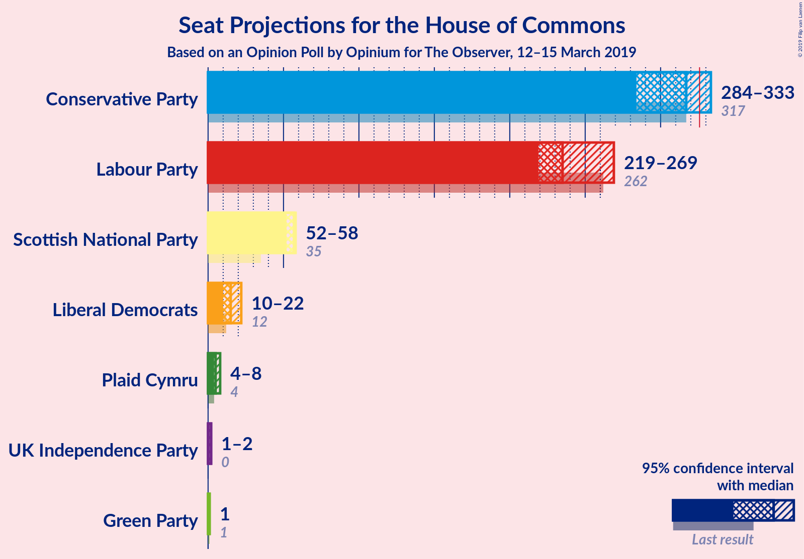
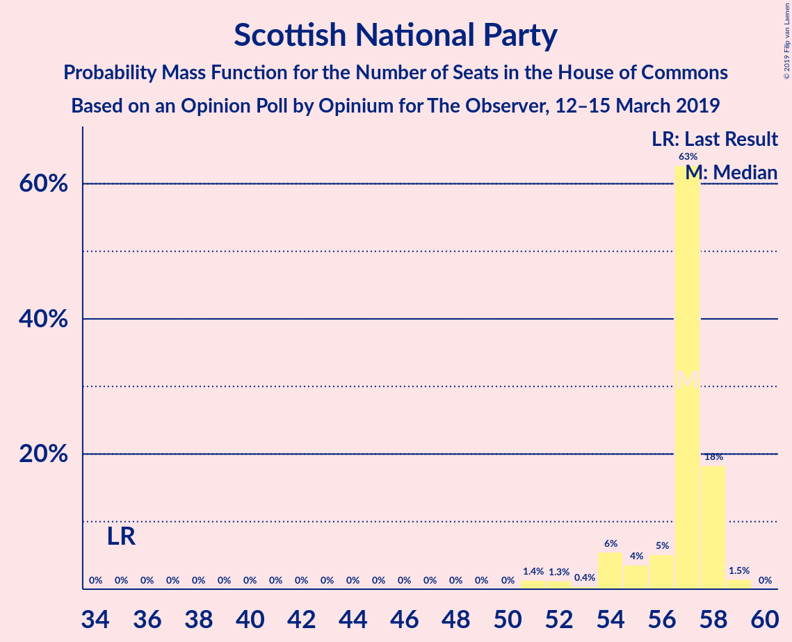
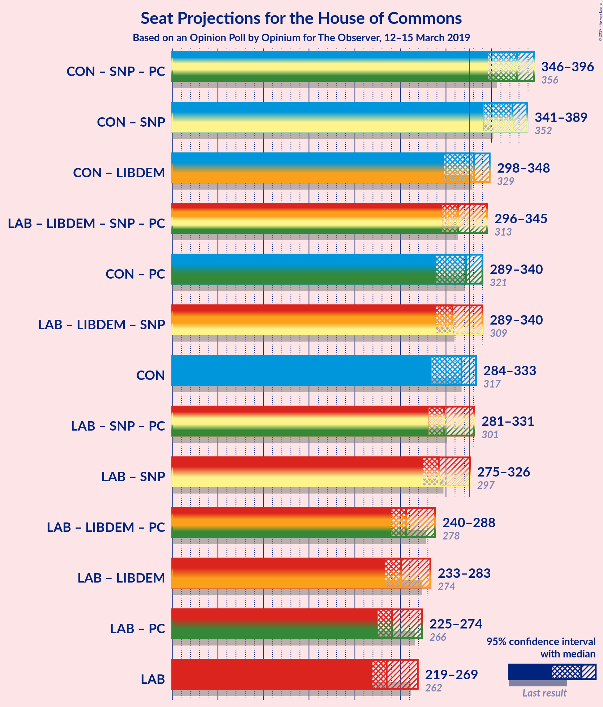
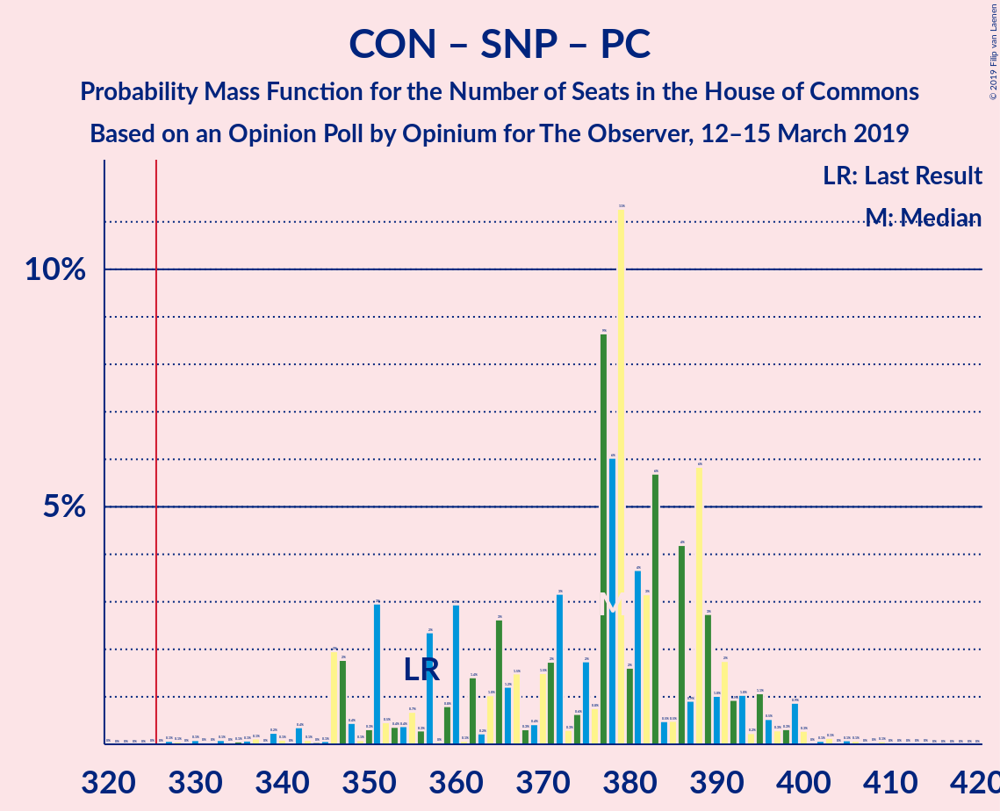
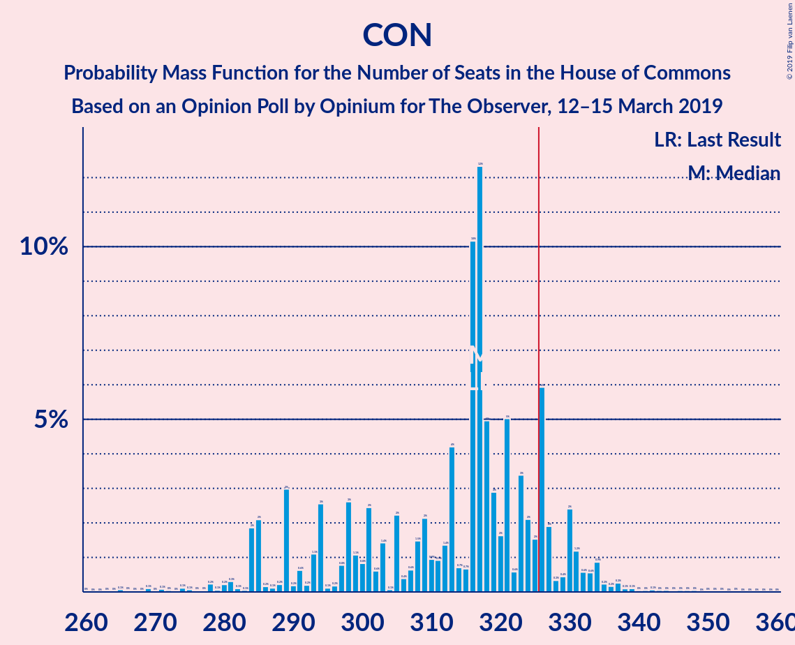
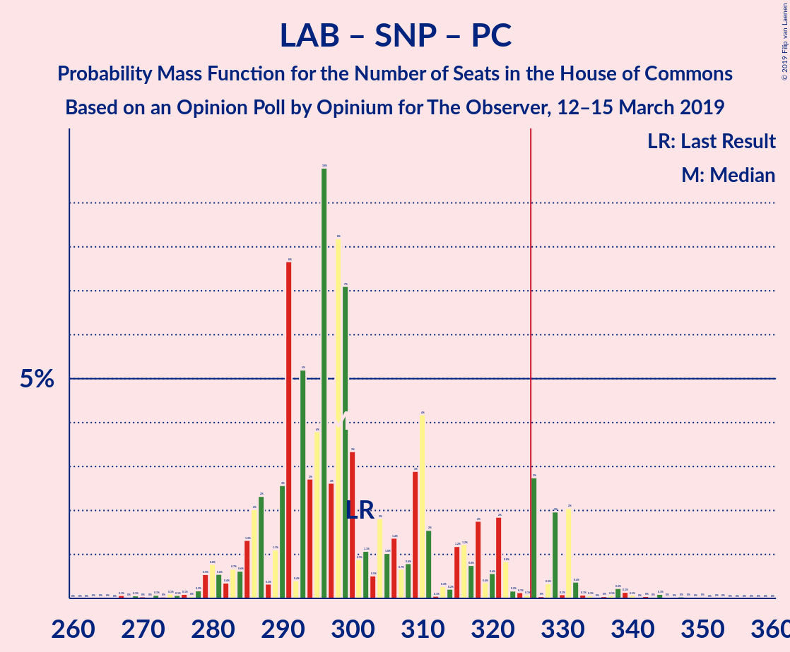
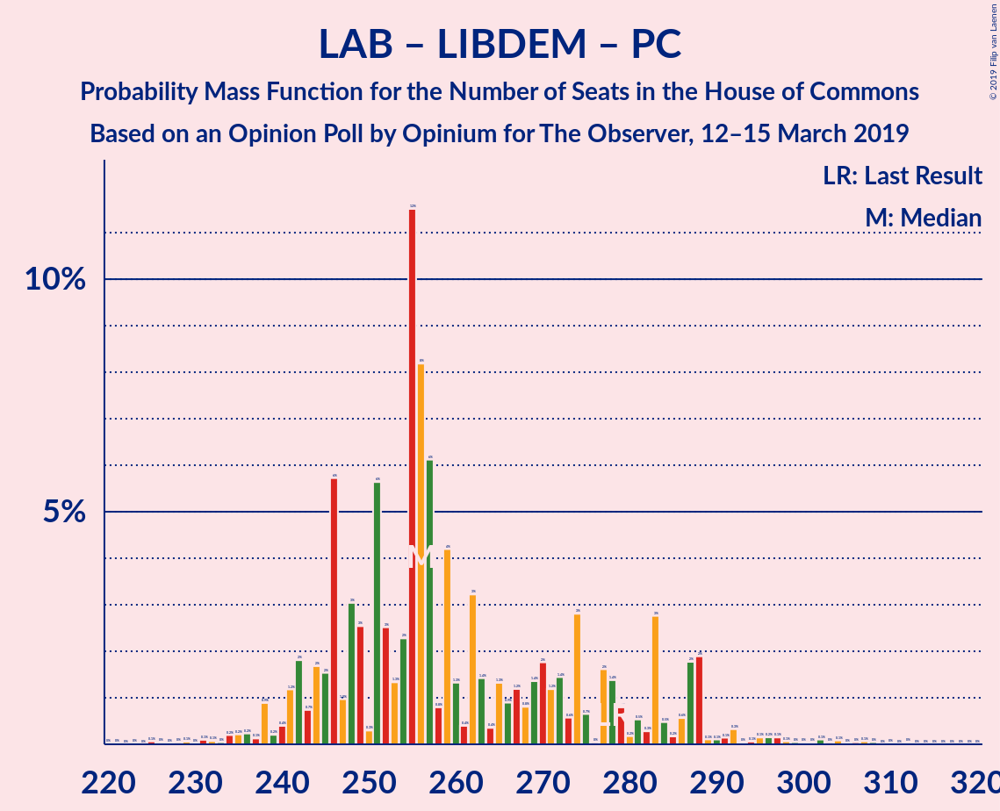
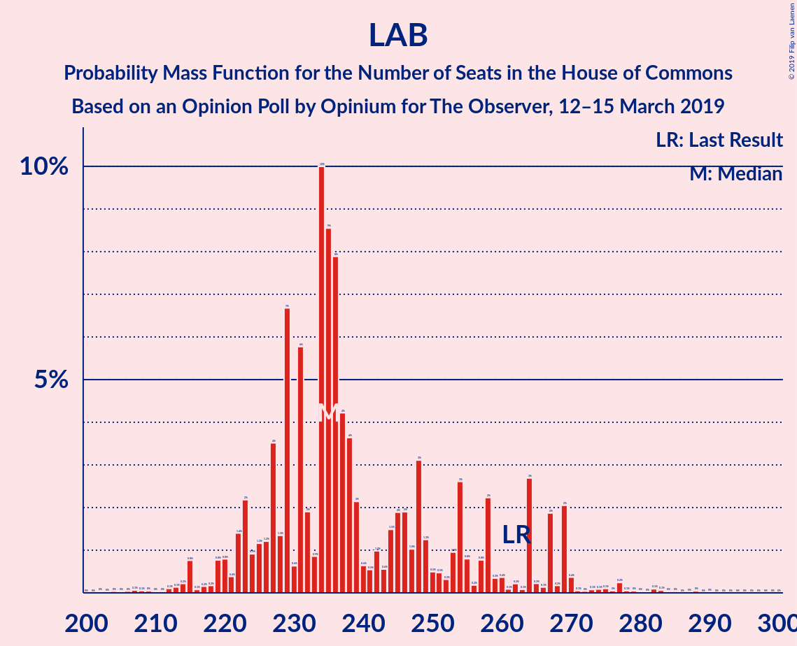

# Opinion Poll by Opinium for The Observer, 12–15 March 2019

<a href="#voting-intentions">Voting Intentions</a> | <a href="#seats">Seats</a> | <a href="#coalitions">Coalitions</a> | <a href="#technical-information">Technical Information</a>

## Voting Intentions

### Confidence Intervals

| Party | Last Result | Poll Result | 80% Confidence Interval | 90% Confidence Interval | 95% Confidence Interval | 99% Confidence Interval |
|:-----:|:-----------:|:-----------:|:-----------------------:|:-----------------------:|:-----------------------:|:-----------------------:|
| Conservative Party | 42.4% | 38.0% | 36.6–39.4% |36.2–39.8% |35.9–40.2% |35.2–40.9% |
| Labour Party | 40.0% | 34.0% | 32.7–35.4% |32.3–35.8% |31.9–36.2% |31.3–36.8% |
| Liberal Democrats | 7.4% | 8.0% | 7.3–8.8% |7.0–9.1% |6.9–9.3% |6.5–9.7% |
| UK Independence Party | 1.8% | 8.0% | 7.3–8.8% |7.0–9.1% |6.9–9.3% |6.5–9.7% |
| Scottish National Party | 3.0% | 5.0% | 4.4–5.7% |4.3–5.9% |4.1–6.1% |3.9–6.4% |
| Green Party | 1.6% | 3.0% | 2.6–3.6% |2.5–3.7% |2.3–3.9% |2.1–4.2% |
| Plaid Cymru | 0.5% | 1.0% | 0.8–1.4% |0.7–1.5% |0.7–1.6% |0.6–1.8% |

*Note:* The poll result column reflects the actual value used in the calculations. Published results may vary slightly, and in addition be rounded to fewer digits.

## Seats

### Confidence Intervals

| Party | Last Result | Median | 80% Confidence Interval | 90% Confidence Interval | 95% Confidence Interval | 99% Confidence Interval |
|:-----:|:-----------:|:------:|:-----------------------:|:-----------------------:|:-----------------------:|:-----------------------:|
| <a href="#conservative-party">Conservative Party</a> | 317 | 300 | 300–325 |300–336 |300–336 |288–339 |
| <a href="#labour-party">Labour Party</a> | 262 | 254 | 227–254 |216–254 |216–254 |211–264 |
| <a href="#liberal-democrats">Liberal Democrats</a> | 12 | 13 | 12–21 |11–21 |11–22 |10–26 |
| <a href="#uk-independence-party">UK Independence Party</a> | 0 | 2 | 1–2 |1–2 |1–2 |1–2 |
| <a href="#scottish-national-party">Scottish National Party</a> | 35 | 57 | 57–58 |55–59 |55–59 |54–59 |
| <a href="#green-party">Green Party</a> | 1 | 1 | 1 |1 |1 |1 |
| <a href="#plaid-cymru">Plaid Cymru</a> | 4 | 5 | 5–8 |5–9 |5–9 |3–9 |

### Conservative Party

*For a full overview of the results for this party, see the [Conservative Party](party-conservativeparty.html) page.*

| Number of Seats | Probability | Accumulated | Special Marks |
|:---------------:|:-----------:|:-----------:|:-------------:|
| 284 | 0% | 100% |  |
| 285 | 0% | 99.9% |  |
| 286 | 0% | 99.9% |  |
| 287 | 0% | 99.9% |  |
| 288 | 0.9% | 99.9% |  |
| 289 | 0% | 99.0% |  |
| 290 | 0.6% | 99.0% |  |
| 291 | 0% | 98% |  |
| 292 | 0% | 98% |  |
| 293 | 0% | 98% |  |
| 294 | 0% | 98% |  |
| 295 | 0% | 98% |  |
| 296 | 0.2% | 98% |  |
| 297 | 0% | 98% |  |
| 298 | 0% | 98% |  |
| 299 | 0% | 98% |  |
| 300 | 70% | 98% | Median |
| 301 | 0% | 28% |  |
| 302 | 0% | 28% |  |
| 303 | 0% | 28% |  |
| 304 | 0% | 28% |  |
| 305 | 2% | 28% |  |
| 306 | 0% | 25% |  |
| 307 | 0% | 25% |  |
| 308 | 0% | 25% |  |
| 309 | 0% | 25% |  |
| 310 | 0% | 25% |  |
| 311 | 0% | 25% |  |
| 312 | 7% | 25% |  |
| 313 | 0% | 18% |  |
| 314 | 0% | 18% |  |
| 315 | 0% | 18% |  |
| 316 | 0% | 18% |  |
| 317 | 1.2% | 18% | Last Result |
| 318 | 0.3% | 17% |  |
| 319 | 0% | 17% |  |
| 320 | 6% | 17% |  |
| 321 | 0% | 10% |  |
| 322 | 0.2% | 10% |  |
| 323 | 0% | 10% |  |
| 324 | 0% | 10% |  |
| 325 | 0.4% | 10% |  |
| 326 | 0% | 10% | Majority |
| 327 | 0.7% | 10% |  |
| 328 | 0% | 9% |  |
| 329 | 0% | 9% |  |
| 330 | 0% | 9% |  |
| 331 | 0% | 9% |  |
| 332 | 0% | 9% |  |
| 333 | 3% | 9% |  |
| 334 | 0% | 6% |  |
| 335 | 0% | 6% |  |
| 336 | 4% | 6% |  |
| 337 | 0% | 2% |  |
| 338 | 0% | 2% |  |
| 339 | 2% | 2% |  |
| 340 | 0% | 0.1% |  |
| 341 | 0% | 0.1% |  |
| 342 | 0% | 0.1% |  |
| 343 | 0% | 0.1% |  |
| 344 | 0% | 0.1% |  |
| 345 | 0% | 0.1% |  |
| 346 | 0% | 0% |  |

### Labour Party

*For a full overview of the results for this party, see the [Labour Party](party-labourparty.html) page.*

| Number of Seats | Probability | Accumulated | Special Marks |
|:---------------:|:-----------:|:-----------:|:-------------:|
| 211 | 2% | 100% |  |
| 212 | 0% | 98% |  |
| 213 | 0% | 98% |  |
| 214 | 0% | 98% |  |
| 215 | 0% | 98% |  |
| 216 | 4% | 98% |  |
| 217 | 0% | 94% |  |
| 218 | 0% | 94% |  |
| 219 | 0% | 94% |  |
| 220 | 0% | 94% |  |
| 221 | 0.4% | 94% |  |
| 222 | 0% | 93% |  |
| 223 | 0% | 93% |  |
| 224 | 3% | 93% |  |
| 225 | 0% | 90% |  |
| 226 | 0% | 90% |  |
| 227 | 0.7% | 90% |  |
| 228 | 0% | 90% |  |
| 229 | 0% | 90% |  |
| 230 | 0% | 90% |  |
| 231 | 6% | 90% |  |
| 232 | 7% | 84% |  |
| 233 | 0% | 76% |  |
| 234 | 0% | 76% |  |
| 235 | 0.8% | 76% |  |
| 236 | 0.3% | 76% |  |
| 237 | 0% | 75% |  |
| 238 | 0% | 75% |  |
| 239 | 0.2% | 75% |  |
| 240 | 0% | 75% |  |
| 241 | 2% | 75% |  |
| 242 | 0% | 72% |  |
| 243 | 0% | 72% |  |
| 244 | 0.4% | 72% |  |
| 245 | 0% | 72% |  |
| 246 | 0% | 72% |  |
| 247 | 0% | 72% |  |
| 248 | 0% | 72% |  |
| 249 | 0% | 72% |  |
| 250 | 0% | 72% |  |
| 251 | 0% | 72% |  |
| 252 | 0% | 72% |  |
| 253 | 0% | 72% |  |
| 254 | 70% | 72% | Median |
| 255 | 0% | 2% |  |
| 256 | 0.8% | 2% |  |
| 257 | 0% | 1.0% |  |
| 258 | 0% | 1.0% |  |
| 259 | 0% | 1.0% |  |
| 260 | 0% | 1.0% |  |
| 261 | 0% | 1.0% |  |
| 262 | 0% | 1.0% | Last Result |
| 263 | 0% | 1.0% |  |
| 264 | 0.9% | 1.0% |  |
| 265 | 0% | 0.1% |  |
| 266 | 0% | 0.1% |  |
| 267 | 0% | 0.1% |  |
| 268 | 0% | 0.1% |  |
| 269 | 0% | 0.1% |  |
| 270 | 0% | 0.1% |  |
| 271 | 0% | 0.1% |  |
| 272 | 0% | 0% |  |

### Liberal Democrats

*For a full overview of the results for this party, see the [Liberal Democrats](party-liberaldemocrats.html) page.*

| Number of Seats | Probability | Accumulated | Special Marks |
|:---------------:|:-----------:|:-----------:|:-------------:|
| 6 | 0.4% | 100% |  |
| 7 | 0% | 99.5% |  |
| 8 | 0% | 99.5% |  |
| 9 | 0% | 99.5% |  |
| 10 | 0% | 99.5% |  |
| 11 | 6% | 99.5% |  |
| 12 | 4% | 93% | Last Result |
| 13 | 75% | 89% | Median |
| 14 | 0% | 14% |  |
| 15 | 0% | 14% |  |
| 16 | 1.4% | 14% |  |
| 17 | 0.4% | 13% |  |
| 18 | 2% | 12% |  |
| 19 | 0% | 11% |  |
| 20 | 0% | 11% |  |
| 21 | 7% | 11% |  |
| 22 | 2% | 3% |  |
| 23 | 0.1% | 0.7% |  |
| 24 | 0% | 0.6% |  |
| 25 | 0% | 0.6% |  |
| 26 | 0.6% | 0.6% |  |
| 27 | 0% | 0% |  |

### UK Independence Party

*For a full overview of the results for this party, see the [UK Independence Party](party-ukindependenceparty.html) page.*

| Number of Seats | Probability | Accumulated | Special Marks |
|:---------------:|:-----------:|:-----------:|:-------------:|
| 0 | 0% | 100% | Last Result |
| 1 | 12% | 100% |  |
| 2 | 88% | 88% | Median |
| 3 | 0% | 0% |  |

### Scottish National Party

*For a full overview of the results for this party, see the [Scottish National Party](party-scottishnationalparty.html) page.*

| Number of Seats | Probability | Accumulated | Special Marks |
|:---------------:|:-----------:|:-----------:|:-------------:|
| 35 | 0% | 100% | Last Result |
| 36 | 0% | 100% |  |
| 37 | 0% | 100% |  |
| 38 | 0% | 100% |  |
| 39 | 0% | 100% |  |
| 40 | 0% | 100% |  |
| 41 | 0% | 100% |  |
| 42 | 0% | 100% |  |
| 43 | 0% | 100% |  |
| 44 | 0% | 100% |  |
| 45 | 0% | 100% |  |
| 46 | 0% | 100% |  |
| 47 | 0% | 100% |  |
| 48 | 0% | 100% |  |
| 49 | 0.2% | 100% |  |
| 50 | 0% | 99.8% |  |
| 51 | 0% | 99.8% |  |
| 52 | 0% | 99.7% |  |
| 53 | 0% | 99.7% |  |
| 54 | 2% | 99.7% |  |
| 55 | 3% | 98% |  |
| 56 | 3% | 95% |  |
| 57 | 78% | 92% | Median |
| 58 | 8% | 14% |  |
| 59 | 5% | 5% |  |
| 60 | 0% | 0% |  |

### Green Party

*For a full overview of the results for this party, see the [Green Party](party-greenparty.html) page.*

| Number of Seats | Probability | Accumulated | Special Marks |
|:---------------:|:-----------:|:-----------:|:-------------:|
| 1 | 99.9% | 100% | Last Result, Median |
| 2 | 0.1% | 0.1% |  |
| 3 | 0% | 0% |  |

### Plaid Cymru

*For a full overview of the results for this party, see the [Plaid Cymru](party-plaidcymru.html) page.*

| Number of Seats | Probability | Accumulated | Special Marks |
|:---------------:|:-----------:|:-----------:|:-------------:|
| 2 | 0.3% | 100% |  |
| 3 | 0.9% | 99.7% |  |
| 4 | 1.3% | 98.8% | Last Result |
| 5 | 78% | 98% | Median |
| 6 | 4% | 19% |  |
| 7 | 2% | 16% |  |
| 8 | 8% | 14% |  |
| 9 | 7% | 7% |  |
| 10 | 0% | 0% |  |

## Coalitions

### Confidence Intervals

| Coalition | Last Result | Median | Majority? | 80% Confidence Interval | 90% Confidence Interval | 95% Confidence Interval | 99% Confidence Interval |
|:---------:|:-----------:|:------:|:---------:|:-----------------------:|:-----------------------:|:-----------------------:|:-----------------------:|
| Conservative Party – Scottish National Party – Plaid Cymru | 356 | 362 | 100% | 362–390 | 362–400 | 362–400 | 348–400 |
| Conservative Party – Scottish National Party | 352 | 357 | 100% | 357–382 | 357–393 | 357–395 | 344–395 |
| Conservative Party – Liberal Democrats | 329 | 313 | 28% | 313–340 | 313–349 | 313–349 | 304–357 |
| Conservative Party – Plaid Cymru | 321 | 305 | 17% | 305–332 | 305–341 | 305–341 | 291–346 |
| Conservative Party | 317 | 300 | 10% | 300–325 | 300–336 | 300–336 | 288–339 |
| Labour Party – Liberal Democrats – Scottish National Party – Plaid Cymru | 313 | 329 | 72% | 304–329 | 293–329 | 293–329 | 290–341 |
| Labour Party – Liberal Democrats – Scottish National Party | 309 | 324 | 2% | 298–324 | 288–324 | 288–324 | 283–338 |
| Labour Party – Scottish National Party – Plaid Cymru | 301 | 316 | 0.1% | 290–316 | 280–316 | 280–316 | 272–325 |
| Labour Party – Scottish National Party | 297 | 311 | 0.1% | 285–311 | 275–311 | 275–311 | 265–322 |
| Labour Party – Liberal Democrats – Plaid Cymru | 278 | 272 | 0% | 247–272 | 236–272 | 234–272 | 234–286 |
| Labour Party – Liberal Democrats | 274 | 267 | 0% | 240–267 | 229–267 | 229–267 | 229–282 |
| Labour Party – Plaid Cymru | 266 | 259 | 0% | 232–259 | 221–259 | 221–259 | 218–267 |
| Labour Party | 262 | 254 | 0% | 227–254 | 216–254 | 216–254 | 211–264 |

### Conservative Party – Scottish National Party – Plaid Cymru

| Number of Seats | Probability | Accumulated | Special Marks |
|:---------------:|:-----------:|:-----------:|:-------------:|
| 345 | 0% | 100% |  |
| 346 | 0% | 99.9% |  |
| 347 | 0% | 99.9% |  |
| 348 | 0.6% | 99.9% |  |
| 349 | 0.9% | 99.4% |  |
| 350 | 0% | 98% |  |
| 351 | 0% | 98% |  |
| 352 | 0% | 98% |  |
| 353 | 0% | 98% |  |
| 354 | 0% | 98% |  |
| 355 | 0% | 98% |  |
| 356 | 0% | 98% | Last Result |
| 357 | 0% | 98% |  |
| 358 | 0% | 98% |  |
| 359 | 0% | 98% |  |
| 360 | 0% | 98% |  |
| 361 | 0% | 98% |  |
| 362 | 70% | 98% | Median |
| 363 | 0% | 28% |  |
| 364 | 0% | 28% |  |
| 365 | 0% | 28% |  |
| 366 | 2% | 28% |  |
| 367 | 0% | 26% |  |
| 368 | 0% | 25% |  |
| 369 | 0% | 25% |  |
| 370 | 0% | 25% |  |
| 371 | 0% | 25% |  |
| 372 | 0% | 25% |  |
| 373 | 0% | 25% |  |
| 374 | 0% | 25% |  |
| 375 | 0.2% | 25% |  |
| 376 | 0% | 25% |  |
| 377 | 8% | 25% |  |
| 378 | 0% | 18% |  |
| 379 | 0.5% | 18% |  |
| 380 | 0% | 17% |  |
| 381 | 0% | 17% |  |
| 382 | 0.8% | 17% |  |
| 383 | 0% | 16% |  |
| 384 | 0% | 16% |  |
| 385 | 0% | 16% |  |
| 386 | 0% | 16% |  |
| 387 | 6% | 16% |  |
| 388 | 0% | 10% |  |
| 389 | 0% | 10% |  |
| 390 | 0.7% | 10% |  |
| 391 | 0.4% | 9% |  |
| 392 | 0% | 9% |  |
| 393 | 0% | 9% |  |
| 394 | 3% | 9% |  |
| 395 | 0% | 6% |  |
| 396 | 0% | 6% |  |
| 397 | 0% | 6% |  |
| 398 | 0% | 6% |  |
| 399 | 0% | 6% |  |
| 400 | 6% | 6% |  |
| 401 | 0% | 0.1% |  |
| 402 | 0% | 0.1% |  |
| 403 | 0% | 0.1% |  |
| 404 | 0% | 0.1% |  |
| 405 | 0% | 0.1% |  |
| 406 | 0% | 0.1% |  |
| 407 | 0% | 0.1% |  |
| 408 | 0% | 0.1% |  |
| 409 | 0% | 0% |  |

### Conservative Party – Scottish National Party

| Number of Seats | Probability | Accumulated | Special Marks |
|:---------------:|:-----------:|:-----------:|:-------------:|
| 341 | 0% | 100% |  |
| 342 | 0% | 99.9% |  |
| 343 | 0% | 99.9% |  |
| 344 | 0.6% | 99.9% |  |
| 345 | 0% | 99.4% |  |
| 346 | 0.9% | 99.4% |  |
| 347 | 0% | 98% |  |
| 348 | 0% | 98% |  |
| 349 | 0% | 98% |  |
| 350 | 0% | 98% |  |
| 351 | 0% | 98% |  |
| 352 | 0% | 98% | Last Result |
| 353 | 0% | 98% |  |
| 354 | 0.2% | 98% |  |
| 355 | 0% | 98% |  |
| 356 | 0% | 98% |  |
| 357 | 70% | 98% | Median |
| 358 | 0% | 28% |  |
| 359 | 0% | 28% |  |
| 360 | 0% | 28% |  |
| 361 | 2% | 28% |  |
| 362 | 0% | 26% |  |
| 363 | 0% | 25% |  |
| 364 | 0% | 25% |  |
| 365 | 0% | 25% |  |
| 366 | 0% | 25% |  |
| 367 | 0% | 25% |  |
| 368 | 0% | 25% |  |
| 369 | 7% | 25% |  |
| 370 | 0% | 18% |  |
| 371 | 0.2% | 18% |  |
| 372 | 0% | 18% |  |
| 373 | 0% | 18% |  |
| 374 | 0% | 18% |  |
| 375 | 0.7% | 18% |  |
| 376 | 0.8% | 17% |  |
| 377 | 0% | 16% |  |
| 378 | 6% | 16% |  |
| 379 | 0% | 10% |  |
| 380 | 0% | 10% |  |
| 381 | 0% | 10% |  |
| 382 | 0.4% | 10% |  |
| 383 | 0% | 10% |  |
| 384 | 0% | 10% |  |
| 385 | 0.7% | 10% |  |
| 386 | 0% | 9% |  |
| 387 | 0% | 9% |  |
| 388 | 3% | 9% |  |
| 389 | 0% | 6% |  |
| 390 | 0% | 6% |  |
| 391 | 0% | 6% |  |
| 392 | 0% | 6% |  |
| 393 | 2% | 6% |  |
| 394 | 0% | 5% |  |
| 395 | 4% | 5% |  |
| 396 | 0% | 0.1% |  |
| 397 | 0% | 0.1% |  |
| 398 | 0% | 0.1% |  |
| 399 | 0% | 0.1% |  |
| 400 | 0% | 0.1% |  |
| 401 | 0% | 0.1% |  |
| 402 | 0% | 0.1% |  |
| 403 | 0% | 0% |  |

### Conservative Party – Liberal Democrats

| Number of Seats | Probability | Accumulated | Special Marks |
|:---------------:|:-----------:|:-----------:|:-------------:|
| 298 | 0% | 100% |  |
| 299 | 0% | 99.9% |  |
| 300 | 0% | 99.9% |  |
| 301 | 0% | 99.9% |  |
| 302 | 0% | 99.9% |  |
| 303 | 0% | 99.9% |  |
| 304 | 0.9% | 99.9% |  |
| 305 | 0% | 99.0% |  |
| 306 | 0% | 99.0% |  |
| 307 | 0% | 99.0% |  |
| 308 | 0.2% | 99.0% |  |
| 309 | 0% | 98.8% |  |
| 310 | 0% | 98.8% |  |
| 311 | 0% | 98.8% |  |
| 312 | 0% | 98.8% |  |
| 313 | 70% | 98.8% | Median |
| 314 | 0% | 29% |  |
| 315 | 0% | 29% |  |
| 316 | 0.6% | 29% |  |
| 317 | 0% | 28% |  |
| 318 | 0% | 28% |  |
| 319 | 0% | 28% |  |
| 320 | 0% | 28% |  |
| 321 | 0% | 28% |  |
| 322 | 0% | 28% |  |
| 323 | 0.4% | 28% |  |
| 324 | 0% | 28% |  |
| 325 | 0% | 28% |  |
| 326 | 0% | 28% | Majority |
| 327 | 2% | 28% |  |
| 328 | 0% | 25% |  |
| 329 | 0.8% | 25% | Last Result |
| 330 | 0% | 24% |  |
| 331 | 6% | 24% |  |
| 332 | 0% | 18% |  |
| 333 | 7% | 18% |  |
| 334 | 0.3% | 11% |  |
| 335 | 0% | 11% |  |
| 336 | 0% | 11% |  |
| 337 | 0% | 10% |  |
| 338 | 0.2% | 10% |  |
| 339 | 0% | 10% |  |
| 340 | 0.7% | 10% |  |
| 341 | 0% | 10% |  |
| 342 | 0.5% | 10% |  |
| 343 | 0% | 9% |  |
| 344 | 0% | 9% |  |
| 345 | 3% | 9% |  |
| 346 | 0% | 6% |  |
| 347 | 0% | 6% |  |
| 348 | 0% | 6% |  |
| 349 | 4% | 6% |  |
| 350 | 0.1% | 2% |  |
| 351 | 0% | 2% |  |
| 352 | 0% | 2% |  |
| 353 | 0% | 2% |  |
| 354 | 0% | 2% |  |
| 355 | 0% | 2% |  |
| 356 | 0% | 2% |  |
| 357 | 2% | 2% |  |
| 358 | 0% | 0% |  |

### Conservative Party – Plaid Cymru

| Number of Seats | Probability | Accumulated | Special Marks |
|:---------------:|:-----------:|:-----------:|:-------------:|
| 288 | 0% | 100% |  |
| 289 | 0% | 99.9% |  |
| 290 | 0% | 99.9% |  |
| 291 | 0.9% | 99.9% |  |
| 292 | 0% | 99.0% |  |
| 293 | 0% | 99.0% |  |
| 294 | 0.6% | 99.0% |  |
| 295 | 0% | 98% |  |
| 296 | 0% | 98% |  |
| 297 | 0% | 98% |  |
| 298 | 0% | 98% |  |
| 299 | 0% | 98% |  |
| 300 | 0% | 98% |  |
| 301 | 0% | 98% |  |
| 302 | 0% | 98% |  |
| 303 | 0% | 98% |  |
| 304 | 0.2% | 98% |  |
| 305 | 70% | 98% | Median |
| 306 | 0% | 28% |  |
| 307 | 0% | 28% |  |
| 308 | 0% | 28% |  |
| 309 | 0% | 28% |  |
| 310 | 2% | 28% |  |
| 311 | 0% | 25% |  |
| 312 | 0% | 25% |  |
| 313 | 0% | 25% |  |
| 314 | 0% | 25% |  |
| 315 | 0% | 25% |  |
| 316 | 0% | 25% |  |
| 317 | 0% | 25% |  |
| 318 | 0% | 25% |  |
| 319 | 0% | 25% |  |
| 320 | 8% | 25% |  |
| 321 | 0.5% | 18% | Last Result |
| 322 | 0% | 17% |  |
| 323 | 0.8% | 17% |  |
| 324 | 0% | 17% |  |
| 325 | 0% | 17% |  |
| 326 | 0.2% | 17% | Majority |
| 327 | 0% | 16% |  |
| 328 | 0% | 16% |  |
| 329 | 6% | 16% |  |
| 330 | 0% | 10% |  |
| 331 | 0% | 10% |  |
| 332 | 0.7% | 10% |  |
| 333 | 0% | 10% |  |
| 334 | 0.5% | 10% |  |
| 335 | 0% | 9% |  |
| 336 | 0% | 9% |  |
| 337 | 0% | 9% |  |
| 338 | 0% | 9% |  |
| 339 | 3% | 9% |  |
| 340 | 0% | 6% |  |
| 341 | 4% | 6% |  |
| 342 | 0% | 2% |  |
| 343 | 0% | 2% |  |
| 344 | 0% | 2% |  |
| 345 | 0% | 2% |  |
| 346 | 2% | 2% |  |
| 347 | 0% | 0.1% |  |
| 348 | 0% | 0.1% |  |
| 349 | 0% | 0.1% |  |
| 350 | 0% | 0.1% |  |
| 351 | 0% | 0.1% |  |
| 352 | 0% | 0.1% |  |
| 353 | 0.1% | 0.1% |  |
| 354 | 0% | 0% |  |

### Conservative Party

| Number of Seats | Probability | Accumulated | Special Marks |
|:---------------:|:-----------:|:-----------:|:-------------:|
| 284 | 0% | 100% |  |
| 285 | 0% | 99.9% |  |
| 286 | 0% | 99.9% |  |
| 287 | 0% | 99.9% |  |
| 288 | 0.9% | 99.9% |  |
| 289 | 0% | 99.0% |  |
| 290 | 0.6% | 99.0% |  |
| 291 | 0% | 98% |  |
| 292 | 0% | 98% |  |
| 293 | 0% | 98% |  |
| 294 | 0% | 98% |  |
| 295 | 0% | 98% |  |
| 296 | 0.2% | 98% |  |
| 297 | 0% | 98% |  |
| 298 | 0% | 98% |  |
| 299 | 0% | 98% |  |
| 300 | 70% | 98% | Median |
| 301 | 0% | 28% |  |
| 302 | 0% | 28% |  |
| 303 | 0% | 28% |  |
| 304 | 0% | 28% |  |
| 305 | 2% | 28% |  |
| 306 | 0% | 25% |  |
| 307 | 0% | 25% |  |
| 308 | 0% | 25% |  |
| 309 | 0% | 25% |  |
| 310 | 0% | 25% |  |
| 311 | 0% | 25% |  |
| 312 | 7% | 25% |  |
| 313 | 0% | 18% |  |
| 314 | 0% | 18% |  |
| 315 | 0% | 18% |  |
| 316 | 0% | 18% |  |
| 317 | 1.2% | 18% | Last Result |
| 318 | 0.3% | 17% |  |
| 319 | 0% | 17% |  |
| 320 | 6% | 17% |  |
| 321 | 0% | 10% |  |
| 322 | 0.2% | 10% |  |
| 323 | 0% | 10% |  |
| 324 | 0% | 10% |  |
| 325 | 0.4% | 10% |  |
| 326 | 0% | 10% | Majority |
| 327 | 0.7% | 10% |  |
| 328 | 0% | 9% |  |
| 329 | 0% | 9% |  |
| 330 | 0% | 9% |  |
| 331 | 0% | 9% |  |
| 332 | 0% | 9% |  |
| 333 | 3% | 9% |  |
| 334 | 0% | 6% |  |
| 335 | 0% | 6% |  |
| 336 | 4% | 6% |  |
| 337 | 0% | 2% |  |
| 338 | 0% | 2% |  |
| 339 | 2% | 2% |  |
| 340 | 0% | 0.1% |  |
| 341 | 0% | 0.1% |  |
| 342 | 0% | 0.1% |  |
| 343 | 0% | 0.1% |  |
| 344 | 0% | 0.1% |  |
| 345 | 0% | 0.1% |  |
| 346 | 0% | 0% |  |

### Labour Party – Liberal Democrats – Scottish National Party – Plaid Cymru

| Number of Seats | Probability | Accumulated | Special Marks |
|:---------------:|:-----------:|:-----------:|:-------------:|
| 284 | 0% | 100% |  |
| 285 | 0% | 99.9% |  |
| 286 | 0% | 99.9% |  |
| 287 | 0% | 99.9% |  |
| 288 | 0% | 99.9% |  |
| 289 | 0% | 99.9% |  |
| 290 | 2% | 99.9% |  |
| 291 | 0% | 98% |  |
| 292 | 0% | 98% |  |
| 293 | 4% | 98% |  |
| 294 | 0% | 94% |  |
| 295 | 0% | 94% |  |
| 296 | 0% | 94% |  |
| 297 | 3% | 94% |  |
| 298 | 0% | 91% |  |
| 299 | 0% | 91% |  |
| 300 | 0% | 91% |  |
| 301 | 0% | 91% |  |
| 302 | 0.1% | 91% |  |
| 303 | 0.7% | 91% |  |
| 304 | 0.4% | 90% |  |
| 305 | 0% | 90% |  |
| 306 | 0% | 90% |  |
| 307 | 0% | 90% |  |
| 308 | 0.2% | 90% |  |
| 309 | 6% | 90% |  |
| 310 | 0% | 83% |  |
| 311 | 0.3% | 83% |  |
| 312 | 1.2% | 83% |  |
| 313 | 0% | 82% | Last Result |
| 314 | 0% | 82% |  |
| 315 | 0% | 82% |  |
| 316 | 0% | 82% |  |
| 317 | 0% | 82% |  |
| 318 | 7% | 82% |  |
| 319 | 0% | 75% |  |
| 320 | 0% | 75% |  |
| 321 | 0% | 75% |  |
| 322 | 0% | 75% |  |
| 323 | 0% | 74% |  |
| 324 | 2% | 74% |  |
| 325 | 0% | 72% |  |
| 326 | 0% | 72% | Majority |
| 327 | 0% | 72% |  |
| 328 | 0% | 72% |  |
| 329 | 70% | 72% | Median |
| 330 | 0% | 2% |  |
| 331 | 0% | 2% |  |
| 332 | 0% | 2% |  |
| 333 | 0% | 2% |  |
| 334 | 0.2% | 2% |  |
| 335 | 0% | 2% |  |
| 336 | 0% | 2% |  |
| 337 | 0% | 2% |  |
| 338 | 0% | 2% |  |
| 339 | 0% | 2% |  |
| 340 | 0.6% | 2% |  |
| 341 | 0.9% | 1.0% |  |
| 342 | 0% | 0.1% |  |
| 343 | 0% | 0.1% |  |
| 344 | 0% | 0.1% |  |
| 345 | 0% | 0.1% |  |
| 346 | 0% | 0.1% |  |
| 347 | 0% | 0% |  |

### Labour Party – Liberal Democrats – Scottish National Party

| Number of Seats | Probability | Accumulated | Special Marks |
|:---------------:|:-----------:|:-----------:|:-------------:|
| 276 | 0.1% | 100% |  |
| 277 | 0% | 99.9% |  |
| 278 | 0% | 99.9% |  |
| 279 | 0% | 99.9% |  |
| 280 | 0% | 99.9% |  |
| 281 | 0% | 99.9% |  |
| 282 | 0% | 99.9% |  |
| 283 | 2% | 99.9% |  |
| 284 | 0% | 98% |  |
| 285 | 0% | 98% |  |
| 286 | 0% | 98% |  |
| 287 | 0% | 98% |  |
| 288 | 4% | 98% |  |
| 289 | 0% | 94% |  |
| 290 | 0% | 94% |  |
| 291 | 3% | 94% |  |
| 292 | 0% | 91% |  |
| 293 | 0% | 91% |  |
| 294 | 0% | 91% |  |
| 295 | 0.5% | 91% |  |
| 296 | 0% | 90% |  |
| 297 | 0.1% | 90% |  |
| 298 | 0.7% | 90% |  |
| 299 | 0% | 90% |  |
| 300 | 6% | 90% |  |
| 301 | 0% | 84% |  |
| 302 | 0% | 84% |  |
| 303 | 0% | 84% |  |
| 304 | 0.2% | 84% |  |
| 305 | 0% | 83% |  |
| 306 | 0.8% | 83% |  |
| 307 | 0% | 83% |  |
| 308 | 0.5% | 83% |  |
| 309 | 0.3% | 82% | Last Result |
| 310 | 7% | 82% |  |
| 311 | 0% | 75% |  |
| 312 | 0% | 75% |  |
| 313 | 0% | 75% |  |
| 314 | 0% | 75% |  |
| 315 | 0% | 75% |  |
| 316 | 0% | 75% |  |
| 317 | 0% | 75% |  |
| 318 | 0% | 74% |  |
| 319 | 2% | 74% |  |
| 320 | 0% | 72% |  |
| 321 | 0% | 72% |  |
| 322 | 0% | 72% |  |
| 323 | 0% | 72% |  |
| 324 | 70% | 72% | Median |
| 325 | 0% | 2% |  |
| 326 | 0.2% | 2% | Majority |
| 327 | 0% | 2% |  |
| 328 | 0% | 2% |  |
| 329 | 0% | 2% |  |
| 330 | 0% | 2% |  |
| 331 | 0% | 2% |  |
| 332 | 0% | 2% |  |
| 333 | 0% | 2% |  |
| 334 | 0% | 2% |  |
| 335 | 0% | 2% |  |
| 336 | 0.6% | 2% |  |
| 337 | 0% | 1.0% |  |
| 338 | 0.9% | 1.0% |  |
| 339 | 0% | 0.1% |  |
| 340 | 0% | 0.1% |  |
| 341 | 0% | 0.1% |  |
| 342 | 0% | 0.1% |  |
| 343 | 0% | 0% |  |

### Labour Party – Scottish National Party – Plaid Cymru

| Number of Seats | Probability | Accumulated | Special Marks |
|:---------------:|:-----------:|:-----------:|:-------------:|
| 272 | 2% | 100% |  |
| 273 | 0% | 98% |  |
| 274 | 0% | 98% |  |
| 275 | 0% | 98% |  |
| 276 | 0% | 98% |  |
| 277 | 0% | 98% |  |
| 278 | 0% | 98% |  |
| 279 | 0.1% | 98% |  |
| 280 | 4% | 98% |  |
| 281 | 0% | 94% |  |
| 282 | 0% | 94% |  |
| 283 | 0% | 94% |  |
| 284 | 0% | 94% |  |
| 285 | 3% | 94% |  |
| 286 | 0% | 91% |  |
| 287 | 0.5% | 91% |  |
| 288 | 0% | 90% |  |
| 289 | 0% | 90% |  |
| 290 | 0.7% | 90% |  |
| 291 | 0% | 90% |  |
| 292 | 0.2% | 90% |  |
| 293 | 0% | 90% |  |
| 294 | 0% | 89% |  |
| 295 | 0.3% | 89% |  |
| 296 | 0% | 89% |  |
| 297 | 7% | 89% |  |
| 298 | 6% | 82% |  |
| 299 | 0% | 76% |  |
| 300 | 0.8% | 76% |  |
| 301 | 0% | 75% | Last Result |
| 302 | 2% | 75% |  |
| 303 | 0% | 72% |  |
| 304 | 0% | 72% |  |
| 305 | 0% | 72% |  |
| 306 | 0.4% | 72% |  |
| 307 | 0% | 72% |  |
| 308 | 0% | 72% |  |
| 309 | 0% | 72% |  |
| 310 | 0% | 72% |  |
| 311 | 0% | 72% |  |
| 312 | 0% | 72% |  |
| 313 | 0% | 72% |  |
| 314 | 0.6% | 72% |  |
| 315 | 0% | 71% |  |
| 316 | 70% | 71% | Median |
| 317 | 0% | 1.2% |  |
| 318 | 0% | 1.2% |  |
| 319 | 0% | 1.2% |  |
| 320 | 0% | 1.2% |  |
| 321 | 0% | 1.2% |  |
| 322 | 0.2% | 1.2% |  |
| 323 | 0% | 1.0% |  |
| 324 | 0% | 1.0% |  |
| 325 | 0.9% | 1.0% |  |
| 326 | 0% | 0.1% | Majority |
| 327 | 0% | 0.1% |  |
| 328 | 0% | 0.1% |  |
| 329 | 0% | 0.1% |  |
| 330 | 0% | 0.1% |  |
| 331 | 0% | 0.1% |  |
| 332 | 0% | 0.1% |  |
| 333 | 0% | 0% |  |

### Labour Party – Scottish National Party

| Number of Seats | Probability | Accumulated | Special Marks |
|:---------------:|:-----------:|:-----------:|:-------------:|
| 265 | 2% | 100% |  |
| 266 | 0% | 98% |  |
| 267 | 0% | 98% |  |
| 268 | 0% | 98% |  |
| 269 | 0% | 98% |  |
| 270 | 0% | 98% |  |
| 271 | 0% | 98% |  |
| 272 | 0% | 98% |  |
| 273 | 0% | 98% |  |
| 274 | 0.1% | 98% |  |
| 275 | 4% | 98% |  |
| 276 | 0% | 94% |  |
| 277 | 0% | 94% |  |
| 278 | 0.4% | 94% |  |
| 279 | 3% | 93% |  |
| 280 | 0% | 90% |  |
| 281 | 0% | 90% |  |
| 282 | 0% | 90% |  |
| 283 | 0% | 90% |  |
| 284 | 0% | 90% |  |
| 285 | 0.7% | 90% |  |
| 286 | 0% | 90% |  |
| 287 | 0% | 90% |  |
| 288 | 0.2% | 90% |  |
| 289 | 13% | 89% |  |
| 290 | 0% | 76% |  |
| 291 | 0% | 76% |  |
| 292 | 0% | 76% |  |
| 293 | 0.3% | 76% |  |
| 294 | 0.8% | 76% |  |
| 295 | 0% | 75% |  |
| 296 | 0% | 75% |  |
| 297 | 2% | 75% | Last Result |
| 298 | 0% | 72% |  |
| 299 | 0% | 72% |  |
| 300 | 0% | 72% |  |
| 301 | 0% | 72% |  |
| 302 | 0.4% | 72% |  |
| 303 | 0% | 72% |  |
| 304 | 0% | 72% |  |
| 305 | 0% | 72% |  |
| 306 | 0% | 72% |  |
| 307 | 0% | 72% |  |
| 308 | 0% | 72% |  |
| 309 | 0% | 72% |  |
| 310 | 0.6% | 72% |  |
| 311 | 70% | 71% | Median |
| 312 | 0% | 1.2% |  |
| 313 | 0% | 1.2% |  |
| 314 | 0.2% | 1.2% |  |
| 315 | 0% | 1.0% |  |
| 316 | 0% | 1.0% |  |
| 317 | 0% | 1.0% |  |
| 318 | 0% | 1.0% |  |
| 319 | 0% | 1.0% |  |
| 320 | 0% | 1.0% |  |
| 321 | 0% | 1.0% |  |
| 322 | 0.9% | 1.0% |  |
| 323 | 0% | 0.1% |  |
| 324 | 0% | 0.1% |  |
| 325 | 0% | 0.1% |  |
| 326 | 0% | 0.1% | Majority |
| 327 | 0% | 0.1% |  |
| 328 | 0% | 0.1% |  |
| 329 | 0% | 0% |  |

### Labour Party – Liberal Democrats – Plaid Cymru

| Number of Seats | Probability | Accumulated | Special Marks |
|:---------------:|:-----------:|:-----------:|:-------------:|
| 227 | 0% | 100% |  |
| 228 | 0% | 99.9% |  |
| 229 | 0% | 99.9% |  |
| 230 | 0% | 99.9% |  |
| 231 | 0% | 99.9% |  |
| 232 | 0% | 99.9% |  |
| 233 | 0% | 99.9% |  |
| 234 | 4% | 99.9% |  |
| 235 | 0% | 95% |  |
| 236 | 2% | 95% |  |
| 237 | 0% | 94% |  |
| 238 | 0% | 94% |  |
| 239 | 0% | 94% |  |
| 240 | 0% | 94% |  |
| 241 | 0% | 94% |  |
| 242 | 3% | 94% |  |
| 243 | 0% | 91% |  |
| 244 | 0.1% | 91% |  |
| 245 | 0.7% | 91% |  |
| 246 | 0% | 90% |  |
| 247 | 0.4% | 90% |  |
| 248 | 0% | 90% |  |
| 249 | 0% | 90% |  |
| 250 | 0% | 90% |  |
| 251 | 6% | 90% |  |
| 252 | 0% | 84% |  |
| 253 | 0.8% | 84% |  |
| 254 | 0.7% | 83% |  |
| 255 | 0% | 82% |  |
| 256 | 0% | 82% |  |
| 257 | 0% | 82% |  |
| 258 | 0% | 82% |  |
| 259 | 0.2% | 82% |  |
| 260 | 0% | 82% |  |
| 261 | 7% | 82% |  |
| 262 | 0% | 75% |  |
| 263 | 0% | 75% |  |
| 264 | 0% | 75% |  |
| 265 | 0% | 74% |  |
| 266 | 0% | 74% |  |
| 267 | 0% | 74% |  |
| 268 | 2% | 74% |  |
| 269 | 0% | 72% |  |
| 270 | 0% | 72% |  |
| 271 | 0% | 72% |  |
| 272 | 70% | 72% | Median |
| 273 | 0% | 2% |  |
| 274 | 0% | 2% |  |
| 275 | 0% | 2% |  |
| 276 | 0.2% | 2% |  |
| 277 | 0% | 2% |  |
| 278 | 0% | 2% | Last Result |
| 279 | 0% | 2% |  |
| 280 | 0% | 2% |  |
| 281 | 0% | 2% |  |
| 282 | 0% | 2% |  |
| 283 | 0.9% | 2% |  |
| 284 | 0% | 0.6% |  |
| 285 | 0% | 0.6% |  |
| 286 | 0.6% | 0.6% |  |
| 287 | 0% | 0.1% |  |
| 288 | 0% | 0.1% |  |
| 289 | 0% | 0.1% |  |
| 290 | 0% | 0% |  |

### Labour Party – Liberal Democrats

| Number of Seats | Probability | Accumulated | Special Marks |
|:---------------:|:-----------:|:-----------:|:-------------:|
| 221 | 0% | 100% |  |
| 222 | 0% | 99.9% |  |
| 223 | 0% | 99.9% |  |
| 224 | 0% | 99.9% |  |
| 225 | 0% | 99.9% |  |
| 226 | 0% | 99.9% |  |
| 227 | 0% | 99.9% |  |
| 228 | 0% | 99.9% |  |
| 229 | 6% | 99.9% |  |
| 230 | 0% | 94% |  |
| 231 | 0% | 94% |  |
| 232 | 0% | 94% |  |
| 233 | 0% | 94% |  |
| 234 | 0% | 94% |  |
| 235 | 0% | 94% |  |
| 236 | 3% | 94% |  |
| 237 | 0% | 91% |  |
| 238 | 0.4% | 91% |  |
| 239 | 0.1% | 91% |  |
| 240 | 0.7% | 90% |  |
| 241 | 0% | 90% |  |
| 242 | 6% | 90% |  |
| 243 | 0% | 84% |  |
| 244 | 0% | 84% |  |
| 245 | 0% | 84% |  |
| 246 | 0% | 84% |  |
| 247 | 0.8% | 84% |  |
| 248 | 0% | 83% |  |
| 249 | 0% | 83% |  |
| 250 | 0.4% | 83% |  |
| 251 | 0% | 82% |  |
| 252 | 0.3% | 82% |  |
| 253 | 7% | 82% |  |
| 254 | 0% | 75% |  |
| 255 | 0.2% | 75% |  |
| 256 | 0% | 75% |  |
| 257 | 0% | 75% |  |
| 258 | 0% | 75% |  |
| 259 | 0% | 75% |  |
| 260 | 0% | 74% |  |
| 261 | 0% | 74% |  |
| 262 | 0% | 74% |  |
| 263 | 3% | 74% |  |
| 264 | 0% | 72% |  |
| 265 | 0% | 72% |  |
| 266 | 0% | 72% |  |
| 267 | 70% | 72% | Median |
| 268 | 0.2% | 2% |  |
| 269 | 0% | 2% |  |
| 270 | 0% | 2% |  |
| 271 | 0% | 2% |  |
| 272 | 0% | 2% |  |
| 273 | 0% | 2% |  |
| 274 | 0% | 2% | Last Result |
| 275 | 0% | 2% |  |
| 276 | 0% | 2% |  |
| 277 | 0% | 2% |  |
| 278 | 0% | 2% |  |
| 279 | 0% | 2% |  |
| 280 | 0.9% | 2% |  |
| 281 | 0% | 0.6% |  |
| 282 | 0.6% | 0.6% |  |
| 283 | 0% | 0.1% |  |
| 284 | 0% | 0.1% |  |
| 285 | 0% | 0.1% |  |
| 286 | 0% | 0% |  |

### Labour Party – Plaid Cymru

| Number of Seats | Probability | Accumulated | Special Marks |
|:---------------:|:-----------:|:-----------:|:-------------:|
| 218 | 2% | 100% |  |
| 219 | 0% | 98% |  |
| 220 | 0% | 98% |  |
| 221 | 4% | 98% |  |
| 222 | 0% | 94% |  |
| 223 | 0% | 94% |  |
| 224 | 0% | 94% |  |
| 225 | 0% | 94% |  |
| 226 | 0% | 94% |  |
| 227 | 0% | 94% |  |
| 228 | 0% | 94% |  |
| 229 | 0% | 94% |  |
| 230 | 3% | 94% |  |
| 231 | 0% | 90% |  |
| 232 | 0.7% | 90% |  |
| 233 | 0% | 90% |  |
| 234 | 0% | 90% |  |
| 235 | 0% | 90% |  |
| 236 | 0% | 90% |  |
| 237 | 0% | 90% |  |
| 238 | 0.3% | 90% |  |
| 239 | 0% | 89% |  |
| 240 | 13% | 89% |  |
| 241 | 0.8% | 76% |  |
| 242 | 0% | 75% |  |
| 243 | 0.2% | 75% |  |
| 244 | 0% | 75% |  |
| 245 | 0% | 75% |  |
| 246 | 2% | 75% |  |
| 247 | 0% | 72% |  |
| 248 | 0.4% | 72% |  |
| 249 | 0% | 72% |  |
| 250 | 0% | 72% |  |
| 251 | 0% | 72% |  |
| 252 | 0% | 72% |  |
| 253 | 0% | 72% |  |
| 254 | 0% | 72% |  |
| 255 | 0% | 72% |  |
| 256 | 0% | 72% |  |
| 257 | 0% | 72% |  |
| 258 | 0% | 72% |  |
| 259 | 70% | 72% | Median |
| 260 | 0.6% | 2% |  |
| 261 | 0% | 1.2% |  |
| 262 | 0% | 1.2% |  |
| 263 | 0% | 1.2% |  |
| 264 | 0.2% | 1.2% |  |
| 265 | 0% | 1.0% |  |
| 266 | 0% | 1.0% | Last Result |
| 267 | 0.9% | 1.0% |  |
| 268 | 0% | 0.1% |  |
| 269 | 0% | 0.1% |  |
| 270 | 0% | 0.1% |  |
| 271 | 0% | 0.1% |  |
| 272 | 0% | 0.1% |  |
| 273 | 0% | 0.1% |  |
| 274 | 0% | 0.1% |  |
| 275 | 0% | 0.1% |  |
| 276 | 0% | 0% |  |

### Labour Party

| Number of Seats | Probability | Accumulated | Special Marks |
|:---------------:|:-----------:|:-----------:|:-------------:|
| 211 | 2% | 100% |  |
| 212 | 0% | 98% |  |
| 213 | 0% | 98% |  |
| 214 | 0% | 98% |  |
| 215 | 0% | 98% |  |
| 216 | 4% | 98% |  |
| 217 | 0% | 94% |  |
| 218 | 0% | 94% |  |
| 219 | 0% | 94% |  |
| 220 | 0% | 94% |  |
| 221 | 0.4% | 94% |  |
| 222 | 0% | 93% |  |
| 223 | 0% | 93% |  |
| 224 | 3% | 93% |  |
| 225 | 0% | 90% |  |
| 226 | 0% | 90% |  |
| 227 | 0.7% | 90% |  |
| 228 | 0% | 90% |  |
| 229 | 0% | 90% |  |
| 230 | 0% | 90% |  |
| 231 | 6% | 90% |  |
| 232 | 7% | 84% |  |
| 233 | 0% | 76% |  |
| 234 | 0% | 76% |  |
| 235 | 0.8% | 76% |  |
| 236 | 0.3% | 76% |  |
| 237 | 0% | 75% |  |
| 238 | 0% | 75% |  |
| 239 | 0.2% | 75% |  |
| 240 | 0% | 75% |  |
| 241 | 2% | 75% |  |
| 242 | 0% | 72% |  |
| 243 | 0% | 72% |  |
| 244 | 0.4% | 72% |  |
| 245 | 0% | 72% |  |
| 246 | 0% | 72% |  |
| 247 | 0% | 72% |  |
| 248 | 0% | 72% |  |
| 249 | 0% | 72% |  |
| 250 | 0% | 72% |  |
| 251 | 0% | 72% |  |
| 252 | 0% | 72% |  |
| 253 | 0% | 72% |  |
| 254 | 70% | 72% | Median |
| 255 | 0% | 2% |  |
| 256 | 0.8% | 2% |  |
| 257 | 0% | 1.0% |  |
| 258 | 0% | 1.0% |  |
| 259 | 0% | 1.0% |  |
| 260 | 0% | 1.0% |  |
| 261 | 0% | 1.0% |  |
| 262 | 0% | 1.0% | Last Result |
| 263 | 0% | 1.0% |  |
| 264 | 0.9% | 1.0% |  |
| 265 | 0% | 0.1% |  |
| 266 | 0% | 0.1% |  |
| 267 | 0% | 0.1% |  |
| 268 | 0% | 0.1% |  |
| 269 | 0% | 0.1% |  |
| 270 | 0% | 0.1% |  |
| 271 | 0% | 0.1% |  |
| 272 | 0% | 0% |  |

## Technical Information

### Opinion Poll

+ **Polling firm:** Opinium
+ **Commissioner(s):** The Observer
+ **Fieldwork period:** 12–15 March 2019

### Calculations

+ **Sample size:** 1952
+ **Simulations done:** 1,024
+ **Error estimate:** 4.19%

