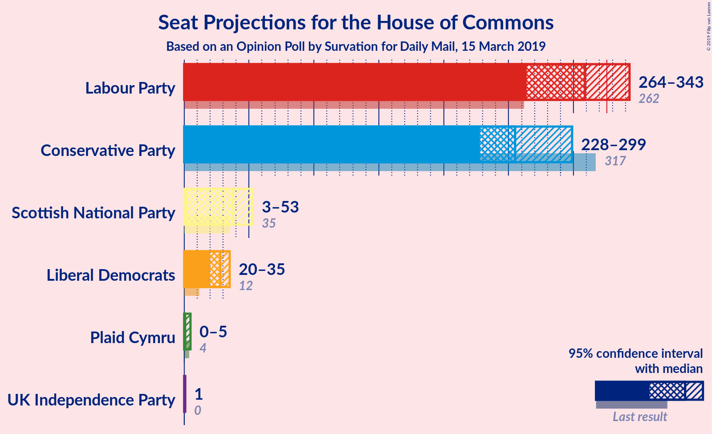
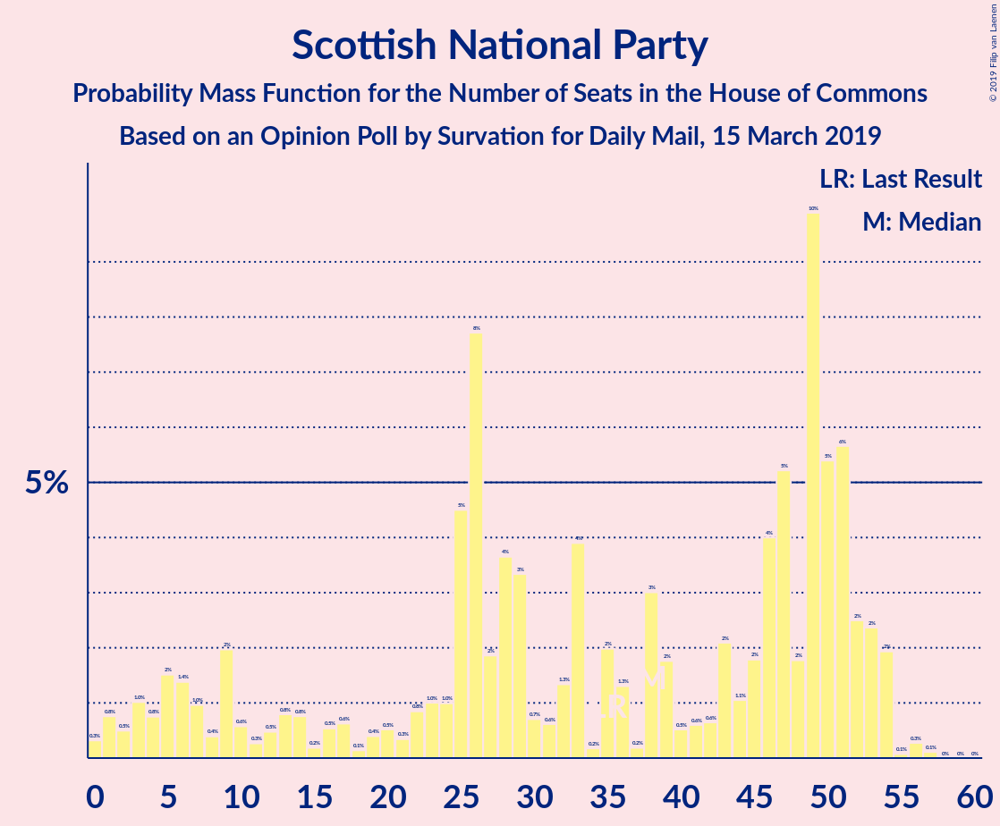
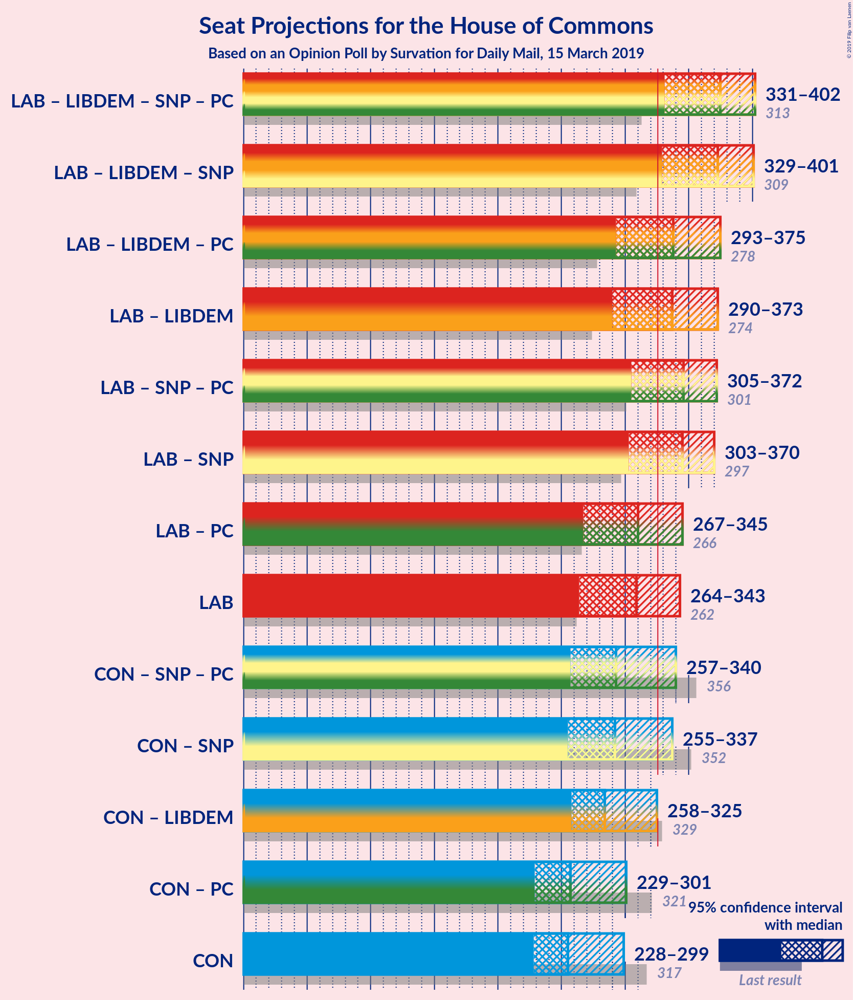
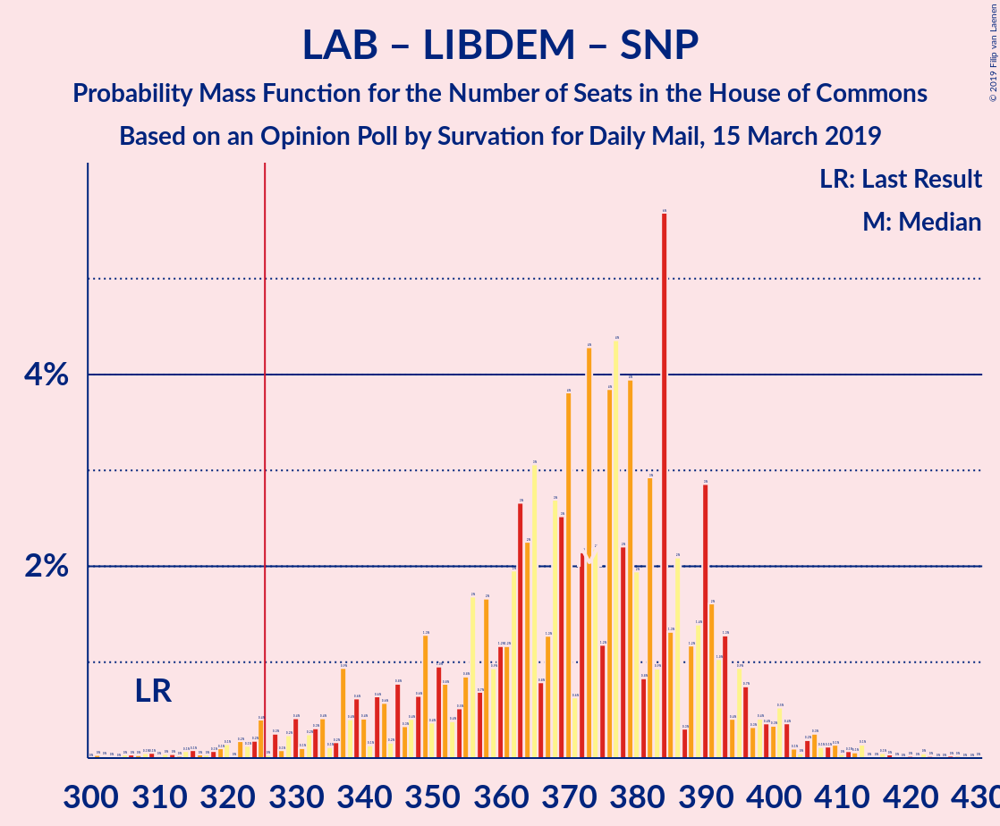
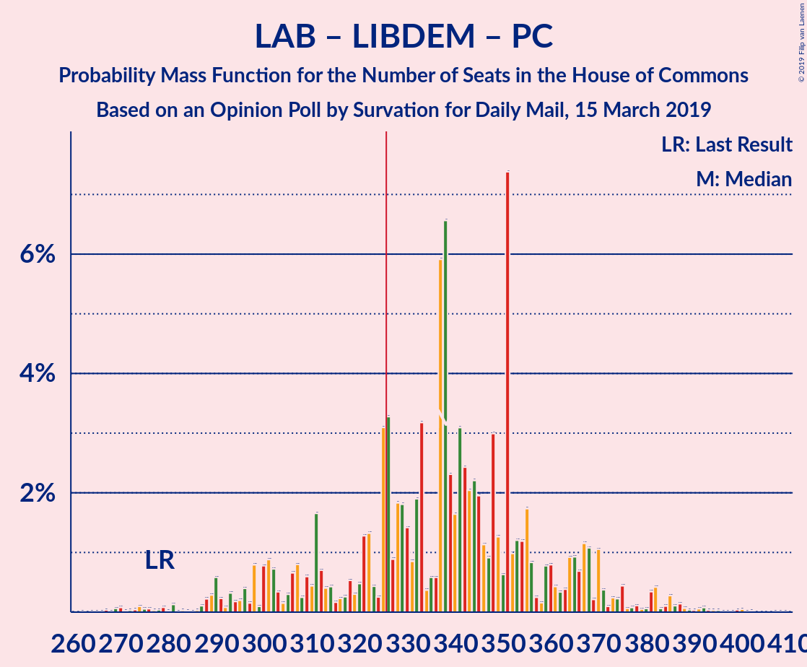
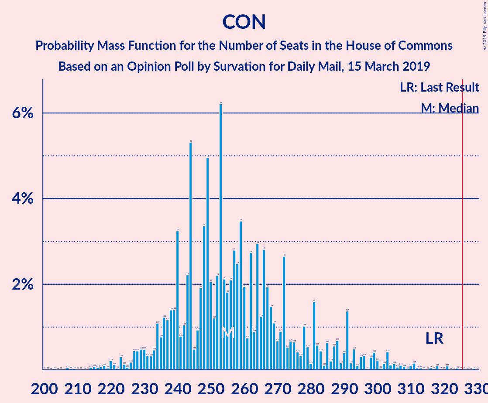

# Opinion Poll by Survation for Daily Mail, 15 March 2019

<a href="#voting-intentions">Voting Intentions</a> | <a href="#seats">Seats</a> | <a href="#coalitions">Coalitions</a> | <a href="#technical-information">Technical Information</a>

## Voting Intentions

### Confidence Intervals

| Party | Last Result | Poll Result | 80% Confidence Interval | 90% Confidence Interval | 95% Confidence Interval | 99% Confidence Interval |
|:-----:|:-----------:|:-----------:|:-----------------------:|:-----------------------:|:-----------------------:|:-----------------------:|
| Labour Party | 40.0% | 39.3% | 37.4–41.3% |36.8–41.9% |36.4–42.4% |35.4–43.3% |
| Conservative Party | 42.4% | 35.3% | 33.3–37.2% |32.8–37.8% |32.4–38.3% |31.5–39.2% |
| Liberal Democrats | 7.4% | 10.0% | 8.9–11.4% |8.6–11.7% |8.3–12.1% |7.8–12.7% |
| UK Independence Party | 1.8% | 5.1% | 4.3–6.1% |4.1–6.4% |3.9–6.6% |3.5–7.1% |
| Scottish National Party | 3.0% | 3.0% | 2.4–3.8% |2.2–4.0% |2.1–4.2% |1.8–4.6% |
| Plaid Cymru | 0.5% | 0.3% | 0.2–0.7% |0.1–0.8% |0.1–0.9% |0.1–1.1% |

*Note:* The poll result column reflects the actual value used in the calculations. Published results may vary slightly, and in addition be rounded to fewer digits.

## Seats

### Confidence Intervals

| Party | Last Result | Median | 80% Confidence Interval | 90% Confidence Interval | 95% Confidence Interval | 99% Confidence Interval |
|:-----:|:-----------:|:------:|:-----------------------:|:-----------------------:|:-----------------------:|:-----------------------:|
| <a href="#labour-party">Labour Party</a> | 262 | 325 | 310–343 |310–343 |298–343 |282–343 |
| <a href="#conservative-party">Conservative Party</a> | 317 | 239 | 238–255 |231–260 |231–261 |215–290 |
| <a href="#liberal-democrats">Liberal Democrats</a> | 12 | 33 | 30–37 |30–37 |30–38 |27–40 |
| <a href="#uk-independence-party">UK Independence Party</a> | 0 | 1 | 1 |1 |1 |1 |
| <a href="#scottish-national-party">Scottish National Party</a> | 35 | 32 | 5–49 |5–50 |3–50 |2–52 |
| <a href="#plaid-cymru">Plaid Cymru</a> | 4 | 1 | 0–1 |0–1 |0–2 |0–5 |

### Labour Party

*For a full overview of the results for this party, see the [Labour Party](party-labourparty.html) page.*

| Number of Seats | Probability | Accumulated | Special Marks |
|:---------------:|:-----------:|:-----------:|:-------------:|
| 262 | 0% | 100% | Last Result |
| 263 | 0% | 100% |  |
| 264 | 0% | 100% |  |
| 265 | 0% | 100% |  |
| 266 | 0% | 100% |  |
| 267 | 0% | 100% |  |
| 268 | 0% | 100% |  |
| 269 | 0% | 100% |  |
| 270 | 0% | 100% |  |
| 271 | 0% | 100% |  |
| 272 | 0% | 100% |  |
| 273 | 0% | 100% |  |
| 274 | 0% | 100% |  |
| 275 | 0% | 100% |  |
| 276 | 0% | 100% |  |
| 277 | 0% | 100% |  |
| 278 | 0.1% | 100% |  |
| 279 | 0% | 99.9% |  |
| 280 | 0% | 99.9% |  |
| 281 | 0% | 99.9% |  |
| 282 | 0.4% | 99.9% |  |
| 283 | 0% | 99.4% |  |
| 284 | 0% | 99.4% |  |
| 285 | 0% | 99.4% |  |
| 286 | 0% | 99.4% |  |
| 287 | 0% | 99.4% |  |
| 288 | 0% | 99.4% |  |
| 289 | 0% | 99.4% |  |
| 290 | 0.1% | 99.4% |  |
| 291 | 0.1% | 99.3% |  |
| 292 | 0% | 99.2% |  |
| 293 | 0% | 99.2% |  |
| 294 | 0% | 99.2% |  |
| 295 | 0% | 99.2% |  |
| 296 | 0% | 99.2% |  |
| 297 | 1.4% | 99.2% |  |
| 298 | 0.6% | 98% |  |
| 299 | 0% | 97% |  |
| 300 | 0.1% | 97% |  |
| 301 | 0% | 97% |  |
| 302 | 0% | 97% |  |
| 303 | 0% | 97% |  |
| 304 | 0.3% | 97% |  |
| 305 | 0% | 97% |  |
| 306 | 0% | 97% |  |
| 307 | 0% | 97% |  |
| 308 | 0% | 97% |  |
| 309 | 0% | 97% |  |
| 310 | 12% | 97% |  |
| 311 | 1.0% | 85% |  |
| 312 | 0.1% | 84% |  |
| 313 | 7% | 84% |  |
| 314 | 0% | 77% |  |
| 315 | 0% | 77% |  |
| 316 | 0% | 77% |  |
| 317 | 0% | 77% |  |
| 318 | 0% | 77% |  |
| 319 | 0% | 77% |  |
| 320 | 0% | 77% |  |
| 321 | 0% | 77% |  |
| 322 | 0% | 77% |  |
| 323 | 0% | 77% |  |
| 324 | 0.1% | 77% |  |
| 325 | 44% | 77% | Median |
| 326 | 0.1% | 33% | Majority |
| 327 | 0% | 33% |  |
| 328 | 1.0% | 33% |  |
| 329 | 0.8% | 32% |  |
| 330 | 0% | 31% |  |
| 331 | 4% | 31% |  |
| 332 | 0% | 27% |  |
| 333 | 0% | 27% |  |
| 334 | 0% | 27% |  |
| 335 | 0% | 27% |  |
| 336 | 0% | 27% |  |
| 337 | 0% | 27% |  |
| 338 | 0% | 27% |  |
| 339 | 0% | 27% |  |
| 340 | 0% | 27% |  |
| 341 | 0% | 27% |  |
| 342 | 0.9% | 27% |  |
| 343 | 26% | 26% |  |
| 344 | 0% | 0.1% |  |
| 345 | 0.1% | 0.1% |  |
| 346 | 0% | 0% |  |

### Conservative Party

*For a full overview of the results for this party, see the [Conservative Party](party-conservativeparty.html) page.*

| Number of Seats | Probability | Accumulated | Special Marks |
|:---------------:|:-----------:|:-----------:|:-------------:|
| 215 | 0.7% | 100% |  |
| 216 | 0% | 99.2% |  |
| 217 | 0% | 99.2% |  |
| 218 | 0.3% | 99.2% |  |
| 219 | 0% | 98.9% |  |
| 220 | 0% | 98.9% |  |
| 221 | 0% | 98.9% |  |
| 222 | 0% | 98.9% |  |
| 223 | 0% | 98.9% |  |
| 224 | 0% | 98.9% |  |
| 225 | 0% | 98.9% |  |
| 226 | 0.2% | 98.9% |  |
| 227 | 0% | 98.7% |  |
| 228 | 0% | 98.7% |  |
| 229 | 0% | 98.7% |  |
| 230 | 0.8% | 98.7% |  |
| 231 | 6% | 98% |  |
| 232 | 1.2% | 92% |  |
| 233 | 0% | 91% |  |
| 234 | 0% | 91% |  |
| 235 | 0% | 91% |  |
| 236 | 0.1% | 91% |  |
| 237 | 0% | 91% |  |
| 238 | 17% | 91% |  |
| 239 | 26% | 74% | Median |
| 240 | 0% | 49% |  |
| 241 | 2% | 49% |  |
| 242 | 0.6% | 47% |  |
| 243 | 0% | 46% |  |
| 244 | 1.4% | 46% |  |
| 245 | 0% | 45% |  |
| 246 | 0% | 45% |  |
| 247 | 0% | 45% |  |
| 248 | 0% | 45% |  |
| 249 | 20% | 45% |  |
| 250 | 0% | 25% |  |
| 251 | 7% | 25% |  |
| 252 | 0.1% | 18% |  |
| 253 | 0.2% | 18% |  |
| 254 | 0% | 18% |  |
| 255 | 8% | 18% |  |
| 256 | 4% | 10% |  |
| 257 | 0.2% | 6% |  |
| 258 | 0% | 6% |  |
| 259 | 0% | 6% |  |
| 260 | 0.8% | 6% |  |
| 261 | 3% | 5% |  |
| 262 | 0.4% | 2% |  |
| 263 | 0% | 1.2% |  |
| 264 | 0% | 1.2% |  |
| 265 | 0% | 1.1% |  |
| 266 | 0.2% | 1.1% |  |
| 267 | 0% | 0.9% |  |
| 268 | 0.1% | 0.9% |  |
| 269 | 0% | 0.8% |  |
| 270 | 0% | 0.8% |  |
| 271 | 0% | 0.8% |  |
| 272 | 0% | 0.8% |  |
| 273 | 0% | 0.8% |  |
| 274 | 0.1% | 0.8% |  |
| 275 | 0% | 0.7% |  |
| 276 | 0% | 0.7% |  |
| 277 | 0% | 0.7% |  |
| 278 | 0% | 0.7% |  |
| 279 | 0% | 0.7% |  |
| 280 | 0% | 0.7% |  |
| 281 | 0% | 0.7% |  |
| 282 | 0% | 0.7% |  |
| 283 | 0% | 0.7% |  |
| 284 | 0% | 0.7% |  |
| 285 | 0% | 0.7% |  |
| 286 | 0% | 0.7% |  |
| 287 | 0% | 0.7% |  |
| 288 | 0% | 0.7% |  |
| 289 | 0% | 0.7% |  |
| 290 | 0.4% | 0.7% |  |
| 291 | 0% | 0.3% |  |
| 292 | 0% | 0.3% |  |
| 293 | 0% | 0.3% |  |
| 294 | 0.1% | 0.3% |  |
| 295 | 0.1% | 0.2% |  |
| 296 | 0.1% | 0.1% |  |
| 297 | 0% | 0% |  |
| 298 | 0% | 0% |  |
| 299 | 0% | 0% |  |
| 300 | 0% | 0% |  |
| 301 | 0% | 0% |  |
| 302 | 0% | 0% |  |
| 303 | 0% | 0% |  |
| 304 | 0% | 0% |  |
| 305 | 0% | 0% |  |
| 306 | 0% | 0% |  |
| 307 | 0% | 0% |  |
| 308 | 0% | 0% |  |
| 309 | 0% | 0% |  |
| 310 | 0% | 0% |  |
| 311 | 0% | 0% |  |
| 312 | 0% | 0% |  |
| 313 | 0% | 0% |  |
| 314 | 0% | 0% |  |
| 315 | 0% | 0% |  |
| 316 | 0% | 0% |  |
| 317 | 0% | 0% | Last Result |

### Liberal Democrats

*For a full overview of the results for this party, see the [Liberal Democrats](party-liberaldemocrats.html) page.*

| Number of Seats | Probability | Accumulated | Special Marks |
|:---------------:|:-----------:|:-----------:|:-------------:|
| 12 | 0% | 100% | Last Result |
| 13 | 0% | 100% |  |
| 14 | 0% | 100% |  |
| 15 | 0% | 100% |  |
| 16 | 0% | 100% |  |
| 17 | 0% | 100% |  |
| 18 | 0% | 100% |  |
| 19 | 0% | 100% |  |
| 20 | 0% | 100% |  |
| 21 | 0% | 100% |  |
| 22 | 0.1% | 100% |  |
| 23 | 0% | 99.9% |  |
| 24 | 0% | 99.9% |  |
| 25 | 0.1% | 99.9% |  |
| 26 | 0.2% | 99.8% |  |
| 27 | 0.8% | 99.6% |  |
| 28 | 0.1% | 98.8% |  |
| 29 | 0% | 98.7% |  |
| 30 | 20% | 98.7% |  |
| 31 | 9% | 78% |  |
| 32 | 0% | 70% |  |
| 33 | 43% | 70% | Median |
| 34 | 1.3% | 27% |  |
| 35 | 10% | 25% |  |
| 36 | 5% | 16% |  |
| 37 | 8% | 10% |  |
| 38 | 0.2% | 3% |  |
| 39 | 0.2% | 2% |  |
| 40 | 2% | 2% |  |
| 41 | 0% | 0.1% |  |
| 42 | 0% | 0.1% |  |
| 43 | 0% | 0.1% |  |
| 44 | 0.1% | 0.1% |  |
| 45 | 0% | 0% |  |

### UK Independence Party

*For a full overview of the results for this party, see the [UK Independence Party](party-ukindependenceparty.html) page.*

| Number of Seats | Probability | Accumulated | Special Marks |
|:---------------:|:-----------:|:-----------:|:-------------:|
| 0 | 0% | 100% | Last Result |
| 1 | 100% | 100% | Median |

### Scottish National Party

*For a full overview of the results for this party, see the [Scottish National Party](party-scottishnationalparty.html) page.*

| Number of Seats | Probability | Accumulated | Special Marks |
|:---------------:|:-----------:|:-----------:|:-------------:|
| 2 | 0.5% | 100% |  |
| 3 | 4% | 99.4% |  |
| 4 | 0% | 96% |  |
| 5 | 7% | 96% |  |
| 6 | 0% | 88% |  |
| 7 | 0% | 88% |  |
| 8 | 19% | 88% |  |
| 9 | 0.9% | 69% |  |
| 10 | 0% | 68% |  |
| 11 | 0% | 68% |  |
| 12 | 0% | 68% |  |
| 13 | 0% | 68% |  |
| 14 | 0% | 68% |  |
| 15 | 0% | 68% |  |
| 16 | 0% | 68% |  |
| 17 | 0% | 68% |  |
| 18 | 0% | 68% |  |
| 19 | 0% | 68% |  |
| 20 | 0% | 68% |  |
| 21 | 0% | 68% |  |
| 22 | 0% | 68% |  |
| 23 | 0% | 68% |  |
| 24 | 0% | 68% |  |
| 25 | 0% | 68% |  |
| 26 | 0.6% | 68% |  |
| 27 | 0% | 68% |  |
| 28 | 12% | 68% |  |
| 29 | 0.2% | 56% |  |
| 30 | 0% | 55% |  |
| 31 | 0% | 55% |  |
| 32 | 27% | 55% | Median |
| 33 | 17% | 28% |  |
| 34 | 0% | 11% |  |
| 35 | 0.1% | 11% | Last Result |
| 36 | 0% | 11% |  |
| 37 | 0% | 11% |  |
| 38 | 0% | 11% |  |
| 39 | 0% | 11% |  |
| 40 | 0% | 11% |  |
| 41 | 0% | 11% |  |
| 42 | 0% | 11% |  |
| 43 | 0% | 11% |  |
| 44 | 0% | 11% |  |
| 45 | 0% | 11% |  |
| 46 | 0% | 11% |  |
| 47 | 0% | 11% |  |
| 48 | 0% | 11% |  |
| 49 | 2% | 11% |  |
| 50 | 7% | 9% |  |
| 51 | 0.8% | 2% |  |
| 52 | 0.7% | 1.1% |  |
| 53 | 0.4% | 0.4% |  |
| 54 | 0% | 0% |  |

### Plaid Cymru

*For a full overview of the results for this party, see the [Plaid Cymru](party-plaidcymru.html) page.*

| Number of Seats | Probability | Accumulated | Special Marks |
|:---------------:|:-----------:|:-----------:|:-------------:|
| 0 | 45% | 100% |  |
| 1 | 52% | 55% | Median |
| 2 | 2% | 3% |  |
| 3 | 0.1% | 1.3% |  |
| 4 | 0% | 1.3% | Last Result |
| 5 | 1.1% | 1.3% |  |
| 6 | 0.2% | 0.2% |  |
| 7 | 0% | 0% |  |

## Coalitions

### Confidence Intervals

| Coalition | Last Result | Median | Majority? | 80% Confidence Interval | 90% Confidence Interval | 95% Confidence Interval | 99% Confidence Interval |
|:---------:|:-----------:|:------:|:---------:|:-----------------------:|:-----------------------:|:-----------------------:|:-----------------------:|
| Labour Party – Liberal Democrats – Scottish National Party – Plaid Cymru | 313 | 391 | 100% | 375–392 | 370–399 | 369–399 | 340–415 |
| Labour Party – Liberal Democrats – Scottish National Party | 309 | 390 | 100% | 375–391 | 369–398 | 369–398 | 335–413 |
| Labour Party – Liberal Democrats | 274 | 358 | 99.2% | 347–373 | 346–374 | 337–374 | 309–374 |
| Labour Party – Liberal Democrats – Plaid Cymru | 278 | 359 | 99.2% | 347–373 | 346–374 | 337–374 | 314–374 |
| Labour Party – Scottish National Party – Plaid Cymru | 301 | 358 | 99.3% | 338–359 | 334–364 | 334–364 | 313–382 |
| Labour Party – Scottish National Party | 297 | 357 | 99.3% | 338–358 | 334–363 | 334–363 | 308–380 |
| Labour Party – Plaid Cymru | 266 | 326 | 77% | 310–343 | 310–343 | 299–343 | 287–343 |
| Labour Party | 262 | 325 | 33% | 310–343 | 310–343 | 298–343 | 282–343 |
| Conservative Party – Liberal Democrats | 329 | 272 | 0% | 271–292 | 266–296 | 266–296 | 248–317 |
| Conservative Party – Scottish National Party – Plaid Cymru | 356 | 272 | 0% | 257–283 | 256–284 | 256–293 | 256–321 |
| Conservative Party – Scottish National Party | 352 | 271 | 0% | 257–283 | 256–284 | 256–293 | 256–316 |
| Conservative Party – Plaid Cymru | 321 | 240 | 0% | 239–255 | 232–261 | 232–261 | 217–295 |
| Conservative Party | 317 | 239 | 0% | 238–255 | 231–260 | 231–261 | 215–290 |

### Labour Party – Liberal Democrats – Scottish National Party – Plaid Cymru

| Number of Seats | Probability | Accumulated | Special Marks |
|:---------------:|:-----------:|:-----------:|:-------------:|
| 313 | 0% | 100% | Last Result |
| 314 | 0% | 100% |  |
| 315 | 0% | 100% |  |
| 316 | 0% | 100% |  |
| 317 | 0% | 100% |  |
| 318 | 0% | 100% |  |
| 319 | 0% | 100% |  |
| 320 | 0% | 100% |  |
| 321 | 0% | 100% |  |
| 322 | 0% | 100% |  |
| 323 | 0% | 100% |  |
| 324 | 0% | 100% |  |
| 325 | 0% | 100% |  |
| 326 | 0% | 100% | Majority |
| 327 | 0% | 100% |  |
| 328 | 0% | 100% |  |
| 329 | 0% | 100% |  |
| 330 | 0% | 100% |  |
| 331 | 0% | 100% |  |
| 332 | 0% | 100% |  |
| 333 | 0% | 100% |  |
| 334 | 0.1% | 100% |  |
| 335 | 0.1% | 99.9% |  |
| 336 | 0.1% | 99.8% |  |
| 337 | 0% | 99.7% |  |
| 338 | 0% | 99.7% |  |
| 339 | 0% | 99.7% |  |
| 340 | 0.4% | 99.7% |  |
| 341 | 0% | 99.3% |  |
| 342 | 0% | 99.3% |  |
| 343 | 0% | 99.3% |  |
| 344 | 0% | 99.3% |  |
| 345 | 0% | 99.3% |  |
| 346 | 0% | 99.3% |  |
| 347 | 0% | 99.3% |  |
| 348 | 0% | 99.3% |  |
| 349 | 0% | 99.3% |  |
| 350 | 0% | 99.3% |  |
| 351 | 0% | 99.3% |  |
| 352 | 0% | 99.3% |  |
| 353 | 0% | 99.3% |  |
| 354 | 0% | 99.3% |  |
| 355 | 0% | 99.3% |  |
| 356 | 0.1% | 99.3% |  |
| 357 | 0% | 99.2% |  |
| 358 | 0% | 99.2% |  |
| 359 | 0% | 99.2% |  |
| 360 | 0% | 99.2% |  |
| 361 | 0% | 99.2% |  |
| 362 | 0.1% | 99.2% |  |
| 363 | 0% | 99.1% |  |
| 364 | 0.2% | 99.1% |  |
| 365 | 0% | 98.9% |  |
| 366 | 0% | 98.9% |  |
| 367 | 0% | 98.8% |  |
| 368 | 0.4% | 98.8% |  |
| 369 | 3% | 98% |  |
| 370 | 0.8% | 95% |  |
| 371 | 0% | 94% |  |
| 372 | 0% | 94% |  |
| 373 | 0.2% | 94% |  |
| 374 | 4% | 94% |  |
| 375 | 8% | 90% |  |
| 376 | 0% | 82% |  |
| 377 | 0.2% | 82% |  |
| 378 | 0.1% | 82% |  |
| 379 | 7% | 82% |  |
| 380 | 0% | 75% |  |
| 381 | 20% | 75% |  |
| 382 | 0% | 55% |  |
| 383 | 0% | 55% |  |
| 384 | 0% | 55% |  |
| 385 | 0% | 55% |  |
| 386 | 1.4% | 55% |  |
| 387 | 0% | 54% |  |
| 388 | 0.6% | 54% |  |
| 389 | 2% | 53% |  |
| 390 | 0% | 51% |  |
| 391 | 26% | 51% | Median |
| 392 | 17% | 26% |  |
| 393 | 0% | 9% |  |
| 394 | 0.1% | 9% |  |
| 395 | 0% | 9% |  |
| 396 | 0% | 9% |  |
| 397 | 0% | 9% |  |
| 398 | 1.2% | 9% |  |
| 399 | 6% | 8% |  |
| 400 | 0.8% | 2% |  |
| 401 | 0% | 1.3% |  |
| 402 | 0% | 1.3% |  |
| 403 | 0% | 1.3% |  |
| 404 | 0.2% | 1.3% |  |
| 405 | 0% | 1.1% |  |
| 406 | 0% | 1.1% |  |
| 407 | 0% | 1.1% |  |
| 408 | 0% | 1.1% |  |
| 409 | 0% | 1.1% |  |
| 410 | 0% | 1.1% |  |
| 411 | 0.3% | 1.1% |  |
| 412 | 0% | 0.8% |  |
| 413 | 0% | 0.8% |  |
| 414 | 0% | 0.8% |  |
| 415 | 0.7% | 0.8% |  |
| 416 | 0% | 0% |  |

### Labour Party – Liberal Democrats – Scottish National Party

| Number of Seats | Probability | Accumulated | Special Marks |
|:---------------:|:-----------:|:-----------:|:-------------:|
| 309 | 0% | 100% | Last Result |
| 310 | 0% | 100% |  |
| 311 | 0% | 100% |  |
| 312 | 0% | 100% |  |
| 313 | 0% | 100% |  |
| 314 | 0% | 100% |  |
| 315 | 0% | 100% |  |
| 316 | 0% | 100% |  |
| 317 | 0% | 100% |  |
| 318 | 0% | 100% |  |
| 319 | 0% | 100% |  |
| 320 | 0% | 100% |  |
| 321 | 0% | 100% |  |
| 322 | 0% | 100% |  |
| 323 | 0% | 100% |  |
| 324 | 0% | 100% |  |
| 325 | 0% | 100% |  |
| 326 | 0% | 100% | Majority |
| 327 | 0% | 100% |  |
| 328 | 0% | 100% |  |
| 329 | 0.1% | 100% |  |
| 330 | 0.1% | 99.9% |  |
| 331 | 0.1% | 99.8% |  |
| 332 | 0% | 99.7% |  |
| 333 | 0% | 99.7% |  |
| 334 | 0% | 99.7% |  |
| 335 | 0.4% | 99.7% |  |
| 336 | 0% | 99.3% |  |
| 337 | 0% | 99.3% |  |
| 338 | 0% | 99.3% |  |
| 339 | 0% | 99.3% |  |
| 340 | 0% | 99.3% |  |
| 341 | 0% | 99.3% |  |
| 342 | 0% | 99.3% |  |
| 343 | 0% | 99.3% |  |
| 344 | 0% | 99.3% |  |
| 345 | 0% | 99.3% |  |
| 346 | 0% | 99.3% |  |
| 347 | 0% | 99.3% |  |
| 348 | 0% | 99.3% |  |
| 349 | 0% | 99.3% |  |
| 350 | 0% | 99.3% |  |
| 351 | 0.1% | 99.3% |  |
| 352 | 0% | 99.2% |  |
| 353 | 0% | 99.2% |  |
| 354 | 0% | 99.2% |  |
| 355 | 0% | 99.2% |  |
| 356 | 0% | 99.2% |  |
| 357 | 0.1% | 99.2% |  |
| 358 | 0% | 99.1% |  |
| 359 | 0.2% | 99.1% |  |
| 360 | 0% | 98.9% |  |
| 361 | 0% | 98.9% |  |
| 362 | 0% | 98.9% |  |
| 363 | 0% | 98.9% |  |
| 364 | 0% | 98.9% |  |
| 365 | 0% | 98.9% |  |
| 366 | 0% | 98.9% |  |
| 367 | 0.1% | 98.8% |  |
| 368 | 0.4% | 98.7% |  |
| 369 | 3% | 98% |  |
| 370 | 0.8% | 95% |  |
| 371 | 0% | 94% |  |
| 372 | 0% | 94% |  |
| 373 | 0.1% | 94% |  |
| 374 | 4% | 94% |  |
| 375 | 8% | 90% |  |
| 376 | 0% | 82% |  |
| 377 | 0.2% | 82% |  |
| 378 | 0.1% | 82% |  |
| 379 | 7% | 82% |  |
| 380 | 0% | 75% |  |
| 381 | 20% | 75% |  |
| 382 | 0% | 55% |  |
| 383 | 0% | 55% |  |
| 384 | 0% | 55% |  |
| 385 | 0% | 55% |  |
| 386 | 1.4% | 55% |  |
| 387 | 0.6% | 54% |  |
| 388 | 2% | 53% |  |
| 389 | 0% | 51% |  |
| 390 | 26% | 51% | Median |
| 391 | 17% | 26% |  |
| 392 | 0% | 9% |  |
| 393 | 0.1% | 9% |  |
| 394 | 0% | 9% |  |
| 395 | 0% | 9% |  |
| 396 | 0% | 9% |  |
| 397 | 1.2% | 9% |  |
| 398 | 7% | 8% |  |
| 399 | 0% | 1.3% |  |
| 400 | 0% | 1.3% |  |
| 401 | 0% | 1.3% |  |
| 402 | 0.2% | 1.3% |  |
| 403 | 0% | 1.1% |  |
| 404 | 0% | 1.1% |  |
| 405 | 0% | 1.1% |  |
| 406 | 0% | 1.1% |  |
| 407 | 0% | 1.1% |  |
| 408 | 0% | 1.1% |  |
| 409 | 0.3% | 1.1% |  |
| 410 | 0% | 0.8% |  |
| 411 | 0% | 0.8% |  |
| 412 | 0% | 0.8% |  |
| 413 | 0.7% | 0.8% |  |
| 414 | 0% | 0% |  |

### Labour Party – Liberal Democrats

| Number of Seats | Probability | Accumulated | Special Marks |
|:---------------:|:-----------:|:-----------:|:-------------:|
| 274 | 0% | 100% | Last Result |
| 275 | 0% | 100% |  |
| 276 | 0% | 100% |  |
| 277 | 0% | 100% |  |
| 278 | 0% | 100% |  |
| 279 | 0% | 100% |  |
| 280 | 0% | 100% |  |
| 281 | 0% | 100% |  |
| 282 | 0% | 100% |  |
| 283 | 0% | 100% |  |
| 284 | 0% | 100% |  |
| 285 | 0% | 100% |  |
| 286 | 0% | 100% |  |
| 287 | 0% | 100% |  |
| 288 | 0% | 100% |  |
| 289 | 0% | 100% |  |
| 290 | 0% | 100% |  |
| 291 | 0% | 100% |  |
| 292 | 0% | 100% |  |
| 293 | 0% | 100% |  |
| 294 | 0% | 100% |  |
| 295 | 0% | 100% |  |
| 296 | 0% | 100% |  |
| 297 | 0% | 100% |  |
| 298 | 0% | 100% |  |
| 299 | 0% | 100% |  |
| 300 | 0% | 100% |  |
| 301 | 0% | 100% |  |
| 302 | 0% | 100% |  |
| 303 | 0% | 100% |  |
| 304 | 0% | 100% |  |
| 305 | 0.1% | 100% |  |
| 306 | 0% | 99.9% |  |
| 307 | 0% | 99.9% |  |
| 308 | 0% | 99.9% |  |
| 309 | 0.4% | 99.9% |  |
| 310 | 0% | 99.4% |  |
| 311 | 0% | 99.4% |  |
| 312 | 0% | 99.4% |  |
| 313 | 0% | 99.4% |  |
| 314 | 0% | 99.4% |  |
| 315 | 0% | 99.4% |  |
| 316 | 0% | 99.4% |  |
| 317 | 0.1% | 99.4% |  |
| 318 | 0.1% | 99.3% |  |
| 319 | 0% | 99.3% |  |
| 320 | 0% | 99.3% |  |
| 321 | 0% | 99.3% |  |
| 322 | 0% | 99.3% |  |
| 323 | 0% | 99.3% |  |
| 324 | 0% | 99.2% |  |
| 325 | 0% | 99.2% |  |
| 326 | 0% | 99.2% | Majority |
| 327 | 0.1% | 99.2% |  |
| 328 | 0.1% | 99.1% |  |
| 329 | 0.1% | 99.1% |  |
| 330 | 0.2% | 99.0% |  |
| 331 | 0% | 98.8% |  |
| 332 | 0% | 98.8% |  |
| 333 | 0% | 98.8% |  |
| 334 | 0% | 98.8% |  |
| 335 | 0% | 98.7% |  |
| 336 | 0% | 98.7% |  |
| 337 | 1.4% | 98.7% |  |
| 338 | 0.6% | 97% |  |
| 339 | 0% | 97% |  |
| 340 | 0% | 97% |  |
| 341 | 0% | 97% |  |
| 342 | 0% | 97% |  |
| 343 | 0% | 97% |  |
| 344 | 0% | 97% |  |
| 345 | 0% | 97% |  |
| 346 | 4% | 97% |  |
| 347 | 10% | 93% |  |
| 348 | 6% | 83% |  |
| 349 | 0.5% | 77% |  |
| 350 | 0% | 77% |  |
| 351 | 0% | 77% |  |
| 352 | 0% | 77% |  |
| 353 | 0% | 77% |  |
| 354 | 0% | 77% |  |
| 355 | 0% | 77% |  |
| 356 | 2% | 77% |  |
| 357 | 0% | 75% |  |
| 358 | 42% | 75% | Median |
| 359 | 0.3% | 33% |  |
| 360 | 0% | 32% |  |
| 361 | 0.7% | 32% |  |
| 362 | 0% | 32% |  |
| 363 | 0% | 32% |  |
| 364 | 0% | 32% |  |
| 365 | 0.8% | 31% |  |
| 366 | 4% | 31% |  |
| 367 | 0% | 27% |  |
| 368 | 0% | 27% |  |
| 369 | 0% | 27% |  |
| 370 | 0% | 27% |  |
| 371 | 0% | 27% |  |
| 372 | 0.9% | 27% |  |
| 373 | 19% | 26% |  |
| 374 | 7% | 7% |  |
| 375 | 0.1% | 0.1% |  |
| 376 | 0% | 0% |  |

### Labour Party – Liberal Democrats – Plaid Cymru

| Number of Seats | Probability | Accumulated | Special Marks |
|:---------------:|:-----------:|:-----------:|:-------------:|
| 278 | 0% | 100% | Last Result |
| 279 | 0% | 100% |  |
| 280 | 0% | 100% |  |
| 281 | 0% | 100% |  |
| 282 | 0% | 100% |  |
| 283 | 0% | 100% |  |
| 284 | 0% | 100% |  |
| 285 | 0% | 100% |  |
| 286 | 0% | 100% |  |
| 287 | 0% | 100% |  |
| 288 | 0% | 100% |  |
| 289 | 0% | 100% |  |
| 290 | 0% | 100% |  |
| 291 | 0% | 100% |  |
| 292 | 0% | 100% |  |
| 293 | 0% | 100% |  |
| 294 | 0% | 100% |  |
| 295 | 0% | 100% |  |
| 296 | 0% | 100% |  |
| 297 | 0% | 100% |  |
| 298 | 0% | 100% |  |
| 299 | 0% | 100% |  |
| 300 | 0% | 100% |  |
| 301 | 0% | 100% |  |
| 302 | 0% | 100% |  |
| 303 | 0% | 100% |  |
| 304 | 0% | 100% |  |
| 305 | 0% | 100% |  |
| 306 | 0% | 100% |  |
| 307 | 0% | 100% |  |
| 308 | 0% | 100% |  |
| 309 | 0% | 100% |  |
| 310 | 0.1% | 100% |  |
| 311 | 0% | 99.9% |  |
| 312 | 0% | 99.9% |  |
| 313 | 0% | 99.9% |  |
| 314 | 0.4% | 99.9% |  |
| 315 | 0% | 99.4% |  |
| 316 | 0% | 99.4% |  |
| 317 | 0% | 99.4% |  |
| 318 | 0% | 99.4% |  |
| 319 | 0% | 99.4% |  |
| 320 | 0% | 99.4% |  |
| 321 | 0% | 99.4% |  |
| 322 | 0% | 99.4% |  |
| 323 | 0.1% | 99.4% |  |
| 324 | 0.1% | 99.3% |  |
| 325 | 0% | 99.2% |  |
| 326 | 0% | 99.2% | Majority |
| 327 | 0% | 99.2% |  |
| 328 | 0% | 99.2% |  |
| 329 | 0% | 99.2% |  |
| 330 | 0% | 99.2% |  |
| 331 | 0% | 99.2% |  |
| 332 | 0.1% | 99.2% |  |
| 333 | 0.1% | 99.1% |  |
| 334 | 0.1% | 99.1% |  |
| 335 | 0.2% | 98.9% |  |
| 336 | 0% | 98.7% |  |
| 337 | 1.4% | 98.7% |  |
| 338 | 0% | 97% |  |
| 339 | 0.6% | 97% |  |
| 340 | 0% | 97% |  |
| 341 | 0% | 97% |  |
| 342 | 0% | 97% |  |
| 343 | 0% | 97% |  |
| 344 | 0% | 97% |  |
| 345 | 0% | 97% |  |
| 346 | 4% | 97% |  |
| 347 | 8% | 93% |  |
| 348 | 1.2% | 85% |  |
| 349 | 7% | 84% |  |
| 350 | 0% | 77% |  |
| 351 | 0.2% | 77% |  |
| 352 | 0% | 77% |  |
| 353 | 0% | 77% |  |
| 354 | 0% | 77% |  |
| 355 | 0% | 77% |  |
| 356 | 0% | 77% |  |
| 357 | 2% | 77% |  |
| 358 | 0% | 75% |  |
| 359 | 42% | 75% | Median |
| 360 | 0% | 33% |  |
| 361 | 0.3% | 33% |  |
| 362 | 0% | 32% |  |
| 363 | 0.7% | 32% |  |
| 364 | 0.1% | 32% |  |
| 365 | 0.8% | 31% |  |
| 366 | 4% | 31% |  |
| 367 | 0% | 27% |  |
| 368 | 0% | 27% |  |
| 369 | 0% | 27% |  |
| 370 | 0% | 27% |  |
| 371 | 0% | 27% |  |
| 372 | 0.9% | 27% |  |
| 373 | 19% | 26% |  |
| 374 | 7% | 7% |  |
| 375 | 0.1% | 0.1% |  |
| 376 | 0% | 0% |  |

### Labour Party – Scottish National Party – Plaid Cymru

| Number of Seats | Probability | Accumulated | Special Marks |
|:---------------:|:-----------:|:-----------:|:-------------:|
| 301 | 0% | 100% | Last Result |
| 302 | 0% | 100% |  |
| 303 | 0% | 100% |  |
| 304 | 0% | 100% |  |
| 305 | 0% | 100% |  |
| 306 | 0% | 100% |  |
| 307 | 0.1% | 100% |  |
| 308 | 0% | 99.8% |  |
| 309 | 0.1% | 99.8% |  |
| 310 | 0% | 99.7% |  |
| 311 | 0% | 99.7% |  |
| 312 | 0% | 99.7% |  |
| 313 | 0.4% | 99.7% |  |
| 314 | 0% | 99.3% |  |
| 315 | 0% | 99.3% |  |
| 316 | 0% | 99.3% |  |
| 317 | 0% | 99.3% |  |
| 318 | 0% | 99.3% |  |
| 319 | 0% | 99.3% |  |
| 320 | 0% | 99.3% |  |
| 321 | 0% | 99.3% |  |
| 322 | 0% | 99.3% |  |
| 323 | 0% | 99.3% |  |
| 324 | 0% | 99.3% |  |
| 325 | 0% | 99.3% |  |
| 326 | 0% | 99.3% | Majority |
| 327 | 0% | 99.2% |  |
| 328 | 0% | 99.2% |  |
| 329 | 0% | 99.2% |  |
| 330 | 0% | 99.2% |  |
| 331 | 0% | 99.2% |  |
| 332 | 0% | 99.2% |  |
| 333 | 0.4% | 99.2% |  |
| 334 | 4% | 98.8% |  |
| 335 | 0% | 95% |  |
| 336 | 0% | 95% |  |
| 337 | 0.1% | 95% |  |
| 338 | 12% | 95% |  |
| 339 | 0.2% | 83% |  |
| 340 | 0% | 82% |  |
| 341 | 0% | 82% |  |
| 342 | 0% | 82% |  |
| 343 | 0% | 82% |  |
| 344 | 0% | 82% |  |
| 345 | 0% | 82% |  |
| 346 | 2% | 82% |  |
| 347 | 0.1% | 81% |  |
| 348 | 7% | 81% |  |
| 349 | 0% | 73% |  |
| 350 | 0% | 73% |  |
| 351 | 20% | 73% |  |
| 352 | 0% | 53% |  |
| 353 | 0% | 53% |  |
| 354 | 0% | 53% |  |
| 355 | 0% | 53% |  |
| 356 | 0% | 53% |  |
| 357 | 0% | 53% |  |
| 358 | 27% | 53% | Median |
| 359 | 17% | 26% |  |
| 360 | 0.1% | 9% |  |
| 361 | 0% | 9% |  |
| 362 | 0% | 9% |  |
| 363 | 0% | 9% |  |
| 364 | 8% | 9% |  |
| 365 | 0.2% | 1.3% |  |
| 366 | 0% | 1.1% |  |
| 367 | 0% | 1.1% |  |
| 368 | 0% | 1.1% |  |
| 369 | 0% | 1.1% |  |
| 370 | 0% | 1.1% |  |
| 371 | 0% | 1.1% |  |
| 372 | 0% | 1.1% |  |
| 373 | 0% | 1.1% |  |
| 374 | 0% | 1.1% |  |
| 375 | 0% | 1.1% |  |
| 376 | 0% | 1.1% |  |
| 377 | 0% | 1.1% |  |
| 378 | 0% | 1.1% |  |
| 379 | 0% | 1.1% |  |
| 380 | 0.3% | 1.1% |  |
| 381 | 0% | 0.8% |  |
| 382 | 0.8% | 0.8% |  |
| 383 | 0% | 0% |  |

### Labour Party – Scottish National Party

| Number of Seats | Probability | Accumulated | Special Marks |
|:---------------:|:-----------:|:-----------:|:-------------:|
| 297 | 0% | 100% | Last Result |
| 298 | 0% | 100% |  |
| 299 | 0% | 100% |  |
| 300 | 0% | 100% |  |
| 301 | 0% | 100% |  |
| 302 | 0.1% | 100% |  |
| 303 | 0% | 99.8% |  |
| 304 | 0.1% | 99.8% |  |
| 305 | 0% | 99.7% |  |
| 306 | 0% | 99.7% |  |
| 307 | 0% | 99.7% |  |
| 308 | 0.4% | 99.7% |  |
| 309 | 0% | 99.3% |  |
| 310 | 0% | 99.3% |  |
| 311 | 0% | 99.3% |  |
| 312 | 0% | 99.3% |  |
| 313 | 0% | 99.3% |  |
| 314 | 0% | 99.3% |  |
| 315 | 0% | 99.3% |  |
| 316 | 0% | 99.3% |  |
| 317 | 0% | 99.3% |  |
| 318 | 0% | 99.3% |  |
| 319 | 0% | 99.3% |  |
| 320 | 0% | 99.3% |  |
| 321 | 0% | 99.3% |  |
| 322 | 0% | 99.3% |  |
| 323 | 0% | 99.3% |  |
| 324 | 0% | 99.3% |  |
| 325 | 0% | 99.3% |  |
| 326 | 0% | 99.3% | Majority |
| 327 | 0% | 99.2% |  |
| 328 | 0% | 99.2% |  |
| 329 | 0.1% | 99.2% |  |
| 330 | 0% | 99.2% |  |
| 331 | 0% | 99.2% |  |
| 332 | 0.1% | 99.2% |  |
| 333 | 0.6% | 99.1% |  |
| 334 | 4% | 98% |  |
| 335 | 0% | 94% |  |
| 336 | 0% | 94% |  |
| 337 | 0% | 94% |  |
| 338 | 12% | 94% |  |
| 339 | 0.2% | 83% |  |
| 340 | 0.1% | 82% |  |
| 341 | 0.1% | 82% |  |
| 342 | 0% | 82% |  |
| 343 | 0% | 82% |  |
| 344 | 0% | 82% |  |
| 345 | 0% | 82% |  |
| 346 | 1.4% | 82% |  |
| 347 | 0.6% | 81% |  |
| 348 | 7% | 80% |  |
| 349 | 0% | 73% |  |
| 350 | 0% | 73% |  |
| 351 | 20% | 73% |  |
| 352 | 0% | 53% |  |
| 353 | 0% | 53% |  |
| 354 | 0% | 53% |  |
| 355 | 0% | 53% |  |
| 356 | 0% | 53% |  |
| 357 | 27% | 53% | Median |
| 358 | 17% | 26% |  |
| 359 | 0.1% | 9% |  |
| 360 | 0% | 9% |  |
| 361 | 0% | 9% |  |
| 362 | 0.8% | 9% |  |
| 363 | 7% | 8% |  |
| 364 | 0% | 1.1% |  |
| 365 | 0% | 1.1% |  |
| 366 | 0% | 1.1% |  |
| 367 | 0% | 1.1% |  |
| 368 | 0% | 1.1% |  |
| 369 | 0% | 1.1% |  |
| 370 | 0% | 1.1% |  |
| 371 | 0% | 1.1% |  |
| 372 | 0% | 1.1% |  |
| 373 | 0% | 1.1% |  |
| 374 | 0% | 1.1% |  |
| 375 | 0% | 1.1% |  |
| 376 | 0% | 1.1% |  |
| 377 | 0% | 1.1% |  |
| 378 | 0.3% | 1.1% |  |
| 379 | 0% | 0.8% |  |
| 380 | 0.7% | 0.7% |  |
| 381 | 0% | 0% |  |

### Labour Party – Plaid Cymru

| Number of Seats | Probability | Accumulated | Special Marks |
|:---------------:|:-----------:|:-----------:|:-------------:|
| 266 | 0% | 100% | Last Result |
| 267 | 0% | 100% |  |
| 268 | 0% | 100% |  |
| 269 | 0% | 100% |  |
| 270 | 0% | 100% |  |
| 271 | 0% | 100% |  |
| 272 | 0% | 100% |  |
| 273 | 0% | 100% |  |
| 274 | 0% | 100% |  |
| 275 | 0% | 100% |  |
| 276 | 0% | 100% |  |
| 277 | 0% | 100% |  |
| 278 | 0% | 100% |  |
| 279 | 0% | 100% |  |
| 280 | 0% | 100% |  |
| 281 | 0% | 99.9% |  |
| 282 | 0% | 99.9% |  |
| 283 | 0.1% | 99.9% |  |
| 284 | 0% | 99.9% |  |
| 285 | 0% | 99.9% |  |
| 286 | 0% | 99.9% |  |
| 287 | 0.4% | 99.9% |  |
| 288 | 0% | 99.4% |  |
| 289 | 0% | 99.4% |  |
| 290 | 0% | 99.4% |  |
| 291 | 0% | 99.4% |  |
| 292 | 0% | 99.4% |  |
| 293 | 0% | 99.4% |  |
| 294 | 0% | 99.4% |  |
| 295 | 0% | 99.4% |  |
| 296 | 0.1% | 99.4% |  |
| 297 | 1.4% | 99.3% |  |
| 298 | 0% | 98% |  |
| 299 | 0.6% | 98% |  |
| 300 | 0% | 97% |  |
| 301 | 0% | 97% |  |
| 302 | 0% | 97% |  |
| 303 | 0% | 97% |  |
| 304 | 0% | 97% |  |
| 305 | 0.1% | 97% |  |
| 306 | 0% | 97% |  |
| 307 | 0% | 97% |  |
| 308 | 0% | 97% |  |
| 309 | 0.3% | 97% |  |
| 310 | 12% | 97% |  |
| 311 | 0.2% | 85% |  |
| 312 | 0.4% | 85% |  |
| 313 | 0.8% | 85% |  |
| 314 | 7% | 84% |  |
| 315 | 0% | 77% |  |
| 316 | 0% | 77% |  |
| 317 | 0% | 77% |  |
| 318 | 0% | 77% |  |
| 319 | 0% | 77% |  |
| 320 | 0% | 77% |  |
| 321 | 0% | 77% |  |
| 322 | 0% | 77% |  |
| 323 | 0% | 77% |  |
| 324 | 0% | 77% |  |
| 325 | 0.1% | 77% |  |
| 326 | 44% | 77% | Median, Majority |
| 327 | 0% | 33% |  |
| 328 | 0% | 33% |  |
| 329 | 0.8% | 33% |  |
| 330 | 1.0% | 32% |  |
| 331 | 4% | 31% |  |
| 332 | 0% | 27% |  |
| 333 | 0% | 27% |  |
| 334 | 0% | 27% |  |
| 335 | 0% | 27% |  |
| 336 | 0% | 27% |  |
| 337 | 0% | 27% |  |
| 338 | 0% | 27% |  |
| 339 | 0% | 27% |  |
| 340 | 0% | 27% |  |
| 341 | 0% | 27% |  |
| 342 | 0.9% | 27% |  |
| 343 | 26% | 26% |  |
| 344 | 0% | 0.1% |  |
| 345 | 0.1% | 0.1% |  |
| 346 | 0% | 0% |  |

### Labour Party

| Number of Seats | Probability | Accumulated | Special Marks |
|:---------------:|:-----------:|:-----------:|:-------------:|
| 262 | 0% | 100% | Last Result |
| 263 | 0% | 100% |  |
| 264 | 0% | 100% |  |
| 265 | 0% | 100% |  |
| 266 | 0% | 100% |  |
| 267 | 0% | 100% |  |
| 268 | 0% | 100% |  |
| 269 | 0% | 100% |  |
| 270 | 0% | 100% |  |
| 271 | 0% | 100% |  |
| 272 | 0% | 100% |  |
| 273 | 0% | 100% |  |
| 274 | 0% | 100% |  |
| 275 | 0% | 100% |  |
| 276 | 0% | 100% |  |
| 277 | 0% | 100% |  |
| 278 | 0.1% | 100% |  |
| 279 | 0% | 99.9% |  |
| 280 | 0% | 99.9% |  |
| 281 | 0% | 99.9% |  |
| 282 | 0.4% | 99.9% |  |
| 283 | 0% | 99.4% |  |
| 284 | 0% | 99.4% |  |
| 285 | 0% | 99.4% |  |
| 286 | 0% | 99.4% |  |
| 287 | 0% | 99.4% |  |
| 288 | 0% | 99.4% |  |
| 289 | 0% | 99.4% |  |
| 290 | 0.1% | 99.4% |  |
| 291 | 0.1% | 99.3% |  |
| 292 | 0% | 99.2% |  |
| 293 | 0% | 99.2% |  |
| 294 | 0% | 99.2% |  |
| 295 | 0% | 99.2% |  |
| 296 | 0% | 99.2% |  |
| 297 | 1.4% | 99.2% |  |
| 298 | 0.6% | 98% |  |
| 299 | 0% | 97% |  |
| 300 | 0.1% | 97% |  |
| 301 | 0% | 97% |  |
| 302 | 0% | 97% |  |
| 303 | 0% | 97% |  |
| 304 | 0.3% | 97% |  |
| 305 | 0% | 97% |  |
| 306 | 0% | 97% |  |
| 307 | 0% | 97% |  |
| 308 | 0% | 97% |  |
| 309 | 0% | 97% |  |
| 310 | 12% | 97% |  |
| 311 | 1.0% | 85% |  |
| 312 | 0.1% | 84% |  |
| 313 | 7% | 84% |  |
| 314 | 0% | 77% |  |
| 315 | 0% | 77% |  |
| 316 | 0% | 77% |  |
| 317 | 0% | 77% |  |
| 318 | 0% | 77% |  |
| 319 | 0% | 77% |  |
| 320 | 0% | 77% |  |
| 321 | 0% | 77% |  |
| 322 | 0% | 77% |  |
| 323 | 0% | 77% |  |
| 324 | 0.1% | 77% |  |
| 325 | 44% | 77% | Median |
| 326 | 0.1% | 33% | Majority |
| 327 | 0% | 33% |  |
| 328 | 1.0% | 33% |  |
| 329 | 0.8% | 32% |  |
| 330 | 0% | 31% |  |
| 331 | 4% | 31% |  |
| 332 | 0% | 27% |  |
| 333 | 0% | 27% |  |
| 334 | 0% | 27% |  |
| 335 | 0% | 27% |  |
| 336 | 0% | 27% |  |
| 337 | 0% | 27% |  |
| 338 | 0% | 27% |  |
| 339 | 0% | 27% |  |
| 340 | 0% | 27% |  |
| 341 | 0% | 27% |  |
| 342 | 0.9% | 27% |  |
| 343 | 26% | 26% |  |
| 344 | 0% | 0.1% |  |
| 345 | 0.1% | 0.1% |  |
| 346 | 0% | 0% |  |

### Conservative Party – Liberal Democrats

| Number of Seats | Probability | Accumulated | Special Marks |
|:---------------:|:-----------:|:-----------:|:-------------:|
| 248 | 0.7% | 100% |  |
| 249 | 0.3% | 99.2% |  |
| 250 | 0% | 98.9% |  |
| 251 | 0% | 98.9% |  |
| 252 | 0% | 98.9% |  |
| 253 | 0% | 98.9% |  |
| 254 | 0% | 98.9% |  |
| 255 | 0% | 98.9% |  |
| 256 | 0% | 98.9% |  |
| 257 | 0% | 98.9% |  |
| 258 | 0% | 98.9% |  |
| 259 | 0% | 98.9% |  |
| 260 | 0% | 98.9% |  |
| 261 | 0% | 98.9% |  |
| 262 | 0% | 98.9% |  |
| 263 | 0% | 98.9% |  |
| 264 | 0% | 98.9% |  |
| 265 | 0.2% | 98.9% |  |
| 266 | 8% | 98.7% |  |
| 267 | 0% | 91% |  |
| 268 | 0% | 91% |  |
| 269 | 0% | 91% |  |
| 270 | 0.1% | 91% |  |
| 271 | 17% | 91% |  |
| 272 | 27% | 74% | Median |
| 273 | 0% | 47% |  |
| 274 | 0% | 47% |  |
| 275 | 0% | 47% |  |
| 276 | 0% | 47% |  |
| 277 | 0% | 47% |  |
| 278 | 0% | 47% |  |
| 279 | 20% | 47% |  |
| 280 | 0% | 27% |  |
| 281 | 0% | 27% |  |
| 282 | 7% | 27% |  |
| 283 | 0.1% | 19% |  |
| 284 | 2% | 19% |  |
| 285 | 0% | 18% |  |
| 286 | 0% | 18% |  |
| 287 | 0% | 18% |  |
| 288 | 0% | 18% |  |
| 289 | 0% | 18% |  |
| 290 | 0% | 18% |  |
| 291 | 0.2% | 18% |  |
| 292 | 12% | 17% |  |
| 293 | 0.1% | 5% |  |
| 294 | 0% | 5% |  |
| 295 | 0% | 5% |  |
| 296 | 4% | 5% |  |
| 297 | 0.4% | 1.2% |  |
| 298 | 0% | 0.8% |  |
| 299 | 0% | 0.8% |  |
| 300 | 0% | 0.8% |  |
| 301 | 0% | 0.8% |  |
| 302 | 0% | 0.8% |  |
| 303 | 0% | 0.8% |  |
| 304 | 0% | 0.8% |  |
| 305 | 0% | 0.7% |  |
| 306 | 0% | 0.7% |  |
| 307 | 0% | 0.7% |  |
| 308 | 0% | 0.7% |  |
| 309 | 0% | 0.7% |  |
| 310 | 0% | 0.7% |  |
| 311 | 0% | 0.7% |  |
| 312 | 0% | 0.7% |  |
| 313 | 0% | 0.7% |  |
| 314 | 0% | 0.7% |  |
| 315 | 0% | 0.7% |  |
| 316 | 0% | 0.7% |  |
| 317 | 0.4% | 0.7% |  |
| 318 | 0% | 0.3% |  |
| 319 | 0% | 0.3% |  |
| 320 | 0% | 0.3% |  |
| 321 | 0.1% | 0.3% |  |
| 322 | 0% | 0.2% |  |
| 323 | 0.1% | 0.2% |  |
| 324 | 0% | 0% |  |
| 325 | 0% | 0% |  |
| 326 | 0% | 0% | Majority |
| 327 | 0% | 0% |  |
| 328 | 0% | 0% |  |
| 329 | 0% | 0% | Last Result |

### Conservative Party – Scottish National Party – Plaid Cymru

| Number of Seats | Probability | Accumulated | Special Marks |
|:---------------:|:-----------:|:-----------:|:-------------:|
| 255 | 0.1% | 100% |  |
| 256 | 7% | 99.9% |  |
| 257 | 19% | 93% |  |
| 258 | 0.9% | 74% |  |
| 259 | 0% | 73% |  |
| 260 | 0% | 73% |  |
| 261 | 0% | 73% |  |
| 262 | 0% | 73% |  |
| 263 | 0% | 73% |  |
| 264 | 4% | 73% |  |
| 265 | 0.8% | 69% |  |
| 266 | 0% | 69% |  |
| 267 | 0% | 68% |  |
| 268 | 0% | 68% |  |
| 269 | 0.7% | 68% |  |
| 270 | 0.3% | 68% |  |
| 271 | 0% | 67% |  |
| 272 | 42% | 67% | Median |
| 273 | 0% | 25% |  |
| 274 | 2% | 25% |  |
| 275 | 0% | 23% |  |
| 276 | 0% | 23% |  |
| 277 | 0% | 23% |  |
| 278 | 0% | 23% |  |
| 279 | 0% | 23% |  |
| 280 | 0% | 23% |  |
| 281 | 0.5% | 23% |  |
| 282 | 6% | 23% |  |
| 283 | 10% | 17% |  |
| 284 | 4% | 7% |  |
| 285 | 0% | 3% |  |
| 286 | 0% | 3% |  |
| 287 | 0% | 3% |  |
| 288 | 0% | 3% |  |
| 289 | 0% | 3% |  |
| 290 | 0% | 3% |  |
| 291 | 0% | 3% |  |
| 292 | 0.6% | 3% |  |
| 293 | 1.4% | 3% |  |
| 294 | 0% | 1.3% |  |
| 295 | 0% | 1.3% |  |
| 296 | 0% | 1.3% |  |
| 297 | 0% | 1.2% |  |
| 298 | 0% | 1.2% |  |
| 299 | 0% | 1.2% |  |
| 300 | 0.2% | 1.2% |  |
| 301 | 0.1% | 1.0% |  |
| 302 | 0.1% | 0.9% |  |
| 303 | 0.1% | 0.9% |  |
| 304 | 0% | 0.8% |  |
| 305 | 0% | 0.8% |  |
| 306 | 0% | 0.8% |  |
| 307 | 0% | 0.8% |  |
| 308 | 0% | 0.7% |  |
| 309 | 0% | 0.7% |  |
| 310 | 0% | 0.7% |  |
| 311 | 0% | 0.7% |  |
| 312 | 0.1% | 0.7% |  |
| 313 | 0.1% | 0.7% |  |
| 314 | 0% | 0.6% |  |
| 315 | 0% | 0.6% |  |
| 316 | 0% | 0.6% |  |
| 317 | 0% | 0.6% |  |
| 318 | 0% | 0.6% |  |
| 319 | 0% | 0.6% |  |
| 320 | 0% | 0.6% |  |
| 321 | 0.4% | 0.6% |  |
| 322 | 0% | 0.1% |  |
| 323 | 0% | 0.1% |  |
| 324 | 0% | 0.1% |  |
| 325 | 0.1% | 0.1% |  |
| 326 | 0% | 0% | Majority |
| 327 | 0% | 0% |  |
| 328 | 0% | 0% |  |
| 329 | 0% | 0% |  |
| 330 | 0% | 0% |  |
| 331 | 0% | 0% |  |
| 332 | 0% | 0% |  |
| 333 | 0% | 0% |  |
| 334 | 0% | 0% |  |
| 335 | 0% | 0% |  |
| 336 | 0% | 0% |  |
| 337 | 0% | 0% |  |
| 338 | 0% | 0% |  |
| 339 | 0% | 0% |  |
| 340 | 0% | 0% |  |
| 341 | 0% | 0% |  |
| 342 | 0% | 0% |  |
| 343 | 0% | 0% |  |
| 344 | 0% | 0% |  |
| 345 | 0% | 0% |  |
| 346 | 0% | 0% |  |
| 347 | 0% | 0% |  |
| 348 | 0% | 0% |  |
| 349 | 0% | 0% |  |
| 350 | 0% | 0% |  |
| 351 | 0% | 0% |  |
| 352 | 0% | 0% |  |
| 353 | 0% | 0% |  |
| 354 | 0% | 0% |  |
| 355 | 0% | 0% |  |
| 356 | 0% | 0% | Last Result |

### Conservative Party – Scottish National Party

| Number of Seats | Probability | Accumulated | Special Marks |
|:---------------:|:-----------:|:-----------:|:-------------:|
| 255 | 0.1% | 100% |  |
| 256 | 7% | 99.9% |  |
| 257 | 19% | 93% |  |
| 258 | 0.9% | 74% |  |
| 259 | 0% | 73% |  |
| 260 | 0% | 73% |  |
| 261 | 0% | 73% |  |
| 262 | 0% | 73% |  |
| 263 | 0% | 73% |  |
| 264 | 4% | 73% |  |
| 265 | 0.8% | 69% |  |
| 266 | 0% | 68% |  |
| 267 | 0.7% | 68% |  |
| 268 | 0.3% | 68% |  |
| 269 | 0% | 67% |  |
| 270 | 0% | 67% |  |
| 271 | 42% | 67% | Median |
| 272 | 0% | 25% |  |
| 273 | 2% | 25% |  |
| 274 | 0% | 23% |  |
| 275 | 0% | 23% |  |
| 276 | 0% | 23% |  |
| 277 | 0% | 23% |  |
| 278 | 0% | 23% |  |
| 279 | 0.2% | 23% |  |
| 280 | 0% | 23% |  |
| 281 | 7% | 23% |  |
| 282 | 1.2% | 16% |  |
| 283 | 8% | 15% |  |
| 284 | 4% | 7% |  |
| 285 | 0% | 3% |  |
| 286 | 0% | 3% |  |
| 287 | 0% | 3% |  |
| 288 | 0% | 3% |  |
| 289 | 0% | 3% |  |
| 290 | 0% | 3% |  |
| 291 | 0.6% | 3% |  |
| 292 | 0% | 3% |  |
| 293 | 1.4% | 3% |  |
| 294 | 0% | 1.3% |  |
| 295 | 0.2% | 1.3% |  |
| 296 | 0.1% | 1.1% |  |
| 297 | 0.1% | 0.9% |  |
| 298 | 0.1% | 0.9% |  |
| 299 | 0% | 0.8% |  |
| 300 | 0% | 0.8% |  |
| 301 | 0% | 0.8% |  |
| 302 | 0% | 0.8% |  |
| 303 | 0% | 0.8% |  |
| 304 | 0% | 0.8% |  |
| 305 | 0% | 0.8% |  |
| 306 | 0.1% | 0.8% |  |
| 307 | 0.1% | 0.7% |  |
| 308 | 0% | 0.6% |  |
| 309 | 0% | 0.6% |  |
| 310 | 0% | 0.6% |  |
| 311 | 0% | 0.6% |  |
| 312 | 0% | 0.6% |  |
| 313 | 0% | 0.6% |  |
| 314 | 0% | 0.6% |  |
| 315 | 0% | 0.6% |  |
| 316 | 0.4% | 0.6% |  |
| 317 | 0% | 0.1% |  |
| 318 | 0% | 0.1% |  |
| 319 | 0% | 0.1% |  |
| 320 | 0.1% | 0.1% |  |
| 321 | 0% | 0% |  |
| 322 | 0% | 0% |  |
| 323 | 0% | 0% |  |
| 324 | 0% | 0% |  |
| 325 | 0% | 0% |  |
| 326 | 0% | 0% | Majority |
| 327 | 0% | 0% |  |
| 328 | 0% | 0% |  |
| 329 | 0% | 0% |  |
| 330 | 0% | 0% |  |
| 331 | 0% | 0% |  |
| 332 | 0% | 0% |  |
| 333 | 0% | 0% |  |
| 334 | 0% | 0% |  |
| 335 | 0% | 0% |  |
| 336 | 0% | 0% |  |
| 337 | 0% | 0% |  |
| 338 | 0% | 0% |  |
| 339 | 0% | 0% |  |
| 340 | 0% | 0% |  |
| 341 | 0% | 0% |  |
| 342 | 0% | 0% |  |
| 343 | 0% | 0% |  |
| 344 | 0% | 0% |  |
| 345 | 0% | 0% |  |
| 346 | 0% | 0% |  |
| 347 | 0% | 0% |  |
| 348 | 0% | 0% |  |
| 349 | 0% | 0% |  |
| 350 | 0% | 0% |  |
| 351 | 0% | 0% |  |
| 352 | 0% | 0% | Last Result |

### Conservative Party – Plaid Cymru

| Number of Seats | Probability | Accumulated | Special Marks |
|:---------------:|:-----------:|:-----------:|:-------------:|
| 217 | 0.7% | 100% |  |
| 218 | 0% | 99.2% |  |
| 219 | 0% | 99.2% |  |
| 220 | 0.3% | 99.2% |  |
| 221 | 0% | 98.9% |  |
| 222 | 0% | 98.9% |  |
| 223 | 0% | 98.9% |  |
| 224 | 0% | 98.9% |  |
| 225 | 0% | 98.9% |  |
| 226 | 0% | 98.9% |  |
| 227 | 0% | 98.9% |  |
| 228 | 0.2% | 98.9% |  |
| 229 | 0% | 98.7% |  |
| 230 | 0% | 98.7% |  |
| 231 | 0% | 98.7% |  |
| 232 | 7% | 98.7% |  |
| 233 | 1.2% | 92% |  |
| 234 | 0% | 91% |  |
| 235 | 0% | 91% |  |
| 236 | 0% | 91% |  |
| 237 | 0.1% | 91% |  |
| 238 | 0% | 91% |  |
| 239 | 17% | 91% |  |
| 240 | 26% | 74% | Median |
| 241 | 0% | 49% |  |
| 242 | 2% | 49% |  |
| 243 | 0.6% | 47% |  |
| 244 | 1.4% | 46% |  |
| 245 | 0% | 45% |  |
| 246 | 0% | 45% |  |
| 247 | 0% | 45% |  |
| 248 | 0% | 45% |  |
| 249 | 20% | 45% |  |
| 250 | 0% | 25% |  |
| 251 | 7% | 25% |  |
| 252 | 0.1% | 18% |  |
| 253 | 0.2% | 18% |  |
| 254 | 0% | 18% |  |
| 255 | 8% | 18% |  |
| 256 | 4% | 10% |  |
| 257 | 0.1% | 6% |  |
| 258 | 0% | 6% |  |
| 259 | 0% | 6% |  |
| 260 | 0.8% | 6% |  |
| 261 | 3% | 5% |  |
| 262 | 0.4% | 2% |  |
| 263 | 0.1% | 1.3% |  |
| 264 | 0% | 1.2% |  |
| 265 | 0% | 1.1% |  |
| 266 | 0% | 1.1% |  |
| 267 | 0% | 1.1% |  |
| 268 | 0% | 1.1% |  |
| 269 | 0% | 1.1% |  |
| 270 | 0% | 1.1% |  |
| 271 | 0.2% | 1.1% |  |
| 272 | 0% | 0.9% |  |
| 273 | 0.1% | 0.9% |  |
| 274 | 0% | 0.8% |  |
| 275 | 0% | 0.8% |  |
| 276 | 0% | 0.8% |  |
| 277 | 0% | 0.8% |  |
| 278 | 0% | 0.8% |  |
| 279 | 0.1% | 0.8% |  |
| 280 | 0% | 0.7% |  |
| 281 | 0% | 0.7% |  |
| 282 | 0% | 0.7% |  |
| 283 | 0% | 0.7% |  |
| 284 | 0% | 0.7% |  |
| 285 | 0% | 0.7% |  |
| 286 | 0% | 0.7% |  |
| 287 | 0% | 0.7% |  |
| 288 | 0% | 0.7% |  |
| 289 | 0% | 0.7% |  |
| 290 | 0% | 0.7% |  |
| 291 | 0% | 0.7% |  |
| 292 | 0% | 0.7% |  |
| 293 | 0% | 0.7% |  |
| 294 | 0% | 0.7% |  |
| 295 | 0.4% | 0.7% |  |
| 296 | 0% | 0.3% |  |
| 297 | 0% | 0.3% |  |
| 298 | 0% | 0.3% |  |
| 299 | 0.1% | 0.3% |  |
| 300 | 0.1% | 0.2% |  |
| 301 | 0.1% | 0.1% |  |
| 302 | 0% | 0% |  |
| 303 | 0% | 0% |  |
| 304 | 0% | 0% |  |
| 305 | 0% | 0% |  |
| 306 | 0% | 0% |  |
| 307 | 0% | 0% |  |
| 308 | 0% | 0% |  |
| 309 | 0% | 0% |  |
| 310 | 0% | 0% |  |
| 311 | 0% | 0% |  |
| 312 | 0% | 0% |  |
| 313 | 0% | 0% |  |
| 314 | 0% | 0% |  |
| 315 | 0% | 0% |  |
| 316 | 0% | 0% |  |
| 317 | 0% | 0% |  |
| 318 | 0% | 0% |  |
| 319 | 0% | 0% |  |
| 320 | 0% | 0% |  |
| 321 | 0% | 0% | Last Result |

### Conservative Party

| Number of Seats | Probability | Accumulated | Special Marks |
|:---------------:|:-----------:|:-----------:|:-------------:|
| 215 | 0.7% | 100% |  |
| 216 | 0% | 99.2% |  |
| 217 | 0% | 99.2% |  |
| 218 | 0.3% | 99.2% |  |
| 219 | 0% | 98.9% |  |
| 220 | 0% | 98.9% |  |
| 221 | 0% | 98.9% |  |
| 222 | 0% | 98.9% |  |
| 223 | 0% | 98.9% |  |
| 224 | 0% | 98.9% |  |
| 225 | 0% | 98.9% |  |
| 226 | 0.2% | 98.9% |  |
| 227 | 0% | 98.7% |  |
| 228 | 0% | 98.7% |  |
| 229 | 0% | 98.7% |  |
| 230 | 0.8% | 98.7% |  |
| 231 | 6% | 98% |  |
| 232 | 1.2% | 92% |  |
| 233 | 0% | 91% |  |
| 234 | 0% | 91% |  |
| 235 | 0% | 91% |  |
| 236 | 0.1% | 91% |  |
| 237 | 0% | 91% |  |
| 238 | 17% | 91% |  |
| 239 | 26% | 74% | Median |
| 240 | 0% | 49% |  |
| 241 | 2% | 49% |  |
| 242 | 0.6% | 47% |  |
| 243 | 0% | 46% |  |
| 244 | 1.4% | 46% |  |
| 245 | 0% | 45% |  |
| 246 | 0% | 45% |  |
| 247 | 0% | 45% |  |
| 248 | 0% | 45% |  |
| 249 | 20% | 45% |  |
| 250 | 0% | 25% |  |
| 251 | 7% | 25% |  |
| 252 | 0.1% | 18% |  |
| 253 | 0.2% | 18% |  |
| 254 | 0% | 18% |  |
| 255 | 8% | 18% |  |
| 256 | 4% | 10% |  |
| 257 | 0.2% | 6% |  |
| 258 | 0% | 6% |  |
| 259 | 0% | 6% |  |
| 260 | 0.8% | 6% |  |
| 261 | 3% | 5% |  |
| 262 | 0.4% | 2% |  |
| 263 | 0% | 1.2% |  |
| 264 | 0% | 1.2% |  |
| 265 | 0% | 1.1% |  |
| 266 | 0.2% | 1.1% |  |
| 267 | 0% | 0.9% |  |
| 268 | 0.1% | 0.9% |  |
| 269 | 0% | 0.8% |  |
| 270 | 0% | 0.8% |  |
| 271 | 0% | 0.8% |  |
| 272 | 0% | 0.8% |  |
| 273 | 0% | 0.8% |  |
| 274 | 0.1% | 0.8% |  |
| 275 | 0% | 0.7% |  |
| 276 | 0% | 0.7% |  |
| 277 | 0% | 0.7% |  |
| 278 | 0% | 0.7% |  |
| 279 | 0% | 0.7% |  |
| 280 | 0% | 0.7% |  |
| 281 | 0% | 0.7% |  |
| 282 | 0% | 0.7% |  |
| 283 | 0% | 0.7% |  |
| 284 | 0% | 0.7% |  |
| 285 | 0% | 0.7% |  |
| 286 | 0% | 0.7% |  |
| 287 | 0% | 0.7% |  |
| 288 | 0% | 0.7% |  |
| 289 | 0% | 0.7% |  |
| 290 | 0.4% | 0.7% |  |
| 291 | 0% | 0.3% |  |
| 292 | 0% | 0.3% |  |
| 293 | 0% | 0.3% |  |
| 294 | 0.1% | 0.3% |  |
| 295 | 0.1% | 0.2% |  |
| 296 | 0.1% | 0.1% |  |
| 297 | 0% | 0% |  |
| 298 | 0% | 0% |  |
| 299 | 0% | 0% |  |
| 300 | 0% | 0% |  |
| 301 | 0% | 0% |  |
| 302 | 0% | 0% |  |
| 303 | 0% | 0% |  |
| 304 | 0% | 0% |  |
| 305 | 0% | 0% |  |
| 306 | 0% | 0% |  |
| 307 | 0% | 0% |  |
| 308 | 0% | 0% |  |
| 309 | 0% | 0% |  |
| 310 | 0% | 0% |  |
| 311 | 0% | 0% |  |
| 312 | 0% | 0% |  |
| 313 | 0% | 0% |  |
| 314 | 0% | 0% |  |
| 315 | 0% | 0% |  |
| 316 | 0% | 0% |  |
| 317 | 0% | 0% | Last Result |

## Technical Information

### Opinion Poll

+ **Polling firm:** Survation
+ **Commissioner(s):** Daily Mail
+ **Fieldwork period:** 15 March 2019

### Calculations

+ **Sample size:** 1007
+ **Simulations done:** 1,024
+ **Error estimate:** 2.59%

