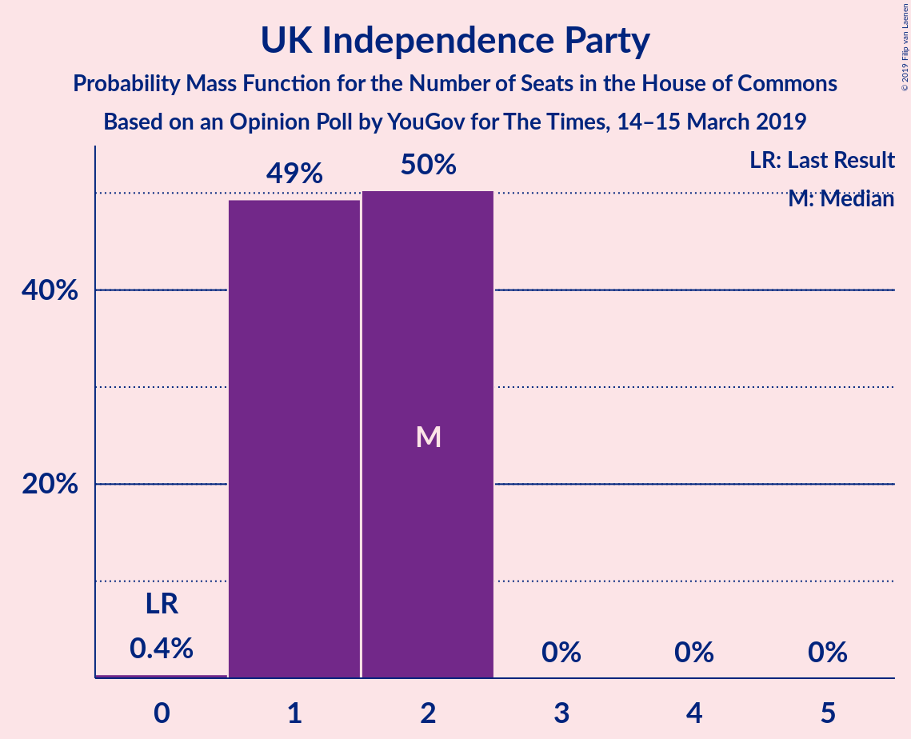
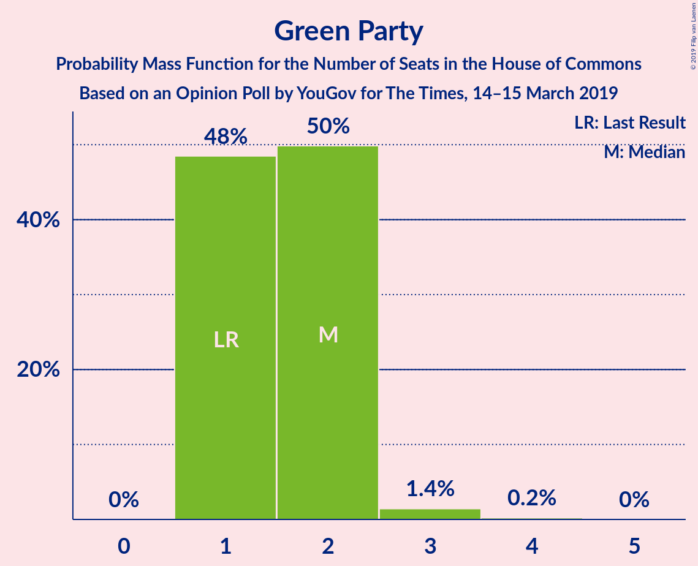
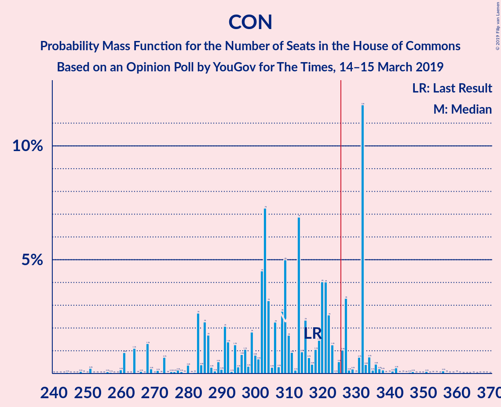
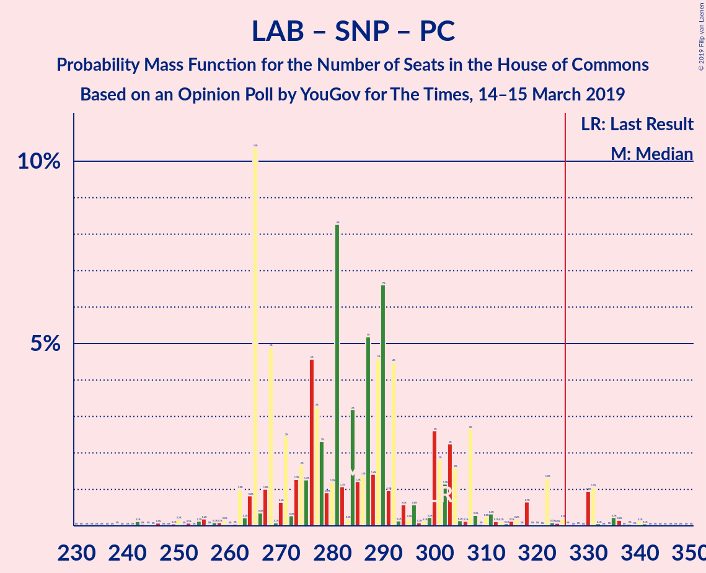
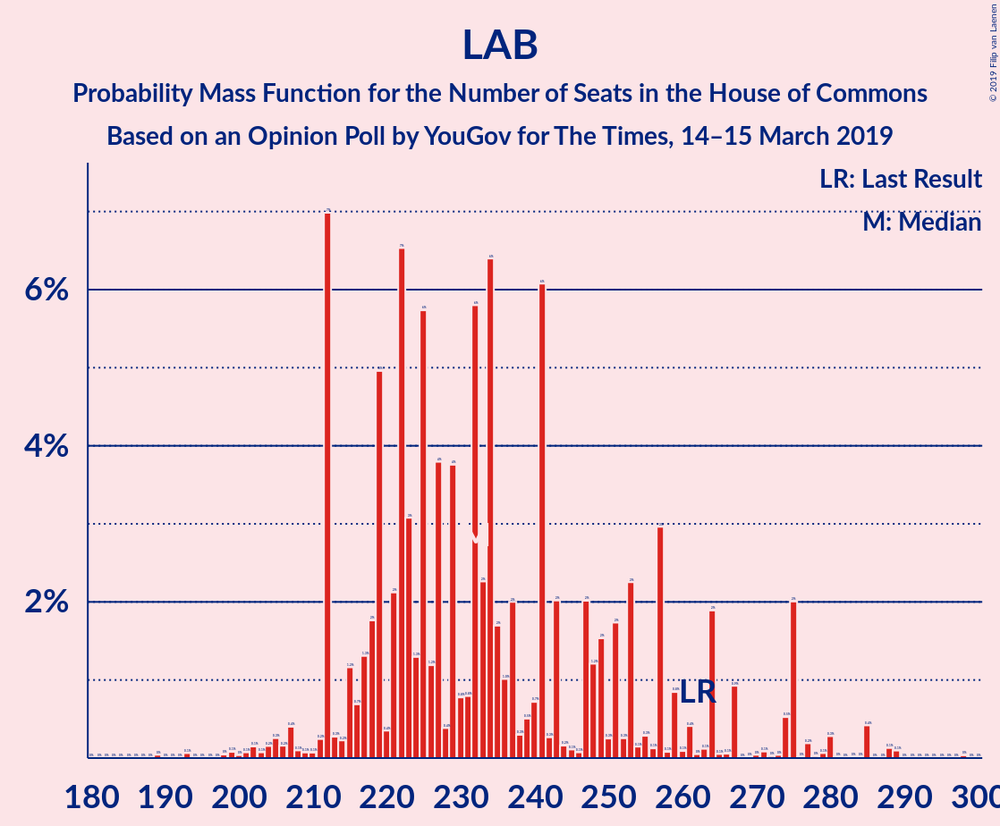

# Opinion Poll by YouGov for The Times, 14–15 March 2019

<a href="#voting-intentions">Voting Intentions</a> | <a href="#seats">Seats</a> | <a href="#coalitions">Coalitions</a> | <a href="#technical-information">Technical Information</a>

## Voting Intentions

### Confidence Intervals

| Party | Last Result | Poll Result | 80% Confidence Interval | 90% Confidence Interval | 95% Confidence Interval | 99% Confidence Interval |
|:-----:|:-----------:|:-----------:|:-----------------------:|:-----------------------:|:-----------------------:|:-----------------------:|
| Conservative Party | 42.4% | 35.7% | 34.2–37.2% |33.9–37.6% |33.5–38.0% |32.8–38.7% |
| Labour Party | 40.0% | 31.6% | 30.2–33.1% |29.8–33.5% |29.5–33.8% |28.8–34.5% |
| Liberal Democrats | 7.4% | 12.2% | 11.3–13.3% |11.0–13.6% |10.8–13.9% |10.3–14.4% |
| UK Independence Party | 1.8% | 6.2% | 5.5–7.0% |5.3–7.2% |5.1–7.4% |4.8–7.8% |
| Green Party | 1.6% | 4.1% | 3.6–4.8% |3.4–5.0% |3.3–5.1% |3.0–5.5% |
| Scottish National Party | 3.0% | 3.5% | 3.0–4.1% |2.8–4.3% |2.7–4.5% |2.5–4.8% |
| Plaid Cymru | 0.5% | 0.6% | 0.4–0.9% |0.4–1.0% |0.3–1.1% |0.2–1.2% |

*Note:* The poll result column reflects the actual value used in the calculations. Published results may vary slightly, and in addition be rounded to fewer digits.

## Seats

### Confidence Intervals

| Party | Last Result | Median | 80% Confidence Interval | 90% Confidence Interval | 95% Confidence Interval | 99% Confidence Interval |
|:-----:|:-----------:|:------:|:-----------------------:|:-----------------------:|:-----------------------:|:-----------------------:|
| <a href="#conservative-party">Conservative Party</a> | 317 | 308 | 308–312 |308–312 |308–312 |255–315 |
| <a href="#labour-party">Labour Party</a> | 262 | 234 | 222–234 |222–234 |222–234 |222–276 |
| <a href="#liberal-democrats">Liberal Democrats</a> | 12 | 36 | 36–41 |36–41 |36–41 |27–41 |
| <a href="#uk-independence-party">UK Independence Party</a> | 0 | 2 | 1–2 |1–2 |1–2 |1–2 |
| <a href="#green-party">Green Party</a> | 1 | 2 | 1–2 |1–2 |1–2 |1–3 |
| <a href="#scottish-national-party">Scottish National Party</a> | 35 | 48 | 48–51 |48–51 |48–51 |47–53 |
| <a href="#plaid-cymru">Plaid Cymru</a> | 4 | 2 | 2–4 |2–4 |2–4 |2–5 |

### Conservative Party

*For a full overview of the results for this party, see the [Conservative Party](party-conservativeparty.html) page.*

| Number of Seats | Probability | Accumulated | Special Marks |
|:---------------:|:-----------:|:-----------:|:-------------:|
| 255 | 0.8% | 100% |  |
| 256 | 0% | 99.2% |  |
| 257 | 0% | 99.2% |  |
| 258 | 0% | 99.2% |  |
| 259 | 0% | 99.2% |  |
| 260 | 0% | 99.2% |  |
| 261 | 0% | 99.2% |  |
| 262 | 0% | 99.2% |  |
| 263 | 0% | 99.2% |  |
| 264 | 0% | 99.2% |  |
| 265 | 0% | 99.2% |  |
| 266 | 0% | 99.2% |  |
| 267 | 0% | 99.2% |  |
| 268 | 0% | 99.2% |  |
| 269 | 0% | 99.2% |  |
| 270 | 0% | 99.2% |  |
| 271 | 0% | 99.2% |  |
| 272 | 0% | 99.2% |  |
| 273 | 0% | 99.2% |  |
| 274 | 0% | 99.2% |  |
| 275 | 0% | 99.2% |  |
| 276 | 0% | 99.1% |  |
| 277 | 0% | 99.1% |  |
| 278 | 0% | 99.1% |  |
| 279 | 0% | 99.1% |  |
| 280 | 0% | 99.1% |  |
| 281 | 0% | 99.1% |  |
| 282 | 0% | 99.1% |  |
| 283 | 0% | 99.1% |  |
| 284 | 0% | 99.1% |  |
| 285 | 0% | 99.1% |  |
| 286 | 0% | 99.1% |  |
| 287 | 0% | 99.1% |  |
| 288 | 0% | 99.1% |  |
| 289 | 0% | 99.1% |  |
| 290 | 0% | 99.1% |  |
| 291 | 0% | 99.1% |  |
| 292 | 0% | 99.1% |  |
| 293 | 0% | 99.1% |  |
| 294 | 0% | 99.1% |  |
| 295 | 0% | 99.1% |  |
| 296 | 0% | 99.1% |  |
| 297 | 0% | 99.1% |  |
| 298 | 0% | 99.1% |  |
| 299 | 0% | 99.1% |  |
| 300 | 0% | 99.1% |  |
| 301 | 0.3% | 99.1% |  |
| 302 | 0% | 98.8% |  |
| 303 | 0.1% | 98.8% |  |
| 304 | 0% | 98.7% |  |
| 305 | 0.4% | 98.7% |  |
| 306 | 0% | 98% |  |
| 307 | 0% | 98% |  |
| 308 | 85% | 98% | Median |
| 309 | 0% | 13% |  |
| 310 | 0% | 13% |  |
| 311 | 0% | 13% |  |
| 312 | 12% | 13% |  |
| 313 | 0.1% | 0.8% |  |
| 314 | 0% | 0.6% |  |
| 315 | 0.5% | 0.6% |  |
| 316 | 0% | 0.1% |  |
| 317 | 0% | 0.1% | Last Result |
| 318 | 0% | 0.1% |  |
| 319 | 0% | 0% |  |

### Labour Party

*For a full overview of the results for this party, see the [Labour Party](party-labourparty.html) page.*

| Number of Seats | Probability | Accumulated | Special Marks |
|:---------------:|:-----------:|:-----------:|:-------------:|
| 221 | 0.2% | 100% |  |
| 222 | 12% | 99.8% |  |
| 223 | 0% | 88% |  |
| 224 | 0% | 88% |  |
| 225 | 0% | 88% |  |
| 226 | 0% | 88% |  |
| 227 | 0% | 88% |  |
| 228 | 0% | 88% |  |
| 229 | 0% | 88% |  |
| 230 | 0% | 88% |  |
| 231 | 0% | 88% |  |
| 232 | 0% | 87% |  |
| 233 | 0% | 87% |  |
| 234 | 86% | 87% | Median |
| 235 | 0.6% | 2% |  |
| 236 | 0.1% | 0.9% |  |
| 237 | 0% | 0.9% |  |
| 238 | 0% | 0.9% |  |
| 239 | 0% | 0.9% |  |
| 240 | 0% | 0.9% |  |
| 241 | 0% | 0.9% |  |
| 242 | 0% | 0.9% |  |
| 243 | 0% | 0.9% |  |
| 244 | 0% | 0.9% |  |
| 245 | 0% | 0.9% |  |
| 246 | 0% | 0.9% |  |
| 247 | 0% | 0.9% |  |
| 248 | 0% | 0.9% |  |
| 249 | 0% | 0.9% |  |
| 250 | 0% | 0.9% |  |
| 251 | 0% | 0.9% |  |
| 252 | 0% | 0.9% |  |
| 253 | 0% | 0.9% |  |
| 254 | 0% | 0.9% |  |
| 255 | 0% | 0.9% |  |
| 256 | 0% | 0.9% |  |
| 257 | 0% | 0.9% |  |
| 258 | 0% | 0.9% |  |
| 259 | 0% | 0.9% |  |
| 260 | 0% | 0.9% |  |
| 261 | 0% | 0.9% |  |
| 262 | 0% | 0.9% | Last Result |
| 263 | 0% | 0.9% |  |
| 264 | 0% | 0.9% |  |
| 265 | 0% | 0.9% |  |
| 266 | 0% | 0.9% |  |
| 267 | 0% | 0.9% |  |
| 268 | 0% | 0.9% |  |
| 269 | 0% | 0.9% |  |
| 270 | 0% | 0.9% |  |
| 271 | 0% | 0.9% |  |
| 272 | 0% | 0.9% |  |
| 273 | 0% | 0.9% |  |
| 274 | 0% | 0.9% |  |
| 275 | 0% | 0.9% |  |
| 276 | 0.8% | 0.8% |  |
| 277 | 0% | 0% |  |

### Liberal Democrats

*For a full overview of the results for this party, see the [Liberal Democrats](party-liberaldemocrats.html) page.*

| Number of Seats | Probability | Accumulated | Special Marks |
|:---------------:|:-----------:|:-----------:|:-------------:|
| 12 | 0% | 100% | Last Result |
| 13 | 0% | 100% |  |
| 14 | 0% | 100% |  |
| 15 | 0% | 100% |  |
| 16 | 0% | 100% |  |
| 17 | 0% | 100% |  |
| 18 | 0% | 100% |  |
| 19 | 0% | 100% |  |
| 20 | 0% | 100% |  |
| 21 | 0% | 100% |  |
| 22 | 0% | 100% |  |
| 23 | 0% | 100% |  |
| 24 | 0% | 100% |  |
| 25 | 0% | 100% |  |
| 26 | 0% | 100% |  |
| 27 | 0.5% | 100% |  |
| 28 | 0% | 99.5% |  |
| 29 | 0% | 99.5% |  |
| 30 | 0% | 99.5% |  |
| 31 | 0% | 99.4% |  |
| 32 | 0% | 99.4% |  |
| 33 | 0% | 99.4% |  |
| 34 | 0% | 99.4% |  |
| 35 | 0% | 99.4% |  |
| 36 | 85% | 99.4% | Median |
| 37 | 0.8% | 14% |  |
| 38 | 0.2% | 13% |  |
| 39 | 0% | 13% |  |
| 40 | 0.9% | 13% |  |
| 41 | 12% | 12% |  |
| 42 | 0% | 0% |  |

### UK Independence Party

*For a full overview of the results for this party, see the [UK Independence Party](party-ukindependenceparty.html) page.*

| Number of Seats | Probability | Accumulated | Special Marks |
|:---------------:|:-----------:|:-----------:|:-------------:|
| 0 | 0% | 100% | Last Result |
| 1 | 14% | 100% |  |
| 2 | 86% | 86% | Median |
| 3 | 0% | 0% |  |

### Green Party

*For a full overview of the results for this party, see the [Green Party](party-greenparty.html) page.*

| Number of Seats | Probability | Accumulated | Special Marks |
|:---------------:|:-----------:|:-----------:|:-------------:|
| 1 | 13% | 100% | Last Result |
| 2 | 86% | 87% | Median |
| 3 | 0.9% | 0.9% |  |
| 4 | 0% | 0% |  |

### Scottish National Party

*For a full overview of the results for this party, see the [Scottish National Party](party-scottishnationalparty.html) page.*

| Number of Seats | Probability | Accumulated | Special Marks |
|:---------------:|:-----------:|:-----------:|:-------------:|
| 35 | 0% | 100% | Last Result |
| 36 | 0% | 100% |  |
| 37 | 0% | 100% |  |
| 38 | 0% | 100% |  |
| 39 | 0% | 100% |  |
| 40 | 0% | 100% |  |
| 41 | 0% | 100% |  |
| 42 | 0% | 100% |  |
| 43 | 0% | 100% |  |
| 44 | 0% | 100% |  |
| 45 | 0% | 100% |  |
| 46 | 0% | 99.9% |  |
| 47 | 0.6% | 99.9% |  |
| 48 | 85% | 99.4% | Median |
| 49 | 0.1% | 14% |  |
| 50 | 0.4% | 14% |  |
| 51 | 12% | 14% |  |
| 52 | 0% | 1.3% |  |
| 53 | 1.3% | 1.3% |  |
| 54 | 0% | 0% |  |

### Plaid Cymru

*For a full overview of the results for this party, see the [Plaid Cymru](party-plaidcymru.html) page.*

| Number of Seats | Probability | Accumulated | Special Marks |
|:---------------:|:-----------:|:-----------:|:-------------:|
| 2 | 86% | 100% | Median |
| 3 | 0% | 14% |  |
| 4 | 14% | 14% | Last Result |
| 5 | 0.5% | 0.7% |  |
| 6 | 0% | 0.2% |  |
| 7 | 0% | 0.2% |  |
| 8 | 0.2% | 0.2% |  |
| 9 | 0% | 0% |  |

## Coalitions

### Confidence Intervals

| Coalition | Last Result | Median | Majority? | 80% Confidence Interval | 90% Confidence Interval | 95% Confidence Interval | 99% Confidence Interval |
|:---------:|:-----------:|:------:|:---------:|:-----------------------:|:-----------------------:|:-----------------------:|:-----------------------:|
| Conservative Party – Scottish National Party – Plaid Cymru | 356 | 358 | 99.1% | 358–367 | 358–367 | 358–367 | 312–367 |
| Conservative Party – Scottish National Party | 352 | 356 | 99.1% | 356–363 | 356–363 | 356–363 | 308–363 |
| Conservative Party – Liberal Democrats | 329 | 344 | 99.1% | 344–353 | 344–353 | 344–353 | 295–353 |
| Labour Party – Liberal Democrats – Scottish National Party – Plaid Cymru | 313 | 320 | 1.3% | 318–320 | 318–320 | 318–320 | 314–373 |
| Labour Party – Liberal Democrats – Scottish National Party | 309 | 318 | 0.9% | 314–318 | 314–318 | 314–318 | 309–369 |
| Conservative Party – Plaid Cymru | 321 | 310 | 0% | 310–316 | 310–316 | 310–316 | 259–320 |
| Conservative Party | 317 | 308 | 0% | 308–312 | 308–312 | 308–312 | 255–315 |
| Labour Party – Scottish National Party – Plaid Cymru | 301 | 284 | 0.9% | 277–284 | 277–284 | 277–284 | 277–333 |
| Labour Party – Scottish National Party | 297 | 282 | 0.8% | 273–282 | 273–282 | 273–282 | 273–329 |
| Labour Party – Liberal Democrats – Plaid Cymru | 278 | 272 | 0% | 267–272 | 267–272 | 267–272 | 267–320 |
| Labour Party – Liberal Democrats | 274 | 270 | 0% | 263–270 | 263–270 | 263–270 | 262–316 |
| Labour Party – Plaid Cymru | 266 | 236 | 0% | 226–236 | 226–236 | 226–236 | 226–280 |
| Labour Party | 262 | 234 | 0% | 222–234 | 222–234 | 222–234 | 222–276 |

### Conservative Party – Scottish National Party – Plaid Cymru

| Number of Seats | Probability | Accumulated | Special Marks |
|:---------------:|:-----------:|:-----------:|:-------------:|
| 312 | 0.8% | 100% |  |
| 313 | 0% | 99.2% |  |
| 314 | 0% | 99.2% |  |
| 315 | 0% | 99.2% |  |
| 316 | 0% | 99.2% |  |
| 317 | 0% | 99.2% |  |
| 318 | 0% | 99.2% |  |
| 319 | 0% | 99.2% |  |
| 320 | 0% | 99.2% |  |
| 321 | 0% | 99.2% |  |
| 322 | 0% | 99.2% |  |
| 323 | 0% | 99.2% |  |
| 324 | 0% | 99.2% |  |
| 325 | 0% | 99.1% |  |
| 326 | 0% | 99.1% | Majority |
| 327 | 0% | 99.1% |  |
| 328 | 0% | 99.1% |  |
| 329 | 0% | 99.1% |  |
| 330 | 0% | 99.1% |  |
| 331 | 0% | 99.1% |  |
| 332 | 0% | 99.1% |  |
| 333 | 0% | 99.1% |  |
| 334 | 0% | 99.1% |  |
| 335 | 0% | 99.1% |  |
| 336 | 0% | 99.1% |  |
| 337 | 0% | 99.1% |  |
| 338 | 0% | 99.1% |  |
| 339 | 0% | 99.1% |  |
| 340 | 0% | 99.1% |  |
| 341 | 0% | 99.1% |  |
| 342 | 0% | 99.1% |  |
| 343 | 0% | 99.1% |  |
| 344 | 0% | 99.1% |  |
| 345 | 0% | 99.1% |  |
| 346 | 0% | 99.1% |  |
| 347 | 0% | 99.1% |  |
| 348 | 0% | 99.1% |  |
| 349 | 0% | 99.1% |  |
| 350 | 0% | 99.1% |  |
| 351 | 0% | 99.1% |  |
| 352 | 0% | 99.1% |  |
| 353 | 0% | 99.1% |  |
| 354 | 0% | 99.1% |  |
| 355 | 0% | 99.1% |  |
| 356 | 0% | 99.1% | Last Result |
| 357 | 0.4% | 99.1% |  |
| 358 | 86% | 98.7% | Median |
| 359 | 0% | 13% |  |
| 360 | 0% | 13% |  |
| 361 | 0% | 13% |  |
| 362 | 0% | 13% |  |
| 363 | 0% | 13% |  |
| 364 | 0% | 13% |  |
| 365 | 0% | 13% |  |
| 366 | 0% | 13% |  |
| 367 | 13% | 13% |  |
| 368 | 0% | 0.2% |  |
| 369 | 0% | 0.2% |  |
| 370 | 0.2% | 0.2% |  |
| 371 | 0% | 0% |  |

### Conservative Party – Scottish National Party

| Number of Seats | Probability | Accumulated | Special Marks |
|:---------------:|:-----------:|:-----------:|:-------------:|
| 308 | 0.8% | 100% |  |
| 309 | 0% | 99.2% |  |
| 310 | 0% | 99.2% |  |
| 311 | 0% | 99.2% |  |
| 312 | 0% | 99.2% |  |
| 313 | 0% | 99.2% |  |
| 314 | 0% | 99.2% |  |
| 315 | 0% | 99.2% |  |
| 316 | 0% | 99.2% |  |
| 317 | 0% | 99.2% |  |
| 318 | 0% | 99.2% |  |
| 319 | 0% | 99.2% |  |
| 320 | 0% | 99.1% |  |
| 321 | 0% | 99.1% |  |
| 322 | 0% | 99.1% |  |
| 323 | 0% | 99.1% |  |
| 324 | 0% | 99.1% |  |
| 325 | 0% | 99.1% |  |
| 326 | 0% | 99.1% | Majority |
| 327 | 0% | 99.1% |  |
| 328 | 0% | 99.1% |  |
| 329 | 0% | 99.1% |  |
| 330 | 0% | 99.1% |  |
| 331 | 0% | 99.1% |  |
| 332 | 0% | 99.1% |  |
| 333 | 0% | 99.1% |  |
| 334 | 0% | 99.1% |  |
| 335 | 0% | 99.1% |  |
| 336 | 0% | 99.1% |  |
| 337 | 0% | 99.1% |  |
| 338 | 0% | 99.1% |  |
| 339 | 0% | 99.1% |  |
| 340 | 0% | 99.1% |  |
| 341 | 0% | 99.1% |  |
| 342 | 0% | 99.1% |  |
| 343 | 0% | 99.1% |  |
| 344 | 0% | 99.1% |  |
| 345 | 0% | 99.1% |  |
| 346 | 0% | 99.1% |  |
| 347 | 0% | 99.1% |  |
| 348 | 0% | 99.1% |  |
| 349 | 0% | 99.1% |  |
| 350 | 0% | 99.1% |  |
| 351 | 0% | 99.1% |  |
| 352 | 0% | 99.1% | Last Result |
| 353 | 0% | 99.1% |  |
| 354 | 0.3% | 99.1% |  |
| 355 | 0.4% | 98.8% |  |
| 356 | 85% | 98% | Median |
| 357 | 0% | 13% |  |
| 358 | 0% | 13% |  |
| 359 | 0% | 13% |  |
| 360 | 0% | 13% |  |
| 361 | 0% | 13% |  |
| 362 | 0.7% | 13% |  |
| 363 | 12% | 12% |  |
| 364 | 0% | 0% |  |

### Conservative Party – Liberal Democrats

| Number of Seats | Probability | Accumulated | Special Marks |
|:---------------:|:-----------:|:-----------:|:-------------:|
| 295 | 0.8% | 100% |  |
| 296 | 0% | 99.2% |  |
| 297 | 0% | 99.2% |  |
| 298 | 0% | 99.2% |  |
| 299 | 0% | 99.2% |  |
| 300 | 0% | 99.2% |  |
| 301 | 0% | 99.2% |  |
| 302 | 0% | 99.2% |  |
| 303 | 0% | 99.1% |  |
| 304 | 0% | 99.1% |  |
| 305 | 0% | 99.1% |  |
| 306 | 0% | 99.1% |  |
| 307 | 0% | 99.1% |  |
| 308 | 0% | 99.1% |  |
| 309 | 0% | 99.1% |  |
| 310 | 0% | 99.1% |  |
| 311 | 0% | 99.1% |  |
| 312 | 0% | 99.1% |  |
| 313 | 0% | 99.1% |  |
| 314 | 0% | 99.1% |  |
| 315 | 0% | 99.1% |  |
| 316 | 0% | 99.1% |  |
| 317 | 0% | 99.1% |  |
| 318 | 0% | 99.1% |  |
| 319 | 0% | 99.1% |  |
| 320 | 0% | 99.1% |  |
| 321 | 0% | 99.1% |  |
| 322 | 0% | 99.1% |  |
| 323 | 0% | 99.1% |  |
| 324 | 0% | 99.1% |  |
| 325 | 0% | 99.1% |  |
| 326 | 0% | 99.1% | Majority |
| 327 | 0% | 99.1% |  |
| 328 | 0% | 99.1% |  |
| 329 | 0% | 99.1% | Last Result |
| 330 | 0% | 99.1% |  |
| 331 | 0% | 99.1% |  |
| 332 | 0% | 99.1% |  |
| 333 | 0% | 99.1% |  |
| 334 | 0% | 99.1% |  |
| 335 | 0% | 99.1% |  |
| 336 | 0% | 99.1% |  |
| 337 | 0% | 99.1% |  |
| 338 | 0.3% | 99.1% |  |
| 339 | 0% | 98.8% |  |
| 340 | 0.1% | 98.8% |  |
| 341 | 0% | 98.7% |  |
| 342 | 0.9% | 98.7% |  |
| 343 | 0% | 98% |  |
| 344 | 85% | 98% | Median |
| 345 | 0% | 13% |  |
| 346 | 0% | 13% |  |
| 347 | 0% | 13% |  |
| 348 | 0% | 13% |  |
| 349 | 0% | 13% |  |
| 350 | 0% | 13% |  |
| 351 | 0.2% | 13% |  |
| 352 | 0% | 12% |  |
| 353 | 12% | 12% |  |
| 354 | 0% | 0.1% |  |
| 355 | 0% | 0.1% |  |
| 356 | 0% | 0.1% |  |
| 357 | 0% | 0.1% |  |
| 358 | 0% | 0% |  |

### Labour Party – Liberal Democrats – Scottish National Party – Plaid Cymru

| Number of Seats | Probability | Accumulated | Special Marks |
|:---------------:|:-----------:|:-----------:|:-------------:|
| 312 | 0% | 100% |  |
| 313 | 0% | 99.9% | Last Result |
| 314 | 0.5% | 99.9% |  |
| 315 | 0% | 99.4% |  |
| 316 | 0.1% | 99.4% |  |
| 317 | 0% | 99.2% |  |
| 318 | 12% | 99.2% |  |
| 319 | 0% | 87% |  |
| 320 | 85% | 87% | Median |
| 321 | 0% | 2% |  |
| 322 | 0% | 2% |  |
| 323 | 0.4% | 2% |  |
| 324 | 0% | 1.3% |  |
| 325 | 0% | 1.3% |  |
| 326 | 0% | 1.3% | Majority |
| 327 | 0.1% | 1.3% |  |
| 328 | 0.3% | 1.2% |  |
| 329 | 0% | 0.9% |  |
| 330 | 0% | 0.9% |  |
| 331 | 0% | 0.9% |  |
| 332 | 0% | 0.9% |  |
| 333 | 0% | 0.9% |  |
| 334 | 0% | 0.9% |  |
| 335 | 0% | 0.9% |  |
| 336 | 0% | 0.9% |  |
| 337 | 0% | 0.9% |  |
| 338 | 0% | 0.9% |  |
| 339 | 0% | 0.9% |  |
| 340 | 0% | 0.9% |  |
| 341 | 0% | 0.9% |  |
| 342 | 0% | 0.9% |  |
| 343 | 0% | 0.9% |  |
| 344 | 0% | 0.9% |  |
| 345 | 0% | 0.9% |  |
| 346 | 0% | 0.9% |  |
| 347 | 0% | 0.9% |  |
| 348 | 0% | 0.9% |  |
| 349 | 0% | 0.9% |  |
| 350 | 0% | 0.9% |  |
| 351 | 0% | 0.9% |  |
| 352 | 0% | 0.9% |  |
| 353 | 0% | 0.9% |  |
| 354 | 0% | 0.8% |  |
| 355 | 0% | 0.8% |  |
| 356 | 0% | 0.8% |  |
| 357 | 0% | 0.8% |  |
| 358 | 0% | 0.8% |  |
| 359 | 0% | 0.8% |  |
| 360 | 0% | 0.8% |  |
| 361 | 0% | 0.8% |  |
| 362 | 0% | 0.8% |  |
| 363 | 0% | 0.8% |  |
| 364 | 0% | 0.8% |  |
| 365 | 0% | 0.8% |  |
| 366 | 0% | 0.8% |  |
| 367 | 0% | 0.8% |  |
| 368 | 0% | 0.8% |  |
| 369 | 0% | 0.8% |  |
| 370 | 0% | 0.8% |  |
| 371 | 0% | 0.8% |  |
| 372 | 0% | 0.8% |  |
| 373 | 0.8% | 0.8% |  |
| 374 | 0% | 0% |  |

### Labour Party – Liberal Democrats – Scottish National Party

| Number of Seats | Probability | Accumulated | Special Marks |
|:---------------:|:-----------:|:-----------:|:-------------:|
| 307 | 0.1% | 100% |  |
| 308 | 0.1% | 99.9% |  |
| 309 | 0.5% | 99.8% | Last Result |
| 310 | 0% | 99.3% |  |
| 311 | 0% | 99.2% |  |
| 312 | 0% | 99.2% |  |
| 313 | 0% | 99.2% |  |
| 314 | 12% | 99.2% |  |
| 315 | 0% | 87% |  |
| 316 | 0% | 87% |  |
| 317 | 0% | 87% |  |
| 318 | 85% | 87% | Median |
| 319 | 0% | 2% |  |
| 320 | 0% | 2% |  |
| 321 | 0.4% | 2% |  |
| 322 | 0% | 1.3% |  |
| 323 | 0% | 1.3% |  |
| 324 | 0.3% | 1.2% |  |
| 325 | 0.1% | 0.9% |  |
| 326 | 0% | 0.9% | Majority |
| 327 | 0% | 0.9% |  |
| 328 | 0% | 0.9% |  |
| 329 | 0% | 0.9% |  |
| 330 | 0% | 0.9% |  |
| 331 | 0% | 0.9% |  |
| 332 | 0% | 0.9% |  |
| 333 | 0% | 0.9% |  |
| 334 | 0% | 0.9% |  |
| 335 | 0% | 0.9% |  |
| 336 | 0% | 0.9% |  |
| 337 | 0% | 0.9% |  |
| 338 | 0% | 0.9% |  |
| 339 | 0% | 0.9% |  |
| 340 | 0% | 0.9% |  |
| 341 | 0% | 0.9% |  |
| 342 | 0% | 0.9% |  |
| 343 | 0% | 0.9% |  |
| 344 | 0% | 0.9% |  |
| 345 | 0% | 0.9% |  |
| 346 | 0% | 0.9% |  |
| 347 | 0% | 0.9% |  |
| 348 | 0% | 0.9% |  |
| 349 | 0% | 0.8% |  |
| 350 | 0% | 0.8% |  |
| 351 | 0% | 0.8% |  |
| 352 | 0% | 0.8% |  |
| 353 | 0% | 0.8% |  |
| 354 | 0% | 0.8% |  |
| 355 | 0% | 0.8% |  |
| 356 | 0% | 0.8% |  |
| 357 | 0% | 0.8% |  |
| 358 | 0% | 0.8% |  |
| 359 | 0% | 0.8% |  |
| 360 | 0% | 0.8% |  |
| 361 | 0% | 0.8% |  |
| 362 | 0% | 0.8% |  |
| 363 | 0% | 0.8% |  |
| 364 | 0% | 0.8% |  |
| 365 | 0% | 0.8% |  |
| 366 | 0% | 0.8% |  |
| 367 | 0% | 0.8% |  |
| 368 | 0% | 0.8% |  |
| 369 | 0.8% | 0.8% |  |
| 370 | 0% | 0% |  |

### Conservative Party – Plaid Cymru

| Number of Seats | Probability | Accumulated | Special Marks |
|:---------------:|:-----------:|:-----------:|:-------------:|
| 259 | 0.8% | 100% |  |
| 260 | 0% | 99.2% |  |
| 261 | 0% | 99.2% |  |
| 262 | 0% | 99.2% |  |
| 263 | 0% | 99.2% |  |
| 264 | 0% | 99.2% |  |
| 265 | 0% | 99.2% |  |
| 266 | 0% | 99.2% |  |
| 267 | 0% | 99.2% |  |
| 268 | 0% | 99.2% |  |
| 269 | 0% | 99.2% |  |
| 270 | 0% | 99.2% |  |
| 271 | 0% | 99.2% |  |
| 272 | 0% | 99.2% |  |
| 273 | 0% | 99.2% |  |
| 274 | 0% | 99.2% |  |
| 275 | 0% | 99.2% |  |
| 276 | 0% | 99.2% |  |
| 277 | 0% | 99.2% |  |
| 278 | 0% | 99.2% |  |
| 279 | 0% | 99.2% |  |
| 280 | 0% | 99.2% |  |
| 281 | 0% | 99.1% |  |
| 282 | 0% | 99.1% |  |
| 283 | 0% | 99.1% |  |
| 284 | 0% | 99.1% |  |
| 285 | 0% | 99.1% |  |
| 286 | 0% | 99.1% |  |
| 287 | 0% | 99.1% |  |
| 288 | 0% | 99.1% |  |
| 289 | 0% | 99.1% |  |
| 290 | 0% | 99.1% |  |
| 291 | 0% | 99.1% |  |
| 292 | 0% | 99.1% |  |
| 293 | 0% | 99.1% |  |
| 294 | 0% | 99.1% |  |
| 295 | 0% | 99.1% |  |
| 296 | 0% | 99.1% |  |
| 297 | 0% | 99.1% |  |
| 298 | 0% | 99.1% |  |
| 299 | 0% | 99.1% |  |
| 300 | 0% | 99.1% |  |
| 301 | 0% | 99.1% |  |
| 302 | 0% | 99.1% |  |
| 303 | 0% | 99.1% |  |
| 304 | 0% | 99.1% |  |
| 305 | 0.4% | 99.1% |  |
| 306 | 0% | 98.8% |  |
| 307 | 0.4% | 98.8% |  |
| 308 | 0% | 98% |  |
| 309 | 0% | 98% |  |
| 310 | 85% | 98% | Median |
| 311 | 0% | 13% |  |
| 312 | 0% | 13% |  |
| 313 | 0% | 13% |  |
| 314 | 0% | 13% |  |
| 315 | 0% | 13% |  |
| 316 | 12% | 13% |  |
| 317 | 0% | 0.8% |  |
| 318 | 0% | 0.8% |  |
| 319 | 0% | 0.7% |  |
| 320 | 0.5% | 0.7% |  |
| 321 | 0.1% | 0.2% | Last Result |
| 322 | 0% | 0.1% |  |
| 323 | 0% | 0.1% |  |
| 324 | 0% | 0% |  |

### Conservative Party

| Number of Seats | Probability | Accumulated | Special Marks |
|:---------------:|:-----------:|:-----------:|:-------------:|
| 255 | 0.8% | 100% |  |
| 256 | 0% | 99.2% |  |
| 257 | 0% | 99.2% |  |
| 258 | 0% | 99.2% |  |
| 259 | 0% | 99.2% |  |
| 260 | 0% | 99.2% |  |
| 261 | 0% | 99.2% |  |
| 262 | 0% | 99.2% |  |
| 263 | 0% | 99.2% |  |
| 264 | 0% | 99.2% |  |
| 265 | 0% | 99.2% |  |
| 266 | 0% | 99.2% |  |
| 267 | 0% | 99.2% |  |
| 268 | 0% | 99.2% |  |
| 269 | 0% | 99.2% |  |
| 270 | 0% | 99.2% |  |
| 271 | 0% | 99.2% |  |
| 272 | 0% | 99.2% |  |
| 273 | 0% | 99.2% |  |
| 274 | 0% | 99.2% |  |
| 275 | 0% | 99.2% |  |
| 276 | 0% | 99.1% |  |
| 277 | 0% | 99.1% |  |
| 278 | 0% | 99.1% |  |
| 279 | 0% | 99.1% |  |
| 280 | 0% | 99.1% |  |
| 281 | 0% | 99.1% |  |
| 282 | 0% | 99.1% |  |
| 283 | 0% | 99.1% |  |
| 284 | 0% | 99.1% |  |
| 285 | 0% | 99.1% |  |
| 286 | 0% | 99.1% |  |
| 287 | 0% | 99.1% |  |
| 288 | 0% | 99.1% |  |
| 289 | 0% | 99.1% |  |
| 290 | 0% | 99.1% |  |
| 291 | 0% | 99.1% |  |
| 292 | 0% | 99.1% |  |
| 293 | 0% | 99.1% |  |
| 294 | 0% | 99.1% |  |
| 295 | 0% | 99.1% |  |
| 296 | 0% | 99.1% |  |
| 297 | 0% | 99.1% |  |
| 298 | 0% | 99.1% |  |
| 299 | 0% | 99.1% |  |
| 300 | 0% | 99.1% |  |
| 301 | 0.3% | 99.1% |  |
| 302 | 0% | 98.8% |  |
| 303 | 0.1% | 98.8% |  |
| 304 | 0% | 98.7% |  |
| 305 | 0.4% | 98.7% |  |
| 306 | 0% | 98% |  |
| 307 | 0% | 98% |  |
| 308 | 85% | 98% | Median |
| 309 | 0% | 13% |  |
| 310 | 0% | 13% |  |
| 311 | 0% | 13% |  |
| 312 | 12% | 13% |  |
| 313 | 0.1% | 0.8% |  |
| 314 | 0% | 0.6% |  |
| 315 | 0.5% | 0.6% |  |
| 316 | 0% | 0.1% |  |
| 317 | 0% | 0.1% | Last Result |
| 318 | 0% | 0.1% |  |
| 319 | 0% | 0% |  |

### Labour Party – Scottish National Party – Plaid Cymru

| Number of Seats | Probability | Accumulated | Special Marks |
|:---------------:|:-----------:|:-----------:|:-------------:|
| 271 | 0% | 100% |  |
| 272 | 0% | 99.9% |  |
| 273 | 0% | 99.9% |  |
| 274 | 0% | 99.9% |  |
| 275 | 0% | 99.9% |  |
| 276 | 0% | 99.9% |  |
| 277 | 12% | 99.9% |  |
| 278 | 0.1% | 88% |  |
| 279 | 0% | 88% |  |
| 280 | 0% | 87% |  |
| 281 | 0% | 87% |  |
| 282 | 0% | 87% |  |
| 283 | 0% | 87% |  |
| 284 | 85% | 87% | Median |
| 285 | 0% | 2% |  |
| 286 | 0.4% | 2% |  |
| 287 | 0.5% | 2% |  |
| 288 | 0% | 1.3% |  |
| 289 | 0% | 1.3% |  |
| 290 | 0.1% | 1.3% |  |
| 291 | 0.3% | 1.2% |  |
| 292 | 0% | 0.9% |  |
| 293 | 0% | 0.9% |  |
| 294 | 0% | 0.9% |  |
| 295 | 0% | 0.9% |  |
| 296 | 0% | 0.9% |  |
| 297 | 0% | 0.9% |  |
| 298 | 0% | 0.9% |  |
| 299 | 0% | 0.9% |  |
| 300 | 0% | 0.9% |  |
| 301 | 0% | 0.9% | Last Result |
| 302 | 0% | 0.9% |  |
| 303 | 0% | 0.9% |  |
| 304 | 0% | 0.9% |  |
| 305 | 0% | 0.9% |  |
| 306 | 0% | 0.9% |  |
| 307 | 0% | 0.9% |  |
| 308 | 0% | 0.9% |  |
| 309 | 0% | 0.9% |  |
| 310 | 0% | 0.9% |  |
| 311 | 0% | 0.9% |  |
| 312 | 0% | 0.9% |  |
| 313 | 0% | 0.9% |  |
| 314 | 0% | 0.9% |  |
| 315 | 0% | 0.9% |  |
| 316 | 0% | 0.9% |  |
| 317 | 0% | 0.9% |  |
| 318 | 0% | 0.9% |  |
| 319 | 0% | 0.9% |  |
| 320 | 0% | 0.9% |  |
| 321 | 0% | 0.9% |  |
| 322 | 0% | 0.9% |  |
| 323 | 0% | 0.9% |  |
| 324 | 0% | 0.9% |  |
| 325 | 0% | 0.9% |  |
| 326 | 0% | 0.9% | Majority |
| 327 | 0% | 0.8% |  |
| 328 | 0% | 0.8% |  |
| 329 | 0% | 0.8% |  |
| 330 | 0% | 0.8% |  |
| 331 | 0% | 0.8% |  |
| 332 | 0% | 0.8% |  |
| 333 | 0.8% | 0.8% |  |
| 334 | 0% | 0% |  |

### Labour Party – Scottish National Party

| Number of Seats | Probability | Accumulated | Special Marks |
|:---------------:|:-----------:|:-----------:|:-------------:|
| 269 | 0.1% | 100% |  |
| 270 | 0.1% | 99.9% |  |
| 271 | 0% | 99.8% |  |
| 272 | 0% | 99.8% |  |
| 273 | 12% | 99.8% |  |
| 274 | 0% | 88% |  |
| 275 | 0% | 88% |  |
| 276 | 0% | 87% |  |
| 277 | 0% | 87% |  |
| 278 | 0% | 87% |  |
| 279 | 0% | 87% |  |
| 280 | 0% | 87% |  |
| 281 | 0% | 87% |  |
| 282 | 86% | 87% | Median |
| 283 | 0% | 2% |  |
| 284 | 0.4% | 2% |  |
| 285 | 0% | 1.3% |  |
| 286 | 0% | 1.3% |  |
| 287 | 0.3% | 1.3% |  |
| 288 | 0.1% | 0.9% |  |
| 289 | 0% | 0.9% |  |
| 290 | 0% | 0.9% |  |
| 291 | 0% | 0.9% |  |
| 292 | 0% | 0.9% |  |
| 293 | 0% | 0.9% |  |
| 294 | 0% | 0.9% |  |
| 295 | 0% | 0.9% |  |
| 296 | 0% | 0.9% |  |
| 297 | 0% | 0.9% | Last Result |
| 298 | 0% | 0.9% |  |
| 299 | 0% | 0.9% |  |
| 300 | 0% | 0.9% |  |
| 301 | 0% | 0.9% |  |
| 302 | 0% | 0.9% |  |
| 303 | 0% | 0.9% |  |
| 304 | 0% | 0.9% |  |
| 305 | 0% | 0.9% |  |
| 306 | 0% | 0.9% |  |
| 307 | 0% | 0.9% |  |
| 308 | 0% | 0.9% |  |
| 309 | 0% | 0.9% |  |
| 310 | 0% | 0.9% |  |
| 311 | 0% | 0.9% |  |
| 312 | 0% | 0.9% |  |
| 313 | 0% | 0.9% |  |
| 314 | 0% | 0.9% |  |
| 315 | 0% | 0.9% |  |
| 316 | 0% | 0.9% |  |
| 317 | 0% | 0.9% |  |
| 318 | 0% | 0.9% |  |
| 319 | 0% | 0.9% |  |
| 320 | 0% | 0.9% |  |
| 321 | 0% | 0.9% |  |
| 322 | 0% | 0.8% |  |
| 323 | 0% | 0.8% |  |
| 324 | 0% | 0.8% |  |
| 325 | 0% | 0.8% |  |
| 326 | 0% | 0.8% | Majority |
| 327 | 0% | 0.8% |  |
| 328 | 0% | 0.8% |  |
| 329 | 0.8% | 0.8% |  |
| 330 | 0% | 0% |  |

### Labour Party – Liberal Democrats – Plaid Cymru

| Number of Seats | Probability | Accumulated | Special Marks |
|:---------------:|:-----------:|:-----------:|:-------------:|
| 267 | 13% | 100% |  |
| 268 | 0% | 87% |  |
| 269 | 0% | 87% |  |
| 270 | 0% | 87% |  |
| 271 | 0% | 87% |  |
| 272 | 85% | 87% | Median |
| 273 | 0.4% | 2% |  |
| 274 | 0.1% | 1.3% |  |
| 275 | 0.3% | 1.2% |  |
| 276 | 0% | 0.9% |  |
| 277 | 0% | 0.9% |  |
| 278 | 0% | 0.9% | Last Result |
| 279 | 0% | 0.9% |  |
| 280 | 0% | 0.9% |  |
| 281 | 0% | 0.9% |  |
| 282 | 0% | 0.9% |  |
| 283 | 0% | 0.9% |  |
| 284 | 0% | 0.9% |  |
| 285 | 0% | 0.9% |  |
| 286 | 0% | 0.9% |  |
| 287 | 0% | 0.9% |  |
| 288 | 0% | 0.9% |  |
| 289 | 0% | 0.9% |  |
| 290 | 0% | 0.9% |  |
| 291 | 0% | 0.9% |  |
| 292 | 0% | 0.9% |  |
| 293 | 0% | 0.9% |  |
| 294 | 0% | 0.9% |  |
| 295 | 0% | 0.9% |  |
| 296 | 0% | 0.9% |  |
| 297 | 0% | 0.9% |  |
| 298 | 0% | 0.9% |  |
| 299 | 0% | 0.9% |  |
| 300 | 0% | 0.9% |  |
| 301 | 0% | 0.9% |  |
| 302 | 0% | 0.9% |  |
| 303 | 0% | 0.9% |  |
| 304 | 0% | 0.9% |  |
| 305 | 0% | 0.9% |  |
| 306 | 0% | 0.9% |  |
| 307 | 0% | 0.9% |  |
| 308 | 0% | 0.9% |  |
| 309 | 0% | 0.9% |  |
| 310 | 0% | 0.8% |  |
| 311 | 0% | 0.8% |  |
| 312 | 0% | 0.8% |  |
| 313 | 0% | 0.8% |  |
| 314 | 0% | 0.8% |  |
| 315 | 0% | 0.8% |  |
| 316 | 0% | 0.8% |  |
| 317 | 0% | 0.8% |  |
| 318 | 0% | 0.8% |  |
| 319 | 0% | 0.8% |  |
| 320 | 0.8% | 0.8% |  |
| 321 | 0% | 0% |  |

### Labour Party – Liberal Democrats

| Number of Seats | Probability | Accumulated | Special Marks |
|:---------------:|:-----------:|:-----------:|:-------------:|
| 259 | 0.2% | 100% |  |
| 260 | 0% | 99.8% |  |
| 261 | 0% | 99.8% |  |
| 262 | 0.5% | 99.8% |  |
| 263 | 12% | 99.3% |  |
| 264 | 0% | 87% |  |
| 265 | 0% | 87% |  |
| 266 | 0% | 87% |  |
| 267 | 0% | 87% |  |
| 268 | 0% | 87% |  |
| 269 | 0% | 87% |  |
| 270 | 85% | 87% | Median |
| 271 | 0.7% | 2% |  |
| 272 | 0.1% | 1.0% |  |
| 273 | 0% | 0.9% |  |
| 274 | 0% | 0.9% | Last Result |
| 275 | 0% | 0.9% |  |
| 276 | 0% | 0.9% |  |
| 277 | 0% | 0.9% |  |
| 278 | 0% | 0.9% |  |
| 279 | 0% | 0.9% |  |
| 280 | 0% | 0.9% |  |
| 281 | 0% | 0.9% |  |
| 282 | 0% | 0.9% |  |
| 283 | 0% | 0.9% |  |
| 284 | 0% | 0.9% |  |
| 285 | 0% | 0.9% |  |
| 286 | 0% | 0.9% |  |
| 287 | 0% | 0.9% |  |
| 288 | 0% | 0.9% |  |
| 289 | 0% | 0.9% |  |
| 290 | 0% | 0.9% |  |
| 291 | 0% | 0.9% |  |
| 292 | 0% | 0.9% |  |
| 293 | 0% | 0.9% |  |
| 294 | 0% | 0.9% |  |
| 295 | 0% | 0.9% |  |
| 296 | 0% | 0.9% |  |
| 297 | 0% | 0.9% |  |
| 298 | 0% | 0.9% |  |
| 299 | 0% | 0.9% |  |
| 300 | 0% | 0.9% |  |
| 301 | 0% | 0.9% |  |
| 302 | 0% | 0.9% |  |
| 303 | 0% | 0.9% |  |
| 304 | 0% | 0.9% |  |
| 305 | 0% | 0.8% |  |
| 306 | 0% | 0.8% |  |
| 307 | 0% | 0.8% |  |
| 308 | 0% | 0.8% |  |
| 309 | 0% | 0.8% |  |
| 310 | 0% | 0.8% |  |
| 311 | 0% | 0.8% |  |
| 312 | 0% | 0.8% |  |
| 313 | 0% | 0.8% |  |
| 314 | 0% | 0.8% |  |
| 315 | 0% | 0.8% |  |
| 316 | 0.8% | 0.8% |  |
| 317 | 0% | 0% |  |

### Labour Party – Plaid Cymru

| Number of Seats | Probability | Accumulated | Special Marks |
|:---------------:|:-----------:|:-----------:|:-------------:|
| 226 | 12% | 100% |  |
| 227 | 0% | 88% |  |
| 228 | 0% | 88% |  |
| 229 | 0.2% | 88% |  |
| 230 | 0% | 88% |  |
| 231 | 0% | 88% |  |
| 232 | 0% | 88% |  |
| 233 | 0% | 88% |  |
| 234 | 0% | 88% |  |
| 235 | 0% | 88% |  |
| 236 | 86% | 87% | Median |
| 237 | 0.1% | 2% |  |
| 238 | 0.4% | 2% |  |
| 239 | 0% | 1.4% |  |
| 240 | 0.5% | 1.4% |  |
| 241 | 0% | 0.9% |  |
| 242 | 0% | 0.9% |  |
| 243 | 0% | 0.9% |  |
| 244 | 0% | 0.9% |  |
| 245 | 0% | 0.9% |  |
| 246 | 0% | 0.9% |  |
| 247 | 0% | 0.9% |  |
| 248 | 0% | 0.9% |  |
| 249 | 0% | 0.9% |  |
| 250 | 0% | 0.9% |  |
| 251 | 0% | 0.9% |  |
| 252 | 0% | 0.9% |  |
| 253 | 0% | 0.9% |  |
| 254 | 0% | 0.9% |  |
| 255 | 0% | 0.9% |  |
| 256 | 0% | 0.9% |  |
| 257 | 0% | 0.9% |  |
| 258 | 0% | 0.9% |  |
| 259 | 0% | 0.9% |  |
| 260 | 0% | 0.9% |  |
| 261 | 0% | 0.9% |  |
| 262 | 0% | 0.9% |  |
| 263 | 0% | 0.9% |  |
| 264 | 0% | 0.9% |  |
| 265 | 0% | 0.9% |  |
| 266 | 0% | 0.9% | Last Result |
| 267 | 0% | 0.9% |  |
| 268 | 0% | 0.9% |  |
| 269 | 0% | 0.9% |  |
| 270 | 0% | 0.9% |  |
| 271 | 0% | 0.9% |  |
| 272 | 0% | 0.9% |  |
| 273 | 0% | 0.9% |  |
| 274 | 0% | 0.9% |  |
| 275 | 0% | 0.9% |  |
| 276 | 0% | 0.9% |  |
| 277 | 0% | 0.9% |  |
| 278 | 0% | 0.9% |  |
| 279 | 0% | 0.9% |  |
| 280 | 0.8% | 0.8% |  |
| 281 | 0% | 0% |  |

### Labour Party

| Number of Seats | Probability | Accumulated | Special Marks |
|:---------------:|:-----------:|:-----------:|:-------------:|
| 221 | 0.2% | 100% |  |
| 222 | 12% | 99.8% |  |
| 223 | 0% | 88% |  |
| 224 | 0% | 88% |  |
| 225 | 0% | 88% |  |
| 226 | 0% | 88% |  |
| 227 | 0% | 88% |  |
| 228 | 0% | 88% |  |
| 229 | 0% | 88% |  |
| 230 | 0% | 88% |  |
| 231 | 0% | 88% |  |
| 232 | 0% | 87% |  |
| 233 | 0% | 87% |  |
| 234 | 86% | 87% | Median |
| 235 | 0.6% | 2% |  |
| 236 | 0.1% | 0.9% |  |
| 237 | 0% | 0.9% |  |
| 238 | 0% | 0.9% |  |
| 239 | 0% | 0.9% |  |
| 240 | 0% | 0.9% |  |
| 241 | 0% | 0.9% |  |
| 242 | 0% | 0.9% |  |
| 243 | 0% | 0.9% |  |
| 244 | 0% | 0.9% |  |
| 245 | 0% | 0.9% |  |
| 246 | 0% | 0.9% |  |
| 247 | 0% | 0.9% |  |
| 248 | 0% | 0.9% |  |
| 249 | 0% | 0.9% |  |
| 250 | 0% | 0.9% |  |
| 251 | 0% | 0.9% |  |
| 252 | 0% | 0.9% |  |
| 253 | 0% | 0.9% |  |
| 254 | 0% | 0.9% |  |
| 255 | 0% | 0.9% |  |
| 256 | 0% | 0.9% |  |
| 257 | 0% | 0.9% |  |
| 258 | 0% | 0.9% |  |
| 259 | 0% | 0.9% |  |
| 260 | 0% | 0.9% |  |
| 261 | 0% | 0.9% |  |
| 262 | 0% | 0.9% | Last Result |
| 263 | 0% | 0.9% |  |
| 264 | 0% | 0.9% |  |
| 265 | 0% | 0.9% |  |
| 266 | 0% | 0.9% |  |
| 267 | 0% | 0.9% |  |
| 268 | 0% | 0.9% |  |
| 269 | 0% | 0.9% |  |
| 270 | 0% | 0.9% |  |
| 271 | 0% | 0.9% |  |
| 272 | 0% | 0.9% |  |
| 273 | 0% | 0.9% |  |
| 274 | 0% | 0.9% |  |
| 275 | 0% | 0.9% |  |
| 276 | 0.8% | 0.8% |  |
| 277 | 0% | 0% |  |

## Technical Information

### Opinion Poll

+ **Polling firm:** YouGov
+ **Commissioner(s):** The Times
+ **Fieldwork period:** 14–15 March 2019

### Calculations

+ **Sample size:** 1756
+ **Simulations done:** 1,024
+ **Error estimate:** 1.08%

