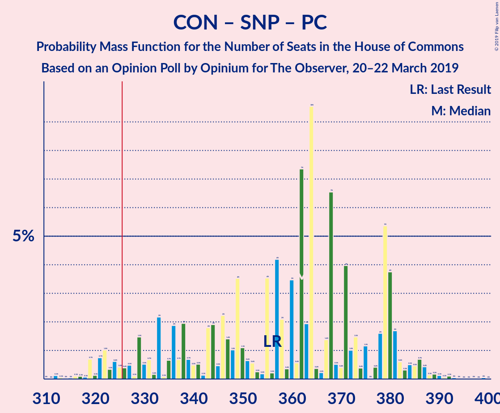
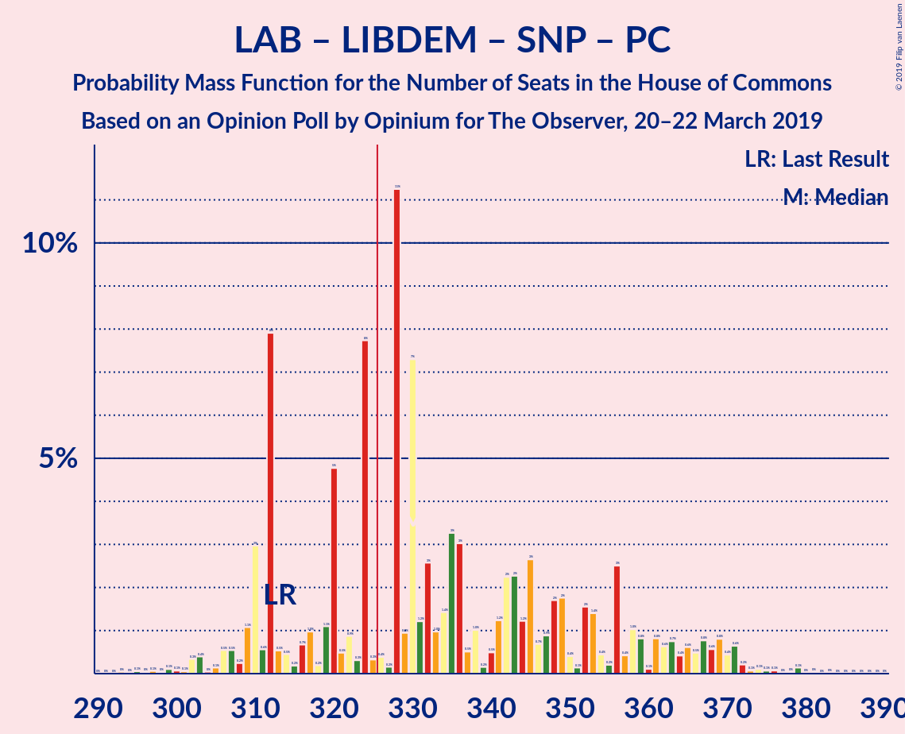
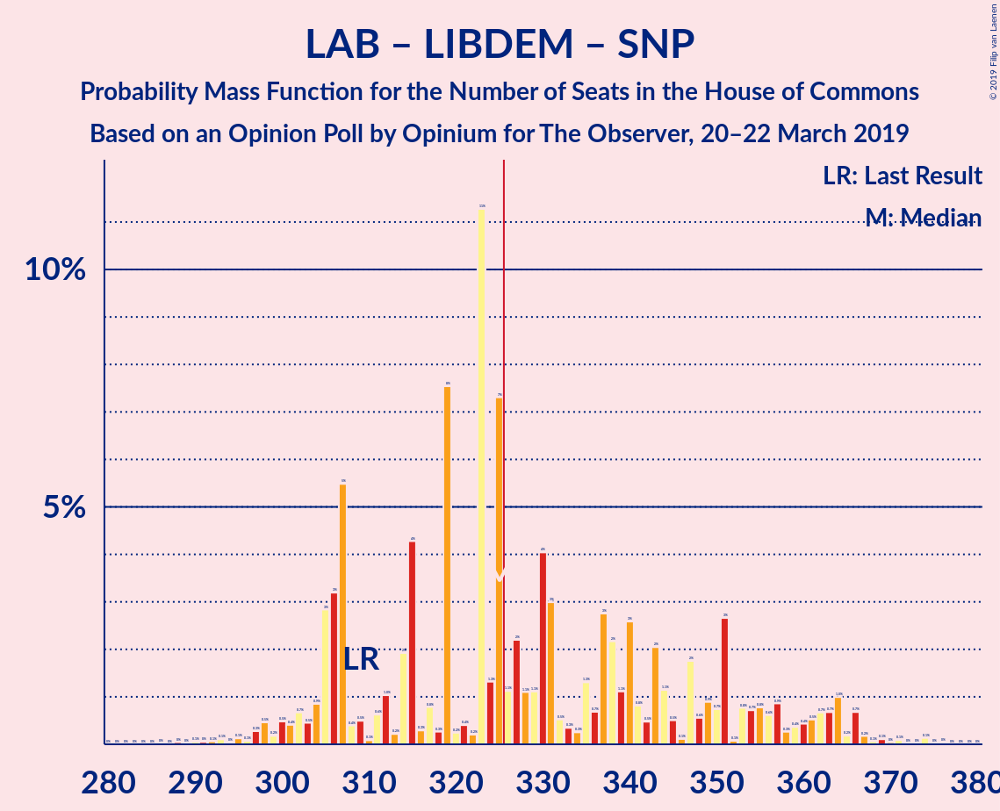
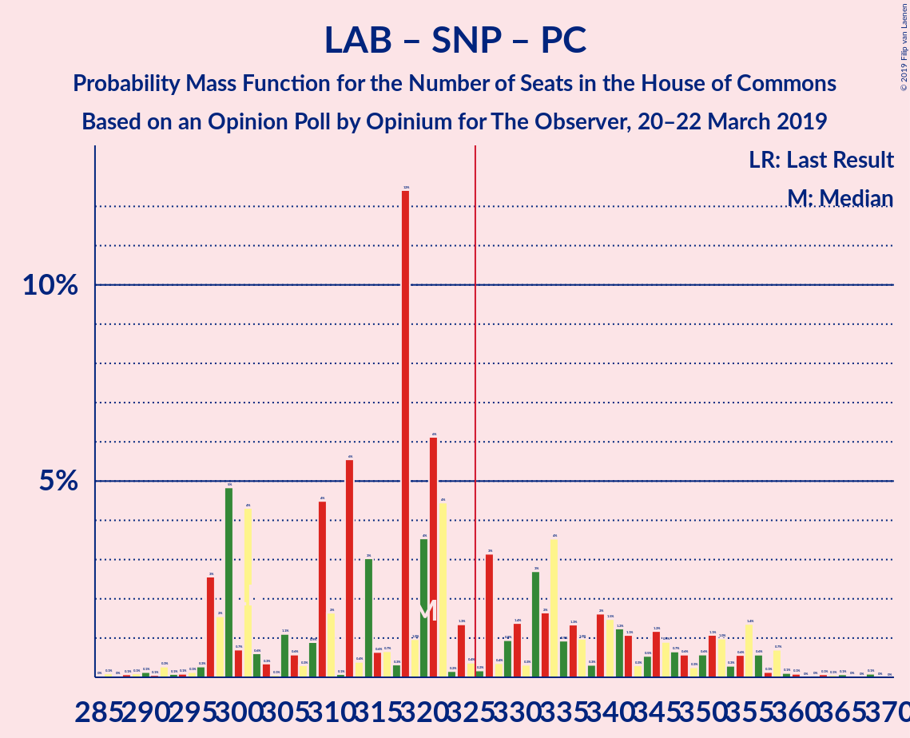

# Opinion Poll by Opinium for The Observer, 20–22 March 2019

<a href="#voting-intentions">Voting Intentions</a> | <a href="#seats">Seats</a> | <a href="#coalitions">Coalitions</a> | <a href="#technical-information">Technical Information</a>

## Voting Intentions

### Confidence Intervals

| Party | Last Result | Poll Result | 80% Confidence Interval | 90% Confidence Interval | 95% Confidence Interval | 99% Confidence Interval |
|:-----:|:-----------:|:-----------:|:-----------------------:|:-----------------------:|:-----------------------:|:-----------------------:|
| Conservative Party | 42.4% | 36.0% | 34.6–37.4% |34.3–37.8% |33.9–38.1% |33.3–38.8% |
| Labour Party | 40.0% | 35.0% | 33.7–36.4% |33.3–36.8% |33.0–37.1% |32.3–37.8% |
| UK Independence Party | 1.8% | 9.0% | 8.2–9.9% |8.0–10.1% |7.8–10.3% |7.5–10.8% |
| Liberal Democrats | 7.4% | 7.0% | 6.3–7.8% |6.1–8.0% |5.9–8.2% |5.6–8.6% |
| Scottish National Party | 3.0% | 5.0% | 4.4–5.7% |4.3–5.9% |4.1–6.1% |3.9–6.4% |
| Green Party | 1.6% | 4.0% | 3.5–4.6% |3.3–4.8% |3.2–5.0% |3.0–5.3% |
| Plaid Cymru | 0.5% | 1.0% | 0.8–1.4% |0.7–1.4% |0.6–1.5% |0.5–1.7% |

*Note:* The poll result column reflects the actual value used in the calculations. Published results may vary slightly, and in addition be rounded to fewer digits.

## Seats

### Confidence Intervals

| Party | Last Result | Median | 80% Confidence Interval | 90% Confidence Interval | 95% Confidence Interval | 99% Confidence Interval |
|:-----:|:-----------:|:------:|:-----------------------:|:-----------------------:|:-----------------------:|:-----------------------:|
| <a href="#conservative-party">Conservative Party</a> | 317 | 300 | 296–300 |296–306 |296–306 |259–306 |
| <a href="#labour-party">Labour Party</a> | 262 | 254 | 254–259 |246–259 |246–259 |246–287 |
| <a href="#uk-independence-party">UK Independence Party</a> | 0 | 2 | 2 |2 |2 |2 |
| <a href="#liberal-democrats">Liberal Democrats</a> | 12 | 13 | 13–14 |13–15 |13–15 |13–15 |
| <a href="#scottish-national-party">Scottish National Party</a> | 35 | 57 | 57–58 |57–58 |57–58 |57–58 |
| <a href="#green-party">Green Party</a> | 1 | 1 | 1 |1 |1 |1–2 |
| <a href="#plaid-cymru">Plaid Cymru</a> | 4 | 5 | 3–5 |3–5 |3–5 |3–8 |

### Conservative Party

*For a full overview of the results for this party, see the [Conservative Party](party-conservativeparty.html) page.*

| Number of Seats | Probability | Accumulated | Special Marks |
|:---------------:|:-----------:|:-----------:|:-------------:|
| 256 | 0.2% | 100% |  |
| 257 | 0% | 99.7% |  |
| 258 | 0% | 99.7% |  |
| 259 | 0.3% | 99.7% |  |
| 260 | 0% | 99.4% |  |
| 261 | 0% | 99.4% |  |
| 262 | 0% | 99.4% |  |
| 263 | 0% | 99.4% |  |
| 264 | 0% | 99.4% |  |
| 265 | 0% | 99.4% |  |
| 266 | 0% | 99.4% |  |
| 267 | 0% | 99.4% |  |
| 268 | 0% | 99.4% |  |
| 269 | 0% | 99.4% |  |
| 270 | 0% | 99.4% |  |
| 271 | 0% | 99.4% |  |
| 272 | 0% | 99.4% |  |
| 273 | 0% | 99.4% |  |
| 274 | 0% | 99.4% |  |
| 275 | 0% | 99.4% |  |
| 276 | 0% | 99.4% |  |
| 277 | 0% | 99.4% |  |
| 278 | 0% | 99.4% |  |
| 279 | 0% | 99.4% |  |
| 280 | 0% | 99.4% |  |
| 281 | 0% | 99.4% |  |
| 282 | 0% | 99.4% |  |
| 283 | 0% | 99.4% |  |
| 284 | 0% | 99.4% |  |
| 285 | 0% | 99.4% |  |
| 286 | 0% | 99.4% |  |
| 287 | 0% | 99.4% |  |
| 288 | 0% | 99.4% |  |
| 289 | 0% | 99.4% |  |
| 290 | 0% | 99.4% |  |
| 291 | 0% | 99.4% |  |
| 292 | 0% | 99.4% |  |
| 293 | 0% | 99.4% |  |
| 294 | 0% | 99.4% |  |
| 295 | 0.1% | 99.4% |  |
| 296 | 15% | 99.3% |  |
| 297 | 0% | 84% |  |
| 298 | 0% | 84% |  |
| 299 | 15% | 84% |  |
| 300 | 61% | 69% | Median |
| 301 | 0% | 9% |  |
| 302 | 0% | 9% |  |
| 303 | 0% | 9% |  |
| 304 | 0% | 9% |  |
| 305 | 0% | 9% |  |
| 306 | 9% | 9% |  |
| 307 | 0% | 0% |  |
| 308 | 0% | 0% |  |
| 309 | 0% | 0% |  |
| 310 | 0% | 0% |  |
| 311 | 0% | 0% |  |
| 312 | 0% | 0% |  |
| 313 | 0% | 0% |  |
| 314 | 0% | 0% |  |
| 315 | 0% | 0% |  |
| 316 | 0% | 0% |  |
| 317 | 0% | 0% | Last Result |

### Labour Party

*For a full overview of the results for this party, see the [Labour Party](party-labourparty.html) page.*

| Number of Seats | Probability | Accumulated | Special Marks |
|:---------------:|:-----------:|:-----------:|:-------------:|
| 246 | 9% | 100% |  |
| 247 | 0% | 91% |  |
| 248 | 0% | 91% |  |
| 249 | 0% | 91% |  |
| 250 | 0% | 91% |  |
| 251 | 0% | 91% |  |
| 252 | 0% | 91% |  |
| 253 | 0% | 91% |  |
| 254 | 75% | 91% | Median |
| 255 | 0% | 16% |  |
| 256 | 0% | 16% |  |
| 257 | 0% | 16% |  |
| 258 | 0% | 16% |  |
| 259 | 15% | 16% |  |
| 260 | 0% | 0.7% |  |
| 261 | 0.1% | 0.7% |  |
| 262 | 0% | 0.6% | Last Result |
| 263 | 0% | 0.6% |  |
| 264 | 0% | 0.6% |  |
| 265 | 0% | 0.6% |  |
| 266 | 0% | 0.6% |  |
| 267 | 0% | 0.6% |  |
| 268 | 0% | 0.6% |  |
| 269 | 0% | 0.6% |  |
| 270 | 0% | 0.6% |  |
| 271 | 0% | 0.6% |  |
| 272 | 0% | 0.6% |  |
| 273 | 0% | 0.6% |  |
| 274 | 0% | 0.6% |  |
| 275 | 0% | 0.6% |  |
| 276 | 0% | 0.6% |  |
| 277 | 0% | 0.6% |  |
| 278 | 0% | 0.6% |  |
| 279 | 0% | 0.6% |  |
| 280 | 0% | 0.6% |  |
| 281 | 0% | 0.6% |  |
| 282 | 0% | 0.6% |  |
| 283 | 0% | 0.6% |  |
| 284 | 0% | 0.6% |  |
| 285 | 0% | 0.6% |  |
| 286 | 0% | 0.6% |  |
| 287 | 0.3% | 0.6% |  |
| 288 | 0% | 0.3% |  |
| 289 | 0% | 0.3% |  |
| 290 | 0% | 0.3% |  |
| 291 | 0% | 0.3% |  |
| 292 | 0.2% | 0.3% |  |
| 293 | 0% | 0% |  |

### UK Independence Party

*For a full overview of the results for this party, see the [UK Independence Party](party-ukindependenceparty.html) page.*

| Number of Seats | Probability | Accumulated | Special Marks |
|:---------------:|:-----------:|:-----------:|:-------------:|
| 0 | 0% | 100% | Last Result |
| 1 | 0% | 100% |  |
| 2 | 100% | 100% | Median |

### Liberal Democrats

*For a full overview of the results for this party, see the [Liberal Democrats](party-liberaldemocrats.html) page.*

| Number of Seats | Probability | Accumulated | Special Marks |
|:---------------:|:-----------:|:-----------:|:-------------:|
| 12 | 0% | 100% | Last Result |
| 13 | 76% | 100% | Median |
| 14 | 15% | 24% |  |
| 15 | 9% | 9% |  |
| 16 | 0.3% | 0.3% |  |
| 17 | 0% | 0% |  |

### Scottish National Party

*For a full overview of the results for this party, see the [Scottish National Party](party-scottishnationalparty.html) page.*

| Number of Seats | Probability | Accumulated | Special Marks |
|:---------------:|:-----------:|:-----------:|:-------------:|
| 35 | 0% | 100% | Last Result |
| 36 | 0% | 100% |  |
| 37 | 0% | 100% |  |
| 38 | 0% | 100% |  |
| 39 | 0% | 100% |  |
| 40 | 0% | 100% |  |
| 41 | 0% | 100% |  |
| 42 | 0% | 100% |  |
| 43 | 0% | 100% |  |
| 44 | 0% | 100% |  |
| 45 | 0% | 100% |  |
| 46 | 0% | 100% |  |
| 47 | 0% | 100% |  |
| 48 | 0% | 100% |  |
| 49 | 0% | 100% |  |
| 50 | 0% | 100% |  |
| 51 | 0% | 100% |  |
| 52 | 0% | 100% |  |
| 53 | 0% | 100% |  |
| 54 | 0% | 100% |  |
| 55 | 0% | 100% |  |
| 56 | 0% | 100% |  |
| 57 | 85% | 100% | Median |
| 58 | 15% | 15% |  |
| 59 | 0% | 0% |  |

### Green Party

*For a full overview of the results for this party, see the [Green Party](party-greenparty.html) page.*

| Number of Seats | Probability | Accumulated | Special Marks |
|:---------------:|:-----------:|:-----------:|:-------------:|
| 1 | 99.4% | 100% | Last Result, Median |
| 2 | 0.3% | 0.6% |  |
| 3 | 0.2% | 0.2% |  |
| 4 | 0% | 0% |  |

### Plaid Cymru

*For a full overview of the results for this party, see the [Plaid Cymru](party-plaidcymru.html) page.*

| Number of Seats | Probability | Accumulated | Special Marks |
|:---------------:|:-----------:|:-----------:|:-------------:|
| 2 | 0.1% | 100% |  |
| 3 | 15% | 99.9% |  |
| 4 | 0% | 85% | Last Result |
| 5 | 84% | 85% | Median |
| 6 | 0% | 0.6% |  |
| 7 | 0% | 0.6% |  |
| 8 | 0.2% | 0.6% |  |
| 9 | 0.3% | 0.3% |  |
| 10 | 0% | 0% |  |

## Coalitions

### Confidence Intervals

| Coalition | Last Result | Median | Majority? | 80% Confidence Interval | 90% Confidence Interval | 95% Confidence Interval | 99% Confidence Interval |
|:---------:|:-----------:|:------:|:---------:|:-----------------------:|:-----------------------:|:-----------------------:|:-----------------------:|
| Conservative Party – Scottish National Party – Plaid Cymru | 356 | 362 | 100% | 357–362 | 357–368 | 357–368 | 325–368 |
| Conservative Party – Scottish National Party | 352 | 357 | 100% | 354–357 | 354–363 | 354–363 | 316–363 |
| Labour Party – Liberal Democrats – Scottish National Party – Plaid Cymru | 313 | 329 | 91% | 329–333 | 323–333 | 323–333 | 323–369 |
| Labour Party – Liberal Democrats – Scottish National Party | 309 | 324 | 15% | 324–330 | 318–330 | 318–330 | 318–360 |
| Conservative Party – Liberal Democrats | 329 | 313 | 0% | 309–313 | 309–321 | 309–321 | 275–321 |
| Labour Party – Scottish National Party – Plaid Cymru | 301 | 316 | 0% | 316–320 | 308–320 | 308–320 | 308–353 |
| Labour Party – Scottish National Party | 297 | 311 | 0% | 311–317 | 303–317 | 303–317 | 303–344 |
| Conservative Party – Plaid Cymru | 321 | 305 | 0% | 299–305 | 299–311 | 299–311 | 268–311 |
| Conservative Party | 317 | 300 | 0% | 296–300 | 296–306 | 296–306 | 259–306 |
| Labour Party – Liberal Democrats – Plaid Cymru | 278 | 272 | 0% | 272–275 | 266–275 | 266–275 | 266–312 |
| Labour Party – Liberal Democrats | 274 | 267 | 0% | 267–272 | 261–272 | 261–272 | 261–303 |
| Labour Party – Plaid Cymru | 266 | 259 | 0% | 259–262 | 251–262 | 251–262 | 251–296 |
| Labour Party | 262 | 254 | 0% | 254–259 | 246–259 | 246–259 | 246–287 |

### Conservative Party – Scottish National Party – Plaid Cymru

| Number of Seats | Probability | Accumulated | Special Marks |
|:---------------:|:-----------:|:-----------:|:-------------:|
| 355 | 0.1% | 100% |  |
| 356 | 0% | 99.8% | Last Result |
| 357 | 15% | 99.8% |  |
| 358 | 0% | 85% |  |
| 359 | 0% | 85% |  |
| 360 | 0% | 85% |  |
| 361 | 15% | 85% |  |
| 362 | 61% | 70% | Median |
| 363 | 0% | 9% |  |
| 364 | 0% | 9% |  |
| 365 | 0% | 9% |  |
| 366 | 0% | 9% |  |
| 367 | 0% | 9% |  |
| 368 | 9% | 9% |  |
| 369 | 0% | 0% |  |

### Conservative Party – Scottish National Party

| Number of Seats | Probability | Accumulated | Special Marks |
|:---------------:|:-----------:|:-----------:|:-------------:|
| 352 | 0% | 100% | Last Result |
| 353 | 0.1% | 100% |  |
| 354 | 15% | 99.8% |  |
| 355 | 0% | 85% |  |
| 356 | 15% | 85% |  |
| 357 | 61% | 70% | Median |
| 358 | 0% | 9% |  |
| 359 | 0% | 9% |  |
| 360 | 0% | 9% |  |
| 361 | 0% | 9% |  |
| 362 | 0% | 9% |  |
| 363 | 9% | 9% |  |
| 364 | 0% | 0% |  |

### Labour Party – Liberal Democrats – Scottish National Party – Plaid Cymru

| Number of Seats | Probability | Accumulated | Special Marks |
|:---------------:|:-----------:|:-----------:|:-------------:|
| 313 | 0% | 100% | Last Result |
| 314 | 0% | 100% |  |
| 315 | 0% | 100% |  |
| 316 | 0% | 100% |  |
| 317 | 0% | 100% |  |
| 318 | 0% | 100% |  |
| 319 | 0% | 100% |  |
| 320 | 0% | 100% |  |
| 321 | 0% | 100% |  |
| 322 | 0% | 100% |  |
| 323 | 9% | 100% |  |
| 324 | 0% | 91% |  |
| 325 | 0% | 91% |  |
| 326 | 0% | 91% | Majority |
| 327 | 0% | 91% |  |
| 328 | 0% | 91% |  |
| 329 | 61% | 91% | Median |
| 330 | 15% | 30% |  |
| 331 | 0% | 15% |  |
| 332 | 0% | 15% |  |
| 333 | 15% | 15% |  |
| 334 | 0.1% | 0.2% |  |
| 335 | 0% | 0% |  |

### Labour Party – Liberal Democrats – Scottish National Party

| Number of Seats | Probability | Accumulated | Special Marks |
|:---------------:|:-----------:|:-----------:|:-------------:|
| 309 | 0% | 100% | Last Result |
| 310 | 0% | 100% |  |
| 311 | 0% | 100% |  |
| 312 | 0% | 100% |  |
| 313 | 0% | 100% |  |
| 314 | 0% | 100% |  |
| 315 | 0% | 100% |  |
| 316 | 0% | 100% |  |
| 317 | 0% | 100% |  |
| 318 | 9% | 100% |  |
| 319 | 0% | 91% |  |
| 320 | 0% | 91% |  |
| 321 | 0% | 91% |  |
| 322 | 0% | 91% |  |
| 323 | 0% | 91% |  |
| 324 | 61% | 91% | Median |
| 325 | 15% | 30% |  |
| 326 | 0% | 15% | Majority |
| 327 | 0% | 15% |  |
| 328 | 0% | 15% |  |
| 329 | 0% | 15% |  |
| 330 | 15% | 15% |  |
| 331 | 0% | 0.2% |  |
| 332 | 0.1% | 0.2% |  |
| 333 | 0% | 0% |  |

### Conservative Party – Liberal Democrats

| Number of Seats | Probability | Accumulated | Special Marks |
|:---------------:|:-----------:|:-----------:|:-------------:|
| 308 | 0.1% | 100% |  |
| 309 | 15% | 99.8% |  |
| 310 | 0% | 85% |  |
| 311 | 0% | 85% |  |
| 312 | 0% | 85% |  |
| 313 | 76% | 85% | Median |
| 314 | 0% | 9% |  |
| 315 | 0% | 9% |  |
| 316 | 0% | 9% |  |
| 317 | 0% | 9% |  |
| 318 | 0% | 9% |  |
| 319 | 0% | 9% |  |
| 320 | 0% | 9% |  |
| 321 | 9% | 9% |  |
| 322 | 0% | 0% |  |
| 323 | 0% | 0% |  |
| 324 | 0% | 0% |  |
| 325 | 0% | 0% |  |
| 326 | 0% | 0% | Majority |
| 327 | 0% | 0% |  |
| 328 | 0% | 0% |  |
| 329 | 0% | 0% | Last Result |

### Labour Party – Scottish National Party – Plaid Cymru

| Number of Seats | Probability | Accumulated | Special Marks |
|:---------------:|:-----------:|:-----------:|:-------------:|
| 301 | 0% | 100% | Last Result |
| 302 | 0% | 100% |  |
| 303 | 0% | 100% |  |
| 304 | 0% | 100% |  |
| 305 | 0% | 100% |  |
| 306 | 0% | 100% |  |
| 307 | 0% | 100% |  |
| 308 | 9% | 100% |  |
| 309 | 0% | 91% |  |
| 310 | 0% | 91% |  |
| 311 | 0% | 91% |  |
| 312 | 0% | 91% |  |
| 313 | 0% | 91% |  |
| 314 | 0% | 91% |  |
| 315 | 0% | 91% |  |
| 316 | 76% | 91% | Median |
| 317 | 0% | 15% |  |
| 318 | 0% | 15% |  |
| 319 | 0% | 15% |  |
| 320 | 15% | 15% |  |
| 321 | 0.1% | 0.2% |  |
| 322 | 0% | 0% |  |

### Labour Party – Scottish National Party

| Number of Seats | Probability | Accumulated | Special Marks |
|:---------------:|:-----------:|:-----------:|:-------------:|
| 297 | 0% | 100% | Last Result |
| 298 | 0% | 100% |  |
| 299 | 0% | 100% |  |
| 300 | 0% | 100% |  |
| 301 | 0% | 100% |  |
| 302 | 0% | 100% |  |
| 303 | 9% | 100% |  |
| 304 | 0% | 91% |  |
| 305 | 0% | 91% |  |
| 306 | 0% | 91% |  |
| 307 | 0% | 91% |  |
| 308 | 0% | 91% |  |
| 309 | 0% | 91% |  |
| 310 | 0% | 91% |  |
| 311 | 76% | 91% | Median |
| 312 | 0% | 15% |  |
| 313 | 0% | 15% |  |
| 314 | 0% | 15% |  |
| 315 | 0% | 15% |  |
| 316 | 0% | 15% |  |
| 317 | 15% | 15% |  |
| 318 | 0% | 0.2% |  |
| 319 | 0.1% | 0.2% |  |
| 320 | 0% | 0% |  |

### Conservative Party – Plaid Cymru

| Number of Seats | Probability | Accumulated | Special Marks |
|:---------------:|:-----------:|:-----------:|:-------------:|
| 297 | 0.1% | 100% |  |
| 298 | 0% | 99.8% |  |
| 299 | 15% | 99.8% |  |
| 300 | 0% | 85% |  |
| 301 | 0% | 85% |  |
| 302 | 0% | 85% |  |
| 303 | 0% | 85% |  |
| 304 | 15% | 85% |  |
| 305 | 61% | 70% | Median |
| 306 | 0% | 9% |  |
| 307 | 0% | 9% |  |
| 308 | 0% | 9% |  |
| 309 | 0% | 9% |  |
| 310 | 0% | 9% |  |
| 311 | 9% | 9% |  |
| 312 | 0% | 0% |  |
| 313 | 0% | 0% |  |
| 314 | 0% | 0% |  |
| 315 | 0% | 0% |  |
| 316 | 0% | 0% |  |
| 317 | 0% | 0% |  |
| 318 | 0% | 0% |  |
| 319 | 0% | 0% |  |
| 320 | 0% | 0% |  |
| 321 | 0% | 0% | Last Result |

### Conservative Party

| Number of Seats | Probability | Accumulated | Special Marks |
|:---------------:|:-----------:|:-----------:|:-------------:|
| 295 | 0.1% | 100% |  |
| 296 | 15% | 99.8% |  |
| 297 | 0% | 85% |  |
| 298 | 0% | 85% |  |
| 299 | 15% | 85% |  |
| 300 | 61% | 70% | Median |
| 301 | 0% | 9% |  |
| 302 | 0% | 9% |  |
| 303 | 0% | 9% |  |
| 304 | 0% | 9% |  |
| 305 | 0% | 9% |  |
| 306 | 9% | 9% |  |
| 307 | 0% | 0% |  |
| 308 | 0% | 0% |  |
| 309 | 0% | 0% |  |
| 310 | 0% | 0% |  |
| 311 | 0% | 0% |  |
| 312 | 0% | 0% |  |
| 313 | 0% | 0% |  |
| 314 | 0% | 0% |  |
| 315 | 0% | 0% |  |
| 316 | 0% | 0% |  |
| 317 | 0% | 0% | Last Result |

### Labour Party – Liberal Democrats – Plaid Cymru

| Number of Seats | Probability | Accumulated | Special Marks |
|:---------------:|:-----------:|:-----------:|:-------------:|
| 266 | 9% | 100% |  |
| 267 | 0% | 91% |  |
| 268 | 0% | 91% |  |
| 269 | 0% | 91% |  |
| 270 | 0% | 91% |  |
| 271 | 0% | 91% |  |
| 272 | 61% | 91% | Median |
| 273 | 15% | 30% |  |
| 274 | 0% | 15% |  |
| 275 | 15% | 15% |  |
| 276 | 0.1% | 0.2% |  |
| 277 | 0% | 0% |  |
| 278 | 0% | 0% | Last Result |

### Labour Party – Liberal Democrats

| Number of Seats | Probability | Accumulated | Special Marks |
|:---------------:|:-----------:|:-----------:|:-------------:|
| 261 | 9% | 100% |  |
| 262 | 0% | 91% |  |
| 263 | 0% | 91% |  |
| 264 | 0% | 91% |  |
| 265 | 0% | 91% |  |
| 266 | 0% | 91% |  |
| 267 | 61% | 91% | Median |
| 268 | 15% | 30% |  |
| 269 | 0% | 15% |  |
| 270 | 0% | 15% |  |
| 271 | 0% | 15% |  |
| 272 | 15% | 15% |  |
| 273 | 0% | 0.2% |  |
| 274 | 0.1% | 0.2% | Last Result |
| 275 | 0% | 0% |  |

### Labour Party – Plaid Cymru

| Number of Seats | Probability | Accumulated | Special Marks |
|:---------------:|:-----------:|:-----------:|:-------------:|
| 251 | 9% | 100% |  |
| 252 | 0% | 91% |  |
| 253 | 0% | 91% |  |
| 254 | 0% | 91% |  |
| 255 | 0% | 91% |  |
| 256 | 0% | 91% |  |
| 257 | 0% | 91% |  |
| 258 | 0% | 91% |  |
| 259 | 76% | 91% | Median |
| 260 | 0% | 15% |  |
| 261 | 0% | 15% |  |
| 262 | 15% | 15% |  |
| 263 | 0.1% | 0.2% |  |
| 264 | 0% | 0% |  |
| 265 | 0% | 0% |  |
| 266 | 0% | 0% | Last Result |

### Labour Party

| Number of Seats | Probability | Accumulated | Special Marks |
|:---------------:|:-----------:|:-----------:|:-------------:|
| 246 | 9% | 100% |  |
| 247 | 0% | 91% |  |
| 248 | 0% | 91% |  |
| 249 | 0% | 91% |  |
| 250 | 0% | 91% |  |
| 251 | 0% | 91% |  |
| 252 | 0% | 91% |  |
| 253 | 0% | 91% |  |
| 254 | 76% | 91% | Median |
| 255 | 0% | 15% |  |
| 256 | 0% | 15% |  |
| 257 | 0% | 15% |  |
| 258 | 0% | 15% |  |
| 259 | 15% | 15% |  |
| 260 | 0% | 0.2% |  |
| 261 | 0.1% | 0.2% |  |
| 262 | 0% | 0% | Last Result |

## Technical Information

### Opinion Poll

+ **Polling firm:** Opinium
+ **Commissioner(s):** The Observer
+ **Fieldwork period:** 20–22 March 2019

### Calculations

+ **Sample size:** 2002
+ **Simulations done:** 128
+ **Error estimate:** 3.84%

