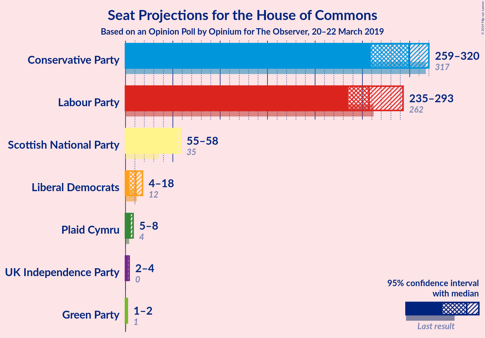
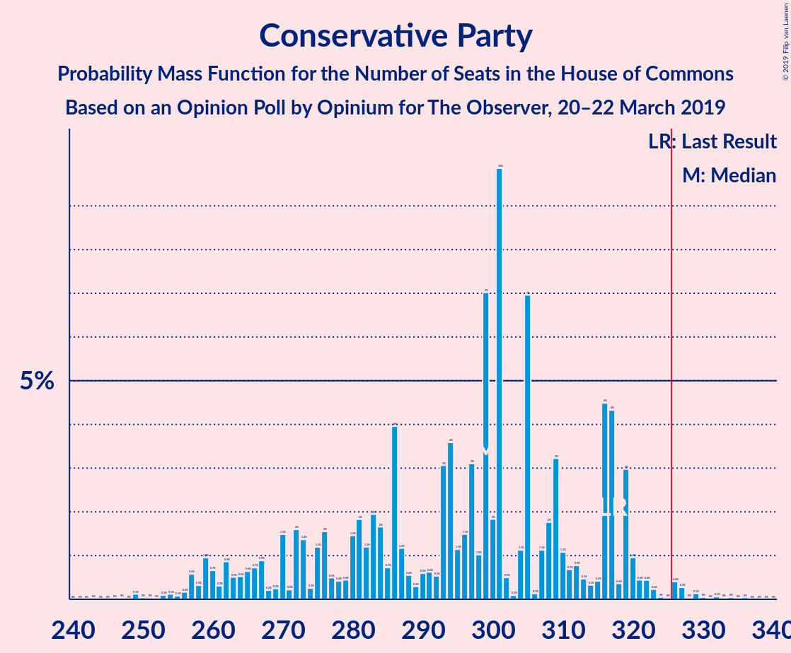
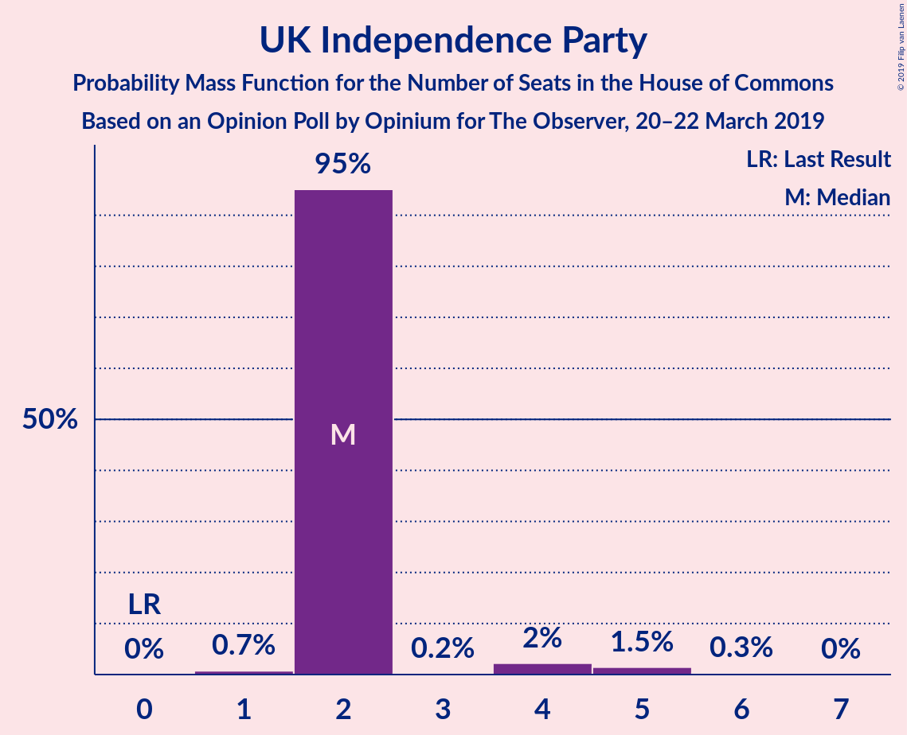
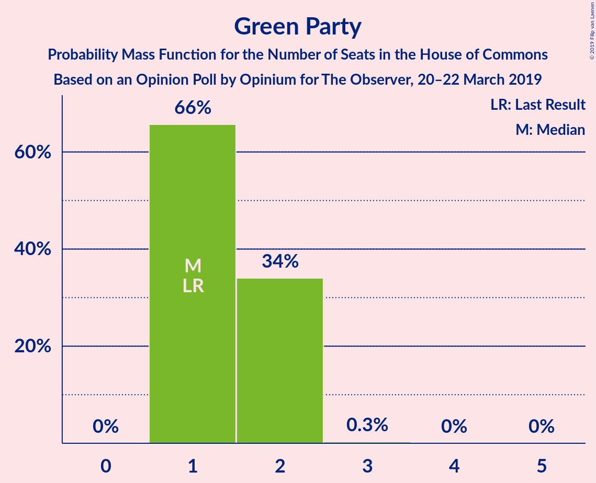
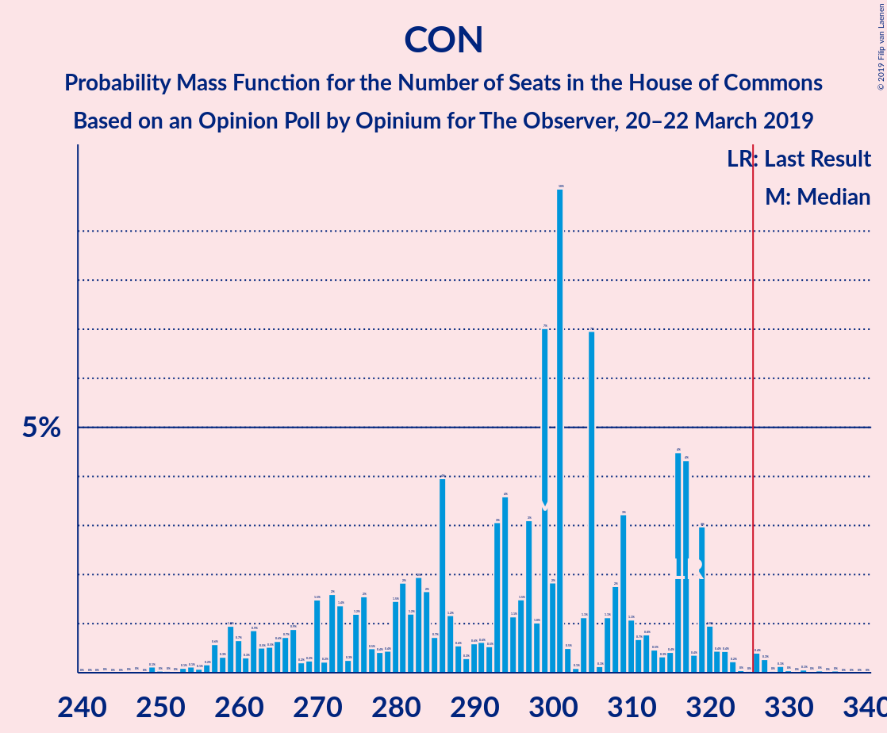
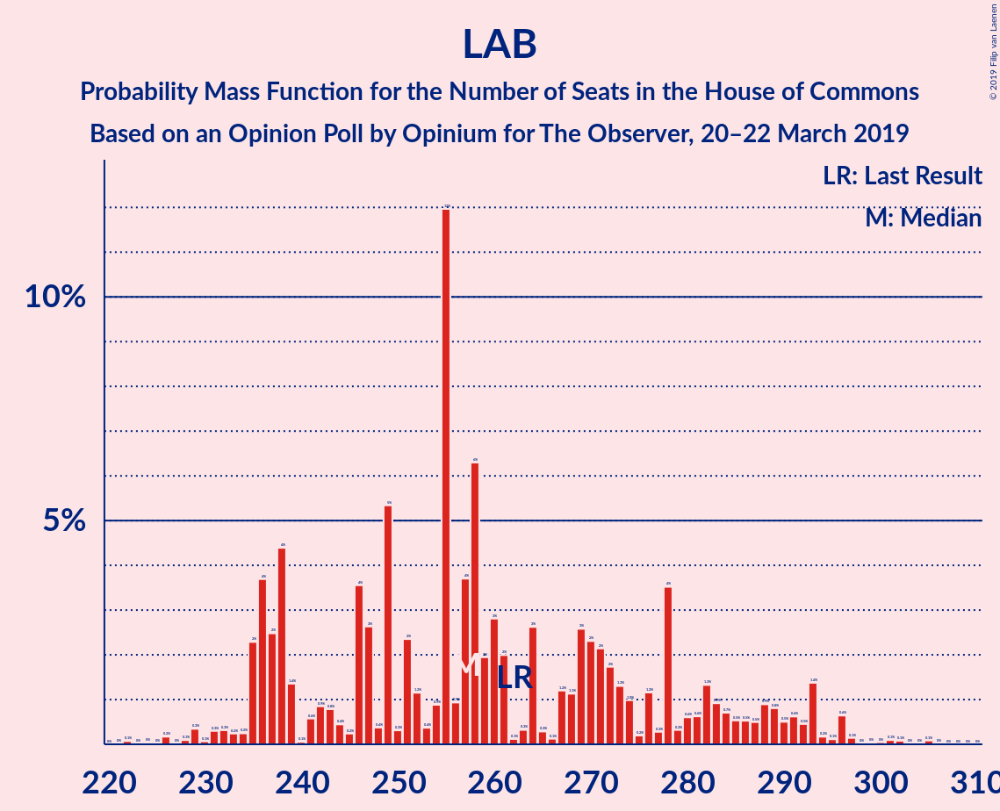

# Opinion Poll by Opinium for The Observer, 20–22 March 2019

<a href="#voting-intentions">Voting Intentions</a> | <a href="#seats">Seats</a> | <a href="#coalitions">Coalitions</a> | <a href="#technical-information">Technical Information</a>

## Voting Intentions

### Confidence Intervals

| Party | Last Result | Poll Result | 80% Confidence Interval | 90% Confidence Interval | 95% Confidence Interval | 99% Confidence Interval |
|:-----:|:-----------:|:-----------:|:-----------------------:|:-----------------------:|:-----------------------:|:-----------------------:|
| Conservative Party | 42.4% | 36.0% | 34.6–37.4% |34.3–37.8% |33.9–38.1% |33.3–38.8% |
| Labour Party | 40.0% | 35.0% | 33.7–36.4% |33.3–36.8% |33.0–37.1% |32.3–37.8% |
| UK Independence Party | 1.8% | 9.0% | 8.2–9.9% |8.0–10.1% |7.8–10.3% |7.5–10.8% |
| Liberal Democrats | 7.4% | 7.0% | 6.3–7.8% |6.1–8.0% |5.9–8.2% |5.6–8.6% |
| Scottish National Party | 3.0% | 5.0% | 4.4–5.7% |4.3–5.9% |4.1–6.1% |3.9–6.4% |
| Green Party | 1.6% | 4.0% | 3.5–4.6% |3.3–4.8% |3.2–5.0% |3.0–5.3% |
| Plaid Cymru | 0.5% | 1.0% | 0.8–1.4% |0.7–1.4% |0.6–1.5% |0.5–1.7% |

*Note:* The poll result column reflects the actual value used in the calculations. Published results may vary slightly, and in addition be rounded to fewer digits.

## Seats

### Confidence Intervals

| Party | Last Result | Median | 80% Confidence Interval | 90% Confidence Interval | 95% Confidence Interval | 99% Confidence Interval |
|:-----:|:-----------:|:------:|:-----------------------:|:-----------------------:|:-----------------------:|:-----------------------:|
| <a href="#conservative-party">Conservative Party</a> | 317 | 300 | 300–309 |296–313 |283–313 |273–313 |
| <a href="#labour-party">Labour Party</a> | 262 | 255 | 245–255 |238–259 |238–269 |238–278 |
| <a href="#uk-independence-party">UK Independence Party</a> | 0 | 2 | 2 |2 |2 |2 |
| <a href="#liberal-democrats">Liberal Democrats</a> | 12 | 10 | 10–13 |10–15 |10–18 |10–18 |
| <a href="#scottish-national-party">Scottish National Party</a> | 35 | 58 | 57–58 |57–58 |53–58 |53–58 |
| <a href="#green-party">Green Party</a> | 1 | 2 | 1–2 |1–2 |1–2 |1–2 |
| <a href="#plaid-cymru">Plaid Cymru</a> | 4 | 5 | 5–6 |5–8 |4–8 |3–8 |

### Conservative Party

*For a full overview of the results for this party, see the [Conservative Party](party-conservativeparty.html) page.*

| Number of Seats | Probability | Accumulated | Special Marks |
|:---------------:|:-----------:|:-----------:|:-------------:|
| 243 | 0.1% | 100% |  |
| 244 | 0% | 99.9% |  |
| 245 | 0% | 99.9% |  |
| 246 | 0% | 99.9% |  |
| 247 | 0% | 99.9% |  |
| 248 | 0% | 99.9% |  |
| 249 | 0% | 99.9% |  |
| 250 | 0% | 99.9% |  |
| 251 | 0% | 99.9% |  |
| 252 | 0% | 99.9% |  |
| 253 | 0% | 99.9% |  |
| 254 | 0% | 99.9% |  |
| 255 | 0% | 99.9% |  |
| 256 | 0% | 99.9% |  |
| 257 | 0% | 99.9% |  |
| 258 | 0% | 99.9% |  |
| 259 | 0% | 99.9% |  |
| 260 | 0% | 99.9% |  |
| 261 | 0% | 99.8% |  |
| 262 | 0% | 99.8% |  |
| 263 | 0% | 99.8% |  |
| 264 | 0% | 99.8% |  |
| 265 | 0% | 99.8% |  |
| 266 | 0% | 99.8% |  |
| 267 | 0% | 99.8% |  |
| 268 | 0% | 99.8% |  |
| 269 | 0% | 99.8% |  |
| 270 | 0% | 99.8% |  |
| 271 | 0% | 99.8% |  |
| 272 | 0% | 99.8% |  |
| 273 | 0.9% | 99.8% |  |
| 274 | 0.1% | 98.9% |  |
| 275 | 0% | 98.8% |  |
| 276 | 0% | 98.8% |  |
| 277 | 0% | 98.8% |  |
| 278 | 0% | 98.8% |  |
| 279 | 0% | 98.8% |  |
| 280 | 0% | 98.8% |  |
| 281 | 0% | 98.8% |  |
| 282 | 0% | 98.8% |  |
| 283 | 4% | 98.8% |  |
| 284 | 0% | 95% |  |
| 285 | 0% | 95% |  |
| 286 | 0% | 95% |  |
| 287 | 0% | 95% |  |
| 288 | 0% | 95% |  |
| 289 | 0% | 95% |  |
| 290 | 0% | 95% |  |
| 291 | 0.2% | 95% |  |
| 292 | 0% | 95% |  |
| 293 | 0% | 95% |  |
| 294 | 0% | 95% |  |
| 295 | 0% | 95% |  |
| 296 | 2% | 95% |  |
| 297 | 0% | 93% |  |
| 298 | 0% | 93% |  |
| 299 | 2% | 93% |  |
| 300 | 53% | 92% | Median |
| 301 | 0% | 39% |  |
| 302 | 0% | 39% |  |
| 303 | 0% | 39% |  |
| 304 | 0% | 39% |  |
| 305 | 0% | 39% |  |
| 306 | 0.9% | 39% |  |
| 307 | 0% | 38% |  |
| 308 | 4% | 38% |  |
| 309 | 27% | 34% |  |
| 310 | 0% | 7% |  |
| 311 | 0% | 7% |  |
| 312 | 0% | 7% |  |
| 313 | 7% | 7% |  |
| 314 | 0% | 0.1% |  |
| 315 | 0% | 0.1% |  |
| 316 | 0% | 0.1% |  |
| 317 | 0.1% | 0.1% | Last Result |
| 318 | 0.1% | 0.1% |  |
| 319 | 0% | 0% |  |

### Labour Party

*For a full overview of the results for this party, see the [Labour Party](party-labourparty.html) page.*

| Number of Seats | Probability | Accumulated | Special Marks |
|:---------------:|:-----------:|:-----------:|:-------------:|
| 232 | 0.1% | 100% |  |
| 233 | 0% | 99.9% |  |
| 234 | 0% | 99.9% |  |
| 235 | 0% | 99.9% |  |
| 236 | 0% | 99.9% |  |
| 237 | 0% | 99.9% |  |
| 238 | 7% | 99.9% |  |
| 239 | 0% | 93% |  |
| 240 | 0% | 93% |  |
| 241 | 0% | 93% |  |
| 242 | 0% | 93% |  |
| 243 | 0% | 93% |  |
| 244 | 0% | 93% |  |
| 245 | 4% | 93% |  |
| 246 | 28% | 89% |  |
| 247 | 0% | 61% |  |
| 248 | 0% | 61% |  |
| 249 | 0% | 61% |  |
| 250 | 0% | 61% |  |
| 251 | 0% | 61% |  |
| 252 | 0% | 61% |  |
| 253 | 0% | 61% |  |
| 254 | 8% | 61% |  |
| 255 | 47% | 54% | Median |
| 256 | 0% | 7% |  |
| 257 | 0% | 7% |  |
| 258 | 0% | 7% |  |
| 259 | 2% | 7% |  |
| 260 | 0.2% | 5% |  |
| 261 | 0% | 5% |  |
| 262 | 0% | 5% | Last Result |
| 263 | 0% | 5% |  |
| 264 | 0% | 5% |  |
| 265 | 0% | 5% |  |
| 266 | 0% | 5% |  |
| 267 | 0% | 5% |  |
| 268 | 0% | 5% |  |
| 269 | 4% | 5% |  |
| 270 | 0% | 1.2% |  |
| 271 | 0% | 1.2% |  |
| 272 | 0% | 1.2% |  |
| 273 | 0% | 1.2% |  |
| 274 | 0% | 1.2% |  |
| 275 | 0% | 1.2% |  |
| 276 | 0% | 1.2% |  |
| 277 | 0% | 1.2% |  |
| 278 | 1.1% | 1.2% |  |
| 279 | 0% | 0.2% |  |
| 280 | 0% | 0.2% |  |
| 281 | 0% | 0.2% |  |
| 282 | 0% | 0.2% |  |
| 283 | 0% | 0.2% |  |
| 284 | 0% | 0.2% |  |
| 285 | 0% | 0.2% |  |
| 286 | 0% | 0.2% |  |
| 287 | 0% | 0.2% |  |
| 288 | 0% | 0.1% |  |
| 289 | 0% | 0.1% |  |
| 290 | 0% | 0.1% |  |
| 291 | 0% | 0.1% |  |
| 292 | 0% | 0.1% |  |
| 293 | 0% | 0.1% |  |
| 294 | 0% | 0.1% |  |
| 295 | 0% | 0.1% |  |
| 296 | 0% | 0.1% |  |
| 297 | 0% | 0.1% |  |
| 298 | 0% | 0.1% |  |
| 299 | 0% | 0.1% |  |
| 300 | 0% | 0.1% |  |
| 301 | 0% | 0.1% |  |
| 302 | 0% | 0.1% |  |
| 303 | 0% | 0.1% |  |
| 304 | 0% | 0.1% |  |
| 305 | 0% | 0.1% |  |
| 306 | 0% | 0.1% |  |
| 307 | 0% | 0.1% |  |
| 308 | 0% | 0.1% |  |
| 309 | 0.1% | 0.1% |  |
| 310 | 0% | 0% |  |

### UK Independence Party

*For a full overview of the results for this party, see the [UK Independence Party](party-ukindependenceparty.html) page.*

| Number of Seats | Probability | Accumulated | Special Marks |
|:---------------:|:-----------:|:-----------:|:-------------:|
| 0 | 0% | 100% | Last Result |
| 1 | 0.1% | 100% |  |
| 2 | 99.9% | 99.9% | Median |
| 3 | 0% | 0% |  |

### Liberal Democrats

*For a full overview of the results for this party, see the [Liberal Democrats](party-liberaldemocrats.html) page.*

| Number of Seats | Probability | Accumulated | Special Marks |
|:---------------:|:-----------:|:-----------:|:-------------:|
| 6 | 0% | 100% |  |
| 7 | 0% | 99.9% |  |
| 8 | 0% | 99.9% |  |
| 9 | 0% | 99.9% |  |
| 10 | 74% | 99.9% | Median |
| 11 | 0% | 26% |  |
| 12 | 4% | 26% | Last Result |
| 13 | 15% | 22% |  |
| 14 | 2% | 7% |  |
| 15 | 1.1% | 6% |  |
| 16 | 1.0% | 5% |  |
| 17 | 0% | 4% |  |
| 18 | 4% | 4% |  |
| 19 | 0% | 0.2% |  |
| 20 | 0.2% | 0.2% |  |
| 21 | 0% | 0% |  |

### Scottish National Party

*For a full overview of the results for this party, see the [Scottish National Party](party-scottishnationalparty.html) page.*

| Number of Seats | Probability | Accumulated | Special Marks |
|:---------------:|:-----------:|:-----------:|:-------------:|
| 35 | 0% | 100% | Last Result |
| 36 | 0% | 100% |  |
| 37 | 0% | 100% |  |
| 38 | 0% | 100% |  |
| 39 | 0% | 100% |  |
| 40 | 0% | 100% |  |
| 41 | 0% | 100% |  |
| 42 | 0% | 100% |  |
| 43 | 0% | 100% |  |
| 44 | 0% | 100% |  |
| 45 | 0% | 100% |  |
| 46 | 0% | 100% |  |
| 47 | 0% | 100% |  |
| 48 | 0% | 100% |  |
| 49 | 0% | 100% |  |
| 50 | 0% | 100% |  |
| 51 | 0.2% | 100% |  |
| 52 | 0% | 99.8% |  |
| 53 | 4% | 99.8% |  |
| 54 | 0% | 96% |  |
| 55 | 0% | 96% |  |
| 56 | 0% | 96% |  |
| 57 | 17% | 96% |  |
| 58 | 79% | 79% | Median |
| 59 | 0% | 0% |  |

### Green Party

*For a full overview of the results for this party, see the [Green Party](party-greenparty.html) page.*

| Number of Seats | Probability | Accumulated | Special Marks |
|:---------------:|:-----------:|:-----------:|:-------------:|
| 1 | 48% | 100% | Last Result |
| 2 | 52% | 52% | Median |
| 3 | 0% | 0% |  |

### Plaid Cymru

*For a full overview of the results for this party, see the [Plaid Cymru](party-plaidcymru.html) page.*

| Number of Seats | Probability | Accumulated | Special Marks |
|:---------------:|:-----------:|:-----------:|:-------------:|
| 3 | 2% | 100% |  |
| 4 | 1.2% | 98% | Last Result |
| 5 | 59% | 97% | Median |
| 6 | 30% | 38% |  |
| 7 | 0% | 7% |  |
| 8 | 7% | 7% |  |
| 9 | 0% | 0.1% |  |
| 10 | 0% | 0.1% |  |
| 11 | 0.1% | 0.1% |  |
| 12 | 0% | 0% |  |

## Coalitions

### Confidence Intervals

| Coalition | Last Result | Median | Majority? | 80% Confidence Interval | 90% Confidence Interval | 95% Confidence Interval | 99% Confidence Interval |
|:---------:|:-----------:|:------:|:---------:|:-----------------------:|:-----------------------:|:-----------------------:|:-----------------------:|
| Conservative Party – Scottish National Party – Plaid Cymru | 356 | 363 | 99.8% | 362–373 | 357–378 | 341–378 | 334–378 |
| Conservative Party – Scottish National Party | 352 | 358 | 99.8% | 357–367 | 354–370 | 336–370 | 330–370 |
| Labour Party – Liberal Democrats – Scottish National Party – Plaid Cymru | 313 | 328 | 61% | 320–329 | 316–333 | 316–345 | 316–355 |
| Labour Party – Liberal Democrats – Scottish National Party | 309 | 323 | 7% | 314–324 | 308–330 | 308–340 | 308–351 |
| Labour Party – Scottish National Party – Plaid Cymru | 301 | 318 | 5% | 309–318 | 303–320 | 303–327 | 303–339 |
| Conservative Party – Liberal Democrats | 329 | 310 | 7% | 310–320 | 309–326 | 301–326 | 289–326 |
| Labour Party – Scottish National Party | 297 | 313 | 1.2% | 303–313 | 295–317 | 295–322 | 295–335 |
| Conservative Party – Plaid Cymru | 321 | 305 | 0.1% | 305–315 | 299–321 | 288–321 | 277–321 |
| Conservative Party | 317 | 300 | 0% | 300–309 | 296–313 | 283–313 | 273–313 |
| Labour Party – Liberal Democrats – Plaid Cymru | 278 | 270 | 0.1% | 262–272 | 259–275 | 259–292 | 259–298 |
| Labour Party – Liberal Democrats | 274 | 265 | 0% | 256–267 | 251–272 | 251–287 | 251–294 |
| Labour Party – Plaid Cymru | 266 | 260 | 0% | 251–260 | 246–264 | 246–274 | 246–282 |
| Labour Party | 262 | 255 | 0% | 245–255 | 238–259 | 238–269 | 238–278 |

### Conservative Party – Scottish National Party – Plaid Cymru

| Number of Seats | Probability | Accumulated | Special Marks |
|:---------------:|:-----------:|:-----------:|:-------------:|
| 305 | 0.1% | 100% |  |
| 306 | 0% | 99.9% |  |
| 307 | 0% | 99.9% |  |
| 308 | 0% | 99.9% |  |
| 309 | 0% | 99.9% |  |
| 310 | 0% | 99.9% |  |
| 311 | 0% | 99.9% |  |
| 312 | 0% | 99.9% |  |
| 313 | 0% | 99.9% |  |
| 314 | 0% | 99.9% |  |
| 315 | 0% | 99.9% |  |
| 316 | 0% | 99.9% |  |
| 317 | 0% | 99.9% |  |
| 318 | 0% | 99.9% |  |
| 319 | 0% | 99.9% |  |
| 320 | 0% | 99.9% |  |
| 321 | 0% | 99.9% |  |
| 322 | 0% | 99.9% |  |
| 323 | 0% | 99.9% |  |
| 324 | 0% | 99.9% |  |
| 325 | 0% | 99.9% |  |
| 326 | 0% | 99.8% | Majority |
| 327 | 0% | 99.8% |  |
| 328 | 0% | 99.8% |  |
| 329 | 0% | 99.8% |  |
| 330 | 0% | 99.8% |  |
| 331 | 0% | 99.8% |  |
| 332 | 0% | 99.8% |  |
| 333 | 0% | 99.8% |  |
| 334 | 0.9% | 99.8% |  |
| 335 | 0.1% | 98.9% |  |
| 336 | 0% | 98.8% |  |
| 337 | 0% | 98.8% |  |
| 338 | 0% | 98.8% |  |
| 339 | 0% | 98.8% |  |
| 340 | 0% | 98.8% |  |
| 341 | 4% | 98.8% |  |
| 342 | 0% | 95% |  |
| 343 | 0% | 95% |  |
| 344 | 0% | 95% |  |
| 345 | 0% | 95% |  |
| 346 | 0% | 95% |  |
| 347 | 0% | 95% |  |
| 348 | 0% | 95% |  |
| 349 | 0% | 95% |  |
| 350 | 0.2% | 95% |  |
| 351 | 0% | 95% |  |
| 352 | 0% | 95% |  |
| 353 | 0% | 95% |  |
| 354 | 0% | 95% |  |
| 355 | 0% | 95% |  |
| 356 | 0% | 95% | Last Result |
| 357 | 2% | 95% |  |
| 358 | 0.2% | 93% |  |
| 359 | 0% | 93% |  |
| 360 | 0% | 93% |  |
| 361 | 2% | 93% |  |
| 362 | 6% | 92% |  |
| 363 | 47% | 85% | Median |
| 364 | 0% | 39% |  |
| 365 | 0% | 39% |  |
| 366 | 0% | 39% |  |
| 367 | 0% | 39% |  |
| 368 | 0.9% | 39% |  |
| 369 | 0% | 38% |  |
| 370 | 0% | 38% |  |
| 371 | 0% | 38% |  |
| 372 | 4% | 38% |  |
| 373 | 27% | 34% |  |
| 374 | 0% | 7% |  |
| 375 | 0% | 7% |  |
| 376 | 0% | 7% |  |
| 377 | 0% | 7% |  |
| 378 | 7% | 7% |  |
| 379 | 0% | 0.1% |  |
| 380 | 0% | 0.1% |  |
| 381 | 0% | 0.1% |  |
| 382 | 0% | 0.1% |  |
| 383 | 0% | 0.1% |  |
| 384 | 0% | 0.1% |  |
| 385 | 0% | 0.1% |  |
| 386 | 0% | 0.1% |  |
| 387 | 0.1% | 0.1% |  |
| 388 | 0% | 0% |  |

### Conservative Party – Scottish National Party

| Number of Seats | Probability | Accumulated | Special Marks |
|:---------------:|:-----------:|:-----------:|:-------------:|
| 300 | 0.1% | 100% |  |
| 301 | 0% | 99.9% |  |
| 302 | 0% | 99.9% |  |
| 303 | 0% | 99.9% |  |
| 304 | 0% | 99.9% |  |
| 305 | 0% | 99.9% |  |
| 306 | 0% | 99.9% |  |
| 307 | 0% | 99.9% |  |
| 308 | 0% | 99.9% |  |
| 309 | 0% | 99.9% |  |
| 310 | 0% | 99.9% |  |
| 311 | 0% | 99.9% |  |
| 312 | 0% | 99.9% |  |
| 313 | 0% | 99.9% |  |
| 314 | 0% | 99.9% |  |
| 315 | 0% | 99.9% |  |
| 316 | 0% | 99.9% |  |
| 317 | 0% | 99.9% |  |
| 318 | 0% | 99.9% |  |
| 319 | 0% | 99.8% |  |
| 320 | 0% | 99.8% |  |
| 321 | 0% | 99.8% |  |
| 322 | 0% | 99.8% |  |
| 323 | 0% | 99.8% |  |
| 324 | 0% | 99.8% |  |
| 325 | 0% | 99.8% |  |
| 326 | 0% | 99.8% | Majority |
| 327 | 0% | 99.8% |  |
| 328 | 0% | 99.8% |  |
| 329 | 0% | 99.8% |  |
| 330 | 0.9% | 99.8% |  |
| 331 | 0.1% | 98.9% |  |
| 332 | 0% | 98.8% |  |
| 333 | 0% | 98.8% |  |
| 334 | 0% | 98.8% |  |
| 335 | 0% | 98.8% |  |
| 336 | 4% | 98.8% |  |
| 337 | 0% | 95% |  |
| 338 | 0% | 95% |  |
| 339 | 0% | 95% |  |
| 340 | 0% | 95% |  |
| 341 | 0% | 95% |  |
| 342 | 0.2% | 95% |  |
| 343 | 0% | 95% |  |
| 344 | 0% | 95% |  |
| 345 | 0% | 95% |  |
| 346 | 0% | 95% |  |
| 347 | 0% | 95% |  |
| 348 | 0% | 95% |  |
| 349 | 0% | 95% |  |
| 350 | 0% | 95% |  |
| 351 | 0% | 95% |  |
| 352 | 0% | 95% | Last Result |
| 353 | 0% | 95% |  |
| 354 | 2% | 95% |  |
| 355 | 0% | 93% |  |
| 356 | 2% | 93% |  |
| 357 | 6% | 92% |  |
| 358 | 47% | 85% | Median |
| 359 | 0% | 39% |  |
| 360 | 0% | 39% |  |
| 361 | 0% | 39% |  |
| 362 | 0% | 39% |  |
| 363 | 0.9% | 39% |  |
| 364 | 0% | 38% |  |
| 365 | 0% | 38% |  |
| 366 | 4% | 38% |  |
| 367 | 27% | 34% |  |
| 368 | 0% | 7% |  |
| 369 | 0% | 7% |  |
| 370 | 7% | 7% |  |
| 371 | 0% | 0.1% |  |
| 372 | 0% | 0.1% |  |
| 373 | 0% | 0.1% |  |
| 374 | 0% | 0.1% |  |
| 375 | 0% | 0.1% |  |
| 376 | 0.1% | 0.1% |  |
| 377 | 0% | 0% |  |

### Labour Party – Liberal Democrats – Scottish National Party – Plaid Cymru

| Number of Seats | Probability | Accumulated | Special Marks |
|:---------------:|:-----------:|:-----------:|:-------------:|
| 311 | 0.1% | 100% |  |
| 312 | 0% | 99.9% |  |
| 313 | 0% | 99.9% | Last Result |
| 314 | 0% | 99.9% |  |
| 315 | 0% | 99.9% |  |
| 316 | 7% | 99.9% |  |
| 317 | 0% | 93% |  |
| 318 | 0% | 93% |  |
| 319 | 0% | 93% |  |
| 320 | 27% | 93% |  |
| 321 | 4% | 66% |  |
| 322 | 0% | 62% |  |
| 323 | 0.9% | 62% |  |
| 324 | 0% | 61% |  |
| 325 | 0% | 61% |  |
| 326 | 0% | 61% | Majority |
| 327 | 0% | 61% |  |
| 328 | 47% | 61% | Median |
| 329 | 6% | 15% |  |
| 330 | 2% | 8% |  |
| 331 | 0% | 7% |  |
| 332 | 0.2% | 7% |  |
| 333 | 2% | 7% |  |
| 334 | 0% | 5% |  |
| 335 | 0% | 5% |  |
| 336 | 0% | 5% |  |
| 337 | 0% | 5% |  |
| 338 | 0.2% | 5% |  |
| 339 | 0% | 5% |  |
| 340 | 0% | 5% |  |
| 341 | 0% | 5% |  |
| 342 | 0% | 5% |  |
| 343 | 0% | 5% |  |
| 344 | 0% | 5% |  |
| 345 | 4% | 5% |  |
| 346 | 0% | 1.2% |  |
| 347 | 0% | 1.2% |  |
| 348 | 0% | 1.2% |  |
| 349 | 0% | 1.2% |  |
| 350 | 0% | 1.2% |  |
| 351 | 0% | 1.2% |  |
| 352 | 0% | 1.2% |  |
| 353 | 0% | 1.2% |  |
| 354 | 0.1% | 1.2% |  |
| 355 | 0.9% | 1.1% |  |
| 356 | 0% | 0.2% |  |
| 357 | 0% | 0.2% |  |
| 358 | 0% | 0.2% |  |
| 359 | 0% | 0.2% |  |
| 360 | 0% | 0.2% |  |
| 361 | 0% | 0.2% |  |
| 362 | 0% | 0.2% |  |
| 363 | 0% | 0.2% |  |
| 364 | 0% | 0.2% |  |
| 365 | 0% | 0.2% |  |
| 366 | 0% | 0.2% |  |
| 367 | 0% | 0.2% |  |
| 368 | 0% | 0.2% |  |
| 369 | 0% | 0.2% |  |
| 370 | 0% | 0.1% |  |
| 371 | 0% | 0.1% |  |
| 372 | 0% | 0.1% |  |
| 373 | 0% | 0.1% |  |
| 374 | 0% | 0.1% |  |
| 375 | 0% | 0.1% |  |
| 376 | 0% | 0.1% |  |
| 377 | 0% | 0.1% |  |
| 378 | 0% | 0.1% |  |
| 379 | 0% | 0.1% |  |
| 380 | 0% | 0.1% |  |
| 381 | 0% | 0.1% |  |
| 382 | 0% | 0.1% |  |
| 383 | 0% | 0.1% |  |
| 384 | 0% | 0.1% |  |
| 385 | 0% | 0.1% |  |
| 386 | 0.1% | 0.1% |  |
| 387 | 0% | 0% |  |

### Labour Party – Liberal Democrats – Scottish National Party

| Number of Seats | Probability | Accumulated | Special Marks |
|:---------------:|:-----------:|:-----------:|:-------------:|
| 300 | 0.1% | 100% |  |
| 301 | 0% | 99.9% |  |
| 302 | 0% | 99.9% |  |
| 303 | 0% | 99.9% |  |
| 304 | 0% | 99.9% |  |
| 305 | 0% | 99.9% |  |
| 306 | 0% | 99.9% |  |
| 307 | 0% | 99.9% |  |
| 308 | 7% | 99.9% |  |
| 309 | 0% | 93% | Last Result |
| 310 | 0% | 93% |  |
| 311 | 0% | 93% |  |
| 312 | 0% | 93% |  |
| 313 | 0% | 93% |  |
| 314 | 27% | 93% |  |
| 315 | 4% | 66% |  |
| 316 | 0% | 62% |  |
| 317 | 0% | 62% |  |
| 318 | 0.9% | 62% |  |
| 319 | 0% | 61% |  |
| 320 | 0% | 61% |  |
| 321 | 0% | 61% |  |
| 322 | 0% | 61% |  |
| 323 | 47% | 61% | Median |
| 324 | 6% | 15% |  |
| 325 | 2% | 8% |  |
| 326 | 0% | 7% | Majority |
| 327 | 0% | 7% |  |
| 328 | 0.2% | 7% |  |
| 329 | 0% | 7% |  |
| 330 | 2% | 7% |  |
| 331 | 0% | 5% |  |
| 332 | 0% | 5% |  |
| 333 | 0% | 5% |  |
| 334 | 0% | 5% |  |
| 335 | 0% | 5% |  |
| 336 | 0% | 5% |  |
| 337 | 0% | 5% |  |
| 338 | 0% | 5% |  |
| 339 | 0% | 5% |  |
| 340 | 4% | 5% |  |
| 341 | 0% | 1.2% |  |
| 342 | 0% | 1.2% |  |
| 343 | 0% | 1.2% |  |
| 344 | 0% | 1.2% |  |
| 345 | 0% | 1.2% |  |
| 346 | 0% | 1.2% |  |
| 347 | 0% | 1.2% |  |
| 348 | 0% | 1.2% |  |
| 349 | 0% | 1.2% |  |
| 350 | 0.1% | 1.2% |  |
| 351 | 0.9% | 1.1% |  |
| 352 | 0% | 0.2% |  |
| 353 | 0% | 0.2% |  |
| 354 | 0% | 0.2% |  |
| 355 | 0% | 0.2% |  |
| 356 | 0% | 0.2% |  |
| 357 | 0% | 0.2% |  |
| 358 | 0% | 0.2% |  |
| 359 | 0% | 0.2% |  |
| 360 | 0% | 0.2% |  |
| 361 | 0% | 0.1% |  |
| 362 | 0% | 0.1% |  |
| 363 | 0% | 0.1% |  |
| 364 | 0% | 0.1% |  |
| 365 | 0% | 0.1% |  |
| 366 | 0% | 0.1% |  |
| 367 | 0% | 0.1% |  |
| 368 | 0% | 0.1% |  |
| 369 | 0% | 0.1% |  |
| 370 | 0% | 0.1% |  |
| 371 | 0% | 0.1% |  |
| 372 | 0% | 0.1% |  |
| 373 | 0% | 0.1% |  |
| 374 | 0% | 0.1% |  |
| 375 | 0% | 0.1% |  |
| 376 | 0% | 0.1% |  |
| 377 | 0% | 0.1% |  |
| 378 | 0% | 0.1% |  |
| 379 | 0% | 0.1% |  |
| 380 | 0% | 0.1% |  |
| 381 | 0.1% | 0.1% |  |
| 382 | 0% | 0% |  |

### Labour Party – Scottish National Party – Plaid Cymru

| Number of Seats | Probability | Accumulated | Special Marks |
|:---------------:|:-----------:|:-----------:|:-------------:|
| 301 | 0.1% | 100% | Last Result |
| 302 | 0% | 99.9% |  |
| 303 | 7% | 99.9% |  |
| 304 | 0% | 93% |  |
| 305 | 0% | 93% |  |
| 306 | 0% | 93% |  |
| 307 | 0% | 93% |  |
| 308 | 0.9% | 93% |  |
| 309 | 4% | 92% |  |
| 310 | 27% | 88% |  |
| 311 | 0% | 62% |  |
| 312 | 0% | 61% |  |
| 313 | 0% | 61% |  |
| 314 | 0% | 61% |  |
| 315 | 0% | 61% |  |
| 316 | 8% | 61% |  |
| 317 | 0% | 54% |  |
| 318 | 47% | 54% | Median |
| 319 | 0% | 7% |  |
| 320 | 2% | 7% |  |
| 321 | 0% | 5% |  |
| 322 | 0.2% | 5% |  |
| 323 | 0% | 5% |  |
| 324 | 0% | 5% |  |
| 325 | 0% | 5% |  |
| 326 | 0% | 5% | Majority |
| 327 | 4% | 5% |  |
| 328 | 0% | 1.3% |  |
| 329 | 0% | 1.2% |  |
| 330 | 0% | 1.2% |  |
| 331 | 0% | 1.2% |  |
| 332 | 0% | 1.2% |  |
| 333 | 0% | 1.2% |  |
| 334 | 0% | 1.2% |  |
| 335 | 0% | 1.2% |  |
| 336 | 0% | 1.2% |  |
| 337 | 0% | 1.2% |  |
| 338 | 0% | 1.2% |  |
| 339 | 1.1% | 1.2% |  |
| 340 | 0% | 0.2% |  |
| 341 | 0% | 0.2% |  |
| 342 | 0% | 0.2% |  |
| 343 | 0% | 0.2% |  |
| 344 | 0% | 0.2% |  |
| 345 | 0% | 0.2% |  |
| 346 | 0% | 0.2% |  |
| 347 | 0% | 0.2% |  |
| 348 | 0% | 0.2% |  |
| 349 | 0% | 0.2% |  |
| 350 | 0% | 0.2% |  |
| 351 | 0% | 0.2% |  |
| 352 | 0% | 0.2% |  |
| 353 | 0% | 0.2% |  |
| 354 | 0% | 0.1% |  |
| 355 | 0% | 0.1% |  |
| 356 | 0% | 0.1% |  |
| 357 | 0% | 0.1% |  |
| 358 | 0% | 0.1% |  |
| 359 | 0% | 0.1% |  |
| 360 | 0% | 0.1% |  |
| 361 | 0% | 0.1% |  |
| 362 | 0% | 0.1% |  |
| 363 | 0% | 0.1% |  |
| 364 | 0% | 0.1% |  |
| 365 | 0% | 0.1% |  |
| 366 | 0% | 0.1% |  |
| 367 | 0% | 0.1% |  |
| 368 | 0% | 0.1% |  |
| 369 | 0% | 0.1% |  |
| 370 | 0% | 0.1% |  |
| 371 | 0.1% | 0.1% |  |
| 372 | 0% | 0% |  |

### Conservative Party – Liberal Democrats

| Number of Seats | Probability | Accumulated | Special Marks |
|:---------------:|:-----------:|:-----------:|:-------------:|
| 258 | 0.1% | 100% |  |
| 259 | 0% | 99.9% |  |
| 260 | 0% | 99.9% |  |
| 261 | 0% | 99.9% |  |
| 262 | 0% | 99.9% |  |
| 263 | 0% | 99.9% |  |
| 264 | 0% | 99.9% |  |
| 265 | 0% | 99.9% |  |
| 266 | 0% | 99.9% |  |
| 267 | 0% | 99.9% |  |
| 268 | 0% | 99.9% |  |
| 269 | 0% | 99.9% |  |
| 270 | 0.1% | 99.9% |  |
| 271 | 0% | 99.9% |  |
| 272 | 0% | 99.9% |  |
| 273 | 0% | 99.9% |  |
| 274 | 0% | 99.9% |  |
| 275 | 0% | 99.9% |  |
| 276 | 0% | 99.8% |  |
| 277 | 0% | 99.8% |  |
| 278 | 0% | 99.8% |  |
| 279 | 0% | 99.8% |  |
| 280 | 0% | 99.8% |  |
| 281 | 0% | 99.8% |  |
| 282 | 0% | 99.8% |  |
| 283 | 0% | 99.8% |  |
| 284 | 0% | 99.8% |  |
| 285 | 0% | 99.8% |  |
| 286 | 0% | 99.8% |  |
| 287 | 0% | 99.8% |  |
| 288 | 0% | 99.8% |  |
| 289 | 1.1% | 99.8% |  |
| 290 | 0% | 98.8% |  |
| 291 | 0% | 98.8% |  |
| 292 | 0% | 98.8% |  |
| 293 | 0% | 98.8% |  |
| 294 | 0% | 98.8% |  |
| 295 | 0% | 98.8% |  |
| 296 | 0% | 98.8% |  |
| 297 | 0% | 98.8% |  |
| 298 | 0% | 98.8% |  |
| 299 | 0% | 98.8% |  |
| 300 | 0% | 98.8% |  |
| 301 | 4% | 98.7% |  |
| 302 | 0% | 95% |  |
| 303 | 0% | 95% |  |
| 304 | 0% | 95% |  |
| 305 | 0% | 95% |  |
| 306 | 0.2% | 95% |  |
| 307 | 0% | 95% |  |
| 308 | 0% | 95% |  |
| 309 | 2% | 95% |  |
| 310 | 47% | 93% | Median |
| 311 | 0.2% | 47% |  |
| 312 | 0% | 46% |  |
| 313 | 8% | 46% |  |
| 314 | 0% | 39% |  |
| 315 | 0% | 39% |  |
| 316 | 0% | 39% |  |
| 317 | 0% | 39% |  |
| 318 | 0% | 39% |  |
| 319 | 27% | 38% |  |
| 320 | 4% | 12% |  |
| 321 | 0.9% | 8% |  |
| 322 | 0% | 7% |  |
| 323 | 0% | 7% |  |
| 324 | 0% | 7% |  |
| 325 | 0% | 7% |  |
| 326 | 7% | 7% | Majority |
| 327 | 0% | 0.1% |  |
| 328 | 0.1% | 0.1% |  |
| 329 | 0% | 0% | Last Result |

### Labour Party – Scottish National Party

| Number of Seats | Probability | Accumulated | Special Marks |
|:---------------:|:-----------:|:-----------:|:-------------:|
| 290 | 0.1% | 100% |  |
| 291 | 0% | 99.9% |  |
| 292 | 0% | 99.9% |  |
| 293 | 0% | 99.9% |  |
| 294 | 0% | 99.9% |  |
| 295 | 7% | 99.9% |  |
| 296 | 0% | 93% |  |
| 297 | 0% | 93% | Last Result |
| 298 | 0% | 93% |  |
| 299 | 0% | 93% |  |
| 300 | 0% | 93% |  |
| 301 | 0% | 93% |  |
| 302 | 0% | 93% |  |
| 303 | 5% | 93% |  |
| 304 | 27% | 88% |  |
| 305 | 0% | 61% |  |
| 306 | 0% | 61% |  |
| 307 | 0% | 61% |  |
| 308 | 0% | 61% |  |
| 309 | 0% | 61% |  |
| 310 | 0.2% | 61% |  |
| 311 | 8% | 61% |  |
| 312 | 0% | 53% |  |
| 313 | 47% | 53% | Median |
| 314 | 0% | 7% |  |
| 315 | 0% | 7% |  |
| 316 | 0% | 7% |  |
| 317 | 2% | 7% |  |
| 318 | 0.2% | 5% |  |
| 319 | 0% | 5% |  |
| 320 | 0% | 5% |  |
| 321 | 0% | 5% |  |
| 322 | 4% | 5% |  |
| 323 | 0% | 1.3% |  |
| 324 | 0% | 1.2% |  |
| 325 | 0% | 1.2% |  |
| 326 | 0% | 1.2% | Majority |
| 327 | 0% | 1.2% |  |
| 328 | 0% | 1.2% |  |
| 329 | 0% | 1.2% |  |
| 330 | 0% | 1.2% |  |
| 331 | 0% | 1.2% |  |
| 332 | 0% | 1.2% |  |
| 333 | 0% | 1.2% |  |
| 334 | 0% | 1.2% |  |
| 335 | 1.1% | 1.2% |  |
| 336 | 0% | 0.2% |  |
| 337 | 0% | 0.2% |  |
| 338 | 0% | 0.2% |  |
| 339 | 0% | 0.2% |  |
| 340 | 0% | 0.2% |  |
| 341 | 0% | 0.2% |  |
| 342 | 0% | 0.2% |  |
| 343 | 0% | 0.2% |  |
| 344 | 0% | 0.2% |  |
| 345 | 0% | 0.1% |  |
| 346 | 0% | 0.1% |  |
| 347 | 0% | 0.1% |  |
| 348 | 0% | 0.1% |  |
| 349 | 0% | 0.1% |  |
| 350 | 0% | 0.1% |  |
| 351 | 0% | 0.1% |  |
| 352 | 0% | 0.1% |  |
| 353 | 0% | 0.1% |  |
| 354 | 0% | 0.1% |  |
| 355 | 0% | 0.1% |  |
| 356 | 0% | 0.1% |  |
| 357 | 0% | 0.1% |  |
| 358 | 0% | 0.1% |  |
| 359 | 0% | 0.1% |  |
| 360 | 0% | 0.1% |  |
| 361 | 0% | 0.1% |  |
| 362 | 0% | 0.1% |  |
| 363 | 0% | 0.1% |  |
| 364 | 0% | 0.1% |  |
| 365 | 0% | 0.1% |  |
| 366 | 0.1% | 0.1% |  |
| 367 | 0% | 0% |  |

### Conservative Party – Plaid Cymru

| Number of Seats | Probability | Accumulated | Special Marks |
|:---------------:|:-----------:|:-----------:|:-------------:|
| 248 | 0.1% | 100% |  |
| 249 | 0% | 99.9% |  |
| 250 | 0% | 99.9% |  |
| 251 | 0% | 99.9% |  |
| 252 | 0% | 99.9% |  |
| 253 | 0% | 99.9% |  |
| 254 | 0% | 99.9% |  |
| 255 | 0% | 99.9% |  |
| 256 | 0% | 99.9% |  |
| 257 | 0% | 99.9% |  |
| 258 | 0% | 99.9% |  |
| 259 | 0% | 99.9% |  |
| 260 | 0% | 99.9% |  |
| 261 | 0% | 99.9% |  |
| 262 | 0% | 99.9% |  |
| 263 | 0% | 99.9% |  |
| 264 | 0% | 99.9% |  |
| 265 | 0% | 99.9% |  |
| 266 | 0% | 99.9% |  |
| 267 | 0% | 99.9% |  |
| 268 | 0% | 99.9% |  |
| 269 | 0% | 99.8% |  |
| 270 | 0% | 99.8% |  |
| 271 | 0% | 99.8% |  |
| 272 | 0% | 99.8% |  |
| 273 | 0% | 99.8% |  |
| 274 | 0% | 99.8% |  |
| 275 | 0% | 99.8% |  |
| 276 | 0% | 99.8% |  |
| 277 | 0.9% | 99.8% |  |
| 278 | 0.1% | 98.9% |  |
| 279 | 0% | 98.8% |  |
| 280 | 0% | 98.8% |  |
| 281 | 0% | 98.8% |  |
| 282 | 0% | 98.8% |  |
| 283 | 0% | 98.8% |  |
| 284 | 0% | 98.8% |  |
| 285 | 0% | 98.8% |  |
| 286 | 0% | 98.8% |  |
| 287 | 0% | 98.8% |  |
| 288 | 4% | 98.8% |  |
| 289 | 0% | 95% |  |
| 290 | 0% | 95% |  |
| 291 | 0% | 95% |  |
| 292 | 0% | 95% |  |
| 293 | 0% | 95% |  |
| 294 | 0% | 95% |  |
| 295 | 0% | 95% |  |
| 296 | 0% | 95% |  |
| 297 | 0% | 95% |  |
| 298 | 0% | 95% |  |
| 299 | 2% | 95% |  |
| 300 | 0.2% | 93% |  |
| 301 | 0% | 93% |  |
| 302 | 0% | 93% |  |
| 303 | 0% | 93% |  |
| 304 | 2% | 93% |  |
| 305 | 53% | 92% | Median |
| 306 | 0% | 39% |  |
| 307 | 0% | 39% |  |
| 308 | 0% | 39% |  |
| 309 | 0% | 39% |  |
| 310 | 0% | 39% |  |
| 311 | 0.9% | 39% |  |
| 312 | 0% | 38% |  |
| 313 | 0% | 38% |  |
| 314 | 4% | 38% |  |
| 315 | 27% | 34% |  |
| 316 | 0% | 7% |  |
| 317 | 0% | 7% |  |
| 318 | 0% | 7% |  |
| 319 | 0% | 7% |  |
| 320 | 0% | 7% |  |
| 321 | 7% | 7% | Last Result |
| 322 | 0% | 0.1% |  |
| 323 | 0% | 0.1% |  |
| 324 | 0% | 0.1% |  |
| 325 | 0% | 0.1% |  |
| 326 | 0% | 0.1% | Majority |
| 327 | 0% | 0.1% |  |
| 328 | 0% | 0.1% |  |
| 329 | 0.1% | 0.1% |  |
| 330 | 0% | 0% |  |

### Conservative Party

| Number of Seats | Probability | Accumulated | Special Marks |
|:---------------:|:-----------:|:-----------:|:-------------:|
| 243 | 0.1% | 100% |  |
| 244 | 0% | 99.9% |  |
| 245 | 0% | 99.9% |  |
| 246 | 0% | 99.9% |  |
| 247 | 0% | 99.9% |  |
| 248 | 0% | 99.9% |  |
| 249 | 0% | 99.9% |  |
| 250 | 0% | 99.9% |  |
| 251 | 0% | 99.9% |  |
| 252 | 0% | 99.9% |  |
| 253 | 0% | 99.9% |  |
| 254 | 0% | 99.9% |  |
| 255 | 0% | 99.9% |  |
| 256 | 0% | 99.9% |  |
| 257 | 0% | 99.9% |  |
| 258 | 0% | 99.9% |  |
| 259 | 0% | 99.9% |  |
| 260 | 0% | 99.9% |  |
| 261 | 0% | 99.8% |  |
| 262 | 0% | 99.8% |  |
| 263 | 0% | 99.8% |  |
| 264 | 0% | 99.8% |  |
| 265 | 0% | 99.8% |  |
| 266 | 0% | 99.8% |  |
| 267 | 0% | 99.8% |  |
| 268 | 0% | 99.8% |  |
| 269 | 0% | 99.8% |  |
| 270 | 0% | 99.8% |  |
| 271 | 0% | 99.8% |  |
| 272 | 0% | 99.8% |  |
| 273 | 0.9% | 99.8% |  |
| 274 | 0.1% | 98.9% |  |
| 275 | 0% | 98.8% |  |
| 276 | 0% | 98.8% |  |
| 277 | 0% | 98.8% |  |
| 278 | 0% | 98.8% |  |
| 279 | 0% | 98.8% |  |
| 280 | 0% | 98.8% |  |
| 281 | 0% | 98.8% |  |
| 282 | 0% | 98.8% |  |
| 283 | 4% | 98.8% |  |
| 284 | 0% | 95% |  |
| 285 | 0% | 95% |  |
| 286 | 0% | 95% |  |
| 287 | 0% | 95% |  |
| 288 | 0% | 95% |  |
| 289 | 0% | 95% |  |
| 290 | 0% | 95% |  |
| 291 | 0.2% | 95% |  |
| 292 | 0% | 95% |  |
| 293 | 0% | 95% |  |
| 294 | 0% | 95% |  |
| 295 | 0% | 95% |  |
| 296 | 2% | 95% |  |
| 297 | 0% | 93% |  |
| 298 | 0% | 93% |  |
| 299 | 2% | 93% |  |
| 300 | 53% | 92% | Median |
| 301 | 0% | 39% |  |
| 302 | 0% | 39% |  |
| 303 | 0% | 39% |  |
| 304 | 0% | 39% |  |
| 305 | 0% | 39% |  |
| 306 | 0.9% | 39% |  |
| 307 | 0% | 38% |  |
| 308 | 4% | 38% |  |
| 309 | 27% | 34% |  |
| 310 | 0% | 7% |  |
| 311 | 0% | 7% |  |
| 312 | 0% | 7% |  |
| 313 | 7% | 7% |  |
| 314 | 0% | 0.1% |  |
| 315 | 0% | 0.1% |  |
| 316 | 0% | 0.1% |  |
| 317 | 0.1% | 0.1% | Last Result |
| 318 | 0.1% | 0.1% |  |
| 319 | 0% | 0% |  |

### Labour Party – Liberal Democrats – Plaid Cymru

| Number of Seats | Probability | Accumulated | Special Marks |
|:---------------:|:-----------:|:-----------:|:-------------:|
| 253 | 0.1% | 100% |  |
| 254 | 0% | 99.9% |  |
| 255 | 0% | 99.9% |  |
| 256 | 0% | 99.9% |  |
| 257 | 0% | 99.9% |  |
| 258 | 0% | 99.9% |  |
| 259 | 7% | 99.9% |  |
| 260 | 0% | 93% |  |
| 261 | 0% | 93% |  |
| 262 | 27% | 93% |  |
| 263 | 4% | 66% |  |
| 264 | 0% | 62% |  |
| 265 | 0% | 62% |  |
| 266 | 0.9% | 62% |  |
| 267 | 0% | 61% |  |
| 268 | 0% | 61% |  |
| 269 | 0% | 61% |  |
| 270 | 47% | 61% | Median |
| 271 | 0% | 15% |  |
| 272 | 6% | 15% |  |
| 273 | 2% | 8% |  |
| 274 | 0.2% | 7% |  |
| 275 | 2% | 7% |  |
| 276 | 0% | 5% |  |
| 277 | 0% | 5% |  |
| 278 | 0% | 5% | Last Result |
| 279 | 0% | 5% |  |
| 280 | 0% | 5% |  |
| 281 | 0% | 5% |  |
| 282 | 0% | 5% |  |
| 283 | 0% | 5% |  |
| 284 | 0% | 5% |  |
| 285 | 0% | 5% |  |
| 286 | 0% | 5% |  |
| 287 | 0.2% | 5% |  |
| 288 | 0% | 5% |  |
| 289 | 0% | 5% |  |
| 290 | 0% | 5% |  |
| 291 | 0% | 5% |  |
| 292 | 4% | 5% |  |
| 293 | 0% | 1.2% |  |
| 294 | 0% | 1.2% |  |
| 295 | 0% | 1.2% |  |
| 296 | 0% | 1.2% |  |
| 297 | 0.1% | 1.2% |  |
| 298 | 0.9% | 1.1% |  |
| 299 | 0% | 0.2% |  |
| 300 | 0% | 0.2% |  |
| 301 | 0% | 0.2% |  |
| 302 | 0% | 0.2% |  |
| 303 | 0% | 0.2% |  |
| 304 | 0% | 0.2% |  |
| 305 | 0% | 0.2% |  |
| 306 | 0% | 0.2% |  |
| 307 | 0% | 0.2% |  |
| 308 | 0% | 0.2% |  |
| 309 | 0% | 0.2% |  |
| 310 | 0% | 0.2% |  |
| 311 | 0% | 0.2% |  |
| 312 | 0.1% | 0.2% |  |
| 313 | 0% | 0.1% |  |
| 314 | 0% | 0.1% |  |
| 315 | 0% | 0.1% |  |
| 316 | 0% | 0.1% |  |
| 317 | 0% | 0.1% |  |
| 318 | 0% | 0.1% |  |
| 319 | 0% | 0.1% |  |
| 320 | 0% | 0.1% |  |
| 321 | 0% | 0.1% |  |
| 322 | 0% | 0.1% |  |
| 323 | 0% | 0.1% |  |
| 324 | 0% | 0.1% |  |
| 325 | 0% | 0.1% |  |
| 326 | 0% | 0.1% | Majority |
| 327 | 0% | 0.1% |  |
| 328 | 0% | 0.1% |  |
| 329 | 0.1% | 0.1% |  |
| 330 | 0% | 0% |  |

### Labour Party – Liberal Democrats

| Number of Seats | Probability | Accumulated | Special Marks |
|:---------------:|:-----------:|:-----------:|:-------------:|
| 242 | 0.1% | 100% |  |
| 243 | 0% | 99.9% |  |
| 244 | 0% | 99.9% |  |
| 245 | 0.1% | 99.9% |  |
| 246 | 0% | 99.9% |  |
| 247 | 0% | 99.9% |  |
| 248 | 0% | 99.9% |  |
| 249 | 0% | 99.9% |  |
| 250 | 0% | 99.9% |  |
| 251 | 7% | 99.9% |  |
| 252 | 0% | 93% |  |
| 253 | 0% | 93% |  |
| 254 | 0% | 93% |  |
| 255 | 0% | 93% |  |
| 256 | 27% | 93% |  |
| 257 | 4% | 66% |  |
| 258 | 0% | 62% |  |
| 259 | 0% | 62% |  |
| 260 | 0% | 62% |  |
| 261 | 0.9% | 62% |  |
| 262 | 0% | 61% |  |
| 263 | 0% | 61% |  |
| 264 | 0% | 61% |  |
| 265 | 47% | 61% | Median |
| 266 | 0% | 15% |  |
| 267 | 6% | 15% |  |
| 268 | 2% | 8% |  |
| 269 | 0% | 7% |  |
| 270 | 0.2% | 7% |  |
| 271 | 0% | 7% |  |
| 272 | 2% | 7% |  |
| 273 | 0% | 5% |  |
| 274 | 0% | 5% | Last Result |
| 275 | 0% | 5% |  |
| 276 | 0% | 5% |  |
| 277 | 0% | 5% |  |
| 278 | 0% | 5% |  |
| 279 | 0.2% | 5% |  |
| 280 | 0% | 5% |  |
| 281 | 0% | 5% |  |
| 282 | 0% | 5% |  |
| 283 | 0% | 5% |  |
| 284 | 0% | 5% |  |
| 285 | 0% | 5% |  |
| 286 | 0% | 5% |  |
| 287 | 4% | 5% |  |
| 288 | 0% | 1.2% |  |
| 289 | 0% | 1.2% |  |
| 290 | 0% | 1.2% |  |
| 291 | 0% | 1.2% |  |
| 292 | 0% | 1.2% |  |
| 293 | 0.1% | 1.2% |  |
| 294 | 0.9% | 1.1% |  |
| 295 | 0% | 0.2% |  |
| 296 | 0% | 0.2% |  |
| 297 | 0% | 0.2% |  |
| 298 | 0% | 0.2% |  |
| 299 | 0% | 0.2% |  |
| 300 | 0% | 0.2% |  |
| 301 | 0% | 0.2% |  |
| 302 | 0% | 0.2% |  |
| 303 | 0% | 0.2% |  |
| 304 | 0% | 0.1% |  |
| 305 | 0% | 0.1% |  |
| 306 | 0% | 0.1% |  |
| 307 | 0% | 0.1% |  |
| 308 | 0% | 0.1% |  |
| 309 | 0% | 0.1% |  |
| 310 | 0% | 0.1% |  |
| 311 | 0% | 0.1% |  |
| 312 | 0% | 0.1% |  |
| 313 | 0% | 0.1% |  |
| 314 | 0% | 0.1% |  |
| 315 | 0% | 0.1% |  |
| 316 | 0% | 0.1% |  |
| 317 | 0% | 0.1% |  |
| 318 | 0% | 0.1% |  |
| 319 | 0% | 0.1% |  |
| 320 | 0% | 0.1% |  |
| 321 | 0% | 0.1% |  |
| 322 | 0% | 0.1% |  |
| 323 | 0% | 0.1% |  |
| 324 | 0.1% | 0.1% |  |
| 325 | 0% | 0% |  |

### Labour Party – Plaid Cymru

| Number of Seats | Probability | Accumulated | Special Marks |
|:---------------:|:-----------:|:-----------:|:-------------:|
| 243 | 0.1% | 100% |  |
| 244 | 0% | 99.9% |  |
| 245 | 0% | 99.9% |  |
| 246 | 7% | 99.9% |  |
| 247 | 0% | 93% |  |
| 248 | 0% | 93% |  |
| 249 | 0% | 93% |  |
| 250 | 0% | 93% |  |
| 251 | 5% | 93% |  |
| 252 | 27% | 88% |  |
| 253 | 0% | 62% |  |
| 254 | 0% | 61% |  |
| 255 | 0% | 61% |  |
| 256 | 0% | 61% |  |
| 257 | 0% | 61% |  |
| 258 | 0% | 61% |  |
| 259 | 8% | 61% |  |
| 260 | 47% | 54% | Median |
| 261 | 0% | 7% |  |
| 262 | 2% | 7% |  |
| 263 | 0% | 5% |  |
| 264 | 0.2% | 5% |  |
| 265 | 0% | 5% |  |
| 266 | 0% | 5% | Last Result |
| 267 | 0.2% | 5% |  |
| 268 | 0% | 5% |  |
| 269 | 0% | 5% |  |
| 270 | 0% | 5% |  |
| 271 | 0% | 5% |  |
| 272 | 0% | 5% |  |
| 273 | 0% | 5% |  |
| 274 | 4% | 5% |  |
| 275 | 0% | 1.2% |  |
| 276 | 0% | 1.2% |  |
| 277 | 0% | 1.2% |  |
| 278 | 0% | 1.2% |  |
| 279 | 0% | 1.2% |  |
| 280 | 0% | 1.2% |  |
| 281 | 0% | 1.2% |  |
| 282 | 1.1% | 1.2% |  |
| 283 | 0% | 0.2% |  |
| 284 | 0% | 0.2% |  |
| 285 | 0% | 0.2% |  |
| 286 | 0% | 0.2% |  |
| 287 | 0% | 0.2% |  |
| 288 | 0% | 0.2% |  |
| 289 | 0% | 0.2% |  |
| 290 | 0% | 0.2% |  |
| 291 | 0% | 0.2% |  |
| 292 | 0% | 0.2% |  |
| 293 | 0% | 0.2% |  |
| 294 | 0% | 0.2% |  |
| 295 | 0% | 0.2% |  |
| 296 | 0% | 0.2% |  |
| 297 | 0% | 0.1% |  |
| 298 | 0% | 0.1% |  |
| 299 | 0% | 0.1% |  |
| 300 | 0% | 0.1% |  |
| 301 | 0% | 0.1% |  |
| 302 | 0% | 0.1% |  |
| 303 | 0% | 0.1% |  |
| 304 | 0% | 0.1% |  |
| 305 | 0% | 0.1% |  |
| 306 | 0% | 0.1% |  |
| 307 | 0% | 0.1% |  |
| 308 | 0% | 0.1% |  |
| 309 | 0% | 0.1% |  |
| 310 | 0% | 0.1% |  |
| 311 | 0% | 0.1% |  |
| 312 | 0% | 0.1% |  |
| 313 | 0% | 0.1% |  |
| 314 | 0.1% | 0.1% |  |
| 315 | 0% | 0% |  |

### Labour Party

| Number of Seats | Probability | Accumulated | Special Marks |
|:---------------:|:-----------:|:-----------:|:-------------:|
| 232 | 0.1% | 100% |  |
| 233 | 0% | 99.9% |  |
| 234 | 0% | 99.9% |  |
| 235 | 0% | 99.9% |  |
| 236 | 0% | 99.9% |  |
| 237 | 0% | 99.9% |  |
| 238 | 7% | 99.9% |  |
| 239 | 0% | 93% |  |
| 240 | 0% | 93% |  |
| 241 | 0% | 93% |  |
| 242 | 0% | 93% |  |
| 243 | 0% | 93% |  |
| 244 | 0% | 93% |  |
| 245 | 4% | 93% |  |
| 246 | 28% | 89% |  |
| 247 | 0% | 61% |  |
| 248 | 0% | 61% |  |
| 249 | 0% | 61% |  |
| 250 | 0% | 61% |  |
| 251 | 0% | 61% |  |
| 252 | 0% | 61% |  |
| 253 | 0% | 61% |  |
| 254 | 8% | 61% |  |
| 255 | 47% | 54% | Median |
| 256 | 0% | 7% |  |
| 257 | 0% | 7% |  |
| 258 | 0% | 7% |  |
| 259 | 2% | 7% |  |
| 260 | 0.2% | 5% |  |
| 261 | 0% | 5% |  |
| 262 | 0% | 5% | Last Result |
| 263 | 0% | 5% |  |
| 264 | 0% | 5% |  |
| 265 | 0% | 5% |  |
| 266 | 0% | 5% |  |
| 267 | 0% | 5% |  |
| 268 | 0% | 5% |  |
| 269 | 4% | 5% |  |
| 270 | 0% | 1.2% |  |
| 271 | 0% | 1.2% |  |
| 272 | 0% | 1.2% |  |
| 273 | 0% | 1.2% |  |
| 274 | 0% | 1.2% |  |
| 275 | 0% | 1.2% |  |
| 276 | 0% | 1.2% |  |
| 277 | 0% | 1.2% |  |
| 278 | 1.1% | 1.2% |  |
| 279 | 0% | 0.2% |  |
| 280 | 0% | 0.2% |  |
| 281 | 0% | 0.2% |  |
| 282 | 0% | 0.2% |  |
| 283 | 0% | 0.2% |  |
| 284 | 0% | 0.2% |  |
| 285 | 0% | 0.2% |  |
| 286 | 0% | 0.2% |  |
| 287 | 0% | 0.2% |  |
| 288 | 0% | 0.1% |  |
| 289 | 0% | 0.1% |  |
| 290 | 0% | 0.1% |  |
| 291 | 0% | 0.1% |  |
| 292 | 0% | 0.1% |  |
| 293 | 0% | 0.1% |  |
| 294 | 0% | 0.1% |  |
| 295 | 0% | 0.1% |  |
| 296 | 0% | 0.1% |  |
| 297 | 0% | 0.1% |  |
| 298 | 0% | 0.1% |  |
| 299 | 0% | 0.1% |  |
| 300 | 0% | 0.1% |  |
| 301 | 0% | 0.1% |  |
| 302 | 0% | 0.1% |  |
| 303 | 0% | 0.1% |  |
| 304 | 0% | 0.1% |  |
| 305 | 0% | 0.1% |  |
| 306 | 0% | 0.1% |  |
| 307 | 0% | 0.1% |  |
| 308 | 0% | 0.1% |  |
| 309 | 0.1% | 0.1% |  |
| 310 | 0% | 0% |  |

## Technical Information

### Opinion Poll

+ **Polling firm:** Opinium
+ **Commissioner(s):** The Observer
+ **Fieldwork period:** 20–22 March 2019

### Calculations

+ **Sample size:** 2002
+ **Simulations done:** 1,024
+ **Error estimate:** 1.59%

