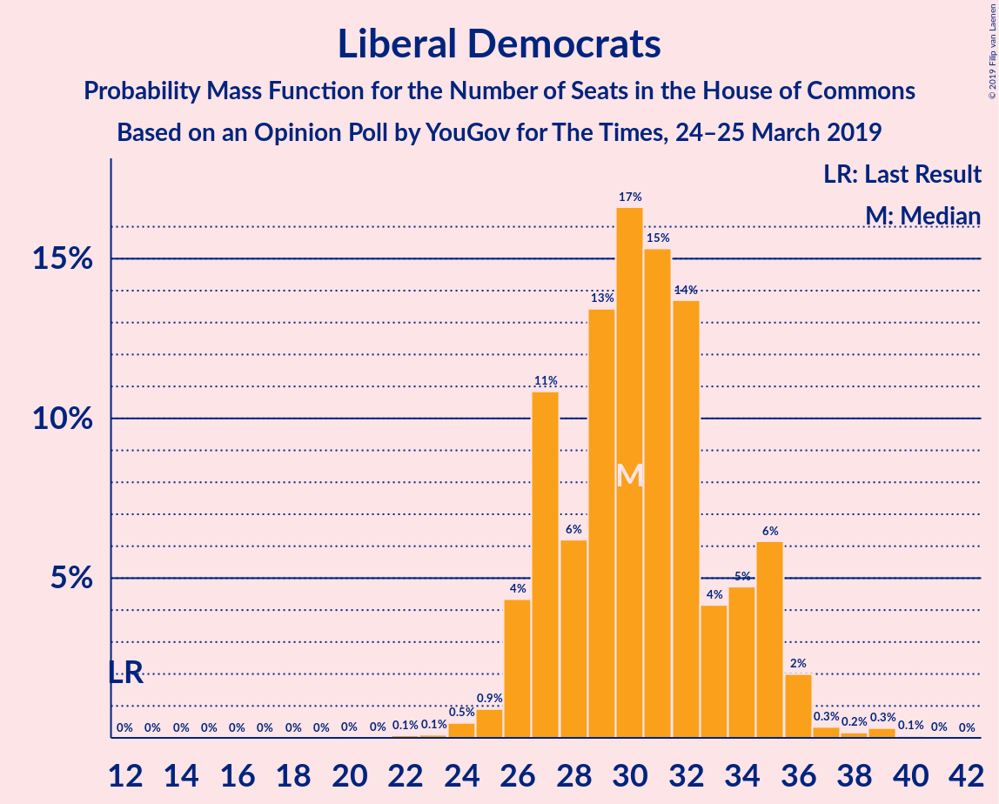
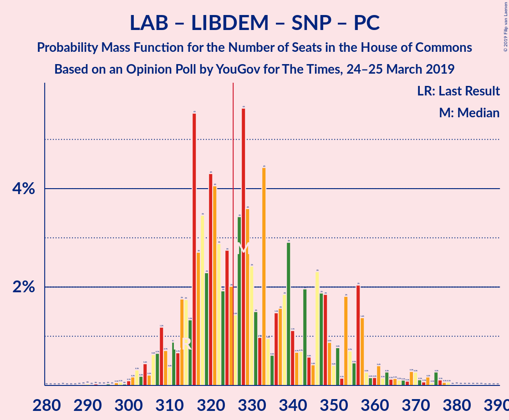

# Opinion Poll by YouGov for The Times, 24–25 March 2019

<a href="#voting-intentions">Voting Intentions</a> | <a href="#seats">Seats</a> | <a href="#coalitions">Coalitions</a> | <a href="#technical-information">Technical Information</a>

## Voting Intentions

### Confidence Intervals

| Party | Last Result | Poll Result | 80% Confidence Interval | 90% Confidence Interval | 95% Confidence Interval | 99% Confidence Interval |
|:-----:|:-----------:|:-----------:|:-----------------------:|:-----------------------:|:-----------------------:|:-----------------------:|
| Conservative Party | 42.4% | 36.0% | 34.7–37.4% |34.3–37.8% |34.0–38.1% |33.4–38.8% |
| Labour Party | 40.0% | 33.0% | 31.7–34.3% |31.3–34.7% |31.0–35.0% |30.4–35.7% |
| Liberal Democrats | 7.4% | 11.0% | 10.2–11.9% |9.9–12.2% |9.7–12.4% |9.3–12.9% |
| Brexit Party | 0.0% | 5.0% | 4.5–5.7% |4.3–5.9% |4.2–6.1% |3.9–6.4% |
| Scottish National Party | 3.0% | 4.0% | 3.5–4.6% |3.3–4.8% |3.2–4.9% |3.0–5.2% |
| UK Independence Party | 1.8% | 4.0% | 3.5–4.6% |3.3–4.8% |3.2–4.9% |3.0–5.2% |
| Green Party | 1.6% | 4.0% | 3.5–4.6% |3.3–4.8% |3.2–4.9% |3.0–5.2% |
| Plaid Cymru | 0.5% | 1.0% | 0.8–1.3% |0.7–1.4% |0.6–1.5% |0.5–1.7% |

*Note:* The poll result column reflects the actual value used in the calculations. Published results may vary slightly, and in addition be rounded to fewer digits.

## Seats

### Confidence Intervals

| Party | Last Result | Median | 80% Confidence Interval | 90% Confidence Interval | 95% Confidence Interval | 99% Confidence Interval |
|:-----:|:-----------:|:------:|:-----------------------:|:-----------------------:|:-----------------------:|:-----------------------:|
| <a href="#conservative-party">Conservative Party</a> | 317 | 267 | 243–312 |243–312 |243–312 |243–312 |
| <a href="#labour-party">Labour Party</a> | 262 | 277 | 236–289 |236–289 |236–289 |234–290 |
| <a href="#liberal-democrats">Liberal Democrats</a> | 12 | 29 | 29–39 |27–39 |27–39 |26–39 |
| <a href="#brexit-party">Brexit Party</a> | 0 | 1 | 1 |0–1 |0–1 |0–1 |
| <a href="#scottish-national-party">Scottish National Party</a> | 35 | 51 | 47–53 |47–54 |47–54 |41–55 |
| <a href="#uk-independence-party">UK Independence Party</a> | 0 | 0 | 0 |0–1 |0–1 |0–1 |
| <a href="#green-party">Green Party</a> | 1 | 2 | 2 |1–2 |1–2 |1–2 |
| <a href="#plaid-cymru">Plaid Cymru</a> | 4 | 5 | 3–5 |3–8 |3–8 |3–8 |

### Conservative Party

*For a full overview of the results for this party, see the [Conservative Party](party-conservativeparty.html) page.*

| Number of Seats | Probability | Accumulated | Special Marks |
|:---------------:|:-----------:|:-----------:|:-------------:|
| 243 | 13% | 100% |  |
| 244 | 0.1% | 87% |  |
| 245 | 0% | 87% |  |
| 246 | 0% | 87% |  |
| 247 | 0% | 87% |  |
| 248 | 0% | 87% |  |
| 249 | 0% | 87% |  |
| 250 | 0% | 87% |  |
| 251 | 0% | 87% |  |
| 252 | 0% | 87% |  |
| 253 | 0% | 87% |  |
| 254 | 0% | 87% |  |
| 255 | 0% | 87% |  |
| 256 | 0.4% | 87% |  |
| 257 | 0.5% | 87% |  |
| 258 | 0% | 86% |  |
| 259 | 0% | 86% |  |
| 260 | 0% | 86% |  |
| 261 | 0% | 86% |  |
| 262 | 0% | 86% |  |
| 263 | 0% | 86% |  |
| 264 | 0% | 86% |  |
| 265 | 0% | 86% |  |
| 266 | 0.1% | 86% |  |
| 267 | 56% | 86% | Median |
| 268 | 0% | 30% |  |
| 269 | 0% | 30% |  |
| 270 | 0% | 30% |  |
| 271 | 1.1% | 30% |  |
| 272 | 0% | 29% |  |
| 273 | 0% | 29% |  |
| 274 | 0% | 29% |  |
| 275 | 0% | 29% |  |
| 276 | 0% | 29% |  |
| 277 | 0% | 29% |  |
| 278 | 0% | 29% |  |
| 279 | 0% | 29% |  |
| 280 | 0% | 29% |  |
| 281 | 0% | 29% |  |
| 282 | 0% | 29% |  |
| 283 | 0% | 29% |  |
| 284 | 2% | 29% |  |
| 285 | 0.5% | 28% |  |
| 286 | 0% | 27% |  |
| 287 | 0% | 27% |  |
| 288 | 5% | 27% |  |
| 289 | 0% | 23% |  |
| 290 | 0% | 23% |  |
| 291 | 0.2% | 23% |  |
| 292 | 0% | 22% |  |
| 293 | 0% | 22% |  |
| 294 | 0% | 22% |  |
| 295 | 0% | 22% |  |
| 296 | 6% | 22% |  |
| 297 | 0.1% | 16% |  |
| 298 | 0% | 16% |  |
| 299 | 0% | 16% |  |
| 300 | 0% | 16% |  |
| 301 | 0% | 16% |  |
| 302 | 0% | 16% |  |
| 303 | 0% | 16% |  |
| 304 | 0% | 16% |  |
| 305 | 0% | 16% |  |
| 306 | 0.1% | 16% |  |
| 307 | 0.3% | 16% |  |
| 308 | 0.9% | 16% |  |
| 309 | 0% | 15% |  |
| 310 | 0% | 15% |  |
| 311 | 0% | 15% |  |
| 312 | 15% | 15% |  |
| 313 | 0% | 0.1% |  |
| 314 | 0% | 0.1% |  |
| 315 | 0% | 0.1% |  |
| 316 | 0% | 0% |  |
| 317 | 0% | 0% | Last Result |

### Labour Party

*For a full overview of the results for this party, see the [Labour Party](party-labourparty.html) page.*

| Number of Seats | Probability | Accumulated | Special Marks |
|:---------------:|:-----------:|:-----------:|:-------------:|
| 230 | 0.1% | 100% |  |
| 231 | 0% | 99.9% |  |
| 232 | 0% | 99.9% |  |
| 233 | 0.3% | 99.8% |  |
| 234 | 0.9% | 99.5% |  |
| 235 | 0% | 98.6% |  |
| 236 | 15% | 98.6% |  |
| 237 | 0% | 84% |  |
| 238 | 0% | 84% |  |
| 239 | 0% | 84% |  |
| 240 | 0% | 84% |  |
| 241 | 6% | 84% |  |
| 242 | 0% | 78% |  |
| 243 | 0% | 78% |  |
| 244 | 0% | 78% |  |
| 245 | 0% | 78% |  |
| 246 | 0% | 78% |  |
| 247 | 0% | 78% |  |
| 248 | 0% | 78% |  |
| 249 | 0.1% | 78% |  |
| 250 | 0.5% | 78% |  |
| 251 | 0% | 77% |  |
| 252 | 0% | 77% |  |
| 253 | 0.2% | 77% |  |
| 254 | 0% | 77% |  |
| 255 | 0% | 77% |  |
| 256 | 0% | 77% |  |
| 257 | 0% | 77% |  |
| 258 | 5% | 77% |  |
| 259 | 0% | 72% |  |
| 260 | 0% | 72% |  |
| 261 | 0% | 72% |  |
| 262 | 0% | 72% | Last Result |
| 263 | 0% | 72% |  |
| 264 | 0% | 72% |  |
| 265 | 0% | 72% |  |
| 266 | 0% | 72% |  |
| 267 | 0% | 72% |  |
| 268 | 0.2% | 72% |  |
| 269 | 1.1% | 72% |  |
| 270 | 1.5% | 71% |  |
| 271 | 0% | 70% |  |
| 272 | 0% | 70% |  |
| 273 | 0% | 70% |  |
| 274 | 0% | 70% |  |
| 275 | 0% | 70% |  |
| 276 | 0% | 70% |  |
| 277 | 56% | 70% | Median |
| 278 | 0% | 14% |  |
| 279 | 0% | 14% |  |
| 280 | 0% | 14% |  |
| 281 | 0% | 14% |  |
| 282 | 0% | 14% |  |
| 283 | 0% | 14% |  |
| 284 | 0% | 14% |  |
| 285 | 0% | 14% |  |
| 286 | 0% | 14% |  |
| 287 | 0.4% | 14% |  |
| 288 | 0% | 13% |  |
| 289 | 13% | 13% |  |
| 290 | 0.5% | 0.6% |  |
| 291 | 0% | 0.1% |  |
| 292 | 0% | 0.1% |  |
| 293 | 0% | 0.1% |  |
| 294 | 0% | 0.1% |  |
| 295 | 0% | 0.1% |  |
| 296 | 0.1% | 0.1% |  |
| 297 | 0% | 0% |  |

### Liberal Democrats

*For a full overview of the results for this party, see the [Liberal Democrats](party-liberaldemocrats.html) page.*

| Number of Seats | Probability | Accumulated | Special Marks |
|:---------------:|:-----------:|:-----------:|:-------------:|
| 12 | 0% | 100% | Last Result |
| 13 | 0% | 100% |  |
| 14 | 0% | 100% |  |
| 15 | 0% | 100% |  |
| 16 | 0% | 100% |  |
| 17 | 0% | 100% |  |
| 18 | 0% | 100% |  |
| 19 | 0% | 100% |  |
| 20 | 0% | 100% |  |
| 21 | 0% | 100% |  |
| 22 | 0% | 100% |  |
| 23 | 0% | 100% |  |
| 24 | 0.2% | 100% |  |
| 25 | 0% | 99.8% |  |
| 26 | 1.1% | 99.8% |  |
| 27 | 5% | 98.6% |  |
| 28 | 0.1% | 93% |  |
| 29 | 58% | 93% | Median |
| 30 | 0.1% | 35% |  |
| 31 | 21% | 35% |  |
| 32 | 0.3% | 14% |  |
| 33 | 0% | 14% |  |
| 34 | 0.4% | 14% |  |
| 35 | 0% | 13% |  |
| 36 | 0.5% | 13% |  |
| 37 | 0% | 13% |  |
| 38 | 0% | 13% |  |
| 39 | 13% | 13% |  |
| 40 | 0% | 0.2% |  |
| 41 | 0% | 0.1% |  |
| 42 | 0.1% | 0.1% |  |
| 43 | 0% | 0% |  |

### Brexit Party

*For a full overview of the results for this party, see the [Brexit Party](party-brexitparty.html) page.*

| Number of Seats | Probability | Accumulated | Special Marks |
|:---------------:|:-----------:|:-----------:|:-------------:|
| 0 | 7% | 100% | Last Result |
| 1 | 93% | 93% | Median |
| 2 | 0% | 0% |  |

### Scottish National Party

*For a full overview of the results for this party, see the [Scottish National Party](party-scottishnationalparty.html) page.*

| Number of Seats | Probability | Accumulated | Special Marks |
|:---------------:|:-----------:|:-----------:|:-------------:|
| 35 | 0% | 100% | Last Result |
| 36 | 0% | 100% |  |
| 37 | 0% | 100% |  |
| 38 | 0% | 100% |  |
| 39 | 0% | 100% |  |
| 40 | 0% | 100% |  |
| 41 | 1.5% | 100% |  |
| 42 | 0% | 98.5% |  |
| 43 | 0% | 98.5% |  |
| 44 | 0% | 98.5% |  |
| 45 | 0% | 98.5% |  |
| 46 | 0% | 98.5% |  |
| 47 | 15% | 98.5% |  |
| 48 | 0% | 83% |  |
| 49 | 0% | 83% |  |
| 50 | 0.8% | 83% |  |
| 51 | 61% | 83% | Median |
| 52 | 0% | 21% |  |
| 53 | 13% | 21% |  |
| 54 | 7% | 9% |  |
| 55 | 1.1% | 1.3% |  |
| 56 | 0.2% | 0.2% |  |
| 57 | 0% | 0% |  |

### UK Independence Party

*For a full overview of the results for this party, see the [UK Independence Party](party-ukindependenceparty.html) page.*

| Number of Seats | Probability | Accumulated | Special Marks |
|:---------------:|:-----------:|:-----------:|:-------------:|
| 0 | 93% | 100% | Last Result, Median |
| 1 | 7% | 7% |  |
| 2 | 0% | 0% |  |

### Green Party

*For a full overview of the results for this party, see the [Green Party](party-greenparty.html) page.*

| Number of Seats | Probability | Accumulated | Special Marks |
|:---------------:|:-----------:|:-----------:|:-------------:|
| 1 | 9% | 100% | Last Result |
| 2 | 91% | 91% | Median |
| 3 | 0% | 0% |  |

### Plaid Cymru

*For a full overview of the results for this party, see the [Plaid Cymru](party-plaidcymru.html) page.*

| Number of Seats | Probability | Accumulated | Special Marks |
|:---------------:|:-----------:|:-----------:|:-------------:|
| 3 | 15% | 100% |  |
| 4 | 0% | 85% | Last Result |
| 5 | 76% | 85% | Median |
| 6 | 0.2% | 9% |  |
| 7 | 0% | 9% |  |
| 8 | 8% | 9% |  |
| 9 | 0% | 0.3% |  |
| 10 | 0.1% | 0.3% |  |
| 11 | 0% | 0.1% |  |
| 12 | 0.1% | 0.1% |  |
| 13 | 0% | 0% |  |

## Coalitions

### Confidence Intervals

| Coalition | Last Result | Median | Majority? | 80% Confidence Interval | 90% Confidence Interval | 95% Confidence Interval | 99% Confidence Interval |
|:---------:|:-----------:|:------:|:---------:|:-----------------------:|:-----------------------:|:-----------------------:|:-----------------------:|
| Labour Party – Liberal Democrats – Scottish National Party – Plaid Cymru | 313 | 362 | 84% | 317–386 | 317–386 | 317–386 | 317–386 |
| Labour Party – Liberal Democrats – Scottish National Party | 309 | 357 | 84% | 314–381 | 314–381 | 314–381 | 314–381 |
| Conservative Party – Scottish National Party – Plaid Cymru | 356 | 323 | 30% | 301–362 | 301–362 | 301–362 | 301–367 |
| Conservative Party – Scottish National Party | 352 | 318 | 29% | 296–359 | 296–359 | 296–359 | 296–362 |
| Labour Party – Scottish National Party – Plaid Cymru | 301 | 333 | 71% | 286–347 | 286–347 | 286–347 | 286–347 |
| Conservative Party – Liberal Democrats | 329 | 296 | 22% | 282–343 | 282–343 | 282–343 | 282–343 |
| Labour Party – Scottish National Party | 297 | 328 | 70% | 283–342 | 283–342 | 283–342 | 283–342 |
| Labour Party – Liberal Democrats – Plaid Cymru | 278 | 311 | 13% | 270–333 | 270–333 | 270–333 | 268–333 |
| Labour Party – Liberal Democrats | 274 | 306 | 13% | 267–328 | 267–328 | 267–328 | 263–328 |
| Conservative Party – Plaid Cymru | 321 | 272 | 0% | 248–315 | 248–315 | 248–315 | 248–315 |
| Conservative Party | 317 | 267 | 0% | 243–312 | 243–312 | 243–312 | 243–312 |
| Labour Party – Plaid Cymru | 266 | 282 | 0% | 239–294 | 239–294 | 239–294 | 239–295 |
| Labour Party | 262 | 277 | 0% | 236–289 | 236–289 | 236–289 | 234–290 |

### Labour Party – Liberal Democrats – Scottish National Party – Plaid Cymru

| Number of Seats | Probability | Accumulated | Special Marks |
|:---------------:|:-----------:|:-----------:|:-------------:|
| 313 | 0% | 100% | Last Result |
| 314 | 0% | 100% |  |
| 315 | 0% | 100% |  |
| 316 | 0% | 99.9% |  |
| 317 | 15% | 99.9% |  |
| 318 | 0% | 85% |  |
| 319 | 0% | 85% |  |
| 320 | 0% | 85% |  |
| 321 | 0% | 85% |  |
| 322 | 0.9% | 85% |  |
| 323 | 0.3% | 84% |  |
| 324 | 0.1% | 84% |  |
| 325 | 0% | 84% |  |
| 326 | 0% | 84% | Majority |
| 327 | 0% | 84% |  |
| 328 | 0% | 84% |  |
| 329 | 0% | 84% |  |
| 330 | 0% | 84% |  |
| 331 | 0% | 84% |  |
| 332 | 0% | 84% |  |
| 333 | 0.1% | 84% |  |
| 334 | 6% | 84% |  |
| 335 | 0% | 78% |  |
| 336 | 0% | 78% |  |
| 337 | 0% | 78% |  |
| 338 | 0% | 78% |  |
| 339 | 0.2% | 78% |  |
| 340 | 0% | 77% |  |
| 341 | 5% | 77% |  |
| 342 | 0% | 73% |  |
| 343 | 0% | 73% |  |
| 344 | 0% | 73% |  |
| 345 | 2% | 73% |  |
| 346 | 0% | 71% |  |
| 347 | 0% | 71% |  |
| 348 | 0% | 71% |  |
| 349 | 0% | 71% |  |
| 350 | 0% | 71% |  |
| 351 | 0% | 71% |  |
| 352 | 0% | 71% |  |
| 353 | 0% | 71% |  |
| 354 | 0% | 71% |  |
| 355 | 0% | 71% |  |
| 356 | 0% | 71% |  |
| 357 | 0% | 71% |  |
| 358 | 1.1% | 71% |  |
| 359 | 0% | 70% |  |
| 360 | 0% | 70% |  |
| 361 | 0% | 70% |  |
| 362 | 56% | 70% | Median |
| 363 | 0% | 14% |  |
| 364 | 0.1% | 14% |  |
| 365 | 0% | 14% |  |
| 366 | 0% | 14% |  |
| 367 | 0% | 14% |  |
| 368 | 0% | 14% |  |
| 369 | 0% | 14% |  |
| 370 | 0% | 14% |  |
| 371 | 0% | 14% |  |
| 372 | 0.5% | 14% |  |
| 373 | 0.4% | 13% |  |
| 374 | 0% | 13% |  |
| 375 | 0% | 13% |  |
| 376 | 0% | 13% |  |
| 377 | 0% | 13% |  |
| 378 | 0% | 13% |  |
| 379 | 0% | 13% |  |
| 380 | 0% | 13% |  |
| 381 | 0% | 13% |  |
| 382 | 0% | 13% |  |
| 383 | 0% | 13% |  |
| 384 | 0% | 13% |  |
| 385 | 0.1% | 13% |  |
| 386 | 13% | 13% |  |
| 387 | 0% | 0% |  |

### Labour Party – Liberal Democrats – Scottish National Party

| Number of Seats | Probability | Accumulated | Special Marks |
|:---------------:|:-----------:|:-----------:|:-------------:|
| 309 | 0% | 100% | Last Result |
| 310 | 0% | 100% |  |
| 311 | 0% | 99.9% |  |
| 312 | 0.1% | 99.9% |  |
| 313 | 0% | 99.9% |  |
| 314 | 15% | 99.9% |  |
| 315 | 0.3% | 85% |  |
| 316 | 0% | 85% |  |
| 317 | 0.9% | 85% |  |
| 318 | 0% | 84% |  |
| 319 | 0% | 84% |  |
| 320 | 0% | 84% |  |
| 321 | 0% | 84% |  |
| 322 | 0% | 84% |  |
| 323 | 0.1% | 84% |  |
| 324 | 0% | 84% |  |
| 325 | 0% | 84% |  |
| 326 | 6% | 84% | Majority |
| 327 | 0% | 78% |  |
| 328 | 0% | 78% |  |
| 329 | 0% | 78% |  |
| 330 | 0% | 78% |  |
| 331 | 0% | 78% |  |
| 332 | 0% | 78% |  |
| 333 | 0.2% | 78% |  |
| 334 | 0% | 77% |  |
| 335 | 0% | 77% |  |
| 336 | 5% | 77% |  |
| 337 | 0.5% | 73% |  |
| 338 | 0% | 72% |  |
| 339 | 0% | 72% |  |
| 340 | 1.5% | 72% |  |
| 341 | 0% | 71% |  |
| 342 | 0% | 71% |  |
| 343 | 0% | 71% |  |
| 344 | 0% | 71% |  |
| 345 | 0% | 71% |  |
| 346 | 0% | 71% |  |
| 347 | 0% | 71% |  |
| 348 | 0% | 71% |  |
| 349 | 0% | 71% |  |
| 350 | 1.1% | 71% |  |
| 351 | 0% | 70% |  |
| 352 | 0% | 70% |  |
| 353 | 0% | 70% |  |
| 354 | 0% | 70% |  |
| 355 | 0% | 70% |  |
| 356 | 0% | 70% |  |
| 357 | 56% | 70% | Median |
| 358 | 0% | 14% |  |
| 359 | 0% | 14% |  |
| 360 | 0% | 14% |  |
| 361 | 0.2% | 14% |  |
| 362 | 0% | 14% |  |
| 363 | 0% | 14% |  |
| 364 | 0% | 14% |  |
| 365 | 0% | 14% |  |
| 366 | 0% | 14% |  |
| 367 | 0.5% | 14% |  |
| 368 | 0.4% | 13% |  |
| 369 | 0% | 13% |  |
| 370 | 0% | 13% |  |
| 371 | 0% | 13% |  |
| 372 | 0% | 13% |  |
| 373 | 0% | 13% |  |
| 374 | 0% | 13% |  |
| 375 | 0% | 13% |  |
| 376 | 0% | 13% |  |
| 377 | 0.1% | 13% |  |
| 378 | 0% | 13% |  |
| 379 | 0% | 13% |  |
| 380 | 0% | 13% |  |
| 381 | 13% | 13% |  |
| 382 | 0% | 0% |  |

### Conservative Party – Scottish National Party – Plaid Cymru

| Number of Seats | Probability | Accumulated | Special Marks |
|:---------------:|:-----------:|:-----------:|:-------------:|
| 301 | 13% | 100% |  |
| 302 | 0% | 87% |  |
| 303 | 0.1% | 87% |  |
| 304 | 0.1% | 87% |  |
| 305 | 0% | 87% |  |
| 306 | 0% | 87% |  |
| 307 | 0% | 87% |  |
| 308 | 0.4% | 87% |  |
| 309 | 0% | 87% |  |
| 310 | 0% | 87% |  |
| 311 | 0% | 87% |  |
| 312 | 0.5% | 87% |  |
| 313 | 0% | 86% |  |
| 314 | 0% | 86% |  |
| 315 | 0% | 86% |  |
| 316 | 0% | 86% |  |
| 317 | 0% | 86% |  |
| 318 | 0% | 86% |  |
| 319 | 0% | 86% |  |
| 320 | 0.1% | 86% |  |
| 321 | 0% | 86% |  |
| 322 | 0% | 86% |  |
| 323 | 56% | 86% | Median |
| 324 | 0% | 30% |  |
| 325 | 0% | 30% |  |
| 326 | 0% | 30% | Majority |
| 327 | 0% | 30% |  |
| 328 | 0% | 30% |  |
| 329 | 0% | 30% |  |
| 330 | 1.5% | 30% |  |
| 331 | 0% | 29% |  |
| 332 | 0% | 29% |  |
| 333 | 0% | 29% |  |
| 334 | 1.1% | 29% |  |
| 335 | 0% | 28% |  |
| 336 | 0% | 28% |  |
| 337 | 0% | 28% |  |
| 338 | 0% | 28% |  |
| 339 | 0% | 28% |  |
| 340 | 0% | 28% |  |
| 341 | 0% | 28% |  |
| 342 | 0% | 28% |  |
| 343 | 0% | 28% |  |
| 344 | 5% | 28% |  |
| 345 | 0% | 23% |  |
| 346 | 0% | 23% |  |
| 347 | 0% | 23% |  |
| 348 | 0% | 23% |  |
| 349 | 0% | 23% |  |
| 350 | 0% | 23% |  |
| 351 | 0% | 23% |  |
| 352 | 0% | 23% |  |
| 353 | 0.2% | 23% |  |
| 354 | 0.1% | 22% |  |
| 355 | 0% | 22% |  |
| 356 | 0% | 22% | Last Result |
| 357 | 0% | 22% |  |
| 358 | 6% | 22% |  |
| 359 | 0% | 16% |  |
| 360 | 0% | 16% |  |
| 361 | 0% | 16% |  |
| 362 | 15% | 16% |  |
| 363 | 0% | 1.4% |  |
| 364 | 0% | 1.4% |  |
| 365 | 0.3% | 1.4% |  |
| 366 | 0% | 1.0% |  |
| 367 | 0.9% | 1.0% |  |
| 368 | 0% | 0.1% |  |
| 369 | 0% | 0.1% |  |
| 370 | 0% | 0.1% |  |
| 371 | 0% | 0.1% |  |
| 372 | 0.1% | 0.1% |  |
| 373 | 0% | 0.1% |  |
| 374 | 0% | 0.1% |  |
| 375 | 0% | 0.1% |  |
| 376 | 0% | 0.1% |  |
| 377 | 0% | 0% |  |

### Conservative Party – Scottish National Party

| Number of Seats | Probability | Accumulated | Special Marks |
|:---------------:|:-----------:|:-----------:|:-------------:|
| 295 | 0.1% | 100% |  |
| 296 | 13% | 99.9% |  |
| 297 | 0% | 87% |  |
| 298 | 0% | 87% |  |
| 299 | 0.1% | 87% |  |
| 300 | 0% | 87% |  |
| 301 | 0% | 87% |  |
| 302 | 0% | 87% |  |
| 303 | 0.4% | 87% |  |
| 304 | 0% | 87% |  |
| 305 | 0% | 87% |  |
| 306 | 0% | 87% |  |
| 307 | 0.5% | 87% |  |
| 308 | 0% | 86% |  |
| 309 | 0% | 86% |  |
| 310 | 0% | 86% |  |
| 311 | 0% | 86% |  |
| 312 | 0% | 86% |  |
| 313 | 0% | 86% |  |
| 314 | 0% | 86% |  |
| 315 | 0% | 86% |  |
| 316 | 0% | 86% |  |
| 317 | 0.1% | 86% |  |
| 318 | 56% | 86% | Median |
| 319 | 0% | 30% |  |
| 320 | 0% | 30% |  |
| 321 | 0% | 30% |  |
| 322 | 0% | 30% |  |
| 323 | 0% | 30% |  |
| 324 | 0% | 30% |  |
| 325 | 1.5% | 30% |  |
| 326 | 1.1% | 29% | Majority |
| 327 | 0% | 28% |  |
| 328 | 0% | 28% |  |
| 329 | 0% | 28% |  |
| 330 | 0% | 28% |  |
| 331 | 0% | 28% |  |
| 332 | 0% | 28% |  |
| 333 | 0% | 28% |  |
| 334 | 0% | 28% |  |
| 335 | 0% | 28% |  |
| 336 | 0.5% | 28% |  |
| 337 | 0% | 27% |  |
| 338 | 0% | 27% |  |
| 339 | 5% | 27% |  |
| 340 | 0% | 23% |  |
| 341 | 0% | 23% |  |
| 342 | 0% | 23% |  |
| 343 | 0% | 23% |  |
| 344 | 0.1% | 23% |  |
| 345 | 0% | 23% |  |
| 346 | 0% | 23% |  |
| 347 | 0.2% | 23% |  |
| 348 | 0% | 22% |  |
| 349 | 0% | 22% |  |
| 350 | 6% | 22% |  |
| 351 | 0% | 16% |  |
| 352 | 0% | 16% | Last Result |
| 353 | 0% | 16% |  |
| 354 | 0% | 16% |  |
| 355 | 0% | 16% |  |
| 356 | 0% | 16% |  |
| 357 | 0.3% | 16% |  |
| 358 | 0% | 16% |  |
| 359 | 15% | 16% |  |
| 360 | 0.1% | 1.0% |  |
| 361 | 0% | 1.0% |  |
| 362 | 0.9% | 1.0% |  |
| 363 | 0% | 0.1% |  |
| 364 | 0% | 0.1% |  |
| 365 | 0% | 0.1% |  |
| 366 | 0% | 0.1% |  |
| 367 | 0% | 0.1% |  |
| 368 | 0% | 0.1% |  |
| 369 | 0% | 0.1% |  |
| 370 | 0% | 0.1% |  |
| 371 | 0.1% | 0.1% |  |
| 372 | 0% | 0% |  |

### Labour Party – Scottish National Party – Plaid Cymru

| Number of Seats | Probability | Accumulated | Special Marks |
|:---------------:|:-----------:|:-----------:|:-------------:|
| 286 | 15% | 100% |  |
| 287 | 0% | 85% |  |
| 288 | 0% | 85% |  |
| 289 | 0% | 85% |  |
| 290 | 0% | 85% |  |
| 291 | 0.3% | 85% |  |
| 292 | 0% | 85% |  |
| 293 | 0.9% | 85% |  |
| 294 | 0% | 84% |  |
| 295 | 0% | 84% |  |
| 296 | 0.1% | 84% |  |
| 297 | 0% | 84% |  |
| 298 | 0% | 84% |  |
| 299 | 0% | 84% |  |
| 300 | 0% | 84% |  |
| 301 | 0% | 84% | Last Result |
| 302 | 0% | 84% |  |
| 303 | 6% | 84% |  |
| 304 | 0% | 78% |  |
| 305 | 0% | 78% |  |
| 306 | 0.1% | 78% |  |
| 307 | 0% | 78% |  |
| 308 | 0% | 78% |  |
| 309 | 0.5% | 78% |  |
| 310 | 0% | 77% |  |
| 311 | 0% | 77% |  |
| 312 | 0% | 77% |  |
| 313 | 0% | 77% |  |
| 314 | 5% | 77% |  |
| 315 | 0.2% | 72% |  |
| 316 | 1.5% | 72% |  |
| 317 | 0% | 71% |  |
| 318 | 0% | 71% |  |
| 319 | 0% | 71% |  |
| 320 | 0% | 71% |  |
| 321 | 0% | 71% |  |
| 322 | 0.1% | 71% |  |
| 323 | 0% | 71% |  |
| 324 | 0% | 71% |  |
| 325 | 0% | 71% |  |
| 326 | 0% | 71% | Majority |
| 327 | 0% | 71% |  |
| 328 | 0% | 71% |  |
| 329 | 0% | 71% |  |
| 330 | 0% | 71% |  |
| 331 | 0% | 71% |  |
| 332 | 1.1% | 71% |  |
| 333 | 56% | 70% | Median |
| 334 | 0% | 14% |  |
| 335 | 0% | 14% |  |
| 336 | 0% | 14% |  |
| 337 | 0% | 14% |  |
| 338 | 0% | 14% |  |
| 339 | 0.4% | 14% |  |
| 340 | 0% | 13% |  |
| 341 | 0% | 13% |  |
| 342 | 0% | 13% |  |
| 343 | 0% | 13% |  |
| 344 | 0% | 13% |  |
| 345 | 0.5% | 13% |  |
| 346 | 0% | 13% |  |
| 347 | 13% | 13% |  |
| 348 | 0% | 0.2% |  |
| 349 | 0% | 0.1% |  |
| 350 | 0% | 0.1% |  |
| 351 | 0% | 0.1% |  |
| 352 | 0% | 0.1% |  |
| 353 | 0% | 0.1% |  |
| 354 | 0% | 0.1% |  |
| 355 | 0.1% | 0.1% |  |
| 356 | 0% | 0% |  |

### Conservative Party – Liberal Democrats

| Number of Seats | Probability | Accumulated | Special Marks |
|:---------------:|:-----------:|:-----------:|:-------------:|
| 274 | 0.1% | 100% |  |
| 275 | 0% | 99.9% |  |
| 276 | 0% | 99.9% |  |
| 277 | 0% | 99.9% |  |
| 278 | 0% | 99.9% |  |
| 279 | 0% | 99.9% |  |
| 280 | 0% | 99.9% |  |
| 281 | 0% | 99.8% |  |
| 282 | 13% | 99.8% |  |
| 283 | 0% | 87% |  |
| 284 | 0.5% | 87% |  |
| 285 | 0% | 87% |  |
| 286 | 0% | 87% |  |
| 287 | 0% | 87% |  |
| 288 | 0% | 87% |  |
| 289 | 0% | 87% |  |
| 290 | 0.4% | 87% |  |
| 291 | 0% | 86% |  |
| 292 | 0% | 86% |  |
| 293 | 0% | 86% |  |
| 294 | 0% | 86% |  |
| 295 | 0% | 86% |  |
| 296 | 56% | 86% | Median |
| 297 | 1.1% | 30% |  |
| 298 | 0% | 29% |  |
| 299 | 0% | 29% |  |
| 300 | 0% | 29% |  |
| 301 | 0% | 29% |  |
| 302 | 0% | 29% |  |
| 303 | 0% | 29% |  |
| 304 | 0% | 29% |  |
| 305 | 0% | 29% |  |
| 306 | 0% | 29% |  |
| 307 | 0% | 29% |  |
| 308 | 0.1% | 29% |  |
| 309 | 0% | 29% |  |
| 310 | 0% | 29% |  |
| 311 | 0% | 29% |  |
| 312 | 0% | 29% |  |
| 313 | 1.5% | 29% |  |
| 314 | 0% | 28% |  |
| 315 | 5% | 28% |  |
| 316 | 0% | 23% |  |
| 317 | 0% | 23% |  |
| 318 | 0% | 23% |  |
| 319 | 0% | 23% |  |
| 320 | 0% | 23% |  |
| 321 | 0.5% | 23% |  |
| 322 | 0% | 22% |  |
| 323 | 0% | 22% |  |
| 324 | 0.1% | 22% |  |
| 325 | 0% | 22% |  |
| 326 | 0% | 22% | Majority |
| 327 | 6% | 22% |  |
| 328 | 0% | 16% |  |
| 329 | 0% | 16% | Last Result |
| 330 | 0% | 16% |  |
| 331 | 0% | 16% |  |
| 332 | 0% | 16% |  |
| 333 | 0% | 16% |  |
| 334 | 0.1% | 16% |  |
| 335 | 0% | 16% |  |
| 336 | 0% | 16% |  |
| 337 | 0.9% | 16% |  |
| 338 | 0% | 15% |  |
| 339 | 0.3% | 15% |  |
| 340 | 0% | 15% |  |
| 341 | 0% | 15% |  |
| 342 | 0% | 15% |  |
| 343 | 15% | 15% |  |
| 344 | 0% | 0% |  |

### Labour Party – Scottish National Party

| Number of Seats | Probability | Accumulated | Special Marks |
|:---------------:|:-----------:|:-----------:|:-------------:|
| 279 | 0% | 100% |  |
| 280 | 0% | 99.9% |  |
| 281 | 0% | 99.9% |  |
| 282 | 0% | 99.9% |  |
| 283 | 15% | 99.9% |  |
| 284 | 0.1% | 85% |  |
| 285 | 0% | 85% |  |
| 286 | 0% | 85% |  |
| 287 | 0% | 85% |  |
| 288 | 0.9% | 85% |  |
| 289 | 0% | 84% |  |
| 290 | 0% | 84% |  |
| 291 | 0% | 84% |  |
| 292 | 0% | 84% |  |
| 293 | 0% | 84% |  |
| 294 | 0% | 84% |  |
| 295 | 6% | 84% |  |
| 296 | 0.1% | 78% |  |
| 297 | 0% | 78% | Last Result |
| 298 | 0% | 78% |  |
| 299 | 0% | 78% |  |
| 300 | 0% | 78% |  |
| 301 | 0.5% | 78% |  |
| 302 | 0% | 77% |  |
| 303 | 0% | 77% |  |
| 304 | 0% | 77% |  |
| 305 | 0% | 77% |  |
| 306 | 0% | 77% |  |
| 307 | 0% | 77% |  |
| 308 | 0% | 77% |  |
| 309 | 5% | 77% |  |
| 310 | 0% | 72% |  |
| 311 | 1.5% | 72% |  |
| 312 | 0% | 71% |  |
| 313 | 0% | 71% |  |
| 314 | 0% | 71% |  |
| 315 | 0% | 71% |  |
| 316 | 0% | 71% |  |
| 317 | 0% | 71% |  |
| 318 | 0% | 71% |  |
| 319 | 0.1% | 71% |  |
| 320 | 0% | 71% |  |
| 321 | 0% | 71% |  |
| 322 | 0% | 71% |  |
| 323 | 0% | 71% |  |
| 324 | 1.1% | 71% |  |
| 325 | 0% | 70% |  |
| 326 | 0% | 70% | Majority |
| 327 | 0% | 70% |  |
| 328 | 56% | 70% | Median |
| 329 | 0% | 14% |  |
| 330 | 0% | 14% |  |
| 331 | 0% | 14% |  |
| 332 | 0% | 14% |  |
| 333 | 0% | 14% |  |
| 334 | 0.4% | 14% |  |
| 335 | 0% | 13% |  |
| 336 | 0% | 13% |  |
| 337 | 0% | 13% |  |
| 338 | 0% | 13% |  |
| 339 | 0% | 13% |  |
| 340 | 0.5% | 13% |  |
| 341 | 0% | 13% |  |
| 342 | 13% | 13% |  |
| 343 | 0% | 0.2% |  |
| 344 | 0% | 0.1% |  |
| 345 | 0% | 0.1% |  |
| 346 | 0% | 0.1% |  |
| 347 | 0.1% | 0.1% |  |
| 348 | 0% | 0% |  |

### Labour Party – Liberal Democrats – Plaid Cymru

| Number of Seats | Probability | Accumulated | Special Marks |
|:---------------:|:-----------:|:-----------:|:-------------:|
| 259 | 0.1% | 100% |  |
| 260 | 0% | 99.9% |  |
| 261 | 0% | 99.9% |  |
| 262 | 0% | 99.9% |  |
| 263 | 0% | 99.9% |  |
| 264 | 0% | 99.9% |  |
| 265 | 0% | 99.9% |  |
| 266 | 0% | 99.9% |  |
| 267 | 0% | 99.9% |  |
| 268 | 0.9% | 99.9% |  |
| 269 | 0% | 99.0% |  |
| 270 | 15% | 99.0% |  |
| 271 | 0% | 84% |  |
| 272 | 0% | 84% |  |
| 273 | 0.3% | 84% |  |
| 274 | 0% | 84% |  |
| 275 | 0% | 84% |  |
| 276 | 0% | 84% |  |
| 277 | 0% | 84% |  |
| 278 | 0% | 84% | Last Result |
| 279 | 0% | 84% |  |
| 280 | 6% | 84% |  |
| 281 | 0% | 78% |  |
| 282 | 0% | 78% |  |
| 283 | 0.2% | 78% |  |
| 284 | 0% | 77% |  |
| 285 | 0% | 77% |  |
| 286 | 0.1% | 77% |  |
| 287 | 0% | 77% |  |
| 288 | 0% | 77% |  |
| 289 | 0% | 77% |  |
| 290 | 5% | 77% |  |
| 291 | 0% | 73% |  |
| 292 | 0% | 73% |  |
| 293 | 0% | 73% |  |
| 294 | 0.5% | 73% |  |
| 295 | 0% | 72% |  |
| 296 | 0% | 72% |  |
| 297 | 0% | 72% |  |
| 298 | 0% | 72% |  |
| 299 | 0% | 72% |  |
| 300 | 0% | 72% |  |
| 301 | 0% | 72% |  |
| 302 | 0% | 72% |  |
| 303 | 1.1% | 72% |  |
| 304 | 1.5% | 71% |  |
| 305 | 0% | 70% |  |
| 306 | 0% | 70% |  |
| 307 | 0% | 70% |  |
| 308 | 0% | 70% |  |
| 309 | 0% | 70% |  |
| 310 | 0% | 70% |  |
| 311 | 56% | 70% | Median |
| 312 | 0% | 14% |  |
| 313 | 0.1% | 14% |  |
| 314 | 0% | 14% |  |
| 315 | 0% | 14% |  |
| 316 | 0% | 14% |  |
| 317 | 0% | 14% |  |
| 318 | 0% | 14% |  |
| 319 | 0% | 14% |  |
| 320 | 0% | 14% |  |
| 321 | 0% | 14% |  |
| 322 | 0.5% | 14% |  |
| 323 | 0% | 13% |  |
| 324 | 0% | 13% |  |
| 325 | 0% | 13% |  |
| 326 | 0.4% | 13% | Majority |
| 327 | 0% | 13% |  |
| 328 | 0% | 13% |  |
| 329 | 0% | 13% |  |
| 330 | 0% | 13% |  |
| 331 | 0% | 13% |  |
| 332 | 0% | 13% |  |
| 333 | 13% | 13% |  |
| 334 | 0.1% | 0.1% |  |
| 335 | 0% | 0% |  |

### Labour Party – Liberal Democrats

| Number of Seats | Probability | Accumulated | Special Marks |
|:---------------:|:-----------:|:-----------:|:-------------:|
| 254 | 0% | 100% |  |
| 255 | 0% | 99.9% |  |
| 256 | 0% | 99.9% |  |
| 257 | 0% | 99.9% |  |
| 258 | 0.1% | 99.9% |  |
| 259 | 0% | 99.9% |  |
| 260 | 0% | 99.9% |  |
| 261 | 0% | 99.9% |  |
| 262 | 0% | 99.9% |  |
| 263 | 0.9% | 99.9% |  |
| 264 | 0% | 99.0% |  |
| 265 | 0.3% | 99.0% |  |
| 266 | 0% | 98.6% |  |
| 267 | 15% | 98.6% |  |
| 268 | 0% | 84% |  |
| 269 | 0% | 84% |  |
| 270 | 0% | 84% |  |
| 271 | 0% | 84% |  |
| 272 | 6% | 84% |  |
| 273 | 0% | 78% |  |
| 274 | 0% | 78% | Last Result |
| 275 | 0% | 78% |  |
| 276 | 0.1% | 78% |  |
| 277 | 0.2% | 78% |  |
| 278 | 0% | 77% |  |
| 279 | 0% | 77% |  |
| 280 | 0% | 77% |  |
| 281 | 0% | 77% |  |
| 282 | 0% | 77% |  |
| 283 | 0% | 77% |  |
| 284 | 0% | 77% |  |
| 285 | 5% | 77% |  |
| 286 | 0.5% | 73% |  |
| 287 | 0% | 72% |  |
| 288 | 0% | 72% |  |
| 289 | 0% | 72% |  |
| 290 | 0% | 72% |  |
| 291 | 0% | 72% |  |
| 292 | 0% | 72% |  |
| 293 | 0% | 72% |  |
| 294 | 0% | 72% |  |
| 295 | 1.1% | 72% |  |
| 296 | 0% | 71% |  |
| 297 | 0% | 71% |  |
| 298 | 0% | 71% |  |
| 299 | 1.5% | 71% |  |
| 300 | 0% | 70% |  |
| 301 | 0% | 70% |  |
| 302 | 0% | 70% |  |
| 303 | 0% | 70% |  |
| 304 | 0% | 70% |  |
| 305 | 0% | 70% |  |
| 306 | 56% | 70% | Median |
| 307 | 0% | 14% |  |
| 308 | 0% | 14% |  |
| 309 | 0% | 14% |  |
| 310 | 0.1% | 14% |  |
| 311 | 0% | 14% |  |
| 312 | 0% | 14% |  |
| 313 | 0% | 14% |  |
| 314 | 0% | 14% |  |
| 315 | 0% | 14% |  |
| 316 | 0% | 14% |  |
| 317 | 0.5% | 14% |  |
| 318 | 0% | 13% |  |
| 319 | 0% | 13% |  |
| 320 | 0% | 13% |  |
| 321 | 0.4% | 13% |  |
| 322 | 0% | 13% |  |
| 323 | 0% | 13% |  |
| 324 | 0% | 13% |  |
| 325 | 0% | 13% |  |
| 326 | 0.1% | 13% | Majority |
| 327 | 0% | 13% |  |
| 328 | 13% | 13% |  |
| 329 | 0% | 0% |  |

### Conservative Party – Plaid Cymru

| Number of Seats | Probability | Accumulated | Special Marks |
|:---------------:|:-----------:|:-----------:|:-------------:|
| 248 | 13% | 100% |  |
| 249 | 0% | 87% |  |
| 250 | 0% | 87% |  |
| 251 | 0% | 87% |  |
| 252 | 0.1% | 87% |  |
| 253 | 0% | 87% |  |
| 254 | 0% | 87% |  |
| 255 | 0% | 87% |  |
| 256 | 0% | 87% |  |
| 257 | 0% | 87% |  |
| 258 | 0% | 87% |  |
| 259 | 0% | 87% |  |
| 260 | 0% | 87% |  |
| 261 | 0.4% | 87% |  |
| 262 | 0.5% | 87% |  |
| 263 | 0% | 86% |  |
| 264 | 0% | 86% |  |
| 265 | 0% | 86% |  |
| 266 | 0% | 86% |  |
| 267 | 0% | 86% |  |
| 268 | 0% | 86% |  |
| 269 | 0.1% | 86% |  |
| 270 | 0% | 86% |  |
| 271 | 0% | 86% |  |
| 272 | 56% | 86% | Median |
| 273 | 0% | 30% |  |
| 274 | 0% | 30% |  |
| 275 | 0% | 30% |  |
| 276 | 0% | 30% |  |
| 277 | 0% | 30% |  |
| 278 | 0% | 30% |  |
| 279 | 1.1% | 30% |  |
| 280 | 0% | 29% |  |
| 281 | 0% | 29% |  |
| 282 | 0% | 29% |  |
| 283 | 0% | 29% |  |
| 284 | 0% | 29% |  |
| 285 | 0% | 29% |  |
| 286 | 0% | 29% |  |
| 287 | 0% | 29% |  |
| 288 | 0% | 29% |  |
| 289 | 2% | 29% |  |
| 290 | 0% | 28% |  |
| 291 | 0% | 28% |  |
| 292 | 0% | 28% |  |
| 293 | 5% | 28% |  |
| 294 | 0% | 23% |  |
| 295 | 0% | 23% |  |
| 296 | 0% | 23% |  |
| 297 | 0.2% | 23% |  |
| 298 | 0% | 22% |  |
| 299 | 0% | 22% |  |
| 300 | 0% | 22% |  |
| 301 | 0% | 22% |  |
| 302 | 0% | 22% |  |
| 303 | 0% | 22% |  |
| 304 | 6% | 22% |  |
| 305 | 0% | 16% |  |
| 306 | 0% | 16% |  |
| 307 | 0.1% | 16% |  |
| 308 | 0% | 16% |  |
| 309 | 0% | 16% |  |
| 310 | 0% | 16% |  |
| 311 | 0% | 16% |  |
| 312 | 0% | 16% |  |
| 313 | 0.9% | 16% |  |
| 314 | 0% | 15% |  |
| 315 | 15% | 15% |  |
| 316 | 0% | 0.1% |  |
| 317 | 0% | 0.1% |  |
| 318 | 0.1% | 0.1% |  |
| 319 | 0% | 0.1% |  |
| 320 | 0% | 0.1% |  |
| 321 | 0% | 0% | Last Result |

### Conservative Party

| Number of Seats | Probability | Accumulated | Special Marks |
|:---------------:|:-----------:|:-----------:|:-------------:|
| 243 | 13% | 100% |  |
| 244 | 0.1% | 87% |  |
| 245 | 0% | 87% |  |
| 246 | 0% | 87% |  |
| 247 | 0% | 87% |  |
| 248 | 0% | 87% |  |
| 249 | 0% | 87% |  |
| 250 | 0% | 87% |  |
| 251 | 0% | 87% |  |
| 252 | 0% | 87% |  |
| 253 | 0% | 87% |  |
| 254 | 0% | 87% |  |
| 255 | 0% | 87% |  |
| 256 | 0.4% | 87% |  |
| 257 | 0.5% | 87% |  |
| 258 | 0% | 86% |  |
| 259 | 0% | 86% |  |
| 260 | 0% | 86% |  |
| 261 | 0% | 86% |  |
| 262 | 0% | 86% |  |
| 263 | 0% | 86% |  |
| 264 | 0% | 86% |  |
| 265 | 0% | 86% |  |
| 266 | 0.1% | 86% |  |
| 267 | 56% | 86% | Median |
| 268 | 0% | 30% |  |
| 269 | 0% | 30% |  |
| 270 | 0% | 30% |  |
| 271 | 1.1% | 30% |  |
| 272 | 0% | 29% |  |
| 273 | 0% | 29% |  |
| 274 | 0% | 29% |  |
| 275 | 0% | 29% |  |
| 276 | 0% | 29% |  |
| 277 | 0% | 29% |  |
| 278 | 0% | 29% |  |
| 279 | 0% | 29% |  |
| 280 | 0% | 29% |  |
| 281 | 0% | 29% |  |
| 282 | 0% | 29% |  |
| 283 | 0% | 29% |  |
| 284 | 2% | 29% |  |
| 285 | 0.5% | 28% |  |
| 286 | 0% | 27% |  |
| 287 | 0% | 27% |  |
| 288 | 5% | 27% |  |
| 289 | 0% | 23% |  |
| 290 | 0% | 23% |  |
| 291 | 0.2% | 23% |  |
| 292 | 0% | 22% |  |
| 293 | 0% | 22% |  |
| 294 | 0% | 22% |  |
| 295 | 0% | 22% |  |
| 296 | 6% | 22% |  |
| 297 | 0.1% | 16% |  |
| 298 | 0% | 16% |  |
| 299 | 0% | 16% |  |
| 300 | 0% | 16% |  |
| 301 | 0% | 16% |  |
| 302 | 0% | 16% |  |
| 303 | 0% | 16% |  |
| 304 | 0% | 16% |  |
| 305 | 0% | 16% |  |
| 306 | 0.1% | 16% |  |
| 307 | 0.3% | 16% |  |
| 308 | 0.9% | 16% |  |
| 309 | 0% | 15% |  |
| 310 | 0% | 15% |  |
| 311 | 0% | 15% |  |
| 312 | 15% | 15% |  |
| 313 | 0% | 0.1% |  |
| 314 | 0% | 0.1% |  |
| 315 | 0% | 0.1% |  |
| 316 | 0% | 0% |  |
| 317 | 0% | 0% | Last Result |

### Labour Party – Plaid Cymru

| Number of Seats | Probability | Accumulated | Special Marks |
|:---------------:|:-----------:|:-----------:|:-------------:|
| 236 | 0% | 100% |  |
| 237 | 0% | 99.9% |  |
| 238 | 0% | 99.9% |  |
| 239 | 16% | 99.9% |  |
| 240 | 0% | 84% |  |
| 241 | 0.3% | 84% |  |
| 242 | 0.1% | 84% |  |
| 243 | 0% | 84% |  |
| 244 | 0% | 84% |  |
| 245 | 0% | 84% |  |
| 246 | 0% | 84% |  |
| 247 | 0% | 84% |  |
| 248 | 0% | 84% |  |
| 249 | 6% | 84% |  |
| 250 | 0% | 78% |  |
| 251 | 0% | 78% |  |
| 252 | 0% | 78% |  |
| 253 | 0% | 78% |  |
| 254 | 0% | 78% |  |
| 255 | 0% | 78% |  |
| 256 | 0% | 78% |  |
| 257 | 0% | 78% |  |
| 258 | 0.5% | 78% |  |
| 259 | 0.3% | 77% |  |
| 260 | 0% | 77% |  |
| 261 | 0% | 77% |  |
| 262 | 0% | 77% |  |
| 263 | 5% | 77% |  |
| 264 | 0% | 72% |  |
| 265 | 0% | 72% |  |
| 266 | 0% | 72% | Last Result |
| 267 | 0% | 72% |  |
| 268 | 0% | 72% |  |
| 269 | 0% | 72% |  |
| 270 | 0% | 72% |  |
| 271 | 0.1% | 72% |  |
| 272 | 0% | 72% |  |
| 273 | 0% | 72% |  |
| 274 | 0% | 72% |  |
| 275 | 1.5% | 72% |  |
| 276 | 0% | 71% |  |
| 277 | 1.1% | 71% |  |
| 278 | 0% | 70% |  |
| 279 | 0% | 70% |  |
| 280 | 0% | 70% |  |
| 281 | 0% | 70% |  |
| 282 | 56% | 70% | Median |
| 283 | 0% | 14% |  |
| 284 | 0% | 14% |  |
| 285 | 0% | 14% |  |
| 286 | 0% | 14% |  |
| 287 | 0% | 14% |  |
| 288 | 0% | 14% |  |
| 289 | 0% | 14% |  |
| 290 | 0% | 14% |  |
| 291 | 0% | 14% |  |
| 292 | 0.4% | 14% |  |
| 293 | 0% | 13% |  |
| 294 | 13% | 13% |  |
| 295 | 0.5% | 0.6% |  |
| 296 | 0% | 0.1% |  |
| 297 | 0% | 0.1% |  |
| 298 | 0% | 0.1% |  |
| 299 | 0% | 0.1% |  |
| 300 | 0% | 0.1% |  |
| 301 | 0% | 0.1% |  |
| 302 | 0% | 0.1% |  |
| 303 | 0% | 0.1% |  |
| 304 | 0.1% | 0.1% |  |
| 305 | 0% | 0% |  |

### Labour Party

| Number of Seats | Probability | Accumulated | Special Marks |
|:---------------:|:-----------:|:-----------:|:-------------:|
| 230 | 0.1% | 100% |  |
| 231 | 0% | 99.9% |  |
| 232 | 0% | 99.9% |  |
| 233 | 0.3% | 99.8% |  |
| 234 | 0.9% | 99.5% |  |
| 235 | 0% | 98.6% |  |
| 236 | 15% | 98.6% |  |
| 237 | 0% | 84% |  |
| 238 | 0% | 84% |  |
| 239 | 0% | 84% |  |
| 240 | 0% | 84% |  |
| 241 | 6% | 84% |  |
| 242 | 0% | 78% |  |
| 243 | 0% | 78% |  |
| 244 | 0% | 78% |  |
| 245 | 0% | 78% |  |
| 246 | 0% | 78% |  |
| 247 | 0% | 78% |  |
| 248 | 0% | 78% |  |
| 249 | 0.1% | 78% |  |
| 250 | 0.5% | 78% |  |
| 251 | 0% | 77% |  |
| 252 | 0% | 77% |  |
| 253 | 0.2% | 77% |  |
| 254 | 0% | 77% |  |
| 255 | 0% | 77% |  |
| 256 | 0% | 77% |  |
| 257 | 0% | 77% |  |
| 258 | 5% | 77% |  |
| 259 | 0% | 72% |  |
| 260 | 0% | 72% |  |
| 261 | 0% | 72% |  |
| 262 | 0% | 72% | Last Result |
| 263 | 0% | 72% |  |
| 264 | 0% | 72% |  |
| 265 | 0% | 72% |  |
| 266 | 0% | 72% |  |
| 267 | 0% | 72% |  |
| 268 | 0.2% | 72% |  |
| 269 | 1.1% | 72% |  |
| 270 | 1.5% | 71% |  |
| 271 | 0% | 70% |  |
| 272 | 0% | 70% |  |
| 273 | 0% | 70% |  |
| 274 | 0% | 70% |  |
| 275 | 0% | 70% |  |
| 276 | 0% | 70% |  |
| 277 | 56% | 70% | Median |
| 278 | 0% | 14% |  |
| 279 | 0% | 14% |  |
| 280 | 0% | 14% |  |
| 281 | 0% | 14% |  |
| 282 | 0% | 14% |  |
| 283 | 0% | 14% |  |
| 284 | 0% | 14% |  |
| 285 | 0% | 14% |  |
| 286 | 0% | 14% |  |
| 287 | 0.4% | 14% |  |
| 288 | 0% | 13% |  |
| 289 | 13% | 13% |  |
| 290 | 0.5% | 0.6% |  |
| 291 | 0% | 0.1% |  |
| 292 | 0% | 0.1% |  |
| 293 | 0% | 0.1% |  |
| 294 | 0% | 0.1% |  |
| 295 | 0% | 0.1% |  |
| 296 | 0.1% | 0.1% |  |
| 297 | 0% | 0% |  |

## Technical Information

### Opinion Poll

+ **Polling firm:** YouGov
+ **Commissioner(s):** The Times
+ **Fieldwork period:** 24–25 March 2019

### Calculations

+ **Sample size:** 2110
+ **Simulations done:** 1,024
+ **Error estimate:** 1.91%

