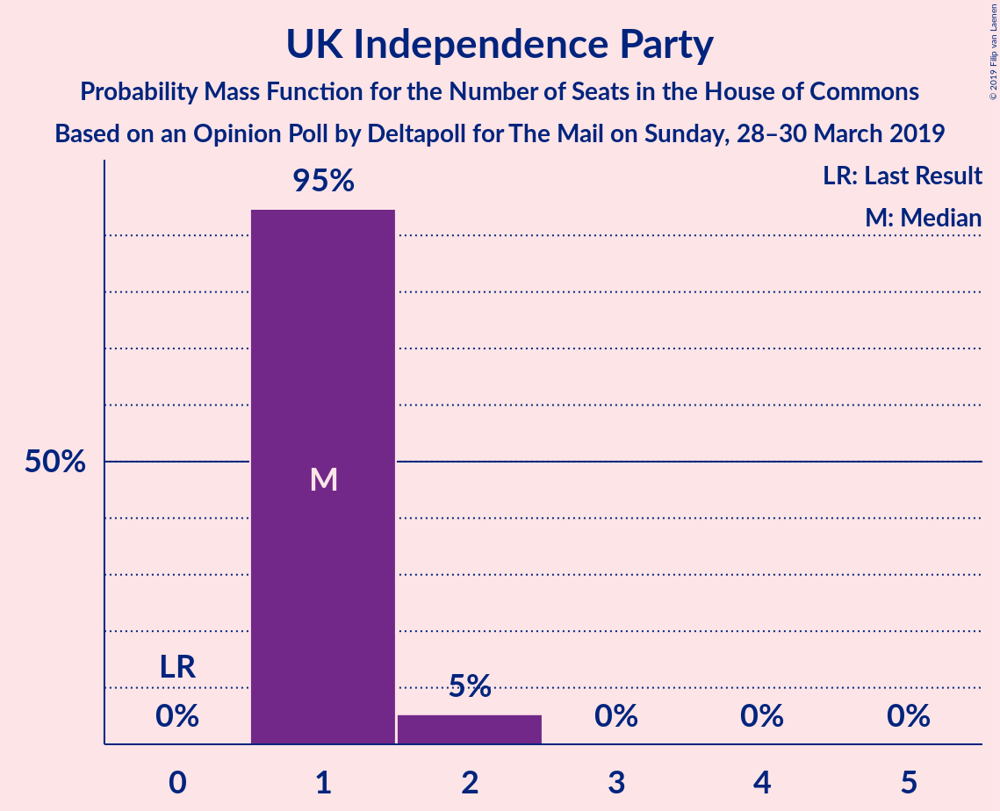
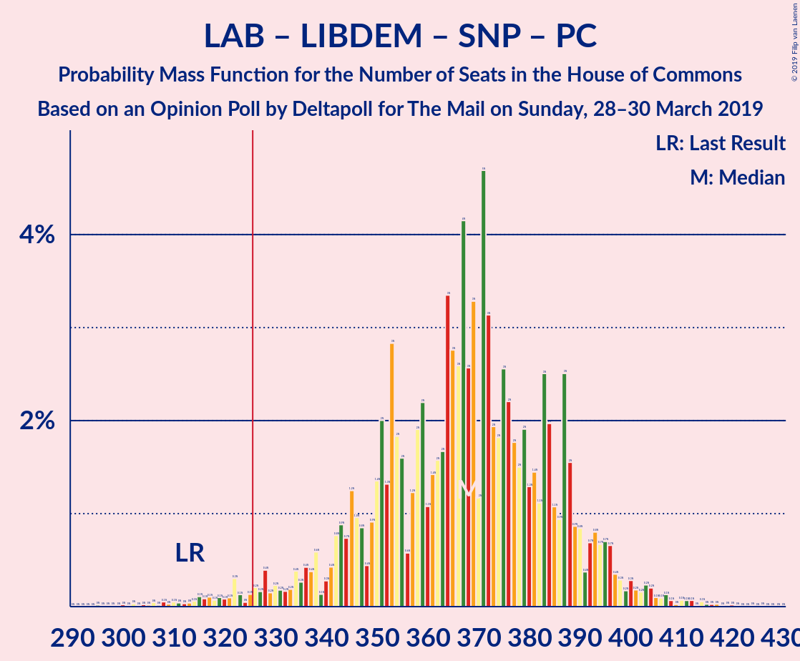

# Opinion Poll by Deltapoll for The Mail on Sunday, 28–30 March 2019

<a href="#voting-intentions">Voting Intentions</a> | <a href="#seats">Seats</a> | <a href="#coalitions">Coalitions</a> | <a href="#technical-information">Technical Information</a>

## Voting Intentions

### Confidence Intervals

| Party | Last Result | Poll Result | 80% Confidence Interval | 90% Confidence Interval | 95% Confidence Interval | 99% Confidence Interval |
|:-----:|:-----------:|:-----------:|:-----------------------:|:-----------------------:|:-----------------------:|:-----------------------:|
| Labour Party | 40.0% | 40.6% | 38.6–42.6% |38.1–43.2% |37.6–43.7% |36.7–44.6% |
| Conservative Party | 42.4% | 35.6% | 33.7–37.6% |33.2–38.2% |32.7–38.7% |31.8–39.6% |
| Liberal Democrats | 7.4% | 6.9% | 6.0–8.1% |5.7–8.4% |5.5–8.7% |5.1–9.3% |
| UK Independence Party | 1.8% | 6.9% | 6.0–8.1% |5.7–8.4% |5.5–8.7% |5.1–9.3% |
| Scottish National Party | 3.0% | 3.0% | 2.4–3.8% |2.2–4.0% |2.1–4.2% |1.8–4.6% |
| Green Party | 1.6% | 3.0% | 2.4–3.8% |2.2–4.0% |2.1–4.2% |1.8–4.6% |
| Plaid Cymru | 0.5% | 1.0% | 0.7–1.5% |0.6–1.7% |0.5–1.8% |0.4–2.1% |

*Note:* The poll result column reflects the actual value used in the calculations. Published results may vary slightly, and in addition be rounded to fewer digits.

## Seats

### Confidence Intervals

| Party | Last Result | Median | 80% Confidence Interval | 90% Confidence Interval | 95% Confidence Interval | 99% Confidence Interval |
|:-----:|:-----------:|:------:|:-----------------------:|:-----------------------:|:-----------------------:|:-----------------------:|
| <a href="#labour-party">Labour Party</a> | 262 | 323 | 300–341 |274–341 |274–343 |237–362 |
| <a href="#conservative-party">Conservative Party</a> | 317 | 260 | 254–274 |254–288 |254–288 |242–323 |
| <a href="#liberal-democrats">Liberal Democrats</a> | 12 | 16 | 3–21 |3–21 |3–21 |3–21 |
| <a href="#uk-independence-party">UK Independence Party</a> | 0 | 1 | 1–2 |1–2 |1–2 |1–2 |
| <a href="#scottish-national-party">Scottish National Party</a> | 35 | 28 | 13–53 |10–53 |10–54 |9–54 |
| <a href="#green-party">Green Party</a> | 1 | 1 | 1–2 |1–2 |1–2 |1–2 |
| <a href="#plaid-cymru">Plaid Cymru</a> | 4 | 5 | 5–7 |2–8 |2–9 |1–9 |

### Labour Party

*For a full overview of the results for this party, see the [Labour Party](party-labourparty.html) page.*

| Number of Seats | Probability | Accumulated | Special Marks |
|:---------------:|:-----------:|:-----------:|:-------------:|
| 237 | 1.5% | 100% |  |
| 238 | 0% | 98.5% |  |
| 239 | 0% | 98.5% |  |
| 240 | 0% | 98.5% |  |
| 241 | 0% | 98.5% |  |
| 242 | 0% | 98.5% |  |
| 243 | 0% | 98.5% |  |
| 244 | 0% | 98.5% |  |
| 245 | 0% | 98.5% |  |
| 246 | 0% | 98.5% |  |
| 247 | 0% | 98.5% |  |
| 248 | 0% | 98.5% |  |
| 249 | 0% | 98.5% |  |
| 250 | 0% | 98.5% |  |
| 251 | 0% | 98.5% |  |
| 252 | 0% | 98.5% |  |
| 253 | 0% | 98.5% |  |
| 254 | 0% | 98.5% |  |
| 255 | 0% | 98.5% |  |
| 256 | 0% | 98.5% |  |
| 257 | 0% | 98.5% |  |
| 258 | 0% | 98.5% |  |
| 259 | 0% | 98.5% |  |
| 260 | 0% | 98.5% |  |
| 261 | 0% | 98.5% |  |
| 262 | 0% | 98.5% | Last Result |
| 263 | 0% | 98.5% |  |
| 264 | 0% | 98.5% |  |
| 265 | 0% | 98.5% |  |
| 266 | 0% | 98.5% |  |
| 267 | 0% | 98.5% |  |
| 268 | 0% | 98.5% |  |
| 269 | 0% | 98.5% |  |
| 270 | 0% | 98.5% |  |
| 271 | 0% | 98.5% |  |
| 272 | 0.1% | 98.5% |  |
| 273 | 0% | 98% |  |
| 274 | 4% | 98% |  |
| 275 | 0% | 94% |  |
| 276 | 0% | 94% |  |
| 277 | 0% | 94% |  |
| 278 | 0% | 94% |  |
| 279 | 0% | 94% |  |
| 280 | 0% | 94% |  |
| 281 | 0% | 94% |  |
| 282 | 0% | 94% |  |
| 283 | 0% | 94% |  |
| 284 | 0% | 94% |  |
| 285 | 0% | 94% |  |
| 286 | 0% | 94% |  |
| 287 | 0% | 94% |  |
| 288 | 0% | 94% |  |
| 289 | 0% | 94% |  |
| 290 | 0% | 94% |  |
| 291 | 0% | 94% |  |
| 292 | 0% | 94% |  |
| 293 | 0% | 94% |  |
| 294 | 0% | 94% |  |
| 295 | 0% | 94% |  |
| 296 | 0% | 94% |  |
| 297 | 0.2% | 94% |  |
| 298 | 0.9% | 94% |  |
| 299 | 0% | 93% |  |
| 300 | 23% | 93% |  |
| 301 | 0% | 70% |  |
| 302 | 0% | 70% |  |
| 303 | 0% | 70% |  |
| 304 | 0% | 70% |  |
| 305 | 0% | 70% |  |
| 306 | 18% | 70% |  |
| 307 | 1.1% | 52% |  |
| 308 | 0% | 51% |  |
| 309 | 0% | 51% |  |
| 310 | 0% | 51% |  |
| 311 | 0% | 51% |  |
| 312 | 0% | 51% |  |
| 313 | 0% | 51% |  |
| 314 | 0% | 51% |  |
| 315 | 0% | 51% |  |
| 316 | 0% | 51% |  |
| 317 | 0% | 51% |  |
| 318 | 0% | 51% |  |
| 319 | 0% | 51% |  |
| 320 | 0% | 51% |  |
| 321 | 0% | 51% |  |
| 322 | 0% | 51% |  |
| 323 | 5% | 51% | Median |
| 324 | 29% | 45% |  |
| 325 | 0.4% | 17% |  |
| 326 | 5% | 16% | Majority |
| 327 | 0.1% | 11% |  |
| 328 | 0% | 11% |  |
| 329 | 0% | 11% |  |
| 330 | 0% | 11% |  |
| 331 | 0% | 11% |  |
| 332 | 0% | 11% |  |
| 333 | 0% | 11% |  |
| 334 | 0% | 11% |  |
| 335 | 0% | 11% |  |
| 336 | 0% | 11% |  |
| 337 | 0% | 11% |  |
| 338 | 0% | 11% |  |
| 339 | 0% | 11% |  |
| 340 | 0% | 11% |  |
| 341 | 8% | 11% |  |
| 342 | 0% | 3% |  |
| 343 | 0.9% | 3% |  |
| 344 | 0.1% | 2% |  |
| 345 | 0.1% | 2% |  |
| 346 | 0% | 2% |  |
| 347 | 0% | 2% |  |
| 348 | 0% | 2% |  |
| 349 | 0% | 2% |  |
| 350 | 0% | 2% |  |
| 351 | 0% | 2% |  |
| 352 | 0% | 2% |  |
| 353 | 0% | 2% |  |
| 354 | 0% | 2% |  |
| 355 | 0% | 2% |  |
| 356 | 0% | 2% |  |
| 357 | 0% | 2% |  |
| 358 | 0% | 2% |  |
| 359 | 0% | 2% |  |
| 360 | 0% | 2% |  |
| 361 | 0% | 2% |  |
| 362 | 2% | 2% |  |
| 363 | 0% | 0.1% |  |
| 364 | 0.1% | 0.1% |  |
| 365 | 0% | 0% |  |

### Conservative Party

*For a full overview of the results for this party, see the [Conservative Party](party-conservativeparty.html) page.*

| Number of Seats | Probability | Accumulated | Special Marks |
|:---------------:|:-----------:|:-----------:|:-------------:|
| 230 | 0.1% | 100% |  |
| 231 | 0.1% | 99.9% |  |
| 232 | 0% | 99.8% |  |
| 233 | 0% | 99.8% |  |
| 234 | 0% | 99.8% |  |
| 235 | 0% | 99.8% |  |
| 236 | 0.1% | 99.8% |  |
| 237 | 0% | 99.7% |  |
| 238 | 0% | 99.7% |  |
| 239 | 0% | 99.7% |  |
| 240 | 0% | 99.7% |  |
| 241 | 0% | 99.7% |  |
| 242 | 2% | 99.7% |  |
| 243 | 0% | 98% |  |
| 244 | 0% | 98% |  |
| 245 | 0% | 98% |  |
| 246 | 0% | 98% |  |
| 247 | 0% | 98% |  |
| 248 | 0% | 98% |  |
| 249 | 0% | 98% |  |
| 250 | 0% | 98% |  |
| 251 | 0% | 98% |  |
| 252 | 0.1% | 98% |  |
| 253 | 0% | 98% |  |
| 254 | 40% | 98% |  |
| 255 | 0% | 58% |  |
| 256 | 0% | 58% |  |
| 257 | 0% | 58% |  |
| 258 | 0% | 58% |  |
| 259 | 0.1% | 58% |  |
| 260 | 9% | 58% | Median |
| 261 | 0% | 49% |  |
| 262 | 0.2% | 49% |  |
| 263 | 0% | 49% |  |
| 264 | 0% | 49% |  |
| 265 | 0% | 49% |  |
| 266 | 0% | 49% |  |
| 267 | 23% | 49% |  |
| 268 | 0% | 26% |  |
| 269 | 0.9% | 26% |  |
| 270 | 0% | 25% |  |
| 271 | 0% | 25% |  |
| 272 | 0% | 25% |  |
| 273 | 0% | 25% |  |
| 274 | 18% | 25% |  |
| 275 | 1.1% | 7% |  |
| 276 | 0% | 6% |  |
| 277 | 0% | 6% |  |
| 278 | 0% | 6% |  |
| 279 | 0% | 6% |  |
| 280 | 0% | 6% |  |
| 281 | 0% | 6% |  |
| 282 | 0% | 6% |  |
| 283 | 0% | 6% |  |
| 284 | 0% | 6% |  |
| 285 | 0% | 6% |  |
| 286 | 0% | 6% |  |
| 287 | 0% | 6% |  |
| 288 | 4% | 6% |  |
| 289 | 0% | 2% |  |
| 290 | 0% | 2% |  |
| 291 | 0% | 2% |  |
| 292 | 0.1% | 2% |  |
| 293 | 0% | 1.5% |  |
| 294 | 0% | 1.5% |  |
| 295 | 0% | 1.5% |  |
| 296 | 0% | 1.5% |  |
| 297 | 0% | 1.5% |  |
| 298 | 0% | 1.5% |  |
| 299 | 0% | 1.5% |  |
| 300 | 0% | 1.5% |  |
| 301 | 0% | 1.5% |  |
| 302 | 0% | 1.5% |  |
| 303 | 0% | 1.5% |  |
| 304 | 0% | 1.5% |  |
| 305 | 0% | 1.5% |  |
| 306 | 0% | 1.5% |  |
| 307 | 0% | 1.5% |  |
| 308 | 0% | 1.5% |  |
| 309 | 0% | 1.5% |  |
| 310 | 0% | 1.5% |  |
| 311 | 0% | 1.5% |  |
| 312 | 0% | 1.5% |  |
| 313 | 0% | 1.5% |  |
| 314 | 0% | 1.5% |  |
| 315 | 0% | 1.5% |  |
| 316 | 0% | 1.5% |  |
| 317 | 0% | 1.5% | Last Result |
| 318 | 0% | 1.5% |  |
| 319 | 0% | 1.5% |  |
| 320 | 0% | 1.5% |  |
| 321 | 0% | 1.5% |  |
| 322 | 0% | 1.5% |  |
| 323 | 1.3% | 1.5% |  |
| 324 | 0.1% | 0.1% |  |
| 325 | 0% | 0% |  |

### Liberal Democrats

*For a full overview of the results for this party, see the [Liberal Democrats](party-liberaldemocrats.html) page.*

| Number of Seats | Probability | Accumulated | Special Marks |
|:---------------:|:-----------:|:-----------:|:-------------:|
| 3 | 24% | 100% |  |
| 4 | 0% | 76% |  |
| 5 | 4% | 76% |  |
| 6 | 0.1% | 72% |  |
| 7 | 0% | 72% |  |
| 8 | 7% | 72% |  |
| 9 | 0.1% | 65% |  |
| 10 | 0% | 64% |  |
| 11 | 0% | 64% |  |
| 12 | 0% | 64% | Last Result |
| 13 | 0% | 64% |  |
| 14 | 0.1% | 64% |  |
| 15 | 0.2% | 64% |  |
| 16 | 20% | 64% | Median |
| 17 | 9% | 44% |  |
| 18 | 0% | 35% |  |
| 19 | 0% | 35% |  |
| 20 | 0% | 35% |  |
| 21 | 34% | 35% |  |
| 22 | 0% | 0.1% |  |
| 23 | 0.1% | 0.1% |  |
| 24 | 0% | 0% |  |

### UK Independence Party

*For a full overview of the results for this party, see the [UK Independence Party](party-ukindependenceparty.html) page.*

| Number of Seats | Probability | Accumulated | Special Marks |
|:---------------:|:-----------:|:-----------:|:-------------:|
| 0 | 0% | 100% | Last Result |
| 1 | 76% | 100% | Median |
| 2 | 24% | 24% |  |
| 3 | 0% | 0% |  |

### Scottish National Party

*For a full overview of the results for this party, see the [Scottish National Party](party-scottishnationalparty.html) page.*

| Number of Seats | Probability | Accumulated | Special Marks |
|:---------------:|:-----------:|:-----------:|:-------------:|
| 3 | 0.1% | 100% |  |
| 4 | 0% | 99.9% |  |
| 5 | 0% | 99.9% |  |
| 6 | 0% | 99.9% |  |
| 7 | 0% | 99.9% |  |
| 8 | 0% | 99.9% |  |
| 9 | 0.9% | 99.9% |  |
| 10 | 8% | 99.0% |  |
| 11 | 0% | 91% |  |
| 12 | 0% | 91% |  |
| 13 | 2% | 91% |  |
| 14 | 0% | 89% |  |
| 15 | 0% | 89% |  |
| 16 | 0% | 89% |  |
| 17 | 0% | 89% |  |
| 18 | 0% | 89% |  |
| 19 | 0% | 89% |  |
| 20 | 0% | 89% |  |
| 21 | 0% | 89% |  |
| 22 | 0% | 89% |  |
| 23 | 0% | 89% |  |
| 24 | 0.3% | 89% |  |
| 25 | 29% | 89% |  |
| 26 | 7% | 60% |  |
| 27 | 0% | 54% |  |
| 28 | 18% | 54% | Median |
| 29 | 0% | 36% |  |
| 30 | 0.1% | 36% |  |
| 31 | 0.1% | 35% |  |
| 32 | 0.1% | 35% |  |
| 33 | 5% | 35% |  |
| 34 | 0% | 30% |  |
| 35 | 0.1% | 30% | Last Result |
| 36 | 0% | 30% |  |
| 37 | 0% | 30% |  |
| 38 | 0% | 30% |  |
| 39 | 0% | 30% |  |
| 40 | 0% | 30% |  |
| 41 | 0% | 30% |  |
| 42 | 0% | 30% |  |
| 43 | 0% | 30% |  |
| 44 | 0% | 30% |  |
| 45 | 0% | 30% |  |
| 46 | 0% | 30% |  |
| 47 | 0% | 30% |  |
| 48 | 0% | 30% |  |
| 49 | 1.5% | 30% |  |
| 50 | 0% | 29% |  |
| 51 | 0% | 29% |  |
| 52 | 0% | 29% |  |
| 53 | 24% | 29% |  |
| 54 | 4% | 5% |  |
| 55 | 0% | 0.3% |  |
| 56 | 0% | 0.3% |  |
| 57 | 0% | 0.3% |  |
| 58 | 0.3% | 0.3% |  |
| 59 | 0% | 0% |  |

### Green Party

*For a full overview of the results for this party, see the [Green Party](party-greenparty.html) page.*

| Number of Seats | Probability | Accumulated | Special Marks |
|:---------------:|:-----------:|:-----------:|:-------------:|
| 1 | 65% | 100% | Last Result, Median |
| 2 | 35% | 35% |  |
| 3 | 0% | 0% |  |

### Plaid Cymru

*For a full overview of the results for this party, see the [Plaid Cymru](party-plaidcymru.html) page.*

| Number of Seats | Probability | Accumulated | Special Marks |
|:---------------:|:-----------:|:-----------:|:-------------:|
| 1 | 0.9% | 100% |  |
| 2 | 8% | 99.1% |  |
| 3 | 0% | 91% |  |
| 4 | 0.1% | 91% | Last Result |
| 5 | 57% | 91% | Median |
| 6 | 0% | 34% |  |
| 7 | 24% | 34% |  |
| 8 | 6% | 10% |  |
| 9 | 4% | 4% |  |
| 10 | 0% | 0% |  |

## Coalitions

### Confidence Intervals

| Coalition | Last Result | Median | Majority? | 80% Confidence Interval | 90% Confidence Interval | 95% Confidence Interval | 99% Confidence Interval |
|:---------:|:-----------:|:------:|:---------:|:-----------------------:|:-----------------------:|:-----------------------:|:-----------------------:|
| Labour Party – Liberal Democrats – Scottish National Party – Plaid Cymru | 313 | 370 | 98.5% | 355–375 | 342–375 | 342–375 | 307–388 |
| Labour Party – Liberal Democrats – Scottish National Party | 309 | 367 | 98.5% | 350–370 | 333–370 | 333–370 | 302–383 |
| Labour Party – Scottish National Party – Plaid Cymru | 301 | 354 | 98.5% | 339–360 | 337–367 | 337–367 | 291–380 |
| Labour Party – Liberal Democrats – Plaid Cymru | 278 | 342 | 70% | 310–360 | 288–360 | 288–361 | 258–375 |
| Labour Party – Liberal Democrats | 274 | 334 | 51% | 303–358 | 279–358 | 279–360 | 253–370 |
| Labour Party – Scottish National Party | 297 | 349 | 98.5% | 334–353 | 328–359 | 328–359 | 286–375 |
| Conservative Party – Scottish National Party – Plaid Cymru | 356 | 295 | 30% | 272–327 | 272–351 | 270–351 | 260–377 |
| Labour Party – Plaid Cymru | 266 | 328 | 51% | 307–343 | 283–343 | 283–344 | 242–367 |
| Labour Party | 262 | 323 | 16% | 300–341 | 274–341 | 274–343 | 237–362 |
| Conservative Party – Scottish National Party | 352 | 287 | 6% | 270–320 | 270–342 | 269–342 | 255–372 |
| Conservative Party – Plaid Cymru | 321 | 262 | 1.5% | 259–279 | 259–297 | 259–297 | 247–328 |
| Conservative Party – Liberal Democrats | 329 | 275 | 1.5% | 270–290 | 262–293 | 262–293 | 250–339 |
| Conservative Party | 317 | 260 | 0% | 254–274 | 254–288 | 254–288 | 242–323 |

### Labour Party – Liberal Democrats – Scottish National Party – Plaid Cymru

| Number of Seats | Probability | Accumulated | Special Marks |
|:---------------:|:-----------:|:-----------:|:-------------:|
| 306 | 0.1% | 100% |  |
| 307 | 1.3% | 99.9% |  |
| 308 | 0% | 98.5% |  |
| 309 | 0% | 98.5% |  |
| 310 | 0% | 98.5% |  |
| 311 | 0% | 98.5% |  |
| 312 | 0% | 98.5% |  |
| 313 | 0% | 98.5% | Last Result |
| 314 | 0% | 98.5% |  |
| 315 | 0% | 98.5% |  |
| 316 | 0% | 98.5% |  |
| 317 | 0% | 98.5% |  |
| 318 | 0% | 98.5% |  |
| 319 | 0% | 98.5% |  |
| 320 | 0% | 98.5% |  |
| 321 | 0% | 98.5% |  |
| 322 | 0% | 98.5% |  |
| 323 | 0% | 98.5% |  |
| 324 | 0% | 98.5% |  |
| 325 | 0% | 98.5% |  |
| 326 | 0% | 98.5% | Majority |
| 327 | 0% | 98.5% |  |
| 328 | 0% | 98.5% |  |
| 329 | 0% | 98.5% |  |
| 330 | 0% | 98.5% |  |
| 331 | 0% | 98.5% |  |
| 332 | 0% | 98.5% |  |
| 333 | 0% | 98.5% |  |
| 334 | 0% | 98.5% |  |
| 335 | 0% | 98.5% |  |
| 336 | 0% | 98.5% |  |
| 337 | 0% | 98.5% |  |
| 338 | 0.1% | 98.5% |  |
| 339 | 0% | 98% |  |
| 340 | 0% | 98% |  |
| 341 | 0% | 98% |  |
| 342 | 4% | 98% |  |
| 343 | 0% | 94% |  |
| 344 | 0% | 94% |  |
| 345 | 0% | 94% |  |
| 346 | 0% | 94% |  |
| 347 | 0% | 94% |  |
| 348 | 0% | 94% |  |
| 349 | 0% | 94% |  |
| 350 | 0% | 94% |  |
| 351 | 0% | 94% |  |
| 352 | 0% | 94% |  |
| 353 | 0% | 94% |  |
| 354 | 1.1% | 94% |  |
| 355 | 18% | 93% |  |
| 356 | 0% | 75% |  |
| 357 | 0% | 75% |  |
| 358 | 0% | 75% |  |
| 359 | 0% | 75% |  |
| 360 | 0% | 75% |  |
| 361 | 0.9% | 75% |  |
| 362 | 0% | 74% |  |
| 363 | 23% | 74% |  |
| 364 | 0% | 51% |  |
| 365 | 0% | 51% |  |
| 366 | 0% | 51% |  |
| 367 | 0% | 51% |  |
| 368 | 0.2% | 51% |  |
| 369 | 0% | 51% |  |
| 370 | 9% | 51% |  |
| 371 | 0.1% | 42% |  |
| 372 | 0% | 42% | Median |
| 373 | 0% | 42% |  |
| 374 | 0% | 42% |  |
| 375 | 40% | 42% |  |
| 376 | 0% | 2% |  |
| 377 | 0.1% | 2% |  |
| 378 | 0% | 2% |  |
| 379 | 0% | 2% |  |
| 380 | 0% | 2% |  |
| 381 | 0% | 2% |  |
| 382 | 0% | 2% |  |
| 383 | 0% | 2% |  |
| 384 | 0% | 2% |  |
| 385 | 0% | 2% |  |
| 386 | 0% | 2% |  |
| 387 | 0% | 2% |  |
| 388 | 2% | 2% |  |
| 389 | 0% | 0.3% |  |
| 390 | 0% | 0.3% |  |
| 391 | 0% | 0.3% |  |
| 392 | 0% | 0.3% |  |
| 393 | 0% | 0.3% |  |
| 394 | 0.1% | 0.3% |  |
| 395 | 0% | 0.2% |  |
| 396 | 0% | 0.2% |  |
| 397 | 0% | 0.2% |  |
| 398 | 0.1% | 0.2% |  |
| 399 | 0.1% | 0.1% |  |
| 400 | 0% | 0% |  |

### Labour Party – Liberal Democrats – Scottish National Party

| Number of Seats | Probability | Accumulated | Special Marks |
|:---------------:|:-----------:|:-----------:|:-------------:|
| 301 | 0.1% | 100% |  |
| 302 | 1.3% | 99.9% |  |
| 303 | 0% | 98.5% |  |
| 304 | 0% | 98.5% |  |
| 305 | 0% | 98.5% |  |
| 306 | 0% | 98.5% |  |
| 307 | 0% | 98.5% |  |
| 308 | 0% | 98.5% |  |
| 309 | 0% | 98.5% | Last Result |
| 310 | 0% | 98.5% |  |
| 311 | 0% | 98.5% |  |
| 312 | 0% | 98.5% |  |
| 313 | 0% | 98.5% |  |
| 314 | 0% | 98.5% |  |
| 315 | 0% | 98.5% |  |
| 316 | 0% | 98.5% |  |
| 317 | 0% | 98.5% |  |
| 318 | 0% | 98.5% |  |
| 319 | 0% | 98.5% |  |
| 320 | 0% | 98.5% |  |
| 321 | 0% | 98.5% |  |
| 322 | 0% | 98.5% |  |
| 323 | 0% | 98.5% |  |
| 324 | 0% | 98.5% |  |
| 325 | 0% | 98.5% |  |
| 326 | 0% | 98.5% | Majority |
| 327 | 0% | 98.5% |  |
| 328 | 0% | 98.5% |  |
| 329 | 0.1% | 98.5% |  |
| 330 | 0% | 98% |  |
| 331 | 0% | 98% |  |
| 332 | 0% | 98% |  |
| 333 | 4% | 98% |  |
| 334 | 0% | 94% |  |
| 335 | 0% | 94% |  |
| 336 | 0% | 94% |  |
| 337 | 0% | 94% |  |
| 338 | 0% | 94% |  |
| 339 | 0% | 94% |  |
| 340 | 0% | 94% |  |
| 341 | 0% | 94% |  |
| 342 | 0% | 94% |  |
| 343 | 0% | 94% |  |
| 344 | 0% | 94% |  |
| 345 | 0% | 94% |  |
| 346 | 0% | 94% |  |
| 347 | 0% | 94% |  |
| 348 | 0% | 94% |  |
| 349 | 1.1% | 94% |  |
| 350 | 18% | 93% |  |
| 351 | 0% | 75% |  |
| 352 | 0% | 75% |  |
| 353 | 0% | 75% |  |
| 354 | 0.9% | 75% |  |
| 355 | 0% | 74% |  |
| 356 | 23% | 74% |  |
| 357 | 0% | 51% |  |
| 358 | 0% | 51% |  |
| 359 | 0% | 51% |  |
| 360 | 0% | 51% |  |
| 361 | 0% | 51% |  |
| 362 | 0% | 51% |  |
| 363 | 0.3% | 51% |  |
| 364 | 0% | 51% |  |
| 365 | 0% | 51% |  |
| 366 | 0% | 51% |  |
| 367 | 5% | 51% | Median |
| 368 | 8% | 46% |  |
| 369 | 1.1% | 37% |  |
| 370 | 34% | 36% |  |
| 371 | 0% | 2% |  |
| 372 | 0% | 2% |  |
| 373 | 0% | 2% |  |
| 374 | 0% | 2% |  |
| 375 | 0% | 2% |  |
| 376 | 0% | 2% |  |
| 377 | 0% | 2% |  |
| 378 | 0% | 2% |  |
| 379 | 0% | 2% |  |
| 380 | 0% | 2% |  |
| 381 | 0% | 2% |  |
| 382 | 0% | 2% |  |
| 383 | 2% | 2% |  |
| 384 | 0% | 0.3% |  |
| 385 | 0% | 0.3% |  |
| 386 | 0% | 0.3% |  |
| 387 | 0% | 0.3% |  |
| 388 | 0% | 0.3% |  |
| 389 | 0% | 0.3% |  |
| 390 | 0.2% | 0.3% |  |
| 391 | 0.1% | 0.1% |  |
| 392 | 0% | 0% |  |

### Labour Party – Scottish National Party – Plaid Cymru

| Number of Seats | Probability | Accumulated | Special Marks |
|:---------------:|:-----------:|:-----------:|:-------------:|
| 291 | 1.5% | 100% |  |
| 292 | 0% | 98.5% |  |
| 293 | 0% | 98.5% |  |
| 294 | 0% | 98.5% |  |
| 295 | 0% | 98.5% |  |
| 296 | 0% | 98.5% |  |
| 297 | 0% | 98.5% |  |
| 298 | 0% | 98.5% |  |
| 299 | 0% | 98.5% |  |
| 300 | 0% | 98.5% |  |
| 301 | 0% | 98.5% | Last Result |
| 302 | 0% | 98.5% |  |
| 303 | 0% | 98.5% |  |
| 304 | 0% | 98.5% |  |
| 305 | 0% | 98.5% |  |
| 306 | 0% | 98.5% |  |
| 307 | 0% | 98.5% |  |
| 308 | 0% | 98.5% |  |
| 309 | 0% | 98.5% |  |
| 310 | 0% | 98.5% |  |
| 311 | 0% | 98.5% |  |
| 312 | 0% | 98.5% |  |
| 313 | 0% | 98.5% |  |
| 314 | 0% | 98.5% |  |
| 315 | 0% | 98.5% |  |
| 316 | 0% | 98.5% |  |
| 317 | 0% | 98.5% |  |
| 318 | 0% | 98.5% |  |
| 319 | 0% | 98.5% |  |
| 320 | 0% | 98.5% |  |
| 321 | 0% | 98.5% |  |
| 322 | 0% | 98.5% |  |
| 323 | 0% | 98.5% |  |
| 324 | 0% | 98.5% |  |
| 325 | 0% | 98.5% |  |
| 326 | 0% | 98.5% | Majority |
| 327 | 0% | 98.5% |  |
| 328 | 0% | 98.5% |  |
| 329 | 0% | 98.5% |  |
| 330 | 0% | 98.5% |  |
| 331 | 0% | 98.5% |  |
| 332 | 0% | 98.5% |  |
| 333 | 0% | 98.5% |  |
| 334 | 0% | 98.5% |  |
| 335 | 0.1% | 98.5% |  |
| 336 | 0% | 98% |  |
| 337 | 4% | 98% |  |
| 338 | 1.1% | 94% |  |
| 339 | 18% | 93% |  |
| 340 | 0% | 75% |  |
| 341 | 0% | 75% |  |
| 342 | 0% | 75% |  |
| 343 | 0% | 75% |  |
| 344 | 0% | 75% |  |
| 345 | 0% | 75% |  |
| 346 | 0% | 75% |  |
| 347 | 0% | 75% |  |
| 348 | 0% | 75% |  |
| 349 | 0% | 75% |  |
| 350 | 0% | 75% |  |
| 351 | 0% | 75% |  |
| 352 | 0% | 75% |  |
| 353 | 9% | 75% |  |
| 354 | 34% | 66% |  |
| 355 | 0% | 31% |  |
| 356 | 0% | 31% | Median |
| 357 | 0% | 31% |  |
| 358 | 0.9% | 31% |  |
| 359 | 0% | 30% |  |
| 360 | 23% | 30% |  |
| 361 | 0% | 7% |  |
| 362 | 0% | 7% |  |
| 363 | 0% | 7% |  |
| 364 | 0% | 7% |  |
| 365 | 0.1% | 7% |  |
| 366 | 0% | 7% |  |
| 367 | 5% | 7% |  |
| 368 | 0.1% | 2% |  |
| 369 | 0% | 2% |  |
| 370 | 0% | 2% |  |
| 371 | 0.1% | 2% |  |
| 372 | 0% | 2% |  |
| 373 | 0% | 2% |  |
| 374 | 0% | 2% |  |
| 375 | 0% | 2% |  |
| 376 | 0% | 2% |  |
| 377 | 0% | 2% |  |
| 378 | 0% | 2% |  |
| 379 | 0% | 2% |  |
| 380 | 2% | 2% |  |
| 381 | 0% | 0.2% |  |
| 382 | 0% | 0.2% |  |
| 383 | 0% | 0.2% |  |
| 384 | 0.1% | 0.2% |  |
| 385 | 0% | 0% |  |

### Labour Party – Liberal Democrats – Plaid Cymru

| Number of Seats | Probability | Accumulated | Special Marks |
|:---------------:|:-----------:|:-----------:|:-------------:|
| 257 | 0.1% | 100% |  |
| 258 | 1.3% | 99.9% |  |
| 259 | 0% | 98.5% |  |
| 260 | 0% | 98.5% |  |
| 261 | 0% | 98.5% |  |
| 262 | 0% | 98.5% |  |
| 263 | 0% | 98.5% |  |
| 264 | 0% | 98.5% |  |
| 265 | 0% | 98.5% |  |
| 266 | 0% | 98.5% |  |
| 267 | 0% | 98.5% |  |
| 268 | 0% | 98.5% |  |
| 269 | 0% | 98.5% |  |
| 270 | 0% | 98.5% |  |
| 271 | 0% | 98.5% |  |
| 272 | 0% | 98.5% |  |
| 273 | 0% | 98.5% |  |
| 274 | 0% | 98.5% |  |
| 275 | 0% | 98.5% |  |
| 276 | 0% | 98.5% |  |
| 277 | 0% | 98.5% |  |
| 278 | 0% | 98.5% | Last Result |
| 279 | 0% | 98.5% |  |
| 280 | 0% | 98.5% |  |
| 281 | 0% | 98.5% |  |
| 282 | 0% | 98.5% |  |
| 283 | 0% | 98.5% |  |
| 284 | 0.1% | 98.5% |  |
| 285 | 0% | 98% |  |
| 286 | 0% | 98% |  |
| 287 | 0% | 98% |  |
| 288 | 4% | 98% |  |
| 289 | 0% | 94% |  |
| 290 | 0% | 94% |  |
| 291 | 0% | 94% |  |
| 292 | 0% | 94% |  |
| 293 | 0% | 94% |  |
| 294 | 0% | 94% |  |
| 295 | 0% | 94% |  |
| 296 | 0% | 94% |  |
| 297 | 0% | 94% |  |
| 298 | 0% | 94% |  |
| 299 | 0% | 94% |  |
| 300 | 0% | 94% |  |
| 301 | 0% | 94% |  |
| 302 | 0% | 94% |  |
| 303 | 0% | 94% |  |
| 304 | 0% | 94% |  |
| 305 | 0% | 94% |  |
| 306 | 0% | 94% |  |
| 307 | 0% | 94% |  |
| 308 | 0.9% | 94% |  |
| 309 | 0% | 93% |  |
| 310 | 23% | 93% |  |
| 311 | 0% | 70% |  |
| 312 | 0% | 70% |  |
| 313 | 0% | 70% |  |
| 314 | 0% | 70% |  |
| 315 | 0% | 70% |  |
| 316 | 0% | 70% |  |
| 317 | 0% | 70% |  |
| 318 | 0% | 70% |  |
| 319 | 0% | 70% |  |
| 320 | 0% | 70% |  |
| 321 | 0% | 70% |  |
| 322 | 0% | 70% |  |
| 323 | 0% | 70% |  |
| 324 | 0% | 70% |  |
| 325 | 0% | 70% |  |
| 326 | 0% | 70% | Majority |
| 327 | 18% | 70% |  |
| 328 | 1.1% | 52% |  |
| 329 | 0% | 51% |  |
| 330 | 0% | 51% |  |
| 331 | 0% | 51% |  |
| 332 | 0% | 51% |  |
| 333 | 0% | 51% |  |
| 334 | 0% | 51% |  |
| 335 | 0% | 51% |  |
| 336 | 0% | 51% |  |
| 337 | 0% | 51% |  |
| 338 | 0% | 51% |  |
| 339 | 0% | 51% |  |
| 340 | 0% | 51% |  |
| 341 | 0.1% | 51% |  |
| 342 | 5% | 51% |  |
| 343 | 0% | 45% |  |
| 344 | 0% | 45% | Median |
| 345 | 0% | 45% |  |
| 346 | 0% | 45% |  |
| 347 | 0% | 45% |  |
| 348 | 0% | 45% |  |
| 349 | 5% | 45% |  |
| 350 | 29% | 40% |  |
| 351 | 0.3% | 11% |  |
| 352 | 0% | 11% |  |
| 353 | 0% | 11% |  |
| 354 | 0% | 11% |  |
| 355 | 0% | 11% |  |
| 356 | 0% | 11% |  |
| 357 | 0% | 11% |  |
| 358 | 0% | 11% |  |
| 359 | 0% | 11% |  |
| 360 | 8% | 11% |  |
| 361 | 0.9% | 3% |  |
| 362 | 0% | 2% |  |
| 363 | 0% | 2% |  |
| 364 | 0% | 2% |  |
| 365 | 0% | 2% |  |
| 366 | 0% | 2% |  |
| 367 | 0.2% | 2% |  |
| 368 | 0% | 2% |  |
| 369 | 0% | 2% |  |
| 370 | 0% | 2% |  |
| 371 | 0% | 2% |  |
| 372 | 0% | 2% |  |
| 373 | 0% | 2% |  |
| 374 | 0% | 2% |  |
| 375 | 2% | 2% |  |
| 376 | 0% | 0.1% |  |
| 377 | 0% | 0.1% |  |
| 378 | 0% | 0.1% |  |
| 379 | 0% | 0.1% |  |
| 380 | 0% | 0.1% |  |
| 381 | 0% | 0.1% |  |
| 382 | 0% | 0.1% |  |
| 383 | 0% | 0.1% |  |
| 384 | 0% | 0.1% |  |
| 385 | 0% | 0.1% |  |
| 386 | 0% | 0.1% |  |
| 387 | 0% | 0.1% |  |
| 388 | 0% | 0.1% |  |
| 389 | 0% | 0.1% |  |
| 390 | 0% | 0.1% |  |
| 391 | 0.1% | 0.1% |  |
| 392 | 0% | 0% |  |

### Labour Party – Liberal Democrats

| Number of Seats | Probability | Accumulated | Special Marks |
|:---------------:|:-----------:|:-----------:|:-------------:|
| 252 | 0.1% | 100% |  |
| 253 | 1.3% | 99.9% |  |
| 254 | 0% | 98.5% |  |
| 255 | 0% | 98.5% |  |
| 256 | 0% | 98.5% |  |
| 257 | 0% | 98.5% |  |
| 258 | 0% | 98.5% |  |
| 259 | 0% | 98.5% |  |
| 260 | 0% | 98.5% |  |
| 261 | 0% | 98.5% |  |
| 262 | 0% | 98.5% |  |
| 263 | 0% | 98.5% |  |
| 264 | 0% | 98.5% |  |
| 265 | 0% | 98.5% |  |
| 266 | 0% | 98.5% |  |
| 267 | 0% | 98.5% |  |
| 268 | 0% | 98.5% |  |
| 269 | 0% | 98.5% |  |
| 270 | 0% | 98.5% |  |
| 271 | 0% | 98.5% |  |
| 272 | 0% | 98.5% |  |
| 273 | 0% | 98.5% |  |
| 274 | 0% | 98.5% | Last Result |
| 275 | 0.1% | 98.5% |  |
| 276 | 0% | 98% |  |
| 277 | 0% | 98% |  |
| 278 | 0% | 98% |  |
| 279 | 4% | 98% |  |
| 280 | 0% | 94% |  |
| 281 | 0% | 94% |  |
| 282 | 0% | 94% |  |
| 283 | 0% | 94% |  |
| 284 | 0% | 94% |  |
| 285 | 0% | 94% |  |
| 286 | 0% | 94% |  |
| 287 | 0% | 94% |  |
| 288 | 0% | 94% |  |
| 289 | 0% | 94% |  |
| 290 | 0% | 94% |  |
| 291 | 0% | 94% |  |
| 292 | 0% | 94% |  |
| 293 | 0% | 94% |  |
| 294 | 0% | 94% |  |
| 295 | 0% | 94% |  |
| 296 | 0% | 94% |  |
| 297 | 0% | 94% |  |
| 298 | 0% | 94% |  |
| 299 | 0% | 94% |  |
| 300 | 0% | 94% |  |
| 301 | 0.9% | 94% |  |
| 302 | 0% | 93% |  |
| 303 | 23% | 93% |  |
| 304 | 0% | 70% |  |
| 305 | 0.3% | 70% |  |
| 306 | 0% | 70% |  |
| 307 | 0% | 70% |  |
| 308 | 0% | 70% |  |
| 309 | 0% | 70% |  |
| 310 | 0% | 70% |  |
| 311 | 0% | 70% |  |
| 312 | 0% | 70% |  |
| 313 | 0% | 70% |  |
| 314 | 0% | 70% |  |
| 315 | 0% | 70% |  |
| 316 | 0% | 70% |  |
| 317 | 0% | 70% |  |
| 318 | 0% | 70% |  |
| 319 | 0% | 70% |  |
| 320 | 0% | 70% |  |
| 321 | 0% | 70% |  |
| 322 | 18% | 70% |  |
| 323 | 1.1% | 52% |  |
| 324 | 0% | 51% |  |
| 325 | 0% | 51% |  |
| 326 | 0% | 51% | Majority |
| 327 | 0% | 51% |  |
| 328 | 0% | 51% |  |
| 329 | 0% | 51% |  |
| 330 | 0% | 51% |  |
| 331 | 0% | 51% |  |
| 332 | 0% | 51% |  |
| 333 | 0.1% | 51% |  |
| 334 | 5% | 51% |  |
| 335 | 0% | 45% |  |
| 336 | 0% | 45% |  |
| 337 | 0% | 45% |  |
| 338 | 0% | 45% |  |
| 339 | 0% | 45% | Median |
| 340 | 0% | 45% |  |
| 341 | 0% | 45% |  |
| 342 | 0% | 45% |  |
| 343 | 0% | 45% |  |
| 344 | 5% | 45% |  |
| 345 | 29% | 40% |  |
| 346 | 0.3% | 11% |  |
| 347 | 0% | 11% |  |
| 348 | 0% | 11% |  |
| 349 | 0% | 11% |  |
| 350 | 0% | 11% |  |
| 351 | 0% | 11% |  |
| 352 | 0% | 11% |  |
| 353 | 0% | 11% |  |
| 354 | 0% | 11% |  |
| 355 | 0% | 11% |  |
| 356 | 0% | 11% |  |
| 357 | 0% | 11% |  |
| 358 | 8% | 11% |  |
| 359 | 0.1% | 3% |  |
| 360 | 0.9% | 3% |  |
| 361 | 0% | 2% |  |
| 362 | 0% | 2% |  |
| 363 | 0% | 2% |  |
| 364 | 0% | 2% |  |
| 365 | 0% | 2% |  |
| 366 | 0% | 2% |  |
| 367 | 0% | 2% |  |
| 368 | 0% | 2% |  |
| 369 | 0% | 2% |  |
| 370 | 2% | 2% |  |
| 371 | 0% | 0.1% |  |
| 372 | 0% | 0.1% |  |
| 373 | 0% | 0.1% |  |
| 374 | 0% | 0.1% |  |
| 375 | 0% | 0.1% |  |
| 376 | 0% | 0.1% |  |
| 377 | 0% | 0.1% |  |
| 378 | 0% | 0.1% |  |
| 379 | 0% | 0.1% |  |
| 380 | 0% | 0.1% |  |
| 381 | 0% | 0.1% |  |
| 382 | 0% | 0.1% |  |
| 383 | 0% | 0.1% |  |
| 384 | 0% | 0.1% |  |
| 385 | 0% | 0.1% |  |
| 386 | 0% | 0.1% |  |
| 387 | 0.1% | 0.1% |  |
| 388 | 0% | 0% |  |

### Labour Party – Scottish National Party

| Number of Seats | Probability | Accumulated | Special Marks |
|:---------------:|:-----------:|:-----------:|:-------------:|
| 286 | 1.5% | 100% |  |
| 287 | 0% | 98.5% |  |
| 288 | 0% | 98.5% |  |
| 289 | 0% | 98.5% |  |
| 290 | 0% | 98.5% |  |
| 291 | 0% | 98.5% |  |
| 292 | 0% | 98.5% |  |
| 293 | 0% | 98.5% |  |
| 294 | 0% | 98.5% |  |
| 295 | 0% | 98.5% |  |
| 296 | 0% | 98.5% |  |
| 297 | 0% | 98.5% | Last Result |
| 298 | 0% | 98.5% |  |
| 299 | 0% | 98.5% |  |
| 300 | 0% | 98.5% |  |
| 301 | 0% | 98.5% |  |
| 302 | 0% | 98.5% |  |
| 303 | 0% | 98.5% |  |
| 304 | 0% | 98.5% |  |
| 305 | 0% | 98.5% |  |
| 306 | 0% | 98.5% |  |
| 307 | 0% | 98.5% |  |
| 308 | 0% | 98.5% |  |
| 309 | 0% | 98.5% |  |
| 310 | 0% | 98.5% |  |
| 311 | 0% | 98.5% |  |
| 312 | 0% | 98.5% |  |
| 313 | 0% | 98.5% |  |
| 314 | 0% | 98.5% |  |
| 315 | 0% | 98.5% |  |
| 316 | 0% | 98.5% |  |
| 317 | 0% | 98.5% |  |
| 318 | 0% | 98.5% |  |
| 319 | 0% | 98.5% |  |
| 320 | 0% | 98.5% |  |
| 321 | 0% | 98.5% |  |
| 322 | 0% | 98.5% |  |
| 323 | 0% | 98.5% |  |
| 324 | 0% | 98.5% |  |
| 325 | 0% | 98.5% |  |
| 326 | 0.1% | 98.5% | Majority |
| 327 | 0% | 98% |  |
| 328 | 4% | 98% |  |
| 329 | 0% | 94% |  |
| 330 | 0% | 94% |  |
| 331 | 0% | 94% |  |
| 332 | 0% | 94% |  |
| 333 | 1.1% | 94% |  |
| 334 | 18% | 93% |  |
| 335 | 0% | 75% |  |
| 336 | 0% | 75% |  |
| 337 | 0% | 75% |  |
| 338 | 0% | 75% |  |
| 339 | 0% | 75% |  |
| 340 | 0% | 75% |  |
| 341 | 0% | 75% |  |
| 342 | 0% | 75% |  |
| 343 | 0% | 75% |  |
| 344 | 0% | 75% |  |
| 345 | 0% | 75% |  |
| 346 | 0% | 75% |  |
| 347 | 0% | 75% |  |
| 348 | 0% | 75% |  |
| 349 | 34% | 75% |  |
| 350 | 0% | 41% |  |
| 351 | 9% | 41% | Median |
| 352 | 0.9% | 31% |  |
| 353 | 23% | 30% |  |
| 354 | 0% | 8% |  |
| 355 | 0.2% | 8% |  |
| 356 | 0% | 7% |  |
| 357 | 0.1% | 7% |  |
| 358 | 0% | 7% |  |
| 359 | 5% | 7% |  |
| 360 | 0.1% | 2% |  |
| 361 | 0% | 2% |  |
| 362 | 0% | 2% |  |
| 363 | 0% | 2% |  |
| 364 | 0% | 2% |  |
| 365 | 0% | 2% |  |
| 366 | 0% | 2% |  |
| 367 | 0.1% | 2% |  |
| 368 | 0% | 2% |  |
| 369 | 0% | 2% |  |
| 370 | 0% | 2% |  |
| 371 | 0% | 2% |  |
| 372 | 0% | 2% |  |
| 373 | 0% | 2% |  |
| 374 | 0% | 2% |  |
| 375 | 2% | 2% |  |
| 376 | 0.2% | 0.2% |  |
| 377 | 0% | 0% |  |

### Conservative Party – Scottish National Party – Plaid Cymru

| Number of Seats | Probability | Accumulated | Special Marks |
|:---------------:|:-----------:|:-----------:|:-------------:|
| 243 | 0.1% | 100% |  |
| 244 | 0% | 99.9% |  |
| 245 | 0% | 99.9% |  |
| 246 | 0% | 99.9% |  |
| 247 | 0% | 99.9% |  |
| 248 | 0% | 99.9% |  |
| 249 | 0% | 99.9% |  |
| 250 | 0% | 99.9% |  |
| 251 | 0% | 99.9% |  |
| 252 | 0% | 99.9% |  |
| 253 | 0% | 99.9% |  |
| 254 | 0% | 99.9% |  |
| 255 | 0% | 99.9% |  |
| 256 | 0% | 99.9% |  |
| 257 | 0% | 99.9% |  |
| 258 | 0% | 99.9% |  |
| 259 | 0% | 99.9% |  |
| 260 | 2% | 99.9% |  |
| 261 | 0% | 98% |  |
| 262 | 0% | 98% |  |
| 263 | 0% | 98% |  |
| 264 | 0% | 98% |  |
| 265 | 0% | 98% |  |
| 266 | 0% | 98% |  |
| 267 | 0% | 98% |  |
| 268 | 0% | 98% |  |
| 269 | 0% | 98% |  |
| 270 | 1.1% | 98% |  |
| 271 | 0% | 97% |  |
| 272 | 8% | 97% |  |
| 273 | 0% | 89% |  |
| 274 | 0% | 89% |  |
| 275 | 0% | 89% |  |
| 276 | 0% | 89% |  |
| 277 | 0% | 89% |  |
| 278 | 0% | 89% |  |
| 279 | 0% | 89% |  |
| 280 | 0% | 89% |  |
| 281 | 0% | 89% |  |
| 282 | 0% | 89% |  |
| 283 | 0.3% | 89% |  |
| 284 | 29% | 89% |  |
| 285 | 5% | 60% |  |
| 286 | 0% | 55% |  |
| 287 | 0% | 55% |  |
| 288 | 0% | 55% |  |
| 289 | 0% | 55% |  |
| 290 | 0% | 55% |  |
| 291 | 0% | 55% |  |
| 292 | 0% | 55% |  |
| 293 | 0% | 55% | Median |
| 294 | 0% | 55% |  |
| 295 | 5% | 55% |  |
| 296 | 0% | 49% |  |
| 297 | 0.1% | 49% |  |
| 298 | 0% | 49% |  |
| 299 | 0% | 49% |  |
| 300 | 0% | 49% |  |
| 301 | 0% | 49% |  |
| 302 | 0% | 49% |  |
| 303 | 0% | 49% |  |
| 304 | 0% | 49% |  |
| 305 | 0% | 49% |  |
| 306 | 1.1% | 49% |  |
| 307 | 18% | 48% |  |
| 308 | 0% | 30% |  |
| 309 | 0% | 30% |  |
| 310 | 0% | 30% |  |
| 311 | 0% | 30% |  |
| 312 | 0% | 30% |  |
| 313 | 0% | 30% |  |
| 314 | 0% | 30% |  |
| 315 | 0% | 30% |  |
| 316 | 0% | 30% |  |
| 317 | 0% | 30% |  |
| 318 | 0% | 30% |  |
| 319 | 0% | 30% |  |
| 320 | 0% | 30% |  |
| 321 | 0% | 30% |  |
| 322 | 0% | 30% |  |
| 323 | 0% | 30% |  |
| 324 | 0% | 30% |  |
| 325 | 0.3% | 30% |  |
| 326 | 0% | 30% | Majority |
| 327 | 23% | 30% |  |
| 328 | 0% | 7% |  |
| 329 | 0.9% | 7% |  |
| 330 | 0% | 6% |  |
| 331 | 0% | 6% |  |
| 332 | 0% | 6% |  |
| 333 | 0% | 6% |  |
| 334 | 0% | 6% |  |
| 335 | 0% | 6% |  |
| 336 | 0% | 6% |  |
| 337 | 0% | 6% |  |
| 338 | 0% | 6% |  |
| 339 | 0% | 6% |  |
| 340 | 0% | 6% |  |
| 341 | 0% | 6% |  |
| 342 | 0% | 6% |  |
| 343 | 0% | 6% |  |
| 344 | 0% | 6% |  |
| 345 | 0% | 6% |  |
| 346 | 0% | 6% |  |
| 347 | 0% | 6% |  |
| 348 | 0% | 6% |  |
| 349 | 0% | 6% |  |
| 350 | 0% | 6% |  |
| 351 | 4% | 6% |  |
| 352 | 0% | 2% |  |
| 353 | 0% | 2% |  |
| 354 | 0% | 2% |  |
| 355 | 0.1% | 2% |  |
| 356 | 0% | 1.5% | Last Result |
| 357 | 0% | 1.5% |  |
| 358 | 0% | 1.5% |  |
| 359 | 0% | 1.5% |  |
| 360 | 0% | 1.5% |  |
| 361 | 0% | 1.5% |  |
| 362 | 0% | 1.5% |  |
| 363 | 0% | 1.5% |  |
| 364 | 0% | 1.5% |  |
| 365 | 0% | 1.5% |  |
| 366 | 0% | 1.5% |  |
| 367 | 0% | 1.5% |  |
| 368 | 0% | 1.5% |  |
| 369 | 0% | 1.5% |  |
| 370 | 0% | 1.5% |  |
| 371 | 0% | 1.5% |  |
| 372 | 0% | 1.5% |  |
| 373 | 0% | 1.5% |  |
| 374 | 0% | 1.5% |  |
| 375 | 0% | 1.5% |  |
| 376 | 0% | 1.5% |  |
| 377 | 1.3% | 1.5% |  |
| 378 | 0.1% | 0.1% |  |
| 379 | 0% | 0% |  |

### Labour Party – Plaid Cymru

| Number of Seats | Probability | Accumulated | Special Marks |
|:---------------:|:-----------:|:-----------:|:-------------:|
| 242 | 1.5% | 100% |  |
| 243 | 0% | 98.5% |  |
| 244 | 0% | 98.5% |  |
| 245 | 0% | 98.5% |  |
| 246 | 0% | 98.5% |  |
| 247 | 0% | 98.5% |  |
| 248 | 0% | 98.5% |  |
| 249 | 0% | 98.5% |  |
| 250 | 0% | 98.5% |  |
| 251 | 0% | 98.5% |  |
| 252 | 0% | 98.5% |  |
| 253 | 0% | 98.5% |  |
| 254 | 0% | 98.5% |  |
| 255 | 0% | 98.5% |  |
| 256 | 0% | 98.5% |  |
| 257 | 0% | 98.5% |  |
| 258 | 0% | 98.5% |  |
| 259 | 0% | 98.5% |  |
| 260 | 0% | 98.5% |  |
| 261 | 0% | 98.5% |  |
| 262 | 0% | 98.5% |  |
| 263 | 0% | 98.5% |  |
| 264 | 0% | 98.5% |  |
| 265 | 0% | 98.5% |  |
| 266 | 0% | 98.5% | Last Result |
| 267 | 0% | 98.5% |  |
| 268 | 0% | 98.5% |  |
| 269 | 0% | 98.5% |  |
| 270 | 0% | 98.5% |  |
| 271 | 0% | 98.5% |  |
| 272 | 0% | 98.5% |  |
| 273 | 0% | 98.5% |  |
| 274 | 0% | 98.5% |  |
| 275 | 0% | 98.5% |  |
| 276 | 0% | 98.5% |  |
| 277 | 0% | 98.5% |  |
| 278 | 0% | 98.5% |  |
| 279 | 0% | 98.5% |  |
| 280 | 0% | 98.5% |  |
| 281 | 0.1% | 98.5% |  |
| 282 | 0% | 98% |  |
| 283 | 4% | 98% |  |
| 284 | 0% | 94% |  |
| 285 | 0% | 94% |  |
| 286 | 0% | 94% |  |
| 287 | 0% | 94% |  |
| 288 | 0% | 94% |  |
| 289 | 0% | 94% |  |
| 290 | 0% | 94% |  |
| 291 | 0% | 94% |  |
| 292 | 0% | 94% |  |
| 293 | 0% | 94% |  |
| 294 | 0% | 94% |  |
| 295 | 0% | 94% |  |
| 296 | 0% | 94% |  |
| 297 | 0% | 94% |  |
| 298 | 0% | 94% |  |
| 299 | 0% | 94% |  |
| 300 | 0% | 94% |  |
| 301 | 0% | 94% |  |
| 302 | 0.2% | 94% |  |
| 303 | 0% | 94% |  |
| 304 | 0% | 94% |  |
| 305 | 0.9% | 94% |  |
| 306 | 0% | 93% |  |
| 307 | 23% | 93% |  |
| 308 | 0% | 70% |  |
| 309 | 0% | 70% |  |
| 310 | 0% | 70% |  |
| 311 | 18% | 70% |  |
| 312 | 1.1% | 52% |  |
| 313 | 0% | 51% |  |
| 314 | 0% | 51% |  |
| 315 | 0% | 51% |  |
| 316 | 0% | 51% |  |
| 317 | 0% | 51% |  |
| 318 | 0% | 51% |  |
| 319 | 0% | 51% |  |
| 320 | 0% | 51% |  |
| 321 | 0% | 51% |  |
| 322 | 0% | 51% |  |
| 323 | 0% | 51% |  |
| 324 | 0% | 51% |  |
| 325 | 0% | 51% |  |
| 326 | 0% | 51% | Majority |
| 327 | 0% | 51% |  |
| 328 | 5% | 51% | Median |
| 329 | 29% | 45% |  |
| 330 | 0.3% | 17% |  |
| 331 | 0% | 16% |  |
| 332 | 0% | 16% |  |
| 333 | 0.1% | 16% |  |
| 334 | 5% | 16% |  |
| 335 | 0.1% | 11% |  |
| 336 | 0% | 11% |  |
| 337 | 0% | 11% |  |
| 338 | 0% | 11% |  |
| 339 | 0% | 11% |  |
| 340 | 0% | 11% |  |
| 341 | 0% | 11% |  |
| 342 | 0% | 11% |  |
| 343 | 8% | 11% |  |
| 344 | 0.9% | 3% |  |
| 345 | 0% | 2% |  |
| 346 | 0% | 2% |  |
| 347 | 0% | 2% |  |
| 348 | 0% | 2% |  |
| 349 | 0% | 2% |  |
| 350 | 0% | 2% |  |
| 351 | 0% | 2% |  |
| 352 | 0.1% | 2% |  |
| 353 | 0.1% | 2% |  |
| 354 | 0% | 2% |  |
| 355 | 0% | 2% |  |
| 356 | 0% | 2% |  |
| 357 | 0% | 2% |  |
| 358 | 0% | 2% |  |
| 359 | 0% | 2% |  |
| 360 | 0% | 2% |  |
| 361 | 0% | 2% |  |
| 362 | 0% | 2% |  |
| 363 | 0% | 2% |  |
| 364 | 0% | 2% |  |
| 365 | 0% | 2% |  |
| 366 | 0% | 2% |  |
| 367 | 2% | 2% |  |
| 368 | 0.1% | 0.1% |  |
| 369 | 0% | 0% |  |

### Labour Party

| Number of Seats | Probability | Accumulated | Special Marks |
|:---------------:|:-----------:|:-----------:|:-------------:|
| 237 | 1.5% | 100% |  |
| 238 | 0% | 98.5% |  |
| 239 | 0% | 98.5% |  |
| 240 | 0% | 98.5% |  |
| 241 | 0% | 98.5% |  |
| 242 | 0% | 98.5% |  |
| 243 | 0% | 98.5% |  |
| 244 | 0% | 98.5% |  |
| 245 | 0% | 98.5% |  |
| 246 | 0% | 98.5% |  |
| 247 | 0% | 98.5% |  |
| 248 | 0% | 98.5% |  |
| 249 | 0% | 98.5% |  |
| 250 | 0% | 98.5% |  |
| 251 | 0% | 98.5% |  |
| 252 | 0% | 98.5% |  |
| 253 | 0% | 98.5% |  |
| 254 | 0% | 98.5% |  |
| 255 | 0% | 98.5% |  |
| 256 | 0% | 98.5% |  |
| 257 | 0% | 98.5% |  |
| 258 | 0% | 98.5% |  |
| 259 | 0% | 98.5% |  |
| 260 | 0% | 98.5% |  |
| 261 | 0% | 98.5% |  |
| 262 | 0% | 98.5% | Last Result |
| 263 | 0% | 98.5% |  |
| 264 | 0% | 98.5% |  |
| 265 | 0% | 98.5% |  |
| 266 | 0% | 98.5% |  |
| 267 | 0% | 98.5% |  |
| 268 | 0% | 98.5% |  |
| 269 | 0% | 98.5% |  |
| 270 | 0% | 98.5% |  |
| 271 | 0% | 98.5% |  |
| 272 | 0.1% | 98.5% |  |
| 273 | 0% | 98% |  |
| 274 | 4% | 98% |  |
| 275 | 0% | 94% |  |
| 276 | 0% | 94% |  |
| 277 | 0% | 94% |  |
| 278 | 0% | 94% |  |
| 279 | 0% | 94% |  |
| 280 | 0% | 94% |  |
| 281 | 0% | 94% |  |
| 282 | 0% | 94% |  |
| 283 | 0% | 94% |  |
| 284 | 0% | 94% |  |
| 285 | 0% | 94% |  |
| 286 | 0% | 94% |  |
| 287 | 0% | 94% |  |
| 288 | 0% | 94% |  |
| 289 | 0% | 94% |  |
| 290 | 0% | 94% |  |
| 291 | 0% | 94% |  |
| 292 | 0% | 94% |  |
| 293 | 0% | 94% |  |
| 294 | 0% | 94% |  |
| 295 | 0% | 94% |  |
| 296 | 0% | 94% |  |
| 297 | 0.2% | 94% |  |
| 298 | 0.9% | 94% |  |
| 299 | 0% | 93% |  |
| 300 | 23% | 93% |  |
| 301 | 0% | 70% |  |
| 302 | 0% | 70% |  |
| 303 | 0% | 70% |  |
| 304 | 0% | 70% |  |
| 305 | 0% | 70% |  |
| 306 | 18% | 70% |  |
| 307 | 1.1% | 52% |  |
| 308 | 0% | 51% |  |
| 309 | 0% | 51% |  |
| 310 | 0% | 51% |  |
| 311 | 0% | 51% |  |
| 312 | 0% | 51% |  |
| 313 | 0% | 51% |  |
| 314 | 0% | 51% |  |
| 315 | 0% | 51% |  |
| 316 | 0% | 51% |  |
| 317 | 0% | 51% |  |
| 318 | 0% | 51% |  |
| 319 | 0% | 51% |  |
| 320 | 0% | 51% |  |
| 321 | 0% | 51% |  |
| 322 | 0% | 51% |  |
| 323 | 5% | 51% | Median |
| 324 | 29% | 45% |  |
| 325 | 0.4% | 17% |  |
| 326 | 5% | 16% | Majority |
| 327 | 0.1% | 11% |  |
| 328 | 0% | 11% |  |
| 329 | 0% | 11% |  |
| 330 | 0% | 11% |  |
| 331 | 0% | 11% |  |
| 332 | 0% | 11% |  |
| 333 | 0% | 11% |  |
| 334 | 0% | 11% |  |
| 335 | 0% | 11% |  |
| 336 | 0% | 11% |  |
| 337 | 0% | 11% |  |
| 338 | 0% | 11% |  |
| 339 | 0% | 11% |  |
| 340 | 0% | 11% |  |
| 341 | 8% | 11% |  |
| 342 | 0% | 3% |  |
| 343 | 0.9% | 3% |  |
| 344 | 0.1% | 2% |  |
| 345 | 0.1% | 2% |  |
| 346 | 0% | 2% |  |
| 347 | 0% | 2% |  |
| 348 | 0% | 2% |  |
| 349 | 0% | 2% |  |
| 350 | 0% | 2% |  |
| 351 | 0% | 2% |  |
| 352 | 0% | 2% |  |
| 353 | 0% | 2% |  |
| 354 | 0% | 2% |  |
| 355 | 0% | 2% |  |
| 356 | 0% | 2% |  |
| 357 | 0% | 2% |  |
| 358 | 0% | 2% |  |
| 359 | 0% | 2% |  |
| 360 | 0% | 2% |  |
| 361 | 0% | 2% |  |
| 362 | 2% | 2% |  |
| 363 | 0% | 0.1% |  |
| 364 | 0.1% | 0.1% |  |
| 365 | 0% | 0% |  |

### Conservative Party – Scottish National Party

| Number of Seats | Probability | Accumulated | Special Marks |
|:---------------:|:-----------:|:-----------:|:-------------:|
| 239 | 0.1% | 100% |  |
| 240 | 0% | 99.9% |  |
| 241 | 0% | 99.9% |  |
| 242 | 0% | 99.9% |  |
| 243 | 0% | 99.9% |  |
| 244 | 0% | 99.9% |  |
| 245 | 0% | 99.9% |  |
| 246 | 0% | 99.9% |  |
| 247 | 0% | 99.9% |  |
| 248 | 0% | 99.9% |  |
| 249 | 0% | 99.9% |  |
| 250 | 0% | 99.9% |  |
| 251 | 0% | 99.9% |  |
| 252 | 0% | 99.9% |  |
| 253 | 0% | 99.9% |  |
| 254 | 0% | 99.9% |  |
| 255 | 2% | 99.9% |  |
| 256 | 0% | 98% |  |
| 257 | 0% | 98% |  |
| 258 | 0% | 98% |  |
| 259 | 0% | 98% |  |
| 260 | 0% | 98% |  |
| 261 | 0% | 98% |  |
| 262 | 0.1% | 98% |  |
| 263 | 0% | 98% |  |
| 264 | 0% | 98% |  |
| 265 | 0% | 98% |  |
| 266 | 0% | 98% |  |
| 267 | 0% | 98% |  |
| 268 | 0% | 98% |  |
| 269 | 0.9% | 98% |  |
| 270 | 8% | 97% |  |
| 271 | 0% | 89% |  |
| 272 | 0% | 89% |  |
| 273 | 0% | 89% |  |
| 274 | 0% | 89% |  |
| 275 | 0% | 89% |  |
| 276 | 0% | 89% |  |
| 277 | 0% | 89% |  |
| 278 | 0.3% | 89% |  |
| 279 | 29% | 89% |  |
| 280 | 5% | 60% |  |
| 281 | 0% | 55% |  |
| 282 | 0% | 55% |  |
| 283 | 0% | 55% |  |
| 284 | 0% | 55% |  |
| 285 | 0% | 55% |  |
| 286 | 0% | 55% |  |
| 287 | 5% | 55% |  |
| 288 | 0% | 49% | Median |
| 289 | 0.1% | 49% |  |
| 290 | 0% | 49% |  |
| 291 | 0% | 49% |  |
| 292 | 0% | 49% |  |
| 293 | 0% | 49% |  |
| 294 | 0% | 49% |  |
| 295 | 0% | 49% |  |
| 296 | 0% | 49% |  |
| 297 | 0% | 49% |  |
| 298 | 0% | 49% |  |
| 299 | 0% | 49% |  |
| 300 | 0% | 49% |  |
| 301 | 1.2% | 49% |  |
| 302 | 18% | 48% |  |
| 303 | 0% | 30% |  |
| 304 | 0% | 30% |  |
| 305 | 0% | 30% |  |
| 306 | 0% | 30% |  |
| 307 | 0% | 30% |  |
| 308 | 0% | 30% |  |
| 309 | 0% | 30% |  |
| 310 | 0% | 30% |  |
| 311 | 0% | 30% |  |
| 312 | 0% | 30% |  |
| 313 | 0% | 30% |  |
| 314 | 0% | 30% |  |
| 315 | 0% | 30% |  |
| 316 | 0% | 30% |  |
| 317 | 0% | 30% |  |
| 318 | 0% | 30% |  |
| 319 | 0% | 30% |  |
| 320 | 23% | 30% |  |
| 321 | 0% | 7% |  |
| 322 | 0.9% | 7% |  |
| 323 | 0% | 6% |  |
| 324 | 0% | 6% |  |
| 325 | 0% | 6% |  |
| 326 | 0% | 6% | Majority |
| 327 | 0% | 6% |  |
| 328 | 0% | 6% |  |
| 329 | 0% | 6% |  |
| 330 | 0% | 6% |  |
| 331 | 0% | 6% |  |
| 332 | 0% | 6% |  |
| 333 | 0% | 6% |  |
| 334 | 0% | 6% |  |
| 335 | 0% | 6% |  |
| 336 | 0% | 6% |  |
| 337 | 0% | 6% |  |
| 338 | 0% | 6% |  |
| 339 | 0% | 6% |  |
| 340 | 0% | 6% |  |
| 341 | 0% | 6% |  |
| 342 | 4% | 6% |  |
| 343 | 0% | 2% |  |
| 344 | 0% | 2% |  |
| 345 | 0% | 2% |  |
| 346 | 0.1% | 2% |  |
| 347 | 0% | 1.5% |  |
| 348 | 0% | 1.5% |  |
| 349 | 0% | 1.5% |  |
| 350 | 0% | 1.5% |  |
| 351 | 0% | 1.5% |  |
| 352 | 0% | 1.5% | Last Result |
| 353 | 0% | 1.5% |  |
| 354 | 0% | 1.5% |  |
| 355 | 0% | 1.5% |  |
| 356 | 0% | 1.5% |  |
| 357 | 0% | 1.5% |  |
| 358 | 0% | 1.5% |  |
| 359 | 0% | 1.5% |  |
| 360 | 0% | 1.5% |  |
| 361 | 0% | 1.5% |  |
| 362 | 0% | 1.5% |  |
| 363 | 0% | 1.5% |  |
| 364 | 0% | 1.5% |  |
| 365 | 0% | 1.5% |  |
| 366 | 0% | 1.5% |  |
| 367 | 0% | 1.5% |  |
| 368 | 0% | 1.5% |  |
| 369 | 0% | 1.5% |  |
| 370 | 0% | 1.5% |  |
| 371 | 0% | 1.5% |  |
| 372 | 1.3% | 1.5% |  |
| 373 | 0.1% | 0.1% |  |
| 374 | 0% | 0% |  |

### Conservative Party – Plaid Cymru

| Number of Seats | Probability | Accumulated | Special Marks |
|:---------------:|:-----------:|:-----------:|:-------------:|
| 238 | 0.1% | 100% |  |
| 239 | 0.1% | 99.9% |  |
| 240 | 0.1% | 99.8% |  |
| 241 | 0% | 99.7% |  |
| 242 | 0% | 99.7% |  |
| 243 | 0% | 99.7% |  |
| 244 | 0% | 99.7% |  |
| 245 | 0% | 99.7% |  |
| 246 | 0% | 99.7% |  |
| 247 | 2% | 99.7% |  |
| 248 | 0% | 98% |  |
| 249 | 0% | 98% |  |
| 250 | 0% | 98% |  |
| 251 | 0% | 98% |  |
| 252 | 0% | 98% |  |
| 253 | 0% | 98% |  |
| 254 | 0% | 98% |  |
| 255 | 0% | 98% |  |
| 256 | 0% | 98% |  |
| 257 | 0% | 98% |  |
| 258 | 0% | 98% |  |
| 259 | 34% | 98% |  |
| 260 | 0.1% | 64% |  |
| 261 | 0.9% | 64% |  |
| 262 | 13% | 63% |  |
| 263 | 0% | 49% |  |
| 264 | 0% | 49% |  |
| 265 | 0% | 49% | Median |
| 266 | 0% | 49% |  |
| 267 | 0.3% | 49% |  |
| 268 | 0% | 49% |  |
| 269 | 0% | 49% |  |
| 270 | 0% | 49% |  |
| 271 | 0% | 49% |  |
| 272 | 0% | 49% |  |
| 273 | 0% | 49% |  |
| 274 | 23% | 49% |  |
| 275 | 0% | 26% |  |
| 276 | 0.9% | 26% |  |
| 277 | 0% | 25% |  |
| 278 | 0% | 25% |  |
| 279 | 18% | 25% |  |
| 280 | 1.1% | 7% |  |
| 281 | 0% | 6% |  |
| 282 | 0% | 6% |  |
| 283 | 0% | 6% |  |
| 284 | 0% | 6% |  |
| 285 | 0% | 6% |  |
| 286 | 0% | 6% |  |
| 287 | 0% | 6% |  |
| 288 | 0% | 6% |  |
| 289 | 0% | 6% |  |
| 290 | 0% | 6% |  |
| 291 | 0% | 6% |  |
| 292 | 0% | 6% |  |
| 293 | 0% | 6% |  |
| 294 | 0% | 6% |  |
| 295 | 0% | 6% |  |
| 296 | 0% | 6% |  |
| 297 | 4% | 6% |  |
| 298 | 0% | 2% |  |
| 299 | 0% | 2% |  |
| 300 | 0% | 2% |  |
| 301 | 0.1% | 2% |  |
| 302 | 0% | 1.5% |  |
| 303 | 0% | 1.5% |  |
| 304 | 0% | 1.5% |  |
| 305 | 0% | 1.5% |  |
| 306 | 0% | 1.5% |  |
| 307 | 0% | 1.5% |  |
| 308 | 0% | 1.5% |  |
| 309 | 0% | 1.5% |  |
| 310 | 0% | 1.5% |  |
| 311 | 0% | 1.5% |  |
| 312 | 0% | 1.5% |  |
| 313 | 0% | 1.5% |  |
| 314 | 0% | 1.5% |  |
| 315 | 0% | 1.5% |  |
| 316 | 0% | 1.5% |  |
| 317 | 0% | 1.5% |  |
| 318 | 0% | 1.5% |  |
| 319 | 0% | 1.5% |  |
| 320 | 0% | 1.5% |  |
| 321 | 0% | 1.5% | Last Result |
| 322 | 0% | 1.5% |  |
| 323 | 0% | 1.5% |  |
| 324 | 0% | 1.5% |  |
| 325 | 0% | 1.5% |  |
| 326 | 0% | 1.5% | Majority |
| 327 | 0% | 1.5% |  |
| 328 | 1.3% | 1.5% |  |
| 329 | 0.1% | 0.1% |  |
| 330 | 0% | 0% |  |

### Conservative Party – Liberal Democrats

| Number of Seats | Probability | Accumulated | Special Marks |
|:---------------:|:-----------:|:-----------:|:-------------:|
| 245 | 0.1% | 100% |  |
| 246 | 0% | 99.8% |  |
| 247 | 0% | 99.8% |  |
| 248 | 0% | 99.8% |  |
| 249 | 0% | 99.8% |  |
| 250 | 2% | 99.8% |  |
| 251 | 0% | 98% |  |
| 252 | 0% | 98% |  |
| 253 | 0% | 98% |  |
| 254 | 0% | 98% |  |
| 255 | 0% | 98% |  |
| 256 | 0% | 98% |  |
| 257 | 0% | 98% |  |
| 258 | 0% | 98% |  |
| 259 | 0.1% | 98% |  |
| 260 | 0% | 98% |  |
| 261 | 0.1% | 98% |  |
| 262 | 5% | 98% |  |
| 263 | 0% | 93% |  |
| 264 | 0% | 93% |  |
| 265 | 0.1% | 93% |  |
| 266 | 0% | 93% |  |
| 267 | 0% | 93% |  |
| 268 | 0% | 93% |  |
| 269 | 0% | 93% |  |
| 270 | 23% | 93% |  |
| 271 | 0% | 70% |  |
| 272 | 0.9% | 70% |  |
| 273 | 0% | 69% |  |
| 274 | 0% | 69% |  |
| 275 | 34% | 69% |  |
| 276 | 0% | 34% | Median |
| 277 | 9% | 34% |  |
| 278 | 0% | 25% |  |
| 279 | 0% | 25% |  |
| 280 | 0% | 25% |  |
| 281 | 0% | 25% |  |
| 282 | 0% | 25% |  |
| 283 | 0% | 25% |  |
| 284 | 0% | 25% |  |
| 285 | 0% | 25% |  |
| 286 | 0% | 25% |  |
| 287 | 0% | 25% |  |
| 288 | 0% | 25% |  |
| 289 | 0% | 25% |  |
| 290 | 18% | 25% |  |
| 291 | 1.1% | 7% |  |
| 292 | 0% | 6% |  |
| 293 | 4% | 6% |  |
| 294 | 0% | 2% |  |
| 295 | 0.1% | 2% |  |
| 296 | 0% | 1.5% |  |
| 297 | 0% | 1.5% |  |
| 298 | 0% | 1.5% |  |
| 299 | 0% | 1.5% |  |
| 300 | 0% | 1.5% |  |
| 301 | 0% | 1.5% |  |
| 302 | 0% | 1.5% |  |
| 303 | 0% | 1.5% |  |
| 304 | 0% | 1.5% |  |
| 305 | 0% | 1.5% |  |
| 306 | 0% | 1.5% |  |
| 307 | 0% | 1.5% |  |
| 308 | 0% | 1.5% |  |
| 309 | 0% | 1.5% |  |
| 310 | 0% | 1.5% |  |
| 311 | 0% | 1.5% |  |
| 312 | 0% | 1.5% |  |
| 313 | 0% | 1.5% |  |
| 314 | 0% | 1.5% |  |
| 315 | 0% | 1.5% |  |
| 316 | 0% | 1.5% |  |
| 317 | 0% | 1.5% |  |
| 318 | 0% | 1.5% |  |
| 319 | 0% | 1.5% |  |
| 320 | 0% | 1.5% |  |
| 321 | 0% | 1.5% |  |
| 322 | 0% | 1.5% |  |
| 323 | 0% | 1.5% |  |
| 324 | 0% | 1.5% |  |
| 325 | 0% | 1.5% |  |
| 326 | 0% | 1.5% | Majority |
| 327 | 0% | 1.5% |  |
| 328 | 0% | 1.5% |  |
| 329 | 0% | 1.5% | Last Result |
| 330 | 0% | 1.5% |  |
| 331 | 0% | 1.5% |  |
| 332 | 0% | 1.5% |  |
| 333 | 0% | 1.5% |  |
| 334 | 0% | 1.5% |  |
| 335 | 0% | 1.5% |  |
| 336 | 0% | 1.5% |  |
| 337 | 0% | 1.5% |  |
| 338 | 0% | 1.5% |  |
| 339 | 1.5% | 1.5% |  |
| 340 | 0% | 0% |  |

### Conservative Party

| Number of Seats | Probability | Accumulated | Special Marks |
|:---------------:|:-----------:|:-----------:|:-------------:|
| 230 | 0.1% | 100% |  |
| 231 | 0.1% | 99.9% |  |
| 232 | 0% | 99.8% |  |
| 233 | 0% | 99.8% |  |
| 234 | 0% | 99.8% |  |
| 235 | 0% | 99.8% |  |
| 236 | 0.1% | 99.8% |  |
| 237 | 0% | 99.7% |  |
| 238 | 0% | 99.7% |  |
| 239 | 0% | 99.7% |  |
| 240 | 0% | 99.7% |  |
| 241 | 0% | 99.7% |  |
| 242 | 2% | 99.7% |  |
| 243 | 0% | 98% |  |
| 244 | 0% | 98% |  |
| 245 | 0% | 98% |  |
| 246 | 0% | 98% |  |
| 247 | 0% | 98% |  |
| 248 | 0% | 98% |  |
| 249 | 0% | 98% |  |
| 250 | 0% | 98% |  |
| 251 | 0% | 98% |  |
| 252 | 0.1% | 98% |  |
| 253 | 0% | 98% |  |
| 254 | 40% | 98% |  |
| 255 | 0% | 58% |  |
| 256 | 0% | 58% |  |
| 257 | 0% | 58% |  |
| 258 | 0% | 58% |  |
| 259 | 0.1% | 58% |  |
| 260 | 9% | 58% | Median |
| 261 | 0% | 49% |  |
| 262 | 0.2% | 49% |  |
| 263 | 0% | 49% |  |
| 264 | 0% | 49% |  |
| 265 | 0% | 49% |  |
| 266 | 0% | 49% |  |
| 267 | 23% | 49% |  |
| 268 | 0% | 26% |  |
| 269 | 0.9% | 26% |  |
| 270 | 0% | 25% |  |
| 271 | 0% | 25% |  |
| 272 | 0% | 25% |  |
| 273 | 0% | 25% |  |
| 274 | 18% | 25% |  |
| 275 | 1.1% | 7% |  |
| 276 | 0% | 6% |  |
| 277 | 0% | 6% |  |
| 278 | 0% | 6% |  |
| 279 | 0% | 6% |  |
| 280 | 0% | 6% |  |
| 281 | 0% | 6% |  |
| 282 | 0% | 6% |  |
| 283 | 0% | 6% |  |
| 284 | 0% | 6% |  |
| 285 | 0% | 6% |  |
| 286 | 0% | 6% |  |
| 287 | 0% | 6% |  |
| 288 | 4% | 6% |  |
| 289 | 0% | 2% |  |
| 290 | 0% | 2% |  |
| 291 | 0% | 2% |  |
| 292 | 0.1% | 2% |  |
| 293 | 0% | 1.5% |  |
| 294 | 0% | 1.5% |  |
| 295 | 0% | 1.5% |  |
| 296 | 0% | 1.5% |  |
| 297 | 0% | 1.5% |  |
| 298 | 0% | 1.5% |  |
| 299 | 0% | 1.5% |  |
| 300 | 0% | 1.5% |  |
| 301 | 0% | 1.5% |  |
| 302 | 0% | 1.5% |  |
| 303 | 0% | 1.5% |  |
| 304 | 0% | 1.5% |  |
| 305 | 0% | 1.5% |  |
| 306 | 0% | 1.5% |  |
| 307 | 0% | 1.5% |  |
| 308 | 0% | 1.5% |  |
| 309 | 0% | 1.5% |  |
| 310 | 0% | 1.5% |  |
| 311 | 0% | 1.5% |  |
| 312 | 0% | 1.5% |  |
| 313 | 0% | 1.5% |  |
| 314 | 0% | 1.5% |  |
| 315 | 0% | 1.5% |  |
| 316 | 0% | 1.5% |  |
| 317 | 0% | 1.5% | Last Result |
| 318 | 0% | 1.5% |  |
| 319 | 0% | 1.5% |  |
| 320 | 0% | 1.5% |  |
| 321 | 0% | 1.5% |  |
| 322 | 0% | 1.5% |  |
| 323 | 1.3% | 1.5% |  |
| 324 | 0.1% | 0.1% |  |
| 325 | 0% | 0% |  |

## Technical Information

### Opinion Poll

+ **Polling firm:** Deltapoll
+ **Commissioner(s):** The Mail on Sunday
+ **Fieldwork period:** 28–30 March 2019

### Calculations

+ **Sample size:** 1010
+ **Simulations done:** 1,024
+ **Error estimate:** 2.36%

