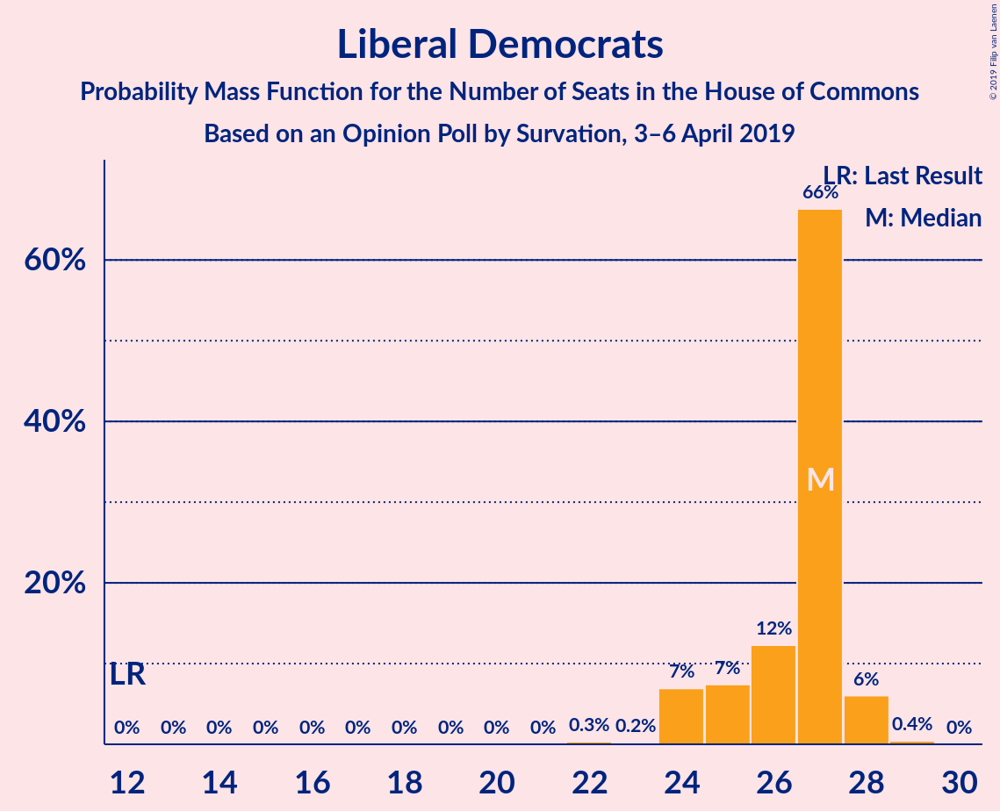
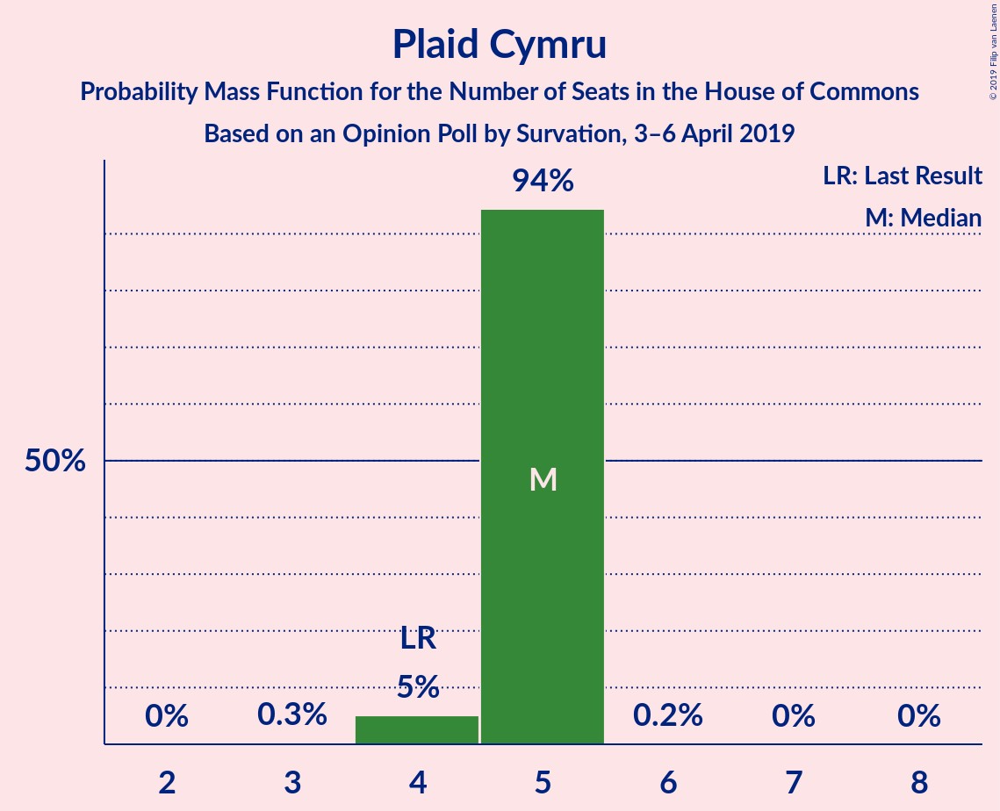
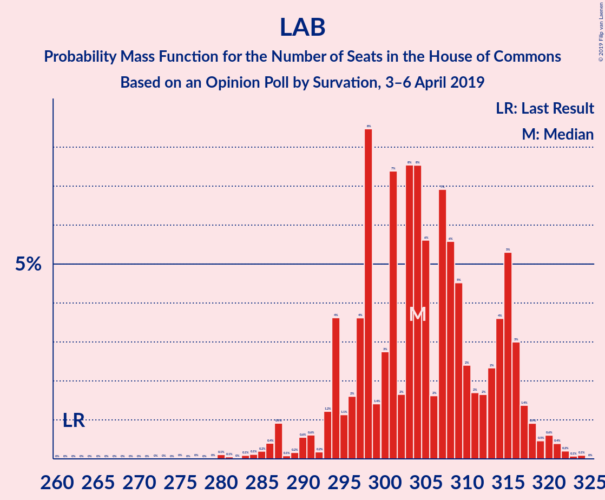

# Opinion Poll by Survation, 3–6 April 2019

<a href="#voting-intentions">Voting Intentions</a> | <a href="#seats">Seats</a> | <a href="#coalitions">Coalitions</a> | <a href="#technical-information">Technical Information</a>

## Voting Intentions

### Confidence Intervals

| Party | Last Result | Poll Result | 80% Confidence Interval | 90% Confidence Interval | 95% Confidence Interval | 99% Confidence Interval |
|:-----:|:-----------:|:-----------:|:-----------------------:|:-----------------------:|:-----------------------:|:-----------------------:|
| Labour Party | 40.0% | 40.6% | 39.8–41.4% |39.6–41.6% |39.4–41.9% |39.0–42.2% |
| Conservative Party | 42.4% | 36.6% | 35.8–37.4% |35.6–37.7% |35.4–37.9% |35.1–38.3% |
| Liberal Democrats | 7.4% | 9.9% | 9.4–10.4% |9.3–10.6% |9.2–10.7% |8.9–10.9% |
| UK Independence Party | 1.8% | 6.9% | 6.5–7.4% |6.4–7.5% |6.3–7.6% |6.1–7.8% |
| Green Party | 1.6% | 2.0% | 1.8–2.2% |1.7–2.3% |1.6–2.4% |1.6–2.5% |
| Plaid Cymru | 0.5% | 1.0% | 0.8–1.2% |0.8–1.2% |0.8–1.3% |0.7–1.4% |

*Note:* The poll result column reflects the actual value used in the calculations. Published results may vary slightly, and in addition be rounded to fewer digits.

## Seats

### Confidence Intervals

| Party | Last Result | Median | 80% Confidence Interval | 90% Confidence Interval | 95% Confidence Interval | 99% Confidence Interval |
|:-----:|:-----------:|:------:|:-----------------------:|:-----------------------:|:-----------------------:|:-----------------------:|
| <a href="#labour-party">Labour Party</a> | 262 | 305 | 305–315 |304–315 |287–315 |286–315 |
| <a href="#conservative-party">Conservative Party</a> | 317 | 261 | 249–261 |249–263 |249–275 |248–275 |
| <a href="#liberal-democrats">Liberal Democrats</a> | 12 | 27 | 27–28 |26–28 |26–28 |26–28 |
| <a href="#uk-independence-party">UK Independence Party</a> | 0 | 1 | 1 |1 |1 |1 |
| <a href="#green-party">Green Party</a> | 1 | 1 | 1 |1 |1 |1 |
| <a href="#plaid-cymru">Plaid Cymru</a> | 4 | 4 | 4–5 |4–5 |4–5 |4–5 |

### Labour Party

*For a full overview of the results for this party, see the [Labour Party](party-labourparty.html) page.*

| Number of Seats | Probability | Accumulated | Special Marks |
|:---------------:|:-----------:|:-----------:|:-------------:|
| 262 | 0% | 100% | Last Result |
| 263 | 0% | 100% |  |
| 264 | 0% | 100% |  |
| 265 | 0% | 100% |  |
| 266 | 0% | 100% |  |
| 267 | 0% | 100% |  |
| 268 | 0% | 100% |  |
| 269 | 0% | 100% |  |
| 270 | 0% | 100% |  |
| 271 | 0% | 100% |  |
| 272 | 0% | 100% |  |
| 273 | 0% | 100% |  |
| 274 | 0% | 100% |  |
| 275 | 0% | 100% |  |
| 276 | 0% | 100% |  |
| 277 | 0% | 100% |  |
| 278 | 0% | 100% |  |
| 279 | 0% | 100% |  |
| 280 | 0% | 100% |  |
| 281 | 0% | 100% |  |
| 282 | 0% | 100% |  |
| 283 | 0% | 100% |  |
| 284 | 0% | 100% |  |
| 285 | 0% | 100% |  |
| 286 | 0.6% | 100% |  |
| 287 | 4% | 99.3% |  |
| 288 | 0% | 96% |  |
| 289 | 0% | 96% |  |
| 290 | 0% | 96% |  |
| 291 | 0% | 96% |  |
| 292 | 0% | 96% |  |
| 293 | 0.1% | 96% |  |
| 294 | 0.3% | 96% |  |
| 295 | 0% | 95% |  |
| 296 | 0% | 95% |  |
| 297 | 0% | 95% |  |
| 298 | 0% | 95% |  |
| 299 | 0% | 95% |  |
| 300 | 0% | 95% |  |
| 301 | 0% | 95% |  |
| 302 | 0% | 95% |  |
| 303 | 0% | 95% |  |
| 304 | 0.5% | 95% |  |
| 305 | 76% | 95% | Median |
| 306 | 0% | 19% |  |
| 307 | 1.3% | 19% |  |
| 308 | 3% | 18% |  |
| 309 | 0% | 15% |  |
| 310 | 0% | 15% |  |
| 311 | 0% | 15% |  |
| 312 | 0.7% | 15% |  |
| 313 | 0% | 15% |  |
| 314 | 0% | 15% |  |
| 315 | 14% | 15% |  |
| 316 | 0% | 0.5% |  |
| 317 | 0% | 0.5% |  |
| 318 | 0% | 0.5% |  |
| 319 | 0.4% | 0.5% |  |
| 320 | 0% | 0% |  |

### Conservative Party

*For a full overview of the results for this party, see the [Conservative Party](party-conservativeparty.html) page.*

| Number of Seats | Probability | Accumulated | Special Marks |
|:---------------:|:-----------:|:-----------:|:-------------:|
| 243 | 0.1% | 100% |  |
| 244 | 0% | 99.9% |  |
| 245 | 0% | 99.9% |  |
| 246 | 0.3% | 99.9% |  |
| 247 | 0% | 99.6% |  |
| 248 | 0.1% | 99.5% |  |
| 249 | 12% | 99.4% |  |
| 250 | 0% | 87% |  |
| 251 | 0% | 87% |  |
| 252 | 2% | 87% |  |
| 253 | 0% | 85% |  |
| 254 | 3% | 85% |  |
| 255 | 1.2% | 83% |  |
| 256 | 0% | 82% |  |
| 257 | 0.7% | 82% |  |
| 258 | 0% | 81% |  |
| 259 | 0% | 81% |  |
| 260 | 0% | 81% |  |
| 261 | 74% | 81% | Median |
| 262 | 0% | 7% |  |
| 263 | 2% | 7% |  |
| 264 | 0% | 5% |  |
| 265 | 0% | 5% |  |
| 266 | 0.3% | 5% |  |
| 267 | 0.1% | 4% |  |
| 268 | 0% | 4% |  |
| 269 | 0% | 4% |  |
| 270 | 0% | 4% |  |
| 271 | 0% | 4% |  |
| 272 | 0% | 4% |  |
| 273 | 0.6% | 4% |  |
| 274 | 0% | 4% |  |
| 275 | 4% | 4% |  |
| 276 | 0% | 0.1% |  |
| 277 | 0% | 0.1% |  |
| 278 | 0% | 0% |  |
| 279 | 0% | 0% |  |
| 280 | 0% | 0% |  |
| 281 | 0% | 0% |  |
| 282 | 0% | 0% |  |
| 283 | 0% | 0% |  |
| 284 | 0% | 0% |  |
| 285 | 0% | 0% |  |
| 286 | 0% | 0% |  |
| 287 | 0% | 0% |  |
| 288 | 0% | 0% |  |
| 289 | 0% | 0% |  |
| 290 | 0% | 0% |  |
| 291 | 0% | 0% |  |
| 292 | 0% | 0% |  |
| 293 | 0% | 0% |  |
| 294 | 0% | 0% |  |
| 295 | 0% | 0% |  |
| 296 | 0% | 0% |  |
| 297 | 0% | 0% |  |
| 298 | 0% | 0% |  |
| 299 | 0% | 0% |  |
| 300 | 0% | 0% |  |
| 301 | 0% | 0% |  |
| 302 | 0% | 0% |  |
| 303 | 0% | 0% |  |
| 304 | 0% | 0% |  |
| 305 | 0% | 0% |  |
| 306 | 0% | 0% |  |
| 307 | 0% | 0% |  |
| 308 | 0% | 0% |  |
| 309 | 0% | 0% |  |
| 310 | 0% | 0% |  |
| 311 | 0% | 0% |  |
| 312 | 0% | 0% |  |
| 313 | 0% | 0% |  |
| 314 | 0% | 0% |  |
| 315 | 0% | 0% |  |
| 316 | 0% | 0% |  |
| 317 | 0% | 0% | Last Result |

### Liberal Democrats

*For a full overview of the results for this party, see the [Liberal Democrats](party-liberaldemocrats.html) page.*

| Number of Seats | Probability | Accumulated | Special Marks |
|:---------------:|:-----------:|:-----------:|:-------------:|
| 12 | 0% | 100% | Last Result |
| 13 | 0% | 100% |  |
| 14 | 0% | 100% |  |
| 15 | 0% | 100% |  |
| 16 | 0% | 100% |  |
| 17 | 0% | 100% |  |
| 18 | 0% | 100% |  |
| 19 | 0% | 100% |  |
| 20 | 0% | 100% |  |
| 21 | 0% | 100% |  |
| 22 | 0% | 100% |  |
| 23 | 0% | 100% |  |
| 24 | 0% | 100% |  |
| 25 | 0% | 99.9% |  |
| 26 | 6% | 99.9% |  |
| 27 | 81% | 94% | Median |
| 28 | 13% | 13% |  |
| 29 | 0% | 0% |  |

### UK Independence Party

*For a full overview of the results for this party, see the [UK Independence Party](party-ukindependenceparty.html) page.*

| Number of Seats | Probability | Accumulated | Special Marks |
|:---------------:|:-----------:|:-----------:|:-------------:|
| 0 | 0% | 100% | Last Result |
| 1 | 100% | 100% | Median |

### Green Party

*For a full overview of the results for this party, see the [Green Party](party-greenparty.html) page.*

| Number of Seats | Probability | Accumulated | Special Marks |
|:---------------:|:-----------:|:-----------:|:-------------:|
| 1 | 100% | 100% | Last Result, Median |

### Plaid Cymru

*For a full overview of the results for this party, see the [Plaid Cymru](party-plaidcymru.html) page.*

| Number of Seats | Probability | Accumulated | Special Marks |
|:---------------:|:-----------:|:-----------:|:-------------:|
| 3 | 0.5% | 100% |  |
| 4 | 74% | 99.5% | Last Result, Median |
| 5 | 25% | 25% |  |
| 6 | 0.3% | 0.3% |  |
| 7 | 0% | 0% |  |

## Coalitions

### Confidence Intervals

| Coalition | Last Result | Median | Majority? | 80% Confidence Interval | 90% Confidence Interval | 95% Confidence Interval | 99% Confidence Interval |
|:---------:|:-----------:|:------:|:---------:|:-----------------------:|:-----------------------:|:-----------------------:|:-----------------------:|
| Labour Party – Liberal Democrats – Plaid Cymru | 278 | 336 | 96% | 336–348 | 335–348 | 318–348 | 318–348 |
| Labour Party – Liberal Democrats | 274 | 332 | 95% | 332–343 | 331–343 | 313–343 | 313–343 |
| Labour Party – Plaid Cymru | 266 | 309 | 0% | 309–320 | 307–320 | 292–320 | 291–320 |
| Labour Party | 262 | 305 | 0% | 305–315 | 304–315 | 287–315 | 286–315 |
| Conservative Party – Liberal Democrats | 329 | 288 | 0% | 277–288 | 277–289 | 277–301 | 276–301 |
| Conservative Party – Plaid Cymru | 321 | 265 | 0% | 254–265 | 254–268 | 254–280 | 253–280 |
| Conservative Party | 317 | 261 | 0% | 249–261 | 249–263 | 249–275 | 248–275 |

### Labour Party – Liberal Democrats – Plaid Cymru

| Number of Seats | Probability | Accumulated | Special Marks |
|:---------------:|:-----------:|:-----------:|:-------------:|
| 278 | 0% | 100% | Last Result |
| 279 | 0% | 100% |  |
| 280 | 0% | 100% |  |
| 281 | 0% | 100% |  |
| 282 | 0% | 100% |  |
| 283 | 0% | 100% |  |
| 284 | 0% | 100% |  |
| 285 | 0% | 100% |  |
| 286 | 0% | 100% |  |
| 287 | 0% | 100% |  |
| 288 | 0% | 100% |  |
| 289 | 0% | 100% |  |
| 290 | 0% | 100% |  |
| 291 | 0% | 100% |  |
| 292 | 0% | 100% |  |
| 293 | 0% | 100% |  |
| 294 | 0% | 100% |  |
| 295 | 0% | 100% |  |
| 296 | 0% | 100% |  |
| 297 | 0% | 100% |  |
| 298 | 0% | 100% |  |
| 299 | 0% | 100% |  |
| 300 | 0% | 100% |  |
| 301 | 0% | 100% |  |
| 302 | 0% | 100% |  |
| 303 | 0% | 100% |  |
| 304 | 0% | 100% |  |
| 305 | 0% | 100% |  |
| 306 | 0% | 100% |  |
| 307 | 0% | 100% |  |
| 308 | 0% | 100% |  |
| 309 | 0% | 100% |  |
| 310 | 0% | 100% |  |
| 311 | 0% | 100% |  |
| 312 | 0% | 100% |  |
| 313 | 0% | 100% |  |
| 314 | 0% | 100% |  |
| 315 | 0% | 100% |  |
| 316 | 0% | 100% |  |
| 317 | 0% | 100% |  |
| 318 | 4% | 100% |  |
| 319 | 0% | 96% |  |
| 320 | 0% | 96% |  |
| 321 | 0% | 96% |  |
| 322 | 0% | 96% |  |
| 323 | 0% | 96% |  |
| 324 | 0% | 96% |  |
| 325 | 0% | 96% |  |
| 326 | 0.1% | 96% | Majority |
| 327 | 0.3% | 96% |  |
| 328 | 0% | 95% |  |
| 329 | 0% | 95% |  |
| 330 | 0% | 95% |  |
| 331 | 0% | 95% |  |
| 332 | 0% | 95% |  |
| 333 | 0% | 95% |  |
| 334 | 0% | 95% |  |
| 335 | 0.5% | 95% |  |
| 336 | 76% | 95% | Median |
| 337 | 0% | 19% |  |
| 338 | 0% | 19% |  |
| 339 | 1.3% | 19% |  |
| 340 | 3% | 18% |  |
| 341 | 0% | 15% |  |
| 342 | 0% | 15% |  |
| 343 | 0.7% | 15% |  |
| 344 | 0% | 15% |  |
| 345 | 0% | 15% |  |
| 346 | 0% | 15% |  |
| 347 | 2% | 15% |  |
| 348 | 12% | 12% |  |
| 349 | 0% | 0.5% |  |
| 350 | 0% | 0.5% |  |
| 351 | 0.4% | 0.5% |  |
| 352 | 0.1% | 0.1% |  |
| 353 | 0% | 0% |  |

### Labour Party – Liberal Democrats

| Number of Seats | Probability | Accumulated | Special Marks |
|:---------------:|:-----------:|:-----------:|:-------------:|
| 274 | 0% | 100% | Last Result |
| 275 | 0% | 100% |  |
| 276 | 0% | 100% |  |
| 277 | 0% | 100% |  |
| 278 | 0% | 100% |  |
| 279 | 0% | 100% |  |
| 280 | 0% | 100% |  |
| 281 | 0% | 100% |  |
| 282 | 0% | 100% |  |
| 283 | 0% | 100% |  |
| 284 | 0% | 100% |  |
| 285 | 0% | 100% |  |
| 286 | 0% | 100% |  |
| 287 | 0% | 100% |  |
| 288 | 0% | 100% |  |
| 289 | 0% | 100% |  |
| 290 | 0% | 100% |  |
| 291 | 0% | 100% |  |
| 292 | 0% | 100% |  |
| 293 | 0% | 100% |  |
| 294 | 0% | 100% |  |
| 295 | 0% | 100% |  |
| 296 | 0% | 100% |  |
| 297 | 0% | 100% |  |
| 298 | 0% | 100% |  |
| 299 | 0% | 100% |  |
| 300 | 0% | 100% |  |
| 301 | 0% | 100% |  |
| 302 | 0% | 100% |  |
| 303 | 0% | 100% |  |
| 304 | 0% | 100% |  |
| 305 | 0% | 100% |  |
| 306 | 0% | 100% |  |
| 307 | 0% | 100% |  |
| 308 | 0% | 100% |  |
| 309 | 0% | 100% |  |
| 310 | 0% | 100% |  |
| 311 | 0% | 100% |  |
| 312 | 0% | 100% |  |
| 313 | 4% | 100% |  |
| 314 | 0% | 96% |  |
| 315 | 0% | 96% |  |
| 316 | 0% | 96% |  |
| 317 | 0% | 96% |  |
| 318 | 0% | 96% |  |
| 319 | 0% | 96% |  |
| 320 | 0% | 96% |  |
| 321 | 0.4% | 96% |  |
| 322 | 0% | 95% |  |
| 323 | 0% | 95% |  |
| 324 | 0% | 95% |  |
| 325 | 0% | 95% |  |
| 326 | 0% | 95% | Majority |
| 327 | 0% | 95% |  |
| 328 | 0% | 95% |  |
| 329 | 0% | 95% |  |
| 330 | 0% | 95% |  |
| 331 | 2% | 95% |  |
| 332 | 74% | 93% | Median |
| 333 | 0% | 19% |  |
| 334 | 1.3% | 19% |  |
| 335 | 3% | 18% |  |
| 336 | 0% | 15% |  |
| 337 | 0% | 15% |  |
| 338 | 0.7% | 15% |  |
| 339 | 0% | 15% |  |
| 340 | 0% | 15% |  |
| 341 | 0% | 15% |  |
| 342 | 2% | 15% |  |
| 343 | 12% | 13% |  |
| 344 | 0% | 0.5% |  |
| 345 | 0% | 0.5% |  |
| 346 | 0.3% | 0.5% |  |
| 347 | 0.1% | 0.1% |  |
| 348 | 0% | 0% |  |

### Labour Party – Plaid Cymru

| Number of Seats | Probability | Accumulated | Special Marks |
|:---------------:|:-----------:|:-----------:|:-------------:|
| 266 | 0% | 100% | Last Result |
| 267 | 0% | 100% |  |
| 268 | 0% | 100% |  |
| 269 | 0% | 100% |  |
| 270 | 0% | 100% |  |
| 271 | 0% | 100% |  |
| 272 | 0% | 100% |  |
| 273 | 0% | 100% |  |
| 274 | 0% | 100% |  |
| 275 | 0% | 100% |  |
| 276 | 0% | 100% |  |
| 277 | 0% | 100% |  |
| 278 | 0% | 100% |  |
| 279 | 0% | 100% |  |
| 280 | 0% | 100% |  |
| 281 | 0% | 100% |  |
| 282 | 0% | 100% |  |
| 283 | 0% | 100% |  |
| 284 | 0% | 100% |  |
| 285 | 0% | 100% |  |
| 286 | 0% | 100% |  |
| 287 | 0% | 100% |  |
| 288 | 0% | 100% |  |
| 289 | 0% | 100% |  |
| 290 | 0% | 100% |  |
| 291 | 0.6% | 100% |  |
| 292 | 4% | 99.3% |  |
| 293 | 0% | 96% |  |
| 294 | 0% | 96% |  |
| 295 | 0% | 96% |  |
| 296 | 0% | 96% |  |
| 297 | 0% | 96% |  |
| 298 | 0.1% | 96% |  |
| 299 | 0% | 96% |  |
| 300 | 0.3% | 96% |  |
| 301 | 0% | 95% |  |
| 302 | 0% | 95% |  |
| 303 | 0% | 95% |  |
| 304 | 0% | 95% |  |
| 305 | 0% | 95% |  |
| 306 | 0% | 95% |  |
| 307 | 0.5% | 95% |  |
| 308 | 0% | 95% |  |
| 309 | 74% | 95% | Median |
| 310 | 2% | 21% |  |
| 311 | 0% | 19% |  |
| 312 | 1.3% | 19% |  |
| 313 | 3% | 18% |  |
| 314 | 0% | 15% |  |
| 315 | 0% | 15% |  |
| 316 | 0% | 15% |  |
| 317 | 0.7% | 15% |  |
| 318 | 0% | 15% |  |
| 319 | 0.4% | 15% |  |
| 320 | 14% | 14% |  |
| 321 | 0% | 0.5% |  |
| 322 | 0% | 0.5% |  |
| 323 | 0% | 0.5% |  |
| 324 | 0.4% | 0.5% |  |
| 325 | 0% | 0% |  |

### Labour Party

| Number of Seats | Probability | Accumulated | Special Marks |
|:---------------:|:-----------:|:-----------:|:-------------:|
| 262 | 0% | 100% | Last Result |
| 263 | 0% | 100% |  |
| 264 | 0% | 100% |  |
| 265 | 0% | 100% |  |
| 266 | 0% | 100% |  |
| 267 | 0% | 100% |  |
| 268 | 0% | 100% |  |
| 269 | 0% | 100% |  |
| 270 | 0% | 100% |  |
| 271 | 0% | 100% |  |
| 272 | 0% | 100% |  |
| 273 | 0% | 100% |  |
| 274 | 0% | 100% |  |
| 275 | 0% | 100% |  |
| 276 | 0% | 100% |  |
| 277 | 0% | 100% |  |
| 278 | 0% | 100% |  |
| 279 | 0% | 100% |  |
| 280 | 0% | 100% |  |
| 281 | 0% | 100% |  |
| 282 | 0% | 100% |  |
| 283 | 0% | 100% |  |
| 284 | 0% | 100% |  |
| 285 | 0% | 100% |  |
| 286 | 0.6% | 100% |  |
| 287 | 4% | 99.3% |  |
| 288 | 0% | 96% |  |
| 289 | 0% | 96% |  |
| 290 | 0% | 96% |  |
| 291 | 0% | 96% |  |
| 292 | 0% | 96% |  |
| 293 | 0.1% | 96% |  |
| 294 | 0.3% | 96% |  |
| 295 | 0% | 95% |  |
| 296 | 0% | 95% |  |
| 297 | 0% | 95% |  |
| 298 | 0% | 95% |  |
| 299 | 0% | 95% |  |
| 300 | 0% | 95% |  |
| 301 | 0% | 95% |  |
| 302 | 0% | 95% |  |
| 303 | 0% | 95% |  |
| 304 | 0.5% | 95% |  |
| 305 | 76% | 95% | Median |
| 306 | 0% | 19% |  |
| 307 | 1.3% | 19% |  |
| 308 | 3% | 18% |  |
| 309 | 0% | 15% |  |
| 310 | 0% | 15% |  |
| 311 | 0% | 15% |  |
| 312 | 0.7% | 15% |  |
| 313 | 0% | 15% |  |
| 314 | 0% | 15% |  |
| 315 | 14% | 15% |  |
| 316 | 0% | 0.5% |  |
| 317 | 0% | 0.5% |  |
| 318 | 0% | 0.5% |  |
| 319 | 0.4% | 0.5% |  |
| 320 | 0% | 0% |  |

### Conservative Party – Liberal Democrats

| Number of Seats | Probability | Accumulated | Special Marks |
|:---------------:|:-----------:|:-----------:|:-------------:|
| 271 | 0.1% | 100% |  |
| 272 | 0% | 99.9% |  |
| 273 | 0.3% | 99.9% |  |
| 274 | 0% | 99.5% |  |
| 275 | 0% | 99.5% |  |
| 276 | 0.1% | 99.5% |  |
| 277 | 12% | 99.4% |  |
| 278 | 0% | 87% |  |
| 279 | 2% | 87% |  |
| 280 | 0% | 85% |  |
| 281 | 3% | 85% |  |
| 282 | 1.2% | 83% |  |
| 283 | 0.7% | 82% |  |
| 284 | 0% | 81% |  |
| 285 | 0% | 81% |  |
| 286 | 0% | 81% |  |
| 287 | 0% | 81% |  |
| 288 | 74% | 81% | Median |
| 289 | 2% | 7% |  |
| 290 | 0% | 5% |  |
| 291 | 0% | 5% |  |
| 292 | 0% | 5% |  |
| 293 | 0.3% | 5% |  |
| 294 | 0% | 4% |  |
| 295 | 0.1% | 4% |  |
| 296 | 0% | 4% |  |
| 297 | 0% | 4% |  |
| 298 | 0% | 4% |  |
| 299 | 0% | 4% |  |
| 300 | 0.6% | 4% |  |
| 301 | 4% | 4% |  |
| 302 | 0% | 0.1% |  |
| 303 | 0% | 0% |  |
| 304 | 0% | 0% |  |
| 305 | 0% | 0% |  |
| 306 | 0% | 0% |  |
| 307 | 0% | 0% |  |
| 308 | 0% | 0% |  |
| 309 | 0% | 0% |  |
| 310 | 0% | 0% |  |
| 311 | 0% | 0% |  |
| 312 | 0% | 0% |  |
| 313 | 0% | 0% |  |
| 314 | 0% | 0% |  |
| 315 | 0% | 0% |  |
| 316 | 0% | 0% |  |
| 317 | 0% | 0% |  |
| 318 | 0% | 0% |  |
| 319 | 0% | 0% |  |
| 320 | 0% | 0% |  |
| 321 | 0% | 0% |  |
| 322 | 0% | 0% |  |
| 323 | 0% | 0% |  |
| 324 | 0% | 0% |  |
| 325 | 0% | 0% |  |
| 326 | 0% | 0% | Majority |
| 327 | 0% | 0% |  |
| 328 | 0% | 0% |  |
| 329 | 0% | 0% | Last Result |

### Conservative Party – Plaid Cymru

| Number of Seats | Probability | Accumulated | Special Marks |
|:---------------:|:-----------:|:-----------:|:-------------:|
| 248 | 0.1% | 100% |  |
| 249 | 0% | 99.9% |  |
| 250 | 0% | 99.9% |  |
| 251 | 0.4% | 99.9% |  |
| 252 | 0% | 99.5% |  |
| 253 | 0.5% | 99.5% |  |
| 254 | 12% | 99.1% |  |
| 255 | 0% | 87% |  |
| 256 | 0% | 87% |  |
| 257 | 2% | 87% |  |
| 258 | 0% | 85% |  |
| 259 | 3% | 85% |  |
| 260 | 1.2% | 83% |  |
| 261 | 0% | 82% |  |
| 262 | 0.7% | 82% |  |
| 263 | 0% | 81% |  |
| 264 | 0.5% | 81% |  |
| 265 | 74% | 80% | Median |
| 266 | 0% | 7% |  |
| 267 | 0% | 7% |  |
| 268 | 2% | 7% |  |
| 269 | 0% | 5% |  |
| 270 | 0% | 5% |  |
| 271 | 0% | 5% |  |
| 272 | 0.4% | 5% |  |
| 273 | 0% | 4% |  |
| 274 | 0% | 4% |  |
| 275 | 0% | 4% |  |
| 276 | 0% | 4% |  |
| 277 | 0% | 4% |  |
| 278 | 0.6% | 4% |  |
| 279 | 0% | 4% |  |
| 280 | 4% | 4% |  |
| 281 | 0% | 0.1% |  |
| 282 | 0% | 0.1% |  |
| 283 | 0% | 0% |  |
| 284 | 0% | 0% |  |
| 285 | 0% | 0% |  |
| 286 | 0% | 0% |  |
| 287 | 0% | 0% |  |
| 288 | 0% | 0% |  |
| 289 | 0% | 0% |  |
| 290 | 0% | 0% |  |
| 291 | 0% | 0% |  |
| 292 | 0% | 0% |  |
| 293 | 0% | 0% |  |
| 294 | 0% | 0% |  |
| 295 | 0% | 0% |  |
| 296 | 0% | 0% |  |
| 297 | 0% | 0% |  |
| 298 | 0% | 0% |  |
| 299 | 0% | 0% |  |
| 300 | 0% | 0% |  |
| 301 | 0% | 0% |  |
| 302 | 0% | 0% |  |
| 303 | 0% | 0% |  |
| 304 | 0% | 0% |  |
| 305 | 0% | 0% |  |
| 306 | 0% | 0% |  |
| 307 | 0% | 0% |  |
| 308 | 0% | 0% |  |
| 309 | 0% | 0% |  |
| 310 | 0% | 0% |  |
| 311 | 0% | 0% |  |
| 312 | 0% | 0% |  |
| 313 | 0% | 0% |  |
| 314 | 0% | 0% |  |
| 315 | 0% | 0% |  |
| 316 | 0% | 0% |  |
| 317 | 0% | 0% |  |
| 318 | 0% | 0% |  |
| 319 | 0% | 0% |  |
| 320 | 0% | 0% |  |
| 321 | 0% | 0% | Last Result |

### Conservative Party

| Number of Seats | Probability | Accumulated | Special Marks |
|:---------------:|:-----------:|:-----------:|:-------------:|
| 243 | 0.1% | 100% |  |
| 244 | 0% | 99.9% |  |
| 245 | 0% | 99.9% |  |
| 246 | 0.3% | 99.9% |  |
| 247 | 0% | 99.6% |  |
| 248 | 0.1% | 99.5% |  |
| 249 | 12% | 99.4% |  |
| 250 | 0% | 87% |  |
| 251 | 0% | 87% |  |
| 252 | 2% | 87% |  |
| 253 | 0% | 85% |  |
| 254 | 3% | 85% |  |
| 255 | 1.2% | 83% |  |
| 256 | 0% | 82% |  |
| 257 | 0.7% | 82% |  |
| 258 | 0% | 81% |  |
| 259 | 0% | 81% |  |
| 260 | 0% | 81% |  |
| 261 | 74% | 81% | Median |
| 262 | 0% | 7% |  |
| 263 | 2% | 7% |  |
| 264 | 0% | 5% |  |
| 265 | 0% | 5% |  |
| 266 | 0.3% | 5% |  |
| 267 | 0.1% | 4% |  |
| 268 | 0% | 4% |  |
| 269 | 0% | 4% |  |
| 270 | 0% | 4% |  |
| 271 | 0% | 4% |  |
| 272 | 0% | 4% |  |
| 273 | 0.6% | 4% |  |
| 274 | 0% | 4% |  |
| 275 | 4% | 4% |  |
| 276 | 0% | 0.1% |  |
| 277 | 0% | 0.1% |  |
| 278 | 0% | 0% |  |
| 279 | 0% | 0% |  |
| 280 | 0% | 0% |  |
| 281 | 0% | 0% |  |
| 282 | 0% | 0% |  |
| 283 | 0% | 0% |  |
| 284 | 0% | 0% |  |
| 285 | 0% | 0% |  |
| 286 | 0% | 0% |  |
| 287 | 0% | 0% |  |
| 288 | 0% | 0% |  |
| 289 | 0% | 0% |  |
| 290 | 0% | 0% |  |
| 291 | 0% | 0% |  |
| 292 | 0% | 0% |  |
| 293 | 0% | 0% |  |
| 294 | 0% | 0% |  |
| 295 | 0% | 0% |  |
| 296 | 0% | 0% |  |
| 297 | 0% | 0% |  |
| 298 | 0% | 0% |  |
| 299 | 0% | 0% |  |
| 300 | 0% | 0% |  |
| 301 | 0% | 0% |  |
| 302 | 0% | 0% |  |
| 303 | 0% | 0% |  |
| 304 | 0% | 0% |  |
| 305 | 0% | 0% |  |
| 306 | 0% | 0% |  |
| 307 | 0% | 0% |  |
| 308 | 0% | 0% |  |
| 309 | 0% | 0% |  |
| 310 | 0% | 0% |  |
| 311 | 0% | 0% |  |
| 312 | 0% | 0% |  |
| 313 | 0% | 0% |  |
| 314 | 0% | 0% |  |
| 315 | 0% | 0% |  |
| 316 | 0% | 0% |  |
| 317 | 0% | 0% | Last Result |

## Technical Information

### Opinion Poll

+ **Polling firm:** Survation
+ **Commissioner(s):** —
+ **Fieldwork period:** 3–6 April 2019

### Calculations

+ **Sample size:** 6062
+ **Simulations done:** 1,024
+ **Error estimate:** 1.31%

