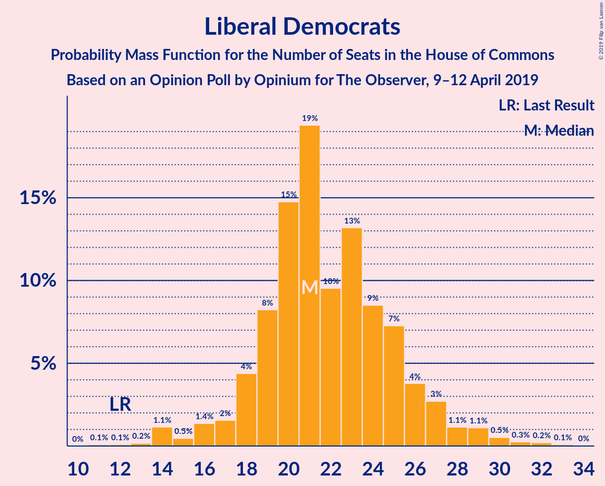
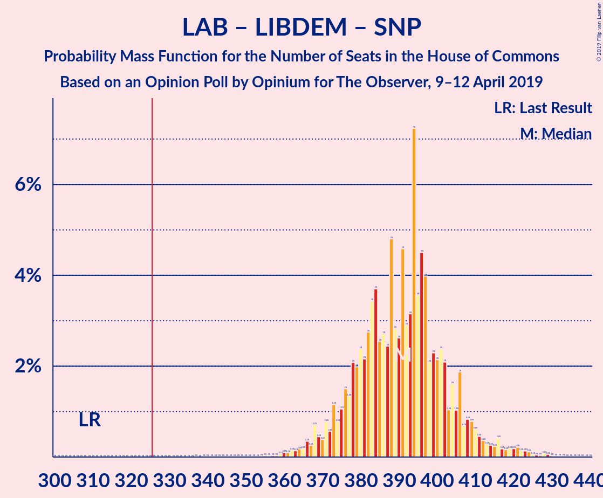
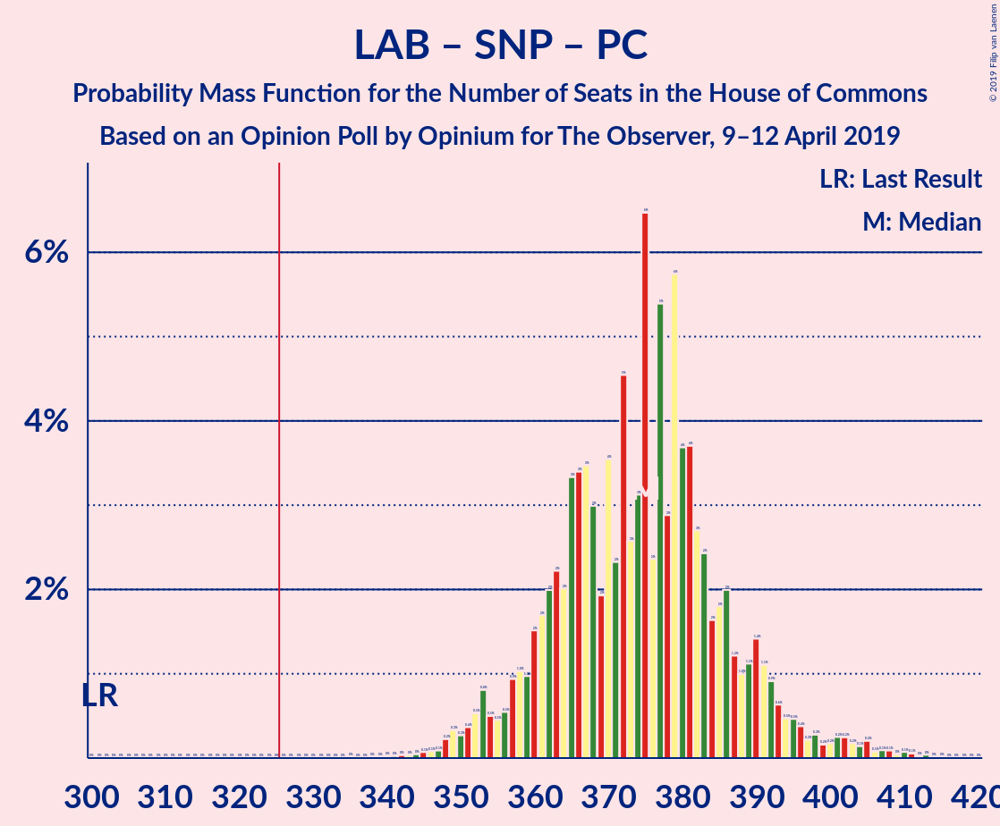
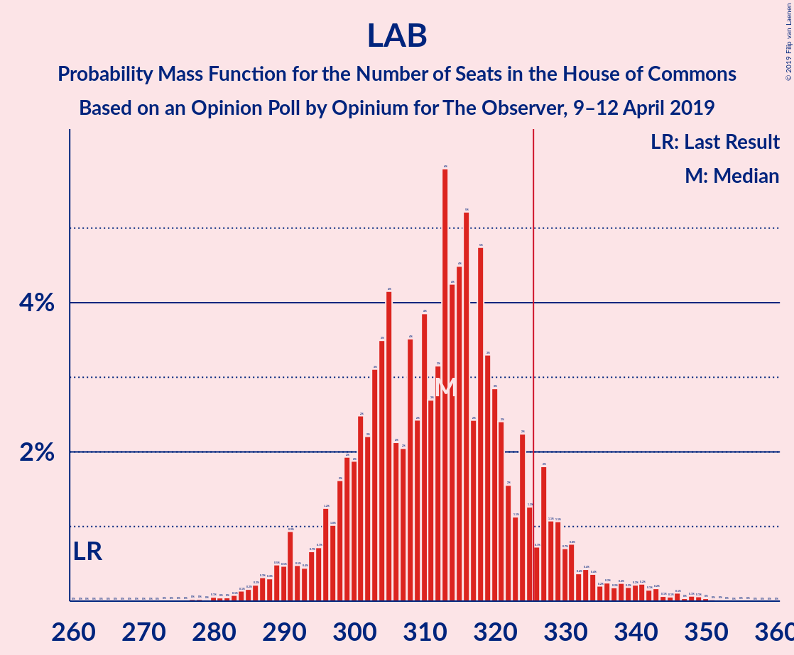

# Opinion Poll by Opinium for The Observer, 9–12 April 2019

<a href="#voting-intentions">Voting Intentions</a> | <a href="#seats">Seats</a> | <a href="#coalitions">Coalitions</a> | <a href="#technical-information">Technical Information</a>

## Voting Intentions

### Confidence Intervals

| Party | Last Result | Poll Result | 80% Confidence Interval | 90% Confidence Interval | 95% Confidence Interval | 99% Confidence Interval |
|:-----:|:-----------:|:-----------:|:-----------------------:|:-----------------------:|:-----------------------:|:-----------------------:|
| Labour Party | 40.0% | 36.0% | 34.7–37.4% |34.3–37.8% |33.9–38.1% |33.3–38.8% |
| Conservative Party | 42.4% | 29.0% | 27.7–30.3% |27.4–30.7% |27.1–31.0% |26.4–31.7% |
| UK Independence Party | 1.8% | 11.0% | 10.2–12.0% |9.9–12.2% |9.7–12.5% |9.3–12.9% |
| Liberal Democrats | 7.4% | 8.0% | 7.3–8.9% |7.1–9.1% |6.9–9.3% |6.6–9.7% |
| Scottish National Party | 3.0% | 5.0% | 4.4–5.7% |4.2–5.9% |4.1–6.0% |3.9–6.4% |
| Green Party | 1.6% | 4.0% | 3.5–4.6% |3.3–4.8% |3.2–4.9% |3.0–5.3% |
| Plaid Cymru | 0.5% | 1.0% | 0.8–1.4% |0.7–1.4% |0.6–1.5% |0.5–1.7% |

*Note:* The poll result column reflects the actual value used in the calculations. Published results may vary slightly, and in addition be rounded to fewer digits.

## Seats

### Confidence Intervals

| Party | Last Result | Median | 80% Confidence Interval | 90% Confidence Interval | 95% Confidence Interval | 99% Confidence Interval |
|:-----:|:-----------:|:------:|:-----------------------:|:-----------------------:|:-----------------------:|:-----------------------:|
| <a href="#labour-party">Labour Party</a> | 262 | 318 | 318–321 |318–339 |314–339 |311–348 |
| <a href="#conservative-party">Conservative Party</a> | 317 | 208 | 208 |199–210 |199–218 |185–220 |
| <a href="#uk-independence-party">UK Independence Party</a> | 0 | 12 | 11–12 |7–13 |7–15 |5–18 |
| <a href="#liberal-democrats">Liberal Democrats</a> | 12 | 29 | 23–29 |21–29 |21–29 |16–29 |
| <a href="#scottish-national-party">Scottish National Party</a> | 35 | 57 | 57 |57–58 |54–58 |54–58 |
| <a href="#green-party">Green Party</a> | 1 | 2 | 2 |2 |2 |1–3 |
| <a href="#plaid-cymru">Plaid Cymru</a> | 4 | 5 | 5 |5 |5 |2–5 |

### Labour Party

*For a full overview of the results for this party, see the [Labour Party](party-labourparty.html) page.*

| Number of Seats | Probability | Accumulated | Special Marks |
|:---------------:|:-----------:|:-----------:|:-------------:|
| 262 | 0% | 100% | Last Result |
| 263 | 0% | 100% |  |
| 264 | 0% | 100% |  |
| 265 | 0% | 100% |  |
| 266 | 0% | 100% |  |
| 267 | 0% | 100% |  |
| 268 | 0% | 100% |  |
| 269 | 0% | 100% |  |
| 270 | 0% | 100% |  |
| 271 | 0% | 100% |  |
| 272 | 0% | 100% |  |
| 273 | 0% | 100% |  |
| 274 | 0% | 100% |  |
| 275 | 0% | 100% |  |
| 276 | 0% | 100% |  |
| 277 | 0% | 100% |  |
| 278 | 0% | 100% |  |
| 279 | 0% | 100% |  |
| 280 | 0.1% | 100% |  |
| 281 | 0% | 99.9% |  |
| 282 | 0% | 99.9% |  |
| 283 | 0% | 99.9% |  |
| 284 | 0% | 99.9% |  |
| 285 | 0% | 99.9% |  |
| 286 | 0% | 99.9% |  |
| 287 | 0% | 99.9% |  |
| 288 | 0% | 99.9% |  |
| 289 | 0% | 99.9% |  |
| 290 | 0% | 99.9% |  |
| 291 | 0% | 99.9% |  |
| 292 | 0% | 99.9% |  |
| 293 | 0% | 99.9% |  |
| 294 | 0% | 99.9% |  |
| 295 | 0% | 99.9% |  |
| 296 | 0% | 99.9% |  |
| 297 | 0% | 99.9% |  |
| 298 | 0% | 99.9% |  |
| 299 | 0% | 99.9% |  |
| 300 | 0% | 99.9% |  |
| 301 | 0% | 99.9% |  |
| 302 | 0% | 99.9% |  |
| 303 | 0% | 99.9% |  |
| 304 | 0% | 99.9% |  |
| 305 | 0% | 99.9% |  |
| 306 | 0% | 99.9% |  |
| 307 | 0.2% | 99.9% |  |
| 308 | 0% | 99.7% |  |
| 309 | 0% | 99.7% |  |
| 310 | 0% | 99.7% |  |
| 311 | 1.3% | 99.7% |  |
| 312 | 0.6% | 98% |  |
| 313 | 0.3% | 98% |  |
| 314 | 1.4% | 98% |  |
| 315 | 0% | 96% |  |
| 316 | 0% | 96% |  |
| 317 | 0.1% | 96% |  |
| 318 | 84% | 96% | Median |
| 319 | 0% | 12% |  |
| 320 | 0.4% | 12% |  |
| 321 | 3% | 12% |  |
| 322 | 0% | 9% |  |
| 323 | 0% | 9% |  |
| 324 | 0% | 9% |  |
| 325 | 0% | 9% |  |
| 326 | 0% | 9% | Majority |
| 327 | 0% | 9% |  |
| 328 | 0% | 9% |  |
| 329 | 0.1% | 9% |  |
| 330 | 0% | 9% |  |
| 331 | 0% | 9% |  |
| 332 | 0% | 9% |  |
| 333 | 0% | 9% |  |
| 334 | 0% | 9% |  |
| 335 | 0% | 9% |  |
| 336 | 0% | 9% |  |
| 337 | 0% | 9% |  |
| 338 | 0% | 9% |  |
| 339 | 7% | 9% |  |
| 340 | 1.2% | 2% |  |
| 341 | 0.2% | 1.3% |  |
| 342 | 0% | 1.1% |  |
| 343 | 0% | 1.1% |  |
| 344 | 0% | 1.1% |  |
| 345 | 0% | 1.1% |  |
| 346 | 0.5% | 1.1% |  |
| 347 | 0% | 0.6% |  |
| 348 | 0.5% | 0.5% |  |
| 349 | 0% | 0% |  |

### Conservative Party

*For a full overview of the results for this party, see the [Conservative Party](party-conservativeparty.html) page.*

| Number of Seats | Probability | Accumulated | Special Marks |
|:---------------:|:-----------:|:-----------:|:-------------:|
| 185 | 0.5% | 100% |  |
| 186 | 0.5% | 99.5% |  |
| 187 | 0% | 99.0% |  |
| 188 | 0% | 98.9% |  |
| 189 | 0% | 98.9% |  |
| 190 | 0% | 98.9% |  |
| 191 | 0% | 98.9% |  |
| 192 | 0% | 98.9% |  |
| 193 | 0% | 98.9% |  |
| 194 | 0% | 98.9% |  |
| 195 | 0% | 98.9% |  |
| 196 | 0% | 98.9% |  |
| 197 | 0% | 98.9% |  |
| 198 | 1.2% | 98.9% |  |
| 199 | 6% | 98% |  |
| 200 | 0.7% | 92% |  |
| 201 | 0% | 91% |  |
| 202 | 0% | 91% |  |
| 203 | 0.2% | 91% |  |
| 204 | 0% | 91% |  |
| 205 | 0% | 91% |  |
| 206 | 0.1% | 91% |  |
| 207 | 0% | 91% |  |
| 208 | 84% | 91% | Median |
| 209 | 0% | 7% |  |
| 210 | 3% | 7% |  |
| 211 | 0% | 4% |  |
| 212 | 0% | 4% |  |
| 213 | 0% | 4% |  |
| 214 | 0% | 4% |  |
| 215 | 0% | 4% |  |
| 216 | 0.2% | 4% |  |
| 217 | 0% | 4% |  |
| 218 | 1.3% | 4% |  |
| 219 | 0.5% | 2% |  |
| 220 | 2% | 2% |  |
| 221 | 0.1% | 0.2% |  |
| 222 | 0% | 0.1% |  |
| 223 | 0% | 0.1% |  |
| 224 | 0% | 0.1% |  |
| 225 | 0% | 0.1% |  |
| 226 | 0% | 0.1% |  |
| 227 | 0% | 0.1% |  |
| 228 | 0% | 0.1% |  |
| 229 | 0% | 0.1% |  |
| 230 | 0% | 0.1% |  |
| 231 | 0% | 0.1% |  |
| 232 | 0% | 0.1% |  |
| 233 | 0% | 0.1% |  |
| 234 | 0% | 0.1% |  |
| 235 | 0% | 0.1% |  |
| 236 | 0% | 0.1% |  |
| 237 | 0% | 0.1% |  |
| 238 | 0% | 0.1% |  |
| 239 | 0% | 0.1% |  |
| 240 | 0% | 0.1% |  |
| 241 | 0% | 0.1% |  |
| 242 | 0% | 0.1% |  |
| 243 | 0% | 0.1% |  |
| 244 | 0% | 0.1% |  |
| 245 | 0% | 0.1% |  |
| 246 | 0% | 0.1% |  |
| 247 | 0.1% | 0.1% |  |
| 248 | 0% | 0% |  |
| 249 | 0% | 0% |  |
| 250 | 0% | 0% |  |
| 251 | 0% | 0% |  |
| 252 | 0% | 0% |  |
| 253 | 0% | 0% |  |
| 254 | 0% | 0% |  |
| 255 | 0% | 0% |  |
| 256 | 0% | 0% |  |
| 257 | 0% | 0% |  |
| 258 | 0% | 0% |  |
| 259 | 0% | 0% |  |
| 260 | 0% | 0% |  |
| 261 | 0% | 0% |  |
| 262 | 0% | 0% |  |
| 263 | 0% | 0% |  |
| 264 | 0% | 0% |  |
| 265 | 0% | 0% |  |
| 266 | 0% | 0% |  |
| 267 | 0% | 0% |  |
| 268 | 0% | 0% |  |
| 269 | 0% | 0% |  |
| 270 | 0% | 0% |  |
| 271 | 0% | 0% |  |
| 272 | 0% | 0% |  |
| 273 | 0% | 0% |  |
| 274 | 0% | 0% |  |
| 275 | 0% | 0% |  |
| 276 | 0% | 0% |  |
| 277 | 0% | 0% |  |
| 278 | 0% | 0% |  |
| 279 | 0% | 0% |  |
| 280 | 0% | 0% |  |
| 281 | 0% | 0% |  |
| 282 | 0% | 0% |  |
| 283 | 0% | 0% |  |
| 284 | 0% | 0% |  |
| 285 | 0% | 0% |  |
| 286 | 0% | 0% |  |
| 287 | 0% | 0% |  |
| 288 | 0% | 0% |  |
| 289 | 0% | 0% |  |
| 290 | 0% | 0% |  |
| 291 | 0% | 0% |  |
| 292 | 0% | 0% |  |
| 293 | 0% | 0% |  |
| 294 | 0% | 0% |  |
| 295 | 0% | 0% |  |
| 296 | 0% | 0% |  |
| 297 | 0% | 0% |  |
| 298 | 0% | 0% |  |
| 299 | 0% | 0% |  |
| 300 | 0% | 0% |  |
| 301 | 0% | 0% |  |
| 302 | 0% | 0% |  |
| 303 | 0% | 0% |  |
| 304 | 0% | 0% |  |
| 305 | 0% | 0% |  |
| 306 | 0% | 0% |  |
| 307 | 0% | 0% |  |
| 308 | 0% | 0% |  |
| 309 | 0% | 0% |  |
| 310 | 0% | 0% |  |
| 311 | 0% | 0% |  |
| 312 | 0% | 0% |  |
| 313 | 0% | 0% |  |
| 314 | 0% | 0% |  |
| 315 | 0% | 0% |  |
| 316 | 0% | 0% |  |
| 317 | 0% | 0% | Last Result |

### UK Independence Party

*For a full overview of the results for this party, see the [UK Independence Party](party-ukindependenceparty.html) page.*

| Number of Seats | Probability | Accumulated | Special Marks |
|:---------------:|:-----------:|:-----------:|:-------------:|
| 0 | 0% | 100% | Last Result |
| 1 | 0% | 100% |  |
| 2 | 0% | 100% |  |
| 3 | 0% | 100% |  |
| 4 | 0% | 100% |  |
| 5 | 0.5% | 100% |  |
| 6 | 0% | 99.4% |  |
| 7 | 8% | 99.4% |  |
| 8 | 0.2% | 92% |  |
| 9 | 0% | 92% |  |
| 10 | 0% | 91% |  |
| 11 | 3% | 91% |  |
| 12 | 84% | 89% | Median |
| 13 | 1.3% | 5% |  |
| 14 | 0% | 4% |  |
| 15 | 3% | 4% |  |
| 16 | 0% | 1.2% |  |
| 17 | 0.3% | 1.2% |  |
| 18 | 0.8% | 0.9% |  |
| 19 | 0% | 0% |  |

### Liberal Democrats

*For a full overview of the results for this party, see the [Liberal Democrats](party-liberaldemocrats.html) page.*

| Number of Seats | Probability | Accumulated | Special Marks |
|:---------------:|:-----------:|:-----------:|:-------------:|
| 12 | 0% | 100% | Last Result |
| 13 | 0% | 100% |  |
| 14 | 0% | 100% |  |
| 15 | 0.2% | 100% |  |
| 16 | 0.8% | 99.8% |  |
| 17 | 0.3% | 99.0% |  |
| 18 | 0.5% | 98.8% |  |
| 19 | 0% | 98% |  |
| 20 | 0% | 98% |  |
| 21 | 7% | 98% |  |
| 22 | 0.2% | 91% |  |
| 23 | 1.3% | 91% |  |
| 24 | 3% | 90% |  |
| 25 | 1.5% | 87% |  |
| 26 | 0% | 85% |  |
| 27 | 0.6% | 85% |  |
| 28 | 0.4% | 85% |  |
| 29 | 84% | 84% | Median |
| 30 | 0% | 0.1% |  |
| 31 | 0% | 0.1% |  |
| 32 | 0% | 0.1% |  |
| 33 | 0% | 0.1% |  |
| 34 | 0% | 0.1% |  |
| 35 | 0% | 0.1% |  |
| 36 | 0% | 0.1% |  |
| 37 | 0.1% | 0.1% |  |
| 38 | 0% | 0% |  |

### Scottish National Party

*For a full overview of the results for this party, see the [Scottish National Party](party-scottishnationalparty.html) page.*

| Number of Seats | Probability | Accumulated | Special Marks |
|:---------------:|:-----------:|:-----------:|:-------------:|
| 35 | 0% | 100% | Last Result |
| 36 | 0% | 100% |  |
| 37 | 0% | 100% |  |
| 38 | 0% | 100% |  |
| 39 | 0% | 100% |  |
| 40 | 0% | 100% |  |
| 41 | 0% | 100% |  |
| 42 | 0% | 100% |  |
| 43 | 0% | 100% |  |
| 44 | 0% | 100% |  |
| 45 | 0% | 100% |  |
| 46 | 0% | 100% |  |
| 47 | 0% | 100% |  |
| 48 | 0% | 100% |  |
| 49 | 0% | 100% |  |
| 50 | 0% | 100% |  |
| 51 | 0% | 100% |  |
| 52 | 0% | 100% |  |
| 53 | 0% | 100% |  |
| 54 | 3% | 100% |  |
| 55 | 0% | 97% |  |
| 56 | 0% | 97% |  |
| 57 | 87% | 97% | Median |
| 58 | 10% | 10% |  |
| 59 | 0.2% | 0.2% |  |
| 60 | 0% | 0% |  |

### Green Party

*For a full overview of the results for this party, see the [Green Party](party-greenparty.html) page.*

| Number of Seats | Probability | Accumulated | Special Marks |
|:---------------:|:-----------:|:-----------:|:-------------:|
| 1 | 0.6% | 100% | Last Result |
| 2 | 97% | 99.4% | Median |
| 3 | 2% | 2% |  |
| 4 | 0% | 0% |  |

### Plaid Cymru

*For a full overview of the results for this party, see the [Plaid Cymru](party-plaidcymru.html) page.*

| Number of Seats | Probability | Accumulated | Special Marks |
|:---------------:|:-----------:|:-----------:|:-------------:|
| 2 | 2% | 100% |  |
| 3 | 0% | 98% |  |
| 4 | 0% | 98% | Last Result |
| 5 | 98% | 98% | Median |
| 6 | 0% | 0.2% |  |
| 7 | 0% | 0.2% |  |
| 8 | 0% | 0.2% |  |
| 9 | 0.1% | 0.1% |  |
| 10 | 0% | 0% |  |

## Coalitions

### Confidence Intervals

| Coalition | Last Result | Median | Majority? | 80% Confidence Interval | 90% Confidence Interval | 95% Confidence Interval | 99% Confidence Interval |
|:---------:|:-----------:|:------:|:---------:|:-----------------------:|:-----------------------:|:-----------------------:|:-----------------------:|
| Labour Party – Liberal Democrats – Scottish National Party – Plaid Cymru | 313 | 409 | 100% | 409 | 404–423 | 398–423 | 393–437 |
| Labour Party – Liberal Democrats – Scottish National Party | 309 | 404 | 100% | 404 | 399–418 | 396–418 | 388–432 |
| Labour Party – Scottish National Party – Plaid Cymru | 301 | 380 | 100% | 380 | 380–402 | 374–402 | 373–410 |
| Labour Party – Scottish National Party | 297 | 375 | 100% | 375 | 375–397 | 371–397 | 369–405 |
| Labour Party – Liberal Democrats – Plaid Cymru | 278 | 352 | 99.9% | 352 | 350–365 | 341–365 | 335–380 |
| Labour Party – Liberal Democrats | 274 | 347 | 99.9% | 347 | 345–360 | 339–360 | 330–375 |
| Labour Party – Plaid Cymru | 266 | 323 | 12% | 323–326 | 323–344 | 316–344 | 316–353 |
| Labour Party | 262 | 318 | 9% | 318–321 | 318–339 | 314–339 | 311–348 |
| Conservative Party – Scottish National Party – Plaid Cymru | 356 | 270 | 0% | 269–270 | 262–270 | 262–279 | 247–282 |
| Conservative Party – Scottish National Party | 352 | 265 | 0% | 264–265 | 257–265 | 257–276 | 242–277 |
| Conservative Party – Liberal Democrats | 329 | 237 | 0% | 234–237 | 220–237 | 219–241 | 213–245 |
| Conservative Party – Plaid Cymru | 321 | 213 | 0% | 213 | 204–215 | 204–222 | 190–224 |
| Conservative Party | 317 | 208 | 0% | 208 | 199–210 | 199–218 | 185–220 |

### Labour Party – Liberal Democrats – Scottish National Party – Plaid Cymru

| Number of Seats | Probability | Accumulated | Special Marks |
|:---------------:|:-----------:|:-----------:|:-------------:|
| 313 | 0% | 100% | Last Result |
| 314 | 0% | 100% |  |
| 315 | 0% | 100% |  |
| 316 | 0% | 100% |  |
| 317 | 0% | 100% |  |
| 318 | 0% | 100% |  |
| 319 | 0% | 100% |  |
| 320 | 0% | 100% |  |
| 321 | 0% | 100% |  |
| 322 | 0% | 100% |  |
| 323 | 0% | 100% |  |
| 324 | 0% | 100% |  |
| 325 | 0% | 100% |  |
| 326 | 0% | 100% | Majority |
| 327 | 0% | 100% |  |
| 328 | 0% | 100% |  |
| 329 | 0% | 100% |  |
| 330 | 0% | 100% |  |
| 331 | 0% | 100% |  |
| 332 | 0% | 100% |  |
| 333 | 0% | 100% |  |
| 334 | 0% | 100% |  |
| 335 | 0% | 100% |  |
| 336 | 0% | 100% |  |
| 337 | 0% | 100% |  |
| 338 | 0% | 100% |  |
| 339 | 0% | 100% |  |
| 340 | 0% | 100% |  |
| 341 | 0% | 100% |  |
| 342 | 0% | 100% |  |
| 343 | 0% | 100% |  |
| 344 | 0% | 100% |  |
| 345 | 0% | 100% |  |
| 346 | 0% | 100% |  |
| 347 | 0% | 100% |  |
| 348 | 0% | 100% |  |
| 349 | 0% | 100% |  |
| 350 | 0% | 100% |  |
| 351 | 0% | 100% |  |
| 352 | 0% | 100% |  |
| 353 | 0% | 100% |  |
| 354 | 0% | 100% |  |
| 355 | 0% | 100% |  |
| 356 | 0% | 100% |  |
| 357 | 0% | 100% |  |
| 358 | 0% | 100% |  |
| 359 | 0% | 100% |  |
| 360 | 0% | 100% |  |
| 361 | 0% | 100% |  |
| 362 | 0% | 100% |  |
| 363 | 0% | 100% |  |
| 364 | 0% | 100% |  |
| 365 | 0% | 100% |  |
| 366 | 0.1% | 100% |  |
| 367 | 0% | 99.9% |  |
| 368 | 0% | 99.9% |  |
| 369 | 0% | 99.9% |  |
| 370 | 0% | 99.9% |  |
| 371 | 0% | 99.9% |  |
| 372 | 0% | 99.9% |  |
| 373 | 0% | 99.9% |  |
| 374 | 0% | 99.9% |  |
| 375 | 0% | 99.9% |  |
| 376 | 0% | 99.9% |  |
| 377 | 0% | 99.9% |  |
| 378 | 0% | 99.9% |  |
| 379 | 0% | 99.9% |  |
| 380 | 0% | 99.9% |  |
| 381 | 0% | 99.9% |  |
| 382 | 0% | 99.9% |  |
| 383 | 0% | 99.9% |  |
| 384 | 0% | 99.9% |  |
| 385 | 0% | 99.9% |  |
| 386 | 0% | 99.9% |  |
| 387 | 0% | 99.9% |  |
| 388 | 0% | 99.9% |  |
| 389 | 0% | 99.9% |  |
| 390 | 0% | 99.9% |  |
| 391 | 0% | 99.9% |  |
| 392 | 0.3% | 99.9% |  |
| 393 | 0.5% | 99.6% |  |
| 394 | 0% | 99.1% |  |
| 395 | 0.2% | 99.1% |  |
| 396 | 0.1% | 98.9% |  |
| 397 | 1.3% | 98.9% |  |
| 398 | 1.4% | 98% |  |
| 399 | 0% | 96% |  |
| 400 | 0% | 96% |  |
| 401 | 0% | 96% |  |
| 402 | 0% | 96% |  |
| 403 | 0% | 96% |  |
| 404 | 3% | 96% |  |
| 405 | 0.1% | 94% |  |
| 406 | 0% | 93% |  |
| 407 | 0% | 93% |  |
| 408 | 0% | 93% |  |
| 409 | 84% | 93% | Median |
| 410 | 0.4% | 10% |  |
| 411 | 0% | 9% |  |
| 412 | 0% | 9% |  |
| 413 | 0% | 9% |  |
| 414 | 0% | 9% |  |
| 415 | 0% | 9% |  |
| 416 | 0% | 9% |  |
| 417 | 0% | 9% |  |
| 418 | 0.9% | 9% |  |
| 419 | 0% | 8% |  |
| 420 | 0% | 8% |  |
| 421 | 0% | 8% |  |
| 422 | 0% | 8% |  |
| 423 | 6% | 8% |  |
| 424 | 1.2% | 2% |  |
| 425 | 0% | 1.1% |  |
| 426 | 0% | 1.1% |  |
| 427 | 0% | 1.1% |  |
| 428 | 0% | 1.1% |  |
| 429 | 0% | 1.1% |  |
| 430 | 0% | 1.1% |  |
| 431 | 0% | 1.1% |  |
| 432 | 0% | 1.0% |  |
| 433 | 0% | 1.0% |  |
| 434 | 0% | 1.0% |  |
| 435 | 0% | 1.0% |  |
| 436 | 0% | 1.0% |  |
| 437 | 1.0% | 1.0% |  |
| 438 | 0% | 0% |  |

### Labour Party – Liberal Democrats – Scottish National Party

| Number of Seats | Probability | Accumulated | Special Marks |
|:---------------:|:-----------:|:-----------:|:-------------:|
| 309 | 0% | 100% | Last Result |
| 310 | 0% | 100% |  |
| 311 | 0% | 100% |  |
| 312 | 0% | 100% |  |
| 313 | 0% | 100% |  |
| 314 | 0% | 100% |  |
| 315 | 0% | 100% |  |
| 316 | 0% | 100% |  |
| 317 | 0% | 100% |  |
| 318 | 0% | 100% |  |
| 319 | 0% | 100% |  |
| 320 | 0% | 100% |  |
| 321 | 0% | 100% |  |
| 322 | 0% | 100% |  |
| 323 | 0% | 100% |  |
| 324 | 0% | 100% |  |
| 325 | 0% | 100% |  |
| 326 | 0% | 100% | Majority |
| 327 | 0% | 100% |  |
| 328 | 0% | 100% |  |
| 329 | 0% | 100% |  |
| 330 | 0% | 100% |  |
| 331 | 0% | 100% |  |
| 332 | 0% | 100% |  |
| 333 | 0% | 100% |  |
| 334 | 0% | 100% |  |
| 335 | 0% | 100% |  |
| 336 | 0% | 100% |  |
| 337 | 0% | 100% |  |
| 338 | 0% | 100% |  |
| 339 | 0% | 100% |  |
| 340 | 0% | 100% |  |
| 341 | 0% | 100% |  |
| 342 | 0% | 100% |  |
| 343 | 0% | 100% |  |
| 344 | 0% | 100% |  |
| 345 | 0% | 100% |  |
| 346 | 0% | 100% |  |
| 347 | 0% | 100% |  |
| 348 | 0% | 100% |  |
| 349 | 0% | 100% |  |
| 350 | 0% | 100% |  |
| 351 | 0% | 100% |  |
| 352 | 0% | 100% |  |
| 353 | 0% | 100% |  |
| 354 | 0% | 100% |  |
| 355 | 0% | 100% |  |
| 356 | 0% | 100% |  |
| 357 | 0% | 100% |  |
| 358 | 0% | 100% |  |
| 359 | 0% | 100% |  |
| 360 | 0% | 100% |  |
| 361 | 0.1% | 100% |  |
| 362 | 0% | 99.9% |  |
| 363 | 0% | 99.9% |  |
| 364 | 0% | 99.9% |  |
| 365 | 0% | 99.9% |  |
| 366 | 0% | 99.9% |  |
| 367 | 0% | 99.9% |  |
| 368 | 0% | 99.9% |  |
| 369 | 0% | 99.9% |  |
| 370 | 0% | 99.9% |  |
| 371 | 0% | 99.9% |  |
| 372 | 0% | 99.9% |  |
| 373 | 0% | 99.9% |  |
| 374 | 0% | 99.9% |  |
| 375 | 0% | 99.9% |  |
| 376 | 0% | 99.9% |  |
| 377 | 0% | 99.9% |  |
| 378 | 0% | 99.9% |  |
| 379 | 0% | 99.9% |  |
| 380 | 0% | 99.9% |  |
| 381 | 0% | 99.9% |  |
| 382 | 0% | 99.9% |  |
| 383 | 0% | 99.9% |  |
| 384 | 0% | 99.9% |  |
| 385 | 0% | 99.9% |  |
| 386 | 0% | 99.9% |  |
| 387 | 0.3% | 99.9% |  |
| 388 | 0.5% | 99.6% |  |
| 389 | 0% | 99.1% |  |
| 390 | 0.2% | 99.1% |  |
| 391 | 0% | 98.9% |  |
| 392 | 1.3% | 98.9% |  |
| 393 | 0% | 98% |  |
| 394 | 0.1% | 98% |  |
| 395 | 0% | 98% |  |
| 396 | 2% | 98% |  |
| 397 | 0% | 96% |  |
| 398 | 0% | 96% |  |
| 399 | 3% | 96% |  |
| 400 | 0% | 93% |  |
| 401 | 0% | 93% |  |
| 402 | 0% | 93% |  |
| 403 | 0% | 93% |  |
| 404 | 84% | 93% | Median |
| 405 | 0.4% | 10% |  |
| 406 | 0% | 9% |  |
| 407 | 0% | 9% |  |
| 408 | 0% | 9% |  |
| 409 | 0% | 9% |  |
| 410 | 0% | 9% |  |
| 411 | 0% | 9% |  |
| 412 | 0% | 9% |  |
| 413 | 0.9% | 9% |  |
| 414 | 0% | 8% |  |
| 415 | 0% | 8% |  |
| 416 | 0% | 8% |  |
| 417 | 0% | 8% |  |
| 418 | 6% | 8% |  |
| 419 | 1.2% | 2% |  |
| 420 | 0% | 1.1% |  |
| 421 | 0% | 1.1% |  |
| 422 | 0% | 1.1% |  |
| 423 | 0% | 1.1% |  |
| 424 | 0% | 1.1% |  |
| 425 | 0% | 1.1% |  |
| 426 | 0% | 1.1% |  |
| 427 | 0% | 1.1% |  |
| 428 | 0% | 1.0% |  |
| 429 | 0% | 1.0% |  |
| 430 | 0% | 1.0% |  |
| 431 | 0% | 1.0% |  |
| 432 | 1.0% | 1.0% |  |
| 433 | 0% | 0% |  |

### Labour Party – Scottish National Party – Plaid Cymru

| Number of Seats | Probability | Accumulated | Special Marks |
|:---------------:|:-----------:|:-----------:|:-------------:|
| 301 | 0% | 100% | Last Result |
| 302 | 0% | 100% |  |
| 303 | 0% | 100% |  |
| 304 | 0% | 100% |  |
| 305 | 0% | 100% |  |
| 306 | 0% | 100% |  |
| 307 | 0% | 100% |  |
| 308 | 0% | 100% |  |
| 309 | 0% | 100% |  |
| 310 | 0% | 100% |  |
| 311 | 0% | 100% |  |
| 312 | 0% | 100% |  |
| 313 | 0% | 100% |  |
| 314 | 0% | 100% |  |
| 315 | 0% | 100% |  |
| 316 | 0% | 100% |  |
| 317 | 0% | 100% |  |
| 318 | 0% | 100% |  |
| 319 | 0% | 100% |  |
| 320 | 0% | 100% |  |
| 321 | 0% | 100% |  |
| 322 | 0% | 100% |  |
| 323 | 0% | 100% |  |
| 324 | 0% | 100% |  |
| 325 | 0% | 100% |  |
| 326 | 0% | 100% | Majority |
| 327 | 0% | 100% |  |
| 328 | 0% | 100% |  |
| 329 | 0% | 100% |  |
| 330 | 0% | 100% |  |
| 331 | 0% | 100% |  |
| 332 | 0% | 100% |  |
| 333 | 0% | 100% |  |
| 334 | 0% | 100% |  |
| 335 | 0% | 100% |  |
| 336 | 0% | 100% |  |
| 337 | 0% | 100% |  |
| 338 | 0% | 100% |  |
| 339 | 0.1% | 100% |  |
| 340 | 0% | 99.9% |  |
| 341 | 0% | 99.9% |  |
| 342 | 0% | 99.9% |  |
| 343 | 0% | 99.9% |  |
| 344 | 0% | 99.9% |  |
| 345 | 0% | 99.9% |  |
| 346 | 0% | 99.9% |  |
| 347 | 0% | 99.9% |  |
| 348 | 0% | 99.9% |  |
| 349 | 0% | 99.9% |  |
| 350 | 0% | 99.9% |  |
| 351 | 0% | 99.9% |  |
| 352 | 0% | 99.9% |  |
| 353 | 0% | 99.9% |  |
| 354 | 0% | 99.9% |  |
| 355 | 0% | 99.9% |  |
| 356 | 0% | 99.9% |  |
| 357 | 0% | 99.9% |  |
| 358 | 0% | 99.9% |  |
| 359 | 0% | 99.9% |  |
| 360 | 0% | 99.9% |  |
| 361 | 0% | 99.9% |  |
| 362 | 0% | 99.9% |  |
| 363 | 0% | 99.9% |  |
| 364 | 0% | 99.9% |  |
| 365 | 0% | 99.9% |  |
| 366 | 0% | 99.9% |  |
| 367 | 0% | 99.9% |  |
| 368 | 0% | 99.9% |  |
| 369 | 0% | 99.9% |  |
| 370 | 0% | 99.9% |  |
| 371 | 0.2% | 99.9% |  |
| 372 | 0% | 99.6% |  |
| 373 | 1.4% | 99.6% |  |
| 374 | 1.3% | 98% |  |
| 375 | 0.8% | 97% |  |
| 376 | 0% | 96% |  |
| 377 | 0% | 96% |  |
| 378 | 0% | 96% |  |
| 379 | 0% | 96% |  |
| 380 | 86% | 96% | Median |
| 381 | 0% | 10% |  |
| 382 | 0.4% | 10% |  |
| 383 | 0.1% | 9% |  |
| 384 | 0% | 9% |  |
| 385 | 0% | 9% |  |
| 386 | 0% | 9% |  |
| 387 | 0% | 9% |  |
| 388 | 0% | 9% |  |
| 389 | 0% | 9% |  |
| 390 | 0% | 9% |  |
| 391 | 0% | 9% |  |
| 392 | 0% | 9% |  |
| 393 | 0% | 9% |  |
| 394 | 0% | 9% |  |
| 395 | 0% | 9% |  |
| 396 | 0% | 9% |  |
| 397 | 0% | 9% |  |
| 398 | 0% | 9% |  |
| 399 | 0% | 9% |  |
| 400 | 0% | 9% |  |
| 401 | 0% | 9% |  |
| 402 | 7% | 9% |  |
| 403 | 1.4% | 2% |  |
| 404 | 0% | 1.1% |  |
| 405 | 0% | 1.1% |  |
| 406 | 0% | 1.1% |  |
| 407 | 0% | 1.1% |  |
| 408 | 0.5% | 1.1% |  |
| 409 | 0% | 0.6% |  |
| 410 | 0.5% | 0.6% |  |
| 411 | 0% | 0% |  |

### Labour Party – Scottish National Party

| Number of Seats | Probability | Accumulated | Special Marks |
|:---------------:|:-----------:|:-----------:|:-------------:|
| 297 | 0% | 100% | Last Result |
| 298 | 0% | 100% |  |
| 299 | 0% | 100% |  |
| 300 | 0% | 100% |  |
| 301 | 0% | 100% |  |
| 302 | 0% | 100% |  |
| 303 | 0% | 100% |  |
| 304 | 0% | 100% |  |
| 305 | 0% | 100% |  |
| 306 | 0% | 100% |  |
| 307 | 0% | 100% |  |
| 308 | 0% | 100% |  |
| 309 | 0% | 100% |  |
| 310 | 0% | 100% |  |
| 311 | 0% | 100% |  |
| 312 | 0% | 100% |  |
| 313 | 0% | 100% |  |
| 314 | 0% | 100% |  |
| 315 | 0% | 100% |  |
| 316 | 0% | 100% |  |
| 317 | 0% | 100% |  |
| 318 | 0% | 100% |  |
| 319 | 0% | 100% |  |
| 320 | 0% | 100% |  |
| 321 | 0% | 100% |  |
| 322 | 0% | 100% |  |
| 323 | 0% | 100% |  |
| 324 | 0% | 100% |  |
| 325 | 0% | 100% |  |
| 326 | 0% | 100% | Majority |
| 327 | 0% | 100% |  |
| 328 | 0% | 100% |  |
| 329 | 0% | 100% |  |
| 330 | 0% | 100% |  |
| 331 | 0% | 100% |  |
| 332 | 0% | 100% |  |
| 333 | 0% | 100% |  |
| 334 | 0.1% | 100% |  |
| 335 | 0% | 99.9% |  |
| 336 | 0% | 99.9% |  |
| 337 | 0% | 99.9% |  |
| 338 | 0% | 99.9% |  |
| 339 | 0% | 99.9% |  |
| 340 | 0% | 99.9% |  |
| 341 | 0% | 99.9% |  |
| 342 | 0% | 99.9% |  |
| 343 | 0% | 99.9% |  |
| 344 | 0% | 99.9% |  |
| 345 | 0% | 99.9% |  |
| 346 | 0% | 99.9% |  |
| 347 | 0% | 99.9% |  |
| 348 | 0% | 99.9% |  |
| 349 | 0% | 99.9% |  |
| 350 | 0% | 99.9% |  |
| 351 | 0% | 99.9% |  |
| 352 | 0% | 99.9% |  |
| 353 | 0% | 99.9% |  |
| 354 | 0% | 99.9% |  |
| 355 | 0% | 99.9% |  |
| 356 | 0% | 99.9% |  |
| 357 | 0% | 99.9% |  |
| 358 | 0% | 99.9% |  |
| 359 | 0% | 99.9% |  |
| 360 | 0% | 99.9% |  |
| 361 | 0% | 99.9% |  |
| 362 | 0% | 99.9% |  |
| 363 | 0% | 99.9% |  |
| 364 | 0% | 99.9% |  |
| 365 | 0% | 99.9% |  |
| 366 | 0.2% | 99.9% |  |
| 367 | 0% | 99.7% |  |
| 368 | 0% | 99.7% |  |
| 369 | 1.4% | 99.7% |  |
| 370 | 0.8% | 98% |  |
| 371 | 1.4% | 98% |  |
| 372 | 0% | 96% |  |
| 373 | 0% | 96% |  |
| 374 | 0.1% | 96% |  |
| 375 | 86% | 96% | Median |
| 376 | 0% | 10% |  |
| 377 | 0.4% | 10% |  |
| 378 | 0% | 9% |  |
| 379 | 0% | 9% |  |
| 380 | 0% | 9% |  |
| 381 | 0% | 9% |  |
| 382 | 0% | 9% |  |
| 383 | 0% | 9% |  |
| 384 | 0% | 9% |  |
| 385 | 0% | 9% |  |
| 386 | 0% | 9% |  |
| 387 | 0% | 9% |  |
| 388 | 0% | 9% |  |
| 389 | 0% | 9% |  |
| 390 | 0% | 9% |  |
| 391 | 0% | 9% |  |
| 392 | 0% | 9% |  |
| 393 | 0% | 9% |  |
| 394 | 0% | 9% |  |
| 395 | 0% | 9% |  |
| 396 | 0% | 9% |  |
| 397 | 7% | 9% |  |
| 398 | 1.4% | 2% |  |
| 399 | 0% | 1.1% |  |
| 400 | 0% | 1.1% |  |
| 401 | 0% | 1.1% |  |
| 402 | 0% | 1.1% |  |
| 403 | 0.5% | 1.1% |  |
| 404 | 0% | 0.6% |  |
| 405 | 0.5% | 0.5% |  |
| 406 | 0% | 0% |  |

### Labour Party – Liberal Democrats – Plaid Cymru

| Number of Seats | Probability | Accumulated | Special Marks |
|:---------------:|:-----------:|:-----------:|:-------------:|
| 278 | 0% | 100% | Last Result |
| 279 | 0% | 100% |  |
| 280 | 0% | 100% |  |
| 281 | 0% | 100% |  |
| 282 | 0% | 100% |  |
| 283 | 0% | 100% |  |
| 284 | 0% | 100% |  |
| 285 | 0% | 100% |  |
| 286 | 0% | 100% |  |
| 287 | 0% | 100% |  |
| 288 | 0% | 100% |  |
| 289 | 0% | 100% |  |
| 290 | 0% | 100% |  |
| 291 | 0% | 100% |  |
| 292 | 0% | 100% |  |
| 293 | 0% | 100% |  |
| 294 | 0% | 100% |  |
| 295 | 0% | 100% |  |
| 296 | 0% | 100% |  |
| 297 | 0% | 100% |  |
| 298 | 0% | 100% |  |
| 299 | 0% | 100% |  |
| 300 | 0% | 100% |  |
| 301 | 0% | 100% |  |
| 302 | 0% | 100% |  |
| 303 | 0% | 100% |  |
| 304 | 0% | 100% |  |
| 305 | 0% | 100% |  |
| 306 | 0% | 100% |  |
| 307 | 0% | 100% |  |
| 308 | 0% | 100% |  |
| 309 | 0% | 100% |  |
| 310 | 0% | 100% |  |
| 311 | 0% | 100% |  |
| 312 | 0.1% | 100% |  |
| 313 | 0% | 99.9% |  |
| 314 | 0% | 99.9% |  |
| 315 | 0% | 99.9% |  |
| 316 | 0% | 99.9% |  |
| 317 | 0% | 99.9% |  |
| 318 | 0% | 99.9% |  |
| 319 | 0% | 99.9% |  |
| 320 | 0% | 99.9% |  |
| 321 | 0% | 99.9% |  |
| 322 | 0% | 99.9% |  |
| 323 | 0% | 99.9% |  |
| 324 | 0% | 99.9% |  |
| 325 | 0% | 99.9% |  |
| 326 | 0% | 99.9% | Majority |
| 327 | 0% | 99.9% |  |
| 328 | 0% | 99.9% |  |
| 329 | 0% | 99.9% |  |
| 330 | 0% | 99.9% |  |
| 331 | 0% | 99.9% |  |
| 332 | 0% | 99.9% |  |
| 333 | 0% | 99.9% |  |
| 334 | 0% | 99.9% |  |
| 335 | 0.8% | 99.9% |  |
| 336 | 0.2% | 99.1% |  |
| 337 | 0% | 98.9% |  |
| 338 | 0% | 98.9% |  |
| 339 | 1.4% | 98.9% |  |
| 340 | 0% | 98% |  |
| 341 | 1.4% | 98% |  |
| 342 | 0% | 96% |  |
| 343 | 0% | 96% |  |
| 344 | 0% | 96% |  |
| 345 | 0% | 96% |  |
| 346 | 0% | 96% |  |
| 347 | 0% | 96% |  |
| 348 | 0.1% | 96% |  |
| 349 | 0% | 96% |  |
| 350 | 3% | 96% |  |
| 351 | 0% | 93% |  |
| 352 | 84% | 93% | Median |
| 353 | 0.4% | 10% |  |
| 354 | 0% | 9% |  |
| 355 | 0% | 9% |  |
| 356 | 0% | 9% |  |
| 357 | 0% | 9% |  |
| 358 | 0% | 9% |  |
| 359 | 0% | 9% |  |
| 360 | 0.7% | 9% |  |
| 361 | 0.2% | 8% |  |
| 362 | 0% | 8% |  |
| 363 | 0% | 8% |  |
| 364 | 0% | 8% |  |
| 365 | 6% | 8% |  |
| 366 | 1.2% | 2% |  |
| 367 | 0% | 1.1% |  |
| 368 | 0% | 1.1% |  |
| 369 | 0% | 1.1% |  |
| 370 | 0% | 1.1% |  |
| 371 | 0% | 1.1% |  |
| 372 | 0% | 1.1% |  |
| 373 | 0% | 1.1% |  |
| 374 | 0% | 1.1% |  |
| 375 | 0% | 1.1% |  |
| 376 | 0% | 1.0% |  |
| 377 | 0% | 1.0% |  |
| 378 | 0% | 1.0% |  |
| 379 | 0% | 1.0% |  |
| 380 | 1.0% | 1.0% |  |
| 381 | 0% | 0% |  |

### Labour Party – Liberal Democrats

| Number of Seats | Probability | Accumulated | Special Marks |
|:---------------:|:-----------:|:-----------:|:-------------:|
| 274 | 0% | 100% | Last Result |
| 275 | 0% | 100% |  |
| 276 | 0% | 100% |  |
| 277 | 0% | 100% |  |
| 278 | 0% | 100% |  |
| 279 | 0% | 100% |  |
| 280 | 0% | 100% |  |
| 281 | 0% | 100% |  |
| 282 | 0% | 100% |  |
| 283 | 0% | 100% |  |
| 284 | 0% | 100% |  |
| 285 | 0% | 100% |  |
| 286 | 0% | 100% |  |
| 287 | 0% | 100% |  |
| 288 | 0% | 100% |  |
| 289 | 0% | 100% |  |
| 290 | 0% | 100% |  |
| 291 | 0% | 100% |  |
| 292 | 0% | 100% |  |
| 293 | 0% | 100% |  |
| 294 | 0% | 100% |  |
| 295 | 0% | 100% |  |
| 296 | 0% | 100% |  |
| 297 | 0% | 100% |  |
| 298 | 0% | 100% |  |
| 299 | 0% | 100% |  |
| 300 | 0% | 100% |  |
| 301 | 0% | 100% |  |
| 302 | 0% | 100% |  |
| 303 | 0% | 100% |  |
| 304 | 0% | 100% |  |
| 305 | 0% | 100% |  |
| 306 | 0% | 100% |  |
| 307 | 0.1% | 100% |  |
| 308 | 0% | 99.9% |  |
| 309 | 0% | 99.9% |  |
| 310 | 0% | 99.9% |  |
| 311 | 0% | 99.9% |  |
| 312 | 0% | 99.9% |  |
| 313 | 0% | 99.9% |  |
| 314 | 0% | 99.9% |  |
| 315 | 0% | 99.9% |  |
| 316 | 0% | 99.9% |  |
| 317 | 0% | 99.9% |  |
| 318 | 0% | 99.9% |  |
| 319 | 0% | 99.9% |  |
| 320 | 0% | 99.9% |  |
| 321 | 0% | 99.9% |  |
| 322 | 0% | 99.9% |  |
| 323 | 0% | 99.9% |  |
| 324 | 0% | 99.9% |  |
| 325 | 0% | 99.9% |  |
| 326 | 0% | 99.9% | Majority |
| 327 | 0% | 99.9% |  |
| 328 | 0% | 99.9% |  |
| 329 | 0% | 99.9% |  |
| 330 | 0.8% | 99.9% |  |
| 331 | 0.2% | 99.1% |  |
| 332 | 0% | 98.9% |  |
| 333 | 0% | 98.9% |  |
| 334 | 1.3% | 98.9% |  |
| 335 | 0% | 98% |  |
| 336 | 0% | 98% |  |
| 337 | 0.1% | 98% |  |
| 338 | 0% | 98% |  |
| 339 | 2% | 98% |  |
| 340 | 0% | 96% |  |
| 341 | 0% | 96% |  |
| 342 | 0% | 96% |  |
| 343 | 0% | 96% |  |
| 344 | 0% | 96% |  |
| 345 | 3% | 96% |  |
| 346 | 0% | 93% |  |
| 347 | 84% | 93% | Median |
| 348 | 0.5% | 10% |  |
| 349 | 0% | 9% |  |
| 350 | 0% | 9% |  |
| 351 | 0% | 9% |  |
| 352 | 0% | 9% |  |
| 353 | 0% | 9% |  |
| 354 | 0% | 9% |  |
| 355 | 0.7% | 9% |  |
| 356 | 0.2% | 8% |  |
| 357 | 0% | 8% |  |
| 358 | 0% | 8% |  |
| 359 | 0% | 8% |  |
| 360 | 6% | 8% |  |
| 361 | 1.2% | 2% |  |
| 362 | 0% | 1.1% |  |
| 363 | 0% | 1.1% |  |
| 364 | 0% | 1.1% |  |
| 365 | 0% | 1.1% |  |
| 366 | 0% | 1.1% |  |
| 367 | 0% | 1.1% |  |
| 368 | 0% | 1.1% |  |
| 369 | 0% | 1.1% |  |
| 370 | 0% | 1.1% |  |
| 371 | 0% | 1.1% |  |
| 372 | 0% | 1.0% |  |
| 373 | 0% | 1.0% |  |
| 374 | 0% | 1.0% |  |
| 375 | 1.0% | 1.0% |  |
| 376 | 0% | 0% |  |

### Labour Party – Plaid Cymru

| Number of Seats | Probability | Accumulated | Special Marks |
|:---------------:|:-----------:|:-----------:|:-------------:|
| 266 | 0% | 100% | Last Result |
| 267 | 0% | 100% |  |
| 268 | 0% | 100% |  |
| 269 | 0% | 100% |  |
| 270 | 0% | 100% |  |
| 271 | 0% | 100% |  |
| 272 | 0% | 100% |  |
| 273 | 0% | 100% |  |
| 274 | 0% | 100% |  |
| 275 | 0% | 100% |  |
| 276 | 0% | 100% |  |
| 277 | 0% | 100% |  |
| 278 | 0% | 100% |  |
| 279 | 0% | 100% |  |
| 280 | 0% | 100% |  |
| 281 | 0% | 100% |  |
| 282 | 0% | 100% |  |
| 283 | 0% | 100% |  |
| 284 | 0% | 100% |  |
| 285 | 0.1% | 100% |  |
| 286 | 0% | 99.9% |  |
| 287 | 0% | 99.9% |  |
| 288 | 0% | 99.9% |  |
| 289 | 0% | 99.9% |  |
| 290 | 0% | 99.9% |  |
| 291 | 0% | 99.9% |  |
| 292 | 0% | 99.9% |  |
| 293 | 0% | 99.9% |  |
| 294 | 0% | 99.9% |  |
| 295 | 0% | 99.9% |  |
| 296 | 0% | 99.9% |  |
| 297 | 0% | 99.9% |  |
| 298 | 0% | 99.9% |  |
| 299 | 0% | 99.9% |  |
| 300 | 0% | 99.9% |  |
| 301 | 0% | 99.9% |  |
| 302 | 0% | 99.9% |  |
| 303 | 0% | 99.9% |  |
| 304 | 0% | 99.9% |  |
| 305 | 0% | 99.9% |  |
| 306 | 0% | 99.9% |  |
| 307 | 0% | 99.9% |  |
| 308 | 0% | 99.9% |  |
| 309 | 0% | 99.9% |  |
| 310 | 0% | 99.9% |  |
| 311 | 0% | 99.9% |  |
| 312 | 0.2% | 99.9% |  |
| 313 | 0% | 99.7% |  |
| 314 | 0.1% | 99.7% |  |
| 315 | 0% | 99.6% |  |
| 316 | 3% | 99.6% |  |
| 317 | 0.5% | 97% |  |
| 318 | 0.3% | 96% |  |
| 319 | 0% | 96% |  |
| 320 | 0% | 96% |  |
| 321 | 0% | 96% |  |
| 322 | 0% | 96% |  |
| 323 | 84% | 96% | Median |
| 324 | 0% | 12% |  |
| 325 | 0.4% | 12% |  |
| 326 | 3% | 12% | Majority |
| 327 | 0% | 9% |  |
| 328 | 0% | 9% |  |
| 329 | 0% | 9% |  |
| 330 | 0% | 9% |  |
| 331 | 0% | 9% |  |
| 332 | 0% | 9% |  |
| 333 | 0% | 9% |  |
| 334 | 0% | 9% |  |
| 335 | 0% | 9% |  |
| 336 | 0% | 9% |  |
| 337 | 0% | 9% |  |
| 338 | 0% | 9% |  |
| 339 | 0% | 9% |  |
| 340 | 0% | 9% |  |
| 341 | 0% | 9% |  |
| 342 | 0% | 9% |  |
| 343 | 0% | 9% |  |
| 344 | 7% | 9% |  |
| 345 | 1.2% | 2% |  |
| 346 | 0.2% | 1.3% |  |
| 347 | 0% | 1.1% |  |
| 348 | 0% | 1.1% |  |
| 349 | 0% | 1.1% |  |
| 350 | 0% | 1.1% |  |
| 351 | 0.5% | 1.1% |  |
| 352 | 0% | 0.6% |  |
| 353 | 0.5% | 0.6% |  |
| 354 | 0% | 0% |  |

### Labour Party

| Number of Seats | Probability | Accumulated | Special Marks |
|:---------------:|:-----------:|:-----------:|:-------------:|
| 262 | 0% | 100% | Last Result |
| 263 | 0% | 100% |  |
| 264 | 0% | 100% |  |
| 265 | 0% | 100% |  |
| 266 | 0% | 100% |  |
| 267 | 0% | 100% |  |
| 268 | 0% | 100% |  |
| 269 | 0% | 100% |  |
| 270 | 0% | 100% |  |
| 271 | 0% | 100% |  |
| 272 | 0% | 100% |  |
| 273 | 0% | 100% |  |
| 274 | 0% | 100% |  |
| 275 | 0% | 100% |  |
| 276 | 0% | 100% |  |
| 277 | 0% | 100% |  |
| 278 | 0% | 100% |  |
| 279 | 0% | 100% |  |
| 280 | 0.1% | 100% |  |
| 281 | 0% | 99.9% |  |
| 282 | 0% | 99.9% |  |
| 283 | 0% | 99.9% |  |
| 284 | 0% | 99.9% |  |
| 285 | 0% | 99.9% |  |
| 286 | 0% | 99.9% |  |
| 287 | 0% | 99.9% |  |
| 288 | 0% | 99.9% |  |
| 289 | 0% | 99.9% |  |
| 290 | 0% | 99.9% |  |
| 291 | 0% | 99.9% |  |
| 292 | 0% | 99.9% |  |
| 293 | 0% | 99.9% |  |
| 294 | 0% | 99.9% |  |
| 295 | 0% | 99.9% |  |
| 296 | 0% | 99.9% |  |
| 297 | 0% | 99.9% |  |
| 298 | 0% | 99.9% |  |
| 299 | 0% | 99.9% |  |
| 300 | 0% | 99.9% |  |
| 301 | 0% | 99.9% |  |
| 302 | 0% | 99.9% |  |
| 303 | 0% | 99.9% |  |
| 304 | 0% | 99.9% |  |
| 305 | 0% | 99.9% |  |
| 306 | 0% | 99.9% |  |
| 307 | 0.2% | 99.9% |  |
| 308 | 0% | 99.7% |  |
| 309 | 0% | 99.7% |  |
| 310 | 0% | 99.7% |  |
| 311 | 1.3% | 99.7% |  |
| 312 | 0.6% | 98% |  |
| 313 | 0.3% | 98% |  |
| 314 | 1.4% | 98% |  |
| 315 | 0% | 96% |  |
| 316 | 0% | 96% |  |
| 317 | 0.1% | 96% |  |
| 318 | 84% | 96% | Median |
| 319 | 0% | 12% |  |
| 320 | 0.4% | 12% |  |
| 321 | 3% | 12% |  |
| 322 | 0% | 9% |  |
| 323 | 0% | 9% |  |
| 324 | 0% | 9% |  |
| 325 | 0% | 9% |  |
| 326 | 0% | 9% | Majority |
| 327 | 0% | 9% |  |
| 328 | 0% | 9% |  |
| 329 | 0.1% | 9% |  |
| 330 | 0% | 9% |  |
| 331 | 0% | 9% |  |
| 332 | 0% | 9% |  |
| 333 | 0% | 9% |  |
| 334 | 0% | 9% |  |
| 335 | 0% | 9% |  |
| 336 | 0% | 9% |  |
| 337 | 0% | 9% |  |
| 338 | 0% | 9% |  |
| 339 | 7% | 9% |  |
| 340 | 1.2% | 2% |  |
| 341 | 0.2% | 1.3% |  |
| 342 | 0% | 1.1% |  |
| 343 | 0% | 1.1% |  |
| 344 | 0% | 1.1% |  |
| 345 | 0% | 1.1% |  |
| 346 | 0.5% | 1.1% |  |
| 347 | 0% | 0.6% |  |
| 348 | 0.5% | 0.5% |  |
| 349 | 0% | 0% |  |

### Conservative Party – Scottish National Party – Plaid Cymru

| Number of Seats | Probability | Accumulated | Special Marks |
|:---------------:|:-----------:|:-----------:|:-------------:|
| 247 | 0.5% | 100% |  |
| 248 | 0.5% | 99.5% |  |
| 249 | 0% | 99.0% |  |
| 250 | 0% | 99.0% |  |
| 251 | 0% | 99.0% |  |
| 252 | 0% | 98.9% |  |
| 253 | 0% | 98.9% |  |
| 254 | 0% | 98.9% |  |
| 255 | 0% | 98.9% |  |
| 256 | 0% | 98.9% |  |
| 257 | 0% | 98.9% |  |
| 258 | 0% | 98.9% |  |
| 259 | 0% | 98.9% |  |
| 260 | 0% | 98.9% |  |
| 261 | 1.2% | 98.9% |  |
| 262 | 6% | 98% |  |
| 263 | 0.7% | 92% |  |
| 264 | 0% | 91% |  |
| 265 | 0.2% | 91% |  |
| 266 | 0% | 91% |  |
| 267 | 0% | 91% |  |
| 268 | 0% | 91% |  |
| 269 | 3% | 91% |  |
| 270 | 84% | 88% | Median |
| 271 | 0% | 4% |  |
| 272 | 0.1% | 4% |  |
| 273 | 0% | 4% |  |
| 274 | 0% | 4% |  |
| 275 | 0% | 4% |  |
| 276 | 0% | 4% |  |
| 277 | 0% | 4% |  |
| 278 | 0% | 4% |  |
| 279 | 1.4% | 4% |  |
| 280 | 0.2% | 2% |  |
| 281 | 1.3% | 2% |  |
| 282 | 0.8% | 0.9% |  |
| 283 | 0% | 0.2% |  |
| 284 | 0% | 0.1% |  |
| 285 | 0% | 0.1% |  |
| 286 | 0% | 0.1% |  |
| 287 | 0% | 0.1% |  |
| 288 | 0% | 0.1% |  |
| 289 | 0% | 0.1% |  |
| 290 | 0% | 0.1% |  |
| 291 | 0% | 0.1% |  |
| 292 | 0% | 0.1% |  |
| 293 | 0% | 0.1% |  |
| 294 | 0% | 0.1% |  |
| 295 | 0% | 0.1% |  |
| 296 | 0% | 0.1% |  |
| 297 | 0% | 0.1% |  |
| 298 | 0% | 0.1% |  |
| 299 | 0% | 0.1% |  |
| 300 | 0% | 0.1% |  |
| 301 | 0% | 0.1% |  |
| 302 | 0% | 0.1% |  |
| 303 | 0% | 0.1% |  |
| 304 | 0% | 0.1% |  |
| 305 | 0% | 0.1% |  |
| 306 | 0.1% | 0.1% |  |
| 307 | 0% | 0% |  |
| 308 | 0% | 0% |  |
| 309 | 0% | 0% |  |
| 310 | 0% | 0% |  |
| 311 | 0% | 0% |  |
| 312 | 0% | 0% |  |
| 313 | 0% | 0% |  |
| 314 | 0% | 0% |  |
| 315 | 0% | 0% |  |
| 316 | 0% | 0% |  |
| 317 | 0% | 0% |  |
| 318 | 0% | 0% |  |
| 319 | 0% | 0% |  |
| 320 | 0% | 0% |  |
| 321 | 0% | 0% |  |
| 322 | 0% | 0% |  |
| 323 | 0% | 0% |  |
| 324 | 0% | 0% |  |
| 325 | 0% | 0% |  |
| 326 | 0% | 0% | Majority |
| 327 | 0% | 0% |  |
| 328 | 0% | 0% |  |
| 329 | 0% | 0% |  |
| 330 | 0% | 0% |  |
| 331 | 0% | 0% |  |
| 332 | 0% | 0% |  |
| 333 | 0% | 0% |  |
| 334 | 0% | 0% |  |
| 335 | 0% | 0% |  |
| 336 | 0% | 0% |  |
| 337 | 0% | 0% |  |
| 338 | 0% | 0% |  |
| 339 | 0% | 0% |  |
| 340 | 0% | 0% |  |
| 341 | 0% | 0% |  |
| 342 | 0% | 0% |  |
| 343 | 0% | 0% |  |
| 344 | 0% | 0% |  |
| 345 | 0% | 0% |  |
| 346 | 0% | 0% |  |
| 347 | 0% | 0% |  |
| 348 | 0% | 0% |  |
| 349 | 0% | 0% |  |
| 350 | 0% | 0% |  |
| 351 | 0% | 0% |  |
| 352 | 0% | 0% |  |
| 353 | 0% | 0% |  |
| 354 | 0% | 0% |  |
| 355 | 0% | 0% |  |
| 356 | 0% | 0% | Last Result |

### Conservative Party – Scottish National Party

| Number of Seats | Probability | Accumulated | Special Marks |
|:---------------:|:-----------:|:-----------:|:-------------:|
| 242 | 0.5% | 100% |  |
| 243 | 0.5% | 99.5% |  |
| 244 | 0% | 99.0% |  |
| 245 | 0% | 98.9% |  |
| 246 | 0% | 98.9% |  |
| 247 | 0% | 98.9% |  |
| 248 | 0% | 98.9% |  |
| 249 | 0% | 98.9% |  |
| 250 | 0% | 98.9% |  |
| 251 | 0% | 98.9% |  |
| 252 | 0% | 98.9% |  |
| 253 | 0% | 98.9% |  |
| 254 | 0% | 98.8% |  |
| 255 | 0% | 98.8% |  |
| 256 | 1.2% | 98.8% |  |
| 257 | 6% | 98% |  |
| 258 | 0.7% | 92% |  |
| 259 | 0% | 91% |  |
| 260 | 0.2% | 91% |  |
| 261 | 0% | 91% |  |
| 262 | 0% | 91% |  |
| 263 | 0.1% | 91% |  |
| 264 | 3% | 91% |  |
| 265 | 84% | 88% | Median |
| 266 | 0% | 4% |  |
| 267 | 0% | 4% |  |
| 268 | 0% | 4% |  |
| 269 | 0% | 4% |  |
| 270 | 0% | 4% |  |
| 271 | 0% | 4% |  |
| 272 | 0% | 4% |  |
| 273 | 0% | 4% |  |
| 274 | 0% | 4% |  |
| 275 | 0.2% | 4% |  |
| 276 | 1.3% | 4% |  |
| 277 | 2% | 2% |  |
| 278 | 0.1% | 0.2% |  |
| 279 | 0% | 0.1% |  |
| 280 | 0% | 0.1% |  |
| 281 | 0% | 0.1% |  |
| 282 | 0% | 0.1% |  |
| 283 | 0% | 0.1% |  |
| 284 | 0% | 0.1% |  |
| 285 | 0% | 0.1% |  |
| 286 | 0% | 0.1% |  |
| 287 | 0% | 0.1% |  |
| 288 | 0% | 0.1% |  |
| 289 | 0% | 0.1% |  |
| 290 | 0% | 0.1% |  |
| 291 | 0% | 0.1% |  |
| 292 | 0% | 0.1% |  |
| 293 | 0% | 0.1% |  |
| 294 | 0% | 0.1% |  |
| 295 | 0% | 0.1% |  |
| 296 | 0% | 0.1% |  |
| 297 | 0% | 0.1% |  |
| 298 | 0% | 0.1% |  |
| 299 | 0% | 0.1% |  |
| 300 | 0% | 0.1% |  |
| 301 | 0.1% | 0.1% |  |
| 302 | 0% | 0% |  |
| 303 | 0% | 0% |  |
| 304 | 0% | 0% |  |
| 305 | 0% | 0% |  |
| 306 | 0% | 0% |  |
| 307 | 0% | 0% |  |
| 308 | 0% | 0% |  |
| 309 | 0% | 0% |  |
| 310 | 0% | 0% |  |
| 311 | 0% | 0% |  |
| 312 | 0% | 0% |  |
| 313 | 0% | 0% |  |
| 314 | 0% | 0% |  |
| 315 | 0% | 0% |  |
| 316 | 0% | 0% |  |
| 317 | 0% | 0% |  |
| 318 | 0% | 0% |  |
| 319 | 0% | 0% |  |
| 320 | 0% | 0% |  |
| 321 | 0% | 0% |  |
| 322 | 0% | 0% |  |
| 323 | 0% | 0% |  |
| 324 | 0% | 0% |  |
| 325 | 0% | 0% |  |
| 326 | 0% | 0% | Majority |
| 327 | 0% | 0% |  |
| 328 | 0% | 0% |  |
| 329 | 0% | 0% |  |
| 330 | 0% | 0% |  |
| 331 | 0% | 0% |  |
| 332 | 0% | 0% |  |
| 333 | 0% | 0% |  |
| 334 | 0% | 0% |  |
| 335 | 0% | 0% |  |
| 336 | 0% | 0% |  |
| 337 | 0% | 0% |  |
| 338 | 0% | 0% |  |
| 339 | 0% | 0% |  |
| 340 | 0% | 0% |  |
| 341 | 0% | 0% |  |
| 342 | 0% | 0% |  |
| 343 | 0% | 0% |  |
| 344 | 0% | 0% |  |
| 345 | 0% | 0% |  |
| 346 | 0% | 0% |  |
| 347 | 0% | 0% |  |
| 348 | 0% | 0% |  |
| 349 | 0% | 0% |  |
| 350 | 0% | 0% |  |
| 351 | 0% | 0% |  |
| 352 | 0% | 0% | Last Result |

### Conservative Party – Liberal Democrats

| Number of Seats | Probability | Accumulated | Special Marks |
|:---------------:|:-----------:|:-----------:|:-------------:|
| 213 | 0.6% | 100% |  |
| 214 | 0.5% | 99.4% |  |
| 215 | 0% | 98.9% |  |
| 216 | 0.7% | 98.9% |  |
| 217 | 0% | 98% |  |
| 218 | 0.2% | 98% |  |
| 219 | 1.2% | 98% |  |
| 220 | 6% | 97% |  |
| 221 | 0% | 91% |  |
| 222 | 0% | 91% |  |
| 223 | 0% | 91% |  |
| 224 | 0% | 91% |  |
| 225 | 0% | 91% |  |
| 226 | 0% | 91% |  |
| 227 | 0% | 91% |  |
| 228 | 0.1% | 91% |  |
| 229 | 0% | 91% |  |
| 230 | 0% | 91% |  |
| 231 | 0% | 91% |  |
| 232 | 0% | 91% |  |
| 233 | 0% | 91% |  |
| 234 | 3% | 91% |  |
| 235 | 0% | 88% |  |
| 236 | 0.4% | 88% |  |
| 237 | 84% | 88% | Median |
| 238 | 0% | 3% |  |
| 239 | 0% | 3% |  |
| 240 | 0.2% | 3% |  |
| 241 | 1.3% | 3% |  |
| 242 | 0% | 2% |  |
| 243 | 0% | 2% |  |
| 244 | 0% | 2% |  |
| 245 | 1.4% | 2% |  |
| 246 | 0.1% | 0.2% |  |
| 247 | 0% | 0.1% |  |
| 248 | 0% | 0.1% |  |
| 249 | 0% | 0.1% |  |
| 250 | 0% | 0.1% |  |
| 251 | 0% | 0.1% |  |
| 252 | 0% | 0.1% |  |
| 253 | 0% | 0.1% |  |
| 254 | 0% | 0.1% |  |
| 255 | 0% | 0.1% |  |
| 256 | 0% | 0.1% |  |
| 257 | 0% | 0.1% |  |
| 258 | 0% | 0.1% |  |
| 259 | 0% | 0.1% |  |
| 260 | 0% | 0.1% |  |
| 261 | 0% | 0.1% |  |
| 262 | 0% | 0.1% |  |
| 263 | 0% | 0.1% |  |
| 264 | 0% | 0.1% |  |
| 265 | 0% | 0.1% |  |
| 266 | 0% | 0.1% |  |
| 267 | 0% | 0.1% |  |
| 268 | 0% | 0.1% |  |
| 269 | 0% | 0.1% |  |
| 270 | 0% | 0.1% |  |
| 271 | 0% | 0.1% |  |
| 272 | 0% | 0.1% |  |
| 273 | 0% | 0.1% |  |
| 274 | 0.1% | 0.1% |  |
| 275 | 0% | 0% |  |
| 276 | 0% | 0% |  |
| 277 | 0% | 0% |  |
| 278 | 0% | 0% |  |
| 279 | 0% | 0% |  |
| 280 | 0% | 0% |  |
| 281 | 0% | 0% |  |
| 282 | 0% | 0% |  |
| 283 | 0% | 0% |  |
| 284 | 0% | 0% |  |
| 285 | 0% | 0% |  |
| 286 | 0% | 0% |  |
| 287 | 0% | 0% |  |
| 288 | 0% | 0% |  |
| 289 | 0% | 0% |  |
| 290 | 0% | 0% |  |
| 291 | 0% | 0% |  |
| 292 | 0% | 0% |  |
| 293 | 0% | 0% |  |
| 294 | 0% | 0% |  |
| 295 | 0% | 0% |  |
| 296 | 0% | 0% |  |
| 297 | 0% | 0% |  |
| 298 | 0% | 0% |  |
| 299 | 0% | 0% |  |
| 300 | 0% | 0% |  |
| 301 | 0% | 0% |  |
| 302 | 0% | 0% |  |
| 303 | 0% | 0% |  |
| 304 | 0% | 0% |  |
| 305 | 0% | 0% |  |
| 306 | 0% | 0% |  |
| 307 | 0% | 0% |  |
| 308 | 0% | 0% |  |
| 309 | 0% | 0% |  |
| 310 | 0% | 0% |  |
| 311 | 0% | 0% |  |
| 312 | 0% | 0% |  |
| 313 | 0% | 0% |  |
| 314 | 0% | 0% |  |
| 315 | 0% | 0% |  |
| 316 | 0% | 0% |  |
| 317 | 0% | 0% |  |
| 318 | 0% | 0% |  |
| 319 | 0% | 0% |  |
| 320 | 0% | 0% |  |
| 321 | 0% | 0% |  |
| 322 | 0% | 0% |  |
| 323 | 0% | 0% |  |
| 324 | 0% | 0% |  |
| 325 | 0% | 0% |  |
| 326 | 0% | 0% | Majority |
| 327 | 0% | 0% |  |
| 328 | 0% | 0% |  |
| 329 | 0% | 0% | Last Result |

### Conservative Party – Plaid Cymru

| Number of Seats | Probability | Accumulated | Special Marks |
|:---------------:|:-----------:|:-----------:|:-------------:|
| 190 | 0.5% | 100% |  |
| 191 | 0.5% | 99.5% |  |
| 192 | 0% | 99.0% |  |
| 193 | 0% | 99.0% |  |
| 194 | 0% | 99.0% |  |
| 195 | 0% | 99.0% |  |
| 196 | 0% | 98.9% |  |
| 197 | 0% | 98.9% |  |
| 198 | 0% | 98.9% |  |
| 199 | 0% | 98.9% |  |
| 200 | 0% | 98.9% |  |
| 201 | 0% | 98.9% |  |
| 202 | 0% | 98.9% |  |
| 203 | 1.2% | 98.9% |  |
| 204 | 6% | 98% |  |
| 205 | 0.7% | 92% |  |
| 206 | 0% | 91% |  |
| 207 | 0% | 91% |  |
| 208 | 0.2% | 91% |  |
| 209 | 0% | 91% |  |
| 210 | 0% | 91% |  |
| 211 | 0% | 91% |  |
| 212 | 0% | 91% |  |
| 213 | 84% | 91% | Median |
| 214 | 0% | 7% |  |
| 215 | 3% | 7% |  |
| 216 | 0.1% | 4% |  |
| 217 | 0% | 4% |  |
| 218 | 0% | 4% |  |
| 219 | 0% | 4% |  |
| 220 | 0% | 4% |  |
| 221 | 0.2% | 4% |  |
| 222 | 1.4% | 4% |  |
| 223 | 1.4% | 2% |  |
| 224 | 0.5% | 0.9% |  |
| 225 | 0.3% | 0.4% |  |
| 226 | 0% | 0.1% |  |
| 227 | 0% | 0.1% |  |
| 228 | 0% | 0.1% |  |
| 229 | 0% | 0.1% |  |
| 230 | 0% | 0.1% |  |
| 231 | 0% | 0.1% |  |
| 232 | 0% | 0.1% |  |
| 233 | 0% | 0.1% |  |
| 234 | 0% | 0.1% |  |
| 235 | 0% | 0.1% |  |
| 236 | 0% | 0.1% |  |
| 237 | 0% | 0.1% |  |
| 238 | 0% | 0.1% |  |
| 239 | 0% | 0.1% |  |
| 240 | 0% | 0.1% |  |
| 241 | 0% | 0.1% |  |
| 242 | 0% | 0.1% |  |
| 243 | 0% | 0.1% |  |
| 244 | 0% | 0.1% |  |
| 245 | 0% | 0.1% |  |
| 246 | 0% | 0.1% |  |
| 247 | 0% | 0.1% |  |
| 248 | 0% | 0.1% |  |
| 249 | 0% | 0.1% |  |
| 250 | 0% | 0.1% |  |
| 251 | 0% | 0.1% |  |
| 252 | 0.1% | 0.1% |  |
| 253 | 0% | 0% |  |
| 254 | 0% | 0% |  |
| 255 | 0% | 0% |  |
| 256 | 0% | 0% |  |
| 257 | 0% | 0% |  |
| 258 | 0% | 0% |  |
| 259 | 0% | 0% |  |
| 260 | 0% | 0% |  |
| 261 | 0% | 0% |  |
| 262 | 0% | 0% |  |
| 263 | 0% | 0% |  |
| 264 | 0% | 0% |  |
| 265 | 0% | 0% |  |
| 266 | 0% | 0% |  |
| 267 | 0% | 0% |  |
| 268 | 0% | 0% |  |
| 269 | 0% | 0% |  |
| 270 | 0% | 0% |  |
| 271 | 0% | 0% |  |
| 272 | 0% | 0% |  |
| 273 | 0% | 0% |  |
| 274 | 0% | 0% |  |
| 275 | 0% | 0% |  |
| 276 | 0% | 0% |  |
| 277 | 0% | 0% |  |
| 278 | 0% | 0% |  |
| 279 | 0% | 0% |  |
| 280 | 0% | 0% |  |
| 281 | 0% | 0% |  |
| 282 | 0% | 0% |  |
| 283 | 0% | 0% |  |
| 284 | 0% | 0% |  |
| 285 | 0% | 0% |  |
| 286 | 0% | 0% |  |
| 287 | 0% | 0% |  |
| 288 | 0% | 0% |  |
| 289 | 0% | 0% |  |
| 290 | 0% | 0% |  |
| 291 | 0% | 0% |  |
| 292 | 0% | 0% |  |
| 293 | 0% | 0% |  |
| 294 | 0% | 0% |  |
| 295 | 0% | 0% |  |
| 296 | 0% | 0% |  |
| 297 | 0% | 0% |  |
| 298 | 0% | 0% |  |
| 299 | 0% | 0% |  |
| 300 | 0% | 0% |  |
| 301 | 0% | 0% |  |
| 302 | 0% | 0% |  |
| 303 | 0% | 0% |  |
| 304 | 0% | 0% |  |
| 305 | 0% | 0% |  |
| 306 | 0% | 0% |  |
| 307 | 0% | 0% |  |
| 308 | 0% | 0% |  |
| 309 | 0% | 0% |  |
| 310 | 0% | 0% |  |
| 311 | 0% | 0% |  |
| 312 | 0% | 0% |  |
| 313 | 0% | 0% |  |
| 314 | 0% | 0% |  |
| 315 | 0% | 0% |  |
| 316 | 0% | 0% |  |
| 317 | 0% | 0% |  |
| 318 | 0% | 0% |  |
| 319 | 0% | 0% |  |
| 320 | 0% | 0% |  |
| 321 | 0% | 0% | Last Result |

### Conservative Party

| Number of Seats | Probability | Accumulated | Special Marks |
|:---------------:|:-----------:|:-----------:|:-------------:|
| 185 | 0.5% | 100% |  |
| 186 | 0.5% | 99.5% |  |
| 187 | 0% | 99.0% |  |
| 188 | 0% | 98.9% |  |
| 189 | 0% | 98.9% |  |
| 190 | 0% | 98.9% |  |
| 191 | 0% | 98.9% |  |
| 192 | 0% | 98.9% |  |
| 193 | 0% | 98.9% |  |
| 194 | 0% | 98.9% |  |
| 195 | 0% | 98.9% |  |
| 196 | 0% | 98.9% |  |
| 197 | 0% | 98.9% |  |
| 198 | 1.2% | 98.9% |  |
| 199 | 6% | 98% |  |
| 200 | 0.7% | 92% |  |
| 201 | 0% | 91% |  |
| 202 | 0% | 91% |  |
| 203 | 0.2% | 91% |  |
| 204 | 0% | 91% |  |
| 205 | 0% | 91% |  |
| 206 | 0.1% | 91% |  |
| 207 | 0% | 91% |  |
| 208 | 84% | 91% | Median |
| 209 | 0% | 7% |  |
| 210 | 3% | 7% |  |
| 211 | 0% | 4% |  |
| 212 | 0% | 4% |  |
| 213 | 0% | 4% |  |
| 214 | 0% | 4% |  |
| 215 | 0% | 4% |  |
| 216 | 0.2% | 4% |  |
| 217 | 0% | 4% |  |
| 218 | 1.3% | 4% |  |
| 219 | 0.5% | 2% |  |
| 220 | 2% | 2% |  |
| 221 | 0.1% | 0.2% |  |
| 222 | 0% | 0.1% |  |
| 223 | 0% | 0.1% |  |
| 224 | 0% | 0.1% |  |
| 225 | 0% | 0.1% |  |
| 226 | 0% | 0.1% |  |
| 227 | 0% | 0.1% |  |
| 228 | 0% | 0.1% |  |
| 229 | 0% | 0.1% |  |
| 230 | 0% | 0.1% |  |
| 231 | 0% | 0.1% |  |
| 232 | 0% | 0.1% |  |
| 233 | 0% | 0.1% |  |
| 234 | 0% | 0.1% |  |
| 235 | 0% | 0.1% |  |
| 236 | 0% | 0.1% |  |
| 237 | 0% | 0.1% |  |
| 238 | 0% | 0.1% |  |
| 239 | 0% | 0.1% |  |
| 240 | 0% | 0.1% |  |
| 241 | 0% | 0.1% |  |
| 242 | 0% | 0.1% |  |
| 243 | 0% | 0.1% |  |
| 244 | 0% | 0.1% |  |
| 245 | 0% | 0.1% |  |
| 246 | 0% | 0.1% |  |
| 247 | 0.1% | 0.1% |  |
| 248 | 0% | 0% |  |
| 249 | 0% | 0% |  |
| 250 | 0% | 0% |  |
| 251 | 0% | 0% |  |
| 252 | 0% | 0% |  |
| 253 | 0% | 0% |  |
| 254 | 0% | 0% |  |
| 255 | 0% | 0% |  |
| 256 | 0% | 0% |  |
| 257 | 0% | 0% |  |
| 258 | 0% | 0% |  |
| 259 | 0% | 0% |  |
| 260 | 0% | 0% |  |
| 261 | 0% | 0% |  |
| 262 | 0% | 0% |  |
| 263 | 0% | 0% |  |
| 264 | 0% | 0% |  |
| 265 | 0% | 0% |  |
| 266 | 0% | 0% |  |
| 267 | 0% | 0% |  |
| 268 | 0% | 0% |  |
| 269 | 0% | 0% |  |
| 270 | 0% | 0% |  |
| 271 | 0% | 0% |  |
| 272 | 0% | 0% |  |
| 273 | 0% | 0% |  |
| 274 | 0% | 0% |  |
| 275 | 0% | 0% |  |
| 276 | 0% | 0% |  |
| 277 | 0% | 0% |  |
| 278 | 0% | 0% |  |
| 279 | 0% | 0% |  |
| 280 | 0% | 0% |  |
| 281 | 0% | 0% |  |
| 282 | 0% | 0% |  |
| 283 | 0% | 0% |  |
| 284 | 0% | 0% |  |
| 285 | 0% | 0% |  |
| 286 | 0% | 0% |  |
| 287 | 0% | 0% |  |
| 288 | 0% | 0% |  |
| 289 | 0% | 0% |  |
| 290 | 0% | 0% |  |
| 291 | 0% | 0% |  |
| 292 | 0% | 0% |  |
| 293 | 0% | 0% |  |
| 294 | 0% | 0% |  |
| 295 | 0% | 0% |  |
| 296 | 0% | 0% |  |
| 297 | 0% | 0% |  |
| 298 | 0% | 0% |  |
| 299 | 0% | 0% |  |
| 300 | 0% | 0% |  |
| 301 | 0% | 0% |  |
| 302 | 0% | 0% |  |
| 303 | 0% | 0% |  |
| 304 | 0% | 0% |  |
| 305 | 0% | 0% |  |
| 306 | 0% | 0% |  |
| 307 | 0% | 0% |  |
| 308 | 0% | 0% |  |
| 309 | 0% | 0% |  |
| 310 | 0% | 0% |  |
| 311 | 0% | 0% |  |
| 312 | 0% | 0% |  |
| 313 | 0% | 0% |  |
| 314 | 0% | 0% |  |
| 315 | 0% | 0% |  |
| 316 | 0% | 0% |  |
| 317 | 0% | 0% | Last Result |

## Technical Information

### Opinion Poll

+ **Polling firm:** Opinium
+ **Commissioner(s):** The Observer
+ **Fieldwork period:** 9–12 April 2019

### Calculations

+ **Sample size:** 2007
+ **Simulations done:** 1,024
+ **Error estimate:** 1.78%

