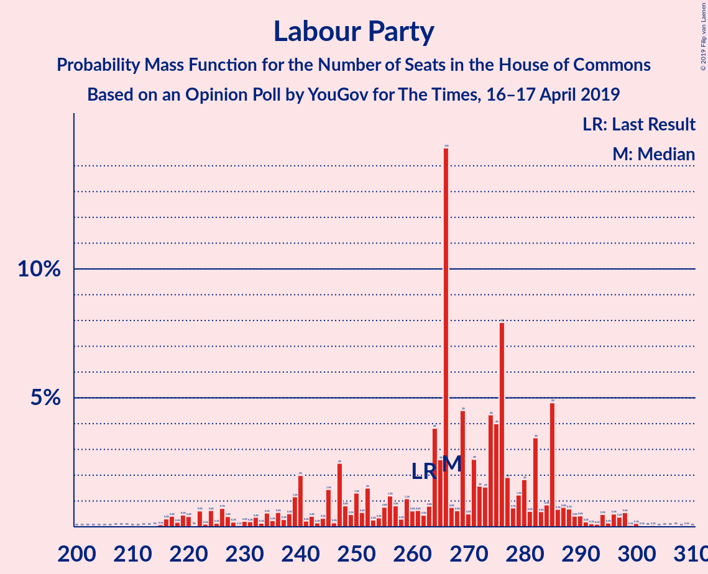
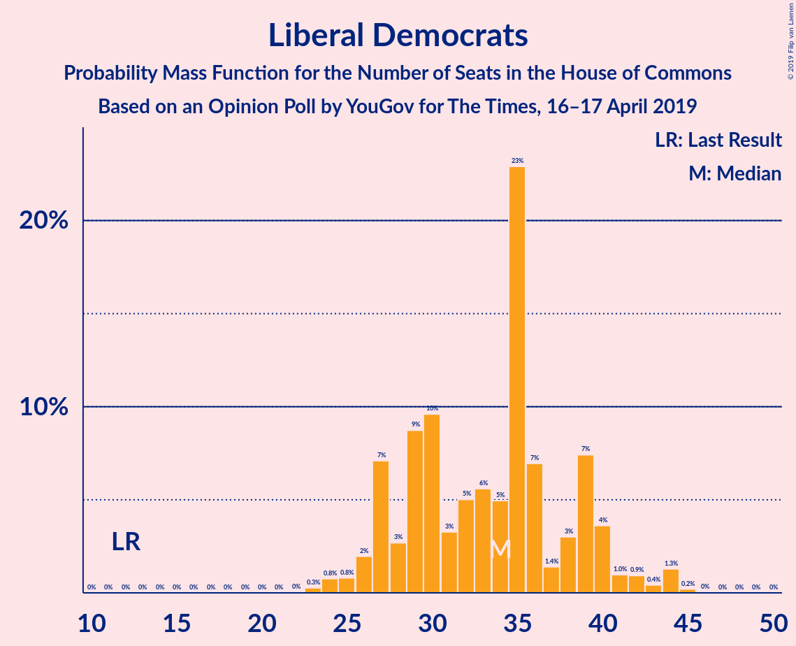
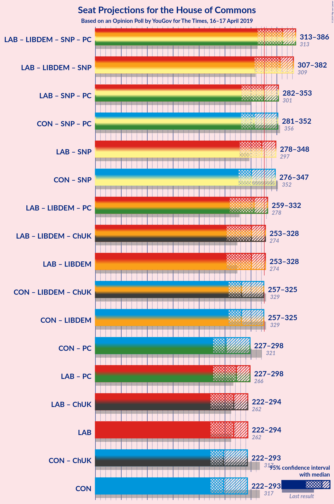
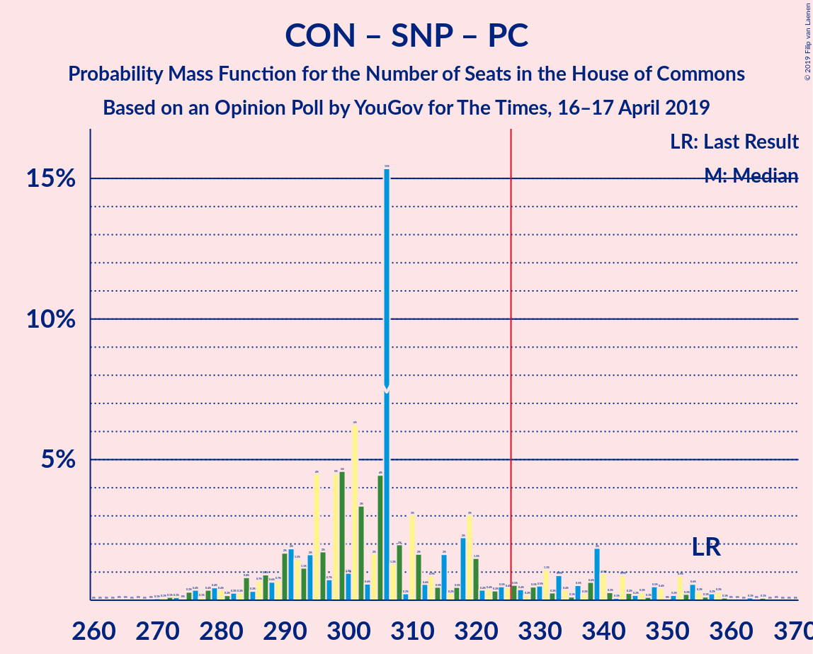
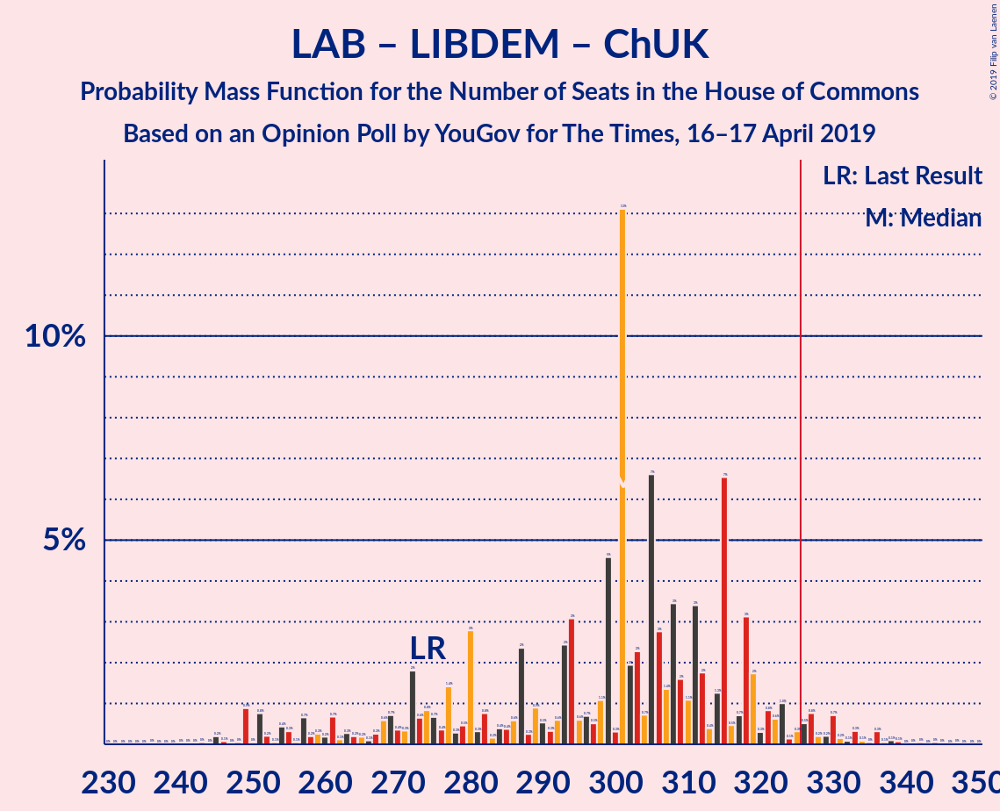
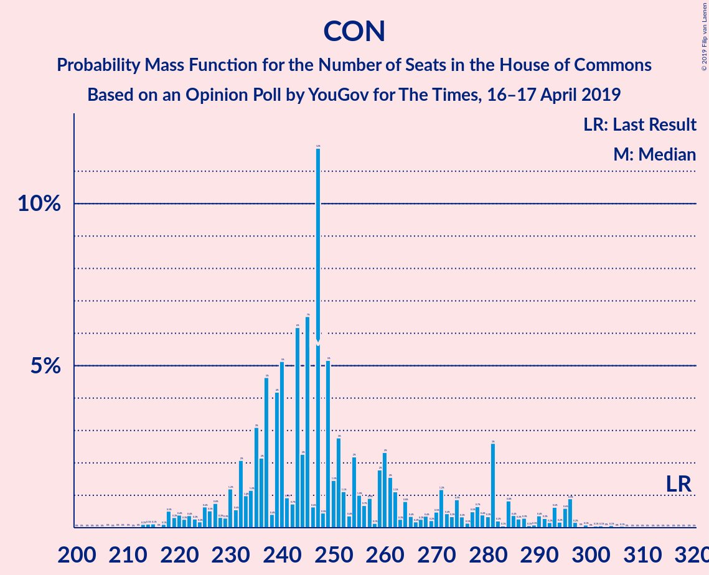

# Opinion Poll by YouGov for The Times, 16–17 April 2019

<a href="#voting-intentions">Voting Intentions</a> | <a href="#seats">Seats</a> | <a href="#coalitions">Coalitions</a> | <a href="#technical-information">Technical Information</a>

## Voting Intentions

### Confidence Intervals

| Party | Last Result | Poll Result | 80% Confidence Interval | 90% Confidence Interval | 95% Confidence Interval | 99% Confidence Interval |
|:-----:|:-----------:|:-----------:|:-----------------------:|:-----------------------:|:-----------------------:|:-----------------------:|
| Labour Party | 40.0% | 30.0% | 28.7–31.5% |28.3–31.9% |27.9–32.2% |27.3–32.9% |
| Conservative Party | 42.4% | 29.0% | 27.6–30.4% |27.3–30.8% |26.9–31.2% |26.3–31.9% |
| Brexit Party | 0.0% | 12.0% | 11.1–13.1% |10.8–13.4% |10.6–13.6% |10.1–14.2% |
| Liberal Democrats | 7.4% | 10.0% | 9.2–11.0% |8.9–11.3% |8.7–11.5% |8.3–12.0% |
| Green Party | 1.6% | 5.0% | 4.4–5.7% |4.2–6.0% |4.1–6.1% |3.8–6.5% |
| Scottish National Party | 3.0% | 4.3% | 3.7–5.0% |3.6–5.2% |3.4–5.3% |3.2–5.7% |
| UK Independence Party | 1.8% | 4.0% | 3.4–4.7% |3.3–4.8% |3.2–5.0% |2.9–5.3% |
| Change UK | 0.0% | 3.0% | 2.5–3.6% |2.4–3.8% |2.3–3.9% |2.1–4.2% |
| Plaid Cymru | 0.5% | 0.7% | 0.5–1.1% |0.5–1.2% |0.4–1.3% |0.4–1.4% |

*Note:* The poll result column reflects the actual value used in the calculations. Published results may vary slightly, and in addition be rounded to fewer digits.

## Seats

### Confidence Intervals

| Party | Last Result | Median | 80% Confidence Interval | 90% Confidence Interval | 95% Confidence Interval | 99% Confidence Interval |
|:-----:|:-----------:|:------:|:-----------------------:|:-----------------------:|:-----------------------:|:-----------------------:|
| <a href="#labour-party">Labour Party</a> | 262 | 274 | 239–282 |226–288 |224–293 |217–300 |
| <a href="#conservative-party">Conservative Party</a> | 317 | 245 | 232–281 |228–284 |223–296 |214–299 |
| <a href="#brexit-party">Brexit Party</a> | 0 | 22 | 15–29 |12–30 |11–32 |6–34 |
| <a href="#liberal-democrats">Liberal Democrats</a> | 12 | 32 | 27–39 |27–40 |27–41 |24–44 |
| <a href="#green-party">Green Party</a> | 1 | 2 | 2–3 |2–3 |2–3 |2–4 |
| <a href="#scottish-national-party">Scottish National Party</a> | 35 | 54 | 53–55 |53–56 |51–56 |51–58 |
| <a href="#uk-independence-party">UK Independence Party</a> | 0 | 0 | 0 |0 |0 |0 |
| <a href="#change-uk">Change UK</a> | 0 | 0 | 0 |0 |0 |0 |
| <a href="#plaid-cymru">Plaid Cymru</a> | 4 | 5 | 3–6 |3–8 |3–8 |2–9 |

### Labour Party

*For a full overview of the results for this party, see the [Labour Party](party-labourparty.html) page.*

| Number of Seats | Probability | Accumulated | Special Marks |
|:---------------:|:-----------:|:-----------:|:-------------:|
| 205 | 0% | 100% |  |
| 206 | 0% | 99.9% |  |
| 207 | 0% | 99.9% |  |
| 208 | 0% | 99.9% |  |
| 209 | 0% | 99.9% |  |
| 210 | 0% | 99.9% |  |
| 211 | 0% | 99.9% |  |
| 212 | 0.1% | 99.9% |  |
| 213 | 0% | 99.8% |  |
| 214 | 0% | 99.8% |  |
| 215 | 0.1% | 99.8% |  |
| 216 | 0.1% | 99.7% |  |
| 217 | 0.4% | 99.6% |  |
| 218 | 0% | 99.3% |  |
| 219 | 1.0% | 99.2% |  |
| 220 | 0.3% | 98% |  |
| 221 | 0.1% | 98% |  |
| 222 | 0% | 98% |  |
| 223 | 0.1% | 98% |  |
| 224 | 2% | 98% |  |
| 225 | 0.2% | 96% |  |
| 226 | 2% | 96% |  |
| 227 | 0.2% | 93% |  |
| 228 | 0.2% | 93% |  |
| 229 | 0% | 93% |  |
| 230 | 0.1% | 93% |  |
| 231 | 0.4% | 93% |  |
| 232 | 0.1% | 92% |  |
| 233 | 0% | 92% |  |
| 234 | 0% | 92% |  |
| 235 | 0.2% | 92% |  |
| 236 | 0.1% | 92% |  |
| 237 | 0.1% | 92% |  |
| 238 | 0.2% | 92% |  |
| 239 | 4% | 92% |  |
| 240 | 0% | 88% |  |
| 241 | 0.6% | 88% |  |
| 242 | 0% | 87% |  |
| 243 | 0.1% | 87% |  |
| 244 | 0.1% | 87% |  |
| 245 | 0% | 87% |  |
| 246 | 0.1% | 87% |  |
| 247 | 1.2% | 87% |  |
| 248 | 2% | 86% |  |
| 249 | 0.9% | 83% |  |
| 250 | 0.1% | 82% |  |
| 251 | 1.2% | 82% |  |
| 252 | 4% | 81% |  |
| 253 | 0.1% | 77% |  |
| 254 | 0.3% | 77% |  |
| 255 | 0.7% | 77% |  |
| 256 | 0.6% | 76% |  |
| 257 | 2% | 76% |  |
| 258 | 0.1% | 73% |  |
| 259 | 0.2% | 73% |  |
| 260 | 0.6% | 73% |  |
| 261 | 0.9% | 72% |  |
| 262 | 0.6% | 71% | Last Result |
| 263 | 3% | 71% |  |
| 264 | 0.1% | 68% |  |
| 265 | 0.3% | 68% |  |
| 266 | 6% | 68% |  |
| 267 | 0.5% | 62% |  |
| 268 | 0.3% | 62% |  |
| 269 | 3% | 61% |  |
| 270 | 0.2% | 58% |  |
| 271 | 1.3% | 58% |  |
| 272 | 0.7% | 56% |  |
| 273 | 0.4% | 56% |  |
| 274 | 13% | 55% | Median |
| 275 | 12% | 42% |  |
| 276 | 5% | 30% |  |
| 277 | 0.8% | 25% |  |
| 278 | 0.2% | 24% |  |
| 279 | 0.6% | 24% |  |
| 280 | 0.2% | 23% |  |
| 281 | 0.8% | 23% |  |
| 282 | 13% | 22% |  |
| 283 | 0.9% | 10% |  |
| 284 | 1.1% | 9% |  |
| 285 | 0.8% | 8% |  |
| 286 | 0.1% | 7% |  |
| 287 | 1.0% | 7% |  |
| 288 | 3% | 6% |  |
| 289 | 0.1% | 3% |  |
| 290 | 0.2% | 3% |  |
| 291 | 0.1% | 3% |  |
| 292 | 0.2% | 3% |  |
| 293 | 0.1% | 3% |  |
| 294 | 0.1% | 2% |  |
| 295 | 0.2% | 2% |  |
| 296 | 1.1% | 2% |  |
| 297 | 0.3% | 1.1% |  |
| 298 | 0% | 0.8% |  |
| 299 | 0% | 0.7% |  |
| 300 | 0.2% | 0.7% |  |
| 301 | 0.1% | 0.5% |  |
| 302 | 0.1% | 0.4% |  |
| 303 | 0% | 0.3% |  |
| 304 | 0% | 0.3% |  |
| 305 | 0% | 0.3% |  |
| 306 | 0% | 0.3% |  |
| 307 | 0.1% | 0.3% |  |
| 308 | 0% | 0.2% |  |
| 309 | 0.2% | 0.2% |  |
| 310 | 0% | 0% |  |

### Conservative Party

*For a full overview of the results for this party, see the [Conservative Party](party-conservativeparty.html) page.*

| Number of Seats | Probability | Accumulated | Special Marks |
|:---------------:|:-----------:|:-----------:|:-------------:|
| 206 | 0% | 100% |  |
| 207 | 0% | 99.9% |  |
| 208 | 0% | 99.9% |  |
| 209 | 0% | 99.9% |  |
| 210 | 0% | 99.9% |  |
| 211 | 0% | 99.9% |  |
| 212 | 0% | 99.9% |  |
| 213 | 0% | 99.9% |  |
| 214 | 0.4% | 99.8% |  |
| 215 | 0.3% | 99.4% |  |
| 216 | 0% | 99.1% |  |
| 217 | 0.1% | 99.1% |  |
| 218 | 0.9% | 99.0% |  |
| 219 | 0.1% | 98% |  |
| 220 | 0.1% | 98% |  |
| 221 | 0.1% | 98% |  |
| 222 | 0.2% | 98% |  |
| 223 | 0.2% | 98% |  |
| 224 | 0% | 97% |  |
| 225 | 0.5% | 97% |  |
| 226 | 1.1% | 97% |  |
| 227 | 0.7% | 96% |  |
| 228 | 0.3% | 95% |  |
| 229 | 0.1% | 95% |  |
| 230 | 0.1% | 95% |  |
| 231 | 0.4% | 95% |  |
| 232 | 6% | 94% |  |
| 233 | 0.4% | 88% |  |
| 234 | 2% | 87% |  |
| 235 | 3% | 86% |  |
| 236 | 4% | 82% |  |
| 237 | 12% | 78% |  |
| 238 | 0.2% | 67% |  |
| 239 | 0.1% | 67% |  |
| 240 | 1.5% | 66% |  |
| 241 | 0.6% | 65% |  |
| 242 | 0.4% | 64% |  |
| 243 | 0.3% | 64% |  |
| 244 | 0.4% | 64% |  |
| 245 | 24% | 63% | Median |
| 246 | 0.2% | 40% |  |
| 247 | 2% | 39% |  |
| 248 | 0.1% | 37% |  |
| 249 | 1.2% | 37% |  |
| 250 | 0.2% | 36% |  |
| 251 | 0.5% | 35% |  |
| 252 | 0.8% | 35% |  |
| 253 | 0% | 34% |  |
| 254 | 0.1% | 34% |  |
| 255 | 3% | 34% |  |
| 256 | 0.6% | 31% |  |
| 257 | 0.5% | 30% |  |
| 258 | 0.2% | 30% |  |
| 259 | 7% | 30% |  |
| 260 | 2% | 23% |  |
| 261 | 3% | 21% |  |
| 262 | 2% | 18% |  |
| 263 | 0.2% | 16% |  |
| 264 | 2% | 16% |  |
| 265 | 0.9% | 14% |  |
| 266 | 0% | 13% |  |
| 267 | 0.1% | 13% |  |
| 268 | 0.1% | 13% |  |
| 269 | 0.5% | 13% |  |
| 270 | 0% | 13% |  |
| 271 | 0.3% | 13% |  |
| 272 | 0% | 12% |  |
| 273 | 0% | 12% |  |
| 274 | 0.3% | 12% |  |
| 275 | 0.2% | 12% |  |
| 276 | 0.1% | 12% |  |
| 277 | 0% | 12% |  |
| 278 | 0.4% | 12% |  |
| 279 | 0.3% | 11% |  |
| 280 | 0.2% | 11% |  |
| 281 | 3% | 11% |  |
| 282 | 0.6% | 8% |  |
| 283 | 0% | 7% |  |
| 284 | 3% | 7% |  |
| 285 | 0% | 4% |  |
| 286 | 0% | 4% |  |
| 287 | 0% | 4% |  |
| 288 | 0.1% | 4% |  |
| 289 | 0% | 4% |  |
| 290 | 0.2% | 4% |  |
| 291 | 0% | 4% |  |
| 292 | 0.4% | 4% |  |
| 293 | 0% | 3% |  |
| 294 | 0.1% | 3% |  |
| 295 | 0.2% | 3% |  |
| 296 | 2% | 3% |  |
| 297 | 0.2% | 0.7% |  |
| 298 | 0% | 0.5% |  |
| 299 | 0.1% | 0.5% |  |
| 300 | 0% | 0.4% |  |
| 301 | 0% | 0.4% |  |
| 302 | 0% | 0.4% |  |
| 303 | 0% | 0.4% |  |
| 304 | 0.2% | 0.3% |  |
| 305 | 0% | 0.1% |  |
| 306 | 0% | 0.1% |  |
| 307 | 0% | 0.1% |  |
| 308 | 0% | 0.1% |  |
| 309 | 0% | 0.1% |  |
| 310 | 0% | 0.1% |  |
| 311 | 0% | 0.1% |  |
| 312 | 0% | 0.1% |  |
| 313 | 0% | 0.1% |  |
| 314 | 0% | 0.1% |  |
| 315 | 0% | 0.1% |  |
| 316 | 0% | 0.1% |  |
| 317 | 0% | 0% | Last Result |

### Brexit Party

*For a full overview of the results for this party, see the [Brexit Party](party-brexitparty.html) page.*

| Number of Seats | Probability | Accumulated | Special Marks |
|:---------------:|:-----------:|:-----------:|:-------------:|
| 0 | 0% | 100% | Last Result |
| 1 | 0% | 100% |  |
| 2 | 0% | 100% |  |
| 3 | 0% | 100% |  |
| 4 | 0% | 100% |  |
| 5 | 0.4% | 99.9% |  |
| 6 | 0.3% | 99.6% |  |
| 7 | 0.2% | 99.3% |  |
| 8 | 0.1% | 99.1% |  |
| 9 | 0.9% | 99.0% |  |
| 10 | 0.5% | 98% |  |
| 11 | 0.3% | 98% |  |
| 12 | 3% | 97% |  |
| 13 | 1.2% | 95% |  |
| 14 | 0.5% | 93% |  |
| 15 | 14% | 93% |  |
| 16 | 2% | 79% |  |
| 17 | 1.4% | 77% |  |
| 18 | 7% | 76% |  |
| 19 | 1.3% | 69% |  |
| 20 | 4% | 68% |  |
| 21 | 2% | 64% |  |
| 22 | 13% | 62% | Median |
| 23 | 18% | 49% |  |
| 24 | 10% | 31% |  |
| 25 | 2% | 21% |  |
| 26 | 3% | 19% |  |
| 27 | 1.1% | 16% |  |
| 28 | 4% | 15% |  |
| 29 | 3% | 11% |  |
| 30 | 3% | 8% |  |
| 31 | 0.6% | 5% |  |
| 32 | 2% | 4% |  |
| 33 | 1.0% | 2% |  |
| 34 | 0.1% | 0.6% |  |
| 35 | 0.1% | 0.5% |  |
| 36 | 0.1% | 0.4% |  |
| 37 | 0% | 0.2% |  |
| 38 | 0% | 0.2% |  |
| 39 | 0.1% | 0.2% |  |
| 40 | 0% | 0.2% |  |
| 41 | 0% | 0.1% |  |
| 42 | 0% | 0.1% |  |
| 43 | 0% | 0.1% |  |
| 44 | 0% | 0.1% |  |
| 45 | 0% | 0.1% |  |
| 46 | 0% | 0.1% |  |
| 47 | 0% | 0% |  |

### Liberal Democrats

*For a full overview of the results for this party, see the [Liberal Democrats](party-liberaldemocrats.html) page.*

| Number of Seats | Probability | Accumulated | Special Marks |
|:---------------:|:-----------:|:-----------:|:-------------:|
| 12 | 0% | 100% | Last Result |
| 13 | 0% | 100% |  |
| 14 | 0% | 100% |  |
| 15 | 0% | 100% |  |
| 16 | 0% | 100% |  |
| 17 | 0% | 100% |  |
| 18 | 0% | 100% |  |
| 19 | 0% | 100% |  |
| 20 | 0% | 100% |  |
| 21 | 0% | 100% |  |
| 22 | 0% | 100% |  |
| 23 | 0.2% | 99.9% |  |
| 24 | 0.3% | 99.8% |  |
| 25 | 0.4% | 99.5% |  |
| 26 | 1.0% | 99.0% |  |
| 27 | 21% | 98% |  |
| 28 | 1.0% | 77% |  |
| 29 | 1.3% | 76% |  |
| 30 | 19% | 75% |  |
| 31 | 5% | 56% |  |
| 32 | 3% | 52% | Median |
| 33 | 5% | 49% |  |
| 34 | 4% | 43% |  |
| 35 | 8% | 39% |  |
| 36 | 14% | 31% |  |
| 37 | 0.8% | 17% |  |
| 38 | 3% | 17% |  |
| 39 | 6% | 14% |  |
| 40 | 4% | 7% |  |
| 41 | 0.4% | 3% |  |
| 42 | 0.1% | 2% |  |
| 43 | 0.7% | 2% |  |
| 44 | 1.3% | 2% |  |
| 45 | 0.3% | 0.3% |  |
| 46 | 0% | 0% |  |

### Green Party

*For a full overview of the results for this party, see the [Green Party](party-greenparty.html) page.*

| Number of Seats | Probability | Accumulated | Special Marks |
|:---------------:|:-----------:|:-----------:|:-------------:|
| 1 | 0% | 100% | Last Result |
| 2 | 59% | 100% | Median |
| 3 | 39% | 41% |  |
| 4 | 2% | 2% |  |
| 5 | 0% | 0% |  |

### Scottish National Party

*For a full overview of the results for this party, see the [Scottish National Party](party-scottishnationalparty.html) page.*

| Number of Seats | Probability | Accumulated | Special Marks |
|:---------------:|:-----------:|:-----------:|:-------------:|
| 35 | 0% | 100% | Last Result |
| 36 | 0% | 100% |  |
| 37 | 0% | 100% |  |
| 38 | 0% | 100% |  |
| 39 | 0% | 100% |  |
| 40 | 0% | 100% |  |
| 41 | 0% | 100% |  |
| 42 | 0% | 100% |  |
| 43 | 0% | 100% |  |
| 44 | 0% | 100% |  |
| 45 | 0% | 100% |  |
| 46 | 0% | 100% |  |
| 47 | 0% | 100% |  |
| 48 | 0% | 100% |  |
| 49 | 0% | 100% |  |
| 50 | 0.2% | 100% |  |
| 51 | 4% | 99.8% |  |
| 52 | 0.2% | 95% |  |
| 53 | 26% | 95% |  |
| 54 | 47% | 69% | Median |
| 55 | 16% | 22% |  |
| 56 | 5% | 6% |  |
| 57 | 1.0% | 2% |  |
| 58 | 0.6% | 0.6% |  |
| 59 | 0% | 0% |  |

### UK Independence Party

*For a full overview of the results for this party, see the [UK Independence Party](party-ukindependenceparty.html) page.*

| Number of Seats | Probability | Accumulated | Special Marks |
|:---------------:|:-----------:|:-----------:|:-------------:|
| 0 | 100% | 100% | Last Result, Median |

### Change UK

*For a full overview of the results for this party, see the [Change UK](party-changeuk.html) page.*

| Number of Seats | Probability | Accumulated | Special Marks |
|:---------------:|:-----------:|:-----------:|:-------------:|
| 0 | 100% | 100% | Last Result, Median |

### Plaid Cymru

*For a full overview of the results for this party, see the [Plaid Cymru](party-plaidcymru.html) page.*

| Number of Seats | Probability | Accumulated | Special Marks |
|:---------------:|:-----------:|:-----------:|:-------------:|
| 1 | 0.3% | 100% |  |
| 2 | 0.8% | 99.7% |  |
| 3 | 22% | 99.0% |  |
| 4 | 9% | 77% | Last Result |
| 5 | 55% | 67% | Median |
| 6 | 4% | 13% |  |
| 7 | 3% | 8% |  |
| 8 | 5% | 5% |  |
| 9 | 0.4% | 0.7% |  |
| 10 | 0.2% | 0.3% |  |
| 11 | 0% | 0.1% |  |
| 12 | 0% | 0.1% |  |
| 13 | 0% | 0.1% |  |
| 14 | 0.1% | 0.1% |  |
| 15 | 0% | 0% |  |

## Coalitions

### Confidence Intervals

| Coalition | Last Result | Median | Majority? | 80% Confidence Interval | 90% Confidence Interval | 95% Confidence Interval | 99% Confidence Interval |
|:---------:|:-----------:|:------:|:---------:|:-----------------------:|:-----------------------:|:-----------------------:|:-----------------------:|
| Labour Party – Liberal Democrats – Scottish National Party – Plaid Cymru | 313 | 361 | 92% | 328–376 | 316–381 | 313–387 | 310–397 |
| Labour Party – Liberal Democrats – Scottish National Party | 309 | 356 | 88% | 323–371 | 311–376 | 308–383 | 303–392 |
| Conservative Party – Scottish National Party – Plaid Cymru | 356 | 305 | 13% | 291–340 | 288–343 | 283–355 | 272–359 |
| Labour Party – Scottish National Party – Plaid Cymru | 301 | 332 | 60% | 298–340 | 285–348 | 283–353 | 276–361 |
| Conservative Party – Scottish National Party | 352 | 300 | 12% | 286–335 | 283–338 | 278–350 | 268–354 |
| Labour Party – Scottish National Party | 297 | 329 | 56% | 293–335 | 280–343 | 278–348 | 271–356 |
| Labour Party – Liberal Democrats – Plaid Cymru | 278 | 307 | 8% | 274–323 | 262–327 | 259–332 | 255–344 |
| Labour Party – Liberal Democrats – Change UK | 274 | 301 | 4% | 269–318 | 257–322 | 254–327 | 249–339 |
| Labour Party – Liberal Democrats | 274 | 301 | 4% | 269–318 | 257–322 | 254–327 | 249–339 |
| Conservative Party – Liberal Democrats – Change UK | 329 | 275 | 3% | 268–311 | 266–315 | 258–326 | 250–329 |
| Conservative Party – Liberal Democrats | 329 | 275 | 3% | 268–311 | 266–315 | 258–326 | 250–329 |
| Conservative Party – Plaid Cymru | 321 | 250 | 0% | 237–286 | 233–289 | 228–301 | 219–304 |
| Labour Party – Plaid Cymru | 266 | 278 | 0% | 244–288 | 231–293 | 229–298 | 222–305 |
| Conservative Party – Change UK | 317 | 245 | 0% | 232–281 | 228–284 | 223–296 | 214–299 |
| Conservative Party | 317 | 245 | 0% | 232–281 | 228–284 | 223–296 | 214–299 |
| Labour Party – Change UK | 262 | 274 | 0% | 239–282 | 226–288 | 224–293 | 217–300 |
| Labour Party | 262 | 274 | 0% | 239–282 | 226–288 | 224–293 | 217–300 |

### Labour Party – Liberal Democrats – Scottish National Party – Plaid Cymru

| Number of Seats | Probability | Accumulated | Special Marks |
|:---------------:|:-----------:|:-----------:|:-------------:|
| 296 | 0% | 100% |  |
| 297 | 0% | 99.9% |  |
| 298 | 0% | 99.9% |  |
| 299 | 0.1% | 99.9% |  |
| 300 | 0% | 99.9% |  |
| 301 | 0% | 99.9% |  |
| 302 | 0% | 99.8% |  |
| 303 | 0% | 99.8% |  |
| 304 | 0% | 99.8% |  |
| 305 | 0.1% | 99.8% |  |
| 306 | 0% | 99.7% |  |
| 307 | 0.1% | 99.7% |  |
| 308 | 0% | 99.6% |  |
| 309 | 0% | 99.6% |  |
| 310 | 0.4% | 99.5% |  |
| 311 | 1.1% | 99.2% |  |
| 312 | 0.2% | 98% |  |
| 313 | 0.6% | 98% | Last Result |
| 314 | 1.1% | 97% |  |
| 315 | 0.3% | 96% |  |
| 316 | 2% | 96% |  |
| 317 | 0% | 94% |  |
| 318 | 0.4% | 93% |  |
| 319 | 0% | 93% |  |
| 320 | 0% | 93% |  |
| 321 | 0% | 93% |  |
| 322 | 0% | 93% |  |
| 323 | 0% | 93% |  |
| 324 | 0.4% | 93% |  |
| 325 | 0.1% | 93% |  |
| 326 | 0.2% | 92% | Majority |
| 327 | 0.1% | 92% |  |
| 328 | 3% | 92% |  |
| 329 | 0.3% | 89% |  |
| 330 | 0.3% | 89% |  |
| 331 | 0% | 88% |  |
| 332 | 0.7% | 88% |  |
| 333 | 0.6% | 88% |  |
| 334 | 0.1% | 87% |  |
| 335 | 0.8% | 87% |  |
| 336 | 0% | 86% |  |
| 337 | 2% | 86% |  |
| 338 | 0.3% | 85% |  |
| 339 | 0.5% | 84% |  |
| 340 | 0.2% | 84% |  |
| 341 | 0.2% | 83% |  |
| 342 | 1.0% | 83% |  |
| 343 | 0.5% | 82% |  |
| 344 | 0.6% | 82% |  |
| 345 | 4% | 81% |  |
| 346 | 0.3% | 78% |  |
| 347 | 0.2% | 77% |  |
| 348 | 2% | 77% |  |
| 349 | 3% | 75% |  |
| 350 | 1.3% | 72% |  |
| 351 | 0% | 71% |  |
| 352 | 5% | 71% |  |
| 353 | 0.2% | 66% |  |
| 354 | 0.1% | 65% |  |
| 355 | 1.2% | 65% |  |
| 356 | 0.2% | 64% |  |
| 357 | 0.1% | 64% |  |
| 358 | 1.3% | 64% |  |
| 359 | 0.8% | 63% |  |
| 360 | 1.0% | 62% |  |
| 361 | 11% | 61% |  |
| 362 | 12% | 49% |  |
| 363 | 2% | 38% |  |
| 364 | 0.5% | 36% |  |
| 365 | 3% | 35% | Median |
| 366 | 0.3% | 33% |  |
| 367 | 0.5% | 32% |  |
| 368 | 0.1% | 32% |  |
| 369 | 0.6% | 32% |  |
| 370 | 0.6% | 31% |  |
| 371 | 4% | 31% |  |
| 372 | 0.9% | 27% |  |
| 373 | 4% | 26% |  |
| 374 | 0.7% | 22% |  |
| 375 | 0.8% | 21% |  |
| 376 | 11% | 21% |  |
| 377 | 0.9% | 9% |  |
| 378 | 0.3% | 9% |  |
| 379 | 0.5% | 8% |  |
| 380 | 0.5% | 8% |  |
| 381 | 3% | 7% |  |
| 382 | 0.1% | 4% |  |
| 383 | 0.3% | 4% |  |
| 384 | 1.0% | 4% |  |
| 385 | 0.2% | 3% |  |
| 386 | 0.1% | 3% |  |
| 387 | 0.9% | 3% |  |
| 388 | 0.3% | 2% |  |
| 389 | 0.4% | 1.4% |  |
| 390 | 0% | 1.0% |  |
| 391 | 0.1% | 1.0% |  |
| 392 | 0.1% | 0.9% |  |
| 393 | 0.1% | 0.8% |  |
| 394 | 0.2% | 0.8% |  |
| 395 | 0% | 0.6% |  |
| 396 | 0% | 0.6% |  |
| 397 | 0.2% | 0.5% |  |
| 398 | 0% | 0.4% |  |
| 399 | 0.1% | 0.4% |  |
| 400 | 0.1% | 0.3% |  |
| 401 | 0% | 0.3% |  |
| 402 | 0.2% | 0.3% |  |
| 403 | 0% | 0.1% |  |
| 404 | 0% | 0.1% |  |
| 405 | 0% | 0% |  |

### Labour Party – Liberal Democrats – Scottish National Party

| Number of Seats | Probability | Accumulated | Special Marks |
|:---------------:|:-----------:|:-----------:|:-------------:|
| 291 | 0% | 100% |  |
| 292 | 0% | 99.9% |  |
| 293 | 0% | 99.9% |  |
| 294 | 0.1% | 99.9% |  |
| 295 | 0% | 99.9% |  |
| 296 | 0% | 99.8% |  |
| 297 | 0% | 99.8% |  |
| 298 | 0% | 99.8% |  |
| 299 | 0% | 99.8% |  |
| 300 | 0% | 99.8% |  |
| 301 | 0.1% | 99.7% |  |
| 302 | 0% | 99.6% |  |
| 303 | 1.0% | 99.6% |  |
| 304 | 0.1% | 98.6% |  |
| 305 | 0.3% | 98.5% |  |
| 306 | 0.1% | 98% |  |
| 307 | 0.3% | 98% |  |
| 308 | 0.6% | 98% |  |
| 309 | 0.9% | 97% | Last Result |
| 310 | 0.1% | 96% |  |
| 311 | 3% | 96% |  |
| 312 | 0.2% | 94% |  |
| 313 | 0% | 93% |  |
| 314 | 0% | 93% |  |
| 315 | 0.2% | 93% |  |
| 316 | 0.3% | 93% |  |
| 317 | 0% | 93% |  |
| 318 | 0% | 93% |  |
| 319 | 0.3% | 93% |  |
| 320 | 0.1% | 92% |  |
| 321 | 0.1% | 92% |  |
| 322 | 0.4% | 92% |  |
| 323 | 3% | 92% |  |
| 324 | 0.5% | 89% |  |
| 325 | 0.2% | 89% |  |
| 326 | 0% | 88% | Majority |
| 327 | 0.7% | 88% |  |
| 328 | 0% | 88% |  |
| 329 | 0% | 88% |  |
| 330 | 1.3% | 88% |  |
| 331 | 0.7% | 86% |  |
| 332 | 0.1% | 86% |  |
| 333 | 0.3% | 86% |  |
| 334 | 2% | 85% |  |
| 335 | 0.1% | 83% |  |
| 336 | 0.2% | 83% |  |
| 337 | 0.7% | 83% |  |
| 338 | 0.5% | 82% |  |
| 339 | 2% | 82% |  |
| 340 | 0.1% | 80% |  |
| 341 | 3% | 80% |  |
| 342 | 0.3% | 76% |  |
| 343 | 0.3% | 76% |  |
| 344 | 3% | 76% |  |
| 345 | 1.4% | 73% |  |
| 346 | 0.5% | 72% |  |
| 347 | 5% | 71% |  |
| 348 | 0.3% | 66% |  |
| 349 | 0.2% | 65% |  |
| 350 | 1.2% | 65% |  |
| 351 | 1.3% | 64% |  |
| 352 | 0.6% | 63% |  |
| 353 | 0.3% | 62% |  |
| 354 | 0.7% | 62% |  |
| 355 | 0.5% | 61% |  |
| 356 | 11% | 61% |  |
| 357 | 0.1% | 49% |  |
| 358 | 0.3% | 49% |  |
| 359 | 12% | 49% |  |
| 360 | 1.5% | 36% | Median |
| 361 | 0.2% | 35% |  |
| 362 | 2% | 35% |  |
| 363 | 0.2% | 32% |  |
| 364 | 1.1% | 32% |  |
| 365 | 2% | 31% |  |
| 366 | 3% | 29% |  |
| 367 | 0.4% | 27% |  |
| 368 | 0.3% | 26% |  |
| 369 | 4% | 26% |  |
| 370 | 0.3% | 22% |  |
| 371 | 12% | 21% |  |
| 372 | 0.7% | 10% |  |
| 373 | 2% | 9% |  |
| 374 | 0.5% | 8% |  |
| 375 | 0.5% | 7% |  |
| 376 | 2% | 7% |  |
| 377 | 0% | 4% |  |
| 378 | 0.1% | 4% |  |
| 379 | 1.1% | 4% |  |
| 380 | 0.2% | 3% |  |
| 381 | 0.1% | 3% |  |
| 382 | 0.2% | 3% |  |
| 383 | 0.3% | 3% |  |
| 384 | 1.2% | 2% |  |
| 385 | 0% | 1.0% |  |
| 386 | 0% | 1.0% |  |
| 387 | 0.1% | 1.0% |  |
| 388 | 0% | 0.8% |  |
| 389 | 0% | 0.8% |  |
| 390 | 0.2% | 0.8% |  |
| 391 | 0% | 0.6% |  |
| 392 | 0.1% | 0.5% |  |
| 393 | 0% | 0.4% |  |
| 394 | 0.1% | 0.4% |  |
| 395 | 0% | 0.3% |  |
| 396 | 0% | 0.3% |  |
| 397 | 0.2% | 0.3% |  |
| 398 | 0% | 0.1% |  |
| 399 | 0% | 0.1% |  |
| 400 | 0% | 0% |  |

### Conservative Party – Scottish National Party – Plaid Cymru

| Number of Seats | Probability | Accumulated | Special Marks |
|:---------------:|:-----------:|:-----------:|:-------------:|
| 263 | 0% | 100% |  |
| 264 | 0% | 99.9% |  |
| 265 | 0% | 99.9% |  |
| 266 | 0% | 99.9% |  |
| 267 | 0% | 99.9% |  |
| 268 | 0% | 99.9% |  |
| 269 | 0% | 99.9% |  |
| 270 | 0% | 99.9% |  |
| 271 | 0.1% | 99.9% |  |
| 272 | 0.3% | 99.8% |  |
| 273 | 0.3% | 99.5% |  |
| 274 | 0.1% | 99.2% |  |
| 275 | 0.8% | 99.1% |  |
| 276 | 0.2% | 98% |  |
| 277 | 0% | 98% |  |
| 278 | 0.1% | 98% |  |
| 279 | 0.1% | 98% |  |
| 280 | 0.2% | 98% |  |
| 281 | 0.1% | 98% |  |
| 282 | 0% | 98% |  |
| 283 | 0% | 98% |  |
| 284 | 2% | 97% |  |
| 285 | 0.2% | 96% |  |
| 286 | 0.7% | 96% |  |
| 287 | 0.1% | 95% |  |
| 288 | 0.1% | 95% |  |
| 289 | 0.8% | 95% |  |
| 290 | 4% | 94% |  |
| 291 | 3% | 90% |  |
| 292 | 3% | 87% |  |
| 293 | 1.2% | 84% |  |
| 294 | 0.5% | 83% |  |
| 295 | 13% | 82% |  |
| 296 | 1.5% | 69% |  |
| 297 | 1.4% | 68% |  |
| 298 | 1.1% | 66% |  |
| 299 | 0.1% | 65% |  |
| 300 | 0.8% | 65% |  |
| 301 | 0.2% | 64% |  |
| 302 | 12% | 64% |  |
| 303 | 0.3% | 52% |  |
| 304 | 0.5% | 52% | Median |
| 305 | 12% | 51% |  |
| 306 | 0.6% | 39% |  |
| 307 | 1.2% | 39% |  |
| 308 | 1.2% | 38% |  |
| 309 | 0.3% | 36% |  |
| 310 | 2% | 36% |  |
| 311 | 2% | 34% |  |
| 312 | 0.2% | 32% |  |
| 313 | 0.9% | 32% |  |
| 314 | 0.1% | 31% |  |
| 315 | 1.4% | 31% |  |
| 316 | 0.2% | 29% |  |
| 317 | 0.1% | 29% |  |
| 318 | 6% | 29% |  |
| 319 | 5% | 23% |  |
| 320 | 0.5% | 17% |  |
| 321 | 0.2% | 17% |  |
| 322 | 0.7% | 17% |  |
| 323 | 1.0% | 16% |  |
| 324 | 1.0% | 15% |  |
| 325 | 0.7% | 14% |  |
| 326 | 0.5% | 13% | Majority |
| 327 | 0.2% | 13% |  |
| 328 | 0.3% | 13% |  |
| 329 | 0.1% | 12% |  |
| 330 | 0.1% | 12% |  |
| 331 | 0% | 12% |  |
| 332 | 0.3% | 12% |  |
| 333 | 0.2% | 12% |  |
| 334 | 0.1% | 12% |  |
| 335 | 0.1% | 12% |  |
| 336 | 0.1% | 12% |  |
| 337 | 0.2% | 11% |  |
| 338 | 0.2% | 11% |  |
| 339 | 0.1% | 11% |  |
| 340 | 3% | 11% |  |
| 341 | 0% | 8% |  |
| 342 | 0.2% | 8% |  |
| 343 | 3% | 8% |  |
| 344 | 0.1% | 4% |  |
| 345 | 0.1% | 4% |  |
| 346 | 0.5% | 4% |  |
| 347 | 0.2% | 4% |  |
| 348 | 0% | 4% |  |
| 349 | 0% | 4% |  |
| 350 | 0.1% | 4% |  |
| 351 | 0.4% | 4% |  |
| 352 | 0% | 3% |  |
| 353 | 0.3% | 3% |  |
| 354 | 0% | 3% |  |
| 355 | 0.9% | 3% |  |
| 356 | 0.2% | 2% | Last Result |
| 357 | 0% | 2% |  |
| 358 | 1.1% | 2% |  |
| 359 | 0.1% | 0.6% |  |
| 360 | 0% | 0.4% |  |
| 361 | 0.1% | 0.4% |  |
| 362 | 0% | 0.3% |  |
| 363 | 0% | 0.3% |  |
| 364 | 0% | 0.3% |  |
| 365 | 0.1% | 0.3% |  |
| 366 | 0% | 0.2% |  |
| 367 | 0.1% | 0.1% |  |
| 368 | 0% | 0.1% |  |
| 369 | 0% | 0.1% |  |
| 370 | 0% | 0.1% |  |
| 371 | 0% | 0.1% |  |
| 372 | 0% | 0.1% |  |
| 373 | 0% | 0.1% |  |
| 374 | 0% | 0.1% |  |
| 375 | 0% | 0.1% |  |
| 376 | 0% | 0% |  |

### Labour Party – Scottish National Party – Plaid Cymru

| Number of Seats | Probability | Accumulated | Special Marks |
|:---------------:|:-----------:|:-----------:|:-------------:|
| 264 | 0% | 100% |  |
| 265 | 0% | 99.9% |  |
| 266 | 0% | 99.9% |  |
| 267 | 0% | 99.9% |  |
| 268 | 0% | 99.9% |  |
| 269 | 0% | 99.9% |  |
| 270 | 0% | 99.9% |  |
| 271 | 0.1% | 99.9% |  |
| 272 | 0% | 99.8% |  |
| 273 | 0% | 99.8% |  |
| 274 | 0.1% | 99.8% |  |
| 275 | 0% | 99.8% |  |
| 276 | 0.4% | 99.7% |  |
| 277 | 0.2% | 99.3% |  |
| 278 | 0% | 99.1% |  |
| 279 | 0.1% | 99.1% |  |
| 280 | 0.1% | 99.1% |  |
| 281 | 1.1% | 99.0% |  |
| 282 | 0.1% | 98% |  |
| 283 | 2% | 98% |  |
| 284 | 0.1% | 96% |  |
| 285 | 3% | 96% |  |
| 286 | 0.1% | 93% |  |
| 287 | 0.2% | 93% |  |
| 288 | 0.3% | 93% |  |
| 289 | 0% | 93% |  |
| 290 | 0.1% | 93% |  |
| 291 | 0.1% | 93% |  |
| 292 | 0.3% | 92% |  |
| 293 | 0% | 92% |  |
| 294 | 0.2% | 92% |  |
| 295 | 0.1% | 92% |  |
| 296 | 0.1% | 92% |  |
| 297 | 0.6% | 92% |  |
| 298 | 3% | 91% |  |
| 299 | 0.7% | 88% |  |
| 300 | 0.1% | 87% |  |
| 301 | 0.1% | 87% | Last Result |
| 302 | 0.1% | 87% |  |
| 303 | 0.1% | 87% |  |
| 304 | 0.1% | 87% |  |
| 305 | 2% | 87% |  |
| 306 | 0.4% | 84% |  |
| 307 | 0.1% | 84% |  |
| 308 | 1.0% | 84% |  |
| 309 | 0.1% | 83% |  |
| 310 | 4% | 83% |  |
| 311 | 0.4% | 79% |  |
| 312 | 0.7% | 79% |  |
| 313 | 4% | 78% |  |
| 314 | 0.6% | 75% |  |
| 315 | 0.3% | 74% |  |
| 316 | 0.8% | 74% |  |
| 317 | 0.6% | 73% |  |
| 318 | 0.3% | 72% |  |
| 319 | 0.1% | 72% |  |
| 320 | 0.6% | 72% |  |
| 321 | 0.4% | 71% |  |
| 322 | 0.6% | 71% |  |
| 323 | 1.2% | 70% |  |
| 324 | 1.2% | 69% |  |
| 325 | 8% | 68% |  |
| 326 | 0.5% | 60% | Majority |
| 327 | 0.2% | 59% |  |
| 328 | 3% | 59% |  |
| 329 | 0.4% | 56% |  |
| 330 | 0.1% | 56% |  |
| 331 | 0.1% | 56% |  |
| 332 | 12% | 56% |  |
| 333 | 2% | 44% | Median |
| 334 | 15% | 42% |  |
| 335 | 0.9% | 27% |  |
| 336 | 1.5% | 26% |  |
| 337 | 0.7% | 25% |  |
| 338 | 2% | 24% |  |
| 339 | 0.3% | 22% |  |
| 340 | 12% | 22% |  |
| 341 | 0.6% | 10% |  |
| 342 | 0.6% | 9% |  |
| 343 | 1.2% | 9% |  |
| 344 | 0.4% | 8% |  |
| 345 | 0.5% | 7% |  |
| 346 | 0.2% | 7% |  |
| 347 | 1.2% | 7% |  |
| 348 | 2% | 5% |  |
| 349 | 0.1% | 3% |  |
| 350 | 0.1% | 3% |  |
| 351 | 0.1% | 3% |  |
| 352 | 0.1% | 3% |  |
| 353 | 0.9% | 3% |  |
| 354 | 0.5% | 2% |  |
| 355 | 0.2% | 1.1% |  |
| 356 | 0.2% | 0.9% |  |
| 357 | 0% | 0.8% |  |
| 358 | 0.1% | 0.7% |  |
| 359 | 0.1% | 0.7% |  |
| 360 | 0% | 0.6% |  |
| 361 | 0.2% | 0.6% |  |
| 362 | 0% | 0.3% |  |
| 363 | 0% | 0.3% |  |
| 364 | 0% | 0.3% |  |
| 365 | 0.1% | 0.3% |  |
| 366 | 0% | 0.2% |  |
| 367 | 0.2% | 0.2% |  |
| 368 | 0% | 0% |  |

### Conservative Party – Scottish National Party

| Number of Seats | Probability | Accumulated | Special Marks |
|:---------------:|:-----------:|:-----------:|:-------------:|
| 259 | 0% | 100% |  |
| 260 | 0% | 99.9% |  |
| 261 | 0% | 99.9% |  |
| 262 | 0% | 99.9% |  |
| 263 | 0% | 99.9% |  |
| 264 | 0% | 99.9% |  |
| 265 | 0% | 99.9% |  |
| 266 | 0% | 99.9% |  |
| 267 | 0.3% | 99.8% |  |
| 268 | 0.3% | 99.6% |  |
| 269 | 0.1% | 99.2% |  |
| 270 | 0.1% | 99.1% |  |
| 271 | 0.1% | 99.0% |  |
| 272 | 0.8% | 98.9% |  |
| 273 | 0.1% | 98% |  |
| 274 | 0.1% | 98% |  |
| 275 | 0.1% | 98% |  |
| 276 | 0.2% | 98% |  |
| 277 | 0.1% | 98% |  |
| 278 | 0.1% | 98% |  |
| 279 | 2% | 97% |  |
| 280 | 0.5% | 96% |  |
| 281 | 0.1% | 95% |  |
| 282 | 0.1% | 95% |  |
| 283 | 0.2% | 95% |  |
| 284 | 0.3% | 95% |  |
| 285 | 1.3% | 95% |  |
| 286 | 6% | 93% |  |
| 287 | 0.3% | 88% |  |
| 288 | 2% | 87% |  |
| 289 | 3% | 85% |  |
| 290 | 14% | 83% |  |
| 291 | 0.1% | 68% |  |
| 292 | 1.3% | 68% |  |
| 293 | 0.1% | 67% |  |
| 294 | 2% | 67% |  |
| 295 | 0.8% | 65% |  |
| 296 | 0.5% | 64% |  |
| 297 | 0.1% | 63% |  |
| 298 | 0.2% | 63% |  |
| 299 | 12% | 63% | Median |
| 300 | 11% | 51% |  |
| 301 | 1.3% | 39% |  |
| 302 | 1.4% | 38% |  |
| 303 | 1.3% | 37% |  |
| 304 | 0.3% | 35% |  |
| 305 | 0.9% | 35% |  |
| 306 | 2% | 34% |  |
| 307 | 0.1% | 32% |  |
| 308 | 0.8% | 32% |  |
| 309 | 0.4% | 31% |  |
| 310 | 0.5% | 31% |  |
| 311 | 0.1% | 30% |  |
| 312 | 0.8% | 30% |  |
| 313 | 7% | 29% |  |
| 314 | 1.0% | 22% |  |
| 315 | 2% | 21% |  |
| 316 | 2% | 18% |  |
| 317 | 0.1% | 16% |  |
| 318 | 1.0% | 16% |  |
| 319 | 0.9% | 15% |  |
| 320 | 0.3% | 14% |  |
| 321 | 0.5% | 14% |  |
| 322 | 0.6% | 13% |  |
| 323 | 0.1% | 13% |  |
| 324 | 0.3% | 13% |  |
| 325 | 0.1% | 12% |  |
| 326 | 0.1% | 12% | Majority |
| 327 | 0% | 12% |  |
| 328 | 0.2% | 12% |  |
| 329 | 0.6% | 12% |  |
| 330 | 0.2% | 11% |  |
| 331 | 0.1% | 11% |  |
| 332 | 0.4% | 11% |  |
| 333 | 0.1% | 11% |  |
| 334 | 0% | 11% |  |
| 335 | 3% | 11% |  |
| 336 | 0% | 8% |  |
| 337 | 0.2% | 8% |  |
| 338 | 4% | 8% |  |
| 339 | 0.2% | 4% |  |
| 340 | 0.1% | 4% |  |
| 341 | 0.1% | 4% |  |
| 342 | 0% | 4% |  |
| 343 | 0.1% | 4% |  |
| 344 | 0% | 4% |  |
| 345 | 0.1% | 4% |  |
| 346 | 0.4% | 3% |  |
| 347 | 0% | 3% |  |
| 348 | 0.2% | 3% |  |
| 349 | 0.1% | 3% |  |
| 350 | 2% | 3% |  |
| 351 | 0.2% | 0.8% |  |
| 352 | 0% | 0.6% | Last Result |
| 353 | 0% | 0.6% |  |
| 354 | 0.1% | 0.6% |  |
| 355 | 0% | 0.5% |  |
| 356 | 0.1% | 0.5% |  |
| 357 | 0% | 0.4% |  |
| 358 | 0% | 0.3% |  |
| 359 | 0% | 0.3% |  |
| 360 | 0.1% | 0.3% |  |
| 361 | 0% | 0.1% |  |
| 362 | 0.1% | 0.1% |  |
| 363 | 0% | 0.1% |  |
| 364 | 0% | 0.1% |  |
| 365 | 0% | 0.1% |  |
| 366 | 0% | 0.1% |  |
| 367 | 0% | 0.1% |  |
| 368 | 0% | 0.1% |  |
| 369 | 0% | 0.1% |  |
| 370 | 0% | 0.1% |  |
| 371 | 0% | 0% |  |

### Labour Party – Scottish National Party

| Number of Seats | Probability | Accumulated | Special Marks |
|:---------------:|:-----------:|:-----------:|:-------------:|
| 259 | 0% | 100% |  |
| 260 | 0% | 99.9% |  |
| 261 | 0% | 99.9% |  |
| 262 | 0% | 99.9% |  |
| 263 | 0% | 99.9% |  |
| 264 | 0% | 99.9% |  |
| 265 | 0% | 99.9% |  |
| 266 | 0.1% | 99.9% |  |
| 267 | 0% | 99.8% |  |
| 268 | 0% | 99.8% |  |
| 269 | 0% | 99.8% |  |
| 270 | 0.1% | 99.8% |  |
| 271 | 0.3% | 99.7% |  |
| 272 | 0.1% | 99.3% |  |
| 273 | 1.3% | 99.3% |  |
| 274 | 0% | 98% |  |
| 275 | 0.1% | 98% |  |
| 276 | 0% | 98% |  |
| 277 | 0.2% | 98% |  |
| 278 | 2% | 98% |  |
| 279 | 0% | 96% |  |
| 280 | 3% | 96% |  |
| 281 | 0.2% | 93% |  |
| 282 | 0.1% | 93% |  |
| 283 | 0.3% | 93% |  |
| 284 | 0.5% | 93% |  |
| 285 | 0% | 92% |  |
| 286 | 0.1% | 92% |  |
| 287 | 0.1% | 92% |  |
| 288 | 0% | 92% |  |
| 289 | 0.2% | 92% |  |
| 290 | 0.3% | 92% |  |
| 291 | 0.1% | 92% |  |
| 292 | 0.2% | 92% |  |
| 293 | 3% | 91% |  |
| 294 | 1.1% | 88% |  |
| 295 | 0.2% | 87% |  |
| 296 | 0.1% | 87% |  |
| 297 | 0.2% | 87% | Last Result |
| 298 | 0% | 87% |  |
| 299 | 0.1% | 87% |  |
| 300 | 1.1% | 87% |  |
| 301 | 0.3% | 86% |  |
| 302 | 2% | 85% |  |
| 303 | 0.7% | 84% |  |
| 304 | 2% | 83% |  |
| 305 | 0.1% | 81% |  |
| 306 | 4% | 81% |  |
| 307 | 0.1% | 77% |  |
| 308 | 3% | 77% |  |
| 309 | 0.2% | 75% |  |
| 310 | 0.6% | 75% |  |
| 311 | 0.8% | 74% |  |
| 312 | 0.4% | 73% |  |
| 313 | 0.5% | 73% |  |
| 314 | 0.7% | 72% |  |
| 315 | 0.5% | 71% |  |
| 316 | 0.1% | 71% |  |
| 317 | 2% | 71% |  |
| 318 | 1.3% | 69% |  |
| 319 | 0.3% | 68% |  |
| 320 | 6% | 67% |  |
| 321 | 0.2% | 62% |  |
| 322 | 3% | 61% |  |
| 323 | 1.2% | 59% |  |
| 324 | 0.2% | 58% |  |
| 325 | 1.4% | 58% |  |
| 326 | 0.1% | 56% | Majority |
| 327 | 0.5% | 56% |  |
| 328 | 2% | 55% | Median |
| 329 | 23% | 53% |  |
| 330 | 4% | 30% |  |
| 331 | 0.2% | 26% |  |
| 332 | 2% | 26% |  |
| 333 | 0.8% | 23% |  |
| 334 | 0.4% | 23% |  |
| 335 | 13% | 22% |  |
| 336 | 0.9% | 10% |  |
| 337 | 0.3% | 9% |  |
| 338 | 1.0% | 9% |  |
| 339 | 0.1% | 8% |  |
| 340 | 0.2% | 7% |  |
| 341 | 1.5% | 7% |  |
| 342 | 0.4% | 6% |  |
| 343 | 2% | 5% |  |
| 344 | 0.1% | 3% |  |
| 345 | 0.1% | 3% |  |
| 346 | 0.1% | 3% |  |
| 347 | 0.1% | 3% |  |
| 348 | 0.1% | 3% |  |
| 349 | 0.4% | 2% |  |
| 350 | 0.9% | 2% |  |
| 351 | 0.5% | 1.2% |  |
| 352 | 0% | 0.8% |  |
| 353 | 0% | 0.7% |  |
| 354 | 0.1% | 0.7% |  |
| 355 | 0% | 0.6% |  |
| 356 | 0.2% | 0.6% |  |
| 357 | 0% | 0.3% |  |
| 358 | 0% | 0.3% |  |
| 359 | 0% | 0.3% |  |
| 360 | 0.1% | 0.3% |  |
| 361 | 0% | 0.2% |  |
| 362 | 0.2% | 0.2% |  |
| 363 | 0% | 0% |  |

### Labour Party – Liberal Democrats – Plaid Cymru

| Number of Seats | Probability | Accumulated | Special Marks |
|:---------------:|:-----------:|:-----------:|:-------------:|
| 242 | 0% | 100% |  |
| 243 | 0% | 99.9% |  |
| 244 | 0% | 99.9% |  |
| 245 | 0.1% | 99.9% |  |
| 246 | 0% | 99.9% |  |
| 247 | 0.1% | 99.8% |  |
| 248 | 0% | 99.8% |  |
| 249 | 0% | 99.8% |  |
| 250 | 0% | 99.8% |  |
| 251 | 0% | 99.7% |  |
| 252 | 0% | 99.7% |  |
| 253 | 0.1% | 99.7% |  |
| 254 | 0% | 99.5% |  |
| 255 | 0% | 99.5% |  |
| 256 | 0.5% | 99.5% |  |
| 257 | 1.1% | 99.0% |  |
| 258 | 0% | 98% |  |
| 259 | 0.6% | 98% |  |
| 260 | 0.9% | 97% |  |
| 261 | 0.1% | 96% |  |
| 262 | 3% | 96% |  |
| 263 | 0% | 94% |  |
| 264 | 0.1% | 94% |  |
| 265 | 0.2% | 93% |  |
| 266 | 0.2% | 93% |  |
| 267 | 0% | 93% |  |
| 268 | 0% | 93% |  |
| 269 | 0.1% | 93% |  |
| 270 | 0.3% | 93% |  |
| 271 | 0.5% | 93% |  |
| 272 | 0.1% | 92% |  |
| 273 | 0.1% | 92% |  |
| 274 | 3% | 92% |  |
| 275 | 0.3% | 89% |  |
| 276 | 0.2% | 89% |  |
| 277 | 0.7% | 89% |  |
| 278 | 0.1% | 88% | Last Result |
| 279 | 0.5% | 88% |  |
| 280 | 0.5% | 87% |  |
| 281 | 0.8% | 87% |  |
| 282 | 0.1% | 86% |  |
| 283 | 2% | 86% |  |
| 284 | 0.3% | 84% |  |
| 285 | 0% | 84% |  |
| 286 | 0.6% | 84% |  |
| 287 | 0.4% | 83% |  |
| 288 | 0.2% | 83% |  |
| 289 | 0.7% | 83% |  |
| 290 | 0% | 82% |  |
| 291 | 3% | 82% |  |
| 292 | 1.2% | 79% |  |
| 293 | 0.2% | 77% |  |
| 294 | 2% | 77% |  |
| 295 | 1.2% | 75% |  |
| 296 | 0.5% | 74% |  |
| 297 | 0.2% | 74% |  |
| 298 | 8% | 73% |  |
| 299 | 0.1% | 66% |  |
| 300 | 0.1% | 66% |  |
| 301 | 1.3% | 66% |  |
| 302 | 0.2% | 64% |  |
| 303 | 0.2% | 64% |  |
| 304 | 1.4% | 64% |  |
| 305 | 0.1% | 62% |  |
| 306 | 12% | 62% |  |
| 307 | 0.9% | 50% |  |
| 308 | 12% | 49% |  |
| 309 | 1.4% | 38% |  |
| 310 | 0.6% | 36% |  |
| 311 | 1.1% | 36% | Median |
| 312 | 3% | 35% |  |
| 313 | 0.3% | 32% |  |
| 314 | 0.2% | 32% |  |
| 315 | 1.3% | 32% |  |
| 316 | 0.3% | 30% |  |
| 317 | 3% | 30% |  |
| 318 | 0.7% | 27% |  |
| 319 | 4% | 27% |  |
| 320 | 0.8% | 22% |  |
| 321 | 0.8% | 21% |  |
| 322 | 0.8% | 21% |  |
| 323 | 11% | 20% |  |
| 324 | 0.1% | 9% |  |
| 325 | 1.0% | 9% |  |
| 326 | 3% | 8% | Majority |
| 327 | 0.4% | 5% |  |
| 328 | 0.6% | 5% |  |
| 329 | 0.5% | 4% |  |
| 330 | 0% | 4% |  |
| 331 | 1.0% | 4% |  |
| 332 | 0.2% | 3% |  |
| 333 | 0.9% | 2% |  |
| 334 | 0.1% | 1.5% |  |
| 335 | 0.2% | 1.4% |  |
| 336 | 0.2% | 1.2% |  |
| 337 | 0.1% | 1.0% |  |
| 338 | 0.1% | 0.9% |  |
| 339 | 0.1% | 0.8% |  |
| 340 | 0.2% | 0.8% |  |
| 341 | 0% | 0.6% |  |
| 342 | 0% | 0.6% |  |
| 343 | 0% | 0.5% |  |
| 344 | 0.1% | 0.5% |  |
| 345 | 0% | 0.4% |  |
| 346 | 0.1% | 0.4% |  |
| 347 | 0.1% | 0.3% |  |
| 348 | 0% | 0.3% |  |
| 349 | 0.2% | 0.2% |  |
| 350 | 0% | 0.1% |  |
| 351 | 0% | 0.1% |  |
| 352 | 0% | 0% |  |

### Labour Party – Liberal Democrats – Change UK

| Number of Seats | Probability | Accumulated | Special Marks |
|:---------------:|:-----------:|:-----------:|:-------------:|
| 237 | 0% | 100% |  |
| 238 | 0% | 99.9% |  |
| 239 | 0% | 99.9% |  |
| 240 | 0.1% | 99.9% |  |
| 241 | 0% | 99.9% |  |
| 242 | 0% | 99.8% |  |
| 243 | 0.1% | 99.8% |  |
| 244 | 0% | 99.7% |  |
| 245 | 0% | 99.7% |  |
| 246 | 0% | 99.7% |  |
| 247 | 0% | 99.7% |  |
| 248 | 0.1% | 99.7% |  |
| 249 | 1.1% | 99.6% |  |
| 250 | 0.1% | 98.5% |  |
| 251 | 0.5% | 98% |  |
| 252 | 0% | 98% |  |
| 253 | 0% | 98% |  |
| 254 | 0.8% | 98% |  |
| 255 | 0.9% | 97% |  |
| 256 | 0% | 96% |  |
| 257 | 2% | 96% |  |
| 258 | 0.2% | 94% |  |
| 259 | 0.1% | 94% |  |
| 260 | 0.2% | 93% |  |
| 261 | 0% | 93% |  |
| 262 | 0.2% | 93% |  |
| 263 | 0.2% | 93% |  |
| 264 | 0.1% | 93% |  |
| 265 | 0.3% | 93% |  |
| 266 | 0.1% | 92% |  |
| 267 | 0.3% | 92% |  |
| 268 | 0.1% | 92% |  |
| 269 | 3% | 92% |  |
| 270 | 0.2% | 89% |  |
| 271 | 0.5% | 89% |  |
| 272 | 0.7% | 88% |  |
| 273 | 0.2% | 88% |  |
| 274 | 0% | 88% | Last Result |
| 275 | 0.5% | 88% |  |
| 276 | 0.9% | 87% |  |
| 277 | 0.6% | 86% |  |
| 278 | 0% | 86% |  |
| 279 | 0.4% | 86% |  |
| 280 | 2% | 85% |  |
| 281 | 0.9% | 84% |  |
| 282 | 0.3% | 83% |  |
| 283 | 0.3% | 82% |  |
| 284 | 0.4% | 82% |  |
| 285 | 0.1% | 82% |  |
| 286 | 2% | 82% |  |
| 287 | 3% | 80% |  |
| 288 | 0.1% | 76% |  |
| 289 | 0.5% | 76% |  |
| 290 | 2% | 76% |  |
| 291 | 0.2% | 74% |  |
| 292 | 0.2% | 74% |  |
| 293 | 8% | 74% |  |
| 294 | 0.2% | 66% |  |
| 295 | 0.2% | 66% |  |
| 296 | 1.1% | 65% |  |
| 297 | 1.3% | 64% |  |
| 298 | 0.2% | 63% |  |
| 299 | 0.5% | 63% |  |
| 300 | 0.3% | 62% |  |
| 301 | 12% | 62% |  |
| 302 | 0.6% | 50% |  |
| 303 | 0.5% | 49% |  |
| 304 | 0.2% | 49% |  |
| 305 | 12% | 49% |  |
| 306 | 2% | 37% | Median |
| 307 | 0.4% | 35% |  |
| 308 | 0.4% | 35% |  |
| 309 | 4% | 34% |  |
| 310 | 0.5% | 31% |  |
| 311 | 0.6% | 30% |  |
| 312 | 3% | 30% |  |
| 313 | 0.5% | 27% |  |
| 314 | 0.2% | 26% |  |
| 315 | 5% | 26% |  |
| 316 | 0.4% | 21% |  |
| 317 | 0.5% | 21% |  |
| 318 | 11% | 20% |  |
| 319 | 1.0% | 10% |  |
| 320 | 0.6% | 9% |  |
| 321 | 3% | 8% |  |
| 322 | 0.7% | 5% |  |
| 323 | 0.3% | 4% |  |
| 324 | 0.1% | 4% |  |
| 325 | 0.2% | 4% |  |
| 326 | 1.2% | 4% | Majority |
| 327 | 0.2% | 3% |  |
| 328 | 0.1% | 2% |  |
| 329 | 0.1% | 2% |  |
| 330 | 1.0% | 2% |  |
| 331 | 0.2% | 1.2% |  |
| 332 | 0% | 1.0% |  |
| 333 | 0.1% | 1.0% |  |
| 334 | 0.1% | 0.9% |  |
| 335 | 0% | 0.8% |  |
| 336 | 0.2% | 0.8% |  |
| 337 | 0% | 0.6% |  |
| 338 | 0% | 0.6% |  |
| 339 | 0.1% | 0.5% |  |
| 340 | 0% | 0.4% |  |
| 341 | 0% | 0.4% |  |
| 342 | 0.1% | 0.3% |  |
| 343 | 0% | 0.3% |  |
| 344 | 0.2% | 0.2% |  |
| 345 | 0% | 0.1% |  |
| 346 | 0% | 0.1% |  |
| 347 | 0% | 0% |  |

### Labour Party – Liberal Democrats

| Number of Seats | Probability | Accumulated | Special Marks |
|:---------------:|:-----------:|:-----------:|:-------------:|
| 237 | 0% | 100% |  |
| 238 | 0% | 99.9% |  |
| 239 | 0% | 99.9% |  |
| 240 | 0.1% | 99.9% |  |
| 241 | 0% | 99.9% |  |
| 242 | 0% | 99.8% |  |
| 243 | 0.1% | 99.8% |  |
| 244 | 0% | 99.7% |  |
| 245 | 0% | 99.7% |  |
| 246 | 0% | 99.7% |  |
| 247 | 0% | 99.7% |  |
| 248 | 0.1% | 99.7% |  |
| 249 | 1.1% | 99.6% |  |
| 250 | 0.1% | 98.5% |  |
| 251 | 0.5% | 98% |  |
| 252 | 0% | 98% |  |
| 253 | 0% | 98% |  |
| 254 | 0.8% | 98% |  |
| 255 | 0.9% | 97% |  |
| 256 | 0% | 96% |  |
| 257 | 2% | 96% |  |
| 258 | 0.2% | 94% |  |
| 259 | 0.1% | 94% |  |
| 260 | 0.2% | 93% |  |
| 261 | 0% | 93% |  |
| 262 | 0.2% | 93% |  |
| 263 | 0.2% | 93% |  |
| 264 | 0.1% | 93% |  |
| 265 | 0.3% | 93% |  |
| 266 | 0.1% | 92% |  |
| 267 | 0.3% | 92% |  |
| 268 | 0.1% | 92% |  |
| 269 | 3% | 92% |  |
| 270 | 0.2% | 89% |  |
| 271 | 0.5% | 89% |  |
| 272 | 0.7% | 88% |  |
| 273 | 0.2% | 88% |  |
| 274 | 0% | 88% | Last Result |
| 275 | 0.5% | 88% |  |
| 276 | 0.9% | 87% |  |
| 277 | 0.6% | 86% |  |
| 278 | 0% | 86% |  |
| 279 | 0.4% | 86% |  |
| 280 | 2% | 85% |  |
| 281 | 0.9% | 84% |  |
| 282 | 0.3% | 83% |  |
| 283 | 0.3% | 82% |  |
| 284 | 0.4% | 82% |  |
| 285 | 0.1% | 82% |  |
| 286 | 2% | 82% |  |
| 287 | 3% | 80% |  |
| 288 | 0.1% | 76% |  |
| 289 | 0.5% | 76% |  |
| 290 | 2% | 76% |  |
| 291 | 0.2% | 74% |  |
| 292 | 0.2% | 74% |  |
| 293 | 8% | 74% |  |
| 294 | 0.2% | 66% |  |
| 295 | 0.2% | 66% |  |
| 296 | 1.1% | 65% |  |
| 297 | 1.3% | 64% |  |
| 298 | 0.2% | 63% |  |
| 299 | 0.5% | 63% |  |
| 300 | 0.3% | 62% |  |
| 301 | 12% | 62% |  |
| 302 | 0.6% | 50% |  |
| 303 | 0.5% | 49% |  |
| 304 | 0.2% | 49% |  |
| 305 | 12% | 49% |  |
| 306 | 2% | 37% | Median |
| 307 | 0.4% | 35% |  |
| 308 | 0.4% | 35% |  |
| 309 | 4% | 34% |  |
| 310 | 0.5% | 31% |  |
| 311 | 0.6% | 30% |  |
| 312 | 3% | 30% |  |
| 313 | 0.5% | 27% |  |
| 314 | 0.2% | 26% |  |
| 315 | 5% | 26% |  |
| 316 | 0.4% | 21% |  |
| 317 | 0.5% | 21% |  |
| 318 | 11% | 20% |  |
| 319 | 1.0% | 10% |  |
| 320 | 0.6% | 9% |  |
| 321 | 3% | 8% |  |
| 322 | 0.7% | 5% |  |
| 323 | 0.3% | 4% |  |
| 324 | 0.1% | 4% |  |
| 325 | 0.2% | 4% |  |
| 326 | 1.2% | 4% | Majority |
| 327 | 0.2% | 3% |  |
| 328 | 0.1% | 2% |  |
| 329 | 0.1% | 2% |  |
| 330 | 1.0% | 2% |  |
| 331 | 0.2% | 1.2% |  |
| 332 | 0% | 1.0% |  |
| 333 | 0.1% | 1.0% |  |
| 334 | 0.1% | 0.9% |  |
| 335 | 0% | 0.8% |  |
| 336 | 0.2% | 0.8% |  |
| 337 | 0% | 0.6% |  |
| 338 | 0% | 0.6% |  |
| 339 | 0.1% | 0.5% |  |
| 340 | 0% | 0.4% |  |
| 341 | 0% | 0.4% |  |
| 342 | 0.1% | 0.3% |  |
| 343 | 0% | 0.3% |  |
| 344 | 0.2% | 0.2% |  |
| 345 | 0% | 0.1% |  |
| 346 | 0% | 0.1% |  |
| 347 | 0% | 0% |  |

### Conservative Party – Liberal Democrats – Change UK

| Number of Seats | Probability | Accumulated | Special Marks |
|:---------------:|:-----------:|:-----------:|:-------------:|
| 244 | 0% | 100% |  |
| 245 | 0% | 99.9% |  |
| 246 | 0.1% | 99.9% |  |
| 247 | 0% | 99.8% |  |
| 248 | 0.1% | 99.8% |  |
| 249 | 0.2% | 99.8% |  |
| 250 | 0.3% | 99.6% |  |
| 251 | 0% | 99.3% |  |
| 252 | 0.9% | 99.3% |  |
| 253 | 0% | 98% |  |
| 254 | 0.1% | 98% |  |
| 255 | 0.3% | 98% |  |
| 256 | 0.2% | 98% |  |
| 257 | 0% | 98% |  |
| 258 | 0.8% | 98% |  |
| 259 | 0.1% | 97% |  |
| 260 | 0.2% | 97% |  |
| 261 | 0.2% | 97% |  |
| 262 | 0% | 96% |  |
| 263 | 0% | 96% |  |
| 264 | 0.5% | 96% |  |
| 265 | 0.3% | 96% |  |
| 266 | 0.9% | 96% |  |
| 267 | 2% | 95% |  |
| 268 | 3% | 92% |  |
| 269 | 0.5% | 90% |  |
| 270 | 3% | 89% |  |
| 271 | 4% | 85% |  |
| 272 | 12% | 81% |  |
| 273 | 12% | 69% |  |
| 274 | 1.4% | 58% |  |
| 275 | 14% | 56% |  |
| 276 | 3% | 43% |  |
| 277 | 1.3% | 40% | Median |
| 278 | 0.3% | 39% |  |
| 279 | 0.3% | 39% |  |
| 280 | 0.6% | 38% |  |
| 281 | 1.3% | 38% |  |
| 282 | 0.3% | 37% |  |
| 283 | 0% | 36% |  |
| 284 | 1.0% | 36% |  |
| 285 | 0.1% | 35% |  |
| 286 | 7% | 35% |  |
| 287 | 0.3% | 28% |  |
| 288 | 0.2% | 28% |  |
| 289 | 0.1% | 28% |  |
| 290 | 0.4% | 28% |  |
| 291 | 5% | 27% |  |
| 292 | 0.9% | 23% |  |
| 293 | 0.1% | 22% |  |
| 294 | 2% | 22% |  |
| 295 | 2% | 19% |  |
| 296 | 3% | 17% |  |
| 297 | 0.7% | 14% |  |
| 298 | 0.1% | 13% |  |
| 299 | 0.1% | 13% |  |
| 300 | 0% | 13% |  |
| 301 | 0% | 13% |  |
| 302 | 0.2% | 13% |  |
| 303 | 0% | 13% |  |
| 304 | 0% | 13% |  |
| 305 | 0.5% | 13% |  |
| 306 | 0% | 12% |  |
| 307 | 0.1% | 12% |  |
| 308 | 0.1% | 12% |  |
| 309 | 0.5% | 12% |  |
| 310 | 0.4% | 12% |  |
| 311 | 3% | 11% |  |
| 312 | 0.4% | 8% |  |
| 313 | 0.2% | 8% |  |
| 314 | 0.7% | 7% |  |
| 315 | 3% | 7% |  |
| 316 | 0% | 4% |  |
| 317 | 0% | 4% |  |
| 318 | 0% | 4% |  |
| 319 | 0.2% | 4% |  |
| 320 | 0% | 4% |  |
| 321 | 0.1% | 4% |  |
| 322 | 0.1% | 4% |  |
| 323 | 0.1% | 4% |  |
| 324 | 0.1% | 4% |  |
| 325 | 0.1% | 4% |  |
| 326 | 1.3% | 3% | Majority |
| 327 | 1.3% | 2% |  |
| 328 | 0.2% | 0.8% |  |
| 329 | 0.1% | 0.6% | Last Result |
| 330 | 0.1% | 0.5% |  |
| 331 | 0.1% | 0.4% |  |
| 332 | 0% | 0.2% |  |
| 333 | 0.1% | 0.2% |  |
| 334 | 0% | 0.1% |  |
| 335 | 0% | 0.1% |  |
| 336 | 0% | 0.1% |  |
| 337 | 0% | 0.1% |  |
| 338 | 0% | 0.1% |  |
| 339 | 0% | 0.1% |  |
| 340 | 0% | 0.1% |  |
| 341 | 0% | 0.1% |  |
| 342 | 0% | 0.1% |  |
| 343 | 0% | 0.1% |  |
| 344 | 0% | 0.1% |  |
| 345 | 0% | 0.1% |  |
| 346 | 0% | 0% |  |

### Conservative Party – Liberal Democrats

| Number of Seats | Probability | Accumulated | Special Marks |
|:---------------:|:-----------:|:-----------:|:-------------:|
| 244 | 0% | 100% |  |
| 245 | 0% | 99.9% |  |
| 246 | 0.1% | 99.9% |  |
| 247 | 0% | 99.8% |  |
| 248 | 0.1% | 99.8% |  |
| 249 | 0.2% | 99.8% |  |
| 250 | 0.3% | 99.6% |  |
| 251 | 0% | 99.3% |  |
| 252 | 0.9% | 99.3% |  |
| 253 | 0% | 98% |  |
| 254 | 0.1% | 98% |  |
| 255 | 0.3% | 98% |  |
| 256 | 0.2% | 98% |  |
| 257 | 0% | 98% |  |
| 258 | 0.8% | 98% |  |
| 259 | 0.1% | 97% |  |
| 260 | 0.2% | 97% |  |
| 261 | 0.2% | 97% |  |
| 262 | 0% | 96% |  |
| 263 | 0% | 96% |  |
| 264 | 0.5% | 96% |  |
| 265 | 0.3% | 96% |  |
| 266 | 0.9% | 96% |  |
| 267 | 2% | 95% |  |
| 268 | 3% | 92% |  |
| 269 | 0.5% | 90% |  |
| 270 | 3% | 89% |  |
| 271 | 4% | 85% |  |
| 272 | 12% | 81% |  |
| 273 | 12% | 69% |  |
| 274 | 1.4% | 58% |  |
| 275 | 14% | 56% |  |
| 276 | 3% | 43% |  |
| 277 | 1.3% | 40% | Median |
| 278 | 0.3% | 39% |  |
| 279 | 0.3% | 39% |  |
| 280 | 0.6% | 38% |  |
| 281 | 1.3% | 38% |  |
| 282 | 0.3% | 37% |  |
| 283 | 0% | 36% |  |
| 284 | 1.0% | 36% |  |
| 285 | 0.1% | 35% |  |
| 286 | 7% | 35% |  |
| 287 | 0.3% | 28% |  |
| 288 | 0.2% | 28% |  |
| 289 | 0.1% | 28% |  |
| 290 | 0.4% | 28% |  |
| 291 | 5% | 27% |  |
| 292 | 0.9% | 23% |  |
| 293 | 0.1% | 22% |  |
| 294 | 2% | 22% |  |
| 295 | 2% | 19% |  |
| 296 | 3% | 17% |  |
| 297 | 0.7% | 14% |  |
| 298 | 0.1% | 13% |  |
| 299 | 0.1% | 13% |  |
| 300 | 0% | 13% |  |
| 301 | 0% | 13% |  |
| 302 | 0.2% | 13% |  |
| 303 | 0% | 13% |  |
| 304 | 0% | 13% |  |
| 305 | 0.5% | 13% |  |
| 306 | 0% | 12% |  |
| 307 | 0.1% | 12% |  |
| 308 | 0.1% | 12% |  |
| 309 | 0.5% | 12% |  |
| 310 | 0.4% | 12% |  |
| 311 | 3% | 11% |  |
| 312 | 0.4% | 8% |  |
| 313 | 0.2% | 8% |  |
| 314 | 0.7% | 7% |  |
| 315 | 3% | 7% |  |
| 316 | 0% | 4% |  |
| 317 | 0% | 4% |  |
| 318 | 0% | 4% |  |
| 319 | 0.2% | 4% |  |
| 320 | 0% | 4% |  |
| 321 | 0.1% | 4% |  |
| 322 | 0.1% | 4% |  |
| 323 | 0.1% | 4% |  |
| 324 | 0.1% | 4% |  |
| 325 | 0.1% | 4% |  |
| 326 | 1.3% | 3% | Majority |
| 327 | 1.3% | 2% |  |
| 328 | 0.2% | 0.8% |  |
| 329 | 0.1% | 0.6% | Last Result |
| 330 | 0.1% | 0.5% |  |
| 331 | 0.1% | 0.4% |  |
| 332 | 0% | 0.2% |  |
| 333 | 0.1% | 0.2% |  |
| 334 | 0% | 0.1% |  |
| 335 | 0% | 0.1% |  |
| 336 | 0% | 0.1% |  |
| 337 | 0% | 0.1% |  |
| 338 | 0% | 0.1% |  |
| 339 | 0% | 0.1% |  |
| 340 | 0% | 0.1% |  |
| 341 | 0% | 0.1% |  |
| 342 | 0% | 0.1% |  |
| 343 | 0% | 0.1% |  |
| 344 | 0% | 0.1% |  |
| 345 | 0% | 0.1% |  |
| 346 | 0% | 0% |  |

### Conservative Party – Plaid Cymru

| Number of Seats | Probability | Accumulated | Special Marks |
|:---------------:|:-----------:|:-----------:|:-------------:|
| 210 | 0% | 100% |  |
| 211 | 0% | 99.9% |  |
| 212 | 0% | 99.9% |  |
| 213 | 0% | 99.9% |  |
| 214 | 0% | 99.9% |  |
| 215 | 0% | 99.9% |  |
| 216 | 0% | 99.9% |  |
| 217 | 0% | 99.9% |  |
| 218 | 0.1% | 99.8% |  |
| 219 | 0.4% | 99.8% |  |
| 220 | 0.3% | 99.4% |  |
| 221 | 0.8% | 99.1% |  |
| 222 | 0.1% | 98% |  |
| 223 | 0.2% | 98% |  |
| 224 | 0% | 98% |  |
| 225 | 0.1% | 98% |  |
| 226 | 0.2% | 98% |  |
| 227 | 0.1% | 98% |  |
| 228 | 0.2% | 98% |  |
| 229 | 0% | 97% |  |
| 230 | 0.7% | 97% |  |
| 231 | 1.1% | 97% |  |
| 232 | 0.2% | 96% |  |
| 233 | 0.7% | 95% |  |
| 234 | 0.1% | 95% |  |
| 235 | 0.1% | 95% |  |
| 236 | 4% | 95% |  |
| 237 | 2% | 90% |  |
| 238 | 0.8% | 88% |  |
| 239 | 3% | 87% |  |
| 240 | 5% | 84% |  |
| 241 | 1.0% | 79% |  |
| 242 | 11% | 78% |  |
| 243 | 1.3% | 67% |  |
| 244 | 0.5% | 66% |  |
| 245 | 0.3% | 65% |  |
| 246 | 0.1% | 65% |  |
| 247 | 0.2% | 65% |  |
| 248 | 12% | 64% |  |
| 249 | 1.1% | 53% |  |
| 250 | 12% | 51% | Median |
| 251 | 0.2% | 40% |  |
| 252 | 1.3% | 39% |  |
| 253 | 0.1% | 38% |  |
| 254 | 1.4% | 38% |  |
| 255 | 0.5% | 37% |  |
| 256 | 1.4% | 36% |  |
| 257 | 0.5% | 35% |  |
| 258 | 0.1% | 34% |  |
| 259 | 0.1% | 34% |  |
| 260 | 3% | 34% |  |
| 261 | 0.2% | 31% |  |
| 262 | 1.1% | 31% |  |
| 263 | 0.1% | 30% |  |
| 264 | 7% | 29% |  |
| 265 | 4% | 23% |  |
| 266 | 2% | 18% |  |
| 267 | 0% | 17% |  |
| 268 | 0.3% | 17% |  |
| 269 | 2% | 16% |  |
| 270 | 0.8% | 14% |  |
| 271 | 0.1% | 13% |  |
| 272 | 0.4% | 13% |  |
| 273 | 0.1% | 13% |  |
| 274 | 0.1% | 13% |  |
| 275 | 0.2% | 13% |  |
| 276 | 0.1% | 12% |  |
| 277 | 0.1% | 12% |  |
| 278 | 0.3% | 12% |  |
| 279 | 0.1% | 12% |  |
| 280 | 0.1% | 12% |  |
| 281 | 0.1% | 12% |  |
| 282 | 0% | 12% |  |
| 283 | 0% | 12% |  |
| 284 | 0.1% | 12% |  |
| 285 | 0.3% | 12% |  |
| 286 | 3% | 11% |  |
| 287 | 0.4% | 8% |  |
| 288 | 0% | 8% |  |
| 289 | 3% | 8% |  |
| 290 | 0.5% | 4% |  |
| 291 | 0% | 4% |  |
| 292 | 0% | 4% |  |
| 293 | 0.1% | 4% |  |
| 294 | 0.2% | 4% |  |
| 295 | 0% | 4% |  |
| 296 | 0.1% | 4% |  |
| 297 | 0.4% | 4% |  |
| 298 | 0% | 3% |  |
| 299 | 0.1% | 3% |  |
| 300 | 0.3% | 3% |  |
| 301 | 0.9% | 3% |  |
| 302 | 0.3% | 2% |  |
| 303 | 0% | 1.5% |  |
| 304 | 1.0% | 1.5% |  |
| 305 | 0% | 0.4% |  |
| 306 | 0% | 0.4% |  |
| 307 | 0% | 0.3% |  |
| 308 | 0% | 0.3% |  |
| 309 | 0.2% | 0.3% |  |
| 310 | 0% | 0.1% |  |
| 311 | 0% | 0.1% |  |
| 312 | 0% | 0.1% |  |
| 313 | 0% | 0.1% |  |
| 314 | 0% | 0.1% |  |
| 315 | 0% | 0.1% |  |
| 316 | 0% | 0.1% |  |
| 317 | 0% | 0.1% |  |
| 318 | 0% | 0.1% |  |
| 319 | 0% | 0.1% |  |
| 320 | 0% | 0.1% |  |
| 321 | 0% | 0.1% | Last Result |
| 322 | 0% | 0% |  |

### Labour Party – Plaid Cymru

| Number of Seats | Probability | Accumulated | Special Marks |
|:---------------:|:-----------:|:-----------:|:-------------:|
| 210 | 0% | 100% |  |
| 211 | 0% | 99.9% |  |
| 212 | 0% | 99.9% |  |
| 213 | 0% | 99.9% |  |
| 214 | 0% | 99.9% |  |
| 215 | 0% | 99.9% |  |
| 216 | 0% | 99.9% |  |
| 217 | 0.1% | 99.9% |  |
| 218 | 0% | 99.8% |  |
| 219 | 0.1% | 99.8% |  |
| 220 | 0% | 99.7% |  |
| 221 | 0% | 99.7% |  |
| 222 | 0.4% | 99.7% |  |
| 223 | 0% | 99.3% |  |
| 224 | 0.1% | 99.2% |  |
| 225 | 0.1% | 99.1% |  |
| 226 | 0.1% | 99.1% |  |
| 227 | 1.1% | 99.0% |  |
| 228 | 0.2% | 98% |  |
| 229 | 2% | 98% |  |
| 230 | 0.2% | 96% |  |
| 231 | 3% | 96% |  |
| 232 | 0.2% | 93% |  |
| 233 | 0.1% | 93% |  |
| 234 | 0.1% | 93% |  |
| 235 | 0.2% | 93% |  |
| 236 | 0.1% | 93% |  |
| 237 | 0% | 93% |  |
| 238 | 0.1% | 93% |  |
| 239 | 0.2% | 92% |  |
| 240 | 0.2% | 92% |  |
| 241 | 0.3% | 92% |  |
| 242 | 0.1% | 92% |  |
| 243 | 0.2% | 92% |  |
| 244 | 4% | 92% |  |
| 245 | 0.1% | 88% |  |
| 246 | 0.1% | 87% |  |
| 247 | 0.3% | 87% |  |
| 248 | 0% | 87% |  |
| 249 | 0.2% | 87% |  |
| 250 | 0.1% | 87% |  |
| 251 | 2% | 87% |  |
| 252 | 1.0% | 85% |  |
| 253 | 0.3% | 84% |  |
| 254 | 0.6% | 84% |  |
| 255 | 0.5% | 83% |  |
| 256 | 3% | 83% |  |
| 257 | 1.4% | 80% |  |
| 258 | 0.1% | 78% |  |
| 259 | 1.4% | 78% |  |
| 260 | 1.1% | 77% |  |
| 261 | 0.2% | 76% |  |
| 262 | 2% | 75% |  |
| 263 | 0.1% | 73% |  |
| 264 | 0.7% | 73% |  |
| 265 | 0.3% | 72% |  |
| 266 | 0.1% | 72% | Last Result |
| 267 | 0.7% | 72% |  |
| 268 | 2% | 71% |  |
| 269 | 0.1% | 69% |  |
| 270 | 1.2% | 69% |  |
| 271 | 6% | 68% |  |
| 272 | 3% | 62% |  |
| 273 | 0.4% | 59% |  |
| 274 | 2% | 59% |  |
| 275 | 0.3% | 57% |  |
| 276 | 0.5% | 56% |  |
| 277 | 0.1% | 56% |  |
| 278 | 12% | 56% |  |
| 279 | 13% | 44% | Median |
| 280 | 4% | 31% |  |
| 281 | 0.3% | 26% |  |
| 282 | 2% | 26% |  |
| 283 | 0.8% | 24% |  |
| 284 | 0.6% | 23% |  |
| 285 | 1.0% | 23% |  |
| 286 | 0.1% | 22% |  |
| 287 | 12% | 22% |  |
| 288 | 0.6% | 10% |  |
| 289 | 2% | 9% |  |
| 290 | 0.3% | 8% |  |
| 291 | 1.1% | 7% |  |
| 292 | 0.5% | 6% |  |
| 293 | 3% | 6% |  |
| 294 | 0.2% | 3% |  |
| 295 | 0.1% | 3% |  |
| 296 | 0.1% | 3% |  |
| 297 | 0.2% | 3% |  |
| 298 | 0.3% | 3% |  |
| 299 | 0.9% | 2% |  |
| 300 | 0% | 1.4% |  |
| 301 | 0.5% | 1.4% |  |
| 302 | 0.2% | 0.9% |  |
| 303 | 0.1% | 0.8% |  |
| 304 | 0% | 0.7% |  |
| 305 | 0.2% | 0.7% |  |
| 306 | 0.1% | 0.5% |  |
| 307 | 0.1% | 0.4% |  |
| 308 | 0% | 0.3% |  |
| 309 | 0% | 0.3% |  |
| 310 | 0% | 0.3% |  |
| 311 | 0% | 0.3% |  |
| 312 | 0.1% | 0.3% |  |
| 313 | 0% | 0.2% |  |
| 314 | 0.2% | 0.2% |  |
| 315 | 0% | 0% |  |

### Conservative Party – Change UK

| Number of Seats | Probability | Accumulated | Special Marks |
|:---------------:|:-----------:|:-----------:|:-------------:|
| 206 | 0% | 100% |  |
| 207 | 0% | 99.9% |  |
| 208 | 0% | 99.9% |  |
| 209 | 0% | 99.9% |  |
| 210 | 0% | 99.9% |  |
| 211 | 0% | 99.9% |  |
| 212 | 0% | 99.9% |  |
| 213 | 0% | 99.9% |  |
| 214 | 0.4% | 99.8% |  |
| 215 | 0.3% | 99.4% |  |
| 216 | 0% | 99.1% |  |
| 217 | 0.1% | 99.1% |  |
| 218 | 0.9% | 99.0% |  |
| 219 | 0.1% | 98% |  |
| 220 | 0.1% | 98% |  |
| 221 | 0.1% | 98% |  |
| 222 | 0.2% | 98% |  |
| 223 | 0.2% | 98% |  |
| 224 | 0% | 97% |  |
| 225 | 0.5% | 97% |  |
| 226 | 1.1% | 97% |  |
| 227 | 0.7% | 96% |  |
| 228 | 0.3% | 95% |  |
| 229 | 0.1% | 95% |  |
| 230 | 0.1% | 95% |  |
| 231 | 0.4% | 95% |  |
| 232 | 6% | 94% |  |
| 233 | 0.4% | 88% |  |
| 234 | 2% | 87% |  |
| 235 | 3% | 86% |  |
| 236 | 4% | 82% |  |
| 237 | 12% | 78% |  |
| 238 | 0.2% | 67% |  |
| 239 | 0.1% | 67% |  |
| 240 | 1.5% | 66% |  |
| 241 | 0.6% | 65% |  |
| 242 | 0.4% | 64% |  |
| 243 | 0.3% | 64% |  |
| 244 | 0.4% | 64% |  |
| 245 | 24% | 63% | Median |
| 246 | 0.2% | 40% |  |
| 247 | 2% | 39% |  |
| 248 | 0.1% | 37% |  |
| 249 | 1.2% | 37% |  |
| 250 | 0.2% | 36% |  |
| 251 | 0.5% | 35% |  |
| 252 | 0.8% | 35% |  |
| 253 | 0% | 34% |  |
| 254 | 0.1% | 34% |  |
| 255 | 3% | 34% |  |
| 256 | 0.6% | 31% |  |
| 257 | 0.5% | 30% |  |
| 258 | 0.2% | 30% |  |
| 259 | 7% | 30% |  |
| 260 | 2% | 23% |  |
| 261 | 3% | 21% |  |
| 262 | 2% | 18% |  |
| 263 | 0.2% | 16% |  |
| 264 | 2% | 16% |  |
| 265 | 0.9% | 14% |  |
| 266 | 0% | 13% |  |
| 267 | 0.1% | 13% |  |
| 268 | 0.1% | 13% |  |
| 269 | 0.5% | 13% |  |
| 270 | 0% | 13% |  |
| 271 | 0.3% | 13% |  |
| 272 | 0% | 12% |  |
| 273 | 0% | 12% |  |
| 274 | 0.3% | 12% |  |
| 275 | 0.2% | 12% |  |
| 276 | 0.1% | 12% |  |
| 277 | 0% | 12% |  |
| 278 | 0.4% | 12% |  |
| 279 | 0.3% | 11% |  |
| 280 | 0.2% | 11% |  |
| 281 | 3% | 11% |  |
| 282 | 0.6% | 8% |  |
| 283 | 0% | 7% |  |
| 284 | 3% | 7% |  |
| 285 | 0% | 4% |  |
| 286 | 0% | 4% |  |
| 287 | 0% | 4% |  |
| 288 | 0.1% | 4% |  |
| 289 | 0% | 4% |  |
| 290 | 0.2% | 4% |  |
| 291 | 0% | 4% |  |
| 292 | 0.4% | 4% |  |
| 293 | 0% | 3% |  |
| 294 | 0.1% | 3% |  |
| 295 | 0.2% | 3% |  |
| 296 | 2% | 3% |  |
| 297 | 0.2% | 0.7% |  |
| 298 | 0% | 0.5% |  |
| 299 | 0.1% | 0.5% |  |
| 300 | 0% | 0.4% |  |
| 301 | 0% | 0.4% |  |
| 302 | 0% | 0.4% |  |
| 303 | 0% | 0.4% |  |
| 304 | 0.2% | 0.3% |  |
| 305 | 0% | 0.1% |  |
| 306 | 0% | 0.1% |  |
| 307 | 0% | 0.1% |  |
| 308 | 0% | 0.1% |  |
| 309 | 0% | 0.1% |  |
| 310 | 0% | 0.1% |  |
| 311 | 0% | 0.1% |  |
| 312 | 0% | 0.1% |  |
| 313 | 0% | 0.1% |  |
| 314 | 0% | 0.1% |  |
| 315 | 0% | 0.1% |  |
| 316 | 0% | 0.1% |  |
| 317 | 0% | 0% | Last Result |

### Conservative Party

| Number of Seats | Probability | Accumulated | Special Marks |
|:---------------:|:-----------:|:-----------:|:-------------:|
| 206 | 0% | 100% |  |
| 207 | 0% | 99.9% |  |
| 208 | 0% | 99.9% |  |
| 209 | 0% | 99.9% |  |
| 210 | 0% | 99.9% |  |
| 211 | 0% | 99.9% |  |
| 212 | 0% | 99.9% |  |
| 213 | 0% | 99.9% |  |
| 214 | 0.4% | 99.8% |  |
| 215 | 0.3% | 99.4% |  |
| 216 | 0% | 99.1% |  |
| 217 | 0.1% | 99.1% |  |
| 218 | 0.9% | 99.0% |  |
| 219 | 0.1% | 98% |  |
| 220 | 0.1% | 98% |  |
| 221 | 0.1% | 98% |  |
| 222 | 0.2% | 98% |  |
| 223 | 0.2% | 98% |  |
| 224 | 0% | 97% |  |
| 225 | 0.5% | 97% |  |
| 226 | 1.1% | 97% |  |
| 227 | 0.7% | 96% |  |
| 228 | 0.3% | 95% |  |
| 229 | 0.1% | 95% |  |
| 230 | 0.1% | 95% |  |
| 231 | 0.4% | 95% |  |
| 232 | 6% | 94% |  |
| 233 | 0.4% | 88% |  |
| 234 | 2% | 87% |  |
| 235 | 3% | 86% |  |
| 236 | 4% | 82% |  |
| 237 | 12% | 78% |  |
| 238 | 0.2% | 67% |  |
| 239 | 0.1% | 67% |  |
| 240 | 1.5% | 66% |  |
| 241 | 0.6% | 65% |  |
| 242 | 0.4% | 64% |  |
| 243 | 0.3% | 64% |  |
| 244 | 0.4% | 64% |  |
| 245 | 24% | 63% | Median |
| 246 | 0.2% | 40% |  |
| 247 | 2% | 39% |  |
| 248 | 0.1% | 37% |  |
| 249 | 1.2% | 37% |  |
| 250 | 0.2% | 36% |  |
| 251 | 0.5% | 35% |  |
| 252 | 0.8% | 35% |  |
| 253 | 0% | 34% |  |
| 254 | 0.1% | 34% |  |
| 255 | 3% | 34% |  |
| 256 | 0.6% | 31% |  |
| 257 | 0.5% | 30% |  |
| 258 | 0.2% | 30% |  |
| 259 | 7% | 30% |  |
| 260 | 2% | 23% |  |
| 261 | 3% | 21% |  |
| 262 | 2% | 18% |  |
| 263 | 0.2% | 16% |  |
| 264 | 2% | 16% |  |
| 265 | 0.9% | 14% |  |
| 266 | 0% | 13% |  |
| 267 | 0.1% | 13% |  |
| 268 | 0.1% | 13% |  |
| 269 | 0.5% | 13% |  |
| 270 | 0% | 13% |  |
| 271 | 0.3% | 13% |  |
| 272 | 0% | 12% |  |
| 273 | 0% | 12% |  |
| 274 | 0.3% | 12% |  |
| 275 | 0.2% | 12% |  |
| 276 | 0.1% | 12% |  |
| 277 | 0% | 12% |  |
| 278 | 0.4% | 12% |  |
| 279 | 0.3% | 11% |  |
| 280 | 0.2% | 11% |  |
| 281 | 3% | 11% |  |
| 282 | 0.6% | 8% |  |
| 283 | 0% | 7% |  |
| 284 | 3% | 7% |  |
| 285 | 0% | 4% |  |
| 286 | 0% | 4% |  |
| 287 | 0% | 4% |  |
| 288 | 0.1% | 4% |  |
| 289 | 0% | 4% |  |
| 290 | 0.2% | 4% |  |
| 291 | 0% | 4% |  |
| 292 | 0.4% | 4% |  |
| 293 | 0% | 3% |  |
| 294 | 0.1% | 3% |  |
| 295 | 0.2% | 3% |  |
| 296 | 2% | 3% |  |
| 297 | 0.2% | 0.7% |  |
| 298 | 0% | 0.5% |  |
| 299 | 0.1% | 0.5% |  |
| 300 | 0% | 0.4% |  |
| 301 | 0% | 0.4% |  |
| 302 | 0% | 0.4% |  |
| 303 | 0% | 0.4% |  |
| 304 | 0.2% | 0.3% |  |
| 305 | 0% | 0.1% |  |
| 306 | 0% | 0.1% |  |
| 307 | 0% | 0.1% |  |
| 308 | 0% | 0.1% |  |
| 309 | 0% | 0.1% |  |
| 310 | 0% | 0.1% |  |
| 311 | 0% | 0.1% |  |
| 312 | 0% | 0.1% |  |
| 313 | 0% | 0.1% |  |
| 314 | 0% | 0.1% |  |
| 315 | 0% | 0.1% |  |
| 316 | 0% | 0.1% |  |
| 317 | 0% | 0% | Last Result |

### Labour Party – Change UK

| Number of Seats | Probability | Accumulated | Special Marks |
|:---------------:|:-----------:|:-----------:|:-------------:|
| 205 | 0% | 100% |  |
| 206 | 0% | 99.9% |  |
| 207 | 0% | 99.9% |  |
| 208 | 0% | 99.9% |  |
| 209 | 0% | 99.9% |  |
| 210 | 0% | 99.9% |  |
| 211 | 0% | 99.9% |  |
| 212 | 0.1% | 99.9% |  |
| 213 | 0% | 99.8% |  |
| 214 | 0% | 99.8% |  |
| 215 | 0.1% | 99.8% |  |
| 216 | 0.1% | 99.7% |  |
| 217 | 0.4% | 99.6% |  |
| 218 | 0% | 99.3% |  |
| 219 | 1.0% | 99.2% |  |
| 220 | 0.3% | 98% |  |
| 221 | 0.1% | 98% |  |
| 222 | 0% | 98% |  |
| 223 | 0.1% | 98% |  |
| 224 | 2% | 98% |  |
| 225 | 0.2% | 96% |  |
| 226 | 2% | 96% |  |
| 227 | 0.2% | 93% |  |
| 228 | 0.2% | 93% |  |
| 229 | 0% | 93% |  |
| 230 | 0.1% | 93% |  |
| 231 | 0.4% | 93% |  |
| 232 | 0.1% | 92% |  |
| 233 | 0% | 92% |  |
| 234 | 0% | 92% |  |
| 235 | 0.2% | 92% |  |
| 236 | 0.1% | 92% |  |
| 237 | 0.1% | 92% |  |
| 238 | 0.2% | 92% |  |
| 239 | 4% | 92% |  |
| 240 | 0% | 88% |  |
| 241 | 0.6% | 88% |  |
| 242 | 0% | 87% |  |
| 243 | 0.1% | 87% |  |
| 244 | 0.1% | 87% |  |
| 245 | 0% | 87% |  |
| 246 | 0.1% | 87% |  |
| 247 | 1.2% | 87% |  |
| 248 | 2% | 86% |  |
| 249 | 0.9% | 83% |  |
| 250 | 0.1% | 82% |  |
| 251 | 1.2% | 82% |  |
| 252 | 4% | 81% |  |
| 253 | 0.1% | 77% |  |
| 254 | 0.3% | 77% |  |
| 255 | 0.7% | 77% |  |
| 256 | 0.6% | 76% |  |
| 257 | 2% | 76% |  |
| 258 | 0.1% | 73% |  |
| 259 | 0.2% | 73% |  |
| 260 | 0.6% | 73% |  |
| 261 | 0.9% | 72% |  |
| 262 | 0.6% | 71% | Last Result |
| 263 | 3% | 71% |  |
| 264 | 0.1% | 68% |  |
| 265 | 0.3% | 68% |  |
| 266 | 6% | 68% |  |
| 267 | 0.5% | 62% |  |
| 268 | 0.3% | 62% |  |
| 269 | 3% | 61% |  |
| 270 | 0.2% | 58% |  |
| 271 | 1.3% | 58% |  |
| 272 | 0.7% | 56% |  |
| 273 | 0.4% | 56% |  |
| 274 | 13% | 55% | Median |
| 275 | 12% | 42% |  |
| 276 | 5% | 30% |  |
| 277 | 0.8% | 25% |  |
| 278 | 0.2% | 24% |  |
| 279 | 0.6% | 24% |  |
| 280 | 0.2% | 23% |  |
| 281 | 0.8% | 23% |  |
| 282 | 13% | 22% |  |
| 283 | 0.9% | 10% |  |
| 284 | 1.1% | 9% |  |
| 285 | 0.8% | 8% |  |
| 286 | 0.1% | 7% |  |
| 287 | 1.0% | 7% |  |
| 288 | 3% | 6% |  |
| 289 | 0.1% | 3% |  |
| 290 | 0.2% | 3% |  |
| 291 | 0.1% | 3% |  |
| 292 | 0.2% | 3% |  |
| 293 | 0.1% | 3% |  |
| 294 | 0.1% | 2% |  |
| 295 | 0.2% | 2% |  |
| 296 | 1.1% | 2% |  |
| 297 | 0.3% | 1.1% |  |
| 298 | 0% | 0.8% |  |
| 299 | 0% | 0.7% |  |
| 300 | 0.2% | 0.7% |  |
| 301 | 0.1% | 0.5% |  |
| 302 | 0.1% | 0.4% |  |
| 303 | 0% | 0.3% |  |
| 304 | 0% | 0.3% |  |
| 305 | 0% | 0.3% |  |
| 306 | 0% | 0.3% |  |
| 307 | 0.1% | 0.3% |  |
| 308 | 0% | 0.2% |  |
| 309 | 0.2% | 0.2% |  |
| 310 | 0% | 0% |  |

### Labour Party

| Number of Seats | Probability | Accumulated | Special Marks |
|:---------------:|:-----------:|:-----------:|:-------------:|
| 205 | 0% | 100% |  |
| 206 | 0% | 99.9% |  |
| 207 | 0% | 99.9% |  |
| 208 | 0% | 99.9% |  |
| 209 | 0% | 99.9% |  |
| 210 | 0% | 99.9% |  |
| 211 | 0% | 99.9% |  |
| 212 | 0.1% | 99.9% |  |
| 213 | 0% | 99.8% |  |
| 214 | 0% | 99.8% |  |
| 215 | 0.1% | 99.8% |  |
| 216 | 0.1% | 99.7% |  |
| 217 | 0.4% | 99.6% |  |
| 218 | 0% | 99.3% |  |
| 219 | 1.0% | 99.2% |  |
| 220 | 0.3% | 98% |  |
| 221 | 0.1% | 98% |  |
| 222 | 0% | 98% |  |
| 223 | 0.1% | 98% |  |
| 224 | 2% | 98% |  |
| 225 | 0.2% | 96% |  |
| 226 | 2% | 96% |  |
| 227 | 0.2% | 93% |  |
| 228 | 0.2% | 93% |  |
| 229 | 0% | 93% |  |
| 230 | 0.1% | 93% |  |
| 231 | 0.4% | 93% |  |
| 232 | 0.1% | 92% |  |
| 233 | 0% | 92% |  |
| 234 | 0% | 92% |  |
| 235 | 0.2% | 92% |  |
| 236 | 0.1% | 92% |  |
| 237 | 0.1% | 92% |  |
| 238 | 0.2% | 92% |  |
| 239 | 4% | 92% |  |
| 240 | 0% | 88% |  |
| 241 | 0.6% | 88% |  |
| 242 | 0% | 87% |  |
| 243 | 0.1% | 87% |  |
| 244 | 0.1% | 87% |  |
| 245 | 0% | 87% |  |
| 246 | 0.1% | 87% |  |
| 247 | 1.2% | 87% |  |
| 248 | 2% | 86% |  |
| 249 | 0.9% | 83% |  |
| 250 | 0.1% | 82% |  |
| 251 | 1.2% | 82% |  |
| 252 | 4% | 81% |  |
| 253 | 0.1% | 77% |  |
| 254 | 0.3% | 77% |  |
| 255 | 0.7% | 77% |  |
| 256 | 0.6% | 76% |  |
| 257 | 2% | 76% |  |
| 258 | 0.1% | 73% |  |
| 259 | 0.2% | 73% |  |
| 260 | 0.6% | 73% |  |
| 261 | 0.9% | 72% |  |
| 262 | 0.6% | 71% | Last Result |
| 263 | 3% | 71% |  |
| 264 | 0.1% | 68% |  |
| 265 | 0.3% | 68% |  |
| 266 | 6% | 68% |  |
| 267 | 0.5% | 62% |  |
| 268 | 0.3% | 62% |  |
| 269 | 3% | 61% |  |
| 270 | 0.2% | 58% |  |
| 271 | 1.3% | 58% |  |
| 272 | 0.7% | 56% |  |
| 273 | 0.4% | 56% |  |
| 274 | 13% | 55% | Median |
| 275 | 12% | 42% |  |
| 276 | 5% | 30% |  |
| 277 | 0.8% | 25% |  |
| 278 | 0.2% | 24% |  |
| 279 | 0.6% | 24% |  |
| 280 | 0.2% | 23% |  |
| 281 | 0.8% | 23% |  |
| 282 | 13% | 22% |  |
| 283 | 0.9% | 10% |  |
| 284 | 1.1% | 9% |  |
| 285 | 0.8% | 8% |  |
| 286 | 0.1% | 7% |  |
| 287 | 1.0% | 7% |  |
| 288 | 3% | 6% |  |
| 289 | 0.1% | 3% |  |
| 290 | 0.2% | 3% |  |
| 291 | 0.1% | 3% |  |
| 292 | 0.2% | 3% |  |
| 293 | 0.1% | 3% |  |
| 294 | 0.1% | 2% |  |
| 295 | 0.2% | 2% |  |
| 296 | 1.1% | 2% |  |
| 297 | 0.3% | 1.1% |  |
| 298 | 0% | 0.8% |  |
| 299 | 0% | 0.7% |  |
| 300 | 0.2% | 0.7% |  |
| 301 | 0.1% | 0.5% |  |
| 302 | 0.1% | 0.4% |  |
| 303 | 0% | 0.3% |  |
| 304 | 0% | 0.3% |  |
| 305 | 0% | 0.3% |  |
| 306 | 0% | 0.3% |  |
| 307 | 0.1% | 0.3% |  |
| 308 | 0% | 0.2% |  |
| 309 | 0.2% | 0.2% |  |
| 310 | 0% | 0% |  |

## Technical Information

### Opinion Poll

+ **Polling firm:** YouGov
+ **Commissioner(s):** The Times
+ **Fieldwork period:** 16–17 April 2019

### Calculations

+ **Sample size:** 1755
+ **Simulations done:** 262,144
+ **Error estimate:** 1.23%

