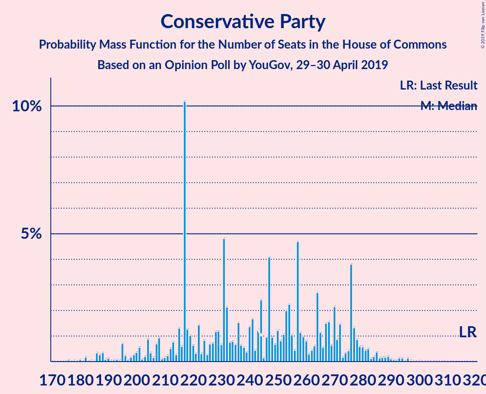
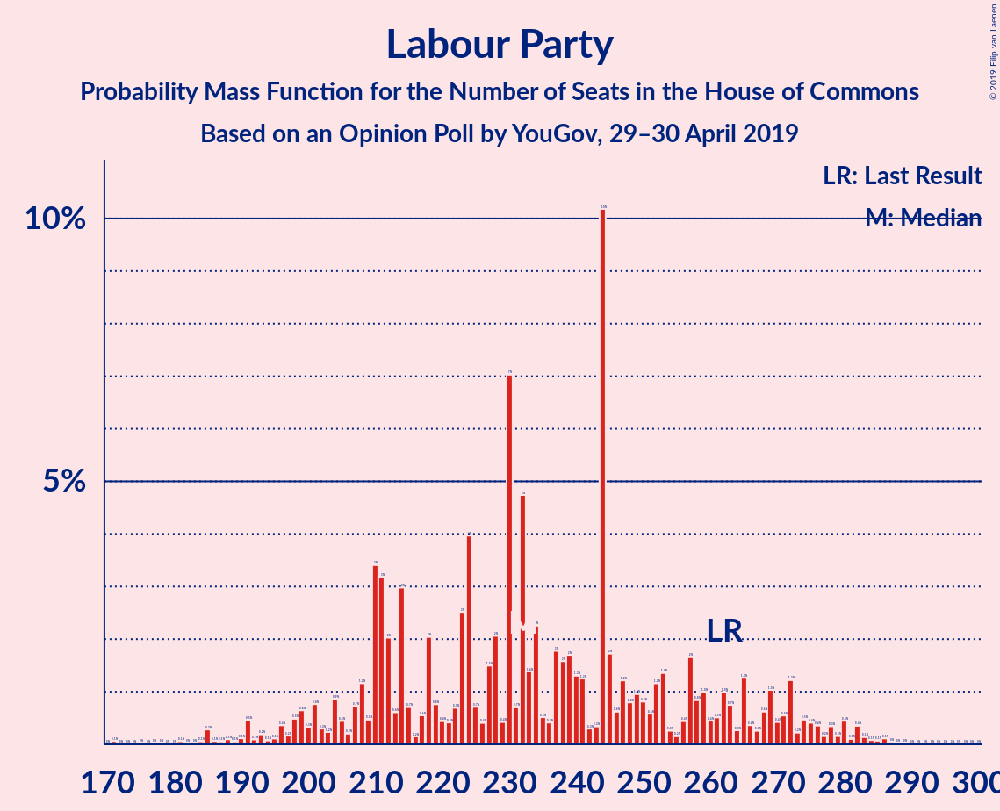
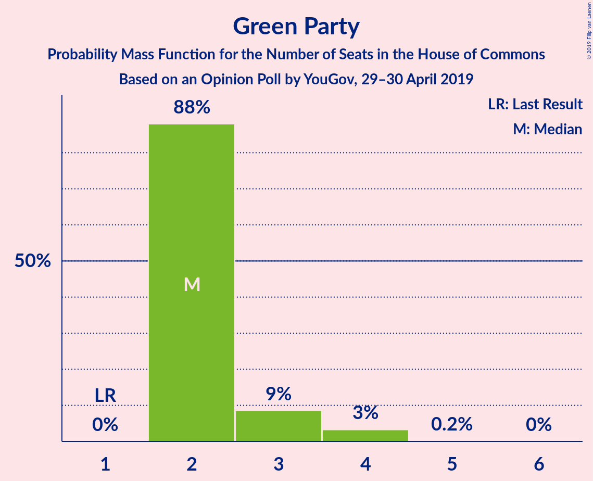
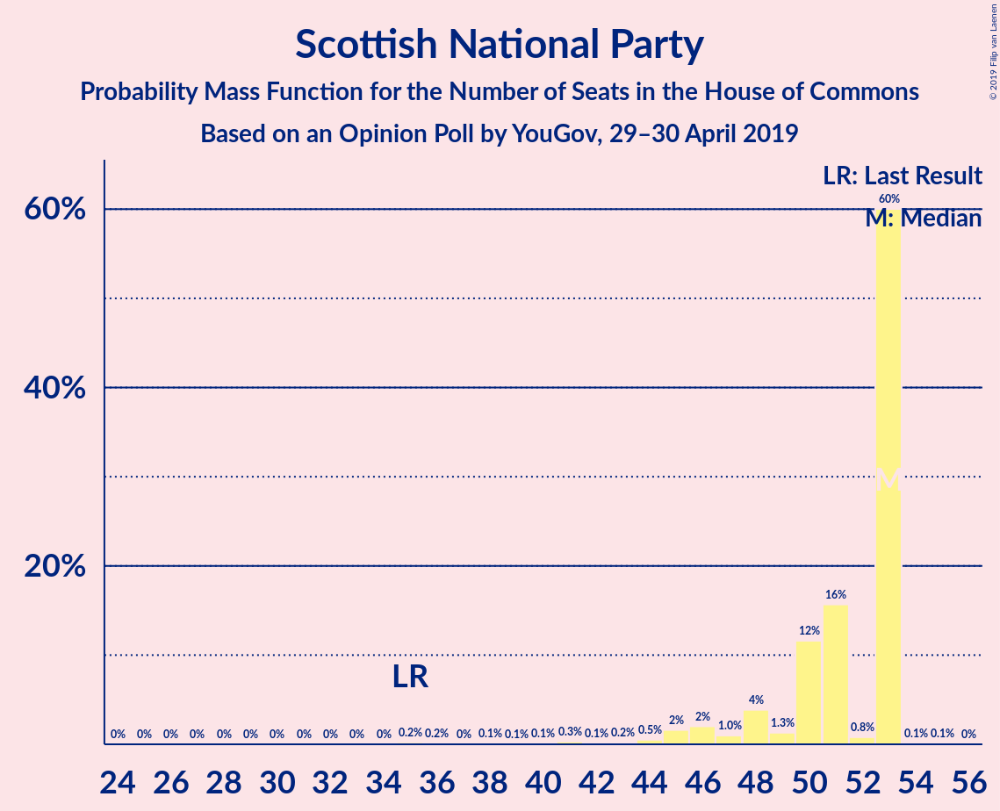
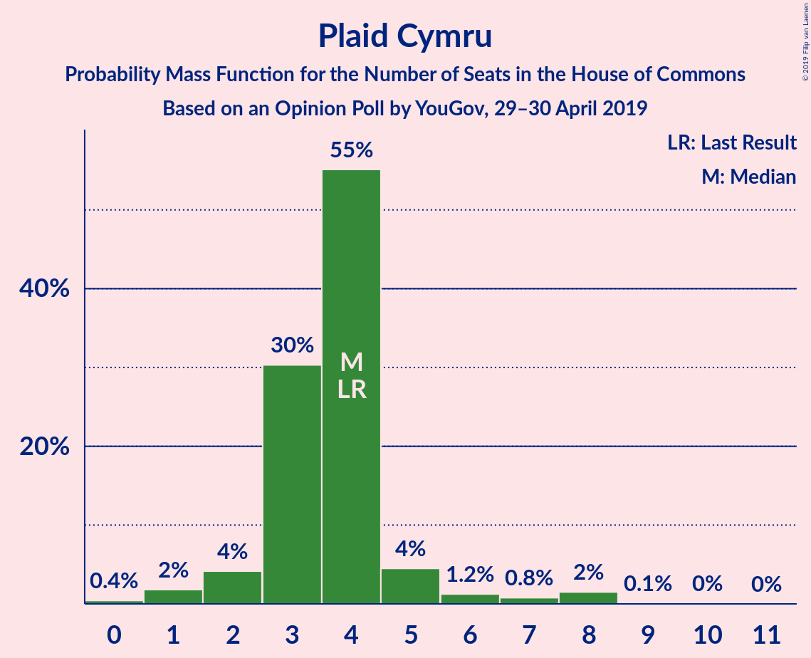
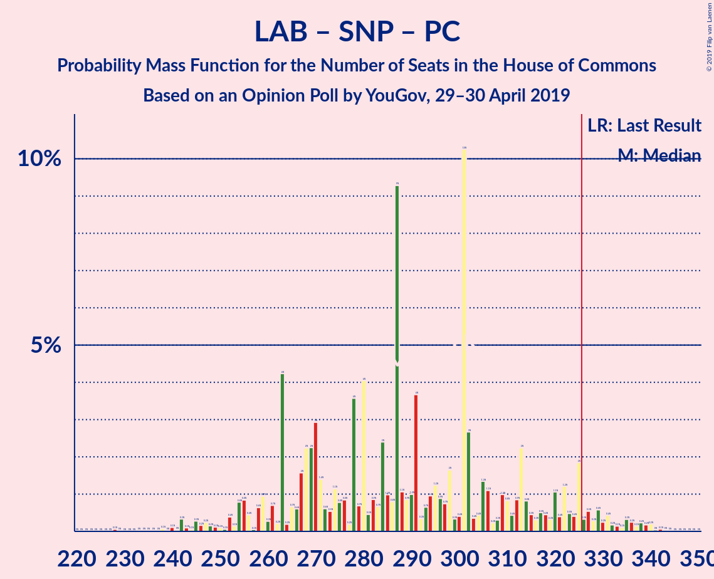
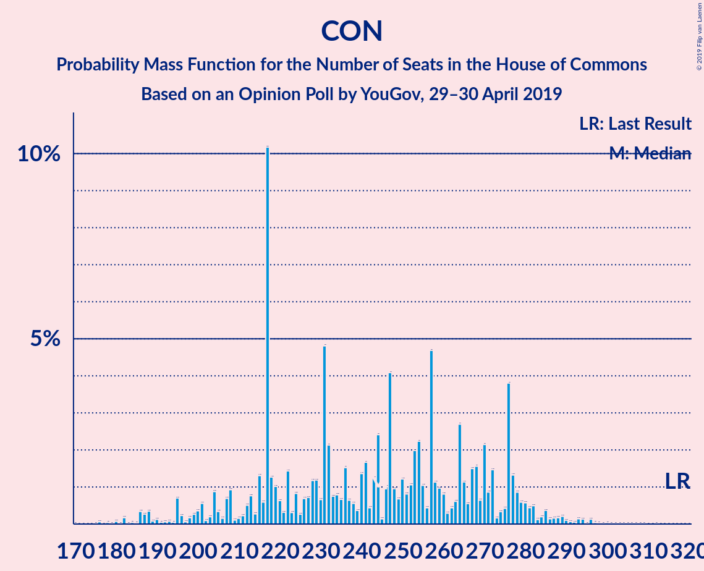
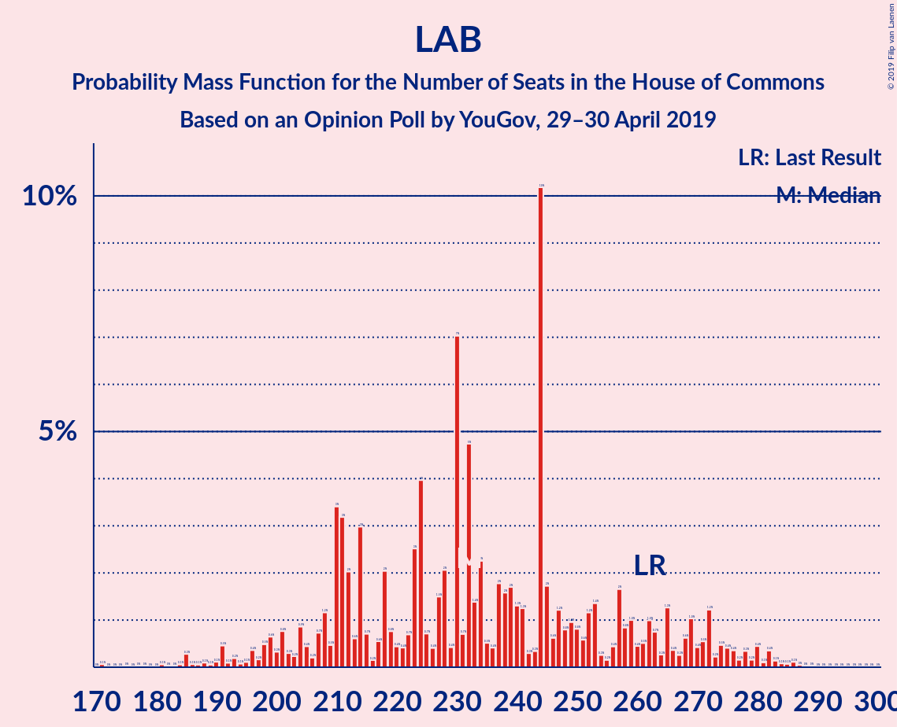

# Opinion Poll by YouGov, 29–30 April 2019

<a href="#voting-intentions">Voting Intentions</a> | <a href="#seats">Seats</a> | <a href="#coalitions">Coalitions</a> | <a href="#technical-information">Technical Information</a>

## Voting Intentions

### Confidence Intervals

| Party | Last Result | Poll Result | 80% Confidence Interval | 90% Confidence Interval | 95% Confidence Interval | 99% Confidence Interval |
|:-----:|:-----------:|:-----------:|:-----------------------:|:-----------------------:|:-----------------------:|:-----------------------:|
| Conservative Party | 42.4% | 28.7% | 27.3–30.2% |26.9–30.6% |26.6–31.0% |25.9–31.7% |
| Labour Party | 40.0% | 28.7% | 27.3–30.2% |26.9–30.6% |26.6–31.0% |25.9–31.7% |
| Brexit Party | 0.0% | 14.8% | 13.8–16.0% |13.5–16.4% |13.2–16.7% |12.7–17.2% |
| Liberal Democrats | 7.4% | 12.9% | 11.9–14.0% |11.6–14.3% |11.3–14.6% |10.9–15.2% |
| Green Party | 1.6% | 5.0% | 4.3–5.7% |4.2–5.9% |4.0–6.1% |3.7–6.5% |
| Scottish National Party | 3.0% | 3.4% | 2.9–4.0% |2.7–4.2% |2.6–4.4% |2.4–4.7% |
| Change UK | 0.0% | 2.9% | 2.5–3.6% |2.3–3.7% |2.2–3.9% |2.0–4.2% |
| UK Independence Party | 1.8% | 2.0% | 1.6–2.5% |1.5–2.6% |1.4–2.8% |1.2–3.0% |
| Plaid Cymru | 0.5% | 0.6% | 0.4–0.9% |0.3–1.0% |0.3–1.1% |0.2–1.2% |

*Note:* The poll result column reflects the actual value used in the calculations. Published results may vary slightly, and in addition be rounded to fewer digits.

## Seats

### Confidence Intervals

| Party | Last Result | Median | 80% Confidence Interval | 90% Confidence Interval | 95% Confidence Interval | 99% Confidence Interval |
|:-----:|:-----------:|:------:|:-----------------------:|:-----------------------:|:-----------------------:|:-----------------------:|
| <a href="#conservative-party">Conservative Party</a> | 317 | 264 | 240–294 |239–294 |223–294 |220–303 |
| <a href="#labour-party">Labour Party</a> | 262 | 231 | 206–244 |206–251 |206–258 |203–261 |
| <a href="#brexit-party">Brexit Party</a> | 0 | 41 | 40–46 |40–46 |40–54 |37–54 |
| <a href="#liberal-democrats">Liberal Democrats</a> | 12 | 41 | 36–46 |36–46 |36–46 |36–58 |
| <a href="#green-party">Green Party</a> | 1 | 2 | 2 |2 |2–3 |2–3 |
| <a href="#scottish-national-party">Scottish National Party</a> | 35 | 50 | 47–53 |38–53 |35–53 |21–53 |
| <a href="#change-uk">Change UK</a> | 0 | 0 | 0 |0 |0 |0 |
| <a href="#uk-independence-party">UK Independence Party</a> | 0 | 0 | 0 |0 |0 |0 |
| <a href="#plaid-cymru">Plaid Cymru</a> | 4 | 4 | 0–6 |0–6 |0–8 |0–8 |

### Conservative Party

*For a full overview of the results for this party, see the [Conservative Party](party-conservativeparty.html) page.*

| Number of Seats | Probability | Accumulated | Special Marks |
|:---------------:|:-----------:|:-----------:|:-------------:|
| 194 | 0.3% | 100% |  |
| 195 | 0% | 99.7% |  |
| 196 | 0% | 99.7% |  |
| 197 | 0% | 99.7% |  |
| 198 | 0% | 99.7% |  |
| 199 | 0% | 99.7% |  |
| 200 | 0% | 99.7% |  |
| 201 | 0% | 99.7% |  |
| 202 | 0% | 99.7% |  |
| 203 | 0% | 99.7% |  |
| 204 | 0% | 99.7% |  |
| 205 | 0% | 99.7% |  |
| 206 | 0% | 99.7% |  |
| 207 | 0% | 99.7% |  |
| 208 | 0% | 99.7% |  |
| 209 | 0% | 99.7% |  |
| 210 | 0% | 99.7% |  |
| 211 | 0% | 99.7% |  |
| 212 | 0% | 99.7% |  |
| 213 | 0% | 99.7% |  |
| 214 | 0% | 99.7% |  |
| 215 | 0% | 99.7% |  |
| 216 | 0% | 99.7% |  |
| 217 | 0% | 99.7% |  |
| 218 | 0% | 99.7% |  |
| 219 | 0% | 99.7% |  |
| 220 | 0.5% | 99.7% |  |
| 221 | 0% | 99.2% |  |
| 222 | 0% | 99.2% |  |
| 223 | 2% | 99.2% |  |
| 224 | 0% | 97% |  |
| 225 | 0% | 97% |  |
| 226 | 0% | 97% |  |
| 227 | 0% | 97% |  |
| 228 | 0% | 97% |  |
| 229 | 0% | 97% |  |
| 230 | 0% | 97% |  |
| 231 | 0% | 97% |  |
| 232 | 0% | 97% |  |
| 233 | 0% | 97% |  |
| 234 | 0% | 97% |  |
| 235 | 0% | 97% |  |
| 236 | 0% | 97% |  |
| 237 | 0% | 97% |  |
| 238 | 0% | 97% |  |
| 239 | 3% | 97% |  |
| 240 | 27% | 94% |  |
| 241 | 0% | 67% |  |
| 242 | 0% | 67% |  |
| 243 | 0% | 67% |  |
| 244 | 0% | 67% |  |
| 245 | 0.1% | 67% |  |
| 246 | 0% | 67% |  |
| 247 | 0% | 67% |  |
| 248 | 0% | 67% |  |
| 249 | 0% | 67% |  |
| 250 | 0% | 67% |  |
| 251 | 0% | 67% |  |
| 252 | 0% | 67% |  |
| 253 | 0% | 67% |  |
| 254 | 0% | 67% |  |
| 255 | 0% | 67% |  |
| 256 | 0% | 67% |  |
| 257 | 0% | 67% |  |
| 258 | 0% | 67% |  |
| 259 | 0% | 67% |  |
| 260 | 0.1% | 67% |  |
| 261 | 0% | 67% |  |
| 262 | 0% | 67% |  |
| 263 | 0% | 67% |  |
| 264 | 31% | 67% | Median |
| 265 | 0% | 36% |  |
| 266 | 0.8% | 36% |  |
| 267 | 0% | 35% |  |
| 268 | 0% | 35% |  |
| 269 | 0% | 35% |  |
| 270 | 0% | 35% |  |
| 271 | 0% | 35% |  |
| 272 | 0% | 35% |  |
| 273 | 0.2% | 35% |  |
| 274 | 0% | 35% |  |
| 275 | 0% | 35% |  |
| 276 | 0% | 35% |  |
| 277 | 3% | 35% |  |
| 278 | 0% | 32% |  |
| 279 | 0% | 32% |  |
| 280 | 0% | 32% |  |
| 281 | 0% | 32% |  |
| 282 | 0% | 32% |  |
| 283 | 0% | 32% |  |
| 284 | 0% | 32% |  |
| 285 | 0% | 32% |  |
| 286 | 0% | 32% |  |
| 287 | 0% | 32% |  |
| 288 | 0% | 32% |  |
| 289 | 0% | 32% |  |
| 290 | 0% | 32% |  |
| 291 | 0% | 32% |  |
| 292 | 0.1% | 32% |  |
| 293 | 0% | 32% |  |
| 294 | 31% | 32% |  |
| 295 | 0% | 0.6% |  |
| 296 | 0% | 0.6% |  |
| 297 | 0% | 0.6% |  |
| 298 | 0% | 0.6% |  |
| 299 | 0% | 0.6% |  |
| 300 | 0% | 0.6% |  |
| 301 | 0% | 0.6% |  |
| 302 | 0% | 0.6% |  |
| 303 | 0.6% | 0.6% |  |
| 304 | 0% | 0% |  |
| 305 | 0% | 0% |  |
| 306 | 0% | 0% |  |
| 307 | 0% | 0% |  |
| 308 | 0% | 0% |  |
| 309 | 0% | 0% |  |
| 310 | 0% | 0% |  |
| 311 | 0% | 0% |  |
| 312 | 0% | 0% |  |
| 313 | 0% | 0% |  |
| 314 | 0% | 0% |  |
| 315 | 0% | 0% |  |
| 316 | 0% | 0% |  |
| 317 | 0% | 0% | Last Result |

### Labour Party

*For a full overview of the results for this party, see the [Labour Party](party-labourparty.html) page.*

| Number of Seats | Probability | Accumulated | Special Marks |
|:---------------:|:-----------:|:-----------:|:-------------:|
| 203 | 0.6% | 100% |  |
| 204 | 0% | 99.4% |  |
| 205 | 0% | 99.4% |  |
| 206 | 31% | 99.4% |  |
| 207 | 0.1% | 68% |  |
| 208 | 0% | 68% |  |
| 209 | 0% | 68% |  |
| 210 | 0% | 68% |  |
| 211 | 0% | 68% |  |
| 212 | 0% | 68% |  |
| 213 | 0% | 68% |  |
| 214 | 0% | 68% |  |
| 215 | 0% | 68% |  |
| 216 | 0% | 68% |  |
| 217 | 0% | 68% |  |
| 218 | 0% | 68% |  |
| 219 | 0% | 68% |  |
| 220 | 0% | 68% |  |
| 221 | 0% | 68% |  |
| 222 | 0% | 68% |  |
| 223 | 0.2% | 68% |  |
| 224 | 0% | 68% |  |
| 225 | 3% | 68% |  |
| 226 | 0% | 65% |  |
| 227 | 0% | 65% |  |
| 228 | 0% | 65% |  |
| 229 | 0% | 65% |  |
| 230 | 0% | 65% |  |
| 231 | 31% | 65% | Median |
| 232 | 0.1% | 34% |  |
| 233 | 0% | 34% |  |
| 234 | 0% | 34% |  |
| 235 | 0% | 34% |  |
| 236 | 0% | 34% |  |
| 237 | 0% | 34% |  |
| 238 | 0% | 34% |  |
| 239 | 0% | 34% |  |
| 240 | 0% | 34% |  |
| 241 | 0% | 34% |  |
| 242 | 0% | 34% |  |
| 243 | 0% | 34% |  |
| 244 | 28% | 34% |  |
| 245 | 0% | 6% |  |
| 246 | 0% | 6% |  |
| 247 | 0% | 6% |  |
| 248 | 0% | 6% |  |
| 249 | 0% | 6% |  |
| 250 | 0% | 6% |  |
| 251 | 2% | 6% |  |
| 252 | 0% | 3% |  |
| 253 | 0% | 3% |  |
| 254 | 0% | 3% |  |
| 255 | 0% | 3% |  |
| 256 | 0% | 3% |  |
| 257 | 0% | 3% |  |
| 258 | 3% | 3% |  |
| 259 | 0% | 0.9% |  |
| 260 | 0% | 0.9% |  |
| 261 | 0.5% | 0.9% |  |
| 262 | 0% | 0.4% | Last Result |
| 263 | 0.1% | 0.4% |  |
| 264 | 0.3% | 0.3% |  |
| 265 | 0% | 0% |  |

### Brexit Party

*For a full overview of the results for this party, see the [Brexit Party](party-brexitparty.html) page.*

| Number of Seats | Probability | Accumulated | Special Marks |
|:---------------:|:-----------:|:-----------:|:-------------:|
| 0 | 0% | 100% | Last Result |
| 1 | 0% | 100% |  |
| 2 | 0% | 100% |  |
| 3 | 0% | 100% |  |
| 4 | 0% | 100% |  |
| 5 | 0% | 100% |  |
| 6 | 0% | 100% |  |
| 7 | 0% | 100% |  |
| 8 | 0% | 100% |  |
| 9 | 0% | 100% |  |
| 10 | 0% | 100% |  |
| 11 | 0% | 100% |  |
| 12 | 0% | 100% |  |
| 13 | 0% | 100% |  |
| 14 | 0% | 100% |  |
| 15 | 0% | 100% |  |
| 16 | 0% | 100% |  |
| 17 | 0% | 100% |  |
| 18 | 0% | 100% |  |
| 19 | 0% | 100% |  |
| 20 | 0% | 100% |  |
| 21 | 0% | 100% |  |
| 22 | 0% | 100% |  |
| 23 | 0% | 100% |  |
| 24 | 0% | 100% |  |
| 25 | 0% | 100% |  |
| 26 | 0% | 100% |  |
| 27 | 0% | 100% |  |
| 28 | 0% | 100% |  |
| 29 | 0% | 100% |  |
| 30 | 0.1% | 100% |  |
| 31 | 0.1% | 99.9% |  |
| 32 | 0% | 99.9% |  |
| 33 | 0% | 99.9% |  |
| 34 | 0% | 99.9% |  |
| 35 | 0% | 99.9% |  |
| 36 | 0% | 99.9% |  |
| 37 | 0.8% | 99.9% |  |
| 38 | 0.6% | 99.1% |  |
| 39 | 0.2% | 98% |  |
| 40 | 34% | 98% |  |
| 41 | 31% | 64% | Median |
| 42 | 3% | 33% |  |
| 43 | 0% | 31% |  |
| 44 | 0% | 31% |  |
| 45 | 0% | 31% |  |
| 46 | 27% | 31% |  |
| 47 | 0% | 3% |  |
| 48 | 0% | 3% |  |
| 49 | 0% | 3% |  |
| 50 | 0% | 3% |  |
| 51 | 0.5% | 3% |  |
| 52 | 0% | 3% |  |
| 53 | 0% | 3% |  |
| 54 | 2% | 3% |  |
| 55 | 0% | 0.3% |  |
| 56 | 0% | 0.3% |  |
| 57 | 0% | 0.3% |  |
| 58 | 0% | 0.3% |  |
| 59 | 0.3% | 0.3% |  |
| 60 | 0% | 0% |  |

### Liberal Democrats

*For a full overview of the results for this party, see the [Liberal Democrats](party-liberaldemocrats.html) page.*

| Number of Seats | Probability | Accumulated | Special Marks |
|:---------------:|:-----------:|:-----------:|:-------------:|
| 12 | 0% | 100% | Last Result |
| 13 | 0% | 100% |  |
| 14 | 0% | 100% |  |
| 15 | 0% | 100% |  |
| 16 | 0% | 100% |  |
| 17 | 0% | 100% |  |
| 18 | 0% | 100% |  |
| 19 | 0% | 100% |  |
| 20 | 0% | 100% |  |
| 21 | 0% | 100% |  |
| 22 | 0% | 100% |  |
| 23 | 0% | 100% |  |
| 24 | 0% | 100% |  |
| 25 | 0% | 100% |  |
| 26 | 0% | 100% |  |
| 27 | 0% | 100% |  |
| 28 | 0% | 100% |  |
| 29 | 0% | 100% |  |
| 30 | 0% | 100% |  |
| 31 | 0% | 100% |  |
| 32 | 0% | 100% |  |
| 33 | 0% | 100% |  |
| 34 | 0.1% | 100% |  |
| 35 | 0% | 99.9% |  |
| 36 | 31% | 99.9% |  |
| 37 | 0.6% | 69% |  |
| 38 | 0% | 68% |  |
| 39 | 0.1% | 68% |  |
| 40 | 0.2% | 68% |  |
| 41 | 31% | 68% | Median |
| 42 | 0% | 37% |  |
| 43 | 0% | 37% |  |
| 44 | 0% | 37% |  |
| 45 | 2% | 37% |  |
| 46 | 33% | 35% |  |
| 47 | 0.1% | 1.3% |  |
| 48 | 0% | 1.3% |  |
| 49 | 0% | 1.3% |  |
| 50 | 0% | 1.3% |  |
| 51 | 0.1% | 1.3% |  |
| 52 | 0% | 1.2% |  |
| 53 | 0% | 1.2% |  |
| 54 | 0% | 1.2% |  |
| 55 | 0.3% | 1.2% |  |
| 56 | 0% | 0.9% |  |
| 57 | 0% | 0.8% |  |
| 58 | 0.8% | 0.8% |  |
| 59 | 0% | 0% |  |

### Green Party

*For a full overview of the results for this party, see the [Green Party](party-greenparty.html) page.*

| Number of Seats | Probability | Accumulated | Special Marks |
|:---------------:|:-----------:|:-----------:|:-------------:|
| 1 | 0% | 100% | Last Result |
| 2 | 96% | 100% | Median |
| 3 | 4% | 4% |  |
| 4 | 0% | 0.2% |  |
| 5 | 0.2% | 0.2% |  |
| 6 | 0% | 0% |  |

### Scottish National Party

*For a full overview of the results for this party, see the [Scottish National Party](party-scottishnationalparty.html) page.*

| Number of Seats | Probability | Accumulated | Special Marks |
|:---------------:|:-----------:|:-----------:|:-------------:|
| 21 | 0.8% | 100% |  |
| 22 | 0% | 99.2% |  |
| 23 | 0% | 99.2% |  |
| 24 | 0% | 99.2% |  |
| 25 | 0.1% | 99.2% |  |
| 26 | 0% | 99.1% |  |
| 27 | 0% | 99.1% |  |
| 28 | 0% | 99.1% |  |
| 29 | 0% | 99.1% |  |
| 30 | 0% | 99.1% |  |
| 31 | 0% | 99.1% |  |
| 32 | 0% | 99.1% |  |
| 33 | 0% | 99.1% |  |
| 34 | 0% | 99.1% |  |
| 35 | 3% | 99.1% | Last Result |
| 36 | 0% | 97% |  |
| 37 | 0% | 97% |  |
| 38 | 3% | 97% |  |
| 39 | 0% | 94% |  |
| 40 | 0% | 94% |  |
| 41 | 0% | 94% |  |
| 42 | 0.5% | 94% |  |
| 43 | 0% | 93% |  |
| 44 | 0% | 93% |  |
| 45 | 0% | 93% |  |
| 46 | 0% | 93% |  |
| 47 | 32% | 93% |  |
| 48 | 0% | 62% |  |
| 49 | 0.1% | 62% |  |
| 50 | 31% | 62% | Median |
| 51 | 0.1% | 30% |  |
| 52 | 0% | 30% |  |
| 53 | 30% | 30% |  |
| 54 | 0% | 0.1% |  |
| 55 | 0.1% | 0.1% |  |
| 56 | 0% | 0% |  |

### Change UK

*For a full overview of the results for this party, see the [Change UK](party-changeuk.html) page.*

| Number of Seats | Probability | Accumulated | Special Marks |
|:---------------:|:-----------:|:-----------:|:-------------:|
| 0 | 100% | 100% | Last Result, Median |

### UK Independence Party

*For a full overview of the results for this party, see the [UK Independence Party](party-ukindependenceparty.html) page.*

| Number of Seats | Probability | Accumulated | Special Marks |
|:---------------:|:-----------:|:-----------:|:-------------:|
| 0 | 100% | 100% | Last Result, Median |

### Plaid Cymru

*For a full overview of the results for this party, see the [Plaid Cymru](party-plaidcymru.html) page.*

| Number of Seats | Probability | Accumulated | Special Marks |
|:---------------:|:-----------:|:-----------:|:-------------:|
| 0 | 27% | 100% |  |
| 1 | 0% | 73% |  |
| 2 | 0.7% | 73% |  |
| 3 | 3% | 72% |  |
| 4 | 35% | 69% | Last Result, Median |
| 5 | 0.2% | 34% |  |
| 6 | 31% | 34% |  |
| 7 | 0% | 3% |  |
| 8 | 3% | 3% |  |
| 9 | 0% | 0% |  |

## Coalitions

### Confidence Intervals

| Coalition | Last Result | Median | Majority? | 80% Confidence Interval | 90% Confidence Interval | 95% Confidence Interval | 99% Confidence Interval |
|:---------:|:-----------:|:------:|:---------:|:-----------------------:|:-----------------------:|:-----------------------:|:-----------------------:|
| Labour Party – Liberal Democrats – Scottish National Party – Plaid Cymru | 313 | 325 | 34% | 296–343 | 296–347 | 296–352 | 289–357 |
| Labour Party – Liberal Democrats – Scottish National Party | 309 | 319 | 33% | 292–343 | 292–343 | 292–349 | 287–349 |
| Conservative Party – Scottish National Party – Plaid Cymru | 356 | 317 | 32% | 293–348 | 282–348 | 279–348 | 270–352 |
| Conservative Party – Scottish National Party | 352 | 311 | 32% | 293–344 | 276–344 | 274–344 | 262–350 |
| Conservative Party – Liberal Democrats – Change UK | 329 | 305 | 32% | 286–330 | 285–330 | 268–330 | 266–340 |
| Conservative Party – Liberal Democrats | 329 | 305 | 32% | 286–330 | 285–330 | 268–330 | 266–340 |
| Labour Party – Liberal Democrats – Plaid Cymru | 278 | 278 | 0% | 246–290 | 246–299 | 246–312 | 242–315 |
| Labour Party – Scottish National Party – Plaid Cymru | 301 | 284 | 0% | 260–297 | 260–301 | 260–307 | 252–311 |
| Labour Party – Scottish National Party | 297 | 278 | 0% | 256–297 | 256–297 | 256–304 | 250–304 |
| Labour Party – Liberal Democrats – Change UK | 274 | 272 | 0% | 242–290 | 242–296 | 242–304 | 240–307 |
| Labour Party – Liberal Democrats | 274 | 272 | 0% | 242–290 | 242–296 | 242–304 | 240–307 |
| Conservative Party – Plaid Cymru | 321 | 270 | 0% | 240–298 | 240–298 | 226–298 | 226–305 |
| Conservative Party – Change UK | 317 | 264 | 0% | 240–294 | 239–294 | 223–294 | 220–303 |
| Conservative Party | 317 | 264 | 0% | 240–294 | 239–294 | 223–294 | 220–303 |
| Labour Party – Plaid Cymru | 266 | 237 | 0% | 210–244 | 210–254 | 210–266 | 205–268 |
| Labour Party – Change UK | 262 | 231 | 0% | 206–244 | 206–251 | 206–258 | 203–261 |
| Labour Party | 262 | 231 | 0% | 206–244 | 206–251 | 206–258 | 203–261 |

### Labour Party – Liberal Democrats – Scottish National Party – Plaid Cymru

| Number of Seats | Probability | Accumulated | Special Marks |
|:---------------:|:-----------:|:-----------:|:-------------:|
| 289 | 0.6% | 100% |  |
| 290 | 0% | 99.4% |  |
| 291 | 0% | 99.4% |  |
| 292 | 0% | 99.4% |  |
| 293 | 0% | 99.4% |  |
| 294 | 0% | 99.4% |  |
| 295 | 0% | 99.4% |  |
| 296 | 31% | 99.4% |  |
| 297 | 0.1% | 68% |  |
| 298 | 0% | 68% |  |
| 299 | 0% | 68% |  |
| 300 | 0% | 68% |  |
| 301 | 0% | 68% |  |
| 302 | 0% | 68% |  |
| 303 | 0% | 68% |  |
| 304 | 0% | 68% |  |
| 305 | 0% | 68% |  |
| 306 | 0% | 68% |  |
| 307 | 0% | 68% |  |
| 308 | 0% | 68% |  |
| 309 | 0% | 68% |  |
| 310 | 0% | 68% |  |
| 311 | 0% | 68% |  |
| 312 | 0% | 68% |  |
| 313 | 3% | 68% | Last Result |
| 314 | 0.2% | 65% |  |
| 315 | 0% | 65% |  |
| 316 | 0% | 65% |  |
| 317 | 0% | 65% |  |
| 318 | 0% | 65% |  |
| 319 | 0% | 65% |  |
| 320 | 0% | 65% |  |
| 321 | 0% | 65% |  |
| 322 | 0% | 65% |  |
| 323 | 0% | 65% |  |
| 324 | 0% | 65% |  |
| 325 | 31% | 65% |  |
| 326 | 0.8% | 34% | Median, Majority |
| 327 | 0% | 33% |  |
| 328 | 0% | 33% |  |
| 329 | 0% | 33% |  |
| 330 | 0% | 33% |  |
| 331 | 0% | 33% |  |
| 332 | 0% | 33% |  |
| 333 | 0% | 33% |  |
| 334 | 0% | 33% |  |
| 335 | 0% | 33% |  |
| 336 | 0% | 33% |  |
| 337 | 0% | 33% |  |
| 338 | 0% | 33% |  |
| 339 | 0% | 33% |  |
| 340 | 0% | 33% |  |
| 341 | 0% | 33% |  |
| 342 | 0% | 33% |  |
| 343 | 27% | 33% |  |
| 344 | 0% | 6% |  |
| 345 | 0% | 6% |  |
| 346 | 0% | 6% |  |
| 347 | 3% | 6% |  |
| 348 | 0% | 3% |  |
| 349 | 0% | 3% |  |
| 350 | 0% | 3% |  |
| 351 | 0% | 3% |  |
| 352 | 2% | 3% |  |
| 353 | 0% | 0.9% |  |
| 354 | 0% | 0.9% |  |
| 355 | 0% | 0.9% |  |
| 356 | 0% | 0.9% |  |
| 357 | 0.5% | 0.9% |  |
| 358 | 0% | 0.4% |  |
| 359 | 0% | 0.4% |  |
| 360 | 0% | 0.3% |  |
| 361 | 0% | 0.3% |  |
| 362 | 0% | 0.3% |  |
| 363 | 0% | 0.3% |  |
| 364 | 0% | 0.3% |  |
| 365 | 0% | 0.3% |  |
| 366 | 0% | 0.3% |  |
| 367 | 0% | 0.3% |  |
| 368 | 0% | 0.3% |  |
| 369 | 0% | 0.3% |  |
| 370 | 0% | 0.3% |  |
| 371 | 0% | 0.3% |  |
| 372 | 0% | 0.3% |  |
| 373 | 0% | 0.3% |  |
| 374 | 0% | 0.3% |  |
| 375 | 0% | 0.3% |  |
| 376 | 0.3% | 0.3% |  |
| 377 | 0% | 0% |  |

### Labour Party – Liberal Democrats – Scottish National Party

| Number of Seats | Probability | Accumulated | Special Marks |
|:---------------:|:-----------:|:-----------:|:-------------:|
| 287 | 0.6% | 100% |  |
| 288 | 0% | 99.4% |  |
| 289 | 0% | 99.4% |  |
| 290 | 0% | 99.4% |  |
| 291 | 0% | 99.4% |  |
| 292 | 31% | 99.4% |  |
| 293 | 0% | 68% |  |
| 294 | 0% | 68% |  |
| 295 | 0% | 68% |  |
| 296 | 0% | 68% |  |
| 297 | 0% | 68% |  |
| 298 | 0% | 68% |  |
| 299 | 0% | 68% |  |
| 300 | 0% | 68% |  |
| 301 | 0% | 68% |  |
| 302 | 0% | 68% |  |
| 303 | 0% | 68% |  |
| 304 | 0% | 68% |  |
| 305 | 0% | 68% |  |
| 306 | 0% | 68% |  |
| 307 | 0% | 68% |  |
| 308 | 0% | 68% |  |
| 309 | 3% | 68% | Last Result |
| 310 | 0.2% | 65% |  |
| 311 | 0% | 65% |  |
| 312 | 0% | 65% |  |
| 313 | 0% | 65% |  |
| 314 | 0% | 65% |  |
| 315 | 0% | 65% |  |
| 316 | 0% | 65% |  |
| 317 | 0% | 65% |  |
| 318 | 0% | 65% |  |
| 319 | 31% | 65% |  |
| 320 | 0.1% | 34% |  |
| 321 | 0% | 34% |  |
| 322 | 0% | 34% | Median |
| 323 | 0.8% | 34% |  |
| 324 | 0% | 33% |  |
| 325 | 0% | 33% |  |
| 326 | 0% | 33% | Majority |
| 327 | 0% | 33% |  |
| 328 | 0% | 33% |  |
| 329 | 0% | 33% |  |
| 330 | 0% | 33% |  |
| 331 | 0% | 33% |  |
| 332 | 0% | 33% |  |
| 333 | 0% | 33% |  |
| 334 | 0% | 33% |  |
| 335 | 0% | 33% |  |
| 336 | 0% | 33% |  |
| 337 | 0% | 33% |  |
| 338 | 0% | 33% |  |
| 339 | 3% | 33% |  |
| 340 | 0% | 31% |  |
| 341 | 0% | 31% |  |
| 342 | 0% | 31% |  |
| 343 | 27% | 31% |  |
| 344 | 0% | 3% |  |
| 345 | 0% | 3% |  |
| 346 | 0% | 3% |  |
| 347 | 0% | 3% |  |
| 348 | 0% | 3% |  |
| 349 | 3% | 3% |  |
| 350 | 0% | 0.4% |  |
| 351 | 0% | 0.4% |  |
| 352 | 0% | 0.4% |  |
| 353 | 0% | 0.4% |  |
| 354 | 0% | 0.3% |  |
| 355 | 0% | 0.3% |  |
| 356 | 0% | 0.3% |  |
| 357 | 0% | 0.3% |  |
| 358 | 0% | 0.3% |  |
| 359 | 0% | 0.3% |  |
| 360 | 0% | 0.3% |  |
| 361 | 0% | 0.3% |  |
| 362 | 0% | 0.3% |  |
| 363 | 0% | 0.3% |  |
| 364 | 0% | 0.3% |  |
| 365 | 0% | 0.3% |  |
| 366 | 0% | 0.3% |  |
| 367 | 0% | 0.3% |  |
| 368 | 0% | 0.3% |  |
| 369 | 0% | 0.3% |  |
| 370 | 0% | 0.3% |  |
| 371 | 0% | 0.3% |  |
| 372 | 0.3% | 0.3% |  |
| 373 | 0% | 0% |  |

### Conservative Party – Scottish National Party – Plaid Cymru

| Number of Seats | Probability | Accumulated | Special Marks |
|:---------------:|:-----------:|:-----------:|:-------------:|
| 251 | 0.3% | 100% |  |
| 252 | 0% | 99.7% |  |
| 253 | 0% | 99.7% |  |
| 254 | 0% | 99.7% |  |
| 255 | 0% | 99.7% |  |
| 256 | 0% | 99.7% |  |
| 257 | 0% | 99.7% |  |
| 258 | 0% | 99.7% |  |
| 259 | 0% | 99.7% |  |
| 260 | 0% | 99.7% |  |
| 261 | 0% | 99.7% |  |
| 262 | 0% | 99.7% |  |
| 263 | 0% | 99.7% |  |
| 264 | 0% | 99.7% |  |
| 265 | 0% | 99.7% |  |
| 266 | 0% | 99.7% |  |
| 267 | 0% | 99.7% |  |
| 268 | 0% | 99.7% |  |
| 269 | 0% | 99.7% |  |
| 270 | 0.5% | 99.7% |  |
| 271 | 0% | 99.2% |  |
| 272 | 0% | 99.2% |  |
| 273 | 0% | 99.2% |  |
| 274 | 0.1% | 99.2% |  |
| 275 | 0% | 99.1% |  |
| 276 | 0% | 99.1% |  |
| 277 | 0% | 99.1% |  |
| 278 | 0% | 99.1% |  |
| 279 | 2% | 99.1% |  |
| 280 | 0% | 97% |  |
| 281 | 0% | 97% |  |
| 282 | 3% | 97% |  |
| 283 | 0% | 94% |  |
| 284 | 0% | 94% |  |
| 285 | 0% | 94% |  |
| 286 | 0% | 94% |  |
| 287 | 0% | 94% |  |
| 288 | 0% | 94% |  |
| 289 | 0% | 94% |  |
| 290 | 0.8% | 94% |  |
| 291 | 0% | 93% |  |
| 292 | 0% | 93% |  |
| 293 | 27% | 93% |  |
| 294 | 0% | 66% |  |
| 295 | 0% | 66% |  |
| 296 | 0% | 66% |  |
| 297 | 0% | 66% |  |
| 298 | 0% | 66% |  |
| 299 | 0% | 66% |  |
| 300 | 0% | 66% |  |
| 301 | 0% | 66% |  |
| 302 | 0% | 66% |  |
| 303 | 0% | 66% |  |
| 304 | 0% | 66% |  |
| 305 | 0% | 66% |  |
| 306 | 0% | 66% |  |
| 307 | 0% | 66% |  |
| 308 | 0% | 66% |  |
| 309 | 0% | 66% |  |
| 310 | 0% | 66% |  |
| 311 | 0% | 66% |  |
| 312 | 0% | 66% |  |
| 313 | 0% | 66% |  |
| 314 | 0.1% | 66% |  |
| 315 | 0% | 66% |  |
| 316 | 0% | 66% |  |
| 317 | 31% | 66% |  |
| 318 | 0% | 35% | Median |
| 319 | 3% | 35% |  |
| 320 | 0% | 32% |  |
| 321 | 0% | 32% |  |
| 322 | 0% | 32% |  |
| 323 | 0% | 32% |  |
| 324 | 0.2% | 32% |  |
| 325 | 0% | 32% |  |
| 326 | 0% | 32% | Majority |
| 327 | 0% | 32% |  |
| 328 | 0% | 32% |  |
| 329 | 0% | 32% |  |
| 330 | 0% | 32% |  |
| 331 | 0% | 32% |  |
| 332 | 0% | 32% |  |
| 333 | 0% | 32% |  |
| 334 | 0% | 32% |  |
| 335 | 0% | 32% |  |
| 336 | 0% | 32% |  |
| 337 | 0% | 32% |  |
| 338 | 0% | 32% |  |
| 339 | 0% | 32% |  |
| 340 | 0% | 32% |  |
| 341 | 0% | 32% |  |
| 342 | 0% | 32% |  |
| 343 | 0% | 32% |  |
| 344 | 0% | 32% |  |
| 345 | 0% | 32% |  |
| 346 | 0% | 32% |  |
| 347 | 0% | 32% |  |
| 348 | 31% | 32% |  |
| 349 | 0% | 0.6% |  |
| 350 | 0% | 0.6% |  |
| 351 | 0% | 0.6% |  |
| 352 | 0.6% | 0.6% |  |
| 353 | 0% | 0% |  |
| 354 | 0% | 0% |  |
| 355 | 0% | 0% |  |
| 356 | 0% | 0% | Last Result |

### Conservative Party – Scottish National Party

| Number of Seats | Probability | Accumulated | Special Marks |
|:---------------:|:-----------:|:-----------:|:-------------:|
| 247 | 0.3% | 100% |  |
| 248 | 0% | 99.7% |  |
| 249 | 0% | 99.7% |  |
| 250 | 0% | 99.7% |  |
| 251 | 0% | 99.7% |  |
| 252 | 0% | 99.7% |  |
| 253 | 0% | 99.7% |  |
| 254 | 0% | 99.7% |  |
| 255 | 0% | 99.7% |  |
| 256 | 0% | 99.7% |  |
| 257 | 0% | 99.7% |  |
| 258 | 0% | 99.7% |  |
| 259 | 0% | 99.7% |  |
| 260 | 0% | 99.7% |  |
| 261 | 0% | 99.7% |  |
| 262 | 0.5% | 99.7% |  |
| 263 | 0% | 99.2% |  |
| 264 | 0% | 99.2% |  |
| 265 | 0% | 99.2% |  |
| 266 | 0% | 99.2% |  |
| 267 | 0% | 99.2% |  |
| 268 | 0% | 99.2% |  |
| 269 | 0% | 99.2% |  |
| 270 | 0.1% | 99.2% |  |
| 271 | 0% | 99.1% |  |
| 272 | 0% | 99.1% |  |
| 273 | 0% | 99.1% |  |
| 274 | 3% | 99.1% |  |
| 275 | 0% | 97% |  |
| 276 | 2% | 97% |  |
| 277 | 0% | 94% |  |
| 278 | 0% | 94% |  |
| 279 | 0% | 94% |  |
| 280 | 0% | 94% |  |
| 281 | 0% | 94% |  |
| 282 | 0% | 94% |  |
| 283 | 0% | 94% |  |
| 284 | 0% | 94% |  |
| 285 | 0% | 94% |  |
| 286 | 0% | 94% |  |
| 287 | 0.8% | 94% |  |
| 288 | 0% | 93% |  |
| 289 | 0% | 93% |  |
| 290 | 0% | 93% |  |
| 291 | 0% | 93% |  |
| 292 | 0% | 93% |  |
| 293 | 27% | 93% |  |
| 294 | 0% | 66% |  |
| 295 | 0% | 66% |  |
| 296 | 0% | 66% |  |
| 297 | 0% | 66% |  |
| 298 | 0% | 66% |  |
| 299 | 0% | 66% |  |
| 300 | 0% | 66% |  |
| 301 | 0% | 66% |  |
| 302 | 0% | 66% |  |
| 303 | 0% | 66% |  |
| 304 | 0% | 66% |  |
| 305 | 0% | 66% |  |
| 306 | 0% | 66% |  |
| 307 | 0% | 66% |  |
| 308 | 0% | 66% |  |
| 309 | 0.1% | 66% |  |
| 310 | 0% | 66% |  |
| 311 | 31% | 66% |  |
| 312 | 0% | 35% |  |
| 313 | 0% | 35% |  |
| 314 | 0% | 35% | Median |
| 315 | 3% | 35% |  |
| 316 | 0% | 32% |  |
| 317 | 0% | 32% |  |
| 318 | 0% | 32% |  |
| 319 | 0% | 32% |  |
| 320 | 0.2% | 32% |  |
| 321 | 0% | 32% |  |
| 322 | 0% | 32% |  |
| 323 | 0% | 32% |  |
| 324 | 0% | 32% |  |
| 325 | 0% | 32% |  |
| 326 | 0% | 32% | Majority |
| 327 | 0% | 32% |  |
| 328 | 0% | 32% |  |
| 329 | 0% | 32% |  |
| 330 | 0% | 32% |  |
| 331 | 0% | 32% |  |
| 332 | 0% | 32% |  |
| 333 | 0% | 32% |  |
| 334 | 0% | 32% |  |
| 335 | 0% | 32% |  |
| 336 | 0% | 32% |  |
| 337 | 0% | 32% |  |
| 338 | 0% | 32% |  |
| 339 | 0% | 32% |  |
| 340 | 0% | 32% |  |
| 341 | 0% | 32% |  |
| 342 | 0% | 32% |  |
| 343 | 0.1% | 32% |  |
| 344 | 31% | 32% |  |
| 345 | 0% | 0.6% |  |
| 346 | 0% | 0.6% |  |
| 347 | 0% | 0.6% |  |
| 348 | 0% | 0.6% |  |
| 349 | 0% | 0.6% |  |
| 350 | 0.6% | 0.6% |  |
| 351 | 0% | 0% |  |
| 352 | 0% | 0% | Last Result |

### Conservative Party – Liberal Democrats – Change UK

| Number of Seats | Probability | Accumulated | Special Marks |
|:---------------:|:-----------:|:-----------:|:-------------:|
| 249 | 0.3% | 100% |  |
| 250 | 0% | 99.7% |  |
| 251 | 0% | 99.7% |  |
| 252 | 0% | 99.7% |  |
| 253 | 0% | 99.7% |  |
| 254 | 0% | 99.7% |  |
| 255 | 0% | 99.7% |  |
| 256 | 0% | 99.7% |  |
| 257 | 0% | 99.7% |  |
| 258 | 0% | 99.7% |  |
| 259 | 0% | 99.7% |  |
| 260 | 0% | 99.7% |  |
| 261 | 0% | 99.7% |  |
| 262 | 0% | 99.7% |  |
| 263 | 0% | 99.7% |  |
| 264 | 0% | 99.7% |  |
| 265 | 0% | 99.7% |  |
| 266 | 0.5% | 99.7% |  |
| 267 | 0% | 99.2% |  |
| 268 | 2% | 99.2% |  |
| 269 | 0% | 97% |  |
| 270 | 0% | 97% |  |
| 271 | 0% | 97% |  |
| 272 | 0% | 97% |  |
| 273 | 0% | 97% |  |
| 274 | 0% | 97% |  |
| 275 | 0% | 97% |  |
| 276 | 0% | 97% |  |
| 277 | 0% | 97% |  |
| 278 | 0% | 97% |  |
| 279 | 0% | 97% |  |
| 280 | 0% | 97% |  |
| 281 | 0% | 97% |  |
| 282 | 0% | 97% |  |
| 283 | 0% | 97% |  |
| 284 | 0% | 97% |  |
| 285 | 3% | 97% |  |
| 286 | 27% | 94% |  |
| 287 | 0% | 67% |  |
| 288 | 0% | 67% |  |
| 289 | 0% | 67% |  |
| 290 | 0% | 67% |  |
| 291 | 0% | 67% |  |
| 292 | 0% | 67% |  |
| 293 | 0% | 67% |  |
| 294 | 0% | 67% |  |
| 295 | 0% | 67% |  |
| 296 | 0.1% | 67% |  |
| 297 | 0% | 67% |  |
| 298 | 0% | 67% |  |
| 299 | 0.1% | 67% |  |
| 300 | 0% | 67% |  |
| 301 | 0% | 67% |  |
| 302 | 0% | 67% |  |
| 303 | 0% | 67% |  |
| 304 | 0% | 67% |  |
| 305 | 31% | 67% | Median |
| 306 | 0% | 36% |  |
| 307 | 0% | 36% |  |
| 308 | 0% | 36% |  |
| 309 | 0% | 36% |  |
| 310 | 0% | 36% |  |
| 311 | 0% | 36% |  |
| 312 | 0% | 36% |  |
| 313 | 0.2% | 36% |  |
| 314 | 0% | 36% |  |
| 315 | 0% | 36% |  |
| 316 | 0% | 36% |  |
| 317 | 0% | 36% |  |
| 318 | 0% | 36% |  |
| 319 | 0% | 36% |  |
| 320 | 0% | 36% |  |
| 321 | 0% | 36% |  |
| 322 | 0% | 36% |  |
| 323 | 3% | 36% |  |
| 324 | 0.8% | 33% |  |
| 325 | 0% | 32% |  |
| 326 | 0.1% | 32% | Majority |
| 327 | 0% | 32% |  |
| 328 | 0% | 32% |  |
| 329 | 0% | 32% | Last Result |
| 330 | 31% | 32% |  |
| 331 | 0% | 0.6% |  |
| 332 | 0% | 0.6% |  |
| 333 | 0% | 0.6% |  |
| 334 | 0% | 0.6% |  |
| 335 | 0% | 0.6% |  |
| 336 | 0% | 0.6% |  |
| 337 | 0% | 0.6% |  |
| 338 | 0% | 0.6% |  |
| 339 | 0% | 0.6% |  |
| 340 | 0.6% | 0.6% |  |
| 341 | 0% | 0% |  |

### Conservative Party – Liberal Democrats

| Number of Seats | Probability | Accumulated | Special Marks |
|:---------------:|:-----------:|:-----------:|:-------------:|
| 249 | 0.3% | 100% |  |
| 250 | 0% | 99.7% |  |
| 251 | 0% | 99.7% |  |
| 252 | 0% | 99.7% |  |
| 253 | 0% | 99.7% |  |
| 254 | 0% | 99.7% |  |
| 255 | 0% | 99.7% |  |
| 256 | 0% | 99.7% |  |
| 257 | 0% | 99.7% |  |
| 258 | 0% | 99.7% |  |
| 259 | 0% | 99.7% |  |
| 260 | 0% | 99.7% |  |
| 261 | 0% | 99.7% |  |
| 262 | 0% | 99.7% |  |
| 263 | 0% | 99.7% |  |
| 264 | 0% | 99.7% |  |
| 265 | 0% | 99.7% |  |
| 266 | 0.5% | 99.7% |  |
| 267 | 0% | 99.2% |  |
| 268 | 2% | 99.2% |  |
| 269 | 0% | 97% |  |
| 270 | 0% | 97% |  |
| 271 | 0% | 97% |  |
| 272 | 0% | 97% |  |
| 273 | 0% | 97% |  |
| 274 | 0% | 97% |  |
| 275 | 0% | 97% |  |
| 276 | 0% | 97% |  |
| 277 | 0% | 97% |  |
| 278 | 0% | 97% |  |
| 279 | 0% | 97% |  |
| 280 | 0% | 97% |  |
| 281 | 0% | 97% |  |
| 282 | 0% | 97% |  |
| 283 | 0% | 97% |  |
| 284 | 0% | 97% |  |
| 285 | 3% | 97% |  |
| 286 | 27% | 94% |  |
| 287 | 0% | 67% |  |
| 288 | 0% | 67% |  |
| 289 | 0% | 67% |  |
| 290 | 0% | 67% |  |
| 291 | 0% | 67% |  |
| 292 | 0% | 67% |  |
| 293 | 0% | 67% |  |
| 294 | 0% | 67% |  |
| 295 | 0% | 67% |  |
| 296 | 0.1% | 67% |  |
| 297 | 0% | 67% |  |
| 298 | 0% | 67% |  |
| 299 | 0.1% | 67% |  |
| 300 | 0% | 67% |  |
| 301 | 0% | 67% |  |
| 302 | 0% | 67% |  |
| 303 | 0% | 67% |  |
| 304 | 0% | 67% |  |
| 305 | 31% | 67% | Median |
| 306 | 0% | 36% |  |
| 307 | 0% | 36% |  |
| 308 | 0% | 36% |  |
| 309 | 0% | 36% |  |
| 310 | 0% | 36% |  |
| 311 | 0% | 36% |  |
| 312 | 0% | 36% |  |
| 313 | 0.2% | 36% |  |
| 314 | 0% | 36% |  |
| 315 | 0% | 36% |  |
| 316 | 0% | 36% |  |
| 317 | 0% | 36% |  |
| 318 | 0% | 36% |  |
| 319 | 0% | 36% |  |
| 320 | 0% | 36% |  |
| 321 | 0% | 36% |  |
| 322 | 0% | 36% |  |
| 323 | 3% | 36% |  |
| 324 | 0.8% | 33% |  |
| 325 | 0% | 32% |  |
| 326 | 0.1% | 32% | Majority |
| 327 | 0% | 32% |  |
| 328 | 0% | 32% |  |
| 329 | 0% | 32% | Last Result |
| 330 | 31% | 32% |  |
| 331 | 0% | 0.6% |  |
| 332 | 0% | 0.6% |  |
| 333 | 0% | 0.6% |  |
| 334 | 0% | 0.6% |  |
| 335 | 0% | 0.6% |  |
| 336 | 0% | 0.6% |  |
| 337 | 0% | 0.6% |  |
| 338 | 0% | 0.6% |  |
| 339 | 0% | 0.6% |  |
| 340 | 0.6% | 0.6% |  |
| 341 | 0% | 0% |  |

### Labour Party – Liberal Democrats – Plaid Cymru

| Number of Seats | Probability | Accumulated | Special Marks |
|:---------------:|:-----------:|:-----------:|:-------------:|
| 242 | 0.6% | 100% |  |
| 243 | 0% | 99.4% |  |
| 244 | 0% | 99.4% |  |
| 245 | 0% | 99.4% |  |
| 246 | 31% | 99.4% |  |
| 247 | 0% | 68% |  |
| 248 | 0% | 68% |  |
| 249 | 0% | 68% |  |
| 250 | 0% | 68% |  |
| 251 | 0% | 68% |  |
| 252 | 0% | 68% |  |
| 253 | 0% | 68% |  |
| 254 | 0% | 68% |  |
| 255 | 0% | 68% |  |
| 256 | 0% | 68% |  |
| 257 | 0% | 68% |  |
| 258 | 0% | 68% |  |
| 259 | 0% | 68% |  |
| 260 | 0% | 68% |  |
| 261 | 0% | 68% |  |
| 262 | 0% | 68% |  |
| 263 | 0% | 68% |  |
| 264 | 0% | 68% |  |
| 265 | 0% | 68% |  |
| 266 | 0% | 68% |  |
| 267 | 0.2% | 68% |  |
| 268 | 0% | 68% |  |
| 269 | 0% | 68% |  |
| 270 | 0% | 68% |  |
| 271 | 0% | 68% |  |
| 272 | 0% | 68% |  |
| 273 | 0% | 68% |  |
| 274 | 0% | 68% |  |
| 275 | 3% | 68% |  |
| 276 | 0.1% | 65% | Median |
| 277 | 0% | 65% |  |
| 278 | 31% | 65% | Last Result |
| 279 | 0% | 34% |  |
| 280 | 0% | 34% |  |
| 281 | 0% | 34% |  |
| 282 | 0% | 34% |  |
| 283 | 0% | 34% |  |
| 284 | 0% | 34% |  |
| 285 | 0% | 34% |  |
| 286 | 0% | 34% |  |
| 287 | 0% | 34% |  |
| 288 | 0% | 34% |  |
| 289 | 0% | 34% |  |
| 290 | 27% | 34% |  |
| 291 | 0% | 7% |  |
| 292 | 0% | 7% |  |
| 293 | 0% | 7% |  |
| 294 | 0% | 7% |  |
| 295 | 0% | 7% |  |
| 296 | 0% | 7% |  |
| 297 | 0% | 7% |  |
| 298 | 0% | 7% |  |
| 299 | 2% | 7% |  |
| 300 | 0% | 4% |  |
| 301 | 0% | 4% |  |
| 302 | 0% | 4% |  |
| 303 | 0% | 4% |  |
| 304 | 0% | 4% |  |
| 305 | 0.8% | 4% |  |
| 306 | 0% | 3% |  |
| 307 | 0% | 3% |  |
| 308 | 0% | 3% |  |
| 309 | 0% | 3% |  |
| 310 | 0% | 3% |  |
| 311 | 0% | 3% |  |
| 312 | 3% | 3% |  |
| 313 | 0% | 0.9% |  |
| 314 | 0% | 0.9% |  |
| 315 | 0.5% | 0.9% |  |
| 316 | 0% | 0.4% |  |
| 317 | 0% | 0.4% |  |
| 318 | 0.1% | 0.4% |  |
| 319 | 0% | 0.3% |  |
| 320 | 0% | 0.3% |  |
| 321 | 0% | 0.3% |  |
| 322 | 0% | 0.3% |  |
| 323 | 0.3% | 0.3% |  |
| 324 | 0% | 0% |  |

### Labour Party – Scottish National Party – Plaid Cymru

| Number of Seats | Probability | Accumulated | Special Marks |
|:---------------:|:-----------:|:-----------:|:-------------:|
| 252 | 0.6% | 100% |  |
| 253 | 0% | 99.4% |  |
| 254 | 0% | 99.4% |  |
| 255 | 0% | 99.4% |  |
| 256 | 0% | 99.4% |  |
| 257 | 0% | 99.4% |  |
| 258 | 0% | 99.4% |  |
| 259 | 0% | 99.4% |  |
| 260 | 31% | 99.4% |  |
| 261 | 0% | 68% |  |
| 262 | 0% | 68% |  |
| 263 | 0.1% | 68% |  |
| 264 | 0% | 68% |  |
| 265 | 0% | 68% |  |
| 266 | 0% | 68% |  |
| 267 | 3% | 68% |  |
| 268 | 0.8% | 65% |  |
| 269 | 0% | 64% |  |
| 270 | 0% | 64% |  |
| 271 | 0% | 64% |  |
| 272 | 0% | 64% |  |
| 273 | 0% | 64% |  |
| 274 | 0.2% | 64% |  |
| 275 | 0% | 64% |  |
| 276 | 0% | 64% |  |
| 277 | 0% | 64% |  |
| 278 | 0% | 64% |  |
| 279 | 0% | 64% |  |
| 280 | 0% | 64% |  |
| 281 | 0% | 64% |  |
| 282 | 0% | 64% |  |
| 283 | 0% | 64% |  |
| 284 | 31% | 64% |  |
| 285 | 0% | 33% | Median |
| 286 | 0.1% | 33% |  |
| 287 | 0% | 33% |  |
| 288 | 0% | 33% |  |
| 289 | 0% | 33% |  |
| 290 | 0% | 33% |  |
| 291 | 0% | 33% |  |
| 292 | 0.1% | 33% |  |
| 293 | 0% | 33% |  |
| 294 | 0% | 33% |  |
| 295 | 0% | 33% |  |
| 296 | 0% | 33% |  |
| 297 | 27% | 33% |  |
| 298 | 0% | 6% |  |
| 299 | 0% | 6% |  |
| 300 | 0% | 6% |  |
| 301 | 3% | 6% | Last Result |
| 302 | 0% | 3% |  |
| 303 | 0% | 3% |  |
| 304 | 0% | 3% |  |
| 305 | 0% | 3% |  |
| 306 | 0% | 3% |  |
| 307 | 2% | 3% |  |
| 308 | 0% | 0.9% |  |
| 309 | 0% | 0.9% |  |
| 310 | 0% | 0.9% |  |
| 311 | 0.5% | 0.9% |  |
| 312 | 0.1% | 0.4% |  |
| 313 | 0% | 0.3% |  |
| 314 | 0% | 0.3% |  |
| 315 | 0% | 0.3% |  |
| 316 | 0% | 0.3% |  |
| 317 | 0% | 0.3% |  |
| 318 | 0% | 0.3% |  |
| 319 | 0% | 0.3% |  |
| 320 | 0% | 0.3% |  |
| 321 | 0.3% | 0.3% |  |
| 322 | 0% | 0% |  |

### Labour Party – Scottish National Party

| Number of Seats | Probability | Accumulated | Special Marks |
|:---------------:|:-----------:|:-----------:|:-------------:|
| 250 | 0.6% | 100% |  |
| 251 | 0% | 99.4% |  |
| 252 | 0% | 99.4% |  |
| 253 | 0% | 99.4% |  |
| 254 | 0% | 99.4% |  |
| 255 | 0% | 99.4% |  |
| 256 | 31% | 99.4% |  |
| 257 | 0% | 68% |  |
| 258 | 0.1% | 68% |  |
| 259 | 0% | 68% |  |
| 260 | 0% | 68% |  |
| 261 | 0% | 68% |  |
| 262 | 0% | 68% |  |
| 263 | 3% | 68% |  |
| 264 | 0% | 65% |  |
| 265 | 0.8% | 65% |  |
| 266 | 0% | 64% |  |
| 267 | 0% | 64% |  |
| 268 | 0% | 64% |  |
| 269 | 0% | 64% |  |
| 270 | 0.2% | 64% |  |
| 271 | 0% | 64% |  |
| 272 | 0% | 64% |  |
| 273 | 0% | 64% |  |
| 274 | 0% | 64% |  |
| 275 | 0% | 64% |  |
| 276 | 0% | 64% |  |
| 277 | 0% | 64% |  |
| 278 | 31% | 64% |  |
| 279 | 0% | 33% |  |
| 280 | 0% | 33% |  |
| 281 | 0.1% | 33% | Median |
| 282 | 0% | 33% |  |
| 283 | 0% | 33% |  |
| 284 | 0% | 33% |  |
| 285 | 0% | 33% |  |
| 286 | 0% | 33% |  |
| 287 | 0% | 33% |  |
| 288 | 0.1% | 33% |  |
| 289 | 0% | 33% |  |
| 290 | 0% | 33% |  |
| 291 | 0% | 33% |  |
| 292 | 0% | 33% |  |
| 293 | 3% | 33% |  |
| 294 | 0% | 31% |  |
| 295 | 0% | 31% |  |
| 296 | 0% | 31% |  |
| 297 | 27% | 31% | Last Result |
| 298 | 0% | 3% |  |
| 299 | 0% | 3% |  |
| 300 | 0% | 3% |  |
| 301 | 0% | 3% |  |
| 302 | 0% | 3% |  |
| 303 | 0.5% | 3% |  |
| 304 | 2% | 3% |  |
| 305 | 0% | 0.4% |  |
| 306 | 0% | 0.4% |  |
| 307 | 0% | 0.3% |  |
| 308 | 0% | 0.3% |  |
| 309 | 0% | 0.3% |  |
| 310 | 0% | 0.3% |  |
| 311 | 0% | 0.3% |  |
| 312 | 0% | 0.3% |  |
| 313 | 0% | 0.3% |  |
| 314 | 0% | 0.3% |  |
| 315 | 0% | 0.3% |  |
| 316 | 0% | 0.3% |  |
| 317 | 0.3% | 0.3% |  |
| 318 | 0% | 0% |  |

### Labour Party – Liberal Democrats – Change UK

| Number of Seats | Probability | Accumulated | Special Marks |
|:---------------:|:-----------:|:-----------:|:-------------:|
| 240 | 0.6% | 100% |  |
| 241 | 0.1% | 99.4% |  |
| 242 | 31% | 99.2% |  |
| 243 | 0% | 68% |  |
| 244 | 0% | 68% |  |
| 245 | 0% | 68% |  |
| 246 | 0% | 68% |  |
| 247 | 0% | 68% |  |
| 248 | 0% | 68% |  |
| 249 | 0% | 68% |  |
| 250 | 0% | 68% |  |
| 251 | 0% | 68% |  |
| 252 | 0% | 68% |  |
| 253 | 0% | 68% |  |
| 254 | 0% | 68% |  |
| 255 | 0% | 68% |  |
| 256 | 0% | 68% |  |
| 257 | 0% | 68% |  |
| 258 | 0% | 68% |  |
| 259 | 0% | 68% |  |
| 260 | 0% | 68% |  |
| 261 | 0% | 68% |  |
| 262 | 0% | 68% |  |
| 263 | 0.2% | 68% |  |
| 264 | 0% | 68% |  |
| 265 | 0% | 68% |  |
| 266 | 0% | 68% |  |
| 267 | 0% | 68% |  |
| 268 | 0% | 68% |  |
| 269 | 0% | 68% |  |
| 270 | 0% | 68% |  |
| 271 | 3% | 68% |  |
| 272 | 31% | 65% | Median |
| 273 | 0% | 34% |  |
| 274 | 0% | 34% | Last Result |
| 275 | 0% | 34% |  |
| 276 | 0% | 34% |  |
| 277 | 0% | 34% |  |
| 278 | 0% | 34% |  |
| 279 | 0% | 34% |  |
| 280 | 0% | 34% |  |
| 281 | 0% | 34% |  |
| 282 | 0% | 34% |  |
| 283 | 0% | 34% |  |
| 284 | 0% | 34% |  |
| 285 | 0% | 34% |  |
| 286 | 0% | 34% |  |
| 287 | 0% | 34% |  |
| 288 | 0% | 34% |  |
| 289 | 0% | 34% |  |
| 290 | 27% | 34% |  |
| 291 | 0% | 7% |  |
| 292 | 0% | 7% |  |
| 293 | 0% | 7% |  |
| 294 | 0% | 7% |  |
| 295 | 0% | 7% |  |
| 296 | 2% | 7% |  |
| 297 | 0% | 4% |  |
| 298 | 0% | 4% |  |
| 299 | 0% | 4% |  |
| 300 | 0% | 4% |  |
| 301 | 0% | 4% |  |
| 302 | 0.8% | 4% |  |
| 303 | 0% | 3% |  |
| 304 | 3% | 3% |  |
| 305 | 0% | 0.9% |  |
| 306 | 0% | 0.9% |  |
| 307 | 0.5% | 0.9% |  |
| 308 | 0% | 0.4% |  |
| 309 | 0% | 0.4% |  |
| 310 | 0% | 0.4% |  |
| 311 | 0% | 0.4% |  |
| 312 | 0% | 0.4% |  |
| 313 | 0% | 0.4% |  |
| 314 | 0.1% | 0.4% |  |
| 315 | 0% | 0.3% |  |
| 316 | 0% | 0.3% |  |
| 317 | 0% | 0.3% |  |
| 318 | 0% | 0.3% |  |
| 319 | 0.3% | 0.3% |  |
| 320 | 0% | 0% |  |

### Labour Party – Liberal Democrats

| Number of Seats | Probability | Accumulated | Special Marks |
|:---------------:|:-----------:|:-----------:|:-------------:|
| 240 | 0.6% | 100% |  |
| 241 | 0.1% | 99.4% |  |
| 242 | 31% | 99.2% |  |
| 243 | 0% | 68% |  |
| 244 | 0% | 68% |  |
| 245 | 0% | 68% |  |
| 246 | 0% | 68% |  |
| 247 | 0% | 68% |  |
| 248 | 0% | 68% |  |
| 249 | 0% | 68% |  |
| 250 | 0% | 68% |  |
| 251 | 0% | 68% |  |
| 252 | 0% | 68% |  |
| 253 | 0% | 68% |  |
| 254 | 0% | 68% |  |
| 255 | 0% | 68% |  |
| 256 | 0% | 68% |  |
| 257 | 0% | 68% |  |
| 258 | 0% | 68% |  |
| 259 | 0% | 68% |  |
| 260 | 0% | 68% |  |
| 261 | 0% | 68% |  |
| 262 | 0% | 68% |  |
| 263 | 0.2% | 68% |  |
| 264 | 0% | 68% |  |
| 265 | 0% | 68% |  |
| 266 | 0% | 68% |  |
| 267 | 0% | 68% |  |
| 268 | 0% | 68% |  |
| 269 | 0% | 68% |  |
| 270 | 0% | 68% |  |
| 271 | 3% | 68% |  |
| 272 | 31% | 65% | Median |
| 273 | 0% | 34% |  |
| 274 | 0% | 34% | Last Result |
| 275 | 0% | 34% |  |
| 276 | 0% | 34% |  |
| 277 | 0% | 34% |  |
| 278 | 0% | 34% |  |
| 279 | 0% | 34% |  |
| 280 | 0% | 34% |  |
| 281 | 0% | 34% |  |
| 282 | 0% | 34% |  |
| 283 | 0% | 34% |  |
| 284 | 0% | 34% |  |
| 285 | 0% | 34% |  |
| 286 | 0% | 34% |  |
| 287 | 0% | 34% |  |
| 288 | 0% | 34% |  |
| 289 | 0% | 34% |  |
| 290 | 27% | 34% |  |
| 291 | 0% | 7% |  |
| 292 | 0% | 7% |  |
| 293 | 0% | 7% |  |
| 294 | 0% | 7% |  |
| 295 | 0% | 7% |  |
| 296 | 2% | 7% |  |
| 297 | 0% | 4% |  |
| 298 | 0% | 4% |  |
| 299 | 0% | 4% |  |
| 300 | 0% | 4% |  |
| 301 | 0% | 4% |  |
| 302 | 0.8% | 4% |  |
| 303 | 0% | 3% |  |
| 304 | 3% | 3% |  |
| 305 | 0% | 0.9% |  |
| 306 | 0% | 0.9% |  |
| 307 | 0.5% | 0.9% |  |
| 308 | 0% | 0.4% |  |
| 309 | 0% | 0.4% |  |
| 310 | 0% | 0.4% |  |
| 311 | 0% | 0.4% |  |
| 312 | 0% | 0.4% |  |
| 313 | 0% | 0.4% |  |
| 314 | 0.1% | 0.4% |  |
| 315 | 0% | 0.3% |  |
| 316 | 0% | 0.3% |  |
| 317 | 0% | 0.3% |  |
| 318 | 0% | 0.3% |  |
| 319 | 0.3% | 0.3% |  |
| 320 | 0% | 0% |  |

### Conservative Party – Plaid Cymru

| Number of Seats | Probability | Accumulated | Special Marks |
|:---------------:|:-----------:|:-----------:|:-------------:|
| 198 | 0.3% | 100% |  |
| 199 | 0% | 99.7% |  |
| 200 | 0% | 99.7% |  |
| 201 | 0% | 99.7% |  |
| 202 | 0% | 99.7% |  |
| 203 | 0% | 99.7% |  |
| 204 | 0% | 99.7% |  |
| 205 | 0% | 99.7% |  |
| 206 | 0% | 99.7% |  |
| 207 | 0% | 99.7% |  |
| 208 | 0% | 99.7% |  |
| 209 | 0% | 99.7% |  |
| 210 | 0% | 99.7% |  |
| 211 | 0% | 99.7% |  |
| 212 | 0% | 99.7% |  |
| 213 | 0% | 99.7% |  |
| 214 | 0% | 99.7% |  |
| 215 | 0% | 99.7% |  |
| 216 | 0% | 99.7% |  |
| 217 | 0% | 99.7% |  |
| 218 | 0% | 99.7% |  |
| 219 | 0% | 99.7% |  |
| 220 | 0% | 99.7% |  |
| 221 | 0% | 99.7% |  |
| 222 | 0% | 99.7% |  |
| 223 | 0% | 99.7% |  |
| 224 | 0% | 99.7% |  |
| 225 | 0% | 99.7% |  |
| 226 | 2% | 99.7% |  |
| 227 | 0% | 97% |  |
| 228 | 0.5% | 97% |  |
| 229 | 0% | 97% |  |
| 230 | 0% | 97% |  |
| 231 | 0% | 97% |  |
| 232 | 0% | 97% |  |
| 233 | 0% | 97% |  |
| 234 | 0% | 97% |  |
| 235 | 0% | 97% |  |
| 236 | 0% | 97% |  |
| 237 | 0% | 97% |  |
| 238 | 0% | 97% |  |
| 239 | 0% | 97% |  |
| 240 | 27% | 97% |  |
| 241 | 0% | 69% |  |
| 242 | 0% | 69% |  |
| 243 | 0% | 69% |  |
| 244 | 0% | 69% |  |
| 245 | 0% | 69% |  |
| 246 | 0% | 69% |  |
| 247 | 3% | 69% |  |
| 248 | 0% | 67% |  |
| 249 | 0.1% | 67% |  |
| 250 | 0% | 67% |  |
| 251 | 0% | 67% |  |
| 252 | 0% | 67% |  |
| 253 | 0% | 67% |  |
| 254 | 0% | 67% |  |
| 255 | 0% | 67% |  |
| 256 | 0% | 67% |  |
| 257 | 0% | 67% |  |
| 258 | 0% | 67% |  |
| 259 | 0% | 67% |  |
| 260 | 0% | 67% |  |
| 261 | 0% | 67% |  |
| 262 | 0% | 67% |  |
| 263 | 0% | 67% |  |
| 264 | 0% | 67% |  |
| 265 | 0.1% | 67% |  |
| 266 | 0% | 67% |  |
| 267 | 0% | 67% |  |
| 268 | 0% | 67% | Median |
| 269 | 0.8% | 67% |  |
| 270 | 31% | 66% |  |
| 271 | 0% | 35% |  |
| 272 | 0% | 35% |  |
| 273 | 0% | 35% |  |
| 274 | 0% | 35% |  |
| 275 | 0% | 35% |  |
| 276 | 0% | 35% |  |
| 277 | 0.2% | 35% |  |
| 278 | 0% | 35% |  |
| 279 | 0% | 35% |  |
| 280 | 0% | 35% |  |
| 281 | 3% | 35% |  |
| 282 | 0% | 32% |  |
| 283 | 0% | 32% |  |
| 284 | 0% | 32% |  |
| 285 | 0% | 32% |  |
| 286 | 0% | 32% |  |
| 287 | 0% | 32% |  |
| 288 | 0% | 32% |  |
| 289 | 0% | 32% |  |
| 290 | 0% | 32% |  |
| 291 | 0% | 32% |  |
| 292 | 0% | 32% |  |
| 293 | 0% | 32% |  |
| 294 | 0% | 32% |  |
| 295 | 0% | 32% |  |
| 296 | 0% | 32% |  |
| 297 | 0.1% | 32% |  |
| 298 | 31% | 32% |  |
| 299 | 0% | 0.6% |  |
| 300 | 0% | 0.6% |  |
| 301 | 0% | 0.6% |  |
| 302 | 0% | 0.6% |  |
| 303 | 0% | 0.6% |  |
| 304 | 0% | 0.6% |  |
| 305 | 0.6% | 0.6% |  |
| 306 | 0% | 0% |  |
| 307 | 0% | 0% |  |
| 308 | 0% | 0% |  |
| 309 | 0% | 0% |  |
| 310 | 0% | 0% |  |
| 311 | 0% | 0% |  |
| 312 | 0% | 0% |  |
| 313 | 0% | 0% |  |
| 314 | 0% | 0% |  |
| 315 | 0% | 0% |  |
| 316 | 0% | 0% |  |
| 317 | 0% | 0% |  |
| 318 | 0% | 0% |  |
| 319 | 0% | 0% |  |
| 320 | 0% | 0% |  |
| 321 | 0% | 0% | Last Result |

### Conservative Party – Change UK

| Number of Seats | Probability | Accumulated | Special Marks |
|:---------------:|:-----------:|:-----------:|:-------------:|
| 194 | 0.3% | 100% |  |
| 195 | 0% | 99.7% |  |
| 196 | 0% | 99.7% |  |
| 197 | 0% | 99.7% |  |
| 198 | 0% | 99.7% |  |
| 199 | 0% | 99.7% |  |
| 200 | 0% | 99.7% |  |
| 201 | 0% | 99.7% |  |
| 202 | 0% | 99.7% |  |
| 203 | 0% | 99.7% |  |
| 204 | 0% | 99.7% |  |
| 205 | 0% | 99.7% |  |
| 206 | 0% | 99.7% |  |
| 207 | 0% | 99.7% |  |
| 208 | 0% | 99.7% |  |
| 209 | 0% | 99.7% |  |
| 210 | 0% | 99.7% |  |
| 211 | 0% | 99.7% |  |
| 212 | 0% | 99.7% |  |
| 213 | 0% | 99.7% |  |
| 214 | 0% | 99.7% |  |
| 215 | 0% | 99.7% |  |
| 216 | 0% | 99.7% |  |
| 217 | 0% | 99.7% |  |
| 218 | 0% | 99.7% |  |
| 219 | 0% | 99.7% |  |
| 220 | 0.5% | 99.7% |  |
| 221 | 0% | 99.2% |  |
| 222 | 0% | 99.2% |  |
| 223 | 2% | 99.2% |  |
| 224 | 0% | 97% |  |
| 225 | 0% | 97% |  |
| 226 | 0% | 97% |  |
| 227 | 0% | 97% |  |
| 228 | 0% | 97% |  |
| 229 | 0% | 97% |  |
| 230 | 0% | 97% |  |
| 231 | 0% | 97% |  |
| 232 | 0% | 97% |  |
| 233 | 0% | 97% |  |
| 234 | 0% | 97% |  |
| 235 | 0% | 97% |  |
| 236 | 0% | 97% |  |
| 237 | 0% | 97% |  |
| 238 | 0% | 97% |  |
| 239 | 3% | 97% |  |
| 240 | 27% | 94% |  |
| 241 | 0% | 67% |  |
| 242 | 0% | 67% |  |
| 243 | 0% | 67% |  |
| 244 | 0% | 67% |  |
| 245 | 0.1% | 67% |  |
| 246 | 0% | 67% |  |
| 247 | 0% | 67% |  |
| 248 | 0% | 67% |  |
| 249 | 0% | 67% |  |
| 250 | 0% | 67% |  |
| 251 | 0% | 67% |  |
| 252 | 0% | 67% |  |
| 253 | 0% | 67% |  |
| 254 | 0% | 67% |  |
| 255 | 0% | 67% |  |
| 256 | 0% | 67% |  |
| 257 | 0% | 67% |  |
| 258 | 0% | 67% |  |
| 259 | 0% | 67% |  |
| 260 | 0.1% | 67% |  |
| 261 | 0% | 67% |  |
| 262 | 0% | 67% |  |
| 263 | 0% | 67% |  |
| 264 | 31% | 67% | Median |
| 265 | 0% | 36% |  |
| 266 | 0.8% | 36% |  |
| 267 | 0% | 35% |  |
| 268 | 0% | 35% |  |
| 269 | 0% | 35% |  |
| 270 | 0% | 35% |  |
| 271 | 0% | 35% |  |
| 272 | 0% | 35% |  |
| 273 | 0.2% | 35% |  |
| 274 | 0% | 35% |  |
| 275 | 0% | 35% |  |
| 276 | 0% | 35% |  |
| 277 | 3% | 35% |  |
| 278 | 0% | 32% |  |
| 279 | 0% | 32% |  |
| 280 | 0% | 32% |  |
| 281 | 0% | 32% |  |
| 282 | 0% | 32% |  |
| 283 | 0% | 32% |  |
| 284 | 0% | 32% |  |
| 285 | 0% | 32% |  |
| 286 | 0% | 32% |  |
| 287 | 0% | 32% |  |
| 288 | 0% | 32% |  |
| 289 | 0% | 32% |  |
| 290 | 0% | 32% |  |
| 291 | 0% | 32% |  |
| 292 | 0.1% | 32% |  |
| 293 | 0% | 32% |  |
| 294 | 31% | 32% |  |
| 295 | 0% | 0.6% |  |
| 296 | 0% | 0.6% |  |
| 297 | 0% | 0.6% |  |
| 298 | 0% | 0.6% |  |
| 299 | 0% | 0.6% |  |
| 300 | 0% | 0.6% |  |
| 301 | 0% | 0.6% |  |
| 302 | 0% | 0.6% |  |
| 303 | 0.6% | 0.6% |  |
| 304 | 0% | 0% |  |
| 305 | 0% | 0% |  |
| 306 | 0% | 0% |  |
| 307 | 0% | 0% |  |
| 308 | 0% | 0% |  |
| 309 | 0% | 0% |  |
| 310 | 0% | 0% |  |
| 311 | 0% | 0% |  |
| 312 | 0% | 0% |  |
| 313 | 0% | 0% |  |
| 314 | 0% | 0% |  |
| 315 | 0% | 0% |  |
| 316 | 0% | 0% |  |
| 317 | 0% | 0% | Last Result |

### Conservative Party

| Number of Seats | Probability | Accumulated | Special Marks |
|:---------------:|:-----------:|:-----------:|:-------------:|
| 194 | 0.3% | 100% |  |
| 195 | 0% | 99.7% |  |
| 196 | 0% | 99.7% |  |
| 197 | 0% | 99.7% |  |
| 198 | 0% | 99.7% |  |
| 199 | 0% | 99.7% |  |
| 200 | 0% | 99.7% |  |
| 201 | 0% | 99.7% |  |
| 202 | 0% | 99.7% |  |
| 203 | 0% | 99.7% |  |
| 204 | 0% | 99.7% |  |
| 205 | 0% | 99.7% |  |
| 206 | 0% | 99.7% |  |
| 207 | 0% | 99.7% |  |
| 208 | 0% | 99.7% |  |
| 209 | 0% | 99.7% |  |
| 210 | 0% | 99.7% |  |
| 211 | 0% | 99.7% |  |
| 212 | 0% | 99.7% |  |
| 213 | 0% | 99.7% |  |
| 214 | 0% | 99.7% |  |
| 215 | 0% | 99.7% |  |
| 216 | 0% | 99.7% |  |
| 217 | 0% | 99.7% |  |
| 218 | 0% | 99.7% |  |
| 219 | 0% | 99.7% |  |
| 220 | 0.5% | 99.7% |  |
| 221 | 0% | 99.2% |  |
| 222 | 0% | 99.2% |  |
| 223 | 2% | 99.2% |  |
| 224 | 0% | 97% |  |
| 225 | 0% | 97% |  |
| 226 | 0% | 97% |  |
| 227 | 0% | 97% |  |
| 228 | 0% | 97% |  |
| 229 | 0% | 97% |  |
| 230 | 0% | 97% |  |
| 231 | 0% | 97% |  |
| 232 | 0% | 97% |  |
| 233 | 0% | 97% |  |
| 234 | 0% | 97% |  |
| 235 | 0% | 97% |  |
| 236 | 0% | 97% |  |
| 237 | 0% | 97% |  |
| 238 | 0% | 97% |  |
| 239 | 3% | 97% |  |
| 240 | 27% | 94% |  |
| 241 | 0% | 67% |  |
| 242 | 0% | 67% |  |
| 243 | 0% | 67% |  |
| 244 | 0% | 67% |  |
| 245 | 0.1% | 67% |  |
| 246 | 0% | 67% |  |
| 247 | 0% | 67% |  |
| 248 | 0% | 67% |  |
| 249 | 0% | 67% |  |
| 250 | 0% | 67% |  |
| 251 | 0% | 67% |  |
| 252 | 0% | 67% |  |
| 253 | 0% | 67% |  |
| 254 | 0% | 67% |  |
| 255 | 0% | 67% |  |
| 256 | 0% | 67% |  |
| 257 | 0% | 67% |  |
| 258 | 0% | 67% |  |
| 259 | 0% | 67% |  |
| 260 | 0.1% | 67% |  |
| 261 | 0% | 67% |  |
| 262 | 0% | 67% |  |
| 263 | 0% | 67% |  |
| 264 | 31% | 67% | Median |
| 265 | 0% | 36% |  |
| 266 | 0.8% | 36% |  |
| 267 | 0% | 35% |  |
| 268 | 0% | 35% |  |
| 269 | 0% | 35% |  |
| 270 | 0% | 35% |  |
| 271 | 0% | 35% |  |
| 272 | 0% | 35% |  |
| 273 | 0.2% | 35% |  |
| 274 | 0% | 35% |  |
| 275 | 0% | 35% |  |
| 276 | 0% | 35% |  |
| 277 | 3% | 35% |  |
| 278 | 0% | 32% |  |
| 279 | 0% | 32% |  |
| 280 | 0% | 32% |  |
| 281 | 0% | 32% |  |
| 282 | 0% | 32% |  |
| 283 | 0% | 32% |  |
| 284 | 0% | 32% |  |
| 285 | 0% | 32% |  |
| 286 | 0% | 32% |  |
| 287 | 0% | 32% |  |
| 288 | 0% | 32% |  |
| 289 | 0% | 32% |  |
| 290 | 0% | 32% |  |
| 291 | 0% | 32% |  |
| 292 | 0.1% | 32% |  |
| 293 | 0% | 32% |  |
| 294 | 31% | 32% |  |
| 295 | 0% | 0.6% |  |
| 296 | 0% | 0.6% |  |
| 297 | 0% | 0.6% |  |
| 298 | 0% | 0.6% |  |
| 299 | 0% | 0.6% |  |
| 300 | 0% | 0.6% |  |
| 301 | 0% | 0.6% |  |
| 302 | 0% | 0.6% |  |
| 303 | 0.6% | 0.6% |  |
| 304 | 0% | 0% |  |
| 305 | 0% | 0% |  |
| 306 | 0% | 0% |  |
| 307 | 0% | 0% |  |
| 308 | 0% | 0% |  |
| 309 | 0% | 0% |  |
| 310 | 0% | 0% |  |
| 311 | 0% | 0% |  |
| 312 | 0% | 0% |  |
| 313 | 0% | 0% |  |
| 314 | 0% | 0% |  |
| 315 | 0% | 0% |  |
| 316 | 0% | 0% |  |
| 317 | 0% | 0% | Last Result |

### Labour Party – Plaid Cymru

| Number of Seats | Probability | Accumulated | Special Marks |
|:---------------:|:-----------:|:-----------:|:-------------:|
| 205 | 0.6% | 100% |  |
| 206 | 0% | 99.4% |  |
| 207 | 0% | 99.4% |  |
| 208 | 0% | 99.4% |  |
| 209 | 0% | 99.4% |  |
| 210 | 31% | 99.4% |  |
| 211 | 0% | 68% |  |
| 212 | 0.1% | 68% |  |
| 213 | 0% | 68% |  |
| 214 | 0% | 68% |  |
| 215 | 0% | 68% |  |
| 216 | 0% | 68% |  |
| 217 | 0% | 68% |  |
| 218 | 0% | 68% |  |
| 219 | 0% | 68% |  |
| 220 | 0% | 68% |  |
| 221 | 0% | 68% |  |
| 222 | 0% | 68% |  |
| 223 | 0% | 68% |  |
| 224 | 0% | 68% |  |
| 225 | 0% | 68% |  |
| 226 | 0% | 68% |  |
| 227 | 0.2% | 68% |  |
| 228 | 0% | 68% |  |
| 229 | 3% | 68% |  |
| 230 | 0% | 65% |  |
| 231 | 0% | 65% |  |
| 232 | 0% | 65% |  |
| 233 | 0% | 65% |  |
| 234 | 0% | 65% |  |
| 235 | 0% | 65% | Median |
| 236 | 0% | 65% |  |
| 237 | 31% | 65% |  |
| 238 | 0% | 34% |  |
| 239 | 0% | 34% |  |
| 240 | 0% | 34% |  |
| 241 | 0% | 34% |  |
| 242 | 0% | 34% |  |
| 243 | 0% | 34% |  |
| 244 | 27% | 34% |  |
| 245 | 0% | 7% |  |
| 246 | 0% | 7% |  |
| 247 | 0.8% | 7% |  |
| 248 | 0% | 6% |  |
| 249 | 0% | 6% |  |
| 250 | 0% | 6% |  |
| 251 | 0% | 6% |  |
| 252 | 0% | 6% |  |
| 253 | 0% | 6% |  |
| 254 | 2% | 6% |  |
| 255 | 0% | 3% |  |
| 256 | 0% | 3% |  |
| 257 | 0% | 3% |  |
| 258 | 0% | 3% |  |
| 259 | 0% | 3% |  |
| 260 | 0% | 3% |  |
| 261 | 0% | 3% |  |
| 262 | 0% | 3% |  |
| 263 | 0% | 3% |  |
| 264 | 0% | 3% |  |
| 265 | 0% | 3% |  |
| 266 | 3% | 3% | Last Result |
| 267 | 0.1% | 0.9% |  |
| 268 | 0.3% | 0.8% |  |
| 269 | 0.5% | 0.5% |  |
| 270 | 0% | 0% |  |

### Labour Party – Change UK

| Number of Seats | Probability | Accumulated | Special Marks |
|:---------------:|:-----------:|:-----------:|:-------------:|
| 203 | 0.6% | 100% |  |
| 204 | 0% | 99.4% |  |
| 205 | 0% | 99.4% |  |
| 206 | 31% | 99.4% |  |
| 207 | 0.1% | 68% |  |
| 208 | 0% | 68% |  |
| 209 | 0% | 68% |  |
| 210 | 0% | 68% |  |
| 211 | 0% | 68% |  |
| 212 | 0% | 68% |  |
| 213 | 0% | 68% |  |
| 214 | 0% | 68% |  |
| 215 | 0% | 68% |  |
| 216 | 0% | 68% |  |
| 217 | 0% | 68% |  |
| 218 | 0% | 68% |  |
| 219 | 0% | 68% |  |
| 220 | 0% | 68% |  |
| 221 | 0% | 68% |  |
| 222 | 0% | 68% |  |
| 223 | 0.2% | 68% |  |
| 224 | 0% | 68% |  |
| 225 | 3% | 68% |  |
| 226 | 0% | 65% |  |
| 227 | 0% | 65% |  |
| 228 | 0% | 65% |  |
| 229 | 0% | 65% |  |
| 230 | 0% | 65% |  |
| 231 | 31% | 65% | Median |
| 232 | 0.1% | 34% |  |
| 233 | 0% | 34% |  |
| 234 | 0% | 34% |  |
| 235 | 0% | 34% |  |
| 236 | 0% | 34% |  |
| 237 | 0% | 34% |  |
| 238 | 0% | 34% |  |
| 239 | 0% | 34% |  |
| 240 | 0% | 34% |  |
| 241 | 0% | 34% |  |
| 242 | 0% | 34% |  |
| 243 | 0% | 34% |  |
| 244 | 28% | 34% |  |
| 245 | 0% | 6% |  |
| 246 | 0% | 6% |  |
| 247 | 0% | 6% |  |
| 248 | 0% | 6% |  |
| 249 | 0% | 6% |  |
| 250 | 0% | 6% |  |
| 251 | 2% | 6% |  |
| 252 | 0% | 3% |  |
| 253 | 0% | 3% |  |
| 254 | 0% | 3% |  |
| 255 | 0% | 3% |  |
| 256 | 0% | 3% |  |
| 257 | 0% | 3% |  |
| 258 | 3% | 3% |  |
| 259 | 0% | 0.9% |  |
| 260 | 0% | 0.9% |  |
| 261 | 0.5% | 0.9% |  |
| 262 | 0% | 0.4% | Last Result |
| 263 | 0.1% | 0.4% |  |
| 264 | 0.3% | 0.3% |  |
| 265 | 0% | 0% |  |

### Labour Party

| Number of Seats | Probability | Accumulated | Special Marks |
|:---------------:|:-----------:|:-----------:|:-------------:|
| 203 | 0.6% | 100% |  |
| 204 | 0% | 99.4% |  |
| 205 | 0% | 99.4% |  |
| 206 | 31% | 99.4% |  |
| 207 | 0.1% | 68% |  |
| 208 | 0% | 68% |  |
| 209 | 0% | 68% |  |
| 210 | 0% | 68% |  |
| 211 | 0% | 68% |  |
| 212 | 0% | 68% |  |
| 213 | 0% | 68% |  |
| 214 | 0% | 68% |  |
| 215 | 0% | 68% |  |
| 216 | 0% | 68% |  |
| 217 | 0% | 68% |  |
| 218 | 0% | 68% |  |
| 219 | 0% | 68% |  |
| 220 | 0% | 68% |  |
| 221 | 0% | 68% |  |
| 222 | 0% | 68% |  |
| 223 | 0.2% | 68% |  |
| 224 | 0% | 68% |  |
| 225 | 3% | 68% |  |
| 226 | 0% | 65% |  |
| 227 | 0% | 65% |  |
| 228 | 0% | 65% |  |
| 229 | 0% | 65% |  |
| 230 | 0% | 65% |  |
| 231 | 31% | 65% | Median |
| 232 | 0.1% | 34% |  |
| 233 | 0% | 34% |  |
| 234 | 0% | 34% |  |
| 235 | 0% | 34% |  |
| 236 | 0% | 34% |  |
| 237 | 0% | 34% |  |
| 238 | 0% | 34% |  |
| 239 | 0% | 34% |  |
| 240 | 0% | 34% |  |
| 241 | 0% | 34% |  |
| 242 | 0% | 34% |  |
| 243 | 0% | 34% |  |
| 244 | 28% | 34% |  |
| 245 | 0% | 6% |  |
| 246 | 0% | 6% |  |
| 247 | 0% | 6% |  |
| 248 | 0% | 6% |  |
| 249 | 0% | 6% |  |
| 250 | 0% | 6% |  |
| 251 | 2% | 6% |  |
| 252 | 0% | 3% |  |
| 253 | 0% | 3% |  |
| 254 | 0% | 3% |  |
| 255 | 0% | 3% |  |
| 256 | 0% | 3% |  |
| 257 | 0% | 3% |  |
| 258 | 3% | 3% |  |
| 259 | 0% | 0.9% |  |
| 260 | 0% | 0.9% |  |
| 261 | 0.5% | 0.9% |  |
| 262 | 0% | 0.4% | Last Result |
| 263 | 0.1% | 0.4% |  |
| 264 | 0.3% | 0.3% |  |
| 265 | 0% | 0% |  |

## Technical Information

### Opinion Poll

+ **Polling firm:** YouGov
+ **Commissioner(s):** —
+ **Fieldwork period:** 29–30 April 2019

### Calculations

+ **Sample size:** 1630
+ **Simulations done:** 1,024
+ **Error estimate:** 3.69%

