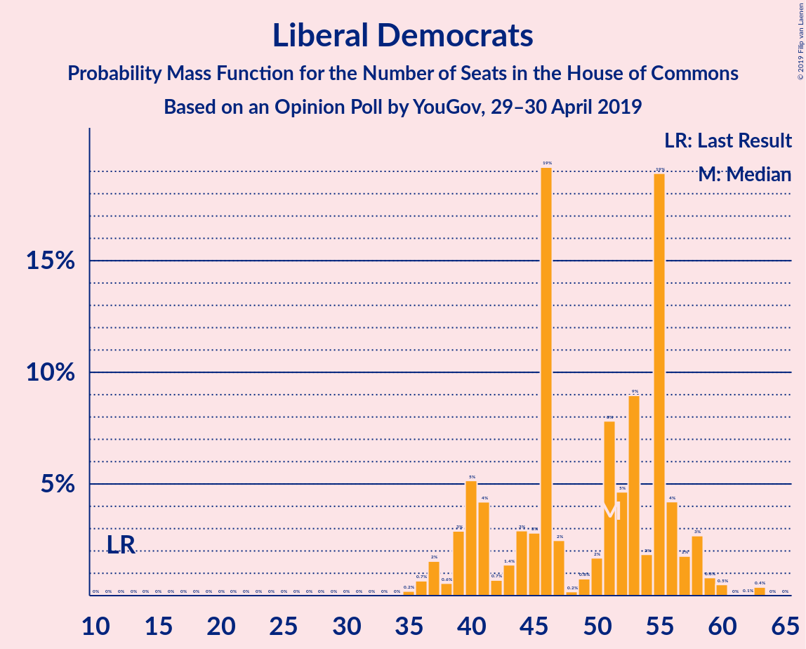
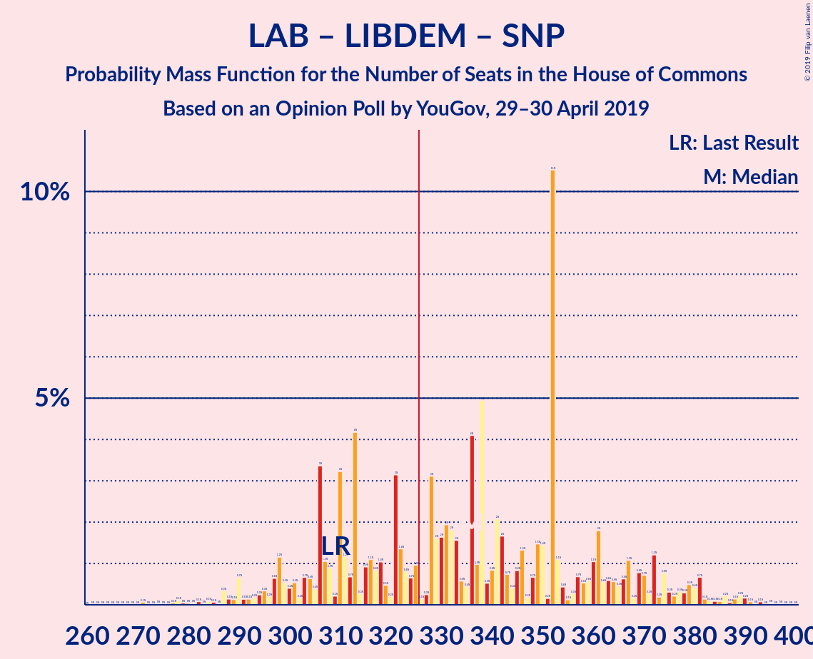
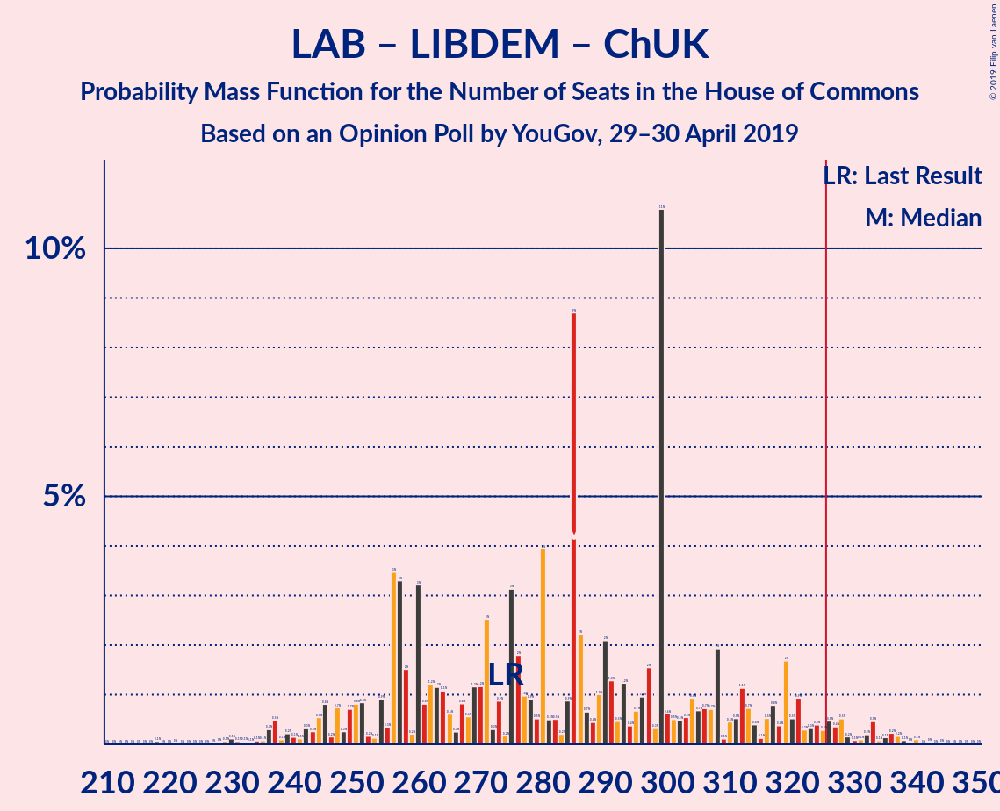
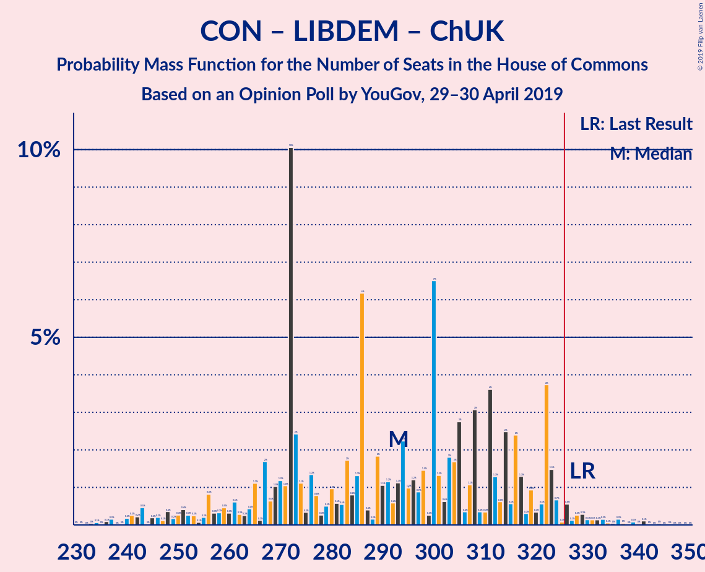

# Opinion Poll by YouGov, 29–30 April 2019

<a href="#voting-intentions">Voting Intentions</a> | <a href="#seats">Seats</a> | <a href="#coalitions">Coalitions</a> | <a href="#technical-information">Technical Information</a>

## Voting Intentions

### Confidence Intervals

| Party | Last Result | Poll Result | 80% Confidence Interval | 90% Confidence Interval | 95% Confidence Interval | 99% Confidence Interval |
|:-----:|:-----------:|:-----------:|:-----------------------:|:-----------------------:|:-----------------------:|:-----------------------:|
| Conservative Party | 42.4% | 28.7% | 27.3–30.2% |26.9–30.6% |26.6–31.0% |25.9–31.7% |
| Labour Party | 40.0% | 28.7% | 27.3–30.2% |26.9–30.6% |26.6–31.0% |25.9–31.7% |
| Brexit Party | 0.0% | 14.8% | 13.8–16.0% |13.5–16.4% |13.2–16.7% |12.7–17.2% |
| Liberal Democrats | 7.4% | 12.9% | 11.9–14.0% |11.6–14.3% |11.3–14.6% |10.9–15.2% |
| Green Party | 1.6% | 5.0% | 4.3–5.7% |4.2–5.9% |4.0–6.1% |3.7–6.5% |
| Scottish National Party | 3.0% | 3.4% | 2.9–4.0% |2.7–4.2% |2.6–4.4% |2.4–4.7% |
| Change UK | 0.0% | 2.9% | 2.5–3.6% |2.3–3.7% |2.2–3.9% |2.0–4.2% |
| UK Independence Party | 1.8% | 2.0% | 1.6–2.5% |1.5–2.6% |1.4–2.8% |1.2–3.0% |
| Plaid Cymru | 0.5% | 0.6% | 0.4–0.9% |0.3–1.0% |0.3–1.1% |0.2–1.2% |

*Note:* The poll result column reflects the actual value used in the calculations. Published results may vary slightly, and in addition be rounded to fewer digits.

## Seats

### Confidence Intervals

| Party | Last Result | Median | 80% Confidence Interval | 90% Confidence Interval | 95% Confidence Interval | 99% Confidence Interval |
|:-----:|:-----------:|:------:|:-----------------------:|:-----------------------:|:-----------------------:|:-----------------------:|
| <a href="#conservative-party">Conservative Party</a> | 317 | 245 | 210–277 |201–278 |193–280 |178–294 |
| <a href="#labour-party">Labour Party</a> | 262 | 236 | 198–270 |191–276 |191–278 |184–283 |
| <a href="#brexit-party">Brexit Party</a> | 0 | 46 | 31–69 |30–83 |28–83 |25–99 |
| <a href="#liberal-democrats">Liberal Democrats</a> | 12 | 46 | 40–55 |39–58 |38–60 |36–60 |
| <a href="#green-party">Green Party</a> | 1 | 2 | 2–3 |2–3 |2–3 |2–5 |
| <a href="#scottish-national-party">Scottish National Party</a> | 35 | 53 | 49–53 |48–53 |45–53 |36–53 |
| <a href="#change-uk">Change UK</a> | 0 | 0 | 0 |0 |0 |0 |
| <a href="#uk-independence-party">UK Independence Party</a> | 0 | 0 | 0 |0 |0 |0 |
| <a href="#plaid-cymru">Plaid Cymru</a> | 4 | 4 | 3–5 |2–7 |2–8 |0–8 |

### Conservative Party

*For a full overview of the results for this party, see the [Conservative Party](party-conservativeparty.html) page.*

| Number of Seats | Probability | Accumulated | Special Marks |
|:---------------:|:-----------:|:-----------:|:-------------:|
| 164 | 0.1% | 100% |  |
| 165 | 0% | 99.9% |  |
| 166 | 0% | 99.9% |  |
| 167 | 0% | 99.9% |  |
| 168 | 0% | 99.9% |  |
| 169 | 0% | 99.9% |  |
| 170 | 0% | 99.9% |  |
| 171 | 0% | 99.9% |  |
| 172 | 0% | 99.9% |  |
| 173 | 0% | 99.9% |  |
| 174 | 0% | 99.9% |  |
| 175 | 0% | 99.9% |  |
| 176 | 0% | 99.9% |  |
| 177 | 0% | 99.9% |  |
| 178 | 0.4% | 99.9% |  |
| 179 | 0% | 99.5% |  |
| 180 | 0% | 99.4% |  |
| 181 | 0% | 99.4% |  |
| 182 | 0.1% | 99.4% |  |
| 183 | 0% | 99.3% |  |
| 184 | 0% | 99.3% |  |
| 185 | 0% | 99.3% |  |
| 186 | 0.7% | 99.3% |  |
| 187 | 0% | 98.6% |  |
| 188 | 0.8% | 98.6% |  |
| 189 | 0% | 98% |  |
| 190 | 0% | 98% |  |
| 191 | 0% | 98% |  |
| 192 | 0.1% | 98% |  |
| 193 | 0.1% | 98% |  |
| 194 | 0.3% | 97% |  |
| 195 | 0.7% | 97% |  |
| 196 | 0% | 96% |  |
| 197 | 0% | 96% |  |
| 198 | 0.3% | 96% |  |
| 199 | 0.1% | 96% |  |
| 200 | 0.1% | 96% |  |
| 201 | 1.5% | 96% |  |
| 202 | 0% | 94% |  |
| 203 | 0.9% | 94% |  |
| 204 | 0% | 94% |  |
| 205 | 0% | 94% |  |
| 206 | 0.9% | 94% |  |
| 207 | 0.3% | 93% |  |
| 208 | 2% | 92% |  |
| 209 | 0.1% | 90% |  |
| 210 | 0.5% | 90% |  |
| 211 | 0% | 90% |  |
| 212 | 0% | 90% |  |
| 213 | 3% | 90% |  |
| 214 | 0.7% | 87% |  |
| 215 | 0.1% | 86% |  |
| 216 | 0.6% | 86% |  |
| 217 | 1.2% | 85% |  |
| 218 | 1.1% | 84% |  |
| 219 | 2% | 83% |  |
| 220 | 4% | 81% |  |
| 221 | 0.2% | 77% |  |
| 222 | 2% | 77% |  |
| 223 | 0.5% | 75% |  |
| 224 | 0.4% | 75% |  |
| 225 | 0.1% | 74% |  |
| 226 | 3% | 74% |  |
| 227 | 0% | 71% |  |
| 228 | 2% | 71% |  |
| 229 | 2% | 68% |  |
| 230 | 4% | 67% |  |
| 231 | 1.4% | 62% |  |
| 232 | 1.5% | 61% |  |
| 233 | 0% | 60% |  |
| 234 | 5% | 59% |  |
| 235 | 0% | 55% |  |
| 236 | 0.4% | 55% |  |
| 237 | 1.2% | 54% |  |
| 238 | 0.2% | 53% |  |
| 239 | 0.5% | 53% |  |
| 240 | 1.2% | 52% |  |
| 241 | 0.1% | 51% |  |
| 242 | 0.5% | 51% |  |
| 243 | 0.4% | 51% |  |
| 244 | 0% | 50% |  |
| 245 | 0.9% | 50% | Median |
| 246 | 0.1% | 49% |  |
| 247 | 0.3% | 49% |  |
| 248 | 7% | 49% |  |
| 249 | 2% | 42% |  |
| 250 | 0.1% | 40% |  |
| 251 | 4% | 40% |  |
| 252 | 0.1% | 36% |  |
| 253 | 0.5% | 36% |  |
| 254 | 0.3% | 35% |  |
| 255 | 0% | 35% |  |
| 256 | 2% | 35% |  |
| 257 | 3% | 33% |  |
| 258 | 1.2% | 31% |  |
| 259 | 0.2% | 30% |  |
| 260 | 0.1% | 29% |  |
| 261 | 0.5% | 29% |  |
| 262 | 0.1% | 29% |  |
| 263 | 5% | 29% |  |
| 264 | 0.4% | 24% |  |
| 265 | 0.7% | 24% |  |
| 266 | 0.1% | 23% |  |
| 267 | 8% | 23% |  |
| 268 | 0.3% | 15% |  |
| 269 | 0.9% | 15% |  |
| 270 | 0.3% | 14% |  |
| 271 | 0.1% | 14% |  |
| 272 | 0% | 13% |  |
| 273 | 0% | 13% |  |
| 274 | 0.1% | 13% |  |
| 275 | 2% | 13% |  |
| 276 | 0% | 11% |  |
| 277 | 6% | 11% |  |
| 278 | 2% | 5% |  |
| 279 | 0% | 3% |  |
| 280 | 0.5% | 3% |  |
| 281 | 0% | 2% |  |
| 282 | 0% | 2% |  |
| 283 | 0.4% | 2% |  |
| 284 | 0.1% | 2% |  |
| 285 | 0.1% | 2% |  |
| 286 | 0.4% | 2% |  |
| 287 | 0.1% | 1.4% |  |
| 288 | 0.3% | 1.3% |  |
| 289 | 0% | 1.0% |  |
| 290 | 0% | 0.9% |  |
| 291 | 0.1% | 0.9% |  |
| 292 | 0% | 0.8% |  |
| 293 | 0.1% | 0.8% |  |
| 294 | 0.2% | 0.7% |  |
| 295 | 0% | 0.5% |  |
| 296 | 0.1% | 0.5% |  |
| 297 | 0% | 0.4% |  |
| 298 | 0.1% | 0.3% |  |
| 299 | 0% | 0.2% |  |
| 300 | 0% | 0.2% |  |
| 301 | 0% | 0.2% |  |
| 302 | 0% | 0.2% |  |
| 303 | 0% | 0.1% |  |
| 304 | 0% | 0.1% |  |
| 305 | 0% | 0.1% |  |
| 306 | 0.1% | 0.1% |  |
| 307 | 0% | 0.1% |  |
| 308 | 0% | 0% |  |
| 309 | 0% | 0% |  |
| 310 | 0% | 0% |  |
| 311 | 0% | 0% |  |
| 312 | 0% | 0% |  |
| 313 | 0% | 0% |  |
| 314 | 0% | 0% |  |
| 315 | 0% | 0% |  |
| 316 | 0% | 0% |  |
| 317 | 0% | 0% | Last Result |

### Labour Party

*For a full overview of the results for this party, see the [Labour Party](party-labourparty.html) page.*

| Number of Seats | Probability | Accumulated | Special Marks |
|:---------------:|:-----------:|:-----------:|:-------------:|
| 166 | 0.1% | 100% |  |
| 167 | 0% | 99.9% |  |
| 168 | 0% | 99.9% |  |
| 169 | 0% | 99.9% |  |
| 170 | 0% | 99.9% |  |
| 171 | 0.1% | 99.9% |  |
| 172 | 0% | 99.8% |  |
| 173 | 0% | 99.8% |  |
| 174 | 0% | 99.8% |  |
| 175 | 0% | 99.8% |  |
| 176 | 0% | 99.8% |  |
| 177 | 0% | 99.8% |  |
| 178 | 0% | 99.8% |  |
| 179 | 0% | 99.8% |  |
| 180 | 0% | 99.7% |  |
| 181 | 0.2% | 99.7% |  |
| 182 | 0% | 99.6% |  |
| 183 | 0% | 99.5% |  |
| 184 | 0.4% | 99.5% |  |
| 185 | 0% | 99.1% |  |
| 186 | 0.1% | 99.1% |  |
| 187 | 0% | 99.1% |  |
| 188 | 0.4% | 99.1% |  |
| 189 | 0% | 98.7% |  |
| 190 | 0.1% | 98.7% |  |
| 191 | 4% | 98.6% |  |
| 192 | 0% | 95% |  |
| 193 | 0.3% | 95% |  |
| 194 | 0% | 94% |  |
| 195 | 0.2% | 94% |  |
| 196 | 0.1% | 94% |  |
| 197 | 0.1% | 94% |  |
| 198 | 5% | 94% |  |
| 199 | 2% | 89% |  |
| 200 | 0.1% | 87% |  |
| 201 | 0.1% | 87% |  |
| 202 | 2% | 87% |  |
| 203 | 0% | 85% |  |
| 204 | 0.1% | 85% |  |
| 205 | 3% | 84% |  |
| 206 | 0.2% | 81% |  |
| 207 | 0% | 81% |  |
| 208 | 10% | 81% |  |
| 209 | 0% | 71% |  |
| 210 | 0.6% | 71% |  |
| 211 | 0% | 70% |  |
| 212 | 0.4% | 70% |  |
| 213 | 0.4% | 70% |  |
| 214 | 0.6% | 69% |  |
| 215 | 0.9% | 69% |  |
| 216 | 0.5% | 68% |  |
| 217 | 0% | 67% |  |
| 218 | 2% | 67% |  |
| 219 | 0.1% | 66% |  |
| 220 | 0.1% | 66% |  |
| 221 | 0% | 65% |  |
| 222 | 2% | 65% |  |
| 223 | 2% | 63% |  |
| 224 | 0.2% | 62% |  |
| 225 | 0.3% | 62% |  |
| 226 | 0.1% | 61% |  |
| 227 | 0.7% | 61% |  |
| 228 | 0% | 61% |  |
| 229 | 0% | 61% |  |
| 230 | 0.4% | 61% |  |
| 231 | 0.6% | 60% |  |
| 232 | 3% | 60% |  |
| 233 | 5% | 57% |  |
| 234 | 0.5% | 52% |  |
| 235 | 0.5% | 51% |  |
| 236 | 2% | 51% | Median |
| 237 | 0% | 49% |  |
| 238 | 6% | 49% |  |
| 239 | 0.3% | 42% |  |
| 240 | 0% | 42% |  |
| 241 | 0.2% | 42% |  |
| 242 | 0.4% | 42% |  |
| 243 | 2% | 41% |  |
| 244 | 0.3% | 40% |  |
| 245 | 0.1% | 39% |  |
| 246 | 0% | 39% |  |
| 247 | 0.2% | 39% |  |
| 248 | 0% | 39% |  |
| 249 | 0.5% | 39% |  |
| 250 | 1.2% | 39% |  |
| 251 | 0.5% | 37% |  |
| 252 | 5% | 37% |  |
| 253 | 5% | 32% |  |
| 254 | 1.0% | 27% |  |
| 255 | 0.1% | 26% |  |
| 256 | 0% | 26% |  |
| 257 | 0.1% | 26% |  |
| 258 | 2% | 26% |  |
| 259 | 0% | 24% |  |
| 260 | 0.6% | 24% |  |
| 261 | 2% | 24% |  |
| 262 | 0.5% | 22% | Last Result |
| 263 | 3% | 21% |  |
| 264 | 0.1% | 18% |  |
| 265 | 0.9% | 18% |  |
| 266 | 0.2% | 17% |  |
| 267 | 1.1% | 17% |  |
| 268 | 3% | 16% |  |
| 269 | 1.3% | 13% |  |
| 270 | 2% | 12% |  |
| 271 | 0.1% | 10% |  |
| 272 | 0.8% | 10% |  |
| 273 | 1.0% | 9% |  |
| 274 | 2% | 8% |  |
| 275 | 0% | 6% |  |
| 276 | 3% | 6% |  |
| 277 | 0% | 3% |  |
| 278 | 2% | 3% |  |
| 279 | 0.6% | 1.5% |  |
| 280 | 0.1% | 0.9% |  |
| 281 | 0.1% | 0.8% |  |
| 282 | 0.1% | 0.7% |  |
| 283 | 0.2% | 0.6% |  |
| 284 | 0.1% | 0.4% |  |
| 285 | 0.1% | 0.3% |  |
| 286 | 0% | 0.2% |  |
| 287 | 0.1% | 0.2% |  |
| 288 | 0% | 0.1% |  |
| 289 | 0% | 0.1% |  |
| 290 | 0% | 0.1% |  |
| 291 | 0% | 0.1% |  |
| 292 | 0% | 0.1% |  |
| 293 | 0% | 0% |  |

### Brexit Party

*For a full overview of the results for this party, see the [Brexit Party](party-brexitparty.html) page.*

| Number of Seats | Probability | Accumulated | Special Marks |
|:---------------:|:-----------:|:-----------:|:-------------:|
| 0 | 0% | 100% | Last Result |
| 1 | 0% | 100% |  |
| 2 | 0% | 100% |  |
| 3 | 0% | 100% |  |
| 4 | 0% | 100% |  |
| 5 | 0% | 100% |  |
| 6 | 0% | 100% |  |
| 7 | 0% | 100% |  |
| 8 | 0% | 100% |  |
| 9 | 0% | 100% |  |
| 10 | 0% | 100% |  |
| 11 | 0% | 100% |  |
| 12 | 0% | 100% |  |
| 13 | 0% | 100% |  |
| 14 | 0% | 100% |  |
| 15 | 0% | 100% |  |
| 16 | 0% | 100% |  |
| 17 | 0% | 100% |  |
| 18 | 0% | 100% |  |
| 19 | 0% | 100% |  |
| 20 | 0% | 100% |  |
| 21 | 0% | 100% |  |
| 22 | 0% | 100% |  |
| 23 | 0.1% | 99.9% |  |
| 24 | 0.1% | 99.9% |  |
| 25 | 0.7% | 99.8% |  |
| 26 | 1.3% | 99.1% |  |
| 27 | 0.2% | 98% |  |
| 28 | 0.8% | 98% |  |
| 29 | 0.6% | 97% |  |
| 30 | 2% | 96% |  |
| 31 | 9% | 95% |  |
| 32 | 4% | 85% |  |
| 33 | 8% | 81% |  |
| 34 | 0.4% | 73% |  |
| 35 | 3% | 73% |  |
| 36 | 0.1% | 70% |  |
| 37 | 5% | 70% |  |
| 38 | 4% | 65% |  |
| 39 | 0.1% | 61% |  |
| 40 | 0.3% | 61% |  |
| 41 | 5% | 61% |  |
| 42 | 1.3% | 56% |  |
| 43 | 0.9% | 55% |  |
| 44 | 0.1% | 54% |  |
| 45 | 3% | 54% |  |
| 46 | 3% | 51% | Median |
| 47 | 3% | 47% |  |
| 48 | 4% | 45% |  |
| 49 | 2% | 41% |  |
| 50 | 1.1% | 39% |  |
| 51 | 3% | 38% |  |
| 52 | 0.1% | 36% |  |
| 53 | 0.1% | 35% |  |
| 54 | 1.0% | 35% |  |
| 55 | 0.1% | 34% |  |
| 56 | 0.4% | 34% |  |
| 57 | 0.1% | 34% |  |
| 58 | 0% | 34% |  |
| 59 | 2% | 34% |  |
| 60 | 8% | 32% |  |
| 61 | 0.3% | 25% |  |
| 62 | 0% | 24% |  |
| 63 | 4% | 24% |  |
| 64 | 0.2% | 20% |  |
| 65 | 0.8% | 20% |  |
| 66 | 0.2% | 19% |  |
| 67 | 2% | 19% |  |
| 68 | 0.1% | 17% |  |
| 69 | 8% | 17% |  |
| 70 | 0.2% | 10% |  |
| 71 | 0.9% | 9% |  |
| 72 | 0.6% | 9% |  |
| 73 | 0.2% | 8% |  |
| 74 | 0% | 8% |  |
| 75 | 0.5% | 8% |  |
| 76 | 0.3% | 7% |  |
| 77 | 0.2% | 7% |  |
| 78 | 0.3% | 7% |  |
| 79 | 0.2% | 6% |  |
| 80 | 0.1% | 6% |  |
| 81 | 0% | 6% |  |
| 82 | 0% | 6% |  |
| 83 | 4% | 6% |  |
| 84 | 0.1% | 2% |  |
| 85 | 0% | 2% |  |
| 86 | 1.3% | 2% |  |
| 87 | 0.1% | 1.0% |  |
| 88 | 0% | 0.8% |  |
| 89 | 0% | 0.8% |  |
| 90 | 0.1% | 0.8% |  |
| 91 | 0% | 0.7% |  |
| 92 | 0% | 0.7% |  |
| 93 | 0% | 0.6% |  |
| 94 | 0.1% | 0.6% |  |
| 95 | 0% | 0.6% |  |
| 96 | 0% | 0.6% |  |
| 97 | 0% | 0.5% |  |
| 98 | 0% | 0.5% |  |
| 99 | 0.1% | 0.5% |  |
| 100 | 0% | 0.5% |  |
| 101 | 0% | 0.5% |  |
| 102 | 0% | 0.5% |  |
| 103 | 0% | 0.5% |  |
| 104 | 0% | 0.5% |  |
| 105 | 0% | 0.5% |  |
| 106 | 0.5% | 0.5% |  |
| 107 | 0% | 0% |  |

### Liberal Democrats

*For a full overview of the results for this party, see the [Liberal Democrats](party-liberaldemocrats.html) page.*

| Number of Seats | Probability | Accumulated | Special Marks |
|:---------------:|:-----------:|:-----------:|:-------------:|
| 12 | 0% | 100% | Last Result |
| 13 | 0% | 100% |  |
| 14 | 0% | 100% |  |
| 15 | 0% | 100% |  |
| 16 | 0% | 100% |  |
| 17 | 0% | 100% |  |
| 18 | 0% | 100% |  |
| 19 | 0% | 100% |  |
| 20 | 0% | 100% |  |
| 21 | 0% | 100% |  |
| 22 | 0% | 100% |  |
| 23 | 0% | 100% |  |
| 24 | 0% | 100% |  |
| 25 | 0% | 100% |  |
| 26 | 0% | 100% |  |
| 27 | 0% | 100% |  |
| 28 | 0% | 100% |  |
| 29 | 0% | 100% |  |
| 30 | 0% | 100% |  |
| 31 | 0% | 100% |  |
| 32 | 0% | 100% |  |
| 33 | 0% | 100% |  |
| 34 | 0% | 100% |  |
| 35 | 0.1% | 100% |  |
| 36 | 0.6% | 99.9% |  |
| 37 | 0.5% | 99.3% |  |
| 38 | 1.3% | 98.7% |  |
| 39 | 4% | 97% |  |
| 40 | 9% | 93% |  |
| 41 | 3% | 85% |  |
| 42 | 0.6% | 81% |  |
| 43 | 2% | 81% |  |
| 44 | 5% | 79% |  |
| 45 | 6% | 75% |  |
| 46 | 24% | 69% | Median |
| 47 | 7% | 44% |  |
| 48 | 0.1% | 37% |  |
| 49 | 0.5% | 37% |  |
| 50 | 2% | 36% |  |
| 51 | 5% | 34% |  |
| 52 | 1.4% | 29% |  |
| 53 | 6% | 28% |  |
| 54 | 3% | 22% |  |
| 55 | 9% | 19% |  |
| 56 | 1.0% | 10% |  |
| 57 | 4% | 9% |  |
| 58 | 0.8% | 5% |  |
| 59 | 0% | 4% |  |
| 60 | 4% | 4% |  |
| 61 | 0% | 0.4% |  |
| 62 | 0.3% | 0.4% |  |
| 63 | 0.1% | 0.1% |  |
| 64 | 0% | 0.1% |  |
| 65 | 0% | 0.1% |  |
| 66 | 0% | 0.1% |  |
| 67 | 0% | 0% |  |

### Green Party

*For a full overview of the results for this party, see the [Green Party](party-greenparty.html) page.*

| Number of Seats | Probability | Accumulated | Special Marks |
|:---------------:|:-----------:|:-----------:|:-------------:|
| 1 | 0.1% | 100% | Last Result |
| 2 | 83% | 99.9% | Median |
| 3 | 16% | 17% |  |
| 4 | 0.5% | 1.1% |  |
| 5 | 0.5% | 0.5% |  |
| 6 | 0% | 0% |  |

### Scottish National Party

*For a full overview of the results for this party, see the [Scottish National Party](party-scottishnationalparty.html) page.*

| Number of Seats | Probability | Accumulated | Special Marks |
|:---------------:|:-----------:|:-----------:|:-------------:|
| 23 | 0% | 100% |  |
| 24 | 0% | 99.9% |  |
| 25 | 0% | 99.9% |  |
| 26 | 0% | 99.9% |  |
| 27 | 0% | 99.9% |  |
| 28 | 0% | 99.9% |  |
| 29 | 0.1% | 99.9% |  |
| 30 | 0% | 99.9% |  |
| 31 | 0% | 99.9% |  |
| 32 | 0% | 99.9% |  |
| 33 | 0% | 99.8% |  |
| 34 | 0% | 99.8% |  |
| 35 | 0% | 99.8% | Last Result |
| 36 | 0.6% | 99.8% |  |
| 37 | 0% | 99.2% |  |
| 38 | 0.1% | 99.2% |  |
| 39 | 0% | 99.1% |  |
| 40 | 0.1% | 99.0% |  |
| 41 | 0.2% | 98.9% |  |
| 42 | 0.2% | 98.7% |  |
| 43 | 0.2% | 98% |  |
| 44 | 0.1% | 98% |  |
| 45 | 2% | 98% |  |
| 46 | 0.4% | 97% |  |
| 47 | 0.6% | 96% |  |
| 48 | 4% | 96% |  |
| 49 | 4% | 91% |  |
| 50 | 7% | 87% |  |
| 51 | 17% | 80% |  |
| 52 | 5% | 64% |  |
| 53 | 58% | 58% | Median |
| 54 | 0.1% | 0.1% |  |
| 55 | 0% | 0% |  |

### Change UK

*For a full overview of the results for this party, see the [Change UK](party-changeuk.html) page.*

| Number of Seats | Probability | Accumulated | Special Marks |
|:---------------:|:-----------:|:-----------:|:-------------:|
| 0 | 100% | 100% | Last Result, Median |

### UK Independence Party

*For a full overview of the results for this party, see the [UK Independence Party](party-ukindependenceparty.html) page.*

| Number of Seats | Probability | Accumulated | Special Marks |
|:---------------:|:-----------:|:-----------:|:-------------:|
| 0 | 100% | 100% | Last Result, Median |

### Plaid Cymru

*For a full overview of the results for this party, see the [Plaid Cymru](party-plaidcymru.html) page.*

| Number of Seats | Probability | Accumulated | Special Marks |
|:---------------:|:-----------:|:-----------:|:-------------:|
| 0 | 0.7% | 100% |  |
| 1 | 1.4% | 99.3% |  |
| 2 | 5% | 98% |  |
| 3 | 28% | 93% |  |
| 4 | 47% | 65% | Last Result, Median |
| 5 | 9% | 18% |  |
| 6 | 2% | 9% |  |
| 7 | 4% | 6% |  |
| 8 | 3% | 3% |  |
| 9 | 0.1% | 0.2% |  |
| 10 | 0.1% | 0.1% |  |
| 11 | 0% | 0% |  |

## Coalitions

### Confidence Intervals

| Coalition | Last Result | Median | Majority? | 80% Confidence Interval | 90% Confidence Interval | 95% Confidence Interval | 99% Confidence Interval |
|:---------:|:-----------:|:------:|:---------:|:-----------------------:|:-----------------------:|:-----------------------:|:-----------------------:|
| Labour Party – Liberal Democrats – Scottish National Party – Plaid Cymru | 313 | 337 | 65% | 301–376 | 294–384 | 290–384 | 283–394 |
| Labour Party – Liberal Democrats – Scottish National Party | 309 | 330 | 56% | 298–372 | 290–381 | 287–382 | 279–391 |
| Labour Party – Liberal Democrats – Plaid Cymru | 278 | 284 | 10% | 248–323 | 241–334 | 239–336 | 230–344 |
| Conservative Party – Scottish National Party – Plaid Cymru | 356 | 299 | 14% | 264–331 | 258–333 | 245–335 | 234–348 |
| Labour Party – Scottish National Party – Plaid Cymru | 301 | 293 | 10% | 254–326 | 248–329 | 245–334 | 238–339 |
| Labour Party – Liberal Democrats – Change UK | 274 | 279 | 8% | 245–321 | 237–332 | 236–333 | 229–340 |
| Labour Party – Liberal Democrats | 274 | 279 | 8% | 245–321 | 237–332 | 236–333 | 229–340 |
| Labour Party – Scottish National Party | 297 | 289 | 5% | 251–322 | 244–326 | 242–331 | 235–336 |
| Conservative Party – Scottish National Party | 352 | 294 | 13% | 261–328 | 254–330 | 241–331 | 231–344 |
| Conservative Party – Liberal Democrats – Change UK | 329 | 290 | 2% | 261–322 | 250–323 | 247–324 | 233–334 |
| Conservative Party – Liberal Democrats | 329 | 290 | 2% | 261–322 | 250–323 | 247–324 | 233–334 |
| Conservative Party – Plaid Cymru | 321 | 249 | 0% | 214–280 | 205–282 | 196–285 | 181–298 |
| Labour Party – Plaid Cymru | 266 | 240 | 0% | 201–273 | 195–279 | 194–282 | 185–286 |
| Conservative Party – Change UK | 317 | 245 | 0% | 210–277 | 201–278 | 193–280 | 178–294 |
| Conservative Party | 317 | 245 | 0% | 210–277 | 201–278 | 193–280 | 178–294 |
| Labour Party – Change UK | 262 | 236 | 0% | 198–270 | 191–276 | 191–278 | 184–283 |
| Labour Party | 262 | 236 | 0% | 198–270 | 191–276 | 191–278 | 184–283 |

### Labour Party – Liberal Democrats – Scottish National Party – Plaid Cymru

| Number of Seats | Probability | Accumulated | Special Marks |
|:---------------:|:-----------:|:-----------:|:-------------:|
| 269 | 0.1% | 100% |  |
| 270 | 0% | 99.9% |  |
| 271 | 0.1% | 99.9% |  |
| 272 | 0% | 99.8% |  |
| 273 | 0% | 99.8% |  |
| 274 | 0% | 99.8% |  |
| 275 | 0% | 99.8% |  |
| 276 | 0% | 99.8% |  |
| 277 | 0% | 99.8% |  |
| 278 | 0% | 99.8% |  |
| 279 | 0% | 99.8% |  |
| 280 | 0.2% | 99.7% |  |
| 281 | 0% | 99.5% |  |
| 282 | 0% | 99.5% |  |
| 283 | 0.3% | 99.5% |  |
| 284 | 0% | 99.3% |  |
| 285 | 0.6% | 99.2% |  |
| 286 | 0% | 98.7% |  |
| 287 | 0.1% | 98.6% |  |
| 288 | 0.1% | 98.6% |  |
| 289 | 0% | 98.5% |  |
| 290 | 3% | 98% |  |
| 291 | 0.1% | 96% |  |
| 292 | 0.3% | 96% |  |
| 293 | 0% | 95% |  |
| 294 | 1.4% | 95% |  |
| 295 | 0% | 94% |  |
| 296 | 0.2% | 94% |  |
| 297 | 0.1% | 94% |  |
| 298 | 0.1% | 94% |  |
| 299 | 0.4% | 94% |  |
| 300 | 0.3% | 93% |  |
| 301 | 5% | 93% |  |
| 302 | 2% | 88% |  |
| 303 | 0.1% | 86% |  |
| 304 | 0.3% | 86% |  |
| 305 | 2% | 86% |  |
| 306 | 0.1% | 83% |  |
| 307 | 3% | 83% |  |
| 308 | 0.1% | 80% |  |
| 309 | 0% | 80% |  |
| 310 | 0.2% | 80% |  |
| 311 | 7% | 80% |  |
| 312 | 0.1% | 73% |  |
| 313 | 0.5% | 73% | Last Result |
| 314 | 0.9% | 73% |  |
| 315 | 0.2% | 72% |  |
| 316 | 4% | 72% |  |
| 317 | 0.9% | 68% |  |
| 318 | 0.2% | 67% |  |
| 319 | 0.1% | 66% |  |
| 320 | 0.1% | 66% |  |
| 321 | 0% | 66% |  |
| 322 | 0% | 66% |  |
| 323 | 0.4% | 66% |  |
| 324 | 0% | 66% |  |
| 325 | 0.9% | 66% |  |
| 326 | 3% | 65% | Majority |
| 327 | 0% | 62% |  |
| 328 | 0.1% | 62% |  |
| 329 | 5% | 61% |  |
| 330 | 0.9% | 57% |  |
| 331 | 0.2% | 56% |  |
| 332 | 3% | 56% |  |
| 333 | 0.4% | 52% |  |
| 334 | 0% | 52% |  |
| 335 | 0.1% | 52% |  |
| 336 | 0.1% | 52% |  |
| 337 | 4% | 52% |  |
| 338 | 0% | 48% |  |
| 339 | 3% | 48% | Median |
| 340 | 2% | 45% |  |
| 341 | 0% | 43% |  |
| 342 | 0.1% | 43% |  |
| 343 | 0.7% | 43% |  |
| 344 | 0.5% | 42% |  |
| 345 | 0.5% | 42% |  |
| 346 | 0.3% | 41% |  |
| 347 | 0.1% | 41% |  |
| 348 | 0.1% | 41% |  |
| 349 | 0% | 41% |  |
| 350 | 0.2% | 41% |  |
| 351 | 0.6% | 41% |  |
| 352 | 2% | 40% |  |
| 353 | 0.1% | 38% |  |
| 354 | 1.3% | 38% |  |
| 355 | 1.1% | 37% |  |
| 356 | 0.7% | 36% |  |
| 357 | 0% | 35% |  |
| 358 | 0.9% | 35% |  |
| 359 | 0.2% | 34% |  |
| 360 | 0% | 34% |  |
| 361 | 4% | 34% |  |
| 362 | 1.2% | 30% |  |
| 363 | 0.1% | 29% |  |
| 364 | 6% | 29% |  |
| 365 | 4% | 22% |  |
| 366 | 3% | 18% |  |
| 367 | 0% | 15% |  |
| 368 | 0.1% | 15% |  |
| 369 | 0.8% | 15% |  |
| 370 | 0% | 14% |  |
| 371 | 0.5% | 14% |  |
| 372 | 1.5% | 14% |  |
| 373 | 0.1% | 12% |  |
| 374 | 2% | 12% |  |
| 375 | 0% | 10% |  |
| 376 | 0.7% | 10% |  |
| 377 | 0% | 9% |  |
| 378 | 0% | 9% |  |
| 379 | 0.7% | 9% |  |
| 380 | 0.4% | 9% |  |
| 381 | 1.1% | 8% |  |
| 382 | 0.7% | 7% |  |
| 383 | 0.1% | 6% |  |
| 384 | 4% | 6% |  |
| 385 | 0% | 2% |  |
| 386 | 0.1% | 2% |  |
| 387 | 0.3% | 2% |  |
| 388 | 0% | 2% |  |
| 389 | 0% | 2% |  |
| 390 | 1.0% | 2% |  |
| 391 | 0% | 0.7% |  |
| 392 | 0% | 0.7% |  |
| 393 | 0% | 0.6% |  |
| 394 | 0.2% | 0.6% |  |
| 395 | 0% | 0.4% |  |
| 396 | 0.1% | 0.4% |  |
| 397 | 0% | 0.3% |  |
| 398 | 0.1% | 0.3% |  |
| 399 | 0.1% | 0.2% |  |
| 400 | 0% | 0.1% |  |
| 401 | 0.1% | 0.1% |  |
| 402 | 0% | 0% |  |

### Labour Party – Liberal Democrats – Scottish National Party

| Number of Seats | Probability | Accumulated | Special Marks |
|:---------------:|:-----------:|:-----------:|:-------------:|
| 265 | 0.1% | 100% |  |
| 266 | 0% | 99.9% |  |
| 267 | 0.1% | 99.9% |  |
| 268 | 0% | 99.8% |  |
| 269 | 0% | 99.8% |  |
| 270 | 0% | 99.8% |  |
| 271 | 0% | 99.8% |  |
| 272 | 0% | 99.8% |  |
| 273 | 0% | 99.8% |  |
| 274 | 0% | 99.7% |  |
| 275 | 0% | 99.7% |  |
| 276 | 0% | 99.7% |  |
| 277 | 0.2% | 99.7% |  |
| 278 | 0% | 99.5% |  |
| 279 | 0% | 99.5% |  |
| 280 | 0.1% | 99.5% |  |
| 281 | 0% | 99.4% |  |
| 282 | 0.4% | 99.3% |  |
| 283 | 0% | 98.9% |  |
| 284 | 0.1% | 98.9% |  |
| 285 | 0.3% | 98.8% |  |
| 286 | 0% | 98% |  |
| 287 | 3% | 98% |  |
| 288 | 0% | 96% |  |
| 289 | 0.3% | 96% |  |
| 290 | 1.4% | 95% |  |
| 291 | 0% | 94% |  |
| 292 | 0.2% | 94% |  |
| 293 | 0.1% | 94% |  |
| 294 | 0% | 94% |  |
| 295 | 0.3% | 94% |  |
| 296 | 0% | 93% |  |
| 297 | 0.5% | 93% |  |
| 298 | 7% | 93% |  |
| 299 | 0.1% | 86% |  |
| 300 | 0.4% | 86% |  |
| 301 | 2% | 86% |  |
| 302 | 0% | 83% |  |
| 303 | 0.1% | 83% |  |
| 304 | 3% | 83% |  |
| 305 | 0.1% | 80% |  |
| 306 | 0% | 80% |  |
| 307 | 7% | 80% |  |
| 308 | 0.1% | 73% |  |
| 309 | 0.7% | 73% | Last Result |
| 310 | 0.9% | 73% |  |
| 311 | 0.2% | 72% |  |
| 312 | 4% | 72% |  |
| 313 | 0.2% | 68% |  |
| 314 | 0.9% | 67% |  |
| 315 | 0.3% | 66% |  |
| 316 | 0.2% | 66% |  |
| 317 | 0% | 66% |  |
| 318 | 0.2% | 66% |  |
| 319 | 0.2% | 66% |  |
| 320 | 0% | 66% |  |
| 321 | 0.7% | 66% |  |
| 322 | 3% | 65% |  |
| 323 | 0.2% | 62% |  |
| 324 | 5% | 61% |  |
| 325 | 0.9% | 57% |  |
| 326 | 0.6% | 56% | Majority |
| 327 | 0.9% | 55% |  |
| 328 | 0.1% | 54% |  |
| 329 | 2% | 54% |  |
| 330 | 4% | 52% |  |
| 331 | 0% | 48% |  |
| 332 | 0% | 48% |  |
| 333 | 0.6% | 48% |  |
| 334 | 0.1% | 48% |  |
| 335 | 2% | 47% | Median |
| 336 | 0% | 45% |  |
| 337 | 2% | 45% |  |
| 338 | 0.2% | 43% |  |
| 339 | 0.6% | 43% |  |
| 340 | 0.4% | 42% |  |
| 341 | 0.1% | 42% |  |
| 342 | 0.5% | 42% |  |
| 343 | 0.3% | 41% |  |
| 344 | 0.1% | 41% |  |
| 345 | 0.2% | 41% |  |
| 346 | 0.2% | 41% |  |
| 347 | 1.5% | 41% |  |
| 348 | 0.5% | 39% |  |
| 349 | 0.8% | 39% |  |
| 350 | 0.1% | 38% |  |
| 351 | 0.3% | 38% |  |
| 352 | 0.9% | 38% |  |
| 353 | 1.2% | 37% |  |
| 354 | 0.7% | 35% |  |
| 355 | 0.6% | 35% |  |
| 356 | 0.1% | 34% |  |
| 357 | 4% | 34% |  |
| 358 | 2% | 30% |  |
| 359 | 0.5% | 28% |  |
| 360 | 6% | 27% |  |
| 361 | 3% | 21% |  |
| 362 | 3% | 18% |  |
| 363 | 0% | 15% |  |
| 364 | 0% | 15% |  |
| 365 | 0.4% | 15% |  |
| 366 | 1.3% | 15% |  |
| 367 | 0.4% | 14% |  |
| 368 | 0.1% | 13% |  |
| 369 | 0.8% | 13% |  |
| 370 | 0.2% | 12% |  |
| 371 | 0% | 12% |  |
| 372 | 3% | 12% |  |
| 373 | 0% | 9% |  |
| 374 | 0% | 9% |  |
| 375 | 0.4% | 9% |  |
| 376 | 0.1% | 9% |  |
| 377 | 0.7% | 9% |  |
| 378 | 1.0% | 8% |  |
| 379 | 0% | 7% |  |
| 380 | 0.7% | 7% |  |
| 381 | 4% | 6% |  |
| 382 | 0.7% | 3% |  |
| 383 | 0.3% | 2% |  |
| 384 | 0% | 2% |  |
| 385 | 0% | 2% |  |
| 386 | 1.0% | 2% |  |
| 387 | 0% | 0.7% |  |
| 388 | 0% | 0.7% |  |
| 389 | 0% | 0.6% |  |
| 390 | 0% | 0.6% |  |
| 391 | 0.2% | 0.6% |  |
| 392 | 0.1% | 0.4% |  |
| 393 | 0% | 0.3% |  |
| 394 | 0.1% | 0.3% |  |
| 395 | 0.2% | 0.3% |  |
| 396 | 0% | 0.1% |  |
| 397 | 0% | 0.1% |  |
| 398 | 0% | 0.1% |  |
| 399 | 0% | 0.1% |  |
| 400 | 0% | 0% |  |

### Labour Party – Liberal Democrats – Plaid Cymru

| Number of Seats | Probability | Accumulated | Special Marks |
|:---------------:|:-----------:|:-----------:|:-------------:|
| 216 | 0.1% | 100% |  |
| 217 | 0% | 99.9% |  |
| 218 | 0% | 99.9% |  |
| 219 | 0% | 99.9% |  |
| 220 | 0% | 99.9% |  |
| 221 | 0.1% | 99.9% |  |
| 222 | 0% | 99.8% |  |
| 223 | 0% | 99.8% |  |
| 224 | 0% | 99.8% |  |
| 225 | 0% | 99.8% |  |
| 226 | 0% | 99.8% |  |
| 227 | 0% | 99.8% |  |
| 228 | 0% | 99.8% |  |
| 229 | 0% | 99.8% |  |
| 230 | 0.3% | 99.7% |  |
| 231 | 0% | 99.4% |  |
| 232 | 0.3% | 99.4% |  |
| 233 | 0% | 99.2% |  |
| 234 | 0.1% | 99.1% |  |
| 235 | 0.3% | 99.1% |  |
| 236 | 0% | 98.7% |  |
| 237 | 0% | 98.7% |  |
| 238 | 0% | 98.7% |  |
| 239 | 3% | 98.7% |  |
| 240 | 0% | 96% |  |
| 241 | 1.3% | 96% |  |
| 242 | 0% | 94% |  |
| 243 | 0.2% | 94% |  |
| 244 | 0% | 94% |  |
| 245 | 0.1% | 94% |  |
| 246 | 0.2% | 94% |  |
| 247 | 0.1% | 94% |  |
| 248 | 5% | 94% |  |
| 249 | 2% | 89% |  |
| 250 | 0.1% | 87% |  |
| 251 | 0.1% | 87% |  |
| 252 | 2% | 87% |  |
| 253 | 0.1% | 84% |  |
| 254 | 3% | 84% |  |
| 255 | 0.2% | 81% |  |
| 256 | 0% | 81% |  |
| 257 | 0.2% | 81% |  |
| 258 | 7% | 81% |  |
| 259 | 0.1% | 74% |  |
| 260 | 0.5% | 74% |  |
| 261 | 0.1% | 73% |  |
| 262 | 0.2% | 73% |  |
| 263 | 0.5% | 73% |  |
| 264 | 0.9% | 72% |  |
| 265 | 4% | 71% |  |
| 266 | 0.9% | 68% |  |
| 267 | 0.1% | 67% |  |
| 268 | 0.3% | 67% |  |
| 269 | 0.1% | 67% |  |
| 270 | 0.2% | 66% |  |
| 271 | 0% | 66% |  |
| 272 | 0.5% | 66% |  |
| 273 | 3% | 66% |  |
| 274 | 0% | 62% |  |
| 275 | 0.2% | 62% |  |
| 276 | 0% | 62% |  |
| 277 | 0.6% | 62% |  |
| 278 | 5% | 62% | Last Result |
| 279 | 0.7% | 56% |  |
| 280 | 0.5% | 56% |  |
| 281 | 0.3% | 55% |  |
| 282 | 2% | 55% |  |
| 283 | 0% | 53% |  |
| 284 | 4% | 53% |  |
| 285 | 0% | 49% |  |
| 286 | 2% | 49% | Median |
| 287 | 3% | 47% |  |
| 288 | 0.1% | 44% |  |
| 289 | 0.6% | 44% |  |
| 290 | 0.5% | 43% |  |
| 291 | 0.1% | 43% |  |
| 292 | 0.5% | 42% |  |
| 293 | 0.2% | 42% |  |
| 294 | 0.1% | 42% |  |
| 295 | 0.4% | 42% |  |
| 296 | 0.1% | 41% |  |
| 297 | 0.3% | 41% |  |
| 298 | 0.4% | 41% |  |
| 299 | 1.3% | 41% |  |
| 300 | 0% | 39% |  |
| 301 | 1.1% | 39% |  |
| 302 | 1.3% | 38% |  |
| 303 | 0.5% | 37% |  |
| 304 | 0.1% | 36% |  |
| 305 | 0.9% | 36% |  |
| 306 | 0.1% | 35% |  |
| 307 | 0.1% | 35% |  |
| 308 | 3% | 35% |  |
| 309 | 1.2% | 32% |  |
| 310 | 2% | 31% |  |
| 311 | 1.4% | 29% |  |
| 312 | 6% | 27% |  |
| 313 | 0.5% | 22% |  |
| 314 | 0.2% | 21% |  |
| 315 | 0.1% | 21% |  |
| 316 | 6% | 21% |  |
| 317 | 0.3% | 15% |  |
| 318 | 0.4% | 14% |  |
| 319 | 1.4% | 14% |  |
| 320 | 0.1% | 13% |  |
| 321 | 0.2% | 13% |  |
| 322 | 0% | 12% |  |
| 323 | 3% | 12% |  |
| 324 | 0.1% | 10% |  |
| 325 | 0.1% | 10% |  |
| 326 | 0% | 10% | Majority |
| 327 | 0.4% | 9% |  |
| 328 | 1.0% | 9% |  |
| 329 | 0% | 8% |  |
| 330 | 0.8% | 8% |  |
| 331 | 2% | 7% |  |
| 332 | 0% | 5% |  |
| 333 | 0.1% | 5% |  |
| 334 | 0.7% | 5% |  |
| 335 | 0% | 5% |  |
| 336 | 3% | 5% |  |
| 337 | 1.0% | 2% |  |
| 338 | 0% | 0.9% |  |
| 339 | 0% | 0.9% |  |
| 340 | 0% | 0.9% |  |
| 341 | 0.2% | 0.9% |  |
| 342 | 0% | 0.7% |  |
| 343 | 0.1% | 0.7% |  |
| 344 | 0.2% | 0.6% |  |
| 345 | 0.1% | 0.3% |  |
| 346 | 0.1% | 0.3% |  |
| 347 | 0% | 0.1% |  |
| 348 | 0.1% | 0.1% |  |
| 349 | 0% | 0% |  |

### Conservative Party – Scottish National Party – Plaid Cymru

| Number of Seats | Probability | Accumulated | Special Marks |
|:---------------:|:-----------:|:-----------:|:-------------:|
| 220 | 0.1% | 100% |  |
| 221 | 0% | 99.9% |  |
| 222 | 0% | 99.9% |  |
| 223 | 0% | 99.9% |  |
| 224 | 0% | 99.9% |  |
| 225 | 0% | 99.9% |  |
| 226 | 0% | 99.9% |  |
| 227 | 0% | 99.9% |  |
| 228 | 0% | 99.9% |  |
| 229 | 0% | 99.9% |  |
| 230 | 0% | 99.9% |  |
| 231 | 0% | 99.9% |  |
| 232 | 0% | 99.9% |  |
| 233 | 0% | 99.9% |  |
| 234 | 0.4% | 99.9% |  |
| 235 | 0% | 99.5% |  |
| 236 | 0% | 99.5% |  |
| 237 | 0% | 99.4% |  |
| 238 | 0% | 99.4% |  |
| 239 | 0.1% | 99.4% |  |
| 240 | 0% | 99.3% |  |
| 241 | 0% | 99.3% |  |
| 242 | 0% | 99.3% |  |
| 243 | 0.7% | 99.2% |  |
| 244 | 0.9% | 98.5% |  |
| 245 | 0.2% | 98% |  |
| 246 | 0% | 97% |  |
| 247 | 0.3% | 97% |  |
| 248 | 0% | 97% |  |
| 249 | 0.1% | 97% |  |
| 250 | 0.1% | 97% |  |
| 251 | 0.8% | 97% |  |
| 252 | 0% | 96% |  |
| 253 | 0.1% | 96% |  |
| 254 | 0% | 96% |  |
| 255 | 0.1% | 96% |  |
| 256 | 0% | 96% |  |
| 257 | 0.1% | 96% |  |
| 258 | 1.4% | 96% |  |
| 259 | 1.0% | 95% |  |
| 260 | 0.1% | 94% |  |
| 261 | 0.4% | 93% |  |
| 262 | 1.0% | 93% |  |
| 263 | 0.7% | 92% |  |
| 264 | 3% | 91% |  |
| 265 | 1.2% | 88% |  |
| 266 | 0.8% | 87% |  |
| 267 | 0.1% | 86% |  |
| 268 | 0.8% | 86% |  |
| 269 | 0.1% | 85% |  |
| 270 | 0.1% | 85% |  |
| 271 | 0% | 85% |  |
| 272 | 0.1% | 85% |  |
| 273 | 0% | 85% |  |
| 274 | 1.1% | 85% |  |
| 275 | 6% | 84% |  |
| 276 | 0.2% | 78% |  |
| 277 | 3% | 78% |  |
| 278 | 0.1% | 75% |  |
| 279 | 4% | 75% |  |
| 280 | 0.3% | 71% |  |
| 281 | 0.3% | 71% |  |
| 282 | 3% | 71% |  |
| 283 | 0.1% | 68% |  |
| 284 | 0.2% | 68% |  |
| 285 | 6% | 68% |  |
| 286 | 0.1% | 62% |  |
| 287 | 0.5% | 62% |  |
| 288 | 0% | 62% |  |
| 289 | 1.3% | 62% |  |
| 290 | 5% | 60% |  |
| 291 | 1.1% | 56% |  |
| 292 | 1.1% | 54% |  |
| 293 | 0.6% | 53% |  |
| 294 | 0.5% | 53% |  |
| 295 | 0.7% | 52% |  |
| 296 | 0.2% | 52% |  |
| 297 | 1.2% | 52% |  |
| 298 | 0.1% | 50% |  |
| 299 | 0.6% | 50% |  |
| 300 | 0.7% | 50% |  |
| 301 | 0.3% | 49% |  |
| 302 | 0.3% | 49% | Median |
| 303 | 0.1% | 48% |  |
| 304 | 0% | 48% |  |
| 305 | 7% | 48% |  |
| 306 | 2% | 42% |  |
| 307 | 0.1% | 40% |  |
| 308 | 0.1% | 40% |  |
| 309 | 0.2% | 40% |  |
| 310 | 1.0% | 39% |  |
| 311 | 4% | 38% |  |
| 312 | 0.1% | 35% |  |
| 313 | 2% | 35% |  |
| 314 | 4% | 33% |  |
| 315 | 0% | 29% |  |
| 316 | 0% | 29% |  |
| 317 | 0.2% | 29% |  |
| 318 | 0.6% | 29% |  |
| 319 | 6% | 28% |  |
| 320 | 3% | 23% |  |
| 321 | 0.3% | 20% |  |
| 322 | 0.8% | 20% |  |
| 323 | 4% | 19% |  |
| 324 | 0.4% | 15% |  |
| 325 | 0.2% | 14% |  |
| 326 | 0.6% | 14% | Majority |
| 327 | 0.5% | 13% |  |
| 328 | 0% | 13% |  |
| 329 | 0.2% | 13% |  |
| 330 | 0% | 13% |  |
| 331 | 3% | 13% |  |
| 332 | 2% | 10% |  |
| 333 | 3% | 8% |  |
| 334 | 0% | 5% |  |
| 335 | 2% | 5% |  |
| 336 | 0.5% | 2% |  |
| 337 | 0.1% | 2% |  |
| 338 | 0.2% | 2% |  |
| 339 | 0% | 1.5% |  |
| 340 | 0% | 1.4% |  |
| 341 | 0.3% | 1.4% |  |
| 342 | 0% | 1.1% |  |
| 343 | 0.1% | 1.1% |  |
| 344 | 0.3% | 1.0% |  |
| 345 | 0% | 0.6% |  |
| 346 | 0% | 0.6% |  |
| 347 | 0% | 0.6% |  |
| 348 | 0.3% | 0.6% |  |
| 349 | 0% | 0.3% |  |
| 350 | 0% | 0.3% |  |
| 351 | 0% | 0.3% |  |
| 352 | 0% | 0.3% |  |
| 353 | 0.1% | 0.3% |  |
| 354 | 0% | 0.2% |  |
| 355 | 0% | 0.1% |  |
| 356 | 0% | 0.1% | Last Result |
| 357 | 0% | 0.1% |  |
| 358 | 0% | 0.1% |  |
| 359 | 0% | 0.1% |  |
| 360 | 0.1% | 0.1% |  |
| 361 | 0% | 0% |  |

### Labour Party – Scottish National Party – Plaid Cymru

| Number of Seats | Probability | Accumulated | Special Marks |
|:---------------:|:-----------:|:-----------:|:-------------:|
| 223 | 0.1% | 100% |  |
| 224 | 0% | 99.9% |  |
| 225 | 0.1% | 99.9% |  |
| 226 | 0% | 99.8% |  |
| 227 | 0% | 99.8% |  |
| 228 | 0% | 99.8% |  |
| 229 | 0% | 99.8% |  |
| 230 | 0% | 99.8% |  |
| 231 | 0% | 99.8% |  |
| 232 | 0% | 99.8% |  |
| 233 | 0% | 99.8% |  |
| 234 | 0.2% | 99.8% |  |
| 235 | 0% | 99.6% |  |
| 236 | 0% | 99.6% |  |
| 237 | 0% | 99.5% |  |
| 238 | 0.5% | 99.5% |  |
| 239 | 0% | 99.0% |  |
| 240 | 0.2% | 99.0% |  |
| 241 | 0.1% | 98.8% |  |
| 242 | 0% | 98.7% |  |
| 243 | 0.1% | 98.7% |  |
| 244 | 0% | 98.7% |  |
| 245 | 3% | 98.6% |  |
| 246 | 0.1% | 96% |  |
| 247 | 0.2% | 96% |  |
| 248 | 1.3% | 96% |  |
| 249 | 0.4% | 94% |  |
| 250 | 0.2% | 94% |  |
| 251 | 0% | 94% |  |
| 252 | 0.2% | 94% |  |
| 253 | 0.1% | 94% |  |
| 254 | 5% | 93% |  |
| 255 | 0.2% | 89% |  |
| 256 | 2% | 89% |  |
| 257 | 0% | 87% |  |
| 258 | 0.1% | 87% |  |
| 259 | 2% | 87% |  |
| 260 | 0.4% | 84% |  |
| 261 | 3% | 84% |  |
| 262 | 0.4% | 81% |  |
| 263 | 4% | 80% |  |
| 264 | 0% | 77% |  |
| 265 | 7% | 77% |  |
| 266 | 0.3% | 70% |  |
| 267 | 0.6% | 70% |  |
| 268 | 0.1% | 69% |  |
| 269 | 0.2% | 69% |  |
| 270 | 0.3% | 69% |  |
| 271 | 1.2% | 69% |  |
| 272 | 0.2% | 67% |  |
| 273 | 0.6% | 67% |  |
| 274 | 0.9% | 67% |  |
| 275 | 2% | 66% |  |
| 276 | 0% | 64% |  |
| 277 | 0.4% | 64% |  |
| 278 | 0.1% | 64% |  |
| 279 | 0.9% | 64% |  |
| 280 | 1.3% | 63% |  |
| 281 | 0.3% | 61% |  |
| 282 | 0.4% | 61% |  |
| 283 | 0% | 61% |  |
| 284 | 0.5% | 61% |  |
| 285 | 2% | 60% |  |
| 286 | 0.1% | 58% |  |
| 287 | 0% | 58% |  |
| 288 | 1.4% | 58% |  |
| 289 | 5% | 57% |  |
| 290 | 0.4% | 51% |  |
| 291 | 0.1% | 51% |  |
| 292 | 0.1% | 51% |  |
| 293 | 3% | 51% | Median |
| 294 | 2% | 48% |  |
| 295 | 0.5% | 46% |  |
| 296 | 0.2% | 45% |  |
| 297 | 0.3% | 45% |  |
| 298 | 4% | 45% |  |
| 299 | 0.8% | 41% |  |
| 300 | 0% | 40% |  |
| 301 | 2% | 40% | Last Result |
| 302 | 0% | 38% |  |
| 303 | 0.3% | 38% |  |
| 304 | 1.0% | 38% |  |
| 305 | 3% | 37% |  |
| 306 | 0.4% | 34% |  |
| 307 | 0.1% | 33% |  |
| 308 | 0% | 33% |  |
| 309 | 6% | 33% |  |
| 310 | 1.3% | 27% |  |
| 311 | 0.2% | 26% |  |
| 312 | 0.3% | 26% |  |
| 313 | 0.1% | 25% |  |
| 314 | 1.0% | 25% |  |
| 315 | 0% | 24% |  |
| 316 | 0.1% | 24% |  |
| 317 | 2% | 24% |  |
| 318 | 0.5% | 22% |  |
| 319 | 0% | 22% |  |
| 320 | 3% | 22% |  |
| 321 | 2% | 19% |  |
| 322 | 4% | 17% |  |
| 323 | 2% | 13% |  |
| 324 | 0.5% | 11% |  |
| 325 | 0.3% | 10% |  |
| 326 | 2% | 10% | Majority |
| 327 | 3% | 8% |  |
| 328 | 0.1% | 5% |  |
| 329 | 1.1% | 5% |  |
| 330 | 1.2% | 4% |  |
| 331 | 0% | 3% |  |
| 332 | 0% | 3% |  |
| 333 | 0% | 3% |  |
| 334 | 0.7% | 3% |  |
| 335 | 1.1% | 2% |  |
| 336 | 0.4% | 1.2% |  |
| 337 | 0.1% | 0.7% |  |
| 338 | 0% | 0.7% |  |
| 339 | 0.2% | 0.7% |  |
| 340 | 0.1% | 0.5% |  |
| 341 | 0.1% | 0.4% |  |
| 342 | 0.1% | 0.3% |  |
| 343 | 0.1% | 0.1% |  |
| 344 | 0% | 0.1% |  |
| 345 | 0% | 0.1% |  |
| 346 | 0% | 0.1% |  |
| 347 | 0% | 0.1% |  |
| 348 | 0% | 0% |  |

### Labour Party – Liberal Democrats – Change UK

| Number of Seats | Probability | Accumulated | Special Marks |
|:---------------:|:-----------:|:-----------:|:-------------:|
| 212 | 0.1% | 100% |  |
| 213 | 0% | 99.9% |  |
| 214 | 0% | 99.9% |  |
| 215 | 0% | 99.9% |  |
| 216 | 0% | 99.9% |  |
| 217 | 0.1% | 99.9% |  |
| 218 | 0% | 99.8% |  |
| 219 | 0% | 99.8% |  |
| 220 | 0% | 99.8% |  |
| 221 | 0% | 99.8% |  |
| 222 | 0% | 99.8% |  |
| 223 | 0% | 99.8% |  |
| 224 | 0.1% | 99.8% |  |
| 225 | 0% | 99.7% |  |
| 226 | 0% | 99.7% |  |
| 227 | 0.2% | 99.7% |  |
| 228 | 0% | 99.5% |  |
| 229 | 0.4% | 99.5% |  |
| 230 | 0% | 99.1% |  |
| 231 | 0.1% | 99.1% |  |
| 232 | 0% | 99.0% |  |
| 233 | 0% | 99.0% |  |
| 234 | 0% | 99.0% |  |
| 235 | 0.3% | 99.0% |  |
| 236 | 3% | 98.7% |  |
| 237 | 1.3% | 96% |  |
| 238 | 0% | 94% |  |
| 239 | 0% | 94% |  |
| 240 | 0.1% | 94% |  |
| 241 | 0.1% | 94% |  |
| 242 | 0.3% | 94% |  |
| 243 | 0.1% | 94% |  |
| 244 | 0.4% | 94% |  |
| 245 | 7% | 93% |  |
| 246 | 0.2% | 87% |  |
| 247 | 0.1% | 87% |  |
| 248 | 2% | 86% |  |
| 249 | 0.1% | 84% |  |
| 250 | 0.1% | 84% |  |
| 251 | 3% | 84% |  |
| 252 | 0.4% | 81% |  |
| 253 | 0% | 81% |  |
| 254 | 7% | 81% |  |
| 255 | 0.1% | 74% |  |
| 256 | 0.5% | 74% |  |
| 257 | 0% | 73% |  |
| 258 | 0.3% | 73% |  |
| 259 | 0.5% | 73% |  |
| 260 | 0.2% | 72% |  |
| 261 | 4% | 72% |  |
| 262 | 0.9% | 68% |  |
| 263 | 0.1% | 67% |  |
| 264 | 0.4% | 67% |  |
| 265 | 0.3% | 66% |  |
| 266 | 0% | 66% |  |
| 267 | 0% | 66% |  |
| 268 | 0.5% | 66% |  |
| 269 | 3% | 66% |  |
| 270 | 0.1% | 62% |  |
| 271 | 0.2% | 62% |  |
| 272 | 1.1% | 62% |  |
| 273 | 6% | 61% |  |
| 274 | 0.1% | 56% | Last Result |
| 275 | 0.1% | 55% |  |
| 276 | 0.2% | 55% |  |
| 277 | 4% | 55% |  |
| 278 | 0.2% | 51% |  |
| 279 | 2% | 51% |  |
| 280 | 0.1% | 49% |  |
| 281 | 0.1% | 49% |  |
| 282 | 3% | 49% | Median |
| 283 | 0.5% | 46% |  |
| 284 | 2% | 45% |  |
| 285 | 0.2% | 43% |  |
| 286 | 0.6% | 43% |  |
| 287 | 0.1% | 43% |  |
| 288 | 0% | 42% |  |
| 289 | 0.5% | 42% |  |
| 290 | 0.3% | 42% |  |
| 291 | 0.3% | 42% |  |
| 292 | 0.2% | 41% |  |
| 293 | 0.2% | 41% |  |
| 294 | 1.4% | 41% |  |
| 295 | 0.2% | 40% |  |
| 296 | 0.4% | 39% |  |
| 297 | 0.3% | 39% |  |
| 298 | 0.3% | 39% |  |
| 299 | 1.2% | 38% |  |
| 300 | 1.0% | 37% |  |
| 301 | 0.1% | 36% |  |
| 302 | 0.7% | 36% |  |
| 303 | 0.4% | 35% |  |
| 304 | 4% | 35% |  |
| 305 | 1.4% | 31% |  |
| 306 | 0.7% | 30% |  |
| 307 | 2% | 29% |  |
| 308 | 5% | 27% |  |
| 309 | 0% | 21% |  |
| 310 | 0.1% | 21% |  |
| 311 | 0.1% | 21% |  |
| 312 | 6% | 21% |  |
| 313 | 2% | 15% |  |
| 314 | 0.4% | 14% |  |
| 315 | 0.1% | 14% |  |
| 316 | 0.8% | 13% |  |
| 317 | 0.3% | 13% |  |
| 318 | 0.1% | 12% |  |
| 319 | 0.7% | 12% |  |
| 320 | 0% | 11% |  |
| 321 | 2% | 11% |  |
| 322 | 0.4% | 10% |  |
| 323 | 0% | 9% |  |
| 324 | 0.1% | 9% |  |
| 325 | 1.1% | 9% |  |
| 326 | 0% | 8% | Majority |
| 327 | 0% | 8% |  |
| 328 | 2% | 8% |  |
| 329 | 0.7% | 6% |  |
| 330 | 0.1% | 5% |  |
| 331 | 0% | 5% |  |
| 332 | 0.7% | 5% |  |
| 333 | 4% | 5% |  |
| 334 | 0% | 0.9% |  |
| 335 | 0% | 0.9% |  |
| 336 | 0% | 0.9% |  |
| 337 | 0% | 0.9% |  |
| 338 | 0.2% | 0.9% |  |
| 339 | 0.1% | 0.7% |  |
| 340 | 0.2% | 0.6% |  |
| 341 | 0% | 0.3% |  |
| 342 | 0.2% | 0.3% |  |
| 343 | 0% | 0.1% |  |
| 344 | 0% | 0.1% |  |
| 345 | 0.1% | 0.1% |  |
| 346 | 0% | 0.1% |  |
| 347 | 0% | 0.1% |  |
| 348 | 0% | 0% |  |

### Labour Party – Liberal Democrats

| Number of Seats | Probability | Accumulated | Special Marks |
|:---------------:|:-----------:|:-----------:|:-------------:|
| 212 | 0.1% | 100% |  |
| 213 | 0% | 99.9% |  |
| 214 | 0% | 99.9% |  |
| 215 | 0% | 99.9% |  |
| 216 | 0% | 99.9% |  |
| 217 | 0.1% | 99.9% |  |
| 218 | 0% | 99.8% |  |
| 219 | 0% | 99.8% |  |
| 220 | 0% | 99.8% |  |
| 221 | 0% | 99.8% |  |
| 222 | 0% | 99.8% |  |
| 223 | 0% | 99.8% |  |
| 224 | 0.1% | 99.8% |  |
| 225 | 0% | 99.7% |  |
| 226 | 0% | 99.7% |  |
| 227 | 0.2% | 99.7% |  |
| 228 | 0% | 99.5% |  |
| 229 | 0.4% | 99.5% |  |
| 230 | 0% | 99.1% |  |
| 231 | 0.1% | 99.1% |  |
| 232 | 0% | 99.0% |  |
| 233 | 0% | 99.0% |  |
| 234 | 0% | 99.0% |  |
| 235 | 0.3% | 99.0% |  |
| 236 | 3% | 98.7% |  |
| 237 | 1.3% | 96% |  |
| 238 | 0% | 94% |  |
| 239 | 0% | 94% |  |
| 240 | 0.1% | 94% |  |
| 241 | 0.1% | 94% |  |
| 242 | 0.3% | 94% |  |
| 243 | 0.1% | 94% |  |
| 244 | 0.4% | 94% |  |
| 245 | 7% | 93% |  |
| 246 | 0.2% | 87% |  |
| 247 | 0.1% | 87% |  |
| 248 | 2% | 86% |  |
| 249 | 0.1% | 84% |  |
| 250 | 0.1% | 84% |  |
| 251 | 3% | 84% |  |
| 252 | 0.4% | 81% |  |
| 253 | 0% | 81% |  |
| 254 | 7% | 81% |  |
| 255 | 0.1% | 74% |  |
| 256 | 0.5% | 74% |  |
| 257 | 0% | 73% |  |
| 258 | 0.3% | 73% |  |
| 259 | 0.5% | 73% |  |
| 260 | 0.2% | 72% |  |
| 261 | 4% | 72% |  |
| 262 | 0.9% | 68% |  |
| 263 | 0.1% | 67% |  |
| 264 | 0.4% | 67% |  |
| 265 | 0.3% | 66% |  |
| 266 | 0% | 66% |  |
| 267 | 0% | 66% |  |
| 268 | 0.5% | 66% |  |
| 269 | 3% | 66% |  |
| 270 | 0.1% | 62% |  |
| 271 | 0.2% | 62% |  |
| 272 | 1.1% | 62% |  |
| 273 | 6% | 61% |  |
| 274 | 0.1% | 56% | Last Result |
| 275 | 0.1% | 55% |  |
| 276 | 0.2% | 55% |  |
| 277 | 4% | 55% |  |
| 278 | 0.2% | 51% |  |
| 279 | 2% | 51% |  |
| 280 | 0.1% | 49% |  |
| 281 | 0.1% | 49% |  |
| 282 | 3% | 49% | Median |
| 283 | 0.5% | 46% |  |
| 284 | 2% | 45% |  |
| 285 | 0.2% | 43% |  |
| 286 | 0.6% | 43% |  |
| 287 | 0.1% | 43% |  |
| 288 | 0% | 42% |  |
| 289 | 0.5% | 42% |  |
| 290 | 0.3% | 42% |  |
| 291 | 0.3% | 42% |  |
| 292 | 0.2% | 41% |  |
| 293 | 0.2% | 41% |  |
| 294 | 1.4% | 41% |  |
| 295 | 0.2% | 40% |  |
| 296 | 0.4% | 39% |  |
| 297 | 0.3% | 39% |  |
| 298 | 0.3% | 39% |  |
| 299 | 1.2% | 38% |  |
| 300 | 1.0% | 37% |  |
| 301 | 0.1% | 36% |  |
| 302 | 0.7% | 36% |  |
| 303 | 0.4% | 35% |  |
| 304 | 4% | 35% |  |
| 305 | 1.4% | 31% |  |
| 306 | 0.7% | 30% |  |
| 307 | 2% | 29% |  |
| 308 | 5% | 27% |  |
| 309 | 0% | 21% |  |
| 310 | 0.1% | 21% |  |
| 311 | 0.1% | 21% |  |
| 312 | 6% | 21% |  |
| 313 | 2% | 15% |  |
| 314 | 0.4% | 14% |  |
| 315 | 0.1% | 14% |  |
| 316 | 0.8% | 13% |  |
| 317 | 0.3% | 13% |  |
| 318 | 0.1% | 12% |  |
| 319 | 0.7% | 12% |  |
| 320 | 0% | 11% |  |
| 321 | 2% | 11% |  |
| 322 | 0.4% | 10% |  |
| 323 | 0% | 9% |  |
| 324 | 0.1% | 9% |  |
| 325 | 1.1% | 9% |  |
| 326 | 0% | 8% | Majority |
| 327 | 0% | 8% |  |
| 328 | 2% | 8% |  |
| 329 | 0.7% | 6% |  |
| 330 | 0.1% | 5% |  |
| 331 | 0% | 5% |  |
| 332 | 0.7% | 5% |  |
| 333 | 4% | 5% |  |
| 334 | 0% | 0.9% |  |
| 335 | 0% | 0.9% |  |
| 336 | 0% | 0.9% |  |
| 337 | 0% | 0.9% |  |
| 338 | 0.2% | 0.9% |  |
| 339 | 0.1% | 0.7% |  |
| 340 | 0.2% | 0.6% |  |
| 341 | 0% | 0.3% |  |
| 342 | 0.2% | 0.3% |  |
| 343 | 0% | 0.1% |  |
| 344 | 0% | 0.1% |  |
| 345 | 0.1% | 0.1% |  |
| 346 | 0% | 0.1% |  |
| 347 | 0% | 0.1% |  |
| 348 | 0% | 0% |  |

### Labour Party – Scottish National Party

| Number of Seats | Probability | Accumulated | Special Marks |
|:---------------:|:-----------:|:-----------:|:-------------:|
| 219 | 0.1% | 100% |  |
| 220 | 0% | 99.9% |  |
| 221 | 0.1% | 99.9% |  |
| 222 | 0% | 99.8% |  |
| 223 | 0% | 99.8% |  |
| 224 | 0% | 99.8% |  |
| 225 | 0% | 99.8% |  |
| 226 | 0% | 99.8% |  |
| 227 | 0% | 99.8% |  |
| 228 | 0% | 99.8% |  |
| 229 | 0% | 99.8% |  |
| 230 | 0% | 99.7% |  |
| 231 | 0.2% | 99.7% |  |
| 232 | 0% | 99.6% |  |
| 233 | 0% | 99.5% |  |
| 234 | 0% | 99.5% |  |
| 235 | 0% | 99.5% |  |
| 236 | 0% | 99.5% |  |
| 237 | 0.4% | 99.5% |  |
| 238 | 0.3% | 99.0% |  |
| 239 | 0% | 98.7% |  |
| 240 | 0.1% | 98.7% |  |
| 241 | 0.1% | 98.6% |  |
| 242 | 3% | 98.6% |  |
| 243 | 0.1% | 96% |  |
| 244 | 1.4% | 96% |  |
| 245 | 0% | 94% |  |
| 246 | 0.5% | 94% |  |
| 247 | 0% | 94% |  |
| 248 | 0.1% | 94% |  |
| 249 | 0% | 94% |  |
| 250 | 0.1% | 94% |  |
| 251 | 5% | 93% |  |
| 252 | 2% | 89% |  |
| 253 | 0% | 87% |  |
| 254 | 0.1% | 87% |  |
| 255 | 2% | 86% |  |
| 256 | 0.2% | 84% |  |
| 257 | 0.3% | 84% |  |
| 258 | 3% | 84% |  |
| 259 | 4% | 80% |  |
| 260 | 0% | 77% |  |
| 261 | 7% | 77% |  |
| 262 | 0.1% | 70% |  |
| 263 | 0.6% | 70% |  |
| 264 | 0.1% | 69% |  |
| 265 | 0.3% | 69% |  |
| 266 | 0.3% | 69% |  |
| 267 | 0.5% | 69% |  |
| 268 | 0.9% | 68% |  |
| 269 | 0.6% | 67% |  |
| 270 | 1.1% | 67% |  |
| 271 | 2% | 65% |  |
| 272 | 0.1% | 64% |  |
| 273 | 0.1% | 64% |  |
| 274 | 0% | 64% |  |
| 275 | 1.0% | 64% |  |
| 276 | 2% | 63% |  |
| 277 | 0.1% | 61% |  |
| 278 | 0.4% | 61% |  |
| 279 | 0% | 61% |  |
| 280 | 1.0% | 61% |  |
| 281 | 0% | 60% |  |
| 282 | 2% | 59% |  |
| 283 | 0.8% | 57% |  |
| 284 | 5% | 56% |  |
| 285 | 0.5% | 52% |  |
| 286 | 0% | 51% |  |
| 287 | 0.5% | 51% |  |
| 288 | 0.5% | 51% |  |
| 289 | 2% | 50% | Median |
| 290 | 0.1% | 48% |  |
| 291 | 6% | 48% |  |
| 292 | 0.6% | 42% |  |
| 293 | 0.5% | 41% |  |
| 294 | 0% | 41% |  |
| 295 | 0.3% | 41% |  |
| 296 | 1.2% | 41% |  |
| 297 | 0.7% | 39% | Last Result |
| 298 | 0.2% | 39% |  |
| 299 | 0% | 39% |  |
| 300 | 0.2% | 38% |  |
| 301 | 4% | 38% |  |
| 302 | 0.1% | 35% |  |
| 303 | 1.0% | 35% |  |
| 304 | 0.7% | 34% |  |
| 305 | 6% | 33% |  |
| 306 | 0.2% | 27% |  |
| 307 | 0.9% | 26% |  |
| 308 | 0.1% | 26% |  |
| 309 | 0.4% | 25% |  |
| 310 | 0.1% | 25% |  |
| 311 | 1.5% | 25% |  |
| 312 | 0.1% | 24% |  |
| 313 | 0.4% | 23% |  |
| 314 | 2% | 23% |  |
| 315 | 0.4% | 21% |  |
| 316 | 3% | 21% |  |
| 317 | 0.1% | 18% |  |
| 318 | 4% | 18% |  |
| 319 | 1.3% | 14% |  |
| 320 | 0.1% | 12% |  |
| 321 | 2% | 12% |  |
| 322 | 1.3% | 10% |  |
| 323 | 0.1% | 9% |  |
| 324 | 3% | 9% |  |
| 325 | 0.1% | 5% |  |
| 326 | 1.0% | 5% | Majority |
| 327 | 1.1% | 4% |  |
| 328 | 0% | 3% |  |
| 329 | 0% | 3% |  |
| 330 | 0% | 3% |  |
| 331 | 2% | 3% |  |
| 332 | 0.7% | 1.4% |  |
| 333 | 0% | 0.7% |  |
| 334 | 0.1% | 0.7% |  |
| 335 | 0% | 0.6% |  |
| 336 | 0.2% | 0.6% |  |
| 337 | 0.1% | 0.4% |  |
| 338 | 0.1% | 0.3% |  |
| 339 | 0% | 0.2% |  |
| 340 | 0.1% | 0.2% |  |
| 341 | 0% | 0.1% |  |
| 342 | 0% | 0.1% |  |
| 343 | 0% | 0.1% |  |
| 344 | 0% | 0.1% |  |
| 345 | 0% | 0% |  |

### Conservative Party – Scottish National Party

| Number of Seats | Probability | Accumulated | Special Marks |
|:---------------:|:-----------:|:-----------:|:-------------:|
| 216 | 0.1% | 100% |  |
| 217 | 0% | 99.9% |  |
| 218 | 0% | 99.9% |  |
| 219 | 0% | 99.9% |  |
| 220 | 0% | 99.9% |  |
| 221 | 0% | 99.9% |  |
| 222 | 0% | 99.9% |  |
| 223 | 0% | 99.9% |  |
| 224 | 0% | 99.9% |  |
| 225 | 0% | 99.9% |  |
| 226 | 0% | 99.9% |  |
| 227 | 0% | 99.9% |  |
| 228 | 0% | 99.9% |  |
| 229 | 0% | 99.9% |  |
| 230 | 0% | 99.9% |  |
| 231 | 0.4% | 99.9% |  |
| 232 | 0% | 99.5% |  |
| 233 | 0% | 99.4% |  |
| 234 | 0% | 99.4% |  |
| 235 | 0.1% | 99.4% |  |
| 236 | 0% | 99.3% |  |
| 237 | 0% | 99.3% |  |
| 238 | 0% | 99.3% |  |
| 239 | 0.7% | 99.2% |  |
| 240 | 0% | 98.5% |  |
| 241 | 1.0% | 98.5% |  |
| 242 | 0.1% | 97% |  |
| 243 | 0% | 97% |  |
| 244 | 0% | 97% |  |
| 245 | 0.3% | 97% |  |
| 246 | 0.1% | 97% |  |
| 247 | 0.1% | 97% |  |
| 248 | 0.7% | 97% |  |
| 249 | 0% | 96% |  |
| 250 | 0.1% | 96% |  |
| 251 | 0.1% | 96% |  |
| 252 | 0.1% | 96% |  |
| 253 | 0% | 96% |  |
| 254 | 1.4% | 96% |  |
| 255 | 0% | 94% |  |
| 256 | 0.9% | 94% |  |
| 257 | 0% | 93% |  |
| 258 | 0% | 93% |  |
| 259 | 1.3% | 93% |  |
| 260 | 0.3% | 92% |  |
| 261 | 5% | 92% |  |
| 262 | 0.1% | 87% |  |
| 263 | 0.2% | 87% |  |
| 264 | 0.7% | 87% |  |
| 265 | 0.1% | 86% |  |
| 266 | 0.8% | 86% |  |
| 267 | 0% | 85% |  |
| 268 | 0.1% | 85% |  |
| 269 | 0.6% | 85% |  |
| 270 | 1.2% | 84% |  |
| 271 | 1.2% | 83% |  |
| 272 | 2% | 82% |  |
| 273 | 5% | 80% |  |
| 274 | 0.6% | 75% |  |
| 275 | 3% | 74% |  |
| 276 | 0.1% | 71% |  |
| 277 | 0.3% | 71% |  |
| 278 | 3% | 71% |  |
| 279 | 0.2% | 68% |  |
| 280 | 0.3% | 68% |  |
| 281 | 4% | 68% |  |
| 282 | 2% | 64% |  |
| 283 | 0.6% | 62% |  |
| 284 | 0.9% | 61% |  |
| 285 | 1.3% | 61% |  |
| 286 | 5% | 59% |  |
| 287 | 0.3% | 55% |  |
| 288 | 1.0% | 54% |  |
| 289 | 0.5% | 53% |  |
| 290 | 0.4% | 53% |  |
| 291 | 0.1% | 52% |  |
| 292 | 0.5% | 52% |  |
| 293 | 2% | 52% |  |
| 294 | 1.0% | 50% |  |
| 295 | 0.1% | 49% |  |
| 296 | 0.1% | 49% |  |
| 297 | 0.3% | 49% |  |
| 298 | 0.8% | 49% | Median |
| 299 | 0.1% | 48% |  |
| 300 | 0% | 48% |  |
| 301 | 7% | 48% |  |
| 302 | 1.4% | 41% |  |
| 303 | 0% | 40% |  |
| 304 | 4% | 40% |  |
| 305 | 0.3% | 36% |  |
| 306 | 0.6% | 35% |  |
| 307 | 0% | 35% |  |
| 308 | 0.5% | 35% |  |
| 309 | 2% | 34% |  |
| 310 | 3% | 33% |  |
| 311 | 1.0% | 30% |  |
| 312 | 0% | 29% |  |
| 313 | 0.1% | 29% |  |
| 314 | 5% | 29% |  |
| 315 | 1.1% | 24% |  |
| 316 | 0.3% | 23% |  |
| 317 | 2% | 22% |  |
| 318 | 0.6% | 20% |  |
| 319 | 0.2% | 19% |  |
| 320 | 5% | 19% |  |
| 321 | 0.2% | 14% |  |
| 322 | 0.9% | 14% |  |
| 323 | 0.2% | 13% |  |
| 324 | 0% | 13% |  |
| 325 | 0% | 13% |  |
| 326 | 0% | 13% | Majority |
| 327 | 0.1% | 13% |  |
| 328 | 5% | 13% |  |
| 329 | 0% | 8% |  |
| 330 | 3% | 8% |  |
| 331 | 2% | 5% |  |
| 332 | 0.1% | 2% |  |
| 333 | 0% | 2% |  |
| 334 | 0.1% | 2% |  |
| 335 | 0.2% | 2% |  |
| 336 | 0.3% | 2% |  |
| 337 | 0.1% | 1.4% |  |
| 338 | 0.1% | 1.2% |  |
| 339 | 0.1% | 1.1% |  |
| 340 | 0.1% | 1.0% |  |
| 341 | 0.3% | 0.9% |  |
| 342 | 0% | 0.6% |  |
| 343 | 0% | 0.6% |  |
| 344 | 0.3% | 0.6% |  |
| 345 | 0% | 0.3% |  |
| 346 | 0% | 0.3% |  |
| 347 | 0% | 0.2% |  |
| 348 | 0% | 0.2% |  |
| 349 | 0.1% | 0.2% |  |
| 350 | 0% | 0.1% |  |
| 351 | 0% | 0.1% |  |
| 352 | 0% | 0.1% | Last Result |
| 353 | 0% | 0.1% |  |
| 354 | 0% | 0.1% |  |
| 355 | 0% | 0.1% |  |
| 356 | 0.1% | 0.1% |  |
| 357 | 0% | 0% |  |

### Conservative Party – Liberal Democrats – Change UK

| Number of Seats | Probability | Accumulated | Special Marks |
|:---------------:|:-----------:|:-----------:|:-------------:|
| 221 | 0.1% | 100% |  |
| 222 | 0% | 99.9% |  |
| 223 | 0% | 99.9% |  |
| 224 | 0% | 99.9% |  |
| 225 | 0% | 99.9% |  |
| 226 | 0% | 99.9% |  |
| 227 | 0% | 99.9% |  |
| 228 | 0% | 99.9% |  |
| 229 | 0% | 99.9% |  |
| 230 | 0% | 99.9% |  |
| 231 | 0% | 99.9% |  |
| 232 | 0% | 99.9% |  |
| 233 | 0.5% | 99.9% |  |
| 234 | 0.1% | 99.4% |  |
| 235 | 0% | 99.3% |  |
| 236 | 0% | 99.3% |  |
| 237 | 0% | 99.3% |  |
| 238 | 0% | 99.3% |  |
| 239 | 0% | 99.3% |  |
| 240 | 0.7% | 99.3% |  |
| 241 | 0.1% | 98.6% |  |
| 242 | 0% | 98% |  |
| 243 | 0.8% | 98% |  |
| 244 | 0.1% | 98% |  |
| 245 | 0% | 98% |  |
| 246 | 0.1% | 98% |  |
| 247 | 0.3% | 98% |  |
| 248 | 1.0% | 97% |  |
| 249 | 0.1% | 96% |  |
| 250 | 1.3% | 96% |  |
| 251 | 0.4% | 95% |  |
| 252 | 0.1% | 94% |  |
| 253 | 0.2% | 94% |  |
| 254 | 0% | 94% |  |
| 255 | 0.1% | 94% |  |
| 256 | 1.1% | 94% |  |
| 257 | 0.1% | 93% |  |
| 258 | 0.9% | 93% |  |
| 259 | 0.1% | 92% |  |
| 260 | 0.3% | 92% |  |
| 261 | 4% | 91% |  |
| 262 | 0.3% | 87% |  |
| 263 | 0.5% | 87% |  |
| 264 | 0.3% | 86% |  |
| 265 | 0% | 86% |  |
| 266 | 0.2% | 86% |  |
| 267 | 0% | 86% |  |
| 268 | 1.3% | 86% |  |
| 269 | 0.2% | 85% |  |
| 270 | 7% | 85% |  |
| 271 | 0.8% | 78% |  |
| 272 | 3% | 77% |  |
| 273 | 3% | 74% |  |
| 274 | 0.9% | 71% |  |
| 275 | 2% | 70% |  |
| 276 | 0.1% | 68% |  |
| 277 | 2% | 68% |  |
| 278 | 0.1% | 66% |  |
| 279 | 0.5% | 66% |  |
| 280 | 0.3% | 66% |  |
| 281 | 0.2% | 65% |  |
| 282 | 0% | 65% |  |
| 283 | 4% | 65% |  |
| 284 | 0.5% | 61% |  |
| 285 | 0% | 61% |  |
| 286 | 5% | 61% |  |
| 287 | 0.4% | 56% |  |
| 288 | 0% | 56% |  |
| 289 | 5% | 56% |  |
| 290 | 5% | 51% |  |
| 291 | 0.3% | 47% | Median |
| 292 | 0% | 46% |  |
| 293 | 0.7% | 46% |  |
| 294 | 7% | 46% |  |
| 295 | 1.3% | 39% |  |
| 296 | 0% | 38% |  |
| 297 | 0% | 38% |  |
| 298 | 0.7% | 38% |  |
| 299 | 1.0% | 37% |  |
| 300 | 0% | 36% |  |
| 301 | 0.4% | 36% |  |
| 302 | 0.1% | 35% |  |
| 303 | 8% | 35% |  |
| 304 | 1.0% | 27% |  |
| 305 | 0.3% | 26% |  |
| 306 | 0.5% | 26% |  |
| 307 | 3% | 26% |  |
| 308 | 0.2% | 23% |  |
| 309 | 0% | 23% |  |
| 310 | 0.3% | 23% |  |
| 311 | 0.5% | 23% |  |
| 312 | 0.3% | 22% |  |
| 313 | 0.1% | 22% |  |
| 314 | 7% | 22% |  |
| 315 | 0.6% | 15% |  |
| 316 | 0.3% | 14% |  |
| 317 | 0.3% | 14% |  |
| 318 | 0% | 13% |  |
| 319 | 0.1% | 13% |  |
| 320 | 0.4% | 13% |  |
| 321 | 2% | 13% |  |
| 322 | 3% | 11% |  |
| 323 | 3% | 8% |  |
| 324 | 2% | 5% |  |
| 325 | 0% | 2% |  |
| 326 | 0.1% | 2% | Majority |
| 327 | 0.1% | 2% |  |
| 328 | 0.3% | 2% |  |
| 329 | 0.1% | 2% | Last Result |
| 330 | 0.4% | 2% |  |
| 331 | 0.3% | 1.3% |  |
| 332 | 0% | 1.0% |  |
| 333 | 0.4% | 0.9% |  |
| 334 | 0.1% | 0.5% |  |
| 335 | 0% | 0.4% |  |
| 336 | 0% | 0.4% |  |
| 337 | 0% | 0.4% |  |
| 338 | 0% | 0.3% |  |
| 339 | 0% | 0.3% |  |
| 340 | 0% | 0.3% |  |
| 341 | 0% | 0.3% |  |
| 342 | 0.1% | 0.3% |  |
| 343 | 0% | 0.2% |  |
| 344 | 0% | 0.1% |  |
| 345 | 0% | 0.1% |  |
| 346 | 0% | 0.1% |  |
| 347 | 0% | 0.1% |  |
| 348 | 0% | 0.1% |  |
| 349 | 0% | 0.1% |  |
| 350 | 0% | 0.1% |  |
| 351 | 0% | 0.1% |  |
| 352 | 0.1% | 0.1% |  |
| 353 | 0% | 0% |  |

### Conservative Party – Liberal Democrats

| Number of Seats | Probability | Accumulated | Special Marks |
|:---------------:|:-----------:|:-----------:|:-------------:|
| 221 | 0.1% | 100% |  |
| 222 | 0% | 99.9% |  |
| 223 | 0% | 99.9% |  |
| 224 | 0% | 99.9% |  |
| 225 | 0% | 99.9% |  |
| 226 | 0% | 99.9% |  |
| 227 | 0% | 99.9% |  |
| 228 | 0% | 99.9% |  |
| 229 | 0% | 99.9% |  |
| 230 | 0% | 99.9% |  |
| 231 | 0% | 99.9% |  |
| 232 | 0% | 99.9% |  |
| 233 | 0.5% | 99.9% |  |
| 234 | 0.1% | 99.4% |  |
| 235 | 0% | 99.3% |  |
| 236 | 0% | 99.3% |  |
| 237 | 0% | 99.3% |  |
| 238 | 0% | 99.3% |  |
| 239 | 0% | 99.3% |  |
| 240 | 0.7% | 99.3% |  |
| 241 | 0.1% | 98.6% |  |
| 242 | 0% | 98% |  |
| 243 | 0.8% | 98% |  |
| 244 | 0.1% | 98% |  |
| 245 | 0% | 98% |  |
| 246 | 0.1% | 98% |  |
| 247 | 0.3% | 98% |  |
| 248 | 1.0% | 97% |  |
| 249 | 0.1% | 96% |  |
| 250 | 1.3% | 96% |  |
| 251 | 0.4% | 95% |  |
| 252 | 0.1% | 94% |  |
| 253 | 0.2% | 94% |  |
| 254 | 0% | 94% |  |
| 255 | 0.1% | 94% |  |
| 256 | 1.1% | 94% |  |
| 257 | 0.1% | 93% |  |
| 258 | 0.9% | 93% |  |
| 259 | 0.1% | 92% |  |
| 260 | 0.3% | 92% |  |
| 261 | 4% | 91% |  |
| 262 | 0.3% | 87% |  |
| 263 | 0.5% | 87% |  |
| 264 | 0.3% | 86% |  |
| 265 | 0% | 86% |  |
| 266 | 0.2% | 86% |  |
| 267 | 0% | 86% |  |
| 268 | 1.3% | 86% |  |
| 269 | 0.2% | 85% |  |
| 270 | 7% | 85% |  |
| 271 | 0.8% | 78% |  |
| 272 | 3% | 77% |  |
| 273 | 3% | 74% |  |
| 274 | 0.9% | 71% |  |
| 275 | 2% | 70% |  |
| 276 | 0.1% | 68% |  |
| 277 | 2% | 68% |  |
| 278 | 0.1% | 66% |  |
| 279 | 0.5% | 66% |  |
| 280 | 0.3% | 66% |  |
| 281 | 0.2% | 65% |  |
| 282 | 0% | 65% |  |
| 283 | 4% | 65% |  |
| 284 | 0.5% | 61% |  |
| 285 | 0% | 61% |  |
| 286 | 5% | 61% |  |
| 287 | 0.4% | 56% |  |
| 288 | 0% | 56% |  |
| 289 | 5% | 56% |  |
| 290 | 5% | 51% |  |
| 291 | 0.3% | 47% | Median |
| 292 | 0% | 46% |  |
| 293 | 0.7% | 46% |  |
| 294 | 7% | 46% |  |
| 295 | 1.3% | 39% |  |
| 296 | 0% | 38% |  |
| 297 | 0% | 38% |  |
| 298 | 0.7% | 38% |  |
| 299 | 1.0% | 37% |  |
| 300 | 0% | 36% |  |
| 301 | 0.4% | 36% |  |
| 302 | 0.1% | 35% |  |
| 303 | 8% | 35% |  |
| 304 | 1.0% | 27% |  |
| 305 | 0.3% | 26% |  |
| 306 | 0.5% | 26% |  |
| 307 | 3% | 26% |  |
| 308 | 0.2% | 23% |  |
| 309 | 0% | 23% |  |
| 310 | 0.3% | 23% |  |
| 311 | 0.5% | 23% |  |
| 312 | 0.3% | 22% |  |
| 313 | 0.1% | 22% |  |
| 314 | 7% | 22% |  |
| 315 | 0.6% | 15% |  |
| 316 | 0.3% | 14% |  |
| 317 | 0.3% | 14% |  |
| 318 | 0% | 13% |  |
| 319 | 0.1% | 13% |  |
| 320 | 0.4% | 13% |  |
| 321 | 2% | 13% |  |
| 322 | 3% | 11% |  |
| 323 | 3% | 8% |  |
| 324 | 2% | 5% |  |
| 325 | 0% | 2% |  |
| 326 | 0.1% | 2% | Majority |
| 327 | 0.1% | 2% |  |
| 328 | 0.3% | 2% |  |
| 329 | 0.1% | 2% | Last Result |
| 330 | 0.4% | 2% |  |
| 331 | 0.3% | 1.3% |  |
| 332 | 0% | 1.0% |  |
| 333 | 0.4% | 0.9% |  |
| 334 | 0.1% | 0.5% |  |
| 335 | 0% | 0.4% |  |
| 336 | 0% | 0.4% |  |
| 337 | 0% | 0.4% |  |
| 338 | 0% | 0.3% |  |
| 339 | 0% | 0.3% |  |
| 340 | 0% | 0.3% |  |
| 341 | 0% | 0.3% |  |
| 342 | 0.1% | 0.3% |  |
| 343 | 0% | 0.2% |  |
| 344 | 0% | 0.1% |  |
| 345 | 0% | 0.1% |  |
| 346 | 0% | 0.1% |  |
| 347 | 0% | 0.1% |  |
| 348 | 0% | 0.1% |  |
| 349 | 0% | 0.1% |  |
| 350 | 0% | 0.1% |  |
| 351 | 0% | 0.1% |  |
| 352 | 0.1% | 0.1% |  |
| 353 | 0% | 0% |  |

### Conservative Party – Plaid Cymru

| Number of Seats | Probability | Accumulated | Special Marks |
|:---------------:|:-----------:|:-----------:|:-------------:|
| 168 | 0.1% | 100% |  |
| 169 | 0% | 99.9% |  |
| 170 | 0% | 99.9% |  |
| 171 | 0% | 99.9% |  |
| 172 | 0% | 99.9% |  |
| 173 | 0% | 99.9% |  |
| 174 | 0% | 99.9% |  |
| 175 | 0% | 99.9% |  |
| 176 | 0% | 99.9% |  |
| 177 | 0% | 99.9% |  |
| 178 | 0% | 99.9% |  |
| 179 | 0% | 99.9% |  |
| 180 | 0% | 99.9% |  |
| 181 | 0.4% | 99.9% |  |
| 182 | 0% | 99.5% |  |
| 183 | 0% | 99.5% |  |
| 184 | 0% | 99.4% |  |
| 185 | 0% | 99.4% |  |
| 186 | 0.1% | 99.4% |  |
| 187 | 0% | 99.3% |  |
| 188 | 0% | 99.3% |  |
| 189 | 0% | 99.3% |  |
| 190 | 0.7% | 99.3% |  |
| 191 | 0.8% | 98.6% |  |
| 192 | 0% | 98% |  |
| 193 | 0% | 98% |  |
| 194 | 0% | 98% |  |
| 195 | 0% | 98% |  |
| 196 | 0.3% | 98% |  |
| 197 | 0.1% | 97% |  |
| 198 | 0.8% | 97% |  |
| 199 | 0% | 96% |  |
| 200 | 0% | 96% |  |
| 201 | 0% | 96% |  |
| 202 | 0.3% | 96% |  |
| 203 | 0% | 96% |  |
| 204 | 0.1% | 96% |  |
| 205 | 1.4% | 96% |  |
| 206 | 0.9% | 95% |  |
| 207 | 0.1% | 94% |  |
| 208 | 0.4% | 94% |  |
| 209 | 1.0% | 93% |  |
| 210 | 0.4% | 92% |  |
| 211 | 0.5% | 92% |  |
| 212 | 1.2% | 91% |  |
| 213 | 0.1% | 90% |  |
| 214 | 0.3% | 90% |  |
| 215 | 0.1% | 90% |  |
| 216 | 3% | 90% |  |
| 217 | 0.1% | 86% |  |
| 218 | 0% | 86% |  |
| 219 | 0.1% | 86% |  |
| 220 | 0% | 86% |  |
| 221 | 2% | 86% |  |
| 222 | 4% | 84% |  |
| 223 | 0.1% | 81% |  |
| 224 | 5% | 80% |  |
| 225 | 0.2% | 76% |  |
| 226 | 0.1% | 75% |  |
| 227 | 0.2% | 75% |  |
| 228 | 0.7% | 75% |  |
| 229 | 0% | 74% |  |
| 230 | 3% | 74% |  |
| 231 | 0% | 71% |  |
| 232 | 4% | 71% |  |
| 233 | 0.1% | 66% |  |
| 234 | 4% | 66% |  |
| 235 | 0.2% | 62% |  |
| 236 | 1.3% | 62% |  |
| 237 | 0.1% | 61% |  |
| 238 | 5% | 60% |  |
| 239 | 1.0% | 56% |  |
| 240 | 2% | 55% |  |
| 241 | 0.1% | 53% |  |
| 242 | 0.6% | 53% |  |
| 243 | 0.1% | 53% |  |
| 244 | 1.2% | 53% |  |
| 245 | 0.3% | 51% |  |
| 246 | 0.4% | 51% |  |
| 247 | 0.1% | 51% |  |
| 248 | 0.1% | 50% |  |
| 249 | 0.6% | 50% | Median |
| 250 | 0.4% | 50% |  |
| 251 | 0% | 49% |  |
| 252 | 7% | 49% |  |
| 253 | 2% | 43% |  |
| 254 | 0.6% | 41% |  |
| 255 | 0.1% | 40% |  |
| 256 | 0.1% | 40% |  |
| 257 | 1.0% | 40% |  |
| 258 | 4% | 39% |  |
| 259 | 0% | 35% |  |
| 260 | 2% | 35% |  |
| 261 | 3% | 33% |  |
| 262 | 0% | 30% |  |
| 263 | 0.1% | 30% |  |
| 264 | 0.5% | 30% |  |
| 265 | 0.7% | 30% |  |
| 266 | 0% | 29% |  |
| 267 | 0% | 29% |  |
| 268 | 5% | 29% |  |
| 269 | 0.5% | 24% |  |
| 270 | 7% | 23% |  |
| 271 | 1.4% | 16% |  |
| 272 | 0.1% | 15% |  |
| 273 | 0.6% | 15% |  |
| 274 | 0.6% | 14% |  |
| 275 | 0.1% | 14% |  |
| 276 | 0.3% | 13% |  |
| 277 | 0% | 13% |  |
| 278 | 0% | 13% |  |
| 279 | 2% | 13% |  |
| 280 | 6% | 11% |  |
| 281 | 0.1% | 5% |  |
| 282 | 2% | 5% |  |
| 283 | 0% | 3% |  |
| 284 | 0.4% | 3% |  |
| 285 | 0.1% | 3% |  |
| 286 | 0.6% | 2% |  |
| 287 | 0.1% | 2% |  |
| 288 | 0.2% | 2% |  |
| 289 | 0% | 2% |  |
| 290 | 0.2% | 1.5% |  |
| 291 | 0.3% | 1.3% |  |
| 292 | 0% | 1.0% |  |
| 293 | 0% | 1.0% |  |
| 294 | 0% | 0.9% |  |
| 295 | 0.1% | 0.9% |  |
| 296 | 0% | 0.8% |  |
| 297 | 0.1% | 0.8% |  |
| 298 | 0.2% | 0.7% |  |
| 299 | 0% | 0.5% |  |
| 300 | 0.1% | 0.5% |  |
| 301 | 0.2% | 0.4% |  |
| 302 | 0% | 0.2% |  |
| 303 | 0% | 0.2% |  |
| 304 | 0% | 0.2% |  |
| 305 | 0% | 0.2% |  |
| 306 | 0% | 0.2% |  |
| 307 | 0% | 0.1% |  |
| 308 | 0% | 0.1% |  |
| 309 | 0% | 0.1% |  |
| 310 | 0.1% | 0.1% |  |
| 311 | 0% | 0.1% |  |
| 312 | 0% | 0.1% |  |
| 313 | 0% | 0% |  |
| 314 | 0% | 0% |  |
| 315 | 0% | 0% |  |
| 316 | 0% | 0% |  |
| 317 | 0% | 0% |  |
| 318 | 0% | 0% |  |
| 319 | 0% | 0% |  |
| 320 | 0% | 0% |  |
| 321 | 0% | 0% | Last Result |

### Labour Party – Plaid Cymru

| Number of Seats | Probability | Accumulated | Special Marks |
|:---------------:|:-----------:|:-----------:|:-------------:|
| 170 | 0.1% | 100% |  |
| 171 | 0% | 99.9% |  |
| 172 | 0% | 99.9% |  |
| 173 | 0% | 99.9% |  |
| 174 | 0% | 99.9% |  |
| 175 | 0.1% | 99.9% |  |
| 176 | 0% | 99.8% |  |
| 177 | 0% | 99.8% |  |
| 178 | 0% | 99.8% |  |
| 179 | 0% | 99.8% |  |
| 180 | 0% | 99.8% |  |
| 181 | 0% | 99.8% |  |
| 182 | 0% | 99.8% |  |
| 183 | 0% | 99.8% |  |
| 184 | 0.2% | 99.7% |  |
| 185 | 0.2% | 99.6% |  |
| 186 | 0% | 99.4% |  |
| 187 | 0.2% | 99.4% |  |
| 188 | 0.3% | 99.2% |  |
| 189 | 0% | 98.8% |  |
| 190 | 0% | 98.8% |  |
| 191 | 0% | 98.8% |  |
| 192 | 0% | 98.8% |  |
| 193 | 0.1% | 98.8% |  |
| 194 | 3% | 98.7% |  |
| 195 | 1.3% | 96% |  |
| 196 | 0.4% | 95% |  |
| 197 | 0% | 94% |  |
| 198 | 0% | 94% |  |
| 199 | 0.2% | 94% |  |
| 200 | 0.1% | 94% |  |
| 201 | 5% | 94% |  |
| 202 | 0.2% | 89% |  |
| 203 | 2% | 89% |  |
| 204 | 0% | 87% |  |
| 205 | 0% | 87% |  |
| 206 | 2% | 87% |  |
| 207 | 0.1% | 85% |  |
| 208 | 3% | 85% |  |
| 209 | 0% | 81% |  |
| 210 | 0.2% | 81% |  |
| 211 | 0.1% | 81% |  |
| 212 | 10% | 81% |  |
| 213 | 0.2% | 71% |  |
| 214 | 0.6% | 71% |  |
| 215 | 0.3% | 70% |  |
| 216 | 0.2% | 70% |  |
| 217 | 0.3% | 70% |  |
| 218 | 1.3% | 69% |  |
| 219 | 0.1% | 68% |  |
| 220 | 0.6% | 68% |  |
| 221 | 0.1% | 67% |  |
| 222 | 2% | 67% |  |
| 223 | 0.1% | 66% |  |
| 224 | 0% | 66% |  |
| 225 | 0% | 65% |  |
| 226 | 2% | 65% |  |
| 227 | 1.2% | 63% |  |
| 228 | 0% | 62% |  |
| 229 | 0.7% | 62% |  |
| 230 | 0.3% | 61% |  |
| 231 | 0.1% | 61% |  |
| 232 | 0% | 61% |  |
| 233 | 0% | 61% |  |
| 234 | 0% | 61% |  |
| 235 | 3% | 61% |  |
| 236 | 0.7% | 58% |  |
| 237 | 0.6% | 57% |  |
| 238 | 5% | 57% |  |
| 239 | 0% | 52% |  |
| 240 | 3% | 52% | Median |
| 241 | 2% | 49% |  |
| 242 | 0.2% | 47% |  |
| 243 | 0.8% | 47% |  |
| 244 | 0.3% | 46% |  |
| 245 | 4% | 45% |  |
| 246 | 0.2% | 42% |  |
| 247 | 0.1% | 41% |  |
| 248 | 1.4% | 41% |  |
| 249 | 0.6% | 40% |  |
| 250 | 0.1% | 39% |  |
| 251 | 1.0% | 39% |  |
| 252 | 0.3% | 38% |  |
| 253 | 0.8% | 38% |  |
| 254 | 0% | 37% |  |
| 255 | 0% | 37% |  |
| 256 | 5% | 37% |  |
| 257 | 6% | 32% |  |
| 258 | 0.1% | 26% |  |
| 259 | 0.4% | 26% |  |
| 260 | 0.1% | 26% |  |
| 261 | 1.0% | 26% |  |
| 262 | 0% | 25% |  |
| 263 | 0.2% | 25% |  |
| 264 | 2% | 25% |  |
| 265 | 0.4% | 23% |  |
| 266 | 0.1% | 22% | Last Result |
| 267 | 3% | 22% |  |
| 268 | 0% | 19% |  |
| 269 | 2% | 19% |  |
| 270 | 1.1% | 17% |  |
| 271 | 0.1% | 16% |  |
| 272 | 4% | 16% |  |
| 273 | 2% | 11% |  |
| 274 | 0.8% | 10% |  |
| 275 | 0.1% | 9% |  |
| 276 | 2% | 9% |  |
| 277 | 1.2% | 7% |  |
| 278 | 0% | 6% |  |
| 279 | 3% | 6% |  |
| 280 | 0.1% | 3% |  |
| 281 | 0.6% | 3% |  |
| 282 | 1.3% | 3% |  |
| 283 | 0.5% | 1.3% |  |
| 284 | 0% | 0.9% |  |
| 285 | 0.1% | 0.8% |  |
| 286 | 0.2% | 0.7% |  |
| 287 | 0.1% | 0.5% |  |
| 288 | 0.1% | 0.4% |  |
| 289 | 0.1% | 0.3% |  |
| 290 | 0.1% | 0.2% |  |
| 291 | 0% | 0.1% |  |
| 292 | 0% | 0.1% |  |
| 293 | 0% | 0.1% |  |
| 294 | 0% | 0.1% |  |
| 295 | 0% | 0% |  |

### Conservative Party – Change UK

| Number of Seats | Probability | Accumulated | Special Marks |
|:---------------:|:-----------:|:-----------:|:-------------:|
| 164 | 0.1% | 100% |  |
| 165 | 0% | 99.9% |  |
| 166 | 0% | 99.9% |  |
| 167 | 0% | 99.9% |  |
| 168 | 0% | 99.9% |  |
| 169 | 0% | 99.9% |  |
| 170 | 0% | 99.9% |  |
| 171 | 0% | 99.9% |  |
| 172 | 0% | 99.9% |  |
| 173 | 0% | 99.9% |  |
| 174 | 0% | 99.9% |  |
| 175 | 0% | 99.9% |  |
| 176 | 0% | 99.9% |  |
| 177 | 0% | 99.9% |  |
| 178 | 0.4% | 99.9% |  |
| 179 | 0% | 99.5% |  |
| 180 | 0% | 99.4% |  |
| 181 | 0% | 99.4% |  |
| 182 | 0.1% | 99.4% |  |
| 183 | 0% | 99.3% |  |
| 184 | 0% | 99.3% |  |
| 185 | 0% | 99.3% |  |
| 186 | 0.7% | 99.3% |  |
| 187 | 0% | 98.6% |  |
| 188 | 0.8% | 98.6% |  |
| 189 | 0% | 98% |  |
| 190 | 0% | 98% |  |
| 191 | 0% | 98% |  |
| 192 | 0.1% | 98% |  |
| 193 | 0.1% | 98% |  |
| 194 | 0.3% | 97% |  |
| 195 | 0.7% | 97% |  |
| 196 | 0% | 96% |  |
| 197 | 0% | 96% |  |
| 198 | 0.3% | 96% |  |
| 199 | 0.1% | 96% |  |
| 200 | 0.1% | 96% |  |
| 201 | 1.5% | 96% |  |
| 202 | 0% | 94% |  |
| 203 | 0.9% | 94% |  |
| 204 | 0% | 94% |  |
| 205 | 0% | 94% |  |
| 206 | 0.9% | 94% |  |
| 207 | 0.3% | 93% |  |
| 208 | 2% | 92% |  |
| 209 | 0.1% | 90% |  |
| 210 | 0.5% | 90% |  |
| 211 | 0% | 90% |  |
| 212 | 0% | 90% |  |
| 213 | 3% | 90% |  |
| 214 | 0.7% | 87% |  |
| 215 | 0.1% | 86% |  |
| 216 | 0.6% | 86% |  |
| 217 | 1.2% | 85% |  |
| 218 | 1.1% | 84% |  |
| 219 | 2% | 83% |  |
| 220 | 4% | 81% |  |
| 221 | 0.2% | 77% |  |
| 222 | 2% | 77% |  |
| 223 | 0.5% | 75% |  |
| 224 | 0.4% | 75% |  |
| 225 | 0.1% | 74% |  |
| 226 | 3% | 74% |  |
| 227 | 0% | 71% |  |
| 228 | 2% | 71% |  |
| 229 | 2% | 68% |  |
| 230 | 4% | 67% |  |
| 231 | 1.4% | 62% |  |
| 232 | 1.5% | 61% |  |
| 233 | 0% | 60% |  |
| 234 | 5% | 59% |  |
| 235 | 0% | 55% |  |
| 236 | 0.4% | 55% |  |
| 237 | 1.2% | 54% |  |
| 238 | 0.2% | 53% |  |
| 239 | 0.5% | 53% |  |
| 240 | 1.2% | 52% |  |
| 241 | 0.1% | 51% |  |
| 242 | 0.5% | 51% |  |
| 243 | 0.4% | 51% |  |
| 244 | 0% | 50% |  |
| 245 | 0.9% | 50% | Median |
| 246 | 0.1% | 49% |  |
| 247 | 0.3% | 49% |  |
| 248 | 7% | 49% |  |
| 249 | 2% | 42% |  |
| 250 | 0.1% | 40% |  |
| 251 | 4% | 40% |  |
| 252 | 0.1% | 36% |  |
| 253 | 0.5% | 36% |  |
| 254 | 0.3% | 35% |  |
| 255 | 0% | 35% |  |
| 256 | 2% | 35% |  |
| 257 | 3% | 33% |  |
| 258 | 1.2% | 31% |  |
| 259 | 0.2% | 30% |  |
| 260 | 0.1% | 29% |  |
| 261 | 0.5% | 29% |  |
| 262 | 0.1% | 29% |  |
| 263 | 5% | 29% |  |
| 264 | 0.4% | 24% |  |
| 265 | 0.7% | 24% |  |
| 266 | 0.1% | 23% |  |
| 267 | 8% | 23% |  |
| 268 | 0.3% | 15% |  |
| 269 | 0.9% | 15% |  |
| 270 | 0.3% | 14% |  |
| 271 | 0.1% | 14% |  |
| 272 | 0% | 13% |  |
| 273 | 0% | 13% |  |
| 274 | 0.1% | 13% |  |
| 275 | 2% | 13% |  |
| 276 | 0% | 11% |  |
| 277 | 6% | 11% |  |
| 278 | 2% | 5% |  |
| 279 | 0% | 3% |  |
| 280 | 0.5% | 3% |  |
| 281 | 0% | 2% |  |
| 282 | 0% | 2% |  |
| 283 | 0.4% | 2% |  |
| 284 | 0.1% | 2% |  |
| 285 | 0.1% | 2% |  |
| 286 | 0.4% | 2% |  |
| 287 | 0.1% | 1.4% |  |
| 288 | 0.3% | 1.3% |  |
| 289 | 0% | 1.0% |  |
| 290 | 0% | 0.9% |  |
| 291 | 0.1% | 0.9% |  |
| 292 | 0% | 0.8% |  |
| 293 | 0.1% | 0.8% |  |
| 294 | 0.2% | 0.7% |  |
| 295 | 0% | 0.5% |  |
| 296 | 0.1% | 0.5% |  |
| 297 | 0% | 0.4% |  |
| 298 | 0.1% | 0.3% |  |
| 299 | 0% | 0.2% |  |
| 300 | 0% | 0.2% |  |
| 301 | 0% | 0.2% |  |
| 302 | 0% | 0.2% |  |
| 303 | 0% | 0.1% |  |
| 304 | 0% | 0.1% |  |
| 305 | 0% | 0.1% |  |
| 306 | 0.1% | 0.1% |  |
| 307 | 0% | 0.1% |  |
| 308 | 0% | 0% |  |
| 309 | 0% | 0% |  |
| 310 | 0% | 0% |  |
| 311 | 0% | 0% |  |
| 312 | 0% | 0% |  |
| 313 | 0% | 0% |  |
| 314 | 0% | 0% |  |
| 315 | 0% | 0% |  |
| 316 | 0% | 0% |  |
| 317 | 0% | 0% | Last Result |

### Conservative Party

| Number of Seats | Probability | Accumulated | Special Marks |
|:---------------:|:-----------:|:-----------:|:-------------:|
| 164 | 0.1% | 100% |  |
| 165 | 0% | 99.9% |  |
| 166 | 0% | 99.9% |  |
| 167 | 0% | 99.9% |  |
| 168 | 0% | 99.9% |  |
| 169 | 0% | 99.9% |  |
| 170 | 0% | 99.9% |  |
| 171 | 0% | 99.9% |  |
| 172 | 0% | 99.9% |  |
| 173 | 0% | 99.9% |  |
| 174 | 0% | 99.9% |  |
| 175 | 0% | 99.9% |  |
| 176 | 0% | 99.9% |  |
| 177 | 0% | 99.9% |  |
| 178 | 0.4% | 99.9% |  |
| 179 | 0% | 99.5% |  |
| 180 | 0% | 99.4% |  |
| 181 | 0% | 99.4% |  |
| 182 | 0.1% | 99.4% |  |
| 183 | 0% | 99.3% |  |
| 184 | 0% | 99.3% |  |
| 185 | 0% | 99.3% |  |
| 186 | 0.7% | 99.3% |  |
| 187 | 0% | 98.6% |  |
| 188 | 0.8% | 98.6% |  |
| 189 | 0% | 98% |  |
| 190 | 0% | 98% |  |
| 191 | 0% | 98% |  |
| 192 | 0.1% | 98% |  |
| 193 | 0.1% | 98% |  |
| 194 | 0.3% | 97% |  |
| 195 | 0.7% | 97% |  |
| 196 | 0% | 96% |  |
| 197 | 0% | 96% |  |
| 198 | 0.3% | 96% |  |
| 199 | 0.1% | 96% |  |
| 200 | 0.1% | 96% |  |
| 201 | 1.5% | 96% |  |
| 202 | 0% | 94% |  |
| 203 | 0.9% | 94% |  |
| 204 | 0% | 94% |  |
| 205 | 0% | 94% |  |
| 206 | 0.9% | 94% |  |
| 207 | 0.3% | 93% |  |
| 208 | 2% | 92% |  |
| 209 | 0.1% | 90% |  |
| 210 | 0.5% | 90% |  |
| 211 | 0% | 90% |  |
| 212 | 0% | 90% |  |
| 213 | 3% | 90% |  |
| 214 | 0.7% | 87% |  |
| 215 | 0.1% | 86% |  |
| 216 | 0.6% | 86% |  |
| 217 | 1.2% | 85% |  |
| 218 | 1.1% | 84% |  |
| 219 | 2% | 83% |  |
| 220 | 4% | 81% |  |
| 221 | 0.2% | 77% |  |
| 222 | 2% | 77% |  |
| 223 | 0.5% | 75% |  |
| 224 | 0.4% | 75% |  |
| 225 | 0.1% | 74% |  |
| 226 | 3% | 74% |  |
| 227 | 0% | 71% |  |
| 228 | 2% | 71% |  |
| 229 | 2% | 68% |  |
| 230 | 4% | 67% |  |
| 231 | 1.4% | 62% |  |
| 232 | 1.5% | 61% |  |
| 233 | 0% | 60% |  |
| 234 | 5% | 59% |  |
| 235 | 0% | 55% |  |
| 236 | 0.4% | 55% |  |
| 237 | 1.2% | 54% |  |
| 238 | 0.2% | 53% |  |
| 239 | 0.5% | 53% |  |
| 240 | 1.2% | 52% |  |
| 241 | 0.1% | 51% |  |
| 242 | 0.5% | 51% |  |
| 243 | 0.4% | 51% |  |
| 244 | 0% | 50% |  |
| 245 | 0.9% | 50% | Median |
| 246 | 0.1% | 49% |  |
| 247 | 0.3% | 49% |  |
| 248 | 7% | 49% |  |
| 249 | 2% | 42% |  |
| 250 | 0.1% | 40% |  |
| 251 | 4% | 40% |  |
| 252 | 0.1% | 36% |  |
| 253 | 0.5% | 36% |  |
| 254 | 0.3% | 35% |  |
| 255 | 0% | 35% |  |
| 256 | 2% | 35% |  |
| 257 | 3% | 33% |  |
| 258 | 1.2% | 31% |  |
| 259 | 0.2% | 30% |  |
| 260 | 0.1% | 29% |  |
| 261 | 0.5% | 29% |  |
| 262 | 0.1% | 29% |  |
| 263 | 5% | 29% |  |
| 264 | 0.4% | 24% |  |
| 265 | 0.7% | 24% |  |
| 266 | 0.1% | 23% |  |
| 267 | 8% | 23% |  |
| 268 | 0.3% | 15% |  |
| 269 | 0.9% | 15% |  |
| 270 | 0.3% | 14% |  |
| 271 | 0.1% | 14% |  |
| 272 | 0% | 13% |  |
| 273 | 0% | 13% |  |
| 274 | 0.1% | 13% |  |
| 275 | 2% | 13% |  |
| 276 | 0% | 11% |  |
| 277 | 6% | 11% |  |
| 278 | 2% | 5% |  |
| 279 | 0% | 3% |  |
| 280 | 0.5% | 3% |  |
| 281 | 0% | 2% |  |
| 282 | 0% | 2% |  |
| 283 | 0.4% | 2% |  |
| 284 | 0.1% | 2% |  |
| 285 | 0.1% | 2% |  |
| 286 | 0.4% | 2% |  |
| 287 | 0.1% | 1.4% |  |
| 288 | 0.3% | 1.3% |  |
| 289 | 0% | 1.0% |  |
| 290 | 0% | 0.9% |  |
| 291 | 0.1% | 0.9% |  |
| 292 | 0% | 0.8% |  |
| 293 | 0.1% | 0.8% |  |
| 294 | 0.2% | 0.7% |  |
| 295 | 0% | 0.5% |  |
| 296 | 0.1% | 0.5% |  |
| 297 | 0% | 0.4% |  |
| 298 | 0.1% | 0.3% |  |
| 299 | 0% | 0.2% |  |
| 300 | 0% | 0.2% |  |
| 301 | 0% | 0.2% |  |
| 302 | 0% | 0.2% |  |
| 303 | 0% | 0.1% |  |
| 304 | 0% | 0.1% |  |
| 305 | 0% | 0.1% |  |
| 306 | 0.1% | 0.1% |  |
| 307 | 0% | 0.1% |  |
| 308 | 0% | 0% |  |
| 309 | 0% | 0% |  |
| 310 | 0% | 0% |  |
| 311 | 0% | 0% |  |
| 312 | 0% | 0% |  |
| 313 | 0% | 0% |  |
| 314 | 0% | 0% |  |
| 315 | 0% | 0% |  |
| 316 | 0% | 0% |  |
| 317 | 0% | 0% | Last Result |

### Labour Party – Change UK

| Number of Seats | Probability | Accumulated | Special Marks |
|:---------------:|:-----------:|:-----------:|:-------------:|
| 166 | 0.1% | 100% |  |
| 167 | 0% | 99.9% |  |
| 168 | 0% | 99.9% |  |
| 169 | 0% | 99.9% |  |
| 170 | 0% | 99.9% |  |
| 171 | 0.1% | 99.9% |  |
| 172 | 0% | 99.8% |  |
| 173 | 0% | 99.8% |  |
| 174 | 0% | 99.8% |  |
| 175 | 0% | 99.8% |  |
| 176 | 0% | 99.8% |  |
| 177 | 0% | 99.8% |  |
| 178 | 0% | 99.8% |  |
| 179 | 0% | 99.8% |  |
| 180 | 0% | 99.7% |  |
| 181 | 0.2% | 99.7% |  |
| 182 | 0% | 99.6% |  |
| 183 | 0% | 99.5% |  |
| 184 | 0.4% | 99.5% |  |
| 185 | 0% | 99.1% |  |
| 186 | 0.1% | 99.1% |  |
| 187 | 0% | 99.1% |  |
| 188 | 0.4% | 99.1% |  |
| 189 | 0% | 98.7% |  |
| 190 | 0.1% | 98.7% |  |
| 191 | 4% | 98.6% |  |
| 192 | 0% | 95% |  |
| 193 | 0.3% | 95% |  |
| 194 | 0% | 94% |  |
| 195 | 0.2% | 94% |  |
| 196 | 0.1% | 94% |  |
| 197 | 0.1% | 94% |  |
| 198 | 5% | 94% |  |
| 199 | 2% | 89% |  |
| 200 | 0.1% | 87% |  |
| 201 | 0.1% | 87% |  |
| 202 | 2% | 87% |  |
| 203 | 0% | 85% |  |
| 204 | 0.1% | 85% |  |
| 205 | 3% | 84% |  |
| 206 | 0.2% | 81% |  |
| 207 | 0% | 81% |  |
| 208 | 10% | 81% |  |
| 209 | 0% | 71% |  |
| 210 | 0.6% | 71% |  |
| 211 | 0% | 70% |  |
| 212 | 0.4% | 70% |  |
| 213 | 0.4% | 70% |  |
| 214 | 0.6% | 69% |  |
| 215 | 0.9% | 69% |  |
| 216 | 0.5% | 68% |  |
| 217 | 0% | 67% |  |
| 218 | 2% | 67% |  |
| 219 | 0.1% | 66% |  |
| 220 | 0.1% | 66% |  |
| 221 | 0% | 65% |  |
| 222 | 2% | 65% |  |
| 223 | 2% | 63% |  |
| 224 | 0.2% | 62% |  |
| 225 | 0.3% | 62% |  |
| 226 | 0.1% | 61% |  |
| 227 | 0.7% | 61% |  |
| 228 | 0% | 61% |  |
| 229 | 0% | 61% |  |
| 230 | 0.4% | 61% |  |
| 231 | 0.6% | 60% |  |
| 232 | 3% | 60% |  |
| 233 | 5% | 57% |  |
| 234 | 0.5% | 52% |  |
| 235 | 0.5% | 51% |  |
| 236 | 2% | 51% | Median |
| 237 | 0% | 49% |  |
| 238 | 6% | 49% |  |
| 239 | 0.3% | 42% |  |
| 240 | 0% | 42% |  |
| 241 | 0.2% | 42% |  |
| 242 | 0.4% | 42% |  |
| 243 | 2% | 41% |  |
| 244 | 0.3% | 40% |  |
| 245 | 0.1% | 39% |  |
| 246 | 0% | 39% |  |
| 247 | 0.2% | 39% |  |
| 248 | 0% | 39% |  |
| 249 | 0.5% | 39% |  |
| 250 | 1.2% | 39% |  |
| 251 | 0.5% | 37% |  |
| 252 | 5% | 37% |  |
| 253 | 5% | 32% |  |
| 254 | 1.0% | 27% |  |
| 255 | 0.1% | 26% |  |
| 256 | 0% | 26% |  |
| 257 | 0.1% | 26% |  |
| 258 | 2% | 26% |  |
| 259 | 0% | 24% |  |
| 260 | 0.6% | 24% |  |
| 261 | 2% | 24% |  |
| 262 | 0.5% | 22% | Last Result |
| 263 | 3% | 21% |  |
| 264 | 0.1% | 18% |  |
| 265 | 0.9% | 18% |  |
| 266 | 0.2% | 17% |  |
| 267 | 1.1% | 17% |  |
| 268 | 3% | 16% |  |
| 269 | 1.3% | 13% |  |
| 270 | 2% | 12% |  |
| 271 | 0.1% | 10% |  |
| 272 | 0.8% | 10% |  |
| 273 | 1.0% | 9% |  |
| 274 | 2% | 8% |  |
| 275 | 0% | 6% |  |
| 276 | 3% | 6% |  |
| 277 | 0% | 3% |  |
| 278 | 2% | 3% |  |
| 279 | 0.6% | 1.5% |  |
| 280 | 0.1% | 0.9% |  |
| 281 | 0.1% | 0.8% |  |
| 282 | 0.1% | 0.7% |  |
| 283 | 0.2% | 0.6% |  |
| 284 | 0.1% | 0.4% |  |
| 285 | 0.1% | 0.3% |  |
| 286 | 0% | 0.2% |  |
| 287 | 0.1% | 0.2% |  |
| 288 | 0% | 0.1% |  |
| 289 | 0% | 0.1% |  |
| 290 | 0% | 0.1% |  |
| 291 | 0% | 0.1% |  |
| 292 | 0% | 0.1% |  |
| 293 | 0% | 0% |  |

### Labour Party

| Number of Seats | Probability | Accumulated | Special Marks |
|:---------------:|:-----------:|:-----------:|:-------------:|
| 166 | 0.1% | 100% |  |
| 167 | 0% | 99.9% |  |
| 168 | 0% | 99.9% |  |
| 169 | 0% | 99.9% |  |
| 170 | 0% | 99.9% |  |
| 171 | 0.1% | 99.9% |  |
| 172 | 0% | 99.8% |  |
| 173 | 0% | 99.8% |  |
| 174 | 0% | 99.8% |  |
| 175 | 0% | 99.8% |  |
| 176 | 0% | 99.8% |  |
| 177 | 0% | 99.8% |  |
| 178 | 0% | 99.8% |  |
| 179 | 0% | 99.8% |  |
| 180 | 0% | 99.7% |  |
| 181 | 0.2% | 99.7% |  |
| 182 | 0% | 99.6% |  |
| 183 | 0% | 99.5% |  |
| 184 | 0.4% | 99.5% |  |
| 185 | 0% | 99.1% |  |
| 186 | 0.1% | 99.1% |  |
| 187 | 0% | 99.1% |  |
| 188 | 0.4% | 99.1% |  |
| 189 | 0% | 98.7% |  |
| 190 | 0.1% | 98.7% |  |
| 191 | 4% | 98.6% |  |
| 192 | 0% | 95% |  |
| 193 | 0.3% | 95% |  |
| 194 | 0% | 94% |  |
| 195 | 0.2% | 94% |  |
| 196 | 0.1% | 94% |  |
| 197 | 0.1% | 94% |  |
| 198 | 5% | 94% |  |
| 199 | 2% | 89% |  |
| 200 | 0.1% | 87% |  |
| 201 | 0.1% | 87% |  |
| 202 | 2% | 87% |  |
| 203 | 0% | 85% |  |
| 204 | 0.1% | 85% |  |
| 205 | 3% | 84% |  |
| 206 | 0.2% | 81% |  |
| 207 | 0% | 81% |  |
| 208 | 10% | 81% |  |
| 209 | 0% | 71% |  |
| 210 | 0.6% | 71% |  |
| 211 | 0% | 70% |  |
| 212 | 0.4% | 70% |  |
| 213 | 0.4% | 70% |  |
| 214 | 0.6% | 69% |  |
| 215 | 0.9% | 69% |  |
| 216 | 0.5% | 68% |  |
| 217 | 0% | 67% |  |
| 218 | 2% | 67% |  |
| 219 | 0.1% | 66% |  |
| 220 | 0.1% | 66% |  |
| 221 | 0% | 65% |  |
| 222 | 2% | 65% |  |
| 223 | 2% | 63% |  |
| 224 | 0.2% | 62% |  |
| 225 | 0.3% | 62% |  |
| 226 | 0.1% | 61% |  |
| 227 | 0.7% | 61% |  |
| 228 | 0% | 61% |  |
| 229 | 0% | 61% |  |
| 230 | 0.4% | 61% |  |
| 231 | 0.6% | 60% |  |
| 232 | 3% | 60% |  |
| 233 | 5% | 57% |  |
| 234 | 0.5% | 52% |  |
| 235 | 0.5% | 51% |  |
| 236 | 2% | 51% | Median |
| 237 | 0% | 49% |  |
| 238 | 6% | 49% |  |
| 239 | 0.3% | 42% |  |
| 240 | 0% | 42% |  |
| 241 | 0.2% | 42% |  |
| 242 | 0.4% | 42% |  |
| 243 | 2% | 41% |  |
| 244 | 0.3% | 40% |  |
| 245 | 0.1% | 39% |  |
| 246 | 0% | 39% |  |
| 247 | 0.2% | 39% |  |
| 248 | 0% | 39% |  |
| 249 | 0.5% | 39% |  |
| 250 | 1.2% | 39% |  |
| 251 | 0.5% | 37% |  |
| 252 | 5% | 37% |  |
| 253 | 5% | 32% |  |
| 254 | 1.0% | 27% |  |
| 255 | 0.1% | 26% |  |
| 256 | 0% | 26% |  |
| 257 | 0.1% | 26% |  |
| 258 | 2% | 26% |  |
| 259 | 0% | 24% |  |
| 260 | 0.6% | 24% |  |
| 261 | 2% | 24% |  |
| 262 | 0.5% | 22% | Last Result |
| 263 | 3% | 21% |  |
| 264 | 0.1% | 18% |  |
| 265 | 0.9% | 18% |  |
| 266 | 0.2% | 17% |  |
| 267 | 1.1% | 17% |  |
| 268 | 3% | 16% |  |
| 269 | 1.3% | 13% |  |
| 270 | 2% | 12% |  |
| 271 | 0.1% | 10% |  |
| 272 | 0.8% | 10% |  |
| 273 | 1.0% | 9% |  |
| 274 | 2% | 8% |  |
| 275 | 0% | 6% |  |
| 276 | 3% | 6% |  |
| 277 | 0% | 3% |  |
| 278 | 2% | 3% |  |
| 279 | 0.6% | 1.5% |  |
| 280 | 0.1% | 0.9% |  |
| 281 | 0.1% | 0.8% |  |
| 282 | 0.1% | 0.7% |  |
| 283 | 0.2% | 0.6% |  |
| 284 | 0.1% | 0.4% |  |
| 285 | 0.1% | 0.3% |  |
| 286 | 0% | 0.2% |  |
| 287 | 0.1% | 0.2% |  |
| 288 | 0% | 0.1% |  |
| 289 | 0% | 0.1% |  |
| 290 | 0% | 0.1% |  |
| 291 | 0% | 0.1% |  |
| 292 | 0% | 0.1% |  |
| 293 | 0% | 0% |  |

## Technical Information

### Opinion Poll

+ **Polling firm:** YouGov
+ **Commissioner(s):** —
+ **Fieldwork period:** 29–30 April 2019

### Calculations

+ **Sample size:** 1630
+ **Simulations done:** 131,072
+ **Error estimate:** 2.06%

