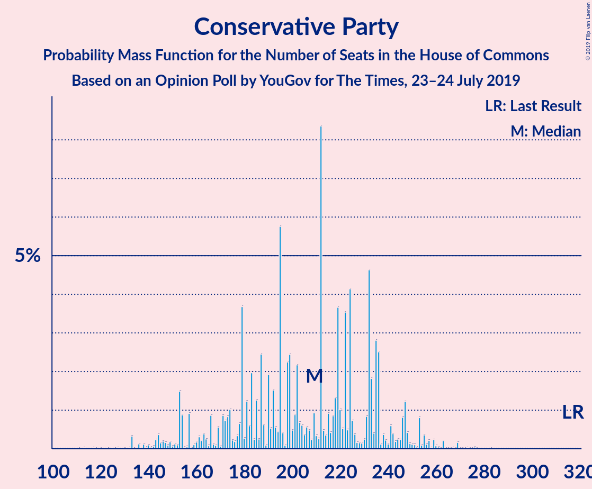
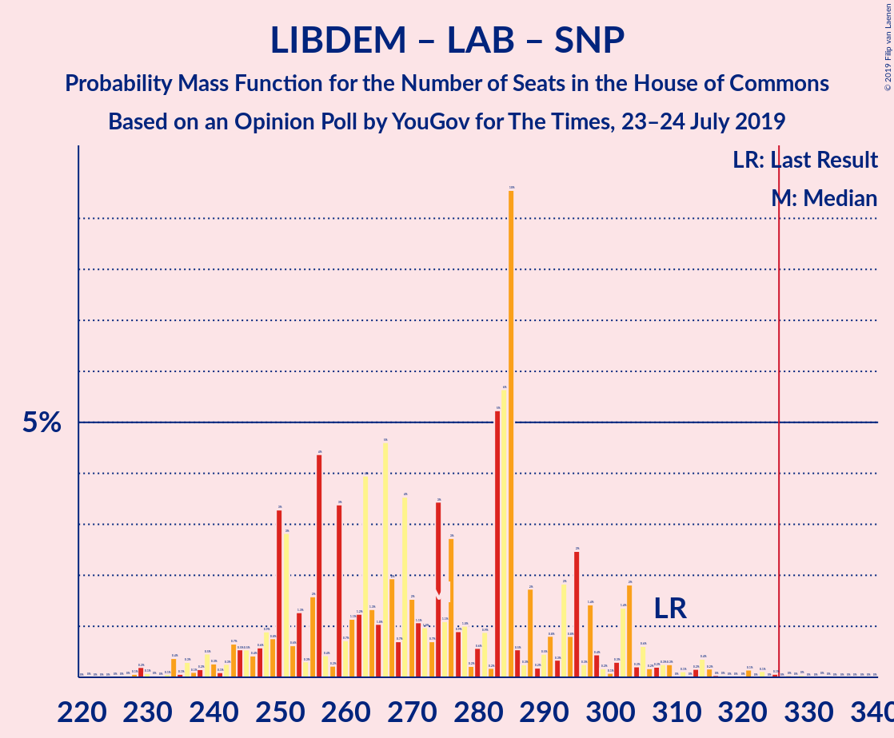

# Opinion Poll by YouGov for The Times, 23–24 July 2019

<a href="#voting-intentions">Voting Intentions</a> | <a href="#seats">Seats</a> | <a href="#coalitions">Coalitions</a> | <a href="#technical-information">Technical Information</a>

## Voting Intentions

### Confidence Intervals

| Party | Last Result | Poll Result | 80% Confidence Interval | 90% Confidence Interval | 95% Confidence Interval | 99% Confidence Interval |
|:-----:|:-----------:|:-----------:|:-----------------------:|:-----------------------:|:-----------------------:|:-----------------------:|
| Conservative Party | 42.4% | 24.4% | 23.1–25.8% |22.8–26.2% |22.5–26.5% |21.8–27.2% |
| Liberal Democrats | 7.4% | 22.5% | 21.2–23.9% |20.9–24.2% |20.6–24.6% |20.0–25.2% |
| Labour Party | 40.0% | 18.6% | 17.4–19.9% |17.1–20.2% |16.8–20.5% |16.3–21.1% |
| Brexit Party | 0.0% | 16.6% | 15.5–17.8% |15.2–18.2% |14.9–18.5% |14.4–19.1% |
| Green Party | 1.6% | 8.8% | 8.0–9.8% |7.7–10.0% |7.5–10.2% |7.2–10.7% |
| Scottish National Party | 3.0% | 3.9% | 3.4–4.6% |3.2–4.8% |3.1–4.9% |2.8–5.3% |
| Plaid Cymru | 0.5% | 1.0% | 0.7–1.4% |0.7–1.5% |0.6–1.6% |0.5–1.8% |
| UK Independence Party | 1.8% | 1.0% | 0.7–1.4% |0.7–1.5% |0.6–1.6% |0.5–1.8% |
| Change UK | 0.0% | 0.2% | 0.1–0.5% |0.1–0.5% |0.1–0.6% |0.1–0.7% |

*Note:* The poll result column reflects the actual value used in the calculations. Published results may vary slightly, and in addition be rounded to fewer digits.

## Seats

### Confidence Intervals

| Party | Last Result | Median | 80% Confidence Interval | 90% Confidence Interval | 95% Confidence Interval | 99% Confidence Interval |
|:-----:|:-----------:|:------:|:-----------------------:|:-----------------------:|:-----------------------:|:-----------------------:|
| <a href="#conservative-party">Conservative Party</a> | 317 | 212 | 174–226 |173–241 |145–244 |133–257 |
| <a href="#liberal-democrats">Liberal Democrats</a> | 12 | 106 | 99–109 |93–113 |89–116 |87–120 |
| <a href="#labour-party">Labour Party</a> | 262 | 128 | 99–134 |98–145 |93–145 |86–155 |
| <a href="#brexit-party">Brexit Party</a> | 0 | 120 | 114–180 |114–181 |106–201 |94–207 |
| <a href="#green-party">Green Party</a> | 1 | 6 | 5–9 |5–9 |5–9 |4–11 |
| <a href="#scottish-national-party">Scottish National Party</a> | 35 | 51 | 50–52 |50–52 |50–53 |48–54 |
| <a href="#plaid-cymru">Plaid Cymru</a> | 4 | 8 | 6–10 |6–14 |5–15 |4–16 |
| <a href="#uk-independence-party">UK Independence Party</a> | 0 | 0 | 0 |0 |0 |0 |
| <a href="#change-uk">Change UK</a> | 0 | 0 | 0 |0 |0 |0 |

### Conservative Party

*For a full overview of the results for this party, see the [Conservative Party](party-conservativeparty.html) page.*

| Number of Seats | Probability | Accumulated | Special Marks |
|:---------------:|:-----------:|:-----------:|:-------------:|
| 119 | 0% | 100% |  |
| 120 | 0% | 99.9% |  |
| 121 | 0% | 99.9% |  |
| 122 | 0% | 99.9% |  |
| 123 | 0% | 99.9% |  |
| 124 | 0% | 99.9% |  |
| 125 | 0% | 99.9% |  |
| 126 | 0% | 99.9% |  |
| 127 | 0% | 99.9% |  |
| 128 | 0% | 99.9% |  |
| 129 | 0% | 99.9% |  |
| 130 | 0% | 99.9% |  |
| 131 | 0% | 99.9% |  |
| 132 | 0% | 99.9% |  |
| 133 | 0.8% | 99.9% |  |
| 134 | 0% | 99.1% |  |
| 135 | 0% | 99.0% |  |
| 136 | 0% | 99.0% |  |
| 137 | 0% | 99.0% |  |
| 138 | 0% | 99.0% |  |
| 139 | 0% | 99.0% |  |
| 140 | 0% | 99.0% |  |
| 141 | 0% | 99.0% |  |
| 142 | 0% | 99.0% |  |
| 143 | 1.0% | 99.0% |  |
| 144 | 0% | 98% |  |
| 145 | 0.7% | 98% |  |
| 146 | 0.3% | 97% |  |
| 147 | 0% | 97% |  |
| 148 | 0% | 97% |  |
| 149 | 0.1% | 97% |  |
| 150 | 0.1% | 97% |  |
| 151 | 0% | 97% |  |
| 152 | 0% | 97% |  |
| 153 | 0% | 97% |  |
| 154 | 0% | 97% |  |
| 155 | 0% | 97% |  |
| 156 | 0.1% | 97% |  |
| 157 | 0% | 97% |  |
| 158 | 0% | 97% |  |
| 159 | 0.1% | 97% |  |
| 160 | 0.1% | 97% |  |
| 161 | 0% | 96% |  |
| 162 | 0.7% | 96% |  |
| 163 | 0% | 96% |  |
| 164 | 0.2% | 96% |  |
| 165 | 0.1% | 96% |  |
| 166 | 0% | 96% |  |
| 167 | 0% | 96% |  |
| 168 | 0% | 95% |  |
| 169 | 0% | 95% |  |
| 170 | 0% | 95% |  |
| 171 | 0.1% | 95% |  |
| 172 | 0% | 95% |  |
| 173 | 3% | 95% |  |
| 174 | 4% | 92% |  |
| 175 | 0.3% | 88% |  |
| 176 | 0.3% | 88% |  |
| 177 | 0% | 88% |  |
| 178 | 0% | 88% |  |
| 179 | 0% | 88% |  |
| 180 | 0.6% | 88% |  |
| 181 | 0% | 87% |  |
| 182 | 1.4% | 87% |  |
| 183 | 0% | 86% |  |
| 184 | 0.1% | 86% |  |
| 185 | 5% | 86% |  |
| 186 | 0.1% | 81% |  |
| 187 | 0.5% | 81% |  |
| 188 | 0% | 80% |  |
| 189 | 0.1% | 80% |  |
| 190 | 0% | 80% |  |
| 191 | 0.5% | 80% |  |
| 192 | 0.1% | 79% |  |
| 193 | 0.2% | 79% |  |
| 194 | 0.4% | 79% |  |
| 195 | 0.6% | 79% |  |
| 196 | 0% | 78% |  |
| 197 | 0% | 78% |  |
| 198 | 0.3% | 78% |  |
| 199 | 0% | 78% |  |
| 200 | 0.1% | 78% |  |
| 201 | 0% | 78% |  |
| 202 | 7% | 78% |  |
| 203 | 0% | 71% |  |
| 204 | 0% | 71% |  |
| 205 | 0.8% | 70% |  |
| 206 | 1.1% | 70% |  |
| 207 | 0.2% | 69% |  |
| 208 | 0.1% | 68% |  |
| 209 | 0.1% | 68% |  |
| 210 | 0.4% | 68% |  |
| 211 | 0% | 68% |  |
| 212 | 39% | 68% | Median |
| 213 | 0.1% | 29% |  |
| 214 | 0.5% | 29% |  |
| 215 | 0.2% | 28% |  |
| 216 | 2% | 28% |  |
| 217 | 0% | 26% |  |
| 218 | 0% | 26% |  |
| 219 | 0% | 26% |  |
| 220 | 0.1% | 26% |  |
| 221 | 0.7% | 26% |  |
| 222 | 0.3% | 25% |  |
| 223 | 0.1% | 25% |  |
| 224 | 14% | 25% |  |
| 225 | 0.7% | 11% |  |
| 226 | 0.3% | 10% |  |
| 227 | 0.1% | 10% |  |
| 228 | 0% | 10% |  |
| 229 | 0% | 10% |  |
| 230 | 0.2% | 10% |  |
| 231 | 0.1% | 10% |  |
| 232 | 2% | 9% |  |
| 233 | 0% | 7% |  |
| 234 | 0.3% | 7% |  |
| 235 | 0.4% | 7% |  |
| 236 | 0% | 6% |  |
| 237 | 0% | 6% |  |
| 238 | 0% | 6% |  |
| 239 | 0.9% | 6% |  |
| 240 | 0.1% | 5% |  |
| 241 | 1.0% | 5% |  |
| 242 | 0.5% | 4% |  |
| 243 | 0.5% | 4% |  |
| 244 | 1.0% | 3% |  |
| 245 | 0% | 2% |  |
| 246 | 0% | 2% |  |
| 247 | 0.3% | 2% |  |
| 248 | 0.1% | 2% |  |
| 249 | 0% | 2% |  |
| 250 | 0% | 2% |  |
| 251 | 0% | 2% |  |
| 252 | 0% | 2% |  |
| 253 | 0.6% | 2% |  |
| 254 | 0.2% | 1.2% |  |
| 255 | 0% | 1.0% |  |
| 256 | 0% | 1.0% |  |
| 257 | 0.6% | 1.0% |  |
| 258 | 0% | 0.3% |  |
| 259 | 0% | 0.3% |  |
| 260 | 0.1% | 0.3% |  |
| 261 | 0% | 0.2% |  |
| 262 | 0% | 0.2% |  |
| 263 | 0% | 0.2% |  |
| 264 | 0% | 0.2% |  |
| 265 | 0% | 0.2% |  |
| 266 | 0% | 0.2% |  |
| 267 | 0% | 0.2% |  |
| 268 | 0% | 0.2% |  |
| 269 | 0.1% | 0.1% |  |
| 270 | 0% | 0.1% |  |
| 271 | 0% | 0.1% |  |
| 272 | 0% | 0.1% |  |
| 273 | 0% | 0% |  |
| 274 | 0% | 0% |  |
| 275 | 0% | 0% |  |
| 276 | 0% | 0% |  |
| 277 | 0% | 0% |  |
| 278 | 0% | 0% |  |
| 279 | 0% | 0% |  |
| 280 | 0% | 0% |  |
| 281 | 0% | 0% |  |
| 282 | 0% | 0% |  |
| 283 | 0% | 0% |  |
| 284 | 0% | 0% |  |
| 285 | 0% | 0% |  |
| 286 | 0% | 0% |  |
| 287 | 0% | 0% |  |
| 288 | 0% | 0% |  |
| 289 | 0% | 0% |  |
| 290 | 0% | 0% |  |
| 291 | 0% | 0% |  |
| 292 | 0% | 0% |  |
| 293 | 0% | 0% |  |
| 294 | 0% | 0% |  |
| 295 | 0% | 0% |  |
| 296 | 0% | 0% |  |
| 297 | 0% | 0% |  |
| 298 | 0% | 0% |  |
| 299 | 0% | 0% |  |
| 300 | 0% | 0% |  |
| 301 | 0% | 0% |  |
| 302 | 0% | 0% |  |
| 303 | 0% | 0% |  |
| 304 | 0% | 0% |  |
| 305 | 0% | 0% |  |
| 306 | 0% | 0% |  |
| 307 | 0% | 0% |  |
| 308 | 0% | 0% |  |
| 309 | 0% | 0% |  |
| 310 | 0% | 0% |  |
| 311 | 0% | 0% |  |
| 312 | 0% | 0% |  |
| 313 | 0% | 0% |  |
| 314 | 0% | 0% |  |
| 315 | 0% | 0% |  |
| 316 | 0% | 0% |  |
| 317 | 0% | 0% | Last Result |

### Liberal Democrats

*For a full overview of the results for this party, see the [Liberal Democrats](party-liberaldemocrats.html) page.*

| Number of Seats | Probability | Accumulated | Special Marks |
|:---------------:|:-----------:|:-----------:|:-------------:|
| 12 | 0% | 100% | Last Result |
| 13 | 0% | 100% |  |
| 14 | 0% | 100% |  |
| 15 | 0% | 100% |  |
| 16 | 0% | 100% |  |
| 17 | 0% | 100% |  |
| 18 | 0% | 100% |  |
| 19 | 0% | 100% |  |
| 20 | 0% | 100% |  |
| 21 | 0% | 100% |  |
| 22 | 0% | 100% |  |
| 23 | 0% | 100% |  |
| 24 | 0% | 100% |  |
| 25 | 0% | 100% |  |
| 26 | 0% | 100% |  |
| 27 | 0% | 100% |  |
| 28 | 0% | 100% |  |
| 29 | 0% | 100% |  |
| 30 | 0% | 100% |  |
| 31 | 0% | 100% |  |
| 32 | 0% | 100% |  |
| 33 | 0% | 100% |  |
| 34 | 0% | 100% |  |
| 35 | 0% | 100% |  |
| 36 | 0% | 100% |  |
| 37 | 0% | 100% |  |
| 38 | 0% | 100% |  |
| 39 | 0% | 100% |  |
| 40 | 0% | 100% |  |
| 41 | 0% | 100% |  |
| 42 | 0% | 100% |  |
| 43 | 0% | 100% |  |
| 44 | 0% | 100% |  |
| 45 | 0% | 100% |  |
| 46 | 0% | 100% |  |
| 47 | 0% | 100% |  |
| 48 | 0% | 100% |  |
| 49 | 0% | 100% |  |
| 50 | 0% | 100% |  |
| 51 | 0% | 100% |  |
| 52 | 0% | 100% |  |
| 53 | 0% | 100% |  |
| 54 | 0% | 100% |  |
| 55 | 0% | 100% |  |
| 56 | 0% | 100% |  |
| 57 | 0% | 100% |  |
| 58 | 0% | 100% |  |
| 59 | 0% | 100% |  |
| 60 | 0% | 100% |  |
| 61 | 0% | 100% |  |
| 62 | 0% | 100% |  |
| 63 | 0% | 100% |  |
| 64 | 0% | 100% |  |
| 65 | 0% | 100% |  |
| 66 | 0% | 100% |  |
| 67 | 0% | 100% |  |
| 68 | 0% | 100% |  |
| 69 | 0% | 100% |  |
| 70 | 0% | 100% |  |
| 71 | 0% | 100% |  |
| 72 | 0% | 100% |  |
| 73 | 0% | 100% |  |
| 74 | 0% | 100% |  |
| 75 | 0% | 100% |  |
| 76 | 0% | 100% |  |
| 77 | 0% | 100% |  |
| 78 | 0% | 100% |  |
| 79 | 0% | 100% |  |
| 80 | 0% | 100% |  |
| 81 | 0% | 100% |  |
| 82 | 0% | 100% |  |
| 83 | 0% | 100% |  |
| 84 | 0% | 100% |  |
| 85 | 0.2% | 99.9% |  |
| 86 | 0% | 99.7% |  |
| 87 | 0.6% | 99.7% |  |
| 88 | 0% | 99.1% |  |
| 89 | 2% | 99.1% |  |
| 90 | 0.2% | 97% |  |
| 91 | 0.3% | 97% |  |
| 92 | 1.1% | 96% |  |
| 93 | 0.3% | 95% |  |
| 94 | 3% | 95% |  |
| 95 | 0.4% | 92% |  |
| 96 | 0.7% | 92% |  |
| 97 | 0.6% | 91% |  |
| 98 | 0.4% | 90% |  |
| 99 | 1.4% | 90% |  |
| 100 | 0.1% | 89% |  |
| 101 | 2% | 89% |  |
| 102 | 1.4% | 87% |  |
| 103 | 2% | 86% |  |
| 104 | 20% | 83% |  |
| 105 | 2% | 63% |  |
| 106 | 43% | 62% | Median |
| 107 | 7% | 18% |  |
| 108 | 0.5% | 11% |  |
| 109 | 1.2% | 10% |  |
| 110 | 1.3% | 9% |  |
| 111 | 0.5% | 8% |  |
| 112 | 0.1% | 7% |  |
| 113 | 4% | 7% |  |
| 114 | 0.2% | 4% |  |
| 115 | 0.1% | 3% |  |
| 116 | 0.8% | 3% |  |
| 117 | 1.4% | 2% |  |
| 118 | 0.2% | 1.0% |  |
| 119 | 0.1% | 0.9% |  |
| 120 | 0.4% | 0.8% |  |
| 121 | 0.1% | 0.4% |  |
| 122 | 0.2% | 0.3% |  |
| 123 | 0% | 0.1% |  |
| 124 | 0% | 0.1% |  |
| 125 | 0% | 0.1% |  |
| 126 | 0% | 0.1% |  |
| 127 | 0% | 0.1% |  |
| 128 | 0.1% | 0.1% |  |
| 129 | 0% | 0% |  |

### Labour Party

*For a full overview of the results for this party, see the [Labour Party](party-labourparty.html) page.*

| Number of Seats | Probability | Accumulated | Special Marks |
|:---------------:|:-----------:|:-----------:|:-------------:|
| 81 | 0% | 100% |  |
| 82 | 0% | 99.9% |  |
| 83 | 0% | 99.9% |  |
| 84 | 0.1% | 99.9% |  |
| 85 | 0.2% | 99.8% |  |
| 86 | 0.9% | 99.6% |  |
| 87 | 0% | 98.7% |  |
| 88 | 0% | 98.7% |  |
| 89 | 0% | 98.7% |  |
| 90 | 0.1% | 98.7% |  |
| 91 | 0.2% | 98.6% |  |
| 92 | 0.1% | 98% |  |
| 93 | 0.8% | 98% |  |
| 94 | 0.1% | 97% |  |
| 95 | 0.4% | 97% |  |
| 96 | 0.1% | 97% |  |
| 97 | 0.2% | 97% |  |
| 98 | 2% | 97% |  |
| 99 | 5% | 95% |  |
| 100 | 3% | 90% |  |
| 101 | 3% | 87% |  |
| 102 | 0.4% | 84% |  |
| 103 | 0.4% | 83% |  |
| 104 | 0.2% | 83% |  |
| 105 | 2% | 83% |  |
| 106 | 0.3% | 81% |  |
| 107 | 0.6% | 80% |  |
| 108 | 0.1% | 80% |  |
| 109 | 0.1% | 80% |  |
| 110 | 1.1% | 80% |  |
| 111 | 0.8% | 79% |  |
| 112 | 0.1% | 78% |  |
| 113 | 3% | 78% |  |
| 114 | 15% | 75% |  |
| 115 | 0.2% | 60% |  |
| 116 | 4% | 60% |  |
| 117 | 0.2% | 56% |  |
| 118 | 0.3% | 56% |  |
| 119 | 0.1% | 55% |  |
| 120 | 0.7% | 55% |  |
| 121 | 0% | 55% |  |
| 122 | 0.2% | 55% |  |
| 123 | 1.0% | 54% |  |
| 124 | 0% | 53% |  |
| 125 | 1.2% | 53% |  |
| 126 | 0.9% | 52% |  |
| 127 | 0.6% | 51% |  |
| 128 | 38% | 51% | Median |
| 129 | 0.1% | 12% |  |
| 130 | 1.4% | 12% |  |
| 131 | 0.5% | 11% |  |
| 132 | 0% | 10% |  |
| 133 | 0.2% | 10% |  |
| 134 | 0.5% | 10% |  |
| 135 | 0% | 10% |  |
| 136 | 0% | 10% |  |
| 137 | 0% | 10% |  |
| 138 | 0.1% | 10% |  |
| 139 | 0.2% | 10% |  |
| 140 | 0.1% | 9% |  |
| 141 | 0.1% | 9% |  |
| 142 | 0.3% | 9% |  |
| 143 | 0.1% | 9% |  |
| 144 | 0% | 9% |  |
| 145 | 7% | 9% |  |
| 146 | 0% | 2% |  |
| 147 | 0% | 2% |  |
| 148 | 0% | 2% |  |
| 149 | 0.4% | 2% |  |
| 150 | 0.7% | 1.3% |  |
| 151 | 0% | 0.6% |  |
| 152 | 0% | 0.6% |  |
| 153 | 0% | 0.6% |  |
| 154 | 0% | 0.6% |  |
| 155 | 0.4% | 0.6% |  |
| 156 | 0% | 0.2% |  |
| 157 | 0% | 0.2% |  |
| 158 | 0.1% | 0.1% |  |
| 159 | 0% | 0.1% |  |
| 160 | 0% | 0.1% |  |
| 161 | 0% | 0.1% |  |
| 162 | 0% | 0.1% |  |
| 163 | 0% | 0.1% |  |
| 164 | 0% | 0% |  |
| 165 | 0% | 0% |  |
| 166 | 0% | 0% |  |
| 167 | 0% | 0% |  |
| 168 | 0% | 0% |  |
| 169 | 0% | 0% |  |
| 170 | 0% | 0% |  |
| 171 | 0% | 0% |  |
| 172 | 0% | 0% |  |
| 173 | 0% | 0% |  |
| 174 | 0% | 0% |  |
| 175 | 0% | 0% |  |
| 176 | 0% | 0% |  |
| 177 | 0% | 0% |  |
| 178 | 0% | 0% |  |
| 179 | 0% | 0% |  |
| 180 | 0% | 0% |  |
| 181 | 0% | 0% |  |
| 182 | 0% | 0% |  |
| 183 | 0% | 0% |  |
| 184 | 0% | 0% |  |
| 185 | 0% | 0% |  |
| 186 | 0% | 0% |  |
| 187 | 0% | 0% |  |
| 188 | 0% | 0% |  |
| 189 | 0% | 0% |  |
| 190 | 0% | 0% |  |
| 191 | 0% | 0% |  |
| 192 | 0% | 0% |  |
| 193 | 0% | 0% |  |
| 194 | 0% | 0% |  |
| 195 | 0% | 0% |  |
| 196 | 0% | 0% |  |
| 197 | 0% | 0% |  |
| 198 | 0% | 0% |  |
| 199 | 0% | 0% |  |
| 200 | 0% | 0% |  |
| 201 | 0% | 0% |  |
| 202 | 0% | 0% |  |
| 203 | 0% | 0% |  |
| 204 | 0% | 0% |  |
| 205 | 0% | 0% |  |
| 206 | 0% | 0% |  |
| 207 | 0% | 0% |  |
| 208 | 0% | 0% |  |
| 209 | 0% | 0% |  |
| 210 | 0% | 0% |  |
| 211 | 0% | 0% |  |
| 212 | 0% | 0% |  |
| 213 | 0% | 0% |  |
| 214 | 0% | 0% |  |
| 215 | 0% | 0% |  |
| 216 | 0% | 0% |  |
| 217 | 0% | 0% |  |
| 218 | 0% | 0% |  |
| 219 | 0% | 0% |  |
| 220 | 0% | 0% |  |
| 221 | 0% | 0% |  |
| 222 | 0% | 0% |  |
| 223 | 0% | 0% |  |
| 224 | 0% | 0% |  |
| 225 | 0% | 0% |  |
| 226 | 0% | 0% |  |
| 227 | 0% | 0% |  |
| 228 | 0% | 0% |  |
| 229 | 0% | 0% |  |
| 230 | 0% | 0% |  |
| 231 | 0% | 0% |  |
| 232 | 0% | 0% |  |
| 233 | 0% | 0% |  |
| 234 | 0% | 0% |  |
| 235 | 0% | 0% |  |
| 236 | 0% | 0% |  |
| 237 | 0% | 0% |  |
| 238 | 0% | 0% |  |
| 239 | 0% | 0% |  |
| 240 | 0% | 0% |  |
| 241 | 0% | 0% |  |
| 242 | 0% | 0% |  |
| 243 | 0% | 0% |  |
| 244 | 0% | 0% |  |
| 245 | 0% | 0% |  |
| 246 | 0% | 0% |  |
| 247 | 0% | 0% |  |
| 248 | 0% | 0% |  |
| 249 | 0% | 0% |  |
| 250 | 0% | 0% |  |
| 251 | 0% | 0% |  |
| 252 | 0% | 0% |  |
| 253 | 0% | 0% |  |
| 254 | 0% | 0% |  |
| 255 | 0% | 0% |  |
| 256 | 0% | 0% |  |
| 257 | 0% | 0% |  |
| 258 | 0% | 0% |  |
| 259 | 0% | 0% |  |
| 260 | 0% | 0% |  |
| 261 | 0% | 0% |  |
| 262 | 0% | 0% | Last Result |

### Brexit Party

*For a full overview of the results for this party, see the [Brexit Party](party-brexitparty.html) page.*

| Number of Seats | Probability | Accumulated | Special Marks |
|:---------------:|:-----------:|:-----------:|:-------------:|
| 0 | 0% | 100% | Last Result |
| 1 | 0% | 100% |  |
| 2 | 0% | 100% |  |
| 3 | 0% | 100% |  |
| 4 | 0% | 100% |  |
| 5 | 0% | 100% |  |
| 6 | 0% | 100% |  |
| 7 | 0% | 100% |  |
| 8 | 0% | 100% |  |
| 9 | 0% | 100% |  |
| 10 | 0% | 100% |  |
| 11 | 0% | 100% |  |
| 12 | 0% | 100% |  |
| 13 | 0% | 100% |  |
| 14 | 0% | 100% |  |
| 15 | 0% | 100% |  |
| 16 | 0% | 100% |  |
| 17 | 0% | 100% |  |
| 18 | 0% | 100% |  |
| 19 | 0% | 100% |  |
| 20 | 0% | 100% |  |
| 21 | 0% | 100% |  |
| 22 | 0% | 100% |  |
| 23 | 0% | 100% |  |
| 24 | 0% | 100% |  |
| 25 | 0% | 100% |  |
| 26 | 0% | 100% |  |
| 27 | 0% | 100% |  |
| 28 | 0% | 100% |  |
| 29 | 0% | 100% |  |
| 30 | 0% | 100% |  |
| 31 | 0% | 100% |  |
| 32 | 0% | 100% |  |
| 33 | 0% | 100% |  |
| 34 | 0% | 100% |  |
| 35 | 0% | 100% |  |
| 36 | 0% | 100% |  |
| 37 | 0% | 100% |  |
| 38 | 0% | 100% |  |
| 39 | 0% | 100% |  |
| 40 | 0% | 100% |  |
| 41 | 0% | 100% |  |
| 42 | 0% | 100% |  |
| 43 | 0% | 100% |  |
| 44 | 0% | 100% |  |
| 45 | 0% | 100% |  |
| 46 | 0% | 100% |  |
| 47 | 0% | 100% |  |
| 48 | 0% | 100% |  |
| 49 | 0% | 100% |  |
| 50 | 0% | 100% |  |
| 51 | 0% | 100% |  |
| 52 | 0% | 100% |  |
| 53 | 0% | 100% |  |
| 54 | 0% | 100% |  |
| 55 | 0% | 100% |  |
| 56 | 0% | 100% |  |
| 57 | 0% | 100% |  |
| 58 | 0% | 100% |  |
| 59 | 0% | 100% |  |
| 60 | 0% | 100% |  |
| 61 | 0% | 100% |  |
| 62 | 0% | 100% |  |
| 63 | 0% | 100% |  |
| 64 | 0% | 100% |  |
| 65 | 0% | 100% |  |
| 66 | 0% | 100% |  |
| 67 | 0% | 100% |  |
| 68 | 0% | 100% |  |
| 69 | 0% | 100% |  |
| 70 | 0% | 100% |  |
| 71 | 0% | 100% |  |
| 72 | 0% | 100% |  |
| 73 | 0% | 100% |  |
| 74 | 0% | 100% |  |
| 75 | 0% | 100% |  |
| 76 | 0% | 100% |  |
| 77 | 0% | 100% |  |
| 78 | 0% | 100% |  |
| 79 | 0% | 100% |  |
| 80 | 0% | 100% |  |
| 81 | 0% | 100% |  |
| 82 | 0% | 100% |  |
| 83 | 0% | 100% |  |
| 84 | 0% | 100% |  |
| 85 | 0% | 100% |  |
| 86 | 0% | 100% |  |
| 87 | 0% | 100% |  |
| 88 | 0% | 99.9% |  |
| 89 | 0% | 99.9% |  |
| 90 | 0% | 99.9% |  |
| 91 | 0% | 99.9% |  |
| 92 | 0% | 99.9% |  |
| 93 | 0.1% | 99.9% |  |
| 94 | 0.3% | 99.8% |  |
| 95 | 0% | 99.4% |  |
| 96 | 0% | 99.4% |  |
| 97 | 0% | 99.4% |  |
| 98 | 0% | 99.3% |  |
| 99 | 0% | 99.3% |  |
| 100 | 0% | 99.3% |  |
| 101 | 0% | 99.3% |  |
| 102 | 0.1% | 99.3% |  |
| 103 | 0.5% | 99.2% |  |
| 104 | 0% | 98.7% |  |
| 105 | 0% | 98.6% |  |
| 106 | 1.3% | 98.6% |  |
| 107 | 0.2% | 97% |  |
| 108 | 0.6% | 97% |  |
| 109 | 0.1% | 96% |  |
| 110 | 0% | 96% |  |
| 111 | 0.5% | 96% |  |
| 112 | 0% | 96% |  |
| 113 | 0.1% | 96% |  |
| 114 | 7% | 96% |  |
| 115 | 0.4% | 89% |  |
| 116 | 0.9% | 89% |  |
| 117 | 0.4% | 88% |  |
| 118 | 0.2% | 87% |  |
| 119 | 0.9% | 87% |  |
| 120 | 38% | 86% | Median |
| 121 | 0.6% | 48% |  |
| 122 | 0.1% | 47% |  |
| 123 | 15% | 47% |  |
| 124 | 0.8% | 32% |  |
| 125 | 0.7% | 31% |  |
| 126 | 0.1% | 31% |  |
| 127 | 0.1% | 30% |  |
| 128 | 0% | 30% |  |
| 129 | 0.1% | 30% |  |
| 130 | 0.5% | 30% |  |
| 131 | 0.1% | 30% |  |
| 132 | 0% | 30% |  |
| 133 | 0.1% | 30% |  |
| 134 | 0% | 30% |  |
| 135 | 0% | 30% |  |
| 136 | 2% | 30% |  |
| 137 | 0.5% | 28% |  |
| 138 | 0% | 27% |  |
| 139 | 0% | 27% |  |
| 140 | 0.3% | 27% |  |
| 141 | 0.9% | 27% |  |
| 142 | 0.2% | 26% |  |
| 143 | 3% | 26% |  |
| 144 | 1.4% | 23% |  |
| 145 | 1.1% | 21% |  |
| 146 | 0.1% | 20% |  |
| 147 | 0.2% | 20% |  |
| 148 | 0% | 20% |  |
| 149 | 0.3% | 20% |  |
| 150 | 0% | 20% |  |
| 151 | 0.1% | 20% |  |
| 152 | 0.2% | 20% |  |
| 153 | 0.6% | 19% |  |
| 154 | 0.2% | 19% |  |
| 155 | 0% | 19% |  |
| 156 | 0.1% | 19% |  |
| 157 | 0.2% | 18% |  |
| 158 | 0% | 18% |  |
| 159 | 1.0% | 18% |  |
| 160 | 0.1% | 17% |  |
| 161 | 0.1% | 17% |  |
| 162 | 1.5% | 17% |  |
| 163 | 0% | 16% |  |
| 164 | 0.1% | 16% |  |
| 165 | 0.1% | 15% |  |
| 166 | 0% | 15% |  |
| 167 | 0% | 15% |  |
| 168 | 0% | 15% |  |
| 169 | 0% | 15% |  |
| 170 | 0% | 15% |  |
| 171 | 0.1% | 15% |  |
| 172 | 0.1% | 15% |  |
| 173 | 3% | 15% |  |
| 174 | 0.8% | 12% |  |
| 175 | 0% | 12% |  |
| 176 | 0.1% | 12% |  |
| 177 | 0% | 11% |  |
| 178 | 0.1% | 11% |  |
| 179 | 0% | 11% |  |
| 180 | 5% | 11% |  |
| 181 | 3% | 6% |  |
| 182 | 0% | 3% |  |
| 183 | 0% | 3% |  |
| 184 | 0% | 3% |  |
| 185 | 0% | 3% |  |
| 186 | 0% | 3% |  |
| 187 | 0% | 3% |  |
| 188 | 0% | 3% |  |
| 189 | 0% | 3% |  |
| 190 | 0% | 3% |  |
| 191 | 0% | 3% |  |
| 192 | 0% | 3% |  |
| 193 | 0% | 3% |  |
| 194 | 0.1% | 3% |  |
| 195 | 0% | 3% |  |
| 196 | 0% | 3% |  |
| 197 | 0% | 3% |  |
| 198 | 0% | 3% |  |
| 199 | 0% | 3% |  |
| 200 | 0% | 3% |  |
| 201 | 0.7% | 3% |  |
| 202 | 0.8% | 2% |  |
| 203 | 0.3% | 1.4% |  |
| 204 | 0% | 1.1% |  |
| 205 | 0% | 1.1% |  |
| 206 | 0% | 1.1% |  |
| 207 | 1.0% | 1.1% |  |
| 208 | 0% | 0% |  |

### Green Party

*For a full overview of the results for this party, see the [Green Party](party-greenparty.html) page.*

| Number of Seats | Probability | Accumulated | Special Marks |
|:---------------:|:-----------:|:-----------:|:-------------:|
| 1 | 0% | 100% | Last Result |
| 2 | 0% | 100% |  |
| 3 | 0.1% | 100% |  |
| 4 | 0.9% | 99.9% |  |
| 5 | 16% | 99.1% |  |
| 6 | 56% | 83% | Median |
| 7 | 4% | 27% |  |
| 8 | 7% | 23% |  |
| 9 | 15% | 16% |  |
| 10 | 0.8% | 1.4% |  |
| 11 | 0.6% | 0.6% |  |
| 12 | 0.1% | 0.1% |  |
| 13 | 0% | 0% |  |

### Scottish National Party

*For a full overview of the results for this party, see the [Scottish National Party](party-scottishnationalparty.html) page.*

| Number of Seats | Probability | Accumulated | Special Marks |
|:---------------:|:-----------:|:-----------:|:-------------:|
| 35 | 0% | 100% | Last Result |
| 36 | 0% | 100% |  |
| 37 | 0% | 100% |  |
| 38 | 0% | 100% |  |
| 39 | 0% | 100% |  |
| 40 | 0% | 100% |  |
| 41 | 0% | 100% |  |
| 42 | 0% | 100% |  |
| 43 | 0% | 100% |  |
| 44 | 0% | 100% |  |
| 45 | 0% | 100% |  |
| 46 | 0.1% | 100% |  |
| 47 | 0% | 99.8% |  |
| 48 | 0.8% | 99.8% |  |
| 49 | 0% | 99.0% |  |
| 50 | 11% | 99.0% |  |
| 51 | 67% | 88% | Median |
| 52 | 16% | 21% |  |
| 53 | 2% | 5% |  |
| 54 | 2% | 2% |  |
| 55 | 0% | 0% |  |

### Plaid Cymru

*For a full overview of the results for this party, see the [Plaid Cymru](party-plaidcymru.html) page.*

| Number of Seats | Probability | Accumulated | Special Marks |
|:---------------:|:-----------:|:-----------:|:-------------:|
| 4 | 2% | 100% | Last Result |
| 5 | 3% | 98% |  |
| 6 | 10% | 95% |  |
| 7 | 14% | 85% |  |
| 8 | 59% | 71% | Median |
| 9 | 1.2% | 12% |  |
| 10 | 3% | 11% |  |
| 11 | 1.4% | 8% |  |
| 12 | 0.7% | 6% |  |
| 13 | 0.6% | 6% |  |
| 14 | 0.1% | 5% |  |
| 15 | 3% | 5% |  |
| 16 | 2% | 2% |  |
| 17 | 0.1% | 0.2% |  |
| 18 | 0% | 0% |  |

### UK Independence Party

*For a full overview of the results for this party, see the [UK Independence Party](party-ukindependenceparty.html) page.*

| Number of Seats | Probability | Accumulated | Special Marks |
|:---------------:|:-----------:|:-----------:|:-------------:|
| 0 | 100% | 100% | Last Result, Median |

### Change UK

*For a full overview of the results for this party, see the [Change UK](party-changeuk.html) page.*

| Number of Seats | Probability | Accumulated | Special Marks |
|:---------------:|:-----------:|:-----------:|:-------------:|
| 0 | 100% | 100% | Last Result, Median |

## Coalitions

### Confidence Intervals

| Coalition | Last Result | Median | Majority? | 80% Confidence Interval | 90% Confidence Interval | 95% Confidence Interval | 99% Confidence Interval |
|:---------:|:-----------:|:------:|:---------:|:-----------------------:|:-----------------------:|:-----------------------:|:-----------------------:|
| Conservative Party – Liberal Democrats – Change UK | 329 | 318 | 23% | 286–328 | 279–336 | 251–344 | 242–353 |
| Conservative Party – Liberal Democrats | 329 | 318 | 23% | 286–328 | 279–336 | 251–344 | 242–353 |
| Liberal Democrats – Labour Party – Scottish National Party – Plaid Cymru | 313 | 293 | 0.2% | 261–307 | 257–309 | 249–309 | 242–321 |
| Conservative Party – Scottish National Party – Plaid Cymru | 356 | 271 | 0.3% | 231–287 | 231–302 | 204–303 | 190–317 |
| Liberal Democrats – Labour Party – Scottish National Party | 309 | 285 | 0.1% | 255–297 | 248–302 | 243–302 | 234–313 |
| Conservative Party – Scottish National Party | 352 | 263 | 0% | 226–277 | 224–294 | 196–295 | 184–311 |
| Liberal Democrats – Labour Party – Plaid Cymru | 278 | 242 | 0% | 209–257 | 206–259 | 196–259 | 188–271 |
| Liberal Democrats – Labour Party – Change UK | 274 | 234 | 0% | 203–247 | 197–252 | 190–252 | 180–263 |
| Liberal Democrats – Labour Party | 274 | 234 | 0% | 203–247 | 197–252 | 190–252 | 180–263 |
| Conservative Party – Plaid Cymru | 321 | 220 | 0% | 180–236 | 179–249 | 153–252 | 139–265 |
| Conservative Party – Change UK | 317 | 212 | 0% | 174–226 | 173–241 | 145–244 | 133–257 |
| Conservative Party | 317 | 212 | 0% | 174–226 | 173–241 | 145–244 | 133–257 |
| Labour Party – Scottish National Party – Plaid Cymru | 301 | 187 | 0% | 158–194 | 157–202 | 152–202 | 147–212 |
| Labour Party – Scottish National Party | 297 | 179 | 0% | 151–185 | 151–195 | 145–195 | 140–205 |
| Labour Party – Plaid Cymru | 266 | 136 | 0% | 107–142 | 105–152 | 100–152 | 94–162 |
| Labour Party – Change UK | 262 | 128 | 0% | 99–134 | 98–145 | 93–145 | 86–155 |
| Labour Party | 262 | 128 | 0% | 99–134 | 98–145 | 93–145 | 86–155 |

### Conservative Party – Liberal Democrats – Change UK

| Number of Seats | Probability | Accumulated | Special Marks |
|:---------------:|:-----------:|:-----------:|:-------------:|
| 235 | 0% | 100% |  |
| 236 | 0% | 99.9% |  |
| 237 | 0% | 99.9% |  |
| 238 | 0% | 99.9% |  |
| 239 | 0% | 99.9% |  |
| 240 | 0% | 99.9% |  |
| 241 | 0% | 99.9% |  |
| 242 | 0.8% | 99.9% |  |
| 243 | 0% | 99.1% |  |
| 244 | 0% | 99.1% |  |
| 245 | 0% | 99.1% |  |
| 246 | 0% | 99.1% |  |
| 247 | 0% | 99.1% |  |
| 248 | 0% | 99.0% |  |
| 249 | 1.0% | 99.0% |  |
| 250 | 0% | 98% |  |
| 251 | 0.7% | 98% |  |
| 252 | 0% | 97% |  |
| 253 | 0% | 97% |  |
| 254 | 0% | 97% |  |
| 255 | 0% | 97% |  |
| 256 | 0% | 97% |  |
| 257 | 0% | 97% |  |
| 258 | 0.1% | 97% |  |
| 259 | 0% | 97% |  |
| 260 | 0% | 97% |  |
| 261 | 0.1% | 97% |  |
| 262 | 0.3% | 97% |  |
| 263 | 0% | 97% |  |
| 264 | 0% | 97% |  |
| 265 | 0.1% | 97% |  |
| 266 | 0% | 97% |  |
| 267 | 0% | 97% |  |
| 268 | 0% | 97% |  |
| 269 | 0% | 97% |  |
| 270 | 0% | 97% |  |
| 271 | 0% | 97% |  |
| 272 | 0.2% | 97% |  |
| 273 | 0% | 96% |  |
| 274 | 0.3% | 96% |  |
| 275 | 0.7% | 96% |  |
| 276 | 0% | 95% |  |
| 277 | 0% | 95% |  |
| 278 | 0% | 95% |  |
| 279 | 0.5% | 95% |  |
| 280 | 3% | 95% |  |
| 281 | 0.2% | 92% |  |
| 282 | 0% | 92% |  |
| 283 | 0% | 92% |  |
| 284 | 0% | 92% |  |
| 285 | 0% | 92% |  |
| 286 | 4% | 92% |  |
| 287 | 0.3% | 87% |  |
| 288 | 0% | 87% |  |
| 289 | 5% | 87% |  |
| 290 | 0.2% | 82% |  |
| 291 | 1.4% | 82% |  |
| 292 | 0.1% | 80% |  |
| 293 | 0.2% | 80% |  |
| 294 | 0.1% | 80% |  |
| 295 | 0% | 80% |  |
| 296 | 0% | 80% |  |
| 297 | 0% | 80% |  |
| 298 | 0% | 80% |  |
| 299 | 0% | 80% |  |
| 300 | 0.7% | 80% |  |
| 301 | 0.5% | 79% |  |
| 302 | 0.1% | 79% |  |
| 303 | 0.7% | 79% |  |
| 304 | 0.1% | 78% |  |
| 305 | 0.1% | 78% |  |
| 306 | 0.2% | 78% |  |
| 307 | 0.1% | 78% |  |
| 308 | 1.2% | 77% |  |
| 309 | 7% | 76% |  |
| 310 | 2% | 69% |  |
| 311 | 0.4% | 67% |  |
| 312 | 0% | 67% |  |
| 313 | 0.1% | 67% |  |
| 314 | 0% | 67% |  |
| 315 | 0.9% | 67% |  |
| 316 | 0.2% | 66% |  |
| 317 | 0% | 65% |  |
| 318 | 38% | 65% | Median |
| 319 | 0.5% | 27% |  |
| 320 | 0% | 27% |  |
| 321 | 2% | 27% |  |
| 322 | 0% | 25% |  |
| 323 | 0.1% | 25% |  |
| 324 | 1.0% | 25% |  |
| 325 | 0.3% | 24% |  |
| 326 | 0.3% | 23% | Majority |
| 327 | 0.3% | 23% |  |
| 328 | 15% | 23% |  |
| 329 | 0.1% | 8% | Last Result |
| 330 | 0.1% | 8% |  |
| 331 | 0.1% | 8% |  |
| 332 | 0.2% | 7% |  |
| 333 | 0.1% | 7% |  |
| 334 | 0.2% | 7% |  |
| 335 | 1.0% | 7% |  |
| 336 | 1.0% | 6% |  |
| 337 | 0.6% | 5% |  |
| 338 | 0% | 4% |  |
| 339 | 0% | 4% |  |
| 340 | 0.9% | 4% |  |
| 341 | 0.2% | 3% |  |
| 342 | 0.2% | 3% |  |
| 343 | 0.5% | 3% |  |
| 344 | 0.6% | 3% |  |
| 345 | 0.2% | 2% |  |
| 346 | 0% | 2% |  |
| 347 | 0% | 2% |  |
| 348 | 0% | 2% |  |
| 349 | 0% | 2% |  |
| 350 | 0.2% | 2% |  |
| 351 | 0% | 1.4% |  |
| 352 | 0.6% | 1.4% |  |
| 353 | 0.4% | 0.8% |  |
| 354 | 0.1% | 0.4% |  |
| 355 | 0.1% | 0.3% |  |
| 356 | 0.1% | 0.2% |  |
| 357 | 0% | 0.1% |  |
| 358 | 0% | 0.1% |  |
| 359 | 0% | 0.1% |  |
| 360 | 0% | 0.1% |  |
| 361 | 0% | 0.1% |  |
| 362 | 0% | 0.1% |  |
| 363 | 0% | 0.1% |  |
| 364 | 0% | 0.1% |  |
| 365 | 0% | 0.1% |  |
| 366 | 0% | 0.1% |  |
| 367 | 0% | 0.1% |  |
| 368 | 0% | 0.1% |  |
| 369 | 0% | 0% |  |

### Conservative Party – Liberal Democrats

| Number of Seats | Probability | Accumulated | Special Marks |
|:---------------:|:-----------:|:-----------:|:-------------:|
| 235 | 0% | 100% |  |
| 236 | 0% | 99.9% |  |
| 237 | 0% | 99.9% |  |
| 238 | 0% | 99.9% |  |
| 239 | 0% | 99.9% |  |
| 240 | 0% | 99.9% |  |
| 241 | 0% | 99.9% |  |
| 242 | 0.8% | 99.9% |  |
| 243 | 0% | 99.1% |  |
| 244 | 0% | 99.1% |  |
| 245 | 0% | 99.1% |  |
| 246 | 0% | 99.1% |  |
| 247 | 0% | 99.1% |  |
| 248 | 0% | 99.0% |  |
| 249 | 1.0% | 99.0% |  |
| 250 | 0% | 98% |  |
| 251 | 0.7% | 98% |  |
| 252 | 0% | 97% |  |
| 253 | 0% | 97% |  |
| 254 | 0% | 97% |  |
| 255 | 0% | 97% |  |
| 256 | 0% | 97% |  |
| 257 | 0% | 97% |  |
| 258 | 0.1% | 97% |  |
| 259 | 0% | 97% |  |
| 260 | 0% | 97% |  |
| 261 | 0.1% | 97% |  |
| 262 | 0.3% | 97% |  |
| 263 | 0% | 97% |  |
| 264 | 0% | 97% |  |
| 265 | 0.1% | 97% |  |
| 266 | 0% | 97% |  |
| 267 | 0% | 97% |  |
| 268 | 0% | 97% |  |
| 269 | 0% | 97% |  |
| 270 | 0% | 97% |  |
| 271 | 0% | 97% |  |
| 272 | 0.2% | 97% |  |
| 273 | 0% | 96% |  |
| 274 | 0.3% | 96% |  |
| 275 | 0.7% | 96% |  |
| 276 | 0% | 95% |  |
| 277 | 0% | 95% |  |
| 278 | 0% | 95% |  |
| 279 | 0.5% | 95% |  |
| 280 | 3% | 95% |  |
| 281 | 0.2% | 92% |  |
| 282 | 0% | 92% |  |
| 283 | 0% | 92% |  |
| 284 | 0% | 92% |  |
| 285 | 0% | 92% |  |
| 286 | 4% | 92% |  |
| 287 | 0.3% | 87% |  |
| 288 | 0% | 87% |  |
| 289 | 5% | 87% |  |
| 290 | 0.2% | 82% |  |
| 291 | 1.4% | 82% |  |
| 292 | 0.1% | 80% |  |
| 293 | 0.2% | 80% |  |
| 294 | 0.1% | 80% |  |
| 295 | 0% | 80% |  |
| 296 | 0% | 80% |  |
| 297 | 0% | 80% |  |
| 298 | 0% | 80% |  |
| 299 | 0% | 80% |  |
| 300 | 0.7% | 80% |  |
| 301 | 0.5% | 79% |  |
| 302 | 0.1% | 79% |  |
| 303 | 0.7% | 79% |  |
| 304 | 0.1% | 78% |  |
| 305 | 0.1% | 78% |  |
| 306 | 0.2% | 78% |  |
| 307 | 0.1% | 78% |  |
| 308 | 1.2% | 77% |  |
| 309 | 7% | 76% |  |
| 310 | 2% | 69% |  |
| 311 | 0.4% | 67% |  |
| 312 | 0% | 67% |  |
| 313 | 0.1% | 67% |  |
| 314 | 0% | 67% |  |
| 315 | 0.9% | 67% |  |
| 316 | 0.2% | 66% |  |
| 317 | 0% | 65% |  |
| 318 | 38% | 65% | Median |
| 319 | 0.5% | 27% |  |
| 320 | 0% | 27% |  |
| 321 | 2% | 27% |  |
| 322 | 0% | 25% |  |
| 323 | 0.1% | 25% |  |
| 324 | 1.0% | 25% |  |
| 325 | 0.3% | 24% |  |
| 326 | 0.3% | 23% | Majority |
| 327 | 0.3% | 23% |  |
| 328 | 15% | 23% |  |
| 329 | 0.1% | 8% | Last Result |
| 330 | 0.1% | 8% |  |
| 331 | 0.1% | 8% |  |
| 332 | 0.2% | 7% |  |
| 333 | 0.1% | 7% |  |
| 334 | 0.2% | 7% |  |
| 335 | 1.0% | 7% |  |
| 336 | 1.0% | 6% |  |
| 337 | 0.6% | 5% |  |
| 338 | 0% | 4% |  |
| 339 | 0% | 4% |  |
| 340 | 0.9% | 4% |  |
| 341 | 0.2% | 3% |  |
| 342 | 0.2% | 3% |  |
| 343 | 0.5% | 3% |  |
| 344 | 0.6% | 3% |  |
| 345 | 0.2% | 2% |  |
| 346 | 0% | 2% |  |
| 347 | 0% | 2% |  |
| 348 | 0% | 2% |  |
| 349 | 0% | 2% |  |
| 350 | 0.2% | 2% |  |
| 351 | 0% | 1.4% |  |
| 352 | 0.6% | 1.4% |  |
| 353 | 0.4% | 0.8% |  |
| 354 | 0.1% | 0.4% |  |
| 355 | 0.1% | 0.3% |  |
| 356 | 0.1% | 0.2% |  |
| 357 | 0% | 0.1% |  |
| 358 | 0% | 0.1% |  |
| 359 | 0% | 0.1% |  |
| 360 | 0% | 0.1% |  |
| 361 | 0% | 0.1% |  |
| 362 | 0% | 0.1% |  |
| 363 | 0% | 0.1% |  |
| 364 | 0% | 0.1% |  |
| 365 | 0% | 0.1% |  |
| 366 | 0% | 0.1% |  |
| 367 | 0% | 0.1% |  |
| 368 | 0% | 0.1% |  |
| 369 | 0% | 0% |  |

### Liberal Democrats – Labour Party – Scottish National Party – Plaid Cymru

| Number of Seats | Probability | Accumulated | Special Marks |
|:---------------:|:-----------:|:-----------:|:-------------:|
| 233 | 0% | 100% |  |
| 234 | 0% | 99.9% |  |
| 235 | 0% | 99.9% |  |
| 236 | 0.2% | 99.9% |  |
| 237 | 0% | 99.8% |  |
| 238 | 0% | 99.8% |  |
| 239 | 0% | 99.8% |  |
| 240 | 0% | 99.7% |  |
| 241 | 0% | 99.7% |  |
| 242 | 0.9% | 99.7% |  |
| 243 | 0% | 98.8% |  |
| 244 | 0% | 98.8% |  |
| 245 | 0.5% | 98.8% |  |
| 246 | 0.1% | 98% |  |
| 247 | 0% | 98% |  |
| 248 | 0% | 98% |  |
| 249 | 2% | 98% |  |
| 250 | 0.1% | 96% |  |
| 251 | 0.1% | 96% |  |
| 252 | 0.3% | 96% |  |
| 253 | 0.1% | 96% |  |
| 254 | 0.1% | 96% |  |
| 255 | 0.1% | 95% |  |
| 256 | 0.2% | 95% |  |
| 257 | 1.1% | 95% |  |
| 258 | 0% | 94% |  |
| 259 | 0% | 94% |  |
| 260 | 0.2% | 94% |  |
| 261 | 5% | 94% |  |
| 262 | 0.9% | 89% |  |
| 263 | 0.6% | 88% |  |
| 264 | 1.3% | 87% |  |
| 265 | 0.1% | 86% |  |
| 266 | 0.2% | 86% |  |
| 267 | 0.3% | 86% |  |
| 268 | 0.1% | 85% |  |
| 269 | 1.1% | 85% |  |
| 270 | 0.1% | 84% |  |
| 271 | 3% | 84% |  |
| 272 | 0% | 81% |  |
| 273 | 0.1% | 81% |  |
| 274 | 3% | 81% |  |
| 275 | 1.3% | 77% |  |
| 276 | 1.3% | 76% |  |
| 277 | 14% | 75% |  |
| 278 | 1.0% | 60% |  |
| 279 | 3% | 59% |  |
| 280 | 0% | 56% |  |
| 281 | 0.6% | 56% |  |
| 282 | 0.1% | 56% |  |
| 283 | 0.1% | 56% |  |
| 284 | 0.2% | 56% |  |
| 285 | 0.7% | 55% |  |
| 286 | 0.4% | 55% |  |
| 287 | 0.3% | 54% |  |
| 288 | 0.2% | 54% |  |
| 289 | 1.4% | 54% |  |
| 290 | 0.2% | 52% |  |
| 291 | 0.2% | 52% |  |
| 292 | 0.6% | 52% |  |
| 293 | 38% | 51% | Median |
| 294 | 0.1% | 13% |  |
| 295 | 0.2% | 13% |  |
| 296 | 0.5% | 13% |  |
| 297 | 0% | 12% |  |
| 298 | 0.2% | 12% |  |
| 299 | 1.0% | 12% |  |
| 300 | 0.1% | 11% |  |
| 301 | 0% | 11% |  |
| 302 | 0% | 11% |  |
| 303 | 0.5% | 11% |  |
| 304 | 0% | 11% |  |
| 305 | 0.5% | 11% |  |
| 306 | 0% | 10% |  |
| 307 | 1.3% | 10% |  |
| 308 | 0.2% | 9% |  |
| 309 | 7% | 9% |  |
| 310 | 0% | 2% |  |
| 311 | 0.4% | 2% |  |
| 312 | 0% | 1.3% |  |
| 313 | 0% | 1.3% | Last Result |
| 314 | 0% | 1.3% |  |
| 315 | 0.1% | 1.3% |  |
| 316 | 0.2% | 1.2% |  |
| 317 | 0% | 1.0% |  |
| 318 | 0% | 1.0% |  |
| 319 | 0% | 1.0% |  |
| 320 | 0% | 1.0% |  |
| 321 | 0.7% | 1.0% |  |
| 322 | 0% | 0.3% |  |
| 323 | 0.1% | 0.3% |  |
| 324 | 0% | 0.2% |  |
| 325 | 0% | 0.2% |  |
| 326 | 0% | 0.2% | Majority |
| 327 | 0% | 0.2% |  |
| 328 | 0% | 0.2% |  |
| 329 | 0% | 0.2% |  |
| 330 | 0% | 0.1% |  |
| 331 | 0% | 0.1% |  |
| 332 | 0% | 0.1% |  |
| 333 | 0% | 0.1% |  |
| 334 | 0% | 0.1% |  |
| 335 | 0% | 0% |  |

### Conservative Party – Scottish National Party – Plaid Cymru

| Number of Seats | Probability | Accumulated | Special Marks |
|:---------------:|:-----------:|:-----------:|:-------------:|
| 181 | 0% | 100% |  |
| 182 | 0% | 99.9% |  |
| 183 | 0% | 99.9% |  |
| 184 | 0% | 99.9% |  |
| 185 | 0% | 99.9% |  |
| 186 | 0% | 99.9% |  |
| 187 | 0% | 99.9% |  |
| 188 | 0% | 99.9% |  |
| 189 | 0% | 99.9% |  |
| 190 | 0.8% | 99.9% |  |
| 191 | 0% | 99.1% |  |
| 192 | 0% | 99.1% |  |
| 193 | 0% | 99.1% |  |
| 194 | 0% | 99.1% |  |
| 195 | 0% | 99.1% |  |
| 196 | 0% | 99.0% |  |
| 197 | 0% | 99.0% |  |
| 198 | 0% | 99.0% |  |
| 199 | 0% | 99.0% |  |
| 200 | 0% | 99.0% |  |
| 201 | 1.0% | 99.0% |  |
| 202 | 0% | 98% |  |
| 203 | 0% | 98% |  |
| 204 | 0.7% | 98% |  |
| 205 | 0.3% | 97% |  |
| 206 | 0% | 97% |  |
| 207 | 0% | 97% |  |
| 208 | 0.1% | 97% |  |
| 209 | 0% | 97% |  |
| 210 | 0% | 97% |  |
| 211 | 0% | 97% |  |
| 212 | 0.1% | 97% |  |
| 213 | 0% | 97% |  |
| 214 | 0% | 97% |  |
| 215 | 0.1% | 97% |  |
| 216 | 0% | 97% |  |
| 217 | 0% | 97% |  |
| 218 | 0% | 97% |  |
| 219 | 0% | 97% |  |
| 220 | 0.6% | 97% |  |
| 221 | 0.1% | 96% |  |
| 222 | 0% | 96% |  |
| 223 | 0% | 96% |  |
| 224 | 0% | 96% |  |
| 225 | 0.2% | 96% |  |
| 226 | 0% | 96% |  |
| 227 | 0% | 96% |  |
| 228 | 0.1% | 96% |  |
| 229 | 0% | 95% |  |
| 230 | 0.2% | 95% |  |
| 231 | 6% | 95% |  |
| 232 | 0% | 90% |  |
| 233 | 0% | 90% |  |
| 234 | 1.3% | 90% |  |
| 235 | 0% | 88% |  |
| 236 | 0% | 88% |  |
| 237 | 0% | 88% |  |
| 238 | 0.2% | 88% |  |
| 239 | 0% | 88% |  |
| 240 | 0.2% | 88% |  |
| 241 | 0% | 88% |  |
| 242 | 0.8% | 88% |  |
| 243 | 5% | 87% |  |
| 244 | 0% | 82% |  |
| 245 | 0.4% | 82% |  |
| 246 | 0% | 81% |  |
| 247 | 1.1% | 81% |  |
| 248 | 0% | 80% |  |
| 249 | 0% | 80% |  |
| 250 | 1.1% | 80% |  |
| 251 | 0% | 79% |  |
| 252 | 0% | 79% |  |
| 253 | 0% | 79% |  |
| 254 | 0.3% | 79% |  |
| 255 | 0% | 79% |  |
| 256 | 0.3% | 79% |  |
| 257 | 0% | 78% |  |
| 258 | 0% | 78% |  |
| 259 | 7% | 78% |  |
| 260 | 0.1% | 71% |  |
| 261 | 0.1% | 71% |  |
| 262 | 0.1% | 71% |  |
| 263 | 1.0% | 71% |  |
| 264 | 0.9% | 70% |  |
| 265 | 0.3% | 69% |  |
| 266 | 0.1% | 69% |  |
| 267 | 0.2% | 69% |  |
| 268 | 0% | 68% |  |
| 269 | 0% | 68% |  |
| 270 | 0.7% | 68% |  |
| 271 | 38% | 68% | Median |
| 272 | 0% | 29% |  |
| 273 | 0.8% | 29% |  |
| 274 | 0.2% | 28% |  |
| 275 | 0% | 28% |  |
| 276 | 0.1% | 28% |  |
| 277 | 0% | 28% |  |
| 278 | 0.3% | 28% |  |
| 279 | 0% | 28% |  |
| 280 | 0.1% | 28% |  |
| 281 | 0% | 28% |  |
| 282 | 0% | 28% |  |
| 283 | 16% | 28% |  |
| 284 | 0.1% | 12% |  |
| 285 | 0.1% | 12% |  |
| 286 | 0% | 11% |  |
| 287 | 2% | 11% |  |
| 288 | 0.3% | 9% |  |
| 289 | 0.1% | 9% |  |
| 290 | 0% | 9% |  |
| 291 | 2% | 9% |  |
| 292 | 0% | 7% |  |
| 293 | 0% | 7% |  |
| 294 | 0% | 7% |  |
| 295 | 0% | 7% |  |
| 296 | 0% | 7% |  |
| 297 | 0.1% | 7% |  |
| 298 | 0.2% | 7% |  |
| 299 | 0.2% | 7% |  |
| 300 | 0.4% | 6% |  |
| 301 | 0.9% | 6% |  |
| 302 | 1.5% | 5% |  |
| 303 | 1.5% | 4% |  |
| 304 | 0% | 2% |  |
| 305 | 0.1% | 2% |  |
| 306 | 0% | 2% |  |
| 307 | 0% | 2% |  |
| 308 | 0% | 2% |  |
| 309 | 0% | 2% |  |
| 310 | 0% | 2% |  |
| 311 | 0.2% | 2% |  |
| 312 | 0.6% | 2% |  |
| 313 | 0% | 1.3% |  |
| 314 | 0.1% | 1.3% |  |
| 315 | 0% | 1.2% |  |
| 316 | 0% | 1.2% |  |
| 317 | 0.7% | 1.2% |  |
| 318 | 0.1% | 0.5% |  |
| 319 | 0% | 0.4% |  |
| 320 | 0% | 0.4% |  |
| 321 | 0% | 0.4% |  |
| 322 | 0% | 0.3% |  |
| 323 | 0% | 0.3% |  |
| 324 | 0% | 0.3% |  |
| 325 | 0.1% | 0.3% |  |
| 326 | 0.1% | 0.3% | Majority |
| 327 | 0% | 0.2% |  |
| 328 | 0% | 0.1% |  |
| 329 | 0% | 0.1% |  |
| 330 | 0% | 0.1% |  |
| 331 | 0% | 0.1% |  |
| 332 | 0% | 0.1% |  |
| 333 | 0% | 0.1% |  |
| 334 | 0% | 0% |  |
| 335 | 0% | 0% |  |
| 336 | 0% | 0% |  |
| 337 | 0% | 0% |  |
| 338 | 0% | 0% |  |
| 339 | 0% | 0% |  |
| 340 | 0% | 0% |  |
| 341 | 0% | 0% |  |
| 342 | 0% | 0% |  |
| 343 | 0% | 0% |  |
| 344 | 0% | 0% |  |
| 345 | 0% | 0% |  |
| 346 | 0% | 0% |  |
| 347 | 0% | 0% |  |
| 348 | 0% | 0% |  |
| 349 | 0% | 0% |  |
| 350 | 0% | 0% |  |
| 351 | 0% | 0% |  |
| 352 | 0% | 0% |  |
| 353 | 0% | 0% |  |
| 354 | 0% | 0% |  |
| 355 | 0% | 0% |  |
| 356 | 0% | 0% | Last Result |

### Liberal Democrats – Labour Party – Scottish National Party

| Number of Seats | Probability | Accumulated | Special Marks |
|:---------------:|:-----------:|:-----------:|:-------------:|
| 225 | 0% | 100% |  |
| 226 | 0% | 99.9% |  |
| 227 | 0% | 99.9% |  |
| 228 | 0% | 99.9% |  |
| 229 | 0% | 99.9% |  |
| 230 | 0.2% | 99.9% |  |
| 231 | 0% | 99.8% |  |
| 232 | 0% | 99.8% |  |
| 233 | 0% | 99.7% |  |
| 234 | 0.9% | 99.7% |  |
| 235 | 0% | 98.8% |  |
| 236 | 0% | 98.8% |  |
| 237 | 0.1% | 98.8% |  |
| 238 | 0.1% | 98.7% |  |
| 239 | 0.5% | 98.6% |  |
| 240 | 0% | 98% |  |
| 241 | 0% | 98% |  |
| 242 | 0% | 98% |  |
| 243 | 2% | 98% |  |
| 244 | 0.1% | 96% |  |
| 245 | 0.6% | 96% |  |
| 246 | 0.1% | 95% |  |
| 247 | 0% | 95% |  |
| 248 | 0.1% | 95% |  |
| 249 | 0.1% | 95% |  |
| 250 | 0.1% | 95% |  |
| 251 | 1.0% | 95% |  |
| 252 | 0.2% | 94% |  |
| 253 | 0.4% | 94% |  |
| 254 | 1.1% | 93% |  |
| 255 | 6% | 92% |  |
| 256 | 0.1% | 86% |  |
| 257 | 0.1% | 86% |  |
| 258 | 0.1% | 85% |  |
| 259 | 2% | 85% |  |
| 260 | 0.4% | 84% |  |
| 261 | 1.3% | 83% |  |
| 262 | 0.1% | 82% |  |
| 263 | 0.1% | 82% |  |
| 264 | 3% | 82% |  |
| 265 | 0.2% | 79% |  |
| 266 | 1.3% | 78% |  |
| 267 | 1.1% | 77% |  |
| 268 | 1.1% | 76% |  |
| 269 | 14% | 75% |  |
| 270 | 2% | 61% |  |
| 271 | 0.6% | 59% |  |
| 272 | 0.7% | 59% |  |
| 273 | 0.8% | 58% |  |
| 274 | 3% | 57% |  |
| 275 | 0% | 54% |  |
| 276 | 0% | 54% |  |
| 277 | 0.1% | 54% |  |
| 278 | 0% | 54% |  |
| 279 | 0% | 54% |  |
| 280 | 0.7% | 54% |  |
| 281 | 0.7% | 53% |  |
| 282 | 0.1% | 52% |  |
| 283 | 1.5% | 52% |  |
| 284 | 0.1% | 51% |  |
| 285 | 38% | 51% | Median |
| 286 | 0.2% | 12% |  |
| 287 | 0% | 12% |  |
| 288 | 0.5% | 12% |  |
| 289 | 0.2% | 12% |  |
| 290 | 0% | 11% |  |
| 291 | 0% | 11% |  |
| 292 | 0.1% | 11% |  |
| 293 | 0% | 11% |  |
| 294 | 0.4% | 11% |  |
| 295 | 0.8% | 11% |  |
| 296 | 0% | 10% |  |
| 297 | 1.3% | 10% |  |
| 298 | 0.2% | 9% |  |
| 299 | 0% | 9% |  |
| 300 | 0.1% | 9% |  |
| 301 | 0% | 8% |  |
| 302 | 7% | 8% |  |
| 303 | 0% | 2% |  |
| 304 | 0.4% | 2% |  |
| 305 | 0% | 1.2% |  |
| 306 | 0% | 1.2% |  |
| 307 | 0.2% | 1.2% |  |
| 308 | 0% | 1.0% |  |
| 309 | 0% | 1.0% | Last Result |
| 310 | 0% | 1.0% |  |
| 311 | 0% | 1.0% |  |
| 312 | 0% | 1.0% |  |
| 313 | 0.6% | 1.0% |  |
| 314 | 0% | 0.3% |  |
| 315 | 0.1% | 0.3% |  |
| 316 | 0% | 0.2% |  |
| 317 | 0% | 0.2% |  |
| 318 | 0% | 0.2% |  |
| 319 | 0% | 0.2% |  |
| 320 | 0% | 0.2% |  |
| 321 | 0% | 0.2% |  |
| 322 | 0% | 0.1% |  |
| 323 | 0% | 0.1% |  |
| 324 | 0% | 0.1% |  |
| 325 | 0% | 0.1% |  |
| 326 | 0% | 0.1% | Majority |
| 327 | 0% | 0% |  |

### Conservative Party – Scottish National Party

| Number of Seats | Probability | Accumulated | Special Marks |
|:---------------:|:-----------:|:-----------:|:-------------:|
| 170 | 0% | 100% |  |
| 171 | 0% | 99.9% |  |
| 172 | 0% | 99.9% |  |
| 173 | 0% | 99.9% |  |
| 174 | 0% | 99.9% |  |
| 175 | 0% | 99.9% |  |
| 176 | 0% | 99.9% |  |
| 177 | 0% | 99.9% |  |
| 178 | 0% | 99.9% |  |
| 179 | 0% | 99.9% |  |
| 180 | 0% | 99.9% |  |
| 181 | 0% | 99.9% |  |
| 182 | 0% | 99.9% |  |
| 183 | 0% | 99.9% |  |
| 184 | 0.8% | 99.9% |  |
| 185 | 0% | 99.1% |  |
| 186 | 0% | 99.1% |  |
| 187 | 0% | 99.0% |  |
| 188 | 0% | 99.0% |  |
| 189 | 0% | 99.0% |  |
| 190 | 0% | 99.0% |  |
| 191 | 0% | 99.0% |  |
| 192 | 0% | 99.0% |  |
| 193 | 0% | 99.0% |  |
| 194 | 1.0% | 99.0% |  |
| 195 | 0% | 98% |  |
| 196 | 0.7% | 98% |  |
| 197 | 0% | 97% |  |
| 198 | 0.3% | 97% |  |
| 199 | 0% | 97% |  |
| 200 | 0.1% | 97% |  |
| 201 | 0% | 97% |  |
| 202 | 0% | 97% |  |
| 203 | 0% | 97% |  |
| 204 | 0% | 97% |  |
| 205 | 0% | 97% |  |
| 206 | 0% | 97% |  |
| 207 | 0% | 97% |  |
| 208 | 0.1% | 97% |  |
| 209 | 0% | 97% |  |
| 210 | 0.1% | 97% |  |
| 211 | 0% | 97% |  |
| 212 | 0.8% | 97% |  |
| 213 | 0.1% | 96% |  |
| 214 | 0% | 96% |  |
| 215 | 0.2% | 96% |  |
| 216 | 0% | 96% |  |
| 217 | 0% | 96% |  |
| 218 | 0% | 96% |  |
| 219 | 0% | 95% |  |
| 220 | 0% | 95% |  |
| 221 | 0% | 95% |  |
| 222 | 0% | 95% |  |
| 223 | 0% | 95% |  |
| 224 | 4% | 95% |  |
| 225 | 0% | 91% |  |
| 226 | 3% | 91% |  |
| 227 | 0.4% | 88% |  |
| 228 | 0.1% | 88% |  |
| 229 | 0% | 88% |  |
| 230 | 0% | 88% |  |
| 231 | 0.6% | 88% |  |
| 232 | 0% | 87% |  |
| 233 | 0.2% | 87% |  |
| 234 | 1.2% | 87% |  |
| 235 | 0.1% | 86% |  |
| 236 | 0% | 86% |  |
| 237 | 5% | 86% |  |
| 238 | 0.4% | 81% |  |
| 239 | 0.6% | 80% |  |
| 240 | 0% | 80% |  |
| 241 | 0% | 80% |  |
| 242 | 0% | 80% |  |
| 243 | 0.1% | 80% |  |
| 244 | 0.1% | 79% |  |
| 245 | 0.2% | 79% |  |
| 246 | 0.6% | 79% |  |
| 247 | 0% | 78% |  |
| 248 | 0.3% | 78% |  |
| 249 | 0.3% | 78% |  |
| 250 | 0% | 78% |  |
| 251 | 0% | 78% |  |
| 252 | 7% | 78% |  |
| 253 | 0% | 71% |  |
| 254 | 0% | 71% |  |
| 255 | 0% | 71% |  |
| 256 | 0.2% | 71% |  |
| 257 | 2% | 70% |  |
| 258 | 0.2% | 68% |  |
| 259 | 0% | 68% |  |
| 260 | 0% | 68% |  |
| 261 | 0.2% | 68% |  |
| 262 | 0.5% | 68% |  |
| 263 | 38% | 67% | Median |
| 264 | 0.3% | 29% |  |
| 265 | 0.5% | 29% |  |
| 266 | 0.2% | 28% |  |
| 267 | 0% | 28% |  |
| 268 | 2% | 28% |  |
| 269 | 0% | 26% |  |
| 270 | 0.1% | 26% |  |
| 271 | 0.1% | 26% |  |
| 272 | 0.7% | 26% |  |
| 273 | 0% | 25% |  |
| 274 | 0.4% | 25% |  |
| 275 | 14% | 25% |  |
| 276 | 0.2% | 11% |  |
| 277 | 0.9% | 11% |  |
| 278 | 0.1% | 10% |  |
| 279 | 0% | 10% |  |
| 280 | 0.3% | 10% |  |
| 281 | 0% | 9% |  |
| 282 | 0.1% | 9% |  |
| 283 | 0.4% | 9% |  |
| 284 | 0% | 9% |  |
| 285 | 2% | 9% |  |
| 286 | 0% | 7% |  |
| 287 | 0.4% | 7% |  |
| 288 | 0% | 6% |  |
| 289 | 0% | 6% |  |
| 290 | 0% | 6% |  |
| 291 | 1.0% | 6% |  |
| 292 | 0% | 5% |  |
| 293 | 0% | 5% |  |
| 294 | 1.0% | 5% |  |
| 295 | 2% | 4% |  |
| 296 | 0% | 2% |  |
| 297 | 0.2% | 2% |  |
| 298 | 0% | 2% |  |
| 299 | 0.1% | 2% |  |
| 300 | 0% | 2% |  |
| 301 | 0% | 2% |  |
| 302 | 0% | 2% |  |
| 303 | 0% | 2% |  |
| 304 | 0.6% | 2% |  |
| 305 | 0% | 1.3% |  |
| 306 | 0.2% | 1.2% |  |
| 307 | 0% | 1.0% |  |
| 308 | 0.1% | 1.0% |  |
| 309 | 0% | 0.9% |  |
| 310 | 0.1% | 0.9% |  |
| 311 | 0.5% | 0.8% |  |
| 312 | 0% | 0.3% |  |
| 313 | 0.1% | 0.3% |  |
| 314 | 0% | 0.2% |  |
| 315 | 0% | 0.2% |  |
| 316 | 0% | 0.2% |  |
| 317 | 0.1% | 0.2% |  |
| 318 | 0% | 0.1% |  |
| 319 | 0% | 0.1% |  |
| 320 | 0% | 0.1% |  |
| 321 | 0% | 0.1% |  |
| 322 | 0% | 0.1% |  |
| 323 | 0% | 0.1% |  |
| 324 | 0% | 0.1% |  |
| 325 | 0% | 0.1% |  |
| 326 | 0% | 0% | Majority |
| 327 | 0% | 0% |  |
| 328 | 0% | 0% |  |
| 329 | 0% | 0% |  |
| 330 | 0% | 0% |  |
| 331 | 0% | 0% |  |
| 332 | 0% | 0% |  |
| 333 | 0% | 0% |  |
| 334 | 0% | 0% |  |
| 335 | 0% | 0% |  |
| 336 | 0% | 0% |  |
| 337 | 0% | 0% |  |
| 338 | 0% | 0% |  |
| 339 | 0% | 0% |  |
| 340 | 0% | 0% |  |
| 341 | 0% | 0% |  |
| 342 | 0% | 0% |  |
| 343 | 0% | 0% |  |
| 344 | 0% | 0% |  |
| 345 | 0% | 0% |  |
| 346 | 0% | 0% |  |
| 347 | 0% | 0% |  |
| 348 | 0% | 0% |  |
| 349 | 0% | 0% |  |
| 350 | 0% | 0% |  |
| 351 | 0% | 0% |  |
| 352 | 0% | 0% | Last Result |

### Liberal Democrats – Labour Party – Plaid Cymru

| Number of Seats | Probability | Accumulated | Special Marks |
|:---------------:|:-----------:|:-----------:|:-------------:|
| 181 | 0% | 100% |  |
| 182 | 0% | 99.9% |  |
| 183 | 0% | 99.9% |  |
| 184 | 0% | 99.9% |  |
| 185 | 0% | 99.9% |  |
| 186 | 0.2% | 99.9% |  |
| 187 | 0% | 99.8% |  |
| 188 | 0.9% | 99.7% |  |
| 189 | 0% | 98.9% |  |
| 190 | 0% | 98.9% |  |
| 191 | 0.5% | 98.8% |  |
| 192 | 0% | 98% |  |
| 193 | 0% | 98% |  |
| 194 | 0% | 98% |  |
| 195 | 0.1% | 98% |  |
| 196 | 2% | 98% |  |
| 197 | 0.1% | 96% |  |
| 198 | 0.2% | 96% |  |
| 199 | 0% | 96% |  |
| 200 | 0% | 96% |  |
| 201 | 0.4% | 96% |  |
| 202 | 0% | 95% |  |
| 203 | 0% | 95% |  |
| 204 | 0.3% | 95% |  |
| 205 | 0.1% | 95% |  |
| 206 | 1.1% | 95% |  |
| 207 | 0.1% | 94% |  |
| 208 | 0.1% | 94% |  |
| 209 | 5% | 94% |  |
| 210 | 0.9% | 89% |  |
| 211 | 0% | 88% |  |
| 212 | 2% | 88% |  |
| 213 | 0.1% | 86% |  |
| 214 | 0.1% | 86% |  |
| 215 | 0% | 86% |  |
| 216 | 0.3% | 86% |  |
| 217 | 1.1% | 85% |  |
| 218 | 0.2% | 84% |  |
| 219 | 0.2% | 84% |  |
| 220 | 3% | 84% |  |
| 221 | 0.1% | 81% |  |
| 222 | 2% | 81% |  |
| 223 | 1.0% | 78% |  |
| 224 | 2% | 77% |  |
| 225 | 0.6% | 75% |  |
| 226 | 15% | 75% |  |
| 227 | 4% | 60% |  |
| 228 | 0.2% | 57% |  |
| 229 | 0.5% | 56% |  |
| 230 | 0% | 56% |  |
| 231 | 0.2% | 56% |  |
| 232 | 0.1% | 56% |  |
| 233 | 0.2% | 56% |  |
| 234 | 0.7% | 55% |  |
| 235 | 0.4% | 55% |  |
| 236 | 0.1% | 54% |  |
| 237 | 0.2% | 54% |  |
| 238 | 2% | 54% |  |
| 239 | 0.1% | 52% |  |
| 240 | 0% | 52% |  |
| 241 | 0.6% | 52% |  |
| 242 | 38% | 51% | Median |
| 243 | 0.3% | 13% |  |
| 244 | 0.1% | 13% |  |
| 245 | 0.1% | 13% |  |
| 246 | 0.5% | 13% |  |
| 247 | 0.3% | 12% |  |
| 248 | 1.1% | 12% |  |
| 249 | 0% | 11% |  |
| 250 | 0% | 11% |  |
| 251 | 0% | 11% |  |
| 252 | 0% | 11% |  |
| 253 | 0.5% | 11% |  |
| 254 | 0.1% | 11% |  |
| 255 | 0.5% | 11% |  |
| 256 | 0% | 10% |  |
| 257 | 1.5% | 10% |  |
| 258 | 0% | 9% |  |
| 259 | 7% | 9% |  |
| 260 | 0% | 2% |  |
| 261 | 0.4% | 2% |  |
| 262 | 0% | 1.3% |  |
| 263 | 0% | 1.3% |  |
| 264 | 0.2% | 1.3% |  |
| 265 | 0% | 1.1% |  |
| 266 | 0% | 1.0% |  |
| 267 | 0% | 1.0% |  |
| 268 | 0% | 1.0% |  |
| 269 | 0% | 1.0% |  |
| 270 | 0% | 1.0% |  |
| 271 | 0.6% | 1.0% |  |
| 272 | 0% | 0.3% |  |
| 273 | 0% | 0.3% |  |
| 274 | 0% | 0.3% |  |
| 275 | 0.1% | 0.3% |  |
| 276 | 0% | 0.2% |  |
| 277 | 0% | 0.2% |  |
| 278 | 0% | 0.2% | Last Result |
| 279 | 0% | 0.2% |  |
| 280 | 0% | 0.1% |  |
| 281 | 0% | 0.1% |  |
| 282 | 0% | 0.1% |  |
| 283 | 0% | 0% |  |

### Liberal Democrats – Labour Party – Change UK

| Number of Seats | Probability | Accumulated | Special Marks |
|:---------------:|:-----------:|:-----------:|:-------------:|
| 173 | 0% | 100% |  |
| 174 | 0% | 99.9% |  |
| 175 | 0% | 99.9% |  |
| 176 | 0% | 99.9% |  |
| 177 | 0% | 99.9% |  |
| 178 | 0% | 99.9% |  |
| 179 | 0% | 99.9% |  |
| 180 | 1.1% | 99.9% |  |
| 181 | 0% | 98.9% |  |
| 182 | 0% | 98.8% |  |
| 183 | 0% | 98.8% |  |
| 184 | 0% | 98.8% |  |
| 185 | 0.6% | 98.8% |  |
| 186 | 0% | 98% |  |
| 187 | 0% | 98% |  |
| 188 | 0% | 98% |  |
| 189 | 0.1% | 98% |  |
| 190 | 2% | 98% |  |
| 191 | 0.1% | 96% |  |
| 192 | 0.1% | 96% |  |
| 193 | 0.2% | 96% |  |
| 194 | 0.4% | 96% |  |
| 195 | 0% | 95% |  |
| 196 | 0.1% | 95% |  |
| 197 | 0.2% | 95% |  |
| 198 | 0% | 95% |  |
| 199 | 0% | 95% |  |
| 200 | 1.1% | 95% |  |
| 201 | 0.1% | 94% |  |
| 202 | 1.2% | 94% |  |
| 203 | 6% | 92% |  |
| 204 | 0.6% | 86% |  |
| 205 | 0.2% | 86% |  |
| 206 | 0.1% | 85% |  |
| 207 | 2% | 85% |  |
| 208 | 0.4% | 83% |  |
| 209 | 1.2% | 83% |  |
| 210 | 0% | 82% |  |
| 211 | 0.3% | 82% |  |
| 212 | 0.1% | 82% |  |
| 213 | 3% | 81% |  |
| 214 | 0.8% | 78% |  |
| 215 | 0.5% | 78% |  |
| 216 | 1.1% | 77% |  |
| 217 | 1.3% | 76% |  |
| 218 | 14% | 75% |  |
| 219 | 2% | 61% |  |
| 220 | 0.2% | 59% |  |
| 221 | 1.2% | 59% |  |
| 222 | 3% | 57% |  |
| 223 | 0.3% | 54% |  |
| 224 | 0.1% | 54% |  |
| 225 | 0% | 54% |  |
| 226 | 0.1% | 54% |  |
| 227 | 0% | 54% |  |
| 228 | 0% | 54% |  |
| 229 | 0.5% | 54% |  |
| 230 | 0.8% | 53% |  |
| 231 | 0.2% | 53% |  |
| 232 | 2% | 52% |  |
| 233 | 0.1% | 51% |  |
| 234 | 38% | 51% | Median |
| 235 | 0% | 12% |  |
| 236 | 0.1% | 12% |  |
| 237 | 0% | 12% |  |
| 238 | 0.7% | 12% |  |
| 239 | 0% | 11% |  |
| 240 | 0% | 11% |  |
| 241 | 0% | 11% |  |
| 242 | 0.4% | 11% |  |
| 243 | 0% | 11% |  |
| 244 | 0.4% | 11% |  |
| 245 | 0% | 11% |  |
| 246 | 0% | 10% |  |
| 247 | 2% | 10% |  |
| 248 | 0% | 9% |  |
| 249 | 0.1% | 9% |  |
| 250 | 0.1% | 8% |  |
| 251 | 0% | 8% |  |
| 252 | 7% | 8% |  |
| 253 | 0% | 2% |  |
| 254 | 0.4% | 2% |  |
| 255 | 0.1% | 1.2% |  |
| 256 | 0% | 1.1% |  |
| 257 | 0% | 1.0% |  |
| 258 | 0% | 1.0% |  |
| 259 | 0% | 1.0% |  |
| 260 | 0% | 1.0% |  |
| 261 | 0% | 1.0% |  |
| 262 | 0% | 1.0% |  |
| 263 | 0.6% | 1.0% |  |
| 264 | 0% | 0.3% |  |
| 265 | 0% | 0.3% |  |
| 266 | 0% | 0.3% |  |
| 267 | 0.1% | 0.2% |  |
| 268 | 0% | 0.2% |  |
| 269 | 0% | 0.2% |  |
| 270 | 0% | 0.2% |  |
| 271 | 0.1% | 0.2% |  |
| 272 | 0% | 0.1% |  |
| 273 | 0% | 0.1% |  |
| 274 | 0% | 0.1% | Last Result |
| 275 | 0% | 0% |  |

### Liberal Democrats – Labour Party

| Number of Seats | Probability | Accumulated | Special Marks |
|:---------------:|:-----------:|:-----------:|:-------------:|
| 173 | 0% | 100% |  |
| 174 | 0% | 99.9% |  |
| 175 | 0% | 99.9% |  |
| 176 | 0% | 99.9% |  |
| 177 | 0% | 99.9% |  |
| 178 | 0% | 99.9% |  |
| 179 | 0% | 99.9% |  |
| 180 | 1.1% | 99.9% |  |
| 181 | 0% | 98.9% |  |
| 182 | 0% | 98.8% |  |
| 183 | 0% | 98.8% |  |
| 184 | 0% | 98.8% |  |
| 185 | 0.6% | 98.8% |  |
| 186 | 0% | 98% |  |
| 187 | 0% | 98% |  |
| 188 | 0% | 98% |  |
| 189 | 0.1% | 98% |  |
| 190 | 2% | 98% |  |
| 191 | 0.1% | 96% |  |
| 192 | 0.1% | 96% |  |
| 193 | 0.2% | 96% |  |
| 194 | 0.4% | 96% |  |
| 195 | 0% | 95% |  |
| 196 | 0.1% | 95% |  |
| 197 | 0.2% | 95% |  |
| 198 | 0% | 95% |  |
| 199 | 0% | 95% |  |
| 200 | 1.1% | 95% |  |
| 201 | 0.1% | 94% |  |
| 202 | 1.2% | 94% |  |
| 203 | 6% | 92% |  |
| 204 | 0.6% | 86% |  |
| 205 | 0.2% | 86% |  |
| 206 | 0.1% | 85% |  |
| 207 | 2% | 85% |  |
| 208 | 0.4% | 83% |  |
| 209 | 1.2% | 83% |  |
| 210 | 0% | 82% |  |
| 211 | 0.3% | 82% |  |
| 212 | 0.1% | 82% |  |
| 213 | 3% | 81% |  |
| 214 | 0.8% | 78% |  |
| 215 | 0.5% | 78% |  |
| 216 | 1.1% | 77% |  |
| 217 | 1.3% | 76% |  |
| 218 | 14% | 75% |  |
| 219 | 2% | 61% |  |
| 220 | 0.2% | 59% |  |
| 221 | 1.2% | 59% |  |
| 222 | 3% | 57% |  |
| 223 | 0.3% | 54% |  |
| 224 | 0.1% | 54% |  |
| 225 | 0% | 54% |  |
| 226 | 0.1% | 54% |  |
| 227 | 0% | 54% |  |
| 228 | 0% | 54% |  |
| 229 | 0.5% | 54% |  |
| 230 | 0.8% | 53% |  |
| 231 | 0.2% | 53% |  |
| 232 | 2% | 52% |  |
| 233 | 0.1% | 51% |  |
| 234 | 38% | 51% | Median |
| 235 | 0% | 12% |  |
| 236 | 0.1% | 12% |  |
| 237 | 0% | 12% |  |
| 238 | 0.7% | 12% |  |
| 239 | 0% | 11% |  |
| 240 | 0% | 11% |  |
| 241 | 0% | 11% |  |
| 242 | 0.4% | 11% |  |
| 243 | 0% | 11% |  |
| 244 | 0.4% | 11% |  |
| 245 | 0% | 11% |  |
| 246 | 0% | 10% |  |
| 247 | 2% | 10% |  |
| 248 | 0% | 9% |  |
| 249 | 0.1% | 9% |  |
| 250 | 0.1% | 8% |  |
| 251 | 0% | 8% |  |
| 252 | 7% | 8% |  |
| 253 | 0% | 2% |  |
| 254 | 0.4% | 2% |  |
| 255 | 0.1% | 1.2% |  |
| 256 | 0% | 1.1% |  |
| 257 | 0% | 1.0% |  |
| 258 | 0% | 1.0% |  |
| 259 | 0% | 1.0% |  |
| 260 | 0% | 1.0% |  |
| 261 | 0% | 1.0% |  |
| 262 | 0% | 1.0% |  |
| 263 | 0.6% | 1.0% |  |
| 264 | 0% | 0.3% |  |
| 265 | 0% | 0.3% |  |
| 266 | 0% | 0.3% |  |
| 267 | 0.1% | 0.2% |  |
| 268 | 0% | 0.2% |  |
| 269 | 0% | 0.2% |  |
| 270 | 0% | 0.2% |  |
| 271 | 0.1% | 0.2% |  |
| 272 | 0% | 0.1% |  |
| 273 | 0% | 0.1% |  |
| 274 | 0% | 0.1% | Last Result |
| 275 | 0% | 0% |  |

### Conservative Party – Plaid Cymru

| Number of Seats | Probability | Accumulated | Special Marks |
|:---------------:|:-----------:|:-----------:|:-------------:|
| 129 | 0% | 100% |  |
| 130 | 0% | 99.9% |  |
| 131 | 0% | 99.9% |  |
| 132 | 0% | 99.9% |  |
| 133 | 0% | 99.9% |  |
| 134 | 0% | 99.9% |  |
| 135 | 0% | 99.9% |  |
| 136 | 0% | 99.9% |  |
| 137 | 0% | 99.9% |  |
| 138 | 0% | 99.9% |  |
| 139 | 0.8% | 99.9% |  |
| 140 | 0% | 99.1% |  |
| 141 | 0% | 99.1% |  |
| 142 | 0% | 99.1% |  |
| 143 | 0% | 99.1% |  |
| 144 | 0% | 99.1% |  |
| 145 | 0% | 99.0% |  |
| 146 | 0% | 99.0% |  |
| 147 | 0% | 99.0% |  |
| 148 | 0% | 99.0% |  |
| 149 | 0% | 99.0% |  |
| 150 | 1.0% | 99.0% |  |
| 151 | 0% | 98% |  |
| 152 | 0% | 98% |  |
| 153 | 0.9% | 98% |  |
| 154 | 0% | 97% |  |
| 155 | 0% | 97% |  |
| 156 | 0% | 97% |  |
| 157 | 0% | 97% |  |
| 158 | 0.1% | 97% |  |
| 159 | 0% | 97% |  |
| 160 | 0.1% | 97% |  |
| 161 | 0% | 97% |  |
| 162 | 0% | 97% |  |
| 163 | 0% | 97% |  |
| 164 | 0.1% | 97% |  |
| 165 | 0% | 97% |  |
| 166 | 0% | 97% |  |
| 167 | 0% | 97% |  |
| 168 | 0% | 97% |  |
| 169 | 0% | 97% |  |
| 170 | 0.6% | 97% |  |
| 171 | 0% | 96% |  |
| 172 | 0% | 96% |  |
| 173 | 0.1% | 96% |  |
| 174 | 0.2% | 96% |  |
| 175 | 0% | 96% |  |
| 176 | 0.1% | 96% |  |
| 177 | 0% | 95% |  |
| 178 | 0% | 95% |  |
| 179 | 3% | 95% |  |
| 180 | 3% | 93% |  |
| 181 | 0.1% | 90% |  |
| 182 | 0% | 90% |  |
| 183 | 0% | 90% |  |
| 184 | 1.3% | 90% |  |
| 185 | 0% | 88% |  |
| 186 | 0% | 88% |  |
| 187 | 0.2% | 88% |  |
| 188 | 0% | 88% |  |
| 189 | 0.2% | 88% |  |
| 190 | 0.8% | 88% |  |
| 191 | 5% | 87% |  |
| 192 | 0.1% | 82% |  |
| 193 | 0.5% | 82% |  |
| 194 | 0% | 81% |  |
| 195 | 0% | 81% |  |
| 196 | 0.7% | 81% |  |
| 197 | 0.1% | 81% |  |
| 198 | 0% | 80% |  |
| 199 | 1.4% | 80% |  |
| 200 | 0.2% | 79% |  |
| 201 | 0% | 79% |  |
| 202 | 0.2% | 79% |  |
| 203 | 0% | 79% |  |
| 204 | 0.1% | 79% |  |
| 205 | 0.1% | 78% |  |
| 206 | 0% | 78% |  |
| 207 | 0% | 78% |  |
| 208 | 0% | 78% |  |
| 209 | 7% | 78% |  |
| 210 | 0.3% | 71% |  |
| 211 | 0.1% | 71% |  |
| 212 | 2% | 71% |  |
| 213 | 0.1% | 69% |  |
| 214 | 0.3% | 69% |  |
| 215 | 0.1% | 69% |  |
| 216 | 0% | 68% |  |
| 217 | 0.2% | 68% |  |
| 218 | 0% | 68% |  |
| 219 | 0.4% | 68% |  |
| 220 | 39% | 68% | Median |
| 221 | 0.2% | 29% |  |
| 222 | 0.7% | 29% |  |
| 223 | 0.2% | 28% |  |
| 224 | 0% | 28% |  |
| 225 | 0% | 28% |  |
| 226 | 0.3% | 28% |  |
| 227 | 0.1% | 28% |  |
| 228 | 0% | 28% |  |
| 229 | 0% | 28% |  |
| 230 | 0.1% | 28% |  |
| 231 | 2% | 28% |  |
| 232 | 14% | 26% |  |
| 233 | 0% | 12% |  |
| 234 | 0.2% | 12% |  |
| 235 | 0.8% | 11% |  |
| 236 | 1.1% | 11% |  |
| 237 | 0.2% | 10% |  |
| 238 | 2% | 9% |  |
| 239 | 0% | 7% |  |
| 240 | 0% | 7% |  |
| 241 | 0.1% | 7% |  |
| 242 | 0% | 7% |  |
| 243 | 0% | 7% |  |
| 244 | 0% | 7% |  |
| 245 | 0% | 7% |  |
| 246 | 0% | 7% |  |
| 247 | 0.3% | 7% |  |
| 248 | 0.5% | 7% |  |
| 249 | 2% | 6% |  |
| 250 | 0.6% | 4% |  |
| 251 | 0.9% | 4% |  |
| 252 | 0.4% | 3% |  |
| 253 | 0.3% | 2% |  |
| 254 | 0% | 2% |  |
| 255 | 0% | 2% |  |
| 256 | 0% | 2% |  |
| 257 | 0% | 2% |  |
| 258 | 0% | 2% |  |
| 259 | 0.1% | 2% |  |
| 260 | 0.1% | 2% |  |
| 261 | 0.6% | 2% |  |
| 262 | 0% | 1.3% |  |
| 263 | 0.5% | 1.2% |  |
| 264 | 0.1% | 0.7% |  |
| 265 | 0.2% | 0.7% |  |
| 266 | 0% | 0.5% |  |
| 267 | 0% | 0.5% |  |
| 268 | 0.1% | 0.4% |  |
| 269 | 0% | 0.3% |  |
| 270 | 0% | 0.3% |  |
| 271 | 0% | 0.3% |  |
| 272 | 0% | 0.3% |  |
| 273 | 0.1% | 0.3% |  |
| 274 | 0% | 0.2% |  |
| 275 | 0% | 0.2% |  |
| 276 | 0% | 0.2% |  |
| 277 | 0% | 0.2% |  |
| 278 | 0% | 0.1% |  |
| 279 | 0.1% | 0.1% |  |
| 280 | 0% | 0% |  |
| 281 | 0% | 0% |  |
| 282 | 0% | 0% |  |
| 283 | 0% | 0% |  |
| 284 | 0% | 0% |  |
| 285 | 0% | 0% |  |
| 286 | 0% | 0% |  |
| 287 | 0% | 0% |  |
| 288 | 0% | 0% |  |
| 289 | 0% | 0% |  |
| 290 | 0% | 0% |  |
| 291 | 0% | 0% |  |
| 292 | 0% | 0% |  |
| 293 | 0% | 0% |  |
| 294 | 0% | 0% |  |
| 295 | 0% | 0% |  |
| 296 | 0% | 0% |  |
| 297 | 0% | 0% |  |
| 298 | 0% | 0% |  |
| 299 | 0% | 0% |  |
| 300 | 0% | 0% |  |
| 301 | 0% | 0% |  |
| 302 | 0% | 0% |  |
| 303 | 0% | 0% |  |
| 304 | 0% | 0% |  |
| 305 | 0% | 0% |  |
| 306 | 0% | 0% |  |
| 307 | 0% | 0% |  |
| 308 | 0% | 0% |  |
| 309 | 0% | 0% |  |
| 310 | 0% | 0% |  |
| 311 | 0% | 0% |  |
| 312 | 0% | 0% |  |
| 313 | 0% | 0% |  |
| 314 | 0% | 0% |  |
| 315 | 0% | 0% |  |
| 316 | 0% | 0% |  |
| 317 | 0% | 0% |  |
| 318 | 0% | 0% |  |
| 319 | 0% | 0% |  |
| 320 | 0% | 0% |  |
| 321 | 0% | 0% | Last Result |

### Conservative Party – Change UK

| Number of Seats | Probability | Accumulated | Special Marks |
|:---------------:|:-----------:|:-----------:|:-------------:|
| 119 | 0% | 100% |  |
| 120 | 0% | 99.9% |  |
| 121 | 0% | 99.9% |  |
| 122 | 0% | 99.9% |  |
| 123 | 0% | 99.9% |  |
| 124 | 0% | 99.9% |  |
| 125 | 0% | 99.9% |  |
| 126 | 0% | 99.9% |  |
| 127 | 0% | 99.9% |  |
| 128 | 0% | 99.9% |  |
| 129 | 0% | 99.9% |  |
| 130 | 0% | 99.9% |  |
| 131 | 0% | 99.9% |  |
| 132 | 0% | 99.9% |  |
| 133 | 0.8% | 99.9% |  |
| 134 | 0% | 99.1% |  |
| 135 | 0% | 99.0% |  |
| 136 | 0% | 99.0% |  |
| 137 | 0% | 99.0% |  |
| 138 | 0% | 99.0% |  |
| 139 | 0% | 99.0% |  |
| 140 | 0% | 99.0% |  |
| 141 | 0% | 99.0% |  |
| 142 | 0% | 99.0% |  |
| 143 | 1.0% | 99.0% |  |
| 144 | 0% | 98% |  |
| 145 | 0.7% | 98% |  |
| 146 | 0.3% | 97% |  |
| 147 | 0% | 97% |  |
| 148 | 0% | 97% |  |
| 149 | 0.1% | 97% |  |
| 150 | 0.1% | 97% |  |
| 151 | 0% | 97% |  |
| 152 | 0% | 97% |  |
| 153 | 0% | 97% |  |
| 154 | 0% | 97% |  |
| 155 | 0% | 97% |  |
| 156 | 0.1% | 97% |  |
| 157 | 0% | 97% |  |
| 158 | 0% | 97% |  |
| 159 | 0.1% | 97% |  |
| 160 | 0.1% | 97% |  |
| 161 | 0% | 96% |  |
| 162 | 0.7% | 96% |  |
| 163 | 0% | 96% |  |
| 164 | 0.2% | 96% |  |
| 165 | 0.1% | 96% |  |
| 166 | 0% | 96% |  |
| 167 | 0% | 96% |  |
| 168 | 0% | 95% |  |
| 169 | 0% | 95% |  |
| 170 | 0% | 95% |  |
| 171 | 0.1% | 95% |  |
| 172 | 0% | 95% |  |
| 173 | 3% | 95% |  |
| 174 | 4% | 92% |  |
| 175 | 0.3% | 88% |  |
| 176 | 0.3% | 88% |  |
| 177 | 0% | 88% |  |
| 178 | 0% | 88% |  |
| 179 | 0% | 88% |  |
| 180 | 0.6% | 88% |  |
| 181 | 0% | 87% |  |
| 182 | 1.4% | 87% |  |
| 183 | 0% | 86% |  |
| 184 | 0.1% | 86% |  |
| 185 | 5% | 86% |  |
| 186 | 0.1% | 81% |  |
| 187 | 0.5% | 81% |  |
| 188 | 0% | 80% |  |
| 189 | 0.1% | 80% |  |
| 190 | 0% | 80% |  |
| 191 | 0.5% | 80% |  |
| 192 | 0.1% | 79% |  |
| 193 | 0.2% | 79% |  |
| 194 | 0.4% | 79% |  |
| 195 | 0.6% | 79% |  |
| 196 | 0% | 78% |  |
| 197 | 0% | 78% |  |
| 198 | 0.3% | 78% |  |
| 199 | 0% | 78% |  |
| 200 | 0.1% | 78% |  |
| 201 | 0% | 78% |  |
| 202 | 7% | 78% |  |
| 203 | 0% | 71% |  |
| 204 | 0% | 71% |  |
| 205 | 0.8% | 70% |  |
| 206 | 1.1% | 70% |  |
| 207 | 0.2% | 69% |  |
| 208 | 0.1% | 68% |  |
| 209 | 0.1% | 68% |  |
| 210 | 0.4% | 68% |  |
| 211 | 0% | 68% |  |
| 212 | 39% | 68% | Median |
| 213 | 0.1% | 29% |  |
| 214 | 0.5% | 29% |  |
| 215 | 0.2% | 28% |  |
| 216 | 2% | 28% |  |
| 217 | 0% | 26% |  |
| 218 | 0% | 26% |  |
| 219 | 0% | 26% |  |
| 220 | 0.1% | 26% |  |
| 221 | 0.7% | 26% |  |
| 222 | 0.3% | 25% |  |
| 223 | 0.1% | 25% |  |
| 224 | 14% | 25% |  |
| 225 | 0.7% | 11% |  |
| 226 | 0.3% | 10% |  |
| 227 | 0.1% | 10% |  |
| 228 | 0% | 10% |  |
| 229 | 0% | 10% |  |
| 230 | 0.2% | 10% |  |
| 231 | 0.1% | 10% |  |
| 232 | 2% | 9% |  |
| 233 | 0% | 7% |  |
| 234 | 0.3% | 7% |  |
| 235 | 0.4% | 7% |  |
| 236 | 0% | 6% |  |
| 237 | 0% | 6% |  |
| 238 | 0% | 6% |  |
| 239 | 0.9% | 6% |  |
| 240 | 0.1% | 5% |  |
| 241 | 1.0% | 5% |  |
| 242 | 0.5% | 4% |  |
| 243 | 0.5% | 4% |  |
| 244 | 1.0% | 3% |  |
| 245 | 0% | 2% |  |
| 246 | 0% | 2% |  |
| 247 | 0.3% | 2% |  |
| 248 | 0.1% | 2% |  |
| 249 | 0% | 2% |  |
| 250 | 0% | 2% |  |
| 251 | 0% | 2% |  |
| 252 | 0% | 2% |  |
| 253 | 0.6% | 2% |  |
| 254 | 0.2% | 1.2% |  |
| 255 | 0% | 1.0% |  |
| 256 | 0% | 1.0% |  |
| 257 | 0.6% | 1.0% |  |
| 258 | 0% | 0.3% |  |
| 259 | 0% | 0.3% |  |
| 260 | 0.1% | 0.3% |  |
| 261 | 0% | 0.2% |  |
| 262 | 0% | 0.2% |  |
| 263 | 0% | 0.2% |  |
| 264 | 0% | 0.2% |  |
| 265 | 0% | 0.2% |  |
| 266 | 0% | 0.2% |  |
| 267 | 0% | 0.2% |  |
| 268 | 0% | 0.2% |  |
| 269 | 0.1% | 0.1% |  |
| 270 | 0% | 0.1% |  |
| 271 | 0% | 0.1% |  |
| 272 | 0% | 0.1% |  |
| 273 | 0% | 0% |  |
| 274 | 0% | 0% |  |
| 275 | 0% | 0% |  |
| 276 | 0% | 0% |  |
| 277 | 0% | 0% |  |
| 278 | 0% | 0% |  |
| 279 | 0% | 0% |  |
| 280 | 0% | 0% |  |
| 281 | 0% | 0% |  |
| 282 | 0% | 0% |  |
| 283 | 0% | 0% |  |
| 284 | 0% | 0% |  |
| 285 | 0% | 0% |  |
| 286 | 0% | 0% |  |
| 287 | 0% | 0% |  |
| 288 | 0% | 0% |  |
| 289 | 0% | 0% |  |
| 290 | 0% | 0% |  |
| 291 | 0% | 0% |  |
| 292 | 0% | 0% |  |
| 293 | 0% | 0% |  |
| 294 | 0% | 0% |  |
| 295 | 0% | 0% |  |
| 296 | 0% | 0% |  |
| 297 | 0% | 0% |  |
| 298 | 0% | 0% |  |
| 299 | 0% | 0% |  |
| 300 | 0% | 0% |  |
| 301 | 0% | 0% |  |
| 302 | 0% | 0% |  |
| 303 | 0% | 0% |  |
| 304 | 0% | 0% |  |
| 305 | 0% | 0% |  |
| 306 | 0% | 0% |  |
| 307 | 0% | 0% |  |
| 308 | 0% | 0% |  |
| 309 | 0% | 0% |  |
| 310 | 0% | 0% |  |
| 311 | 0% | 0% |  |
| 312 | 0% | 0% |  |
| 313 | 0% | 0% |  |
| 314 | 0% | 0% |  |
| 315 | 0% | 0% |  |
| 316 | 0% | 0% |  |
| 317 | 0% | 0% | Last Result |

### Conservative Party

| Number of Seats | Probability | Accumulated | Special Marks |
|:---------------:|:-----------:|:-----------:|:-------------:|
| 119 | 0% | 100% |  |
| 120 | 0% | 99.9% |  |
| 121 | 0% | 99.9% |  |
| 122 | 0% | 99.9% |  |
| 123 | 0% | 99.9% |  |
| 124 | 0% | 99.9% |  |
| 125 | 0% | 99.9% |  |
| 126 | 0% | 99.9% |  |
| 127 | 0% | 99.9% |  |
| 128 | 0% | 99.9% |  |
| 129 | 0% | 99.9% |  |
| 130 | 0% | 99.9% |  |
| 131 | 0% | 99.9% |  |
| 132 | 0% | 99.9% |  |
| 133 | 0.8% | 99.9% |  |
| 134 | 0% | 99.1% |  |
| 135 | 0% | 99.0% |  |
| 136 | 0% | 99.0% |  |
| 137 | 0% | 99.0% |  |
| 138 | 0% | 99.0% |  |
| 139 | 0% | 99.0% |  |
| 140 | 0% | 99.0% |  |
| 141 | 0% | 99.0% |  |
| 142 | 0% | 99.0% |  |
| 143 | 1.0% | 99.0% |  |
| 144 | 0% | 98% |  |
| 145 | 0.7% | 98% |  |
| 146 | 0.3% | 97% |  |
| 147 | 0% | 97% |  |
| 148 | 0% | 97% |  |
| 149 | 0.1% | 97% |  |
| 150 | 0.1% | 97% |  |
| 151 | 0% | 97% |  |
| 152 | 0% | 97% |  |
| 153 | 0% | 97% |  |
| 154 | 0% | 97% |  |
| 155 | 0% | 97% |  |
| 156 | 0.1% | 97% |  |
| 157 | 0% | 97% |  |
| 158 | 0% | 97% |  |
| 159 | 0.1% | 97% |  |
| 160 | 0.1% | 97% |  |
| 161 | 0% | 96% |  |
| 162 | 0.7% | 96% |  |
| 163 | 0% | 96% |  |
| 164 | 0.2% | 96% |  |
| 165 | 0.1% | 96% |  |
| 166 | 0% | 96% |  |
| 167 | 0% | 96% |  |
| 168 | 0% | 95% |  |
| 169 | 0% | 95% |  |
| 170 | 0% | 95% |  |
| 171 | 0.1% | 95% |  |
| 172 | 0% | 95% |  |
| 173 | 3% | 95% |  |
| 174 | 4% | 92% |  |
| 175 | 0.3% | 88% |  |
| 176 | 0.3% | 88% |  |
| 177 | 0% | 88% |  |
| 178 | 0% | 88% |  |
| 179 | 0% | 88% |  |
| 180 | 0.6% | 88% |  |
| 181 | 0% | 87% |  |
| 182 | 1.4% | 87% |  |
| 183 | 0% | 86% |  |
| 184 | 0.1% | 86% |  |
| 185 | 5% | 86% |  |
| 186 | 0.1% | 81% |  |
| 187 | 0.5% | 81% |  |
| 188 | 0% | 80% |  |
| 189 | 0.1% | 80% |  |
| 190 | 0% | 80% |  |
| 191 | 0.5% | 80% |  |
| 192 | 0.1% | 79% |  |
| 193 | 0.2% | 79% |  |
| 194 | 0.4% | 79% |  |
| 195 | 0.6% | 79% |  |
| 196 | 0% | 78% |  |
| 197 | 0% | 78% |  |
| 198 | 0.3% | 78% |  |
| 199 | 0% | 78% |  |
| 200 | 0.1% | 78% |  |
| 201 | 0% | 78% |  |
| 202 | 7% | 78% |  |
| 203 | 0% | 71% |  |
| 204 | 0% | 71% |  |
| 205 | 0.8% | 70% |  |
| 206 | 1.1% | 70% |  |
| 207 | 0.2% | 69% |  |
| 208 | 0.1% | 68% |  |
| 209 | 0.1% | 68% |  |
| 210 | 0.4% | 68% |  |
| 211 | 0% | 68% |  |
| 212 | 39% | 68% | Median |
| 213 | 0.1% | 29% |  |
| 214 | 0.5% | 29% |  |
| 215 | 0.2% | 28% |  |
| 216 | 2% | 28% |  |
| 217 | 0% | 26% |  |
| 218 | 0% | 26% |  |
| 219 | 0% | 26% |  |
| 220 | 0.1% | 26% |  |
| 221 | 0.7% | 26% |  |
| 222 | 0.3% | 25% |  |
| 223 | 0.1% | 25% |  |
| 224 | 14% | 25% |  |
| 225 | 0.7% | 11% |  |
| 226 | 0.3% | 10% |  |
| 227 | 0.1% | 10% |  |
| 228 | 0% | 10% |  |
| 229 | 0% | 10% |  |
| 230 | 0.2% | 10% |  |
| 231 | 0.1% | 10% |  |
| 232 | 2% | 9% |  |
| 233 | 0% | 7% |  |
| 234 | 0.3% | 7% |  |
| 235 | 0.4% | 7% |  |
| 236 | 0% | 6% |  |
| 237 | 0% | 6% |  |
| 238 | 0% | 6% |  |
| 239 | 0.9% | 6% |  |
| 240 | 0.1% | 5% |  |
| 241 | 1.0% | 5% |  |
| 242 | 0.5% | 4% |  |
| 243 | 0.5% | 4% |  |
| 244 | 1.0% | 3% |  |
| 245 | 0% | 2% |  |
| 246 | 0% | 2% |  |
| 247 | 0.3% | 2% |  |
| 248 | 0.1% | 2% |  |
| 249 | 0% | 2% |  |
| 250 | 0% | 2% |  |
| 251 | 0% | 2% |  |
| 252 | 0% | 2% |  |
| 253 | 0.6% | 2% |  |
| 254 | 0.2% | 1.2% |  |
| 255 | 0% | 1.0% |  |
| 256 | 0% | 1.0% |  |
| 257 | 0.6% | 1.0% |  |
| 258 | 0% | 0.3% |  |
| 259 | 0% | 0.3% |  |
| 260 | 0.1% | 0.3% |  |
| 261 | 0% | 0.2% |  |
| 262 | 0% | 0.2% |  |
| 263 | 0% | 0.2% |  |
| 264 | 0% | 0.2% |  |
| 265 | 0% | 0.2% |  |
| 266 | 0% | 0.2% |  |
| 267 | 0% | 0.2% |  |
| 268 | 0% | 0.2% |  |
| 269 | 0.1% | 0.1% |  |
| 270 | 0% | 0.1% |  |
| 271 | 0% | 0.1% |  |
| 272 | 0% | 0.1% |  |
| 273 | 0% | 0% |  |
| 274 | 0% | 0% |  |
| 275 | 0% | 0% |  |
| 276 | 0% | 0% |  |
| 277 | 0% | 0% |  |
| 278 | 0% | 0% |  |
| 279 | 0% | 0% |  |
| 280 | 0% | 0% |  |
| 281 | 0% | 0% |  |
| 282 | 0% | 0% |  |
| 283 | 0% | 0% |  |
| 284 | 0% | 0% |  |
| 285 | 0% | 0% |  |
| 286 | 0% | 0% |  |
| 287 | 0% | 0% |  |
| 288 | 0% | 0% |  |
| 289 | 0% | 0% |  |
| 290 | 0% | 0% |  |
| 291 | 0% | 0% |  |
| 292 | 0% | 0% |  |
| 293 | 0% | 0% |  |
| 294 | 0% | 0% |  |
| 295 | 0% | 0% |  |
| 296 | 0% | 0% |  |
| 297 | 0% | 0% |  |
| 298 | 0% | 0% |  |
| 299 | 0% | 0% |  |
| 300 | 0% | 0% |  |
| 301 | 0% | 0% |  |
| 302 | 0% | 0% |  |
| 303 | 0% | 0% |  |
| 304 | 0% | 0% |  |
| 305 | 0% | 0% |  |
| 306 | 0% | 0% |  |
| 307 | 0% | 0% |  |
| 308 | 0% | 0% |  |
| 309 | 0% | 0% |  |
| 310 | 0% | 0% |  |
| 311 | 0% | 0% |  |
| 312 | 0% | 0% |  |
| 313 | 0% | 0% |  |
| 314 | 0% | 0% |  |
| 315 | 0% | 0% |  |
| 316 | 0% | 0% |  |
| 317 | 0% | 0% | Last Result |

### Labour Party – Scottish National Party – Plaid Cymru

| Number of Seats | Probability | Accumulated | Special Marks |
|:---------------:|:-----------:|:-----------:|:-------------:|
| 139 | 0% | 100% |  |
| 140 | 0% | 99.9% |  |
| 141 | 0% | 99.9% |  |
| 142 | 0.1% | 99.9% |  |
| 143 | 0.2% | 99.8% |  |
| 144 | 0% | 99.6% |  |
| 145 | 0% | 99.6% |  |
| 146 | 0.1% | 99.6% |  |
| 147 | 0.1% | 99.6% |  |
| 148 | 0.9% | 99.5% |  |
| 149 | 0.2% | 98.6% |  |
| 150 | 0% | 98% |  |
| 151 | 0.2% | 98% |  |
| 152 | 0.9% | 98% |  |
| 153 | 0% | 97% |  |
| 154 | 0.1% | 97% |  |
| 155 | 1.0% | 97% |  |
| 156 | 0.2% | 96% |  |
| 157 | 5% | 96% |  |
| 158 | 3% | 91% |  |
| 159 | 0.2% | 87% |  |
| 160 | 2% | 87% |  |
| 161 | 0.3% | 85% |  |
| 162 | 0.4% | 85% |  |
| 163 | 1.0% | 84% |  |
| 164 | 0.7% | 83% |  |
| 165 | 1.4% | 83% |  |
| 166 | 0.2% | 81% |  |
| 167 | 0.2% | 81% |  |
| 168 | 2% | 81% |  |
| 169 | 0.1% | 79% |  |
| 170 | 0.1% | 79% |  |
| 171 | 0.7% | 79% |  |
| 172 | 1.1% | 78% |  |
| 173 | 18% | 77% |  |
| 174 | 0.1% | 59% |  |
| 175 | 0.1% | 59% |  |
| 176 | 0.6% | 59% |  |
| 177 | 0% | 59% |  |
| 178 | 0.3% | 58% |  |
| 179 | 0% | 58% |  |
| 180 | 3% | 58% |  |
| 181 | 0.5% | 55% |  |
| 182 | 0.9% | 55% |  |
| 183 | 1.4% | 54% |  |
| 184 | 0.3% | 52% |  |
| 185 | 0.2% | 52% |  |
| 186 | 0% | 52% |  |
| 187 | 38% | 52% | Median |
| 188 | 0.1% | 13% |  |
| 189 | 0.7% | 13% |  |
| 190 | 1.4% | 13% |  |
| 191 | 0% | 11% |  |
| 192 | 0% | 11% |  |
| 193 | 1.1% | 11% |  |
| 194 | 0.2% | 10% |  |
| 195 | 0.2% | 10% |  |
| 196 | 0% | 10% |  |
| 197 | 0% | 10% |  |
| 198 | 0.1% | 10% |  |
| 199 | 0% | 10% |  |
| 200 | 0.2% | 10% |  |
| 201 | 0.1% | 9% |  |
| 202 | 7% | 9% |  |
| 203 | 0.1% | 2% |  |
| 204 | 0.4% | 2% |  |
| 205 | 0% | 2% |  |
| 206 | 0.1% | 2% |  |
| 207 | 0% | 2% |  |
| 208 | 1.1% | 2% |  |
| 209 | 0% | 0.7% |  |
| 210 | 0% | 0.7% |  |
| 211 | 0% | 0.7% |  |
| 212 | 0.4% | 0.7% |  |
| 213 | 0% | 0.2% |  |
| 214 | 0% | 0.2% |  |
| 215 | 0% | 0.2% |  |
| 216 | 0.1% | 0.2% |  |
| 217 | 0% | 0.1% |  |
| 218 | 0% | 0.1% |  |
| 219 | 0% | 0.1% |  |
| 220 | 0% | 0.1% |  |
| 221 | 0% | 0.1% |  |
| 222 | 0% | 0% |  |
| 223 | 0% | 0% |  |
| 224 | 0% | 0% |  |
| 225 | 0% | 0% |  |
| 226 | 0% | 0% |  |
| 227 | 0% | 0% |  |
| 228 | 0% | 0% |  |
| 229 | 0% | 0% |  |
| 230 | 0% | 0% |  |
| 231 | 0% | 0% |  |
| 232 | 0% | 0% |  |
| 233 | 0% | 0% |  |
| 234 | 0% | 0% |  |
| 235 | 0% | 0% |  |
| 236 | 0% | 0% |  |
| 237 | 0% | 0% |  |
| 238 | 0% | 0% |  |
| 239 | 0% | 0% |  |
| 240 | 0% | 0% |  |
| 241 | 0% | 0% |  |
| 242 | 0% | 0% |  |
| 243 | 0% | 0% |  |
| 244 | 0% | 0% |  |
| 245 | 0% | 0% |  |
| 246 | 0% | 0% |  |
| 247 | 0% | 0% |  |
| 248 | 0% | 0% |  |
| 249 | 0% | 0% |  |
| 250 | 0% | 0% |  |
| 251 | 0% | 0% |  |
| 252 | 0% | 0% |  |
| 253 | 0% | 0% |  |
| 254 | 0% | 0% |  |
| 255 | 0% | 0% |  |
| 256 | 0% | 0% |  |
| 257 | 0% | 0% |  |
| 258 | 0% | 0% |  |
| 259 | 0% | 0% |  |
| 260 | 0% | 0% |  |
| 261 | 0% | 0% |  |
| 262 | 0% | 0% |  |
| 263 | 0% | 0% |  |
| 264 | 0% | 0% |  |
| 265 | 0% | 0% |  |
| 266 | 0% | 0% |  |
| 267 | 0% | 0% |  |
| 268 | 0% | 0% |  |
| 269 | 0% | 0% |  |
| 270 | 0% | 0% |  |
| 271 | 0% | 0% |  |
| 272 | 0% | 0% |  |
| 273 | 0% | 0% |  |
| 274 | 0% | 0% |  |
| 275 | 0% | 0% |  |
| 276 | 0% | 0% |  |
| 277 | 0% | 0% |  |
| 278 | 0% | 0% |  |
| 279 | 0% | 0% |  |
| 280 | 0% | 0% |  |
| 281 | 0% | 0% |  |
| 282 | 0% | 0% |  |
| 283 | 0% | 0% |  |
| 284 | 0% | 0% |  |
| 285 | 0% | 0% |  |
| 286 | 0% | 0% |  |
| 287 | 0% | 0% |  |
| 288 | 0% | 0% |  |
| 289 | 0% | 0% |  |
| 290 | 0% | 0% |  |
| 291 | 0% | 0% |  |
| 292 | 0% | 0% |  |
| 293 | 0% | 0% |  |
| 294 | 0% | 0% |  |
| 295 | 0% | 0% |  |
| 296 | 0% | 0% |  |
| 297 | 0% | 0% |  |
| 298 | 0% | 0% |  |
| 299 | 0% | 0% |  |
| 300 | 0% | 0% |  |
| 301 | 0% | 0% | Last Result |

### Labour Party – Scottish National Party

| Number of Seats | Probability | Accumulated | Special Marks |
|:---------------:|:-----------:|:-----------:|:-------------:|
| 130 | 0% | 100% |  |
| 131 | 0% | 99.9% |  |
| 132 | 0% | 99.9% |  |
| 133 | 0% | 99.9% |  |
| 134 | 0% | 99.9% |  |
| 135 | 0% | 99.9% |  |
| 136 | 0.3% | 99.9% |  |
| 137 | 0% | 99.6% |  |
| 138 | 0% | 99.6% |  |
| 139 | 0% | 99.6% |  |
| 140 | 0.9% | 99.6% |  |
| 141 | 0.1% | 98.7% |  |
| 142 | 0.2% | 98.6% |  |
| 143 | 0.1% | 98% |  |
| 144 | 0% | 98% |  |
| 145 | 1.0% | 98% |  |
| 146 | 0.2% | 97% |  |
| 147 | 0.1% | 97% |  |
| 148 | 0.2% | 97% |  |
| 149 | 1.2% | 97% |  |
| 150 | 0.1% | 96% |  |
| 151 | 8% | 96% |  |
| 152 | 0.8% | 87% |  |
| 153 | 0.9% | 87% |  |
| 154 | 2% | 86% |  |
| 155 | 0.5% | 83% |  |
| 156 | 1.1% | 83% |  |
| 157 | 1.3% | 82% |  |
| 158 | 0% | 80% |  |
| 159 | 0.5% | 80% |  |
| 160 | 0.1% | 80% |  |
| 161 | 1.3% | 80% |  |
| 162 | 0.2% | 78% |  |
| 163 | 0.8% | 78% |  |
| 164 | 1.1% | 77% |  |
| 165 | 16% | 76% |  |
| 166 | 0% | 60% |  |
| 167 | 1.4% | 60% |  |
| 168 | 3% | 59% |  |
| 169 | 0.2% | 56% |  |
| 170 | 0.1% | 55% |  |
| 171 | 0% | 55% |  |
| 172 | 0.8% | 55% |  |
| 173 | 0.2% | 55% |  |
| 174 | 1.0% | 54% |  |
| 175 | 0.5% | 53% |  |
| 176 | 1.4% | 53% |  |
| 177 | 0.7% | 52% |  |
| 178 | 0% | 51% |  |
| 179 | 38% | 51% | Median |
| 180 | 1.4% | 12% |  |
| 181 | 0.6% | 11% |  |
| 182 | 0% | 10% |  |
| 183 | 0% | 10% |  |
| 184 | 0% | 10% |  |
| 185 | 0.6% | 10% |  |
| 186 | 0.1% | 10% |  |
| 187 | 0% | 10% |  |
| 188 | 0% | 10% |  |
| 189 | 0.1% | 10% |  |
| 190 | 0.1% | 10% |  |
| 191 | 0.1% | 9% |  |
| 192 | 0% | 9% |  |
| 193 | 0.4% | 9% |  |
| 194 | 0% | 9% |  |
| 195 | 7% | 9% |  |
| 196 | 0% | 2% |  |
| 197 | 0.4% | 2% |  |
| 198 | 0% | 2% |  |
| 199 | 0% | 2% |  |
| 200 | 1.0% | 2% |  |
| 201 | 0% | 0.7% |  |
| 202 | 0% | 0.6% |  |
| 203 | 0% | 0.6% |  |
| 204 | 0% | 0.6% |  |
| 205 | 0.4% | 0.6% |  |
| 206 | 0% | 0.2% |  |
| 207 | 0% | 0.2% |  |
| 208 | 0.1% | 0.2% |  |
| 209 | 0% | 0.1% |  |
| 210 | 0% | 0.1% |  |
| 211 | 0% | 0.1% |  |
| 212 | 0% | 0.1% |  |
| 213 | 0% | 0.1% |  |
| 214 | 0% | 0% |  |
| 215 | 0% | 0% |  |
| 216 | 0% | 0% |  |
| 217 | 0% | 0% |  |
| 218 | 0% | 0% |  |
| 219 | 0% | 0% |  |
| 220 | 0% | 0% |  |
| 221 | 0% | 0% |  |
| 222 | 0% | 0% |  |
| 223 | 0% | 0% |  |
| 224 | 0% | 0% |  |
| 225 | 0% | 0% |  |
| 226 | 0% | 0% |  |
| 227 | 0% | 0% |  |
| 228 | 0% | 0% |  |
| 229 | 0% | 0% |  |
| 230 | 0% | 0% |  |
| 231 | 0% | 0% |  |
| 232 | 0% | 0% |  |
| 233 | 0% | 0% |  |
| 234 | 0% | 0% |  |
| 235 | 0% | 0% |  |
| 236 | 0% | 0% |  |
| 237 | 0% | 0% |  |
| 238 | 0% | 0% |  |
| 239 | 0% | 0% |  |
| 240 | 0% | 0% |  |
| 241 | 0% | 0% |  |
| 242 | 0% | 0% |  |
| 243 | 0% | 0% |  |
| 244 | 0% | 0% |  |
| 245 | 0% | 0% |  |
| 246 | 0% | 0% |  |
| 247 | 0% | 0% |  |
| 248 | 0% | 0% |  |
| 249 | 0% | 0% |  |
| 250 | 0% | 0% |  |
| 251 | 0% | 0% |  |
| 252 | 0% | 0% |  |
| 253 | 0% | 0% |  |
| 254 | 0% | 0% |  |
| 255 | 0% | 0% |  |
| 256 | 0% | 0% |  |
| 257 | 0% | 0% |  |
| 258 | 0% | 0% |  |
| 259 | 0% | 0% |  |
| 260 | 0% | 0% |  |
| 261 | 0% | 0% |  |
| 262 | 0% | 0% |  |
| 263 | 0% | 0% |  |
| 264 | 0% | 0% |  |
| 265 | 0% | 0% |  |
| 266 | 0% | 0% |  |
| 267 | 0% | 0% |  |
| 268 | 0% | 0% |  |
| 269 | 0% | 0% |  |
| 270 | 0% | 0% |  |
| 271 | 0% | 0% |  |
| 272 | 0% | 0% |  |
| 273 | 0% | 0% |  |
| 274 | 0% | 0% |  |
| 275 | 0% | 0% |  |
| 276 | 0% | 0% |  |
| 277 | 0% | 0% |  |
| 278 | 0% | 0% |  |
| 279 | 0% | 0% |  |
| 280 | 0% | 0% |  |
| 281 | 0% | 0% |  |
| 282 | 0% | 0% |  |
| 283 | 0% | 0% |  |
| 284 | 0% | 0% |  |
| 285 | 0% | 0% |  |
| 286 | 0% | 0% |  |
| 287 | 0% | 0% |  |
| 288 | 0% | 0% |  |
| 289 | 0% | 0% |  |
| 290 | 0% | 0% |  |
| 291 | 0% | 0% |  |
| 292 | 0% | 0% |  |
| 293 | 0% | 0% |  |
| 294 | 0% | 0% |  |
| 295 | 0% | 0% |  |
| 296 | 0% | 0% |  |
| 297 | 0% | 0% | Last Result |

### Labour Party – Plaid Cymru

| Number of Seats | Probability | Accumulated | Special Marks |
|:---------------:|:-----------:|:-----------:|:-------------:|
| 88 | 0% | 100% |  |
| 89 | 0% | 99.9% |  |
| 90 | 0.1% | 99.9% |  |
| 91 | 0% | 99.8% |  |
| 92 | 0.2% | 99.8% |  |
| 93 | 0% | 99.6% |  |
| 94 | 0.9% | 99.6% |  |
| 95 | 0.1% | 98.7% |  |
| 96 | 0.1% | 98.7% |  |
| 97 | 0% | 98.6% |  |
| 98 | 0.2% | 98.6% |  |
| 99 | 0% | 98% |  |
| 100 | 0.9% | 98% |  |
| 101 | 0.3% | 97% |  |
| 102 | 0% | 97% |  |
| 103 | 0.1% | 97% |  |
| 104 | 1.4% | 97% |  |
| 105 | 5% | 96% |  |
| 106 | 0.1% | 90% |  |
| 107 | 5% | 90% |  |
| 108 | 0.2% | 85% |  |
| 109 | 0.3% | 85% |  |
| 110 | 0.5% | 85% |  |
| 111 | 0.9% | 84% |  |
| 112 | 0.2% | 83% |  |
| 113 | 2% | 83% |  |
| 114 | 0.8% | 82% |  |
| 115 | 0% | 81% |  |
| 116 | 0.1% | 81% |  |
| 117 | 1.4% | 81% |  |
| 118 | 0.1% | 79% |  |
| 119 | 0.1% | 79% |  |
| 120 | 1.1% | 79% |  |
| 121 | 4% | 78% |  |
| 122 | 14% | 74% |  |
| 123 | 0.1% | 59% |  |
| 124 | 0.2% | 59% |  |
| 125 | 0.6% | 59% |  |
| 126 | 0.1% | 59% |  |
| 127 | 0.2% | 58% |  |
| 128 | 2% | 58% |  |
| 129 | 1.0% | 56% |  |
| 130 | 0.4% | 55% |  |
| 131 | 0.8% | 54% |  |
| 132 | 1.1% | 54% |  |
| 133 | 0.2% | 53% |  |
| 134 | 0.2% | 52% |  |
| 135 | 0.4% | 52% |  |
| 136 | 38% | 52% | Median |
| 137 | 0% | 13% |  |
| 138 | 0.2% | 13% |  |
| 139 | 0.6% | 13% |  |
| 140 | 1.3% | 13% |  |
| 141 | 0.2% | 11% |  |
| 142 | 1.2% | 11% |  |
| 143 | 0.1% | 10% |  |
| 144 | 0% | 10% |  |
| 145 | 0% | 10% |  |
| 146 | 0.1% | 10% |  |
| 147 | 0.1% | 10% |  |
| 148 | 0% | 10% |  |
| 149 | 0.2% | 10% |  |
| 150 | 0% | 9% |  |
| 151 | 0.2% | 9% |  |
| 152 | 7% | 9% |  |
| 153 | 0.4% | 2% |  |
| 154 | 0% | 2% |  |
| 155 | 0.1% | 2% |  |
| 156 | 0.4% | 2% |  |
| 157 | 0% | 1.4% |  |
| 158 | 0.6% | 1.3% |  |
| 159 | 0% | 0.7% |  |
| 160 | 0% | 0.7% |  |
| 161 | 0% | 0.7% |  |
| 162 | 0.4% | 0.6% |  |
| 163 | 0% | 0.2% |  |
| 164 | 0% | 0.2% |  |
| 165 | 0.1% | 0.2% |  |
| 166 | 0.1% | 0.1% |  |
| 167 | 0% | 0.1% |  |
| 168 | 0% | 0.1% |  |
| 169 | 0% | 0.1% |  |
| 170 | 0% | 0.1% |  |
| 171 | 0% | 0.1% |  |
| 172 | 0% | 0% |  |
| 173 | 0% | 0% |  |
| 174 | 0% | 0% |  |
| 175 | 0% | 0% |  |
| 176 | 0% | 0% |  |
| 177 | 0% | 0% |  |
| 178 | 0% | 0% |  |
| 179 | 0% | 0% |  |
| 180 | 0% | 0% |  |
| 181 | 0% | 0% |  |
| 182 | 0% | 0% |  |
| 183 | 0% | 0% |  |
| 184 | 0% | 0% |  |
| 185 | 0% | 0% |  |
| 186 | 0% | 0% |  |
| 187 | 0% | 0% |  |
| 188 | 0% | 0% |  |
| 189 | 0% | 0% |  |
| 190 | 0% | 0% |  |
| 191 | 0% | 0% |  |
| 192 | 0% | 0% |  |
| 193 | 0% | 0% |  |
| 194 | 0% | 0% |  |
| 195 | 0% | 0% |  |
| 196 | 0% | 0% |  |
| 197 | 0% | 0% |  |
| 198 | 0% | 0% |  |
| 199 | 0% | 0% |  |
| 200 | 0% | 0% |  |
| 201 | 0% | 0% |  |
| 202 | 0% | 0% |  |
| 203 | 0% | 0% |  |
| 204 | 0% | 0% |  |
| 205 | 0% | 0% |  |
| 206 | 0% | 0% |  |
| 207 | 0% | 0% |  |
| 208 | 0% | 0% |  |
| 209 | 0% | 0% |  |
| 210 | 0% | 0% |  |
| 211 | 0% | 0% |  |
| 212 | 0% | 0% |  |
| 213 | 0% | 0% |  |
| 214 | 0% | 0% |  |
| 215 | 0% | 0% |  |
| 216 | 0% | 0% |  |
| 217 | 0% | 0% |  |
| 218 | 0% | 0% |  |
| 219 | 0% | 0% |  |
| 220 | 0% | 0% |  |
| 221 | 0% | 0% |  |
| 222 | 0% | 0% |  |
| 223 | 0% | 0% |  |
| 224 | 0% | 0% |  |
| 225 | 0% | 0% |  |
| 226 | 0% | 0% |  |
| 227 | 0% | 0% |  |
| 228 | 0% | 0% |  |
| 229 | 0% | 0% |  |
| 230 | 0% | 0% |  |
| 231 | 0% | 0% |  |
| 232 | 0% | 0% |  |
| 233 | 0% | 0% |  |
| 234 | 0% | 0% |  |
| 235 | 0% | 0% |  |
| 236 | 0% | 0% |  |
| 237 | 0% | 0% |  |
| 238 | 0% | 0% |  |
| 239 | 0% | 0% |  |
| 240 | 0% | 0% |  |
| 241 | 0% | 0% |  |
| 242 | 0% | 0% |  |
| 243 | 0% | 0% |  |
| 244 | 0% | 0% |  |
| 245 | 0% | 0% |  |
| 246 | 0% | 0% |  |
| 247 | 0% | 0% |  |
| 248 | 0% | 0% |  |
| 249 | 0% | 0% |  |
| 250 | 0% | 0% |  |
| 251 | 0% | 0% |  |
| 252 | 0% | 0% |  |
| 253 | 0% | 0% |  |
| 254 | 0% | 0% |  |
| 255 | 0% | 0% |  |
| 256 | 0% | 0% |  |
| 257 | 0% | 0% |  |
| 258 | 0% | 0% |  |
| 259 | 0% | 0% |  |
| 260 | 0% | 0% |  |
| 261 | 0% | 0% |  |
| 262 | 0% | 0% |  |
| 263 | 0% | 0% |  |
| 264 | 0% | 0% |  |
| 265 | 0% | 0% |  |
| 266 | 0% | 0% | Last Result |

### Labour Party – Change UK

| Number of Seats | Probability | Accumulated | Special Marks |
|:---------------:|:-----------:|:-----------:|:-------------:|
| 81 | 0% | 100% |  |
| 82 | 0% | 99.9% |  |
| 83 | 0% | 99.9% |  |
| 84 | 0.1% | 99.9% |  |
| 85 | 0.2% | 99.8% |  |
| 86 | 0.9% | 99.6% |  |
| 87 | 0% | 98.7% |  |
| 88 | 0% | 98.7% |  |
| 89 | 0% | 98.7% |  |
| 90 | 0.1% | 98.7% |  |
| 91 | 0.2% | 98.6% |  |
| 92 | 0.1% | 98% |  |
| 93 | 0.8% | 98% |  |
| 94 | 0.1% | 97% |  |
| 95 | 0.4% | 97% |  |
| 96 | 0.1% | 97% |  |
| 97 | 0.2% | 97% |  |
| 98 | 2% | 97% |  |
| 99 | 5% | 95% |  |
| 100 | 3% | 90% |  |
| 101 | 3% | 87% |  |
| 102 | 0.4% | 84% |  |
| 103 | 0.4% | 83% |  |
| 104 | 0.2% | 83% |  |
| 105 | 2% | 83% |  |
| 106 | 0.3% | 81% |  |
| 107 | 0.6% | 80% |  |
| 108 | 0.1% | 80% |  |
| 109 | 0.1% | 80% |  |
| 110 | 1.1% | 80% |  |
| 111 | 0.8% | 79% |  |
| 112 | 0.1% | 78% |  |
| 113 | 3% | 78% |  |
| 114 | 15% | 75% |  |
| 115 | 0.2% | 60% |  |
| 116 | 4% | 60% |  |
| 117 | 0.2% | 56% |  |
| 118 | 0.3% | 56% |  |
| 119 | 0.1% | 55% |  |
| 120 | 0.7% | 55% |  |
| 121 | 0% | 55% |  |
| 122 | 0.2% | 55% |  |
| 123 | 1.0% | 54% |  |
| 124 | 0% | 53% |  |
| 125 | 1.2% | 53% |  |
| 126 | 0.9% | 52% |  |
| 127 | 0.6% | 51% |  |
| 128 | 38% | 51% | Median |
| 129 | 0.1% | 12% |  |
| 130 | 1.4% | 12% |  |
| 131 | 0.5% | 11% |  |
| 132 | 0% | 10% |  |
| 133 | 0.2% | 10% |  |
| 134 | 0.5% | 10% |  |
| 135 | 0% | 10% |  |
| 136 | 0% | 10% |  |
| 137 | 0% | 10% |  |
| 138 | 0.1% | 10% |  |
| 139 | 0.2% | 10% |  |
| 140 | 0.1% | 9% |  |
| 141 | 0.1% | 9% |  |
| 142 | 0.3% | 9% |  |
| 143 | 0.1% | 9% |  |
| 144 | 0% | 9% |  |
| 145 | 7% | 9% |  |
| 146 | 0% | 2% |  |
| 147 | 0% | 2% |  |
| 148 | 0% | 2% |  |
| 149 | 0.4% | 2% |  |
| 150 | 0.7% | 1.3% |  |
| 151 | 0% | 0.6% |  |
| 152 | 0% | 0.6% |  |
| 153 | 0% | 0.6% |  |
| 154 | 0% | 0.6% |  |
| 155 | 0.4% | 0.6% |  |
| 156 | 0% | 0.2% |  |
| 157 | 0% | 0.2% |  |
| 158 | 0.1% | 0.1% |  |
| 159 | 0% | 0.1% |  |
| 160 | 0% | 0.1% |  |
| 161 | 0% | 0.1% |  |
| 162 | 0% | 0.1% |  |
| 163 | 0% | 0.1% |  |
| 164 | 0% | 0% |  |
| 165 | 0% | 0% |  |
| 166 | 0% | 0% |  |
| 167 | 0% | 0% |  |
| 168 | 0% | 0% |  |
| 169 | 0% | 0% |  |
| 170 | 0% | 0% |  |
| 171 | 0% | 0% |  |
| 172 | 0% | 0% |  |
| 173 | 0% | 0% |  |
| 174 | 0% | 0% |  |
| 175 | 0% | 0% |  |
| 176 | 0% | 0% |  |
| 177 | 0% | 0% |  |
| 178 | 0% | 0% |  |
| 179 | 0% | 0% |  |
| 180 | 0% | 0% |  |
| 181 | 0% | 0% |  |
| 182 | 0% | 0% |  |
| 183 | 0% | 0% |  |
| 184 | 0% | 0% |  |
| 185 | 0% | 0% |  |
| 186 | 0% | 0% |  |
| 187 | 0% | 0% |  |
| 188 | 0% | 0% |  |
| 189 | 0% | 0% |  |
| 190 | 0% | 0% |  |
| 191 | 0% | 0% |  |
| 192 | 0% | 0% |  |
| 193 | 0% | 0% |  |
| 194 | 0% | 0% |  |
| 195 | 0% | 0% |  |
| 196 | 0% | 0% |  |
| 197 | 0% | 0% |  |
| 198 | 0% | 0% |  |
| 199 | 0% | 0% |  |
| 200 | 0% | 0% |  |
| 201 | 0% | 0% |  |
| 202 | 0% | 0% |  |
| 203 | 0% | 0% |  |
| 204 | 0% | 0% |  |
| 205 | 0% | 0% |  |
| 206 | 0% | 0% |  |
| 207 | 0% | 0% |  |
| 208 | 0% | 0% |  |
| 209 | 0% | 0% |  |
| 210 | 0% | 0% |  |
| 211 | 0% | 0% |  |
| 212 | 0% | 0% |  |
| 213 | 0% | 0% |  |
| 214 | 0% | 0% |  |
| 215 | 0% | 0% |  |
| 216 | 0% | 0% |  |
| 217 | 0% | 0% |  |
| 218 | 0% | 0% |  |
| 219 | 0% | 0% |  |
| 220 | 0% | 0% |  |
| 221 | 0% | 0% |  |
| 222 | 0% | 0% |  |
| 223 | 0% | 0% |  |
| 224 | 0% | 0% |  |
| 225 | 0% | 0% |  |
| 226 | 0% | 0% |  |
| 227 | 0% | 0% |  |
| 228 | 0% | 0% |  |
| 229 | 0% | 0% |  |
| 230 | 0% | 0% |  |
| 231 | 0% | 0% |  |
| 232 | 0% | 0% |  |
| 233 | 0% | 0% |  |
| 234 | 0% | 0% |  |
| 235 | 0% | 0% |  |
| 236 | 0% | 0% |  |
| 237 | 0% | 0% |  |
| 238 | 0% | 0% |  |
| 239 | 0% | 0% |  |
| 240 | 0% | 0% |  |
| 241 | 0% | 0% |  |
| 242 | 0% | 0% |  |
| 243 | 0% | 0% |  |
| 244 | 0% | 0% |  |
| 245 | 0% | 0% |  |
| 246 | 0% | 0% |  |
| 247 | 0% | 0% |  |
| 248 | 0% | 0% |  |
| 249 | 0% | 0% |  |
| 250 | 0% | 0% |  |
| 251 | 0% | 0% |  |
| 252 | 0% | 0% |  |
| 253 | 0% | 0% |  |
| 254 | 0% | 0% |  |
| 255 | 0% | 0% |  |
| 256 | 0% | 0% |  |
| 257 | 0% | 0% |  |
| 258 | 0% | 0% |  |
| 259 | 0% | 0% |  |
| 260 | 0% | 0% |  |
| 261 | 0% | 0% |  |
| 262 | 0% | 0% | Last Result |

### Labour Party

| Number of Seats | Probability | Accumulated | Special Marks |
|:---------------:|:-----------:|:-----------:|:-------------:|
| 81 | 0% | 100% |  |
| 82 | 0% | 99.9% |  |
| 83 | 0% | 99.9% |  |
| 84 | 0.1% | 99.9% |  |
| 85 | 0.2% | 99.8% |  |
| 86 | 0.9% | 99.6% |  |
| 87 | 0% | 98.7% |  |
| 88 | 0% | 98.7% |  |
| 89 | 0% | 98.7% |  |
| 90 | 0.1% | 98.7% |  |
| 91 | 0.2% | 98.6% |  |
| 92 | 0.1% | 98% |  |
| 93 | 0.8% | 98% |  |
| 94 | 0.1% | 97% |  |
| 95 | 0.4% | 97% |  |
| 96 | 0.1% | 97% |  |
| 97 | 0.2% | 97% |  |
| 98 | 2% | 97% |  |
| 99 | 5% | 95% |  |
| 100 | 3% | 90% |  |
| 101 | 3% | 87% |  |
| 102 | 0.4% | 84% |  |
| 103 | 0.4% | 83% |  |
| 104 | 0.2% | 83% |  |
| 105 | 2% | 83% |  |
| 106 | 0.3% | 81% |  |
| 107 | 0.6% | 80% |  |
| 108 | 0.1% | 80% |  |
| 109 | 0.1% | 80% |  |
| 110 | 1.1% | 80% |  |
| 111 | 0.8% | 79% |  |
| 112 | 0.1% | 78% |  |
| 113 | 3% | 78% |  |
| 114 | 15% | 75% |  |
| 115 | 0.2% | 60% |  |
| 116 | 4% | 60% |  |
| 117 | 0.2% | 56% |  |
| 118 | 0.3% | 56% |  |
| 119 | 0.1% | 55% |  |
| 120 | 0.7% | 55% |  |
| 121 | 0% | 55% |  |
| 122 | 0.2% | 55% |  |
| 123 | 1.0% | 54% |  |
| 124 | 0% | 53% |  |
| 125 | 1.2% | 53% |  |
| 126 | 0.9% | 52% |  |
| 127 | 0.6% | 51% |  |
| 128 | 38% | 51% | Median |
| 129 | 0.1% | 12% |  |
| 130 | 1.4% | 12% |  |
| 131 | 0.5% | 11% |  |
| 132 | 0% | 10% |  |
| 133 | 0.2% | 10% |  |
| 134 | 0.5% | 10% |  |
| 135 | 0% | 10% |  |
| 136 | 0% | 10% |  |
| 137 | 0% | 10% |  |
| 138 | 0.1% | 10% |  |
| 139 | 0.2% | 10% |  |
| 140 | 0.1% | 9% |  |
| 141 | 0.1% | 9% |  |
| 142 | 0.3% | 9% |  |
| 143 | 0.1% | 9% |  |
| 144 | 0% | 9% |  |
| 145 | 7% | 9% |  |
| 146 | 0% | 2% |  |
| 147 | 0% | 2% |  |
| 148 | 0% | 2% |  |
| 149 | 0.4% | 2% |  |
| 150 | 0.7% | 1.3% |  |
| 151 | 0% | 0.6% |  |
| 152 | 0% | 0.6% |  |
| 153 | 0% | 0.6% |  |
| 154 | 0% | 0.6% |  |
| 155 | 0.4% | 0.6% |  |
| 156 | 0% | 0.2% |  |
| 157 | 0% | 0.2% |  |
| 158 | 0.1% | 0.1% |  |
| 159 | 0% | 0.1% |  |
| 160 | 0% | 0.1% |  |
| 161 | 0% | 0.1% |  |
| 162 | 0% | 0.1% |  |
| 163 | 0% | 0.1% |  |
| 164 | 0% | 0% |  |
| 165 | 0% | 0% |  |
| 166 | 0% | 0% |  |
| 167 | 0% | 0% |  |
| 168 | 0% | 0% |  |
| 169 | 0% | 0% |  |
| 170 | 0% | 0% |  |
| 171 | 0% | 0% |  |
| 172 | 0% | 0% |  |
| 173 | 0% | 0% |  |
| 174 | 0% | 0% |  |
| 175 | 0% | 0% |  |
| 176 | 0% | 0% |  |
| 177 | 0% | 0% |  |
| 178 | 0% | 0% |  |
| 179 | 0% | 0% |  |
| 180 | 0% | 0% |  |
| 181 | 0% | 0% |  |
| 182 | 0% | 0% |  |
| 183 | 0% | 0% |  |
| 184 | 0% | 0% |  |
| 185 | 0% | 0% |  |
| 186 | 0% | 0% |  |
| 187 | 0% | 0% |  |
| 188 | 0% | 0% |  |
| 189 | 0% | 0% |  |
| 190 | 0% | 0% |  |
| 191 | 0% | 0% |  |
| 192 | 0% | 0% |  |
| 193 | 0% | 0% |  |
| 194 | 0% | 0% |  |
| 195 | 0% | 0% |  |
| 196 | 0% | 0% |  |
| 197 | 0% | 0% |  |
| 198 | 0% | 0% |  |
| 199 | 0% | 0% |  |
| 200 | 0% | 0% |  |
| 201 | 0% | 0% |  |
| 202 | 0% | 0% |  |
| 203 | 0% | 0% |  |
| 204 | 0% | 0% |  |
| 205 | 0% | 0% |  |
| 206 | 0% | 0% |  |
| 207 | 0% | 0% |  |
| 208 | 0% | 0% |  |
| 209 | 0% | 0% |  |
| 210 | 0% | 0% |  |
| 211 | 0% | 0% |  |
| 212 | 0% | 0% |  |
| 213 | 0% | 0% |  |
| 214 | 0% | 0% |  |
| 215 | 0% | 0% |  |
| 216 | 0% | 0% |  |
| 217 | 0% | 0% |  |
| 218 | 0% | 0% |  |
| 219 | 0% | 0% |  |
| 220 | 0% | 0% |  |
| 221 | 0% | 0% |  |
| 222 | 0% | 0% |  |
| 223 | 0% | 0% |  |
| 224 | 0% | 0% |  |
| 225 | 0% | 0% |  |
| 226 | 0% | 0% |  |
| 227 | 0% | 0% |  |
| 228 | 0% | 0% |  |
| 229 | 0% | 0% |  |
| 230 | 0% | 0% |  |
| 231 | 0% | 0% |  |
| 232 | 0% | 0% |  |
| 233 | 0% | 0% |  |
| 234 | 0% | 0% |  |
| 235 | 0% | 0% |  |
| 236 | 0% | 0% |  |
| 237 | 0% | 0% |  |
| 238 | 0% | 0% |  |
| 239 | 0% | 0% |  |
| 240 | 0% | 0% |  |
| 241 | 0% | 0% |  |
| 242 | 0% | 0% |  |
| 243 | 0% | 0% |  |
| 244 | 0% | 0% |  |
| 245 | 0% | 0% |  |
| 246 | 0% | 0% |  |
| 247 | 0% | 0% |  |
| 248 | 0% | 0% |  |
| 249 | 0% | 0% |  |
| 250 | 0% | 0% |  |
| 251 | 0% | 0% |  |
| 252 | 0% | 0% |  |
| 253 | 0% | 0% |  |
| 254 | 0% | 0% |  |
| 255 | 0% | 0% |  |
| 256 | 0% | 0% |  |
| 257 | 0% | 0% |  |
| 258 | 0% | 0% |  |
| 259 | 0% | 0% |  |
| 260 | 0% | 0% |  |
| 261 | 0% | 0% |  |
| 262 | 0% | 0% | Last Result |

## Technical Information

### Opinion Poll

+ **Polling firm:** YouGov
+ **Commissioner(s):** The Times
+ **Fieldwork period:** 23–24 July 2019

### Calculations

+ **Sample size:** 1715
+ **Simulations done:** 131,072
+ **Error estimate:** 1.20%

