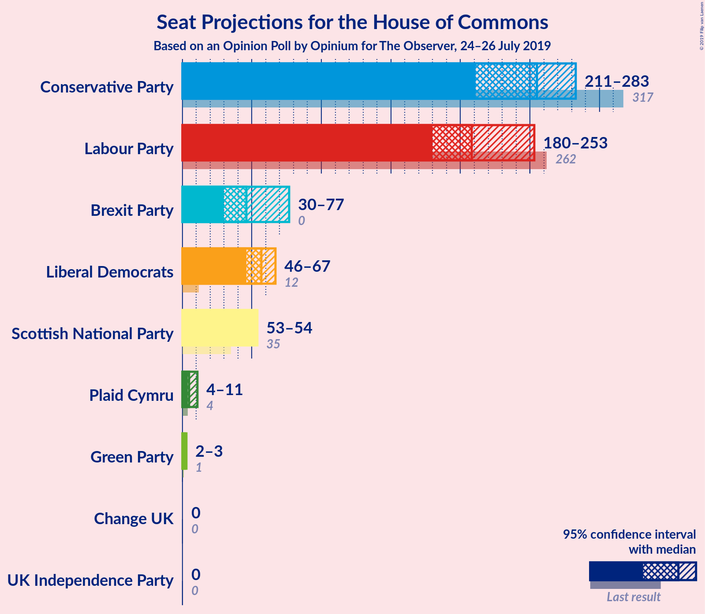
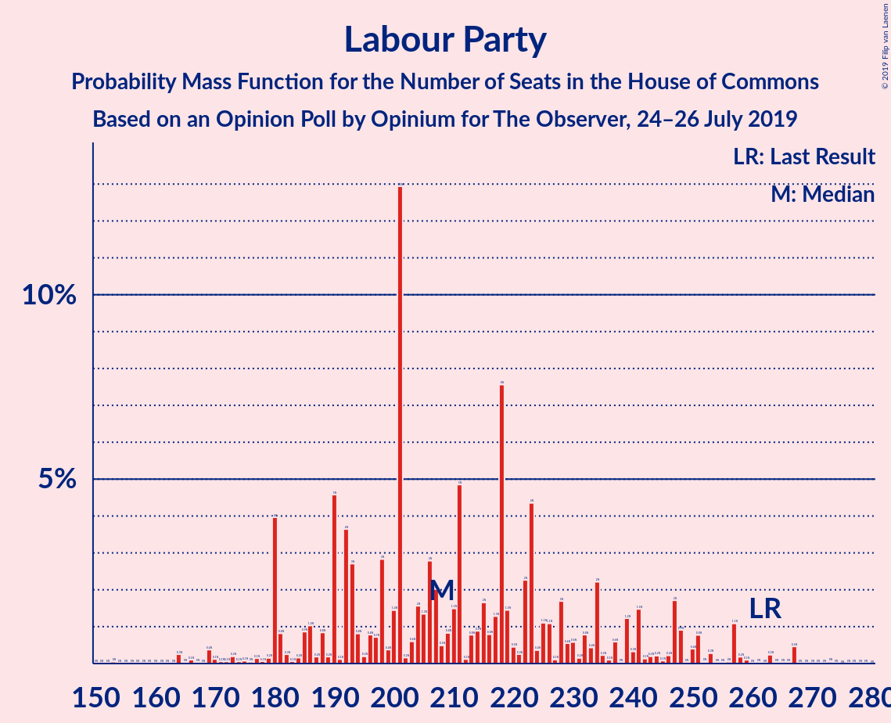
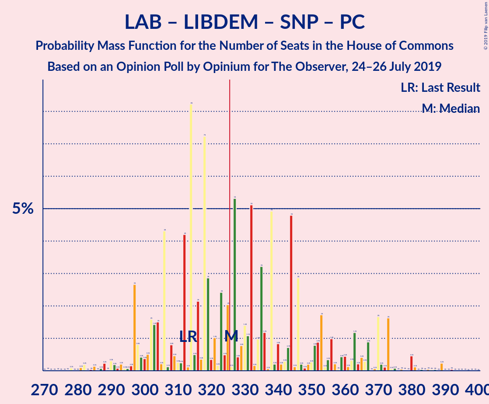
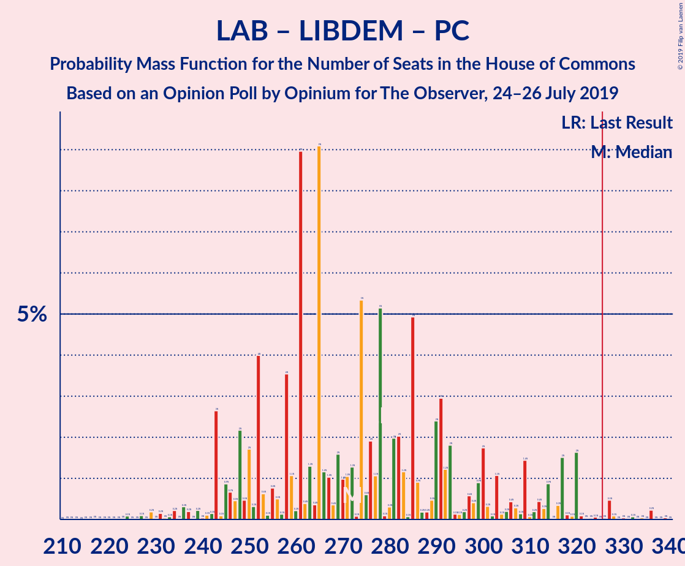
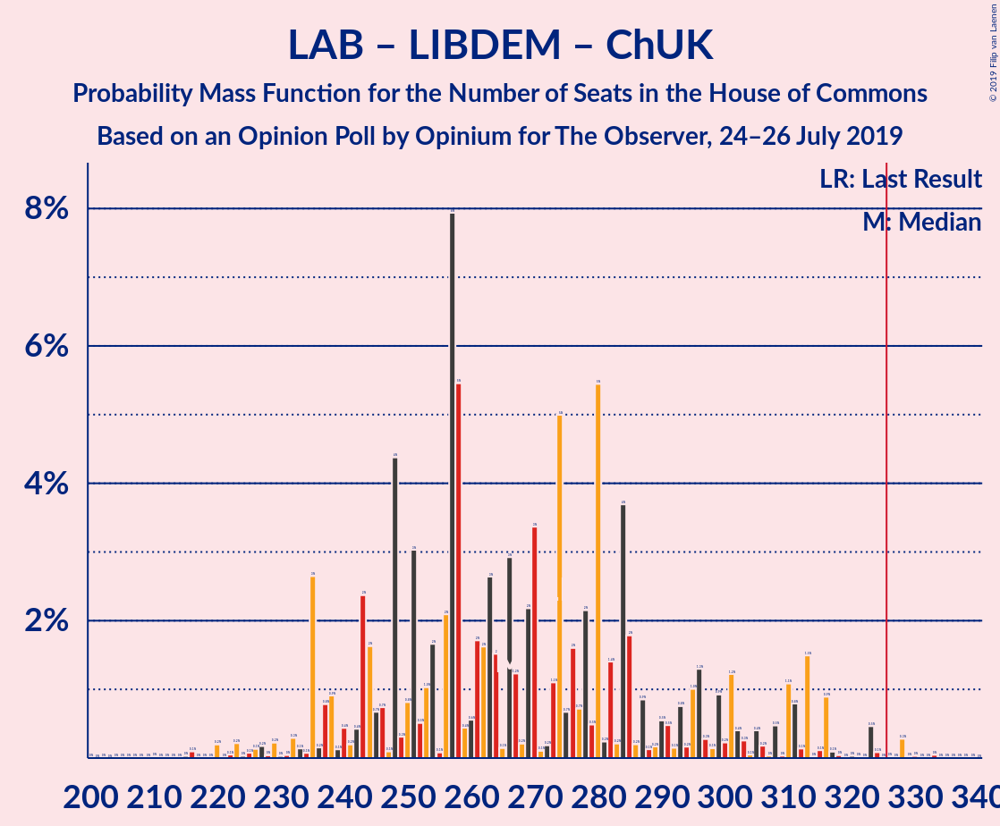
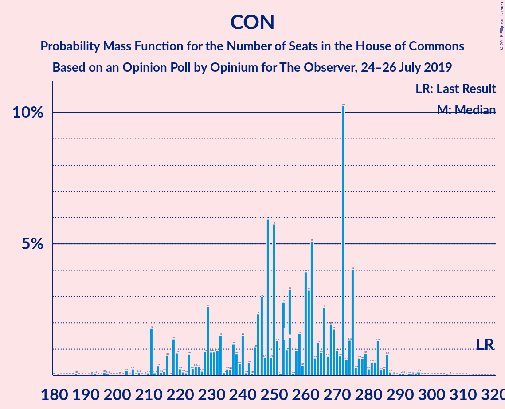

# Opinion Poll by Opinium for The Observer, 24–26 July 2019

<a href="#voting-intentions">Voting Intentions</a> | <a href="#seats">Seats</a> | <a href="#coalitions">Coalitions</a> | <a href="#technical-information">Technical Information</a>

## Voting Intentions

### Confidence Intervals

| Party | Last Result | Poll Result | 80% Confidence Interval | 90% Confidence Interval | 95% Confidence Interval | 99% Confidence Interval |
|:-----:|:-----------:|:-----------:|:-----------------------:|:-----------------------:|:-----------------------:|:-----------------------:|
| Conservative Party | 42.4% | 29.4% | 28.1–30.7% |27.7–31.1% |27.4–31.4% |26.8–32.0% |
| Labour Party | 40.0% | 27.4% | 26.1–28.7% |25.8–29.1% |25.5–29.4% |24.9–30.0% |
| Liberal Democrats | 7.4% | 15.7% | 14.6–16.7% |14.4–17.1% |14.1–17.3% |13.7–17.8% |
| Brexit Party | 0.0% | 14.7% | 13.7–15.7% |13.4–16.0% |13.2–16.3% |12.7–16.8% |
| Scottish National Party | 3.0% | 4.9% | 4.3–5.6% |4.2–5.8% |4.0–5.9% |3.8–6.3% |
| Green Party | 1.6% | 4.9% | 4.3–5.6% |4.2–5.8% |4.0–5.9% |3.8–6.3% |
| Plaid Cymru | 0.5% | 1.0% | 0.8–1.4% |0.7–1.4% |0.6–1.5% |0.5–1.7% |
| UK Independence Party | 1.8% | 1.0% | 0.8–1.4% |0.7–1.4% |0.6–1.5% |0.5–1.7% |
| Change UK | 0.0% | 0.2% | 0.2–0.5% |0.1–0.5% |0.1–0.6% |0.1–0.7% |

*Note:* The poll result column reflects the actual value used in the calculations. Published results may vary slightly, and in addition be rounded to fewer digits.

## Seats

### Confidence Intervals

| Party | Last Result | Median | 80% Confidence Interval | 90% Confidence Interval | 95% Confidence Interval | 99% Confidence Interval |
|:-----:|:-----------:|:------:|:-----------------------:|:-----------------------:|:-----------------------:|:-----------------------:|
| <a href="#conservative-party">Conservative Party</a> | 317 | 240 | 230–269 |230–269 |228–271 |228–271 |
| <a href="#labour-party">Labour Party</a> | 262 | 208 | 174–231 |174–231 |174–239 |174–239 |
| <a href="#liberal-democrats">Liberal Democrats</a> | 12 | 67 | 53–67 |53–67 |53–67 |53–71 |
| <a href="#brexit-party">Brexit Party</a> | 0 | 53 | 42–69 |40–69 |40–69 |40–69 |
| <a href="#scottish-national-party">Scottish National Party</a> | 35 | 54 | 52–54 |52–54 |52–54 |52–54 |
| <a href="#green-party">Green Party</a> | 1 | 3 | 2–3 |2–3 |2–4 |2–4 |
| <a href="#plaid-cymru">Plaid Cymru</a> | 4 | 6 | 4–9 |4–9 |4–10 |4–10 |
| <a href="#uk-independence-party">UK Independence Party</a> | 0 | 0 | 0 |0 |0 |0 |
| <a href="#change-uk">Change UK</a> | 0 | 0 | 0 |0 |0 |0 |

### Conservative Party

*For a full overview of the results for this party, see the [Conservative Party](party-conservativeparty.html) page.*

| Number of Seats | Probability | Accumulated | Special Marks |
|:---------------:|:-----------:|:-----------:|:-------------:|
| 183 | 0.1% | 100% |  |
| 184 | 0% | 99.9% |  |
| 185 | 0% | 99.9% |  |
| 186 | 0% | 99.9% |  |
| 187 | 0% | 99.9% |  |
| 188 | 0% | 99.9% |  |
| 189 | 0% | 99.9% |  |
| 190 | 0% | 99.9% |  |
| 191 | 0% | 99.9% |  |
| 192 | 0% | 99.9% |  |
| 193 | 0% | 99.9% |  |
| 194 | 0% | 99.9% |  |
| 195 | 0% | 99.9% |  |
| 196 | 0% | 99.9% |  |
| 197 | 0% | 99.9% |  |
| 198 | 0% | 99.9% |  |
| 199 | 0% | 99.9% |  |
| 200 | 0% | 99.9% |  |
| 201 | 0% | 99.9% |  |
| 202 | 0% | 99.9% |  |
| 203 | 0% | 99.9% |  |
| 204 | 0% | 99.9% |  |
| 205 | 0% | 99.9% |  |
| 206 | 0% | 99.9% |  |
| 207 | 0% | 99.9% |  |
| 208 | 0% | 99.9% |  |
| 209 | 0% | 99.9% |  |
| 210 | 0% | 99.9% |  |
| 211 | 0% | 99.9% |  |
| 212 | 0% | 99.9% |  |
| 213 | 0% | 99.9% |  |
| 214 | 0% | 99.9% |  |
| 215 | 0% | 99.9% |  |
| 216 | 0% | 99.9% |  |
| 217 | 0% | 99.9% |  |
| 218 | 0% | 99.9% |  |
| 219 | 0% | 99.9% |  |
| 220 | 0% | 99.9% |  |
| 221 | 0% | 99.9% |  |
| 222 | 0% | 99.9% |  |
| 223 | 0% | 99.9% |  |
| 224 | 0% | 99.9% |  |
| 225 | 0% | 99.9% |  |
| 226 | 0% | 99.9% |  |
| 227 | 0% | 99.9% |  |
| 228 | 4% | 99.9% |  |
| 229 | 0% | 96% |  |
| 230 | 10% | 96% |  |
| 231 | 6% | 86% |  |
| 232 | 0% | 80% |  |
| 233 | 0% | 80% |  |
| 234 | 0% | 80% |  |
| 235 | 0% | 80% |  |
| 236 | 0% | 80% |  |
| 237 | 0% | 80% |  |
| 238 | 0% | 80% |  |
| 239 | 0% | 80% |  |
| 240 | 57% | 80% | Median |
| 241 | 0% | 22% |  |
| 242 | 0% | 22% |  |
| 243 | 0% | 22% |  |
| 244 | 1.3% | 22% |  |
| 245 | 0% | 21% |  |
| 246 | 0% | 21% |  |
| 247 | 0% | 21% |  |
| 248 | 0% | 21% |  |
| 249 | 0% | 21% |  |
| 250 | 0% | 21% |  |
| 251 | 0% | 21% |  |
| 252 | 0% | 21% |  |
| 253 | 0% | 21% |  |
| 254 | 0% | 21% |  |
| 255 | 0% | 21% |  |
| 256 | 0% | 21% |  |
| 257 | 0% | 21% |  |
| 258 | 1.4% | 21% |  |
| 259 | 0% | 20% |  |
| 260 | 0% | 20% |  |
| 261 | 0% | 20% |  |
| 262 | 0% | 20% |  |
| 263 | 0% | 20% |  |
| 264 | 0% | 20% |  |
| 265 | 0% | 20% |  |
| 266 | 0% | 20% |  |
| 267 | 0% | 20% |  |
| 268 | 0% | 20% |  |
| 269 | 17% | 20% |  |
| 270 | 0% | 3% |  |
| 271 | 2% | 3% |  |
| 272 | 0% | 0.2% |  |
| 273 | 0% | 0.2% |  |
| 274 | 0% | 0.2% |  |
| 275 | 0% | 0.2% |  |
| 276 | 0% | 0.2% |  |
| 277 | 0% | 0.2% |  |
| 278 | 0% | 0.2% |  |
| 279 | 0% | 0.2% |  |
| 280 | 0% | 0.2% |  |
| 281 | 0% | 0.2% |  |
| 282 | 0.1% | 0.2% |  |
| 283 | 0% | 0.1% |  |
| 284 | 0% | 0.1% |  |
| 285 | 0% | 0.1% |  |
| 286 | 0% | 0.1% |  |
| 287 | 0% | 0.1% |  |
| 288 | 0% | 0.1% |  |
| 289 | 0% | 0.1% |  |
| 290 | 0% | 0.1% |  |
| 291 | 0% | 0.1% |  |
| 292 | 0% | 0.1% |  |
| 293 | 0% | 0.1% |  |
| 294 | 0% | 0.1% |  |
| 295 | 0% | 0.1% |  |
| 296 | 0% | 0.1% |  |
| 297 | 0% | 0.1% |  |
| 298 | 0% | 0.1% |  |
| 299 | 0% | 0.1% |  |
| 300 | 0% | 0.1% |  |
| 301 | 0% | 0.1% |  |
| 302 | 0% | 0.1% |  |
| 303 | 0% | 0.1% |  |
| 304 | 0% | 0% |  |
| 305 | 0% | 0% |  |
| 306 | 0% | 0% |  |
| 307 | 0% | 0% |  |
| 308 | 0% | 0% |  |
| 309 | 0% | 0% |  |
| 310 | 0% | 0% |  |
| 311 | 0% | 0% |  |
| 312 | 0% | 0% |  |
| 313 | 0% | 0% |  |
| 314 | 0% | 0% |  |
| 315 | 0% | 0% |  |
| 316 | 0% | 0% |  |
| 317 | 0% | 0% | Last Result |

### Labour Party

*For a full overview of the results for this party, see the [Labour Party](party-labourparty.html) page.*

| Number of Seats | Probability | Accumulated | Special Marks |
|:---------------:|:-----------:|:-----------:|:-------------:|
| 160 | 0% | 100% |  |
| 161 | 0% | 99.9% |  |
| 162 | 0% | 99.9% |  |
| 163 | 0% | 99.9% |  |
| 164 | 0% | 99.9% |  |
| 165 | 0% | 99.9% |  |
| 166 | 0% | 99.9% |  |
| 167 | 0% | 99.9% |  |
| 168 | 0% | 99.9% |  |
| 169 | 0% | 99.9% |  |
| 170 | 0% | 99.9% |  |
| 171 | 0% | 99.9% |  |
| 172 | 0% | 99.9% |  |
| 173 | 0% | 99.9% |  |
| 174 | 17% | 99.9% |  |
| 175 | 0% | 83% |  |
| 176 | 0% | 83% |  |
| 177 | 0% | 83% |  |
| 178 | 0% | 83% |  |
| 179 | 0% | 83% |  |
| 180 | 0% | 83% |  |
| 181 | 0% | 83% |  |
| 182 | 0% | 83% |  |
| 183 | 0% | 83% |  |
| 184 | 0% | 83% |  |
| 185 | 0% | 83% |  |
| 186 | 0% | 83% |  |
| 187 | 0% | 83% |  |
| 188 | 0% | 83% |  |
| 189 | 0% | 83% |  |
| 190 | 0% | 83% |  |
| 191 | 0% | 83% |  |
| 192 | 0% | 83% |  |
| 193 | 0% | 83% |  |
| 194 | 0% | 83% |  |
| 195 | 0% | 83% |  |
| 196 | 0% | 83% |  |
| 197 | 0% | 83% |  |
| 198 | 0% | 83% |  |
| 199 | 0% | 83% |  |
| 200 | 0.1% | 83% |  |
| 201 | 0% | 83% |  |
| 202 | 2% | 83% |  |
| 203 | 1.3% | 80% |  |
| 204 | 0% | 79% |  |
| 205 | 0% | 79% |  |
| 206 | 1.4% | 79% |  |
| 207 | 0% | 78% |  |
| 208 | 57% | 78% | Median |
| 209 | 0% | 20% |  |
| 210 | 0% | 20% |  |
| 211 | 0% | 20% |  |
| 212 | 0% | 20% |  |
| 213 | 0% | 20% |  |
| 214 | 0% | 20% |  |
| 215 | 0% | 20% |  |
| 216 | 0% | 20% |  |
| 217 | 0% | 20% |  |
| 218 | 0% | 20% |  |
| 219 | 0.1% | 20% |  |
| 220 | 0% | 20% |  |
| 221 | 0% | 20% |  |
| 222 | 0% | 20% |  |
| 223 | 0% | 20% |  |
| 224 | 0% | 20% |  |
| 225 | 0% | 20% |  |
| 226 | 0% | 20% |  |
| 227 | 0% | 20% |  |
| 228 | 0% | 20% |  |
| 229 | 0% | 20% |  |
| 230 | 6% | 20% |  |
| 231 | 10% | 14% |  |
| 232 | 0% | 4% |  |
| 233 | 0% | 4% |  |
| 234 | 0% | 4% |  |
| 235 | 0% | 4% |  |
| 236 | 0% | 4% |  |
| 237 | 0% | 4% |  |
| 238 | 0% | 4% |  |
| 239 | 4% | 4% |  |
| 240 | 0% | 0.1% |  |
| 241 | 0% | 0.1% |  |
| 242 | 0% | 0.1% |  |
| 243 | 0% | 0.1% |  |
| 244 | 0% | 0.1% |  |
| 245 | 0% | 0% |  |
| 246 | 0% | 0% |  |
| 247 | 0% | 0% |  |
| 248 | 0% | 0% |  |
| 249 | 0% | 0% |  |
| 250 | 0% | 0% |  |
| 251 | 0% | 0% |  |
| 252 | 0% | 0% |  |
| 253 | 0% | 0% |  |
| 254 | 0% | 0% |  |
| 255 | 0% | 0% |  |
| 256 | 0% | 0% |  |
| 257 | 0% | 0% |  |
| 258 | 0% | 0% |  |
| 259 | 0% | 0% |  |
| 260 | 0% | 0% |  |
| 261 | 0% | 0% |  |
| 262 | 0% | 0% | Last Result |

### Liberal Democrats

*For a full overview of the results for this party, see the [Liberal Democrats](party-liberaldemocrats.html) page.*

| Number of Seats | Probability | Accumulated | Special Marks |
|:---------------:|:-----------:|:-----------:|:-------------:|
| 12 | 0% | 100% | Last Result |
| 13 | 0% | 100% |  |
| 14 | 0% | 100% |  |
| 15 | 0% | 100% |  |
| 16 | 0% | 100% |  |
| 17 | 0% | 100% |  |
| 18 | 0% | 100% |  |
| 19 | 0% | 100% |  |
| 20 | 0% | 100% |  |
| 21 | 0% | 100% |  |
| 22 | 0% | 100% |  |
| 23 | 0% | 100% |  |
| 24 | 0% | 100% |  |
| 25 | 0% | 100% |  |
| 26 | 0% | 100% |  |
| 27 | 0% | 100% |  |
| 28 | 0% | 100% |  |
| 29 | 0% | 100% |  |
| 30 | 0% | 100% |  |
| 31 | 0% | 100% |  |
| 32 | 0% | 100% |  |
| 33 | 0% | 100% |  |
| 34 | 0% | 100% |  |
| 35 | 0% | 100% |  |
| 36 | 0% | 100% |  |
| 37 | 0% | 100% |  |
| 38 | 0% | 100% |  |
| 39 | 0% | 100% |  |
| 40 | 0% | 100% |  |
| 41 | 0% | 100% |  |
| 42 | 0% | 100% |  |
| 43 | 0% | 100% |  |
| 44 | 0% | 100% |  |
| 45 | 0% | 100% |  |
| 46 | 0% | 100% |  |
| 47 | 0.1% | 100% |  |
| 48 | 0% | 99.9% |  |
| 49 | 0% | 99.9% |  |
| 50 | 0% | 99.9% |  |
| 51 | 0% | 99.9% |  |
| 52 | 0% | 99.9% |  |
| 53 | 17% | 99.9% |  |
| 54 | 0% | 83% |  |
| 55 | 0% | 83% |  |
| 56 | 0.1% | 83% |  |
| 57 | 4% | 83% |  |
| 58 | 0% | 79% |  |
| 59 | 4% | 79% |  |
| 60 | 0% | 75% |  |
| 61 | 0% | 75% |  |
| 62 | 0% | 75% |  |
| 63 | 6% | 75% |  |
| 64 | 0% | 69% |  |
| 65 | 0% | 69% |  |
| 66 | 10% | 69% |  |
| 67 | 57% | 59% | Median |
| 68 | 0% | 1.3% |  |
| 69 | 0% | 1.3% |  |
| 70 | 0% | 1.3% |  |
| 71 | 1.3% | 1.3% |  |
| 72 | 0% | 0% |  |

### Brexit Party

*For a full overview of the results for this party, see the [Brexit Party](party-brexitparty.html) page.*

| Number of Seats | Probability | Accumulated | Special Marks |
|:---------------:|:-----------:|:-----------:|:-------------:|
| 0 | 0% | 100% | Last Result |
| 1 | 0% | 100% |  |
| 2 | 0% | 100% |  |
| 3 | 0% | 100% |  |
| 4 | 0% | 100% |  |
| 5 | 0% | 100% |  |
| 6 | 0% | 100% |  |
| 7 | 0% | 100% |  |
| 8 | 0% | 100% |  |
| 9 | 0% | 100% |  |
| 10 | 0% | 100% |  |
| 11 | 0% | 100% |  |
| 12 | 0% | 100% |  |
| 13 | 0% | 100% |  |
| 14 | 0% | 100% |  |
| 15 | 0% | 100% |  |
| 16 | 0% | 100% |  |
| 17 | 0% | 100% |  |
| 18 | 0% | 100% |  |
| 19 | 0% | 100% |  |
| 20 | 0% | 100% |  |
| 21 | 0% | 100% |  |
| 22 | 0% | 100% |  |
| 23 | 0% | 100% |  |
| 24 | 0% | 100% |  |
| 25 | 0% | 100% |  |
| 26 | 0% | 100% |  |
| 27 | 0% | 100% |  |
| 28 | 0% | 100% |  |
| 29 | 0% | 100% |  |
| 30 | 0% | 100% |  |
| 31 | 0.1% | 100% |  |
| 32 | 0% | 99.9% |  |
| 33 | 0% | 99.9% |  |
| 34 | 0% | 99.9% |  |
| 35 | 0% | 99.9% |  |
| 36 | 0% | 99.9% |  |
| 37 | 0% | 99.9% |  |
| 38 | 0% | 99.9% |  |
| 39 | 0% | 99.9% |  |
| 40 | 6% | 99.9% |  |
| 41 | 0% | 94% |  |
| 42 | 10% | 94% |  |
| 43 | 0% | 83% |  |
| 44 | 0% | 83% |  |
| 45 | 0% | 83% |  |
| 46 | 0% | 83% |  |
| 47 | 1.4% | 83% |  |
| 48 | 6% | 82% |  |
| 49 | 0% | 76% |  |
| 50 | 0% | 76% |  |
| 51 | 0% | 76% |  |
| 52 | 0% | 76% |  |
| 53 | 59% | 76% | Median |
| 54 | 0% | 17% |  |
| 55 | 0% | 17% |  |
| 56 | 0% | 17% |  |
| 57 | 0% | 17% |  |
| 58 | 0% | 17% |  |
| 59 | 0% | 17% |  |
| 60 | 0% | 17% |  |
| 61 | 0% | 17% |  |
| 62 | 0% | 17% |  |
| 63 | 0% | 17% |  |
| 64 | 0% | 17% |  |
| 65 | 0% | 17% |  |
| 66 | 0% | 17% |  |
| 67 | 0% | 17% |  |
| 68 | 0% | 17% |  |
| 69 | 17% | 17% |  |
| 70 | 0% | 0.1% |  |
| 71 | 0% | 0.1% |  |
| 72 | 0% | 0.1% |  |
| 73 | 0% | 0.1% |  |
| 74 | 0% | 0.1% |  |
| 75 | 0% | 0.1% |  |
| 76 | 0% | 0.1% |  |
| 77 | 0% | 0.1% |  |
| 78 | 0% | 0.1% |  |
| 79 | 0% | 0.1% |  |
| 80 | 0% | 0.1% |  |
| 81 | 0% | 0.1% |  |
| 82 | 0% | 0.1% |  |
| 83 | 0% | 0.1% |  |
| 84 | 0% | 0.1% |  |
| 85 | 0% | 0.1% |  |
| 86 | 0% | 0.1% |  |
| 87 | 0% | 0.1% |  |
| 88 | 0% | 0.1% |  |
| 89 | 0% | 0.1% |  |
| 90 | 0% | 0.1% |  |
| 91 | 0% | 0.1% |  |
| 92 | 0% | 0.1% |  |
| 93 | 0% | 0.1% |  |
| 94 | 0% | 0.1% |  |
| 95 | 0% | 0.1% |  |
| 96 | 0% | 0.1% |  |
| 97 | 0% | 0.1% |  |
| 98 | 0% | 0.1% |  |
| 99 | 0% | 0.1% |  |
| 100 | 0% | 0.1% |  |
| 101 | 0% | 0.1% |  |
| 102 | 0% | 0.1% |  |
| 103 | 0.1% | 0.1% |  |
| 104 | 0% | 0% |  |

### Scottish National Party

*For a full overview of the results for this party, see the [Scottish National Party](party-scottishnationalparty.html) page.*

| Number of Seats | Probability | Accumulated | Special Marks |
|:---------------:|:-----------:|:-----------:|:-------------:|
| 35 | 0% | 100% | Last Result |
| 36 | 0% | 100% |  |
| 37 | 0% | 100% |  |
| 38 | 0% | 100% |  |
| 39 | 0% | 100% |  |
| 40 | 0% | 100% |  |
| 41 | 0% | 100% |  |
| 42 | 0% | 100% |  |
| 43 | 0% | 100% |  |
| 44 | 0% | 100% |  |
| 45 | 0% | 100% |  |
| 46 | 0% | 100% |  |
| 47 | 0% | 100% |  |
| 48 | 0% | 100% |  |
| 49 | 0% | 100% |  |
| 50 | 0% | 100% |  |
| 51 | 0% | 100% |  |
| 52 | 10% | 99.9% |  |
| 53 | 10% | 90% |  |
| 54 | 80% | 80% | Median |
| 55 | 0% | 0% |  |

### Green Party

*For a full overview of the results for this party, see the [Green Party](party-greenparty.html) page.*

| Number of Seats | Probability | Accumulated | Special Marks |
|:---------------:|:-----------:|:-----------:|:-------------:|
| 1 | 0% | 100% | Last Result |
| 2 | 20% | 100% |  |
| 3 | 76% | 80% | Median |
| 4 | 4% | 4% |  |
| 5 | 0% | 0% |  |

### Plaid Cymru

*For a full overview of the results for this party, see the [Plaid Cymru](party-plaidcymru.html) page.*

| Number of Seats | Probability | Accumulated | Special Marks |
|:---------------:|:-----------:|:-----------:|:-------------:|
| 4 | 11% | 100% | Last Result |
| 5 | 0% | 89% |  |
| 6 | 57% | 89% | Median |
| 7 | 0% | 32% |  |
| 8 | 11% | 32% |  |
| 9 | 17% | 21% |  |
| 10 | 4% | 4% |  |
| 11 | 0% | 0.1% |  |
| 12 | 0% | 0.1% |  |
| 13 | 0% | 0.1% |  |
| 14 | 0.1% | 0.1% |  |
| 15 | 0% | 0% |  |

### UK Independence Party

*For a full overview of the results for this party, see the [UK Independence Party](party-ukindependenceparty.html) page.*

| Number of Seats | Probability | Accumulated | Special Marks |
|:---------------:|:-----------:|:-----------:|:-------------:|
| 0 | 100% | 100% | Last Result, Median |

### Change UK

*For a full overview of the results for this party, see the [Change UK](party-changeuk.html) page.*

| Number of Seats | Probability | Accumulated | Special Marks |
|:---------------:|:-----------:|:-----------:|:-------------:|
| 0 | 100% | 100% | Last Result, Median |

## Coalitions

### Confidence Intervals

| Coalition | Last Result | Median | Majority? | 80% Confidence Interval | 90% Confidence Interval | 95% Confidence Interval | 99% Confidence Interval |
|:---------:|:-----------:|:------:|:---------:|:-----------------------:|:-----------------------:|:-----------------------:|:-----------------------:|
| Labour Party – Liberal Democrats – Scottish National Party – Plaid Cymru | 313 | 335 | 79% | 290–357 | 290–357 | 290–359 | 290–359 |
| Labour Party – Liberal Democrats – Scottish National Party | 309 | 329 | 79% | 281–349 | 281–349 | 281–349 | 281–349 |
| Conservative Party – Scottish National Party – Plaid Cymru | 356 | 300 | 20% | 290–332 | 288–332 | 288–332 | 288–332 |
| Conservative Party – Liberal Democrats – Change UK | 329 | 307 | 3% | 296–322 | 294–322 | 285–330 | 285–330 |
| Conservative Party – Liberal Democrats | 329 | 307 | 3% | 296–322 | 294–322 | 285–330 | 285–330 |
| Conservative Party – Scottish National Party | 352 | 294 | 0.2% | 282–323 | 282–323 | 281–325 | 281–325 |
| Labour Party – Liberal Democrats – Plaid Cymru | 278 | 281 | 0% | 236–305 | 236–305 | 236–306 | 236–306 |
| Labour Party – Scottish National Party – Plaid Cymru | 301 | 268 | 0% | 237–291 | 237–291 | 237–302 | 237–302 |
| Labour Party – Liberal Democrats – Change UK | 274 | 275 | 0% | 227–297 | 227–297 | 227–297 | 227–297 |
| Labour Party – Liberal Democrats | 274 | 275 | 0% | 227–297 | 227–297 | 227–297 | 227–297 |
| Labour Party – Scottish National Party | 297 | 262 | 0% | 228–283 | 228–283 | 228–292 | 228–292 |
| Conservative Party – Plaid Cymru | 321 | 246 | 0% | 238–278 | 235–278 | 235–278 | 235–278 |
| Conservative Party – Change UK | 317 | 240 | 0% | 230–269 | 230–269 | 228–271 | 228–271 |
| Conservative Party | 317 | 240 | 0% | 230–269 | 230–269 | 228–271 | 228–271 |
| Labour Party – Plaid Cymru | 266 | 214 | 0% | 183–239 | 183–239 | 183–249 | 183–249 |
| Labour Party – Change UK | 262 | 208 | 0% | 174–231 | 174–231 | 174–239 | 174–239 |
| Labour Party | 262 | 208 | 0% | 174–231 | 174–231 | 174–239 | 174–239 |

### Labour Party – Liberal Democrats – Scottish National Party – Plaid Cymru

| Number of Seats | Probability | Accumulated | Special Marks |
|:---------------:|:-----------:|:-----------:|:-------------:|
| 286 | 0% | 100% |  |
| 287 | 0% | 99.9% |  |
| 288 | 0% | 99.9% |  |
| 289 | 0% | 99.9% |  |
| 290 | 17% | 99.9% |  |
| 291 | 0% | 83% |  |
| 292 | 0% | 83% |  |
| 293 | 0% | 83% |  |
| 294 | 0% | 83% |  |
| 295 | 0% | 83% |  |
| 296 | 0% | 83% |  |
| 297 | 0% | 83% |  |
| 298 | 0% | 83% |  |
| 299 | 0% | 83% |  |
| 300 | 0% | 83% |  |
| 301 | 0% | 83% |  |
| 302 | 0% | 83% |  |
| 303 | 0% | 83% |  |
| 304 | 0% | 83% |  |
| 305 | 0% | 83% |  |
| 306 | 0% | 83% |  |
| 307 | 0% | 83% |  |
| 308 | 0% | 83% |  |
| 309 | 0% | 83% |  |
| 310 | 0% | 83% |  |
| 311 | 0% | 83% |  |
| 312 | 0% | 83% |  |
| 313 | 0% | 83% | Last Result |
| 314 | 0% | 83% |  |
| 315 | 0% | 83% |  |
| 316 | 0% | 83% |  |
| 317 | 0.1% | 83% |  |
| 318 | 0% | 83% |  |
| 319 | 2% | 83% |  |
| 320 | 0% | 80% |  |
| 321 | 0% | 80% |  |
| 322 | 0% | 80% |  |
| 323 | 1.4% | 80% |  |
| 324 | 0% | 79% |  |
| 325 | 0% | 79% |  |
| 326 | 0% | 79% | Majority |
| 327 | 0% | 79% |  |
| 328 | 0% | 79% |  |
| 329 | 0% | 79% |  |
| 330 | 0% | 79% |  |
| 331 | 0% | 79% |  |
| 332 | 1.3% | 79% |  |
| 333 | 0% | 78% |  |
| 334 | 0% | 78% |  |
| 335 | 57% | 78% | Median |
| 336 | 0% | 20% |  |
| 337 | 0% | 20% |  |
| 338 | 0% | 20% |  |
| 339 | 0% | 20% |  |
| 340 | 0% | 20% |  |
| 341 | 0% | 20% |  |
| 342 | 0% | 20% |  |
| 343 | 0.1% | 20% |  |
| 344 | 0% | 20% |  |
| 345 | 0% | 20% |  |
| 346 | 0% | 20% |  |
| 347 | 0% | 20% |  |
| 348 | 0% | 20% |  |
| 349 | 0% | 20% |  |
| 350 | 6% | 20% |  |
| 351 | 0% | 14% |  |
| 352 | 0% | 14% |  |
| 353 | 0% | 14% |  |
| 354 | 0% | 14% |  |
| 355 | 0% | 14% |  |
| 356 | 0% | 14% |  |
| 357 | 10% | 14% |  |
| 358 | 0% | 4% |  |
| 359 | 4% | 4% |  |
| 360 | 0% | 0.1% |  |
| 361 | 0% | 0.1% |  |
| 362 | 0% | 0.1% |  |
| 363 | 0% | 0.1% |  |
| 364 | 0% | 0.1% |  |
| 365 | 0% | 0.1% |  |
| 366 | 0% | 0.1% |  |
| 367 | 0% | 0.1% |  |
| 368 | 0% | 0.1% |  |
| 369 | 0% | 0.1% |  |
| 370 | 0% | 0.1% |  |
| 371 | 0% | 0% |  |

### Labour Party – Liberal Democrats – Scottish National Party

| Number of Seats | Probability | Accumulated | Special Marks |
|:---------------:|:-----------:|:-----------:|:-------------:|
| 270 | 0% | 100% |  |
| 271 | 0% | 99.9% |  |
| 272 | 0% | 99.9% |  |
| 273 | 0% | 99.9% |  |
| 274 | 0% | 99.9% |  |
| 275 | 0% | 99.9% |  |
| 276 | 0% | 99.9% |  |
| 277 | 0% | 99.9% |  |
| 278 | 0% | 99.9% |  |
| 279 | 0% | 99.9% |  |
| 280 | 0% | 99.9% |  |
| 281 | 17% | 99.9% |  |
| 282 | 0% | 83% |  |
| 283 | 0% | 83% |  |
| 284 | 0% | 83% |  |
| 285 | 0% | 83% |  |
| 286 | 0% | 83% |  |
| 287 | 0% | 83% |  |
| 288 | 0% | 83% |  |
| 289 | 0% | 83% |  |
| 290 | 0% | 83% |  |
| 291 | 0% | 83% |  |
| 292 | 0% | 83% |  |
| 293 | 0% | 83% |  |
| 294 | 0% | 83% |  |
| 295 | 0% | 83% |  |
| 296 | 0% | 83% |  |
| 297 | 0% | 83% |  |
| 298 | 0% | 83% |  |
| 299 | 0% | 83% |  |
| 300 | 0% | 83% |  |
| 301 | 0% | 83% |  |
| 302 | 0% | 83% |  |
| 303 | 0% | 83% |  |
| 304 | 0% | 83% |  |
| 305 | 0% | 83% |  |
| 306 | 0% | 83% |  |
| 307 | 0% | 83% |  |
| 308 | 0% | 83% |  |
| 309 | 0.1% | 83% | Last Result |
| 310 | 0% | 83% |  |
| 311 | 0% | 83% |  |
| 312 | 0% | 83% |  |
| 313 | 0% | 83% |  |
| 314 | 0% | 83% |  |
| 315 | 2% | 83% |  |
| 316 | 0% | 80% |  |
| 317 | 0% | 80% |  |
| 318 | 0% | 80% |  |
| 319 | 1.4% | 80% |  |
| 320 | 0% | 79% |  |
| 321 | 0% | 79% |  |
| 322 | 0% | 79% |  |
| 323 | 0% | 79% |  |
| 324 | 0% | 79% |  |
| 325 | 0% | 79% |  |
| 326 | 0% | 79% | Majority |
| 327 | 0% | 79% |  |
| 328 | 1.3% | 79% |  |
| 329 | 58% | 78% | Median |
| 330 | 0% | 20% |  |
| 331 | 0% | 20% |  |
| 332 | 0% | 20% |  |
| 333 | 0% | 20% |  |
| 334 | 0% | 20% |  |
| 335 | 0% | 20% |  |
| 336 | 0% | 20% |  |
| 337 | 0% | 20% |  |
| 338 | 0% | 20% |  |
| 339 | 0% | 20% |  |
| 340 | 0% | 20% |  |
| 341 | 0% | 20% |  |
| 342 | 0% | 20% |  |
| 343 | 0% | 20% |  |
| 344 | 0% | 20% |  |
| 345 | 0% | 20% |  |
| 346 | 6% | 20% |  |
| 347 | 0% | 14% |  |
| 348 | 0% | 14% |  |
| 349 | 14% | 14% |  |
| 350 | 0% | 0.1% |  |
| 351 | 0% | 0.1% |  |
| 352 | 0% | 0.1% |  |
| 353 | 0% | 0.1% |  |
| 354 | 0% | 0.1% |  |
| 355 | 0% | 0.1% |  |
| 356 | 0% | 0.1% |  |
| 357 | 0% | 0.1% |  |
| 358 | 0% | 0.1% |  |
| 359 | 0% | 0.1% |  |
| 360 | 0% | 0.1% |  |
| 361 | 0% | 0.1% |  |
| 362 | 0% | 0.1% |  |
| 363 | 0% | 0% |  |

### Conservative Party – Scottish National Party – Plaid Cymru

| Number of Seats | Probability | Accumulated | Special Marks |
|:---------------:|:-----------:|:-----------:|:-------------:|
| 250 | 0.1% | 100% |  |
| 251 | 0% | 99.9% |  |
| 252 | 0% | 99.9% |  |
| 253 | 0% | 99.9% |  |
| 254 | 0% | 99.9% |  |
| 255 | 0% | 99.9% |  |
| 256 | 0% | 99.9% |  |
| 257 | 0% | 99.9% |  |
| 258 | 0% | 99.9% |  |
| 259 | 0% | 99.9% |  |
| 260 | 0% | 99.9% |  |
| 261 | 0% | 99.9% |  |
| 262 | 0% | 99.9% |  |
| 263 | 0% | 99.9% |  |
| 264 | 0% | 99.9% |  |
| 265 | 0% | 99.9% |  |
| 266 | 0% | 99.9% |  |
| 267 | 0% | 99.9% |  |
| 268 | 0% | 99.9% |  |
| 269 | 0% | 99.9% |  |
| 270 | 0% | 99.9% |  |
| 271 | 0% | 99.9% |  |
| 272 | 0% | 99.9% |  |
| 273 | 0% | 99.9% |  |
| 274 | 0% | 99.9% |  |
| 275 | 0% | 99.9% |  |
| 276 | 0% | 99.9% |  |
| 277 | 0% | 99.9% |  |
| 278 | 0% | 99.9% |  |
| 279 | 0% | 99.9% |  |
| 280 | 0% | 99.9% |  |
| 281 | 0% | 99.9% |  |
| 282 | 0% | 99.9% |  |
| 283 | 0% | 99.9% |  |
| 284 | 0% | 99.9% |  |
| 285 | 0% | 99.9% |  |
| 286 | 0% | 99.9% |  |
| 287 | 0% | 99.9% |  |
| 288 | 6% | 99.9% |  |
| 289 | 0% | 94% |  |
| 290 | 10% | 94% |  |
| 291 | 4% | 84% |  |
| 292 | 0% | 80% |  |
| 293 | 0% | 80% |  |
| 294 | 0% | 80% |  |
| 295 | 0% | 80% |  |
| 296 | 0% | 80% |  |
| 297 | 0% | 80% |  |
| 298 | 0% | 80% |  |
| 299 | 0% | 80% |  |
| 300 | 57% | 80% | Median |
| 301 | 0% | 22% |  |
| 302 | 1.3% | 22% |  |
| 303 | 0% | 21% |  |
| 304 | 0% | 21% |  |
| 305 | 0% | 21% |  |
| 306 | 0% | 21% |  |
| 307 | 0% | 21% |  |
| 308 | 0% | 21% |  |
| 309 | 0% | 21% |  |
| 310 | 0% | 21% |  |
| 311 | 0% | 21% |  |
| 312 | 0% | 21% |  |
| 313 | 0% | 21% |  |
| 314 | 0% | 21% |  |
| 315 | 0% | 21% |  |
| 316 | 1.4% | 21% |  |
| 317 | 0% | 20% |  |
| 318 | 0% | 20% |  |
| 319 | 0% | 20% |  |
| 320 | 0% | 20% |  |
| 321 | 0% | 20% |  |
| 322 | 0% | 20% |  |
| 323 | 0% | 20% |  |
| 324 | 0% | 20% |  |
| 325 | 0% | 20% |  |
| 326 | 0% | 20% | Majority |
| 327 | 0% | 20% |  |
| 328 | 0% | 20% |  |
| 329 | 2% | 20% |  |
| 330 | 0% | 17% |  |
| 331 | 0% | 17% |  |
| 332 | 17% | 17% |  |
| 333 | 0% | 0.2% |  |
| 334 | 0% | 0.2% |  |
| 335 | 0% | 0.2% |  |
| 336 | 0% | 0.2% |  |
| 337 | 0% | 0.2% |  |
| 338 | 0% | 0.2% |  |
| 339 | 0% | 0.2% |  |
| 340 | 0% | 0.2% |  |
| 341 | 0% | 0.2% |  |
| 342 | 0% | 0.2% |  |
| 343 | 0.1% | 0.2% |  |
| 344 | 0% | 0.1% |  |
| 345 | 0% | 0.1% |  |
| 346 | 0% | 0.1% |  |
| 347 | 0% | 0.1% |  |
| 348 | 0% | 0.1% |  |
| 349 | 0% | 0.1% |  |
| 350 | 0% | 0.1% |  |
| 351 | 0% | 0.1% |  |
| 352 | 0% | 0.1% |  |
| 353 | 0% | 0.1% |  |
| 354 | 0% | 0.1% |  |
| 355 | 0% | 0.1% |  |
| 356 | 0% | 0.1% | Last Result |
| 357 | 0% | 0.1% |  |
| 358 | 0% | 0.1% |  |
| 359 | 0% | 0.1% |  |
| 360 | 0% | 0.1% |  |
| 361 | 0% | 0.1% |  |
| 362 | 0% | 0.1% |  |
| 363 | 0% | 0.1% |  |
| 364 | 0% | 0.1% |  |
| 365 | 0% | 0.1% |  |
| 366 | 0% | 0% |  |

### Conservative Party – Liberal Democrats – Change UK

| Number of Seats | Probability | Accumulated | Special Marks |
|:---------------:|:-----------:|:-----------:|:-------------:|
| 240 | 0.1% | 100% |  |
| 241 | 0% | 99.9% |  |
| 242 | 0% | 99.9% |  |
| 243 | 0% | 99.9% |  |
| 244 | 0% | 99.9% |  |
| 245 | 0% | 99.9% |  |
| 246 | 0% | 99.9% |  |
| 247 | 0% | 99.9% |  |
| 248 | 0% | 99.9% |  |
| 249 | 0% | 99.9% |  |
| 250 | 0% | 99.9% |  |
| 251 | 0% | 99.9% |  |
| 252 | 0% | 99.9% |  |
| 253 | 0% | 99.9% |  |
| 254 | 0% | 99.9% |  |
| 255 | 0% | 99.9% |  |
| 256 | 0% | 99.9% |  |
| 257 | 0% | 99.9% |  |
| 258 | 0% | 99.9% |  |
| 259 | 0% | 99.9% |  |
| 260 | 0% | 99.9% |  |
| 261 | 0% | 99.9% |  |
| 262 | 0% | 99.9% |  |
| 263 | 0% | 99.9% |  |
| 264 | 0% | 99.9% |  |
| 265 | 0% | 99.9% |  |
| 266 | 0% | 99.9% |  |
| 267 | 0% | 99.9% |  |
| 268 | 0% | 99.9% |  |
| 269 | 0% | 99.9% |  |
| 270 | 0% | 99.9% |  |
| 271 | 0% | 99.9% |  |
| 272 | 0% | 99.9% |  |
| 273 | 0% | 99.9% |  |
| 274 | 0% | 99.9% |  |
| 275 | 0% | 99.9% |  |
| 276 | 0% | 99.9% |  |
| 277 | 0% | 99.9% |  |
| 278 | 0% | 99.9% |  |
| 279 | 0% | 99.9% |  |
| 280 | 0% | 99.9% |  |
| 281 | 0% | 99.9% |  |
| 282 | 0% | 99.9% |  |
| 283 | 0% | 99.9% |  |
| 284 | 0% | 99.9% |  |
| 285 | 4% | 99.9% |  |
| 286 | 0% | 96% |  |
| 287 | 0% | 96% |  |
| 288 | 0% | 96% |  |
| 289 | 0% | 96% |  |
| 290 | 0% | 96% |  |
| 291 | 0% | 96% |  |
| 292 | 0% | 96% |  |
| 293 | 0% | 96% |  |
| 294 | 6% | 96% |  |
| 295 | 0% | 90% |  |
| 296 | 10% | 90% |  |
| 297 | 0% | 80% |  |
| 298 | 0% | 80% |  |
| 299 | 0% | 80% |  |
| 300 | 0% | 80% |  |
| 301 | 0% | 80% |  |
| 302 | 0% | 80% |  |
| 303 | 0% | 80% |  |
| 304 | 0% | 80% |  |
| 305 | 0% | 80% |  |
| 306 | 0% | 80% |  |
| 307 | 57% | 80% | Median |
| 308 | 0% | 22% |  |
| 309 | 0% | 22% |  |
| 310 | 0% | 22% |  |
| 311 | 0% | 22% |  |
| 312 | 0% | 22% |  |
| 313 | 0% | 22% |  |
| 314 | 0% | 22% |  |
| 315 | 1.3% | 22% |  |
| 316 | 0% | 21% |  |
| 317 | 1.4% | 21% |  |
| 318 | 0% | 20% |  |
| 319 | 0% | 20% |  |
| 320 | 0% | 20% |  |
| 321 | 0% | 20% |  |
| 322 | 17% | 20% |  |
| 323 | 0% | 3% |  |
| 324 | 0% | 3% |  |
| 325 | 0% | 3% |  |
| 326 | 0% | 3% | Majority |
| 327 | 0% | 3% |  |
| 328 | 0% | 3% |  |
| 329 | 0% | 3% | Last Result |
| 330 | 2% | 3% |  |
| 331 | 0% | 0.2% |  |
| 332 | 0% | 0.2% |  |
| 333 | 0% | 0.2% |  |
| 334 | 0% | 0.2% |  |
| 335 | 0% | 0.2% |  |
| 336 | 0% | 0.2% |  |
| 337 | 0% | 0.2% |  |
| 338 | 0.1% | 0.2% |  |
| 339 | 0% | 0.1% |  |
| 340 | 0% | 0.1% |  |
| 341 | 0% | 0.1% |  |
| 342 | 0% | 0.1% |  |
| 343 | 0% | 0.1% |  |
| 344 | 0% | 0.1% |  |
| 345 | 0% | 0.1% |  |
| 346 | 0% | 0.1% |  |
| 347 | 0% | 0.1% |  |
| 348 | 0% | 0.1% |  |
| 349 | 0% | 0.1% |  |
| 350 | 0% | 0.1% |  |
| 351 | 0% | 0.1% |  |
| 352 | 0% | 0.1% |  |
| 353 | 0% | 0.1% |  |
| 354 | 0% | 0.1% |  |
| 355 | 0% | 0% |  |

### Conservative Party – Liberal Democrats

| Number of Seats | Probability | Accumulated | Special Marks |
|:---------------:|:-----------:|:-----------:|:-------------:|
| 240 | 0.1% | 100% |  |
| 241 | 0% | 99.9% |  |
| 242 | 0% | 99.9% |  |
| 243 | 0% | 99.9% |  |
| 244 | 0% | 99.9% |  |
| 245 | 0% | 99.9% |  |
| 246 | 0% | 99.9% |  |
| 247 | 0% | 99.9% |  |
| 248 | 0% | 99.9% |  |
| 249 | 0% | 99.9% |  |
| 250 | 0% | 99.9% |  |
| 251 | 0% | 99.9% |  |
| 252 | 0% | 99.9% |  |
| 253 | 0% | 99.9% |  |
| 254 | 0% | 99.9% |  |
| 255 | 0% | 99.9% |  |
| 256 | 0% | 99.9% |  |
| 257 | 0% | 99.9% |  |
| 258 | 0% | 99.9% |  |
| 259 | 0% | 99.9% |  |
| 260 | 0% | 99.9% |  |
| 261 | 0% | 99.9% |  |
| 262 | 0% | 99.9% |  |
| 263 | 0% | 99.9% |  |
| 264 | 0% | 99.9% |  |
| 265 | 0% | 99.9% |  |
| 266 | 0% | 99.9% |  |
| 267 | 0% | 99.9% |  |
| 268 | 0% | 99.9% |  |
| 269 | 0% | 99.9% |  |
| 270 | 0% | 99.9% |  |
| 271 | 0% | 99.9% |  |
| 272 | 0% | 99.9% |  |
| 273 | 0% | 99.9% |  |
| 274 | 0% | 99.9% |  |
| 275 | 0% | 99.9% |  |
| 276 | 0% | 99.9% |  |
| 277 | 0% | 99.9% |  |
| 278 | 0% | 99.9% |  |
| 279 | 0% | 99.9% |  |
| 280 | 0% | 99.9% |  |
| 281 | 0% | 99.9% |  |
| 282 | 0% | 99.9% |  |
| 283 | 0% | 99.9% |  |
| 284 | 0% | 99.9% |  |
| 285 | 4% | 99.9% |  |
| 286 | 0% | 96% |  |
| 287 | 0% | 96% |  |
| 288 | 0% | 96% |  |
| 289 | 0% | 96% |  |
| 290 | 0% | 96% |  |
| 291 | 0% | 96% |  |
| 292 | 0% | 96% |  |
| 293 | 0% | 96% |  |
| 294 | 6% | 96% |  |
| 295 | 0% | 90% |  |
| 296 | 10% | 90% |  |
| 297 | 0% | 80% |  |
| 298 | 0% | 80% |  |
| 299 | 0% | 80% |  |
| 300 | 0% | 80% |  |
| 301 | 0% | 80% |  |
| 302 | 0% | 80% |  |
| 303 | 0% | 80% |  |
| 304 | 0% | 80% |  |
| 305 | 0% | 80% |  |
| 306 | 0% | 80% |  |
| 307 | 57% | 80% | Median |
| 308 | 0% | 22% |  |
| 309 | 0% | 22% |  |
| 310 | 0% | 22% |  |
| 311 | 0% | 22% |  |
| 312 | 0% | 22% |  |
| 313 | 0% | 22% |  |
| 314 | 0% | 22% |  |
| 315 | 1.3% | 22% |  |
| 316 | 0% | 21% |  |
| 317 | 1.4% | 21% |  |
| 318 | 0% | 20% |  |
| 319 | 0% | 20% |  |
| 320 | 0% | 20% |  |
| 321 | 0% | 20% |  |
| 322 | 17% | 20% |  |
| 323 | 0% | 3% |  |
| 324 | 0% | 3% |  |
| 325 | 0% | 3% |  |
| 326 | 0% | 3% | Majority |
| 327 | 0% | 3% |  |
| 328 | 0% | 3% |  |
| 329 | 0% | 3% | Last Result |
| 330 | 2% | 3% |  |
| 331 | 0% | 0.2% |  |
| 332 | 0% | 0.2% |  |
| 333 | 0% | 0.2% |  |
| 334 | 0% | 0.2% |  |
| 335 | 0% | 0.2% |  |
| 336 | 0% | 0.2% |  |
| 337 | 0% | 0.2% |  |
| 338 | 0.1% | 0.2% |  |
| 339 | 0% | 0.1% |  |
| 340 | 0% | 0.1% |  |
| 341 | 0% | 0.1% |  |
| 342 | 0% | 0.1% |  |
| 343 | 0% | 0.1% |  |
| 344 | 0% | 0.1% |  |
| 345 | 0% | 0.1% |  |
| 346 | 0% | 0.1% |  |
| 347 | 0% | 0.1% |  |
| 348 | 0% | 0.1% |  |
| 349 | 0% | 0.1% |  |
| 350 | 0% | 0.1% |  |
| 351 | 0% | 0.1% |  |
| 352 | 0% | 0.1% |  |
| 353 | 0% | 0.1% |  |
| 354 | 0% | 0.1% |  |
| 355 | 0% | 0% |  |

### Conservative Party – Scottish National Party

| Number of Seats | Probability | Accumulated | Special Marks |
|:---------------:|:-----------:|:-----------:|:-------------:|
| 236 | 0.1% | 100% |  |
| 237 | 0% | 99.9% |  |
| 238 | 0% | 99.9% |  |
| 239 | 0% | 99.9% |  |
| 240 | 0% | 99.9% |  |
| 241 | 0% | 99.9% |  |
| 242 | 0% | 99.9% |  |
| 243 | 0% | 99.9% |  |
| 244 | 0% | 99.9% |  |
| 245 | 0% | 99.9% |  |
| 246 | 0% | 99.9% |  |
| 247 | 0% | 99.9% |  |
| 248 | 0% | 99.9% |  |
| 249 | 0% | 99.9% |  |
| 250 | 0% | 99.9% |  |
| 251 | 0% | 99.9% |  |
| 252 | 0% | 99.9% |  |
| 253 | 0% | 99.9% |  |
| 254 | 0% | 99.9% |  |
| 255 | 0% | 99.9% |  |
| 256 | 0% | 99.9% |  |
| 257 | 0% | 99.9% |  |
| 258 | 0% | 99.9% |  |
| 259 | 0% | 99.9% |  |
| 260 | 0% | 99.9% |  |
| 261 | 0% | 99.9% |  |
| 262 | 0% | 99.9% |  |
| 263 | 0% | 99.9% |  |
| 264 | 0% | 99.9% |  |
| 265 | 0% | 99.9% |  |
| 266 | 0% | 99.9% |  |
| 267 | 0% | 99.9% |  |
| 268 | 0% | 99.9% |  |
| 269 | 0% | 99.9% |  |
| 270 | 0% | 99.9% |  |
| 271 | 0% | 99.9% |  |
| 272 | 0% | 99.9% |  |
| 273 | 0% | 99.9% |  |
| 274 | 0% | 99.9% |  |
| 275 | 0% | 99.9% |  |
| 276 | 0% | 99.9% |  |
| 277 | 0% | 99.9% |  |
| 278 | 0% | 99.9% |  |
| 279 | 0% | 99.9% |  |
| 280 | 0% | 99.9% |  |
| 281 | 4% | 99.9% |  |
| 282 | 10% | 96% |  |
| 283 | 0% | 86% |  |
| 284 | 6% | 86% |  |
| 285 | 0% | 80% |  |
| 286 | 0% | 80% |  |
| 287 | 0% | 80% |  |
| 288 | 0% | 80% |  |
| 289 | 0% | 80% |  |
| 290 | 0% | 80% |  |
| 291 | 0% | 80% |  |
| 292 | 0% | 80% |  |
| 293 | 0% | 80% |  |
| 294 | 57% | 80% | Median |
| 295 | 0% | 22% |  |
| 296 | 0% | 22% |  |
| 297 | 0% | 22% |  |
| 298 | 1.3% | 22% |  |
| 299 | 0% | 21% |  |
| 300 | 0% | 21% |  |
| 301 | 0% | 21% |  |
| 302 | 0% | 21% |  |
| 303 | 0% | 21% |  |
| 304 | 0% | 21% |  |
| 305 | 0% | 21% |  |
| 306 | 0% | 21% |  |
| 307 | 0% | 21% |  |
| 308 | 0% | 21% |  |
| 309 | 0% | 21% |  |
| 310 | 0% | 21% |  |
| 311 | 0% | 21% |  |
| 312 | 1.4% | 21% |  |
| 313 | 0% | 20% |  |
| 314 | 0% | 20% |  |
| 315 | 0% | 20% |  |
| 316 | 0% | 20% |  |
| 317 | 0% | 20% |  |
| 318 | 0% | 20% |  |
| 319 | 0% | 20% |  |
| 320 | 0% | 20% |  |
| 321 | 0% | 20% |  |
| 322 | 0% | 20% |  |
| 323 | 17% | 20% |  |
| 324 | 0% | 3% |  |
| 325 | 2% | 3% |  |
| 326 | 0% | 0.2% | Majority |
| 327 | 0% | 0.2% |  |
| 328 | 0% | 0.2% |  |
| 329 | 0% | 0.2% |  |
| 330 | 0% | 0.2% |  |
| 331 | 0% | 0.2% |  |
| 332 | 0% | 0.2% |  |
| 333 | 0% | 0.2% |  |
| 334 | 0% | 0.2% |  |
| 335 | 0.1% | 0.2% |  |
| 336 | 0% | 0.1% |  |
| 337 | 0% | 0.1% |  |
| 338 | 0% | 0.1% |  |
| 339 | 0% | 0.1% |  |
| 340 | 0% | 0.1% |  |
| 341 | 0% | 0.1% |  |
| 342 | 0% | 0.1% |  |
| 343 | 0% | 0.1% |  |
| 344 | 0% | 0.1% |  |
| 345 | 0% | 0.1% |  |
| 346 | 0% | 0.1% |  |
| 347 | 0% | 0.1% |  |
| 348 | 0% | 0.1% |  |
| 349 | 0% | 0.1% |  |
| 350 | 0% | 0.1% |  |
| 351 | 0% | 0.1% |  |
| 352 | 0% | 0.1% | Last Result |
| 353 | 0% | 0.1% |  |
| 354 | 0% | 0.1% |  |
| 355 | 0% | 0.1% |  |
| 356 | 0% | 0.1% |  |
| 357 | 0% | 0.1% |  |
| 358 | 0% | 0% |  |

### Labour Party – Liberal Democrats – Plaid Cymru

| Number of Seats | Probability | Accumulated | Special Marks |
|:---------------:|:-----------:|:-----------:|:-------------:|
| 232 | 0% | 100% |  |
| 233 | 0% | 99.9% |  |
| 234 | 0% | 99.9% |  |
| 235 | 0% | 99.9% |  |
| 236 | 17% | 99.9% |  |
| 237 | 0% | 83% |  |
| 238 | 0% | 83% |  |
| 239 | 0% | 83% |  |
| 240 | 0% | 83% |  |
| 241 | 0% | 83% |  |
| 242 | 0% | 83% |  |
| 243 | 0% | 83% |  |
| 244 | 0% | 83% |  |
| 245 | 0% | 83% |  |
| 246 | 0% | 83% |  |
| 247 | 0% | 83% |  |
| 248 | 0% | 83% |  |
| 249 | 0% | 83% |  |
| 250 | 0% | 83% |  |
| 251 | 0% | 83% |  |
| 252 | 0% | 83% |  |
| 253 | 0% | 83% |  |
| 254 | 0% | 83% |  |
| 255 | 0% | 83% |  |
| 256 | 0% | 83% |  |
| 257 | 0% | 83% |  |
| 258 | 0% | 83% |  |
| 259 | 0% | 83% |  |
| 260 | 0% | 83% |  |
| 261 | 0% | 83% |  |
| 262 | 0% | 83% |  |
| 263 | 0% | 83% |  |
| 264 | 0.1% | 83% |  |
| 265 | 2% | 83% |  |
| 266 | 0% | 80% |  |
| 267 | 0% | 80% |  |
| 268 | 0% | 80% |  |
| 269 | 1.4% | 80% |  |
| 270 | 0% | 79% |  |
| 271 | 0% | 79% |  |
| 272 | 0% | 79% |  |
| 273 | 0% | 79% |  |
| 274 | 0% | 79% |  |
| 275 | 0% | 79% |  |
| 276 | 0% | 79% |  |
| 277 | 0% | 79% |  |
| 278 | 1.3% | 79% | Last Result |
| 279 | 0% | 78% |  |
| 280 | 0% | 78% |  |
| 281 | 57% | 78% | Median |
| 282 | 0% | 20% |  |
| 283 | 0% | 20% |  |
| 284 | 0% | 20% |  |
| 285 | 0% | 20% |  |
| 286 | 0% | 20% |  |
| 287 | 0% | 20% |  |
| 288 | 0% | 20% |  |
| 289 | 0% | 20% |  |
| 290 | 0.1% | 20% |  |
| 291 | 0% | 20% |  |
| 292 | 0% | 20% |  |
| 293 | 0% | 20% |  |
| 294 | 0% | 20% |  |
| 295 | 0% | 20% |  |
| 296 | 0% | 20% |  |
| 297 | 6% | 20% |  |
| 298 | 0% | 14% |  |
| 299 | 0% | 14% |  |
| 300 | 0% | 14% |  |
| 301 | 0% | 14% |  |
| 302 | 0% | 14% |  |
| 303 | 0% | 14% |  |
| 304 | 0% | 14% |  |
| 305 | 10% | 14% |  |
| 306 | 4% | 4% |  |
| 307 | 0% | 0.1% |  |
| 308 | 0% | 0.1% |  |
| 309 | 0% | 0.1% |  |
| 310 | 0% | 0.1% |  |
| 311 | 0% | 0.1% |  |
| 312 | 0% | 0.1% |  |
| 313 | 0% | 0.1% |  |
| 314 | 0% | 0.1% |  |
| 315 | 0% | 0.1% |  |
| 316 | 0% | 0.1% |  |
| 317 | 0% | 0% |  |

### Labour Party – Scottish National Party – Plaid Cymru

| Number of Seats | Probability | Accumulated | Special Marks |
|:---------------:|:-----------:|:-----------:|:-------------:|
| 230 | 0% | 100% |  |
| 231 | 0% | 99.9% |  |
| 232 | 0% | 99.9% |  |
| 233 | 0% | 99.9% |  |
| 234 | 0% | 99.9% |  |
| 235 | 0% | 99.9% |  |
| 236 | 0% | 99.9% |  |
| 237 | 17% | 99.9% |  |
| 238 | 0% | 83% |  |
| 239 | 0% | 83% |  |
| 240 | 0% | 83% |  |
| 241 | 0% | 83% |  |
| 242 | 0% | 83% |  |
| 243 | 0% | 83% |  |
| 244 | 0% | 83% |  |
| 245 | 0% | 83% |  |
| 246 | 0% | 83% |  |
| 247 | 0% | 83% |  |
| 248 | 0% | 83% |  |
| 249 | 0% | 83% |  |
| 250 | 0% | 83% |  |
| 251 | 0% | 83% |  |
| 252 | 0% | 83% |  |
| 253 | 0% | 83% |  |
| 254 | 0% | 83% |  |
| 255 | 0% | 83% |  |
| 256 | 0% | 83% |  |
| 257 | 0% | 83% |  |
| 258 | 0% | 83% |  |
| 259 | 0% | 83% |  |
| 260 | 2% | 83% |  |
| 261 | 1.3% | 80% |  |
| 262 | 0% | 79% |  |
| 263 | 0% | 79% |  |
| 264 | 1.4% | 79% |  |
| 265 | 0% | 78% |  |
| 266 | 0% | 78% |  |
| 267 | 0% | 78% |  |
| 268 | 57% | 78% | Median |
| 269 | 0% | 20% |  |
| 270 | 0% | 20% |  |
| 271 | 0% | 20% |  |
| 272 | 0% | 20% |  |
| 273 | 0% | 20% |  |
| 274 | 0% | 20% |  |
| 275 | 0% | 20% |  |
| 276 | 0% | 20% |  |
| 277 | 0% | 20% |  |
| 278 | 0% | 20% |  |
| 279 | 0% | 20% |  |
| 280 | 0% | 20% |  |
| 281 | 0% | 20% |  |
| 282 | 0% | 20% |  |
| 283 | 0% | 20% |  |
| 284 | 0% | 20% |  |
| 285 | 0% | 20% |  |
| 286 | 0.1% | 20% |  |
| 287 | 6% | 20% |  |
| 288 | 0% | 14% |  |
| 289 | 0% | 14% |  |
| 290 | 0% | 14% |  |
| 291 | 10% | 14% |  |
| 292 | 0% | 4% |  |
| 293 | 0% | 4% |  |
| 294 | 0% | 4% |  |
| 295 | 0% | 4% |  |
| 296 | 0% | 4% |  |
| 297 | 0% | 4% |  |
| 298 | 0% | 4% |  |
| 299 | 0% | 4% |  |
| 300 | 0% | 4% |  |
| 301 | 0% | 4% | Last Result |
| 302 | 4% | 4% |  |
| 303 | 0% | 0.1% |  |
| 304 | 0% | 0.1% |  |
| 305 | 0% | 0.1% |  |
| 306 | 0% | 0.1% |  |
| 307 | 0% | 0% |  |

### Labour Party – Liberal Democrats – Change UK

| Number of Seats | Probability | Accumulated | Special Marks |
|:---------------:|:-----------:|:-----------:|:-------------:|
| 216 | 0% | 100% |  |
| 217 | 0% | 99.9% |  |
| 218 | 0% | 99.9% |  |
| 219 | 0% | 99.9% |  |
| 220 | 0% | 99.9% |  |
| 221 | 0% | 99.9% |  |
| 222 | 0% | 99.9% |  |
| 223 | 0% | 99.9% |  |
| 224 | 0% | 99.9% |  |
| 225 | 0% | 99.9% |  |
| 226 | 0% | 99.9% |  |
| 227 | 17% | 99.9% |  |
| 228 | 0% | 83% |  |
| 229 | 0% | 83% |  |
| 230 | 0% | 83% |  |
| 231 | 0% | 83% |  |
| 232 | 0% | 83% |  |
| 233 | 0% | 83% |  |
| 234 | 0% | 83% |  |
| 235 | 0% | 83% |  |
| 236 | 0% | 83% |  |
| 237 | 0% | 83% |  |
| 238 | 0% | 83% |  |
| 239 | 0% | 83% |  |
| 240 | 0% | 83% |  |
| 241 | 0% | 83% |  |
| 242 | 0% | 83% |  |
| 243 | 0% | 83% |  |
| 244 | 0% | 83% |  |
| 245 | 0% | 83% |  |
| 246 | 0% | 83% |  |
| 247 | 0% | 83% |  |
| 248 | 0% | 83% |  |
| 249 | 0% | 83% |  |
| 250 | 0% | 83% |  |
| 251 | 0% | 83% |  |
| 252 | 0% | 83% |  |
| 253 | 0% | 83% |  |
| 254 | 0% | 83% |  |
| 255 | 0% | 83% |  |
| 256 | 0.1% | 83% |  |
| 257 | 0% | 83% |  |
| 258 | 0% | 83% |  |
| 259 | 0% | 83% |  |
| 260 | 0% | 83% |  |
| 261 | 2% | 83% |  |
| 262 | 0% | 80% |  |
| 263 | 0% | 80% |  |
| 264 | 0% | 80% |  |
| 265 | 1.4% | 80% |  |
| 266 | 0% | 79% |  |
| 267 | 0% | 79% |  |
| 268 | 0% | 79% |  |
| 269 | 0% | 79% |  |
| 270 | 0% | 79% |  |
| 271 | 0% | 79% |  |
| 272 | 0% | 79% |  |
| 273 | 0% | 79% |  |
| 274 | 1.3% | 79% | Last Result |
| 275 | 57% | 78% | Median |
| 276 | 0.1% | 20% |  |
| 277 | 0% | 20% |  |
| 278 | 0% | 20% |  |
| 279 | 0% | 20% |  |
| 280 | 0% | 20% |  |
| 281 | 0% | 20% |  |
| 282 | 0% | 20% |  |
| 283 | 0% | 20% |  |
| 284 | 0% | 20% |  |
| 285 | 0% | 20% |  |
| 286 | 0% | 20% |  |
| 287 | 0% | 20% |  |
| 288 | 0% | 20% |  |
| 289 | 0% | 20% |  |
| 290 | 0% | 20% |  |
| 291 | 0% | 20% |  |
| 292 | 0% | 20% |  |
| 293 | 6% | 20% |  |
| 294 | 0% | 14% |  |
| 295 | 0% | 14% |  |
| 296 | 4% | 14% |  |
| 297 | 10% | 10% |  |
| 298 | 0% | 0.1% |  |
| 299 | 0% | 0.1% |  |
| 300 | 0% | 0.1% |  |
| 301 | 0% | 0.1% |  |
| 302 | 0% | 0.1% |  |
| 303 | 0% | 0.1% |  |
| 304 | 0% | 0.1% |  |
| 305 | 0% | 0.1% |  |
| 306 | 0% | 0.1% |  |
| 307 | 0% | 0.1% |  |
| 308 | 0% | 0.1% |  |
| 309 | 0% | 0% |  |

### Labour Party – Liberal Democrats

| Number of Seats | Probability | Accumulated | Special Marks |
|:---------------:|:-----------:|:-----------:|:-------------:|
| 216 | 0% | 100% |  |
| 217 | 0% | 99.9% |  |
| 218 | 0% | 99.9% |  |
| 219 | 0% | 99.9% |  |
| 220 | 0% | 99.9% |  |
| 221 | 0% | 99.9% |  |
| 222 | 0% | 99.9% |  |
| 223 | 0% | 99.9% |  |
| 224 | 0% | 99.9% |  |
| 225 | 0% | 99.9% |  |
| 226 | 0% | 99.9% |  |
| 227 | 17% | 99.9% |  |
| 228 | 0% | 83% |  |
| 229 | 0% | 83% |  |
| 230 | 0% | 83% |  |
| 231 | 0% | 83% |  |
| 232 | 0% | 83% |  |
| 233 | 0% | 83% |  |
| 234 | 0% | 83% |  |
| 235 | 0% | 83% |  |
| 236 | 0% | 83% |  |
| 237 | 0% | 83% |  |
| 238 | 0% | 83% |  |
| 239 | 0% | 83% |  |
| 240 | 0% | 83% |  |
| 241 | 0% | 83% |  |
| 242 | 0% | 83% |  |
| 243 | 0% | 83% |  |
| 244 | 0% | 83% |  |
| 245 | 0% | 83% |  |
| 246 | 0% | 83% |  |
| 247 | 0% | 83% |  |
| 248 | 0% | 83% |  |
| 249 | 0% | 83% |  |
| 250 | 0% | 83% |  |
| 251 | 0% | 83% |  |
| 252 | 0% | 83% |  |
| 253 | 0% | 83% |  |
| 254 | 0% | 83% |  |
| 255 | 0% | 83% |  |
| 256 | 0.1% | 83% |  |
| 257 | 0% | 83% |  |
| 258 | 0% | 83% |  |
| 259 | 0% | 83% |  |
| 260 | 0% | 83% |  |
| 261 | 2% | 83% |  |
| 262 | 0% | 80% |  |
| 263 | 0% | 80% |  |
| 264 | 0% | 80% |  |
| 265 | 1.4% | 80% |  |
| 266 | 0% | 79% |  |
| 267 | 0% | 79% |  |
| 268 | 0% | 79% |  |
| 269 | 0% | 79% |  |
| 270 | 0% | 79% |  |
| 271 | 0% | 79% |  |
| 272 | 0% | 79% |  |
| 273 | 0% | 79% |  |
| 274 | 1.3% | 79% | Last Result |
| 275 | 57% | 78% | Median |
| 276 | 0.1% | 20% |  |
| 277 | 0% | 20% |  |
| 278 | 0% | 20% |  |
| 279 | 0% | 20% |  |
| 280 | 0% | 20% |  |
| 281 | 0% | 20% |  |
| 282 | 0% | 20% |  |
| 283 | 0% | 20% |  |
| 284 | 0% | 20% |  |
| 285 | 0% | 20% |  |
| 286 | 0% | 20% |  |
| 287 | 0% | 20% |  |
| 288 | 0% | 20% |  |
| 289 | 0% | 20% |  |
| 290 | 0% | 20% |  |
| 291 | 0% | 20% |  |
| 292 | 0% | 20% |  |
| 293 | 6% | 20% |  |
| 294 | 0% | 14% |  |
| 295 | 0% | 14% |  |
| 296 | 4% | 14% |  |
| 297 | 10% | 10% |  |
| 298 | 0% | 0.1% |  |
| 299 | 0% | 0.1% |  |
| 300 | 0% | 0.1% |  |
| 301 | 0% | 0.1% |  |
| 302 | 0% | 0.1% |  |
| 303 | 0% | 0.1% |  |
| 304 | 0% | 0.1% |  |
| 305 | 0% | 0.1% |  |
| 306 | 0% | 0.1% |  |
| 307 | 0% | 0.1% |  |
| 308 | 0% | 0.1% |  |
| 309 | 0% | 0% |  |

### Labour Party – Scottish National Party

| Number of Seats | Probability | Accumulated | Special Marks |
|:---------------:|:-----------:|:-----------:|:-------------:|
| 214 | 0% | 100% |  |
| 215 | 0% | 99.9% |  |
| 216 | 0% | 99.9% |  |
| 217 | 0% | 99.9% |  |
| 218 | 0% | 99.9% |  |
| 219 | 0% | 99.9% |  |
| 220 | 0% | 99.9% |  |
| 221 | 0% | 99.9% |  |
| 222 | 0% | 99.9% |  |
| 223 | 0% | 99.9% |  |
| 224 | 0% | 99.9% |  |
| 225 | 0% | 99.9% |  |
| 226 | 0% | 99.9% |  |
| 227 | 0% | 99.9% |  |
| 228 | 17% | 99.9% |  |
| 229 | 0% | 83% |  |
| 230 | 0% | 83% |  |
| 231 | 0% | 83% |  |
| 232 | 0% | 83% |  |
| 233 | 0% | 83% |  |
| 234 | 0% | 83% |  |
| 235 | 0% | 83% |  |
| 236 | 0% | 83% |  |
| 237 | 0% | 83% |  |
| 238 | 0% | 83% |  |
| 239 | 0% | 83% |  |
| 240 | 0% | 83% |  |
| 241 | 0% | 83% |  |
| 242 | 0% | 83% |  |
| 243 | 0% | 83% |  |
| 244 | 0% | 83% |  |
| 245 | 0% | 83% |  |
| 246 | 0% | 83% |  |
| 247 | 0% | 83% |  |
| 248 | 0% | 83% |  |
| 249 | 0% | 83% |  |
| 250 | 0% | 83% |  |
| 251 | 0% | 83% |  |
| 252 | 0% | 83% |  |
| 253 | 0.1% | 83% |  |
| 254 | 0% | 83% |  |
| 255 | 0% | 83% |  |
| 256 | 2% | 83% |  |
| 257 | 1.3% | 80% |  |
| 258 | 0% | 79% |  |
| 259 | 0% | 79% |  |
| 260 | 1.4% | 79% |  |
| 261 | 0% | 78% |  |
| 262 | 57% | 78% | Median |
| 263 | 0% | 20% |  |
| 264 | 0% | 20% |  |
| 265 | 0% | 20% |  |
| 266 | 0% | 20% |  |
| 267 | 0% | 20% |  |
| 268 | 0% | 20% |  |
| 269 | 0% | 20% |  |
| 270 | 0% | 20% |  |
| 271 | 0% | 20% |  |
| 272 | 0.1% | 20% |  |
| 273 | 0% | 20% |  |
| 274 | 0% | 20% |  |
| 275 | 0% | 20% |  |
| 276 | 0% | 20% |  |
| 277 | 0% | 20% |  |
| 278 | 0% | 20% |  |
| 279 | 0% | 20% |  |
| 280 | 0% | 20% |  |
| 281 | 0% | 20% |  |
| 282 | 0% | 20% |  |
| 283 | 16% | 20% |  |
| 284 | 0% | 4% |  |
| 285 | 0% | 4% |  |
| 286 | 0% | 4% |  |
| 287 | 0% | 4% |  |
| 288 | 0% | 4% |  |
| 289 | 0% | 4% |  |
| 290 | 0% | 4% |  |
| 291 | 0% | 4% |  |
| 292 | 4% | 4% |  |
| 293 | 0% | 0.1% |  |
| 294 | 0% | 0.1% |  |
| 295 | 0% | 0.1% |  |
| 296 | 0% | 0.1% |  |
| 297 | 0% | 0.1% | Last Result |
| 298 | 0% | 0.1% |  |
| 299 | 0% | 0% |  |

### Conservative Party – Plaid Cymru

| Number of Seats | Probability | Accumulated | Special Marks |
|:---------------:|:-----------:|:-----------:|:-------------:|
| 197 | 0.1% | 100% |  |
| 198 | 0% | 99.9% |  |
| 199 | 0% | 99.9% |  |
| 200 | 0% | 99.9% |  |
| 201 | 0% | 99.9% |  |
| 202 | 0% | 99.9% |  |
| 203 | 0% | 99.9% |  |
| 204 | 0% | 99.9% |  |
| 205 | 0% | 99.9% |  |
| 206 | 0% | 99.9% |  |
| 207 | 0% | 99.9% |  |
| 208 | 0% | 99.9% |  |
| 209 | 0% | 99.9% |  |
| 210 | 0% | 99.9% |  |
| 211 | 0% | 99.9% |  |
| 212 | 0% | 99.9% |  |
| 213 | 0% | 99.9% |  |
| 214 | 0% | 99.9% |  |
| 215 | 0% | 99.9% |  |
| 216 | 0% | 99.9% |  |
| 217 | 0% | 99.9% |  |
| 218 | 0% | 99.9% |  |
| 219 | 0% | 99.9% |  |
| 220 | 0% | 99.9% |  |
| 221 | 0% | 99.9% |  |
| 222 | 0% | 99.9% |  |
| 223 | 0% | 99.9% |  |
| 224 | 0% | 99.9% |  |
| 225 | 0% | 99.9% |  |
| 226 | 0% | 99.9% |  |
| 227 | 0% | 99.9% |  |
| 228 | 0% | 99.9% |  |
| 229 | 0% | 99.9% |  |
| 230 | 0% | 99.9% |  |
| 231 | 0% | 99.9% |  |
| 232 | 0% | 99.9% |  |
| 233 | 0% | 99.9% |  |
| 234 | 0% | 99.9% |  |
| 235 | 6% | 99.9% |  |
| 236 | 0% | 94% |  |
| 237 | 0% | 94% |  |
| 238 | 14% | 94% |  |
| 239 | 0% | 80% |  |
| 240 | 0% | 80% |  |
| 241 | 0% | 80% |  |
| 242 | 0% | 80% |  |
| 243 | 0% | 80% |  |
| 244 | 0% | 80% |  |
| 245 | 0% | 80% |  |
| 246 | 57% | 80% | Median |
| 247 | 0% | 22% |  |
| 248 | 1.3% | 22% |  |
| 249 | 0% | 21% |  |
| 250 | 0% | 21% |  |
| 251 | 0% | 21% |  |
| 252 | 0% | 21% |  |
| 253 | 0% | 21% |  |
| 254 | 0% | 21% |  |
| 255 | 0% | 21% |  |
| 256 | 0% | 21% |  |
| 257 | 0% | 21% |  |
| 258 | 0% | 21% |  |
| 259 | 0% | 21% |  |
| 260 | 0% | 21% |  |
| 261 | 0% | 21% |  |
| 262 | 1.4% | 21% |  |
| 263 | 0% | 20% |  |
| 264 | 0% | 20% |  |
| 265 | 0% | 20% |  |
| 266 | 0% | 20% |  |
| 267 | 0% | 20% |  |
| 268 | 0% | 20% |  |
| 269 | 0% | 20% |  |
| 270 | 0% | 20% |  |
| 271 | 0% | 20% |  |
| 272 | 0% | 20% |  |
| 273 | 0% | 20% |  |
| 274 | 0% | 20% |  |
| 275 | 2% | 20% |  |
| 276 | 0% | 17% |  |
| 277 | 0% | 17% |  |
| 278 | 17% | 17% |  |
| 279 | 0% | 0.2% |  |
| 280 | 0% | 0.2% |  |
| 281 | 0% | 0.2% |  |
| 282 | 0% | 0.2% |  |
| 283 | 0% | 0.2% |  |
| 284 | 0% | 0.2% |  |
| 285 | 0% | 0.2% |  |
| 286 | 0% | 0.2% |  |
| 287 | 0% | 0.2% |  |
| 288 | 0% | 0.2% |  |
| 289 | 0% | 0.2% |  |
| 290 | 0.1% | 0.2% |  |
| 291 | 0% | 0.1% |  |
| 292 | 0% | 0.1% |  |
| 293 | 0% | 0.1% |  |
| 294 | 0% | 0.1% |  |
| 295 | 0% | 0.1% |  |
| 296 | 0% | 0.1% |  |
| 297 | 0% | 0.1% |  |
| 298 | 0% | 0.1% |  |
| 299 | 0% | 0.1% |  |
| 300 | 0% | 0.1% |  |
| 301 | 0% | 0.1% |  |
| 302 | 0% | 0.1% |  |
| 303 | 0% | 0.1% |  |
| 304 | 0% | 0.1% |  |
| 305 | 0% | 0.1% |  |
| 306 | 0% | 0.1% |  |
| 307 | 0% | 0.1% |  |
| 308 | 0% | 0.1% |  |
| 309 | 0% | 0.1% |  |
| 310 | 0% | 0.1% |  |
| 311 | 0% | 0.1% |  |
| 312 | 0% | 0.1% |  |
| 313 | 0% | 0.1% |  |
| 314 | 0% | 0.1% |  |
| 315 | 0% | 0% |  |
| 316 | 0% | 0% |  |
| 317 | 0% | 0% |  |
| 318 | 0% | 0% |  |
| 319 | 0% | 0% |  |
| 320 | 0% | 0% |  |
| 321 | 0% | 0% | Last Result |

### Conservative Party – Change UK

| Number of Seats | Probability | Accumulated | Special Marks |
|:---------------:|:-----------:|:-----------:|:-------------:|
| 183 | 0.1% | 100% |  |
| 184 | 0% | 99.9% |  |
| 185 | 0% | 99.9% |  |
| 186 | 0% | 99.9% |  |
| 187 | 0% | 99.9% |  |
| 188 | 0% | 99.9% |  |
| 189 | 0% | 99.9% |  |
| 190 | 0% | 99.9% |  |
| 191 | 0% | 99.9% |  |
| 192 | 0% | 99.9% |  |
| 193 | 0% | 99.9% |  |
| 194 | 0% | 99.9% |  |
| 195 | 0% | 99.9% |  |
| 196 | 0% | 99.9% |  |
| 197 | 0% | 99.9% |  |
| 198 | 0% | 99.9% |  |
| 199 | 0% | 99.9% |  |
| 200 | 0% | 99.9% |  |
| 201 | 0% | 99.9% |  |
| 202 | 0% | 99.9% |  |
| 203 | 0% | 99.9% |  |
| 204 | 0% | 99.9% |  |
| 205 | 0% | 99.9% |  |
| 206 | 0% | 99.9% |  |
| 207 | 0% | 99.9% |  |
| 208 | 0% | 99.9% |  |
| 209 | 0% | 99.9% |  |
| 210 | 0% | 99.9% |  |
| 211 | 0% | 99.9% |  |
| 212 | 0% | 99.9% |  |
| 213 | 0% | 99.9% |  |
| 214 | 0% | 99.9% |  |
| 215 | 0% | 99.9% |  |
| 216 | 0% | 99.9% |  |
| 217 | 0% | 99.9% |  |
| 218 | 0% | 99.9% |  |
| 219 | 0% | 99.9% |  |
| 220 | 0% | 99.9% |  |
| 221 | 0% | 99.9% |  |
| 222 | 0% | 99.9% |  |
| 223 | 0% | 99.9% |  |
| 224 | 0% | 99.9% |  |
| 225 | 0% | 99.9% |  |
| 226 | 0% | 99.9% |  |
| 227 | 0% | 99.9% |  |
| 228 | 4% | 99.9% |  |
| 229 | 0% | 96% |  |
| 230 | 10% | 96% |  |
| 231 | 6% | 86% |  |
| 232 | 0% | 80% |  |
| 233 | 0% | 80% |  |
| 234 | 0% | 80% |  |
| 235 | 0% | 80% |  |
| 236 | 0% | 80% |  |
| 237 | 0% | 80% |  |
| 238 | 0% | 80% |  |
| 239 | 0% | 80% |  |
| 240 | 57% | 80% | Median |
| 241 | 0% | 22% |  |
| 242 | 0% | 22% |  |
| 243 | 0% | 22% |  |
| 244 | 1.3% | 22% |  |
| 245 | 0% | 21% |  |
| 246 | 0% | 21% |  |
| 247 | 0% | 21% |  |
| 248 | 0% | 21% |  |
| 249 | 0% | 21% |  |
| 250 | 0% | 21% |  |
| 251 | 0% | 21% |  |
| 252 | 0% | 21% |  |
| 253 | 0% | 21% |  |
| 254 | 0% | 21% |  |
| 255 | 0% | 21% |  |
| 256 | 0% | 21% |  |
| 257 | 0% | 21% |  |
| 258 | 1.4% | 21% |  |
| 259 | 0% | 20% |  |
| 260 | 0% | 20% |  |
| 261 | 0% | 20% |  |
| 262 | 0% | 20% |  |
| 263 | 0% | 20% |  |
| 264 | 0% | 20% |  |
| 265 | 0% | 20% |  |
| 266 | 0% | 20% |  |
| 267 | 0% | 20% |  |
| 268 | 0% | 20% |  |
| 269 | 17% | 20% |  |
| 270 | 0% | 3% |  |
| 271 | 2% | 3% |  |
| 272 | 0% | 0.2% |  |
| 273 | 0% | 0.2% |  |
| 274 | 0% | 0.2% |  |
| 275 | 0% | 0.2% |  |
| 276 | 0% | 0.2% |  |
| 277 | 0% | 0.2% |  |
| 278 | 0% | 0.2% |  |
| 279 | 0% | 0.2% |  |
| 280 | 0% | 0.2% |  |
| 281 | 0% | 0.2% |  |
| 282 | 0.1% | 0.2% |  |
| 283 | 0% | 0.1% |  |
| 284 | 0% | 0.1% |  |
| 285 | 0% | 0.1% |  |
| 286 | 0% | 0.1% |  |
| 287 | 0% | 0.1% |  |
| 288 | 0% | 0.1% |  |
| 289 | 0% | 0.1% |  |
| 290 | 0% | 0.1% |  |
| 291 | 0% | 0.1% |  |
| 292 | 0% | 0.1% |  |
| 293 | 0% | 0.1% |  |
| 294 | 0% | 0.1% |  |
| 295 | 0% | 0.1% |  |
| 296 | 0% | 0.1% |  |
| 297 | 0% | 0.1% |  |
| 298 | 0% | 0.1% |  |
| 299 | 0% | 0.1% |  |
| 300 | 0% | 0.1% |  |
| 301 | 0% | 0.1% |  |
| 302 | 0% | 0.1% |  |
| 303 | 0% | 0.1% |  |
| 304 | 0% | 0% |  |
| 305 | 0% | 0% |  |
| 306 | 0% | 0% |  |
| 307 | 0% | 0% |  |
| 308 | 0% | 0% |  |
| 309 | 0% | 0% |  |
| 310 | 0% | 0% |  |
| 311 | 0% | 0% |  |
| 312 | 0% | 0% |  |
| 313 | 0% | 0% |  |
| 314 | 0% | 0% |  |
| 315 | 0% | 0% |  |
| 316 | 0% | 0% |  |
| 317 | 0% | 0% | Last Result |

### Conservative Party

| Number of Seats | Probability | Accumulated | Special Marks |
|:---------------:|:-----------:|:-----------:|:-------------:|
| 183 | 0.1% | 100% |  |
| 184 | 0% | 99.9% |  |
| 185 | 0% | 99.9% |  |
| 186 | 0% | 99.9% |  |
| 187 | 0% | 99.9% |  |
| 188 | 0% | 99.9% |  |
| 189 | 0% | 99.9% |  |
| 190 | 0% | 99.9% |  |
| 191 | 0% | 99.9% |  |
| 192 | 0% | 99.9% |  |
| 193 | 0% | 99.9% |  |
| 194 | 0% | 99.9% |  |
| 195 | 0% | 99.9% |  |
| 196 | 0% | 99.9% |  |
| 197 | 0% | 99.9% |  |
| 198 | 0% | 99.9% |  |
| 199 | 0% | 99.9% |  |
| 200 | 0% | 99.9% |  |
| 201 | 0% | 99.9% |  |
| 202 | 0% | 99.9% |  |
| 203 | 0% | 99.9% |  |
| 204 | 0% | 99.9% |  |
| 205 | 0% | 99.9% |  |
| 206 | 0% | 99.9% |  |
| 207 | 0% | 99.9% |  |
| 208 | 0% | 99.9% |  |
| 209 | 0% | 99.9% |  |
| 210 | 0% | 99.9% |  |
| 211 | 0% | 99.9% |  |
| 212 | 0% | 99.9% |  |
| 213 | 0% | 99.9% |  |
| 214 | 0% | 99.9% |  |
| 215 | 0% | 99.9% |  |
| 216 | 0% | 99.9% |  |
| 217 | 0% | 99.9% |  |
| 218 | 0% | 99.9% |  |
| 219 | 0% | 99.9% |  |
| 220 | 0% | 99.9% |  |
| 221 | 0% | 99.9% |  |
| 222 | 0% | 99.9% |  |
| 223 | 0% | 99.9% |  |
| 224 | 0% | 99.9% |  |
| 225 | 0% | 99.9% |  |
| 226 | 0% | 99.9% |  |
| 227 | 0% | 99.9% |  |
| 228 | 4% | 99.9% |  |
| 229 | 0% | 96% |  |
| 230 | 10% | 96% |  |
| 231 | 6% | 86% |  |
| 232 | 0% | 80% |  |
| 233 | 0% | 80% |  |
| 234 | 0% | 80% |  |
| 235 | 0% | 80% |  |
| 236 | 0% | 80% |  |
| 237 | 0% | 80% |  |
| 238 | 0% | 80% |  |
| 239 | 0% | 80% |  |
| 240 | 57% | 80% | Median |
| 241 | 0% | 22% |  |
| 242 | 0% | 22% |  |
| 243 | 0% | 22% |  |
| 244 | 1.3% | 22% |  |
| 245 | 0% | 21% |  |
| 246 | 0% | 21% |  |
| 247 | 0% | 21% |  |
| 248 | 0% | 21% |  |
| 249 | 0% | 21% |  |
| 250 | 0% | 21% |  |
| 251 | 0% | 21% |  |
| 252 | 0% | 21% |  |
| 253 | 0% | 21% |  |
| 254 | 0% | 21% |  |
| 255 | 0% | 21% |  |
| 256 | 0% | 21% |  |
| 257 | 0% | 21% |  |
| 258 | 1.4% | 21% |  |
| 259 | 0% | 20% |  |
| 260 | 0% | 20% |  |
| 261 | 0% | 20% |  |
| 262 | 0% | 20% |  |
| 263 | 0% | 20% |  |
| 264 | 0% | 20% |  |
| 265 | 0% | 20% |  |
| 266 | 0% | 20% |  |
| 267 | 0% | 20% |  |
| 268 | 0% | 20% |  |
| 269 | 17% | 20% |  |
| 270 | 0% | 3% |  |
| 271 | 2% | 3% |  |
| 272 | 0% | 0.2% |  |
| 273 | 0% | 0.2% |  |
| 274 | 0% | 0.2% |  |
| 275 | 0% | 0.2% |  |
| 276 | 0% | 0.2% |  |
| 277 | 0% | 0.2% |  |
| 278 | 0% | 0.2% |  |
| 279 | 0% | 0.2% |  |
| 280 | 0% | 0.2% |  |
| 281 | 0% | 0.2% |  |
| 282 | 0.1% | 0.2% |  |
| 283 | 0% | 0.1% |  |
| 284 | 0% | 0.1% |  |
| 285 | 0% | 0.1% |  |
| 286 | 0% | 0.1% |  |
| 287 | 0% | 0.1% |  |
| 288 | 0% | 0.1% |  |
| 289 | 0% | 0.1% |  |
| 290 | 0% | 0.1% |  |
| 291 | 0% | 0.1% |  |
| 292 | 0% | 0.1% |  |
| 293 | 0% | 0.1% |  |
| 294 | 0% | 0.1% |  |
| 295 | 0% | 0.1% |  |
| 296 | 0% | 0.1% |  |
| 297 | 0% | 0.1% |  |
| 298 | 0% | 0.1% |  |
| 299 | 0% | 0.1% |  |
| 300 | 0% | 0.1% |  |
| 301 | 0% | 0.1% |  |
| 302 | 0% | 0.1% |  |
| 303 | 0% | 0.1% |  |
| 304 | 0% | 0% |  |
| 305 | 0% | 0% |  |
| 306 | 0% | 0% |  |
| 307 | 0% | 0% |  |
| 308 | 0% | 0% |  |
| 309 | 0% | 0% |  |
| 310 | 0% | 0% |  |
| 311 | 0% | 0% |  |
| 312 | 0% | 0% |  |
| 313 | 0% | 0% |  |
| 314 | 0% | 0% |  |
| 315 | 0% | 0% |  |
| 316 | 0% | 0% |  |
| 317 | 0% | 0% | Last Result |

### Labour Party – Plaid Cymru

| Number of Seats | Probability | Accumulated | Special Marks |
|:---------------:|:-----------:|:-----------:|:-------------:|
| 176 | 0% | 100% |  |
| 177 | 0% | 99.9% |  |
| 178 | 0% | 99.9% |  |
| 179 | 0% | 99.9% |  |
| 180 | 0% | 99.9% |  |
| 181 | 0% | 99.9% |  |
| 182 | 0% | 99.9% |  |
| 183 | 17% | 99.9% |  |
| 184 | 0% | 83% |  |
| 185 | 0% | 83% |  |
| 186 | 0% | 83% |  |
| 187 | 0% | 83% |  |
| 188 | 0% | 83% |  |
| 189 | 0% | 83% |  |
| 190 | 0% | 83% |  |
| 191 | 0% | 83% |  |
| 192 | 0% | 83% |  |
| 193 | 0% | 83% |  |
| 194 | 0% | 83% |  |
| 195 | 0% | 83% |  |
| 196 | 0% | 83% |  |
| 197 | 0% | 83% |  |
| 198 | 0% | 83% |  |
| 199 | 0% | 83% |  |
| 200 | 0% | 83% |  |
| 201 | 0% | 83% |  |
| 202 | 0% | 83% |  |
| 203 | 0% | 83% |  |
| 204 | 0% | 83% |  |
| 205 | 0% | 83% |  |
| 206 | 2% | 83% |  |
| 207 | 1.3% | 80% |  |
| 208 | 0.1% | 79% |  |
| 209 | 0% | 79% |  |
| 210 | 1.4% | 79% |  |
| 211 | 0% | 78% |  |
| 212 | 0% | 78% |  |
| 213 | 0% | 78% |  |
| 214 | 57% | 78% | Median |
| 215 | 0% | 20% |  |
| 216 | 0% | 20% |  |
| 217 | 0% | 20% |  |
| 218 | 0% | 20% |  |
| 219 | 0% | 20% |  |
| 220 | 0% | 20% |  |
| 221 | 0% | 20% |  |
| 222 | 0% | 20% |  |
| 223 | 0% | 20% |  |
| 224 | 0% | 20% |  |
| 225 | 0% | 20% |  |
| 226 | 0% | 20% |  |
| 227 | 0% | 20% |  |
| 228 | 0% | 20% |  |
| 229 | 0% | 20% |  |
| 230 | 0% | 20% |  |
| 231 | 0% | 20% |  |
| 232 | 0% | 20% |  |
| 233 | 0.1% | 20% |  |
| 234 | 6% | 20% |  |
| 235 | 0% | 14% |  |
| 236 | 0% | 14% |  |
| 237 | 0% | 14% |  |
| 238 | 0% | 14% |  |
| 239 | 10% | 14% |  |
| 240 | 0% | 4% |  |
| 241 | 0% | 4% |  |
| 242 | 0% | 4% |  |
| 243 | 0% | 4% |  |
| 244 | 0% | 4% |  |
| 245 | 0% | 4% |  |
| 246 | 0% | 4% |  |
| 247 | 0% | 4% |  |
| 248 | 0% | 4% |  |
| 249 | 4% | 4% |  |
| 250 | 0% | 0.1% |  |
| 251 | 0% | 0.1% |  |
| 252 | 0% | 0.1% |  |
| 253 | 0% | 0% |  |
| 254 | 0% | 0% |  |
| 255 | 0% | 0% |  |
| 256 | 0% | 0% |  |
| 257 | 0% | 0% |  |
| 258 | 0% | 0% |  |
| 259 | 0% | 0% |  |
| 260 | 0% | 0% |  |
| 261 | 0% | 0% |  |
| 262 | 0% | 0% |  |
| 263 | 0% | 0% |  |
| 264 | 0% | 0% |  |
| 265 | 0% | 0% |  |
| 266 | 0% | 0% | Last Result |

### Labour Party – Change UK

| Number of Seats | Probability | Accumulated | Special Marks |
|:---------------:|:-----------:|:-----------:|:-------------:|
| 160 | 0% | 100% |  |
| 161 | 0% | 99.9% |  |
| 162 | 0% | 99.9% |  |
| 163 | 0% | 99.9% |  |
| 164 | 0% | 99.9% |  |
| 165 | 0% | 99.9% |  |
| 166 | 0% | 99.9% |  |
| 167 | 0% | 99.9% |  |
| 168 | 0% | 99.9% |  |
| 169 | 0% | 99.9% |  |
| 170 | 0% | 99.9% |  |
| 171 | 0% | 99.9% |  |
| 172 | 0% | 99.9% |  |
| 173 | 0% | 99.9% |  |
| 174 | 17% | 99.9% |  |
| 175 | 0% | 83% |  |
| 176 | 0% | 83% |  |
| 177 | 0% | 83% |  |
| 178 | 0% | 83% |  |
| 179 | 0% | 83% |  |
| 180 | 0% | 83% |  |
| 181 | 0% | 83% |  |
| 182 | 0% | 83% |  |
| 183 | 0% | 83% |  |
| 184 | 0% | 83% |  |
| 185 | 0% | 83% |  |
| 186 | 0% | 83% |  |
| 187 | 0% | 83% |  |
| 188 | 0% | 83% |  |
| 189 | 0% | 83% |  |
| 190 | 0% | 83% |  |
| 191 | 0% | 83% |  |
| 192 | 0% | 83% |  |
| 193 | 0% | 83% |  |
| 194 | 0% | 83% |  |
| 195 | 0% | 83% |  |
| 196 | 0% | 83% |  |
| 197 | 0% | 83% |  |
| 198 | 0% | 83% |  |
| 199 | 0% | 83% |  |
| 200 | 0.1% | 83% |  |
| 201 | 0% | 83% |  |
| 202 | 2% | 83% |  |
| 203 | 1.3% | 80% |  |
| 204 | 0% | 79% |  |
| 205 | 0% | 79% |  |
| 206 | 1.4% | 79% |  |
| 207 | 0% | 78% |  |
| 208 | 57% | 78% | Median |
| 209 | 0% | 20% |  |
| 210 | 0% | 20% |  |
| 211 | 0% | 20% |  |
| 212 | 0% | 20% |  |
| 213 | 0% | 20% |  |
| 214 | 0% | 20% |  |
| 215 | 0% | 20% |  |
| 216 | 0% | 20% |  |
| 217 | 0% | 20% |  |
| 218 | 0% | 20% |  |
| 219 | 0.1% | 20% |  |
| 220 | 0% | 20% |  |
| 221 | 0% | 20% |  |
| 222 | 0% | 20% |  |
| 223 | 0% | 20% |  |
| 224 | 0% | 20% |  |
| 225 | 0% | 20% |  |
| 226 | 0% | 20% |  |
| 227 | 0% | 20% |  |
| 228 | 0% | 20% |  |
| 229 | 0% | 20% |  |
| 230 | 6% | 20% |  |
| 231 | 10% | 14% |  |
| 232 | 0% | 4% |  |
| 233 | 0% | 4% |  |
| 234 | 0% | 4% |  |
| 235 | 0% | 4% |  |
| 236 | 0% | 4% |  |
| 237 | 0% | 4% |  |
| 238 | 0% | 4% |  |
| 239 | 4% | 4% |  |
| 240 | 0% | 0.1% |  |
| 241 | 0% | 0.1% |  |
| 242 | 0% | 0.1% |  |
| 243 | 0% | 0.1% |  |
| 244 | 0% | 0.1% |  |
| 245 | 0% | 0% |  |
| 246 | 0% | 0% |  |
| 247 | 0% | 0% |  |
| 248 | 0% | 0% |  |
| 249 | 0% | 0% |  |
| 250 | 0% | 0% |  |
| 251 | 0% | 0% |  |
| 252 | 0% | 0% |  |
| 253 | 0% | 0% |  |
| 254 | 0% | 0% |  |
| 255 | 0% | 0% |  |
| 256 | 0% | 0% |  |
| 257 | 0% | 0% |  |
| 258 | 0% | 0% |  |
| 259 | 0% | 0% |  |
| 260 | 0% | 0% |  |
| 261 | 0% | 0% |  |
| 262 | 0% | 0% | Last Result |

### Labour Party

| Number of Seats | Probability | Accumulated | Special Marks |
|:---------------:|:-----------:|:-----------:|:-------------:|
| 160 | 0% | 100% |  |
| 161 | 0% | 99.9% |  |
| 162 | 0% | 99.9% |  |
| 163 | 0% | 99.9% |  |
| 164 | 0% | 99.9% |  |
| 165 | 0% | 99.9% |  |
| 166 | 0% | 99.9% |  |
| 167 | 0% | 99.9% |  |
| 168 | 0% | 99.9% |  |
| 169 | 0% | 99.9% |  |
| 170 | 0% | 99.9% |  |
| 171 | 0% | 99.9% |  |
| 172 | 0% | 99.9% |  |
| 173 | 0% | 99.9% |  |
| 174 | 17% | 99.9% |  |
| 175 | 0% | 83% |  |
| 176 | 0% | 83% |  |
| 177 | 0% | 83% |  |
| 178 | 0% | 83% |  |
| 179 | 0% | 83% |  |
| 180 | 0% | 83% |  |
| 181 | 0% | 83% |  |
| 182 | 0% | 83% |  |
| 183 | 0% | 83% |  |
| 184 | 0% | 83% |  |
| 185 | 0% | 83% |  |
| 186 | 0% | 83% |  |
| 187 | 0% | 83% |  |
| 188 | 0% | 83% |  |
| 189 | 0% | 83% |  |
| 190 | 0% | 83% |  |
| 191 | 0% | 83% |  |
| 192 | 0% | 83% |  |
| 193 | 0% | 83% |  |
| 194 | 0% | 83% |  |
| 195 | 0% | 83% |  |
| 196 | 0% | 83% |  |
| 197 | 0% | 83% |  |
| 198 | 0% | 83% |  |
| 199 | 0% | 83% |  |
| 200 | 0.1% | 83% |  |
| 201 | 0% | 83% |  |
| 202 | 2% | 83% |  |
| 203 | 1.3% | 80% |  |
| 204 | 0% | 79% |  |
| 205 | 0% | 79% |  |
| 206 | 1.4% | 79% |  |
| 207 | 0% | 78% |  |
| 208 | 57% | 78% | Median |
| 209 | 0% | 20% |  |
| 210 | 0% | 20% |  |
| 211 | 0% | 20% |  |
| 212 | 0% | 20% |  |
| 213 | 0% | 20% |  |
| 214 | 0% | 20% |  |
| 215 | 0% | 20% |  |
| 216 | 0% | 20% |  |
| 217 | 0% | 20% |  |
| 218 | 0% | 20% |  |
| 219 | 0.1% | 20% |  |
| 220 | 0% | 20% |  |
| 221 | 0% | 20% |  |
| 222 | 0% | 20% |  |
| 223 | 0% | 20% |  |
| 224 | 0% | 20% |  |
| 225 | 0% | 20% |  |
| 226 | 0% | 20% |  |
| 227 | 0% | 20% |  |
| 228 | 0% | 20% |  |
| 229 | 0% | 20% |  |
| 230 | 6% | 20% |  |
| 231 | 10% | 14% |  |
| 232 | 0% | 4% |  |
| 233 | 0% | 4% |  |
| 234 | 0% | 4% |  |
| 235 | 0% | 4% |  |
| 236 | 0% | 4% |  |
| 237 | 0% | 4% |  |
| 238 | 0% | 4% |  |
| 239 | 4% | 4% |  |
| 240 | 0% | 0.1% |  |
| 241 | 0% | 0.1% |  |
| 242 | 0% | 0.1% |  |
| 243 | 0% | 0.1% |  |
| 244 | 0% | 0.1% |  |
| 245 | 0% | 0% |  |
| 246 | 0% | 0% |  |
| 247 | 0% | 0% |  |
| 248 | 0% | 0% |  |
| 249 | 0% | 0% |  |
| 250 | 0% | 0% |  |
| 251 | 0% | 0% |  |
| 252 | 0% | 0% |  |
| 253 | 0% | 0% |  |
| 254 | 0% | 0% |  |
| 255 | 0% | 0% |  |
| 256 | 0% | 0% |  |
| 257 | 0% | 0% |  |
| 258 | 0% | 0% |  |
| 259 | 0% | 0% |  |
| 260 | 0% | 0% |  |
| 261 | 0% | 0% |  |
| 262 | 0% | 0% | Last Result |

## Technical Information

### Opinion Poll

+ **Polling firm:** Opinium
+ **Commissioner(s):** The Observer
+ **Fieldwork period:** 24–26 July 2019

### Calculations

+ **Sample size:** 2006
+ **Simulations done:** 1,024
+ **Error estimate:** 2.27%

