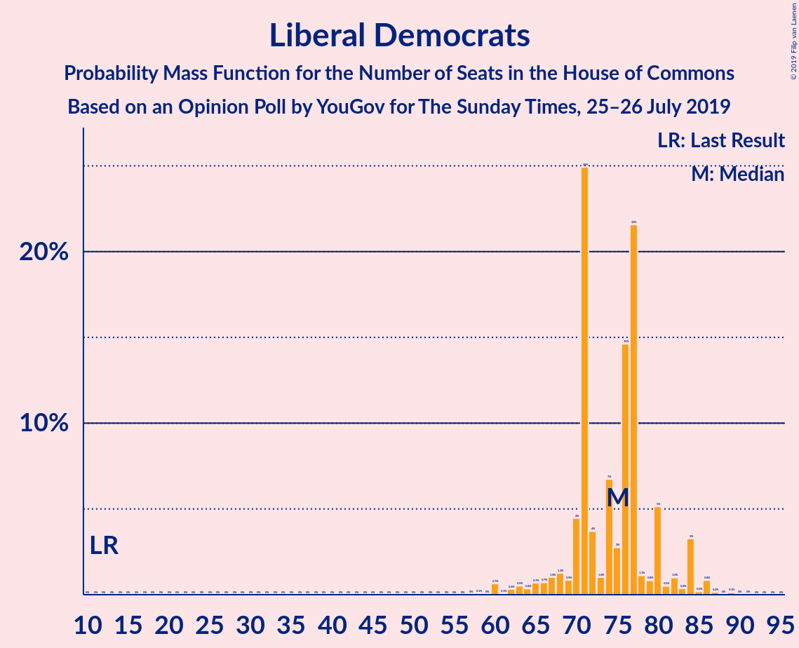
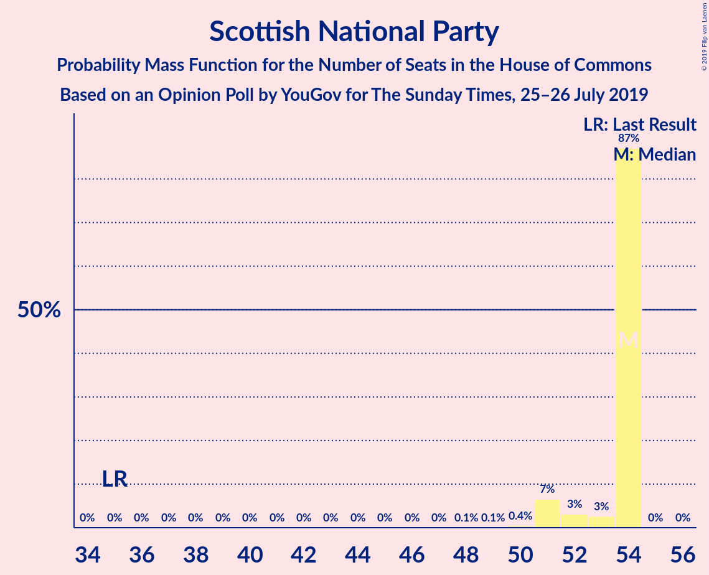
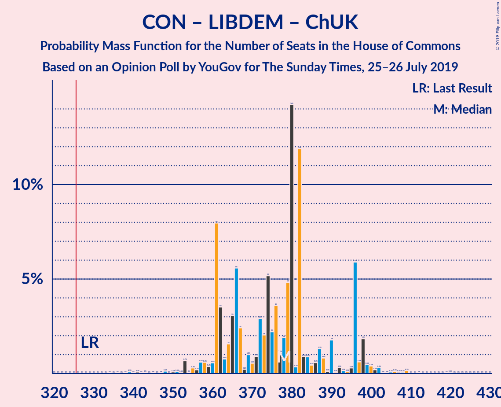
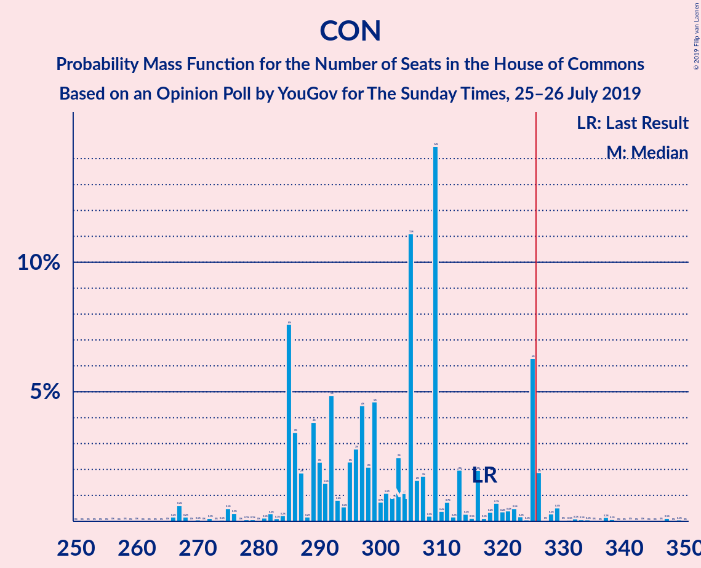
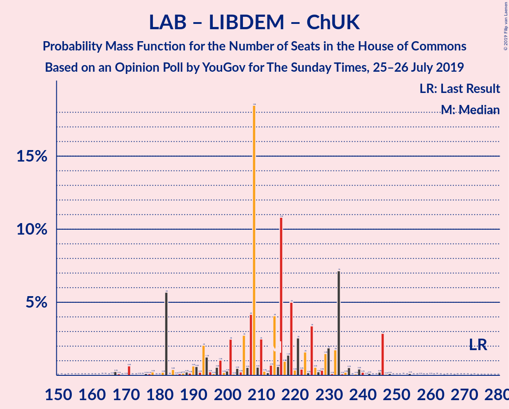

# Opinion Poll by YouGov for The Sunday Times, 25–26 July 2019

<a href="#voting-intentions">Voting Intentions</a> | <a href="#seats">Seats</a> | <a href="#coalitions">Coalitions</a> | <a href="#technical-information">Technical Information</a>

## Voting Intentions

### Confidence Intervals

| Party | Last Result | Poll Result | 80% Confidence Interval | 90% Confidence Interval | 95% Confidence Interval | 99% Confidence Interval |
|:-----:|:-----------:|:-----------:|:-----------------------:|:-----------------------:|:-----------------------:|:-----------------------:|
| Conservative Party | 42.4% | 30.8% | 29.4–32.3% |29.0–32.7% |28.7–33.1% |28.0–33.8% |
| Labour Party | 40.0% | 20.9% | 19.7–22.2% |19.3–22.6% |19.0–22.9% |18.5–23.6% |
| Liberal Democrats | 7.4% | 19.9% | 18.7–21.2% |18.4–21.6% |18.1–21.9% |17.5–22.5% |
| Brexit Party | 0.0% | 13.0% | 12.0–14.1% |11.7–14.4% |11.4–14.7% |11.0–15.2% |
| Green Party | 1.6% | 8.0% | 7.2–8.9% |7.0–9.1% |6.8–9.3% |6.4–9.8% |
| Scottish National Party | 3.0% | 4.9% | 4.3–5.7% |4.2–5.9% |4.0–6.1% |3.7–6.5% |
| Plaid Cymru | 0.5% | 1.0% | 0.7–1.4% |0.7–1.5% |0.6–1.6% |0.5–1.8% |
| UK Independence Party | 1.8% | 0.2% | 0.1–0.5% |0.1–0.5% |0.1–0.6% |0.1–0.7% |
| Change UK | 0.0% | 0.2% | 0.1–0.5% |0.1–0.5% |0.1–0.6% |0.1–0.7% |

*Note:* The poll result column reflects the actual value used in the calculations. Published results may vary slightly, and in addition be rounded to fewer digits.

## Seats

### Confidence Intervals

| Party | Last Result | Median | 80% Confidence Interval | 90% Confidence Interval | 95% Confidence Interval | 99% Confidence Interval |
|:-----:|:-----------:|:------:|:-----------------------:|:-----------------------:|:-----------------------:|:-----------------------:|
| <a href="#conservative-party">Conservative Party</a> | 317 | 300 | 300–310 |300–337 |298–341 |296–349 |
| <a href="#labour-party">Labour Party</a> | 262 | 134 | 121–138 |117–138 |102–143 |78–171 |
| <a href="#liberal-democrats">Liberal Democrats</a> | 12 | 71 | 68–71 |61–74 |61–75 |59–75 |
| <a href="#brexit-party">Brexit Party</a> | 0 | 61 | 45–72 |30–72 |26–80 |26–80 |
| <a href="#green-party">Green Party</a> | 1 | 5 | 5 |5 |5–6 |5–8 |
| <a href="#scottish-national-party">Scottish National Party</a> | 35 | 54 | 54 |54 |49–54 |48–54 |
| <a href="#plaid-cymru">Plaid Cymru</a> | 4 | 7 | 7–12 |7–12 |7–13 |4–13 |
| <a href="#uk-independence-party">UK Independence Party</a> | 0 | 0 | 0 |0 |0 |0 |
| <a href="#change-uk">Change UK</a> | 0 | 0 | 0 |0 |0 |0 |

### Conservative Party

*For a full overview of the results for this party, see the [Conservative Party](party-conservativeparty.html) page.*

| Number of Seats | Probability | Accumulated | Special Marks |
|:---------------:|:-----------:|:-----------:|:-------------:|
| 267 | 0.1% | 100% |  |
| 268 | 0% | 99.9% |  |
| 269 | 0% | 99.9% |  |
| 270 | 0% | 99.9% |  |
| 271 | 0.1% | 99.9% |  |
| 272 | 0% | 99.9% |  |
| 273 | 0% | 99.9% |  |
| 274 | 0% | 99.9% |  |
| 275 | 0% | 99.9% |  |
| 276 | 0% | 99.9% |  |
| 277 | 0% | 99.9% |  |
| 278 | 0% | 99.9% |  |
| 279 | 0% | 99.9% |  |
| 280 | 0% | 99.9% |  |
| 281 | 0% | 99.9% |  |
| 282 | 0% | 99.9% |  |
| 283 | 0% | 99.9% |  |
| 284 | 0% | 99.9% |  |
| 285 | 0% | 99.9% |  |
| 286 | 0% | 99.9% |  |
| 287 | 0% | 99.9% |  |
| 288 | 0% | 99.9% |  |
| 289 | 0% | 99.9% |  |
| 290 | 0% | 99.9% |  |
| 291 | 0.1% | 99.9% |  |
| 292 | 0% | 99.7% |  |
| 293 | 0% | 99.7% |  |
| 294 | 0.1% | 99.7% |  |
| 295 | 0% | 99.7% |  |
| 296 | 0.5% | 99.7% |  |
| 297 | 2% | 99.2% |  |
| 298 | 0% | 98% |  |
| 299 | 0% | 97% |  |
| 300 | 63% | 97% | Median |
| 301 | 0% | 35% |  |
| 302 | 0% | 35% |  |
| 303 | 0% | 35% |  |
| 304 | 4% | 35% |  |
| 305 | 7% | 31% |  |
| 306 | 0% | 24% |  |
| 307 | 0.7% | 24% |  |
| 308 | 0% | 23% |  |
| 309 | 0% | 23% |  |
| 310 | 15% | 23% |  |
| 311 | 0% | 8% |  |
| 312 | 0% | 8% |  |
| 313 | 0% | 8% |  |
| 314 | 0.1% | 8% |  |
| 315 | 0% | 8% |  |
| 316 | 0% | 8% |  |
| 317 | 0% | 8% | Last Result |
| 318 | 0.1% | 8% |  |
| 319 | 0.7% | 8% |  |
| 320 | 0% | 7% |  |
| 321 | 0% | 7% |  |
| 322 | 0% | 7% |  |
| 323 | 0% | 7% |  |
| 324 | 0% | 7% |  |
| 325 | 0% | 7% |  |
| 326 | 0% | 7% | Majority |
| 327 | 0% | 7% |  |
| 328 | 0% | 7% |  |
| 329 | 0% | 7% |  |
| 330 | 2% | 7% |  |
| 331 | 0% | 5% |  |
| 332 | 0% | 5% |  |
| 333 | 0% | 5% |  |
| 334 | 0% | 5% |  |
| 335 | 0% | 5% |  |
| 336 | 0% | 5% |  |
| 337 | 0.1% | 5% |  |
| 338 | 0% | 5% |  |
| 339 | 0% | 5% |  |
| 340 | 0% | 5% |  |
| 341 | 4% | 5% |  |
| 342 | 0% | 0.6% |  |
| 343 | 0% | 0.6% |  |
| 344 | 0% | 0.6% |  |
| 345 | 0% | 0.6% |  |
| 346 | 0% | 0.6% |  |
| 347 | 0% | 0.6% |  |
| 348 | 0% | 0.6% |  |
| 349 | 0.6% | 0.6% |  |
| 350 | 0% | 0% |  |

### Labour Party

*For a full overview of the results for this party, see the [Labour Party](party-labourparty.html) page.*

| Number of Seats | Probability | Accumulated | Special Marks |
|:---------------:|:-----------:|:-----------:|:-------------:|
| 78 | 0.6% | 100% |  |
| 79 | 0% | 99.4% |  |
| 80 | 0% | 99.4% |  |
| 81 | 0% | 99.4% |  |
| 82 | 0% | 99.4% |  |
| 83 | 0% | 99.4% |  |
| 84 | 0% | 99.4% |  |
| 85 | 0% | 99.4% |  |
| 86 | 0% | 99.4% |  |
| 87 | 0% | 99.4% |  |
| 88 | 0% | 99.4% |  |
| 89 | 0% | 99.4% |  |
| 90 | 0% | 99.4% |  |
| 91 | 0% | 99.4% |  |
| 92 | 0% | 99.4% |  |
| 93 | 0% | 99.4% |  |
| 94 | 0% | 99.4% |  |
| 95 | 0% | 99.4% |  |
| 96 | 0% | 99.4% |  |
| 97 | 0% | 99.4% |  |
| 98 | 0% | 99.4% |  |
| 99 | 0% | 99.4% |  |
| 100 | 0% | 99.4% |  |
| 101 | 0% | 99.4% |  |
| 102 | 4% | 99.4% |  |
| 103 | 0% | 95% |  |
| 104 | 0% | 95% |  |
| 105 | 0% | 95% |  |
| 106 | 0% | 95% |  |
| 107 | 0% | 95% |  |
| 108 | 0% | 95% |  |
| 109 | 0% | 95% |  |
| 110 | 0% | 95% |  |
| 111 | 0% | 95% |  |
| 112 | 0% | 95% |  |
| 113 | 0% | 95% |  |
| 114 | 0% | 95% |  |
| 115 | 0% | 95% |  |
| 116 | 0% | 95% |  |
| 117 | 2% | 95% |  |
| 118 | 0% | 94% |  |
| 119 | 0% | 94% |  |
| 120 | 0% | 94% |  |
| 121 | 7% | 94% |  |
| 122 | 0.1% | 87% |  |
| 123 | 0% | 87% |  |
| 124 | 0.1% | 87% |  |
| 125 | 0% | 87% |  |
| 126 | 0% | 87% |  |
| 127 | 0% | 87% |  |
| 128 | 0% | 87% |  |
| 129 | 4% | 87% |  |
| 130 | 0% | 82% |  |
| 131 | 0% | 82% |  |
| 132 | 0% | 82% |  |
| 133 | 0% | 82% |  |
| 134 | 63% | 82% | Median |
| 135 | 0% | 20% |  |
| 136 | 0% | 20% |  |
| 137 | 0% | 20% |  |
| 138 | 16% | 20% |  |
| 139 | 0% | 4% |  |
| 140 | 0% | 4% |  |
| 141 | 0% | 4% |  |
| 142 | 0% | 4% |  |
| 143 | 2% | 4% |  |
| 144 | 0% | 2% |  |
| 145 | 0% | 2% |  |
| 146 | 0.7% | 2% |  |
| 147 | 0% | 1.0% |  |
| 148 | 0% | 1.0% |  |
| 149 | 0.1% | 0.9% |  |
| 150 | 0% | 0.8% |  |
| 151 | 0% | 0.8% |  |
| 152 | 0% | 0.8% |  |
| 153 | 0% | 0.8% |  |
| 154 | 0% | 0.8% |  |
| 155 | 0% | 0.8% |  |
| 156 | 0% | 0.8% |  |
| 157 | 0% | 0.8% |  |
| 158 | 0% | 0.8% |  |
| 159 | 0% | 0.8% |  |
| 160 | 0% | 0.8% |  |
| 161 | 0% | 0.8% |  |
| 162 | 0.1% | 0.8% |  |
| 163 | 0% | 0.7% |  |
| 164 | 0% | 0.7% |  |
| 165 | 0% | 0.7% |  |
| 166 | 0% | 0.7% |  |
| 167 | 0% | 0.7% |  |
| 168 | 0% | 0.7% |  |
| 169 | 0% | 0.7% |  |
| 170 | 0% | 0.7% |  |
| 171 | 0.5% | 0.7% |  |
| 172 | 0% | 0.2% |  |
| 173 | 0% | 0.2% |  |
| 174 | 0% | 0.1% |  |
| 175 | 0% | 0.1% |  |
| 176 | 0% | 0.1% |  |
| 177 | 0% | 0.1% |  |
| 178 | 0% | 0.1% |  |
| 179 | 0% | 0.1% |  |
| 180 | 0% | 0.1% |  |
| 181 | 0% | 0.1% |  |
| 182 | 0% | 0.1% |  |
| 183 | 0% | 0.1% |  |
| 184 | 0% | 0.1% |  |
| 185 | 0% | 0.1% |  |
| 186 | 0% | 0.1% |  |
| 187 | 0.1% | 0.1% |  |
| 188 | 0% | 0.1% |  |
| 189 | 0% | 0.1% |  |
| 190 | 0% | 0.1% |  |
| 191 | 0% | 0.1% |  |
| 192 | 0% | 0.1% |  |
| 193 | 0% | 0.1% |  |
| 194 | 0% | 0.1% |  |
| 195 | 0% | 0.1% |  |
| 196 | 0% | 0.1% |  |
| 197 | 0% | 0.1% |  |
| 198 | 0% | 0.1% |  |
| 199 | 0.1% | 0.1% |  |
| 200 | 0% | 0% |  |
| 201 | 0% | 0% |  |
| 202 | 0% | 0% |  |
| 203 | 0% | 0% |  |
| 204 | 0% | 0% |  |
| 205 | 0% | 0% |  |
| 206 | 0% | 0% |  |
| 207 | 0% | 0% |  |
| 208 | 0% | 0% |  |
| 209 | 0% | 0% |  |
| 210 | 0% | 0% |  |
| 211 | 0% | 0% |  |
| 212 | 0% | 0% |  |
| 213 | 0% | 0% |  |
| 214 | 0% | 0% |  |
| 215 | 0% | 0% |  |
| 216 | 0% | 0% |  |
| 217 | 0% | 0% |  |
| 218 | 0% | 0% |  |
| 219 | 0% | 0% |  |
| 220 | 0% | 0% |  |
| 221 | 0% | 0% |  |
| 222 | 0% | 0% |  |
| 223 | 0% | 0% |  |
| 224 | 0% | 0% |  |
| 225 | 0% | 0% |  |
| 226 | 0% | 0% |  |
| 227 | 0% | 0% |  |
| 228 | 0% | 0% |  |
| 229 | 0% | 0% |  |
| 230 | 0% | 0% |  |
| 231 | 0% | 0% |  |
| 232 | 0% | 0% |  |
| 233 | 0% | 0% |  |
| 234 | 0% | 0% |  |
| 235 | 0% | 0% |  |
| 236 | 0% | 0% |  |
| 237 | 0% | 0% |  |
| 238 | 0% | 0% |  |
| 239 | 0% | 0% |  |
| 240 | 0% | 0% |  |
| 241 | 0% | 0% |  |
| 242 | 0% | 0% |  |
| 243 | 0% | 0% |  |
| 244 | 0% | 0% |  |
| 245 | 0% | 0% |  |
| 246 | 0% | 0% |  |
| 247 | 0% | 0% |  |
| 248 | 0% | 0% |  |
| 249 | 0% | 0% |  |
| 250 | 0% | 0% |  |
| 251 | 0% | 0% |  |
| 252 | 0% | 0% |  |
| 253 | 0% | 0% |  |
| 254 | 0% | 0% |  |
| 255 | 0% | 0% |  |
| 256 | 0% | 0% |  |
| 257 | 0% | 0% |  |
| 258 | 0% | 0% |  |
| 259 | 0% | 0% |  |
| 260 | 0% | 0% |  |
| 261 | 0% | 0% |  |
| 262 | 0% | 0% | Last Result |

### Liberal Democrats

*For a full overview of the results for this party, see the [Liberal Democrats](party-liberaldemocrats.html) page.*

| Number of Seats | Probability | Accumulated | Special Marks |
|:---------------:|:-----------:|:-----------:|:-------------:|
| 12 | 0% | 100% | Last Result |
| 13 | 0% | 100% |  |
| 14 | 0% | 100% |  |
| 15 | 0% | 100% |  |
| 16 | 0% | 100% |  |
| 17 | 0% | 100% |  |
| 18 | 0% | 100% |  |
| 19 | 0% | 100% |  |
| 20 | 0% | 100% |  |
| 21 | 0% | 100% |  |
| 22 | 0% | 100% |  |
| 23 | 0% | 100% |  |
| 24 | 0% | 100% |  |
| 25 | 0% | 100% |  |
| 26 | 0% | 100% |  |
| 27 | 0% | 100% |  |
| 28 | 0% | 100% |  |
| 29 | 0% | 100% |  |
| 30 | 0% | 100% |  |
| 31 | 0% | 100% |  |
| 32 | 0% | 100% |  |
| 33 | 0% | 100% |  |
| 34 | 0% | 100% |  |
| 35 | 0% | 100% |  |
| 36 | 0% | 100% |  |
| 37 | 0% | 100% |  |
| 38 | 0% | 100% |  |
| 39 | 0% | 100% |  |
| 40 | 0% | 100% |  |
| 41 | 0% | 100% |  |
| 42 | 0% | 100% |  |
| 43 | 0% | 100% |  |
| 44 | 0% | 100% |  |
| 45 | 0% | 100% |  |
| 46 | 0% | 100% |  |
| 47 | 0% | 100% |  |
| 48 | 0% | 100% |  |
| 49 | 0% | 100% |  |
| 50 | 0% | 100% |  |
| 51 | 0% | 100% |  |
| 52 | 0% | 100% |  |
| 53 | 0% | 100% |  |
| 54 | 0% | 100% |  |
| 55 | 0% | 100% |  |
| 56 | 0.1% | 100% |  |
| 57 | 0% | 99.9% |  |
| 58 | 0% | 99.9% |  |
| 59 | 0.7% | 99.9% |  |
| 60 | 0% | 99.2% |  |
| 61 | 4% | 99.2% |  |
| 62 | 0% | 95% |  |
| 63 | 0% | 95% |  |
| 64 | 0% | 95% |  |
| 65 | 0.1% | 95% |  |
| 66 | 0% | 95% |  |
| 67 | 2% | 95% |  |
| 68 | 7% | 92% |  |
| 69 | 15% | 85% |  |
| 70 | 0% | 71% |  |
| 71 | 63% | 71% | Median |
| 72 | 0% | 8% |  |
| 73 | 0.6% | 8% |  |
| 74 | 4% | 7% |  |
| 75 | 3% | 3% |  |
| 76 | 0% | 0.3% |  |
| 77 | 0% | 0.3% |  |
| 78 | 0.1% | 0.3% |  |
| 79 | 0% | 0.2% |  |
| 80 | 0% | 0.2% |  |
| 81 | 0% | 0.2% |  |
| 82 | 0% | 0.2% |  |
| 83 | 0.1% | 0.2% |  |
| 84 | 0% | 0.1% |  |
| 85 | 0% | 0.1% |  |
| 86 | 0% | 0.1% |  |
| 87 | 0.1% | 0.1% |  |
| 88 | 0% | 0% |  |

### Brexit Party

*For a full overview of the results for this party, see the [Brexit Party](party-brexitparty.html) page.*

| Number of Seats | Probability | Accumulated | Special Marks |
|:---------------:|:-----------:|:-----------:|:-------------:|
| 0 | 0% | 100% | Last Result |
| 1 | 0% | 100% |  |
| 2 | 0% | 100% |  |
| 3 | 0% | 100% |  |
| 4 | 0% | 100% |  |
| 5 | 0% | 100% |  |
| 6 | 0% | 100% |  |
| 7 | 0% | 100% |  |
| 8 | 0% | 100% |  |
| 9 | 0% | 100% |  |
| 10 | 0% | 100% |  |
| 11 | 0% | 100% |  |
| 12 | 0% | 100% |  |
| 13 | 0.1% | 100% |  |
| 14 | 0% | 99.9% |  |
| 15 | 0% | 99.9% |  |
| 16 | 0% | 99.9% |  |
| 17 | 0% | 99.9% |  |
| 18 | 0% | 99.9% |  |
| 19 | 0% | 99.9% |  |
| 20 | 0% | 99.9% |  |
| 21 | 0% | 99.9% |  |
| 22 | 0% | 99.9% |  |
| 23 | 0% | 99.9% |  |
| 24 | 0.1% | 99.9% |  |
| 25 | 0% | 99.9% |  |
| 26 | 3% | 99.9% |  |
| 27 | 0.1% | 97% |  |
| 28 | 0% | 97% |  |
| 29 | 0% | 97% |  |
| 30 | 4% | 97% |  |
| 31 | 0% | 92% |  |
| 32 | 0% | 92% |  |
| 33 | 0% | 92% |  |
| 34 | 0% | 92% |  |
| 35 | 0% | 92% |  |
| 36 | 0% | 92% |  |
| 37 | 0% | 92% |  |
| 38 | 0% | 92% |  |
| 39 | 0% | 92% |  |
| 40 | 0% | 92% |  |
| 41 | 0% | 92% |  |
| 42 | 0.7% | 92% |  |
| 43 | 0% | 92% |  |
| 44 | 0.7% | 92% |  |
| 45 | 15% | 91% |  |
| 46 | 0% | 76% |  |
| 47 | 0% | 76% |  |
| 48 | 0% | 76% |  |
| 49 | 0% | 76% |  |
| 50 | 0% | 76% |  |
| 51 | 0% | 76% |  |
| 52 | 0% | 76% |  |
| 53 | 0% | 76% |  |
| 54 | 0.1% | 76% |  |
| 55 | 0.1% | 76% |  |
| 56 | 0% | 76% |  |
| 57 | 0% | 76% |  |
| 58 | 0% | 76% |  |
| 59 | 0% | 76% |  |
| 60 | 0% | 76% |  |
| 61 | 63% | 76% | Median |
| 62 | 0% | 13% |  |
| 63 | 0% | 13% |  |
| 64 | 0% | 13% |  |
| 65 | 0% | 13% |  |
| 66 | 0.6% | 13% |  |
| 67 | 0% | 13% |  |
| 68 | 0% | 13% |  |
| 69 | 0% | 13% |  |
| 70 | 0% | 13% |  |
| 71 | 2% | 13% |  |
| 72 | 7% | 11% |  |
| 73 | 0% | 4% |  |
| 74 | 0% | 4% |  |
| 75 | 0% | 4% |  |
| 76 | 0% | 4% |  |
| 77 | 0% | 4% |  |
| 78 | 0% | 4% |  |
| 79 | 0% | 4% |  |
| 80 | 4% | 4% |  |
| 81 | 0% | 0% |  |

### Green Party

*For a full overview of the results for this party, see the [Green Party](party-greenparty.html) page.*

| Number of Seats | Probability | Accumulated | Special Marks |
|:---------------:|:-----------:|:-----------:|:-------------:|
| 1 | 0% | 100% | Last Result |
| 2 | 0% | 100% |  |
| 3 | 0.1% | 100% |  |
| 4 | 0.2% | 99.9% |  |
| 5 | 97% | 99.8% | Median |
| 6 | 2% | 3% |  |
| 7 | 0.1% | 0.7% |  |
| 8 | 0.6% | 0.6% |  |
| 9 | 0% | 0% |  |

### Scottish National Party

*For a full overview of the results for this party, see the [Scottish National Party](party-scottishnationalparty.html) page.*

| Number of Seats | Probability | Accumulated | Special Marks |
|:---------------:|:-----------:|:-----------:|:-------------:|
| 35 | 0% | 100% | Last Result |
| 36 | 0% | 100% |  |
| 37 | 0% | 100% |  |
| 38 | 0% | 100% |  |
| 39 | 0% | 100% |  |
| 40 | 0% | 100% |  |
| 41 | 0% | 100% |  |
| 42 | 0% | 100% |  |
| 43 | 0% | 100% |  |
| 44 | 0% | 100% |  |
| 45 | 0% | 100% |  |
| 46 | 0% | 100% |  |
| 47 | 0% | 100% |  |
| 48 | 2% | 100% |  |
| 49 | 0.1% | 98% |  |
| 50 | 0.1% | 97% |  |
| 51 | 0% | 97% |  |
| 52 | 0% | 97% |  |
| 53 | 2% | 97% |  |
| 54 | 95% | 95% | Median |
| 55 | 0% | 0% |  |

### Plaid Cymru

*For a full overview of the results for this party, see the [Plaid Cymru](party-plaidcymru.html) page.*

| Number of Seats | Probability | Accumulated | Special Marks |
|:---------------:|:-----------:|:-----------:|:-------------:|
| 3 | 0.1% | 100% |  |
| 4 | 0.6% | 99.9% | Last Result |
| 5 | 0.7% | 99.4% |  |
| 6 | 0% | 98.6% |  |
| 7 | 70% | 98.6% | Median |
| 8 | 0.6% | 29% |  |
| 9 | 0% | 28% |  |
| 10 | 0.1% | 28% |  |
| 11 | 15% | 28% |  |
| 12 | 9% | 13% |  |
| 13 | 4% | 4% |  |
| 14 | 0% | 0% |  |

### UK Independence Party

*For a full overview of the results for this party, see the [UK Independence Party](party-ukindependenceparty.html) page.*

| Number of Seats | Probability | Accumulated | Special Marks |
|:---------------:|:-----------:|:-----------:|:-------------:|
| 0 | 100% | 100% | Last Result, Median |

### Change UK

*For a full overview of the results for this party, see the [Change UK](party-changeuk.html) page.*

| Number of Seats | Probability | Accumulated | Special Marks |
|:---------------:|:-----------:|:-----------:|:-------------:|
| 0 | 100% | 100% | Last Result, Median |

## Coalitions

### Confidence Intervals

| Coalition | Last Result | Median | Majority? | 80% Confidence Interval | 90% Confidence Interval | 95% Confidence Interval | 99% Confidence Interval |
|:---------:|:-----------:|:------:|:---------:|:-----------------------:|:-----------------------:|:-----------------------:|:-----------------------:|
| Conservative Party – Scottish National Party – Plaid Cymru | 356 | 361 | 100% | 361–375 | 361–394 | 361–407 | 353–410 |
| Conservative Party – Liberal Democrats – Change UK | 329 | 371 | 100% | 371–379 | 371–397 | 371–402 | 371–422 |
| Conservative Party – Liberal Democrats | 329 | 371 | 100% | 371–379 | 371–397 | 371–402 | 371–422 |
| Conservative Party – Scottish National Party | 352 | 354 | 99.9% | 354–364 | 354–387 | 351–395 | 349–402 |
| Conservative Party – Plaid Cymru | 321 | 307 | 8% | 307–321 | 307–344 | 307–353 | 300–357 |
| Conservative Party – Change UK | 317 | 300 | 7% | 300–310 | 300–337 | 298–341 | 296–349 |
| Conservative Party | 317 | 300 | 7% | 300–310 | 300–337 | 298–341 | 296–349 |
| Labour Party – Liberal Democrats – Scottish National Party – Plaid Cymru | 313 | 266 | 0.1% | 250–272 | 250–272 | 243–272 | 212–303 |
| Labour Party – Liberal Democrats – Scottish National Party | 309 | 259 | 0.1% | 243–261 | 243–261 | 230–261 | 204–299 |
| Labour Party – Liberal Democrats – Plaid Cymru | 278 | 212 | 0% | 196–218 | 196–218 | 189–222 | 159–250 |
| Labour Party – Liberal Democrats – Change UK | 274 | 205 | 0% | 189–207 | 189–207 | 176–210 | 151–246 |
| Labour Party – Liberal Democrats | 274 | 205 | 0% | 189–207 | 189–207 | 176–210 | 151–246 |
| Labour Party – Scottish National Party – Plaid Cymru | 301 | 195 | 0% | 182–203 | 182–203 | 169–203 | 139–228 |
| Labour Party – Scottish National Party | 297 | 188 | 0% | 175–192 | 171–192 | 156–192 | 131–224 |
| Labour Party – Plaid Cymru | 266 | 141 | 0% | 128–149 | 128–149 | 115–155 | 86–175 |
| Labour Party – Change UK | 262 | 134 | 0% | 121–138 | 117–138 | 102–143 | 78–171 |
| Labour Party | 262 | 134 | 0% | 121–138 | 117–138 | 102–143 | 78–171 |

### Conservative Party – Scottish National Party – Plaid Cymru

| Number of Seats | Probability | Accumulated | Special Marks |
|:---------------:|:-----------:|:-----------:|:-------------:|
| 328 | 0.1% | 100% |  |
| 329 | 0% | 99.9% |  |
| 330 | 0% | 99.9% |  |
| 331 | 0% | 99.9% |  |
| 332 | 0% | 99.9% |  |
| 333 | 0% | 99.9% |  |
| 334 | 0% | 99.9% |  |
| 335 | 0% | 99.9% |  |
| 336 | 0% | 99.9% |  |
| 337 | 0% | 99.9% |  |
| 338 | 0% | 99.9% |  |
| 339 | 0% | 99.9% |  |
| 340 | 0% | 99.9% |  |
| 341 | 0% | 99.9% |  |
| 342 | 0% | 99.9% |  |
| 343 | 0% | 99.9% |  |
| 344 | 0% | 99.9% |  |
| 345 | 0% | 99.9% |  |
| 346 | 0.1% | 99.9% |  |
| 347 | 0% | 99.8% |  |
| 348 | 0% | 99.8% |  |
| 349 | 0% | 99.8% |  |
| 350 | 0% | 99.8% |  |
| 351 | 0% | 99.8% |  |
| 352 | 0% | 99.8% |  |
| 353 | 0.5% | 99.8% |  |
| 354 | 0.1% | 99.3% |  |
| 355 | 0% | 99.2% |  |
| 356 | 0% | 99.2% | Last Result |
| 357 | 0% | 99.2% |  |
| 358 | 0% | 99.2% |  |
| 359 | 0% | 99.2% |  |
| 360 | 0% | 99.2% |  |
| 361 | 63% | 99.2% | Median |
| 362 | 0% | 37% |  |
| 363 | 2% | 37% |  |
| 364 | 0% | 35% |  |
| 365 | 0% | 35% |  |
| 366 | 7% | 35% |  |
| 367 | 0% | 28% |  |
| 368 | 0% | 28% |  |
| 369 | 0% | 28% |  |
| 370 | 0% | 28% |  |
| 371 | 4% | 28% |  |
| 372 | 0.7% | 24% |  |
| 373 | 0% | 23% |  |
| 374 | 0% | 23% |  |
| 375 | 15% | 23% |  |
| 376 | 0% | 8% |  |
| 377 | 0% | 8% |  |
| 378 | 0.7% | 8% |  |
| 379 | 0% | 8% |  |
| 380 | 0.1% | 8% |  |
| 381 | 0% | 8% |  |
| 382 | 0% | 8% |  |
| 383 | 0.1% | 8% |  |
| 384 | 0% | 7% |  |
| 385 | 0% | 7% |  |
| 386 | 0% | 7% |  |
| 387 | 0% | 7% |  |
| 388 | 0% | 7% |  |
| 389 | 0% | 7% |  |
| 390 | 2% | 7% |  |
| 391 | 0% | 5% |  |
| 392 | 0% | 5% |  |
| 393 | 0% | 5% |  |
| 394 | 0.1% | 5% |  |
| 395 | 0% | 5% |  |
| 396 | 0% | 5% |  |
| 397 | 0% | 5% |  |
| 398 | 0% | 5% |  |
| 399 | 0% | 5% |  |
| 400 | 0% | 5% |  |
| 401 | 0% | 5% |  |
| 402 | 0% | 5% |  |
| 403 | 0% | 5% |  |
| 404 | 0% | 5% |  |
| 405 | 0% | 5% |  |
| 406 | 0% | 5% |  |
| 407 | 4% | 5% |  |
| 408 | 0% | 0.6% |  |
| 409 | 0% | 0.6% |  |
| 410 | 0.6% | 0.6% |  |
| 411 | 0% | 0% |  |

### Conservative Party – Liberal Democrats – Change UK

| Number of Seats | Probability | Accumulated | Special Marks |
|:---------------:|:-----------:|:-----------:|:-------------:|
| 329 | 0% | 100% | Last Result |
| 330 | 0% | 100% |  |
| 331 | 0% | 100% |  |
| 332 | 0% | 100% |  |
| 333 | 0% | 100% |  |
| 334 | 0% | 100% |  |
| 335 | 0% | 100% |  |
| 336 | 0% | 100% |  |
| 337 | 0% | 100% |  |
| 338 | 0% | 100% |  |
| 339 | 0% | 100% |  |
| 340 | 0% | 100% |  |
| 341 | 0% | 100% |  |
| 342 | 0% | 100% |  |
| 343 | 0% | 100% |  |
| 344 | 0% | 100% |  |
| 345 | 0% | 100% |  |
| 346 | 0% | 100% |  |
| 347 | 0% | 100% |  |
| 348 | 0% | 100% |  |
| 349 | 0% | 100% |  |
| 350 | 0% | 100% |  |
| 351 | 0% | 100% |  |
| 352 | 0% | 100% |  |
| 353 | 0% | 99.9% |  |
| 354 | 0.1% | 99.9% |  |
| 355 | 0% | 99.9% |  |
| 356 | 0% | 99.9% |  |
| 357 | 0% | 99.9% |  |
| 358 | 0% | 99.9% |  |
| 359 | 0% | 99.9% |  |
| 360 | 0% | 99.9% |  |
| 361 | 0% | 99.9% |  |
| 362 | 0% | 99.9% |  |
| 363 | 0% | 99.9% |  |
| 364 | 0% | 99.9% |  |
| 365 | 0.1% | 99.8% |  |
| 366 | 0% | 99.8% |  |
| 367 | 0% | 99.8% |  |
| 368 | 0% | 99.8% |  |
| 369 | 0% | 99.8% |  |
| 370 | 0% | 99.8% |  |
| 371 | 63% | 99.8% | Median |
| 372 | 2% | 37% |  |
| 373 | 7% | 35% |  |
| 374 | 0.1% | 28% |  |
| 375 | 0% | 28% |  |
| 376 | 0% | 28% |  |
| 377 | 0% | 28% |  |
| 378 | 5% | 28% |  |
| 379 | 15% | 23% |  |
| 380 | 0% | 8% |  |
| 381 | 0% | 8% |  |
| 382 | 0.7% | 8% |  |
| 383 | 0.1% | 8% |  |
| 384 | 0% | 8% |  |
| 385 | 0.1% | 8% |  |
| 386 | 0% | 7% |  |
| 387 | 0% | 7% |  |
| 388 | 0% | 7% |  |
| 389 | 0% | 7% |  |
| 390 | 0% | 7% |  |
| 391 | 0% | 7% |  |
| 392 | 0% | 7% |  |
| 393 | 0.1% | 7% |  |
| 394 | 0% | 7% |  |
| 395 | 0% | 7% |  |
| 396 | 0% | 7% |  |
| 397 | 2% | 7% |  |
| 398 | 0% | 5% |  |
| 399 | 0% | 5% |  |
| 400 | 0% | 5% |  |
| 401 | 0% | 5% |  |
| 402 | 4% | 5% |  |
| 403 | 0% | 0.6% |  |
| 404 | 0% | 0.6% |  |
| 405 | 0% | 0.6% |  |
| 406 | 0% | 0.6% |  |
| 407 | 0% | 0.6% |  |
| 408 | 0% | 0.6% |  |
| 409 | 0% | 0.6% |  |
| 410 | 0% | 0.6% |  |
| 411 | 0% | 0.6% |  |
| 412 | 0% | 0.6% |  |
| 413 | 0% | 0.6% |  |
| 414 | 0% | 0.6% |  |
| 415 | 0% | 0.6% |  |
| 416 | 0% | 0.6% |  |
| 417 | 0% | 0.6% |  |
| 418 | 0% | 0.6% |  |
| 419 | 0% | 0.6% |  |
| 420 | 0% | 0.6% |  |
| 421 | 0% | 0.6% |  |
| 422 | 0.6% | 0.6% |  |
| 423 | 0% | 0% |  |

### Conservative Party – Liberal Democrats

| Number of Seats | Probability | Accumulated | Special Marks |
|:---------------:|:-----------:|:-----------:|:-------------:|
| 329 | 0% | 100% | Last Result |
| 330 | 0% | 100% |  |
| 331 | 0% | 100% |  |
| 332 | 0% | 100% |  |
| 333 | 0% | 100% |  |
| 334 | 0% | 100% |  |
| 335 | 0% | 100% |  |
| 336 | 0% | 100% |  |
| 337 | 0% | 100% |  |
| 338 | 0% | 100% |  |
| 339 | 0% | 100% |  |
| 340 | 0% | 100% |  |
| 341 | 0% | 100% |  |
| 342 | 0% | 100% |  |
| 343 | 0% | 100% |  |
| 344 | 0% | 100% |  |
| 345 | 0% | 100% |  |
| 346 | 0% | 100% |  |
| 347 | 0% | 100% |  |
| 348 | 0% | 100% |  |
| 349 | 0% | 100% |  |
| 350 | 0% | 100% |  |
| 351 | 0% | 100% |  |
| 352 | 0% | 100% |  |
| 353 | 0% | 99.9% |  |
| 354 | 0.1% | 99.9% |  |
| 355 | 0% | 99.9% |  |
| 356 | 0% | 99.9% |  |
| 357 | 0% | 99.9% |  |
| 358 | 0% | 99.9% |  |
| 359 | 0% | 99.9% |  |
| 360 | 0% | 99.9% |  |
| 361 | 0% | 99.9% |  |
| 362 | 0% | 99.9% |  |
| 363 | 0% | 99.9% |  |
| 364 | 0% | 99.9% |  |
| 365 | 0.1% | 99.8% |  |
| 366 | 0% | 99.8% |  |
| 367 | 0% | 99.8% |  |
| 368 | 0% | 99.8% |  |
| 369 | 0% | 99.8% |  |
| 370 | 0% | 99.8% |  |
| 371 | 63% | 99.8% | Median |
| 372 | 2% | 37% |  |
| 373 | 7% | 35% |  |
| 374 | 0.1% | 28% |  |
| 375 | 0% | 28% |  |
| 376 | 0% | 28% |  |
| 377 | 0% | 28% |  |
| 378 | 5% | 28% |  |
| 379 | 15% | 23% |  |
| 380 | 0% | 8% |  |
| 381 | 0% | 8% |  |
| 382 | 0.7% | 8% |  |
| 383 | 0.1% | 8% |  |
| 384 | 0% | 8% |  |
| 385 | 0.1% | 8% |  |
| 386 | 0% | 7% |  |
| 387 | 0% | 7% |  |
| 388 | 0% | 7% |  |
| 389 | 0% | 7% |  |
| 390 | 0% | 7% |  |
| 391 | 0% | 7% |  |
| 392 | 0% | 7% |  |
| 393 | 0.1% | 7% |  |
| 394 | 0% | 7% |  |
| 395 | 0% | 7% |  |
| 396 | 0% | 7% |  |
| 397 | 2% | 7% |  |
| 398 | 0% | 5% |  |
| 399 | 0% | 5% |  |
| 400 | 0% | 5% |  |
| 401 | 0% | 5% |  |
| 402 | 4% | 5% |  |
| 403 | 0% | 0.6% |  |
| 404 | 0% | 0.6% |  |
| 405 | 0% | 0.6% |  |
| 406 | 0% | 0.6% |  |
| 407 | 0% | 0.6% |  |
| 408 | 0% | 0.6% |  |
| 409 | 0% | 0.6% |  |
| 410 | 0% | 0.6% |  |
| 411 | 0% | 0.6% |  |
| 412 | 0% | 0.6% |  |
| 413 | 0% | 0.6% |  |
| 414 | 0% | 0.6% |  |
| 415 | 0% | 0.6% |  |
| 416 | 0% | 0.6% |  |
| 417 | 0% | 0.6% |  |
| 418 | 0% | 0.6% |  |
| 419 | 0% | 0.6% |  |
| 420 | 0% | 0.6% |  |
| 421 | 0% | 0.6% |  |
| 422 | 0.6% | 0.6% |  |
| 423 | 0% | 0% |  |

### Conservative Party – Scottish National Party

| Number of Seats | Probability | Accumulated | Special Marks |
|:---------------:|:-----------:|:-----------:|:-------------:|
| 321 | 0.1% | 100% |  |
| 322 | 0% | 99.9% |  |
| 323 | 0% | 99.9% |  |
| 324 | 0% | 99.9% |  |
| 325 | 0% | 99.9% |  |
| 326 | 0% | 99.9% | Majority |
| 327 | 0% | 99.9% |  |
| 328 | 0% | 99.9% |  |
| 329 | 0% | 99.9% |  |
| 330 | 0% | 99.9% |  |
| 331 | 0% | 99.9% |  |
| 332 | 0% | 99.9% |  |
| 333 | 0% | 99.9% |  |
| 334 | 0% | 99.9% |  |
| 335 | 0% | 99.9% |  |
| 336 | 0% | 99.9% |  |
| 337 | 0% | 99.9% |  |
| 338 | 0% | 99.9% |  |
| 339 | 0% | 99.9% |  |
| 340 | 0% | 99.9% |  |
| 341 | 0% | 99.8% |  |
| 342 | 0% | 99.8% |  |
| 343 | 0.1% | 99.8% |  |
| 344 | 0.1% | 99.8% |  |
| 345 | 0% | 99.7% |  |
| 346 | 0% | 99.7% |  |
| 347 | 0% | 99.7% |  |
| 348 | 0% | 99.7% |  |
| 349 | 0.5% | 99.7% |  |
| 350 | 0% | 99.2% |  |
| 351 | 2% | 99.2% |  |
| 352 | 0% | 97% | Last Result |
| 353 | 0% | 97% |  |
| 354 | 63% | 97% | Median |
| 355 | 0% | 35% |  |
| 356 | 0% | 35% |  |
| 357 | 0% | 35% |  |
| 358 | 4% | 35% |  |
| 359 | 7% | 31% |  |
| 360 | 0.7% | 24% |  |
| 361 | 0% | 23% |  |
| 362 | 0% | 23% |  |
| 363 | 0% | 23% |  |
| 364 | 15% | 23% |  |
| 365 | 0% | 8% |  |
| 366 | 0% | 8% |  |
| 367 | 0% | 8% |  |
| 368 | 0.1% | 8% |  |
| 369 | 0% | 8% |  |
| 370 | 0% | 8% |  |
| 371 | 0% | 8% |  |
| 372 | 0.1% | 8% |  |
| 373 | 0.7% | 8% |  |
| 374 | 0% | 7% |  |
| 375 | 0% | 7% |  |
| 376 | 0% | 7% |  |
| 377 | 0% | 7% |  |
| 378 | 2% | 7% |  |
| 379 | 0% | 5% |  |
| 380 | 0% | 5% |  |
| 381 | 0% | 5% |  |
| 382 | 0% | 5% |  |
| 383 | 0% | 5% |  |
| 384 | 0% | 5% |  |
| 385 | 0% | 5% |  |
| 386 | 0% | 5% |  |
| 387 | 0.1% | 5% |  |
| 388 | 0% | 5% |  |
| 389 | 0% | 5% |  |
| 390 | 0% | 5% |  |
| 391 | 0% | 5% |  |
| 392 | 0% | 5% |  |
| 393 | 0% | 5% |  |
| 394 | 0% | 5% |  |
| 395 | 4% | 5% |  |
| 396 | 0% | 0.6% |  |
| 397 | 0% | 0.6% |  |
| 398 | 0% | 0.6% |  |
| 399 | 0% | 0.6% |  |
| 400 | 0% | 0.6% |  |
| 401 | 0% | 0.6% |  |
| 402 | 0.6% | 0.6% |  |
| 403 | 0% | 0% |  |

### Conservative Party – Plaid Cymru

| Number of Seats | Probability | Accumulated | Special Marks |
|:---------------:|:-----------:|:-----------:|:-------------:|
| 274 | 0.1% | 100% |  |
| 275 | 0% | 99.9% |  |
| 276 | 0% | 99.9% |  |
| 277 | 0% | 99.9% |  |
| 278 | 0% | 99.9% |  |
| 279 | 0% | 99.9% |  |
| 280 | 0% | 99.9% |  |
| 281 | 0% | 99.9% |  |
| 282 | 0% | 99.9% |  |
| 283 | 0% | 99.9% |  |
| 284 | 0% | 99.9% |  |
| 285 | 0% | 99.9% |  |
| 286 | 0% | 99.9% |  |
| 287 | 0% | 99.9% |  |
| 288 | 0% | 99.9% |  |
| 289 | 0% | 99.9% |  |
| 290 | 0% | 99.9% |  |
| 291 | 0% | 99.9% |  |
| 292 | 0% | 99.9% |  |
| 293 | 0% | 99.9% |  |
| 294 | 0% | 99.9% |  |
| 295 | 0% | 99.9% |  |
| 296 | 0% | 99.9% |  |
| 297 | 0.1% | 99.9% |  |
| 298 | 0% | 99.8% |  |
| 299 | 0% | 99.8% |  |
| 300 | 0.5% | 99.8% |  |
| 301 | 0.1% | 99.3% |  |
| 302 | 0% | 99.2% |  |
| 303 | 0% | 99.2% |  |
| 304 | 0% | 99.2% |  |
| 305 | 0% | 99.2% |  |
| 306 | 0% | 99.2% |  |
| 307 | 63% | 99.2% | Median |
| 308 | 0% | 37% |  |
| 309 | 2% | 37% |  |
| 310 | 0% | 35% |  |
| 311 | 0% | 35% |  |
| 312 | 7% | 35% |  |
| 313 | 0% | 28% |  |
| 314 | 0% | 28% |  |
| 315 | 0% | 28% |  |
| 316 | 0% | 28% |  |
| 317 | 4% | 28% |  |
| 318 | 0% | 24% |  |
| 319 | 0.7% | 24% |  |
| 320 | 0% | 23% |  |
| 321 | 15% | 23% | Last Result |
| 322 | 0% | 8% |  |
| 323 | 0% | 8% |  |
| 324 | 0.7% | 8% |  |
| 325 | 0% | 8% |  |
| 326 | 0.1% | 8% | Majority |
| 327 | 0% | 8% |  |
| 328 | 0% | 8% |  |
| 329 | 0.1% | 8% |  |
| 330 | 0% | 7% |  |
| 331 | 0% | 7% |  |
| 332 | 0% | 7% |  |
| 333 | 0% | 7% |  |
| 334 | 0% | 7% |  |
| 335 | 0% | 7% |  |
| 336 | 0% | 7% |  |
| 337 | 0% | 7% |  |
| 338 | 0% | 7% |  |
| 339 | 0% | 7% |  |
| 340 | 0% | 7% |  |
| 341 | 0% | 7% |  |
| 342 | 2% | 7% |  |
| 343 | 0% | 5% |  |
| 344 | 0.1% | 5% |  |
| 345 | 0% | 5% |  |
| 346 | 0% | 5% |  |
| 347 | 0% | 5% |  |
| 348 | 0% | 5% |  |
| 349 | 0% | 5% |  |
| 350 | 0% | 5% |  |
| 351 | 0% | 5% |  |
| 352 | 0% | 5% |  |
| 353 | 4% | 5% |  |
| 354 | 0% | 0.6% |  |
| 355 | 0% | 0.6% |  |
| 356 | 0% | 0.6% |  |
| 357 | 0.6% | 0.6% |  |
| 358 | 0% | 0% |  |

### Conservative Party – Change UK

| Number of Seats | Probability | Accumulated | Special Marks |
|:---------------:|:-----------:|:-----------:|:-------------:|
| 267 | 0.1% | 100% |  |
| 268 | 0% | 99.9% |  |
| 269 | 0% | 99.9% |  |
| 270 | 0% | 99.9% |  |
| 271 | 0.1% | 99.9% |  |
| 272 | 0% | 99.9% |  |
| 273 | 0% | 99.9% |  |
| 274 | 0% | 99.9% |  |
| 275 | 0% | 99.9% |  |
| 276 | 0% | 99.9% |  |
| 277 | 0% | 99.9% |  |
| 278 | 0% | 99.9% |  |
| 279 | 0% | 99.9% |  |
| 280 | 0% | 99.9% |  |
| 281 | 0% | 99.9% |  |
| 282 | 0% | 99.9% |  |
| 283 | 0% | 99.9% |  |
| 284 | 0% | 99.9% |  |
| 285 | 0% | 99.9% |  |
| 286 | 0% | 99.9% |  |
| 287 | 0% | 99.9% |  |
| 288 | 0% | 99.9% |  |
| 289 | 0% | 99.9% |  |
| 290 | 0% | 99.9% |  |
| 291 | 0.1% | 99.9% |  |
| 292 | 0% | 99.7% |  |
| 293 | 0% | 99.7% |  |
| 294 | 0.1% | 99.7% |  |
| 295 | 0% | 99.7% |  |
| 296 | 0.5% | 99.7% |  |
| 297 | 2% | 99.2% |  |
| 298 | 0% | 98% |  |
| 299 | 0% | 97% |  |
| 300 | 63% | 97% | Median |
| 301 | 0% | 35% |  |
| 302 | 0% | 35% |  |
| 303 | 0% | 35% |  |
| 304 | 4% | 35% |  |
| 305 | 7% | 31% |  |
| 306 | 0% | 24% |  |
| 307 | 0.7% | 24% |  |
| 308 | 0% | 23% |  |
| 309 | 0% | 23% |  |
| 310 | 15% | 23% |  |
| 311 | 0% | 8% |  |
| 312 | 0% | 8% |  |
| 313 | 0% | 8% |  |
| 314 | 0.1% | 8% |  |
| 315 | 0% | 8% |  |
| 316 | 0% | 8% |  |
| 317 | 0% | 8% | Last Result |
| 318 | 0.1% | 8% |  |
| 319 | 0.7% | 8% |  |
| 320 | 0% | 7% |  |
| 321 | 0% | 7% |  |
| 322 | 0% | 7% |  |
| 323 | 0% | 7% |  |
| 324 | 0% | 7% |  |
| 325 | 0% | 7% |  |
| 326 | 0% | 7% | Majority |
| 327 | 0% | 7% |  |
| 328 | 0% | 7% |  |
| 329 | 0% | 7% |  |
| 330 | 2% | 7% |  |
| 331 | 0% | 5% |  |
| 332 | 0% | 5% |  |
| 333 | 0% | 5% |  |
| 334 | 0% | 5% |  |
| 335 | 0% | 5% |  |
| 336 | 0% | 5% |  |
| 337 | 0.1% | 5% |  |
| 338 | 0% | 5% |  |
| 339 | 0% | 5% |  |
| 340 | 0% | 5% |  |
| 341 | 4% | 5% |  |
| 342 | 0% | 0.6% |  |
| 343 | 0% | 0.6% |  |
| 344 | 0% | 0.6% |  |
| 345 | 0% | 0.6% |  |
| 346 | 0% | 0.6% |  |
| 347 | 0% | 0.6% |  |
| 348 | 0% | 0.6% |  |
| 349 | 0.6% | 0.6% |  |
| 350 | 0% | 0% |  |

### Conservative Party

| Number of Seats | Probability | Accumulated | Special Marks |
|:---------------:|:-----------:|:-----------:|:-------------:|
| 267 | 0.1% | 100% |  |
| 268 | 0% | 99.9% |  |
| 269 | 0% | 99.9% |  |
| 270 | 0% | 99.9% |  |
| 271 | 0.1% | 99.9% |  |
| 272 | 0% | 99.9% |  |
| 273 | 0% | 99.9% |  |
| 274 | 0% | 99.9% |  |
| 275 | 0% | 99.9% |  |
| 276 | 0% | 99.9% |  |
| 277 | 0% | 99.9% |  |
| 278 | 0% | 99.9% |  |
| 279 | 0% | 99.9% |  |
| 280 | 0% | 99.9% |  |
| 281 | 0% | 99.9% |  |
| 282 | 0% | 99.9% |  |
| 283 | 0% | 99.9% |  |
| 284 | 0% | 99.9% |  |
| 285 | 0% | 99.9% |  |
| 286 | 0% | 99.9% |  |
| 287 | 0% | 99.9% |  |
| 288 | 0% | 99.9% |  |
| 289 | 0% | 99.9% |  |
| 290 | 0% | 99.9% |  |
| 291 | 0.1% | 99.9% |  |
| 292 | 0% | 99.7% |  |
| 293 | 0% | 99.7% |  |
| 294 | 0.1% | 99.7% |  |
| 295 | 0% | 99.7% |  |
| 296 | 0.5% | 99.7% |  |
| 297 | 2% | 99.2% |  |
| 298 | 0% | 98% |  |
| 299 | 0% | 97% |  |
| 300 | 63% | 97% | Median |
| 301 | 0% | 35% |  |
| 302 | 0% | 35% |  |
| 303 | 0% | 35% |  |
| 304 | 4% | 35% |  |
| 305 | 7% | 31% |  |
| 306 | 0% | 24% |  |
| 307 | 0.7% | 24% |  |
| 308 | 0% | 23% |  |
| 309 | 0% | 23% |  |
| 310 | 15% | 23% |  |
| 311 | 0% | 8% |  |
| 312 | 0% | 8% |  |
| 313 | 0% | 8% |  |
| 314 | 0.1% | 8% |  |
| 315 | 0% | 8% |  |
| 316 | 0% | 8% |  |
| 317 | 0% | 8% | Last Result |
| 318 | 0.1% | 8% |  |
| 319 | 0.7% | 8% |  |
| 320 | 0% | 7% |  |
| 321 | 0% | 7% |  |
| 322 | 0% | 7% |  |
| 323 | 0% | 7% |  |
| 324 | 0% | 7% |  |
| 325 | 0% | 7% |  |
| 326 | 0% | 7% | Majority |
| 327 | 0% | 7% |  |
| 328 | 0% | 7% |  |
| 329 | 0% | 7% |  |
| 330 | 2% | 7% |  |
| 331 | 0% | 5% |  |
| 332 | 0% | 5% |  |
| 333 | 0% | 5% |  |
| 334 | 0% | 5% |  |
| 335 | 0% | 5% |  |
| 336 | 0% | 5% |  |
| 337 | 0.1% | 5% |  |
| 338 | 0% | 5% |  |
| 339 | 0% | 5% |  |
| 340 | 0% | 5% |  |
| 341 | 4% | 5% |  |
| 342 | 0% | 0.6% |  |
| 343 | 0% | 0.6% |  |
| 344 | 0% | 0.6% |  |
| 345 | 0% | 0.6% |  |
| 346 | 0% | 0.6% |  |
| 347 | 0% | 0.6% |  |
| 348 | 0% | 0.6% |  |
| 349 | 0.6% | 0.6% |  |
| 350 | 0% | 0% |  |

### Labour Party – Liberal Democrats – Scottish National Party – Plaid Cymru

| Number of Seats | Probability | Accumulated | Special Marks |
|:---------------:|:-----------:|:-----------:|:-------------:|
| 212 | 0.6% | 100% |  |
| 213 | 0% | 99.4% |  |
| 214 | 0% | 99.4% |  |
| 215 | 0% | 99.4% |  |
| 216 | 0% | 99.4% |  |
| 217 | 0% | 99.4% |  |
| 218 | 0% | 99.4% |  |
| 219 | 0% | 99.4% |  |
| 220 | 0% | 99.4% |  |
| 221 | 0% | 99.4% |  |
| 222 | 0% | 99.4% |  |
| 223 | 0% | 99.4% |  |
| 224 | 0% | 99.4% |  |
| 225 | 0% | 99.4% |  |
| 226 | 0% | 99.4% |  |
| 227 | 0% | 99.4% |  |
| 228 | 0% | 99.4% |  |
| 229 | 0% | 99.4% |  |
| 230 | 0% | 99.4% |  |
| 231 | 0% | 99.4% |  |
| 232 | 0% | 99.4% |  |
| 233 | 0% | 99.4% |  |
| 234 | 0% | 99.4% |  |
| 235 | 0% | 99.4% |  |
| 236 | 0% | 99.4% |  |
| 237 | 0% | 99.4% |  |
| 238 | 0% | 99.4% |  |
| 239 | 0% | 99.4% |  |
| 240 | 0% | 99.4% |  |
| 241 | 0% | 99.4% |  |
| 242 | 0% | 99.4% |  |
| 243 | 4% | 99.4% |  |
| 244 | 0% | 95% |  |
| 245 | 0% | 95% |  |
| 246 | 0% | 95% |  |
| 247 | 0% | 95% |  |
| 248 | 0% | 95% |  |
| 249 | 0% | 95% |  |
| 250 | 7% | 95% |  |
| 251 | 0% | 88% |  |
| 252 | 0% | 88% |  |
| 253 | 0% | 88% |  |
| 254 | 0.1% | 88% |  |
| 255 | 0% | 88% |  |
| 256 | 4% | 88% |  |
| 257 | 0% | 84% |  |
| 258 | 2% | 84% |  |
| 259 | 0.1% | 82% |  |
| 260 | 0% | 82% |  |
| 261 | 0% | 82% |  |
| 262 | 0.1% | 82% |  |
| 263 | 0% | 82% |  |
| 264 | 0.7% | 82% |  |
| 265 | 0% | 82% |  |
| 266 | 63% | 82% | Median |
| 267 | 0% | 19% |  |
| 268 | 0% | 19% |  |
| 269 | 0% | 19% |  |
| 270 | 2% | 19% |  |
| 271 | 0% | 16% |  |
| 272 | 15% | 16% |  |
| 273 | 0% | 2% |  |
| 274 | 0% | 2% |  |
| 275 | 0% | 2% |  |
| 276 | 0% | 2% |  |
| 277 | 0% | 2% |  |
| 278 | 0.7% | 2% |  |
| 279 | 0% | 0.9% |  |
| 280 | 0% | 0.9% |  |
| 281 | 0% | 0.9% |  |
| 282 | 0% | 0.8% |  |
| 283 | 0% | 0.8% |  |
| 284 | 0% | 0.8% |  |
| 285 | 0% | 0.8% |  |
| 286 | 0% | 0.8% |  |
| 287 | 0% | 0.8% |  |
| 288 | 0% | 0.8% |  |
| 289 | 0% | 0.8% |  |
| 290 | 0% | 0.8% |  |
| 291 | 0% | 0.8% |  |
| 292 | 0% | 0.8% |  |
| 293 | 0% | 0.8% |  |
| 294 | 0% | 0.8% |  |
| 295 | 0% | 0.8% |  |
| 296 | 0% | 0.7% |  |
| 297 | 0% | 0.7% |  |
| 298 | 0% | 0.7% |  |
| 299 | 0% | 0.7% |  |
| 300 | 0% | 0.7% |  |
| 301 | 0% | 0.7% |  |
| 302 | 0% | 0.7% |  |
| 303 | 0.5% | 0.7% |  |
| 304 | 0% | 0.2% |  |
| 305 | 0% | 0.2% |  |
| 306 | 0% | 0.2% |  |
| 307 | 0% | 0.2% |  |
| 308 | 0.1% | 0.2% |  |
| 309 | 0% | 0.1% |  |
| 310 | 0.1% | 0.1% |  |
| 311 | 0% | 0.1% |  |
| 312 | 0% | 0.1% |  |
| 313 | 0% | 0.1% | Last Result |
| 314 | 0% | 0.1% |  |
| 315 | 0% | 0.1% |  |
| 316 | 0% | 0.1% |  |
| 317 | 0% | 0.1% |  |
| 318 | 0% | 0.1% |  |
| 319 | 0% | 0.1% |  |
| 320 | 0% | 0.1% |  |
| 321 | 0% | 0.1% |  |
| 322 | 0% | 0.1% |  |
| 323 | 0% | 0.1% |  |
| 324 | 0% | 0.1% |  |
| 325 | 0% | 0.1% |  |
| 326 | 0% | 0.1% | Majority |
| 327 | 0% | 0.1% |  |
| 328 | 0% | 0.1% |  |
| 329 | 0% | 0.1% |  |
| 330 | 0% | 0.1% |  |
| 331 | 0% | 0.1% |  |
| 332 | 0% | 0.1% |  |
| 333 | 0% | 0.1% |  |
| 334 | 0% | 0.1% |  |
| 335 | 0% | 0.1% |  |
| 336 | 0% | 0.1% |  |
| 337 | 0% | 0.1% |  |
| 338 | 0% | 0.1% |  |
| 339 | 0% | 0.1% |  |
| 340 | 0% | 0.1% |  |
| 341 | 0% | 0.1% |  |
| 342 | 0% | 0.1% |  |
| 343 | 0% | 0.1% |  |
| 344 | 0% | 0.1% |  |
| 345 | 0% | 0.1% |  |
| 346 | 0% | 0.1% |  |
| 347 | 0.1% | 0.1% |  |
| 348 | 0% | 0% |  |

### Labour Party – Liberal Democrats – Scottish National Party

| Number of Seats | Probability | Accumulated | Special Marks |
|:---------------:|:-----------:|:-----------:|:-------------:|
| 204 | 0.6% | 100% |  |
| 205 | 0% | 99.4% |  |
| 206 | 0% | 99.4% |  |
| 207 | 0% | 99.4% |  |
| 208 | 0% | 99.4% |  |
| 209 | 0% | 99.4% |  |
| 210 | 0% | 99.4% |  |
| 211 | 0% | 99.4% |  |
| 212 | 0% | 99.4% |  |
| 213 | 0% | 99.4% |  |
| 214 | 0% | 99.4% |  |
| 215 | 0% | 99.4% |  |
| 216 | 0% | 99.4% |  |
| 217 | 0% | 99.4% |  |
| 218 | 0% | 99.4% |  |
| 219 | 0% | 99.4% |  |
| 220 | 0% | 99.4% |  |
| 221 | 0% | 99.4% |  |
| 222 | 0% | 99.4% |  |
| 223 | 0% | 99.4% |  |
| 224 | 0% | 99.4% |  |
| 225 | 0% | 99.4% |  |
| 226 | 0% | 99.4% |  |
| 227 | 0% | 99.4% |  |
| 228 | 0% | 99.4% |  |
| 229 | 0% | 99.4% |  |
| 230 | 4% | 99.4% |  |
| 231 | 0% | 95% |  |
| 232 | 0% | 95% |  |
| 233 | 0% | 95% |  |
| 234 | 0% | 95% |  |
| 235 | 0% | 95% |  |
| 236 | 0% | 95% |  |
| 237 | 0% | 95% |  |
| 238 | 0% | 95% |  |
| 239 | 0% | 95% |  |
| 240 | 0% | 95% |  |
| 241 | 0% | 95% |  |
| 242 | 0% | 95% |  |
| 243 | 7% | 95% |  |
| 244 | 4% | 88% |  |
| 245 | 0% | 84% |  |
| 246 | 2% | 84% |  |
| 247 | 0.1% | 82% |  |
| 248 | 0% | 82% |  |
| 249 | 0% | 82% |  |
| 250 | 0% | 82% |  |
| 251 | 0% | 82% |  |
| 252 | 0% | 82% |  |
| 253 | 0% | 82% |  |
| 254 | 0% | 82% |  |
| 255 | 0.1% | 82% |  |
| 256 | 0% | 82% |  |
| 257 | 0% | 82% |  |
| 258 | 2% | 82% |  |
| 259 | 63% | 80% | Median |
| 260 | 0% | 16% |  |
| 261 | 15% | 16% |  |
| 262 | 0% | 2% |  |
| 263 | 0% | 2% |  |
| 264 | 0% | 2% |  |
| 265 | 0% | 2% |  |
| 266 | 0.7% | 2% |  |
| 267 | 0% | 0.9% |  |
| 268 | 0% | 0.9% |  |
| 269 | 0% | 0.9% |  |
| 270 | 0% | 0.8% |  |
| 271 | 0% | 0.8% |  |
| 272 | 0% | 0.8% |  |
| 273 | 0% | 0.8% |  |
| 274 | 0% | 0.8% |  |
| 275 | 0% | 0.8% |  |
| 276 | 0% | 0.8% |  |
| 277 | 0% | 0.8% |  |
| 278 | 0% | 0.8% |  |
| 279 | 0% | 0.8% |  |
| 280 | 0% | 0.8% |  |
| 281 | 0% | 0.8% |  |
| 282 | 0% | 0.8% |  |
| 283 | 0% | 0.8% |  |
| 284 | 0% | 0.8% |  |
| 285 | 0% | 0.8% |  |
| 286 | 0% | 0.8% |  |
| 287 | 0% | 0.8% |  |
| 288 | 0% | 0.8% |  |
| 289 | 0% | 0.8% |  |
| 290 | 0% | 0.8% |  |
| 291 | 0% | 0.8% |  |
| 292 | 0% | 0.7% |  |
| 293 | 0% | 0.7% |  |
| 294 | 0% | 0.7% |  |
| 295 | 0% | 0.7% |  |
| 296 | 0% | 0.7% |  |
| 297 | 0% | 0.7% |  |
| 298 | 0.1% | 0.7% |  |
| 299 | 0.5% | 0.6% |  |
| 300 | 0% | 0.1% |  |
| 301 | 0% | 0.1% |  |
| 302 | 0% | 0.1% |  |
| 303 | 0% | 0.1% |  |
| 304 | 0% | 0.1% |  |
| 305 | 0% | 0.1% |  |
| 306 | 0% | 0.1% |  |
| 307 | 0.1% | 0.1% |  |
| 308 | 0% | 0.1% |  |
| 309 | 0% | 0.1% | Last Result |
| 310 | 0% | 0.1% |  |
| 311 | 0% | 0.1% |  |
| 312 | 0% | 0.1% |  |
| 313 | 0% | 0.1% |  |
| 314 | 0% | 0.1% |  |
| 315 | 0% | 0.1% |  |
| 316 | 0% | 0.1% |  |
| 317 | 0% | 0.1% |  |
| 318 | 0% | 0.1% |  |
| 319 | 0% | 0.1% |  |
| 320 | 0% | 0.1% |  |
| 321 | 0% | 0.1% |  |
| 322 | 0% | 0.1% |  |
| 323 | 0% | 0.1% |  |
| 324 | 0% | 0.1% |  |
| 325 | 0% | 0.1% |  |
| 326 | 0% | 0.1% | Majority |
| 327 | 0% | 0.1% |  |
| 328 | 0% | 0.1% |  |
| 329 | 0% | 0.1% |  |
| 330 | 0% | 0.1% |  |
| 331 | 0% | 0.1% |  |
| 332 | 0% | 0.1% |  |
| 333 | 0% | 0.1% |  |
| 334 | 0% | 0.1% |  |
| 335 | 0% | 0.1% |  |
| 336 | 0% | 0.1% |  |
| 337 | 0% | 0.1% |  |
| 338 | 0% | 0.1% |  |
| 339 | 0% | 0.1% |  |
| 340 | 0.1% | 0.1% |  |
| 341 | 0% | 0% |  |

### Labour Party – Liberal Democrats – Plaid Cymru

| Number of Seats | Probability | Accumulated | Special Marks |
|:---------------:|:-----------:|:-----------:|:-------------:|
| 159 | 0.6% | 100% |  |
| 160 | 0% | 99.4% |  |
| 161 | 0% | 99.4% |  |
| 162 | 0% | 99.4% |  |
| 163 | 0% | 99.4% |  |
| 164 | 0% | 99.4% |  |
| 165 | 0% | 99.4% |  |
| 166 | 0% | 99.4% |  |
| 167 | 0% | 99.4% |  |
| 168 | 0% | 99.4% |  |
| 169 | 0% | 99.4% |  |
| 170 | 0% | 99.4% |  |
| 171 | 0% | 99.4% |  |
| 172 | 0% | 99.4% |  |
| 173 | 0% | 99.4% |  |
| 174 | 0% | 99.4% |  |
| 175 | 0% | 99.4% |  |
| 176 | 0% | 99.4% |  |
| 177 | 0% | 99.4% |  |
| 178 | 0% | 99.4% |  |
| 179 | 0% | 99.4% |  |
| 180 | 0% | 99.4% |  |
| 181 | 0% | 99.4% |  |
| 182 | 0% | 99.4% |  |
| 183 | 0% | 99.4% |  |
| 184 | 0% | 99.4% |  |
| 185 | 0% | 99.4% |  |
| 186 | 0% | 99.4% |  |
| 187 | 0% | 99.4% |  |
| 188 | 0% | 99.4% |  |
| 189 | 4% | 99.4% |  |
| 190 | 0% | 95% |  |
| 191 | 0% | 95% |  |
| 192 | 0% | 95% |  |
| 193 | 0% | 95% |  |
| 194 | 0% | 95% |  |
| 195 | 0% | 95% |  |
| 196 | 7% | 95% |  |
| 197 | 0% | 88% |  |
| 198 | 0% | 88% |  |
| 199 | 0% | 88% |  |
| 200 | 0.1% | 88% |  |
| 201 | 0% | 88% |  |
| 202 | 4% | 88% |  |
| 203 | 0% | 84% |  |
| 204 | 2% | 84% |  |
| 205 | 0.1% | 82% |  |
| 206 | 0% | 82% |  |
| 207 | 0% | 82% |  |
| 208 | 0% | 82% |  |
| 209 | 0% | 82% |  |
| 210 | 0.7% | 82% |  |
| 211 | 0% | 82% |  |
| 212 | 63% | 82% | Median |
| 213 | 0% | 19% |  |
| 214 | 0% | 19% |  |
| 215 | 0% | 19% |  |
| 216 | 0% | 19% |  |
| 217 | 0% | 19% |  |
| 218 | 15% | 19% |  |
| 219 | 0% | 4% |  |
| 220 | 0% | 4% |  |
| 221 | 0% | 4% |  |
| 222 | 2% | 4% |  |
| 223 | 0% | 2% |  |
| 224 | 0% | 2% |  |
| 225 | 0.7% | 2% |  |
| 226 | 0% | 0.9% |  |
| 227 | 0% | 0.9% |  |
| 228 | 0% | 0.9% |  |
| 229 | 0% | 0.9% |  |
| 230 | 0% | 0.9% |  |
| 231 | 0% | 0.8% |  |
| 232 | 0% | 0.8% |  |
| 233 | 0% | 0.8% |  |
| 234 | 0% | 0.8% |  |
| 235 | 0% | 0.8% |  |
| 236 | 0% | 0.8% |  |
| 237 | 0% | 0.8% |  |
| 238 | 0% | 0.8% |  |
| 239 | 0% | 0.8% |  |
| 240 | 0% | 0.8% |  |
| 241 | 0% | 0.8% |  |
| 242 | 0% | 0.7% |  |
| 243 | 0% | 0.7% |  |
| 244 | 0% | 0.7% |  |
| 245 | 0% | 0.7% |  |
| 246 | 0% | 0.7% |  |
| 247 | 0% | 0.7% |  |
| 248 | 0% | 0.7% |  |
| 249 | 0% | 0.7% |  |
| 250 | 0.5% | 0.7% |  |
| 251 | 0% | 0.2% |  |
| 252 | 0% | 0.2% |  |
| 253 | 0% | 0.2% |  |
| 254 | 0% | 0.2% |  |
| 255 | 0.1% | 0.2% |  |
| 256 | 0% | 0.1% |  |
| 257 | 0% | 0.1% |  |
| 258 | 0% | 0.1% |  |
| 259 | 0% | 0.1% |  |
| 260 | 0% | 0.1% |  |
| 261 | 0.1% | 0.1% |  |
| 262 | 0% | 0.1% |  |
| 263 | 0% | 0.1% |  |
| 264 | 0% | 0.1% |  |
| 265 | 0% | 0.1% |  |
| 266 | 0% | 0.1% |  |
| 267 | 0% | 0.1% |  |
| 268 | 0% | 0.1% |  |
| 269 | 0% | 0.1% |  |
| 270 | 0% | 0.1% |  |
| 271 | 0% | 0.1% |  |
| 272 | 0% | 0.1% |  |
| 273 | 0% | 0.1% |  |
| 274 | 0% | 0.1% |  |
| 275 | 0% | 0.1% |  |
| 276 | 0% | 0.1% |  |
| 277 | 0% | 0.1% |  |
| 278 | 0% | 0.1% | Last Result |
| 279 | 0% | 0.1% |  |
| 280 | 0% | 0.1% |  |
| 281 | 0% | 0.1% |  |
| 282 | 0% | 0.1% |  |
| 283 | 0% | 0.1% |  |
| 284 | 0% | 0.1% |  |
| 285 | 0% | 0.1% |  |
| 286 | 0% | 0.1% |  |
| 287 | 0% | 0.1% |  |
| 288 | 0% | 0.1% |  |
| 289 | 0% | 0.1% |  |
| 290 | 0% | 0.1% |  |
| 291 | 0% | 0.1% |  |
| 292 | 0% | 0.1% |  |
| 293 | 0.1% | 0.1% |  |
| 294 | 0% | 0% |  |

### Labour Party – Liberal Democrats – Change UK

| Number of Seats | Probability | Accumulated | Special Marks |
|:---------------:|:-----------:|:-----------:|:-------------:|
| 151 | 0.6% | 100% |  |
| 152 | 0% | 99.4% |  |
| 153 | 0% | 99.4% |  |
| 154 | 0% | 99.4% |  |
| 155 | 0% | 99.4% |  |
| 156 | 0% | 99.4% |  |
| 157 | 0% | 99.4% |  |
| 158 | 0% | 99.4% |  |
| 159 | 0% | 99.4% |  |
| 160 | 0% | 99.4% |  |
| 161 | 0% | 99.4% |  |
| 162 | 0% | 99.4% |  |
| 163 | 0% | 99.4% |  |
| 164 | 0% | 99.4% |  |
| 165 | 0% | 99.4% |  |
| 166 | 0% | 99.4% |  |
| 167 | 0% | 99.4% |  |
| 168 | 0% | 99.4% |  |
| 169 | 0% | 99.4% |  |
| 170 | 0% | 99.4% |  |
| 171 | 0% | 99.4% |  |
| 172 | 0% | 99.4% |  |
| 173 | 0% | 99.4% |  |
| 174 | 0% | 99.4% |  |
| 175 | 0% | 99.4% |  |
| 176 | 4% | 99.4% |  |
| 177 | 0% | 95% |  |
| 178 | 0% | 95% |  |
| 179 | 0% | 95% |  |
| 180 | 0% | 95% |  |
| 181 | 0% | 95% |  |
| 182 | 0% | 95% |  |
| 183 | 0% | 95% |  |
| 184 | 0% | 95% |  |
| 185 | 0% | 95% |  |
| 186 | 0% | 95% |  |
| 187 | 0% | 95% |  |
| 188 | 0% | 95% |  |
| 189 | 7% | 95% |  |
| 190 | 4% | 88% |  |
| 191 | 0% | 84% |  |
| 192 | 2% | 84% |  |
| 193 | 0.1% | 82% |  |
| 194 | 0% | 82% |  |
| 195 | 0% | 82% |  |
| 196 | 0% | 82% |  |
| 197 | 0% | 82% |  |
| 198 | 0% | 82% |  |
| 199 | 0% | 82% |  |
| 200 | 0% | 82% |  |
| 201 | 0% | 82% |  |
| 202 | 0% | 82% |  |
| 203 | 0% | 82% |  |
| 204 | 0% | 82% |  |
| 205 | 63% | 82% | Median |
| 206 | 0% | 19% |  |
| 207 | 15% | 19% |  |
| 208 | 0% | 4% |  |
| 209 | 0% | 4% |  |
| 210 | 2% | 4% |  |
| 211 | 0% | 2% |  |
| 212 | 0% | 2% |  |
| 213 | 0.7% | 2% |  |
| 214 | 0% | 0.9% |  |
| 215 | 0% | 0.9% |  |
| 216 | 0% | 0.9% |  |
| 217 | 0% | 0.9% |  |
| 218 | 0% | 0.8% |  |
| 219 | 0% | 0.8% |  |
| 220 | 0% | 0.8% |  |
| 221 | 0% | 0.8% |  |
| 222 | 0% | 0.8% |  |
| 223 | 0% | 0.8% |  |
| 224 | 0% | 0.8% |  |
| 225 | 0% | 0.8% |  |
| 226 | 0% | 0.8% |  |
| 227 | 0% | 0.8% |  |
| 228 | 0% | 0.8% |  |
| 229 | 0% | 0.8% |  |
| 230 | 0% | 0.8% |  |
| 231 | 0% | 0.8% |  |
| 232 | 0% | 0.8% |  |
| 233 | 0% | 0.8% |  |
| 234 | 0% | 0.8% |  |
| 235 | 0% | 0.8% |  |
| 236 | 0% | 0.8% |  |
| 237 | 0% | 0.8% |  |
| 238 | 0% | 0.7% |  |
| 239 | 0% | 0.7% |  |
| 240 | 0% | 0.7% |  |
| 241 | 0% | 0.7% |  |
| 242 | 0% | 0.7% |  |
| 243 | 0% | 0.7% |  |
| 244 | 0% | 0.7% |  |
| 245 | 0.1% | 0.7% |  |
| 246 | 0.5% | 0.6% |  |
| 247 | 0% | 0.1% |  |
| 248 | 0% | 0.1% |  |
| 249 | 0% | 0.1% |  |
| 250 | 0% | 0.1% |  |
| 251 | 0% | 0.1% |  |
| 252 | 0% | 0.1% |  |
| 253 | 0% | 0.1% |  |
| 254 | 0% | 0.1% |  |
| 255 | 0% | 0.1% |  |
| 256 | 0% | 0.1% |  |
| 257 | 0% | 0.1% |  |
| 258 | 0.1% | 0.1% |  |
| 259 | 0% | 0.1% |  |
| 260 | 0% | 0.1% |  |
| 261 | 0% | 0.1% |  |
| 262 | 0% | 0.1% |  |
| 263 | 0% | 0.1% |  |
| 264 | 0% | 0.1% |  |
| 265 | 0% | 0.1% |  |
| 266 | 0% | 0.1% |  |
| 267 | 0% | 0.1% |  |
| 268 | 0% | 0.1% |  |
| 269 | 0% | 0.1% |  |
| 270 | 0% | 0.1% |  |
| 271 | 0% | 0.1% |  |
| 272 | 0% | 0.1% |  |
| 273 | 0% | 0.1% |  |
| 274 | 0% | 0.1% | Last Result |
| 275 | 0% | 0.1% |  |
| 276 | 0% | 0.1% |  |
| 277 | 0% | 0.1% |  |
| 278 | 0% | 0.1% |  |
| 279 | 0% | 0.1% |  |
| 280 | 0% | 0.1% |  |
| 281 | 0% | 0.1% |  |
| 282 | 0% | 0.1% |  |
| 283 | 0% | 0.1% |  |
| 284 | 0% | 0.1% |  |
| 285 | 0% | 0.1% |  |
| 286 | 0.1% | 0.1% |  |
| 287 | 0% | 0% |  |

### Labour Party – Liberal Democrats

| Number of Seats | Probability | Accumulated | Special Marks |
|:---------------:|:-----------:|:-----------:|:-------------:|
| 151 | 0.6% | 100% |  |
| 152 | 0% | 99.4% |  |
| 153 | 0% | 99.4% |  |
| 154 | 0% | 99.4% |  |
| 155 | 0% | 99.4% |  |
| 156 | 0% | 99.4% |  |
| 157 | 0% | 99.4% |  |
| 158 | 0% | 99.4% |  |
| 159 | 0% | 99.4% |  |
| 160 | 0% | 99.4% |  |
| 161 | 0% | 99.4% |  |
| 162 | 0% | 99.4% |  |
| 163 | 0% | 99.4% |  |
| 164 | 0% | 99.4% |  |
| 165 | 0% | 99.4% |  |
| 166 | 0% | 99.4% |  |
| 167 | 0% | 99.4% |  |
| 168 | 0% | 99.4% |  |
| 169 | 0% | 99.4% |  |
| 170 | 0% | 99.4% |  |
| 171 | 0% | 99.4% |  |
| 172 | 0% | 99.4% |  |
| 173 | 0% | 99.4% |  |
| 174 | 0% | 99.4% |  |
| 175 | 0% | 99.4% |  |
| 176 | 4% | 99.4% |  |
| 177 | 0% | 95% |  |
| 178 | 0% | 95% |  |
| 179 | 0% | 95% |  |
| 180 | 0% | 95% |  |
| 181 | 0% | 95% |  |
| 182 | 0% | 95% |  |
| 183 | 0% | 95% |  |
| 184 | 0% | 95% |  |
| 185 | 0% | 95% |  |
| 186 | 0% | 95% |  |
| 187 | 0% | 95% |  |
| 188 | 0% | 95% |  |
| 189 | 7% | 95% |  |
| 190 | 4% | 88% |  |
| 191 | 0% | 84% |  |
| 192 | 2% | 84% |  |
| 193 | 0.1% | 82% |  |
| 194 | 0% | 82% |  |
| 195 | 0% | 82% |  |
| 196 | 0% | 82% |  |
| 197 | 0% | 82% |  |
| 198 | 0% | 82% |  |
| 199 | 0% | 82% |  |
| 200 | 0% | 82% |  |
| 201 | 0% | 82% |  |
| 202 | 0% | 82% |  |
| 203 | 0% | 82% |  |
| 204 | 0% | 82% |  |
| 205 | 63% | 82% | Median |
| 206 | 0% | 19% |  |
| 207 | 15% | 19% |  |
| 208 | 0% | 4% |  |
| 209 | 0% | 4% |  |
| 210 | 2% | 4% |  |
| 211 | 0% | 2% |  |
| 212 | 0% | 2% |  |
| 213 | 0.7% | 2% |  |
| 214 | 0% | 0.9% |  |
| 215 | 0% | 0.9% |  |
| 216 | 0% | 0.9% |  |
| 217 | 0% | 0.9% |  |
| 218 | 0% | 0.8% |  |
| 219 | 0% | 0.8% |  |
| 220 | 0% | 0.8% |  |
| 221 | 0% | 0.8% |  |
| 222 | 0% | 0.8% |  |
| 223 | 0% | 0.8% |  |
| 224 | 0% | 0.8% |  |
| 225 | 0% | 0.8% |  |
| 226 | 0% | 0.8% |  |
| 227 | 0% | 0.8% |  |
| 228 | 0% | 0.8% |  |
| 229 | 0% | 0.8% |  |
| 230 | 0% | 0.8% |  |
| 231 | 0% | 0.8% |  |
| 232 | 0% | 0.8% |  |
| 233 | 0% | 0.8% |  |
| 234 | 0% | 0.8% |  |
| 235 | 0% | 0.8% |  |
| 236 | 0% | 0.8% |  |
| 237 | 0% | 0.8% |  |
| 238 | 0% | 0.7% |  |
| 239 | 0% | 0.7% |  |
| 240 | 0% | 0.7% |  |
| 241 | 0% | 0.7% |  |
| 242 | 0% | 0.7% |  |
| 243 | 0% | 0.7% |  |
| 244 | 0% | 0.7% |  |
| 245 | 0.1% | 0.7% |  |
| 246 | 0.5% | 0.6% |  |
| 247 | 0% | 0.1% |  |
| 248 | 0% | 0.1% |  |
| 249 | 0% | 0.1% |  |
| 250 | 0% | 0.1% |  |
| 251 | 0% | 0.1% |  |
| 252 | 0% | 0.1% |  |
| 253 | 0% | 0.1% |  |
| 254 | 0% | 0.1% |  |
| 255 | 0% | 0.1% |  |
| 256 | 0% | 0.1% |  |
| 257 | 0% | 0.1% |  |
| 258 | 0.1% | 0.1% |  |
| 259 | 0% | 0.1% |  |
| 260 | 0% | 0.1% |  |
| 261 | 0% | 0.1% |  |
| 262 | 0% | 0.1% |  |
| 263 | 0% | 0.1% |  |
| 264 | 0% | 0.1% |  |
| 265 | 0% | 0.1% |  |
| 266 | 0% | 0.1% |  |
| 267 | 0% | 0.1% |  |
| 268 | 0% | 0.1% |  |
| 269 | 0% | 0.1% |  |
| 270 | 0% | 0.1% |  |
| 271 | 0% | 0.1% |  |
| 272 | 0% | 0.1% |  |
| 273 | 0% | 0.1% |  |
| 274 | 0% | 0.1% | Last Result |
| 275 | 0% | 0.1% |  |
| 276 | 0% | 0.1% |  |
| 277 | 0% | 0.1% |  |
| 278 | 0% | 0.1% |  |
| 279 | 0% | 0.1% |  |
| 280 | 0% | 0.1% |  |
| 281 | 0% | 0.1% |  |
| 282 | 0% | 0.1% |  |
| 283 | 0% | 0.1% |  |
| 284 | 0% | 0.1% |  |
| 285 | 0% | 0.1% |  |
| 286 | 0.1% | 0.1% |  |
| 287 | 0% | 0% |  |

### Labour Party – Scottish National Party – Plaid Cymru

| Number of Seats | Probability | Accumulated | Special Marks |
|:---------------:|:-----------:|:-----------:|:-------------:|
| 139 | 0.6% | 100% |  |
| 140 | 0% | 99.4% |  |
| 141 | 0% | 99.4% |  |
| 142 | 0% | 99.4% |  |
| 143 | 0% | 99.4% |  |
| 144 | 0% | 99.4% |  |
| 145 | 0% | 99.4% |  |
| 146 | 0% | 99.4% |  |
| 147 | 0% | 99.4% |  |
| 148 | 0% | 99.4% |  |
| 149 | 0% | 99.4% |  |
| 150 | 0% | 99.4% |  |
| 151 | 0% | 99.4% |  |
| 152 | 0% | 99.4% |  |
| 153 | 0% | 99.4% |  |
| 154 | 0% | 99.4% |  |
| 155 | 0% | 99.4% |  |
| 156 | 0% | 99.4% |  |
| 157 | 0% | 99.4% |  |
| 158 | 0% | 99.4% |  |
| 159 | 0% | 99.4% |  |
| 160 | 0% | 99.4% |  |
| 161 | 0% | 99.4% |  |
| 162 | 0% | 99.4% |  |
| 163 | 0% | 99.4% |  |
| 164 | 0% | 99.4% |  |
| 165 | 0% | 99.4% |  |
| 166 | 0% | 99.4% |  |
| 167 | 0% | 99.4% |  |
| 168 | 0% | 99.4% |  |
| 169 | 4% | 99.4% |  |
| 170 | 0% | 95% |  |
| 171 | 0% | 95% |  |
| 172 | 0% | 95% |  |
| 173 | 0% | 95% |  |
| 174 | 0% | 95% |  |
| 175 | 0% | 95% |  |
| 176 | 0% | 95% |  |
| 177 | 0% | 95% |  |
| 178 | 0% | 95% |  |
| 179 | 0% | 95% |  |
| 180 | 0% | 95% |  |
| 181 | 0% | 95% |  |
| 182 | 7% | 95% |  |
| 183 | 2% | 88% |  |
| 184 | 0% | 87% |  |
| 185 | 0% | 87% |  |
| 186 | 0% | 87% |  |
| 187 | 0% | 87% |  |
| 188 | 0.1% | 87% |  |
| 189 | 0.1% | 87% |  |
| 190 | 0% | 87% |  |
| 191 | 0% | 87% |  |
| 192 | 0% | 87% |  |
| 193 | 0% | 87% |  |
| 194 | 0% | 87% |  |
| 195 | 67% | 87% | Median |
| 196 | 0% | 20% |  |
| 197 | 0% | 20% |  |
| 198 | 0% | 20% |  |
| 199 | 0% | 20% |  |
| 200 | 0% | 20% |  |
| 201 | 0% | 20% |  |
| 202 | 0% | 20% |  |
| 203 | 18% | 20% |  |
| 204 | 0% | 2% |  |
| 205 | 0.7% | 2% |  |
| 206 | 0.1% | 0.9% |  |
| 207 | 0% | 0.8% |  |
| 208 | 0% | 0.8% |  |
| 209 | 0% | 0.8% |  |
| 210 | 0% | 0.8% |  |
| 211 | 0% | 0.8% |  |
| 212 | 0% | 0.8% |  |
| 213 | 0% | 0.8% |  |
| 214 | 0% | 0.8% |  |
| 215 | 0% | 0.8% |  |
| 216 | 0% | 0.8% |  |
| 217 | 0% | 0.8% |  |
| 218 | 0% | 0.8% |  |
| 219 | 0% | 0.8% |  |
| 220 | 0% | 0.8% |  |
| 221 | 0% | 0.8% |  |
| 222 | 0% | 0.8% |  |
| 223 | 0% | 0.8% |  |
| 224 | 0% | 0.8% |  |
| 225 | 0.1% | 0.8% |  |
| 226 | 0% | 0.7% |  |
| 227 | 0% | 0.7% |  |
| 228 | 0.5% | 0.7% |  |
| 229 | 0% | 0.2% |  |
| 230 | 0% | 0.2% |  |
| 231 | 0% | 0.2% |  |
| 232 | 0% | 0.1% |  |
| 233 | 0% | 0.1% |  |
| 234 | 0% | 0.1% |  |
| 235 | 0% | 0.1% |  |
| 236 | 0% | 0.1% |  |
| 237 | 0% | 0.1% |  |
| 238 | 0% | 0.1% |  |
| 239 | 0.1% | 0.1% |  |
| 240 | 0% | 0.1% |  |
| 241 | 0% | 0.1% |  |
| 242 | 0% | 0.1% |  |
| 243 | 0% | 0.1% |  |
| 244 | 0% | 0.1% |  |
| 245 | 0% | 0.1% |  |
| 246 | 0% | 0.1% |  |
| 247 | 0% | 0.1% |  |
| 248 | 0% | 0.1% |  |
| 249 | 0% | 0.1% |  |
| 250 | 0% | 0.1% |  |
| 251 | 0% | 0.1% |  |
| 252 | 0% | 0.1% |  |
| 253 | 0% | 0.1% |  |
| 254 | 0% | 0.1% |  |
| 255 | 0% | 0.1% |  |
| 256 | 0% | 0.1% |  |
| 257 | 0% | 0.1% |  |
| 258 | 0% | 0.1% |  |
| 259 | 0% | 0.1% |  |
| 260 | 0.1% | 0.1% |  |
| 261 | 0% | 0% |  |
| 262 | 0% | 0% |  |
| 263 | 0% | 0% |  |
| 264 | 0% | 0% |  |
| 265 | 0% | 0% |  |
| 266 | 0% | 0% |  |
| 267 | 0% | 0% |  |
| 268 | 0% | 0% |  |
| 269 | 0% | 0% |  |
| 270 | 0% | 0% |  |
| 271 | 0% | 0% |  |
| 272 | 0% | 0% |  |
| 273 | 0% | 0% |  |
| 274 | 0% | 0% |  |
| 275 | 0% | 0% |  |
| 276 | 0% | 0% |  |
| 277 | 0% | 0% |  |
| 278 | 0% | 0% |  |
| 279 | 0% | 0% |  |
| 280 | 0% | 0% |  |
| 281 | 0% | 0% |  |
| 282 | 0% | 0% |  |
| 283 | 0% | 0% |  |
| 284 | 0% | 0% |  |
| 285 | 0% | 0% |  |
| 286 | 0% | 0% |  |
| 287 | 0% | 0% |  |
| 288 | 0% | 0% |  |
| 289 | 0% | 0% |  |
| 290 | 0% | 0% |  |
| 291 | 0% | 0% |  |
| 292 | 0% | 0% |  |
| 293 | 0% | 0% |  |
| 294 | 0% | 0% |  |
| 295 | 0% | 0% |  |
| 296 | 0% | 0% |  |
| 297 | 0% | 0% |  |
| 298 | 0% | 0% |  |
| 299 | 0% | 0% |  |
| 300 | 0% | 0% |  |
| 301 | 0% | 0% | Last Result |

### Labour Party – Scottish National Party

| Number of Seats | Probability | Accumulated | Special Marks |
|:---------------:|:-----------:|:-----------:|:-------------:|
| 131 | 0.6% | 100% |  |
| 132 | 0% | 99.4% |  |
| 133 | 0% | 99.4% |  |
| 134 | 0% | 99.4% |  |
| 135 | 0% | 99.4% |  |
| 136 | 0% | 99.4% |  |
| 137 | 0% | 99.4% |  |
| 138 | 0% | 99.4% |  |
| 139 | 0% | 99.4% |  |
| 140 | 0% | 99.4% |  |
| 141 | 0% | 99.4% |  |
| 142 | 0% | 99.4% |  |
| 143 | 0% | 99.4% |  |
| 144 | 0% | 99.4% |  |
| 145 | 0% | 99.4% |  |
| 146 | 0% | 99.4% |  |
| 147 | 0% | 99.4% |  |
| 148 | 0% | 99.4% |  |
| 149 | 0% | 99.4% |  |
| 150 | 0% | 99.4% |  |
| 151 | 0% | 99.4% |  |
| 152 | 0% | 99.4% |  |
| 153 | 0% | 99.4% |  |
| 154 | 0% | 99.4% |  |
| 155 | 0% | 99.4% |  |
| 156 | 4% | 99.4% |  |
| 157 | 0% | 95% |  |
| 158 | 0% | 95% |  |
| 159 | 0% | 95% |  |
| 160 | 0% | 95% |  |
| 161 | 0% | 95% |  |
| 162 | 0% | 95% |  |
| 163 | 0% | 95% |  |
| 164 | 0% | 95% |  |
| 165 | 0% | 95% |  |
| 166 | 0% | 95% |  |
| 167 | 0% | 95% |  |
| 168 | 0% | 95% |  |
| 169 | 0% | 95% |  |
| 170 | 0% | 95% |  |
| 171 | 2% | 95% |  |
| 172 | 0% | 94% |  |
| 173 | 0% | 94% |  |
| 174 | 0% | 94% |  |
| 175 | 7% | 94% |  |
| 176 | 0.1% | 87% |  |
| 177 | 0% | 87% |  |
| 178 | 0.1% | 87% |  |
| 179 | 0% | 87% |  |
| 180 | 0% | 87% |  |
| 181 | 0% | 87% |  |
| 182 | 0% | 87% |  |
| 183 | 4% | 87% |  |
| 184 | 0% | 82% |  |
| 185 | 0% | 82% |  |
| 186 | 0% | 82% |  |
| 187 | 0% | 82% |  |
| 188 | 63% | 82% | Median |
| 189 | 0% | 20% |  |
| 190 | 0% | 20% |  |
| 191 | 3% | 20% |  |
| 192 | 15% | 17% |  |
| 193 | 0% | 2% |  |
| 194 | 0% | 2% |  |
| 195 | 0% | 2% |  |
| 196 | 0% | 2% |  |
| 197 | 0% | 2% |  |
| 198 | 0% | 2% |  |
| 199 | 0.2% | 2% |  |
| 200 | 0.7% | 1.5% |  |
| 201 | 0% | 0.8% |  |
| 202 | 0% | 0.8% |  |
| 203 | 0% | 0.8% |  |
| 204 | 0% | 0.8% |  |
| 205 | 0% | 0.8% |  |
| 206 | 0% | 0.8% |  |
| 207 | 0% | 0.8% |  |
| 208 | 0% | 0.8% |  |
| 209 | 0% | 0.8% |  |
| 210 | 0% | 0.8% |  |
| 211 | 0% | 0.8% |  |
| 212 | 0% | 0.8% |  |
| 213 | 0% | 0.8% |  |
| 214 | 0% | 0.8% |  |
| 215 | 0.1% | 0.8% |  |
| 216 | 0% | 0.7% |  |
| 217 | 0% | 0.7% |  |
| 218 | 0% | 0.7% |  |
| 219 | 0% | 0.7% |  |
| 220 | 0% | 0.7% |  |
| 221 | 0% | 0.7% |  |
| 222 | 0% | 0.7% |  |
| 223 | 0% | 0.7% |  |
| 224 | 0.5% | 0.7% |  |
| 225 | 0% | 0.2% |  |
| 226 | 0% | 0.2% |  |
| 227 | 0% | 0.2% |  |
| 228 | 0% | 0.1% |  |
| 229 | 0% | 0.1% |  |
| 230 | 0% | 0.1% |  |
| 231 | 0% | 0.1% |  |
| 232 | 0% | 0.1% |  |
| 233 | 0% | 0.1% |  |
| 234 | 0% | 0.1% |  |
| 235 | 0% | 0.1% |  |
| 236 | 0.1% | 0.1% |  |
| 237 | 0% | 0.1% |  |
| 238 | 0% | 0.1% |  |
| 239 | 0% | 0.1% |  |
| 240 | 0% | 0.1% |  |
| 241 | 0% | 0.1% |  |
| 242 | 0% | 0.1% |  |
| 243 | 0% | 0.1% |  |
| 244 | 0% | 0.1% |  |
| 245 | 0% | 0.1% |  |
| 246 | 0% | 0.1% |  |
| 247 | 0% | 0.1% |  |
| 248 | 0% | 0.1% |  |
| 249 | 0% | 0.1% |  |
| 250 | 0% | 0.1% |  |
| 251 | 0% | 0.1% |  |
| 252 | 0% | 0.1% |  |
| 253 | 0.1% | 0.1% |  |
| 254 | 0% | 0% |  |
| 255 | 0% | 0% |  |
| 256 | 0% | 0% |  |
| 257 | 0% | 0% |  |
| 258 | 0% | 0% |  |
| 259 | 0% | 0% |  |
| 260 | 0% | 0% |  |
| 261 | 0% | 0% |  |
| 262 | 0% | 0% |  |
| 263 | 0% | 0% |  |
| 264 | 0% | 0% |  |
| 265 | 0% | 0% |  |
| 266 | 0% | 0% |  |
| 267 | 0% | 0% |  |
| 268 | 0% | 0% |  |
| 269 | 0% | 0% |  |
| 270 | 0% | 0% |  |
| 271 | 0% | 0% |  |
| 272 | 0% | 0% |  |
| 273 | 0% | 0% |  |
| 274 | 0% | 0% |  |
| 275 | 0% | 0% |  |
| 276 | 0% | 0% |  |
| 277 | 0% | 0% |  |
| 278 | 0% | 0% |  |
| 279 | 0% | 0% |  |
| 280 | 0% | 0% |  |
| 281 | 0% | 0% |  |
| 282 | 0% | 0% |  |
| 283 | 0% | 0% |  |
| 284 | 0% | 0% |  |
| 285 | 0% | 0% |  |
| 286 | 0% | 0% |  |
| 287 | 0% | 0% |  |
| 288 | 0% | 0% |  |
| 289 | 0% | 0% |  |
| 290 | 0% | 0% |  |
| 291 | 0% | 0% |  |
| 292 | 0% | 0% |  |
| 293 | 0% | 0% |  |
| 294 | 0% | 0% |  |
| 295 | 0% | 0% |  |
| 296 | 0% | 0% |  |
| 297 | 0% | 0% | Last Result |

### Labour Party – Plaid Cymru

| Number of Seats | Probability | Accumulated | Special Marks |
|:---------------:|:-----------:|:-----------:|:-------------:|
| 86 | 0.6% | 100% |  |
| 87 | 0% | 99.4% |  |
| 88 | 0% | 99.4% |  |
| 89 | 0% | 99.4% |  |
| 90 | 0% | 99.4% |  |
| 91 | 0% | 99.4% |  |
| 92 | 0% | 99.4% |  |
| 93 | 0% | 99.4% |  |
| 94 | 0% | 99.4% |  |
| 95 | 0% | 99.4% |  |
| 96 | 0% | 99.4% |  |
| 97 | 0% | 99.4% |  |
| 98 | 0% | 99.4% |  |
| 99 | 0% | 99.4% |  |
| 100 | 0% | 99.4% |  |
| 101 | 0% | 99.4% |  |
| 102 | 0% | 99.4% |  |
| 103 | 0% | 99.4% |  |
| 104 | 0% | 99.4% |  |
| 105 | 0% | 99.4% |  |
| 106 | 0% | 99.4% |  |
| 107 | 0% | 99.4% |  |
| 108 | 0% | 99.4% |  |
| 109 | 0% | 99.4% |  |
| 110 | 0% | 99.4% |  |
| 111 | 0% | 99.4% |  |
| 112 | 0% | 99.4% |  |
| 113 | 0% | 99.4% |  |
| 114 | 0% | 99.4% |  |
| 115 | 4% | 99.4% |  |
| 116 | 0% | 95% |  |
| 117 | 0% | 95% |  |
| 118 | 0% | 95% |  |
| 119 | 0% | 95% |  |
| 120 | 0% | 95% |  |
| 121 | 0% | 95% |  |
| 122 | 0% | 95% |  |
| 123 | 0% | 95% |  |
| 124 | 0% | 95% |  |
| 125 | 0% | 95% |  |
| 126 | 0% | 95% |  |
| 127 | 0% | 95% |  |
| 128 | 7% | 95% |  |
| 129 | 2% | 88% |  |
| 130 | 0% | 87% |  |
| 131 | 0% | 87% |  |
| 132 | 0% | 87% |  |
| 133 | 0% | 87% |  |
| 134 | 0.1% | 87% |  |
| 135 | 0.1% | 87% |  |
| 136 | 0% | 87% |  |
| 137 | 0% | 87% |  |
| 138 | 0% | 87% |  |
| 139 | 0% | 87% |  |
| 140 | 0% | 87% |  |
| 141 | 67% | 87% | Median |
| 142 | 0% | 20% |  |
| 143 | 0% | 20% |  |
| 144 | 0% | 20% |  |
| 145 | 0% | 20% |  |
| 146 | 0% | 20% |  |
| 147 | 0% | 20% |  |
| 148 | 0% | 20% |  |
| 149 | 15% | 20% |  |
| 150 | 0.7% | 5% |  |
| 151 | 0.7% | 4% |  |
| 152 | 0% | 3% |  |
| 153 | 0% | 3% |  |
| 154 | 0% | 3% |  |
| 155 | 2% | 3% |  |
| 156 | 0.1% | 0.9% |  |
| 157 | 0% | 0.8% |  |
| 158 | 0% | 0.8% |  |
| 159 | 0% | 0.8% |  |
| 160 | 0% | 0.8% |  |
| 161 | 0% | 0.8% |  |
| 162 | 0% | 0.8% |  |
| 163 | 0% | 0.8% |  |
| 164 | 0% | 0.8% |  |
| 165 | 0% | 0.8% |  |
| 166 | 0% | 0.8% |  |
| 167 | 0% | 0.8% |  |
| 168 | 0% | 0.8% |  |
| 169 | 0% | 0.8% |  |
| 170 | 0% | 0.8% |  |
| 171 | 0% | 0.8% |  |
| 172 | 0.1% | 0.8% |  |
| 173 | 0% | 0.7% |  |
| 174 | 0% | 0.7% |  |
| 175 | 0.5% | 0.7% |  |
| 176 | 0% | 0.2% |  |
| 177 | 0% | 0.2% |  |
| 178 | 0% | 0.1% |  |
| 179 | 0% | 0.1% |  |
| 180 | 0% | 0.1% |  |
| 181 | 0% | 0.1% |  |
| 182 | 0% | 0.1% |  |
| 183 | 0% | 0.1% |  |
| 184 | 0% | 0.1% |  |
| 185 | 0% | 0.1% |  |
| 186 | 0% | 0.1% |  |
| 187 | 0% | 0.1% |  |
| 188 | 0% | 0.1% |  |
| 189 | 0% | 0.1% |  |
| 190 | 0.1% | 0.1% |  |
| 191 | 0% | 0.1% |  |
| 192 | 0% | 0.1% |  |
| 193 | 0% | 0.1% |  |
| 194 | 0% | 0.1% |  |
| 195 | 0% | 0.1% |  |
| 196 | 0% | 0.1% |  |
| 197 | 0% | 0.1% |  |
| 198 | 0% | 0.1% |  |
| 199 | 0% | 0.1% |  |
| 200 | 0% | 0.1% |  |
| 201 | 0% | 0.1% |  |
| 202 | 0% | 0.1% |  |
| 203 | 0% | 0.1% |  |
| 204 | 0% | 0.1% |  |
| 205 | 0% | 0.1% |  |
| 206 | 0.1% | 0.1% |  |
| 207 | 0% | 0% |  |
| 208 | 0% | 0% |  |
| 209 | 0% | 0% |  |
| 210 | 0% | 0% |  |
| 211 | 0% | 0% |  |
| 212 | 0% | 0% |  |
| 213 | 0% | 0% |  |
| 214 | 0% | 0% |  |
| 215 | 0% | 0% |  |
| 216 | 0% | 0% |  |
| 217 | 0% | 0% |  |
| 218 | 0% | 0% |  |
| 219 | 0% | 0% |  |
| 220 | 0% | 0% |  |
| 221 | 0% | 0% |  |
| 222 | 0% | 0% |  |
| 223 | 0% | 0% |  |
| 224 | 0% | 0% |  |
| 225 | 0% | 0% |  |
| 226 | 0% | 0% |  |
| 227 | 0% | 0% |  |
| 228 | 0% | 0% |  |
| 229 | 0% | 0% |  |
| 230 | 0% | 0% |  |
| 231 | 0% | 0% |  |
| 232 | 0% | 0% |  |
| 233 | 0% | 0% |  |
| 234 | 0% | 0% |  |
| 235 | 0% | 0% |  |
| 236 | 0% | 0% |  |
| 237 | 0% | 0% |  |
| 238 | 0% | 0% |  |
| 239 | 0% | 0% |  |
| 240 | 0% | 0% |  |
| 241 | 0% | 0% |  |
| 242 | 0% | 0% |  |
| 243 | 0% | 0% |  |
| 244 | 0% | 0% |  |
| 245 | 0% | 0% |  |
| 246 | 0% | 0% |  |
| 247 | 0% | 0% |  |
| 248 | 0% | 0% |  |
| 249 | 0% | 0% |  |
| 250 | 0% | 0% |  |
| 251 | 0% | 0% |  |
| 252 | 0% | 0% |  |
| 253 | 0% | 0% |  |
| 254 | 0% | 0% |  |
| 255 | 0% | 0% |  |
| 256 | 0% | 0% |  |
| 257 | 0% | 0% |  |
| 258 | 0% | 0% |  |
| 259 | 0% | 0% |  |
| 260 | 0% | 0% |  |
| 261 | 0% | 0% |  |
| 262 | 0% | 0% |  |
| 263 | 0% | 0% |  |
| 264 | 0% | 0% |  |
| 265 | 0% | 0% |  |
| 266 | 0% | 0% | Last Result |

### Labour Party – Change UK

| Number of Seats | Probability | Accumulated | Special Marks |
|:---------------:|:-----------:|:-----------:|:-------------:|
| 78 | 0.6% | 100% |  |
| 79 | 0% | 99.4% |  |
| 80 | 0% | 99.4% |  |
| 81 | 0% | 99.4% |  |
| 82 | 0% | 99.4% |  |
| 83 | 0% | 99.4% |  |
| 84 | 0% | 99.4% |  |
| 85 | 0% | 99.4% |  |
| 86 | 0% | 99.4% |  |
| 87 | 0% | 99.4% |  |
| 88 | 0% | 99.4% |  |
| 89 | 0% | 99.4% |  |
| 90 | 0% | 99.4% |  |
| 91 | 0% | 99.4% |  |
| 92 | 0% | 99.4% |  |
| 93 | 0% | 99.4% |  |
| 94 | 0% | 99.4% |  |
| 95 | 0% | 99.4% |  |
| 96 | 0% | 99.4% |  |
| 97 | 0% | 99.4% |  |
| 98 | 0% | 99.4% |  |
| 99 | 0% | 99.4% |  |
| 100 | 0% | 99.4% |  |
| 101 | 0% | 99.4% |  |
| 102 | 4% | 99.4% |  |
| 103 | 0% | 95% |  |
| 104 | 0% | 95% |  |
| 105 | 0% | 95% |  |
| 106 | 0% | 95% |  |
| 107 | 0% | 95% |  |
| 108 | 0% | 95% |  |
| 109 | 0% | 95% |  |
| 110 | 0% | 95% |  |
| 111 | 0% | 95% |  |
| 112 | 0% | 95% |  |
| 113 | 0% | 95% |  |
| 114 | 0% | 95% |  |
| 115 | 0% | 95% |  |
| 116 | 0% | 95% |  |
| 117 | 2% | 95% |  |
| 118 | 0% | 94% |  |
| 119 | 0% | 94% |  |
| 120 | 0% | 94% |  |
| 121 | 7% | 94% |  |
| 122 | 0.1% | 87% |  |
| 123 | 0% | 87% |  |
| 124 | 0.1% | 87% |  |
| 125 | 0% | 87% |  |
| 126 | 0% | 87% |  |
| 127 | 0% | 87% |  |
| 128 | 0% | 87% |  |
| 129 | 4% | 87% |  |
| 130 | 0% | 82% |  |
| 131 | 0% | 82% |  |
| 132 | 0% | 82% |  |
| 133 | 0% | 82% |  |
| 134 | 63% | 82% | Median |
| 135 | 0% | 20% |  |
| 136 | 0% | 20% |  |
| 137 | 0% | 20% |  |
| 138 | 16% | 20% |  |
| 139 | 0% | 4% |  |
| 140 | 0% | 4% |  |
| 141 | 0% | 4% |  |
| 142 | 0% | 4% |  |
| 143 | 2% | 4% |  |
| 144 | 0% | 2% |  |
| 145 | 0% | 2% |  |
| 146 | 0.7% | 2% |  |
| 147 | 0% | 1.0% |  |
| 148 | 0% | 1.0% |  |
| 149 | 0.1% | 0.9% |  |
| 150 | 0% | 0.8% |  |
| 151 | 0% | 0.8% |  |
| 152 | 0% | 0.8% |  |
| 153 | 0% | 0.8% |  |
| 154 | 0% | 0.8% |  |
| 155 | 0% | 0.8% |  |
| 156 | 0% | 0.8% |  |
| 157 | 0% | 0.8% |  |
| 158 | 0% | 0.8% |  |
| 159 | 0% | 0.8% |  |
| 160 | 0% | 0.8% |  |
| 161 | 0% | 0.8% |  |
| 162 | 0.1% | 0.8% |  |
| 163 | 0% | 0.7% |  |
| 164 | 0% | 0.7% |  |
| 165 | 0% | 0.7% |  |
| 166 | 0% | 0.7% |  |
| 167 | 0% | 0.7% |  |
| 168 | 0% | 0.7% |  |
| 169 | 0% | 0.7% |  |
| 170 | 0% | 0.7% |  |
| 171 | 0.5% | 0.7% |  |
| 172 | 0% | 0.2% |  |
| 173 | 0% | 0.2% |  |
| 174 | 0% | 0.1% |  |
| 175 | 0% | 0.1% |  |
| 176 | 0% | 0.1% |  |
| 177 | 0% | 0.1% |  |
| 178 | 0% | 0.1% |  |
| 179 | 0% | 0.1% |  |
| 180 | 0% | 0.1% |  |
| 181 | 0% | 0.1% |  |
| 182 | 0% | 0.1% |  |
| 183 | 0% | 0.1% |  |
| 184 | 0% | 0.1% |  |
| 185 | 0% | 0.1% |  |
| 186 | 0% | 0.1% |  |
| 187 | 0.1% | 0.1% |  |
| 188 | 0% | 0.1% |  |
| 189 | 0% | 0.1% |  |
| 190 | 0% | 0.1% |  |
| 191 | 0% | 0.1% |  |
| 192 | 0% | 0.1% |  |
| 193 | 0% | 0.1% |  |
| 194 | 0% | 0.1% |  |
| 195 | 0% | 0.1% |  |
| 196 | 0% | 0.1% |  |
| 197 | 0% | 0.1% |  |
| 198 | 0% | 0.1% |  |
| 199 | 0.1% | 0.1% |  |
| 200 | 0% | 0% |  |
| 201 | 0% | 0% |  |
| 202 | 0% | 0% |  |
| 203 | 0% | 0% |  |
| 204 | 0% | 0% |  |
| 205 | 0% | 0% |  |
| 206 | 0% | 0% |  |
| 207 | 0% | 0% |  |
| 208 | 0% | 0% |  |
| 209 | 0% | 0% |  |
| 210 | 0% | 0% |  |
| 211 | 0% | 0% |  |
| 212 | 0% | 0% |  |
| 213 | 0% | 0% |  |
| 214 | 0% | 0% |  |
| 215 | 0% | 0% |  |
| 216 | 0% | 0% |  |
| 217 | 0% | 0% |  |
| 218 | 0% | 0% |  |
| 219 | 0% | 0% |  |
| 220 | 0% | 0% |  |
| 221 | 0% | 0% |  |
| 222 | 0% | 0% |  |
| 223 | 0% | 0% |  |
| 224 | 0% | 0% |  |
| 225 | 0% | 0% |  |
| 226 | 0% | 0% |  |
| 227 | 0% | 0% |  |
| 228 | 0% | 0% |  |
| 229 | 0% | 0% |  |
| 230 | 0% | 0% |  |
| 231 | 0% | 0% |  |
| 232 | 0% | 0% |  |
| 233 | 0% | 0% |  |
| 234 | 0% | 0% |  |
| 235 | 0% | 0% |  |
| 236 | 0% | 0% |  |
| 237 | 0% | 0% |  |
| 238 | 0% | 0% |  |
| 239 | 0% | 0% |  |
| 240 | 0% | 0% |  |
| 241 | 0% | 0% |  |
| 242 | 0% | 0% |  |
| 243 | 0% | 0% |  |
| 244 | 0% | 0% |  |
| 245 | 0% | 0% |  |
| 246 | 0% | 0% |  |
| 247 | 0% | 0% |  |
| 248 | 0% | 0% |  |
| 249 | 0% | 0% |  |
| 250 | 0% | 0% |  |
| 251 | 0% | 0% |  |
| 252 | 0% | 0% |  |
| 253 | 0% | 0% |  |
| 254 | 0% | 0% |  |
| 255 | 0% | 0% |  |
| 256 | 0% | 0% |  |
| 257 | 0% | 0% |  |
| 258 | 0% | 0% |  |
| 259 | 0% | 0% |  |
| 260 | 0% | 0% |  |
| 261 | 0% | 0% |  |
| 262 | 0% | 0% | Last Result |

### Labour Party

| Number of Seats | Probability | Accumulated | Special Marks |
|:---------------:|:-----------:|:-----------:|:-------------:|
| 78 | 0.6% | 100% |  |
| 79 | 0% | 99.4% |  |
| 80 | 0% | 99.4% |  |
| 81 | 0% | 99.4% |  |
| 82 | 0% | 99.4% |  |
| 83 | 0% | 99.4% |  |
| 84 | 0% | 99.4% |  |
| 85 | 0% | 99.4% |  |
| 86 | 0% | 99.4% |  |
| 87 | 0% | 99.4% |  |
| 88 | 0% | 99.4% |  |
| 89 | 0% | 99.4% |  |
| 90 | 0% | 99.4% |  |
| 91 | 0% | 99.4% |  |
| 92 | 0% | 99.4% |  |
| 93 | 0% | 99.4% |  |
| 94 | 0% | 99.4% |  |
| 95 | 0% | 99.4% |  |
| 96 | 0% | 99.4% |  |
| 97 | 0% | 99.4% |  |
| 98 | 0% | 99.4% |  |
| 99 | 0% | 99.4% |  |
| 100 | 0% | 99.4% |  |
| 101 | 0% | 99.4% |  |
| 102 | 4% | 99.4% |  |
| 103 | 0% | 95% |  |
| 104 | 0% | 95% |  |
| 105 | 0% | 95% |  |
| 106 | 0% | 95% |  |
| 107 | 0% | 95% |  |
| 108 | 0% | 95% |  |
| 109 | 0% | 95% |  |
| 110 | 0% | 95% |  |
| 111 | 0% | 95% |  |
| 112 | 0% | 95% |  |
| 113 | 0% | 95% |  |
| 114 | 0% | 95% |  |
| 115 | 0% | 95% |  |
| 116 | 0% | 95% |  |
| 117 | 2% | 95% |  |
| 118 | 0% | 94% |  |
| 119 | 0% | 94% |  |
| 120 | 0% | 94% |  |
| 121 | 7% | 94% |  |
| 122 | 0.1% | 87% |  |
| 123 | 0% | 87% |  |
| 124 | 0.1% | 87% |  |
| 125 | 0% | 87% |  |
| 126 | 0% | 87% |  |
| 127 | 0% | 87% |  |
| 128 | 0% | 87% |  |
| 129 | 4% | 87% |  |
| 130 | 0% | 82% |  |
| 131 | 0% | 82% |  |
| 132 | 0% | 82% |  |
| 133 | 0% | 82% |  |
| 134 | 63% | 82% | Median |
| 135 | 0% | 20% |  |
| 136 | 0% | 20% |  |
| 137 | 0% | 20% |  |
| 138 | 16% | 20% |  |
| 139 | 0% | 4% |  |
| 140 | 0% | 4% |  |
| 141 | 0% | 4% |  |
| 142 | 0% | 4% |  |
| 143 | 2% | 4% |  |
| 144 | 0% | 2% |  |
| 145 | 0% | 2% |  |
| 146 | 0.7% | 2% |  |
| 147 | 0% | 1.0% |  |
| 148 | 0% | 1.0% |  |
| 149 | 0.1% | 0.9% |  |
| 150 | 0% | 0.8% |  |
| 151 | 0% | 0.8% |  |
| 152 | 0% | 0.8% |  |
| 153 | 0% | 0.8% |  |
| 154 | 0% | 0.8% |  |
| 155 | 0% | 0.8% |  |
| 156 | 0% | 0.8% |  |
| 157 | 0% | 0.8% |  |
| 158 | 0% | 0.8% |  |
| 159 | 0% | 0.8% |  |
| 160 | 0% | 0.8% |  |
| 161 | 0% | 0.8% |  |
| 162 | 0.1% | 0.8% |  |
| 163 | 0% | 0.7% |  |
| 164 | 0% | 0.7% |  |
| 165 | 0% | 0.7% |  |
| 166 | 0% | 0.7% |  |
| 167 | 0% | 0.7% |  |
| 168 | 0% | 0.7% |  |
| 169 | 0% | 0.7% |  |
| 170 | 0% | 0.7% |  |
| 171 | 0.5% | 0.7% |  |
| 172 | 0% | 0.2% |  |
| 173 | 0% | 0.2% |  |
| 174 | 0% | 0.1% |  |
| 175 | 0% | 0.1% |  |
| 176 | 0% | 0.1% |  |
| 177 | 0% | 0.1% |  |
| 178 | 0% | 0.1% |  |
| 179 | 0% | 0.1% |  |
| 180 | 0% | 0.1% |  |
| 181 | 0% | 0.1% |  |
| 182 | 0% | 0.1% |  |
| 183 | 0% | 0.1% |  |
| 184 | 0% | 0.1% |  |
| 185 | 0% | 0.1% |  |
| 186 | 0% | 0.1% |  |
| 187 | 0.1% | 0.1% |  |
| 188 | 0% | 0.1% |  |
| 189 | 0% | 0.1% |  |
| 190 | 0% | 0.1% |  |
| 191 | 0% | 0.1% |  |
| 192 | 0% | 0.1% |  |
| 193 | 0% | 0.1% |  |
| 194 | 0% | 0.1% |  |
| 195 | 0% | 0.1% |  |
| 196 | 0% | 0.1% |  |
| 197 | 0% | 0.1% |  |
| 198 | 0% | 0.1% |  |
| 199 | 0.1% | 0.1% |  |
| 200 | 0% | 0% |  |
| 201 | 0% | 0% |  |
| 202 | 0% | 0% |  |
| 203 | 0% | 0% |  |
| 204 | 0% | 0% |  |
| 205 | 0% | 0% |  |
| 206 | 0% | 0% |  |
| 207 | 0% | 0% |  |
| 208 | 0% | 0% |  |
| 209 | 0% | 0% |  |
| 210 | 0% | 0% |  |
| 211 | 0% | 0% |  |
| 212 | 0% | 0% |  |
| 213 | 0% | 0% |  |
| 214 | 0% | 0% |  |
| 215 | 0% | 0% |  |
| 216 | 0% | 0% |  |
| 217 | 0% | 0% |  |
| 218 | 0% | 0% |  |
| 219 | 0% | 0% |  |
| 220 | 0% | 0% |  |
| 221 | 0% | 0% |  |
| 222 | 0% | 0% |  |
| 223 | 0% | 0% |  |
| 224 | 0% | 0% |  |
| 225 | 0% | 0% |  |
| 226 | 0% | 0% |  |
| 227 | 0% | 0% |  |
| 228 | 0% | 0% |  |
| 229 | 0% | 0% |  |
| 230 | 0% | 0% |  |
| 231 | 0% | 0% |  |
| 232 | 0% | 0% |  |
| 233 | 0% | 0% |  |
| 234 | 0% | 0% |  |
| 235 | 0% | 0% |  |
| 236 | 0% | 0% |  |
| 237 | 0% | 0% |  |
| 238 | 0% | 0% |  |
| 239 | 0% | 0% |  |
| 240 | 0% | 0% |  |
| 241 | 0% | 0% |  |
| 242 | 0% | 0% |  |
| 243 | 0% | 0% |  |
| 244 | 0% | 0% |  |
| 245 | 0% | 0% |  |
| 246 | 0% | 0% |  |
| 247 | 0% | 0% |  |
| 248 | 0% | 0% |  |
| 249 | 0% | 0% |  |
| 250 | 0% | 0% |  |
| 251 | 0% | 0% |  |
| 252 | 0% | 0% |  |
| 253 | 0% | 0% |  |
| 254 | 0% | 0% |  |
| 255 | 0% | 0% |  |
| 256 | 0% | 0% |  |
| 257 | 0% | 0% |  |
| 258 | 0% | 0% |  |
| 259 | 0% | 0% |  |
| 260 | 0% | 0% |  |
| 261 | 0% | 0% |  |
| 262 | 0% | 0% | Last Result |

## Technical Information

### Opinion Poll

+ **Polling firm:** YouGov
+ **Commissioner(s):** The Sunday Times
+ **Fieldwork period:** 25–26 July 2019

### Calculations

+ **Sample size:** 1697
+ **Simulations done:** 1,024
+ **Error estimate:** 1.81%

