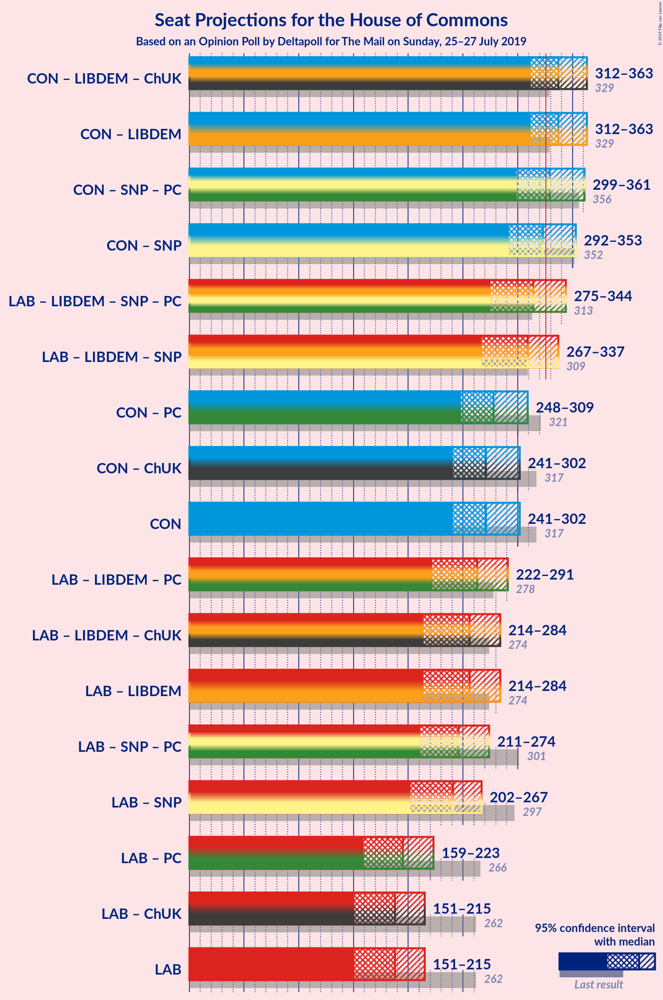
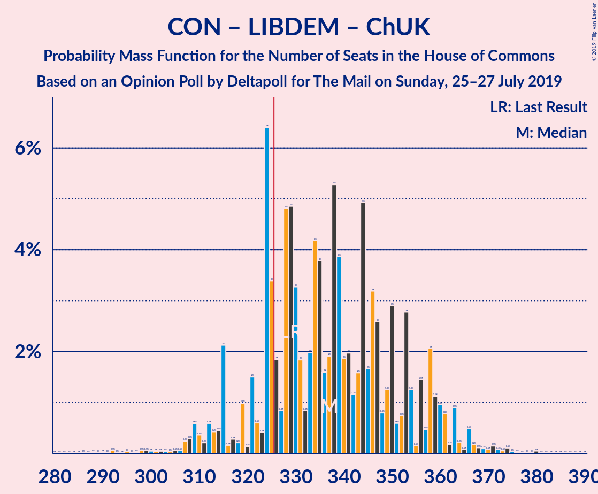
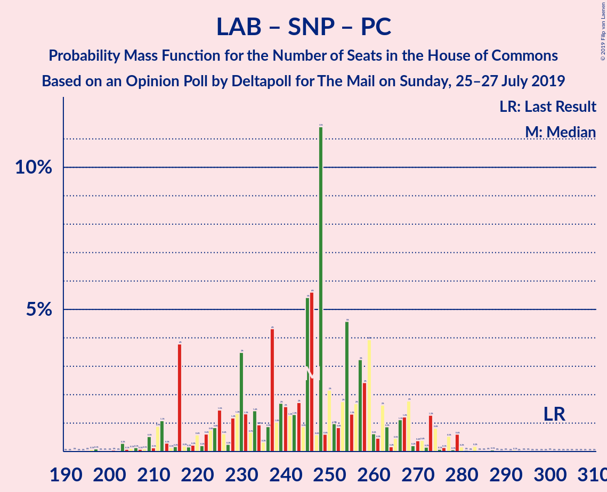

# Opinion Poll by Deltapoll for The Mail on Sunday, 25–27 July 2019

<a href="#voting-intentions">Voting Intentions</a> | <a href="#seats">Seats</a> | <a href="#coalitions">Coalitions</a> | <a href="#technical-information">Technical Information</a>

## Voting Intentions

### Confidence Intervals

| Party | Last Result | Poll Result | 80% Confidence Interval | 90% Confidence Interval | 95% Confidence Interval | 99% Confidence Interval |
|:-----:|:-----------:|:-----------:|:-----------------------:|:-----------------------:|:-----------------------:|:-----------------------:|
| Conservative Party | 42.4% | 30.0% | 28.7–31.3% |28.3–31.7% |28.0–32.0% |27.4–32.7% |
| Labour Party | 40.0% | 25.0% | 23.8–26.3% |23.4–26.6% |23.1–26.9% |22.6–27.6% |
| Liberal Democrats | 7.4% | 18.0% | 16.9–19.1% |16.6–19.5% |16.4–19.7% |15.9–20.3% |
| Brexit Party | 0.0% | 14.0% | 13.0–15.0% |12.8–15.3% |12.5–15.6% |12.1–16.1% |
| Scottish National Party | 3.0% | 4.0% | 3.5–4.6% |3.3–4.8% |3.2–5.0% |3.0–5.3% |
| Green Party | 1.6% | 4.0% | 3.5–4.6% |3.3–4.8% |3.2–5.0% |3.0–5.3% |
| Change UK | 0.0% | 2.0% | 1.6–2.5% |1.6–2.6% |1.5–2.7% |1.3–3.0% |
| Plaid Cymru | 0.5% | 1.0% | 0.8–1.4% |0.7–1.5% |0.6–1.5% |0.5–1.7% |
| UK Independence Party | 1.8% | 1.0% | 0.8–1.4% |0.7–1.5% |0.6–1.5% |0.5–1.7% |

*Note:* The poll result column reflects the actual value used in the calculations. Published results may vary slightly, and in addition be rounded to fewer digits.

## Seats

### Confidence Intervals

| Party | Last Result | Median | 80% Confidence Interval | 90% Confidence Interval | 95% Confidence Interval | 99% Confidence Interval |
|:-----:|:-----------:|:------:|:-----------------------:|:-----------------------:|:-----------------------:|:-----------------------:|
| <a href="#conservative-party">Conservative Party</a> | 317 | 275 | 253–285 |252–290 |246–293 |231–302 |
| <a href="#labour-party">Labour Party</a> | 262 | 188 | 167–199 |156–213 |153–213 |150–225 |
| <a href="#liberal-democrats">Liberal Democrats</a> | 12 | 63 | 63–72 |62–73 |58–74 |58–77 |
| <a href="#brexit-party">Brexit Party</a> | 0 | 44 | 38–56 |32–64 |31–68 |29–82 |
| <a href="#scottish-national-party">Scottish National Party</a> | 35 | 53 | 51–53 |49–54 |49–54 |46–54 |
| <a href="#green-party">Green Party</a> | 1 | 2 | 2 |1–2 |1–3 |1–3 |
| <a href="#change-uk">Change UK</a> | 0 | 0 | 0 |0 |0 |0 |
| <a href="#plaid-cymru">Plaid Cymru</a> | 4 | 7 | 4–7 |4–10 |4–11 |4–12 |
| <a href="#uk-independence-party">UK Independence Party</a> | 0 | 0 | 0 |0 |0 |0 |

### Conservative Party

*For a full overview of the results for this party, see the [Conservative Party](party-conservativeparty.html) page.*

| Number of Seats | Probability | Accumulated | Special Marks |
|:---------------:|:-----------:|:-----------:|:-------------:|
| 217 | 0.1% | 100% |  |
| 218 | 0% | 99.9% |  |
| 219 | 0% | 99.9% |  |
| 220 | 0% | 99.9% |  |
| 221 | 0% | 99.9% |  |
| 222 | 0% | 99.9% |  |
| 223 | 0% | 99.9% |  |
| 224 | 0% | 99.9% |  |
| 225 | 0% | 99.9% |  |
| 226 | 0% | 99.9% |  |
| 227 | 0% | 99.9% |  |
| 228 | 0% | 99.9% |  |
| 229 | 0% | 99.9% |  |
| 230 | 0.2% | 99.9% |  |
| 231 | 0.3% | 99.7% |  |
| 232 | 0% | 99.5% |  |
| 233 | 0.3% | 99.5% |  |
| 234 | 0% | 99.1% |  |
| 235 | 0.6% | 99.1% |  |
| 236 | 0% | 98.6% |  |
| 237 | 0% | 98.5% |  |
| 238 | 0% | 98.5% |  |
| 239 | 0.1% | 98.5% |  |
| 240 | 0% | 98% |  |
| 241 | 0% | 98% |  |
| 242 | 0% | 98% |  |
| 243 | 0.3% | 98% |  |
| 244 | 0% | 98% |  |
| 245 | 0% | 98% |  |
| 246 | 2% | 98% |  |
| 247 | 0% | 96% |  |
| 248 | 0.3% | 96% |  |
| 249 | 0.2% | 96% |  |
| 250 | 0% | 96% |  |
| 251 | 0% | 96% |  |
| 252 | 5% | 96% |  |
| 253 | 0.3% | 90% |  |
| 254 | 0.1% | 90% |  |
| 255 | 0% | 90% |  |
| 256 | 0% | 90% |  |
| 257 | 0.2% | 90% |  |
| 258 | 1.0% | 90% |  |
| 259 | 0.5% | 89% |  |
| 260 | 3% | 88% |  |
| 261 | 1.0% | 85% |  |
| 262 | 0% | 84% |  |
| 263 | 1.2% | 84% |  |
| 264 | 3% | 83% |  |
| 265 | 0.4% | 79% |  |
| 266 | 3% | 79% |  |
| 267 | 0.3% | 76% |  |
| 268 | 0% | 76% |  |
| 269 | 0% | 76% |  |
| 270 | 0% | 76% |  |
| 271 | 1.1% | 76% |  |
| 272 | 0% | 75% |  |
| 273 | 2% | 75% |  |
| 274 | 1.1% | 72% |  |
| 275 | 56% | 71% | Median |
| 276 | 0% | 15% |  |
| 277 | 1.1% | 15% |  |
| 278 | 0.2% | 14% |  |
| 279 | 0.3% | 13% |  |
| 280 | 0.1% | 13% |  |
| 281 | 0.4% | 13% |  |
| 282 | 0.1% | 13% |  |
| 283 | 0.6% | 13% |  |
| 284 | 2% | 12% |  |
| 285 | 1.4% | 10% |  |
| 286 | 0.2% | 9% |  |
| 287 | 0.1% | 8% |  |
| 288 | 0% | 8% |  |
| 289 | 0% | 8% |  |
| 290 | 5% | 8% |  |
| 291 | 0% | 3% |  |
| 292 | 0% | 3% |  |
| 293 | 0.3% | 3% |  |
| 294 | 0.3% | 2% |  |
| 295 | 0.5% | 2% |  |
| 296 | 0.1% | 2% |  |
| 297 | 0.6% | 2% |  |
| 298 | 0% | 0.9% |  |
| 299 | 0% | 0.9% |  |
| 300 | 0% | 0.9% |  |
| 301 | 0.1% | 0.9% |  |
| 302 | 0.3% | 0.8% |  |
| 303 | 0% | 0.5% |  |
| 304 | 0.3% | 0.5% |  |
| 305 | 0% | 0.2% |  |
| 306 | 0% | 0.2% |  |
| 307 | 0% | 0.2% |  |
| 308 | 0% | 0.2% |  |
| 309 | 0% | 0.2% |  |
| 310 | 0% | 0.1% |  |
| 311 | 0% | 0.1% |  |
| 312 | 0% | 0.1% |  |
| 313 | 0% | 0.1% |  |
| 314 | 0% | 0.1% |  |
| 315 | 0.1% | 0.1% |  |
| 316 | 0% | 0% |  |
| 317 | 0% | 0% | Last Result |

### Labour Party

*For a full overview of the results for this party, see the [Labour Party](party-labourparty.html) page.*

| Number of Seats | Probability | Accumulated | Special Marks |
|:---------------:|:-----------:|:-----------:|:-------------:|
| 133 | 0% | 100% |  |
| 134 | 0% | 99.9% |  |
| 135 | 0% | 99.9% |  |
| 136 | 0% | 99.9% |  |
| 137 | 0% | 99.9% |  |
| 138 | 0% | 99.9% |  |
| 139 | 0% | 99.9% |  |
| 140 | 0.1% | 99.9% |  |
| 141 | 0% | 99.9% |  |
| 142 | 0% | 99.8% |  |
| 143 | 0% | 99.8% |  |
| 144 | 0% | 99.8% |  |
| 145 | 0% | 99.8% |  |
| 146 | 0% | 99.8% |  |
| 147 | 0% | 99.8% |  |
| 148 | 0% | 99.8% |  |
| 149 | 0.1% | 99.8% |  |
| 150 | 0.3% | 99.7% |  |
| 151 | 0.5% | 99.4% |  |
| 152 | 0% | 98.9% |  |
| 153 | 3% | 98.9% |  |
| 154 | 0.2% | 95% |  |
| 155 | 0% | 95% |  |
| 156 | 0.3% | 95% |  |
| 157 | 0.3% | 95% |  |
| 158 | 0% | 95% |  |
| 159 | 0.1% | 95% |  |
| 160 | 0% | 94% |  |
| 161 | 0% | 94% |  |
| 162 | 2% | 94% |  |
| 163 | 2% | 93% |  |
| 164 | 0.2% | 91% |  |
| 165 | 0.1% | 91% |  |
| 166 | 0% | 91% |  |
| 167 | 2% | 91% |  |
| 168 | 0.1% | 89% |  |
| 169 | 0% | 89% |  |
| 170 | 0% | 89% |  |
| 171 | 1.2% | 89% |  |
| 172 | 0% | 88% |  |
| 173 | 0.7% | 88% |  |
| 174 | 2% | 87% |  |
| 175 | 0.3% | 85% |  |
| 176 | 0.2% | 85% |  |
| 177 | 0.1% | 84% |  |
| 178 | 0.2% | 84% |  |
| 179 | 0.3% | 84% |  |
| 180 | 0.1% | 84% |  |
| 181 | 0.1% | 84% |  |
| 182 | 2% | 84% |  |
| 183 | 0% | 81% |  |
| 184 | 1.3% | 81% |  |
| 185 | 0% | 80% |  |
| 186 | 0.6% | 80% |  |
| 187 | 0% | 79% |  |
| 188 | 56% | 79% | Median |
| 189 | 0.8% | 23% |  |
| 190 | 0% | 22% |  |
| 191 | 0% | 22% |  |
| 192 | 1.1% | 22% |  |
| 193 | 9% | 21% |  |
| 194 | 0.1% | 13% |  |
| 195 | 0.3% | 13% |  |
| 196 | 0.2% | 12% |  |
| 197 | 1.4% | 12% |  |
| 198 | 0.1% | 11% |  |
| 199 | 0.7% | 11% |  |
| 200 | 0% | 10% |  |
| 201 | 0.3% | 10% |  |
| 202 | 0% | 10% |  |
| 203 | 2% | 10% |  |
| 204 | 0.3% | 8% |  |
| 205 | 0.2% | 8% |  |
| 206 | 0% | 7% |  |
| 207 | 0% | 7% |  |
| 208 | 0% | 7% |  |
| 209 | 0.8% | 7% |  |
| 210 | 0% | 6% |  |
| 211 | 0.3% | 6% |  |
| 212 | 1.0% | 6% |  |
| 213 | 3% | 5% |  |
| 214 | 0% | 2% |  |
| 215 | 0% | 2% |  |
| 216 | 0% | 2% |  |
| 217 | 0% | 2% |  |
| 218 | 0% | 2% |  |
| 219 | 0% | 2% |  |
| 220 | 0% | 2% |  |
| 221 | 0.4% | 2% |  |
| 222 | 0% | 2% |  |
| 223 | 0% | 2% |  |
| 224 | 0% | 2% |  |
| 225 | 2% | 2% |  |
| 226 | 0.1% | 0.2% |  |
| 227 | 0% | 0.2% |  |
| 228 | 0% | 0.1% |  |
| 229 | 0% | 0.1% |  |
| 230 | 0% | 0.1% |  |
| 231 | 0% | 0.1% |  |
| 232 | 0% | 0.1% |  |
| 233 | 0% | 0.1% |  |
| 234 | 0% | 0.1% |  |
| 235 | 0% | 0.1% |  |
| 236 | 0% | 0.1% |  |
| 237 | 0% | 0.1% |  |
| 238 | 0% | 0.1% |  |
| 239 | 0% | 0.1% |  |
| 240 | 0% | 0.1% |  |
| 241 | 0% | 0.1% |  |
| 242 | 0% | 0.1% |  |
| 243 | 0% | 0.1% |  |
| 244 | 0% | 0% |  |
| 245 | 0% | 0% |  |
| 246 | 0% | 0% |  |
| 247 | 0% | 0% |  |
| 248 | 0% | 0% |  |
| 249 | 0% | 0% |  |
| 250 | 0% | 0% |  |
| 251 | 0% | 0% |  |
| 252 | 0% | 0% |  |
| 253 | 0% | 0% |  |
| 254 | 0% | 0% |  |
| 255 | 0% | 0% |  |
| 256 | 0% | 0% |  |
| 257 | 0% | 0% |  |
| 258 | 0% | 0% |  |
| 259 | 0% | 0% |  |
| 260 | 0% | 0% |  |
| 261 | 0% | 0% |  |
| 262 | 0% | 0% | Last Result |

### Liberal Democrats

*For a full overview of the results for this party, see the [Liberal Democrats](party-liberaldemocrats.html) page.*

| Number of Seats | Probability | Accumulated | Special Marks |
|:---------------:|:-----------:|:-----------:|:-------------:|
| 12 | 0% | 100% | Last Result |
| 13 | 0% | 100% |  |
| 14 | 0% | 100% |  |
| 15 | 0% | 100% |  |
| 16 | 0% | 100% |  |
| 17 | 0% | 100% |  |
| 18 | 0% | 100% |  |
| 19 | 0% | 100% |  |
| 20 | 0% | 100% |  |
| 21 | 0% | 100% |  |
| 22 | 0% | 100% |  |
| 23 | 0% | 100% |  |
| 24 | 0% | 100% |  |
| 25 | 0% | 100% |  |
| 26 | 0% | 100% |  |
| 27 | 0% | 100% |  |
| 28 | 0% | 100% |  |
| 29 | 0% | 100% |  |
| 30 | 0% | 100% |  |
| 31 | 0% | 100% |  |
| 32 | 0% | 100% |  |
| 33 | 0% | 100% |  |
| 34 | 0% | 100% |  |
| 35 | 0% | 100% |  |
| 36 | 0% | 100% |  |
| 37 | 0% | 100% |  |
| 38 | 0% | 100% |  |
| 39 | 0% | 100% |  |
| 40 | 0% | 100% |  |
| 41 | 0% | 100% |  |
| 42 | 0% | 100% |  |
| 43 | 0% | 100% |  |
| 44 | 0% | 100% |  |
| 45 | 0% | 100% |  |
| 46 | 0% | 100% |  |
| 47 | 0% | 100% |  |
| 48 | 0% | 100% |  |
| 49 | 0% | 100% |  |
| 50 | 0% | 100% |  |
| 51 | 0% | 100% |  |
| 52 | 0% | 100% |  |
| 53 | 0% | 100% |  |
| 54 | 0.1% | 100% |  |
| 55 | 0% | 99.9% |  |
| 56 | 0% | 99.9% |  |
| 57 | 0.2% | 99.9% |  |
| 58 | 3% | 99.7% |  |
| 59 | 0.7% | 97% |  |
| 60 | 0.1% | 96% |  |
| 61 | 0.3% | 96% |  |
| 62 | 2% | 96% |  |
| 63 | 60% | 94% | Median |
| 64 | 2% | 35% |  |
| 65 | 2% | 32% |  |
| 66 | 6% | 31% |  |
| 67 | 4% | 25% |  |
| 68 | 5% | 21% |  |
| 69 | 1.3% | 16% |  |
| 70 | 2% | 15% |  |
| 71 | 2% | 12% |  |
| 72 | 1.5% | 10% |  |
| 73 | 6% | 9% |  |
| 74 | 0.5% | 3% |  |
| 75 | 2% | 2% |  |
| 76 | 0.2% | 0.7% |  |
| 77 | 0.2% | 0.6% |  |
| 78 | 0.1% | 0.3% |  |
| 79 | 0% | 0.2% |  |
| 80 | 0% | 0.2% |  |
| 81 | 0.2% | 0.2% |  |
| 82 | 0% | 0% |  |

### Brexit Party

*For a full overview of the results for this party, see the [Brexit Party](party-brexitparty.html) page.*

| Number of Seats | Probability | Accumulated | Special Marks |
|:---------------:|:-----------:|:-----------:|:-------------:|
| 0 | 0% | 100% | Last Result |
| 1 | 0% | 100% |  |
| 2 | 0% | 100% |  |
| 3 | 0% | 100% |  |
| 4 | 0% | 100% |  |
| 5 | 0% | 100% |  |
| 6 | 0% | 100% |  |
| 7 | 0% | 100% |  |
| 8 | 0% | 100% |  |
| 9 | 0% | 100% |  |
| 10 | 0% | 100% |  |
| 11 | 0% | 100% |  |
| 12 | 0% | 100% |  |
| 13 | 0% | 100% |  |
| 14 | 0% | 100% |  |
| 15 | 0% | 100% |  |
| 16 | 0% | 100% |  |
| 17 | 0% | 100% |  |
| 18 | 0% | 100% |  |
| 19 | 0% | 100% |  |
| 20 | 0% | 100% |  |
| 21 | 0% | 100% |  |
| 22 | 0% | 100% |  |
| 23 | 0% | 100% |  |
| 24 | 0% | 100% |  |
| 25 | 0% | 100% |  |
| 26 | 0.1% | 100% |  |
| 27 | 0% | 99.8% |  |
| 28 | 0.1% | 99.8% |  |
| 29 | 0.3% | 99.7% |  |
| 30 | 0.1% | 99.4% |  |
| 31 | 3% | 99.3% |  |
| 32 | 1.3% | 96% |  |
| 33 | 0% | 95% |  |
| 34 | 1.0% | 95% |  |
| 35 | 0% | 94% |  |
| 36 | 0.1% | 94% |  |
| 37 | 0.4% | 94% |  |
| 38 | 4% | 93% |  |
| 39 | 1.5% | 89% |  |
| 40 | 0% | 88% |  |
| 41 | 0.6% | 88% |  |
| 42 | 0.4% | 87% |  |
| 43 | 2% | 87% |  |
| 44 | 58% | 85% | Median |
| 45 | 0.3% | 27% |  |
| 46 | 0.4% | 27% |  |
| 47 | 0.5% | 26% |  |
| 48 | 0.1% | 26% |  |
| 49 | 3% | 26% |  |
| 50 | 0.3% | 23% |  |
| 51 | 0.7% | 23% |  |
| 52 | 2% | 22% |  |
| 53 | 0.3% | 20% |  |
| 54 | 8% | 20% |  |
| 55 | 1.3% | 12% |  |
| 56 | 2% | 11% |  |
| 57 | 0.3% | 9% |  |
| 58 | 0.1% | 9% |  |
| 59 | 0.1% | 9% |  |
| 60 | 0.3% | 9% |  |
| 61 | 0.1% | 8% |  |
| 62 | 0% | 8% |  |
| 63 | 0% | 8% |  |
| 64 | 3% | 8% |  |
| 65 | 1.1% | 5% |  |
| 66 | 0.6% | 4% |  |
| 67 | 0.3% | 3% |  |
| 68 | 1.4% | 3% |  |
| 69 | 0.2% | 1.2% |  |
| 70 | 0% | 1.1% |  |
| 71 | 0% | 1.1% |  |
| 72 | 0% | 1.1% |  |
| 73 | 0% | 1.0% |  |
| 74 | 0% | 1.0% |  |
| 75 | 0% | 1.0% |  |
| 76 | 0% | 1.0% |  |
| 77 | 0% | 1.0% |  |
| 78 | 0.1% | 1.0% |  |
| 79 | 0% | 0.8% |  |
| 80 | 0.2% | 0.8% |  |
| 81 | 0% | 0.7% |  |
| 82 | 0.6% | 0.7% |  |
| 83 | 0% | 0% |  |

### Scottish National Party

*For a full overview of the results for this party, see the [Scottish National Party](party-scottishnationalparty.html) page.*

| Number of Seats | Probability | Accumulated | Special Marks |
|:---------------:|:-----------:|:-----------:|:-------------:|
| 35 | 0% | 100% | Last Result |
| 36 | 0% | 100% |  |
| 37 | 0% | 100% |  |
| 38 | 0% | 100% |  |
| 39 | 0% | 100% |  |
| 40 | 0% | 100% |  |
| 41 | 0% | 100% |  |
| 42 | 0% | 100% |  |
| 43 | 0% | 100% |  |
| 44 | 0% | 100% |  |
| 45 | 0.2% | 100% |  |
| 46 | 0.5% | 99.8% |  |
| 47 | 0% | 99.3% |  |
| 48 | 1.1% | 99.3% |  |
| 49 | 8% | 98% |  |
| 50 | 0% | 91% |  |
| 51 | 7% | 90% |  |
| 52 | 0.7% | 84% |  |
| 53 | 75% | 83% | Median |
| 54 | 8% | 8% |  |
| 55 | 0% | 0% |  |

### Green Party

*For a full overview of the results for this party, see the [Green Party](party-greenparty.html) page.*

| Number of Seats | Probability | Accumulated | Special Marks |
|:---------------:|:-----------:|:-----------:|:-------------:|
| 1 | 7% | 100% | Last Result |
| 2 | 88% | 93% | Median |
| 3 | 5% | 5% |  |
| 4 | 0% | 0% |  |

### Change UK

*For a full overview of the results for this party, see the [Change UK](party-changeuk.html) page.*

| Number of Seats | Probability | Accumulated | Special Marks |
|:---------------:|:-----------:|:-----------:|:-------------:|
| 0 | 100% | 100% | Last Result, Median |

### Plaid Cymru

*For a full overview of the results for this party, see the [Plaid Cymru](party-plaidcymru.html) page.*

| Number of Seats | Probability | Accumulated | Special Marks |
|:---------------:|:-----------:|:-----------:|:-------------:|
| 4 | 17% | 100% | Last Result |
| 5 | 0.3% | 82% |  |
| 6 | 0.4% | 82% |  |
| 7 | 75% | 82% | Median |
| 8 | 0.1% | 7% |  |
| 9 | 0.4% | 7% |  |
| 10 | 4% | 7% |  |
| 11 | 0.9% | 3% |  |
| 12 | 2% | 2% |  |
| 13 | 0.4% | 0.5% |  |
| 14 | 0% | 0.1% |  |
| 15 | 0% | 0% |  |

### UK Independence Party

*For a full overview of the results for this party, see the [UK Independence Party](party-ukindependenceparty.html) page.*

| Number of Seats | Probability | Accumulated | Special Marks |
|:---------------:|:-----------:|:-----------:|:-------------:|
| 0 | 100% | 100% | Last Result, Median |

## Coalitions

### Confidence Intervals

| Coalition | Last Result | Median | Majority? | 80% Confidence Interval | 90% Confidence Interval | 95% Confidence Interval | 99% Confidence Interval |
|:---------:|:-----------:|:------:|:---------:|:-----------------------:|:-----------------------:|:-----------------------:|:-----------------------:|
| Conservative Party – Liberal Democrats – Change UK | 329 | 338 | 88% | 325–350 | 323–356 | 314–360 | 307–366 |
| Conservative Party – Liberal Democrats | 329 | 338 | 88% | 325–350 | 323–356 | 314–360 | 307–366 |
| Conservative Party – Scottish National Party – Plaid Cymru | 356 | 335 | 77% | 312–345 | 309–346 | 304–354 | 288–362 |
| Conservative Party – Scottish National Party | 352 | 328 | 73% | 306–338 | 305–339 | 297–344 | 284–355 |
| Labour Party – Liberal Democrats – Scottish National Party – Plaid Cymru | 313 | 311 | 11% | 294–326 | 281–338 | 275–340 | 270–353 |
| Labour Party – Liberal Democrats – Scottish National Party | 309 | 304 | 7% | 286–322 | 275–334 | 268–334 | 266–347 |
| Conservative Party – Plaid Cymru | 321 | 282 | 0% | 260–291 | 256–297 | 253–300 | 237–309 |
| Conservative Party – Change UK | 317 | 275 | 0% | 253–285 | 252–290 | 246–293 | 231–302 |
| Conservative Party | 317 | 275 | 0% | 253–285 | 252–290 | 246–293 | 231–302 |
| Labour Party – Liberal Democrats – Plaid Cymru | 278 | 258 | 0% | 240–276 | 228–285 | 226–287 | 219–300 |
| Labour Party – Liberal Democrats – Change UK | 274 | 251 | 0% | 233–271 | 222–281 | 219–281 | 215–296 |
| Labour Party – Liberal Democrats | 274 | 251 | 0% | 233–271 | 222–281 | 219–281 | 215–296 |
| Labour Party – Scottish National Party – Plaid Cymru | 301 | 248 | 0% | 228–258 | 212–270 | 209–272 | 209–283 |
| Labour Party – Scottish National Party | 297 | 241 | 0% | 221–252 | 207–266 | 202–266 | 202–276 |
| Labour Party – Plaid Cymru | 266 | 195 | 0% | 174–207 | 163–217 | 160–219 | 155–232 |
| Labour Party – Change UK | 262 | 188 | 0% | 167–199 | 156–213 | 153–213 | 150–225 |
| Labour Party | 262 | 188 | 0% | 167–199 | 156–213 | 153–213 | 150–225 |

### Conservative Party – Liberal Democrats – Change UK

| Number of Seats | Probability | Accumulated | Special Marks |
|:---------------:|:-----------:|:-----------:|:-------------:|
| 289 | 0.1% | 100% |  |
| 290 | 0% | 99.9% |  |
| 291 | 0% | 99.9% |  |
| 292 | 0% | 99.9% |  |
| 293 | 0% | 99.9% |  |
| 294 | 0% | 99.9% |  |
| 295 | 0% | 99.9% |  |
| 296 | 0% | 99.9% |  |
| 297 | 0% | 99.9% |  |
| 298 | 0% | 99.9% |  |
| 299 | 0.1% | 99.9% |  |
| 300 | 0% | 99.8% |  |
| 301 | 0% | 99.7% |  |
| 302 | 0.2% | 99.7% |  |
| 303 | 0% | 99.6% |  |
| 304 | 0% | 99.6% |  |
| 305 | 0% | 99.5% |  |
| 306 | 0% | 99.5% |  |
| 307 | 0.6% | 99.5% |  |
| 308 | 0.3% | 99.0% |  |
| 309 | 0% | 98.6% |  |
| 310 | 0% | 98.6% |  |
| 311 | 0.1% | 98.6% |  |
| 312 | 0.1% | 98.5% |  |
| 313 | 0% | 98% |  |
| 314 | 1.3% | 98% |  |
| 315 | 1.1% | 97% |  |
| 316 | 0% | 96% |  |
| 317 | 0% | 96% |  |
| 318 | 0% | 96% |  |
| 319 | 0.2% | 96% |  |
| 320 | 0% | 96% |  |
| 321 | 0.1% | 96% |  |
| 322 | 0.3% | 96% |  |
| 323 | 0.6% | 95% |  |
| 324 | 0.9% | 95% |  |
| 325 | 6% | 94% |  |
| 326 | 0.6% | 88% | Majority |
| 327 | 3% | 87% |  |
| 328 | 3% | 84% |  |
| 329 | 0.2% | 82% | Last Result |
| 330 | 1.3% | 82% |  |
| 331 | 0.4% | 80% |  |
| 332 | 0.2% | 80% |  |
| 333 | 2% | 80% |  |
| 334 | 0.1% | 77% |  |
| 335 | 0.1% | 77% |  |
| 336 | 2% | 77% |  |
| 337 | 2% | 75% |  |
| 338 | 56% | 73% | Median |
| 339 | 0.4% | 17% |  |
| 340 | 0.1% | 17% |  |
| 341 | 0.2% | 17% |  |
| 342 | 2% | 16% |  |
| 343 | 0.1% | 15% |  |
| 344 | 0.4% | 14% |  |
| 345 | 0.1% | 14% |  |
| 346 | 0.5% | 14% |  |
| 347 | 0.1% | 13% |  |
| 348 | 2% | 13% |  |
| 349 | 1.3% | 11% |  |
| 350 | 2% | 10% |  |
| 351 | 0.1% | 8% |  |
| 352 | 0% | 8% |  |
| 353 | 0.1% | 8% |  |
| 354 | 0% | 8% |  |
| 355 | 0.1% | 8% |  |
| 356 | 5% | 8% |  |
| 357 | 0.1% | 3% |  |
| 358 | 0% | 3% |  |
| 359 | 0.1% | 3% |  |
| 360 | 0.3% | 3% |  |
| 361 | 0.5% | 2% |  |
| 362 | 0.8% | 2% |  |
| 363 | 0% | 1.2% |  |
| 364 | 0.3% | 1.2% |  |
| 365 | 0.1% | 0.9% |  |
| 366 | 0.5% | 0.8% |  |
| 367 | 0% | 0.3% |  |
| 368 | 0% | 0.2% |  |
| 369 | 0% | 0.2% |  |
| 370 | 0% | 0.2% |  |
| 371 | 0% | 0.2% |  |
| 372 | 0% | 0.2% |  |
| 373 | 0.1% | 0.2% |  |
| 374 | 0% | 0.1% |  |
| 375 | 0.1% | 0.1% |  |
| 376 | 0% | 0% |  |

### Conservative Party – Liberal Democrats

| Number of Seats | Probability | Accumulated | Special Marks |
|:---------------:|:-----------:|:-----------:|:-------------:|
| 289 | 0.1% | 100% |  |
| 290 | 0% | 99.9% |  |
| 291 | 0% | 99.9% |  |
| 292 | 0% | 99.9% |  |
| 293 | 0% | 99.9% |  |
| 294 | 0% | 99.9% |  |
| 295 | 0% | 99.9% |  |
| 296 | 0% | 99.9% |  |
| 297 | 0% | 99.9% |  |
| 298 | 0% | 99.9% |  |
| 299 | 0.1% | 99.9% |  |
| 300 | 0% | 99.8% |  |
| 301 | 0% | 99.7% |  |
| 302 | 0.2% | 99.7% |  |
| 303 | 0% | 99.6% |  |
| 304 | 0% | 99.6% |  |
| 305 | 0% | 99.5% |  |
| 306 | 0% | 99.5% |  |
| 307 | 0.6% | 99.5% |  |
| 308 | 0.3% | 99.0% |  |
| 309 | 0% | 98.6% |  |
| 310 | 0% | 98.6% |  |
| 311 | 0.1% | 98.6% |  |
| 312 | 0.1% | 98.5% |  |
| 313 | 0% | 98% |  |
| 314 | 1.3% | 98% |  |
| 315 | 1.1% | 97% |  |
| 316 | 0% | 96% |  |
| 317 | 0% | 96% |  |
| 318 | 0% | 96% |  |
| 319 | 0.2% | 96% |  |
| 320 | 0% | 96% |  |
| 321 | 0.1% | 96% |  |
| 322 | 0.3% | 96% |  |
| 323 | 0.6% | 95% |  |
| 324 | 0.9% | 95% |  |
| 325 | 6% | 94% |  |
| 326 | 0.6% | 88% | Majority |
| 327 | 3% | 87% |  |
| 328 | 3% | 84% |  |
| 329 | 0.2% | 82% | Last Result |
| 330 | 1.3% | 82% |  |
| 331 | 0.4% | 80% |  |
| 332 | 0.2% | 80% |  |
| 333 | 2% | 80% |  |
| 334 | 0.1% | 77% |  |
| 335 | 0.1% | 77% |  |
| 336 | 2% | 77% |  |
| 337 | 2% | 75% |  |
| 338 | 56% | 73% | Median |
| 339 | 0.4% | 17% |  |
| 340 | 0.1% | 17% |  |
| 341 | 0.2% | 17% |  |
| 342 | 2% | 16% |  |
| 343 | 0.1% | 15% |  |
| 344 | 0.4% | 14% |  |
| 345 | 0.1% | 14% |  |
| 346 | 0.5% | 14% |  |
| 347 | 0.1% | 13% |  |
| 348 | 2% | 13% |  |
| 349 | 1.3% | 11% |  |
| 350 | 2% | 10% |  |
| 351 | 0.1% | 8% |  |
| 352 | 0% | 8% |  |
| 353 | 0.1% | 8% |  |
| 354 | 0% | 8% |  |
| 355 | 0.1% | 8% |  |
| 356 | 5% | 8% |  |
| 357 | 0.1% | 3% |  |
| 358 | 0% | 3% |  |
| 359 | 0.1% | 3% |  |
| 360 | 0.3% | 3% |  |
| 361 | 0.5% | 2% |  |
| 362 | 0.8% | 2% |  |
| 363 | 0% | 1.2% |  |
| 364 | 0.3% | 1.2% |  |
| 365 | 0.1% | 0.9% |  |
| 366 | 0.5% | 0.8% |  |
| 367 | 0% | 0.3% |  |
| 368 | 0% | 0.2% |  |
| 369 | 0% | 0.2% |  |
| 370 | 0% | 0.2% |  |
| 371 | 0% | 0.2% |  |
| 372 | 0% | 0.2% |  |
| 373 | 0.1% | 0.2% |  |
| 374 | 0% | 0.1% |  |
| 375 | 0.1% | 0.1% |  |
| 376 | 0% | 0% |  |

### Conservative Party – Scottish National Party – Plaid Cymru

| Number of Seats | Probability | Accumulated | Special Marks |
|:---------------:|:-----------:|:-----------:|:-------------:|
| 274 | 0.1% | 100% |  |
| 275 | 0% | 99.9% |  |
| 276 | 0% | 99.9% |  |
| 277 | 0% | 99.9% |  |
| 278 | 0% | 99.9% |  |
| 279 | 0% | 99.9% |  |
| 280 | 0% | 99.9% |  |
| 281 | 0% | 99.9% |  |
| 282 | 0% | 99.9% |  |
| 283 | 0% | 99.9% |  |
| 284 | 0% | 99.9% |  |
| 285 | 0% | 99.9% |  |
| 286 | 0% | 99.9% |  |
| 287 | 0% | 99.9% |  |
| 288 | 0.5% | 99.9% |  |
| 289 | 0% | 99.4% |  |
| 290 | 0% | 99.4% |  |
| 291 | 0.1% | 99.4% |  |
| 292 | 0.6% | 99.3% |  |
| 293 | 0.1% | 98.7% |  |
| 294 | 0% | 98.6% |  |
| 295 | 0% | 98.6% |  |
| 296 | 0% | 98.6% |  |
| 297 | 0% | 98.6% |  |
| 298 | 0% | 98.6% |  |
| 299 | 0.1% | 98.6% |  |
| 300 | 0% | 98% |  |
| 301 | 0.3% | 98% |  |
| 302 | 0% | 98% |  |
| 303 | 0.1% | 98% |  |
| 304 | 1.3% | 98% |  |
| 305 | 0.5% | 97% |  |
| 306 | 0.2% | 96% |  |
| 307 | 0% | 96% |  |
| 308 | 0.1% | 96% |  |
| 309 | 5% | 96% |  |
| 310 | 0.1% | 91% |  |
| 311 | 0.2% | 90% |  |
| 312 | 0.3% | 90% |  |
| 313 | 0.1% | 90% |  |
| 314 | 0.1% | 90% |  |
| 315 | 0% | 90% |  |
| 316 | 1.0% | 90% |  |
| 317 | 3% | 89% |  |
| 318 | 0.8% | 86% |  |
| 319 | 2% | 85% |  |
| 320 | 0.6% | 83% |  |
| 321 | 0.2% | 82% |  |
| 322 | 0% | 82% |  |
| 323 | 0.4% | 82% |  |
| 324 | 4% | 82% |  |
| 325 | 0.2% | 77% |  |
| 326 | 0% | 77% | Majority |
| 327 | 0.3% | 77% |  |
| 328 | 0.2% | 77% |  |
| 329 | 1.1% | 77% |  |
| 330 | 3% | 76% |  |
| 331 | 1.0% | 73% |  |
| 332 | 0.3% | 72% |  |
| 333 | 0% | 72% |  |
| 334 | 1.1% | 72% |  |
| 335 | 57% | 70% | Median |
| 336 | 0.2% | 14% |  |
| 337 | 0% | 13% |  |
| 338 | 0.4% | 13% |  |
| 339 | 0% | 13% |  |
| 340 | 0.3% | 13% |  |
| 341 | 1.4% | 13% |  |
| 342 | 0.3% | 11% |  |
| 343 | 0.1% | 11% |  |
| 344 | 0.7% | 11% |  |
| 345 | 2% | 10% |  |
| 346 | 4% | 8% |  |
| 347 | 0% | 5% |  |
| 348 | 0.1% | 5% |  |
| 349 | 0.3% | 5% |  |
| 350 | 0% | 4% |  |
| 351 | 0% | 4% |  |
| 352 | 0.3% | 4% |  |
| 353 | 0.6% | 4% |  |
| 354 | 2% | 4% |  |
| 355 | 0% | 1.5% |  |
| 356 | 0.5% | 1.5% | Last Result |
| 357 | 0% | 0.9% |  |
| 358 | 0% | 0.9% |  |
| 359 | 0.4% | 0.9% |  |
| 360 | 0% | 0.5% |  |
| 361 | 0% | 0.5% |  |
| 362 | 0.2% | 0.5% |  |
| 363 | 0% | 0.3% |  |
| 364 | 0% | 0.3% |  |
| 365 | 0% | 0.3% |  |
| 366 | 0.1% | 0.3% |  |
| 367 | 0% | 0.2% |  |
| 368 | 0% | 0.2% |  |
| 369 | 0% | 0.1% |  |
| 370 | 0% | 0.1% |  |
| 371 | 0% | 0.1% |  |
| 372 | 0% | 0.1% |  |
| 373 | 0% | 0.1% |  |
| 374 | 0% | 0.1% |  |
| 375 | 0% | 0.1% |  |
| 376 | 0.1% | 0.1% |  |
| 377 | 0% | 0% |  |

### Conservative Party – Scottish National Party

| Number of Seats | Probability | Accumulated | Special Marks |
|:---------------:|:-----------:|:-----------:|:-------------:|
| 270 | 0.1% | 100% |  |
| 271 | 0% | 99.9% |  |
| 272 | 0% | 99.9% |  |
| 273 | 0% | 99.9% |  |
| 274 | 0% | 99.9% |  |
| 275 | 0% | 99.9% |  |
| 276 | 0% | 99.9% |  |
| 277 | 0% | 99.9% |  |
| 278 | 0% | 99.9% |  |
| 279 | 0% | 99.9% |  |
| 280 | 0% | 99.9% |  |
| 281 | 0% | 99.9% |  |
| 282 | 0.2% | 99.9% |  |
| 283 | 0.1% | 99.7% |  |
| 284 | 0.5% | 99.6% |  |
| 285 | 0% | 99.1% |  |
| 286 | 0% | 99.1% |  |
| 287 | 0% | 99.1% |  |
| 288 | 0.6% | 99.1% |  |
| 289 | 0% | 98.6% |  |
| 290 | 0% | 98.5% |  |
| 291 | 0% | 98.5% |  |
| 292 | 0.1% | 98.5% |  |
| 293 | 0% | 98% |  |
| 294 | 0.3% | 98% |  |
| 295 | 0% | 98% |  |
| 296 | 0% | 98% |  |
| 297 | 1.3% | 98% |  |
| 298 | 0.6% | 97% |  |
| 299 | 0.2% | 96% |  |
| 300 | 0% | 96% |  |
| 301 | 0.1% | 96% |  |
| 302 | 0.2% | 96% |  |
| 303 | 0% | 96% |  |
| 304 | 0% | 96% |  |
| 305 | 5% | 96% |  |
| 306 | 0.3% | 90% |  |
| 307 | 0.1% | 90% |  |
| 308 | 0% | 90% |  |
| 309 | 1.0% | 90% |  |
| 310 | 0.4% | 89% |  |
| 311 | 0.2% | 88% |  |
| 312 | 0.5% | 88% |  |
| 313 | 3% | 88% |  |
| 314 | 1.0% | 84% |  |
| 315 | 2% | 84% |  |
| 316 | 0.4% | 82% |  |
| 317 | 4% | 81% |  |
| 318 | 0% | 77% |  |
| 319 | 1.0% | 77% |  |
| 320 | 0.3% | 76% |  |
| 321 | 0.3% | 76% |  |
| 322 | 0% | 76% |  |
| 323 | 0.6% | 75% |  |
| 324 | 1.0% | 75% |  |
| 325 | 1.2% | 74% |  |
| 326 | 2% | 73% | Majority |
| 327 | 0.1% | 71% |  |
| 328 | 57% | 70% | Median |
| 329 | 0.2% | 14% |  |
| 330 | 0.1% | 13% |  |
| 331 | 0.1% | 13% |  |
| 332 | 0.2% | 13% |  |
| 333 | 0.2% | 13% |  |
| 334 | 2% | 13% |  |
| 335 | 0.4% | 11% |  |
| 336 | 0.1% | 11% |  |
| 337 | 0.7% | 11% |  |
| 338 | 2% | 10% |  |
| 339 | 3% | 8% |  |
| 340 | 0% | 5% |  |
| 341 | 0% | 5% |  |
| 342 | 0.3% | 5% |  |
| 343 | 0.1% | 4% |  |
| 344 | 2% | 4% |  |
| 345 | 0% | 2% |  |
| 346 | 0.5% | 2% |  |
| 347 | 0.2% | 2% |  |
| 348 | 0.1% | 2% |  |
| 349 | 0.6% | 2% |  |
| 350 | 0.1% | 1.0% |  |
| 351 | 0% | 0.9% |  |
| 352 | 0.1% | 0.9% | Last Result |
| 353 | 0% | 0.8% |  |
| 354 | 0% | 0.8% |  |
| 355 | 0.5% | 0.8% |  |
| 356 | 0% | 0.2% |  |
| 357 | 0% | 0.2% |  |
| 358 | 0% | 0.2% |  |
| 359 | 0% | 0.2% |  |
| 360 | 0% | 0.2% |  |
| 361 | 0% | 0.1% |  |
| 362 | 0% | 0.1% |  |
| 363 | 0% | 0.1% |  |
| 364 | 0% | 0.1% |  |
| 365 | 0% | 0.1% |  |
| 366 | 0% | 0.1% |  |
| 367 | 0% | 0.1% |  |
| 368 | 0% | 0.1% |  |
| 369 | 0.1% | 0.1% |  |
| 370 | 0% | 0% |  |

### Labour Party – Liberal Democrats – Scottish National Party – Plaid Cymru

| Number of Seats | Probability | Accumulated | Special Marks |
|:---------------:|:-----------:|:-----------:|:-------------:|
| 260 | 0% | 100% |  |
| 261 | 0.1% | 99.9% |  |
| 262 | 0% | 99.9% |  |
| 263 | 0% | 99.9% |  |
| 264 | 0% | 99.9% |  |
| 265 | 0% | 99.9% |  |
| 266 | 0% | 99.9% |  |
| 267 | 0% | 99.8% |  |
| 268 | 0% | 99.8% |  |
| 269 | 0% | 99.8% |  |
| 270 | 0.3% | 99.8% |  |
| 271 | 0% | 99.5% |  |
| 272 | 0% | 99.4% |  |
| 273 | 0% | 99.4% |  |
| 274 | 0% | 99.4% |  |
| 275 | 3% | 99.4% |  |
| 276 | 0.1% | 96% |  |
| 277 | 0.2% | 96% |  |
| 278 | 0% | 96% |  |
| 279 | 0% | 96% |  |
| 280 | 0.5% | 96% |  |
| 281 | 0.4% | 95% |  |
| 282 | 0.1% | 95% |  |
| 283 | 0% | 95% |  |
| 284 | 0% | 95% |  |
| 285 | 0.2% | 95% |  |
| 286 | 1.1% | 94% |  |
| 287 | 0.5% | 93% |  |
| 288 | 0% | 93% |  |
| 289 | 1.3% | 93% |  |
| 290 | 0% | 91% |  |
| 291 | 0.3% | 91% |  |
| 292 | 0% | 91% |  |
| 293 | 0% | 91% |  |
| 294 | 2% | 91% |  |
| 295 | 0.3% | 89% |  |
| 296 | 2% | 89% |  |
| 297 | 0.1% | 87% |  |
| 298 | 0.1% | 87% |  |
| 299 | 1.2% | 87% |  |
| 300 | 0% | 85% |  |
| 301 | 0.8% | 85% |  |
| 302 | 0% | 85% |  |
| 303 | 2% | 85% |  |
| 304 | 0.2% | 82% |  |
| 305 | 0.3% | 82% |  |
| 306 | 0.3% | 82% |  |
| 307 | 0.1% | 82% |  |
| 308 | 0% | 81% |  |
| 309 | 0.7% | 81% |  |
| 310 | 0.2% | 81% |  |
| 311 | 56% | 80% | Median |
| 312 | 0.7% | 25% |  |
| 313 | 0% | 24% | Last Result |
| 314 | 1.4% | 24% |  |
| 315 | 0.8% | 23% |  |
| 316 | 3% | 22% |  |
| 317 | 0% | 19% |  |
| 318 | 0.2% | 19% |  |
| 319 | 0.4% | 19% |  |
| 320 | 0.1% | 19% |  |
| 321 | 0% | 19% |  |
| 322 | 1.2% | 19% |  |
| 323 | 5% | 17% |  |
| 324 | 0.1% | 12% |  |
| 325 | 0.9% | 12% |  |
| 326 | 2% | 11% | Majority |
| 327 | 0% | 9% |  |
| 328 | 0.6% | 9% |  |
| 329 | 1.4% | 9% |  |
| 330 | 0.1% | 7% |  |
| 331 | 0% | 7% |  |
| 332 | 0% | 7% |  |
| 333 | 0.4% | 7% |  |
| 334 | 0.3% | 7% |  |
| 335 | 0.2% | 6% |  |
| 336 | 0.1% | 6% |  |
| 337 | 1.0% | 6% |  |
| 338 | 3% | 5% |  |
| 339 | 0% | 3% |  |
| 340 | 0.1% | 3% |  |
| 341 | 0% | 2% |  |
| 342 | 0% | 2% |  |
| 343 | 0% | 2% |  |
| 344 | 0% | 2% |  |
| 345 | 0% | 2% |  |
| 346 | 0.1% | 2% |  |
| 347 | 0% | 2% |  |
| 348 | 0% | 2% |  |
| 349 | 0% | 2% |  |
| 350 | 0% | 2% |  |
| 351 | 2% | 2% |  |
| 352 | 0% | 0.5% |  |
| 353 | 0% | 0.5% |  |
| 354 | 0% | 0.5% |  |
| 355 | 0.4% | 0.5% |  |
| 356 | 0% | 0.1% |  |
| 357 | 0% | 0.1% |  |
| 358 | 0% | 0.1% |  |
| 359 | 0% | 0.1% |  |
| 360 | 0% | 0.1% |  |
| 361 | 0% | 0.1% |  |
| 362 | 0% | 0.1% |  |
| 363 | 0% | 0.1% |  |
| 364 | 0% | 0.1% |  |
| 365 | 0% | 0.1% |  |
| 366 | 0% | 0.1% |  |
| 367 | 0% | 0.1% |  |
| 368 | 0% | 0.1% |  |
| 369 | 0% | 0.1% |  |
| 370 | 0% | 0.1% |  |
| 371 | 0% | 0.1% |  |
| 372 | 0% | 0% |  |

### Labour Party – Liberal Democrats – Scottish National Party

| Number of Seats | Probability | Accumulated | Special Marks |
|:---------------:|:-----------:|:-----------:|:-------------:|
| 250 | 0.1% | 100% |  |
| 251 | 0% | 99.9% |  |
| 252 | 0% | 99.9% |  |
| 253 | 0% | 99.9% |  |
| 254 | 0% | 99.9% |  |
| 255 | 0% | 99.9% |  |
| 256 | 0% | 99.8% |  |
| 257 | 0% | 99.8% |  |
| 258 | 0% | 99.8% |  |
| 259 | 0% | 99.8% |  |
| 260 | 0% | 99.8% |  |
| 261 | 0% | 99.8% |  |
| 262 | 0% | 99.8% |  |
| 263 | 0.1% | 99.8% |  |
| 264 | 0% | 99.7% |  |
| 265 | 0% | 99.7% |  |
| 266 | 0.3% | 99.7% |  |
| 267 | 0% | 99.4% |  |
| 268 | 3% | 99.4% |  |
| 269 | 0% | 96% |  |
| 270 | 0.1% | 96% |  |
| 271 | 0% | 96% |  |
| 272 | 0.3% | 96% |  |
| 273 | 0% | 96% |  |
| 274 | 0.5% | 96% |  |
| 275 | 0.1% | 95% |  |
| 276 | 0.5% | 95% |  |
| 277 | 0.5% | 94% |  |
| 278 | 0.2% | 94% |  |
| 279 | 1.1% | 94% |  |
| 280 | 0% | 93% |  |
| 281 | 0% | 93% |  |
| 282 | 1.3% | 93% |  |
| 283 | 0% | 91% |  |
| 284 | 0.2% | 91% |  |
| 285 | 0% | 91% |  |
| 286 | 2% | 91% |  |
| 287 | 2% | 89% |  |
| 288 | 0.2% | 87% |  |
| 289 | 0% | 87% |  |
| 290 | 0.2% | 87% |  |
| 291 | 0.1% | 87% |  |
| 292 | 1.4% | 87% |  |
| 293 | 0% | 85% |  |
| 294 | 0.6% | 85% |  |
| 295 | 0% | 85% |  |
| 296 | 0% | 85% |  |
| 297 | 0.4% | 85% |  |
| 298 | 0.3% | 84% |  |
| 299 | 2% | 84% |  |
| 300 | 0.4% | 82% |  |
| 301 | 0.1% | 81% |  |
| 302 | 0.8% | 81% |  |
| 303 | 0.1% | 80% |  |
| 304 | 56% | 80% | Median |
| 305 | 0.7% | 25% |  |
| 306 | 0.1% | 24% |  |
| 307 | 0.4% | 24% |  |
| 308 | 0.9% | 24% |  |
| 309 | 2% | 23% | Last Result |
| 310 | 1.1% | 20% |  |
| 311 | 0.1% | 19% |  |
| 312 | 0.9% | 19% |  |
| 313 | 0.9% | 18% |  |
| 314 | 0% | 17% |  |
| 315 | 0.4% | 17% |  |
| 316 | 0.2% | 17% |  |
| 317 | 0.6% | 17% |  |
| 318 | 0% | 16% |  |
| 319 | 5% | 16% |  |
| 320 | 0.1% | 11% |  |
| 321 | 0% | 10% |  |
| 322 | 2% | 10% |  |
| 323 | 0% | 9% |  |
| 324 | 0.6% | 9% |  |
| 325 | 0.8% | 8% |  |
| 326 | 0.3% | 7% | Majority |
| 327 | 0.1% | 7% |  |
| 328 | 0.3% | 7% |  |
| 329 | 0% | 6% |  |
| 330 | 1.1% | 6% |  |
| 331 | 0.2% | 5% |  |
| 332 | 0.1% | 5% |  |
| 333 | 0% | 5% |  |
| 334 | 3% | 5% |  |
| 335 | 0% | 2% |  |
| 336 | 0% | 2% |  |
| 337 | 0.2% | 2% |  |
| 338 | 0% | 2% |  |
| 339 | 0% | 2% |  |
| 340 | 0% | 2% |  |
| 341 | 0.1% | 2% |  |
| 342 | 0% | 2% |  |
| 343 | 0% | 2% |  |
| 344 | 1.3% | 2% |  |
| 345 | 0% | 0.8% |  |
| 346 | 0% | 0.8% |  |
| 347 | 0.3% | 0.8% |  |
| 348 | 0.3% | 0.5% |  |
| 349 | 0% | 0.2% |  |
| 350 | 0% | 0.2% |  |
| 351 | 0.1% | 0.2% |  |
| 352 | 0% | 0.1% |  |
| 353 | 0% | 0.1% |  |
| 354 | 0% | 0.1% |  |
| 355 | 0% | 0.1% |  |
| 356 | 0% | 0.1% |  |
| 357 | 0% | 0.1% |  |
| 358 | 0% | 0.1% |  |
| 359 | 0% | 0.1% |  |
| 360 | 0% | 0.1% |  |
| 361 | 0% | 0.1% |  |
| 362 | 0% | 0.1% |  |
| 363 | 0% | 0.1% |  |
| 364 | 0% | 0.1% |  |
| 365 | 0% | 0.1% |  |
| 366 | 0% | 0.1% |  |
| 367 | 0% | 0.1% |  |
| 368 | 0% | 0% |  |

### Conservative Party – Plaid Cymru

| Number of Seats | Probability | Accumulated | Special Marks |
|:---------------:|:-----------:|:-----------:|:-------------:|
| 221 | 0.1% | 100% |  |
| 222 | 0% | 99.9% |  |
| 223 | 0% | 99.9% |  |
| 224 | 0% | 99.9% |  |
| 225 | 0% | 99.9% |  |
| 226 | 0% | 99.9% |  |
| 227 | 0% | 99.9% |  |
| 228 | 0% | 99.9% |  |
| 229 | 0% | 99.9% |  |
| 230 | 0% | 99.9% |  |
| 231 | 0% | 99.9% |  |
| 232 | 0% | 99.9% |  |
| 233 | 0% | 99.9% |  |
| 234 | 0% | 99.9% |  |
| 235 | 0.1% | 99.9% |  |
| 236 | 0% | 99.7% |  |
| 237 | 0.3% | 99.7% |  |
| 238 | 0% | 99.4% |  |
| 239 | 0.6% | 99.4% |  |
| 240 | 0.2% | 98.8% |  |
| 241 | 0% | 98.6% |  |
| 242 | 0% | 98.6% |  |
| 243 | 0% | 98.6% |  |
| 244 | 0% | 98.6% |  |
| 245 | 0% | 98.6% |  |
| 246 | 0.1% | 98.6% |  |
| 247 | 0% | 98.5% |  |
| 248 | 0% | 98% |  |
| 249 | 0% | 98% |  |
| 250 | 0.4% | 98% |  |
| 251 | 0% | 98% |  |
| 252 | 0% | 98% |  |
| 253 | 2% | 98% |  |
| 254 | 0% | 96% |  |
| 255 | 0.1% | 96% |  |
| 256 | 5% | 96% |  |
| 257 | 0.1% | 90% |  |
| 258 | 0% | 90% |  |
| 259 | 0.3% | 90% |  |
| 260 | 0.2% | 90% |  |
| 261 | 0.1% | 90% |  |
| 262 | 0.1% | 90% |  |
| 263 | 0% | 90% |  |
| 264 | 3% | 90% |  |
| 265 | 2% | 87% |  |
| 266 | 0% | 85% |  |
| 267 | 0.6% | 85% |  |
| 268 | 0.2% | 85% |  |
| 269 | 0.1% | 84% |  |
| 270 | 3% | 84% |  |
| 271 | 4% | 81% |  |
| 272 | 0.3% | 78% |  |
| 273 | 0.1% | 77% |  |
| 274 | 0% | 77% |  |
| 275 | 0.2% | 77% |  |
| 276 | 0% | 77% |  |
| 277 | 2% | 77% |  |
| 278 | 2% | 75% |  |
| 279 | 0% | 72% |  |
| 280 | 0.1% | 72% |  |
| 281 | 1.0% | 72% |  |
| 282 | 56% | 71% | Median |
| 283 | 0.1% | 15% |  |
| 284 | 1.1% | 15% |  |
| 285 | 0.4% | 14% |  |
| 286 | 0.2% | 13% |  |
| 287 | 0% | 13% |  |
| 288 | 0.2% | 13% |  |
| 289 | 0.2% | 13% |  |
| 290 | 0.8% | 13% |  |
| 291 | 2% | 12% |  |
| 292 | 1.3% | 10% |  |
| 293 | 0.1% | 9% |  |
| 294 | 0.1% | 9% |  |
| 295 | 0% | 8% |  |
| 296 | 0% | 8% |  |
| 297 | 4% | 8% |  |
| 298 | 0.3% | 5% |  |
| 299 | 0.6% | 5% |  |
| 300 | 2% | 4% |  |
| 301 | 0.4% | 2% |  |
| 302 | 0% | 2% |  |
| 303 | 0% | 2% |  |
| 304 | 0.1% | 2% |  |
| 305 | 0% | 1.4% |  |
| 306 | 0.1% | 1.4% |  |
| 307 | 0.5% | 1.4% |  |
| 308 | 0.4% | 0.9% |  |
| 309 | 0.2% | 0.5% |  |
| 310 | 0% | 0.3% |  |
| 311 | 0% | 0.3% |  |
| 312 | 0% | 0.3% |  |
| 313 | 0.1% | 0.3% |  |
| 314 | 0% | 0.2% |  |
| 315 | 0% | 0.2% |  |
| 316 | 0% | 0.2% |  |
| 317 | 0% | 0.2% |  |
| 318 | 0% | 0.2% |  |
| 319 | 0% | 0.2% |  |
| 320 | 0% | 0.1% |  |
| 321 | 0% | 0.1% | Last Result |
| 322 | 0.1% | 0.1% |  |
| 323 | 0% | 0% |  |

### Conservative Party – Change UK

| Number of Seats | Probability | Accumulated | Special Marks |
|:---------------:|:-----------:|:-----------:|:-------------:|
| 217 | 0.1% | 100% |  |
| 218 | 0% | 99.9% |  |
| 219 | 0% | 99.9% |  |
| 220 | 0% | 99.9% |  |
| 221 | 0% | 99.9% |  |
| 222 | 0% | 99.9% |  |
| 223 | 0% | 99.9% |  |
| 224 | 0% | 99.9% |  |
| 225 | 0% | 99.9% |  |
| 226 | 0% | 99.9% |  |
| 227 | 0% | 99.9% |  |
| 228 | 0% | 99.9% |  |
| 229 | 0% | 99.9% |  |
| 230 | 0.2% | 99.9% |  |
| 231 | 0.3% | 99.7% |  |
| 232 | 0% | 99.5% |  |
| 233 | 0.3% | 99.5% |  |
| 234 | 0% | 99.1% |  |
| 235 | 0.6% | 99.1% |  |
| 236 | 0% | 98.6% |  |
| 237 | 0% | 98.5% |  |
| 238 | 0% | 98.5% |  |
| 239 | 0.1% | 98.5% |  |
| 240 | 0% | 98% |  |
| 241 | 0% | 98% |  |
| 242 | 0% | 98% |  |
| 243 | 0.3% | 98% |  |
| 244 | 0% | 98% |  |
| 245 | 0% | 98% |  |
| 246 | 2% | 98% |  |
| 247 | 0% | 96% |  |
| 248 | 0.3% | 96% |  |
| 249 | 0.2% | 96% |  |
| 250 | 0% | 96% |  |
| 251 | 0% | 96% |  |
| 252 | 5% | 96% |  |
| 253 | 0.3% | 90% |  |
| 254 | 0.1% | 90% |  |
| 255 | 0% | 90% |  |
| 256 | 0% | 90% |  |
| 257 | 0.2% | 90% |  |
| 258 | 1.0% | 90% |  |
| 259 | 0.5% | 89% |  |
| 260 | 3% | 88% |  |
| 261 | 1.0% | 85% |  |
| 262 | 0% | 84% |  |
| 263 | 1.2% | 84% |  |
| 264 | 3% | 83% |  |
| 265 | 0.4% | 79% |  |
| 266 | 3% | 79% |  |
| 267 | 0.3% | 76% |  |
| 268 | 0% | 76% |  |
| 269 | 0% | 76% |  |
| 270 | 0% | 76% |  |
| 271 | 1.1% | 76% |  |
| 272 | 0% | 75% |  |
| 273 | 2% | 75% |  |
| 274 | 1.1% | 72% |  |
| 275 | 56% | 71% | Median |
| 276 | 0% | 15% |  |
| 277 | 1.1% | 15% |  |
| 278 | 0.2% | 14% |  |
| 279 | 0.3% | 13% |  |
| 280 | 0.1% | 13% |  |
| 281 | 0.4% | 13% |  |
| 282 | 0.1% | 13% |  |
| 283 | 0.6% | 13% |  |
| 284 | 2% | 12% |  |
| 285 | 1.4% | 10% |  |
| 286 | 0.2% | 9% |  |
| 287 | 0.1% | 8% |  |
| 288 | 0% | 8% |  |
| 289 | 0% | 8% |  |
| 290 | 5% | 8% |  |
| 291 | 0% | 3% |  |
| 292 | 0% | 3% |  |
| 293 | 0.3% | 3% |  |
| 294 | 0.3% | 2% |  |
| 295 | 0.5% | 2% |  |
| 296 | 0.1% | 2% |  |
| 297 | 0.6% | 2% |  |
| 298 | 0% | 0.9% |  |
| 299 | 0% | 0.9% |  |
| 300 | 0% | 0.9% |  |
| 301 | 0.1% | 0.9% |  |
| 302 | 0.3% | 0.8% |  |
| 303 | 0% | 0.5% |  |
| 304 | 0.3% | 0.5% |  |
| 305 | 0% | 0.2% |  |
| 306 | 0% | 0.2% |  |
| 307 | 0% | 0.2% |  |
| 308 | 0% | 0.2% |  |
| 309 | 0% | 0.2% |  |
| 310 | 0% | 0.1% |  |
| 311 | 0% | 0.1% |  |
| 312 | 0% | 0.1% |  |
| 313 | 0% | 0.1% |  |
| 314 | 0% | 0.1% |  |
| 315 | 0.1% | 0.1% |  |
| 316 | 0% | 0% |  |
| 317 | 0% | 0% | Last Result |

### Conservative Party

| Number of Seats | Probability | Accumulated | Special Marks |
|:---------------:|:-----------:|:-----------:|:-------------:|
| 217 | 0.1% | 100% |  |
| 218 | 0% | 99.9% |  |
| 219 | 0% | 99.9% |  |
| 220 | 0% | 99.9% |  |
| 221 | 0% | 99.9% |  |
| 222 | 0% | 99.9% |  |
| 223 | 0% | 99.9% |  |
| 224 | 0% | 99.9% |  |
| 225 | 0% | 99.9% |  |
| 226 | 0% | 99.9% |  |
| 227 | 0% | 99.9% |  |
| 228 | 0% | 99.9% |  |
| 229 | 0% | 99.9% |  |
| 230 | 0.2% | 99.9% |  |
| 231 | 0.3% | 99.7% |  |
| 232 | 0% | 99.5% |  |
| 233 | 0.3% | 99.5% |  |
| 234 | 0% | 99.1% |  |
| 235 | 0.6% | 99.1% |  |
| 236 | 0% | 98.6% |  |
| 237 | 0% | 98.5% |  |
| 238 | 0% | 98.5% |  |
| 239 | 0.1% | 98.5% |  |
| 240 | 0% | 98% |  |
| 241 | 0% | 98% |  |
| 242 | 0% | 98% |  |
| 243 | 0.3% | 98% |  |
| 244 | 0% | 98% |  |
| 245 | 0% | 98% |  |
| 246 | 2% | 98% |  |
| 247 | 0% | 96% |  |
| 248 | 0.3% | 96% |  |
| 249 | 0.2% | 96% |  |
| 250 | 0% | 96% |  |
| 251 | 0% | 96% |  |
| 252 | 5% | 96% |  |
| 253 | 0.3% | 90% |  |
| 254 | 0.1% | 90% |  |
| 255 | 0% | 90% |  |
| 256 | 0% | 90% |  |
| 257 | 0.2% | 90% |  |
| 258 | 1.0% | 90% |  |
| 259 | 0.5% | 89% |  |
| 260 | 3% | 88% |  |
| 261 | 1.0% | 85% |  |
| 262 | 0% | 84% |  |
| 263 | 1.2% | 84% |  |
| 264 | 3% | 83% |  |
| 265 | 0.4% | 79% |  |
| 266 | 3% | 79% |  |
| 267 | 0.3% | 76% |  |
| 268 | 0% | 76% |  |
| 269 | 0% | 76% |  |
| 270 | 0% | 76% |  |
| 271 | 1.1% | 76% |  |
| 272 | 0% | 75% |  |
| 273 | 2% | 75% |  |
| 274 | 1.1% | 72% |  |
| 275 | 56% | 71% | Median |
| 276 | 0% | 15% |  |
| 277 | 1.1% | 15% |  |
| 278 | 0.2% | 14% |  |
| 279 | 0.3% | 13% |  |
| 280 | 0.1% | 13% |  |
| 281 | 0.4% | 13% |  |
| 282 | 0.1% | 13% |  |
| 283 | 0.6% | 13% |  |
| 284 | 2% | 12% |  |
| 285 | 1.4% | 10% |  |
| 286 | 0.2% | 9% |  |
| 287 | 0.1% | 8% |  |
| 288 | 0% | 8% |  |
| 289 | 0% | 8% |  |
| 290 | 5% | 8% |  |
| 291 | 0% | 3% |  |
| 292 | 0% | 3% |  |
| 293 | 0.3% | 3% |  |
| 294 | 0.3% | 2% |  |
| 295 | 0.5% | 2% |  |
| 296 | 0.1% | 2% |  |
| 297 | 0.6% | 2% |  |
| 298 | 0% | 0.9% |  |
| 299 | 0% | 0.9% |  |
| 300 | 0% | 0.9% |  |
| 301 | 0.1% | 0.9% |  |
| 302 | 0.3% | 0.8% |  |
| 303 | 0% | 0.5% |  |
| 304 | 0.3% | 0.5% |  |
| 305 | 0% | 0.2% |  |
| 306 | 0% | 0.2% |  |
| 307 | 0% | 0.2% |  |
| 308 | 0% | 0.2% |  |
| 309 | 0% | 0.2% |  |
| 310 | 0% | 0.1% |  |
| 311 | 0% | 0.1% |  |
| 312 | 0% | 0.1% |  |
| 313 | 0% | 0.1% |  |
| 314 | 0% | 0.1% |  |
| 315 | 0.1% | 0.1% |  |
| 316 | 0% | 0% |  |
| 317 | 0% | 0% | Last Result |

### Labour Party – Liberal Democrats – Plaid Cymru

| Number of Seats | Probability | Accumulated | Special Marks |
|:---------------:|:-----------:|:-----------:|:-------------:|
| 206 | 0% | 100% |  |
| 207 | 0% | 99.9% |  |
| 208 | 0.1% | 99.9% |  |
| 209 | 0% | 99.9% |  |
| 210 | 0% | 99.9% |  |
| 211 | 0% | 99.9% |  |
| 212 | 0% | 99.9% |  |
| 213 | 0% | 99.9% |  |
| 214 | 0% | 99.8% |  |
| 215 | 0% | 99.8% |  |
| 216 | 0.1% | 99.8% |  |
| 217 | 0% | 99.7% |  |
| 218 | 0% | 99.7% |  |
| 219 | 0.3% | 99.7% |  |
| 220 | 0% | 99.4% |  |
| 221 | 0% | 99.4% |  |
| 222 | 0% | 99.4% |  |
| 223 | 0.3% | 99.4% |  |
| 224 | 0% | 99.1% |  |
| 225 | 0.1% | 99.1% |  |
| 226 | 4% | 99.0% |  |
| 227 | 0% | 95% |  |
| 228 | 0.1% | 95% |  |
| 229 | 0% | 95% |  |
| 230 | 0% | 95% |  |
| 231 | 0% | 95% |  |
| 232 | 0.2% | 95% |  |
| 233 | 0.4% | 95% |  |
| 234 | 0% | 94% |  |
| 235 | 1.1% | 94% |  |
| 236 | 0% | 93% |  |
| 237 | 0% | 93% |  |
| 238 | 0.8% | 93% |  |
| 239 | 0% | 92% |  |
| 240 | 3% | 92% |  |
| 241 | 0% | 89% |  |
| 242 | 2% | 89% |  |
| 243 | 0.2% | 87% |  |
| 244 | 0.1% | 87% |  |
| 245 | 1.3% | 87% |  |
| 246 | 0.3% | 86% |  |
| 247 | 0.3% | 85% |  |
| 248 | 0.1% | 85% |  |
| 249 | 0.5% | 85% |  |
| 250 | 2% | 85% |  |
| 251 | 0.2% | 82% |  |
| 252 | 0.2% | 82% |  |
| 253 | 0.1% | 82% |  |
| 254 | 0.1% | 82% |  |
| 255 | 0.7% | 82% |  |
| 256 | 0% | 81% |  |
| 257 | 0.2% | 81% |  |
| 258 | 56% | 81% | Median |
| 259 | 0.1% | 25% |  |
| 260 | 0.2% | 25% |  |
| 261 | 0.3% | 25% |  |
| 262 | 0.6% | 25% |  |
| 263 | 4% | 24% |  |
| 264 | 0.7% | 20% |  |
| 265 | 0.2% | 20% |  |
| 266 | 0.1% | 19% |  |
| 267 | 0.2% | 19% |  |
| 268 | 0.4% | 19% |  |
| 269 | 0.9% | 19% |  |
| 270 | 5% | 18% |  |
| 271 | 0.1% | 12% |  |
| 272 | 0.9% | 12% |  |
| 273 | 0.3% | 11% |  |
| 274 | 0% | 11% |  |
| 275 | 0.6% | 11% |  |
| 276 | 1.3% | 10% |  |
| 277 | 2% | 9% |  |
| 278 | 0.1% | 7% | Last Result |
| 279 | 0% | 7% |  |
| 280 | 0% | 7% |  |
| 281 | 0.3% | 7% |  |
| 282 | 0.6% | 7% |  |
| 283 | 0.1% | 6% |  |
| 284 | 0% | 6% |  |
| 285 | 3% | 6% |  |
| 286 | 1.0% | 4% |  |
| 287 | 0.1% | 3% |  |
| 288 | 0% | 2% |  |
| 289 | 0% | 2% |  |
| 290 | 0% | 2% |  |
| 291 | 0% | 2% |  |
| 292 | 0% | 2% |  |
| 293 | 0% | 2% |  |
| 294 | 0% | 2% |  |
| 295 | 0.2% | 2% |  |
| 296 | 0% | 2% |  |
| 297 | 0% | 2% |  |
| 298 | 0% | 2% |  |
| 299 | 0% | 2% |  |
| 300 | 2% | 2% |  |
| 301 | 0% | 0.5% |  |
| 302 | 0.1% | 0.5% |  |
| 303 | 0% | 0.4% |  |
| 304 | 0.3% | 0.4% |  |
| 305 | 0% | 0.1% |  |
| 306 | 0% | 0.1% |  |
| 307 | 0% | 0.1% |  |
| 308 | 0% | 0.1% |  |
| 309 | 0% | 0.1% |  |
| 310 | 0% | 0.1% |  |
| 311 | 0% | 0.1% |  |
| 312 | 0% | 0.1% |  |
| 313 | 0% | 0.1% |  |
| 314 | 0% | 0.1% |  |
| 315 | 0% | 0.1% |  |
| 316 | 0% | 0.1% |  |
| 317 | 0% | 0.1% |  |
| 318 | 0% | 0.1% |  |
| 319 | 0% | 0.1% |  |
| 320 | 0% | 0% |  |

### Labour Party – Liberal Democrats – Change UK

| Number of Seats | Probability | Accumulated | Special Marks |
|:---------------:|:-----------:|:-----------:|:-------------:|
| 197 | 0.1% | 100% |  |
| 198 | 0% | 99.9% |  |
| 199 | 0% | 99.9% |  |
| 200 | 0% | 99.9% |  |
| 201 | 0% | 99.9% |  |
| 202 | 0% | 99.9% |  |
| 203 | 0% | 99.9% |  |
| 204 | 0% | 99.9% |  |
| 205 | 0% | 99.9% |  |
| 206 | 0% | 99.8% |  |
| 207 | 0% | 99.8% |  |
| 208 | 0% | 99.8% |  |
| 209 | 0.1% | 99.8% |  |
| 210 | 0% | 99.7% |  |
| 211 | 0% | 99.7% |  |
| 212 | 0% | 99.7% |  |
| 213 | 0% | 99.7% |  |
| 214 | 0% | 99.7% |  |
| 215 | 0.3% | 99.7% |  |
| 216 | 0% | 99.4% |  |
| 217 | 0% | 99.4% |  |
| 218 | 0.3% | 99.4% |  |
| 219 | 3% | 99.1% |  |
| 220 | 0% | 96% |  |
| 221 | 0.3% | 96% |  |
| 222 | 0.6% | 95% |  |
| 223 | 0% | 95% |  |
| 224 | 0.1% | 95% |  |
| 225 | 0% | 95% |  |
| 226 | 0.3% | 95% |  |
| 227 | 0% | 94% |  |
| 228 | 2% | 94% |  |
| 229 | 0.2% | 93% |  |
| 230 | 0% | 93% |  |
| 231 | 0.2% | 93% |  |
| 232 | 2% | 92% |  |
| 233 | 3% | 90% |  |
| 234 | 0.1% | 87% |  |
| 235 | 0% | 87% |  |
| 236 | 0.2% | 87% |  |
| 237 | 0% | 87% |  |
| 238 | 1.3% | 87% |  |
| 239 | 0.4% | 86% |  |
| 240 | 0.1% | 85% |  |
| 241 | 0.1% | 85% |  |
| 242 | 0.5% | 85% |  |
| 243 | 0.2% | 85% |  |
| 244 | 0.1% | 85% |  |
| 245 | 0.1% | 84% |  |
| 246 | 2% | 84% |  |
| 247 | 0.2% | 82% |  |
| 248 | 0.8% | 82% |  |
| 249 | 0.3% | 81% |  |
| 250 | 0.1% | 81% |  |
| 251 | 56% | 81% | Median |
| 252 | 0% | 25% |  |
| 253 | 0.3% | 25% |  |
| 254 | 0.2% | 25% |  |
| 255 | 0.6% | 24% |  |
| 256 | 3% | 24% |  |
| 257 | 0.7% | 21% |  |
| 258 | 0% | 21% |  |
| 259 | 2% | 20% |  |
| 260 | 1.0% | 18% |  |
| 261 | 0.4% | 17% |  |
| 262 | 0.1% | 17% |  |
| 263 | 0.2% | 17% |  |
| 264 | 0.6% | 17% |  |
| 265 | 0.1% | 16% |  |
| 266 | 6% | 16% |  |
| 267 | 0.1% | 11% |  |
| 268 | 0.2% | 11% |  |
| 269 | 0% | 10% |  |
| 270 | 0% | 10% |  |
| 271 | 0.6% | 10% |  |
| 272 | 0.8% | 10% |  |
| 273 | 2% | 9% |  |
| 274 | 0.1% | 7% | Last Result |
| 275 | 0.6% | 7% |  |
| 276 | 0% | 6% |  |
| 277 | 0.1% | 6% |  |
| 278 | 0.3% | 6% |  |
| 279 | 1.0% | 6% |  |
| 280 | 0% | 5% |  |
| 281 | 3% | 5% |  |
| 282 | 0% | 2% |  |
| 283 | 0.1% | 2% |  |
| 284 | 0% | 2% |  |
| 285 | 0% | 2% |  |
| 286 | 0.1% | 2% |  |
| 287 | 0% | 2% |  |
| 288 | 0.1% | 2% |  |
| 289 | 0% | 2% |  |
| 290 | 0% | 2% |  |
| 291 | 0% | 2% |  |
| 292 | 0% | 2% |  |
| 293 | 1.3% | 2% |  |
| 294 | 0% | 0.8% |  |
| 295 | 0% | 0.8% |  |
| 296 | 0.3% | 0.8% |  |
| 297 | 0.3% | 0.5% |  |
| 298 | 0.1% | 0.2% |  |
| 299 | 0% | 0.1% |  |
| 300 | 0% | 0.1% |  |
| 301 | 0% | 0.1% |  |
| 302 | 0% | 0.1% |  |
| 303 | 0% | 0.1% |  |
| 304 | 0% | 0.1% |  |
| 305 | 0% | 0.1% |  |
| 306 | 0% | 0.1% |  |
| 307 | 0% | 0.1% |  |
| 308 | 0% | 0.1% |  |
| 309 | 0% | 0.1% |  |
| 310 | 0% | 0.1% |  |
| 311 | 0% | 0.1% |  |
| 312 | 0% | 0.1% |  |
| 313 | 0% | 0.1% |  |
| 314 | 0% | 0.1% |  |
| 315 | 0% | 0.1% |  |
| 316 | 0% | 0% |  |

### Labour Party – Liberal Democrats

| Number of Seats | Probability | Accumulated | Special Marks |
|:---------------:|:-----------:|:-----------:|:-------------:|
| 197 | 0.1% | 100% |  |
| 198 | 0% | 99.9% |  |
| 199 | 0% | 99.9% |  |
| 200 | 0% | 99.9% |  |
| 201 | 0% | 99.9% |  |
| 202 | 0% | 99.9% |  |
| 203 | 0% | 99.9% |  |
| 204 | 0% | 99.9% |  |
| 205 | 0% | 99.9% |  |
| 206 | 0% | 99.8% |  |
| 207 | 0% | 99.8% |  |
| 208 | 0% | 99.8% |  |
| 209 | 0.1% | 99.8% |  |
| 210 | 0% | 99.7% |  |
| 211 | 0% | 99.7% |  |
| 212 | 0% | 99.7% |  |
| 213 | 0% | 99.7% |  |
| 214 | 0% | 99.7% |  |
| 215 | 0.3% | 99.7% |  |
| 216 | 0% | 99.4% |  |
| 217 | 0% | 99.4% |  |
| 218 | 0.3% | 99.4% |  |
| 219 | 3% | 99.1% |  |
| 220 | 0% | 96% |  |
| 221 | 0.3% | 96% |  |
| 222 | 0.6% | 95% |  |
| 223 | 0% | 95% |  |
| 224 | 0.1% | 95% |  |
| 225 | 0% | 95% |  |
| 226 | 0.3% | 95% |  |
| 227 | 0% | 94% |  |
| 228 | 2% | 94% |  |
| 229 | 0.2% | 93% |  |
| 230 | 0% | 93% |  |
| 231 | 0.2% | 93% |  |
| 232 | 2% | 92% |  |
| 233 | 3% | 90% |  |
| 234 | 0.1% | 87% |  |
| 235 | 0% | 87% |  |
| 236 | 0.2% | 87% |  |
| 237 | 0% | 87% |  |
| 238 | 1.3% | 87% |  |
| 239 | 0.4% | 86% |  |
| 240 | 0.1% | 85% |  |
| 241 | 0.1% | 85% |  |
| 242 | 0.5% | 85% |  |
| 243 | 0.2% | 85% |  |
| 244 | 0.1% | 85% |  |
| 245 | 0.1% | 84% |  |
| 246 | 2% | 84% |  |
| 247 | 0.2% | 82% |  |
| 248 | 0.8% | 82% |  |
| 249 | 0.3% | 81% |  |
| 250 | 0.1% | 81% |  |
| 251 | 56% | 81% | Median |
| 252 | 0% | 25% |  |
| 253 | 0.3% | 25% |  |
| 254 | 0.2% | 25% |  |
| 255 | 0.6% | 24% |  |
| 256 | 3% | 24% |  |
| 257 | 0.7% | 21% |  |
| 258 | 0% | 21% |  |
| 259 | 2% | 20% |  |
| 260 | 1.0% | 18% |  |
| 261 | 0.4% | 17% |  |
| 262 | 0.1% | 17% |  |
| 263 | 0.2% | 17% |  |
| 264 | 0.6% | 17% |  |
| 265 | 0.1% | 16% |  |
| 266 | 6% | 16% |  |
| 267 | 0.1% | 11% |  |
| 268 | 0.2% | 11% |  |
| 269 | 0% | 10% |  |
| 270 | 0% | 10% |  |
| 271 | 0.6% | 10% |  |
| 272 | 0.8% | 10% |  |
| 273 | 2% | 9% |  |
| 274 | 0.1% | 7% | Last Result |
| 275 | 0.6% | 7% |  |
| 276 | 0% | 6% |  |
| 277 | 0.1% | 6% |  |
| 278 | 0.3% | 6% |  |
| 279 | 1.0% | 6% |  |
| 280 | 0% | 5% |  |
| 281 | 3% | 5% |  |
| 282 | 0% | 2% |  |
| 283 | 0.1% | 2% |  |
| 284 | 0% | 2% |  |
| 285 | 0% | 2% |  |
| 286 | 0.1% | 2% |  |
| 287 | 0% | 2% |  |
| 288 | 0.1% | 2% |  |
| 289 | 0% | 2% |  |
| 290 | 0% | 2% |  |
| 291 | 0% | 2% |  |
| 292 | 0% | 2% |  |
| 293 | 1.3% | 2% |  |
| 294 | 0% | 0.8% |  |
| 295 | 0% | 0.8% |  |
| 296 | 0.3% | 0.8% |  |
| 297 | 0.3% | 0.5% |  |
| 298 | 0.1% | 0.2% |  |
| 299 | 0% | 0.1% |  |
| 300 | 0% | 0.1% |  |
| 301 | 0% | 0.1% |  |
| 302 | 0% | 0.1% |  |
| 303 | 0% | 0.1% |  |
| 304 | 0% | 0.1% |  |
| 305 | 0% | 0.1% |  |
| 306 | 0% | 0.1% |  |
| 307 | 0% | 0.1% |  |
| 308 | 0% | 0.1% |  |
| 309 | 0% | 0.1% |  |
| 310 | 0% | 0.1% |  |
| 311 | 0% | 0.1% |  |
| 312 | 0% | 0.1% |  |
| 313 | 0% | 0.1% |  |
| 314 | 0% | 0.1% |  |
| 315 | 0% | 0.1% |  |
| 316 | 0% | 0% |  |

### Labour Party – Scottish National Party – Plaid Cymru

| Number of Seats | Probability | Accumulated | Special Marks |
|:---------------:|:-----------:|:-----------:|:-------------:|
| 196 | 0% | 100% |  |
| 197 | 0% | 99.9% |  |
| 198 | 0% | 99.9% |  |
| 199 | 0% | 99.9% |  |
| 200 | 0% | 99.9% |  |
| 201 | 0% | 99.9% |  |
| 202 | 0% | 99.9% |  |
| 203 | 0.1% | 99.9% |  |
| 204 | 0.1% | 99.8% |  |
| 205 | 0% | 99.8% |  |
| 206 | 0% | 99.8% |  |
| 207 | 0% | 99.8% |  |
| 208 | 0% | 99.8% |  |
| 209 | 4% | 99.8% |  |
| 210 | 0.1% | 96% |  |
| 211 | 0.3% | 95% |  |
| 212 | 0.3% | 95% |  |
| 213 | 0.1% | 95% |  |
| 214 | 0% | 95% |  |
| 215 | 0% | 95% |  |
| 216 | 0% | 95% |  |
| 217 | 0% | 95% |  |
| 218 | 2% | 95% |  |
| 219 | 0% | 93% |  |
| 220 | 0.1% | 93% |  |
| 221 | 1.2% | 93% |  |
| 222 | 0.5% | 92% |  |
| 223 | 0% | 91% |  |
| 224 | 0% | 91% |  |
| 225 | 0.1% | 91% |  |
| 226 | 0.2% | 91% |  |
| 227 | 0% | 91% |  |
| 228 | 2% | 91% |  |
| 229 | 0.2% | 89% |  |
| 230 | 0.1% | 89% |  |
| 231 | 0% | 89% |  |
| 232 | 2% | 89% |  |
| 233 | 0.4% | 87% |  |
| 234 | 0% | 87% |  |
| 235 | 0.1% | 87% |  |
| 236 | 0.4% | 87% |  |
| 237 | 0% | 86% |  |
| 238 | 2% | 86% |  |
| 239 | 3% | 84% |  |
| 240 | 0.2% | 80% |  |
| 241 | 0.6% | 80% |  |
| 242 | 0.1% | 80% |  |
| 243 | 0% | 80% |  |
| 244 | 0.1% | 80% |  |
| 245 | 0.5% | 80% |  |
| 246 | 0.4% | 79% |  |
| 247 | 0% | 79% |  |
| 248 | 56% | 79% | Median |
| 249 | 0% | 23% |  |
| 250 | 6% | 23% |  |
| 251 | 0% | 17% |  |
| 252 | 0.9% | 17% |  |
| 253 | 3% | 16% |  |
| 254 | 0.1% | 13% |  |
| 255 | 0% | 13% |  |
| 256 | 2% | 13% |  |
| 257 | 0.1% | 11% |  |
| 258 | 1.0% | 11% |  |
| 259 | 0.4% | 10% |  |
| 260 | 1.1% | 9% |  |
| 261 | 0% | 8% |  |
| 262 | 0.5% | 8% |  |
| 263 | 0% | 8% |  |
| 264 | 0% | 8% |  |
| 265 | 0.1% | 8% |  |
| 266 | 0.8% | 7% |  |
| 267 | 0% | 7% |  |
| 268 | 0.3% | 7% |  |
| 269 | 0.1% | 6% |  |
| 270 | 4% | 6% |  |
| 271 | 0% | 3% |  |
| 272 | 0.3% | 3% |  |
| 273 | 0% | 2% |  |
| 274 | 0% | 2% |  |
| 275 | 0% | 2% |  |
| 276 | 0.3% | 2% |  |
| 277 | 0% | 2% |  |
| 278 | 0% | 2% |  |
| 279 | 0% | 2% |  |
| 280 | 0% | 2% |  |
| 281 | 0% | 2% |  |
| 282 | 0% | 2% |  |
| 283 | 2% | 2% |  |
| 284 | 0% | 0.2% |  |
| 285 | 0% | 0.2% |  |
| 286 | 0% | 0.2% |  |
| 287 | 0.1% | 0.2% |  |
| 288 | 0% | 0.1% |  |
| 289 | 0% | 0.1% |  |
| 290 | 0% | 0.1% |  |
| 291 | 0% | 0.1% |  |
| 292 | 0% | 0.1% |  |
| 293 | 0% | 0.1% |  |
| 294 | 0% | 0.1% |  |
| 295 | 0% | 0.1% |  |
| 296 | 0% | 0.1% |  |
| 297 | 0% | 0.1% |  |
| 298 | 0% | 0.1% |  |
| 299 | 0% | 0.1% |  |
| 300 | 0% | 0% |  |
| 301 | 0% | 0% | Last Result |

### Labour Party – Scottish National Party

| Number of Seats | Probability | Accumulated | Special Marks |
|:---------------:|:-----------:|:-----------:|:-------------:|
| 187 | 0% | 100% |  |
| 188 | 0% | 99.9% |  |
| 189 | 0% | 99.9% |  |
| 190 | 0% | 99.9% |  |
| 191 | 0% | 99.9% |  |
| 192 | 0% | 99.9% |  |
| 193 | 0.1% | 99.9% |  |
| 194 | 0% | 99.8% |  |
| 195 | 0% | 99.8% |  |
| 196 | 0% | 99.8% |  |
| 197 | 0% | 99.8% |  |
| 198 | 0% | 99.8% |  |
| 199 | 0% | 99.8% |  |
| 200 | 0% | 99.8% |  |
| 201 | 0% | 99.8% |  |
| 202 | 3% | 99.8% |  |
| 203 | 0.1% | 96% |  |
| 204 | 0.6% | 96% |  |
| 205 | 0.5% | 96% |  |
| 206 | 0% | 95% |  |
| 207 | 0.2% | 95% |  |
| 208 | 0.4% | 95% |  |
| 209 | 0.1% | 94% |  |
| 210 | 0% | 94% |  |
| 211 | 1.5% | 94% |  |
| 212 | 0.5% | 93% |  |
| 213 | 0% | 92% |  |
| 214 | 1.2% | 92% |  |
| 215 | 0% | 91% |  |
| 216 | 0.1% | 91% |  |
| 217 | 0% | 91% |  |
| 218 | 0.2% | 91% |  |
| 219 | 0% | 91% |  |
| 220 | 0% | 91% |  |
| 221 | 2% | 91% |  |
| 222 | 0.1% | 89% |  |
| 223 | 0.1% | 89% |  |
| 224 | 0% | 89% |  |
| 225 | 2% | 89% |  |
| 226 | 0.5% | 87% |  |
| 227 | 0.1% | 87% |  |
| 228 | 2% | 86% |  |
| 229 | 0.4% | 84% |  |
| 230 | 0% | 84% |  |
| 231 | 0.2% | 84% |  |
| 232 | 0.3% | 84% |  |
| 233 | 0.3% | 84% |  |
| 234 | 0.5% | 83% |  |
| 235 | 3% | 83% |  |
| 236 | 0.1% | 79% |  |
| 237 | 0% | 79% |  |
| 238 | 0.4% | 79% |  |
| 239 | 0% | 79% |  |
| 240 | 0.1% | 79% |  |
| 241 | 56% | 79% | Median |
| 242 | 0.5% | 23% |  |
| 243 | 0.7% | 23% |  |
| 244 | 0% | 22% |  |
| 245 | 0.6% | 22% |  |
| 246 | 9% | 21% |  |
| 247 | 0.2% | 13% |  |
| 248 | 0.2% | 12% |  |
| 249 | 0.2% | 12% |  |
| 250 | 1.4% | 12% |  |
| 251 | 0% | 11% |  |
| 252 | 3% | 11% |  |
| 253 | 0.2% | 8% |  |
| 254 | 0% | 8% |  |
| 255 | 0% | 8% |  |
| 256 | 0.1% | 8% |  |
| 257 | 0.1% | 7% |  |
| 258 | 0.1% | 7% |  |
| 259 | 0% | 7% |  |
| 260 | 0% | 7% |  |
| 261 | 0% | 7% |  |
| 262 | 0.8% | 7% |  |
| 263 | 1.0% | 6% |  |
| 264 | 0.2% | 5% |  |
| 265 | 0.1% | 5% |  |
| 266 | 3% | 5% |  |
| 267 | 0% | 2% |  |
| 268 | 0% | 2% |  |
| 269 | 0% | 2% |  |
| 270 | 0% | 2% |  |
| 271 | 0% | 2% |  |
| 272 | 0.3% | 2% |  |
| 273 | 0% | 2% |  |
| 274 | 0% | 2% |  |
| 275 | 0% | 2% |  |
| 276 | 2% | 2% |  |
| 277 | 0% | 0.2% |  |
| 278 | 0% | 0.2% |  |
| 279 | 0.1% | 0.2% |  |
| 280 | 0.1% | 0.2% |  |
| 281 | 0% | 0.1% |  |
| 282 | 0% | 0.1% |  |
| 283 | 0% | 0.1% |  |
| 284 | 0% | 0.1% |  |
| 285 | 0% | 0.1% |  |
| 286 | 0% | 0.1% |  |
| 287 | 0% | 0.1% |  |
| 288 | 0% | 0.1% |  |
| 289 | 0% | 0.1% |  |
| 290 | 0% | 0.1% |  |
| 291 | 0% | 0.1% |  |
| 292 | 0% | 0.1% |  |
| 293 | 0% | 0.1% |  |
| 294 | 0% | 0.1% |  |
| 295 | 0% | 0.1% |  |
| 296 | 0% | 0% |  |
| 297 | 0% | 0% | Last Result |

### Labour Party – Plaid Cymru

| Number of Seats | Probability | Accumulated | Special Marks |
|:---------------:|:-----------:|:-----------:|:-------------:|
| 144 | 0% | 100% |  |
| 145 | 0% | 99.9% |  |
| 146 | 0% | 99.9% |  |
| 147 | 0% | 99.9% |  |
| 148 | 0% | 99.9% |  |
| 149 | 0.1% | 99.9% |  |
| 150 | 0% | 99.8% |  |
| 151 | 0.1% | 99.8% |  |
| 152 | 0% | 99.8% |  |
| 153 | 0% | 99.8% |  |
| 154 | 0% | 99.8% |  |
| 155 | 0.8% | 99.8% |  |
| 156 | 0.1% | 99.0% |  |
| 157 | 0% | 98.9% |  |
| 158 | 0% | 98.9% |  |
| 159 | 0% | 98.9% |  |
| 160 | 4% | 98.9% |  |
| 161 | 0.3% | 95% |  |
| 162 | 0.1% | 95% |  |
| 163 | 0.3% | 95% |  |
| 164 | 0% | 95% |  |
| 165 | 0.2% | 95% |  |
| 166 | 0.1% | 95% |  |
| 167 | 0.1% | 94% |  |
| 168 | 0% | 94% |  |
| 169 | 1.5% | 94% |  |
| 170 | 1.1% | 93% |  |
| 171 | 0.1% | 92% |  |
| 172 | 0.3% | 92% |  |
| 173 | 0.5% | 91% |  |
| 174 | 2% | 91% |  |
| 175 | 0.2% | 89% |  |
| 176 | 0% | 89% |  |
| 177 | 0% | 89% |  |
| 178 | 1.2% | 89% |  |
| 179 | 0.1% | 88% |  |
| 180 | 0.9% | 88% |  |
| 181 | 0% | 87% |  |
| 182 | 0.1% | 87% |  |
| 183 | 0.2% | 87% |  |
| 184 | 2% | 86% |  |
| 185 | 0.2% | 84% |  |
| 186 | 2% | 84% |  |
| 187 | 0.3% | 82% |  |
| 188 | 1.1% | 82% |  |
| 189 | 0.1% | 81% |  |
| 190 | 0.1% | 80% |  |
| 191 | 0.3% | 80% |  |
| 192 | 0.3% | 80% |  |
| 193 | 0.7% | 80% |  |
| 194 | 0% | 79% |  |
| 195 | 56% | 79% | Median |
| 196 | 0.7% | 24% |  |
| 197 | 5% | 23% |  |
| 198 | 0% | 17% |  |
| 199 | 1.5% | 17% |  |
| 200 | 3% | 16% |  |
| 201 | 0.1% | 13% |  |
| 202 | 0% | 13% |  |
| 203 | 0.6% | 13% |  |
| 204 | 0% | 13% |  |
| 205 | 1.1% | 13% |  |
| 206 | 0.2% | 12% |  |
| 207 | 3% | 11% |  |
| 208 | 0.3% | 9% |  |
| 209 | 0.5% | 8% |  |
| 210 | 0% | 8% |  |
| 211 | 0.2% | 8% |  |
| 212 | 0% | 8% |  |
| 213 | 0.8% | 8% |  |
| 214 | 0.1% | 7% |  |
| 215 | 0.4% | 7% |  |
| 216 | 0% | 6% |  |
| 217 | 3% | 6% |  |
| 218 | 0% | 4% |  |
| 219 | 1.2% | 4% |  |
| 220 | 0% | 2% |  |
| 221 | 0% | 2% |  |
| 222 | 0% | 2% |  |
| 223 | 0% | 2% |  |
| 224 | 0% | 2% |  |
| 225 | 0.3% | 2% |  |
| 226 | 0% | 2% |  |
| 227 | 0% | 2% |  |
| 228 | 0% | 2% |  |
| 229 | 0% | 2% |  |
| 230 | 0.1% | 2% |  |
| 231 | 0% | 2% |  |
| 232 | 2% | 2% |  |
| 233 | 0% | 0.2% |  |
| 234 | 0% | 0.2% |  |
| 235 | 0% | 0.1% |  |
| 236 | 0% | 0.1% |  |
| 237 | 0% | 0.1% |  |
| 238 | 0% | 0.1% |  |
| 239 | 0% | 0.1% |  |
| 240 | 0% | 0.1% |  |
| 241 | 0% | 0.1% |  |
| 242 | 0% | 0.1% |  |
| 243 | 0% | 0.1% |  |
| 244 | 0% | 0.1% |  |
| 245 | 0% | 0.1% |  |
| 246 | 0% | 0.1% |  |
| 247 | 0% | 0.1% |  |
| 248 | 0% | 0% |  |
| 249 | 0% | 0% |  |
| 250 | 0% | 0% |  |
| 251 | 0% | 0% |  |
| 252 | 0% | 0% |  |
| 253 | 0% | 0% |  |
| 254 | 0% | 0% |  |
| 255 | 0% | 0% |  |
| 256 | 0% | 0% |  |
| 257 | 0% | 0% |  |
| 258 | 0% | 0% |  |
| 259 | 0% | 0% |  |
| 260 | 0% | 0% |  |
| 261 | 0% | 0% |  |
| 262 | 0% | 0% |  |
| 263 | 0% | 0% |  |
| 264 | 0% | 0% |  |
| 265 | 0% | 0% |  |
| 266 | 0% | 0% | Last Result |

### Labour Party – Change UK

| Number of Seats | Probability | Accumulated | Special Marks |
|:---------------:|:-----------:|:-----------:|:-------------:|
| 133 | 0% | 100% |  |
| 134 | 0% | 99.9% |  |
| 135 | 0% | 99.9% |  |
| 136 | 0% | 99.9% |  |
| 137 | 0% | 99.9% |  |
| 138 | 0% | 99.9% |  |
| 139 | 0% | 99.9% |  |
| 140 | 0.1% | 99.9% |  |
| 141 | 0% | 99.9% |  |
| 142 | 0% | 99.8% |  |
| 143 | 0% | 99.8% |  |
| 144 | 0% | 99.8% |  |
| 145 | 0% | 99.8% |  |
| 146 | 0% | 99.8% |  |
| 147 | 0% | 99.8% |  |
| 148 | 0% | 99.8% |  |
| 149 | 0.1% | 99.8% |  |
| 150 | 0.3% | 99.7% |  |
| 151 | 0.5% | 99.4% |  |
| 152 | 0% | 98.9% |  |
| 153 | 3% | 98.9% |  |
| 154 | 0.2% | 95% |  |
| 155 | 0% | 95% |  |
| 156 | 0.3% | 95% |  |
| 157 | 0.3% | 95% |  |
| 158 | 0% | 95% |  |
| 159 | 0.1% | 95% |  |
| 160 | 0% | 94% |  |
| 161 | 0% | 94% |  |
| 162 | 2% | 94% |  |
| 163 | 2% | 93% |  |
| 164 | 0.2% | 91% |  |
| 165 | 0.1% | 91% |  |
| 166 | 0% | 91% |  |
| 167 | 2% | 91% |  |
| 168 | 0.1% | 89% |  |
| 169 | 0% | 89% |  |
| 170 | 0% | 89% |  |
| 171 | 1.2% | 89% |  |
| 172 | 0% | 88% |  |
| 173 | 0.7% | 88% |  |
| 174 | 2% | 87% |  |
| 175 | 0.3% | 85% |  |
| 176 | 0.2% | 85% |  |
| 177 | 0.1% | 84% |  |
| 178 | 0.2% | 84% |  |
| 179 | 0.3% | 84% |  |
| 180 | 0.1% | 84% |  |
| 181 | 0.1% | 84% |  |
| 182 | 2% | 84% |  |
| 183 | 0% | 81% |  |
| 184 | 1.3% | 81% |  |
| 185 | 0% | 80% |  |
| 186 | 0.6% | 80% |  |
| 187 | 0% | 79% |  |
| 188 | 56% | 79% | Median |
| 189 | 0.8% | 23% |  |
| 190 | 0% | 22% |  |
| 191 | 0% | 22% |  |
| 192 | 1.1% | 22% |  |
| 193 | 9% | 21% |  |
| 194 | 0.1% | 13% |  |
| 195 | 0.3% | 13% |  |
| 196 | 0.2% | 12% |  |
| 197 | 1.4% | 12% |  |
| 198 | 0.1% | 11% |  |
| 199 | 0.7% | 11% |  |
| 200 | 0% | 10% |  |
| 201 | 0.3% | 10% |  |
| 202 | 0% | 10% |  |
| 203 | 2% | 10% |  |
| 204 | 0.3% | 8% |  |
| 205 | 0.2% | 8% |  |
| 206 | 0% | 7% |  |
| 207 | 0% | 7% |  |
| 208 | 0% | 7% |  |
| 209 | 0.8% | 7% |  |
| 210 | 0% | 6% |  |
| 211 | 0.3% | 6% |  |
| 212 | 1.0% | 6% |  |
| 213 | 3% | 5% |  |
| 214 | 0% | 2% |  |
| 215 | 0% | 2% |  |
| 216 | 0% | 2% |  |
| 217 | 0% | 2% |  |
| 218 | 0% | 2% |  |
| 219 | 0% | 2% |  |
| 220 | 0% | 2% |  |
| 221 | 0.4% | 2% |  |
| 222 | 0% | 2% |  |
| 223 | 0% | 2% |  |
| 224 | 0% | 2% |  |
| 225 | 2% | 2% |  |
| 226 | 0.1% | 0.2% |  |
| 227 | 0% | 0.2% |  |
| 228 | 0% | 0.1% |  |
| 229 | 0% | 0.1% |  |
| 230 | 0% | 0.1% |  |
| 231 | 0% | 0.1% |  |
| 232 | 0% | 0.1% |  |
| 233 | 0% | 0.1% |  |
| 234 | 0% | 0.1% |  |
| 235 | 0% | 0.1% |  |
| 236 | 0% | 0.1% |  |
| 237 | 0% | 0.1% |  |
| 238 | 0% | 0.1% |  |
| 239 | 0% | 0.1% |  |
| 240 | 0% | 0.1% |  |
| 241 | 0% | 0.1% |  |
| 242 | 0% | 0.1% |  |
| 243 | 0% | 0.1% |  |
| 244 | 0% | 0% |  |
| 245 | 0% | 0% |  |
| 246 | 0% | 0% |  |
| 247 | 0% | 0% |  |
| 248 | 0% | 0% |  |
| 249 | 0% | 0% |  |
| 250 | 0% | 0% |  |
| 251 | 0% | 0% |  |
| 252 | 0% | 0% |  |
| 253 | 0% | 0% |  |
| 254 | 0% | 0% |  |
| 255 | 0% | 0% |  |
| 256 | 0% | 0% |  |
| 257 | 0% | 0% |  |
| 258 | 0% | 0% |  |
| 259 | 0% | 0% |  |
| 260 | 0% | 0% |  |
| 261 | 0% | 0% |  |
| 262 | 0% | 0% | Last Result |

### Labour Party

| Number of Seats | Probability | Accumulated | Special Marks |
|:---------------:|:-----------:|:-----------:|:-------------:|
| 133 | 0% | 100% |  |
| 134 | 0% | 99.9% |  |
| 135 | 0% | 99.9% |  |
| 136 | 0% | 99.9% |  |
| 137 | 0% | 99.9% |  |
| 138 | 0% | 99.9% |  |
| 139 | 0% | 99.9% |  |
| 140 | 0.1% | 99.9% |  |
| 141 | 0% | 99.9% |  |
| 142 | 0% | 99.8% |  |
| 143 | 0% | 99.8% |  |
| 144 | 0% | 99.8% |  |
| 145 | 0% | 99.8% |  |
| 146 | 0% | 99.8% |  |
| 147 | 0% | 99.8% |  |
| 148 | 0% | 99.8% |  |
| 149 | 0.1% | 99.8% |  |
| 150 | 0.3% | 99.7% |  |
| 151 | 0.5% | 99.4% |  |
| 152 | 0% | 98.9% |  |
| 153 | 3% | 98.9% |  |
| 154 | 0.2% | 95% |  |
| 155 | 0% | 95% |  |
| 156 | 0.3% | 95% |  |
| 157 | 0.3% | 95% |  |
| 158 | 0% | 95% |  |
| 159 | 0.1% | 95% |  |
| 160 | 0% | 94% |  |
| 161 | 0% | 94% |  |
| 162 | 2% | 94% |  |
| 163 | 2% | 93% |  |
| 164 | 0.2% | 91% |  |
| 165 | 0.1% | 91% |  |
| 166 | 0% | 91% |  |
| 167 | 2% | 91% |  |
| 168 | 0.1% | 89% |  |
| 169 | 0% | 89% |  |
| 170 | 0% | 89% |  |
| 171 | 1.2% | 89% |  |
| 172 | 0% | 88% |  |
| 173 | 0.7% | 88% |  |
| 174 | 2% | 87% |  |
| 175 | 0.3% | 85% |  |
| 176 | 0.2% | 85% |  |
| 177 | 0.1% | 84% |  |
| 178 | 0.2% | 84% |  |
| 179 | 0.3% | 84% |  |
| 180 | 0.1% | 84% |  |
| 181 | 0.1% | 84% |  |
| 182 | 2% | 84% |  |
| 183 | 0% | 81% |  |
| 184 | 1.3% | 81% |  |
| 185 | 0% | 80% |  |
| 186 | 0.6% | 80% |  |
| 187 | 0% | 79% |  |
| 188 | 56% | 79% | Median |
| 189 | 0.8% | 23% |  |
| 190 | 0% | 22% |  |
| 191 | 0% | 22% |  |
| 192 | 1.1% | 22% |  |
| 193 | 9% | 21% |  |
| 194 | 0.1% | 13% |  |
| 195 | 0.3% | 13% |  |
| 196 | 0.2% | 12% |  |
| 197 | 1.4% | 12% |  |
| 198 | 0.1% | 11% |  |
| 199 | 0.7% | 11% |  |
| 200 | 0% | 10% |  |
| 201 | 0.3% | 10% |  |
| 202 | 0% | 10% |  |
| 203 | 2% | 10% |  |
| 204 | 0.3% | 8% |  |
| 205 | 0.2% | 8% |  |
| 206 | 0% | 7% |  |
| 207 | 0% | 7% |  |
| 208 | 0% | 7% |  |
| 209 | 0.8% | 7% |  |
| 210 | 0% | 6% |  |
| 211 | 0.3% | 6% |  |
| 212 | 1.0% | 6% |  |
| 213 | 3% | 5% |  |
| 214 | 0% | 2% |  |
| 215 | 0% | 2% |  |
| 216 | 0% | 2% |  |
| 217 | 0% | 2% |  |
| 218 | 0% | 2% |  |
| 219 | 0% | 2% |  |
| 220 | 0% | 2% |  |
| 221 | 0.4% | 2% |  |
| 222 | 0% | 2% |  |
| 223 | 0% | 2% |  |
| 224 | 0% | 2% |  |
| 225 | 2% | 2% |  |
| 226 | 0.1% | 0.2% |  |
| 227 | 0% | 0.2% |  |
| 228 | 0% | 0.1% |  |
| 229 | 0% | 0.1% |  |
| 230 | 0% | 0.1% |  |
| 231 | 0% | 0.1% |  |
| 232 | 0% | 0.1% |  |
| 233 | 0% | 0.1% |  |
| 234 | 0% | 0.1% |  |
| 235 | 0% | 0.1% |  |
| 236 | 0% | 0.1% |  |
| 237 | 0% | 0.1% |  |
| 238 | 0% | 0.1% |  |
| 239 | 0% | 0.1% |  |
| 240 | 0% | 0.1% |  |
| 241 | 0% | 0.1% |  |
| 242 | 0% | 0.1% |  |
| 243 | 0% | 0.1% |  |
| 244 | 0% | 0% |  |
| 245 | 0% | 0% |  |
| 246 | 0% | 0% |  |
| 247 | 0% | 0% |  |
| 248 | 0% | 0% |  |
| 249 | 0% | 0% |  |
| 250 | 0% | 0% |  |
| 251 | 0% | 0% |  |
| 252 | 0% | 0% |  |
| 253 | 0% | 0% |  |
| 254 | 0% | 0% |  |
| 255 | 0% | 0% |  |
| 256 | 0% | 0% |  |
| 257 | 0% | 0% |  |
| 258 | 0% | 0% |  |
| 259 | 0% | 0% |  |
| 260 | 0% | 0% |  |
| 261 | 0% | 0% |  |
| 262 | 0% | 0% | Last Result |

## Technical Information

### Opinion Poll

+ **Polling firm:** Deltapoll
+ **Commissioner(s):** The Mail on Sunday
+ **Fieldwork period:** 25–27 July 2019

### Calculations

+ **Sample size:** 2001
+ **Simulations done:** 65,536
+ **Error estimate:** 1.83%

