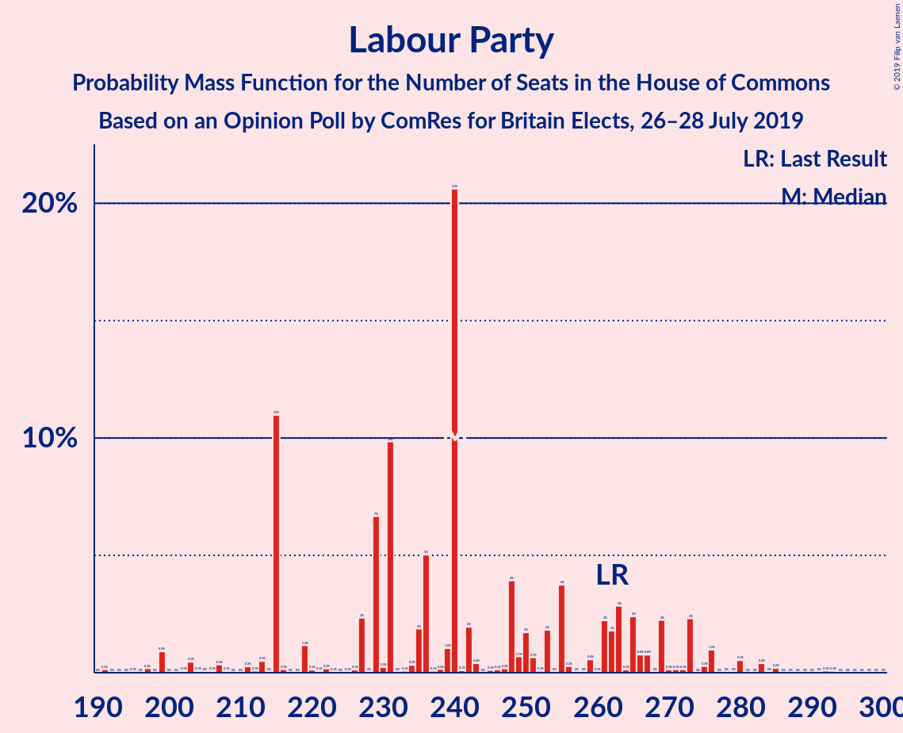
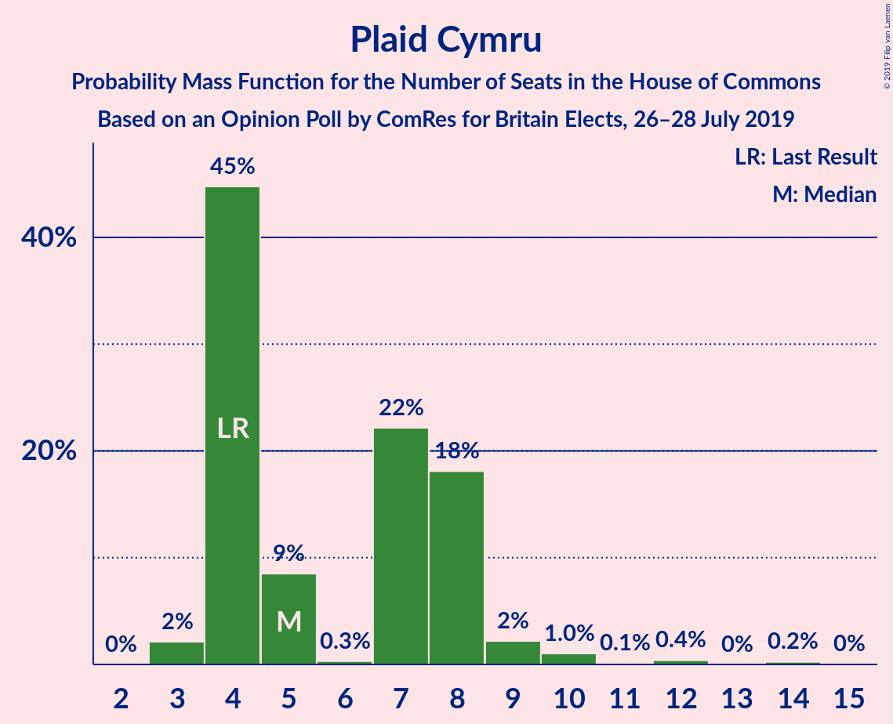
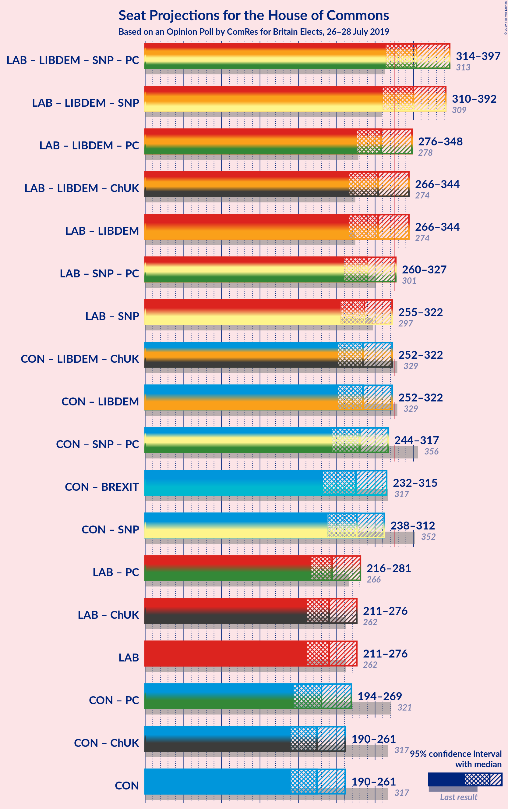
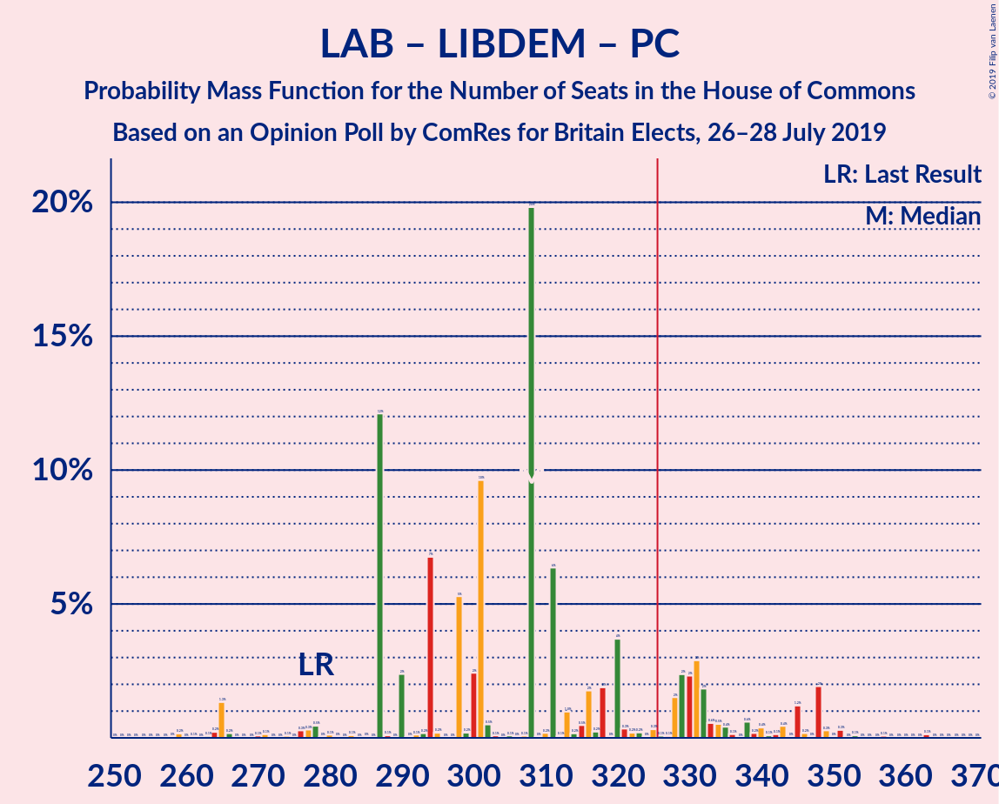
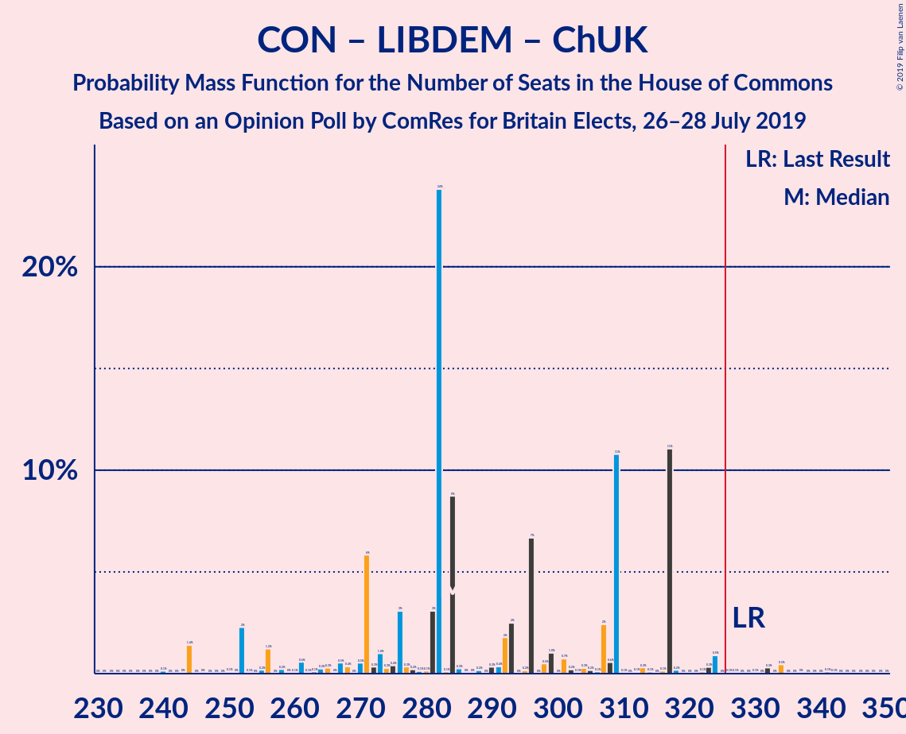
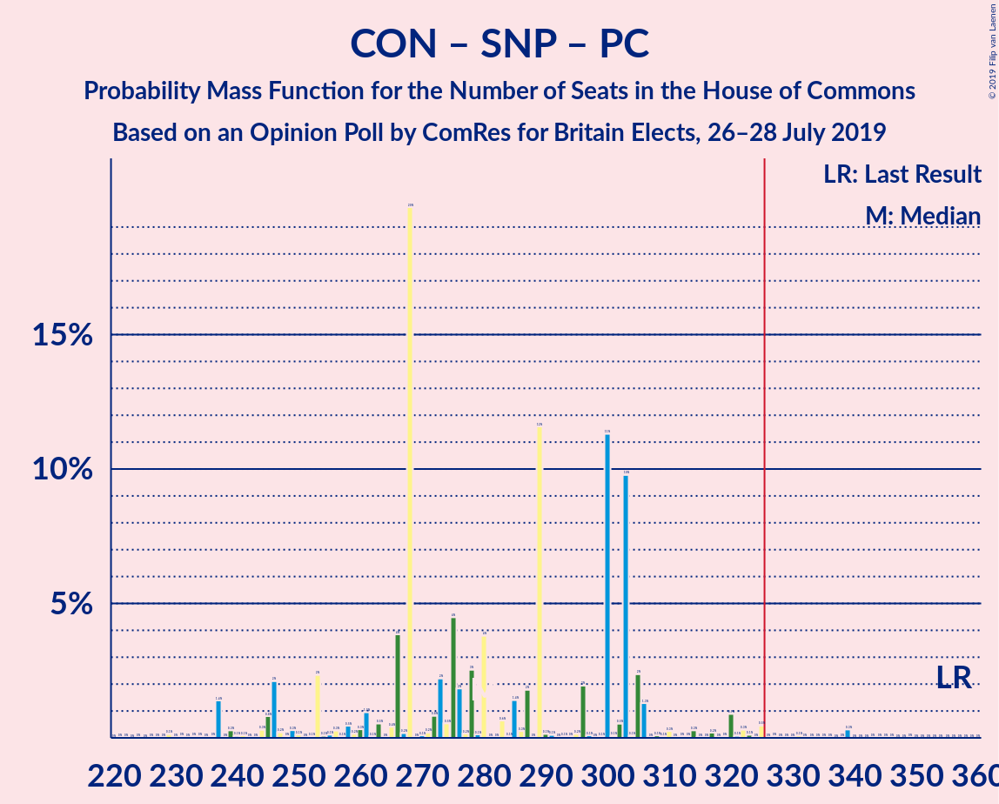
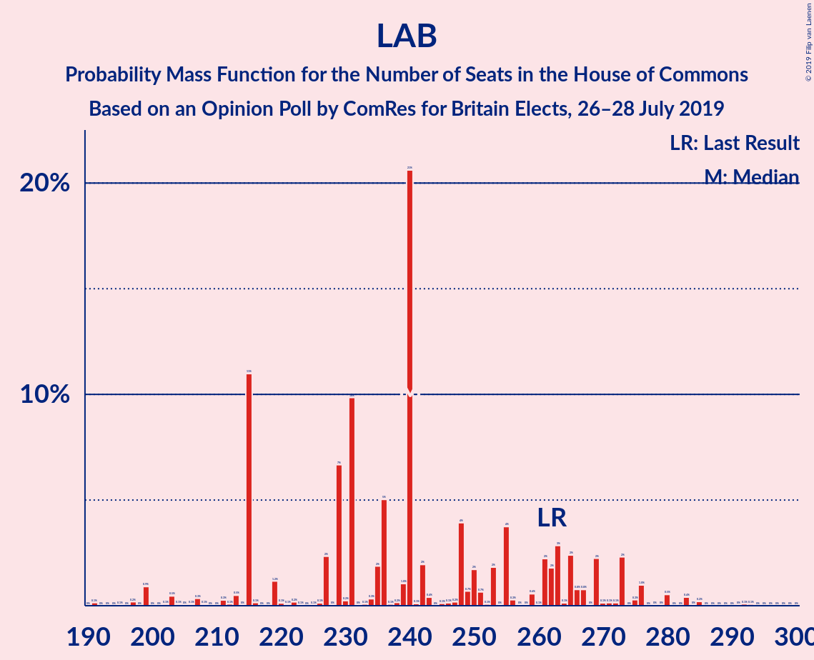

# Opinion Poll by ComRes for Britain Elects, 26–28 July 2019

<a href="#voting-intentions">Voting Intentions</a> | <a href="#seats">Seats</a> | <a href="#coalitions">Coalitions</a> | <a href="#technical-information">Technical Information</a>

## Voting Intentions

### Confidence Intervals

| Party | Last Result | Poll Result | 80% Confidence Interval | 90% Confidence Interval | 95% Confidence Interval | 99% Confidence Interval |
|:-----:|:-----------:|:-----------:|:-----------------------:|:-----------------------:|:-----------------------:|:-----------------------:|
| Labour Party | 40.0% | 29.3% | 28.1–30.7% |27.7–31.0% |27.4–31.4% |26.8–32.0% |
| Conservative Party | 42.4% | 28.3% | 27.1–29.7% |26.7–30.0% |26.4–30.4% |25.8–31.0% |
| Liberal Democrats | 7.4% | 15.7% | 14.7–16.8% |14.4–17.1% |14.1–17.3% |13.7–17.9% |
| Brexit Party | 0.0% | 14.7% | 13.7–15.7% |13.4–16.0% |13.2–16.3% |12.7–16.8% |
| Green Party | 1.6% | 4.9% | 4.3–5.6% |4.2–5.8% |4.0–5.9% |3.8–6.3% |
| Scottish National Party | 3.0% | 2.9% | 2.5–3.5% |2.4–3.6% |2.3–3.8% |2.1–4.1% |
| Plaid Cymru | 0.5% | 1.0% | 0.8–1.4% |0.7–1.4% |0.6–1.5% |0.5–1.7% |
| UK Independence Party | 1.8% | 1.0% | 0.8–1.4% |0.7–1.4% |0.6–1.5% |0.5–1.7% |
| Change UK | 0.0% | 0.2% | 0.2–0.5% |0.1–0.5% |0.1–0.6% |0.1–0.7% |

*Note:* The poll result column reflects the actual value used in the calculations. Published results may vary slightly, and in addition be rounded to fewer digits.

## Seats

### Confidence Intervals

| Party | Last Result | Median | 80% Confidence Interval | 90% Confidence Interval | 95% Confidence Interval | 99% Confidence Interval |
|:-----:|:-----------:|:------:|:-----------------------:|:-----------------------:|:-----------------------:|:-----------------------:|
| <a href="#labour-party">Labour Party</a> | 262 | 248 | 248–262 |248–262 |248–269 |206–287 |
| <a href="#conservative-party">Conservative Party</a> | 317 | 196 | 196–215 |196–215 |196–218 |193–260 |
| <a href="#liberal-democrats">Liberal Democrats</a> | 12 | 69 | 61–69 |61–69 |56–69 |56–69 |
| <a href="#brexit-party">Brexit Party</a> | 0 | 63 | 34–63 |34–63 |29–63 |27–63 |
| <a href="#green-party">Green Party</a> | 1 | 2 | 2 |2 |2 |2 |
| <a href="#scottish-national-party">Scottish National Party</a> | 35 | 49 | 49–53 |49–53 |49–53 |47–53 |
| <a href="#plaid-cymru">Plaid Cymru</a> | 4 | 4 | 4 |4 |4–5 |4–9 |
| <a href="#uk-independence-party">UK Independence Party</a> | 0 | 0 | 0 |0 |0 |0 |
| <a href="#change-uk">Change UK</a> | 0 | 0 | 0 |0 |0 |0 |

### Labour Party

*For a full overview of the results for this party, see the [Labour Party](party-labourparty.html) page.*

| Number of Seats | Probability | Accumulated | Special Marks |
|:---------------:|:-----------:|:-----------:|:-------------:|
| 206 | 1.3% | 100% |  |
| 207 | 0% | 98.7% |  |
| 208 | 0% | 98.7% |  |
| 209 | 0% | 98.7% |  |
| 210 | 0% | 98.7% |  |
| 211 | 0% | 98.7% |  |
| 212 | 0% | 98.7% |  |
| 213 | 0% | 98.7% |  |
| 214 | 0% | 98.7% |  |
| 215 | 0% | 98.7% |  |
| 216 | 0% | 98.7% |  |
| 217 | 0% | 98.7% |  |
| 218 | 0% | 98.7% |  |
| 219 | 0% | 98.7% |  |
| 220 | 0% | 98.7% |  |
| 221 | 0% | 98.7% |  |
| 222 | 0% | 98.7% |  |
| 223 | 0% | 98.7% |  |
| 224 | 0% | 98.7% |  |
| 225 | 0% | 98.7% |  |
| 226 | 0% | 98.7% |  |
| 227 | 0% | 98.7% |  |
| 228 | 0% | 98.7% |  |
| 229 | 0% | 98.7% |  |
| 230 | 0% | 98.7% |  |
| 231 | 0% | 98.7% |  |
| 232 | 0% | 98.7% |  |
| 233 | 0% | 98.7% |  |
| 234 | 0% | 98.7% |  |
| 235 | 0% | 98.7% |  |
| 236 | 0% | 98.7% |  |
| 237 | 0% | 98.7% |  |
| 238 | 0% | 98.7% |  |
| 239 | 0% | 98.7% |  |
| 240 | 0% | 98.7% |  |
| 241 | 0% | 98.7% |  |
| 242 | 0% | 98.7% |  |
| 243 | 0% | 98.7% |  |
| 244 | 0% | 98.7% |  |
| 245 | 0% | 98.6% |  |
| 246 | 0% | 98.6% |  |
| 247 | 0% | 98.6% |  |
| 248 | 86% | 98.6% | Median |
| 249 | 0% | 13% |  |
| 250 | 0% | 13% |  |
| 251 | 0% | 13% |  |
| 252 | 0% | 13% |  |
| 253 | 0% | 13% |  |
| 254 | 0% | 13% |  |
| 255 | 0% | 13% |  |
| 256 | 0% | 13% |  |
| 257 | 0% | 13% |  |
| 258 | 0% | 13% |  |
| 259 | 0% | 13% |  |
| 260 | 0% | 13% |  |
| 261 | 0% | 13% |  |
| 262 | 10% | 13% | Last Result |
| 263 | 0% | 3% |  |
| 264 | 0% | 3% |  |
| 265 | 0% | 3% |  |
| 266 | 0% | 3% |  |
| 267 | 0% | 3% |  |
| 268 | 0% | 3% |  |
| 269 | 0.4% | 3% |  |
| 270 | 0% | 2% |  |
| 271 | 0% | 2% |  |
| 272 | 0% | 2% |  |
| 273 | 0% | 2% |  |
| 274 | 2% | 2% |  |
| 275 | 0% | 0.7% |  |
| 276 | 0% | 0.7% |  |
| 277 | 0% | 0.7% |  |
| 278 | 0% | 0.7% |  |
| 279 | 0% | 0.7% |  |
| 280 | 0% | 0.7% |  |
| 281 | 0% | 0.7% |  |
| 282 | 0% | 0.7% |  |
| 283 | 0% | 0.7% |  |
| 284 | 0% | 0.7% |  |
| 285 | 0% | 0.7% |  |
| 286 | 0% | 0.7% |  |
| 287 | 0.7% | 0.7% |  |
| 288 | 0% | 0% |  |

### Conservative Party

*For a full overview of the results for this party, see the [Conservative Party](party-conservativeparty.html) page.*

| Number of Seats | Probability | Accumulated | Special Marks |
|:---------------:|:-----------:|:-----------:|:-------------:|
| 193 | 0.7% | 100% |  |
| 194 | 0% | 99.3% |  |
| 195 | 0% | 99.3% |  |
| 196 | 86% | 99.3% | Median |
| 197 | 0% | 14% |  |
| 198 | 0% | 14% |  |
| 199 | 0% | 14% |  |
| 200 | 0% | 14% |  |
| 201 | 0% | 14% |  |
| 202 | 0% | 14% |  |
| 203 | 0% | 14% |  |
| 204 | 0% | 14% |  |
| 205 | 0% | 14% |  |
| 206 | 0% | 14% |  |
| 207 | 0% | 14% |  |
| 208 | 0% | 14% |  |
| 209 | 0% | 14% |  |
| 210 | 0% | 14% |  |
| 211 | 0% | 14% |  |
| 212 | 0% | 14% |  |
| 213 | 0% | 14% |  |
| 214 | 0% | 14% |  |
| 215 | 11% | 14% |  |
| 216 | 0% | 3% |  |
| 217 | 0% | 3% |  |
| 218 | 2% | 3% |  |
| 219 | 0% | 1.3% |  |
| 220 | 0% | 1.3% |  |
| 221 | 0% | 1.3% |  |
| 222 | 0% | 1.3% |  |
| 223 | 0% | 1.3% |  |
| 224 | 0% | 1.3% |  |
| 225 | 0% | 1.3% |  |
| 226 | 0% | 1.3% |  |
| 227 | 0% | 1.3% |  |
| 228 | 0% | 1.3% |  |
| 229 | 0% | 1.3% |  |
| 230 | 0% | 1.3% |  |
| 231 | 0% | 1.3% |  |
| 232 | 0% | 1.3% |  |
| 233 | 0% | 1.3% |  |
| 234 | 0% | 1.3% |  |
| 235 | 0% | 1.3% |  |
| 236 | 0% | 1.3% |  |
| 237 | 0% | 1.3% |  |
| 238 | 0% | 1.3% |  |
| 239 | 0% | 1.3% |  |
| 240 | 0% | 1.3% |  |
| 241 | 0% | 1.3% |  |
| 242 | 0% | 1.3% |  |
| 243 | 0% | 1.3% |  |
| 244 | 0% | 1.3% |  |
| 245 | 0% | 1.3% |  |
| 246 | 0% | 1.3% |  |
| 247 | 0% | 1.3% |  |
| 248 | 0% | 1.3% |  |
| 249 | 0% | 1.3% |  |
| 250 | 0% | 1.3% |  |
| 251 | 0% | 1.3% |  |
| 252 | 0% | 1.3% |  |
| 253 | 0% | 1.3% |  |
| 254 | 0% | 1.3% |  |
| 255 | 0% | 1.3% |  |
| 256 | 0% | 1.3% |  |
| 257 | 0% | 1.3% |  |
| 258 | 0% | 1.3% |  |
| 259 | 0% | 1.3% |  |
| 260 | 1.3% | 1.3% |  |
| 261 | 0% | 0% |  |
| 262 | 0% | 0% |  |
| 263 | 0% | 0% |  |
| 264 | 0% | 0% |  |
| 265 | 0% | 0% |  |
| 266 | 0% | 0% |  |
| 267 | 0% | 0% |  |
| 268 | 0% | 0% |  |
| 269 | 0% | 0% |  |
| 270 | 0% | 0% |  |
| 271 | 0% | 0% |  |
| 272 | 0% | 0% |  |
| 273 | 0% | 0% |  |
| 274 | 0% | 0% |  |
| 275 | 0% | 0% |  |
| 276 | 0% | 0% |  |
| 277 | 0% | 0% |  |
| 278 | 0% | 0% |  |
| 279 | 0% | 0% |  |
| 280 | 0% | 0% |  |
| 281 | 0% | 0% |  |
| 282 | 0% | 0% |  |
| 283 | 0% | 0% |  |
| 284 | 0% | 0% |  |
| 285 | 0% | 0% |  |
| 286 | 0% | 0% |  |
| 287 | 0% | 0% |  |
| 288 | 0% | 0% |  |
| 289 | 0% | 0% |  |
| 290 | 0% | 0% |  |
| 291 | 0% | 0% |  |
| 292 | 0% | 0% |  |
| 293 | 0% | 0% |  |
| 294 | 0% | 0% |  |
| 295 | 0% | 0% |  |
| 296 | 0% | 0% |  |
| 297 | 0% | 0% |  |
| 298 | 0% | 0% |  |
| 299 | 0% | 0% |  |
| 300 | 0% | 0% |  |
| 301 | 0% | 0% |  |
| 302 | 0% | 0% |  |
| 303 | 0% | 0% |  |
| 304 | 0% | 0% |  |
| 305 | 0% | 0% |  |
| 306 | 0% | 0% |  |
| 307 | 0% | 0% |  |
| 308 | 0% | 0% |  |
| 309 | 0% | 0% |  |
| 310 | 0% | 0% |  |
| 311 | 0% | 0% |  |
| 312 | 0% | 0% |  |
| 313 | 0% | 0% |  |
| 314 | 0% | 0% |  |
| 315 | 0% | 0% |  |
| 316 | 0% | 0% |  |
| 317 | 0% | 0% | Last Result |

### Liberal Democrats

*For a full overview of the results for this party, see the [Liberal Democrats](party-liberaldemocrats.html) page.*

| Number of Seats | Probability | Accumulated | Special Marks |
|:---------------:|:-----------:|:-----------:|:-------------:|
| 12 | 0% | 100% | Last Result |
| 13 | 0% | 100% |  |
| 14 | 0% | 100% |  |
| 15 | 0% | 100% |  |
| 16 | 0% | 100% |  |
| 17 | 0% | 100% |  |
| 18 | 0% | 100% |  |
| 19 | 0% | 100% |  |
| 20 | 0% | 100% |  |
| 21 | 0% | 100% |  |
| 22 | 0% | 100% |  |
| 23 | 0% | 100% |  |
| 24 | 0% | 100% |  |
| 25 | 0% | 100% |  |
| 26 | 0% | 100% |  |
| 27 | 0% | 100% |  |
| 28 | 0% | 100% |  |
| 29 | 0% | 100% |  |
| 30 | 0% | 100% |  |
| 31 | 0% | 100% |  |
| 32 | 0% | 100% |  |
| 33 | 0% | 100% |  |
| 34 | 0% | 100% |  |
| 35 | 0% | 100% |  |
| 36 | 0% | 100% |  |
| 37 | 0% | 100% |  |
| 38 | 0% | 100% |  |
| 39 | 0% | 100% |  |
| 40 | 0% | 100% |  |
| 41 | 0% | 100% |  |
| 42 | 0% | 100% |  |
| 43 | 0% | 100% |  |
| 44 | 0% | 100% |  |
| 45 | 0% | 100% |  |
| 46 | 0% | 100% |  |
| 47 | 0% | 100% |  |
| 48 | 0% | 100% |  |
| 49 | 0% | 100% |  |
| 50 | 0% | 100% |  |
| 51 | 0% | 100% |  |
| 52 | 0% | 100% |  |
| 53 | 0% | 100% |  |
| 54 | 0% | 100% |  |
| 55 | 0% | 100% |  |
| 56 | 3% | 100% |  |
| 57 | 0% | 97% |  |
| 58 | 0% | 97% |  |
| 59 | 0% | 97% |  |
| 60 | 0% | 97% |  |
| 61 | 11% | 97% |  |
| 62 | 0% | 86% |  |
| 63 | 0% | 86% |  |
| 64 | 0% | 86% |  |
| 65 | 0% | 86% |  |
| 66 | 0% | 86% |  |
| 67 | 0% | 86% |  |
| 68 | 0% | 86% |  |
| 69 | 86% | 86% | Median |
| 70 | 0% | 0.1% |  |
| 71 | 0% | 0% |  |

### Brexit Party

*For a full overview of the results for this party, see the [Brexit Party](party-brexitparty.html) page.*

| Number of Seats | Probability | Accumulated | Special Marks |
|:---------------:|:-----------:|:-----------:|:-------------:|
| 0 | 0% | 100% | Last Result |
| 1 | 0% | 100% |  |
| 2 | 0% | 100% |  |
| 3 | 0% | 100% |  |
| 4 | 0% | 100% |  |
| 5 | 0% | 100% |  |
| 6 | 0% | 100% |  |
| 7 | 0% | 100% |  |
| 8 | 0% | 100% |  |
| 9 | 0% | 100% |  |
| 10 | 0% | 100% |  |
| 11 | 0% | 100% |  |
| 12 | 0% | 100% |  |
| 13 | 0% | 100% |  |
| 14 | 0% | 100% |  |
| 15 | 0% | 100% |  |
| 16 | 0% | 100% |  |
| 17 | 0% | 100% |  |
| 18 | 0% | 100% |  |
| 19 | 0% | 100% |  |
| 20 | 0% | 100% |  |
| 21 | 0% | 100% |  |
| 22 | 0% | 100% |  |
| 23 | 0.4% | 100% |  |
| 24 | 0% | 99.6% |  |
| 25 | 0% | 99.6% |  |
| 26 | 0% | 99.6% |  |
| 27 | 0.7% | 99.6% |  |
| 28 | 0% | 98.9% |  |
| 29 | 2% | 98.9% |  |
| 30 | 0% | 97% |  |
| 31 | 0% | 97% |  |
| 32 | 0% | 97% |  |
| 33 | 0% | 97% |  |
| 34 | 10% | 97% |  |
| 35 | 0% | 87% |  |
| 36 | 0% | 87% |  |
| 37 | 0% | 87% |  |
| 38 | 0% | 87% |  |
| 39 | 0% | 87% |  |
| 40 | 0% | 87% |  |
| 41 | 0% | 87% |  |
| 42 | 0% | 87% |  |
| 43 | 0% | 87% |  |
| 44 | 0% | 87% |  |
| 45 | 1.3% | 87% |  |
| 46 | 0% | 86% |  |
| 47 | 0% | 86% |  |
| 48 | 0% | 86% |  |
| 49 | 0% | 86% |  |
| 50 | 0% | 86% |  |
| 51 | 0% | 86% |  |
| 52 | 0% | 86% |  |
| 53 | 0% | 86% |  |
| 54 | 0% | 86% |  |
| 55 | 0% | 86% |  |
| 56 | 0% | 86% |  |
| 57 | 0% | 86% |  |
| 58 | 0% | 86% |  |
| 59 | 0% | 86% |  |
| 60 | 0% | 86% |  |
| 61 | 0% | 86% |  |
| 62 | 0% | 86% |  |
| 63 | 86% | 86% | Median |
| 64 | 0% | 0% |  |

### Green Party

*For a full overview of the results for this party, see the [Green Party](party-greenparty.html) page.*

| Number of Seats | Probability | Accumulated | Special Marks |
|:---------------:|:-----------:|:-----------:|:-------------:|
| 1 | 0% | 100% | Last Result |
| 2 | 100% | 100% | Median |

### Scottish National Party

*For a full overview of the results for this party, see the [Scottish National Party](party-scottishnationalparty.html) page.*

| Number of Seats | Probability | Accumulated | Special Marks |
|:---------------:|:-----------:|:-----------:|:-------------:|
| 35 | 0% | 100% | Last Result |
| 36 | 0% | 100% |  |
| 37 | 0% | 100% |  |
| 38 | 0% | 100% |  |
| 39 | 0% | 100% |  |
| 40 | 0% | 100% |  |
| 41 | 0% | 100% |  |
| 42 | 0% | 100% |  |
| 43 | 0% | 100% |  |
| 44 | 0% | 100% |  |
| 45 | 0% | 100% |  |
| 46 | 0% | 100% |  |
| 47 | 2% | 100% |  |
| 48 | 0% | 98% |  |
| 49 | 86% | 98% | Median |
| 50 | 0% | 13% |  |
| 51 | 0% | 13% |  |
| 52 | 0% | 13% |  |
| 53 | 13% | 13% |  |
| 54 | 0% | 0% |  |

### Plaid Cymru

*For a full overview of the results for this party, see the [Plaid Cymru](party-plaidcymru.html) page.*

| Number of Seats | Probability | Accumulated | Special Marks |
|:---------------:|:-----------:|:-----------:|:-------------:|
| 4 | 96% | 100% | Last Result, Median |
| 5 | 2% | 4% |  |
| 6 | 0% | 2% |  |
| 7 | 0% | 2% |  |
| 8 | 1.1% | 2% |  |
| 9 | 1.3% | 1.3% |  |
| 10 | 0% | 0% |  |

### UK Independence Party

*For a full overview of the results for this party, see the [UK Independence Party](party-ukindependenceparty.html) page.*

| Number of Seats | Probability | Accumulated | Special Marks |
|:---------------:|:-----------:|:-----------:|:-------------:|
| 0 | 100% | 100% | Last Result, Median |

### Change UK

*For a full overview of the results for this party, see the [Change UK](party-changeuk.html) page.*

| Number of Seats | Probability | Accumulated | Special Marks |
|:---------------:|:-----------:|:-----------:|:-------------:|
| 0 | 100% | 100% | Last Result, Median |

## Coalitions

### Confidence Intervals

| Coalition | Last Result | Median | Majority? | 80% Confidence Interval | 90% Confidence Interval | 95% Confidence Interval | 99% Confidence Interval |
|:---------:|:-----------:|:------:|:---------:|:-----------------------:|:-----------------------:|:-----------------------:|:-----------------------:|
| Labour Party – Liberal Democrats – Scottish National Party – Plaid Cymru | 313 | 370 | 98.7% | 370–380 | 370–380 | 370–382 | 324–409 |
| Labour Party – Liberal Democrats – Scottish National Party | 309 | 366 | 98.7% | 366–376 | 366–376 | 366–377 | 315–401 |
| Labour Party – Liberal Democrats – Plaid Cymru | 278 | 321 | 13% | 321–327 | 321–327 | 321–335 | 271–356 |
| Labour Party – Liberal Democrats – Change UK | 274 | 317 | 3% | 317–323 | 317–323 | 317–330 | 262–348 |
| Labour Party – Liberal Democrats | 274 | 317 | 3% | 317–323 | 317–323 | 317–330 | 262–348 |
| Labour Party – Scottish National Party – Plaid Cymru | 301 | 301 | 3% | 301–319 | 301–319 | 301–326 | 268–348 |
| Labour Party – Scottish National Party | 297 | 297 | 0.7% | 297–315 | 297–315 | 297–321 | 259–340 |
| Labour Party – Plaid Cymru | 266 | 252 | 0% | 252–266 | 252–266 | 252–277 | 215–295 |
| Conservative Party – Liberal Democrats – Change UK | 329 | 265 | 0% | 265–276 | 265–276 | 265–276 | 254–316 |
| Conservative Party – Liberal Democrats | 329 | 265 | 0% | 265–276 | 265–276 | 265–276 | 254–316 |
| Conservative Party – Scottish National Party – Plaid Cymru | 356 | 249 | 0% | 249–272 | 249–272 | 249–272 | 249–322 |
| Labour Party – Change UK | 262 | 248 | 0% | 248–262 | 248–262 | 248–269 | 206–287 |
| Labour Party | 262 | 248 | 0% | 248–262 | 248–262 | 248–269 | 206–287 |
| Conservative Party – Scottish National Party | 352 | 245 | 0% | 245–268 | 245–268 | 245–268 | 245–313 |
| Conservative Party – Brexit Party | 317 | 259 | 0% | 249–259 | 249–259 | 247–259 | 220–305 |
| Conservative Party – Plaid Cymru | 321 | 200 | 0% | 200–219 | 200–219 | 200–223 | 200–269 |
| Conservative Party – Change UK | 317 | 196 | 0% | 196–215 | 196–215 | 196–218 | 193–260 |
| Conservative Party | 317 | 196 | 0% | 196–215 | 196–215 | 196–218 | 193–260 |

### Labour Party – Liberal Democrats – Scottish National Party – Plaid Cymru

| Number of Seats | Probability | Accumulated | Special Marks |
|:---------------:|:-----------:|:-----------:|:-------------:|
| 313 | 0% | 100% | Last Result |
| 314 | 0% | 100% |  |
| 315 | 0% | 100% |  |
| 316 | 0% | 100% |  |
| 317 | 0% | 100% |  |
| 318 | 0% | 100% |  |
| 319 | 0% | 100% |  |
| 320 | 0% | 100% |  |
| 321 | 0% | 100% |  |
| 322 | 0% | 100% |  |
| 323 | 0% | 100% |  |
| 324 | 1.3% | 100% |  |
| 325 | 0% | 98.7% |  |
| 326 | 0% | 98.7% | Majority |
| 327 | 0% | 98.7% |  |
| 328 | 0% | 98.7% |  |
| 329 | 0% | 98.7% |  |
| 330 | 0% | 98.7% |  |
| 331 | 0% | 98.7% |  |
| 332 | 0% | 98.7% |  |
| 333 | 0% | 98.7% |  |
| 334 | 0% | 98.7% |  |
| 335 | 0% | 98.7% |  |
| 336 | 0% | 98.7% |  |
| 337 | 0% | 98.7% |  |
| 338 | 0% | 98.7% |  |
| 339 | 0% | 98.7% |  |
| 340 | 0% | 98.7% |  |
| 341 | 0% | 98.7% |  |
| 342 | 0% | 98.7% |  |
| 343 | 0% | 98.7% |  |
| 344 | 0% | 98.7% |  |
| 345 | 0% | 98.7% |  |
| 346 | 0% | 98.7% |  |
| 347 | 0% | 98.7% |  |
| 348 | 0% | 98.7% |  |
| 349 | 0% | 98.7% |  |
| 350 | 0% | 98.7% |  |
| 351 | 0% | 98.7% |  |
| 352 | 0% | 98.7% |  |
| 353 | 0% | 98.7% |  |
| 354 | 0% | 98.7% |  |
| 355 | 0% | 98.7% |  |
| 356 | 0% | 98.7% |  |
| 357 | 0% | 98.7% |  |
| 358 | 0% | 98.7% |  |
| 359 | 0% | 98.7% |  |
| 360 | 0% | 98.7% |  |
| 361 | 0% | 98.7% |  |
| 362 | 0% | 98.7% |  |
| 363 | 0% | 98.7% |  |
| 364 | 0% | 98.7% |  |
| 365 | 0% | 98.7% |  |
| 366 | 0% | 98.7% |  |
| 367 | 0% | 98.7% |  |
| 368 | 0% | 98.7% |  |
| 369 | 0% | 98.7% |  |
| 370 | 86% | 98.7% | Median |
| 371 | 0% | 13% |  |
| 372 | 0% | 13% |  |
| 373 | 0% | 13% |  |
| 374 | 0% | 13% |  |
| 375 | 0% | 13% |  |
| 376 | 0% | 13% |  |
| 377 | 0% | 13% |  |
| 378 | 0% | 13% |  |
| 379 | 0% | 13% |  |
| 380 | 10% | 13% |  |
| 381 | 0% | 3% |  |
| 382 | 2% | 3% |  |
| 383 | 0% | 1.1% |  |
| 384 | 0% | 1.1% |  |
| 385 | 0% | 1.1% |  |
| 386 | 0% | 1.1% |  |
| 387 | 0% | 1.1% |  |
| 388 | 0% | 1.1% |  |
| 389 | 0% | 1.1% |  |
| 390 | 0% | 1.1% |  |
| 391 | 0.4% | 1.1% |  |
| 392 | 0% | 0.7% |  |
| 393 | 0% | 0.7% |  |
| 394 | 0% | 0.7% |  |
| 395 | 0% | 0.7% |  |
| 396 | 0% | 0.7% |  |
| 397 | 0% | 0.7% |  |
| 398 | 0% | 0.7% |  |
| 399 | 0% | 0.7% |  |
| 400 | 0% | 0.7% |  |
| 401 | 0% | 0.7% |  |
| 402 | 0% | 0.7% |  |
| 403 | 0% | 0.7% |  |
| 404 | 0% | 0.7% |  |
| 405 | 0% | 0.7% |  |
| 406 | 0% | 0.7% |  |
| 407 | 0% | 0.7% |  |
| 408 | 0% | 0.7% |  |
| 409 | 0.7% | 0.7% |  |
| 410 | 0% | 0% |  |

### Labour Party – Liberal Democrats – Scottish National Party

| Number of Seats | Probability | Accumulated | Special Marks |
|:---------------:|:-----------:|:-----------:|:-------------:|
| 309 | 0% | 100% | Last Result |
| 310 | 0% | 100% |  |
| 311 | 0% | 100% |  |
| 312 | 0% | 100% |  |
| 313 | 0% | 100% |  |
| 314 | 0% | 100% |  |
| 315 | 1.3% | 100% |  |
| 316 | 0% | 98.7% |  |
| 317 | 0% | 98.7% |  |
| 318 | 0% | 98.7% |  |
| 319 | 0% | 98.7% |  |
| 320 | 0% | 98.7% |  |
| 321 | 0% | 98.7% |  |
| 322 | 0% | 98.7% |  |
| 323 | 0% | 98.7% |  |
| 324 | 0% | 98.7% |  |
| 325 | 0% | 98.7% |  |
| 326 | 0% | 98.7% | Majority |
| 327 | 0% | 98.7% |  |
| 328 | 0% | 98.7% |  |
| 329 | 0% | 98.7% |  |
| 330 | 0% | 98.7% |  |
| 331 | 0% | 98.7% |  |
| 332 | 0% | 98.7% |  |
| 333 | 0% | 98.7% |  |
| 334 | 0% | 98.7% |  |
| 335 | 0% | 98.7% |  |
| 336 | 0% | 98.7% |  |
| 337 | 0% | 98.7% |  |
| 338 | 0% | 98.7% |  |
| 339 | 0% | 98.7% |  |
| 340 | 0% | 98.7% |  |
| 341 | 0% | 98.7% |  |
| 342 | 0% | 98.7% |  |
| 343 | 0% | 98.7% |  |
| 344 | 0% | 98.7% |  |
| 345 | 0% | 98.7% |  |
| 346 | 0% | 98.7% |  |
| 347 | 0% | 98.7% |  |
| 348 | 0% | 98.7% |  |
| 349 | 0% | 98.7% |  |
| 350 | 0% | 98.7% |  |
| 351 | 0% | 98.7% |  |
| 352 | 0% | 98.7% |  |
| 353 | 0% | 98.7% |  |
| 354 | 0% | 98.7% |  |
| 355 | 0% | 98.7% |  |
| 356 | 0% | 98.7% |  |
| 357 | 0% | 98.7% |  |
| 358 | 0% | 98.7% |  |
| 359 | 0% | 98.7% |  |
| 360 | 0% | 98.7% |  |
| 361 | 0% | 98.7% |  |
| 362 | 0% | 98.7% |  |
| 363 | 0% | 98.7% |  |
| 364 | 0% | 98.7% |  |
| 365 | 0% | 98.6% |  |
| 366 | 86% | 98.6% | Median |
| 367 | 0% | 13% |  |
| 368 | 0% | 13% |  |
| 369 | 0% | 13% |  |
| 370 | 0% | 13% |  |
| 371 | 0% | 13% |  |
| 372 | 0% | 13% |  |
| 373 | 0% | 13% |  |
| 374 | 0% | 13% |  |
| 375 | 0% | 13% |  |
| 376 | 10% | 13% |  |
| 377 | 2% | 3% |  |
| 378 | 0% | 1.1% |  |
| 379 | 0% | 1.1% |  |
| 380 | 0% | 1.1% |  |
| 381 | 0% | 1.1% |  |
| 382 | 0% | 1.1% |  |
| 383 | 0.4% | 1.1% |  |
| 384 | 0% | 0.7% |  |
| 385 | 0% | 0.7% |  |
| 386 | 0% | 0.7% |  |
| 387 | 0% | 0.7% |  |
| 388 | 0% | 0.7% |  |
| 389 | 0% | 0.7% |  |
| 390 | 0% | 0.7% |  |
| 391 | 0% | 0.7% |  |
| 392 | 0% | 0.7% |  |
| 393 | 0% | 0.7% |  |
| 394 | 0% | 0.7% |  |
| 395 | 0% | 0.7% |  |
| 396 | 0% | 0.7% |  |
| 397 | 0% | 0.7% |  |
| 398 | 0% | 0.7% |  |
| 399 | 0% | 0.7% |  |
| 400 | 0% | 0.7% |  |
| 401 | 0.7% | 0.7% |  |
| 402 | 0% | 0% |  |

### Labour Party – Liberal Democrats – Plaid Cymru

| Number of Seats | Probability | Accumulated | Special Marks |
|:---------------:|:-----------:|:-----------:|:-------------:|
| 271 | 1.3% | 100% |  |
| 272 | 0% | 98.7% |  |
| 273 | 0% | 98.7% |  |
| 274 | 0% | 98.7% |  |
| 275 | 0% | 98.7% |  |
| 276 | 0% | 98.7% |  |
| 277 | 0% | 98.7% |  |
| 278 | 0% | 98.7% | Last Result |
| 279 | 0% | 98.7% |  |
| 280 | 0% | 98.7% |  |
| 281 | 0% | 98.7% |  |
| 282 | 0% | 98.7% |  |
| 283 | 0% | 98.7% |  |
| 284 | 0% | 98.7% |  |
| 285 | 0% | 98.7% |  |
| 286 | 0% | 98.7% |  |
| 287 | 0% | 98.7% |  |
| 288 | 0% | 98.7% |  |
| 289 | 0% | 98.7% |  |
| 290 | 0% | 98.7% |  |
| 291 | 0% | 98.7% |  |
| 292 | 0% | 98.7% |  |
| 293 | 0% | 98.7% |  |
| 294 | 0% | 98.7% |  |
| 295 | 0% | 98.7% |  |
| 296 | 0% | 98.7% |  |
| 297 | 0% | 98.7% |  |
| 298 | 0% | 98.7% |  |
| 299 | 0% | 98.7% |  |
| 300 | 0% | 98.7% |  |
| 301 | 0% | 98.7% |  |
| 302 | 0% | 98.7% |  |
| 303 | 0% | 98.7% |  |
| 304 | 0% | 98.7% |  |
| 305 | 0% | 98.7% |  |
| 306 | 0% | 98.7% |  |
| 307 | 0% | 98.7% |  |
| 308 | 0% | 98.7% |  |
| 309 | 0% | 98.7% |  |
| 310 | 0% | 98.7% |  |
| 311 | 0% | 98.7% |  |
| 312 | 0% | 98.7% |  |
| 313 | 0% | 98.7% |  |
| 314 | 0% | 98.7% |  |
| 315 | 0% | 98.7% |  |
| 316 | 0% | 98.7% |  |
| 317 | 0% | 98.7% |  |
| 318 | 0% | 98.7% |  |
| 319 | 0% | 98.7% |  |
| 320 | 0% | 98.7% |  |
| 321 | 86% | 98.6% | Median |
| 322 | 0% | 13% |  |
| 323 | 0% | 13% |  |
| 324 | 0% | 13% |  |
| 325 | 0% | 13% |  |
| 326 | 0% | 13% | Majority |
| 327 | 10% | 13% |  |
| 328 | 0% | 3% |  |
| 329 | 0% | 3% |  |
| 330 | 0% | 3% |  |
| 331 | 0% | 3% |  |
| 332 | 0% | 3% |  |
| 333 | 0% | 3% |  |
| 334 | 0% | 3% |  |
| 335 | 2% | 3% |  |
| 336 | 0% | 1.1% |  |
| 337 | 0% | 1.1% |  |
| 338 | 0.4% | 1.1% |  |
| 339 | 0% | 0.7% |  |
| 340 | 0% | 0.7% |  |
| 341 | 0% | 0.7% |  |
| 342 | 0% | 0.7% |  |
| 343 | 0% | 0.7% |  |
| 344 | 0% | 0.7% |  |
| 345 | 0% | 0.7% |  |
| 346 | 0% | 0.7% |  |
| 347 | 0% | 0.7% |  |
| 348 | 0% | 0.7% |  |
| 349 | 0% | 0.7% |  |
| 350 | 0% | 0.7% |  |
| 351 | 0% | 0.7% |  |
| 352 | 0% | 0.7% |  |
| 353 | 0% | 0.7% |  |
| 354 | 0% | 0.7% |  |
| 355 | 0% | 0.7% |  |
| 356 | 0.7% | 0.7% |  |
| 357 | 0% | 0% |  |

### Labour Party – Liberal Democrats – Change UK

| Number of Seats | Probability | Accumulated | Special Marks |
|:---------------:|:-----------:|:-----------:|:-------------:|
| 262 | 1.3% | 100% |  |
| 263 | 0% | 98.7% |  |
| 264 | 0% | 98.7% |  |
| 265 | 0% | 98.7% |  |
| 266 | 0% | 98.7% |  |
| 267 | 0% | 98.7% |  |
| 268 | 0% | 98.7% |  |
| 269 | 0% | 98.7% |  |
| 270 | 0% | 98.7% |  |
| 271 | 0% | 98.7% |  |
| 272 | 0% | 98.7% |  |
| 273 | 0% | 98.7% |  |
| 274 | 0% | 98.7% | Last Result |
| 275 | 0% | 98.7% |  |
| 276 | 0% | 98.7% |  |
| 277 | 0% | 98.7% |  |
| 278 | 0% | 98.7% |  |
| 279 | 0% | 98.7% |  |
| 280 | 0% | 98.7% |  |
| 281 | 0% | 98.7% |  |
| 282 | 0% | 98.7% |  |
| 283 | 0% | 98.7% |  |
| 284 | 0% | 98.7% |  |
| 285 | 0% | 98.7% |  |
| 286 | 0% | 98.7% |  |
| 287 | 0% | 98.7% |  |
| 288 | 0% | 98.7% |  |
| 289 | 0% | 98.7% |  |
| 290 | 0% | 98.7% |  |
| 291 | 0% | 98.7% |  |
| 292 | 0% | 98.7% |  |
| 293 | 0% | 98.7% |  |
| 294 | 0% | 98.7% |  |
| 295 | 0% | 98.7% |  |
| 296 | 0% | 98.7% |  |
| 297 | 0% | 98.7% |  |
| 298 | 0% | 98.7% |  |
| 299 | 0% | 98.7% |  |
| 300 | 0% | 98.7% |  |
| 301 | 0% | 98.7% |  |
| 302 | 0% | 98.7% |  |
| 303 | 0% | 98.7% |  |
| 304 | 0% | 98.7% |  |
| 305 | 0% | 98.7% |  |
| 306 | 0% | 98.7% |  |
| 307 | 0% | 98.7% |  |
| 308 | 0% | 98.7% |  |
| 309 | 0% | 98.7% |  |
| 310 | 0% | 98.7% |  |
| 311 | 0% | 98.7% |  |
| 312 | 0% | 98.7% |  |
| 313 | 0% | 98.7% |  |
| 314 | 0% | 98.6% |  |
| 315 | 0% | 98.6% |  |
| 316 | 0% | 98.6% |  |
| 317 | 86% | 98.6% | Median |
| 318 | 0% | 13% |  |
| 319 | 0% | 13% |  |
| 320 | 0% | 13% |  |
| 321 | 0% | 13% |  |
| 322 | 0% | 13% |  |
| 323 | 10% | 13% |  |
| 324 | 0% | 3% |  |
| 325 | 0% | 3% |  |
| 326 | 0% | 3% | Majority |
| 327 | 0% | 3% |  |
| 328 | 0% | 3% |  |
| 329 | 0% | 3% |  |
| 330 | 2% | 3% |  |
| 331 | 0% | 0.7% |  |
| 332 | 0% | 0.7% |  |
| 333 | 0% | 0.7% |  |
| 334 | 0% | 0.7% |  |
| 335 | 0% | 0.7% |  |
| 336 | 0% | 0.7% |  |
| 337 | 0% | 0.7% |  |
| 338 | 0% | 0.7% |  |
| 339 | 0% | 0.7% |  |
| 340 | 0% | 0.7% |  |
| 341 | 0% | 0.7% |  |
| 342 | 0% | 0.7% |  |
| 343 | 0% | 0.7% |  |
| 344 | 0% | 0.7% |  |
| 345 | 0% | 0.7% |  |
| 346 | 0% | 0.7% |  |
| 347 | 0% | 0.7% |  |
| 348 | 0.7% | 0.7% |  |
| 349 | 0% | 0% |  |

### Labour Party – Liberal Democrats

| Number of Seats | Probability | Accumulated | Special Marks |
|:---------------:|:-----------:|:-----------:|:-------------:|
| 262 | 1.3% | 100% |  |
| 263 | 0% | 98.7% |  |
| 264 | 0% | 98.7% |  |
| 265 | 0% | 98.7% |  |
| 266 | 0% | 98.7% |  |
| 267 | 0% | 98.7% |  |
| 268 | 0% | 98.7% |  |
| 269 | 0% | 98.7% |  |
| 270 | 0% | 98.7% |  |
| 271 | 0% | 98.7% |  |
| 272 | 0% | 98.7% |  |
| 273 | 0% | 98.7% |  |
| 274 | 0% | 98.7% | Last Result |
| 275 | 0% | 98.7% |  |
| 276 | 0% | 98.7% |  |
| 277 | 0% | 98.7% |  |
| 278 | 0% | 98.7% |  |
| 279 | 0% | 98.7% |  |
| 280 | 0% | 98.7% |  |
| 281 | 0% | 98.7% |  |
| 282 | 0% | 98.7% |  |
| 283 | 0% | 98.7% |  |
| 284 | 0% | 98.7% |  |
| 285 | 0% | 98.7% |  |
| 286 | 0% | 98.7% |  |
| 287 | 0% | 98.7% |  |
| 288 | 0% | 98.7% |  |
| 289 | 0% | 98.7% |  |
| 290 | 0% | 98.7% |  |
| 291 | 0% | 98.7% |  |
| 292 | 0% | 98.7% |  |
| 293 | 0% | 98.7% |  |
| 294 | 0% | 98.7% |  |
| 295 | 0% | 98.7% |  |
| 296 | 0% | 98.7% |  |
| 297 | 0% | 98.7% |  |
| 298 | 0% | 98.7% |  |
| 299 | 0% | 98.7% |  |
| 300 | 0% | 98.7% |  |
| 301 | 0% | 98.7% |  |
| 302 | 0% | 98.7% |  |
| 303 | 0% | 98.7% |  |
| 304 | 0% | 98.7% |  |
| 305 | 0% | 98.7% |  |
| 306 | 0% | 98.7% |  |
| 307 | 0% | 98.7% |  |
| 308 | 0% | 98.7% |  |
| 309 | 0% | 98.7% |  |
| 310 | 0% | 98.7% |  |
| 311 | 0% | 98.7% |  |
| 312 | 0% | 98.7% |  |
| 313 | 0% | 98.7% |  |
| 314 | 0% | 98.6% |  |
| 315 | 0% | 98.6% |  |
| 316 | 0% | 98.6% |  |
| 317 | 86% | 98.6% | Median |
| 318 | 0% | 13% |  |
| 319 | 0% | 13% |  |
| 320 | 0% | 13% |  |
| 321 | 0% | 13% |  |
| 322 | 0% | 13% |  |
| 323 | 10% | 13% |  |
| 324 | 0% | 3% |  |
| 325 | 0% | 3% |  |
| 326 | 0% | 3% | Majority |
| 327 | 0% | 3% |  |
| 328 | 0% | 3% |  |
| 329 | 0% | 3% |  |
| 330 | 2% | 3% |  |
| 331 | 0% | 0.7% |  |
| 332 | 0% | 0.7% |  |
| 333 | 0% | 0.7% |  |
| 334 | 0% | 0.7% |  |
| 335 | 0% | 0.7% |  |
| 336 | 0% | 0.7% |  |
| 337 | 0% | 0.7% |  |
| 338 | 0% | 0.7% |  |
| 339 | 0% | 0.7% |  |
| 340 | 0% | 0.7% |  |
| 341 | 0% | 0.7% |  |
| 342 | 0% | 0.7% |  |
| 343 | 0% | 0.7% |  |
| 344 | 0% | 0.7% |  |
| 345 | 0% | 0.7% |  |
| 346 | 0% | 0.7% |  |
| 347 | 0% | 0.7% |  |
| 348 | 0.7% | 0.7% |  |
| 349 | 0% | 0% |  |

### Labour Party – Scottish National Party – Plaid Cymru

| Number of Seats | Probability | Accumulated | Special Marks |
|:---------------:|:-----------:|:-----------:|:-------------:|
| 268 | 1.3% | 100% |  |
| 269 | 0% | 98.7% |  |
| 270 | 0% | 98.7% |  |
| 271 | 0% | 98.7% |  |
| 272 | 0% | 98.7% |  |
| 273 | 0% | 98.7% |  |
| 274 | 0% | 98.7% |  |
| 275 | 0% | 98.7% |  |
| 276 | 0% | 98.7% |  |
| 277 | 0% | 98.7% |  |
| 278 | 0% | 98.7% |  |
| 279 | 0% | 98.7% |  |
| 280 | 0% | 98.7% |  |
| 281 | 0% | 98.7% |  |
| 282 | 0% | 98.7% |  |
| 283 | 0% | 98.7% |  |
| 284 | 0% | 98.7% |  |
| 285 | 0% | 98.7% |  |
| 286 | 0% | 98.7% |  |
| 287 | 0% | 98.7% |  |
| 288 | 0% | 98.7% |  |
| 289 | 0% | 98.7% |  |
| 290 | 0% | 98.7% |  |
| 291 | 0% | 98.7% |  |
| 292 | 0% | 98.7% |  |
| 293 | 0% | 98.7% |  |
| 294 | 0% | 98.7% |  |
| 295 | 0% | 98.7% |  |
| 296 | 0% | 98.7% |  |
| 297 | 0% | 98.7% |  |
| 298 | 0% | 98.7% |  |
| 299 | 0% | 98.7% |  |
| 300 | 0% | 98.7% |  |
| 301 | 86% | 98.7% | Last Result, Median |
| 302 | 0% | 13% |  |
| 303 | 0% | 13% |  |
| 304 | 0% | 13% |  |
| 305 | 0% | 13% |  |
| 306 | 0% | 13% |  |
| 307 | 0% | 13% |  |
| 308 | 0% | 13% |  |
| 309 | 0% | 13% |  |
| 310 | 0% | 13% |  |
| 311 | 0% | 13% |  |
| 312 | 0% | 13% |  |
| 313 | 0% | 13% |  |
| 314 | 0% | 13% |  |
| 315 | 0% | 13% |  |
| 316 | 0% | 13% |  |
| 317 | 0% | 13% |  |
| 318 | 0% | 13% |  |
| 319 | 10% | 13% |  |
| 320 | 0% | 3% |  |
| 321 | 0% | 3% |  |
| 322 | 0% | 3% |  |
| 323 | 0% | 3% |  |
| 324 | 0% | 3% |  |
| 325 | 0% | 3% |  |
| 326 | 2% | 3% | Majority |
| 327 | 0% | 1.1% |  |
| 328 | 0% | 1.1% |  |
| 329 | 0% | 1.1% |  |
| 330 | 0.4% | 1.1% |  |
| 331 | 0% | 0.7% |  |
| 332 | 0% | 0.7% |  |
| 333 | 0% | 0.7% |  |
| 334 | 0% | 0.7% |  |
| 335 | 0% | 0.7% |  |
| 336 | 0% | 0.7% |  |
| 337 | 0% | 0.7% |  |
| 338 | 0% | 0.7% |  |
| 339 | 0% | 0.7% |  |
| 340 | 0% | 0.7% |  |
| 341 | 0% | 0.7% |  |
| 342 | 0% | 0.7% |  |
| 343 | 0% | 0.7% |  |
| 344 | 0% | 0.7% |  |
| 345 | 0% | 0.7% |  |
| 346 | 0% | 0.7% |  |
| 347 | 0% | 0.7% |  |
| 348 | 0.7% | 0.7% |  |
| 349 | 0% | 0% |  |

### Labour Party – Scottish National Party

| Number of Seats | Probability | Accumulated | Special Marks |
|:---------------:|:-----------:|:-----------:|:-------------:|
| 259 | 1.3% | 100% |  |
| 260 | 0% | 98.7% |  |
| 261 | 0% | 98.7% |  |
| 262 | 0% | 98.7% |  |
| 263 | 0% | 98.7% |  |
| 264 | 0% | 98.7% |  |
| 265 | 0% | 98.7% |  |
| 266 | 0% | 98.7% |  |
| 267 | 0% | 98.7% |  |
| 268 | 0% | 98.7% |  |
| 269 | 0% | 98.7% |  |
| 270 | 0% | 98.7% |  |
| 271 | 0% | 98.7% |  |
| 272 | 0% | 98.7% |  |
| 273 | 0% | 98.7% |  |
| 274 | 0% | 98.7% |  |
| 275 | 0% | 98.7% |  |
| 276 | 0% | 98.7% |  |
| 277 | 0% | 98.7% |  |
| 278 | 0% | 98.7% |  |
| 279 | 0% | 98.7% |  |
| 280 | 0% | 98.7% |  |
| 281 | 0% | 98.7% |  |
| 282 | 0% | 98.7% |  |
| 283 | 0% | 98.7% |  |
| 284 | 0% | 98.7% |  |
| 285 | 0% | 98.7% |  |
| 286 | 0% | 98.7% |  |
| 287 | 0% | 98.7% |  |
| 288 | 0% | 98.7% |  |
| 289 | 0% | 98.7% |  |
| 290 | 0% | 98.7% |  |
| 291 | 0% | 98.7% |  |
| 292 | 0% | 98.7% |  |
| 293 | 0% | 98.7% |  |
| 294 | 0% | 98.6% |  |
| 295 | 0% | 98.6% |  |
| 296 | 0% | 98.6% |  |
| 297 | 86% | 98.6% | Last Result, Median |
| 298 | 0% | 13% |  |
| 299 | 0% | 13% |  |
| 300 | 0% | 13% |  |
| 301 | 0% | 13% |  |
| 302 | 0% | 13% |  |
| 303 | 0% | 13% |  |
| 304 | 0% | 13% |  |
| 305 | 0% | 13% |  |
| 306 | 0% | 13% |  |
| 307 | 0% | 13% |  |
| 308 | 0% | 13% |  |
| 309 | 0% | 13% |  |
| 310 | 0% | 13% |  |
| 311 | 0% | 13% |  |
| 312 | 0% | 13% |  |
| 313 | 0% | 13% |  |
| 314 | 0% | 13% |  |
| 315 | 10% | 13% |  |
| 316 | 0% | 3% |  |
| 317 | 0% | 3% |  |
| 318 | 0% | 3% |  |
| 319 | 0% | 3% |  |
| 320 | 0% | 3% |  |
| 321 | 2% | 3% |  |
| 322 | 0.4% | 1.1% |  |
| 323 | 0% | 0.7% |  |
| 324 | 0% | 0.7% |  |
| 325 | 0% | 0.7% |  |
| 326 | 0% | 0.7% | Majority |
| 327 | 0% | 0.7% |  |
| 328 | 0% | 0.7% |  |
| 329 | 0% | 0.7% |  |
| 330 | 0% | 0.7% |  |
| 331 | 0% | 0.7% |  |
| 332 | 0% | 0.7% |  |
| 333 | 0% | 0.7% |  |
| 334 | 0% | 0.7% |  |
| 335 | 0% | 0.7% |  |
| 336 | 0% | 0.7% |  |
| 337 | 0% | 0.7% |  |
| 338 | 0% | 0.7% |  |
| 339 | 0% | 0.7% |  |
| 340 | 0.7% | 0.7% |  |
| 341 | 0% | 0% |  |

### Labour Party – Plaid Cymru

| Number of Seats | Probability | Accumulated | Special Marks |
|:---------------:|:-----------:|:-----------:|:-------------:|
| 215 | 1.3% | 100% |  |
| 216 | 0% | 98.7% |  |
| 217 | 0% | 98.7% |  |
| 218 | 0% | 98.7% |  |
| 219 | 0% | 98.7% |  |
| 220 | 0% | 98.7% |  |
| 221 | 0% | 98.7% |  |
| 222 | 0% | 98.7% |  |
| 223 | 0% | 98.7% |  |
| 224 | 0% | 98.7% |  |
| 225 | 0% | 98.7% |  |
| 226 | 0% | 98.7% |  |
| 227 | 0% | 98.7% |  |
| 228 | 0% | 98.7% |  |
| 229 | 0% | 98.7% |  |
| 230 | 0% | 98.7% |  |
| 231 | 0% | 98.7% |  |
| 232 | 0% | 98.7% |  |
| 233 | 0% | 98.7% |  |
| 234 | 0% | 98.7% |  |
| 235 | 0% | 98.7% |  |
| 236 | 0% | 98.7% |  |
| 237 | 0% | 98.7% |  |
| 238 | 0% | 98.7% |  |
| 239 | 0% | 98.7% |  |
| 240 | 0% | 98.7% |  |
| 241 | 0% | 98.7% |  |
| 242 | 0% | 98.7% |  |
| 243 | 0% | 98.7% |  |
| 244 | 0% | 98.7% |  |
| 245 | 0% | 98.7% |  |
| 246 | 0% | 98.7% |  |
| 247 | 0% | 98.7% |  |
| 248 | 0% | 98.7% |  |
| 249 | 0% | 98.7% |  |
| 250 | 0% | 98.7% |  |
| 251 | 0% | 98.7% |  |
| 252 | 86% | 98.7% | Median |
| 253 | 0% | 13% |  |
| 254 | 0% | 13% |  |
| 255 | 0% | 13% |  |
| 256 | 0% | 13% |  |
| 257 | 0% | 13% |  |
| 258 | 0% | 13% |  |
| 259 | 0% | 13% |  |
| 260 | 0% | 13% |  |
| 261 | 0% | 13% |  |
| 262 | 0% | 13% |  |
| 263 | 0% | 13% |  |
| 264 | 0% | 13% |  |
| 265 | 0% | 13% |  |
| 266 | 10% | 13% | Last Result |
| 267 | 0% | 3% |  |
| 268 | 0% | 3% |  |
| 269 | 0% | 3% |  |
| 270 | 0% | 3% |  |
| 271 | 0% | 3% |  |
| 272 | 0% | 3% |  |
| 273 | 0% | 3% |  |
| 274 | 0% | 3% |  |
| 275 | 0% | 3% |  |
| 276 | 0% | 3% |  |
| 277 | 0.4% | 3% |  |
| 278 | 0% | 2% |  |
| 279 | 2% | 2% |  |
| 280 | 0% | 0.7% |  |
| 281 | 0% | 0.7% |  |
| 282 | 0% | 0.7% |  |
| 283 | 0% | 0.7% |  |
| 284 | 0% | 0.7% |  |
| 285 | 0% | 0.7% |  |
| 286 | 0% | 0.7% |  |
| 287 | 0% | 0.7% |  |
| 288 | 0% | 0.7% |  |
| 289 | 0% | 0.7% |  |
| 290 | 0% | 0.7% |  |
| 291 | 0% | 0.7% |  |
| 292 | 0% | 0.7% |  |
| 293 | 0% | 0.7% |  |
| 294 | 0% | 0.7% |  |
| 295 | 0.7% | 0.7% |  |
| 296 | 0% | 0% |  |

### Conservative Party – Liberal Democrats – Change UK

| Number of Seats | Probability | Accumulated | Special Marks |
|:---------------:|:-----------:|:-----------:|:-------------:|
| 254 | 0.7% | 100% |  |
| 255 | 0% | 99.3% |  |
| 256 | 0% | 99.3% |  |
| 257 | 0% | 99.3% |  |
| 258 | 0% | 99.3% |  |
| 259 | 0% | 99.3% |  |
| 260 | 0% | 99.3% |  |
| 261 | 0% | 99.3% |  |
| 262 | 0% | 99.3% |  |
| 263 | 0% | 99.3% |  |
| 264 | 0% | 99.3% |  |
| 265 | 86% | 99.3% | Median |
| 266 | 0% | 14% |  |
| 267 | 0% | 14% |  |
| 268 | 0% | 14% |  |
| 269 | 0% | 14% |  |
| 270 | 0% | 14% |  |
| 271 | 0% | 14% |  |
| 272 | 0% | 14% |  |
| 273 | 0% | 14% |  |
| 274 | 2% | 14% |  |
| 275 | 0% | 12% |  |
| 276 | 11% | 12% |  |
| 277 | 0% | 1.3% |  |
| 278 | 0% | 1.3% |  |
| 279 | 0% | 1.3% |  |
| 280 | 0% | 1.3% |  |
| 281 | 0% | 1.3% |  |
| 282 | 0% | 1.3% |  |
| 283 | 0% | 1.3% |  |
| 284 | 0% | 1.3% |  |
| 285 | 0% | 1.3% |  |
| 286 | 0% | 1.3% |  |
| 287 | 0% | 1.3% |  |
| 288 | 0% | 1.3% |  |
| 289 | 0% | 1.3% |  |
| 290 | 0% | 1.3% |  |
| 291 | 0% | 1.3% |  |
| 292 | 0% | 1.3% |  |
| 293 | 0% | 1.3% |  |
| 294 | 0% | 1.3% |  |
| 295 | 0% | 1.3% |  |
| 296 | 0% | 1.3% |  |
| 297 | 0% | 1.3% |  |
| 298 | 0% | 1.3% |  |
| 299 | 0% | 1.3% |  |
| 300 | 0% | 1.3% |  |
| 301 | 0% | 1.3% |  |
| 302 | 0% | 1.3% |  |
| 303 | 0% | 1.3% |  |
| 304 | 0% | 1.3% |  |
| 305 | 0% | 1.3% |  |
| 306 | 0% | 1.3% |  |
| 307 | 0% | 1.3% |  |
| 308 | 0% | 1.3% |  |
| 309 | 0% | 1.3% |  |
| 310 | 0% | 1.3% |  |
| 311 | 0% | 1.3% |  |
| 312 | 0% | 1.3% |  |
| 313 | 0% | 1.3% |  |
| 314 | 0% | 1.3% |  |
| 315 | 0% | 1.3% |  |
| 316 | 1.3% | 1.3% |  |
| 317 | 0% | 0% |  |
| 318 | 0% | 0% |  |
| 319 | 0% | 0% |  |
| 320 | 0% | 0% |  |
| 321 | 0% | 0% |  |
| 322 | 0% | 0% |  |
| 323 | 0% | 0% |  |
| 324 | 0% | 0% |  |
| 325 | 0% | 0% |  |
| 326 | 0% | 0% | Majority |
| 327 | 0% | 0% |  |
| 328 | 0% | 0% |  |
| 329 | 0% | 0% | Last Result |

### Conservative Party – Liberal Democrats

| Number of Seats | Probability | Accumulated | Special Marks |
|:---------------:|:-----------:|:-----------:|:-------------:|
| 254 | 0.7% | 100% |  |
| 255 | 0% | 99.3% |  |
| 256 | 0% | 99.3% |  |
| 257 | 0% | 99.3% |  |
| 258 | 0% | 99.3% |  |
| 259 | 0% | 99.3% |  |
| 260 | 0% | 99.3% |  |
| 261 | 0% | 99.3% |  |
| 262 | 0% | 99.3% |  |
| 263 | 0% | 99.3% |  |
| 264 | 0% | 99.3% |  |
| 265 | 86% | 99.3% | Median |
| 266 | 0% | 14% |  |
| 267 | 0% | 14% |  |
| 268 | 0% | 14% |  |
| 269 | 0% | 14% |  |
| 270 | 0% | 14% |  |
| 271 | 0% | 14% |  |
| 272 | 0% | 14% |  |
| 273 | 0% | 14% |  |
| 274 | 2% | 14% |  |
| 275 | 0% | 12% |  |
| 276 | 11% | 12% |  |
| 277 | 0% | 1.3% |  |
| 278 | 0% | 1.3% |  |
| 279 | 0% | 1.3% |  |
| 280 | 0% | 1.3% |  |
| 281 | 0% | 1.3% |  |
| 282 | 0% | 1.3% |  |
| 283 | 0% | 1.3% |  |
| 284 | 0% | 1.3% |  |
| 285 | 0% | 1.3% |  |
| 286 | 0% | 1.3% |  |
| 287 | 0% | 1.3% |  |
| 288 | 0% | 1.3% |  |
| 289 | 0% | 1.3% |  |
| 290 | 0% | 1.3% |  |
| 291 | 0% | 1.3% |  |
| 292 | 0% | 1.3% |  |
| 293 | 0% | 1.3% |  |
| 294 | 0% | 1.3% |  |
| 295 | 0% | 1.3% |  |
| 296 | 0% | 1.3% |  |
| 297 | 0% | 1.3% |  |
| 298 | 0% | 1.3% |  |
| 299 | 0% | 1.3% |  |
| 300 | 0% | 1.3% |  |
| 301 | 0% | 1.3% |  |
| 302 | 0% | 1.3% |  |
| 303 | 0% | 1.3% |  |
| 304 | 0% | 1.3% |  |
| 305 | 0% | 1.3% |  |
| 306 | 0% | 1.3% |  |
| 307 | 0% | 1.3% |  |
| 308 | 0% | 1.3% |  |
| 309 | 0% | 1.3% |  |
| 310 | 0% | 1.3% |  |
| 311 | 0% | 1.3% |  |
| 312 | 0% | 1.3% |  |
| 313 | 0% | 1.3% |  |
| 314 | 0% | 1.3% |  |
| 315 | 0% | 1.3% |  |
| 316 | 1.3% | 1.3% |  |
| 317 | 0% | 0% |  |
| 318 | 0% | 0% |  |
| 319 | 0% | 0% |  |
| 320 | 0% | 0% |  |
| 321 | 0% | 0% |  |
| 322 | 0% | 0% |  |
| 323 | 0% | 0% |  |
| 324 | 0% | 0% |  |
| 325 | 0% | 0% |  |
| 326 | 0% | 0% | Majority |
| 327 | 0% | 0% |  |
| 328 | 0% | 0% |  |
| 329 | 0% | 0% | Last Result |

### Conservative Party – Scottish National Party – Plaid Cymru

| Number of Seats | Probability | Accumulated | Special Marks |
|:---------------:|:-----------:|:-----------:|:-------------:|
| 249 | 86% | 100% | Median |
| 250 | 0% | 14% |  |
| 251 | 0% | 14% |  |
| 252 | 0% | 14% |  |
| 253 | 0% | 14% |  |
| 254 | 0.7% | 14% |  |
| 255 | 0% | 14% |  |
| 256 | 0% | 14% |  |
| 257 | 0% | 14% |  |
| 258 | 0% | 14% |  |
| 259 | 0% | 14% |  |
| 260 | 0% | 14% |  |
| 261 | 0% | 14% |  |
| 262 | 0% | 14% |  |
| 263 | 0% | 14% |  |
| 264 | 0% | 14% |  |
| 265 | 0% | 14% |  |
| 266 | 0% | 14% |  |
| 267 | 0% | 14% |  |
| 268 | 0% | 14% |  |
| 269 | 0% | 14% |  |
| 270 | 2% | 14% |  |
| 271 | 0% | 12% |  |
| 272 | 10% | 12% |  |
| 273 | 0% | 2% |  |
| 274 | 0% | 2% |  |
| 275 | 0% | 2% |  |
| 276 | 0.4% | 2% |  |
| 277 | 0% | 1.3% |  |
| 278 | 0% | 1.3% |  |
| 279 | 0% | 1.3% |  |
| 280 | 0% | 1.3% |  |
| 281 | 0% | 1.3% |  |
| 282 | 0% | 1.3% |  |
| 283 | 0% | 1.3% |  |
| 284 | 0% | 1.3% |  |
| 285 | 0% | 1.3% |  |
| 286 | 0% | 1.3% |  |
| 287 | 0% | 1.3% |  |
| 288 | 0% | 1.3% |  |
| 289 | 0% | 1.3% |  |
| 290 | 0% | 1.3% |  |
| 291 | 0% | 1.3% |  |
| 292 | 0% | 1.3% |  |
| 293 | 0% | 1.3% |  |
| 294 | 0% | 1.3% |  |
| 295 | 0% | 1.3% |  |
| 296 | 0% | 1.3% |  |
| 297 | 0% | 1.3% |  |
| 298 | 0% | 1.3% |  |
| 299 | 0% | 1.3% |  |
| 300 | 0% | 1.3% |  |
| 301 | 0% | 1.3% |  |
| 302 | 0% | 1.3% |  |
| 303 | 0% | 1.3% |  |
| 304 | 0% | 1.3% |  |
| 305 | 0% | 1.3% |  |
| 306 | 0% | 1.3% |  |
| 307 | 0% | 1.3% |  |
| 308 | 0% | 1.3% |  |
| 309 | 0% | 1.3% |  |
| 310 | 0% | 1.3% |  |
| 311 | 0% | 1.3% |  |
| 312 | 0% | 1.3% |  |
| 313 | 0% | 1.3% |  |
| 314 | 0% | 1.3% |  |
| 315 | 0% | 1.3% |  |
| 316 | 0% | 1.3% |  |
| 317 | 0% | 1.3% |  |
| 318 | 0% | 1.3% |  |
| 319 | 0% | 1.3% |  |
| 320 | 0% | 1.3% |  |
| 321 | 0% | 1.3% |  |
| 322 | 1.3% | 1.3% |  |
| 323 | 0% | 0% |  |
| 324 | 0% | 0% |  |
| 325 | 0% | 0% |  |
| 326 | 0% | 0% | Majority |
| 327 | 0% | 0% |  |
| 328 | 0% | 0% |  |
| 329 | 0% | 0% |  |
| 330 | 0% | 0% |  |
| 331 | 0% | 0% |  |
| 332 | 0% | 0% |  |
| 333 | 0% | 0% |  |
| 334 | 0% | 0% |  |
| 335 | 0% | 0% |  |
| 336 | 0% | 0% |  |
| 337 | 0% | 0% |  |
| 338 | 0% | 0% |  |
| 339 | 0% | 0% |  |
| 340 | 0% | 0% |  |
| 341 | 0% | 0% |  |
| 342 | 0% | 0% |  |
| 343 | 0% | 0% |  |
| 344 | 0% | 0% |  |
| 345 | 0% | 0% |  |
| 346 | 0% | 0% |  |
| 347 | 0% | 0% |  |
| 348 | 0% | 0% |  |
| 349 | 0% | 0% |  |
| 350 | 0% | 0% |  |
| 351 | 0% | 0% |  |
| 352 | 0% | 0% |  |
| 353 | 0% | 0% |  |
| 354 | 0% | 0% |  |
| 355 | 0% | 0% |  |
| 356 | 0% | 0% | Last Result |

### Labour Party – Change UK

| Number of Seats | Probability | Accumulated | Special Marks |
|:---------------:|:-----------:|:-----------:|:-------------:|
| 206 | 1.3% | 100% |  |
| 207 | 0% | 98.7% |  |
| 208 | 0% | 98.7% |  |
| 209 | 0% | 98.7% |  |
| 210 | 0% | 98.7% |  |
| 211 | 0% | 98.7% |  |
| 212 | 0% | 98.7% |  |
| 213 | 0% | 98.7% |  |
| 214 | 0% | 98.7% |  |
| 215 | 0% | 98.7% |  |
| 216 | 0% | 98.7% |  |
| 217 | 0% | 98.7% |  |
| 218 | 0% | 98.7% |  |
| 219 | 0% | 98.7% |  |
| 220 | 0% | 98.7% |  |
| 221 | 0% | 98.7% |  |
| 222 | 0% | 98.7% |  |
| 223 | 0% | 98.7% |  |
| 224 | 0% | 98.7% |  |
| 225 | 0% | 98.7% |  |
| 226 | 0% | 98.7% |  |
| 227 | 0% | 98.7% |  |
| 228 | 0% | 98.7% |  |
| 229 | 0% | 98.7% |  |
| 230 | 0% | 98.7% |  |
| 231 | 0% | 98.7% |  |
| 232 | 0% | 98.7% |  |
| 233 | 0% | 98.7% |  |
| 234 | 0% | 98.7% |  |
| 235 | 0% | 98.7% |  |
| 236 | 0% | 98.7% |  |
| 237 | 0% | 98.7% |  |
| 238 | 0% | 98.7% |  |
| 239 | 0% | 98.7% |  |
| 240 | 0% | 98.7% |  |
| 241 | 0% | 98.7% |  |
| 242 | 0% | 98.7% |  |
| 243 | 0% | 98.7% |  |
| 244 | 0% | 98.7% |  |
| 245 | 0% | 98.6% |  |
| 246 | 0% | 98.6% |  |
| 247 | 0% | 98.6% |  |
| 248 | 86% | 98.6% | Median |
| 249 | 0% | 13% |  |
| 250 | 0% | 13% |  |
| 251 | 0% | 13% |  |
| 252 | 0% | 13% |  |
| 253 | 0% | 13% |  |
| 254 | 0% | 13% |  |
| 255 | 0% | 13% |  |
| 256 | 0% | 13% |  |
| 257 | 0% | 13% |  |
| 258 | 0% | 13% |  |
| 259 | 0% | 13% |  |
| 260 | 0% | 13% |  |
| 261 | 0% | 13% |  |
| 262 | 10% | 13% | Last Result |
| 263 | 0% | 3% |  |
| 264 | 0% | 3% |  |
| 265 | 0% | 3% |  |
| 266 | 0% | 3% |  |
| 267 | 0% | 3% |  |
| 268 | 0% | 3% |  |
| 269 | 0.4% | 3% |  |
| 270 | 0% | 2% |  |
| 271 | 0% | 2% |  |
| 272 | 0% | 2% |  |
| 273 | 0% | 2% |  |
| 274 | 2% | 2% |  |
| 275 | 0% | 0.7% |  |
| 276 | 0% | 0.7% |  |
| 277 | 0% | 0.7% |  |
| 278 | 0% | 0.7% |  |
| 279 | 0% | 0.7% |  |
| 280 | 0% | 0.7% |  |
| 281 | 0% | 0.7% |  |
| 282 | 0% | 0.7% |  |
| 283 | 0% | 0.7% |  |
| 284 | 0% | 0.7% |  |
| 285 | 0% | 0.7% |  |
| 286 | 0% | 0.7% |  |
| 287 | 0.7% | 0.7% |  |
| 288 | 0% | 0% |  |

### Labour Party

| Number of Seats | Probability | Accumulated | Special Marks |
|:---------------:|:-----------:|:-----------:|:-------------:|
| 206 | 1.3% | 100% |  |
| 207 | 0% | 98.7% |  |
| 208 | 0% | 98.7% |  |
| 209 | 0% | 98.7% |  |
| 210 | 0% | 98.7% |  |
| 211 | 0% | 98.7% |  |
| 212 | 0% | 98.7% |  |
| 213 | 0% | 98.7% |  |
| 214 | 0% | 98.7% |  |
| 215 | 0% | 98.7% |  |
| 216 | 0% | 98.7% |  |
| 217 | 0% | 98.7% |  |
| 218 | 0% | 98.7% |  |
| 219 | 0% | 98.7% |  |
| 220 | 0% | 98.7% |  |
| 221 | 0% | 98.7% |  |
| 222 | 0% | 98.7% |  |
| 223 | 0% | 98.7% |  |
| 224 | 0% | 98.7% |  |
| 225 | 0% | 98.7% |  |
| 226 | 0% | 98.7% |  |
| 227 | 0% | 98.7% |  |
| 228 | 0% | 98.7% |  |
| 229 | 0% | 98.7% |  |
| 230 | 0% | 98.7% |  |
| 231 | 0% | 98.7% |  |
| 232 | 0% | 98.7% |  |
| 233 | 0% | 98.7% |  |
| 234 | 0% | 98.7% |  |
| 235 | 0% | 98.7% |  |
| 236 | 0% | 98.7% |  |
| 237 | 0% | 98.7% |  |
| 238 | 0% | 98.7% |  |
| 239 | 0% | 98.7% |  |
| 240 | 0% | 98.7% |  |
| 241 | 0% | 98.7% |  |
| 242 | 0% | 98.7% |  |
| 243 | 0% | 98.7% |  |
| 244 | 0% | 98.7% |  |
| 245 | 0% | 98.6% |  |
| 246 | 0% | 98.6% |  |
| 247 | 0% | 98.6% |  |
| 248 | 86% | 98.6% | Median |
| 249 | 0% | 13% |  |
| 250 | 0% | 13% |  |
| 251 | 0% | 13% |  |
| 252 | 0% | 13% |  |
| 253 | 0% | 13% |  |
| 254 | 0% | 13% |  |
| 255 | 0% | 13% |  |
| 256 | 0% | 13% |  |
| 257 | 0% | 13% |  |
| 258 | 0% | 13% |  |
| 259 | 0% | 13% |  |
| 260 | 0% | 13% |  |
| 261 | 0% | 13% |  |
| 262 | 10% | 13% | Last Result |
| 263 | 0% | 3% |  |
| 264 | 0% | 3% |  |
| 265 | 0% | 3% |  |
| 266 | 0% | 3% |  |
| 267 | 0% | 3% |  |
| 268 | 0% | 3% |  |
| 269 | 0.4% | 3% |  |
| 270 | 0% | 2% |  |
| 271 | 0% | 2% |  |
| 272 | 0% | 2% |  |
| 273 | 0% | 2% |  |
| 274 | 2% | 2% |  |
| 275 | 0% | 0.7% |  |
| 276 | 0% | 0.7% |  |
| 277 | 0% | 0.7% |  |
| 278 | 0% | 0.7% |  |
| 279 | 0% | 0.7% |  |
| 280 | 0% | 0.7% |  |
| 281 | 0% | 0.7% |  |
| 282 | 0% | 0.7% |  |
| 283 | 0% | 0.7% |  |
| 284 | 0% | 0.7% |  |
| 285 | 0% | 0.7% |  |
| 286 | 0% | 0.7% |  |
| 287 | 0.7% | 0.7% |  |
| 288 | 0% | 0% |  |

### Conservative Party – Scottish National Party

| Number of Seats | Probability | Accumulated | Special Marks |
|:---------------:|:-----------:|:-----------:|:-------------:|
| 245 | 86% | 100% | Median |
| 246 | 0.7% | 14% |  |
| 247 | 0% | 14% |  |
| 248 | 0% | 14% |  |
| 249 | 0% | 14% |  |
| 250 | 0% | 14% |  |
| 251 | 0% | 14% |  |
| 252 | 0% | 14% |  |
| 253 | 0% | 14% |  |
| 254 | 0% | 14% |  |
| 255 | 0% | 14% |  |
| 256 | 0% | 14% |  |
| 257 | 0% | 14% |  |
| 258 | 0% | 14% |  |
| 259 | 0% | 14% |  |
| 260 | 0% | 14% |  |
| 261 | 0% | 14% |  |
| 262 | 0% | 14% |  |
| 263 | 0% | 14% |  |
| 264 | 0% | 14% |  |
| 265 | 2% | 14% |  |
| 266 | 0% | 12% |  |
| 267 | 0% | 12% |  |
| 268 | 11% | 12% |  |
| 269 | 0% | 1.3% |  |
| 270 | 0% | 1.3% |  |
| 271 | 0% | 1.3% |  |
| 272 | 0% | 1.3% |  |
| 273 | 0% | 1.3% |  |
| 274 | 0% | 1.3% |  |
| 275 | 0% | 1.3% |  |
| 276 | 0% | 1.3% |  |
| 277 | 0% | 1.3% |  |
| 278 | 0% | 1.3% |  |
| 279 | 0% | 1.3% |  |
| 280 | 0% | 1.3% |  |
| 281 | 0% | 1.3% |  |
| 282 | 0% | 1.3% |  |
| 283 | 0% | 1.3% |  |
| 284 | 0% | 1.3% |  |
| 285 | 0% | 1.3% |  |
| 286 | 0% | 1.3% |  |
| 287 | 0% | 1.3% |  |
| 288 | 0% | 1.3% |  |
| 289 | 0% | 1.3% |  |
| 290 | 0% | 1.3% |  |
| 291 | 0% | 1.3% |  |
| 292 | 0% | 1.3% |  |
| 293 | 0% | 1.3% |  |
| 294 | 0% | 1.3% |  |
| 295 | 0% | 1.3% |  |
| 296 | 0% | 1.3% |  |
| 297 | 0% | 1.3% |  |
| 298 | 0% | 1.3% |  |
| 299 | 0% | 1.3% |  |
| 300 | 0% | 1.3% |  |
| 301 | 0% | 1.3% |  |
| 302 | 0% | 1.3% |  |
| 303 | 0% | 1.3% |  |
| 304 | 0% | 1.3% |  |
| 305 | 0% | 1.3% |  |
| 306 | 0% | 1.3% |  |
| 307 | 0% | 1.3% |  |
| 308 | 0% | 1.3% |  |
| 309 | 0% | 1.3% |  |
| 310 | 0% | 1.3% |  |
| 311 | 0% | 1.3% |  |
| 312 | 0% | 1.3% |  |
| 313 | 1.3% | 1.3% |  |
| 314 | 0% | 0% |  |
| 315 | 0% | 0% |  |
| 316 | 0% | 0% |  |
| 317 | 0% | 0% |  |
| 318 | 0% | 0% |  |
| 319 | 0% | 0% |  |
| 320 | 0% | 0% |  |
| 321 | 0% | 0% |  |
| 322 | 0% | 0% |  |
| 323 | 0% | 0% |  |
| 324 | 0% | 0% |  |
| 325 | 0% | 0% |  |
| 326 | 0% | 0% | Majority |
| 327 | 0% | 0% |  |
| 328 | 0% | 0% |  |
| 329 | 0% | 0% |  |
| 330 | 0% | 0% |  |
| 331 | 0% | 0% |  |
| 332 | 0% | 0% |  |
| 333 | 0% | 0% |  |
| 334 | 0% | 0% |  |
| 335 | 0% | 0% |  |
| 336 | 0% | 0% |  |
| 337 | 0% | 0% |  |
| 338 | 0% | 0% |  |
| 339 | 0% | 0% |  |
| 340 | 0% | 0% |  |
| 341 | 0% | 0% |  |
| 342 | 0% | 0% |  |
| 343 | 0% | 0% |  |
| 344 | 0% | 0% |  |
| 345 | 0% | 0% |  |
| 346 | 0% | 0% |  |
| 347 | 0% | 0% |  |
| 348 | 0% | 0% |  |
| 349 | 0% | 0% |  |
| 350 | 0% | 0% |  |
| 351 | 0% | 0% |  |
| 352 | 0% | 0% | Last Result |

### Conservative Party – Brexit Party

| Number of Seats | Probability | Accumulated | Special Marks |
|:---------------:|:-----------:|:-----------:|:-------------:|
| 220 | 0.7% | 100% |  |
| 221 | 0% | 99.3% |  |
| 222 | 0% | 99.3% |  |
| 223 | 0% | 99.3% |  |
| 224 | 0% | 99.3% |  |
| 225 | 0% | 99.3% |  |
| 226 | 0% | 99.3% |  |
| 227 | 0% | 99.3% |  |
| 228 | 0% | 99.3% |  |
| 229 | 0% | 99.3% |  |
| 230 | 0% | 99.3% |  |
| 231 | 0% | 99.3% |  |
| 232 | 0% | 99.3% |  |
| 233 | 0% | 99.3% |  |
| 234 | 0% | 99.3% |  |
| 235 | 0% | 99.3% |  |
| 236 | 0% | 99.3% |  |
| 237 | 0% | 99.3% |  |
| 238 | 0.4% | 99.3% |  |
| 239 | 0% | 98.9% |  |
| 240 | 0% | 98.9% |  |
| 241 | 0% | 98.9% |  |
| 242 | 0% | 98.9% |  |
| 243 | 0% | 98.9% |  |
| 244 | 0% | 98.9% |  |
| 245 | 0% | 98.9% |  |
| 246 | 0% | 98.9% |  |
| 247 | 2% | 98.9% |  |
| 248 | 0% | 97% |  |
| 249 | 10% | 97% |  |
| 250 | 0% | 87% |  |
| 251 | 0% | 87% |  |
| 252 | 0% | 87% |  |
| 253 | 0% | 87% |  |
| 254 | 0% | 87% |  |
| 255 | 0% | 87% |  |
| 256 | 0% | 87% |  |
| 257 | 0% | 87% |  |
| 258 | 0% | 87% |  |
| 259 | 86% | 87% | Median |
| 260 | 0% | 1.3% |  |
| 261 | 0% | 1.3% |  |
| 262 | 0% | 1.3% |  |
| 263 | 0% | 1.3% |  |
| 264 | 0% | 1.3% |  |
| 265 | 0% | 1.3% |  |
| 266 | 0% | 1.3% |  |
| 267 | 0% | 1.3% |  |
| 268 | 0% | 1.3% |  |
| 269 | 0% | 1.3% |  |
| 270 | 0% | 1.3% |  |
| 271 | 0% | 1.3% |  |
| 272 | 0% | 1.3% |  |
| 273 | 0% | 1.3% |  |
| 274 | 0% | 1.3% |  |
| 275 | 0% | 1.3% |  |
| 276 | 0% | 1.3% |  |
| 277 | 0% | 1.3% |  |
| 278 | 0% | 1.3% |  |
| 279 | 0% | 1.3% |  |
| 280 | 0% | 1.3% |  |
| 281 | 0% | 1.3% |  |
| 282 | 0% | 1.3% |  |
| 283 | 0% | 1.3% |  |
| 284 | 0% | 1.3% |  |
| 285 | 0% | 1.3% |  |
| 286 | 0% | 1.3% |  |
| 287 | 0% | 1.3% |  |
| 288 | 0% | 1.3% |  |
| 289 | 0% | 1.3% |  |
| 290 | 0% | 1.3% |  |
| 291 | 0% | 1.3% |  |
| 292 | 0% | 1.3% |  |
| 293 | 0% | 1.3% |  |
| 294 | 0% | 1.3% |  |
| 295 | 0% | 1.3% |  |
| 296 | 0% | 1.3% |  |
| 297 | 0% | 1.3% |  |
| 298 | 0% | 1.3% |  |
| 299 | 0% | 1.3% |  |
| 300 | 0% | 1.3% |  |
| 301 | 0% | 1.3% |  |
| 302 | 0% | 1.3% |  |
| 303 | 0% | 1.3% |  |
| 304 | 0% | 1.3% |  |
| 305 | 1.3% | 1.3% |  |
| 306 | 0% | 0% |  |
| 307 | 0% | 0% |  |
| 308 | 0% | 0% |  |
| 309 | 0% | 0% |  |
| 310 | 0% | 0% |  |
| 311 | 0% | 0% |  |
| 312 | 0% | 0% |  |
| 313 | 0% | 0% |  |
| 314 | 0% | 0% |  |
| 315 | 0% | 0% |  |
| 316 | 0% | 0% |  |
| 317 | 0% | 0% | Last Result |

### Conservative Party – Plaid Cymru

| Number of Seats | Probability | Accumulated | Special Marks |
|:---------------:|:-----------:|:-----------:|:-------------:|
| 200 | 86% | 100% | Median |
| 201 | 0.7% | 14% |  |
| 202 | 0% | 14% |  |
| 203 | 0% | 14% |  |
| 204 | 0% | 14% |  |
| 205 | 0% | 14% |  |
| 206 | 0% | 14% |  |
| 207 | 0% | 14% |  |
| 208 | 0% | 14% |  |
| 209 | 0% | 14% |  |
| 210 | 0% | 14% |  |
| 211 | 0% | 14% |  |
| 212 | 0% | 14% |  |
| 213 | 0% | 14% |  |
| 214 | 0% | 14% |  |
| 215 | 0% | 14% |  |
| 216 | 0% | 14% |  |
| 217 | 0% | 14% |  |
| 218 | 0% | 14% |  |
| 219 | 10% | 14% |  |
| 220 | 0% | 3% |  |
| 221 | 0% | 3% |  |
| 222 | 0% | 3% |  |
| 223 | 2% | 3% |  |
| 224 | 0% | 1.3% |  |
| 225 | 0% | 1.3% |  |
| 226 | 0% | 1.3% |  |
| 227 | 0% | 1.3% |  |
| 228 | 0% | 1.3% |  |
| 229 | 0% | 1.3% |  |
| 230 | 0% | 1.3% |  |
| 231 | 0% | 1.3% |  |
| 232 | 0% | 1.3% |  |
| 233 | 0% | 1.3% |  |
| 234 | 0% | 1.3% |  |
| 235 | 0% | 1.3% |  |
| 236 | 0% | 1.3% |  |
| 237 | 0% | 1.3% |  |
| 238 | 0% | 1.3% |  |
| 239 | 0% | 1.3% |  |
| 240 | 0% | 1.3% |  |
| 241 | 0% | 1.3% |  |
| 242 | 0% | 1.3% |  |
| 243 | 0% | 1.3% |  |
| 244 | 0% | 1.3% |  |
| 245 | 0% | 1.3% |  |
| 246 | 0% | 1.3% |  |
| 247 | 0% | 1.3% |  |
| 248 | 0% | 1.3% |  |
| 249 | 0% | 1.3% |  |
| 250 | 0% | 1.3% |  |
| 251 | 0% | 1.3% |  |
| 252 | 0% | 1.3% |  |
| 253 | 0% | 1.3% |  |
| 254 | 0% | 1.3% |  |
| 255 | 0% | 1.3% |  |
| 256 | 0% | 1.3% |  |
| 257 | 0% | 1.3% |  |
| 258 | 0% | 1.3% |  |
| 259 | 0% | 1.3% |  |
| 260 | 0% | 1.3% |  |
| 261 | 0% | 1.3% |  |
| 262 | 0% | 1.3% |  |
| 263 | 0% | 1.3% |  |
| 264 | 0% | 1.3% |  |
| 265 | 0% | 1.3% |  |
| 266 | 0% | 1.3% |  |
| 267 | 0% | 1.3% |  |
| 268 | 0% | 1.3% |  |
| 269 | 1.3% | 1.3% |  |
| 270 | 0% | 0% |  |
| 271 | 0% | 0% |  |
| 272 | 0% | 0% |  |
| 273 | 0% | 0% |  |
| 274 | 0% | 0% |  |
| 275 | 0% | 0% |  |
| 276 | 0% | 0% |  |
| 277 | 0% | 0% |  |
| 278 | 0% | 0% |  |
| 279 | 0% | 0% |  |
| 280 | 0% | 0% |  |
| 281 | 0% | 0% |  |
| 282 | 0% | 0% |  |
| 283 | 0% | 0% |  |
| 284 | 0% | 0% |  |
| 285 | 0% | 0% |  |
| 286 | 0% | 0% |  |
| 287 | 0% | 0% |  |
| 288 | 0% | 0% |  |
| 289 | 0% | 0% |  |
| 290 | 0% | 0% |  |
| 291 | 0% | 0% |  |
| 292 | 0% | 0% |  |
| 293 | 0% | 0% |  |
| 294 | 0% | 0% |  |
| 295 | 0% | 0% |  |
| 296 | 0% | 0% |  |
| 297 | 0% | 0% |  |
| 298 | 0% | 0% |  |
| 299 | 0% | 0% |  |
| 300 | 0% | 0% |  |
| 301 | 0% | 0% |  |
| 302 | 0% | 0% |  |
| 303 | 0% | 0% |  |
| 304 | 0% | 0% |  |
| 305 | 0% | 0% |  |
| 306 | 0% | 0% |  |
| 307 | 0% | 0% |  |
| 308 | 0% | 0% |  |
| 309 | 0% | 0% |  |
| 310 | 0% | 0% |  |
| 311 | 0% | 0% |  |
| 312 | 0% | 0% |  |
| 313 | 0% | 0% |  |
| 314 | 0% | 0% |  |
| 315 | 0% | 0% |  |
| 316 | 0% | 0% |  |
| 317 | 0% | 0% |  |
| 318 | 0% | 0% |  |
| 319 | 0% | 0% |  |
| 320 | 0% | 0% |  |
| 321 | 0% | 0% | Last Result |

### Conservative Party – Change UK

| Number of Seats | Probability | Accumulated | Special Marks |
|:---------------:|:-----------:|:-----------:|:-------------:|
| 193 | 0.7% | 100% |  |
| 194 | 0% | 99.3% |  |
| 195 | 0% | 99.3% |  |
| 196 | 86% | 99.3% | Median |
| 197 | 0% | 14% |  |
| 198 | 0% | 14% |  |
| 199 | 0% | 14% |  |
| 200 | 0% | 14% |  |
| 201 | 0% | 14% |  |
| 202 | 0% | 14% |  |
| 203 | 0% | 14% |  |
| 204 | 0% | 14% |  |
| 205 | 0% | 14% |  |
| 206 | 0% | 14% |  |
| 207 | 0% | 14% |  |
| 208 | 0% | 14% |  |
| 209 | 0% | 14% |  |
| 210 | 0% | 14% |  |
| 211 | 0% | 14% |  |
| 212 | 0% | 14% |  |
| 213 | 0% | 14% |  |
| 214 | 0% | 14% |  |
| 215 | 11% | 14% |  |
| 216 | 0% | 3% |  |
| 217 | 0% | 3% |  |
| 218 | 2% | 3% |  |
| 219 | 0% | 1.3% |  |
| 220 | 0% | 1.3% |  |
| 221 | 0% | 1.3% |  |
| 222 | 0% | 1.3% |  |
| 223 | 0% | 1.3% |  |
| 224 | 0% | 1.3% |  |
| 225 | 0% | 1.3% |  |
| 226 | 0% | 1.3% |  |
| 227 | 0% | 1.3% |  |
| 228 | 0% | 1.3% |  |
| 229 | 0% | 1.3% |  |
| 230 | 0% | 1.3% |  |
| 231 | 0% | 1.3% |  |
| 232 | 0% | 1.3% |  |
| 233 | 0% | 1.3% |  |
| 234 | 0% | 1.3% |  |
| 235 | 0% | 1.3% |  |
| 236 | 0% | 1.3% |  |
| 237 | 0% | 1.3% |  |
| 238 | 0% | 1.3% |  |
| 239 | 0% | 1.3% |  |
| 240 | 0% | 1.3% |  |
| 241 | 0% | 1.3% |  |
| 242 | 0% | 1.3% |  |
| 243 | 0% | 1.3% |  |
| 244 | 0% | 1.3% |  |
| 245 | 0% | 1.3% |  |
| 246 | 0% | 1.3% |  |
| 247 | 0% | 1.3% |  |
| 248 | 0% | 1.3% |  |
| 249 | 0% | 1.3% |  |
| 250 | 0% | 1.3% |  |
| 251 | 0% | 1.3% |  |
| 252 | 0% | 1.3% |  |
| 253 | 0% | 1.3% |  |
| 254 | 0% | 1.3% |  |
| 255 | 0% | 1.3% |  |
| 256 | 0% | 1.3% |  |
| 257 | 0% | 1.3% |  |
| 258 | 0% | 1.3% |  |
| 259 | 0% | 1.3% |  |
| 260 | 1.3% | 1.3% |  |
| 261 | 0% | 0% |  |
| 262 | 0% | 0% |  |
| 263 | 0% | 0% |  |
| 264 | 0% | 0% |  |
| 265 | 0% | 0% |  |
| 266 | 0% | 0% |  |
| 267 | 0% | 0% |  |
| 268 | 0% | 0% |  |
| 269 | 0% | 0% |  |
| 270 | 0% | 0% |  |
| 271 | 0% | 0% |  |
| 272 | 0% | 0% |  |
| 273 | 0% | 0% |  |
| 274 | 0% | 0% |  |
| 275 | 0% | 0% |  |
| 276 | 0% | 0% |  |
| 277 | 0% | 0% |  |
| 278 | 0% | 0% |  |
| 279 | 0% | 0% |  |
| 280 | 0% | 0% |  |
| 281 | 0% | 0% |  |
| 282 | 0% | 0% |  |
| 283 | 0% | 0% |  |
| 284 | 0% | 0% |  |
| 285 | 0% | 0% |  |
| 286 | 0% | 0% |  |
| 287 | 0% | 0% |  |
| 288 | 0% | 0% |  |
| 289 | 0% | 0% |  |
| 290 | 0% | 0% |  |
| 291 | 0% | 0% |  |
| 292 | 0% | 0% |  |
| 293 | 0% | 0% |  |
| 294 | 0% | 0% |  |
| 295 | 0% | 0% |  |
| 296 | 0% | 0% |  |
| 297 | 0% | 0% |  |
| 298 | 0% | 0% |  |
| 299 | 0% | 0% |  |
| 300 | 0% | 0% |  |
| 301 | 0% | 0% |  |
| 302 | 0% | 0% |  |
| 303 | 0% | 0% |  |
| 304 | 0% | 0% |  |
| 305 | 0% | 0% |  |
| 306 | 0% | 0% |  |
| 307 | 0% | 0% |  |
| 308 | 0% | 0% |  |
| 309 | 0% | 0% |  |
| 310 | 0% | 0% |  |
| 311 | 0% | 0% |  |
| 312 | 0% | 0% |  |
| 313 | 0% | 0% |  |
| 314 | 0% | 0% |  |
| 315 | 0% | 0% |  |
| 316 | 0% | 0% |  |
| 317 | 0% | 0% | Last Result |

### Conservative Party

| Number of Seats | Probability | Accumulated | Special Marks |
|:---------------:|:-----------:|:-----------:|:-------------:|
| 193 | 0.7% | 100% |  |
| 194 | 0% | 99.3% |  |
| 195 | 0% | 99.3% |  |
| 196 | 86% | 99.3% | Median |
| 197 | 0% | 14% |  |
| 198 | 0% | 14% |  |
| 199 | 0% | 14% |  |
| 200 | 0% | 14% |  |
| 201 | 0% | 14% |  |
| 202 | 0% | 14% |  |
| 203 | 0% | 14% |  |
| 204 | 0% | 14% |  |
| 205 | 0% | 14% |  |
| 206 | 0% | 14% |  |
| 207 | 0% | 14% |  |
| 208 | 0% | 14% |  |
| 209 | 0% | 14% |  |
| 210 | 0% | 14% |  |
| 211 | 0% | 14% |  |
| 212 | 0% | 14% |  |
| 213 | 0% | 14% |  |
| 214 | 0% | 14% |  |
| 215 | 11% | 14% |  |
| 216 | 0% | 3% |  |
| 217 | 0% | 3% |  |
| 218 | 2% | 3% |  |
| 219 | 0% | 1.3% |  |
| 220 | 0% | 1.3% |  |
| 221 | 0% | 1.3% |  |
| 222 | 0% | 1.3% |  |
| 223 | 0% | 1.3% |  |
| 224 | 0% | 1.3% |  |
| 225 | 0% | 1.3% |  |
| 226 | 0% | 1.3% |  |
| 227 | 0% | 1.3% |  |
| 228 | 0% | 1.3% |  |
| 229 | 0% | 1.3% |  |
| 230 | 0% | 1.3% |  |
| 231 | 0% | 1.3% |  |
| 232 | 0% | 1.3% |  |
| 233 | 0% | 1.3% |  |
| 234 | 0% | 1.3% |  |
| 235 | 0% | 1.3% |  |
| 236 | 0% | 1.3% |  |
| 237 | 0% | 1.3% |  |
| 238 | 0% | 1.3% |  |
| 239 | 0% | 1.3% |  |
| 240 | 0% | 1.3% |  |
| 241 | 0% | 1.3% |  |
| 242 | 0% | 1.3% |  |
| 243 | 0% | 1.3% |  |
| 244 | 0% | 1.3% |  |
| 245 | 0% | 1.3% |  |
| 246 | 0% | 1.3% |  |
| 247 | 0% | 1.3% |  |
| 248 | 0% | 1.3% |  |
| 249 | 0% | 1.3% |  |
| 250 | 0% | 1.3% |  |
| 251 | 0% | 1.3% |  |
| 252 | 0% | 1.3% |  |
| 253 | 0% | 1.3% |  |
| 254 | 0% | 1.3% |  |
| 255 | 0% | 1.3% |  |
| 256 | 0% | 1.3% |  |
| 257 | 0% | 1.3% |  |
| 258 | 0% | 1.3% |  |
| 259 | 0% | 1.3% |  |
| 260 | 1.3% | 1.3% |  |
| 261 | 0% | 0% |  |
| 262 | 0% | 0% |  |
| 263 | 0% | 0% |  |
| 264 | 0% | 0% |  |
| 265 | 0% | 0% |  |
| 266 | 0% | 0% |  |
| 267 | 0% | 0% |  |
| 268 | 0% | 0% |  |
| 269 | 0% | 0% |  |
| 270 | 0% | 0% |  |
| 271 | 0% | 0% |  |
| 272 | 0% | 0% |  |
| 273 | 0% | 0% |  |
| 274 | 0% | 0% |  |
| 275 | 0% | 0% |  |
| 276 | 0% | 0% |  |
| 277 | 0% | 0% |  |
| 278 | 0% | 0% |  |
| 279 | 0% | 0% |  |
| 280 | 0% | 0% |  |
| 281 | 0% | 0% |  |
| 282 | 0% | 0% |  |
| 283 | 0% | 0% |  |
| 284 | 0% | 0% |  |
| 285 | 0% | 0% |  |
| 286 | 0% | 0% |  |
| 287 | 0% | 0% |  |
| 288 | 0% | 0% |  |
| 289 | 0% | 0% |  |
| 290 | 0% | 0% |  |
| 291 | 0% | 0% |  |
| 292 | 0% | 0% |  |
| 293 | 0% | 0% |  |
| 294 | 0% | 0% |  |
| 295 | 0% | 0% |  |
| 296 | 0% | 0% |  |
| 297 | 0% | 0% |  |
| 298 | 0% | 0% |  |
| 299 | 0% | 0% |  |
| 300 | 0% | 0% |  |
| 301 | 0% | 0% |  |
| 302 | 0% | 0% |  |
| 303 | 0% | 0% |  |
| 304 | 0% | 0% |  |
| 305 | 0% | 0% |  |
| 306 | 0% | 0% |  |
| 307 | 0% | 0% |  |
| 308 | 0% | 0% |  |
| 309 | 0% | 0% |  |
| 310 | 0% | 0% |  |
| 311 | 0% | 0% |  |
| 312 | 0% | 0% |  |
| 313 | 0% | 0% |  |
| 314 | 0% | 0% |  |
| 315 | 0% | 0% |  |
| 316 | 0% | 0% |  |
| 317 | 0% | 0% | Last Result |

## Technical Information

### Opinion Poll

+ **Polling firm:** ComRes
+ **Commissioner(s):** Britain Elects
+ **Fieldwork period:** 26–28 July 2019

### Calculations

+ **Sample size:** 2004
+ **Simulations done:** 1,024
+ **Error estimate:** 3.22%

