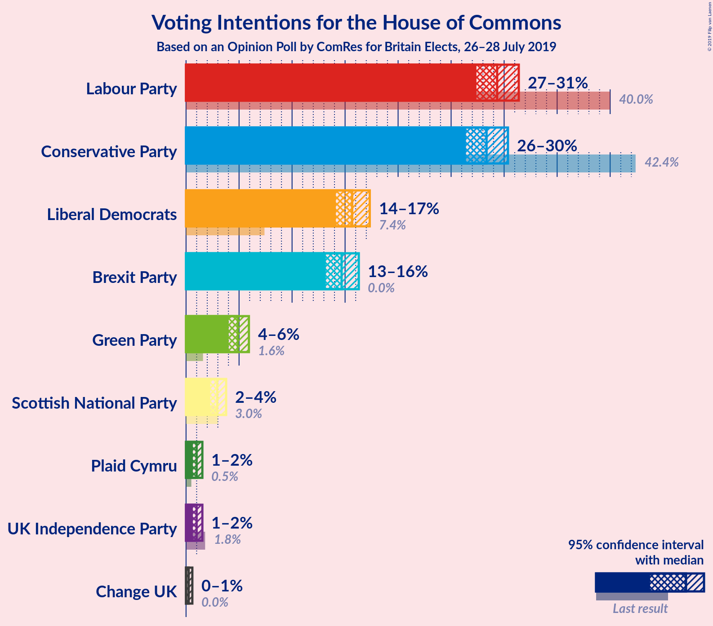
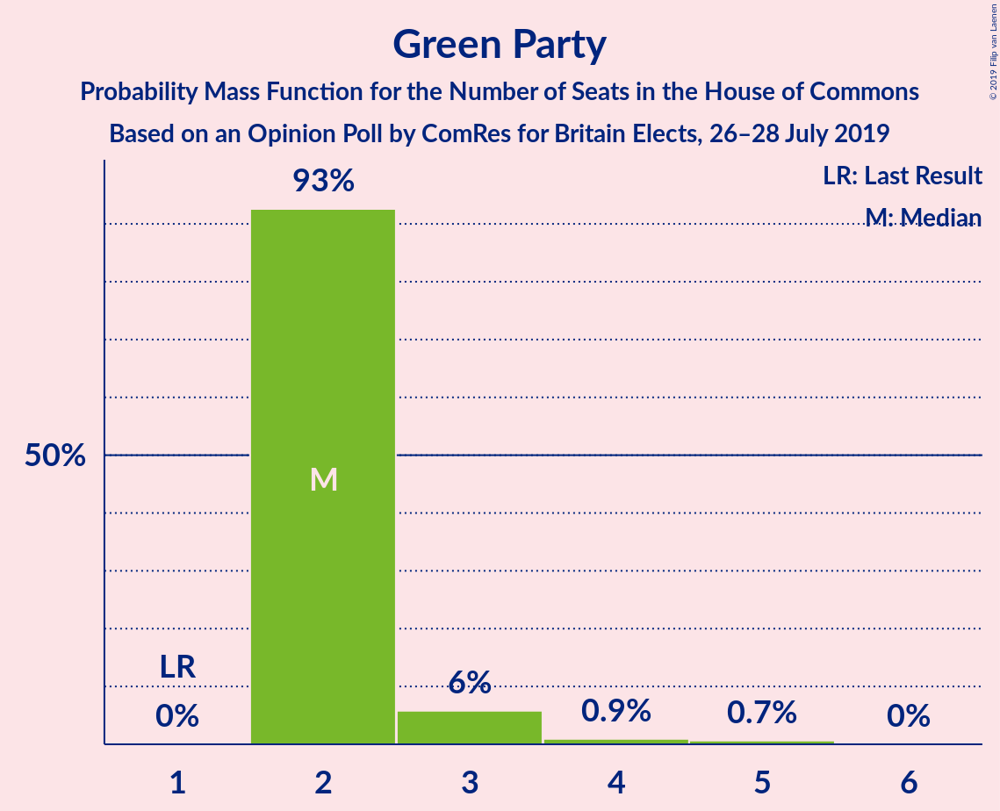
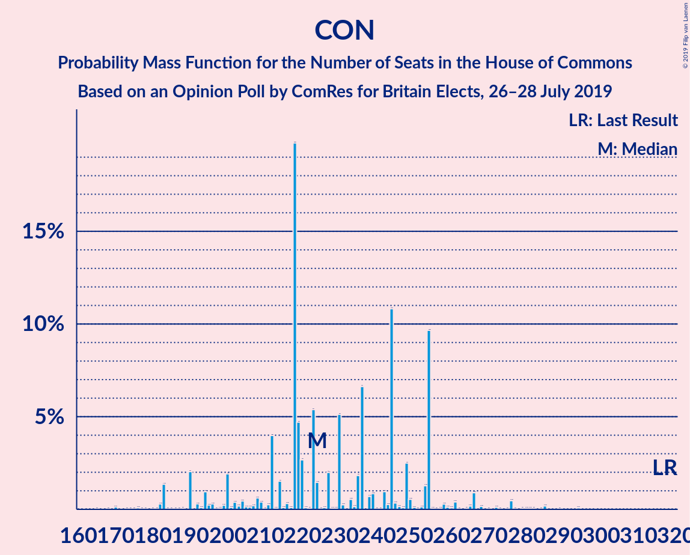

# Opinion Poll by ComRes for Britain Elects, 26–28 July 2019

<a href="#voting-intentions">Voting Intentions</a> | <a href="#seats">Seats</a> | <a href="#coalitions">Coalitions</a> | <a href="#technical-information">Technical Information</a>

## Voting Intentions

### Confidence Intervals

| Party | Last Result | Poll Result | 80% Confidence Interval | 90% Confidence Interval | 95% Confidence Interval | 99% Confidence Interval |
|:-----:|:-----------:|:-----------:|:-----------------------:|:-----------------------:|:-----------------------:|:-----------------------:|
| Labour Party | 40.0% | 30.0% | 28.2–31.8% |27.7–32.3% |27.3–32.8% |26.5–33.7% |
| Conservative Party | 42.4% | 29.0% | 27.3–30.9% |26.8–31.4% |26.4–31.8% |25.5–32.7% |
| Liberal Democrats | 7.4% | 16.0% | 14.6–17.6% |14.3–18.0% |13.9–18.4% |13.3–19.1% |
| Brexit Party | 0.0% | 15.0% | 13.7–16.5% |13.3–16.9% |13.0–17.3% |12.3–18.0% |
| Green Party | 1.6% | 5.0% | 4.2–6.0% |4.0–6.2% |3.8–6.5% |3.5–7.0% |

*Note:* The poll result column reflects the actual value used in the calculations. Published results may vary slightly, and in addition be rounded to fewer digits.

## Seats

### Confidence Intervals

| Party | Last Result | Median | 80% Confidence Interval | 90% Confidence Interval | 95% Confidence Interval | 99% Confidence Interval |
|:-----:|:-----------:|:------:|:-----------------------:|:-----------------------:|:-----------------------:|:-----------------------:|
| <a href="#labour-party">Labour Party</a> | 262 | 254 | 226–270 |224–276 |178–280 |175–284 |
| <a href="#conservative-party">Conservative Party</a> | 317 | 228 | 217–273 |179–273 |177–278 |153–304 |
| <a href="#liberal-democrats">Liberal Democrats</a> | 12 | 56 | 44–71 |44–75 |44–77 |44–84 |
| <a href="#brexit-party">Brexit Party</a> | 0 | 33 | 26–52 |22–65 |21–67 |16–91 |
| <a href="#green-party">Green Party</a> | 1 | 2 | 2 |2–4 |2–5 |1–5 |

### Labour Party

*For a full overview of the results for this party, see the [Labour Party](party-labourparty.html) page.*

| Number of Seats | Probability | Accumulated | Special Marks |
|:---------------:|:-----------:|:-----------:|:-------------:|
| 155 | 0.1% | 100% |  |
| 156 | 0% | 99.9% |  |
| 157 | 0% | 99.9% |  |
| 158 | 0% | 99.9% |  |
| 159 | 0.2% | 99.9% |  |
| 160 | 0% | 99.7% |  |
| 161 | 0% | 99.7% |  |
| 162 | 0% | 99.7% |  |
| 163 | 0% | 99.7% |  |
| 164 | 0% | 99.7% |  |
| 165 | 0% | 99.7% |  |
| 166 | 0% | 99.7% |  |
| 167 | 0% | 99.7% |  |
| 168 | 0% | 99.7% |  |
| 169 | 0% | 99.7% |  |
| 170 | 0% | 99.6% |  |
| 171 | 0% | 99.6% |  |
| 172 | 0% | 99.6% |  |
| 173 | 0% | 99.6% |  |
| 174 | 0.1% | 99.6% |  |
| 175 | 0.2% | 99.6% |  |
| 176 | 0% | 99.3% |  |
| 177 | 0.3% | 99.3% |  |
| 178 | 3% | 99.0% |  |
| 179 | 0% | 96% |  |
| 180 | 0.6% | 96% |  |
| 181 | 0% | 96% |  |
| 182 | 0% | 96% |  |
| 183 | 0.1% | 96% |  |
| 184 | 0% | 96% |  |
| 185 | 0% | 96% |  |
| 186 | 0% | 96% |  |
| 187 | 0% | 96% |  |
| 188 | 0% | 96% |  |
| 189 | 0% | 96% |  |
| 190 | 0% | 96% |  |
| 191 | 0% | 96% |  |
| 192 | 0% | 96% |  |
| 193 | 0% | 96% |  |
| 194 | 0% | 96% |  |
| 195 | 0% | 96% |  |
| 196 | 0% | 96% |  |
| 197 | 0% | 96% |  |
| 198 | 0% | 96% |  |
| 199 | 0% | 96% |  |
| 200 | 0% | 96% |  |
| 201 | 0% | 96% |  |
| 202 | 0% | 96% |  |
| 203 | 0% | 96% |  |
| 204 | 0% | 96% |  |
| 205 | 0% | 96% |  |
| 206 | 0% | 96% |  |
| 207 | 0% | 96% |  |
| 208 | 0% | 96% |  |
| 209 | 0% | 96% |  |
| 210 | 0% | 96% |  |
| 211 | 0% | 96% |  |
| 212 | 0% | 96% |  |
| 213 | 0% | 96% |  |
| 214 | 0% | 96% |  |
| 215 | 0% | 96% |  |
| 216 | 0% | 96% |  |
| 217 | 0% | 96% |  |
| 218 | 0% | 96% |  |
| 219 | 0% | 96% |  |
| 220 | 0% | 96% |  |
| 221 | 0% | 96% |  |
| 222 | 0.5% | 96% |  |
| 223 | 0% | 95% |  |
| 224 | 0.4% | 95% |  |
| 225 | 0% | 95% |  |
| 226 | 9% | 95% |  |
| 227 | 4% | 86% |  |
| 228 | 0% | 81% |  |
| 229 | 0% | 81% |  |
| 230 | 0% | 81% |  |
| 231 | 0% | 81% |  |
| 232 | 0% | 81% |  |
| 233 | 0% | 81% |  |
| 234 | 0% | 81% |  |
| 235 | 0% | 81% |  |
| 236 | 0% | 81% |  |
| 237 | 0% | 81% |  |
| 238 | 0.1% | 81% |  |
| 239 | 2% | 81% |  |
| 240 | 0.8% | 79% |  |
| 241 | 4% | 79% |  |
| 242 | 12% | 75% |  |
| 243 | 2% | 63% |  |
| 244 | 0% | 61% |  |
| 245 | 0% | 61% |  |
| 246 | 0% | 61% |  |
| 247 | 0.3% | 61% |  |
| 248 | 0% | 60% |  |
| 249 | 0% | 60% |  |
| 250 | 0% | 60% |  |
| 251 | 2% | 60% |  |
| 252 | 0.3% | 59% |  |
| 253 | 0.2% | 58% |  |
| 254 | 14% | 58% | Median |
| 255 | 0% | 44% |  |
| 256 | 2% | 44% |  |
| 257 | 0.3% | 42% |  |
| 258 | 0% | 42% |  |
| 259 | 0.6% | 42% |  |
| 260 | 0.1% | 41% |  |
| 261 | 0% | 41% |  |
| 262 | 0.2% | 41% | Last Result |
| 263 | 0.9% | 41% |  |
| 264 | 0.1% | 40% |  |
| 265 | 0.2% | 40% |  |
| 266 | 0% | 40% |  |
| 267 | 3% | 40% |  |
| 268 | 0.1% | 37% |  |
| 269 | 1.2% | 37% |  |
| 270 | 25% | 35% |  |
| 271 | 0.6% | 10% |  |
| 272 | 4% | 9% |  |
| 273 | 0% | 5% |  |
| 274 | 0% | 5% |  |
| 275 | 0% | 5% |  |
| 276 | 0.6% | 5% |  |
| 277 | 0% | 5% |  |
| 278 | 0.6% | 5% |  |
| 279 | 0.5% | 4% |  |
| 280 | 3% | 4% |  |
| 281 | 0% | 0.8% |  |
| 282 | 0% | 0.8% |  |
| 283 | 0% | 0.8% |  |
| 284 | 0.4% | 0.8% |  |
| 285 | 0.1% | 0.4% |  |
| 286 | 0.1% | 0.3% |  |
| 287 | 0% | 0.1% |  |
| 288 | 0% | 0.1% |  |
| 289 | 0% | 0.1% |  |
| 290 | 0% | 0.1% |  |
| 291 | 0% | 0.1% |  |
| 292 | 0% | 0.1% |  |
| 293 | 0% | 0.1% |  |
| 294 | 0% | 0.1% |  |
| 295 | 0.1% | 0.1% |  |
| 296 | 0% | 0% |  |

### Conservative Party

*For a full overview of the results for this party, see the [Conservative Party](party-conservativeparty.html) page.*

| Number of Seats | Probability | Accumulated | Special Marks |
|:---------------:|:-----------:|:-----------:|:-------------:|
| 141 | 0% | 100% |  |
| 142 | 0% | 99.9% |  |
| 143 | 0% | 99.9% |  |
| 144 | 0% | 99.9% |  |
| 145 | 0% | 99.9% |  |
| 146 | 0% | 99.9% |  |
| 147 | 0.2% | 99.9% |  |
| 148 | 0% | 99.7% |  |
| 149 | 0% | 99.7% |  |
| 150 | 0% | 99.7% |  |
| 151 | 0% | 99.7% |  |
| 152 | 0% | 99.7% |  |
| 153 | 0.2% | 99.7% |  |
| 154 | 0% | 99.5% |  |
| 155 | 0% | 99.5% |  |
| 156 | 0% | 99.5% |  |
| 157 | 0.1% | 99.5% |  |
| 158 | 0% | 99.4% |  |
| 159 | 0% | 99.4% |  |
| 160 | 0% | 99.4% |  |
| 161 | 0% | 99.4% |  |
| 162 | 0% | 99.3% |  |
| 163 | 0% | 99.3% |  |
| 164 | 0% | 99.3% |  |
| 165 | 0% | 99.3% |  |
| 166 | 0% | 99.3% |  |
| 167 | 0% | 99.3% |  |
| 168 | 0% | 99.3% |  |
| 169 | 0% | 99.3% |  |
| 170 | 0% | 99.3% |  |
| 171 | 0% | 99.3% |  |
| 172 | 0% | 99.3% |  |
| 173 | 0.5% | 99.3% |  |
| 174 | 0% | 98.8% |  |
| 175 | 0% | 98.8% |  |
| 176 | 0% | 98.8% |  |
| 177 | 3% | 98.8% |  |
| 178 | 0% | 96% |  |
| 179 | 0.9% | 96% |  |
| 180 | 0% | 95% |  |
| 181 | 0% | 95% |  |
| 182 | 0% | 95% |  |
| 183 | 3% | 95% |  |
| 184 | 0.6% | 92% |  |
| 185 | 0% | 92% |  |
| 186 | 0% | 92% |  |
| 187 | 0% | 92% |  |
| 188 | 0% | 92% |  |
| 189 | 0% | 92% |  |
| 190 | 0% | 92% |  |
| 191 | 0% | 92% |  |
| 192 | 0% | 92% |  |
| 193 | 0.1% | 92% |  |
| 194 | 0% | 92% |  |
| 195 | 0% | 92% |  |
| 196 | 0% | 92% |  |
| 197 | 0% | 92% |  |
| 198 | 0% | 92% |  |
| 199 | 0.1% | 92% |  |
| 200 | 0% | 91% |  |
| 201 | 0.1% | 91% |  |
| 202 | 0% | 91% |  |
| 203 | 0.1% | 91% |  |
| 204 | 0% | 91% |  |
| 205 | 0% | 91% |  |
| 206 | 0% | 91% |  |
| 207 | 0% | 91% |  |
| 208 | 0% | 91% |  |
| 209 | 0% | 91% |  |
| 210 | 0.2% | 91% |  |
| 211 | 0% | 91% |  |
| 212 | 0.2% | 91% |  |
| 213 | 0% | 91% |  |
| 214 | 0% | 91% |  |
| 215 | 0.3% | 91% |  |
| 216 | 0% | 90% |  |
| 217 | 1.2% | 90% |  |
| 218 | 0% | 89% |  |
| 219 | 0% | 89% |  |
| 220 | 2% | 89% |  |
| 221 | 14% | 87% |  |
| 222 | 0% | 73% |  |
| 223 | 0% | 73% |  |
| 224 | 2% | 73% |  |
| 225 | 0.6% | 72% |  |
| 226 | 0.6% | 71% |  |
| 227 | 7% | 70% |  |
| 228 | 23% | 63% | Median |
| 229 | 0% | 40% |  |
| 230 | 0.6% | 40% |  |
| 231 | 0% | 39% |  |
| 232 | 0.1% | 39% |  |
| 233 | 0.4% | 39% |  |
| 234 | 0.6% | 39% |  |
| 235 | 0% | 38% |  |
| 236 | 0.2% | 38% |  |
| 237 | 0% | 38% |  |
| 238 | 0% | 38% |  |
| 239 | 0% | 38% |  |
| 240 | 0% | 38% |  |
| 241 | 0% | 38% |  |
| 242 | 0% | 38% |  |
| 243 | 0% | 38% |  |
| 244 | 0% | 38% |  |
| 245 | 0% | 38% |  |
| 246 | 0% | 38% |  |
| 247 | 0% | 38% |  |
| 248 | 0% | 38% |  |
| 249 | 0% | 38% |  |
| 250 | 0% | 38% |  |
| 251 | 0% | 38% |  |
| 252 | 0% | 38% |  |
| 253 | 0.1% | 38% |  |
| 254 | 0% | 38% |  |
| 255 | 0% | 38% |  |
| 256 | 0.3% | 38% |  |
| 257 | 0% | 38% |  |
| 258 | 0.2% | 38% |  |
| 259 | 4% | 37% |  |
| 260 | 12% | 34% |  |
| 261 | 0% | 22% |  |
| 262 | 0.1% | 22% |  |
| 263 | 0% | 22% |  |
| 264 | 0% | 22% |  |
| 265 | 0% | 22% |  |
| 266 | 0% | 22% |  |
| 267 | 0% | 22% |  |
| 268 | 0% | 22% |  |
| 269 | 2% | 22% |  |
| 270 | 0% | 20% |  |
| 271 | 4% | 20% |  |
| 272 | 0% | 15% |  |
| 273 | 11% | 15% |  |
| 274 | 0% | 5% |  |
| 275 | 0% | 5% |  |
| 276 | 1.1% | 5% |  |
| 277 | 0% | 4% |  |
| 278 | 3% | 4% |  |
| 279 | 0% | 0.9% |  |
| 280 | 0% | 0.9% |  |
| 281 | 0.2% | 0.9% |  |
| 282 | 0% | 0.7% |  |
| 283 | 0% | 0.7% |  |
| 284 | 0% | 0.7% |  |
| 285 | 0% | 0.7% |  |
| 286 | 0% | 0.7% |  |
| 287 | 0% | 0.7% |  |
| 288 | 0% | 0.7% |  |
| 289 | 0% | 0.7% |  |
| 290 | 0% | 0.7% |  |
| 291 | 0% | 0.7% |  |
| 292 | 0% | 0.7% |  |
| 293 | 0% | 0.7% |  |
| 294 | 0% | 0.7% |  |
| 295 | 0% | 0.7% |  |
| 296 | 0% | 0.7% |  |
| 297 | 0% | 0.7% |  |
| 298 | 0% | 0.7% |  |
| 299 | 0% | 0.7% |  |
| 300 | 0% | 0.7% |  |
| 301 | 0% | 0.7% |  |
| 302 | 0% | 0.7% |  |
| 303 | 0% | 0.7% |  |
| 304 | 0.3% | 0.7% |  |
| 305 | 0% | 0.4% |  |
| 306 | 0% | 0.4% |  |
| 307 | 0.1% | 0.4% |  |
| 308 | 0.2% | 0.3% |  |
| 309 | 0% | 0.1% |  |
| 310 | 0.1% | 0.1% |  |
| 311 | 0% | 0.1% |  |
| 312 | 0% | 0% |  |
| 313 | 0% | 0% |  |
| 314 | 0% | 0% |  |
| 315 | 0% | 0% |  |
| 316 | 0% | 0% |  |
| 317 | 0% | 0% | Last Result |

### Liberal Democrats

*For a full overview of the results for this party, see the [Liberal Democrats](party-liberaldemocrats.html) page.*

| Number of Seats | Probability | Accumulated | Special Marks |
|:---------------:|:-----------:|:-----------:|:-------------:|
| 12 | 0% | 100% | Last Result |
| 13 | 0% | 100% |  |
| 14 | 0% | 100% |  |
| 15 | 0% | 100% |  |
| 16 | 0% | 100% |  |
| 17 | 0% | 100% |  |
| 18 | 0% | 100% |  |
| 19 | 0% | 100% |  |
| 20 | 0% | 100% |  |
| 21 | 0% | 100% |  |
| 22 | 0% | 100% |  |
| 23 | 0% | 100% |  |
| 24 | 0% | 100% |  |
| 25 | 0% | 100% |  |
| 26 | 0% | 100% |  |
| 27 | 0% | 100% |  |
| 28 | 0% | 100% |  |
| 29 | 0% | 100% |  |
| 30 | 0% | 100% |  |
| 31 | 0% | 100% |  |
| 32 | 0% | 100% |  |
| 33 | 0% | 100% |  |
| 34 | 0% | 100% |  |
| 35 | 0% | 100% |  |
| 36 | 0% | 100% |  |
| 37 | 0% | 100% |  |
| 38 | 0% | 100% |  |
| 39 | 0% | 100% |  |
| 40 | 0.1% | 100% |  |
| 41 | 0% | 99.9% |  |
| 42 | 0% | 99.9% |  |
| 43 | 0% | 99.9% |  |
| 44 | 17% | 99.9% |  |
| 45 | 20% | 83% |  |
| 46 | 0.5% | 63% |  |
| 47 | 8% | 63% |  |
| 48 | 4% | 55% |  |
| 49 | 0.3% | 51% |  |
| 50 | 0% | 51% |  |
| 51 | 0% | 51% |  |
| 52 | 0% | 51% |  |
| 53 | 0% | 51% |  |
| 54 | 0% | 51% |  |
| 55 | 0% | 51% |  |
| 56 | 10% | 51% | Median |
| 57 | 26% | 41% |  |
| 58 | 3% | 15% |  |
| 59 | 0% | 11% |  |
| 60 | 0.9% | 11% |  |
| 61 | 0% | 10% |  |
| 62 | 0% | 10% |  |
| 63 | 0% | 10% |  |
| 64 | 0% | 10% |  |
| 65 | 0% | 10% |  |
| 66 | 0% | 10% |  |
| 67 | 0% | 10% |  |
| 68 | 0.2% | 10% |  |
| 69 | 0.2% | 10% |  |
| 70 | 0% | 10% |  |
| 71 | 3% | 10% |  |
| 72 | 0% | 7% |  |
| 73 | 0.2% | 7% |  |
| 74 | 1.1% | 7% |  |
| 75 | 0.4% | 5% |  |
| 76 | 0% | 5% |  |
| 77 | 3% | 5% |  |
| 78 | 0.9% | 2% |  |
| 79 | 0% | 0.9% |  |
| 80 | 0.2% | 0.9% |  |
| 81 | 0.2% | 0.8% |  |
| 82 | 0% | 0.6% |  |
| 83 | 0% | 0.6% |  |
| 84 | 0.5% | 0.6% |  |
| 85 | 0% | 0% |  |

### Brexit Party

*For a full overview of the results for this party, see the [Brexit Party](party-brexitparty.html) page.*

| Number of Seats | Probability | Accumulated | Special Marks |
|:---------------:|:-----------:|:-----------:|:-------------:|
| 0 | 0% | 100% | Last Result |
| 1 | 0% | 100% |  |
| 2 | 0% | 100% |  |
| 3 | 0% | 100% |  |
| 4 | 0% | 100% |  |
| 5 | 0% | 100% |  |
| 6 | 0% | 100% |  |
| 7 | 0% | 100% |  |
| 8 | 0% | 100% |  |
| 9 | 0% | 100% |  |
| 10 | 0% | 100% |  |
| 11 | 0% | 100% |  |
| 12 | 0% | 100% |  |
| 13 | 0% | 100% |  |
| 14 | 0% | 99.9% |  |
| 15 | 0% | 99.9% |  |
| 16 | 0.5% | 99.9% |  |
| 17 | 0% | 99.4% |  |
| 18 | 0% | 99.4% |  |
| 19 | 0% | 99.4% |  |
| 20 | 0% | 99.4% |  |
| 21 | 4% | 99.4% |  |
| 22 | 4% | 96% |  |
| 23 | 0% | 91% |  |
| 24 | 0% | 91% |  |
| 25 | 0.1% | 91% |  |
| 26 | 13% | 91% |  |
| 27 | 1.4% | 78% |  |
| 28 | 0.1% | 76% |  |
| 29 | 0% | 76% |  |
| 30 | 1.3% | 76% |  |
| 31 | 0% | 75% |  |
| 32 | 0.7% | 75% |  |
| 33 | 41% | 74% | Median |
| 34 | 1.2% | 33% |  |
| 35 | 0% | 32% |  |
| 36 | 0% | 32% |  |
| 37 | 0% | 32% |  |
| 38 | 0% | 32% |  |
| 39 | 0% | 32% |  |
| 40 | 0.2% | 32% |  |
| 41 | 3% | 32% |  |
| 42 | 0% | 29% |  |
| 43 | 0.3% | 29% |  |
| 44 | 0.9% | 28% |  |
| 45 | 2% | 28% |  |
| 46 | 15% | 25% |  |
| 47 | 0.1% | 10% |  |
| 48 | 0% | 10% |  |
| 49 | 0% | 10% |  |
| 50 | 0% | 10% |  |
| 51 | 0% | 10% |  |
| 52 | 0.4% | 10% |  |
| 53 | 0% | 10% |  |
| 54 | 0% | 10% |  |
| 55 | 0.1% | 10% |  |
| 56 | 3% | 10% |  |
| 57 | 0.9% | 7% |  |
| 58 | 0.1% | 6% |  |
| 59 | 0% | 6% |  |
| 60 | 0.4% | 6% |  |
| 61 | 0.1% | 5% |  |
| 62 | 0.1% | 5% |  |
| 63 | 0% | 5% |  |
| 64 | 0% | 5% |  |
| 65 | 0.2% | 5% |  |
| 66 | 0% | 5% |  |
| 67 | 3% | 5% |  |
| 68 | 0.6% | 2% |  |
| 69 | 0.2% | 1.0% |  |
| 70 | 0% | 0.8% |  |
| 71 | 0.1% | 0.8% |  |
| 72 | 0% | 0.7% |  |
| 73 | 0% | 0.7% |  |
| 74 | 0% | 0.7% |  |
| 75 | 0% | 0.7% |  |
| 76 | 0% | 0.7% |  |
| 77 | 0% | 0.7% |  |
| 78 | 0% | 0.7% |  |
| 79 | 0% | 0.7% |  |
| 80 | 0% | 0.6% |  |
| 81 | 0% | 0.6% |  |
| 82 | 0.1% | 0.6% |  |
| 83 | 0% | 0.5% |  |
| 84 | 0% | 0.5% |  |
| 85 | 0% | 0.5% |  |
| 86 | 0% | 0.5% |  |
| 87 | 0% | 0.5% |  |
| 88 | 0% | 0.5% |  |
| 89 | 0% | 0.5% |  |
| 90 | 0% | 0.5% |  |
| 91 | 0.1% | 0.5% |  |
| 92 | 0% | 0.4% |  |
| 93 | 0% | 0.4% |  |
| 94 | 0% | 0.4% |  |
| 95 | 0% | 0.4% |  |
| 96 | 0% | 0.4% |  |
| 97 | 0% | 0.4% |  |
| 98 | 0% | 0.4% |  |
| 99 | 0% | 0.4% |  |
| 100 | 0% | 0.4% |  |
| 101 | 0.2% | 0.3% |  |
| 102 | 0% | 0.1% |  |
| 103 | 0% | 0.1% |  |
| 104 | 0% | 0.1% |  |
| 105 | 0% | 0.1% |  |
| 106 | 0% | 0.1% |  |
| 107 | 0% | 0.1% |  |
| 108 | 0% | 0.1% |  |
| 109 | 0% | 0.1% |  |
| 110 | 0% | 0.1% |  |
| 111 | 0% | 0.1% |  |
| 112 | 0% | 0.1% |  |
| 113 | 0% | 0.1% |  |
| 114 | 0% | 0.1% |  |
| 115 | 0% | 0.1% |  |
| 116 | 0% | 0.1% |  |
| 117 | 0% | 0.1% |  |
| 118 | 0% | 0% |  |

### Green Party

*For a full overview of the results for this party, see the [Green Party](party-greenparty.html) page.*

| Number of Seats | Probability | Accumulated | Special Marks |
|:---------------:|:-----------:|:-----------:|:-------------:|
| 1 | 1.0% | 100% | Last Result |
| 2 | 93% | 99.0% | Median |
| 3 | 0.6% | 6% |  |
| 4 | 0.9% | 6% |  |
| 5 | 5% | 5% |  |
| 6 | 0% | 0% |  |

## Coalitions

### Confidence Intervals

| Coalition | Last Result | Median | Majority? | 80% Confidence Interval | 90% Confidence Interval | 95% Confidence Interval | 99% Confidence Interval |
|:---------:|:-----------:|:------:|:---------:|:-----------------------:|:-----------------------:|:-----------------------:|:-----------------------:|
| Labour Party – Liberal Democrats | 274 | 311 | 14% | 282–329 | 282–344 | 236–351 | 224–351 |
| Conservative Party – Liberal Democrats | 329 | 278 | 18% | 270–329 | 254–329 | 254–336 | 234–351 |
| Labour Party | 262 | 254 | 0% | 226–270 | 224–276 | 178–280 | 175–284 |
| Conservative Party | 317 | 228 | 0% | 217–273 | 179–273 | 177–278 | 153–304 |

### Labour Party – Liberal Democrats

| Number of Seats | Probability | Accumulated | Special Marks |
|:---------------:|:-----------:|:-----------:|:-------------:|
| 204 | 0.1% | 100% |  |
| 205 | 0% | 99.9% |  |
| 206 | 0% | 99.9% |  |
| 207 | 0% | 99.9% |  |
| 208 | 0.2% | 99.9% |  |
| 209 | 0% | 99.7% |  |
| 210 | 0% | 99.7% |  |
| 211 | 0% | 99.7% |  |
| 212 | 0% | 99.7% |  |
| 213 | 0% | 99.7% |  |
| 214 | 0% | 99.7% |  |
| 215 | 0% | 99.7% |  |
| 216 | 0% | 99.7% |  |
| 217 | 0% | 99.7% |  |
| 218 | 0% | 99.7% |  |
| 219 | 0% | 99.7% |  |
| 220 | 0.1% | 99.7% |  |
| 221 | 0% | 99.6% |  |
| 222 | 0% | 99.6% |  |
| 223 | 0% | 99.6% |  |
| 224 | 0.3% | 99.6% |  |
| 225 | 0% | 99.3% |  |
| 226 | 0.1% | 99.3% |  |
| 227 | 0% | 99.2% |  |
| 228 | 0.1% | 99.2% |  |
| 229 | 0% | 99.1% |  |
| 230 | 0% | 99.1% |  |
| 231 | 0% | 99.1% |  |
| 232 | 0.2% | 99.1% |  |
| 233 | 0% | 98.9% |  |
| 234 | 0% | 98.9% |  |
| 235 | 0% | 98.9% |  |
| 236 | 3% | 98.9% |  |
| 237 | 0% | 96% |  |
| 238 | 0.6% | 96% |  |
| 239 | 0% | 96% |  |
| 240 | 0% | 96% |  |
| 241 | 0% | 96% |  |
| 242 | 0% | 96% |  |
| 243 | 0% | 96% |  |
| 244 | 0% | 96% |  |
| 245 | 0% | 96% |  |
| 246 | 0% | 96% |  |
| 247 | 0% | 96% |  |
| 248 | 0% | 96% |  |
| 249 | 0% | 96% |  |
| 250 | 0% | 96% |  |
| 251 | 0% | 96% |  |
| 252 | 0% | 96% |  |
| 253 | 0% | 96% |  |
| 254 | 0% | 96% |  |
| 255 | 0% | 96% |  |
| 256 | 0% | 96% |  |
| 257 | 0% | 96% |  |
| 258 | 0% | 96% |  |
| 259 | 0% | 96% |  |
| 260 | 0% | 96% |  |
| 261 | 0% | 96% |  |
| 262 | 0% | 96% |  |
| 263 | 0% | 96% |  |
| 264 | 0% | 96% |  |
| 265 | 0% | 96% |  |
| 266 | 0% | 96% |  |
| 267 | 0% | 96% |  |
| 268 | 0% | 96% |  |
| 269 | 0% | 96% |  |
| 270 | 0% | 96% |  |
| 271 | 0% | 96% |  |
| 272 | 0% | 96% |  |
| 273 | 0% | 96% |  |
| 274 | 0% | 96% | Last Result |
| 275 | 0% | 96% |  |
| 276 | 0% | 96% |  |
| 277 | 0% | 96% |  |
| 278 | 0.5% | 96% |  |
| 279 | 0% | 95% |  |
| 280 | 0% | 95% |  |
| 281 | 0% | 95% |  |
| 282 | 9% | 95% |  |
| 283 | 0% | 86% |  |
| 284 | 4% | 86% |  |
| 285 | 4% | 82% |  |
| 286 | 12% | 78% |  |
| 287 | 2% | 66% |  |
| 288 | 0% | 64% |  |
| 289 | 0% | 64% |  |
| 290 | 0% | 64% |  |
| 291 | 2% | 64% |  |
| 292 | 0% | 62% |  |
| 293 | 0% | 62% |  |
| 294 | 0% | 62% |  |
| 295 | 0% | 62% |  |
| 296 | 0% | 62% |  |
| 297 | 0.1% | 62% |  |
| 298 | 0% | 62% |  |
| 299 | 0.4% | 62% |  |
| 300 | 0% | 62% |  |
| 301 | 0.1% | 62% |  |
| 302 | 0% | 62% |  |
| 303 | 0% | 62% |  |
| 304 | 0% | 62% |  |
| 305 | 0.1% | 61% |  |
| 306 | 0% | 61% |  |
| 307 | 0% | 61% |  |
| 308 | 2% | 61% |  |
| 309 | 0% | 60% |  |
| 310 | 0.1% | 60% | Median |
| 311 | 14% | 60% |  |
| 312 | 0% | 46% |  |
| 313 | 2% | 46% |  |
| 314 | 2% | 44% |  |
| 315 | 18% | 42% |  |
| 316 | 0% | 24% |  |
| 317 | 8% | 24% |  |
| 318 | 0% | 16% |  |
| 319 | 0.7% | 16% |  |
| 320 | 0.6% | 15% |  |
| 321 | 0% | 15% |  |
| 322 | 0.7% | 15% |  |
| 323 | 0% | 14% |  |
| 324 | 0% | 14% |  |
| 325 | 0% | 14% |  |
| 326 | 0.2% | 14% | Majority |
| 327 | 0.6% | 14% |  |
| 328 | 0% | 13% |  |
| 329 | 4% | 13% |  |
| 330 | 0.4% | 9% |  |
| 331 | 0.2% | 9% |  |
| 332 | 0.1% | 9% |  |
| 333 | 0.2% | 9% |  |
| 334 | 0% | 8% |  |
| 335 | 0.3% | 8% |  |
| 336 | 0.4% | 8% |  |
| 337 | 0% | 8% |  |
| 338 | 0% | 8% |  |
| 339 | 0% | 8% |  |
| 340 | 0% | 8% |  |
| 341 | 0.9% | 8% |  |
| 342 | 0.2% | 7% |  |
| 343 | 0% | 7% |  |
| 344 | 3% | 7% |  |
| 345 | 0.1% | 4% |  |
| 346 | 0% | 4% |  |
| 347 | 0% | 4% |  |
| 348 | 0% | 4% |  |
| 349 | 0% | 3% |  |
| 350 | 0.4% | 3% |  |
| 351 | 3% | 3% |  |
| 352 | 0.1% | 0.3% |  |
| 353 | 0% | 0.2% |  |
| 354 | 0% | 0.2% |  |
| 355 | 0% | 0.2% |  |
| 356 | 0% | 0.2% |  |
| 357 | 0% | 0.2% |  |
| 358 | 0% | 0.2% |  |
| 359 | 0% | 0.2% |  |
| 360 | 0.1% | 0.2% |  |
| 361 | 0.1% | 0.1% |  |
| 362 | 0% | 0% |  |

### Conservative Party – Liberal Democrats

| Number of Seats | Probability | Accumulated | Special Marks |
|:---------------:|:-----------:|:-----------:|:-------------:|
| 220 | 0.2% | 100% |  |
| 221 | 0.1% | 99.8% |  |
| 222 | 0% | 99.7% |  |
| 223 | 0% | 99.7% |  |
| 224 | 0% | 99.7% |  |
| 225 | 0% | 99.7% |  |
| 226 | 0% | 99.7% |  |
| 227 | 0% | 99.7% |  |
| 228 | 0.1% | 99.7% |  |
| 229 | 0% | 99.6% |  |
| 230 | 0% | 99.5% |  |
| 231 | 0% | 99.5% |  |
| 232 | 0% | 99.5% |  |
| 233 | 0% | 99.5% |  |
| 234 | 0.2% | 99.5% |  |
| 235 | 0% | 99.3% |  |
| 236 | 0% | 99.3% |  |
| 237 | 0% | 99.3% |  |
| 238 | 0% | 99.3% |  |
| 239 | 0% | 99.3% |  |
| 240 | 0% | 99.3% |  |
| 241 | 0% | 99.3% |  |
| 242 | 0% | 99.3% |  |
| 243 | 0% | 99.3% |  |
| 244 | 0% | 99.3% |  |
| 245 | 0% | 99.3% |  |
| 246 | 0% | 99.3% |  |
| 247 | 0% | 99.3% |  |
| 248 | 0.2% | 99.3% |  |
| 249 | 0.2% | 99.1% |  |
| 250 | 0% | 98.9% |  |
| 251 | 0% | 98.9% |  |
| 252 | 0% | 98.9% |  |
| 253 | 0% | 98.9% |  |
| 254 | 6% | 98.9% |  |
| 255 | 0.6% | 93% |  |
| 256 | 0% | 93% |  |
| 257 | 1.4% | 93% |  |
| 258 | 0% | 91% |  |
| 259 | 0% | 91% |  |
| 260 | 0% | 91% |  |
| 261 | 0% | 91% |  |
| 262 | 0% | 91% |  |
| 263 | 0% | 91% |  |
| 264 | 0% | 91% |  |
| 265 | 0% | 91% |  |
| 266 | 0% | 91% |  |
| 267 | 0% | 91% |  |
| 268 | 0% | 91% |  |
| 269 | 0.6% | 91% |  |
| 270 | 0.6% | 91% |  |
| 271 | 0% | 90% |  |
| 272 | 0% | 90% |  |
| 273 | 19% | 90% |  |
| 274 | 7% | 71% |  |
| 275 | 0% | 63% |  |
| 276 | 0% | 63% |  |
| 277 | 2% | 63% |  |
| 278 | 14% | 61% |  |
| 279 | 0.6% | 47% |  |
| 280 | 0% | 47% |  |
| 281 | 2% | 47% |  |
| 282 | 0% | 45% |  |
| 283 | 0% | 45% |  |
| 284 | 0% | 45% | Median |
| 285 | 4% | 45% |  |
| 286 | 0.6% | 41% |  |
| 287 | 0% | 40% |  |
| 288 | 0% | 40% |  |
| 289 | 0.3% | 40% |  |
| 290 | 0% | 40% |  |
| 291 | 0.8% | 40% |  |
| 292 | 0.5% | 39% |  |
| 293 | 0.1% | 39% |  |
| 294 | 0.6% | 39% |  |
| 295 | 0% | 38% |  |
| 296 | 0.2% | 38% |  |
| 297 | 0% | 38% |  |
| 298 | 0% | 38% |  |
| 299 | 0% | 38% |  |
| 300 | 0.3% | 38% |  |
| 301 | 0% | 38% |  |
| 302 | 0% | 38% |  |
| 303 | 4% | 38% |  |
| 304 | 12% | 34% |  |
| 305 | 0% | 22% |  |
| 306 | 0.1% | 22% |  |
| 307 | 0% | 22% |  |
| 308 | 0% | 22% |  |
| 309 | 0% | 22% |  |
| 310 | 0% | 22% |  |
| 311 | 0% | 22% |  |
| 312 | 0% | 22% |  |
| 313 | 0% | 22% |  |
| 314 | 0% | 22% |  |
| 315 | 0% | 22% |  |
| 316 | 0% | 22% |  |
| 317 | 2% | 22% |  |
| 318 | 0% | 20% |  |
| 319 | 0% | 20% |  |
| 320 | 0% | 20% |  |
| 321 | 2% | 20% |  |
| 322 | 0% | 18% |  |
| 323 | 0% | 18% |  |
| 324 | 0% | 18% |  |
| 325 | 0% | 18% |  |
| 326 | 0% | 18% | Majority |
| 327 | 0% | 18% |  |
| 328 | 4% | 18% |  |
| 329 | 9% | 14% | Last Result |
| 330 | 0% | 5% |  |
| 331 | 0% | 5% |  |
| 332 | 0.5% | 5% |  |
| 333 | 0% | 4% |  |
| 334 | 0.6% | 4% |  |
| 335 | 0% | 4% |  |
| 336 | 3% | 4% |  |
| 337 | 0% | 0.9% |  |
| 338 | 0.2% | 0.9% |  |
| 339 | 0% | 0.7% |  |
| 340 | 0% | 0.7% |  |
| 341 | 0% | 0.7% |  |
| 342 | 0% | 0.7% |  |
| 343 | 0% | 0.7% |  |
| 344 | 0% | 0.7% |  |
| 345 | 0% | 0.7% |  |
| 346 | 0% | 0.7% |  |
| 347 | 0% | 0.7% |  |
| 348 | 0% | 0.7% |  |
| 349 | 0% | 0.7% |  |
| 350 | 0% | 0.7% |  |
| 351 | 0.3% | 0.7% |  |
| 352 | 0% | 0.4% |  |
| 353 | 0.1% | 0.4% |  |
| 354 | 0% | 0.3% |  |
| 355 | 0% | 0.3% |  |
| 356 | 0% | 0.3% |  |
| 357 | 0.2% | 0.3% |  |
| 358 | 0% | 0.2% |  |
| 359 | 0.1% | 0.2% |  |
| 360 | 0% | 0.1% |  |
| 361 | 0% | 0.1% |  |
| 362 | 0% | 0.1% |  |
| 363 | 0% | 0.1% |  |
| 364 | 0% | 0.1% |  |
| 365 | 0% | 0.1% |  |
| 366 | 0% | 0.1% |  |
| 367 | 0% | 0.1% |  |
| 368 | 0% | 0.1% |  |
| 369 | 0% | 0% |  |

### Labour Party

| Number of Seats | Probability | Accumulated | Special Marks |
|:---------------:|:-----------:|:-----------:|:-------------:|
| 155 | 0.1% | 100% |  |
| 156 | 0% | 99.9% |  |
| 157 | 0% | 99.9% |  |
| 158 | 0% | 99.9% |  |
| 159 | 0.2% | 99.9% |  |
| 160 | 0% | 99.7% |  |
| 161 | 0% | 99.7% |  |
| 162 | 0% | 99.7% |  |
| 163 | 0% | 99.7% |  |
| 164 | 0% | 99.7% |  |
| 165 | 0% | 99.7% |  |
| 166 | 0% | 99.7% |  |
| 167 | 0% | 99.7% |  |
| 168 | 0% | 99.7% |  |
| 169 | 0% | 99.7% |  |
| 170 | 0% | 99.6% |  |
| 171 | 0% | 99.6% |  |
| 172 | 0% | 99.6% |  |
| 173 | 0% | 99.6% |  |
| 174 | 0.1% | 99.6% |  |
| 175 | 0.2% | 99.6% |  |
| 176 | 0% | 99.3% |  |
| 177 | 0.3% | 99.3% |  |
| 178 | 3% | 99.0% |  |
| 179 | 0% | 96% |  |
| 180 | 0.6% | 96% |  |
| 181 | 0% | 96% |  |
| 182 | 0% | 96% |  |
| 183 | 0.1% | 96% |  |
| 184 | 0% | 96% |  |
| 185 | 0% | 96% |  |
| 186 | 0% | 96% |  |
| 187 | 0% | 96% |  |
| 188 | 0% | 96% |  |
| 189 | 0% | 96% |  |
| 190 | 0% | 96% |  |
| 191 | 0% | 96% |  |
| 192 | 0% | 96% |  |
| 193 | 0% | 96% |  |
| 194 | 0% | 96% |  |
| 195 | 0% | 96% |  |
| 196 | 0% | 96% |  |
| 197 | 0% | 96% |  |
| 198 | 0% | 96% |  |
| 199 | 0% | 96% |  |
| 200 | 0% | 96% |  |
| 201 | 0% | 96% |  |
| 202 | 0% | 96% |  |
| 203 | 0% | 96% |  |
| 204 | 0% | 96% |  |
| 205 | 0% | 96% |  |
| 206 | 0% | 96% |  |
| 207 | 0% | 96% |  |
| 208 | 0% | 96% |  |
| 209 | 0% | 96% |  |
| 210 | 0% | 96% |  |
| 211 | 0% | 96% |  |
| 212 | 0% | 96% |  |
| 213 | 0% | 96% |  |
| 214 | 0% | 96% |  |
| 215 | 0% | 96% |  |
| 216 | 0% | 96% |  |
| 217 | 0% | 96% |  |
| 218 | 0% | 96% |  |
| 219 | 0% | 96% |  |
| 220 | 0% | 96% |  |
| 221 | 0% | 96% |  |
| 222 | 0.5% | 96% |  |
| 223 | 0% | 95% |  |
| 224 | 0.4% | 95% |  |
| 225 | 0% | 95% |  |
| 226 | 9% | 95% |  |
| 227 | 4% | 86% |  |
| 228 | 0% | 81% |  |
| 229 | 0% | 81% |  |
| 230 | 0% | 81% |  |
| 231 | 0% | 81% |  |
| 232 | 0% | 81% |  |
| 233 | 0% | 81% |  |
| 234 | 0% | 81% |  |
| 235 | 0% | 81% |  |
| 236 | 0% | 81% |  |
| 237 | 0% | 81% |  |
| 238 | 0.1% | 81% |  |
| 239 | 2% | 81% |  |
| 240 | 0.8% | 79% |  |
| 241 | 4% | 79% |  |
| 242 | 12% | 75% |  |
| 243 | 2% | 63% |  |
| 244 | 0% | 61% |  |
| 245 | 0% | 61% |  |
| 246 | 0% | 61% |  |
| 247 | 0.3% | 61% |  |
| 248 | 0% | 60% |  |
| 249 | 0% | 60% |  |
| 250 | 0% | 60% |  |
| 251 | 2% | 60% |  |
| 252 | 0.3% | 59% |  |
| 253 | 0.2% | 58% |  |
| 254 | 14% | 58% | Median |
| 255 | 0% | 44% |  |
| 256 | 2% | 44% |  |
| 257 | 0.3% | 42% |  |
| 258 | 0% | 42% |  |
| 259 | 0.6% | 42% |  |
| 260 | 0.1% | 41% |  |
| 261 | 0% | 41% |  |
| 262 | 0.2% | 41% | Last Result |
| 263 | 0.9% | 41% |  |
| 264 | 0.1% | 40% |  |
| 265 | 0.2% | 40% |  |
| 266 | 0% | 40% |  |
| 267 | 3% | 40% |  |
| 268 | 0.1% | 37% |  |
| 269 | 1.2% | 37% |  |
| 270 | 25% | 35% |  |
| 271 | 0.6% | 10% |  |
| 272 | 4% | 9% |  |
| 273 | 0% | 5% |  |
| 274 | 0% | 5% |  |
| 275 | 0% | 5% |  |
| 276 | 0.6% | 5% |  |
| 277 | 0% | 5% |  |
| 278 | 0.6% | 5% |  |
| 279 | 0.5% | 4% |  |
| 280 | 3% | 4% |  |
| 281 | 0% | 0.8% |  |
| 282 | 0% | 0.8% |  |
| 283 | 0% | 0.8% |  |
| 284 | 0.4% | 0.8% |  |
| 285 | 0.1% | 0.4% |  |
| 286 | 0.1% | 0.3% |  |
| 287 | 0% | 0.1% |  |
| 288 | 0% | 0.1% |  |
| 289 | 0% | 0.1% |  |
| 290 | 0% | 0.1% |  |
| 291 | 0% | 0.1% |  |
| 292 | 0% | 0.1% |  |
| 293 | 0% | 0.1% |  |
| 294 | 0% | 0.1% |  |
| 295 | 0.1% | 0.1% |  |
| 296 | 0% | 0% |  |

### Conservative Party

| Number of Seats | Probability | Accumulated | Special Marks |
|:---------------:|:-----------:|:-----------:|:-------------:|
| 141 | 0% | 100% |  |
| 142 | 0% | 99.9% |  |
| 143 | 0% | 99.9% |  |
| 144 | 0% | 99.9% |  |
| 145 | 0% | 99.9% |  |
| 146 | 0% | 99.9% |  |
| 147 | 0.2% | 99.9% |  |
| 148 | 0% | 99.7% |  |
| 149 | 0% | 99.7% |  |
| 150 | 0% | 99.7% |  |
| 151 | 0% | 99.7% |  |
| 152 | 0% | 99.7% |  |
| 153 | 0.2% | 99.7% |  |
| 154 | 0% | 99.5% |  |
| 155 | 0% | 99.5% |  |
| 156 | 0% | 99.5% |  |
| 157 | 0.1% | 99.5% |  |
| 158 | 0% | 99.4% |  |
| 159 | 0% | 99.4% |  |
| 160 | 0% | 99.4% |  |
| 161 | 0% | 99.4% |  |
| 162 | 0% | 99.3% |  |
| 163 | 0% | 99.3% |  |
| 164 | 0% | 99.3% |  |
| 165 | 0% | 99.3% |  |
| 166 | 0% | 99.3% |  |
| 167 | 0% | 99.3% |  |
| 168 | 0% | 99.3% |  |
| 169 | 0% | 99.3% |  |
| 170 | 0% | 99.3% |  |
| 171 | 0% | 99.3% |  |
| 172 | 0% | 99.3% |  |
| 173 | 0.5% | 99.3% |  |
| 174 | 0% | 98.8% |  |
| 175 | 0% | 98.8% |  |
| 176 | 0% | 98.8% |  |
| 177 | 3% | 98.8% |  |
| 178 | 0% | 96% |  |
| 179 | 0.9% | 96% |  |
| 180 | 0% | 95% |  |
| 181 | 0% | 95% |  |
| 182 | 0% | 95% |  |
| 183 | 3% | 95% |  |
| 184 | 0.6% | 92% |  |
| 185 | 0% | 92% |  |
| 186 | 0% | 92% |  |
| 187 | 0% | 92% |  |
| 188 | 0% | 92% |  |
| 189 | 0% | 92% |  |
| 190 | 0% | 92% |  |
| 191 | 0% | 92% |  |
| 192 | 0% | 92% |  |
| 193 | 0.1% | 92% |  |
| 194 | 0% | 92% |  |
| 195 | 0% | 92% |  |
| 196 | 0% | 92% |  |
| 197 | 0% | 92% |  |
| 198 | 0% | 92% |  |
| 199 | 0.1% | 92% |  |
| 200 | 0% | 91% |  |
| 201 | 0.1% | 91% |  |
| 202 | 0% | 91% |  |
| 203 | 0.1% | 91% |  |
| 204 | 0% | 91% |  |
| 205 | 0% | 91% |  |
| 206 | 0% | 91% |  |
| 207 | 0% | 91% |  |
| 208 | 0% | 91% |  |
| 209 | 0% | 91% |  |
| 210 | 0.2% | 91% |  |
| 211 | 0% | 91% |  |
| 212 | 0.2% | 91% |  |
| 213 | 0% | 91% |  |
| 214 | 0% | 91% |  |
| 215 | 0.3% | 91% |  |
| 216 | 0% | 90% |  |
| 217 | 1.2% | 90% |  |
| 218 | 0% | 89% |  |
| 219 | 0% | 89% |  |
| 220 | 2% | 89% |  |
| 221 | 14% | 87% |  |
| 222 | 0% | 73% |  |
| 223 | 0% | 73% |  |
| 224 | 2% | 73% |  |
| 225 | 0.6% | 72% |  |
| 226 | 0.6% | 71% |  |
| 227 | 7% | 70% |  |
| 228 | 23% | 63% | Median |
| 229 | 0% | 40% |  |
| 230 | 0.6% | 40% |  |
| 231 | 0% | 39% |  |
| 232 | 0.1% | 39% |  |
| 233 | 0.4% | 39% |  |
| 234 | 0.6% | 39% |  |
| 235 | 0% | 38% |  |
| 236 | 0.2% | 38% |  |
| 237 | 0% | 38% |  |
| 238 | 0% | 38% |  |
| 239 | 0% | 38% |  |
| 240 | 0% | 38% |  |
| 241 | 0% | 38% |  |
| 242 | 0% | 38% |  |
| 243 | 0% | 38% |  |
| 244 | 0% | 38% |  |
| 245 | 0% | 38% |  |
| 246 | 0% | 38% |  |
| 247 | 0% | 38% |  |
| 248 | 0% | 38% |  |
| 249 | 0% | 38% |  |
| 250 | 0% | 38% |  |
| 251 | 0% | 38% |  |
| 252 | 0% | 38% |  |
| 253 | 0.1% | 38% |  |
| 254 | 0% | 38% |  |
| 255 | 0% | 38% |  |
| 256 | 0.3% | 38% |  |
| 257 | 0% | 38% |  |
| 258 | 0.2% | 38% |  |
| 259 | 4% | 37% |  |
| 260 | 12% | 34% |  |
| 261 | 0% | 22% |  |
| 262 | 0.1% | 22% |  |
| 263 | 0% | 22% |  |
| 264 | 0% | 22% |  |
| 265 | 0% | 22% |  |
| 266 | 0% | 22% |  |
| 267 | 0% | 22% |  |
| 268 | 0% | 22% |  |
| 269 | 2% | 22% |  |
| 270 | 0% | 20% |  |
| 271 | 4% | 20% |  |
| 272 | 0% | 15% |  |
| 273 | 11% | 15% |  |
| 274 | 0% | 5% |  |
| 275 | 0% | 5% |  |
| 276 | 1.1% | 5% |  |
| 277 | 0% | 4% |  |
| 278 | 3% | 4% |  |
| 279 | 0% | 0.9% |  |
| 280 | 0% | 0.9% |  |
| 281 | 0.2% | 0.9% |  |
| 282 | 0% | 0.7% |  |
| 283 | 0% | 0.7% |  |
| 284 | 0% | 0.7% |  |
| 285 | 0% | 0.7% |  |
| 286 | 0% | 0.7% |  |
| 287 | 0% | 0.7% |  |
| 288 | 0% | 0.7% |  |
| 289 | 0% | 0.7% |  |
| 290 | 0% | 0.7% |  |
| 291 | 0% | 0.7% |  |
| 292 | 0% | 0.7% |  |
| 293 | 0% | 0.7% |  |
| 294 | 0% | 0.7% |  |
| 295 | 0% | 0.7% |  |
| 296 | 0% | 0.7% |  |
| 297 | 0% | 0.7% |  |
| 298 | 0% | 0.7% |  |
| 299 | 0% | 0.7% |  |
| 300 | 0% | 0.7% |  |
| 301 | 0% | 0.7% |  |
| 302 | 0% | 0.7% |  |
| 303 | 0% | 0.7% |  |
| 304 | 0.3% | 0.7% |  |
| 305 | 0% | 0.4% |  |
| 306 | 0% | 0.4% |  |
| 307 | 0.1% | 0.4% |  |
| 308 | 0.2% | 0.3% |  |
| 309 | 0% | 0.1% |  |
| 310 | 0.1% | 0.1% |  |
| 311 | 0% | 0.1% |  |
| 312 | 0% | 0% |  |
| 313 | 0% | 0% |  |
| 314 | 0% | 0% |  |
| 315 | 0% | 0% |  |
| 316 | 0% | 0% |  |
| 317 | 0% | 0% | Last Result |

## Technical Information

### Opinion Poll

+ **Polling firm:** ComRes
+ **Commissioner(s):** Britain Elects
+ **Fieldwork period:** 26–28 July 2019

### Calculations

+ **Sample size:** 1061
+ **Simulations done:** 1,024
+ **Error estimate:** 2.39%

