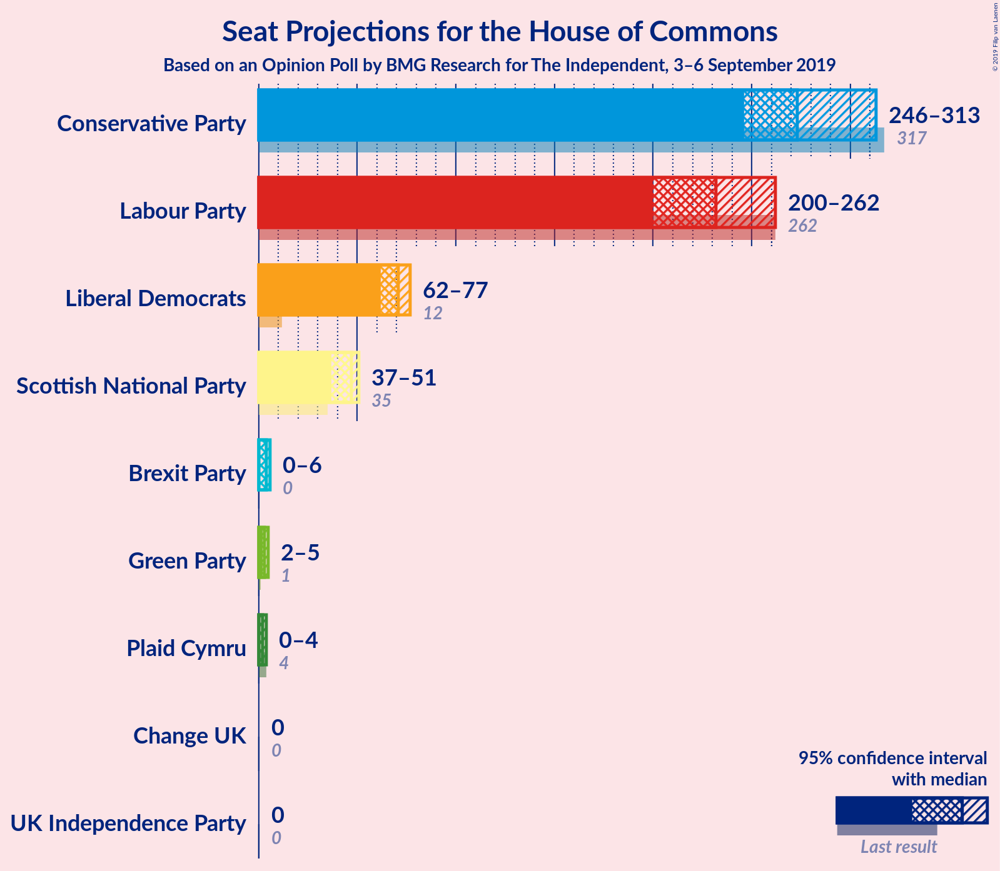
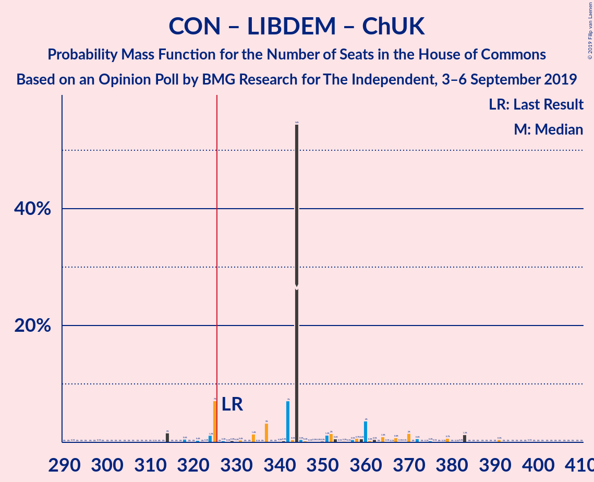
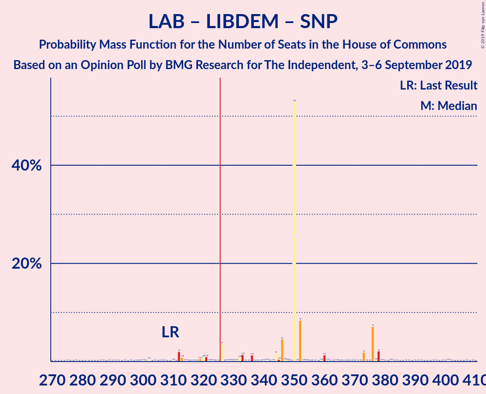
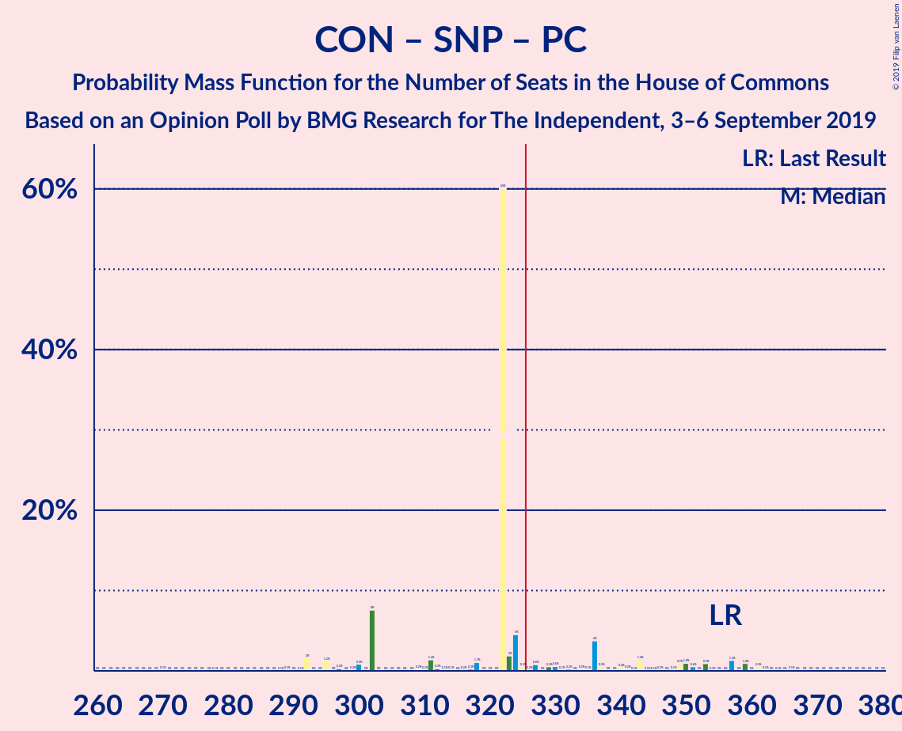
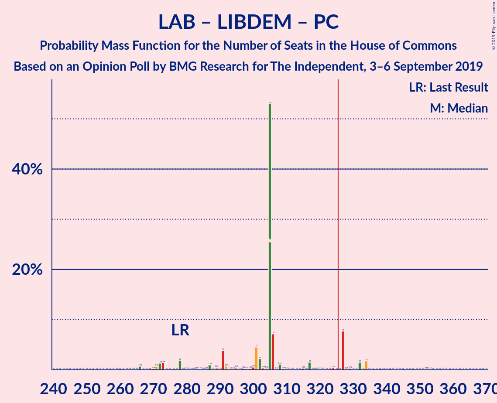
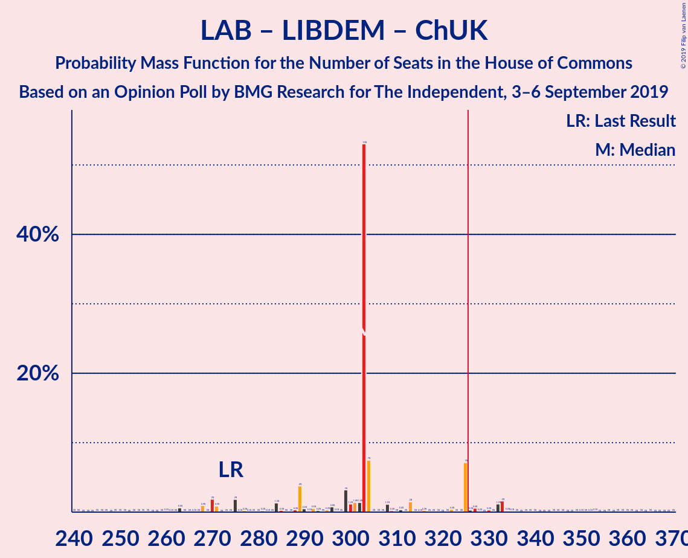
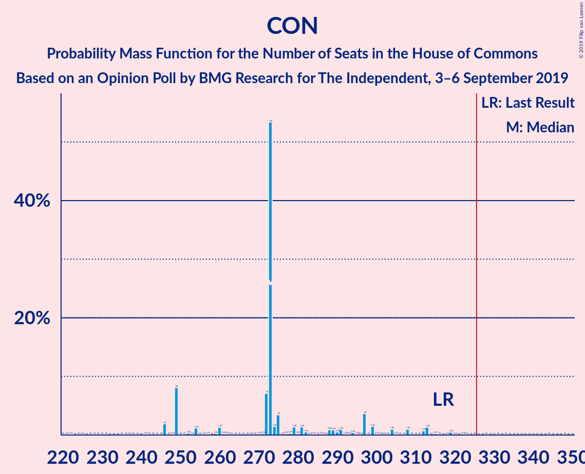
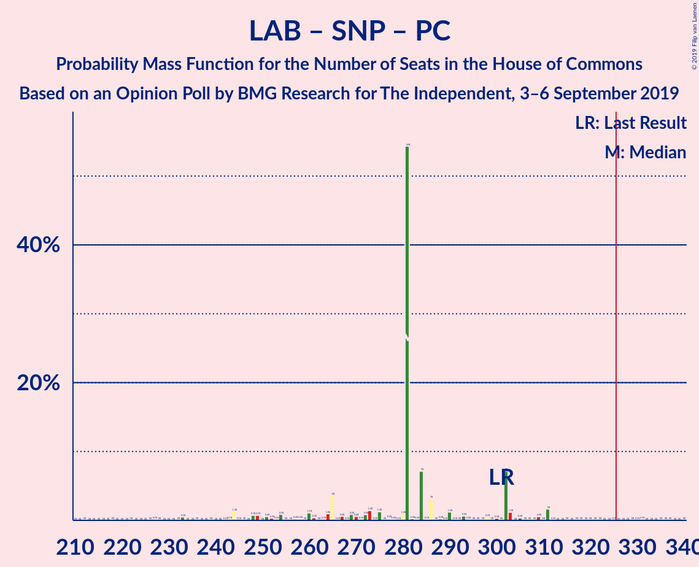

# Opinion Poll by BMG Research for The Independent, 3–6 September 2019

<a href="#voting-intentions">Voting Intentions</a> | <a href="#seats">Seats</a> | <a href="#coalitions">Coalitions</a> | <a href="#technical-information">Technical Information</a>

## Voting Intentions

### Confidence Intervals

| Party | Last Result | Poll Result | 80% Confidence Interval | 90% Confidence Interval | 95% Confidence Interval | 99% Confidence Interval |
|:-----:|:-----------:|:-----------:|:-----------------------:|:-----------------------:|:-----------------------:|:-----------------------:|
| Conservative Party | 42.4% | 29.1% | 27.6–30.7% |27.2–31.1% |26.9–31.5% |26.2–32.2% |
| Labour Party | 40.0% | 25.3% | 23.9–26.8% |23.5–27.2% |23.2–27.6% |22.5–28.3% |
| Liberal Democrats | 7.4% | 17.8% | 16.6–19.1% |16.3–19.5% |16.0–19.8% |15.4–20.5% |
| Brexit Party | 0.0% | 12.2% | 11.2–13.4% |10.9–13.7% |10.7–14.0% |10.2–14.6% |
| Green Party | 1.6% | 5.7% | 5.0–6.5% |4.8–6.7% |4.6–7.0% |4.3–7.4% |
| Scottish National Party | 3.0% | 2.8% | 2.3–3.4% |2.2–3.6% |2.1–3.8% |1.9–4.1% |
| UK Independence Party | 1.8% | 0.9% | 0.7–1.3% |0.6–1.5% |0.5–1.6% |0.5–1.8% |
| Plaid Cymru | 0.5% | 0.3% | 0.2–0.5% |0.1–0.6% |0.1–0.7% |0.1–0.8% |
| Change UK | 0.0% | 0.3% | 0.2–0.5% |0.1–0.6% |0.1–0.7% |0.1–0.8% |

*Note:* The poll result column reflects the actual value used in the calculations. Published results may vary slightly, and in addition be rounded to fewer digits.

## Seats

### Confidence Intervals

| Party | Last Result | Median | 80% Confidence Interval | 90% Confidence Interval | 95% Confidence Interval | 99% Confidence Interval |
|:-----:|:-----------:|:------:|:-----------------------:|:-----------------------:|:-----------------------:|:-----------------------:|
| <a href="#conservative-party">Conservative Party</a> | 317 | 264 | 241–288 |241–295 |240–309 |232–310 |
| <a href="#labour-party">Labour Party</a> | 262 | 206 | 200–231 |186–231 |174–250 |165–252 |
| <a href="#liberal-democrats">Liberal Democrats</a> | 12 | 70 | 62–75 |61–75 |61–76 |59–81 |
| <a href="#brexit-party">Brexit Party</a> | 0 | 40 | 26–40 |21–40 |18–49 |12–61 |
| <a href="#green-party">Green Party</a> | 1 | 2 | 2–5 |2–5 |2–5 |2–5 |
| <a href="#scottish-national-party">Scottish National Party</a> | 35 | 47 | 42–51 |37–51 |37–51 |32–53 |
| <a href="#uk-independence-party">UK Independence Party</a> | 0 | 0 | 0 |0 |0 |0 |
| <a href="#plaid-cymru">Plaid Cymru</a> | 4 | 2 | 2–3 |0–3 |0–4 |0–5 |
| <a href="#change-uk">Change UK</a> | 0 | 0 | 0 |0 |0 |0 |

### Conservative Party

*For a full overview of the results for this party, see the [Conservative Party](party-conservativeparty.html) page.*

| Number of Seats | Probability | Accumulated | Special Marks |
|:---------------:|:-----------:|:-----------:|:-------------:|
| 211 | 0% | 100% |  |
| 212 | 0% | 99.9% |  |
| 213 | 0% | 99.9% |  |
| 214 | 0% | 99.9% |  |
| 215 | 0.1% | 99.9% |  |
| 216 | 0% | 99.8% |  |
| 217 | 0% | 99.8% |  |
| 218 | 0.1% | 99.8% |  |
| 219 | 0% | 99.7% |  |
| 220 | 0% | 99.7% |  |
| 221 | 0% | 99.7% |  |
| 222 | 0% | 99.7% |  |
| 223 | 0% | 99.7% |  |
| 224 | 0% | 99.7% |  |
| 225 | 0% | 99.7% |  |
| 226 | 0% | 99.6% |  |
| 227 | 0% | 99.6% |  |
| 228 | 0% | 99.6% |  |
| 229 | 0% | 99.6% |  |
| 230 | 0.1% | 99.6% |  |
| 231 | 0% | 99.5% |  |
| 232 | 0% | 99.5% |  |
| 233 | 0% | 99.5% |  |
| 234 | 0.2% | 99.5% |  |
| 235 | 0.1% | 99.3% |  |
| 236 | 0% | 99.2% |  |
| 237 | 0.3% | 99.2% |  |
| 238 | 0% | 98.9% |  |
| 239 | 0% | 98.9% |  |
| 240 | 3% | 98.9% |  |
| 241 | 7% | 96% |  |
| 242 | 0% | 89% |  |
| 243 | 0% | 89% |  |
| 244 | 0% | 89% |  |
| 245 | 0.3% | 89% |  |
| 246 | 1.2% | 89% |  |
| 247 | 0.1% | 87% |  |
| 248 | 0% | 87% |  |
| 249 | 0.1% | 87% |  |
| 250 | 0.4% | 87% |  |
| 251 | 1.2% | 87% |  |
| 252 | 0.3% | 86% |  |
| 253 | 0.1% | 85% |  |
| 254 | 0% | 85% |  |
| 255 | 0% | 85% |  |
| 256 | 0% | 85% |  |
| 257 | 0.2% | 85% |  |
| 258 | 0% | 85% |  |
| 259 | 0% | 85% |  |
| 260 | 0% | 85% |  |
| 261 | 0.2% | 85% |  |
| 262 | 0.1% | 85% |  |
| 263 | 1.1% | 85% |  |
| 264 | 61% | 84% | Median |
| 265 | 3% | 23% |  |
| 266 | 0.1% | 20% |  |
| 267 | 0.3% | 20% |  |
| 268 | 0.3% | 19% |  |
| 269 | 0.5% | 19% |  |
| 270 | 1.4% | 19% |  |
| 271 | 0.3% | 17% |  |
| 272 | 1.3% | 17% |  |
| 273 | 0.2% | 16% |  |
| 274 | 0% | 15% |  |
| 275 | 0% | 15% |  |
| 276 | 0.1% | 15% |  |
| 277 | 0.2% | 15% |  |
| 278 | 0.3% | 15% |  |
| 279 | 0.5% | 15% |  |
| 280 | 0.3% | 14% |  |
| 281 | 0.5% | 14% |  |
| 282 | 1.0% | 13% |  |
| 283 | 0.2% | 12% |  |
| 284 | 0.1% | 12% |  |
| 285 | 0.2% | 12% |  |
| 286 | 0.4% | 12% |  |
| 287 | 0.7% | 12% |  |
| 288 | 5% | 11% |  |
| 289 | 0.1% | 6% |  |
| 290 | 0.1% | 6% |  |
| 291 | 0% | 6% |  |
| 292 | 0.1% | 6% |  |
| 293 | 0% | 6% |  |
| 294 | 0% | 6% |  |
| 295 | 1.0% | 6% |  |
| 296 | 0.1% | 5% |  |
| 297 | 0% | 5% |  |
| 298 | 1.0% | 4% |  |
| 299 | 0% | 3% |  |
| 300 | 0.1% | 3% |  |
| 301 | 0.1% | 3% |  |
| 302 | 0% | 3% |  |
| 303 | 0% | 3% |  |
| 304 | 0% | 3% |  |
| 305 | 0% | 3% |  |
| 306 | 0% | 3% |  |
| 307 | 0% | 3% |  |
| 308 | 0.5% | 3% |  |
| 309 | 2% | 3% |  |
| 310 | 0.2% | 0.6% |  |
| 311 | 0.2% | 0.4% |  |
| 312 | 0% | 0.2% |  |
| 313 | 0% | 0.2% |  |
| 314 | 0% | 0.2% |  |
| 315 | 0% | 0.2% |  |
| 316 | 0% | 0.2% |  |
| 317 | 0% | 0.2% | Last Result |
| 318 | 0% | 0.1% |  |
| 319 | 0.1% | 0.1% |  |
| 320 | 0% | 0.1% |  |
| 321 | 0% | 0.1% |  |
| 322 | 0% | 0.1% |  |
| 323 | 0% | 0.1% |  |
| 324 | 0% | 0.1% |  |
| 325 | 0% | 0.1% |  |
| 326 | 0% | 0.1% | Majority |
| 327 | 0% | 0.1% |  |
| 328 | 0% | 0.1% |  |
| 329 | 0% | 0.1% |  |
| 330 | 0% | 0.1% |  |
| 331 | 0% | 0.1% |  |
| 332 | 0% | 0.1% |  |
| 333 | 0% | 0.1% |  |
| 334 | 0% | 0% |  |

### Labour Party

*For a full overview of the results for this party, see the [Labour Party](party-labourparty.html) page.*

| Number of Seats | Probability | Accumulated | Special Marks |
|:---------------:|:-----------:|:-----------:|:-------------:|
| 150 | 0% | 100% |  |
| 151 | 0% | 99.9% |  |
| 152 | 0% | 99.9% |  |
| 153 | 0% | 99.9% |  |
| 154 | 0% | 99.9% |  |
| 155 | 0% | 99.9% |  |
| 156 | 0% | 99.9% |  |
| 157 | 0% | 99.9% |  |
| 158 | 0% | 99.9% |  |
| 159 | 0% | 99.9% |  |
| 160 | 0% | 99.9% |  |
| 161 | 0% | 99.9% |  |
| 162 | 0% | 99.9% |  |
| 163 | 0.1% | 99.9% |  |
| 164 | 0.1% | 99.8% |  |
| 165 | 0.6% | 99.7% |  |
| 166 | 0.6% | 99.1% |  |
| 167 | 0.5% | 98.5% |  |
| 168 | 0% | 98% |  |
| 169 | 0% | 98% |  |
| 170 | 0% | 98% |  |
| 171 | 0% | 98% |  |
| 172 | 0.1% | 98% |  |
| 173 | 0% | 98% |  |
| 174 | 0.3% | 98% |  |
| 175 | 0% | 97% |  |
| 176 | 0% | 97% |  |
| 177 | 0.3% | 97% |  |
| 178 | 0% | 97% |  |
| 179 | 0.2% | 97% |  |
| 180 | 0% | 97% |  |
| 181 | 0.1% | 97% |  |
| 182 | 0% | 97% |  |
| 183 | 0% | 97% |  |
| 184 | 0.1% | 97% |  |
| 185 | 0% | 97% |  |
| 186 | 2% | 97% |  |
| 187 | 0.1% | 95% |  |
| 188 | 0.9% | 95% |  |
| 189 | 0.3% | 94% |  |
| 190 | 0.2% | 93% |  |
| 191 | 0.2% | 93% |  |
| 192 | 1.1% | 93% |  |
| 193 | 0.4% | 92% |  |
| 194 | 1.0% | 91% |  |
| 195 | 0.1% | 91% |  |
| 196 | 0% | 90% |  |
| 197 | 0.1% | 90% |  |
| 198 | 0.2% | 90% |  |
| 199 | 0.1% | 90% |  |
| 200 | 0.6% | 90% |  |
| 201 | 4% | 89% |  |
| 202 | 0.1% | 86% |  |
| 203 | 0.2% | 86% |  |
| 204 | 0.4% | 85% |  |
| 205 | 0% | 85% |  |
| 206 | 54% | 85% | Median |
| 207 | 0.2% | 31% |  |
| 208 | 0.2% | 31% |  |
| 209 | 0.4% | 31% |  |
| 210 | 2% | 30% |  |
| 211 | 3% | 28% |  |
| 212 | 0.7% | 25% |  |
| 213 | 1.4% | 24% |  |
| 214 | 0% | 23% |  |
| 215 | 0% | 23% |  |
| 216 | 1.2% | 23% |  |
| 217 | 0.1% | 22% |  |
| 218 | 7% | 21% |  |
| 219 | 0.2% | 14% |  |
| 220 | 0.2% | 14% |  |
| 221 | 0.6% | 14% |  |
| 222 | 0.1% | 13% |  |
| 223 | 0.1% | 13% |  |
| 224 | 0% | 13% |  |
| 225 | 0% | 13% |  |
| 226 | 0.1% | 13% |  |
| 227 | 0% | 13% |  |
| 228 | 0.3% | 13% |  |
| 229 | 0.2% | 13% |  |
| 230 | 0% | 12% |  |
| 231 | 7% | 12% |  |
| 232 | 0.6% | 5% |  |
| 233 | 0% | 4% |  |
| 234 | 0% | 4% |  |
| 235 | 0% | 4% |  |
| 236 | 0% | 4% |  |
| 237 | 0% | 4% |  |
| 238 | 0% | 4% |  |
| 239 | 0% | 4% |  |
| 240 | 0.6% | 4% |  |
| 241 | 0.3% | 4% |  |
| 242 | 0% | 3% |  |
| 243 | 0% | 3% |  |
| 244 | 0% | 3% |  |
| 245 | 0% | 3% |  |
| 246 | 0% | 3% |  |
| 247 | 0% | 3% |  |
| 248 | 0% | 3% |  |
| 249 | 0% | 3% |  |
| 250 | 1.2% | 3% |  |
| 251 | 0% | 2% |  |
| 252 | 2% | 2% |  |
| 253 | 0% | 0.4% |  |
| 254 | 0% | 0.4% |  |
| 255 | 0% | 0.3% |  |
| 256 | 0% | 0.3% |  |
| 257 | 0% | 0.3% |  |
| 258 | 0% | 0.3% |  |
| 259 | 0% | 0.3% |  |
| 260 | 0% | 0.3% |  |
| 261 | 0% | 0.3% |  |
| 262 | 0% | 0.3% | Last Result |
| 263 | 0.1% | 0.3% |  |
| 264 | 0% | 0.2% |  |
| 265 | 0% | 0.1% |  |
| 266 | 0% | 0.1% |  |
| 267 | 0% | 0.1% |  |
| 268 | 0% | 0.1% |  |
| 269 | 0.1% | 0.1% |  |
| 270 | 0% | 0.1% |  |
| 271 | 0% | 0.1% |  |
| 272 | 0% | 0.1% |  |
| 273 | 0% | 0% |  |

### Liberal Democrats

*For a full overview of the results for this party, see the [Liberal Democrats](party-liberaldemocrats.html) page.*

| Number of Seats | Probability | Accumulated | Special Marks |
|:---------------:|:-----------:|:-----------:|:-------------:|
| 12 | 0% | 100% | Last Result |
| 13 | 0% | 100% |  |
| 14 | 0% | 100% |  |
| 15 | 0% | 100% |  |
| 16 | 0% | 100% |  |
| 17 | 0% | 100% |  |
| 18 | 0% | 100% |  |
| 19 | 0% | 100% |  |
| 20 | 0% | 100% |  |
| 21 | 0% | 100% |  |
| 22 | 0% | 100% |  |
| 23 | 0% | 100% |  |
| 24 | 0% | 100% |  |
| 25 | 0% | 100% |  |
| 26 | 0% | 100% |  |
| 27 | 0% | 100% |  |
| 28 | 0% | 100% |  |
| 29 | 0% | 100% |  |
| 30 | 0% | 100% |  |
| 31 | 0% | 100% |  |
| 32 | 0% | 100% |  |
| 33 | 0% | 100% |  |
| 34 | 0% | 100% |  |
| 35 | 0% | 100% |  |
| 36 | 0% | 100% |  |
| 37 | 0% | 100% |  |
| 38 | 0% | 100% |  |
| 39 | 0% | 100% |  |
| 40 | 0% | 100% |  |
| 41 | 0% | 100% |  |
| 42 | 0% | 100% |  |
| 43 | 0% | 100% |  |
| 44 | 0% | 100% |  |
| 45 | 0% | 100% |  |
| 46 | 0% | 100% |  |
| 47 | 0% | 100% |  |
| 48 | 0% | 100% |  |
| 49 | 0% | 100% |  |
| 50 | 0% | 100% |  |
| 51 | 0% | 100% |  |
| 52 | 0% | 100% |  |
| 53 | 0% | 100% |  |
| 54 | 0% | 100% |  |
| 55 | 0% | 100% |  |
| 56 | 0% | 99.9% |  |
| 57 | 0.3% | 99.9% |  |
| 58 | 0.1% | 99.6% |  |
| 59 | 2% | 99.5% |  |
| 60 | 0.2% | 98% |  |
| 61 | 5% | 98% |  |
| 62 | 4% | 93% |  |
| 63 | 0.1% | 89% |  |
| 64 | 2% | 89% |  |
| 65 | 0.5% | 87% |  |
| 66 | 0.6% | 87% |  |
| 67 | 3% | 86% |  |
| 68 | 0.7% | 83% |  |
| 69 | 10% | 83% |  |
| 70 | 57% | 73% | Median |
| 71 | 0.9% | 16% |  |
| 72 | 0.7% | 15% |  |
| 73 | 2% | 14% |  |
| 74 | 0.6% | 13% |  |
| 75 | 8% | 12% |  |
| 76 | 2% | 4% |  |
| 77 | 0.6% | 2% |  |
| 78 | 0.2% | 1.4% |  |
| 79 | 0.2% | 1.3% |  |
| 80 | 0.2% | 1.0% |  |
| 81 | 0.6% | 0.9% |  |
| 82 | 0.1% | 0.3% |  |
| 83 | 0% | 0.2% |  |
| 84 | 0.1% | 0.2% |  |
| 85 | 0% | 0% |  |

### Brexit Party

*For a full overview of the results for this party, see the [Brexit Party](party-brexitparty.html) page.*

| Number of Seats | Probability | Accumulated | Special Marks |
|:---------------:|:-----------:|:-----------:|:-------------:|
| 0 | 0% | 100% | Last Result |
| 1 | 0% | 100% |  |
| 2 | 0% | 100% |  |
| 3 | 0% | 100% |  |
| 4 | 0% | 100% |  |
| 5 | 0% | 100% |  |
| 6 | 0% | 100% |  |
| 7 | 0% | 100% |  |
| 8 | 0% | 100% |  |
| 9 | 0.1% | 100% |  |
| 10 | 0% | 99.9% |  |
| 11 | 0% | 99.9% |  |
| 12 | 0.8% | 99.9% |  |
| 13 | 0% | 99.0% |  |
| 14 | 0% | 99.0% |  |
| 15 | 0.1% | 99.0% |  |
| 16 | 0.1% | 98.8% |  |
| 17 | 0% | 98.8% |  |
| 18 | 2% | 98.7% |  |
| 19 | 0.3% | 97% |  |
| 20 | 0.3% | 96% |  |
| 21 | 3% | 96% |  |
| 22 | 0.2% | 93% |  |
| 23 | 0.3% | 93% |  |
| 24 | 0.1% | 93% |  |
| 25 | 1.3% | 93% |  |
| 26 | 7% | 91% |  |
| 27 | 0.2% | 84% |  |
| 28 | 8% | 84% |  |
| 29 | 2% | 76% |  |
| 30 | 2% | 74% |  |
| 31 | 0.5% | 72% |  |
| 32 | 0.1% | 72% |  |
| 33 | 1.0% | 72% |  |
| 34 | 0.2% | 71% |  |
| 35 | 2% | 70% |  |
| 36 | 0.3% | 69% |  |
| 37 | 4% | 69% |  |
| 38 | 0.1% | 65% |  |
| 39 | 2% | 65% |  |
| 40 | 59% | 63% | Median |
| 41 | 0.2% | 4% |  |
| 42 | 0.1% | 4% |  |
| 43 | 0.4% | 4% |  |
| 44 | 0.1% | 3% |  |
| 45 | 0.5% | 3% |  |
| 46 | 0.1% | 3% |  |
| 47 | 0% | 3% |  |
| 48 | 0% | 3% |  |
| 49 | 0.2% | 3% |  |
| 50 | 0.3% | 2% |  |
| 51 | 0.6% | 2% |  |
| 52 | 0.7% | 1.4% |  |
| 53 | 0% | 0.7% |  |
| 54 | 0% | 0.7% |  |
| 55 | 0.1% | 0.7% |  |
| 56 | 0% | 0.6% |  |
| 57 | 0% | 0.5% |  |
| 58 | 0% | 0.5% |  |
| 59 | 0% | 0.5% |  |
| 60 | 0% | 0.5% |  |
| 61 | 0.4% | 0.5% |  |
| 62 | 0% | 0.2% |  |
| 63 | 0% | 0.2% |  |
| 64 | 0% | 0.2% |  |
| 65 | 0% | 0.1% |  |
| 66 | 0.1% | 0.1% |  |
| 67 | 0% | 0.1% |  |
| 68 | 0% | 0% |  |

### Green Party

*For a full overview of the results for this party, see the [Green Party](party-greenparty.html) page.*

| Number of Seats | Probability | Accumulated | Special Marks |
|:---------------:|:-----------:|:-----------:|:-------------:|
| 1 | 0% | 100% | Last Result |
| 2 | 59% | 100% | Median |
| 3 | 10% | 41% |  |
| 4 | 13% | 31% |  |
| 5 | 18% | 18% |  |
| 6 | 0% | 0% |  |

### Scottish National Party

*For a full overview of the results for this party, see the [Scottish National Party](party-scottishnationalparty.html) page.*

| Number of Seats | Probability | Accumulated | Special Marks |
|:---------------:|:-----------:|:-----------:|:-------------:|
| 15 | 0% | 100% |  |
| 16 | 0% | 99.9% |  |
| 17 | 0% | 99.9% |  |
| 18 | 0% | 99.9% |  |
| 19 | 0% | 99.9% |  |
| 20 | 0% | 99.9% |  |
| 21 | 0% | 99.9% |  |
| 22 | 0% | 99.9% |  |
| 23 | 0% | 99.9% |  |
| 24 | 0.1% | 99.9% |  |
| 25 | 0% | 99.8% |  |
| 26 | 0.2% | 99.8% |  |
| 27 | 0% | 99.7% |  |
| 28 | 0% | 99.7% |  |
| 29 | 0.1% | 99.7% |  |
| 30 | 0.1% | 99.6% |  |
| 31 | 0% | 99.5% |  |
| 32 | 0.1% | 99.5% |  |
| 33 | 0% | 99.4% |  |
| 34 | 0.1% | 99.4% |  |
| 35 | 0.1% | 99.4% | Last Result |
| 36 | 0.7% | 99.3% |  |
| 37 | 4% | 98.5% |  |
| 38 | 1.0% | 94% |  |
| 39 | 0.5% | 93% |  |
| 40 | 0.4% | 93% |  |
| 41 | 1.2% | 92% |  |
| 42 | 3% | 91% |  |
| 43 | 0.6% | 88% |  |
| 44 | 2% | 87% |  |
| 45 | 3% | 85% |  |
| 46 | 1.5% | 82% |  |
| 47 | 58% | 81% | Median |
| 48 | 9% | 23% |  |
| 49 | 3% | 13% |  |
| 50 | 0.1% | 10% |  |
| 51 | 9% | 10% |  |
| 52 | 0.3% | 0.8% |  |
| 53 | 0.5% | 0.5% |  |
| 54 | 0% | 0% |  |

### UK Independence Party

*For a full overview of the results for this party, see the [UK Independence Party](party-ukindependenceparty.html) page.*

| Number of Seats | Probability | Accumulated | Special Marks |
|:---------------:|:-----------:|:-----------:|:-------------:|
| 0 | 100% | 100% | Last Result, Median |

### Plaid Cymru

*For a full overview of the results for this party, see the [Plaid Cymru](party-plaidcymru.html) page.*

| Number of Seats | Probability | Accumulated | Special Marks |
|:---------------:|:-----------:|:-----------:|:-------------:|
| 0 | 8% | 100% |  |
| 1 | 2% | 92% |  |
| 2 | 80% | 91% | Median |
| 3 | 7% | 11% |  |
| 4 | 4% | 4% | Last Result |
| 5 | 0.4% | 0.7% |  |
| 6 | 0.1% | 0.3% |  |
| 7 | 0.1% | 0.1% |  |
| 8 | 0% | 0% |  |

### Change UK

*For a full overview of the results for this party, see the [Change UK](party-changeuk.html) page.*

| Number of Seats | Probability | Accumulated | Special Marks |
|:---------------:|:-----------:|:-----------:|:-------------:|
| 0 | 100% | 100% | Last Result, Median |

## Coalitions

### Confidence Intervals

| Coalition | Last Result | Median | Majority? | 80% Confidence Interval | 90% Confidence Interval | 95% Confidence Interval | 99% Confidence Interval |
|:---------:|:-----------:|:------:|:---------:|:-----------------------:|:-----------------------:|:-----------------------:|:-----------------------:|
| Conservative Party – Liberal Democrats – Change UK | 329 | 334 | 86% | 316–350 | 316–359 | 308–376 | 305–379 |
| Conservative Party – Liberal Democrats | 329 | 334 | 86% | 316–350 | 316–359 | 308–376 | 305–379 |
| Labour Party – Liberal Democrats – Scottish National Party – Plaid Cymru | 313 | 325 | 25% | 302–359 | 300–359 | 289–361 | 280–365 |
| Labour Party – Liberal Democrats – Scottish National Party | 309 | 323 | 25% | 300–357 | 297–357 | 287–361 | 277–364 |
| Conservative Party – Scottish National Party – Plaid Cymru | 356 | 313 | 14% | 294–327 | 292–340 | 287–353 | 281–356 |
| Conservative Party – Scottish National Party | 352 | 311 | 10% | 292–326 | 291–337 | 286–351 | 277–353 |
| Labour Party – Liberal Democrats – Plaid Cymru | 278 | 278 | 0.4% | 265–308 | 256–308 | 243–319 | 239–320 |
| Labour Party – Liberal Democrats – Change UK | 274 | 276 | 0.4% | 263–306 | 253–306 | 240–319 | 236–319 |
| Labour Party – Liberal Democrats | 274 | 276 | 0.4% | 263–306 | 253–306 | 240–319 | 236–319 |
| Conservative Party – Plaid Cymru | 321 | 266 | 0.1% | 243–290 | 243–298 | 241–311 | 234–313 |
| Conservative Party – Change UK | 317 | 264 | 0.1% | 241–288 | 241–295 | 240–309 | 232–310 |
| Conservative Party | 317 | 264 | 0.1% | 241–288 | 241–295 | 240–309 | 232–310 |
| Labour Party – Scottish National Party – Plaid Cymru | 301 | 255 | 0% | 240–284 | 230–284 | 222–291 | 209–298 |
| Labour Party – Scottish National Party | 297 | 253 | 0% | 238–282 | 228–282 | 220–291 | 206–297 |
| Labour Party – Plaid Cymru | 266 | 208 | 0% | 203–233 | 189–233 | 178–250 | 167–253 |
| Labour Party – Change UK | 262 | 206 | 0% | 200–231 | 186–231 | 174–250 | 165–252 |
| Labour Party | 262 | 206 | 0% | 200–231 | 186–231 | 174–250 | 165–252 |

### Conservative Party – Liberal Democrats – Change UK

| Number of Seats | Probability | Accumulated | Special Marks |
|:---------------:|:-----------:|:-----------:|:-------------:|
| 284 | 0.1% | 100% |  |
| 285 | 0% | 99.9% |  |
| 286 | 0% | 99.8% |  |
| 287 | 0% | 99.8% |  |
| 288 | 0% | 99.8% |  |
| 289 | 0% | 99.8% |  |
| 290 | 0% | 99.8% |  |
| 291 | 0.1% | 99.8% |  |
| 292 | 0% | 99.7% |  |
| 293 | 0% | 99.7% |  |
| 294 | 0% | 99.7% |  |
| 295 | 0% | 99.7% |  |
| 296 | 0% | 99.7% |  |
| 297 | 0% | 99.7% |  |
| 298 | 0% | 99.7% |  |
| 299 | 0% | 99.6% |  |
| 300 | 0% | 99.6% |  |
| 301 | 0% | 99.6% |  |
| 302 | 0% | 99.6% |  |
| 303 | 0.1% | 99.6% |  |
| 304 | 0% | 99.5% |  |
| 305 | 0.1% | 99.5% |  |
| 306 | 0% | 99.5% |  |
| 307 | 2% | 99.5% |  |
| 308 | 0.6% | 98% |  |
| 309 | 0.1% | 97% |  |
| 310 | 0% | 97% |  |
| 311 | 0.3% | 97% |  |
| 312 | 0.1% | 97% |  |
| 313 | 0% | 97% |  |
| 314 | 0% | 97% |  |
| 315 | 1.3% | 97% |  |
| 316 | 7% | 95% |  |
| 317 | 0% | 88% |  |
| 318 | 0% | 88% |  |
| 319 | 0.3% | 88% |  |
| 320 | 0.2% | 88% |  |
| 321 | 0.4% | 88% |  |
| 322 | 0.3% | 87% |  |
| 323 | 0% | 87% |  |
| 324 | 1.2% | 87% |  |
| 325 | 0.1% | 86% |  |
| 326 | 4% | 86% | Majority |
| 327 | 0.2% | 82% |  |
| 328 | 0% | 82% |  |
| 329 | 0% | 82% | Last Result |
| 330 | 0.2% | 82% |  |
| 331 | 0.2% | 82% |  |
| 332 | 0.2% | 82% |  |
| 333 | 7% | 81% |  |
| 334 | 54% | 74% | Median |
| 335 | 0.4% | 20% |  |
| 336 | 0.2% | 19% |  |
| 337 | 0.3% | 19% |  |
| 338 | 0.1% | 19% |  |
| 339 | 1.4% | 19% |  |
| 340 | 0% | 17% |  |
| 341 | 0.1% | 17% |  |
| 342 | 2% | 17% |  |
| 343 | 0.6% | 15% |  |
| 344 | 0.2% | 15% |  |
| 345 | 0.4% | 15% |  |
| 346 | 0.1% | 14% |  |
| 347 | 0.5% | 14% |  |
| 348 | 0.1% | 14% |  |
| 349 | 0.3% | 14% |  |
| 350 | 4% | 13% |  |
| 351 | 0.1% | 9% |  |
| 352 | 0.1% | 9% |  |
| 353 | 0.5% | 9% |  |
| 354 | 1.0% | 9% |  |
| 355 | 0% | 8% |  |
| 356 | 0.6% | 8% |  |
| 357 | 0.1% | 7% |  |
| 358 | 1.4% | 7% |  |
| 359 | 0.9% | 5% |  |
| 360 | 0.6% | 5% |  |
| 361 | 0.1% | 4% |  |
| 362 | 0.1% | 4% |  |
| 363 | 0.1% | 4% |  |
| 364 | 0% | 4% |  |
| 365 | 0.1% | 4% |  |
| 366 | 0.1% | 4% |  |
| 367 | 0.1% | 3% |  |
| 368 | 0% | 3% |  |
| 369 | 0.1% | 3% |  |
| 370 | 0.2% | 3% |  |
| 371 | 0.2% | 3% |  |
| 372 | 0% | 3% |  |
| 373 | 0.1% | 3% |  |
| 374 | 0% | 3% |  |
| 375 | 0% | 3% |  |
| 376 | 0.7% | 3% |  |
| 377 | 0% | 2% |  |
| 378 | 0% | 2% |  |
| 379 | 2% | 2% |  |
| 380 | 0% | 0.2% |  |
| 381 | 0% | 0.2% |  |
| 382 | 0% | 0.2% |  |
| 383 | 0% | 0.2% |  |
| 384 | 0.1% | 0.2% |  |
| 385 | 0% | 0.1% |  |
| 386 | 0% | 0.1% |  |
| 387 | 0% | 0.1% |  |
| 388 | 0% | 0.1% |  |
| 389 | 0% | 0.1% |  |
| 390 | 0% | 0.1% |  |
| 391 | 0% | 0.1% |  |
| 392 | 0% | 0.1% |  |
| 393 | 0% | 0.1% |  |
| 394 | 0% | 0.1% |  |
| 395 | 0% | 0.1% |  |
| 396 | 0% | 0% |  |

### Conservative Party – Liberal Democrats

| Number of Seats | Probability | Accumulated | Special Marks |
|:---------------:|:-----------:|:-----------:|:-------------:|
| 284 | 0.1% | 100% |  |
| 285 | 0% | 99.9% |  |
| 286 | 0% | 99.8% |  |
| 287 | 0% | 99.8% |  |
| 288 | 0% | 99.8% |  |
| 289 | 0% | 99.8% |  |
| 290 | 0% | 99.8% |  |
| 291 | 0.1% | 99.8% |  |
| 292 | 0% | 99.7% |  |
| 293 | 0% | 99.7% |  |
| 294 | 0% | 99.7% |  |
| 295 | 0% | 99.7% |  |
| 296 | 0% | 99.7% |  |
| 297 | 0% | 99.7% |  |
| 298 | 0% | 99.7% |  |
| 299 | 0% | 99.6% |  |
| 300 | 0% | 99.6% |  |
| 301 | 0% | 99.6% |  |
| 302 | 0% | 99.6% |  |
| 303 | 0.1% | 99.6% |  |
| 304 | 0% | 99.5% |  |
| 305 | 0.1% | 99.5% |  |
| 306 | 0% | 99.5% |  |
| 307 | 2% | 99.5% |  |
| 308 | 0.6% | 98% |  |
| 309 | 0.1% | 97% |  |
| 310 | 0% | 97% |  |
| 311 | 0.3% | 97% |  |
| 312 | 0.1% | 97% |  |
| 313 | 0% | 97% |  |
| 314 | 0% | 97% |  |
| 315 | 1.3% | 97% |  |
| 316 | 7% | 95% |  |
| 317 | 0% | 88% |  |
| 318 | 0% | 88% |  |
| 319 | 0.3% | 88% |  |
| 320 | 0.2% | 88% |  |
| 321 | 0.4% | 88% |  |
| 322 | 0.3% | 87% |  |
| 323 | 0% | 87% |  |
| 324 | 1.2% | 87% |  |
| 325 | 0.1% | 86% |  |
| 326 | 4% | 86% | Majority |
| 327 | 0.2% | 82% |  |
| 328 | 0% | 82% |  |
| 329 | 0% | 82% | Last Result |
| 330 | 0.2% | 82% |  |
| 331 | 0.2% | 82% |  |
| 332 | 0.2% | 82% |  |
| 333 | 7% | 81% |  |
| 334 | 54% | 74% | Median |
| 335 | 0.4% | 20% |  |
| 336 | 0.2% | 19% |  |
| 337 | 0.3% | 19% |  |
| 338 | 0.1% | 19% |  |
| 339 | 1.4% | 19% |  |
| 340 | 0% | 17% |  |
| 341 | 0.1% | 17% |  |
| 342 | 2% | 17% |  |
| 343 | 0.6% | 15% |  |
| 344 | 0.2% | 15% |  |
| 345 | 0.4% | 15% |  |
| 346 | 0.1% | 14% |  |
| 347 | 0.5% | 14% |  |
| 348 | 0.1% | 14% |  |
| 349 | 0.3% | 14% |  |
| 350 | 4% | 13% |  |
| 351 | 0.1% | 9% |  |
| 352 | 0.1% | 9% |  |
| 353 | 0.5% | 9% |  |
| 354 | 1.0% | 9% |  |
| 355 | 0% | 8% |  |
| 356 | 0.6% | 8% |  |
| 357 | 0.1% | 7% |  |
| 358 | 1.4% | 7% |  |
| 359 | 0.9% | 5% |  |
| 360 | 0.6% | 5% |  |
| 361 | 0.1% | 4% |  |
| 362 | 0.1% | 4% |  |
| 363 | 0.1% | 4% |  |
| 364 | 0% | 4% |  |
| 365 | 0.1% | 4% |  |
| 366 | 0.1% | 4% |  |
| 367 | 0.1% | 3% |  |
| 368 | 0% | 3% |  |
| 369 | 0.1% | 3% |  |
| 370 | 0.2% | 3% |  |
| 371 | 0.2% | 3% |  |
| 372 | 0% | 3% |  |
| 373 | 0.1% | 3% |  |
| 374 | 0% | 3% |  |
| 375 | 0% | 3% |  |
| 376 | 0.7% | 3% |  |
| 377 | 0% | 2% |  |
| 378 | 0% | 2% |  |
| 379 | 2% | 2% |  |
| 380 | 0% | 0.2% |  |
| 381 | 0% | 0.2% |  |
| 382 | 0% | 0.2% |  |
| 383 | 0% | 0.2% |  |
| 384 | 0.1% | 0.2% |  |
| 385 | 0% | 0.1% |  |
| 386 | 0% | 0.1% |  |
| 387 | 0% | 0.1% |  |
| 388 | 0% | 0.1% |  |
| 389 | 0% | 0.1% |  |
| 390 | 0% | 0.1% |  |
| 391 | 0% | 0.1% |  |
| 392 | 0% | 0.1% |  |
| 393 | 0% | 0.1% |  |
| 394 | 0% | 0.1% |  |
| 395 | 0% | 0.1% |  |
| 396 | 0% | 0% |  |

### Labour Party – Liberal Democrats – Scottish National Party – Plaid Cymru

| Number of Seats | Probability | Accumulated | Special Marks |
|:---------------:|:-----------:|:-----------:|:-------------:|
| 255 | 0% | 100% |  |
| 256 | 0% | 99.9% |  |
| 257 | 0% | 99.9% |  |
| 258 | 0% | 99.9% |  |
| 259 | 0% | 99.9% |  |
| 260 | 0% | 99.9% |  |
| 261 | 0% | 99.9% |  |
| 262 | 0% | 99.9% |  |
| 263 | 0% | 99.9% |  |
| 264 | 0% | 99.9% |  |
| 265 | 0% | 99.9% |  |
| 266 | 0% | 99.9% |  |
| 267 | 0% | 99.9% |  |
| 268 | 0% | 99.9% |  |
| 269 | 0% | 99.9% |  |
| 270 | 0% | 99.9% |  |
| 271 | 0% | 99.9% |  |
| 272 | 0% | 99.8% |  |
| 273 | 0% | 99.8% |  |
| 274 | 0% | 99.8% |  |
| 275 | 0% | 99.8% |  |
| 276 | 0% | 99.8% |  |
| 277 | 0.1% | 99.8% |  |
| 278 | 0% | 99.7% |  |
| 279 | 0.1% | 99.7% |  |
| 280 | 0.5% | 99.6% |  |
| 281 | 0% | 99.1% |  |
| 282 | 0% | 99.1% |  |
| 283 | 0% | 99.1% |  |
| 284 | 0% | 99.0% |  |
| 285 | 0% | 99.0% |  |
| 286 | 0% | 99.0% |  |
| 287 | 0% | 99.0% |  |
| 288 | 1.3% | 99.0% |  |
| 289 | 0.3% | 98% |  |
| 290 | 0.9% | 97% |  |
| 291 | 0% | 96% |  |
| 292 | 0.1% | 96% |  |
| 293 | 0% | 96% |  |
| 294 | 0% | 96% |  |
| 295 | 0% | 96% |  |
| 296 | 0.2% | 96% |  |
| 297 | 0% | 96% |  |
| 298 | 0.4% | 96% |  |
| 299 | 0% | 96% |  |
| 300 | 2% | 96% |  |
| 301 | 0.1% | 94% |  |
| 302 | 5% | 93% |  |
| 303 | 0.2% | 89% |  |
| 304 | 0.1% | 89% |  |
| 305 | 0.1% | 89% |  |
| 306 | 0% | 88% |  |
| 307 | 0% | 88% |  |
| 308 | 0.1% | 88% |  |
| 309 | 0.1% | 88% |  |
| 310 | 0% | 88% |  |
| 311 | 0% | 88% |  |
| 312 | 0.1% | 88% |  |
| 313 | 0% | 88% | Last Result |
| 314 | 0% | 88% |  |
| 315 | 0.2% | 88% |  |
| 316 | 0.2% | 88% |  |
| 317 | 0.6% | 88% |  |
| 318 | 0.3% | 87% |  |
| 319 | 2% | 87% |  |
| 320 | 1.1% | 84% |  |
| 321 | 3% | 83% |  |
| 322 | 0.2% | 80% |  |
| 323 | 0.3% | 80% |  |
| 324 | 0% | 80% |  |
| 325 | 54% | 80% | Median |
| 326 | 1.1% | 25% | Majority |
| 327 | 0.3% | 24% |  |
| 328 | 0.8% | 24% |  |
| 329 | 0.2% | 23% |  |
| 330 | 0% | 23% |  |
| 331 | 0.1% | 23% |  |
| 332 | 0.2% | 23% |  |
| 333 | 0.2% | 23% |  |
| 334 | 0.1% | 22% |  |
| 335 | 0.3% | 22% |  |
| 336 | 0.1% | 22% |  |
| 337 | 7% | 22% |  |
| 338 | 0% | 15% |  |
| 339 | 0.2% | 15% |  |
| 340 | 1.2% | 15% |  |
| 341 | 0.3% | 13% |  |
| 342 | 0% | 13% |  |
| 343 | 0% | 13% |  |
| 344 | 0.4% | 13% |  |
| 345 | 0.3% | 13% |  |
| 346 | 0.1% | 12% |  |
| 347 | 0% | 12% |  |
| 348 | 0% | 12% |  |
| 349 | 0% | 12% |  |
| 350 | 0% | 12% |  |
| 351 | 0% | 12% |  |
| 352 | 0% | 12% |  |
| 353 | 0.1% | 12% |  |
| 354 | 0% | 12% |  |
| 355 | 0% | 12% |  |
| 356 | 0% | 12% |  |
| 357 | 0% | 12% |  |
| 358 | 0% | 12% |  |
| 359 | 8% | 12% |  |
| 360 | 2% | 4% |  |
| 361 | 0.3% | 3% |  |
| 362 | 0% | 2% |  |
| 363 | 0.3% | 2% |  |
| 364 | 0.1% | 2% |  |
| 365 | 2% | 2% |  |
| 366 | 0% | 0.4% |  |
| 367 | 0% | 0.4% |  |
| 368 | 0% | 0.4% |  |
| 369 | 0% | 0.4% |  |
| 370 | 0% | 0.4% |  |
| 371 | 0% | 0.4% |  |
| 372 | 0% | 0.4% |  |
| 373 | 0% | 0.4% |  |
| 374 | 0% | 0.3% |  |
| 375 | 0% | 0.3% |  |
| 376 | 0% | 0.3% |  |
| 377 | 0% | 0.3% |  |
| 378 | 0% | 0.3% |  |
| 379 | 0% | 0.3% |  |
| 380 | 0.1% | 0.3% |  |
| 381 | 0% | 0.2% |  |
| 382 | 0% | 0.2% |  |
| 383 | 0% | 0.2% |  |
| 384 | 0% | 0.2% |  |
| 385 | 0% | 0.2% |  |
| 386 | 0% | 0.2% |  |
| 387 | 0% | 0.2% |  |
| 388 | 0% | 0.2% |  |
| 389 | 0% | 0.1% |  |
| 390 | 0% | 0.1% |  |
| 391 | 0% | 0.1% |  |
| 392 | 0% | 0.1% |  |
| 393 | 0% | 0.1% |  |
| 394 | 0% | 0.1% |  |
| 395 | 0.1% | 0.1% |  |
| 396 | 0% | 0% |  |

### Labour Party – Liberal Democrats – Scottish National Party

| Number of Seats | Probability | Accumulated | Special Marks |
|:---------------:|:-----------:|:-----------:|:-------------:|
| 253 | 0% | 100% |  |
| 254 | 0% | 99.9% |  |
| 255 | 0% | 99.9% |  |
| 256 | 0% | 99.9% |  |
| 257 | 0% | 99.9% |  |
| 258 | 0% | 99.9% |  |
| 259 | 0% | 99.9% |  |
| 260 | 0% | 99.9% |  |
| 261 | 0% | 99.9% |  |
| 262 | 0% | 99.9% |  |
| 263 | 0% | 99.9% |  |
| 264 | 0% | 99.9% |  |
| 265 | 0% | 99.9% |  |
| 266 | 0% | 99.9% |  |
| 267 | 0% | 99.9% |  |
| 268 | 0% | 99.9% |  |
| 269 | 0% | 99.8% |  |
| 270 | 0% | 99.8% |  |
| 271 | 0.1% | 99.8% |  |
| 272 | 0% | 99.8% |  |
| 273 | 0% | 99.7% |  |
| 274 | 0% | 99.7% |  |
| 275 | 0% | 99.7% |  |
| 276 | 0.1% | 99.7% |  |
| 277 | 0.5% | 99.6% |  |
| 278 | 0% | 99.1% |  |
| 279 | 0% | 99.1% |  |
| 280 | 0% | 99.1% |  |
| 281 | 0% | 99.0% |  |
| 282 | 0% | 99.0% |  |
| 283 | 0% | 99.0% |  |
| 284 | 0% | 99.0% |  |
| 285 | 0.6% | 99.0% |  |
| 286 | 0.6% | 98% |  |
| 287 | 1.2% | 98% |  |
| 288 | 0.1% | 97% |  |
| 289 | 0.1% | 96% |  |
| 290 | 0.1% | 96% |  |
| 291 | 0% | 96% |  |
| 292 | 0% | 96% |  |
| 293 | 0% | 96% |  |
| 294 | 0.2% | 96% |  |
| 295 | 0% | 96% |  |
| 296 | 0.4% | 96% |  |
| 297 | 0.7% | 96% |  |
| 298 | 1.4% | 95% |  |
| 299 | 1.0% | 93% |  |
| 300 | 4% | 92% |  |
| 301 | 0% | 89% |  |
| 302 | 0.2% | 89% |  |
| 303 | 0% | 88% |  |
| 304 | 0.2% | 88% |  |
| 305 | 0.1% | 88% |  |
| 306 | 0% | 88% |  |
| 307 | 0% | 88% |  |
| 308 | 0% | 88% |  |
| 309 | 0% | 88% | Last Result |
| 310 | 0.1% | 88% |  |
| 311 | 0.1% | 88% |  |
| 312 | 0.1% | 88% |  |
| 313 | 0.5% | 88% |  |
| 314 | 0.6% | 87% |  |
| 315 | 0.3% | 87% |  |
| 316 | 0.9% | 87% |  |
| 317 | 1.0% | 86% |  |
| 318 | 0.2% | 85% |  |
| 319 | 5% | 84% |  |
| 320 | 0.3% | 80% |  |
| 321 | 0% | 80% |  |
| 322 | 0% | 80% |  |
| 323 | 53% | 80% | Median |
| 324 | 0% | 27% |  |
| 325 | 1.4% | 27% |  |
| 326 | 2% | 25% | Majority |
| 327 | 0.2% | 23% |  |
| 328 | 0.1% | 23% |  |
| 329 | 0.1% | 23% |  |
| 330 | 0% | 23% |  |
| 331 | 0.2% | 23% |  |
| 332 | 0.2% | 23% |  |
| 333 | 0.1% | 22% |  |
| 334 | 0% | 22% |  |
| 335 | 8% | 22% |  |
| 336 | 1.2% | 15% |  |
| 337 | 0.3% | 13% |  |
| 338 | 0% | 13% |  |
| 339 | 0% | 13% |  |
| 340 | 0% | 13% |  |
| 341 | 0.2% | 13% |  |
| 342 | 0.5% | 13% |  |
| 343 | 0% | 12% |  |
| 344 | 0.1% | 12% |  |
| 345 | 0% | 12% |  |
| 346 | 0% | 12% |  |
| 347 | 0% | 12% |  |
| 348 | 0% | 12% |  |
| 349 | 0.1% | 12% |  |
| 350 | 0% | 12% |  |
| 351 | 0% | 12% |  |
| 352 | 0% | 12% |  |
| 353 | 0% | 12% |  |
| 354 | 0% | 12% |  |
| 355 | 0% | 12% |  |
| 356 | 0% | 12% |  |
| 357 | 7% | 12% |  |
| 358 | 0% | 5% |  |
| 359 | 0.6% | 4% |  |
| 360 | 1.2% | 4% |  |
| 361 | 0.6% | 3% |  |
| 362 | 0% | 2% |  |
| 363 | 0% | 2% |  |
| 364 | 2% | 2% |  |
| 365 | 0% | 0.4% |  |
| 366 | 0% | 0.4% |  |
| 367 | 0% | 0.4% |  |
| 368 | 0% | 0.4% |  |
| 369 | 0% | 0.4% |  |
| 370 | 0% | 0.3% |  |
| 371 | 0% | 0.3% |  |
| 372 | 0% | 0.3% |  |
| 373 | 0% | 0.3% |  |
| 374 | 0% | 0.3% |  |
| 375 | 0% | 0.3% |  |
| 376 | 0% | 0.3% |  |
| 377 | 0% | 0.3% |  |
| 378 | 0% | 0.3% |  |
| 379 | 0% | 0.3% |  |
| 380 | 0.1% | 0.3% |  |
| 381 | 0% | 0.2% |  |
| 382 | 0% | 0.2% |  |
| 383 | 0% | 0.2% |  |
| 384 | 0% | 0.2% |  |
| 385 | 0% | 0.2% |  |
| 386 | 0% | 0.2% |  |
| 387 | 0% | 0.2% |  |
| 388 | 0% | 0.2% |  |
| 389 | 0% | 0.1% |  |
| 390 | 0% | 0.1% |  |
| 391 | 0% | 0.1% |  |
| 392 | 0% | 0.1% |  |
| 393 | 0.1% | 0.1% |  |
| 394 | 0% | 0% |  |

### Conservative Party – Scottish National Party – Plaid Cymru

| Number of Seats | Probability | Accumulated | Special Marks |
|:---------------:|:-----------:|:-----------:|:-------------:|
| 257 | 0% | 100% |  |
| 258 | 0% | 99.9% |  |
| 259 | 0% | 99.9% |  |
| 260 | 0% | 99.9% |  |
| 261 | 0% | 99.9% |  |
| 262 | 0% | 99.9% |  |
| 263 | 0.1% | 99.9% |  |
| 264 | 0% | 99.8% |  |
| 265 | 0% | 99.8% |  |
| 266 | 0% | 99.8% |  |
| 267 | 0% | 99.8% |  |
| 268 | 0% | 99.7% |  |
| 269 | 0% | 99.7% |  |
| 270 | 0% | 99.7% |  |
| 271 | 0.1% | 99.7% |  |
| 272 | 0% | 99.6% |  |
| 273 | 0% | 99.6% |  |
| 274 | 0% | 99.6% |  |
| 275 | 0% | 99.6% |  |
| 276 | 0% | 99.6% |  |
| 277 | 0% | 99.6% |  |
| 278 | 0% | 99.6% |  |
| 279 | 0% | 99.6% |  |
| 280 | 0% | 99.6% |  |
| 281 | 0.1% | 99.5% |  |
| 282 | 0.2% | 99.5% |  |
| 283 | 0% | 99.3% |  |
| 284 | 0.1% | 99.2% |  |
| 285 | 0% | 99.2% |  |
| 286 | 2% | 99.2% |  |
| 287 | 1.2% | 98% |  |
| 288 | 0% | 96% |  |
| 289 | 0% | 96% |  |
| 290 | 0.3% | 96% |  |
| 291 | 1.0% | 96% |  |
| 292 | 0.1% | 95% |  |
| 293 | 0.4% | 95% |  |
| 294 | 7% | 95% |  |
| 295 | 0% | 87% |  |
| 296 | 0% | 87% |  |
| 297 | 0% | 87% |  |
| 298 | 0% | 87% |  |
| 299 | 0% | 87% |  |
| 300 | 0.1% | 87% |  |
| 301 | 0.1% | 87% |  |
| 302 | 2% | 87% |  |
| 303 | 0.1% | 85% |  |
| 304 | 0.2% | 85% |  |
| 305 | 0.1% | 85% |  |
| 306 | 0% | 85% |  |
| 307 | 1.2% | 85% |  |
| 308 | 0.2% | 84% |  |
| 309 | 0% | 84% |  |
| 310 | 0.1% | 84% |  |
| 311 | 0.1% | 84% |  |
| 312 | 0.1% | 83% |  |
| 313 | 53% | 83% | Median |
| 314 | 12% | 30% |  |
| 315 | 2% | 19% |  |
| 316 | 0.1% | 17% |  |
| 317 | 0.6% | 17% |  |
| 318 | 0.1% | 16% |  |
| 319 | 0.1% | 16% |  |
| 320 | 0.6% | 16% |  |
| 321 | 0.4% | 15% |  |
| 322 | 0% | 15% |  |
| 323 | 0.3% | 15% |  |
| 324 | 0.1% | 15% |  |
| 325 | 0.7% | 14% |  |
| 326 | 0.1% | 14% | Majority |
| 327 | 4% | 14% |  |
| 328 | 0% | 10% |  |
| 329 | 0.5% | 10% |  |
| 330 | 0% | 9% |  |
| 331 | 0.2% | 9% |  |
| 332 | 0.3% | 9% |  |
| 333 | 0.2% | 9% |  |
| 334 | 1.4% | 9% |  |
| 335 | 0.2% | 7% |  |
| 336 | 0% | 7% |  |
| 337 | 0.1% | 7% |  |
| 338 | 0.1% | 7% |  |
| 339 | 2% | 7% |  |
| 340 | 0.7% | 5% |  |
| 341 | 0% | 4% |  |
| 342 | 0% | 4% |  |
| 343 | 0% | 4% |  |
| 344 | 1.0% | 4% |  |
| 345 | 0% | 3% |  |
| 346 | 0% | 3% |  |
| 347 | 0% | 3% |  |
| 348 | 0% | 3% |  |
| 349 | 0.1% | 3% |  |
| 350 | 0.5% | 3% |  |
| 351 | 0% | 3% |  |
| 352 | 0% | 3% |  |
| 353 | 1.3% | 3% |  |
| 354 | 0.1% | 1.3% |  |
| 355 | 0.2% | 1.2% |  |
| 356 | 0.7% | 1.0% | Last Result |
| 357 | 0.1% | 0.3% |  |
| 358 | 0.1% | 0.2% |  |
| 359 | 0% | 0.1% |  |
| 360 | 0% | 0.1% |  |
| 361 | 0% | 0.1% |  |
| 362 | 0% | 0.1% |  |
| 363 | 0% | 0.1% |  |
| 364 | 0% | 0.1% |  |
| 365 | 0% | 0.1% |  |
| 366 | 0% | 0.1% |  |
| 367 | 0.1% | 0.1% |  |
| 368 | 0% | 0% |  |

### Conservative Party – Scottish National Party

| Number of Seats | Probability | Accumulated | Special Marks |
|:---------------:|:-----------:|:-----------:|:-------------:|
| 255 | 0% | 100% |  |
| 256 | 0% | 99.9% |  |
| 257 | 0% | 99.9% |  |
| 258 | 0% | 99.9% |  |
| 259 | 0% | 99.9% |  |
| 260 | 0% | 99.9% |  |
| 261 | 0% | 99.9% |  |
| 262 | 0% | 99.9% |  |
| 263 | 0.1% | 99.9% |  |
| 264 | 0% | 99.8% |  |
| 265 | 0% | 99.8% |  |
| 266 | 0% | 99.8% |  |
| 267 | 0% | 99.8% |  |
| 268 | 0% | 99.7% |  |
| 269 | 0.1% | 99.7% |  |
| 270 | 0% | 99.6% |  |
| 271 | 0% | 99.6% |  |
| 272 | 0% | 99.6% |  |
| 273 | 0% | 99.6% |  |
| 274 | 0% | 99.6% |  |
| 275 | 0% | 99.6% |  |
| 276 | 0% | 99.6% |  |
| 277 | 0.1% | 99.5% |  |
| 278 | 0% | 99.5% |  |
| 279 | 0% | 99.5% |  |
| 280 | 0% | 99.5% |  |
| 281 | 0% | 99.5% |  |
| 282 | 0.2% | 99.4% |  |
| 283 | 0% | 99.2% |  |
| 284 | 0.1% | 99.2% |  |
| 285 | 2% | 99.1% |  |
| 286 | 0% | 98% |  |
| 287 | 1.2% | 97% |  |
| 288 | 0.6% | 96% |  |
| 289 | 0% | 96% |  |
| 290 | 0% | 96% |  |
| 291 | 1.1% | 96% |  |
| 292 | 7% | 95% |  |
| 293 | 0% | 87% |  |
| 294 | 0% | 87% |  |
| 295 | 0% | 87% |  |
| 296 | 0% | 87% |  |
| 297 | 0% | 87% |  |
| 298 | 2% | 87% |  |
| 299 | 0.2% | 86% |  |
| 300 | 0.4% | 86% |  |
| 301 | 0.1% | 85% |  |
| 302 | 0.1% | 85% |  |
| 303 | 0% | 85% |  |
| 304 | 0.2% | 85% |  |
| 305 | 0% | 85% |  |
| 306 | 0% | 85% |  |
| 307 | 1.2% | 85% |  |
| 308 | 0% | 84% |  |
| 309 | 0.2% | 84% |  |
| 310 | 0% | 83% |  |
| 311 | 53% | 83% | Median |
| 312 | 10% | 30% |  |
| 313 | 0.4% | 20% |  |
| 314 | 1.4% | 19% |  |
| 315 | 2% | 18% |  |
| 316 | 0.6% | 16% |  |
| 317 | 0% | 15% |  |
| 318 | 0.1% | 15% |  |
| 319 | 0.3% | 15% |  |
| 320 | 0.2% | 15% |  |
| 321 | 0.3% | 15% |  |
| 322 | 0.1% | 15% |  |
| 323 | 0.7% | 14% |  |
| 324 | 0% | 14% |  |
| 325 | 4% | 14% |  |
| 326 | 0.5% | 10% | Majority |
| 327 | 0.1% | 10% |  |
| 328 | 0.3% | 9% |  |
| 329 | 0.7% | 9% |  |
| 330 | 0.1% | 8% |  |
| 331 | 0.8% | 8% |  |
| 332 | 0.1% | 7% |  |
| 333 | 0.1% | 7% |  |
| 334 | 0.1% | 7% |  |
| 335 | 0.1% | 7% |  |
| 336 | 0.9% | 7% |  |
| 337 | 2% | 6% |  |
| 338 | 0% | 4% |  |
| 339 | 0% | 4% |  |
| 340 | 0% | 4% |  |
| 341 | 1.0% | 4% |  |
| 342 | 0% | 3% |  |
| 343 | 0% | 3% |  |
| 344 | 0% | 3% |  |
| 345 | 0% | 3% |  |
| 346 | 0.2% | 3% |  |
| 347 | 0.5% | 3% |  |
| 348 | 0.1% | 3% |  |
| 349 | 0% | 3% |  |
| 350 | 0% | 3% |  |
| 351 | 1.3% | 3% |  |
| 352 | 0% | 1.2% | Last Result |
| 353 | 0.9% | 1.2% |  |
| 354 | 0% | 0.3% |  |
| 355 | 0.1% | 0.3% |  |
| 356 | 0% | 0.2% |  |
| 357 | 0% | 0.2% |  |
| 358 | 0% | 0.1% |  |
| 359 | 0% | 0.1% |  |
| 360 | 0% | 0.1% |  |
| 361 | 0% | 0.1% |  |
| 362 | 0% | 0.1% |  |
| 363 | 0% | 0.1% |  |
| 364 | 0.1% | 0.1% |  |
| 365 | 0% | 0.1% |  |
| 366 | 0% | 0% |  |

### Labour Party – Liberal Democrats – Plaid Cymru

| Number of Seats | Probability | Accumulated | Special Marks |
|:---------------:|:-----------:|:-----------:|:-------------:|
| 219 | 0% | 100% |  |
| 220 | 0% | 99.9% |  |
| 221 | 0% | 99.9% |  |
| 222 | 0% | 99.9% |  |
| 223 | 0% | 99.9% |  |
| 224 | 0% | 99.9% |  |
| 225 | 0% | 99.9% |  |
| 226 | 0% | 99.9% |  |
| 227 | 0% | 99.9% |  |
| 228 | 0% | 99.9% |  |
| 229 | 0% | 99.9% |  |
| 230 | 0% | 99.8% |  |
| 231 | 0% | 99.8% |  |
| 232 | 0% | 99.8% |  |
| 233 | 0% | 99.8% |  |
| 234 | 0% | 99.8% |  |
| 235 | 0% | 99.8% |  |
| 236 | 0% | 99.8% |  |
| 237 | 0% | 99.8% |  |
| 238 | 0% | 99.7% |  |
| 239 | 1.3% | 99.7% |  |
| 240 | 0.3% | 98% |  |
| 241 | 0.5% | 98% |  |
| 242 | 0.1% | 98% |  |
| 243 | 0.1% | 98% |  |
| 244 | 0% | 97% |  |
| 245 | 0% | 97% |  |
| 246 | 0% | 97% |  |
| 247 | 0% | 97% |  |
| 248 | 0% | 97% |  |
| 249 | 0% | 97% |  |
| 250 | 0% | 97% |  |
| 251 | 0% | 97% |  |
| 252 | 1.3% | 97% |  |
| 253 | 0.1% | 96% |  |
| 254 | 0.3% | 96% |  |
| 255 | 0.2% | 96% |  |
| 256 | 2% | 95% |  |
| 257 | 0.2% | 94% |  |
| 258 | 1.3% | 94% |  |
| 259 | 0% | 92% |  |
| 260 | 0.1% | 92% |  |
| 261 | 0% | 92% |  |
| 262 | 0% | 92% |  |
| 263 | 0% | 92% |  |
| 264 | 0.2% | 92% |  |
| 265 | 4% | 92% |  |
| 266 | 0.1% | 88% |  |
| 267 | 0.4% | 88% |  |
| 268 | 0.1% | 88% |  |
| 269 | 0.1% | 88% |  |
| 270 | 0.2% | 87% |  |
| 271 | 1.5% | 87% |  |
| 272 | 0% | 86% |  |
| 273 | 0% | 86% |  |
| 274 | 5% | 86% |  |
| 275 | 0% | 81% |  |
| 276 | 0.4% | 81% |  |
| 277 | 0.1% | 81% |  |
| 278 | 53% | 80% | Last Result, Median |
| 279 | 0.6% | 27% |  |
| 280 | 0.6% | 27% |  |
| 281 | 0% | 26% |  |
| 282 | 1.3% | 26% |  |
| 283 | 2% | 25% |  |
| 284 | 0.1% | 23% |  |
| 285 | 0.1% | 23% |  |
| 286 | 0% | 23% |  |
| 287 | 0.3% | 23% |  |
| 288 | 0% | 23% |  |
| 289 | 7% | 23% |  |
| 290 | 0.2% | 16% |  |
| 291 | 0.3% | 16% |  |
| 292 | 0.7% | 15% |  |
| 293 | 2% | 15% |  |
| 294 | 0.2% | 13% |  |
| 295 | 0.1% | 13% |  |
| 296 | 0.1% | 13% |  |
| 297 | 0% | 13% |  |
| 298 | 0% | 13% |  |
| 299 | 0% | 13% |  |
| 300 | 0% | 13% |  |
| 301 | 0.1% | 13% |  |
| 302 | 0.2% | 13% |  |
| 303 | 0% | 12% |  |
| 304 | 0% | 12% |  |
| 305 | 0.2% | 12% |  |
| 306 | 0% | 12% |  |
| 307 | 0% | 12% |  |
| 308 | 8% | 12% |  |
| 309 | 0.3% | 4% |  |
| 310 | 0.2% | 4% |  |
| 311 | 0% | 4% |  |
| 312 | 0% | 4% |  |
| 313 | 0.2% | 4% |  |
| 314 | 0% | 4% |  |
| 315 | 0.1% | 4% |  |
| 316 | 0% | 4% |  |
| 317 | 0.1% | 4% |  |
| 318 | 0% | 4% |  |
| 319 | 1.2% | 4% |  |
| 320 | 2% | 2% |  |
| 321 | 0% | 0.4% |  |
| 322 | 0% | 0.4% |  |
| 323 | 0% | 0.4% |  |
| 324 | 0% | 0.4% |  |
| 325 | 0% | 0.4% |  |
| 326 | 0% | 0.4% | Majority |
| 327 | 0% | 0.4% |  |
| 328 | 0% | 0.4% |  |
| 329 | 0% | 0.4% |  |
| 330 | 0% | 0.3% |  |
| 331 | 0% | 0.3% |  |
| 332 | 0.1% | 0.3% |  |
| 333 | 0% | 0.2% |  |
| 334 | 0% | 0.2% |  |
| 335 | 0% | 0.2% |  |
| 336 | 0% | 0.2% |  |
| 337 | 0% | 0.2% |  |
| 338 | 0% | 0.2% |  |
| 339 | 0% | 0.2% |  |
| 340 | 0% | 0.2% |  |
| 341 | 0% | 0.1% |  |
| 342 | 0% | 0.1% |  |
| 343 | 0% | 0.1% |  |
| 344 | 0.1% | 0.1% |  |
| 345 | 0% | 0.1% |  |
| 346 | 0% | 0.1% |  |
| 347 | 0% | 0.1% |  |
| 348 | 0% | 0.1% |  |
| 349 | 0% | 0.1% |  |
| 350 | 0% | 0% |  |

### Labour Party – Liberal Democrats – Change UK

| Number of Seats | Probability | Accumulated | Special Marks |
|:---------------:|:-----------:|:-----------:|:-------------:|
| 215 | 0% | 100% |  |
| 216 | 0% | 99.9% |  |
| 217 | 0% | 99.9% |  |
| 218 | 0% | 99.9% |  |
| 219 | 0% | 99.9% |  |
| 220 | 0% | 99.9% |  |
| 221 | 0% | 99.9% |  |
| 222 | 0% | 99.9% |  |
| 223 | 0% | 99.9% |  |
| 224 | 0% | 99.9% |  |
| 225 | 0% | 99.9% |  |
| 226 | 0% | 99.9% |  |
| 227 | 0% | 99.9% |  |
| 228 | 0% | 99.8% |  |
| 229 | 0% | 99.8% |  |
| 230 | 0% | 99.8% |  |
| 231 | 0% | 99.8% |  |
| 232 | 0% | 99.8% |  |
| 233 | 0.1% | 99.8% |  |
| 234 | 0% | 99.7% |  |
| 235 | 0.1% | 99.7% |  |
| 236 | 0.6% | 99.6% |  |
| 237 | 0.7% | 99.1% |  |
| 238 | 0.8% | 98% |  |
| 239 | 0.1% | 98% |  |
| 240 | 0.1% | 98% |  |
| 241 | 0% | 97% |  |
| 242 | 0% | 97% |  |
| 243 | 0% | 97% |  |
| 244 | 0% | 97% |  |
| 245 | 0% | 97% |  |
| 246 | 0% | 97% |  |
| 247 | 0% | 97% |  |
| 248 | 0% | 97% |  |
| 249 | 0.9% | 97% |  |
| 250 | 0.6% | 96% |  |
| 251 | 0.1% | 96% |  |
| 252 | 0.3% | 96% |  |
| 253 | 2% | 95% |  |
| 254 | 0.1% | 94% |  |
| 255 | 0% | 94% |  |
| 256 | 1.4% | 94% |  |
| 257 | 0% | 92% |  |
| 258 | 0.1% | 92% |  |
| 259 | 0% | 92% |  |
| 260 | 0% | 92% |  |
| 261 | 0% | 92% |  |
| 262 | 0.2% | 92% |  |
| 263 | 4% | 92% |  |
| 264 | 0.1% | 88% |  |
| 265 | 0.3% | 88% |  |
| 266 | 0.5% | 88% |  |
| 267 | 0.3% | 87% |  |
| 268 | 0.9% | 87% |  |
| 269 | 0% | 86% |  |
| 270 | 0.2% | 86% |  |
| 271 | 0% | 86% |  |
| 272 | 3% | 86% |  |
| 273 | 0.5% | 82% |  |
| 274 | 1.4% | 82% | Last Result |
| 275 | 0% | 80% |  |
| 276 | 54% | 80% | Median |
| 277 | 0.1% | 27% |  |
| 278 | 0.1% | 26% |  |
| 279 | 0.2% | 26% |  |
| 280 | 0.2% | 26% |  |
| 281 | 0.2% | 26% |  |
| 282 | 1.1% | 26% |  |
| 283 | 1.4% | 25% |  |
| 284 | 0% | 23% |  |
| 285 | 0.1% | 23% |  |
| 286 | 0% | 23% |  |
| 287 | 7% | 23% |  |
| 288 | 0.1% | 16% |  |
| 289 | 1.4% | 16% |  |
| 290 | 1.0% | 14% |  |
| 291 | 0.6% | 13% |  |
| 292 | 0% | 13% |  |
| 293 | 0.1% | 13% |  |
| 294 | 0% | 13% |  |
| 295 | 0% | 13% |  |
| 296 | 0% | 13% |  |
| 297 | 0% | 13% |  |
| 298 | 0.2% | 13% |  |
| 299 | 0% | 12% |  |
| 300 | 0% | 12% |  |
| 301 | 0.2% | 12% |  |
| 302 | 0% | 12% |  |
| 303 | 0% | 12% |  |
| 304 | 0% | 12% |  |
| 305 | 0% | 12% |  |
| 306 | 7% | 12% |  |
| 307 | 0% | 5% |  |
| 308 | 0.6% | 5% |  |
| 309 | 0% | 4% |  |
| 310 | 0.2% | 4% |  |
| 311 | 0% | 4% |  |
| 312 | 0% | 4% |  |
| 313 | 0.2% | 4% |  |
| 314 | 0% | 4% |  |
| 315 | 0.1% | 4% |  |
| 316 | 0% | 4% |  |
| 317 | 0% | 4% |  |
| 318 | 0.3% | 4% |  |
| 319 | 3% | 3% |  |
| 320 | 0% | 0.4% |  |
| 321 | 0% | 0.4% |  |
| 322 | 0% | 0.4% |  |
| 323 | 0% | 0.4% |  |
| 324 | 0% | 0.4% |  |
| 325 | 0% | 0.4% |  |
| 326 | 0% | 0.4% | Majority |
| 327 | 0% | 0.3% |  |
| 328 | 0% | 0.3% |  |
| 329 | 0% | 0.3% |  |
| 330 | 0% | 0.3% |  |
| 331 | 0% | 0.3% |  |
| 332 | 0.1% | 0.3% |  |
| 333 | 0% | 0.2% |  |
| 334 | 0% | 0.2% |  |
| 335 | 0% | 0.2% |  |
| 336 | 0% | 0.2% |  |
| 337 | 0% | 0.2% |  |
| 338 | 0% | 0.2% |  |
| 339 | 0% | 0.2% |  |
| 340 | 0% | 0.1% |  |
| 341 | 0% | 0.1% |  |
| 342 | 0.1% | 0.1% |  |
| 343 | 0% | 0.1% |  |
| 344 | 0% | 0.1% |  |
| 345 | 0% | 0.1% |  |
| 346 | 0% | 0.1% |  |
| 347 | 0% | 0.1% |  |
| 348 | 0% | 0% |  |

### Labour Party – Liberal Democrats

| Number of Seats | Probability | Accumulated | Special Marks |
|:---------------:|:-----------:|:-----------:|:-------------:|
| 215 | 0% | 100% |  |
| 216 | 0% | 99.9% |  |
| 217 | 0% | 99.9% |  |
| 218 | 0% | 99.9% |  |
| 219 | 0% | 99.9% |  |
| 220 | 0% | 99.9% |  |
| 221 | 0% | 99.9% |  |
| 222 | 0% | 99.9% |  |
| 223 | 0% | 99.9% |  |
| 224 | 0% | 99.9% |  |
| 225 | 0% | 99.9% |  |
| 226 | 0% | 99.9% |  |
| 227 | 0% | 99.9% |  |
| 228 | 0% | 99.8% |  |
| 229 | 0% | 99.8% |  |
| 230 | 0% | 99.8% |  |
| 231 | 0% | 99.8% |  |
| 232 | 0% | 99.8% |  |
| 233 | 0.1% | 99.8% |  |
| 234 | 0% | 99.7% |  |
| 235 | 0.1% | 99.7% |  |
| 236 | 0.6% | 99.6% |  |
| 237 | 0.7% | 99.1% |  |
| 238 | 0.8% | 98% |  |
| 239 | 0.1% | 98% |  |
| 240 | 0.1% | 98% |  |
| 241 | 0% | 97% |  |
| 242 | 0% | 97% |  |
| 243 | 0% | 97% |  |
| 244 | 0% | 97% |  |
| 245 | 0% | 97% |  |
| 246 | 0% | 97% |  |
| 247 | 0% | 97% |  |
| 248 | 0% | 97% |  |
| 249 | 0.9% | 97% |  |
| 250 | 0.6% | 96% |  |
| 251 | 0.1% | 96% |  |
| 252 | 0.3% | 96% |  |
| 253 | 2% | 95% |  |
| 254 | 0.1% | 94% |  |
| 255 | 0% | 94% |  |
| 256 | 1.4% | 94% |  |
| 257 | 0% | 92% |  |
| 258 | 0.1% | 92% |  |
| 259 | 0% | 92% |  |
| 260 | 0% | 92% |  |
| 261 | 0% | 92% |  |
| 262 | 0.2% | 92% |  |
| 263 | 4% | 92% |  |
| 264 | 0.1% | 88% |  |
| 265 | 0.3% | 88% |  |
| 266 | 0.5% | 88% |  |
| 267 | 0.3% | 87% |  |
| 268 | 0.9% | 87% |  |
| 269 | 0% | 86% |  |
| 270 | 0.2% | 86% |  |
| 271 | 0% | 86% |  |
| 272 | 3% | 86% |  |
| 273 | 0.5% | 82% |  |
| 274 | 1.4% | 82% | Last Result |
| 275 | 0% | 80% |  |
| 276 | 54% | 80% | Median |
| 277 | 0.1% | 27% |  |
| 278 | 0.1% | 26% |  |
| 279 | 0.2% | 26% |  |
| 280 | 0.2% | 26% |  |
| 281 | 0.2% | 26% |  |
| 282 | 1.1% | 26% |  |
| 283 | 1.4% | 25% |  |
| 284 | 0% | 23% |  |
| 285 | 0.1% | 23% |  |
| 286 | 0% | 23% |  |
| 287 | 7% | 23% |  |
| 288 | 0.1% | 16% |  |
| 289 | 1.4% | 16% |  |
| 290 | 1.0% | 14% |  |
| 291 | 0.6% | 13% |  |
| 292 | 0% | 13% |  |
| 293 | 0.1% | 13% |  |
| 294 | 0% | 13% |  |
| 295 | 0% | 13% |  |
| 296 | 0% | 13% |  |
| 297 | 0% | 13% |  |
| 298 | 0.2% | 13% |  |
| 299 | 0% | 12% |  |
| 300 | 0% | 12% |  |
| 301 | 0.2% | 12% |  |
| 302 | 0% | 12% |  |
| 303 | 0% | 12% |  |
| 304 | 0% | 12% |  |
| 305 | 0% | 12% |  |
| 306 | 7% | 12% |  |
| 307 | 0% | 5% |  |
| 308 | 0.6% | 5% |  |
| 309 | 0% | 4% |  |
| 310 | 0.2% | 4% |  |
| 311 | 0% | 4% |  |
| 312 | 0% | 4% |  |
| 313 | 0.2% | 4% |  |
| 314 | 0% | 4% |  |
| 315 | 0.1% | 4% |  |
| 316 | 0% | 4% |  |
| 317 | 0% | 4% |  |
| 318 | 0.3% | 4% |  |
| 319 | 3% | 3% |  |
| 320 | 0% | 0.4% |  |
| 321 | 0% | 0.4% |  |
| 322 | 0% | 0.4% |  |
| 323 | 0% | 0.4% |  |
| 324 | 0% | 0.4% |  |
| 325 | 0% | 0.4% |  |
| 326 | 0% | 0.4% | Majority |
| 327 | 0% | 0.3% |  |
| 328 | 0% | 0.3% |  |
| 329 | 0% | 0.3% |  |
| 330 | 0% | 0.3% |  |
| 331 | 0% | 0.3% |  |
| 332 | 0.1% | 0.3% |  |
| 333 | 0% | 0.2% |  |
| 334 | 0% | 0.2% |  |
| 335 | 0% | 0.2% |  |
| 336 | 0% | 0.2% |  |
| 337 | 0% | 0.2% |  |
| 338 | 0% | 0.2% |  |
| 339 | 0% | 0.2% |  |
| 340 | 0% | 0.1% |  |
| 341 | 0% | 0.1% |  |
| 342 | 0.1% | 0.1% |  |
| 343 | 0% | 0.1% |  |
| 344 | 0% | 0.1% |  |
| 345 | 0% | 0.1% |  |
| 346 | 0% | 0.1% |  |
| 347 | 0% | 0.1% |  |
| 348 | 0% | 0% |  |

### Conservative Party – Plaid Cymru

| Number of Seats | Probability | Accumulated | Special Marks |
|:---------------:|:-----------:|:-----------:|:-------------:|
| 211 | 0% | 100% |  |
| 212 | 0% | 99.9% |  |
| 213 | 0% | 99.9% |  |
| 214 | 0% | 99.9% |  |
| 215 | 0.1% | 99.9% |  |
| 216 | 0% | 99.8% |  |
| 217 | 0% | 99.8% |  |
| 218 | 0% | 99.8% |  |
| 219 | 0% | 99.8% |  |
| 220 | 0.1% | 99.7% |  |
| 221 | 0% | 99.7% |  |
| 222 | 0% | 99.7% |  |
| 223 | 0% | 99.7% |  |
| 224 | 0% | 99.7% |  |
| 225 | 0% | 99.7% |  |
| 226 | 0% | 99.7% |  |
| 227 | 0% | 99.7% |  |
| 228 | 0% | 99.7% |  |
| 229 | 0% | 99.7% |  |
| 230 | 0% | 99.6% |  |
| 231 | 0% | 99.6% |  |
| 232 | 0% | 99.6% |  |
| 233 | 0% | 99.6% |  |
| 234 | 0.2% | 99.6% |  |
| 235 | 0.1% | 99.3% |  |
| 236 | 0% | 99.3% |  |
| 237 | 0% | 99.3% |  |
| 238 | 0% | 99.3% |  |
| 239 | 0% | 99.3% |  |
| 240 | 1.0% | 99.2% |  |
| 241 | 2% | 98% |  |
| 242 | 0.4% | 97% |  |
| 243 | 7% | 96% |  |
| 244 | 0% | 89% |  |
| 245 | 0% | 89% |  |
| 246 | 1.2% | 89% |  |
| 247 | 0.3% | 88% |  |
| 248 | 0% | 87% |  |
| 249 | 0.1% | 87% |  |
| 250 | 0.1% | 87% |  |
| 251 | 0.1% | 87% |  |
| 252 | 0% | 87% |  |
| 253 | 0% | 87% |  |
| 254 | 0.3% | 87% |  |
| 255 | 1.2% | 87% |  |
| 256 | 0.3% | 86% |  |
| 257 | 0.1% | 85% |  |
| 258 | 0% | 85% |  |
| 259 | 0.2% | 85% |  |
| 260 | 0.1% | 85% |  |
| 261 | 0% | 85% |  |
| 262 | 0% | 85% |  |
| 263 | 1.1% | 85% |  |
| 264 | 0.1% | 84% |  |
| 265 | 0.3% | 84% |  |
| 266 | 60% | 84% | Median |
| 267 | 4% | 23% |  |
| 268 | 0.2% | 20% |  |
| 269 | 0.1% | 19% |  |
| 270 | 2% | 19% |  |
| 271 | 0.6% | 18% |  |
| 272 | 1.3% | 17% |  |
| 273 | 0.3% | 16% |  |
| 274 | 0.2% | 16% |  |
| 275 | 0.1% | 15% |  |
| 276 | 0.1% | 15% |  |
| 277 | 0% | 15% |  |
| 278 | 0.1% | 15% |  |
| 279 | 0% | 15% |  |
| 280 | 0.4% | 15% |  |
| 281 | 0.1% | 15% |  |
| 282 | 0% | 15% |  |
| 283 | 0.6% | 15% |  |
| 284 | 0.2% | 14% |  |
| 285 | 1.0% | 14% |  |
| 286 | 0.5% | 13% |  |
| 287 | 0.1% | 12% |  |
| 288 | 0.1% | 12% |  |
| 289 | 1.3% | 12% |  |
| 290 | 5% | 11% |  |
| 291 | 0.6% | 6% |  |
| 292 | 0.1% | 6% |  |
| 293 | 0% | 6% |  |
| 294 | 0% | 6% |  |
| 295 | 0% | 6% |  |
| 296 | 0.1% | 6% |  |
| 297 | 0.1% | 6% |  |
| 298 | 1.0% | 5% |  |
| 299 | 0% | 5% |  |
| 300 | 0.1% | 4% |  |
| 301 | 1.0% | 4% |  |
| 302 | 0% | 3% |  |
| 303 | 0% | 3% |  |
| 304 | 0% | 3% |  |
| 305 | 0% | 3% |  |
| 306 | 0% | 3% |  |
| 307 | 0% | 3% |  |
| 308 | 0% | 3% |  |
| 309 | 0% | 3% |  |
| 310 | 0% | 3% |  |
| 311 | 2% | 3% |  |
| 312 | 0.8% | 1.4% |  |
| 313 | 0.3% | 0.6% |  |
| 314 | 0% | 0.3% |  |
| 315 | 0% | 0.3% |  |
| 316 | 0.1% | 0.3% |  |
| 317 | 0% | 0.2% |  |
| 318 | 0% | 0.2% |  |
| 319 | 0% | 0.2% |  |
| 320 | 0% | 0.1% |  |
| 321 | 0% | 0.1% | Last Result |
| 322 | 0% | 0.1% |  |
| 323 | 0% | 0.1% |  |
| 324 | 0% | 0.1% |  |
| 325 | 0% | 0.1% |  |
| 326 | 0% | 0.1% | Majority |
| 327 | 0% | 0.1% |  |
| 328 | 0% | 0.1% |  |
| 329 | 0% | 0.1% |  |
| 330 | 0% | 0.1% |  |
| 331 | 0% | 0.1% |  |
| 332 | 0% | 0.1% |  |
| 333 | 0% | 0.1% |  |
| 334 | 0% | 0.1% |  |
| 335 | 0% | 0.1% |  |
| 336 | 0% | 0.1% |  |
| 337 | 0% | 0% |  |

### Conservative Party – Change UK

| Number of Seats | Probability | Accumulated | Special Marks |
|:---------------:|:-----------:|:-----------:|:-------------:|
| 211 | 0% | 100% |  |
| 212 | 0% | 99.9% |  |
| 213 | 0% | 99.9% |  |
| 214 | 0% | 99.9% |  |
| 215 | 0.1% | 99.9% |  |
| 216 | 0% | 99.8% |  |
| 217 | 0% | 99.8% |  |
| 218 | 0.1% | 99.8% |  |
| 219 | 0% | 99.7% |  |
| 220 | 0% | 99.7% |  |
| 221 | 0% | 99.7% |  |
| 222 | 0% | 99.7% |  |
| 223 | 0% | 99.7% |  |
| 224 | 0% | 99.7% |  |
| 225 | 0% | 99.7% |  |
| 226 | 0% | 99.6% |  |
| 227 | 0% | 99.6% |  |
| 228 | 0% | 99.6% |  |
| 229 | 0% | 99.6% |  |
| 230 | 0.1% | 99.6% |  |
| 231 | 0% | 99.5% |  |
| 232 | 0% | 99.5% |  |
| 233 | 0% | 99.5% |  |
| 234 | 0.2% | 99.5% |  |
| 235 | 0.1% | 99.3% |  |
| 236 | 0% | 99.2% |  |
| 237 | 0.3% | 99.2% |  |
| 238 | 0% | 98.9% |  |
| 239 | 0% | 98.9% |  |
| 240 | 3% | 98.9% |  |
| 241 | 7% | 96% |  |
| 242 | 0% | 89% |  |
| 243 | 0% | 89% |  |
| 244 | 0% | 89% |  |
| 245 | 0.3% | 89% |  |
| 246 | 1.2% | 89% |  |
| 247 | 0.1% | 87% |  |
| 248 | 0% | 87% |  |
| 249 | 0.1% | 87% |  |
| 250 | 0.4% | 87% |  |
| 251 | 1.2% | 87% |  |
| 252 | 0.3% | 86% |  |
| 253 | 0.1% | 85% |  |
| 254 | 0% | 85% |  |
| 255 | 0% | 85% |  |
| 256 | 0% | 85% |  |
| 257 | 0.2% | 85% |  |
| 258 | 0% | 85% |  |
| 259 | 0% | 85% |  |
| 260 | 0% | 85% |  |
| 261 | 0.2% | 85% |  |
| 262 | 0.1% | 85% |  |
| 263 | 1.1% | 85% |  |
| 264 | 61% | 84% | Median |
| 265 | 3% | 23% |  |
| 266 | 0.1% | 20% |  |
| 267 | 0.3% | 20% |  |
| 268 | 0.3% | 19% |  |
| 269 | 0.5% | 19% |  |
| 270 | 1.4% | 19% |  |
| 271 | 0.3% | 17% |  |
| 272 | 1.3% | 17% |  |
| 273 | 0.2% | 16% |  |
| 274 | 0% | 15% |  |
| 275 | 0% | 15% |  |
| 276 | 0.1% | 15% |  |
| 277 | 0.2% | 15% |  |
| 278 | 0.3% | 15% |  |
| 279 | 0.5% | 15% |  |
| 280 | 0.3% | 14% |  |
| 281 | 0.5% | 14% |  |
| 282 | 1.0% | 13% |  |
| 283 | 0.2% | 12% |  |
| 284 | 0.1% | 12% |  |
| 285 | 0.2% | 12% |  |
| 286 | 0.4% | 12% |  |
| 287 | 0.7% | 12% |  |
| 288 | 5% | 11% |  |
| 289 | 0.1% | 6% |  |
| 290 | 0.1% | 6% |  |
| 291 | 0% | 6% |  |
| 292 | 0.1% | 6% |  |
| 293 | 0% | 6% |  |
| 294 | 0% | 6% |  |
| 295 | 1.0% | 6% |  |
| 296 | 0.1% | 5% |  |
| 297 | 0% | 5% |  |
| 298 | 1.0% | 4% |  |
| 299 | 0% | 3% |  |
| 300 | 0.1% | 3% |  |
| 301 | 0.1% | 3% |  |
| 302 | 0% | 3% |  |
| 303 | 0% | 3% |  |
| 304 | 0% | 3% |  |
| 305 | 0% | 3% |  |
| 306 | 0% | 3% |  |
| 307 | 0% | 3% |  |
| 308 | 0.5% | 3% |  |
| 309 | 2% | 3% |  |
| 310 | 0.2% | 0.6% |  |
| 311 | 0.2% | 0.4% |  |
| 312 | 0% | 0.2% |  |
| 313 | 0% | 0.2% |  |
| 314 | 0% | 0.2% |  |
| 315 | 0% | 0.2% |  |
| 316 | 0% | 0.2% |  |
| 317 | 0% | 0.2% | Last Result |
| 318 | 0% | 0.1% |  |
| 319 | 0.1% | 0.1% |  |
| 320 | 0% | 0.1% |  |
| 321 | 0% | 0.1% |  |
| 322 | 0% | 0.1% |  |
| 323 | 0% | 0.1% |  |
| 324 | 0% | 0.1% |  |
| 325 | 0% | 0.1% |  |
| 326 | 0% | 0.1% | Majority |
| 327 | 0% | 0.1% |  |
| 328 | 0% | 0.1% |  |
| 329 | 0% | 0.1% |  |
| 330 | 0% | 0.1% |  |
| 331 | 0% | 0.1% |  |
| 332 | 0% | 0.1% |  |
| 333 | 0% | 0.1% |  |
| 334 | 0% | 0% |  |

### Conservative Party

| Number of Seats | Probability | Accumulated | Special Marks |
|:---------------:|:-----------:|:-----------:|:-------------:|
| 211 | 0% | 100% |  |
| 212 | 0% | 99.9% |  |
| 213 | 0% | 99.9% |  |
| 214 | 0% | 99.9% |  |
| 215 | 0.1% | 99.9% |  |
| 216 | 0% | 99.8% |  |
| 217 | 0% | 99.8% |  |
| 218 | 0.1% | 99.8% |  |
| 219 | 0% | 99.7% |  |
| 220 | 0% | 99.7% |  |
| 221 | 0% | 99.7% |  |
| 222 | 0% | 99.7% |  |
| 223 | 0% | 99.7% |  |
| 224 | 0% | 99.7% |  |
| 225 | 0% | 99.7% |  |
| 226 | 0% | 99.6% |  |
| 227 | 0% | 99.6% |  |
| 228 | 0% | 99.6% |  |
| 229 | 0% | 99.6% |  |
| 230 | 0.1% | 99.6% |  |
| 231 | 0% | 99.5% |  |
| 232 | 0% | 99.5% |  |
| 233 | 0% | 99.5% |  |
| 234 | 0.2% | 99.5% |  |
| 235 | 0.1% | 99.3% |  |
| 236 | 0% | 99.2% |  |
| 237 | 0.3% | 99.2% |  |
| 238 | 0% | 98.9% |  |
| 239 | 0% | 98.9% |  |
| 240 | 3% | 98.9% |  |
| 241 | 7% | 96% |  |
| 242 | 0% | 89% |  |
| 243 | 0% | 89% |  |
| 244 | 0% | 89% |  |
| 245 | 0.3% | 89% |  |
| 246 | 1.2% | 89% |  |
| 247 | 0.1% | 87% |  |
| 248 | 0% | 87% |  |
| 249 | 0.1% | 87% |  |
| 250 | 0.4% | 87% |  |
| 251 | 1.2% | 87% |  |
| 252 | 0.3% | 86% |  |
| 253 | 0.1% | 85% |  |
| 254 | 0% | 85% |  |
| 255 | 0% | 85% |  |
| 256 | 0% | 85% |  |
| 257 | 0.2% | 85% |  |
| 258 | 0% | 85% |  |
| 259 | 0% | 85% |  |
| 260 | 0% | 85% |  |
| 261 | 0.2% | 85% |  |
| 262 | 0.1% | 85% |  |
| 263 | 1.1% | 85% |  |
| 264 | 61% | 84% | Median |
| 265 | 3% | 23% |  |
| 266 | 0.1% | 20% |  |
| 267 | 0.3% | 20% |  |
| 268 | 0.3% | 19% |  |
| 269 | 0.5% | 19% |  |
| 270 | 1.4% | 19% |  |
| 271 | 0.3% | 17% |  |
| 272 | 1.3% | 17% |  |
| 273 | 0.2% | 16% |  |
| 274 | 0% | 15% |  |
| 275 | 0% | 15% |  |
| 276 | 0.1% | 15% |  |
| 277 | 0.2% | 15% |  |
| 278 | 0.3% | 15% |  |
| 279 | 0.5% | 15% |  |
| 280 | 0.3% | 14% |  |
| 281 | 0.5% | 14% |  |
| 282 | 1.0% | 13% |  |
| 283 | 0.2% | 12% |  |
| 284 | 0.1% | 12% |  |
| 285 | 0.2% | 12% |  |
| 286 | 0.4% | 12% |  |
| 287 | 0.7% | 12% |  |
| 288 | 5% | 11% |  |
| 289 | 0.1% | 6% |  |
| 290 | 0.1% | 6% |  |
| 291 | 0% | 6% |  |
| 292 | 0.1% | 6% |  |
| 293 | 0% | 6% |  |
| 294 | 0% | 6% |  |
| 295 | 1.0% | 6% |  |
| 296 | 0.1% | 5% |  |
| 297 | 0% | 5% |  |
| 298 | 1.0% | 4% |  |
| 299 | 0% | 3% |  |
| 300 | 0.1% | 3% |  |
| 301 | 0.1% | 3% |  |
| 302 | 0% | 3% |  |
| 303 | 0% | 3% |  |
| 304 | 0% | 3% |  |
| 305 | 0% | 3% |  |
| 306 | 0% | 3% |  |
| 307 | 0% | 3% |  |
| 308 | 0.5% | 3% |  |
| 309 | 2% | 3% |  |
| 310 | 0.2% | 0.6% |  |
| 311 | 0.2% | 0.4% |  |
| 312 | 0% | 0.2% |  |
| 313 | 0% | 0.2% |  |
| 314 | 0% | 0.2% |  |
| 315 | 0% | 0.2% |  |
| 316 | 0% | 0.2% |  |
| 317 | 0% | 0.2% | Last Result |
| 318 | 0% | 0.1% |  |
| 319 | 0.1% | 0.1% |  |
| 320 | 0% | 0.1% |  |
| 321 | 0% | 0.1% |  |
| 322 | 0% | 0.1% |  |
| 323 | 0% | 0.1% |  |
| 324 | 0% | 0.1% |  |
| 325 | 0% | 0.1% |  |
| 326 | 0% | 0.1% | Majority |
| 327 | 0% | 0.1% |  |
| 328 | 0% | 0.1% |  |
| 329 | 0% | 0.1% |  |
| 330 | 0% | 0.1% |  |
| 331 | 0% | 0.1% |  |
| 332 | 0% | 0.1% |  |
| 333 | 0% | 0.1% |  |
| 334 | 0% | 0% |  |

### Labour Party – Scottish National Party – Plaid Cymru

| Number of Seats | Probability | Accumulated | Special Marks |
|:---------------:|:-----------:|:-----------:|:-------------:|
| 193 | 0% | 100% |  |
| 194 | 0% | 99.9% |  |
| 195 | 0% | 99.9% |  |
| 196 | 0% | 99.9% |  |
| 197 | 0% | 99.9% |  |
| 198 | 0% | 99.9% |  |
| 199 | 0% | 99.9% |  |
| 200 | 0% | 99.9% |  |
| 201 | 0% | 99.9% |  |
| 202 | 0% | 99.9% |  |
| 203 | 0% | 99.9% |  |
| 204 | 0.1% | 99.8% |  |
| 205 | 0% | 99.7% |  |
| 206 | 0% | 99.7% |  |
| 207 | 0% | 99.7% |  |
| 208 | 0% | 99.7% |  |
| 209 | 0.5% | 99.7% |  |
| 210 | 0% | 99.2% |  |
| 211 | 0% | 99.2% |  |
| 212 | 0% | 99.2% |  |
| 213 | 0% | 99.2% |  |
| 214 | 0% | 99.2% |  |
| 215 | 0% | 99.2% |  |
| 216 | 0.7% | 99.1% |  |
| 217 | 0% | 98% |  |
| 218 | 0.6% | 98% |  |
| 219 | 0.1% | 98% |  |
| 220 | 0% | 98% |  |
| 221 | 0% | 98% |  |
| 222 | 0.4% | 98% |  |
| 223 | 0.1% | 97% |  |
| 224 | 0.1% | 97% |  |
| 225 | 0% | 97% |  |
| 226 | 0% | 97% |  |
| 227 | 0.1% | 97% |  |
| 228 | 0.3% | 97% |  |
| 229 | 0.9% | 97% |  |
| 230 | 1.4% | 96% |  |
| 231 | 0% | 95% |  |
| 232 | 0.2% | 95% |  |
| 233 | 0.7% | 94% |  |
| 234 | 0% | 94% |  |
| 235 | 0.1% | 94% |  |
| 236 | 0.1% | 93% |  |
| 237 | 0.3% | 93% |  |
| 238 | 0.2% | 93% |  |
| 239 | 0% | 93% |  |
| 240 | 4% | 93% |  |
| 241 | 0.1% | 89% |  |
| 242 | 0.2% | 89% |  |
| 243 | 1.0% | 89% |  |
| 244 | 0.8% | 88% |  |
| 245 | 0.3% | 87% |  |
| 246 | 0.1% | 87% |  |
| 247 | 0.2% | 87% |  |
| 248 | 0.1% | 86% |  |
| 249 | 0% | 86% |  |
| 250 | 1.1% | 86% |  |
| 251 | 0.1% | 85% |  |
| 252 | 0.6% | 85% |  |
| 253 | 1.1% | 85% |  |
| 254 | 0.4% | 83% |  |
| 255 | 56% | 83% | Median |
| 256 | 0.1% | 27% |  |
| 257 | 0.2% | 27% |  |
| 258 | 0.2% | 27% |  |
| 259 | 1.0% | 27% |  |
| 260 | 3% | 26% |  |
| 261 | 0.2% | 23% |  |
| 262 | 0.2% | 23% |  |
| 263 | 0.4% | 22% |  |
| 264 | 0% | 22% |  |
| 265 | 0% | 22% |  |
| 266 | 0.1% | 22% |  |
| 267 | 1.3% | 22% |  |
| 268 | 7% | 20% |  |
| 269 | 0.1% | 13% |  |
| 270 | 0% | 13% |  |
| 271 | 0.3% | 13% |  |
| 272 | 0.1% | 13% |  |
| 273 | 0% | 13% |  |
| 274 | 0.1% | 13% |  |
| 275 | 0% | 13% |  |
| 276 | 0.4% | 13% |  |
| 277 | 0% | 12% |  |
| 278 | 0% | 12% |  |
| 279 | 0.1% | 12% |  |
| 280 | 0.2% | 12% |  |
| 281 | 0.1% | 12% |  |
| 282 | 0.2% | 12% |  |
| 283 | 0% | 12% |  |
| 284 | 7% | 12% |  |
| 285 | 0% | 5% |  |
| 286 | 0.7% | 5% |  |
| 287 | 0% | 4% |  |
| 288 | 0% | 4% |  |
| 289 | 0% | 4% |  |
| 290 | 0% | 4% |  |
| 291 | 2% | 4% |  |
| 292 | 0% | 2% |  |
| 293 | 0% | 2% |  |
| 294 | 0% | 2% |  |
| 295 | 0% | 2% |  |
| 296 | 0% | 2% |  |
| 297 | 0% | 2% |  |
| 298 | 2% | 2% |  |
| 299 | 0% | 0.4% |  |
| 300 | 0% | 0.4% |  |
| 301 | 0% | 0.4% | Last Result |
| 302 | 0% | 0.3% |  |
| 303 | 0% | 0.3% |  |
| 304 | 0% | 0.3% |  |
| 305 | 0% | 0.3% |  |
| 306 | 0% | 0.3% |  |
| 307 | 0% | 0.3% |  |
| 308 | 0% | 0.3% |  |
| 309 | 0% | 0.3% |  |
| 310 | 0% | 0.3% |  |
| 311 | 0.1% | 0.3% |  |
| 312 | 0% | 0.2% |  |
| 313 | 0% | 0.1% |  |
| 314 | 0% | 0.1% |  |
| 315 | 0% | 0.1% |  |
| 316 | 0% | 0.1% |  |
| 317 | 0% | 0.1% |  |
| 318 | 0% | 0.1% |  |
| 319 | 0% | 0.1% |  |
| 320 | 0% | 0.1% |  |
| 321 | 0% | 0.1% |  |
| 322 | 0.1% | 0.1% |  |
| 323 | 0% | 0% |  |

### Labour Party – Scottish National Party

| Number of Seats | Probability | Accumulated | Special Marks |
|:---------------:|:-----------:|:-----------:|:-------------:|
| 189 | 0% | 100% |  |
| 190 | 0% | 99.9% |  |
| 191 | 0% | 99.9% |  |
| 192 | 0% | 99.9% |  |
| 193 | 0% | 99.9% |  |
| 194 | 0% | 99.9% |  |
| 195 | 0% | 99.9% |  |
| 196 | 0% | 99.9% |  |
| 197 | 0% | 99.9% |  |
| 198 | 0% | 99.9% |  |
| 199 | 0% | 99.9% |  |
| 200 | 0% | 99.9% |  |
| 201 | 0.1% | 99.9% |  |
| 202 | 0% | 99.7% |  |
| 203 | 0% | 99.7% |  |
| 204 | 0% | 99.7% |  |
| 205 | 0% | 99.7% |  |
| 206 | 0.5% | 99.7% |  |
| 207 | 0% | 99.2% |  |
| 208 | 0% | 99.2% |  |
| 209 | 0% | 99.2% |  |
| 210 | 0.1% | 99.2% |  |
| 211 | 0% | 99.1% |  |
| 212 | 0% | 99.1% |  |
| 213 | 0% | 99.1% |  |
| 214 | 0.6% | 99.1% |  |
| 215 | 0.6% | 98% |  |
| 216 | 0.1% | 98% |  |
| 217 | 0% | 98% |  |
| 218 | 0% | 98% |  |
| 219 | 0% | 98% |  |
| 220 | 0.4% | 98% |  |
| 221 | 0% | 97% |  |
| 222 | 0% | 97% |  |
| 223 | 0% | 97% |  |
| 224 | 0% | 97% |  |
| 225 | 0.1% | 97% |  |
| 226 | 1.2% | 97% |  |
| 227 | 0.1% | 96% |  |
| 228 | 1.5% | 96% |  |
| 229 | 0% | 94% |  |
| 230 | 0.7% | 94% |  |
| 231 | 0% | 94% |  |
| 232 | 0% | 94% |  |
| 233 | 0% | 94% |  |
| 234 | 0.1% | 93% |  |
| 235 | 0.3% | 93% |  |
| 236 | 0.1% | 93% |  |
| 237 | 0.1% | 93% |  |
| 238 | 4% | 93% |  |
| 239 | 0.2% | 89% |  |
| 240 | 1.0% | 89% |  |
| 241 | 1.0% | 88% |  |
| 242 | 0.1% | 87% |  |
| 243 | 0.1% | 87% |  |
| 244 | 0% | 87% |  |
| 245 | 0.2% | 87% |  |
| 246 | 0.2% | 87% |  |
| 247 | 0.1% | 86% |  |
| 248 | 0.6% | 86% |  |
| 249 | 1.0% | 86% |  |
| 250 | 1.1% | 85% |  |
| 251 | 0.4% | 84% |  |
| 252 | 0.1% | 83% |  |
| 253 | 53% | 83% | Median |
| 254 | 0.1% | 30% |  |
| 255 | 3% | 30% |  |
| 256 | 0% | 27% |  |
| 257 | 0.8% | 27% |  |
| 258 | 3% | 26% |  |
| 259 | 0.2% | 23% |  |
| 260 | 0% | 23% |  |
| 261 | 0.4% | 22% |  |
| 262 | 0.2% | 22% |  |
| 263 | 1.2% | 22% |  |
| 264 | 0.1% | 21% |  |
| 265 | 0.1% | 21% |  |
| 266 | 7% | 21% |  |
| 267 | 0.3% | 13% |  |
| 268 | 0.1% | 13% |  |
| 269 | 0% | 13% |  |
| 270 | 0% | 13% |  |
| 271 | 0.1% | 13% |  |
| 272 | 0.2% | 13% |  |
| 273 | 0% | 13% |  |
| 274 | 0% | 13% |  |
| 275 | 0% | 13% |  |
| 276 | 0.3% | 13% |  |
| 277 | 0% | 12% |  |
| 278 | 0% | 12% |  |
| 279 | 0.1% | 12% |  |
| 280 | 0.3% | 12% |  |
| 281 | 0% | 12% |  |
| 282 | 7% | 12% |  |
| 283 | 0.3% | 5% |  |
| 284 | 0.3% | 4% |  |
| 285 | 0% | 4% |  |
| 286 | 0% | 4% |  |
| 287 | 0.1% | 4% |  |
| 288 | 0% | 4% |  |
| 289 | 0.1% | 4% |  |
| 290 | 0% | 4% |  |
| 291 | 2% | 4% |  |
| 292 | 0% | 2% |  |
| 293 | 0% | 2% |  |
| 294 | 0% | 2% |  |
| 295 | 0% | 2% |  |
| 296 | 0% | 2% |  |
| 297 | 2% | 2% | Last Result |
| 298 | 0% | 0.3% |  |
| 299 | 0% | 0.3% |  |
| 300 | 0% | 0.3% |  |
| 301 | 0% | 0.3% |  |
| 302 | 0% | 0.3% |  |
| 303 | 0% | 0.3% |  |
| 304 | 0% | 0.3% |  |
| 305 | 0% | 0.3% |  |
| 306 | 0% | 0.3% |  |
| 307 | 0% | 0.3% |  |
| 308 | 0% | 0.3% |  |
| 309 | 0% | 0.3% |  |
| 310 | 0% | 0.3% |  |
| 311 | 0.1% | 0.3% |  |
| 312 | 0% | 0.2% |  |
| 313 | 0% | 0.1% |  |
| 314 | 0% | 0.1% |  |
| 315 | 0% | 0.1% |  |
| 316 | 0% | 0.1% |  |
| 317 | 0% | 0.1% |  |
| 318 | 0% | 0.1% |  |
| 319 | 0% | 0.1% |  |
| 320 | 0.1% | 0.1% |  |
| 321 | 0% | 0% |  |

### Labour Party – Plaid Cymru

| Number of Seats | Probability | Accumulated | Special Marks |
|:---------------:|:-----------:|:-----------:|:-------------:|
| 154 | 0% | 100% |  |
| 155 | 0% | 99.9% |  |
| 156 | 0% | 99.9% |  |
| 157 | 0% | 99.9% |  |
| 158 | 0% | 99.9% |  |
| 159 | 0% | 99.9% |  |
| 160 | 0% | 99.9% |  |
| 161 | 0% | 99.9% |  |
| 162 | 0% | 99.9% |  |
| 163 | 0% | 99.9% |  |
| 164 | 0% | 99.9% |  |
| 165 | 0% | 99.9% |  |
| 166 | 0% | 99.8% |  |
| 167 | 0.7% | 99.8% |  |
| 168 | 0% | 99.1% |  |
| 169 | 0.6% | 99.1% |  |
| 170 | 0.5% | 98.5% |  |
| 171 | 0% | 98% |  |
| 172 | 0.1% | 98% |  |
| 173 | 0% | 98% |  |
| 174 | 0% | 98% |  |
| 175 | 0% | 98% |  |
| 176 | 0.3% | 98% |  |
| 177 | 0% | 98% |  |
| 178 | 0.1% | 98% |  |
| 179 | 0.3% | 97% |  |
| 180 | 0% | 97% |  |
| 181 | 0% | 97% |  |
| 182 | 0.1% | 97% |  |
| 183 | 0% | 97% |  |
| 184 | 0.1% | 97% |  |
| 185 | 0% | 97% |  |
| 186 | 0.1% | 97% |  |
| 187 | 0.1% | 97% |  |
| 188 | 1.3% | 97% |  |
| 189 | 0.8% | 95% |  |
| 190 | 0.1% | 95% |  |
| 191 | 1.0% | 94% |  |
| 192 | 0.3% | 93% |  |
| 193 | 0.1% | 93% |  |
| 194 | 0% | 93% |  |
| 195 | 1.3% | 93% |  |
| 196 | 0.3% | 92% |  |
| 197 | 1.0% | 91% |  |
| 198 | 0% | 90% |  |
| 199 | 0.1% | 90% |  |
| 200 | 0.2% | 90% |  |
| 201 | 0% | 90% |  |
| 202 | 0.1% | 90% |  |
| 203 | 4% | 90% |  |
| 204 | 0.3% | 86% |  |
| 205 | 0.5% | 86% |  |
| 206 | 1.2% | 86% |  |
| 207 | 0.4% | 84% |  |
| 208 | 53% | 84% | Median |
| 209 | 0.1% | 31% |  |
| 210 | 2% | 31% |  |
| 211 | 0.2% | 29% |  |
| 212 | 0.8% | 29% |  |
| 213 | 5% | 28% |  |
| 214 | 0.2% | 24% |  |
| 215 | 0% | 23% |  |
| 216 | 0.6% | 23% |  |
| 217 | 0.1% | 23% |  |
| 218 | 0% | 23% |  |
| 219 | 0.1% | 23% |  |
| 220 | 8% | 23% |  |
| 221 | 0.1% | 14% |  |
| 222 | 0.1% | 14% |  |
| 223 | 0.8% | 14% |  |
| 224 | 0% | 13% |  |
| 225 | 0.1% | 13% |  |
| 226 | 0.1% | 13% |  |
| 227 | 0% | 13% |  |
| 228 | 0.4% | 13% |  |
| 229 | 0% | 13% |  |
| 230 | 0% | 13% |  |
| 231 | 0.2% | 12% |  |
| 232 | 0.2% | 12% |  |
| 233 | 7% | 12% |  |
| 234 | 0% | 5% |  |
| 235 | 0.3% | 5% |  |
| 236 | 0.2% | 5% |  |
| 237 | 0% | 4% |  |
| 238 | 0% | 4% |  |
| 239 | 0% | 4% |  |
| 240 | 0.6% | 4% |  |
| 241 | 0% | 4% |  |
| 242 | 0% | 4% |  |
| 243 | 0.3% | 4% |  |
| 244 | 0.1% | 3% |  |
| 245 | 0% | 3% |  |
| 246 | 0% | 3% |  |
| 247 | 0% | 3% |  |
| 248 | 0% | 3% |  |
| 249 | 0% | 3% |  |
| 250 | 1.2% | 3% |  |
| 251 | 0% | 2% |  |
| 252 | 0% | 2% |  |
| 253 | 2% | 2% |  |
| 254 | 0% | 0.4% |  |
| 255 | 0% | 0.4% |  |
| 256 | 0% | 0.4% |  |
| 257 | 0% | 0.4% |  |
| 258 | 0% | 0.4% |  |
| 259 | 0% | 0.3% |  |
| 260 | 0% | 0.3% |  |
| 261 | 0% | 0.3% |  |
| 262 | 0% | 0.3% |  |
| 263 | 0.1% | 0.3% |  |
| 264 | 0% | 0.2% |  |
| 265 | 0% | 0.2% |  |
| 266 | 0% | 0.1% | Last Result |
| 267 | 0% | 0.1% |  |
| 268 | 0% | 0.1% |  |
| 269 | 0% | 0.1% |  |
| 270 | 0% | 0.1% |  |
| 271 | 0.1% | 0.1% |  |
| 272 | 0% | 0.1% |  |
| 273 | 0% | 0.1% |  |
| 274 | 0% | 0.1% |  |
| 275 | 0% | 0% |  |

### Labour Party – Change UK

| Number of Seats | Probability | Accumulated | Special Marks |
|:---------------:|:-----------:|:-----------:|:-------------:|
| 150 | 0% | 100% |  |
| 151 | 0% | 99.9% |  |
| 152 | 0% | 99.9% |  |
| 153 | 0% | 99.9% |  |
| 154 | 0% | 99.9% |  |
| 155 | 0% | 99.9% |  |
| 156 | 0% | 99.9% |  |
| 157 | 0% | 99.9% |  |
| 158 | 0% | 99.9% |  |
| 159 | 0% | 99.9% |  |
| 160 | 0% | 99.9% |  |
| 161 | 0% | 99.9% |  |
| 162 | 0% | 99.9% |  |
| 163 | 0.1% | 99.9% |  |
| 164 | 0.1% | 99.8% |  |
| 165 | 0.6% | 99.7% |  |
| 166 | 0.6% | 99.1% |  |
| 167 | 0.5% | 98.5% |  |
| 168 | 0% | 98% |  |
| 169 | 0% | 98% |  |
| 170 | 0% | 98% |  |
| 171 | 0% | 98% |  |
| 172 | 0.1% | 98% |  |
| 173 | 0% | 98% |  |
| 174 | 0.3% | 98% |  |
| 175 | 0% | 97% |  |
| 176 | 0% | 97% |  |
| 177 | 0.3% | 97% |  |
| 178 | 0% | 97% |  |
| 179 | 0.2% | 97% |  |
| 180 | 0% | 97% |  |
| 181 | 0.1% | 97% |  |
| 182 | 0% | 97% |  |
| 183 | 0% | 97% |  |
| 184 | 0.1% | 97% |  |
| 185 | 0% | 97% |  |
| 186 | 2% | 97% |  |
| 187 | 0.1% | 95% |  |
| 188 | 0.9% | 95% |  |
| 189 | 0.3% | 94% |  |
| 190 | 0.2% | 93% |  |
| 191 | 0.2% | 93% |  |
| 192 | 1.1% | 93% |  |
| 193 | 0.4% | 92% |  |
| 194 | 1.0% | 91% |  |
| 195 | 0.1% | 91% |  |
| 196 | 0% | 90% |  |
| 197 | 0.1% | 90% |  |
| 198 | 0.2% | 90% |  |
| 199 | 0.1% | 90% |  |
| 200 | 0.6% | 90% |  |
| 201 | 4% | 89% |  |
| 202 | 0.1% | 86% |  |
| 203 | 0.2% | 86% |  |
| 204 | 0.4% | 85% |  |
| 205 | 0% | 85% |  |
| 206 | 54% | 85% | Median |
| 207 | 0.2% | 31% |  |
| 208 | 0.2% | 31% |  |
| 209 | 0.4% | 31% |  |
| 210 | 2% | 30% |  |
| 211 | 3% | 28% |  |
| 212 | 0.7% | 25% |  |
| 213 | 1.4% | 24% |  |
| 214 | 0% | 23% |  |
| 215 | 0% | 23% |  |
| 216 | 1.2% | 23% |  |
| 217 | 0.1% | 22% |  |
| 218 | 7% | 21% |  |
| 219 | 0.2% | 14% |  |
| 220 | 0.2% | 14% |  |
| 221 | 0.6% | 14% |  |
| 222 | 0.1% | 13% |  |
| 223 | 0.1% | 13% |  |
| 224 | 0% | 13% |  |
| 225 | 0% | 13% |  |
| 226 | 0.1% | 13% |  |
| 227 | 0% | 13% |  |
| 228 | 0.3% | 13% |  |
| 229 | 0.2% | 13% |  |
| 230 | 0% | 12% |  |
| 231 | 7% | 12% |  |
| 232 | 0.6% | 5% |  |
| 233 | 0% | 4% |  |
| 234 | 0% | 4% |  |
| 235 | 0% | 4% |  |
| 236 | 0% | 4% |  |
| 237 | 0% | 4% |  |
| 238 | 0% | 4% |  |
| 239 | 0% | 4% |  |
| 240 | 0.6% | 4% |  |
| 241 | 0.3% | 4% |  |
| 242 | 0% | 3% |  |
| 243 | 0% | 3% |  |
| 244 | 0% | 3% |  |
| 245 | 0% | 3% |  |
| 246 | 0% | 3% |  |
| 247 | 0% | 3% |  |
| 248 | 0% | 3% |  |
| 249 | 0% | 3% |  |
| 250 | 1.2% | 3% |  |
| 251 | 0% | 2% |  |
| 252 | 2% | 2% |  |
| 253 | 0% | 0.4% |  |
| 254 | 0% | 0.4% |  |
| 255 | 0% | 0.3% |  |
| 256 | 0% | 0.3% |  |
| 257 | 0% | 0.3% |  |
| 258 | 0% | 0.3% |  |
| 259 | 0% | 0.3% |  |
| 260 | 0% | 0.3% |  |
| 261 | 0% | 0.3% |  |
| 262 | 0% | 0.3% | Last Result |
| 263 | 0.1% | 0.3% |  |
| 264 | 0% | 0.2% |  |
| 265 | 0% | 0.1% |  |
| 266 | 0% | 0.1% |  |
| 267 | 0% | 0.1% |  |
| 268 | 0% | 0.1% |  |
| 269 | 0.1% | 0.1% |  |
| 270 | 0% | 0.1% |  |
| 271 | 0% | 0.1% |  |
| 272 | 0% | 0.1% |  |
| 273 | 0% | 0% |  |

### Labour Party

| Number of Seats | Probability | Accumulated | Special Marks |
|:---------------:|:-----------:|:-----------:|:-------------:|
| 150 | 0% | 100% |  |
| 151 | 0% | 99.9% |  |
| 152 | 0% | 99.9% |  |
| 153 | 0% | 99.9% |  |
| 154 | 0% | 99.9% |  |
| 155 | 0% | 99.9% |  |
| 156 | 0% | 99.9% |  |
| 157 | 0% | 99.9% |  |
| 158 | 0% | 99.9% |  |
| 159 | 0% | 99.9% |  |
| 160 | 0% | 99.9% |  |
| 161 | 0% | 99.9% |  |
| 162 | 0% | 99.9% |  |
| 163 | 0.1% | 99.9% |  |
| 164 | 0.1% | 99.8% |  |
| 165 | 0.6% | 99.7% |  |
| 166 | 0.6% | 99.1% |  |
| 167 | 0.5% | 98.5% |  |
| 168 | 0% | 98% |  |
| 169 | 0% | 98% |  |
| 170 | 0% | 98% |  |
| 171 | 0% | 98% |  |
| 172 | 0.1% | 98% |  |
| 173 | 0% | 98% |  |
| 174 | 0.3% | 98% |  |
| 175 | 0% | 97% |  |
| 176 | 0% | 97% |  |
| 177 | 0.3% | 97% |  |
| 178 | 0% | 97% |  |
| 179 | 0.2% | 97% |  |
| 180 | 0% | 97% |  |
| 181 | 0.1% | 97% |  |
| 182 | 0% | 97% |  |
| 183 | 0% | 97% |  |
| 184 | 0.1% | 97% |  |
| 185 | 0% | 97% |  |
| 186 | 2% | 97% |  |
| 187 | 0.1% | 95% |  |
| 188 | 0.9% | 95% |  |
| 189 | 0.3% | 94% |  |
| 190 | 0.2% | 93% |  |
| 191 | 0.2% | 93% |  |
| 192 | 1.1% | 93% |  |
| 193 | 0.4% | 92% |  |
| 194 | 1.0% | 91% |  |
| 195 | 0.1% | 91% |  |
| 196 | 0% | 90% |  |
| 197 | 0.1% | 90% |  |
| 198 | 0.2% | 90% |  |
| 199 | 0.1% | 90% |  |
| 200 | 0.6% | 90% |  |
| 201 | 4% | 89% |  |
| 202 | 0.1% | 86% |  |
| 203 | 0.2% | 86% |  |
| 204 | 0.4% | 85% |  |
| 205 | 0% | 85% |  |
| 206 | 54% | 85% | Median |
| 207 | 0.2% | 31% |  |
| 208 | 0.2% | 31% |  |
| 209 | 0.4% | 31% |  |
| 210 | 2% | 30% |  |
| 211 | 3% | 28% |  |
| 212 | 0.7% | 25% |  |
| 213 | 1.4% | 24% |  |
| 214 | 0% | 23% |  |
| 215 | 0% | 23% |  |
| 216 | 1.2% | 23% |  |
| 217 | 0.1% | 22% |  |
| 218 | 7% | 21% |  |
| 219 | 0.2% | 14% |  |
| 220 | 0.2% | 14% |  |
| 221 | 0.6% | 14% |  |
| 222 | 0.1% | 13% |  |
| 223 | 0.1% | 13% |  |
| 224 | 0% | 13% |  |
| 225 | 0% | 13% |  |
| 226 | 0.1% | 13% |  |
| 227 | 0% | 13% |  |
| 228 | 0.3% | 13% |  |
| 229 | 0.2% | 13% |  |
| 230 | 0% | 12% |  |
| 231 | 7% | 12% |  |
| 232 | 0.6% | 5% |  |
| 233 | 0% | 4% |  |
| 234 | 0% | 4% |  |
| 235 | 0% | 4% |  |
| 236 | 0% | 4% |  |
| 237 | 0% | 4% |  |
| 238 | 0% | 4% |  |
| 239 | 0% | 4% |  |
| 240 | 0.6% | 4% |  |
| 241 | 0.3% | 4% |  |
| 242 | 0% | 3% |  |
| 243 | 0% | 3% |  |
| 244 | 0% | 3% |  |
| 245 | 0% | 3% |  |
| 246 | 0% | 3% |  |
| 247 | 0% | 3% |  |
| 248 | 0% | 3% |  |
| 249 | 0% | 3% |  |
| 250 | 1.2% | 3% |  |
| 251 | 0% | 2% |  |
| 252 | 2% | 2% |  |
| 253 | 0% | 0.4% |  |
| 254 | 0% | 0.4% |  |
| 255 | 0% | 0.3% |  |
| 256 | 0% | 0.3% |  |
| 257 | 0% | 0.3% |  |
| 258 | 0% | 0.3% |  |
| 259 | 0% | 0.3% |  |
| 260 | 0% | 0.3% |  |
| 261 | 0% | 0.3% |  |
| 262 | 0% | 0.3% | Last Result |
| 263 | 0.1% | 0.3% |  |
| 264 | 0% | 0.2% |  |
| 265 | 0% | 0.1% |  |
| 266 | 0% | 0.1% |  |
| 267 | 0% | 0.1% |  |
| 268 | 0% | 0.1% |  |
| 269 | 0.1% | 0.1% |  |
| 270 | 0% | 0.1% |  |
| 271 | 0% | 0.1% |  |
| 272 | 0% | 0.1% |  |
| 273 | 0% | 0% |  |

## Technical Information

### Opinion Poll

+ **Polling firm:** BMG Research
+ **Commissioner(s):** The Independent
+ **Fieldwork period:** 3–6 September 2019

### Calculations

+ **Sample size:** 1504
+ **Simulations done:** 131,072
+ **Error estimate:** 2.76%

