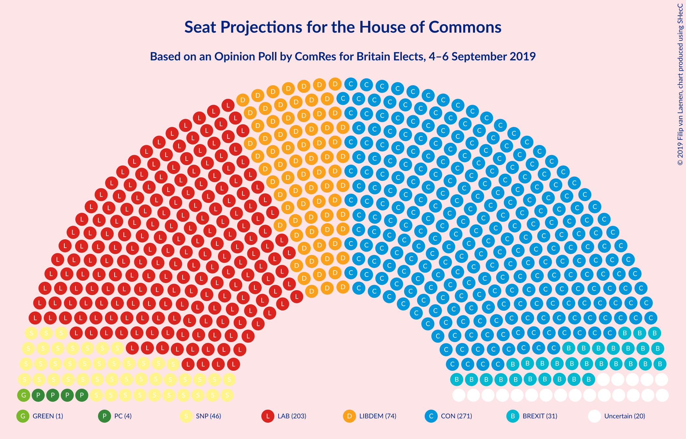
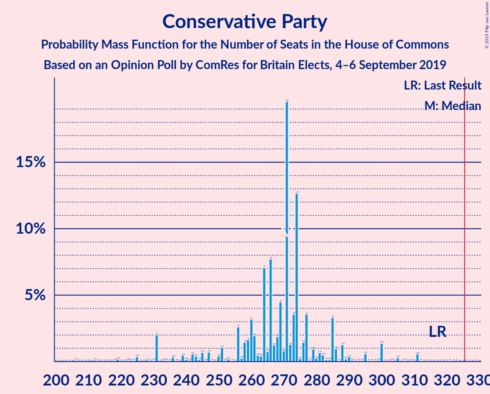
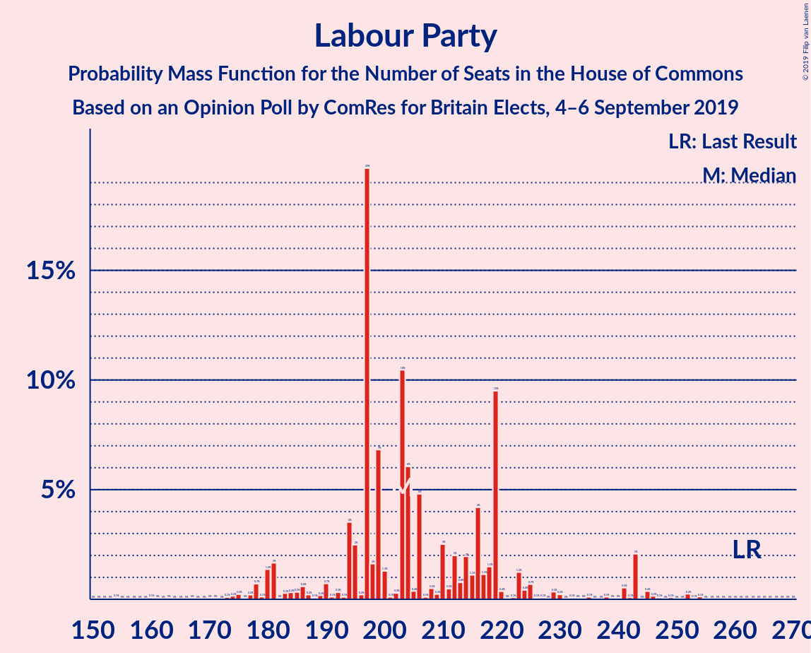
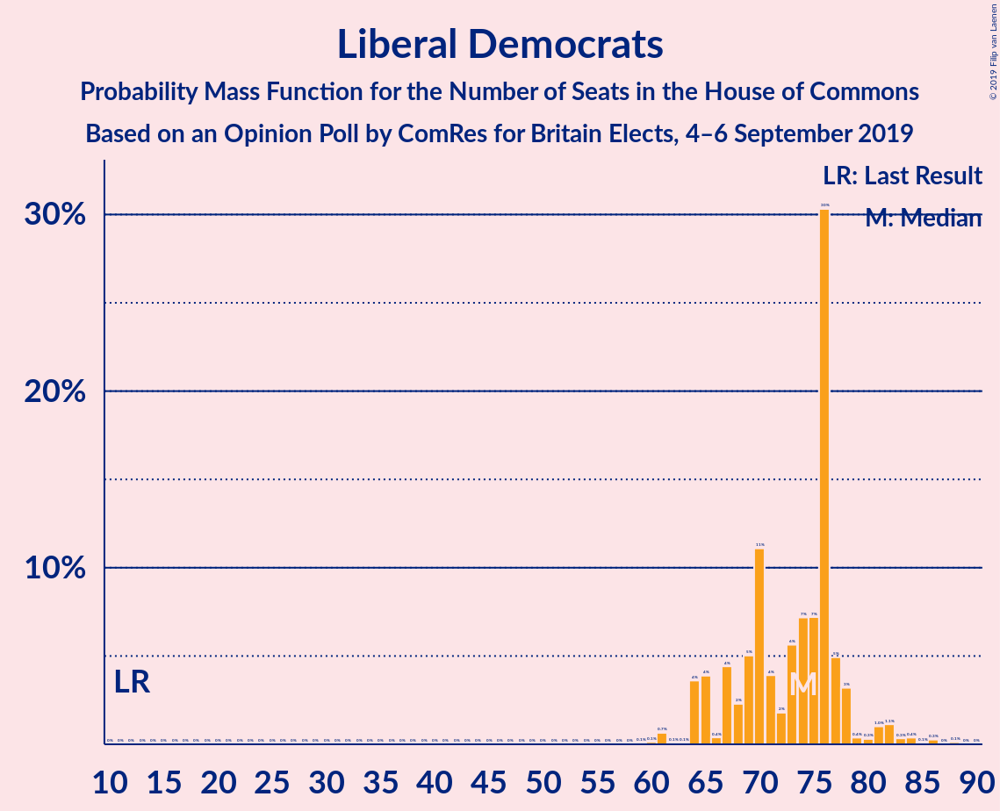
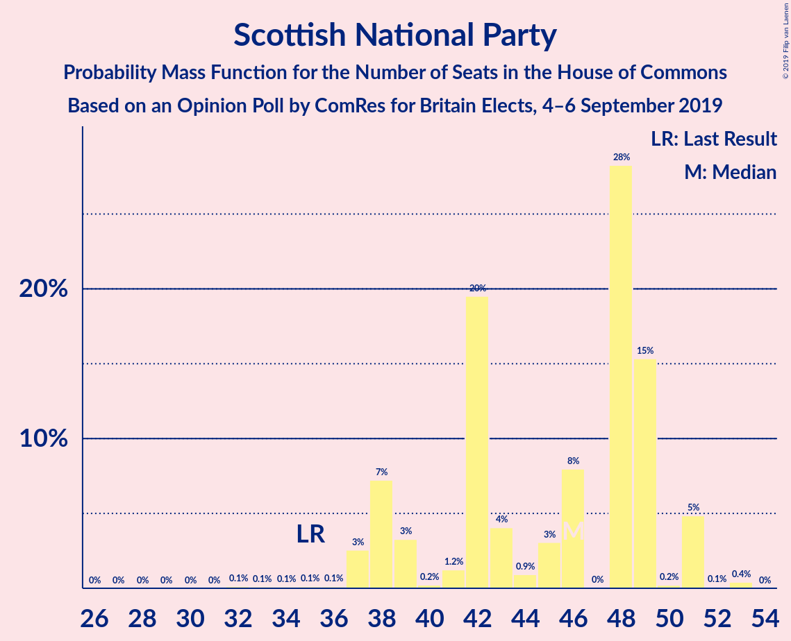
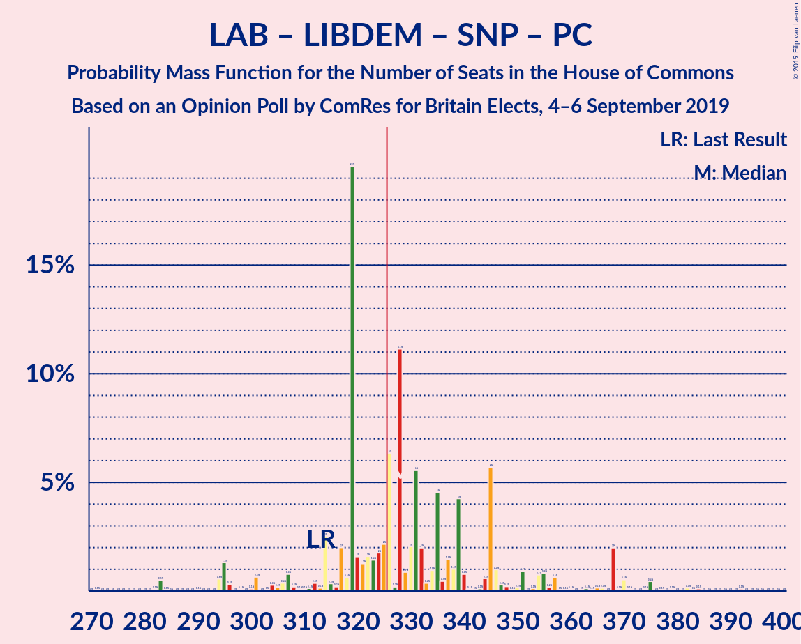
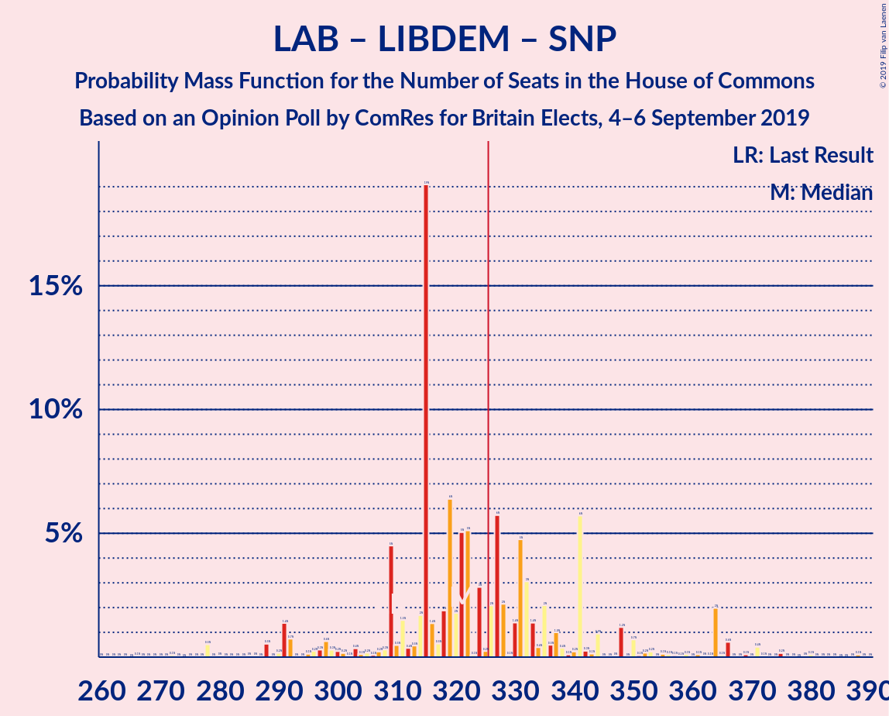
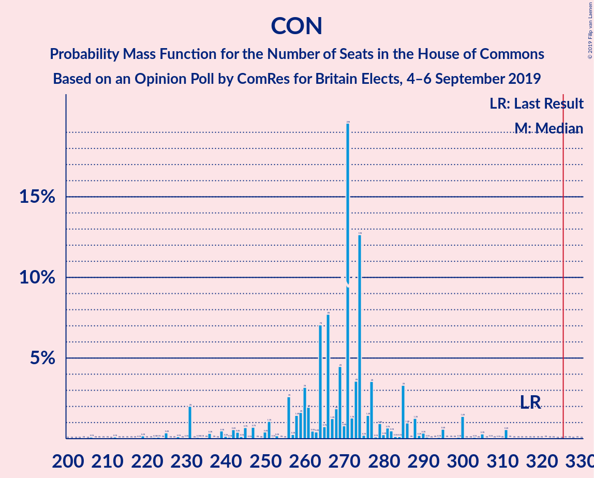
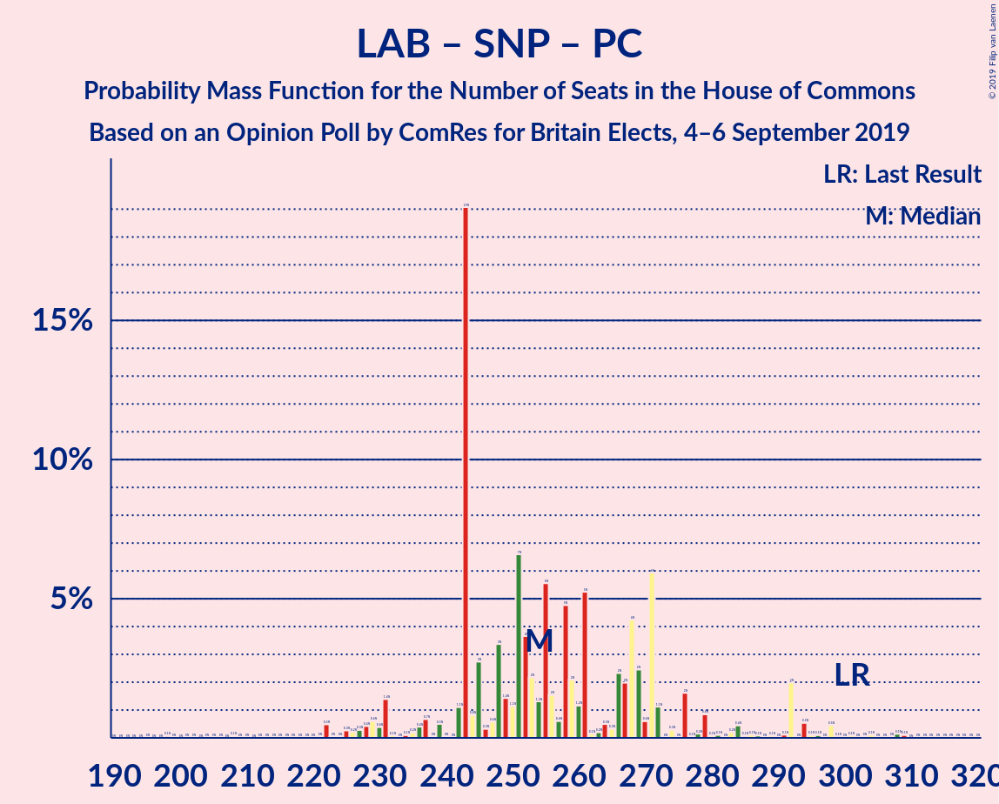
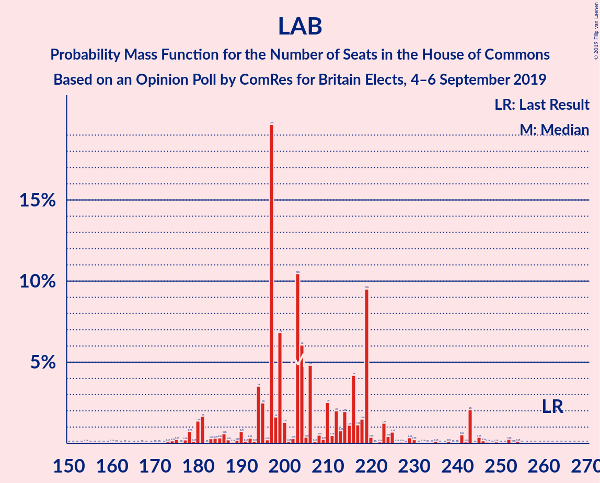

# Opinion Poll by ComRes for Britain Elects, 4–6 September 2019

<a href="#voting-intentions">Voting Intentions</a> | <a href="#seats">Seats</a> | <a href="#coalitions">Coalitions</a> | <a href="#technical-information">Technical Information</a>

## Voting Intentions

### Confidence Intervals

| Party | Last Result | Poll Result | 80% Confidence Interval | 90% Confidence Interval | 95% Confidence Interval | 99% Confidence Interval |
|:-----:|:-----------:|:-----------:|:-----------------------:|:-----------------------:|:-----------------------:|:-----------------------:|
| Conservative Party | 42.4% | 31.0% | 29.7–32.4% |29.3–32.7% |29.0–33.1% |28.4–33.7% |
| Labour Party | 40.0% | 27.0% | 25.7–28.3% |25.4–28.7% |25.1–29.0% |24.5–29.6% |
| Liberal Democrats | 7.4% | 20.0% | 18.9–21.2% |18.6–21.5% |18.3–21.8% |17.8–22.4% |
| Brexit Party | 0.0% | 13.0% | 12.1–14.0% |11.8–14.3% |11.6–14.5% |11.2–15.0% |
| Scottish National Party | 3.0% | 3.0% | 2.5–3.5% |2.4–3.7% |2.3–3.8% |2.1–4.1% |
| Green Party | 1.6% | 3.0% | 2.5–3.5% |2.4–3.7% |2.3–3.8% |2.1–4.1% |
| Plaid Cymru | 0.5% | 1.0% | 0.8–1.4% |0.7–1.4% |0.6–1.5% |0.5–1.7% |
| UK Independence Party | 1.8% | 1.0% | 0.8–1.4% |0.7–1.4% |0.6–1.5% |0.5–1.7% |

*Note:* The poll result column reflects the actual value used in the calculations. Published results may vary slightly, and in addition be rounded to fewer digits.

## Seats

### Confidence Intervals

| Party | Last Result | Median | 80% Confidence Interval | 90% Confidence Interval | 95% Confidence Interval | 99% Confidence Interval |
|:-----:|:-----------:|:------:|:-----------------------:|:-----------------------:|:-----------------------:|:-----------------------:|
| <a href="#conservative-party">Conservative Party</a> | 317 | 290 | 273–290 |263–290 |253–290 |230–290 |
| <a href="#labour-party">Labour Party</a> | 262 | 194 | 194–213 |194–213 |194–220 |194–233 |
| <a href="#liberal-democrats">Liberal Democrats</a> | 12 | 68 | 68–70 |68–70 |68–81 |68–82 |
| <a href="#brexit-party">Brexit Party</a> | 0 | 37 | 29–37 |29–37 |28–41 |23–41 |
| <a href="#scottish-national-party">Scottish National Party</a> | 35 | 38 | 38–43 |38–48 |38–48 |37–48 |
| <a href="#green-party">Green Party</a> | 1 | 1 | 1 |1–2 |1–2 |1–2 |
| <a href="#plaid-cymru">Plaid Cymru</a> | 4 | 4 | 3–4 |3–4 |3–8 |3–12 |
| <a href="#uk-independence-party">UK Independence Party</a> | 0 | 0 | 0 |0 |0 |0 |

### Conservative Party

*For a full overview of the results for this party, see the [Conservative Party](party-conservativeparty.html) page.*

| Number of Seats | Probability | Accumulated | Special Marks |
|:---------------:|:-----------:|:-----------:|:-------------:|
| 230 | 2% | 100% |  |
| 231 | 0% | 98% |  |
| 232 | 0% | 98% |  |
| 233 | 0% | 98% |  |
| 234 | 0% | 98% |  |
| 235 | 0% | 98% |  |
| 236 | 0% | 98% |  |
| 237 | 0% | 98% |  |
| 238 | 0% | 98% |  |
| 239 | 0% | 98% |  |
| 240 | 0% | 98% |  |
| 241 | 0% | 98% |  |
| 242 | 0% | 98% |  |
| 243 | 0.2% | 98% |  |
| 244 | 0% | 98% |  |
| 245 | 0% | 98% |  |
| 246 | 0% | 98% |  |
| 247 | 0% | 98% |  |
| 248 | 0% | 98% |  |
| 249 | 0% | 98% |  |
| 250 | 0% | 98% |  |
| 251 | 0% | 98% |  |
| 252 | 0% | 98% |  |
| 253 | 0.1% | 98% |  |
| 254 | 0% | 97% |  |
| 255 | 0% | 97% |  |
| 256 | 0% | 97% |  |
| 257 | 0% | 97% |  |
| 258 | 0% | 97% |  |
| 259 | 0% | 97% |  |
| 260 | 0.2% | 97% |  |
| 261 | 0% | 97% |  |
| 262 | 0% | 97% |  |
| 263 | 3% | 97% |  |
| 264 | 0% | 95% |  |
| 265 | 0% | 95% |  |
| 266 | 0% | 95% |  |
| 267 | 0% | 95% |  |
| 268 | 0% | 95% |  |
| 269 | 1.2% | 95% |  |
| 270 | 0% | 93% |  |
| 271 | 0% | 93% |  |
| 272 | 0% | 93% |  |
| 273 | 18% | 93% |  |
| 274 | 0% | 75% |  |
| 275 | 0% | 75% |  |
| 276 | 0% | 75% |  |
| 277 | 0% | 75% |  |
| 278 | 0.1% | 75% |  |
| 279 | 0% | 75% |  |
| 280 | 0.2% | 75% |  |
| 281 | 0% | 75% |  |
| 282 | 0% | 75% |  |
| 283 | 0% | 75% |  |
| 284 | 0% | 75% |  |
| 285 | 0% | 75% |  |
| 286 | 0% | 75% |  |
| 287 | 0% | 75% |  |
| 288 | 0% | 75% |  |
| 289 | 0% | 75% |  |
| 290 | 75% | 75% | Median |
| 291 | 0% | 0.1% |  |
| 292 | 0% | 0.1% |  |
| 293 | 0.1% | 0.1% |  |
| 294 | 0% | 0% |  |
| 295 | 0% | 0% |  |
| 296 | 0% | 0% |  |
| 297 | 0% | 0% |  |
| 298 | 0% | 0% |  |
| 299 | 0% | 0% |  |
| 300 | 0% | 0% |  |
| 301 | 0% | 0% |  |
| 302 | 0% | 0% |  |
| 303 | 0% | 0% |  |
| 304 | 0% | 0% |  |
| 305 | 0% | 0% |  |
| 306 | 0% | 0% |  |
| 307 | 0% | 0% |  |
| 308 | 0% | 0% |  |
| 309 | 0% | 0% |  |
| 310 | 0% | 0% |  |
| 311 | 0% | 0% |  |
| 312 | 0% | 0% |  |
| 313 | 0% | 0% |  |
| 314 | 0% | 0% |  |
| 315 | 0% | 0% |  |
| 316 | 0% | 0% |  |
| 317 | 0% | 0% | Last Result |

### Labour Party

*For a full overview of the results for this party, see the [Labour Party](party-labourparty.html) page.*

| Number of Seats | Probability | Accumulated | Special Marks |
|:---------------:|:-----------:|:-----------:|:-------------:|
| 191 | 0.1% | 100% |  |
| 192 | 0% | 99.9% |  |
| 193 | 0% | 99.9% |  |
| 194 | 75% | 99.9% | Median |
| 195 | 0% | 25% |  |
| 196 | 0% | 25% |  |
| 197 | 0% | 25% |  |
| 198 | 0.2% | 25% |  |
| 199 | 0.1% | 25% |  |
| 200 | 0% | 25% |  |
| 201 | 0% | 25% |  |
| 202 | 0.2% | 25% |  |
| 203 | 0% | 25% |  |
| 204 | 0% | 25% |  |
| 205 | 0.1% | 25% |  |
| 206 | 3% | 25% |  |
| 207 | 0% | 22% |  |
| 208 | 0% | 22% |  |
| 209 | 1.2% | 22% |  |
| 210 | 0% | 21% |  |
| 211 | 0% | 21% |  |
| 212 | 0% | 21% |  |
| 213 | 18% | 21% |  |
| 214 | 0% | 3% |  |
| 215 | 0% | 3% |  |
| 216 | 0% | 3% |  |
| 217 | 0% | 3% |  |
| 218 | 0% | 3% |  |
| 219 | 0% | 3% |  |
| 220 | 0% | 3% |  |
| 221 | 0% | 2% |  |
| 222 | 0% | 2% |  |
| 223 | 0% | 2% |  |
| 224 | 0.2% | 2% |  |
| 225 | 0% | 2% |  |
| 226 | 0% | 2% |  |
| 227 | 0% | 2% |  |
| 228 | 0% | 2% |  |
| 229 | 0% | 2% |  |
| 230 | 0% | 2% |  |
| 231 | 0% | 2% |  |
| 232 | 0% | 2% |  |
| 233 | 2% | 2% |  |
| 234 | 0% | 0% |  |
| 235 | 0% | 0% |  |
| 236 | 0% | 0% |  |
| 237 | 0% | 0% |  |
| 238 | 0% | 0% |  |
| 239 | 0% | 0% |  |
| 240 | 0% | 0% |  |
| 241 | 0% | 0% |  |
| 242 | 0% | 0% |  |
| 243 | 0% | 0% |  |
| 244 | 0% | 0% |  |
| 245 | 0% | 0% |  |
| 246 | 0% | 0% |  |
| 247 | 0% | 0% |  |
| 248 | 0% | 0% |  |
| 249 | 0% | 0% |  |
| 250 | 0% | 0% |  |
| 251 | 0% | 0% |  |
| 252 | 0% | 0% |  |
| 253 | 0% | 0% |  |
| 254 | 0% | 0% |  |
| 255 | 0% | 0% |  |
| 256 | 0% | 0% |  |
| 257 | 0% | 0% |  |
| 258 | 0% | 0% |  |
| 259 | 0% | 0% |  |
| 260 | 0% | 0% |  |
| 261 | 0% | 0% |  |
| 262 | 0% | 0% | Last Result |

### Liberal Democrats

*For a full overview of the results for this party, see the [Liberal Democrats](party-liberaldemocrats.html) page.*

| Number of Seats | Probability | Accumulated | Special Marks |
|:---------------:|:-----------:|:-----------:|:-------------:|
| 12 | 0% | 100% | Last Result |
| 13 | 0% | 100% |  |
| 14 | 0% | 100% |  |
| 15 | 0% | 100% |  |
| 16 | 0% | 100% |  |
| 17 | 0% | 100% |  |
| 18 | 0% | 100% |  |
| 19 | 0% | 100% |  |
| 20 | 0% | 100% |  |
| 21 | 0% | 100% |  |
| 22 | 0% | 100% |  |
| 23 | 0% | 100% |  |
| 24 | 0% | 100% |  |
| 25 | 0% | 100% |  |
| 26 | 0% | 100% |  |
| 27 | 0% | 100% |  |
| 28 | 0% | 100% |  |
| 29 | 0% | 100% |  |
| 30 | 0% | 100% |  |
| 31 | 0% | 100% |  |
| 32 | 0% | 100% |  |
| 33 | 0% | 100% |  |
| 34 | 0% | 100% |  |
| 35 | 0% | 100% |  |
| 36 | 0% | 100% |  |
| 37 | 0% | 100% |  |
| 38 | 0% | 100% |  |
| 39 | 0% | 100% |  |
| 40 | 0% | 100% |  |
| 41 | 0% | 100% |  |
| 42 | 0% | 100% |  |
| 43 | 0% | 100% |  |
| 44 | 0% | 100% |  |
| 45 | 0% | 100% |  |
| 46 | 0% | 100% |  |
| 47 | 0% | 100% |  |
| 48 | 0% | 100% |  |
| 49 | 0% | 100% |  |
| 50 | 0% | 100% |  |
| 51 | 0% | 100% |  |
| 52 | 0% | 100% |  |
| 53 | 0% | 100% |  |
| 54 | 0% | 100% |  |
| 55 | 0% | 100% |  |
| 56 | 0% | 100% |  |
| 57 | 0% | 100% |  |
| 58 | 0% | 100% |  |
| 59 | 0% | 100% |  |
| 60 | 0% | 100% |  |
| 61 | 0% | 100% |  |
| 62 | 0.1% | 100% |  |
| 63 | 0% | 99.9% |  |
| 64 | 0% | 99.9% |  |
| 65 | 0.1% | 99.9% |  |
| 66 | 0.3% | 99.8% |  |
| 67 | 0% | 99.6% |  |
| 68 | 75% | 99.6% | Median |
| 69 | 3% | 25% |  |
| 70 | 18% | 22% |  |
| 71 | 0% | 4% |  |
| 72 | 0% | 4% |  |
| 73 | 0% | 4% |  |
| 74 | 0% | 4% |  |
| 75 | 0% | 4% |  |
| 76 | 0% | 4% |  |
| 77 | 0.2% | 4% |  |
| 78 | 0% | 4% |  |
| 79 | 0% | 4% |  |
| 80 | 0% | 4% |  |
| 81 | 1.3% | 4% |  |
| 82 | 2% | 2% |  |
| 83 | 0% | 0.1% |  |
| 84 | 0.1% | 0.1% |  |
| 85 | 0% | 0% |  |

### Brexit Party

*For a full overview of the results for this party, see the [Brexit Party](party-brexitparty.html) page.*

| Number of Seats | Probability | Accumulated | Special Marks |
|:---------------:|:-----------:|:-----------:|:-------------:|
| 0 | 0% | 100% | Last Result |
| 1 | 0% | 100% |  |
| 2 | 0% | 100% |  |
| 3 | 0% | 100% |  |
| 4 | 0% | 100% |  |
| 5 | 0% | 100% |  |
| 6 | 0% | 100% |  |
| 7 | 0% | 100% |  |
| 8 | 0.2% | 100% |  |
| 9 | 0% | 99.8% |  |
| 10 | 0% | 99.8% |  |
| 11 | 0% | 99.8% |  |
| 12 | 0.1% | 99.8% |  |
| 13 | 0% | 99.8% |  |
| 14 | 0% | 99.8% |  |
| 15 | 0% | 99.8% |  |
| 16 | 0% | 99.8% |  |
| 17 | 0% | 99.8% |  |
| 18 | 0% | 99.8% |  |
| 19 | 0% | 99.7% |  |
| 20 | 0% | 99.7% |  |
| 21 | 0% | 99.7% |  |
| 22 | 0% | 99.7% |  |
| 23 | 1.2% | 99.7% |  |
| 24 | 0% | 98.5% |  |
| 25 | 0% | 98.5% |  |
| 26 | 0% | 98.5% |  |
| 27 | 0% | 98.5% |  |
| 28 | 2% | 98.5% |  |
| 29 | 18% | 96% |  |
| 30 | 0% | 78% |  |
| 31 | 0% | 78% |  |
| 32 | 0% | 78% |  |
| 33 | 0% | 78% |  |
| 34 | 0.1% | 78% |  |
| 35 | 0% | 78% |  |
| 36 | 0.2% | 78% |  |
| 37 | 75% | 78% | Median |
| 38 | 0% | 3% |  |
| 39 | 0% | 3% |  |
| 40 | 0% | 3% |  |
| 41 | 3% | 3% |  |
| 42 | 0% | 0.3% |  |
| 43 | 0% | 0.3% |  |
| 44 | 0% | 0.2% |  |
| 45 | 0% | 0.2% |  |
| 46 | 0% | 0.2% |  |
| 47 | 0% | 0.2% |  |
| 48 | 0.2% | 0.2% |  |
| 49 | 0% | 0% |  |

### Scottish National Party

*For a full overview of the results for this party, see the [Scottish National Party](party-scottishnationalparty.html) page.*

| Number of Seats | Probability | Accumulated | Special Marks |
|:---------------:|:-----------:|:-----------:|:-------------:|
| 35 | 0% | 100% | Last Result |
| 36 | 0% | 100% |  |
| 37 | 1.2% | 100% |  |
| 38 | 75% | 98.8% | Median |
| 39 | 0% | 24% |  |
| 40 | 0% | 24% |  |
| 41 | 0% | 24% |  |
| 42 | 0% | 24% |  |
| 43 | 19% | 24% |  |
| 44 | 0% | 6% |  |
| 45 | 0% | 6% |  |
| 46 | 0% | 6% |  |
| 47 | 0% | 6% |  |
| 48 | 5% | 6% |  |
| 49 | 0% | 0.5% |  |
| 50 | 0% | 0.4% |  |
| 51 | 0.3% | 0.4% |  |
| 52 | 0% | 0.1% |  |
| 53 | 0.1% | 0.1% |  |
| 54 | 0% | 0% |  |

### Green Party

*For a full overview of the results for this party, see the [Green Party](party-greenparty.html) page.*

| Number of Seats | Probability | Accumulated | Special Marks |
|:---------------:|:-----------:|:-----------:|:-------------:|
| 1 | 95% | 100% | Last Result, Median |
| 2 | 5% | 5% |  |
| 3 | 0% | 0% |  |

### Plaid Cymru

*For a full overview of the results for this party, see the [Plaid Cymru](party-plaidcymru.html) page.*

| Number of Seats | Probability | Accumulated | Special Marks |
|:---------------:|:-----------:|:-----------:|:-------------:|
| 3 | 21% | 100% |  |
| 4 | 75% | 79% | Last Result, Median |
| 5 | 0% | 4% |  |
| 6 | 0% | 4% |  |
| 7 | 0% | 4% |  |
| 8 | 2% | 4% |  |
| 9 | 0.2% | 2% |  |
| 10 | 0% | 1.4% |  |
| 11 | 0% | 1.4% |  |
| 12 | 1.4% | 1.4% |  |
| 13 | 0% | 0% |  |

### UK Independence Party

*For a full overview of the results for this party, see the [UK Independence Party](party-ukindependenceparty.html) page.*

| Number of Seats | Probability | Accumulated | Special Marks |
|:---------------:|:-----------:|:-----------:|:-------------:|
| 0 | 100% | 100% | Last Result, Median |

## Coalitions

### Confidence Intervals

| Coalition | Last Result | Median | Majority? | 80% Confidence Interval | 90% Confidence Interval | 95% Confidence Interval | 99% Confidence Interval |
|:---------:|:-----------:|:------:|:---------:|:-----------------------:|:-----------------------:|:-----------------------:|:-----------------------:|
| Conservative Party – Liberal Democrats | 329 | 358 | 98% | 343–358 | 332–358 | 332–358 | 312–358 |
| Labour Party – Liberal Democrats – Scottish National Party – Plaid Cymru | 313 | 304 | 25% | 304–329 | 304–329 | 304–342 | 304–371 |
| Labour Party – Liberal Democrats – Scottish National Party | 309 | 300 | 22% | 300–326 | 300–326 | 300–336 | 300–363 |
| Conservative Party – Scottish National Party – Plaid Cymru | 356 | 332 | 75% | 319–332 | 314–332 | 313–332 | 286–332 |
| Conservative Party – Scottish National Party | 352 | 328 | 75% | 316–328 | 311–328 | 303–328 | 278–328 |
| Conservative Party – Brexit Party | 317 | 327 | 75% | 302–327 | 302–327 | 288–327 | 258–327 |
| Labour Party – Liberal Democrats – Plaid Cymru | 278 | 266 | 0% | 266–286 | 266–286 | 266–302 | 266–323 |
| Conservative Party – Plaid Cymru | 321 | 294 | 0% | 276–294 | 266–294 | 262–294 | 238–294 |
| Labour Party – Liberal Democrats | 274 | 262 | 0% | 262–283 | 262–283 | 262–290 | 262–315 |
| Conservative Party | 317 | 290 | 0% | 273–290 | 263–290 | 253–290 | 230–290 |
| Labour Party – Scottish National Party – Plaid Cymru | 301 | 236 | 0% | 236–259 | 236–259 | 236–263 | 236–289 |
| Labour Party – Scottish National Party | 297 | 232 | 0% | 232–256 | 232–256 | 232–259 | 232–281 |
| Labour Party – Plaid Cymru | 266 | 198 | 0% | 198–216 | 198–216 | 198–224 | 198–241 |
| Labour Party | 262 | 194 | 0% | 194–213 | 194–213 | 194–220 | 194–233 |

### Conservative Party – Liberal Democrats

| Number of Seats | Probability | Accumulated | Special Marks |
|:---------------:|:-----------:|:-----------:|:-------------:|
| 312 | 2% | 100% |  |
| 313 | 0% | 98% |  |
| 314 | 0% | 98% |  |
| 315 | 0% | 98% |  |
| 316 | 0% | 98% |  |
| 317 | 0% | 98% |  |
| 318 | 0% | 98% |  |
| 319 | 0% | 98% |  |
| 320 | 0% | 98% |  |
| 321 | 0% | 98% |  |
| 322 | 0% | 98% |  |
| 323 | 0% | 98% |  |
| 324 | 0.2% | 98% |  |
| 325 | 0% | 98% |  |
| 326 | 0% | 98% | Majority |
| 327 | 0% | 98% |  |
| 328 | 0% | 98% |  |
| 329 | 0% | 98% | Last Result |
| 330 | 0% | 98% |  |
| 331 | 0% | 98% |  |
| 332 | 3% | 98% |  |
| 333 | 0% | 95% |  |
| 334 | 0% | 95% |  |
| 335 | 0% | 95% |  |
| 336 | 0% | 95% |  |
| 337 | 0.2% | 95% |  |
| 338 | 0% | 95% |  |
| 339 | 0% | 95% |  |
| 340 | 0.1% | 95% |  |
| 341 | 0% | 95% |  |
| 342 | 0% | 95% |  |
| 343 | 18% | 95% |  |
| 344 | 0% | 76% |  |
| 345 | 0.1% | 76% |  |
| 346 | 0.2% | 76% |  |
| 347 | 0% | 76% |  |
| 348 | 0% | 76% |  |
| 349 | 0% | 76% |  |
| 350 | 1.2% | 76% |  |
| 351 | 0% | 75% |  |
| 352 | 0% | 75% |  |
| 353 | 0% | 75% |  |
| 354 | 0% | 75% |  |
| 355 | 0% | 75% |  |
| 356 | 0% | 75% |  |
| 357 | 0% | 75% |  |
| 358 | 75% | 75% | Median |
| 359 | 0.1% | 0.1% |  |
| 360 | 0% | 0% |  |

### Labour Party – Liberal Democrats – Scottish National Party – Plaid Cymru

| Number of Seats | Probability | Accumulated | Special Marks |
|:---------------:|:-----------:|:-----------:|:-------------:|
| 303 | 0.1% | 100% |  |
| 304 | 75% | 99.9% | Median |
| 305 | 0% | 25% |  |
| 306 | 0% | 25% |  |
| 307 | 0% | 25% |  |
| 308 | 0% | 25% |  |
| 309 | 0% | 25% |  |
| 310 | 0% | 25% |  |
| 311 | 0% | 25% |  |
| 312 | 0% | 25% |  |
| 313 | 0% | 25% | Last Result |
| 314 | 0% | 25% |  |
| 315 | 0% | 25% |  |
| 316 | 0% | 25% |  |
| 317 | 0% | 25% |  |
| 318 | 0% | 25% |  |
| 319 | 0% | 25% |  |
| 320 | 0% | 25% |  |
| 321 | 0% | 25% |  |
| 322 | 0% | 25% |  |
| 323 | 0% | 25% |  |
| 324 | 0% | 25% |  |
| 325 | 0.1% | 25% |  |
| 326 | 3% | 25% | Majority |
| 327 | 0% | 22% |  |
| 328 | 0% | 22% |  |
| 329 | 18% | 22% |  |
| 330 | 0% | 4% |  |
| 331 | 0% | 4% |  |
| 332 | 0% | 4% |  |
| 333 | 0% | 4% |  |
| 334 | 0.2% | 4% |  |
| 335 | 0% | 4% |  |
| 336 | 0% | 4% |  |
| 337 | 0% | 4% |  |
| 338 | 0% | 4% |  |
| 339 | 1.3% | 4% |  |
| 340 | 0% | 3% |  |
| 341 | 0% | 3% |  |
| 342 | 0.2% | 3% |  |
| 343 | 0.1% | 2% |  |
| 344 | 0% | 2% |  |
| 345 | 0% | 2% |  |
| 346 | 0% | 2% |  |
| 347 | 0% | 2% |  |
| 348 | 0% | 2% |  |
| 349 | 0% | 2% |  |
| 350 | 0% | 2% |  |
| 351 | 0% | 2% |  |
| 352 | 0% | 2% |  |
| 353 | 0% | 2% |  |
| 354 | 0% | 2% |  |
| 355 | 0% | 2% |  |
| 356 | 0% | 2% |  |
| 357 | 0% | 2% |  |
| 358 | 0% | 2% |  |
| 359 | 0% | 2% |  |
| 360 | 0% | 2% |  |
| 361 | 0% | 2% |  |
| 362 | 0% | 2% |  |
| 363 | 0% | 2% |  |
| 364 | 0% | 2% |  |
| 365 | 0% | 2% |  |
| 366 | 0% | 2% |  |
| 367 | 0% | 2% |  |
| 368 | 0% | 2% |  |
| 369 | 0% | 2% |  |
| 370 | 0% | 2% |  |
| 371 | 2% | 2% |  |
| 372 | 0% | 0% |  |

### Labour Party – Liberal Democrats – Scottish National Party

| Number of Seats | Probability | Accumulated | Special Marks |
|:---------------:|:-----------:|:-----------:|:-------------:|
| 299 | 0.1% | 100% |  |
| 300 | 75% | 99.9% | Median |
| 301 | 0% | 25% |  |
| 302 | 0% | 25% |  |
| 303 | 0% | 25% |  |
| 304 | 0% | 25% |  |
| 305 | 0% | 25% |  |
| 306 | 0% | 25% |  |
| 307 | 0% | 25% |  |
| 308 | 0% | 25% |  |
| 309 | 0% | 25% | Last Result |
| 310 | 0% | 25% |  |
| 311 | 0% | 25% |  |
| 312 | 0% | 25% |  |
| 313 | 0% | 25% |  |
| 314 | 0% | 25% |  |
| 315 | 0% | 25% |  |
| 316 | 0% | 25% |  |
| 317 | 0% | 25% |  |
| 318 | 0% | 25% |  |
| 319 | 0% | 25% |  |
| 320 | 0% | 25% |  |
| 321 | 0.1% | 25% |  |
| 322 | 0.2% | 25% |  |
| 323 | 3% | 25% |  |
| 324 | 0% | 22% |  |
| 325 | 0% | 22% |  |
| 326 | 18% | 22% | Majority |
| 327 | 1.2% | 4% |  |
| 328 | 0% | 3% |  |
| 329 | 0% | 3% |  |
| 330 | 0.2% | 3% |  |
| 331 | 0% | 3% |  |
| 332 | 0% | 3% |  |
| 333 | 0% | 3% |  |
| 334 | 0.1% | 3% |  |
| 335 | 0% | 3% |  |
| 336 | 0% | 3% |  |
| 337 | 0% | 2% |  |
| 338 | 0.2% | 2% |  |
| 339 | 0% | 2% |  |
| 340 | 0% | 2% |  |
| 341 | 0% | 2% |  |
| 342 | 0% | 2% |  |
| 343 | 0% | 2% |  |
| 344 | 0% | 2% |  |
| 345 | 0% | 2% |  |
| 346 | 0% | 2% |  |
| 347 | 0% | 2% |  |
| 348 | 0% | 2% |  |
| 349 | 0% | 2% |  |
| 350 | 0% | 2% |  |
| 351 | 0% | 2% |  |
| 352 | 0% | 2% |  |
| 353 | 0% | 2% |  |
| 354 | 0% | 2% |  |
| 355 | 0% | 2% |  |
| 356 | 0% | 2% |  |
| 357 | 0% | 2% |  |
| 358 | 0% | 2% |  |
| 359 | 0% | 2% |  |
| 360 | 0% | 2% |  |
| 361 | 0% | 2% |  |
| 362 | 0% | 2% |  |
| 363 | 2% | 2% |  |
| 364 | 0% | 0% |  |

### Conservative Party – Scottish National Party – Plaid Cymru

| Number of Seats | Probability | Accumulated | Special Marks |
|:---------------:|:-----------:|:-----------:|:-------------:|
| 286 | 2% | 100% |  |
| 287 | 0% | 98% |  |
| 288 | 0% | 98% |  |
| 289 | 0% | 98% |  |
| 290 | 0% | 98% |  |
| 291 | 0% | 98% |  |
| 292 | 0% | 98% |  |
| 293 | 0% | 98% |  |
| 294 | 0% | 98% |  |
| 295 | 0% | 98% |  |
| 296 | 0% | 98% |  |
| 297 | 0% | 98% |  |
| 298 | 0% | 98% |  |
| 299 | 0% | 98% |  |
| 300 | 0% | 98% |  |
| 301 | 0% | 98% |  |
| 302 | 0% | 98% |  |
| 303 | 0.2% | 98% |  |
| 304 | 0% | 98% |  |
| 305 | 0% | 98% |  |
| 306 | 0% | 98% |  |
| 307 | 0% | 98% |  |
| 308 | 0% | 98% |  |
| 309 | 0% | 98% |  |
| 310 | 0% | 98% |  |
| 311 | 0% | 98% |  |
| 312 | 0% | 98% |  |
| 313 | 0.1% | 98% |  |
| 314 | 3% | 97% |  |
| 315 | 0.2% | 95% |  |
| 316 | 0% | 95% |  |
| 317 | 0% | 95% |  |
| 318 | 1.2% | 95% |  |
| 319 | 18% | 93% |  |
| 320 | 0% | 75% |  |
| 321 | 0% | 75% |  |
| 322 | 0% | 75% |  |
| 323 | 0% | 75% |  |
| 324 | 0% | 75% |  |
| 325 | 0% | 75% |  |
| 326 | 0% | 75% | Majority |
| 327 | 0.1% | 75% |  |
| 328 | 0% | 75% |  |
| 329 | 0% | 75% |  |
| 330 | 0% | 75% |  |
| 331 | 0% | 75% |  |
| 332 | 75% | 75% | Median |
| 333 | 0% | 0.2% |  |
| 334 | 0% | 0.2% |  |
| 335 | 0.1% | 0.2% |  |
| 336 | 0% | 0.1% |  |
| 337 | 0% | 0.1% |  |
| 338 | 0% | 0.1% |  |
| 339 | 0% | 0.1% |  |
| 340 | 0% | 0.1% |  |
| 341 | 0% | 0.1% |  |
| 342 | 0% | 0.1% |  |
| 343 | 0% | 0.1% |  |
| 344 | 0% | 0.1% |  |
| 345 | 0% | 0.1% |  |
| 346 | 0% | 0.1% |  |
| 347 | 0% | 0.1% |  |
| 348 | 0.1% | 0.1% |  |
| 349 | 0% | 0% |  |
| 350 | 0% | 0% |  |
| 351 | 0% | 0% |  |
| 352 | 0% | 0% |  |
| 353 | 0% | 0% |  |
| 354 | 0% | 0% |  |
| 355 | 0% | 0% |  |
| 356 | 0% | 0% | Last Result |

### Conservative Party – Scottish National Party

| Number of Seats | Probability | Accumulated | Special Marks |
|:---------------:|:-----------:|:-----------:|:-------------:|
| 278 | 2% | 100% |  |
| 279 | 0% | 98% |  |
| 280 | 0% | 98% |  |
| 281 | 0% | 98% |  |
| 282 | 0% | 98% |  |
| 283 | 0% | 98% |  |
| 284 | 0% | 98% |  |
| 285 | 0% | 98% |  |
| 286 | 0% | 98% |  |
| 287 | 0% | 98% |  |
| 288 | 0% | 98% |  |
| 289 | 0% | 98% |  |
| 290 | 0% | 98% |  |
| 291 | 0% | 98% |  |
| 292 | 0% | 98% |  |
| 293 | 0% | 98% |  |
| 294 | 0.2% | 98% |  |
| 295 | 0% | 98% |  |
| 296 | 0% | 98% |  |
| 297 | 0% | 98% |  |
| 298 | 0% | 98% |  |
| 299 | 0% | 98% |  |
| 300 | 0% | 98% |  |
| 301 | 0% | 98% |  |
| 302 | 0% | 98% |  |
| 303 | 0.2% | 98% |  |
| 304 | 0.1% | 97% |  |
| 305 | 0% | 97% |  |
| 306 | 1.2% | 97% |  |
| 307 | 0% | 96% |  |
| 308 | 0% | 96% |  |
| 309 | 0% | 96% |  |
| 310 | 0% | 96% |  |
| 311 | 3% | 96% |  |
| 312 | 0% | 93% |  |
| 313 | 0% | 93% |  |
| 314 | 0% | 93% |  |
| 315 | 0% | 93% |  |
| 316 | 18% | 93% |  |
| 317 | 0% | 75% |  |
| 318 | 0% | 75% |  |
| 319 | 0% | 75% |  |
| 320 | 0% | 75% |  |
| 321 | 0% | 75% |  |
| 322 | 0% | 75% |  |
| 323 | 0.1% | 75% |  |
| 324 | 0% | 75% |  |
| 325 | 0% | 75% |  |
| 326 | 0% | 75% | Majority |
| 327 | 0% | 75% |  |
| 328 | 75% | 75% | Median |
| 329 | 0% | 0.2% |  |
| 330 | 0% | 0.2% |  |
| 331 | 0.1% | 0.2% |  |
| 332 | 0% | 0.1% |  |
| 333 | 0% | 0.1% |  |
| 334 | 0% | 0.1% |  |
| 335 | 0% | 0.1% |  |
| 336 | 0% | 0.1% |  |
| 337 | 0% | 0.1% |  |
| 338 | 0% | 0.1% |  |
| 339 | 0% | 0.1% |  |
| 340 | 0% | 0.1% |  |
| 341 | 0% | 0.1% |  |
| 342 | 0% | 0.1% |  |
| 343 | 0% | 0.1% |  |
| 344 | 0.1% | 0.1% |  |
| 345 | 0% | 0% |  |
| 346 | 0% | 0% |  |
| 347 | 0% | 0% |  |
| 348 | 0% | 0% |  |
| 349 | 0% | 0% |  |
| 350 | 0% | 0% |  |
| 351 | 0% | 0% |  |
| 352 | 0% | 0% | Last Result |

### Conservative Party – Brexit Party

| Number of Seats | Probability | Accumulated | Special Marks |
|:---------------:|:-----------:|:-----------:|:-------------:|
| 258 | 2% | 100% |  |
| 259 | 0% | 98% |  |
| 260 | 0% | 98% |  |
| 261 | 0% | 98% |  |
| 262 | 0% | 98% |  |
| 263 | 0% | 98% |  |
| 264 | 0% | 98% |  |
| 265 | 0% | 98% |  |
| 266 | 0% | 98% |  |
| 267 | 0% | 98% |  |
| 268 | 0% | 98% |  |
| 269 | 0% | 98% |  |
| 270 | 0% | 98% |  |
| 271 | 0% | 98% |  |
| 272 | 0% | 98% |  |
| 273 | 0% | 98% |  |
| 274 | 0% | 98% |  |
| 275 | 0% | 98% |  |
| 276 | 0% | 98% |  |
| 277 | 0% | 98% |  |
| 278 | 0% | 98% |  |
| 279 | 0% | 98% |  |
| 280 | 0% | 98% |  |
| 281 | 0% | 98% |  |
| 282 | 0% | 98% |  |
| 283 | 0% | 98% |  |
| 284 | 0% | 98% |  |
| 285 | 0% | 98% |  |
| 286 | 0% | 98% |  |
| 287 | 0.1% | 98% |  |
| 288 | 0.2% | 98% |  |
| 289 | 0% | 97% |  |
| 290 | 0% | 97% |  |
| 291 | 0.2% | 97% |  |
| 292 | 1.2% | 97% |  |
| 293 | 0% | 96% |  |
| 294 | 0% | 96% |  |
| 295 | 0% | 96% |  |
| 296 | 0.2% | 96% |  |
| 297 | 0% | 96% |  |
| 298 | 0% | 96% |  |
| 299 | 0% | 96% |  |
| 300 | 0% | 96% |  |
| 301 | 0% | 96% |  |
| 302 | 18% | 96% |  |
| 303 | 0% | 78% |  |
| 304 | 3% | 78% |  |
| 305 | 0.1% | 75% |  |
| 306 | 0.1% | 75% |  |
| 307 | 0% | 75% |  |
| 308 | 0% | 75% |  |
| 309 | 0% | 75% |  |
| 310 | 0% | 75% |  |
| 311 | 0% | 75% |  |
| 312 | 0% | 75% |  |
| 313 | 0% | 75% |  |
| 314 | 0% | 75% |  |
| 315 | 0% | 75% |  |
| 316 | 0% | 75% |  |
| 317 | 0% | 75% | Last Result |
| 318 | 0% | 75% |  |
| 319 | 0% | 75% |  |
| 320 | 0% | 75% |  |
| 321 | 0% | 75% |  |
| 322 | 0% | 75% |  |
| 323 | 0% | 75% |  |
| 324 | 0% | 75% |  |
| 325 | 0% | 75% |  |
| 326 | 0% | 75% | Majority |
| 327 | 75% | 75% | Median |
| 328 | 0.1% | 0.1% |  |
| 329 | 0% | 0% |  |

### Labour Party – Liberal Democrats – Plaid Cymru

| Number of Seats | Probability | Accumulated | Special Marks |
|:---------------:|:-----------:|:-----------:|:-------------:|
| 260 | 0.1% | 100% |  |
| 261 | 0% | 99.9% |  |
| 262 | 0% | 99.9% |  |
| 263 | 0% | 99.9% |  |
| 264 | 0% | 99.9% |  |
| 265 | 0% | 99.9% |  |
| 266 | 75% | 99.9% | Median |
| 267 | 0% | 25% |  |
| 268 | 0% | 25% |  |
| 269 | 0% | 25% |  |
| 270 | 0% | 25% |  |
| 271 | 0% | 25% |  |
| 272 | 0.1% | 25% |  |
| 273 | 0% | 25% |  |
| 274 | 0% | 25% |  |
| 275 | 0.1% | 25% |  |
| 276 | 0% | 25% |  |
| 277 | 0% | 25% |  |
| 278 | 3% | 25% | Last Result |
| 279 | 0% | 22% |  |
| 280 | 0% | 22% |  |
| 281 | 0% | 22% |  |
| 282 | 0% | 22% |  |
| 283 | 0% | 22% |  |
| 284 | 0% | 22% |  |
| 285 | 0% | 22% |  |
| 286 | 18% | 22% |  |
| 287 | 0% | 4% |  |
| 288 | 0.2% | 4% |  |
| 289 | 0% | 4% |  |
| 290 | 0% | 4% |  |
| 291 | 0.2% | 4% |  |
| 292 | 0.1% | 4% |  |
| 293 | 0% | 4% |  |
| 294 | 0.2% | 4% |  |
| 295 | 0% | 4% |  |
| 296 | 0% | 4% |  |
| 297 | 0% | 4% |  |
| 298 | 0% | 4% |  |
| 299 | 0% | 4% |  |
| 300 | 0% | 4% |  |
| 301 | 0% | 4% |  |
| 302 | 1.2% | 4% |  |
| 303 | 0% | 2% |  |
| 304 | 0% | 2% |  |
| 305 | 0% | 2% |  |
| 306 | 0% | 2% |  |
| 307 | 0% | 2% |  |
| 308 | 0% | 2% |  |
| 309 | 0% | 2% |  |
| 310 | 0% | 2% |  |
| 311 | 0% | 2% |  |
| 312 | 0% | 2% |  |
| 313 | 0% | 2% |  |
| 314 | 0% | 2% |  |
| 315 | 0% | 2% |  |
| 316 | 0% | 2% |  |
| 317 | 0% | 2% |  |
| 318 | 0% | 2% |  |
| 319 | 0% | 2% |  |
| 320 | 0% | 2% |  |
| 321 | 0% | 2% |  |
| 322 | 0% | 2% |  |
| 323 | 2% | 2% |  |
| 324 | 0% | 0% |  |

### Conservative Party – Plaid Cymru

| Number of Seats | Probability | Accumulated | Special Marks |
|:---------------:|:-----------:|:-----------:|:-------------:|
| 238 | 2% | 100% |  |
| 239 | 0% | 98% |  |
| 240 | 0% | 98% |  |
| 241 | 0% | 98% |  |
| 242 | 0% | 98% |  |
| 243 | 0% | 98% |  |
| 244 | 0% | 98% |  |
| 245 | 0% | 98% |  |
| 246 | 0% | 98% |  |
| 247 | 0% | 98% |  |
| 248 | 0% | 98% |  |
| 249 | 0% | 98% |  |
| 250 | 0% | 98% |  |
| 251 | 0% | 98% |  |
| 252 | 0.2% | 98% |  |
| 253 | 0% | 98% |  |
| 254 | 0% | 98% |  |
| 255 | 0% | 98% |  |
| 256 | 0% | 98% |  |
| 257 | 0% | 98% |  |
| 258 | 0% | 98% |  |
| 259 | 0% | 98% |  |
| 260 | 0% | 98% |  |
| 261 | 0% | 98% |  |
| 262 | 0.1% | 98% |  |
| 263 | 0% | 97% |  |
| 264 | 0% | 97% |  |
| 265 | 0% | 97% |  |
| 266 | 3% | 97% |  |
| 267 | 0% | 95% |  |
| 268 | 0% | 95% |  |
| 269 | 0% | 95% |  |
| 270 | 0% | 95% |  |
| 271 | 0% | 95% |  |
| 272 | 0.2% | 95% |  |
| 273 | 0% | 95% |  |
| 274 | 0% | 95% |  |
| 275 | 0% | 95% |  |
| 276 | 18% | 95% |  |
| 277 | 0% | 76% |  |
| 278 | 0% | 76% |  |
| 279 | 0% | 76% |  |
| 280 | 0% | 76% |  |
| 281 | 1.2% | 76% |  |
| 282 | 0.1% | 75% |  |
| 283 | 0% | 75% |  |
| 284 | 0.2% | 75% |  |
| 285 | 0% | 75% |  |
| 286 | 0% | 75% |  |
| 287 | 0% | 75% |  |
| 288 | 0% | 75% |  |
| 289 | 0% | 75% |  |
| 290 | 0% | 75% |  |
| 291 | 0% | 75% |  |
| 292 | 0% | 75% |  |
| 293 | 0% | 75% |  |
| 294 | 75% | 75% | Median |
| 295 | 0% | 0.1% |  |
| 296 | 0% | 0.1% |  |
| 297 | 0.1% | 0.1% |  |
| 298 | 0% | 0% |  |
| 299 | 0% | 0% |  |
| 300 | 0% | 0% |  |
| 301 | 0% | 0% |  |
| 302 | 0% | 0% |  |
| 303 | 0% | 0% |  |
| 304 | 0% | 0% |  |
| 305 | 0% | 0% |  |
| 306 | 0% | 0% |  |
| 307 | 0% | 0% |  |
| 308 | 0% | 0% |  |
| 309 | 0% | 0% |  |
| 310 | 0% | 0% |  |
| 311 | 0% | 0% |  |
| 312 | 0% | 0% |  |
| 313 | 0% | 0% |  |
| 314 | 0% | 0% |  |
| 315 | 0% | 0% |  |
| 316 | 0% | 0% |  |
| 317 | 0% | 0% |  |
| 318 | 0% | 0% |  |
| 319 | 0% | 0% |  |
| 320 | 0% | 0% |  |
| 321 | 0% | 0% | Last Result |

### Labour Party – Liberal Democrats

| Number of Seats | Probability | Accumulated | Special Marks |
|:---------------:|:-----------:|:-----------:|:-------------:|
| 256 | 0.1% | 100% |  |
| 257 | 0% | 99.9% |  |
| 258 | 0% | 99.9% |  |
| 259 | 0% | 99.9% |  |
| 260 | 0% | 99.9% |  |
| 261 | 0% | 99.9% |  |
| 262 | 75% | 99.9% | Median |
| 263 | 0% | 25% |  |
| 264 | 0% | 25% |  |
| 265 | 0% | 25% |  |
| 266 | 0% | 25% |  |
| 267 | 0% | 25% |  |
| 268 | 0.1% | 25% |  |
| 269 | 0% | 25% |  |
| 270 | 0% | 25% |  |
| 271 | 0.1% | 25% |  |
| 272 | 0% | 25% |  |
| 273 | 0% | 25% |  |
| 274 | 0% | 25% | Last Result |
| 275 | 3% | 25% |  |
| 276 | 0% | 22% |  |
| 277 | 0% | 22% |  |
| 278 | 0% | 22% |  |
| 279 | 0.3% | 22% |  |
| 280 | 0% | 22% |  |
| 281 | 0% | 22% |  |
| 282 | 0% | 22% |  |
| 283 | 18% | 22% |  |
| 284 | 0% | 4% |  |
| 285 | 0% | 4% |  |
| 286 | 0% | 4% |  |
| 287 | 0% | 4% |  |
| 288 | 0% | 4% |  |
| 289 | 0% | 4% |  |
| 290 | 1.4% | 4% |  |
| 291 | 0% | 2% |  |
| 292 | 0% | 2% |  |
| 293 | 0% | 2% |  |
| 294 | 0% | 2% |  |
| 295 | 0% | 2% |  |
| 296 | 0% | 2% |  |
| 297 | 0% | 2% |  |
| 298 | 0% | 2% |  |
| 299 | 0% | 2% |  |
| 300 | 0% | 2% |  |
| 301 | 0% | 2% |  |
| 302 | 0% | 2% |  |
| 303 | 0% | 2% |  |
| 304 | 0% | 2% |  |
| 305 | 0% | 2% |  |
| 306 | 0% | 2% |  |
| 307 | 0% | 2% |  |
| 308 | 0% | 2% |  |
| 309 | 0% | 2% |  |
| 310 | 0% | 2% |  |
| 311 | 0% | 2% |  |
| 312 | 0% | 2% |  |
| 313 | 0% | 2% |  |
| 314 | 0% | 2% |  |
| 315 | 2% | 2% |  |
| 316 | 0% | 0% |  |

### Conservative Party

| Number of Seats | Probability | Accumulated | Special Marks |
|:---------------:|:-----------:|:-----------:|:-------------:|
| 230 | 2% | 100% |  |
| 231 | 0% | 98% |  |
| 232 | 0% | 98% |  |
| 233 | 0% | 98% |  |
| 234 | 0% | 98% |  |
| 235 | 0% | 98% |  |
| 236 | 0% | 98% |  |
| 237 | 0% | 98% |  |
| 238 | 0% | 98% |  |
| 239 | 0% | 98% |  |
| 240 | 0% | 98% |  |
| 241 | 0% | 98% |  |
| 242 | 0% | 98% |  |
| 243 | 0.2% | 98% |  |
| 244 | 0% | 98% |  |
| 245 | 0% | 98% |  |
| 246 | 0% | 98% |  |
| 247 | 0% | 98% |  |
| 248 | 0% | 98% |  |
| 249 | 0% | 98% |  |
| 250 | 0% | 98% |  |
| 251 | 0% | 98% |  |
| 252 | 0% | 98% |  |
| 253 | 0.1% | 98% |  |
| 254 | 0% | 97% |  |
| 255 | 0% | 97% |  |
| 256 | 0% | 97% |  |
| 257 | 0% | 97% |  |
| 258 | 0% | 97% |  |
| 259 | 0% | 97% |  |
| 260 | 0.2% | 97% |  |
| 261 | 0% | 97% |  |
| 262 | 0% | 97% |  |
| 263 | 3% | 97% |  |
| 264 | 0% | 95% |  |
| 265 | 0% | 95% |  |
| 266 | 0% | 95% |  |
| 267 | 0% | 95% |  |
| 268 | 0% | 95% |  |
| 269 | 1.2% | 95% |  |
| 270 | 0% | 93% |  |
| 271 | 0% | 93% |  |
| 272 | 0% | 93% |  |
| 273 | 18% | 93% |  |
| 274 | 0% | 75% |  |
| 275 | 0% | 75% |  |
| 276 | 0% | 75% |  |
| 277 | 0% | 75% |  |
| 278 | 0.1% | 75% |  |
| 279 | 0% | 75% |  |
| 280 | 0.2% | 75% |  |
| 281 | 0% | 75% |  |
| 282 | 0% | 75% |  |
| 283 | 0% | 75% |  |
| 284 | 0% | 75% |  |
| 285 | 0% | 75% |  |
| 286 | 0% | 75% |  |
| 287 | 0% | 75% |  |
| 288 | 0% | 75% |  |
| 289 | 0% | 75% |  |
| 290 | 75% | 75% | Median |
| 291 | 0% | 0.1% |  |
| 292 | 0% | 0.1% |  |
| 293 | 0.1% | 0.1% |  |
| 294 | 0% | 0% |  |
| 295 | 0% | 0% |  |
| 296 | 0% | 0% |  |
| 297 | 0% | 0% |  |
| 298 | 0% | 0% |  |
| 299 | 0% | 0% |  |
| 300 | 0% | 0% |  |
| 301 | 0% | 0% |  |
| 302 | 0% | 0% |  |
| 303 | 0% | 0% |  |
| 304 | 0% | 0% |  |
| 305 | 0% | 0% |  |
| 306 | 0% | 0% |  |
| 307 | 0% | 0% |  |
| 308 | 0% | 0% |  |
| 309 | 0% | 0% |  |
| 310 | 0% | 0% |  |
| 311 | 0% | 0% |  |
| 312 | 0% | 0% |  |
| 313 | 0% | 0% |  |
| 314 | 0% | 0% |  |
| 315 | 0% | 0% |  |
| 316 | 0% | 0% |  |
| 317 | 0% | 0% | Last Result |

### Labour Party – Scottish National Party – Plaid Cymru

| Number of Seats | Probability | Accumulated | Special Marks |
|:---------------:|:-----------:|:-----------:|:-------------:|
| 236 | 75% | 100% | Median |
| 237 | 0% | 25% |  |
| 238 | 0.1% | 25% |  |
| 239 | 0% | 25% |  |
| 240 | 0% | 25% |  |
| 241 | 0% | 25% |  |
| 242 | 0% | 25% |  |
| 243 | 0% | 25% |  |
| 244 | 0% | 25% |  |
| 245 | 0% | 25% |  |
| 246 | 0% | 25% |  |
| 247 | 0% | 25% |  |
| 248 | 0% | 25% |  |
| 249 | 0% | 25% |  |
| 250 | 0% | 25% |  |
| 251 | 0% | 25% |  |
| 252 | 0% | 25% |  |
| 253 | 0% | 25% |  |
| 254 | 0% | 25% |  |
| 255 | 0% | 25% |  |
| 256 | 0% | 25% |  |
| 257 | 3% | 25% |  |
| 258 | 1.3% | 22% |  |
| 259 | 18% | 21% |  |
| 260 | 0.1% | 3% |  |
| 261 | 0% | 3% |  |
| 262 | 0% | 3% |  |
| 263 | 0.1% | 3% |  |
| 264 | 0% | 2% |  |
| 265 | 0% | 2% |  |
| 266 | 0% | 2% |  |
| 267 | 0% | 2% |  |
| 268 | 0% | 2% |  |
| 269 | 0% | 2% |  |
| 270 | 0% | 2% |  |
| 271 | 0% | 2% |  |
| 272 | 0% | 2% |  |
| 273 | 0% | 2% |  |
| 274 | 0% | 2% |  |
| 275 | 0% | 2% |  |
| 276 | 0.2% | 2% |  |
| 277 | 0% | 2% |  |
| 278 | 0% | 2% |  |
| 279 | 0% | 2% |  |
| 280 | 0% | 2% |  |
| 281 | 0% | 2% |  |
| 282 | 0% | 2% |  |
| 283 | 0% | 2% |  |
| 284 | 0% | 2% |  |
| 285 | 0% | 2% |  |
| 286 | 0% | 2% |  |
| 287 | 0% | 2% |  |
| 288 | 0% | 2% |  |
| 289 | 2% | 2% |  |
| 290 | 0% | 0% |  |
| 291 | 0% | 0% |  |
| 292 | 0% | 0% |  |
| 293 | 0% | 0% |  |
| 294 | 0% | 0% |  |
| 295 | 0% | 0% |  |
| 296 | 0% | 0% |  |
| 297 | 0% | 0% |  |
| 298 | 0% | 0% |  |
| 299 | 0% | 0% |  |
| 300 | 0% | 0% |  |
| 301 | 0% | 0% | Last Result |

### Labour Party – Scottish National Party

| Number of Seats | Probability | Accumulated | Special Marks |
|:---------------:|:-----------:|:-----------:|:-------------:|
| 232 | 75% | 100% | Median |
| 233 | 0% | 25% |  |
| 234 | 0.1% | 25% |  |
| 235 | 0% | 25% |  |
| 236 | 0% | 25% |  |
| 237 | 0% | 25% |  |
| 238 | 0% | 25% |  |
| 239 | 0% | 25% |  |
| 240 | 0% | 25% |  |
| 241 | 0% | 25% |  |
| 242 | 0% | 25% |  |
| 243 | 0% | 25% |  |
| 244 | 0% | 25% |  |
| 245 | 0.2% | 25% |  |
| 246 | 1.2% | 25% |  |
| 247 | 0% | 24% |  |
| 248 | 0% | 24% |  |
| 249 | 0.2% | 24% |  |
| 250 | 0.1% | 24% |  |
| 251 | 0% | 24% |  |
| 252 | 0% | 24% |  |
| 253 | 0% | 24% |  |
| 254 | 3% | 24% |  |
| 255 | 0% | 21% |  |
| 256 | 18% | 21% |  |
| 257 | 0% | 3% |  |
| 258 | 0% | 3% |  |
| 259 | 0.1% | 3% |  |
| 260 | 0% | 2% |  |
| 261 | 0% | 2% |  |
| 262 | 0% | 2% |  |
| 263 | 0% | 2% |  |
| 264 | 0% | 2% |  |
| 265 | 0% | 2% |  |
| 266 | 0% | 2% |  |
| 267 | 0% | 2% |  |
| 268 | 0% | 2% |  |
| 269 | 0% | 2% |  |
| 270 | 0% | 2% |  |
| 271 | 0% | 2% |  |
| 272 | 0.2% | 2% |  |
| 273 | 0% | 2% |  |
| 274 | 0% | 2% |  |
| 275 | 0% | 2% |  |
| 276 | 0% | 2% |  |
| 277 | 0% | 2% |  |
| 278 | 0% | 2% |  |
| 279 | 0% | 2% |  |
| 280 | 0% | 2% |  |
| 281 | 2% | 2% |  |
| 282 | 0% | 0% |  |
| 283 | 0% | 0% |  |
| 284 | 0% | 0% |  |
| 285 | 0% | 0% |  |
| 286 | 0% | 0% |  |
| 287 | 0% | 0% |  |
| 288 | 0% | 0% |  |
| 289 | 0% | 0% |  |
| 290 | 0% | 0% |  |
| 291 | 0% | 0% |  |
| 292 | 0% | 0% |  |
| 293 | 0% | 0% |  |
| 294 | 0% | 0% |  |
| 295 | 0% | 0% |  |
| 296 | 0% | 0% |  |
| 297 | 0% | 0% | Last Result |

### Labour Party – Plaid Cymru

| Number of Seats | Probability | Accumulated | Special Marks |
|:---------------:|:-----------:|:-----------:|:-------------:|
| 195 | 0.1% | 100% |  |
| 196 | 0% | 99.9% |  |
| 197 | 0% | 99.9% |  |
| 198 | 75% | 99.9% | Median |
| 199 | 0% | 25% |  |
| 200 | 0% | 25% |  |
| 201 | 0% | 25% |  |
| 202 | 0% | 25% |  |
| 203 | 0% | 25% |  |
| 204 | 0% | 25% |  |
| 205 | 0% | 25% |  |
| 206 | 0% | 25% |  |
| 207 | 0.2% | 25% |  |
| 208 | 0.1% | 25% |  |
| 209 | 3% | 25% |  |
| 210 | 0.1% | 22% |  |
| 211 | 0% | 22% |  |
| 212 | 0% | 22% |  |
| 213 | 0% | 22% |  |
| 214 | 0.2% | 22% |  |
| 215 | 0% | 22% |  |
| 216 | 18% | 22% |  |
| 217 | 0% | 4% |  |
| 218 | 0% | 4% |  |
| 219 | 0% | 4% |  |
| 220 | 0% | 4% |  |
| 221 | 1.2% | 4% |  |
| 222 | 0% | 3% |  |
| 223 | 0% | 3% |  |
| 224 | 0% | 3% |  |
| 225 | 0% | 2% |  |
| 226 | 0% | 2% |  |
| 227 | 0% | 2% |  |
| 228 | 0.2% | 2% |  |
| 229 | 0% | 2% |  |
| 230 | 0% | 2% |  |
| 231 | 0% | 2% |  |
| 232 | 0% | 2% |  |
| 233 | 0% | 2% |  |
| 234 | 0% | 2% |  |
| 235 | 0% | 2% |  |
| 236 | 0% | 2% |  |
| 237 | 0% | 2% |  |
| 238 | 0% | 2% |  |
| 239 | 0% | 2% |  |
| 240 | 0% | 2% |  |
| 241 | 2% | 2% |  |
| 242 | 0% | 0% |  |
| 243 | 0% | 0% |  |
| 244 | 0% | 0% |  |
| 245 | 0% | 0% |  |
| 246 | 0% | 0% |  |
| 247 | 0% | 0% |  |
| 248 | 0% | 0% |  |
| 249 | 0% | 0% |  |
| 250 | 0% | 0% |  |
| 251 | 0% | 0% |  |
| 252 | 0% | 0% |  |
| 253 | 0% | 0% |  |
| 254 | 0% | 0% |  |
| 255 | 0% | 0% |  |
| 256 | 0% | 0% |  |
| 257 | 0% | 0% |  |
| 258 | 0% | 0% |  |
| 259 | 0% | 0% |  |
| 260 | 0% | 0% |  |
| 261 | 0% | 0% |  |
| 262 | 0% | 0% |  |
| 263 | 0% | 0% |  |
| 264 | 0% | 0% |  |
| 265 | 0% | 0% |  |
| 266 | 0% | 0% | Last Result |

### Labour Party

| Number of Seats | Probability | Accumulated | Special Marks |
|:---------------:|:-----------:|:-----------:|:-------------:|
| 191 | 0.1% | 100% |  |
| 192 | 0% | 99.9% |  |
| 193 | 0% | 99.9% |  |
| 194 | 75% | 99.9% | Median |
| 195 | 0% | 25% |  |
| 196 | 0% | 25% |  |
| 197 | 0% | 25% |  |
| 198 | 0.2% | 25% |  |
| 199 | 0.1% | 25% |  |
| 200 | 0% | 25% |  |
| 201 | 0% | 25% |  |
| 202 | 0.2% | 25% |  |
| 203 | 0% | 25% |  |
| 204 | 0% | 25% |  |
| 205 | 0.1% | 25% |  |
| 206 | 3% | 25% |  |
| 207 | 0% | 22% |  |
| 208 | 0% | 22% |  |
| 209 | 1.2% | 22% |  |
| 210 | 0% | 21% |  |
| 211 | 0% | 21% |  |
| 212 | 0% | 21% |  |
| 213 | 18% | 21% |  |
| 214 | 0% | 3% |  |
| 215 | 0% | 3% |  |
| 216 | 0% | 3% |  |
| 217 | 0% | 3% |  |
| 218 | 0% | 3% |  |
| 219 | 0% | 3% |  |
| 220 | 0% | 3% |  |
| 221 | 0% | 2% |  |
| 222 | 0% | 2% |  |
| 223 | 0% | 2% |  |
| 224 | 0.2% | 2% |  |
| 225 | 0% | 2% |  |
| 226 | 0% | 2% |  |
| 227 | 0% | 2% |  |
| 228 | 0% | 2% |  |
| 229 | 0% | 2% |  |
| 230 | 0% | 2% |  |
| 231 | 0% | 2% |  |
| 232 | 0% | 2% |  |
| 233 | 2% | 2% |  |
| 234 | 0% | 0% |  |
| 235 | 0% | 0% |  |
| 236 | 0% | 0% |  |
| 237 | 0% | 0% |  |
| 238 | 0% | 0% |  |
| 239 | 0% | 0% |  |
| 240 | 0% | 0% |  |
| 241 | 0% | 0% |  |
| 242 | 0% | 0% |  |
| 243 | 0% | 0% |  |
| 244 | 0% | 0% |  |
| 245 | 0% | 0% |  |
| 246 | 0% | 0% |  |
| 247 | 0% | 0% |  |
| 248 | 0% | 0% |  |
| 249 | 0% | 0% |  |
| 250 | 0% | 0% |  |
| 251 | 0% | 0% |  |
| 252 | 0% | 0% |  |
| 253 | 0% | 0% |  |
| 254 | 0% | 0% |  |
| 255 | 0% | 0% |  |
| 256 | 0% | 0% |  |
| 257 | 0% | 0% |  |
| 258 | 0% | 0% |  |
| 259 | 0% | 0% |  |
| 260 | 0% | 0% |  |
| 261 | 0% | 0% |  |
| 262 | 0% | 0% | Last Result |

## Technical Information

### Opinion Poll

+ **Polling firm:** ComRes
+ **Commissioner(s):** Britain Elects
+ **Fieldwork period:** 4–6 September 2019

### Calculations

+ **Sample size:** 2009
+ **Simulations done:** 1,024
+ **Error estimate:** 4.85%

