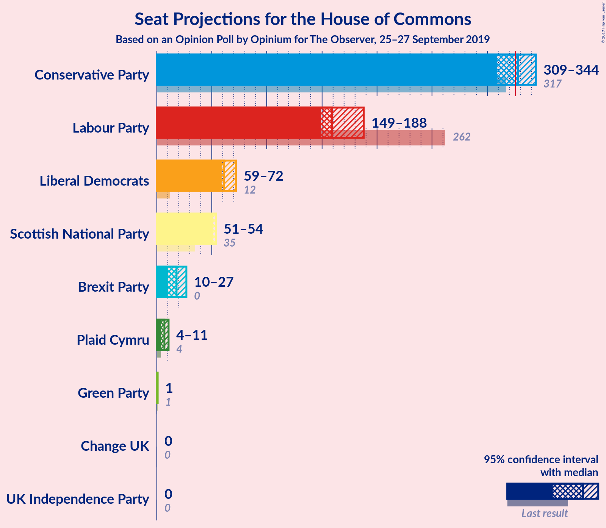
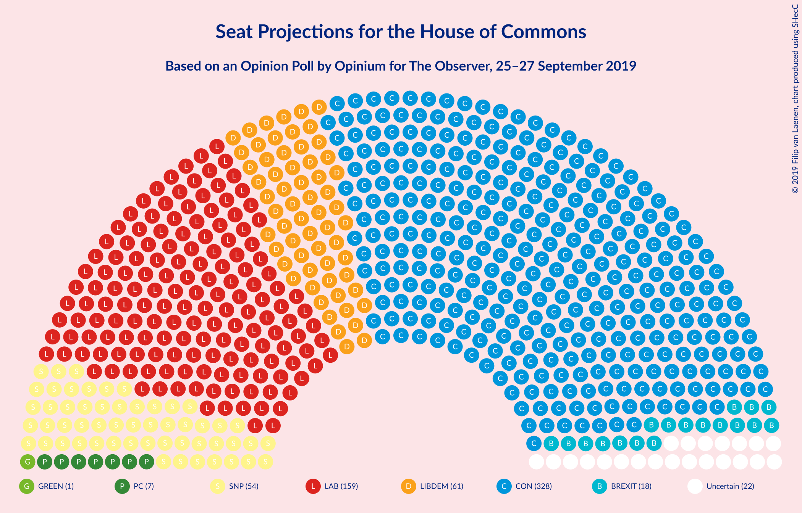
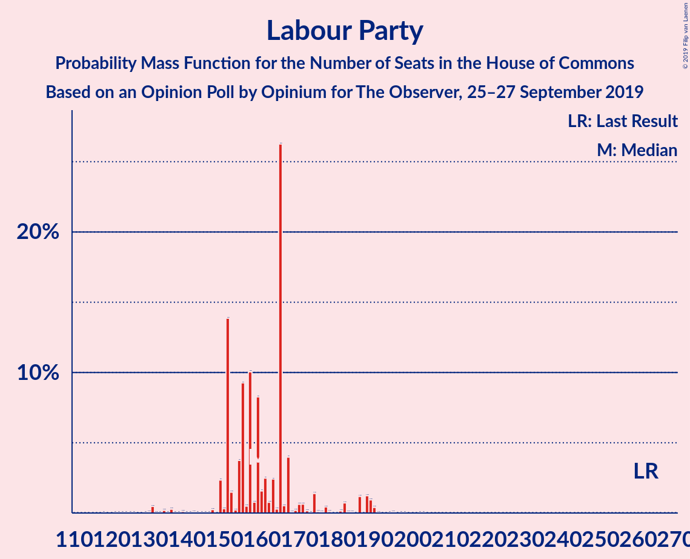
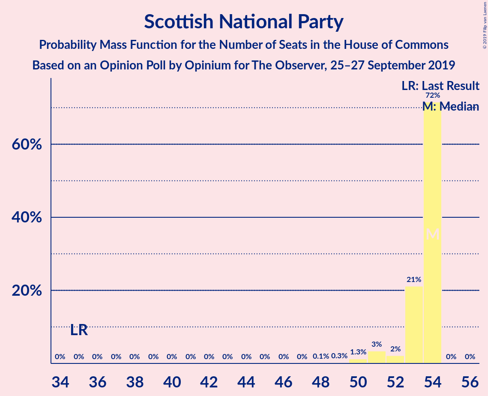
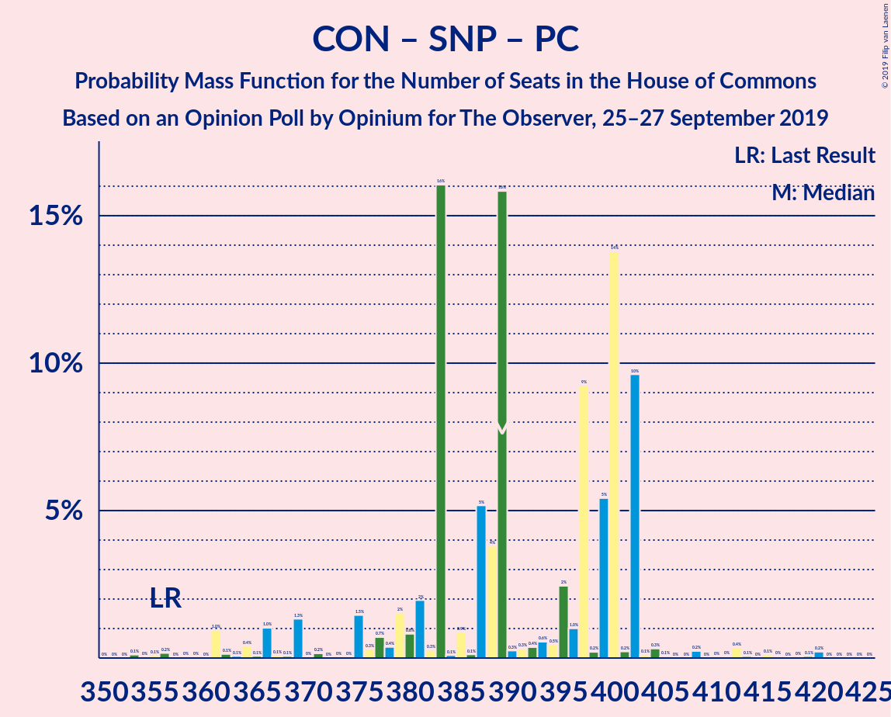
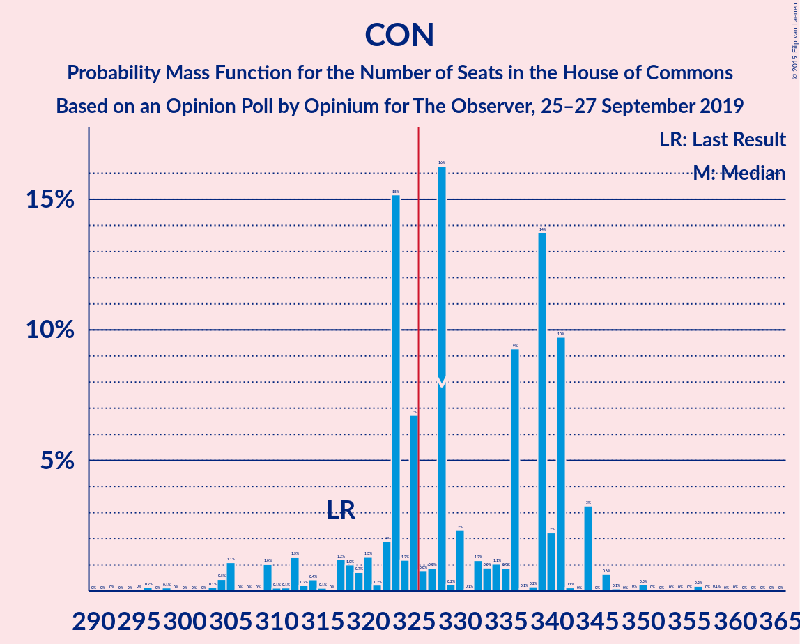
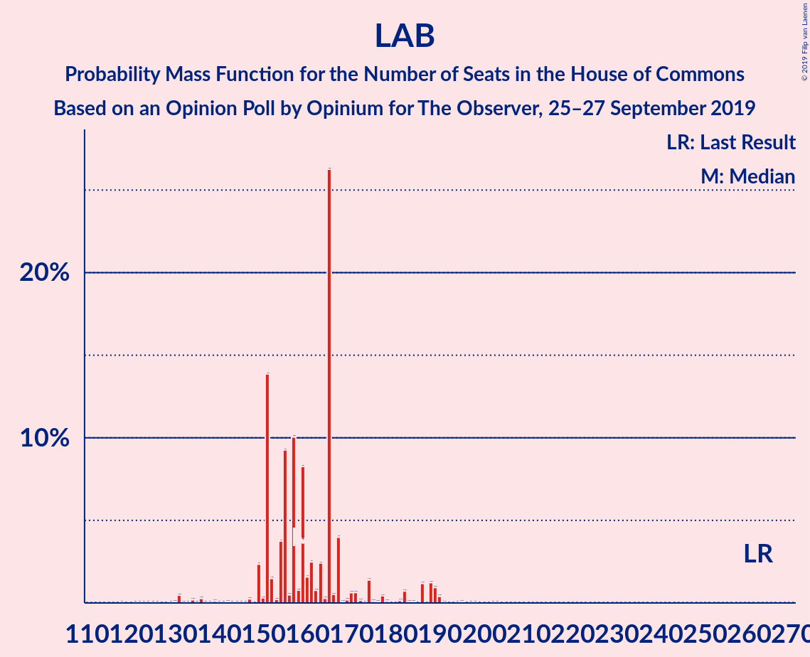

# Opinion Poll by Opinium for The Observer, 25–27 September 2019

<a href="#voting-intentions">Voting Intentions</a> | <a href="#seats">Seats</a> | <a href="#coalitions">Coalitions</a> | <a href="#technical-information">Technical Information</a>

## Voting Intentions

### Confidence Intervals

| Party | Last Result | Poll Result | 80% Confidence Interval | 90% Confidence Interval | 95% Confidence Interval | 99% Confidence Interval |
|:-----:|:-----------:|:-----------:|:-----------------------:|:-----------------------:|:-----------------------:|:-----------------------:|
| Conservative Party | 42.4% | 35.8% | 34.5–37.2% |34.1–37.6% |33.7–38.0% |33.1–38.6% |
| Labour Party | 40.0% | 23.9% | 22.7–25.1% |22.3–25.5% |22.0–25.8% |21.5–26.4% |
| Liberal Democrats | 7.4% | 19.9% | 18.8–21.1% |18.5–21.4% |18.2–21.7% |17.7–22.3% |
| Brexit Party | 0.0% | 11.0% | 10.1–11.9% |9.9–12.2% |9.7–12.4% |9.3–12.9% |
| Scottish National Party | 3.0% | 5.0% | 4.4–5.7% |4.2–5.9% |4.1–6.0% |3.9–6.4% |
| Green Party | 1.6% | 2.0% | 1.6–2.5% |1.5–2.6% |1.5–2.7% |1.3–3.0% |
| Plaid Cymru | 0.5% | 1.0% | 0.8–1.4% |0.7–1.4% |0.6–1.5% |0.5–1.7% |
| UK Independence Party | 1.8% | 0.2% | 0.2–0.5% |0.1–0.5% |0.1–0.6% |0.1–0.7% |
| Change UK | 0.0% | 0.2% | 0.2–0.5% |0.1–0.5% |0.1–0.6% |0.1–0.7% |

*Note:* The poll result column reflects the actual value used in the calculations. Published results may vary slightly, and in addition be rounded to fewer digits.

## Seats

### Confidence Intervals

| Party | Last Result | Median | 80% Confidence Interval | 90% Confidence Interval | 95% Confidence Interval | 99% Confidence Interval |
|:-----:|:-----------:|:------:|:-----------------------:|:-----------------------:|:-----------------------:|:-----------------------:|
| <a href="#conservative-party">Conservative Party</a> | 317 | 330 | 321–332 |315–332 |315–360 |315–360 |
| <a href="#labour-party">Labour Party</a> | 262 | 164 | 153–167 |153–167 |129–167 |129–167 |
| <a href="#liberal-democrats">Liberal Democrats</a> | 12 | 61 | 61–67 |61–67 |52–67 |52–67 |
| <a href="#brexit-party">Brexit Party</a> | 0 | 18 | 13–27 |13–39 |13–39 |13–39 |
| <a href="#scottish-national-party">Scottish National Party</a> | 35 | 54 | 49–54 |49–54 |49–54 |49–54 |
| <a href="#green-party">Green Party</a> | 1 | 1 | 1 |1 |1 |1 |
| <a href="#plaid-cymru">Plaid Cymru</a> | 4 | 9 | 9–12 |7–12 |7–12 |7–12 |
| <a href="#uk-independence-party">UK Independence Party</a> | 0 | 0 | 0 |0 |0 |0 |
| <a href="#change-uk">Change UK</a> | 0 | 0 | 0 |0 |0 |0 |

### Conservative Party

*For a full overview of the results for this party, see the [Conservative Party](party-conservativeparty.html) page.*

| Number of Seats | Probability | Accumulated | Special Marks |
|:---------------:|:-----------:|:-----------:|:-------------:|
| 314 | 0.1% | 100% |  |
| 315 | 5% | 99.9% |  |
| 316 | 0% | 95% |  |
| 317 | 0% | 95% | Last Result |
| 318 | 0% | 95% |  |
| 319 | 0% | 95% |  |
| 320 | 0.1% | 95% |  |
| 321 | 30% | 95% |  |
| 322 | 0% | 64% |  |
| 323 | 0% | 64% |  |
| 324 | 0% | 64% |  |
| 325 | 0% | 64% |  |
| 326 | 0% | 64% | Majority |
| 327 | 0% | 64% |  |
| 328 | 0% | 64% |  |
| 329 | 0% | 64% |  |
| 330 | 21% | 64% | Median |
| 331 | 0% | 43% |  |
| 332 | 38% | 43% |  |
| 333 | 0% | 5% |  |
| 334 | 0% | 5% |  |
| 335 | 0% | 5% |  |
| 336 | 0% | 5% |  |
| 337 | 0% | 5% |  |
| 338 | 0% | 5% |  |
| 339 | 0% | 5% |  |
| 340 | 0% | 5% |  |
| 341 | 0% | 5% |  |
| 342 | 0% | 5% |  |
| 343 | 0% | 5% |  |
| 344 | 0% | 5% |  |
| 345 | 0.1% | 5% |  |
| 346 | 0% | 5% |  |
| 347 | 0% | 5% |  |
| 348 | 0% | 5% |  |
| 349 | 0% | 5% |  |
| 350 | 0% | 5% |  |
| 351 | 0% | 5% |  |
| 352 | 0% | 5% |  |
| 353 | 0% | 5% |  |
| 354 | 0% | 5% |  |
| 355 | 0% | 5% |  |
| 356 | 0% | 5% |  |
| 357 | 0% | 5% |  |
| 358 | 0% | 5% |  |
| 359 | 0.1% | 5% |  |
| 360 | 4% | 5% |  |
| 361 | 0% | 0% |  |

### Labour Party

*For a full overview of the results for this party, see the [Labour Party](party-labourparty.html) page.*

| Number of Seats | Probability | Accumulated | Special Marks |
|:---------------:|:-----------:|:-----------:|:-------------:|
| 129 | 5% | 100% |  |
| 130 | 0.1% | 95% |  |
| 131 | 0% | 95% |  |
| 132 | 0% | 95% |  |
| 133 | 0% | 95% |  |
| 134 | 0% | 95% |  |
| 135 | 0% | 95% |  |
| 136 | 0% | 95% |  |
| 137 | 0% | 95% |  |
| 138 | 0% | 95% |  |
| 139 | 0% | 95% |  |
| 140 | 0.1% | 95% |  |
| 141 | 0% | 95% |  |
| 142 | 0% | 95% |  |
| 143 | 0% | 95% |  |
| 144 | 0% | 95% |  |
| 145 | 0% | 95% |  |
| 146 | 0% | 95% |  |
| 147 | 0% | 95% |  |
| 148 | 0% | 95% |  |
| 149 | 0% | 95% |  |
| 150 | 0% | 95% |  |
| 151 | 0.1% | 95% |  |
| 152 | 0% | 95% |  |
| 153 | 44% | 95% |  |
| 154 | 0% | 52% |  |
| 155 | 0% | 52% |  |
| 156 | 0% | 52% |  |
| 157 | 0% | 51% |  |
| 158 | 0% | 51% |  |
| 159 | 0% | 51% |  |
| 160 | 0% | 51% |  |
| 161 | 0% | 51% |  |
| 162 | 0% | 51% |  |
| 163 | 0% | 51% |  |
| 164 | 21% | 51% | Median |
| 165 | 0% | 31% |  |
| 166 | 0% | 31% |  |
| 167 | 30% | 31% |  |
| 168 | 0% | 0.2% |  |
| 169 | 0% | 0.2% |  |
| 170 | 0% | 0.2% |  |
| 171 | 0% | 0.2% |  |
| 172 | 0% | 0.2% |  |
| 173 | 0% | 0.1% |  |
| 174 | 0% | 0.1% |  |
| 175 | 0% | 0.1% |  |
| 176 | 0% | 0.1% |  |
| 177 | 0.1% | 0.1% |  |
| 178 | 0% | 0% |  |
| 179 | 0% | 0% |  |
| 180 | 0% | 0% |  |
| 181 | 0% | 0% |  |
| 182 | 0% | 0% |  |
| 183 | 0% | 0% |  |
| 184 | 0% | 0% |  |
| 185 | 0% | 0% |  |
| 186 | 0% | 0% |  |
| 187 | 0% | 0% |  |
| 188 | 0% | 0% |  |
| 189 | 0% | 0% |  |
| 190 | 0% | 0% |  |
| 191 | 0% | 0% |  |
| 192 | 0% | 0% |  |
| 193 | 0% | 0% |  |
| 194 | 0% | 0% |  |
| 195 | 0% | 0% |  |
| 196 | 0% | 0% |  |
| 197 | 0% | 0% |  |
| 198 | 0% | 0% |  |
| 199 | 0% | 0% |  |
| 200 | 0% | 0% |  |
| 201 | 0% | 0% |  |
| 202 | 0% | 0% |  |
| 203 | 0% | 0% |  |
| 204 | 0% | 0% |  |
| 205 | 0% | 0% |  |
| 206 | 0% | 0% |  |
| 207 | 0% | 0% |  |
| 208 | 0% | 0% |  |
| 209 | 0% | 0% |  |
| 210 | 0% | 0% |  |
| 211 | 0% | 0% |  |
| 212 | 0% | 0% |  |
| 213 | 0% | 0% |  |
| 214 | 0% | 0% |  |
| 215 | 0% | 0% |  |
| 216 | 0% | 0% |  |
| 217 | 0% | 0% |  |
| 218 | 0% | 0% |  |
| 219 | 0% | 0% |  |
| 220 | 0% | 0% |  |
| 221 | 0% | 0% |  |
| 222 | 0% | 0% |  |
| 223 | 0% | 0% |  |
| 224 | 0% | 0% |  |
| 225 | 0% | 0% |  |
| 226 | 0% | 0% |  |
| 227 | 0% | 0% |  |
| 228 | 0% | 0% |  |
| 229 | 0% | 0% |  |
| 230 | 0% | 0% |  |
| 231 | 0% | 0% |  |
| 232 | 0% | 0% |  |
| 233 | 0% | 0% |  |
| 234 | 0% | 0% |  |
| 235 | 0% | 0% |  |
| 236 | 0% | 0% |  |
| 237 | 0% | 0% |  |
| 238 | 0% | 0% |  |
| 239 | 0% | 0% |  |
| 240 | 0% | 0% |  |
| 241 | 0% | 0% |  |
| 242 | 0% | 0% |  |
| 243 | 0% | 0% |  |
| 244 | 0% | 0% |  |
| 245 | 0% | 0% |  |
| 246 | 0% | 0% |  |
| 247 | 0% | 0% |  |
| 248 | 0% | 0% |  |
| 249 | 0% | 0% |  |
| 250 | 0% | 0% |  |
| 251 | 0% | 0% |  |
| 252 | 0% | 0% |  |
| 253 | 0% | 0% |  |
| 254 | 0% | 0% |  |
| 255 | 0% | 0% |  |
| 256 | 0% | 0% |  |
| 257 | 0% | 0% |  |
| 258 | 0% | 0% |  |
| 259 | 0% | 0% |  |
| 260 | 0% | 0% |  |
| 261 | 0% | 0% |  |
| 262 | 0% | 0% | Last Result |

### Liberal Democrats

*For a full overview of the results for this party, see the [Liberal Democrats](party-liberaldemocrats.html) page.*

| Number of Seats | Probability | Accumulated | Special Marks |
|:---------------:|:-----------:|:-----------:|:-------------:|
| 12 | 0% | 100% | Last Result |
| 13 | 0% | 100% |  |
| 14 | 0% | 100% |  |
| 15 | 0% | 100% |  |
| 16 | 0% | 100% |  |
| 17 | 0% | 100% |  |
| 18 | 0% | 100% |  |
| 19 | 0% | 100% |  |
| 20 | 0% | 100% |  |
| 21 | 0% | 100% |  |
| 22 | 0% | 100% |  |
| 23 | 0% | 100% |  |
| 24 | 0% | 100% |  |
| 25 | 0% | 100% |  |
| 26 | 0% | 100% |  |
| 27 | 0% | 100% |  |
| 28 | 0% | 100% |  |
| 29 | 0% | 100% |  |
| 30 | 0% | 100% |  |
| 31 | 0% | 100% |  |
| 32 | 0% | 100% |  |
| 33 | 0% | 100% |  |
| 34 | 0% | 100% |  |
| 35 | 0% | 100% |  |
| 36 | 0% | 100% |  |
| 37 | 0% | 100% |  |
| 38 | 0% | 100% |  |
| 39 | 0% | 100% |  |
| 40 | 0% | 100% |  |
| 41 | 0% | 100% |  |
| 42 | 0% | 100% |  |
| 43 | 0% | 100% |  |
| 44 | 0% | 100% |  |
| 45 | 0% | 100% |  |
| 46 | 0% | 100% |  |
| 47 | 0% | 100% |  |
| 48 | 0% | 100% |  |
| 49 | 0% | 100% |  |
| 50 | 0% | 100% |  |
| 51 | 0% | 100% |  |
| 52 | 4% | 100% |  |
| 53 | 0% | 95% |  |
| 54 | 0.1% | 95% |  |
| 55 | 0% | 95% |  |
| 56 | 0% | 95% |  |
| 57 | 0.1% | 95% |  |
| 58 | 0% | 95% |  |
| 59 | 0% | 95% |  |
| 60 | 0% | 95% |  |
| 61 | 59% | 95% | Median |
| 62 | 0% | 36% |  |
| 63 | 5% | 36% |  |
| 64 | 0% | 31% |  |
| 65 | 0.1% | 31% |  |
| 66 | 0% | 30% |  |
| 67 | 30% | 30% |  |
| 68 | 0% | 0% |  |

### Brexit Party

*For a full overview of the results for this party, see the [Brexit Party](party-brexitparty.html) page.*

| Number of Seats | Probability | Accumulated | Special Marks |
|:---------------:|:-----------:|:-----------:|:-------------:|
| 0 | 0% | 100% | Last Result |
| 1 | 0% | 100% |  |
| 2 | 0% | 100% |  |
| 3 | 0% | 100% |  |
| 4 | 0% | 100% |  |
| 5 | 0% | 100% |  |
| 6 | 0% | 100% |  |
| 7 | 0% | 100% |  |
| 8 | 0% | 100% |  |
| 9 | 0% | 99.9% |  |
| 10 | 0% | 99.9% |  |
| 11 | 0% | 99.9% |  |
| 12 | 0% | 99.9% |  |
| 13 | 21% | 99.9% |  |
| 14 | 0.1% | 79% |  |
| 15 | 0% | 79% |  |
| 16 | 0% | 79% |  |
| 17 | 0% | 79% |  |
| 18 | 30% | 79% | Median |
| 19 | 38% | 49% |  |
| 20 | 0% | 10% |  |
| 21 | 0% | 10% |  |
| 22 | 0% | 10% |  |
| 23 | 0% | 10% |  |
| 24 | 0% | 10% |  |
| 25 | 0% | 10% |  |
| 26 | 0% | 10% |  |
| 27 | 5% | 10% |  |
| 28 | 0% | 5% |  |
| 29 | 0% | 5% |  |
| 30 | 0.1% | 5% |  |
| 31 | 0% | 5% |  |
| 32 | 0% | 5% |  |
| 33 | 0% | 5% |  |
| 34 | 0% | 5% |  |
| 35 | 0% | 5% |  |
| 36 | 0% | 5% |  |
| 37 | 0% | 5% |  |
| 38 | 0% | 5% |  |
| 39 | 5% | 5% |  |
| 40 | 0% | 0.1% |  |
| 41 | 0.1% | 0.1% |  |
| 42 | 0% | 0% |  |

### Scottish National Party

*For a full overview of the results for this party, see the [Scottish National Party](party-scottishnationalparty.html) page.*

| Number of Seats | Probability | Accumulated | Special Marks |
|:---------------:|:-----------:|:-----------:|:-------------:|
| 35 | 0% | 100% | Last Result |
| 36 | 0% | 100% |  |
| 37 | 0% | 100% |  |
| 38 | 0% | 100% |  |
| 39 | 0% | 100% |  |
| 40 | 0% | 100% |  |
| 41 | 0% | 100% |  |
| 42 | 0% | 100% |  |
| 43 | 0% | 100% |  |
| 44 | 0% | 100% |  |
| 45 | 0% | 100% |  |
| 46 | 0% | 100% |  |
| 47 | 0% | 100% |  |
| 48 | 0% | 100% |  |
| 49 | 30% | 100% |  |
| 50 | 0% | 70% |  |
| 51 | 0.1% | 70% |  |
| 52 | 0% | 69% |  |
| 53 | 0.1% | 69% |  |
| 54 | 69% | 69% | Median |
| 55 | 0% | 0% |  |

### Green Party

*For a full overview of the results for this party, see the [Green Party](party-greenparty.html) page.*

| Number of Seats | Probability | Accumulated | Special Marks |
|:---------------:|:-----------:|:-----------:|:-------------:|
| 1 | 100% | 100% | Last Result, Median |

### Plaid Cymru

*For a full overview of the results for this party, see the [Plaid Cymru](party-plaidcymru.html) page.*

| Number of Seats | Probability | Accumulated | Special Marks |
|:---------------:|:-----------:|:-----------:|:-------------:|
| 4 | 0.1% | 100% | Last Result |
| 5 | 0% | 99.9% |  |
| 6 | 0% | 99.8% |  |
| 7 | 5% | 99.8% |  |
| 8 | 0.1% | 94% |  |
| 9 | 56% | 94% | Median |
| 10 | 0% | 39% |  |
| 11 | 0% | 39% |  |
| 12 | 39% | 39% |  |
| 13 | 0% | 0% |  |

### UK Independence Party

*For a full overview of the results for this party, see the [UK Independence Party](party-ukindependenceparty.html) page.*

| Number of Seats | Probability | Accumulated | Special Marks |
|:---------------:|:-----------:|:-----------:|:-------------:|
| 0 | 100% | 100% | Last Result, Median |

### Change UK

*For a full overview of the results for this party, see the [Change UK](party-changeuk.html) page.*

| Number of Seats | Probability | Accumulated | Special Marks |
|:---------------:|:-----------:|:-----------:|:-------------:|
| 0 | 100% | 100% | Last Result, Median |

## Coalitions

### Confidence Intervals

| Coalition | Last Result | Median | Majority? | 80% Confidence Interval | 90% Confidence Interval | 95% Confidence Interval | 99% Confidence Interval |
|:---------:|:-----------:|:------:|:---------:|:-----------------------:|:-----------------------:|:-----------------------:|:-----------------------:|
| Conservative Party – Scottish National Party – Plaid Cymru | 356 | 393 | 100% | 379–398 | 376–398 | 376–423 | 376–423 |
| Conservative Party – Scottish National Party | 352 | 384 | 100% | 370–386 | 369–386 | 369–414 | 369–414 |
| Conservative Party – Liberal Democrats – Change UK | 329 | 391 | 100% | 388–393 | 378–393 | 378–412 | 378–412 |
| Conservative Party – Liberal Democrats | 329 | 391 | 100% | 388–393 | 378–393 | 378–412 | 378–412 |
| Conservative Party – Brexit Party | 317 | 343 | 100% | 339–354 | 339–354 | 339–387 | 339–387 |
| Conservative Party – Plaid Cymru | 321 | 339 | 95% | 330–344 | 322–344 | 322–369 | 322–369 |
| Conservative Party – Change UK | 317 | 330 | 64% | 321–332 | 315–332 | 315–360 | 315–360 |
| Conservative Party | 317 | 330 | 64% | 321–332 | 315–332 | 315–360 | 315–360 |
| Labour Party – Liberal Democrats – Scottish National Party – Plaid Cymru | 313 | 288 | 0% | 277–292 | 277–292 | 244–292 | 244–292 |
| Labour Party – Liberal Democrats – Scottish National Party | 309 | 279 | 0% | 268–283 | 268–283 | 235–283 | 235–283 |
| Labour Party – Liberal Democrats – Plaid Cymru | 278 | 234 | 0% | 223–243 | 223–243 | 190–243 | 190–243 |
| Labour Party – Liberal Democrats – Change UK | 274 | 225 | 0% | 214–234 | 214–234 | 181–234 | 181–234 |
| Labour Party – Liberal Democrats | 274 | 225 | 0% | 214–234 | 214–234 | 181–234 | 181–234 |
| Labour Party – Scottish National Party – Plaid Cymru | 301 | 225 | 0% | 214–227 | 214–227 | 192–227 | 192–227 |
| Labour Party – Scottish National Party | 297 | 216 | 0% | 207–218 | 207–218 | 183–218 | 183–218 |
| Labour Party – Plaid Cymru | 266 | 173 | 0% | 160–176 | 160–176 | 138–176 | 138–176 |
| Labour Party – Change UK | 262 | 164 | 0% | 153–167 | 153–167 | 129–167 | 129–167 |
| Labour Party | 262 | 164 | 0% | 153–167 | 153–167 | 129–167 | 129–167 |

### Conservative Party – Scottish National Party – Plaid Cymru

| Number of Seats | Probability | Accumulated | Special Marks |
|:---------------:|:-----------:|:-----------:|:-------------:|
| 356 | 0% | 100% | Last Result |
| 357 | 0% | 100% |  |
| 358 | 0% | 100% |  |
| 359 | 0% | 100% |  |
| 360 | 0% | 100% |  |
| 361 | 0% | 100% |  |
| 362 | 0% | 100% |  |
| 363 | 0% | 100% |  |
| 364 | 0% | 100% |  |
| 365 | 0% | 100% |  |
| 366 | 0% | 100% |  |
| 367 | 0% | 100% |  |
| 368 | 0% | 100% |  |
| 369 | 0% | 100% |  |
| 370 | 0% | 100% |  |
| 371 | 0% | 100% |  |
| 372 | 0% | 100% |  |
| 373 | 0.1% | 100% |  |
| 374 | 0.1% | 99.9% |  |
| 375 | 0% | 99.8% |  |
| 376 | 5% | 99.8% |  |
| 377 | 0% | 95% |  |
| 378 | 0% | 95% |  |
| 379 | 30% | 95% |  |
| 380 | 0% | 64% |  |
| 381 | 0% | 64% |  |
| 382 | 0% | 64% |  |
| 383 | 0% | 64% |  |
| 384 | 0% | 64% |  |
| 385 | 0% | 64% |  |
| 386 | 0% | 64% |  |
| 387 | 0% | 64% |  |
| 388 | 0% | 64% |  |
| 389 | 0% | 64% |  |
| 390 | 0% | 64% |  |
| 391 | 0% | 64% |  |
| 392 | 0% | 64% |  |
| 393 | 21% | 64% | Median |
| 394 | 0% | 43% |  |
| 395 | 0% | 43% |  |
| 396 | 0% | 43% |  |
| 397 | 0% | 43% |  |
| 398 | 38% | 43% |  |
| 399 | 0% | 5% |  |
| 400 | 0% | 5% |  |
| 401 | 0% | 5% |  |
| 402 | 0% | 5% |  |
| 403 | 0% | 5% |  |
| 404 | 0.1% | 5% |  |
| 405 | 0% | 5% |  |
| 406 | 0% | 5% |  |
| 407 | 0% | 5% |  |
| 408 | 0% | 5% |  |
| 409 | 0% | 5% |  |
| 410 | 0% | 5% |  |
| 411 | 0% | 5% |  |
| 412 | 0% | 5% |  |
| 413 | 0% | 5% |  |
| 414 | 0% | 5% |  |
| 415 | 0% | 5% |  |
| 416 | 0% | 5% |  |
| 417 | 0% | 5% |  |
| 418 | 0% | 5% |  |
| 419 | 0% | 5% |  |
| 420 | 0.1% | 5% |  |
| 421 | 0% | 5% |  |
| 422 | 0% | 5% |  |
| 423 | 4% | 5% |  |
| 424 | 0% | 0% |  |

### Conservative Party – Scottish National Party

| Number of Seats | Probability | Accumulated | Special Marks |
|:---------------:|:-----------:|:-----------:|:-------------:|
| 352 | 0% | 100% | Last Result |
| 353 | 0% | 100% |  |
| 354 | 0% | 100% |  |
| 355 | 0% | 100% |  |
| 356 | 0% | 100% |  |
| 357 | 0% | 100% |  |
| 358 | 0% | 100% |  |
| 359 | 0% | 100% |  |
| 360 | 0% | 100% |  |
| 361 | 0% | 100% |  |
| 362 | 0% | 100% |  |
| 363 | 0% | 100% |  |
| 364 | 0% | 100% |  |
| 365 | 0% | 100% |  |
| 366 | 0% | 100% |  |
| 367 | 0.1% | 100% |  |
| 368 | 0% | 99.9% |  |
| 369 | 5% | 99.9% |  |
| 370 | 30% | 95% |  |
| 371 | 0% | 64% |  |
| 372 | 0% | 64% |  |
| 373 | 0% | 64% |  |
| 374 | 0% | 64% |  |
| 375 | 0% | 64% |  |
| 376 | 0% | 64% |  |
| 377 | 0% | 64% |  |
| 378 | 0% | 64% |  |
| 379 | 0% | 64% |  |
| 380 | 0% | 64% |  |
| 381 | 0% | 64% |  |
| 382 | 0% | 64% |  |
| 383 | 0% | 64% |  |
| 384 | 21% | 64% | Median |
| 385 | 0% | 43% |  |
| 386 | 38% | 43% |  |
| 387 | 0% | 5% |  |
| 388 | 0% | 5% |  |
| 389 | 0% | 5% |  |
| 390 | 0% | 5% |  |
| 391 | 0% | 5% |  |
| 392 | 0% | 5% |  |
| 393 | 0% | 5% |  |
| 394 | 0% | 5% |  |
| 395 | 0% | 5% |  |
| 396 | 0.1% | 5% |  |
| 397 | 0% | 5% |  |
| 398 | 0% | 5% |  |
| 399 | 0% | 5% |  |
| 400 | 0% | 5% |  |
| 401 | 0% | 5% |  |
| 402 | 0% | 5% |  |
| 403 | 0% | 5% |  |
| 404 | 0% | 5% |  |
| 405 | 0% | 5% |  |
| 406 | 0% | 5% |  |
| 407 | 0% | 5% |  |
| 408 | 0% | 5% |  |
| 409 | 0% | 5% |  |
| 410 | 0% | 5% |  |
| 411 | 0% | 5% |  |
| 412 | 0% | 5% |  |
| 413 | 0.1% | 5% |  |
| 414 | 4% | 5% |  |
| 415 | 0% | 0% |  |

### Conservative Party – Liberal Democrats – Change UK

| Number of Seats | Probability | Accumulated | Special Marks |
|:---------------:|:-----------:|:-----------:|:-------------:|
| 329 | 0% | 100% | Last Result |
| 330 | 0% | 100% |  |
| 331 | 0% | 100% |  |
| 332 | 0% | 100% |  |
| 333 | 0% | 100% |  |
| 334 | 0% | 100% |  |
| 335 | 0% | 100% |  |
| 336 | 0% | 100% |  |
| 337 | 0% | 100% |  |
| 338 | 0% | 100% |  |
| 339 | 0% | 100% |  |
| 340 | 0% | 100% |  |
| 341 | 0% | 100% |  |
| 342 | 0% | 100% |  |
| 343 | 0% | 100% |  |
| 344 | 0% | 100% |  |
| 345 | 0% | 100% |  |
| 346 | 0% | 100% |  |
| 347 | 0% | 100% |  |
| 348 | 0% | 100% |  |
| 349 | 0% | 100% |  |
| 350 | 0% | 100% |  |
| 351 | 0% | 100% |  |
| 352 | 0% | 100% |  |
| 353 | 0% | 100% |  |
| 354 | 0% | 100% |  |
| 355 | 0% | 100% |  |
| 356 | 0% | 100% |  |
| 357 | 0% | 100% |  |
| 358 | 0% | 100% |  |
| 359 | 0% | 100% |  |
| 360 | 0% | 100% |  |
| 361 | 0% | 100% |  |
| 362 | 0% | 100% |  |
| 363 | 0% | 100% |  |
| 364 | 0% | 100% |  |
| 365 | 0% | 100% |  |
| 366 | 0% | 100% |  |
| 367 | 0% | 100% |  |
| 368 | 0% | 100% |  |
| 369 | 0% | 100% |  |
| 370 | 0% | 100% |  |
| 371 | 0% | 100% |  |
| 372 | 0% | 100% |  |
| 373 | 0% | 100% |  |
| 374 | 0% | 100% |  |
| 375 | 0% | 100% |  |
| 376 | 0% | 100% |  |
| 377 | 0% | 100% |  |
| 378 | 5% | 100% |  |
| 379 | 0.1% | 95% |  |
| 380 | 0% | 95% |  |
| 381 | 0% | 95% |  |
| 382 | 0% | 95% |  |
| 383 | 0% | 95% |  |
| 384 | 0% | 95% |  |
| 385 | 0% | 95% |  |
| 386 | 0% | 95% |  |
| 387 | 0.1% | 95% |  |
| 388 | 30% | 95% |  |
| 389 | 0% | 64% |  |
| 390 | 0% | 64% |  |
| 391 | 21% | 64% | Median |
| 392 | 0% | 43% |  |
| 393 | 38% | 43% |  |
| 394 | 0% | 5% |  |
| 395 | 0% | 5% |  |
| 396 | 0% | 5% |  |
| 397 | 0% | 5% |  |
| 398 | 0% | 5% |  |
| 399 | 0% | 5% |  |
| 400 | 0% | 5% |  |
| 401 | 0% | 5% |  |
| 402 | 0.1% | 5% |  |
| 403 | 0% | 5% |  |
| 404 | 0% | 5% |  |
| 405 | 0% | 5% |  |
| 406 | 0% | 5% |  |
| 407 | 0% | 5% |  |
| 408 | 0% | 5% |  |
| 409 | 0% | 5% |  |
| 410 | 0% | 5% |  |
| 411 | 0% | 5% |  |
| 412 | 4% | 5% |  |
| 413 | 0.1% | 0.2% |  |
| 414 | 0% | 0% |  |

### Conservative Party – Liberal Democrats

| Number of Seats | Probability | Accumulated | Special Marks |
|:---------------:|:-----------:|:-----------:|:-------------:|
| 329 | 0% | 100% | Last Result |
| 330 | 0% | 100% |  |
| 331 | 0% | 100% |  |
| 332 | 0% | 100% |  |
| 333 | 0% | 100% |  |
| 334 | 0% | 100% |  |
| 335 | 0% | 100% |  |
| 336 | 0% | 100% |  |
| 337 | 0% | 100% |  |
| 338 | 0% | 100% |  |
| 339 | 0% | 100% |  |
| 340 | 0% | 100% |  |
| 341 | 0% | 100% |  |
| 342 | 0% | 100% |  |
| 343 | 0% | 100% |  |
| 344 | 0% | 100% |  |
| 345 | 0% | 100% |  |
| 346 | 0% | 100% |  |
| 347 | 0% | 100% |  |
| 348 | 0% | 100% |  |
| 349 | 0% | 100% |  |
| 350 | 0% | 100% |  |
| 351 | 0% | 100% |  |
| 352 | 0% | 100% |  |
| 353 | 0% | 100% |  |
| 354 | 0% | 100% |  |
| 355 | 0% | 100% |  |
| 356 | 0% | 100% |  |
| 357 | 0% | 100% |  |
| 358 | 0% | 100% |  |
| 359 | 0% | 100% |  |
| 360 | 0% | 100% |  |
| 361 | 0% | 100% |  |
| 362 | 0% | 100% |  |
| 363 | 0% | 100% |  |
| 364 | 0% | 100% |  |
| 365 | 0% | 100% |  |
| 366 | 0% | 100% |  |
| 367 | 0% | 100% |  |
| 368 | 0% | 100% |  |
| 369 | 0% | 100% |  |
| 370 | 0% | 100% |  |
| 371 | 0% | 100% |  |
| 372 | 0% | 100% |  |
| 373 | 0% | 100% |  |
| 374 | 0% | 100% |  |
| 375 | 0% | 100% |  |
| 376 | 0% | 100% |  |
| 377 | 0% | 100% |  |
| 378 | 5% | 100% |  |
| 379 | 0.1% | 95% |  |
| 380 | 0% | 95% |  |
| 381 | 0% | 95% |  |
| 382 | 0% | 95% |  |
| 383 | 0% | 95% |  |
| 384 | 0% | 95% |  |
| 385 | 0% | 95% |  |
| 386 | 0% | 95% |  |
| 387 | 0.1% | 95% |  |
| 388 | 30% | 95% |  |
| 389 | 0% | 64% |  |
| 390 | 0% | 64% |  |
| 391 | 21% | 64% | Median |
| 392 | 0% | 43% |  |
| 393 | 38% | 43% |  |
| 394 | 0% | 5% |  |
| 395 | 0% | 5% |  |
| 396 | 0% | 5% |  |
| 397 | 0% | 5% |  |
| 398 | 0% | 5% |  |
| 399 | 0% | 5% |  |
| 400 | 0% | 5% |  |
| 401 | 0% | 5% |  |
| 402 | 0.1% | 5% |  |
| 403 | 0% | 5% |  |
| 404 | 0% | 5% |  |
| 405 | 0% | 5% |  |
| 406 | 0% | 5% |  |
| 407 | 0% | 5% |  |
| 408 | 0% | 5% |  |
| 409 | 0% | 5% |  |
| 410 | 0% | 5% |  |
| 411 | 0% | 5% |  |
| 412 | 4% | 5% |  |
| 413 | 0.1% | 0.2% |  |
| 414 | 0% | 0% |  |

### Conservative Party – Brexit Party

| Number of Seats | Probability | Accumulated | Special Marks |
|:---------------:|:-----------:|:-----------:|:-------------:|
| 317 | 0% | 100% | Last Result |
| 318 | 0% | 100% |  |
| 319 | 0% | 100% |  |
| 320 | 0% | 100% |  |
| 321 | 0% | 100% |  |
| 322 | 0% | 100% |  |
| 323 | 0% | 100% |  |
| 324 | 0% | 100% |  |
| 325 | 0% | 100% |  |
| 326 | 0% | 100% | Majority |
| 327 | 0% | 100% |  |
| 328 | 0% | 100% |  |
| 329 | 0% | 100% |  |
| 330 | 0% | 100% |  |
| 331 | 0% | 100% |  |
| 332 | 0% | 100% |  |
| 333 | 0% | 100% |  |
| 334 | 0.1% | 100% |  |
| 335 | 0% | 99.9% |  |
| 336 | 0% | 99.9% |  |
| 337 | 0% | 99.9% |  |
| 338 | 0% | 99.8% |  |
| 339 | 30% | 99.8% |  |
| 340 | 0% | 69% |  |
| 341 | 0% | 69% |  |
| 342 | 0% | 69% |  |
| 343 | 21% | 69% |  |
| 344 | 0% | 49% |  |
| 345 | 0% | 49% |  |
| 346 | 0% | 49% |  |
| 347 | 0% | 49% |  |
| 348 | 0% | 49% | Median |
| 349 | 0% | 49% |  |
| 350 | 0% | 48% |  |
| 351 | 38% | 48% |  |
| 352 | 0% | 10% |  |
| 353 | 0% | 10% |  |
| 354 | 5% | 10% |  |
| 355 | 0.1% | 5% |  |
| 356 | 0% | 5% |  |
| 357 | 0% | 5% |  |
| 358 | 0% | 5% |  |
| 359 | 0% | 5% |  |
| 360 | 0% | 5% |  |
| 361 | 0% | 5% |  |
| 362 | 0% | 5% |  |
| 363 | 0% | 5% |  |
| 364 | 0% | 5% |  |
| 365 | 0% | 5% |  |
| 366 | 0% | 5% |  |
| 367 | 0% | 5% |  |
| 368 | 0% | 5% |  |
| 369 | 0% | 5% |  |
| 370 | 0% | 5% |  |
| 371 | 0% | 5% |  |
| 372 | 0% | 5% |  |
| 373 | 0% | 5% |  |
| 374 | 0% | 5% |  |
| 375 | 0.1% | 5% |  |
| 376 | 0% | 5% |  |
| 377 | 0% | 5% |  |
| 378 | 0% | 5% |  |
| 379 | 0% | 5% |  |
| 380 | 0% | 5% |  |
| 381 | 0% | 5% |  |
| 382 | 0% | 5% |  |
| 383 | 0% | 5% |  |
| 384 | 0% | 5% |  |
| 385 | 0% | 5% |  |
| 386 | 0.1% | 5% |  |
| 387 | 4% | 5% |  |
| 388 | 0% | 0% |  |

### Conservative Party – Plaid Cymru

| Number of Seats | Probability | Accumulated | Special Marks |
|:---------------:|:-----------:|:-----------:|:-------------:|
| 321 | 0.1% | 100% | Last Result |
| 322 | 5% | 99.9% |  |
| 323 | 0% | 95% |  |
| 324 | 0.1% | 95% |  |
| 325 | 0% | 95% |  |
| 326 | 0% | 95% | Majority |
| 327 | 0% | 95% |  |
| 328 | 0% | 95% |  |
| 329 | 0% | 95% |  |
| 330 | 30% | 95% |  |
| 331 | 0% | 64% |  |
| 332 | 0% | 64% |  |
| 333 | 0% | 64% |  |
| 334 | 0% | 64% |  |
| 335 | 0% | 64% |  |
| 336 | 0% | 64% |  |
| 337 | 0% | 64% |  |
| 338 | 0% | 64% |  |
| 339 | 21% | 64% | Median |
| 340 | 0% | 43% |  |
| 341 | 0% | 43% |  |
| 342 | 0% | 43% |  |
| 343 | 0% | 43% |  |
| 344 | 38% | 43% |  |
| 345 | 0% | 5% |  |
| 346 | 0% | 5% |  |
| 347 | 0% | 5% |  |
| 348 | 0% | 5% |  |
| 349 | 0% | 5% |  |
| 350 | 0% | 5% |  |
| 351 | 0% | 5% |  |
| 352 | 0% | 5% |  |
| 353 | 0.1% | 5% |  |
| 354 | 0% | 5% |  |
| 355 | 0% | 5% |  |
| 356 | 0% | 5% |  |
| 357 | 0% | 5% |  |
| 358 | 0% | 5% |  |
| 359 | 0% | 5% |  |
| 360 | 0% | 5% |  |
| 361 | 0% | 5% |  |
| 362 | 0% | 5% |  |
| 363 | 0% | 5% |  |
| 364 | 0% | 5% |  |
| 365 | 0% | 5% |  |
| 366 | 0.1% | 5% |  |
| 367 | 0% | 5% |  |
| 368 | 0% | 5% |  |
| 369 | 4% | 5% |  |
| 370 | 0% | 0% |  |

### Conservative Party – Change UK

| Number of Seats | Probability | Accumulated | Special Marks |
|:---------------:|:-----------:|:-----------:|:-------------:|
| 314 | 0.1% | 100% |  |
| 315 | 5% | 99.9% |  |
| 316 | 0% | 95% |  |
| 317 | 0% | 95% | Last Result |
| 318 | 0% | 95% |  |
| 319 | 0% | 95% |  |
| 320 | 0.1% | 95% |  |
| 321 | 30% | 95% |  |
| 322 | 0% | 64% |  |
| 323 | 0% | 64% |  |
| 324 | 0% | 64% |  |
| 325 | 0% | 64% |  |
| 326 | 0% | 64% | Majority |
| 327 | 0% | 64% |  |
| 328 | 0% | 64% |  |
| 329 | 0% | 64% |  |
| 330 | 21% | 64% | Median |
| 331 | 0% | 43% |  |
| 332 | 38% | 43% |  |
| 333 | 0% | 5% |  |
| 334 | 0% | 5% |  |
| 335 | 0% | 5% |  |
| 336 | 0% | 5% |  |
| 337 | 0% | 5% |  |
| 338 | 0% | 5% |  |
| 339 | 0% | 5% |  |
| 340 | 0% | 5% |  |
| 341 | 0% | 5% |  |
| 342 | 0% | 5% |  |
| 343 | 0% | 5% |  |
| 344 | 0% | 5% |  |
| 345 | 0.1% | 5% |  |
| 346 | 0% | 5% |  |
| 347 | 0% | 5% |  |
| 348 | 0% | 5% |  |
| 349 | 0% | 5% |  |
| 350 | 0% | 5% |  |
| 351 | 0% | 5% |  |
| 352 | 0% | 5% |  |
| 353 | 0% | 5% |  |
| 354 | 0% | 5% |  |
| 355 | 0% | 5% |  |
| 356 | 0% | 5% |  |
| 357 | 0% | 5% |  |
| 358 | 0% | 5% |  |
| 359 | 0.1% | 5% |  |
| 360 | 4% | 5% |  |
| 361 | 0% | 0% |  |

### Conservative Party

| Number of Seats | Probability | Accumulated | Special Marks |
|:---------------:|:-----------:|:-----------:|:-------------:|
| 314 | 0.1% | 100% |  |
| 315 | 5% | 99.9% |  |
| 316 | 0% | 95% |  |
| 317 | 0% | 95% | Last Result |
| 318 | 0% | 95% |  |
| 319 | 0% | 95% |  |
| 320 | 0.1% | 95% |  |
| 321 | 30% | 95% |  |
| 322 | 0% | 64% |  |
| 323 | 0% | 64% |  |
| 324 | 0% | 64% |  |
| 325 | 0% | 64% |  |
| 326 | 0% | 64% | Majority |
| 327 | 0% | 64% |  |
| 328 | 0% | 64% |  |
| 329 | 0% | 64% |  |
| 330 | 21% | 64% | Median |
| 331 | 0% | 43% |  |
| 332 | 38% | 43% |  |
| 333 | 0% | 5% |  |
| 334 | 0% | 5% |  |
| 335 | 0% | 5% |  |
| 336 | 0% | 5% |  |
| 337 | 0% | 5% |  |
| 338 | 0% | 5% |  |
| 339 | 0% | 5% |  |
| 340 | 0% | 5% |  |
| 341 | 0% | 5% |  |
| 342 | 0% | 5% |  |
| 343 | 0% | 5% |  |
| 344 | 0% | 5% |  |
| 345 | 0.1% | 5% |  |
| 346 | 0% | 5% |  |
| 347 | 0% | 5% |  |
| 348 | 0% | 5% |  |
| 349 | 0% | 5% |  |
| 350 | 0% | 5% |  |
| 351 | 0% | 5% |  |
| 352 | 0% | 5% |  |
| 353 | 0% | 5% |  |
| 354 | 0% | 5% |  |
| 355 | 0% | 5% |  |
| 356 | 0% | 5% |  |
| 357 | 0% | 5% |  |
| 358 | 0% | 5% |  |
| 359 | 0.1% | 5% |  |
| 360 | 4% | 5% |  |
| 361 | 0% | 0% |  |

### Labour Party – Liberal Democrats – Scottish National Party – Plaid Cymru

| Number of Seats | Probability | Accumulated | Special Marks |
|:---------------:|:-----------:|:-----------:|:-------------:|
| 244 | 4% | 100% |  |
| 245 | 0.1% | 95% |  |
| 246 | 0% | 95% |  |
| 247 | 0% | 95% |  |
| 248 | 0% | 95% |  |
| 249 | 0% | 95% |  |
| 250 | 0% | 95% |  |
| 251 | 0% | 95% |  |
| 252 | 0% | 95% |  |
| 253 | 0% | 95% |  |
| 254 | 0% | 95% |  |
| 255 | 0% | 95% |  |
| 256 | 0.1% | 95% |  |
| 257 | 0% | 95% |  |
| 258 | 0% | 95% |  |
| 259 | 0% | 95% |  |
| 260 | 0% | 95% |  |
| 261 | 0% | 95% |  |
| 262 | 0% | 95% |  |
| 263 | 0% | 95% |  |
| 264 | 0% | 95% |  |
| 265 | 0% | 95% |  |
| 266 | 0% | 95% |  |
| 267 | 0% | 95% |  |
| 268 | 0% | 95% |  |
| 269 | 0% | 95% |  |
| 270 | 0% | 95% |  |
| 271 | 0% | 95% |  |
| 272 | 0% | 95% |  |
| 273 | 0% | 95% |  |
| 274 | 0% | 95% |  |
| 275 | 0% | 95% |  |
| 276 | 0.1% | 95% |  |
| 277 | 5% | 95% |  |
| 278 | 0% | 90% |  |
| 279 | 0% | 90% |  |
| 280 | 38% | 90% |  |
| 281 | 0% | 52% |  |
| 282 | 0% | 52% |  |
| 283 | 0% | 51% |  |
| 284 | 0% | 51% |  |
| 285 | 0% | 51% |  |
| 286 | 0% | 51% |  |
| 287 | 0% | 51% |  |
| 288 | 21% | 51% | Median |
| 289 | 0% | 31% |  |
| 290 | 0% | 31% |  |
| 291 | 0% | 31% |  |
| 292 | 30% | 31% |  |
| 293 | 0% | 0.2% |  |
| 294 | 0% | 0.2% |  |
| 295 | 0% | 0.1% |  |
| 296 | 0% | 0.1% |  |
| 297 | 0.1% | 0.1% |  |
| 298 | 0% | 0% |  |
| 299 | 0% | 0% |  |
| 300 | 0% | 0% |  |
| 301 | 0% | 0% |  |
| 302 | 0% | 0% |  |
| 303 | 0% | 0% |  |
| 304 | 0% | 0% |  |
| 305 | 0% | 0% |  |
| 306 | 0% | 0% |  |
| 307 | 0% | 0% |  |
| 308 | 0% | 0% |  |
| 309 | 0% | 0% |  |
| 310 | 0% | 0% |  |
| 311 | 0% | 0% |  |
| 312 | 0% | 0% |  |
| 313 | 0% | 0% | Last Result |

### Labour Party – Liberal Democrats – Scottish National Party

| Number of Seats | Probability | Accumulated | Special Marks |
|:---------------:|:-----------:|:-----------:|:-------------:|
| 235 | 4% | 100% |  |
| 236 | 0% | 95% |  |
| 237 | 0% | 95% |  |
| 238 | 0.1% | 95% |  |
| 239 | 0% | 95% |  |
| 240 | 0% | 95% |  |
| 241 | 0% | 95% |  |
| 242 | 0% | 95% |  |
| 243 | 0% | 95% |  |
| 244 | 0% | 95% |  |
| 245 | 0% | 95% |  |
| 246 | 0% | 95% |  |
| 247 | 0% | 95% |  |
| 248 | 0.1% | 95% |  |
| 249 | 0% | 95% |  |
| 250 | 0% | 95% |  |
| 251 | 0% | 95% |  |
| 252 | 0% | 95% |  |
| 253 | 0% | 95% |  |
| 254 | 0% | 95% |  |
| 255 | 0% | 95% |  |
| 256 | 0% | 95% |  |
| 257 | 0% | 95% |  |
| 258 | 0% | 95% |  |
| 259 | 0% | 95% |  |
| 260 | 0% | 95% |  |
| 261 | 0% | 95% |  |
| 262 | 0% | 95% |  |
| 263 | 0% | 95% |  |
| 264 | 0% | 95% |  |
| 265 | 0% | 95% |  |
| 266 | 0% | 95% |  |
| 267 | 0% | 95% |  |
| 268 | 38% | 95% |  |
| 269 | 0.1% | 57% |  |
| 270 | 5% | 57% |  |
| 271 | 0% | 51% |  |
| 272 | 0% | 51% |  |
| 273 | 0% | 51% |  |
| 274 | 0% | 51% |  |
| 275 | 0% | 51% |  |
| 276 | 0% | 51% |  |
| 277 | 0% | 51% |  |
| 278 | 0% | 51% |  |
| 279 | 21% | 51% | Median |
| 280 | 0% | 31% |  |
| 281 | 0% | 31% |  |
| 282 | 0% | 31% |  |
| 283 | 30% | 31% |  |
| 284 | 0% | 0.2% |  |
| 285 | 0% | 0.2% |  |
| 286 | 0% | 0.2% |  |
| 287 | 0% | 0.2% |  |
| 288 | 0% | 0.1% |  |
| 289 | 0% | 0.1% |  |
| 290 | 0% | 0.1% |  |
| 291 | 0% | 0.1% |  |
| 292 | 0% | 0.1% |  |
| 293 | 0.1% | 0.1% |  |
| 294 | 0% | 0% |  |
| 295 | 0% | 0% |  |
| 296 | 0% | 0% |  |
| 297 | 0% | 0% |  |
| 298 | 0% | 0% |  |
| 299 | 0% | 0% |  |
| 300 | 0% | 0% |  |
| 301 | 0% | 0% |  |
| 302 | 0% | 0% |  |
| 303 | 0% | 0% |  |
| 304 | 0% | 0% |  |
| 305 | 0% | 0% |  |
| 306 | 0% | 0% |  |
| 307 | 0% | 0% |  |
| 308 | 0% | 0% |  |
| 309 | 0% | 0% | Last Result |

### Labour Party – Liberal Democrats – Plaid Cymru

| Number of Seats | Probability | Accumulated | Special Marks |
|:---------------:|:-----------:|:-----------:|:-------------:|
| 190 | 5% | 100% |  |
| 191 | 0.1% | 95% |  |
| 192 | 0% | 95% |  |
| 193 | 0% | 95% |  |
| 194 | 0% | 95% |  |
| 195 | 0% | 95% |  |
| 196 | 0% | 95% |  |
| 197 | 0% | 95% |  |
| 198 | 0% | 95% |  |
| 199 | 0% | 95% |  |
| 200 | 0% | 95% |  |
| 201 | 0% | 95% |  |
| 202 | 0% | 95% |  |
| 203 | 0% | 95% |  |
| 204 | 0% | 95% |  |
| 205 | 0.1% | 95% |  |
| 206 | 0% | 95% |  |
| 207 | 0% | 95% |  |
| 208 | 0% | 95% |  |
| 209 | 0% | 95% |  |
| 210 | 0% | 95% |  |
| 211 | 0% | 95% |  |
| 212 | 0% | 95% |  |
| 213 | 0% | 95% |  |
| 214 | 0% | 95% |  |
| 215 | 0% | 95% |  |
| 216 | 0% | 95% |  |
| 217 | 0% | 95% |  |
| 218 | 0% | 95% |  |
| 219 | 0% | 95% |  |
| 220 | 0% | 95% |  |
| 221 | 0% | 95% |  |
| 222 | 0% | 95% |  |
| 223 | 5% | 95% |  |
| 224 | 0% | 90% |  |
| 225 | 0% | 90% |  |
| 226 | 38% | 90% |  |
| 227 | 0% | 52% |  |
| 228 | 0% | 52% |  |
| 229 | 0% | 52% |  |
| 230 | 0% | 52% |  |
| 231 | 0% | 52% |  |
| 232 | 0% | 52% |  |
| 233 | 0% | 52% |  |
| 234 | 21% | 51% | Median |
| 235 | 0% | 31% |  |
| 236 | 0% | 31% |  |
| 237 | 0% | 31% |  |
| 238 | 0% | 31% |  |
| 239 | 0% | 31% |  |
| 240 | 0% | 31% |  |
| 241 | 0% | 30% |  |
| 242 | 0% | 30% |  |
| 243 | 30% | 30% |  |
| 244 | 0% | 0.1% |  |
| 245 | 0% | 0.1% |  |
| 246 | 0% | 0.1% |  |
| 247 | 0% | 0.1% |  |
| 248 | 0.1% | 0.1% |  |
| 249 | 0% | 0% |  |
| 250 | 0% | 0% |  |
| 251 | 0% | 0% |  |
| 252 | 0% | 0% |  |
| 253 | 0% | 0% |  |
| 254 | 0% | 0% |  |
| 255 | 0% | 0% |  |
| 256 | 0% | 0% |  |
| 257 | 0% | 0% |  |
| 258 | 0% | 0% |  |
| 259 | 0% | 0% |  |
| 260 | 0% | 0% |  |
| 261 | 0% | 0% |  |
| 262 | 0% | 0% |  |
| 263 | 0% | 0% |  |
| 264 | 0% | 0% |  |
| 265 | 0% | 0% |  |
| 266 | 0% | 0% |  |
| 267 | 0% | 0% |  |
| 268 | 0% | 0% |  |
| 269 | 0% | 0% |  |
| 270 | 0% | 0% |  |
| 271 | 0% | 0% |  |
| 272 | 0% | 0% |  |
| 273 | 0% | 0% |  |
| 274 | 0% | 0% |  |
| 275 | 0% | 0% |  |
| 276 | 0% | 0% |  |
| 277 | 0% | 0% |  |
| 278 | 0% | 0% | Last Result |

### Labour Party – Liberal Democrats – Change UK

| Number of Seats | Probability | Accumulated | Special Marks |
|:---------------:|:-----------:|:-----------:|:-------------:|
| 181 | 4% | 100% |  |
| 182 | 0% | 95% |  |
| 183 | 0% | 95% |  |
| 184 | 0.1% | 95% |  |
| 185 | 0% | 95% |  |
| 186 | 0% | 95% |  |
| 187 | 0% | 95% |  |
| 188 | 0% | 95% |  |
| 189 | 0% | 95% |  |
| 190 | 0% | 95% |  |
| 191 | 0% | 95% |  |
| 192 | 0% | 95% |  |
| 193 | 0% | 95% |  |
| 194 | 0% | 95% |  |
| 195 | 0% | 95% |  |
| 196 | 0% | 95% |  |
| 197 | 0.1% | 95% |  |
| 198 | 0% | 95% |  |
| 199 | 0% | 95% |  |
| 200 | 0% | 95% |  |
| 201 | 0% | 95% |  |
| 202 | 0% | 95% |  |
| 203 | 0% | 95% |  |
| 204 | 0% | 95% |  |
| 205 | 0% | 95% |  |
| 206 | 0% | 95% |  |
| 207 | 0% | 95% |  |
| 208 | 0% | 95% |  |
| 209 | 0% | 95% |  |
| 210 | 0% | 95% |  |
| 211 | 0% | 95% |  |
| 212 | 0% | 95% |  |
| 213 | 0% | 95% |  |
| 214 | 38% | 95% |  |
| 215 | 0% | 57% |  |
| 216 | 5% | 57% |  |
| 217 | 0% | 52% |  |
| 218 | 0% | 52% |  |
| 219 | 0% | 52% |  |
| 220 | 0% | 52% |  |
| 221 | 0% | 52% |  |
| 222 | 0% | 51% |  |
| 223 | 0% | 51% |  |
| 224 | 0% | 51% |  |
| 225 | 21% | 51% | Median |
| 226 | 0% | 31% |  |
| 227 | 0% | 31% |  |
| 228 | 0% | 31% |  |
| 229 | 0% | 31% |  |
| 230 | 0% | 31% |  |
| 231 | 0% | 31% |  |
| 232 | 0% | 31% |  |
| 233 | 0% | 31% |  |
| 234 | 30% | 30% |  |
| 235 | 0% | 0.1% |  |
| 236 | 0% | 0.1% |  |
| 237 | 0% | 0.1% |  |
| 238 | 0% | 0.1% |  |
| 239 | 0% | 0.1% |  |
| 240 | 0% | 0.1% |  |
| 241 | 0% | 0.1% |  |
| 242 | 0% | 0.1% |  |
| 243 | 0% | 0.1% |  |
| 244 | 0.1% | 0.1% |  |
| 245 | 0% | 0% |  |
| 246 | 0% | 0% |  |
| 247 | 0% | 0% |  |
| 248 | 0% | 0% |  |
| 249 | 0% | 0% |  |
| 250 | 0% | 0% |  |
| 251 | 0% | 0% |  |
| 252 | 0% | 0% |  |
| 253 | 0% | 0% |  |
| 254 | 0% | 0% |  |
| 255 | 0% | 0% |  |
| 256 | 0% | 0% |  |
| 257 | 0% | 0% |  |
| 258 | 0% | 0% |  |
| 259 | 0% | 0% |  |
| 260 | 0% | 0% |  |
| 261 | 0% | 0% |  |
| 262 | 0% | 0% |  |
| 263 | 0% | 0% |  |
| 264 | 0% | 0% |  |
| 265 | 0% | 0% |  |
| 266 | 0% | 0% |  |
| 267 | 0% | 0% |  |
| 268 | 0% | 0% |  |
| 269 | 0% | 0% |  |
| 270 | 0% | 0% |  |
| 271 | 0% | 0% |  |
| 272 | 0% | 0% |  |
| 273 | 0% | 0% |  |
| 274 | 0% | 0% | Last Result |

### Labour Party – Liberal Democrats

| Number of Seats | Probability | Accumulated | Special Marks |
|:---------------:|:-----------:|:-----------:|:-------------:|
| 181 | 4% | 100% |  |
| 182 | 0% | 95% |  |
| 183 | 0% | 95% |  |
| 184 | 0.1% | 95% |  |
| 185 | 0% | 95% |  |
| 186 | 0% | 95% |  |
| 187 | 0% | 95% |  |
| 188 | 0% | 95% |  |
| 189 | 0% | 95% |  |
| 190 | 0% | 95% |  |
| 191 | 0% | 95% |  |
| 192 | 0% | 95% |  |
| 193 | 0% | 95% |  |
| 194 | 0% | 95% |  |
| 195 | 0% | 95% |  |
| 196 | 0% | 95% |  |
| 197 | 0.1% | 95% |  |
| 198 | 0% | 95% |  |
| 199 | 0% | 95% |  |
| 200 | 0% | 95% |  |
| 201 | 0% | 95% |  |
| 202 | 0% | 95% |  |
| 203 | 0% | 95% |  |
| 204 | 0% | 95% |  |
| 205 | 0% | 95% |  |
| 206 | 0% | 95% |  |
| 207 | 0% | 95% |  |
| 208 | 0% | 95% |  |
| 209 | 0% | 95% |  |
| 210 | 0% | 95% |  |
| 211 | 0% | 95% |  |
| 212 | 0% | 95% |  |
| 213 | 0% | 95% |  |
| 214 | 38% | 95% |  |
| 215 | 0% | 57% |  |
| 216 | 5% | 57% |  |
| 217 | 0% | 52% |  |
| 218 | 0% | 52% |  |
| 219 | 0% | 52% |  |
| 220 | 0% | 52% |  |
| 221 | 0% | 52% |  |
| 222 | 0% | 51% |  |
| 223 | 0% | 51% |  |
| 224 | 0% | 51% |  |
| 225 | 21% | 51% | Median |
| 226 | 0% | 31% |  |
| 227 | 0% | 31% |  |
| 228 | 0% | 31% |  |
| 229 | 0% | 31% |  |
| 230 | 0% | 31% |  |
| 231 | 0% | 31% |  |
| 232 | 0% | 31% |  |
| 233 | 0% | 31% |  |
| 234 | 30% | 30% |  |
| 235 | 0% | 0.1% |  |
| 236 | 0% | 0.1% |  |
| 237 | 0% | 0.1% |  |
| 238 | 0% | 0.1% |  |
| 239 | 0% | 0.1% |  |
| 240 | 0% | 0.1% |  |
| 241 | 0% | 0.1% |  |
| 242 | 0% | 0.1% |  |
| 243 | 0% | 0.1% |  |
| 244 | 0.1% | 0.1% |  |
| 245 | 0% | 0% |  |
| 246 | 0% | 0% |  |
| 247 | 0% | 0% |  |
| 248 | 0% | 0% |  |
| 249 | 0% | 0% |  |
| 250 | 0% | 0% |  |
| 251 | 0% | 0% |  |
| 252 | 0% | 0% |  |
| 253 | 0% | 0% |  |
| 254 | 0% | 0% |  |
| 255 | 0% | 0% |  |
| 256 | 0% | 0% |  |
| 257 | 0% | 0% |  |
| 258 | 0% | 0% |  |
| 259 | 0% | 0% |  |
| 260 | 0% | 0% |  |
| 261 | 0% | 0% |  |
| 262 | 0% | 0% |  |
| 263 | 0% | 0% |  |
| 264 | 0% | 0% |  |
| 265 | 0% | 0% |  |
| 266 | 0% | 0% |  |
| 267 | 0% | 0% |  |
| 268 | 0% | 0% |  |
| 269 | 0% | 0% |  |
| 270 | 0% | 0% |  |
| 271 | 0% | 0% |  |
| 272 | 0% | 0% |  |
| 273 | 0% | 0% |  |
| 274 | 0% | 0% | Last Result |

### Labour Party – Scottish National Party – Plaid Cymru

| Number of Seats | Probability | Accumulated | Special Marks |
|:---------------:|:-----------:|:-----------:|:-------------:|
| 191 | 0.1% | 100% |  |
| 192 | 4% | 99.9% |  |
| 193 | 0% | 95% |  |
| 194 | 0% | 95% |  |
| 195 | 0% | 95% |  |
| 196 | 0% | 95% |  |
| 197 | 0% | 95% |  |
| 198 | 0% | 95% |  |
| 199 | 0.1% | 95% |  |
| 200 | 0% | 95% |  |
| 201 | 0% | 95% |  |
| 202 | 0% | 95% |  |
| 203 | 0% | 95% |  |
| 204 | 0% | 95% |  |
| 205 | 0% | 95% |  |
| 206 | 0% | 95% |  |
| 207 | 0% | 95% |  |
| 208 | 0% | 95% |  |
| 209 | 0% | 95% |  |
| 210 | 0% | 95% |  |
| 211 | 0.1% | 95% |  |
| 212 | 0% | 95% |  |
| 213 | 0% | 95% |  |
| 214 | 5% | 95% |  |
| 215 | 0% | 90% |  |
| 216 | 0% | 90% |  |
| 217 | 0% | 90% |  |
| 218 | 0% | 90% |  |
| 219 | 38% | 90% |  |
| 220 | 0% | 51% |  |
| 221 | 0% | 51% |  |
| 222 | 0% | 51% |  |
| 223 | 0% | 51% |  |
| 224 | 0% | 51% |  |
| 225 | 30% | 51% |  |
| 226 | 0% | 21% |  |
| 227 | 21% | 21% | Median |
| 228 | 0% | 0.2% |  |
| 229 | 0% | 0.2% |  |
| 230 | 0.1% | 0.2% |  |
| 231 | 0% | 0.1% |  |
| 232 | 0% | 0.1% |  |
| 233 | 0% | 0.1% |  |
| 234 | 0% | 0% |  |
| 235 | 0% | 0% |  |
| 236 | 0% | 0% |  |
| 237 | 0% | 0% |  |
| 238 | 0% | 0% |  |
| 239 | 0% | 0% |  |
| 240 | 0% | 0% |  |
| 241 | 0% | 0% |  |
| 242 | 0% | 0% |  |
| 243 | 0% | 0% |  |
| 244 | 0% | 0% |  |
| 245 | 0% | 0% |  |
| 246 | 0% | 0% |  |
| 247 | 0% | 0% |  |
| 248 | 0% | 0% |  |
| 249 | 0% | 0% |  |
| 250 | 0% | 0% |  |
| 251 | 0% | 0% |  |
| 252 | 0% | 0% |  |
| 253 | 0% | 0% |  |
| 254 | 0% | 0% |  |
| 255 | 0% | 0% |  |
| 256 | 0% | 0% |  |
| 257 | 0% | 0% |  |
| 258 | 0% | 0% |  |
| 259 | 0% | 0% |  |
| 260 | 0% | 0% |  |
| 261 | 0% | 0% |  |
| 262 | 0% | 0% |  |
| 263 | 0% | 0% |  |
| 264 | 0% | 0% |  |
| 265 | 0% | 0% |  |
| 266 | 0% | 0% |  |
| 267 | 0% | 0% |  |
| 268 | 0% | 0% |  |
| 269 | 0% | 0% |  |
| 270 | 0% | 0% |  |
| 271 | 0% | 0% |  |
| 272 | 0% | 0% |  |
| 273 | 0% | 0% |  |
| 274 | 0% | 0% |  |
| 275 | 0% | 0% |  |
| 276 | 0% | 0% |  |
| 277 | 0% | 0% |  |
| 278 | 0% | 0% |  |
| 279 | 0% | 0% |  |
| 280 | 0% | 0% |  |
| 281 | 0% | 0% |  |
| 282 | 0% | 0% |  |
| 283 | 0% | 0% |  |
| 284 | 0% | 0% |  |
| 285 | 0% | 0% |  |
| 286 | 0% | 0% |  |
| 287 | 0% | 0% |  |
| 288 | 0% | 0% |  |
| 289 | 0% | 0% |  |
| 290 | 0% | 0% |  |
| 291 | 0% | 0% |  |
| 292 | 0% | 0% |  |
| 293 | 0% | 0% |  |
| 294 | 0% | 0% |  |
| 295 | 0% | 0% |  |
| 296 | 0% | 0% |  |
| 297 | 0% | 0% |  |
| 298 | 0% | 0% |  |
| 299 | 0% | 0% |  |
| 300 | 0% | 0% |  |
| 301 | 0% | 0% | Last Result |

### Labour Party – Scottish National Party

| Number of Seats | Probability | Accumulated | Special Marks |
|:---------------:|:-----------:|:-----------:|:-------------:|
| 183 | 4% | 100% |  |
| 184 | 0.1% | 95% |  |
| 185 | 0% | 95% |  |
| 186 | 0% | 95% |  |
| 187 | 0% | 95% |  |
| 188 | 0% | 95% |  |
| 189 | 0% | 95% |  |
| 190 | 0% | 95% |  |
| 191 | 0.1% | 95% |  |
| 192 | 0% | 95% |  |
| 193 | 0% | 95% |  |
| 194 | 0% | 95% |  |
| 195 | 0% | 95% |  |
| 196 | 0% | 95% |  |
| 197 | 0% | 95% |  |
| 198 | 0% | 95% |  |
| 199 | 0% | 95% |  |
| 200 | 0% | 95% |  |
| 201 | 0% | 95% |  |
| 202 | 0% | 95% |  |
| 203 | 0% | 95% |  |
| 204 | 0.1% | 95% |  |
| 205 | 0.1% | 95% |  |
| 206 | 0% | 95% |  |
| 207 | 44% | 95% |  |
| 208 | 0% | 51% |  |
| 209 | 0% | 51% |  |
| 210 | 0% | 51% |  |
| 211 | 0% | 51% |  |
| 212 | 0% | 51% |  |
| 213 | 0% | 51% |  |
| 214 | 0% | 51% |  |
| 215 | 0% | 51% |  |
| 216 | 30% | 51% |  |
| 217 | 0% | 21% |  |
| 218 | 21% | 21% | Median |
| 219 | 0% | 0.2% |  |
| 220 | 0% | 0.2% |  |
| 221 | 0% | 0.2% |  |
| 222 | 0% | 0.2% |  |
| 223 | 0% | 0.2% |  |
| 224 | 0% | 0.2% |  |
| 225 | 0% | 0.2% |  |
| 226 | 0.1% | 0.2% |  |
| 227 | 0% | 0% |  |
| 228 | 0% | 0% |  |
| 229 | 0% | 0% |  |
| 230 | 0% | 0% |  |
| 231 | 0% | 0% |  |
| 232 | 0% | 0% |  |
| 233 | 0% | 0% |  |
| 234 | 0% | 0% |  |
| 235 | 0% | 0% |  |
| 236 | 0% | 0% |  |
| 237 | 0% | 0% |  |
| 238 | 0% | 0% |  |
| 239 | 0% | 0% |  |
| 240 | 0% | 0% |  |
| 241 | 0% | 0% |  |
| 242 | 0% | 0% |  |
| 243 | 0% | 0% |  |
| 244 | 0% | 0% |  |
| 245 | 0% | 0% |  |
| 246 | 0% | 0% |  |
| 247 | 0% | 0% |  |
| 248 | 0% | 0% |  |
| 249 | 0% | 0% |  |
| 250 | 0% | 0% |  |
| 251 | 0% | 0% |  |
| 252 | 0% | 0% |  |
| 253 | 0% | 0% |  |
| 254 | 0% | 0% |  |
| 255 | 0% | 0% |  |
| 256 | 0% | 0% |  |
| 257 | 0% | 0% |  |
| 258 | 0% | 0% |  |
| 259 | 0% | 0% |  |
| 260 | 0% | 0% |  |
| 261 | 0% | 0% |  |
| 262 | 0% | 0% |  |
| 263 | 0% | 0% |  |
| 264 | 0% | 0% |  |
| 265 | 0% | 0% |  |
| 266 | 0% | 0% |  |
| 267 | 0% | 0% |  |
| 268 | 0% | 0% |  |
| 269 | 0% | 0% |  |
| 270 | 0% | 0% |  |
| 271 | 0% | 0% |  |
| 272 | 0% | 0% |  |
| 273 | 0% | 0% |  |
| 274 | 0% | 0% |  |
| 275 | 0% | 0% |  |
| 276 | 0% | 0% |  |
| 277 | 0% | 0% |  |
| 278 | 0% | 0% |  |
| 279 | 0% | 0% |  |
| 280 | 0% | 0% |  |
| 281 | 0% | 0% |  |
| 282 | 0% | 0% |  |
| 283 | 0% | 0% |  |
| 284 | 0% | 0% |  |
| 285 | 0% | 0% |  |
| 286 | 0% | 0% |  |
| 287 | 0% | 0% |  |
| 288 | 0% | 0% |  |
| 289 | 0% | 0% |  |
| 290 | 0% | 0% |  |
| 291 | 0% | 0% |  |
| 292 | 0% | 0% |  |
| 293 | 0% | 0% |  |
| 294 | 0% | 0% |  |
| 295 | 0% | 0% |  |
| 296 | 0% | 0% |  |
| 297 | 0% | 0% | Last Result |

### Labour Party – Plaid Cymru

| Number of Seats | Probability | Accumulated | Special Marks |
|:---------------:|:-----------:|:-----------:|:-------------:|
| 137 | 0.1% | 100% |  |
| 138 | 4% | 99.9% |  |
| 139 | 0% | 95% |  |
| 140 | 0% | 95% |  |
| 141 | 0% | 95% |  |
| 142 | 0% | 95% |  |
| 143 | 0% | 95% |  |
| 144 | 0% | 95% |  |
| 145 | 0% | 95% |  |
| 146 | 0% | 95% |  |
| 147 | 0% | 95% |  |
| 148 | 0.1% | 95% |  |
| 149 | 0% | 95% |  |
| 150 | 0% | 95% |  |
| 151 | 0% | 95% |  |
| 152 | 0% | 95% |  |
| 153 | 0% | 95% |  |
| 154 | 0% | 95% |  |
| 155 | 0% | 95% |  |
| 156 | 0% | 95% |  |
| 157 | 0% | 95% |  |
| 158 | 0.1% | 95% |  |
| 159 | 0% | 95% |  |
| 160 | 5% | 95% |  |
| 161 | 0% | 90% |  |
| 162 | 0% | 90% |  |
| 163 | 0% | 90% |  |
| 164 | 0% | 90% |  |
| 165 | 38% | 90% |  |
| 166 | 0% | 52% |  |
| 167 | 0% | 52% |  |
| 168 | 0% | 52% |  |
| 169 | 0% | 51% |  |
| 170 | 0% | 51% |  |
| 171 | 0% | 51% |  |
| 172 | 0% | 51% |  |
| 173 | 21% | 51% | Median |
| 174 | 0% | 31% |  |
| 175 | 0% | 31% |  |
| 176 | 30% | 31% |  |
| 177 | 0% | 0.2% |  |
| 178 | 0% | 0.2% |  |
| 179 | 0% | 0.2% |  |
| 180 | 0% | 0.1% |  |
| 181 | 0.1% | 0.1% |  |
| 182 | 0% | 0% |  |
| 183 | 0% | 0% |  |
| 184 | 0% | 0% |  |
| 185 | 0% | 0% |  |
| 186 | 0% | 0% |  |
| 187 | 0% | 0% |  |
| 188 | 0% | 0% |  |
| 189 | 0% | 0% |  |
| 190 | 0% | 0% |  |
| 191 | 0% | 0% |  |
| 192 | 0% | 0% |  |
| 193 | 0% | 0% |  |
| 194 | 0% | 0% |  |
| 195 | 0% | 0% |  |
| 196 | 0% | 0% |  |
| 197 | 0% | 0% |  |
| 198 | 0% | 0% |  |
| 199 | 0% | 0% |  |
| 200 | 0% | 0% |  |
| 201 | 0% | 0% |  |
| 202 | 0% | 0% |  |
| 203 | 0% | 0% |  |
| 204 | 0% | 0% |  |
| 205 | 0% | 0% |  |
| 206 | 0% | 0% |  |
| 207 | 0% | 0% |  |
| 208 | 0% | 0% |  |
| 209 | 0% | 0% |  |
| 210 | 0% | 0% |  |
| 211 | 0% | 0% |  |
| 212 | 0% | 0% |  |
| 213 | 0% | 0% |  |
| 214 | 0% | 0% |  |
| 215 | 0% | 0% |  |
| 216 | 0% | 0% |  |
| 217 | 0% | 0% |  |
| 218 | 0% | 0% |  |
| 219 | 0% | 0% |  |
| 220 | 0% | 0% |  |
| 221 | 0% | 0% |  |
| 222 | 0% | 0% |  |
| 223 | 0% | 0% |  |
| 224 | 0% | 0% |  |
| 225 | 0% | 0% |  |
| 226 | 0% | 0% |  |
| 227 | 0% | 0% |  |
| 228 | 0% | 0% |  |
| 229 | 0% | 0% |  |
| 230 | 0% | 0% |  |
| 231 | 0% | 0% |  |
| 232 | 0% | 0% |  |
| 233 | 0% | 0% |  |
| 234 | 0% | 0% |  |
| 235 | 0% | 0% |  |
| 236 | 0% | 0% |  |
| 237 | 0% | 0% |  |
| 238 | 0% | 0% |  |
| 239 | 0% | 0% |  |
| 240 | 0% | 0% |  |
| 241 | 0% | 0% |  |
| 242 | 0% | 0% |  |
| 243 | 0% | 0% |  |
| 244 | 0% | 0% |  |
| 245 | 0% | 0% |  |
| 246 | 0% | 0% |  |
| 247 | 0% | 0% |  |
| 248 | 0% | 0% |  |
| 249 | 0% | 0% |  |
| 250 | 0% | 0% |  |
| 251 | 0% | 0% |  |
| 252 | 0% | 0% |  |
| 253 | 0% | 0% |  |
| 254 | 0% | 0% |  |
| 255 | 0% | 0% |  |
| 256 | 0% | 0% |  |
| 257 | 0% | 0% |  |
| 258 | 0% | 0% |  |
| 259 | 0% | 0% |  |
| 260 | 0% | 0% |  |
| 261 | 0% | 0% |  |
| 262 | 0% | 0% |  |
| 263 | 0% | 0% |  |
| 264 | 0% | 0% |  |
| 265 | 0% | 0% |  |
| 266 | 0% | 0% | Last Result |

### Labour Party – Change UK

| Number of Seats | Probability | Accumulated | Special Marks |
|:---------------:|:-----------:|:-----------:|:-------------:|
| 129 | 5% | 100% |  |
| 130 | 0.1% | 95% |  |
| 131 | 0% | 95% |  |
| 132 | 0% | 95% |  |
| 133 | 0% | 95% |  |
| 134 | 0% | 95% |  |
| 135 | 0% | 95% |  |
| 136 | 0% | 95% |  |
| 137 | 0% | 95% |  |
| 138 | 0% | 95% |  |
| 139 | 0% | 95% |  |
| 140 | 0.1% | 95% |  |
| 141 | 0% | 95% |  |
| 142 | 0% | 95% |  |
| 143 | 0% | 95% |  |
| 144 | 0% | 95% |  |
| 145 | 0% | 95% |  |
| 146 | 0% | 95% |  |
| 147 | 0% | 95% |  |
| 148 | 0% | 95% |  |
| 149 | 0% | 95% |  |
| 150 | 0% | 95% |  |
| 151 | 0.1% | 95% |  |
| 152 | 0% | 95% |  |
| 153 | 44% | 95% |  |
| 154 | 0% | 52% |  |
| 155 | 0% | 52% |  |
| 156 | 0% | 52% |  |
| 157 | 0% | 51% |  |
| 158 | 0% | 51% |  |
| 159 | 0% | 51% |  |
| 160 | 0% | 51% |  |
| 161 | 0% | 51% |  |
| 162 | 0% | 51% |  |
| 163 | 0% | 51% |  |
| 164 | 21% | 51% | Median |
| 165 | 0% | 31% |  |
| 166 | 0% | 31% |  |
| 167 | 30% | 31% |  |
| 168 | 0% | 0.2% |  |
| 169 | 0% | 0.2% |  |
| 170 | 0% | 0.2% |  |
| 171 | 0% | 0.2% |  |
| 172 | 0% | 0.2% |  |
| 173 | 0% | 0.1% |  |
| 174 | 0% | 0.1% |  |
| 175 | 0% | 0.1% |  |
| 176 | 0% | 0.1% |  |
| 177 | 0.1% | 0.1% |  |
| 178 | 0% | 0% |  |
| 179 | 0% | 0% |  |
| 180 | 0% | 0% |  |
| 181 | 0% | 0% |  |
| 182 | 0% | 0% |  |
| 183 | 0% | 0% |  |
| 184 | 0% | 0% |  |
| 185 | 0% | 0% |  |
| 186 | 0% | 0% |  |
| 187 | 0% | 0% |  |
| 188 | 0% | 0% |  |
| 189 | 0% | 0% |  |
| 190 | 0% | 0% |  |
| 191 | 0% | 0% |  |
| 192 | 0% | 0% |  |
| 193 | 0% | 0% |  |
| 194 | 0% | 0% |  |
| 195 | 0% | 0% |  |
| 196 | 0% | 0% |  |
| 197 | 0% | 0% |  |
| 198 | 0% | 0% |  |
| 199 | 0% | 0% |  |
| 200 | 0% | 0% |  |
| 201 | 0% | 0% |  |
| 202 | 0% | 0% |  |
| 203 | 0% | 0% |  |
| 204 | 0% | 0% |  |
| 205 | 0% | 0% |  |
| 206 | 0% | 0% |  |
| 207 | 0% | 0% |  |
| 208 | 0% | 0% |  |
| 209 | 0% | 0% |  |
| 210 | 0% | 0% |  |
| 211 | 0% | 0% |  |
| 212 | 0% | 0% |  |
| 213 | 0% | 0% |  |
| 214 | 0% | 0% |  |
| 215 | 0% | 0% |  |
| 216 | 0% | 0% |  |
| 217 | 0% | 0% |  |
| 218 | 0% | 0% |  |
| 219 | 0% | 0% |  |
| 220 | 0% | 0% |  |
| 221 | 0% | 0% |  |
| 222 | 0% | 0% |  |
| 223 | 0% | 0% |  |
| 224 | 0% | 0% |  |
| 225 | 0% | 0% |  |
| 226 | 0% | 0% |  |
| 227 | 0% | 0% |  |
| 228 | 0% | 0% |  |
| 229 | 0% | 0% |  |
| 230 | 0% | 0% |  |
| 231 | 0% | 0% |  |
| 232 | 0% | 0% |  |
| 233 | 0% | 0% |  |
| 234 | 0% | 0% |  |
| 235 | 0% | 0% |  |
| 236 | 0% | 0% |  |
| 237 | 0% | 0% |  |
| 238 | 0% | 0% |  |
| 239 | 0% | 0% |  |
| 240 | 0% | 0% |  |
| 241 | 0% | 0% |  |
| 242 | 0% | 0% |  |
| 243 | 0% | 0% |  |
| 244 | 0% | 0% |  |
| 245 | 0% | 0% |  |
| 246 | 0% | 0% |  |
| 247 | 0% | 0% |  |
| 248 | 0% | 0% |  |
| 249 | 0% | 0% |  |
| 250 | 0% | 0% |  |
| 251 | 0% | 0% |  |
| 252 | 0% | 0% |  |
| 253 | 0% | 0% |  |
| 254 | 0% | 0% |  |
| 255 | 0% | 0% |  |
| 256 | 0% | 0% |  |
| 257 | 0% | 0% |  |
| 258 | 0% | 0% |  |
| 259 | 0% | 0% |  |
| 260 | 0% | 0% |  |
| 261 | 0% | 0% |  |
| 262 | 0% | 0% | Last Result |

### Labour Party

| Number of Seats | Probability | Accumulated | Special Marks |
|:---------------:|:-----------:|:-----------:|:-------------:|
| 129 | 5% | 100% |  |
| 130 | 0.1% | 95% |  |
| 131 | 0% | 95% |  |
| 132 | 0% | 95% |  |
| 133 | 0% | 95% |  |
| 134 | 0% | 95% |  |
| 135 | 0% | 95% |  |
| 136 | 0% | 95% |  |
| 137 | 0% | 95% |  |
| 138 | 0% | 95% |  |
| 139 | 0% | 95% |  |
| 140 | 0.1% | 95% |  |
| 141 | 0% | 95% |  |
| 142 | 0% | 95% |  |
| 143 | 0% | 95% |  |
| 144 | 0% | 95% |  |
| 145 | 0% | 95% |  |
| 146 | 0% | 95% |  |
| 147 | 0% | 95% |  |
| 148 | 0% | 95% |  |
| 149 | 0% | 95% |  |
| 150 | 0% | 95% |  |
| 151 | 0.1% | 95% |  |
| 152 | 0% | 95% |  |
| 153 | 44% | 95% |  |
| 154 | 0% | 52% |  |
| 155 | 0% | 52% |  |
| 156 | 0% | 52% |  |
| 157 | 0% | 51% |  |
| 158 | 0% | 51% |  |
| 159 | 0% | 51% |  |
| 160 | 0% | 51% |  |
| 161 | 0% | 51% |  |
| 162 | 0% | 51% |  |
| 163 | 0% | 51% |  |
| 164 | 21% | 51% | Median |
| 165 | 0% | 31% |  |
| 166 | 0% | 31% |  |
| 167 | 30% | 31% |  |
| 168 | 0% | 0.2% |  |
| 169 | 0% | 0.2% |  |
| 170 | 0% | 0.2% |  |
| 171 | 0% | 0.2% |  |
| 172 | 0% | 0.2% |  |
| 173 | 0% | 0.1% |  |
| 174 | 0% | 0.1% |  |
| 175 | 0% | 0.1% |  |
| 176 | 0% | 0.1% |  |
| 177 | 0.1% | 0.1% |  |
| 178 | 0% | 0% |  |
| 179 | 0% | 0% |  |
| 180 | 0% | 0% |  |
| 181 | 0% | 0% |  |
| 182 | 0% | 0% |  |
| 183 | 0% | 0% |  |
| 184 | 0% | 0% |  |
| 185 | 0% | 0% |  |
| 186 | 0% | 0% |  |
| 187 | 0% | 0% |  |
| 188 | 0% | 0% |  |
| 189 | 0% | 0% |  |
| 190 | 0% | 0% |  |
| 191 | 0% | 0% |  |
| 192 | 0% | 0% |  |
| 193 | 0% | 0% |  |
| 194 | 0% | 0% |  |
| 195 | 0% | 0% |  |
| 196 | 0% | 0% |  |
| 197 | 0% | 0% |  |
| 198 | 0% | 0% |  |
| 199 | 0% | 0% |  |
| 200 | 0% | 0% |  |
| 201 | 0% | 0% |  |
| 202 | 0% | 0% |  |
| 203 | 0% | 0% |  |
| 204 | 0% | 0% |  |
| 205 | 0% | 0% |  |
| 206 | 0% | 0% |  |
| 207 | 0% | 0% |  |
| 208 | 0% | 0% |  |
| 209 | 0% | 0% |  |
| 210 | 0% | 0% |  |
| 211 | 0% | 0% |  |
| 212 | 0% | 0% |  |
| 213 | 0% | 0% |  |
| 214 | 0% | 0% |  |
| 215 | 0% | 0% |  |
| 216 | 0% | 0% |  |
| 217 | 0% | 0% |  |
| 218 | 0% | 0% |  |
| 219 | 0% | 0% |  |
| 220 | 0% | 0% |  |
| 221 | 0% | 0% |  |
| 222 | 0% | 0% |  |
| 223 | 0% | 0% |  |
| 224 | 0% | 0% |  |
| 225 | 0% | 0% |  |
| 226 | 0% | 0% |  |
| 227 | 0% | 0% |  |
| 228 | 0% | 0% |  |
| 229 | 0% | 0% |  |
| 230 | 0% | 0% |  |
| 231 | 0% | 0% |  |
| 232 | 0% | 0% |  |
| 233 | 0% | 0% |  |
| 234 | 0% | 0% |  |
| 235 | 0% | 0% |  |
| 236 | 0% | 0% |  |
| 237 | 0% | 0% |  |
| 238 | 0% | 0% |  |
| 239 | 0% | 0% |  |
| 240 | 0% | 0% |  |
| 241 | 0% | 0% |  |
| 242 | 0% | 0% |  |
| 243 | 0% | 0% |  |
| 244 | 0% | 0% |  |
| 245 | 0% | 0% |  |
| 246 | 0% | 0% |  |
| 247 | 0% | 0% |  |
| 248 | 0% | 0% |  |
| 249 | 0% | 0% |  |
| 250 | 0% | 0% |  |
| 251 | 0% | 0% |  |
| 252 | 0% | 0% |  |
| 253 | 0% | 0% |  |
| 254 | 0% | 0% |  |
| 255 | 0% | 0% |  |
| 256 | 0% | 0% |  |
| 257 | 0% | 0% |  |
| 258 | 0% | 0% |  |
| 259 | 0% | 0% |  |
| 260 | 0% | 0% |  |
| 261 | 0% | 0% |  |
| 262 | 0% | 0% | Last Result |

## Technical Information

### Opinion Poll

+ **Polling firm:** Opinium
+ **Commissioner(s):** The Observer
+ **Fieldwork period:** 25–27 September 2019

### Calculations

+ **Sample size:** 2007
+ **Simulations done:** 1,024
+ **Error estimate:** 1.42%

