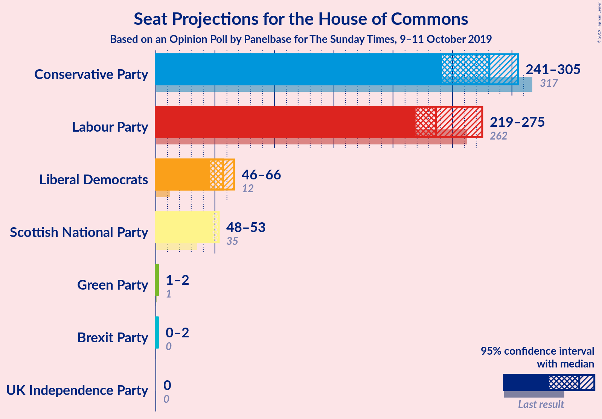
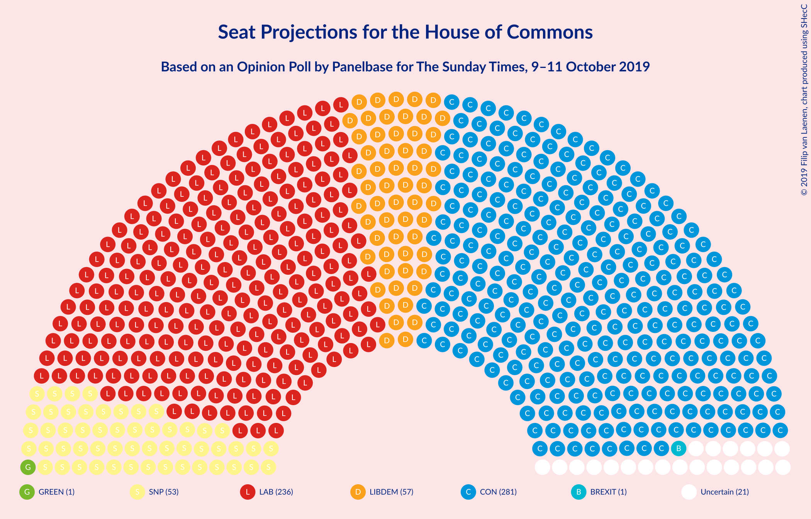
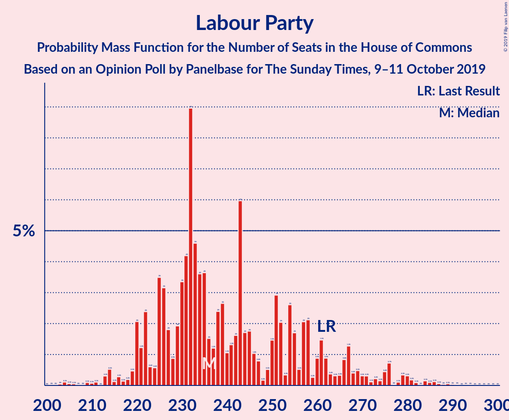
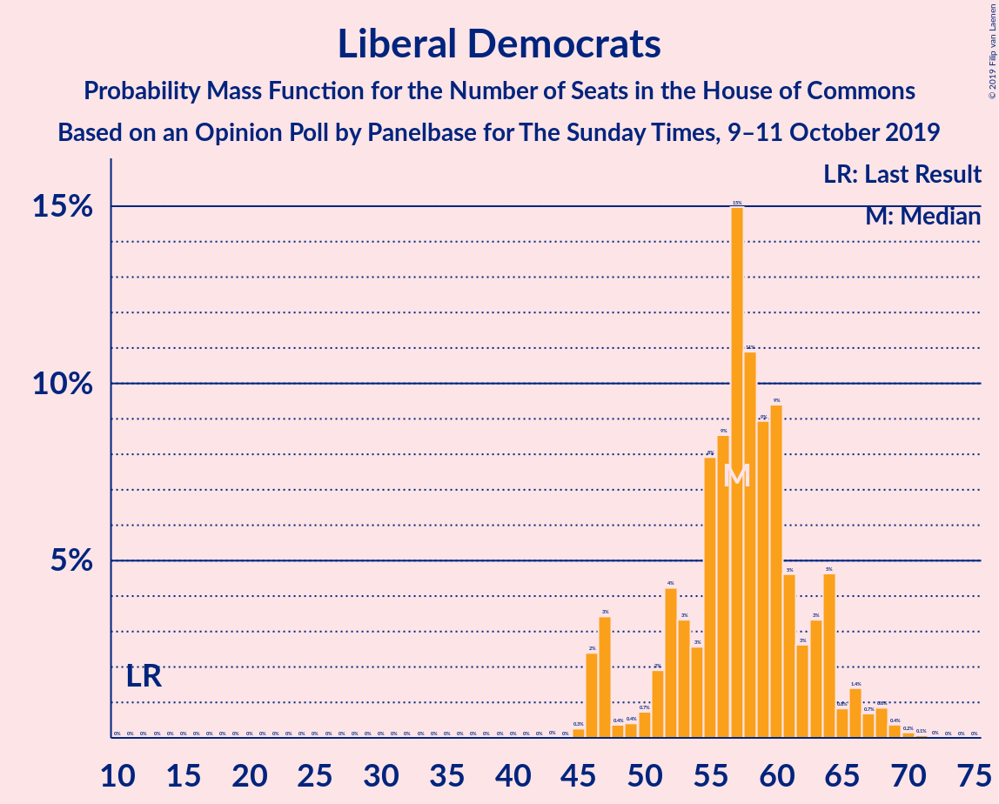
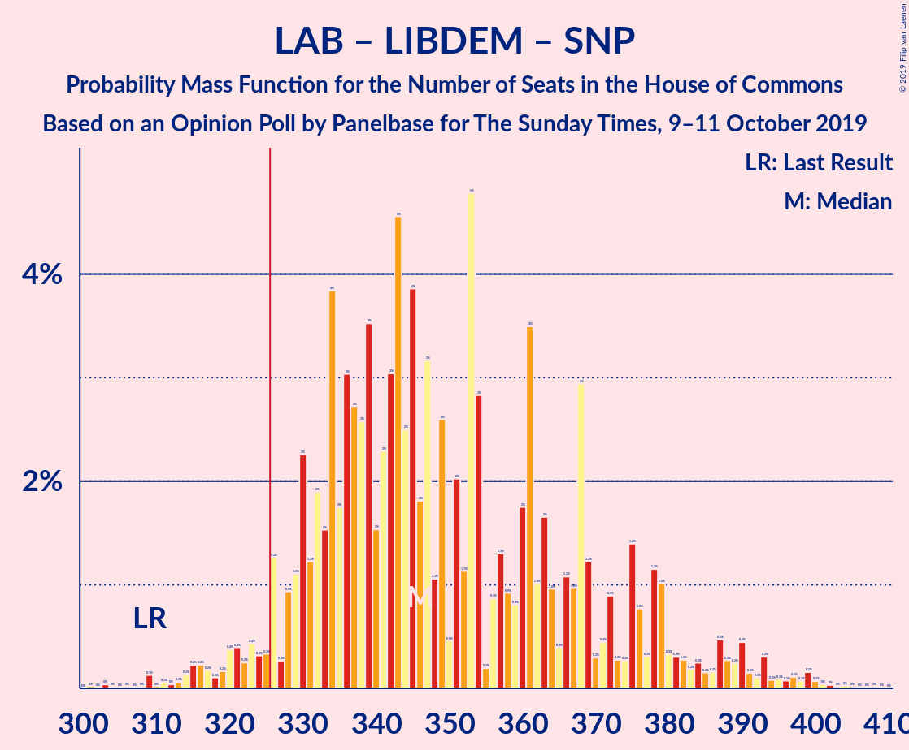
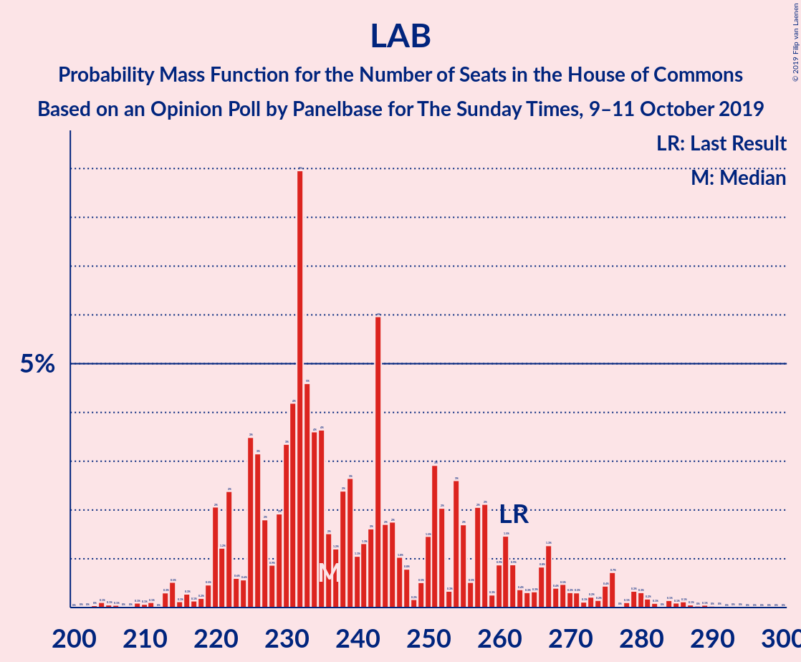

# Opinion Poll by Panelbase for The Sunday Times, 9–11 October 2019

<a href="#voting-intentions">Voting Intentions</a> | <a href="#seats">Seats</a> | <a href="#coalitions">Coalitions</a> | <a href="#technical-information">Technical Information</a>

## Voting Intentions

### Confidence Intervals

| Party | Last Result | Poll Result | 80% Confidence Interval | 90% Confidence Interval | 95% Confidence Interval | 99% Confidence Interval |
|:-----:|:-----------:|:-----------:|:-----------------------:|:-----------------------:|:-----------------------:|:-----------------------:|
| Conservative Party | 42.4% | 33.2% | 31.9–34.6% |31.5–34.9% |31.2–35.3% |30.5–35.9% |
| Labour Party | 40.0% | 30.2% | 28.9–31.5% |28.5–31.9% |28.2–32.2% |27.6–32.8% |
| Liberal Democrats | 7.4% | 17.1% | 16.0–18.2% |15.8–18.5% |15.5–18.8% |15.0–19.4% |
| Brexit Party | 0.0% | 12.1% | 11.2–13.1% |10.9–13.3% |10.7–13.6% |10.3–14.1% |
| Scottish National Party | 3.0% | 4.0% | 3.5–4.6% |3.4–4.8% |3.2–5.0% |3.0–5.3% |
| Green Party | 1.6% | 3.0% | 2.6–3.6% |2.5–3.7% |2.4–3.9% |2.2–4.2% |
| UK Independence Party | 1.8% | 0.2% | 0.2–0.5% |0.1–0.5% |0.1–0.6% |0.1–0.7% |

*Note:* The poll result column reflects the actual value used in the calculations. Published results may vary slightly, and in addition be rounded to fewer digits.

## Seats

### Confidence Intervals

| Party | Last Result | Median | 80% Confidence Interval | 90% Confidence Interval | 95% Confidence Interval | 99% Confidence Interval |
|:-----:|:-----------:|:------:|:-----------------------:|:-----------------------:|:-----------------------:|:-----------------------:|
| <a href="#conservative-party">Conservative Party</a> | 317 | 284 | 251–295 |235–298 |235–305 |221–311 |
| <a href="#labour-party">Labour Party</a> | 262 | 221 | 213–251 |208–266 |203–267 |194–273 |
| <a href="#liberal-democrats">Liberal Democrats</a> | 12 | 57 | 51–61 |47–63 |47–65 |46–67 |
| <a href="#brexit-party">Brexit Party</a> | 0 | 14 | 10–27 |9–29 |8–29 |6–31 |
| <a href="#scottish-national-party">Scottish National Party</a> | 35 | 53 | 49–53 |48–53 |48–53 |45–53 |
| <a href="#green-party">Green Party</a> | 1 | 1 | 1 |1–2 |1–2 |1–2 |
| <a href="#uk-independence-party">UK Independence Party</a> | 0 | 0 | 0 |0 |0 |0 |

### Conservative Party

*For a full overview of the results for this party, see the [Conservative Party](party-conservativeparty.html) page.*

| Number of Seats | Probability | Accumulated | Special Marks |
|:---------------:|:-----------:|:-----------:|:-------------:|
| 212 | 0% | 100% |  |
| 213 | 0% | 99.9% |  |
| 214 | 0% | 99.9% |  |
| 215 | 0% | 99.9% |  |
| 216 | 0% | 99.9% |  |
| 217 | 0% | 99.9% |  |
| 218 | 0% | 99.9% |  |
| 219 | 0% | 99.9% |  |
| 220 | 0% | 99.9% |  |
| 221 | 0.9% | 99.9% |  |
| 222 | 0% | 99.0% |  |
| 223 | 0% | 99.0% |  |
| 224 | 0% | 99.0% |  |
| 225 | 0.1% | 98.9% |  |
| 226 | 0% | 98.9% |  |
| 227 | 0% | 98.8% |  |
| 228 | 0% | 98.8% |  |
| 229 | 0% | 98.8% |  |
| 230 | 0.4% | 98.8% |  |
| 231 | 0.1% | 98% |  |
| 232 | 0.4% | 98% |  |
| 233 | 0.1% | 98% |  |
| 234 | 0% | 98% |  |
| 235 | 3% | 98% |  |
| 236 | 0% | 95% |  |
| 237 | 0.4% | 95% |  |
| 238 | 0.1% | 94% |  |
| 239 | 0.1% | 94% |  |
| 240 | 0.4% | 94% |  |
| 241 | 0.4% | 94% |  |
| 242 | 1.0% | 93% |  |
| 243 | 2% | 92% |  |
| 244 | 0.1% | 91% |  |
| 245 | 0.1% | 91% |  |
| 246 | 0.2% | 91% |  |
| 247 | 0% | 90% |  |
| 248 | 0.1% | 90% |  |
| 249 | 0.1% | 90% |  |
| 250 | 0% | 90% |  |
| 251 | 0.5% | 90% |  |
| 252 | 5% | 90% |  |
| 253 | 5% | 85% |  |
| 254 | 0.5% | 80% |  |
| 255 | 0% | 79% |  |
| 256 | 0% | 79% |  |
| 257 | 0.8% | 79% |  |
| 258 | 0.8% | 78% |  |
| 259 | 2% | 77% |  |
| 260 | 0.1% | 75% |  |
| 261 | 0.7% | 75% |  |
| 262 | 0.1% | 74% |  |
| 263 | 1.1% | 74% |  |
| 264 | 0.2% | 73% |  |
| 265 | 0.1% | 73% |  |
| 266 | 0.4% | 73% |  |
| 267 | 0.7% | 72% |  |
| 268 | 0% | 71% |  |
| 269 | 2% | 71% |  |
| 270 | 3% | 69% |  |
| 271 | 3% | 66% |  |
| 272 | 0.1% | 63% |  |
| 273 | 2% | 63% |  |
| 274 | 0.9% | 61% |  |
| 275 | 0.4% | 61% |  |
| 276 | 6% | 60% |  |
| 277 | 0.1% | 54% |  |
| 278 | 0.3% | 54% |  |
| 279 | 0.6% | 54% |  |
| 280 | 0.3% | 53% |  |
| 281 | 0.8% | 53% |  |
| 282 | 1.2% | 52% |  |
| 283 | 0.8% | 51% |  |
| 284 | 3% | 50% | Median |
| 285 | 0.5% | 47% |  |
| 286 | 12% | 46% |  |
| 287 | 0.7% | 34% |  |
| 288 | 0.1% | 33% |  |
| 289 | 0.1% | 33% |  |
| 290 | 0.6% | 33% |  |
| 291 | 2% | 32% |  |
| 292 | 19% | 31% |  |
| 293 | 0.2% | 12% |  |
| 294 | 0.5% | 12% |  |
| 295 | 3% | 11% |  |
| 296 | 1.2% | 8% |  |
| 297 | 0.6% | 7% |  |
| 298 | 1.0% | 6% |  |
| 299 | 2% | 5% |  |
| 300 | 0% | 3% |  |
| 301 | 0% | 3% |  |
| 302 | 0.2% | 3% |  |
| 303 | 0.2% | 3% |  |
| 304 | 0.2% | 3% |  |
| 305 | 0.1% | 3% |  |
| 306 | 0.4% | 2% |  |
| 307 | 0.1% | 2% |  |
| 308 | 0.1% | 2% |  |
| 309 | 1.4% | 2% |  |
| 310 | 0% | 0.6% |  |
| 311 | 0.2% | 0.6% |  |
| 312 | 0% | 0.4% |  |
| 313 | 0% | 0.4% |  |
| 314 | 0% | 0.4% |  |
| 315 | 0% | 0.4% |  |
| 316 | 0.3% | 0.4% |  |
| 317 | 0% | 0.1% | Last Result |
| 318 | 0% | 0.1% |  |
| 319 | 0% | 0.1% |  |
| 320 | 0% | 0% |  |

### Labour Party

*For a full overview of the results for this party, see the [Labour Party](party-labourparty.html) page.*

| Number of Seats | Probability | Accumulated | Special Marks |
|:---------------:|:-----------:|:-----------:|:-------------:|
| 188 | 0.1% | 100% |  |
| 189 | 0% | 99.8% |  |
| 190 | 0% | 99.8% |  |
| 191 | 0% | 99.8% |  |
| 192 | 0% | 99.8% |  |
| 193 | 0% | 99.8% |  |
| 194 | 0.4% | 99.7% |  |
| 195 | 0% | 99.3% |  |
| 196 | 0% | 99.3% |  |
| 197 | 0% | 99.3% |  |
| 198 | 0% | 99.3% |  |
| 199 | 0% | 99.3% |  |
| 200 | 0% | 99.2% |  |
| 201 | 0% | 99.2% |  |
| 202 | 2% | 99.2% |  |
| 203 | 2% | 98% |  |
| 204 | 0.3% | 96% |  |
| 205 | 0.2% | 96% |  |
| 206 | 0.1% | 96% |  |
| 207 | 0.5% | 96% |  |
| 208 | 0.4% | 95% |  |
| 209 | 0.6% | 95% |  |
| 210 | 1.0% | 94% |  |
| 211 | 0.4% | 93% |  |
| 212 | 1.1% | 93% |  |
| 213 | 2% | 92% |  |
| 214 | 0.4% | 89% |  |
| 215 | 1.0% | 89% |  |
| 216 | 20% | 88% |  |
| 217 | 0.4% | 68% |  |
| 218 | 0.2% | 68% |  |
| 219 | 3% | 68% |  |
| 220 | 0.4% | 65% |  |
| 221 | 15% | 65% | Median |
| 222 | 5% | 50% |  |
| 223 | 2% | 45% |  |
| 224 | 3% | 43% |  |
| 225 | 0.8% | 39% |  |
| 226 | 2% | 38% |  |
| 227 | 3% | 37% |  |
| 228 | 1.2% | 34% |  |
| 229 | 0.4% | 33% |  |
| 230 | 0.3% | 32% |  |
| 231 | 1.1% | 32% |  |
| 232 | 1.3% | 31% |  |
| 233 | 2% | 30% |  |
| 234 | 0.1% | 28% |  |
| 235 | 3% | 28% |  |
| 236 | 0.6% | 25% |  |
| 237 | 0.3% | 25% |  |
| 238 | 0.6% | 24% |  |
| 239 | 0.1% | 24% |  |
| 240 | 0% | 24% |  |
| 241 | 2% | 24% |  |
| 242 | 0.6% | 22% |  |
| 243 | 6% | 21% |  |
| 244 | 0% | 16% |  |
| 245 | 0.6% | 16% |  |
| 246 | 0.8% | 15% |  |
| 247 | 0.3% | 14% |  |
| 248 | 0% | 14% |  |
| 249 | 0.1% | 14% |  |
| 250 | 0% | 14% |  |
| 251 | 6% | 14% |  |
| 252 | 1.4% | 8% |  |
| 253 | 0.1% | 7% |  |
| 254 | 0.1% | 7% |  |
| 255 | 0% | 7% |  |
| 256 | 0% | 7% |  |
| 257 | 0.2% | 7% |  |
| 258 | 0% | 6% |  |
| 259 | 0.3% | 6% |  |
| 260 | 0.1% | 6% |  |
| 261 | 0.2% | 6% |  |
| 262 | 0.7% | 6% | Last Result |
| 263 | 0% | 5% |  |
| 264 | 0% | 5% |  |
| 265 | 0% | 5% |  |
| 266 | 0.1% | 5% |  |
| 267 | 3% | 5% |  |
| 268 | 0% | 2% |  |
| 269 | 0% | 2% |  |
| 270 | 0% | 2% |  |
| 271 | 0% | 2% |  |
| 272 | 0% | 2% |  |
| 273 | 1.2% | 2% |  |
| 274 | 0.1% | 0.4% |  |
| 275 | 0% | 0.3% |  |
| 276 | 0% | 0.3% |  |
| 277 | 0% | 0.3% |  |
| 278 | 0.1% | 0.3% |  |
| 279 | 0.1% | 0.2% |  |
| 280 | 0% | 0.1% |  |
| 281 | 0% | 0.1% |  |
| 282 | 0% | 0.1% |  |
| 283 | 0% | 0.1% |  |
| 284 | 0% | 0% |  |

### Liberal Democrats

*For a full overview of the results for this party, see the [Liberal Democrats](party-liberaldemocrats.html) page.*

| Number of Seats | Probability | Accumulated | Special Marks |
|:---------------:|:-----------:|:-----------:|:-------------:|
| 12 | 0% | 100% | Last Result |
| 13 | 0% | 100% |  |
| 14 | 0% | 100% |  |
| 15 | 0% | 100% |  |
| 16 | 0% | 100% |  |
| 17 | 0% | 100% |  |
| 18 | 0% | 100% |  |
| 19 | 0% | 100% |  |
| 20 | 0% | 100% |  |
| 21 | 0% | 100% |  |
| 22 | 0% | 100% |  |
| 23 | 0% | 100% |  |
| 24 | 0% | 100% |  |
| 25 | 0% | 100% |  |
| 26 | 0% | 100% |  |
| 27 | 0% | 100% |  |
| 28 | 0% | 100% |  |
| 29 | 0% | 100% |  |
| 30 | 0% | 100% |  |
| 31 | 0% | 100% |  |
| 32 | 0% | 100% |  |
| 33 | 0% | 100% |  |
| 34 | 0% | 100% |  |
| 35 | 0% | 100% |  |
| 36 | 0% | 100% |  |
| 37 | 0% | 100% |  |
| 38 | 0% | 100% |  |
| 39 | 0% | 100% |  |
| 40 | 0% | 100% |  |
| 41 | 0% | 100% |  |
| 42 | 0% | 100% |  |
| 43 | 0% | 100% |  |
| 44 | 0% | 100% |  |
| 45 | 0.1% | 100% |  |
| 46 | 2% | 99.8% |  |
| 47 | 5% | 98% |  |
| 48 | 0.2% | 92% |  |
| 49 | 0.4% | 92% |  |
| 50 | 0.3% | 92% |  |
| 51 | 3% | 92% |  |
| 52 | 1.4% | 89% |  |
| 53 | 4% | 88% |  |
| 54 | 19% | 83% |  |
| 55 | 4% | 64% |  |
| 56 | 5% | 61% |  |
| 57 | 23% | 56% | Median |
| 58 | 7% | 33% |  |
| 59 | 10% | 25% |  |
| 60 | 3% | 15% |  |
| 61 | 3% | 12% |  |
| 62 | 2% | 9% |  |
| 63 | 4% | 8% |  |
| 64 | 1.1% | 4% |  |
| 65 | 0.4% | 3% |  |
| 66 | 1.0% | 2% |  |
| 67 | 0.9% | 1.4% |  |
| 68 | 0.1% | 0.5% |  |
| 69 | 0.2% | 0.4% |  |
| 70 | 0.1% | 0.2% |  |
| 71 | 0% | 0% |  |

### Brexit Party

*For a full overview of the results for this party, see the [Brexit Party](party-brexitparty.html) page.*

| Number of Seats | Probability | Accumulated | Special Marks |
|:---------------:|:-----------:|:-----------:|:-------------:|
| 0 | 0% | 100% | Last Result |
| 1 | 0% | 100% |  |
| 2 | 0% | 100% |  |
| 3 | 0% | 100% |  |
| 4 | 0% | 100% |  |
| 5 | 0.2% | 100% |  |
| 6 | 2% | 99.7% |  |
| 7 | 0.1% | 98% |  |
| 8 | 2% | 98% |  |
| 9 | 5% | 96% |  |
| 10 | 4% | 91% |  |
| 11 | 1.5% | 88% |  |
| 12 | 0.7% | 86% |  |
| 13 | 22% | 85% |  |
| 14 | 14% | 63% | Median |
| 15 | 5% | 49% |  |
| 16 | 8% | 44% |  |
| 17 | 3% | 37% |  |
| 18 | 2% | 34% |  |
| 19 | 1.4% | 32% |  |
| 20 | 5% | 31% |  |
| 21 | 0.6% | 26% |  |
| 22 | 3% | 26% |  |
| 23 | 6% | 22% |  |
| 24 | 1.2% | 16% |  |
| 25 | 3% | 15% |  |
| 26 | 0.5% | 12% |  |
| 27 | 3% | 12% |  |
| 28 | 2% | 8% |  |
| 29 | 4% | 6% |  |
| 30 | 2% | 2% |  |
| 31 | 0.3% | 0.6% |  |
| 32 | 0% | 0.3% |  |
| 33 | 0.1% | 0.3% |  |
| 34 | 0% | 0.2% |  |
| 35 | 0% | 0.2% |  |
| 36 | 0% | 0.2% |  |
| 37 | 0% | 0.2% |  |
| 38 | 0.1% | 0.1% |  |
| 39 | 0% | 0.1% |  |
| 40 | 0% | 0% |  |

### Scottish National Party

*For a full overview of the results for this party, see the [Scottish National Party](party-scottishnationalparty.html) page.*

| Number of Seats | Probability | Accumulated | Special Marks |
|:---------------:|:-----------:|:-----------:|:-------------:|
| 35 | 0% | 100% | Last Result |
| 36 | 0% | 100% |  |
| 37 | 0% | 100% |  |
| 38 | 0% | 100% |  |
| 39 | 0% | 100% |  |
| 40 | 0% | 99.9% |  |
| 41 | 0% | 99.9% |  |
| 42 | 0% | 99.9% |  |
| 43 | 0.2% | 99.9% |  |
| 44 | 0% | 99.7% |  |
| 45 | 0.2% | 99.7% |  |
| 46 | 2% | 99.5% |  |
| 47 | 0% | 98% |  |
| 48 | 3% | 98% |  |
| 49 | 11% | 95% |  |
| 50 | 14% | 84% |  |
| 51 | 8% | 70% |  |
| 52 | 3% | 63% |  |
| 53 | 60% | 60% | Median |
| 54 | 0.1% | 0.1% |  |
| 55 | 0% | 0% |  |

### Green Party

*For a full overview of the results for this party, see the [Green Party](party-greenparty.html) page.*

| Number of Seats | Probability | Accumulated | Special Marks |
|:---------------:|:-----------:|:-----------:|:-------------:|
| 1 | 90% | 100% | Last Result, Median |
| 2 | 10% | 10% |  |
| 3 | 0% | 0% |  |

### UK Independence Party

*For a full overview of the results for this party, see the [UK Independence Party](party-ukindependenceparty.html) page.*

| Number of Seats | Probability | Accumulated | Special Marks |
|:---------------:|:-----------:|:-----------:|:-------------:|
| 0 | 100% | 100% | Last Result, Median |

## Coalitions

### Confidence Intervals

| Coalition | Last Result | Median | Majority? | 80% Confidence Interval | 90% Confidence Interval | 95% Confidence Interval | 99% Confidence Interval |
|:---------:|:-----------:|:------:|:---------:|:-----------------------:|:-----------------------:|:-----------------------:|:-----------------------:|
| Labour Party – Liberal Democrats – Scottish National Party | 309 | 328 | 63% | 317–359 | 311–377 | 308–378 | 299–388 |
| Conservative Party – Liberal Democrats | 329 | 339 | 69% | 307–348 | 293–350 | 293–356 | 283–362 |
| Conservative Party – Scottish National Party | 352 | 335 | 62% | 302–345 | 288–349 | 288–355 | 274–360 |
| Labour Party – Liberal Democrats | 274 | 278 | 2% | 269–310 | 260–325 | 256–325 | 249–335 |
| Labour Party – Scottish National Party | 297 | 272 | 2% | 266–300 | 256–318 | 253–320 | 247–326 |
| Conservative Party | 317 | 284 | 0% | 251–295 | 235–298 | 235–305 | 221–311 |
| Labour Party | 262 | 221 | 0% | 213–251 | 208–266 | 203–267 | 194–273 |

### Labour Party – Liberal Democrats – Scottish National Party

| Number of Seats | Probability | Accumulated | Special Marks |
|:---------------:|:-----------:|:-----------:|:-------------:|
| 284 | 0% | 100% |  |
| 285 | 0% | 99.9% |  |
| 286 | 0% | 99.9% |  |
| 287 | 0% | 99.9% |  |
| 288 | 0% | 99.9% |  |
| 289 | 0% | 99.9% |  |
| 290 | 0% | 99.9% |  |
| 291 | 0% | 99.9% |  |
| 292 | 0% | 99.9% |  |
| 293 | 0% | 99.9% |  |
| 294 | 0.2% | 99.9% |  |
| 295 | 0.1% | 99.7% |  |
| 296 | 0% | 99.6% |  |
| 297 | 0% | 99.6% |  |
| 298 | 0% | 99.6% |  |
| 299 | 0.1% | 99.6% |  |
| 300 | 0% | 99.5% |  |
| 301 | 1.4% | 99.5% |  |
| 302 | 0.1% | 98% |  |
| 303 | 0% | 98% |  |
| 304 | 0.2% | 98% |  |
| 305 | 0.1% | 98% |  |
| 306 | 0% | 98% |  |
| 307 | 0% | 98% |  |
| 308 | 0% | 98% |  |
| 309 | 0.3% | 97% | Last Result |
| 310 | 2% | 97% |  |
| 311 | 0.9% | 96% |  |
| 312 | 0.5% | 95% |  |
| 313 | 2% | 94% |  |
| 314 | 0.1% | 92% |  |
| 315 | 1.1% | 92% |  |
| 316 | 0.3% | 91% |  |
| 317 | 1.1% | 91% |  |
| 318 | 0.2% | 90% |  |
| 319 | 0.2% | 90% |  |
| 320 | 1.0% | 90% |  |
| 321 | 1.2% | 89% |  |
| 322 | 0.4% | 87% |  |
| 323 | 21% | 87% |  |
| 324 | 0.2% | 66% |  |
| 325 | 2% | 66% |  |
| 326 | 0.7% | 63% | Majority |
| 327 | 1.3% | 63% |  |
| 328 | 12% | 61% |  |
| 329 | 0.3% | 50% |  |
| 330 | 4% | 49% |  |
| 331 | 0.2% | 45% | Median |
| 332 | 2% | 45% |  |
| 333 | 0.7% | 43% |  |
| 334 | 0.2% | 42% |  |
| 335 | 4% | 42% |  |
| 336 | 0.1% | 38% |  |
| 337 | 4% | 38% |  |
| 338 | 0.2% | 34% |  |
| 339 | 2% | 34% |  |
| 340 | 2% | 32% |  |
| 341 | 2% | 29% |  |
| 342 | 0.2% | 28% |  |
| 343 | 2% | 28% |  |
| 344 | 0.3% | 26% |  |
| 345 | 0% | 25% |  |
| 346 | 0.5% | 25% |  |
| 347 | 0.7% | 25% |  |
| 348 | 0.2% | 24% |  |
| 349 | 0.1% | 24% |  |
| 350 | 0.7% | 24% |  |
| 351 | 0.4% | 23% |  |
| 352 | 0.4% | 23% |  |
| 353 | 5% | 22% |  |
| 354 | 0% | 17% |  |
| 355 | 0.8% | 17% |  |
| 356 | 0.1% | 16% |  |
| 357 | 1.3% | 16% |  |
| 358 | 0.2% | 15% |  |
| 359 | 5% | 14% |  |
| 360 | 0% | 9% |  |
| 361 | 0% | 9% |  |
| 362 | 0.6% | 9% |  |
| 363 | 1.4% | 9% |  |
| 364 | 0.3% | 7% |  |
| 365 | 0% | 7% |  |
| 366 | 0.4% | 7% |  |
| 367 | 0.1% | 7% |  |
| 368 | 0% | 7% |  |
| 369 | 0.2% | 7% |  |
| 370 | 0.3% | 6% |  |
| 371 | 0.4% | 6% |  |
| 372 | 0% | 6% |  |
| 373 | 0% | 6% |  |
| 374 | 0% | 6% |  |
| 375 | 0% | 6% |  |
| 376 | 0.4% | 5% |  |
| 377 | 0.2% | 5% |  |
| 378 | 3% | 5% |  |
| 379 | 0% | 2% |  |
| 380 | 0% | 2% |  |
| 381 | 0.1% | 2% |  |
| 382 | 0.4% | 2% |  |
| 383 | 0.1% | 1.2% |  |
| 384 | 0% | 1.1% |  |
| 385 | 0.1% | 1.1% |  |
| 386 | 0% | 1.0% |  |
| 387 | 0% | 1.0% |  |
| 388 | 0.8% | 1.0% |  |
| 389 | 0% | 0.2% |  |
| 390 | 0% | 0.2% |  |
| 391 | 0.1% | 0.2% |  |
| 392 | 0% | 0.2% |  |
| 393 | 0.1% | 0.2% |  |
| 394 | 0% | 0.1% |  |
| 395 | 0% | 0.1% |  |
| 396 | 0% | 0.1% |  |
| 397 | 0% | 0.1% |  |
| 398 | 0% | 0% |  |

### Conservative Party – Liberal Democrats

| Number of Seats | Probability | Accumulated | Special Marks |
|:---------------:|:-----------:|:-----------:|:-------------:|
| 277 | 0% | 100% |  |
| 278 | 0% | 99.9% |  |
| 279 | 0% | 99.9% |  |
| 280 | 0% | 99.9% |  |
| 281 | 0% | 99.9% |  |
| 282 | 0% | 99.8% |  |
| 283 | 0.8% | 99.8% |  |
| 284 | 0% | 99.0% |  |
| 285 | 0% | 99.0% |  |
| 286 | 0.4% | 99.0% |  |
| 287 | 0.1% | 98.6% |  |
| 288 | 0% | 98% |  |
| 289 | 0% | 98% |  |
| 290 | 0% | 98% |  |
| 291 | 0.1% | 98% |  |
| 292 | 0.1% | 98% |  |
| 293 | 4% | 98% |  |
| 294 | 0.3% | 95% |  |
| 295 | 0.1% | 94% |  |
| 296 | 0% | 94% |  |
| 297 | 0% | 94% |  |
| 298 | 0% | 94% |  |
| 299 | 0% | 94% |  |
| 300 | 1.0% | 94% |  |
| 301 | 0.7% | 93% |  |
| 302 | 0.2% | 92% |  |
| 303 | 0% | 92% |  |
| 304 | 0.2% | 92% |  |
| 305 | 0.1% | 92% |  |
| 306 | 2% | 92% |  |
| 307 | 0.1% | 90% |  |
| 308 | 0.3% | 90% |  |
| 309 | 5% | 90% |  |
| 310 | 0% | 85% |  |
| 311 | 0.1% | 85% |  |
| 312 | 5% | 85% |  |
| 313 | 0.3% | 80% |  |
| 314 | 0% | 79% |  |
| 315 | 0.1% | 79% |  |
| 316 | 0.5% | 79% |  |
| 317 | 0.4% | 79% |  |
| 318 | 0% | 78% |  |
| 319 | 0.7% | 78% |  |
| 320 | 2% | 78% |  |
| 321 | 2% | 75% |  |
| 322 | 3% | 73% |  |
| 323 | 0.7% | 71% |  |
| 324 | 0.5% | 70% |  |
| 325 | 0.5% | 70% |  |
| 326 | 1.3% | 69% | Majority |
| 327 | 0.1% | 68% |  |
| 328 | 0.2% | 68% |  |
| 329 | 3% | 68% | Last Result |
| 330 | 0.7% | 65% |  |
| 331 | 0.6% | 64% |  |
| 332 | 4% | 63% |  |
| 333 | 4% | 59% |  |
| 334 | 0.1% | 55% |  |
| 335 | 0.2% | 55% |  |
| 336 | 3% | 55% |  |
| 337 | 0.6% | 52% |  |
| 338 | 1.5% | 52% |  |
| 339 | 4% | 50% |  |
| 340 | 1.0% | 47% |  |
| 341 | 0.6% | 46% | Median |
| 342 | 2% | 45% |  |
| 343 | 12% | 43% |  |
| 344 | 0.6% | 31% |  |
| 345 | 0.1% | 31% |  |
| 346 | 20% | 31% |  |
| 347 | 0.2% | 11% |  |
| 348 | 5% | 11% |  |
| 349 | 0.1% | 6% |  |
| 350 | 0.4% | 5% |  |
| 351 | 0.7% | 5% |  |
| 352 | 0.1% | 4% |  |
| 353 | 0.4% | 4% |  |
| 354 | 0% | 4% |  |
| 355 | 0.1% | 4% |  |
| 356 | 1.4% | 4% |  |
| 357 | 1.1% | 2% |  |
| 358 | 0% | 1.2% |  |
| 359 | 0% | 1.1% |  |
| 360 | 0.1% | 1.1% |  |
| 361 | 0.2% | 1.0% |  |
| 362 | 0.4% | 0.8% |  |
| 363 | 0.2% | 0.5% |  |
| 364 | 0.1% | 0.3% |  |
| 365 | 0% | 0.2% |  |
| 366 | 0.1% | 0.2% |  |
| 367 | 0% | 0.1% |  |
| 368 | 0% | 0.1% |  |
| 369 | 0% | 0.1% |  |
| 370 | 0% | 0.1% |  |
| 371 | 0% | 0.1% |  |
| 372 | 0% | 0.1% |  |
| 373 | 0% | 0.1% |  |
| 374 | 0% | 0% |  |

### Conservative Party – Scottish National Party

| Number of Seats | Probability | Accumulated | Special Marks |
|:---------------:|:-----------:|:-----------:|:-------------:|
| 263 | 0% | 100% |  |
| 264 | 0% | 99.9% |  |
| 265 | 0% | 99.9% |  |
| 266 | 0% | 99.9% |  |
| 267 | 0% | 99.9% |  |
| 268 | 0% | 99.9% |  |
| 269 | 0% | 99.9% |  |
| 270 | 0.1% | 99.9% |  |
| 271 | 0% | 99.9% |  |
| 272 | 0% | 99.9% |  |
| 273 | 0% | 99.8% |  |
| 274 | 0.8% | 99.8% |  |
| 275 | 0% | 99.0% |  |
| 276 | 0.1% | 99.0% |  |
| 277 | 0% | 98.9% |  |
| 278 | 0% | 98.8% |  |
| 279 | 0% | 98.8% |  |
| 280 | 0% | 98.8% |  |
| 281 | 0% | 98.8% |  |
| 282 | 0% | 98.8% |  |
| 283 | 0.4% | 98.7% |  |
| 284 | 0% | 98% |  |
| 285 | 0.5% | 98% |  |
| 286 | 0.1% | 98% |  |
| 287 | 0% | 98% |  |
| 288 | 3% | 98% |  |
| 289 | 0.7% | 95% |  |
| 290 | 0.5% | 94% |  |
| 291 | 0.1% | 93% |  |
| 292 | 0% | 93% |  |
| 293 | 0% | 93% |  |
| 294 | 0.1% | 93% |  |
| 295 | 1.2% | 93% |  |
| 296 | 2% | 92% |  |
| 297 | 0.1% | 90% |  |
| 298 | 0% | 90% |  |
| 299 | 0% | 90% |  |
| 300 | 0% | 90% |  |
| 301 | 0.1% | 90% |  |
| 302 | 5% | 90% |  |
| 303 | 0.1% | 85% |  |
| 304 | 0.5% | 85% |  |
| 305 | 5% | 85% |  |
| 306 | 0.2% | 80% |  |
| 307 | 0.8% | 79% |  |
| 308 | 0.6% | 79% |  |
| 309 | 0% | 78% |  |
| 310 | 0.5% | 78% |  |
| 311 | 0.7% | 78% |  |
| 312 | 2% | 77% |  |
| 313 | 0.1% | 75% |  |
| 314 | 0.7% | 75% |  |
| 315 | 0.2% | 74% |  |
| 316 | 1.1% | 74% |  |
| 317 | 0.1% | 73% |  |
| 318 | 0.8% | 73% |  |
| 319 | 0.3% | 72% |  |
| 320 | 0.8% | 71% |  |
| 321 | 0.8% | 71% |  |
| 322 | 2% | 70% |  |
| 323 | 5% | 67% |  |
| 324 | 0.6% | 63% |  |
| 325 | 0.2% | 62% |  |
| 326 | 3% | 62% | Majority |
| 327 | 0.9% | 59% |  |
| 328 | 0.3% | 58% |  |
| 329 | 5% | 58% |  |
| 330 | 0.4% | 53% |  |
| 331 | 0.3% | 53% |  |
| 332 | 0.2% | 53% |  |
| 333 | 1.2% | 52% |  |
| 334 | 0.6% | 51% |  |
| 335 | 1.2% | 51% |  |
| 336 | 12% | 50% |  |
| 337 | 4% | 38% | Median |
| 338 | 0.1% | 33% |  |
| 339 | 0.3% | 33% |  |
| 340 | 0.2% | 33% |  |
| 341 | 0% | 33% |  |
| 342 | 2% | 33% |  |
| 343 | 0.7% | 31% |  |
| 344 | 4% | 30% |  |
| 345 | 19% | 26% |  |
| 346 | 0.8% | 7% |  |
| 347 | 2% | 7% |  |
| 348 | 0.1% | 5% |  |
| 349 | 0.1% | 5% |  |
| 350 | 0.1% | 5% |  |
| 351 | 0.1% | 5% |  |
| 352 | 2% | 5% | Last Result |
| 353 | 0.3% | 3% |  |
| 354 | 0.2% | 3% |  |
| 355 | 0.2% | 3% |  |
| 356 | 0.1% | 2% |  |
| 357 | 0.6% | 2% |  |
| 358 | 0% | 2% |  |
| 359 | 0% | 2% |  |
| 360 | 1.4% | 2% |  |
| 361 | 0.1% | 0.5% |  |
| 362 | 0% | 0.4% |  |
| 363 | 0% | 0.4% |  |
| 364 | 0% | 0.4% |  |
| 365 | 0% | 0.4% |  |
| 366 | 0.1% | 0.4% |  |
| 367 | 0% | 0.3% |  |
| 368 | 0% | 0.3% |  |
| 369 | 0.2% | 0.2% |  |
| 370 | 0% | 0.1% |  |
| 371 | 0% | 0.1% |  |
| 372 | 0% | 0% |  |

### Labour Party – Liberal Democrats

| Number of Seats | Probability | Accumulated | Special Marks |
|:---------------:|:-----------:|:-----------:|:-------------:|
| 238 | 0% | 100% |  |
| 239 | 0% | 99.9% |  |
| 240 | 0% | 99.9% |  |
| 241 | 0.2% | 99.9% |  |
| 242 | 0% | 99.8% |  |
| 243 | 0% | 99.7% |  |
| 244 | 0% | 99.7% |  |
| 245 | 0% | 99.7% |  |
| 246 | 0% | 99.7% |  |
| 247 | 0.1% | 99.7% |  |
| 248 | 0% | 99.6% |  |
| 249 | 0.2% | 99.6% |  |
| 250 | 1.4% | 99.3% |  |
| 251 | 0% | 98% |  |
| 252 | 0.1% | 98% |  |
| 253 | 0% | 98% |  |
| 254 | 0% | 98% |  |
| 255 | 0% | 98% |  |
| 256 | 0.2% | 98% |  |
| 257 | 0% | 97% |  |
| 258 | 0.2% | 97% |  |
| 259 | 2% | 97% |  |
| 260 | 2% | 95% |  |
| 261 | 0.2% | 93% |  |
| 262 | 0.6% | 93% |  |
| 263 | 0.5% | 93% |  |
| 264 | 0.1% | 92% |  |
| 265 | 0.2% | 92% |  |
| 266 | 1.1% | 92% |  |
| 267 | 0.4% | 91% |  |
| 268 | 0.1% | 90% |  |
| 269 | 1.0% | 90% |  |
| 270 | 19% | 89% |  |
| 271 | 0.3% | 70% |  |
| 272 | 2% | 70% |  |
| 273 | 0.2% | 67% |  |
| 274 | 5% | 67% | Last Result |
| 275 | 1.0% | 62% |  |
| 276 | 0.4% | 61% |  |
| 277 | 4% | 61% |  |
| 278 | 11% | 57% | Median |
| 279 | 0.1% | 46% |  |
| 280 | 3% | 46% |  |
| 281 | 0.1% | 43% |  |
| 282 | 3% | 43% |  |
| 283 | 0.1% | 40% |  |
| 284 | 4% | 40% |  |
| 285 | 0.6% | 36% |  |
| 286 | 3% | 35% |  |
| 287 | 3% | 33% |  |
| 288 | 1.5% | 30% |  |
| 289 | 0.2% | 28% |  |
| 290 | 0.3% | 28% |  |
| 291 | 0.3% | 28% |  |
| 292 | 0% | 27% |  |
| 293 | 2% | 27% |  |
| 294 | 0.4% | 25% |  |
| 295 | 0.6% | 25% |  |
| 296 | 0.4% | 24% |  |
| 297 | 0% | 24% |  |
| 298 | 0.4% | 24% |  |
| 299 | 0.3% | 24% |  |
| 300 | 5% | 23% |  |
| 301 | 0.1% | 18% |  |
| 302 | 1.4% | 18% |  |
| 303 | 0.1% | 16% |  |
| 304 | 1.5% | 16% |  |
| 305 | 0.2% | 15% |  |
| 306 | 0% | 15% |  |
| 307 | 0.1% | 15% |  |
| 308 | 0% | 14% |  |
| 309 | 0.6% | 14% |  |
| 310 | 6% | 14% |  |
| 311 | 0% | 7% |  |
| 312 | 0.1% | 7% |  |
| 313 | 0% | 7% |  |
| 314 | 0.1% | 7% |  |
| 315 | 0.3% | 7% |  |
| 316 | 0.2% | 7% |  |
| 317 | 0.4% | 7% |  |
| 318 | 0.4% | 6% |  |
| 319 | 0% | 6% |  |
| 320 | 0% | 6% |  |
| 321 | 0% | 6% |  |
| 322 | 0.3% | 6% |  |
| 323 | 0.4% | 6% |  |
| 324 | 0% | 5% |  |
| 325 | 3% | 5% |  |
| 326 | 0.2% | 2% | Majority |
| 327 | 0% | 2% |  |
| 328 | 0.1% | 2% |  |
| 329 | 0.5% | 2% |  |
| 330 | 0.1% | 1.2% |  |
| 331 | 0% | 1.2% |  |
| 332 | 0% | 1.2% |  |
| 333 | 0% | 1.1% |  |
| 334 | 0% | 1.1% |  |
| 335 | 0.8% | 1.1% |  |
| 336 | 0% | 0.3% |  |
| 337 | 0.1% | 0.3% |  |
| 338 | 0.1% | 0.2% |  |
| 339 | 0% | 0.2% |  |
| 340 | 0% | 0.2% |  |
| 341 | 0% | 0.2% |  |
| 342 | 0% | 0.1% |  |
| 343 | 0% | 0.1% |  |
| 344 | 0.1% | 0.1% |  |
| 345 | 0% | 0.1% |  |
| 346 | 0% | 0.1% |  |
| 347 | 0% | 0% |  |

### Labour Party – Scottish National Party

| Number of Seats | Probability | Accumulated | Special Marks |
|:---------------:|:-----------:|:-----------:|:-------------:|
| 233 | 0% | 100% |  |
| 234 | 0% | 99.9% |  |
| 235 | 0% | 99.9% |  |
| 236 | 0.1% | 99.9% |  |
| 237 | 0% | 99.8% |  |
| 238 | 0% | 99.8% |  |
| 239 | 0% | 99.8% |  |
| 240 | 0% | 99.8% |  |
| 241 | 0% | 99.8% |  |
| 242 | 0% | 99.8% |  |
| 243 | 0% | 99.8% |  |
| 244 | 0% | 99.8% |  |
| 245 | 0% | 99.8% |  |
| 246 | 0.1% | 99.8% |  |
| 247 | 0.4% | 99.7% |  |
| 248 | 0% | 99.3% |  |
| 249 | 0% | 99.3% |  |
| 250 | 0% | 99.3% |  |
| 251 | 0.1% | 99.2% |  |
| 252 | 0% | 99.2% |  |
| 253 | 2% | 99.1% |  |
| 254 | 2% | 97% |  |
| 255 | 0.1% | 96% |  |
| 256 | 1.1% | 96% |  |
| 257 | 0.1% | 95% |  |
| 258 | 0.5% | 94% |  |
| 259 | 0.2% | 94% |  |
| 260 | 0.5% | 94% |  |
| 261 | 0.5% | 93% |  |
| 262 | 0.2% | 93% |  |
| 263 | 1.4% | 93% |  |
| 264 | 0.6% | 91% |  |
| 265 | 0.3% | 91% |  |
| 266 | 2% | 90% |  |
| 267 | 0.5% | 88% |  |
| 268 | 0.7% | 88% |  |
| 269 | 20% | 87% |  |
| 270 | 4% | 68% |  |
| 271 | 14% | 64% |  |
| 272 | 0.6% | 50% |  |
| 273 | 0.7% | 50% |  |
| 274 | 1.4% | 49% | Median |
| 275 | 4% | 48% |  |
| 276 | 2% | 44% |  |
| 277 | 4% | 42% |  |
| 278 | 1.1% | 39% |  |
| 279 | 2% | 37% |  |
| 280 | 3% | 36% |  |
| 281 | 1.4% | 32% |  |
| 282 | 0.2% | 31% |  |
| 283 | 2% | 31% |  |
| 284 | 0.4% | 29% |  |
| 285 | 1.1% | 29% |  |
| 286 | 0.3% | 28% |  |
| 287 | 0.1% | 27% |  |
| 288 | 3% | 27% |  |
| 289 | 0.5% | 25% |  |
| 290 | 0.3% | 24% |  |
| 291 | 1.1% | 24% |  |
| 292 | 0% | 23% |  |
| 293 | 0% | 23% |  |
| 294 | 2% | 23% |  |
| 295 | 0.5% | 21% |  |
| 296 | 5% | 21% |  |
| 297 | 0.1% | 16% | Last Result |
| 298 | 0.9% | 16% |  |
| 299 | 0.8% | 15% |  |
| 300 | 6% | 14% |  |
| 301 | 0% | 8% |  |
| 302 | 0.1% | 8% |  |
| 303 | 0% | 8% |  |
| 304 | 0% | 8% |  |
| 305 | 1.4% | 8% |  |
| 306 | 0.1% | 7% |  |
| 307 | 0.1% | 7% |  |
| 308 | 0.2% | 7% |  |
| 309 | 0.1% | 6% |  |
| 310 | 0.3% | 6% |  |
| 311 | 0% | 6% |  |
| 312 | 0.2% | 6% |  |
| 313 | 0.1% | 6% |  |
| 314 | 0.2% | 6% |  |
| 315 | 0.4% | 6% |  |
| 316 | 0% | 5% |  |
| 317 | 0% | 5% |  |
| 318 | 0% | 5% |  |
| 319 | 0.1% | 5% |  |
| 320 | 3% | 5% |  |
| 321 | 0% | 2% |  |
| 322 | 0% | 2% |  |
| 323 | 0% | 2% |  |
| 324 | 0.1% | 2% |  |
| 325 | 0% | 2% |  |
| 326 | 1.2% | 2% | Majority |
| 327 | 0.2% | 0.4% |  |
| 328 | 0% | 0.2% |  |
| 329 | 0% | 0.2% |  |
| 330 | 0% | 0.1% |  |
| 331 | 0% | 0.1% |  |
| 332 | 0% | 0.1% |  |
| 333 | 0% | 0.1% |  |
| 334 | 0% | 0.1% |  |
| 335 | 0% | 0.1% |  |
| 336 | 0% | 0.1% |  |
| 337 | 0% | 0% |  |

### Conservative Party

| Number of Seats | Probability | Accumulated | Special Marks |
|:---------------:|:-----------:|:-----------:|:-------------:|
| 212 | 0% | 100% |  |
| 213 | 0% | 99.9% |  |
| 214 | 0% | 99.9% |  |
| 215 | 0% | 99.9% |  |
| 216 | 0% | 99.9% |  |
| 217 | 0% | 99.9% |  |
| 218 | 0% | 99.9% |  |
| 219 | 0% | 99.9% |  |
| 220 | 0% | 99.9% |  |
| 221 | 0.9% | 99.9% |  |
| 222 | 0% | 99.0% |  |
| 223 | 0% | 99.0% |  |
| 224 | 0% | 99.0% |  |
| 225 | 0.1% | 98.9% |  |
| 226 | 0% | 98.9% |  |
| 227 | 0% | 98.8% |  |
| 228 | 0% | 98.8% |  |
| 229 | 0% | 98.8% |  |
| 230 | 0.4% | 98.8% |  |
| 231 | 0.1% | 98% |  |
| 232 | 0.4% | 98% |  |
| 233 | 0.1% | 98% |  |
| 234 | 0% | 98% |  |
| 235 | 3% | 98% |  |
| 236 | 0% | 95% |  |
| 237 | 0.4% | 95% |  |
| 238 | 0.1% | 94% |  |
| 239 | 0.1% | 94% |  |
| 240 | 0.4% | 94% |  |
| 241 | 0.4% | 94% |  |
| 242 | 1.0% | 93% |  |
| 243 | 2% | 92% |  |
| 244 | 0.1% | 91% |  |
| 245 | 0.1% | 91% |  |
| 246 | 0.2% | 91% |  |
| 247 | 0% | 90% |  |
| 248 | 0.1% | 90% |  |
| 249 | 0.1% | 90% |  |
| 250 | 0% | 90% |  |
| 251 | 0.5% | 90% |  |
| 252 | 5% | 90% |  |
| 253 | 5% | 85% |  |
| 254 | 0.5% | 80% |  |
| 255 | 0% | 79% |  |
| 256 | 0% | 79% |  |
| 257 | 0.8% | 79% |  |
| 258 | 0.8% | 78% |  |
| 259 | 2% | 77% |  |
| 260 | 0.1% | 75% |  |
| 261 | 0.7% | 75% |  |
| 262 | 0.1% | 74% |  |
| 263 | 1.1% | 74% |  |
| 264 | 0.2% | 73% |  |
| 265 | 0.1% | 73% |  |
| 266 | 0.4% | 73% |  |
| 267 | 0.7% | 72% |  |
| 268 | 0% | 71% |  |
| 269 | 2% | 71% |  |
| 270 | 3% | 69% |  |
| 271 | 3% | 66% |  |
| 272 | 0.1% | 63% |  |
| 273 | 2% | 63% |  |
| 274 | 0.9% | 61% |  |
| 275 | 0.4% | 61% |  |
| 276 | 6% | 60% |  |
| 277 | 0.1% | 54% |  |
| 278 | 0.3% | 54% |  |
| 279 | 0.6% | 54% |  |
| 280 | 0.3% | 53% |  |
| 281 | 0.8% | 53% |  |
| 282 | 1.2% | 52% |  |
| 283 | 0.8% | 51% |  |
| 284 | 3% | 50% | Median |
| 285 | 0.5% | 47% |  |
| 286 | 12% | 46% |  |
| 287 | 0.7% | 34% |  |
| 288 | 0.1% | 33% |  |
| 289 | 0.1% | 33% |  |
| 290 | 0.6% | 33% |  |
| 291 | 2% | 32% |  |
| 292 | 19% | 31% |  |
| 293 | 0.2% | 12% |  |
| 294 | 0.5% | 12% |  |
| 295 | 3% | 11% |  |
| 296 | 1.2% | 8% |  |
| 297 | 0.6% | 7% |  |
| 298 | 1.0% | 6% |  |
| 299 | 2% | 5% |  |
| 300 | 0% | 3% |  |
| 301 | 0% | 3% |  |
| 302 | 0.2% | 3% |  |
| 303 | 0.2% | 3% |  |
| 304 | 0.2% | 3% |  |
| 305 | 0.1% | 3% |  |
| 306 | 0.4% | 2% |  |
| 307 | 0.1% | 2% |  |
| 308 | 0.1% | 2% |  |
| 309 | 1.4% | 2% |  |
| 310 | 0% | 0.6% |  |
| 311 | 0.2% | 0.6% |  |
| 312 | 0% | 0.4% |  |
| 313 | 0% | 0.4% |  |
| 314 | 0% | 0.4% |  |
| 315 | 0% | 0.4% |  |
| 316 | 0.3% | 0.4% |  |
| 317 | 0% | 0.1% | Last Result |
| 318 | 0% | 0.1% |  |
| 319 | 0% | 0.1% |  |
| 320 | 0% | 0% |  |

### Labour Party

| Number of Seats | Probability | Accumulated | Special Marks |
|:---------------:|:-----------:|:-----------:|:-------------:|
| 188 | 0.1% | 100% |  |
| 189 | 0% | 99.8% |  |
| 190 | 0% | 99.8% |  |
| 191 | 0% | 99.8% |  |
| 192 | 0% | 99.8% |  |
| 193 | 0% | 99.8% |  |
| 194 | 0.4% | 99.7% |  |
| 195 | 0% | 99.3% |  |
| 196 | 0% | 99.3% |  |
| 197 | 0% | 99.3% |  |
| 198 | 0% | 99.3% |  |
| 199 | 0% | 99.3% |  |
| 200 | 0% | 99.2% |  |
| 201 | 0% | 99.2% |  |
| 202 | 2% | 99.2% |  |
| 203 | 2% | 98% |  |
| 204 | 0.3% | 96% |  |
| 205 | 0.2% | 96% |  |
| 206 | 0.1% | 96% |  |
| 207 | 0.5% | 96% |  |
| 208 | 0.4% | 95% |  |
| 209 | 0.6% | 95% |  |
| 210 | 1.0% | 94% |  |
| 211 | 0.4% | 93% |  |
| 212 | 1.1% | 93% |  |
| 213 | 2% | 92% |  |
| 214 | 0.4% | 89% |  |
| 215 | 1.0% | 89% |  |
| 216 | 20% | 88% |  |
| 217 | 0.4% | 68% |  |
| 218 | 0.2% | 68% |  |
| 219 | 3% | 68% |  |
| 220 | 0.4% | 65% |  |
| 221 | 15% | 65% | Median |
| 222 | 5% | 50% |  |
| 223 | 2% | 45% |  |
| 224 | 3% | 43% |  |
| 225 | 0.8% | 39% |  |
| 226 | 2% | 38% |  |
| 227 | 3% | 37% |  |
| 228 | 1.2% | 34% |  |
| 229 | 0.4% | 33% |  |
| 230 | 0.3% | 32% |  |
| 231 | 1.1% | 32% |  |
| 232 | 1.3% | 31% |  |
| 233 | 2% | 30% |  |
| 234 | 0.1% | 28% |  |
| 235 | 3% | 28% |  |
| 236 | 0.6% | 25% |  |
| 237 | 0.3% | 25% |  |
| 238 | 0.6% | 24% |  |
| 239 | 0.1% | 24% |  |
| 240 | 0% | 24% |  |
| 241 | 2% | 24% |  |
| 242 | 0.6% | 22% |  |
| 243 | 6% | 21% |  |
| 244 | 0% | 16% |  |
| 245 | 0.6% | 16% |  |
| 246 | 0.8% | 15% |  |
| 247 | 0.3% | 14% |  |
| 248 | 0% | 14% |  |
| 249 | 0.1% | 14% |  |
| 250 | 0% | 14% |  |
| 251 | 6% | 14% |  |
| 252 | 1.4% | 8% |  |
| 253 | 0.1% | 7% |  |
| 254 | 0.1% | 7% |  |
| 255 | 0% | 7% |  |
| 256 | 0% | 7% |  |
| 257 | 0.2% | 7% |  |
| 258 | 0% | 6% |  |
| 259 | 0.3% | 6% |  |
| 260 | 0.1% | 6% |  |
| 261 | 0.2% | 6% |  |
| 262 | 0.7% | 6% | Last Result |
| 263 | 0% | 5% |  |
| 264 | 0% | 5% |  |
| 265 | 0% | 5% |  |
| 266 | 0.1% | 5% |  |
| 267 | 3% | 5% |  |
| 268 | 0% | 2% |  |
| 269 | 0% | 2% |  |
| 270 | 0% | 2% |  |
| 271 | 0% | 2% |  |
| 272 | 0% | 2% |  |
| 273 | 1.2% | 2% |  |
| 274 | 0.1% | 0.4% |  |
| 275 | 0% | 0.3% |  |
| 276 | 0% | 0.3% |  |
| 277 | 0% | 0.3% |  |
| 278 | 0.1% | 0.3% |  |
| 279 | 0.1% | 0.2% |  |
| 280 | 0% | 0.1% |  |
| 281 | 0% | 0.1% |  |
| 282 | 0% | 0.1% |  |
| 283 | 0% | 0.1% |  |
| 284 | 0% | 0% |  |

## Technical Information

### Opinion Poll

+ **Polling firm:** Panelbase
+ **Commissioner(s):** The Sunday Times
+ **Fieldwork period:** 9–11 October 2019

### Calculations

+ **Sample size:** 2013
+ **Simulations done:** 131,072
+ **Error estimate:** 0.78%

