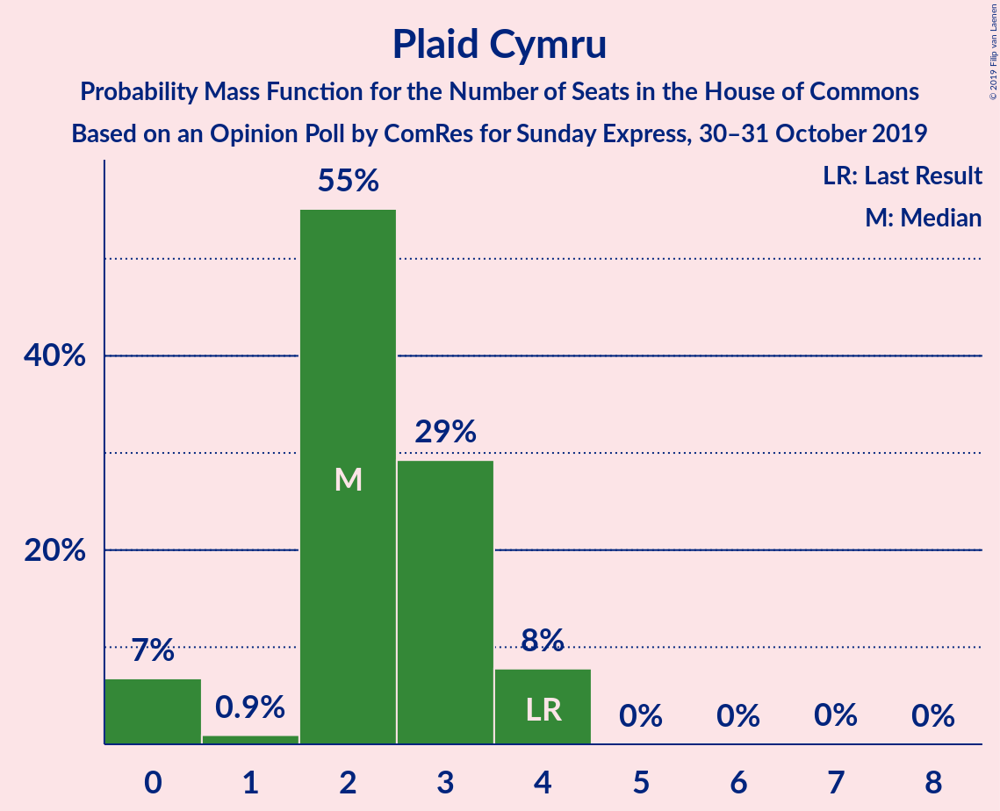
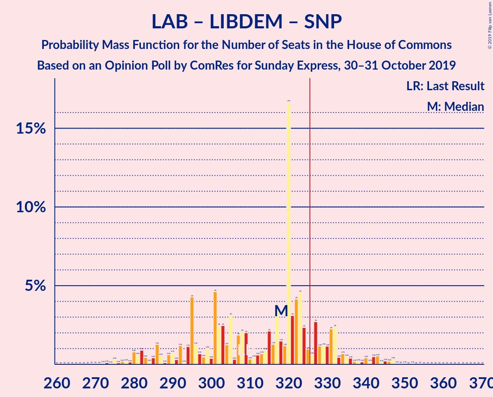
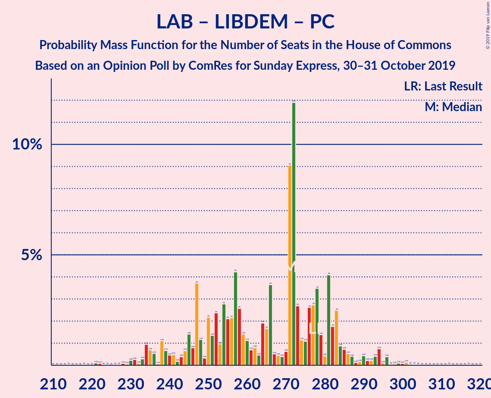
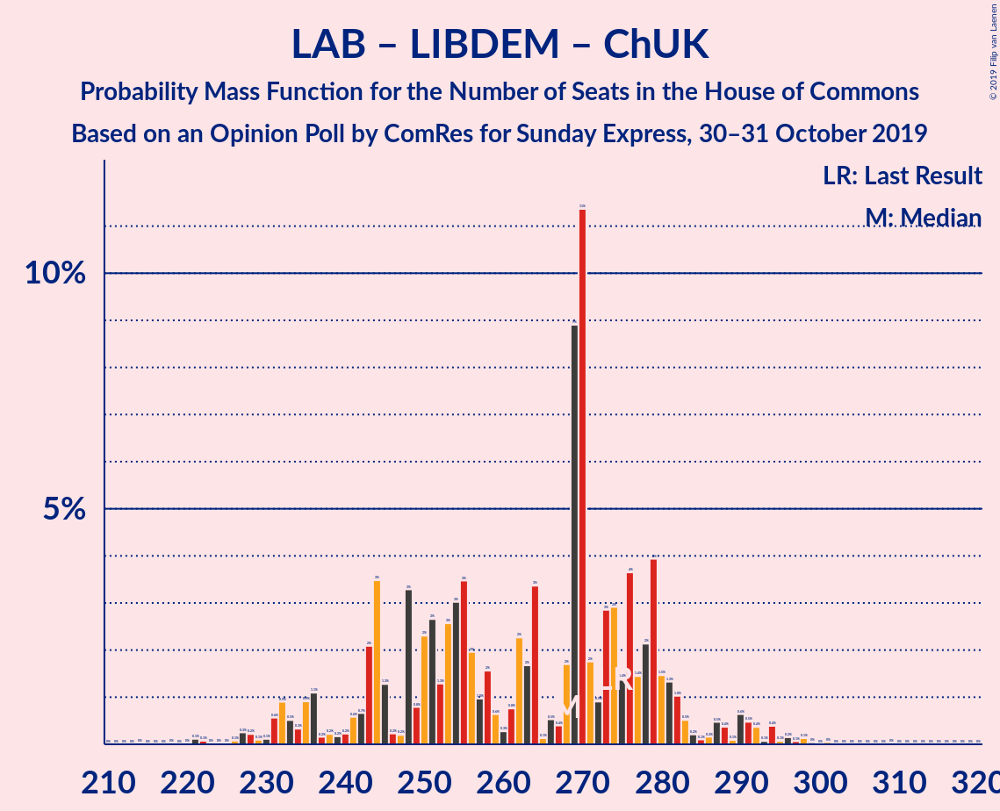

# Opinion Poll by ComRes for Sunday Express, 30–31 October 2019

<a href="#voting-intentions">Voting Intentions</a> | <a href="#seats">Seats</a> | <a href="#coalitions">Coalitions</a> | <a href="#technical-information">Technical Information</a>

## Voting Intentions

### Confidence Intervals

| Party | Last Result | Poll Result | 80% Confidence Interval | 90% Confidence Interval | 95% Confidence Interval | 99% Confidence Interval |
|:-----:|:-----------:|:-----------:|:-----------------------:|:-----------------------:|:-----------------------:|:-----------------------:|
| Conservative Party | 42.4% | 36.1% | 34.6–37.7% |34.1–38.1% |33.8–38.5% |33.0–39.3% |
| Labour Party | 40.0% | 28.1% | 26.6–29.6% |26.2–30.0% |25.9–30.3% |25.2–31.1% |
| Liberal Democrats | 7.4% | 17.1% | 15.9–18.3% |15.6–18.7% |15.3–19.0% |14.7–19.6% |
| Brexit Party | 0.0% | 10.1% | 9.1–11.1% |8.9–11.4% |8.7–11.6% |8.2–12.1% |
| Scottish National Party | 3.0% | 4.0% | 3.4–4.7% |3.2–4.9% |3.1–5.1% |2.9–5.4% |
| Green Party | 1.6% | 3.0% | 2.5–3.7% |2.4–3.8% |2.3–4.0% |2.1–4.3% |
| Plaid Cymru | 0.5% | 0.3% | 0.2–0.5% |0.1–0.6% |0.1–0.7% |0.1–0.8% |
| UK Independence Party | 1.8% | 0.3% | 0.2–0.5% |0.1–0.6% |0.1–0.7% |0.1–0.8% |
| Change UK | 0.0% | 0.3% | 0.2–0.5% |0.1–0.6% |0.1–0.7% |0.1–0.8% |

*Note:* The poll result column reflects the actual value used in the calculations. Published results may vary slightly, and in addition be rounded to fewer digits.

## Seats

### Confidence Intervals

| Party | Last Result | Median | 80% Confidence Interval | 90% Confidence Interval | 95% Confidence Interval | 99% Confidence Interval |
|:-----:|:-----------:|:------:|:-----------------------:|:-----------------------:|:-----------------------:|:-----------------------:|
| <a href="#conservative-party">Conservative Party</a> | 317 | 308 | 307–329 |297–330 |297–334 |284–347 |
| <a href="#labour-party">Labour Party</a> | 262 | 216 | 187–217 |186–217 |183–217 |176–231 |
| <a href="#liberal-democrats">Liberal Democrats</a> | 12 | 49 | 47–55 |47–59 |46–59 |42–61 |
| <a href="#brexit-party">Brexit Party</a> | 0 | 8 | 5–13 |5–13 |4–15 |2–15 |
| <a href="#scottish-national-party">Scottish National Party</a> | 35 | 51 | 50–53 |50–53 |45–53 |39–54 |
| <a href="#green-party">Green Party</a> | 1 | 1 | 1 |1 |1 |1–2 |
| <a href="#plaid-cymru">Plaid Cymru</a> | 4 | 2 | 2–3 |2–4 |0–4 |0–4 |
| <a href="#uk-independence-party">UK Independence Party</a> | 0 | 0 | 0 |0 |0 |0 |
| <a href="#change-uk">Change UK</a> | 0 | 0 | 0 |0 |0 |0 |

### Conservative Party

*For a full overview of the results for this party, see the [Conservative Party](party-conservativeparty.html) page.*

| Number of Seats | Probability | Accumulated | Special Marks |
|:---------------:|:-----------:|:-----------:|:-------------:|
| 264 | 0% | 100% |  |
| 265 | 0% | 99.9% |  |
| 266 | 0% | 99.9% |  |
| 267 | 0% | 99.9% |  |
| 268 | 0% | 99.9% |  |
| 269 | 0% | 99.9% |  |
| 270 | 0% | 99.9% |  |
| 271 | 0% | 99.9% |  |
| 272 | 0% | 99.9% |  |
| 273 | 0% | 99.9% |  |
| 274 | 0% | 99.9% |  |
| 275 | 0% | 99.9% |  |
| 276 | 0% | 99.9% |  |
| 277 | 0% | 99.9% |  |
| 278 | 0.1% | 99.9% |  |
| 279 | 0.1% | 99.7% |  |
| 280 | 0% | 99.6% |  |
| 281 | 0% | 99.6% |  |
| 282 | 0% | 99.6% |  |
| 283 | 0% | 99.6% |  |
| 284 | 0.2% | 99.5% |  |
| 285 | 0% | 99.3% |  |
| 286 | 0.2% | 99.3% |  |
| 287 | 0% | 99.1% |  |
| 288 | 0.3% | 99.1% |  |
| 289 | 0% | 98.8% |  |
| 290 | 0% | 98.8% |  |
| 291 | 0.4% | 98.8% |  |
| 292 | 0% | 98% |  |
| 293 | 0% | 98% |  |
| 294 | 0.1% | 98% |  |
| 295 | 0.2% | 98% |  |
| 296 | 0.1% | 98% |  |
| 297 | 3% | 98% |  |
| 298 | 0.1% | 95% |  |
| 299 | 0.1% | 94% |  |
| 300 | 0% | 94% |  |
| 301 | 0.1% | 94% |  |
| 302 | 0% | 94% |  |
| 303 | 0.1% | 94% |  |
| 304 | 1.5% | 94% |  |
| 305 | 0.5% | 93% |  |
| 306 | 0.1% | 92% |  |
| 307 | 32% | 92% |  |
| 308 | 31% | 60% | Median |
| 309 | 1.1% | 29% |  |
| 310 | 0.2% | 28% |  |
| 311 | 0.1% | 28% |  |
| 312 | 0.4% | 28% |  |
| 313 | 0.1% | 28% |  |
| 314 | 0% | 28% |  |
| 315 | 0% | 28% |  |
| 316 | 0.4% | 28% |  |
| 317 | 1.1% | 27% | Last Result |
| 318 | 2% | 26% |  |
| 319 | 0.1% | 25% |  |
| 320 | 3% | 24% |  |
| 321 | 0% | 22% |  |
| 322 | 0.2% | 22% |  |
| 323 | 0.4% | 22% |  |
| 324 | 0% | 21% |  |
| 325 | 0.4% | 21% |  |
| 326 | 0% | 21% | Majority |
| 327 | 0% | 21% |  |
| 328 | 4% | 21% |  |
| 329 | 12% | 17% |  |
| 330 | 0.7% | 5% |  |
| 331 | 0% | 4% |  |
| 332 | 0.7% | 4% |  |
| 333 | 0.7% | 4% |  |
| 334 | 0.6% | 3% |  |
| 335 | 0% | 2% |  |
| 336 | 0% | 2% |  |
| 337 | 0.1% | 2% |  |
| 338 | 0% | 2% |  |
| 339 | 0% | 2% |  |
| 340 | 0% | 2% |  |
| 341 | 0% | 2% |  |
| 342 | 0.1% | 2% |  |
| 343 | 0.1% | 2% |  |
| 344 | 1.1% | 2% |  |
| 345 | 0.2% | 0.9% |  |
| 346 | 0.1% | 0.7% |  |
| 347 | 0.3% | 0.6% |  |
| 348 | 0% | 0.2% |  |
| 349 | 0% | 0.2% |  |
| 350 | 0% | 0.2% |  |
| 351 | 0% | 0.2% |  |
| 352 | 0% | 0.2% |  |
| 353 | 0% | 0.2% |  |
| 354 | 0% | 0.1% |  |
| 355 | 0.1% | 0.1% |  |
| 356 | 0% | 0% |  |

### Labour Party

*For a full overview of the results for this party, see the [Labour Party](party-labourparty.html) page.*

| Number of Seats | Probability | Accumulated | Special Marks |
|:---------------:|:-----------:|:-----------:|:-------------:|
| 165 | 0% | 100% |  |
| 166 | 0% | 99.9% |  |
| 167 | 0% | 99.9% |  |
| 168 | 0% | 99.9% |  |
| 169 | 0% | 99.9% |  |
| 170 | 0% | 99.9% |  |
| 171 | 0% | 99.9% |  |
| 172 | 0.1% | 99.9% |  |
| 173 | 0.1% | 99.8% |  |
| 174 | 0% | 99.7% |  |
| 175 | 0.2% | 99.7% |  |
| 176 | 0% | 99.5% |  |
| 177 | 0.3% | 99.5% |  |
| 178 | 0.4% | 99.2% |  |
| 179 | 0% | 98.8% |  |
| 180 | 1.1% | 98.7% |  |
| 181 | 0.1% | 98% |  |
| 182 | 0% | 98% |  |
| 183 | 0.5% | 98% |  |
| 184 | 0% | 97% |  |
| 185 | 0.1% | 97% |  |
| 186 | 3% | 97% |  |
| 187 | 12% | 94% |  |
| 188 | 1.1% | 83% |  |
| 189 | 0% | 81% |  |
| 190 | 0.1% | 81% |  |
| 191 | 0.7% | 81% |  |
| 192 | 0.1% | 81% |  |
| 193 | 0% | 80% |  |
| 194 | 0% | 80% |  |
| 195 | 0.8% | 80% |  |
| 196 | 0.8% | 80% |  |
| 197 | 3% | 79% |  |
| 198 | 3% | 76% |  |
| 199 | 0.1% | 73% |  |
| 200 | 0% | 73% |  |
| 201 | 0.3% | 73% |  |
| 202 | 0.3% | 73% |  |
| 203 | 0.3% | 72% |  |
| 204 | 0.1% | 72% |  |
| 205 | 1.0% | 72% |  |
| 206 | 0% | 71% |  |
| 207 | 0.2% | 71% |  |
| 208 | 1.3% | 71% |  |
| 209 | 0.1% | 69% |  |
| 210 | 0.4% | 69% |  |
| 211 | 0% | 69% |  |
| 212 | 0.6% | 69% |  |
| 213 | 3% | 68% |  |
| 214 | 0% | 65% |  |
| 215 | 0% | 65% |  |
| 216 | 30% | 65% | Median |
| 217 | 32% | 34% |  |
| 218 | 0% | 2% |  |
| 219 | 0.1% | 2% |  |
| 220 | 0.1% | 2% |  |
| 221 | 0.3% | 2% |  |
| 222 | 0.3% | 2% |  |
| 223 | 0.1% | 1.3% |  |
| 224 | 0.1% | 1.2% |  |
| 225 | 0.1% | 1.1% |  |
| 226 | 0.3% | 1.0% |  |
| 227 | 0.1% | 0.7% |  |
| 228 | 0.1% | 0.7% |  |
| 229 | 0.1% | 0.6% |  |
| 230 | 0% | 0.6% |  |
| 231 | 0.4% | 0.5% |  |
| 232 | 0% | 0.2% |  |
| 233 | 0% | 0.1% |  |
| 234 | 0% | 0.1% |  |
| 235 | 0% | 0.1% |  |
| 236 | 0% | 0.1% |  |
| 237 | 0% | 0.1% |  |
| 238 | 0% | 0.1% |  |
| 239 | 0% | 0.1% |  |
| 240 | 0% | 0.1% |  |
| 241 | 0% | 0.1% |  |
| 242 | 0% | 0.1% |  |
| 243 | 0% | 0.1% |  |
| 244 | 0% | 0.1% |  |
| 245 | 0% | 0.1% |  |
| 246 | 0% | 0.1% |  |
| 247 | 0% | 0.1% |  |
| 248 | 0% | 0.1% |  |
| 249 | 0% | 0% |  |
| 250 | 0% | 0% |  |
| 251 | 0% | 0% |  |
| 252 | 0% | 0% |  |
| 253 | 0% | 0% |  |
| 254 | 0% | 0% |  |
| 255 | 0% | 0% |  |
| 256 | 0% | 0% |  |
| 257 | 0% | 0% |  |
| 258 | 0% | 0% |  |
| 259 | 0% | 0% |  |
| 260 | 0% | 0% |  |
| 261 | 0% | 0% |  |
| 262 | 0% | 0% | Last Result |

### Liberal Democrats

*For a full overview of the results for this party, see the [Liberal Democrats](party-liberaldemocrats.html) page.*

| Number of Seats | Probability | Accumulated | Special Marks |
|:---------------:|:-----------:|:-----------:|:-------------:|
| 12 | 0% | 100% | Last Result |
| 13 | 0% | 100% |  |
| 14 | 0% | 100% |  |
| 15 | 0% | 100% |  |
| 16 | 0% | 100% |  |
| 17 | 0% | 100% |  |
| 18 | 0% | 100% |  |
| 19 | 0% | 100% |  |
| 20 | 0% | 100% |  |
| 21 | 0% | 100% |  |
| 22 | 0% | 100% |  |
| 23 | 0% | 100% |  |
| 24 | 0% | 100% |  |
| 25 | 0% | 100% |  |
| 26 | 0% | 100% |  |
| 27 | 0% | 100% |  |
| 28 | 0% | 100% |  |
| 29 | 0% | 100% |  |
| 30 | 0% | 100% |  |
| 31 | 0% | 100% |  |
| 32 | 0% | 100% |  |
| 33 | 0% | 100% |  |
| 34 | 0% | 100% |  |
| 35 | 0% | 100% |  |
| 36 | 0% | 100% |  |
| 37 | 0% | 100% |  |
| 38 | 0% | 100% |  |
| 39 | 0% | 100% |  |
| 40 | 0% | 100% |  |
| 41 | 0% | 100% |  |
| 42 | 0.9% | 100% |  |
| 43 | 0.1% | 99.1% |  |
| 44 | 0.2% | 99.0% |  |
| 45 | 0.1% | 98.8% |  |
| 46 | 3% | 98.7% |  |
| 47 | 32% | 95% |  |
| 48 | 12% | 63% |  |
| 49 | 34% | 51% | Median |
| 50 | 0.1% | 17% |  |
| 51 | 1.3% | 17% |  |
| 52 | 0.5% | 16% |  |
| 53 | 1.5% | 15% |  |
| 54 | 3% | 14% |  |
| 55 | 2% | 11% |  |
| 56 | 0.7% | 9% |  |
| 57 | 0.1% | 8% |  |
| 58 | 2% | 8% |  |
| 59 | 4% | 6% |  |
| 60 | 1.2% | 2% |  |
| 61 | 0.7% | 1.1% |  |
| 62 | 0% | 0.4% |  |
| 63 | 0.1% | 0.4% |  |
| 64 | 0.1% | 0.2% |  |
| 65 | 0.1% | 0.2% |  |
| 66 | 0% | 0.1% |  |
| 67 | 0% | 0% |  |

### Brexit Party

*For a full overview of the results for this party, see the [Brexit Party](party-brexitparty.html) page.*

| Number of Seats | Probability | Accumulated | Special Marks |
|:---------------:|:-----------:|:-----------:|:-------------:|
| 0 | 0% | 100% | Last Result |
| 1 | 0% | 100% |  |
| 2 | 0.7% | 100% |  |
| 3 | 0.3% | 99.3% |  |
| 4 | 3% | 99.1% |  |
| 5 | 35% | 96% |  |
| 6 | 0.2% | 61% |  |
| 7 | 3% | 61% |  |
| 8 | 35% | 57% | Median |
| 9 | 3% | 22% |  |
| 10 | 0.8% | 20% |  |
| 11 | 0% | 19% |  |
| 12 | 2% | 19% |  |
| 13 | 13% | 17% |  |
| 14 | 0.4% | 4% |  |
| 15 | 3% | 3% |  |
| 16 | 0% | 0.4% |  |
| 17 | 0.1% | 0.4% |  |
| 18 | 0.1% | 0.4% |  |
| 19 | 0.1% | 0.3% |  |
| 20 | 0% | 0.2% |  |
| 21 | 0% | 0.2% |  |
| 22 | 0.1% | 0.2% |  |
| 23 | 0% | 0% |  |

### Scottish National Party

*For a full overview of the results for this party, see the [Scottish National Party](party-scottishnationalparty.html) page.*

| Number of Seats | Probability | Accumulated | Special Marks |
|:---------------:|:-----------:|:-----------:|:-------------:|
| 35 | 0% | 100% | Last Result |
| 36 | 0% | 100% |  |
| 37 | 0% | 100% |  |
| 38 | 0% | 100% |  |
| 39 | 1.3% | 100% |  |
| 40 | 0.1% | 98.7% |  |
| 41 | 0.4% | 98.6% |  |
| 42 | 0% | 98% |  |
| 43 | 0.1% | 98% |  |
| 44 | 0% | 98% |  |
| 45 | 0.5% | 98% |  |
| 46 | 0.3% | 97% |  |
| 47 | 0.7% | 97% |  |
| 48 | 0.5% | 96% |  |
| 49 | 0.6% | 96% |  |
| 50 | 33% | 95% |  |
| 51 | 51% | 62% | Median |
| 52 | 0% | 11% |  |
| 53 | 10% | 11% |  |
| 54 | 0.6% | 0.6% |  |
| 55 | 0% | 0% |  |

### Green Party

*For a full overview of the results for this party, see the [Green Party](party-greenparty.html) page.*

| Number of Seats | Probability | Accumulated | Special Marks |
|:---------------:|:-----------:|:-----------:|:-------------:|
| 1 | 98.5% | 100% | Last Result, Median |
| 2 | 1.5% | 1.5% |  |
| 3 | 0% | 0% |  |

### Plaid Cymru

*For a full overview of the results for this party, see the [Plaid Cymru](party-plaidcymru.html) page.*

| Number of Seats | Probability | Accumulated | Special Marks |
|:---------------:|:-----------:|:-----------:|:-------------:|
| 0 | 4% | 100% |  |
| 1 | 0.1% | 96% |  |
| 2 | 67% | 96% | Median |
| 3 | 24% | 29% |  |
| 4 | 6% | 6% | Last Result |
| 5 | 0% | 0% |  |

### UK Independence Party

*For a full overview of the results for this party, see the [UK Independence Party](party-ukindependenceparty.html) page.*

| Number of Seats | Probability | Accumulated | Special Marks |
|:---------------:|:-----------:|:-----------:|:-------------:|
| 0 | 100% | 100% | Last Result, Median |

### Change UK

*For a full overview of the results for this party, see the [Change UK](party-changeuk.html) page.*

| Number of Seats | Probability | Accumulated | Special Marks |
|:---------------:|:-----------:|:-----------:|:-------------:|
| 0 | 100% | 100% | Last Result, Median |

## Coalitions

### Confidence Intervals

| Coalition | Last Result | Median | Majority? | 80% Confidence Interval | 90% Confidence Interval | 95% Confidence Interval | 99% Confidence Interval |
|:---------:|:-----------:|:------:|:---------:|:-----------------------:|:-----------------------:|:-----------------------:|:-----------------------:|
| Conservative Party – Liberal Democrats – Change UK | 329 | 357 | 99.9% | 354–377 | 354–381 | 354–390 | 340–397 |
| Conservative Party – Liberal Democrats | 329 | 357 | 99.9% | 354–377 | 354–381 | 354–390 | 340–397 |
| Conservative Party – Scottish National Party – Plaid Cymru | 356 | 360 | 99.9% | 360–383 | 351–384 | 351–385 | 337–399 |
| Conservative Party – Scottish National Party | 352 | 358 | 99.9% | 358–380 | 348–381 | 348–383 | 336–396 |
| Conservative Party – Brexit Party | 317 | 315 | 22% | 313–342 | 305–343 | 305–346 | 289–357 |
| Conservative Party – Plaid Cymru | 321 | 310 | 21% | 309–332 | 300–332 | 300–337 | 286–350 |
| Conservative Party – Change UK | 317 | 308 | 21% | 307–329 | 297–330 | 297–334 | 284–347 |
| Conservative Party | 317 | 308 | 21% | 307–329 | 297–330 | 297–334 | 284–347 |
| Labour Party – Liberal Democrats – Scottish National Party – Plaid Cymru | 313 | 316 | 5% | 289–318 | 288–326 | 285–326 | 274–342 |
| Labour Party – Liberal Democrats – Scottish National Party | 309 | 314 | 2% | 286–316 | 285–323 | 282–323 | 272–340 |
| Labour Party – Liberal Democrats – Plaid Cymru | 278 | 265 | 0% | 238–268 | 238–275 | 235–275 | 225–289 |
| Labour Party – Liberal Democrats – Change UK | 274 | 263 | 0% | 235–266 | 235–272 | 232–273 | 223–287 |
| Labour Party – Liberal Democrats | 274 | 263 | 0% | 235–266 | 235–272 | 232–273 | 223–287 |
| Labour Party – Scottish National Party – Plaid Cymru | 301 | 269 | 0% | 241–269 | 241–269 | 232–270 | 227–281 |
| Labour Party – Scottish National Party | 297 | 267 | 0% | 238–267 | 238–267 | 230–270 | 224–278 |
| Labour Party – Plaid Cymru | 266 | 218 | 0% | 190–219 | 189–219 | 183–219 | 179–233 |
| Labour Party – Change UK | 262 | 216 | 0% | 187–217 | 186–217 | 183–217 | 176–231 |
| Labour Party | 262 | 216 | 0% | 187–217 | 186–217 | 183–217 | 176–231 |

### Conservative Party – Liberal Democrats – Change UK

| Number of Seats | Probability | Accumulated | Special Marks |
|:---------------:|:-----------:|:-----------:|:-------------:|
| 324 | 0% | 100% |  |
| 325 | 0% | 99.9% |  |
| 326 | 0% | 99.9% | Majority |
| 327 | 0% | 99.9% |  |
| 328 | 0% | 99.9% |  |
| 329 | 0% | 99.9% | Last Result |
| 330 | 0% | 99.9% |  |
| 331 | 0% | 99.9% |  |
| 332 | 0% | 99.9% |  |
| 333 | 0% | 99.9% |  |
| 334 | 0.1% | 99.9% |  |
| 335 | 0% | 99.7% |  |
| 336 | 0% | 99.7% |  |
| 337 | 0% | 99.7% |  |
| 338 | 0% | 99.7% |  |
| 339 | 0% | 99.7% |  |
| 340 | 0.3% | 99.7% |  |
| 341 | 0% | 99.4% |  |
| 342 | 0.1% | 99.4% |  |
| 343 | 0.1% | 99.3% |  |
| 344 | 0.3% | 99.3% |  |
| 345 | 0% | 98.9% |  |
| 346 | 0.2% | 98.9% |  |
| 347 | 0.1% | 98.7% |  |
| 348 | 0% | 98.7% |  |
| 349 | 0.2% | 98.6% |  |
| 350 | 0.1% | 98% |  |
| 351 | 0.3% | 98% |  |
| 352 | 0.1% | 98% |  |
| 353 | 0.1% | 98% |  |
| 354 | 30% | 98% |  |
| 355 | 0.3% | 68% |  |
| 356 | 6% | 67% |  |
| 357 | 32% | 61% | Median |
| 358 | 0% | 29% |  |
| 359 | 0.1% | 29% |  |
| 360 | 0.1% | 29% |  |
| 361 | 0.1% | 29% |  |
| 362 | 0% | 29% |  |
| 363 | 0% | 29% |  |
| 364 | 0.6% | 29% |  |
| 365 | 0% | 28% |  |
| 366 | 0.5% | 28% |  |
| 367 | 0.2% | 28% |  |
| 368 | 0.6% | 28% |  |
| 369 | 0.2% | 27% |  |
| 370 | 0.2% | 27% |  |
| 371 | 0.6% | 27% |  |
| 372 | 0.5% | 26% |  |
| 373 | 2% | 26% |  |
| 374 | 5% | 24% |  |
| 375 | 2% | 19% |  |
| 376 | 0% | 18% |  |
| 377 | 12% | 18% |  |
| 378 | 0% | 6% |  |
| 379 | 0.6% | 6% |  |
| 380 | 0% | 5% |  |
| 381 | 0.6% | 5% |  |
| 382 | 0.2% | 5% |  |
| 383 | 0.3% | 4% |  |
| 384 | 0% | 4% |  |
| 385 | 0.1% | 4% |  |
| 386 | 1.1% | 4% |  |
| 387 | 0.2% | 3% |  |
| 388 | 0% | 3% |  |
| 389 | 0% | 3% |  |
| 390 | 0.1% | 3% |  |
| 391 | 0.2% | 2% |  |
| 392 | 0.6% | 2% |  |
| 393 | 0% | 2% |  |
| 394 | 0% | 2% |  |
| 395 | 1.2% | 2% |  |
| 396 | 0% | 0.5% |  |
| 397 | 0.1% | 0.5% |  |
| 398 | 0.3% | 0.4% |  |
| 399 | 0% | 0.1% |  |
| 400 | 0% | 0.1% |  |
| 401 | 0% | 0.1% |  |
| 402 | 0% | 0.1% |  |
| 403 | 0% | 0.1% |  |
| 404 | 0% | 0% |  |

### Conservative Party – Liberal Democrats

| Number of Seats | Probability | Accumulated | Special Marks |
|:---------------:|:-----------:|:-----------:|:-------------:|
| 324 | 0% | 100% |  |
| 325 | 0% | 99.9% |  |
| 326 | 0% | 99.9% | Majority |
| 327 | 0% | 99.9% |  |
| 328 | 0% | 99.9% |  |
| 329 | 0% | 99.9% | Last Result |
| 330 | 0% | 99.9% |  |
| 331 | 0% | 99.9% |  |
| 332 | 0% | 99.9% |  |
| 333 | 0% | 99.9% |  |
| 334 | 0.1% | 99.9% |  |
| 335 | 0% | 99.7% |  |
| 336 | 0% | 99.7% |  |
| 337 | 0% | 99.7% |  |
| 338 | 0% | 99.7% |  |
| 339 | 0% | 99.7% |  |
| 340 | 0.3% | 99.7% |  |
| 341 | 0% | 99.4% |  |
| 342 | 0.1% | 99.4% |  |
| 343 | 0.1% | 99.3% |  |
| 344 | 0.3% | 99.3% |  |
| 345 | 0% | 98.9% |  |
| 346 | 0.2% | 98.9% |  |
| 347 | 0.1% | 98.7% |  |
| 348 | 0% | 98.7% |  |
| 349 | 0.2% | 98.6% |  |
| 350 | 0.1% | 98% |  |
| 351 | 0.3% | 98% |  |
| 352 | 0.1% | 98% |  |
| 353 | 0.1% | 98% |  |
| 354 | 30% | 98% |  |
| 355 | 0.3% | 68% |  |
| 356 | 6% | 67% |  |
| 357 | 32% | 61% | Median |
| 358 | 0% | 29% |  |
| 359 | 0.1% | 29% |  |
| 360 | 0.1% | 29% |  |
| 361 | 0.1% | 29% |  |
| 362 | 0% | 29% |  |
| 363 | 0% | 29% |  |
| 364 | 0.6% | 29% |  |
| 365 | 0% | 28% |  |
| 366 | 0.5% | 28% |  |
| 367 | 0.2% | 28% |  |
| 368 | 0.6% | 28% |  |
| 369 | 0.2% | 27% |  |
| 370 | 0.2% | 27% |  |
| 371 | 0.6% | 27% |  |
| 372 | 0.5% | 26% |  |
| 373 | 2% | 26% |  |
| 374 | 5% | 24% |  |
| 375 | 2% | 19% |  |
| 376 | 0% | 18% |  |
| 377 | 12% | 18% |  |
| 378 | 0% | 6% |  |
| 379 | 0.6% | 6% |  |
| 380 | 0% | 5% |  |
| 381 | 0.6% | 5% |  |
| 382 | 0.2% | 5% |  |
| 383 | 0.3% | 4% |  |
| 384 | 0% | 4% |  |
| 385 | 0.1% | 4% |  |
| 386 | 1.1% | 4% |  |
| 387 | 0.2% | 3% |  |
| 388 | 0% | 3% |  |
| 389 | 0% | 3% |  |
| 390 | 0.1% | 3% |  |
| 391 | 0.2% | 2% |  |
| 392 | 0.6% | 2% |  |
| 393 | 0% | 2% |  |
| 394 | 0% | 2% |  |
| 395 | 1.2% | 2% |  |
| 396 | 0% | 0.5% |  |
| 397 | 0.1% | 0.5% |  |
| 398 | 0.3% | 0.4% |  |
| 399 | 0% | 0.1% |  |
| 400 | 0% | 0.1% |  |
| 401 | 0% | 0.1% |  |
| 402 | 0% | 0.1% |  |
| 403 | 0% | 0.1% |  |
| 404 | 0% | 0% |  |

### Conservative Party – Scottish National Party – Plaid Cymru

| Number of Seats | Probability | Accumulated | Special Marks |
|:---------------:|:-----------:|:-----------:|:-------------:|
| 318 | 0% | 100% |  |
| 319 | 0% | 99.9% |  |
| 320 | 0% | 99.9% |  |
| 321 | 0% | 99.9% |  |
| 322 | 0% | 99.9% |  |
| 323 | 0% | 99.9% |  |
| 324 | 0% | 99.9% |  |
| 325 | 0% | 99.9% |  |
| 326 | 0% | 99.9% | Majority |
| 327 | 0% | 99.9% |  |
| 328 | 0% | 99.9% |  |
| 329 | 0% | 99.9% |  |
| 330 | 0% | 99.9% |  |
| 331 | 0% | 99.9% |  |
| 332 | 0% | 99.9% |  |
| 333 | 0% | 99.9% |  |
| 334 | 0.1% | 99.8% |  |
| 335 | 0% | 99.7% |  |
| 336 | 0.1% | 99.6% |  |
| 337 | 0% | 99.5% |  |
| 338 | 0% | 99.5% |  |
| 339 | 0.5% | 99.5% |  |
| 340 | 0% | 99.0% |  |
| 341 | 0.4% | 99.0% |  |
| 342 | 0.1% | 98.6% |  |
| 343 | 0.1% | 98.5% |  |
| 344 | 0.2% | 98% |  |
| 345 | 0% | 98% |  |
| 346 | 0.1% | 98% |  |
| 347 | 0.1% | 98% |  |
| 348 | 0.1% | 98% |  |
| 349 | 0.2% | 98% |  |
| 350 | 0% | 98% |  |
| 351 | 3% | 98% |  |
| 352 | 0.1% | 94% |  |
| 353 | 0% | 94% |  |
| 354 | 0.6% | 94% |  |
| 355 | 0.1% | 94% |  |
| 356 | 0% | 94% | Last Result |
| 357 | 0.1% | 94% |  |
| 358 | 0.1% | 94% |  |
| 359 | 0% | 93% |  |
| 360 | 62% | 93% |  |
| 361 | 2% | 31% | Median |
| 362 | 0% | 29% |  |
| 363 | 0.2% | 29% |  |
| 364 | 0% | 29% |  |
| 365 | 0.5% | 29% |  |
| 366 | 1.2% | 29% |  |
| 367 | 0% | 27% |  |
| 368 | 0% | 27% |  |
| 369 | 0.4% | 27% |  |
| 370 | 0% | 27% |  |
| 371 | 0.6% | 27% |  |
| 372 | 0.4% | 26% |  |
| 373 | 0% | 26% |  |
| 374 | 2% | 26% |  |
| 375 | 3% | 24% |  |
| 376 | 0.3% | 21% |  |
| 377 | 0% | 21% |  |
| 378 | 0.5% | 21% |  |
| 379 | 1.0% | 21% |  |
| 380 | 0.4% | 20% |  |
| 381 | 1.1% | 19% |  |
| 382 | 0% | 18% |  |
| 383 | 12% | 18% |  |
| 384 | 3% | 6% |  |
| 385 | 2% | 3% |  |
| 386 | 0% | 1.3% |  |
| 387 | 0.1% | 1.3% |  |
| 388 | 0% | 1.2% |  |
| 389 | 0% | 1.2% |  |
| 390 | 0% | 1.1% |  |
| 391 | 0% | 1.1% |  |
| 392 | 0% | 1.1% |  |
| 393 | 0% | 1.1% |  |
| 394 | 0.1% | 1.1% |  |
| 395 | 0.2% | 1.0% |  |
| 396 | 0% | 0.8% |  |
| 397 | 0.1% | 0.8% |  |
| 398 | 0.1% | 0.7% |  |
| 399 | 0.2% | 0.6% |  |
| 400 | 0% | 0.4% |  |
| 401 | 0% | 0.3% |  |
| 402 | 0.3% | 0.3% |  |
| 403 | 0% | 0.1% |  |
| 404 | 0% | 0% |  |

### Conservative Party – Scottish National Party

| Number of Seats | Probability | Accumulated | Special Marks |
|:---------------:|:-----------:|:-----------:|:-------------:|
| 315 | 0% | 100% |  |
| 316 | 0% | 99.9% |  |
| 317 | 0% | 99.9% |  |
| 318 | 0% | 99.9% |  |
| 319 | 0% | 99.9% |  |
| 320 | 0% | 99.9% |  |
| 321 | 0% | 99.9% |  |
| 322 | 0% | 99.9% |  |
| 323 | 0% | 99.9% |  |
| 324 | 0% | 99.9% |  |
| 325 | 0% | 99.9% |  |
| 326 | 0% | 99.9% | Majority |
| 327 | 0% | 99.9% |  |
| 328 | 0% | 99.9% |  |
| 329 | 0% | 99.9% |  |
| 330 | 0% | 99.9% |  |
| 331 | 0.1% | 99.9% |  |
| 332 | 0.1% | 99.7% |  |
| 333 | 0% | 99.6% |  |
| 334 | 0% | 99.6% |  |
| 335 | 0% | 99.6% |  |
| 336 | 0% | 99.5% |  |
| 337 | 0.2% | 99.5% |  |
| 338 | 0% | 99.3% |  |
| 339 | 0.7% | 99.3% |  |
| 340 | 0% | 98.5% |  |
| 341 | 0.2% | 98.5% |  |
| 342 | 0% | 98% |  |
| 343 | 0% | 98% |  |
| 344 | 0.1% | 98% |  |
| 345 | 0% | 98% |  |
| 346 | 0.1% | 98% |  |
| 347 | 0.1% | 98% |  |
| 348 | 3% | 98% |  |
| 349 | 0.1% | 94% |  |
| 350 | 0% | 94% |  |
| 351 | 0.1% | 94% |  |
| 352 | 0.1% | 94% | Last Result |
| 353 | 0.1% | 94% |  |
| 354 | 0.5% | 94% |  |
| 355 | 0.1% | 94% |  |
| 356 | 0% | 94% |  |
| 357 | 1.5% | 94% |  |
| 358 | 61% | 92% |  |
| 359 | 0% | 31% | Median |
| 360 | 1.4% | 31% |  |
| 361 | 0.2% | 29% |  |
| 362 | 1.5% | 29% |  |
| 363 | 0.2% | 28% |  |
| 364 | 0% | 28% |  |
| 365 | 0% | 27% |  |
| 366 | 0.1% | 27% |  |
| 367 | 0.4% | 27% |  |
| 368 | 0.6% | 27% |  |
| 369 | 0.5% | 26% |  |
| 370 | 0.1% | 26% |  |
| 371 | 4% | 26% |  |
| 372 | 0% | 22% |  |
| 373 | 0.2% | 22% |  |
| 374 | 0.3% | 21% |  |
| 375 | 0.5% | 21% |  |
| 376 | 0.1% | 21% |  |
| 377 | 0% | 21% |  |
| 378 | 0.4% | 21% |  |
| 379 | 2% | 20% |  |
| 380 | 12% | 18% |  |
| 381 | 3% | 6% |  |
| 382 | 0.1% | 3% |  |
| 383 | 2% | 3% |  |
| 384 | 0% | 1.3% |  |
| 385 | 0% | 1.3% |  |
| 386 | 0% | 1.3% |  |
| 387 | 0.1% | 1.2% |  |
| 388 | 0% | 1.2% |  |
| 389 | 0% | 1.1% |  |
| 390 | 0% | 1.1% |  |
| 391 | 0% | 1.1% |  |
| 392 | 0.2% | 1.1% |  |
| 393 | 0.1% | 0.9% |  |
| 394 | 0.1% | 0.8% |  |
| 395 | 0% | 0.7% |  |
| 396 | 0.3% | 0.7% |  |
| 397 | 0.1% | 0.4% |  |
| 398 | 0.2% | 0.4% |  |
| 399 | 0% | 0.2% |  |
| 400 | 0% | 0.1% |  |
| 401 | 0% | 0.1% |  |
| 402 | 0.1% | 0.1% |  |
| 403 | 0% | 0% |  |

### Conservative Party – Brexit Party

| Number of Seats | Probability | Accumulated | Special Marks |
|:---------------:|:-----------:|:-----------:|:-------------:|
| 269 | 0% | 100% |  |
| 270 | 0% | 99.9% |  |
| 271 | 0% | 99.9% |  |
| 272 | 0% | 99.9% |  |
| 273 | 0% | 99.9% |  |
| 274 | 0% | 99.9% |  |
| 275 | 0% | 99.9% |  |
| 276 | 0% | 99.9% |  |
| 277 | 0% | 99.9% |  |
| 278 | 0% | 99.9% |  |
| 279 | 0% | 99.9% |  |
| 280 | 0% | 99.9% |  |
| 281 | 0% | 99.9% |  |
| 282 | 0% | 99.9% |  |
| 283 | 0% | 99.9% |  |
| 284 | 0% | 99.9% |  |
| 285 | 0% | 99.9% |  |
| 286 | 0% | 99.9% |  |
| 287 | 0.1% | 99.8% |  |
| 288 | 0.1% | 99.7% |  |
| 289 | 0.2% | 99.7% |  |
| 290 | 0% | 99.5% |  |
| 291 | 0% | 99.5% |  |
| 292 | 0% | 99.4% |  |
| 293 | 0% | 99.4% |  |
| 294 | 0.2% | 99.4% |  |
| 295 | 0% | 99.2% |  |
| 296 | 0% | 99.2% |  |
| 297 | 0.2% | 99.2% |  |
| 298 | 0.3% | 99.0% |  |
| 299 | 0.3% | 98.7% |  |
| 300 | 0.1% | 98% |  |
| 301 | 0% | 98% |  |
| 302 | 0% | 98% |  |
| 303 | 0% | 98% |  |
| 304 | 0% | 98% |  |
| 305 | 3% | 98% |  |
| 306 | 0.1% | 95% |  |
| 307 | 0.1% | 95% |  |
| 308 | 0% | 94% |  |
| 309 | 0.5% | 94% |  |
| 310 | 0.3% | 94% |  |
| 311 | 0.1% | 94% |  |
| 312 | 1.5% | 94% |  |
| 313 | 32% | 92% |  |
| 314 | 0.2% | 60% |  |
| 315 | 30% | 60% |  |
| 316 | 0.1% | 30% | Median |
| 317 | 0.1% | 30% | Last Result |
| 318 | 0.1% | 29% |  |
| 319 | 0% | 29% |  |
| 320 | 0.4% | 29% |  |
| 321 | 0% | 29% |  |
| 322 | 3% | 29% |  |
| 323 | 0.1% | 26% |  |
| 324 | 1.2% | 26% |  |
| 325 | 2% | 25% |  |
| 326 | 0.1% | 22% | Majority |
| 327 | 0.4% | 22% |  |
| 328 | 0.4% | 22% |  |
| 329 | 0.1% | 21% |  |
| 330 | 0% | 21% |  |
| 331 | 0% | 21% |  |
| 332 | 0.2% | 21% |  |
| 333 | 0.1% | 21% |  |
| 334 | 0% | 21% |  |
| 335 | 0.1% | 21% |  |
| 336 | 0% | 21% |  |
| 337 | 0.7% | 21% |  |
| 338 | 0.3% | 20% |  |
| 339 | 0.7% | 20% |  |
| 340 | 1.4% | 19% |  |
| 341 | 0% | 18% |  |
| 342 | 12% | 18% |  |
| 343 | 3% | 6% |  |
| 344 | 0% | 3% |  |
| 345 | 0% | 3% |  |
| 346 | 0.5% | 3% |  |
| 347 | 0% | 2% |  |
| 348 | 0.2% | 2% |  |
| 349 | 0.1% | 2% |  |
| 350 | 0.1% | 2% |  |
| 351 | 1.1% | 2% |  |
| 352 | 0.1% | 1.0% |  |
| 353 | 0% | 0.9% |  |
| 354 | 0% | 0.8% |  |
| 355 | 0.2% | 0.8% |  |
| 356 | 0% | 0.7% |  |
| 357 | 0.2% | 0.6% |  |
| 358 | 0.3% | 0.4% |  |
| 359 | 0% | 0.2% |  |
| 360 | 0% | 0.1% |  |
| 361 | 0% | 0.1% |  |
| 362 | 0% | 0.1% |  |
| 363 | 0% | 0.1% |  |
| 364 | 0% | 0.1% |  |
| 365 | 0% | 0.1% |  |
| 366 | 0% | 0.1% |  |
| 367 | 0% | 0.1% |  |
| 368 | 0% | 0.1% |  |
| 369 | 0% | 0% |  |

### Conservative Party – Plaid Cymru

| Number of Seats | Probability | Accumulated | Special Marks |
|:---------------:|:-----------:|:-----------:|:-------------:|
| 267 | 0% | 100% |  |
| 268 | 0% | 99.9% |  |
| 269 | 0% | 99.9% |  |
| 270 | 0% | 99.9% |  |
| 271 | 0% | 99.9% |  |
| 272 | 0% | 99.9% |  |
| 273 | 0% | 99.9% |  |
| 274 | 0% | 99.9% |  |
| 275 | 0% | 99.9% |  |
| 276 | 0% | 99.9% |  |
| 277 | 0% | 99.9% |  |
| 278 | 0% | 99.9% |  |
| 279 | 0% | 99.9% |  |
| 280 | 0% | 99.9% |  |
| 281 | 0.1% | 99.9% |  |
| 282 | 0% | 99.7% |  |
| 283 | 0.1% | 99.7% |  |
| 284 | 0% | 99.6% |  |
| 285 | 0% | 99.6% |  |
| 286 | 0.2% | 99.5% |  |
| 287 | 0% | 99.3% |  |
| 288 | 0.4% | 99.3% |  |
| 289 | 0.1% | 99.0% |  |
| 290 | 0.1% | 98.9% |  |
| 291 | 0% | 98.8% |  |
| 292 | 0% | 98.8% |  |
| 293 | 0.4% | 98.8% |  |
| 294 | 0% | 98% |  |
| 295 | 0% | 98% |  |
| 296 | 0.1% | 98% |  |
| 297 | 0% | 98% |  |
| 298 | 0.3% | 98% |  |
| 299 | 0.1% | 98% |  |
| 300 | 3% | 98% |  |
| 301 | 0.1% | 95% |  |
| 302 | 0.1% | 94% |  |
| 303 | 0.1% | 94% |  |
| 304 | 0.1% | 94% |  |
| 305 | 0.5% | 94% |  |
| 306 | 0% | 94% |  |
| 307 | 2% | 94% |  |
| 308 | 1.2% | 92% |  |
| 309 | 30% | 91% |  |
| 310 | 31% | 60% | Median |
| 311 | 0.3% | 30% |  |
| 312 | 0.2% | 29% |  |
| 313 | 1.0% | 29% |  |
| 314 | 0% | 28% |  |
| 315 | 0.5% | 28% |  |
| 316 | 0% | 28% |  |
| 317 | 0.1% | 28% |  |
| 318 | 0.1% | 28% |  |
| 319 | 0.8% | 28% |  |
| 320 | 0.6% | 27% |  |
| 321 | 2% | 26% | Last Result |
| 322 | 0.1% | 24% |  |
| 323 | 0.2% | 24% |  |
| 324 | 3% | 24% |  |
| 325 | 0.5% | 22% |  |
| 326 | 0.1% | 21% | Majority |
| 327 | 0.4% | 21% |  |
| 328 | 0% | 21% |  |
| 329 | 0.3% | 21% |  |
| 330 | 1.1% | 20% |  |
| 331 | 3% | 19% |  |
| 332 | 12% | 17% |  |
| 333 | 0.7% | 4% |  |
| 334 | 0.1% | 4% |  |
| 335 | 0.7% | 4% |  |
| 336 | 0% | 3% |  |
| 337 | 0.5% | 3% |  |
| 338 | 0.2% | 2% |  |
| 339 | 0% | 2% |  |
| 340 | 0% | 2% |  |
| 341 | 0% | 2% |  |
| 342 | 0% | 2% |  |
| 343 | 0.1% | 2% |  |
| 344 | 0.1% | 2% |  |
| 345 | 0% | 2% |  |
| 346 | 1.2% | 2% |  |
| 347 | 0% | 0.9% |  |
| 348 | 0.2% | 0.9% |  |
| 349 | 0.1% | 0.7% |  |
| 350 | 0.2% | 0.6% |  |
| 351 | 0.1% | 0.3% |  |
| 352 | 0% | 0.2% |  |
| 353 | 0% | 0.2% |  |
| 354 | 0% | 0.2% |  |
| 355 | 0.1% | 0.2% |  |
| 356 | 0% | 0.1% |  |
| 357 | 0% | 0.1% |  |
| 358 | 0% | 0% |  |

### Conservative Party – Change UK

| Number of Seats | Probability | Accumulated | Special Marks |
|:---------------:|:-----------:|:-----------:|:-------------:|
| 264 | 0% | 100% |  |
| 265 | 0% | 99.9% |  |
| 266 | 0% | 99.9% |  |
| 267 | 0% | 99.9% |  |
| 268 | 0% | 99.9% |  |
| 269 | 0% | 99.9% |  |
| 270 | 0% | 99.9% |  |
| 271 | 0% | 99.9% |  |
| 272 | 0% | 99.9% |  |
| 273 | 0% | 99.9% |  |
| 274 | 0% | 99.9% |  |
| 275 | 0% | 99.9% |  |
| 276 | 0% | 99.9% |  |
| 277 | 0% | 99.9% |  |
| 278 | 0.1% | 99.9% |  |
| 279 | 0.1% | 99.7% |  |
| 280 | 0% | 99.6% |  |
| 281 | 0% | 99.6% |  |
| 282 | 0% | 99.6% |  |
| 283 | 0% | 99.6% |  |
| 284 | 0.2% | 99.5% |  |
| 285 | 0% | 99.3% |  |
| 286 | 0.2% | 99.3% |  |
| 287 | 0% | 99.1% |  |
| 288 | 0.3% | 99.1% |  |
| 289 | 0% | 98.8% |  |
| 290 | 0% | 98.8% |  |
| 291 | 0.4% | 98.8% |  |
| 292 | 0% | 98% |  |
| 293 | 0% | 98% |  |
| 294 | 0.1% | 98% |  |
| 295 | 0.2% | 98% |  |
| 296 | 0.1% | 98% |  |
| 297 | 3% | 98% |  |
| 298 | 0.1% | 95% |  |
| 299 | 0.1% | 94% |  |
| 300 | 0% | 94% |  |
| 301 | 0.1% | 94% |  |
| 302 | 0% | 94% |  |
| 303 | 0.1% | 94% |  |
| 304 | 1.5% | 94% |  |
| 305 | 0.5% | 93% |  |
| 306 | 0.1% | 92% |  |
| 307 | 32% | 92% |  |
| 308 | 31% | 60% | Median |
| 309 | 1.1% | 29% |  |
| 310 | 0.2% | 28% |  |
| 311 | 0.1% | 28% |  |
| 312 | 0.4% | 28% |  |
| 313 | 0.1% | 28% |  |
| 314 | 0% | 28% |  |
| 315 | 0% | 28% |  |
| 316 | 0.4% | 28% |  |
| 317 | 1.1% | 27% | Last Result |
| 318 | 2% | 26% |  |
| 319 | 0.1% | 25% |  |
| 320 | 3% | 24% |  |
| 321 | 0% | 22% |  |
| 322 | 0.2% | 22% |  |
| 323 | 0.4% | 22% |  |
| 324 | 0% | 21% |  |
| 325 | 0.4% | 21% |  |
| 326 | 0% | 21% | Majority |
| 327 | 0% | 21% |  |
| 328 | 4% | 21% |  |
| 329 | 12% | 17% |  |
| 330 | 0.7% | 5% |  |
| 331 | 0% | 4% |  |
| 332 | 0.7% | 4% |  |
| 333 | 0.7% | 4% |  |
| 334 | 0.6% | 3% |  |
| 335 | 0% | 2% |  |
| 336 | 0% | 2% |  |
| 337 | 0.1% | 2% |  |
| 338 | 0% | 2% |  |
| 339 | 0% | 2% |  |
| 340 | 0% | 2% |  |
| 341 | 0% | 2% |  |
| 342 | 0.1% | 2% |  |
| 343 | 0.1% | 2% |  |
| 344 | 1.1% | 2% |  |
| 345 | 0.2% | 0.9% |  |
| 346 | 0.1% | 0.7% |  |
| 347 | 0.3% | 0.6% |  |
| 348 | 0% | 0.2% |  |
| 349 | 0% | 0.2% |  |
| 350 | 0% | 0.2% |  |
| 351 | 0% | 0.2% |  |
| 352 | 0% | 0.2% |  |
| 353 | 0% | 0.2% |  |
| 354 | 0% | 0.1% |  |
| 355 | 0.1% | 0.1% |  |
| 356 | 0% | 0% |  |

### Conservative Party

| Number of Seats | Probability | Accumulated | Special Marks |
|:---------------:|:-----------:|:-----------:|:-------------:|
| 264 | 0% | 100% |  |
| 265 | 0% | 99.9% |  |
| 266 | 0% | 99.9% |  |
| 267 | 0% | 99.9% |  |
| 268 | 0% | 99.9% |  |
| 269 | 0% | 99.9% |  |
| 270 | 0% | 99.9% |  |
| 271 | 0% | 99.9% |  |
| 272 | 0% | 99.9% |  |
| 273 | 0% | 99.9% |  |
| 274 | 0% | 99.9% |  |
| 275 | 0% | 99.9% |  |
| 276 | 0% | 99.9% |  |
| 277 | 0% | 99.9% |  |
| 278 | 0.1% | 99.9% |  |
| 279 | 0.1% | 99.7% |  |
| 280 | 0% | 99.6% |  |
| 281 | 0% | 99.6% |  |
| 282 | 0% | 99.6% |  |
| 283 | 0% | 99.6% |  |
| 284 | 0.2% | 99.5% |  |
| 285 | 0% | 99.3% |  |
| 286 | 0.2% | 99.3% |  |
| 287 | 0% | 99.1% |  |
| 288 | 0.3% | 99.1% |  |
| 289 | 0% | 98.8% |  |
| 290 | 0% | 98.8% |  |
| 291 | 0.4% | 98.8% |  |
| 292 | 0% | 98% |  |
| 293 | 0% | 98% |  |
| 294 | 0.1% | 98% |  |
| 295 | 0.2% | 98% |  |
| 296 | 0.1% | 98% |  |
| 297 | 3% | 98% |  |
| 298 | 0.1% | 95% |  |
| 299 | 0.1% | 94% |  |
| 300 | 0% | 94% |  |
| 301 | 0.1% | 94% |  |
| 302 | 0% | 94% |  |
| 303 | 0.1% | 94% |  |
| 304 | 1.5% | 94% |  |
| 305 | 0.5% | 93% |  |
| 306 | 0.1% | 92% |  |
| 307 | 32% | 92% |  |
| 308 | 31% | 60% | Median |
| 309 | 1.1% | 29% |  |
| 310 | 0.2% | 28% |  |
| 311 | 0.1% | 28% |  |
| 312 | 0.4% | 28% |  |
| 313 | 0.1% | 28% |  |
| 314 | 0% | 28% |  |
| 315 | 0% | 28% |  |
| 316 | 0.4% | 28% |  |
| 317 | 1.1% | 27% | Last Result |
| 318 | 2% | 26% |  |
| 319 | 0.1% | 25% |  |
| 320 | 3% | 24% |  |
| 321 | 0% | 22% |  |
| 322 | 0.2% | 22% |  |
| 323 | 0.4% | 22% |  |
| 324 | 0% | 21% |  |
| 325 | 0.4% | 21% |  |
| 326 | 0% | 21% | Majority |
| 327 | 0% | 21% |  |
| 328 | 4% | 21% |  |
| 329 | 12% | 17% |  |
| 330 | 0.7% | 5% |  |
| 331 | 0% | 4% |  |
| 332 | 0.7% | 4% |  |
| 333 | 0.7% | 4% |  |
| 334 | 0.6% | 3% |  |
| 335 | 0% | 2% |  |
| 336 | 0% | 2% |  |
| 337 | 0.1% | 2% |  |
| 338 | 0% | 2% |  |
| 339 | 0% | 2% |  |
| 340 | 0% | 2% |  |
| 341 | 0% | 2% |  |
| 342 | 0.1% | 2% |  |
| 343 | 0.1% | 2% |  |
| 344 | 1.1% | 2% |  |
| 345 | 0.2% | 0.9% |  |
| 346 | 0.1% | 0.7% |  |
| 347 | 0.3% | 0.6% |  |
| 348 | 0% | 0.2% |  |
| 349 | 0% | 0.2% |  |
| 350 | 0% | 0.2% |  |
| 351 | 0% | 0.2% |  |
| 352 | 0% | 0.2% |  |
| 353 | 0% | 0.2% |  |
| 354 | 0% | 0.1% |  |
| 355 | 0.1% | 0.1% |  |
| 356 | 0% | 0% |  |

### Labour Party – Liberal Democrats – Scottish National Party – Plaid Cymru

| Number of Seats | Probability | Accumulated | Special Marks |
|:---------------:|:-----------:|:-----------:|:-------------:|
| 263 | 0% | 100% |  |
| 264 | 0% | 99.9% |  |
| 265 | 0% | 99.9% |  |
| 266 | 0% | 99.9% |  |
| 267 | 0% | 99.9% |  |
| 268 | 0% | 99.9% |  |
| 269 | 0% | 99.9% |  |
| 270 | 0% | 99.9% |  |
| 271 | 0% | 99.9% |  |
| 272 | 0% | 99.9% |  |
| 273 | 0.3% | 99.8% |  |
| 274 | 0.2% | 99.6% |  |
| 275 | 0% | 99.4% |  |
| 276 | 0.2% | 99.3% |  |
| 277 | 0% | 99.2% |  |
| 278 | 0% | 99.2% |  |
| 279 | 0.1% | 99.1% |  |
| 280 | 1.1% | 99.0% |  |
| 281 | 0.1% | 98% |  |
| 282 | 0.1% | 98% |  |
| 283 | 0.2% | 98% |  |
| 284 | 0% | 98% |  |
| 285 | 0.5% | 98% |  |
| 286 | 0% | 97% |  |
| 287 | 0% | 97% |  |
| 288 | 3% | 97% |  |
| 289 | 12% | 94% |  |
| 290 | 0% | 82% |  |
| 291 | 1.4% | 82% |  |
| 292 | 0.7% | 81% |  |
| 293 | 0.3% | 80% |  |
| 294 | 0.7% | 80% |  |
| 295 | 0% | 79% |  |
| 296 | 0.1% | 79% |  |
| 297 | 0% | 79% |  |
| 298 | 0.1% | 79% |  |
| 299 | 0.2% | 79% |  |
| 300 | 0% | 79% |  |
| 301 | 0.1% | 79% |  |
| 302 | 0.3% | 79% |  |
| 303 | 0.2% | 78% |  |
| 304 | 0.4% | 78% |  |
| 305 | 0.5% | 78% |  |
| 306 | 3% | 77% |  |
| 307 | 0.8% | 75% |  |
| 308 | 0% | 74% |  |
| 309 | 3% | 74% |  |
| 310 | 0% | 71% |  |
| 311 | 0.4% | 71% |  |
| 312 | 0% | 71% |  |
| 313 | 0.1% | 71% | Last Result |
| 314 | 0.2% | 71% |  |
| 315 | 0.1% | 70% |  |
| 316 | 30% | 70% |  |
| 317 | 0.2% | 40% |  |
| 318 | 32% | 40% | Median |
| 319 | 1.5% | 8% |  |
| 320 | 0.1% | 6% |  |
| 321 | 0.3% | 6% |  |
| 322 | 0.5% | 6% |  |
| 323 | 0% | 6% |  |
| 324 | 0.1% | 6% |  |
| 325 | 0.1% | 5% |  |
| 326 | 3% | 5% | Majority |
| 327 | 0% | 2% |  |
| 328 | 0% | 2% |  |
| 329 | 0% | 2% |  |
| 330 | 0% | 2% |  |
| 331 | 0.1% | 2% |  |
| 332 | 0.3% | 2% |  |
| 333 | 0.3% | 1.3% |  |
| 334 | 0.2% | 1.0% |  |
| 335 | 0% | 0.8% |  |
| 336 | 0% | 0.8% |  |
| 337 | 0.2% | 0.8% |  |
| 338 | 0% | 0.6% |  |
| 339 | 0% | 0.6% |  |
| 340 | 0% | 0.6% |  |
| 341 | 0% | 0.5% |  |
| 342 | 0.2% | 0.5% |  |
| 343 | 0% | 0.3% |  |
| 344 | 0.1% | 0.3% |  |
| 345 | 0% | 0.1% |  |
| 346 | 0% | 0.1% |  |
| 347 | 0% | 0.1% |  |
| 348 | 0% | 0.1% |  |
| 349 | 0% | 0.1% |  |
| 350 | 0% | 0.1% |  |
| 351 | 0% | 0.1% |  |
| 352 | 0% | 0.1% |  |
| 353 | 0% | 0.1% |  |
| 354 | 0% | 0.1% |  |
| 355 | 0% | 0.1% |  |
| 356 | 0% | 0.1% |  |
| 357 | 0% | 0.1% |  |
| 358 | 0% | 0.1% |  |
| 359 | 0% | 0.1% |  |
| 360 | 0% | 0.1% |  |
| 361 | 0% | 0.1% |  |
| 362 | 0% | 0% |  |

### Labour Party – Liberal Democrats – Scottish National Party

| Number of Seats | Probability | Accumulated | Special Marks |
|:---------------:|:-----------:|:-----------:|:-------------:|
| 261 | 0% | 100% |  |
| 262 | 0% | 99.9% |  |
| 263 | 0% | 99.9% |  |
| 264 | 0% | 99.9% |  |
| 265 | 0% | 99.9% |  |
| 266 | 0% | 99.9% |  |
| 267 | 0% | 99.9% |  |
| 268 | 0% | 99.9% |  |
| 269 | 0% | 99.9% |  |
| 270 | 0.2% | 99.9% |  |
| 271 | 0.2% | 99.7% |  |
| 272 | 0.2% | 99.5% |  |
| 273 | 0.1% | 99.3% |  |
| 274 | 0% | 99.2% |  |
| 275 | 0% | 99.2% |  |
| 276 | 0% | 99.2% |  |
| 277 | 0% | 99.1% |  |
| 278 | 1.2% | 99.1% |  |
| 279 | 0.3% | 98% |  |
| 280 | 0% | 98% |  |
| 281 | 0% | 98% |  |
| 282 | 0.4% | 98% |  |
| 283 | 0% | 97% |  |
| 284 | 0% | 97% |  |
| 285 | 3% | 97% |  |
| 286 | 12% | 94% |  |
| 287 | 0.6% | 83% |  |
| 288 | 0% | 82% |  |
| 289 | 1.4% | 82% |  |
| 290 | 0.1% | 81% |  |
| 291 | 0.6% | 81% |  |
| 292 | 0.7% | 80% |  |
| 293 | 0.3% | 79% |  |
| 294 | 0% | 79% |  |
| 295 | 0.2% | 79% |  |
| 296 | 0.1% | 79% |  |
| 297 | 0% | 79% |  |
| 298 | 0.1% | 79% |  |
| 299 | 0.1% | 79% |  |
| 300 | 0.4% | 79% |  |
| 301 | 0.2% | 78% |  |
| 302 | 3% | 78% |  |
| 303 | 1.1% | 75% |  |
| 304 | 0.1% | 74% |  |
| 305 | 1.1% | 74% |  |
| 306 | 2% | 73% |  |
| 307 | 0.4% | 72% |  |
| 308 | 0.4% | 71% |  |
| 309 | 0% | 71% | Last Result |
| 310 | 0.2% | 71% |  |
| 311 | 0% | 71% |  |
| 312 | 0.1% | 71% |  |
| 313 | 0% | 70% |  |
| 314 | 32% | 70% |  |
| 315 | 0% | 39% |  |
| 316 | 31% | 38% | Median |
| 317 | 0.1% | 8% |  |
| 318 | 0.3% | 8% |  |
| 319 | 1.4% | 8% |  |
| 320 | 0.1% | 6% |  |
| 321 | 0% | 6% |  |
| 322 | 0.5% | 6% |  |
| 323 | 3% | 5% |  |
| 324 | 0.1% | 2% |  |
| 325 | 0.1% | 2% |  |
| 326 | 0% | 2% | Majority |
| 327 | 0% | 2% |  |
| 328 | 0.1% | 2% |  |
| 329 | 0% | 2% |  |
| 330 | 0.3% | 2% |  |
| 331 | 0.2% | 1.3% |  |
| 332 | 0% | 1.1% |  |
| 333 | 0.4% | 1.1% |  |
| 334 | 0.1% | 0.7% |  |
| 335 | 0% | 0.6% |  |
| 336 | 0% | 0.6% |  |
| 337 | 0% | 0.6% |  |
| 338 | 0.1% | 0.6% |  |
| 339 | 0% | 0.5% |  |
| 340 | 0.3% | 0.5% |  |
| 341 | 0% | 0.2% |  |
| 342 | 0% | 0.2% |  |
| 343 | 0% | 0.2% |  |
| 344 | 0% | 0.1% |  |
| 345 | 0% | 0.1% |  |
| 346 | 0% | 0.1% |  |
| 347 | 0% | 0.1% |  |
| 348 | 0% | 0.1% |  |
| 349 | 0% | 0.1% |  |
| 350 | 0% | 0.1% |  |
| 351 | 0% | 0.1% |  |
| 352 | 0% | 0.1% |  |
| 353 | 0% | 0.1% |  |
| 354 | 0% | 0.1% |  |
| 355 | 0% | 0.1% |  |
| 356 | 0% | 0.1% |  |
| 357 | 0% | 0.1% |  |
| 358 | 0% | 0.1% |  |
| 359 | 0% | 0.1% |  |
| 360 | 0% | 0% |  |

### Labour Party – Liberal Democrats – Plaid Cymru

| Number of Seats | Probability | Accumulated | Special Marks |
|:---------------:|:-----------:|:-----------:|:-------------:|
| 216 | 0% | 100% |  |
| 217 | 0% | 99.9% |  |
| 218 | 0% | 99.9% |  |
| 219 | 0% | 99.9% |  |
| 220 | 0% | 99.9% |  |
| 221 | 0.1% | 99.9% |  |
| 222 | 0.2% | 99.9% |  |
| 223 | 0% | 99.7% |  |
| 224 | 0% | 99.7% |  |
| 225 | 0.2% | 99.6% |  |
| 226 | 0.1% | 99.5% |  |
| 227 | 0% | 99.4% |  |
| 228 | 0.1% | 99.4% |  |
| 229 | 0.2% | 99.3% |  |
| 230 | 0.1% | 99.1% |  |
| 231 | 0% | 99.0% |  |
| 232 | 0.1% | 99.0% |  |
| 233 | 0% | 98.9% |  |
| 234 | 0% | 98.9% |  |
| 235 | 3% | 98.8% |  |
| 236 | 0% | 96% |  |
| 237 | 0% | 96% |  |
| 238 | 12% | 96% |  |
| 239 | 0.7% | 84% |  |
| 240 | 1.1% | 83% |  |
| 241 | 1.1% | 82% |  |
| 242 | 0.1% | 81% |  |
| 243 | 0.9% | 81% |  |
| 244 | 0.5% | 80% |  |
| 245 | 0.6% | 80% |  |
| 246 | 0.1% | 79% |  |
| 247 | 0% | 79% |  |
| 248 | 0.2% | 79% |  |
| 249 | 0.1% | 79% |  |
| 250 | 0.1% | 79% |  |
| 251 | 0.4% | 79% |  |
| 252 | 0.4% | 78% |  |
| 253 | 0.2% | 78% |  |
| 254 | 0.2% | 78% |  |
| 255 | 3% | 78% |  |
| 256 | 3% | 75% |  |
| 257 | 0.1% | 72% |  |
| 258 | 0.1% | 72% |  |
| 259 | 0.5% | 72% |  |
| 260 | 0% | 71% |  |
| 261 | 0.4% | 71% |  |
| 262 | 0.2% | 71% |  |
| 263 | 0.2% | 70% |  |
| 264 | 0% | 70% |  |
| 265 | 32% | 70% |  |
| 266 | 2% | 39% |  |
| 267 | 0% | 37% | Median |
| 268 | 31% | 37% |  |
| 269 | 0.1% | 7% |  |
| 270 | 0% | 7% |  |
| 271 | 0.3% | 6% |  |
| 272 | 0% | 6% |  |
| 273 | 0.5% | 6% |  |
| 274 | 0% | 6% |  |
| 275 | 4% | 6% |  |
| 276 | 0% | 2% |  |
| 277 | 0.1% | 2% |  |
| 278 | 0.2% | 2% | Last Result |
| 279 | 0% | 2% |  |
| 280 | 0.1% | 2% |  |
| 281 | 0.1% | 2% |  |
| 282 | 0.3% | 2% |  |
| 283 | 0% | 1.2% |  |
| 284 | 0.4% | 1.2% |  |
| 285 | 0% | 0.8% |  |
| 286 | 0% | 0.8% |  |
| 287 | 0% | 0.8% |  |
| 288 | 0.2% | 0.8% |  |
| 289 | 0.2% | 0.6% |  |
| 290 | 0.1% | 0.4% |  |
| 291 | 0.1% | 0.3% |  |
| 292 | 0% | 0.2% |  |
| 293 | 0% | 0.2% |  |
| 294 | 0% | 0.2% |  |
| 295 | 0% | 0.1% |  |
| 296 | 0% | 0.1% |  |
| 297 | 0% | 0.1% |  |
| 298 | 0% | 0.1% |  |
| 299 | 0% | 0.1% |  |
| 300 | 0% | 0.1% |  |
| 301 | 0% | 0.1% |  |
| 302 | 0% | 0.1% |  |
| 303 | 0% | 0.1% |  |
| 304 | 0% | 0.1% |  |
| 305 | 0% | 0.1% |  |
| 306 | 0% | 0.1% |  |
| 307 | 0% | 0.1% |  |
| 308 | 0% | 0.1% |  |
| 309 | 0% | 0% |  |

### Labour Party – Liberal Democrats – Change UK

| Number of Seats | Probability | Accumulated | Special Marks |
|:---------------:|:-----------:|:-----------:|:-------------:|
| 215 | 0% | 100% |  |
| 216 | 0% | 99.9% |  |
| 217 | 0% | 99.9% |  |
| 218 | 0% | 99.9% |  |
| 219 | 0.2% | 99.9% |  |
| 220 | 0% | 99.7% |  |
| 221 | 0.2% | 99.7% |  |
| 222 | 0% | 99.5% |  |
| 223 | 0% | 99.5% |  |
| 224 | 0% | 99.5% |  |
| 225 | 0% | 99.5% |  |
| 226 | 0.3% | 99.4% |  |
| 227 | 0.1% | 99.1% |  |
| 228 | 0% | 99.0% |  |
| 229 | 0.1% | 99.0% |  |
| 230 | 0% | 98.9% |  |
| 231 | 0% | 98.8% |  |
| 232 | 3% | 98.8% |  |
| 233 | 0% | 96% |  |
| 234 | 0.2% | 96% |  |
| 235 | 12% | 96% |  |
| 236 | 0.3% | 84% |  |
| 237 | 0.7% | 84% |  |
| 238 | 1.1% | 84% |  |
| 239 | 1.2% | 82% |  |
| 240 | 0.6% | 81% |  |
| 241 | 0.4% | 81% |  |
| 242 | 0% | 80% |  |
| 243 | 0.3% | 80% |  |
| 244 | 0.2% | 80% |  |
| 245 | 0.7% | 80% |  |
| 246 | 0% | 79% |  |
| 247 | 0.1% | 79% |  |
| 248 | 0.1% | 79% |  |
| 249 | 0.8% | 79% |  |
| 250 | 0% | 78% |  |
| 251 | 2% | 78% |  |
| 252 | 2% | 76% |  |
| 253 | 2% | 73% |  |
| 254 | 0% | 72% |  |
| 255 | 0.1% | 72% |  |
| 256 | 0.2% | 72% |  |
| 257 | 0.5% | 72% |  |
| 258 | 0.4% | 71% |  |
| 259 | 0.2% | 71% |  |
| 260 | 0.2% | 71% |  |
| 261 | 1.2% | 70% |  |
| 262 | 0% | 69% |  |
| 263 | 30% | 69% |  |
| 264 | 0.2% | 39% |  |
| 265 | 0% | 39% | Median |
| 266 | 32% | 38% |  |
| 267 | 0.1% | 7% |  |
| 268 | 0.2% | 6% |  |
| 269 | 0.1% | 6% |  |
| 270 | 0% | 6% |  |
| 271 | 0.1% | 6% |  |
| 272 | 3% | 6% |  |
| 273 | 0.6% | 3% |  |
| 274 | 0% | 2% | Last Result |
| 275 | 0.2% | 2% |  |
| 276 | 0% | 2% |  |
| 277 | 0% | 2% |  |
| 278 | 0.1% | 2% |  |
| 279 | 0% | 2% |  |
| 280 | 0.1% | 2% |  |
| 281 | 0.1% | 1.5% |  |
| 282 | 0.6% | 1.4% |  |
| 283 | 0% | 0.8% |  |
| 284 | 0% | 0.8% |  |
| 285 | 0.2% | 0.8% |  |
| 286 | 0% | 0.6% |  |
| 287 | 0.3% | 0.6% |  |
| 288 | 0.1% | 0.3% |  |
| 289 | 0.1% | 0.3% |  |
| 290 | 0% | 0.2% |  |
| 291 | 0% | 0.2% |  |
| 292 | 0% | 0.1% |  |
| 293 | 0% | 0.1% |  |
| 294 | 0% | 0.1% |  |
| 295 | 0% | 0.1% |  |
| 296 | 0% | 0.1% |  |
| 297 | 0% | 0.1% |  |
| 298 | 0% | 0.1% |  |
| 299 | 0% | 0.1% |  |
| 300 | 0% | 0.1% |  |
| 301 | 0% | 0.1% |  |
| 302 | 0% | 0.1% |  |
| 303 | 0% | 0.1% |  |
| 304 | 0% | 0.1% |  |
| 305 | 0% | 0.1% |  |
| 306 | 0% | 0.1% |  |
| 307 | 0% | 0% |  |

### Labour Party – Liberal Democrats

| Number of Seats | Probability | Accumulated | Special Marks |
|:---------------:|:-----------:|:-----------:|:-------------:|
| 215 | 0% | 100% |  |
| 216 | 0% | 99.9% |  |
| 217 | 0% | 99.9% |  |
| 218 | 0% | 99.9% |  |
| 219 | 0.2% | 99.9% |  |
| 220 | 0% | 99.7% |  |
| 221 | 0.2% | 99.7% |  |
| 222 | 0% | 99.5% |  |
| 223 | 0% | 99.5% |  |
| 224 | 0% | 99.5% |  |
| 225 | 0% | 99.5% |  |
| 226 | 0.3% | 99.4% |  |
| 227 | 0.1% | 99.1% |  |
| 228 | 0% | 99.0% |  |
| 229 | 0.1% | 99.0% |  |
| 230 | 0% | 98.9% |  |
| 231 | 0% | 98.8% |  |
| 232 | 3% | 98.8% |  |
| 233 | 0% | 96% |  |
| 234 | 0.2% | 96% |  |
| 235 | 12% | 96% |  |
| 236 | 0.3% | 84% |  |
| 237 | 0.7% | 84% |  |
| 238 | 1.1% | 84% |  |
| 239 | 1.2% | 82% |  |
| 240 | 0.6% | 81% |  |
| 241 | 0.4% | 81% |  |
| 242 | 0% | 80% |  |
| 243 | 0.3% | 80% |  |
| 244 | 0.2% | 80% |  |
| 245 | 0.7% | 80% |  |
| 246 | 0% | 79% |  |
| 247 | 0.1% | 79% |  |
| 248 | 0.1% | 79% |  |
| 249 | 0.8% | 79% |  |
| 250 | 0% | 78% |  |
| 251 | 2% | 78% |  |
| 252 | 2% | 76% |  |
| 253 | 2% | 73% |  |
| 254 | 0% | 72% |  |
| 255 | 0.1% | 72% |  |
| 256 | 0.2% | 72% |  |
| 257 | 0.5% | 72% |  |
| 258 | 0.4% | 71% |  |
| 259 | 0.2% | 71% |  |
| 260 | 0.2% | 71% |  |
| 261 | 1.2% | 70% |  |
| 262 | 0% | 69% |  |
| 263 | 30% | 69% |  |
| 264 | 0.2% | 39% |  |
| 265 | 0% | 39% | Median |
| 266 | 32% | 38% |  |
| 267 | 0.1% | 7% |  |
| 268 | 0.2% | 6% |  |
| 269 | 0.1% | 6% |  |
| 270 | 0% | 6% |  |
| 271 | 0.1% | 6% |  |
| 272 | 3% | 6% |  |
| 273 | 0.6% | 3% |  |
| 274 | 0% | 2% | Last Result |
| 275 | 0.2% | 2% |  |
| 276 | 0% | 2% |  |
| 277 | 0% | 2% |  |
| 278 | 0.1% | 2% |  |
| 279 | 0% | 2% |  |
| 280 | 0.1% | 2% |  |
| 281 | 0.1% | 1.5% |  |
| 282 | 0.6% | 1.4% |  |
| 283 | 0% | 0.8% |  |
| 284 | 0% | 0.8% |  |
| 285 | 0.2% | 0.8% |  |
| 286 | 0% | 0.6% |  |
| 287 | 0.3% | 0.6% |  |
| 288 | 0.1% | 0.3% |  |
| 289 | 0.1% | 0.3% |  |
| 290 | 0% | 0.2% |  |
| 291 | 0% | 0.2% |  |
| 292 | 0% | 0.1% |  |
| 293 | 0% | 0.1% |  |
| 294 | 0% | 0.1% |  |
| 295 | 0% | 0.1% |  |
| 296 | 0% | 0.1% |  |
| 297 | 0% | 0.1% |  |
| 298 | 0% | 0.1% |  |
| 299 | 0% | 0.1% |  |
| 300 | 0% | 0.1% |  |
| 301 | 0% | 0.1% |  |
| 302 | 0% | 0.1% |  |
| 303 | 0% | 0.1% |  |
| 304 | 0% | 0.1% |  |
| 305 | 0% | 0.1% |  |
| 306 | 0% | 0.1% |  |
| 307 | 0% | 0% |  |

### Labour Party – Scottish National Party – Plaid Cymru

| Number of Seats | Probability | Accumulated | Special Marks |
|:---------------:|:-----------:|:-----------:|:-------------:|
| 215 | 0% | 100% |  |
| 216 | 0% | 99.9% |  |
| 217 | 0% | 99.9% |  |
| 218 | 0% | 99.9% |  |
| 219 | 0% | 99.9% |  |
| 220 | 0% | 99.9% |  |
| 221 | 0% | 99.9% |  |
| 222 | 0% | 99.9% |  |
| 223 | 0.2% | 99.8% |  |
| 224 | 0.1% | 99.6% |  |
| 225 | 0% | 99.6% |  |
| 226 | 0% | 99.5% |  |
| 227 | 0.4% | 99.5% |  |
| 228 | 0.1% | 99.1% |  |
| 229 | 1.1% | 99.0% |  |
| 230 | 0.1% | 98% |  |
| 231 | 0.2% | 98% |  |
| 232 | 0.2% | 98% |  |
| 233 | 1.5% | 97% |  |
| 234 | 0% | 96% |  |
| 235 | 0.2% | 96% |  |
| 236 | 0.1% | 96% |  |
| 237 | 0% | 96% |  |
| 238 | 0% | 96% |  |
| 239 | 0% | 96% |  |
| 240 | 0.1% | 96% |  |
| 241 | 12% | 96% |  |
| 242 | 3% | 84% |  |
| 243 | 0.6% | 81% |  |
| 244 | 0.1% | 81% |  |
| 245 | 0.6% | 80% |  |
| 246 | 0.1% | 80% |  |
| 247 | 1.2% | 80% |  |
| 248 | 0.1% | 79% |  |
| 249 | 0% | 79% |  |
| 250 | 0.1% | 78% |  |
| 251 | 0.6% | 78% |  |
| 252 | 3% | 78% |  |
| 253 | 0.5% | 75% |  |
| 254 | 2% | 74% |  |
| 255 | 0.2% | 73% |  |
| 256 | 0.4% | 72% |  |
| 257 | 0% | 72% |  |
| 258 | 0.1% | 72% |  |
| 259 | 0% | 72% |  |
| 260 | 0.1% | 72% |  |
| 261 | 0.5% | 72% |  |
| 262 | 1.4% | 71% |  |
| 263 | 0% | 70% |  |
| 264 | 0.2% | 70% |  |
| 265 | 1.3% | 70% |  |
| 266 | 0.1% | 68% |  |
| 267 | 4% | 68% |  |
| 268 | 0% | 65% |  |
| 269 | 61% | 65% | Median |
| 270 | 1.4% | 4% |  |
| 271 | 0% | 2% |  |
| 272 | 0.4% | 2% |  |
| 273 | 0.1% | 2% |  |
| 274 | 0.3% | 2% |  |
| 275 | 0.2% | 2% |  |
| 276 | 0% | 1.3% |  |
| 277 | 0.4% | 1.3% |  |
| 278 | 0.1% | 0.9% |  |
| 279 | 0.1% | 0.8% |  |
| 280 | 0.2% | 0.7% |  |
| 281 | 0.1% | 0.6% |  |
| 282 | 0.1% | 0.5% |  |
| 283 | 0.1% | 0.4% |  |
| 284 | 0% | 0.4% |  |
| 285 | 0% | 0.4% |  |
| 286 | 0.2% | 0.4% |  |
| 287 | 0% | 0.1% |  |
| 288 | 0% | 0.1% |  |
| 289 | 0% | 0.1% |  |
| 290 | 0% | 0.1% |  |
| 291 | 0% | 0.1% |  |
| 292 | 0% | 0.1% |  |
| 293 | 0% | 0.1% |  |
| 294 | 0% | 0.1% |  |
| 295 | 0% | 0.1% |  |
| 296 | 0% | 0.1% |  |
| 297 | 0% | 0.1% |  |
| 298 | 0% | 0.1% |  |
| 299 | 0% | 0.1% |  |
| 300 | 0% | 0.1% |  |
| 301 | 0% | 0.1% | Last Result |
| 302 | 0% | 0% |  |

### Labour Party – Scottish National Party

| Number of Seats | Probability | Accumulated | Special Marks |
|:---------------:|:-----------:|:-----------:|:-------------:|
| 212 | 0% | 100% |  |
| 213 | 0% | 99.9% |  |
| 214 | 0% | 99.9% |  |
| 215 | 0% | 99.9% |  |
| 216 | 0% | 99.9% |  |
| 217 | 0% | 99.9% |  |
| 218 | 0% | 99.9% |  |
| 219 | 0% | 99.9% |  |
| 220 | 0.2% | 99.9% |  |
| 221 | 0% | 99.7% |  |
| 222 | 0% | 99.6% |  |
| 223 | 0.1% | 99.6% |  |
| 224 | 0.4% | 99.5% |  |
| 225 | 0% | 99.1% |  |
| 226 | 0% | 99.1% |  |
| 227 | 1.2% | 99.1% |  |
| 228 | 0.3% | 98% |  |
| 229 | 0.1% | 98% |  |
| 230 | 0.2% | 98% |  |
| 231 | 2% | 97% |  |
| 232 | 0% | 96% |  |
| 233 | 0.1% | 96% |  |
| 234 | 0% | 96% |  |
| 235 | 0% | 96% |  |
| 236 | 0.1% | 96% |  |
| 237 | 0% | 96% |  |
| 238 | 12% | 96% |  |
| 239 | 3% | 84% |  |
| 240 | 0.2% | 81% |  |
| 241 | 0.1% | 81% |  |
| 242 | 0.6% | 81% |  |
| 243 | 0.7% | 80% |  |
| 244 | 0% | 80% |  |
| 245 | 0.9% | 80% |  |
| 246 | 0% | 79% |  |
| 247 | 0.5% | 79% |  |
| 248 | 3% | 78% |  |
| 249 | 0.6% | 75% |  |
| 250 | 0.4% | 75% |  |
| 251 | 2% | 74% |  |
| 252 | 0.3% | 73% |  |
| 253 | 0.1% | 72% |  |
| 254 | 0.4% | 72% |  |
| 255 | 0.1% | 72% |  |
| 256 | 0.1% | 72% |  |
| 257 | 0% | 72% |  |
| 258 | 1.0% | 72% |  |
| 259 | 0% | 71% |  |
| 260 | 0.4% | 71% |  |
| 261 | 2% | 70% |  |
| 262 | 0.1% | 68% |  |
| 263 | 0% | 68% |  |
| 264 | 3% | 68% |  |
| 265 | 0.1% | 65% |  |
| 266 | 0.1% | 65% |  |
| 267 | 61% | 65% | Median |
| 268 | 0% | 4% |  |
| 269 | 0.1% | 4% |  |
| 270 | 2% | 4% |  |
| 271 | 0.2% | 2% |  |
| 272 | 0.1% | 2% |  |
| 273 | 0.1% | 1.4% |  |
| 274 | 0.1% | 1.3% |  |
| 275 | 0% | 1.2% |  |
| 276 | 0.1% | 1.2% |  |
| 277 | 0.6% | 1.1% |  |
| 278 | 0.1% | 0.6% |  |
| 279 | 0% | 0.5% |  |
| 280 | 0.1% | 0.5% |  |
| 281 | 0% | 0.4% |  |
| 282 | 0% | 0.4% |  |
| 283 | 0% | 0.4% |  |
| 284 | 0.2% | 0.4% |  |
| 285 | 0% | 0.2% |  |
| 286 | 0% | 0.1% |  |
| 287 | 0% | 0.1% |  |
| 288 | 0% | 0.1% |  |
| 289 | 0% | 0.1% |  |
| 290 | 0% | 0.1% |  |
| 291 | 0% | 0.1% |  |
| 292 | 0% | 0.1% |  |
| 293 | 0% | 0.1% |  |
| 294 | 0% | 0.1% |  |
| 295 | 0% | 0.1% |  |
| 296 | 0% | 0.1% |  |
| 297 | 0% | 0.1% | Last Result |
| 298 | 0% | 0.1% |  |
| 299 | 0% | 0.1% |  |
| 300 | 0% | 0% |  |

### Labour Party – Plaid Cymru

| Number of Seats | Probability | Accumulated | Special Marks |
|:---------------:|:-----------:|:-----------:|:-------------:|
| 167 | 0% | 100% |  |
| 168 | 0% | 99.9% |  |
| 169 | 0% | 99.9% |  |
| 170 | 0% | 99.9% |  |
| 171 | 0% | 99.9% |  |
| 172 | 0% | 99.9% |  |
| 173 | 0.1% | 99.9% |  |
| 174 | 0% | 99.8% |  |
| 175 | 0% | 99.8% |  |
| 176 | 0% | 99.8% |  |
| 177 | 0% | 99.7% |  |
| 178 | 0.2% | 99.7% |  |
| 179 | 0% | 99.5% |  |
| 180 | 0.5% | 99.5% |  |
| 181 | 0.2% | 99.0% |  |
| 182 | 1.1% | 98.8% |  |
| 183 | 0.2% | 98% |  |
| 184 | 0% | 97% |  |
| 185 | 0% | 97% |  |
| 186 | 0.4% | 97% |  |
| 187 | 0% | 97% |  |
| 188 | 0% | 97% |  |
| 189 | 3% | 97% |  |
| 190 | 13% | 94% |  |
| 191 | 0% | 81% |  |
| 192 | 0.1% | 81% |  |
| 193 | 0% | 81% |  |
| 194 | 0.7% | 81% |  |
| 195 | 0.1% | 80% |  |
| 196 | 0.6% | 80% |  |
| 197 | 1.0% | 80% |  |
| 198 | 0.1% | 79% |  |
| 199 | 0.1% | 79% |  |
| 200 | 0.7% | 79% |  |
| 201 | 5% | 78% |  |
| 202 | 0.1% | 73% |  |
| 203 | 0.2% | 73% |  |
| 204 | 0.4% | 73% |  |
| 205 | 0.3% | 72% |  |
| 206 | 0.1% | 72% |  |
| 207 | 0% | 72% |  |
| 208 | 0% | 72% |  |
| 209 | 1.0% | 72% |  |
| 210 | 0.2% | 71% |  |
| 211 | 0% | 71% |  |
| 212 | 2% | 71% |  |
| 213 | 0.1% | 69% |  |
| 214 | 0.2% | 68% |  |
| 215 | 0.1% | 68% |  |
| 216 | 4% | 68% |  |
| 217 | 1.4% | 65% |  |
| 218 | 30% | 63% | Median |
| 219 | 31% | 33% |  |
| 220 | 0.1% | 2% |  |
| 221 | 0% | 2% |  |
| 222 | 0.2% | 2% |  |
| 223 | 0% | 2% |  |
| 224 | 0.7% | 2% |  |
| 225 | 0.1% | 1.3% |  |
| 226 | 0.3% | 1.2% |  |
| 227 | 0% | 0.9% |  |
| 228 | 0.1% | 0.9% |  |
| 229 | 0% | 0.7% |  |
| 230 | 0.1% | 0.7% |  |
| 231 | 0% | 0.6% |  |
| 232 | 0% | 0.6% |  |
| 233 | 0.2% | 0.5% |  |
| 234 | 0.2% | 0.3% |  |
| 235 | 0% | 0.1% |  |
| 236 | 0% | 0.1% |  |
| 237 | 0% | 0.1% |  |
| 238 | 0% | 0.1% |  |
| 239 | 0% | 0.1% |  |
| 240 | 0% | 0.1% |  |
| 241 | 0% | 0.1% |  |
| 242 | 0% | 0.1% |  |
| 243 | 0% | 0.1% |  |
| 244 | 0% | 0.1% |  |
| 245 | 0% | 0.1% |  |
| 246 | 0% | 0.1% |  |
| 247 | 0% | 0.1% |  |
| 248 | 0% | 0.1% |  |
| 249 | 0% | 0.1% |  |
| 250 | 0% | 0.1% |  |
| 251 | 0% | 0% |  |
| 252 | 0% | 0% |  |
| 253 | 0% | 0% |  |
| 254 | 0% | 0% |  |
| 255 | 0% | 0% |  |
| 256 | 0% | 0% |  |
| 257 | 0% | 0% |  |
| 258 | 0% | 0% |  |
| 259 | 0% | 0% |  |
| 260 | 0% | 0% |  |
| 261 | 0% | 0% |  |
| 262 | 0% | 0% |  |
| 263 | 0% | 0% |  |
| 264 | 0% | 0% |  |
| 265 | 0% | 0% |  |
| 266 | 0% | 0% | Last Result |

### Labour Party – Change UK

| Number of Seats | Probability | Accumulated | Special Marks |
|:---------------:|:-----------:|:-----------:|:-------------:|
| 165 | 0% | 100% |  |
| 166 | 0% | 99.9% |  |
| 167 | 0% | 99.9% |  |
| 168 | 0% | 99.9% |  |
| 169 | 0% | 99.9% |  |
| 170 | 0% | 99.9% |  |
| 171 | 0% | 99.9% |  |
| 172 | 0.1% | 99.9% |  |
| 173 | 0.1% | 99.8% |  |
| 174 | 0% | 99.7% |  |
| 175 | 0.2% | 99.7% |  |
| 176 | 0% | 99.5% |  |
| 177 | 0.3% | 99.5% |  |
| 178 | 0.4% | 99.2% |  |
| 179 | 0% | 98.8% |  |
| 180 | 1.1% | 98.7% |  |
| 181 | 0.1% | 98% |  |
| 182 | 0% | 98% |  |
| 183 | 0.5% | 98% |  |
| 184 | 0% | 97% |  |
| 185 | 0.1% | 97% |  |
| 186 | 3% | 97% |  |
| 187 | 12% | 94% |  |
| 188 | 1.1% | 83% |  |
| 189 | 0% | 81% |  |
| 190 | 0.1% | 81% |  |
| 191 | 0.7% | 81% |  |
| 192 | 0.1% | 81% |  |
| 193 | 0% | 80% |  |
| 194 | 0% | 80% |  |
| 195 | 0.8% | 80% |  |
| 196 | 0.8% | 80% |  |
| 197 | 3% | 79% |  |
| 198 | 3% | 76% |  |
| 199 | 0.1% | 73% |  |
| 200 | 0% | 73% |  |
| 201 | 0.3% | 73% |  |
| 202 | 0.3% | 73% |  |
| 203 | 0.3% | 72% |  |
| 204 | 0.1% | 72% |  |
| 205 | 1.0% | 72% |  |
| 206 | 0% | 71% |  |
| 207 | 0.2% | 71% |  |
| 208 | 1.3% | 71% |  |
| 209 | 0.1% | 69% |  |
| 210 | 0.4% | 69% |  |
| 211 | 0% | 69% |  |
| 212 | 0.6% | 69% |  |
| 213 | 3% | 68% |  |
| 214 | 0% | 65% |  |
| 215 | 0% | 65% |  |
| 216 | 30% | 65% | Median |
| 217 | 32% | 34% |  |
| 218 | 0% | 2% |  |
| 219 | 0.1% | 2% |  |
| 220 | 0.1% | 2% |  |
| 221 | 0.3% | 2% |  |
| 222 | 0.3% | 2% |  |
| 223 | 0.1% | 1.3% |  |
| 224 | 0.1% | 1.2% |  |
| 225 | 0.1% | 1.1% |  |
| 226 | 0.3% | 1.0% |  |
| 227 | 0.1% | 0.7% |  |
| 228 | 0.1% | 0.7% |  |
| 229 | 0.1% | 0.6% |  |
| 230 | 0% | 0.6% |  |
| 231 | 0.4% | 0.5% |  |
| 232 | 0% | 0.2% |  |
| 233 | 0% | 0.1% |  |
| 234 | 0% | 0.1% |  |
| 235 | 0% | 0.1% |  |
| 236 | 0% | 0.1% |  |
| 237 | 0% | 0.1% |  |
| 238 | 0% | 0.1% |  |
| 239 | 0% | 0.1% |  |
| 240 | 0% | 0.1% |  |
| 241 | 0% | 0.1% |  |
| 242 | 0% | 0.1% |  |
| 243 | 0% | 0.1% |  |
| 244 | 0% | 0.1% |  |
| 245 | 0% | 0.1% |  |
| 246 | 0% | 0.1% |  |
| 247 | 0% | 0.1% |  |
| 248 | 0% | 0.1% |  |
| 249 | 0% | 0% |  |
| 250 | 0% | 0% |  |
| 251 | 0% | 0% |  |
| 252 | 0% | 0% |  |
| 253 | 0% | 0% |  |
| 254 | 0% | 0% |  |
| 255 | 0% | 0% |  |
| 256 | 0% | 0% |  |
| 257 | 0% | 0% |  |
| 258 | 0% | 0% |  |
| 259 | 0% | 0% |  |
| 260 | 0% | 0% |  |
| 261 | 0% | 0% |  |
| 262 | 0% | 0% | Last Result |

### Labour Party

| Number of Seats | Probability | Accumulated | Special Marks |
|:---------------:|:-----------:|:-----------:|:-------------:|
| 165 | 0% | 100% |  |
| 166 | 0% | 99.9% |  |
| 167 | 0% | 99.9% |  |
| 168 | 0% | 99.9% |  |
| 169 | 0% | 99.9% |  |
| 170 | 0% | 99.9% |  |
| 171 | 0% | 99.9% |  |
| 172 | 0.1% | 99.9% |  |
| 173 | 0.1% | 99.8% |  |
| 174 | 0% | 99.7% |  |
| 175 | 0.2% | 99.7% |  |
| 176 | 0% | 99.5% |  |
| 177 | 0.3% | 99.5% |  |
| 178 | 0.4% | 99.2% |  |
| 179 | 0% | 98.8% |  |
| 180 | 1.1% | 98.7% |  |
| 181 | 0.1% | 98% |  |
| 182 | 0% | 98% |  |
| 183 | 0.5% | 98% |  |
| 184 | 0% | 97% |  |
| 185 | 0.1% | 97% |  |
| 186 | 3% | 97% |  |
| 187 | 12% | 94% |  |
| 188 | 1.1% | 83% |  |
| 189 | 0% | 81% |  |
| 190 | 0.1% | 81% |  |
| 191 | 0.7% | 81% |  |
| 192 | 0.1% | 81% |  |
| 193 | 0% | 80% |  |
| 194 | 0% | 80% |  |
| 195 | 0.8% | 80% |  |
| 196 | 0.8% | 80% |  |
| 197 | 3% | 79% |  |
| 198 | 3% | 76% |  |
| 199 | 0.1% | 73% |  |
| 200 | 0% | 73% |  |
| 201 | 0.3% | 73% |  |
| 202 | 0.3% | 73% |  |
| 203 | 0.3% | 72% |  |
| 204 | 0.1% | 72% |  |
| 205 | 1.0% | 72% |  |
| 206 | 0% | 71% |  |
| 207 | 0.2% | 71% |  |
| 208 | 1.3% | 71% |  |
| 209 | 0.1% | 69% |  |
| 210 | 0.4% | 69% |  |
| 211 | 0% | 69% |  |
| 212 | 0.6% | 69% |  |
| 213 | 3% | 68% |  |
| 214 | 0% | 65% |  |
| 215 | 0% | 65% |  |
| 216 | 30% | 65% | Median |
| 217 | 32% | 34% |  |
| 218 | 0% | 2% |  |
| 219 | 0.1% | 2% |  |
| 220 | 0.1% | 2% |  |
| 221 | 0.3% | 2% |  |
| 222 | 0.3% | 2% |  |
| 223 | 0.1% | 1.3% |  |
| 224 | 0.1% | 1.2% |  |
| 225 | 0.1% | 1.1% |  |
| 226 | 0.3% | 1.0% |  |
| 227 | 0.1% | 0.7% |  |
| 228 | 0.1% | 0.7% |  |
| 229 | 0.1% | 0.6% |  |
| 230 | 0% | 0.6% |  |
| 231 | 0.4% | 0.5% |  |
| 232 | 0% | 0.2% |  |
| 233 | 0% | 0.1% |  |
| 234 | 0% | 0.1% |  |
| 235 | 0% | 0.1% |  |
| 236 | 0% | 0.1% |  |
| 237 | 0% | 0.1% |  |
| 238 | 0% | 0.1% |  |
| 239 | 0% | 0.1% |  |
| 240 | 0% | 0.1% |  |
| 241 | 0% | 0.1% |  |
| 242 | 0% | 0.1% |  |
| 243 | 0% | 0.1% |  |
| 244 | 0% | 0.1% |  |
| 245 | 0% | 0.1% |  |
| 246 | 0% | 0.1% |  |
| 247 | 0% | 0.1% |  |
| 248 | 0% | 0.1% |  |
| 249 | 0% | 0% |  |
| 250 | 0% | 0% |  |
| 251 | 0% | 0% |  |
| 252 | 0% | 0% |  |
| 253 | 0% | 0% |  |
| 254 | 0% | 0% |  |
| 255 | 0% | 0% |  |
| 256 | 0% | 0% |  |
| 257 | 0% | 0% |  |
| 258 | 0% | 0% |  |
| 259 | 0% | 0% |  |
| 260 | 0% | 0% |  |
| 261 | 0% | 0% |  |
| 262 | 0% | 0% | Last Result |

## Technical Information

### Opinion Poll

+ **Polling firm:** ComRes
+ **Commissioner(s):** Sunday Express
+ **Fieldwork period:** 30–31 October 2019

### Calculations

+ **Sample size:** 1582
+ **Simulations done:** 131,072
+ **Error estimate:** 0.61%

