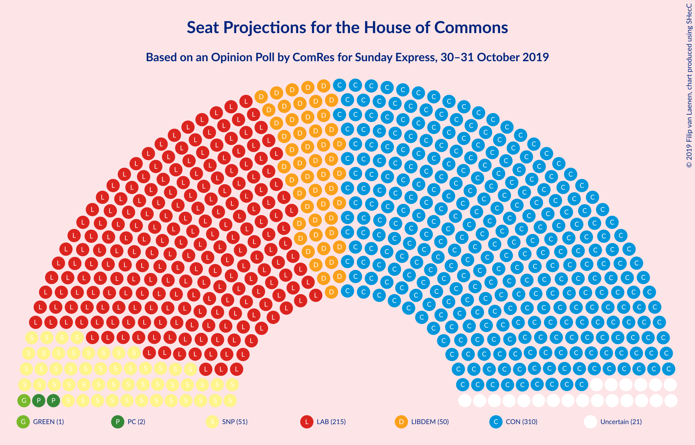
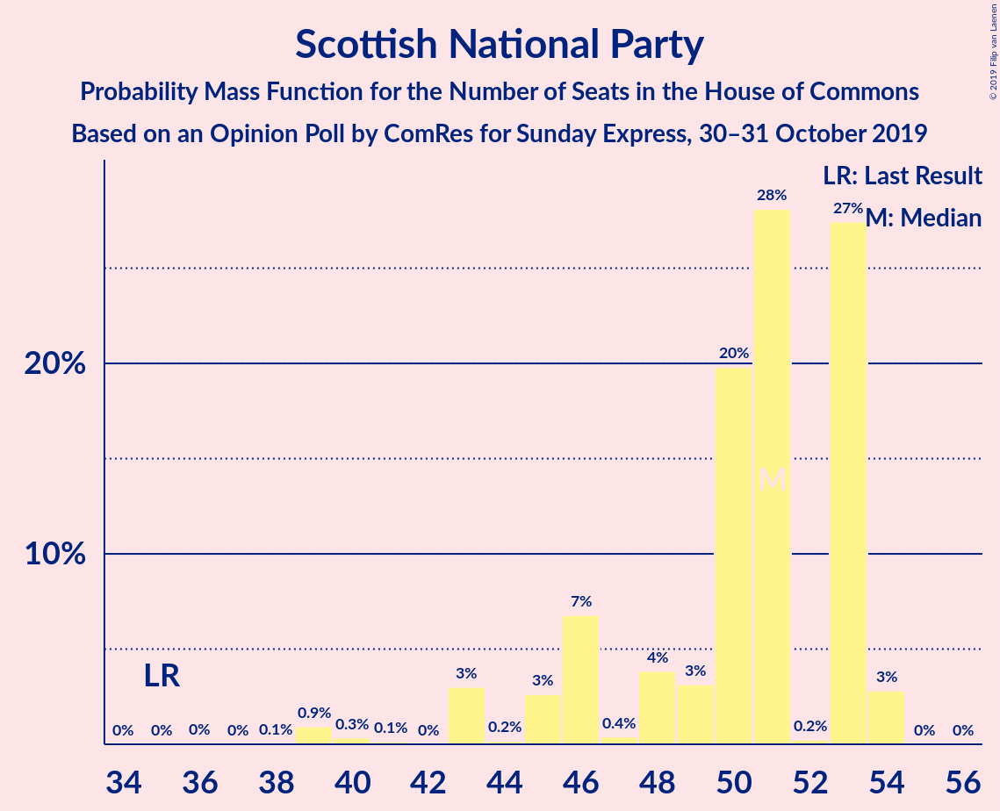
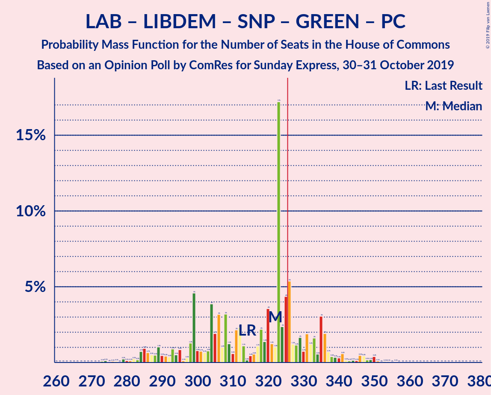

# Opinion Poll by ComRes for Sunday Express, 30–31 October 2019

<a href="#voting-intentions">Voting Intentions</a> | <a href="#seats">Seats</a> | <a href="#coalitions">Coalitions</a> | <a href="#technical-information">Technical Information</a>

## Voting Intentions

### Confidence Intervals

| Party | Last Result | Poll Result | 80% Confidence Interval | 90% Confidence Interval | 95% Confidence Interval | 99% Confidence Interval |
|:-----:|:-----------:|:-----------:|:-----------------------:|:-----------------------:|:-----------------------:|:-----------------------:|
| Conservative Party | 43.4% | 36.1% | 34.6–37.7% |34.1–38.1% |33.8–38.5% |33.0–39.3% |
| Labour Party | 41.0% | 28.1% | 26.6–29.6% |26.2–30.0% |25.9–30.3% |25.2–31.1% |
| Liberal Democrats | 7.6% | 17.1% | 15.9–18.3% |15.6–18.7% |15.3–19.0% |14.7–19.6% |
| Brexit Party | 0.0% | 10.1% | 9.1–11.1% |8.9–11.4% |8.7–11.6% |8.2–12.1% |
| Scottish National Party | 3.1% | 4.0% | 3.4–4.7% |3.2–4.9% |3.1–5.1% |2.9–5.4% |
| Green Party | 1.7% | 3.0% | 2.5–3.7% |2.4–3.8% |2.3–4.0% |2.1–4.3% |
| Plaid Cymru | 0.5% | 0.3% | 0.2–0.5% |0.1–0.6% |0.1–0.7% |0.1–0.8% |
| UK Independence Party | 1.9% | 0.3% | 0.2–0.5% |0.1–0.6% |0.1–0.7% |0.1–0.8% |
| Change UK | 0.0% | 0.3% | 0.2–0.5% |0.1–0.6% |0.1–0.7% |0.1–0.8% |

*Note:* The poll result column reflects the actual value used in the calculations. Published results may vary slightly, and in addition be rounded to fewer digits.

## Seats

### Confidence Intervals

| Party | Last Result | Median | 80% Confidence Interval | 90% Confidence Interval | 95% Confidence Interval | 99% Confidence Interval |
|:-----:|:-----------:|:------:|:-----------------------:|:-----------------------:|:-----------------------:|:-----------------------:|
| <a href="#conservative-party">Conservative Party</a> | 317 | 309 | 309–333 |299–333 |299–339 |286–350 |
| <a href="#labour-party">Labour Party</a> | 262 | 221 | 195–222 |195–222 |188–222 |182–234 |
| <a href="#liberal-democrats">Liberal Democrats</a> | 12 | 49 | 47–55 |47–59 |47–59 |42–61 |
| <a href="#brexit-party">Brexit Party</a> | 0 | 0 | 0 |0 |0 |0 |
| <a href="#scottish-national-party">Scottish National Party</a> | 35 | 51 | 50–53 |50–53 |45–53 |39–54 |
| <a href="#green-party">Green Party</a> | 1 | 1 | 1 |1 |1 |1–2 |
| <a href="#plaid-cymru">Plaid Cymru</a> | 4 | 2 | 2–3 |2–4 |0–4 |0–4 |
| <a href="#uk-independence-party">UK Independence Party</a> | 0 | 0 | 0 |0 |0 |0 |
| <a href="#change-uk">Change UK</a> | 0 | 0 | 0 |0 |0 |0 |

### Conservative Party

*For a full overview of the results for this party, see the [Conservative Party](party-conservativeparty.html) page.*

| Number of Seats | Probability | Accumulated | Special Marks |
|:---------------:|:-----------:|:-----------:|:-------------:|
| 265 | 0% | 100% |  |
| 266 | 0% | 99.9% |  |
| 267 | 0% | 99.9% |  |
| 268 | 0% | 99.9% |  |
| 269 | 0% | 99.9% |  |
| 270 | 0% | 99.9% |  |
| 271 | 0% | 99.9% |  |
| 272 | 0% | 99.9% |  |
| 273 | 0% | 99.9% |  |
| 274 | 0% | 99.9% |  |
| 275 | 0% | 99.9% |  |
| 276 | 0% | 99.9% |  |
| 277 | 0% | 99.9% |  |
| 278 | 0% | 99.9% |  |
| 279 | 0% | 99.9% |  |
| 280 | 0.1% | 99.9% |  |
| 281 | 0.1% | 99.8% |  |
| 282 | 0% | 99.7% |  |
| 283 | 0% | 99.7% |  |
| 284 | 0% | 99.7% |  |
| 285 | 0% | 99.7% |  |
| 286 | 0.3% | 99.7% |  |
| 287 | 0% | 99.3% |  |
| 288 | 0.2% | 99.3% |  |
| 289 | 0% | 99.1% |  |
| 290 | 0.3% | 99.1% |  |
| 291 | 0% | 98.8% |  |
| 292 | 0% | 98.8% |  |
| 293 | 0.3% | 98.8% |  |
| 294 | 0% | 98% |  |
| 295 | 0% | 98% |  |
| 296 | 0.2% | 98% |  |
| 297 | 0.1% | 98% |  |
| 298 | 0.1% | 98% |  |
| 299 | 3% | 98% |  |
| 300 | 0.1% | 95% |  |
| 301 | 0.1% | 94% |  |
| 302 | 0% | 94% |  |
| 303 | 0.1% | 94% |  |
| 304 | 0.1% | 94% |  |
| 305 | 0.1% | 94% |  |
| 306 | 2% | 94% |  |
| 307 | 0% | 92% |  |
| 308 | 1.4% | 92% |  |
| 309 | 61% | 91% | Median |
| 310 | 0.1% | 30% |  |
| 311 | 1.0% | 29% |  |
| 312 | 0.1% | 28% |  |
| 313 | 0.2% | 28% |  |
| 314 | 0.1% | 28% |  |
| 315 | 0.4% | 28% |  |
| 316 | 0% | 28% |  |
| 317 | 0% | 28% | Last Result |
| 318 | 0% | 28% |  |
| 319 | 1.4% | 28% |  |
| 320 | 2% | 26% |  |
| 321 | 0.1% | 25% |  |
| 322 | 0.7% | 24% |  |
| 323 | 2% | 24% |  |
| 324 | 0.2% | 22% |  |
| 325 | 0.5% | 22% |  |
| 326 | 0.2% | 21% | Majority |
| 327 | 0% | 21% |  |
| 328 | 0% | 21% |  |
| 329 | 0% | 21% |  |
| 330 | 0.3% | 21% |  |
| 331 | 0% | 21% |  |
| 332 | 3% | 21% |  |
| 333 | 14% | 18% |  |
| 334 | 0.1% | 4% |  |
| 335 | 0.7% | 4% |  |
| 336 | 0% | 4% |  |
| 337 | 0.7% | 4% |  |
| 338 | 0.2% | 3% |  |
| 339 | 0.4% | 3% |  |
| 340 | 0.1% | 2% |  |
| 341 | 0% | 2% |  |
| 342 | 0% | 2% |  |
| 343 | 0% | 2% |  |
| 344 | 0% | 2% |  |
| 345 | 0% | 2% |  |
| 346 | 0.1% | 2% |  |
| 347 | 1.2% | 2% |  |
| 348 | 0% | 0.8% |  |
| 349 | 0% | 0.8% |  |
| 350 | 0.5% | 0.8% |  |
| 351 | 0% | 0.2% |  |
| 352 | 0% | 0.2% |  |
| 353 | 0% | 0.2% |  |
| 354 | 0% | 0.2% |  |
| 355 | 0% | 0.2% |  |
| 356 | 0.1% | 0.2% |  |
| 357 | 0% | 0.1% |  |
| 358 | 0% | 0.1% |  |
| 359 | 0% | 0.1% |  |
| 360 | 0% | 0% |  |

### Labour Party

*For a full overview of the results for this party, see the [Labour Party](party-labourparty.html) page.*

| Number of Seats | Probability | Accumulated | Special Marks |
|:---------------:|:-----------:|:-----------:|:-------------:|
| 176 | 0% | 100% |  |
| 177 | 0.1% | 99.9% |  |
| 178 | 0.1% | 99.9% |  |
| 179 | 0.1% | 99.8% |  |
| 180 | 0% | 99.8% |  |
| 181 | 0.2% | 99.8% |  |
| 182 | 0.4% | 99.6% |  |
| 183 | 0% | 99.2% |  |
| 184 | 0% | 99.1% |  |
| 185 | 0.3% | 99.1% |  |
| 186 | 0% | 98.8% |  |
| 187 | 1.1% | 98.8% |  |
| 188 | 0.3% | 98% |  |
| 189 | 0% | 97% |  |
| 190 | 0.4% | 97% |  |
| 191 | 0.1% | 97% |  |
| 192 | 1.2% | 97% |  |
| 193 | 0% | 96% |  |
| 194 | 0% | 96% |  |
| 195 | 12% | 96% |  |
| 196 | 3% | 83% |  |
| 197 | 0% | 81% |  |
| 198 | 0% | 81% |  |
| 199 | 3% | 81% |  |
| 200 | 3% | 78% |  |
| 201 | 0% | 75% |  |
| 202 | 0.5% | 75% |  |
| 203 | 1.4% | 75% |  |
| 204 | 0.2% | 73% |  |
| 205 | 0.3% | 73% |  |
| 206 | 0.3% | 73% |  |
| 207 | 0.1% | 72% |  |
| 208 | 0% | 72% |  |
| 209 | 0% | 72% |  |
| 210 | 0.2% | 72% |  |
| 211 | 0.1% | 72% |  |
| 212 | 0.1% | 72% |  |
| 213 | 0.4% | 72% |  |
| 214 | 2% | 72% |  |
| 215 | 2% | 70% |  |
| 216 | 0% | 68% |  |
| 217 | 0% | 68% |  |
| 218 | 0% | 68% |  |
| 219 | 3% | 68% |  |
| 220 | 0.1% | 65% |  |
| 221 | 32% | 65% | Median |
| 222 | 31% | 33% |  |
| 223 | 0.1% | 2% |  |
| 224 | 0.1% | 2% |  |
| 225 | 0% | 2% |  |
| 226 | 0.1% | 2% |  |
| 227 | 0.1% | 2% |  |
| 228 | 0.3% | 2% |  |
| 229 | 0% | 1.4% |  |
| 230 | 0.1% | 1.3% |  |
| 231 | 0.2% | 1.2% |  |
| 232 | 0.2% | 1.0% |  |
| 233 | 0.1% | 0.8% |  |
| 234 | 0.6% | 0.8% |  |
| 235 | 0% | 0.2% |  |
| 236 | 0% | 0.1% |  |
| 237 | 0% | 0.1% |  |
| 238 | 0% | 0.1% |  |
| 239 | 0% | 0.1% |  |
| 240 | 0% | 0.1% |  |
| 241 | 0% | 0.1% |  |
| 242 | 0% | 0.1% |  |
| 243 | 0% | 0.1% |  |
| 244 | 0% | 0.1% |  |
| 245 | 0% | 0.1% |  |
| 246 | 0% | 0.1% |  |
| 247 | 0% | 0.1% |  |
| 248 | 0% | 0.1% |  |
| 249 | 0% | 0.1% |  |
| 250 | 0% | 0.1% |  |
| 251 | 0% | 0.1% |  |
| 252 | 0% | 0% |  |
| 253 | 0% | 0% |  |
| 254 | 0% | 0% |  |
| 255 | 0% | 0% |  |
| 256 | 0% | 0% |  |
| 257 | 0% | 0% |  |
| 258 | 0% | 0% |  |
| 259 | 0% | 0% |  |
| 260 | 0% | 0% |  |
| 261 | 0% | 0% |  |
| 262 | 0% | 0% | Last Result |

### Liberal Democrats

*For a full overview of the results for this party, see the [Liberal Democrats](party-liberaldemocrats.html) page.*

| Number of Seats | Probability | Accumulated | Special Marks |
|:---------------:|:-----------:|:-----------:|:-------------:|
| 12 | 0% | 100% | Last Result |
| 13 | 0% | 100% |  |
| 14 | 0% | 100% |  |
| 15 | 0% | 100% |  |
| 16 | 0% | 100% |  |
| 17 | 0% | 100% |  |
| 18 | 0% | 100% |  |
| 19 | 0% | 100% |  |
| 20 | 0% | 100% |  |
| 21 | 0% | 100% |  |
| 22 | 0% | 100% |  |
| 23 | 0% | 100% |  |
| 24 | 0% | 100% |  |
| 25 | 0% | 100% |  |
| 26 | 0% | 100% |  |
| 27 | 0% | 100% |  |
| 28 | 0% | 100% |  |
| 29 | 0% | 100% |  |
| 30 | 0% | 100% |  |
| 31 | 0% | 100% |  |
| 32 | 0% | 100% |  |
| 33 | 0% | 100% |  |
| 34 | 0% | 100% |  |
| 35 | 0% | 100% |  |
| 36 | 0% | 100% |  |
| 37 | 0% | 100% |  |
| 38 | 0% | 100% |  |
| 39 | 0% | 100% |  |
| 40 | 0% | 100% |  |
| 41 | 0% | 100% |  |
| 42 | 0.9% | 100% |  |
| 43 | 0.1% | 99.1% |  |
| 44 | 0% | 99.0% |  |
| 45 | 0.2% | 99.0% |  |
| 46 | 0.8% | 98.7% |  |
| 47 | 34% | 98% |  |
| 48 | 1.2% | 64% |  |
| 49 | 46% | 63% | Median |
| 50 | 0% | 17% |  |
| 51 | 1.4% | 17% |  |
| 52 | 0.5% | 16% |  |
| 53 | 0.1% | 15% |  |
| 54 | 4% | 15% |  |
| 55 | 2% | 11% |  |
| 56 | 0.6% | 9% |  |
| 57 | 0.2% | 8% |  |
| 58 | 2% | 8% |  |
| 59 | 4% | 6% |  |
| 60 | 1.2% | 2% |  |
| 61 | 0.6% | 1.1% |  |
| 62 | 0.1% | 0.4% |  |
| 63 | 0.1% | 0.4% |  |
| 64 | 0.1% | 0.2% |  |
| 65 | 0.1% | 0.2% |  |
| 66 | 0% | 0.1% |  |
| 67 | 0% | 0% |  |

### Brexit Party

*For a full overview of the results for this party, see the [Brexit Party](party-brexitparty.html) page.*

| Number of Seats | Probability | Accumulated | Special Marks |
|:---------------:|:-----------:|:-----------:|:-------------:|
| 0 | 99.8% | 100% | Last Result, Median |
| 1 | 0.2% | 0.2% |  |
| 2 | 0% | 0% |  |

### Scottish National Party

*For a full overview of the results for this party, see the [Scottish National Party](party-scottishnationalparty.html) page.*

| Number of Seats | Probability | Accumulated | Special Marks |
|:---------------:|:-----------:|:-----------:|:-------------:|
| 35 | 0% | 100% | Last Result |
| 36 | 0% | 100% |  |
| 37 | 0% | 100% |  |
| 38 | 0% | 100% |  |
| 39 | 1.3% | 100% |  |
| 40 | 0.1% | 98.7% |  |
| 41 | 0.4% | 98.6% |  |
| 42 | 0% | 98% |  |
| 43 | 0.1% | 98% |  |
| 44 | 0% | 98% |  |
| 45 | 0.5% | 98% |  |
| 46 | 0.3% | 97% |  |
| 47 | 0.7% | 97% |  |
| 48 | 0.5% | 96% |  |
| 49 | 0.6% | 96% |  |
| 50 | 33% | 95% |  |
| 51 | 51% | 62% | Median |
| 52 | 0% | 11% |  |
| 53 | 10% | 11% |  |
| 54 | 0.6% | 0.6% |  |
| 55 | 0% | 0% |  |

### Green Party

*For a full overview of the results for this party, see the [Green Party](party-greenparty.html) page.*

| Number of Seats | Probability | Accumulated | Special Marks |
|:---------------:|:-----------:|:-----------:|:-------------:|
| 1 | 98.5% | 100% | Last Result, Median |
| 2 | 1.5% | 1.5% |  |
| 3 | 0% | 0% |  |

### Plaid Cymru

*For a full overview of the results for this party, see the [Plaid Cymru](party-plaidcymru.html) page.*

| Number of Seats | Probability | Accumulated | Special Marks |
|:---------------:|:-----------:|:-----------:|:-------------:|
| 0 | 4% | 100% |  |
| 1 | 0.1% | 96% |  |
| 2 | 67% | 96% | Median |
| 3 | 24% | 29% |  |
| 4 | 6% | 6% | Last Result |
| 5 | 0% | 0% |  |

### UK Independence Party

*For a full overview of the results for this party, see the [UK Independence Party](party-ukindependenceparty.html) page.*

| Number of Seats | Probability | Accumulated | Special Marks |
|:---------------:|:-----------:|:-----------:|:-------------:|
| 0 | 100% | 100% | Last Result, Median |

### Change UK

*For a full overview of the results for this party, see the [Change UK](party-changeuk.html) page.*

| Number of Seats | Probability | Accumulated | Special Marks |
|:---------------:|:-----------:|:-----------:|:-------------:|
| 0 | 100% | 100% | Last Result, Median |

## Coalitions

### Confidence Intervals

| Coalition | Last Result | Median | Majority? | 80% Confidence Interval | 90% Confidence Interval | 95% Confidence Interval | 99% Confidence Interval |
|:---------:|:-----------:|:------:|:---------:|:-----------------------:|:-----------------------:|:-----------------------:|:-----------------------:|
| Conservative Party – Liberal Democrats – Change UK | 329 | 358 | 99.9% | 356–382 | 356–384 | 356–394 | 343–399 |
| Conservative Party – Liberal Democrats | 329 | 358 | 99.9% | 356–382 | 356–384 | 356–394 | 343–399 |
| Conservative Party – Scottish National Party – Plaid Cymru | 356 | 362 | 99.9% | 361–387 | 353–388 | 353–388 | 341–403 |
| Conservative Party – Scottish National Party | 352 | 360 | 99.9% | 359–384 | 350–385 | 350–386 | 339–401 |
| Conservative Party – Plaid Cymru | 321 | 311 | 24% | 311–336 | 302–336 | 302–342 | 288–353 |
| Conservative Party – Brexit Party | 317 | 309 | 21% | 309–333 | 299–333 | 299–339 | 286–350 |
| Conservative Party – Change UK | 317 | 309 | 21% | 309–333 | 299–333 | 299–339 | 286–350 |
| Conservative Party | 317 | 309 | 21% | 309–333 | 299–333 | 299–339 | 286–350 |
| Labour Party – Liberal Democrats – Scottish National Party – Green Party – Plaid Cymru | 314 | 323 | 8% | 299–323 | 299–333 | 293–333 | 282–346 |
| Labour Party – Liberal Democrats – Scottish National Party – Plaid Cymru | 313 | 322 | 6% | 298–322 | 298–332 | 292–332 | 281–345 |
| Labour Party – Liberal Democrats – Scottish National Party | 309 | 320 | 6% | 295–320 | 295–329 | 289–329 | 278–343 |
| Labour Party – Liberal Democrats – Plaid Cymru | 278 | 271 | 0% | 247–272 | 246–281 | 245–281 | 230–292 |
| Labour Party – Liberal Democrats – Change UK | 274 | 269 | 0% | 244–270 | 243–278 | 243–278 | 228–290 |
| Labour Party – Liberal Democrats | 274 | 269 | 0% | 244–270 | 243–278 | 243–278 | 228–290 |
| Labour Party – Scottish National Party – Plaid Cymru | 301 | 273 | 0% | 249–275 | 247–275 | 237–275 | 232–287 |
| Labour Party – Scottish National Party | 297 | 271 | 0% | 246–273 | 246–273 | 234–274 | 231–285 |
| Labour Party – Plaid Cymru | 266 | 223 | 0% | 198–224 | 198–224 | 190–224 | 185–235 |
| Labour Party – Change UK | 262 | 221 | 0% | 195–222 | 195–222 | 188–222 | 182–234 |
| Labour Party | 262 | 221 | 0% | 195–222 | 195–222 | 188–222 | 182–234 |

### Conservative Party – Liberal Democrats – Change UK

| Number of Seats | Probability | Accumulated | Special Marks |
|:---------------:|:-----------:|:-----------:|:-------------:|
| 325 | 0% | 100% |  |
| 326 | 0% | 99.9% | Majority |
| 327 | 0% | 99.9% |  |
| 328 | 0% | 99.9% |  |
| 329 | 0% | 99.9% | Last Result |
| 330 | 0% | 99.9% |  |
| 331 | 0% | 99.9% |  |
| 332 | 0% | 99.9% |  |
| 333 | 0% | 99.9% |  |
| 334 | 0% | 99.9% |  |
| 335 | 0% | 99.9% |  |
| 336 | 0% | 99.9% |  |
| 337 | 0% | 99.9% |  |
| 338 | 0% | 99.9% |  |
| 339 | 0% | 99.9% |  |
| 340 | 0% | 99.9% |  |
| 341 | 0% | 99.9% |  |
| 342 | 0.3% | 99.8% |  |
| 343 | 0.2% | 99.6% |  |
| 344 | 0.1% | 99.4% |  |
| 345 | 0% | 99.3% |  |
| 346 | 0.3% | 99.3% |  |
| 347 | 0% | 98.9% |  |
| 348 | 0.2% | 98.9% |  |
| 349 | 0.1% | 98.7% |  |
| 350 | 0.2% | 98.7% |  |
| 351 | 0% | 98.5% |  |
| 352 | 0.1% | 98% |  |
| 353 | 0.3% | 98% |  |
| 354 | 0.1% | 98% |  |
| 355 | 0.1% | 98% |  |
| 356 | 31% | 98% |  |
| 357 | 1.4% | 67% |  |
| 358 | 34% | 66% | Median |
| 359 | 1.1% | 32% |  |
| 360 | 1.4% | 31% |  |
| 361 | 0.2% | 29% |  |
| 362 | 0.1% | 29% |  |
| 363 | 0.1% | 29% |  |
| 364 | 0.1% | 29% |  |
| 365 | 0% | 29% |  |
| 366 | 0.4% | 29% |  |
| 367 | 0.6% | 29% |  |
| 368 | 0% | 28% |  |
| 369 | 0% | 28% |  |
| 370 | 0.1% | 28% |  |
| 371 | 0.8% | 28% |  |
| 372 | 0.1% | 27% |  |
| 373 | 0.6% | 27% |  |
| 374 | 0.3% | 26% |  |
| 375 | 2% | 26% |  |
| 376 | 0% | 24% |  |
| 377 | 3% | 24% |  |
| 378 | 0.1% | 21% |  |
| 379 | 4% | 21% |  |
| 380 | 0.1% | 18% |  |
| 381 | 0.1% | 17% |  |
| 382 | 12% | 17% |  |
| 383 | 0% | 5% |  |
| 384 | 0.7% | 5% |  |
| 385 | 0% | 4% |  |
| 386 | 0% | 4% |  |
| 387 | 0.2% | 4% |  |
| 388 | 0.3% | 4% |  |
| 389 | 0.1% | 4% |  |
| 390 | 0% | 4% |  |
| 391 | 1.1% | 4% |  |
| 392 | 0.2% | 3% |  |
| 393 | 0.1% | 3% |  |
| 394 | 0.1% | 3% |  |
| 395 | 0.2% | 2% |  |
| 396 | 0.1% | 2% |  |
| 397 | 0.5% | 2% |  |
| 398 | 1.1% | 2% |  |
| 399 | 0.1% | 0.5% |  |
| 400 | 0% | 0.4% |  |
| 401 | 0.3% | 0.4% |  |
| 402 | 0% | 0.1% |  |
| 403 | 0% | 0.1% |  |
| 404 | 0% | 0.1% |  |
| 405 | 0% | 0.1% |  |
| 406 | 0% | 0.1% |  |
| 407 | 0% | 0.1% |  |
| 408 | 0% | 0% |  |

### Conservative Party – Liberal Democrats

| Number of Seats | Probability | Accumulated | Special Marks |
|:---------------:|:-----------:|:-----------:|:-------------:|
| 325 | 0% | 100% |  |
| 326 | 0% | 99.9% | Majority |
| 327 | 0% | 99.9% |  |
| 328 | 0% | 99.9% |  |
| 329 | 0% | 99.9% | Last Result |
| 330 | 0% | 99.9% |  |
| 331 | 0% | 99.9% |  |
| 332 | 0% | 99.9% |  |
| 333 | 0% | 99.9% |  |
| 334 | 0% | 99.9% |  |
| 335 | 0% | 99.9% |  |
| 336 | 0% | 99.9% |  |
| 337 | 0% | 99.9% |  |
| 338 | 0% | 99.9% |  |
| 339 | 0% | 99.9% |  |
| 340 | 0% | 99.9% |  |
| 341 | 0% | 99.9% |  |
| 342 | 0.3% | 99.8% |  |
| 343 | 0.2% | 99.6% |  |
| 344 | 0.1% | 99.4% |  |
| 345 | 0% | 99.3% |  |
| 346 | 0.3% | 99.3% |  |
| 347 | 0% | 98.9% |  |
| 348 | 0.2% | 98.9% |  |
| 349 | 0.1% | 98.7% |  |
| 350 | 0.2% | 98.7% |  |
| 351 | 0% | 98.5% |  |
| 352 | 0.1% | 98% |  |
| 353 | 0.3% | 98% |  |
| 354 | 0.1% | 98% |  |
| 355 | 0.1% | 98% |  |
| 356 | 31% | 98% |  |
| 357 | 1.4% | 67% |  |
| 358 | 34% | 66% | Median |
| 359 | 1.1% | 32% |  |
| 360 | 1.4% | 31% |  |
| 361 | 0.2% | 29% |  |
| 362 | 0.1% | 29% |  |
| 363 | 0.1% | 29% |  |
| 364 | 0.1% | 29% |  |
| 365 | 0% | 29% |  |
| 366 | 0.4% | 29% |  |
| 367 | 0.6% | 29% |  |
| 368 | 0% | 28% |  |
| 369 | 0% | 28% |  |
| 370 | 0.1% | 28% |  |
| 371 | 0.8% | 28% |  |
| 372 | 0.1% | 27% |  |
| 373 | 0.6% | 27% |  |
| 374 | 0.3% | 26% |  |
| 375 | 2% | 26% |  |
| 376 | 0% | 24% |  |
| 377 | 3% | 24% |  |
| 378 | 0.1% | 21% |  |
| 379 | 4% | 21% |  |
| 380 | 0.1% | 18% |  |
| 381 | 0.1% | 17% |  |
| 382 | 12% | 17% |  |
| 383 | 0% | 5% |  |
| 384 | 0.7% | 5% |  |
| 385 | 0% | 4% |  |
| 386 | 0% | 4% |  |
| 387 | 0.2% | 4% |  |
| 388 | 0.3% | 4% |  |
| 389 | 0.1% | 4% |  |
| 390 | 0% | 4% |  |
| 391 | 1.1% | 4% |  |
| 392 | 0.2% | 3% |  |
| 393 | 0.1% | 3% |  |
| 394 | 0.1% | 3% |  |
| 395 | 0.2% | 2% |  |
| 396 | 0.1% | 2% |  |
| 397 | 0.5% | 2% |  |
| 398 | 1.1% | 2% |  |
| 399 | 0.1% | 0.5% |  |
| 400 | 0% | 0.4% |  |
| 401 | 0.3% | 0.4% |  |
| 402 | 0% | 0.1% |  |
| 403 | 0% | 0.1% |  |
| 404 | 0% | 0.1% |  |
| 405 | 0% | 0.1% |  |
| 406 | 0% | 0.1% |  |
| 407 | 0% | 0.1% |  |
| 408 | 0% | 0% |  |

### Conservative Party – Scottish National Party – Plaid Cymru

| Number of Seats | Probability | Accumulated | Special Marks |
|:---------------:|:-----------:|:-----------:|:-------------:|
| 318 | 0% | 100% |  |
| 319 | 0% | 99.9% |  |
| 320 | 0% | 99.9% |  |
| 321 | 0% | 99.9% |  |
| 322 | 0% | 99.9% |  |
| 323 | 0% | 99.9% |  |
| 324 | 0% | 99.9% |  |
| 325 | 0% | 99.9% |  |
| 326 | 0% | 99.9% | Majority |
| 327 | 0% | 99.9% |  |
| 328 | 0% | 99.9% |  |
| 329 | 0% | 99.9% |  |
| 330 | 0% | 99.9% |  |
| 331 | 0% | 99.9% |  |
| 332 | 0% | 99.9% |  |
| 333 | 0% | 99.9% |  |
| 334 | 0% | 99.9% |  |
| 335 | 0% | 99.8% |  |
| 336 | 0.1% | 99.8% |  |
| 337 | 0% | 99.8% |  |
| 338 | 0.1% | 99.7% |  |
| 339 | 0% | 99.7% |  |
| 340 | 0% | 99.6% |  |
| 341 | 0.5% | 99.6% |  |
| 342 | 0.1% | 99.1% |  |
| 343 | 0.3% | 99.0% |  |
| 344 | 0.1% | 98.6% |  |
| 345 | 0.2% | 98.6% |  |
| 346 | 0% | 98% |  |
| 347 | 0% | 98% |  |
| 348 | 0.1% | 98% |  |
| 349 | 0.1% | 98% |  |
| 350 | 0.1% | 98% |  |
| 351 | 0.1% | 98% |  |
| 352 | 0.1% | 98% |  |
| 353 | 3% | 98% |  |
| 354 | 0% | 94% |  |
| 355 | 0.5% | 94% |  |
| 356 | 0% | 94% | Last Result |
| 357 | 0.1% | 94% |  |
| 358 | 0% | 94% |  |
| 359 | 0.1% | 94% |  |
| 360 | 0.1% | 94% |  |
| 361 | 32% | 94% |  |
| 362 | 31% | 62% | Median |
| 363 | 2% | 31% |  |
| 364 | 0.1% | 29% |  |
| 365 | 0.1% | 29% |  |
| 366 | 0% | 29% |  |
| 367 | 0% | 29% |  |
| 368 | 1.5% | 29% |  |
| 369 | 0.1% | 28% |  |
| 370 | 0% | 27% |  |
| 371 | 0.4% | 27% |  |
| 372 | 0% | 27% |  |
| 373 | 0.6% | 27% |  |
| 374 | 0% | 26% |  |
| 375 | 0.4% | 26% |  |
| 376 | 2% | 26% |  |
| 377 | 0.9% | 24% |  |
| 378 | 2% | 23% |  |
| 379 | 0.1% | 21% |  |
| 380 | 0% | 21% |  |
| 381 | 0.2% | 21% |  |
| 382 | 0.7% | 21% |  |
| 383 | 0.7% | 20% |  |
| 384 | 0% | 19% |  |
| 385 | 0.3% | 19% |  |
| 386 | 1.1% | 19% |  |
| 387 | 12% | 18% |  |
| 388 | 4% | 6% |  |
| 389 | 0.6% | 2% |  |
| 390 | 0.1% | 1.3% |  |
| 391 | 0% | 1.2% |  |
| 392 | 0% | 1.2% |  |
| 393 | 0% | 1.2% |  |
| 394 | 0% | 1.1% |  |
| 395 | 0% | 1.1% |  |
| 396 | 0% | 1.1% |  |
| 397 | 0% | 1.1% |  |
| 398 | 0.3% | 1.1% |  |
| 399 | 0% | 0.8% |  |
| 400 | 0.2% | 0.8% |  |
| 401 | 0% | 0.6% |  |
| 402 | 0% | 0.6% |  |
| 403 | 0.1% | 0.6% |  |
| 404 | 0.2% | 0.4% |  |
| 405 | 0.2% | 0.2% |  |
| 406 | 0% | 0% |  |

### Conservative Party – Scottish National Party

| Number of Seats | Probability | Accumulated | Special Marks |
|:---------------:|:-----------:|:-----------:|:-------------:|
| 315 | 0% | 100% |  |
| 316 | 0% | 99.9% |  |
| 317 | 0% | 99.9% |  |
| 318 | 0% | 99.9% |  |
| 319 | 0% | 99.9% |  |
| 320 | 0% | 99.9% |  |
| 321 | 0% | 99.9% |  |
| 322 | 0% | 99.9% |  |
| 323 | 0% | 99.9% |  |
| 324 | 0% | 99.9% |  |
| 325 | 0% | 99.9% |  |
| 326 | 0% | 99.9% | Majority |
| 327 | 0% | 99.9% |  |
| 328 | 0% | 99.9% |  |
| 329 | 0% | 99.9% |  |
| 330 | 0% | 99.9% |  |
| 331 | 0% | 99.9% |  |
| 332 | 0% | 99.9% |  |
| 333 | 0.1% | 99.9% |  |
| 334 | 0.1% | 99.8% |  |
| 335 | 0% | 99.7% |  |
| 336 | 0% | 99.7% |  |
| 337 | 0.1% | 99.7% |  |
| 338 | 0% | 99.6% |  |
| 339 | 0.3% | 99.6% |  |
| 340 | 0% | 99.3% |  |
| 341 | 0.7% | 99.2% |  |
| 342 | 0.2% | 98.5% |  |
| 343 | 0.1% | 98% |  |
| 344 | 0% | 98% |  |
| 345 | 0% | 98% |  |
| 346 | 0.1% | 98% |  |
| 347 | 0% | 98% |  |
| 348 | 0.1% | 98% |  |
| 349 | 0.1% | 98% |  |
| 350 | 4% | 98% |  |
| 351 | 0% | 94% |  |
| 352 | 0% | 94% | Last Result |
| 353 | 0.1% | 94% |  |
| 354 | 0% | 94% |  |
| 355 | 0.5% | 94% |  |
| 356 | 0% | 94% |  |
| 357 | 0.1% | 94% |  |
| 358 | 0% | 94% |  |
| 359 | 32% | 94% |  |
| 360 | 31% | 62% | Median |
| 361 | 1.4% | 31% |  |
| 362 | 0.1% | 29% |  |
| 363 | 0.1% | 29% |  |
| 364 | 1.1% | 29% |  |
| 365 | 0.5% | 28% |  |
| 366 | 0.1% | 28% |  |
| 367 | 0% | 27% |  |
| 368 | 0% | 27% |  |
| 369 | 0.4% | 27% |  |
| 370 | 0.6% | 27% |  |
| 371 | 0.1% | 26% |  |
| 372 | 0.4% | 26% |  |
| 373 | 2% | 26% |  |
| 374 | 2% | 24% |  |
| 375 | 0.2% | 22% |  |
| 376 | 0.3% | 21% |  |
| 377 | 0.1% | 21% |  |
| 378 | 0% | 21% |  |
| 379 | 0.1% | 21% |  |
| 380 | 0.5% | 21% |  |
| 381 | 0% | 20% |  |
| 382 | 0.7% | 20% |  |
| 383 | 0.8% | 20% |  |
| 384 | 13% | 19% |  |
| 385 | 3% | 6% |  |
| 386 | 1.1% | 3% |  |
| 387 | 0.7% | 2% |  |
| 388 | 0% | 1.3% |  |
| 389 | 0% | 1.3% |  |
| 390 | 0.1% | 1.3% |  |
| 391 | 0% | 1.1% |  |
| 392 | 0% | 1.1% |  |
| 393 | 0% | 1.1% |  |
| 394 | 0% | 1.1% |  |
| 395 | 0.2% | 1.1% |  |
| 396 | 0% | 0.9% |  |
| 397 | 0.2% | 0.9% |  |
| 398 | 0% | 0.6% |  |
| 399 | 0% | 0.6% |  |
| 400 | 0% | 0.6% |  |
| 401 | 0.4% | 0.6% |  |
| 402 | 0.1% | 0.2% |  |
| 403 | 0.1% | 0.2% |  |
| 404 | 0% | 0% |  |

### Conservative Party – Plaid Cymru

| Number of Seats | Probability | Accumulated | Special Marks |
|:---------------:|:-----------:|:-----------:|:-------------:|
| 268 | 0% | 100% |  |
| 269 | 0% | 99.9% |  |
| 270 | 0% | 99.9% |  |
| 271 | 0% | 99.9% |  |
| 272 | 0% | 99.9% |  |
| 273 | 0% | 99.9% |  |
| 274 | 0% | 99.9% |  |
| 275 | 0% | 99.9% |  |
| 276 | 0% | 99.9% |  |
| 277 | 0% | 99.9% |  |
| 278 | 0% | 99.9% |  |
| 279 | 0% | 99.9% |  |
| 280 | 0% | 99.9% |  |
| 281 | 0% | 99.9% |  |
| 282 | 0% | 99.9% |  |
| 283 | 0.1% | 99.9% |  |
| 284 | 0% | 99.8% |  |
| 285 | 0.1% | 99.8% |  |
| 286 | 0% | 99.7% |  |
| 287 | 0% | 99.7% |  |
| 288 | 0.2% | 99.7% |  |
| 289 | 0.1% | 99.5% |  |
| 290 | 0.4% | 99.3% |  |
| 291 | 0.1% | 99.0% |  |
| 292 | 0.1% | 98.9% |  |
| 293 | 0% | 98.8% |  |
| 294 | 0% | 98.8% |  |
| 295 | 0.3% | 98.8% |  |
| 296 | 0% | 98% |  |
| 297 | 0% | 98% |  |
| 298 | 0.1% | 98% |  |
| 299 | 0.2% | 98% |  |
| 300 | 0.2% | 98% |  |
| 301 | 0.1% | 98% |  |
| 302 | 3% | 98% |  |
| 303 | 0.1% | 94% |  |
| 304 | 0.1% | 94% |  |
| 305 | 0.1% | 94% |  |
| 306 | 0.5% | 94% |  |
| 307 | 0.1% | 94% |  |
| 308 | 1.4% | 94% |  |
| 309 | 0.3% | 92% |  |
| 310 | 1.2% | 92% |  |
| 311 | 61% | 91% | Median |
| 312 | 0.4% | 30% |  |
| 313 | 0% | 29% |  |
| 314 | 0% | 29% |  |
| 315 | 1.2% | 29% |  |
| 316 | 0.1% | 28% |  |
| 317 | 0% | 28% |  |
| 318 | 0.4% | 28% |  |
| 319 | 0% | 28% |  |
| 320 | 0.1% | 28% |  |
| 321 | 0.4% | 28% | Last Result |
| 322 | 1.0% | 27% |  |
| 323 | 2% | 26% |  |
| 324 | 0.1% | 25% |  |
| 325 | 0.1% | 24% |  |
| 326 | 0.8% | 24% | Majority |
| 327 | 2% | 24% |  |
| 328 | 0.2% | 21% |  |
| 329 | 0% | 21% |  |
| 330 | 0% | 21% |  |
| 331 | 0% | 21% |  |
| 332 | 0.3% | 21% |  |
| 333 | 0.3% | 21% |  |
| 334 | 0% | 20% |  |
| 335 | 4% | 20% |  |
| 336 | 12% | 16% |  |
| 337 | 0.1% | 4% |  |
| 338 | 0% | 4% |  |
| 339 | 0.7% | 4% |  |
| 340 | 0.1% | 3% |  |
| 341 | 0% | 3% |  |
| 342 | 0.6% | 3% |  |
| 343 | 0% | 2% |  |
| 344 | 0% | 2% |  |
| 345 | 0% | 2% |  |
| 346 | 0% | 2% |  |
| 347 | 0.1% | 2% |  |
| 348 | 0% | 2% |  |
| 349 | 1.2% | 2% |  |
| 350 | 0.1% | 0.9% |  |
| 351 | 0% | 0.8% |  |
| 352 | 0% | 0.7% |  |
| 353 | 0.4% | 0.7% |  |
| 354 | 0.1% | 0.3% |  |
| 355 | 0% | 0.2% |  |
| 356 | 0.1% | 0.2% |  |
| 357 | 0% | 0.1% |  |
| 358 | 0% | 0.1% |  |
| 359 | 0% | 0.1% |  |
| 360 | 0% | 0.1% |  |
| 361 | 0% | 0% |  |

### Conservative Party – Brexit Party

| Number of Seats | Probability | Accumulated | Special Marks |
|:---------------:|:-----------:|:-----------:|:-------------:|
| 265 | 0% | 100% |  |
| 266 | 0% | 99.9% |  |
| 267 | 0% | 99.9% |  |
| 268 | 0% | 99.9% |  |
| 269 | 0% | 99.9% |  |
| 270 | 0% | 99.9% |  |
| 271 | 0% | 99.9% |  |
| 272 | 0% | 99.9% |  |
| 273 | 0% | 99.9% |  |
| 274 | 0% | 99.9% |  |
| 275 | 0% | 99.9% |  |
| 276 | 0% | 99.9% |  |
| 277 | 0% | 99.9% |  |
| 278 | 0% | 99.9% |  |
| 279 | 0% | 99.9% |  |
| 280 | 0.1% | 99.9% |  |
| 281 | 0.1% | 99.8% |  |
| 282 | 0% | 99.7% |  |
| 283 | 0% | 99.7% |  |
| 284 | 0% | 99.7% |  |
| 285 | 0% | 99.7% |  |
| 286 | 0.2% | 99.7% |  |
| 287 | 0.1% | 99.5% |  |
| 288 | 0.2% | 99.3% |  |
| 289 | 0% | 99.1% |  |
| 290 | 0.3% | 99.1% |  |
| 291 | 0% | 98.8% |  |
| 292 | 0% | 98.8% |  |
| 293 | 0.3% | 98.8% |  |
| 294 | 0% | 98% |  |
| 295 | 0% | 98% |  |
| 296 | 0.2% | 98% |  |
| 297 | 0.1% | 98% |  |
| 298 | 0.1% | 98% |  |
| 299 | 3% | 98% |  |
| 300 | 0.1% | 95% |  |
| 301 | 0.1% | 94% |  |
| 302 | 0% | 94% |  |
| 303 | 0.1% | 94% |  |
| 304 | 0.1% | 94% |  |
| 305 | 0.1% | 94% |  |
| 306 | 2% | 94% |  |
| 307 | 0% | 92% |  |
| 308 | 1.4% | 92% |  |
| 309 | 61% | 91% | Median |
| 310 | 0.1% | 30% |  |
| 311 | 1.0% | 29% |  |
| 312 | 0.1% | 28% |  |
| 313 | 0.2% | 28% |  |
| 314 | 0.1% | 28% |  |
| 315 | 0.4% | 28% |  |
| 316 | 0% | 28% |  |
| 317 | 0% | 28% | Last Result |
| 318 | 0% | 28% |  |
| 319 | 1.4% | 28% |  |
| 320 | 2% | 26% |  |
| 321 | 0.1% | 25% |  |
| 322 | 0.7% | 24% |  |
| 323 | 2% | 24% |  |
| 324 | 0.2% | 22% |  |
| 325 | 0.5% | 22% |  |
| 326 | 0.2% | 21% | Majority |
| 327 | 0% | 21% |  |
| 328 | 0% | 21% |  |
| 329 | 0% | 21% |  |
| 330 | 0.3% | 21% |  |
| 331 | 0% | 21% |  |
| 332 | 3% | 21% |  |
| 333 | 14% | 18% |  |
| 334 | 0.1% | 4% |  |
| 335 | 0.7% | 4% |  |
| 336 | 0% | 4% |  |
| 337 | 0.7% | 4% |  |
| 338 | 0.2% | 3% |  |
| 339 | 0.4% | 3% |  |
| 340 | 0.1% | 2% |  |
| 341 | 0% | 2% |  |
| 342 | 0% | 2% |  |
| 343 | 0% | 2% |  |
| 344 | 0% | 2% |  |
| 345 | 0% | 2% |  |
| 346 | 0.1% | 2% |  |
| 347 | 1.2% | 2% |  |
| 348 | 0% | 0.8% |  |
| 349 | 0% | 0.8% |  |
| 350 | 0.5% | 0.8% |  |
| 351 | 0% | 0.2% |  |
| 352 | 0% | 0.2% |  |
| 353 | 0% | 0.2% |  |
| 354 | 0% | 0.2% |  |
| 355 | 0% | 0.2% |  |
| 356 | 0.1% | 0.2% |  |
| 357 | 0% | 0.1% |  |
| 358 | 0% | 0.1% |  |
| 359 | 0% | 0.1% |  |
| 360 | 0% | 0% |  |

### Conservative Party – Change UK

| Number of Seats | Probability | Accumulated | Special Marks |
|:---------------:|:-----------:|:-----------:|:-------------:|
| 265 | 0% | 100% |  |
| 266 | 0% | 99.9% |  |
| 267 | 0% | 99.9% |  |
| 268 | 0% | 99.9% |  |
| 269 | 0% | 99.9% |  |
| 270 | 0% | 99.9% |  |
| 271 | 0% | 99.9% |  |
| 272 | 0% | 99.9% |  |
| 273 | 0% | 99.9% |  |
| 274 | 0% | 99.9% |  |
| 275 | 0% | 99.9% |  |
| 276 | 0% | 99.9% |  |
| 277 | 0% | 99.9% |  |
| 278 | 0% | 99.9% |  |
| 279 | 0% | 99.9% |  |
| 280 | 0.1% | 99.9% |  |
| 281 | 0.1% | 99.8% |  |
| 282 | 0% | 99.7% |  |
| 283 | 0% | 99.7% |  |
| 284 | 0% | 99.7% |  |
| 285 | 0% | 99.7% |  |
| 286 | 0.3% | 99.7% |  |
| 287 | 0% | 99.3% |  |
| 288 | 0.2% | 99.3% |  |
| 289 | 0% | 99.1% |  |
| 290 | 0.3% | 99.1% |  |
| 291 | 0% | 98.8% |  |
| 292 | 0% | 98.8% |  |
| 293 | 0.3% | 98.8% |  |
| 294 | 0% | 98% |  |
| 295 | 0% | 98% |  |
| 296 | 0.2% | 98% |  |
| 297 | 0.1% | 98% |  |
| 298 | 0.1% | 98% |  |
| 299 | 3% | 98% |  |
| 300 | 0.1% | 95% |  |
| 301 | 0.1% | 94% |  |
| 302 | 0% | 94% |  |
| 303 | 0.1% | 94% |  |
| 304 | 0.1% | 94% |  |
| 305 | 0.1% | 94% |  |
| 306 | 2% | 94% |  |
| 307 | 0% | 92% |  |
| 308 | 1.4% | 92% |  |
| 309 | 61% | 91% | Median |
| 310 | 0.1% | 30% |  |
| 311 | 1.0% | 29% |  |
| 312 | 0.1% | 28% |  |
| 313 | 0.2% | 28% |  |
| 314 | 0.1% | 28% |  |
| 315 | 0.4% | 28% |  |
| 316 | 0% | 28% |  |
| 317 | 0% | 28% | Last Result |
| 318 | 0% | 28% |  |
| 319 | 1.4% | 28% |  |
| 320 | 2% | 26% |  |
| 321 | 0.1% | 25% |  |
| 322 | 0.7% | 24% |  |
| 323 | 2% | 24% |  |
| 324 | 0.2% | 22% |  |
| 325 | 0.5% | 22% |  |
| 326 | 0.2% | 21% | Majority |
| 327 | 0% | 21% |  |
| 328 | 0% | 21% |  |
| 329 | 0% | 21% |  |
| 330 | 0.3% | 21% |  |
| 331 | 0% | 21% |  |
| 332 | 3% | 21% |  |
| 333 | 14% | 18% |  |
| 334 | 0.1% | 4% |  |
| 335 | 0.7% | 4% |  |
| 336 | 0% | 4% |  |
| 337 | 0.7% | 4% |  |
| 338 | 0.2% | 3% |  |
| 339 | 0.4% | 3% |  |
| 340 | 0.1% | 2% |  |
| 341 | 0% | 2% |  |
| 342 | 0% | 2% |  |
| 343 | 0% | 2% |  |
| 344 | 0% | 2% |  |
| 345 | 0% | 2% |  |
| 346 | 0.1% | 2% |  |
| 347 | 1.2% | 2% |  |
| 348 | 0% | 0.8% |  |
| 349 | 0% | 0.8% |  |
| 350 | 0.5% | 0.8% |  |
| 351 | 0% | 0.2% |  |
| 352 | 0% | 0.2% |  |
| 353 | 0% | 0.2% |  |
| 354 | 0% | 0.2% |  |
| 355 | 0% | 0.2% |  |
| 356 | 0.1% | 0.2% |  |
| 357 | 0% | 0.1% |  |
| 358 | 0% | 0.1% |  |
| 359 | 0% | 0.1% |  |
| 360 | 0% | 0% |  |

### Conservative Party

| Number of Seats | Probability | Accumulated | Special Marks |
|:---------------:|:-----------:|:-----------:|:-------------:|
| 265 | 0% | 100% |  |
| 266 | 0% | 99.9% |  |
| 267 | 0% | 99.9% |  |
| 268 | 0% | 99.9% |  |
| 269 | 0% | 99.9% |  |
| 270 | 0% | 99.9% |  |
| 271 | 0% | 99.9% |  |
| 272 | 0% | 99.9% |  |
| 273 | 0% | 99.9% |  |
| 274 | 0% | 99.9% |  |
| 275 | 0% | 99.9% |  |
| 276 | 0% | 99.9% |  |
| 277 | 0% | 99.9% |  |
| 278 | 0% | 99.9% |  |
| 279 | 0% | 99.9% |  |
| 280 | 0.1% | 99.9% |  |
| 281 | 0.1% | 99.8% |  |
| 282 | 0% | 99.7% |  |
| 283 | 0% | 99.7% |  |
| 284 | 0% | 99.7% |  |
| 285 | 0% | 99.7% |  |
| 286 | 0.3% | 99.7% |  |
| 287 | 0% | 99.3% |  |
| 288 | 0.2% | 99.3% |  |
| 289 | 0% | 99.1% |  |
| 290 | 0.3% | 99.1% |  |
| 291 | 0% | 98.8% |  |
| 292 | 0% | 98.8% |  |
| 293 | 0.3% | 98.8% |  |
| 294 | 0% | 98% |  |
| 295 | 0% | 98% |  |
| 296 | 0.2% | 98% |  |
| 297 | 0.1% | 98% |  |
| 298 | 0.1% | 98% |  |
| 299 | 3% | 98% |  |
| 300 | 0.1% | 95% |  |
| 301 | 0.1% | 94% |  |
| 302 | 0% | 94% |  |
| 303 | 0.1% | 94% |  |
| 304 | 0.1% | 94% |  |
| 305 | 0.1% | 94% |  |
| 306 | 2% | 94% |  |
| 307 | 0% | 92% |  |
| 308 | 1.4% | 92% |  |
| 309 | 61% | 91% | Median |
| 310 | 0.1% | 30% |  |
| 311 | 1.0% | 29% |  |
| 312 | 0.1% | 28% |  |
| 313 | 0.2% | 28% |  |
| 314 | 0.1% | 28% |  |
| 315 | 0.4% | 28% |  |
| 316 | 0% | 28% |  |
| 317 | 0% | 28% | Last Result |
| 318 | 0% | 28% |  |
| 319 | 1.4% | 28% |  |
| 320 | 2% | 26% |  |
| 321 | 0.1% | 25% |  |
| 322 | 0.7% | 24% |  |
| 323 | 2% | 24% |  |
| 324 | 0.2% | 22% |  |
| 325 | 0.5% | 22% |  |
| 326 | 0.2% | 21% | Majority |
| 327 | 0% | 21% |  |
| 328 | 0% | 21% |  |
| 329 | 0% | 21% |  |
| 330 | 0.3% | 21% |  |
| 331 | 0% | 21% |  |
| 332 | 3% | 21% |  |
| 333 | 14% | 18% |  |
| 334 | 0.1% | 4% |  |
| 335 | 0.7% | 4% |  |
| 336 | 0% | 4% |  |
| 337 | 0.7% | 4% |  |
| 338 | 0.2% | 3% |  |
| 339 | 0.4% | 3% |  |
| 340 | 0.1% | 2% |  |
| 341 | 0% | 2% |  |
| 342 | 0% | 2% |  |
| 343 | 0% | 2% |  |
| 344 | 0% | 2% |  |
| 345 | 0% | 2% |  |
| 346 | 0.1% | 2% |  |
| 347 | 1.2% | 2% |  |
| 348 | 0% | 0.8% |  |
| 349 | 0% | 0.8% |  |
| 350 | 0.5% | 0.8% |  |
| 351 | 0% | 0.2% |  |
| 352 | 0% | 0.2% |  |
| 353 | 0% | 0.2% |  |
| 354 | 0% | 0.2% |  |
| 355 | 0% | 0.2% |  |
| 356 | 0.1% | 0.2% |  |
| 357 | 0% | 0.1% |  |
| 358 | 0% | 0.1% |  |
| 359 | 0% | 0.1% |  |
| 360 | 0% | 0% |  |

### Labour Party – Liberal Democrats – Scottish National Party – Green Party – Plaid Cymru

| Number of Seats | Probability | Accumulated | Special Marks |
|:---------------:|:-----------:|:-----------:|:-------------:|
| 273 | 0% | 100% |  |
| 274 | 0% | 99.9% |  |
| 275 | 0% | 99.9% |  |
| 276 | 0.1% | 99.9% |  |
| 277 | 0% | 99.8% |  |
| 278 | 0% | 99.8% |  |
| 279 | 0% | 99.8% |  |
| 280 | 0% | 99.8% |  |
| 281 | 0% | 99.8% |  |
| 282 | 0.5% | 99.8% |  |
| 283 | 0% | 99.2% |  |
| 284 | 0% | 99.2% |  |
| 285 | 1.2% | 99.2% |  |
| 286 | 0.1% | 98% |  |
| 287 | 0% | 98% |  |
| 288 | 0% | 98% |  |
| 289 | 0% | 98% |  |
| 290 | 0% | 98% |  |
| 291 | 0% | 98% |  |
| 292 | 0.1% | 98% |  |
| 293 | 0.4% | 98% |  |
| 294 | 0.2% | 97% |  |
| 295 | 0.7% | 97% |  |
| 296 | 0% | 96% |  |
| 297 | 0.7% | 96% |  |
| 298 | 0.1% | 96% |  |
| 299 | 14% | 96% |  |
| 300 | 3% | 82% |  |
| 301 | 0% | 79% |  |
| 302 | 0.3% | 79% |  |
| 303 | 0% | 79% |  |
| 304 | 0% | 79% |  |
| 305 | 0% | 79% |  |
| 306 | 0.2% | 79% |  |
| 307 | 0.5% | 79% |  |
| 308 | 0.2% | 78% |  |
| 309 | 2% | 78% |  |
| 310 | 0.7% | 76% |  |
| 311 | 0.1% | 76% |  |
| 312 | 2% | 75% |  |
| 313 | 1.4% | 74% |  |
| 314 | 0% | 72% | Last Result |
| 315 | 0% | 72% |  |
| 316 | 0% | 72% |  |
| 317 | 0.4% | 72% |  |
| 318 | 0.1% | 72% |  |
| 319 | 0.2% | 72% |  |
| 320 | 0.1% | 72% |  |
| 321 | 1.0% | 72% |  |
| 322 | 0.1% | 71% |  |
| 323 | 61% | 70% |  |
| 324 | 1.4% | 9% | Median |
| 325 | 0% | 8% |  |
| 326 | 2% | 8% | Majority |
| 327 | 0.1% | 6% |  |
| 328 | 0.1% | 6% |  |
| 329 | 0.1% | 6% |  |
| 330 | 0% | 6% |  |
| 331 | 0.1% | 6% |  |
| 332 | 0.1% | 6% |  |
| 333 | 3% | 5% |  |
| 334 | 0.1% | 2% |  |
| 335 | 0.1% | 2% |  |
| 336 | 0.2% | 2% |  |
| 337 | 0% | 2% |  |
| 338 | 0% | 2% |  |
| 339 | 0.3% | 2% |  |
| 340 | 0% | 1.2% |  |
| 341 | 0% | 1.2% |  |
| 342 | 0.3% | 1.2% |  |
| 343 | 0% | 0.9% |  |
| 344 | 0.2% | 0.9% |  |
| 345 | 0.1% | 0.7% |  |
| 346 | 0.2% | 0.5% |  |
| 347 | 0% | 0.3% |  |
| 348 | 0% | 0.3% |  |
| 349 | 0% | 0.3% |  |
| 350 | 0% | 0.3% |  |
| 351 | 0.1% | 0.3% |  |
| 352 | 0.1% | 0.2% |  |
| 353 | 0% | 0.1% |  |
| 354 | 0% | 0.1% |  |
| 355 | 0% | 0.1% |  |
| 356 | 0% | 0.1% |  |
| 357 | 0% | 0.1% |  |
| 358 | 0% | 0.1% |  |
| 359 | 0% | 0.1% |  |
| 360 | 0% | 0.1% |  |
| 361 | 0% | 0.1% |  |
| 362 | 0% | 0.1% |  |
| 363 | 0% | 0.1% |  |
| 364 | 0% | 0.1% |  |
| 365 | 0% | 0.1% |  |
| 366 | 0% | 0.1% |  |
| 367 | 0% | 0.1% |  |
| 368 | 0% | 0% |  |

### Labour Party – Liberal Democrats – Scottish National Party – Plaid Cymru

| Number of Seats | Probability | Accumulated | Special Marks |
|:---------------:|:-----------:|:-----------:|:-------------:|
| 272 | 0% | 100% |  |
| 273 | 0% | 99.9% |  |
| 274 | 0% | 99.9% |  |
| 275 | 0.1% | 99.9% |  |
| 276 | 0% | 99.8% |  |
| 277 | 0% | 99.8% |  |
| 278 | 0% | 99.8% |  |
| 279 | 0% | 99.8% |  |
| 280 | 0% | 99.8% |  |
| 281 | 0.5% | 99.8% |  |
| 282 | 0% | 99.2% |  |
| 283 | 0% | 99.2% |  |
| 284 | 1.2% | 99.2% |  |
| 285 | 0.1% | 98% |  |
| 286 | 0% | 98% |  |
| 287 | 0% | 98% |  |
| 288 | 0% | 98% |  |
| 289 | 0% | 98% |  |
| 290 | 0% | 98% |  |
| 291 | 0.1% | 98% |  |
| 292 | 0.4% | 98% |  |
| 293 | 0.2% | 97% |  |
| 294 | 0.7% | 97% |  |
| 295 | 0% | 96% |  |
| 296 | 0.7% | 96% |  |
| 297 | 0.1% | 96% |  |
| 298 | 14% | 96% |  |
| 299 | 3% | 82% |  |
| 300 | 0% | 79% |  |
| 301 | 0.3% | 79% |  |
| 302 | 0% | 79% |  |
| 303 | 0% | 79% |  |
| 304 | 0% | 79% |  |
| 305 | 0.4% | 79% |  |
| 306 | 0.3% | 79% |  |
| 307 | 0.2% | 78% |  |
| 308 | 2% | 78% |  |
| 309 | 0.7% | 76% |  |
| 310 | 0.1% | 76% |  |
| 311 | 3% | 75% |  |
| 312 | 0.4% | 73% |  |
| 313 | 0% | 72% | Last Result |
| 314 | 0% | 72% |  |
| 315 | 0% | 72% |  |
| 316 | 0.4% | 72% |  |
| 317 | 0.1% | 72% |  |
| 318 | 0.2% | 72% |  |
| 319 | 0.1% | 72% |  |
| 320 | 1.0% | 72% |  |
| 321 | 0.1% | 71% |  |
| 322 | 61% | 70% |  |
| 323 | 1.4% | 9% | Median |
| 324 | 0% | 8% |  |
| 325 | 2% | 8% |  |
| 326 | 0.1% | 6% | Majority |
| 327 | 0.1% | 6% |  |
| 328 | 0.1% | 6% |  |
| 329 | 0.1% | 6% |  |
| 330 | 0.1% | 6% |  |
| 331 | 0.1% | 5% |  |
| 332 | 3% | 5% |  |
| 333 | 0.1% | 2% |  |
| 334 | 0.1% | 2% |  |
| 335 | 0.2% | 2% |  |
| 336 | 0% | 2% |  |
| 337 | 0% | 2% |  |
| 338 | 0.3% | 2% |  |
| 339 | 0% | 1.2% |  |
| 340 | 0% | 1.2% |  |
| 341 | 0.3% | 1.2% |  |
| 342 | 0% | 0.9% |  |
| 343 | 0.2% | 0.9% |  |
| 344 | 0.1% | 0.7% |  |
| 345 | 0.2% | 0.5% |  |
| 346 | 0% | 0.3% |  |
| 347 | 0.1% | 0.3% |  |
| 348 | 0% | 0.3% |  |
| 349 | 0% | 0.3% |  |
| 350 | 0.1% | 0.3% |  |
| 351 | 0.1% | 0.2% |  |
| 352 | 0% | 0.1% |  |
| 353 | 0% | 0.1% |  |
| 354 | 0% | 0.1% |  |
| 355 | 0% | 0.1% |  |
| 356 | 0% | 0.1% |  |
| 357 | 0% | 0.1% |  |
| 358 | 0% | 0.1% |  |
| 359 | 0% | 0.1% |  |
| 360 | 0% | 0.1% |  |
| 361 | 0% | 0.1% |  |
| 362 | 0% | 0.1% |  |
| 363 | 0% | 0.1% |  |
| 364 | 0% | 0.1% |  |
| 365 | 0% | 0.1% |  |
| 366 | 0% | 0.1% |  |
| 367 | 0% | 0% |  |

### Labour Party – Liberal Democrats – Scottish National Party

| Number of Seats | Probability | Accumulated | Special Marks |
|:---------------:|:-----------:|:-----------:|:-------------:|
| 271 | 0% | 100% |  |
| 272 | 0% | 99.9% |  |
| 273 | 0% | 99.9% |  |
| 274 | 0% | 99.9% |  |
| 275 | 0.1% | 99.9% |  |
| 276 | 0% | 99.8% |  |
| 277 | 0.1% | 99.8% |  |
| 278 | 0.4% | 99.7% |  |
| 279 | 0% | 99.3% |  |
| 280 | 0% | 99.3% |  |
| 281 | 0.1% | 99.2% |  |
| 282 | 1.2% | 99.1% |  |
| 283 | 0% | 98% |  |
| 284 | 0.1% | 98% |  |
| 285 | 0% | 98% |  |
| 286 | 0% | 98% |  |
| 287 | 0% | 98% |  |
| 288 | 0% | 98% |  |
| 289 | 0.6% | 98% |  |
| 290 | 0% | 97% |  |
| 291 | 0.1% | 97% |  |
| 292 | 0.6% | 97% |  |
| 293 | 0% | 96% |  |
| 294 | 0.1% | 96% |  |
| 295 | 12% | 96% |  |
| 296 | 4% | 84% |  |
| 297 | 0% | 80% |  |
| 298 | 0.3% | 80% |  |
| 299 | 0.3% | 79% |  |
| 300 | 0% | 79% |  |
| 301 | 0% | 79% |  |
| 302 | 0% | 79% |  |
| 303 | 0.4% | 79% |  |
| 304 | 2% | 79% |  |
| 305 | 0.8% | 76% |  |
| 306 | 0.1% | 76% |  |
| 307 | 0.1% | 76% |  |
| 308 | 3% | 75% |  |
| 309 | 0% | 73% | Last Result |
| 310 | 0.4% | 73% |  |
| 311 | 0.1% | 72% |  |
| 312 | 0% | 72% |  |
| 313 | 0.4% | 72% |  |
| 314 | 0% | 72% |  |
| 315 | 0.2% | 72% |  |
| 316 | 1.1% | 72% |  |
| 317 | 0% | 71% |  |
| 318 | 0% | 71% |  |
| 319 | 0.4% | 71% |  |
| 320 | 61% | 70% |  |
| 321 | 1.3% | 9% | Median |
| 322 | 0.2% | 8% |  |
| 323 | 1.4% | 8% |  |
| 324 | 0.1% | 6% |  |
| 325 | 0.5% | 6% |  |
| 326 | 0.1% | 6% | Majority |
| 327 | 0% | 6% |  |
| 328 | 0.1% | 6% |  |
| 329 | 3% | 6% |  |
| 330 | 0.1% | 2% |  |
| 331 | 0.2% | 2% |  |
| 332 | 0.2% | 2% |  |
| 333 | 0.1% | 2% |  |
| 334 | 0% | 2% |  |
| 335 | 0% | 2% |  |
| 336 | 0.3% | 2% |  |
| 337 | 0.1% | 1.2% |  |
| 338 | 0% | 1.2% |  |
| 339 | 0.1% | 1.2% |  |
| 340 | 0.1% | 1.1% |  |
| 341 | 0.5% | 1.0% |  |
| 342 | 0% | 0.5% |  |
| 343 | 0.2% | 0.5% |  |
| 344 | 0% | 0.3% |  |
| 345 | 0% | 0.3% |  |
| 346 | 0.1% | 0.3% |  |
| 347 | 0% | 0.2% |  |
| 348 | 0.1% | 0.2% |  |
| 349 | 0% | 0.1% |  |
| 350 | 0% | 0.1% |  |
| 351 | 0% | 0.1% |  |
| 352 | 0% | 0.1% |  |
| 353 | 0% | 0.1% |  |
| 354 | 0% | 0.1% |  |
| 355 | 0% | 0.1% |  |
| 356 | 0% | 0.1% |  |
| 357 | 0% | 0.1% |  |
| 358 | 0% | 0.1% |  |
| 359 | 0% | 0.1% |  |
| 360 | 0% | 0.1% |  |
| 361 | 0% | 0.1% |  |
| 362 | 0% | 0.1% |  |
| 363 | 0% | 0.1% |  |
| 364 | 0% | 0% |  |

### Labour Party – Liberal Democrats – Plaid Cymru

| Number of Seats | Probability | Accumulated | Special Marks |
|:---------------:|:-----------:|:-----------:|:-------------:|
| 228 | 0.1% | 100% |  |
| 229 | 0.1% | 99.8% |  |
| 230 | 0.4% | 99.8% |  |
| 231 | 0% | 99.4% |  |
| 232 | 0% | 99.4% |  |
| 233 | 0% | 99.4% |  |
| 234 | 0.2% | 99.4% |  |
| 235 | 0% | 99.1% |  |
| 236 | 0.2% | 99.1% |  |
| 237 | 0% | 98.9% |  |
| 238 | 0% | 98.9% |  |
| 239 | 0% | 98.9% |  |
| 240 | 0% | 98.9% |  |
| 241 | 0.1% | 98.8% |  |
| 242 | 0% | 98.7% |  |
| 243 | 0% | 98.7% |  |
| 244 | 0.7% | 98.7% |  |
| 245 | 1.1% | 98% |  |
| 246 | 3% | 97% |  |
| 247 | 13% | 94% |  |
| 248 | 0.8% | 81% |  |
| 249 | 0.6% | 80% |  |
| 250 | 0% | 80% |  |
| 251 | 0.5% | 80% |  |
| 252 | 0.1% | 79% |  |
| 253 | 0.1% | 79% |  |
| 254 | 0.3% | 79% |  |
| 255 | 0.1% | 79% |  |
| 256 | 0.2% | 79% |  |
| 257 | 2% | 78% |  |
| 258 | 3% | 76% |  |
| 259 | 0% | 74% |  |
| 260 | 0.6% | 74% |  |
| 261 | 0% | 73% |  |
| 262 | 0.5% | 73% |  |
| 263 | 0% | 73% |  |
| 264 | 0% | 73% |  |
| 265 | 0.1% | 73% |  |
| 266 | 0.5% | 72% |  |
| 267 | 1.1% | 72% |  |
| 268 | 0.1% | 71% |  |
| 269 | 0.1% | 71% |  |
| 270 | 2% | 71% |  |
| 271 | 31% | 69% |  |
| 272 | 32% | 38% | Median |
| 273 | 0% | 6% |  |
| 274 | 0.1% | 6% |  |
| 275 | 0% | 6% |  |
| 276 | 0.5% | 6% |  |
| 277 | 0.1% | 6% |  |
| 278 | 0.1% | 6% | Last Result |
| 279 | 0% | 6% |  |
| 280 | 0% | 6% |  |
| 281 | 4% | 6% |  |
| 282 | 0.1% | 2% |  |
| 283 | 0.1% | 2% |  |
| 284 | 0% | 2% |  |
| 285 | 0.1% | 2% |  |
| 286 | 0% | 2% |  |
| 287 | 0% | 2% |  |
| 288 | 0.1% | 2% |  |
| 289 | 0.2% | 2% |  |
| 290 | 0.7% | 1.5% |  |
| 291 | 0.2% | 0.8% |  |
| 292 | 0.2% | 0.6% |  |
| 293 | 0% | 0.4% |  |
| 294 | 0.1% | 0.4% |  |
| 295 | 0% | 0.3% |  |
| 296 | 0% | 0.3% |  |
| 297 | 0.1% | 0.3% |  |
| 298 | 0.1% | 0.2% |  |
| 299 | 0% | 0.1% |  |
| 300 | 0% | 0.1% |  |
| 301 | 0% | 0.1% |  |
| 302 | 0% | 0.1% |  |
| 303 | 0% | 0.1% |  |
| 304 | 0% | 0.1% |  |
| 305 | 0% | 0.1% |  |
| 306 | 0% | 0.1% |  |
| 307 | 0% | 0.1% |  |
| 308 | 0% | 0.1% |  |
| 309 | 0% | 0.1% |  |
| 310 | 0% | 0.1% |  |
| 311 | 0% | 0.1% |  |
| 312 | 0% | 0.1% |  |
| 313 | 0% | 0.1% |  |
| 314 | 0% | 0.1% |  |
| 315 | 0% | 0.1% |  |
| 316 | 0% | 0.1% |  |
| 317 | 0% | 0% |  |

### Labour Party – Liberal Democrats – Change UK

| Number of Seats | Probability | Accumulated | Special Marks |
|:---------------:|:-----------:|:-----------:|:-------------:|
| 226 | 0.2% | 100% |  |
| 227 | 0.2% | 99.8% |  |
| 228 | 0.1% | 99.6% |  |
| 229 | 0% | 99.4% |  |
| 230 | 0% | 99.4% |  |
| 231 | 0.2% | 99.4% |  |
| 232 | 0% | 99.2% |  |
| 233 | 0.3% | 99.2% |  |
| 234 | 0% | 98.9% |  |
| 235 | 0% | 98.9% |  |
| 236 | 0% | 98.9% |  |
| 237 | 0% | 98.9% |  |
| 238 | 0% | 98.9% |  |
| 239 | 0% | 98.8% |  |
| 240 | 0% | 98.8% |  |
| 241 | 0.1% | 98.8% |  |
| 242 | 0.6% | 98.7% |  |
| 243 | 4% | 98% |  |
| 244 | 12% | 94% |  |
| 245 | 1.1% | 82% |  |
| 246 | 0.3% | 81% |  |
| 247 | 0% | 81% |  |
| 248 | 0.8% | 81% |  |
| 249 | 0.7% | 80% |  |
| 250 | 0.2% | 79% |  |
| 251 | 0% | 79% |  |
| 252 | 0.3% | 79% |  |
| 253 | 2% | 79% |  |
| 254 | 0.9% | 77% |  |
| 255 | 2% | 76% |  |
| 256 | 0% | 74% |  |
| 257 | 0.5% | 74% |  |
| 258 | 0.1% | 73% |  |
| 259 | 0% | 73% |  |
| 260 | 0.4% | 73% |  |
| 261 | 0% | 73% |  |
| 262 | 0.1% | 73% |  |
| 263 | 1.5% | 72% |  |
| 264 | 0% | 71% |  |
| 265 | 0% | 71% |  |
| 266 | 0.1% | 71% |  |
| 267 | 0.2% | 71% |  |
| 268 | 2% | 71% |  |
| 269 | 31% | 69% |  |
| 270 | 32% | 38% | Median |
| 271 | 0.1% | 6% |  |
| 272 | 0.1% | 6% |  |
| 273 | 0% | 6% |  |
| 274 | 0.1% | 6% | Last Result |
| 275 | 0% | 6% |  |
| 276 | 0.5% | 6% |  |
| 277 | 0% | 6% |  |
| 278 | 3% | 6% |  |
| 279 | 0.1% | 2% |  |
| 280 | 0.1% | 2% |  |
| 281 | 0.1% | 2% |  |
| 282 | 0% | 2% |  |
| 283 | 0.1% | 2% |  |
| 284 | 0% | 2% |  |
| 285 | 0% | 2% |  |
| 286 | 0.2% | 2% |  |
| 287 | 0.1% | 1.4% |  |
| 288 | 0.5% | 1.4% |  |
| 289 | 0% | 0.9% |  |
| 290 | 0.5% | 0.9% |  |
| 291 | 0% | 0.4% |  |
| 292 | 0.1% | 0.4% |  |
| 293 | 0.1% | 0.3% |  |
| 294 | 0% | 0.3% |  |
| 295 | 0.1% | 0.2% |  |
| 296 | 0% | 0.2% |  |
| 297 | 0% | 0.1% |  |
| 298 | 0% | 0.1% |  |
| 299 | 0% | 0.1% |  |
| 300 | 0% | 0.1% |  |
| 301 | 0% | 0.1% |  |
| 302 | 0% | 0.1% |  |
| 303 | 0% | 0.1% |  |
| 304 | 0% | 0.1% |  |
| 305 | 0% | 0.1% |  |
| 306 | 0% | 0.1% |  |
| 307 | 0% | 0.1% |  |
| 308 | 0% | 0.1% |  |
| 309 | 0% | 0.1% |  |
| 310 | 0% | 0.1% |  |
| 311 | 0% | 0.1% |  |
| 312 | 0% | 0.1% |  |
| 313 | 0% | 0.1% |  |
| 314 | 0% | 0% |  |

### Labour Party – Liberal Democrats

| Number of Seats | Probability | Accumulated | Special Marks |
|:---------------:|:-----------:|:-----------:|:-------------:|
| 226 | 0.2% | 100% |  |
| 227 | 0.2% | 99.8% |  |
| 228 | 0.1% | 99.6% |  |
| 229 | 0% | 99.4% |  |
| 230 | 0% | 99.4% |  |
| 231 | 0.2% | 99.4% |  |
| 232 | 0% | 99.2% |  |
| 233 | 0.3% | 99.2% |  |
| 234 | 0% | 98.9% |  |
| 235 | 0% | 98.9% |  |
| 236 | 0% | 98.9% |  |
| 237 | 0% | 98.9% |  |
| 238 | 0% | 98.9% |  |
| 239 | 0% | 98.8% |  |
| 240 | 0% | 98.8% |  |
| 241 | 0.1% | 98.8% |  |
| 242 | 0.6% | 98.7% |  |
| 243 | 4% | 98% |  |
| 244 | 12% | 94% |  |
| 245 | 1.1% | 82% |  |
| 246 | 0.3% | 81% |  |
| 247 | 0% | 81% |  |
| 248 | 0.8% | 81% |  |
| 249 | 0.7% | 80% |  |
| 250 | 0.2% | 79% |  |
| 251 | 0% | 79% |  |
| 252 | 0.3% | 79% |  |
| 253 | 2% | 79% |  |
| 254 | 0.9% | 77% |  |
| 255 | 2% | 76% |  |
| 256 | 0% | 74% |  |
| 257 | 0.5% | 74% |  |
| 258 | 0.1% | 73% |  |
| 259 | 0% | 73% |  |
| 260 | 0.4% | 73% |  |
| 261 | 0% | 73% |  |
| 262 | 0.1% | 73% |  |
| 263 | 1.5% | 72% |  |
| 264 | 0% | 71% |  |
| 265 | 0% | 71% |  |
| 266 | 0.1% | 71% |  |
| 267 | 0.2% | 71% |  |
| 268 | 2% | 71% |  |
| 269 | 31% | 69% |  |
| 270 | 32% | 38% | Median |
| 271 | 0.1% | 6% |  |
| 272 | 0.1% | 6% |  |
| 273 | 0% | 6% |  |
| 274 | 0.1% | 6% | Last Result |
| 275 | 0% | 6% |  |
| 276 | 0.5% | 6% |  |
| 277 | 0% | 6% |  |
| 278 | 3% | 6% |  |
| 279 | 0.1% | 2% |  |
| 280 | 0.1% | 2% |  |
| 281 | 0.1% | 2% |  |
| 282 | 0% | 2% |  |
| 283 | 0.1% | 2% |  |
| 284 | 0% | 2% |  |
| 285 | 0% | 2% |  |
| 286 | 0.2% | 2% |  |
| 287 | 0.1% | 1.4% |  |
| 288 | 0.5% | 1.4% |  |
| 289 | 0% | 0.9% |  |
| 290 | 0.5% | 0.9% |  |
| 291 | 0% | 0.4% |  |
| 292 | 0.1% | 0.4% |  |
| 293 | 0.1% | 0.3% |  |
| 294 | 0% | 0.3% |  |
| 295 | 0.1% | 0.2% |  |
| 296 | 0% | 0.2% |  |
| 297 | 0% | 0.1% |  |
| 298 | 0% | 0.1% |  |
| 299 | 0% | 0.1% |  |
| 300 | 0% | 0.1% |  |
| 301 | 0% | 0.1% |  |
| 302 | 0% | 0.1% |  |
| 303 | 0% | 0.1% |  |
| 304 | 0% | 0.1% |  |
| 305 | 0% | 0.1% |  |
| 306 | 0% | 0.1% |  |
| 307 | 0% | 0.1% |  |
| 308 | 0% | 0.1% |  |
| 309 | 0% | 0.1% |  |
| 310 | 0% | 0.1% |  |
| 311 | 0% | 0.1% |  |
| 312 | 0% | 0.1% |  |
| 313 | 0% | 0.1% |  |
| 314 | 0% | 0% |  |

### Labour Party – Scottish National Party – Plaid Cymru

| Number of Seats | Probability | Accumulated | Special Marks |
|:---------------:|:-----------:|:-----------:|:-------------:|
| 224 | 0% | 100% |  |
| 225 | 0% | 99.9% |  |
| 226 | 0% | 99.9% |  |
| 227 | 0% | 99.9% |  |
| 228 | 0% | 99.9% |  |
| 229 | 0% | 99.9% |  |
| 230 | 0.3% | 99.9% |  |
| 231 | 0% | 99.6% |  |
| 232 | 0.1% | 99.6% |  |
| 233 | 1.1% | 99.5% |  |
| 234 | 0.5% | 98% |  |
| 235 | 0.1% | 98% |  |
| 236 | 0.2% | 98% |  |
| 237 | 0.1% | 98% |  |
| 238 | 0.1% | 97% |  |
| 239 | 0.2% | 97% |  |
| 240 | 1.1% | 97% |  |
| 241 | 0% | 96% |  |
| 242 | 0.1% | 96% |  |
| 243 | 0.3% | 96% |  |
| 244 | 0.2% | 96% |  |
| 245 | 0% | 96% |  |
| 246 | 0% | 96% |  |
| 247 | 0.7% | 96% |  |
| 248 | 0% | 95% |  |
| 249 | 12% | 95% |  |
| 250 | 0.1% | 83% |  |
| 251 | 0.1% | 83% |  |
| 252 | 4% | 82% |  |
| 253 | 0.1% | 79% |  |
| 254 | 3% | 79% |  |
| 255 | 0% | 76% |  |
| 256 | 2% | 76% |  |
| 257 | 0.8% | 74% |  |
| 258 | 0.2% | 73% |  |
| 259 | 0.7% | 73% |  |
| 260 | 0.2% | 72% |  |
| 261 | 0.1% | 72% |  |
| 262 | 0% | 72% |  |
| 263 | 0% | 72% |  |
| 264 | 0.6% | 72% |  |
| 265 | 0.4% | 71% |  |
| 266 | 0% | 71% |  |
| 267 | 0.1% | 71% |  |
| 268 | 0.1% | 71% |  |
| 269 | 0.1% | 71% |  |
| 270 | 0.2% | 71% |  |
| 271 | 1.4% | 71% |  |
| 272 | 1.1% | 69% |  |
| 273 | 34% | 68% |  |
| 274 | 1.5% | 34% | Median |
| 275 | 31% | 33% |  |
| 276 | 0.2% | 2% |  |
| 277 | 0.1% | 2% |  |
| 278 | 0.3% | 2% |  |
| 279 | 0.1% | 2% |  |
| 280 | 0% | 2% |  |
| 281 | 0.2% | 1.5% |  |
| 282 | 0.1% | 1.3% |  |
| 283 | 0.2% | 1.2% |  |
| 284 | 0% | 1.1% |  |
| 285 | 0.3% | 1.1% |  |
| 286 | 0% | 0.7% |  |
| 287 | 0.2% | 0.7% |  |
| 288 | 0.1% | 0.5% |  |
| 289 | 0.3% | 0.4% |  |
| 290 | 0% | 0.2% |  |
| 291 | 0% | 0.1% |  |
| 292 | 0% | 0.1% |  |
| 293 | 0% | 0.1% |  |
| 294 | 0% | 0.1% |  |
| 295 | 0% | 0.1% |  |
| 296 | 0% | 0.1% |  |
| 297 | 0% | 0.1% |  |
| 298 | 0% | 0.1% |  |
| 299 | 0% | 0.1% |  |
| 300 | 0% | 0.1% |  |
| 301 | 0% | 0.1% | Last Result |
| 302 | 0% | 0.1% |  |
| 303 | 0% | 0.1% |  |
| 304 | 0% | 0.1% |  |
| 305 | 0% | 0.1% |  |
| 306 | 0% | 0.1% |  |
| 307 | 0% | 0% |  |

### Labour Party – Scottish National Party

| Number of Seats | Probability | Accumulated | Special Marks |
|:---------------:|:-----------:|:-----------:|:-------------:|
| 221 | 0% | 100% |  |
| 222 | 0% | 99.9% |  |
| 223 | 0% | 99.9% |  |
| 224 | 0% | 99.9% |  |
| 225 | 0% | 99.9% |  |
| 226 | 0% | 99.9% |  |
| 227 | 0.2% | 99.9% |  |
| 228 | 0% | 99.7% |  |
| 229 | 0.1% | 99.6% |  |
| 230 | 0% | 99.6% |  |
| 231 | 2% | 99.6% |  |
| 232 | 0.3% | 98% |  |
| 233 | 0.2% | 98% |  |
| 234 | 0.1% | 98% |  |
| 235 | 0.1% | 97% |  |
| 236 | 0.2% | 97% |  |
| 237 | 0% | 97% |  |
| 238 | 1.1% | 97% |  |
| 239 | 0% | 96% |  |
| 240 | 0.2% | 96% |  |
| 241 | 0.3% | 96% |  |
| 242 | 0.1% | 96% |  |
| 243 | 0% | 96% |  |
| 244 | 0% | 96% |  |
| 245 | 0% | 95% |  |
| 246 | 12% | 95% |  |
| 247 | 0.7% | 83% |  |
| 248 | 0% | 83% |  |
| 249 | 3% | 83% |  |
| 250 | 3% | 80% |  |
| 251 | 0% | 77% |  |
| 252 | 0.3% | 77% |  |
| 253 | 2% | 76% |  |
| 254 | 0.7% | 74% |  |
| 255 | 0.4% | 74% |  |
| 256 | 0.7% | 73% |  |
| 257 | 0.3% | 72% |  |
| 258 | 0% | 72% |  |
| 259 | 0.1% | 72% |  |
| 260 | 0% | 72% |  |
| 261 | 0.1% | 72% |  |
| 262 | 0.1% | 72% |  |
| 263 | 0.4% | 72% |  |
| 264 | 0.5% | 71% |  |
| 265 | 0.1% | 71% |  |
| 266 | 0% | 71% |  |
| 267 | 1.2% | 71% |  |
| 268 | 1.3% | 70% |  |
| 269 | 0.1% | 68% |  |
| 270 | 3% | 68% |  |
| 271 | 31% | 65% |  |
| 272 | 0.3% | 34% | Median |
| 273 | 30% | 34% |  |
| 274 | 2% | 3% |  |
| 275 | 0.1% | 2% |  |
| 276 | 0.3% | 2% |  |
| 277 | 0.1% | 2% |  |
| 278 | 0.2% | 2% |  |
| 279 | 0.1% | 1.3% |  |
| 280 | 0.1% | 1.2% |  |
| 281 | 0% | 1.1% |  |
| 282 | 0% | 1.1% |  |
| 283 | 0.1% | 1.1% |  |
| 284 | 0.1% | 0.9% |  |
| 285 | 0.3% | 0.8% |  |
| 286 | 0% | 0.5% |  |
| 287 | 0.3% | 0.5% |  |
| 288 | 0% | 0.1% |  |
| 289 | 0% | 0.1% |  |
| 290 | 0% | 0.1% |  |
| 291 | 0% | 0.1% |  |
| 292 | 0% | 0.1% |  |
| 293 | 0% | 0.1% |  |
| 294 | 0% | 0.1% |  |
| 295 | 0% | 0.1% |  |
| 296 | 0% | 0.1% |  |
| 297 | 0% | 0.1% | Last Result |
| 298 | 0% | 0.1% |  |
| 299 | 0% | 0.1% |  |
| 300 | 0% | 0.1% |  |
| 301 | 0% | 0.1% |  |
| 302 | 0% | 0.1% |  |
| 303 | 0% | 0.1% |  |
| 304 | 0% | 0.1% |  |
| 305 | 0% | 0% |  |

### Labour Party – Plaid Cymru

| Number of Seats | Probability | Accumulated | Special Marks |
|:---------------:|:-----------:|:-----------:|:-------------:|
| 178 | 0% | 100% |  |
| 179 | 0.1% | 99.9% |  |
| 180 | 0.1% | 99.9% |  |
| 181 | 0% | 99.8% |  |
| 182 | 0% | 99.8% |  |
| 183 | 0% | 99.8% |  |
| 184 | 0.1% | 99.8% |  |
| 185 | 0.6% | 99.7% |  |
| 186 | 0% | 99.1% |  |
| 187 | 0.1% | 99.1% |  |
| 188 | 0.2% | 99.0% |  |
| 189 | 1.1% | 98.8% |  |
| 190 | 0.3% | 98% |  |
| 191 | 0% | 97% |  |
| 192 | 0.1% | 97% |  |
| 193 | 0.4% | 97% |  |
| 194 | 1.2% | 97% |  |
| 195 | 0% | 96% |  |
| 196 | 0% | 96% |  |
| 197 | 0% | 96% |  |
| 198 | 12% | 96% |  |
| 199 | 3% | 83% |  |
| 200 | 0.7% | 81% |  |
| 201 | 0% | 80% |  |
| 202 | 1.0% | 80% |  |
| 203 | 4% | 79% |  |
| 204 | 0.2% | 75% |  |
| 205 | 0.2% | 75% |  |
| 206 | 1.5% | 75% |  |
| 207 | 0.2% | 73% |  |
| 208 | 0.3% | 73% |  |
| 209 | 0.1% | 72% |  |
| 210 | 0.1% | 72% |  |
| 211 | 0.1% | 72% |  |
| 212 | 0% | 72% |  |
| 213 | 0.1% | 72% |  |
| 214 | 0.1% | 72% |  |
| 215 | 0.9% | 72% |  |
| 216 | 0.1% | 71% |  |
| 217 | 0.4% | 71% |  |
| 218 | 1.3% | 71% |  |
| 219 | 1.1% | 69% |  |
| 220 | 0% | 68% |  |
| 221 | 1.4% | 68% |  |
| 222 | 3% | 67% |  |
| 223 | 31% | 63% | Median |
| 224 | 30% | 33% |  |
| 225 | 0.3% | 2% |  |
| 226 | 0.1% | 2% |  |
| 227 | 0% | 2% |  |
| 228 | 0% | 2% |  |
| 229 | 0% | 2% |  |
| 230 | 0.5% | 2% |  |
| 231 | 0% | 1.4% |  |
| 232 | 0.1% | 1.3% |  |
| 233 | 0.1% | 1.3% |  |
| 234 | 0.5% | 1.2% |  |
| 235 | 0.2% | 0.7% |  |
| 236 | 0.3% | 0.5% |  |
| 237 | 0% | 0.2% |  |
| 238 | 0% | 0.2% |  |
| 239 | 0% | 0.1% |  |
| 240 | 0% | 0.1% |  |
| 241 | 0% | 0.1% |  |
| 242 | 0% | 0.1% |  |
| 243 | 0% | 0.1% |  |
| 244 | 0% | 0.1% |  |
| 245 | 0% | 0.1% |  |
| 246 | 0% | 0.1% |  |
| 247 | 0% | 0.1% |  |
| 248 | 0% | 0.1% |  |
| 249 | 0% | 0.1% |  |
| 250 | 0% | 0.1% |  |
| 251 | 0% | 0.1% |  |
| 252 | 0% | 0.1% |  |
| 253 | 0% | 0.1% |  |
| 254 | 0% | 0% |  |
| 255 | 0% | 0% |  |
| 256 | 0% | 0% |  |
| 257 | 0% | 0% |  |
| 258 | 0% | 0% |  |
| 259 | 0% | 0% |  |
| 260 | 0% | 0% |  |
| 261 | 0% | 0% |  |
| 262 | 0% | 0% |  |
| 263 | 0% | 0% |  |
| 264 | 0% | 0% |  |
| 265 | 0% | 0% |  |
| 266 | 0% | 0% | Last Result |

### Labour Party – Change UK

| Number of Seats | Probability | Accumulated | Special Marks |
|:---------------:|:-----------:|:-----------:|:-------------:|
| 176 | 0% | 100% |  |
| 177 | 0.1% | 99.9% |  |
| 178 | 0.1% | 99.9% |  |
| 179 | 0.1% | 99.8% |  |
| 180 | 0% | 99.8% |  |
| 181 | 0.2% | 99.8% |  |
| 182 | 0.4% | 99.6% |  |
| 183 | 0% | 99.2% |  |
| 184 | 0% | 99.1% |  |
| 185 | 0.3% | 99.1% |  |
| 186 | 0% | 98.8% |  |
| 187 | 1.1% | 98.8% |  |
| 188 | 0.3% | 98% |  |
| 189 | 0% | 97% |  |
| 190 | 0.4% | 97% |  |
| 191 | 0.1% | 97% |  |
| 192 | 1.2% | 97% |  |
| 193 | 0% | 96% |  |
| 194 | 0% | 96% |  |
| 195 | 12% | 96% |  |
| 196 | 3% | 83% |  |
| 197 | 0% | 81% |  |
| 198 | 0% | 81% |  |
| 199 | 3% | 81% |  |
| 200 | 3% | 78% |  |
| 201 | 0% | 75% |  |
| 202 | 0.5% | 75% |  |
| 203 | 1.4% | 75% |  |
| 204 | 0.2% | 73% |  |
| 205 | 0.3% | 73% |  |
| 206 | 0.3% | 73% |  |
| 207 | 0.1% | 72% |  |
| 208 | 0% | 72% |  |
| 209 | 0% | 72% |  |
| 210 | 0.2% | 72% |  |
| 211 | 0.1% | 72% |  |
| 212 | 0.1% | 72% |  |
| 213 | 0.4% | 72% |  |
| 214 | 2% | 72% |  |
| 215 | 2% | 70% |  |
| 216 | 0% | 68% |  |
| 217 | 0% | 68% |  |
| 218 | 0% | 68% |  |
| 219 | 3% | 68% |  |
| 220 | 0.1% | 65% |  |
| 221 | 32% | 65% | Median |
| 222 | 31% | 33% |  |
| 223 | 0.1% | 2% |  |
| 224 | 0.1% | 2% |  |
| 225 | 0% | 2% |  |
| 226 | 0.1% | 2% |  |
| 227 | 0.1% | 2% |  |
| 228 | 0.3% | 2% |  |
| 229 | 0% | 1.4% |  |
| 230 | 0.1% | 1.3% |  |
| 231 | 0.2% | 1.2% |  |
| 232 | 0.2% | 1.0% |  |
| 233 | 0.1% | 0.8% |  |
| 234 | 0.6% | 0.8% |  |
| 235 | 0% | 0.2% |  |
| 236 | 0% | 0.1% |  |
| 237 | 0% | 0.1% |  |
| 238 | 0% | 0.1% |  |
| 239 | 0% | 0.1% |  |
| 240 | 0% | 0.1% |  |
| 241 | 0% | 0.1% |  |
| 242 | 0% | 0.1% |  |
| 243 | 0% | 0.1% |  |
| 244 | 0% | 0.1% |  |
| 245 | 0% | 0.1% |  |
| 246 | 0% | 0.1% |  |
| 247 | 0% | 0.1% |  |
| 248 | 0% | 0.1% |  |
| 249 | 0% | 0.1% |  |
| 250 | 0% | 0.1% |  |
| 251 | 0% | 0.1% |  |
| 252 | 0% | 0% |  |
| 253 | 0% | 0% |  |
| 254 | 0% | 0% |  |
| 255 | 0% | 0% |  |
| 256 | 0% | 0% |  |
| 257 | 0% | 0% |  |
| 258 | 0% | 0% |  |
| 259 | 0% | 0% |  |
| 260 | 0% | 0% |  |
| 261 | 0% | 0% |  |
| 262 | 0% | 0% | Last Result |

### Labour Party

| Number of Seats | Probability | Accumulated | Special Marks |
|:---------------:|:-----------:|:-----------:|:-------------:|
| 176 | 0% | 100% |  |
| 177 | 0.1% | 99.9% |  |
| 178 | 0.1% | 99.9% |  |
| 179 | 0.1% | 99.8% |  |
| 180 | 0% | 99.8% |  |
| 181 | 0.2% | 99.8% |  |
| 182 | 0.4% | 99.6% |  |
| 183 | 0% | 99.2% |  |
| 184 | 0% | 99.1% |  |
| 185 | 0.3% | 99.1% |  |
| 186 | 0% | 98.8% |  |
| 187 | 1.1% | 98.8% |  |
| 188 | 0.3% | 98% |  |
| 189 | 0% | 97% |  |
| 190 | 0.4% | 97% |  |
| 191 | 0.1% | 97% |  |
| 192 | 1.2% | 97% |  |
| 193 | 0% | 96% |  |
| 194 | 0% | 96% |  |
| 195 | 12% | 96% |  |
| 196 | 3% | 83% |  |
| 197 | 0% | 81% |  |
| 198 | 0% | 81% |  |
| 199 | 3% | 81% |  |
| 200 | 3% | 78% |  |
| 201 | 0% | 75% |  |
| 202 | 0.5% | 75% |  |
| 203 | 1.4% | 75% |  |
| 204 | 0.2% | 73% |  |
| 205 | 0.3% | 73% |  |
| 206 | 0.3% | 73% |  |
| 207 | 0.1% | 72% |  |
| 208 | 0% | 72% |  |
| 209 | 0% | 72% |  |
| 210 | 0.2% | 72% |  |
| 211 | 0.1% | 72% |  |
| 212 | 0.1% | 72% |  |
| 213 | 0.4% | 72% |  |
| 214 | 2% | 72% |  |
| 215 | 2% | 70% |  |
| 216 | 0% | 68% |  |
| 217 | 0% | 68% |  |
| 218 | 0% | 68% |  |
| 219 | 3% | 68% |  |
| 220 | 0.1% | 65% |  |
| 221 | 32% | 65% | Median |
| 222 | 31% | 33% |  |
| 223 | 0.1% | 2% |  |
| 224 | 0.1% | 2% |  |
| 225 | 0% | 2% |  |
| 226 | 0.1% | 2% |  |
| 227 | 0.1% | 2% |  |
| 228 | 0.3% | 2% |  |
| 229 | 0% | 1.4% |  |
| 230 | 0.1% | 1.3% |  |
| 231 | 0.2% | 1.2% |  |
| 232 | 0.2% | 1.0% |  |
| 233 | 0.1% | 0.8% |  |
| 234 | 0.6% | 0.8% |  |
| 235 | 0% | 0.2% |  |
| 236 | 0% | 0.1% |  |
| 237 | 0% | 0.1% |  |
| 238 | 0% | 0.1% |  |
| 239 | 0% | 0.1% |  |
| 240 | 0% | 0.1% |  |
| 241 | 0% | 0.1% |  |
| 242 | 0% | 0.1% |  |
| 243 | 0% | 0.1% |  |
| 244 | 0% | 0.1% |  |
| 245 | 0% | 0.1% |  |
| 246 | 0% | 0.1% |  |
| 247 | 0% | 0.1% |  |
| 248 | 0% | 0.1% |  |
| 249 | 0% | 0.1% |  |
| 250 | 0% | 0.1% |  |
| 251 | 0% | 0.1% |  |
| 252 | 0% | 0% |  |
| 253 | 0% | 0% |  |
| 254 | 0% | 0% |  |
| 255 | 0% | 0% |  |
| 256 | 0% | 0% |  |
| 257 | 0% | 0% |  |
| 258 | 0% | 0% |  |
| 259 | 0% | 0% |  |
| 260 | 0% | 0% |  |
| 261 | 0% | 0% |  |
| 262 | 0% | 0% | Last Result |

## Technical Information

### Opinion Poll

+ **Polling firm:** ComRes
+ **Commissioner(s):** Sunday Express
+ **Fieldwork period:** 30–31 October 2019

### Calculations

+ **Sample size:** 1582
+ **Simulations done:** 131,072
+ **Error estimate:** 0.61%

