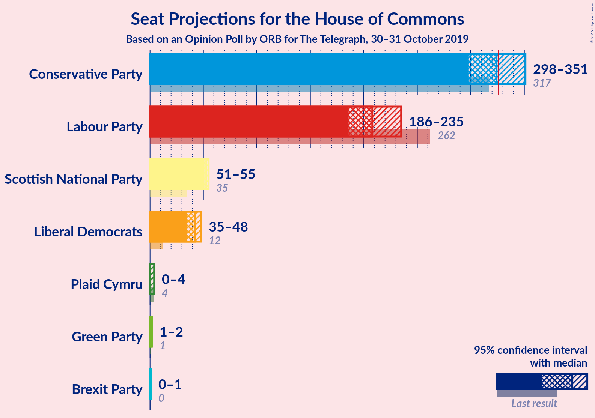
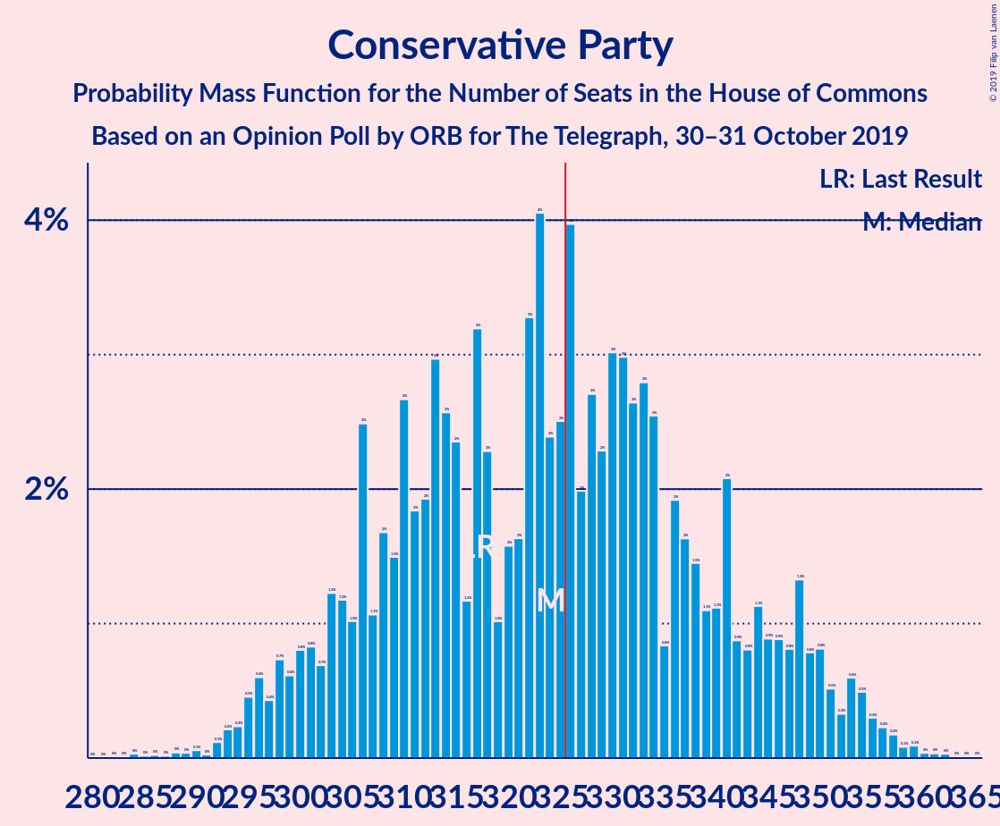

# Opinion Poll by ORB for The Telegraph, 30–31 October 2019

<a href="#voting-intentions">Voting Intentions</a> | <a href="#seats">Seats</a> | <a href="#coalitions">Coalitions</a> | <a href="#technical-information">Technical Information</a>

## Voting Intentions

### Confidence Intervals

| Party | Last Result | Poll Result | 80% Confidence Interval | 90% Confidence Interval | 95% Confidence Interval | 99% Confidence Interval |
|:-----:|:-----------:|:-----------:|:-----------------------:|:-----------------------:|:-----------------------:|:-----------------------:|
| Conservative Party | 43.4% | 35.9% | 34.6–37.3% |34.2–37.7% |33.8–38.0% |33.2–38.7% |
| Labour Party | 41.0% | 28.0% | 26.7–29.3% |26.3–29.6% |26.0–29.9% |25.4–30.6% |
| Liberal Democrats | 7.6% | 14.0% | 13.0–15.0% |12.8–15.3% |12.5–15.6% |12.1–16.1% |
| Brexit Party | 0.0% | 12.0% | 11.1–12.9% |10.8–13.2% |10.6–13.4% |10.2–13.9% |
| Scottish National Party | 3.1% | 5.0% | 4.4–5.7% |4.3–5.9% |4.1–6.0% |3.9–6.4% |
| Green Party | 1.7% | 4.0% | 3.5–4.6% |3.3–4.8% |3.2–5.0% |3.0–5.3% |
| Plaid Cymru | 0.5% | 0.2% | 0.2–0.5% |0.1–0.5% |0.1–0.6% |0.1–0.7% |

*Note:* The poll result column reflects the actual value used in the calculations. Published results may vary slightly, and in addition be rounded to fewer digits.

## Seats

### Confidence Intervals

| Party | Last Result | Median | 80% Confidence Interval | 90% Confidence Interval | 95% Confidence Interval | 99% Confidence Interval |
|:-----:|:-----------:|:------:|:-----------------------:|:-----------------------:|:-----------------------:|:-----------------------:|
| <a href="#conservative-party">Conservative Party</a> | 317 | 325 | 304–345 |302–349 |298–352 |293–355 |
| <a href="#labour-party">Labour Party</a> | 262 | 207 | 190–227 |186–230 |185–234 |183–237 |
| <a href="#liberal-democrats">Liberal Democrats</a> | 12 | 42 | 36–47 |35–48 |34–49 |32–49 |
| <a href="#brexit-party">Brexit Party</a> | 0 | 0 | 0–1 |0–1 |0–1 |0–3 |
| <a href="#scottish-national-party">Scottish National Party</a> | 35 | 53 | 53–54 |51–55 |51–55 |50–55 |
| <a href="#green-party">Green Party</a> | 1 | 1 | 1–2 |1–2 |1–2 |1–2 |
| <a href="#plaid-cymru">Plaid Cymru</a> | 4 | 0 | 0–3 |0–3 |0–4 |0–4 |

### Conservative Party

*For a full overview of the results for this party, see the [Conservative Party](party-conservativeparty.html) page.*

| Number of Seats | Probability | Accumulated | Special Marks |
|:---------------:|:-----------:|:-----------:|:-------------:|
| 280 | 0% | 100% |  |
| 281 | 0% | 99.9% |  |
| 282 | 0% | 99.9% |  |
| 283 | 0% | 99.9% |  |
| 284 | 0% | 99.9% |  |
| 285 | 0% | 99.9% |  |
| 286 | 0% | 99.9% |  |
| 287 | 0% | 99.9% |  |
| 288 | 0% | 99.9% |  |
| 289 | 0.1% | 99.8% |  |
| 290 | 0% | 99.7% |  |
| 291 | 0% | 99.7% |  |
| 292 | 0.1% | 99.7% |  |
| 293 | 0.4% | 99.6% |  |
| 294 | 0% | 99.3% |  |
| 295 | 1.3% | 99.2% |  |
| 296 | 0.3% | 98% |  |
| 297 | 0.1% | 98% |  |
| 298 | 0.9% | 98% |  |
| 299 | 0.3% | 97% |  |
| 300 | 0.2% | 96% |  |
| 301 | 0.3% | 96% |  |
| 302 | 1.4% | 96% |  |
| 303 | 0.9% | 95% |  |
| 304 | 5% | 94% |  |
| 305 | 0.3% | 89% |  |
| 306 | 1.0% | 89% |  |
| 307 | 0.5% | 88% |  |
| 308 | 2% | 87% |  |
| 309 | 0.1% | 86% |  |
| 310 | 7% | 86% |  |
| 311 | 3% | 79% |  |
| 312 | 0.6% | 75% |  |
| 313 | 0.8% | 75% |  |
| 314 | 3% | 74% |  |
| 315 | 0.7% | 71% |  |
| 316 | 0.2% | 70% |  |
| 317 | 1.0% | 70% | Last Result |
| 318 | 1.4% | 69% |  |
| 319 | 4% | 68% |  |
| 320 | 0.4% | 64% |  |
| 321 | 0.7% | 64% |  |
| 322 | 3% | 63% |  |
| 323 | 3% | 60% |  |
| 324 | 4% | 57% |  |
| 325 | 5% | 53% | Median |
| 326 | 1.3% | 48% | Majority |
| 327 | 2% | 47% |  |
| 328 | 6% | 45% |  |
| 329 | 2% | 39% |  |
| 330 | 1.3% | 37% |  |
| 331 | 1.2% | 36% |  |
| 332 | 3% | 35% |  |
| 333 | 2% | 32% |  |
| 334 | 6% | 30% |  |
| 335 | 1.2% | 24% |  |
| 336 | 3% | 23% |  |
| 337 | 0.8% | 19% |  |
| 338 | 3% | 19% |  |
| 339 | 1.0% | 16% |  |
| 340 | 1.4% | 15% |  |
| 341 | 0.2% | 13% |  |
| 342 | 0.7% | 13% |  |
| 343 | 1.2% | 12% |  |
| 344 | 1.2% | 11% |  |
| 345 | 1.1% | 10% |  |
| 346 | 2% | 9% |  |
| 347 | 0.4% | 8% |  |
| 348 | 2% | 7% |  |
| 349 | 2% | 5% |  |
| 350 | 0.5% | 4% |  |
| 351 | 0.2% | 3% |  |
| 352 | 1.3% | 3% |  |
| 353 | 0.3% | 2% |  |
| 354 | 0.6% | 1.2% |  |
| 355 | 0.1% | 0.6% |  |
| 356 | 0.1% | 0.5% |  |
| 357 | 0.1% | 0.4% |  |
| 358 | 0.1% | 0.3% |  |
| 359 | 0.1% | 0.2% |  |
| 360 | 0% | 0.1% |  |
| 361 | 0% | 0.1% |  |
| 362 | 0% | 0.1% |  |
| 363 | 0% | 0.1% |  |
| 364 | 0% | 0% |  |

### Labour Party

*For a full overview of the results for this party, see the [Labour Party](party-labourparty.html) page.*

| Number of Seats | Probability | Accumulated | Special Marks |
|:---------------:|:-----------:|:-----------:|:-------------:|
| 178 | 0.1% | 100% |  |
| 179 | 0% | 99.8% |  |
| 180 | 0% | 99.8% |  |
| 181 | 0% | 99.7% |  |
| 182 | 0.1% | 99.7% |  |
| 183 | 0.9% | 99.6% |  |
| 184 | 1.1% | 98.7% |  |
| 185 | 2% | 98% |  |
| 186 | 1.4% | 96% |  |
| 187 | 2% | 94% |  |
| 188 | 0.4% | 92% |  |
| 189 | 1.3% | 91% |  |
| 190 | 1.5% | 90% |  |
| 191 | 0.3% | 89% |  |
| 192 | 0.2% | 88% |  |
| 193 | 0.7% | 88% |  |
| 194 | 3% | 88% |  |
| 195 | 1.3% | 84% |  |
| 196 | 0.8% | 83% |  |
| 197 | 3% | 82% |  |
| 198 | 3% | 79% |  |
| 199 | 2% | 76% |  |
| 200 | 0.7% | 74% |  |
| 201 | 3% | 73% |  |
| 202 | 0.6% | 71% |  |
| 203 | 0.4% | 70% |  |
| 204 | 4% | 70% |  |
| 205 | 2% | 66% |  |
| 206 | 8% | 63% |  |
| 207 | 6% | 55% | Median |
| 208 | 5% | 49% |  |
| 209 | 1.1% | 44% |  |
| 210 | 0.2% | 43% |  |
| 211 | 0.7% | 43% |  |
| 212 | 1.3% | 42% |  |
| 213 | 3% | 41% |  |
| 214 | 2% | 38% |  |
| 215 | 2% | 36% |  |
| 216 | 0.5% | 33% |  |
| 217 | 0.9% | 33% |  |
| 218 | 3% | 32% |  |
| 219 | 0.2% | 29% |  |
| 220 | 0.5% | 28% |  |
| 221 | 0.3% | 28% |  |
| 222 | 0.9% | 28% |  |
| 223 | 5% | 27% |  |
| 224 | 9% | 21% |  |
| 225 | 0.1% | 12% |  |
| 226 | 0.4% | 12% |  |
| 227 | 2% | 12% |  |
| 228 | 0.3% | 10% |  |
| 229 | 0.1% | 10% |  |
| 230 | 6% | 10% |  |
| 231 | 0.7% | 4% |  |
| 232 | 0.1% | 3% |  |
| 233 | 0% | 3% |  |
| 234 | 1.2% | 3% |  |
| 235 | 0.8% | 2% |  |
| 236 | 0.3% | 0.9% |  |
| 237 | 0.2% | 0.6% |  |
| 238 | 0.1% | 0.5% |  |
| 239 | 0.1% | 0.4% |  |
| 240 | 0% | 0.3% |  |
| 241 | 0% | 0.3% |  |
| 242 | 0.1% | 0.3% |  |
| 243 | 0% | 0.1% |  |
| 244 | 0% | 0.1% |  |
| 245 | 0% | 0.1% |  |
| 246 | 0% | 0.1% |  |
| 247 | 0% | 0.1% |  |
| 248 | 0% | 0.1% |  |
| 249 | 0% | 0.1% |  |
| 250 | 0% | 0.1% |  |
| 251 | 0% | 0.1% |  |
| 252 | 0% | 0.1% |  |
| 253 | 0% | 0.1% |  |
| 254 | 0% | 0% |  |
| 255 | 0% | 0% |  |
| 256 | 0% | 0% |  |
| 257 | 0% | 0% |  |
| 258 | 0% | 0% |  |
| 259 | 0% | 0% |  |
| 260 | 0% | 0% |  |
| 261 | 0% | 0% |  |
| 262 | 0% | 0% | Last Result |

### Liberal Democrats

*For a full overview of the results for this party, see the [Liberal Democrats](party-liberaldemocrats.html) page.*

| Number of Seats | Probability | Accumulated | Special Marks |
|:---------------:|:-----------:|:-----------:|:-------------:|
| 12 | 0% | 100% | Last Result |
| 13 | 0% | 100% |  |
| 14 | 0% | 100% |  |
| 15 | 0% | 100% |  |
| 16 | 0% | 100% |  |
| 17 | 0% | 100% |  |
| 18 | 0% | 100% |  |
| 19 | 0% | 100% |  |
| 20 | 0% | 100% |  |
| 21 | 0% | 100% |  |
| 22 | 0% | 100% |  |
| 23 | 0% | 100% |  |
| 24 | 0% | 100% |  |
| 25 | 0% | 100% |  |
| 26 | 0% | 100% |  |
| 27 | 0% | 100% |  |
| 28 | 0% | 100% |  |
| 29 | 0% | 100% |  |
| 30 | 0% | 100% |  |
| 31 | 0.2% | 99.9% |  |
| 32 | 1.3% | 99.7% |  |
| 33 | 0.8% | 98% |  |
| 34 | 2% | 98% |  |
| 35 | 3% | 96% |  |
| 36 | 4% | 93% |  |
| 37 | 7% | 89% |  |
| 38 | 3% | 82% |  |
| 39 | 3% | 78% |  |
| 40 | 9% | 76% |  |
| 41 | 11% | 67% |  |
| 42 | 14% | 56% | Median |
| 43 | 11% | 42% |  |
| 44 | 6% | 32% |  |
| 45 | 5% | 26% |  |
| 46 | 8% | 21% |  |
| 47 | 4% | 14% |  |
| 48 | 7% | 10% |  |
| 49 | 3% | 3% |  |
| 50 | 0.2% | 0.4% |  |
| 51 | 0% | 0.2% |  |
| 52 | 0% | 0.2% |  |
| 53 | 0% | 0.2% |  |
| 54 | 0.1% | 0.1% |  |
| 55 | 0% | 0% |  |

### Brexit Party

*For a full overview of the results for this party, see the [Brexit Party](party-brexitparty.html) page.*

| Number of Seats | Probability | Accumulated | Special Marks |
|:---------------:|:-----------:|:-----------:|:-------------:|
| 0 | 84% | 100% | Last Result, Median |
| 1 | 13% | 16% |  |
| 2 | 2% | 2% |  |
| 3 | 0.7% | 0.8% |  |
| 4 | 0.1% | 0.1% |  |
| 5 | 0% | 0% |  |

### Scottish National Party

*For a full overview of the results for this party, see the [Scottish National Party](party-scottishnationalparty.html) page.*

| Number of Seats | Probability | Accumulated | Special Marks |
|:---------------:|:-----------:|:-----------:|:-------------:|
| 35 | 0% | 100% | Last Result |
| 36 | 0% | 100% |  |
| 37 | 0% | 100% |  |
| 38 | 0% | 100% |  |
| 39 | 0% | 100% |  |
| 40 | 0% | 100% |  |
| 41 | 0% | 100% |  |
| 42 | 0% | 100% |  |
| 43 | 0% | 100% |  |
| 44 | 0% | 100% |  |
| 45 | 0% | 100% |  |
| 46 | 0% | 100% |  |
| 47 | 0% | 100% |  |
| 48 | 0.1% | 100% |  |
| 49 | 0% | 99.9% |  |
| 50 | 0.7% | 99.9% |  |
| 51 | 8% | 99.2% |  |
| 52 | 0.1% | 91% |  |
| 53 | 55% | 91% | Median |
| 54 | 27% | 36% |  |
| 55 | 9% | 10% |  |
| 56 | 0.1% | 0.2% |  |
| 57 | 0.1% | 0.1% |  |
| 58 | 0% | 0% |  |

### Green Party

*For a full overview of the results for this party, see the [Green Party](party-greenparty.html) page.*

| Number of Seats | Probability | Accumulated | Special Marks |
|:---------------:|:-----------:|:-----------:|:-------------:|
| 1 | 62% | 100% | Last Result, Median |
| 2 | 38% | 38% |  |
| 3 | 0.4% | 0.4% |  |
| 4 | 0.1% | 0.1% |  |
| 5 | 0% | 0% |  |

### Plaid Cymru

*For a full overview of the results for this party, see the [Plaid Cymru](party-plaidcymru.html) page.*

| Number of Seats | Probability | Accumulated | Special Marks |
|:---------------:|:-----------:|:-----------:|:-------------:|
| 0 | 51% | 100% | Median |
| 1 | 1.3% | 49% |  |
| 2 | 23% | 48% |  |
| 3 | 21% | 26% |  |
| 4 | 4% | 4% | Last Result |
| 5 | 0% | 0% |  |

## Coalitions

### Confidence Intervals

| Coalition | Last Result | Median | Majority? | 80% Confidence Interval | 90% Confidence Interval | 95% Confidence Interval | 99% Confidence Interval |
|:---------:|:-----------:|:------:|:---------:|:-----------------------:|:-----------------------:|:-----------------------:|:-----------------------:|
| Conservative Party – Scottish National Party – Plaid Cymru | 356 | 381 | 100% | 360–399 | 356–405 | 352–407 | 347–411 |
| Conservative Party – Scottish National Party | 352 | 379 | 100% | 357–398 | 356–402 | 351–405 | 346–409 |
| Conservative Party – Liberal Democrats | 329 | 368 | 99.9% | 347–386 | 345–389 | 341–391 | 338–395 |
| Conservative Party – Plaid Cymru | 321 | 327 | 54% | 306–346 | 302–351 | 300–353 | 294–357 |
| Conservative Party – Brexit Party | 317 | 325 | 49% | 305–345 | 302–349 | 298–352 | 294–355 |
| Conservative Party | 317 | 325 | 48% | 304–345 | 302–349 | 298–352 | 293–355 |
| Labour Party – Liberal Democrats – Scottish National Party – Green Party – Plaid Cymru | 314 | 307 | 12% | 287–327 | 283–330 | 280–334 | 277–338 |
| Labour Party – Liberal Democrats – Scottish National Party – Plaid Cymru | 313 | 305 | 11% | 286–326 | 282–328 | 278–333 | 275–337 |
| Labour Party – Liberal Democrats – Scottish National Party | 309 | 303 | 10% | 285–324 | 279–328 | 277–331 | 273–335 |
| Labour Party – Scottish National Party – Plaid Cymru | 301 | 263 | 0% | 245–283 | 241–285 | 240–288 | 236–291 |
| Labour Party – Scottish National Party | 297 | 261 | 0% | 243–282 | 240–283 | 238–288 | 236–291 |
| Labour Party – Liberal Democrats – Plaid Cymru | 278 | 251 | 0% | 233–273 | 228–274 | 225–279 | 221–284 |
| Labour Party – Liberal Democrats | 274 | 249 | 0% | 232–271 | 226–274 | 223–277 | 220–282 |
| Labour Party – Plaid Cymru | 266 | 209 | 0% | 191–230 | 187–230 | 187–235 | 183–238 |
| Labour Party | 262 | 207 | 0% | 190–227 | 186–230 | 185–234 | 183–237 |

### Conservative Party – Scottish National Party – Plaid Cymru

| Number of Seats | Probability | Accumulated | Special Marks |
|:---------------:|:-----------:|:-----------:|:-------------:|
| 334 | 0% | 100% |  |
| 335 | 0% | 99.9% |  |
| 336 | 0% | 99.9% |  |
| 337 | 0% | 99.9% |  |
| 338 | 0% | 99.9% |  |
| 339 | 0% | 99.9% |  |
| 340 | 0% | 99.9% |  |
| 341 | 0% | 99.9% |  |
| 342 | 0.2% | 99.9% |  |
| 343 | 0% | 99.7% |  |
| 344 | 0% | 99.7% |  |
| 345 | 0% | 99.7% |  |
| 346 | 0% | 99.7% |  |
| 347 | 0.2% | 99.7% |  |
| 348 | 0.4% | 99.5% |  |
| 349 | 0.4% | 99.0% |  |
| 350 | 0.1% | 98.7% |  |
| 351 | 0.8% | 98.6% |  |
| 352 | 0.2% | 98% |  |
| 353 | 0.7% | 97% |  |
| 354 | 0.5% | 97% |  |
| 355 | 0.8% | 96% |  |
| 356 | 0.7% | 95% | Last Result |
| 357 | 4% | 95% |  |
| 358 | 0.2% | 90% |  |
| 359 | 0.1% | 90% |  |
| 360 | 0.7% | 90% |  |
| 361 | 4% | 89% |  |
| 362 | 0.5% | 86% |  |
| 363 | 0.2% | 85% |  |
| 364 | 3% | 85% |  |
| 365 | 6% | 82% |  |
| 366 | 0.1% | 77% |  |
| 367 | 4% | 77% |  |
| 368 | 1.0% | 73% |  |
| 369 | 0.7% | 72% |  |
| 370 | 0.2% | 71% |  |
| 371 | 0.9% | 71% |  |
| 372 | 4% | 70% |  |
| 373 | 0.2% | 66% |  |
| 374 | 2% | 66% |  |
| 375 | 1.3% | 64% |  |
| 376 | 3% | 63% |  |
| 377 | 3% | 60% |  |
| 378 | 2% | 57% | Median |
| 379 | 2% | 55% |  |
| 380 | 2% | 53% |  |
| 381 | 4% | 51% |  |
| 382 | 2% | 47% |  |
| 383 | 6% | 45% |  |
| 384 | 1.1% | 39% |  |
| 385 | 2% | 37% |  |
| 386 | 2% | 36% |  |
| 387 | 6% | 33% |  |
| 388 | 3% | 27% |  |
| 389 | 2% | 25% |  |
| 390 | 2% | 22% |  |
| 391 | 0.9% | 21% |  |
| 392 | 0.7% | 20% |  |
| 393 | 2% | 19% |  |
| 394 | 3% | 17% |  |
| 395 | 0.4% | 14% |  |
| 396 | 0.9% | 14% |  |
| 397 | 1.0% | 13% |  |
| 398 | 0.8% | 12% |  |
| 399 | 2% | 11% |  |
| 400 | 0.9% | 10% |  |
| 401 | 1.2% | 9% |  |
| 402 | 1.2% | 7% |  |
| 403 | 0.2% | 6% |  |
| 404 | 0.7% | 6% |  |
| 405 | 2% | 5% |  |
| 406 | 0.4% | 3% |  |
| 407 | 0.2% | 3% |  |
| 408 | 1.4% | 2% |  |
| 409 | 0.4% | 1.1% |  |
| 410 | 0.2% | 0.7% |  |
| 411 | 0.1% | 0.5% |  |
| 412 | 0.1% | 0.4% |  |
| 413 | 0.1% | 0.3% |  |
| 414 | 0% | 0.2% |  |
| 415 | 0% | 0.2% |  |
| 416 | 0.1% | 0.1% |  |
| 417 | 0% | 0.1% |  |
| 418 | 0% | 0.1% |  |
| 419 | 0% | 0% |  |

### Conservative Party – Scottish National Party

| Number of Seats | Probability | Accumulated | Special Marks |
|:---------------:|:-----------:|:-----------:|:-------------:|
| 333 | 0% | 100% |  |
| 334 | 0% | 99.9% |  |
| 335 | 0% | 99.9% |  |
| 336 | 0% | 99.9% |  |
| 337 | 0% | 99.9% |  |
| 338 | 0% | 99.9% |  |
| 339 | 0% | 99.9% |  |
| 340 | 0% | 99.9% |  |
| 341 | 0% | 99.9% |  |
| 342 | 0.1% | 99.9% |  |
| 343 | 0% | 99.7% |  |
| 344 | 0% | 99.7% |  |
| 345 | 0% | 99.7% |  |
| 346 | 0.3% | 99.6% |  |
| 347 | 0.1% | 99.4% |  |
| 348 | 0.5% | 99.2% |  |
| 349 | 1.1% | 98.7% |  |
| 350 | 0% | 98% |  |
| 351 | 0.9% | 98% |  |
| 352 | 0.4% | 97% | Last Result |
| 353 | 0.1% | 96% |  |
| 354 | 0.2% | 96% |  |
| 355 | 0.8% | 96% |  |
| 356 | 0.8% | 95% |  |
| 357 | 5% | 94% |  |
| 358 | 1.0% | 90% |  |
| 359 | 1.3% | 89% |  |
| 360 | 0.4% | 88% |  |
| 361 | 2% | 87% |  |
| 362 | 0.3% | 85% |  |
| 363 | 6% | 85% |  |
| 364 | 2% | 79% |  |
| 365 | 1.2% | 76% |  |
| 366 | 0.9% | 75% |  |
| 367 | 3% | 74% |  |
| 368 | 0.4% | 71% |  |
| 369 | 0.7% | 71% |  |
| 370 | 0.6% | 70% |  |
| 371 | 0.6% | 70% |  |
| 372 | 4% | 69% |  |
| 373 | 0.7% | 65% |  |
| 374 | 3% | 64% |  |
| 375 | 2% | 62% |  |
| 376 | 3% | 60% |  |
| 377 | 3% | 57% |  |
| 378 | 3% | 54% | Median |
| 379 | 4% | 51% |  |
| 380 | 2% | 48% |  |
| 381 | 6% | 46% |  |
| 382 | 2% | 40% |  |
| 383 | 1.4% | 38% |  |
| 384 | 2% | 36% |  |
| 385 | 2% | 35% |  |
| 386 | 2% | 33% |  |
| 387 | 6% | 31% |  |
| 388 | 2% | 25% |  |
| 389 | 2% | 23% |  |
| 390 | 2% | 21% |  |
| 391 | 3% | 19% |  |
| 392 | 0.6% | 16% |  |
| 393 | 1.0% | 15% |  |
| 394 | 0.9% | 14% |  |
| 395 | 0.4% | 13% |  |
| 396 | 0.4% | 13% |  |
| 397 | 1.5% | 12% |  |
| 398 | 1.5% | 11% |  |
| 399 | 1.4% | 9% |  |
| 400 | 0.3% | 8% |  |
| 401 | 1.4% | 8% |  |
| 402 | 2% | 6% |  |
| 403 | 0.2% | 4% |  |
| 404 | 0.6% | 4% |  |
| 405 | 1.0% | 3% |  |
| 406 | 0.6% | 2% |  |
| 407 | 0.4% | 2% |  |
| 408 | 0.6% | 1.2% |  |
| 409 | 0.2% | 0.6% |  |
| 410 | 0% | 0.4% |  |
| 411 | 0% | 0.4% |  |
| 412 | 0.1% | 0.3% |  |
| 413 | 0.2% | 0.3% |  |
| 414 | 0% | 0.1% |  |
| 415 | 0% | 0.1% |  |
| 416 | 0% | 0% |  |

### Conservative Party – Liberal Democrats

| Number of Seats | Probability | Accumulated | Special Marks |
|:---------------:|:-----------:|:-----------:|:-------------:|
| 321 | 0% | 100% |  |
| 322 | 0% | 99.9% |  |
| 323 | 0% | 99.9% |  |
| 324 | 0% | 99.9% |  |
| 325 | 0% | 99.9% |  |
| 326 | 0% | 99.9% | Majority |
| 327 | 0% | 99.9% |  |
| 328 | 0% | 99.9% |  |
| 329 | 0% | 99.9% | Last Result |
| 330 | 0% | 99.9% |  |
| 331 | 0% | 99.9% |  |
| 332 | 0% | 99.9% |  |
| 333 | 0% | 99.9% |  |
| 334 | 0.1% | 99.9% |  |
| 335 | 0% | 99.7% |  |
| 336 | 0% | 99.7% |  |
| 337 | 0% | 99.7% |  |
| 338 | 0.2% | 99.7% |  |
| 339 | 0.4% | 99.5% |  |
| 340 | 1.2% | 99.0% |  |
| 341 | 0.4% | 98% |  |
| 342 | 0.4% | 97% |  |
| 343 | 0.1% | 97% |  |
| 344 | 0.5% | 97% |  |
| 345 | 2% | 96% |  |
| 346 | 0.2% | 94% |  |
| 347 | 5% | 94% |  |
| 348 | 0.2% | 89% |  |
| 349 | 1.1% | 89% |  |
| 350 | 0.7% | 88% |  |
| 351 | 1.5% | 87% |  |
| 352 | 6% | 86% |  |
| 353 | 1.3% | 79% |  |
| 354 | 3% | 78% |  |
| 355 | 3% | 75% |  |
| 356 | 1.1% | 73% |  |
| 357 | 0.3% | 72% |  |
| 358 | 1.0% | 71% |  |
| 359 | 3% | 70% |  |
| 360 | 3% | 67% |  |
| 361 | 0.2% | 64% |  |
| 362 | 1.3% | 64% |  |
| 363 | 2% | 63% |  |
| 364 | 2% | 61% |  |
| 365 | 0.2% | 59% |  |
| 366 | 0.5% | 59% |  |
| 367 | 4% | 59% | Median |
| 368 | 7% | 54% |  |
| 369 | 3% | 47% |  |
| 370 | 4% | 44% |  |
| 371 | 8% | 40% |  |
| 372 | 0.8% | 32% |  |
| 373 | 4% | 31% |  |
| 374 | 1.1% | 28% |  |
| 375 | 2% | 27% |  |
| 376 | 1.0% | 25% |  |
| 377 | 2% | 24% |  |
| 378 | 3% | 22% |  |
| 379 | 0.7% | 20% |  |
| 380 | 4% | 19% |  |
| 381 | 1.3% | 15% |  |
| 382 | 0.9% | 14% |  |
| 383 | 1.3% | 13% |  |
| 384 | 1.3% | 12% |  |
| 385 | 0.3% | 11% |  |
| 386 | 0.9% | 10% |  |
| 387 | 0.9% | 9% |  |
| 388 | 3% | 8% |  |
| 389 | 0.5% | 6% |  |
| 390 | 2% | 5% |  |
| 391 | 1.4% | 3% |  |
| 392 | 0.4% | 1.4% |  |
| 393 | 0.2% | 1.0% |  |
| 394 | 0.1% | 0.8% |  |
| 395 | 0.5% | 0.8% |  |
| 396 | 0.1% | 0.2% |  |
| 397 | 0% | 0.1% |  |
| 398 | 0% | 0.1% |  |
| 399 | 0% | 0.1% |  |
| 400 | 0% | 0% |  |

### Conservative Party – Plaid Cymru

| Number of Seats | Probability | Accumulated | Special Marks |
|:---------------:|:-----------:|:-----------:|:-------------:|
| 280 | 0% | 100% |  |
| 281 | 0% | 99.9% |  |
| 282 | 0% | 99.9% |  |
| 283 | 0% | 99.9% |  |
| 284 | 0% | 99.9% |  |
| 285 | 0% | 99.9% |  |
| 286 | 0% | 99.9% |  |
| 287 | 0% | 99.9% |  |
| 288 | 0% | 99.9% |  |
| 289 | 0.2% | 99.9% |  |
| 290 | 0% | 99.7% |  |
| 291 | 0% | 99.7% |  |
| 292 | 0% | 99.7% |  |
| 293 | 0% | 99.7% |  |
| 294 | 0.2% | 99.7% |  |
| 295 | 0.4% | 99.5% |  |
| 296 | 0.5% | 99.0% |  |
| 297 | 0.8% | 98.6% |  |
| 298 | 0.1% | 98% |  |
| 299 | 0.2% | 98% |  |
| 300 | 0.8% | 98% |  |
| 301 | 0.6% | 97% |  |
| 302 | 1.2% | 96% |  |
| 303 | 0.4% | 95% |  |
| 304 | 4% | 95% |  |
| 305 | 0.2% | 90% |  |
| 306 | 0.9% | 90% |  |
| 307 | 0.8% | 89% |  |
| 308 | 2% | 88% |  |
| 309 | 0.3% | 87% |  |
| 310 | 2% | 86% |  |
| 311 | 3% | 85% |  |
| 312 | 6% | 82% |  |
| 313 | 0.8% | 76% |  |
| 314 | 3% | 75% |  |
| 315 | 0.8% | 72% |  |
| 316 | 0.5% | 72% |  |
| 317 | 0.9% | 71% |  |
| 318 | 0.9% | 70% |  |
| 319 | 3% | 69% |  |
| 320 | 0.2% | 66% |  |
| 321 | 1.3% | 66% | Last Result |
| 322 | 3% | 65% |  |
| 323 | 3% | 62% |  |
| 324 | 3% | 60% |  |
| 325 | 3% | 56% | Median |
| 326 | 3% | 54% | Majority |
| 327 | 2% | 51% |  |
| 328 | 3% | 49% |  |
| 329 | 2% | 46% |  |
| 330 | 6% | 44% |  |
| 331 | 0.5% | 38% |  |
| 332 | 3% | 38% |  |
| 333 | 2% | 35% |  |
| 334 | 7% | 33% |  |
| 335 | 2% | 26% |  |
| 336 | 3% | 24% |  |
| 337 | 0.3% | 21% |  |
| 338 | 1.3% | 21% |  |
| 339 | 1.1% | 20% |  |
| 340 | 2% | 18% |  |
| 341 | 3% | 17% |  |
| 342 | 0.5% | 14% |  |
| 343 | 1.1% | 13% |  |
| 344 | 0.3% | 12% |  |
| 345 | 1.3% | 12% |  |
| 346 | 2% | 11% |  |
| 347 | 0.8% | 9% |  |
| 348 | 0.8% | 8% |  |
| 349 | 1.0% | 7% |  |
| 350 | 0.5% | 6% |  |
| 351 | 2% | 5% |  |
| 352 | 1.0% | 4% |  |
| 353 | 0.4% | 3% |  |
| 354 | 0.8% | 2% |  |
| 355 | 1.0% | 2% |  |
| 356 | 0% | 0.6% |  |
| 357 | 0.1% | 0.6% |  |
| 358 | 0.2% | 0.4% |  |
| 359 | 0.1% | 0.3% |  |
| 360 | 0% | 0.2% |  |
| 361 | 0% | 0.2% |  |
| 362 | 0.1% | 0.2% |  |
| 363 | 0% | 0.1% |  |
| 364 | 0% | 0.1% |  |
| 365 | 0% | 0% |  |

### Conservative Party – Brexit Party

| Number of Seats | Probability | Accumulated | Special Marks |
|:---------------:|:-----------:|:-----------:|:-------------:|
| 280 | 0% | 100% |  |
| 281 | 0% | 99.9% |  |
| 282 | 0% | 99.9% |  |
| 283 | 0% | 99.9% |  |
| 284 | 0% | 99.9% |  |
| 285 | 0% | 99.9% |  |
| 286 | 0% | 99.9% |  |
| 287 | 0% | 99.9% |  |
| 288 | 0% | 99.9% |  |
| 289 | 0% | 99.9% |  |
| 290 | 0.1% | 99.8% |  |
| 291 | 0% | 99.7% |  |
| 292 | 0% | 99.7% |  |
| 293 | 0.2% | 99.7% |  |
| 294 | 0.3% | 99.5% |  |
| 295 | 0.8% | 99.2% |  |
| 296 | 0.3% | 98% |  |
| 297 | 0.6% | 98% |  |
| 298 | 0.9% | 98% |  |
| 299 | 0% | 97% |  |
| 300 | 0.3% | 97% |  |
| 301 | 0.3% | 96% |  |
| 302 | 1.3% | 96% |  |
| 303 | 1.0% | 95% |  |
| 304 | 0.4% | 94% |  |
| 305 | 4% | 93% |  |
| 306 | 0.9% | 89% |  |
| 307 | 0.5% | 88% |  |
| 308 | 0.6% | 87% |  |
| 309 | 1.2% | 87% |  |
| 310 | 7% | 86% |  |
| 311 | 3% | 79% |  |
| 312 | 0.6% | 76% |  |
| 313 | 1.0% | 75% |  |
| 314 | 3% | 74% |  |
| 315 | 0.3% | 71% |  |
| 316 | 0.5% | 71% |  |
| 317 | 0.9% | 70% | Last Result |
| 318 | 1.5% | 69% |  |
| 319 | 3% | 68% |  |
| 320 | 0.4% | 64% |  |
| 321 | 0.8% | 64% |  |
| 322 | 2% | 63% |  |
| 323 | 4% | 61% |  |
| 324 | 4% | 57% |  |
| 325 | 5% | 54% | Median |
| 326 | 2% | 49% | Majority |
| 327 | 1.1% | 47% |  |
| 328 | 7% | 46% |  |
| 329 | 2% | 40% |  |
| 330 | 2% | 38% |  |
| 331 | 1.0% | 36% |  |
| 332 | 3% | 35% |  |
| 333 | 2% | 32% |  |
| 334 | 5% | 30% |  |
| 335 | 2% | 25% |  |
| 336 | 3% | 23% |  |
| 337 | 0.6% | 19% |  |
| 338 | 3% | 19% |  |
| 339 | 1.1% | 16% |  |
| 340 | 1.4% | 15% |  |
| 341 | 0.2% | 14% |  |
| 342 | 0.6% | 13% |  |
| 343 | 1.3% | 13% |  |
| 344 | 1.2% | 11% |  |
| 345 | 1.0% | 10% |  |
| 346 | 2% | 9% |  |
| 347 | 0.5% | 8% |  |
| 348 | 2% | 7% |  |
| 349 | 2% | 5% |  |
| 350 | 0.4% | 4% |  |
| 351 | 0.2% | 3% |  |
| 352 | 1.2% | 3% |  |
| 353 | 0.3% | 2% |  |
| 354 | 0.8% | 1.4% |  |
| 355 | 0.1% | 0.6% |  |
| 356 | 0.1% | 0.5% |  |
| 357 | 0.1% | 0.4% |  |
| 358 | 0.1% | 0.3% |  |
| 359 | 0.1% | 0.2% |  |
| 360 | 0% | 0.1% |  |
| 361 | 0% | 0.1% |  |
| 362 | 0% | 0.1% |  |
| 363 | 0% | 0.1% |  |
| 364 | 0% | 0% |  |

### Conservative Party

| Number of Seats | Probability | Accumulated | Special Marks |
|:---------------:|:-----------:|:-----------:|:-------------:|
| 280 | 0% | 100% |  |
| 281 | 0% | 99.9% |  |
| 282 | 0% | 99.9% |  |
| 283 | 0% | 99.9% |  |
| 284 | 0% | 99.9% |  |
| 285 | 0% | 99.9% |  |
| 286 | 0% | 99.9% |  |
| 287 | 0% | 99.9% |  |
| 288 | 0% | 99.9% |  |
| 289 | 0.1% | 99.8% |  |
| 290 | 0% | 99.7% |  |
| 291 | 0% | 99.7% |  |
| 292 | 0.1% | 99.7% |  |
| 293 | 0.4% | 99.6% |  |
| 294 | 0% | 99.3% |  |
| 295 | 1.3% | 99.2% |  |
| 296 | 0.3% | 98% |  |
| 297 | 0.1% | 98% |  |
| 298 | 0.9% | 98% |  |
| 299 | 0.3% | 97% |  |
| 300 | 0.2% | 96% |  |
| 301 | 0.3% | 96% |  |
| 302 | 1.4% | 96% |  |
| 303 | 0.9% | 95% |  |
| 304 | 5% | 94% |  |
| 305 | 0.3% | 89% |  |
| 306 | 1.0% | 89% |  |
| 307 | 0.5% | 88% |  |
| 308 | 2% | 87% |  |
| 309 | 0.1% | 86% |  |
| 310 | 7% | 86% |  |
| 311 | 3% | 79% |  |
| 312 | 0.6% | 75% |  |
| 313 | 0.8% | 75% |  |
| 314 | 3% | 74% |  |
| 315 | 0.7% | 71% |  |
| 316 | 0.2% | 70% |  |
| 317 | 1.0% | 70% | Last Result |
| 318 | 1.4% | 69% |  |
| 319 | 4% | 68% |  |
| 320 | 0.4% | 64% |  |
| 321 | 0.7% | 64% |  |
| 322 | 3% | 63% |  |
| 323 | 3% | 60% |  |
| 324 | 4% | 57% |  |
| 325 | 5% | 53% | Median |
| 326 | 1.3% | 48% | Majority |
| 327 | 2% | 47% |  |
| 328 | 6% | 45% |  |
| 329 | 2% | 39% |  |
| 330 | 1.3% | 37% |  |
| 331 | 1.2% | 36% |  |
| 332 | 3% | 35% |  |
| 333 | 2% | 32% |  |
| 334 | 6% | 30% |  |
| 335 | 1.2% | 24% |  |
| 336 | 3% | 23% |  |
| 337 | 0.8% | 19% |  |
| 338 | 3% | 19% |  |
| 339 | 1.0% | 16% |  |
| 340 | 1.4% | 15% |  |
| 341 | 0.2% | 13% |  |
| 342 | 0.7% | 13% |  |
| 343 | 1.2% | 12% |  |
| 344 | 1.2% | 11% |  |
| 345 | 1.1% | 10% |  |
| 346 | 2% | 9% |  |
| 347 | 0.4% | 8% |  |
| 348 | 2% | 7% |  |
| 349 | 2% | 5% |  |
| 350 | 0.5% | 4% |  |
| 351 | 0.2% | 3% |  |
| 352 | 1.3% | 3% |  |
| 353 | 0.3% | 2% |  |
| 354 | 0.6% | 1.2% |  |
| 355 | 0.1% | 0.6% |  |
| 356 | 0.1% | 0.5% |  |
| 357 | 0.1% | 0.4% |  |
| 358 | 0.1% | 0.3% |  |
| 359 | 0.1% | 0.2% |  |
| 360 | 0% | 0.1% |  |
| 361 | 0% | 0.1% |  |
| 362 | 0% | 0.1% |  |
| 363 | 0% | 0.1% |  |
| 364 | 0% | 0% |  |

### Labour Party – Liberal Democrats – Scottish National Party – Green Party – Plaid Cymru

| Number of Seats | Probability | Accumulated | Special Marks |
|:---------------:|:-----------:|:-----------:|:-------------:|
| 269 | 0% | 100% |  |
| 270 | 0% | 99.9% |  |
| 271 | 0% | 99.9% |  |
| 272 | 0% | 99.9% |  |
| 273 | 0.1% | 99.9% |  |
| 274 | 0.1% | 99.8% |  |
| 275 | 0.1% | 99.7% |  |
| 276 | 0.1% | 99.6% |  |
| 277 | 0.1% | 99.5% |  |
| 278 | 0.8% | 99.4% |  |
| 279 | 0.3% | 98.6% |  |
| 280 | 1.2% | 98% |  |
| 281 | 0.2% | 97% |  |
| 282 | 0.4% | 97% |  |
| 283 | 2% | 96% |  |
| 284 | 2% | 95% |  |
| 285 | 0.5% | 93% |  |
| 286 | 2% | 92% |  |
| 287 | 1.0% | 91% |  |
| 288 | 1.2% | 90% |  |
| 289 | 1.3% | 89% |  |
| 290 | 0.6% | 87% |  |
| 291 | 0.2% | 87% |  |
| 292 | 1.4% | 86% |  |
| 293 | 1.1% | 85% |  |
| 294 | 3% | 84% |  |
| 295 | 0.6% | 81% |  |
| 296 | 3% | 81% |  |
| 297 | 2% | 77% |  |
| 298 | 5% | 75% |  |
| 299 | 2% | 70% |  |
| 300 | 3% | 68% |  |
| 301 | 1.0% | 65% |  |
| 302 | 2% | 64% |  |
| 303 | 2% | 62% | Median |
| 304 | 7% | 60% |  |
| 305 | 1.1% | 54% |  |
| 306 | 2% | 53% |  |
| 307 | 5% | 51% |  |
| 308 | 4% | 46% |  |
| 309 | 4% | 43% |  |
| 310 | 2% | 39% |  |
| 311 | 0.8% | 37% |  |
| 312 | 0.4% | 36% |  |
| 313 | 3% | 36% |  |
| 314 | 1.5% | 32% | Last Result |
| 315 | 0.9% | 31% |  |
| 316 | 0.5% | 30% |  |
| 317 | 0.3% | 29% |  |
| 318 | 3% | 29% |  |
| 319 | 1.0% | 26% |  |
| 320 | 0.6% | 25% |  |
| 321 | 3% | 24% |  |
| 322 | 7% | 21% |  |
| 323 | 1.2% | 14% |  |
| 324 | 0.6% | 13% |  |
| 325 | 0.5% | 13% |  |
| 326 | 0.9% | 12% | Majority |
| 327 | 4% | 11% |  |
| 328 | 0.4% | 7% |  |
| 329 | 1.0% | 6% |  |
| 330 | 1.3% | 5% |  |
| 331 | 0.3% | 4% |  |
| 332 | 0.3% | 4% |  |
| 333 | 0% | 3% |  |
| 334 | 0.9% | 3% |  |
| 335 | 0.6% | 2% |  |
| 336 | 0.3% | 2% |  |
| 337 | 0.8% | 2% |  |
| 338 | 0.3% | 0.8% |  |
| 339 | 0.2% | 0.5% |  |
| 340 | 0% | 0.3% |  |
| 341 | 0% | 0.3% |  |
| 342 | 0.1% | 0.3% |  |
| 343 | 0% | 0.2% |  |
| 344 | 0% | 0.1% |  |
| 345 | 0% | 0.1% |  |
| 346 | 0% | 0.1% |  |
| 347 | 0% | 0.1% |  |
| 348 | 0% | 0.1% |  |
| 349 | 0% | 0.1% |  |
| 350 | 0% | 0.1% |  |
| 351 | 0% | 0.1% |  |
| 352 | 0% | 0.1% |  |
| 353 | 0% | 0% |  |

### Labour Party – Liberal Democrats – Scottish National Party – Plaid Cymru

| Number of Seats | Probability | Accumulated | Special Marks |
|:---------------:|:-----------:|:-----------:|:-------------:|
| 268 | 0% | 100% |  |
| 269 | 0% | 99.9% |  |
| 270 | 0% | 99.9% |  |
| 271 | 0% | 99.9% |  |
| 272 | 0.2% | 99.9% |  |
| 273 | 0.1% | 99.7% |  |
| 274 | 0% | 99.6% |  |
| 275 | 0.1% | 99.6% |  |
| 276 | 0.2% | 99.5% |  |
| 277 | 0.9% | 99.3% |  |
| 278 | 1.1% | 98% |  |
| 279 | 0.2% | 97% |  |
| 280 | 0.2% | 97% |  |
| 281 | 0.9% | 97% |  |
| 282 | 3% | 96% |  |
| 283 | 0.6% | 93% |  |
| 284 | 0.9% | 93% |  |
| 285 | 1.2% | 92% |  |
| 286 | 0.9% | 90% |  |
| 287 | 1.4% | 90% |  |
| 288 | 1.3% | 88% |  |
| 289 | 0.3% | 87% |  |
| 290 | 0.3% | 87% |  |
| 291 | 2% | 86% |  |
| 292 | 3% | 85% |  |
| 293 | 1.0% | 82% |  |
| 294 | 0.3% | 81% |  |
| 295 | 4% | 81% |  |
| 296 | 2% | 77% |  |
| 297 | 5% | 75% |  |
| 298 | 4% | 70% |  |
| 299 | 1.1% | 66% |  |
| 300 | 1.1% | 64% |  |
| 301 | 1.3% | 63% |  |
| 302 | 3% | 62% | Median |
| 303 | 6% | 59% |  |
| 304 | 1.0% | 53% |  |
| 305 | 6% | 52% |  |
| 306 | 1.3% | 46% |  |
| 307 | 3% | 45% |  |
| 308 | 5% | 42% |  |
| 309 | 0.9% | 37% |  |
| 310 | 0.6% | 36% |  |
| 311 | 0.6% | 36% |  |
| 312 | 3% | 35% |  |
| 313 | 2% | 32% | Last Result |
| 314 | 0.6% | 30% |  |
| 315 | 0.8% | 30% |  |
| 316 | 0.6% | 29% |  |
| 317 | 3% | 28% |  |
| 318 | 1.1% | 26% |  |
| 319 | 1.0% | 25% |  |
| 320 | 4% | 24% |  |
| 321 | 7% | 20% |  |
| 322 | 0.1% | 13% |  |
| 323 | 0.8% | 13% |  |
| 324 | 0.8% | 12% |  |
| 325 | 0.4% | 11% |  |
| 326 | 5% | 11% | Majority |
| 327 | 1.0% | 6% |  |
| 328 | 1.3% | 5% |  |
| 329 | 0.2% | 4% |  |
| 330 | 0.3% | 4% |  |
| 331 | 0.2% | 4% |  |
| 332 | 0.8% | 3% |  |
| 333 | 0.6% | 3% |  |
| 334 | 0.4% | 2% |  |
| 335 | 0.8% | 2% |  |
| 336 | 0.1% | 0.8% |  |
| 337 | 0.3% | 0.7% |  |
| 338 | 0% | 0.3% |  |
| 339 | 0% | 0.3% |  |
| 340 | 0.1% | 0.3% |  |
| 341 | 0% | 0.2% |  |
| 342 | 0% | 0.1% |  |
| 343 | 0% | 0.1% |  |
| 344 | 0% | 0.1% |  |
| 345 | 0% | 0.1% |  |
| 346 | 0% | 0.1% |  |
| 347 | 0% | 0.1% |  |
| 348 | 0% | 0.1% |  |
| 349 | 0% | 0.1% |  |
| 350 | 0% | 0.1% |  |
| 351 | 0% | 0% |  |

### Labour Party – Liberal Democrats – Scottish National Party

| Number of Seats | Probability | Accumulated | Special Marks |
|:---------------:|:-----------:|:-----------:|:-------------:|
| 267 | 0.1% | 100% |  |
| 268 | 0% | 99.9% |  |
| 269 | 0.1% | 99.9% |  |
| 270 | 0.1% | 99.8% |  |
| 271 | 0% | 99.8% |  |
| 272 | 0.1% | 99.7% |  |
| 273 | 0.1% | 99.6% |  |
| 274 | 0.1% | 99.5% |  |
| 275 | 0.9% | 99.4% |  |
| 276 | 0.4% | 98.5% |  |
| 277 | 1.0% | 98% |  |
| 278 | 0.6% | 97% |  |
| 279 | 2% | 96% |  |
| 280 | 0.6% | 95% |  |
| 281 | 0.4% | 94% |  |
| 282 | 1.4% | 94% |  |
| 283 | 0.9% | 93% |  |
| 284 | 1.3% | 92% |  |
| 285 | 1.5% | 90% |  |
| 286 | 1.1% | 89% |  |
| 287 | 0.7% | 88% |  |
| 288 | 0.6% | 87% |  |
| 289 | 3% | 86% |  |
| 290 | 1.1% | 84% |  |
| 291 | 2% | 83% |  |
| 292 | 1.2% | 81% |  |
| 293 | 1.0% | 80% |  |
| 294 | 0.3% | 79% |  |
| 295 | 4% | 79% |  |
| 296 | 2% | 74% |  |
| 297 | 5% | 72% |  |
| 298 | 3% | 67% |  |
| 299 | 2% | 63% |  |
| 300 | 1.2% | 62% |  |
| 301 | 6% | 60% |  |
| 302 | 3% | 55% | Median |
| 303 | 3% | 51% |  |
| 304 | 1.2% | 49% |  |
| 305 | 4% | 47% |  |
| 306 | 2% | 44% |  |
| 307 | 2% | 42% |  |
| 308 | 4% | 40% |  |
| 309 | 0.3% | 35% | Last Result |
| 310 | 1.3% | 35% |  |
| 311 | 0.3% | 34% |  |
| 312 | 4% | 33% |  |
| 313 | 0.7% | 30% |  |
| 314 | 0.5% | 29% |  |
| 315 | 0.5% | 28% |  |
| 316 | 1.0% | 28% |  |
| 317 | 3% | 27% |  |
| 318 | 0.3% | 24% |  |
| 319 | 6% | 23% |  |
| 320 | 3% | 17% |  |
| 321 | 1.5% | 14% |  |
| 322 | 1.0% | 13% |  |
| 323 | 0.7% | 11% |  |
| 324 | 1.0% | 11% |  |
| 325 | 0.1% | 10% |  |
| 326 | 5% | 10% | Majority |
| 327 | 0.1% | 5% |  |
| 328 | 1.3% | 5% |  |
| 329 | 0.5% | 4% |  |
| 330 | 0.7% | 3% |  |
| 331 | 0.1% | 3% |  |
| 332 | 0.1% | 2% |  |
| 333 | 1.4% | 2% |  |
| 334 | 0.4% | 0.9% |  |
| 335 | 0.1% | 0.5% |  |
| 336 | 0.1% | 0.5% |  |
| 337 | 0% | 0.3% |  |
| 338 | 0% | 0.3% |  |
| 339 | 0% | 0.3% |  |
| 340 | 0.2% | 0.3% |  |
| 341 | 0% | 0.1% |  |
| 342 | 0% | 0.1% |  |
| 343 | 0% | 0.1% |  |
| 344 | 0% | 0.1% |  |
| 345 | 0% | 0.1% |  |
| 346 | 0% | 0.1% |  |
| 347 | 0% | 0.1% |  |
| 348 | 0% | 0.1% |  |
| 349 | 0% | 0% |  |

### Labour Party – Scottish National Party – Plaid Cymru

| Number of Seats | Probability | Accumulated | Special Marks |
|:---------------:|:-----------:|:-----------:|:-------------:|
| 232 | 0% | 100% |  |
| 233 | 0% | 99.9% |  |
| 234 | 0% | 99.9% |  |
| 235 | 0.1% | 99.9% |  |
| 236 | 0.5% | 99.7% |  |
| 237 | 0.1% | 99.2% |  |
| 238 | 0.2% | 99.1% |  |
| 239 | 0.6% | 98.9% |  |
| 240 | 3% | 98% |  |
| 241 | 1.3% | 96% |  |
| 242 | 2% | 95% |  |
| 243 | 2% | 93% |  |
| 244 | 0.4% | 91% |  |
| 245 | 0.9% | 91% |  |
| 246 | 0.5% | 90% |  |
| 247 | 1.1% | 89% |  |
| 248 | 2% | 88% |  |
| 249 | 1.5% | 86% |  |
| 250 | 2% | 85% |  |
| 251 | 2% | 82% |  |
| 252 | 2% | 81% |  |
| 253 | 2% | 78% |  |
| 254 | 0.9% | 76% |  |
| 255 | 1.4% | 75% |  |
| 256 | 1.0% | 74% |  |
| 257 | 4% | 73% |  |
| 258 | 1.3% | 69% |  |
| 259 | 3% | 68% |  |
| 260 | 8% | 65% | Median |
| 261 | 3% | 56% |  |
| 262 | 2% | 53% |  |
| 263 | 7% | 51% |  |
| 264 | 3% | 44% |  |
| 265 | 0.2% | 41% |  |
| 266 | 0.4% | 41% |  |
| 267 | 2% | 40% |  |
| 268 | 2% | 38% |  |
| 269 | 0.8% | 36% |  |
| 270 | 0.1% | 35% |  |
| 271 | 4% | 35% |  |
| 272 | 2% | 31% |  |
| 273 | 1.0% | 29% |  |
| 274 | 1.1% | 28% |  |
| 275 | 0.1% | 27% |  |
| 276 | 3% | 27% |  |
| 277 | 3% | 24% |  |
| 278 | 1.1% | 21% |  |
| 279 | 7% | 20% |  |
| 280 | 2% | 13% |  |
| 281 | 0.2% | 11% |  |
| 282 | 0% | 11% |  |
| 283 | 5% | 11% |  |
| 284 | 0.3% | 6% |  |
| 285 | 2% | 5% |  |
| 286 | 0.5% | 4% |  |
| 287 | 0% | 3% |  |
| 288 | 0.7% | 3% |  |
| 289 | 0.4% | 2% |  |
| 290 | 1.1% | 2% |  |
| 291 | 0.4% | 0.8% |  |
| 292 | 0% | 0.4% |  |
| 293 | 0.1% | 0.4% |  |
| 294 | 0% | 0.3% |  |
| 295 | 0.1% | 0.3% |  |
| 296 | 0% | 0.2% |  |
| 297 | 0% | 0.2% |  |
| 298 | 0% | 0.1% |  |
| 299 | 0% | 0.1% |  |
| 300 | 0% | 0.1% |  |
| 301 | 0% | 0.1% | Last Result |
| 302 | 0% | 0.1% |  |
| 303 | 0% | 0.1% |  |
| 304 | 0% | 0.1% |  |
| 305 | 0% | 0.1% |  |
| 306 | 0% | 0.1% |  |
| 307 | 0% | 0.1% |  |
| 308 | 0% | 0.1% |  |
| 309 | 0% | 0% |  |

### Labour Party – Scottish National Party

| Number of Seats | Probability | Accumulated | Special Marks |
|:---------------:|:-----------:|:-----------:|:-------------:|
| 231 | 0% | 100% |  |
| 232 | 0.1% | 99.9% |  |
| 233 | 0% | 99.8% |  |
| 234 | 0.1% | 99.8% |  |
| 235 | 0.1% | 99.7% |  |
| 236 | 0.7% | 99.7% |  |
| 237 | 0.9% | 98.9% |  |
| 238 | 0.9% | 98% |  |
| 239 | 2% | 97% |  |
| 240 | 2% | 95% |  |
| 241 | 1.3% | 93% |  |
| 242 | 0.7% | 92% |  |
| 243 | 2% | 91% |  |
| 244 | 0.9% | 90% |  |
| 245 | 0.2% | 89% |  |
| 246 | 0.5% | 88% |  |
| 247 | 3% | 88% |  |
| 248 | 2% | 85% |  |
| 249 | 1.5% | 84% |  |
| 250 | 1.2% | 82% |  |
| 251 | 2% | 81% |  |
| 252 | 3% | 79% |  |
| 253 | 2% | 76% |  |
| 254 | 0.6% | 74% |  |
| 255 | 3% | 73% |  |
| 256 | 1.2% | 71% |  |
| 257 | 4% | 69% |  |
| 258 | 2% | 66% |  |
| 259 | 4% | 64% |  |
| 260 | 8% | 60% | Median |
| 261 | 7% | 51% |  |
| 262 | 1.1% | 44% |  |
| 263 | 0.3% | 43% |  |
| 264 | 3% | 43% |  |
| 265 | 0.2% | 40% |  |
| 266 | 2% | 40% |  |
| 267 | 2% | 38% |  |
| 268 | 0.9% | 36% |  |
| 269 | 2% | 35% |  |
| 270 | 1.2% | 33% |  |
| 271 | 3% | 32% |  |
| 272 | 0.2% | 29% |  |
| 273 | 0.3% | 28% |  |
| 274 | 2% | 28% |  |
| 275 | 0.4% | 26% |  |
| 276 | 3% | 26% |  |
| 277 | 9% | 22% |  |
| 278 | 0.6% | 13% |  |
| 279 | 0.4% | 12% |  |
| 280 | 1.1% | 12% |  |
| 281 | 0.2% | 11% |  |
| 282 | 1.0% | 11% |  |
| 283 | 6% | 10% |  |
| 284 | 0.3% | 4% |  |
| 285 | 0.5% | 4% |  |
| 286 | 0.1% | 3% |  |
| 287 | 0.2% | 3% |  |
| 288 | 2% | 3% |  |
| 289 | 0.4% | 1.1% |  |
| 290 | 0.1% | 0.7% |  |
| 291 | 0.1% | 0.5% |  |
| 292 | 0.1% | 0.4% |  |
| 293 | 0% | 0.3% |  |
| 294 | 0% | 0.3% |  |
| 295 | 0.1% | 0.3% |  |
| 296 | 0% | 0.1% |  |
| 297 | 0% | 0.1% | Last Result |
| 298 | 0% | 0.1% |  |
| 299 | 0% | 0.1% |  |
| 300 | 0% | 0.1% |  |
| 301 | 0% | 0.1% |  |
| 302 | 0% | 0.1% |  |
| 303 | 0% | 0.1% |  |
| 304 | 0% | 0.1% |  |
| 305 | 0% | 0.1% |  |
| 306 | 0% | 0.1% |  |
| 307 | 0% | 0.1% |  |
| 308 | 0% | 0% |  |

### Labour Party – Liberal Democrats – Plaid Cymru

| Number of Seats | Probability | Accumulated | Special Marks |
|:---------------:|:-----------:|:-----------:|:-------------:|
| 214 | 0% | 100% |  |
| 215 | 0% | 99.9% |  |
| 216 | 0% | 99.9% |  |
| 217 | 0.1% | 99.9% |  |
| 218 | 0.1% | 99.8% |  |
| 219 | 0.1% | 99.7% |  |
| 220 | 0% | 99.6% |  |
| 221 | 0.1% | 99.6% |  |
| 222 | 0.1% | 99.5% |  |
| 223 | 1.1% | 99.3% |  |
| 224 | 0.4% | 98% |  |
| 225 | 0.7% | 98% |  |
| 226 | 0.4% | 97% |  |
| 227 | 0.6% | 97% |  |
| 228 | 2% | 96% |  |
| 229 | 2% | 94% |  |
| 230 | 0.4% | 92% |  |
| 231 | 0.4% | 92% |  |
| 232 | 2% | 92% |  |
| 233 | 1.4% | 90% |  |
| 234 | 1.1% | 89% |  |
| 235 | 0.7% | 87% |  |
| 236 | 0.2% | 87% |  |
| 237 | 1.1% | 87% |  |
| 238 | 1.1% | 85% |  |
| 239 | 3% | 84% |  |
| 240 | 1.1% | 82% |  |
| 241 | 2% | 81% |  |
| 242 | 3% | 78% |  |
| 243 | 1.0% | 76% |  |
| 244 | 7% | 75% |  |
| 245 | 2% | 67% |  |
| 246 | 2% | 65% |  |
| 247 | 0.4% | 64% |  |
| 248 | 2% | 63% |  |
| 249 | 2% | 61% | Median |
| 250 | 6% | 59% |  |
| 251 | 4% | 53% |  |
| 252 | 2% | 49% |  |
| 253 | 2% | 46% |  |
| 254 | 5% | 45% |  |
| 255 | 2% | 40% |  |
| 256 | 0.8% | 39% |  |
| 257 | 3% | 38% |  |
| 258 | 0.1% | 35% |  |
| 259 | 5% | 35% |  |
| 260 | 0.1% | 30% |  |
| 261 | 1.1% | 30% |  |
| 262 | 0.4% | 29% |  |
| 263 | 0.4% | 29% |  |
| 264 | 3% | 28% |  |
| 265 | 2% | 25% |  |
| 266 | 0% | 23% |  |
| 267 | 3% | 23% |  |
| 268 | 7% | 21% |  |
| 269 | 1.1% | 14% |  |
| 270 | 0.1% | 13% |  |
| 271 | 0.8% | 13% |  |
| 272 | 2% | 12% |  |
| 273 | 5% | 10% |  |
| 274 | 0.6% | 5% |  |
| 275 | 0.9% | 5% |  |
| 276 | 0% | 4% |  |
| 277 | 0.3% | 4% |  |
| 278 | 0.2% | 4% | Last Result |
| 279 | 0.9% | 3% |  |
| 280 | 0.5% | 2% |  |
| 281 | 1.1% | 2% |  |
| 282 | 0.1% | 0.8% |  |
| 283 | 0.3% | 0.8% |  |
| 284 | 0.2% | 0.5% |  |
| 285 | 0% | 0.3% |  |
| 286 | 0% | 0.3% |  |
| 287 | 0.1% | 0.3% |  |
| 288 | 0% | 0.2% |  |
| 289 | 0% | 0.1% |  |
| 290 | 0% | 0.1% |  |
| 291 | 0% | 0.1% |  |
| 292 | 0% | 0.1% |  |
| 293 | 0% | 0.1% |  |
| 294 | 0% | 0.1% |  |
| 295 | 0% | 0.1% |  |
| 296 | 0% | 0.1% |  |
| 297 | 0% | 0.1% |  |
| 298 | 0% | 0% |  |

### Labour Party – Liberal Democrats

| Number of Seats | Probability | Accumulated | Special Marks |
|:---------------:|:-----------:|:-----------:|:-------------:|
| 213 | 0% | 100% |  |
| 214 | 0% | 99.9% |  |
| 215 | 0.1% | 99.9% |  |
| 216 | 0% | 99.8% |  |
| 217 | 0.1% | 99.8% |  |
| 218 | 0.1% | 99.7% |  |
| 219 | 0.1% | 99.6% |  |
| 220 | 0.2% | 99.5% |  |
| 221 | 0.4% | 99.3% |  |
| 222 | 1.0% | 99.0% |  |
| 223 | 0.7% | 98% |  |
| 224 | 0.3% | 97% |  |
| 225 | 2% | 97% |  |
| 226 | 0.5% | 95% |  |
| 227 | 0.6% | 95% |  |
| 228 | 0.3% | 94% |  |
| 229 | 2% | 94% |  |
| 230 | 0.5% | 91% |  |
| 231 | 0.8% | 91% |  |
| 232 | 2% | 90% |  |
| 233 | 1.0% | 88% |  |
| 234 | 0.7% | 87% |  |
| 235 | 1.1% | 87% |  |
| 236 | 2% | 86% |  |
| 237 | 0.6% | 83% |  |
| 238 | 2% | 82% |  |
| 239 | 0.6% | 81% |  |
| 240 | 1.3% | 80% |  |
| 241 | 2% | 79% |  |
| 242 | 3% | 77% |  |
| 243 | 2% | 73% |  |
| 244 | 7% | 72% |  |
| 245 | 1.1% | 64% |  |
| 246 | 2% | 63% |  |
| 247 | 0.7% | 61% |  |
| 248 | 7% | 61% |  |
| 249 | 4% | 53% | Median |
| 250 | 1.4% | 50% |  |
| 251 | 3% | 48% |  |
| 252 | 2% | 45% |  |
| 253 | 1.2% | 43% |  |
| 254 | 4% | 42% |  |
| 255 | 0.1% | 37% |  |
| 256 | 1.3% | 37% |  |
| 257 | 2% | 36% |  |
| 258 | 0.7% | 34% |  |
| 259 | 4% | 33% |  |
| 260 | 0.1% | 29% |  |
| 261 | 0.7% | 29% |  |
| 262 | 0.6% | 28% |  |
| 263 | 2% | 28% |  |
| 264 | 3% | 26% |  |
| 265 | 0.2% | 23% |  |
| 266 | 6% | 23% |  |
| 267 | 3% | 17% |  |
| 268 | 1.2% | 15% |  |
| 269 | 3% | 14% |  |
| 270 | 0.9% | 11% |  |
| 271 | 0.2% | 10% |  |
| 272 | 0.3% | 10% |  |
| 273 | 4% | 10% |  |
| 274 | 0.6% | 5% | Last Result |
| 275 | 0.9% | 5% |  |
| 276 | 0.5% | 4% |  |
| 277 | 0.8% | 3% |  |
| 278 | 0% | 2% |  |
| 279 | 1.0% | 2% |  |
| 280 | 0.6% | 1.4% |  |
| 281 | 0.2% | 0.8% |  |
| 282 | 0.1% | 0.5% |  |
| 283 | 0.2% | 0.5% |  |
| 284 | 0% | 0.3% |  |
| 285 | 0% | 0.3% |  |
| 286 | 0% | 0.3% |  |
| 287 | 0.2% | 0.3% |  |
| 288 | 0% | 0.1% |  |
| 289 | 0% | 0.1% |  |
| 290 | 0% | 0.1% |  |
| 291 | 0% | 0.1% |  |
| 292 | 0% | 0.1% |  |
| 293 | 0% | 0.1% |  |
| 294 | 0% | 0.1% |  |
| 295 | 0% | 0.1% |  |
| 296 | 0% | 0% |  |

### Labour Party – Plaid Cymru

| Number of Seats | Probability | Accumulated | Special Marks |
|:---------------:|:-----------:|:-----------:|:-------------:|
| 178 | 0% | 100% |  |
| 179 | 0% | 99.9% |  |
| 180 | 0.1% | 99.9% |  |
| 181 | 0.1% | 99.9% |  |
| 182 | 0.1% | 99.8% |  |
| 183 | 0.5% | 99.7% |  |
| 184 | 0.1% | 99.2% |  |
| 185 | 0.5% | 99.2% |  |
| 186 | 1.0% | 98.6% |  |
| 187 | 3% | 98% |  |
| 188 | 2% | 95% |  |
| 189 | 1.5% | 93% |  |
| 190 | 1.0% | 92% |  |
| 191 | 1.0% | 91% |  |
| 192 | 0.5% | 90% |  |
| 193 | 0.9% | 89% |  |
| 194 | 0.9% | 88% |  |
| 195 | 2% | 87% |  |
| 196 | 0.7% | 86% |  |
| 197 | 4% | 85% |  |
| 198 | 2% | 81% |  |
| 199 | 2% | 79% |  |
| 200 | 2% | 77% |  |
| 201 | 0.5% | 75% |  |
| 202 | 2% | 75% |  |
| 203 | 2% | 73% |  |
| 204 | 2% | 71% |  |
| 205 | 1.2% | 69% |  |
| 206 | 5% | 67% |  |
| 207 | 7% | 62% | Median |
| 208 | 3% | 55% |  |
| 209 | 3% | 52% |  |
| 210 | 6% | 49% |  |
| 211 | 0.8% | 44% |  |
| 212 | 0.4% | 43% |  |
| 213 | 2% | 42% |  |
| 214 | 3% | 40% |  |
| 215 | 0.6% | 37% |  |
| 216 | 1.2% | 36% |  |
| 217 | 0.8% | 35% |  |
| 218 | 4% | 34% |  |
| 219 | 0.9% | 30% |  |
| 220 | 0.8% | 29% |  |
| 221 | 0.1% | 28% |  |
| 222 | 0.1% | 28% |  |
| 223 | 5% | 28% |  |
| 224 | 2% | 24% |  |
| 225 | 1.4% | 21% |  |
| 226 | 7% | 20% |  |
| 227 | 1.3% | 12% |  |
| 228 | 0.4% | 11% |  |
| 229 | 0.1% | 11% |  |
| 230 | 6% | 11% |  |
| 231 | 0.7% | 5% |  |
| 232 | 0.6% | 4% |  |
| 233 | 0.5% | 4% |  |
| 234 | 0.2% | 3% |  |
| 235 | 0.8% | 3% |  |
| 236 | 1.1% | 2% |  |
| 237 | 0.4% | 1.1% |  |
| 238 | 0.3% | 0.7% |  |
| 239 | 0% | 0.4% |  |
| 240 | 0.1% | 0.4% |  |
| 241 | 0% | 0.3% |  |
| 242 | 0.1% | 0.3% |  |
| 243 | 0% | 0.2% |  |
| 244 | 0% | 0.2% |  |
| 245 | 0% | 0.1% |  |
| 246 | 0% | 0.1% |  |
| 247 | 0% | 0.1% |  |
| 248 | 0% | 0.1% |  |
| 249 | 0% | 0.1% |  |
| 250 | 0% | 0.1% |  |
| 251 | 0% | 0.1% |  |
| 252 | 0% | 0.1% |  |
| 253 | 0% | 0.1% |  |
| 254 | 0% | 0.1% |  |
| 255 | 0% | 0% |  |
| 256 | 0% | 0% |  |
| 257 | 0% | 0% |  |
| 258 | 0% | 0% |  |
| 259 | 0% | 0% |  |
| 260 | 0% | 0% |  |
| 261 | 0% | 0% |  |
| 262 | 0% | 0% |  |
| 263 | 0% | 0% |  |
| 264 | 0% | 0% |  |
| 265 | 0% | 0% |  |
| 266 | 0% | 0% | Last Result |

### Labour Party

| Number of Seats | Probability | Accumulated | Special Marks |
|:---------------:|:-----------:|:-----------:|:-------------:|
| 178 | 0.1% | 100% |  |
| 179 | 0% | 99.8% |  |
| 180 | 0% | 99.8% |  |
| 181 | 0% | 99.7% |  |
| 182 | 0.1% | 99.7% |  |
| 183 | 0.9% | 99.6% |  |
| 184 | 1.1% | 98.7% |  |
| 185 | 2% | 98% |  |
| 186 | 1.4% | 96% |  |
| 187 | 2% | 94% |  |
| 188 | 0.4% | 92% |  |
| 189 | 1.3% | 91% |  |
| 190 | 1.5% | 90% |  |
| 191 | 0.3% | 89% |  |
| 192 | 0.2% | 88% |  |
| 193 | 0.7% | 88% |  |
| 194 | 3% | 88% |  |
| 195 | 1.3% | 84% |  |
| 196 | 0.8% | 83% |  |
| 197 | 3% | 82% |  |
| 198 | 3% | 79% |  |
| 199 | 2% | 76% |  |
| 200 | 0.7% | 74% |  |
| 201 | 3% | 73% |  |
| 202 | 0.6% | 71% |  |
| 203 | 0.4% | 70% |  |
| 204 | 4% | 70% |  |
| 205 | 2% | 66% |  |
| 206 | 8% | 63% |  |
| 207 | 6% | 55% | Median |
| 208 | 5% | 49% |  |
| 209 | 1.1% | 44% |  |
| 210 | 0.2% | 43% |  |
| 211 | 0.7% | 43% |  |
| 212 | 1.3% | 42% |  |
| 213 | 3% | 41% |  |
| 214 | 2% | 38% |  |
| 215 | 2% | 36% |  |
| 216 | 0.5% | 33% |  |
| 217 | 0.9% | 33% |  |
| 218 | 3% | 32% |  |
| 219 | 0.2% | 29% |  |
| 220 | 0.5% | 28% |  |
| 221 | 0.3% | 28% |  |
| 222 | 0.9% | 28% |  |
| 223 | 5% | 27% |  |
| 224 | 9% | 21% |  |
| 225 | 0.1% | 12% |  |
| 226 | 0.4% | 12% |  |
| 227 | 2% | 12% |  |
| 228 | 0.3% | 10% |  |
| 229 | 0.1% | 10% |  |
| 230 | 6% | 10% |  |
| 231 | 0.7% | 4% |  |
| 232 | 0.1% | 3% |  |
| 233 | 0% | 3% |  |
| 234 | 1.2% | 3% |  |
| 235 | 0.8% | 2% |  |
| 236 | 0.3% | 0.9% |  |
| 237 | 0.2% | 0.6% |  |
| 238 | 0.1% | 0.5% |  |
| 239 | 0.1% | 0.4% |  |
| 240 | 0% | 0.3% |  |
| 241 | 0% | 0.3% |  |
| 242 | 0.1% | 0.3% |  |
| 243 | 0% | 0.1% |  |
| 244 | 0% | 0.1% |  |
| 245 | 0% | 0.1% |  |
| 246 | 0% | 0.1% |  |
| 247 | 0% | 0.1% |  |
| 248 | 0% | 0.1% |  |
| 249 | 0% | 0.1% |  |
| 250 | 0% | 0.1% |  |
| 251 | 0% | 0.1% |  |
| 252 | 0% | 0.1% |  |
| 253 | 0% | 0.1% |  |
| 254 | 0% | 0% |  |
| 255 | 0% | 0% |  |
| 256 | 0% | 0% |  |
| 257 | 0% | 0% |  |
| 258 | 0% | 0% |  |
| 259 | 0% | 0% |  |
| 260 | 0% | 0% |  |
| 261 | 0% | 0% |  |
| 262 | 0% | 0% | Last Result |

## Technical Information

### Opinion Poll

+ **Polling firm:** ORB
+ **Commissioner(s):** The Telegraph
+ **Fieldwork period:** 30–31 October 2019

### Calculations

+ **Sample size:** 2025
+ **Simulations done:** 131,072
+ **Error estimate:** 2.00%

