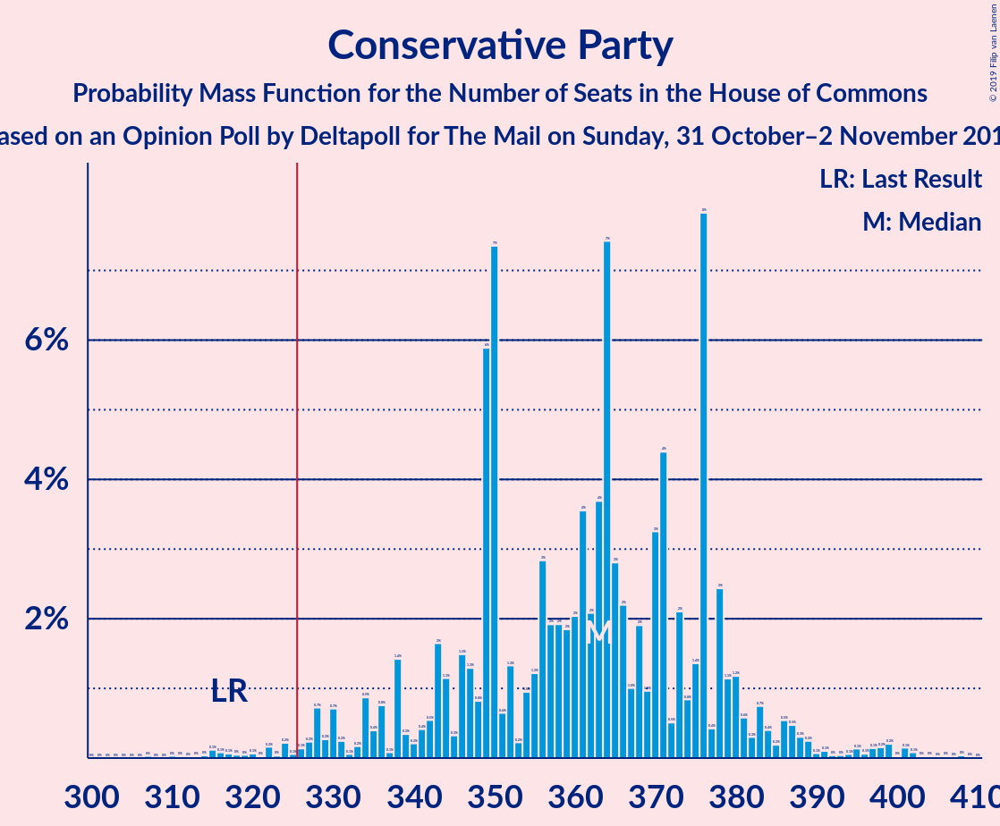
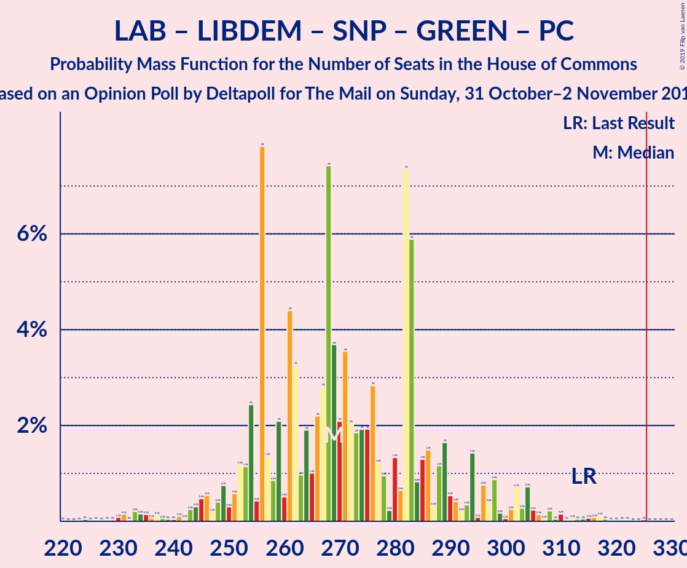
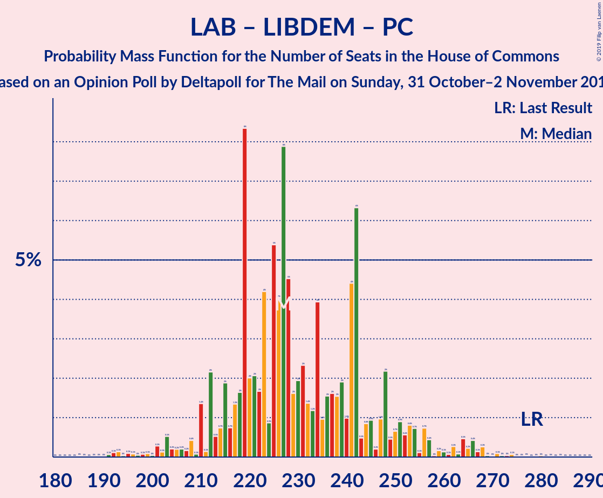
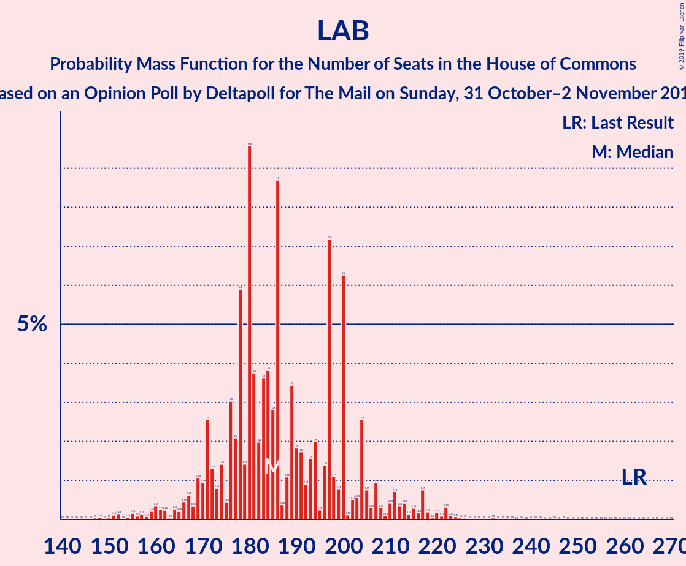

# Opinion Poll by Deltapoll for The Mail on Sunday, 31 October–2 November 2019

<a href="#voting-intentions">Voting Intentions</a> | <a href="#seats">Seats</a> | <a href="#coalitions">Coalitions</a> | <a href="#technical-information">Technical Information</a>

## Voting Intentions

### Confidence Intervals

| Party | Last Result | Poll Result | 80% Confidence Interval | 90% Confidence Interval | 95% Confidence Interval | 99% Confidence Interval |
|:-----:|:-----------:|:-----------:|:-----------------------:|:-----------------------:|:-----------------------:|:-----------------------:|
| Conservative Party | 43.4% | 39.9% | 38.3–41.6% |37.9–42.0% |37.5–42.4% |36.7–43.2% |
| Labour Party | 41.0% | 27.9% | 26.5–29.5% |26.1–29.9% |25.7–30.3% |25.0–31.0% |
| Liberal Democrats | 7.6% | 13.9% | 12.8–15.2% |12.5–15.5% |12.3–15.8% |11.8–16.4% |
| Brexit Party | 0.0% | 11.0% | 10.0–12.1% |9.7–12.4% |9.5–12.7% |9.1–13.2% |
| Scottish National Party | 3.1% | 3.0% | 2.5–3.7% |2.4–3.8% |2.2–4.0% |2.0–4.3% |
| Green Party | 1.7% | 2.0% | 1.6–2.6% |1.5–2.7% |1.4–2.9% |1.2–3.1% |
| Plaid Cymru | 0.5% | 1.0% | 0.7–1.4% |0.7–1.5% |0.6–1.6% |0.5–1.9% |
| UK Independence Party | 1.9% | 1.0% | 0.7–1.4% |0.7–1.5% |0.6–1.6% |0.5–1.9% |

*Note:* The poll result column reflects the actual value used in the calculations. Published results may vary slightly, and in addition be rounded to fewer digits.

## Seats

### Confidence Intervals

| Party | Last Result | Median | 80% Confidence Interval | 90% Confidence Interval | 95% Confidence Interval | 99% Confidence Interval |
|:-----:|:-----------:|:------:|:-----------------------:|:-----------------------:|:-----------------------:|:-----------------------:|
| <a href="#conservative-party">Conservative Party</a> | 317 | 361 | 342–377 |330–383 |328–384 |315–399 |
| <a href="#labour-party">Labour Party</a> | 262 | 184 | 174–204 |172–212 |168–217 |155–222 |
| <a href="#liberal-democrats">Liberal Democrats</a> | 12 | 38 | 31–43 |31–43 |31–44 |30–50 |
| <a href="#brexit-party">Brexit Party</a> | 0 | 0 | 0 |0 |0 |0 |
| <a href="#scottish-national-party">Scottish National Party</a> | 35 | 41 | 33–48 |33–48 |33–50 |18–51 |
| <a href="#green-party">Green Party</a> | 1 | 1 | 1 |1 |1 |1 |
| <a href="#plaid-cymru">Plaid Cymru</a> | 4 | 4 | 4–9 |4–10 |4–11 |3–12 |
| <a href="#uk-independence-party">UK Independence Party</a> | 0 | 0 | 0 |0 |0 |0 |

### Conservative Party

*For a full overview of the results for this party, see the [Conservative Party](party-conservativeparty.html) page.*

| Number of Seats | Probability | Accumulated | Special Marks |
|:---------------:|:-----------:|:-----------:|:-------------:|
| 312 | 0% | 100% |  |
| 313 | 0% | 99.9% |  |
| 314 | 0% | 99.9% |  |
| 315 | 0.8% | 99.9% |  |
| 316 | 0% | 99.1% |  |
| 317 | 0% | 99.1% | Last Result |
| 318 | 0.2% | 99.1% |  |
| 319 | 0% | 98.9% |  |
| 320 | 0% | 98.9% |  |
| 321 | 0.1% | 98.9% |  |
| 322 | 0% | 98.8% |  |
| 323 | 0.2% | 98.8% |  |
| 324 | 0.1% | 98.6% |  |
| 325 | 0.1% | 98.6% |  |
| 326 | 0.1% | 98.5% | Majority |
| 327 | 0% | 98% |  |
| 328 | 3% | 98% |  |
| 329 | 0.1% | 96% |  |
| 330 | 0.4% | 95% |  |
| 331 | 0% | 95% |  |
| 332 | 0.1% | 95% |  |
| 333 | 0% | 95% |  |
| 334 | 2% | 95% |  |
| 335 | 0% | 93% |  |
| 336 | 0.1% | 93% |  |
| 337 | 0.2% | 93% |  |
| 338 | 0.1% | 93% |  |
| 339 | 0% | 93% |  |
| 340 | 0.1% | 93% |  |
| 341 | 0.1% | 93% |  |
| 342 | 3% | 92% |  |
| 343 | 0% | 89% |  |
| 344 | 0.7% | 89% |  |
| 345 | 1.2% | 88% |  |
| 346 | 6% | 87% |  |
| 347 | 7% | 81% |  |
| 348 | 0% | 74% |  |
| 349 | 10% | 74% |  |
| 350 | 0.4% | 64% |  |
| 351 | 0% | 63% |  |
| 352 | 0.1% | 63% |  |
| 353 | 0.1% | 63% |  |
| 354 | 0.4% | 63% |  |
| 355 | 0% | 63% |  |
| 356 | 0.6% | 63% |  |
| 357 | 0.4% | 62% |  |
| 358 | 7% | 62% |  |
| 359 | 0% | 55% |  |
| 360 | 0.1% | 55% |  |
| 361 | 9% | 55% | Median |
| 362 | 1.1% | 46% |  |
| 363 | 0.1% | 45% |  |
| 364 | 6% | 45% |  |
| 365 | 4% | 39% |  |
| 366 | 0.1% | 35% |  |
| 367 | 0.1% | 35% |  |
| 368 | 4% | 35% |  |
| 369 | 0.8% | 31% |  |
| 370 | 0.1% | 30% |  |
| 371 | 12% | 30% |  |
| 372 | 0.2% | 18% |  |
| 373 | 6% | 18% |  |
| 374 | 0.6% | 12% |  |
| 375 | 0.3% | 11% |  |
| 376 | 0.6% | 11% |  |
| 377 | 0.9% | 10% |  |
| 378 | 0.1% | 9% |  |
| 379 | 0.1% | 9% |  |
| 380 | 0.7% | 9% |  |
| 381 | 0.3% | 8% |  |
| 382 | 1.1% | 8% |  |
| 383 | 4% | 7% |  |
| 384 | 1.2% | 3% |  |
| 385 | 0% | 2% |  |
| 386 | 0.6% | 2% |  |
| 387 | 0.5% | 1.4% |  |
| 388 | 0.1% | 0.9% |  |
| 389 | 0.1% | 0.8% |  |
| 390 | 0% | 0.7% |  |
| 391 | 0% | 0.7% |  |
| 392 | 0% | 0.7% |  |
| 393 | 0% | 0.6% |  |
| 394 | 0% | 0.6% |  |
| 395 | 0% | 0.6% |  |
| 396 | 0% | 0.6% |  |
| 397 | 0% | 0.5% |  |
| 398 | 0% | 0.5% |  |
| 399 | 0% | 0.5% |  |
| 400 | 0.1% | 0.5% |  |
| 401 | 0.2% | 0.4% |  |
| 402 | 0% | 0.2% |  |
| 403 | 0.1% | 0.2% |  |
| 404 | 0% | 0.1% |  |
| 405 | 0% | 0% |  |

### Labour Party

*For a full overview of the results for this party, see the [Labour Party](party-labourparty.html) page.*

| Number of Seats | Probability | Accumulated | Special Marks |
|:---------------:|:-----------:|:-----------:|:-------------:|
| 147 | 0.1% | 100% |  |
| 148 | 0.1% | 99.9% |  |
| 149 | 0% | 99.7% |  |
| 150 | 0% | 99.7% |  |
| 151 | 0% | 99.7% |  |
| 152 | 0.1% | 99.7% |  |
| 153 | 0% | 99.6% |  |
| 154 | 0% | 99.6% |  |
| 155 | 0.3% | 99.6% |  |
| 156 | 0% | 99.3% |  |
| 157 | 0% | 99.3% |  |
| 158 | 0% | 99.3% |  |
| 159 | 0.1% | 99.3% |  |
| 160 | 0.1% | 99.1% |  |
| 161 | 0.1% | 99.1% |  |
| 162 | 0% | 99.0% |  |
| 163 | 0% | 98.9% |  |
| 164 | 0.3% | 98.9% |  |
| 165 | 0% | 98.6% |  |
| 166 | 0% | 98.6% |  |
| 167 | 0.6% | 98.5% |  |
| 168 | 0.8% | 98% |  |
| 169 | 0% | 97% |  |
| 170 | 0% | 97% |  |
| 171 | 2% | 97% |  |
| 172 | 4% | 96% |  |
| 173 | 0.6% | 92% |  |
| 174 | 6% | 91% |  |
| 175 | 1.0% | 86% |  |
| 176 | 0.3% | 84% |  |
| 177 | 9% | 84% |  |
| 178 | 1.3% | 75% |  |
| 179 | 2% | 74% |  |
| 180 | 0.1% | 72% |  |
| 181 | 7% | 72% |  |
| 182 | 0.7% | 65% |  |
| 183 | 13% | 65% |  |
| 184 | 6% | 51% | Median |
| 185 | 2% | 45% |  |
| 186 | 2% | 44% |  |
| 187 | 0.7% | 42% |  |
| 188 | 0.3% | 42% |  |
| 189 | 2% | 41% |  |
| 190 | 0.7% | 40% |  |
| 191 | 3% | 39% |  |
| 192 | 0.1% | 36% |  |
| 193 | 0.1% | 36% |  |
| 194 | 0.4% | 36% |  |
| 195 | 1.2% | 36% |  |
| 196 | 7% | 34% |  |
| 197 | 0.1% | 27% |  |
| 198 | 0.1% | 27% |  |
| 199 | 0.1% | 27% |  |
| 200 | 10% | 27% |  |
| 201 | 0.1% | 17% |  |
| 202 | 0.7% | 17% |  |
| 203 | 0.4% | 16% |  |
| 204 | 8% | 16% |  |
| 205 | 0% | 8% |  |
| 206 | 0.5% | 8% |  |
| 207 | 2% | 7% |  |
| 208 | 0% | 5% |  |
| 209 | 0.1% | 5% |  |
| 210 | 0.4% | 5% |  |
| 211 | 0% | 5% |  |
| 212 | 0.1% | 5% |  |
| 213 | 0.2% | 5% |  |
| 214 | 0% | 5% |  |
| 215 | 0.3% | 5% |  |
| 216 | 0.1% | 4% |  |
| 217 | 3% | 4% |  |
| 218 | 0% | 1.4% |  |
| 219 | 0.1% | 1.3% |  |
| 220 | 0% | 1.3% |  |
| 221 | 0% | 1.2% |  |
| 222 | 0.8% | 1.2% |  |
| 223 | 0.2% | 0.4% |  |
| 224 | 0.1% | 0.2% |  |
| 225 | 0% | 0.2% |  |
| 226 | 0% | 0.2% |  |
| 227 | 0% | 0.1% |  |
| 228 | 0.1% | 0.1% |  |
| 229 | 0% | 0.1% |  |
| 230 | 0% | 0.1% |  |
| 231 | 0% | 0.1% |  |
| 232 | 0% | 0.1% |  |
| 233 | 0% | 0.1% |  |
| 234 | 0% | 0% |  |
| 235 | 0% | 0% |  |
| 236 | 0% | 0% |  |
| 237 | 0% | 0% |  |
| 238 | 0% | 0% |  |
| 239 | 0% | 0% |  |
| 240 | 0% | 0% |  |
| 241 | 0% | 0% |  |
| 242 | 0% | 0% |  |
| 243 | 0% | 0% |  |
| 244 | 0% | 0% |  |
| 245 | 0% | 0% |  |
| 246 | 0% | 0% |  |
| 247 | 0% | 0% |  |
| 248 | 0% | 0% |  |
| 249 | 0% | 0% |  |
| 250 | 0% | 0% |  |
| 251 | 0% | 0% |  |
| 252 | 0% | 0% |  |
| 253 | 0% | 0% |  |
| 254 | 0% | 0% |  |
| 255 | 0% | 0% |  |
| 256 | 0% | 0% |  |
| 257 | 0% | 0% |  |
| 258 | 0% | 0% |  |
| 259 | 0% | 0% |  |
| 260 | 0% | 0% |  |
| 261 | 0% | 0% |  |
| 262 | 0% | 0% | Last Result |

### Liberal Democrats

*For a full overview of the results for this party, see the [Liberal Democrats](party-liberaldemocrats.html) page.*

| Number of Seats | Probability | Accumulated | Special Marks |
|:---------------:|:-----------:|:-----------:|:-------------:|
| 12 | 0% | 100% | Last Result |
| 13 | 0% | 100% |  |
| 14 | 0% | 100% |  |
| 15 | 0% | 100% |  |
| 16 | 0% | 100% |  |
| 17 | 0% | 100% |  |
| 18 | 0% | 100% |  |
| 19 | 0% | 100% |  |
| 20 | 0% | 100% |  |
| 21 | 0% | 100% |  |
| 22 | 0% | 100% |  |
| 23 | 0% | 100% |  |
| 24 | 0% | 100% |  |
| 25 | 0% | 100% |  |
| 26 | 0% | 100% |  |
| 27 | 0% | 100% |  |
| 28 | 0% | 100% |  |
| 29 | 0.5% | 100% |  |
| 30 | 1.1% | 99.5% |  |
| 31 | 10% | 98% |  |
| 32 | 7% | 89% |  |
| 33 | 14% | 82% |  |
| 34 | 4% | 68% |  |
| 35 | 7% | 64% |  |
| 36 | 2% | 57% |  |
| 37 | 3% | 55% |  |
| 38 | 13% | 52% | Median |
| 39 | 5% | 39% |  |
| 40 | 16% | 34% |  |
| 41 | 3% | 18% |  |
| 42 | 3% | 15% |  |
| 43 | 9% | 12% |  |
| 44 | 0.6% | 3% |  |
| 45 | 0.2% | 2% |  |
| 46 | 0.2% | 2% |  |
| 47 | 0.8% | 2% |  |
| 48 | 0.3% | 1.3% |  |
| 49 | 0.1% | 1.0% |  |
| 50 | 0.5% | 0.9% |  |
| 51 | 0.4% | 0.4% |  |
| 52 | 0% | 0% |  |

### Brexit Party

*For a full overview of the results for this party, see the [Brexit Party](party-brexitparty.html) page.*

| Number of Seats | Probability | Accumulated | Special Marks |
|:---------------:|:-----------:|:-----------:|:-------------:|
| 0 | 99.9% | 100% | Last Result, Median |
| 1 | 0.1% | 0.1% |  |
| 2 | 0% | 0% |  |

### Scottish National Party

*For a full overview of the results for this party, see the [Scottish National Party](party-scottishnationalparty.html) page.*

| Number of Seats | Probability | Accumulated | Special Marks |
|:---------------:|:-----------:|:-----------:|:-------------:|
| 11 | 0% | 100% |  |
| 12 | 0% | 99.9% |  |
| 13 | 0% | 99.9% |  |
| 14 | 0% | 99.9% |  |
| 15 | 0.3% | 99.9% |  |
| 16 | 0% | 99.6% |  |
| 17 | 0% | 99.6% |  |
| 18 | 0.3% | 99.6% |  |
| 19 | 0.7% | 99.3% |  |
| 20 | 0% | 98.6% |  |
| 21 | 0% | 98.6% |  |
| 22 | 0% | 98.6% |  |
| 23 | 0% | 98.5% |  |
| 24 | 0% | 98.5% |  |
| 25 | 0.1% | 98.5% |  |
| 26 | 0% | 98% |  |
| 27 | 0% | 98% |  |
| 28 | 0% | 98% |  |
| 29 | 0.2% | 98% |  |
| 30 | 0.2% | 98% |  |
| 31 | 0.1% | 98% |  |
| 32 | 0.1% | 98% |  |
| 33 | 17% | 98% |  |
| 34 | 6% | 81% |  |
| 35 | 3% | 75% | Last Result |
| 36 | 0.9% | 72% |  |
| 37 | 1.1% | 71% |  |
| 38 | 0.2% | 70% |  |
| 39 | 10% | 70% |  |
| 40 | 0.7% | 60% |  |
| 41 | 16% | 59% | Median |
| 42 | 0.6% | 43% |  |
| 43 | 0.4% | 43% |  |
| 44 | 0% | 42% |  |
| 45 | 25% | 42% |  |
| 46 | 0.1% | 17% |  |
| 47 | 6% | 17% |  |
| 48 | 8% | 11% |  |
| 49 | 0% | 3% |  |
| 50 | 3% | 3% |  |
| 51 | 0.5% | 0.6% |  |
| 52 | 0% | 0.1% |  |
| 53 | 0.1% | 0.1% |  |
| 54 | 0% | 0% |  |

### Green Party

*For a full overview of the results for this party, see the [Green Party](party-greenparty.html) page.*

| Number of Seats | Probability | Accumulated | Special Marks |
|:---------------:|:-----------:|:-----------:|:-------------:|
| 1 | 100% | 100% | Last Result, Median |

### Plaid Cymru

*For a full overview of the results for this party, see the [Plaid Cymru](party-plaidcymru.html) page.*

| Number of Seats | Probability | Accumulated | Special Marks |
|:---------------:|:-----------:|:-----------:|:-------------:|
| 3 | 0.6% | 100% |  |
| 4 | 50% | 99.4% | Last Result, Median |
| 5 | 3% | 49% |  |
| 6 | 1.2% | 47% |  |
| 7 | 1.0% | 45% |  |
| 8 | 25% | 44% |  |
| 9 | 15% | 20% |  |
| 10 | 2% | 5% |  |
| 11 | 2% | 3% |  |
| 12 | 0.5% | 0.5% |  |
| 13 | 0.1% | 0.1% |  |
| 14 | 0% | 0% |  |

### UK Independence Party

*For a full overview of the results for this party, see the [UK Independence Party](party-ukindependenceparty.html) page.*

| Number of Seats | Probability | Accumulated | Special Marks |
|:---------------:|:-----------:|:-----------:|:-------------:|
| 0 | 100% | 100% | Last Result, Median |

## Coalitions

### Confidence Intervals

| Coalition | Last Result | Median | Majority? | 80% Confidence Interval | 90% Confidence Interval | 95% Confidence Interval | 99% Confidence Interval |
|:---------:|:-----------:|:------:|:---------:|:-----------------------:|:-----------------------:|:-----------------------:|:-----------------------:|
| Conservative Party – Scottish National Party – Plaid Cymru | 356 | 408 | 100% | 384–423 | 382–423 | 371–429 | 367–441 |
| Conservative Party – Scottish National Party | 352 | 403 | 100% | 380–414 | 375–416 | 367–424 | 363–433 |
| Conservative Party – Liberal Democrats | 329 | 398 | 100% | 380–412 | 371–422 | 371–422 | 357–432 |
| Conservative Party – Plaid Cymru | 321 | 370 | 98.9% | 350–385 | 338–387 | 332–389 | 319–405 |
| Conservative Party – Brexit Party | 317 | 361 | 98.5% | 342–377 | 330–383 | 328–384 | 315–399 |
| Conservative Party | 317 | 361 | 98.5% | 342–377 | 330–383 | 328–384 | 315–399 |
| Labour Party – Liberal Democrats – Scottish National Party – Green Party – Plaid Cymru | 314 | 271 | 0% | 255–290 | 249–302 | 248–304 | 233–317 |
| Labour Party – Liberal Democrats – Scottish National Party – Plaid Cymru | 313 | 270 | 0% | 254–289 | 248–301 | 247–303 | 232–316 |
| Labour Party – Liberal Democrats – Scottish National Party | 309 | 261 | 0% | 246–281 | 244–293 | 242–299 | 226–312 |
| Labour Party – Liberal Democrats – Plaid Cymru | 278 | 228 | 0% | 217–251 | 215–256 | 207–264 | 198–268 |
| Labour Party – Scottish National Party – Plaid Cymru | 301 | 233 | 0% | 219–251 | 209–260 | 209–260 | 199–274 |
| Labour Party – Liberal Democrats | 274 | 223 | 0% | 208–247 | 208–249 | 202–260 | 190–264 |
| Labour Party – Scottish National Party | 297 | 228 | 0% | 212–245 | 205–253 | 205–256 | 190–270 |
| Labour Party – Plaid Cymru | 266 | 190 | 0% | 181–211 | 176–219 | 175–221 | 165–226 |
| Labour Party | 262 | 184 | 0% | 174–204 | 172–212 | 168–217 | 155–222 |

### Conservative Party – Scottish National Party – Plaid Cymru

| Number of Seats | Probability | Accumulated | Special Marks |
|:---------------:|:-----------:|:-----------:|:-------------:|
| 356 | 0% | 100% | Last Result |
| 357 | 0% | 100% |  |
| 358 | 0% | 100% |  |
| 359 | 0% | 99.9% |  |
| 360 | 0% | 99.9% |  |
| 361 | 0.1% | 99.9% |  |
| 362 | 0% | 99.9% |  |
| 363 | 0% | 99.9% |  |
| 364 | 0% | 99.8% |  |
| 365 | 0% | 99.8% |  |
| 366 | 0% | 99.8% |  |
| 367 | 0.8% | 99.8% |  |
| 368 | 0% | 98.9% |  |
| 369 | 0.1% | 98.9% |  |
| 370 | 0.2% | 98.8% |  |
| 371 | 3% | 98.7% |  |
| 372 | 0% | 96% |  |
| 373 | 0% | 96% |  |
| 374 | 0% | 96% |  |
| 375 | 0.1% | 96% |  |
| 376 | 0% | 96% |  |
| 377 | 0% | 96% |  |
| 378 | 0.2% | 96% |  |
| 379 | 0% | 95% |  |
| 380 | 0.1% | 95% |  |
| 381 | 0.1% | 95% |  |
| 382 | 0.3% | 95% |  |
| 383 | 2% | 95% |  |
| 384 | 5% | 93% |  |
| 385 | 0% | 88% |  |
| 386 | 0% | 88% |  |
| 387 | 0% | 88% |  |
| 388 | 0.2% | 88% |  |
| 389 | 4% | 88% |  |
| 390 | 0.1% | 84% |  |
| 391 | 0.9% | 84% |  |
| 392 | 0% | 83% |  |
| 393 | 1.2% | 83% |  |
| 394 | 0.1% | 82% |  |
| 395 | 0.3% | 82% |  |
| 396 | 0% | 81% |  |
| 397 | 0% | 81% |  |
| 398 | 10% | 81% |  |
| 399 | 0% | 71% |  |
| 400 | 7% | 71% |  |
| 401 | 1.2% | 63% |  |
| 402 | 0.7% | 62% |  |
| 403 | 0.2% | 61% |  |
| 404 | 0.5% | 61% |  |
| 405 | 0% | 61% |  |
| 406 | 0.7% | 61% | Median |
| 407 | 9% | 60% |  |
| 408 | 10% | 51% |  |
| 409 | 1.0% | 41% |  |
| 410 | 3% | 40% |  |
| 411 | 0% | 37% |  |
| 412 | 0.1% | 37% |  |
| 413 | 0.1% | 37% |  |
| 414 | 4% | 37% |  |
| 415 | 0.3% | 32% |  |
| 416 | 2% | 32% |  |
| 417 | 0.6% | 30% |  |
| 418 | 7% | 29% |  |
| 419 | 7% | 22% |  |
| 420 | 4% | 16% |  |
| 421 | 0.5% | 12% |  |
| 422 | 0% | 11% |  |
| 423 | 6% | 11% |  |
| 424 | 0.5% | 5% |  |
| 425 | 0.3% | 4% |  |
| 426 | 0% | 4% |  |
| 427 | 0.3% | 4% |  |
| 428 | 0% | 4% |  |
| 429 | 1.5% | 4% |  |
| 430 | 1.0% | 2% |  |
| 431 | 0.1% | 1.3% |  |
| 432 | 0% | 1.2% |  |
| 433 | 0% | 1.2% |  |
| 434 | 0.2% | 1.2% |  |
| 435 | 0% | 1.0% |  |
| 436 | 0% | 0.9% |  |
| 437 | 0% | 0.9% |  |
| 438 | 0% | 0.9% |  |
| 439 | 0.3% | 0.9% |  |
| 440 | 0% | 0.6% |  |
| 441 | 0.1% | 0.6% |  |
| 442 | 0.1% | 0.4% |  |
| 443 | 0% | 0.4% |  |
| 444 | 0% | 0.4% |  |
| 445 | 0.1% | 0.3% |  |
| 446 | 0.1% | 0.2% |  |
| 447 | 0% | 0.1% |  |
| 448 | 0% | 0.1% |  |
| 449 | 0% | 0.1% |  |
| 450 | 0% | 0.1% |  |
| 451 | 0% | 0.1% |  |
| 452 | 0.1% | 0.1% |  |
| 453 | 0% | 0% |  |

### Conservative Party – Scottish National Party

| Number of Seats | Probability | Accumulated | Special Marks |
|:---------------:|:-----------:|:-----------:|:-------------:|
| 352 | 0% | 100% | Last Result |
| 353 | 0% | 100% |  |
| 354 | 0% | 99.9% |  |
| 355 | 0% | 99.9% |  |
| 356 | 0% | 99.9% |  |
| 357 | 0.1% | 99.9% |  |
| 358 | 0% | 99.8% |  |
| 359 | 0% | 99.8% |  |
| 360 | 0% | 99.8% |  |
| 361 | 0% | 99.8% |  |
| 362 | 0.2% | 99.8% |  |
| 363 | 0.8% | 99.6% |  |
| 364 | 0.1% | 98.7% |  |
| 365 | 0% | 98.7% |  |
| 366 | 0% | 98.7% |  |
| 367 | 3% | 98.6% |  |
| 368 | 0.1% | 96% |  |
| 369 | 0% | 96% |  |
| 370 | 0% | 96% |  |
| 371 | 0.1% | 96% |  |
| 372 | 0% | 95% |  |
| 373 | 0.1% | 95% |  |
| 374 | 0.2% | 95% |  |
| 375 | 0.4% | 95% |  |
| 376 | 0.2% | 95% |  |
| 377 | 0% | 95% |  |
| 378 | 0.3% | 95% |  |
| 379 | 2% | 94% |  |
| 380 | 5% | 93% |  |
| 381 | 3% | 88% |  |
| 382 | 0% | 85% |  |
| 383 | 0.9% | 85% |  |
| 384 | 1.2% | 84% |  |
| 385 | 0.5% | 82% |  |
| 386 | 0.1% | 82% |  |
| 387 | 0.2% | 82% |  |
| 388 | 0% | 82% |  |
| 389 | 0.1% | 82% |  |
| 390 | 0.2% | 81% |  |
| 391 | 0.4% | 81% |  |
| 392 | 7% | 81% |  |
| 393 | 0% | 74% |  |
| 394 | 10% | 74% |  |
| 395 | 0.1% | 63% |  |
| 396 | 2% | 63% |  |
| 397 | 0.1% | 61% |  |
| 398 | 2% | 61% |  |
| 399 | 1.1% | 59% |  |
| 400 | 2% | 58% |  |
| 401 | 0.1% | 57% |  |
| 402 | 0.4% | 57% | Median |
| 403 | 8% | 56% |  |
| 404 | 10% | 48% |  |
| 405 | 0.9% | 38% |  |
| 406 | 4% | 37% |  |
| 407 | 0.5% | 34% |  |
| 408 | 0% | 33% |  |
| 409 | 8% | 33% |  |
| 410 | 1.1% | 25% |  |
| 411 | 6% | 24% |  |
| 412 | 2% | 18% |  |
| 413 | 0.7% | 16% |  |
| 414 | 6% | 15% |  |
| 415 | 0.1% | 9% |  |
| 416 | 4% | 9% |  |
| 417 | 0% | 5% |  |
| 418 | 0.6% | 5% |  |
| 419 | 0.3% | 4% |  |
| 420 | 0.1% | 4% |  |
| 421 | 0% | 4% |  |
| 422 | 0.1% | 4% |  |
| 423 | 0.9% | 3% |  |
| 424 | 0% | 3% |  |
| 425 | 1.2% | 2% |  |
| 426 | 0.2% | 1.3% |  |
| 427 | 0.1% | 1.0% |  |
| 428 | 0% | 0.9% |  |
| 429 | 0.3% | 0.9% |  |
| 430 | 0% | 0.6% |  |
| 431 | 0% | 0.6% |  |
| 432 | 0% | 0.6% |  |
| 433 | 0.2% | 0.6% |  |
| 434 | 0.1% | 0.4% |  |
| 435 | 0% | 0.3% |  |
| 436 | 0% | 0.2% |  |
| 437 | 0% | 0.2% |  |
| 438 | 0.1% | 0.2% |  |
| 439 | 0% | 0.1% |  |
| 440 | 0% | 0.1% |  |
| 441 | 0% | 0.1% |  |
| 442 | 0% | 0.1% |  |
| 443 | 0.1% | 0.1% |  |
| 444 | 0% | 0% |  |

### Conservative Party – Liberal Democrats

| Number of Seats | Probability | Accumulated | Special Marks |
|:---------------:|:-----------:|:-----------:|:-------------:|
| 329 | 0% | 100% | Last Result |
| 330 | 0% | 100% |  |
| 331 | 0% | 100% |  |
| 332 | 0% | 100% |  |
| 333 | 0% | 100% |  |
| 334 | 0% | 100% |  |
| 335 | 0% | 100% |  |
| 336 | 0% | 100% |  |
| 337 | 0% | 100% |  |
| 338 | 0% | 100% |  |
| 339 | 0% | 100% |  |
| 340 | 0% | 100% |  |
| 341 | 0% | 100% |  |
| 342 | 0% | 100% |  |
| 343 | 0% | 100% |  |
| 344 | 0% | 100% |  |
| 345 | 0% | 100% |  |
| 346 | 0% | 100% |  |
| 347 | 0% | 100% |  |
| 348 | 0% | 100% |  |
| 349 | 0% | 100% |  |
| 350 | 0% | 100% |  |
| 351 | 0% | 100% |  |
| 352 | 0% | 100% |  |
| 353 | 0% | 100% |  |
| 354 | 0% | 99.9% |  |
| 355 | 0.1% | 99.9% |  |
| 356 | 0% | 99.8% |  |
| 357 | 0.8% | 99.8% |  |
| 358 | 0.1% | 99.0% |  |
| 359 | 0% | 98.9% |  |
| 360 | 0.1% | 98.9% |  |
| 361 | 0% | 98.8% |  |
| 362 | 0% | 98.8% |  |
| 363 | 0.1% | 98.8% |  |
| 364 | 0.2% | 98.7% |  |
| 365 | 0.1% | 98% |  |
| 366 | 0.1% | 98% |  |
| 367 | 0% | 98% |  |
| 368 | 0% | 98% |  |
| 369 | 0% | 98% |  |
| 370 | 0.2% | 98% |  |
| 371 | 3% | 98% |  |
| 372 | 0.1% | 95% |  |
| 373 | 0.3% | 95% |  |
| 374 | 0% | 95% |  |
| 375 | 2% | 95% |  |
| 376 | 0.1% | 93% |  |
| 377 | 0.1% | 93% |  |
| 378 | 0% | 93% |  |
| 379 | 0.2% | 93% |  |
| 380 | 3% | 92% |  |
| 381 | 0.1% | 89% |  |
| 382 | 18% | 89% |  |
| 383 | 0.1% | 72% |  |
| 384 | 0.1% | 72% |  |
| 385 | 0.1% | 71% |  |
| 386 | 0.1% | 71% |  |
| 387 | 1.4% | 71% |  |
| 388 | 2% | 70% |  |
| 389 | 5% | 68% |  |
| 390 | 0.1% | 63% |  |
| 391 | 0.2% | 63% |  |
| 392 | 0.4% | 63% |  |
| 393 | 6% | 63% |  |
| 394 | 1.1% | 56% |  |
| 395 | 0.6% | 55% |  |
| 396 | 0.1% | 55% |  |
| 397 | 0.1% | 55% |  |
| 398 | 6% | 54% |  |
| 399 | 5% | 48% | Median |
| 400 | 0.2% | 44% |  |
| 401 | 3% | 43% |  |
| 402 | 6% | 40% |  |
| 403 | 2% | 34% |  |
| 404 | 7% | 33% |  |
| 405 | 0.2% | 26% |  |
| 406 | 0.9% | 26% |  |
| 407 | 0.1% | 25% |  |
| 408 | 0.7% | 25% |  |
| 409 | 2% | 24% |  |
| 410 | 0.3% | 22% |  |
| 411 | 11% | 22% |  |
| 412 | 1.0% | 11% |  |
| 413 | 0.3% | 10% |  |
| 414 | 0.1% | 9% |  |
| 415 | 3% | 9% |  |
| 416 | 0% | 6% |  |
| 417 | 0.4% | 6% |  |
| 418 | 0.1% | 6% |  |
| 419 | 0% | 6% |  |
| 420 | 0% | 6% |  |
| 421 | 0.4% | 6% |  |
| 422 | 4% | 5% |  |
| 423 | 0.1% | 1.1% |  |
| 424 | 0.3% | 1.1% |  |
| 425 | 0% | 0.8% |  |
| 426 | 0% | 0.8% |  |
| 427 | 0% | 0.8% |  |
| 428 | 0.1% | 0.7% |  |
| 429 | 0% | 0.7% |  |
| 430 | 0.1% | 0.6% |  |
| 431 | 0% | 0.5% |  |
| 432 | 0.1% | 0.5% |  |
| 433 | 0.1% | 0.4% |  |
| 434 | 0.1% | 0.4% |  |
| 435 | 0% | 0.2% |  |
| 436 | 0% | 0.2% |  |
| 437 | 0% | 0.2% |  |
| 438 | 0% | 0.2% |  |
| 439 | 0% | 0.2% |  |
| 440 | 0.1% | 0.2% |  |
| 441 | 0% | 0.1% |  |
| 442 | 0% | 0.1% |  |
| 443 | 0% | 0.1% |  |
| 444 | 0% | 0% |  |

### Conservative Party – Plaid Cymru

| Number of Seats | Probability | Accumulated | Special Marks |
|:---------------:|:-----------:|:-----------:|:-------------:|
| 318 | 0% | 100% |  |
| 319 | 0.8% | 99.9% |  |
| 320 | 0% | 99.1% |  |
| 321 | 0.1% | 99.1% | Last Result |
| 322 | 0.1% | 99.0% |  |
| 323 | 0% | 99.0% |  |
| 324 | 0% | 99.0% |  |
| 325 | 0% | 99.0% |  |
| 326 | 0% | 98.9% | Majority |
| 327 | 0% | 98.9% |  |
| 328 | 0% | 98.9% |  |
| 329 | 0.1% | 98.9% |  |
| 330 | 0% | 98.7% |  |
| 331 | 0.2% | 98.7% |  |
| 332 | 3% | 98.5% |  |
| 333 | 0.1% | 96% |  |
| 334 | 0.3% | 96% |  |
| 335 | 0% | 95% |  |
| 336 | 0% | 95% |  |
| 337 | 0.1% | 95% |  |
| 338 | 2% | 95% |  |
| 339 | 0.1% | 93% |  |
| 340 | 0.1% | 93% |  |
| 341 | 0.2% | 93% |  |
| 342 | 0.1% | 93% |  |
| 343 | 0% | 93% |  |
| 344 | 0% | 93% |  |
| 345 | 0% | 93% |  |
| 346 | 0.4% | 93% |  |
| 347 | 0.2% | 92% |  |
| 348 | 0% | 92% |  |
| 349 | 0.1% | 92% |  |
| 350 | 8% | 92% |  |
| 351 | 1.2% | 84% |  |
| 352 | 0.7% | 83% |  |
| 353 | 10% | 82% |  |
| 354 | 1.3% | 72% |  |
| 355 | 7% | 71% |  |
| 356 | 0.3% | 64% |  |
| 357 | 0.1% | 63% |  |
| 358 | 0.1% | 63% |  |
| 359 | 0% | 63% |  |
| 360 | 0.6% | 63% |  |
| 361 | 0.1% | 63% |  |
| 362 | 6% | 62% |  |
| 363 | 0.2% | 57% |  |
| 364 | 0.3% | 56% |  |
| 365 | 0.7% | 56% | Median |
| 366 | 0.6% | 55% |  |
| 367 | 0.1% | 55% |  |
| 368 | 0% | 55% |  |
| 369 | 1.4% | 55% |  |
| 370 | 7% | 53% |  |
| 371 | 2% | 47% |  |
| 372 | 8% | 45% |  |
| 373 | 6% | 37% |  |
| 374 | 0.1% | 31% |  |
| 375 | 12% | 31% |  |
| 376 | 0.2% | 19% |  |
| 377 | 0.3% | 19% |  |
| 378 | 0.2% | 19% |  |
| 379 | 0.1% | 18% |  |
| 380 | 0.3% | 18% |  |
| 381 | 0.5% | 18% |  |
| 382 | 6% | 17% |  |
| 383 | 0.4% | 11% |  |
| 384 | 0.3% | 11% |  |
| 385 | 1.4% | 11% |  |
| 386 | 0.9% | 9% |  |
| 387 | 4% | 8% |  |
| 388 | 1.2% | 4% |  |
| 389 | 0.8% | 3% |  |
| 390 | 0.9% | 2% |  |
| 391 | 0.1% | 2% |  |
| 392 | 0.1% | 1.4% |  |
| 393 | 0% | 1.4% |  |
| 394 | 0.1% | 1.3% |  |
| 395 | 0% | 1.3% |  |
| 396 | 0% | 1.2% |  |
| 397 | 0.3% | 1.2% |  |
| 398 | 0.2% | 0.9% |  |
| 399 | 0% | 0.7% |  |
| 400 | 0% | 0.7% |  |
| 401 | 0% | 0.6% |  |
| 402 | 0% | 0.6% |  |
| 403 | 0% | 0.6% |  |
| 404 | 0% | 0.6% |  |
| 405 | 0% | 0.5% |  |
| 406 | 0% | 0.5% |  |
| 407 | 0% | 0.5% |  |
| 408 | 0.1% | 0.5% |  |
| 409 | 0% | 0.4% |  |
| 410 | 0.1% | 0.4% |  |
| 411 | 0.2% | 0.3% |  |
| 412 | 0.1% | 0.2% |  |
| 413 | 0% | 0% |  |

### Conservative Party – Brexit Party

| Number of Seats | Probability | Accumulated | Special Marks |
|:---------------:|:-----------:|:-----------:|:-------------:|
| 312 | 0% | 100% |  |
| 313 | 0% | 99.9% |  |
| 314 | 0% | 99.9% |  |
| 315 | 0.8% | 99.9% |  |
| 316 | 0% | 99.1% |  |
| 317 | 0% | 99.1% | Last Result |
| 318 | 0.2% | 99.1% |  |
| 319 | 0% | 98.9% |  |
| 320 | 0% | 98.9% |  |
| 321 | 0.1% | 98.9% |  |
| 322 | 0% | 98.8% |  |
| 323 | 0.2% | 98.8% |  |
| 324 | 0.1% | 98.6% |  |
| 325 | 0.1% | 98.6% |  |
| 326 | 0.1% | 98.5% | Majority |
| 327 | 0% | 98% |  |
| 328 | 3% | 98% |  |
| 329 | 0.2% | 96% |  |
| 330 | 0.4% | 95% |  |
| 331 | 0% | 95% |  |
| 332 | 0.1% | 95% |  |
| 333 | 0% | 95% |  |
| 334 | 2% | 95% |  |
| 335 | 0% | 93% |  |
| 336 | 0.1% | 93% |  |
| 337 | 0.2% | 93% |  |
| 338 | 0.1% | 93% |  |
| 339 | 0% | 93% |  |
| 340 | 0.1% | 93% |  |
| 341 | 0.1% | 93% |  |
| 342 | 3% | 92% |  |
| 343 | 0% | 89% |  |
| 344 | 0.7% | 89% |  |
| 345 | 1.2% | 88% |  |
| 346 | 6% | 87% |  |
| 347 | 7% | 81% |  |
| 348 | 0% | 74% |  |
| 349 | 10% | 74% |  |
| 350 | 0.4% | 64% |  |
| 351 | 0% | 63% |  |
| 352 | 0.1% | 63% |  |
| 353 | 0.1% | 63% |  |
| 354 | 0.4% | 63% |  |
| 355 | 0% | 63% |  |
| 356 | 0.6% | 63% |  |
| 357 | 0.4% | 62% |  |
| 358 | 7% | 62% |  |
| 359 | 0% | 55% |  |
| 360 | 0.1% | 55% |  |
| 361 | 9% | 55% | Median |
| 362 | 1.1% | 46% |  |
| 363 | 0.1% | 45% |  |
| 364 | 6% | 45% |  |
| 365 | 4% | 39% |  |
| 366 | 0.1% | 35% |  |
| 367 | 0.1% | 35% |  |
| 368 | 4% | 35% |  |
| 369 | 0.8% | 31% |  |
| 370 | 0.1% | 30% |  |
| 371 | 12% | 30% |  |
| 372 | 0.2% | 18% |  |
| 373 | 6% | 18% |  |
| 374 | 0.6% | 12% |  |
| 375 | 0.3% | 11% |  |
| 376 | 0.6% | 11% |  |
| 377 | 0.9% | 10% |  |
| 378 | 0.1% | 9% |  |
| 379 | 0.1% | 9% |  |
| 380 | 0.7% | 9% |  |
| 381 | 0.3% | 8% |  |
| 382 | 1.1% | 8% |  |
| 383 | 4% | 7% |  |
| 384 | 1.2% | 3% |  |
| 385 | 0% | 2% |  |
| 386 | 0.6% | 2% |  |
| 387 | 0.5% | 1.4% |  |
| 388 | 0.1% | 0.9% |  |
| 389 | 0.1% | 0.8% |  |
| 390 | 0% | 0.7% |  |
| 391 | 0% | 0.7% |  |
| 392 | 0% | 0.7% |  |
| 393 | 0% | 0.6% |  |
| 394 | 0% | 0.6% |  |
| 395 | 0% | 0.6% |  |
| 396 | 0% | 0.6% |  |
| 397 | 0% | 0.5% |  |
| 398 | 0% | 0.5% |  |
| 399 | 0% | 0.5% |  |
| 400 | 0.1% | 0.5% |  |
| 401 | 0.2% | 0.4% |  |
| 402 | 0% | 0.2% |  |
| 403 | 0.1% | 0.2% |  |
| 404 | 0% | 0.1% |  |
| 405 | 0% | 0% |  |

### Conservative Party

| Number of Seats | Probability | Accumulated | Special Marks |
|:---------------:|:-----------:|:-----------:|:-------------:|
| 312 | 0% | 100% |  |
| 313 | 0% | 99.9% |  |
| 314 | 0% | 99.9% |  |
| 315 | 0.8% | 99.9% |  |
| 316 | 0% | 99.1% |  |
| 317 | 0% | 99.1% | Last Result |
| 318 | 0.2% | 99.1% |  |
| 319 | 0% | 98.9% |  |
| 320 | 0% | 98.9% |  |
| 321 | 0.1% | 98.9% |  |
| 322 | 0% | 98.8% |  |
| 323 | 0.2% | 98.8% |  |
| 324 | 0.1% | 98.6% |  |
| 325 | 0.1% | 98.6% |  |
| 326 | 0.1% | 98.5% | Majority |
| 327 | 0% | 98% |  |
| 328 | 3% | 98% |  |
| 329 | 0.1% | 96% |  |
| 330 | 0.4% | 95% |  |
| 331 | 0% | 95% |  |
| 332 | 0.1% | 95% |  |
| 333 | 0% | 95% |  |
| 334 | 2% | 95% |  |
| 335 | 0% | 93% |  |
| 336 | 0.1% | 93% |  |
| 337 | 0.2% | 93% |  |
| 338 | 0.1% | 93% |  |
| 339 | 0% | 93% |  |
| 340 | 0.1% | 93% |  |
| 341 | 0.1% | 93% |  |
| 342 | 3% | 92% |  |
| 343 | 0% | 89% |  |
| 344 | 0.7% | 89% |  |
| 345 | 1.2% | 88% |  |
| 346 | 6% | 87% |  |
| 347 | 7% | 81% |  |
| 348 | 0% | 74% |  |
| 349 | 10% | 74% |  |
| 350 | 0.4% | 64% |  |
| 351 | 0% | 63% |  |
| 352 | 0.1% | 63% |  |
| 353 | 0.1% | 63% |  |
| 354 | 0.4% | 63% |  |
| 355 | 0% | 63% |  |
| 356 | 0.6% | 63% |  |
| 357 | 0.4% | 62% |  |
| 358 | 7% | 62% |  |
| 359 | 0% | 55% |  |
| 360 | 0.1% | 55% |  |
| 361 | 9% | 55% | Median |
| 362 | 1.1% | 46% |  |
| 363 | 0.1% | 45% |  |
| 364 | 6% | 45% |  |
| 365 | 4% | 39% |  |
| 366 | 0.1% | 35% |  |
| 367 | 0.1% | 35% |  |
| 368 | 4% | 35% |  |
| 369 | 0.8% | 31% |  |
| 370 | 0.1% | 30% |  |
| 371 | 12% | 30% |  |
| 372 | 0.2% | 18% |  |
| 373 | 6% | 18% |  |
| 374 | 0.6% | 12% |  |
| 375 | 0.3% | 11% |  |
| 376 | 0.6% | 11% |  |
| 377 | 0.9% | 10% |  |
| 378 | 0.1% | 9% |  |
| 379 | 0.1% | 9% |  |
| 380 | 0.7% | 9% |  |
| 381 | 0.3% | 8% |  |
| 382 | 1.1% | 8% |  |
| 383 | 4% | 7% |  |
| 384 | 1.2% | 3% |  |
| 385 | 0% | 2% |  |
| 386 | 0.6% | 2% |  |
| 387 | 0.5% | 1.4% |  |
| 388 | 0.1% | 0.9% |  |
| 389 | 0.1% | 0.8% |  |
| 390 | 0% | 0.7% |  |
| 391 | 0% | 0.7% |  |
| 392 | 0% | 0.7% |  |
| 393 | 0% | 0.6% |  |
| 394 | 0% | 0.6% |  |
| 395 | 0% | 0.6% |  |
| 396 | 0% | 0.6% |  |
| 397 | 0% | 0.5% |  |
| 398 | 0% | 0.5% |  |
| 399 | 0% | 0.5% |  |
| 400 | 0.1% | 0.5% |  |
| 401 | 0.2% | 0.4% |  |
| 402 | 0% | 0.2% |  |
| 403 | 0.1% | 0.2% |  |
| 404 | 0% | 0.1% |  |
| 405 | 0% | 0% |  |

### Labour Party – Liberal Democrats – Scottish National Party – Green Party – Plaid Cymru

| Number of Seats | Probability | Accumulated | Special Marks |
|:---------------:|:-----------:|:-----------:|:-------------:|
| 228 | 0% | 100% |  |
| 229 | 0.1% | 99.9% |  |
| 230 | 0% | 99.8% |  |
| 231 | 0.2% | 99.8% |  |
| 232 | 0.1% | 99.6% |  |
| 233 | 0% | 99.5% |  |
| 234 | 0% | 99.5% |  |
| 235 | 0% | 99.5% |  |
| 236 | 0% | 99.5% |  |
| 237 | 0% | 99.4% |  |
| 238 | 0% | 99.4% |  |
| 239 | 0% | 99.4% |  |
| 240 | 0% | 99.4% |  |
| 241 | 0% | 99.3% |  |
| 242 | 0% | 99.3% |  |
| 243 | 0.1% | 99.3% |  |
| 244 | 0.1% | 99.2% |  |
| 245 | 0.5% | 99.1% |  |
| 246 | 0.6% | 98.6% |  |
| 247 | 0% | 98% |  |
| 248 | 1.2% | 98% |  |
| 249 | 4% | 97% |  |
| 250 | 1.1% | 93% |  |
| 251 | 0.3% | 92% |  |
| 252 | 0.7% | 92% |  |
| 253 | 0.1% | 91% |  |
| 254 | 0.1% | 91% |  |
| 255 | 0.9% | 91% |  |
| 256 | 0.6% | 90% |  |
| 257 | 0.3% | 89% |  |
| 258 | 0.6% | 89% |  |
| 259 | 6% | 88% |  |
| 260 | 0.2% | 82% |  |
| 261 | 12% | 82% |  |
| 262 | 0.1% | 70% |  |
| 263 | 0.8% | 70% |  |
| 264 | 4% | 69% |  |
| 265 | 0.1% | 65% |  |
| 266 | 0.1% | 65% |  |
| 267 | 4% | 65% |  |
| 268 | 6% | 61% | Median |
| 269 | 0.1% | 55% |  |
| 270 | 1.1% | 55% |  |
| 271 | 9% | 54% |  |
| 272 | 0.1% | 45% |  |
| 273 | 0% | 45% |  |
| 274 | 7% | 45% |  |
| 275 | 0.4% | 38% |  |
| 276 | 0.6% | 38% |  |
| 277 | 0% | 37% |  |
| 278 | 0.4% | 37% |  |
| 279 | 0.1% | 37% |  |
| 280 | 0.1% | 37% |  |
| 281 | 0% | 37% |  |
| 282 | 0.4% | 37% |  |
| 283 | 10% | 36% |  |
| 284 | 0% | 26% |  |
| 285 | 7% | 26% |  |
| 286 | 6% | 19% |  |
| 287 | 1.2% | 13% |  |
| 288 | 0.7% | 12% |  |
| 289 | 0% | 11% |  |
| 290 | 3% | 11% |  |
| 291 | 0.1% | 8% |  |
| 292 | 0.1% | 7% |  |
| 293 | 0% | 7% |  |
| 294 | 0.1% | 7% |  |
| 295 | 0.2% | 7% |  |
| 296 | 0.1% | 7% |  |
| 297 | 0% | 7% |  |
| 298 | 2% | 7% |  |
| 299 | 0% | 5% |  |
| 300 | 0.1% | 5% |  |
| 301 | 0% | 5% |  |
| 302 | 0.4% | 5% |  |
| 303 | 0.2% | 5% |  |
| 304 | 3% | 4% |  |
| 305 | 0% | 2% |  |
| 306 | 0.1% | 2% |  |
| 307 | 0.1% | 1.5% |  |
| 308 | 0.1% | 1.4% |  |
| 309 | 0.2% | 1.4% |  |
| 310 | 0% | 1.2% |  |
| 311 | 0.1% | 1.2% |  |
| 312 | 0% | 1.1% |  |
| 313 | 0% | 1.1% |  |
| 314 | 0.2% | 1.1% | Last Result |
| 315 | 0% | 0.9% |  |
| 316 | 0% | 0.9% |  |
| 317 | 0.8% | 0.9% |  |
| 318 | 0% | 0.1% |  |
| 319 | 0% | 0.1% |  |
| 320 | 0% | 0.1% |  |
| 321 | 0% | 0% |  |

### Labour Party – Liberal Democrats – Scottish National Party – Plaid Cymru

| Number of Seats | Probability | Accumulated | Special Marks |
|:---------------:|:-----------:|:-----------:|:-------------:|
| 227 | 0% | 100% |  |
| 228 | 0.1% | 99.9% |  |
| 229 | 0% | 99.8% |  |
| 230 | 0.2% | 99.8% |  |
| 231 | 0.1% | 99.6% |  |
| 232 | 0% | 99.5% |  |
| 233 | 0% | 99.5% |  |
| 234 | 0% | 99.5% |  |
| 235 | 0% | 99.5% |  |
| 236 | 0% | 99.4% |  |
| 237 | 0% | 99.4% |  |
| 238 | 0% | 99.4% |  |
| 239 | 0% | 99.4% |  |
| 240 | 0% | 99.3% |  |
| 241 | 0% | 99.3% |  |
| 242 | 0.1% | 99.3% |  |
| 243 | 0.1% | 99.2% |  |
| 244 | 0.5% | 99.1% |  |
| 245 | 0.6% | 98.6% |  |
| 246 | 0% | 98% |  |
| 247 | 1.2% | 98% |  |
| 248 | 4% | 97% |  |
| 249 | 1.1% | 93% |  |
| 250 | 0.3% | 92% |  |
| 251 | 0.7% | 92% |  |
| 252 | 0.1% | 91% |  |
| 253 | 0.1% | 91% |  |
| 254 | 0.9% | 91% |  |
| 255 | 0.6% | 90% |  |
| 256 | 0.3% | 89% |  |
| 257 | 0.6% | 89% |  |
| 258 | 6% | 88% |  |
| 259 | 0.2% | 82% |  |
| 260 | 12% | 82% |  |
| 261 | 0.1% | 70% |  |
| 262 | 0.8% | 70% |  |
| 263 | 4% | 69% |  |
| 264 | 0.1% | 65% |  |
| 265 | 0.1% | 65% |  |
| 266 | 4% | 65% |  |
| 267 | 6% | 61% | Median |
| 268 | 0.1% | 55% |  |
| 269 | 1.1% | 55% |  |
| 270 | 9% | 54% |  |
| 271 | 0.1% | 45% |  |
| 272 | 0% | 45% |  |
| 273 | 7% | 45% |  |
| 274 | 0.4% | 38% |  |
| 275 | 0.6% | 38% |  |
| 276 | 0% | 37% |  |
| 277 | 0.4% | 37% |  |
| 278 | 0.1% | 37% |  |
| 279 | 0.1% | 37% |  |
| 280 | 0% | 37% |  |
| 281 | 0.4% | 37% |  |
| 282 | 10% | 36% |  |
| 283 | 0% | 26% |  |
| 284 | 7% | 26% |  |
| 285 | 6% | 19% |  |
| 286 | 1.2% | 13% |  |
| 287 | 0.7% | 12% |  |
| 288 | 0% | 11% |  |
| 289 | 3% | 11% |  |
| 290 | 0.1% | 8% |  |
| 291 | 0.1% | 7% |  |
| 292 | 0% | 7% |  |
| 293 | 0.1% | 7% |  |
| 294 | 0.2% | 7% |  |
| 295 | 0.1% | 7% |  |
| 296 | 0% | 7% |  |
| 297 | 2% | 7% |  |
| 298 | 0% | 5% |  |
| 299 | 0.1% | 5% |  |
| 300 | 0% | 5% |  |
| 301 | 0.4% | 5% |  |
| 302 | 0.2% | 5% |  |
| 303 | 3% | 4% |  |
| 304 | 0% | 2% |  |
| 305 | 0.1% | 2% |  |
| 306 | 0.1% | 1.5% |  |
| 307 | 0.1% | 1.4% |  |
| 308 | 0.2% | 1.4% |  |
| 309 | 0% | 1.2% |  |
| 310 | 0.1% | 1.2% |  |
| 311 | 0% | 1.1% |  |
| 312 | 0% | 1.1% |  |
| 313 | 0.2% | 1.1% | Last Result |
| 314 | 0% | 0.9% |  |
| 315 | 0% | 0.9% |  |
| 316 | 0.8% | 0.9% |  |
| 317 | 0% | 0.1% |  |
| 318 | 0% | 0.1% |  |
| 319 | 0% | 0.1% |  |
| 320 | 0% | 0% |  |

### Labour Party – Liberal Democrats – Scottish National Party

| Number of Seats | Probability | Accumulated | Special Marks |
|:---------------:|:-----------:|:-----------:|:-------------:|
| 219 | 0.1% | 100% |  |
| 220 | 0.2% | 99.8% |  |
| 221 | 0.1% | 99.7% |  |
| 222 | 0% | 99.6% |  |
| 223 | 0.1% | 99.6% |  |
| 224 | 0% | 99.5% |  |
| 225 | 0% | 99.5% |  |
| 226 | 0% | 99.5% |  |
| 227 | 0% | 99.5% |  |
| 228 | 0% | 99.4% |  |
| 229 | 0% | 99.4% |  |
| 230 | 0% | 99.4% |  |
| 231 | 0% | 99.4% |  |
| 232 | 0% | 99.3% |  |
| 233 | 0.2% | 99.3% |  |
| 234 | 0.3% | 99.1% |  |
| 235 | 0% | 98.8% |  |
| 236 | 0% | 98.8% |  |
| 237 | 0.1% | 98.7% |  |
| 238 | 0% | 98.7% |  |
| 239 | 0.1% | 98.6% |  |
| 240 | 0.1% | 98.6% |  |
| 241 | 0.9% | 98% |  |
| 242 | 0.8% | 98% |  |
| 243 | 1.2% | 97% |  |
| 244 | 4% | 96% |  |
| 245 | 0.9% | 92% |  |
| 246 | 1.4% | 91% |  |
| 247 | 0.3% | 89% |  |
| 248 | 0.4% | 89% |  |
| 249 | 6% | 89% |  |
| 250 | 0.5% | 83% |  |
| 251 | 0.3% | 82% |  |
| 252 | 0.1% | 82% |  |
| 253 | 0.2% | 82% |  |
| 254 | 0.3% | 81% |  |
| 255 | 0.2% | 81% |  |
| 256 | 12% | 81% |  |
| 257 | 0.1% | 69% |  |
| 258 | 6% | 69% |  |
| 259 | 8% | 63% |  |
| 260 | 2% | 55% |  |
| 261 | 7% | 53% |  |
| 262 | 1.4% | 47% |  |
| 263 | 0% | 45% | Median |
| 264 | 0.1% | 45% |  |
| 265 | 0.6% | 45% |  |
| 266 | 0.7% | 45% |  |
| 267 | 0.2% | 44% |  |
| 268 | 0.2% | 44% |  |
| 269 | 6% | 43% |  |
| 270 | 0.1% | 38% |  |
| 271 | 0.6% | 37% |  |
| 272 | 0% | 37% |  |
| 273 | 0.1% | 37% |  |
| 274 | 0.1% | 37% |  |
| 275 | 0.3% | 37% |  |
| 276 | 7% | 36% |  |
| 277 | 1.3% | 29% |  |
| 278 | 10% | 28% |  |
| 279 | 0.7% | 18% |  |
| 280 | 1.2% | 17% |  |
| 281 | 8% | 16% |  |
| 282 | 0.1% | 8% |  |
| 283 | 0% | 8% |  |
| 284 | 0.2% | 8% |  |
| 285 | 0.4% | 8% |  |
| 286 | 0% | 7% |  |
| 287 | 0% | 7% |  |
| 288 | 0% | 7% |  |
| 289 | 0.1% | 7% |  |
| 290 | 0.2% | 7% |  |
| 291 | 0.1% | 7% |  |
| 292 | 0.1% | 7% |  |
| 293 | 2% | 7% |  |
| 294 | 0.1% | 5% |  |
| 295 | 0% | 5% |  |
| 296 | 0% | 5% |  |
| 297 | 0.3% | 5% |  |
| 298 | 0.1% | 4% |  |
| 299 | 3% | 4% |  |
| 300 | 0.2% | 1.5% |  |
| 301 | 0% | 1.3% |  |
| 302 | 0.1% | 1.3% |  |
| 303 | 0% | 1.1% |  |
| 304 | 0% | 1.1% |  |
| 305 | 0% | 1.1% |  |
| 306 | 0% | 1.1% |  |
| 307 | 0% | 1.0% |  |
| 308 | 0% | 1.0% |  |
| 309 | 0.1% | 1.0% | Last Result |
| 310 | 0.1% | 1.0% |  |
| 311 | 0% | 0.9% |  |
| 312 | 0.8% | 0.9% |  |
| 313 | 0% | 0.1% |  |
| 314 | 0% | 0% |  |

### Labour Party – Liberal Democrats – Plaid Cymru

| Number of Seats | Probability | Accumulated | Special Marks |
|:---------------:|:-----------:|:-----------:|:-------------:|
| 188 | 0.1% | 100% |  |
| 189 | 0% | 99.9% |  |
| 190 | 0% | 99.9% |  |
| 191 | 0% | 99.9% |  |
| 192 | 0% | 99.9% |  |
| 193 | 0.1% | 99.9% |  |
| 194 | 0% | 99.8% |  |
| 195 | 0% | 99.8% |  |
| 196 | 0% | 99.8% |  |
| 197 | 0.1% | 99.7% |  |
| 198 | 0.2% | 99.6% |  |
| 199 | 0% | 99.4% |  |
| 200 | 0% | 99.4% |  |
| 201 | 0% | 99.4% |  |
| 202 | 0.3% | 99.4% |  |
| 203 | 0% | 99.1% |  |
| 204 | 0.1% | 99.1% |  |
| 205 | 0.2% | 99.0% |  |
| 206 | 1.2% | 98.7% |  |
| 207 | 0% | 98% |  |
| 208 | 0.9% | 97% |  |
| 209 | 0.1% | 97% |  |
| 210 | 0% | 96% |  |
| 211 | 0.1% | 96% |  |
| 212 | 0.3% | 96% |  |
| 213 | 0.6% | 96% |  |
| 214 | 0% | 95% |  |
| 215 | 4% | 95% |  |
| 216 | 0.1% | 91% |  |
| 217 | 6% | 91% |  |
| 218 | 0.7% | 85% |  |
| 219 | 2% | 84% |  |
| 220 | 6% | 82% |  |
| 221 | 1.1% | 76% |  |
| 222 | 8% | 75% |  |
| 223 | 0% | 67% |  |
| 224 | 0.6% | 67% |  |
| 225 | 4% | 66% |  |
| 226 | 0.9% | 63% | Median |
| 227 | 10% | 62% |  |
| 228 | 8% | 52% |  |
| 229 | 0.4% | 44% |  |
| 230 | 0.1% | 43% |  |
| 231 | 2% | 43% |  |
| 232 | 1.1% | 42% |  |
| 233 | 2% | 41% |  |
| 234 | 0.1% | 39% |  |
| 235 | 2% | 39% |  |
| 236 | 0.1% | 37% |  |
| 237 | 10% | 37% |  |
| 238 | 0% | 26% |  |
| 239 | 7% | 26% |  |
| 240 | 0.4% | 19% |  |
| 241 | 0.2% | 19% |  |
| 242 | 0.1% | 19% |  |
| 243 | 0% | 18% |  |
| 244 | 0.2% | 18% |  |
| 245 | 0.1% | 18% |  |
| 246 | 0.5% | 18% |  |
| 247 | 1.2% | 18% |  |
| 248 | 0.9% | 16% |  |
| 249 | 0% | 15% |  |
| 250 | 3% | 15% |  |
| 251 | 5% | 12% |  |
| 252 | 2% | 7% |  |
| 253 | 0.3% | 6% |  |
| 254 | 0% | 5% |  |
| 255 | 0.2% | 5% |  |
| 256 | 0.4% | 5% |  |
| 257 | 0.2% | 5% |  |
| 258 | 0.1% | 5% |  |
| 259 | 0% | 5% |  |
| 260 | 0.1% | 5% |  |
| 261 | 0% | 4% |  |
| 262 | 0% | 4% |  |
| 263 | 0.1% | 4% |  |
| 264 | 3% | 4% |  |
| 265 | 0% | 1.4% |  |
| 266 | 0% | 1.3% |  |
| 267 | 0.1% | 1.3% |  |
| 268 | 0.8% | 1.3% |  |
| 269 | 0.2% | 0.4% |  |
| 270 | 0% | 0.2% |  |
| 271 | 0% | 0.2% |  |
| 272 | 0% | 0.2% |  |
| 273 | 0% | 0.2% |  |
| 274 | 0.1% | 0.2% |  |
| 275 | 0% | 0.1% |  |
| 276 | 0% | 0.1% |  |
| 277 | 0% | 0.1% |  |
| 278 | 0% | 0.1% | Last Result |
| 279 | 0% | 0% |  |

### Labour Party – Scottish National Party – Plaid Cymru

| Number of Seats | Probability | Accumulated | Special Marks |
|:---------------:|:-----------:|:-----------:|:-------------:|
| 188 | 0% | 100% |  |
| 189 | 0% | 99.9% |  |
| 190 | 0% | 99.9% |  |
| 191 | 0.1% | 99.9% |  |
| 192 | 0% | 99.8% |  |
| 193 | 0% | 99.8% |  |
| 194 | 0% | 99.8% |  |
| 195 | 0% | 99.8% |  |
| 196 | 0% | 99.8% |  |
| 197 | 0.1% | 99.8% |  |
| 198 | 0.1% | 99.6% |  |
| 199 | 0.1% | 99.6% |  |
| 200 | 0% | 99.5% |  |
| 201 | 0.1% | 99.5% |  |
| 202 | 0% | 99.4% |  |
| 203 | 0.1% | 99.3% |  |
| 204 | 0% | 99.3% |  |
| 205 | 0% | 99.2% |  |
| 206 | 0% | 99.2% |  |
| 207 | 0.3% | 99.2% |  |
| 208 | 0.1% | 98.9% |  |
| 209 | 4% | 98.9% |  |
| 210 | 0.4% | 95% |  |
| 211 | 0% | 94% |  |
| 212 | 0% | 94% |  |
| 213 | 0.1% | 94% |  |
| 214 | 0.4% | 94% |  |
| 215 | 0% | 94% |  |
| 216 | 3% | 94% |  |
| 217 | 0.1% | 91% |  |
| 218 | 0.3% | 91% |  |
| 219 | 1.0% | 90% |  |
| 220 | 11% | 89% |  |
| 221 | 0.3% | 78% |  |
| 222 | 2% | 78% |  |
| 223 | 0.7% | 76% |  |
| 224 | 0.1% | 75% |  |
| 225 | 0.9% | 75% |  |
| 226 | 0.2% | 74% |  |
| 227 | 7% | 74% |  |
| 228 | 2% | 67% |  |
| 229 | 6% | 66% | Median |
| 230 | 3% | 60% |  |
| 231 | 0.2% | 57% |  |
| 232 | 5% | 56% |  |
| 233 | 6% | 52% |  |
| 234 | 0% | 46% |  |
| 235 | 0.1% | 45% |  |
| 236 | 0.6% | 45% |  |
| 237 | 1.1% | 45% |  |
| 238 | 6% | 44% |  |
| 239 | 0.4% | 37% |  |
| 240 | 0.2% | 37% |  |
| 241 | 0.1% | 37% |  |
| 242 | 5% | 37% |  |
| 243 | 2% | 32% |  |
| 244 | 1.4% | 30% |  |
| 245 | 0.1% | 29% |  |
| 246 | 0.1% | 29% |  |
| 247 | 0.1% | 29% |  |
| 248 | 0.1% | 28% |  |
| 249 | 18% | 28% |  |
| 250 | 0.1% | 11% |  |
| 251 | 3% | 11% |  |
| 252 | 0.2% | 8% |  |
| 253 | 0% | 7% |  |
| 254 | 0.1% | 7% |  |
| 255 | 0.1% | 7% |  |
| 256 | 2% | 7% |  |
| 257 | 0% | 5% |  |
| 258 | 0.3% | 5% |  |
| 259 | 0.1% | 5% |  |
| 260 | 3% | 5% |  |
| 261 | 0.2% | 2% |  |
| 262 | 0% | 2% |  |
| 263 | 0% | 2% |  |
| 264 | 0% | 2% |  |
| 265 | 0.1% | 2% |  |
| 266 | 0.1% | 2% |  |
| 267 | 0.2% | 2% |  |
| 268 | 0.1% | 1.3% |  |
| 269 | 0% | 1.2% |  |
| 270 | 0% | 1.2% |  |
| 271 | 0.1% | 1.2% |  |
| 272 | 0% | 1.1% |  |
| 273 | 0.1% | 1.1% |  |
| 274 | 0.8% | 1.0% |  |
| 275 | 0% | 0.2% |  |
| 276 | 0.1% | 0.2% |  |
| 277 | 0% | 0.1% |  |
| 278 | 0% | 0.1% |  |
| 279 | 0% | 0% |  |
| 280 | 0% | 0% |  |
| 281 | 0% | 0% |  |
| 282 | 0% | 0% |  |
| 283 | 0% | 0% |  |
| 284 | 0% | 0% |  |
| 285 | 0% | 0% |  |
| 286 | 0% | 0% |  |
| 287 | 0% | 0% |  |
| 288 | 0% | 0% |  |
| 289 | 0% | 0% |  |
| 290 | 0% | 0% |  |
| 291 | 0% | 0% |  |
| 292 | 0% | 0% |  |
| 293 | 0% | 0% |  |
| 294 | 0% | 0% |  |
| 295 | 0% | 0% |  |
| 296 | 0% | 0% |  |
| 297 | 0% | 0% |  |
| 298 | 0% | 0% |  |
| 299 | 0% | 0% |  |
| 300 | 0% | 0% |  |
| 301 | 0% | 0% | Last Result |

### Labour Party – Liberal Democrats

| Number of Seats | Probability | Accumulated | Special Marks |
|:---------------:|:-----------:|:-----------:|:-------------:|
| 179 | 0.1% | 100% |  |
| 180 | 0% | 99.9% |  |
| 181 | 0% | 99.9% |  |
| 182 | 0% | 99.9% |  |
| 183 | 0% | 99.9% |  |
| 184 | 0% | 99.9% |  |
| 185 | 0.1% | 99.9% |  |
| 186 | 0.1% | 99.8% |  |
| 187 | 0% | 99.7% |  |
| 188 | 0% | 99.6% |  |
| 189 | 0.1% | 99.6% |  |
| 190 | 0.1% | 99.6% |  |
| 191 | 0% | 99.4% |  |
| 192 | 0.3% | 99.4% |  |
| 193 | 0% | 99.1% |  |
| 194 | 0% | 99.1% |  |
| 195 | 0% | 99.1% |  |
| 196 | 0% | 99.1% |  |
| 197 | 0.2% | 99.0% |  |
| 198 | 0% | 98.8% |  |
| 199 | 0% | 98.8% |  |
| 200 | 0.1% | 98.8% |  |
| 201 | 1.0% | 98.7% |  |
| 202 | 1.5% | 98% |  |
| 203 | 0% | 96% |  |
| 204 | 0.3% | 96% |  |
| 205 | 0% | 96% |  |
| 206 | 0.3% | 96% |  |
| 207 | 0.5% | 96% |  |
| 208 | 6% | 95% |  |
| 209 | 0% | 89% |  |
| 210 | 0.5% | 89% |  |
| 211 | 4% | 88% |  |
| 212 | 7% | 84% |  |
| 213 | 7% | 78% |  |
| 214 | 0.6% | 71% |  |
| 215 | 2% | 70% |  |
| 216 | 0.3% | 68% |  |
| 217 | 4% | 68% |  |
| 218 | 0% | 63% |  |
| 219 | 0.1% | 63% |  |
| 220 | 0% | 63% |  |
| 221 | 3% | 63% |  |
| 222 | 1.0% | 60% | Median |
| 223 | 10% | 59% |  |
| 224 | 9% | 49% |  |
| 225 | 0.7% | 40% |  |
| 226 | 0% | 39% |  |
| 227 | 0.5% | 39% |  |
| 228 | 0.2% | 39% |  |
| 229 | 0.7% | 39% |  |
| 230 | 1.2% | 38% |  |
| 231 | 7% | 37% |  |
| 232 | 0% | 29% |  |
| 233 | 10% | 29% |  |
| 234 | 0% | 19% |  |
| 235 | 0% | 19% |  |
| 236 | 0.3% | 19% |  |
| 237 | 0.1% | 18% |  |
| 238 | 1.2% | 18% |  |
| 239 | 0% | 17% |  |
| 240 | 0.9% | 17% |  |
| 241 | 0.1% | 16% |  |
| 242 | 4% | 16% |  |
| 243 | 0.2% | 12% |  |
| 244 | 0% | 12% |  |
| 245 | 0% | 12% |  |
| 246 | 0% | 12% |  |
| 247 | 5% | 12% |  |
| 248 | 2% | 7% |  |
| 249 | 0.3% | 5% |  |
| 250 | 0.1% | 5% |  |
| 251 | 0.1% | 5% |  |
| 252 | 0% | 5% |  |
| 253 | 0.2% | 5% |  |
| 254 | 0% | 4% |  |
| 255 | 0% | 4% |  |
| 256 | 0.1% | 4% |  |
| 257 | 0% | 4% |  |
| 258 | 0% | 4% |  |
| 259 | 0% | 4% |  |
| 260 | 3% | 4% |  |
| 261 | 0.2% | 1.3% |  |
| 262 | 0.1% | 1.2% |  |
| 263 | 0% | 1.1% |  |
| 264 | 0.8% | 1.1% |  |
| 265 | 0% | 0.2% |  |
| 266 | 0% | 0.2% |  |
| 267 | 0% | 0.2% |  |
| 268 | 0% | 0.2% |  |
| 269 | 0% | 0.1% |  |
| 270 | 0.1% | 0.1% |  |
| 271 | 0% | 0.1% |  |
| 272 | 0% | 0.1% |  |
| 273 | 0% | 0.1% |  |
| 274 | 0% | 0% | Last Result |

### Labour Party – Scottish National Party

| Number of Seats | Probability | Accumulated | Special Marks |
|:---------------:|:-----------:|:-----------:|:-------------:|
| 180 | 0.1% | 100% |  |
| 181 | 0% | 99.9% |  |
| 182 | 0% | 99.8% |  |
| 183 | 0% | 99.8% |  |
| 184 | 0% | 99.8% |  |
| 185 | 0% | 99.8% |  |
| 186 | 0% | 99.8% |  |
| 187 | 0% | 99.8% |  |
| 188 | 0% | 99.8% |  |
| 189 | 0.2% | 99.8% |  |
| 190 | 0.2% | 99.6% |  |
| 191 | 0% | 99.5% |  |
| 192 | 0% | 99.5% |  |
| 193 | 0% | 99.5% |  |
| 194 | 0.1% | 99.4% |  |
| 195 | 0% | 99.4% |  |
| 196 | 0% | 99.4% |  |
| 197 | 0.3% | 99.3% |  |
| 198 | 0% | 99.0% |  |
| 199 | 0.1% | 99.0% |  |
| 200 | 0% | 98.9% |  |
| 201 | 0.3% | 98.9% |  |
| 202 | 0.1% | 98.5% |  |
| 203 | 0.2% | 98% |  |
| 204 | 0% | 98% |  |
| 205 | 4% | 98% |  |
| 206 | 0.1% | 94% |  |
| 207 | 0.1% | 94% |  |
| 208 | 1.0% | 94% |  |
| 209 | 1.1% | 93% |  |
| 210 | 0.1% | 92% |  |
| 211 | 0.7% | 92% |  |
| 212 | 1.4% | 91% |  |
| 213 | 0.5% | 89% |  |
| 214 | 0.8% | 89% |  |
| 215 | 0.6% | 88% |  |
| 216 | 10% | 88% |  |
| 217 | 0.5% | 77% |  |
| 218 | 10% | 77% |  |
| 219 | 0.7% | 67% |  |
| 220 | 0.1% | 66% |  |
| 221 | 7% | 66% |  |
| 222 | 0.3% | 60% |  |
| 223 | 0.1% | 59% |  |
| 224 | 4% | 59% |  |
| 225 | 0.6% | 55% | Median |
| 226 | 4% | 55% |  |
| 227 | 1.0% | 51% |  |
| 228 | 0.6% | 50% |  |
| 229 | 12% | 50% |  |
| 230 | 0.1% | 38% |  |
| 231 | 0.1% | 38% |  |
| 232 | 0.2% | 38% |  |
| 233 | 0.5% | 38% |  |
| 234 | 2% | 37% |  |
| 235 | 0.2% | 36% |  |
| 236 | 0.2% | 35% |  |
| 237 | 0% | 35% |  |
| 238 | 5% | 35% |  |
| 239 | 1.5% | 30% |  |
| 240 | 0.3% | 29% |  |
| 241 | 8% | 29% |  |
| 242 | 0.1% | 21% |  |
| 243 | 3% | 21% |  |
| 244 | 0% | 18% |  |
| 245 | 10% | 18% |  |
| 246 | 0.1% | 8% |  |
| 247 | 0.2% | 7% |  |
| 248 | 0% | 7% |  |
| 249 | 0.1% | 7% |  |
| 250 | 0% | 7% |  |
| 251 | 0.2% | 7% |  |
| 252 | 2% | 7% |  |
| 253 | 0.2% | 5% |  |
| 254 | 0.2% | 5% |  |
| 255 | 0.1% | 5% |  |
| 256 | 3% | 5% |  |
| 257 | 0% | 2% |  |
| 258 | 0.1% | 2% |  |
| 259 | 0% | 2% |  |
| 260 | 0.1% | 2% |  |
| 261 | 0% | 1.5% |  |
| 262 | 0.1% | 1.5% |  |
| 263 | 0.3% | 1.4% |  |
| 264 | 0% | 1.1% |  |
| 265 | 0% | 1.1% |  |
| 266 | 0% | 1.1% |  |
| 267 | 0.1% | 1.1% |  |
| 268 | 0.1% | 1.0% |  |
| 269 | 0% | 1.0% |  |
| 270 | 0.8% | 0.9% |  |
| 271 | 0% | 0.1% |  |
| 272 | 0% | 0.1% |  |
| 273 | 0.1% | 0.1% |  |
| 274 | 0% | 0% |  |
| 275 | 0% | 0% |  |
| 276 | 0% | 0% |  |
| 277 | 0% | 0% |  |
| 278 | 0% | 0% |  |
| 279 | 0% | 0% |  |
| 280 | 0% | 0% |  |
| 281 | 0% | 0% |  |
| 282 | 0% | 0% |  |
| 283 | 0% | 0% |  |
| 284 | 0% | 0% |  |
| 285 | 0% | 0% |  |
| 286 | 0% | 0% |  |
| 287 | 0% | 0% |  |
| 288 | 0% | 0% |  |
| 289 | 0% | 0% |  |
| 290 | 0% | 0% |  |
| 291 | 0% | 0% |  |
| 292 | 0% | 0% |  |
| 293 | 0% | 0% |  |
| 294 | 0% | 0% |  |
| 295 | 0% | 0% |  |
| 296 | 0% | 0% |  |
| 297 | 0% | 0% | Last Result |

### Labour Party – Plaid Cymru

| Number of Seats | Probability | Accumulated | Special Marks |
|:---------------:|:-----------:|:-----------:|:-------------:|
| 157 | 0.1% | 100% |  |
| 158 | 0.1% | 99.9% |  |
| 159 | 0.1% | 99.8% |  |
| 160 | 0.1% | 99.6% |  |
| 161 | 0% | 99.6% |  |
| 162 | 0% | 99.6% |  |
| 163 | 0% | 99.6% |  |
| 164 | 0.1% | 99.6% |  |
| 165 | 0.3% | 99.5% |  |
| 166 | 0% | 99.2% |  |
| 167 | 0.1% | 99.2% |  |
| 168 | 0% | 99.0% |  |
| 169 | 0% | 99.0% |  |
| 170 | 0% | 99.0% |  |
| 171 | 0.2% | 99.0% |  |
| 172 | 0% | 98.7% |  |
| 173 | 0.4% | 98.7% |  |
| 174 | 0% | 98% |  |
| 175 | 2% | 98% |  |
| 176 | 4% | 96% |  |
| 177 | 0.1% | 92% |  |
| 178 | 0.2% | 92% |  |
| 179 | 0% | 92% |  |
| 180 | 0.1% | 92% |  |
| 181 | 2% | 92% |  |
| 182 | 6% | 90% |  |
| 183 | 1.2% | 83% |  |
| 184 | 0.1% | 82% |  |
| 185 | 1.3% | 82% |  |
| 186 | 7% | 81% |  |
| 187 | 11% | 74% |  |
| 188 | 6% | 63% | Median |
| 189 | 2% | 57% |  |
| 190 | 8% | 55% |  |
| 191 | 4% | 47% |  |
| 192 | 0% | 43% |  |
| 193 | 0.3% | 43% |  |
| 194 | 2% | 43% |  |
| 195 | 3% | 41% |  |
| 196 | 2% | 38% |  |
| 197 | 0.2% | 37% |  |
| 198 | 0.5% | 37% |  |
| 199 | 0% | 36% |  |
| 200 | 0% | 36% |  |
| 201 | 0.1% | 36% |  |
| 202 | 0.1% | 36% |  |
| 203 | 0.4% | 36% |  |
| 204 | 18% | 35% |  |
| 205 | 0.1% | 17% |  |
| 206 | 0.3% | 17% |  |
| 207 | 0.2% | 17% |  |
| 208 | 5% | 17% |  |
| 209 | 0.1% | 12% |  |
| 210 | 1.0% | 12% |  |
| 211 | 2% | 11% |  |
| 212 | 3% | 9% |  |
| 213 | 0% | 6% |  |
| 214 | 0% | 6% |  |
| 215 | 0% | 5% |  |
| 216 | 0% | 5% |  |
| 217 | 0% | 5% |  |
| 218 | 0.3% | 5% |  |
| 219 | 0.2% | 5% |  |
| 220 | 0.2% | 5% |  |
| 221 | 3% | 5% |  |
| 222 | 0.1% | 2% |  |
| 223 | 0% | 1.4% |  |
| 224 | 0% | 1.4% |  |
| 225 | 0% | 1.4% |  |
| 226 | 0.9% | 1.4% |  |
| 227 | 0.2% | 0.5% |  |
| 228 | 0.1% | 0.3% |  |
| 229 | 0% | 0.2% |  |
| 230 | 0% | 0.2% |  |
| 231 | 0% | 0.2% |  |
| 232 | 0% | 0.2% |  |
| 233 | 0.1% | 0.2% |  |
| 234 | 0% | 0.1% |  |
| 235 | 0% | 0.1% |  |
| 236 | 0% | 0.1% |  |
| 237 | 0% | 0.1% |  |
| 238 | 0% | 0.1% |  |
| 239 | 0% | 0% |  |
| 240 | 0% | 0% |  |
| 241 | 0% | 0% |  |
| 242 | 0% | 0% |  |
| 243 | 0% | 0% |  |
| 244 | 0% | 0% |  |
| 245 | 0% | 0% |  |
| 246 | 0% | 0% |  |
| 247 | 0% | 0% |  |
| 248 | 0% | 0% |  |
| 249 | 0% | 0% |  |
| 250 | 0% | 0% |  |
| 251 | 0% | 0% |  |
| 252 | 0% | 0% |  |
| 253 | 0% | 0% |  |
| 254 | 0% | 0% |  |
| 255 | 0% | 0% |  |
| 256 | 0% | 0% |  |
| 257 | 0% | 0% |  |
| 258 | 0% | 0% |  |
| 259 | 0% | 0% |  |
| 260 | 0% | 0% |  |
| 261 | 0% | 0% |  |
| 262 | 0% | 0% |  |
| 263 | 0% | 0% |  |
| 264 | 0% | 0% |  |
| 265 | 0% | 0% |  |
| 266 | 0% | 0% | Last Result |

### Labour Party

| Number of Seats | Probability | Accumulated | Special Marks |
|:---------------:|:-----------:|:-----------:|:-------------:|
| 147 | 0.1% | 100% |  |
| 148 | 0.1% | 99.9% |  |
| 149 | 0% | 99.7% |  |
| 150 | 0% | 99.7% |  |
| 151 | 0% | 99.7% |  |
| 152 | 0.1% | 99.7% |  |
| 153 | 0% | 99.6% |  |
| 154 | 0% | 99.6% |  |
| 155 | 0.3% | 99.6% |  |
| 156 | 0% | 99.3% |  |
| 157 | 0% | 99.3% |  |
| 158 | 0% | 99.3% |  |
| 159 | 0.1% | 99.3% |  |
| 160 | 0.1% | 99.1% |  |
| 161 | 0.1% | 99.1% |  |
| 162 | 0% | 99.0% |  |
| 163 | 0% | 98.9% |  |
| 164 | 0.3% | 98.9% |  |
| 165 | 0% | 98.6% |  |
| 166 | 0% | 98.6% |  |
| 167 | 0.6% | 98.5% |  |
| 168 | 0.8% | 98% |  |
| 169 | 0% | 97% |  |
| 170 | 0% | 97% |  |
| 171 | 2% | 97% |  |
| 172 | 4% | 96% |  |
| 173 | 0.6% | 92% |  |
| 174 | 6% | 91% |  |
| 175 | 1.0% | 86% |  |
| 176 | 0.3% | 84% |  |
| 177 | 9% | 84% |  |
| 178 | 1.3% | 75% |  |
| 179 | 2% | 74% |  |
| 180 | 0.1% | 72% |  |
| 181 | 7% | 72% |  |
| 182 | 0.7% | 65% |  |
| 183 | 13% | 65% |  |
| 184 | 6% | 51% | Median |
| 185 | 2% | 45% |  |
| 186 | 2% | 44% |  |
| 187 | 0.7% | 42% |  |
| 188 | 0.3% | 42% |  |
| 189 | 2% | 41% |  |
| 190 | 0.7% | 40% |  |
| 191 | 3% | 39% |  |
| 192 | 0.1% | 36% |  |
| 193 | 0.1% | 36% |  |
| 194 | 0.4% | 36% |  |
| 195 | 1.2% | 36% |  |
| 196 | 7% | 34% |  |
| 197 | 0.1% | 27% |  |
| 198 | 0.1% | 27% |  |
| 199 | 0.1% | 27% |  |
| 200 | 10% | 27% |  |
| 201 | 0.1% | 17% |  |
| 202 | 0.7% | 17% |  |
| 203 | 0.4% | 16% |  |
| 204 | 8% | 16% |  |
| 205 | 0% | 8% |  |
| 206 | 0.5% | 8% |  |
| 207 | 2% | 7% |  |
| 208 | 0% | 5% |  |
| 209 | 0.1% | 5% |  |
| 210 | 0.4% | 5% |  |
| 211 | 0% | 5% |  |
| 212 | 0.1% | 5% |  |
| 213 | 0.2% | 5% |  |
| 214 | 0% | 5% |  |
| 215 | 0.3% | 5% |  |
| 216 | 0.1% | 4% |  |
| 217 | 3% | 4% |  |
| 218 | 0% | 1.4% |  |
| 219 | 0.1% | 1.3% |  |
| 220 | 0% | 1.3% |  |
| 221 | 0% | 1.2% |  |
| 222 | 0.8% | 1.2% |  |
| 223 | 0.2% | 0.4% |  |
| 224 | 0.1% | 0.2% |  |
| 225 | 0% | 0.2% |  |
| 226 | 0% | 0.2% |  |
| 227 | 0% | 0.1% |  |
| 228 | 0.1% | 0.1% |  |
| 229 | 0% | 0.1% |  |
| 230 | 0% | 0.1% |  |
| 231 | 0% | 0.1% |  |
| 232 | 0% | 0.1% |  |
| 233 | 0% | 0.1% |  |
| 234 | 0% | 0% |  |
| 235 | 0% | 0% |  |
| 236 | 0% | 0% |  |
| 237 | 0% | 0% |  |
| 238 | 0% | 0% |  |
| 239 | 0% | 0% |  |
| 240 | 0% | 0% |  |
| 241 | 0% | 0% |  |
| 242 | 0% | 0% |  |
| 243 | 0% | 0% |  |
| 244 | 0% | 0% |  |
| 245 | 0% | 0% |  |
| 246 | 0% | 0% |  |
| 247 | 0% | 0% |  |
| 248 | 0% | 0% |  |
| 249 | 0% | 0% |  |
| 250 | 0% | 0% |  |
| 251 | 0% | 0% |  |
| 252 | 0% | 0% |  |
| 253 | 0% | 0% |  |
| 254 | 0% | 0% |  |
| 255 | 0% | 0% |  |
| 256 | 0% | 0% |  |
| 257 | 0% | 0% |  |
| 258 | 0% | 0% |  |
| 259 | 0% | 0% |  |
| 260 | 0% | 0% |  |
| 261 | 0% | 0% |  |
| 262 | 0% | 0% | Last Result |

## Technical Information

### Opinion Poll

+ **Polling firm:** Deltapoll
+ **Commissioner(s):** The Mail on Sunday
+ **Fieldwork period:** 31 October–2 November 2019

### Calculations

+ **Sample size:** 1500
+ **Simulations done:** 131,072
+ **Error estimate:** 1.10%

