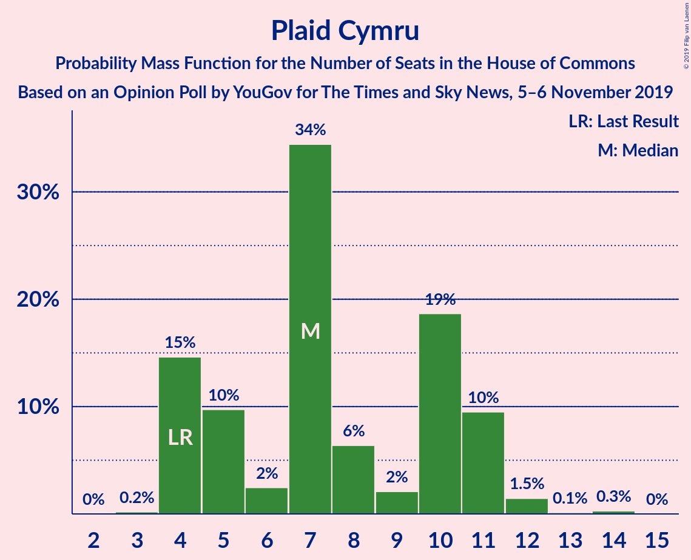
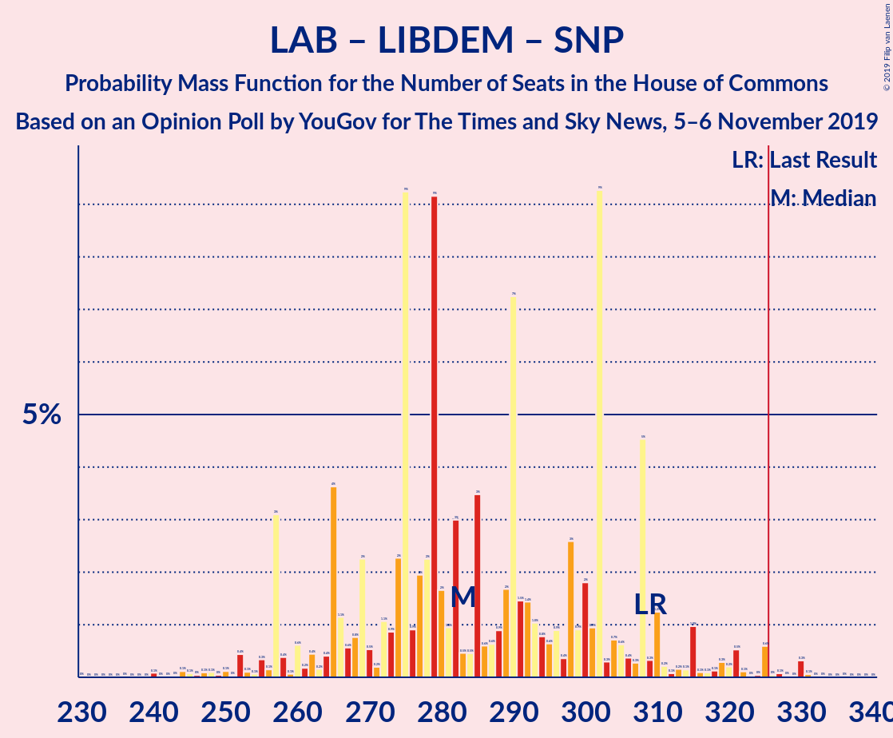
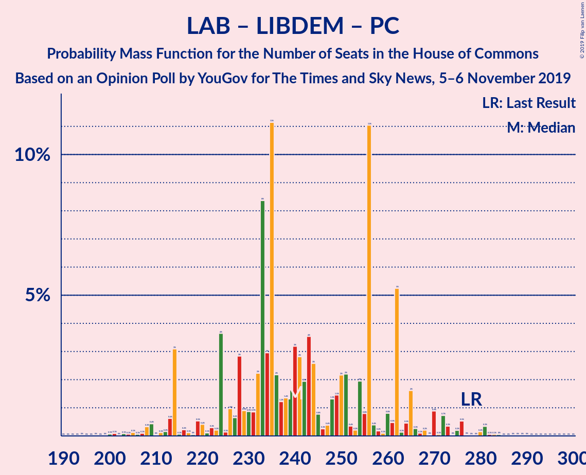

# Opinion Poll by YouGov for The Times/Sky News, 5–6 November 2019

<a href="#voting-intentions">Voting Intentions</a> | <a href="#seats">Seats</a> | <a href="#coalitions">Coalitions</a> | <a href="#technical-information">Technical Information</a>

## Voting Intentions

### Confidence Intervals

| Party | Last Result | Poll Result | 80% Confidence Interval | 90% Confidence Interval | 95% Confidence Interval | 99% Confidence Interval |
|:-----:|:-----------:|:-----------:|:-----------------------:|:-----------------------:|:-----------------------:|:-----------------------:|
| Conservative Party | 42.4% | 35.8% | 34.3–37.3% |33.9–37.8% |33.5–38.1% |32.8–38.9% |
| Labour Party | 40.0% | 24.9% | 23.6–26.3% |23.2–26.7% |22.9–27.0% |22.3–27.7% |
| Liberal Democrats | 7.4% | 16.9% | 15.8–18.2% |15.5–18.5% |15.2–18.8% |14.7–19.4% |
| Brexit Party | 0.0% | 10.9% | 10.0–12.0% |9.7–12.3% |9.5–12.5% |9.1–13.0% |
| Green Party | 1.6% | 5.0% | 4.4–5.7% |4.2–5.9% |4.0–6.1% |3.7–6.5% |
| Scottish National Party | 3.0% | 4.0% | 3.4–4.6% |3.2–4.8% |3.1–5.0% |2.9–5.4% |
| Plaid Cymru | 0.5% | 1.0% | 0.8–1.4% |0.7–1.5% |0.6–1.6% |0.5–1.8% |
| UK Independence Party | 1.8% | 0.2% | 0.1–0.5% |0.1–0.5% |0.1–0.6% |0.1–0.8% |
| Change UK | 0.0% | 0.2% | 0.1–0.5% |0.1–0.5% |0.1–0.6% |0.1–0.8% |

*Note:* The poll result column reflects the actual value used in the calculations. Published results may vary slightly, and in addition be rounded to fewer digits.

## Seats

### Confidence Intervals

| Party | Last Result | Median | 80% Confidence Interval | 90% Confidence Interval | 95% Confidence Interval | 99% Confidence Interval |
|:-----:|:-----------:|:------:|:-----------------------:|:-----------------------:|:-----------------------:|:-----------------------:|
| <a href="#conservative-party">Conservative Party</a> | 317 | 333 | 309–349 |309–358 |302–359 |294–366 |
| <a href="#labour-party">Labour Party</a> | 262 | 168 | 147–187 |146–193 |143–197 |132–206 |
| <a href="#liberal-democrats">Liberal Democrats</a> | 12 | 53 | 47–59 |46–60 |46–61 |41–66 |
| <a href="#brexit-party">Brexit Party</a> | 0 | 17 | 12–23 |9–25 |8–27 |5–39 |
| <a href="#green-party">Green Party</a> | 1 | 2 | 2–4 |1–4 |1–4 |1–4 |
| <a href="#scottish-national-party">Scottish National Party</a> | 35 | 51 | 50–54 |46–54 |43–54 |39–54 |
| <a href="#plaid-cymru">Plaid Cymru</a> | 4 | 7 | 4–11 |4–11 |4–11 |4–12 |
| <a href="#uk-independence-party">UK Independence Party</a> | 0 | 0 | 0 |0 |0 |0 |
| <a href="#change-uk">Change UK</a> | 0 | 0 | 0 |0 |0 |0 |

### Conservative Party

*For a full overview of the results for this party, see the [Conservative Party](party-conservativeparty.html) page.*

| Number of Seats | Probability | Accumulated | Special Marks |
|:---------------:|:-----------:|:-----------:|:-------------:|
| 283 | 0% | 100% |  |
| 284 | 0% | 99.9% |  |
| 285 | 0% | 99.9% |  |
| 286 | 0% | 99.9% |  |
| 287 | 0% | 99.9% |  |
| 288 | 0% | 99.9% |  |
| 289 | 0% | 99.9% |  |
| 290 | 0% | 99.9% |  |
| 291 | 0% | 99.8% |  |
| 292 | 0.1% | 99.8% |  |
| 293 | 0.2% | 99.8% |  |
| 294 | 0.3% | 99.6% |  |
| 295 | 0.1% | 99.3% |  |
| 296 | 0% | 99.2% |  |
| 297 | 0.1% | 99.2% |  |
| 298 | 0.1% | 99.1% |  |
| 299 | 0.5% | 99.0% |  |
| 300 | 0.3% | 98.5% |  |
| 301 | 0.3% | 98% |  |
| 302 | 0.6% | 98% |  |
| 303 | 0.1% | 97% |  |
| 304 | 0.8% | 97% |  |
| 305 | 0.2% | 96% |  |
| 306 | 0.1% | 96% |  |
| 307 | 0.2% | 96% |  |
| 308 | 0.2% | 96% |  |
| 309 | 6% | 96% |  |
| 310 | 0.2% | 90% |  |
| 311 | 0.2% | 90% |  |
| 312 | 0.7% | 90% |  |
| 313 | 0.8% | 89% |  |
| 314 | 0.3% | 88% |  |
| 315 | 9% | 88% |  |
| 316 | 0.1% | 79% |  |
| 317 | 2% | 78% | Last Result |
| 318 | 0.5% | 76% |  |
| 319 | 1.0% | 76% |  |
| 320 | 0.5% | 75% |  |
| 321 | 0.7% | 74% |  |
| 322 | 2% | 74% |  |
| 323 | 2% | 72% |  |
| 324 | 2% | 70% |  |
| 325 | 0.9% | 67% |  |
| 326 | 1.4% | 66% | Majority |
| 327 | 1.3% | 65% |  |
| 328 | 2% | 64% |  |
| 329 | 5% | 61% |  |
| 330 | 2% | 57% |  |
| 331 | 3% | 54% |  |
| 332 | 0.7% | 51% |  |
| 333 | 2% | 51% | Median |
| 334 | 0.7% | 49% |  |
| 335 | 1.0% | 48% |  |
| 336 | 2% | 47% |  |
| 337 | 3% | 45% |  |
| 338 | 1.5% | 42% |  |
| 339 | 9% | 41% |  |
| 340 | 11% | 32% |  |
| 341 | 2% | 21% |  |
| 342 | 0.7% | 19% |  |
| 343 | 0.8% | 19% |  |
| 344 | 2% | 18% |  |
| 345 | 2% | 16% |  |
| 346 | 0.6% | 14% |  |
| 347 | 1.0% | 13% |  |
| 348 | 0.4% | 12% |  |
| 349 | 4% | 12% |  |
| 350 | 0.5% | 8% |  |
| 351 | 0.8% | 8% |  |
| 352 | 0.2% | 7% |  |
| 353 | 0.3% | 7% |  |
| 354 | 0.2% | 6% |  |
| 355 | 0.4% | 6% |  |
| 356 | 0.5% | 6% |  |
| 357 | 0.1% | 5% |  |
| 358 | 0.3% | 5% |  |
| 359 | 3% | 5% |  |
| 360 | 0.3% | 2% |  |
| 361 | 0% | 2% |  |
| 362 | 0.2% | 1.5% |  |
| 363 | 0.4% | 1.2% |  |
| 364 | 0.1% | 0.8% |  |
| 365 | 0% | 0.7% |  |
| 366 | 0.2% | 0.7% |  |
| 367 | 0% | 0.5% |  |
| 368 | 0.1% | 0.4% |  |
| 369 | 0.1% | 0.4% |  |
| 370 | 0% | 0.2% |  |
| 371 | 0.1% | 0.2% |  |
| 372 | 0% | 0.2% |  |
| 373 | 0% | 0.1% |  |
| 374 | 0% | 0.1% |  |
| 375 | 0% | 0.1% |  |
| 376 | 0% | 0% |  |

### Labour Party

*For a full overview of the results for this party, see the [Labour Party](party-labourparty.html) page.*

| Number of Seats | Probability | Accumulated | Special Marks |
|:---------------:|:-----------:|:-----------:|:-------------:|
| 124 | 0% | 100% |  |
| 125 | 0% | 99.9% |  |
| 126 | 0% | 99.9% |  |
| 127 | 0.1% | 99.9% |  |
| 128 | 0.1% | 99.8% |  |
| 129 | 0% | 99.7% |  |
| 130 | 0% | 99.7% |  |
| 131 | 0.1% | 99.7% |  |
| 132 | 0.1% | 99.6% |  |
| 133 | 0.1% | 99.5% |  |
| 134 | 0.2% | 99.4% |  |
| 135 | 0.4% | 99.3% |  |
| 136 | 0% | 98.9% |  |
| 137 | 0.1% | 98.9% |  |
| 138 | 0.1% | 98.8% |  |
| 139 | 0.5% | 98.7% |  |
| 140 | 0% | 98% |  |
| 141 | 0.1% | 98% |  |
| 142 | 0.5% | 98% |  |
| 143 | 0.2% | 98% |  |
| 144 | 0.5% | 97% |  |
| 145 | 0.1% | 97% |  |
| 146 | 3% | 97% |  |
| 147 | 4% | 94% |  |
| 148 | 0.5% | 90% |  |
| 149 | 0.4% | 89% |  |
| 150 | 0.2% | 89% |  |
| 151 | 0.8% | 89% |  |
| 152 | 0.3% | 88% |  |
| 153 | 0.5% | 88% |  |
| 154 | 2% | 87% |  |
| 155 | 0.9% | 85% |  |
| 156 | 1.3% | 84% |  |
| 157 | 0.9% | 83% |  |
| 158 | 0.2% | 82% |  |
| 159 | 7% | 82% |  |
| 160 | 0.5% | 75% |  |
| 161 | 2% | 74% |  |
| 162 | 3% | 73% |  |
| 163 | 1.0% | 70% |  |
| 164 | 1.5% | 69% |  |
| 165 | 3% | 67% |  |
| 166 | 2% | 64% |  |
| 167 | 9% | 62% |  |
| 168 | 3% | 53% | Median |
| 169 | 3% | 50% |  |
| 170 | 2% | 47% |  |
| 171 | 1.2% | 45% |  |
| 172 | 7% | 43% |  |
| 173 | 3% | 37% |  |
| 174 | 3% | 34% |  |
| 175 | 0.6% | 32% |  |
| 176 | 0.4% | 31% |  |
| 177 | 0.7% | 31% |  |
| 178 | 0.2% | 30% |  |
| 179 | 1.1% | 30% |  |
| 180 | 9% | 29% |  |
| 181 | 0.5% | 20% |  |
| 182 | 0.2% | 19% |  |
| 183 | 0.3% | 19% |  |
| 184 | 1.4% | 19% |  |
| 185 | 1.0% | 17% |  |
| 186 | 5% | 16% |  |
| 187 | 1.4% | 11% |  |
| 188 | 0.2% | 10% |  |
| 189 | 0.5% | 10% |  |
| 190 | 3% | 9% |  |
| 191 | 0.2% | 6% |  |
| 192 | 0.1% | 6% |  |
| 193 | 1.2% | 6% |  |
| 194 | 1.5% | 5% |  |
| 195 | 0.1% | 3% |  |
| 196 | 0.3% | 3% |  |
| 197 | 0.4% | 3% |  |
| 198 | 0.1% | 2% |  |
| 199 | 0.1% | 2% |  |
| 200 | 0.5% | 2% |  |
| 201 | 0.1% | 2% |  |
| 202 | 0% | 1.4% |  |
| 203 | 0.5% | 1.4% |  |
| 204 | 0.3% | 0.9% |  |
| 205 | 0% | 0.6% |  |
| 206 | 0.1% | 0.5% |  |
| 207 | 0% | 0.5% |  |
| 208 | 0.1% | 0.4% |  |
| 209 | 0.1% | 0.3% |  |
| 210 | 0% | 0.2% |  |
| 211 | 0% | 0.2% |  |
| 212 | 0.1% | 0.2% |  |
| 213 | 0% | 0.1% |  |
| 214 | 0% | 0.1% |  |
| 215 | 0% | 0.1% |  |
| 216 | 0% | 0.1% |  |
| 217 | 0% | 0.1% |  |
| 218 | 0% | 0.1% |  |
| 219 | 0% | 0% |  |
| 220 | 0% | 0% |  |
| 221 | 0% | 0% |  |
| 222 | 0% | 0% |  |
| 223 | 0% | 0% |  |
| 224 | 0% | 0% |  |
| 225 | 0% | 0% |  |
| 226 | 0% | 0% |  |
| 227 | 0% | 0% |  |
| 228 | 0% | 0% |  |
| 229 | 0% | 0% |  |
| 230 | 0% | 0% |  |
| 231 | 0% | 0% |  |
| 232 | 0% | 0% |  |
| 233 | 0% | 0% |  |
| 234 | 0% | 0% |  |
| 235 | 0% | 0% |  |
| 236 | 0% | 0% |  |
| 237 | 0% | 0% |  |
| 238 | 0% | 0% |  |
| 239 | 0% | 0% |  |
| 240 | 0% | 0% |  |
| 241 | 0% | 0% |  |
| 242 | 0% | 0% |  |
| 243 | 0% | 0% |  |
| 244 | 0% | 0% |  |
| 245 | 0% | 0% |  |
| 246 | 0% | 0% |  |
| 247 | 0% | 0% |  |
| 248 | 0% | 0% |  |
| 249 | 0% | 0% |  |
| 250 | 0% | 0% |  |
| 251 | 0% | 0% |  |
| 252 | 0% | 0% |  |
| 253 | 0% | 0% |  |
| 254 | 0% | 0% |  |
| 255 | 0% | 0% |  |
| 256 | 0% | 0% |  |
| 257 | 0% | 0% |  |
| 258 | 0% | 0% |  |
| 259 | 0% | 0% |  |
| 260 | 0% | 0% |  |
| 261 | 0% | 0% |  |
| 262 | 0% | 0% | Last Result |

### Liberal Democrats

*For a full overview of the results for this party, see the [Liberal Democrats](party-liberaldemocrats.html) page.*

| Number of Seats | Probability | Accumulated | Special Marks |
|:---------------:|:-----------:|:-----------:|:-------------:|
| 12 | 0% | 100% | Last Result |
| 13 | 0% | 100% |  |
| 14 | 0% | 100% |  |
| 15 | 0% | 100% |  |
| 16 | 0% | 100% |  |
| 17 | 0% | 100% |  |
| 18 | 0% | 100% |  |
| 19 | 0% | 100% |  |
| 20 | 0% | 100% |  |
| 21 | 0% | 100% |  |
| 22 | 0% | 100% |  |
| 23 | 0% | 100% |  |
| 24 | 0% | 100% |  |
| 25 | 0% | 100% |  |
| 26 | 0% | 100% |  |
| 27 | 0% | 100% |  |
| 28 | 0% | 100% |  |
| 29 | 0% | 100% |  |
| 30 | 0% | 100% |  |
| 31 | 0% | 100% |  |
| 32 | 0% | 100% |  |
| 33 | 0% | 100% |  |
| 34 | 0% | 100% |  |
| 35 | 0% | 100% |  |
| 36 | 0% | 100% |  |
| 37 | 0% | 100% |  |
| 38 | 0% | 100% |  |
| 39 | 0% | 100% |  |
| 40 | 0% | 100% |  |
| 41 | 0.5% | 99.9% |  |
| 42 | 0.3% | 99.5% |  |
| 43 | 0.3% | 99.2% |  |
| 44 | 0.4% | 99.0% |  |
| 45 | 0.2% | 98.6% |  |
| 46 | 5% | 98% |  |
| 47 | 17% | 93% |  |
| 48 | 16% | 76% |  |
| 49 | 5% | 60% |  |
| 50 | 0.5% | 54% |  |
| 51 | 3% | 54% |  |
| 52 | 0.4% | 51% |  |
| 53 | 1.5% | 50% | Median |
| 54 | 1.3% | 49% |  |
| 55 | 10% | 48% |  |
| 56 | 7% | 37% |  |
| 57 | 5% | 31% |  |
| 58 | 4% | 26% |  |
| 59 | 16% | 22% |  |
| 60 | 2% | 6% |  |
| 61 | 1.1% | 4% |  |
| 62 | 0.7% | 2% |  |
| 63 | 0.8% | 2% |  |
| 64 | 0.2% | 0.9% |  |
| 65 | 0.1% | 0.7% |  |
| 66 | 0.1% | 0.6% |  |
| 67 | 0.1% | 0.5% |  |
| 68 | 0.2% | 0.3% |  |
| 69 | 0.1% | 0.1% |  |
| 70 | 0% | 0% |  |

### Brexit Party

*For a full overview of the results for this party, see the [Brexit Party](party-brexitparty.html) page.*

| Number of Seats | Probability | Accumulated | Special Marks |
|:---------------:|:-----------:|:-----------:|:-------------:|
| 0 | 0% | 100% | Last Result |
| 1 | 0% | 100% |  |
| 2 | 0% | 100% |  |
| 3 | 0.1% | 100% |  |
| 4 | 0.4% | 99.9% |  |
| 5 | 0.1% | 99.5% |  |
| 6 | 0.4% | 99.4% |  |
| 7 | 1.2% | 98.9% |  |
| 8 | 2% | 98% |  |
| 9 | 0.6% | 96% |  |
| 10 | 0.7% | 95% |  |
| 11 | 1.1% | 94% |  |
| 12 | 5% | 93% |  |
| 13 | 10% | 88% |  |
| 14 | 14% | 78% |  |
| 15 | 4% | 64% |  |
| 16 | 9% | 60% |  |
| 17 | 5% | 51% | Median |
| 18 | 7% | 46% |  |
| 19 | 6% | 39% |  |
| 20 | 20% | 33% |  |
| 21 | 2% | 13% |  |
| 22 | 0.2% | 12% |  |
| 23 | 2% | 11% |  |
| 24 | 0.2% | 9% |  |
| 25 | 4% | 9% |  |
| 26 | 0.3% | 4% |  |
| 27 | 2% | 4% |  |
| 28 | 0.4% | 2% |  |
| 29 | 0.1% | 2% |  |
| 30 | 0.2% | 2% |  |
| 31 | 0.1% | 1.4% |  |
| 32 | 0% | 1.3% |  |
| 33 | 0.1% | 1.3% |  |
| 34 | 0.1% | 1.2% |  |
| 35 | 0.1% | 1.1% |  |
| 36 | 0.1% | 1.0% |  |
| 37 | 0.2% | 0.9% |  |
| 38 | 0.2% | 0.7% |  |
| 39 | 0% | 0.5% |  |
| 40 | 0.3% | 0.5% |  |
| 41 | 0.1% | 0.2% |  |
| 42 | 0% | 0.1% |  |
| 43 | 0% | 0.1% |  |
| 44 | 0% | 0.1% |  |
| 45 | 0% | 0.1% |  |
| 46 | 0% | 0% |  |

### Green Party

*For a full overview of the results for this party, see the [Green Party](party-greenparty.html) page.*

| Number of Seats | Probability | Accumulated | Special Marks |
|:---------------:|:-----------:|:-----------:|:-------------:|
| 1 | 6% | 100% | Last Result |
| 2 | 48% | 94% | Median |
| 3 | 17% | 46% |  |
| 4 | 29% | 30% |  |
| 5 | 0.1% | 0.1% |  |
| 6 | 0% | 0% |  |

### Scottish National Party

*For a full overview of the results for this party, see the [Scottish National Party](party-scottishnationalparty.html) page.*

| Number of Seats | Probability | Accumulated | Special Marks |
|:---------------:|:-----------:|:-----------:|:-------------:|
| 35 | 0% | 100% | Last Result |
| 36 | 0% | 100% |  |
| 37 | 0% | 100% |  |
| 38 | 0% | 99.9% |  |
| 39 | 1.2% | 99.9% |  |
| 40 | 0.5% | 98.7% |  |
| 41 | 0.1% | 98% |  |
| 42 | 0.1% | 98% |  |
| 43 | 1.4% | 98% |  |
| 44 | 0.1% | 97% |  |
| 45 | 0.9% | 97% |  |
| 46 | 2% | 96% |  |
| 47 | 0.4% | 94% |  |
| 48 | 2% | 93% |  |
| 49 | 1.4% | 92% |  |
| 50 | 19% | 90% |  |
| 51 | 23% | 71% | Median |
| 52 | 0.8% | 48% |  |
| 53 | 34% | 47% |  |
| 54 | 13% | 13% |  |
| 55 | 0% | 0% |  |

### Plaid Cymru

*For a full overview of the results for this party, see the [Plaid Cymru](party-plaidcymru.html) page.*

| Number of Seats | Probability | Accumulated | Special Marks |
|:---------------:|:-----------:|:-----------:|:-------------:|
| 3 | 0.2% | 100% |  |
| 4 | 15% | 99.8% | Last Result |
| 5 | 10% | 85% |  |
| 6 | 2% | 75% |  |
| 7 | 34% | 73% | Median |
| 8 | 6% | 39% |  |
| 9 | 2% | 32% |  |
| 10 | 19% | 30% |  |
| 11 | 10% | 11% |  |
| 12 | 1.5% | 2% |  |
| 13 | 0.1% | 0.4% |  |
| 14 | 0.3% | 0.3% |  |
| 15 | 0% | 0% |  |

### UK Independence Party

*For a full overview of the results for this party, see the [UK Independence Party](party-ukindependenceparty.html) page.*

| Number of Seats | Probability | Accumulated | Special Marks |
|:---------------:|:-----------:|:-----------:|:-------------:|
| 0 | 100% | 100% | Last Result, Median |

### Change UK

*For a full overview of the results for this party, see the [Change UK](party-changeuk.html) page.*

| Number of Seats | Probability | Accumulated | Special Marks |
|:---------------:|:-----------:|:-----------:|:-------------:|
| 0 | 100% | 100% | Last Result, Median |

## Coalitions

### Confidence Intervals

| Coalition | Last Result | Median | Majority? | 80% Confidence Interval | 90% Confidence Interval | 95% Confidence Interval | 99% Confidence Interval |
|:---------:|:-----------:|:------:|:---------:|:-----------------------:|:-----------------------:|:-----------------------:|:-----------------------:|
| Conservative Party – Scottish National Party – Plaid Cymru | 356 | 391 | 100% | 370–410 | 368–416 | 361–416 | 351–426 |
| Conservative Party – Scottish National Party | 352 | 384 | 100% | 362–400 | 362–409 | 355–409 | 346–416 |
| Conservative Party – Liberal Democrats – Change UK | 329 | 386 | 100% | 368–397 | 365–407 | 360–407 | 351–415 |
| Conservative Party – Liberal Democrats | 329 | 386 | 100% | 368–397 | 365–407 | 360–407 | 351–415 |
| Conservative Party – Brexit Party | 317 | 350 | 91% | 326–374 | 323–379 | 318–379 | 306–387 |
| Conservative Party – Plaid Cymru | 321 | 341 | 77% | 317–359 | 316–366 | 308–366 | 298–376 |
| Conservative Party – Change UK | 317 | 333 | 66% | 309–349 | 309–358 | 302–359 | 294–366 |
| Conservative Party | 317 | 333 | 66% | 309–349 | 309–358 | 302–359 | 294–366 |
| Labour Party – Liberal Democrats – Scottish National Party – Plaid Cymru | 313 | 279 | 0.3% | 256–304 | 251–305 | 250–312 | 242–324 |
| Labour Party – Liberal Democrats – Scottish National Party | 309 | 271 | 0.1% | 248–296 | 244–298 | 242–306 | 232–319 |
| Labour Party – Liberal Democrats – Plaid Cymru | 278 | 227 | 0% | 207–252 | 201–253 | 199–259 | 189–271 |
| Labour Party – Scottish National Party – Plaid Cymru | 301 | 227 | 0% | 208–247 | 203–251 | 200–256 | 192–263 |
| Labour Party – Liberal Democrats – Change UK | 274 | 221 | 0% | 199–245 | 194–247 | 191–253 | 181–267 |
| Labour Party – Liberal Democrats | 274 | 221 | 0% | 199–245 | 194–247 | 191–253 | 181–267 |
| Labour Party – Scottish National Party | 297 | 220 | 0% | 198–240 | 196–244 | 193–250 | 183–257 |
| Labour Party – Plaid Cymru | 266 | 177 | 0% | 157–194 | 153–200 | 151–204 | 142–213 |
| Labour Party – Change UK | 262 | 168 | 0% | 147–187 | 146–193 | 143–197 | 132–206 |
| Labour Party | 262 | 168 | 0% | 147–187 | 146–193 | 143–197 | 132–206 |

### Conservative Party – Scottish National Party – Plaid Cymru

| Number of Seats | Probability | Accumulated | Special Marks |
|:---------------:|:-----------:|:-----------:|:-------------:|
| 342 | 0% | 100% |  |
| 343 | 0% | 99.9% |  |
| 344 | 0% | 99.9% |  |
| 345 | 0% | 99.9% |  |
| 346 | 0.1% | 99.9% |  |
| 347 | 0% | 99.9% |  |
| 348 | 0% | 99.8% |  |
| 349 | 0.1% | 99.8% |  |
| 350 | 0% | 99.8% |  |
| 351 | 0.4% | 99.7% |  |
| 352 | 0.1% | 99.3% |  |
| 353 | 0.1% | 99.3% |  |
| 354 | 0.2% | 99.2% |  |
| 355 | 0% | 99.1% |  |
| 356 | 0.5% | 99.0% | Last Result |
| 357 | 0.1% | 98.6% |  |
| 358 | 0.1% | 98.5% |  |
| 359 | 0.6% | 98% |  |
| 360 | 0.1% | 98% |  |
| 361 | 0.5% | 98% |  |
| 362 | 0.1% | 97% |  |
| 363 | 0.2% | 97% |  |
| 364 | 0.2% | 97% |  |
| 365 | 0.9% | 97% |  |
| 366 | 0.3% | 96% |  |
| 367 | 0.1% | 96% |  |
| 368 | 0.5% | 95% |  |
| 369 | 5% | 95% |  |
| 370 | 1.4% | 90% |  |
| 371 | 0.2% | 89% |  |
| 372 | 0.6% | 88% |  |
| 373 | 0.7% | 88% |  |
| 374 | 0.3% | 87% |  |
| 375 | 9% | 87% |  |
| 376 | 0.8% | 77% |  |
| 377 | 0.3% | 77% |  |
| 378 | 0.7% | 76% |  |
| 379 | 4% | 76% |  |
| 380 | 0.6% | 72% |  |
| 381 | 3% | 71% |  |
| 382 | 0.3% | 69% |  |
| 383 | 2% | 68% |  |
| 384 | 0.3% | 67% |  |
| 385 | 0.8% | 66% |  |
| 386 | 3% | 66% |  |
| 387 | 5% | 63% |  |
| 388 | 2% | 58% |  |
| 389 | 5% | 56% |  |
| 390 | 0.6% | 51% |  |
| 391 | 0.6% | 50% | Median |
| 392 | 1.2% | 50% |  |
| 393 | 0.5% | 48% |  |
| 394 | 1.2% | 48% |  |
| 395 | 9% | 47% |  |
| 396 | 2% | 38% |  |
| 397 | 2% | 36% |  |
| 398 | 3% | 34% |  |
| 399 | 0.6% | 31% |  |
| 400 | 8% | 30% |  |
| 401 | 4% | 22% |  |
| 402 | 2% | 19% |  |
| 403 | 0.6% | 17% |  |
| 404 | 1.2% | 16% |  |
| 405 | 0.7% | 15% |  |
| 406 | 2% | 14% |  |
| 407 | 0.9% | 12% |  |
| 408 | 0.9% | 12% |  |
| 409 | 0.4% | 11% |  |
| 410 | 4% | 10% |  |
| 411 | 0.3% | 7% |  |
| 412 | 0.3% | 7% |  |
| 413 | 0.3% | 6% |  |
| 414 | 0.2% | 6% |  |
| 415 | 0.1% | 6% |  |
| 416 | 3% | 6% |  |
| 417 | 0.5% | 2% |  |
| 418 | 0.3% | 2% |  |
| 419 | 0.1% | 2% |  |
| 420 | 0.5% | 2% |  |
| 421 | 0.4% | 1.1% |  |
| 422 | 0.1% | 0.8% |  |
| 423 | 0% | 0.7% |  |
| 424 | 0.1% | 0.7% |  |
| 425 | 0.1% | 0.6% |  |
| 426 | 0.1% | 0.5% |  |
| 427 | 0.1% | 0.5% |  |
| 428 | 0.1% | 0.3% |  |
| 429 | 0% | 0.2% |  |
| 430 | 0.1% | 0.2% |  |
| 431 | 0% | 0.1% |  |
| 432 | 0% | 0.1% |  |
| 433 | 0% | 0.1% |  |
| 434 | 0% | 0% |  |

### Conservative Party – Scottish National Party

| Number of Seats | Probability | Accumulated | Special Marks |
|:---------------:|:-----------:|:-----------:|:-------------:|
| 336 | 0% | 100% |  |
| 337 | 0% | 99.9% |  |
| 338 | 0% | 99.9% |  |
| 339 | 0% | 99.9% |  |
| 340 | 0% | 99.9% |  |
| 341 | 0% | 99.9% |  |
| 342 | 0% | 99.9% |  |
| 343 | 0% | 99.8% |  |
| 344 | 0% | 99.8% |  |
| 345 | 0.1% | 99.7% |  |
| 346 | 0.2% | 99.7% |  |
| 347 | 0.4% | 99.5% |  |
| 348 | 0% | 99.1% |  |
| 349 | 0% | 99.1% |  |
| 350 | 0.1% | 99.1% |  |
| 351 | 0.1% | 99.0% |  |
| 352 | 0.5% | 98.9% | Last Result |
| 353 | 0.3% | 98% |  |
| 354 | 0.4% | 98% |  |
| 355 | 0.6% | 98% |  |
| 356 | 0.2% | 97% |  |
| 357 | 0.8% | 97% |  |
| 358 | 0.1% | 96% |  |
| 359 | 0.2% | 96% |  |
| 360 | 0.3% | 96% |  |
| 361 | 0.5% | 96% |  |
| 362 | 6% | 95% |  |
| 363 | 0.3% | 89% |  |
| 364 | 1.0% | 89% |  |
| 365 | 0.5% | 88% |  |
| 366 | 0.6% | 87% |  |
| 367 | 0.3% | 87% |  |
| 368 | 9% | 87% |  |
| 369 | 0.1% | 77% |  |
| 370 | 2% | 77% |  |
| 371 | 0.6% | 75% |  |
| 372 | 1.2% | 74% |  |
| 373 | 2% | 73% |  |
| 374 | 0.9% | 72% |  |
| 375 | 3% | 71% |  |
| 376 | 1.3% | 67% |  |
| 377 | 2% | 66% |  |
| 378 | 0.7% | 64% |  |
| 379 | 1.3% | 64% |  |
| 380 | 0.6% | 62% |  |
| 381 | 2% | 62% |  |
| 382 | 5% | 60% |  |
| 383 | 5% | 55% |  |
| 384 | 1.2% | 50% | Median |
| 385 | 1.2% | 49% |  |
| 386 | 0.6% | 48% |  |
| 387 | 2% | 47% |  |
| 388 | 1.2% | 45% |  |
| 389 | 0.8% | 44% |  |
| 390 | 19% | 43% |  |
| 391 | 5% | 25% |  |
| 392 | 1.2% | 20% |  |
| 393 | 0.6% | 19% |  |
| 394 | 2% | 18% |  |
| 395 | 1.1% | 16% |  |
| 396 | 2% | 15% |  |
| 397 | 0.8% | 13% |  |
| 398 | 0.4% | 12% |  |
| 399 | 0.6% | 12% |  |
| 400 | 3% | 11% |  |
| 401 | 0.3% | 8% |  |
| 402 | 0.6% | 7% |  |
| 403 | 0.2% | 7% |  |
| 404 | 0.4% | 7% |  |
| 405 | 0.2% | 6% |  |
| 406 | 0.2% | 6% |  |
| 407 | 0.2% | 6% |  |
| 408 | 0.1% | 6% |  |
| 409 | 3% | 6% |  |
| 410 | 0.6% | 2% |  |
| 411 | 0.1% | 2% |  |
| 412 | 0.1% | 2% |  |
| 413 | 0.5% | 1.5% |  |
| 414 | 0.3% | 1.0% |  |
| 415 | 0% | 0.6% |  |
| 416 | 0.1% | 0.6% |  |
| 417 | 0% | 0.5% |  |
| 418 | 0.1% | 0.4% |  |
| 419 | 0.1% | 0.4% |  |
| 420 | 0% | 0.3% |  |
| 421 | 0.1% | 0.2% |  |
| 422 | 0% | 0.1% |  |
| 423 | 0% | 0.1% |  |
| 424 | 0% | 0.1% |  |
| 425 | 0% | 0.1% |  |
| 426 | 0% | 0% |  |

### Conservative Party – Liberal Democrats – Change UK

| Number of Seats | Probability | Accumulated | Special Marks |
|:---------------:|:-----------:|:-----------:|:-------------:|
| 329 | 0% | 100% | Last Result |
| 330 | 0% | 100% |  |
| 331 | 0% | 100% |  |
| 332 | 0% | 100% |  |
| 333 | 0% | 100% |  |
| 334 | 0% | 100% |  |
| 335 | 0% | 100% |  |
| 336 | 0% | 100% |  |
| 337 | 0% | 100% |  |
| 338 | 0% | 100% |  |
| 339 | 0% | 100% |  |
| 340 | 0% | 100% |  |
| 341 | 0% | 100% |  |
| 342 | 0% | 100% |  |
| 343 | 0% | 99.9% |  |
| 344 | 0% | 99.9% |  |
| 345 | 0% | 99.9% |  |
| 346 | 0% | 99.9% |  |
| 347 | 0% | 99.9% |  |
| 348 | 0.1% | 99.8% |  |
| 349 | 0.1% | 99.8% |  |
| 350 | 0.1% | 99.7% |  |
| 351 | 0.1% | 99.6% |  |
| 352 | 0.1% | 99.5% |  |
| 353 | 0.1% | 99.4% |  |
| 354 | 0.1% | 99.4% |  |
| 355 | 0.1% | 99.3% |  |
| 356 | 0.3% | 99.2% |  |
| 357 | 1.0% | 99.0% |  |
| 358 | 0.3% | 98% |  |
| 359 | 0.1% | 98% |  |
| 360 | 1.1% | 98% |  |
| 361 | 0.5% | 97% |  |
| 362 | 0.1% | 96% |  |
| 363 | 0.1% | 96% |  |
| 364 | 0.4% | 96% |  |
| 365 | 1.4% | 95% |  |
| 366 | 0.8% | 94% |  |
| 367 | 0.3% | 93% |  |
| 368 | 5% | 93% |  |
| 369 | 0.7% | 88% |  |
| 370 | 2% | 87% |  |
| 371 | 0.2% | 85% |  |
| 372 | 1.1% | 85% |  |
| 373 | 2% | 83% |  |
| 374 | 9% | 82% |  |
| 375 | 1.0% | 73% |  |
| 376 | 2% | 72% |  |
| 377 | 1.3% | 70% |  |
| 378 | 1.1% | 68% |  |
| 379 | 0.2% | 67% |  |
| 380 | 5% | 67% |  |
| 381 | 2% | 62% |  |
| 382 | 0.7% | 61% |  |
| 383 | 2% | 60% |  |
| 384 | 4% | 58% |  |
| 385 | 2% | 54% |  |
| 386 | 6% | 52% | Median |
| 387 | 11% | 46% |  |
| 388 | 2% | 34% |  |
| 389 | 2% | 32% |  |
| 390 | 2% | 30% |  |
| 391 | 1.1% | 29% |  |
| 392 | 4% | 28% |  |
| 393 | 1.2% | 23% |  |
| 394 | 7% | 22% |  |
| 395 | 0.7% | 15% |  |
| 396 | 0.6% | 14% |  |
| 397 | 4% | 14% |  |
| 398 | 1.1% | 10% |  |
| 399 | 0.5% | 9% |  |
| 400 | 0.5% | 8% |  |
| 401 | 0.5% | 8% |  |
| 402 | 0.4% | 7% |  |
| 403 | 0.9% | 7% |  |
| 404 | 0.2% | 6% |  |
| 405 | 0.1% | 6% |  |
| 406 | 0.2% | 6% |  |
| 407 | 3% | 6% |  |
| 408 | 0.5% | 2% |  |
| 409 | 0.1% | 2% |  |
| 410 | 0.1% | 2% |  |
| 411 | 0.5% | 1.5% |  |
| 412 | 0.2% | 1.0% |  |
| 413 | 0.2% | 0.8% |  |
| 414 | 0.1% | 0.6% |  |
| 415 | 0.1% | 0.5% |  |
| 416 | 0% | 0.4% |  |
| 417 | 0.1% | 0.4% |  |
| 418 | 0.1% | 0.3% |  |
| 419 | 0% | 0.2% |  |
| 420 | 0.1% | 0.2% |  |
| 421 | 0% | 0.1% |  |
| 422 | 0% | 0.1% |  |
| 423 | 0% | 0.1% |  |
| 424 | 0% | 0.1% |  |
| 425 | 0% | 0.1% |  |
| 426 | 0% | 0% |  |

### Conservative Party – Liberal Democrats

| Number of Seats | Probability | Accumulated | Special Marks |
|:---------------:|:-----------:|:-----------:|:-------------:|
| 329 | 0% | 100% | Last Result |
| 330 | 0% | 100% |  |
| 331 | 0% | 100% |  |
| 332 | 0% | 100% |  |
| 333 | 0% | 100% |  |
| 334 | 0% | 100% |  |
| 335 | 0% | 100% |  |
| 336 | 0% | 100% |  |
| 337 | 0% | 100% |  |
| 338 | 0% | 100% |  |
| 339 | 0% | 100% |  |
| 340 | 0% | 100% |  |
| 341 | 0% | 100% |  |
| 342 | 0% | 100% |  |
| 343 | 0% | 99.9% |  |
| 344 | 0% | 99.9% |  |
| 345 | 0% | 99.9% |  |
| 346 | 0% | 99.9% |  |
| 347 | 0% | 99.9% |  |
| 348 | 0.1% | 99.8% |  |
| 349 | 0.1% | 99.8% |  |
| 350 | 0.1% | 99.7% |  |
| 351 | 0.1% | 99.6% |  |
| 352 | 0.1% | 99.5% |  |
| 353 | 0.1% | 99.4% |  |
| 354 | 0.1% | 99.4% |  |
| 355 | 0.1% | 99.3% |  |
| 356 | 0.3% | 99.2% |  |
| 357 | 1.0% | 99.0% |  |
| 358 | 0.3% | 98% |  |
| 359 | 0.1% | 98% |  |
| 360 | 1.1% | 98% |  |
| 361 | 0.5% | 97% |  |
| 362 | 0.1% | 96% |  |
| 363 | 0.1% | 96% |  |
| 364 | 0.4% | 96% |  |
| 365 | 1.4% | 95% |  |
| 366 | 0.8% | 94% |  |
| 367 | 0.3% | 93% |  |
| 368 | 5% | 93% |  |
| 369 | 0.7% | 88% |  |
| 370 | 2% | 87% |  |
| 371 | 0.2% | 85% |  |
| 372 | 1.1% | 85% |  |
| 373 | 2% | 83% |  |
| 374 | 9% | 82% |  |
| 375 | 1.0% | 73% |  |
| 376 | 2% | 72% |  |
| 377 | 1.3% | 70% |  |
| 378 | 1.1% | 68% |  |
| 379 | 0.2% | 67% |  |
| 380 | 5% | 67% |  |
| 381 | 2% | 62% |  |
| 382 | 0.7% | 61% |  |
| 383 | 2% | 60% |  |
| 384 | 4% | 58% |  |
| 385 | 2% | 54% |  |
| 386 | 6% | 52% | Median |
| 387 | 11% | 46% |  |
| 388 | 2% | 34% |  |
| 389 | 2% | 32% |  |
| 390 | 2% | 30% |  |
| 391 | 1.1% | 29% |  |
| 392 | 4% | 28% |  |
| 393 | 1.2% | 23% |  |
| 394 | 7% | 22% |  |
| 395 | 0.7% | 15% |  |
| 396 | 0.6% | 14% |  |
| 397 | 4% | 14% |  |
| 398 | 1.1% | 10% |  |
| 399 | 0.5% | 9% |  |
| 400 | 0.5% | 8% |  |
| 401 | 0.5% | 8% |  |
| 402 | 0.4% | 7% |  |
| 403 | 0.9% | 7% |  |
| 404 | 0.2% | 6% |  |
| 405 | 0.1% | 6% |  |
| 406 | 0.2% | 6% |  |
| 407 | 3% | 6% |  |
| 408 | 0.5% | 2% |  |
| 409 | 0.1% | 2% |  |
| 410 | 0.1% | 2% |  |
| 411 | 0.5% | 1.5% |  |
| 412 | 0.2% | 1.0% |  |
| 413 | 0.2% | 0.8% |  |
| 414 | 0.1% | 0.6% |  |
| 415 | 0.1% | 0.5% |  |
| 416 | 0% | 0.4% |  |
| 417 | 0.1% | 0.4% |  |
| 418 | 0.1% | 0.3% |  |
| 419 | 0% | 0.2% |  |
| 420 | 0.1% | 0.2% |  |
| 421 | 0% | 0.1% |  |
| 422 | 0% | 0.1% |  |
| 423 | 0% | 0.1% |  |
| 424 | 0% | 0.1% |  |
| 425 | 0% | 0.1% |  |
| 426 | 0% | 0% |  |

### Conservative Party – Brexit Party

| Number of Seats | Probability | Accumulated | Special Marks |
|:---------------:|:-----------:|:-----------:|:-------------:|
| 295 | 0% | 100% |  |
| 296 | 0% | 99.9% |  |
| 297 | 0% | 99.9% |  |
| 298 | 0% | 99.9% |  |
| 299 | 0% | 99.9% |  |
| 300 | 0% | 99.9% |  |
| 301 | 0.1% | 99.9% |  |
| 302 | 0% | 99.8% |  |
| 303 | 0% | 99.8% |  |
| 304 | 0% | 99.8% |  |
| 305 | 0.1% | 99.7% |  |
| 306 | 0.3% | 99.7% |  |
| 307 | 0% | 99.3% |  |
| 308 | 0% | 99.3% |  |
| 309 | 0% | 99.3% |  |
| 310 | 0.1% | 99.2% |  |
| 311 | 0.1% | 99.1% |  |
| 312 | 0.5% | 99.1% |  |
| 313 | 0% | 98.6% |  |
| 314 | 0.5% | 98.6% |  |
| 315 | 0.1% | 98% |  |
| 316 | 0.2% | 98% |  |
| 317 | 0.2% | 98% | Last Result |
| 318 | 0.4% | 98% |  |
| 319 | 0.1% | 97% |  |
| 320 | 1.1% | 97% |  |
| 321 | 0.1% | 96% |  |
| 322 | 0.1% | 96% |  |
| 323 | 5% | 96% |  |
| 324 | 0.3% | 91% |  |
| 325 | 0.3% | 91% |  |
| 326 | 1.3% | 91% | Majority |
| 327 | 0.2% | 89% |  |
| 328 | 0.3% | 89% |  |
| 329 | 9% | 89% |  |
| 330 | 0.6% | 79% |  |
| 331 | 1.4% | 79% |  |
| 332 | 0.7% | 77% |  |
| 333 | 0.4% | 77% |  |
| 334 | 0.6% | 76% |  |
| 335 | 3% | 76% |  |
| 336 | 2% | 73% |  |
| 337 | 1.3% | 71% |  |
| 338 | 0.4% | 70% |  |
| 339 | 1.3% | 69% |  |
| 340 | 0.7% | 68% |  |
| 341 | 1.5% | 67% |  |
| 342 | 1.0% | 66% |  |
| 343 | 5% | 65% |  |
| 344 | 0.3% | 60% |  |
| 345 | 0.6% | 59% |  |
| 346 | 1.1% | 59% |  |
| 347 | 3% | 58% |  |
| 348 | 1.1% | 55% |  |
| 349 | 3% | 54% |  |
| 350 | 2% | 51% | Median |
| 351 | 1.0% | 49% |  |
| 352 | 0.2% | 48% |  |
| 353 | 3% | 48% |  |
| 354 | 0.5% | 45% |  |
| 355 | 2% | 45% |  |
| 356 | 9% | 42% |  |
| 357 | 3% | 33% |  |
| 358 | 1.0% | 31% |  |
| 359 | 9% | 30% |  |
| 360 | 3% | 21% |  |
| 361 | 0.8% | 18% |  |
| 362 | 0.6% | 17% |  |
| 363 | 0.5% | 16% |  |
| 364 | 1.1% | 16% |  |
| 365 | 0.9% | 15% |  |
| 366 | 0.4% | 14% |  |
| 367 | 0.2% | 14% |  |
| 368 | 2% | 13% |  |
| 369 | 0.4% | 11% |  |
| 370 | 0.2% | 11% |  |
| 371 | 0.3% | 11% |  |
| 372 | 0.1% | 10% |  |
| 373 | 0.1% | 10% |  |
| 374 | 4% | 10% |  |
| 375 | 0.1% | 7% |  |
| 376 | 0.4% | 7% |  |
| 377 | 0.2% | 6% |  |
| 378 | 0.4% | 6% |  |
| 379 | 3% | 6% |  |
| 380 | 0.1% | 2% |  |
| 381 | 0.2% | 2% |  |
| 382 | 0.1% | 2% |  |
| 383 | 0.9% | 2% |  |
| 384 | 0.1% | 1.1% |  |
| 385 | 0.1% | 1.0% |  |
| 386 | 0% | 0.9% |  |
| 387 | 0.4% | 0.9% |  |
| 388 | 0% | 0.5% |  |
| 389 | 0% | 0.4% |  |
| 390 | 0% | 0.4% |  |
| 391 | 0% | 0.4% |  |
| 392 | 0.1% | 0.4% |  |
| 393 | 0.1% | 0.2% |  |
| 394 | 0% | 0.2% |  |
| 395 | 0% | 0.2% |  |
| 396 | 0.1% | 0.1% |  |
| 397 | 0% | 0.1% |  |
| 398 | 0% | 0.1% |  |
| 399 | 0% | 0.1% |  |
| 400 | 0% | 0.1% |  |
| 401 | 0% | 0% |  |

### Conservative Party – Plaid Cymru

| Number of Seats | Probability | Accumulated | Special Marks |
|:---------------:|:-----------:|:-----------:|:-------------:|
| 292 | 0% | 100% |  |
| 293 | 0% | 99.9% |  |
| 294 | 0% | 99.9% |  |
| 295 | 0% | 99.9% |  |
| 296 | 0.1% | 99.9% |  |
| 297 | 0% | 99.8% |  |
| 298 | 0.3% | 99.8% |  |
| 299 | 0.1% | 99.5% |  |
| 300 | 0.1% | 99.4% |  |
| 301 | 0.2% | 99.4% |  |
| 302 | 0% | 99.2% |  |
| 303 | 0.5% | 99.1% |  |
| 304 | 0.1% | 98.7% |  |
| 305 | 0% | 98.5% |  |
| 306 | 0.6% | 98% |  |
| 307 | 0.1% | 98% |  |
| 308 | 0.4% | 98% |  |
| 309 | 0.1% | 97% |  |
| 310 | 0.2% | 97% |  |
| 311 | 0% | 97% |  |
| 312 | 1.0% | 97% |  |
| 313 | 0.2% | 96% |  |
| 314 | 0.2% | 96% |  |
| 315 | 0.2% | 96% |  |
| 316 | 5% | 95% |  |
| 317 | 1.2% | 91% |  |
| 318 | 0.3% | 90% |  |
| 319 | 0.2% | 89% |  |
| 320 | 0.2% | 89% |  |
| 321 | 0.8% | 89% | Last Result |
| 322 | 9% | 88% |  |
| 323 | 1.1% | 79% |  |
| 324 | 0.3% | 78% |  |
| 325 | 0.7% | 77% |  |
| 326 | 2% | 77% | Majority |
| 327 | 0.3% | 74% |  |
| 328 | 3% | 74% |  |
| 329 | 1.4% | 72% |  |
| 330 | 1.1% | 70% |  |
| 331 | 0.2% | 69% |  |
| 332 | 0.5% | 69% |  |
| 333 | 5% | 68% |  |
| 334 | 2% | 63% |  |
| 335 | 3% | 61% |  |
| 336 | 3% | 58% |  |
| 337 | 0.8% | 55% |  |
| 338 | 3% | 55% |  |
| 339 | 0.5% | 51% |  |
| 340 | 0.5% | 51% | Median |
| 341 | 2% | 50% |  |
| 342 | 1.0% | 48% |  |
| 343 | 1.5% | 47% |  |
| 344 | 7% | 46% |  |
| 345 | 1.2% | 38% |  |
| 346 | 2% | 37% |  |
| 347 | 3% | 35% |  |
| 348 | 2% | 32% |  |
| 349 | 1.5% | 30% |  |
| 350 | 8% | 28% |  |
| 351 | 2% | 20% |  |
| 352 | 1.3% | 18% |  |
| 353 | 0.5% | 17% |  |
| 354 | 0.7% | 16% |  |
| 355 | 2% | 16% |  |
| 356 | 0.3% | 13% |  |
| 357 | 1.0% | 13% |  |
| 358 | 0.9% | 12% |  |
| 359 | 4% | 11% |  |
| 360 | 0.2% | 7% |  |
| 361 | 0.1% | 7% |  |
| 362 | 0.5% | 7% |  |
| 363 | 0.5% | 6% |  |
| 364 | 0.2% | 6% |  |
| 365 | 0.2% | 5% |  |
| 366 | 3% | 5% |  |
| 367 | 0.3% | 2% |  |
| 368 | 0.2% | 2% |  |
| 369 | 0.2% | 1.5% |  |
| 370 | 0.5% | 1.3% |  |
| 371 | 0% | 0.9% |  |
| 372 | 0% | 0.8% |  |
| 373 | 0.1% | 0.8% |  |
| 374 | 0.1% | 0.7% |  |
| 375 | 0.1% | 0.6% |  |
| 376 | 0.1% | 0.5% |  |
| 377 | 0.1% | 0.4% |  |
| 378 | 0.1% | 0.3% |  |
| 379 | 0% | 0.3% |  |
| 380 | 0.1% | 0.2% |  |
| 381 | 0% | 0.1% |  |
| 382 | 0% | 0.1% |  |
| 383 | 0% | 0.1% |  |
| 384 | 0% | 0.1% |  |
| 385 | 0% | 0.1% |  |
| 386 | 0% | 0% |  |

### Conservative Party – Change UK

| Number of Seats | Probability | Accumulated | Special Marks |
|:---------------:|:-----------:|:-----------:|:-------------:|
| 283 | 0% | 100% |  |
| 284 | 0% | 99.9% |  |
| 285 | 0% | 99.9% |  |
| 286 | 0% | 99.9% |  |
| 287 | 0% | 99.9% |  |
| 288 | 0% | 99.9% |  |
| 289 | 0% | 99.9% |  |
| 290 | 0% | 99.9% |  |
| 291 | 0% | 99.8% |  |
| 292 | 0.1% | 99.8% |  |
| 293 | 0.2% | 99.8% |  |
| 294 | 0.3% | 99.6% |  |
| 295 | 0.1% | 99.3% |  |
| 296 | 0% | 99.2% |  |
| 297 | 0.1% | 99.2% |  |
| 298 | 0.1% | 99.1% |  |
| 299 | 0.5% | 99.0% |  |
| 300 | 0.3% | 98.5% |  |
| 301 | 0.3% | 98% |  |
| 302 | 0.6% | 98% |  |
| 303 | 0.1% | 97% |  |
| 304 | 0.8% | 97% |  |
| 305 | 0.2% | 96% |  |
| 306 | 0.1% | 96% |  |
| 307 | 0.2% | 96% |  |
| 308 | 0.2% | 96% |  |
| 309 | 6% | 96% |  |
| 310 | 0.2% | 90% |  |
| 311 | 0.2% | 90% |  |
| 312 | 0.7% | 90% |  |
| 313 | 0.8% | 89% |  |
| 314 | 0.3% | 88% |  |
| 315 | 9% | 88% |  |
| 316 | 0.1% | 79% |  |
| 317 | 2% | 78% | Last Result |
| 318 | 0.5% | 76% |  |
| 319 | 1.0% | 76% |  |
| 320 | 0.5% | 75% |  |
| 321 | 0.7% | 74% |  |
| 322 | 2% | 74% |  |
| 323 | 2% | 72% |  |
| 324 | 2% | 70% |  |
| 325 | 0.9% | 67% |  |
| 326 | 1.4% | 66% | Majority |
| 327 | 1.3% | 65% |  |
| 328 | 2% | 64% |  |
| 329 | 5% | 61% |  |
| 330 | 2% | 57% |  |
| 331 | 3% | 54% |  |
| 332 | 0.7% | 51% |  |
| 333 | 2% | 51% | Median |
| 334 | 0.7% | 49% |  |
| 335 | 1.0% | 48% |  |
| 336 | 2% | 47% |  |
| 337 | 3% | 45% |  |
| 338 | 1.5% | 42% |  |
| 339 | 9% | 41% |  |
| 340 | 11% | 32% |  |
| 341 | 2% | 21% |  |
| 342 | 0.7% | 19% |  |
| 343 | 0.8% | 19% |  |
| 344 | 2% | 18% |  |
| 345 | 2% | 16% |  |
| 346 | 0.6% | 14% |  |
| 347 | 1.0% | 13% |  |
| 348 | 0.4% | 12% |  |
| 349 | 4% | 12% |  |
| 350 | 0.5% | 8% |  |
| 351 | 0.8% | 8% |  |
| 352 | 0.2% | 7% |  |
| 353 | 0.3% | 7% |  |
| 354 | 0.2% | 6% |  |
| 355 | 0.4% | 6% |  |
| 356 | 0.5% | 6% |  |
| 357 | 0.1% | 5% |  |
| 358 | 0.3% | 5% |  |
| 359 | 3% | 5% |  |
| 360 | 0.3% | 2% |  |
| 361 | 0% | 2% |  |
| 362 | 0.2% | 1.5% |  |
| 363 | 0.4% | 1.2% |  |
| 364 | 0.1% | 0.8% |  |
| 365 | 0% | 0.7% |  |
| 366 | 0.2% | 0.7% |  |
| 367 | 0% | 0.5% |  |
| 368 | 0.1% | 0.4% |  |
| 369 | 0.1% | 0.4% |  |
| 370 | 0% | 0.2% |  |
| 371 | 0.1% | 0.2% |  |
| 372 | 0% | 0.2% |  |
| 373 | 0% | 0.1% |  |
| 374 | 0% | 0.1% |  |
| 375 | 0% | 0.1% |  |
| 376 | 0% | 0% |  |

### Conservative Party

| Number of Seats | Probability | Accumulated | Special Marks |
|:---------------:|:-----------:|:-----------:|:-------------:|
| 283 | 0% | 100% |  |
| 284 | 0% | 99.9% |  |
| 285 | 0% | 99.9% |  |
| 286 | 0% | 99.9% |  |
| 287 | 0% | 99.9% |  |
| 288 | 0% | 99.9% |  |
| 289 | 0% | 99.9% |  |
| 290 | 0% | 99.9% |  |
| 291 | 0% | 99.8% |  |
| 292 | 0.1% | 99.8% |  |
| 293 | 0.2% | 99.8% |  |
| 294 | 0.3% | 99.6% |  |
| 295 | 0.1% | 99.3% |  |
| 296 | 0% | 99.2% |  |
| 297 | 0.1% | 99.2% |  |
| 298 | 0.1% | 99.1% |  |
| 299 | 0.5% | 99.0% |  |
| 300 | 0.3% | 98.5% |  |
| 301 | 0.3% | 98% |  |
| 302 | 0.6% | 98% |  |
| 303 | 0.1% | 97% |  |
| 304 | 0.8% | 97% |  |
| 305 | 0.2% | 96% |  |
| 306 | 0.1% | 96% |  |
| 307 | 0.2% | 96% |  |
| 308 | 0.2% | 96% |  |
| 309 | 6% | 96% |  |
| 310 | 0.2% | 90% |  |
| 311 | 0.2% | 90% |  |
| 312 | 0.7% | 90% |  |
| 313 | 0.8% | 89% |  |
| 314 | 0.3% | 88% |  |
| 315 | 9% | 88% |  |
| 316 | 0.1% | 79% |  |
| 317 | 2% | 78% | Last Result |
| 318 | 0.5% | 76% |  |
| 319 | 1.0% | 76% |  |
| 320 | 0.5% | 75% |  |
| 321 | 0.7% | 74% |  |
| 322 | 2% | 74% |  |
| 323 | 2% | 72% |  |
| 324 | 2% | 70% |  |
| 325 | 0.9% | 67% |  |
| 326 | 1.4% | 66% | Majority |
| 327 | 1.3% | 65% |  |
| 328 | 2% | 64% |  |
| 329 | 5% | 61% |  |
| 330 | 2% | 57% |  |
| 331 | 3% | 54% |  |
| 332 | 0.7% | 51% |  |
| 333 | 2% | 51% | Median |
| 334 | 0.7% | 49% |  |
| 335 | 1.0% | 48% |  |
| 336 | 2% | 47% |  |
| 337 | 3% | 45% |  |
| 338 | 1.5% | 42% |  |
| 339 | 9% | 41% |  |
| 340 | 11% | 32% |  |
| 341 | 2% | 21% |  |
| 342 | 0.7% | 19% |  |
| 343 | 0.8% | 19% |  |
| 344 | 2% | 18% |  |
| 345 | 2% | 16% |  |
| 346 | 0.6% | 14% |  |
| 347 | 1.0% | 13% |  |
| 348 | 0.4% | 12% |  |
| 349 | 4% | 12% |  |
| 350 | 0.5% | 8% |  |
| 351 | 0.8% | 8% |  |
| 352 | 0.2% | 7% |  |
| 353 | 0.3% | 7% |  |
| 354 | 0.2% | 6% |  |
| 355 | 0.4% | 6% |  |
| 356 | 0.5% | 6% |  |
| 357 | 0.1% | 5% |  |
| 358 | 0.3% | 5% |  |
| 359 | 3% | 5% |  |
| 360 | 0.3% | 2% |  |
| 361 | 0% | 2% |  |
| 362 | 0.2% | 1.5% |  |
| 363 | 0.4% | 1.2% |  |
| 364 | 0.1% | 0.8% |  |
| 365 | 0% | 0.7% |  |
| 366 | 0.2% | 0.7% |  |
| 367 | 0% | 0.5% |  |
| 368 | 0.1% | 0.4% |  |
| 369 | 0.1% | 0.4% |  |
| 370 | 0% | 0.2% |  |
| 371 | 0.1% | 0.2% |  |
| 372 | 0% | 0.2% |  |
| 373 | 0% | 0.1% |  |
| 374 | 0% | 0.1% |  |
| 375 | 0% | 0.1% |  |
| 376 | 0% | 0% |  |

### Labour Party – Liberal Democrats – Scottish National Party – Plaid Cymru

| Number of Seats | Probability | Accumulated | Special Marks |
|:---------------:|:-----------:|:-----------:|:-------------:|
| 230 | 0% | 100% |  |
| 231 | 0% | 99.9% |  |
| 232 | 0% | 99.9% |  |
| 233 | 0.1% | 99.9% |  |
| 234 | 0% | 99.9% |  |
| 235 | 0% | 99.8% |  |
| 236 | 0.1% | 99.8% |  |
| 237 | 0.1% | 99.7% |  |
| 238 | 0% | 99.6% |  |
| 239 | 0% | 99.6% |  |
| 240 | 0% | 99.6% |  |
| 241 | 0% | 99.6% |  |
| 242 | 0.2% | 99.6% |  |
| 243 | 0.3% | 99.4% |  |
| 244 | 0.1% | 99.1% |  |
| 245 | 0.1% | 99.0% |  |
| 246 | 0.1% | 98.9% |  |
| 247 | 1.0% | 98.8% |  |
| 248 | 0.1% | 98% |  |
| 249 | 0.1% | 98% |  |
| 250 | 0.1% | 98% |  |
| 251 | 3% | 97% |  |
| 252 | 0.5% | 94% |  |
| 253 | 0.4% | 94% |  |
| 254 | 0.1% | 93% |  |
| 255 | 0.2% | 93% |  |
| 256 | 3% | 93% |  |
| 257 | 0.2% | 90% |  |
| 258 | 0.3% | 89% |  |
| 259 | 0.2% | 89% |  |
| 260 | 0.2% | 89% |  |
| 261 | 0.5% | 89% |  |
| 262 | 2% | 88% |  |
| 263 | 0.2% | 87% |  |
| 264 | 0.7% | 86% |  |
| 265 | 2% | 86% |  |
| 266 | 0.1% | 84% |  |
| 267 | 0.5% | 84% |  |
| 268 | 1.2% | 83% |  |
| 269 | 0.7% | 82% |  |
| 270 | 8% | 82% |  |
| 271 | 3% | 73% |  |
| 272 | 2% | 70% |  |
| 273 | 3% | 69% |  |
| 274 | 9% | 66% |  |
| 275 | 3% | 57% |  |
| 276 | 0.5% | 54% |  |
| 277 | 2% | 53% |  |
| 278 | 0.9% | 52% |  |
| 279 | 1.0% | 51% | Median |
| 280 | 1.4% | 50% |  |
| 281 | 4% | 48% |  |
| 282 | 3% | 44% |  |
| 283 | 0.5% | 42% |  |
| 284 | 0.3% | 41% |  |
| 285 | 3% | 41% |  |
| 286 | 0.2% | 38% |  |
| 287 | 3% | 38% |  |
| 288 | 2% | 34% |  |
| 289 | 2% | 33% |  |
| 290 | 0.2% | 31% |  |
| 291 | 0.7% | 31% |  |
| 292 | 0.4% | 30% |  |
| 293 | 1.4% | 30% |  |
| 294 | 2% | 28% |  |
| 295 | 3% | 26% |  |
| 296 | 0.2% | 24% |  |
| 297 | 0.2% | 23% |  |
| 298 | 0.8% | 23% |  |
| 299 | 10% | 22% |  |
| 300 | 0.8% | 12% |  |
| 301 | 0.3% | 11% |  |
| 302 | 0.3% | 11% |  |
| 303 | 0.2% | 11% |  |
| 304 | 1.4% | 11% |  |
| 305 | 5% | 9% |  |
| 306 | 0.3% | 5% |  |
| 307 | 0.1% | 4% |  |
| 308 | 0.1% | 4% |  |
| 309 | 0.1% | 4% |  |
| 310 | 1.1% | 4% |  |
| 311 | 0.2% | 3% |  |
| 312 | 0.4% | 3% |  |
| 313 | 0.1% | 2% | Last Result |
| 314 | 0.2% | 2% |  |
| 315 | 0% | 2% |  |
| 316 | 0.5% | 2% |  |
| 317 | 0% | 1.4% |  |
| 318 | 0.5% | 1.4% |  |
| 319 | 0.1% | 0.9% |  |
| 320 | 0% | 0.8% |  |
| 321 | 0% | 0.7% |  |
| 322 | 0% | 0.7% |  |
| 323 | 0% | 0.7% |  |
| 324 | 0.4% | 0.6% |  |
| 325 | 0% | 0.3% |  |
| 326 | 0% | 0.3% | Majority |
| 327 | 0.1% | 0.2% |  |
| 328 | 0% | 0.1% |  |
| 329 | 0% | 0.1% |  |
| 330 | 0% | 0.1% |  |
| 331 | 0% | 0.1% |  |
| 332 | 0% | 0.1% |  |
| 333 | 0% | 0.1% |  |
| 334 | 0% | 0.1% |  |
| 335 | 0% | 0% |  |

### Labour Party – Liberal Democrats – Scottish National Party

| Number of Seats | Probability | Accumulated | Special Marks |
|:---------------:|:-----------:|:-----------:|:-------------:|
| 221 | 0% | 100% |  |
| 222 | 0% | 99.9% |  |
| 223 | 0% | 99.9% |  |
| 224 | 0% | 99.9% |  |
| 225 | 0% | 99.9% |  |
| 226 | 0.1% | 99.9% |  |
| 227 | 0% | 99.7% |  |
| 228 | 0.1% | 99.7% |  |
| 229 | 0% | 99.6% |  |
| 230 | 0% | 99.6% |  |
| 231 | 0.1% | 99.6% |  |
| 232 | 0% | 99.5% |  |
| 233 | 0.1% | 99.5% |  |
| 234 | 0.1% | 99.4% |  |
| 235 | 0% | 99.4% |  |
| 236 | 0.4% | 99.3% |  |
| 237 | 0.1% | 99.0% |  |
| 238 | 0.1% | 98.8% |  |
| 239 | 0.1% | 98.8% |  |
| 240 | 0.9% | 98.7% |  |
| 241 | 0.2% | 98% |  |
| 242 | 0.2% | 98% |  |
| 243 | 0.1% | 97% |  |
| 244 | 3% | 97% |  |
| 245 | 0.3% | 94% |  |
| 246 | 4% | 94% |  |
| 247 | 0.1% | 90% |  |
| 248 | 0.2% | 90% |  |
| 249 | 0.2% | 90% |  |
| 250 | 0.5% | 90% |  |
| 251 | 0.1% | 89% |  |
| 252 | 2% | 89% |  |
| 253 | 0.7% | 87% |  |
| 254 | 0.7% | 86% |  |
| 255 | 0.3% | 86% |  |
| 256 | 0.5% | 85% |  |
| 257 | 0.2% | 85% |  |
| 258 | 1.1% | 85% |  |
| 259 | 0.5% | 83% |  |
| 260 | 2% | 83% |  |
| 261 | 1.4% | 81% |  |
| 262 | 0.4% | 80% |  |
| 263 | 3% | 79% |  |
| 264 | 11% | 76% |  |
| 265 | 8% | 65% |  |
| 266 | 1.4% | 58% |  |
| 267 | 1.5% | 56% |  |
| 268 | 1.3% | 55% |  |
| 269 | 0.7% | 54% |  |
| 270 | 2% | 53% |  |
| 271 | 1.0% | 51% |  |
| 272 | 0.5% | 50% | Median |
| 273 | 1.1% | 49% |  |
| 274 | 0.5% | 48% |  |
| 275 | 2% | 48% |  |
| 276 | 3% | 45% |  |
| 277 | 3% | 43% |  |
| 278 | 3% | 39% |  |
| 279 | 0.4% | 37% |  |
| 280 | 0.8% | 36% |  |
| 281 | 2% | 35% |  |
| 282 | 1.4% | 34% |  |
| 283 | 3% | 32% |  |
| 284 | 0.2% | 29% |  |
| 285 | 0.7% | 29% |  |
| 286 | 0.9% | 28% |  |
| 287 | 0.8% | 27% |  |
| 288 | 0.5% | 27% |  |
| 289 | 1.2% | 26% |  |
| 290 | 0.3% | 25% |  |
| 291 | 2% | 25% |  |
| 292 | 10% | 22% |  |
| 293 | 1.2% | 13% |  |
| 294 | 0.6% | 12% |  |
| 295 | 0.2% | 11% |  |
| 296 | 2% | 11% |  |
| 297 | 0.3% | 9% |  |
| 298 | 5% | 9% |  |
| 299 | 0.1% | 5% |  |
| 300 | 0.3% | 4% |  |
| 301 | 0% | 4% |  |
| 302 | 0.9% | 4% |  |
| 303 | 0.1% | 3% |  |
| 304 | 0.2% | 3% |  |
| 305 | 0.4% | 3% |  |
| 306 | 0.3% | 3% |  |
| 307 | 0.1% | 2% |  |
| 308 | 0% | 2% |  |
| 309 | 0.1% | 2% | Last Result |
| 310 | 0.1% | 2% |  |
| 311 | 0.1% | 2% |  |
| 312 | 0.5% | 2% |  |
| 313 | 0% | 1.3% |  |
| 314 | 0.5% | 1.2% |  |
| 315 | 0% | 0.7% |  |
| 316 | 0% | 0.7% |  |
| 317 | 0% | 0.6% |  |
| 318 | 0% | 0.6% |  |
| 319 | 0.1% | 0.6% |  |
| 320 | 0.4% | 0.5% |  |
| 321 | 0% | 0.1% |  |
| 322 | 0% | 0.1% |  |
| 323 | 0% | 0.1% |  |
| 324 | 0% | 0.1% |  |
| 325 | 0% | 0.1% |  |
| 326 | 0% | 0.1% | Majority |
| 327 | 0% | 0% |  |

### Labour Party – Liberal Democrats – Plaid Cymru

| Number of Seats | Probability | Accumulated | Special Marks |
|:---------------:|:-----------:|:-----------:|:-------------:|
| 181 | 0.1% | 100% |  |
| 182 | 0% | 99.9% |  |
| 183 | 0% | 99.9% |  |
| 184 | 0.1% | 99.9% |  |
| 185 | 0% | 99.8% |  |
| 186 | 0% | 99.8% |  |
| 187 | 0.1% | 99.8% |  |
| 188 | 0% | 99.7% |  |
| 189 | 0.3% | 99.6% |  |
| 190 | 0% | 99.3% |  |
| 191 | 0% | 99.3% |  |
| 192 | 0.1% | 99.3% |  |
| 193 | 0.6% | 99.2% |  |
| 194 | 0.1% | 98.6% |  |
| 195 | 0.1% | 98.5% |  |
| 196 | 0% | 98% |  |
| 197 | 0.5% | 98% |  |
| 198 | 0.3% | 98% |  |
| 199 | 0.3% | 98% |  |
| 200 | 0.1% | 97% |  |
| 201 | 3% | 97% |  |
| 202 | 0.2% | 94% |  |
| 203 | 0.1% | 94% |  |
| 204 | 0.2% | 94% |  |
| 205 | 3% | 93% |  |
| 206 | 0.1% | 90% |  |
| 207 | 0.4% | 90% |  |
| 208 | 0.3% | 90% |  |
| 209 | 0.4% | 89% |  |
| 210 | 0.3% | 89% |  |
| 211 | 2% | 89% |  |
| 212 | 0.1% | 86% |  |
| 213 | 0.5% | 86% |  |
| 214 | 0.7% | 86% |  |
| 215 | 1.5% | 85% |  |
| 216 | 0.2% | 84% |  |
| 217 | 1.3% | 83% |  |
| 218 | 1.3% | 82% |  |
| 219 | 8% | 81% |  |
| 220 | 2% | 72% |  |
| 221 | 3% | 70% |  |
| 222 | 0.7% | 68% |  |
| 223 | 2% | 67% |  |
| 224 | 9% | 65% |  |
| 225 | 3% | 56% |  |
| 226 | 1.3% | 53% |  |
| 227 | 3% | 52% |  |
| 228 | 3% | 49% | Median |
| 229 | 2% | 46% |  |
| 230 | 0.8% | 45% |  |
| 231 | 1.0% | 44% |  |
| 232 | 1.0% | 43% |  |
| 233 | 0.4% | 42% |  |
| 234 | 4% | 41% |  |
| 235 | 2% | 37% |  |
| 236 | 3% | 35% |  |
| 237 | 0.2% | 33% |  |
| 238 | 0.8% | 32% |  |
| 239 | 0.5% | 32% |  |
| 240 | 2% | 31% |  |
| 241 | 2% | 29% |  |
| 242 | 2% | 28% |  |
| 243 | 0.5% | 26% |  |
| 244 | 0.2% | 25% |  |
| 245 | 2% | 25% |  |
| 246 | 10% | 23% |  |
| 247 | 0.4% | 14% |  |
| 248 | 0.2% | 13% |  |
| 249 | 2% | 13% |  |
| 250 | 0.5% | 12% |  |
| 251 | 1.2% | 11% |  |
| 252 | 5% | 10% |  |
| 253 | 0.3% | 5% |  |
| 254 | 0.2% | 5% |  |
| 255 | 0.2% | 5% |  |
| 256 | 0.4% | 5% |  |
| 257 | 1.2% | 4% |  |
| 258 | 0.1% | 3% |  |
| 259 | 0.4% | 3% |  |
| 260 | 0.1% | 2% |  |
| 261 | 0.2% | 2% |  |
| 262 | 0.1% | 2% |  |
| 263 | 0.6% | 2% |  |
| 264 | 0% | 1.5% |  |
| 265 | 0.5% | 1.5% |  |
| 266 | 0.1% | 1.0% |  |
| 267 | 0.1% | 0.9% |  |
| 268 | 0% | 0.8% |  |
| 269 | 0.1% | 0.8% |  |
| 270 | 0% | 0.7% |  |
| 271 | 0.4% | 0.7% |  |
| 272 | 0% | 0.3% |  |
| 273 | 0% | 0.3% |  |
| 274 | 0.1% | 0.3% |  |
| 275 | 0% | 0.2% |  |
| 276 | 0% | 0.1% |  |
| 277 | 0% | 0.1% |  |
| 278 | 0% | 0.1% | Last Result |
| 279 | 0% | 0.1% |  |
| 280 | 0% | 0.1% |  |
| 281 | 0% | 0.1% |  |
| 282 | 0% | 0.1% |  |
| 283 | 0% | 0% |  |

### Labour Party – Scottish National Party – Plaid Cymru

| Number of Seats | Probability | Accumulated | Special Marks |
|:---------------:|:-----------:|:-----------:|:-------------:|
| 181 | 0% | 100% |  |
| 182 | 0% | 99.9% |  |
| 183 | 0% | 99.9% |  |
| 184 | 0% | 99.9% |  |
| 185 | 0% | 99.9% |  |
| 186 | 0% | 99.9% |  |
| 187 | 0% | 99.8% |  |
| 188 | 0% | 99.8% |  |
| 189 | 0.1% | 99.8% |  |
| 190 | 0.1% | 99.7% |  |
| 191 | 0.1% | 99.6% |  |
| 192 | 0.2% | 99.6% |  |
| 193 | 0.1% | 99.4% |  |
| 194 | 0.1% | 99.3% |  |
| 195 | 0.2% | 99.2% |  |
| 196 | 0.3% | 99.0% |  |
| 197 | 0.2% | 98.7% |  |
| 198 | 0% | 98.6% |  |
| 199 | 0.7% | 98.5% |  |
| 200 | 0.5% | 98% |  |
| 201 | 0.1% | 97% |  |
| 202 | 0.1% | 97% |  |
| 203 | 3% | 97% |  |
| 204 | 0.2% | 94% |  |
| 205 | 0.8% | 94% |  |
| 206 | 0.2% | 93% |  |
| 207 | 0.1% | 93% |  |
| 208 | 3% | 93% |  |
| 209 | 1.0% | 89% |  |
| 210 | 0.7% | 88% |  |
| 211 | 0.7% | 88% |  |
| 212 | 0.7% | 87% |  |
| 213 | 0.9% | 86% |  |
| 214 | 0.5% | 85% |  |
| 215 | 9% | 85% |  |
| 216 | 0.3% | 76% |  |
| 217 | 0.9% | 76% |  |
| 218 | 0.7% | 75% |  |
| 219 | 0.8% | 74% |  |
| 220 | 1.0% | 74% |  |
| 221 | 0.6% | 73% |  |
| 222 | 2% | 72% |  |
| 223 | 3% | 70% |  |
| 224 | 2% | 67% |  |
| 225 | 3% | 65% |  |
| 226 | 2% | 62% | Median |
| 227 | 10% | 60% |  |
| 228 | 2% | 50% |  |
| 229 | 2% | 48% |  |
| 230 | 8% | 46% |  |
| 231 | 2% | 38% |  |
| 232 | 2% | 36% |  |
| 233 | 3% | 35% |  |
| 234 | 0.7% | 32% |  |
| 235 | 0.2% | 31% |  |
| 236 | 0.3% | 31% |  |
| 237 | 0.7% | 30% |  |
| 238 | 2% | 30% |  |
| 239 | 0.2% | 28% |  |
| 240 | 9% | 28% |  |
| 241 | 1.4% | 19% |  |
| 242 | 0.3% | 17% |  |
| 243 | 0.6% | 17% |  |
| 244 | 0.5% | 16% |  |
| 245 | 0.2% | 16% |  |
| 246 | 5% | 16% |  |
| 247 | 3% | 10% |  |
| 248 | 1.2% | 7% |  |
| 249 | 0.2% | 6% |  |
| 250 | 1.0% | 6% |  |
| 251 | 0.7% | 5% |  |
| 252 | 0.3% | 4% |  |
| 253 | 0.4% | 4% |  |
| 254 | 1.1% | 4% |  |
| 255 | 0.1% | 3% |  |
| 256 | 0.1% | 3% |  |
| 257 | 0.7% | 2% |  |
| 258 | 0.2% | 2% |  |
| 259 | 0% | 2% |  |
| 260 | 0.6% | 2% |  |
| 261 | 0.4% | 0.9% |  |
| 262 | 0% | 0.6% |  |
| 263 | 0% | 0.5% |  |
| 264 | 0% | 0.5% |  |
| 265 | 0% | 0.5% |  |
| 266 | 0.1% | 0.4% |  |
| 267 | 0% | 0.4% |  |
| 268 | 0% | 0.3% |  |
| 269 | 0.1% | 0.3% |  |
| 270 | 0% | 0.2% |  |
| 271 | 0% | 0.2% |  |
| 272 | 0% | 0.2% |  |
| 273 | 0% | 0.1% |  |
| 274 | 0% | 0.1% |  |
| 275 | 0% | 0.1% |  |
| 276 | 0% | 0.1% |  |
| 277 | 0% | 0.1% |  |
| 278 | 0% | 0% |  |
| 279 | 0% | 0% |  |
| 280 | 0% | 0% |  |
| 281 | 0% | 0% |  |
| 282 | 0% | 0% |  |
| 283 | 0% | 0% |  |
| 284 | 0% | 0% |  |
| 285 | 0% | 0% |  |
| 286 | 0% | 0% |  |
| 287 | 0% | 0% |  |
| 288 | 0% | 0% |  |
| 289 | 0% | 0% |  |
| 290 | 0% | 0% |  |
| 291 | 0% | 0% |  |
| 292 | 0% | 0% |  |
| 293 | 0% | 0% |  |
| 294 | 0% | 0% |  |
| 295 | 0% | 0% |  |
| 296 | 0% | 0% |  |
| 297 | 0% | 0% |  |
| 298 | 0% | 0% |  |
| 299 | 0% | 0% |  |
| 300 | 0% | 0% |  |
| 301 | 0% | 0% | Last Result |

### Labour Party – Liberal Democrats – Change UK

| Number of Seats | Probability | Accumulated | Special Marks |
|:---------------:|:-----------:|:-----------:|:-------------:|
| 172 | 0% | 100% |  |
| 173 | 0% | 99.9% |  |
| 174 | 0% | 99.9% |  |
| 175 | 0% | 99.9% |  |
| 176 | 0.2% | 99.8% |  |
| 177 | 0% | 99.7% |  |
| 178 | 0% | 99.7% |  |
| 179 | 0% | 99.7% |  |
| 180 | 0% | 99.6% |  |
| 181 | 0.1% | 99.6% |  |
| 182 | 0.4% | 99.5% |  |
| 183 | 0% | 99.1% |  |
| 184 | 0.1% | 99.1% |  |
| 185 | 0.1% | 99.1% |  |
| 186 | 0.5% | 99.0% |  |
| 187 | 0.1% | 98.5% |  |
| 188 | 0.1% | 98% |  |
| 189 | 0.1% | 98% |  |
| 190 | 0.6% | 98% |  |
| 191 | 0.3% | 98% |  |
| 192 | 0.2% | 97% |  |
| 193 | 0.1% | 97% |  |
| 194 | 3% | 97% |  |
| 195 | 3% | 94% |  |
| 196 | 0.1% | 91% |  |
| 197 | 0.2% | 90% |  |
| 198 | 0.2% | 90% |  |
| 199 | 0.1% | 90% |  |
| 200 | 0.4% | 90% |  |
| 201 | 2% | 90% |  |
| 202 | 0.6% | 88% |  |
| 203 | 0.8% | 87% |  |
| 204 | 0.7% | 86% |  |
| 205 | 0.9% | 86% |  |
| 206 | 0.3% | 85% |  |
| 207 | 1.1% | 84% |  |
| 208 | 1.1% | 83% |  |
| 209 | 2% | 82% |  |
| 210 | 0.5% | 80% |  |
| 211 | 1.4% | 80% |  |
| 212 | 0.5% | 78% |  |
| 213 | 3% | 78% |  |
| 214 | 17% | 75% |  |
| 215 | 0.9% | 58% |  |
| 216 | 2% | 57% |  |
| 217 | 0.9% | 55% |  |
| 218 | 0.7% | 54% |  |
| 219 | 2% | 53% |  |
| 220 | 0.6% | 52% |  |
| 221 | 2% | 51% | Median |
| 222 | 2% | 49% |  |
| 223 | 3% | 47% |  |
| 224 | 0.7% | 43% |  |
| 225 | 2% | 43% |  |
| 226 | 0.4% | 40% |  |
| 227 | 3% | 40% |  |
| 228 | 2% | 37% |  |
| 229 | 1.2% | 35% |  |
| 230 | 3% | 34% |  |
| 231 | 0.2% | 31% |  |
| 232 | 0.9% | 31% |  |
| 233 | 0.9% | 30% |  |
| 234 | 0.6% | 29% |  |
| 235 | 0.4% | 28% |  |
| 236 | 1.4% | 28% |  |
| 237 | 0.2% | 26% |  |
| 238 | 2% | 26% |  |
| 239 | 10% | 24% |  |
| 240 | 0.1% | 14% |  |
| 241 | 1.1% | 14% |  |
| 242 | 0.6% | 13% |  |
| 243 | 2% | 12% |  |
| 244 | 0.3% | 10% |  |
| 245 | 5% | 10% |  |
| 246 | 0.4% | 5% |  |
| 247 | 0.2% | 5% |  |
| 248 | 0.3% | 5% |  |
| 249 | 1.0% | 4% |  |
| 250 | 0.2% | 3% |  |
| 251 | 0.1% | 3% |  |
| 252 | 0.3% | 3% |  |
| 253 | 0.5% | 3% |  |
| 254 | 0.1% | 2% |  |
| 255 | 0% | 2% |  |
| 256 | 0.1% | 2% |  |
| 257 | 0.1% | 2% |  |
| 258 | 0.1% | 2% |  |
| 259 | 0.5% | 2% |  |
| 260 | 0.1% | 1.4% |  |
| 261 | 0.5% | 1.3% |  |
| 262 | 0% | 0.8% |  |
| 263 | 0% | 0.8% |  |
| 264 | 0% | 0.7% |  |
| 265 | 0% | 0.7% |  |
| 266 | 0.1% | 0.7% |  |
| 267 | 0.3% | 0.5% |  |
| 268 | 0% | 0.2% |  |
| 269 | 0% | 0.2% |  |
| 270 | 0% | 0.1% |  |
| 271 | 0% | 0.1% |  |
| 272 | 0% | 0.1% |  |
| 273 | 0% | 0.1% |  |
| 274 | 0% | 0.1% | Last Result |
| 275 | 0% | 0.1% |  |
| 276 | 0% | 0% |  |

### Labour Party – Liberal Democrats

| Number of Seats | Probability | Accumulated | Special Marks |
|:---------------:|:-----------:|:-----------:|:-------------:|
| 172 | 0% | 100% |  |
| 173 | 0% | 99.9% |  |
| 174 | 0% | 99.9% |  |
| 175 | 0% | 99.9% |  |
| 176 | 0.2% | 99.8% |  |
| 177 | 0% | 99.7% |  |
| 178 | 0% | 99.7% |  |
| 179 | 0% | 99.7% |  |
| 180 | 0% | 99.6% |  |
| 181 | 0.1% | 99.6% |  |
| 182 | 0.4% | 99.5% |  |
| 183 | 0% | 99.1% |  |
| 184 | 0.1% | 99.1% |  |
| 185 | 0.1% | 99.1% |  |
| 186 | 0.5% | 99.0% |  |
| 187 | 0.1% | 98.5% |  |
| 188 | 0.1% | 98% |  |
| 189 | 0.1% | 98% |  |
| 190 | 0.6% | 98% |  |
| 191 | 0.3% | 98% |  |
| 192 | 0.2% | 97% |  |
| 193 | 0.1% | 97% |  |
| 194 | 3% | 97% |  |
| 195 | 3% | 94% |  |
| 196 | 0.1% | 91% |  |
| 197 | 0.2% | 90% |  |
| 198 | 0.2% | 90% |  |
| 199 | 0.1% | 90% |  |
| 200 | 0.4% | 90% |  |
| 201 | 2% | 90% |  |
| 202 | 0.6% | 88% |  |
| 203 | 0.8% | 87% |  |
| 204 | 0.7% | 86% |  |
| 205 | 0.9% | 86% |  |
| 206 | 0.3% | 85% |  |
| 207 | 1.1% | 84% |  |
| 208 | 1.1% | 83% |  |
| 209 | 2% | 82% |  |
| 210 | 0.5% | 80% |  |
| 211 | 1.4% | 80% |  |
| 212 | 0.5% | 78% |  |
| 213 | 3% | 78% |  |
| 214 | 17% | 75% |  |
| 215 | 0.9% | 58% |  |
| 216 | 2% | 57% |  |
| 217 | 0.9% | 55% |  |
| 218 | 0.7% | 54% |  |
| 219 | 2% | 53% |  |
| 220 | 0.6% | 52% |  |
| 221 | 2% | 51% | Median |
| 222 | 2% | 49% |  |
| 223 | 3% | 47% |  |
| 224 | 0.7% | 43% |  |
| 225 | 2% | 43% |  |
| 226 | 0.4% | 40% |  |
| 227 | 3% | 40% |  |
| 228 | 2% | 37% |  |
| 229 | 1.2% | 35% |  |
| 230 | 3% | 34% |  |
| 231 | 0.2% | 31% |  |
| 232 | 0.9% | 31% |  |
| 233 | 0.9% | 30% |  |
| 234 | 0.6% | 29% |  |
| 235 | 0.4% | 28% |  |
| 236 | 1.4% | 28% |  |
| 237 | 0.2% | 26% |  |
| 238 | 2% | 26% |  |
| 239 | 10% | 24% |  |
| 240 | 0.1% | 14% |  |
| 241 | 1.1% | 14% |  |
| 242 | 0.6% | 13% |  |
| 243 | 2% | 12% |  |
| 244 | 0.3% | 10% |  |
| 245 | 5% | 10% |  |
| 246 | 0.4% | 5% |  |
| 247 | 0.2% | 5% |  |
| 248 | 0.3% | 5% |  |
| 249 | 1.0% | 4% |  |
| 250 | 0.2% | 3% |  |
| 251 | 0.1% | 3% |  |
| 252 | 0.3% | 3% |  |
| 253 | 0.5% | 3% |  |
| 254 | 0.1% | 2% |  |
| 255 | 0% | 2% |  |
| 256 | 0.1% | 2% |  |
| 257 | 0.1% | 2% |  |
| 258 | 0.1% | 2% |  |
| 259 | 0.5% | 2% |  |
| 260 | 0.1% | 1.4% |  |
| 261 | 0.5% | 1.3% |  |
| 262 | 0% | 0.8% |  |
| 263 | 0% | 0.8% |  |
| 264 | 0% | 0.7% |  |
| 265 | 0% | 0.7% |  |
| 266 | 0.1% | 0.7% |  |
| 267 | 0.3% | 0.5% |  |
| 268 | 0% | 0.2% |  |
| 269 | 0% | 0.2% |  |
| 270 | 0% | 0.1% |  |
| 271 | 0% | 0.1% |  |
| 272 | 0% | 0.1% |  |
| 273 | 0% | 0.1% |  |
| 274 | 0% | 0.1% | Last Result |
| 275 | 0% | 0.1% |  |
| 276 | 0% | 0% |  |

### Labour Party – Scottish National Party

| Number of Seats | Probability | Accumulated | Special Marks |
|:---------------:|:-----------:|:-----------:|:-------------:|
| 173 | 0% | 100% |  |
| 174 | 0% | 99.9% |  |
| 175 | 0% | 99.9% |  |
| 176 | 0% | 99.9% |  |
| 177 | 0% | 99.9% |  |
| 178 | 0.1% | 99.8% |  |
| 179 | 0% | 99.7% |  |
| 180 | 0% | 99.7% |  |
| 181 | 0.1% | 99.7% |  |
| 182 | 0% | 99.5% |  |
| 183 | 0.1% | 99.5% |  |
| 184 | 0.1% | 99.5% |  |
| 185 | 0.1% | 99.3% |  |
| 186 | 0.2% | 99.3% |  |
| 187 | 0.1% | 99.1% |  |
| 188 | 0.1% | 99.0% |  |
| 189 | 0.4% | 99.0% |  |
| 190 | 0% | 98.6% |  |
| 191 | 0.1% | 98.6% |  |
| 192 | 0.5% | 98.5% |  |
| 193 | 0.6% | 98% |  |
| 194 | 0.2% | 97% |  |
| 195 | 0.3% | 97% |  |
| 196 | 3% | 97% |  |
| 197 | 0.2% | 94% |  |
| 198 | 4% | 93% |  |
| 199 | 0.7% | 90% |  |
| 200 | 0.3% | 89% |  |
| 201 | 0.5% | 89% |  |
| 202 | 0.8% | 88% |  |
| 203 | 1.2% | 87% |  |
| 204 | 0.3% | 86% |  |
| 205 | 2% | 86% |  |
| 206 | 0.7% | 84% |  |
| 207 | 0.7% | 83% |  |
| 208 | 0.9% | 82% |  |
| 209 | 0.4% | 81% |  |
| 210 | 6% | 81% |  |
| 211 | 0.8% | 74% |  |
| 212 | 1.1% | 74% |  |
| 213 | 1.2% | 72% |  |
| 214 | 1.1% | 71% |  |
| 215 | 2% | 70% |  |
| 216 | 3% | 68% |  |
| 217 | 9% | 65% |  |
| 218 | 4% | 56% |  |
| 219 | 1.3% | 52% | Median |
| 220 | 3% | 51% |  |
| 221 | 1.0% | 47% |  |
| 222 | 3% | 46% |  |
| 223 | 5% | 43% |  |
| 224 | 0.4% | 38% |  |
| 225 | 2% | 38% |  |
| 226 | 3% | 36% |  |
| 227 | 1.5% | 33% |  |
| 228 | 1.3% | 31% |  |
| 229 | 0.5% | 30% |  |
| 230 | 1.0% | 29% |  |
| 231 | 0.1% | 28% |  |
| 232 | 0.6% | 28% |  |
| 233 | 9% | 28% |  |
| 234 | 0.3% | 18% |  |
| 235 | 0.3% | 18% |  |
| 236 | 0.6% | 18% |  |
| 237 | 1.4% | 17% |  |
| 238 | 0.4% | 16% |  |
| 239 | 5% | 15% |  |
| 240 | 2% | 10% |  |
| 241 | 0.1% | 9% |  |
| 242 | 0.1% | 8% |  |
| 243 | 2% | 8% |  |
| 244 | 1.1% | 6% |  |
| 245 | 0.1% | 5% |  |
| 246 | 1.2% | 5% |  |
| 247 | 0.6% | 4% |  |
| 248 | 0.2% | 3% |  |
| 249 | 0.2% | 3% |  |
| 250 | 0.4% | 3% |  |
| 251 | 0.1% | 2% |  |
| 252 | 0.1% | 2% |  |
| 253 | 0.6% | 2% |  |
| 254 | 0.1% | 1.4% |  |
| 255 | 0% | 1.3% |  |
| 256 | 0.5% | 1.3% |  |
| 257 | 0.4% | 0.8% |  |
| 258 | 0% | 0.5% |  |
| 259 | 0% | 0.4% |  |
| 260 | 0% | 0.4% |  |
| 261 | 0.1% | 0.4% |  |
| 262 | 0.1% | 0.3% |  |
| 263 | 0% | 0.2% |  |
| 264 | 0% | 0.2% |  |
| 265 | 0.1% | 0.2% |  |
| 266 | 0% | 0.1% |  |
| 267 | 0% | 0.1% |  |
| 268 | 0% | 0.1% |  |
| 269 | 0% | 0.1% |  |
| 270 | 0% | 0.1% |  |
| 271 | 0% | 0% |  |
| 272 | 0% | 0% |  |
| 273 | 0% | 0% |  |
| 274 | 0% | 0% |  |
| 275 | 0% | 0% |  |
| 276 | 0% | 0% |  |
| 277 | 0% | 0% |  |
| 278 | 0% | 0% |  |
| 279 | 0% | 0% |  |
| 280 | 0% | 0% |  |
| 281 | 0% | 0% |  |
| 282 | 0% | 0% |  |
| 283 | 0% | 0% |  |
| 284 | 0% | 0% |  |
| 285 | 0% | 0% |  |
| 286 | 0% | 0% |  |
| 287 | 0% | 0% |  |
| 288 | 0% | 0% |  |
| 289 | 0% | 0% |  |
| 290 | 0% | 0% |  |
| 291 | 0% | 0% |  |
| 292 | 0% | 0% |  |
| 293 | 0% | 0% |  |
| 294 | 0% | 0% |  |
| 295 | 0% | 0% |  |
| 296 | 0% | 0% |  |
| 297 | 0% | 0% | Last Result |

### Labour Party – Plaid Cymru

| Number of Seats | Probability | Accumulated | Special Marks |
|:---------------:|:-----------:|:-----------:|:-------------:|
| 134 | 0% | 100% |  |
| 135 | 0% | 99.9% |  |
| 136 | 0% | 99.9% |  |
| 137 | 0% | 99.9% |  |
| 138 | 0.1% | 99.9% |  |
| 139 | 0.1% | 99.7% |  |
| 140 | 0% | 99.6% |  |
| 141 | 0% | 99.6% |  |
| 142 | 0.3% | 99.5% |  |
| 143 | 0.1% | 99.2% |  |
| 144 | 0.1% | 99.1% |  |
| 145 | 0.1% | 99.0% |  |
| 146 | 0.6% | 98.9% |  |
| 147 | 0.1% | 98% |  |
| 148 | 0% | 98% |  |
| 149 | 0.5% | 98% |  |
| 150 | 0% | 98% |  |
| 151 | 0.7% | 98% |  |
| 152 | 0.1% | 97% |  |
| 153 | 3% | 97% |  |
| 154 | 0.2% | 94% |  |
| 155 | 0.6% | 94% |  |
| 156 | 0.3% | 93% |  |
| 157 | 4% | 93% |  |
| 158 | 0.4% | 89% |  |
| 159 | 0.2% | 89% |  |
| 160 | 0.7% | 88% |  |
| 161 | 0.7% | 88% |  |
| 162 | 0.4% | 87% |  |
| 163 | 0.4% | 87% |  |
| 164 | 8% | 86% |  |
| 165 | 0.2% | 78% |  |
| 166 | 1.0% | 78% |  |
| 167 | 1.2% | 77% |  |
| 168 | 1.2% | 76% |  |
| 169 | 1.4% | 74% |  |
| 170 | 0.3% | 73% |  |
| 171 | 4% | 73% |  |
| 172 | 5% | 69% |  |
| 173 | 2% | 65% |  |
| 174 | 0.7% | 62% |  |
| 175 | 1.2% | 62% | Median |
| 176 | 5% | 61% |  |
| 177 | 11% | 55% |  |
| 178 | 2% | 45% |  |
| 179 | 6% | 43% |  |
| 180 | 3% | 37% |  |
| 181 | 0.2% | 34% |  |
| 182 | 0.5% | 34% |  |
| 183 | 0.8% | 33% |  |
| 184 | 0.9% | 32% |  |
| 185 | 2% | 31% |  |
| 186 | 0.5% | 30% |  |
| 187 | 9% | 29% |  |
| 188 | 2% | 20% |  |
| 189 | 0.7% | 18% |  |
| 190 | 0.6% | 18% |  |
| 191 | 0.1% | 17% |  |
| 192 | 0.1% | 17% |  |
| 193 | 5% | 17% |  |
| 194 | 3% | 12% |  |
| 195 | 1.4% | 9% |  |
| 196 | 0.9% | 7% |  |
| 197 | 0.2% | 6% |  |
| 198 | 0.7% | 6% |  |
| 199 | 0.3% | 5% |  |
| 200 | 1.2% | 5% |  |
| 201 | 1.0% | 4% |  |
| 202 | 0.1% | 3% |  |
| 203 | 0.2% | 3% |  |
| 204 | 0.6% | 3% |  |
| 205 | 0.2% | 2% |  |
| 206 | 0.1% | 2% |  |
| 207 | 0.6% | 2% |  |
| 208 | 0.4% | 1.1% |  |
| 209 | 0% | 0.7% |  |
| 210 | 0.1% | 0.7% |  |
| 211 | 0.1% | 0.6% |  |
| 212 | 0% | 0.5% |  |
| 213 | 0.1% | 0.5% |  |
| 214 | 0% | 0.4% |  |
| 215 | 0% | 0.4% |  |
| 216 | 0.1% | 0.4% |  |
| 217 | 0% | 0.2% |  |
| 218 | 0% | 0.2% |  |
| 219 | 0% | 0.2% |  |
| 220 | 0% | 0.2% |  |
| 221 | 0% | 0.1% |  |
| 222 | 0% | 0.1% |  |
| 223 | 0% | 0.1% |  |
| 224 | 0% | 0.1% |  |
| 225 | 0% | 0.1% |  |
| 226 | 0% | 0.1% |  |
| 227 | 0% | 0% |  |
| 228 | 0% | 0% |  |
| 229 | 0% | 0% |  |
| 230 | 0% | 0% |  |
| 231 | 0% | 0% |  |
| 232 | 0% | 0% |  |
| 233 | 0% | 0% |  |
| 234 | 0% | 0% |  |
| 235 | 0% | 0% |  |
| 236 | 0% | 0% |  |
| 237 | 0% | 0% |  |
| 238 | 0% | 0% |  |
| 239 | 0% | 0% |  |
| 240 | 0% | 0% |  |
| 241 | 0% | 0% |  |
| 242 | 0% | 0% |  |
| 243 | 0% | 0% |  |
| 244 | 0% | 0% |  |
| 245 | 0% | 0% |  |
| 246 | 0% | 0% |  |
| 247 | 0% | 0% |  |
| 248 | 0% | 0% |  |
| 249 | 0% | 0% |  |
| 250 | 0% | 0% |  |
| 251 | 0% | 0% |  |
| 252 | 0% | 0% |  |
| 253 | 0% | 0% |  |
| 254 | 0% | 0% |  |
| 255 | 0% | 0% |  |
| 256 | 0% | 0% |  |
| 257 | 0% | 0% |  |
| 258 | 0% | 0% |  |
| 259 | 0% | 0% |  |
| 260 | 0% | 0% |  |
| 261 | 0% | 0% |  |
| 262 | 0% | 0% |  |
| 263 | 0% | 0% |  |
| 264 | 0% | 0% |  |
| 265 | 0% | 0% |  |
| 266 | 0% | 0% | Last Result |

### Labour Party – Change UK

| Number of Seats | Probability | Accumulated | Special Marks |
|:---------------:|:-----------:|:-----------:|:-------------:|
| 124 | 0% | 100% |  |
| 125 | 0% | 99.9% |  |
| 126 | 0% | 99.9% |  |
| 127 | 0.1% | 99.9% |  |
| 128 | 0.1% | 99.8% |  |
| 129 | 0% | 99.7% |  |
| 130 | 0% | 99.7% |  |
| 131 | 0.1% | 99.7% |  |
| 132 | 0.1% | 99.6% |  |
| 133 | 0.1% | 99.5% |  |
| 134 | 0.2% | 99.4% |  |
| 135 | 0.4% | 99.3% |  |
| 136 | 0% | 98.9% |  |
| 137 | 0.1% | 98.9% |  |
| 138 | 0.1% | 98.8% |  |
| 139 | 0.5% | 98.7% |  |
| 140 | 0% | 98% |  |
| 141 | 0.1% | 98% |  |
| 142 | 0.5% | 98% |  |
| 143 | 0.2% | 98% |  |
| 144 | 0.5% | 97% |  |
| 145 | 0.1% | 97% |  |
| 146 | 3% | 97% |  |
| 147 | 4% | 94% |  |
| 148 | 0.5% | 90% |  |
| 149 | 0.4% | 89% |  |
| 150 | 0.2% | 89% |  |
| 151 | 0.8% | 89% |  |
| 152 | 0.3% | 88% |  |
| 153 | 0.5% | 88% |  |
| 154 | 2% | 87% |  |
| 155 | 0.9% | 85% |  |
| 156 | 1.3% | 84% |  |
| 157 | 0.9% | 83% |  |
| 158 | 0.2% | 82% |  |
| 159 | 7% | 82% |  |
| 160 | 0.5% | 75% |  |
| 161 | 2% | 74% |  |
| 162 | 3% | 73% |  |
| 163 | 1.0% | 70% |  |
| 164 | 1.5% | 69% |  |
| 165 | 3% | 67% |  |
| 166 | 2% | 64% |  |
| 167 | 9% | 62% |  |
| 168 | 3% | 53% | Median |
| 169 | 3% | 50% |  |
| 170 | 2% | 47% |  |
| 171 | 1.2% | 45% |  |
| 172 | 7% | 43% |  |
| 173 | 3% | 37% |  |
| 174 | 3% | 34% |  |
| 175 | 0.6% | 32% |  |
| 176 | 0.4% | 31% |  |
| 177 | 0.7% | 31% |  |
| 178 | 0.2% | 30% |  |
| 179 | 1.1% | 30% |  |
| 180 | 9% | 29% |  |
| 181 | 0.5% | 20% |  |
| 182 | 0.2% | 19% |  |
| 183 | 0.3% | 19% |  |
| 184 | 1.4% | 19% |  |
| 185 | 1.0% | 17% |  |
| 186 | 5% | 16% |  |
| 187 | 1.4% | 11% |  |
| 188 | 0.2% | 10% |  |
| 189 | 0.5% | 10% |  |
| 190 | 3% | 9% |  |
| 191 | 0.2% | 6% |  |
| 192 | 0.1% | 6% |  |
| 193 | 1.2% | 6% |  |
| 194 | 1.5% | 5% |  |
| 195 | 0.1% | 3% |  |
| 196 | 0.3% | 3% |  |
| 197 | 0.4% | 3% |  |
| 198 | 0.1% | 2% |  |
| 199 | 0.1% | 2% |  |
| 200 | 0.5% | 2% |  |
| 201 | 0.1% | 2% |  |
| 202 | 0% | 1.4% |  |
| 203 | 0.5% | 1.4% |  |
| 204 | 0.3% | 0.9% |  |
| 205 | 0% | 0.6% |  |
| 206 | 0.1% | 0.5% |  |
| 207 | 0% | 0.5% |  |
| 208 | 0.1% | 0.4% |  |
| 209 | 0.1% | 0.3% |  |
| 210 | 0% | 0.2% |  |
| 211 | 0% | 0.2% |  |
| 212 | 0.1% | 0.2% |  |
| 213 | 0% | 0.1% |  |
| 214 | 0% | 0.1% |  |
| 215 | 0% | 0.1% |  |
| 216 | 0% | 0.1% |  |
| 217 | 0% | 0.1% |  |
| 218 | 0% | 0.1% |  |
| 219 | 0% | 0% |  |
| 220 | 0% | 0% |  |
| 221 | 0% | 0% |  |
| 222 | 0% | 0% |  |
| 223 | 0% | 0% |  |
| 224 | 0% | 0% |  |
| 225 | 0% | 0% |  |
| 226 | 0% | 0% |  |
| 227 | 0% | 0% |  |
| 228 | 0% | 0% |  |
| 229 | 0% | 0% |  |
| 230 | 0% | 0% |  |
| 231 | 0% | 0% |  |
| 232 | 0% | 0% |  |
| 233 | 0% | 0% |  |
| 234 | 0% | 0% |  |
| 235 | 0% | 0% |  |
| 236 | 0% | 0% |  |
| 237 | 0% | 0% |  |
| 238 | 0% | 0% |  |
| 239 | 0% | 0% |  |
| 240 | 0% | 0% |  |
| 241 | 0% | 0% |  |
| 242 | 0% | 0% |  |
| 243 | 0% | 0% |  |
| 244 | 0% | 0% |  |
| 245 | 0% | 0% |  |
| 246 | 0% | 0% |  |
| 247 | 0% | 0% |  |
| 248 | 0% | 0% |  |
| 249 | 0% | 0% |  |
| 250 | 0% | 0% |  |
| 251 | 0% | 0% |  |
| 252 | 0% | 0% |  |
| 253 | 0% | 0% |  |
| 254 | 0% | 0% |  |
| 255 | 0% | 0% |  |
| 256 | 0% | 0% |  |
| 257 | 0% | 0% |  |
| 258 | 0% | 0% |  |
| 259 | 0% | 0% |  |
| 260 | 0% | 0% |  |
| 261 | 0% | 0% |  |
| 262 | 0% | 0% | Last Result |

### Labour Party

| Number of Seats | Probability | Accumulated | Special Marks |
|:---------------:|:-----------:|:-----------:|:-------------:|
| 124 | 0% | 100% |  |
| 125 | 0% | 99.9% |  |
| 126 | 0% | 99.9% |  |
| 127 | 0.1% | 99.9% |  |
| 128 | 0.1% | 99.8% |  |
| 129 | 0% | 99.7% |  |
| 130 | 0% | 99.7% |  |
| 131 | 0.1% | 99.7% |  |
| 132 | 0.1% | 99.6% |  |
| 133 | 0.1% | 99.5% |  |
| 134 | 0.2% | 99.4% |  |
| 135 | 0.4% | 99.3% |  |
| 136 | 0% | 98.9% |  |
| 137 | 0.1% | 98.9% |  |
| 138 | 0.1% | 98.8% |  |
| 139 | 0.5% | 98.7% |  |
| 140 | 0% | 98% |  |
| 141 | 0.1% | 98% |  |
| 142 | 0.5% | 98% |  |
| 143 | 0.2% | 98% |  |
| 144 | 0.5% | 97% |  |
| 145 | 0.1% | 97% |  |
| 146 | 3% | 97% |  |
| 147 | 4% | 94% |  |
| 148 | 0.5% | 90% |  |
| 149 | 0.4% | 89% |  |
| 150 | 0.2% | 89% |  |
| 151 | 0.8% | 89% |  |
| 152 | 0.3% | 88% |  |
| 153 | 0.5% | 88% |  |
| 154 | 2% | 87% |  |
| 155 | 0.9% | 85% |  |
| 156 | 1.3% | 84% |  |
| 157 | 0.9% | 83% |  |
| 158 | 0.2% | 82% |  |
| 159 | 7% | 82% |  |
| 160 | 0.5% | 75% |  |
| 161 | 2% | 74% |  |
| 162 | 3% | 73% |  |
| 163 | 1.0% | 70% |  |
| 164 | 1.5% | 69% |  |
| 165 | 3% | 67% |  |
| 166 | 2% | 64% |  |
| 167 | 9% | 62% |  |
| 168 | 3% | 53% | Median |
| 169 | 3% | 50% |  |
| 170 | 2% | 47% |  |
| 171 | 1.2% | 45% |  |
| 172 | 7% | 43% |  |
| 173 | 3% | 37% |  |
| 174 | 3% | 34% |  |
| 175 | 0.6% | 32% |  |
| 176 | 0.4% | 31% |  |
| 177 | 0.7% | 31% |  |
| 178 | 0.2% | 30% |  |
| 179 | 1.1% | 30% |  |
| 180 | 9% | 29% |  |
| 181 | 0.5% | 20% |  |
| 182 | 0.2% | 19% |  |
| 183 | 0.3% | 19% |  |
| 184 | 1.4% | 19% |  |
| 185 | 1.0% | 17% |  |
| 186 | 5% | 16% |  |
| 187 | 1.4% | 11% |  |
| 188 | 0.2% | 10% |  |
| 189 | 0.5% | 10% |  |
| 190 | 3% | 9% |  |
| 191 | 0.2% | 6% |  |
| 192 | 0.1% | 6% |  |
| 193 | 1.2% | 6% |  |
| 194 | 1.5% | 5% |  |
| 195 | 0.1% | 3% |  |
| 196 | 0.3% | 3% |  |
| 197 | 0.4% | 3% |  |
| 198 | 0.1% | 2% |  |
| 199 | 0.1% | 2% |  |
| 200 | 0.5% | 2% |  |
| 201 | 0.1% | 2% |  |
| 202 | 0% | 1.4% |  |
| 203 | 0.5% | 1.4% |  |
| 204 | 0.3% | 0.9% |  |
| 205 | 0% | 0.6% |  |
| 206 | 0.1% | 0.5% |  |
| 207 | 0% | 0.5% |  |
| 208 | 0.1% | 0.4% |  |
| 209 | 0.1% | 0.3% |  |
| 210 | 0% | 0.2% |  |
| 211 | 0% | 0.2% |  |
| 212 | 0.1% | 0.2% |  |
| 213 | 0% | 0.1% |  |
| 214 | 0% | 0.1% |  |
| 215 | 0% | 0.1% |  |
| 216 | 0% | 0.1% |  |
| 217 | 0% | 0.1% |  |
| 218 | 0% | 0.1% |  |
| 219 | 0% | 0% |  |
| 220 | 0% | 0% |  |
| 221 | 0% | 0% |  |
| 222 | 0% | 0% |  |
| 223 | 0% | 0% |  |
| 224 | 0% | 0% |  |
| 225 | 0% | 0% |  |
| 226 | 0% | 0% |  |
| 227 | 0% | 0% |  |
| 228 | 0% | 0% |  |
| 229 | 0% | 0% |  |
| 230 | 0% | 0% |  |
| 231 | 0% | 0% |  |
| 232 | 0% | 0% |  |
| 233 | 0% | 0% |  |
| 234 | 0% | 0% |  |
| 235 | 0% | 0% |  |
| 236 | 0% | 0% |  |
| 237 | 0% | 0% |  |
| 238 | 0% | 0% |  |
| 239 | 0% | 0% |  |
| 240 | 0% | 0% |  |
| 241 | 0% | 0% |  |
| 242 | 0% | 0% |  |
| 243 | 0% | 0% |  |
| 244 | 0% | 0% |  |
| 245 | 0% | 0% |  |
| 246 | 0% | 0% |  |
| 247 | 0% | 0% |  |
| 248 | 0% | 0% |  |
| 249 | 0% | 0% |  |
| 250 | 0% | 0% |  |
| 251 | 0% | 0% |  |
| 252 | 0% | 0% |  |
| 253 | 0% | 0% |  |
| 254 | 0% | 0% |  |
| 255 | 0% | 0% |  |
| 256 | 0% | 0% |  |
| 257 | 0% | 0% |  |
| 258 | 0% | 0% |  |
| 259 | 0% | 0% |  |
| 260 | 0% | 0% |  |
| 261 | 0% | 0% |  |
| 262 | 0% | 0% | Last Result |

## Technical Information

### Opinion Poll

+ **Polling firm:** YouGov
+ **Commissioner(s):** The Times/Sky News
+ **Fieldwork period:** 5–6 November 2019

### Calculations

+ **Sample size:** 1667
+ **Simulations done:** 1,048,576
+ **Error estimate:** 1.86%

