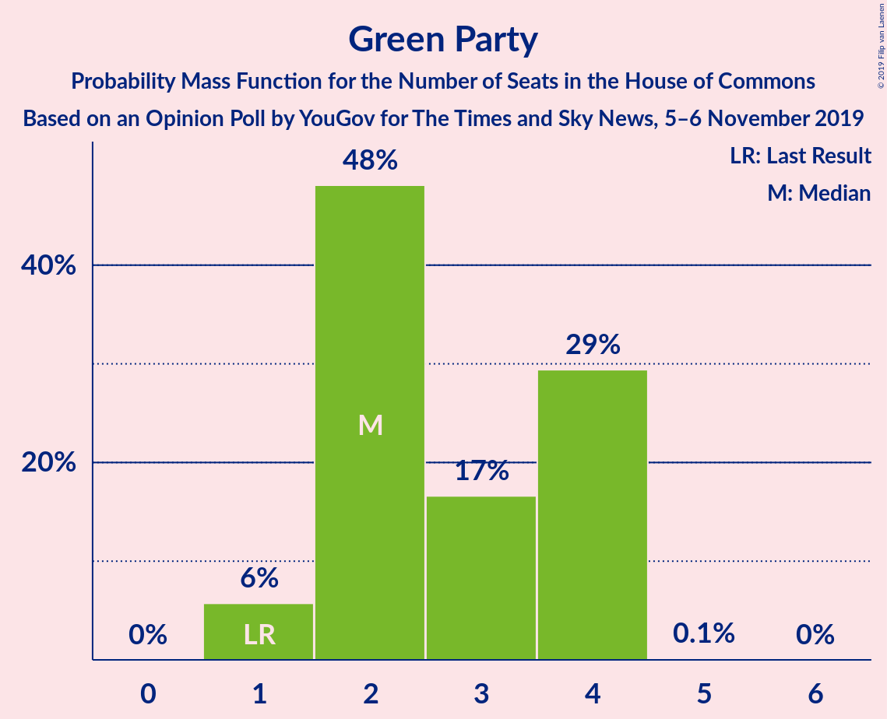

# Opinion Poll by YouGov for The Times/Sky News, 5–6 November 2019

<a href="#voting-intentions">Voting Intentions</a> | <a href="#seats">Seats</a> | <a href="#coalitions">Coalitions</a> | <a href="#technical-information">Technical Information</a>

## Voting Intentions

### Confidence Intervals

| Party | Last Result | Poll Result | 80% Confidence Interval | 90% Confidence Interval | 95% Confidence Interval | 99% Confidence Interval |
|:-----:|:-----------:|:-----------:|:-----------------------:|:-----------------------:|:-----------------------:|:-----------------------:|
| Conservative Party | 42.4% | 35.8% | 34.3–37.3% |33.9–37.8% |33.5–38.1% |32.8–38.9% |
| Labour Party | 40.0% | 24.9% | 23.6–26.3% |23.2–26.7% |22.9–27.0% |22.3–27.7% |
| Liberal Democrats | 7.4% | 16.9% | 15.8–18.2% |15.5–18.5% |15.2–18.8% |14.7–19.4% |
| Brexit Party | 0.0% | 10.9% | 10.0–12.0% |9.7–12.3% |9.5–12.5% |9.1–13.0% |
| Green Party | 1.6% | 5.0% | 4.4–5.7% |4.2–5.9% |4.0–6.1% |3.7–6.5% |
| Scottish National Party | 3.0% | 4.0% | 3.4–4.6% |3.2–4.8% |3.1–5.0% |2.9–5.4% |
| Plaid Cymru | 0.5% | 1.0% | 0.8–1.4% |0.7–1.5% |0.6–1.6% |0.5–1.8% |
| UK Independence Party | 1.8% | 0.2% | 0.1–0.5% |0.1–0.5% |0.1–0.6% |0.1–0.8% |
| Change UK | 0.0% | 0.2% | 0.1–0.5% |0.1–0.5% |0.1–0.6% |0.1–0.8% |

*Note:* The poll result column reflects the actual value used in the calculations. Published results may vary slightly, and in addition be rounded to fewer digits.

## Seats

### Confidence Intervals

| Party | Last Result | Median | 80% Confidence Interval | 90% Confidence Interval | 95% Confidence Interval | 99% Confidence Interval |
|:-----:|:-----------:|:------:|:-----------------------:|:-----------------------:|:-----------------------:|:-----------------------:|
| <a href="#conservative-party">Conservative Party</a> | 317 | 330 | 330 |330 |327–343 |303–346 |
| <a href="#labour-party">Labour Party</a> | 262 | 184 | 184 |171–184 |162–184 |141–198 |
| <a href="#liberal-democrats">Liberal Democrats</a> | 12 | 46 | 46 |46–57 |46–57 |46–57 |
| <a href="#brexit-party">Brexit Party</a> | 0 | 13 | 13 |13 |12–13 |10–34 |
| <a href="#green-party">Green Party</a> | 1 | 2 | 2 |2 |2 |2–3 |
| <a href="#scottish-national-party">Scottish National Party</a> | 35 | 53 | 53 |53 |53–54 |50–54 |
| <a href="#plaid-cymru">Plaid Cymru</a> | 4 | 4 | 4 |4 |4–10 |4–11 |
| <a href="#uk-independence-party">UK Independence Party</a> | 0 | 0 | 0 |0 |0 |0 |
| <a href="#change-uk">Change UK</a> | 0 | 0 | 0 |0 |0 |0 |

### Conservative Party

*For a full overview of the results for this party, see the [Conservative Party](party-conservativeparty.html) page.*

| Number of Seats | Probability | Accumulated | Special Marks |
|:---------------:|:-----------:|:-----------:|:-------------:|
| 302 | 0.2% | 100% |  |
| 303 | 0.5% | 99.7% |  |
| 304 | 0% | 99.3% |  |
| 305 | 0% | 99.3% |  |
| 306 | 0% | 99.3% |  |
| 307 | 0% | 99.3% |  |
| 308 | 0% | 99.3% |  |
| 309 | 0% | 99.3% |  |
| 310 | 0% | 99.2% |  |
| 311 | 0% | 99.2% |  |
| 312 | 0% | 99.2% |  |
| 313 | 0.1% | 99.2% |  |
| 314 | 0% | 99.1% |  |
| 315 | 0% | 99.1% |  |
| 316 | 0% | 99.1% |  |
| 317 | 0% | 99.1% | Last Result |
| 318 | 0% | 99.1% |  |
| 319 | 0% | 99.1% |  |
| 320 | 0% | 99.1% |  |
| 321 | 0% | 99.1% |  |
| 322 | 0% | 99.1% |  |
| 323 | 0% | 99.1% |  |
| 324 | 0% | 99.1% |  |
| 325 | 0% | 99.1% |  |
| 326 | 0% | 99.1% | Majority |
| 327 | 2% | 99.1% |  |
| 328 | 0% | 97% |  |
| 329 | 0% | 97% |  |
| 330 | 93% | 97% | Median |
| 331 | 0% | 4% |  |
| 332 | 0% | 4% |  |
| 333 | 0% | 4% |  |
| 334 | 0% | 4% |  |
| 335 | 0% | 4% |  |
| 336 | 0.1% | 4% |  |
| 337 | 0% | 3% |  |
| 338 | 0% | 3% |  |
| 339 | 0% | 3% |  |
| 340 | 0% | 3% |  |
| 341 | 0% | 3% |  |
| 342 | 0% | 3% |  |
| 343 | 2% | 3% |  |
| 344 | 0% | 1.2% |  |
| 345 | 0% | 1.2% |  |
| 346 | 1.0% | 1.2% |  |
| 347 | 0% | 0.3% |  |
| 348 | 0% | 0.3% |  |
| 349 | 0% | 0.3% |  |
| 350 | 0% | 0.3% |  |
| 351 | 0% | 0.3% |  |
| 352 | 0% | 0.3% |  |
| 353 | 0% | 0.3% |  |
| 354 | 0.3% | 0.3% |  |
| 355 | 0% | 0% |  |

### Labour Party

*For a full overview of the results for this party, see the [Labour Party](party-labourparty.html) page.*

| Number of Seats | Probability | Accumulated | Special Marks |
|:---------------:|:-----------:|:-----------:|:-------------:|
| 141 | 0.9% | 100% |  |
| 142 | 0% | 99.1% |  |
| 143 | 0% | 99.1% |  |
| 144 | 0% | 99.1% |  |
| 145 | 0.2% | 99.1% |  |
| 146 | 0% | 98.8% |  |
| 147 | 0% | 98.8% |  |
| 148 | 0% | 98.8% |  |
| 149 | 0% | 98.8% |  |
| 150 | 0% | 98.8% |  |
| 151 | 0% | 98.8% |  |
| 152 | 0% | 98.8% |  |
| 153 | 0% | 98.8% |  |
| 154 | 0% | 98.8% |  |
| 155 | 0% | 98.8% |  |
| 156 | 0% | 98.8% |  |
| 157 | 0% | 98.8% |  |
| 158 | 0% | 98.8% |  |
| 159 | 0% | 98.8% |  |
| 160 | 0% | 98.8% |  |
| 161 | 0.1% | 98.8% |  |
| 162 | 2% | 98.7% |  |
| 163 | 0% | 97% |  |
| 164 | 0% | 97% |  |
| 165 | 0% | 97% |  |
| 166 | 0% | 97% |  |
| 167 | 0% | 96% |  |
| 168 | 0% | 96% |  |
| 169 | 0% | 96% |  |
| 170 | 0% | 96% |  |
| 171 | 2% | 96% |  |
| 172 | 0% | 94% |  |
| 173 | 0% | 94% |  |
| 174 | 0% | 94% |  |
| 175 | 0% | 94% |  |
| 176 | 0.1% | 94% |  |
| 177 | 0% | 94% |  |
| 178 | 0% | 94% |  |
| 179 | 0% | 94% |  |
| 180 | 0% | 94% |  |
| 181 | 0% | 94% |  |
| 182 | 0% | 94% |  |
| 183 | 0% | 94% |  |
| 184 | 93% | 94% | Median |
| 185 | 0% | 0.6% |  |
| 186 | 0% | 0.6% |  |
| 187 | 0% | 0.6% |  |
| 188 | 0% | 0.6% |  |
| 189 | 0% | 0.6% |  |
| 190 | 0% | 0.6% |  |
| 191 | 0% | 0.6% |  |
| 192 | 0% | 0.6% |  |
| 193 | 0% | 0.6% |  |
| 194 | 0% | 0.6% |  |
| 195 | 0% | 0.5% |  |
| 196 | 0% | 0.5% |  |
| 197 | 0% | 0.5% |  |
| 198 | 0.5% | 0.5% |  |
| 199 | 0% | 0.1% |  |
| 200 | 0% | 0% |  |
| 201 | 0% | 0% |  |
| 202 | 0% | 0% |  |
| 203 | 0% | 0% |  |
| 204 | 0% | 0% |  |
| 205 | 0% | 0% |  |
| 206 | 0% | 0% |  |
| 207 | 0% | 0% |  |
| 208 | 0% | 0% |  |
| 209 | 0% | 0% |  |
| 210 | 0% | 0% |  |
| 211 | 0% | 0% |  |
| 212 | 0% | 0% |  |
| 213 | 0% | 0% |  |
| 214 | 0% | 0% |  |
| 215 | 0% | 0% |  |
| 216 | 0% | 0% |  |
| 217 | 0% | 0% |  |
| 218 | 0% | 0% |  |
| 219 | 0% | 0% |  |
| 220 | 0% | 0% |  |
| 221 | 0% | 0% |  |
| 222 | 0% | 0% |  |
| 223 | 0% | 0% |  |
| 224 | 0% | 0% |  |
| 225 | 0% | 0% |  |
| 226 | 0% | 0% |  |
| 227 | 0% | 0% |  |
| 228 | 0% | 0% |  |
| 229 | 0% | 0% |  |
| 230 | 0% | 0% |  |
| 231 | 0% | 0% |  |
| 232 | 0% | 0% |  |
| 233 | 0% | 0% |  |
| 234 | 0% | 0% |  |
| 235 | 0% | 0% |  |
| 236 | 0% | 0% |  |
| 237 | 0% | 0% |  |
| 238 | 0% | 0% |  |
| 239 | 0% | 0% |  |
| 240 | 0% | 0% |  |
| 241 | 0% | 0% |  |
| 242 | 0% | 0% |  |
| 243 | 0% | 0% |  |
| 244 | 0% | 0% |  |
| 245 | 0% | 0% |  |
| 246 | 0% | 0% |  |
| 247 | 0% | 0% |  |
| 248 | 0% | 0% |  |
| 249 | 0% | 0% |  |
| 250 | 0% | 0% |  |
| 251 | 0% | 0% |  |
| 252 | 0% | 0% |  |
| 253 | 0% | 0% |  |
| 254 | 0% | 0% |  |
| 255 | 0% | 0% |  |
| 256 | 0% | 0% |  |
| 257 | 0% | 0% |  |
| 258 | 0% | 0% |  |
| 259 | 0% | 0% |  |
| 260 | 0% | 0% |  |
| 261 | 0% | 0% |  |
| 262 | 0% | 0% | Last Result |

### Liberal Democrats

*For a full overview of the results for this party, see the [Liberal Democrats](party-liberaldemocrats.html) page.*

| Number of Seats | Probability | Accumulated | Special Marks |
|:---------------:|:-----------:|:-----------:|:-------------:|
| 12 | 0% | 100% | Last Result |
| 13 | 0% | 100% |  |
| 14 | 0% | 100% |  |
| 15 | 0% | 100% |  |
| 16 | 0% | 100% |  |
| 17 | 0% | 100% |  |
| 18 | 0% | 100% |  |
| 19 | 0% | 100% |  |
| 20 | 0% | 100% |  |
| 21 | 0% | 100% |  |
| 22 | 0% | 100% |  |
| 23 | 0% | 100% |  |
| 24 | 0% | 100% |  |
| 25 | 0% | 100% |  |
| 26 | 0% | 100% |  |
| 27 | 0% | 100% |  |
| 28 | 0% | 100% |  |
| 29 | 0% | 100% |  |
| 30 | 0% | 100% |  |
| 31 | 0% | 100% |  |
| 32 | 0% | 100% |  |
| 33 | 0% | 100% |  |
| 34 | 0% | 100% |  |
| 35 | 0% | 100% |  |
| 36 | 0% | 100% |  |
| 37 | 0% | 100% |  |
| 38 | 0% | 100% |  |
| 39 | 0% | 100% |  |
| 40 | 0% | 100% |  |
| 41 | 0% | 100% |  |
| 42 | 0% | 100% |  |
| 43 | 0% | 100% |  |
| 44 | 0% | 100% |  |
| 45 | 0% | 100% |  |
| 46 | 93% | 100% | Median |
| 47 | 1.4% | 7% |  |
| 48 | 0.2% | 5% |  |
| 49 | 0% | 5% |  |
| 50 | 0% | 5% |  |
| 51 | 0% | 5% |  |
| 52 | 0% | 5% |  |
| 53 | 0% | 5% |  |
| 54 | 0% | 5% |  |
| 55 | 0.1% | 5% |  |
| 56 | 0% | 5% |  |
| 57 | 5% | 5% |  |
| 58 | 0% | 0.4% |  |
| 59 | 0% | 0.4% |  |
| 60 | 0% | 0.4% |  |
| 61 | 0.2% | 0.4% |  |
| 62 | 0% | 0.1% |  |
| 63 | 0% | 0.1% |  |
| 64 | 0% | 0.1% |  |
| 65 | 0.1% | 0.1% |  |
| 66 | 0% | 0% |  |

### Brexit Party

*For a full overview of the results for this party, see the [Brexit Party](party-brexitparty.html) page.*

| Number of Seats | Probability | Accumulated | Special Marks |
|:---------------:|:-----------:|:-----------:|:-------------:|
| 0 | 0% | 100% | Last Result |
| 1 | 0% | 100% |  |
| 2 | 0% | 100% |  |
| 3 | 0% | 100% |  |
| 4 | 0% | 100% |  |
| 5 | 0% | 100% |  |
| 6 | 0% | 100% |  |
| 7 | 0% | 100% |  |
| 8 | 0% | 100% |  |
| 9 | 0% | 100% |  |
| 10 | 2% | 100% |  |
| 11 | 0% | 98% |  |
| 12 | 2% | 98% |  |
| 13 | 93% | 95% | Median |
| 14 | 0% | 2% |  |
| 15 | 0% | 2% |  |
| 16 | 0% | 2% |  |
| 17 | 0% | 2% |  |
| 18 | 0.3% | 2% |  |
| 19 | 0% | 2% |  |
| 20 | 0.1% | 2% |  |
| 21 | 0% | 2% |  |
| 22 | 0.1% | 2% |  |
| 23 | 0% | 2% |  |
| 24 | 0% | 2% |  |
| 25 | 0% | 2% |  |
| 26 | 0% | 2% |  |
| 27 | 0.3% | 2% |  |
| 28 | 0.4% | 1.4% |  |
| 29 | 0% | 0.9% |  |
| 30 | 0% | 0.9% |  |
| 31 | 0% | 0.9% |  |
| 32 | 0% | 0.9% |  |
| 33 | 0% | 0.9% |  |
| 34 | 0.9% | 0.9% |  |
| 35 | 0% | 0% |  |

### Green Party

*For a full overview of the results for this party, see the [Green Party](party-greenparty.html) page.*

| Number of Seats | Probability | Accumulated | Special Marks |
|:---------------:|:-----------:|:-----------:|:-------------:|
| 1 | 0% | 100% | Last Result |
| 2 | 98.6% | 100% | Median |
| 3 | 1.2% | 1.4% |  |
| 4 | 0.2% | 0.2% |  |
| 5 | 0% | 0% |  |

### Scottish National Party

*For a full overview of the results for this party, see the [Scottish National Party](party-scottishnationalparty.html) page.*

| Number of Seats | Probability | Accumulated | Special Marks |
|:---------------:|:-----------:|:-----------:|:-------------:|
| 35 | 0% | 100% | Last Result |
| 36 | 0% | 100% |  |
| 37 | 0% | 100% |  |
| 38 | 0% | 100% |  |
| 39 | 0% | 100% |  |
| 40 | 0% | 100% |  |
| 41 | 0.1% | 100% |  |
| 42 | 0% | 99.9% |  |
| 43 | 0% | 99.9% |  |
| 44 | 0% | 99.9% |  |
| 45 | 0% | 99.9% |  |
| 46 | 0% | 99.9% |  |
| 47 | 0% | 99.9% |  |
| 48 | 0.3% | 99.9% |  |
| 49 | 0% | 99.6% |  |
| 50 | 1.4% | 99.6% |  |
| 51 | 0% | 98% |  |
| 52 | 0% | 98% |  |
| 53 | 96% | 98% | Median |
| 54 | 3% | 3% |  |
| 55 | 0% | 0% |  |

### Plaid Cymru

*For a full overview of the results for this party, see the [Plaid Cymru](party-plaidcymru.html) page.*

| Number of Seats | Probability | Accumulated | Special Marks |
|:---------------:|:-----------:|:-----------:|:-------------:|
| 4 | 96% | 100% | Last Result, Median |
| 5 | 0% | 4% |  |
| 6 | 0% | 4% |  |
| 7 | 0% | 4% |  |
| 8 | 0.3% | 4% |  |
| 9 | 0% | 4% |  |
| 10 | 3% | 4% |  |
| 11 | 1.0% | 1.1% |  |
| 12 | 0.1% | 0.1% |  |
| 13 | 0% | 0% |  |

### UK Independence Party

*For a full overview of the results for this party, see the [UK Independence Party](party-ukindependenceparty.html) page.*

| Number of Seats | Probability | Accumulated | Special Marks |
|:---------------:|:-----------:|:-----------:|:-------------:|
| 0 | 100% | 100% | Last Result, Median |

### Change UK

*For a full overview of the results for this party, see the [Change UK](party-changeuk.html) page.*

| Number of Seats | Probability | Accumulated | Special Marks |
|:---------------:|:-----------:|:-----------:|:-------------:|
| 0 | 100% | 100% | Last Result, Median |

## Coalitions

## Technical Information

### Opinion Poll

+ **Polling firm:** YouGov
+ **Commissioner(s):** The Times/Sky News
+ **Fieldwork period:** 5–6 November 2019

### Calculations

+ **Sample size:** 1667
+ **Simulations done:** 2,048
+ **Error estimate:** 1.74%

