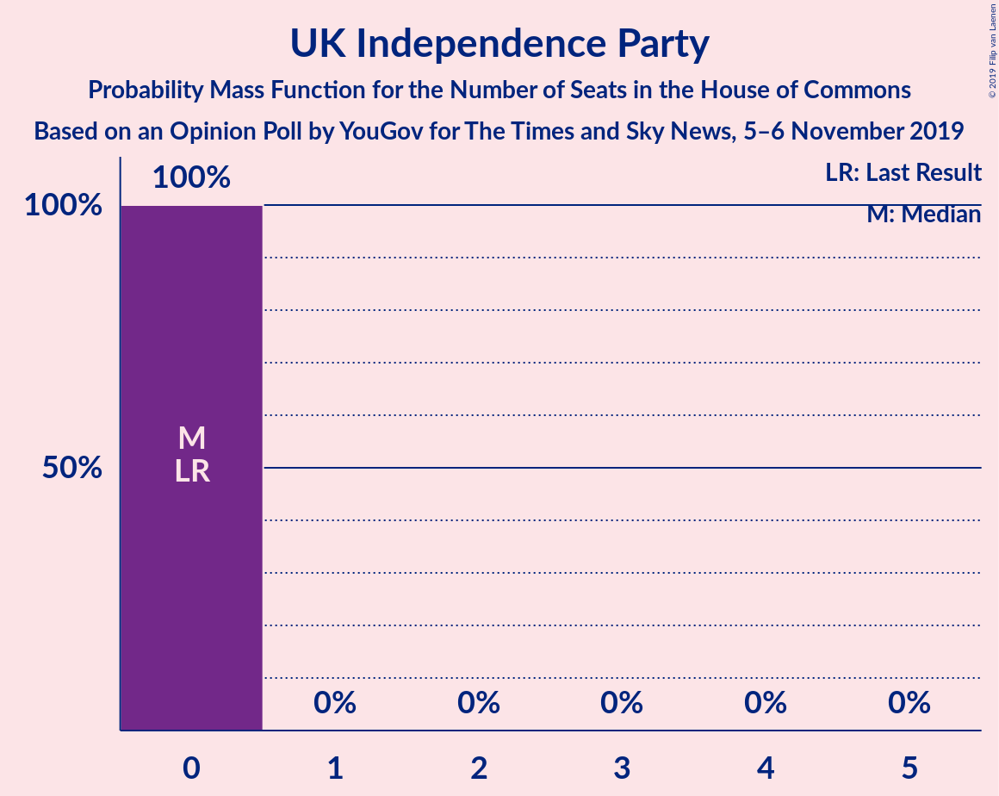
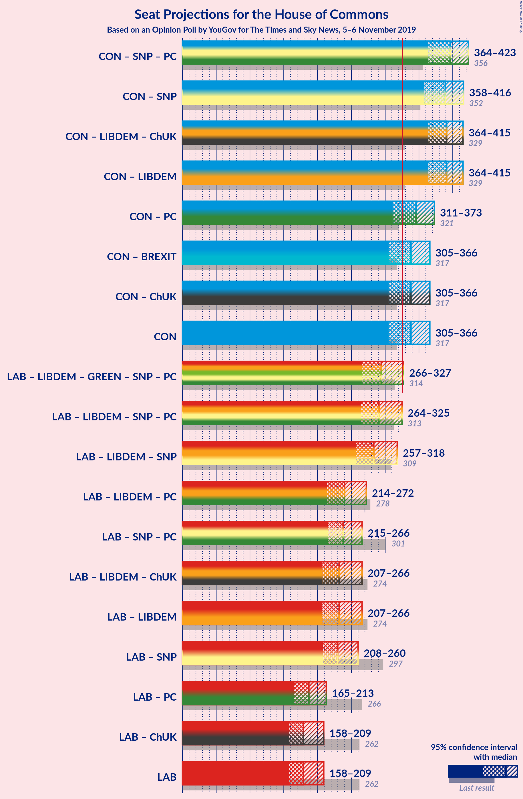
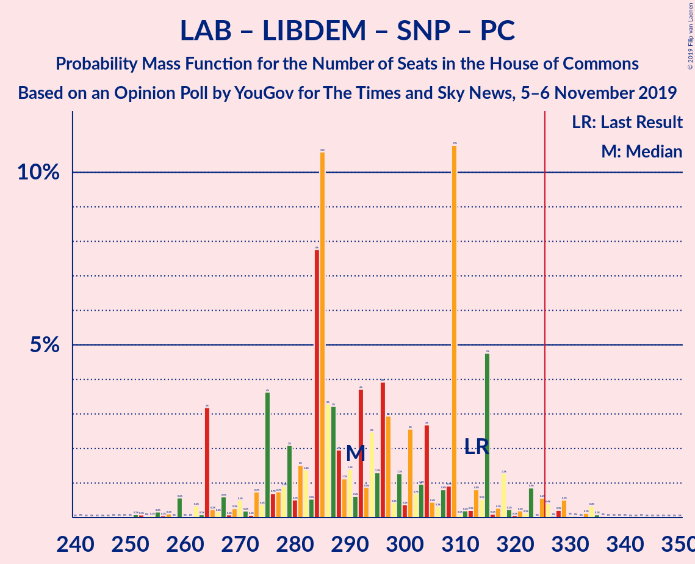
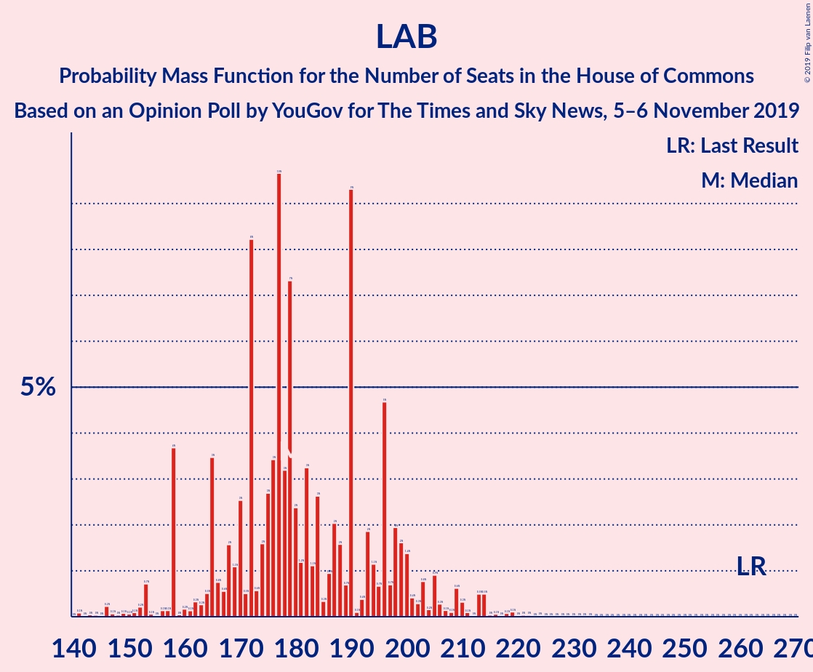

# Opinion Poll by YouGov for The Times and Sky News, 5–6 November 2019

<a href="#voting-intentions">Voting Intentions</a> | <a href="#seats">Seats</a> | <a href="#coalitions">Coalitions</a> | <a href="#technical-information">Technical Information</a>

## Voting Intentions

### Confidence Intervals

| Party | Last Result | Poll Result | 80% Confidence Interval | 90% Confidence Interval | 95% Confidence Interval | 99% Confidence Interval |
|:-----:|:-----------:|:-----------:|:-----------------------:|:-----------------------:|:-----------------------:|:-----------------------:|
| Conservative Party | 43.4% | 35.8% | 34.3–37.3% |33.9–37.8% |33.5–38.1% |32.8–38.9% |
| Labour Party | 41.0% | 24.9% | 23.6–26.3% |23.2–26.7% |22.9–27.0% |22.3–27.7% |
| Liberal Democrats | 7.6% | 16.9% | 15.8–18.2% |15.5–18.5% |15.2–18.8% |14.7–19.4% |
| Brexit Party | 0.0% | 10.9% | 10.0–12.0% |9.7–12.3% |9.5–12.5% |9.1–13.0% |
| Green Party | 1.7% | 5.0% | 4.4–5.7% |4.2–5.9% |4.0–6.1% |3.7–6.5% |
| Scottish National Party | 3.1% | 4.0% | 3.4–4.6% |3.2–4.8% |3.1–5.0% |2.9–5.4% |
| Plaid Cymru | 0.5% | 1.0% | 0.8–1.4% |0.7–1.5% |0.6–1.6% |0.5–1.8% |
| UK Independence Party | 1.9% | 0.2% | 0.1–0.5% |0.1–0.5% |0.1–0.6% |0.1–0.8% |
| Change UK | 0.0% | 0.2% | 0.1–0.5% |0.1–0.5% |0.1–0.6% |0.1–0.8% |

*Note:* The poll result column reflects the actual value used in the calculations. Published results may vary slightly, and in addition be rounded to fewer digits.

## Seats

### Confidence Intervals

| Party | Last Result | Median | 80% Confidence Interval | 90% Confidence Interval | 95% Confidence Interval | 99% Confidence Interval |
|:-----:|:-----------:|:------:|:-----------------------:|:-----------------------:|:-----------------------:|:-----------------------:|
| <a href="#conservative-party">Conservative Party</a> | 317 | 323 | 308–348 |308–348 |308–349 |303–364 |
| <a href="#labour-party">Labour Party</a> | 262 | 187 | 163–193 |163–193 |163–193 |158–204 |
| <a href="#liberal-democrats">Liberal Democrats</a> | 12 | 57 | 49–59 |46–59 |46–59 |46–63 |
| <a href="#brexit-party">Brexit Party</a> | 0 | 8 | 6–9 |6–9 |4–10 |3–15 |
| <a href="#green-party">Green Party</a> | 1 | 3 | 2–4 |2–4 |2–4 |1–4 |
| <a href="#scottish-national-party">Scottish National Party</a> | 35 | 53 | 51–53 |50–53 |49–53 |46–54 |
| <a href="#plaid-cymru">Plaid Cymru</a> | 4 | 7 | 5–10 |4–11 |4–11 |4–12 |
| <a href="#uk-independence-party">UK Independence Party</a> | 0 | 0 | 0 |0 |0 |0 |
| <a href="#change-uk">Change UK</a> | 0 | 0 | 0 |0 |0 |0 |

### Conservative Party

*For a full overview of the results for this party, see the [Conservative Party](party-conservativeparty.html) page.*

| Number of Seats | Probability | Accumulated | Special Marks |
|:---------------:|:-----------:|:-----------:|:-------------:|
| 284 | 0% | 100% |  |
| 285 | 0% | 99.9% |  |
| 286 | 0% | 99.9% |  |
| 287 | 0% | 99.9% |  |
| 288 | 0% | 99.9% |  |
| 289 | 0.1% | 99.9% |  |
| 290 | 0% | 99.9% |  |
| 291 | 0% | 99.9% |  |
| 292 | 0% | 99.9% |  |
| 293 | 0% | 99.8% |  |
| 294 | 0% | 99.8% |  |
| 295 | 0% | 99.8% |  |
| 296 | 0% | 99.8% |  |
| 297 | 0.1% | 99.8% |  |
| 298 | 0% | 99.8% |  |
| 299 | 0% | 99.7% |  |
| 300 | 0% | 99.7% |  |
| 301 | 0.2% | 99.7% |  |
| 302 | 0% | 99.5% |  |
| 303 | 0.1% | 99.5% |  |
| 304 | 0.1% | 99.5% |  |
| 305 | 0% | 99.4% |  |
| 306 | 0% | 99.3% |  |
| 307 | 0% | 99.3% |  |
| 308 | 15% | 99.3% |  |
| 309 | 0.3% | 84% |  |
| 310 | 0% | 84% |  |
| 311 | 0.1% | 84% |  |
| 312 | 0% | 84% |  |
| 313 | 0.1% | 84% |  |
| 314 | 31% | 84% |  |
| 315 | 0.1% | 53% |  |
| 316 | 0% | 53% |  |
| 317 | 0.7% | 53% | Last Result |
| 318 | 0% | 52% |  |
| 319 | 0% | 52% |  |
| 320 | 0.1% | 52% |  |
| 321 | 0% | 52% |  |
| 322 | 0.4% | 52% |  |
| 323 | 5% | 52% | Median |
| 324 | 2% | 47% |  |
| 325 | 0.3% | 45% |  |
| 326 | 0.1% | 44% | Majority |
| 327 | 0.8% | 44% |  |
| 328 | 0% | 44% |  |
| 329 | 0.1% | 44% |  |
| 330 | 4% | 43% |  |
| 331 | 0% | 39% |  |
| 332 | 0.3% | 39% |  |
| 333 | 0.3% | 39% |  |
| 334 | 0.1% | 39% |  |
| 335 | 0.1% | 39% |  |
| 336 | 0.5% | 39% |  |
| 337 | 1.5% | 38% |  |
| 338 | 0.3% | 37% |  |
| 339 | 21% | 36% |  |
| 340 | 0.2% | 16% |  |
| 341 | 1.3% | 15% |  |
| 342 | 0.1% | 14% |  |
| 343 | 0.1% | 14% |  |
| 344 | 0.3% | 14% |  |
| 345 | 0.1% | 14% |  |
| 346 | 0.1% | 14% |  |
| 347 | 0.1% | 13% |  |
| 348 | 11% | 13% |  |
| 349 | 0.8% | 3% |  |
| 350 | 0% | 2% |  |
| 351 | 0% | 2% |  |
| 352 | 0.1% | 2% |  |
| 353 | 0.1% | 2% |  |
| 354 | 0.1% | 1.4% |  |
| 355 | 0.4% | 1.3% |  |
| 356 | 0% | 0.9% |  |
| 357 | 0.1% | 0.9% |  |
| 358 | 0% | 0.8% |  |
| 359 | 0% | 0.7% |  |
| 360 | 0% | 0.7% |  |
| 361 | 0% | 0.7% |  |
| 362 | 0% | 0.7% |  |
| 363 | 0.1% | 0.7% |  |
| 364 | 0.4% | 0.7% |  |
| 365 | 0% | 0.2% |  |
| 366 | 0% | 0.2% |  |
| 367 | 0% | 0.2% |  |
| 368 | 0% | 0.2% |  |
| 369 | 0% | 0.2% |  |
| 370 | 0% | 0.2% |  |
| 371 | 0% | 0.2% |  |
| 372 | 0% | 0.2% |  |
| 373 | 0.1% | 0.2% |  |
| 374 | 0% | 0.1% |  |
| 375 | 0% | 0.1% |  |
| 376 | 0% | 0.1% |  |
| 377 | 0% | 0.1% |  |
| 378 | 0% | 0.1% |  |
| 379 | 0% | 0.1% |  |
| 380 | 0% | 0.1% |  |
| 381 | 0% | 0.1% |  |
| 382 | 0% | 0.1% |  |
| 383 | 0% | 0.1% |  |
| 384 | 0% | 0% |  |

### Labour Party

*For a full overview of the results for this party, see the [Labour Party](party-labourparty.html) page.*

| Number of Seats | Probability | Accumulated | Special Marks |
|:---------------:|:-----------:|:-----------:|:-------------:|
| 137 | 0.1% | 100% |  |
| 138 | 0% | 99.9% |  |
| 139 | 0% | 99.9% |  |
| 140 | 0% | 99.9% |  |
| 141 | 0.1% | 99.9% |  |
| 142 | 0.1% | 99.8% |  |
| 143 | 0% | 99.8% |  |
| 144 | 0% | 99.8% |  |
| 145 | 0% | 99.8% |  |
| 146 | 0% | 99.7% |  |
| 147 | 0% | 99.7% |  |
| 148 | 0% | 99.7% |  |
| 149 | 0% | 99.7% |  |
| 150 | 0% | 99.7% |  |
| 151 | 0% | 99.7% |  |
| 152 | 0% | 99.7% |  |
| 153 | 0% | 99.7% |  |
| 154 | 0% | 99.7% |  |
| 155 | 0% | 99.6% |  |
| 156 | 0% | 99.6% |  |
| 157 | 0% | 99.6% |  |
| 158 | 0.1% | 99.6% |  |
| 159 | 0.4% | 99.5% |  |
| 160 | 0.5% | 99.1% |  |
| 161 | 0% | 98.6% |  |
| 162 | 0% | 98.6% |  |
| 163 | 11% | 98.6% |  |
| 164 | 0.9% | 88% |  |
| 165 | 0.1% | 87% |  |
| 166 | 0.9% | 87% |  |
| 167 | 0% | 86% |  |
| 168 | 0.4% | 86% |  |
| 169 | 0.3% | 85% |  |
| 170 | 21% | 85% |  |
| 171 | 0.3% | 64% |  |
| 172 | 0.1% | 64% |  |
| 173 | 0.3% | 64% |  |
| 174 | 0.1% | 64% |  |
| 175 | 0.2% | 63% |  |
| 176 | 0.2% | 63% |  |
| 177 | 3% | 63% |  |
| 178 | 0.2% | 61% |  |
| 179 | 5% | 60% |  |
| 180 | 0.2% | 55% |  |
| 181 | 0.3% | 55% |  |
| 182 | 0.5% | 55% |  |
| 183 | 0.8% | 54% |  |
| 184 | 0% | 54% |  |
| 185 | 0% | 53% |  |
| 186 | 0.1% | 53% |  |
| 187 | 31% | 53% | Median |
| 188 | 0.3% | 22% |  |
| 189 | 0.1% | 22% |  |
| 190 | 0.1% | 22% |  |
| 191 | 4% | 22% |  |
| 192 | 0% | 18% |  |
| 193 | 15% | 18% |  |
| 194 | 0% | 2% |  |
| 195 | 0.1% | 2% |  |
| 196 | 0% | 2% |  |
| 197 | 1.3% | 2% |  |
| 198 | 0.3% | 0.9% |  |
| 199 | 0.1% | 0.7% |  |
| 200 | 0% | 0.6% |  |
| 201 | 0% | 0.6% |  |
| 202 | 0% | 0.6% |  |
| 203 | 0% | 0.5% |  |
| 204 | 0.1% | 0.5% |  |
| 205 | 0% | 0.4% |  |
| 206 | 0% | 0.4% |  |
| 207 | 0% | 0.4% |  |
| 208 | 0% | 0.4% |  |
| 209 | 0% | 0.3% |  |
| 210 | 0% | 0.3% |  |
| 211 | 0% | 0.3% |  |
| 212 | 0% | 0.3% |  |
| 213 | 0% | 0.2% |  |
| 214 | 0% | 0.2% |  |
| 215 | 0% | 0.2% |  |
| 216 | 0.1% | 0.2% |  |
| 217 | 0% | 0% |  |
| 218 | 0% | 0% |  |
| 219 | 0% | 0% |  |
| 220 | 0% | 0% |  |
| 221 | 0% | 0% |  |
| 222 | 0% | 0% |  |
| 223 | 0% | 0% |  |
| 224 | 0% | 0% |  |
| 225 | 0% | 0% |  |
| 226 | 0% | 0% |  |
| 227 | 0% | 0% |  |
| 228 | 0% | 0% |  |
| 229 | 0% | 0% |  |
| 230 | 0% | 0% |  |
| 231 | 0% | 0% |  |
| 232 | 0% | 0% |  |
| 233 | 0% | 0% |  |
| 234 | 0% | 0% |  |
| 235 | 0% | 0% |  |
| 236 | 0% | 0% |  |
| 237 | 0% | 0% |  |
| 238 | 0% | 0% |  |
| 239 | 0% | 0% |  |
| 240 | 0% | 0% |  |
| 241 | 0% | 0% |  |
| 242 | 0% | 0% |  |
| 243 | 0% | 0% |  |
| 244 | 0% | 0% |  |
| 245 | 0% | 0% |  |
| 246 | 0% | 0% |  |
| 247 | 0% | 0% |  |
| 248 | 0% | 0% |  |
| 249 | 0% | 0% |  |
| 250 | 0% | 0% |  |
| 251 | 0% | 0% |  |
| 252 | 0% | 0% |  |
| 253 | 0% | 0% |  |
| 254 | 0% | 0% |  |
| 255 | 0% | 0% |  |
| 256 | 0% | 0% |  |
| 257 | 0% | 0% |  |
| 258 | 0% | 0% |  |
| 259 | 0% | 0% |  |
| 260 | 0% | 0% |  |
| 261 | 0% | 0% |  |
| 262 | 0% | 0% | Last Result |

### Liberal Democrats

*For a full overview of the results for this party, see the [Liberal Democrats](party-liberaldemocrats.html) page.*

| Number of Seats | Probability | Accumulated | Special Marks |
|:---------------:|:-----------:|:-----------:|:-------------:|
| 12 | 0% | 100% | Last Result |
| 13 | 0% | 100% |  |
| 14 | 0% | 100% |  |
| 15 | 0% | 100% |  |
| 16 | 0% | 100% |  |
| 17 | 0% | 100% |  |
| 18 | 0% | 100% |  |
| 19 | 0% | 100% |  |
| 20 | 0% | 100% |  |
| 21 | 0% | 100% |  |
| 22 | 0% | 100% |  |
| 23 | 0% | 100% |  |
| 24 | 0% | 100% |  |
| 25 | 0% | 100% |  |
| 26 | 0% | 100% |  |
| 27 | 0% | 100% |  |
| 28 | 0% | 100% |  |
| 29 | 0% | 100% |  |
| 30 | 0% | 100% |  |
| 31 | 0% | 100% |  |
| 32 | 0% | 100% |  |
| 33 | 0% | 100% |  |
| 34 | 0% | 100% |  |
| 35 | 0% | 100% |  |
| 36 | 0% | 100% |  |
| 37 | 0% | 100% |  |
| 38 | 0% | 100% |  |
| 39 | 0% | 100% |  |
| 40 | 0% | 100% |  |
| 41 | 0% | 100% |  |
| 42 | 0% | 99.9% |  |
| 43 | 0.2% | 99.9% |  |
| 44 | 0.1% | 99.8% |  |
| 45 | 0.1% | 99.7% |  |
| 46 | 5% | 99.6% |  |
| 47 | 0.1% | 94% |  |
| 48 | 4% | 94% |  |
| 49 | 13% | 90% |  |
| 50 | 0.1% | 78% |  |
| 51 | 0.1% | 77% |  |
| 52 | 0% | 77% |  |
| 53 | 0.2% | 77% |  |
| 54 | 1.2% | 77% |  |
| 55 | 0.3% | 76% |  |
| 56 | 21% | 76% |  |
| 57 | 6% | 54% | Median |
| 58 | 0.2% | 49% |  |
| 59 | 46% | 48% |  |
| 60 | 0.8% | 2% |  |
| 61 | 0.3% | 1.4% |  |
| 62 | 0.1% | 1.1% |  |
| 63 | 0.7% | 1.0% |  |
| 64 | 0.2% | 0.3% |  |
| 65 | 0.1% | 0.1% |  |
| 66 | 0% | 0.1% |  |
| 67 | 0% | 0% |  |

### Brexit Party

*For a full overview of the results for this party, see the [Brexit Party](party-brexitparty.html) page.*

| Number of Seats | Probability | Accumulated | Special Marks |
|:---------------:|:-----------:|:-----------:|:-------------:|
| 0 | 0.2% | 100% | Last Result |
| 1 | 0.1% | 99.8% |  |
| 2 | 0.2% | 99.8% |  |
| 3 | 0.5% | 99.6% |  |
| 4 | 2% | 99.1% |  |
| 5 | 1.5% | 97% |  |
| 6 | 7% | 96% |  |
| 7 | 0.4% | 89% |  |
| 8 | 67% | 88% | Median |
| 9 | 17% | 21% |  |
| 10 | 2% | 4% |  |
| 11 | 0.3% | 1.4% |  |
| 12 | 0.2% | 1.1% |  |
| 13 | 0% | 0.9% |  |
| 14 | 0.2% | 0.9% |  |
| 15 | 0.3% | 0.7% |  |
| 16 | 0.1% | 0.4% |  |
| 17 | 0.3% | 0.3% |  |
| 18 | 0% | 0.1% |  |
| 19 | 0% | 0% |  |

### Green Party

*For a full overview of the results for this party, see the [Green Party](party-greenparty.html) page.*

| Number of Seats | Probability | Accumulated | Special Marks |
|:---------------:|:-----------:|:-----------:|:-------------:|
| 1 | 1.0% | 100% | Last Result |
| 2 | 27% | 99.0% |  |
| 3 | 23% | 72% | Median |
| 4 | 49% | 49% |  |
| 5 | 0% | 0% |  |

### Scottish National Party

*For a full overview of the results for this party, see the [Scottish National Party](party-scottishnationalparty.html) page.*

| Number of Seats | Probability | Accumulated | Special Marks |
|:---------------:|:-----------:|:-----------:|:-------------:|
| 35 | 0% | 100% | Last Result |
| 36 | 0% | 100% |  |
| 37 | 0% | 100% |  |
| 38 | 0% | 100% |  |
| 39 | 0.1% | 100% |  |
| 40 | 0% | 99.8% |  |
| 41 | 0% | 99.8% |  |
| 42 | 0% | 99.8% |  |
| 43 | 0% | 99.8% |  |
| 44 | 0.1% | 99.8% |  |
| 45 | 0.1% | 99.7% |  |
| 46 | 0.2% | 99.6% |  |
| 47 | 0.1% | 99.3% |  |
| 48 | 0.9% | 99.3% |  |
| 49 | 1.1% | 98% |  |
| 50 | 4% | 97% |  |
| 51 | 39% | 94% |  |
| 52 | 0.1% | 55% |  |
| 53 | 52% | 54% | Median |
| 54 | 2% | 2% |  |
| 55 | 0% | 0% |  |

### Plaid Cymru

*For a full overview of the results for this party, see the [Plaid Cymru](party-plaidcymru.html) page.*

| Number of Seats | Probability | Accumulated | Special Marks |
|:---------------:|:-----------:|:-----------:|:-------------:|
| 4 | 7% | 100% | Last Result |
| 5 | 21% | 93% |  |
| 6 | 0.1% | 71% |  |
| 7 | 50% | 71% | Median |
| 8 | 1.3% | 22% |  |
| 9 | 0.2% | 21% |  |
| 10 | 13% | 20% |  |
| 11 | 6% | 7% |  |
| 12 | 0.5% | 0.6% |  |
| 13 | 0% | 0.1% |  |
| 14 | 0% | 0% |  |

### UK Independence Party

*For a full overview of the results for this party, see the [UK Independence Party](party-ukindependenceparty.html) page.*

| Number of Seats | Probability | Accumulated | Special Marks |
|:---------------:|:-----------:|:-----------:|:-------------:|
| 0 | 100% | 100% | Last Result, Median |

### Change UK

*For a full overview of the results for this party, see the [Change UK](party-changeuk.html) page.*

| Number of Seats | Probability | Accumulated | Special Marks |
|:---------------:|:-----------:|:-----------:|:-------------:|
| 0 | 100% | 100% | Last Result, Median |

## Coalitions

### Confidence Intervals

| Coalition | Last Result | Median | Majority? | 80% Confidence Interval | 90% Confidence Interval | 95% Confidence Interval | 99% Confidence Interval |
|:---------:|:-----------:|:------:|:---------:|:-----------------------:|:-----------------------:|:-----------------------:|:-----------------------:|
| Conservative Party – Scottish National Party – Plaid Cymru | 356 | 382 | 100% | 368–409 | 368–409 | 368–409 | 362–420 |
| Conservative Party – Scottish National Party | 352 | 374 | 100% | 361–399 | 361–399 | 361–399 | 355–413 |
| Conservative Party – Liberal Democrats – Change UK | 329 | 376 | 100% | 367–397 | 367–397 | 367–397 | 360–412 |
| Conservative Party – Liberal Democrats | 329 | 376 | 100% | 367–397 | 367–397 | 367–397 | 360–412 |
| Conservative Party – Plaid Cymru | 321 | 331 | 52% | 315–358 | 315–358 | 315–358 | 309–371 |
| Conservative Party – Brexit Party | 317 | 331 | 52% | 316–357 | 316–357 | 316–357 | 313–368 |
| Conservative Party – Change UK | 317 | 323 | 44% | 308–348 | 308–348 | 308–349 | 303–364 |
| Conservative Party | 317 | 323 | 44% | 308–348 | 308–348 | 308–349 | 303–364 |
| Labour Party – Liberal Democrats – Green Party – Scottish National Party – Plaid Cymru | 314 | 301 | 0.2% | 275–316 | 275–316 | 275–316 | 264–319 |
| Labour Party – Liberal Democrats – Scottish National Party – Plaid Cymru | 313 | 299 | 0.2% | 273–312 | 273–312 | 273–312 | 263–316 |
| Labour Party – Liberal Democrats – Scottish National Party | 309 | 290 | 0.1% | 263–305 | 263–305 | 263–305 | 256–311 |
| Labour Party – Liberal Democrats – Plaid Cymru | 278 | 247 | 0% | 222–259 | 222–259 | 222–259 | 214–263 |
| Labour Party – Scottish National Party – Plaid Cymru | 301 | 247 | 0% | 224–253 | 224–253 | 224–254 | 215–261 |
| Labour Party – Liberal Democrats – Change UK | 274 | 239 | 0% | 212–252 | 212–252 | 212–252 | 207–258 |
| Labour Party – Liberal Democrats | 274 | 239 | 0% | 212–252 | 212–252 | 212–252 | 207–258 |
| Labour Party – Scottish National Party | 297 | 240 | 0% | 214–246 | 214–246 | 214–246 | 208–253 |
| Labour Party – Plaid Cymru | 266 | 194 | 0% | 173–200 | 173–200 | 173–201 | 166–208 |
| Labour Party – Change UK | 262 | 187 | 0% | 163–193 | 163–193 | 163–193 | 158–204 |
| Labour Party | 262 | 187 | 0% | 163–193 | 163–193 | 163–193 | 158–204 |

### Conservative Party – Scottish National Party – Plaid Cymru

| Number of Seats | Probability | Accumulated | Special Marks |
|:---------------:|:-----------:|:-----------:|:-------------:|
| 345 | 0.1% | 100% |  |
| 346 | 0% | 99.9% |  |
| 347 | 0% | 99.9% |  |
| 348 | 0% | 99.9% |  |
| 349 | 0% | 99.9% |  |
| 350 | 0% | 99.9% |  |
| 351 | 0% | 99.9% |  |
| 352 | 0% | 99.8% |  |
| 353 | 0% | 99.8% |  |
| 354 | 0% | 99.8% |  |
| 355 | 0% | 99.8% |  |
| 356 | 0% | 99.8% | Last Result |
| 357 | 0% | 99.8% |  |
| 358 | 0% | 99.7% |  |
| 359 | 0% | 99.7% |  |
| 360 | 0% | 99.7% |  |
| 361 | 0.1% | 99.7% |  |
| 362 | 0.2% | 99.6% |  |
| 363 | 0% | 99.4% |  |
| 364 | 0% | 99.4% |  |
| 365 | 0% | 99.4% |  |
| 366 | 0.1% | 99.3% |  |
| 367 | 0.3% | 99.2% |  |
| 368 | 15% | 98.9% |  |
| 369 | 0.1% | 84% |  |
| 370 | 0% | 84% |  |
| 371 | 0% | 84% |  |
| 372 | 0.1% | 84% |  |
| 373 | 0% | 84% |  |
| 374 | 31% | 84% |  |
| 375 | 0% | 52% |  |
| 376 | 0.1% | 52% |  |
| 377 | 0% | 52% |  |
| 378 | 0.2% | 52% |  |
| 379 | 0.2% | 52% |  |
| 380 | 0.3% | 52% |  |
| 381 | 2% | 52% |  |
| 382 | 1.2% | 50% |  |
| 383 | 0% | 49% | Median |
| 384 | 0.1% | 49% |  |
| 385 | 5% | 49% |  |
| 386 | 0.3% | 44% |  |
| 387 | 4% | 44% |  |
| 388 | 0.1% | 40% |  |
| 389 | 0.1% | 40% |  |
| 390 | 0.1% | 39% |  |
| 391 | 0.1% | 39% |  |
| 392 | 0.3% | 39% |  |
| 393 | 0.1% | 39% |  |
| 394 | 1.3% | 39% |  |
| 395 | 21% | 38% |  |
| 396 | 0.2% | 16% |  |
| 397 | 0.3% | 16% |  |
| 398 | 0.1% | 16% |  |
| 399 | 0.3% | 16% |  |
| 400 | 0.3% | 16% |  |
| 401 | 2% | 15% |  |
| 402 | 0% | 14% |  |
| 403 | 0.1% | 14% |  |
| 404 | 0% | 13% |  |
| 405 | 0.1% | 13% |  |
| 406 | 0% | 13% |  |
| 407 | 0% | 13% |  |
| 408 | 0.2% | 13% |  |
| 409 | 12% | 13% |  |
| 410 | 0% | 2% |  |
| 411 | 0% | 2% |  |
| 412 | 0.1% | 2% |  |
| 413 | 0.1% | 1.4% |  |
| 414 | 0% | 1.3% |  |
| 415 | 0.5% | 1.3% |  |
| 416 | 0% | 0.7% |  |
| 417 | 0% | 0.7% |  |
| 418 | 0% | 0.7% |  |
| 419 | 0% | 0.7% |  |
| 420 | 0.4% | 0.7% |  |
| 421 | 0% | 0.3% |  |
| 422 | 0% | 0.3% |  |
| 423 | 0% | 0.3% |  |
| 424 | 0% | 0.3% |  |
| 425 | 0% | 0.3% |  |
| 426 | 0% | 0.3% |  |
| 427 | 0.1% | 0.3% |  |
| 428 | 0% | 0.2% |  |
| 429 | 0% | 0.2% |  |
| 430 | 0% | 0.2% |  |
| 431 | 0% | 0.2% |  |
| 432 | 0% | 0.2% |  |
| 433 | 0.1% | 0.2% |  |
| 434 | 0% | 0.1% |  |
| 435 | 0% | 0.1% |  |
| 436 | 0% | 0.1% |  |
| 437 | 0% | 0.1% |  |
| 438 | 0% | 0.1% |  |
| 439 | 0% | 0.1% |  |
| 440 | 0% | 0.1% |  |
| 441 | 0% | 0.1% |  |
| 442 | 0% | 0% |  |

### Conservative Party – Scottish National Party

| Number of Seats | Probability | Accumulated | Special Marks |
|:---------------:|:-----------:|:-----------:|:-------------:|
| 336 | 0% | 100% |  |
| 337 | 0% | 99.9% |  |
| 338 | 0% | 99.9% |  |
| 339 | 0% | 99.9% |  |
| 340 | 0% | 99.9% |  |
| 341 | 0% | 99.9% |  |
| 342 | 0% | 99.9% |  |
| 343 | 0% | 99.9% |  |
| 344 | 0% | 99.9% |  |
| 345 | 0% | 99.9% |  |
| 346 | 0% | 99.8% |  |
| 347 | 0% | 99.8% |  |
| 348 | 0% | 99.8% |  |
| 349 | 0% | 99.8% |  |
| 350 | 0% | 99.8% |  |
| 351 | 0% | 99.7% |  |
| 352 | 0% | 99.7% | Last Result |
| 353 | 0% | 99.7% |  |
| 354 | 0.2% | 99.7% |  |
| 355 | 0% | 99.5% |  |
| 356 | 0% | 99.5% |  |
| 357 | 0.2% | 99.5% |  |
| 358 | 0% | 99.3% |  |
| 359 | 0% | 99.3% |  |
| 360 | 0% | 99.3% |  |
| 361 | 15% | 99.3% |  |
| 362 | 0.1% | 84% |  |
| 363 | 0.3% | 84% |  |
| 364 | 0.1% | 84% |  |
| 365 | 0% | 84% |  |
| 366 | 0.4% | 83% |  |
| 367 | 31% | 83% |  |
| 368 | 0.1% | 52% |  |
| 369 | 0% | 52% |  |
| 370 | 0.2% | 52% |  |
| 371 | 0% | 52% |  |
| 372 | 0% | 52% |  |
| 373 | 0.4% | 52% |  |
| 374 | 5% | 52% |  |
| 375 | 0.7% | 47% |  |
| 376 | 0% | 46% | Median |
| 377 | 1.4% | 46% |  |
| 378 | 0.8% | 45% |  |
| 379 | 0.4% | 44% |  |
| 380 | 0.1% | 43% |  |
| 381 | 0.1% | 43% |  |
| 382 | 0.1% | 43% |  |
| 383 | 4% | 43% |  |
| 384 | 0.3% | 39% |  |
| 385 | 0.2% | 39% |  |
| 386 | 0.2% | 39% |  |
| 387 | 1.3% | 38% |  |
| 388 | 0.1% | 37% |  |
| 389 | 0.3% | 37% |  |
| 390 | 21% | 37% |  |
| 391 | 1.4% | 15% |  |
| 392 | 0.3% | 14% |  |
| 393 | 0.1% | 14% |  |
| 394 | 0.1% | 14% |  |
| 395 | 0% | 14% |  |
| 396 | 0% | 14% |  |
| 397 | 0.1% | 14% |  |
| 398 | 0.1% | 13% |  |
| 399 | 12% | 13% |  |
| 400 | 0% | 2% |  |
| 401 | 0% | 2% |  |
| 402 | 0% | 2% |  |
| 403 | 0.5% | 2% |  |
| 404 | 0.1% | 1.1% |  |
| 405 | 0.2% | 1.0% |  |
| 406 | 0% | 0.9% |  |
| 407 | 0% | 0.8% |  |
| 408 | 0.1% | 0.8% |  |
| 409 | 0% | 0.7% |  |
| 410 | 0% | 0.7% |  |
| 411 | 0% | 0.7% |  |
| 412 | 0% | 0.7% |  |
| 413 | 0.3% | 0.7% |  |
| 414 | 0% | 0.3% |  |
| 415 | 0% | 0.3% |  |
| 416 | 0.1% | 0.3% |  |
| 417 | 0% | 0.2% |  |
| 418 | 0% | 0.2% |  |
| 419 | 0% | 0.2% |  |
| 420 | 0% | 0.2% |  |
| 421 | 0% | 0.2% |  |
| 422 | 0% | 0.2% |  |
| 423 | 0% | 0.2% |  |
| 424 | 0% | 0.2% |  |
| 425 | 0.1% | 0.2% |  |
| 426 | 0% | 0.1% |  |
| 427 | 0% | 0.1% |  |
| 428 | 0% | 0.1% |  |
| 429 | 0% | 0.1% |  |
| 430 | 0% | 0.1% |  |
| 431 | 0% | 0% |  |

### Conservative Party – Liberal Democrats – Change UK

| Number of Seats | Probability | Accumulated | Special Marks |
|:---------------:|:-----------:|:-----------:|:-------------:|
| 329 | 0% | 100% | Last Result |
| 330 | 0% | 100% |  |
| 331 | 0% | 100% |  |
| 332 | 0% | 100% |  |
| 333 | 0% | 100% |  |
| 334 | 0% | 100% |  |
| 335 | 0% | 100% |  |
| 336 | 0% | 100% |  |
| 337 | 0% | 100% |  |
| 338 | 0% | 100% |  |
| 339 | 0% | 100% |  |
| 340 | 0% | 100% |  |
| 341 | 0% | 100% |  |
| 342 | 0% | 100% |  |
| 343 | 0% | 100% |  |
| 344 | 0% | 100% |  |
| 345 | 0% | 99.9% |  |
| 346 | 0% | 99.9% |  |
| 347 | 0.2% | 99.9% |  |
| 348 | 0% | 99.8% |  |
| 349 | 0% | 99.8% |  |
| 350 | 0% | 99.7% |  |
| 351 | 0% | 99.7% |  |
| 352 | 0% | 99.7% |  |
| 353 | 0% | 99.7% |  |
| 354 | 0% | 99.7% |  |
| 355 | 0% | 99.7% |  |
| 356 | 0% | 99.7% |  |
| 357 | 0.1% | 99.6% |  |
| 358 | 0% | 99.5% |  |
| 359 | 0% | 99.5% |  |
| 360 | 0% | 99.5% |  |
| 361 | 0% | 99.5% |  |
| 362 | 0.1% | 99.5% |  |
| 363 | 0.3% | 99.3% |  |
| 364 | 0% | 99.1% |  |
| 365 | 0.2% | 99.0% |  |
| 366 | 0% | 98.9% |  |
| 367 | 15% | 98.8% |  |
| 368 | 0.1% | 84% |  |
| 369 | 0.1% | 84% |  |
| 370 | 1.4% | 83% |  |
| 371 | 0.1% | 82% |  |
| 372 | 0.1% | 82% |  |
| 373 | 31% | 82% |  |
| 374 | 0% | 51% |  |
| 375 | 0.1% | 51% |  |
| 376 | 4% | 51% |  |
| 377 | 0% | 47% |  |
| 378 | 0% | 47% |  |
| 379 | 0% | 47% |  |
| 380 | 6% | 47% | Median |
| 381 | 1.0% | 42% |  |
| 382 | 0% | 40% |  |
| 383 | 0.3% | 40% |  |
| 384 | 0% | 40% |  |
| 385 | 0.4% | 40% |  |
| 386 | 2% | 40% |  |
| 387 | 0.4% | 38% |  |
| 388 | 0.3% | 38% |  |
| 389 | 1.4% | 37% |  |
| 390 | 0.2% | 36% |  |
| 391 | 0.2% | 36% |  |
| 392 | 0.3% | 36% |  |
| 393 | 0.4% | 35% |  |
| 394 | 0% | 35% |  |
| 395 | 21% | 35% |  |
| 396 | 0% | 14% |  |
| 397 | 12% | 14% |  |
| 398 | 0.1% | 2% |  |
| 399 | 0.1% | 2% |  |
| 400 | 0% | 2% |  |
| 401 | 0.1% | 2% |  |
| 402 | 0.1% | 2% |  |
| 403 | 0.5% | 2% |  |
| 404 | 0% | 1.2% |  |
| 405 | 0.2% | 1.1% |  |
| 406 | 0% | 0.9% |  |
| 407 | 0% | 0.9% |  |
| 408 | 0% | 0.9% |  |
| 409 | 0% | 0.8% |  |
| 410 | 0.1% | 0.8% |  |
| 411 | 0% | 0.7% |  |
| 412 | 0.4% | 0.7% |  |
| 413 | 0.1% | 0.3% |  |
| 414 | 0% | 0.2% |  |
| 415 | 0% | 0.2% |  |
| 416 | 0% | 0.2% |  |
| 417 | 0% | 0.2% |  |
| 418 | 0% | 0.2% |  |
| 419 | 0% | 0.2% |  |
| 420 | 0% | 0.2% |  |
| 421 | 0% | 0.2% |  |
| 422 | 0% | 0.2% |  |
| 423 | 0.1% | 0.2% |  |
| 424 | 0% | 0.1% |  |
| 425 | 0% | 0.1% |  |
| 426 | 0% | 0.1% |  |
| 427 | 0% | 0.1% |  |
| 428 | 0% | 0.1% |  |
| 429 | 0% | 0% |  |

### Conservative Party – Liberal Democrats

| Number of Seats | Probability | Accumulated | Special Marks |
|:---------------:|:-----------:|:-----------:|:-------------:|
| 329 | 0% | 100% | Last Result |
| 330 | 0% | 100% |  |
| 331 | 0% | 100% |  |
| 332 | 0% | 100% |  |
| 333 | 0% | 100% |  |
| 334 | 0% | 100% |  |
| 335 | 0% | 100% |  |
| 336 | 0% | 100% |  |
| 337 | 0% | 100% |  |
| 338 | 0% | 100% |  |
| 339 | 0% | 100% |  |
| 340 | 0% | 100% |  |
| 341 | 0% | 100% |  |
| 342 | 0% | 100% |  |
| 343 | 0% | 100% |  |
| 344 | 0% | 100% |  |
| 345 | 0% | 99.9% |  |
| 346 | 0% | 99.9% |  |
| 347 | 0.2% | 99.9% |  |
| 348 | 0% | 99.8% |  |
| 349 | 0% | 99.8% |  |
| 350 | 0% | 99.7% |  |
| 351 | 0% | 99.7% |  |
| 352 | 0% | 99.7% |  |
| 353 | 0% | 99.7% |  |
| 354 | 0% | 99.7% |  |
| 355 | 0% | 99.7% |  |
| 356 | 0% | 99.7% |  |
| 357 | 0.1% | 99.6% |  |
| 358 | 0% | 99.5% |  |
| 359 | 0% | 99.5% |  |
| 360 | 0% | 99.5% |  |
| 361 | 0% | 99.5% |  |
| 362 | 0.1% | 99.5% |  |
| 363 | 0.3% | 99.3% |  |
| 364 | 0% | 99.1% |  |
| 365 | 0.2% | 99.0% |  |
| 366 | 0% | 98.9% |  |
| 367 | 15% | 98.8% |  |
| 368 | 0.1% | 84% |  |
| 369 | 0.1% | 84% |  |
| 370 | 1.4% | 83% |  |
| 371 | 0.1% | 82% |  |
| 372 | 0.1% | 82% |  |
| 373 | 31% | 82% |  |
| 374 | 0% | 51% |  |
| 375 | 0.1% | 51% |  |
| 376 | 4% | 51% |  |
| 377 | 0% | 47% |  |
| 378 | 0% | 47% |  |
| 379 | 0% | 47% |  |
| 380 | 6% | 47% | Median |
| 381 | 1.0% | 42% |  |
| 382 | 0% | 40% |  |
| 383 | 0.3% | 40% |  |
| 384 | 0% | 40% |  |
| 385 | 0.4% | 40% |  |
| 386 | 2% | 40% |  |
| 387 | 0.4% | 38% |  |
| 388 | 0.3% | 38% |  |
| 389 | 1.4% | 37% |  |
| 390 | 0.2% | 36% |  |
| 391 | 0.2% | 36% |  |
| 392 | 0.3% | 36% |  |
| 393 | 0.4% | 35% |  |
| 394 | 0% | 35% |  |
| 395 | 21% | 35% |  |
| 396 | 0% | 14% |  |
| 397 | 12% | 14% |  |
| 398 | 0.1% | 2% |  |
| 399 | 0.1% | 2% |  |
| 400 | 0% | 2% |  |
| 401 | 0.1% | 2% |  |
| 402 | 0.1% | 2% |  |
| 403 | 0.5% | 2% |  |
| 404 | 0% | 1.2% |  |
| 405 | 0.2% | 1.1% |  |
| 406 | 0% | 0.9% |  |
| 407 | 0% | 0.9% |  |
| 408 | 0% | 0.9% |  |
| 409 | 0% | 0.8% |  |
| 410 | 0.1% | 0.8% |  |
| 411 | 0% | 0.7% |  |
| 412 | 0.4% | 0.7% |  |
| 413 | 0.1% | 0.3% |  |
| 414 | 0% | 0.2% |  |
| 415 | 0% | 0.2% |  |
| 416 | 0% | 0.2% |  |
| 417 | 0% | 0.2% |  |
| 418 | 0% | 0.2% |  |
| 419 | 0% | 0.2% |  |
| 420 | 0% | 0.2% |  |
| 421 | 0% | 0.2% |  |
| 422 | 0% | 0.2% |  |
| 423 | 0.1% | 0.2% |  |
| 424 | 0% | 0.1% |  |
| 425 | 0% | 0.1% |  |
| 426 | 0% | 0.1% |  |
| 427 | 0% | 0.1% |  |
| 428 | 0% | 0.1% |  |
| 429 | 0% | 0% |  |

### Conservative Party – Plaid Cymru

| Number of Seats | Probability | Accumulated | Special Marks |
|:---------------:|:-----------:|:-----------:|:-------------:|
| 292 | 0% | 100% |  |
| 293 | 0% | 99.9% |  |
| 294 | 0% | 99.9% |  |
| 295 | 0% | 99.9% |  |
| 296 | 0% | 99.9% |  |
| 297 | 0% | 99.9% |  |
| 298 | 0% | 99.9% |  |
| 299 | 0% | 99.9% |  |
| 300 | 0% | 99.9% |  |
| 301 | 0% | 99.9% |  |
| 302 | 0% | 99.8% |  |
| 303 | 0% | 99.8% |  |
| 304 | 0% | 99.8% |  |
| 305 | 0% | 99.8% |  |
| 306 | 0% | 99.8% |  |
| 307 | 0.1% | 99.8% |  |
| 308 | 0% | 99.7% |  |
| 309 | 0.2% | 99.6% |  |
| 310 | 0% | 99.4% |  |
| 311 | 0% | 99.4% |  |
| 312 | 0.1% | 99.4% |  |
| 313 | 0.3% | 99.3% |  |
| 314 | 0.1% | 99.0% |  |
| 315 | 15% | 98.9% |  |
| 316 | 0% | 84% |  |
| 317 | 0% | 84% |  |
| 318 | 0% | 84% |  |
| 319 | 0% | 84% |  |
| 320 | 0% | 84% |  |
| 321 | 31% | 84% | Last Result |
| 322 | 0% | 53% |  |
| 323 | 0% | 53% |  |
| 324 | 0.1% | 53% |  |
| 325 | 0.6% | 53% |  |
| 326 | 0.1% | 52% | Majority |
| 327 | 0.3% | 52% |  |
| 328 | 1.4% | 52% |  |
| 329 | 0% | 50% |  |
| 330 | 0% | 50% | Median |
| 331 | 1.1% | 50% |  |
| 332 | 0.6% | 49% |  |
| 333 | 0.1% | 49% |  |
| 334 | 9% | 49% |  |
| 335 | 0% | 40% |  |
| 336 | 0.2% | 40% |  |
| 337 | 0.1% | 40% |  |
| 338 | 0.1% | 39% |  |
| 339 | 0.3% | 39% |  |
| 340 | 0% | 39% |  |
| 341 | 0.1% | 39% |  |
| 342 | 0.1% | 39% |  |
| 343 | 0% | 39% |  |
| 344 | 23% | 39% |  |
| 345 | 0% | 16% |  |
| 346 | 0.1% | 16% |  |
| 347 | 0.6% | 16% |  |
| 348 | 0% | 16% |  |
| 349 | 0.4% | 16% |  |
| 350 | 0% | 15% |  |
| 351 | 1.5% | 15% |  |
| 352 | 0.1% | 14% |  |
| 353 | 0.1% | 14% |  |
| 354 | 0% | 14% |  |
| 355 | 0% | 14% |  |
| 356 | 0% | 13% |  |
| 357 | 0.2% | 13% |  |
| 358 | 11% | 13% |  |
| 359 | 0.8% | 2% |  |
| 360 | 0.1% | 2% |  |
| 361 | 0.1% | 1.4% |  |
| 362 | 0% | 1.3% |  |
| 363 | 0% | 1.3% |  |
| 364 | 0.1% | 1.3% |  |
| 365 | 0% | 1.2% |  |
| 366 | 0% | 1.2% |  |
| 367 | 0.5% | 1.2% |  |
| 368 | 0% | 0.7% |  |
| 369 | 0% | 0.7% |  |
| 370 | 0% | 0.7% |  |
| 371 | 0.4% | 0.7% |  |
| 372 | 0% | 0.3% |  |
| 373 | 0% | 0.3% |  |
| 374 | 0% | 0.3% |  |
| 375 | 0.1% | 0.3% |  |
| 376 | 0% | 0.2% |  |
| 377 | 0% | 0.2% |  |
| 378 | 0% | 0.2% |  |
| 379 | 0% | 0.2% |  |
| 380 | 0% | 0.2% |  |
| 381 | 0.1% | 0.2% |  |
| 382 | 0% | 0.1% |  |
| 383 | 0% | 0.1% |  |
| 384 | 0% | 0.1% |  |
| 385 | 0% | 0.1% |  |
| 386 | 0% | 0.1% |  |
| 387 | 0% | 0.1% |  |
| 388 | 0% | 0.1% |  |
| 389 | 0% | 0.1% |  |
| 390 | 0% | 0.1% |  |
| 391 | 0% | 0.1% |  |
| 392 | 0% | 0.1% |  |
| 393 | 0% | 0.1% |  |
| 394 | 0% | 0.1% |  |
| 395 | 0% | 0% |  |

### Conservative Party – Brexit Party

| Number of Seats | Probability | Accumulated | Special Marks |
|:---------------:|:-----------:|:-----------:|:-------------:|
| 291 | 0% | 100% |  |
| 292 | 0% | 99.9% |  |
| 293 | 0% | 99.9% |  |
| 294 | 0% | 99.9% |  |
| 295 | 0% | 99.9% |  |
| 296 | 0% | 99.9% |  |
| 297 | 0% | 99.9% |  |
| 298 | 0% | 99.9% |  |
| 299 | 0% | 99.9% |  |
| 300 | 0% | 99.9% |  |
| 301 | 0% | 99.9% |  |
| 302 | 0% | 99.8% |  |
| 303 | 0% | 99.8% |  |
| 304 | 0% | 99.8% |  |
| 305 | 0% | 99.8% |  |
| 306 | 0% | 99.8% |  |
| 307 | 0.1% | 99.8% |  |
| 308 | 0% | 99.6% |  |
| 309 | 0% | 99.6% |  |
| 310 | 0% | 99.6% |  |
| 311 | 0% | 99.6% |  |
| 312 | 0.1% | 99.6% |  |
| 313 | 0.1% | 99.5% |  |
| 314 | 0% | 99.4% |  |
| 315 | 0% | 99.4% |  |
| 316 | 15% | 99.4% |  |
| 317 | 0.1% | 84% | Last Result |
| 318 | 0.1% | 84% |  |
| 319 | 0.3% | 84% |  |
| 320 | 0% | 84% |  |
| 321 | 0.2% | 84% |  |
| 322 | 31% | 84% |  |
| 323 | 0.4% | 53% |  |
| 324 | 0% | 52% |  |
| 325 | 0.3% | 52% |  |
| 326 | 0% | 52% | Majority |
| 327 | 0.1% | 52% |  |
| 328 | 0.2% | 52% |  |
| 329 | 0.3% | 52% |  |
| 330 | 1.3% | 51% |  |
| 331 | 0.2% | 50% | Median |
| 332 | 5% | 50% |  |
| 333 | 0% | 45% |  |
| 334 | 0.6% | 45% |  |
| 335 | 0.1% | 44% |  |
| 336 | 5% | 44% |  |
| 337 | 0.1% | 40% |  |
| 338 | 0.1% | 40% |  |
| 339 | 0% | 40% |  |
| 340 | 0.5% | 40% |  |
| 341 | 0.1% | 39% |  |
| 342 | 0.7% | 39% |  |
| 343 | 0.1% | 38% |  |
| 344 | 0.1% | 38% |  |
| 345 | 1.4% | 38% |  |
| 346 | 0% | 37% |  |
| 347 | 22% | 37% |  |
| 348 | 0.1% | 15% |  |
| 349 | 0.3% | 14% |  |
| 350 | 0.3% | 14% |  |
| 351 | 0% | 14% |  |
| 352 | 0% | 14% |  |
| 353 | 0% | 14% |  |
| 354 | 0.8% | 14% |  |
| 355 | 0.4% | 13% |  |
| 356 | 0.1% | 13% |  |
| 357 | 11% | 12% |  |
| 358 | 0% | 2% |  |
| 359 | 0.1% | 1.5% |  |
| 360 | 0.1% | 1.4% |  |
| 361 | 0.4% | 1.4% |  |
| 362 | 0.1% | 0.9% |  |
| 363 | 0% | 0.8% |  |
| 364 | 0.1% | 0.8% |  |
| 365 | 0% | 0.8% |  |
| 366 | 0% | 0.7% |  |
| 367 | 0% | 0.7% |  |
| 368 | 0.3% | 0.7% |  |
| 369 | 0% | 0.4% |  |
| 370 | 0% | 0.4% |  |
| 371 | 0% | 0.4% |  |
| 372 | 0.1% | 0.3% |  |
| 373 | 0% | 0.3% |  |
| 374 | 0.1% | 0.3% |  |
| 375 | 0% | 0.2% |  |
| 376 | 0% | 0.2% |  |
| 377 | 0% | 0.2% |  |
| 378 | 0.1% | 0.2% |  |
| 379 | 0% | 0.1% |  |
| 380 | 0% | 0.1% |  |
| 381 | 0% | 0.1% |  |
| 382 | 0% | 0.1% |  |
| 383 | 0% | 0.1% |  |
| 384 | 0% | 0.1% |  |
| 385 | 0% | 0.1% |  |
| 386 | 0% | 0.1% |  |
| 387 | 0% | 0.1% |  |
| 388 | 0% | 0.1% |  |
| 389 | 0% | 0.1% |  |
| 390 | 0% | 0% |  |

### Conservative Party – Change UK

| Number of Seats | Probability | Accumulated | Special Marks |
|:---------------:|:-----------:|:-----------:|:-------------:|
| 284 | 0% | 100% |  |
| 285 | 0% | 99.9% |  |
| 286 | 0% | 99.9% |  |
| 287 | 0% | 99.9% |  |
| 288 | 0% | 99.9% |  |
| 289 | 0.1% | 99.9% |  |
| 290 | 0% | 99.9% |  |
| 291 | 0% | 99.9% |  |
| 292 | 0% | 99.9% |  |
| 293 | 0% | 99.8% |  |
| 294 | 0% | 99.8% |  |
| 295 | 0% | 99.8% |  |
| 296 | 0% | 99.8% |  |
| 297 | 0.1% | 99.8% |  |
| 298 | 0% | 99.8% |  |
| 299 | 0% | 99.7% |  |
| 300 | 0% | 99.7% |  |
| 301 | 0.2% | 99.7% |  |
| 302 | 0% | 99.5% |  |
| 303 | 0.1% | 99.5% |  |
| 304 | 0.1% | 99.5% |  |
| 305 | 0% | 99.4% |  |
| 306 | 0% | 99.3% |  |
| 307 | 0% | 99.3% |  |
| 308 | 15% | 99.3% |  |
| 309 | 0.3% | 84% |  |
| 310 | 0% | 84% |  |
| 311 | 0.1% | 84% |  |
| 312 | 0% | 84% |  |
| 313 | 0.1% | 84% |  |
| 314 | 31% | 84% |  |
| 315 | 0.1% | 53% |  |
| 316 | 0% | 53% |  |
| 317 | 0.7% | 53% | Last Result |
| 318 | 0% | 52% |  |
| 319 | 0% | 52% |  |
| 320 | 0.1% | 52% |  |
| 321 | 0% | 52% |  |
| 322 | 0.4% | 52% |  |
| 323 | 5% | 52% | Median |
| 324 | 2% | 47% |  |
| 325 | 0.3% | 45% |  |
| 326 | 0.1% | 44% | Majority |
| 327 | 0.8% | 44% |  |
| 328 | 0% | 44% |  |
| 329 | 0.1% | 44% |  |
| 330 | 4% | 43% |  |
| 331 | 0% | 39% |  |
| 332 | 0.3% | 39% |  |
| 333 | 0.3% | 39% |  |
| 334 | 0.1% | 39% |  |
| 335 | 0.1% | 39% |  |
| 336 | 0.5% | 39% |  |
| 337 | 1.5% | 38% |  |
| 338 | 0.3% | 37% |  |
| 339 | 21% | 36% |  |
| 340 | 0.2% | 16% |  |
| 341 | 1.3% | 15% |  |
| 342 | 0.1% | 14% |  |
| 343 | 0.1% | 14% |  |
| 344 | 0.3% | 14% |  |
| 345 | 0.1% | 14% |  |
| 346 | 0.1% | 14% |  |
| 347 | 0.1% | 13% |  |
| 348 | 11% | 13% |  |
| 349 | 0.8% | 3% |  |
| 350 | 0% | 2% |  |
| 351 | 0% | 2% |  |
| 352 | 0.1% | 2% |  |
| 353 | 0.1% | 2% |  |
| 354 | 0.1% | 1.4% |  |
| 355 | 0.4% | 1.3% |  |
| 356 | 0% | 0.9% |  |
| 357 | 0.1% | 0.9% |  |
| 358 | 0% | 0.8% |  |
| 359 | 0% | 0.7% |  |
| 360 | 0% | 0.7% |  |
| 361 | 0% | 0.7% |  |
| 362 | 0% | 0.7% |  |
| 363 | 0.1% | 0.7% |  |
| 364 | 0.4% | 0.7% |  |
| 365 | 0% | 0.2% |  |
| 366 | 0% | 0.2% |  |
| 367 | 0% | 0.2% |  |
| 368 | 0% | 0.2% |  |
| 369 | 0% | 0.2% |  |
| 370 | 0% | 0.2% |  |
| 371 | 0% | 0.2% |  |
| 372 | 0% | 0.2% |  |
| 373 | 0.1% | 0.2% |  |
| 374 | 0% | 0.1% |  |
| 375 | 0% | 0.1% |  |
| 376 | 0% | 0.1% |  |
| 377 | 0% | 0.1% |  |
| 378 | 0% | 0.1% |  |
| 379 | 0% | 0.1% |  |
| 380 | 0% | 0.1% |  |
| 381 | 0% | 0.1% |  |
| 382 | 0% | 0.1% |  |
| 383 | 0% | 0.1% |  |
| 384 | 0% | 0% |  |

### Conservative Party

| Number of Seats | Probability | Accumulated | Special Marks |
|:---------------:|:-----------:|:-----------:|:-------------:|
| 284 | 0% | 100% |  |
| 285 | 0% | 99.9% |  |
| 286 | 0% | 99.9% |  |
| 287 | 0% | 99.9% |  |
| 288 | 0% | 99.9% |  |
| 289 | 0.1% | 99.9% |  |
| 290 | 0% | 99.9% |  |
| 291 | 0% | 99.9% |  |
| 292 | 0% | 99.9% |  |
| 293 | 0% | 99.8% |  |
| 294 | 0% | 99.8% |  |
| 295 | 0% | 99.8% |  |
| 296 | 0% | 99.8% |  |
| 297 | 0.1% | 99.8% |  |
| 298 | 0% | 99.8% |  |
| 299 | 0% | 99.7% |  |
| 300 | 0% | 99.7% |  |
| 301 | 0.2% | 99.7% |  |
| 302 | 0% | 99.5% |  |
| 303 | 0.1% | 99.5% |  |
| 304 | 0.1% | 99.5% |  |
| 305 | 0% | 99.4% |  |
| 306 | 0% | 99.3% |  |
| 307 | 0% | 99.3% |  |
| 308 | 15% | 99.3% |  |
| 309 | 0.3% | 84% |  |
| 310 | 0% | 84% |  |
| 311 | 0.1% | 84% |  |
| 312 | 0% | 84% |  |
| 313 | 0.1% | 84% |  |
| 314 | 31% | 84% |  |
| 315 | 0.1% | 53% |  |
| 316 | 0% | 53% |  |
| 317 | 0.7% | 53% | Last Result |
| 318 | 0% | 52% |  |
| 319 | 0% | 52% |  |
| 320 | 0.1% | 52% |  |
| 321 | 0% | 52% |  |
| 322 | 0.4% | 52% |  |
| 323 | 5% | 52% | Median |
| 324 | 2% | 47% |  |
| 325 | 0.3% | 45% |  |
| 326 | 0.1% | 44% | Majority |
| 327 | 0.8% | 44% |  |
| 328 | 0% | 44% |  |
| 329 | 0.1% | 44% |  |
| 330 | 4% | 43% |  |
| 331 | 0% | 39% |  |
| 332 | 0.3% | 39% |  |
| 333 | 0.3% | 39% |  |
| 334 | 0.1% | 39% |  |
| 335 | 0.1% | 39% |  |
| 336 | 0.5% | 39% |  |
| 337 | 1.5% | 38% |  |
| 338 | 0.3% | 37% |  |
| 339 | 21% | 36% |  |
| 340 | 0.2% | 16% |  |
| 341 | 1.3% | 15% |  |
| 342 | 0.1% | 14% |  |
| 343 | 0.1% | 14% |  |
| 344 | 0.3% | 14% |  |
| 345 | 0.1% | 14% |  |
| 346 | 0.1% | 14% |  |
| 347 | 0.1% | 13% |  |
| 348 | 11% | 13% |  |
| 349 | 0.8% | 3% |  |
| 350 | 0% | 2% |  |
| 351 | 0% | 2% |  |
| 352 | 0.1% | 2% |  |
| 353 | 0.1% | 2% |  |
| 354 | 0.1% | 1.4% |  |
| 355 | 0.4% | 1.3% |  |
| 356 | 0% | 0.9% |  |
| 357 | 0.1% | 0.9% |  |
| 358 | 0% | 0.8% |  |
| 359 | 0% | 0.7% |  |
| 360 | 0% | 0.7% |  |
| 361 | 0% | 0.7% |  |
| 362 | 0% | 0.7% |  |
| 363 | 0.1% | 0.7% |  |
| 364 | 0.4% | 0.7% |  |
| 365 | 0% | 0.2% |  |
| 366 | 0% | 0.2% |  |
| 367 | 0% | 0.2% |  |
| 368 | 0% | 0.2% |  |
| 369 | 0% | 0.2% |  |
| 370 | 0% | 0.2% |  |
| 371 | 0% | 0.2% |  |
| 372 | 0% | 0.2% |  |
| 373 | 0.1% | 0.2% |  |
| 374 | 0% | 0.1% |  |
| 375 | 0% | 0.1% |  |
| 376 | 0% | 0.1% |  |
| 377 | 0% | 0.1% |  |
| 378 | 0% | 0.1% |  |
| 379 | 0% | 0.1% |  |
| 380 | 0% | 0.1% |  |
| 381 | 0% | 0.1% |  |
| 382 | 0% | 0.1% |  |
| 383 | 0% | 0.1% |  |
| 384 | 0% | 0% |  |

### Labour Party – Liberal Democrats – Green Party – Scottish National Party – Plaid Cymru

| Number of Seats | Probability | Accumulated | Special Marks |
|:---------------:|:-----------:|:-----------:|:-------------:|
| 243 | 0% | 100% |  |
| 244 | 0% | 99.9% |  |
| 245 | 0% | 99.9% |  |
| 246 | 0% | 99.9% |  |
| 247 | 0% | 99.9% |  |
| 248 | 0% | 99.9% |  |
| 249 | 0% | 99.9% |  |
| 250 | 0% | 99.9% |  |
| 251 | 0% | 99.9% |  |
| 252 | 0% | 99.9% |  |
| 253 | 0% | 99.9% |  |
| 254 | 0.1% | 99.9% |  |
| 255 | 0% | 99.8% |  |
| 256 | 0% | 99.8% |  |
| 257 | 0% | 99.8% |  |
| 258 | 0.1% | 99.8% |  |
| 259 | 0% | 99.7% |  |
| 260 | 0.1% | 99.7% |  |
| 261 | 0% | 99.7% |  |
| 262 | 0% | 99.6% |  |
| 263 | 0% | 99.6% |  |
| 264 | 0.3% | 99.6% |  |
| 265 | 0% | 99.3% |  |
| 266 | 0% | 99.3% |  |
| 267 | 0% | 99.3% |  |
| 268 | 0.1% | 99.2% |  |
| 269 | 0% | 99.2% |  |
| 270 | 0.1% | 99.2% |  |
| 271 | 0.4% | 99.1% |  |
| 272 | 0.1% | 98.6% |  |
| 273 | 0.1% | 98.6% |  |
| 274 | 0% | 98.5% |  |
| 275 | 11% | 98% |  |
| 276 | 0.1% | 88% |  |
| 277 | 0.4% | 87% |  |
| 278 | 0.8% | 87% |  |
| 279 | 0% | 86% |  |
| 280 | 0% | 86% |  |
| 281 | 0% | 86% |  |
| 282 | 0.3% | 86% |  |
| 283 | 0.3% | 86% |  |
| 284 | 0.1% | 86% |  |
| 285 | 22% | 85% |  |
| 286 | 0% | 63% |  |
| 287 | 1.4% | 63% |  |
| 288 | 0.1% | 62% |  |
| 289 | 0.1% | 62% |  |
| 290 | 0.7% | 62% |  |
| 291 | 0.1% | 61% |  |
| 292 | 0.5% | 61% |  |
| 293 | 0% | 60% |  |
| 294 | 0.1% | 60% |  |
| 295 | 0.1% | 60% |  |
| 296 | 5% | 60% |  |
| 297 | 0.1% | 56% |  |
| 298 | 0.6% | 56% |  |
| 299 | 0% | 55% |  |
| 300 | 5% | 55% |  |
| 301 | 0.2% | 50% |  |
| 302 | 1.3% | 50% |  |
| 303 | 0.3% | 49% |  |
| 304 | 0.2% | 48% |  |
| 305 | 0.1% | 48% |  |
| 306 | 0% | 48% |  |
| 307 | 0.3% | 48% | Median |
| 308 | 0% | 48% |  |
| 309 | 0.4% | 48% |  |
| 310 | 31% | 47% |  |
| 311 | 0.2% | 16% |  |
| 312 | 0% | 16% |  |
| 313 | 0.3% | 16% |  |
| 314 | 0.1% | 16% | Last Result |
| 315 | 0.1% | 16% |  |
| 316 | 15% | 16% |  |
| 317 | 0% | 0.6% |  |
| 318 | 0% | 0.6% |  |
| 319 | 0.1% | 0.6% |  |
| 320 | 0.1% | 0.5% |  |
| 321 | 0% | 0.4% |  |
| 322 | 0% | 0.4% |  |
| 323 | 0% | 0.4% |  |
| 324 | 0% | 0.4% |  |
| 325 | 0.1% | 0.4% |  |
| 326 | 0% | 0.2% | Majority |
| 327 | 0% | 0.2% |  |
| 328 | 0% | 0.2% |  |
| 329 | 0% | 0.2% |  |
| 330 | 0% | 0.2% |  |
| 331 | 0% | 0.2% |  |
| 332 | 0% | 0.1% |  |
| 333 | 0% | 0.1% |  |
| 334 | 0% | 0.1% |  |
| 335 | 0% | 0.1% |  |
| 336 | 0% | 0.1% |  |
| 337 | 0% | 0.1% |  |
| 338 | 0% | 0.1% |  |
| 339 | 0% | 0.1% |  |
| 340 | 0% | 0.1% |  |
| 341 | 0% | 0.1% |  |
| 342 | 0% | 0% |  |

### Labour Party – Liberal Democrats – Scottish National Party – Plaid Cymru

| Number of Seats | Probability | Accumulated | Special Marks |
|:---------------:|:-----------:|:-----------:|:-------------:|
| 240 | 0% | 100% |  |
| 241 | 0% | 99.9% |  |
| 242 | 0% | 99.9% |  |
| 243 | 0% | 99.9% |  |
| 244 | 0% | 99.9% |  |
| 245 | 0% | 99.9% |  |
| 246 | 0% | 99.9% |  |
| 247 | 0% | 99.9% |  |
| 248 | 0% | 99.9% |  |
| 249 | 0% | 99.9% |  |
| 250 | 0% | 99.9% |  |
| 251 | 0.1% | 99.9% |  |
| 252 | 0% | 99.8% |  |
| 253 | 0% | 99.8% |  |
| 254 | 0.1% | 99.8% |  |
| 255 | 0% | 99.7% |  |
| 256 | 0% | 99.7% |  |
| 257 | 0% | 99.7% |  |
| 258 | 0% | 99.7% |  |
| 259 | 0% | 99.7% |  |
| 260 | 0% | 99.6% |  |
| 261 | 0% | 99.6% |  |
| 262 | 0% | 99.6% |  |
| 263 | 0.4% | 99.6% |  |
| 264 | 0% | 99.3% |  |
| 265 | 0% | 99.2% |  |
| 266 | 0% | 99.2% |  |
| 267 | 0% | 99.2% |  |
| 268 | 0.5% | 99.2% |  |
| 269 | 0.1% | 98.7% |  |
| 270 | 0% | 98.6% |  |
| 271 | 0% | 98.5% |  |
| 272 | 0.1% | 98.5% |  |
| 273 | 11% | 98% |  |
| 274 | 1.3% | 88% |  |
| 275 | 0.1% | 86% |  |
| 276 | 0% | 86% |  |
| 277 | 0% | 86% |  |
| 278 | 0% | 86% |  |
| 279 | 0% | 86% |  |
| 280 | 0.3% | 86% |  |
| 281 | 0.3% | 86% |  |
| 282 | 21% | 85% |  |
| 283 | 1.4% | 65% |  |
| 284 | 0.1% | 63% |  |
| 285 | 1.3% | 63% |  |
| 286 | 0.7% | 62% |  |
| 287 | 0.1% | 61% |  |
| 288 | 0% | 61% |  |
| 289 | 0.5% | 61% |  |
| 290 | 0% | 61% |  |
| 291 | 0.1% | 61% |  |
| 292 | 0.8% | 60% |  |
| 293 | 0.2% | 60% |  |
| 294 | 4% | 59% |  |
| 295 | 0.1% | 56% |  |
| 296 | 0.5% | 55% |  |
| 297 | 0.1% | 55% |  |
| 298 | 5% | 55% |  |
| 299 | 0.2% | 50% |  |
| 300 | 1.3% | 50% |  |
| 301 | 0.3% | 48% |  |
| 302 | 0.3% | 48% |  |
| 303 | 0% | 48% |  |
| 304 | 0% | 48% | Median |
| 305 | 0.3% | 48% |  |
| 306 | 31% | 48% |  |
| 307 | 0.5% | 17% |  |
| 308 | 0% | 16% |  |
| 309 | 0% | 16% |  |
| 310 | 0.3% | 16% |  |
| 311 | 0% | 16% |  |
| 312 | 15% | 16% |  |
| 313 | 0% | 0.7% | Last Result |
| 314 | 0% | 0.6% |  |
| 315 | 0% | 0.6% |  |
| 316 | 0.1% | 0.6% |  |
| 317 | 0% | 0.4% |  |
| 318 | 0% | 0.4% |  |
| 319 | 0% | 0.4% |  |
| 320 | 0% | 0.4% |  |
| 321 | 0% | 0.4% |  |
| 322 | 0% | 0.4% |  |
| 323 | 0.2% | 0.4% |  |
| 324 | 0% | 0.2% |  |
| 325 | 0% | 0.2% |  |
| 326 | 0% | 0.2% | Majority |
| 327 | 0% | 0.2% |  |
| 328 | 0% | 0.2% |  |
| 329 | 0% | 0.2% |  |
| 330 | 0% | 0.1% |  |
| 331 | 0% | 0.1% |  |
| 332 | 0% | 0.1% |  |
| 333 | 0% | 0.1% |  |
| 334 | 0% | 0.1% |  |
| 335 | 0% | 0.1% |  |
| 336 | 0% | 0.1% |  |
| 337 | 0% | 0.1% |  |
| 338 | 0% | 0.1% |  |
| 339 | 0% | 0% |  |

### Labour Party – Liberal Democrats – Scottish National Party

| Number of Seats | Probability | Accumulated | Special Marks |
|:---------------:|:-----------:|:-----------:|:-------------:|
| 229 | 0% | 100% |  |
| 230 | 0% | 99.9% |  |
| 231 | 0% | 99.9% |  |
| 232 | 0% | 99.9% |  |
| 233 | 0% | 99.9% |  |
| 234 | 0% | 99.9% |  |
| 235 | 0% | 99.9% |  |
| 236 | 0% | 99.9% |  |
| 237 | 0% | 99.9% |  |
| 238 | 0% | 99.9% |  |
| 239 | 0% | 99.9% |  |
| 240 | 0% | 99.9% |  |
| 241 | 0% | 99.9% |  |
| 242 | 0% | 99.9% |  |
| 243 | 0.1% | 99.9% |  |
| 244 | 0% | 99.7% |  |
| 245 | 0% | 99.7% |  |
| 246 | 0% | 99.7% |  |
| 247 | 0% | 99.7% |  |
| 248 | 0% | 99.7% |  |
| 249 | 0% | 99.7% |  |
| 250 | 0% | 99.7% |  |
| 251 | 0% | 99.7% |  |
| 252 | 0% | 99.7% |  |
| 253 | 0% | 99.6% |  |
| 254 | 0% | 99.6% |  |
| 255 | 0% | 99.6% |  |
| 256 | 0.8% | 99.6% |  |
| 257 | 0% | 98.8% |  |
| 258 | 0.1% | 98.8% |  |
| 259 | 0% | 98.7% |  |
| 260 | 0% | 98.7% |  |
| 261 | 0% | 98.7% |  |
| 262 | 0.1% | 98.7% |  |
| 263 | 11% | 98.6% |  |
| 264 | 0.8% | 87% |  |
| 265 | 0.1% | 87% |  |
| 266 | 0.2% | 86% |  |
| 267 | 0% | 86% |  |
| 268 | 0.1% | 86% |  |
| 269 | 0% | 86% |  |
| 270 | 0% | 86% |  |
| 271 | 0.1% | 86% |  |
| 272 | 0% | 86% |  |
| 273 | 0.2% | 86% |  |
| 274 | 0.2% | 86% |  |
| 275 | 2% | 86% |  |
| 276 | 1.4% | 84% |  |
| 277 | 21% | 82% |  |
| 278 | 0.1% | 61% |  |
| 279 | 0% | 61% |  |
| 280 | 0.1% | 61% |  |
| 281 | 0% | 61% |  |
| 282 | 0.3% | 61% |  |
| 283 | 0.1% | 61% |  |
| 284 | 0.1% | 61% |  |
| 285 | 0.2% | 61% |  |
| 286 | 0.3% | 60% |  |
| 287 | 5% | 60% |  |
| 288 | 0.8% | 55% |  |
| 289 | 0.5% | 54% |  |
| 290 | 4% | 54% |  |
| 291 | 0.1% | 50% |  |
| 292 | 0% | 50% |  |
| 293 | 0.3% | 50% |  |
| 294 | 0.2% | 49% |  |
| 295 | 0% | 49% |  |
| 296 | 1.5% | 49% |  |
| 297 | 0% | 48% | Median |
| 298 | 0% | 48% |  |
| 299 | 31% | 48% |  |
| 300 | 0.3% | 17% |  |
| 301 | 0.1% | 16% |  |
| 302 | 0.1% | 16% |  |
| 303 | 0% | 16% |  |
| 304 | 0% | 16% |  |
| 305 | 15% | 16% |  |
| 306 | 0.4% | 1.1% |  |
| 307 | 0% | 0.7% |  |
| 308 | 0.1% | 0.7% |  |
| 309 | 0% | 0.6% | Last Result |
| 310 | 0% | 0.5% |  |
| 311 | 0% | 0.5% |  |
| 312 | 0.1% | 0.5% |  |
| 313 | 0% | 0.4% |  |
| 314 | 0% | 0.4% |  |
| 315 | 0.2% | 0.4% |  |
| 316 | 0% | 0.2% |  |
| 317 | 0% | 0.2% |  |
| 318 | 0% | 0.2% |  |
| 319 | 0% | 0.2% |  |
| 320 | 0.1% | 0.2% |  |
| 321 | 0% | 0.1% |  |
| 322 | 0% | 0.1% |  |
| 323 | 0% | 0.1% |  |
| 324 | 0% | 0.1% |  |
| 325 | 0% | 0.1% |  |
| 326 | 0% | 0.1% | Majority |
| 327 | 0% | 0.1% |  |
| 328 | 0% | 0.1% |  |
| 329 | 0% | 0.1% |  |
| 330 | 0% | 0% |  |

### Labour Party – Liberal Democrats – Plaid Cymru

| Number of Seats | Probability | Accumulated | Special Marks |
|:---------------:|:-----------:|:-----------:|:-------------:|
| 193 | 0% | 100% |  |
| 194 | 0% | 99.9% |  |
| 195 | 0% | 99.9% |  |
| 196 | 0% | 99.9% |  |
| 197 | 0% | 99.9% |  |
| 198 | 0% | 99.9% |  |
| 199 | 0.1% | 99.9% |  |
| 200 | 0% | 99.8% |  |
| 201 | 0% | 99.8% |  |
| 202 | 0.1% | 99.8% |  |
| 203 | 0% | 99.7% |  |
| 204 | 0% | 99.7% |  |
| 205 | 0% | 99.7% |  |
| 206 | 0% | 99.7% |  |
| 207 | 0% | 99.7% |  |
| 208 | 0% | 99.7% |  |
| 209 | 0% | 99.7% |  |
| 210 | 0% | 99.7% |  |
| 211 | 0% | 99.7% |  |
| 212 | 0% | 99.7% |  |
| 213 | 0% | 99.6% |  |
| 214 | 0.3% | 99.6% |  |
| 215 | 0% | 99.3% |  |
| 216 | 0% | 99.2% |  |
| 217 | 0% | 99.2% |  |
| 218 | 0.1% | 99.2% |  |
| 219 | 0.1% | 99.1% |  |
| 220 | 0.5% | 99.0% |  |
| 221 | 0.2% | 98.5% |  |
| 222 | 11% | 98% |  |
| 223 | 0.3% | 87% |  |
| 224 | 0.8% | 87% |  |
| 225 | 0% | 86% |  |
| 226 | 0.1% | 86% |  |
| 227 | 0.1% | 86% |  |
| 228 | 0% | 86% |  |
| 229 | 0.1% | 86% |  |
| 230 | 0.1% | 86% |  |
| 231 | 21% | 86% |  |
| 232 | 0.7% | 65% |  |
| 233 | 1.3% | 64% |  |
| 234 | 0% | 63% |  |
| 235 | 2% | 63% |  |
| 236 | 0% | 61% |  |
| 237 | 0% | 61% |  |
| 238 | 0.2% | 61% |  |
| 239 | 0.1% | 61% |  |
| 240 | 0.2% | 61% |  |
| 241 | 5% | 60% |  |
| 242 | 0.1% | 56% |  |
| 243 | 0.3% | 56% |  |
| 244 | 0% | 55% |  |
| 245 | 0.5% | 55% |  |
| 246 | 0.1% | 55% |  |
| 247 | 6% | 55% |  |
| 248 | 0.1% | 49% |  |
| 249 | 0.2% | 49% |  |
| 250 | 0% | 48% |  |
| 251 | 0.1% | 48% | Median |
| 252 | 0.6% | 48% |  |
| 253 | 31% | 48% |  |
| 254 | 0.1% | 17% |  |
| 255 | 0% | 17% |  |
| 256 | 0.4% | 17% |  |
| 257 | 0% | 17% |  |
| 258 | 0.5% | 16% |  |
| 259 | 15% | 16% |  |
| 260 | 0% | 0.7% |  |
| 261 | 0.1% | 0.7% |  |
| 262 | 0.1% | 0.7% |  |
| 263 | 0% | 0.5% |  |
| 264 | 0% | 0.5% |  |
| 265 | 0% | 0.5% |  |
| 266 | 0% | 0.5% |  |
| 267 | 0% | 0.4% |  |
| 268 | 0% | 0.4% |  |
| 269 | 0% | 0.4% |  |
| 270 | 0.1% | 0.4% |  |
| 271 | 0% | 0.3% |  |
| 272 | 0% | 0.2% |  |
| 273 | 0% | 0.2% |  |
| 274 | 0% | 0.2% |  |
| 275 | 0% | 0.2% |  |
| 276 | 0% | 0.2% |  |
| 277 | 0% | 0.1% |  |
| 278 | 0% | 0.1% | Last Result |
| 279 | 0% | 0.1% |  |
| 280 | 0% | 0.1% |  |
| 281 | 0% | 0.1% |  |
| 282 | 0% | 0.1% |  |
| 283 | 0% | 0.1% |  |
| 284 | 0% | 0.1% |  |
| 285 | 0% | 0.1% |  |
| 286 | 0% | 0.1% |  |
| 287 | 0% | 0% |  |

### Labour Party – Scottish National Party – Plaid Cymru

| Number of Seats | Probability | Accumulated | Special Marks |
|:---------------:|:-----------:|:-----------:|:-------------:|
| 195 | 0.1% | 100% |  |
| 196 | 0% | 99.9% |  |
| 197 | 0% | 99.9% |  |
| 198 | 0% | 99.9% |  |
| 199 | 0% | 99.9% |  |
| 200 | 0% | 99.9% |  |
| 201 | 0.1% | 99.9% |  |
| 202 | 0% | 99.8% |  |
| 203 | 0% | 99.8% |  |
| 204 | 0% | 99.8% |  |
| 205 | 0.1% | 99.8% |  |
| 206 | 0% | 99.7% |  |
| 207 | 0% | 99.7% |  |
| 208 | 0% | 99.7% |  |
| 209 | 0% | 99.7% |  |
| 210 | 0% | 99.7% |  |
| 211 | 0% | 99.6% |  |
| 212 | 0% | 99.6% |  |
| 213 | 0% | 99.6% |  |
| 214 | 0% | 99.6% |  |
| 215 | 0.4% | 99.6% |  |
| 216 | 0.1% | 99.2% |  |
| 217 | 0% | 99.1% |  |
| 218 | 0% | 99.1% |  |
| 219 | 0.3% | 99.1% |  |
| 220 | 0.5% | 98.8% |  |
| 221 | 0.2% | 98% |  |
| 222 | 0% | 98% |  |
| 223 | 0% | 98% |  |
| 224 | 11% | 98% |  |
| 225 | 0% | 87% |  |
| 226 | 22% | 87% |  |
| 227 | 0% | 65% |  |
| 228 | 0% | 65% |  |
| 229 | 0.9% | 65% |  |
| 230 | 0% | 64% |  |
| 231 | 0.4% | 64% |  |
| 232 | 0.4% | 64% |  |
| 233 | 0.1% | 63% |  |
| 234 | 1.4% | 63% |  |
| 235 | 0.1% | 62% |  |
| 236 | 0.1% | 62% |  |
| 237 | 1.4% | 62% |  |
| 238 | 1.0% | 60% |  |
| 239 | 0.1% | 59% |  |
| 240 | 0.4% | 59% |  |
| 241 | 5% | 59% |  |
| 242 | 0.1% | 54% |  |
| 243 | 0% | 54% |  |
| 244 | 0.4% | 54% |  |
| 245 | 0% | 53% |  |
| 246 | 0.4% | 53% |  |
| 247 | 31% | 53% | Median |
| 248 | 4% | 22% |  |
| 249 | 0% | 18% |  |
| 250 | 0.1% | 18% |  |
| 251 | 0.1% | 18% |  |
| 252 | 0.1% | 18% |  |
| 253 | 15% | 18% |  |
| 254 | 2% | 3% |  |
| 255 | 0% | 1.0% |  |
| 256 | 0.3% | 0.9% |  |
| 257 | 0% | 0.6% |  |
| 258 | 0% | 0.6% |  |
| 259 | 0.1% | 0.6% |  |
| 260 | 0% | 0.5% |  |
| 261 | 0% | 0.5% |  |
| 262 | 0.1% | 0.5% |  |
| 263 | 0% | 0.4% |  |
| 264 | 0% | 0.4% |  |
| 265 | 0% | 0.4% |  |
| 266 | 0% | 0.3% |  |
| 267 | 0% | 0.3% |  |
| 268 | 0% | 0.3% |  |
| 269 | 0% | 0.3% |  |
| 270 | 0% | 0.3% |  |
| 271 | 0% | 0.3% |  |
| 272 | 0% | 0.2% |  |
| 273 | 0% | 0.2% |  |
| 274 | 0% | 0.2% |  |
| 275 | 0% | 0.2% |  |
| 276 | 0% | 0.2% |  |
| 277 | 0.2% | 0.2% |  |
| 278 | 0% | 0% |  |
| 279 | 0% | 0% |  |
| 280 | 0% | 0% |  |
| 281 | 0% | 0% |  |
| 282 | 0% | 0% |  |
| 283 | 0% | 0% |  |
| 284 | 0% | 0% |  |
| 285 | 0% | 0% |  |
| 286 | 0% | 0% |  |
| 287 | 0% | 0% |  |
| 288 | 0% | 0% |  |
| 289 | 0% | 0% |  |
| 290 | 0% | 0% |  |
| 291 | 0% | 0% |  |
| 292 | 0% | 0% |  |
| 293 | 0% | 0% |  |
| 294 | 0% | 0% |  |
| 295 | 0% | 0% |  |
| 296 | 0% | 0% |  |
| 297 | 0% | 0% |  |
| 298 | 0% | 0% |  |
| 299 | 0% | 0% |  |
| 300 | 0% | 0% |  |
| 301 | 0% | 0% | Last Result |

### Labour Party – Liberal Democrats – Change UK

| Number of Seats | Probability | Accumulated | Special Marks |
|:---------------:|:-----------:|:-----------:|:-------------:|
| 182 | 0% | 100% |  |
| 183 | 0% | 99.9% |  |
| 184 | 0% | 99.9% |  |
| 185 | 0% | 99.9% |  |
| 186 | 0% | 99.9% |  |
| 187 | 0% | 99.9% |  |
| 188 | 0% | 99.9% |  |
| 189 | 0% | 99.9% |  |
| 190 | 0% | 99.9% |  |
| 191 | 0.1% | 99.9% |  |
| 192 | 0% | 99.8% |  |
| 193 | 0% | 99.8% |  |
| 194 | 0% | 99.8% |  |
| 195 | 0% | 99.7% |  |
| 196 | 0% | 99.7% |  |
| 197 | 0% | 99.7% |  |
| 198 | 0% | 99.7% |  |
| 199 | 0% | 99.7% |  |
| 200 | 0% | 99.7% |  |
| 201 | 0% | 99.7% |  |
| 202 | 0% | 99.7% |  |
| 203 | 0% | 99.7% |  |
| 204 | 0% | 99.6% |  |
| 205 | 0% | 99.6% |  |
| 206 | 0% | 99.6% |  |
| 207 | 0.4% | 99.6% |  |
| 208 | 0.5% | 99.2% |  |
| 209 | 0% | 98.8% |  |
| 210 | 0% | 98.8% |  |
| 211 | 0.1% | 98.7% |  |
| 212 | 11% | 98.6% |  |
| 213 | 0.2% | 87% |  |
| 214 | 0.8% | 87% |  |
| 215 | 0% | 86% |  |
| 216 | 0% | 86% |  |
| 217 | 0.1% | 86% |  |
| 218 | 0% | 86% |  |
| 219 | 0% | 86% |  |
| 220 | 0% | 86% |  |
| 221 | 0.5% | 86% |  |
| 222 | 0.1% | 86% |  |
| 223 | 0.1% | 86% |  |
| 224 | 0.4% | 85% |  |
| 225 | 1.4% | 85% |  |
| 226 | 22% | 84% |  |
| 227 | 0.2% | 61% |  |
| 228 | 0.4% | 61% |  |
| 229 | 0.1% | 61% |  |
| 230 | 0% | 61% |  |
| 231 | 0.2% | 61% |  |
| 232 | 0.1% | 61% |  |
| 233 | 0.2% | 61% |  |
| 234 | 0.1% | 60% |  |
| 235 | 0.1% | 60% |  |
| 236 | 5% | 60% |  |
| 237 | 5% | 55% |  |
| 238 | 0.5% | 51% |  |
| 239 | 0.2% | 50% |  |
| 240 | 0.1% | 50% |  |
| 241 | 0.2% | 50% |  |
| 242 | 0% | 50% |  |
| 243 | 1.4% | 50% |  |
| 244 | 0.3% | 48% | Median |
| 245 | 0.1% | 48% |  |
| 246 | 31% | 48% |  |
| 247 | 0.3% | 17% |  |
| 248 | 0% | 17% |  |
| 249 | 0.1% | 17% |  |
| 250 | 0.4% | 17% |  |
| 251 | 0% | 16% |  |
| 252 | 16% | 16% |  |
| 253 | 0% | 0.8% |  |
| 254 | 0.1% | 0.8% |  |
| 255 | 0% | 0.7% |  |
| 256 | 0% | 0.7% |  |
| 257 | 0% | 0.6% |  |
| 258 | 0.1% | 0.6% |  |
| 259 | 0% | 0.5% |  |
| 260 | 0% | 0.5% |  |
| 261 | 0% | 0.4% |  |
| 262 | 0.1% | 0.4% |  |
| 263 | 0% | 0.3% |  |
| 264 | 0% | 0.2% |  |
| 265 | 0% | 0.2% |  |
| 266 | 0% | 0.2% |  |
| 267 | 0.1% | 0.2% |  |
| 268 | 0% | 0.2% |  |
| 269 | 0% | 0.1% |  |
| 270 | 0% | 0.1% |  |
| 271 | 0% | 0.1% |  |
| 272 | 0% | 0.1% |  |
| 273 | 0% | 0.1% |  |
| 274 | 0% | 0.1% | Last Result |
| 275 | 0% | 0.1% |  |
| 276 | 0% | 0.1% |  |
| 277 | 0% | 0.1% |  |
| 278 | 0% | 0.1% |  |
| 279 | 0% | 0% |  |

### Labour Party – Liberal Democrats

| Number of Seats | Probability | Accumulated | Special Marks |
|:---------------:|:-----------:|:-----------:|:-------------:|
| 182 | 0% | 100% |  |
| 183 | 0% | 99.9% |  |
| 184 | 0% | 99.9% |  |
| 185 | 0% | 99.9% |  |
| 186 | 0% | 99.9% |  |
| 187 | 0% | 99.9% |  |
| 188 | 0% | 99.9% |  |
| 189 | 0% | 99.9% |  |
| 190 | 0% | 99.9% |  |
| 191 | 0.1% | 99.9% |  |
| 192 | 0% | 99.8% |  |
| 193 | 0% | 99.8% |  |
| 194 | 0% | 99.8% |  |
| 195 | 0% | 99.7% |  |
| 196 | 0% | 99.7% |  |
| 197 | 0% | 99.7% |  |
| 198 | 0% | 99.7% |  |
| 199 | 0% | 99.7% |  |
| 200 | 0% | 99.7% |  |
| 201 | 0% | 99.7% |  |
| 202 | 0% | 99.7% |  |
| 203 | 0% | 99.7% |  |
| 204 | 0% | 99.6% |  |
| 205 | 0% | 99.6% |  |
| 206 | 0% | 99.6% |  |
| 207 | 0.4% | 99.6% |  |
| 208 | 0.5% | 99.2% |  |
| 209 | 0% | 98.8% |  |
| 210 | 0% | 98.8% |  |
| 211 | 0.1% | 98.7% |  |
| 212 | 11% | 98.6% |  |
| 213 | 0.2% | 87% |  |
| 214 | 0.8% | 87% |  |
| 215 | 0% | 86% |  |
| 216 | 0% | 86% |  |
| 217 | 0.1% | 86% |  |
| 218 | 0% | 86% |  |
| 219 | 0% | 86% |  |
| 220 | 0% | 86% |  |
| 221 | 0.5% | 86% |  |
| 222 | 0.1% | 86% |  |
| 223 | 0.1% | 86% |  |
| 224 | 0.4% | 85% |  |
| 225 | 1.4% | 85% |  |
| 226 | 22% | 84% |  |
| 227 | 0.2% | 61% |  |
| 228 | 0.4% | 61% |  |
| 229 | 0.1% | 61% |  |
| 230 | 0% | 61% |  |
| 231 | 0.2% | 61% |  |
| 232 | 0.1% | 61% |  |
| 233 | 0.2% | 61% |  |
| 234 | 0.1% | 60% |  |
| 235 | 0.1% | 60% |  |
| 236 | 5% | 60% |  |
| 237 | 5% | 55% |  |
| 238 | 0.5% | 51% |  |
| 239 | 0.2% | 50% |  |
| 240 | 0.1% | 50% |  |
| 241 | 0.2% | 50% |  |
| 242 | 0% | 50% |  |
| 243 | 1.4% | 50% |  |
| 244 | 0.3% | 48% | Median |
| 245 | 0.1% | 48% |  |
| 246 | 31% | 48% |  |
| 247 | 0.3% | 17% |  |
| 248 | 0% | 17% |  |
| 249 | 0.1% | 17% |  |
| 250 | 0.4% | 17% |  |
| 251 | 0% | 16% |  |
| 252 | 16% | 16% |  |
| 253 | 0% | 0.8% |  |
| 254 | 0.1% | 0.8% |  |
| 255 | 0% | 0.7% |  |
| 256 | 0% | 0.7% |  |
| 257 | 0% | 0.6% |  |
| 258 | 0.1% | 0.6% |  |
| 259 | 0% | 0.5% |  |
| 260 | 0% | 0.5% |  |
| 261 | 0% | 0.4% |  |
| 262 | 0.1% | 0.4% |  |
| 263 | 0% | 0.3% |  |
| 264 | 0% | 0.2% |  |
| 265 | 0% | 0.2% |  |
| 266 | 0% | 0.2% |  |
| 267 | 0.1% | 0.2% |  |
| 268 | 0% | 0.2% |  |
| 269 | 0% | 0.1% |  |
| 270 | 0% | 0.1% |  |
| 271 | 0% | 0.1% |  |
| 272 | 0% | 0.1% |  |
| 273 | 0% | 0.1% |  |
| 274 | 0% | 0.1% | Last Result |
| 275 | 0% | 0.1% |  |
| 276 | 0% | 0.1% |  |
| 277 | 0% | 0.1% |  |
| 278 | 0% | 0.1% |  |
| 279 | 0% | 0% |  |

### Labour Party – Scottish National Party

| Number of Seats | Probability | Accumulated | Special Marks |
|:---------------:|:-----------:|:-----------:|:-------------:|
| 184 | 0% | 100% |  |
| 185 | 0% | 99.9% |  |
| 186 | 0% | 99.9% |  |
| 187 | 0% | 99.9% |  |
| 188 | 0% | 99.9% |  |
| 189 | 0% | 99.9% |  |
| 190 | 0% | 99.9% |  |
| 191 | 0% | 99.9% |  |
| 192 | 0% | 99.9% |  |
| 193 | 0.1% | 99.9% |  |
| 194 | 0.1% | 99.8% |  |
| 195 | 0% | 99.8% |  |
| 196 | 0% | 99.7% |  |
| 197 | 0% | 99.7% |  |
| 198 | 0% | 99.7% |  |
| 199 | 0% | 99.7% |  |
| 200 | 0% | 99.7% |  |
| 201 | 0% | 99.7% |  |
| 202 | 0% | 99.7% |  |
| 203 | 0% | 99.7% |  |
| 204 | 0% | 99.7% |  |
| 205 | 0% | 99.6% |  |
| 206 | 0% | 99.6% |  |
| 207 | 0% | 99.6% |  |
| 208 | 0.8% | 99.6% |  |
| 209 | 0.1% | 98.8% |  |
| 210 | 0.1% | 98.7% |  |
| 211 | 0.1% | 98.6% |  |
| 212 | 0.2% | 98% |  |
| 213 | 0% | 98% |  |
| 214 | 11% | 98% |  |
| 215 | 0.3% | 87% |  |
| 216 | 0.8% | 87% |  |
| 217 | 0% | 86% |  |
| 218 | 0.5% | 86% |  |
| 219 | 0.1% | 86% |  |
| 220 | 0.3% | 86% |  |
| 221 | 21% | 85% |  |
| 222 | 0.4% | 64% |  |
| 223 | 0.2% | 64% |  |
| 224 | 0.1% | 64% |  |
| 225 | 0.4% | 64% |  |
| 226 | 0.1% | 63% |  |
| 227 | 3% | 63% |  |
| 228 | 0.1% | 61% |  |
| 229 | 0.1% | 60% |  |
| 230 | 5% | 60% |  |
| 231 | 0.1% | 55% |  |
| 232 | 0.2% | 55% |  |
| 233 | 0.5% | 55% |  |
| 234 | 0.8% | 54% |  |
| 235 | 0% | 54% |  |
| 236 | 0.4% | 54% |  |
| 237 | 0.1% | 53% |  |
| 238 | 0% | 53% |  |
| 239 | 0% | 53% |  |
| 240 | 31% | 53% | Median |
| 241 | 0.4% | 22% |  |
| 242 | 0.1% | 22% |  |
| 243 | 0.1% | 22% |  |
| 244 | 4% | 22% |  |
| 245 | 0% | 18% |  |
| 246 | 15% | 18% |  |
| 247 | 0% | 2% |  |
| 248 | 0% | 2% |  |
| 249 | 0% | 2% |  |
| 250 | 1.3% | 2% |  |
| 251 | 0% | 0.9% |  |
| 252 | 0.3% | 0.8% |  |
| 253 | 0.1% | 0.6% |  |
| 254 | 0% | 0.5% |  |
| 255 | 0% | 0.5% |  |
| 256 | 0% | 0.5% |  |
| 257 | 0% | 0.4% |  |
| 258 | 0.1% | 0.4% |  |
| 259 | 0% | 0.4% |  |
| 260 | 0% | 0.4% |  |
| 261 | 0% | 0.3% |  |
| 262 | 0% | 0.3% |  |
| 263 | 0% | 0.2% |  |
| 264 | 0% | 0.2% |  |
| 265 | 0% | 0.2% |  |
| 266 | 0% | 0.2% |  |
| 267 | 0% | 0.2% |  |
| 268 | 0% | 0.2% |  |
| 269 | 0.1% | 0.2% |  |
| 270 | 0% | 0% |  |
| 271 | 0% | 0% |  |
| 272 | 0% | 0% |  |
| 273 | 0% | 0% |  |
| 274 | 0% | 0% |  |
| 275 | 0% | 0% |  |
| 276 | 0% | 0% |  |
| 277 | 0% | 0% |  |
| 278 | 0% | 0% |  |
| 279 | 0% | 0% |  |
| 280 | 0% | 0% |  |
| 281 | 0% | 0% |  |
| 282 | 0% | 0% |  |
| 283 | 0% | 0% |  |
| 284 | 0% | 0% |  |
| 285 | 0% | 0% |  |
| 286 | 0% | 0% |  |
| 287 | 0% | 0% |  |
| 288 | 0% | 0% |  |
| 289 | 0% | 0% |  |
| 290 | 0% | 0% |  |
| 291 | 0% | 0% |  |
| 292 | 0% | 0% |  |
| 293 | 0% | 0% |  |
| 294 | 0% | 0% |  |
| 295 | 0% | 0% |  |
| 296 | 0% | 0% |  |
| 297 | 0% | 0% | Last Result |

### Labour Party – Plaid Cymru

| Number of Seats | Probability | Accumulated | Special Marks |
|:---------------:|:-----------:|:-----------:|:-------------:|
| 148 | 0% | 100% |  |
| 149 | 0.1% | 99.9% |  |
| 150 | 0% | 99.8% |  |
| 151 | 0% | 99.8% |  |
| 152 | 0% | 99.8% |  |
| 153 | 0.1% | 99.8% |  |
| 154 | 0% | 99.7% |  |
| 155 | 0% | 99.7% |  |
| 156 | 0% | 99.7% |  |
| 157 | 0% | 99.7% |  |
| 158 | 0% | 99.7% |  |
| 159 | 0% | 99.7% |  |
| 160 | 0% | 99.7% |  |
| 161 | 0% | 99.7% |  |
| 162 | 0.1% | 99.7% |  |
| 163 | 0% | 99.6% |  |
| 164 | 0% | 99.6% |  |
| 165 | 0.1% | 99.6% |  |
| 166 | 0.4% | 99.5% |  |
| 167 | 0% | 99.2% |  |
| 168 | 0% | 99.2% |  |
| 169 | 0.1% | 99.1% |  |
| 170 | 0.1% | 99.0% |  |
| 171 | 0.3% | 99.0% |  |
| 172 | 0.4% | 98.7% |  |
| 173 | 11% | 98% |  |
| 174 | 0% | 87% |  |
| 175 | 22% | 87% |  |
| 176 | 0.8% | 65% |  |
| 177 | 0% | 65% |  |
| 178 | 0.3% | 65% |  |
| 179 | 0% | 64% |  |
| 180 | 0.4% | 64% |  |
| 181 | 0.1% | 64% |  |
| 182 | 0.4% | 64% |  |
| 183 | 0.2% | 63% |  |
| 184 | 1.4% | 63% |  |
| 185 | 0% | 62% |  |
| 186 | 0.2% | 62% |  |
| 187 | 2% | 61% |  |
| 188 | 0% | 59% |  |
| 189 | 0.8% | 59% |  |
| 190 | 5% | 58% |  |
| 191 | 0.1% | 54% |  |
| 192 | 0% | 54% |  |
| 193 | 0.4% | 54% |  |
| 194 | 31% | 53% | Median |
| 195 | 4% | 22% |  |
| 196 | 0% | 18% |  |
| 197 | 0% | 18% |  |
| 198 | 0% | 18% |  |
| 199 | 0% | 18% |  |
| 200 | 15% | 18% |  |
| 201 | 2% | 3% |  |
| 202 | 0.4% | 1.1% |  |
| 203 | 0.1% | 0.8% |  |
| 204 | 0% | 0.7% |  |
| 205 | 0% | 0.6% |  |
| 206 | 0.1% | 0.6% |  |
| 207 | 0% | 0.6% |  |
| 208 | 0.1% | 0.6% |  |
| 209 | 0% | 0.5% |  |
| 210 | 0% | 0.5% |  |
| 211 | 0% | 0.4% |  |
| 212 | 0% | 0.4% |  |
| 213 | 0% | 0.4% |  |
| 214 | 0% | 0.4% |  |
| 215 | 0% | 0.3% |  |
| 216 | 0% | 0.3% |  |
| 217 | 0% | 0.3% |  |
| 218 | 0% | 0.3% |  |
| 219 | 0% | 0.3% |  |
| 220 | 0% | 0.2% |  |
| 221 | 0% | 0.2% |  |
| 222 | 0% | 0.2% |  |
| 223 | 0% | 0.2% |  |
| 224 | 0.2% | 0.2% |  |
| 225 | 0% | 0% |  |
| 226 | 0% | 0% |  |
| 227 | 0% | 0% |  |
| 228 | 0% | 0% |  |
| 229 | 0% | 0% |  |
| 230 | 0% | 0% |  |
| 231 | 0% | 0% |  |
| 232 | 0% | 0% |  |
| 233 | 0% | 0% |  |
| 234 | 0% | 0% |  |
| 235 | 0% | 0% |  |
| 236 | 0% | 0% |  |
| 237 | 0% | 0% |  |
| 238 | 0% | 0% |  |
| 239 | 0% | 0% |  |
| 240 | 0% | 0% |  |
| 241 | 0% | 0% |  |
| 242 | 0% | 0% |  |
| 243 | 0% | 0% |  |
| 244 | 0% | 0% |  |
| 245 | 0% | 0% |  |
| 246 | 0% | 0% |  |
| 247 | 0% | 0% |  |
| 248 | 0% | 0% |  |
| 249 | 0% | 0% |  |
| 250 | 0% | 0% |  |
| 251 | 0% | 0% |  |
| 252 | 0% | 0% |  |
| 253 | 0% | 0% |  |
| 254 | 0% | 0% |  |
| 255 | 0% | 0% |  |
| 256 | 0% | 0% |  |
| 257 | 0% | 0% |  |
| 258 | 0% | 0% |  |
| 259 | 0% | 0% |  |
| 260 | 0% | 0% |  |
| 261 | 0% | 0% |  |
| 262 | 0% | 0% |  |
| 263 | 0% | 0% |  |
| 264 | 0% | 0% |  |
| 265 | 0% | 0% |  |
| 266 | 0% | 0% | Last Result |

### Labour Party – Change UK

| Number of Seats | Probability | Accumulated | Special Marks |
|:---------------:|:-----------:|:-----------:|:-------------:|
| 137 | 0.1% | 100% |  |
| 138 | 0% | 99.9% |  |
| 139 | 0% | 99.9% |  |
| 140 | 0% | 99.9% |  |
| 141 | 0.1% | 99.9% |  |
| 142 | 0.1% | 99.8% |  |
| 143 | 0% | 99.8% |  |
| 144 | 0% | 99.8% |  |
| 145 | 0% | 99.8% |  |
| 146 | 0% | 99.7% |  |
| 147 | 0% | 99.7% |  |
| 148 | 0% | 99.7% |  |
| 149 | 0% | 99.7% |  |
| 150 | 0% | 99.7% |  |
| 151 | 0% | 99.7% |  |
| 152 | 0% | 99.7% |  |
| 153 | 0% | 99.7% |  |
| 154 | 0% | 99.7% |  |
| 155 | 0% | 99.6% |  |
| 156 | 0% | 99.6% |  |
| 157 | 0% | 99.6% |  |
| 158 | 0.1% | 99.6% |  |
| 159 | 0.4% | 99.5% |  |
| 160 | 0.5% | 99.1% |  |
| 161 | 0% | 98.6% |  |
| 162 | 0% | 98.6% |  |
| 163 | 11% | 98.6% |  |
| 164 | 0.9% | 88% |  |
| 165 | 0.1% | 87% |  |
| 166 | 0.9% | 87% |  |
| 167 | 0% | 86% |  |
| 168 | 0.4% | 86% |  |
| 169 | 0.3% | 85% |  |
| 170 | 21% | 85% |  |
| 171 | 0.3% | 64% |  |
| 172 | 0.1% | 64% |  |
| 173 | 0.3% | 64% |  |
| 174 | 0.1% | 64% |  |
| 175 | 0.2% | 63% |  |
| 176 | 0.2% | 63% |  |
| 177 | 3% | 63% |  |
| 178 | 0.2% | 61% |  |
| 179 | 5% | 60% |  |
| 180 | 0.2% | 55% |  |
| 181 | 0.3% | 55% |  |
| 182 | 0.5% | 55% |  |
| 183 | 0.8% | 54% |  |
| 184 | 0% | 54% |  |
| 185 | 0% | 53% |  |
| 186 | 0.1% | 53% |  |
| 187 | 31% | 53% | Median |
| 188 | 0.3% | 22% |  |
| 189 | 0.1% | 22% |  |
| 190 | 0.1% | 22% |  |
| 191 | 4% | 22% |  |
| 192 | 0% | 18% |  |
| 193 | 15% | 18% |  |
| 194 | 0% | 2% |  |
| 195 | 0.1% | 2% |  |
| 196 | 0% | 2% |  |
| 197 | 1.3% | 2% |  |
| 198 | 0.3% | 0.9% |  |
| 199 | 0.1% | 0.7% |  |
| 200 | 0% | 0.6% |  |
| 201 | 0% | 0.6% |  |
| 202 | 0% | 0.6% |  |
| 203 | 0% | 0.5% |  |
| 204 | 0.1% | 0.5% |  |
| 205 | 0% | 0.4% |  |
| 206 | 0% | 0.4% |  |
| 207 | 0% | 0.4% |  |
| 208 | 0% | 0.4% |  |
| 209 | 0% | 0.3% |  |
| 210 | 0% | 0.3% |  |
| 211 | 0% | 0.3% |  |
| 212 | 0% | 0.3% |  |
| 213 | 0% | 0.2% |  |
| 214 | 0% | 0.2% |  |
| 215 | 0% | 0.2% |  |
| 216 | 0.1% | 0.2% |  |
| 217 | 0% | 0% |  |
| 218 | 0% | 0% |  |
| 219 | 0% | 0% |  |
| 220 | 0% | 0% |  |
| 221 | 0% | 0% |  |
| 222 | 0% | 0% |  |
| 223 | 0% | 0% |  |
| 224 | 0% | 0% |  |
| 225 | 0% | 0% |  |
| 226 | 0% | 0% |  |
| 227 | 0% | 0% |  |
| 228 | 0% | 0% |  |
| 229 | 0% | 0% |  |
| 230 | 0% | 0% |  |
| 231 | 0% | 0% |  |
| 232 | 0% | 0% |  |
| 233 | 0% | 0% |  |
| 234 | 0% | 0% |  |
| 235 | 0% | 0% |  |
| 236 | 0% | 0% |  |
| 237 | 0% | 0% |  |
| 238 | 0% | 0% |  |
| 239 | 0% | 0% |  |
| 240 | 0% | 0% |  |
| 241 | 0% | 0% |  |
| 242 | 0% | 0% |  |
| 243 | 0% | 0% |  |
| 244 | 0% | 0% |  |
| 245 | 0% | 0% |  |
| 246 | 0% | 0% |  |
| 247 | 0% | 0% |  |
| 248 | 0% | 0% |  |
| 249 | 0% | 0% |  |
| 250 | 0% | 0% |  |
| 251 | 0% | 0% |  |
| 252 | 0% | 0% |  |
| 253 | 0% | 0% |  |
| 254 | 0% | 0% |  |
| 255 | 0% | 0% |  |
| 256 | 0% | 0% |  |
| 257 | 0% | 0% |  |
| 258 | 0% | 0% |  |
| 259 | 0% | 0% |  |
| 260 | 0% | 0% |  |
| 261 | 0% | 0% |  |
| 262 | 0% | 0% | Last Result |

### Labour Party

| Number of Seats | Probability | Accumulated | Special Marks |
|:---------------:|:-----------:|:-----------:|:-------------:|
| 137 | 0.1% | 100% |  |
| 138 | 0% | 99.9% |  |
| 139 | 0% | 99.9% |  |
| 140 | 0% | 99.9% |  |
| 141 | 0.1% | 99.9% |  |
| 142 | 0.1% | 99.8% |  |
| 143 | 0% | 99.8% |  |
| 144 | 0% | 99.8% |  |
| 145 | 0% | 99.8% |  |
| 146 | 0% | 99.7% |  |
| 147 | 0% | 99.7% |  |
| 148 | 0% | 99.7% |  |
| 149 | 0% | 99.7% |  |
| 150 | 0% | 99.7% |  |
| 151 | 0% | 99.7% |  |
| 152 | 0% | 99.7% |  |
| 153 | 0% | 99.7% |  |
| 154 | 0% | 99.7% |  |
| 155 | 0% | 99.6% |  |
| 156 | 0% | 99.6% |  |
| 157 | 0% | 99.6% |  |
| 158 | 0.1% | 99.6% |  |
| 159 | 0.4% | 99.5% |  |
| 160 | 0.5% | 99.1% |  |
| 161 | 0% | 98.6% |  |
| 162 | 0% | 98.6% |  |
| 163 | 11% | 98.6% |  |
| 164 | 0.9% | 88% |  |
| 165 | 0.1% | 87% |  |
| 166 | 0.9% | 87% |  |
| 167 | 0% | 86% |  |
| 168 | 0.4% | 86% |  |
| 169 | 0.3% | 85% |  |
| 170 | 21% | 85% |  |
| 171 | 0.3% | 64% |  |
| 172 | 0.1% | 64% |  |
| 173 | 0.3% | 64% |  |
| 174 | 0.1% | 64% |  |
| 175 | 0.2% | 63% |  |
| 176 | 0.2% | 63% |  |
| 177 | 3% | 63% |  |
| 178 | 0.2% | 61% |  |
| 179 | 5% | 60% |  |
| 180 | 0.2% | 55% |  |
| 181 | 0.3% | 55% |  |
| 182 | 0.5% | 55% |  |
| 183 | 0.8% | 54% |  |
| 184 | 0% | 54% |  |
| 185 | 0% | 53% |  |
| 186 | 0.1% | 53% |  |
| 187 | 31% | 53% | Median |
| 188 | 0.3% | 22% |  |
| 189 | 0.1% | 22% |  |
| 190 | 0.1% | 22% |  |
| 191 | 4% | 22% |  |
| 192 | 0% | 18% |  |
| 193 | 15% | 18% |  |
| 194 | 0% | 2% |  |
| 195 | 0.1% | 2% |  |
| 196 | 0% | 2% |  |
| 197 | 1.3% | 2% |  |
| 198 | 0.3% | 0.9% |  |
| 199 | 0.1% | 0.7% |  |
| 200 | 0% | 0.6% |  |
| 201 | 0% | 0.6% |  |
| 202 | 0% | 0.6% |  |
| 203 | 0% | 0.5% |  |
| 204 | 0.1% | 0.5% |  |
| 205 | 0% | 0.4% |  |
| 206 | 0% | 0.4% |  |
| 207 | 0% | 0.4% |  |
| 208 | 0% | 0.4% |  |
| 209 | 0% | 0.3% |  |
| 210 | 0% | 0.3% |  |
| 211 | 0% | 0.3% |  |
| 212 | 0% | 0.3% |  |
| 213 | 0% | 0.2% |  |
| 214 | 0% | 0.2% |  |
| 215 | 0% | 0.2% |  |
| 216 | 0.1% | 0.2% |  |
| 217 | 0% | 0% |  |
| 218 | 0% | 0% |  |
| 219 | 0% | 0% |  |
| 220 | 0% | 0% |  |
| 221 | 0% | 0% |  |
| 222 | 0% | 0% |  |
| 223 | 0% | 0% |  |
| 224 | 0% | 0% |  |
| 225 | 0% | 0% |  |
| 226 | 0% | 0% |  |
| 227 | 0% | 0% |  |
| 228 | 0% | 0% |  |
| 229 | 0% | 0% |  |
| 230 | 0% | 0% |  |
| 231 | 0% | 0% |  |
| 232 | 0% | 0% |  |
| 233 | 0% | 0% |  |
| 234 | 0% | 0% |  |
| 235 | 0% | 0% |  |
| 236 | 0% | 0% |  |
| 237 | 0% | 0% |  |
| 238 | 0% | 0% |  |
| 239 | 0% | 0% |  |
| 240 | 0% | 0% |  |
| 241 | 0% | 0% |  |
| 242 | 0% | 0% |  |
| 243 | 0% | 0% |  |
| 244 | 0% | 0% |  |
| 245 | 0% | 0% |  |
| 246 | 0% | 0% |  |
| 247 | 0% | 0% |  |
| 248 | 0% | 0% |  |
| 249 | 0% | 0% |  |
| 250 | 0% | 0% |  |
| 251 | 0% | 0% |  |
| 252 | 0% | 0% |  |
| 253 | 0% | 0% |  |
| 254 | 0% | 0% |  |
| 255 | 0% | 0% |  |
| 256 | 0% | 0% |  |
| 257 | 0% | 0% |  |
| 258 | 0% | 0% |  |
| 259 | 0% | 0% |  |
| 260 | 0% | 0% |  |
| 261 | 0% | 0% |  |
| 262 | 0% | 0% | Last Result |

## Technical Information

### Opinion Poll

+ **Polling firm:** YouGov
+ **Commissioner(s):** The Times and Sky News
+ **Fieldwork period:** 5–6 November 2019

### Calculations

+ **Sample size:** 1667
+ **Simulations done:** 131,072
+ **Error estimate:** 0.35%

