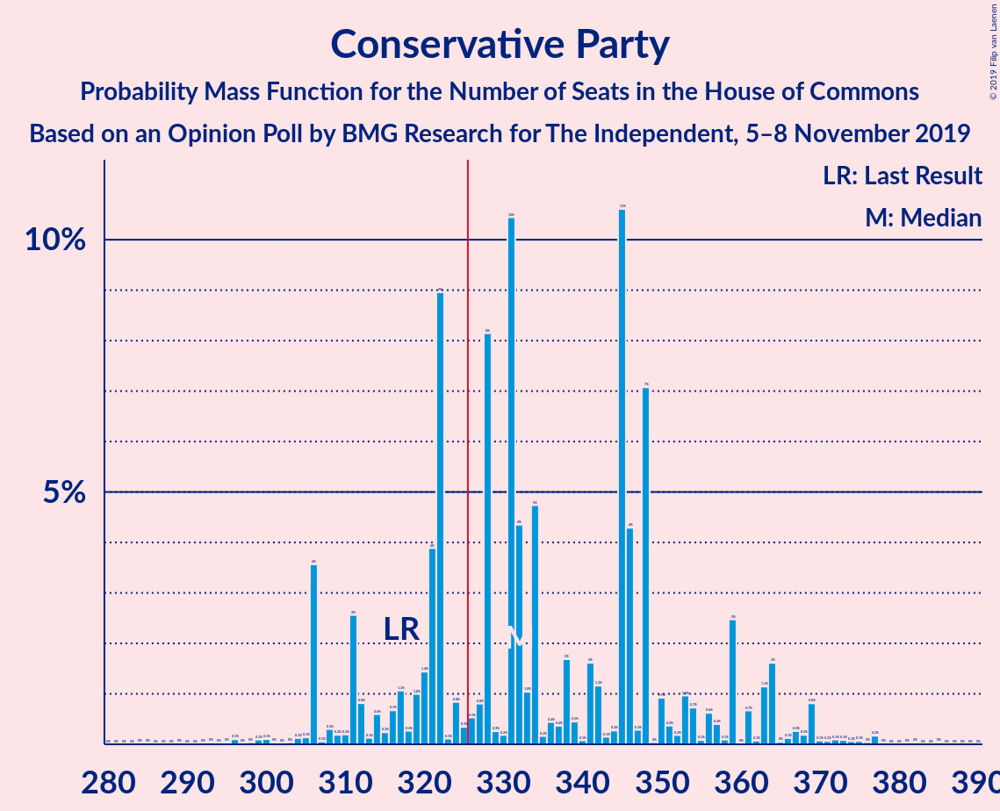

# Opinion Poll by BMG Research for The Independent, 5–8 November 2019

<a href="#voting-intentions">Voting Intentions</a> | <a href="#seats">Seats</a> | <a href="#coalitions">Coalitions</a> | <a href="#technical-information">Technical Information</a>

## Voting Intentions

### Confidence Intervals

| Party | Last Result | Poll Result | 80% Confidence Interval | 90% Confidence Interval | 95% Confidence Interval | 99% Confidence Interval |
|:-----:|:-----------:|:-----------:|:-----------------------:|:-----------------------:|:-----------------------:|:-----------------------:|
| Conservative Party | 43.4% | 36.6% | 35.1–38.2% |34.6–38.7% |34.2–39.1% |33.5–39.9% |
| Labour Party | 41.0% | 28.7% | 27.3–30.3% |26.9–30.7% |26.5–31.1% |25.8–31.8% |
| Liberal Democrats | 7.6% | 25.8% | 24.4–27.2% |24.0–27.7% |23.6–28.0% |23.0–28.7% |
| Brexit Party | 0.0% | 8.9% | 8.0–9.9% |7.8–10.2% |7.6–10.4% |7.2–10.9% |

*Note:* The poll result column reflects the actual value used in the calculations. Published results may vary slightly, and in addition be rounded to fewer digits.

## Seats

### Confidence Intervals

| Party | Last Result | Median | 80% Confidence Interval | 90% Confidence Interval | 95% Confidence Interval | 99% Confidence Interval |
|:-----:|:-----------:|:------:|:-----------------------:|:-----------------------:|:-----------------------:|:-----------------------:|
| <a href="#conservative-party">Conservative Party</a> | 317 | 299 | 281–327 |277–330 |275–333 |268–341 |
| <a href="#labour-party">Labour Party</a> | 262 | 211 | 185–223 |184–229 |180–232 |174–234 |
| <a href="#liberal-democrats">Liberal Democrats</a> | 12 | 81 | 75–87 |74–90 |74–92 |71–96 |
| <a href="#brexit-party">Brexit Party</a> | 0 | 0 | 0 |0 |0 |0 |

### Conservative Party

*For a full overview of the results for this party, see the [Conservative Party](party-conservativeparty.html) page.*

| Number of Seats | Probability | Accumulated | Special Marks |
|:---------------:|:-----------:|:-----------:|:-------------:|
| 246 | 0% | 100% |  |
| 247 | 0% | 99.9% |  |
| 248 | 0% | 99.9% |  |
| 249 | 0% | 99.9% |  |
| 250 | 0% | 99.9% |  |
| 251 | 0% | 99.9% |  |
| 252 | 0% | 99.9% |  |
| 253 | 0% | 99.9% |  |
| 254 | 0% | 99.9% |  |
| 255 | 0% | 99.9% |  |
| 256 | 0% | 99.8% |  |
| 257 | 0% | 99.8% |  |
| 258 | 0% | 99.8% |  |
| 259 | 0% | 99.8% |  |
| 260 | 0% | 99.8% |  |
| 261 | 0.1% | 99.7% |  |
| 262 | 0% | 99.7% |  |
| 263 | 0% | 99.7% |  |
| 264 | 0% | 99.6% |  |
| 265 | 0% | 99.6% |  |
| 266 | 0% | 99.6% |  |
| 267 | 0% | 99.5% |  |
| 268 | 0% | 99.5% |  |
| 269 | 0% | 99.5% |  |
| 270 | 0.2% | 99.5% |  |
| 271 | 1.4% | 99.3% |  |
| 272 | 0.3% | 98% |  |
| 273 | 0.1% | 98% |  |
| 274 | 0% | 98% |  |
| 275 | 0.5% | 98% |  |
| 276 | 1.0% | 97% |  |
| 277 | 3% | 96% |  |
| 278 | 0.2% | 93% |  |
| 279 | 0.1% | 93% |  |
| 280 | 2% | 93% |  |
| 281 | 2% | 91% |  |
| 282 | 2% | 90% |  |
| 283 | 0.5% | 88% |  |
| 284 | 0.5% | 87% |  |
| 285 | 0.1% | 87% |  |
| 286 | 1.1% | 86% |  |
| 287 | 1.0% | 85% |  |
| 288 | 4% | 84% |  |
| 289 | 3% | 80% |  |
| 290 | 0.3% | 77% |  |
| 291 | 0.5% | 77% |  |
| 292 | 0.3% | 76% |  |
| 293 | 0.3% | 76% |  |
| 294 | 0.3% | 76% |  |
| 295 | 0.1% | 75% |  |
| 296 | 1.4% | 75% |  |
| 297 | 6% | 74% |  |
| 298 | 14% | 68% |  |
| 299 | 6% | 53% | Median |
| 300 | 4% | 47% |  |
| 301 | 0.2% | 43% |  |
| 302 | 1.1% | 43% |  |
| 303 | 4% | 42% |  |
| 304 | 6% | 37% |  |
| 305 | 0.3% | 31% |  |
| 306 | 4% | 31% |  |
| 307 | 2% | 27% |  |
| 308 | 0.5% | 25% |  |
| 309 | 2% | 24% |  |
| 310 | 0% | 22% |  |
| 311 | 2% | 22% |  |
| 312 | 1.0% | 20% |  |
| 313 | 0.8% | 19% |  |
| 314 | 0.1% | 19% |  |
| 315 | 0.3% | 18% |  |
| 316 | 0.4% | 18% |  |
| 317 | 0.1% | 18% | Last Result |
| 318 | 0.1% | 18% |  |
| 319 | 0.7% | 18% |  |
| 320 | 0% | 17% |  |
| 321 | 0.4% | 17% |  |
| 322 | 0% | 16% |  |
| 323 | 1.5% | 16% |  |
| 324 | 0% | 15% |  |
| 325 | 0.8% | 15% |  |
| 326 | 3% | 14% | Majority |
| 327 | 3% | 11% |  |
| 328 | 0.1% | 8% |  |
| 329 | 1.4% | 8% |  |
| 330 | 3% | 6% |  |
| 331 | 0.1% | 3% |  |
| 332 | 0.5% | 3% |  |
| 333 | 0.7% | 3% |  |
| 334 | 0.1% | 2% |  |
| 335 | 0.6% | 2% |  |
| 336 | 0.2% | 1.4% |  |
| 337 | 0.1% | 1.2% |  |
| 338 | 0.5% | 1.1% |  |
| 339 | 0% | 0.7% |  |
| 340 | 0% | 0.6% |  |
| 341 | 0.2% | 0.6% |  |
| 342 | 0% | 0.4% |  |
| 343 | 0% | 0.3% |  |
| 344 | 0% | 0.3% |  |
| 345 | 0% | 0.3% |  |
| 346 | 0.1% | 0.3% |  |
| 347 | 0% | 0.2% |  |
| 348 | 0.1% | 0.2% |  |
| 349 | 0% | 0.1% |  |
| 350 | 0% | 0.1% |  |
| 351 | 0% | 0.1% |  |
| 352 | 0% | 0% |  |

### Labour Party

*For a full overview of the results for this party, see the [Labour Party](party-labourparty.html) page.*

| Number of Seats | Probability | Accumulated | Special Marks |
|:---------------:|:-----------:|:-----------:|:-------------:|
| 166 | 0% | 100% |  |
| 167 | 0% | 99.9% |  |
| 168 | 0% | 99.9% |  |
| 169 | 0% | 99.9% |  |
| 170 | 0% | 99.9% |  |
| 171 | 0% | 99.9% |  |
| 172 | 0% | 99.9% |  |
| 173 | 0.4% | 99.9% |  |
| 174 | 0.1% | 99.5% |  |
| 175 | 0% | 99.5% |  |
| 176 | 0% | 99.4% |  |
| 177 | 0.5% | 99.4% |  |
| 178 | 0.6% | 98.9% |  |
| 179 | 0.1% | 98% |  |
| 180 | 1.2% | 98% |  |
| 181 | 0.1% | 97% |  |
| 182 | 0.4% | 97% |  |
| 183 | 0% | 97% |  |
| 184 | 6% | 97% |  |
| 185 | 3% | 91% |  |
| 186 | 1.2% | 88% |  |
| 187 | 0.9% | 86% |  |
| 188 | 0% | 86% |  |
| 189 | 0% | 86% |  |
| 190 | 1.4% | 86% |  |
| 191 | 2% | 84% |  |
| 192 | 0% | 82% |  |
| 193 | 0% | 82% |  |
| 194 | 0.6% | 82% |  |
| 195 | 0.5% | 82% |  |
| 196 | 0.9% | 81% |  |
| 197 | 0.7% | 80% |  |
| 198 | 0.6% | 80% |  |
| 199 | 7% | 79% |  |
| 200 | 6% | 72% |  |
| 201 | 0.1% | 66% |  |
| 202 | 0% | 65% |  |
| 203 | 0.3% | 65% |  |
| 204 | 0.1% | 65% |  |
| 205 | 0% | 65% |  |
| 206 | 3% | 65% |  |
| 207 | 2% | 62% |  |
| 208 | 0.1% | 60% |  |
| 209 | 0.7% | 60% |  |
| 210 | 0.3% | 59% |  |
| 211 | 17% | 59% | Median |
| 212 | 14% | 42% |  |
| 213 | 3% | 28% |  |
| 214 | 0.5% | 25% |  |
| 215 | 0% | 24% |  |
| 216 | 6% | 24% |  |
| 217 | 0.4% | 18% |  |
| 218 | 3% | 18% |  |
| 219 | 1.4% | 15% |  |
| 220 | 0.6% | 14% |  |
| 221 | 0.3% | 13% |  |
| 222 | 2% | 13% |  |
| 223 | 1.4% | 11% |  |
| 224 | 1.2% | 9% |  |
| 225 | 0.1% | 8% |  |
| 226 | 0% | 8% |  |
| 227 | 2% | 8% |  |
| 228 | 0.9% | 6% |  |
| 229 | 1.2% | 5% |  |
| 230 | 0.7% | 4% |  |
| 231 | 0.6% | 3% |  |
| 232 | 2% | 3% |  |
| 233 | 0% | 0.5% |  |
| 234 | 0% | 0.5% |  |
| 235 | 0% | 0.5% |  |
| 236 | 0% | 0.5% |  |
| 237 | 0% | 0.5% |  |
| 238 | 0% | 0.4% |  |
| 239 | 0.1% | 0.4% |  |
| 240 | 0.1% | 0.4% |  |
| 241 | 0.1% | 0.3% |  |
| 242 | 0.1% | 0.2% |  |
| 243 | 0% | 0.2% |  |
| 244 | 0% | 0.2% |  |
| 245 | 0% | 0.2% |  |
| 246 | 0% | 0.2% |  |
| 247 | 0% | 0.2% |  |
| 248 | 0% | 0.1% |  |
| 249 | 0% | 0.1% |  |
| 250 | 0% | 0.1% |  |
| 251 | 0% | 0.1% |  |
| 252 | 0% | 0.1% |  |
| 253 | 0% | 0.1% |  |
| 254 | 0% | 0.1% |  |
| 255 | 0% | 0.1% |  |
| 256 | 0% | 0.1% |  |
| 257 | 0% | 0.1% |  |
| 258 | 0% | 0.1% |  |
| 259 | 0% | 0% |  |
| 260 | 0% | 0% |  |
| 261 | 0% | 0% |  |
| 262 | 0% | 0% | Last Result |

### Liberal Democrats

*For a full overview of the results for this party, see the [Liberal Democrats](party-liberaldemocrats.html) page.*

| Number of Seats | Probability | Accumulated | Special Marks |
|:---------------:|:-----------:|:-----------:|:-------------:|
| 12 | 0% | 100% | Last Result |
| 13 | 0% | 100% |  |
| 14 | 0% | 100% |  |
| 15 | 0% | 100% |  |
| 16 | 0% | 100% |  |
| 17 | 0% | 100% |  |
| 18 | 0% | 100% |  |
| 19 | 0% | 100% |  |
| 20 | 0% | 100% |  |
| 21 | 0% | 100% |  |
| 22 | 0% | 100% |  |
| 23 | 0% | 100% |  |
| 24 | 0% | 100% |  |
| 25 | 0% | 100% |  |
| 26 | 0% | 100% |  |
| 27 | 0% | 100% |  |
| 28 | 0% | 100% |  |
| 29 | 0% | 100% |  |
| 30 | 0% | 100% |  |
| 31 | 0% | 100% |  |
| 32 | 0% | 100% |  |
| 33 | 0% | 100% |  |
| 34 | 0% | 100% |  |
| 35 | 0% | 100% |  |
| 36 | 0% | 100% |  |
| 37 | 0% | 100% |  |
| 38 | 0% | 100% |  |
| 39 | 0% | 100% |  |
| 40 | 0% | 100% |  |
| 41 | 0% | 100% |  |
| 42 | 0% | 100% |  |
| 43 | 0% | 100% |  |
| 44 | 0% | 100% |  |
| 45 | 0% | 100% |  |
| 46 | 0% | 100% |  |
| 47 | 0% | 100% |  |
| 48 | 0% | 100% |  |
| 49 | 0% | 100% |  |
| 50 | 0% | 100% |  |
| 51 | 0% | 100% |  |
| 52 | 0% | 100% |  |
| 53 | 0% | 100% |  |
| 54 | 0% | 100% |  |
| 55 | 0% | 100% |  |
| 56 | 0% | 100% |  |
| 57 | 0% | 100% |  |
| 58 | 0% | 100% |  |
| 59 | 0% | 100% |  |
| 60 | 0% | 100% |  |
| 61 | 0% | 100% |  |
| 62 | 0% | 100% |  |
| 63 | 0% | 100% |  |
| 64 | 0% | 100% |  |
| 65 | 0% | 100% |  |
| 66 | 0% | 100% |  |
| 67 | 0% | 100% |  |
| 68 | 0.3% | 99.9% |  |
| 69 | 0.1% | 99.7% |  |
| 70 | 0% | 99.6% |  |
| 71 | 0.1% | 99.6% |  |
| 72 | 0.1% | 99.5% |  |
| 73 | 0.7% | 99.4% |  |
| 74 | 7% | 98.7% |  |
| 75 | 3% | 92% |  |
| 76 | 1.3% | 89% |  |
| 77 | 0.6% | 88% |  |
| 78 | 6% | 87% |  |
| 79 | 10% | 81% |  |
| 80 | 5% | 71% |  |
| 81 | 28% | 66% | Median |
| 82 | 4% | 38% |  |
| 83 | 1.5% | 33% |  |
| 84 | 2% | 32% |  |
| 85 | 4% | 30% |  |
| 86 | 10% | 26% |  |
| 87 | 9% | 17% |  |
| 88 | 2% | 8% |  |
| 89 | 0.1% | 6% |  |
| 90 | 2% | 6% |  |
| 91 | 0.8% | 4% |  |
| 92 | 2% | 4% |  |
| 93 | 0.3% | 1.4% |  |
| 94 | 0.4% | 1.1% |  |
| 95 | 0% | 0.7% |  |
| 96 | 0.4% | 0.7% |  |
| 97 | 0.2% | 0.3% |  |
| 98 | 0.1% | 0.1% |  |
| 99 | 0% | 0.1% |  |
| 100 | 0% | 0.1% |  |
| 101 | 0% | 0.1% |  |
| 102 | 0% | 0.1% |  |
| 103 | 0% | 0% |  |

### Brexit Party

*For a full overview of the results for this party, see the [Brexit Party](party-brexitparty.html) page.*

| Number of Seats | Probability | Accumulated | Special Marks |
|:---------------:|:-----------:|:-----------:|:-------------:|
| 0 | 100% | 100% | Last Result, Median |

## Coalitions

### Confidence Intervals

| Coalition | Last Result | Median | Majority? | 80% Confidence Interval | 90% Confidence Interval | 95% Confidence Interval | 99% Confidence Interval |
|:---------:|:-----------:|:------:|:---------:|:-----------------------:|:-----------------------:|:-----------------------:|:-----------------------:|
| Conservative Party – Liberal Democrats | 329 | 379 | 100% | 367–407 | 362–409 | 359–412 | 357–421 |
| Conservative Party – Brexit Party | 317 | 299 | 14% | 281–327 | 277–330 | 275–333 | 268–341 |
| Conservative Party | 317 | 299 | 14% | 281–327 | 277–330 | 275–333 | 268–341 |
| Labour Party – Liberal Democrats | 274 | 291 | 0.4% | 265–309 | 263–314 | 260–315 | 253–322 |
| Labour Party | 262 | 211 | 0% | 185–223 | 184–229 | 180–232 | 174–234 |

### Conservative Party – Liberal Democrats

| Number of Seats | Probability | Accumulated | Special Marks |
|:---------------:|:-----------:|:-----------:|:-------------:|
| 329 | 0% | 100% | Last Result |
| 330 | 0% | 100% |  |
| 331 | 0% | 100% |  |
| 332 | 0% | 100% |  |
| 333 | 0% | 100% |  |
| 334 | 0% | 99.9% |  |
| 335 | 0% | 99.9% |  |
| 336 | 0% | 99.9% |  |
| 337 | 0% | 99.9% |  |
| 338 | 0% | 99.9% |  |
| 339 | 0% | 99.9% |  |
| 340 | 0% | 99.9% |  |
| 341 | 0% | 99.9% |  |
| 342 | 0% | 99.9% |  |
| 343 | 0% | 99.9% |  |
| 344 | 0% | 99.9% |  |
| 345 | 0% | 99.8% |  |
| 346 | 0% | 99.8% |  |
| 347 | 0% | 99.8% |  |
| 348 | 0% | 99.8% |  |
| 349 | 0.1% | 99.8% |  |
| 350 | 0.1% | 99.8% |  |
| 351 | 0.1% | 99.7% |  |
| 352 | 0.1% | 99.6% |  |
| 353 | 0% | 99.6% |  |
| 354 | 0% | 99.6% |  |
| 355 | 0% | 99.5% |  |
| 356 | 0% | 99.5% |  |
| 357 | 0% | 99.5% |  |
| 358 | 0% | 99.5% |  |
| 359 | 2% | 99.5% |  |
| 360 | 0.6% | 97% |  |
| 361 | 0.9% | 97% |  |
| 362 | 2% | 96% |  |
| 363 | 2% | 94% |  |
| 364 | 0% | 92% |  |
| 365 | 0% | 92% |  |
| 366 | 0.9% | 92% |  |
| 367 | 1.3% | 91% |  |
| 368 | 2% | 90% |  |
| 369 | 0.8% | 88% |  |
| 370 | 0.5% | 87% |  |
| 371 | 0.9% | 87% |  |
| 372 | 3% | 86% |  |
| 373 | 0.9% | 83% |  |
| 374 | 6% | 82% |  |
| 375 | 0% | 76% |  |
| 376 | 0.5% | 76% |  |
| 377 | 3% | 75% |  |
| 378 | 14% | 72% |  |
| 379 | 12% | 58% |  |
| 380 | 4% | 46% | Median |
| 381 | 1.1% | 41% |  |
| 382 | 0.1% | 40% |  |
| 383 | 2% | 40% |  |
| 384 | 3% | 38% |  |
| 385 | 0% | 35% |  |
| 386 | 0% | 35% |  |
| 387 | 0.3% | 35% |  |
| 388 | 0% | 35% |  |
| 389 | 0.1% | 35% |  |
| 390 | 6% | 35% |  |
| 391 | 6% | 29% |  |
| 392 | 2% | 23% |  |
| 393 | 1.0% | 21% |  |
| 394 | 1.0% | 20% |  |
| 395 | 0.4% | 19% |  |
| 396 | 0.7% | 18% |  |
| 397 | 0.1% | 18% |  |
| 398 | 0.1% | 18% |  |
| 399 | 0% | 18% |  |
| 400 | 0% | 18% |  |
| 401 | 0% | 17% |  |
| 402 | 2% | 17% |  |
| 403 | 2% | 16% |  |
| 404 | 0.2% | 14% |  |
| 405 | 2% | 13% |  |
| 406 | 0.3% | 11% |  |
| 407 | 5% | 11% |  |
| 408 | 0.4% | 6% |  |
| 409 | 2% | 6% |  |
| 410 | 0.2% | 3% |  |
| 411 | 0.1% | 3% |  |
| 412 | 1.1% | 3% |  |
| 413 | 0.1% | 2% |  |
| 414 | 0.4% | 2% |  |
| 415 | 0.6% | 2% |  |
| 416 | 0.3% | 0.9% |  |
| 417 | 0% | 0.6% |  |
| 418 | 0% | 0.6% |  |
| 419 | 0% | 0.5% |  |
| 420 | 0% | 0.5% |  |
| 421 | 0.3% | 0.5% |  |
| 422 | 0.1% | 0.2% |  |
| 423 | 0% | 0.1% |  |
| 424 | 0% | 0.1% |  |
| 425 | 0% | 0.1% |  |
| 426 | 0% | 0.1% |  |
| 427 | 0.1% | 0.1% |  |
| 428 | 0% | 0% |  |

### Conservative Party – Brexit Party

| Number of Seats | Probability | Accumulated | Special Marks |
|:---------------:|:-----------:|:-----------:|:-------------:|
| 246 | 0% | 100% |  |
| 247 | 0% | 99.9% |  |
| 248 | 0% | 99.9% |  |
| 249 | 0% | 99.9% |  |
| 250 | 0% | 99.9% |  |
| 251 | 0% | 99.9% |  |
| 252 | 0% | 99.9% |  |
| 253 | 0% | 99.9% |  |
| 254 | 0% | 99.9% |  |
| 255 | 0% | 99.9% |  |
| 256 | 0% | 99.8% |  |
| 257 | 0% | 99.8% |  |
| 258 | 0% | 99.8% |  |
| 259 | 0% | 99.8% |  |
| 260 | 0% | 99.8% |  |
| 261 | 0.1% | 99.7% |  |
| 262 | 0% | 99.7% |  |
| 263 | 0% | 99.7% |  |
| 264 | 0% | 99.6% |  |
| 265 | 0% | 99.6% |  |
| 266 | 0% | 99.6% |  |
| 267 | 0% | 99.5% |  |
| 268 | 0% | 99.5% |  |
| 269 | 0% | 99.5% |  |
| 270 | 0.2% | 99.5% |  |
| 271 | 1.4% | 99.3% |  |
| 272 | 0.3% | 98% |  |
| 273 | 0.1% | 98% |  |
| 274 | 0% | 98% |  |
| 275 | 0.5% | 98% |  |
| 276 | 1.0% | 97% |  |
| 277 | 3% | 96% |  |
| 278 | 0.2% | 93% |  |
| 279 | 0.1% | 93% |  |
| 280 | 2% | 93% |  |
| 281 | 2% | 91% |  |
| 282 | 2% | 90% |  |
| 283 | 0.5% | 88% |  |
| 284 | 0.5% | 87% |  |
| 285 | 0.1% | 87% |  |
| 286 | 1.1% | 86% |  |
| 287 | 1.0% | 85% |  |
| 288 | 4% | 84% |  |
| 289 | 3% | 80% |  |
| 290 | 0.3% | 77% |  |
| 291 | 0.5% | 77% |  |
| 292 | 0.3% | 76% |  |
| 293 | 0.3% | 76% |  |
| 294 | 0.3% | 76% |  |
| 295 | 0.1% | 75% |  |
| 296 | 1.4% | 75% |  |
| 297 | 6% | 74% |  |
| 298 | 14% | 68% |  |
| 299 | 6% | 53% | Median |
| 300 | 4% | 47% |  |
| 301 | 0.2% | 43% |  |
| 302 | 1.1% | 43% |  |
| 303 | 4% | 42% |  |
| 304 | 6% | 37% |  |
| 305 | 0.3% | 31% |  |
| 306 | 4% | 31% |  |
| 307 | 2% | 27% |  |
| 308 | 0.5% | 25% |  |
| 309 | 2% | 24% |  |
| 310 | 0% | 22% |  |
| 311 | 2% | 22% |  |
| 312 | 1.0% | 20% |  |
| 313 | 0.8% | 19% |  |
| 314 | 0.1% | 19% |  |
| 315 | 0.3% | 18% |  |
| 316 | 0.4% | 18% |  |
| 317 | 0.1% | 18% | Last Result |
| 318 | 0.1% | 18% |  |
| 319 | 0.7% | 18% |  |
| 320 | 0% | 17% |  |
| 321 | 0.4% | 17% |  |
| 322 | 0% | 16% |  |
| 323 | 1.5% | 16% |  |
| 324 | 0% | 15% |  |
| 325 | 0.8% | 15% |  |
| 326 | 3% | 14% | Majority |
| 327 | 3% | 11% |  |
| 328 | 0.1% | 8% |  |
| 329 | 1.4% | 8% |  |
| 330 | 3% | 6% |  |
| 331 | 0.1% | 3% |  |
| 332 | 0.5% | 3% |  |
| 333 | 0.7% | 3% |  |
| 334 | 0.1% | 2% |  |
| 335 | 0.6% | 2% |  |
| 336 | 0.2% | 1.4% |  |
| 337 | 0.1% | 1.2% |  |
| 338 | 0.5% | 1.1% |  |
| 339 | 0% | 0.7% |  |
| 340 | 0% | 0.6% |  |
| 341 | 0.2% | 0.6% |  |
| 342 | 0% | 0.4% |  |
| 343 | 0% | 0.3% |  |
| 344 | 0% | 0.3% |  |
| 345 | 0% | 0.3% |  |
| 346 | 0.1% | 0.3% |  |
| 347 | 0% | 0.2% |  |
| 348 | 0.1% | 0.2% |  |
| 349 | 0% | 0.1% |  |
| 350 | 0% | 0.1% |  |
| 351 | 0% | 0.1% |  |
| 352 | 0% | 0% |  |

### Conservative Party

| Number of Seats | Probability | Accumulated | Special Marks |
|:---------------:|:-----------:|:-----------:|:-------------:|
| 246 | 0% | 100% |  |
| 247 | 0% | 99.9% |  |
| 248 | 0% | 99.9% |  |
| 249 | 0% | 99.9% |  |
| 250 | 0% | 99.9% |  |
| 251 | 0% | 99.9% |  |
| 252 | 0% | 99.9% |  |
| 253 | 0% | 99.9% |  |
| 254 | 0% | 99.9% |  |
| 255 | 0% | 99.9% |  |
| 256 | 0% | 99.8% |  |
| 257 | 0% | 99.8% |  |
| 258 | 0% | 99.8% |  |
| 259 | 0% | 99.8% |  |
| 260 | 0% | 99.8% |  |
| 261 | 0.1% | 99.7% |  |
| 262 | 0% | 99.7% |  |
| 263 | 0% | 99.7% |  |
| 264 | 0% | 99.6% |  |
| 265 | 0% | 99.6% |  |
| 266 | 0% | 99.6% |  |
| 267 | 0% | 99.5% |  |
| 268 | 0% | 99.5% |  |
| 269 | 0% | 99.5% |  |
| 270 | 0.2% | 99.5% |  |
| 271 | 1.4% | 99.3% |  |
| 272 | 0.3% | 98% |  |
| 273 | 0.1% | 98% |  |
| 274 | 0% | 98% |  |
| 275 | 0.5% | 98% |  |
| 276 | 1.0% | 97% |  |
| 277 | 3% | 96% |  |
| 278 | 0.2% | 93% |  |
| 279 | 0.1% | 93% |  |
| 280 | 2% | 93% |  |
| 281 | 2% | 91% |  |
| 282 | 2% | 90% |  |
| 283 | 0.5% | 88% |  |
| 284 | 0.5% | 87% |  |
| 285 | 0.1% | 87% |  |
| 286 | 1.1% | 86% |  |
| 287 | 1.0% | 85% |  |
| 288 | 4% | 84% |  |
| 289 | 3% | 80% |  |
| 290 | 0.3% | 77% |  |
| 291 | 0.5% | 77% |  |
| 292 | 0.3% | 76% |  |
| 293 | 0.3% | 76% |  |
| 294 | 0.3% | 76% |  |
| 295 | 0.1% | 75% |  |
| 296 | 1.4% | 75% |  |
| 297 | 6% | 74% |  |
| 298 | 14% | 68% |  |
| 299 | 6% | 53% | Median |
| 300 | 4% | 47% |  |
| 301 | 0.2% | 43% |  |
| 302 | 1.1% | 43% |  |
| 303 | 4% | 42% |  |
| 304 | 6% | 37% |  |
| 305 | 0.3% | 31% |  |
| 306 | 4% | 31% |  |
| 307 | 2% | 27% |  |
| 308 | 0.5% | 25% |  |
| 309 | 2% | 24% |  |
| 310 | 0% | 22% |  |
| 311 | 2% | 22% |  |
| 312 | 1.0% | 20% |  |
| 313 | 0.8% | 19% |  |
| 314 | 0.1% | 19% |  |
| 315 | 0.3% | 18% |  |
| 316 | 0.4% | 18% |  |
| 317 | 0.1% | 18% | Last Result |
| 318 | 0.1% | 18% |  |
| 319 | 0.7% | 18% |  |
| 320 | 0% | 17% |  |
| 321 | 0.4% | 17% |  |
| 322 | 0% | 16% |  |
| 323 | 1.5% | 16% |  |
| 324 | 0% | 15% |  |
| 325 | 0.8% | 15% |  |
| 326 | 3% | 14% | Majority |
| 327 | 3% | 11% |  |
| 328 | 0.1% | 8% |  |
| 329 | 1.4% | 8% |  |
| 330 | 3% | 6% |  |
| 331 | 0.1% | 3% |  |
| 332 | 0.5% | 3% |  |
| 333 | 0.7% | 3% |  |
| 334 | 0.1% | 2% |  |
| 335 | 0.6% | 2% |  |
| 336 | 0.2% | 1.4% |  |
| 337 | 0.1% | 1.2% |  |
| 338 | 0.5% | 1.1% |  |
| 339 | 0% | 0.7% |  |
| 340 | 0% | 0.6% |  |
| 341 | 0.2% | 0.6% |  |
| 342 | 0% | 0.4% |  |
| 343 | 0% | 0.3% |  |
| 344 | 0% | 0.3% |  |
| 345 | 0% | 0.3% |  |
| 346 | 0.1% | 0.3% |  |
| 347 | 0% | 0.2% |  |
| 348 | 0.1% | 0.2% |  |
| 349 | 0% | 0.1% |  |
| 350 | 0% | 0.1% |  |
| 351 | 0% | 0.1% |  |
| 352 | 0% | 0% |  |

### Labour Party – Liberal Democrats

| Number of Seats | Probability | Accumulated | Special Marks |
|:---------------:|:-----------:|:-----------:|:-------------:|
| 243 | 0% | 100% |  |
| 244 | 0% | 99.9% |  |
| 245 | 0% | 99.9% |  |
| 246 | 0% | 99.9% |  |
| 247 | 0.1% | 99.9% |  |
| 248 | 0.1% | 99.8% |  |
| 249 | 0% | 99.7% |  |
| 250 | 0% | 99.7% |  |
| 251 | 0% | 99.7% |  |
| 252 | 0.1% | 99.7% |  |
| 253 | 0.2% | 99.6% |  |
| 254 | 0% | 99.4% |  |
| 255 | 0% | 99.4% |  |
| 256 | 0.5% | 99.3% |  |
| 257 | 0% | 98.8% |  |
| 258 | 0.2% | 98.8% |  |
| 259 | 0.7% | 98.6% |  |
| 260 | 0.8% | 98% |  |
| 261 | 0.4% | 97% |  |
| 262 | 1.0% | 97% |  |
| 263 | 2% | 96% |  |
| 264 | 1.3% | 94% |  |
| 265 | 5% | 92% |  |
| 266 | 2% | 87% |  |
| 267 | 1.5% | 85% |  |
| 268 | 0% | 84% |  |
| 269 | 0.4% | 84% |  |
| 270 | 0.1% | 83% |  |
| 271 | 0.5% | 83% |  |
| 272 | 0.2% | 83% |  |
| 273 | 0.1% | 82% |  |
| 274 | 0.2% | 82% | Last Result |
| 275 | 0.2% | 82% |  |
| 276 | 0.3% | 82% |  |
| 277 | 0.6% | 82% |  |
| 278 | 1.0% | 81% |  |
| 279 | 0.6% | 80% |  |
| 280 | 2% | 80% |  |
| 281 | 2% | 78% |  |
| 282 | 0.1% | 76% |  |
| 283 | 2% | 76% |  |
| 284 | 0.7% | 74% |  |
| 285 | 4% | 73% |  |
| 286 | 5% | 69% |  |
| 287 | 5% | 63% |  |
| 288 | 1.1% | 58% |  |
| 289 | 0.2% | 57% |  |
| 290 | 4% | 57% |  |
| 291 | 6% | 53% |  |
| 292 | 14% | 47% | Median |
| 293 | 7% | 33% |  |
| 294 | 1.3% | 26% |  |
| 295 | 0.1% | 25% |  |
| 296 | 0.4% | 25% |  |
| 297 | 0.2% | 24% |  |
| 298 | 0.3% | 24% |  |
| 299 | 0.4% | 24% |  |
| 300 | 0.4% | 23% |  |
| 301 | 3% | 23% |  |
| 302 | 4% | 20% |  |
| 303 | 0.8% | 16% |  |
| 304 | 1.5% | 15% |  |
| 305 | 0.1% | 14% |  |
| 306 | 0.2% | 13% |  |
| 307 | 0.4% | 13% |  |
| 308 | 1.4% | 13% |  |
| 309 | 2% | 11% |  |
| 310 | 1.0% | 9% |  |
| 311 | 1.0% | 8% |  |
| 312 | 0.2% | 7% |  |
| 313 | 2% | 7% |  |
| 314 | 2% | 5% |  |
| 315 | 0.5% | 3% |  |
| 316 | 0% | 2% |  |
| 317 | 0.1% | 2% |  |
| 318 | 0.3% | 2% |  |
| 319 | 0.6% | 2% |  |
| 320 | 0.9% | 1.5% |  |
| 321 | 0% | 0.5% |  |
| 322 | 0% | 0.5% |  |
| 323 | 0% | 0.5% |  |
| 324 | 0% | 0.5% |  |
| 325 | 0.1% | 0.5% |  |
| 326 | 0% | 0.4% | Majority |
| 327 | 0% | 0.4% |  |
| 328 | 0% | 0.4% |  |
| 329 | 0% | 0.3% |  |
| 330 | 0.1% | 0.3% |  |
| 331 | 0% | 0.3% |  |
| 332 | 0% | 0.2% |  |
| 333 | 0% | 0.2% |  |
| 334 | 0% | 0.2% |  |
| 335 | 0% | 0.2% |  |
| 336 | 0% | 0.2% |  |
| 337 | 0% | 0.1% |  |
| 338 | 0% | 0.1% |  |
| 339 | 0% | 0.1% |  |
| 340 | 0% | 0.1% |  |
| 341 | 0% | 0.1% |  |
| 342 | 0% | 0.1% |  |
| 343 | 0% | 0.1% |  |
| 344 | 0% | 0.1% |  |
| 345 | 0% | 0.1% |  |
| 346 | 0% | 0% |  |

### Labour Party

| Number of Seats | Probability | Accumulated | Special Marks |
|:---------------:|:-----------:|:-----------:|:-------------:|
| 166 | 0% | 100% |  |
| 167 | 0% | 99.9% |  |
| 168 | 0% | 99.9% |  |
| 169 | 0% | 99.9% |  |
| 170 | 0% | 99.9% |  |
| 171 | 0% | 99.9% |  |
| 172 | 0% | 99.9% |  |
| 173 | 0.4% | 99.9% |  |
| 174 | 0.1% | 99.5% |  |
| 175 | 0% | 99.5% |  |
| 176 | 0% | 99.4% |  |
| 177 | 0.5% | 99.4% |  |
| 178 | 0.6% | 98.9% |  |
| 179 | 0.1% | 98% |  |
| 180 | 1.2% | 98% |  |
| 181 | 0.1% | 97% |  |
| 182 | 0.4% | 97% |  |
| 183 | 0% | 97% |  |
| 184 | 6% | 97% |  |
| 185 | 3% | 91% |  |
| 186 | 1.2% | 88% |  |
| 187 | 0.9% | 86% |  |
| 188 | 0% | 86% |  |
| 189 | 0% | 86% |  |
| 190 | 1.4% | 86% |  |
| 191 | 2% | 84% |  |
| 192 | 0% | 82% |  |
| 193 | 0% | 82% |  |
| 194 | 0.6% | 82% |  |
| 195 | 0.5% | 82% |  |
| 196 | 0.9% | 81% |  |
| 197 | 0.7% | 80% |  |
| 198 | 0.6% | 80% |  |
| 199 | 7% | 79% |  |
| 200 | 6% | 72% |  |
| 201 | 0.1% | 66% |  |
| 202 | 0% | 65% |  |
| 203 | 0.3% | 65% |  |
| 204 | 0.1% | 65% |  |
| 205 | 0% | 65% |  |
| 206 | 3% | 65% |  |
| 207 | 2% | 62% |  |
| 208 | 0.1% | 60% |  |
| 209 | 0.7% | 60% |  |
| 210 | 0.3% | 59% |  |
| 211 | 17% | 59% | Median |
| 212 | 14% | 42% |  |
| 213 | 3% | 28% |  |
| 214 | 0.5% | 25% |  |
| 215 | 0% | 24% |  |
| 216 | 6% | 24% |  |
| 217 | 0.4% | 18% |  |
| 218 | 3% | 18% |  |
| 219 | 1.4% | 15% |  |
| 220 | 0.6% | 14% |  |
| 221 | 0.3% | 13% |  |
| 222 | 2% | 13% |  |
| 223 | 1.4% | 11% |  |
| 224 | 1.2% | 9% |  |
| 225 | 0.1% | 8% |  |
| 226 | 0% | 8% |  |
| 227 | 2% | 8% |  |
| 228 | 0.9% | 6% |  |
| 229 | 1.2% | 5% |  |
| 230 | 0.7% | 4% |  |
| 231 | 0.6% | 3% |  |
| 232 | 2% | 3% |  |
| 233 | 0% | 0.5% |  |
| 234 | 0% | 0.5% |  |
| 235 | 0% | 0.5% |  |
| 236 | 0% | 0.5% |  |
| 237 | 0% | 0.5% |  |
| 238 | 0% | 0.4% |  |
| 239 | 0.1% | 0.4% |  |
| 240 | 0.1% | 0.4% |  |
| 241 | 0.1% | 0.3% |  |
| 242 | 0.1% | 0.2% |  |
| 243 | 0% | 0.2% |  |
| 244 | 0% | 0.2% |  |
| 245 | 0% | 0.2% |  |
| 246 | 0% | 0.2% |  |
| 247 | 0% | 0.2% |  |
| 248 | 0% | 0.1% |  |
| 249 | 0% | 0.1% |  |
| 250 | 0% | 0.1% |  |
| 251 | 0% | 0.1% |  |
| 252 | 0% | 0.1% |  |
| 253 | 0% | 0.1% |  |
| 254 | 0% | 0.1% |  |
| 255 | 0% | 0.1% |  |
| 256 | 0% | 0.1% |  |
| 257 | 0% | 0.1% |  |
| 258 | 0% | 0.1% |  |
| 259 | 0% | 0% |  |
| 260 | 0% | 0% |  |
| 261 | 0% | 0% |  |
| 262 | 0% | 0% | Last Result |

## Technical Information

### Opinion Poll

+ **Polling firm:** BMG Research
+ **Commissioner(s):** The Independent
+ **Fieldwork period:** 5–8 November 2019

### Calculations

+ **Sample size:** 1518
+ **Simulations done:** 32,768
+ **Error estimate:** 0.40%

