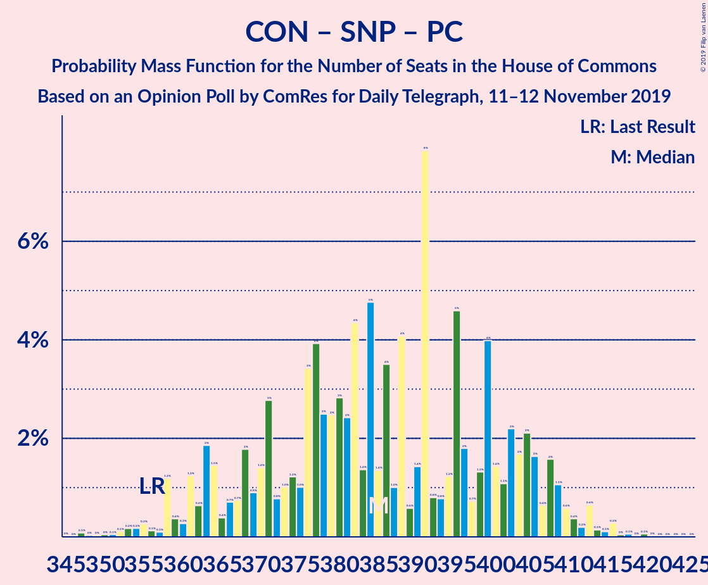

# Opinion Poll by ComRes for Daily Telegraph, 11–12 November 2019

<a href="#voting-intentions">Voting Intentions</a> | <a href="#seats">Seats</a> | <a href="#coalitions">Coalitions</a> | <a href="#technical-information">Technical Information</a>

## Voting Intentions

### Confidence Intervals

| Party | Last Result | Poll Result | 80% Confidence Interval | 90% Confidence Interval | 95% Confidence Interval | 99% Confidence Interval |
|:-----:|:-----------:|:-----------:|:-----------------------:|:-----------------------:|:-----------------------:|:-----------------------:|
| Conservative Party | 43.4% | 39.3% | 37.9–40.7% |37.5–41.1% |37.2–41.5% |36.5–42.1% |
| Labour Party | 41.0% | 29.5% | 28.2–30.8% |27.8–31.2% |27.5–31.5% |26.9–32.1% |
| Liberal Democrats | 7.6% | 15.7% | 14.7–16.8% |14.4–17.1% |14.2–17.4% |13.7–17.9% |
| Brexit Party | 0.0% | 6.9% | 6.2–7.7% |6.0–7.9% |5.9–8.1% |5.5–8.5% |
| Scottish National Party | 3.1% | 3.9% | 3.4–4.5% |3.3–4.7% |3.1–4.8% |2.9–5.2% |
| Green Party | 1.7% | 3.0% | 2.5–3.5% |2.4–3.7% |2.3–3.8% |2.1–4.1% |
| Plaid Cymru | 0.5% | 0.2% | 0.2–0.5% |0.1–0.5% |0.1–0.6% |0.1–0.7% |
| UK Independence Party | 1.9% | 0.2% | 0.2–0.5% |0.1–0.5% |0.1–0.6% |0.1–0.7% |
| Change UK | 0.0% | 0.2% | 0.2–0.5% |0.1–0.5% |0.1–0.6% |0.1–0.7% |

*Note:* The poll result column reflects the actual value used in the calculations. Published results may vary slightly, and in addition be rounded to fewer digits.

## Seats

### Confidence Intervals

| Party | Last Result | Median | 80% Confidence Interval | 90% Confidence Interval | 95% Confidence Interval | 99% Confidence Interval |
|:-----:|:-----------:|:------:|:-----------------------:|:-----------------------:|:-----------------------:|:-----------------------:|
| <a href="#conservative-party">Conservative Party</a> | 317 | 335 | 315–354 |311–356 |308–359 |302–364 |
| <a href="#labour-party">Labour Party</a> | 262 | 202 | 187–221 |185–224 |183–227 |179–230 |
| <a href="#liberal-democrats">Liberal Democrats</a> | 12 | 44 | 38–48 |37–49 |36–50 |35–54 |
| <a href="#brexit-party">Brexit Party</a> | 0 | 0 | 0 |0 |0 |0 |
| <a href="#scottish-national-party">Scottish National Party</a> | 35 | 50 | 47–51 |43–53 |40–53 |39–53 |
| <a href="#green-party">Green Party</a> | 1 | 1 | 1 |1 |1 |1 |
| <a href="#plaid-cymru">Plaid Cymru</a> | 4 | 0 | 0–4 |0–4 |0–4 |0–4 |
| <a href="#uk-independence-party">UK Independence Party</a> | 0 | 0 | 0 |0 |0 |0 |
| <a href="#change-uk">Change UK</a> | 0 | 0 | 0 |0 |0 |0 |

### Conservative Party

*For a full overview of the results for this party, see the [Conservative Party](party-conservativeparty.html) page.*

| Number of Seats | Probability | Accumulated | Special Marks |
|:---------------:|:-----------:|:-----------:|:-------------:|
| 292 | 0% | 100% |  |
| 293 | 0% | 99.9% |  |
| 294 | 0% | 99.9% |  |
| 295 | 0% | 99.9% |  |
| 296 | 0% | 99.9% |  |
| 297 | 0.1% | 99.9% |  |
| 298 | 0% | 99.8% |  |
| 299 | 0.1% | 99.8% |  |
| 300 | 0.1% | 99.7% |  |
| 301 | 0.1% | 99.6% |  |
| 302 | 0.1% | 99.5% |  |
| 303 | 0.2% | 99.4% |  |
| 304 | 0.9% | 99.3% |  |
| 305 | 0.1% | 98% |  |
| 306 | 0.4% | 98% |  |
| 307 | 0.3% | 98% |  |
| 308 | 0.9% | 98% |  |
| 309 | 0.6% | 97% |  |
| 310 | 0.8% | 96% |  |
| 311 | 0.9% | 95% |  |
| 312 | 0.4% | 94% |  |
| 313 | 2% | 94% |  |
| 314 | 1.4% | 92% |  |
| 315 | 2% | 90% |  |
| 316 | 0.4% | 88% |  |
| 317 | 0.4% | 88% | Last Result |
| 318 | 0.7% | 87% |  |
| 319 | 0.5% | 87% |  |
| 320 | 5% | 86% |  |
| 321 | 0.6% | 81% |  |
| 322 | 0.6% | 80% |  |
| 323 | 0.3% | 80% |  |
| 324 | 3% | 79% |  |
| 325 | 0.6% | 76% |  |
| 326 | 0.9% | 76% | Majority |
| 327 | 3% | 75% |  |
| 328 | 0.5% | 72% |  |
| 329 | 2% | 72% |  |
| 330 | 7% | 69% |  |
| 331 | 2% | 62% |  |
| 332 | 6% | 60% |  |
| 333 | 1.0% | 53% |  |
| 334 | 2% | 52% |  |
| 335 | 0.6% | 50% | Median |
| 336 | 3% | 50% |  |
| 337 | 0.7% | 47% |  |
| 338 | 1.3% | 46% |  |
| 339 | 2% | 45% |  |
| 340 | 1.1% | 43% |  |
| 341 | 0.9% | 42% |  |
| 342 | 1.1% | 41% |  |
| 343 | 10% | 40% |  |
| 344 | 9% | 31% |  |
| 345 | 1.2% | 21% |  |
| 346 | 0.7% | 20% |  |
| 347 | 0.7% | 19% |  |
| 348 | 1.1% | 19% |  |
| 349 | 1.0% | 18% |  |
| 350 | 0.7% | 17% |  |
| 351 | 1.2% | 16% |  |
| 352 | 4% | 15% |  |
| 353 | 0.5% | 11% |  |
| 354 | 1.5% | 11% |  |
| 355 | 4% | 9% |  |
| 356 | 0.7% | 5% |  |
| 357 | 0.5% | 5% |  |
| 358 | 0.7% | 4% |  |
| 359 | 1.3% | 3% |  |
| 360 | 0.2% | 2% |  |
| 361 | 0.2% | 2% |  |
| 362 | 1.1% | 2% |  |
| 363 | 0.2% | 0.7% |  |
| 364 | 0.1% | 0.5% |  |
| 365 | 0% | 0.4% |  |
| 366 | 0.1% | 0.4% |  |
| 367 | 0.1% | 0.2% |  |
| 368 | 0% | 0.2% |  |
| 369 | 0% | 0.1% |  |
| 370 | 0% | 0.1% |  |
| 371 | 0% | 0.1% |  |
| 372 | 0% | 0.1% |  |
| 373 | 0% | 0.1% |  |
| 374 | 0% | 0% |  |

### Labour Party

*For a full overview of the results for this party, see the [Labour Party](party-labourparty.html) page.*

| Number of Seats | Probability | Accumulated | Special Marks |
|:---------------:|:-----------:|:-----------:|:-------------:|
| 170 | 0% | 100% |  |
| 171 | 0% | 99.9% |  |
| 172 | 0% | 99.9% |  |
| 173 | 0% | 99.9% |  |
| 174 | 0% | 99.9% |  |
| 175 | 0% | 99.9% |  |
| 176 | 0.1% | 99.8% |  |
| 177 | 0.1% | 99.7% |  |
| 178 | 0.1% | 99.7% |  |
| 179 | 0.3% | 99.5% |  |
| 180 | 1.0% | 99.2% |  |
| 181 | 0.3% | 98% |  |
| 182 | 0.3% | 98% |  |
| 183 | 0.2% | 98% |  |
| 184 | 1.1% | 97% |  |
| 185 | 3% | 96% |  |
| 186 | 2% | 94% |  |
| 187 | 6% | 91% |  |
| 188 | 0.8% | 85% |  |
| 189 | 2% | 84% |  |
| 190 | 7% | 82% |  |
| 191 | 2% | 76% |  |
| 192 | 2% | 74% |  |
| 193 | 9% | 72% |  |
| 194 | 4% | 63% |  |
| 195 | 0.3% | 59% |  |
| 196 | 0.7% | 58% |  |
| 197 | 0.7% | 58% |  |
| 198 | 2% | 57% |  |
| 199 | 2% | 55% |  |
| 200 | 0.2% | 53% |  |
| 201 | 2% | 53% |  |
| 202 | 2% | 50% | Median |
| 203 | 5% | 48% |  |
| 204 | 7% | 43% |  |
| 205 | 2% | 36% |  |
| 206 | 6% | 34% |  |
| 207 | 0.9% | 28% |  |
| 208 | 3% | 27% |  |
| 209 | 4% | 25% |  |
| 210 | 0.2% | 21% |  |
| 211 | 0.1% | 21% |  |
| 212 | 0.4% | 20% |  |
| 213 | 0.2% | 20% |  |
| 214 | 4% | 20% |  |
| 215 | 1.0% | 16% |  |
| 216 | 2% | 15% |  |
| 217 | 1.3% | 13% |  |
| 218 | 1.5% | 12% |  |
| 219 | 0.2% | 10% |  |
| 220 | 0.1% | 10% |  |
| 221 | 1.1% | 10% |  |
| 222 | 0.8% | 9% |  |
| 223 | 1.3% | 8% |  |
| 224 | 3% | 7% |  |
| 225 | 0.9% | 4% |  |
| 226 | 0.4% | 3% |  |
| 227 | 0.4% | 3% |  |
| 228 | 1.0% | 2% |  |
| 229 | 0.2% | 1.4% |  |
| 230 | 0.8% | 1.2% |  |
| 231 | 0.1% | 0.5% |  |
| 232 | 0.1% | 0.4% |  |
| 233 | 0.1% | 0.3% |  |
| 234 | 0.1% | 0.2% |  |
| 235 | 0.1% | 0.1% |  |
| 236 | 0% | 0.1% |  |
| 237 | 0% | 0% |  |
| 238 | 0% | 0% |  |
| 239 | 0% | 0% |  |
| 240 | 0% | 0% |  |
| 241 | 0% | 0% |  |
| 242 | 0% | 0% |  |
| 243 | 0% | 0% |  |
| 244 | 0% | 0% |  |
| 245 | 0% | 0% |  |
| 246 | 0% | 0% |  |
| 247 | 0% | 0% |  |
| 248 | 0% | 0% |  |
| 249 | 0% | 0% |  |
| 250 | 0% | 0% |  |
| 251 | 0% | 0% |  |
| 252 | 0% | 0% |  |
| 253 | 0% | 0% |  |
| 254 | 0% | 0% |  |
| 255 | 0% | 0% |  |
| 256 | 0% | 0% |  |
| 257 | 0% | 0% |  |
| 258 | 0% | 0% |  |
| 259 | 0% | 0% |  |
| 260 | 0% | 0% |  |
| 261 | 0% | 0% |  |
| 262 | 0% | 0% | Last Result |

### Liberal Democrats

*For a full overview of the results for this party, see the [Liberal Democrats](party-liberaldemocrats.html) page.*

| Number of Seats | Probability | Accumulated | Special Marks |
|:---------------:|:-----------:|:-----------:|:-------------:|
| 12 | 0% | 100% | Last Result |
| 13 | 0% | 100% |  |
| 14 | 0% | 100% |  |
| 15 | 0% | 100% |  |
| 16 | 0% | 100% |  |
| 17 | 0% | 100% |  |
| 18 | 0% | 100% |  |
| 19 | 0% | 100% |  |
| 20 | 0% | 100% |  |
| 21 | 0% | 100% |  |
| 22 | 0% | 100% |  |
| 23 | 0% | 100% |  |
| 24 | 0% | 100% |  |
| 25 | 0% | 100% |  |
| 26 | 0% | 100% |  |
| 27 | 0% | 100% |  |
| 28 | 0% | 100% |  |
| 29 | 0% | 100% |  |
| 30 | 0% | 100% |  |
| 31 | 0% | 100% |  |
| 32 | 0% | 100% |  |
| 33 | 0.1% | 100% |  |
| 34 | 0.2% | 99.8% |  |
| 35 | 0.2% | 99.7% |  |
| 36 | 3% | 99.4% |  |
| 37 | 3% | 96% |  |
| 38 | 5% | 93% |  |
| 39 | 4% | 89% |  |
| 40 | 1.2% | 84% |  |
| 41 | 5% | 83% |  |
| 42 | 16% | 78% |  |
| 43 | 11% | 62% |  |
| 44 | 2% | 51% | Median |
| 45 | 3% | 49% |  |
| 46 | 20% | 46% |  |
| 47 | 14% | 25% |  |
| 48 | 6% | 12% |  |
| 49 | 3% | 6% |  |
| 50 | 2% | 3% |  |
| 51 | 0.8% | 1.4% |  |
| 52 | 0.1% | 0.6% |  |
| 53 | 0% | 0.5% |  |
| 54 | 0.2% | 0.5% |  |
| 55 | 0.1% | 0.3% |  |
| 56 | 0.2% | 0.3% |  |
| 57 | 0% | 0.1% |  |
| 58 | 0% | 0.1% |  |
| 59 | 0% | 0% |  |

### Brexit Party

*For a full overview of the results for this party, see the [Brexit Party](party-brexitparty.html) page.*

| Number of Seats | Probability | Accumulated | Special Marks |
|:---------------:|:-----------:|:-----------:|:-------------:|
| 0 | 100% | 100% | Last Result, Median |

### Scottish National Party

*For a full overview of the results for this party, see the [Scottish National Party](party-scottishnationalparty.html) page.*

| Number of Seats | Probability | Accumulated | Special Marks |
|:---------------:|:-----------:|:-----------:|:-------------:|
| 35 | 0% | 100% | Last Result |
| 36 | 0% | 99.9% |  |
| 37 | 0.1% | 99.9% |  |
| 38 | 0.1% | 99.8% |  |
| 39 | 2% | 99.7% |  |
| 40 | 1.0% | 98% |  |
| 41 | 0.4% | 97% |  |
| 42 | 0.4% | 96% |  |
| 43 | 1.5% | 96% |  |
| 44 | 0.6% | 94% |  |
| 45 | 2% | 94% |  |
| 46 | 0.8% | 91% |  |
| 47 | 4% | 91% |  |
| 48 | 15% | 86% |  |
| 49 | 0.2% | 71% |  |
| 50 | 33% | 71% | Median |
| 51 | 31% | 38% |  |
| 52 | 0.1% | 7% |  |
| 53 | 6% | 7% |  |
| 54 | 0.1% | 0.1% |  |
| 55 | 0% | 0% |  |

### Green Party

*For a full overview of the results for this party, see the [Green Party](party-greenparty.html) page.*

| Number of Seats | Probability | Accumulated | Special Marks |
|:---------------:|:-----------:|:-----------:|:-------------:|
| 1 | 99.9% | 100% | Last Result, Median |
| 2 | 0.1% | 0.1% |  |
| 3 | 0% | 0% |  |

### Plaid Cymru

*For a full overview of the results for this party, see the [Plaid Cymru](party-plaidcymru.html) page.*

| Number of Seats | Probability | Accumulated | Special Marks |
|:---------------:|:-----------:|:-----------:|:-------------:|
| 0 | 57% | 100% | Median |
| 1 | 0.1% | 43% |  |
| 2 | 0.9% | 43% |  |
| 3 | 13% | 42% |  |
| 4 | 29% | 29% | Last Result |
| 5 | 0% | 0% |  |

### UK Independence Party

*For a full overview of the results for this party, see the [UK Independence Party](party-ukindependenceparty.html) page.*

| Number of Seats | Probability | Accumulated | Special Marks |
|:---------------:|:-----------:|:-----------:|:-------------:|
| 0 | 100% | 100% | Last Result, Median |

### Change UK

*For a full overview of the results for this party, see the [Change UK](party-changeuk.html) page.*

| Number of Seats | Probability | Accumulated | Special Marks |
|:---------------:|:-----------:|:-----------:|:-------------:|
| 0 | 100% | 100% | Last Result, Median |

## Coalitions

### Confidence Intervals

| Coalition | Last Result | Median | Majority? | 80% Confidence Interval | 90% Confidence Interval | 95% Confidence Interval | 99% Confidence Interval |
|:---------:|:-----------:|:------:|:---------:|:-----------------------:|:-----------------------:|:-----------------------:|:-----------------------:|
| Conservative Party – Scottish National Party – Plaid Cymru | 356 | 386 | 100% | 368–403 | 362–406 | 358–408 | 354–412 |
| Conservative Party – Scottish National Party | 352 | 384 | 100% | 365–402 | 360–405 | 358–406 | 352–412 |
| Conservative Party – Liberal Democrats – Change UK | 329 | 378 | 100% | 360–394 | 356–397 | 352–401 | 348–406 |
| Conservative Party – Liberal Democrats | 329 | 378 | 100% | 360–394 | 356–397 | 352–401 | 348–406 |
| Conservative Party – Plaid Cymru | 321 | 337 | 79% | 317–355 | 313–358 | 308–361 | 304–366 |
| Conservative Party – Brexit Party | 317 | 335 | 76% | 315–354 | 311–356 | 308–359 | 302–364 |
| Conservative Party – Change UK | 317 | 335 | 76% | 315–354 | 311–356 | 308–359 | 302–364 |
| Conservative Party | 317 | 335 | 76% | 315–354 | 311–356 | 308–359 | 302–364 |
| Labour Party – Liberal Democrats – Scottish National Party – Green Party – Plaid Cymru | 314 | 297 | 2% | 278–317 | 276–321 | 273–324 | 268–330 |
| Labour Party – Liberal Democrats – Scottish National Party – Plaid Cymru | 313 | 296 | 2% | 277–316 | 275–320 | 272–323 | 267–329 |
| Labour Party – Liberal Democrats – Scottish National Party | 309 | 294 | 0.7% | 276–314 | 273–318 | 270–323 | 265–327 |
| Labour Party – Scottish National Party – Plaid Cymru | 301 | 253 | 0% | 237–271 | 234–275 | 230–279 | 225–283 |
| Labour Party – Scottish National Party | 297 | 251 | 0% | 235–269 | 232–275 | 229–277 | 224–281 |
| Labour Party – Liberal Democrats – Plaid Cymru | 278 | 247 | 0% | 229–266 | 226–271 | 225–273 | 219–279 |
| Labour Party – Liberal Democrats – Change UK | 274 | 245 | 0% | 228–263 | 225–269 | 223–273 | 219–277 |
| Labour Party – Liberal Democrats | 274 | 245 | 0% | 228–263 | 225–269 | 223–273 | 219–277 |
| Labour Party – Plaid Cymru | 266 | 203 | 0% | 187–221 | 187–225 | 185–230 | 180–232 |
| Labour Party – Change UK | 262 | 202 | 0% | 187–221 | 185–224 | 183–227 | 179–230 |
| Labour Party | 262 | 202 | 0% | 187–221 | 185–224 | 183–227 | 179–230 |

### Conservative Party – Scottish National Party – Plaid Cymru

| Number of Seats | Probability | Accumulated | Special Marks |
|:---------------:|:-----------:|:-----------:|:-------------:|
| 346 | 0% | 100% |  |
| 347 | 0.1% | 99.9% |  |
| 348 | 0% | 99.9% |  |
| 349 | 0% | 99.8% |  |
| 350 | 0.1% | 99.8% |  |
| 351 | 0.1% | 99.7% |  |
| 352 | 0.1% | 99.7% |  |
| 353 | 0.1% | 99.6% |  |
| 354 | 0.1% | 99.6% |  |
| 355 | 0.4% | 99.4% |  |
| 356 | 0.1% | 99.0% | Last Result |
| 357 | 0.1% | 98.9% |  |
| 358 | 2% | 98.9% |  |
| 359 | 0.5% | 97% |  |
| 360 | 0.2% | 96% |  |
| 361 | 0.9% | 96% |  |
| 362 | 0.5% | 95% |  |
| 363 | 1.1% | 95% |  |
| 364 | 2% | 94% |  |
| 365 | 0.6% | 92% |  |
| 366 | 0.4% | 91% |  |
| 367 | 0.4% | 91% |  |
| 368 | 2% | 90% |  |
| 369 | 0.7% | 88% |  |
| 370 | 2% | 88% |  |
| 371 | 4% | 86% |  |
| 372 | 0.3% | 82% |  |
| 373 | 1.4% | 81% |  |
| 374 | 0.2% | 80% |  |
| 375 | 0.7% | 80% |  |
| 376 | 0.3% | 79% |  |
| 377 | 4% | 79% |  |
| 378 | 1.2% | 74% |  |
| 379 | 3% | 73% |  |
| 380 | 0.9% | 70% |  |
| 381 | 3% | 69% |  |
| 382 | 6% | 66% |  |
| 383 | 0.8% | 61% |  |
| 384 | 6% | 60% |  |
| 385 | 0.6% | 54% | Median |
| 386 | 5% | 53% |  |
| 387 | 0.9% | 49% |  |
| 388 | 3% | 48% |  |
| 389 | 0.6% | 45% |  |
| 390 | 1.2% | 45% |  |
| 391 | 11% | 44% |  |
| 392 | 0.6% | 33% |  |
| 393 | 0.3% | 32% |  |
| 394 | 2% | 32% |  |
| 395 | 5% | 30% |  |
| 396 | 1.3% | 25% |  |
| 397 | 0.8% | 24% |  |
| 398 | 2% | 23% |  |
| 399 | 6% | 22% |  |
| 400 | 0.6% | 16% |  |
| 401 | 1.5% | 16% |  |
| 402 | 3% | 14% |  |
| 403 | 2% | 11% |  |
| 404 | 0.7% | 9% |  |
| 405 | 3% | 8% |  |
| 406 | 0.7% | 5% |  |
| 407 | 2% | 5% |  |
| 408 | 0.7% | 3% |  |
| 409 | 0.3% | 2% |  |
| 410 | 0.5% | 2% |  |
| 411 | 0.1% | 1.5% |  |
| 412 | 1.0% | 1.4% |  |
| 413 | 0.2% | 0.4% |  |
| 414 | 0% | 0.2% |  |
| 415 | 0% | 0.2% |  |
| 416 | 0% | 0.1% |  |
| 417 | 0% | 0.1% |  |
| 418 | 0% | 0.1% |  |
| 419 | 0% | 0.1% |  |
| 420 | 0% | 0% |  |

### Conservative Party – Scottish National Party

| Number of Seats | Probability | Accumulated | Special Marks |
|:---------------:|:-----------:|:-----------:|:-------------:|
| 344 | 0% | 100% |  |
| 345 | 0% | 99.9% |  |
| 346 | 0% | 99.9% |  |
| 347 | 0.1% | 99.9% |  |
| 348 | 0% | 99.8% |  |
| 349 | 0.1% | 99.8% |  |
| 350 | 0.1% | 99.7% |  |
| 351 | 0.1% | 99.7% |  |
| 352 | 0.4% | 99.6% | Last Result |
| 353 | 0.1% | 99.2% |  |
| 354 | 0.2% | 99.2% |  |
| 355 | 1.0% | 99.0% |  |
| 356 | 0.1% | 98% |  |
| 357 | 0.1% | 98% |  |
| 358 | 1.0% | 98% |  |
| 359 | 0.7% | 97% |  |
| 360 | 1.1% | 96% |  |
| 361 | 0.8% | 95% |  |
| 362 | 0.6% | 94% |  |
| 363 | 0.3% | 94% |  |
| 364 | 3% | 93% |  |
| 365 | 2% | 91% |  |
| 366 | 0.8% | 89% |  |
| 367 | 1.2% | 88% |  |
| 368 | 0.4% | 87% |  |
| 369 | 0.3% | 87% |  |
| 370 | 2% | 86% |  |
| 371 | 4% | 84% |  |
| 372 | 0.4% | 80% |  |
| 373 | 0.2% | 80% |  |
| 374 | 1.0% | 80% |  |
| 375 | 4% | 79% |  |
| 376 | 0.5% | 75% |  |
| 377 | 5% | 74% |  |
| 378 | 0.5% | 69% |  |
| 379 | 0.7% | 69% |  |
| 380 | 7% | 68% |  |
| 381 | 2% | 62% |  |
| 382 | 5% | 60% |  |
| 383 | 2% | 54% |  |
| 384 | 2% | 52% |  |
| 385 | 0.8% | 50% | Median |
| 386 | 3% | 49% |  |
| 387 | 2% | 46% |  |
| 388 | 1.3% | 44% |  |
| 389 | 0.3% | 42% |  |
| 390 | 1.5% | 42% |  |
| 391 | 10% | 40% |  |
| 392 | 2% | 30% |  |
| 393 | 0.7% | 29% |  |
| 394 | 0.7% | 28% |  |
| 395 | 8% | 27% |  |
| 396 | 1.0% | 19% |  |
| 397 | 0.6% | 18% |  |
| 398 | 3% | 17% |  |
| 399 | 0.9% | 15% |  |
| 400 | 0.5% | 14% |  |
| 401 | 1.0% | 13% |  |
| 402 | 3% | 12% |  |
| 403 | 3% | 10% |  |
| 404 | 0.7% | 7% |  |
| 405 | 3% | 6% |  |
| 406 | 0.9% | 3% |  |
| 407 | 0.3% | 2% |  |
| 408 | 0.5% | 2% |  |
| 409 | 0.3% | 2% |  |
| 410 | 0.1% | 1.3% |  |
| 411 | 0.1% | 1.2% |  |
| 412 | 0.9% | 1.2% |  |
| 413 | 0.1% | 0.3% |  |
| 414 | 0% | 0.1% |  |
| 415 | 0% | 0.1% |  |
| 416 | 0% | 0.1% |  |
| 417 | 0% | 0.1% |  |
| 418 | 0% | 0.1% |  |
| 419 | 0% | 0% |  |

### Conservative Party – Liberal Democrats – Change UK

| Number of Seats | Probability | Accumulated | Special Marks |
|:---------------:|:-----------:|:-----------:|:-------------:|
| 329 | 0% | 100% | Last Result |
| 330 | 0% | 100% |  |
| 331 | 0% | 100% |  |
| 332 | 0% | 100% |  |
| 333 | 0% | 100% |  |
| 334 | 0% | 100% |  |
| 335 | 0% | 100% |  |
| 336 | 0% | 100% |  |
| 337 | 0% | 100% |  |
| 338 | 0% | 100% |  |
| 339 | 0% | 100% |  |
| 340 | 0% | 100% |  |
| 341 | 0% | 100% |  |
| 342 | 0% | 100% |  |
| 343 | 0.1% | 99.9% |  |
| 344 | 0.1% | 99.9% |  |
| 345 | 0.1% | 99.8% |  |
| 346 | 0% | 99.8% |  |
| 347 | 0.2% | 99.7% |  |
| 348 | 0.1% | 99.5% |  |
| 349 | 0.9% | 99.4% |  |
| 350 | 0.2% | 98.5% |  |
| 351 | 0.8% | 98% |  |
| 352 | 0.2% | 98% |  |
| 353 | 0.3% | 97% |  |
| 354 | 0.9% | 97% |  |
| 355 | 0.6% | 96% |  |
| 356 | 3% | 96% |  |
| 357 | 1.4% | 93% |  |
| 358 | 0.8% | 91% |  |
| 359 | 0.2% | 91% |  |
| 360 | 1.3% | 90% |  |
| 361 | 1.5% | 89% |  |
| 362 | 1.4% | 88% |  |
| 363 | 1.1% | 86% |  |
| 364 | 0.4% | 85% |  |
| 365 | 0.5% | 85% |  |
| 366 | 4% | 84% |  |
| 367 | 0.2% | 80% |  |
| 368 | 1.2% | 80% |  |
| 369 | 0.3% | 79% |  |
| 370 | 3% | 78% |  |
| 371 | 2% | 75% |  |
| 372 | 4% | 74% |  |
| 373 | 6% | 69% |  |
| 374 | 0.7% | 64% |  |
| 375 | 4% | 63% |  |
| 376 | 3% | 59% |  |
| 377 | 0.9% | 56% |  |
| 378 | 7% | 55% |  |
| 379 | 0.7% | 48% | Median |
| 380 | 1.1% | 47% |  |
| 381 | 0.4% | 46% |  |
| 382 | 0.8% | 46% |  |
| 383 | 0.9% | 45% |  |
| 384 | 1.0% | 44% |  |
| 385 | 3% | 43% |  |
| 386 | 8% | 41% |  |
| 387 | 3% | 33% |  |
| 388 | 2% | 30% |  |
| 389 | 0.9% | 28% |  |
| 390 | 9% | 28% |  |
| 391 | 0.5% | 19% |  |
| 392 | 3% | 18% |  |
| 393 | 0.9% | 15% |  |
| 394 | 6% | 14% |  |
| 395 | 0.5% | 8% |  |
| 396 | 2% | 8% |  |
| 397 | 1.1% | 5% |  |
| 398 | 0.6% | 4% |  |
| 399 | 0.2% | 4% |  |
| 400 | 0.1% | 3% |  |
| 401 | 1.2% | 3% |  |
| 402 | 0.1% | 2% |  |
| 403 | 0.4% | 2% |  |
| 404 | 0.2% | 2% |  |
| 405 | 0.8% | 1.5% |  |
| 406 | 0.3% | 0.6% |  |
| 407 | 0.1% | 0.3% |  |
| 408 | 0% | 0.2% |  |
| 409 | 0% | 0.2% |  |
| 410 | 0.1% | 0.2% |  |
| 411 | 0% | 0.1% |  |
| 412 | 0% | 0.1% |  |
| 413 | 0% | 0% |  |

### Conservative Party – Liberal Democrats

| Number of Seats | Probability | Accumulated | Special Marks |
|:---------------:|:-----------:|:-----------:|:-------------:|
| 329 | 0% | 100% | Last Result |
| 330 | 0% | 100% |  |
| 331 | 0% | 100% |  |
| 332 | 0% | 100% |  |
| 333 | 0% | 100% |  |
| 334 | 0% | 100% |  |
| 335 | 0% | 100% |  |
| 336 | 0% | 100% |  |
| 337 | 0% | 100% |  |
| 338 | 0% | 100% |  |
| 339 | 0% | 100% |  |
| 340 | 0% | 100% |  |
| 341 | 0% | 100% |  |
| 342 | 0% | 100% |  |
| 343 | 0.1% | 99.9% |  |
| 344 | 0.1% | 99.9% |  |
| 345 | 0.1% | 99.8% |  |
| 346 | 0% | 99.8% |  |
| 347 | 0.2% | 99.7% |  |
| 348 | 0.1% | 99.5% |  |
| 349 | 0.9% | 99.4% |  |
| 350 | 0.2% | 98.5% |  |
| 351 | 0.8% | 98% |  |
| 352 | 0.2% | 98% |  |
| 353 | 0.3% | 97% |  |
| 354 | 0.9% | 97% |  |
| 355 | 0.6% | 96% |  |
| 356 | 3% | 96% |  |
| 357 | 1.4% | 93% |  |
| 358 | 0.8% | 91% |  |
| 359 | 0.2% | 91% |  |
| 360 | 1.3% | 90% |  |
| 361 | 1.5% | 89% |  |
| 362 | 1.4% | 88% |  |
| 363 | 1.1% | 86% |  |
| 364 | 0.4% | 85% |  |
| 365 | 0.5% | 85% |  |
| 366 | 4% | 84% |  |
| 367 | 0.2% | 80% |  |
| 368 | 1.2% | 80% |  |
| 369 | 0.3% | 79% |  |
| 370 | 3% | 78% |  |
| 371 | 2% | 75% |  |
| 372 | 4% | 74% |  |
| 373 | 6% | 69% |  |
| 374 | 0.7% | 64% |  |
| 375 | 4% | 63% |  |
| 376 | 3% | 59% |  |
| 377 | 0.9% | 56% |  |
| 378 | 7% | 55% |  |
| 379 | 0.7% | 48% | Median |
| 380 | 1.1% | 47% |  |
| 381 | 0.4% | 46% |  |
| 382 | 0.8% | 46% |  |
| 383 | 0.9% | 45% |  |
| 384 | 1.0% | 44% |  |
| 385 | 3% | 43% |  |
| 386 | 8% | 41% |  |
| 387 | 3% | 33% |  |
| 388 | 2% | 30% |  |
| 389 | 0.9% | 28% |  |
| 390 | 9% | 28% |  |
| 391 | 0.5% | 19% |  |
| 392 | 3% | 18% |  |
| 393 | 0.9% | 15% |  |
| 394 | 6% | 14% |  |
| 395 | 0.5% | 8% |  |
| 396 | 2% | 8% |  |
| 397 | 1.1% | 5% |  |
| 398 | 0.6% | 4% |  |
| 399 | 0.2% | 4% |  |
| 400 | 0.1% | 3% |  |
| 401 | 1.2% | 3% |  |
| 402 | 0.1% | 2% |  |
| 403 | 0.4% | 2% |  |
| 404 | 0.2% | 2% |  |
| 405 | 0.8% | 1.5% |  |
| 406 | 0.3% | 0.6% |  |
| 407 | 0.1% | 0.3% |  |
| 408 | 0% | 0.2% |  |
| 409 | 0% | 0.2% |  |
| 410 | 0.1% | 0.2% |  |
| 411 | 0% | 0.1% |  |
| 412 | 0% | 0.1% |  |
| 413 | 0% | 0% |  |

### Conservative Party – Plaid Cymru

| Number of Seats | Probability | Accumulated | Special Marks |
|:---------------:|:-----------:|:-----------:|:-------------:|
| 294 | 0% | 100% |  |
| 295 | 0% | 99.9% |  |
| 296 | 0% | 99.9% |  |
| 297 | 0.1% | 99.9% |  |
| 298 | 0% | 99.8% |  |
| 299 | 0.1% | 99.8% |  |
| 300 | 0% | 99.7% |  |
| 301 | 0% | 99.7% |  |
| 302 | 0.1% | 99.7% |  |
| 303 | 0.1% | 99.6% |  |
| 304 | 0.1% | 99.5% |  |
| 305 | 0.1% | 99.4% |  |
| 306 | 0.1% | 99.3% |  |
| 307 | 1.1% | 99.2% |  |
| 308 | 0.9% | 98% |  |
| 309 | 0.7% | 97% |  |
| 310 | 0.2% | 96% |  |
| 311 | 1.0% | 96% |  |
| 312 | 0.3% | 95% |  |
| 313 | 3% | 95% |  |
| 314 | 0.4% | 92% |  |
| 315 | 0.6% | 92% |  |
| 316 | 0.3% | 91% |  |
| 317 | 1.2% | 91% |  |
| 318 | 2% | 90% |  |
| 319 | 0.2% | 88% |  |
| 320 | 5% | 87% |  |
| 321 | 0.6% | 83% | Last Result |
| 322 | 0.6% | 82% |  |
| 323 | 1.1% | 81% |  |
| 324 | 0.3% | 80% |  |
| 325 | 0.6% | 80% |  |
| 326 | 1.0% | 79% | Majority |
| 327 | 2% | 78% |  |
| 328 | 3% | 76% |  |
| 329 | 2% | 73% |  |
| 330 | 2% | 71% |  |
| 331 | 2% | 69% |  |
| 332 | 5% | 67% |  |
| 333 | 1.1% | 62% |  |
| 334 | 6% | 61% |  |
| 335 | 2% | 55% | Median |
| 336 | 3% | 53% |  |
| 337 | 0.8% | 50% |  |
| 338 | 2% | 49% |  |
| 339 | 1.0% | 47% |  |
| 340 | 1.1% | 46% |  |
| 341 | 0.8% | 45% |  |
| 342 | 0.5% | 44% |  |
| 343 | 11% | 43% |  |
| 344 | 4% | 32% |  |
| 345 | 0.8% | 29% |  |
| 346 | 1.1% | 28% |  |
| 347 | 0.7% | 27% |  |
| 348 | 7% | 26% |  |
| 349 | 0.9% | 19% |  |
| 350 | 0.7% | 18% |  |
| 351 | 0.3% | 17% |  |
| 352 | 3% | 17% |  |
| 353 | 0.6% | 14% |  |
| 354 | 2% | 14% |  |
| 355 | 5% | 12% |  |
| 356 | 1.5% | 7% |  |
| 357 | 0.4% | 6% |  |
| 358 | 0.6% | 5% |  |
| 359 | 1.4% | 5% |  |
| 360 | 0.4% | 3% |  |
| 361 | 0.4% | 3% |  |
| 362 | 1.3% | 2% |  |
| 363 | 0.1% | 1.0% |  |
| 364 | 0.2% | 0.9% |  |
| 365 | 0.1% | 0.7% |  |
| 366 | 0.2% | 0.6% |  |
| 367 | 0.1% | 0.4% |  |
| 368 | 0.1% | 0.2% |  |
| 369 | 0% | 0.2% |  |
| 370 | 0% | 0.1% |  |
| 371 | 0% | 0.1% |  |
| 372 | 0% | 0.1% |  |
| 373 | 0% | 0.1% |  |
| 374 | 0% | 0.1% |  |
| 375 | 0% | 0.1% |  |
| 376 | 0% | 0.1% |  |
| 377 | 0% | 0% |  |

### Conservative Party – Brexit Party

| Number of Seats | Probability | Accumulated | Special Marks |
|:---------------:|:-----------:|:-----------:|:-------------:|
| 292 | 0% | 100% |  |
| 293 | 0% | 99.9% |  |
| 294 | 0% | 99.9% |  |
| 295 | 0% | 99.9% |  |
| 296 | 0% | 99.9% |  |
| 297 | 0.1% | 99.9% |  |
| 298 | 0% | 99.8% |  |
| 299 | 0.1% | 99.8% |  |
| 300 | 0.1% | 99.7% |  |
| 301 | 0.1% | 99.6% |  |
| 302 | 0.1% | 99.5% |  |
| 303 | 0.2% | 99.4% |  |
| 304 | 0.9% | 99.3% |  |
| 305 | 0.1% | 98% |  |
| 306 | 0.4% | 98% |  |
| 307 | 0.3% | 98% |  |
| 308 | 0.9% | 98% |  |
| 309 | 0.6% | 97% |  |
| 310 | 0.8% | 96% |  |
| 311 | 0.9% | 95% |  |
| 312 | 0.4% | 94% |  |
| 313 | 2% | 94% |  |
| 314 | 1.4% | 92% |  |
| 315 | 2% | 90% |  |
| 316 | 0.4% | 88% |  |
| 317 | 0.4% | 88% | Last Result |
| 318 | 0.7% | 87% |  |
| 319 | 0.5% | 87% |  |
| 320 | 5% | 86% |  |
| 321 | 0.6% | 81% |  |
| 322 | 0.6% | 80% |  |
| 323 | 0.3% | 80% |  |
| 324 | 3% | 79% |  |
| 325 | 0.6% | 76% |  |
| 326 | 0.9% | 76% | Majority |
| 327 | 3% | 75% |  |
| 328 | 0.5% | 72% |  |
| 329 | 2% | 72% |  |
| 330 | 7% | 69% |  |
| 331 | 2% | 62% |  |
| 332 | 6% | 60% |  |
| 333 | 1.0% | 53% |  |
| 334 | 2% | 52% |  |
| 335 | 0.6% | 50% | Median |
| 336 | 3% | 50% |  |
| 337 | 0.7% | 47% |  |
| 338 | 1.3% | 46% |  |
| 339 | 2% | 45% |  |
| 340 | 1.1% | 43% |  |
| 341 | 0.9% | 42% |  |
| 342 | 1.1% | 41% |  |
| 343 | 10% | 40% |  |
| 344 | 9% | 31% |  |
| 345 | 1.2% | 21% |  |
| 346 | 0.7% | 20% |  |
| 347 | 0.7% | 19% |  |
| 348 | 1.1% | 19% |  |
| 349 | 1.0% | 18% |  |
| 350 | 0.7% | 17% |  |
| 351 | 1.2% | 16% |  |
| 352 | 4% | 15% |  |
| 353 | 0.5% | 11% |  |
| 354 | 1.5% | 11% |  |
| 355 | 4% | 9% |  |
| 356 | 0.7% | 5% |  |
| 357 | 0.5% | 5% |  |
| 358 | 0.7% | 4% |  |
| 359 | 1.3% | 3% |  |
| 360 | 0.2% | 2% |  |
| 361 | 0.2% | 2% |  |
| 362 | 1.1% | 2% |  |
| 363 | 0.2% | 0.7% |  |
| 364 | 0.1% | 0.5% |  |
| 365 | 0% | 0.4% |  |
| 366 | 0.1% | 0.4% |  |
| 367 | 0.1% | 0.2% |  |
| 368 | 0% | 0.2% |  |
| 369 | 0% | 0.1% |  |
| 370 | 0% | 0.1% |  |
| 371 | 0% | 0.1% |  |
| 372 | 0% | 0.1% |  |
| 373 | 0% | 0.1% |  |
| 374 | 0% | 0% |  |

### Conservative Party – Change UK

| Number of Seats | Probability | Accumulated | Special Marks |
|:---------------:|:-----------:|:-----------:|:-------------:|
| 292 | 0% | 100% |  |
| 293 | 0% | 99.9% |  |
| 294 | 0% | 99.9% |  |
| 295 | 0% | 99.9% |  |
| 296 | 0% | 99.9% |  |
| 297 | 0.1% | 99.9% |  |
| 298 | 0% | 99.8% |  |
| 299 | 0.1% | 99.8% |  |
| 300 | 0.1% | 99.7% |  |
| 301 | 0.1% | 99.6% |  |
| 302 | 0.1% | 99.5% |  |
| 303 | 0.2% | 99.4% |  |
| 304 | 0.9% | 99.3% |  |
| 305 | 0.1% | 98% |  |
| 306 | 0.4% | 98% |  |
| 307 | 0.3% | 98% |  |
| 308 | 0.9% | 98% |  |
| 309 | 0.6% | 97% |  |
| 310 | 0.8% | 96% |  |
| 311 | 0.9% | 95% |  |
| 312 | 0.4% | 94% |  |
| 313 | 2% | 94% |  |
| 314 | 1.4% | 92% |  |
| 315 | 2% | 90% |  |
| 316 | 0.4% | 88% |  |
| 317 | 0.4% | 88% | Last Result |
| 318 | 0.7% | 87% |  |
| 319 | 0.5% | 87% |  |
| 320 | 5% | 86% |  |
| 321 | 0.6% | 81% |  |
| 322 | 0.6% | 80% |  |
| 323 | 0.3% | 80% |  |
| 324 | 3% | 79% |  |
| 325 | 0.6% | 76% |  |
| 326 | 0.9% | 76% | Majority |
| 327 | 3% | 75% |  |
| 328 | 0.5% | 72% |  |
| 329 | 2% | 72% |  |
| 330 | 7% | 69% |  |
| 331 | 2% | 62% |  |
| 332 | 6% | 60% |  |
| 333 | 1.0% | 53% |  |
| 334 | 2% | 52% |  |
| 335 | 0.6% | 50% | Median |
| 336 | 3% | 50% |  |
| 337 | 0.7% | 47% |  |
| 338 | 1.3% | 46% |  |
| 339 | 2% | 45% |  |
| 340 | 1.1% | 43% |  |
| 341 | 0.9% | 42% |  |
| 342 | 1.1% | 41% |  |
| 343 | 10% | 40% |  |
| 344 | 9% | 31% |  |
| 345 | 1.2% | 21% |  |
| 346 | 0.7% | 20% |  |
| 347 | 0.7% | 19% |  |
| 348 | 1.1% | 19% |  |
| 349 | 1.0% | 18% |  |
| 350 | 0.7% | 17% |  |
| 351 | 1.2% | 16% |  |
| 352 | 4% | 15% |  |
| 353 | 0.5% | 11% |  |
| 354 | 1.5% | 11% |  |
| 355 | 4% | 9% |  |
| 356 | 0.7% | 5% |  |
| 357 | 0.5% | 5% |  |
| 358 | 0.7% | 4% |  |
| 359 | 1.3% | 3% |  |
| 360 | 0.2% | 2% |  |
| 361 | 0.2% | 2% |  |
| 362 | 1.1% | 2% |  |
| 363 | 0.2% | 0.7% |  |
| 364 | 0.1% | 0.5% |  |
| 365 | 0% | 0.4% |  |
| 366 | 0.1% | 0.4% |  |
| 367 | 0.1% | 0.2% |  |
| 368 | 0% | 0.2% |  |
| 369 | 0% | 0.1% |  |
| 370 | 0% | 0.1% |  |
| 371 | 0% | 0.1% |  |
| 372 | 0% | 0.1% |  |
| 373 | 0% | 0.1% |  |
| 374 | 0% | 0% |  |

### Conservative Party

| Number of Seats | Probability | Accumulated | Special Marks |
|:---------------:|:-----------:|:-----------:|:-------------:|
| 292 | 0% | 100% |  |
| 293 | 0% | 99.9% |  |
| 294 | 0% | 99.9% |  |
| 295 | 0% | 99.9% |  |
| 296 | 0% | 99.9% |  |
| 297 | 0.1% | 99.9% |  |
| 298 | 0% | 99.8% |  |
| 299 | 0.1% | 99.8% |  |
| 300 | 0.1% | 99.7% |  |
| 301 | 0.1% | 99.6% |  |
| 302 | 0.1% | 99.5% |  |
| 303 | 0.2% | 99.4% |  |
| 304 | 0.9% | 99.3% |  |
| 305 | 0.1% | 98% |  |
| 306 | 0.4% | 98% |  |
| 307 | 0.3% | 98% |  |
| 308 | 0.9% | 98% |  |
| 309 | 0.6% | 97% |  |
| 310 | 0.8% | 96% |  |
| 311 | 0.9% | 95% |  |
| 312 | 0.4% | 94% |  |
| 313 | 2% | 94% |  |
| 314 | 1.4% | 92% |  |
| 315 | 2% | 90% |  |
| 316 | 0.4% | 88% |  |
| 317 | 0.4% | 88% | Last Result |
| 318 | 0.7% | 87% |  |
| 319 | 0.5% | 87% |  |
| 320 | 5% | 86% |  |
| 321 | 0.6% | 81% |  |
| 322 | 0.6% | 80% |  |
| 323 | 0.3% | 80% |  |
| 324 | 3% | 79% |  |
| 325 | 0.6% | 76% |  |
| 326 | 0.9% | 76% | Majority |
| 327 | 3% | 75% |  |
| 328 | 0.5% | 72% |  |
| 329 | 2% | 72% |  |
| 330 | 7% | 69% |  |
| 331 | 2% | 62% |  |
| 332 | 6% | 60% |  |
| 333 | 1.0% | 53% |  |
| 334 | 2% | 52% |  |
| 335 | 0.6% | 50% | Median |
| 336 | 3% | 50% |  |
| 337 | 0.7% | 47% |  |
| 338 | 1.3% | 46% |  |
| 339 | 2% | 45% |  |
| 340 | 1.1% | 43% |  |
| 341 | 0.9% | 42% |  |
| 342 | 1.1% | 41% |  |
| 343 | 10% | 40% |  |
| 344 | 9% | 31% |  |
| 345 | 1.2% | 21% |  |
| 346 | 0.7% | 20% |  |
| 347 | 0.7% | 19% |  |
| 348 | 1.1% | 19% |  |
| 349 | 1.0% | 18% |  |
| 350 | 0.7% | 17% |  |
| 351 | 1.2% | 16% |  |
| 352 | 4% | 15% |  |
| 353 | 0.5% | 11% |  |
| 354 | 1.5% | 11% |  |
| 355 | 4% | 9% |  |
| 356 | 0.7% | 5% |  |
| 357 | 0.5% | 5% |  |
| 358 | 0.7% | 4% |  |
| 359 | 1.3% | 3% |  |
| 360 | 0.2% | 2% |  |
| 361 | 0.2% | 2% |  |
| 362 | 1.1% | 2% |  |
| 363 | 0.2% | 0.7% |  |
| 364 | 0.1% | 0.5% |  |
| 365 | 0% | 0.4% |  |
| 366 | 0.1% | 0.4% |  |
| 367 | 0.1% | 0.2% |  |
| 368 | 0% | 0.2% |  |
| 369 | 0% | 0.1% |  |
| 370 | 0% | 0.1% |  |
| 371 | 0% | 0.1% |  |
| 372 | 0% | 0.1% |  |
| 373 | 0% | 0.1% |  |
| 374 | 0% | 0% |  |

### Labour Party – Liberal Democrats – Scottish National Party – Green Party – Plaid Cymru

| Number of Seats | Probability | Accumulated | Special Marks |
|:---------------:|:-----------:|:-----------:|:-------------:|
| 259 | 0% | 100% |  |
| 260 | 0% | 99.9% |  |
| 261 | 0% | 99.9% |  |
| 262 | 0% | 99.9% |  |
| 263 | 0% | 99.9% |  |
| 264 | 0% | 99.9% |  |
| 265 | 0.1% | 99.8% |  |
| 266 | 0.1% | 99.8% |  |
| 267 | 0% | 99.6% |  |
| 268 | 0.1% | 99.6% |  |
| 269 | 0.2% | 99.5% |  |
| 270 | 1.1% | 99.3% |  |
| 271 | 0.2% | 98% |  |
| 272 | 0.2% | 98% |  |
| 273 | 1.3% | 98% |  |
| 274 | 0.7% | 97% |  |
| 275 | 0.5% | 96% |  |
| 276 | 0.7% | 95% |  |
| 277 | 4% | 95% |  |
| 278 | 1.5% | 91% |  |
| 279 | 0.5% | 89% |  |
| 280 | 4% | 89% |  |
| 281 | 1.2% | 85% |  |
| 282 | 0.7% | 84% |  |
| 283 | 1.0% | 83% |  |
| 284 | 1.1% | 82% |  |
| 285 | 0.7% | 81% |  |
| 286 | 0.7% | 81% |  |
| 287 | 1.2% | 80% |  |
| 288 | 9% | 79% |  |
| 289 | 10% | 69% |  |
| 290 | 1.1% | 60% |  |
| 291 | 0.9% | 59% |  |
| 292 | 1.1% | 58% |  |
| 293 | 2% | 57% |  |
| 294 | 1.3% | 55% |  |
| 295 | 0.7% | 54% |  |
| 296 | 3% | 53% |  |
| 297 | 0.6% | 50% | Median |
| 298 | 2% | 50% |  |
| 299 | 1.0% | 48% |  |
| 300 | 6% | 47% |  |
| 301 | 2% | 40% |  |
| 302 | 7% | 38% |  |
| 303 | 2% | 31% |  |
| 304 | 0.5% | 28% |  |
| 305 | 3% | 28% |  |
| 306 | 0.9% | 25% |  |
| 307 | 0.6% | 24% |  |
| 308 | 3% | 24% |  |
| 309 | 0.3% | 21% |  |
| 310 | 0.6% | 20% |  |
| 311 | 0.6% | 20% |  |
| 312 | 5% | 19% |  |
| 313 | 0.5% | 14% |  |
| 314 | 0.7% | 13% | Last Result |
| 315 | 0.4% | 13% |  |
| 316 | 0.4% | 12% |  |
| 317 | 2% | 12% |  |
| 318 | 1.4% | 10% |  |
| 319 | 2% | 8% |  |
| 320 | 0.4% | 6% |  |
| 321 | 0.9% | 6% |  |
| 322 | 0.8% | 5% |  |
| 323 | 0.6% | 4% |  |
| 324 | 0.9% | 3% |  |
| 325 | 0.3% | 2% |  |
| 326 | 0.4% | 2% | Majority |
| 327 | 0.1% | 2% |  |
| 328 | 0.9% | 2% |  |
| 329 | 0.2% | 0.7% |  |
| 330 | 0.1% | 0.6% |  |
| 331 | 0.1% | 0.5% |  |
| 332 | 0.1% | 0.4% |  |
| 333 | 0.1% | 0.3% |  |
| 334 | 0% | 0.2% |  |
| 335 | 0.1% | 0.2% |  |
| 336 | 0% | 0.1% |  |
| 337 | 0% | 0.1% |  |
| 338 | 0% | 0.1% |  |
| 339 | 0% | 0.1% |  |
| 340 | 0% | 0.1% |  |
| 341 | 0% | 0% |  |

### Labour Party – Liberal Democrats – Scottish National Party – Plaid Cymru

| Number of Seats | Probability | Accumulated | Special Marks |
|:---------------:|:-----------:|:-----------:|:-------------:|
| 258 | 0% | 100% |  |
| 259 | 0% | 99.9% |  |
| 260 | 0% | 99.9% |  |
| 261 | 0% | 99.9% |  |
| 262 | 0% | 99.9% |  |
| 263 | 0% | 99.9% |  |
| 264 | 0.1% | 99.8% |  |
| 265 | 0.1% | 99.8% |  |
| 266 | 0% | 99.6% |  |
| 267 | 0.1% | 99.6% |  |
| 268 | 0.2% | 99.5% |  |
| 269 | 1.1% | 99.3% |  |
| 270 | 0.2% | 98% |  |
| 271 | 0.2% | 98% |  |
| 272 | 1.3% | 98% |  |
| 273 | 0.7% | 97% |  |
| 274 | 0.5% | 96% |  |
| 275 | 0.7% | 95% |  |
| 276 | 4% | 95% |  |
| 277 | 1.5% | 91% |  |
| 278 | 0.5% | 89% |  |
| 279 | 4% | 89% |  |
| 280 | 1.2% | 85% |  |
| 281 | 0.7% | 84% |  |
| 282 | 1.0% | 83% |  |
| 283 | 1.1% | 82% |  |
| 284 | 0.7% | 81% |  |
| 285 | 0.7% | 81% |  |
| 286 | 1.2% | 80% |  |
| 287 | 9% | 79% |  |
| 288 | 10% | 69% |  |
| 289 | 1.1% | 60% |  |
| 290 | 0.9% | 59% |  |
| 291 | 1.1% | 58% |  |
| 292 | 2% | 57% |  |
| 293 | 1.3% | 55% |  |
| 294 | 0.7% | 54% |  |
| 295 | 3% | 53% |  |
| 296 | 0.6% | 50% | Median |
| 297 | 2% | 50% |  |
| 298 | 1.0% | 48% |  |
| 299 | 6% | 47% |  |
| 300 | 2% | 40% |  |
| 301 | 7% | 38% |  |
| 302 | 2% | 31% |  |
| 303 | 0.5% | 28% |  |
| 304 | 3% | 28% |  |
| 305 | 0.9% | 25% |  |
| 306 | 0.6% | 24% |  |
| 307 | 3% | 24% |  |
| 308 | 0.3% | 21% |  |
| 309 | 0.6% | 20% |  |
| 310 | 0.6% | 20% |  |
| 311 | 5% | 19% |  |
| 312 | 0.5% | 14% |  |
| 313 | 0.7% | 13% | Last Result |
| 314 | 0.4% | 13% |  |
| 315 | 0.4% | 12% |  |
| 316 | 2% | 12% |  |
| 317 | 1.4% | 10% |  |
| 318 | 2% | 8% |  |
| 319 | 0.4% | 6% |  |
| 320 | 0.9% | 6% |  |
| 321 | 0.8% | 5% |  |
| 322 | 0.6% | 4% |  |
| 323 | 0.9% | 3% |  |
| 324 | 0.3% | 2% |  |
| 325 | 0.4% | 2% |  |
| 326 | 0.1% | 2% | Majority |
| 327 | 0.9% | 2% |  |
| 328 | 0.2% | 0.7% |  |
| 329 | 0.1% | 0.6% |  |
| 330 | 0.1% | 0.5% |  |
| 331 | 0.1% | 0.4% |  |
| 332 | 0.1% | 0.3% |  |
| 333 | 0% | 0.2% |  |
| 334 | 0.1% | 0.2% |  |
| 335 | 0% | 0.1% |  |
| 336 | 0% | 0.1% |  |
| 337 | 0% | 0.1% |  |
| 338 | 0% | 0.1% |  |
| 339 | 0% | 0.1% |  |
| 340 | 0% | 0% |  |

### Labour Party – Liberal Democrats – Scottish National Party

| Number of Seats | Probability | Accumulated | Special Marks |
|:---------------:|:-----------:|:-----------:|:-------------:|
| 255 | 0% | 100% |  |
| 256 | 0% | 99.9% |  |
| 257 | 0% | 99.9% |  |
| 258 | 0% | 99.9% |  |
| 259 | 0% | 99.9% |  |
| 260 | 0% | 99.9% |  |
| 261 | 0% | 99.9% |  |
| 262 | 0% | 99.9% |  |
| 263 | 0.1% | 99.8% |  |
| 264 | 0.1% | 99.8% |  |
| 265 | 0.2% | 99.6% |  |
| 266 | 0.1% | 99.4% |  |
| 267 | 0.2% | 99.3% |  |
| 268 | 0.1% | 99.1% |  |
| 269 | 1.3% | 99.0% |  |
| 270 | 0.4% | 98% |  |
| 271 | 0.4% | 97% |  |
| 272 | 1.4% | 97% |  |
| 273 | 0.6% | 95% |  |
| 274 | 0.4% | 95% |  |
| 275 | 1.5% | 94% |  |
| 276 | 5% | 93% |  |
| 277 | 2% | 88% |  |
| 278 | 0.6% | 86% |  |
| 279 | 3% | 86% |  |
| 280 | 0.3% | 83% |  |
| 281 | 0.7% | 83% |  |
| 282 | 0.9% | 82% |  |
| 283 | 7% | 81% |  |
| 284 | 0.7% | 74% |  |
| 285 | 1.1% | 73% |  |
| 286 | 0.8% | 72% |  |
| 287 | 4% | 71% |  |
| 288 | 11% | 68% |  |
| 289 | 0.5% | 57% |  |
| 290 | 0.8% | 56% |  |
| 291 | 1.1% | 55% |  |
| 292 | 1.0% | 54% |  |
| 293 | 2% | 53% |  |
| 294 | 0.8% | 51% |  |
| 295 | 3% | 50% |  |
| 296 | 2% | 47% | Median |
| 297 | 6% | 45% |  |
| 298 | 1.1% | 39% |  |
| 299 | 5% | 38% |  |
| 300 | 2% | 33% |  |
| 301 | 2% | 31% |  |
| 302 | 2% | 29% |  |
| 303 | 3% | 27% |  |
| 304 | 2% | 24% |  |
| 305 | 1.0% | 21% |  |
| 306 | 0.6% | 21% |  |
| 307 | 0.3% | 20% |  |
| 308 | 1.1% | 20% |  |
| 309 | 0.6% | 19% | Last Result |
| 310 | 0.6% | 18% |  |
| 311 | 5% | 17% |  |
| 312 | 0.2% | 13% |  |
| 313 | 2% | 12% |  |
| 314 | 1.2% | 10% |  |
| 315 | 0.3% | 9% |  |
| 316 | 0.6% | 9% |  |
| 317 | 0.4% | 8% |  |
| 318 | 3% | 8% |  |
| 319 | 0.3% | 5% |  |
| 320 | 1.0% | 5% |  |
| 321 | 0.2% | 4% |  |
| 322 | 0.7% | 4% |  |
| 323 | 0.9% | 3% |  |
| 324 | 1.1% | 2% |  |
| 325 | 0.1% | 0.8% |  |
| 326 | 0.1% | 0.7% | Majority |
| 327 | 0.1% | 0.6% |  |
| 328 | 0.1% | 0.5% |  |
| 329 | 0.1% | 0.4% |  |
| 330 | 0% | 0.3% |  |
| 331 | 0% | 0.3% |  |
| 332 | 0.1% | 0.3% |  |
| 333 | 0% | 0.2% |  |
| 334 | 0.1% | 0.2% |  |
| 335 | 0% | 0.1% |  |
| 336 | 0% | 0.1% |  |
| 337 | 0% | 0.1% |  |
| 338 | 0% | 0% |  |

### Labour Party – Scottish National Party – Plaid Cymru

| Number of Seats | Probability | Accumulated | Special Marks |
|:---------------:|:-----------:|:-----------:|:-------------:|
| 219 | 0% | 100% |  |
| 220 | 0% | 99.9% |  |
| 221 | 0.1% | 99.9% |  |
| 222 | 0% | 99.8% |  |
| 223 | 0% | 99.8% |  |
| 224 | 0.1% | 99.8% |  |
| 225 | 0.3% | 99.7% |  |
| 226 | 0.8% | 99.4% |  |
| 227 | 0.2% | 98.5% |  |
| 228 | 0.4% | 98% |  |
| 229 | 0.1% | 98% |  |
| 230 | 1.2% | 98% |  |
| 231 | 0.1% | 97% |  |
| 232 | 0.2% | 97% |  |
| 233 | 0.6% | 96% |  |
| 234 | 1.1% | 96% |  |
| 235 | 2% | 95% |  |
| 236 | 0.5% | 92% |  |
| 237 | 6% | 92% |  |
| 238 | 0.9% | 86% |  |
| 239 | 3% | 85% |  |
| 240 | 0.5% | 82% |  |
| 241 | 9% | 81% |  |
| 242 | 0.9% | 72% |  |
| 243 | 2% | 72% |  |
| 244 | 3% | 70% |  |
| 245 | 8% | 67% |  |
| 246 | 3% | 59% |  |
| 247 | 1.0% | 57% |  |
| 248 | 0.9% | 56% |  |
| 249 | 0.8% | 55% |  |
| 250 | 0.4% | 54% |  |
| 251 | 1.1% | 54% |  |
| 252 | 0.7% | 53% | Median |
| 253 | 7% | 52% |  |
| 254 | 0.9% | 45% |  |
| 255 | 3% | 44% |  |
| 256 | 4% | 41% |  |
| 257 | 0.7% | 37% |  |
| 258 | 6% | 36% |  |
| 259 | 4% | 31% |  |
| 260 | 2% | 26% |  |
| 261 | 3% | 25% |  |
| 262 | 0.3% | 22% |  |
| 263 | 1.2% | 21% |  |
| 264 | 0.2% | 20% |  |
| 265 | 4% | 20% |  |
| 266 | 0.5% | 16% |  |
| 267 | 0.4% | 15% |  |
| 268 | 1.1% | 15% |  |
| 269 | 1.4% | 14% |  |
| 270 | 2% | 12% |  |
| 271 | 1.3% | 11% |  |
| 272 | 0.2% | 10% |  |
| 273 | 0.8% | 9% |  |
| 274 | 1.4% | 9% |  |
| 275 | 3% | 7% |  |
| 276 | 0.6% | 4% |  |
| 277 | 0.9% | 4% |  |
| 278 | 0.3% | 3% |  |
| 279 | 0.2% | 3% |  |
| 280 | 0.8% | 2% |  |
| 281 | 0.2% | 2% |  |
| 282 | 0.9% | 1.5% |  |
| 283 | 0.1% | 0.6% |  |
| 284 | 0.2% | 0.5% |  |
| 285 | 0% | 0.3% |  |
| 286 | 0.1% | 0.2% |  |
| 287 | 0.1% | 0.2% |  |
| 288 | 0.1% | 0.1% |  |
| 289 | 0% | 0.1% |  |
| 290 | 0% | 0% |  |
| 291 | 0% | 0% |  |
| 292 | 0% | 0% |  |
| 293 | 0% | 0% |  |
| 294 | 0% | 0% |  |
| 295 | 0% | 0% |  |
| 296 | 0% | 0% |  |
| 297 | 0% | 0% |  |
| 298 | 0% | 0% |  |
| 299 | 0% | 0% |  |
| 300 | 0% | 0% |  |
| 301 | 0% | 0% | Last Result |

### Labour Party – Scottish National Party

| Number of Seats | Probability | Accumulated | Special Marks |
|:---------------:|:-----------:|:-----------:|:-------------:|
| 217 | 0% | 100% |  |
| 218 | 0% | 99.9% |  |
| 219 | 0% | 99.9% |  |
| 220 | 0.1% | 99.9% |  |
| 221 | 0.1% | 99.8% |  |
| 222 | 0.1% | 99.7% |  |
| 223 | 0% | 99.7% |  |
| 224 | 0.1% | 99.6% |  |
| 225 | 0.4% | 99.5% |  |
| 226 | 0.8% | 99.1% |  |
| 227 | 0.4% | 98% |  |
| 228 | 0.3% | 98% |  |
| 229 | 0.2% | 98% |  |
| 230 | 1.3% | 97% |  |
| 231 | 0.8% | 96% |  |
| 232 | 0.4% | 95% |  |
| 233 | 2% | 95% |  |
| 234 | 1.3% | 93% |  |
| 235 | 2% | 92% |  |
| 236 | 0.9% | 90% |  |
| 237 | 6% | 89% |  |
| 238 | 0.7% | 82% |  |
| 239 | 2% | 82% |  |
| 240 | 3% | 80% |  |
| 241 | 12% | 77% |  |
| 242 | 1.1% | 65% |  |
| 243 | 1.4% | 63% |  |
| 244 | 2% | 62% |  |
| 245 | 4% | 60% |  |
| 246 | 2% | 57% |  |
| 247 | 0.9% | 55% |  |
| 248 | 0.2% | 54% |  |
| 249 | 1.2% | 54% |  |
| 250 | 2% | 52% |  |
| 251 | 2% | 51% |  |
| 252 | 1.4% | 49% | Median |
| 253 | 5% | 47% |  |
| 254 | 6% | 42% |  |
| 255 | 3% | 36% |  |
| 256 | 4% | 34% |  |
| 257 | 3% | 30% |  |
| 258 | 0.9% | 26% |  |
| 259 | 3% | 25% |  |
| 260 | 2% | 22% |  |
| 261 | 0.2% | 20% |  |
| 262 | 0.4% | 20% |  |
| 263 | 0.3% | 20% |  |
| 264 | 0.3% | 20% |  |
| 265 | 4% | 19% |  |
| 266 | 2% | 15% |  |
| 267 | 1.5% | 14% |  |
| 268 | 2% | 12% |  |
| 269 | 0.5% | 10% |  |
| 270 | 0.3% | 10% |  |
| 271 | 2% | 9% |  |
| 272 | 0.3% | 8% |  |
| 273 | 1.2% | 8% |  |
| 274 | 0.2% | 6% |  |
| 275 | 3% | 6% |  |
| 276 | 0.3% | 4% |  |
| 277 | 0.7% | 3% |  |
| 278 | 0.2% | 2% |  |
| 279 | 0.9% | 2% |  |
| 280 | 0.8% | 1.4% |  |
| 281 | 0.1% | 0.6% |  |
| 282 | 0.1% | 0.5% |  |
| 283 | 0.1% | 0.4% |  |
| 284 | 0.1% | 0.3% |  |
| 285 | 0.1% | 0.2% |  |
| 286 | 0% | 0.1% |  |
| 287 | 0% | 0.1% |  |
| 288 | 0% | 0.1% |  |
| 289 | 0% | 0% |  |
| 290 | 0% | 0% |  |
| 291 | 0% | 0% |  |
| 292 | 0% | 0% |  |
| 293 | 0% | 0% |  |
| 294 | 0% | 0% |  |
| 295 | 0% | 0% |  |
| 296 | 0% | 0% |  |
| 297 | 0% | 0% | Last Result |

### Labour Party – Liberal Democrats – Plaid Cymru

| Number of Seats | Probability | Accumulated | Special Marks |
|:---------------:|:-----------:|:-----------:|:-------------:|
| 213 | 0% | 100% |  |
| 214 | 0% | 99.9% |  |
| 215 | 0% | 99.9% |  |
| 216 | 0% | 99.9% |  |
| 217 | 0% | 99.9% |  |
| 218 | 0.1% | 99.9% |  |
| 219 | 0.9% | 99.7% |  |
| 220 | 0.1% | 98.8% |  |
| 221 | 0.1% | 98.8% |  |
| 222 | 0.3% | 98.7% |  |
| 223 | 0.5% | 98% |  |
| 224 | 0.3% | 98% |  |
| 225 | 0.9% | 98% |  |
| 226 | 3% | 97% |  |
| 227 | 0.7% | 94% |  |
| 228 | 3% | 93% |  |
| 229 | 3% | 90% |  |
| 230 | 1.0% | 88% |  |
| 231 | 0.5% | 87% |  |
| 232 | 0.9% | 86% |  |
| 233 | 3% | 85% |  |
| 234 | 0.6% | 83% |  |
| 235 | 1.0% | 82% |  |
| 236 | 8% | 81% |  |
| 237 | 0.7% | 73% |  |
| 238 | 0.7% | 72% |  |
| 239 | 2% | 71% |  |
| 240 | 10% | 70% |  |
| 241 | 1.5% | 60% |  |
| 242 | 0.3% | 58% |  |
| 243 | 1.3% | 58% |  |
| 244 | 2% | 56% |  |
| 245 | 3% | 54% |  |
| 246 | 0.8% | 51% | Median |
| 247 | 2% | 50% |  |
| 248 | 2% | 48% |  |
| 249 | 5% | 46% |  |
| 250 | 2% | 40% |  |
| 251 | 7% | 38% |  |
| 252 | 0.7% | 32% |  |
| 253 | 0.5% | 31% |  |
| 254 | 5% | 31% |  |
| 255 | 0.5% | 26% |  |
| 256 | 4% | 25% |  |
| 257 | 1.0% | 21% |  |
| 258 | 0.2% | 20% |  |
| 259 | 0.4% | 20% |  |
| 260 | 4% | 20% |  |
| 261 | 2% | 16% |  |
| 262 | 0.3% | 14% |  |
| 263 | 0.4% | 13% |  |
| 264 | 1.2% | 13% |  |
| 265 | 0.8% | 12% |  |
| 266 | 2% | 11% |  |
| 267 | 3% | 9% |  |
| 268 | 0.3% | 7% |  |
| 269 | 0.6% | 6% |  |
| 270 | 0.8% | 6% |  |
| 271 | 1.1% | 5% |  |
| 272 | 0.7% | 4% |  |
| 273 | 1.0% | 3% |  |
| 274 | 0.1% | 2% |  |
| 275 | 0.1% | 2% |  |
| 276 | 1.0% | 2% |  |
| 277 | 0.2% | 1.0% |  |
| 278 | 0.1% | 0.8% | Last Result |
| 279 | 0.4% | 0.8% |  |
| 280 | 0.1% | 0.4% |  |
| 281 | 0.1% | 0.3% |  |
| 282 | 0.1% | 0.3% |  |
| 283 | 0% | 0.2% |  |
| 284 | 0.1% | 0.2% |  |
| 285 | 0% | 0.1% |  |
| 286 | 0% | 0.1% |  |
| 287 | 0% | 0.1% |  |
| 288 | 0% | 0% |  |

### Labour Party – Liberal Democrats – Change UK

| Number of Seats | Probability | Accumulated | Special Marks |
|:---------------:|:-----------:|:-----------:|:-------------:|
| 212 | 0% | 100% |  |
| 213 | 0% | 99.9% |  |
| 214 | 0% | 99.9% |  |
| 215 | 0% | 99.9% |  |
| 216 | 0% | 99.9% |  |
| 217 | 0% | 99.8% |  |
| 218 | 0.2% | 99.8% |  |
| 219 | 1.0% | 99.6% |  |
| 220 | 0.1% | 98.6% |  |
| 221 | 0.5% | 98.5% |  |
| 222 | 0.3% | 98% |  |
| 223 | 0.7% | 98% |  |
| 224 | 2% | 97% |  |
| 225 | 0.7% | 95% |  |
| 226 | 3% | 95% |  |
| 227 | 0.7% | 92% |  |
| 228 | 2% | 91% |  |
| 229 | 3% | 89% |  |
| 230 | 1.5% | 86% |  |
| 231 | 0.6% | 84% |  |
| 232 | 6% | 84% |  |
| 233 | 2% | 78% |  |
| 234 | 0.8% | 77% |  |
| 235 | 1.3% | 76% |  |
| 236 | 5% | 75% |  |
| 237 | 2% | 70% |  |
| 238 | 0.3% | 68% |  |
| 239 | 0.6% | 68% |  |
| 240 | 11% | 67% |  |
| 241 | 1.2% | 56% |  |
| 242 | 0.6% | 55% |  |
| 243 | 3% | 55% |  |
| 244 | 0.9% | 52% |  |
| 245 | 5% | 51% |  |
| 246 | 0.6% | 47% | Median |
| 247 | 6% | 46% |  |
| 248 | 0.8% | 40% |  |
| 249 | 6% | 39% |  |
| 250 | 3% | 34% |  |
| 251 | 0.9% | 31% |  |
| 252 | 3% | 30% |  |
| 253 | 1.2% | 27% |  |
| 254 | 4% | 26% |  |
| 255 | 0.3% | 21% |  |
| 256 | 0.7% | 21% |  |
| 257 | 0.2% | 20% |  |
| 258 | 1.4% | 20% |  |
| 259 | 0.3% | 19% |  |
| 260 | 4% | 18% |  |
| 261 | 2% | 14% |  |
| 262 | 0.7% | 12% |  |
| 263 | 2% | 12% |  |
| 264 | 0.4% | 10% |  |
| 265 | 0.4% | 9% |  |
| 266 | 0.6% | 9% |  |
| 267 | 2% | 8% |  |
| 268 | 1.1% | 6% |  |
| 269 | 0.5% | 5% |  |
| 270 | 0.9% | 5% |  |
| 271 | 0.2% | 4% |  |
| 272 | 0.5% | 4% |  |
| 273 | 2% | 3% |  |
| 274 | 0.1% | 1.1% | Last Result |
| 275 | 0.1% | 1.1% |  |
| 276 | 0.4% | 1.0% |  |
| 277 | 0.1% | 0.6% |  |
| 278 | 0.1% | 0.4% |  |
| 279 | 0.1% | 0.4% |  |
| 280 | 0.1% | 0.3% |  |
| 281 | 0.1% | 0.3% |  |
| 282 | 0% | 0.2% |  |
| 283 | 0% | 0.2% |  |
| 284 | 0.1% | 0.1% |  |
| 285 | 0% | 0.1% |  |
| 286 | 0% | 0% |  |

### Labour Party – Liberal Democrats

| Number of Seats | Probability | Accumulated | Special Marks |
|:---------------:|:-----------:|:-----------:|:-------------:|
| 212 | 0% | 100% |  |
| 213 | 0% | 99.9% |  |
| 214 | 0% | 99.9% |  |
| 215 | 0% | 99.9% |  |
| 216 | 0% | 99.9% |  |
| 217 | 0% | 99.8% |  |
| 218 | 0.2% | 99.8% |  |
| 219 | 1.0% | 99.6% |  |
| 220 | 0.1% | 98.6% |  |
| 221 | 0.5% | 98.5% |  |
| 222 | 0.3% | 98% |  |
| 223 | 0.7% | 98% |  |
| 224 | 2% | 97% |  |
| 225 | 0.7% | 95% |  |
| 226 | 3% | 95% |  |
| 227 | 0.7% | 92% |  |
| 228 | 2% | 91% |  |
| 229 | 3% | 89% |  |
| 230 | 1.5% | 86% |  |
| 231 | 0.6% | 84% |  |
| 232 | 6% | 84% |  |
| 233 | 2% | 78% |  |
| 234 | 0.8% | 77% |  |
| 235 | 1.3% | 76% |  |
| 236 | 5% | 75% |  |
| 237 | 2% | 70% |  |
| 238 | 0.3% | 68% |  |
| 239 | 0.6% | 68% |  |
| 240 | 11% | 67% |  |
| 241 | 1.2% | 56% |  |
| 242 | 0.6% | 55% |  |
| 243 | 3% | 55% |  |
| 244 | 0.9% | 52% |  |
| 245 | 5% | 51% |  |
| 246 | 0.6% | 47% | Median |
| 247 | 6% | 46% |  |
| 248 | 0.8% | 40% |  |
| 249 | 6% | 39% |  |
| 250 | 3% | 34% |  |
| 251 | 0.9% | 31% |  |
| 252 | 3% | 30% |  |
| 253 | 1.2% | 27% |  |
| 254 | 4% | 26% |  |
| 255 | 0.3% | 21% |  |
| 256 | 0.7% | 21% |  |
| 257 | 0.2% | 20% |  |
| 258 | 1.4% | 20% |  |
| 259 | 0.3% | 19% |  |
| 260 | 4% | 18% |  |
| 261 | 2% | 14% |  |
| 262 | 0.7% | 12% |  |
| 263 | 2% | 12% |  |
| 264 | 0.4% | 10% |  |
| 265 | 0.4% | 9% |  |
| 266 | 0.6% | 9% |  |
| 267 | 2% | 8% |  |
| 268 | 1.1% | 6% |  |
| 269 | 0.5% | 5% |  |
| 270 | 0.9% | 5% |  |
| 271 | 0.2% | 4% |  |
| 272 | 0.5% | 4% |  |
| 273 | 2% | 3% |  |
| 274 | 0.1% | 1.1% | Last Result |
| 275 | 0.1% | 1.1% |  |
| 276 | 0.4% | 1.0% |  |
| 277 | 0.1% | 0.6% |  |
| 278 | 0.1% | 0.4% |  |
| 279 | 0.1% | 0.4% |  |
| 280 | 0.1% | 0.3% |  |
| 281 | 0.1% | 0.3% |  |
| 282 | 0% | 0.2% |  |
| 283 | 0% | 0.2% |  |
| 284 | 0.1% | 0.1% |  |
| 285 | 0% | 0.1% |  |
| 286 | 0% | 0% |  |

### Labour Party – Plaid Cymru

| Number of Seats | Probability | Accumulated | Special Marks |
|:---------------:|:-----------:|:-----------:|:-------------:|
| 174 | 0.1% | 100% |  |
| 175 | 0% | 99.9% |  |
| 176 | 0.1% | 99.9% |  |
| 177 | 0.1% | 99.8% |  |
| 178 | 0% | 99.8% |  |
| 179 | 0.1% | 99.7% |  |
| 180 | 1.0% | 99.6% |  |
| 181 | 0.1% | 98.7% |  |
| 182 | 0.4% | 98.5% |  |
| 183 | 0.1% | 98% |  |
| 184 | 0.2% | 98% |  |
| 185 | 2% | 98% |  |
| 186 | 1.1% | 96% |  |
| 187 | 6% | 95% |  |
| 188 | 1.2% | 89% |  |
| 189 | 2% | 88% |  |
| 190 | 2% | 86% |  |
| 191 | 2% | 84% |  |
| 192 | 1.1% | 83% |  |
| 193 | 10% | 81% |  |
| 194 | 10% | 71% |  |
| 195 | 0.8% | 62% |  |
| 196 | 2% | 61% |  |
| 197 | 0.3% | 58% |  |
| 198 | 2% | 58% |  |
| 199 | 0.4% | 56% |  |
| 200 | 0.3% | 56% |  |
| 201 | 1.0% | 56% |  |
| 202 | 3% | 55% | Median |
| 203 | 5% | 52% |  |
| 204 | 1.2% | 47% |  |
| 205 | 3% | 45% |  |
| 206 | 3% | 42% |  |
| 207 | 0.9% | 40% |  |
| 208 | 9% | 39% |  |
| 209 | 6% | 30% |  |
| 210 | 4% | 25% |  |
| 211 | 0.1% | 21% |  |
| 212 | 0.1% | 21% |  |
| 213 | 0.2% | 20% |  |
| 214 | 4% | 20% |  |
| 215 | 0.5% | 16% |  |
| 216 | 0.1% | 16% |  |
| 217 | 0.2% | 16% |  |
| 218 | 2% | 16% |  |
| 219 | 2% | 14% |  |
| 220 | 1.3% | 12% |  |
| 221 | 0.6% | 11% |  |
| 222 | 0.2% | 10% |  |
| 223 | 1.1% | 10% |  |
| 224 | 3% | 9% |  |
| 225 | 0.9% | 5% |  |
| 226 | 1.0% | 4% |  |
| 227 | 0.2% | 3% |  |
| 228 | 0.3% | 3% |  |
| 229 | 0.2% | 3% |  |
| 230 | 1.1% | 3% |  |
| 231 | 1.0% | 2% |  |
| 232 | 0.1% | 0.5% |  |
| 233 | 0.1% | 0.5% |  |
| 234 | 0.1% | 0.4% |  |
| 235 | 0.1% | 0.3% |  |
| 236 | 0.1% | 0.2% |  |
| 237 | 0% | 0.1% |  |
| 238 | 0% | 0% |  |
| 239 | 0% | 0% |  |
| 240 | 0% | 0% |  |
| 241 | 0% | 0% |  |
| 242 | 0% | 0% |  |
| 243 | 0% | 0% |  |
| 244 | 0% | 0% |  |
| 245 | 0% | 0% |  |
| 246 | 0% | 0% |  |
| 247 | 0% | 0% |  |
| 248 | 0% | 0% |  |
| 249 | 0% | 0% |  |
| 250 | 0% | 0% |  |
| 251 | 0% | 0% |  |
| 252 | 0% | 0% |  |
| 253 | 0% | 0% |  |
| 254 | 0% | 0% |  |
| 255 | 0% | 0% |  |
| 256 | 0% | 0% |  |
| 257 | 0% | 0% |  |
| 258 | 0% | 0% |  |
| 259 | 0% | 0% |  |
| 260 | 0% | 0% |  |
| 261 | 0% | 0% |  |
| 262 | 0% | 0% |  |
| 263 | 0% | 0% |  |
| 264 | 0% | 0% |  |
| 265 | 0% | 0% |  |
| 266 | 0% | 0% | Last Result |

### Labour Party – Change UK

| Number of Seats | Probability | Accumulated | Special Marks |
|:---------------:|:-----------:|:-----------:|:-------------:|
| 170 | 0% | 100% |  |
| 171 | 0% | 99.9% |  |
| 172 | 0% | 99.9% |  |
| 173 | 0% | 99.9% |  |
| 174 | 0% | 99.9% |  |
| 175 | 0% | 99.9% |  |
| 176 | 0.1% | 99.8% |  |
| 177 | 0.1% | 99.7% |  |
| 178 | 0.1% | 99.7% |  |
| 179 | 0.3% | 99.5% |  |
| 180 | 1.0% | 99.2% |  |
| 181 | 0.3% | 98% |  |
| 182 | 0.3% | 98% |  |
| 183 | 0.2% | 98% |  |
| 184 | 1.1% | 97% |  |
| 185 | 3% | 96% |  |
| 186 | 2% | 94% |  |
| 187 | 6% | 91% |  |
| 188 | 0.8% | 85% |  |
| 189 | 2% | 84% |  |
| 190 | 7% | 82% |  |
| 191 | 2% | 76% |  |
| 192 | 2% | 74% |  |
| 193 | 9% | 72% |  |
| 194 | 4% | 63% |  |
| 195 | 0.3% | 59% |  |
| 196 | 0.7% | 58% |  |
| 197 | 0.7% | 58% |  |
| 198 | 2% | 57% |  |
| 199 | 2% | 55% |  |
| 200 | 0.2% | 53% |  |
| 201 | 2% | 53% |  |
| 202 | 2% | 50% | Median |
| 203 | 5% | 48% |  |
| 204 | 7% | 43% |  |
| 205 | 2% | 36% |  |
| 206 | 6% | 34% |  |
| 207 | 0.9% | 28% |  |
| 208 | 3% | 27% |  |
| 209 | 4% | 25% |  |
| 210 | 0.2% | 21% |  |
| 211 | 0.1% | 21% |  |
| 212 | 0.4% | 20% |  |
| 213 | 0.2% | 20% |  |
| 214 | 4% | 20% |  |
| 215 | 1.0% | 16% |  |
| 216 | 2% | 15% |  |
| 217 | 1.3% | 13% |  |
| 218 | 1.5% | 12% |  |
| 219 | 0.2% | 10% |  |
| 220 | 0.1% | 10% |  |
| 221 | 1.1% | 10% |  |
| 222 | 0.8% | 9% |  |
| 223 | 1.3% | 8% |  |
| 224 | 3% | 7% |  |
| 225 | 0.9% | 4% |  |
| 226 | 0.4% | 3% |  |
| 227 | 0.4% | 3% |  |
| 228 | 1.0% | 2% |  |
| 229 | 0.2% | 1.4% |  |
| 230 | 0.8% | 1.2% |  |
| 231 | 0.1% | 0.5% |  |
| 232 | 0.1% | 0.4% |  |
| 233 | 0.1% | 0.3% |  |
| 234 | 0.1% | 0.2% |  |
| 235 | 0.1% | 0.1% |  |
| 236 | 0% | 0.1% |  |
| 237 | 0% | 0% |  |
| 238 | 0% | 0% |  |
| 239 | 0% | 0% |  |
| 240 | 0% | 0% |  |
| 241 | 0% | 0% |  |
| 242 | 0% | 0% |  |
| 243 | 0% | 0% |  |
| 244 | 0% | 0% |  |
| 245 | 0% | 0% |  |
| 246 | 0% | 0% |  |
| 247 | 0% | 0% |  |
| 248 | 0% | 0% |  |
| 249 | 0% | 0% |  |
| 250 | 0% | 0% |  |
| 251 | 0% | 0% |  |
| 252 | 0% | 0% |  |
| 253 | 0% | 0% |  |
| 254 | 0% | 0% |  |
| 255 | 0% | 0% |  |
| 256 | 0% | 0% |  |
| 257 | 0% | 0% |  |
| 258 | 0% | 0% |  |
| 259 | 0% | 0% |  |
| 260 | 0% | 0% |  |
| 261 | 0% | 0% |  |
| 262 | 0% | 0% | Last Result |

### Labour Party

| Number of Seats | Probability | Accumulated | Special Marks |
|:---------------:|:-----------:|:-----------:|:-------------:|
| 170 | 0% | 100% |  |
| 171 | 0% | 99.9% |  |
| 172 | 0% | 99.9% |  |
| 173 | 0% | 99.9% |  |
| 174 | 0% | 99.9% |  |
| 175 | 0% | 99.9% |  |
| 176 | 0.1% | 99.8% |  |
| 177 | 0.1% | 99.7% |  |
| 178 | 0.1% | 99.7% |  |
| 179 | 0.3% | 99.5% |  |
| 180 | 1.0% | 99.2% |  |
| 181 | 0.3% | 98% |  |
| 182 | 0.3% | 98% |  |
| 183 | 0.2% | 98% |  |
| 184 | 1.1% | 97% |  |
| 185 | 3% | 96% |  |
| 186 | 2% | 94% |  |
| 187 | 6% | 91% |  |
| 188 | 0.8% | 85% |  |
| 189 | 2% | 84% |  |
| 190 | 7% | 82% |  |
| 191 | 2% | 76% |  |
| 192 | 2% | 74% |  |
| 193 | 9% | 72% |  |
| 194 | 4% | 63% |  |
| 195 | 0.3% | 59% |  |
| 196 | 0.7% | 58% |  |
| 197 | 0.7% | 58% |  |
| 198 | 2% | 57% |  |
| 199 | 2% | 55% |  |
| 200 | 0.2% | 53% |  |
| 201 | 2% | 53% |  |
| 202 | 2% | 50% | Median |
| 203 | 5% | 48% |  |
| 204 | 7% | 43% |  |
| 205 | 2% | 36% |  |
| 206 | 6% | 34% |  |
| 207 | 0.9% | 28% |  |
| 208 | 3% | 27% |  |
| 209 | 4% | 25% |  |
| 210 | 0.2% | 21% |  |
| 211 | 0.1% | 21% |  |
| 212 | 0.4% | 20% |  |
| 213 | 0.2% | 20% |  |
| 214 | 4% | 20% |  |
| 215 | 1.0% | 16% |  |
| 216 | 2% | 15% |  |
| 217 | 1.3% | 13% |  |
| 218 | 1.5% | 12% |  |
| 219 | 0.2% | 10% |  |
| 220 | 0.1% | 10% |  |
| 221 | 1.1% | 10% |  |
| 222 | 0.8% | 9% |  |
| 223 | 1.3% | 8% |  |
| 224 | 3% | 7% |  |
| 225 | 0.9% | 4% |  |
| 226 | 0.4% | 3% |  |
| 227 | 0.4% | 3% |  |
| 228 | 1.0% | 2% |  |
| 229 | 0.2% | 1.4% |  |
| 230 | 0.8% | 1.2% |  |
| 231 | 0.1% | 0.5% |  |
| 232 | 0.1% | 0.4% |  |
| 233 | 0.1% | 0.3% |  |
| 234 | 0.1% | 0.2% |  |
| 235 | 0.1% | 0.1% |  |
| 236 | 0% | 0.1% |  |
| 237 | 0% | 0% |  |
| 238 | 0% | 0% |  |
| 239 | 0% | 0% |  |
| 240 | 0% | 0% |  |
| 241 | 0% | 0% |  |
| 242 | 0% | 0% |  |
| 243 | 0% | 0% |  |
| 244 | 0% | 0% |  |
| 245 | 0% | 0% |  |
| 246 | 0% | 0% |  |
| 247 | 0% | 0% |  |
| 248 | 0% | 0% |  |
| 249 | 0% | 0% |  |
| 250 | 0% | 0% |  |
| 251 | 0% | 0% |  |
| 252 | 0% | 0% |  |
| 253 | 0% | 0% |  |
| 254 | 0% | 0% |  |
| 255 | 0% | 0% |  |
| 256 | 0% | 0% |  |
| 257 | 0% | 0% |  |
| 258 | 0% | 0% |  |
| 259 | 0% | 0% |  |
| 260 | 0% | 0% |  |
| 261 | 0% | 0% |  |
| 262 | 0% | 0% | Last Result |

## Technical Information

### Opinion Poll

+ **Polling firm:** ComRes
+ **Commissioner(s):** Daily Telegraph
+ **Fieldwork period:** 11–12 November 2019

### Calculations

+ **Sample size:** 2022
+ **Simulations done:** 524,288
+ **Error estimate:** 1.05%

