# Opinion Poll by YouGov for The Times, 12–20 November 2019

<a href="#voting-intentions">Voting Intentions</a> | <a href="#seats">Seats</a> | <a href="#coalitions">Coalitions</a> | <a href="#technical-information">Technical Information</a>

## Voting Intentions

### Confidence Intervals

| Party | Last Result | Poll Result | 80% Confidence Interval | 90% Confidence Interval | 95% Confidence Interval | 99% Confidence Interval |
|:-----:|:-----------:|:-----------:|:-----------------------:|:-----------------------:|:-----------------------:|:-----------------------:|
| Conservative Party | 43.4% | 42.6% | 42.0–43.2% |41.8–43.3% |41.7–43.5% |41.4–43.8% |
| Labour Party | 41.0% | 28.7% | 28.2–29.3% |28.0–29.4% |27.9–29.6% |27.6–29.8% |
| Liberal Democrats | 7.6% | 14.9% | 14.4–15.3% |14.3–15.4% |14.2–15.5% |14.0–15.7% |
| Scottish National Party | 3.1% | 4.0% | 3.7–4.2% |3.7–4.3% |3.6–4.3% |3.5–4.5% |
| Brexit Party | 0.0% | 4.0% | 3.7–4.2% |3.7–4.3% |3.6–4.3% |3.5–4.5% |
| Green Party | 1.7% | 3.0% | 2.8–3.2% |2.7–3.3% |2.7–3.3% |2.6–3.4% |
| Plaid Cymru | 0.5% | 1.0% | 0.9–1.1% |0.8–1.2% |0.8–1.2% |0.8–1.3% |

*Note:* The poll result column reflects the actual value used in the calculations. Published results may vary slightly, and in addition be rounded to fewer digits.

## Seats

### Confidence Intervals

| Party | Last Result | Median | 80% Confidence Interval | 90% Confidence Interval | 95% Confidence Interval | 99% Confidence Interval |
|:-----:|:-----------:|:------:|:-----------------------:|:-----------------------:|:-----------------------:|:-----------------------:|
| <a href="#conservative-party">Conservative Party</a> | 317 | 362 | 357–364 |356–366 |354–368 |350–371 |
| <a href="#labour-party">Labour Party</a> | 262 | 181 | 178–184 |177–185 |174–186 |170–189 |
| <a href="#liberal-democrats">Liberal Democrats</a> | 12 | 36 | 35–37 |34–38 |33–38 |32–40 |
| <a href="#scottish-national-party">Scottish National Party</a> | 35 | 48 | 47–50 |47–50 |45–50 |42–51 |
| <a href="#brexit-party">Brexit Party</a> | 0 | 0 | 0 |0 |0 |0 |
| <a href="#green-party">Green Party</a> | 1 | 1 | 1 |1 |1 |1 |
| <a href="#plaid-cymru">Plaid Cymru</a> | 4 | 5 | 4–8 |4–8 |4–8 |4–8 |

### Conservative Party

*For a full overview of the results for this party, see the [Conservative Party](party-conservativeparty.html) page.*

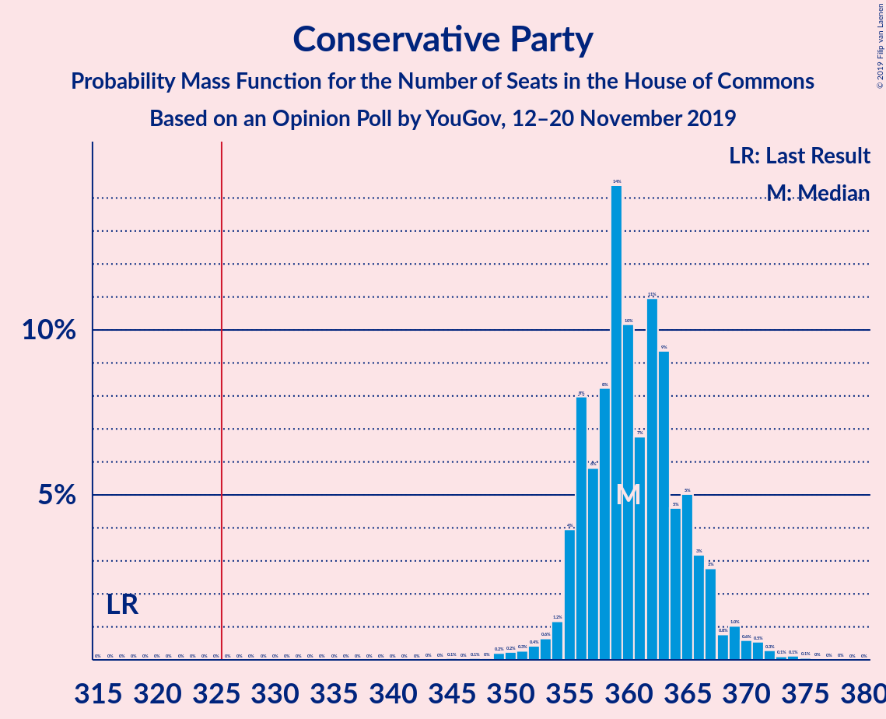

| Number of Seats | Probability | Accumulated | Special Marks |
|:---------------:|:-----------:|:-----------:|:-------------:|
| 317 | 0% | 100% | Last Result |
| 318 | 0% | 100% |  |
| 319 | 0% | 100% |  |
| 320 | 0% | 100% |  |
| 321 | 0% | 100% |  |
| 322 | 0% | 100% |  |
| 323 | 0% | 100% |  |
| 324 | 0% | 100% |  |
| 325 | 0% | 100% |  |
| 326 | 0% | 100% | Majority |
| 327 | 0% | 100% |  |
| 328 | 0% | 100% |  |
| 329 | 0% | 100% |  |
| 330 | 0% | 100% |  |
| 331 | 0% | 100% |  |
| 332 | 0% | 100% |  |
| 333 | 0% | 100% |  |
| 334 | 0% | 100% |  |
| 335 | 0% | 100% |  |
| 336 | 0% | 100% |  |
| 337 | 0% | 100% |  |
| 338 | 0% | 100% |  |
| 339 | 0% | 100% |  |
| 340 | 0% | 100% |  |
| 341 | 0% | 100% |  |
| 342 | 0% | 100% |  |
| 343 | 0% | 100% |  |
| 344 | 0% | 100% |  |
| 345 | 0% | 100% |  |
| 346 | 0% | 100% |  |
| 347 | 0.1% | 100% |  |
| 348 | 0% | 99.9% |  |
| 349 | 0.2% | 99.9% |  |
| 350 | 0.2% | 99.6% |  |
| 351 | 0.5% | 99.4% |  |
| 352 | 0.4% | 98.9% |  |
| 353 | 0.5% | 98.6% |  |
| 354 | 2% | 98% |  |
| 355 | 0.8% | 96% |  |
| 356 | 2% | 96% |  |
| 357 | 6% | 94% |  |
| 358 | 1.4% | 88% |  |
| 359 | 24% | 87% |  |
| 360 | 4% | 62% |  |
| 361 | 7% | 58% |  |
| 362 | 25% | 52% | Median |
| 363 | 11% | 27% |  |
| 364 | 10% | 16% |  |
| 365 | 0.9% | 7% |  |
| 366 | 1.1% | 6% |  |
| 367 | 1.4% | 5% |  |
| 368 | 1.2% | 3% |  |
| 369 | 0.6% | 2% |  |
| 370 | 0.3% | 1.3% |  |
| 371 | 0.6% | 1.0% |  |
| 372 | 0.2% | 0.4% |  |
| 373 | 0% | 0.3% |  |
| 374 | 0.2% | 0.2% |  |
| 375 | 0% | 0.1% |  |
| 376 | 0% | 0% |  |

### Labour Party

*For a full overview of the results for this party, see the [Labour Party](party-labourparty.html) page.*

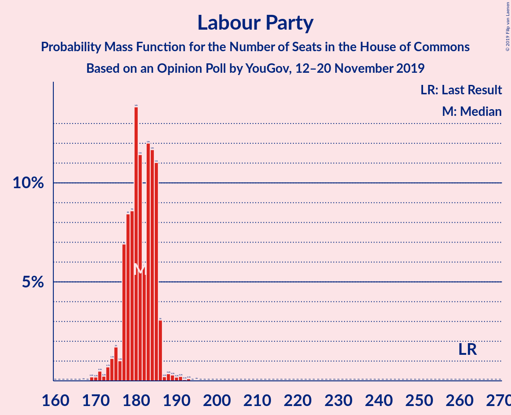

| Number of Seats | Probability | Accumulated | Special Marks |
|:---------------:|:-----------:|:-----------:|:-------------:|
| 169 | 0.1% | 100% |  |
| 170 | 0.6% | 99.9% |  |
| 171 | 0.6% | 99.3% |  |
| 172 | 0.3% | 98.7% |  |
| 173 | 0.2% | 98% |  |
| 174 | 1.0% | 98% |  |
| 175 | 0.8% | 97% |  |
| 176 | 1.0% | 96% |  |
| 177 | 4% | 95% |  |
| 178 | 3% | 91% |  |
| 179 | 16% | 88% |  |
| 180 | 16% | 71% |  |
| 181 | 25% | 56% | Median |
| 182 | 12% | 31% |  |
| 183 | 8% | 19% |  |
| 184 | 5% | 11% |  |
| 185 | 3% | 6% |  |
| 186 | 1.3% | 3% |  |
| 187 | 0.2% | 1.5% |  |
| 188 | 0.3% | 1.2% |  |
| 189 | 0.7% | 0.9% |  |
| 190 | 0% | 0.2% |  |
| 191 | 0.1% | 0.2% |  |
| 192 | 0.1% | 0.1% |  |
| 193 | 0% | 0% |  |
| 194 | 0% | 0% |  |
| 195 | 0% | 0% |  |
| 196 | 0% | 0% |  |
| 197 | 0% | 0% |  |
| 198 | 0% | 0% |  |
| 199 | 0% | 0% |  |
| 200 | 0% | 0% |  |
| 201 | 0% | 0% |  |
| 202 | 0% | 0% |  |
| 203 | 0% | 0% |  |
| 204 | 0% | 0% |  |
| 205 | 0% | 0% |  |
| 206 | 0% | 0% |  |
| 207 | 0% | 0% |  |
| 208 | 0% | 0% |  |
| 209 | 0% | 0% |  |
| 210 | 0% | 0% |  |
| 211 | 0% | 0% |  |
| 212 | 0% | 0% |  |
| 213 | 0% | 0% |  |
| 214 | 0% | 0% |  |
| 215 | 0% | 0% |  |
| 216 | 0% | 0% |  |
| 217 | 0% | 0% |  |
| 218 | 0% | 0% |  |
| 219 | 0% | 0% |  |
| 220 | 0% | 0% |  |
| 221 | 0% | 0% |  |
| 222 | 0% | 0% |  |
| 223 | 0% | 0% |  |
| 224 | 0% | 0% |  |
| 225 | 0% | 0% |  |
| 226 | 0% | 0% |  |
| 227 | 0% | 0% |  |
| 228 | 0% | 0% |  |
| 229 | 0% | 0% |  |
| 230 | 0% | 0% |  |
| 231 | 0% | 0% |  |
| 232 | 0% | 0% |  |
| 233 | 0% | 0% |  |
| 234 | 0% | 0% |  |
| 235 | 0% | 0% |  |
| 236 | 0% | 0% |  |
| 237 | 0% | 0% |  |
| 238 | 0% | 0% |  |
| 239 | 0% | 0% |  |
| 240 | 0% | 0% |  |
| 241 | 0% | 0% |  |
| 242 | 0% | 0% |  |
| 243 | 0% | 0% |  |
| 244 | 0% | 0% |  |
| 245 | 0% | 0% |  |
| 246 | 0% | 0% |  |
| 247 | 0% | 0% |  |
| 248 | 0% | 0% |  |
| 249 | 0% | 0% |  |
| 250 | 0% | 0% |  |
| 251 | 0% | 0% |  |
| 252 | 0% | 0% |  |
| 253 | 0% | 0% |  |
| 254 | 0% | 0% |  |
| 255 | 0% | 0% |  |
| 256 | 0% | 0% |  |
| 257 | 0% | 0% |  |
| 258 | 0% | 0% |  |
| 259 | 0% | 0% |  |
| 260 | 0% | 0% |  |
| 261 | 0% | 0% |  |
| 262 | 0% | 0% | Last Result |

### Liberal Democrats

*For a full overview of the results for this party, see the [Liberal Democrats](party-liberaldemocrats.html) page.*

| Number of Seats | Probability | Accumulated | Special Marks |
|:---------------:|:-----------:|:-----------:|:-------------:|
| 12 | 0% | 100% | Last Result |
| 13 | 0% | 100% |  |
| 14 | 0% | 100% |  |
| 15 | 0% | 100% |  |
| 16 | 0% | 100% |  |
| 17 | 0% | 100% |  |
| 18 | 0% | 100% |  |
| 19 | 0% | 100% |  |
| 20 | 0% | 100% |  |
| 21 | 0% | 100% |  |
| 22 | 0% | 100% |  |
| 23 | 0% | 100% |  |
| 24 | 0% | 100% |  |
| 25 | 0% | 100% |  |
| 26 | 0% | 100% |  |
| 27 | 0% | 100% |  |
| 28 | 0% | 100% |  |
| 29 | 0% | 100% |  |
| 30 | 0% | 100% |  |
| 31 | 0% | 100% |  |
| 32 | 2% | 100% |  |
| 33 | 1.0% | 98% |  |
| 34 | 6% | 97% |  |
| 35 | 20% | 91% |  |
| 36 | 26% | 71% | Median |
| 37 | 37% | 45% |  |
| 38 | 6% | 8% |  |
| 39 | 0.9% | 2% |  |
| 40 | 0.7% | 0.9% |  |
| 41 | 0.1% | 0.2% |  |
| 42 | 0.1% | 0.1% |  |
| 43 | 0% | 0% |  |

### Scottish National Party

*For a full overview of the results for this party, see the [Scottish National Party](party-scottishnationalparty.html) page.*

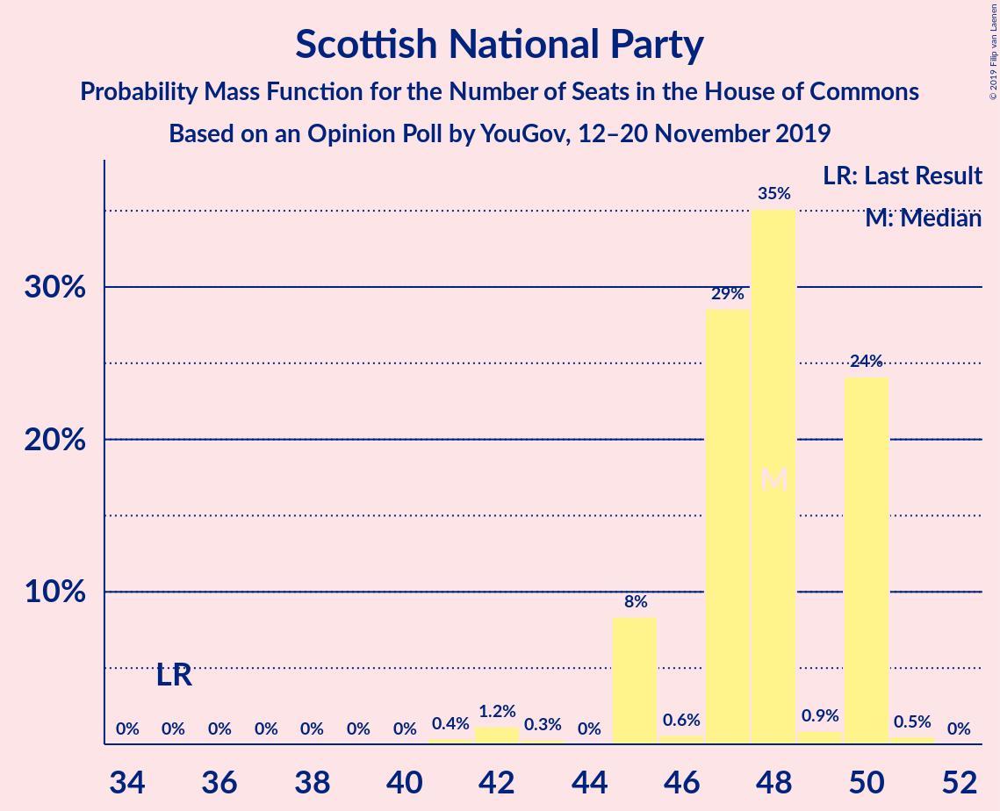

| Number of Seats | Probability | Accumulated | Special Marks |
|:---------------:|:-----------:|:-----------:|:-------------:|
| 35 | 0% | 100% | Last Result |
| 36 | 0% | 100% |  |
| 37 | 0% | 100% |  |
| 38 | 0% | 100% |  |
| 39 | 0% | 100% |  |
| 40 | 0% | 100% |  |
| 41 | 0.3% | 100% |  |
| 42 | 2% | 99.7% |  |
| 43 | 0.2% | 98% |  |
| 44 | 0% | 98% |  |
| 45 | 2% | 98% |  |
| 46 | 0% | 96% |  |
| 47 | 23% | 96% |  |
| 48 | 58% | 73% | Median |
| 49 | 3% | 15% |  |
| 50 | 12% | 13% |  |
| 51 | 0.6% | 0.6% |  |
| 52 | 0% | 0% |  |

### Brexit Party

*For a full overview of the results for this party, see the [Brexit Party](party-brexitparty.html) page.*

| Number of Seats | Probability | Accumulated | Special Marks |
|:---------------:|:-----------:|:-----------:|:-------------:|
| 0 | 100% | 100% | Last Result, Median |

### Green Party

*For a full overview of the results for this party, see the [Green Party](party-greenparty.html) page.*

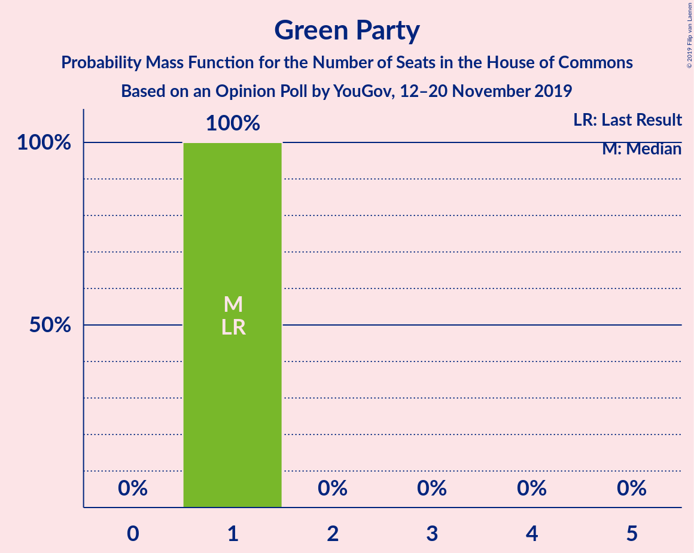

| Number of Seats | Probability | Accumulated | Special Marks |
|:---------------:|:-----------:|:-----------:|:-------------:|
| 1 | 100% | 100% | Last Result, Median |

### Plaid Cymru

*For a full overview of the results for this party, see the [Plaid Cymru](party-plaidcymru.html) page.*

| Number of Seats | Probability | Accumulated | Special Marks |
|:---------------:|:-----------:|:-----------:|:-------------:|
| 4 | 44% | 100% | Last Result |
| 5 | 17% | 56% | Median |
| 6 | 4% | 38% |  |
| 7 | 20% | 34% |  |
| 8 | 14% | 14% |  |
| 9 | 0% | 0% |  |

## Coalitions

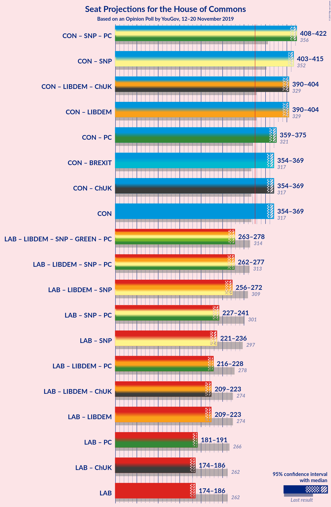

### Confidence Intervals

| Coalition | Last Result | Median | Majority? | 80% Confidence Interval | 90% Confidence Interval | 95% Confidence Interval | 99% Confidence Interval |
|:---------:|:-----------:|:------:|:---------:|:-----------------------:|:-----------------------:|:-----------------------:|:-----------------------:|
| Conservative Party – Scottish National Party – Plaid Cymru | 356 | 414 | 100% | 411–417 | 410–419 | 408–422 | 406–426 |
| Conservative Party – Scottish National Party | 352 | 410 | 100% | 406–411 | 405–413 | 404–415 | 400–419 |
| Conservative Party – Liberal Democrats | 329 | 398 | 100% | 393–399 | 392–401 | 391–404 | 386–407 |
| Conservative Party – Plaid Cymru | 321 | 367 | 100% | 363–369 | 361–372 | 359–375 | 356–378 |
| Conservative Party – Brexit Party | 317 | 362 | 100% | 357–364 | 356–366 | 354–368 | 350–371 |
| Conservative Party | 317 | 362 | 100% | 357–364 | 356–366 | 354–368 | 350–371 |
| Labour Party – Liberal Democrats – Scottish National Party – Green Party – Plaid Cymru | 314 | 270 | 0% | 268–275 | 266–276 | 264–278 | 261–282 |
| Labour Party – Liberal Democrats – Scottish National Party – Plaid Cymru | 313 | 269 | 0% | 267–274 | 265–275 | 263–277 | 260–281 |
| Labour Party – Liberal Democrats – Scottish National Party | 309 | 264 | 0% | 262–268 | 259–270 | 256–272 | 253–275 |
| Labour Party – Scottish National Party – Plaid Cymru | 301 | 233 | 0% | 232–238 | 230–239 | 227–240 | 224–245 |
| Labour Party – Scottish National Party | 297 | 229 | 0% | 225–232 | 224–233 | 221–234 | 218–239 |
| Labour Party – Liberal Democrats – Plaid Cymru | 278 | 221 | 0% | 220–225 | 218–226 | 216–227 | 212–231 |
| Labour Party – Liberal Democrats | 274 | 217 | 0% | 214–220 | 212–221 | 209–223 | 205–225 |
| Labour Party – Plaid Cymru | 266 | 186 | 0% | 184–189 | 182–190 | 182–191 | 177–195 |
| Labour Party | 262 | 181 | 0% | 178–184 | 177–185 | 174–186 | 170–189 |

### Conservative Party – Scottish National Party – Plaid Cymru

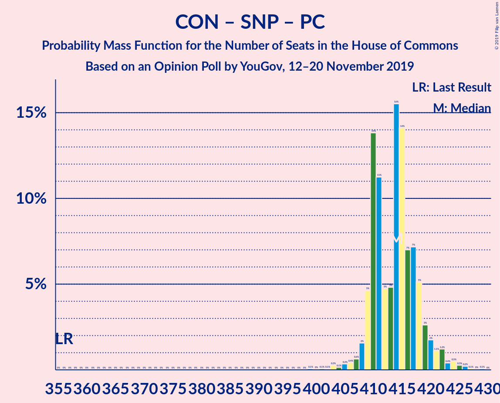

| Number of Seats | Probability | Accumulated | Special Marks |
|:---------------:|:-----------:|:-----------:|:-------------:|
| 356 | 0% | 100% | Last Result |
| 357 | 0% | 100% |  |
| 358 | 0% | 100% |  |
| 359 | 0% | 100% |  |
| 360 | 0% | 100% |  |
| 361 | 0% | 100% |  |
| 362 | 0% | 100% |  |
| 363 | 0% | 100% |  |
| 364 | 0% | 100% |  |
| 365 | 0% | 100% |  |
| 366 | 0% | 100% |  |
| 367 | 0% | 100% |  |
| 368 | 0% | 100% |  |
| 369 | 0% | 100% |  |
| 370 | 0% | 100% |  |
| 371 | 0% | 100% |  |
| 372 | 0% | 100% |  |
| 373 | 0% | 100% |  |
| 374 | 0% | 100% |  |
| 375 | 0% | 100% |  |
| 376 | 0% | 100% |  |
| 377 | 0% | 100% |  |
| 378 | 0% | 100% |  |
| 379 | 0% | 100% |  |
| 380 | 0% | 100% |  |
| 381 | 0% | 100% |  |
| 382 | 0% | 100% |  |
| 383 | 0% | 100% |  |
| 384 | 0% | 100% |  |
| 385 | 0% | 100% |  |
| 386 | 0% | 100% |  |
| 387 | 0% | 100% |  |
| 388 | 0% | 100% |  |
| 389 | 0% | 100% |  |
| 390 | 0% | 100% |  |
| 391 | 0% | 100% |  |
| 392 | 0% | 100% |  |
| 393 | 0% | 100% |  |
| 394 | 0% | 100% |  |
| 395 | 0% | 100% |  |
| 396 | 0% | 100% |  |
| 397 | 0% | 100% |  |
| 398 | 0% | 100% |  |
| 399 | 0% | 100% |  |
| 400 | 0% | 99.9% |  |
| 401 | 0% | 99.9% |  |
| 402 | 0% | 99.9% |  |
| 403 | 0.1% | 99.9% |  |
| 404 | 0% | 99.8% |  |
| 405 | 0.1% | 99.8% |  |
| 406 | 0.6% | 99.7% |  |
| 407 | 0.9% | 99.1% |  |
| 408 | 0.7% | 98% |  |
| 409 | 2% | 97% |  |
| 410 | 3% | 95% |  |
| 411 | 8% | 92% |  |
| 412 | 2% | 83% |  |
| 413 | 2% | 82% |  |
| 414 | 37% | 80% |  |
| 415 | 30% | 44% | Median |
| 416 | 3% | 14% |  |
| 417 | 3% | 11% |  |
| 418 | 3% | 8% |  |
| 419 | 0.7% | 5% |  |
| 420 | 0.5% | 5% |  |
| 421 | 0.7% | 4% |  |
| 422 | 1.0% | 3% |  |
| 423 | 0.9% | 2% |  |
| 424 | 0.6% | 2% |  |
| 425 | 0.3% | 1.0% |  |
| 426 | 0.6% | 0.7% |  |
| 427 | 0% | 0.1% |  |
| 428 | 0.1% | 0.1% |  |
| 429 | 0% | 0% |  |

### Conservative Party – Scottish National Party

| Number of Seats | Probability | Accumulated | Special Marks |
|:---------------:|:-----------:|:-----------:|:-------------:|
| 352 | 0% | 100% | Last Result |
| 353 | 0% | 100% |  |
| 354 | 0% | 100% |  |
| 355 | 0% | 100% |  |
| 356 | 0% | 100% |  |
| 357 | 0% | 100% |  |
| 358 | 0% | 100% |  |
| 359 | 0% | 100% |  |
| 360 | 0% | 100% |  |
| 361 | 0% | 100% |  |
| 362 | 0% | 100% |  |
| 363 | 0% | 100% |  |
| 364 | 0% | 100% |  |
| 365 | 0% | 100% |  |
| 366 | 0% | 100% |  |
| 367 | 0% | 100% |  |
| 368 | 0% | 100% |  |
| 369 | 0% | 100% |  |
| 370 | 0% | 100% |  |
| 371 | 0% | 100% |  |
| 372 | 0% | 100% |  |
| 373 | 0% | 100% |  |
| 374 | 0% | 100% |  |
| 375 | 0% | 100% |  |
| 376 | 0% | 100% |  |
| 377 | 0% | 100% |  |
| 378 | 0% | 100% |  |
| 379 | 0% | 100% |  |
| 380 | 0% | 100% |  |
| 381 | 0% | 100% |  |
| 382 | 0% | 100% |  |
| 383 | 0% | 100% |  |
| 384 | 0% | 100% |  |
| 385 | 0% | 100% |  |
| 386 | 0% | 100% |  |
| 387 | 0% | 100% |  |
| 388 | 0% | 100% |  |
| 389 | 0% | 100% |  |
| 390 | 0% | 100% |  |
| 391 | 0% | 100% |  |
| 392 | 0% | 100% |  |
| 393 | 0% | 100% |  |
| 394 | 0% | 100% |  |
| 395 | 0% | 100% |  |
| 396 | 0% | 99.9% |  |
| 397 | 0% | 99.9% |  |
| 398 | 0.1% | 99.9% |  |
| 399 | 0.3% | 99.8% |  |
| 400 | 0.2% | 99.5% |  |
| 401 | 0.6% | 99.3% |  |
| 402 | 0.6% | 98.7% |  |
| 403 | 0.3% | 98% |  |
| 404 | 2% | 98% |  |
| 405 | 3% | 96% |  |
| 406 | 4% | 92% |  |
| 407 | 27% | 88% |  |
| 408 | 6% | 62% |  |
| 409 | 4% | 56% |  |
| 410 | 34% | 52% | Median |
| 411 | 9% | 17% |  |
| 412 | 3% | 9% |  |
| 413 | 2% | 6% |  |
| 414 | 1.0% | 4% |  |
| 415 | 1.1% | 3% |  |
| 416 | 0.7% | 2% |  |
| 417 | 0.3% | 1.3% |  |
| 418 | 0.3% | 1.0% |  |
| 419 | 0.6% | 0.8% |  |
| 420 | 0% | 0.2% |  |
| 421 | 0.2% | 0.2% |  |
| 422 | 0% | 0% |  |

### Conservative Party – Liberal Democrats

| Number of Seats | Probability | Accumulated | Special Marks |
|:---------------:|:-----------:|:-----------:|:-------------:|
| 329 | 0% | 100% | Last Result |
| 330 | 0% | 100% |  |
| 331 | 0% | 100% |  |
| 332 | 0% | 100% |  |
| 333 | 0% | 100% |  |
| 334 | 0% | 100% |  |
| 335 | 0% | 100% |  |
| 336 | 0% | 100% |  |
| 337 | 0% | 100% |  |
| 338 | 0% | 100% |  |
| 339 | 0% | 100% |  |
| 340 | 0% | 100% |  |
| 341 | 0% | 100% |  |
| 342 | 0% | 100% |  |
| 343 | 0% | 100% |  |
| 344 | 0% | 100% |  |
| 345 | 0% | 100% |  |
| 346 | 0% | 100% |  |
| 347 | 0% | 100% |  |
| 348 | 0% | 100% |  |
| 349 | 0% | 100% |  |
| 350 | 0% | 100% |  |
| 351 | 0% | 100% |  |
| 352 | 0% | 100% |  |
| 353 | 0% | 100% |  |
| 354 | 0% | 100% |  |
| 355 | 0% | 100% |  |
| 356 | 0% | 100% |  |
| 357 | 0% | 100% |  |
| 358 | 0% | 100% |  |
| 359 | 0% | 100% |  |
| 360 | 0% | 100% |  |
| 361 | 0% | 100% |  |
| 362 | 0% | 100% |  |
| 363 | 0% | 100% |  |
| 364 | 0% | 100% |  |
| 365 | 0% | 100% |  |
| 366 | 0% | 100% |  |
| 367 | 0% | 100% |  |
| 368 | 0% | 100% |  |
| 369 | 0% | 100% |  |
| 370 | 0% | 100% |  |
| 371 | 0% | 100% |  |
| 372 | 0% | 100% |  |
| 373 | 0% | 100% |  |
| 374 | 0% | 100% |  |
| 375 | 0% | 100% |  |
| 376 | 0% | 100% |  |
| 377 | 0% | 100% |  |
| 378 | 0% | 100% |  |
| 379 | 0% | 100% |  |
| 380 | 0% | 100% |  |
| 381 | 0% | 100% |  |
| 382 | 0% | 100% |  |
| 383 | 0% | 100% |  |
| 384 | 0% | 100% |  |
| 385 | 0.2% | 100% |  |
| 386 | 0.6% | 99.7% |  |
| 387 | 0.1% | 99.2% |  |
| 388 | 0.3% | 99.1% |  |
| 389 | 0.2% | 98.8% |  |
| 390 | 0.4% | 98.6% |  |
| 391 | 2% | 98% |  |
| 392 | 2% | 96% |  |
| 393 | 5% | 95% |  |
| 394 | 3% | 89% |  |
| 395 | 23% | 86% |  |
| 396 | 8% | 64% |  |
| 397 | 0.9% | 56% |  |
| 398 | 13% | 55% | Median |
| 399 | 32% | 41% |  |
| 400 | 2% | 10% |  |
| 401 | 4% | 8% |  |
| 402 | 0.7% | 4% |  |
| 403 | 0.4% | 3% |  |
| 404 | 0.8% | 3% |  |
| 405 | 0.6% | 2% |  |
| 406 | 0.7% | 1.5% |  |
| 407 | 0.4% | 0.7% |  |
| 408 | 0.2% | 0.3% |  |
| 409 | 0% | 0.2% |  |
| 410 | 0.1% | 0.1% |  |
| 411 | 0% | 0.1% |  |
| 412 | 0% | 0% |  |

### Conservative Party – Plaid Cymru

| Number of Seats | Probability | Accumulated | Special Marks |
|:---------------:|:-----------:|:-----------:|:-------------:|
| 321 | 0% | 100% | Last Result |
| 322 | 0% | 100% |  |
| 323 | 0% | 100% |  |
| 324 | 0% | 100% |  |
| 325 | 0% | 100% |  |
| 326 | 0% | 100% | Majority |
| 327 | 0% | 100% |  |
| 328 | 0% | 100% |  |
| 329 | 0% | 100% |  |
| 330 | 0% | 100% |  |
| 331 | 0% | 100% |  |
| 332 | 0% | 100% |  |
| 333 | 0% | 100% |  |
| 334 | 0% | 100% |  |
| 335 | 0% | 100% |  |
| 336 | 0% | 100% |  |
| 337 | 0% | 100% |  |
| 338 | 0% | 100% |  |
| 339 | 0% | 100% |  |
| 340 | 0% | 100% |  |
| 341 | 0% | 100% |  |
| 342 | 0% | 100% |  |
| 343 | 0% | 100% |  |
| 344 | 0% | 100% |  |
| 345 | 0% | 100% |  |
| 346 | 0% | 100% |  |
| 347 | 0% | 100% |  |
| 348 | 0% | 100% |  |
| 349 | 0% | 100% |  |
| 350 | 0% | 100% |  |
| 351 | 0% | 100% |  |
| 352 | 0% | 99.9% |  |
| 353 | 0.1% | 99.9% |  |
| 354 | 0% | 99.9% |  |
| 355 | 0.1% | 99.8% |  |
| 356 | 0.4% | 99.7% |  |
| 357 | 0.9% | 99.3% |  |
| 358 | 0.3% | 98% |  |
| 359 | 0.7% | 98% |  |
| 360 | 2% | 97% |  |
| 361 | 2% | 95% |  |
| 362 | 1.2% | 93% |  |
| 363 | 9% | 92% |  |
| 364 | 3% | 83% |  |
| 365 | 6% | 81% |  |
| 366 | 24% | 75% |  |
| 367 | 25% | 51% | Median |
| 368 | 14% | 26% |  |
| 369 | 2% | 11% |  |
| 370 | 2% | 9% |  |
| 371 | 1.2% | 7% |  |
| 372 | 0.6% | 5% |  |
| 373 | 0.6% | 5% |  |
| 374 | 0.9% | 4% |  |
| 375 | 1.2% | 3% |  |
| 376 | 0.8% | 2% |  |
| 377 | 0.3% | 1.3% |  |
| 378 | 0.7% | 1.0% |  |
| 379 | 0% | 0.3% |  |
| 380 | 0.1% | 0.3% |  |
| 381 | 0.1% | 0.1% |  |
| 382 | 0% | 0.1% |  |
| 383 | 0% | 0% |  |

### Conservative Party – Brexit Party

| Number of Seats | Probability | Accumulated | Special Marks |
|:---------------:|:-----------:|:-----------:|:-------------:|
| 317 | 0% | 100% | Last Result |
| 318 | 0% | 100% |  |
| 319 | 0% | 100% |  |
| 320 | 0% | 100% |  |
| 321 | 0% | 100% |  |
| 322 | 0% | 100% |  |
| 323 | 0% | 100% |  |
| 324 | 0% | 100% |  |
| 325 | 0% | 100% |  |
| 326 | 0% | 100% | Majority |
| 327 | 0% | 100% |  |
| 328 | 0% | 100% |  |
| 329 | 0% | 100% |  |
| 330 | 0% | 100% |  |
| 331 | 0% | 100% |  |
| 332 | 0% | 100% |  |
| 333 | 0% | 100% |  |
| 334 | 0% | 100% |  |
| 335 | 0% | 100% |  |
| 336 | 0% | 100% |  |
| 337 | 0% | 100% |  |
| 338 | 0% | 100% |  |
| 339 | 0% | 100% |  |
| 340 | 0% | 100% |  |
| 341 | 0% | 100% |  |
| 342 | 0% | 100% |  |
| 343 | 0% | 100% |  |
| 344 | 0% | 100% |  |
| 345 | 0% | 100% |  |
| 346 | 0% | 100% |  |
| 347 | 0.1% | 100% |  |
| 348 | 0% | 99.9% |  |
| 349 | 0.2% | 99.9% |  |
| 350 | 0.2% | 99.6% |  |
| 351 | 0.5% | 99.4% |  |
| 352 | 0.4% | 98.9% |  |
| 353 | 0.5% | 98.6% |  |
| 354 | 2% | 98% |  |
| 355 | 0.8% | 96% |  |
| 356 | 2% | 96% |  |
| 357 | 6% | 94% |  |
| 358 | 1.4% | 88% |  |
| 359 | 24% | 87% |  |
| 360 | 4% | 62% |  |
| 361 | 7% | 58% |  |
| 362 | 25% | 52% | Median |
| 363 | 11% | 27% |  |
| 364 | 10% | 16% |  |
| 365 | 0.9% | 7% |  |
| 366 | 1.1% | 6% |  |
| 367 | 1.4% | 5% |  |
| 368 | 1.2% | 3% |  |
| 369 | 0.6% | 2% |  |
| 370 | 0.3% | 1.3% |  |
| 371 | 0.6% | 1.0% |  |
| 372 | 0.2% | 0.4% |  |
| 373 | 0% | 0.3% |  |
| 374 | 0.2% | 0.2% |  |
| 375 | 0% | 0.1% |  |
| 376 | 0% | 0% |  |

### Conservative Party

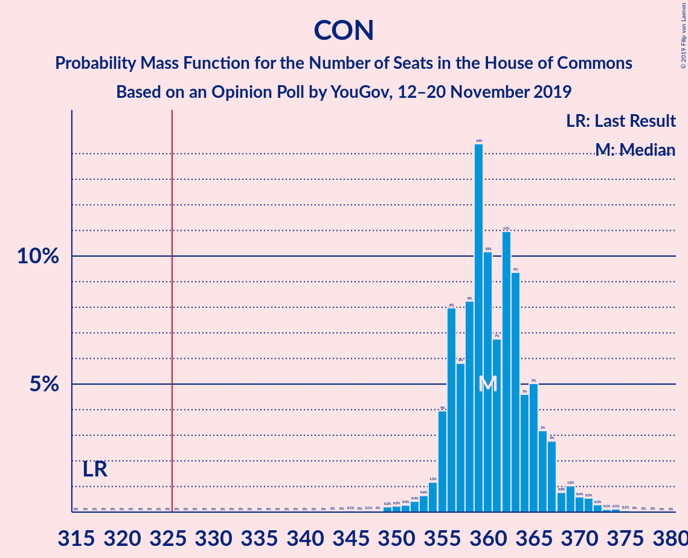

| Number of Seats | Probability | Accumulated | Special Marks |
|:---------------:|:-----------:|:-----------:|:-------------:|
| 317 | 0% | 100% | Last Result |
| 318 | 0% | 100% |  |
| 319 | 0% | 100% |  |
| 320 | 0% | 100% |  |
| 321 | 0% | 100% |  |
| 322 | 0% | 100% |  |
| 323 | 0% | 100% |  |
| 324 | 0% | 100% |  |
| 325 | 0% | 100% |  |
| 326 | 0% | 100% | Majority |
| 327 | 0% | 100% |  |
| 328 | 0% | 100% |  |
| 329 | 0% | 100% |  |
| 330 | 0% | 100% |  |
| 331 | 0% | 100% |  |
| 332 | 0% | 100% |  |
| 333 | 0% | 100% |  |
| 334 | 0% | 100% |  |
| 335 | 0% | 100% |  |
| 336 | 0% | 100% |  |
| 337 | 0% | 100% |  |
| 338 | 0% | 100% |  |
| 339 | 0% | 100% |  |
| 340 | 0% | 100% |  |
| 341 | 0% | 100% |  |
| 342 | 0% | 100% |  |
| 343 | 0% | 100% |  |
| 344 | 0% | 100% |  |
| 345 | 0% | 100% |  |
| 346 | 0% | 100% |  |
| 347 | 0.1% | 100% |  |
| 348 | 0% | 99.9% |  |
| 349 | 0.2% | 99.9% |  |
| 350 | 0.2% | 99.6% |  |
| 351 | 0.5% | 99.4% |  |
| 352 | 0.4% | 98.9% |  |
| 353 | 0.5% | 98.6% |  |
| 354 | 2% | 98% |  |
| 355 | 0.8% | 96% |  |
| 356 | 2% | 96% |  |
| 357 | 6% | 94% |  |
| 358 | 1.4% | 88% |  |
| 359 | 24% | 87% |  |
| 360 | 4% | 62% |  |
| 361 | 7% | 58% |  |
| 362 | 25% | 52% | Median |
| 363 | 11% | 27% |  |
| 364 | 10% | 16% |  |
| 365 | 0.9% | 7% |  |
| 366 | 1.1% | 6% |  |
| 367 | 1.4% | 5% |  |
| 368 | 1.2% | 3% |  |
| 369 | 0.6% | 2% |  |
| 370 | 0.3% | 1.3% |  |
| 371 | 0.6% | 1.0% |  |
| 372 | 0.2% | 0.4% |  |
| 373 | 0% | 0.3% |  |
| 374 | 0.2% | 0.2% |  |
| 375 | 0% | 0.1% |  |
| 376 | 0% | 0% |  |

### Labour Party – Liberal Democrats – Scottish National Party – Green Party – Plaid Cymru

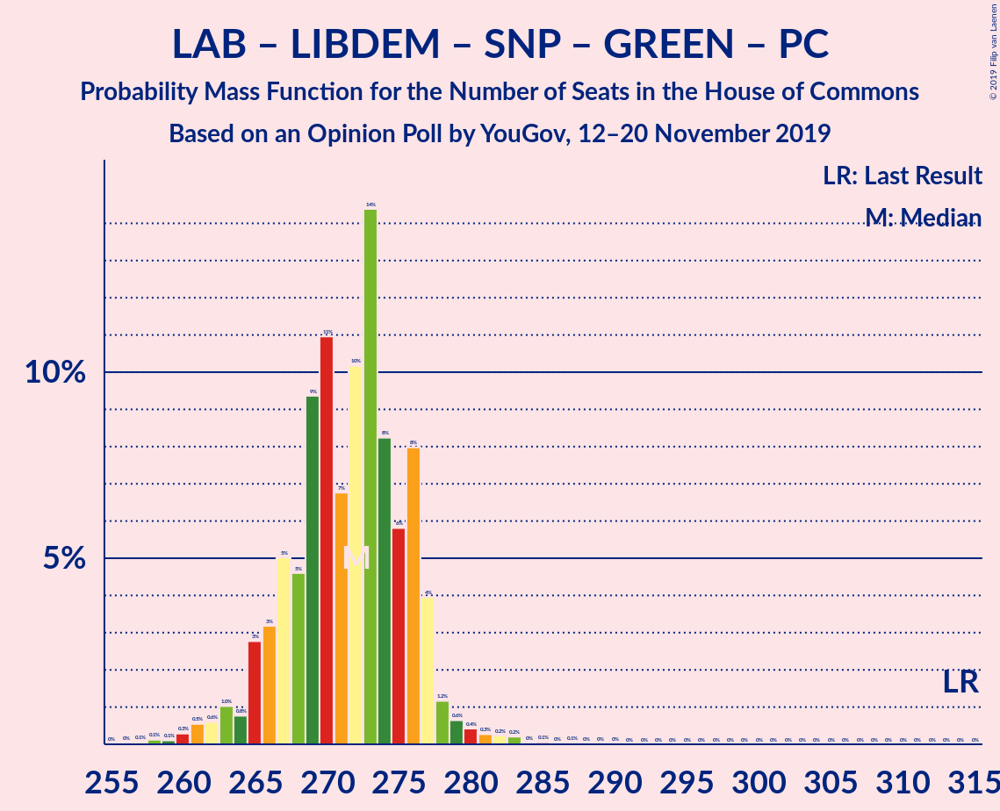

| Number of Seats | Probability | Accumulated | Special Marks |
|:---------------:|:-----------:|:-----------:|:-------------:|
| 257 | 0% | 100% |  |
| 258 | 0.2% | 99.9% |  |
| 259 | 0% | 99.8% |  |
| 260 | 0.2% | 99.7% |  |
| 261 | 0.6% | 99.6% |  |
| 262 | 0.3% | 99.0% |  |
| 263 | 0.6% | 98.7% |  |
| 264 | 1.2% | 98% |  |
| 265 | 1.4% | 97% |  |
| 266 | 1.1% | 95% |  |
| 267 | 0.9% | 94% |  |
| 268 | 10% | 93% |  |
| 269 | 11% | 84% |  |
| 270 | 25% | 73% |  |
| 271 | 7% | 48% | Median |
| 272 | 4% | 42% |  |
| 273 | 24% | 38% |  |
| 274 | 1.4% | 13% |  |
| 275 | 6% | 12% |  |
| 276 | 2% | 6% |  |
| 277 | 0.8% | 4% |  |
| 278 | 2% | 4% |  |
| 279 | 0.5% | 2% |  |
| 280 | 0.4% | 1.4% |  |
| 281 | 0.5% | 1.1% |  |
| 282 | 0.2% | 0.6% |  |
| 283 | 0.2% | 0.4% |  |
| 284 | 0% | 0.1% |  |
| 285 | 0.1% | 0.1% |  |
| 286 | 0% | 0% |  |
| 287 | 0% | 0% |  |
| 288 | 0% | 0% |  |
| 289 | 0% | 0% |  |
| 290 | 0% | 0% |  |
| 291 | 0% | 0% |  |
| 292 | 0% | 0% |  |
| 293 | 0% | 0% |  |
| 294 | 0% | 0% |  |
| 295 | 0% | 0% |  |
| 296 | 0% | 0% |  |
| 297 | 0% | 0% |  |
| 298 | 0% | 0% |  |
| 299 | 0% | 0% |  |
| 300 | 0% | 0% |  |
| 301 | 0% | 0% |  |
| 302 | 0% | 0% |  |
| 303 | 0% | 0% |  |
| 304 | 0% | 0% |  |
| 305 | 0% | 0% |  |
| 306 | 0% | 0% |  |
| 307 | 0% | 0% |  |
| 308 | 0% | 0% |  |
| 309 | 0% | 0% |  |
| 310 | 0% | 0% |  |
| 311 | 0% | 0% |  |
| 312 | 0% | 0% |  |
| 313 | 0% | 0% |  |
| 314 | 0% | 0% | Last Result |

### Labour Party – Liberal Democrats – Scottish National Party – Plaid Cymru

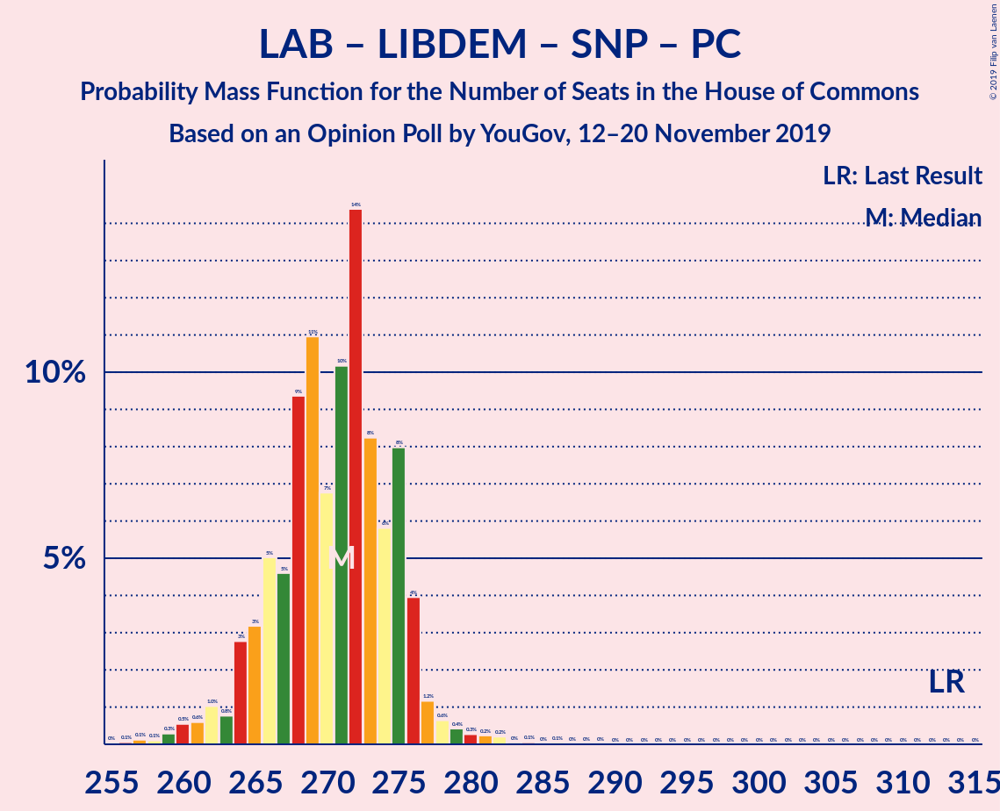

| Number of Seats | Probability | Accumulated | Special Marks |
|:---------------:|:-----------:|:-----------:|:-------------:|
| 256 | 0% | 100% |  |
| 257 | 0.2% | 99.9% |  |
| 258 | 0% | 99.8% |  |
| 259 | 0.2% | 99.7% |  |
| 260 | 0.6% | 99.6% |  |
| 261 | 0.3% | 99.0% |  |
| 262 | 0.6% | 98.7% |  |
| 263 | 1.2% | 98% |  |
| 264 | 1.4% | 97% |  |
| 265 | 1.1% | 95% |  |
| 266 | 0.9% | 94% |  |
| 267 | 10% | 93% |  |
| 268 | 11% | 84% |  |
| 269 | 25% | 73% |  |
| 270 | 7% | 48% | Median |
| 271 | 4% | 42% |  |
| 272 | 24% | 38% |  |
| 273 | 1.4% | 13% |  |
| 274 | 6% | 12% |  |
| 275 | 2% | 6% |  |
| 276 | 0.8% | 4% |  |
| 277 | 2% | 4% |  |
| 278 | 0.5% | 2% |  |
| 279 | 0.4% | 1.4% |  |
| 280 | 0.5% | 1.1% |  |
| 281 | 0.2% | 0.6% |  |
| 282 | 0.2% | 0.4% |  |
| 283 | 0% | 0.1% |  |
| 284 | 0.1% | 0.1% |  |
| 285 | 0% | 0% |  |
| 286 | 0% | 0% |  |
| 287 | 0% | 0% |  |
| 288 | 0% | 0% |  |
| 289 | 0% | 0% |  |
| 290 | 0% | 0% |  |
| 291 | 0% | 0% |  |
| 292 | 0% | 0% |  |
| 293 | 0% | 0% |  |
| 294 | 0% | 0% |  |
| 295 | 0% | 0% |  |
| 296 | 0% | 0% |  |
| 297 | 0% | 0% |  |
| 298 | 0% | 0% |  |
| 299 | 0% | 0% |  |
| 300 | 0% | 0% |  |
| 301 | 0% | 0% |  |
| 302 | 0% | 0% |  |
| 303 | 0% | 0% |  |
| 304 | 0% | 0% |  |
| 305 | 0% | 0% |  |
| 306 | 0% | 0% |  |
| 307 | 0% | 0% |  |
| 308 | 0% | 0% |  |
| 309 | 0% | 0% |  |
| 310 | 0% | 0% |  |
| 311 | 0% | 0% |  |
| 312 | 0% | 0% |  |
| 313 | 0% | 0% | Last Result |

### Labour Party – Liberal Democrats – Scottish National Party

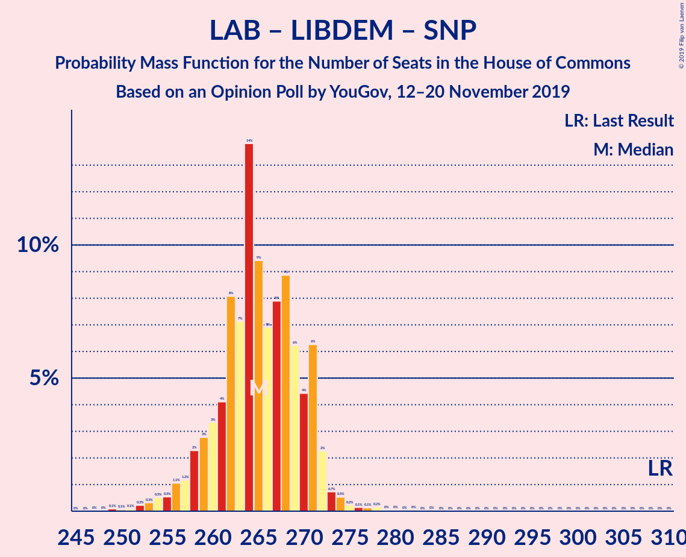

| Number of Seats | Probability | Accumulated | Special Marks |
|:---------------:|:-----------:|:-----------:|:-------------:|
| 249 | 0% | 100% |  |
| 250 | 0.1% | 99.9% |  |
| 251 | 0.1% | 99.9% |  |
| 252 | 0% | 99.7% |  |
| 253 | 0.7% | 99.7% |  |
| 254 | 0.3% | 99.0% |  |
| 255 | 0.8% | 98.7% |  |
| 256 | 1.2% | 98% |  |
| 257 | 0.9% | 97% |  |
| 258 | 0.6% | 96% |  |
| 259 | 0.6% | 95% |  |
| 260 | 1.2% | 95% |  |
| 261 | 2% | 93% |  |
| 262 | 2% | 91% |  |
| 263 | 14% | 89% |  |
| 264 | 25% | 74% |  |
| 265 | 24% | 49% | Median |
| 266 | 6% | 25% |  |
| 267 | 3% | 19% |  |
| 268 | 9% | 17% |  |
| 269 | 1.2% | 8% |  |
| 270 | 2% | 7% |  |
| 271 | 2% | 5% |  |
| 272 | 0.7% | 3% |  |
| 273 | 0.3% | 2% |  |
| 274 | 0.9% | 2% |  |
| 275 | 0.4% | 0.7% |  |
| 276 | 0.1% | 0.3% |  |
| 277 | 0% | 0.2% |  |
| 278 | 0.1% | 0.1% |  |
| 279 | 0% | 0.1% |  |
| 280 | 0% | 0.1% |  |
| 281 | 0% | 0% |  |
| 282 | 0% | 0% |  |
| 283 | 0% | 0% |  |
| 284 | 0% | 0% |  |
| 285 | 0% | 0% |  |
| 286 | 0% | 0% |  |
| 287 | 0% | 0% |  |
| 288 | 0% | 0% |  |
| 289 | 0% | 0% |  |
| 290 | 0% | 0% |  |
| 291 | 0% | 0% |  |
| 292 | 0% | 0% |  |
| 293 | 0% | 0% |  |
| 294 | 0% | 0% |  |
| 295 | 0% | 0% |  |
| 296 | 0% | 0% |  |
| 297 | 0% | 0% |  |
| 298 | 0% | 0% |  |
| 299 | 0% | 0% |  |
| 300 | 0% | 0% |  |
| 301 | 0% | 0% |  |
| 302 | 0% | 0% |  |
| 303 | 0% | 0% |  |
| 304 | 0% | 0% |  |
| 305 | 0% | 0% |  |
| 306 | 0% | 0% |  |
| 307 | 0% | 0% |  |
| 308 | 0% | 0% |  |
| 309 | 0% | 0% | Last Result |

### Labour Party – Scottish National Party – Plaid Cymru

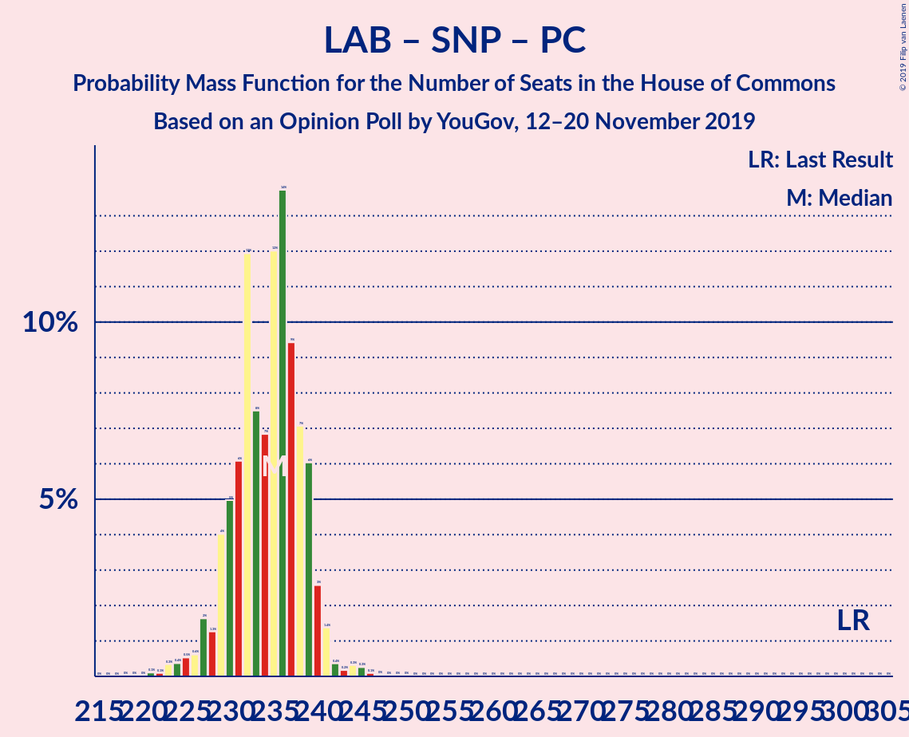

| Number of Seats | Probability | Accumulated | Special Marks |
|:---------------:|:-----------:|:-----------:|:-------------:|
| 220 | 0% | 100% |  |
| 221 | 0.1% | 99.9% |  |
| 222 | 0% | 99.9% |  |
| 223 | 0.2% | 99.8% |  |
| 224 | 0.4% | 99.7% |  |
| 225 | 0.7% | 99.3% |  |
| 226 | 0.6% | 98.5% |  |
| 227 | 0.8% | 98% |  |
| 228 | 0.4% | 97% |  |
| 229 | 0.7% | 97% |  |
| 230 | 4% | 96% |  |
| 231 | 2% | 92% |  |
| 232 | 32% | 90% |  |
| 233 | 13% | 59% |  |
| 234 | 0.9% | 45% | Median |
| 235 | 8% | 44% |  |
| 236 | 23% | 36% |  |
| 237 | 3% | 14% |  |
| 238 | 5% | 11% |  |
| 239 | 2% | 5% |  |
| 240 | 2% | 4% |  |
| 241 | 0.4% | 2% |  |
| 242 | 0.2% | 1.4% |  |
| 243 | 0.3% | 1.2% |  |
| 244 | 0.1% | 0.9% |  |
| 245 | 0.6% | 0.8% |  |
| 246 | 0.2% | 0.3% |  |
| 247 | 0% | 0% |  |
| 248 | 0% | 0% |  |
| 249 | 0% | 0% |  |
| 250 | 0% | 0% |  |
| 251 | 0% | 0% |  |
| 252 | 0% | 0% |  |
| 253 | 0% | 0% |  |
| 254 | 0% | 0% |  |
| 255 | 0% | 0% |  |
| 256 | 0% | 0% |  |
| 257 | 0% | 0% |  |
| 258 | 0% | 0% |  |
| 259 | 0% | 0% |  |
| 260 | 0% | 0% |  |
| 261 | 0% | 0% |  |
| 262 | 0% | 0% |  |
| 263 | 0% | 0% |  |
| 264 | 0% | 0% |  |
| 265 | 0% | 0% |  |
| 266 | 0% | 0% |  |
| 267 | 0% | 0% |  |
| 268 | 0% | 0% |  |
| 269 | 0% | 0% |  |
| 270 | 0% | 0% |  |
| 271 | 0% | 0% |  |
| 272 | 0% | 0% |  |
| 273 | 0% | 0% |  |
| 274 | 0% | 0% |  |
| 275 | 0% | 0% |  |
| 276 | 0% | 0% |  |
| 277 | 0% | 0% |  |
| 278 | 0% | 0% |  |
| 279 | 0% | 0% |  |
| 280 | 0% | 0% |  |
| 281 | 0% | 0% |  |
| 282 | 0% | 0% |  |
| 283 | 0% | 0% |  |
| 284 | 0% | 0% |  |
| 285 | 0% | 0% |  |
| 286 | 0% | 0% |  |
| 287 | 0% | 0% |  |
| 288 | 0% | 0% |  |
| 289 | 0% | 0% |  |
| 290 | 0% | 0% |  |
| 291 | 0% | 0% |  |
| 292 | 0% | 0% |  |
| 293 | 0% | 0% |  |
| 294 | 0% | 0% |  |
| 295 | 0% | 0% |  |
| 296 | 0% | 0% |  |
| 297 | 0% | 0% |  |
| 298 | 0% | 0% |  |
| 299 | 0% | 0% |  |
| 300 | 0% | 0% |  |
| 301 | 0% | 0% | Last Result |

### Labour Party – Scottish National Party

| Number of Seats | Probability | Accumulated | Special Marks |
|:---------------:|:-----------:|:-----------:|:-------------:|
| 213 | 0% | 100% |  |
| 214 | 0% | 99.9% |  |
| 215 | 0.1% | 99.9% |  |
| 216 | 0% | 99.8% |  |
| 217 | 0.2% | 99.8% |  |
| 218 | 0.6% | 99.6% |  |
| 219 | 0.7% | 99.0% |  |
| 220 | 0.7% | 98% |  |
| 221 | 0.3% | 98% |  |
| 222 | 1.3% | 97% |  |
| 223 | 0.7% | 96% |  |
| 224 | 2% | 95% |  |
| 225 | 4% | 94% |  |
| 226 | 3% | 90% |  |
| 227 | 16% | 87% |  |
| 228 | 20% | 71% |  |
| 229 | 28% | 52% | Median |
| 230 | 5% | 24% |  |
| 231 | 8% | 19% |  |
| 232 | 4% | 11% |  |
| 233 | 3% | 7% |  |
| 234 | 2% | 5% |  |
| 235 | 0.9% | 2% |  |
| 236 | 0.3% | 2% |  |
| 237 | 0.2% | 1.2% |  |
| 238 | 0.2% | 1.0% |  |
| 239 | 0.6% | 0.8% |  |
| 240 | 0.1% | 0.2% |  |
| 241 | 0.1% | 0.1% |  |
| 242 | 0% | 0% |  |
| 243 | 0% | 0% |  |
| 244 | 0% | 0% |  |
| 245 | 0% | 0% |  |
| 246 | 0% | 0% |  |
| 247 | 0% | 0% |  |
| 248 | 0% | 0% |  |
| 249 | 0% | 0% |  |
| 250 | 0% | 0% |  |
| 251 | 0% | 0% |  |
| 252 | 0% | 0% |  |
| 253 | 0% | 0% |  |
| 254 | 0% | 0% |  |
| 255 | 0% | 0% |  |
| 256 | 0% | 0% |  |
| 257 | 0% | 0% |  |
| 258 | 0% | 0% |  |
| 259 | 0% | 0% |  |
| 260 | 0% | 0% |  |
| 261 | 0% | 0% |  |
| 262 | 0% | 0% |  |
| 263 | 0% | 0% |  |
| 264 | 0% | 0% |  |
| 265 | 0% | 0% |  |
| 266 | 0% | 0% |  |
| 267 | 0% | 0% |  |
| 268 | 0% | 0% |  |
| 269 | 0% | 0% |  |
| 270 | 0% | 0% |  |
| 271 | 0% | 0% |  |
| 272 | 0% | 0% |  |
| 273 | 0% | 0% |  |
| 274 | 0% | 0% |  |
| 275 | 0% | 0% |  |
| 276 | 0% | 0% |  |
| 277 | 0% | 0% |  |
| 278 | 0% | 0% |  |
| 279 | 0% | 0% |  |
| 280 | 0% | 0% |  |
| 281 | 0% | 0% |  |
| 282 | 0% | 0% |  |
| 283 | 0% | 0% |  |
| 284 | 0% | 0% |  |
| 285 | 0% | 0% |  |
| 286 | 0% | 0% |  |
| 287 | 0% | 0% |  |
| 288 | 0% | 0% |  |
| 289 | 0% | 0% |  |
| 290 | 0% | 0% |  |
| 291 | 0% | 0% |  |
| 292 | 0% | 0% |  |
| 293 | 0% | 0% |  |
| 294 | 0% | 0% |  |
| 295 | 0% | 0% |  |
| 296 | 0% | 0% |  |
| 297 | 0% | 0% | Last Result |

### Labour Party – Liberal Democrats – Plaid Cymru

| Number of Seats | Probability | Accumulated | Special Marks |
|:---------------:|:-----------:|:-----------:|:-------------:|
| 210 | 0.2% | 100% |  |
| 211 | 0% | 99.8% |  |
| 212 | 0.6% | 99.8% |  |
| 213 | 0.3% | 99.2% |  |
| 214 | 0.3% | 99.0% |  |
| 215 | 0.7% | 98.7% |  |
| 216 | 1.1% | 98% |  |
| 217 | 1.0% | 97% |  |
| 218 | 2% | 96% |  |
| 219 | 3% | 94% |  |
| 220 | 9% | 91% |  |
| 221 | 34% | 83% |  |
| 222 | 4% | 48% | Median |
| 223 | 6% | 44% |  |
| 224 | 27% | 38% |  |
| 225 | 4% | 12% |  |
| 226 | 3% | 8% |  |
| 227 | 2% | 4% |  |
| 228 | 0.3% | 2% |  |
| 229 | 0.6% | 2% |  |
| 230 | 0.6% | 1.3% |  |
| 231 | 0.2% | 0.7% |  |
| 232 | 0.3% | 0.5% |  |
| 233 | 0.1% | 0.2% |  |
| 234 | 0% | 0.1% |  |
| 235 | 0% | 0.1% |  |
| 236 | 0% | 0.1% |  |
| 237 | 0% | 0% |  |
| 238 | 0% | 0% |  |
| 239 | 0% | 0% |  |
| 240 | 0% | 0% |  |
| 241 | 0% | 0% |  |
| 242 | 0% | 0% |  |
| 243 | 0% | 0% |  |
| 244 | 0% | 0% |  |
| 245 | 0% | 0% |  |
| 246 | 0% | 0% |  |
| 247 | 0% | 0% |  |
| 248 | 0% | 0% |  |
| 249 | 0% | 0% |  |
| 250 | 0% | 0% |  |
| 251 | 0% | 0% |  |
| 252 | 0% | 0% |  |
| 253 | 0% | 0% |  |
| 254 | 0% | 0% |  |
| 255 | 0% | 0% |  |
| 256 | 0% | 0% |  |
| 257 | 0% | 0% |  |
| 258 | 0% | 0% |  |
| 259 | 0% | 0% |  |
| 260 | 0% | 0% |  |
| 261 | 0% | 0% |  |
| 262 | 0% | 0% |  |
| 263 | 0% | 0% |  |
| 264 | 0% | 0% |  |
| 265 | 0% | 0% |  |
| 266 | 0% | 0% |  |
| 267 | 0% | 0% |  |
| 268 | 0% | 0% |  |
| 269 | 0% | 0% |  |
| 270 | 0% | 0% |  |
| 271 | 0% | 0% |  |
| 272 | 0% | 0% |  |
| 273 | 0% | 0% |  |
| 274 | 0% | 0% |  |
| 275 | 0% | 0% |  |
| 276 | 0% | 0% |  |
| 277 | 0% | 0% |  |
| 278 | 0% | 0% | Last Result |

### Labour Party – Liberal Democrats

| Number of Seats | Probability | Accumulated | Special Marks |
|:---------------:|:-----------:|:-----------:|:-------------:|
| 203 | 0.1% | 100% |  |
| 204 | 0% | 99.9% |  |
| 205 | 0.6% | 99.9% |  |
| 206 | 0.3% | 99.3% |  |
| 207 | 0.6% | 99.0% |  |
| 208 | 0.9% | 98% |  |
| 209 | 1.0% | 98% |  |
| 210 | 0.7% | 97% |  |
| 211 | 0.5% | 96% |  |
| 212 | 0.7% | 95% |  |
| 213 | 3% | 95% |  |
| 214 | 3% | 92% |  |
| 215 | 3% | 89% |  |
| 216 | 30% | 86% |  |
| 217 | 37% | 56% | Median |
| 218 | 2% | 20% |  |
| 219 | 2% | 18% |  |
| 220 | 8% | 17% |  |
| 221 | 3% | 8% |  |
| 222 | 2% | 5% |  |
| 223 | 0.7% | 3% |  |
| 224 | 0.9% | 2% |  |
| 225 | 0.6% | 0.9% |  |
| 226 | 0.1% | 0.3% |  |
| 227 | 0% | 0.2% |  |
| 228 | 0.1% | 0.2% |  |
| 229 | 0% | 0.1% |  |
| 230 | 0% | 0.1% |  |
| 231 | 0% | 0.1% |  |
| 232 | 0% | 0.1% |  |
| 233 | 0% | 0% |  |
| 234 | 0% | 0% |  |
| 235 | 0% | 0% |  |
| 236 | 0% | 0% |  |
| 237 | 0% | 0% |  |
| 238 | 0% | 0% |  |
| 239 | 0% | 0% |  |
| 240 | 0% | 0% |  |
| 241 | 0% | 0% |  |
| 242 | 0% | 0% |  |
| 243 | 0% | 0% |  |
| 244 | 0% | 0% |  |
| 245 | 0% | 0% |  |
| 246 | 0% | 0% |  |
| 247 | 0% | 0% |  |
| 248 | 0% | 0% |  |
| 249 | 0% | 0% |  |
| 250 | 0% | 0% |  |
| 251 | 0% | 0% |  |
| 252 | 0% | 0% |  |
| 253 | 0% | 0% |  |
| 254 | 0% | 0% |  |
| 255 | 0% | 0% |  |
| 256 | 0% | 0% |  |
| 257 | 0% | 0% |  |
| 258 | 0% | 0% |  |
| 259 | 0% | 0% |  |
| 260 | 0% | 0% |  |
| 261 | 0% | 0% |  |
| 262 | 0% | 0% |  |
| 263 | 0% | 0% |  |
| 264 | 0% | 0% |  |
| 265 | 0% | 0% |  |
| 266 | 0% | 0% |  |
| 267 | 0% | 0% |  |
| 268 | 0% | 0% |  |
| 269 | 0% | 0% |  |
| 270 | 0% | 0% |  |
| 271 | 0% | 0% |  |
| 272 | 0% | 0% |  |
| 273 | 0% | 0% |  |
| 274 | 0% | 0% | Last Result |

### Labour Party – Plaid Cymru

| Number of Seats | Probability | Accumulated | Special Marks |
|:---------------:|:-----------:|:-----------:|:-------------:|
| 174 | 0.1% | 100% |  |
| 175 | 0% | 99.9% |  |
| 176 | 0.3% | 99.9% |  |
| 177 | 0.6% | 99.6% |  |
| 178 | 0.2% | 99.0% |  |
| 179 | 0.4% | 98.8% |  |
| 180 | 0.1% | 98% |  |
| 181 | 0.5% | 98% |  |
| 182 | 4% | 98% |  |
| 183 | 2% | 94% |  |
| 184 | 27% | 92% |  |
| 185 | 12% | 65% |  |
| 186 | 8% | 52% | Median |
| 187 | 8% | 44% |  |
| 188 | 22% | 36% |  |
| 189 | 8% | 14% |  |
| 190 | 4% | 7% |  |
| 191 | 1.2% | 3% |  |
| 192 | 0.1% | 2% |  |
| 193 | 0.3% | 1.4% |  |
| 194 | 0.1% | 1.2% |  |
| 195 | 0.7% | 1.0% |  |
| 196 | 0.3% | 0.3% |  |
| 197 | 0% | 0.1% |  |
| 198 | 0% | 0% |  |
| 199 | 0% | 0% |  |
| 200 | 0% | 0% |  |
| 201 | 0% | 0% |  |
| 202 | 0% | 0% |  |
| 203 | 0% | 0% |  |
| 204 | 0% | 0% |  |
| 205 | 0% | 0% |  |
| 206 | 0% | 0% |  |
| 207 | 0% | 0% |  |
| 208 | 0% | 0% |  |
| 209 | 0% | 0% |  |
| 210 | 0% | 0% |  |
| 211 | 0% | 0% |  |
| 212 | 0% | 0% |  |
| 213 | 0% | 0% |  |
| 214 | 0% | 0% |  |
| 215 | 0% | 0% |  |
| 216 | 0% | 0% |  |
| 217 | 0% | 0% |  |
| 218 | 0% | 0% |  |
| 219 | 0% | 0% |  |
| 220 | 0% | 0% |  |
| 221 | 0% | 0% |  |
| 222 | 0% | 0% |  |
| 223 | 0% | 0% |  |
| 224 | 0% | 0% |  |
| 225 | 0% | 0% |  |
| 226 | 0% | 0% |  |
| 227 | 0% | 0% |  |
| 228 | 0% | 0% |  |
| 229 | 0% | 0% |  |
| 230 | 0% | 0% |  |
| 231 | 0% | 0% |  |
| 232 | 0% | 0% |  |
| 233 | 0% | 0% |  |
| 234 | 0% | 0% |  |
| 235 | 0% | 0% |  |
| 236 | 0% | 0% |  |
| 237 | 0% | 0% |  |
| 238 | 0% | 0% |  |
| 239 | 0% | 0% |  |
| 240 | 0% | 0% |  |
| 241 | 0% | 0% |  |
| 242 | 0% | 0% |  |
| 243 | 0% | 0% |  |
| 244 | 0% | 0% |  |
| 245 | 0% | 0% |  |
| 246 | 0% | 0% |  |
| 247 | 0% | 0% |  |
| 248 | 0% | 0% |  |
| 249 | 0% | 0% |  |
| 250 | 0% | 0% |  |
| 251 | 0% | 0% |  |
| 252 | 0% | 0% |  |
| 253 | 0% | 0% |  |
| 254 | 0% | 0% |  |
| 255 | 0% | 0% |  |
| 256 | 0% | 0% |  |
| 257 | 0% | 0% |  |
| 258 | 0% | 0% |  |
| 259 | 0% | 0% |  |
| 260 | 0% | 0% |  |
| 261 | 0% | 0% |  |
| 262 | 0% | 0% |  |
| 263 | 0% | 0% |  |
| 264 | 0% | 0% |  |
| 265 | 0% | 0% |  |
| 266 | 0% | 0% | Last Result |

### Labour Party

| Number of Seats | Probability | Accumulated | Special Marks |
|:---------------:|:-----------:|:-----------:|:-------------:|
| 169 | 0.1% | 100% |  |
| 170 | 0.6% | 99.9% |  |
| 171 | 0.6% | 99.3% |  |
| 172 | 0.3% | 98.7% |  |
| 173 | 0.2% | 98% |  |
| 174 | 1.0% | 98% |  |
| 175 | 0.8% | 97% |  |
| 176 | 1.0% | 96% |  |
| 177 | 4% | 95% |  |
| 178 | 3% | 91% |  |
| 179 | 16% | 88% |  |
| 180 | 16% | 71% |  |
| 181 | 25% | 56% | Median |
| 182 | 12% | 31% |  |
| 183 | 8% | 19% |  |
| 184 | 5% | 11% |  |
| 185 | 3% | 6% |  |
| 186 | 1.3% | 3% |  |
| 187 | 0.2% | 1.5% |  |
| 188 | 0.3% | 1.2% |  |
| 189 | 0.7% | 0.9% |  |
| 190 | 0% | 0.2% |  |
| 191 | 0.1% | 0.2% |  |
| 192 | 0.1% | 0.1% |  |
| 193 | 0% | 0% |  |
| 194 | 0% | 0% |  |
| 195 | 0% | 0% |  |
| 196 | 0% | 0% |  |
| 197 | 0% | 0% |  |
| 198 | 0% | 0% |  |
| 199 | 0% | 0% |  |
| 200 | 0% | 0% |  |
| 201 | 0% | 0% |  |
| 202 | 0% | 0% |  |
| 203 | 0% | 0% |  |
| 204 | 0% | 0% |  |
| 205 | 0% | 0% |  |
| 206 | 0% | 0% |  |
| 207 | 0% | 0% |  |
| 208 | 0% | 0% |  |
| 209 | 0% | 0% |  |
| 210 | 0% | 0% |  |
| 211 | 0% | 0% |  |
| 212 | 0% | 0% |  |
| 213 | 0% | 0% |  |
| 214 | 0% | 0% |  |
| 215 | 0% | 0% |  |
| 216 | 0% | 0% |  |
| 217 | 0% | 0% |  |
| 218 | 0% | 0% |  |
| 219 | 0% | 0% |  |
| 220 | 0% | 0% |  |
| 221 | 0% | 0% |  |
| 222 | 0% | 0% |  |
| 223 | 0% | 0% |  |
| 224 | 0% | 0% |  |
| 225 | 0% | 0% |  |
| 226 | 0% | 0% |  |
| 227 | 0% | 0% |  |
| 228 | 0% | 0% |  |
| 229 | 0% | 0% |  |
| 230 | 0% | 0% |  |
| 231 | 0% | 0% |  |
| 232 | 0% | 0% |  |
| 233 | 0% | 0% |  |
| 234 | 0% | 0% |  |
| 235 | 0% | 0% |  |
| 236 | 0% | 0% |  |
| 237 | 0% | 0% |  |
| 238 | 0% | 0% |  |
| 239 | 0% | 0% |  |
| 240 | 0% | 0% |  |
| 241 | 0% | 0% |  |
| 242 | 0% | 0% |  |
| 243 | 0% | 0% |  |
| 244 | 0% | 0% |  |
| 245 | 0% | 0% |  |
| 246 | 0% | 0% |  |
| 247 | 0% | 0% |  |
| 248 | 0% | 0% |  |
| 249 | 0% | 0% |  |
| 250 | 0% | 0% |  |
| 251 | 0% | 0% |  |
| 252 | 0% | 0% |  |
| 253 | 0% | 0% |  |
| 254 | 0% | 0% |  |
| 255 | 0% | 0% |  |
| 256 | 0% | 0% |  |
| 257 | 0% | 0% |  |
| 258 | 0% | 0% |  |
| 259 | 0% | 0% |  |
| 260 | 0% | 0% |  |
| 261 | 0% | 0% |  |
| 262 | 0% | 0% | Last Result |

## Technical Information

### Opinion Poll

+ **Polling firm:** YouGov
+ **Commissioner(s):** The Times
+ **Fieldwork period:** 12–20 November 2019

### Calculations

+ **Sample size:** 11277
+ **Simulations done:** 131,072
+ **Error estimate:** 0.35%

