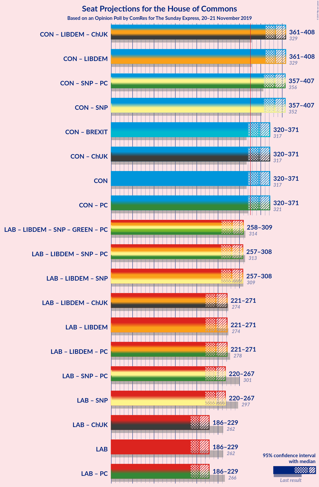
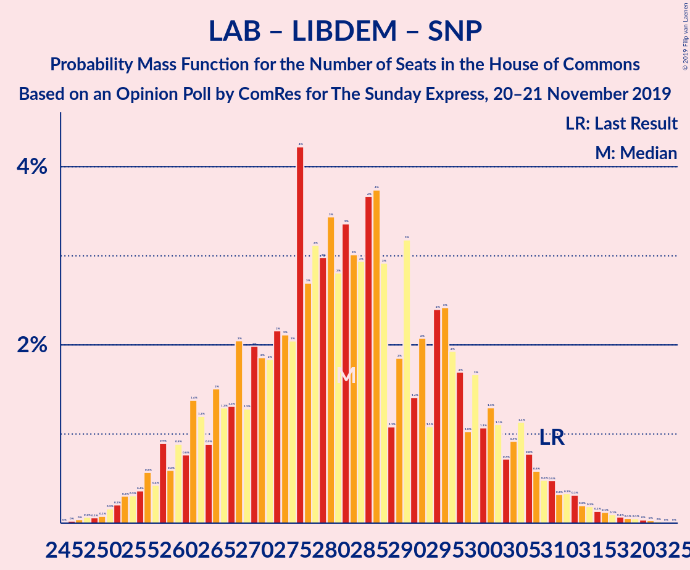

# Opinion Poll by ComRes for The Sunday Express, 20–21 November 2019

<a href="#voting-intentions">Voting Intentions</a> | <a href="#seats">Seats</a> | <a href="#coalitions">Coalitions</a> | <a href="#technical-information">Technical Information</a>

## Voting Intentions

### Confidence Intervals

| Party | Last Result | Poll Result | 80% Confidence Interval | 90% Confidence Interval | 95% Confidence Interval | 99% Confidence Interval |
|:-----:|:-----------:|:-----------:|:-----------------------:|:-----------------------:|:-----------------------:|:-----------------------:|
| Conservative Party | 43.4% | 42.0% | 40.6–43.4% |40.2–43.8% |39.9–44.2% |39.2–44.8% |
| Labour Party | 41.0% | 32.0% | 30.7–33.3% |30.3–33.7% |30.0–34.1% |29.4–34.7% |
| Liberal Democrats | 7.6% | 15.0% | 14.0–16.1% |13.8–16.4% |13.5–16.6% |13.1–17.2% |
| Brexit Party | 0.0% | 5.0% | 4.4–5.7% |4.3–5.9% |4.1–6.1% |3.9–6.4% |
| Scottish National Party | 3.1% | 3.0% | 2.6–3.5% |2.4–3.7% |2.3–3.8% |2.1–4.1% |
| Green Party | 1.7% | 2.0% | 1.7–2.5% |1.6–2.6% |1.5–2.7% |1.3–3.0% |

*Note:* The poll result column reflects the actual value used in the calculations. Published results may vary slightly, and in addition be rounded to fewer digits.

## Seats

### Confidence Intervals

| Party | Last Result | Median | 80% Confidence Interval | 90% Confidence Interval | 95% Confidence Interval | 99% Confidence Interval |
|:-----:|:-----------:|:------:|:-----------------------:|:-----------------------:|:-----------------------:|:-----------------------:|
| <a href="#conservative-party">Conservative Party</a> | 317 | 346 | 329–361 |322–365 |319–372 |314–376 |
| <a href="#labour-party">Labour Party</a> | 262 | 206 | 193–223 |188–225 |186–230 |182–237 |
| <a href="#liberal-democrats">Liberal Democrats</a> | 12 | 38 | 34–43 |33–44 |32–46 |31–48 |
| <a href="#brexit-party">Brexit Party</a> | 0 | 0 | 0 |0 |0 |0 |
| <a href="#scottish-national-party">Scottish National Party</a> | 35 | 38 | 31–43 |26–47 |20–48 |14–50 |
| <a href="#green-party">Green Party</a> | 1 | 1 | 1 |1 |1 |1 |

### Conservative Party

*For a full overview of the results for this party, see the [Conservative Party](party-conservativeparty.html) page.*

| Number of Seats | Probability | Accumulated | Special Marks |
|:---------------:|:-----------:|:-----------:|:-------------:|
| 304 | 0% | 100% |  |
| 305 | 0% | 99.9% |  |
| 306 | 0% | 99.9% |  |
| 307 | 0.1% | 99.9% |  |
| 308 | 0.1% | 99.8% |  |
| 309 | 0.1% | 99.8% |  |
| 310 | 0% | 99.7% |  |
| 311 | 0.1% | 99.7% |  |
| 312 | 0.1% | 99.6% |  |
| 313 | 0% | 99.5% |  |
| 314 | 0.1% | 99.5% |  |
| 315 | 0.2% | 99.4% |  |
| 316 | 0.5% | 99.2% |  |
| 317 | 0.6% | 98.8% | Last Result |
| 318 | 0.4% | 98% |  |
| 319 | 1.0% | 98% |  |
| 320 | 0.6% | 97% |  |
| 321 | 0.8% | 96% |  |
| 322 | 0.4% | 95% |  |
| 323 | 0.5% | 95% |  |
| 324 | 0.2% | 94% |  |
| 325 | 0.1% | 94% |  |
| 326 | 0.2% | 94% | Majority |
| 327 | 0.2% | 94% |  |
| 328 | 0.8% | 94% |  |
| 329 | 4% | 93% |  |
| 330 | 2% | 89% |  |
| 331 | 4% | 87% |  |
| 332 | 2% | 83% |  |
| 333 | 6% | 80% |  |
| 334 | 2% | 75% |  |
| 335 | 1.0% | 73% |  |
| 336 | 0.9% | 72% |  |
| 337 | 0.8% | 71% |  |
| 338 | 2% | 70% |  |
| 339 | 0.2% | 68% |  |
| 340 | 0.1% | 68% |  |
| 341 | 2% | 68% |  |
| 342 | 0.5% | 66% |  |
| 343 | 2% | 66% |  |
| 344 | 2% | 63% |  |
| 345 | 10% | 61% |  |
| 346 | 4% | 52% | Median |
| 347 | 4% | 48% |  |
| 348 | 9% | 44% |  |
| 349 | 2% | 35% |  |
| 350 | 3% | 33% |  |
| 351 | 2% | 30% |  |
| 352 | 0.6% | 27% |  |
| 353 | 0.4% | 27% |  |
| 354 | 0.2% | 26% |  |
| 355 | 0.3% | 26% |  |
| 356 | 0.4% | 26% |  |
| 357 | 2% | 25% |  |
| 358 | 6% | 23% |  |
| 359 | 0.8% | 18% |  |
| 360 | 6% | 17% |  |
| 361 | 2% | 11% |  |
| 362 | 2% | 9% |  |
| 363 | 1.4% | 8% |  |
| 364 | 0.8% | 6% |  |
| 365 | 1.0% | 6% |  |
| 366 | 0.5% | 5% |  |
| 367 | 0.1% | 4% |  |
| 368 | 0.3% | 4% |  |
| 369 | 0.3% | 4% |  |
| 370 | 0.3% | 3% |  |
| 371 | 0.3% | 3% |  |
| 372 | 0.4% | 3% |  |
| 373 | 0.7% | 2% |  |
| 374 | 0.4% | 2% |  |
| 375 | 0.8% | 1.3% |  |
| 376 | 0.2% | 0.5% |  |
| 377 | 0% | 0.3% |  |
| 378 | 0% | 0.3% |  |
| 379 | 0% | 0.2% |  |
| 380 | 0% | 0.2% |  |
| 381 | 0% | 0.1% |  |
| 382 | 0.1% | 0.1% |  |
| 383 | 0% | 0.1% |  |
| 384 | 0% | 0% |  |

### Labour Party

*For a full overview of the results for this party, see the [Labour Party](party-labourparty.html) page.*

| Number of Seats | Probability | Accumulated | Special Marks |
|:---------------:|:-----------:|:-----------:|:-------------:|
| 175 | 0% | 100% |  |
| 176 | 0% | 99.9% |  |
| 177 | 0% | 99.9% |  |
| 178 | 0% | 99.9% |  |
| 179 | 0.1% | 99.9% |  |
| 180 | 0% | 99.8% |  |
| 181 | 0.2% | 99.8% |  |
| 182 | 0.1% | 99.6% |  |
| 183 | 0.1% | 99.5% |  |
| 184 | 0.2% | 99.4% |  |
| 185 | 0.7% | 99.2% |  |
| 186 | 2% | 98% |  |
| 187 | 2% | 97% |  |
| 188 | 0.1% | 95% |  |
| 189 | 0.9% | 95% |  |
| 190 | 0.5% | 94% |  |
| 191 | 1.4% | 94% |  |
| 192 | 2% | 92% |  |
| 193 | 0.2% | 90% |  |
| 194 | 3% | 90% |  |
| 195 | 0.8% | 87% |  |
| 196 | 4% | 86% |  |
| 197 | 0.4% | 82% |  |
| 198 | 2% | 82% |  |
| 199 | 4% | 80% |  |
| 200 | 4% | 77% |  |
| 201 | 2% | 73% |  |
| 202 | 0.7% | 71% |  |
| 203 | 3% | 70% |  |
| 204 | 4% | 68% |  |
| 205 | 4% | 64% |  |
| 206 | 12% | 59% | Median |
| 207 | 5% | 48% |  |
| 208 | 7% | 43% |  |
| 209 | 2% | 36% |  |
| 210 | 0.8% | 34% |  |
| 211 | 1.1% | 34% |  |
| 212 | 1.3% | 33% |  |
| 213 | 2% | 31% |  |
| 214 | 4% | 30% |  |
| 215 | 0.6% | 26% |  |
| 216 | 2% | 26% |  |
| 217 | 6% | 24% |  |
| 218 | 4% | 18% |  |
| 219 | 0.3% | 14% |  |
| 220 | 0.6% | 14% |  |
| 221 | 1.3% | 13% |  |
| 222 | 0.5% | 12% |  |
| 223 | 4% | 11% |  |
| 224 | 0.8% | 8% |  |
| 225 | 2% | 7% |  |
| 226 | 0.9% | 5% |  |
| 227 | 0.2% | 4% |  |
| 228 | 0.5% | 4% |  |
| 229 | 0.4% | 3% |  |
| 230 | 0.5% | 3% |  |
| 231 | 0.2% | 2% |  |
| 232 | 0.1% | 2% |  |
| 233 | 0.2% | 2% |  |
| 234 | 0.5% | 2% |  |
| 235 | 0.3% | 1.0% |  |
| 236 | 0.2% | 0.7% |  |
| 237 | 0.1% | 0.5% |  |
| 238 | 0% | 0.4% |  |
| 239 | 0% | 0.4% |  |
| 240 | 0.1% | 0.4% |  |
| 241 | 0.1% | 0.2% |  |
| 242 | 0% | 0.2% |  |
| 243 | 0% | 0.2% |  |
| 244 | 0% | 0.1% |  |
| 245 | 0% | 0.1% |  |
| 246 | 0% | 0.1% |  |
| 247 | 0% | 0.1% |  |
| 248 | 0% | 0% |  |
| 249 | 0% | 0% |  |
| 250 | 0% | 0% |  |
| 251 | 0% | 0% |  |
| 252 | 0% | 0% |  |
| 253 | 0% | 0% |  |
| 254 | 0% | 0% |  |
| 255 | 0% | 0% |  |
| 256 | 0% | 0% |  |
| 257 | 0% | 0% |  |
| 258 | 0% | 0% |  |
| 259 | 0% | 0% |  |
| 260 | 0% | 0% |  |
| 261 | 0% | 0% |  |
| 262 | 0% | 0% | Last Result |

### Liberal Democrats

*For a full overview of the results for this party, see the [Liberal Democrats](party-liberaldemocrats.html) page.*

| Number of Seats | Probability | Accumulated | Special Marks |
|:---------------:|:-----------:|:-----------:|:-------------:|
| 12 | 0% | 100% | Last Result |
| 13 | 0% | 100% |  |
| 14 | 0% | 100% |  |
| 15 | 0% | 100% |  |
| 16 | 0% | 100% |  |
| 17 | 0% | 100% |  |
| 18 | 0% | 100% |  |
| 19 | 0% | 100% |  |
| 20 | 0% | 100% |  |
| 21 | 0% | 100% |  |
| 22 | 0% | 100% |  |
| 23 | 0% | 100% |  |
| 24 | 0% | 100% |  |
| 25 | 0% | 100% |  |
| 26 | 0% | 100% |  |
| 27 | 0% | 100% |  |
| 28 | 0% | 100% |  |
| 29 | 0% | 100% |  |
| 30 | 0% | 100% |  |
| 31 | 0.5% | 100% |  |
| 32 | 2% | 99.5% |  |
| 33 | 6% | 97% |  |
| 34 | 0.8% | 91% |  |
| 35 | 6% | 90% |  |
| 36 | 14% | 83% |  |
| 37 | 10% | 69% |  |
| 38 | 16% | 59% | Median |
| 39 | 12% | 43% |  |
| 40 | 4% | 30% |  |
| 41 | 7% | 26% |  |
| 42 | 4% | 19% |  |
| 43 | 9% | 16% |  |
| 44 | 2% | 7% |  |
| 45 | 2% | 5% |  |
| 46 | 1.2% | 3% |  |
| 47 | 0.7% | 2% |  |
| 48 | 0.7% | 1.0% |  |
| 49 | 0.2% | 0.2% |  |
| 50 | 0.1% | 0.1% |  |
| 51 | 0% | 0% |  |

### Brexit Party

*For a full overview of the results for this party, see the [Brexit Party](party-brexitparty.html) page.*

| Number of Seats | Probability | Accumulated | Special Marks |
|:---------------:|:-----------:|:-----------:|:-------------:|
| 0 | 100% | 100% | Last Result, Median |

### Scottish National Party

*For a full overview of the results for this party, see the [Scottish National Party](party-scottishnationalparty.html) page.*

| Number of Seats | Probability | Accumulated | Special Marks |
|:---------------:|:-----------:|:-----------:|:-------------:|
| 4 | 0% | 100% |  |
| 5 | 0% | 99.9% |  |
| 6 | 0% | 99.9% |  |
| 7 | 0% | 99.9% |  |
| 8 | 0% | 99.9% |  |
| 9 | 0.1% | 99.9% |  |
| 10 | 0% | 99.8% |  |
| 11 | 0% | 99.8% |  |
| 12 | 0% | 99.7% |  |
| 13 | 0.2% | 99.7% |  |
| 14 | 0.2% | 99.5% |  |
| 15 | 0.1% | 99.3% |  |
| 16 | 0.1% | 99.3% |  |
| 17 | 0.9% | 99.2% |  |
| 18 | 0.2% | 98% |  |
| 19 | 0.4% | 98% |  |
| 20 | 0.6% | 98% |  |
| 21 | 0% | 97% |  |
| 22 | 0.6% | 97% |  |
| 23 | 0.7% | 96% |  |
| 24 | 0.1% | 96% |  |
| 25 | 0.3% | 95% |  |
| 26 | 1.2% | 95% |  |
| 27 | 0.3% | 94% |  |
| 28 | 0.8% | 94% |  |
| 29 | 0.1% | 93% |  |
| 30 | 0.1% | 93% |  |
| 31 | 4% | 93% |  |
| 32 | 2% | 88% |  |
| 33 | 14% | 86% |  |
| 34 | 2% | 72% |  |
| 35 | 10% | 70% | Last Result |
| 36 | 4% | 60% |  |
| 37 | 4% | 56% |  |
| 38 | 3% | 51% | Median |
| 39 | 10% | 48% |  |
| 40 | 4% | 38% |  |
| 41 | 17% | 34% |  |
| 42 | 7% | 18% |  |
| 43 | 1.3% | 11% |  |
| 44 | 0.1% | 9% |  |
| 45 | 3% | 9% |  |
| 46 | 0% | 6% |  |
| 47 | 3% | 6% |  |
| 48 | 2% | 3% |  |
| 49 | 0% | 1.1% |  |
| 50 | 1.0% | 1.1% |  |
| 51 | 0.1% | 0.1% |  |
| 52 | 0% | 0% |  |

### Green Party

*For a full overview of the results for this party, see the [Green Party](party-greenparty.html) page.*

| Number of Seats | Probability | Accumulated | Special Marks |
|:---------------:|:-----------:|:-----------:|:-------------:|
| 1 | 100% | 100% | Last Result, Median |

## Coalitions

### Confidence Intervals

| Coalition | Last Result | Median | Majority? | 80% Confidence Interval | 90% Confidence Interval | 95% Confidence Interval | 99% Confidence Interval |
|:---------:|:-----------:|:------:|:---------:|:-----------------------:|:-----------------------:|:-----------------------:|:-----------------------:|
| Conservative Party – Liberal Democrats | 329 | 383 | 100% | 369–398 | 365–404 | 360–408 | 354–412 |
| Conservative Party – Scottish National Party | 352 | 384 | 100% | 365–399 | 361–403 | 357–407 | 349–410 |
| Conservative Party – Brexit Party | 317 | 346 | 94% | 329–361 | 322–365 | 319–372 | 314–376 |
| Conservative Party | 317 | 346 | 94% | 329–361 | 322–365 | 319–372 | 314–376 |
| Labour Party – Liberal Democrats – Scottish National Party | 309 | 282 | 0% | 267–299 | 263–306 | 256–309 | 252–314 |
| Labour Party – Liberal Democrats | 274 | 244 | 0% | 229–263 | 225–267 | 221–271 | 218–279 |
| Labour Party – Scottish National Party | 297 | 245 | 0% | 230–259 | 224–263 | 220–268 | 216–274 |
| Labour Party | 262 | 206 | 0% | 193–223 | 188–225 | 186–230 | 182–237 |

### Conservative Party – Liberal Democrats

| Number of Seats | Probability | Accumulated | Special Marks |
|:---------------:|:-----------:|:-----------:|:-------------:|
| 329 | 0% | 100% | Last Result |
| 330 | 0% | 100% |  |
| 331 | 0% | 100% |  |
| 332 | 0% | 100% |  |
| 333 | 0% | 100% |  |
| 334 | 0% | 100% |  |
| 335 | 0% | 100% |  |
| 336 | 0% | 100% |  |
| 337 | 0% | 100% |  |
| 338 | 0% | 100% |  |
| 339 | 0% | 100% |  |
| 340 | 0% | 100% |  |
| 341 | 0% | 100% |  |
| 342 | 0% | 100% |  |
| 343 | 0% | 100% |  |
| 344 | 0% | 100% |  |
| 345 | 0% | 100% |  |
| 346 | 0% | 99.9% |  |
| 347 | 0% | 99.9% |  |
| 348 | 0.1% | 99.9% |  |
| 349 | 0% | 99.9% |  |
| 350 | 0.1% | 99.8% |  |
| 351 | 0% | 99.7% |  |
| 352 | 0% | 99.7% |  |
| 353 | 0.2% | 99.7% |  |
| 354 | 0.1% | 99.5% |  |
| 355 | 0.2% | 99.4% |  |
| 356 | 0.3% | 99.3% |  |
| 357 | 0.3% | 99.0% |  |
| 358 | 0.4% | 98.7% |  |
| 359 | 0.4% | 98% |  |
| 360 | 0.5% | 98% |  |
| 361 | 0.4% | 97% |  |
| 362 | 0.1% | 97% |  |
| 363 | 0.4% | 97% |  |
| 364 | 1.0% | 96% |  |
| 365 | 0.7% | 95% |  |
| 366 | 1.0% | 95% |  |
| 367 | 2% | 94% |  |
| 368 | 0.7% | 92% |  |
| 369 | 3% | 91% |  |
| 370 | 0.7% | 88% |  |
| 371 | 2% | 88% |  |
| 372 | 7% | 85% |  |
| 373 | 2% | 79% |  |
| 374 | 1.4% | 77% |  |
| 375 | 3% | 76% |  |
| 376 | 0.6% | 73% |  |
| 377 | 1.3% | 72% |  |
| 378 | 1.1% | 71% |  |
| 379 | 3% | 70% |  |
| 380 | 1.2% | 67% |  |
| 381 | 9% | 66% |  |
| 382 | 6% | 57% |  |
| 383 | 3% | 51% |  |
| 384 | 2% | 48% | Median |
| 385 | 2% | 46% |  |
| 386 | 2% | 44% |  |
| 387 | 7% | 42% |  |
| 388 | 2% | 35% |  |
| 389 | 1.5% | 33% |  |
| 390 | 2% | 32% |  |
| 391 | 5% | 30% |  |
| 392 | 0.7% | 25% |  |
| 393 | 2% | 24% |  |
| 394 | 2% | 22% |  |
| 395 | 3% | 21% |  |
| 396 | 5% | 17% |  |
| 397 | 3% | 13% |  |
| 398 | 2% | 10% |  |
| 399 | 0.9% | 9% |  |
| 400 | 0.4% | 8% |  |
| 401 | 1.2% | 7% |  |
| 402 | 0.3% | 6% |  |
| 403 | 0.8% | 6% |  |
| 404 | 0.9% | 5% |  |
| 405 | 1.2% | 4% |  |
| 406 | 0.3% | 3% |  |
| 407 | 0.3% | 3% |  |
| 408 | 0.7% | 3% |  |
| 409 | 0.7% | 2% |  |
| 410 | 0.2% | 1.1% |  |
| 411 | 0.4% | 0.9% |  |
| 412 | 0.1% | 0.5% |  |
| 413 | 0.1% | 0.5% |  |
| 414 | 0.1% | 0.3% |  |
| 415 | 0% | 0.2% |  |
| 416 | 0% | 0.2% |  |
| 417 | 0% | 0.1% |  |
| 418 | 0% | 0.1% |  |
| 419 | 0% | 0.1% |  |
| 420 | 0% | 0.1% |  |
| 421 | 0% | 0% |  |

### Conservative Party – Scottish National Party

| Number of Seats | Probability | Accumulated | Special Marks |
|:---------------:|:-----------:|:-----------:|:-------------:|
| 338 | 0% | 100% |  |
| 339 | 0% | 99.9% |  |
| 340 | 0% | 99.9% |  |
| 341 | 0% | 99.9% |  |
| 342 | 0% | 99.9% |  |
| 343 | 0% | 99.9% |  |
| 344 | 0% | 99.8% |  |
| 345 | 0.1% | 99.8% |  |
| 346 | 0% | 99.8% |  |
| 347 | 0% | 99.7% |  |
| 348 | 0.1% | 99.7% |  |
| 349 | 0.1% | 99.6% |  |
| 350 | 0.1% | 99.4% |  |
| 351 | 0.5% | 99.3% |  |
| 352 | 0.2% | 98.9% | Last Result |
| 353 | 0.2% | 98.7% |  |
| 354 | 0.4% | 98% |  |
| 355 | 0.2% | 98% |  |
| 356 | 0.4% | 98% |  |
| 357 | 0.3% | 98% |  |
| 358 | 1.1% | 97% |  |
| 359 | 0.4% | 96% |  |
| 360 | 0.4% | 96% |  |
| 361 | 1.5% | 95% |  |
| 362 | 1.2% | 94% |  |
| 363 | 0.6% | 93% |  |
| 364 | 2% | 92% |  |
| 365 | 1.4% | 90% |  |
| 366 | 0.5% | 89% |  |
| 367 | 1.4% | 88% |  |
| 368 | 3% | 87% |  |
| 369 | 3% | 84% |  |
| 370 | 3% | 82% |  |
| 371 | 0.6% | 78% |  |
| 372 | 1.4% | 78% |  |
| 373 | 0.8% | 76% |  |
| 374 | 1.2% | 75% |  |
| 375 | 3% | 74% |  |
| 376 | 2% | 71% |  |
| 377 | 2% | 69% |  |
| 378 | 1.5% | 67% |  |
| 379 | 2% | 65% |  |
| 380 | 3% | 64% |  |
| 381 | 5% | 60% |  |
| 382 | 2% | 56% |  |
| 383 | 3% | 54% |  |
| 384 | 4% | 51% | Median |
| 385 | 3% | 47% |  |
| 386 | 7% | 44% |  |
| 387 | 7% | 37% |  |
| 388 | 1.4% | 30% |  |
| 389 | 2% | 29% |  |
| 390 | 1.5% | 27% |  |
| 391 | 5% | 26% |  |
| 392 | 1.2% | 21% |  |
| 393 | 2% | 20% |  |
| 394 | 0.9% | 18% |  |
| 395 | 2% | 17% |  |
| 396 | 2% | 15% |  |
| 397 | 1.0% | 13% |  |
| 398 | 1.1% | 12% |  |
| 399 | 2% | 11% |  |
| 400 | 0.7% | 9% |  |
| 401 | 1.3% | 8% |  |
| 402 | 1.1% | 7% |  |
| 403 | 1.3% | 6% |  |
| 404 | 0.8% | 5% |  |
| 405 | 0.7% | 4% |  |
| 406 | 0.5% | 3% |  |
| 407 | 0.3% | 3% |  |
| 408 | 0.7% | 2% |  |
| 409 | 0.3% | 2% |  |
| 410 | 0.8% | 1.3% |  |
| 411 | 0.2% | 0.5% |  |
| 412 | 0% | 0.3% |  |
| 413 | 0.1% | 0.2% |  |
| 414 | 0% | 0.1% |  |
| 415 | 0.1% | 0.1% |  |
| 416 | 0% | 0.1% |  |
| 417 | 0% | 0% |  |

### Conservative Party – Brexit Party

| Number of Seats | Probability | Accumulated | Special Marks |
|:---------------:|:-----------:|:-----------:|:-------------:|
| 304 | 0% | 100% |  |
| 305 | 0% | 99.9% |  |
| 306 | 0% | 99.9% |  |
| 307 | 0.1% | 99.9% |  |
| 308 | 0.1% | 99.8% |  |
| 309 | 0.1% | 99.8% |  |
| 310 | 0% | 99.7% |  |
| 311 | 0.1% | 99.7% |  |
| 312 | 0.1% | 99.6% |  |
| 313 | 0% | 99.5% |  |
| 314 | 0.1% | 99.5% |  |
| 315 | 0.2% | 99.4% |  |
| 316 | 0.5% | 99.2% |  |
| 317 | 0.6% | 98.8% | Last Result |
| 318 | 0.4% | 98% |  |
| 319 | 1.0% | 98% |  |
| 320 | 0.6% | 97% |  |
| 321 | 0.8% | 96% |  |
| 322 | 0.4% | 95% |  |
| 323 | 0.5% | 95% |  |
| 324 | 0.2% | 94% |  |
| 325 | 0.1% | 94% |  |
| 326 | 0.2% | 94% | Majority |
| 327 | 0.2% | 94% |  |
| 328 | 0.8% | 94% |  |
| 329 | 4% | 93% |  |
| 330 | 2% | 89% |  |
| 331 | 4% | 87% |  |
| 332 | 2% | 83% |  |
| 333 | 6% | 80% |  |
| 334 | 2% | 75% |  |
| 335 | 1.0% | 73% |  |
| 336 | 0.9% | 72% |  |
| 337 | 0.8% | 71% |  |
| 338 | 2% | 70% |  |
| 339 | 0.2% | 68% |  |
| 340 | 0.1% | 68% |  |
| 341 | 2% | 68% |  |
| 342 | 0.5% | 66% |  |
| 343 | 2% | 66% |  |
| 344 | 2% | 63% |  |
| 345 | 10% | 61% |  |
| 346 | 4% | 52% | Median |
| 347 | 4% | 48% |  |
| 348 | 9% | 44% |  |
| 349 | 2% | 35% |  |
| 350 | 3% | 33% |  |
| 351 | 2% | 30% |  |
| 352 | 0.6% | 27% |  |
| 353 | 0.4% | 27% |  |
| 354 | 0.2% | 26% |  |
| 355 | 0.3% | 26% |  |
| 356 | 0.4% | 26% |  |
| 357 | 2% | 25% |  |
| 358 | 6% | 23% |  |
| 359 | 0.8% | 18% |  |
| 360 | 6% | 17% |  |
| 361 | 2% | 11% |  |
| 362 | 2% | 9% |  |
| 363 | 1.4% | 8% |  |
| 364 | 0.8% | 6% |  |
| 365 | 1.0% | 6% |  |
| 366 | 0.5% | 5% |  |
| 367 | 0.1% | 4% |  |
| 368 | 0.3% | 4% |  |
| 369 | 0.3% | 4% |  |
| 370 | 0.3% | 3% |  |
| 371 | 0.3% | 3% |  |
| 372 | 0.4% | 3% |  |
| 373 | 0.7% | 2% |  |
| 374 | 0.4% | 2% |  |
| 375 | 0.8% | 1.3% |  |
| 376 | 0.2% | 0.5% |  |
| 377 | 0% | 0.3% |  |
| 378 | 0% | 0.3% |  |
| 379 | 0% | 0.2% |  |
| 380 | 0% | 0.2% |  |
| 381 | 0% | 0.1% |  |
| 382 | 0.1% | 0.1% |  |
| 383 | 0% | 0.1% |  |
| 384 | 0% | 0% |  |

### Conservative Party

| Number of Seats | Probability | Accumulated | Special Marks |
|:---------------:|:-----------:|:-----------:|:-------------:|
| 304 | 0% | 100% |  |
| 305 | 0% | 99.9% |  |
| 306 | 0% | 99.9% |  |
| 307 | 0.1% | 99.9% |  |
| 308 | 0.1% | 99.8% |  |
| 309 | 0.1% | 99.8% |  |
| 310 | 0% | 99.7% |  |
| 311 | 0.1% | 99.7% |  |
| 312 | 0.1% | 99.6% |  |
| 313 | 0% | 99.5% |  |
| 314 | 0.1% | 99.5% |  |
| 315 | 0.2% | 99.4% |  |
| 316 | 0.5% | 99.2% |  |
| 317 | 0.6% | 98.8% | Last Result |
| 318 | 0.4% | 98% |  |
| 319 | 1.0% | 98% |  |
| 320 | 0.6% | 97% |  |
| 321 | 0.8% | 96% |  |
| 322 | 0.4% | 95% |  |
| 323 | 0.5% | 95% |  |
| 324 | 0.2% | 94% |  |
| 325 | 0.1% | 94% |  |
| 326 | 0.2% | 94% | Majority |
| 327 | 0.2% | 94% |  |
| 328 | 0.8% | 94% |  |
| 329 | 4% | 93% |  |
| 330 | 2% | 89% |  |
| 331 | 4% | 87% |  |
| 332 | 2% | 83% |  |
| 333 | 6% | 80% |  |
| 334 | 2% | 75% |  |
| 335 | 1.0% | 73% |  |
| 336 | 0.9% | 72% |  |
| 337 | 0.8% | 71% |  |
| 338 | 2% | 70% |  |
| 339 | 0.2% | 68% |  |
| 340 | 0.1% | 68% |  |
| 341 | 2% | 68% |  |
| 342 | 0.5% | 66% |  |
| 343 | 2% | 66% |  |
| 344 | 2% | 63% |  |
| 345 | 10% | 61% |  |
| 346 | 4% | 52% | Median |
| 347 | 4% | 48% |  |
| 348 | 9% | 44% |  |
| 349 | 2% | 35% |  |
| 350 | 3% | 33% |  |
| 351 | 2% | 30% |  |
| 352 | 0.6% | 27% |  |
| 353 | 0.4% | 27% |  |
| 354 | 0.2% | 26% |  |
| 355 | 0.3% | 26% |  |
| 356 | 0.4% | 26% |  |
| 357 | 2% | 25% |  |
| 358 | 6% | 23% |  |
| 359 | 0.8% | 18% |  |
| 360 | 6% | 17% |  |
| 361 | 2% | 11% |  |
| 362 | 2% | 9% |  |
| 363 | 1.4% | 8% |  |
| 364 | 0.8% | 6% |  |
| 365 | 1.0% | 6% |  |
| 366 | 0.5% | 5% |  |
| 367 | 0.1% | 4% |  |
| 368 | 0.3% | 4% |  |
| 369 | 0.3% | 4% |  |
| 370 | 0.3% | 3% |  |
| 371 | 0.3% | 3% |  |
| 372 | 0.4% | 3% |  |
| 373 | 0.7% | 2% |  |
| 374 | 0.4% | 2% |  |
| 375 | 0.8% | 1.3% |  |
| 376 | 0.2% | 0.5% |  |
| 377 | 0% | 0.3% |  |
| 378 | 0% | 0.3% |  |
| 379 | 0% | 0.2% |  |
| 380 | 0% | 0.2% |  |
| 381 | 0% | 0.1% |  |
| 382 | 0.1% | 0.1% |  |
| 383 | 0% | 0.1% |  |
| 384 | 0% | 0% |  |

### Labour Party – Liberal Democrats – Scottish National Party

| Number of Seats | Probability | Accumulated | Special Marks |
|:---------------:|:-----------:|:-----------:|:-------------:|
| 245 | 0% | 100% |  |
| 246 | 0.1% | 99.9% |  |
| 247 | 0% | 99.9% |  |
| 248 | 0% | 99.9% |  |
| 249 | 0% | 99.8% |  |
| 250 | 0% | 99.8% |  |
| 251 | 0% | 99.7% |  |
| 252 | 0.2% | 99.7% |  |
| 253 | 0.8% | 99.5% |  |
| 254 | 0.4% | 98.7% |  |
| 255 | 0.7% | 98% |  |
| 256 | 0.4% | 98% |  |
| 257 | 0.3% | 97% |  |
| 258 | 0.3% | 97% |  |
| 259 | 0.3% | 97% |  |
| 260 | 0.3% | 96% |  |
| 261 | 0.1% | 96% |  |
| 262 | 0.5% | 96% |  |
| 263 | 1.0% | 95% |  |
| 264 | 0.8% | 94% |  |
| 265 | 1.4% | 94% |  |
| 266 | 2% | 92% |  |
| 267 | 2% | 91% |  |
| 268 | 6% | 89% |  |
| 269 | 0.8% | 83% |  |
| 270 | 6% | 82% |  |
| 271 | 2% | 77% |  |
| 272 | 0.4% | 75% |  |
| 273 | 0.3% | 74% |  |
| 274 | 0.2% | 74% |  |
| 275 | 0.4% | 74% |  |
| 276 | 0.6% | 73% |  |
| 277 | 2% | 73% |  |
| 278 | 3% | 70% |  |
| 279 | 2% | 67% |  |
| 280 | 9% | 65% |  |
| 281 | 4% | 56% |  |
| 282 | 4% | 52% | Median |
| 283 | 10% | 48% |  |
| 284 | 2% | 39% |  |
| 285 | 2% | 37% |  |
| 286 | 0.5% | 34% |  |
| 287 | 2% | 34% |  |
| 288 | 0.1% | 32% |  |
| 289 | 0.2% | 32% |  |
| 290 | 2% | 32% |  |
| 291 | 0.8% | 30% |  |
| 292 | 0.9% | 29% |  |
| 293 | 1.0% | 28% |  |
| 294 | 2% | 27% |  |
| 295 | 6% | 25% |  |
| 296 | 2% | 20% |  |
| 297 | 4% | 17% |  |
| 298 | 2% | 13% |  |
| 299 | 4% | 11% |  |
| 300 | 0.8% | 7% |  |
| 301 | 0.2% | 6% |  |
| 302 | 0.2% | 6% |  |
| 303 | 0.1% | 6% |  |
| 304 | 0.2% | 6% |  |
| 305 | 0.5% | 6% |  |
| 306 | 0.4% | 5% |  |
| 307 | 0.8% | 5% |  |
| 308 | 0.6% | 4% |  |
| 309 | 1.0% | 3% | Last Result |
| 310 | 0.4% | 2% |  |
| 311 | 0.6% | 2% |  |
| 312 | 0.5% | 1.2% |  |
| 313 | 0.2% | 0.8% |  |
| 314 | 0.1% | 0.6% |  |
| 315 | 0% | 0.5% |  |
| 316 | 0.1% | 0.5% |  |
| 317 | 0.1% | 0.4% |  |
| 318 | 0% | 0.3% |  |
| 319 | 0.1% | 0.3% |  |
| 320 | 0.1% | 0.2% |  |
| 321 | 0.1% | 0.2% |  |
| 322 | 0% | 0.1% |  |
| 323 | 0% | 0.1% |  |
| 324 | 0% | 0.1% |  |
| 325 | 0% | 0% |  |

### Labour Party – Liberal Democrats

| Number of Seats | Probability | Accumulated | Special Marks |
|:---------------:|:-----------:|:-----------:|:-------------:|
| 212 | 0% | 100% |  |
| 213 | 0.1% | 99.9% |  |
| 214 | 0% | 99.9% |  |
| 215 | 0.1% | 99.9% |  |
| 216 | 0% | 99.8% |  |
| 217 | 0.2% | 99.7% |  |
| 218 | 0.8% | 99.5% |  |
| 219 | 0.3% | 98.7% |  |
| 220 | 0.7% | 98% |  |
| 221 | 0.3% | 98% |  |
| 222 | 0.5% | 97% |  |
| 223 | 0.7% | 97% |  |
| 224 | 0.8% | 96% |  |
| 225 | 1.3% | 95% |  |
| 226 | 1.1% | 94% |  |
| 227 | 1.3% | 93% |  |
| 228 | 0.7% | 92% |  |
| 229 | 2% | 91% |  |
| 230 | 1.1% | 89% |  |
| 231 | 1.0% | 88% |  |
| 232 | 2% | 87% |  |
| 233 | 2% | 85% |  |
| 234 | 0.9% | 83% |  |
| 235 | 2% | 82% |  |
| 236 | 1.2% | 80% |  |
| 237 | 5% | 79% |  |
| 238 | 1.5% | 74% |  |
| 239 | 2% | 73% |  |
| 240 | 1.4% | 71% |  |
| 241 | 7% | 70% |  |
| 242 | 7% | 63% |  |
| 243 | 3% | 56% |  |
| 244 | 4% | 53% | Median |
| 245 | 3% | 49% |  |
| 246 | 2% | 46% |  |
| 247 | 5% | 44% |  |
| 248 | 3% | 40% |  |
| 249 | 2% | 36% |  |
| 250 | 1.5% | 35% |  |
| 251 | 2% | 33% |  |
| 252 | 2% | 31% |  |
| 253 | 3% | 29% |  |
| 254 | 1.2% | 26% |  |
| 255 | 0.8% | 25% |  |
| 256 | 1.4% | 24% |  |
| 257 | 0.6% | 22% |  |
| 258 | 3% | 22% |  |
| 259 | 3% | 18% |  |
| 260 | 3% | 16% |  |
| 261 | 1.4% | 13% |  |
| 262 | 0.5% | 12% |  |
| 263 | 1.4% | 11% |  |
| 264 | 2% | 10% |  |
| 265 | 0.6% | 8% |  |
| 266 | 1.2% | 7% |  |
| 267 | 1.5% | 6% |  |
| 268 | 0.4% | 5% |  |
| 269 | 0.4% | 4% |  |
| 270 | 1.1% | 4% |  |
| 271 | 0.3% | 3% |  |
| 272 | 0.4% | 2% |  |
| 273 | 0.2% | 2% |  |
| 274 | 0.4% | 2% | Last Result |
| 275 | 0.2% | 2% |  |
| 276 | 0.2% | 1.3% |  |
| 277 | 0.5% | 1.1% |  |
| 278 | 0.1% | 0.7% |  |
| 279 | 0.1% | 0.6% |  |
| 280 | 0.1% | 0.4% |  |
| 281 | 0% | 0.3% |  |
| 282 | 0% | 0.3% |  |
| 283 | 0.1% | 0.2% |  |
| 284 | 0% | 0.2% |  |
| 285 | 0% | 0.2% |  |
| 286 | 0% | 0.1% |  |
| 287 | 0% | 0.1% |  |
| 288 | 0% | 0.1% |  |
| 289 | 0% | 0.1% |  |
| 290 | 0% | 0.1% |  |
| 291 | 0% | 0% |  |

### Labour Party – Scottish National Party

| Number of Seats | Probability | Accumulated | Special Marks |
|:---------------:|:-----------:|:-----------:|:-------------:|
| 208 | 0% | 100% |  |
| 209 | 0% | 99.9% |  |
| 210 | 0% | 99.9% |  |
| 211 | 0% | 99.9% |  |
| 212 | 0% | 99.9% |  |
| 213 | 0% | 99.8% |  |
| 214 | 0.1% | 99.8% |  |
| 215 | 0.1% | 99.7% |  |
| 216 | 0.1% | 99.5% |  |
| 217 | 0.4% | 99.5% |  |
| 218 | 0.2% | 99.1% |  |
| 219 | 0.7% | 98.9% |  |
| 220 | 0.7% | 98% |  |
| 221 | 0.3% | 97% |  |
| 222 | 0.3% | 97% |  |
| 223 | 1.2% | 97% |  |
| 224 | 0.9% | 96% |  |
| 225 | 0.8% | 95% |  |
| 226 | 0.3% | 94% |  |
| 227 | 1.2% | 94% |  |
| 228 | 0.4% | 93% |  |
| 229 | 0.9% | 92% |  |
| 230 | 2% | 91% |  |
| 231 | 3% | 90% |  |
| 232 | 5% | 87% |  |
| 233 | 3% | 83% |  |
| 234 | 2% | 79% |  |
| 235 | 2% | 78% |  |
| 236 | 0.7% | 76% |  |
| 237 | 5% | 75% |  |
| 238 | 2% | 70% |  |
| 239 | 1.5% | 68% |  |
| 240 | 2% | 67% |  |
| 241 | 7% | 65% |  |
| 242 | 2% | 58% |  |
| 243 | 2% | 56% |  |
| 244 | 2% | 54% | Median |
| 245 | 3% | 52% |  |
| 246 | 6% | 49% |  |
| 247 | 9% | 43% |  |
| 248 | 1.2% | 34% |  |
| 249 | 3% | 33% |  |
| 250 | 1.1% | 30% |  |
| 251 | 1.3% | 29% |  |
| 252 | 0.6% | 28% |  |
| 253 | 3% | 27% |  |
| 254 | 1.4% | 24% |  |
| 255 | 2% | 23% |  |
| 256 | 7% | 21% |  |
| 257 | 2% | 15% |  |
| 258 | 0.7% | 12% |  |
| 259 | 3% | 12% |  |
| 260 | 0.7% | 9% |  |
| 261 | 2% | 8% |  |
| 262 | 1.0% | 6% |  |
| 263 | 0.7% | 5% |  |
| 264 | 1.0% | 5% |  |
| 265 | 0.4% | 4% |  |
| 266 | 0.1% | 3% |  |
| 267 | 0.4% | 3% |  |
| 268 | 0.5% | 3% |  |
| 269 | 0.4% | 2% |  |
| 270 | 0.4% | 2% |  |
| 271 | 0.3% | 1.3% |  |
| 272 | 0.3% | 1.0% |  |
| 273 | 0.2% | 0.7% |  |
| 274 | 0.1% | 0.6% |  |
| 275 | 0.2% | 0.5% |  |
| 276 | 0% | 0.3% |  |
| 277 | 0% | 0.3% |  |
| 278 | 0.1% | 0.3% |  |
| 279 | 0% | 0.2% |  |
| 280 | 0.1% | 0.1% |  |
| 281 | 0% | 0.1% |  |
| 282 | 0% | 0.1% |  |
| 283 | 0% | 0.1% |  |
| 284 | 0% | 0% |  |
| 285 | 0% | 0% |  |
| 286 | 0% | 0% |  |
| 287 | 0% | 0% |  |
| 288 | 0% | 0% |  |
| 289 | 0% | 0% |  |
| 290 | 0% | 0% |  |
| 291 | 0% | 0% |  |
| 292 | 0% | 0% |  |
| 293 | 0% | 0% |  |
| 294 | 0% | 0% |  |
| 295 | 0% | 0% |  |
| 296 | 0% | 0% |  |
| 297 | 0% | 0% | Last Result |

### Labour Party

| Number of Seats | Probability | Accumulated | Special Marks |
|:---------------:|:-----------:|:-----------:|:-------------:|
| 175 | 0% | 100% |  |
| 176 | 0% | 99.9% |  |
| 177 | 0% | 99.9% |  |
| 178 | 0% | 99.9% |  |
| 179 | 0.1% | 99.9% |  |
| 180 | 0% | 99.8% |  |
| 181 | 0.2% | 99.8% |  |
| 182 | 0.1% | 99.6% |  |
| 183 | 0.1% | 99.5% |  |
| 184 | 0.2% | 99.4% |  |
| 185 | 0.7% | 99.2% |  |
| 186 | 2% | 98% |  |
| 187 | 2% | 97% |  |
| 188 | 0.1% | 95% |  |
| 189 | 0.9% | 95% |  |
| 190 | 0.5% | 94% |  |
| 191 | 1.4% | 94% |  |
| 192 | 2% | 92% |  |
| 193 | 0.2% | 90% |  |
| 194 | 3% | 90% |  |
| 195 | 0.8% | 87% |  |
| 196 | 4% | 86% |  |
| 197 | 0.4% | 82% |  |
| 198 | 2% | 82% |  |
| 199 | 4% | 80% |  |
| 200 | 4% | 77% |  |
| 201 | 2% | 73% |  |
| 202 | 0.7% | 71% |  |
| 203 | 3% | 70% |  |
| 204 | 4% | 68% |  |
| 205 | 4% | 64% |  |
| 206 | 12% | 59% | Median |
| 207 | 5% | 48% |  |
| 208 | 7% | 43% |  |
| 209 | 2% | 36% |  |
| 210 | 0.8% | 34% |  |
| 211 | 1.1% | 34% |  |
| 212 | 1.3% | 33% |  |
| 213 | 2% | 31% |  |
| 214 | 4% | 30% |  |
| 215 | 0.6% | 26% |  |
| 216 | 2% | 26% |  |
| 217 | 6% | 24% |  |
| 218 | 4% | 18% |  |
| 219 | 0.3% | 14% |  |
| 220 | 0.6% | 14% |  |
| 221 | 1.3% | 13% |  |
| 222 | 0.5% | 12% |  |
| 223 | 4% | 11% |  |
| 224 | 0.8% | 8% |  |
| 225 | 2% | 7% |  |
| 226 | 0.9% | 5% |  |
| 227 | 0.2% | 4% |  |
| 228 | 0.5% | 4% |  |
| 229 | 0.4% | 3% |  |
| 230 | 0.5% | 3% |  |
| 231 | 0.2% | 2% |  |
| 232 | 0.1% | 2% |  |
| 233 | 0.2% | 2% |  |
| 234 | 0.5% | 2% |  |
| 235 | 0.3% | 1.0% |  |
| 236 | 0.2% | 0.7% |  |
| 237 | 0.1% | 0.5% |  |
| 238 | 0% | 0.4% |  |
| 239 | 0% | 0.4% |  |
| 240 | 0.1% | 0.4% |  |
| 241 | 0.1% | 0.2% |  |
| 242 | 0% | 0.2% |  |
| 243 | 0% | 0.2% |  |
| 244 | 0% | 0.1% |  |
| 245 | 0% | 0.1% |  |
| 246 | 0% | 0.1% |  |
| 247 | 0% | 0.1% |  |
| 248 | 0% | 0% |  |
| 249 | 0% | 0% |  |
| 250 | 0% | 0% |  |
| 251 | 0% | 0% |  |
| 252 | 0% | 0% |  |
| 253 | 0% | 0% |  |
| 254 | 0% | 0% |  |
| 255 | 0% | 0% |  |
| 256 | 0% | 0% |  |
| 257 | 0% | 0% |  |
| 258 | 0% | 0% |  |
| 259 | 0% | 0% |  |
| 260 | 0% | 0% |  |
| 261 | 0% | 0% |  |
| 262 | 0% | 0% | Last Result |

## Technical Information

### Opinion Poll

+ **Polling firm:** ComRes
+ **Commissioner(s):** The Sunday Express
+ **Fieldwork period:** 20–21 November 2019

### Calculations

+ **Sample size:** 2038
+ **Simulations done:** 131,072
+ **Error estimate:** 0.96%

