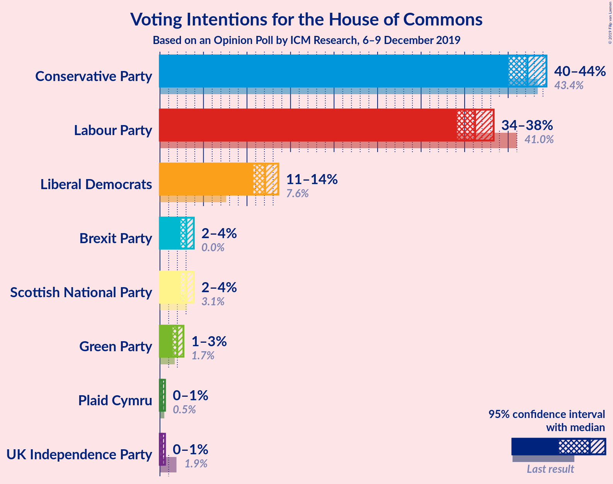
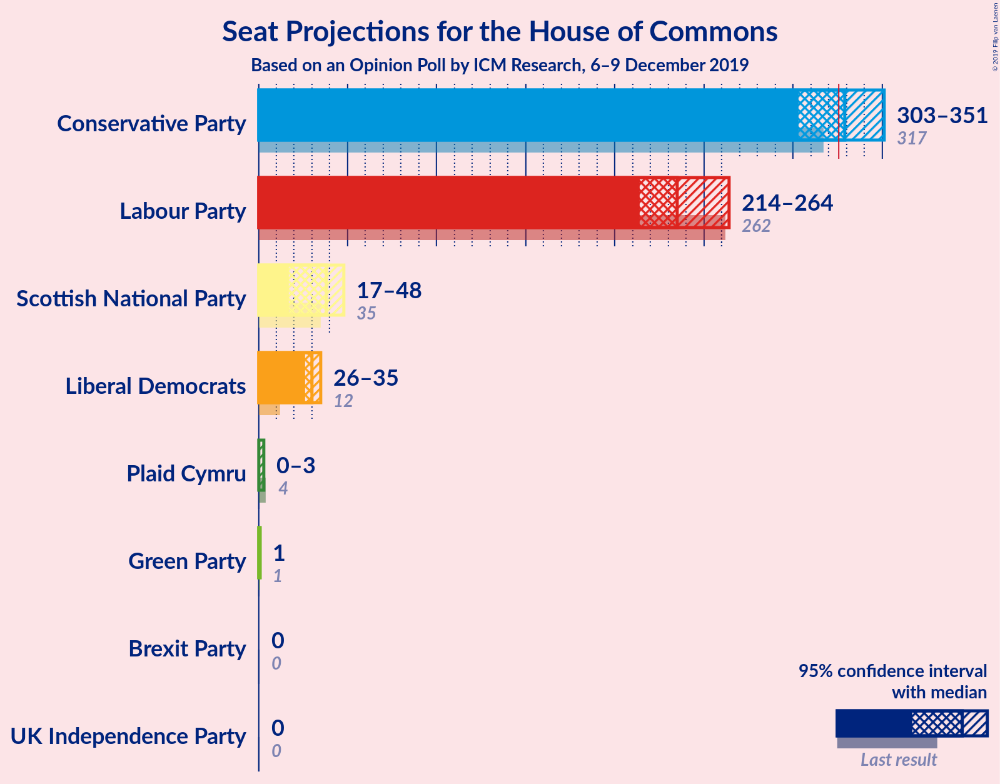
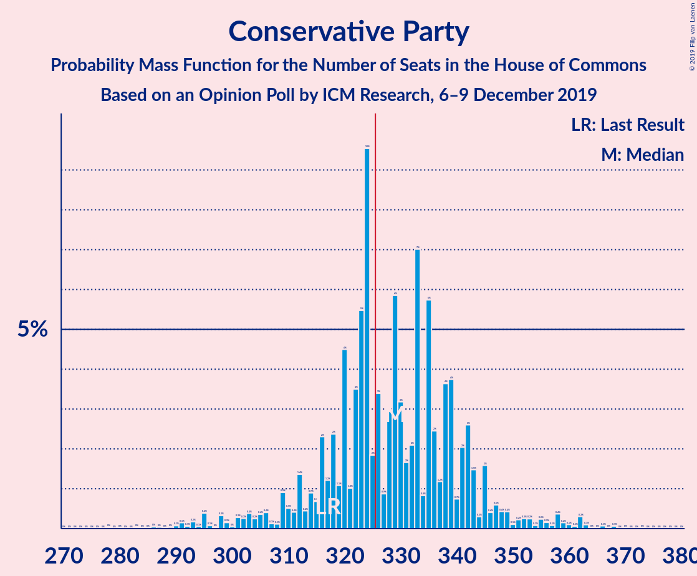
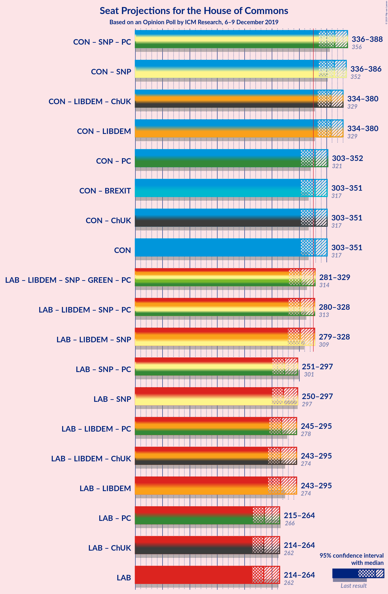

# Opinion Poll by ICM Research, 6–9 December 2019

<a href="#voting-intentions">Voting Intentions</a> | <a href="#seats">Seats</a> | <a href="#coalitions">Coalitions</a> | <a href="#technical-information">Technical Information</a>

## Voting Intentions

### Confidence Intervals

| Party | Last Result | Poll Result | 80% Confidence Interval | 90% Confidence Interval | 95% Confidence Interval | 99% Confidence Interval |
|:-----:|:-----------:|:-----------:|:-----------------------:|:-----------------------:|:-----------------------:|:-----------------------:|
| Conservative Party | 43.4% | 42.0% | 40.6–43.4% |40.2–43.9% |39.9–44.2% |39.2–44.9% |
| Labour Party | 41.0% | 36.0% | 34.6–37.4% |34.3–37.8% |33.9–38.1% |33.3–38.8% |
| Liberal Democrats | 7.6% | 12.0% | 11.1–13.0% |10.8–13.2% |10.6–13.5% |10.2–14.0% |
| Brexit Party | 0.0% | 3.0% | 2.5–3.5% |2.4–3.7% |2.3–3.8% |2.1–4.1% |

*Note:* The poll result column reflects the actual value used in the calculations. Published results may vary slightly, and in addition be rounded to fewer digits.

## Seats

### Confidence Intervals

| Party | Last Result | Median | 80% Confidence Interval | 90% Confidence Interval | 95% Confidence Interval | 99% Confidence Interval |
|:-----:|:-----------:|:------:|:-----------------------:|:-----------------------:|:-----------------------:|:-----------------------:|
| <a href="#conservative-party">Conservative Party</a> | 317 | 332 | 319–345 |313–348 |306–354 |295–360 |
| <a href="#labour-party">Labour Party</a> | 262 | 239 | 222–254 |218–260 |212–267 |206–278 |
| <a href="#liberal-democrats">Liberal Democrats</a> | 12 | 30 | 28–33 |27–35 |26–35 |24–38 |
| <a href="#brexit-party">Brexit Party</a> | 0 | 0 | 0 |0 |0 |0 |

### Conservative Party

*For a full overview of the results for this party, see the [Conservative Party](party-conservativeparty.html) page.*

| Number of Seats | Probability | Accumulated | Special Marks |
|:---------------:|:-----------:|:-----------:|:-------------:|
| 281 | 0% | 100% |  |
| 282 | 0% | 99.9% |  |
| 283 | 0% | 99.9% |  |
| 284 | 0% | 99.9% |  |
| 285 | 0% | 99.9% |  |
| 286 | 0% | 99.9% |  |
| 287 | 0% | 99.9% |  |
| 288 | 0% | 99.8% |  |
| 289 | 0.1% | 99.8% |  |
| 290 | 0% | 99.7% |  |
| 291 | 0% | 99.7% |  |
| 292 | 0% | 99.7% |  |
| 293 | 0.1% | 99.7% |  |
| 294 | 0.1% | 99.6% |  |
| 295 | 0.1% | 99.5% |  |
| 296 | 0.1% | 99.4% |  |
| 297 | 0.1% | 99.3% |  |
| 298 | 0.2% | 99.2% |  |
| 299 | 0.2% | 99.0% |  |
| 300 | 0.2% | 98.9% |  |
| 301 | 0.2% | 98.7% |  |
| 302 | 0.1% | 98.5% |  |
| 303 | 0.2% | 98% |  |
| 304 | 0.2% | 98% |  |
| 305 | 0.3% | 98% |  |
| 306 | 0.4% | 98% |  |
| 307 | 0.3% | 97% |  |
| 308 | 0.2% | 97% |  |
| 309 | 0.2% | 97% |  |
| 310 | 0.3% | 97% |  |
| 311 | 0.4% | 96% |  |
| 312 | 0.5% | 96% |  |
| 313 | 0.7% | 95% |  |
| 314 | 0.8% | 95% |  |
| 315 | 0.7% | 94% |  |
| 316 | 0.9% | 93% |  |
| 317 | 0.7% | 92% | Last Result |
| 318 | 0.9% | 92% |  |
| 319 | 0.9% | 91% |  |
| 320 | 1.0% | 90% |  |
| 321 | 1.1% | 89% |  |
| 322 | 2% | 88% |  |
| 323 | 2% | 86% |  |
| 324 | 2% | 83% |  |
| 325 | 3% | 81% |  |
| 326 | 4% | 79% | Majority |
| 327 | 5% | 75% |  |
| 328 | 6% | 70% |  |
| 329 | 8% | 63% |  |
| 330 | 1.3% | 56% |  |
| 331 | 2% | 54% |  |
| 332 | 3% | 52% | Median |
| 333 | 4% | 50% |  |
| 334 | 3% | 45% |  |
| 335 | 5% | 42% |  |
| 336 | 3% | 37% |  |
| 337 | 4% | 35% |  |
| 338 | 4% | 31% |  |
| 339 | 5% | 27% |  |
| 340 | 6% | 22% |  |
| 341 | 2% | 16% |  |
| 342 | 1.2% | 13% |  |
| 343 | 0.8% | 12% |  |
| 344 | 1.0% | 11% |  |
| 345 | 2% | 10% |  |
| 346 | 2% | 9% |  |
| 347 | 0.9% | 7% |  |
| 348 | 0.6% | 6% |  |
| 349 | 0.5% | 5% |  |
| 350 | 0.7% | 4% |  |
| 351 | 0.5% | 4% |  |
| 352 | 0.2% | 3% |  |
| 353 | 0.2% | 3% |  |
| 354 | 0.3% | 3% |  |
| 355 | 0.3% | 2% |  |
| 356 | 0.4% | 2% |  |
| 357 | 0.4% | 2% |  |
| 358 | 0.4% | 1.3% |  |
| 359 | 0.2% | 0.9% |  |
| 360 | 0.2% | 0.7% |  |
| 361 | 0.1% | 0.5% |  |
| 362 | 0.1% | 0.4% |  |
| 363 | 0.1% | 0.3% |  |
| 364 | 0.1% | 0.2% |  |
| 365 | 0% | 0.2% |  |
| 366 | 0% | 0.1% |  |
| 367 | 0% | 0.1% |  |
| 368 | 0% | 0.1% |  |
| 369 | 0% | 0.1% |  |
| 370 | 0% | 0.1% |  |
| 371 | 0% | 0% |  |

### Labour Party

*For a full overview of the results for this party, see the [Labour Party](party-labourparty.html) page.*

| Number of Seats | Probability | Accumulated | Special Marks |
|:---------------:|:-----------:|:-----------:|:-------------:|
| 195 | 0% | 100% |  |
| 196 | 0% | 99.9% |  |
| 197 | 0% | 99.9% |  |
| 198 | 0% | 99.9% |  |
| 199 | 0% | 99.9% |  |
| 200 | 0% | 99.9% |  |
| 201 | 0% | 99.9% |  |
| 202 | 0% | 99.8% |  |
| 203 | 0% | 99.8% |  |
| 204 | 0.1% | 99.7% |  |
| 205 | 0.1% | 99.6% |  |
| 206 | 0.2% | 99.5% |  |
| 207 | 0.3% | 99.4% |  |
| 208 | 0.4% | 99.0% |  |
| 209 | 0.4% | 98.7% |  |
| 210 | 0.4% | 98% |  |
| 211 | 0.3% | 98% |  |
| 212 | 0.2% | 98% |  |
| 213 | 0.1% | 97% |  |
| 214 | 0.2% | 97% |  |
| 215 | 0.5% | 97% |  |
| 216 | 0.7% | 96% |  |
| 217 | 0.5% | 96% |  |
| 218 | 0.4% | 95% |  |
| 219 | 0.7% | 95% |  |
| 220 | 2% | 94% |  |
| 221 | 2% | 92% |  |
| 222 | 0.8% | 90% |  |
| 223 | 0.5% | 89% |  |
| 224 | 0.3% | 89% |  |
| 225 | 2% | 89% |  |
| 226 | 5% | 87% |  |
| 227 | 2% | 82% |  |
| 228 | 2% | 80% |  |
| 229 | 3% | 78% |  |
| 230 | 3% | 75% |  |
| 231 | 4% | 72% |  |
| 232 | 3% | 68% |  |
| 233 | 2% | 66% |  |
| 234 | 4% | 64% |  |
| 235 | 2% | 60% |  |
| 236 | 3% | 58% |  |
| 237 | 2% | 55% |  |
| 238 | 2% | 53% |  |
| 239 | 2% | 51% | Median |
| 240 | 4% | 50% |  |
| 241 | 2% | 46% |  |
| 242 | 2% | 44% |  |
| 243 | 3% | 42% |  |
| 244 | 3% | 39% |  |
| 245 | 3% | 36% |  |
| 246 | 3% | 33% |  |
| 247 | 3% | 30% |  |
| 248 | 5% | 26% |  |
| 249 | 4% | 21% |  |
| 250 | 3% | 17% |  |
| 251 | 2% | 14% |  |
| 252 | 1.3% | 12% |  |
| 253 | 0.8% | 11% |  |
| 254 | 0.8% | 10% |  |
| 255 | 0.8% | 10% |  |
| 256 | 0.9% | 9% |  |
| 257 | 1.0% | 8% |  |
| 258 | 0.6% | 7% |  |
| 259 | 0.7% | 6% |  |
| 260 | 1.2% | 5% |  |
| 261 | 0.3% | 4% |  |
| 262 | 0.3% | 4% | Last Result |
| 263 | 0.4% | 4% |  |
| 264 | 0.1% | 3% |  |
| 265 | 0.1% | 3% |  |
| 266 | 0.2% | 3% |  |
| 267 | 0.4% | 3% |  |
| 268 | 0.4% | 2% |  |
| 269 | 0.3% | 2% |  |
| 270 | 0.1% | 2% |  |
| 271 | 0.1% | 2% |  |
| 272 | 0.2% | 1.4% |  |
| 273 | 0.1% | 1.2% |  |
| 274 | 0.3% | 1.1% |  |
| 275 | 0.1% | 0.9% |  |
| 276 | 0.2% | 0.8% |  |
| 277 | 0% | 0.6% |  |
| 278 | 0.1% | 0.5% |  |
| 279 | 0.1% | 0.5% |  |
| 280 | 0% | 0.4% |  |
| 281 | 0% | 0.3% |  |
| 282 | 0% | 0.3% |  |
| 283 | 0% | 0.3% |  |
| 284 | 0% | 0.2% |  |
| 285 | 0% | 0.2% |  |
| 286 | 0% | 0.2% |  |
| 287 | 0.1% | 0.2% |  |
| 288 | 0% | 0.1% |  |
| 289 | 0% | 0.1% |  |
| 290 | 0% | 0.1% |  |
| 291 | 0% | 0.1% |  |
| 292 | 0% | 0.1% |  |
| 293 | 0% | 0% |  |

### Liberal Democrats

*For a full overview of the results for this party, see the [Liberal Democrats](party-liberaldemocrats.html) page.*

| Number of Seats | Probability | Accumulated | Special Marks |
|:---------------:|:-----------:|:-----------:|:-------------:|
| 12 | 0% | 100% | Last Result |
| 13 | 0% | 100% |  |
| 14 | 0% | 100% |  |
| 15 | 0% | 100% |  |
| 16 | 0% | 100% |  |
| 17 | 0% | 100% |  |
| 18 | 0% | 100% |  |
| 19 | 0% | 100% |  |
| 20 | 0% | 100% |  |
| 21 | 0% | 100% |  |
| 22 | 0.2% | 100% |  |
| 23 | 0% | 99.8% |  |
| 24 | 0.6% | 99.8% |  |
| 25 | 0.2% | 99.2% |  |
| 26 | 4% | 99.0% |  |
| 27 | 5% | 95% |  |
| 28 | 14% | 90% |  |
| 29 | 13% | 76% |  |
| 30 | 25% | 64% | Median |
| 31 | 18% | 39% |  |
| 32 | 7% | 22% |  |
| 33 | 8% | 15% |  |
| 34 | 1.4% | 7% |  |
| 35 | 4% | 6% |  |
| 36 | 0.2% | 2% |  |
| 37 | 1.0% | 2% |  |
| 38 | 0.6% | 0.7% |  |
| 39 | 0.1% | 0.1% |  |
| 40 | 0% | 0% |  |

### Brexit Party

*For a full overview of the results for this party, see the [Brexit Party](party-brexitparty.html) page.*

| Number of Seats | Probability | Accumulated | Special Marks |
|:---------------:|:-----------:|:-----------:|:-------------:|
| 0 | 100% | 100% | Last Result, Median |

## Coalitions

### Confidence Intervals

| Coalition | Last Result | Median | Majority? | 80% Confidence Interval | 90% Confidence Interval | 95% Confidence Interval | 99% Confidence Interval |
|:---------:|:-----------:|:------:|:---------:|:-----------------------:|:-----------------------:|:-----------------------:|:-----------------------:|
| Conservative Party – Liberal Democrats | 329 | 363 | 99.5% | 350–375 | 344–378 | 336–384 | 326–390 |
| Conservative Party – Brexit Party | 317 | 332 | 79% | 319–345 | 313–348 | 306–354 | 295–360 |
| Conservative Party | 317 | 332 | 79% | 319–345 | 313–348 | 306–354 | 295–360 |
| Labour Party – Liberal Democrats | 274 | 269 | 0% | 252–284 | 248–290 | 241–297 | 235–309 |
| Labour Party | 262 | 239 | 0% | 222–254 | 218–260 | 212–267 | 206–278 |

### Conservative Party – Liberal Democrats

| Number of Seats | Probability | Accumulated | Special Marks |
|:---------------:|:-----------:|:-----------:|:-------------:|
| 312 | 0% | 100% |  |
| 313 | 0% | 99.9% |  |
| 314 | 0% | 99.9% |  |
| 315 | 0% | 99.9% |  |
| 316 | 0% | 99.9% |  |
| 317 | 0% | 99.9% |  |
| 318 | 0.1% | 99.9% |  |
| 319 | 0% | 99.8% |  |
| 320 | 0% | 99.8% |  |
| 321 | 0% | 99.7% |  |
| 322 | 0% | 99.7% |  |
| 323 | 0.1% | 99.7% |  |
| 324 | 0.1% | 99.6% |  |
| 325 | 0% | 99.5% |  |
| 326 | 0% | 99.5% | Majority |
| 327 | 0.2% | 99.5% |  |
| 328 | 0.1% | 99.3% |  |
| 329 | 0.2% | 99.1% | Last Result |
| 330 | 0.1% | 99.0% |  |
| 331 | 0.2% | 98.8% |  |
| 332 | 0.1% | 98.7% |  |
| 333 | 0.1% | 98.5% |  |
| 334 | 0.3% | 98% |  |
| 335 | 0.4% | 98% |  |
| 336 | 0.4% | 98% |  |
| 337 | 0.3% | 97% |  |
| 338 | 0.2% | 97% |  |
| 339 | 0.1% | 97% |  |
| 340 | 0.2% | 97% |  |
| 341 | 0.4% | 97% |  |
| 342 | 0.4% | 96% |  |
| 343 | 0.5% | 96% |  |
| 344 | 1.0% | 95% |  |
| 345 | 0.9% | 94% |  |
| 346 | 0.9% | 94% |  |
| 347 | 0.7% | 93% |  |
| 348 | 0.7% | 92% |  |
| 349 | 0.9% | 91% |  |
| 350 | 1.0% | 90% |  |
| 351 | 0.7% | 89% |  |
| 352 | 0.7% | 89% |  |
| 353 | 1.2% | 88% |  |
| 354 | 3% | 87% |  |
| 355 | 4% | 83% |  |
| 356 | 4% | 79% |  |
| 357 | 7% | 75% |  |
| 358 | 5% | 68% |  |
| 359 | 6% | 63% |  |
| 360 | 2% | 57% |  |
| 361 | 2% | 55% |  |
| 362 | 2% | 53% | Median |
| 363 | 5% | 51% |  |
| 364 | 3% | 46% |  |
| 365 | 5% | 43% |  |
| 366 | 3% | 38% |  |
| 367 | 3% | 35% |  |
| 368 | 5% | 32% |  |
| 369 | 5% | 27% |  |
| 370 | 7% | 22% |  |
| 371 | 3% | 16% |  |
| 372 | 0.6% | 12% |  |
| 373 | 0.5% | 12% |  |
| 374 | 0.9% | 11% |  |
| 375 | 2% | 10% |  |
| 376 | 2% | 9% |  |
| 377 | 1.1% | 6% |  |
| 378 | 0.4% | 5% |  |
| 379 | 0.5% | 5% |  |
| 380 | 0.7% | 4% |  |
| 381 | 0.6% | 4% |  |
| 382 | 0.2% | 3% |  |
| 383 | 0.1% | 3% |  |
| 384 | 0.2% | 3% |  |
| 385 | 0.4% | 2% |  |
| 386 | 0.5% | 2% |  |
| 387 | 0.5% | 2% |  |
| 388 | 0.5% | 1.2% |  |
| 389 | 0.2% | 0.7% |  |
| 390 | 0.1% | 0.5% |  |
| 391 | 0.1% | 0.4% |  |
| 392 | 0% | 0.3% |  |
| 393 | 0% | 0.2% |  |
| 394 | 0% | 0.2% |  |
| 395 | 0% | 0.1% |  |
| 396 | 0% | 0.1% |  |
| 397 | 0% | 0.1% |  |
| 398 | 0% | 0.1% |  |
| 399 | 0% | 0.1% |  |
| 400 | 0% | 0.1% |  |
| 401 | 0% | 0% |  |

### Conservative Party – Brexit Party

| Number of Seats | Probability | Accumulated | Special Marks |
|:---------------:|:-----------:|:-----------:|:-------------:|
| 281 | 0% | 100% |  |
| 282 | 0% | 99.9% |  |
| 283 | 0% | 99.9% |  |
| 284 | 0% | 99.9% |  |
| 285 | 0% | 99.9% |  |
| 286 | 0% | 99.9% |  |
| 287 | 0% | 99.9% |  |
| 288 | 0% | 99.8% |  |
| 289 | 0.1% | 99.8% |  |
| 290 | 0% | 99.7% |  |
| 291 | 0% | 99.7% |  |
| 292 | 0% | 99.7% |  |
| 293 | 0.1% | 99.7% |  |
| 294 | 0.1% | 99.6% |  |
| 295 | 0.1% | 99.5% |  |
| 296 | 0.1% | 99.4% |  |
| 297 | 0.1% | 99.3% |  |
| 298 | 0.2% | 99.2% |  |
| 299 | 0.2% | 99.0% |  |
| 300 | 0.2% | 98.9% |  |
| 301 | 0.2% | 98.7% |  |
| 302 | 0.1% | 98.5% |  |
| 303 | 0.2% | 98% |  |
| 304 | 0.2% | 98% |  |
| 305 | 0.3% | 98% |  |
| 306 | 0.4% | 98% |  |
| 307 | 0.3% | 97% |  |
| 308 | 0.2% | 97% |  |
| 309 | 0.2% | 97% |  |
| 310 | 0.3% | 97% |  |
| 311 | 0.4% | 96% |  |
| 312 | 0.5% | 96% |  |
| 313 | 0.7% | 95% |  |
| 314 | 0.8% | 95% |  |
| 315 | 0.7% | 94% |  |
| 316 | 0.9% | 93% |  |
| 317 | 0.7% | 92% | Last Result |
| 318 | 0.9% | 92% |  |
| 319 | 0.9% | 91% |  |
| 320 | 1.0% | 90% |  |
| 321 | 1.1% | 89% |  |
| 322 | 2% | 88% |  |
| 323 | 2% | 86% |  |
| 324 | 2% | 83% |  |
| 325 | 3% | 81% |  |
| 326 | 4% | 79% | Majority |
| 327 | 5% | 75% |  |
| 328 | 6% | 70% |  |
| 329 | 8% | 63% |  |
| 330 | 1.3% | 56% |  |
| 331 | 2% | 54% |  |
| 332 | 3% | 52% | Median |
| 333 | 4% | 50% |  |
| 334 | 3% | 45% |  |
| 335 | 5% | 42% |  |
| 336 | 3% | 37% |  |
| 337 | 4% | 35% |  |
| 338 | 4% | 31% |  |
| 339 | 5% | 27% |  |
| 340 | 6% | 22% |  |
| 341 | 2% | 16% |  |
| 342 | 1.2% | 13% |  |
| 343 | 0.8% | 12% |  |
| 344 | 1.0% | 11% |  |
| 345 | 2% | 10% |  |
| 346 | 2% | 9% |  |
| 347 | 0.9% | 7% |  |
| 348 | 0.6% | 6% |  |
| 349 | 0.5% | 5% |  |
| 350 | 0.7% | 4% |  |
| 351 | 0.5% | 4% |  |
| 352 | 0.2% | 3% |  |
| 353 | 0.2% | 3% |  |
| 354 | 0.3% | 3% |  |
| 355 | 0.3% | 2% |  |
| 356 | 0.4% | 2% |  |
| 357 | 0.4% | 2% |  |
| 358 | 0.4% | 1.3% |  |
| 359 | 0.2% | 0.9% |  |
| 360 | 0.2% | 0.7% |  |
| 361 | 0.1% | 0.5% |  |
| 362 | 0.1% | 0.4% |  |
| 363 | 0.1% | 0.3% |  |
| 364 | 0.1% | 0.2% |  |
| 365 | 0% | 0.2% |  |
| 366 | 0% | 0.1% |  |
| 367 | 0% | 0.1% |  |
| 368 | 0% | 0.1% |  |
| 369 | 0% | 0.1% |  |
| 370 | 0% | 0.1% |  |
| 371 | 0% | 0% |  |

### Conservative Party

| Number of Seats | Probability | Accumulated | Special Marks |
|:---------------:|:-----------:|:-----------:|:-------------:|
| 281 | 0% | 100% |  |
| 282 | 0% | 99.9% |  |
| 283 | 0% | 99.9% |  |
| 284 | 0% | 99.9% |  |
| 285 | 0% | 99.9% |  |
| 286 | 0% | 99.9% |  |
| 287 | 0% | 99.9% |  |
| 288 | 0% | 99.8% |  |
| 289 | 0.1% | 99.8% |  |
| 290 | 0% | 99.7% |  |
| 291 | 0% | 99.7% |  |
| 292 | 0% | 99.7% |  |
| 293 | 0.1% | 99.7% |  |
| 294 | 0.1% | 99.6% |  |
| 295 | 0.1% | 99.5% |  |
| 296 | 0.1% | 99.4% |  |
| 297 | 0.1% | 99.3% |  |
| 298 | 0.2% | 99.2% |  |
| 299 | 0.2% | 99.0% |  |
| 300 | 0.2% | 98.9% |  |
| 301 | 0.2% | 98.7% |  |
| 302 | 0.1% | 98.5% |  |
| 303 | 0.2% | 98% |  |
| 304 | 0.2% | 98% |  |
| 305 | 0.3% | 98% |  |
| 306 | 0.4% | 98% |  |
| 307 | 0.3% | 97% |  |
| 308 | 0.2% | 97% |  |
| 309 | 0.2% | 97% |  |
| 310 | 0.3% | 97% |  |
| 311 | 0.4% | 96% |  |
| 312 | 0.5% | 96% |  |
| 313 | 0.7% | 95% |  |
| 314 | 0.8% | 95% |  |
| 315 | 0.7% | 94% |  |
| 316 | 0.9% | 93% |  |
| 317 | 0.7% | 92% | Last Result |
| 318 | 0.9% | 92% |  |
| 319 | 0.9% | 91% |  |
| 320 | 1.0% | 90% |  |
| 321 | 1.1% | 89% |  |
| 322 | 2% | 88% |  |
| 323 | 2% | 86% |  |
| 324 | 2% | 83% |  |
| 325 | 3% | 81% |  |
| 326 | 4% | 79% | Majority |
| 327 | 5% | 75% |  |
| 328 | 6% | 70% |  |
| 329 | 8% | 63% |  |
| 330 | 1.3% | 56% |  |
| 331 | 2% | 54% |  |
| 332 | 3% | 52% | Median |
| 333 | 4% | 50% |  |
| 334 | 3% | 45% |  |
| 335 | 5% | 42% |  |
| 336 | 3% | 37% |  |
| 337 | 4% | 35% |  |
| 338 | 4% | 31% |  |
| 339 | 5% | 27% |  |
| 340 | 6% | 22% |  |
| 341 | 2% | 16% |  |
| 342 | 1.2% | 13% |  |
| 343 | 0.8% | 12% |  |
| 344 | 1.0% | 11% |  |
| 345 | 2% | 10% |  |
| 346 | 2% | 9% |  |
| 347 | 0.9% | 7% |  |
| 348 | 0.6% | 6% |  |
| 349 | 0.5% | 5% |  |
| 350 | 0.7% | 4% |  |
| 351 | 0.5% | 4% |  |
| 352 | 0.2% | 3% |  |
| 353 | 0.2% | 3% |  |
| 354 | 0.3% | 3% |  |
| 355 | 0.3% | 2% |  |
| 356 | 0.4% | 2% |  |
| 357 | 0.4% | 2% |  |
| 358 | 0.4% | 1.3% |  |
| 359 | 0.2% | 0.9% |  |
| 360 | 0.2% | 0.7% |  |
| 361 | 0.1% | 0.5% |  |
| 362 | 0.1% | 0.4% |  |
| 363 | 0.1% | 0.3% |  |
| 364 | 0.1% | 0.2% |  |
| 365 | 0% | 0.2% |  |
| 366 | 0% | 0.1% |  |
| 367 | 0% | 0.1% |  |
| 368 | 0% | 0.1% |  |
| 369 | 0% | 0.1% |  |
| 370 | 0% | 0.1% |  |
| 371 | 0% | 0% |  |

### Labour Party – Liberal Democrats

| Number of Seats | Probability | Accumulated | Special Marks |
|:---------------:|:-----------:|:-----------:|:-------------:|
| 224 | 0% | 100% |  |
| 225 | 0% | 99.9% |  |
| 226 | 0% | 99.9% |  |
| 227 | 0% | 99.9% |  |
| 228 | 0% | 99.9% |  |
| 229 | 0% | 99.9% |  |
| 230 | 0% | 99.9% |  |
| 231 | 0% | 99.8% |  |
| 232 | 0% | 99.8% |  |
| 233 | 0.1% | 99.7% |  |
| 234 | 0.1% | 99.7% |  |
| 235 | 0.1% | 99.6% |  |
| 236 | 0.2% | 99.4% |  |
| 237 | 0.3% | 99.2% |  |
| 238 | 0.4% | 98.9% |  |
| 239 | 0.4% | 98.6% |  |
| 240 | 0.4% | 98% |  |
| 241 | 0.3% | 98% |  |
| 242 | 0.2% | 97% |  |
| 243 | 0.2% | 97% |  |
| 244 | 0.3% | 97% |  |
| 245 | 0.5% | 97% |  |
| 246 | 0.6% | 96% |  |
| 247 | 0.5% | 96% |  |
| 248 | 0.5% | 95% |  |
| 249 | 0.8% | 95% |  |
| 250 | 2% | 94% |  |
| 251 | 1.3% | 92% |  |
| 252 | 1.0% | 91% |  |
| 253 | 0.8% | 90% |  |
| 254 | 0.5% | 89% |  |
| 255 | 1.2% | 88% |  |
| 256 | 3% | 87% |  |
| 257 | 3% | 85% |  |
| 258 | 3% | 82% |  |
| 259 | 4% | 79% |  |
| 260 | 3% | 75% |  |
| 261 | 3% | 72% |  |
| 262 | 3% | 69% |  |
| 263 | 2% | 66% |  |
| 264 | 3% | 64% |  |
| 265 | 2% | 61% |  |
| 266 | 2% | 59% |  |
| 267 | 3% | 56% |  |
| 268 | 2% | 53% |  |
| 269 | 2% | 51% | Median |
| 270 | 2% | 49% |  |
| 271 | 2% | 47% |  |
| 272 | 1.3% | 45% |  |
| 273 | 2% | 44% |  |
| 274 | 4% | 41% | Last Result |
| 275 | 5% | 38% |  |
| 276 | 5% | 33% |  |
| 277 | 4% | 28% |  |
| 278 | 4% | 25% |  |
| 279 | 4% | 21% |  |
| 280 | 3% | 17% |  |
| 281 | 1.0% | 14% |  |
| 282 | 0.9% | 13% |  |
| 283 | 1.0% | 12% |  |
| 284 | 1.3% | 11% |  |
| 285 | 0.8% | 10% |  |
| 286 | 0.6% | 9% |  |
| 287 | 0.7% | 8% |  |
| 288 | 1.3% | 8% |  |
| 289 | 0.9% | 6% |  |
| 290 | 0.5% | 5% |  |
| 291 | 0.7% | 5% |  |
| 292 | 0.5% | 4% |  |
| 293 | 0.2% | 4% |  |
| 294 | 0.2% | 3% |  |
| 295 | 0.2% | 3% |  |
| 296 | 0.3% | 3% |  |
| 297 | 0.4% | 3% |  |
| 298 | 0.3% | 2% |  |
| 299 | 0.2% | 2% |  |
| 300 | 0.1% | 2% |  |
| 301 | 0.2% | 2% |  |
| 302 | 0.2% | 2% |  |
| 303 | 0.2% | 1.4% |  |
| 304 | 0.2% | 1.2% |  |
| 305 | 0.1% | 1.0% |  |
| 306 | 0.2% | 0.9% |  |
| 307 | 0.1% | 0.7% |  |
| 308 | 0.1% | 0.6% |  |
| 309 | 0.1% | 0.5% |  |
| 310 | 0.1% | 0.5% |  |
| 311 | 0% | 0.4% |  |
| 312 | 0% | 0.4% |  |
| 313 | 0% | 0.3% |  |
| 314 | 0% | 0.3% |  |
| 315 | 0.1% | 0.3% |  |
| 316 | 0% | 0.2% |  |
| 317 | 0% | 0.2% |  |
| 318 | 0% | 0.1% |  |
| 319 | 0% | 0.1% |  |
| 320 | 0% | 0.1% |  |
| 321 | 0% | 0.1% |  |
| 322 | 0% | 0.1% |  |
| 323 | 0% | 0.1% |  |
| 324 | 0% | 0.1% |  |
| 325 | 0% | 0% |  |

### Labour Party

| Number of Seats | Probability | Accumulated | Special Marks |
|:---------------:|:-----------:|:-----------:|:-------------:|
| 195 | 0% | 100% |  |
| 196 | 0% | 99.9% |  |
| 197 | 0% | 99.9% |  |
| 198 | 0% | 99.9% |  |
| 199 | 0% | 99.9% |  |
| 200 | 0% | 99.9% |  |
| 201 | 0% | 99.9% |  |
| 202 | 0% | 99.8% |  |
| 203 | 0% | 99.8% |  |
| 204 | 0.1% | 99.7% |  |
| 205 | 0.1% | 99.6% |  |
| 206 | 0.2% | 99.5% |  |
| 207 | 0.3% | 99.4% |  |
| 208 | 0.4% | 99.0% |  |
| 209 | 0.4% | 98.7% |  |
| 210 | 0.4% | 98% |  |
| 211 | 0.3% | 98% |  |
| 212 | 0.2% | 98% |  |
| 213 | 0.1% | 97% |  |
| 214 | 0.2% | 97% |  |
| 215 | 0.5% | 97% |  |
| 216 | 0.7% | 96% |  |
| 217 | 0.5% | 96% |  |
| 218 | 0.4% | 95% |  |
| 219 | 0.7% | 95% |  |
| 220 | 2% | 94% |  |
| 221 | 2% | 92% |  |
| 222 | 0.8% | 90% |  |
| 223 | 0.5% | 89% |  |
| 224 | 0.3% | 89% |  |
| 225 | 2% | 89% |  |
| 226 | 5% | 87% |  |
| 227 | 2% | 82% |  |
| 228 | 2% | 80% |  |
| 229 | 3% | 78% |  |
| 230 | 3% | 75% |  |
| 231 | 4% | 72% |  |
| 232 | 3% | 68% |  |
| 233 | 2% | 66% |  |
| 234 | 4% | 64% |  |
| 235 | 2% | 60% |  |
| 236 | 3% | 58% |  |
| 237 | 2% | 55% |  |
| 238 | 2% | 53% |  |
| 239 | 2% | 51% | Median |
| 240 | 4% | 50% |  |
| 241 | 2% | 46% |  |
| 242 | 2% | 44% |  |
| 243 | 3% | 42% |  |
| 244 | 3% | 39% |  |
| 245 | 3% | 36% |  |
| 246 | 3% | 33% |  |
| 247 | 3% | 30% |  |
| 248 | 5% | 26% |  |
| 249 | 4% | 21% |  |
| 250 | 3% | 17% |  |
| 251 | 2% | 14% |  |
| 252 | 1.3% | 12% |  |
| 253 | 0.8% | 11% |  |
| 254 | 0.8% | 10% |  |
| 255 | 0.8% | 10% |  |
| 256 | 0.9% | 9% |  |
| 257 | 1.0% | 8% |  |
| 258 | 0.6% | 7% |  |
| 259 | 0.7% | 6% |  |
| 260 | 1.2% | 5% |  |
| 261 | 0.3% | 4% |  |
| 262 | 0.3% | 4% | Last Result |
| 263 | 0.4% | 4% |  |
| 264 | 0.1% | 3% |  |
| 265 | 0.1% | 3% |  |
| 266 | 0.2% | 3% |  |
| 267 | 0.4% | 3% |  |
| 268 | 0.4% | 2% |  |
| 269 | 0.3% | 2% |  |
| 270 | 0.1% | 2% |  |
| 271 | 0.1% | 2% |  |
| 272 | 0.2% | 1.4% |  |
| 273 | 0.1% | 1.2% |  |
| 274 | 0.3% | 1.1% |  |
| 275 | 0.1% | 0.9% |  |
| 276 | 0.2% | 0.8% |  |
| 277 | 0% | 0.6% |  |
| 278 | 0.1% | 0.5% |  |
| 279 | 0.1% | 0.5% |  |
| 280 | 0% | 0.4% |  |
| 281 | 0% | 0.3% |  |
| 282 | 0% | 0.3% |  |
| 283 | 0% | 0.3% |  |
| 284 | 0% | 0.2% |  |
| 285 | 0% | 0.2% |  |
| 286 | 0% | 0.2% |  |
| 287 | 0.1% | 0.2% |  |
| 288 | 0% | 0.1% |  |
| 289 | 0% | 0.1% |  |
| 290 | 0% | 0.1% |  |
| 291 | 0% | 0.1% |  |
| 292 | 0% | 0.1% |  |
| 293 | 0% | 0% |  |

## Technical Information

### Opinion Poll

+ **Polling firm:** ICM Research
+ **Commissioner(s):** —
+ **Fieldwork period:** 6–9 December 2019

### Calculations

+ **Sample size:** 2011
+ **Simulations done:** 1,048,576
+ **Error estimate:** 0.18%

