# Opinion Poll by YouGov for The Times, 24–26 January 2020

<a href="#voting-intentions">Voting Intentions</a> | <a href="#seats">Seats</a> | <a href="#coalitions">Coalitions</a> | <a href="#technical-information">Technical Information</a>

## Voting Intentions

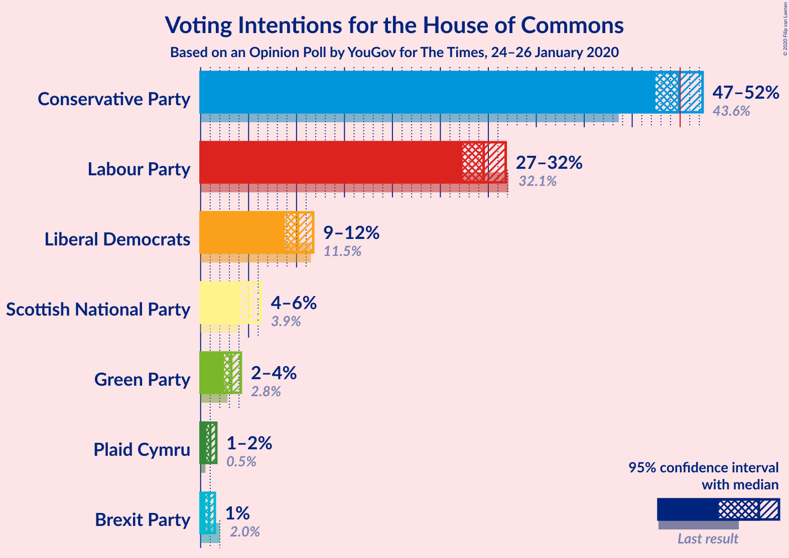

### Confidence Intervals

| Party | Last Result | Poll Result | 80% Confidence Interval | 90% Confidence Interval | 95% Confidence Interval | 99% Confidence Interval |
|:-----:|:-----------:|:-----------:|:-----------------------:|:-----------------------:|:-----------------------:|:-----------------------:|
| Conservative Party | 43.6% | 49.9% | 48.3–51.5% |47.8–51.9% |47.4–52.3% |46.7–53.1% |
| Labour Party | 32.1% | 29.5% | 28.1–31.0% |27.7–31.4% |27.3–31.8% |26.6–32.5% |
| Liberal Democrats | 11.5% | 10.2% | 9.2–11.2% |9.0–11.5% |8.8–11.7% |8.3–12.3% |
| Scottish National Party | 3.9% | 5.1% | 4.4–5.9% |4.3–6.1% |4.1–6.3% |3.8–6.7% |
| Green Party | 2.8% | 3.2% | 2.7–3.8% |2.5–4.0% |2.4–4.2% |2.2–4.5% |
| Plaid Cymru | 0.5% | 1.0% | 0.7–1.4% |0.7–1.5% |0.6–1.6% |0.5–1.8% |
| Brexit Party | 2.0% | 0.9% | 0.6–1.3% |0.6–1.4% |0.5–1.5% |0.4–1.7% |

*Note:* The poll result column reflects the actual value used in the calculations. Published results may vary slightly, and in addition be rounded to fewer digits.

## Seats

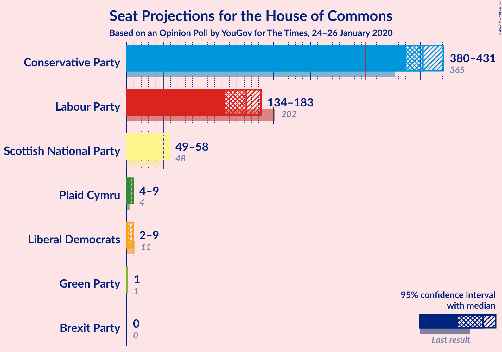

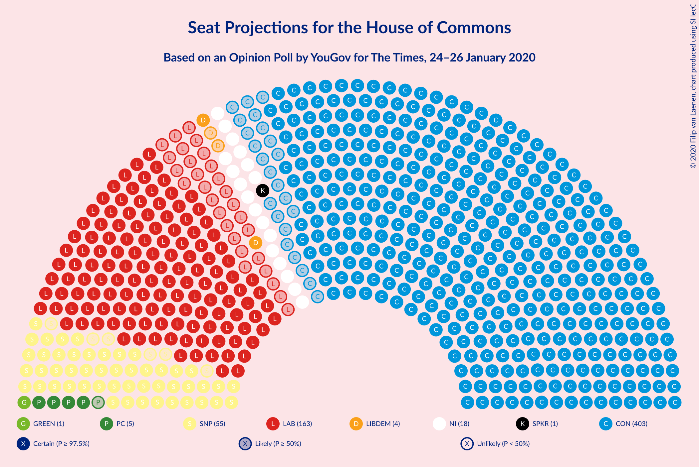

### Confidence Intervals

| Party | Last Result | Median | 80% Confidence Interval | 90% Confidence Interval | 95% Confidence Interval | 99% Confidence Interval |
|:-----:|:-----------:|:------:|:-----------------------:|:-----------------------:|:-----------------------:|:-----------------------:|
| <a href="#conservative-party">Conservative Party</a> | 365 | 403 | 388–423 |384–430 |380–431 |372–439 |
| <a href="#labour-party">Labour Party</a> | 202 | 163 | 142–175 |137–180 |134–183 |127–191 |
| <a href="#liberal-democrats">Liberal Democrats</a> | 11 | 4 | 3–7 |2–8 |2–9 |2–10 |
| <a href="#scottish-national-party">Scottish National Party</a> | 48 | 55 | 51–58 |50–58 |49–58 |47–59 |
| <a href="#green-party">Green Party</a> | 1 | 1 | 1 |1 |1 |1 |
| <a href="#plaid-cymru">Plaid Cymru</a> | 4 | 6 | 5–7 |5–8 |4–9 |4–10 |
| <a href="#brexit-party">Brexit Party</a> | 0 | 0 | 0 |0 |0 |0 |

### Conservative Party

*For a full overview of the results for this party, see the [Conservative Party](party-conservativeparty.html) page.*

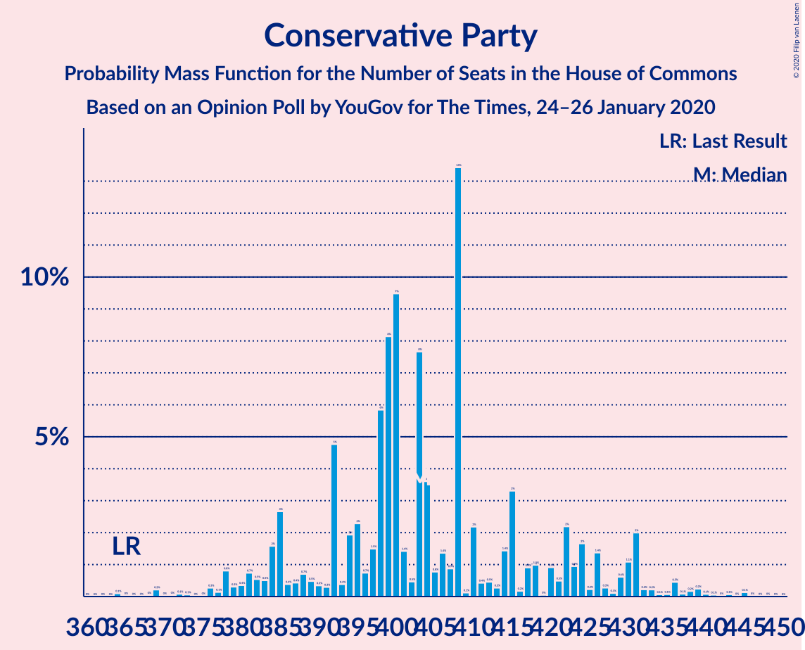

| Number of Seats | Probability | Accumulated | Special Marks |
|:---------------:|:-----------:|:-----------:|:-------------:|
| 364 | 0.1% | 100% |  |
| 365 | 0% | 99.9% | Last Result |
| 366 | 0% | 99.9% |  |
| 367 | 0% | 99.9% |  |
| 368 | 0% | 99.8% |  |
| 369 | 0.2% | 99.8% |  |
| 370 | 0% | 99.6% |  |
| 371 | 0% | 99.6% |  |
| 372 | 0.1% | 99.5% |  |
| 373 | 0.1% | 99.4% |  |
| 374 | 0% | 99.4% |  |
| 375 | 0% | 99.4% |  |
| 376 | 0.3% | 99.3% |  |
| 377 | 0.1% | 99.1% |  |
| 378 | 0.8% | 98.9% |  |
| 379 | 0.3% | 98% |  |
| 380 | 0.4% | 98% |  |
| 381 | 0.7% | 97% |  |
| 382 | 0.5% | 97% |  |
| 383 | 0.5% | 96% |  |
| 384 | 2% | 96% |  |
| 385 | 3% | 94% |  |
| 386 | 0.4% | 91% |  |
| 387 | 0.4% | 91% |  |
| 388 | 0.7% | 91% |  |
| 389 | 0.5% | 90% |  |
| 390 | 0.3% | 89% |  |
| 391 | 0.3% | 89% |  |
| 392 | 5% | 89% |  |
| 393 | 0.4% | 84% |  |
| 394 | 2% | 84% |  |
| 395 | 2% | 82% |  |
| 396 | 0.7% | 79% |  |
| 397 | 1.5% | 79% |  |
| 398 | 6% | 77% |  |
| 399 | 8% | 71% |  |
| 400 | 9% | 63% |  |
| 401 | 1.4% | 54% |  |
| 402 | 0.5% | 52% |  |
| 403 | 8% | 52% | Median |
| 404 | 4% | 44% |  |
| 405 | 0.8% | 41% |  |
| 406 | 1.4% | 40% |  |
| 407 | 0.9% | 38% |  |
| 408 | 13% | 38% |  |
| 409 | 0.1% | 24% |  |
| 410 | 2% | 24% |  |
| 411 | 0.4% | 22% |  |
| 412 | 0.5% | 21% |  |
| 413 | 0.3% | 21% |  |
| 414 | 1.4% | 21% |  |
| 415 | 3% | 19% |  |
| 416 | 0.2% | 16% |  |
| 417 | 0.9% | 16% |  |
| 418 | 1.0% | 15% |  |
| 419 | 0% | 14% |  |
| 420 | 0.9% | 14% |  |
| 421 | 0.5% | 13% |  |
| 422 | 2% | 12% |  |
| 423 | 0.9% | 10% |  |
| 424 | 2% | 9% |  |
| 425 | 0.2% | 8% |  |
| 426 | 1.4% | 7% |  |
| 427 | 0.3% | 6% |  |
| 428 | 0.1% | 6% |  |
| 429 | 0.6% | 6% |  |
| 430 | 1.1% | 5% |  |
| 431 | 2% | 4% |  |
| 432 | 0.2% | 2% |  |
| 433 | 0.2% | 2% |  |
| 434 | 0.1% | 2% |  |
| 435 | 0.1% | 1.4% |  |
| 436 | 0.5% | 1.4% |  |
| 437 | 0.1% | 0.9% |  |
| 438 | 0.2% | 0.8% |  |
| 439 | 0.2% | 0.7% |  |
| 440 | 0.1% | 0.4% |  |
| 441 | 0.1% | 0.3% |  |
| 442 | 0% | 0.3% |  |
| 443 | 0.1% | 0.3% |  |
| 444 | 0% | 0.2% |  |
| 445 | 0.1% | 0.2% |  |
| 446 | 0% | 0.1% |  |
| 447 | 0% | 0% |  |

### Labour Party

*For a full overview of the results for this party, see the [Labour Party](party-labourparty.html) page.*

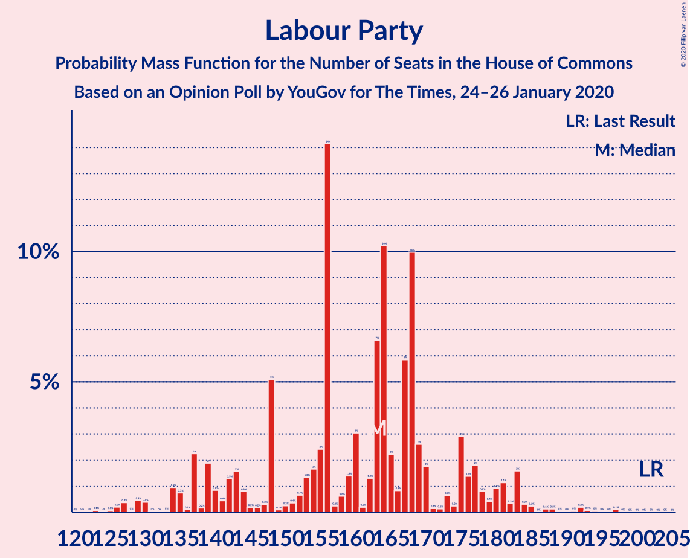

| Number of Seats | Probability | Accumulated | Special Marks |
|:---------------:|:-----------:|:-----------:|:-------------:|
| 121 | 0% | 100% |  |
| 122 | 0% | 99.9% |  |
| 123 | 0.1% | 99.9% |  |
| 124 | 0% | 99.8% |  |
| 125 | 0.1% | 99.8% |  |
| 126 | 0.2% | 99.7% |  |
| 127 | 0.4% | 99.5% |  |
| 128 | 0% | 99.2% |  |
| 129 | 0.4% | 99.1% |  |
| 130 | 0.4% | 98.7% |  |
| 131 | 0% | 98% |  |
| 132 | 0% | 98% |  |
| 133 | 0% | 98% |  |
| 134 | 0.9% | 98% |  |
| 135 | 0.7% | 97% |  |
| 136 | 0.1% | 97% |  |
| 137 | 2% | 96% |  |
| 138 | 0.2% | 94% |  |
| 139 | 2% | 94% |  |
| 140 | 0.8% | 92% |  |
| 141 | 0.4% | 91% |  |
| 142 | 1.3% | 91% |  |
| 143 | 2% | 90% |  |
| 144 | 0.8% | 88% |  |
| 145 | 0.2% | 87% |  |
| 146 | 0.2% | 87% |  |
| 147 | 0.3% | 87% |  |
| 148 | 5% | 87% |  |
| 149 | 0.1% | 82% |  |
| 150 | 0.2% | 81% |  |
| 151 | 0.4% | 81% |  |
| 152 | 0.7% | 81% |  |
| 153 | 1.3% | 80% |  |
| 154 | 2% | 79% |  |
| 155 | 2% | 77% |  |
| 156 | 14% | 75% |  |
| 157 | 0.2% | 61% |  |
| 158 | 0.6% | 60% |  |
| 159 | 1.4% | 60% |  |
| 160 | 3% | 58% |  |
| 161 | 0.2% | 55% |  |
| 162 | 1.3% | 55% |  |
| 163 | 7% | 54% | Median |
| 164 | 10% | 47% |  |
| 165 | 2% | 37% |  |
| 166 | 0.8% | 35% |  |
| 167 | 6% | 34% |  |
| 168 | 10% | 28% |  |
| 169 | 3% | 18% |  |
| 170 | 2% | 16% |  |
| 171 | 0.1% | 14% |  |
| 172 | 0.1% | 14% |  |
| 173 | 0.6% | 14% |  |
| 174 | 0.2% | 13% |  |
| 175 | 3% | 13% |  |
| 176 | 1.4% | 10% |  |
| 177 | 2% | 8% |  |
| 178 | 0.8% | 7% |  |
| 179 | 0.4% | 6% |  |
| 180 | 0.9% | 5% |  |
| 181 | 1.1% | 4% |  |
| 182 | 0.3% | 3% |  |
| 183 | 2% | 3% |  |
| 184 | 0.3% | 1.4% |  |
| 185 | 0.2% | 1.1% |  |
| 186 | 0% | 0.8% |  |
| 187 | 0.1% | 0.8% |  |
| 188 | 0.1% | 0.7% |  |
| 189 | 0% | 0.6% |  |
| 190 | 0% | 0.5% |  |
| 191 | 0% | 0.5% |  |
| 192 | 0.2% | 0.5% |  |
| 193 | 0.1% | 0.3% |  |
| 194 | 0% | 0.2% |  |
| 195 | 0% | 0.2% |  |
| 196 | 0% | 0.1% |  |
| 197 | 0.1% | 0.1% |  |
| 198 | 0% | 0% |  |
| 199 | 0% | 0% |  |
| 200 | 0% | 0% |  |
| 201 | 0% | 0% |  |
| 202 | 0% | 0% | Last Result |

### Liberal Democrats

*For a full overview of the results for this party, see the [Liberal Democrats](party-liberaldemocrats.html) page.*

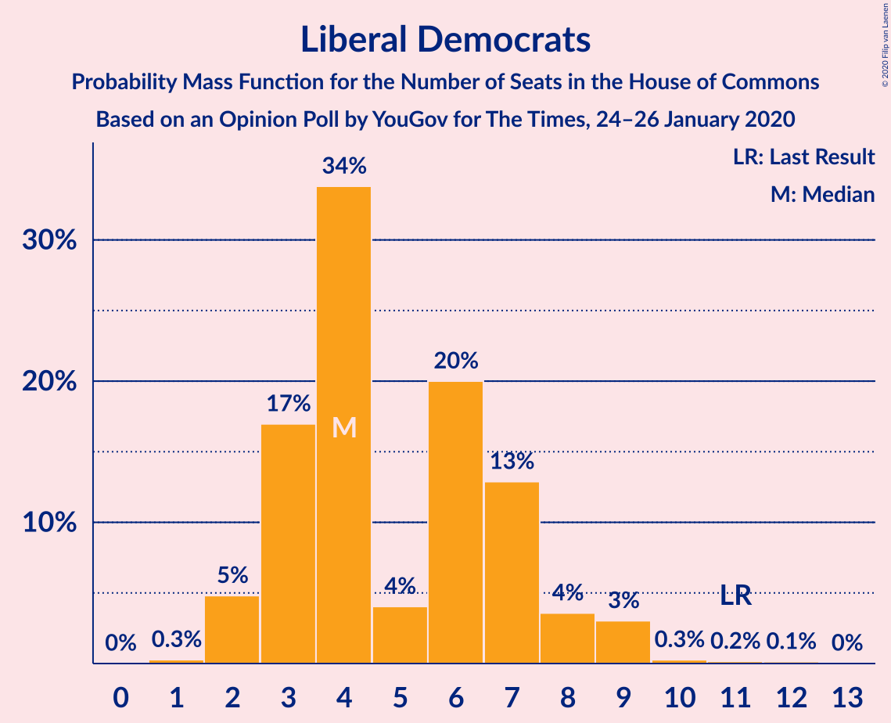

| Number of Seats | Probability | Accumulated | Special Marks |
|:---------------:|:-----------:|:-----------:|:-------------:|
| 1 | 0.3% | 100% |  |
| 2 | 5% | 99.7% |  |
| 3 | 17% | 95% |  |
| 4 | 34% | 78% | Median |
| 5 | 4% | 44% |  |
| 6 | 20% | 40% |  |
| 7 | 13% | 20% |  |
| 8 | 4% | 7% |  |
| 9 | 3% | 4% |  |
| 10 | 0.3% | 0.6% |  |
| 11 | 0.2% | 0.3% | Last Result |
| 12 | 0.1% | 0.2% |  |
| 13 | 0% | 0% |  |

### Scottish National Party

*For a full overview of the results for this party, see the [Scottish National Party](party-scottishnationalparty.html) page.*

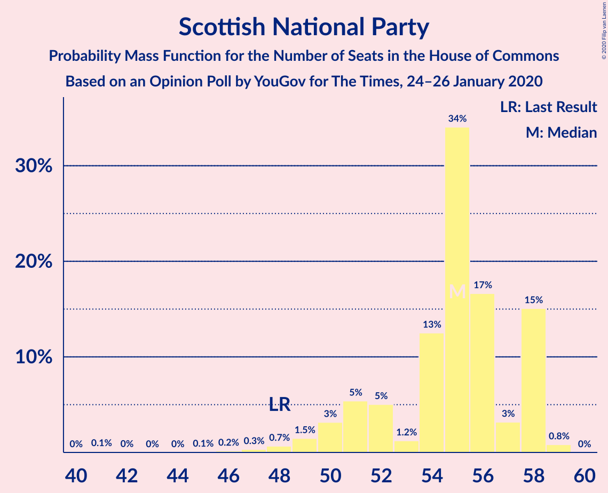

| Number of Seats | Probability | Accumulated | Special Marks |
|:---------------:|:-----------:|:-----------:|:-------------:|
| 41 | 0.1% | 100% |  |
| 42 | 0% | 99.9% |  |
| 43 | 0% | 99.8% |  |
| 44 | 0% | 99.8% |  |
| 45 | 0.1% | 99.8% |  |
| 46 | 0.2% | 99.8% |  |
| 47 | 0.3% | 99.6% |  |
| 48 | 0.7% | 99.3% | Last Result |
| 49 | 1.5% | 98.6% |  |
| 50 | 3% | 97% |  |
| 51 | 5% | 94% |  |
| 52 | 5% | 89% |  |
| 53 | 1.2% | 84% |  |
| 54 | 13% | 82% |  |
| 55 | 34% | 70% | Median |
| 56 | 17% | 36% |  |
| 57 | 3% | 19% |  |
| 58 | 15% | 16% |  |
| 59 | 0.8% | 0.8% |  |
| 60 | 0% | 0% |  |

### Green Party

*For a full overview of the results for this party, see the [Green Party](party-greenparty.html) page.*

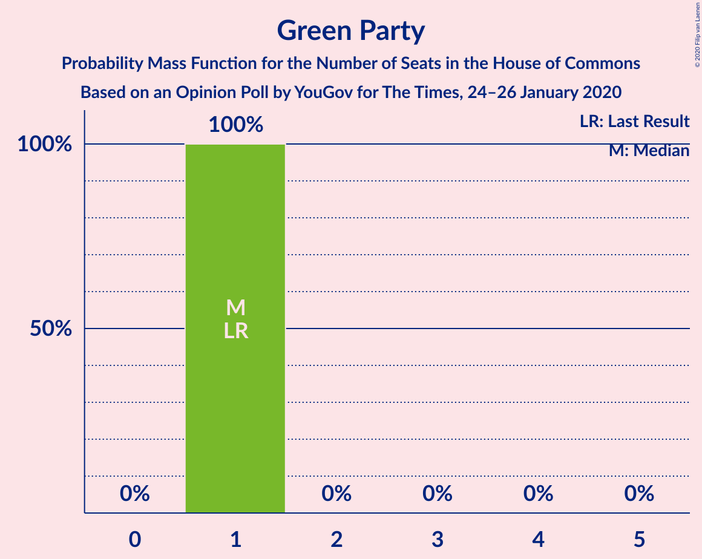

| Number of Seats | Probability | Accumulated | Special Marks |
|:---------------:|:-----------:|:-----------:|:-------------:|
| 1 | 100% | 100% | Last Result, Median |

### Plaid Cymru

*For a full overview of the results for this party, see the [Plaid Cymru](party-plaidcymru.html) page.*

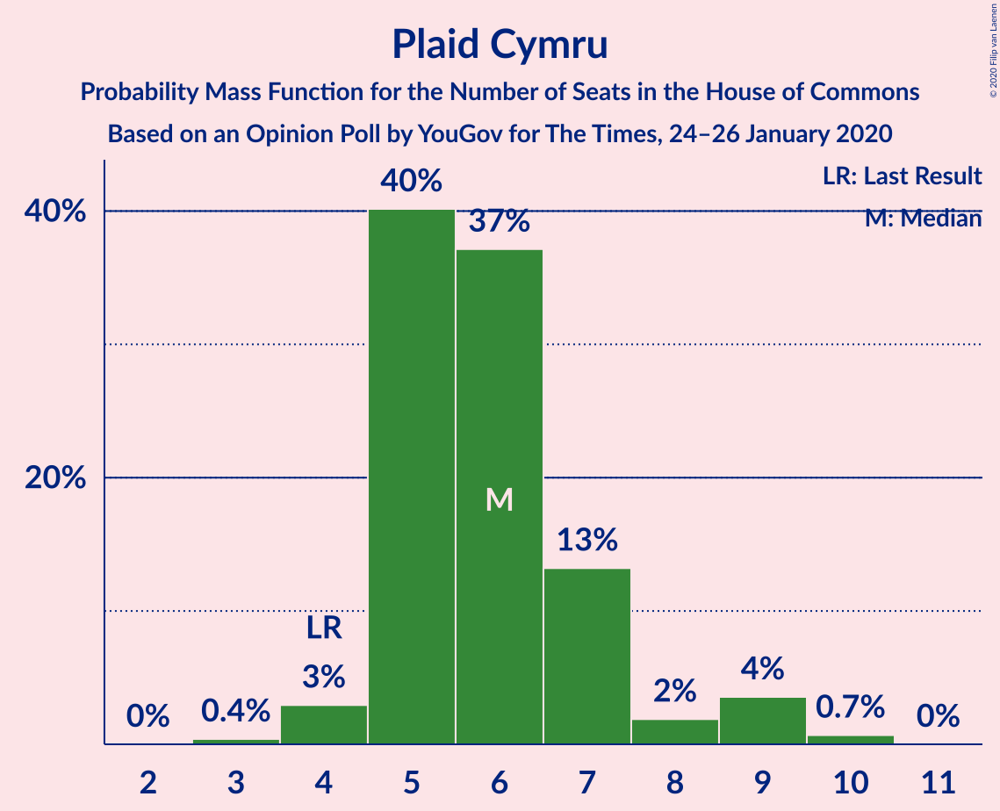

| Number of Seats | Probability | Accumulated | Special Marks |
|:---------------:|:-----------:|:-----------:|:-------------:|
| 3 | 0.4% | 100% |  |
| 4 | 3% | 99.6% | Last Result |
| 5 | 40% | 97% |  |
| 6 | 37% | 56% | Median |
| 7 | 13% | 19% |  |
| 8 | 2% | 6% |  |
| 9 | 4% | 4% |  |
| 10 | 0.7% | 0.7% |  |
| 11 | 0% | 0% |  |

### Brexit Party

*For a full overview of the results for this party, see the [Brexit Party](party-brexitparty.html) page.*

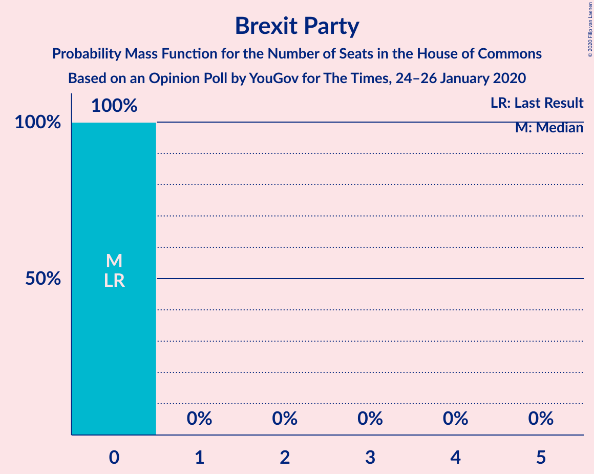

| Number of Seats | Probability | Accumulated | Special Marks |
|:---------------:|:-----------:|:-----------:|:-------------:|
| 0 | 100% | 100% | Last Result, Median |

## Coalitions

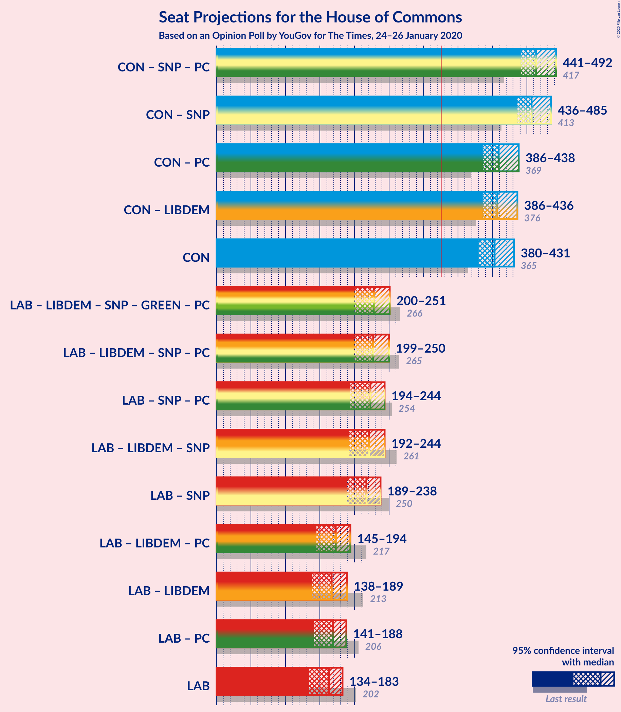

### Confidence Intervals

| Coalition | Last Result | Median | Majority? | 80% Confidence Interval | 90% Confidence Interval | 95% Confidence Interval | 99% Confidence Interval |
|:---------:|:-----------:|:------:|:---------:|:-----------------------:|:-----------------------:|:-----------------------:|:-----------------------:|
| Conservative Party – Scottish National Party – Plaid Cymru | 417 | 463 | 100% | 448–484 | 445–490 | 441–492 | 433–499 |
| Conservative Party – Scottish National Party | 413 | 457 | 100% | 443–478 | 439–483 | 436–485 | 428–492 |
| Conservative Party – Plaid Cymru | 369 | 409 | 100% | 394–430 | 390–437 | 386–438 | 378–446 |
| Conservative Party – Liberal Democrats | 376 | 407 | 100% | 395–427 | 389–434 | 386–436 | 377–444 |
| Conservative Party | 365 | 403 | 100% | 388–423 | 384–430 | 380–431 | 372–439 |
| Labour Party – Liberal Democrats – Scottish National Party – Green Party – Plaid Cymru | 266 | 228 | 0% | 208–243 | 201–247 | 200–251 | 192–259 |
| Labour Party – Liberal Democrats – Scottish National Party – Plaid Cymru | 265 | 227 | 0% | 207–242 | 200–246 | 199–250 | 191–258 |
| Labour Party – Scottish National Party – Plaid Cymru | 254 | 223 | 0% | 203–235 | 196–241 | 194–244 | 186–253 |
| Labour Party – Liberal Democrats – Scottish National Party | 261 | 221 | 0% | 200–236 | 193–240 | 192–244 | 184–252 |
| Labour Party – Scottish National Party | 250 | 217 | 0% | 197–230 | 189–235 | 189–238 | 180–246 |
| Labour Party – Liberal Democrats – Plaid Cymru | 217 | 173 | 0% | 152–187 | 147–191 | 145–194 | 138–202 |
| Labour Party – Liberal Democrats | 213 | 167 | 0% | 146–182 | 140–185 | 138–189 | 131–197 |
| Labour Party – Plaid Cymru | 206 | 169 | 0% | 148–181 | 144–186 | 141–188 | 133–197 |
| Labour Party | 202 | 163 | 0% | 142–175 | 137–180 | 134–183 | 127–191 |

### Conservative Party – Scottish National Party – Plaid Cymru

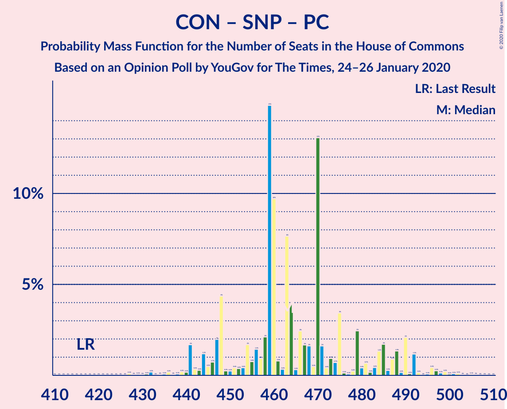

| Number of Seats | Probability | Accumulated | Special Marks |
|:---------------:|:-----------:|:-----------:|:-------------:|
| 417 | 0% | 100% | Last Result |
| 418 | 0% | 100% |  |
| 419 | 0% | 100% |  |
| 420 | 0% | 100% |  |
| 421 | 0% | 100% |  |
| 422 | 0% | 100% |  |
| 423 | 0% | 100% |  |
| 424 | 0% | 100% |  |
| 425 | 0% | 100% |  |
| 426 | 0% | 100% |  |
| 427 | 0.1% | 100% |  |
| 428 | 0% | 99.9% |  |
| 429 | 0.1% | 99.8% |  |
| 430 | 0% | 99.8% |  |
| 431 | 0.1% | 99.8% |  |
| 432 | 0.2% | 99.7% |  |
| 433 | 0% | 99.5% |  |
| 434 | 0% | 99.5% |  |
| 435 | 0.1% | 99.5% |  |
| 436 | 0.2% | 99.4% |  |
| 437 | 0% | 99.2% |  |
| 438 | 0.1% | 99.2% |  |
| 439 | 0.2% | 99.1% |  |
| 440 | 0.2% | 98.9% |  |
| 441 | 2% | 98.7% |  |
| 442 | 0.3% | 97% |  |
| 443 | 0.3% | 97% |  |
| 444 | 1.2% | 96% |  |
| 445 | 0.5% | 95% |  |
| 446 | 0.7% | 95% |  |
| 447 | 2% | 94% |  |
| 448 | 4% | 92% |  |
| 449 | 0.2% | 88% |  |
| 450 | 0.2% | 87% |  |
| 451 | 0.4% | 87% |  |
| 452 | 0.4% | 87% |  |
| 453 | 0.4% | 86% |  |
| 454 | 2% | 86% |  |
| 455 | 0.8% | 84% |  |
| 456 | 1.4% | 84% |  |
| 457 | 0.9% | 82% |  |
| 458 | 2% | 81% |  |
| 459 | 15% | 79% |  |
| 460 | 10% | 64% |  |
| 461 | 0.8% | 55% |  |
| 462 | 0.3% | 54% |  |
| 463 | 8% | 53% |  |
| 464 | 4% | 46% | Median |
| 465 | 0.3% | 42% |  |
| 466 | 2% | 42% |  |
| 467 | 2% | 39% |  |
| 468 | 2% | 37% |  |
| 469 | 0.5% | 36% |  |
| 470 | 13% | 35% |  |
| 471 | 2% | 22% |  |
| 472 | 0.4% | 21% |  |
| 473 | 0.9% | 20% |  |
| 474 | 0.7% | 19% |  |
| 475 | 3% | 19% |  |
| 476 | 0.1% | 15% |  |
| 477 | 0.1% | 15% |  |
| 478 | 0.2% | 15% |  |
| 479 | 2% | 15% |  |
| 480 | 0.4% | 12% |  |
| 481 | 0.7% | 12% |  |
| 482 | 0.2% | 11% |  |
| 483 | 0.4% | 11% |  |
| 484 | 1.3% | 11% |  |
| 485 | 2% | 9% |  |
| 486 | 0.3% | 8% |  |
| 487 | 0.9% | 7% |  |
| 488 | 1.3% | 7% |  |
| 489 | 0.2% | 5% |  |
| 490 | 2% | 5% |  |
| 491 | 0.1% | 3% |  |
| 492 | 1.2% | 3% |  |
| 493 | 0.2% | 2% |  |
| 494 | 0% | 2% |  |
| 495 | 0.1% | 2% |  |
| 496 | 0.4% | 1.4% |  |
| 497 | 0.3% | 1.0% |  |
| 498 | 0.1% | 0.8% |  |
| 499 | 0.2% | 0.6% |  |
| 500 | 0.1% | 0.4% |  |
| 501 | 0.1% | 0.4% |  |
| 502 | 0.1% | 0.3% |  |
| 503 | 0% | 0.2% |  |
| 504 | 0% | 0.1% |  |
| 505 | 0.1% | 0.1% |  |
| 506 | 0% | 0.1% |  |
| 507 | 0% | 0% |  |

### Conservative Party – Scottish National Party

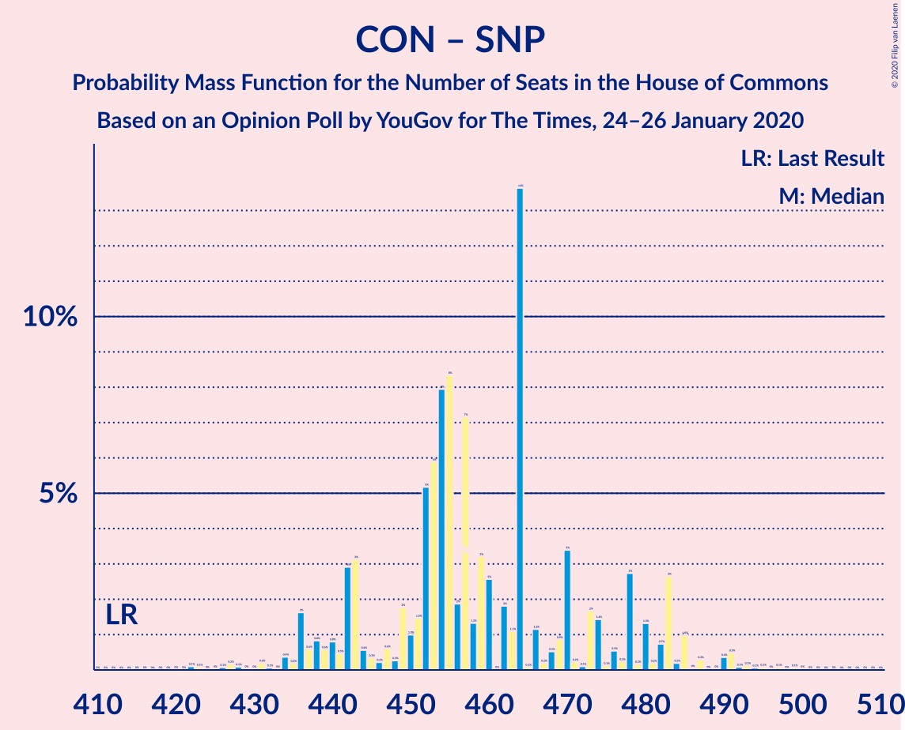

| Number of Seats | Probability | Accumulated | Special Marks |
|:---------------:|:-----------:|:-----------:|:-------------:|
| 413 | 0% | 100% | Last Result |
| 414 | 0% | 100% |  |
| 415 | 0% | 100% |  |
| 416 | 0% | 100% |  |
| 417 | 0% | 100% |  |
| 418 | 0% | 100% |  |
| 419 | 0% | 100% |  |
| 420 | 0% | 100% |  |
| 421 | 0% | 100% |  |
| 422 | 0.1% | 100% |  |
| 423 | 0.1% | 99.9% |  |
| 424 | 0% | 99.8% |  |
| 425 | 0% | 99.8% |  |
| 426 | 0.1% | 99.7% |  |
| 427 | 0.2% | 99.7% |  |
| 428 | 0.1% | 99.5% |  |
| 429 | 0% | 99.4% |  |
| 430 | 0% | 99.4% |  |
| 431 | 0.2% | 99.4% |  |
| 432 | 0.1% | 99.2% |  |
| 433 | 0% | 99.1% |  |
| 434 | 0.4% | 99.1% |  |
| 435 | 0.2% | 98.7% |  |
| 436 | 2% | 98.5% |  |
| 437 | 0.6% | 97% |  |
| 438 | 0.8% | 96% |  |
| 439 | 0.6% | 95% |  |
| 440 | 0.8% | 95% |  |
| 441 | 0.5% | 94% |  |
| 442 | 3% | 94% |  |
| 443 | 3% | 91% |  |
| 444 | 0.6% | 88% |  |
| 445 | 0.3% | 87% |  |
| 446 | 0.2% | 87% |  |
| 447 | 0.6% | 86% |  |
| 448 | 0.3% | 86% |  |
| 449 | 2% | 86% |  |
| 450 | 1.0% | 84% |  |
| 451 | 1.5% | 83% |  |
| 452 | 5% | 81% |  |
| 453 | 6% | 76% |  |
| 454 | 8% | 70% |  |
| 455 | 8% | 62% |  |
| 456 | 2% | 54% |  |
| 457 | 7% | 52% |  |
| 458 | 1.3% | 45% | Median |
| 459 | 3% | 44% |  |
| 460 | 3% | 40% |  |
| 461 | 0% | 38% |  |
| 462 | 2% | 38% |  |
| 463 | 1.1% | 36% |  |
| 464 | 14% | 35% |  |
| 465 | 0.1% | 21% |  |
| 466 | 1.2% | 21% |  |
| 467 | 0.2% | 20% |  |
| 468 | 0.5% | 20% |  |
| 469 | 0.9% | 19% |  |
| 470 | 3% | 19% |  |
| 471 | 0.2% | 15% |  |
| 472 | 0.1% | 15% |  |
| 473 | 2% | 15% |  |
| 474 | 1.4% | 13% |  |
| 475 | 0.1% | 12% |  |
| 476 | 0.5% | 12% |  |
| 477 | 0.2% | 11% |  |
| 478 | 3% | 11% |  |
| 479 | 0.2% | 8% |  |
| 480 | 1.3% | 8% |  |
| 481 | 0.2% | 7% |  |
| 482 | 0.7% | 6% |  |
| 483 | 3% | 6% |  |
| 484 | 0.2% | 3% |  |
| 485 | 1.0% | 3% |  |
| 486 | 0% | 2% |  |
| 487 | 0.3% | 2% |  |
| 488 | 0% | 1.5% |  |
| 489 | 0% | 1.5% |  |
| 490 | 0.4% | 1.4% |  |
| 491 | 0.5% | 1.1% |  |
| 492 | 0.1% | 0.6% |  |
| 493 | 0.1% | 0.5% |  |
| 494 | 0.1% | 0.4% |  |
| 495 | 0.1% | 0.3% |  |
| 496 | 0% | 0.2% |  |
| 497 | 0.1% | 0.2% |  |
| 498 | 0% | 0.1% |  |
| 499 | 0.1% | 0.1% |  |
| 500 | 0% | 0.1% |  |
| 501 | 0% | 0% |  |

### Conservative Party – Plaid Cymru

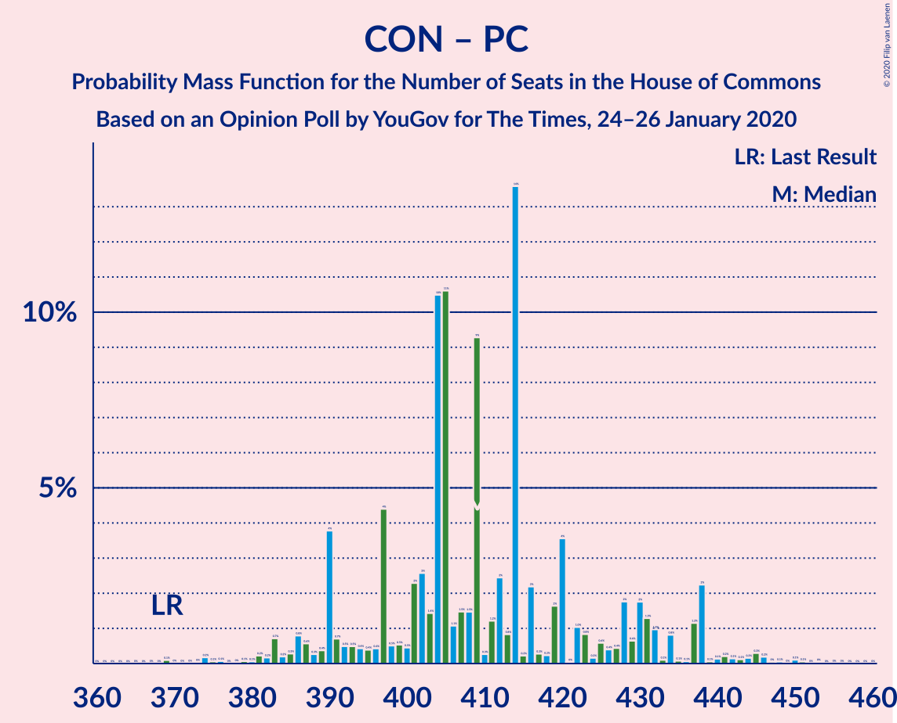

| Number of Seats | Probability | Accumulated | Special Marks |
|:---------------:|:-----------:|:-----------:|:-------------:|
| 369 | 0.1% | 100% | Last Result |
| 370 | 0% | 99.9% |  |
| 371 | 0% | 99.9% |  |
| 372 | 0% | 99.9% |  |
| 373 | 0% | 99.9% |  |
| 374 | 0.2% | 99.8% |  |
| 375 | 0.1% | 99.6% |  |
| 376 | 0.1% | 99.6% |  |
| 377 | 0% | 99.5% |  |
| 378 | 0% | 99.5% |  |
| 379 | 0.1% | 99.5% |  |
| 380 | 0.1% | 99.4% |  |
| 381 | 0.2% | 99.4% |  |
| 382 | 0.2% | 99.1% |  |
| 383 | 0.7% | 99.0% |  |
| 384 | 0.2% | 98% |  |
| 385 | 0.3% | 98% |  |
| 386 | 0.8% | 98% |  |
| 387 | 0.6% | 97% |  |
| 388 | 0.3% | 96% |  |
| 389 | 0.4% | 96% |  |
| 390 | 4% | 96% |  |
| 391 | 0.7% | 92% |  |
| 392 | 0.5% | 91% |  |
| 393 | 0.5% | 91% |  |
| 394 | 0.4% | 90% |  |
| 395 | 0.4% | 90% |  |
| 396 | 0.4% | 89% |  |
| 397 | 4% | 89% |  |
| 398 | 0.5% | 85% |  |
| 399 | 0.5% | 84% |  |
| 400 | 0.5% | 84% |  |
| 401 | 2% | 83% |  |
| 402 | 3% | 81% |  |
| 403 | 1.4% | 78% |  |
| 404 | 10% | 77% |  |
| 405 | 11% | 66% |  |
| 406 | 1.1% | 56% |  |
| 407 | 1.5% | 55% |  |
| 408 | 1.5% | 53% |  |
| 409 | 9% | 52% | Median |
| 410 | 0.3% | 42% |  |
| 411 | 1.2% | 42% |  |
| 412 | 2% | 41% |  |
| 413 | 0.8% | 39% |  |
| 414 | 14% | 38% |  |
| 415 | 0.2% | 24% |  |
| 416 | 2% | 24% |  |
| 417 | 0.3% | 22% |  |
| 418 | 0.2% | 21% |  |
| 419 | 2% | 21% |  |
| 420 | 4% | 20% |  |
| 421 | 0% | 16% |  |
| 422 | 1.0% | 16% |  |
| 423 | 0.8% | 15% |  |
| 424 | 0.2% | 14% |  |
| 425 | 0.6% | 14% |  |
| 426 | 0.4% | 13% |  |
| 427 | 0.4% | 13% |  |
| 428 | 2% | 13% |  |
| 429 | 0.6% | 11% |  |
| 430 | 2% | 10% |  |
| 431 | 1.3% | 8% |  |
| 432 | 1.0% | 7% |  |
| 433 | 0.1% | 6% |  |
| 434 | 0.8% | 6% |  |
| 435 | 0.1% | 5% |  |
| 436 | 0.1% | 5% |  |
| 437 | 1.2% | 5% |  |
| 438 | 2% | 4% |  |
| 439 | 0.1% | 2% |  |
| 440 | 0.1% | 2% |  |
| 441 | 0.2% | 1.5% |  |
| 442 | 0.1% | 1.2% |  |
| 443 | 0.1% | 1.1% |  |
| 444 | 0.2% | 1.0% |  |
| 445 | 0.3% | 0.8% |  |
| 446 | 0.2% | 0.5% |  |
| 447 | 0% | 0.3% |  |
| 448 | 0.1% | 0.3% |  |
| 449 | 0% | 0.2% |  |
| 450 | 0.1% | 0.2% |  |
| 451 | 0.1% | 0.1% |  |
| 452 | 0% | 0.1% |  |
| 453 | 0% | 0.1% |  |
| 454 | 0% | 0% |  |

### Conservative Party – Liberal Democrats

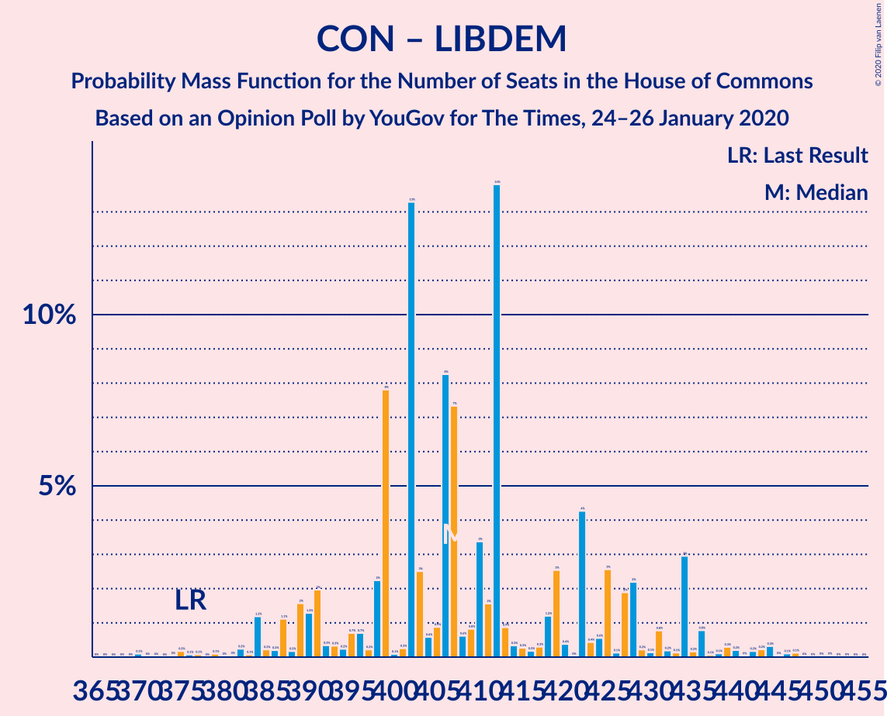

| Number of Seats | Probability | Accumulated | Special Marks |
|:---------------:|:-----------:|:-----------:|:-------------:|
| 370 | 0.1% | 100% |  |
| 371 | 0% | 99.9% |  |
| 372 | 0% | 99.9% |  |
| 373 | 0% | 99.8% |  |
| 374 | 0% | 99.8% |  |
| 375 | 0.2% | 99.8% |  |
| 376 | 0.1% | 99.6% | Last Result |
| 377 | 0.1% | 99.5% |  |
| 378 | 0% | 99.5% |  |
| 379 | 0.1% | 99.5% |  |
| 380 | 0% | 99.4% |  |
| 381 | 0% | 99.4% |  |
| 382 | 0.2% | 99.3% |  |
| 383 | 0.1% | 99.1% |  |
| 384 | 1.2% | 99.0% |  |
| 385 | 0.2% | 98% |  |
| 386 | 0.2% | 98% |  |
| 387 | 1.1% | 97% |  |
| 388 | 0.2% | 96% |  |
| 389 | 2% | 96% |  |
| 390 | 1.3% | 95% |  |
| 391 | 2% | 93% |  |
| 392 | 0.3% | 91% |  |
| 393 | 0.3% | 91% |  |
| 394 | 0.2% | 91% |  |
| 395 | 0.7% | 90% |  |
| 396 | 0.7% | 90% |  |
| 397 | 0.2% | 89% |  |
| 398 | 2% | 89% |  |
| 399 | 8% | 86% |  |
| 400 | 0.1% | 79% |  |
| 401 | 0.3% | 79% |  |
| 402 | 13% | 78% |  |
| 403 | 3% | 65% |  |
| 404 | 0.6% | 63% |  |
| 405 | 0.9% | 62% |  |
| 406 | 8% | 61% |  |
| 407 | 7% | 53% | Median |
| 408 | 0.6% | 45% |  |
| 409 | 0.8% | 45% |  |
| 410 | 3% | 44% |  |
| 411 | 2% | 41% |  |
| 412 | 14% | 39% |  |
| 413 | 0.9% | 25% |  |
| 414 | 0.3% | 24% |  |
| 415 | 0.3% | 24% |  |
| 416 | 0.2% | 24% |  |
| 417 | 0.3% | 24% |  |
| 418 | 1.2% | 23% |  |
| 419 | 3% | 22% |  |
| 420 | 0.4% | 20% |  |
| 421 | 0% | 19% |  |
| 422 | 4% | 19% |  |
| 423 | 0.4% | 15% |  |
| 424 | 0.6% | 14% |  |
| 425 | 3% | 14% |  |
| 426 | 0.1% | 11% |  |
| 427 | 2% | 11% |  |
| 428 | 2% | 9% |  |
| 429 | 0.2% | 7% |  |
| 430 | 0.1% | 7% |  |
| 431 | 0.8% | 7% |  |
| 432 | 0.2% | 6% |  |
| 433 | 0.1% | 6% |  |
| 434 | 3% | 6% |  |
| 435 | 0.2% | 3% |  |
| 436 | 0.8% | 3% |  |
| 437 | 0.1% | 2% |  |
| 438 | 0.1% | 2% |  |
| 439 | 0.3% | 2% |  |
| 440 | 0.2% | 1.3% |  |
| 441 | 0% | 1.1% |  |
| 442 | 0.2% | 1.1% |  |
| 443 | 0.2% | 0.9% |  |
| 444 | 0.3% | 0.7% |  |
| 445 | 0% | 0.4% |  |
| 446 | 0.1% | 0.3% |  |
| 447 | 0.1% | 0.2% |  |
| 448 | 0% | 0.1% |  |
| 449 | 0% | 0.1% |  |
| 450 | 0% | 0.1% |  |
| 451 | 0% | 0.1% |  |
| 452 | 0% | 0% |  |

### Conservative Party

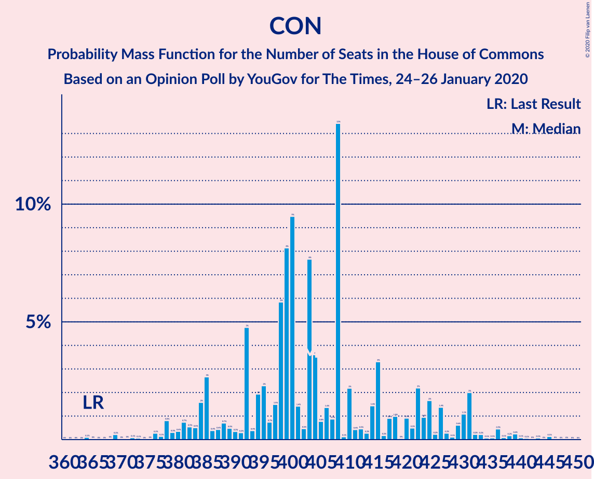

| Number of Seats | Probability | Accumulated | Special Marks |
|:---------------:|:-----------:|:-----------:|:-------------:|
| 364 | 0.1% | 100% |  |
| 365 | 0% | 99.9% | Last Result |
| 366 | 0% | 99.9% |  |
| 367 | 0% | 99.9% |  |
| 368 | 0% | 99.8% |  |
| 369 | 0.2% | 99.8% |  |
| 370 | 0% | 99.6% |  |
| 371 | 0% | 99.6% |  |
| 372 | 0.1% | 99.5% |  |
| 373 | 0.1% | 99.4% |  |
| 374 | 0% | 99.4% |  |
| 375 | 0% | 99.4% |  |
| 376 | 0.3% | 99.3% |  |
| 377 | 0.1% | 99.1% |  |
| 378 | 0.8% | 98.9% |  |
| 379 | 0.3% | 98% |  |
| 380 | 0.4% | 98% |  |
| 381 | 0.7% | 97% |  |
| 382 | 0.5% | 97% |  |
| 383 | 0.5% | 96% |  |
| 384 | 2% | 96% |  |
| 385 | 3% | 94% |  |
| 386 | 0.4% | 91% |  |
| 387 | 0.4% | 91% |  |
| 388 | 0.7% | 91% |  |
| 389 | 0.5% | 90% |  |
| 390 | 0.3% | 89% |  |
| 391 | 0.3% | 89% |  |
| 392 | 5% | 89% |  |
| 393 | 0.4% | 84% |  |
| 394 | 2% | 84% |  |
| 395 | 2% | 82% |  |
| 396 | 0.7% | 79% |  |
| 397 | 1.5% | 79% |  |
| 398 | 6% | 77% |  |
| 399 | 8% | 71% |  |
| 400 | 9% | 63% |  |
| 401 | 1.4% | 54% |  |
| 402 | 0.5% | 52% |  |
| 403 | 8% | 52% | Median |
| 404 | 4% | 44% |  |
| 405 | 0.8% | 41% |  |
| 406 | 1.4% | 40% |  |
| 407 | 0.9% | 38% |  |
| 408 | 13% | 38% |  |
| 409 | 0.1% | 24% |  |
| 410 | 2% | 24% |  |
| 411 | 0.4% | 22% |  |
| 412 | 0.5% | 21% |  |
| 413 | 0.3% | 21% |  |
| 414 | 1.4% | 21% |  |
| 415 | 3% | 19% |  |
| 416 | 0.2% | 16% |  |
| 417 | 0.9% | 16% |  |
| 418 | 1.0% | 15% |  |
| 419 | 0% | 14% |  |
| 420 | 0.9% | 14% |  |
| 421 | 0.5% | 13% |  |
| 422 | 2% | 12% |  |
| 423 | 0.9% | 10% |  |
| 424 | 2% | 9% |  |
| 425 | 0.2% | 8% |  |
| 426 | 1.4% | 7% |  |
| 427 | 0.3% | 6% |  |
| 428 | 0.1% | 6% |  |
| 429 | 0.6% | 6% |  |
| 430 | 1.1% | 5% |  |
| 431 | 2% | 4% |  |
| 432 | 0.2% | 2% |  |
| 433 | 0.2% | 2% |  |
| 434 | 0.1% | 2% |  |
| 435 | 0.1% | 1.4% |  |
| 436 | 0.5% | 1.4% |  |
| 437 | 0.1% | 0.9% |  |
| 438 | 0.2% | 0.8% |  |
| 439 | 0.2% | 0.7% |  |
| 440 | 0.1% | 0.4% |  |
| 441 | 0.1% | 0.3% |  |
| 442 | 0% | 0.3% |  |
| 443 | 0.1% | 0.3% |  |
| 444 | 0% | 0.2% |  |
| 445 | 0.1% | 0.2% |  |
| 446 | 0% | 0.1% |  |
| 447 | 0% | 0% |  |

### Labour Party – Liberal Democrats – Scottish National Party – Green Party – Plaid Cymru

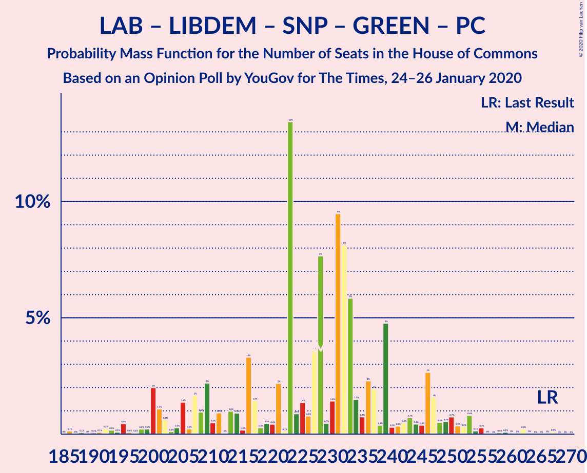

| Number of Seats | Probability | Accumulated | Special Marks |
|:---------------:|:-----------:|:-----------:|:-------------:|
| 185 | 0% | 100% |  |
| 186 | 0.1% | 99.9% |  |
| 187 | 0% | 99.8% |  |
| 188 | 0.1% | 99.8% |  |
| 189 | 0% | 99.7% |  |
| 190 | 0.1% | 99.7% |  |
| 191 | 0.1% | 99.7% |  |
| 192 | 0.2% | 99.6% |  |
| 193 | 0.2% | 99.3% |  |
| 194 | 0.1% | 99.2% |  |
| 195 | 0.5% | 99.1% |  |
| 196 | 0.1% | 98.6% |  |
| 197 | 0.1% | 98.6% |  |
| 198 | 0.2% | 98% |  |
| 199 | 0.2% | 98% |  |
| 200 | 2% | 98% |  |
| 201 | 1.1% | 96% |  |
| 202 | 0.6% | 95% |  |
| 203 | 0.1% | 94% |  |
| 204 | 0.3% | 94% |  |
| 205 | 1.4% | 94% |  |
| 206 | 0.2% | 93% |  |
| 207 | 2% | 92% |  |
| 208 | 0.9% | 91% |  |
| 209 | 2% | 90% |  |
| 210 | 0.5% | 88% |  |
| 211 | 0.9% | 87% |  |
| 212 | 0% | 86% |  |
| 213 | 1.0% | 86% |  |
| 214 | 0.9% | 85% |  |
| 215 | 0.2% | 84% |  |
| 216 | 3% | 84% |  |
| 217 | 1.4% | 81% |  |
| 218 | 0.3% | 79% |  |
| 219 | 0.5% | 79% |  |
| 220 | 0.4% | 79% |  |
| 221 | 2% | 78% |  |
| 222 | 0.1% | 76% |  |
| 223 | 13% | 76% |  |
| 224 | 0.9% | 62% |  |
| 225 | 1.4% | 62% |  |
| 226 | 0.8% | 60% |  |
| 227 | 4% | 59% |  |
| 228 | 8% | 56% |  |
| 229 | 0.5% | 48% | Median |
| 230 | 1.4% | 48% |  |
| 231 | 9% | 46% |  |
| 232 | 8% | 37% |  |
| 233 | 6% | 29% |  |
| 234 | 1.5% | 23% |  |
| 235 | 0.7% | 21% |  |
| 236 | 2% | 21% |  |
| 237 | 2% | 18% |  |
| 238 | 0.4% | 16% |  |
| 239 | 5% | 16% |  |
| 240 | 0.3% | 11% |  |
| 241 | 0.3% | 11% |  |
| 242 | 0.5% | 11% |  |
| 243 | 0.7% | 10% |  |
| 244 | 0.4% | 9% |  |
| 245 | 0.4% | 9% |  |
| 246 | 3% | 9% |  |
| 247 | 2% | 6% |  |
| 248 | 0.5% | 4% |  |
| 249 | 0.5% | 4% |  |
| 250 | 0.7% | 3% |  |
| 251 | 0.4% | 3% |  |
| 252 | 0.3% | 2% |  |
| 253 | 0.8% | 2% |  |
| 254 | 0.1% | 1.1% |  |
| 255 | 0.3% | 0.9% |  |
| 256 | 0% | 0.7% |  |
| 257 | 0% | 0.6% |  |
| 258 | 0.1% | 0.6% |  |
| 259 | 0.1% | 0.6% |  |
| 260 | 0% | 0.5% |  |
| 261 | 0% | 0.4% |  |
| 262 | 0.2% | 0.4% |  |
| 263 | 0% | 0.2% |  |
| 264 | 0% | 0.2% |  |
| 265 | 0% | 0.1% |  |
| 266 | 0% | 0.1% | Last Result |
| 267 | 0.1% | 0.1% |  |
| 268 | 0% | 0% |  |

### Labour Party – Liberal Democrats – Scottish National Party – Plaid Cymru

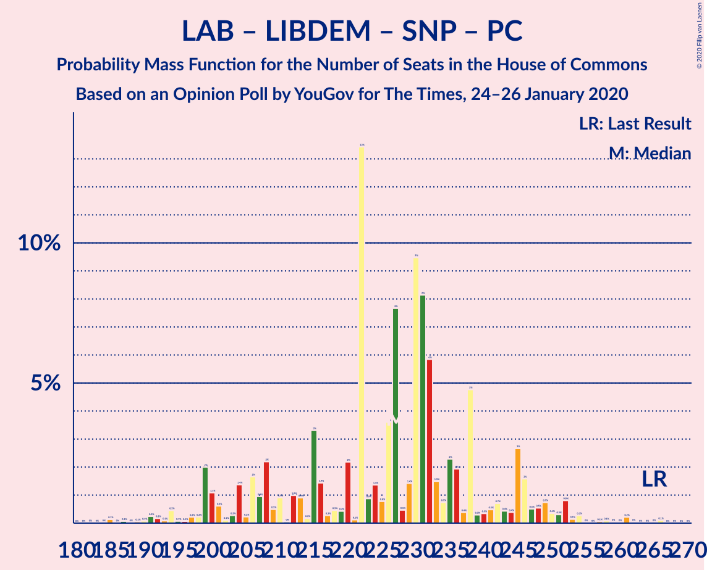

| Number of Seats | Probability | Accumulated | Special Marks |
|:---------------:|:-----------:|:-----------:|:-------------:|
| 184 | 0% | 100% |  |
| 185 | 0.1% | 99.9% |  |
| 186 | 0% | 99.8% |  |
| 187 | 0.1% | 99.8% |  |
| 188 | 0% | 99.7% |  |
| 189 | 0.1% | 99.7% |  |
| 190 | 0.1% | 99.7% |  |
| 191 | 0.2% | 99.6% |  |
| 192 | 0.2% | 99.3% |  |
| 193 | 0.1% | 99.2% |  |
| 194 | 0.5% | 99.1% |  |
| 195 | 0.1% | 98.6% |  |
| 196 | 0.1% | 98.6% |  |
| 197 | 0.2% | 98% |  |
| 198 | 0.2% | 98% |  |
| 199 | 2% | 98% |  |
| 200 | 1.1% | 96% |  |
| 201 | 0.6% | 95% |  |
| 202 | 0.1% | 94% |  |
| 203 | 0.3% | 94% |  |
| 204 | 1.4% | 94% |  |
| 205 | 0.2% | 93% |  |
| 206 | 2% | 92% |  |
| 207 | 0.9% | 91% |  |
| 208 | 2% | 90% |  |
| 209 | 0.5% | 88% |  |
| 210 | 0.9% | 87% |  |
| 211 | 0% | 86% |  |
| 212 | 1.0% | 86% |  |
| 213 | 0.9% | 85% |  |
| 214 | 0.2% | 84% |  |
| 215 | 3% | 84% |  |
| 216 | 1.4% | 81% |  |
| 217 | 0.3% | 79% |  |
| 218 | 0.5% | 79% |  |
| 219 | 0.4% | 79% |  |
| 220 | 2% | 78% |  |
| 221 | 0.1% | 76% |  |
| 222 | 13% | 76% |  |
| 223 | 0.9% | 62% |  |
| 224 | 1.4% | 62% |  |
| 225 | 0.8% | 60% |  |
| 226 | 4% | 59% |  |
| 227 | 8% | 56% |  |
| 228 | 0.5% | 48% | Median |
| 229 | 1.4% | 48% |  |
| 230 | 9% | 46% |  |
| 231 | 8% | 37% |  |
| 232 | 6% | 29% |  |
| 233 | 1.5% | 23% |  |
| 234 | 0.7% | 21% |  |
| 235 | 2% | 21% |  |
| 236 | 2% | 18% |  |
| 237 | 0.4% | 16% |  |
| 238 | 5% | 16% |  |
| 239 | 0.3% | 11% |  |
| 240 | 0.3% | 11% |  |
| 241 | 0.5% | 11% |  |
| 242 | 0.7% | 10% |  |
| 243 | 0.4% | 9% |  |
| 244 | 0.4% | 9% |  |
| 245 | 3% | 9% |  |
| 246 | 2% | 6% |  |
| 247 | 0.5% | 4% |  |
| 248 | 0.5% | 4% |  |
| 249 | 0.7% | 3% |  |
| 250 | 0.4% | 3% |  |
| 251 | 0.3% | 2% |  |
| 252 | 0.8% | 2% |  |
| 253 | 0.1% | 1.1% |  |
| 254 | 0.3% | 0.9% |  |
| 255 | 0% | 0.7% |  |
| 256 | 0% | 0.6% |  |
| 257 | 0.1% | 0.6% |  |
| 258 | 0.1% | 0.6% |  |
| 259 | 0% | 0.5% |  |
| 260 | 0% | 0.4% |  |
| 261 | 0.2% | 0.4% |  |
| 262 | 0% | 0.2% |  |
| 263 | 0% | 0.2% |  |
| 264 | 0% | 0.1% |  |
| 265 | 0% | 0.1% | Last Result |
| 266 | 0.1% | 0.1% |  |
| 267 | 0% | 0% |  |

### Labour Party – Scottish National Party – Plaid Cymru

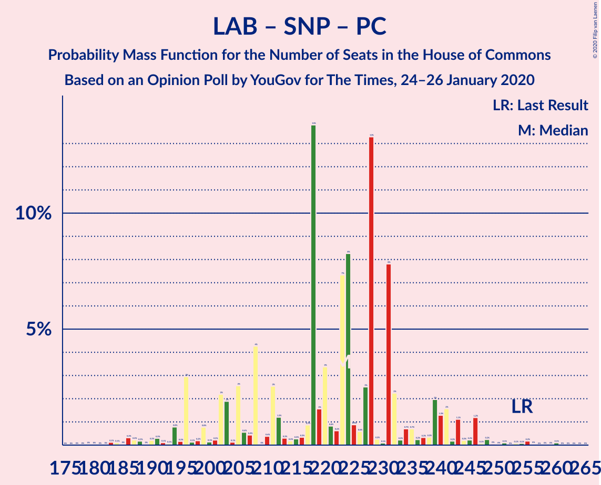

| Number of Seats | Probability | Accumulated | Special Marks |
|:---------------:|:-----------:|:-----------:|:-------------:|
| 179 | 0% | 100% |  |
| 180 | 0% | 99.9% |  |
| 181 | 0% | 99.9% |  |
| 182 | 0% | 99.9% |  |
| 183 | 0.1% | 99.9% |  |
| 184 | 0.1% | 99.8% |  |
| 185 | 0% | 99.7% |  |
| 186 | 0.3% | 99.6% |  |
| 187 | 0.2% | 99.3% |  |
| 188 | 0.2% | 99.1% |  |
| 189 | 0% | 98.9% |  |
| 190 | 0.2% | 98.9% |  |
| 191 | 0.3% | 98.7% |  |
| 192 | 0.1% | 98% |  |
| 193 | 0.1% | 98% |  |
| 194 | 0.8% | 98% |  |
| 195 | 0.2% | 97% |  |
| 196 | 3% | 97% |  |
| 197 | 0.1% | 94% |  |
| 198 | 0.2% | 94% |  |
| 199 | 0.8% | 94% |  |
| 200 | 0.1% | 93% |  |
| 201 | 0.2% | 93% |  |
| 202 | 2% | 93% |  |
| 203 | 2% | 91% |  |
| 204 | 0.1% | 89% |  |
| 205 | 3% | 89% |  |
| 206 | 0.6% | 86% |  |
| 207 | 0.4% | 86% |  |
| 208 | 4% | 85% |  |
| 209 | 0% | 81% |  |
| 210 | 0.4% | 81% |  |
| 211 | 3% | 80% |  |
| 212 | 1.2% | 78% |  |
| 213 | 0.3% | 77% |  |
| 214 | 0.2% | 76% |  |
| 215 | 0.3% | 76% |  |
| 216 | 0.3% | 76% |  |
| 217 | 0.9% | 76% |  |
| 218 | 14% | 75% |  |
| 219 | 2% | 61% |  |
| 220 | 3% | 59% |  |
| 221 | 0.8% | 56% |  |
| 222 | 0.6% | 55% |  |
| 223 | 7% | 55% |  |
| 224 | 8% | 47% | Median |
| 225 | 0.9% | 39% |  |
| 226 | 0.6% | 38% |  |
| 227 | 3% | 37% |  |
| 228 | 13% | 35% |  |
| 229 | 0.3% | 22% |  |
| 230 | 0.1% | 21% |  |
| 231 | 8% | 21% |  |
| 232 | 2% | 14% |  |
| 233 | 0.2% | 11% |  |
| 234 | 0.7% | 11% |  |
| 235 | 0.7% | 10% |  |
| 236 | 0.2% | 10% |  |
| 237 | 0.3% | 9% |  |
| 238 | 0.3% | 9% |  |
| 239 | 2% | 9% |  |
| 240 | 1.3% | 7% |  |
| 241 | 2% | 5% |  |
| 242 | 0.2% | 4% |  |
| 243 | 1.1% | 4% |  |
| 244 | 0.2% | 3% |  |
| 245 | 0.2% | 2% |  |
| 246 | 1.2% | 2% |  |
| 247 | 0.1% | 1.0% |  |
| 248 | 0.2% | 0.9% |  |
| 249 | 0% | 0.7% |  |
| 250 | 0% | 0.6% |  |
| 251 | 0.1% | 0.6% |  |
| 252 | 0% | 0.5% |  |
| 253 | 0.1% | 0.5% |  |
| 254 | 0.1% | 0.5% | Last Result |
| 255 | 0.2% | 0.4% |  |
| 256 | 0% | 0.2% |  |
| 257 | 0% | 0.2% |  |
| 258 | 0% | 0.2% |  |
| 259 | 0% | 0.1% |  |
| 260 | 0.1% | 0.1% |  |
| 261 | 0% | 0% |  |

### Labour Party – Liberal Democrats – Scottish National Party

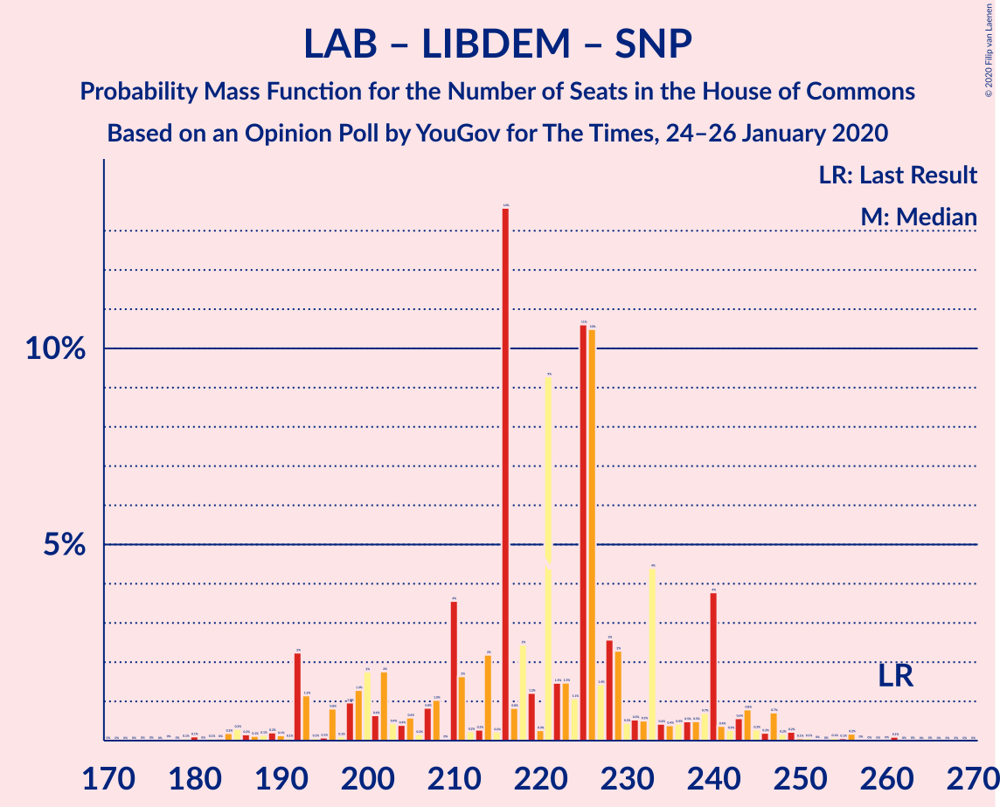

| Number of Seats | Probability | Accumulated | Special Marks |
|:---------------:|:-----------:|:-----------:|:-------------:|
| 177 | 0% | 100% |  |
| 178 | 0% | 99.9% |  |
| 179 | 0.1% | 99.9% |  |
| 180 | 0.1% | 99.9% |  |
| 181 | 0% | 99.8% |  |
| 182 | 0.1% | 99.8% |  |
| 183 | 0% | 99.7% |  |
| 184 | 0.2% | 99.7% |  |
| 185 | 0.3% | 99.5% |  |
| 186 | 0.2% | 99.2% |  |
| 187 | 0.1% | 99.0% |  |
| 188 | 0.1% | 98.9% |  |
| 189 | 0.2% | 98.8% |  |
| 190 | 0.1% | 98.5% |  |
| 191 | 0.1% | 98% |  |
| 192 | 2% | 98% |  |
| 193 | 1.2% | 96% |  |
| 194 | 0.1% | 95% |  |
| 195 | 0.1% | 95% |  |
| 196 | 0.8% | 95% |  |
| 197 | 0.1% | 94% |  |
| 198 | 1.0% | 94% |  |
| 199 | 1.3% | 93% |  |
| 200 | 2% | 92% |  |
| 201 | 0.6% | 90% |  |
| 202 | 2% | 89% |  |
| 203 | 0.4% | 87% |  |
| 204 | 0.4% | 87% |  |
| 205 | 0.6% | 87% |  |
| 206 | 0.2% | 86% |  |
| 207 | 0.8% | 86% |  |
| 208 | 1.0% | 85% |  |
| 209 | 0% | 84% |  |
| 210 | 4% | 84% |  |
| 211 | 2% | 80% |  |
| 212 | 0.2% | 79% |  |
| 213 | 0.3% | 79% |  |
| 214 | 2% | 78% |  |
| 215 | 0.2% | 76% |  |
| 216 | 14% | 76% |  |
| 217 | 0.8% | 62% |  |
| 218 | 2% | 61% |  |
| 219 | 1.2% | 59% |  |
| 220 | 0.3% | 58% |  |
| 221 | 9% | 58% |  |
| 222 | 1.5% | 48% | Median |
| 223 | 1.5% | 47% |  |
| 224 | 1.1% | 45% |  |
| 225 | 11% | 44% |  |
| 226 | 10% | 34% |  |
| 227 | 1.4% | 23% |  |
| 228 | 3% | 22% |  |
| 229 | 2% | 19% |  |
| 230 | 0.5% | 17% |  |
| 231 | 0.5% | 16% |  |
| 232 | 0.5% | 16% |  |
| 233 | 4% | 15% |  |
| 234 | 0.4% | 11% |  |
| 235 | 0.4% | 11% |  |
| 236 | 0.4% | 10% |  |
| 237 | 0.5% | 10% |  |
| 238 | 0.5% | 9% |  |
| 239 | 0.7% | 9% |  |
| 240 | 4% | 8% |  |
| 241 | 0.4% | 4% |  |
| 242 | 0.3% | 4% |  |
| 243 | 0.6% | 4% |  |
| 244 | 0.8% | 3% |  |
| 245 | 0.3% | 2% |  |
| 246 | 0.2% | 2% |  |
| 247 | 0.7% | 2% |  |
| 248 | 0.2% | 1.0% |  |
| 249 | 0.2% | 0.9% |  |
| 250 | 0.1% | 0.6% |  |
| 251 | 0.1% | 0.6% |  |
| 252 | 0% | 0.5% |  |
| 253 | 0% | 0.5% |  |
| 254 | 0.1% | 0.5% |  |
| 255 | 0.1% | 0.4% |  |
| 256 | 0.2% | 0.4% |  |
| 257 | 0% | 0.2% |  |
| 258 | 0% | 0.1% |  |
| 259 | 0% | 0.1% |  |
| 260 | 0% | 0.1% |  |
| 261 | 0.1% | 0.1% | Last Result |
| 262 | 0% | 0% |  |

### Labour Party – Scottish National Party

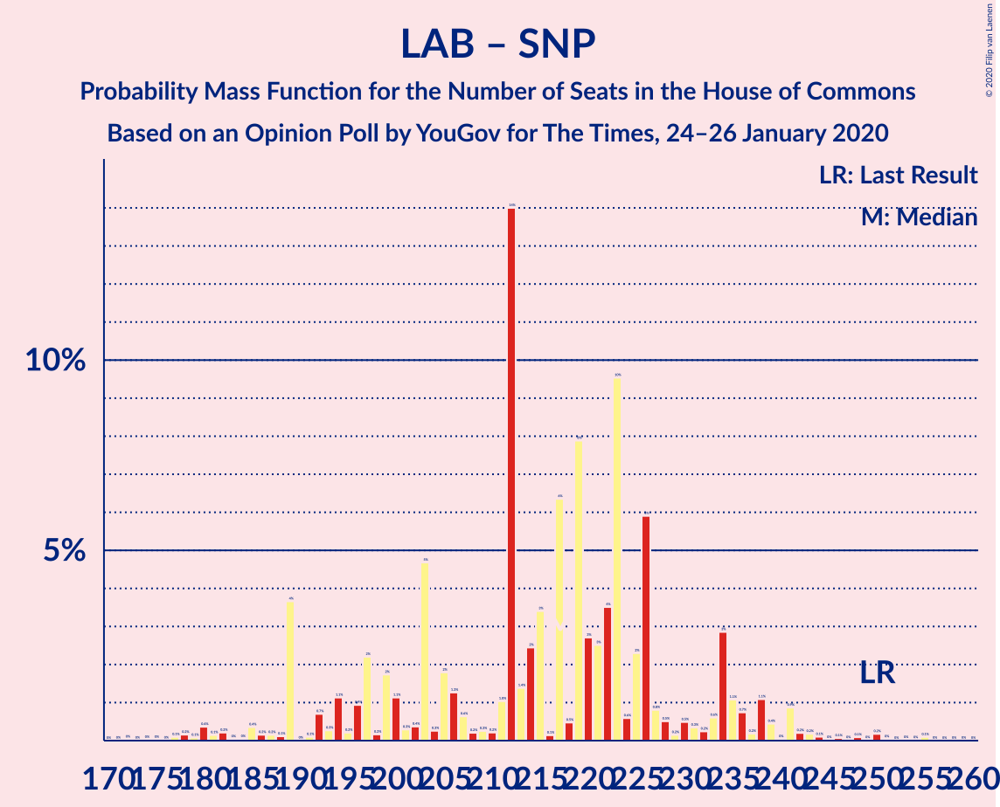

| Number of Seats | Probability | Accumulated | Special Marks |
|:---------------:|:-----------:|:-----------:|:-------------:|
| 172 | 0% | 100% |  |
| 173 | 0% | 99.9% |  |
| 174 | 0% | 99.9% |  |
| 175 | 0% | 99.9% |  |
| 176 | 0% | 99.9% |  |
| 177 | 0.1% | 99.9% |  |
| 178 | 0.2% | 99.8% |  |
| 179 | 0.1% | 99.6% |  |
| 180 | 0.4% | 99.5% |  |
| 181 | 0.1% | 99.2% |  |
| 182 | 0.2% | 99.0% |  |
| 183 | 0% | 98.8% |  |
| 184 | 0% | 98.8% |  |
| 185 | 0.4% | 98.7% |  |
| 186 | 0.2% | 98% |  |
| 187 | 0.2% | 98% |  |
| 188 | 0.1% | 98% |  |
| 189 | 4% | 98% |  |
| 190 | 0% | 94% |  |
| 191 | 0.1% | 94% |  |
| 192 | 0.7% | 94% |  |
| 193 | 0.3% | 93% |  |
| 194 | 1.1% | 93% |  |
| 195 | 0.2% | 92% |  |
| 196 | 0.9% | 92% |  |
| 197 | 2% | 91% |  |
| 198 | 0.2% | 89% |  |
| 199 | 2% | 89% |  |
| 200 | 1.1% | 87% |  |
| 201 | 0.3% | 86% |  |
| 202 | 0.4% | 85% |  |
| 203 | 5% | 85% |  |
| 204 | 0.3% | 80% |  |
| 205 | 2% | 80% |  |
| 206 | 1.3% | 78% |  |
| 207 | 0.6% | 77% |  |
| 208 | 0.2% | 76% |  |
| 209 | 0.3% | 76% |  |
| 210 | 0.2% | 76% |  |
| 211 | 1.0% | 76% |  |
| 212 | 14% | 75% |  |
| 213 | 1.4% | 61% |  |
| 214 | 2% | 59% |  |
| 215 | 3% | 57% |  |
| 216 | 0.1% | 53% |  |
| 217 | 6% | 53% |  |
| 218 | 0.5% | 47% | Median |
| 219 | 8% | 46% |  |
| 220 | 3% | 39% |  |
| 221 | 3% | 36% |  |
| 222 | 4% | 33% |  |
| 223 | 10% | 30% |  |
| 224 | 0.6% | 20% |  |
| 225 | 2% | 20% |  |
| 226 | 6% | 17% |  |
| 227 | 0.8% | 12% |  |
| 228 | 0.5% | 11% |  |
| 229 | 0.2% | 10% |  |
| 230 | 0.5% | 10% |  |
| 231 | 0.3% | 10% |  |
| 232 | 0.2% | 9% |  |
| 233 | 0.6% | 9% |  |
| 234 | 3% | 8% |  |
| 235 | 1.1% | 6% |  |
| 236 | 0.7% | 4% |  |
| 237 | 0.2% | 4% |  |
| 238 | 1.1% | 4% |  |
| 239 | 0.4% | 2% |  |
| 240 | 0% | 2% |  |
| 241 | 0.9% | 2% |  |
| 242 | 0.2% | 1.1% |  |
| 243 | 0.2% | 0.9% |  |
| 244 | 0.1% | 0.7% |  |
| 245 | 0% | 0.6% |  |
| 246 | 0.1% | 0.6% |  |
| 247 | 0% | 0.5% |  |
| 248 | 0.1% | 0.5% |  |
| 249 | 0% | 0.4% |  |
| 250 | 0.2% | 0.4% | Last Result |
| 251 | 0% | 0.2% |  |
| 252 | 0% | 0.1% |  |
| 253 | 0% | 0.1% |  |
| 254 | 0% | 0.1% |  |
| 255 | 0.1% | 0.1% |  |
| 256 | 0% | 0% |  |

### Labour Party – Liberal Democrats – Plaid Cymru

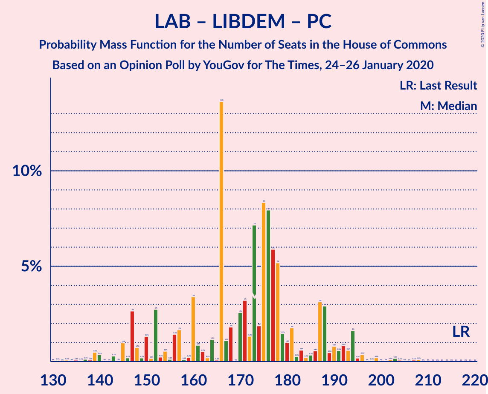

| Number of Seats | Probability | Accumulated | Special Marks |
|:---------------:|:-----------:|:-----------:|:-------------:|
| 130 | 0% | 100% |  |
| 131 | 0.1% | 99.9% |  |
| 132 | 0% | 99.9% |  |
| 133 | 0.1% | 99.9% |  |
| 134 | 0% | 99.8% |  |
| 135 | 0.1% | 99.8% |  |
| 136 | 0.1% | 99.7% |  |
| 137 | 0.1% | 99.6% |  |
| 138 | 0.1% | 99.5% |  |
| 139 | 0.5% | 99.4% |  |
| 140 | 0.4% | 98.9% |  |
| 141 | 0% | 98.6% |  |
| 142 | 0% | 98.5% |  |
| 143 | 0.3% | 98.5% |  |
| 144 | 0% | 98% |  |
| 145 | 1.0% | 98% |  |
| 146 | 0.2% | 97% |  |
| 147 | 3% | 97% |  |
| 148 | 0.7% | 94% |  |
| 149 | 0.2% | 94% |  |
| 150 | 1.3% | 93% |  |
| 151 | 0.2% | 92% |  |
| 152 | 3% | 92% |  |
| 153 | 0.2% | 89% |  |
| 154 | 0.5% | 89% |  |
| 155 | 0.1% | 88% |  |
| 156 | 1.4% | 88% |  |
| 157 | 2% | 87% |  |
| 158 | 0.1% | 85% |  |
| 159 | 0.2% | 85% |  |
| 160 | 3% | 85% |  |
| 161 | 0.9% | 81% |  |
| 162 | 0.5% | 81% |  |
| 163 | 0.2% | 80% |  |
| 164 | 1.2% | 80% |  |
| 165 | 0.1% | 79% |  |
| 166 | 14% | 79% |  |
| 167 | 1.1% | 65% |  |
| 168 | 2% | 64% |  |
| 169 | 0% | 62% |  |
| 170 | 3% | 62% |  |
| 171 | 3% | 60% |  |
| 172 | 1.3% | 56% |  |
| 173 | 7% | 55% | Median |
| 174 | 2% | 48% |  |
| 175 | 8% | 46% |  |
| 176 | 8% | 38% |  |
| 177 | 6% | 30% |  |
| 178 | 5% | 24% |  |
| 179 | 1.5% | 19% |  |
| 180 | 1.0% | 17% |  |
| 181 | 2% | 16% |  |
| 182 | 0.3% | 14% |  |
| 183 | 0.6% | 14% |  |
| 184 | 0.2% | 14% |  |
| 185 | 0.3% | 13% |  |
| 186 | 0.6% | 13% |  |
| 187 | 3% | 12% |  |
| 188 | 3% | 9% |  |
| 189 | 0.5% | 6% |  |
| 190 | 0.8% | 6% |  |
| 191 | 0.6% | 5% |  |
| 192 | 0.8% | 5% |  |
| 193 | 0.6% | 4% |  |
| 194 | 2% | 3% |  |
| 195 | 0.2% | 1.5% |  |
| 196 | 0.4% | 1.3% |  |
| 197 | 0% | 0.9% |  |
| 198 | 0.1% | 0.9% |  |
| 199 | 0.2% | 0.8% |  |
| 200 | 0% | 0.6% |  |
| 201 | 0% | 0.6% |  |
| 202 | 0.1% | 0.6% |  |
| 203 | 0.2% | 0.5% |  |
| 204 | 0.1% | 0.3% |  |
| 205 | 0% | 0.3% |  |
| 206 | 0% | 0.2% |  |
| 207 | 0.1% | 0.2% |  |
| 208 | 0.1% | 0.1% |  |
| 209 | 0% | 0% |  |
| 210 | 0% | 0% |  |
| 211 | 0% | 0% |  |
| 212 | 0% | 0% |  |
| 213 | 0% | 0% |  |
| 214 | 0% | 0% |  |
| 215 | 0% | 0% |  |
| 216 | 0% | 0% |  |
| 217 | 0% | 0% | Last Result |

### Labour Party – Liberal Democrats

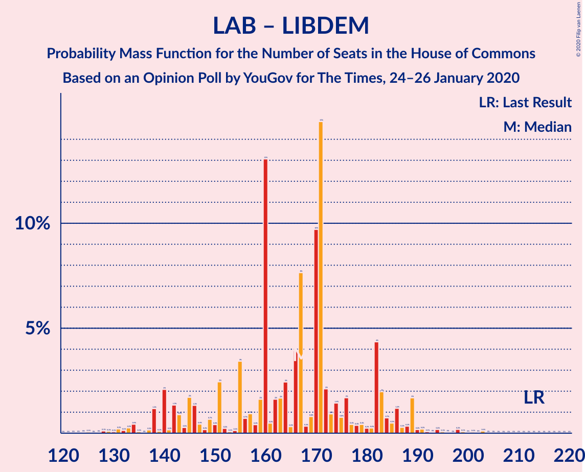

| Number of Seats | Probability | Accumulated | Special Marks |
|:---------------:|:-----------:|:-----------:|:-------------:|
| 124 | 0% | 100% |  |
| 125 | 0.1% | 99.9% |  |
| 126 | 0% | 99.9% |  |
| 127 | 0% | 99.9% |  |
| 128 | 0.1% | 99.8% |  |
| 129 | 0.1% | 99.7% |  |
| 130 | 0.1% | 99.6% |  |
| 131 | 0.2% | 99.6% |  |
| 132 | 0.1% | 99.4% |  |
| 133 | 0.3% | 99.2% |  |
| 134 | 0.4% | 99.0% |  |
| 135 | 0.1% | 98.6% |  |
| 136 | 0% | 98% |  |
| 137 | 0.2% | 98% |  |
| 138 | 1.2% | 98% |  |
| 139 | 0.1% | 97% |  |
| 140 | 2% | 97% |  |
| 141 | 0.2% | 95% |  |
| 142 | 1.3% | 95% |  |
| 143 | 0.9% | 93% |  |
| 144 | 0.3% | 93% |  |
| 145 | 2% | 92% |  |
| 146 | 1.3% | 91% |  |
| 147 | 0.4% | 89% |  |
| 148 | 0.2% | 89% |  |
| 149 | 0.7% | 89% |  |
| 150 | 0.4% | 88% |  |
| 151 | 2% | 88% |  |
| 152 | 0.2% | 85% |  |
| 153 | 0.1% | 85% |  |
| 154 | 0.1% | 85% |  |
| 155 | 3% | 85% |  |
| 156 | 0.7% | 81% |  |
| 157 | 0.9% | 81% |  |
| 158 | 0.4% | 80% |  |
| 159 | 2% | 79% |  |
| 160 | 13% | 78% |  |
| 161 | 0.5% | 65% |  |
| 162 | 2% | 64% |  |
| 163 | 2% | 63% |  |
| 164 | 2% | 61% |  |
| 165 | 0.3% | 58% |  |
| 166 | 4% | 58% |  |
| 167 | 8% | 54% | Median |
| 168 | 0.3% | 47% |  |
| 169 | 0.8% | 46% |  |
| 170 | 10% | 45% |  |
| 171 | 15% | 36% |  |
| 172 | 2% | 21% |  |
| 173 | 0.9% | 19% |  |
| 174 | 1.4% | 18% |  |
| 175 | 0.8% | 16% |  |
| 176 | 2% | 16% |  |
| 177 | 0.4% | 14% |  |
| 178 | 0.4% | 14% |  |
| 179 | 0.4% | 13% |  |
| 180 | 0.2% | 13% |  |
| 181 | 0.2% | 13% |  |
| 182 | 4% | 12% |  |
| 183 | 2% | 8% |  |
| 184 | 0.7% | 6% |  |
| 185 | 0.5% | 5% |  |
| 186 | 1.2% | 5% |  |
| 187 | 0.3% | 4% |  |
| 188 | 0.3% | 3% |  |
| 189 | 2% | 3% |  |
| 190 | 0.2% | 1.3% |  |
| 191 | 0.2% | 1.1% |  |
| 192 | 0.1% | 0.9% |  |
| 193 | 0% | 0.8% |  |
| 194 | 0.2% | 0.8% |  |
| 195 | 0.1% | 0.6% |  |
| 196 | 0% | 0.5% |  |
| 197 | 0% | 0.5% |  |
| 198 | 0.2% | 0.5% |  |
| 199 | 0.1% | 0.3% |  |
| 200 | 0% | 0.2% |  |
| 201 | 0.1% | 0.2% |  |
| 202 | 0% | 0.2% |  |
| 203 | 0.1% | 0.1% |  |
| 204 | 0% | 0% |  |
| 205 | 0% | 0% |  |
| 206 | 0% | 0% |  |
| 207 | 0% | 0% |  |
| 208 | 0% | 0% |  |
| 209 | 0% | 0% |  |
| 210 | 0% | 0% |  |
| 211 | 0% | 0% |  |
| 212 | 0% | 0% |  |
| 213 | 0% | 0% | Last Result |

### Labour Party – Plaid Cymru

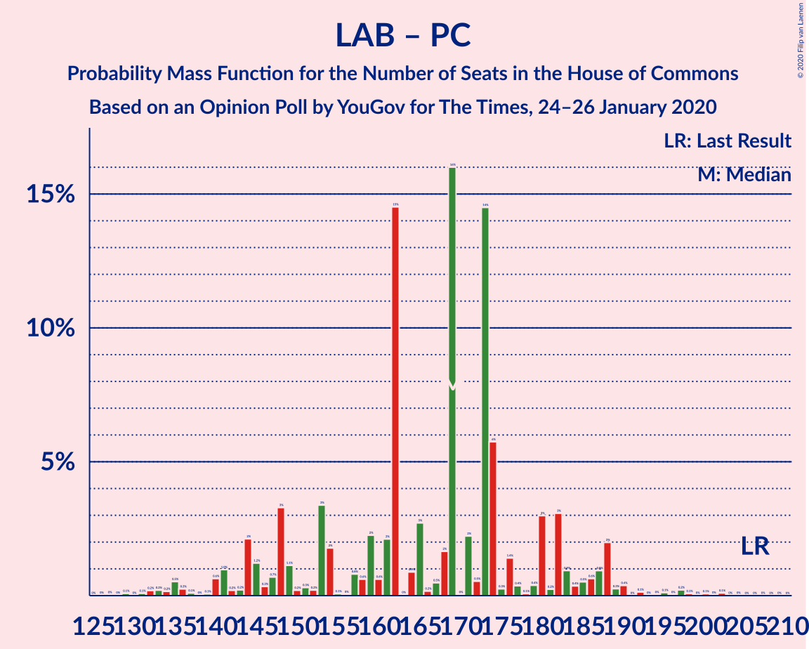

| Number of Seats | Probability | Accumulated | Special Marks |
|:---------------:|:-----------:|:-----------:|:-------------:|
| 127 | 0% | 100% |  |
| 128 | 0% | 99.9% |  |
| 129 | 0.1% | 99.9% |  |
| 130 | 0% | 99.8% |  |
| 131 | 0.1% | 99.8% |  |
| 132 | 0.2% | 99.7% |  |
| 133 | 0.2% | 99.6% |  |
| 134 | 0.2% | 99.4% |  |
| 135 | 0.5% | 99.2% |  |
| 136 | 0.2% | 98.7% |  |
| 137 | 0.1% | 98% |  |
| 138 | 0% | 98% |  |
| 139 | 0.1% | 98% |  |
| 140 | 0.6% | 98% |  |
| 141 | 1.0% | 98% |  |
| 142 | 0.2% | 97% |  |
| 143 | 0.2% | 96% |  |
| 144 | 2% | 96% |  |
| 145 | 1.2% | 94% |  |
| 146 | 0.3% | 93% |  |
| 147 | 0.7% | 93% |  |
| 148 | 3% | 92% |  |
| 149 | 1.1% | 89% |  |
| 150 | 0.2% | 87% |  |
| 151 | 0.3% | 87% |  |
| 152 | 0.2% | 87% |  |
| 153 | 3% | 87% |  |
| 154 | 2% | 83% |  |
| 155 | 0.1% | 82% |  |
| 156 | 0% | 82% |  |
| 157 | 0.8% | 81% |  |
| 158 | 0.6% | 81% |  |
| 159 | 2% | 80% |  |
| 160 | 0.6% | 78% |  |
| 161 | 2% | 77% |  |
| 162 | 15% | 75% |  |
| 163 | 0% | 61% |  |
| 164 | 0.9% | 61% |  |
| 165 | 3% | 60% |  |
| 166 | 0.2% | 57% |  |
| 167 | 0.5% | 57% |  |
| 168 | 2% | 56% |  |
| 169 | 16% | 55% | Median |
| 170 | 0% | 39% |  |
| 171 | 2% | 39% |  |
| 172 | 0.5% | 36% |  |
| 173 | 14% | 36% |  |
| 174 | 6% | 21% |  |
| 175 | 0.3% | 16% |  |
| 176 | 1.4% | 15% |  |
| 177 | 0.4% | 14% |  |
| 178 | 0.1% | 14% |  |
| 179 | 0.4% | 14% |  |
| 180 | 3% | 13% |  |
| 181 | 0.2% | 10% |  |
| 182 | 3% | 10% |  |
| 183 | 0.9% | 7% |  |
| 184 | 0.4% | 6% |  |
| 185 | 0.5% | 6% |  |
| 186 | 0.6% | 5% |  |
| 187 | 0.9% | 4% |  |
| 188 | 2% | 3% |  |
| 189 | 0.3% | 1.5% |  |
| 190 | 0.4% | 1.2% |  |
| 191 | 0% | 0.8% |  |
| 192 | 0.1% | 0.8% |  |
| 193 | 0% | 0.7% |  |
| 194 | 0% | 0.7% |  |
| 195 | 0.1% | 0.7% |  |
| 196 | 0% | 0.5% |  |
| 197 | 0.2% | 0.5% |  |
| 198 | 0.1% | 0.3% |  |
| 199 | 0% | 0.2% |  |
| 200 | 0.1% | 0.2% |  |
| 201 | 0% | 0.1% |  |
| 202 | 0.1% | 0.1% |  |
| 203 | 0% | 0% |  |
| 204 | 0% | 0% |  |
| 205 | 0% | 0% |  |
| 206 | 0% | 0% | Last Result |

### Labour Party

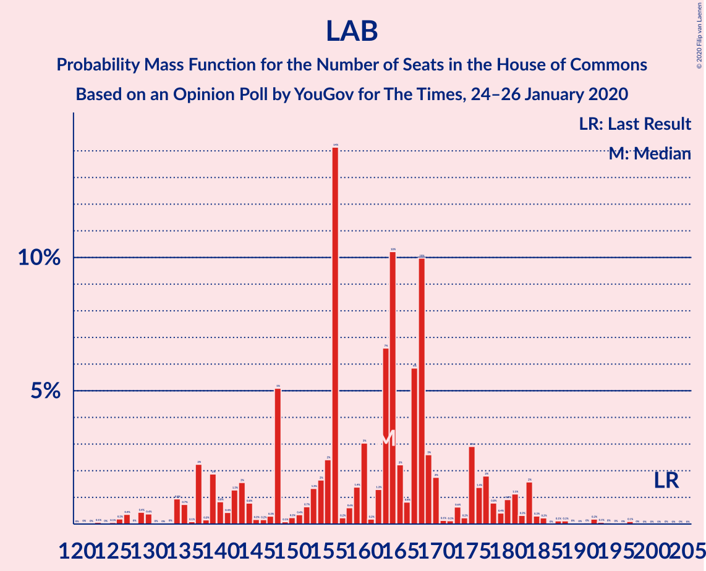

| Number of Seats | Probability | Accumulated | Special Marks |
|:---------------:|:-----------:|:-----------:|:-------------:|
| 121 | 0% | 100% |  |
| 122 | 0% | 99.9% |  |
| 123 | 0.1% | 99.9% |  |
| 124 | 0% | 99.8% |  |
| 125 | 0.1% | 99.8% |  |
| 126 | 0.2% | 99.7% |  |
| 127 | 0.4% | 99.5% |  |
| 128 | 0% | 99.2% |  |
| 129 | 0.4% | 99.1% |  |
| 130 | 0.4% | 98.7% |  |
| 131 | 0% | 98% |  |
| 132 | 0% | 98% |  |
| 133 | 0% | 98% |  |
| 134 | 0.9% | 98% |  |
| 135 | 0.7% | 97% |  |
| 136 | 0.1% | 97% |  |
| 137 | 2% | 96% |  |
| 138 | 0.2% | 94% |  |
| 139 | 2% | 94% |  |
| 140 | 0.8% | 92% |  |
| 141 | 0.4% | 91% |  |
| 142 | 1.3% | 91% |  |
| 143 | 2% | 90% |  |
| 144 | 0.8% | 88% |  |
| 145 | 0.2% | 87% |  |
| 146 | 0.2% | 87% |  |
| 147 | 0.3% | 87% |  |
| 148 | 5% | 87% |  |
| 149 | 0.1% | 82% |  |
| 150 | 0.2% | 81% |  |
| 151 | 0.4% | 81% |  |
| 152 | 0.7% | 81% |  |
| 153 | 1.3% | 80% |  |
| 154 | 2% | 79% |  |
| 155 | 2% | 77% |  |
| 156 | 14% | 75% |  |
| 157 | 0.2% | 61% |  |
| 158 | 0.6% | 60% |  |
| 159 | 1.4% | 60% |  |
| 160 | 3% | 58% |  |
| 161 | 0.2% | 55% |  |
| 162 | 1.3% | 55% |  |
| 163 | 7% | 54% | Median |
| 164 | 10% | 47% |  |
| 165 | 2% | 37% |  |
| 166 | 0.8% | 35% |  |
| 167 | 6% | 34% |  |
| 168 | 10% | 28% |  |
| 169 | 3% | 18% |  |
| 170 | 2% | 16% |  |
| 171 | 0.1% | 14% |  |
| 172 | 0.1% | 14% |  |
| 173 | 0.6% | 14% |  |
| 174 | 0.2% | 13% |  |
| 175 | 3% | 13% |  |
| 176 | 1.4% | 10% |  |
| 177 | 2% | 8% |  |
| 178 | 0.8% | 7% |  |
| 179 | 0.4% | 6% |  |
| 180 | 0.9% | 5% |  |
| 181 | 1.1% | 4% |  |
| 182 | 0.3% | 3% |  |
| 183 | 2% | 3% |  |
| 184 | 0.3% | 1.4% |  |
| 185 | 0.2% | 1.1% |  |
| 186 | 0% | 0.8% |  |
| 187 | 0.1% | 0.8% |  |
| 188 | 0.1% | 0.7% |  |
| 189 | 0% | 0.6% |  |
| 190 | 0% | 0.5% |  |
| 191 | 0% | 0.5% |  |
| 192 | 0.2% | 0.5% |  |
| 193 | 0.1% | 0.3% |  |
| 194 | 0% | 0.2% |  |
| 195 | 0% | 0.2% |  |
| 196 | 0% | 0.1% |  |
| 197 | 0.1% | 0.1% |  |
| 198 | 0% | 0% |  |
| 199 | 0% | 0% |  |
| 200 | 0% | 0% |  |
| 201 | 0% | 0% |  |
| 202 | 0% | 0% | Last Result |

## Technical Information

### Opinion Poll

+ **Polling firm:** YouGov
+ **Commissioner(s):** The Times
+ **Fieldwork period:** 24–26 January 2020

### Calculations

+ **Sample size:** 1596
+ **Simulations done:** 131,072
+ **Error estimate:** 1.10%

