# Opinion Poll by Opinium for The Observer, 12–14 February 2020

<a href="#voting-intentions">Voting Intentions</a> | <a href="#seats">Seats</a> | <a href="#coalitions">Coalitions</a> | <a href="#technical-information">Technical Information</a>

## Voting Intentions

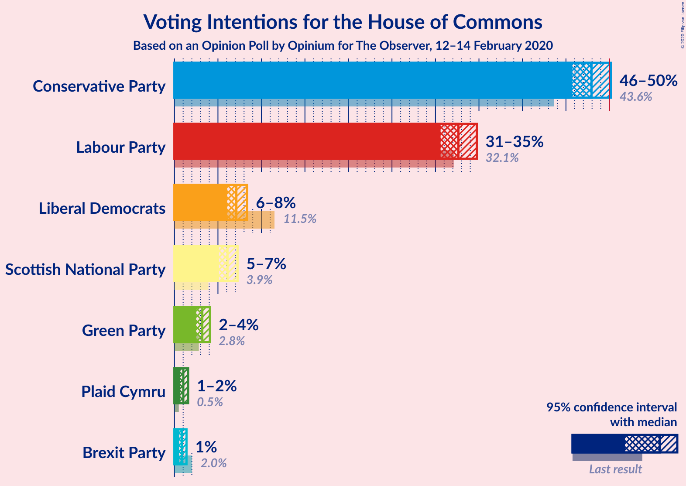

### Confidence Intervals

| Party | Last Result | Poll Result | 80% Confidence Interval | 90% Confidence Interval | 95% Confidence Interval | 99% Confidence Interval |
|:-----:|:-----------:|:-----------:|:-----------------------:|:-----------------------:|:-----------------------:|:-----------------------:|
| Conservative Party | 43.6% | 47.9% | 46.5–49.4% |46.1–49.8% |45.7–50.2% |45.0–50.8% |
| Labour Party | 32.1% | 32.6% | 31.3–34.0% |30.9–34.4% |30.6–34.8% |30.0–35.4% |
| Liberal Democrats | 11.5% | 7.1% | 6.4–7.9% |6.2–8.2% |6.1–8.4% |5.7–8.7% |
| Scottish National Party | 3.9% | 6.1% | 5.5–6.9% |5.3–7.1% |5.1–7.3% |4.8–7.6% |
| Green Party | 2.8% | 3.2% | 2.7–3.8% |2.6–3.9% |2.5–4.1% |2.3–4.4% |
| Plaid Cymru | 0.5% | 1.0% | 0.8–1.4% |0.7–1.5% |0.7–1.6% |0.5–1.8% |
| Brexit Party | 2.0% | 0.9% | 0.6–1.2% |0.6–1.3% |0.5–1.4% |0.4–1.6% |

*Note:* The poll result column reflects the actual value used in the calculations. Published results may vary slightly, and in addition be rounded to fewer digits.

## Seats

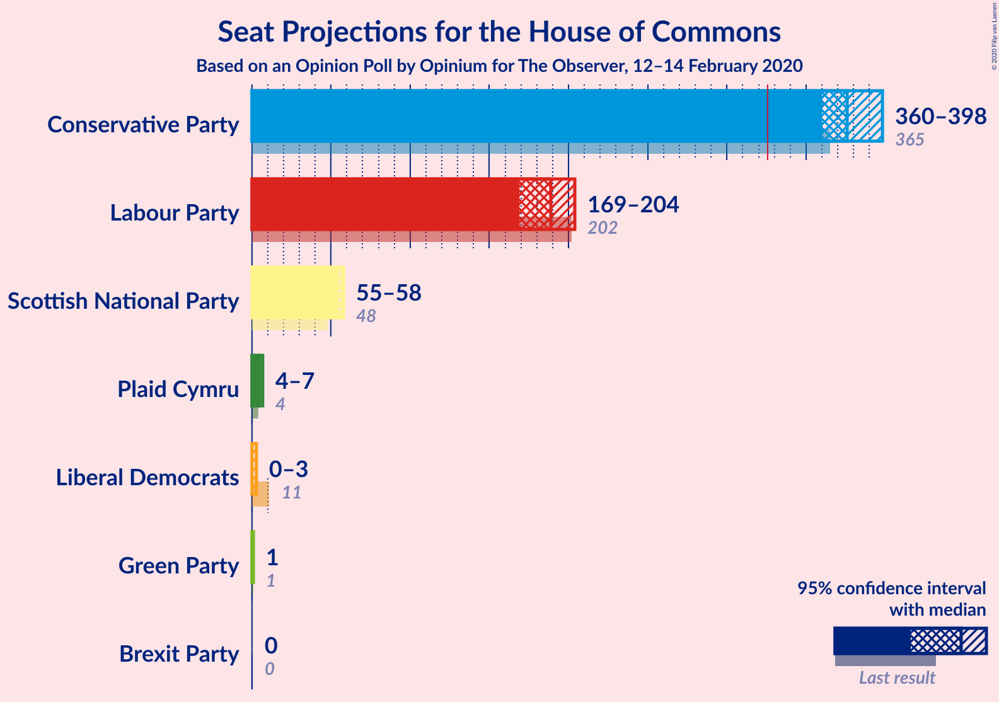

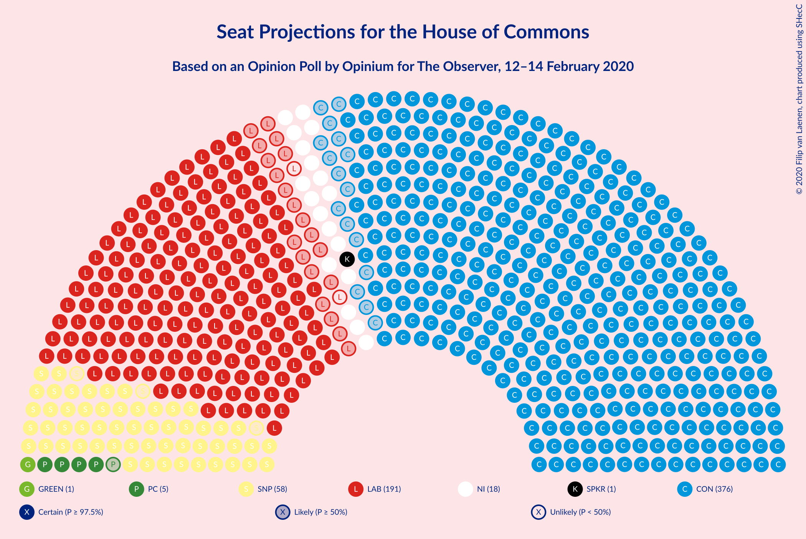

### Confidence Intervals

| Party | Last Result | Median | 80% Confidence Interval | 90% Confidence Interval | 95% Confidence Interval | 99% Confidence Interval |
|:-----:|:-----------:|:------:|:-----------------------:|:-----------------------:|:-----------------------:|:-----------------------:|
| <a href="#conservative-party">Conservative Party</a> | 365 | 376 | 366–389 |363–392 |360–398 |351–401 |
| <a href="#labour-party">Labour Party</a> | 202 | 189 | 178–199 |175–202 |169–204 |166–215 |
| <a href="#liberal-democrats">Liberal Democrats</a> | 11 | 0 | 0–2 |0–2 |0–3 |0–3 |
| <a href="#scottish-national-party">Scottish National Party</a> | 48 | 58 | 58 |56–58 |55–58 |55–59 |
| <a href="#green-party">Green Party</a> | 1 | 1 | 1 |1 |1 |1 |
| <a href="#plaid-cymru">Plaid Cymru</a> | 4 | 5 | 5–6 |5–7 |4–7 |4–9 |
| <a href="#brexit-party">Brexit Party</a> | 0 | 0 | 0 |0 |0 |0 |

### Conservative Party

*For a full overview of the results for this party, see the [Conservative Party](party-conservativeparty.html) page.*

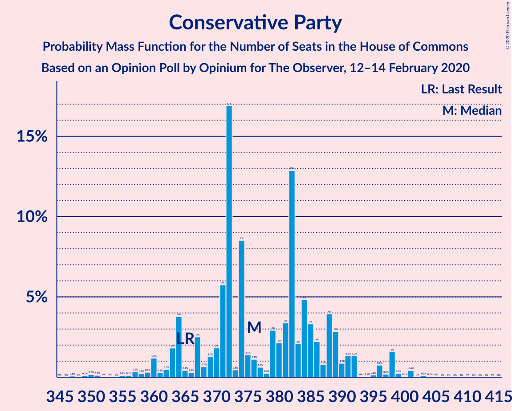

| Number of Seats | Probability | Accumulated | Special Marks |
|:---------------:|:-----------:|:-----------:|:-------------:|
| 345 | 0% | 100% |  |
| 346 | 0% | 99.9% |  |
| 347 | 0.1% | 99.9% |  |
| 348 | 0% | 99.9% |  |
| 349 | 0.1% | 99.8% |  |
| 350 | 0.2% | 99.7% |  |
| 351 | 0.1% | 99.6% |  |
| 352 | 0% | 99.4% |  |
| 353 | 0% | 99.4% |  |
| 354 | 0% | 99.4% |  |
| 355 | 0.1% | 99.4% |  |
| 356 | 0.1% | 99.3% |  |
| 357 | 0.3% | 99.1% |  |
| 358 | 0.2% | 98.8% |  |
| 359 | 0.3% | 98.6% |  |
| 360 | 1.2% | 98% |  |
| 361 | 0.3% | 97% |  |
| 362 | 0.5% | 97% |  |
| 363 | 2% | 96% |  |
| 364 | 4% | 94% |  |
| 365 | 0.4% | 91% | Last Result |
| 366 | 0.3% | 90% |  |
| 367 | 3% | 90% |  |
| 368 | 0.7% | 87% |  |
| 369 | 1.3% | 87% |  |
| 370 | 2% | 85% |  |
| 371 | 6% | 84% |  |
| 372 | 17% | 78% |  |
| 373 | 0.5% | 61% |  |
| 374 | 9% | 61% |  |
| 375 | 1.4% | 52% |  |
| 376 | 1.1% | 51% | Median |
| 377 | 0.6% | 50% |  |
| 378 | 0.2% | 49% |  |
| 379 | 3% | 49% |  |
| 380 | 2% | 46% |  |
| 381 | 3% | 44% |  |
| 382 | 13% | 40% |  |
| 383 | 2% | 27% |  |
| 384 | 5% | 25% |  |
| 385 | 3% | 20% |  |
| 386 | 2% | 17% |  |
| 387 | 0.8% | 15% |  |
| 388 | 4% | 14% |  |
| 389 | 3% | 10% |  |
| 390 | 0.9% | 7% |  |
| 391 | 1.3% | 6% |  |
| 392 | 1.3% | 5% |  |
| 393 | 0% | 4% |  |
| 394 | 0.1% | 4% |  |
| 395 | 0.1% | 4% |  |
| 396 | 0.8% | 4% |  |
| 397 | 0.2% | 3% |  |
| 398 | 2% | 3% |  |
| 399 | 0.2% | 1.0% |  |
| 400 | 0.1% | 0.8% |  |
| 401 | 0.4% | 0.7% |  |
| 402 | 0% | 0.3% |  |
| 403 | 0.1% | 0.3% |  |
| 404 | 0.1% | 0.2% |  |
| 405 | 0% | 0.1% |  |
| 406 | 0% | 0.1% |  |
| 407 | 0% | 0.1% |  |
| 408 | 0% | 0.1% |  |
| 409 | 0% | 0.1% |  |
| 410 | 0% | 0.1% |  |
| 411 | 0% | 0% |  |

### Labour Party

*For a full overview of the results for this party, see the [Labour Party](party-labourparty.html) page.*

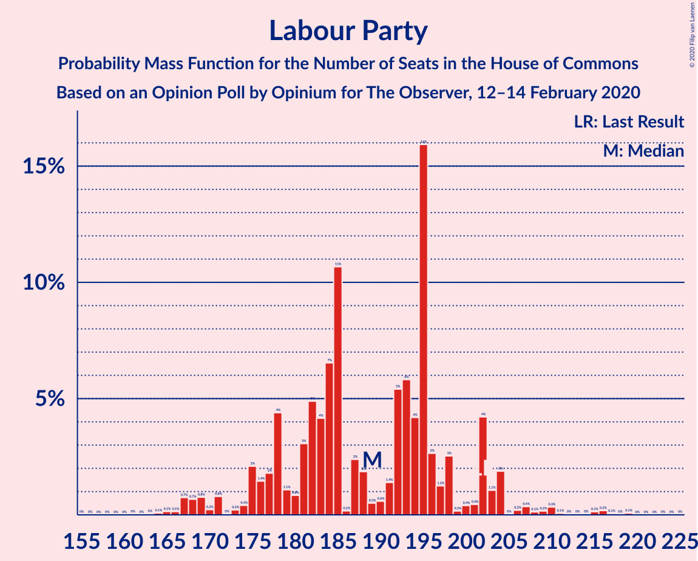

| Number of Seats | Probability | Accumulated | Special Marks |
|:---------------:|:-----------:|:-----------:|:-------------:|
| 155 | 0% | 100% |  |
| 156 | 0% | 99.9% |  |
| 157 | 0% | 99.9% |  |
| 158 | 0% | 99.9% |  |
| 159 | 0% | 99.9% |  |
| 160 | 0% | 99.9% |  |
| 161 | 0% | 99.9% |  |
| 162 | 0% | 99.9% |  |
| 163 | 0% | 99.9% |  |
| 164 | 0.1% | 99.8% |  |
| 165 | 0.1% | 99.7% |  |
| 166 | 0.1% | 99.6% |  |
| 167 | 0.7% | 99.5% |  |
| 168 | 0.7% | 98.7% |  |
| 169 | 0.8% | 98% |  |
| 170 | 0.2% | 97% |  |
| 171 | 0.8% | 97% |  |
| 172 | 0% | 96% |  |
| 173 | 0.2% | 96% |  |
| 174 | 0.4% | 96% |  |
| 175 | 2% | 96% |  |
| 176 | 1.4% | 94% |  |
| 177 | 2% | 92% |  |
| 178 | 4% | 90% |  |
| 179 | 1.1% | 86% |  |
| 180 | 0.8% | 85% |  |
| 181 | 3% | 84% |  |
| 182 | 5% | 81% |  |
| 183 | 4% | 76% |  |
| 184 | 7% | 72% |  |
| 185 | 11% | 65% |  |
| 186 | 0.2% | 55% |  |
| 187 | 2% | 55% |  |
| 188 | 2% | 52% |  |
| 189 | 0.5% | 50% | Median |
| 190 | 0.6% | 50% |  |
| 191 | 1.4% | 49% |  |
| 192 | 5% | 48% |  |
| 193 | 6% | 42% |  |
| 194 | 4% | 37% |  |
| 195 | 16% | 32% |  |
| 196 | 3% | 16% |  |
| 197 | 1.2% | 14% |  |
| 198 | 3% | 13% |  |
| 199 | 0.2% | 10% |  |
| 200 | 0.4% | 10% |  |
| 201 | 0.4% | 9% |  |
| 202 | 4% | 9% | Last Result |
| 203 | 1.1% | 5% |  |
| 204 | 2% | 4% |  |
| 205 | 0% | 2% |  |
| 206 | 0.2% | 2% |  |
| 207 | 0.4% | 2% |  |
| 208 | 0.1% | 1.3% |  |
| 209 | 0.2% | 1.2% |  |
| 210 | 0.3% | 1.0% |  |
| 211 | 0.1% | 0.7% |  |
| 212 | 0% | 0.6% |  |
| 213 | 0% | 0.6% |  |
| 214 | 0% | 0.6% |  |
| 215 | 0.1% | 0.5% |  |
| 216 | 0.2% | 0.4% |  |
| 217 | 0.1% | 0.2% |  |
| 218 | 0% | 0.2% |  |
| 219 | 0.1% | 0.1% |  |
| 220 | 0% | 0.1% |  |
| 221 | 0% | 0.1% |  |
| 222 | 0% | 0% |  |

### Liberal Democrats

*For a full overview of the results for this party, see the [Liberal Democrats](party-liberaldemocrats.html) page.*

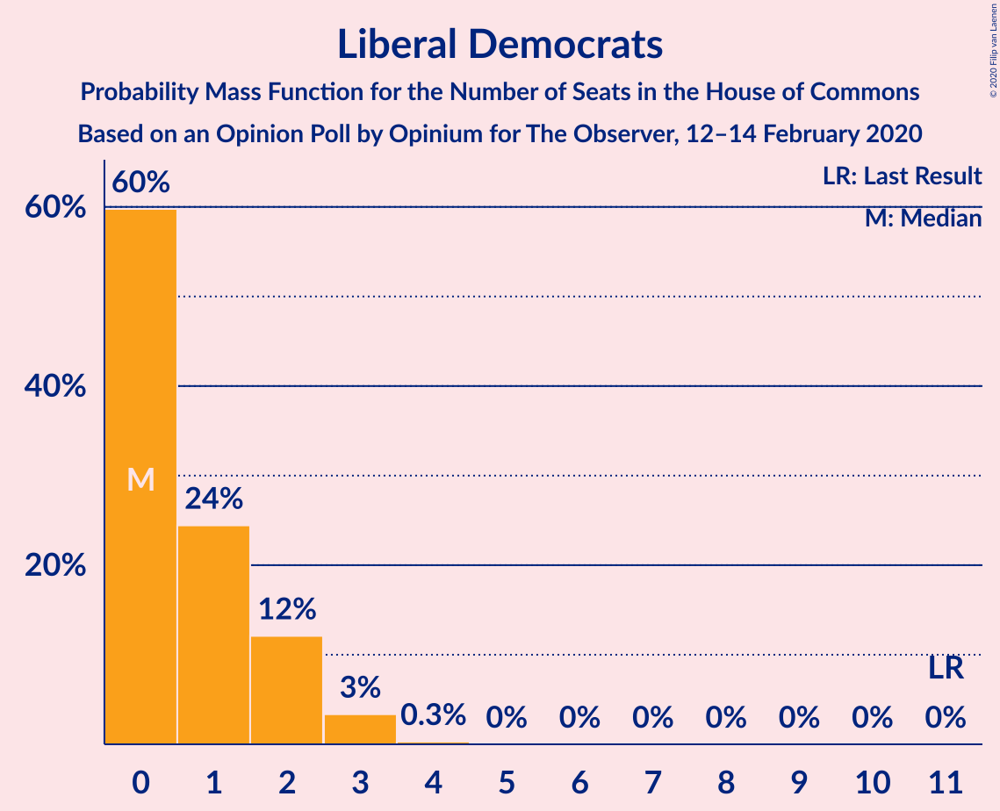

| Number of Seats | Probability | Accumulated | Special Marks |
|:---------------:|:-----------:|:-----------:|:-------------:|
| 0 | 60% | 100% | Median |
| 1 | 24% | 40% |  |
| 2 | 12% | 16% |  |
| 3 | 3% | 4% |  |
| 4 | 0.3% | 0.3% |  |
| 5 | 0% | 0% |  |
| 6 | 0% | 0% |  |
| 7 | 0% | 0% |  |
| 8 | 0% | 0% |  |
| 9 | 0% | 0% |  |
| 10 | 0% | 0% |  |
| 11 | 0% | 0% | Last Result |

### Scottish National Party

*For a full overview of the results for this party, see the [Scottish National Party](party-scottishnationalparty.html) page.*

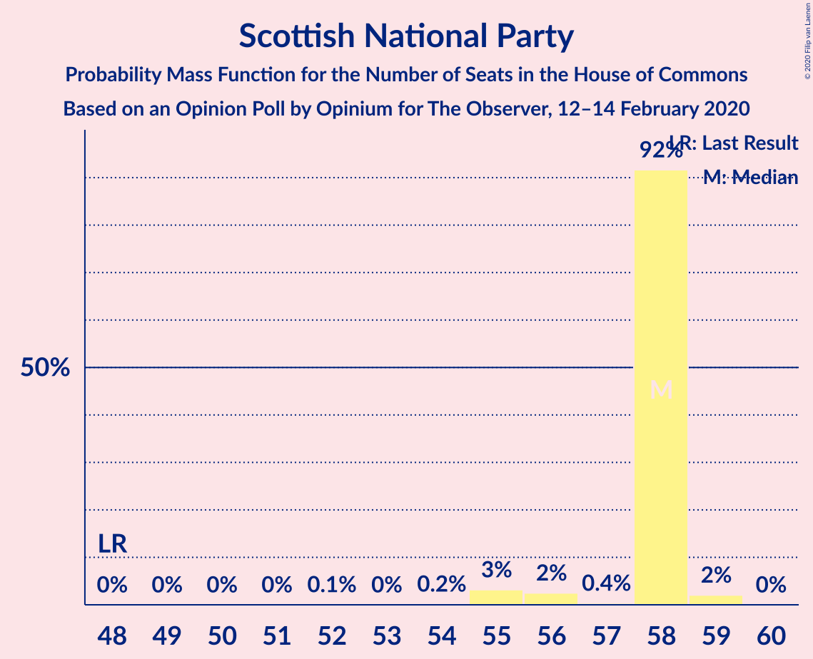

| Number of Seats | Probability | Accumulated | Special Marks |
|:---------------:|:-----------:|:-----------:|:-------------:|
| 48 | 0% | 100% | Last Result |
| 49 | 0% | 100% |  |
| 50 | 0% | 100% |  |
| 51 | 0% | 100% |  |
| 52 | 0.1% | 100% |  |
| 53 | 0% | 99.9% |  |
| 54 | 0.2% | 99.9% |  |
| 55 | 3% | 99.8% |  |
| 56 | 2% | 97% |  |
| 57 | 0.4% | 94% |  |
| 58 | 92% | 94% | Median |
| 59 | 2% | 2% |  |
| 60 | 0% | 0% |  |

### Green Party

*For a full overview of the results for this party, see the [Green Party](party-greenparty.html) page.*

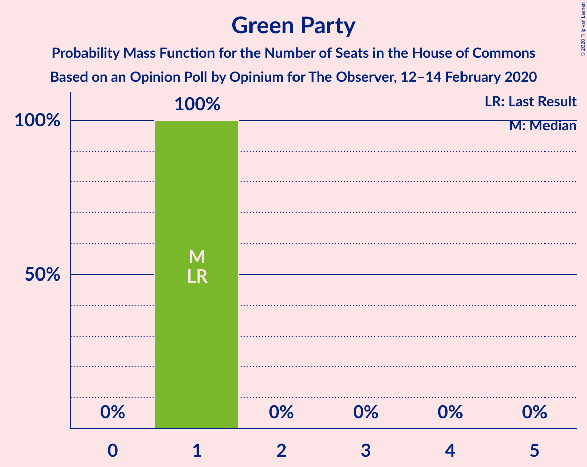

| Number of Seats | Probability | Accumulated | Special Marks |
|:---------------:|:-----------:|:-----------:|:-------------:|
| 1 | 100% | 100% | Last Result, Median |

### Plaid Cymru

*For a full overview of the results for this party, see the [Plaid Cymru](party-plaidcymru.html) page.*

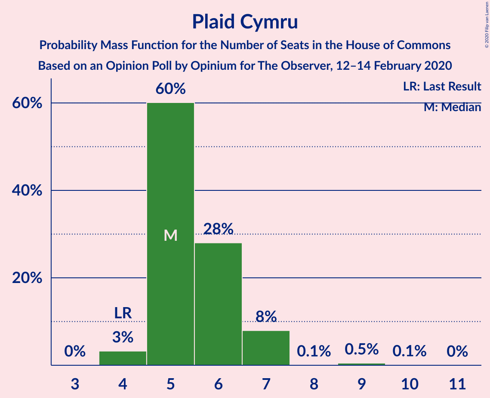

| Number of Seats | Probability | Accumulated | Special Marks |
|:---------------:|:-----------:|:-----------:|:-------------:|
| 4 | 3% | 100% | Last Result |
| 5 | 60% | 97% | Median |
| 6 | 28% | 37% |  |
| 7 | 8% | 9% |  |
| 8 | 0.1% | 0.6% |  |
| 9 | 0.5% | 0.6% |  |
| 10 | 0.1% | 0.1% |  |
| 11 | 0% | 0% |  |

### Brexit Party

*For a full overview of the results for this party, see the [Brexit Party](party-brexitparty.html) page.*

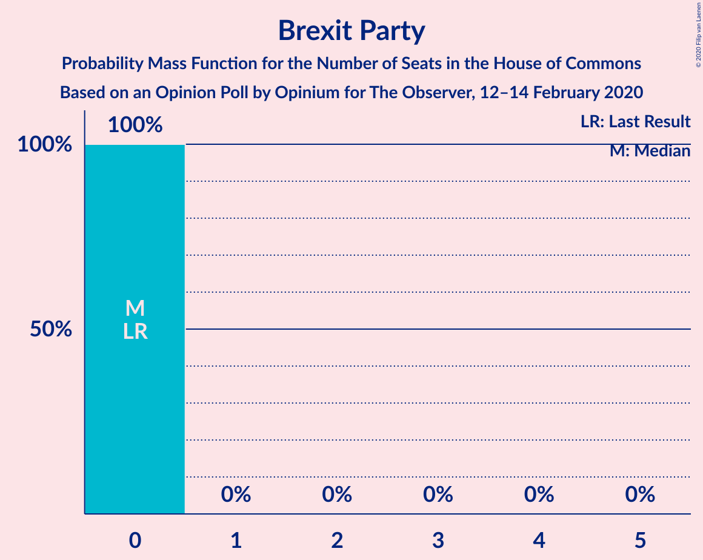

| Number of Seats | Probability | Accumulated | Special Marks |
|:---------------:|:-----------:|:-----------:|:-------------:|
| 0 | 100% | 100% | Last Result, Median |

## Coalitions

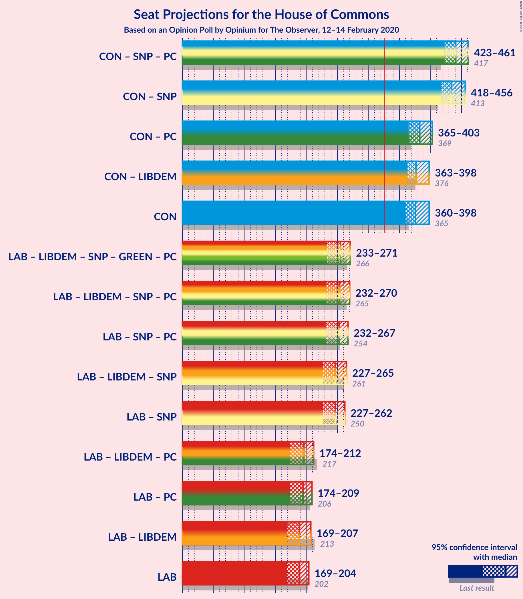

### Confidence Intervals

| Coalition | Last Result | Median | Majority? | 80% Confidence Interval | 90% Confidence Interval | 95% Confidence Interval | 99% Confidence Interval |
|:---------:|:-----------:|:------:|:---------:|:-----------------------:|:-----------------------:|:-----------------------:|:-----------------------:|
| Conservative Party – Scottish National Party – Plaid Cymru | 417 | 441 | 100% | 430–452 | 426–455 | 423–461 | 414–463 |
| Conservative Party – Scottish National Party | 413 | 434 | 100% | 424–446 | 421–449 | 418–456 | 409–457 |
| Conservative Party – Plaid Cymru | 369 | 383 | 100% | 372–394 | 368–398 | 365–403 | 356–406 |
| Conservative Party – Liberal Democrats | 376 | 377 | 100% | 368–389 | 365–392 | 363–398 | 352–401 |
| Conservative Party | 365 | 376 | 100% | 366–389 | 363–392 | 360–398 | 351–401 |
| Labour Party – Liberal Democrats – Scottish National Party – Green Party – Plaid Cymru | 266 | 255 | 0% | 242–265 | 239–268 | 233–271 | 230–280 |
| Labour Party – Liberal Democrats – Scottish National Party – Plaid Cymru | 265 | 254 | 0% | 241–264 | 238–267 | 232–270 | 229–279 |
| Labour Party – Scottish National Party – Plaid Cymru | 254 | 253 | 0% | 241–262 | 238–265 | 232–267 | 229–278 |
| Labour Party – Liberal Democrats – Scottish National Party | 261 | 247 | 0% | 236–258 | 232–262 | 227–265 | 224–274 |
| Labour Party – Scottish National Party | 250 | 247 | 0% | 235–256 | 232–260 | 227–262 | 223–273 |
| Labour Party – Liberal Democrats – Plaid Cymru | 217 | 196 | 0% | 184–206 | 181–209 | 174–212 | 173–221 |
| Labour Party – Plaid Cymru | 206 | 195 | 0% | 183–205 | 181–208 | 174–209 | 173–220 |
| Labour Party – Liberal Democrats | 213 | 189 | 0% | 178–200 | 175–204 | 169–207 | 167–216 |
| Labour Party | 202 | 189 | 0% | 178–199 | 175–202 | 169–204 | 166–215 |

### Conservative Party – Scottish National Party – Plaid Cymru

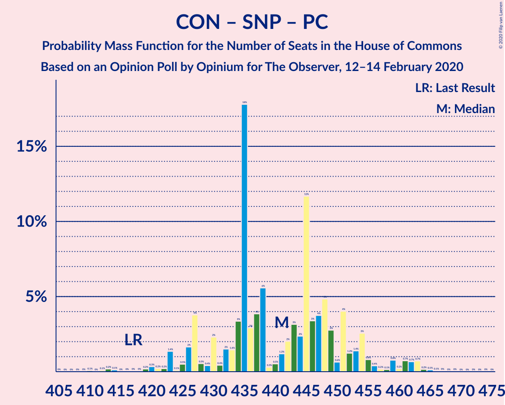

| Number of Seats | Probability | Accumulated | Special Marks |
|:---------------:|:-----------:|:-----------:|:-------------:|
| 408 | 0% | 100% |  |
| 409 | 0% | 99.9% |  |
| 410 | 0.1% | 99.9% |  |
| 411 | 0% | 99.9% |  |
| 412 | 0.1% | 99.8% |  |
| 413 | 0.2% | 99.8% |  |
| 414 | 0.1% | 99.6% |  |
| 415 | 0% | 99.5% |  |
| 416 | 0% | 99.4% |  |
| 417 | 0% | 99.4% | Last Result |
| 418 | 0% | 99.4% |  |
| 419 | 0.2% | 99.3% |  |
| 420 | 0.3% | 99.1% |  |
| 421 | 0.2% | 98.8% |  |
| 422 | 0.2% | 98.6% |  |
| 423 | 1.4% | 98% |  |
| 424 | 0.1% | 97% |  |
| 425 | 0.5% | 97% |  |
| 426 | 2% | 96% |  |
| 427 | 4% | 95% |  |
| 428 | 0.5% | 91% |  |
| 429 | 0.4% | 90% |  |
| 430 | 2% | 90% |  |
| 431 | 0.4% | 88% |  |
| 432 | 2% | 87% |  |
| 433 | 1.4% | 86% |  |
| 434 | 3% | 84% |  |
| 435 | 18% | 81% |  |
| 436 | 3% | 63% |  |
| 437 | 4% | 60% |  |
| 438 | 6% | 56% |  |
| 439 | 0.3% | 51% | Median |
| 440 | 0.5% | 51% |  |
| 441 | 1.2% | 50% |  |
| 442 | 2% | 49% |  |
| 443 | 3% | 47% |  |
| 444 | 2% | 44% |  |
| 445 | 12% | 41% |  |
| 446 | 3% | 30% |  |
| 447 | 4% | 26% |  |
| 448 | 5% | 23% |  |
| 449 | 3% | 18% |  |
| 450 | 0.6% | 15% |  |
| 451 | 4% | 14% |  |
| 452 | 1.2% | 10% |  |
| 453 | 1.4% | 9% |  |
| 454 | 3% | 8% |  |
| 455 | 0.8% | 5% |  |
| 456 | 0.4% | 4% |  |
| 457 | 0.2% | 4% |  |
| 458 | 0.1% | 4% |  |
| 459 | 0.8% | 4% |  |
| 460 | 0.2% | 3% |  |
| 461 | 0.7% | 3% |  |
| 462 | 0.7% | 2% |  |
| 463 | 0.7% | 1.2% |  |
| 464 | 0.2% | 0.5% |  |
| 465 | 0.1% | 0.3% |  |
| 466 | 0.1% | 0.2% |  |
| 467 | 0% | 0.2% |  |
| 468 | 0% | 0.1% |  |
| 469 | 0% | 0.1% |  |
| 470 | 0% | 0.1% |  |
| 471 | 0% | 0.1% |  |
| 472 | 0% | 0.1% |  |
| 473 | 0% | 0.1% |  |
| 474 | 0% | 0.1% |  |
| 475 | 0% | 0% |  |

### Conservative Party – Scottish National Party

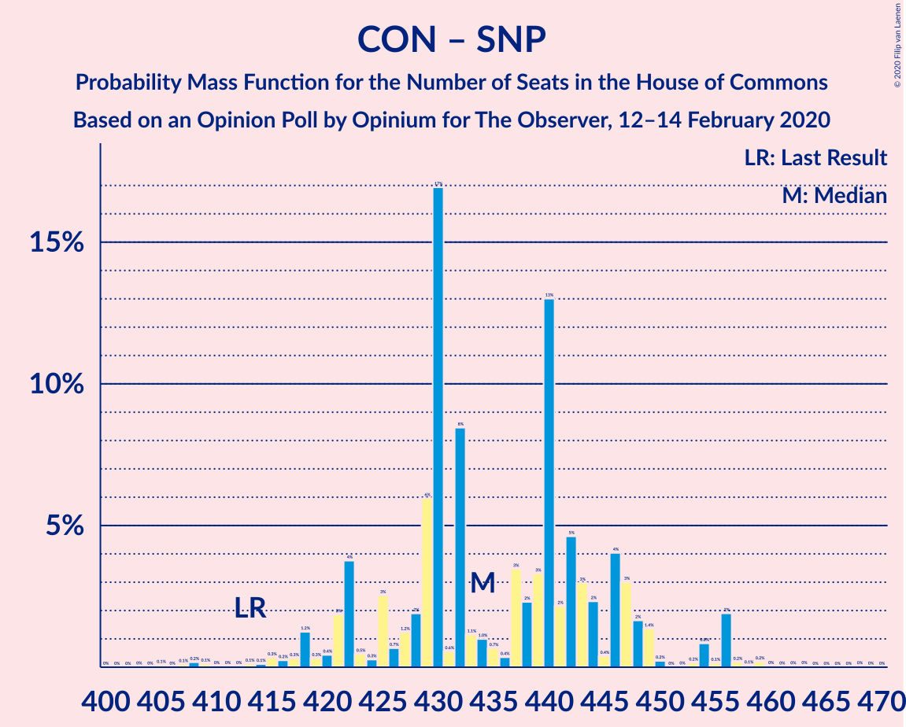

| Number of Seats | Probability | Accumulated | Special Marks |
|:---------------:|:-----------:|:-----------:|:-------------:|
| 403 | 0% | 100% |  |
| 404 | 0% | 99.9% |  |
| 405 | 0.1% | 99.9% |  |
| 406 | 0% | 99.9% |  |
| 407 | 0.1% | 99.8% |  |
| 408 | 0.2% | 99.7% |  |
| 409 | 0.1% | 99.6% |  |
| 410 | 0% | 99.4% |  |
| 411 | 0% | 99.4% |  |
| 412 | 0% | 99.4% |  |
| 413 | 0.1% | 99.4% | Last Result |
| 414 | 0.1% | 99.2% |  |
| 415 | 0.3% | 99.1% |  |
| 416 | 0.2% | 98.8% |  |
| 417 | 0.3% | 98.5% |  |
| 418 | 1.2% | 98% |  |
| 419 | 0.3% | 97% |  |
| 420 | 0.4% | 97% |  |
| 421 | 2% | 96% |  |
| 422 | 4% | 94% |  |
| 423 | 0.5% | 91% |  |
| 424 | 0.3% | 90% |  |
| 425 | 3% | 90% |  |
| 426 | 0.7% | 87% |  |
| 427 | 1.2% | 87% |  |
| 428 | 2% | 85% |  |
| 429 | 6% | 84% |  |
| 430 | 17% | 78% |  |
| 431 | 0.6% | 61% |  |
| 432 | 8% | 60% |  |
| 433 | 1.1% | 52% |  |
| 434 | 1.0% | 51% | Median |
| 435 | 0.7% | 50% |  |
| 436 | 0.4% | 49% |  |
| 437 | 3% | 48% |  |
| 438 | 2% | 45% |  |
| 439 | 3% | 43% |  |
| 440 | 13% | 39% |  |
| 441 | 2% | 26% |  |
| 442 | 5% | 24% |  |
| 443 | 3% | 20% |  |
| 444 | 2% | 17% |  |
| 445 | 0.4% | 14% |  |
| 446 | 4% | 14% |  |
| 447 | 3% | 10% |  |
| 448 | 2% | 7% |  |
| 449 | 1.4% | 5% |  |
| 450 | 0.2% | 4% |  |
| 451 | 0% | 4% |  |
| 452 | 0% | 4% |  |
| 453 | 0.2% | 4% |  |
| 454 | 0.8% | 4% |  |
| 455 | 0.1% | 3% |  |
| 456 | 2% | 3% |  |
| 457 | 0.2% | 0.6% |  |
| 458 | 0.1% | 0.4% |  |
| 459 | 0.2% | 0.4% |  |
| 460 | 0% | 0.2% |  |
| 461 | 0% | 0.2% |  |
| 462 | 0% | 0.1% |  |
| 463 | 0% | 0.1% |  |
| 464 | 0% | 0.1% |  |
| 465 | 0% | 0.1% |  |
| 466 | 0% | 0.1% |  |
| 467 | 0% | 0.1% |  |
| 468 | 0% | 0.1% |  |
| 469 | 0% | 0% |  |

### Conservative Party – Plaid Cymru

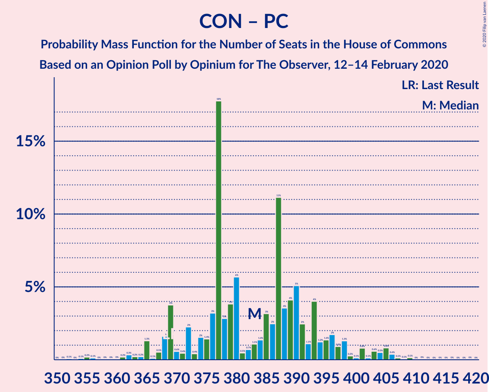

| Number of Seats | Probability | Accumulated | Special Marks |
|:---------------:|:-----------:|:-----------:|:-------------:|
| 350 | 0% | 100% |  |
| 351 | 0% | 99.9% |  |
| 352 | 0.1% | 99.9% |  |
| 353 | 0% | 99.9% |  |
| 354 | 0.1% | 99.8% |  |
| 355 | 0.2% | 99.8% |  |
| 356 | 0.1% | 99.6% |  |
| 357 | 0% | 99.5% |  |
| 358 | 0% | 99.4% |  |
| 359 | 0% | 99.4% |  |
| 360 | 0% | 99.4% |  |
| 361 | 0.2% | 99.3% |  |
| 362 | 0.3% | 99.2% |  |
| 363 | 0.2% | 98.8% |  |
| 364 | 0.2% | 98.6% |  |
| 365 | 1.3% | 98% |  |
| 366 | 0.1% | 97% |  |
| 367 | 0.5% | 97% |  |
| 368 | 2% | 96% |  |
| 369 | 4% | 95% | Last Result |
| 370 | 0.6% | 91% |  |
| 371 | 0.4% | 91% |  |
| 372 | 2% | 90% |  |
| 373 | 0.4% | 88% |  |
| 374 | 2% | 87% |  |
| 375 | 1.4% | 86% |  |
| 376 | 3% | 84% |  |
| 377 | 18% | 81% |  |
| 378 | 3% | 64% |  |
| 379 | 4% | 61% |  |
| 380 | 6% | 57% |  |
| 381 | 0.5% | 51% | Median |
| 382 | 0.7% | 51% |  |
| 383 | 1.1% | 50% |  |
| 384 | 1.4% | 49% |  |
| 385 | 3% | 48% |  |
| 386 | 2% | 44% |  |
| 387 | 11% | 42% |  |
| 388 | 4% | 31% |  |
| 389 | 4% | 27% |  |
| 390 | 5% | 23% |  |
| 391 | 2% | 18% |  |
| 392 | 1.1% | 16% |  |
| 393 | 4% | 15% |  |
| 394 | 1.2% | 11% |  |
| 395 | 1.4% | 9% |  |
| 396 | 2% | 8% |  |
| 397 | 0.9% | 6% |  |
| 398 | 1.3% | 5% |  |
| 399 | 0.3% | 4% |  |
| 400 | 0.1% | 4% |  |
| 401 | 0.8% | 4% |  |
| 402 | 0.1% | 3% |  |
| 403 | 0.6% | 3% |  |
| 404 | 0.5% | 2% |  |
| 405 | 0.8% | 2% |  |
| 406 | 0.4% | 0.8% |  |
| 407 | 0.1% | 0.5% |  |
| 408 | 0.1% | 0.3% |  |
| 409 | 0.1% | 0.3% |  |
| 410 | 0% | 0.1% |  |
| 411 | 0% | 0.1% |  |
| 412 | 0% | 0.1% |  |
| 413 | 0% | 0.1% |  |
| 414 | 0% | 0.1% |  |
| 415 | 0% | 0.1% |  |
| 416 | 0% | 0.1% |  |
| 417 | 0% | 0% |  |

### Conservative Party – Liberal Democrats

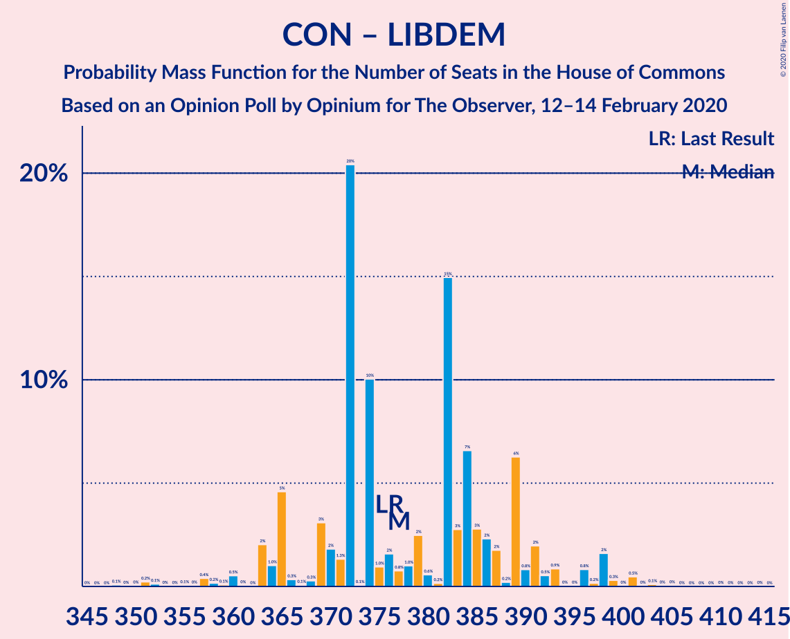

| Number of Seats | Probability | Accumulated | Special Marks |
|:---------------:|:-----------:|:-----------:|:-------------:|
| 345 | 0% | 100% |  |
| 346 | 0% | 99.9% |  |
| 347 | 0% | 99.9% |  |
| 348 | 0.1% | 99.9% |  |
| 349 | 0% | 99.9% |  |
| 350 | 0% | 99.8% |  |
| 351 | 0.2% | 99.8% |  |
| 352 | 0.1% | 99.6% |  |
| 353 | 0% | 99.5% |  |
| 354 | 0% | 99.4% |  |
| 355 | 0.1% | 99.4% |  |
| 356 | 0% | 99.4% |  |
| 357 | 0.4% | 99.3% |  |
| 358 | 0.2% | 98.9% |  |
| 359 | 0.1% | 98.8% |  |
| 360 | 0.5% | 98.7% |  |
| 361 | 0% | 98% |  |
| 362 | 0% | 98% |  |
| 363 | 2% | 98% |  |
| 364 | 1.0% | 96% |  |
| 365 | 5% | 95% |  |
| 366 | 0.3% | 90% |  |
| 367 | 0.1% | 90% |  |
| 368 | 0.3% | 90% |  |
| 369 | 3% | 90% |  |
| 370 | 2% | 87% |  |
| 371 | 1.3% | 85% |  |
| 372 | 20% | 84% |  |
| 373 | 0.1% | 63% |  |
| 374 | 10% | 63% |  |
| 375 | 1.0% | 53% |  |
| 376 | 2% | 52% | Last Result, Median |
| 377 | 0.8% | 51% |  |
| 378 | 1.0% | 50% |  |
| 379 | 2% | 49% |  |
| 380 | 0.6% | 46% |  |
| 381 | 0.2% | 46% |  |
| 382 | 15% | 46% |  |
| 383 | 3% | 31% |  |
| 384 | 7% | 28% |  |
| 385 | 3% | 21% |  |
| 386 | 2% | 18% |  |
| 387 | 2% | 16% |  |
| 388 | 0.2% | 14% |  |
| 389 | 6% | 14% |  |
| 390 | 0.8% | 8% |  |
| 391 | 2% | 7% |  |
| 392 | 0.5% | 5% |  |
| 393 | 0.9% | 5% |  |
| 394 | 0% | 4% |  |
| 395 | 0% | 4% |  |
| 396 | 0.8% | 4% |  |
| 397 | 0.2% | 3% |  |
| 398 | 2% | 3% |  |
| 399 | 0.3% | 1.1% |  |
| 400 | 0% | 0.8% |  |
| 401 | 0.5% | 0.8% |  |
| 402 | 0% | 0.3% |  |
| 403 | 0.1% | 0.3% |  |
| 404 | 0% | 0.2% |  |
| 405 | 0% | 0.1% |  |
| 406 | 0% | 0.1% |  |
| 407 | 0% | 0.1% |  |
| 408 | 0% | 0.1% |  |
| 409 | 0% | 0.1% |  |
| 410 | 0% | 0.1% |  |
| 411 | 0% | 0.1% |  |
| 412 | 0% | 0% |  |

### Conservative Party

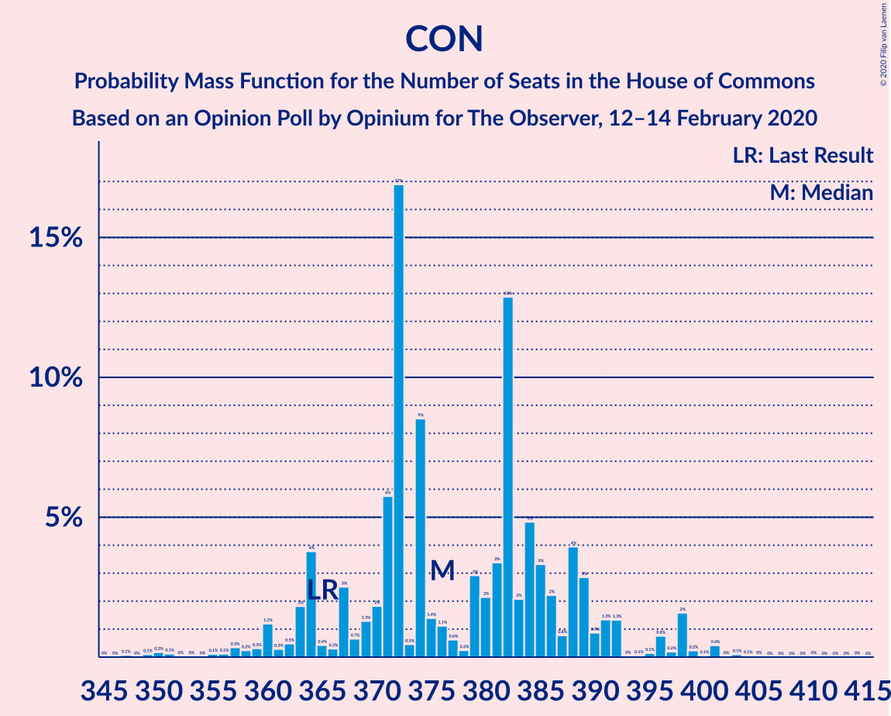

| Number of Seats | Probability | Accumulated | Special Marks |
|:---------------:|:-----------:|:-----------:|:-------------:|
| 345 | 0% | 100% |  |
| 346 | 0% | 99.9% |  |
| 347 | 0.1% | 99.9% |  |
| 348 | 0% | 99.9% |  |
| 349 | 0.1% | 99.8% |  |
| 350 | 0.2% | 99.7% |  |
| 351 | 0.1% | 99.6% |  |
| 352 | 0% | 99.4% |  |
| 353 | 0% | 99.4% |  |
| 354 | 0% | 99.4% |  |
| 355 | 0.1% | 99.4% |  |
| 356 | 0.1% | 99.3% |  |
| 357 | 0.3% | 99.1% |  |
| 358 | 0.2% | 98.8% |  |
| 359 | 0.3% | 98.6% |  |
| 360 | 1.2% | 98% |  |
| 361 | 0.3% | 97% |  |
| 362 | 0.5% | 97% |  |
| 363 | 2% | 96% |  |
| 364 | 4% | 94% |  |
| 365 | 0.4% | 91% | Last Result |
| 366 | 0.3% | 90% |  |
| 367 | 3% | 90% |  |
| 368 | 0.7% | 87% |  |
| 369 | 1.3% | 87% |  |
| 370 | 2% | 85% |  |
| 371 | 6% | 84% |  |
| 372 | 17% | 78% |  |
| 373 | 0.5% | 61% |  |
| 374 | 9% | 61% |  |
| 375 | 1.4% | 52% |  |
| 376 | 1.1% | 51% | Median |
| 377 | 0.6% | 50% |  |
| 378 | 0.2% | 49% |  |
| 379 | 3% | 49% |  |
| 380 | 2% | 46% |  |
| 381 | 3% | 44% |  |
| 382 | 13% | 40% |  |
| 383 | 2% | 27% |  |
| 384 | 5% | 25% |  |
| 385 | 3% | 20% |  |
| 386 | 2% | 17% |  |
| 387 | 0.8% | 15% |  |
| 388 | 4% | 14% |  |
| 389 | 3% | 10% |  |
| 390 | 0.9% | 7% |  |
| 391 | 1.3% | 6% |  |
| 392 | 1.3% | 5% |  |
| 393 | 0% | 4% |  |
| 394 | 0.1% | 4% |  |
| 395 | 0.1% | 4% |  |
| 396 | 0.8% | 4% |  |
| 397 | 0.2% | 3% |  |
| 398 | 2% | 3% |  |
| 399 | 0.2% | 1.0% |  |
| 400 | 0.1% | 0.8% |  |
| 401 | 0.4% | 0.7% |  |
| 402 | 0% | 0.3% |  |
| 403 | 0.1% | 0.3% |  |
| 404 | 0.1% | 0.2% |  |
| 405 | 0% | 0.1% |  |
| 406 | 0% | 0.1% |  |
| 407 | 0% | 0.1% |  |
| 408 | 0% | 0.1% |  |
| 409 | 0% | 0.1% |  |
| 410 | 0% | 0.1% |  |
| 411 | 0% | 0% |  |

### Labour Party – Liberal Democrats – Scottish National Party – Green Party – Plaid Cymru

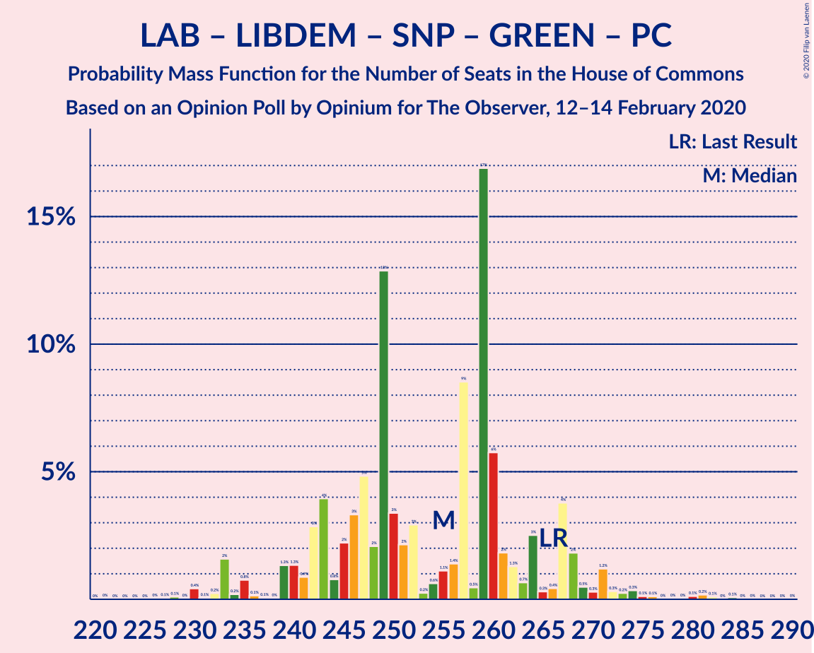

| Number of Seats | Probability | Accumulated | Special Marks |
|:---------------:|:-----------:|:-----------:|:-------------:|
| 221 | 0% | 100% |  |
| 222 | 0% | 99.9% |  |
| 223 | 0% | 99.9% |  |
| 224 | 0% | 99.9% |  |
| 225 | 0% | 99.9% |  |
| 226 | 0% | 99.9% |  |
| 227 | 0.1% | 99.9% |  |
| 228 | 0.1% | 99.8% |  |
| 229 | 0% | 99.7% |  |
| 230 | 0.4% | 99.7% |  |
| 231 | 0.1% | 99.3% |  |
| 232 | 0.2% | 99.2% |  |
| 233 | 2% | 99.0% |  |
| 234 | 0.2% | 97% |  |
| 235 | 0.8% | 97% |  |
| 236 | 0.1% | 96% |  |
| 237 | 0.1% | 96% |  |
| 238 | 0% | 96% |  |
| 239 | 1.3% | 96% |  |
| 240 | 1.3% | 95% |  |
| 241 | 0.9% | 94% |  |
| 242 | 3% | 93% |  |
| 243 | 4% | 90% |  |
| 244 | 0.8% | 86% |  |
| 245 | 2% | 85% |  |
| 246 | 3% | 83% |  |
| 247 | 5% | 80% |  |
| 248 | 2% | 75% |  |
| 249 | 13% | 73% |  |
| 250 | 3% | 60% |  |
| 251 | 2% | 56% |  |
| 252 | 3% | 54% |  |
| 253 | 0.2% | 51% | Median |
| 254 | 0.6% | 51% |  |
| 255 | 1.1% | 50% |  |
| 256 | 1.4% | 49% |  |
| 257 | 9% | 48% |  |
| 258 | 0.5% | 39% |  |
| 259 | 17% | 39% |  |
| 260 | 6% | 22% |  |
| 261 | 2% | 16% |  |
| 262 | 1.3% | 15% |  |
| 263 | 0.7% | 13% |  |
| 264 | 3% | 13% |  |
| 265 | 0.3% | 10% |  |
| 266 | 0.4% | 10% | Last Result |
| 267 | 4% | 9% |  |
| 268 | 2% | 6% |  |
| 269 | 0.5% | 4% |  |
| 270 | 0.3% | 3% |  |
| 271 | 1.2% | 3% |  |
| 272 | 0.3% | 2% |  |
| 273 | 0.2% | 1.4% |  |
| 274 | 0.3% | 1.2% |  |
| 275 | 0.1% | 0.9% |  |
| 276 | 0.1% | 0.7% |  |
| 277 | 0% | 0.6% |  |
| 278 | 0% | 0.6% |  |
| 279 | 0% | 0.6% |  |
| 280 | 0.1% | 0.6% |  |
| 281 | 0.2% | 0.4% |  |
| 282 | 0.1% | 0.3% |  |
| 283 | 0% | 0.2% |  |
| 284 | 0.1% | 0.1% |  |
| 285 | 0% | 0.1% |  |
| 286 | 0% | 0.1% |  |
| 287 | 0% | 0% |  |

### Labour Party – Liberal Democrats – Scottish National Party – Plaid Cymru

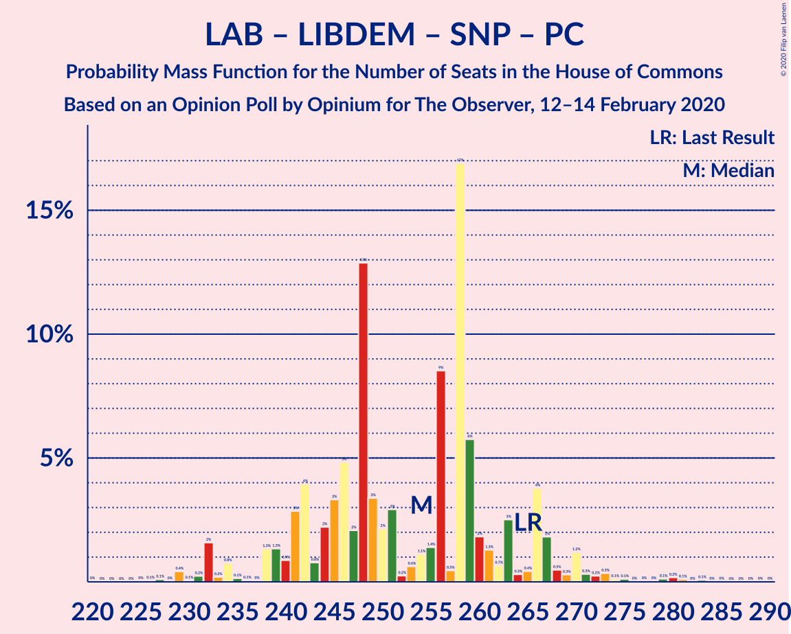

| Number of Seats | Probability | Accumulated | Special Marks |
|:---------------:|:-----------:|:-----------:|:-------------:|
| 220 | 0% | 100% |  |
| 221 | 0% | 99.9% |  |
| 222 | 0% | 99.9% |  |
| 223 | 0% | 99.9% |  |
| 224 | 0% | 99.9% |  |
| 225 | 0% | 99.9% |  |
| 226 | 0.1% | 99.9% |  |
| 227 | 0.1% | 99.8% |  |
| 228 | 0% | 99.7% |  |
| 229 | 0.4% | 99.7% |  |
| 230 | 0.1% | 99.3% |  |
| 231 | 0.2% | 99.2% |  |
| 232 | 2% | 99.0% |  |
| 233 | 0.2% | 97% |  |
| 234 | 0.8% | 97% |  |
| 235 | 0.1% | 96% |  |
| 236 | 0.1% | 96% |  |
| 237 | 0% | 96% |  |
| 238 | 1.3% | 96% |  |
| 239 | 1.3% | 95% |  |
| 240 | 0.9% | 94% |  |
| 241 | 3% | 93% |  |
| 242 | 4% | 90% |  |
| 243 | 0.8% | 86% |  |
| 244 | 2% | 85% |  |
| 245 | 3% | 83% |  |
| 246 | 5% | 80% |  |
| 247 | 2% | 75% |  |
| 248 | 13% | 73% |  |
| 249 | 3% | 60% |  |
| 250 | 2% | 56% |  |
| 251 | 3% | 54% |  |
| 252 | 0.2% | 51% | Median |
| 253 | 0.6% | 51% |  |
| 254 | 1.1% | 50% |  |
| 255 | 1.4% | 49% |  |
| 256 | 9% | 48% |  |
| 257 | 0.5% | 39% |  |
| 258 | 17% | 39% |  |
| 259 | 6% | 22% |  |
| 260 | 2% | 16% |  |
| 261 | 1.3% | 15% |  |
| 262 | 0.7% | 13% |  |
| 263 | 3% | 13% |  |
| 264 | 0.3% | 10% |  |
| 265 | 0.4% | 10% | Last Result |
| 266 | 4% | 9% |  |
| 267 | 2% | 6% |  |
| 268 | 0.5% | 4% |  |
| 269 | 0.3% | 3% |  |
| 270 | 1.2% | 3% |  |
| 271 | 0.3% | 2% |  |
| 272 | 0.2% | 1.4% |  |
| 273 | 0.3% | 1.2% |  |
| 274 | 0.1% | 0.9% |  |
| 275 | 0.1% | 0.7% |  |
| 276 | 0% | 0.6% |  |
| 277 | 0% | 0.6% |  |
| 278 | 0% | 0.6% |  |
| 279 | 0.1% | 0.6% |  |
| 280 | 0.2% | 0.4% |  |
| 281 | 0.1% | 0.3% |  |
| 282 | 0% | 0.2% |  |
| 283 | 0.1% | 0.1% |  |
| 284 | 0% | 0.1% |  |
| 285 | 0% | 0.1% |  |
| 286 | 0% | 0% |  |

### Labour Party – Scottish National Party – Plaid Cymru

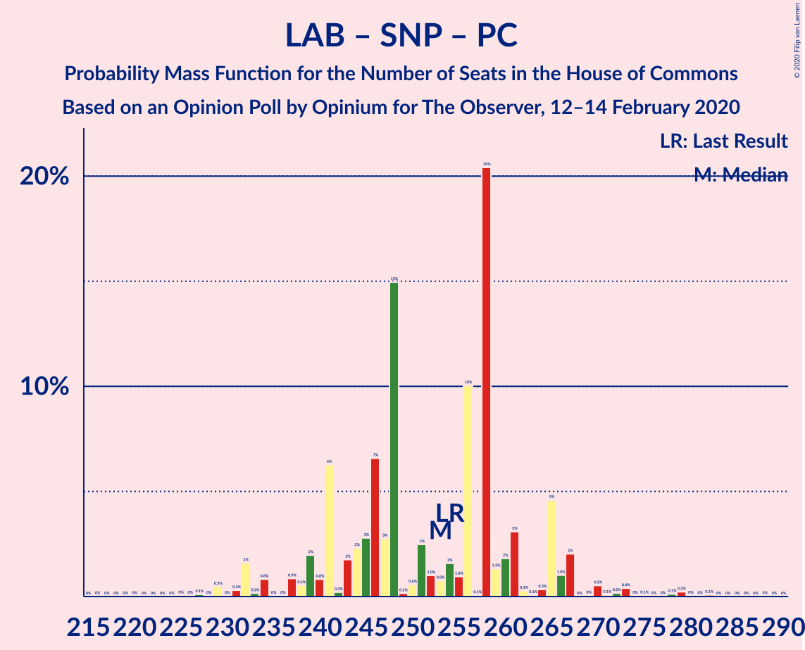

| Number of Seats | Probability | Accumulated | Special Marks |
|:---------------:|:-----------:|:-----------:|:-------------:|
| 219 | 0% | 100% |  |
| 220 | 0% | 99.9% |  |
| 221 | 0% | 99.9% |  |
| 222 | 0% | 99.9% |  |
| 223 | 0% | 99.9% |  |
| 224 | 0% | 99.9% |  |
| 225 | 0% | 99.9% |  |
| 226 | 0% | 99.9% |  |
| 227 | 0.1% | 99.8% |  |
| 228 | 0% | 99.7% |  |
| 229 | 0.5% | 99.7% |  |
| 230 | 0% | 99.2% |  |
| 231 | 0.3% | 99.2% |  |
| 232 | 2% | 98.9% |  |
| 233 | 0.2% | 97% |  |
| 234 | 0.8% | 97% |  |
| 235 | 0% | 96% |  |
| 236 | 0% | 96% |  |
| 237 | 0.9% | 96% |  |
| 238 | 0.5% | 95% |  |
| 239 | 2% | 95% |  |
| 240 | 0.8% | 93% |  |
| 241 | 6% | 92% |  |
| 242 | 0.2% | 86% |  |
| 243 | 2% | 86% |  |
| 244 | 2% | 84% |  |
| 245 | 3% | 82% |  |
| 246 | 7% | 79% |  |
| 247 | 3% | 72% |  |
| 248 | 15% | 69% |  |
| 249 | 0.2% | 54% |  |
| 250 | 0.6% | 54% |  |
| 251 | 2% | 54% |  |
| 252 | 1.0% | 51% | Median |
| 253 | 0.8% | 50% |  |
| 254 | 2% | 49% | Last Result |
| 255 | 1.0% | 48% |  |
| 256 | 10% | 47% |  |
| 257 | 0.1% | 37% |  |
| 258 | 20% | 37% |  |
| 259 | 1.3% | 16% |  |
| 260 | 2% | 15% |  |
| 261 | 3% | 13% |  |
| 262 | 0.3% | 10% |  |
| 263 | 0.1% | 10% |  |
| 264 | 0.3% | 10% |  |
| 265 | 5% | 10% |  |
| 266 | 1.0% | 5% |  |
| 267 | 2% | 4% |  |
| 268 | 0% | 2% |  |
| 269 | 0% | 2% |  |
| 270 | 0.5% | 2% |  |
| 271 | 0.1% | 1.3% |  |
| 272 | 0.2% | 1.2% |  |
| 273 | 0.4% | 1.1% |  |
| 274 | 0% | 0.7% |  |
| 275 | 0.1% | 0.6% |  |
| 276 | 0% | 0.6% |  |
| 277 | 0% | 0.6% |  |
| 278 | 0.1% | 0.5% |  |
| 279 | 0.2% | 0.4% |  |
| 280 | 0% | 0.2% |  |
| 281 | 0% | 0.2% |  |
| 282 | 0.1% | 0.1% |  |
| 283 | 0% | 0.1% |  |
| 284 | 0% | 0.1% |  |
| 285 | 0% | 0.1% |  |
| 286 | 0% | 0% |  |

### Labour Party – Liberal Democrats – Scottish National Party

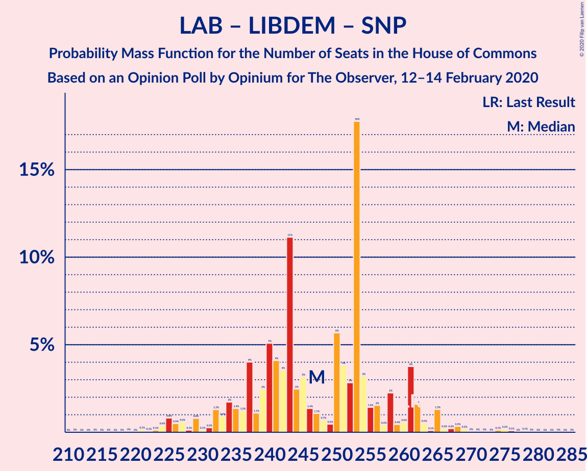

| Number of Seats | Probability | Accumulated | Special Marks |
|:---------------:|:-----------:|:-----------:|:-------------:|
| 214 | 0% | 100% |  |
| 215 | 0% | 99.9% |  |
| 216 | 0% | 99.9% |  |
| 217 | 0% | 99.9% |  |
| 218 | 0% | 99.9% |  |
| 219 | 0% | 99.9% |  |
| 220 | 0% | 99.9% |  |
| 221 | 0.1% | 99.9% |  |
| 222 | 0.1% | 99.7% |  |
| 223 | 0.1% | 99.7% |  |
| 224 | 0.4% | 99.5% |  |
| 225 | 0.8% | 99.2% |  |
| 226 | 0.5% | 98% |  |
| 227 | 0.6% | 98% |  |
| 228 | 0.1% | 97% |  |
| 229 | 0.8% | 97% |  |
| 230 | 0.1% | 96% |  |
| 231 | 0.3% | 96% |  |
| 232 | 1.3% | 96% |  |
| 233 | 0.9% | 95% |  |
| 234 | 2% | 94% |  |
| 235 | 1.4% | 92% |  |
| 236 | 1.2% | 91% |  |
| 237 | 4% | 89% |  |
| 238 | 1.1% | 85% |  |
| 239 | 2% | 84% |  |
| 240 | 5% | 82% |  |
| 241 | 4% | 77% |  |
| 242 | 4% | 73% |  |
| 243 | 11% | 69% |  |
| 244 | 2% | 58% |  |
| 245 | 3% | 56% |  |
| 246 | 1.4% | 52% |  |
| 247 | 1.1% | 51% | Median |
| 248 | 0.7% | 50% |  |
| 249 | 0.5% | 49% |  |
| 250 | 6% | 49% |  |
| 251 | 4% | 43% |  |
| 252 | 3% | 39% |  |
| 253 | 18% | 36% |  |
| 254 | 3% | 19% |  |
| 255 | 1.4% | 16% |  |
| 256 | 2% | 14% |  |
| 257 | 0.4% | 13% |  |
| 258 | 2% | 12% |  |
| 259 | 0.4% | 10% |  |
| 260 | 0.6% | 9% |  |
| 261 | 4% | 9% | Last Result |
| 262 | 2% | 5% |  |
| 263 | 0.5% | 4% |  |
| 264 | 0.1% | 3% |  |
| 265 | 1.3% | 3% |  |
| 266 | 0.2% | 2% |  |
| 267 | 0.2% | 1.4% |  |
| 268 | 0.3% | 1.2% |  |
| 269 | 0.2% | 0.8% |  |
| 270 | 0% | 0.7% |  |
| 271 | 0% | 0.6% |  |
| 272 | 0% | 0.6% |  |
| 273 | 0% | 0.6% |  |
| 274 | 0.1% | 0.5% |  |
| 275 | 0.2% | 0.4% |  |
| 276 | 0.1% | 0.2% |  |
| 277 | 0% | 0.2% |  |
| 278 | 0.1% | 0.1% |  |
| 279 | 0% | 0.1% |  |
| 280 | 0% | 0.1% |  |
| 281 | 0% | 0% |  |

### Labour Party – Scottish National Party

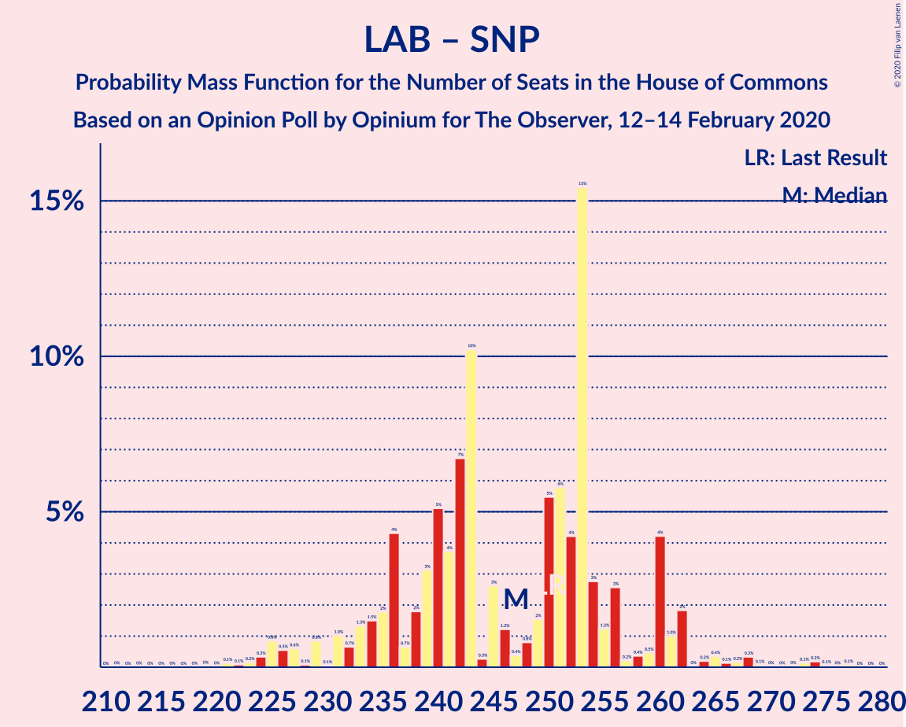

| Number of Seats | Probability | Accumulated | Special Marks |
|:---------------:|:-----------:|:-----------:|:-------------:|
| 213 | 0% | 100% |  |
| 214 | 0% | 99.9% |  |
| 215 | 0% | 99.9% |  |
| 216 | 0% | 99.9% |  |
| 217 | 0% | 99.9% |  |
| 218 | 0% | 99.9% |  |
| 219 | 0% | 99.9% |  |
| 220 | 0% | 99.9% |  |
| 221 | 0.1% | 99.8% |  |
| 222 | 0.1% | 99.7% |  |
| 223 | 0.2% | 99.6% |  |
| 224 | 0.3% | 99.5% |  |
| 225 | 0.8% | 99.1% |  |
| 226 | 0.5% | 98% |  |
| 227 | 0.6% | 98% |  |
| 228 | 0.1% | 97% |  |
| 229 | 0.8% | 97% |  |
| 230 | 0.1% | 96% |  |
| 231 | 1.0% | 96% |  |
| 232 | 0.7% | 95% |  |
| 233 | 1.3% | 95% |  |
| 234 | 1.5% | 93% |  |
| 235 | 2% | 92% |  |
| 236 | 4% | 90% |  |
| 237 | 0.7% | 86% |  |
| 238 | 2% | 85% |  |
| 239 | 3% | 83% |  |
| 240 | 5% | 80% |  |
| 241 | 4% | 75% |  |
| 242 | 7% | 71% |  |
| 243 | 10% | 64% |  |
| 244 | 0.3% | 54% |  |
| 245 | 3% | 54% |  |
| 246 | 1.2% | 51% |  |
| 247 | 0.4% | 50% | Median |
| 248 | 0.8% | 50% |  |
| 249 | 2% | 49% |  |
| 250 | 5% | 47% | Last Result |
| 251 | 6% | 42% |  |
| 252 | 4% | 36% |  |
| 253 | 15% | 32% |  |
| 254 | 3% | 17% |  |
| 255 | 1.2% | 14% |  |
| 256 | 3% | 13% |  |
| 257 | 0.2% | 10% |  |
| 258 | 0.4% | 10% |  |
| 259 | 0.5% | 9% |  |
| 260 | 4% | 9% |  |
| 261 | 1.0% | 5% |  |
| 262 | 2% | 4% |  |
| 263 | 0% | 2% |  |
| 264 | 0.2% | 2% |  |
| 265 | 0.4% | 2% |  |
| 266 | 0.1% | 1.3% |  |
| 267 | 0.2% | 1.2% |  |
| 268 | 0.3% | 1.0% |  |
| 269 | 0.1% | 0.7% |  |
| 270 | 0% | 0.6% |  |
| 271 | 0% | 0.6% |  |
| 272 | 0% | 0.6% |  |
| 273 | 0.1% | 0.5% |  |
| 274 | 0.2% | 0.4% |  |
| 275 | 0.1% | 0.2% |  |
| 276 | 0% | 0.2% |  |
| 277 | 0.1% | 0.1% |  |
| 278 | 0% | 0.1% |  |
| 279 | 0% | 0.1% |  |
| 280 | 0% | 0% |  |

### Labour Party – Liberal Democrats – Plaid Cymru

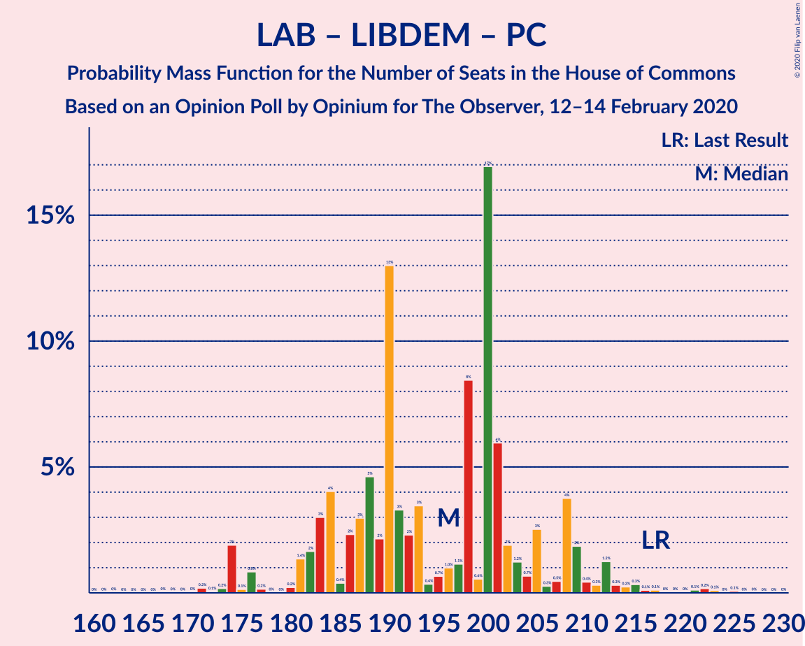

| Number of Seats | Probability | Accumulated | Special Marks |
|:---------------:|:-----------:|:-----------:|:-------------:|
| 162 | 0% | 100% |  |
| 163 | 0% | 99.9% |  |
| 164 | 0% | 99.9% |  |
| 165 | 0% | 99.9% |  |
| 166 | 0% | 99.9% |  |
| 167 | 0% | 99.9% |  |
| 168 | 0% | 99.9% |  |
| 169 | 0% | 99.9% |  |
| 170 | 0% | 99.8% |  |
| 171 | 0.2% | 99.8% |  |
| 172 | 0.1% | 99.6% |  |
| 173 | 0.2% | 99.6% |  |
| 174 | 2% | 99.4% |  |
| 175 | 0.1% | 97% |  |
| 176 | 0.8% | 97% |  |
| 177 | 0.2% | 96% |  |
| 178 | 0% | 96% |  |
| 179 | 0% | 96% |  |
| 180 | 0.2% | 96% |  |
| 181 | 1.4% | 96% |  |
| 182 | 2% | 95% |  |
| 183 | 3% | 93% |  |
| 184 | 4% | 90% |  |
| 185 | 0.4% | 86% |  |
| 186 | 2% | 86% |  |
| 187 | 3% | 83% |  |
| 188 | 5% | 80% |  |
| 189 | 2% | 76% |  |
| 190 | 13% | 74% |  |
| 191 | 3% | 61% |  |
| 192 | 2% | 57% |  |
| 193 | 3% | 55% |  |
| 194 | 0.4% | 52% | Median |
| 195 | 0.7% | 51% |  |
| 196 | 1.0% | 50% |  |
| 197 | 1.1% | 49% |  |
| 198 | 8% | 48% |  |
| 199 | 0.6% | 40% |  |
| 200 | 17% | 39% |  |
| 201 | 6% | 22% |  |
| 202 | 2% | 16% |  |
| 203 | 1.2% | 15% |  |
| 204 | 0.7% | 13% |  |
| 205 | 3% | 13% |  |
| 206 | 0.3% | 10% |  |
| 207 | 0.5% | 10% |  |
| 208 | 4% | 9% |  |
| 209 | 2% | 6% |  |
| 210 | 0.4% | 4% |  |
| 211 | 0.3% | 3% |  |
| 212 | 1.2% | 3% |  |
| 213 | 0.3% | 2% |  |
| 214 | 0.2% | 1.5% |  |
| 215 | 0.3% | 1.2% |  |
| 216 | 0.1% | 0.9% |  |
| 217 | 0.1% | 0.8% | Last Result |
| 218 | 0% | 0.6% |  |
| 219 | 0% | 0.6% |  |
| 220 | 0% | 0.6% |  |
| 221 | 0.1% | 0.6% |  |
| 222 | 0.2% | 0.4% |  |
| 223 | 0.1% | 0.3% |  |
| 224 | 0% | 0.2% |  |
| 225 | 0.1% | 0.1% |  |
| 226 | 0% | 0.1% |  |
| 227 | 0% | 0.1% |  |
| 228 | 0% | 0% |  |

### Labour Party – Plaid Cymru

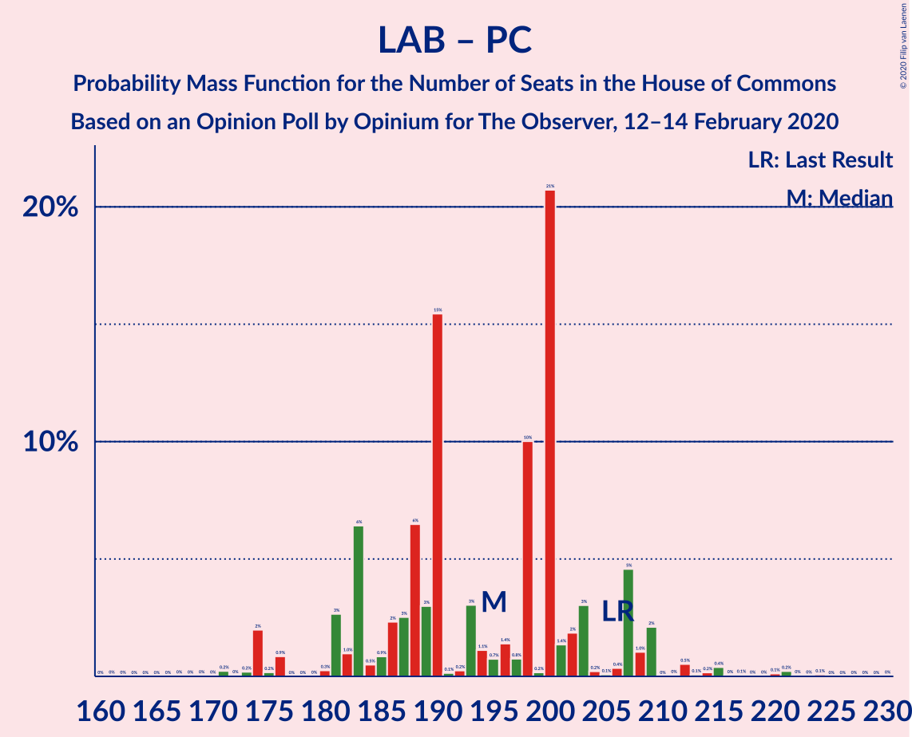

| Number of Seats | Probability | Accumulated | Special Marks |
|:---------------:|:-----------:|:-----------:|:-------------:|
| 161 | 0% | 100% |  |
| 162 | 0% | 99.9% |  |
| 163 | 0% | 99.9% |  |
| 164 | 0% | 99.9% |  |
| 165 | 0% | 99.9% |  |
| 166 | 0% | 99.9% |  |
| 167 | 0% | 99.9% |  |
| 168 | 0% | 99.9% |  |
| 169 | 0% | 99.9% |  |
| 170 | 0% | 99.8% |  |
| 171 | 0.2% | 99.8% |  |
| 172 | 0% | 99.6% |  |
| 173 | 0.2% | 99.5% |  |
| 174 | 2% | 99.3% |  |
| 175 | 0.2% | 97% |  |
| 176 | 0.9% | 97% |  |
| 177 | 0% | 96% |  |
| 178 | 0% | 96% |  |
| 179 | 0% | 96% |  |
| 180 | 0.3% | 96% |  |
| 181 | 3% | 96% |  |
| 182 | 1.0% | 93% |  |
| 183 | 6% | 92% |  |
| 184 | 0.5% | 86% |  |
| 185 | 0.9% | 85% |  |
| 186 | 2% | 85% |  |
| 187 | 3% | 82% |  |
| 188 | 6% | 80% |  |
| 189 | 3% | 73% |  |
| 190 | 15% | 70% |  |
| 191 | 0.1% | 55% |  |
| 192 | 0.2% | 55% |  |
| 193 | 3% | 54% |  |
| 194 | 1.1% | 51% | Median |
| 195 | 0.7% | 50% |  |
| 196 | 1.4% | 50% |  |
| 197 | 0.8% | 48% |  |
| 198 | 10% | 47% |  |
| 199 | 0.2% | 37% |  |
| 200 | 21% | 37% |  |
| 201 | 1.4% | 17% |  |
| 202 | 2% | 15% |  |
| 203 | 3% | 13% |  |
| 204 | 0.2% | 10% |  |
| 205 | 0.1% | 10% |  |
| 206 | 0.4% | 10% | Last Result |
| 207 | 5% | 10% |  |
| 208 | 1.0% | 5% |  |
| 209 | 2% | 4% |  |
| 210 | 0% | 2% |  |
| 211 | 0% | 2% |  |
| 212 | 0.5% | 2% |  |
| 213 | 0.1% | 1.3% |  |
| 214 | 0.2% | 1.2% |  |
| 215 | 0.4% | 1.1% |  |
| 216 | 0% | 0.7% |  |
| 217 | 0.1% | 0.6% |  |
| 218 | 0% | 0.6% |  |
| 219 | 0% | 0.6% |  |
| 220 | 0.1% | 0.5% |  |
| 221 | 0.2% | 0.4% |  |
| 222 | 0% | 0.2% |  |
| 223 | 0% | 0.2% |  |
| 224 | 0.1% | 0.1% |  |
| 225 | 0% | 0.1% |  |
| 226 | 0% | 0.1% |  |
| 227 | 0% | 0.1% |  |
| 228 | 0% | 0% |  |

### Labour Party – Liberal Democrats

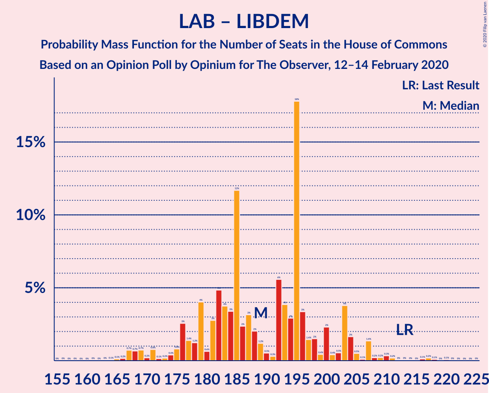

| Number of Seats | Probability | Accumulated | Special Marks |
|:---------------:|:-----------:|:-----------:|:-------------:|
| 156 | 0% | 100% |  |
| 157 | 0% | 99.9% |  |
| 158 | 0% | 99.9% |  |
| 159 | 0% | 99.9% |  |
| 160 | 0% | 99.9% |  |
| 161 | 0% | 99.9% |  |
| 162 | 0% | 99.9% |  |
| 163 | 0% | 99.9% |  |
| 164 | 0.1% | 99.8% |  |
| 165 | 0.1% | 99.8% |  |
| 166 | 0.2% | 99.7% |  |
| 167 | 0.7% | 99.5% |  |
| 168 | 0.7% | 98.8% |  |
| 169 | 0.7% | 98% |  |
| 170 | 0.2% | 97% |  |
| 171 | 0.8% | 97% |  |
| 172 | 0.1% | 96% |  |
| 173 | 0.2% | 96% |  |
| 174 | 0.4% | 96% |  |
| 175 | 0.8% | 96% |  |
| 176 | 3% | 95% |  |
| 177 | 1.4% | 92% |  |
| 178 | 1.2% | 91% |  |
| 179 | 4% | 90% |  |
| 180 | 0.6% | 86% |  |
| 181 | 3% | 85% |  |
| 182 | 5% | 82% |  |
| 183 | 4% | 77% |  |
| 184 | 3% | 74% |  |
| 185 | 12% | 70% |  |
| 186 | 2% | 59% |  |
| 187 | 3% | 56% |  |
| 188 | 2% | 53% |  |
| 189 | 1.2% | 51% | Median |
| 190 | 0.5% | 50% |  |
| 191 | 0.3% | 49% |  |
| 192 | 6% | 49% |  |
| 193 | 4% | 44% |  |
| 194 | 3% | 40% |  |
| 195 | 18% | 37% |  |
| 196 | 3% | 19% |  |
| 197 | 1.4% | 16% |  |
| 198 | 2% | 14% |  |
| 199 | 0.4% | 13% |  |
| 200 | 2% | 12% |  |
| 201 | 0.4% | 10% |  |
| 202 | 0.5% | 10% |  |
| 203 | 4% | 9% |  |
| 204 | 2% | 5% |  |
| 205 | 0.5% | 4% |  |
| 206 | 0.1% | 3% |  |
| 207 | 1.4% | 3% |  |
| 208 | 0.2% | 2% |  |
| 209 | 0.2% | 1.4% |  |
| 210 | 0.3% | 1.2% |  |
| 211 | 0.2% | 0.9% |  |
| 212 | 0% | 0.7% |  |
| 213 | 0% | 0.6% | Last Result |
| 214 | 0% | 0.6% |  |
| 215 | 0% | 0.6% |  |
| 216 | 0.1% | 0.5% |  |
| 217 | 0.2% | 0.4% |  |
| 218 | 0.1% | 0.2% |  |
| 219 | 0% | 0.2% |  |
| 220 | 0.1% | 0.1% |  |
| 221 | 0% | 0.1% |  |
| 222 | 0% | 0.1% |  |
| 223 | 0% | 0% |  |

### Labour Party

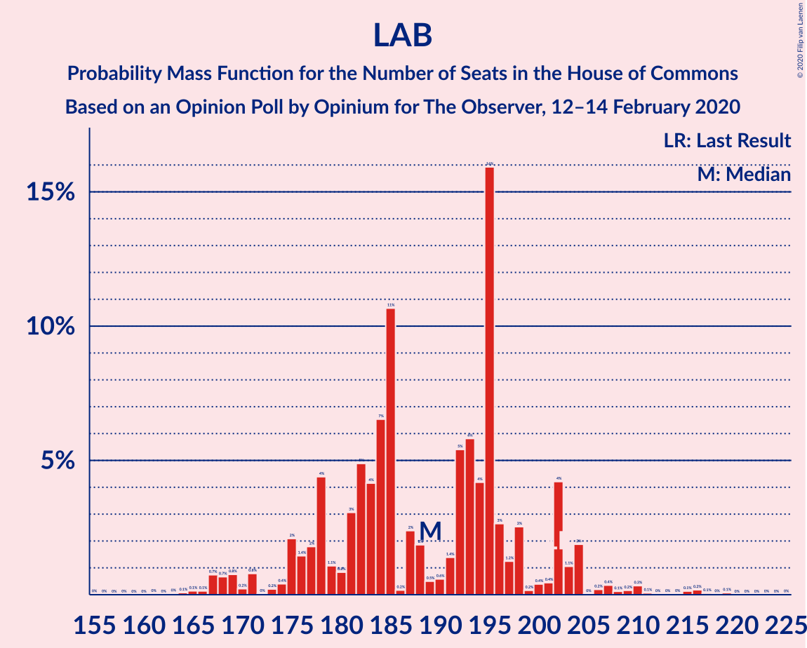

| Number of Seats | Probability | Accumulated | Special Marks |
|:---------------:|:-----------:|:-----------:|:-------------:|
| 155 | 0% | 100% |  |
| 156 | 0% | 99.9% |  |
| 157 | 0% | 99.9% |  |
| 158 | 0% | 99.9% |  |
| 159 | 0% | 99.9% |  |
| 160 | 0% | 99.9% |  |
| 161 | 0% | 99.9% |  |
| 162 | 0% | 99.9% |  |
| 163 | 0% | 99.9% |  |
| 164 | 0.1% | 99.8% |  |
| 165 | 0.1% | 99.7% |  |
| 166 | 0.1% | 99.6% |  |
| 167 | 0.7% | 99.5% |  |
| 168 | 0.7% | 98.7% |  |
| 169 | 0.8% | 98% |  |
| 170 | 0.2% | 97% |  |
| 171 | 0.8% | 97% |  |
| 172 | 0% | 96% |  |
| 173 | 0.2% | 96% |  |
| 174 | 0.4% | 96% |  |
| 175 | 2% | 96% |  |
| 176 | 1.4% | 94% |  |
| 177 | 2% | 92% |  |
| 178 | 4% | 90% |  |
| 179 | 1.1% | 86% |  |
| 180 | 0.8% | 85% |  |
| 181 | 3% | 84% |  |
| 182 | 5% | 81% |  |
| 183 | 4% | 76% |  |
| 184 | 7% | 72% |  |
| 185 | 11% | 65% |  |
| 186 | 0.2% | 55% |  |
| 187 | 2% | 55% |  |
| 188 | 2% | 52% |  |
| 189 | 0.5% | 50% | Median |
| 190 | 0.6% | 50% |  |
| 191 | 1.4% | 49% |  |
| 192 | 5% | 48% |  |
| 193 | 6% | 42% |  |
| 194 | 4% | 37% |  |
| 195 | 16% | 32% |  |
| 196 | 3% | 16% |  |
| 197 | 1.2% | 14% |  |
| 198 | 3% | 13% |  |
| 199 | 0.2% | 10% |  |
| 200 | 0.4% | 10% |  |
| 201 | 0.4% | 9% |  |
| 202 | 4% | 9% | Last Result |
| 203 | 1.1% | 5% |  |
| 204 | 2% | 4% |  |
| 205 | 0% | 2% |  |
| 206 | 0.2% | 2% |  |
| 207 | 0.4% | 2% |  |
| 208 | 0.1% | 1.3% |  |
| 209 | 0.2% | 1.2% |  |
| 210 | 0.3% | 1.0% |  |
| 211 | 0.1% | 0.7% |  |
| 212 | 0% | 0.6% |  |
| 213 | 0% | 0.6% |  |
| 214 | 0% | 0.6% |  |
| 215 | 0.1% | 0.5% |  |
| 216 | 0.2% | 0.4% |  |
| 217 | 0.1% | 0.2% |  |
| 218 | 0% | 0.2% |  |
| 219 | 0.1% | 0.1% |  |
| 220 | 0% | 0.1% |  |
| 221 | 0% | 0.1% |  |
| 222 | 0% | 0% |  |

## Technical Information

### Opinion Poll

+ **Polling firm:** Opinium
+ **Commissioner(s):** The Observer
+ **Fieldwork period:** 12–14 February 2020

### Calculations

+ **Sample size:** 1967
+ **Simulations done:** 131,072
+ **Error estimate:** 1.87%

