# Opinion Poll by BMG Research for The Independent, 3–6 March 2020

<a href="#voting-intentions">Voting Intentions</a> | <a href="#seats">Seats</a> | <a href="#coalitions">Coalitions</a> | <a href="#technical-information">Technical Information</a>

## Voting Intentions

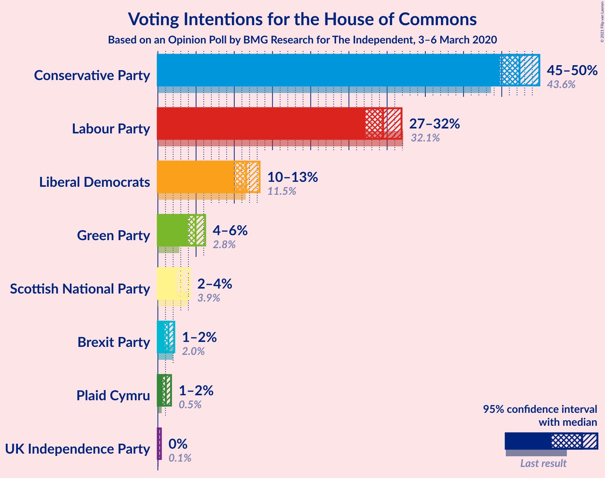

### Confidence Intervals

| Party | Last Result | Poll Result | 80% Confidence Interval | 90% Confidence Interval | 95% Confidence Interval | 99% Confidence Interval |
|:-----:|:-----------:|:-----------:|:-----------------------:|:-----------------------:|:-----------------------:|:-----------------------:|
| Conservative Party | 43.6% | 47.3% | 45.6–49.0% |45.2–49.5% |44.7–49.9% |43.9–50.7% |
| Labour Party | 32.1% | 29.5% | 28.0–31.0% |27.5–31.5% |27.2–31.9% |26.4–32.6% |
| Liberal Democrats | 11.5% | 11.5% | 10.5–12.7% |10.2–13.0% |10.0–13.3% |9.5–13.9% |
| Green Party | 2.8% | 4.9% | 4.3–5.7% |4.1–6.0% |3.9–6.2% |3.6–6.6% |
| Scottish National Party | 3.9% | 3.1% | 2.6–3.8% |2.5–4.0% |2.3–4.2% |2.1–4.5% |
| Brexit Party | 2.0% | 1.4% | 1.1–1.9% |1.0–2.0% |0.9–2.1% |0.8–2.4% |
| Plaid Cymru | 0.5% | 1.0% | 0.8–1.5% |0.7–1.6% |0.6–1.7% |0.5–2.0% |
| UK Independence Party | 0.1% | 0.1% | 0.0–0.3% |0.0–0.3% |0.0–0.4% |0.0–0.5% |

*Note:* The poll result column reflects the actual value used in the calculations. Published results may vary slightly, and in addition be rounded to fewer digits.

## Seats

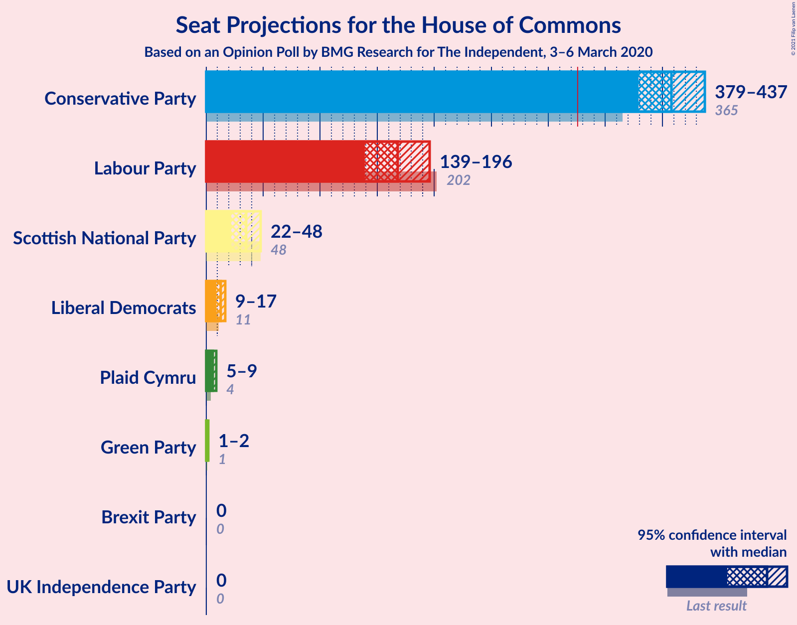

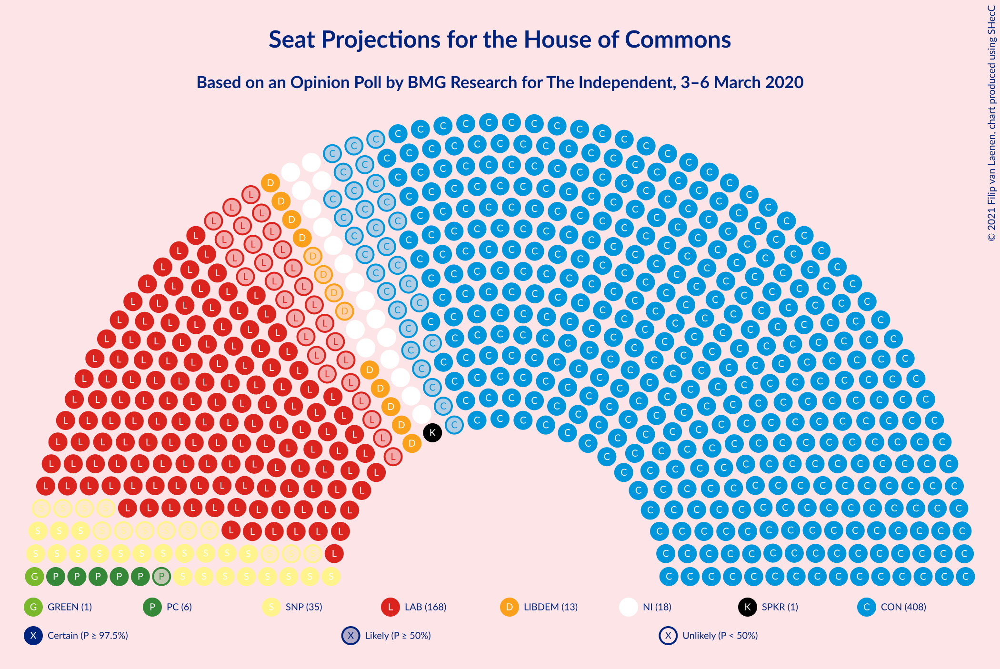

### Confidence Intervals

| Party | Last Result | Median | 80% Confidence Interval | 90% Confidence Interval | 95% Confidence Interval | 99% Confidence Interval |
|:-----:|:-----------:|:------:|:-----------------------:|:-----------------------:|:-----------------------:|:-----------------------:|
| <a href="#conservative-party">Conservative Party</a> | 365 | 408 | 395–427 |383–433 |379–437 |371–438 |
| <a href="#labour-party">Labour Party</a> | 202 | 168 | 147–183 |140–189 |139–196 |137–205 |
| <a href="#liberal-democrats">Liberal Democrats</a> | 11 | 13 | 11–13 |10–17 |9–17 |8–22 |
| <a href="#green-party">Green Party</a> | 1 | 1 | 1 |1 |1–2 |1–2 |
| <a href="#scottish-national-party">Scottish National Party</a> | 48 | 35 | 31–44 |27–45 |22–48 |16–52 |
| <a href="#brexit-party">Brexit Party</a> | 0 | 0 | 0 |0 |0 |0 |
| <a href="#plaid-cymru">Plaid Cymru</a> | 4 | 6 | 5–7 |5–8 |5–9 |4–10 |
| <a href="#uk-independence-party">UK Independence Party</a> | 0 | 0 | 0 |0 |0 |0 |

### Conservative Party

*For a full overview of the results for this party, see the [Conservative Party](party-conservativeparty.html) page.*

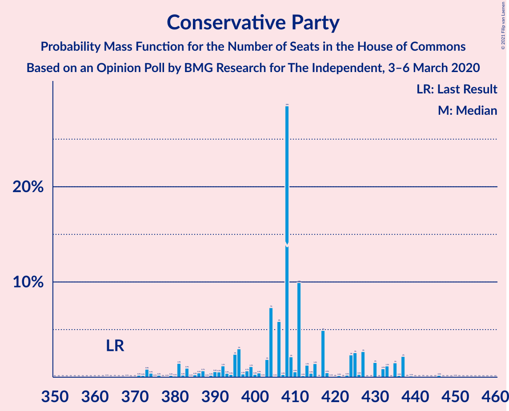

| Number of Seats | Probability | Accumulated | Special Marks |
|:---------------:|:-----------:|:-----------:|:-------------:|
| 358 | 0% | 100% |  |
| 359 | 0% | 99.9% |  |
| 360 | 0% | 99.9% |  |
| 361 | 0% | 99.9% |  |
| 362 | 0% | 99.9% |  |
| 363 | 0.1% | 99.9% |  |
| 364 | 0% | 99.8% |  |
| 365 | 0% | 99.8% | Last Result |
| 366 | 0% | 99.8% |  |
| 367 | 0% | 99.8% |  |
| 368 | 0.1% | 99.8% |  |
| 369 | 0% | 99.7% |  |
| 370 | 0% | 99.7% |  |
| 371 | 0.2% | 99.7% |  |
| 372 | 0.2% | 99.5% |  |
| 373 | 0.8% | 99.3% |  |
| 374 | 0.4% | 98% |  |
| 375 | 0.1% | 98% |  |
| 376 | 0.2% | 98% |  |
| 377 | 0% | 98% |  |
| 378 | 0.1% | 98% |  |
| 379 | 0.2% | 98% |  |
| 380 | 0.1% | 97% |  |
| 381 | 1.5% | 97% |  |
| 382 | 0.2% | 96% |  |
| 383 | 0.9% | 96% |  |
| 384 | 0.1% | 95% |  |
| 385 | 0.3% | 95% |  |
| 386 | 0.5% | 94% |  |
| 387 | 0.7% | 94% |  |
| 388 | 0.1% | 93% |  |
| 389 | 0.2% | 93% |  |
| 390 | 0.6% | 93% |  |
| 391 | 0.5% | 92% |  |
| 392 | 1.2% | 92% |  |
| 393 | 0.4% | 91% |  |
| 394 | 0.3% | 90% |  |
| 395 | 2% | 90% |  |
| 396 | 3% | 88% |  |
| 397 | 0.3% | 85% |  |
| 398 | 0.7% | 84% |  |
| 399 | 1.1% | 84% |  |
| 400 | 0.3% | 83% |  |
| 401 | 0.4% | 82% |  |
| 402 | 0.1% | 82% |  |
| 403 | 2% | 82% |  |
| 404 | 7% | 80% |  |
| 405 | 0.1% | 73% |  |
| 406 | 6% | 72% |  |
| 407 | 0.3% | 67% |  |
| 408 | 28% | 66% | Median |
| 409 | 2% | 38% |  |
| 410 | 0.6% | 36% |  |
| 411 | 10% | 35% |  |
| 412 | 0.2% | 25% |  |
| 413 | 1.3% | 25% |  |
| 414 | 0.4% | 24% |  |
| 415 | 1.4% | 23% |  |
| 416 | 0% | 22% |  |
| 417 | 5% | 22% |  |
| 418 | 0.5% | 17% |  |
| 419 | 0.1% | 16% |  |
| 420 | 0% | 16% |  |
| 421 | 0.2% | 16% |  |
| 422 | 0% | 16% |  |
| 423 | 0.2% | 16% |  |
| 424 | 2% | 16% |  |
| 425 | 3% | 14% |  |
| 426 | 0.3% | 11% |  |
| 427 | 3% | 11% |  |
| 428 | 0% | 8% |  |
| 429 | 0% | 8% |  |
| 430 | 2% | 8% |  |
| 431 | 0% | 6% |  |
| 432 | 0.9% | 6% |  |
| 433 | 1.2% | 6% |  |
| 434 | 0% | 4% |  |
| 435 | 2% | 4% |  |
| 436 | 0.2% | 3% |  |
| 437 | 2% | 3% |  |
| 438 | 0% | 0.5% |  |
| 439 | 0.1% | 0.5% |  |
| 440 | 0% | 0.4% |  |
| 441 | 0% | 0.4% |  |
| 442 | 0% | 0.4% |  |
| 443 | 0% | 0.3% |  |
| 444 | 0% | 0.3% |  |
| 445 | 0% | 0.3% |  |
| 446 | 0.2% | 0.3% |  |
| 447 | 0% | 0.1% |  |
| 448 | 0% | 0.1% |  |
| 449 | 0% | 0.1% |  |
| 450 | 0.1% | 0.1% |  |
| 451 | 0% | 0% |  |

### Labour Party

*For a full overview of the results for this party, see the [Labour Party](party-labourparty.html) page.*

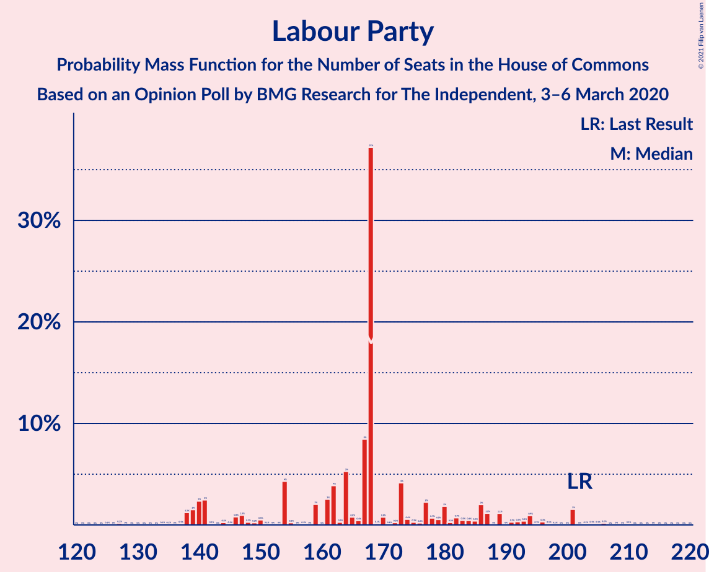

| Number of Seats | Probability | Accumulated | Special Marks |
|:---------------:|:-----------:|:-----------:|:-------------:|
| 125 | 0.1% | 100% |  |
| 126 | 0% | 99.9% |  |
| 127 | 0.2% | 99.9% |  |
| 128 | 0% | 99.7% |  |
| 129 | 0% | 99.7% |  |
| 130 | 0% | 99.7% |  |
| 131 | 0% | 99.7% |  |
| 132 | 0% | 99.7% |  |
| 133 | 0% | 99.7% |  |
| 134 | 0.1% | 99.7% |  |
| 135 | 0.1% | 99.6% |  |
| 136 | 0% | 99.6% |  |
| 137 | 0.1% | 99.5% |  |
| 138 | 1.2% | 99.4% |  |
| 139 | 2% | 98% |  |
| 140 | 2% | 97% |  |
| 141 | 2% | 94% |  |
| 142 | 0.1% | 92% |  |
| 143 | 0% | 92% |  |
| 144 | 0.2% | 92% |  |
| 145 | 0.1% | 92% |  |
| 146 | 0.8% | 91% |  |
| 147 | 1.0% | 91% |  |
| 148 | 0.3% | 90% |  |
| 149 | 0.2% | 89% |  |
| 150 | 0.5% | 89% |  |
| 151 | 0.1% | 89% |  |
| 152 | 0% | 89% |  |
| 153 | 0% | 89% |  |
| 154 | 4% | 89% |  |
| 155 | 0.2% | 84% |  |
| 156 | 0% | 84% |  |
| 157 | 0.1% | 84% |  |
| 158 | 0% | 84% |  |
| 159 | 2% | 84% |  |
| 160 | 0% | 82% |  |
| 161 | 3% | 82% |  |
| 162 | 4% | 79% |  |
| 163 | 0.3% | 75% |  |
| 164 | 5% | 75% |  |
| 165 | 0.8% | 70% |  |
| 166 | 0.4% | 69% |  |
| 167 | 8% | 69% |  |
| 168 | 37% | 60% | Median |
| 169 | 0.1% | 23% |  |
| 170 | 0.8% | 23% |  |
| 171 | 0.1% | 22% |  |
| 172 | 0.2% | 22% |  |
| 173 | 4% | 22% |  |
| 174 | 0.6% | 18% |  |
| 175 | 0.3% | 17% |  |
| 176 | 0.2% | 17% |  |
| 177 | 2% | 17% |  |
| 178 | 0.7% | 14% |  |
| 179 | 0.5% | 14% |  |
| 180 | 2% | 13% |  |
| 181 | 0.2% | 11% |  |
| 182 | 0.7% | 11% |  |
| 183 | 0.5% | 10% |  |
| 184 | 0.4% | 10% |  |
| 185 | 0.4% | 10% |  |
| 186 | 2% | 9% |  |
| 187 | 1.2% | 7% |  |
| 188 | 0% | 6% |  |
| 189 | 1.1% | 6% |  |
| 190 | 0% | 5% |  |
| 191 | 0.3% | 5% |  |
| 192 | 0.3% | 4% |  |
| 193 | 0.4% | 4% |  |
| 194 | 0.9% | 4% |  |
| 195 | 0.1% | 3% |  |
| 196 | 0.3% | 3% |  |
| 197 | 0.1% | 2% |  |
| 198 | 0.1% | 2% |  |
| 199 | 0% | 2% |  |
| 200 | 0% | 2% |  |
| 201 | 2% | 2% |  |
| 202 | 0% | 0.7% | Last Result |
| 203 | 0.1% | 0.7% |  |
| 204 | 0.1% | 0.6% |  |
| 205 | 0.1% | 0.5% |  |
| 206 | 0.2% | 0.4% |  |
| 207 | 0% | 0.2% |  |
| 208 | 0% | 0.2% |  |
| 209 | 0% | 0.2% |  |
| 210 | 0.1% | 0.2% |  |
| 211 | 0% | 0.1% |  |
| 212 | 0% | 0.1% |  |
| 213 | 0% | 0.1% |  |
| 214 | 0% | 0.1% |  |
| 215 | 0% | 0% |  |

### Liberal Democrats

*For a full overview of the results for this party, see the [Liberal Democrats](party-liberaldemocrats.html) page.*

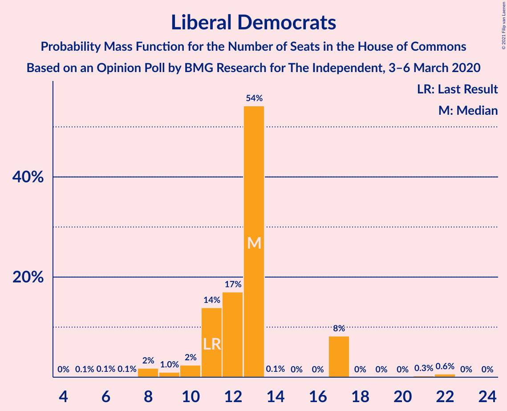

| Number of Seats | Probability | Accumulated | Special Marks |
|:---------------:|:-----------:|:-----------:|:-------------:|
| 5 | 0.1% | 100% |  |
| 6 | 0.1% | 99.9% |  |
| 7 | 0.1% | 99.8% |  |
| 8 | 2% | 99.7% |  |
| 9 | 1.0% | 98% |  |
| 10 | 2% | 97% |  |
| 11 | 14% | 94% | Last Result |
| 12 | 17% | 81% |  |
| 13 | 54% | 64% | Median |
| 14 | 0.1% | 9% |  |
| 15 | 0% | 9% |  |
| 16 | 0% | 9% |  |
| 17 | 8% | 9% |  |
| 18 | 0% | 1.0% |  |
| 19 | 0% | 1.0% |  |
| 20 | 0% | 1.0% |  |
| 21 | 0.3% | 1.0% |  |
| 22 | 0.6% | 0.7% |  |
| 23 | 0% | 0.1% |  |
| 24 | 0% | 0% |  |

### Green Party

*For a full overview of the results for this party, see the [Green Party](party-greenparty.html) page.*

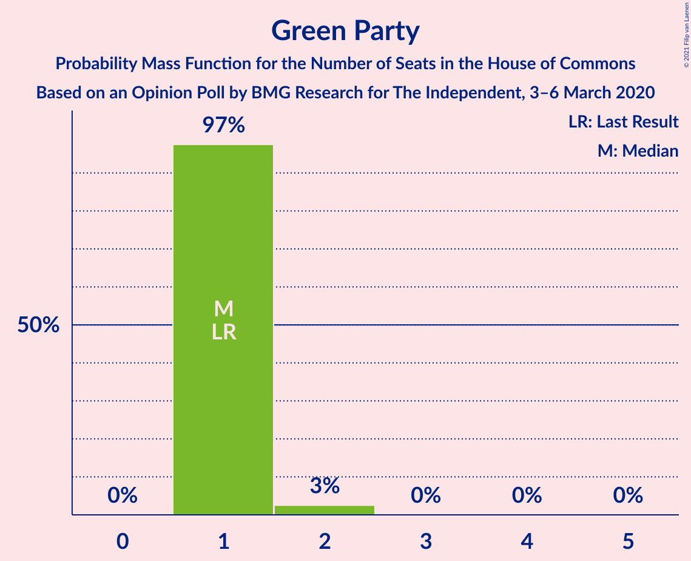

| Number of Seats | Probability | Accumulated | Special Marks |
|:---------------:|:-----------:|:-----------:|:-------------:|
| 1 | 97% | 100% | Last Result, Median |
| 2 | 3% | 3% |  |
| 3 | 0% | 0% |  |

### Scottish National Party

*For a full overview of the results for this party, see the [Scottish National Party](party-scottishnationalparty.html) page.*

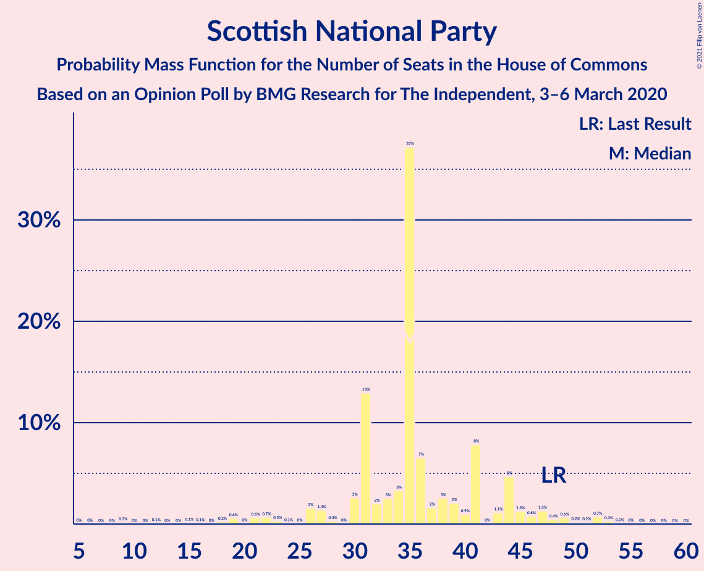

| Number of Seats | Probability | Accumulated | Special Marks |
|:---------------:|:-----------:|:-----------:|:-------------:|
| 6 | 0% | 100% |  |
| 7 | 0% | 99.9% |  |
| 8 | 0% | 99.9% |  |
| 9 | 0.2% | 99.9% |  |
| 10 | 0% | 99.8% |  |
| 11 | 0% | 99.8% |  |
| 12 | 0.1% | 99.8% |  |
| 13 | 0% | 99.7% |  |
| 14 | 0% | 99.7% |  |
| 15 | 0.1% | 99.7% |  |
| 16 | 0.1% | 99.6% |  |
| 17 | 0% | 99.5% |  |
| 18 | 0.2% | 99.5% |  |
| 19 | 0.6% | 99.3% |  |
| 20 | 0% | 98.7% |  |
| 21 | 0.6% | 98.7% |  |
| 22 | 0.7% | 98% |  |
| 23 | 0.3% | 97% |  |
| 24 | 0.1% | 97% |  |
| 25 | 0% | 97% |  |
| 26 | 2% | 97% |  |
| 27 | 1.4% | 95% |  |
| 28 | 0.3% | 94% |  |
| 29 | 0% | 94% |  |
| 30 | 3% | 94% |  |
| 31 | 13% | 91% |  |
| 32 | 2% | 78% |  |
| 33 | 3% | 76% |  |
| 34 | 3% | 74% |  |
| 35 | 37% | 70% | Median |
| 36 | 7% | 33% |  |
| 37 | 2% | 27% |  |
| 38 | 3% | 25% |  |
| 39 | 2% | 23% |  |
| 40 | 0.9% | 20% |  |
| 41 | 8% | 20% |  |
| 42 | 0% | 12% |  |
| 43 | 1.1% | 12% |  |
| 44 | 5% | 11% |  |
| 45 | 1.3% | 6% |  |
| 46 | 0.8% | 5% |  |
| 47 | 1.3% | 4% |  |
| 48 | 0.4% | 3% | Last Result |
| 49 | 0.6% | 2% |  |
| 50 | 0.2% | 1.4% |  |
| 51 | 0.2% | 1.3% |  |
| 52 | 0.7% | 1.1% |  |
| 53 | 0.3% | 0.4% |  |
| 54 | 0.1% | 0.1% |  |
| 55 | 0% | 0.1% |  |
| 56 | 0% | 0% |  |

### Brexit Party

*For a full overview of the results for this party, see the [Brexit Party](party-brexitparty.html) page.*

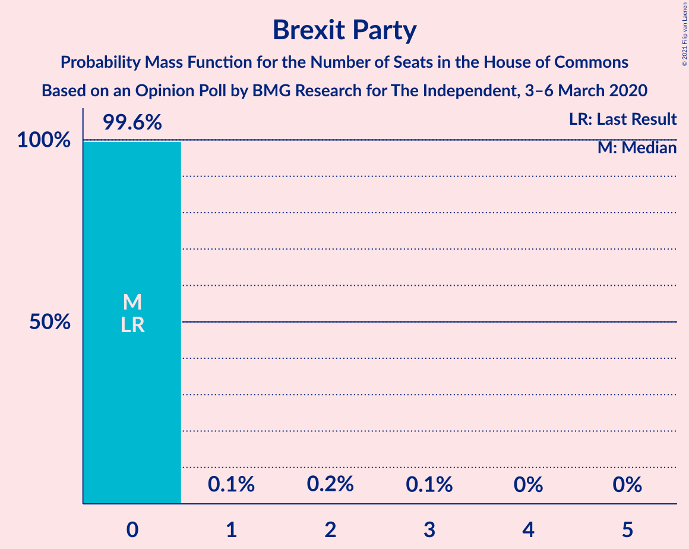

| Number of Seats | Probability | Accumulated | Special Marks |
|:---------------:|:-----------:|:-----------:|:-------------:|
| 0 | 99.6% | 100% | Last Result, Median |
| 1 | 0.1% | 0.4% |  |
| 2 | 0.2% | 0.3% |  |
| 3 | 0.1% | 0.1% |  |
| 4 | 0% | 0% |  |

### Plaid Cymru

*For a full overview of the results for this party, see the [Plaid Cymru](party-plaidcymru.html) page.*

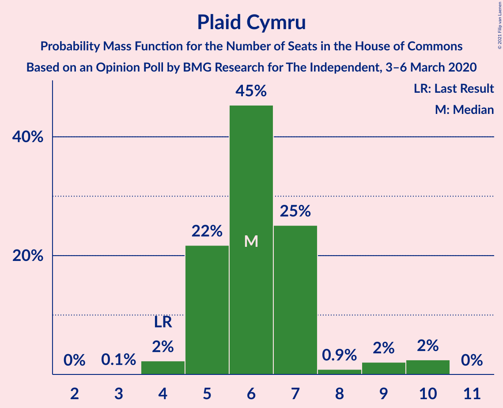

| Number of Seats | Probability | Accumulated | Special Marks |
|:---------------:|:-----------:|:-----------:|:-------------:|
| 3 | 0.1% | 100% |  |
| 4 | 2% | 99.9% | Last Result |
| 5 | 22% | 98% |  |
| 6 | 45% | 76% | Median |
| 7 | 25% | 31% |  |
| 8 | 0.9% | 5% |  |
| 9 | 2% | 5% |  |
| 10 | 2% | 2% |  |
| 11 | 0% | 0% |  |

### UK Independence Party

*For a full overview of the results for this party, see the [UK Independence Party](party-ukindependenceparty.html) page.*

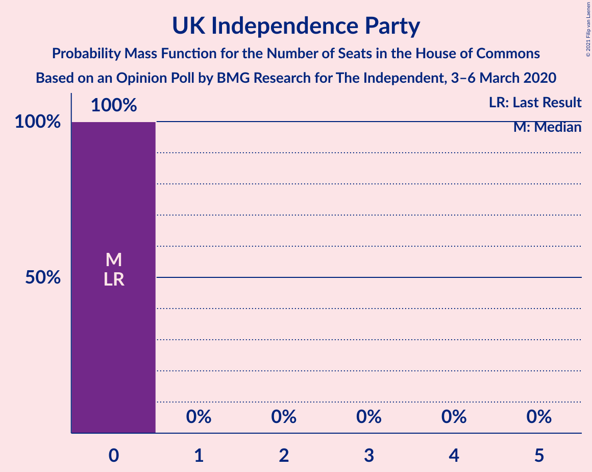

| Number of Seats | Probability | Accumulated | Special Marks |
|:---------------:|:-----------:|:-----------:|:-------------:|
| 0 | 100% | 100% | Last Result, Median |

## Coalitions

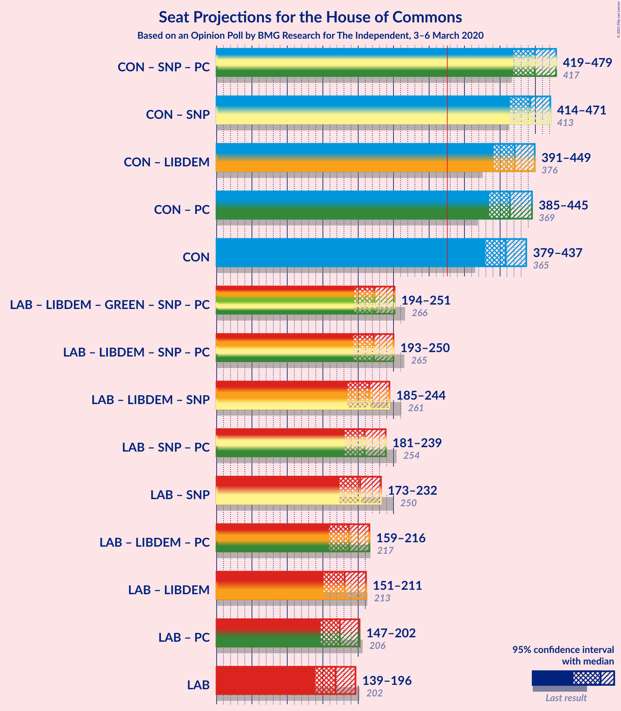

### Confidence Intervals

| Coalition | Last Result | Median | Majority? | 80% Confidence Interval | 90% Confidence Interval | 95% Confidence Interval | 99% Confidence Interval |
|:---------:|:-----------:|:------:|:---------:|:-----------------------:|:-----------------------:|:-----------------------:|:-----------------------:|
| Conservative Party – Scottish National Party – Plaid Cymru | 417 | 449 | 100% | 434–471 | 428–478 | 419–479 | 412–480 |
| Conservative Party – Scottish National Party | 413 | 443 | 100% | 428–464 | 420–471 | 414–471 | 407–473 |
| Conservative Party – Liberal Democrats | 376 | 421 | 100% | 407–439 | 398–445 | 391–449 | 383–450 |
| Conservative Party – Plaid Cymru | 369 | 414 | 100% | 400–433 | 390–440 | 385–445 | 377–446 |
| Conservative Party | 365 | 408 | 100% | 395–427 | 383–433 | 379–437 | 371–438 |
| Labour Party – Liberal Democrats – Green Party – Scottish National Party – Plaid Cymru | 266 | 223 | 0% | 204–236 | 198–248 | 194–251 | 192–260 |
| Labour Party – Liberal Democrats – Scottish National Party – Plaid Cymru | 265 | 222 | 0% | 203–235 | 197–247 | 193–250 | 191–259 |
| Labour Party – Liberal Democrats – Scottish National Party | 261 | 216 | 0% | 197–230 | 190–240 | 185–244 | 184–253 |
| Labour Party – Scottish National Party – Plaid Cymru | 254 | 209 | 0% | 191–223 | 185–232 | 181–239 | 180–247 |
| Labour Party – Scottish National Party | 250 | 203 | 0% | 185–217 | 178–227 | 173–232 | 172–241 |
| Labour Party – Liberal Democrats – Plaid Cymru | 217 | 187 | 0% | 166–202 | 159–210 | 159–216 | 156–223 |
| Labour Party – Liberal Democrats | 213 | 181 | 0% | 159–196 | 152–202 | 151–211 | 149–218 |
| Labour Party – Plaid Cymru | 206 | 174 | 0% | 154–189 | 147–197 | 147–202 | 144–210 |
| Labour Party | 202 | 168 | 0% | 147–183 | 140–189 | 139–196 | 137–205 |

### Conservative Party – Scottish National Party – Plaid Cymru

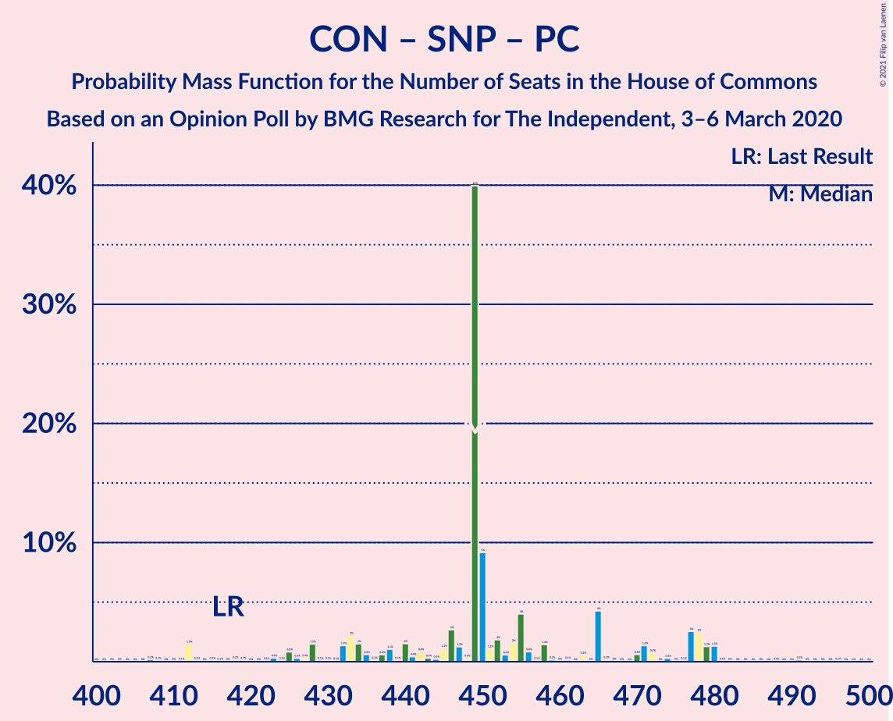

| Number of Seats | Probability | Accumulated | Special Marks |
|:---------------:|:-----------:|:-----------:|:-------------:|
| 403 | 0% | 100% |  |
| 404 | 0% | 99.9% |  |
| 405 | 0% | 99.9% |  |
| 406 | 0% | 99.9% |  |
| 407 | 0.2% | 99.9% |  |
| 408 | 0.1% | 99.7% |  |
| 409 | 0% | 99.6% |  |
| 410 | 0% | 99.6% |  |
| 411 | 0.1% | 99.6% |  |
| 412 | 1.5% | 99.5% |  |
| 413 | 0.1% | 98% |  |
| 414 | 0% | 98% |  |
| 415 | 0.1% | 98% |  |
| 416 | 0.1% | 98% |  |
| 417 | 0% | 98% | Last Result |
| 418 | 0.2% | 98% |  |
| 419 | 0.1% | 98% |  |
| 420 | 0% | 97% |  |
| 421 | 0% | 97% |  |
| 422 | 0.1% | 97% |  |
| 423 | 0.3% | 97% |  |
| 424 | 0.1% | 97% |  |
| 425 | 0.8% | 97% |  |
| 426 | 0.3% | 96% |  |
| 427 | 0.3% | 96% |  |
| 428 | 1.5% | 95% |  |
| 429 | 0.1% | 94% |  |
| 430 | 0.1% | 94% |  |
| 431 | 0.1% | 94% |  |
| 432 | 1.4% | 94% |  |
| 433 | 2% | 92% |  |
| 434 | 2% | 90% |  |
| 435 | 0.6% | 89% |  |
| 436 | 0.1% | 88% |  |
| 437 | 0.6% | 88% |  |
| 438 | 1.1% | 87% |  |
| 439 | 0.1% | 86% |  |
| 440 | 2% | 86% |  |
| 441 | 0.4% | 85% |  |
| 442 | 0.8% | 84% |  |
| 443 | 0.3% | 83% |  |
| 444 | 0.2% | 83% |  |
| 445 | 1.1% | 83% |  |
| 446 | 3% | 82% |  |
| 447 | 1.3% | 79% |  |
| 448 | 0.3% | 78% |  |
| 449 | 40% | 77% | Median |
| 450 | 9% | 37% |  |
| 451 | 1.1% | 28% |  |
| 452 | 2% | 27% |  |
| 453 | 0.6% | 25% |  |
| 454 | 2% | 25% |  |
| 455 | 4% | 23% |  |
| 456 | 0.8% | 19% |  |
| 457 | 0.1% | 18% |  |
| 458 | 1.4% | 18% |  |
| 459 | 0.2% | 17% |  |
| 460 | 0% | 17% |  |
| 461 | 0.1% | 17% |  |
| 462 | 0% | 16% |  |
| 463 | 0.5% | 16% |  |
| 464 | 0% | 16% |  |
| 465 | 4% | 16% |  |
| 466 | 0.2% | 12% |  |
| 467 | 0% | 11% |  |
| 468 | 0% | 11% |  |
| 469 | 0% | 11% |  |
| 470 | 0.6% | 11% |  |
| 471 | 1.4% | 11% |  |
| 472 | 0.8% | 9% |  |
| 473 | 0% | 9% |  |
| 474 | 0.3% | 9% |  |
| 475 | 0% | 8% |  |
| 476 | 0.1% | 8% |  |
| 477 | 3% | 8% |  |
| 478 | 2% | 6% |  |
| 479 | 1.3% | 3% |  |
| 480 | 1.3% | 2% |  |
| 481 | 0.1% | 0.5% |  |
| 482 | 0% | 0.4% |  |
| 483 | 0% | 0.4% |  |
| 484 | 0% | 0.4% |  |
| 485 | 0% | 0.4% |  |
| 486 | 0% | 0.4% |  |
| 487 | 0% | 0.3% |  |
| 488 | 0.1% | 0.3% |  |
| 489 | 0% | 0.3% |  |
| 490 | 0% | 0.3% |  |
| 491 | 0.2% | 0.3% |  |
| 492 | 0% | 0.1% |  |
| 493 | 0% | 0.1% |  |
| 494 | 0% | 0.1% |  |
| 495 | 0% | 0.1% |  |
| 496 | 0.1% | 0.1% |  |
| 497 | 0% | 0% |  |

### Conservative Party – Scottish National Party

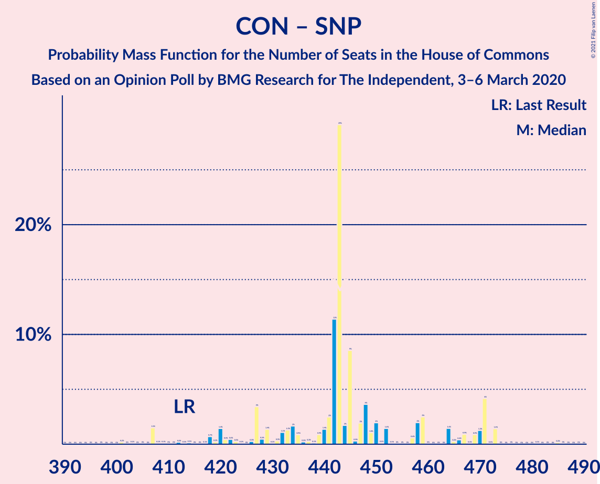

| Number of Seats | Probability | Accumulated | Special Marks |
|:---------------:|:-----------:|:-----------:|:-------------:|
| 397 | 0% | 100% |  |
| 398 | 0% | 99.9% |  |
| 399 | 0% | 99.9% |  |
| 400 | 0% | 99.9% |  |
| 401 | 0.2% | 99.9% |  |
| 402 | 0% | 99.7% |  |
| 403 | 0.1% | 99.7% |  |
| 404 | 0% | 99.6% |  |
| 405 | 0% | 99.6% |  |
| 406 | 0% | 99.5% |  |
| 407 | 1.5% | 99.5% |  |
| 408 | 0.1% | 98% |  |
| 409 | 0.1% | 98% |  |
| 410 | 0% | 98% |  |
| 411 | 0% | 98% |  |
| 412 | 0.2% | 98% |  |
| 413 | 0.1% | 98% | Last Result |
| 414 | 0.1% | 98% |  |
| 415 | 0% | 97% |  |
| 416 | 0% | 97% |  |
| 417 | 0.1% | 97% |  |
| 418 | 0.7% | 97% |  |
| 419 | 0.2% | 97% |  |
| 420 | 1.4% | 96% |  |
| 421 | 0.4% | 95% |  |
| 422 | 0.4% | 94% |  |
| 423 | 0.2% | 94% |  |
| 424 | 0.1% | 94% |  |
| 425 | 0% | 94% |  |
| 426 | 0.3% | 94% |  |
| 427 | 3% | 93% |  |
| 428 | 0.5% | 90% |  |
| 429 | 1.4% | 90% |  |
| 430 | 0.1% | 88% |  |
| 431 | 0.3% | 88% |  |
| 432 | 1.1% | 88% |  |
| 433 | 1.3% | 87% |  |
| 434 | 2% | 85% |  |
| 435 | 0.9% | 84% |  |
| 436 | 0.2% | 83% |  |
| 437 | 0.3% | 83% |  |
| 438 | 0.1% | 82% |  |
| 439 | 0.9% | 82% |  |
| 440 | 1.4% | 82% |  |
| 441 | 2% | 80% |  |
| 442 | 11% | 78% |  |
| 443 | 29% | 66% | Median |
| 444 | 2% | 37% |  |
| 445 | 9% | 35% |  |
| 446 | 0.3% | 27% |  |
| 447 | 2% | 27% |  |
| 448 | 4% | 25% |  |
| 449 | 1.0% | 21% |  |
| 450 | 2% | 20% |  |
| 451 | 0.1% | 18% |  |
| 452 | 1.4% | 18% |  |
| 453 | 0.1% | 17% |  |
| 454 | 0% | 16% |  |
| 455 | 0% | 16% |  |
| 456 | 0% | 16% |  |
| 457 | 0.6% | 16% |  |
| 458 | 2% | 16% |  |
| 459 | 2% | 14% |  |
| 460 | 0% | 11% |  |
| 461 | 0% | 11% |  |
| 462 | 0% | 11% |  |
| 463 | 0% | 11% |  |
| 464 | 1.4% | 11% |  |
| 465 | 0.2% | 10% |  |
| 466 | 0.4% | 10% |  |
| 467 | 0.9% | 9% |  |
| 468 | 0.1% | 8% |  |
| 469 | 0.9% | 8% |  |
| 470 | 1.3% | 7% |  |
| 471 | 4% | 6% |  |
| 472 | 0.1% | 2% |  |
| 473 | 1.4% | 2% |  |
| 474 | 0% | 0.5% |  |
| 475 | 0% | 0.4% |  |
| 476 | 0% | 0.4% |  |
| 477 | 0% | 0.4% |  |
| 478 | 0% | 0.4% |  |
| 479 | 0% | 0.4% |  |
| 480 | 0% | 0.4% |  |
| 481 | 0.1% | 0.4% |  |
| 482 | 0% | 0.3% |  |
| 483 | 0% | 0.3% |  |
| 484 | 0% | 0.3% |  |
| 485 | 0.2% | 0.3% |  |
| 486 | 0% | 0.1% |  |
| 487 | 0% | 0.1% |  |
| 488 | 0% | 0% |  |

### Conservative Party – Liberal Democrats

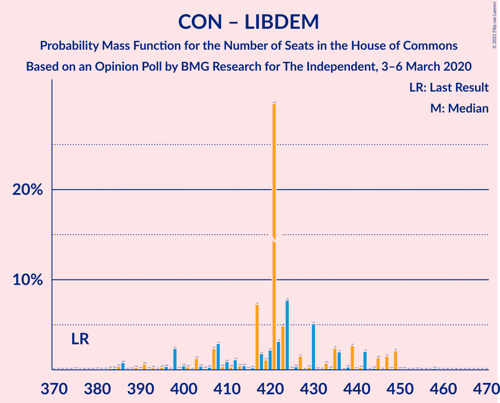

| Number of Seats | Probability | Accumulated | Special Marks |
|:---------------:|:-----------:|:-----------:|:-------------:|
| 372 | 0% | 100% |  |
| 373 | 0% | 99.9% |  |
| 374 | 0% | 99.9% |  |
| 375 | 0.1% | 99.9% |  |
| 376 | 0% | 99.8% | Last Result |
| 377 | 0% | 99.8% |  |
| 378 | 0% | 99.8% |  |
| 379 | 0% | 99.8% |  |
| 380 | 0.1% | 99.8% |  |
| 381 | 0% | 99.7% |  |
| 382 | 0% | 99.7% |  |
| 383 | 0.2% | 99.6% |  |
| 384 | 0.2% | 99.5% |  |
| 385 | 0.4% | 99.3% |  |
| 386 | 0.8% | 98.9% |  |
| 387 | 0% | 98% |  |
| 388 | 0.1% | 98% |  |
| 389 | 0.3% | 98% |  |
| 390 | 0.1% | 98% |  |
| 391 | 0.6% | 98% |  |
| 392 | 0.1% | 97% |  |
| 393 | 0.2% | 97% |  |
| 394 | 0% | 97% |  |
| 395 | 0.3% | 97% |  |
| 396 | 0.4% | 96% |  |
| 397 | 0% | 96% |  |
| 398 | 2% | 96% |  |
| 399 | 0.1% | 94% |  |
| 400 | 0.4% | 94% |  |
| 401 | 0.3% | 93% |  |
| 402 | 0% | 93% |  |
| 403 | 1.3% | 93% |  |
| 404 | 0.4% | 92% |  |
| 405 | 0.2% | 91% |  |
| 406 | 0.3% | 91% |  |
| 407 | 2% | 91% |  |
| 408 | 3% | 88% |  |
| 409 | 0.4% | 85% |  |
| 410 | 0.9% | 85% |  |
| 411 | 0.3% | 84% |  |
| 412 | 1.1% | 84% |  |
| 413 | 0.4% | 83% |  |
| 414 | 0.5% | 82% |  |
| 415 | 0.1% | 82% |  |
| 416 | 0.2% | 82% |  |
| 417 | 7% | 82% |  |
| 418 | 2% | 74% |  |
| 419 | 1.1% | 72% |  |
| 420 | 2% | 71% |  |
| 421 | 30% | 69% | Median |
| 422 | 3% | 40% |  |
| 423 | 5% | 37% |  |
| 424 | 8% | 32% |  |
| 425 | 0.2% | 24% |  |
| 426 | 0.3% | 24% |  |
| 427 | 2% | 23% |  |
| 428 | 0% | 22% |  |
| 429 | 0.3% | 22% |  |
| 430 | 5% | 22% |  |
| 431 | 0.1% | 17% |  |
| 432 | 0% | 16% |  |
| 433 | 0.7% | 16% |  |
| 434 | 0.2% | 16% |  |
| 435 | 2% | 16% |  |
| 436 | 2% | 13% |  |
| 437 | 0% | 11% |  |
| 438 | 0.3% | 11% |  |
| 439 | 3% | 11% |  |
| 440 | 0.1% | 8% |  |
| 441 | 0.2% | 8% |  |
| 442 | 2% | 8% |  |
| 443 | 0% | 6% |  |
| 444 | 0.2% | 6% |  |
| 445 | 1.3% | 6% |  |
| 446 | 0% | 4% |  |
| 447 | 2% | 4% |  |
| 448 | 0.1% | 3% |  |
| 449 | 2% | 3% |  |
| 450 | 0.1% | 0.5% |  |
| 451 | 0.1% | 0.5% |  |
| 452 | 0% | 0.4% |  |
| 453 | 0% | 0.3% |  |
| 454 | 0.1% | 0.3% |  |
| 455 | 0% | 0.3% |  |
| 456 | 0% | 0.3% |  |
| 457 | 0% | 0.3% |  |
| 458 | 0.1% | 0.2% |  |
| 459 | 0% | 0.1% |  |
| 460 | 0% | 0.1% |  |
| 461 | 0% | 0% |  |

### Conservative Party – Plaid Cymru

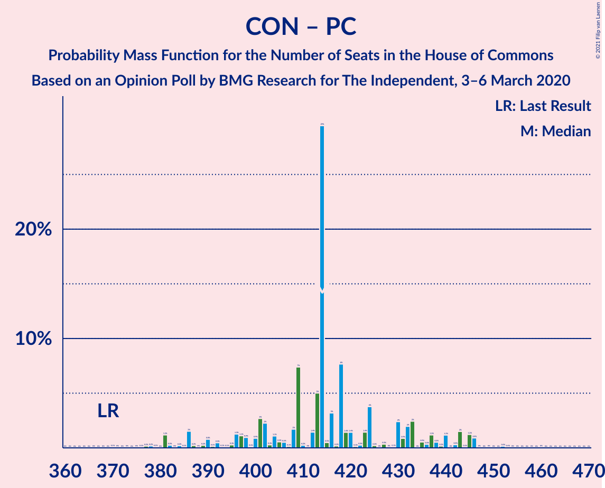

| Number of Seats | Probability | Accumulated | Special Marks |
|:---------------:|:-----------:|:-----------:|:-------------:|
| 365 | 0% | 100% |  |
| 366 | 0% | 99.9% |  |
| 367 | 0% | 99.9% |  |
| 368 | 0% | 99.9% |  |
| 369 | 0% | 99.9% | Last Result |
| 370 | 0.1% | 99.9% |  |
| 371 | 0% | 99.8% |  |
| 372 | 0% | 99.8% |  |
| 373 | 0% | 99.8% |  |
| 374 | 0% | 99.7% |  |
| 375 | 0% | 99.7% |  |
| 376 | 0.1% | 99.7% |  |
| 377 | 0.2% | 99.6% |  |
| 378 | 0.2% | 99.5% |  |
| 379 | 0.1% | 99.3% |  |
| 380 | 0% | 99.2% |  |
| 381 | 1.2% | 99.2% |  |
| 382 | 0.2% | 98% |  |
| 383 | 0% | 98% |  |
| 384 | 0.2% | 98% |  |
| 385 | 0.1% | 98% |  |
| 386 | 2% | 97% |  |
| 387 | 0.2% | 96% |  |
| 388 | 0% | 96% |  |
| 389 | 0.2% | 96% |  |
| 390 | 0.8% | 95% |  |
| 391 | 0.1% | 95% |  |
| 392 | 0.5% | 95% |  |
| 393 | 0.1% | 94% |  |
| 394 | 0.1% | 94% |  |
| 395 | 0.3% | 94% |  |
| 396 | 1.3% | 94% |  |
| 397 | 1.1% | 92% |  |
| 398 | 0.9% | 91% |  |
| 399 | 0.1% | 90% |  |
| 400 | 0.9% | 90% |  |
| 401 | 3% | 89% |  |
| 402 | 2% | 87% |  |
| 403 | 0.3% | 84% |  |
| 404 | 1.1% | 84% |  |
| 405 | 0.5% | 83% |  |
| 406 | 0.5% | 83% |  |
| 407 | 0.1% | 82% |  |
| 408 | 2% | 82% |  |
| 409 | 7% | 80% |  |
| 410 | 0.2% | 73% |  |
| 411 | 0% | 73% |  |
| 412 | 1.4% | 73% |  |
| 413 | 5% | 71% |  |
| 414 | 29% | 66% | Median |
| 415 | 0.5% | 37% |  |
| 416 | 3% | 36% |  |
| 417 | 0.2% | 33% |  |
| 418 | 8% | 33% |  |
| 419 | 1.4% | 25% |  |
| 420 | 1.4% | 24% |  |
| 421 | 0.1% | 22% |  |
| 422 | 0.3% | 22% |  |
| 423 | 1.4% | 22% |  |
| 424 | 4% | 20% |  |
| 425 | 0.2% | 17% |  |
| 426 | 0% | 16% |  |
| 427 | 0.3% | 16% |  |
| 428 | 0% | 16% |  |
| 429 | 0.1% | 16% |  |
| 430 | 2% | 16% |  |
| 431 | 0.9% | 14% |  |
| 432 | 2% | 13% |  |
| 433 | 2% | 11% |  |
| 434 | 0% | 8% |  |
| 435 | 0.5% | 8% |  |
| 436 | 0.3% | 8% |  |
| 437 | 1.2% | 7% |  |
| 438 | 0.5% | 6% |  |
| 439 | 0.2% | 6% |  |
| 440 | 1.2% | 6% |  |
| 441 | 0% | 4% |  |
| 442 | 0.3% | 4% |  |
| 443 | 2% | 4% |  |
| 444 | 0.1% | 3% |  |
| 445 | 1.2% | 3% |  |
| 446 | 0.9% | 1.3% |  |
| 447 | 0% | 0.4% |  |
| 448 | 0% | 0.4% |  |
| 449 | 0% | 0.4% |  |
| 450 | 0% | 0.3% |  |
| 451 | 0% | 0.3% |  |
| 452 | 0.2% | 0.3% |  |
| 453 | 0.1% | 0.2% |  |
| 454 | 0% | 0.1% |  |
| 455 | 0% | 0.1% |  |
| 456 | 0% | 0.1% |  |
| 457 | 0% | 0.1% |  |
| 458 | 0% | 0.1% |  |
| 459 | 0% | 0.1% |  |
| 460 | 0% | 0.1% |  |
| 461 | 0% | 0% |  |

### Conservative Party

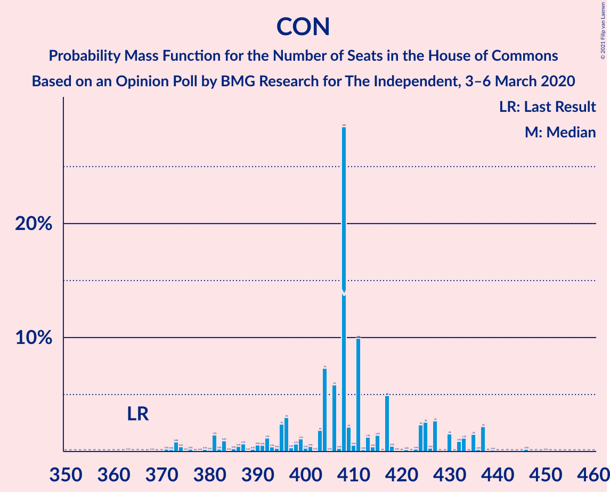

| Number of Seats | Probability | Accumulated | Special Marks |
|:---------------:|:-----------:|:-----------:|:-------------:|
| 358 | 0% | 100% |  |
| 359 | 0% | 99.9% |  |
| 360 | 0% | 99.9% |  |
| 361 | 0% | 99.9% |  |
| 362 | 0% | 99.9% |  |
| 363 | 0.1% | 99.9% |  |
| 364 | 0% | 99.8% |  |
| 365 | 0% | 99.8% | Last Result |
| 366 | 0% | 99.8% |  |
| 367 | 0% | 99.8% |  |
| 368 | 0.1% | 99.8% |  |
| 369 | 0% | 99.7% |  |
| 370 | 0% | 99.7% |  |
| 371 | 0.2% | 99.7% |  |
| 372 | 0.2% | 99.5% |  |
| 373 | 0.8% | 99.3% |  |
| 374 | 0.4% | 98% |  |
| 375 | 0.1% | 98% |  |
| 376 | 0.2% | 98% |  |
| 377 | 0% | 98% |  |
| 378 | 0.1% | 98% |  |
| 379 | 0.2% | 98% |  |
| 380 | 0.1% | 97% |  |
| 381 | 1.5% | 97% |  |
| 382 | 0.2% | 96% |  |
| 383 | 0.9% | 96% |  |
| 384 | 0.1% | 95% |  |
| 385 | 0.3% | 95% |  |
| 386 | 0.5% | 94% |  |
| 387 | 0.7% | 94% |  |
| 388 | 0.1% | 93% |  |
| 389 | 0.2% | 93% |  |
| 390 | 0.6% | 93% |  |
| 391 | 0.5% | 92% |  |
| 392 | 1.2% | 92% |  |
| 393 | 0.4% | 91% |  |
| 394 | 0.3% | 90% |  |
| 395 | 2% | 90% |  |
| 396 | 3% | 88% |  |
| 397 | 0.3% | 85% |  |
| 398 | 0.7% | 84% |  |
| 399 | 1.1% | 84% |  |
| 400 | 0.3% | 83% |  |
| 401 | 0.4% | 82% |  |
| 402 | 0.1% | 82% |  |
| 403 | 2% | 82% |  |
| 404 | 7% | 80% |  |
| 405 | 0.1% | 73% |  |
| 406 | 6% | 72% |  |
| 407 | 0.3% | 67% |  |
| 408 | 28% | 66% | Median |
| 409 | 2% | 38% |  |
| 410 | 0.6% | 36% |  |
| 411 | 10% | 35% |  |
| 412 | 0.2% | 25% |  |
| 413 | 1.3% | 25% |  |
| 414 | 0.4% | 24% |  |
| 415 | 1.4% | 23% |  |
| 416 | 0% | 22% |  |
| 417 | 5% | 22% |  |
| 418 | 0.5% | 17% |  |
| 419 | 0.1% | 16% |  |
| 420 | 0% | 16% |  |
| 421 | 0.2% | 16% |  |
| 422 | 0% | 16% |  |
| 423 | 0.2% | 16% |  |
| 424 | 2% | 16% |  |
| 425 | 3% | 14% |  |
| 426 | 0.3% | 11% |  |
| 427 | 3% | 11% |  |
| 428 | 0% | 8% |  |
| 429 | 0% | 8% |  |
| 430 | 2% | 8% |  |
| 431 | 0% | 6% |  |
| 432 | 0.9% | 6% |  |
| 433 | 1.2% | 6% |  |
| 434 | 0% | 4% |  |
| 435 | 2% | 4% |  |
| 436 | 0.2% | 3% |  |
| 437 | 2% | 3% |  |
| 438 | 0% | 0.5% |  |
| 439 | 0.1% | 0.5% |  |
| 440 | 0% | 0.4% |  |
| 441 | 0% | 0.4% |  |
| 442 | 0% | 0.4% |  |
| 443 | 0% | 0.3% |  |
| 444 | 0% | 0.3% |  |
| 445 | 0% | 0.3% |  |
| 446 | 0.2% | 0.3% |  |
| 447 | 0% | 0.1% |  |
| 448 | 0% | 0.1% |  |
| 449 | 0% | 0.1% |  |
| 450 | 0.1% | 0.1% |  |
| 451 | 0% | 0% |  |

### Labour Party – Liberal Democrats – Green Party – Scottish National Party – Plaid Cymru

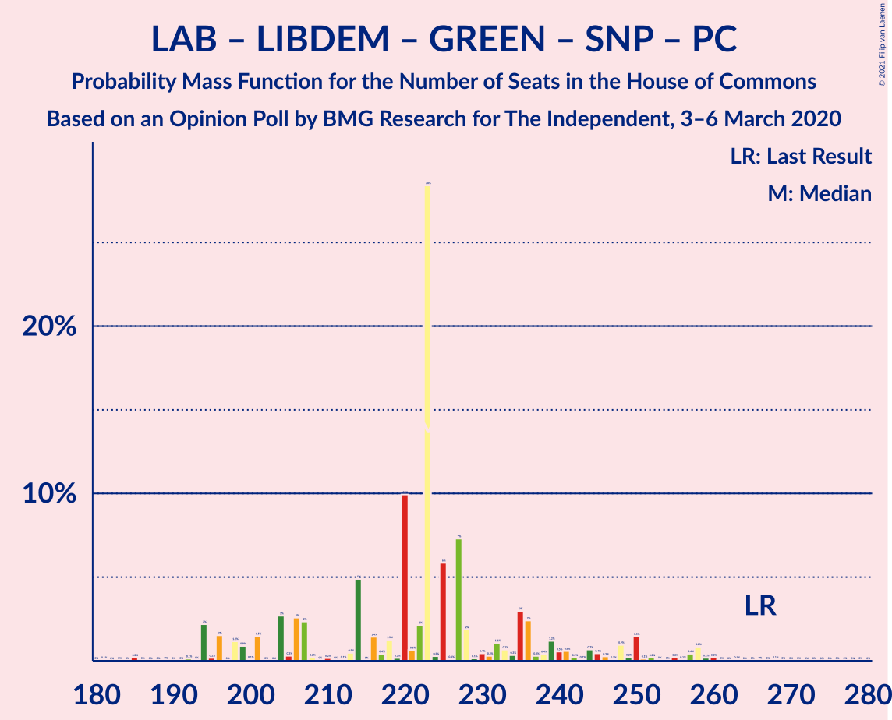

| Number of Seats | Probability | Accumulated | Special Marks |
|:---------------:|:-----------:|:-----------:|:-------------:|
| 181 | 0.1% | 100% |  |
| 182 | 0% | 99.9% |  |
| 183 | 0% | 99.9% |  |
| 184 | 0% | 99.9% |  |
| 185 | 0.2% | 99.9% |  |
| 186 | 0% | 99.7% |  |
| 187 | 0% | 99.7% |  |
| 188 | 0% | 99.7% |  |
| 189 | 0% | 99.7% |  |
| 190 | 0% | 99.6% |  |
| 191 | 0% | 99.6% |  |
| 192 | 0.1% | 99.6% |  |
| 193 | 0% | 99.5% |  |
| 194 | 2% | 99.5% |  |
| 195 | 0.2% | 97% |  |
| 196 | 2% | 97% |  |
| 197 | 0% | 96% |  |
| 198 | 1.2% | 96% |  |
| 199 | 0.9% | 94% |  |
| 200 | 0.1% | 94% |  |
| 201 | 1.5% | 93% |  |
| 202 | 0% | 92% |  |
| 203 | 0% | 92% |  |
| 204 | 3% | 92% |  |
| 205 | 0.3% | 89% |  |
| 206 | 3% | 89% |  |
| 207 | 2% | 86% |  |
| 208 | 0.2% | 84% |  |
| 209 | 0% | 84% |  |
| 210 | 0.2% | 84% |  |
| 211 | 0% | 84% |  |
| 212 | 0.1% | 84% |  |
| 213 | 0.5% | 83% |  |
| 214 | 5% | 83% |  |
| 215 | 0% | 78% |  |
| 216 | 1.4% | 78% |  |
| 217 | 0.4% | 77% |  |
| 218 | 1.3% | 76% |  |
| 219 | 0.2% | 75% |  |
| 220 | 10% | 75% |  |
| 221 | 0.6% | 65% |  |
| 222 | 2% | 64% |  |
| 223 | 28% | 62% | Median |
| 224 | 0.3% | 34% |  |
| 225 | 6% | 33% |  |
| 226 | 0.1% | 28% |  |
| 227 | 7% | 27% |  |
| 228 | 2% | 20% |  |
| 229 | 0.1% | 18% |  |
| 230 | 0.4% | 18% |  |
| 231 | 0.3% | 18% |  |
| 232 | 1.1% | 17% |  |
| 233 | 0.7% | 16% |  |
| 234 | 0.3% | 16% |  |
| 235 | 3% | 15% |  |
| 236 | 2% | 12% |  |
| 237 | 0.3% | 10% |  |
| 238 | 0.4% | 10% |  |
| 239 | 1.2% | 9% |  |
| 240 | 0.5% | 8% |  |
| 241 | 0.6% | 8% |  |
| 242 | 0.2% | 7% |  |
| 243 | 0.1% | 7% |  |
| 244 | 0.7% | 7% |  |
| 245 | 0.4% | 6% |  |
| 246 | 0.3% | 6% |  |
| 247 | 0.1% | 5% |  |
| 248 | 0.9% | 5% |  |
| 249 | 0.2% | 4% |  |
| 250 | 1.5% | 4% |  |
| 251 | 0.1% | 3% |  |
| 252 | 0.2% | 2% |  |
| 253 | 0% | 2% |  |
| 254 | 0% | 2% |  |
| 255 | 0.2% | 2% |  |
| 256 | 0.1% | 2% |  |
| 257 | 0.4% | 2% |  |
| 258 | 0.8% | 2% |  |
| 259 | 0.2% | 0.7% |  |
| 260 | 0.2% | 0.5% |  |
| 261 | 0% | 0.3% |  |
| 262 | 0% | 0.3% |  |
| 263 | 0.1% | 0.3% |  |
| 264 | 0% | 0.2% |  |
| 265 | 0% | 0.2% |  |
| 266 | 0% | 0.2% | Last Result |
| 267 | 0% | 0.2% |  |
| 268 | 0.1% | 0.2% |  |
| 269 | 0% | 0.1% |  |
| 270 | 0% | 0.1% |  |
| 271 | 0% | 0.1% |  |
| 272 | 0% | 0.1% |  |
| 273 | 0% | 0.1% |  |
| 274 | 0% | 0% |  |

### Labour Party – Liberal Democrats – Scottish National Party – Plaid Cymru

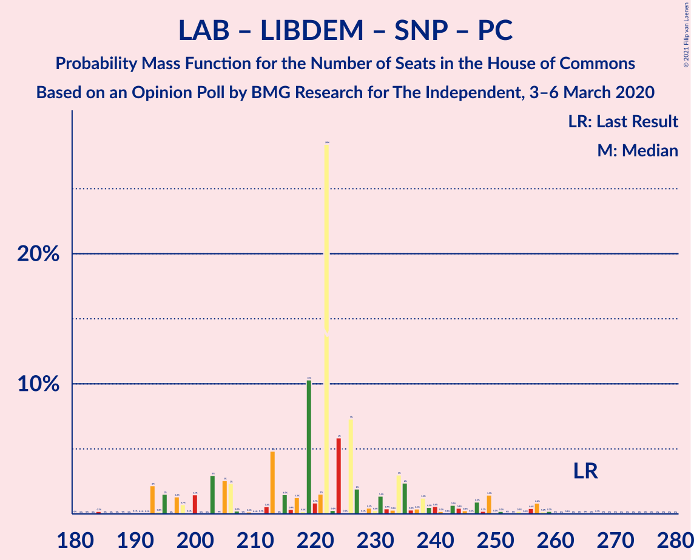

| Number of Seats | Probability | Accumulated | Special Marks |
|:---------------:|:-----------:|:-----------:|:-------------:|
| 180 | 0% | 100% |  |
| 181 | 0% | 99.9% |  |
| 182 | 0% | 99.9% |  |
| 183 | 0% | 99.9% |  |
| 184 | 0.2% | 99.9% |  |
| 185 | 0% | 99.7% |  |
| 186 | 0% | 99.7% |  |
| 187 | 0% | 99.7% |  |
| 188 | 0% | 99.7% |  |
| 189 | 0% | 99.6% |  |
| 190 | 0.1% | 99.6% |  |
| 191 | 0.1% | 99.6% |  |
| 192 | 0.1% | 99.5% |  |
| 193 | 2% | 99.4% |  |
| 194 | 0.2% | 97% |  |
| 195 | 2% | 97% |  |
| 196 | 0% | 96% |  |
| 197 | 1.3% | 96% |  |
| 198 | 0.7% | 94% |  |
| 199 | 0.1% | 94% |  |
| 200 | 1.5% | 93% |  |
| 201 | 0% | 92% |  |
| 202 | 0% | 92% |  |
| 203 | 3% | 92% |  |
| 204 | 0% | 89% |  |
| 205 | 3% | 89% |  |
| 206 | 2% | 86% |  |
| 207 | 0.2% | 84% |  |
| 208 | 0% | 84% |  |
| 209 | 0.2% | 84% |  |
| 210 | 0.1% | 84% |  |
| 211 | 0.1% | 84% |  |
| 212 | 0.6% | 83% |  |
| 213 | 5% | 83% |  |
| 214 | 0% | 78% |  |
| 215 | 1.5% | 78% |  |
| 216 | 0.4% | 77% |  |
| 217 | 1.3% | 76% |  |
| 218 | 0.2% | 75% |  |
| 219 | 10% | 75% |  |
| 220 | 0.9% | 64% |  |
| 221 | 2% | 64% |  |
| 222 | 28% | 62% | Median |
| 223 | 0.3% | 34% |  |
| 224 | 6% | 33% |  |
| 225 | 0.1% | 28% |  |
| 226 | 7% | 27% |  |
| 227 | 2% | 20% |  |
| 228 | 0.1% | 18% |  |
| 229 | 0.5% | 18% |  |
| 230 | 0.3% | 18% |  |
| 231 | 1.4% | 17% |  |
| 232 | 0.4% | 16% |  |
| 233 | 0.3% | 16% |  |
| 234 | 3% | 15% |  |
| 235 | 2% | 12% |  |
| 236 | 0.3% | 10% |  |
| 237 | 0.4% | 10% |  |
| 238 | 1.2% | 9% |  |
| 239 | 0.5% | 8% |  |
| 240 | 0.6% | 8% |  |
| 241 | 0.2% | 7% |  |
| 242 | 0.1% | 7% |  |
| 243 | 0.7% | 7% |  |
| 244 | 0.4% | 6% |  |
| 245 | 0.3% | 6% |  |
| 246 | 0.1% | 5% |  |
| 247 | 0.9% | 5% |  |
| 248 | 0.2% | 4% |  |
| 249 | 1.5% | 4% |  |
| 250 | 0.1% | 3% |  |
| 251 | 0.2% | 2% |  |
| 252 | 0% | 2% |  |
| 253 | 0% | 2% |  |
| 254 | 0.2% | 2% |  |
| 255 | 0.1% | 2% |  |
| 256 | 0.4% | 2% |  |
| 257 | 0.8% | 2% |  |
| 258 | 0.2% | 0.7% |  |
| 259 | 0.2% | 0.5% |  |
| 260 | 0% | 0.3% |  |
| 261 | 0% | 0.3% |  |
| 262 | 0.1% | 0.3% |  |
| 263 | 0% | 0.2% |  |
| 264 | 0% | 0.2% |  |
| 265 | 0% | 0.2% | Last Result |
| 266 | 0% | 0.2% |  |
| 267 | 0.1% | 0.2% |  |
| 268 | 0% | 0.1% |  |
| 269 | 0% | 0.1% |  |
| 270 | 0% | 0.1% |  |
| 271 | 0% | 0.1% |  |
| 272 | 0% | 0% |  |

### Labour Party – Liberal Democrats – Scottish National Party

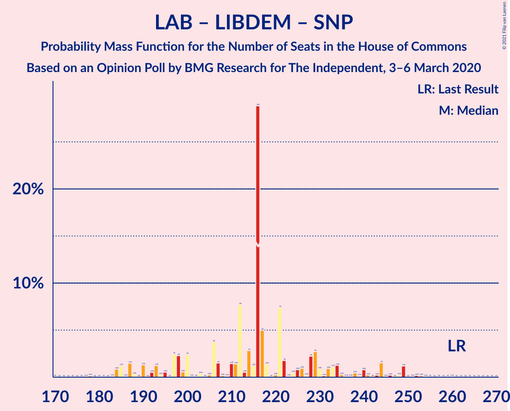

| Number of Seats | Probability | Accumulated | Special Marks |
|:---------------:|:-----------:|:-----------:|:-------------:|
| 170 | 0% | 100% |  |
| 171 | 0% | 99.9% |  |
| 172 | 0% | 99.9% |  |
| 173 | 0% | 99.9% |  |
| 174 | 0% | 99.9% |  |
| 175 | 0% | 99.9% |  |
| 176 | 0% | 99.9% |  |
| 177 | 0.1% | 99.9% |  |
| 178 | 0.2% | 99.8% |  |
| 179 | 0% | 99.7% |  |
| 180 | 0% | 99.7% |  |
| 181 | 0% | 99.6% |  |
| 182 | 0% | 99.6% |  |
| 183 | 0.1% | 99.6% |  |
| 184 | 0.8% | 99.5% |  |
| 185 | 1.2% | 98.7% |  |
| 186 | 0.1% | 97% |  |
| 187 | 1.5% | 97% |  |
| 188 | 0.3% | 96% |  |
| 189 | 0% | 96% |  |
| 190 | 1.3% | 96% |  |
| 191 | 0% | 94% |  |
| 192 | 0.5% | 94% |  |
| 193 | 1.2% | 94% |  |
| 194 | 0.3% | 92% |  |
| 195 | 0.5% | 92% |  |
| 196 | 0% | 92% |  |
| 197 | 2% | 92% |  |
| 198 | 2% | 89% |  |
| 199 | 0.6% | 87% |  |
| 200 | 2% | 86% |  |
| 201 | 0.1% | 84% |  |
| 202 | 0% | 84% |  |
| 203 | 0.4% | 84% |  |
| 204 | 0% | 84% |  |
| 205 | 0.2% | 83% |  |
| 206 | 4% | 83% |  |
| 207 | 2% | 80% |  |
| 208 | 0.2% | 78% |  |
| 209 | 0.1% | 78% |  |
| 210 | 1.4% | 78% |  |
| 211 | 1.4% | 76% |  |
| 212 | 8% | 75% |  |
| 213 | 0.5% | 67% |  |
| 214 | 3% | 67% |  |
| 215 | 1.2% | 64% |  |
| 216 | 29% | 63% | Median |
| 217 | 5% | 34% |  |
| 218 | 1.4% | 29% |  |
| 219 | 0% | 27% |  |
| 220 | 0.2% | 27% |  |
| 221 | 7% | 27% |  |
| 222 | 2% | 20% |  |
| 223 | 0.1% | 18% |  |
| 224 | 0.5% | 18% |  |
| 225 | 0.8% | 17% |  |
| 226 | 0.9% | 17% |  |
| 227 | 0.2% | 16% |  |
| 228 | 2% | 15% |  |
| 229 | 3% | 13% |  |
| 230 | 0.9% | 11% |  |
| 231 | 0.1% | 10% |  |
| 232 | 0.9% | 10% |  |
| 233 | 1.1% | 9% |  |
| 234 | 1.3% | 8% |  |
| 235 | 0.3% | 6% |  |
| 236 | 0.1% | 6% |  |
| 237 | 0.1% | 6% |  |
| 238 | 0.5% | 6% |  |
| 239 | 0.1% | 5% |  |
| 240 | 0.8% | 5% |  |
| 241 | 0.2% | 4% |  |
| 242 | 0% | 4% |  |
| 243 | 0.2% | 4% |  |
| 244 | 2% | 4% |  |
| 245 | 0.1% | 2% |  |
| 246 | 0.2% | 2% |  |
| 247 | 0% | 2% |  |
| 248 | 0.2% | 2% |  |
| 249 | 1.2% | 2% |  |
| 250 | 0% | 0.8% |  |
| 251 | 0.1% | 0.8% |  |
| 252 | 0.2% | 0.7% |  |
| 253 | 0.2% | 0.5% |  |
| 254 | 0.1% | 0.4% |  |
| 255 | 0% | 0.3% |  |
| 256 | 0% | 0.3% |  |
| 257 | 0% | 0.3% |  |
| 258 | 0% | 0.2% |  |
| 259 | 0% | 0.2% |  |
| 260 | 0.1% | 0.2% |  |
| 261 | 0% | 0.1% | Last Result |
| 262 | 0% | 0.1% |  |
| 263 | 0% | 0.1% |  |
| 264 | 0% | 0.1% |  |
| 265 | 0% | 0.1% |  |
| 266 | 0% | 0% |  |

### Labour Party – Scottish National Party – Plaid Cymru

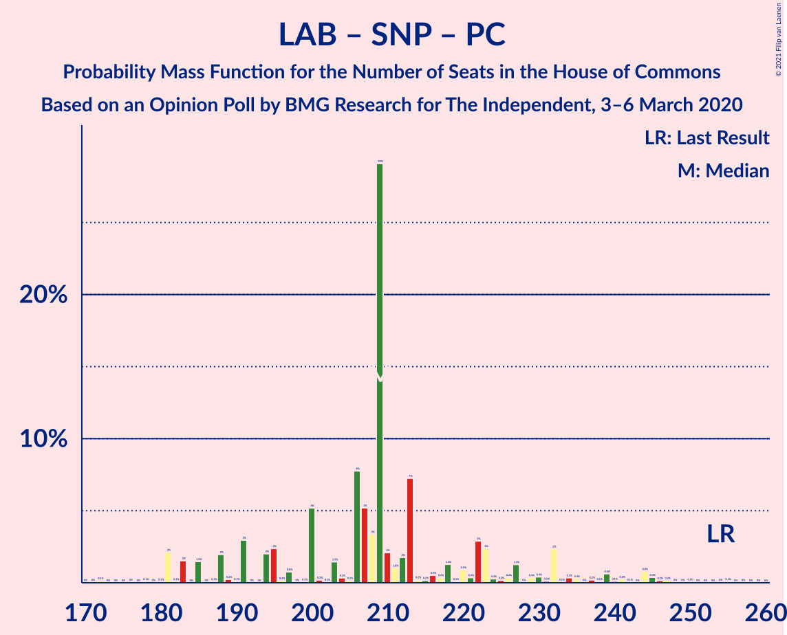

| Number of Seats | Probability | Accumulated | Special Marks |
|:---------------:|:-----------:|:-----------:|:-------------:|
| 170 | 0% | 100% |  |
| 171 | 0% | 99.9% |  |
| 172 | 0.1% | 99.9% |  |
| 173 | 0% | 99.8% |  |
| 174 | 0% | 99.7% |  |
| 175 | 0% | 99.7% |  |
| 176 | 0% | 99.7% |  |
| 177 | 0% | 99.7% |  |
| 178 | 0.1% | 99.7% |  |
| 179 | 0% | 99.6% |  |
| 180 | 0.1% | 99.5% |  |
| 181 | 2% | 99.5% |  |
| 182 | 0.1% | 97% |  |
| 183 | 2% | 97% |  |
| 184 | 0% | 96% |  |
| 185 | 1.5% | 96% |  |
| 186 | 0% | 94% |  |
| 187 | 0.1% | 94% |  |
| 188 | 2% | 94% |  |
| 189 | 0.2% | 92% |  |
| 190 | 0.1% | 92% |  |
| 191 | 3% | 92% |  |
| 192 | 0% | 89% |  |
| 193 | 0% | 89% |  |
| 194 | 2% | 89% |  |
| 195 | 2% | 87% |  |
| 196 | 0.2% | 84% |  |
| 197 | 0.8% | 84% |  |
| 198 | 0% | 84% |  |
| 199 | 0.1% | 84% |  |
| 200 | 5% | 83% |  |
| 201 | 0.2% | 78% |  |
| 202 | 0.1% | 78% |  |
| 203 | 1.5% | 78% |  |
| 204 | 0.3% | 77% |  |
| 205 | 0.2% | 76% |  |
| 206 | 8% | 76% |  |
| 207 | 5% | 68% |  |
| 208 | 3% | 63% |  |
| 209 | 29% | 60% | Median |
| 210 | 2% | 31% |  |
| 211 | 1.0% | 29% |  |
| 212 | 2% | 28% |  |
| 213 | 7% | 26% |  |
| 214 | 0.2% | 18% |  |
| 215 | 0.2% | 18% |  |
| 216 | 0.5% | 18% |  |
| 217 | 0.4% | 18% |  |
| 218 | 1.3% | 17% |  |
| 219 | 0.1% | 16% |  |
| 220 | 0.9% | 16% |  |
| 221 | 0.4% | 15% |  |
| 222 | 3% | 15% |  |
| 223 | 2% | 12% |  |
| 224 | 0.3% | 9% |  |
| 225 | 0.2% | 9% |  |
| 226 | 0.4% | 9% |  |
| 227 | 1.3% | 8% |  |
| 228 | 0% | 7% |  |
| 229 | 0.4% | 7% |  |
| 230 | 0.4% | 7% |  |
| 231 | 0.1% | 6% |  |
| 232 | 2% | 6% |  |
| 233 | 0.1% | 4% |  |
| 234 | 0.3% | 4% |  |
| 235 | 0.3% | 4% |  |
| 236 | 0% | 3% |  |
| 237 | 0.2% | 3% |  |
| 238 | 0.1% | 3% |  |
| 239 | 0.6% | 3% |  |
| 240 | 0.1% | 2% |  |
| 241 | 0.2% | 2% |  |
| 242 | 0.1% | 2% |  |
| 243 | 0% | 2% |  |
| 244 | 0.8% | 2% |  |
| 245 | 0.4% | 1.1% |  |
| 246 | 0.2% | 0.7% |  |
| 247 | 0.2% | 0.5% |  |
| 248 | 0% | 0.4% |  |
| 249 | 0% | 0.3% |  |
| 250 | 0.1% | 0.3% |  |
| 251 | 0% | 0.2% |  |
| 252 | 0% | 0.2% |  |
| 253 | 0% | 0.2% |  |
| 254 | 0% | 0.2% | Last Result |
| 255 | 0.1% | 0.2% |  |
| 256 | 0% | 0.1% |  |
| 257 | 0% | 0.1% |  |
| 258 | 0% | 0.1% |  |
| 259 | 0% | 0% |  |

### Labour Party – Scottish National Party

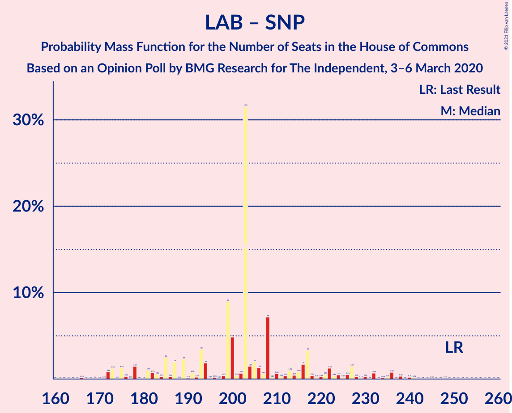

| Number of Seats | Probability | Accumulated | Special Marks |
|:---------------:|:-----------:|:-----------:|:-------------:|
| 161 | 0% | 100% |  |
| 162 | 0% | 99.9% |  |
| 163 | 0% | 99.9% |  |
| 164 | 0% | 99.9% |  |
| 165 | 0% | 99.9% |  |
| 166 | 0.2% | 99.9% |  |
| 167 | 0% | 99.7% |  |
| 168 | 0% | 99.7% |  |
| 169 | 0% | 99.7% |  |
| 170 | 0% | 99.6% |  |
| 171 | 0.1% | 99.6% |  |
| 172 | 0.8% | 99.5% |  |
| 173 | 1.2% | 98.7% |  |
| 174 | 0% | 97% |  |
| 175 | 1.3% | 97% |  |
| 176 | 0.3% | 96% |  |
| 177 | 0.1% | 96% |  |
| 178 | 1.5% | 96% |  |
| 179 | 0% | 94% |  |
| 180 | 0% | 94% |  |
| 181 | 1.0% | 94% |  |
| 182 | 0.7% | 93% |  |
| 183 | 0.5% | 92% |  |
| 184 | 0.3% | 92% |  |
| 185 | 2% | 92% |  |
| 186 | 0.3% | 89% |  |
| 187 | 2% | 89% |  |
| 188 | 0.1% | 87% |  |
| 189 | 2% | 87% |  |
| 190 | 0.1% | 84% |  |
| 191 | 0.7% | 84% |  |
| 192 | 0.2% | 84% |  |
| 193 | 3% | 83% |  |
| 194 | 2% | 80% |  |
| 195 | 0.1% | 78% |  |
| 196 | 0.2% | 78% |  |
| 197 | 0.1% | 78% |  |
| 198 | 0.4% | 78% |  |
| 199 | 9% | 77% |  |
| 200 | 5% | 68% |  |
| 201 | 0.4% | 64% |  |
| 202 | 0.7% | 63% |  |
| 203 | 32% | 62% | Median |
| 204 | 1.5% | 31% |  |
| 205 | 2% | 29% |  |
| 206 | 1.3% | 27% |  |
| 207 | 0.6% | 26% |  |
| 208 | 7% | 25% |  |
| 209 | 0.2% | 18% |  |
| 210 | 0.6% | 18% |  |
| 211 | 0.3% | 17% |  |
| 212 | 0.4% | 17% |  |
| 213 | 1.0% | 17% |  |
| 214 | 0.4% | 16% |  |
| 215 | 0.8% | 15% |  |
| 216 | 2% | 15% |  |
| 217 | 3% | 13% |  |
| 218 | 0.4% | 9% |  |
| 219 | 0.2% | 9% |  |
| 220 | 0.3% | 9% |  |
| 221 | 0.5% | 9% |  |
| 222 | 1.3% | 8% |  |
| 223 | 0.4% | 7% |  |
| 224 | 0.5% | 6% |  |
| 225 | 0.2% | 6% |  |
| 226 | 0.5% | 6% |  |
| 227 | 1.5% | 5% |  |
| 228 | 0.3% | 4% |  |
| 229 | 0.1% | 3% |  |
| 230 | 0.3% | 3% |  |
| 231 | 0% | 3% |  |
| 232 | 0.7% | 3% |  |
| 233 | 0% | 2% |  |
| 234 | 0.1% | 2% |  |
| 235 | 0.2% | 2% |  |
| 236 | 0.8% | 2% |  |
| 237 | 0% | 1.1% |  |
| 238 | 0.3% | 1.1% |  |
| 239 | 0% | 0.7% |  |
| 240 | 0.2% | 0.7% |  |
| 241 | 0.2% | 0.5% |  |
| 242 | 0% | 0.3% |  |
| 243 | 0% | 0.3% |  |
| 244 | 0% | 0.3% |  |
| 245 | 0.1% | 0.3% |  |
| 246 | 0% | 0.2% |  |
| 247 | 0% | 0.2% |  |
| 248 | 0.1% | 0.2% |  |
| 249 | 0% | 0.1% |  |
| 250 | 0% | 0.1% | Last Result |
| 251 | 0% | 0.1% |  |
| 252 | 0% | 0.1% |  |
| 253 | 0% | 0.1% |  |
| 254 | 0% | 0% |  |

### Labour Party – Liberal Democrats – Plaid Cymru

| Number of Seats | Probability | Accumulated | Special Marks |
|:---------------:|:-----------:|:-----------:|:-------------:|
| 143 | 0% | 100% |  |
| 144 | 0% | 99.9% |  |
| 145 | 0.1% | 99.9% |  |
| 146 | 0% | 99.7% |  |
| 147 | 0% | 99.7% |  |
| 148 | 0% | 99.7% |  |
| 149 | 0.1% | 99.7% |  |
| 150 | 0% | 99.6% |  |
| 151 | 0% | 99.6% |  |
| 152 | 0% | 99.6% |  |
| 153 | 0% | 99.6% |  |
| 154 | 0% | 99.6% |  |
| 155 | 0% | 99.6% |  |
| 156 | 0.1% | 99.6% |  |
| 157 | 1.4% | 99.5% |  |
| 158 | 0.3% | 98% |  |
| 159 | 4% | 98% |  |
| 160 | 1.3% | 94% |  |
| 161 | 0.8% | 93% |  |
| 162 | 0.1% | 92% |  |
| 163 | 1.2% | 92% |  |
| 164 | 0.1% | 91% |  |
| 165 | 0.2% | 90% |  |
| 166 | 1.4% | 90% |  |
| 167 | 0% | 89% |  |
| 168 | 0% | 89% |  |
| 169 | 0% | 89% |  |
| 170 | 0% | 89% |  |
| 171 | 2% | 89% |  |
| 172 | 2% | 86% |  |
| 173 | 0.6% | 84% |  |
| 174 | 0% | 84% |  |
| 175 | 0% | 84% |  |
| 176 | 0% | 84% |  |
| 177 | 0.1% | 84% |  |
| 178 | 2% | 83% |  |
| 179 | 0.1% | 82% |  |
| 180 | 2% | 82% |  |
| 181 | 1.1% | 80% |  |
| 182 | 4% | 79% |  |
| 183 | 2% | 75% |  |
| 184 | 1.3% | 73% |  |
| 185 | 8% | 72% |  |
| 186 | 2% | 64% |  |
| 187 | 29% | 63% | Median |
| 188 | 11% | 34% |  |
| 189 | 2% | 22% |  |
| 190 | 1.4% | 20% |  |
| 191 | 0.9% | 18% |  |
| 192 | 0.1% | 18% |  |
| 193 | 0.3% | 17% |  |
| 194 | 0.2% | 17% |  |
| 195 | 0.9% | 17% |  |
| 196 | 2% | 16% |  |
| 197 | 1.4% | 14% |  |
| 198 | 1.0% | 13% |  |
| 199 | 0.2% | 12% |  |
| 200 | 0.1% | 12% |  |
| 201 | 1.4% | 12% |  |
| 202 | 0.4% | 10% |  |
| 203 | 4% | 10% |  |
| 204 | 0% | 6% |  |
| 205 | 0% | 6% |  |
| 206 | 0.1% | 6% |  |
| 207 | 0.2% | 6% |  |
| 208 | 0.4% | 6% |  |
| 209 | 0.4% | 5% |  |
| 210 | 1.4% | 5% |  |
| 211 | 0.2% | 4% |  |
| 212 | 0.7% | 3% |  |
| 213 | 0.1% | 3% |  |
| 214 | 0% | 3% |  |
| 215 | 0% | 3% |  |
| 216 | 0.1% | 3% |  |
| 217 | 0.1% | 2% | Last Result |
| 218 | 0.2% | 2% |  |
| 219 | 0% | 2% |  |
| 220 | 0% | 2% |  |
| 221 | 0.1% | 2% |  |
| 222 | 0.1% | 2% |  |
| 223 | 1.5% | 2% |  |
| 224 | 0% | 0.5% |  |
| 225 | 0% | 0.5% |  |
| 226 | 0% | 0.4% |  |
| 227 | 0.1% | 0.4% |  |
| 228 | 0% | 0.3% |  |
| 229 | 0.2% | 0.3% |  |
| 230 | 0% | 0.1% |  |
| 231 | 0% | 0.1% |  |
| 232 | 0% | 0.1% |  |
| 233 | 0% | 0.1% |  |
| 234 | 0% | 0% |  |

### Labour Party – Liberal Democrats

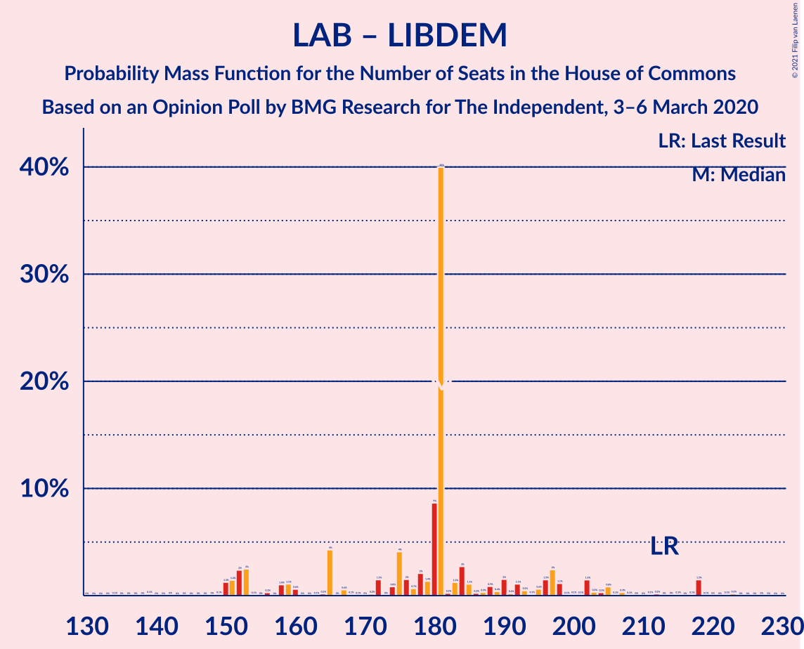

| Number of Seats | Probability | Accumulated | Special Marks |
|:---------------:|:-----------:|:-----------:|:-------------:|
| 134 | 0.1% | 100% |  |
| 135 | 0% | 99.9% |  |
| 136 | 0% | 99.9% |  |
| 137 | 0% | 99.9% |  |
| 138 | 0% | 99.9% |  |
| 139 | 0.1% | 99.9% |  |
| 140 | 0% | 99.7% |  |
| 141 | 0% | 99.7% |  |
| 142 | 0% | 99.7% |  |
| 143 | 0% | 99.7% |  |
| 144 | 0% | 99.7% |  |
| 145 | 0% | 99.6% |  |
| 146 | 0% | 99.6% |  |
| 147 | 0% | 99.6% |  |
| 148 | 0% | 99.6% |  |
| 149 | 0.1% | 99.6% |  |
| 150 | 1.3% | 99.4% |  |
| 151 | 1.4% | 98% |  |
| 152 | 2% | 97% |  |
| 153 | 2% | 94% |  |
| 154 | 0.1% | 92% |  |
| 155 | 0% | 92% |  |
| 156 | 0.3% | 92% |  |
| 157 | 0% | 91% |  |
| 158 | 1.0% | 91% |  |
| 159 | 1.1% | 90% |  |
| 160 | 0.6% | 89% |  |
| 161 | 0% | 89% |  |
| 162 | 0% | 89% |  |
| 163 | 0.1% | 89% |  |
| 164 | 0.2% | 89% |  |
| 165 | 4% | 88% |  |
| 166 | 0% | 84% |  |
| 167 | 0.6% | 84% |  |
| 168 | 0.1% | 84% |  |
| 169 | 0.1% | 84% |  |
| 170 | 0% | 83% |  |
| 171 | 0.2% | 83% |  |
| 172 | 1.5% | 83% |  |
| 173 | 0% | 82% |  |
| 174 | 0.8% | 82% |  |
| 175 | 4% | 81% |  |
| 176 | 2% | 77% |  |
| 177 | 0.7% | 75% |  |
| 178 | 2% | 75% |  |
| 179 | 1.4% | 73% |  |
| 180 | 9% | 71% |  |
| 181 | 40% | 63% | Median |
| 182 | 0.2% | 23% |  |
| 183 | 1.2% | 22% |  |
| 184 | 3% | 21% |  |
| 185 | 1.1% | 18% |  |
| 186 | 0.2% | 17% |  |
| 187 | 0.3% | 17% |  |
| 188 | 0.9% | 17% |  |
| 189 | 0.4% | 16% |  |
| 190 | 2% | 15% |  |
| 191 | 0.2% | 14% |  |
| 192 | 1.1% | 14% |  |
| 193 | 0.5% | 13% |  |
| 194 | 0.1% | 12% |  |
| 195 | 0.6% | 12% |  |
| 196 | 1.5% | 11% |  |
| 197 | 2% | 10% |  |
| 198 | 1.1% | 7% |  |
| 199 | 0.1% | 6% |  |
| 200 | 0.1% | 6% |  |
| 201 | 0.1% | 6% |  |
| 202 | 1.5% | 6% |  |
| 203 | 0.3% | 5% |  |
| 204 | 0.3% | 4% |  |
| 205 | 0.8% | 4% |  |
| 206 | 0.1% | 3% |  |
| 207 | 0.3% | 3% |  |
| 208 | 0.1% | 3% |  |
| 209 | 0% | 3% |  |
| 210 | 0% | 3% |  |
| 211 | 0.1% | 3% |  |
| 212 | 0.2% | 2% |  |
| 213 | 0% | 2% | Last Result |
| 214 | 0% | 2% |  |
| 215 | 0.1% | 2% |  |
| 216 | 0% | 2% |  |
| 217 | 0.1% | 2% |  |
| 218 | 1.5% | 2% |  |
| 219 | 0.1% | 0.5% |  |
| 220 | 0% | 0.4% |  |
| 221 | 0% | 0.4% |  |
| 222 | 0.1% | 0.4% |  |
| 223 | 0.2% | 0.3% |  |
| 224 | 0% | 0.1% |  |
| 225 | 0% | 0.1% |  |
| 226 | 0% | 0.1% |  |
| 227 | 0% | 0.1% |  |
| 228 | 0% | 0% |  |

### Labour Party – Plaid Cymru

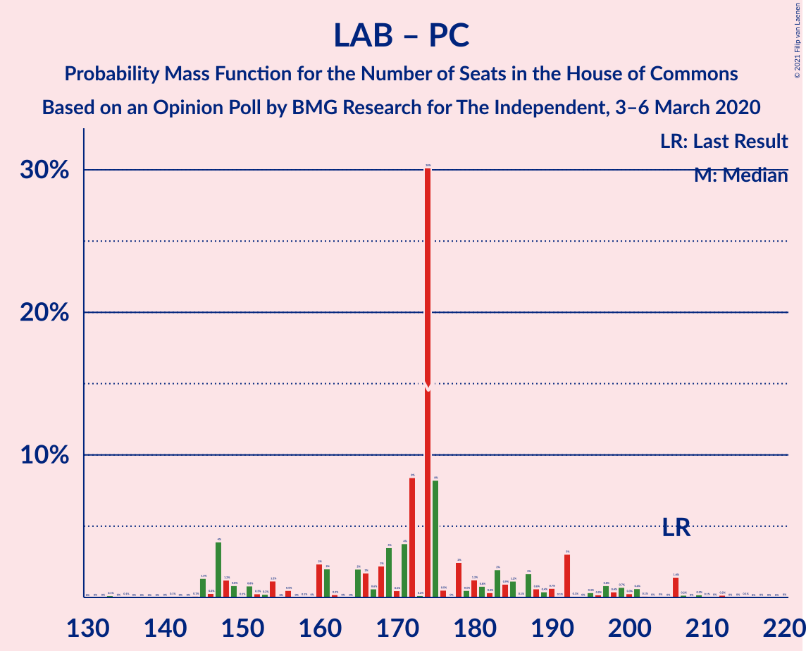

| Number of Seats | Probability | Accumulated | Special Marks |
|:---------------:|:-----------:|:-----------:|:-------------:|
| 133 | 0.1% | 100% |  |
| 134 | 0% | 99.8% |  |
| 135 | 0.1% | 99.8% |  |
| 136 | 0% | 99.7% |  |
| 137 | 0% | 99.7% |  |
| 138 | 0% | 99.7% |  |
| 139 | 0% | 99.7% |  |
| 140 | 0% | 99.7% |  |
| 141 | 0.1% | 99.7% |  |
| 142 | 0% | 99.6% |  |
| 143 | 0% | 99.6% |  |
| 144 | 0.1% | 99.6% |  |
| 145 | 1.3% | 99.5% |  |
| 146 | 0.3% | 98% |  |
| 147 | 4% | 98% |  |
| 148 | 1.2% | 94% |  |
| 149 | 0.8% | 93% |  |
| 150 | 0.1% | 92% |  |
| 151 | 0.8% | 92% |  |
| 152 | 0.3% | 91% |  |
| 153 | 0.2% | 91% |  |
| 154 | 1.2% | 90% |  |
| 155 | 0% | 89% |  |
| 156 | 0.5% | 89% |  |
| 157 | 0% | 89% |  |
| 158 | 0.1% | 89% |  |
| 159 | 0% | 89% |  |
| 160 | 2% | 89% |  |
| 161 | 2% | 86% |  |
| 162 | 0.2% | 84% |  |
| 163 | 0% | 84% |  |
| 164 | 0% | 84% |  |
| 165 | 2% | 84% |  |
| 166 | 2% | 82% |  |
| 167 | 0.6% | 80% |  |
| 168 | 2% | 80% |  |
| 169 | 4% | 77% |  |
| 170 | 0.5% | 74% |  |
| 171 | 4% | 73% |  |
| 172 | 8% | 70% |  |
| 173 | 0.2% | 61% |  |
| 174 | 30% | 61% | Median |
| 175 | 8% | 31% |  |
| 176 | 0.5% | 23% |  |
| 177 | 0% | 22% |  |
| 178 | 2% | 22% |  |
| 179 | 0.5% | 20% |  |
| 180 | 1.3% | 19% |  |
| 181 | 0.8% | 18% |  |
| 182 | 0.4% | 17% |  |
| 183 | 2% | 17% |  |
| 184 | 0.9% | 15% |  |
| 185 | 1.2% | 14% |  |
| 186 | 0.1% | 13% |  |
| 187 | 2% | 13% |  |
| 188 | 0.6% | 11% |  |
| 189 | 0.4% | 10% |  |
| 190 | 0.7% | 10% |  |
| 191 | 0.1% | 9% |  |
| 192 | 3% | 9% |  |
| 193 | 0.1% | 6% |  |
| 194 | 0% | 6% |  |
| 195 | 0.4% | 6% |  |
| 196 | 0.2% | 6% |  |
| 197 | 0.8% | 5% |  |
| 198 | 0.4% | 5% |  |
| 199 | 0.7% | 4% |  |
| 200 | 0.3% | 3% |  |
| 201 | 0.6% | 3% |  |
| 202 | 0.1% | 3% |  |
| 203 | 0% | 2% |  |
| 204 | 0% | 2% |  |
| 205 | 0% | 2% |  |
| 206 | 1.4% | 2% | Last Result |
| 207 | 0.2% | 0.9% |  |
| 208 | 0% | 0.7% |  |
| 209 | 0.2% | 0.7% |  |
| 210 | 0.1% | 0.5% |  |
| 211 | 0% | 0.4% |  |
| 212 | 0.2% | 0.4% |  |
| 213 | 0% | 0.2% |  |
| 214 | 0% | 0.2% |  |
| 215 | 0.1% | 0.2% |  |
| 216 | 0% | 0.1% |  |
| 217 | 0% | 0.1% |  |
| 218 | 0% | 0.1% |  |
| 219 | 0% | 0.1% |  |
| 220 | 0% | 0% |  |

### Labour Party

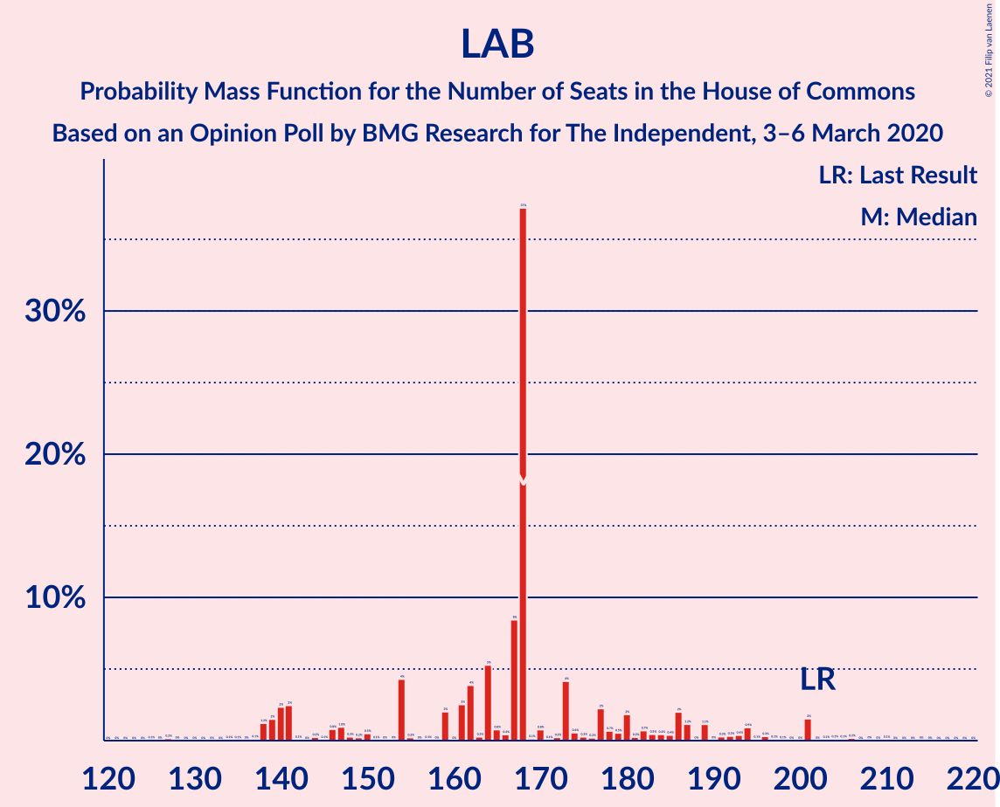

| Number of Seats | Probability | Accumulated | Special Marks |
|:---------------:|:-----------:|:-----------:|:-------------:|
| 125 | 0.1% | 100% |  |
| 126 | 0% | 99.9% |  |
| 127 | 0.2% | 99.9% |  |
| 128 | 0% | 99.7% |  |
| 129 | 0% | 99.7% |  |
| 130 | 0% | 99.7% |  |
| 131 | 0% | 99.7% |  |
| 132 | 0% | 99.7% |  |
| 133 | 0% | 99.7% |  |
| 134 | 0.1% | 99.7% |  |
| 135 | 0.1% | 99.6% |  |
| 136 | 0% | 99.6% |  |
| 137 | 0.1% | 99.5% |  |
| 138 | 1.2% | 99.4% |  |
| 139 | 2% | 98% |  |
| 140 | 2% | 97% |  |
| 141 | 2% | 94% |  |
| 142 | 0.1% | 92% |  |
| 143 | 0% | 92% |  |
| 144 | 0.2% | 92% |  |
| 145 | 0.1% | 92% |  |
| 146 | 0.8% | 91% |  |
| 147 | 1.0% | 91% |  |
| 148 | 0.3% | 90% |  |
| 149 | 0.2% | 89% |  |
| 150 | 0.5% | 89% |  |
| 151 | 0.1% | 89% |  |
| 152 | 0% | 89% |  |
| 153 | 0% | 89% |  |
| 154 | 4% | 89% |  |
| 155 | 0.2% | 84% |  |
| 156 | 0% | 84% |  |
| 157 | 0.1% | 84% |  |
| 158 | 0% | 84% |  |
| 159 | 2% | 84% |  |
| 160 | 0% | 82% |  |
| 161 | 3% | 82% |  |
| 162 | 4% | 79% |  |
| 163 | 0.3% | 75% |  |
| 164 | 5% | 75% |  |
| 165 | 0.8% | 70% |  |
| 166 | 0.4% | 69% |  |
| 167 | 8% | 69% |  |
| 168 | 37% | 60% | Median |
| 169 | 0.1% | 23% |  |
| 170 | 0.8% | 23% |  |
| 171 | 0.1% | 22% |  |
| 172 | 0.2% | 22% |  |
| 173 | 4% | 22% |  |
| 174 | 0.6% | 18% |  |
| 175 | 0.3% | 17% |  |
| 176 | 0.2% | 17% |  |
| 177 | 2% | 17% |  |
| 178 | 0.7% | 14% |  |
| 179 | 0.5% | 14% |  |
| 180 | 2% | 13% |  |
| 181 | 0.2% | 11% |  |
| 182 | 0.7% | 11% |  |
| 183 | 0.5% | 10% |  |
| 184 | 0.4% | 10% |  |
| 185 | 0.4% | 10% |  |
| 186 | 2% | 9% |  |
| 187 | 1.2% | 7% |  |
| 188 | 0% | 6% |  |
| 189 | 1.1% | 6% |  |
| 190 | 0% | 5% |  |
| 191 | 0.3% | 5% |  |
| 192 | 0.3% | 4% |  |
| 193 | 0.4% | 4% |  |
| 194 | 0.9% | 4% |  |
| 195 | 0.1% | 3% |  |
| 196 | 0.3% | 3% |  |
| 197 | 0.1% | 2% |  |
| 198 | 0.1% | 2% |  |
| 199 | 0% | 2% |  |
| 200 | 0% | 2% |  |
| 201 | 2% | 2% |  |
| 202 | 0% | 0.7% | Last Result |
| 203 | 0.1% | 0.7% |  |
| 204 | 0.1% | 0.6% |  |
| 205 | 0.1% | 0.5% |  |
| 206 | 0.2% | 0.4% |  |
| 207 | 0% | 0.2% |  |
| 208 | 0% | 0.2% |  |
| 209 | 0% | 0.2% |  |
| 210 | 0.1% | 0.2% |  |
| 211 | 0% | 0.1% |  |
| 212 | 0% | 0.1% |  |
| 213 | 0% | 0.1% |  |
| 214 | 0% | 0.1% |  |
| 215 | 0% | 0% |  |

## Technical Information

### Opinion Poll

+ **Polling firm:** BMG Research
+ **Commissioner(s):** The Independent
+ **Fieldwork period:** 3–6 March 2020

### Calculations

+ **Sample size:** 1439
+ **Simulations done:** 131,072
+ **Error estimate:** 1.39%

