# Opinion Poll by Opinium for The Observer, 19–20 March 2020

<a href="#voting-intentions">Voting Intentions</a> | <a href="#seats">Seats</a> | <a href="#coalitions">Coalitions</a> | <a href="#technical-information">Technical Information</a>

## Voting Intentions

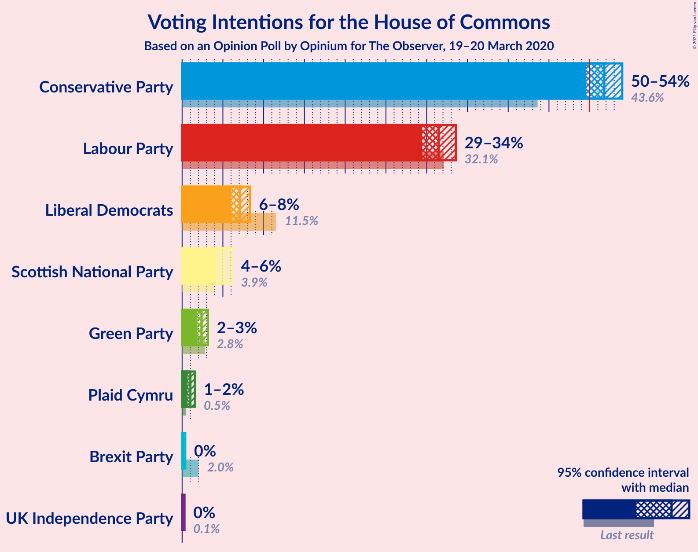

### Confidence Intervals

| Party | Last Result | Poll Result | 80% Confidence Interval | 90% Confidence Interval | 95% Confidence Interval | 99% Confidence Interval |
|:-----:|:-----------:|:-----------:|:-----------------------:|:-----------------------:|:-----------------------:|:-----------------------:|
| Conservative Party | 43.6% | 51.8% | 50.3–53.2% |49.9–53.6% |49.6–54.0% |48.9–54.7% |
| Labour Party | 32.1% | 31.5% | 30.1–32.8% |29.8–33.2% |29.4–33.6% |28.8–34.2% |
| Liberal Democrats | 11.5% | 7.1% | 6.4–7.9% |6.2–8.1% |6.1–8.3% |5.7–8.7% |
| Scottish National Party | 3.9% | 5.1% | 4.5–5.8% |4.3–6.0% |4.2–6.1% |3.9–6.5% |
| Green Party | 2.8% | 2.4% | 2.0–2.9% |1.9–3.0% |1.8–3.2% |1.6–3.4% |
| Plaid Cymru | 0.5% | 1.0% | 0.8–1.4% |0.7–1.5% |0.7–1.6% |0.5–1.8% |
| Brexit Party | 2.0% | 0.1% | 0.0–0.3% |0.0–0.3% |0.0–0.4% |0.0–0.5% |
| UK Independence Party | 0.1% | 0.1% | 0.0–0.2% |0.0–0.2% |0.0–0.3% |0.0–0.4% |

*Note:* The poll result column reflects the actual value used in the calculations. Published results may vary slightly, and in addition be rounded to fewer digits.

## Seats

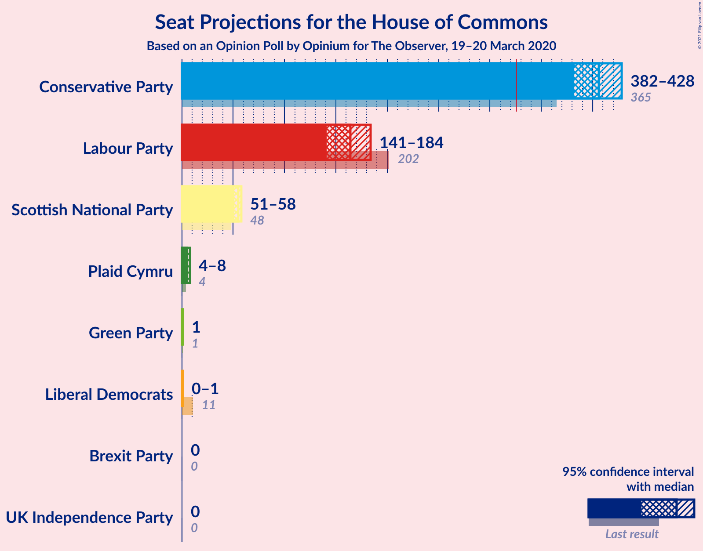

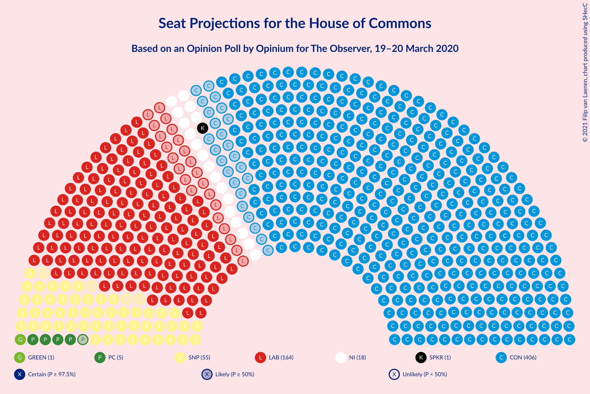

### Confidence Intervals

| Party | Last Result | Median | 80% Confidence Interval | 90% Confidence Interval | 95% Confidence Interval | 99% Confidence Interval |
|:-----:|:-----------:|:------:|:-----------------------:|:-----------------------:|:-----------------------:|:-----------------------:|
| <a href="#conservative-party">Conservative Party</a> | 365 | 406 | 387–416 |387–424 |382–428 |377–431 |
| <a href="#labour-party">Labour Party</a> | 202 | 164 | 152–183 |144–184 |141–184 |138–191 |
| <a href="#liberal-democrats">Liberal Democrats</a> | 11 | 0 | 0–1 |0–1 |0–1 |0–2 |
| <a href="#scottish-national-party">Scottish National Party</a> | 48 | 55 | 53–56 |52–58 |51–58 |50–58 |
| <a href="#green-party">Green Party</a> | 1 | 1 | 1 |1 |1 |1 |
| <a href="#plaid-cymru">Plaid Cymru</a> | 4 | 5 | 5–7 |5–7 |4–8 |4–9 |
| <a href="#brexit-party">Brexit Party</a> | 0 | 0 | 0 |0 |0 |0 |
| <a href="#uk-independence-party">UK Independence Party</a> | 0 | 0 | 0 |0 |0 |0 |

### Conservative Party

*For a full overview of the results for this party, see the [Conservative Party](party-conservativeparty.html) page.*

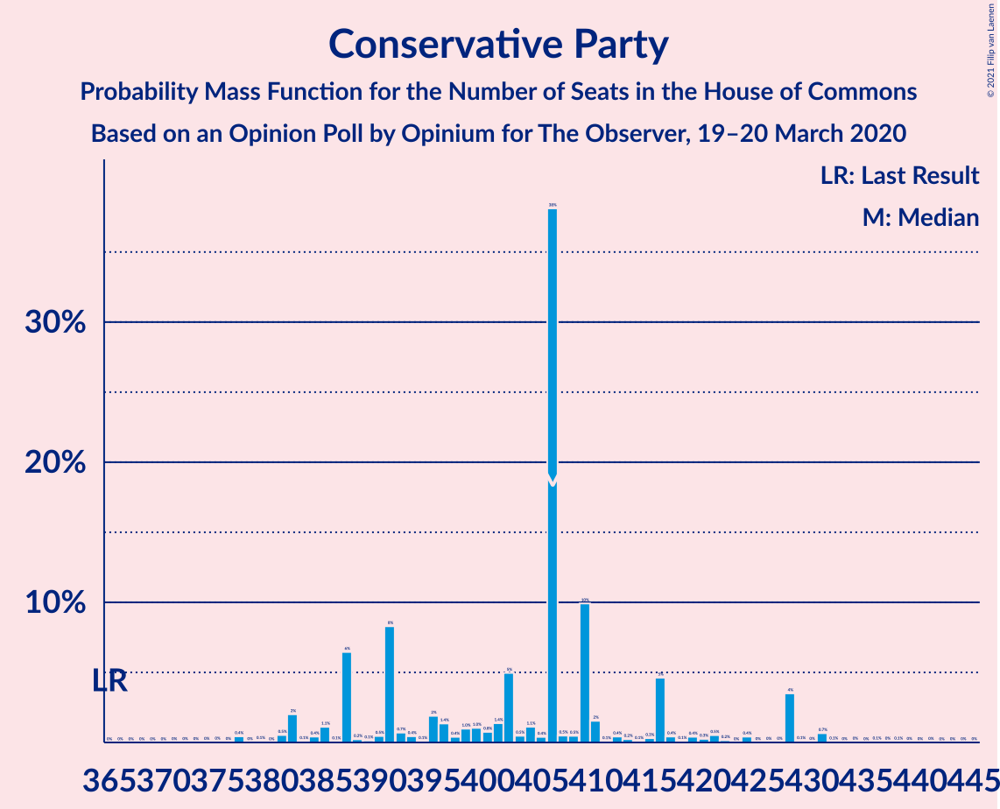

| Number of Seats | Probability | Accumulated | Special Marks |
|:---------------:|:-----------:|:-----------:|:-------------:|
| 365 | 0% | 100% | Last Result |
| 366 | 0% | 100% |  |
| 367 | 0% | 100% |  |
| 368 | 0% | 100% |  |
| 369 | 0% | 100% |  |
| 370 | 0% | 100% |  |
| 371 | 0% | 100% |  |
| 372 | 0% | 100% |  |
| 373 | 0% | 100% |  |
| 374 | 0% | 99.9% |  |
| 375 | 0% | 99.9% |  |
| 376 | 0% | 99.9% |  |
| 377 | 0.4% | 99.8% |  |
| 378 | 0% | 99.4% |  |
| 379 | 0.1% | 99.4% |  |
| 380 | 0% | 99.3% |  |
| 381 | 0.5% | 99.3% |  |
| 382 | 2% | 98.7% |  |
| 383 | 0.1% | 97% |  |
| 384 | 0.4% | 97% |  |
| 385 | 1.1% | 96% |  |
| 386 | 0.1% | 95% |  |
| 387 | 6% | 95% |  |
| 388 | 0.2% | 89% |  |
| 389 | 0.1% | 88% |  |
| 390 | 0.5% | 88% |  |
| 391 | 8% | 88% |  |
| 392 | 0.7% | 79% |  |
| 393 | 0.4% | 79% |  |
| 394 | 0.1% | 78% |  |
| 395 | 2% | 78% |  |
| 396 | 1.4% | 76% |  |
| 397 | 0.4% | 75% |  |
| 398 | 1.0% | 75% |  |
| 399 | 1.0% | 74% |  |
| 400 | 0.8% | 73% |  |
| 401 | 1.4% | 72% |  |
| 402 | 5% | 70% |  |
| 403 | 0.5% | 65% |  |
| 404 | 1.1% | 65% |  |
| 405 | 0.4% | 64% |  |
| 406 | 38% | 63% | Median |
| 407 | 0.5% | 25% |  |
| 408 | 0.5% | 25% |  |
| 409 | 10% | 24% |  |
| 410 | 2% | 14% |  |
| 411 | 0.1% | 13% |  |
| 412 | 0.4% | 13% |  |
| 413 | 0.2% | 12% |  |
| 414 | 0.1% | 12% |  |
| 415 | 0.3% | 12% |  |
| 416 | 5% | 12% |  |
| 417 | 0.4% | 7% |  |
| 418 | 0.1% | 7% |  |
| 419 | 0.4% | 7% |  |
| 420 | 0.3% | 6% |  |
| 421 | 0.5% | 6% |  |
| 422 | 0.2% | 5% |  |
| 423 | 0% | 5% |  |
| 424 | 0.4% | 5% |  |
| 425 | 0% | 5% |  |
| 426 | 0% | 5% |  |
| 427 | 0% | 5% |  |
| 428 | 4% | 5% |  |
| 429 | 0.1% | 1.2% |  |
| 430 | 0% | 1.1% |  |
| 431 | 0.7% | 1.1% |  |
| 432 | 0.1% | 0.4% |  |
| 433 | 0% | 0.4% |  |
| 434 | 0% | 0.3% |  |
| 435 | 0% | 0.3% |  |
| 436 | 0.1% | 0.3% |  |
| 437 | 0% | 0.2% |  |
| 438 | 0.1% | 0.2% |  |
| 439 | 0% | 0.1% |  |
| 440 | 0% | 0.1% |  |
| 441 | 0% | 0.1% |  |
| 442 | 0% | 0.1% |  |
| 443 | 0% | 0.1% |  |
| 444 | 0% | 0.1% |  |
| 445 | 0% | 0% |  |

### Labour Party

*For a full overview of the results for this party, see the [Labour Party](party-labourparty.html) page.*

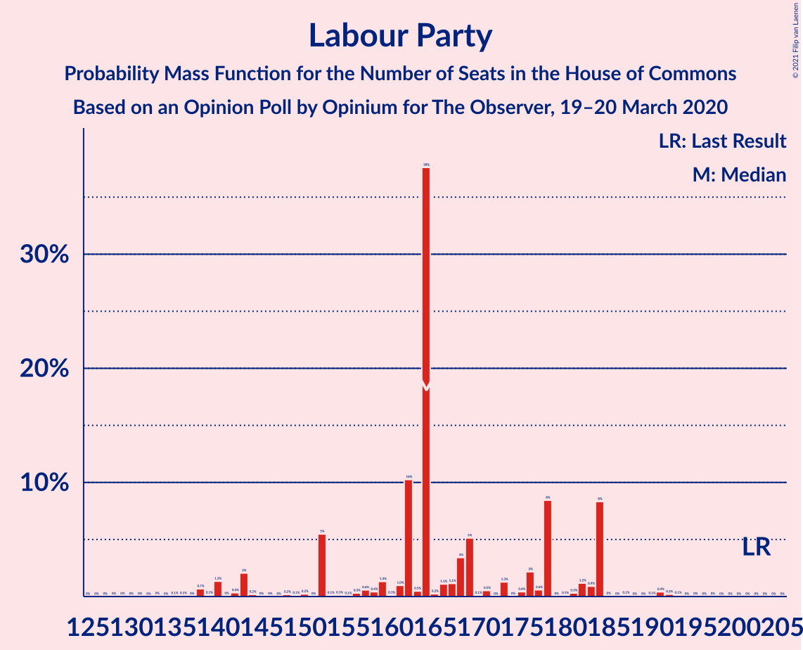

| Number of Seats | Probability | Accumulated | Special Marks |
|:---------------:|:-----------:|:-----------:|:-------------:|
| 129 | 0% | 100% |  |
| 130 | 0% | 99.9% |  |
| 131 | 0% | 99.9% |  |
| 132 | 0% | 99.9% |  |
| 133 | 0% | 99.9% |  |
| 134 | 0% | 99.8% |  |
| 135 | 0.1% | 99.8% |  |
| 136 | 0.1% | 99.8% |  |
| 137 | 0% | 99.7% |  |
| 138 | 0.7% | 99.7% |  |
| 139 | 0.1% | 99.0% |  |
| 140 | 1.3% | 98.9% |  |
| 141 | 0% | 98% |  |
| 142 | 0.3% | 97% |  |
| 143 | 2% | 97% |  |
| 144 | 0.2% | 95% |  |
| 145 | 0% | 95% |  |
| 146 | 0% | 95% |  |
| 147 | 0% | 95% |  |
| 148 | 0.2% | 95% |  |
| 149 | 0.1% | 95% |  |
| 150 | 0.2% | 95% |  |
| 151 | 0% | 94% |  |
| 152 | 5% | 94% |  |
| 153 | 0.1% | 89% |  |
| 154 | 0.1% | 89% |  |
| 155 | 0.1% | 89% |  |
| 156 | 0.3% | 89% |  |
| 157 | 0.6% | 88% |  |
| 158 | 0.4% | 88% |  |
| 159 | 1.3% | 87% |  |
| 160 | 0.1% | 86% |  |
| 161 | 1.0% | 86% |  |
| 162 | 10% | 85% |  |
| 163 | 0.5% | 75% |  |
| 164 | 38% | 74% | Median |
| 165 | 0.2% | 36% |  |
| 166 | 1.1% | 36% |  |
| 167 | 1.1% | 35% |  |
| 168 | 3% | 34% |  |
| 169 | 5% | 31% |  |
| 170 | 0.1% | 25% |  |
| 171 | 0.5% | 25% |  |
| 172 | 0% | 25% |  |
| 173 | 1.3% | 25% |  |
| 174 | 0% | 24% |  |
| 175 | 0.4% | 23% |  |
| 176 | 2% | 23% |  |
| 177 | 0.6% | 21% |  |
| 178 | 8% | 20% |  |
| 179 | 0% | 12% |  |
| 180 | 0.1% | 12% |  |
| 181 | 0.3% | 12% |  |
| 182 | 1.2% | 11% |  |
| 183 | 0.9% | 10% |  |
| 184 | 8% | 9% |  |
| 185 | 0% | 1.0% |  |
| 186 | 0% | 1.0% |  |
| 187 | 0.1% | 1.0% |  |
| 188 | 0% | 0.9% |  |
| 189 | 0% | 0.9% |  |
| 190 | 0.1% | 0.9% |  |
| 191 | 0.4% | 0.8% |  |
| 192 | 0.2% | 0.4% |  |
| 193 | 0.1% | 0.2% |  |
| 194 | 0% | 0.1% |  |
| 195 | 0% | 0.1% |  |
| 196 | 0% | 0% |  |
| 197 | 0% | 0% |  |
| 198 | 0% | 0% |  |
| 199 | 0% | 0% |  |
| 200 | 0% | 0% |  |
| 201 | 0% | 0% |  |
| 202 | 0% | 0% | Last Result |

### Liberal Democrats

*For a full overview of the results for this party, see the [Liberal Democrats](party-liberaldemocrats.html) page.*

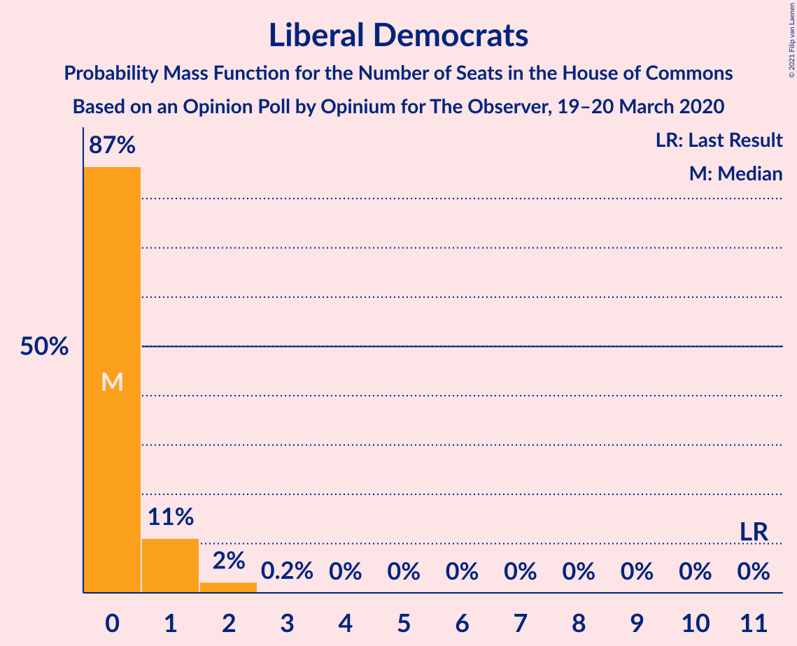

| Number of Seats | Probability | Accumulated | Special Marks |
|:---------------:|:-----------:|:-----------:|:-------------:|
| 0 | 87% | 100% | Median |
| 1 | 11% | 13% |  |
| 2 | 2% | 2% |  |
| 3 | 0.2% | 0.2% |  |
| 4 | 0% | 0% |  |
| 5 | 0% | 0% |  |
| 6 | 0% | 0% |  |
| 7 | 0% | 0% |  |
| 8 | 0% | 0% |  |
| 9 | 0% | 0% |  |
| 10 | 0% | 0% |  |
| 11 | 0% | 0% | Last Result |

### Scottish National Party

*For a full overview of the results for this party, see the [Scottish National Party](party-scottishnationalparty.html) page.*

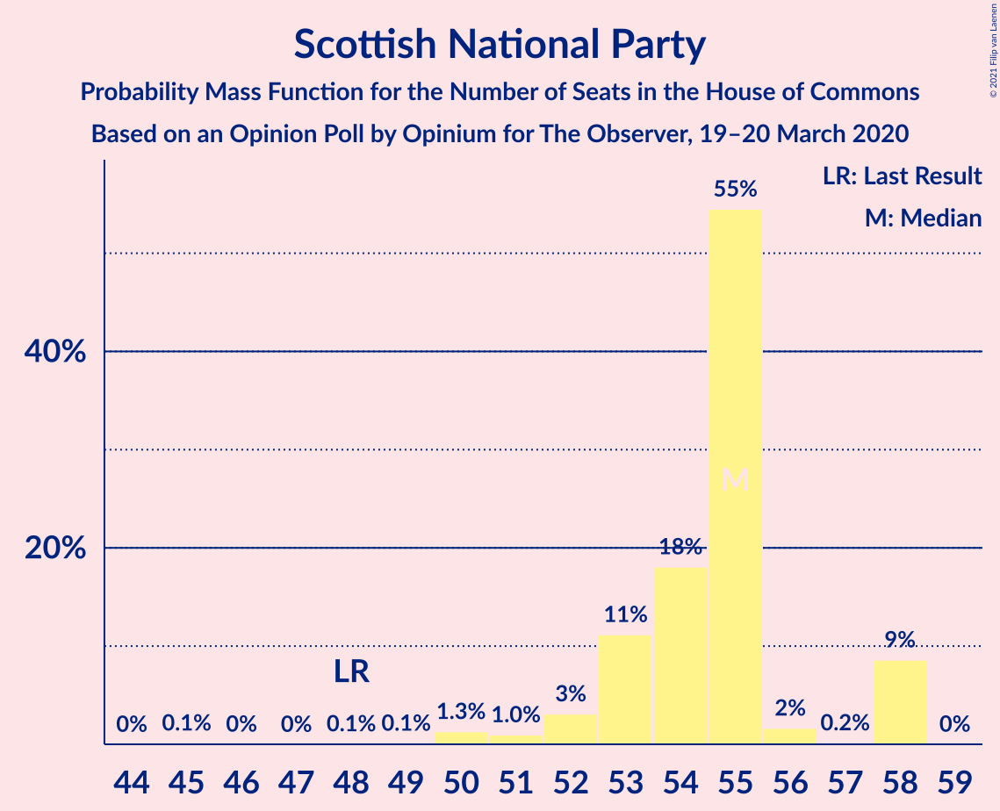

| Number of Seats | Probability | Accumulated | Special Marks |
|:---------------:|:-----------:|:-----------:|:-------------:|
| 45 | 0.1% | 100% |  |
| 46 | 0% | 99.8% |  |
| 47 | 0% | 99.8% |  |
| 48 | 0.1% | 99.8% | Last Result |
| 49 | 0.1% | 99.8% |  |
| 50 | 1.3% | 99.6% |  |
| 51 | 1.0% | 98% |  |
| 52 | 3% | 97% |  |
| 53 | 11% | 94% |  |
| 54 | 18% | 83% |  |
| 55 | 55% | 65% | Median |
| 56 | 2% | 10% |  |
| 57 | 0.2% | 9% |  |
| 58 | 9% | 9% |  |
| 59 | 0% | 0% |  |

### Green Party

*For a full overview of the results for this party, see the [Green Party](party-greenparty.html) page.*

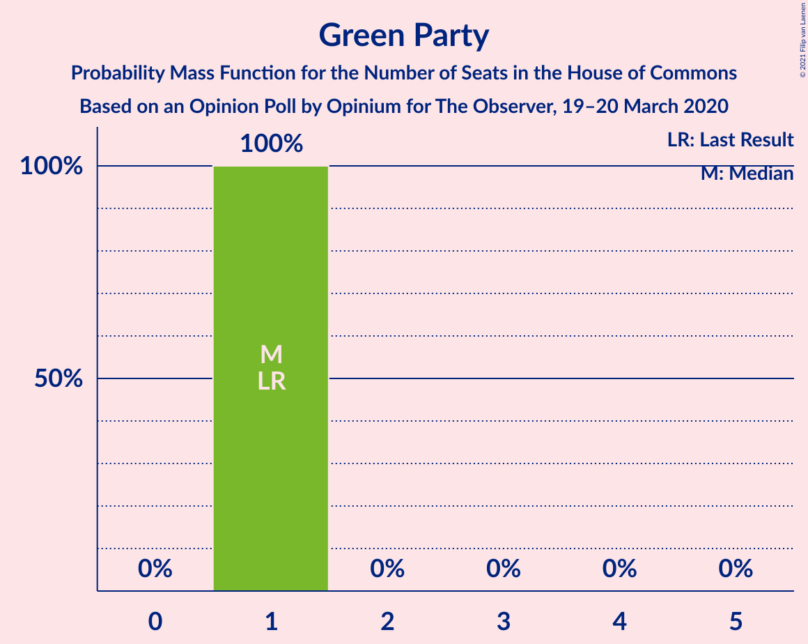

| Number of Seats | Probability | Accumulated | Special Marks |
|:---------------:|:-----------:|:-----------:|:-------------:|
| 1 | 100% | 100% | Last Result, Median |

### Plaid Cymru

*For a full overview of the results for this party, see the [Plaid Cymru](party-plaidcymru.html) page.*

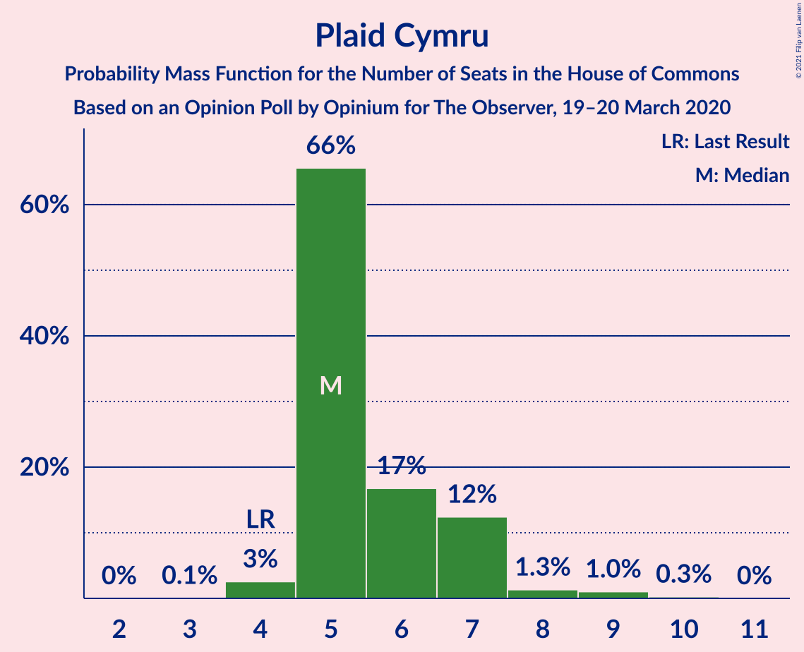

| Number of Seats | Probability | Accumulated | Special Marks |
|:---------------:|:-----------:|:-----------:|:-------------:|
| 3 | 0.1% | 100% |  |
| 4 | 3% | 99.9% | Last Result |
| 5 | 66% | 97% | Median |
| 6 | 17% | 32% |  |
| 7 | 12% | 15% |  |
| 8 | 1.3% | 3% |  |
| 9 | 1.0% | 1.3% |  |
| 10 | 0.3% | 0.3% |  |
| 11 | 0% | 0% |  |

### Brexit Party

*For a full overview of the results for this party, see the [Brexit Party](party-brexitparty.html) page.*

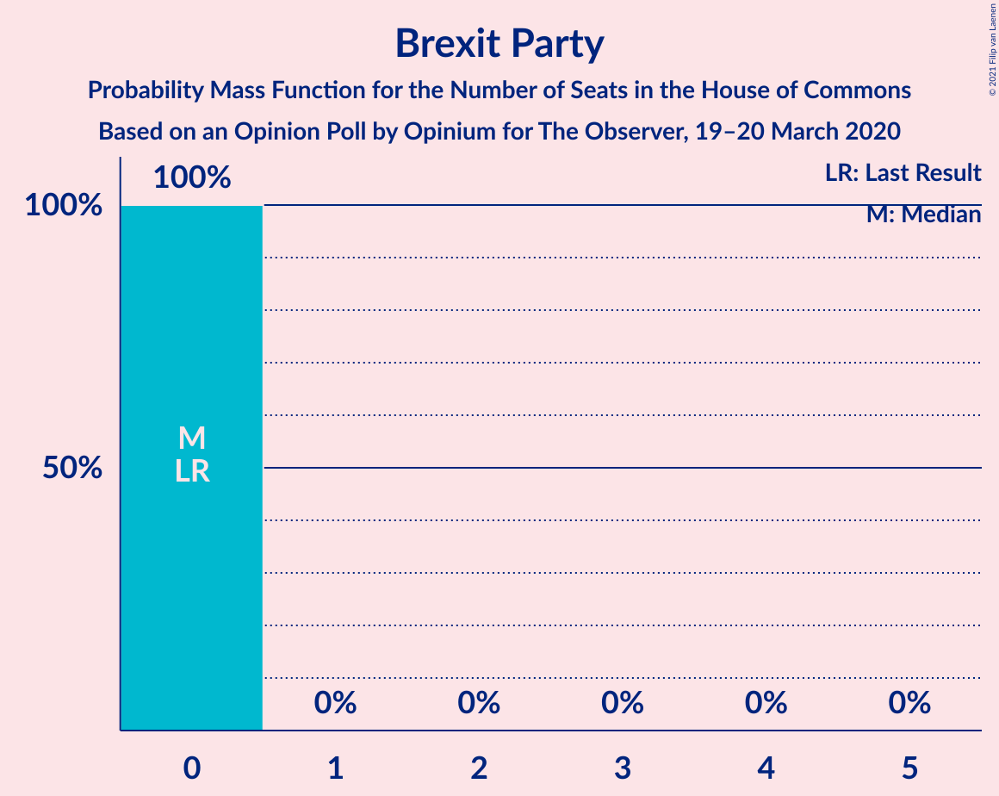

| Number of Seats | Probability | Accumulated | Special Marks |
|:---------------:|:-----------:|:-----------:|:-------------:|
| 0 | 100% | 100% | Last Result, Median |

### UK Independence Party

*For a full overview of the results for this party, see the [UK Independence Party](party-ukindependenceparty.html) page.*

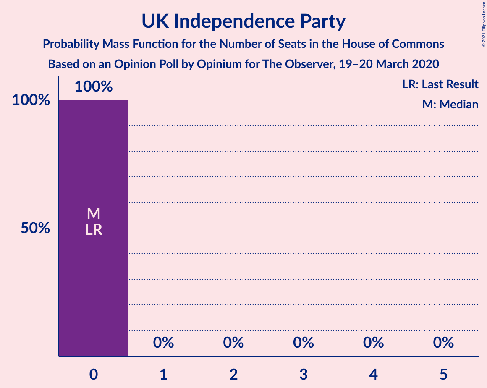

| Number of Seats | Probability | Accumulated | Special Marks |
|:---------------:|:-----------:|:-----------:|:-------------:|
| 0 | 100% | 100% | Last Result, Median |

## Coalitions

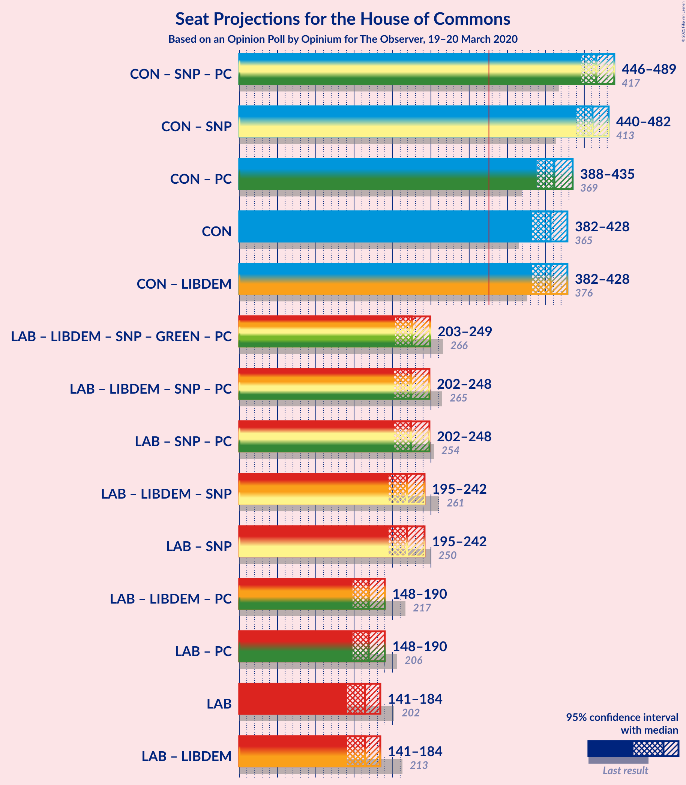

### Confidence Intervals

| Coalition | Last Result | Median | Majority? | 80% Confidence Interval | 90% Confidence Interval | 95% Confidence Interval | 99% Confidence Interval |
|:---------:|:-----------:|:------:|:---------:|:-----------------------:|:-----------------------:|:-----------------------:|:-----------------------:|
| Conservative Party – Scottish National Party – Plaid Cymru | 417 | 466 | 100% | 447–478 | 446–486 | 446–489 | 438–492 |
| Conservative Party – Scottish National Party | 413 | 461 | 100% | 442–471 | 441–480 | 440–482 | 433–485 |
| Conservative Party – Plaid Cymru | 369 | 411 | 100% | 392–423 | 392–430 | 388–435 | 382–438 |
| Conservative Party | 365 | 406 | 100% | 387–416 | 387–424 | 382–428 | 377–431 |
| Conservative Party – Liberal Democrats | 376 | 406 | 100% | 387–416 | 387–424 | 382–428 | 378–431 |
| Labour Party – Liberal Democrats – Scottish National Party – Green Party – Plaid Cymru | 266 | 225 | 0% | 215–244 | 207–244 | 203–249 | 200–254 |
| Labour Party – Liberal Democrats – Scottish National Party – Plaid Cymru | 265 | 224 | 0% | 214–243 | 206–243 | 202–248 | 199–253 |
| Labour Party – Scottish National Party – Plaid Cymru | 254 | 224 | 0% | 214–243 | 206–243 | 202–248 | 199–252 |
| Labour Party – Liberal Democrats – Scottish National Party | 261 | 219 | 0% | 207–238 | 200–238 | 195–242 | 192–248 |
| Labour Party – Scottish National Party | 250 | 219 | 0% | 207–238 | 200–238 | 195–242 | 192–247 |
| Labour Party – Liberal Democrats – Plaid Cymru | 217 | 169 | 0% | 159–188 | 150–189 | 148–190 | 145–197 |
| Labour Party – Plaid Cymru | 206 | 169 | 0% | 159–188 | 150–189 | 148–190 | 145–196 |
| Labour Party | 202 | 164 | 0% | 152–183 | 144–184 | 141–184 | 138–191 |
| Labour Party – Liberal Democrats | 213 | 164 | 0% | 152–183 | 144–184 | 141–184 | 138–192 |

### Conservative Party – Scottish National Party – Plaid Cymru

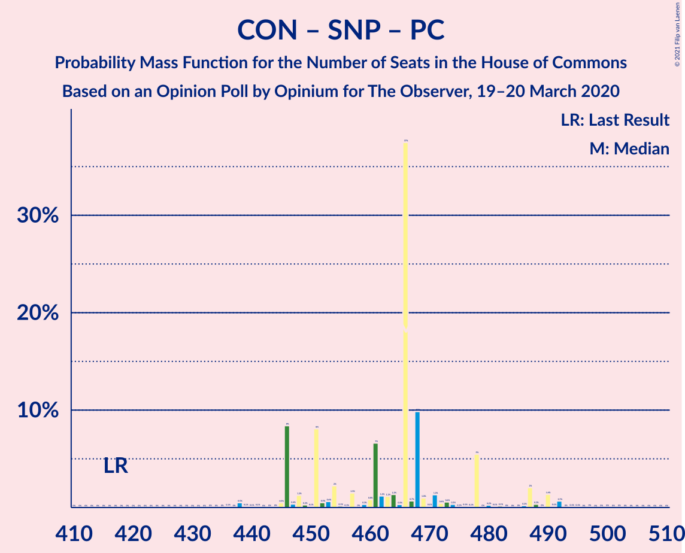

| Number of Seats | Probability | Accumulated | Special Marks |
|:---------------:|:-----------:|:-----------:|:-------------:|
| 417 | 0% | 100% | Last Result |
| 418 | 0% | 100% |  |
| 419 | 0% | 100% |  |
| 420 | 0% | 100% |  |
| 421 | 0% | 100% |  |
| 422 | 0% | 100% |  |
| 423 | 0% | 100% |  |
| 424 | 0% | 100% |  |
| 425 | 0% | 100% |  |
| 426 | 0% | 100% |  |
| 427 | 0% | 100% |  |
| 428 | 0% | 100% |  |
| 429 | 0% | 100% |  |
| 430 | 0% | 100% |  |
| 431 | 0% | 100% |  |
| 432 | 0% | 100% |  |
| 433 | 0% | 100% |  |
| 434 | 0% | 100% |  |
| 435 | 0% | 99.9% |  |
| 436 | 0.1% | 99.9% |  |
| 437 | 0% | 99.8% |  |
| 438 | 0.5% | 99.8% |  |
| 439 | 0.1% | 99.3% |  |
| 440 | 0.1% | 99.2% |  |
| 441 | 0.1% | 99.1% |  |
| 442 | 0% | 99.0% |  |
| 443 | 0% | 99.0% |  |
| 444 | 0% | 99.0% |  |
| 445 | 0.5% | 99.0% |  |
| 446 | 8% | 98% |  |
| 447 | 0.4% | 90% |  |
| 448 | 1.3% | 90% |  |
| 449 | 0.3% | 88% |  |
| 450 | 0.1% | 88% |  |
| 451 | 8% | 88% |  |
| 452 | 0.5% | 80% |  |
| 453 | 0.6% | 80% |  |
| 454 | 2% | 79% |  |
| 455 | 0.1% | 77% |  |
| 456 | 0.1% | 77% |  |
| 457 | 1.5% | 76% |  |
| 458 | 0% | 75% |  |
| 459 | 0.3% | 75% |  |
| 460 | 0.8% | 75% |  |
| 461 | 7% | 74% |  |
| 462 | 1.2% | 67% |  |
| 463 | 1.1% | 66% |  |
| 464 | 1.3% | 65% |  |
| 465 | 0.3% | 64% |  |
| 466 | 37% | 63% | Median |
| 467 | 0.7% | 26% |  |
| 468 | 10% | 25% |  |
| 469 | 1.0% | 15% |  |
| 470 | 0.1% | 14% |  |
| 471 | 1.3% | 14% |  |
| 472 | 0.4% | 13% |  |
| 473 | 0.6% | 12% |  |
| 474 | 0.3% | 12% |  |
| 475 | 0.1% | 11% |  |
| 476 | 0.1% | 11% |  |
| 477 | 0.1% | 11% |  |
| 478 | 5% | 11% |  |
| 479 | 0% | 6% |  |
| 480 | 0.2% | 6% |  |
| 481 | 0.1% | 5% |  |
| 482 | 0.1% | 5% |  |
| 483 | 0% | 5% |  |
| 484 | 0% | 5% |  |
| 485 | 0% | 5% |  |
| 486 | 0.2% | 5% |  |
| 487 | 2% | 5% |  |
| 488 | 0.3% | 3% |  |
| 489 | 0% | 3% |  |
| 490 | 1.4% | 2% |  |
| 491 | 0.1% | 1.1% |  |
| 492 | 0.7% | 1.0% |  |
| 493 | 0% | 0.3% |  |
| 494 | 0.1% | 0.3% |  |
| 495 | 0.1% | 0.2% |  |
| 496 | 0% | 0.2% |  |
| 497 | 0% | 0.2% |  |
| 498 | 0% | 0.1% |  |
| 499 | 0% | 0.1% |  |
| 500 | 0% | 0.1% |  |
| 501 | 0% | 0.1% |  |
| 502 | 0% | 0% |  |

### Conservative Party – Scottish National Party

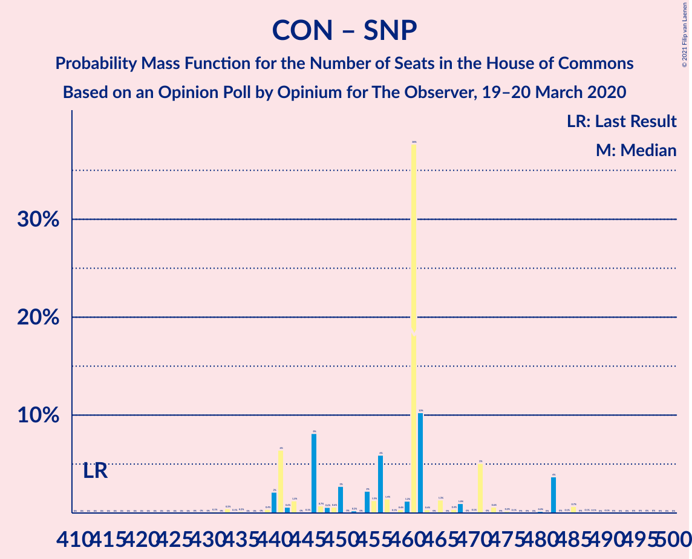

| Number of Seats | Probability | Accumulated | Special Marks |
|:---------------:|:-----------:|:-----------:|:-------------:|
| 413 | 0% | 100% | Last Result |
| 414 | 0% | 100% |  |
| 415 | 0% | 100% |  |
| 416 | 0% | 100% |  |
| 417 | 0% | 100% |  |
| 418 | 0% | 100% |  |
| 419 | 0% | 100% |  |
| 420 | 0% | 100% |  |
| 421 | 0% | 100% |  |
| 422 | 0% | 100% |  |
| 423 | 0% | 100% |  |
| 424 | 0% | 100% |  |
| 425 | 0% | 100% |  |
| 426 | 0% | 100% |  |
| 427 | 0% | 100% |  |
| 428 | 0% | 100% |  |
| 429 | 0% | 100% |  |
| 430 | 0% | 99.9% |  |
| 431 | 0.1% | 99.9% |  |
| 432 | 0% | 99.8% |  |
| 433 | 0.5% | 99.8% |  |
| 434 | 0.1% | 99.3% |  |
| 435 | 0.2% | 99.2% |  |
| 436 | 0% | 99.0% |  |
| 437 | 0% | 99.0% |  |
| 438 | 0% | 99.0% |  |
| 439 | 0.4% | 99.0% |  |
| 440 | 2% | 98.6% |  |
| 441 | 6% | 96% |  |
| 442 | 0.6% | 90% |  |
| 443 | 1.3% | 89% |  |
| 444 | 0% | 88% |  |
| 445 | 0.1% | 88% |  |
| 446 | 8% | 88% |  |
| 447 | 0.7% | 80% |  |
| 448 | 0.6% | 79% |  |
| 449 | 0.6% | 79% |  |
| 450 | 3% | 78% |  |
| 451 | 0% | 75% |  |
| 452 | 0.2% | 75% |  |
| 453 | 0% | 75% |  |
| 454 | 2% | 75% |  |
| 455 | 1.3% | 73% |  |
| 456 | 6% | 71% |  |
| 457 | 1.4% | 65% |  |
| 458 | 0.1% | 64% |  |
| 459 | 0.4% | 64% |  |
| 460 | 1.2% | 64% |  |
| 461 | 38% | 62% | Median |
| 462 | 10% | 25% |  |
| 463 | 0.4% | 14% |  |
| 464 | 0% | 14% |  |
| 465 | 1.3% | 14% |  |
| 466 | 0% | 13% |  |
| 467 | 0.4% | 13% |  |
| 468 | 1.0% | 12% |  |
| 469 | 0% | 11% |  |
| 470 | 0.1% | 11% |  |
| 471 | 5% | 11% |  |
| 472 | 0% | 6% |  |
| 473 | 0.6% | 6% |  |
| 474 | 0% | 5% |  |
| 475 | 0.2% | 5% |  |
| 476 | 0.1% | 5% |  |
| 477 | 0% | 5% |  |
| 478 | 0% | 5% |  |
| 479 | 0% | 5% |  |
| 480 | 0.2% | 5% |  |
| 481 | 0% | 5% |  |
| 482 | 4% | 5% |  |
| 483 | 0% | 1.2% |  |
| 484 | 0.1% | 1.2% |  |
| 485 | 0.7% | 1.1% |  |
| 486 | 0% | 0.4% |  |
| 487 | 0.1% | 0.4% |  |
| 488 | 0.1% | 0.3% |  |
| 489 | 0% | 0.2% |  |
| 490 | 0.1% | 0.2% |  |
| 491 | 0% | 0.1% |  |
| 492 | 0% | 0.1% |  |
| 493 | 0% | 0.1% |  |
| 494 | 0% | 0.1% |  |
| 495 | 0% | 0.1% |  |
| 496 | 0% | 0.1% |  |
| 497 | 0% | 0% |  |

### Conservative Party – Plaid Cymru

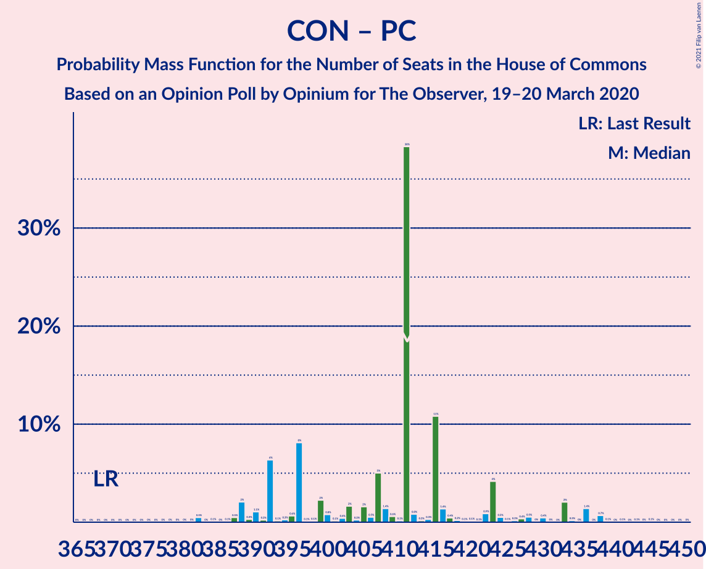

| Number of Seats | Probability | Accumulated | Special Marks |
|:---------------:|:-----------:|:-----------:|:-------------:|
| 369 | 0% | 100% | Last Result |
| 370 | 0% | 100% |  |
| 371 | 0% | 100% |  |
| 372 | 0% | 100% |  |
| 373 | 0% | 100% |  |
| 374 | 0% | 100% |  |
| 375 | 0% | 100% |  |
| 376 | 0% | 100% |  |
| 377 | 0% | 100% |  |
| 378 | 0% | 100% |  |
| 379 | 0% | 99.9% |  |
| 380 | 0% | 99.9% |  |
| 381 | 0% | 99.9% |  |
| 382 | 0.5% | 99.9% |  |
| 383 | 0% | 99.4% |  |
| 384 | 0.1% | 99.4% |  |
| 385 | 0% | 99.3% |  |
| 386 | 0.1% | 99.3% |  |
| 387 | 0.5% | 99.2% |  |
| 388 | 2% | 98.7% |  |
| 389 | 0.3% | 97% |  |
| 390 | 1.1% | 96% |  |
| 391 | 0.2% | 95% |  |
| 392 | 6% | 95% |  |
| 393 | 0.1% | 89% |  |
| 394 | 0.3% | 89% |  |
| 395 | 0.6% | 88% |  |
| 396 | 8% | 88% |  |
| 397 | 0.1% | 80% |  |
| 398 | 0.1% | 79% |  |
| 399 | 2% | 79% |  |
| 400 | 0.8% | 77% |  |
| 401 | 0.1% | 76% |  |
| 402 | 0.4% | 76% |  |
| 403 | 2% | 76% |  |
| 404 | 0.2% | 74% |  |
| 405 | 2% | 74% |  |
| 406 | 0.5% | 72% |  |
| 407 | 5% | 72% |  |
| 408 | 1.4% | 67% |  |
| 409 | 0.6% | 65% |  |
| 410 | 0.1% | 65% |  |
| 411 | 38% | 65% | Median |
| 412 | 0.8% | 26% |  |
| 413 | 0.2% | 25% |  |
| 414 | 0.3% | 25% |  |
| 415 | 11% | 25% |  |
| 416 | 1.4% | 14% |  |
| 417 | 0.4% | 13% |  |
| 418 | 0.2% | 12% |  |
| 419 | 0.1% | 12% |  |
| 420 | 0.1% | 12% |  |
| 421 | 0.1% | 12% |  |
| 422 | 0.9% | 12% |  |
| 423 | 4% | 11% |  |
| 424 | 0.5% | 7% |  |
| 425 | 0.1% | 6% |  |
| 426 | 0.2% | 6% |  |
| 427 | 0.4% | 6% |  |
| 428 | 0.5% | 6% |  |
| 429 | 0% | 5% |  |
| 430 | 0.4% | 5% |  |
| 431 | 0% | 5% |  |
| 432 | 0% | 5% |  |
| 433 | 2% | 5% |  |
| 434 | 0.2% | 3% |  |
| 435 | 0% | 3% |  |
| 436 | 1.4% | 2% |  |
| 437 | 0% | 1.1% |  |
| 438 | 0.7% | 1.1% |  |
| 439 | 0.1% | 0.4% |  |
| 440 | 0% | 0.3% |  |
| 441 | 0.1% | 0.3% |  |
| 442 | 0% | 0.2% |  |
| 443 | 0.1% | 0.2% |  |
| 444 | 0% | 0.2% |  |
| 445 | 0.1% | 0.2% |  |
| 446 | 0% | 0.1% |  |
| 447 | 0% | 0.1% |  |
| 448 | 0% | 0.1% |  |
| 449 | 0% | 0.1% |  |
| 450 | 0% | 0% |  |

### Conservative Party

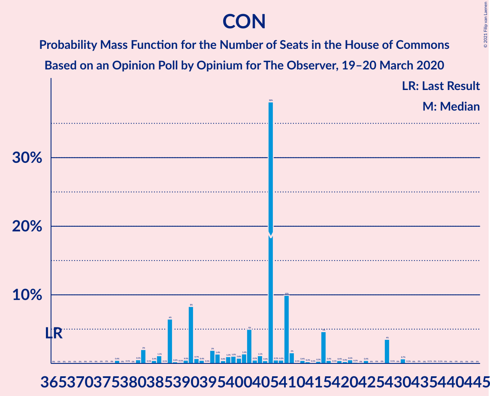

| Number of Seats | Probability | Accumulated | Special Marks |
|:---------------:|:-----------:|:-----------:|:-------------:|
| 365 | 0% | 100% | Last Result |
| 366 | 0% | 100% |  |
| 367 | 0% | 100% |  |
| 368 | 0% | 100% |  |
| 369 | 0% | 100% |  |
| 370 | 0% | 100% |  |
| 371 | 0% | 100% |  |
| 372 | 0% | 100% |  |
| 373 | 0% | 100% |  |
| 374 | 0% | 99.9% |  |
| 375 | 0% | 99.9% |  |
| 376 | 0% | 99.9% |  |
| 377 | 0.4% | 99.8% |  |
| 378 | 0% | 99.4% |  |
| 379 | 0.1% | 99.4% |  |
| 380 | 0% | 99.3% |  |
| 381 | 0.5% | 99.3% |  |
| 382 | 2% | 98.7% |  |
| 383 | 0.1% | 97% |  |
| 384 | 0.4% | 97% |  |
| 385 | 1.1% | 96% |  |
| 386 | 0.1% | 95% |  |
| 387 | 6% | 95% |  |
| 388 | 0.2% | 89% |  |
| 389 | 0.1% | 88% |  |
| 390 | 0.5% | 88% |  |
| 391 | 8% | 88% |  |
| 392 | 0.7% | 79% |  |
| 393 | 0.4% | 79% |  |
| 394 | 0.1% | 78% |  |
| 395 | 2% | 78% |  |
| 396 | 1.4% | 76% |  |
| 397 | 0.4% | 75% |  |
| 398 | 1.0% | 75% |  |
| 399 | 1.0% | 74% |  |
| 400 | 0.8% | 73% |  |
| 401 | 1.4% | 72% |  |
| 402 | 5% | 70% |  |
| 403 | 0.5% | 65% |  |
| 404 | 1.1% | 65% |  |
| 405 | 0.4% | 64% |  |
| 406 | 38% | 63% | Median |
| 407 | 0.5% | 25% |  |
| 408 | 0.5% | 25% |  |
| 409 | 10% | 24% |  |
| 410 | 2% | 14% |  |
| 411 | 0.1% | 13% |  |
| 412 | 0.4% | 13% |  |
| 413 | 0.2% | 12% |  |
| 414 | 0.1% | 12% |  |
| 415 | 0.3% | 12% |  |
| 416 | 5% | 12% |  |
| 417 | 0.4% | 7% |  |
| 418 | 0.1% | 7% |  |
| 419 | 0.4% | 7% |  |
| 420 | 0.3% | 6% |  |
| 421 | 0.5% | 6% |  |
| 422 | 0.2% | 5% |  |
| 423 | 0% | 5% |  |
| 424 | 0.4% | 5% |  |
| 425 | 0% | 5% |  |
| 426 | 0% | 5% |  |
| 427 | 0% | 5% |  |
| 428 | 4% | 5% |  |
| 429 | 0.1% | 1.2% |  |
| 430 | 0% | 1.1% |  |
| 431 | 0.7% | 1.1% |  |
| 432 | 0.1% | 0.4% |  |
| 433 | 0% | 0.4% |  |
| 434 | 0% | 0.3% |  |
| 435 | 0% | 0.3% |  |
| 436 | 0.1% | 0.3% |  |
| 437 | 0% | 0.2% |  |
| 438 | 0.1% | 0.2% |  |
| 439 | 0% | 0.1% |  |
| 440 | 0% | 0.1% |  |
| 441 | 0% | 0.1% |  |
| 442 | 0% | 0.1% |  |
| 443 | 0% | 0.1% |  |
| 444 | 0% | 0.1% |  |
| 445 | 0% | 0% |  |

### Conservative Party – Liberal Democrats

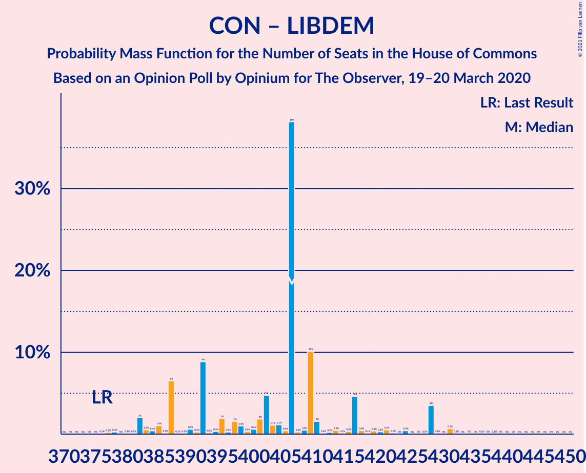

| Number of Seats | Probability | Accumulated | Special Marks |
|:---------------:|:-----------:|:-----------:|:-------------:|
| 374 | 0% | 100% |  |
| 375 | 0% | 99.9% |  |
| 376 | 0.1% | 99.9% | Last Result |
| 377 | 0.2% | 99.8% |  |
| 378 | 0.3% | 99.6% |  |
| 379 | 0% | 99.4% |  |
| 380 | 0.1% | 99.4% |  |
| 381 | 0.1% | 99.3% |  |
| 382 | 2% | 99.2% |  |
| 383 | 0.5% | 97% |  |
| 384 | 0.4% | 97% |  |
| 385 | 1.0% | 96% |  |
| 386 | 0.1% | 95% |  |
| 387 | 6% | 95% |  |
| 388 | 0.1% | 89% |  |
| 389 | 0.1% | 89% |  |
| 390 | 0.6% | 88% |  |
| 391 | 0.3% | 88% |  |
| 392 | 9% | 88% |  |
| 393 | 0.2% | 79% |  |
| 394 | 0.3% | 79% |  |
| 395 | 2% | 78% |  |
| 396 | 0.3% | 76% |  |
| 397 | 2% | 76% |  |
| 398 | 1.0% | 75% |  |
| 399 | 0.3% | 74% |  |
| 400 | 0.6% | 73% |  |
| 401 | 2% | 73% |  |
| 402 | 5% | 71% |  |
| 403 | 1.1% | 66% |  |
| 404 | 1.1% | 65% |  |
| 405 | 0.4% | 64% |  |
| 406 | 38% | 63% | Median |
| 407 | 0.3% | 25% |  |
| 408 | 0.5% | 25% |  |
| 409 | 10% | 25% |  |
| 410 | 2% | 14% |  |
| 411 | 0.1% | 13% |  |
| 412 | 0.2% | 13% |  |
| 413 | 0.5% | 13% |  |
| 414 | 0.1% | 12% |  |
| 415 | 0.3% | 12% |  |
| 416 | 5% | 12% |  |
| 417 | 0.4% | 7% |  |
| 418 | 0.1% | 7% |  |
| 419 | 0.4% | 7% |  |
| 420 | 0.3% | 6% |  |
| 421 | 0.5% | 6% |  |
| 422 | 0.1% | 5% |  |
| 423 | 0% | 5% |  |
| 424 | 0.4% | 5% |  |
| 425 | 0% | 5% |  |
| 426 | 0% | 5% |  |
| 427 | 0.1% | 5% |  |
| 428 | 4% | 5% |  |
| 429 | 0.1% | 1.2% |  |
| 430 | 0% | 1.1% |  |
| 431 | 0.7% | 1.1% |  |
| 432 | 0.1% | 0.4% |  |
| 433 | 0% | 0.4% |  |
| 434 | 0% | 0.4% |  |
| 435 | 0% | 0.3% |  |
| 436 | 0.1% | 0.3% |  |
| 437 | 0% | 0.2% |  |
| 438 | 0.1% | 0.2% |  |
| 439 | 0% | 0.1% |  |
| 440 | 0% | 0.1% |  |
| 441 | 0% | 0.1% |  |
| 442 | 0% | 0.1% |  |
| 443 | 0% | 0.1% |  |
| 444 | 0% | 0.1% |  |
| 445 | 0% | 0.1% |  |
| 446 | 0% | 0% |  |

### Labour Party – Liberal Democrats – Scottish National Party – Green Party – Plaid Cymru

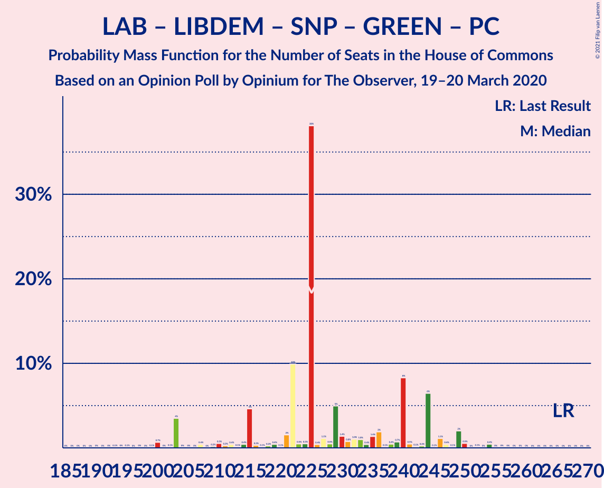

| Number of Seats | Probability | Accumulated | Special Marks |
|:---------------:|:-----------:|:-----------:|:-------------:|
| 187 | 0% | 100% |  |
| 188 | 0% | 99.9% |  |
| 189 | 0% | 99.9% |  |
| 190 | 0% | 99.9% |  |
| 191 | 0% | 99.9% |  |
| 192 | 0% | 99.9% |  |
| 193 | 0.1% | 99.9% |  |
| 194 | 0% | 99.8% |  |
| 195 | 0.1% | 99.8% |  |
| 196 | 0% | 99.7% |  |
| 197 | 0% | 99.7% |  |
| 198 | 0% | 99.7% |  |
| 199 | 0.1% | 99.6% |  |
| 200 | 0.7% | 99.6% |  |
| 201 | 0% | 98.9% |  |
| 202 | 0.1% | 98.9% |  |
| 203 | 4% | 98.8% |  |
| 204 | 0% | 95% |  |
| 205 | 0% | 95% |  |
| 206 | 0% | 95% |  |
| 207 | 0.4% | 95% |  |
| 208 | 0% | 95% |  |
| 209 | 0.2% | 95% |  |
| 210 | 0.5% | 95% |  |
| 211 | 0.3% | 94% |  |
| 212 | 0.4% | 94% |  |
| 213 | 0.1% | 93% |  |
| 214 | 0.4% | 93% |  |
| 215 | 5% | 93% |  |
| 216 | 0.3% | 88% |  |
| 217 | 0.1% | 88% |  |
| 218 | 0.2% | 88% |  |
| 219 | 0.4% | 88% |  |
| 220 | 0.1% | 87% |  |
| 221 | 2% | 87% |  |
| 222 | 10% | 86% |  |
| 223 | 0.5% | 76% |  |
| 224 | 0.5% | 75% |  |
| 225 | 38% | 75% | Median |
| 226 | 0.4% | 37% |  |
| 227 | 1.1% | 36% |  |
| 228 | 0.5% | 35% |  |
| 229 | 5% | 35% |  |
| 230 | 1.4% | 30% |  |
| 231 | 0.8% | 28% |  |
| 232 | 1.0% | 27% |  |
| 233 | 1.0% | 26% |  |
| 234 | 0.4% | 25% |  |
| 235 | 1.4% | 25% |  |
| 236 | 2% | 24% |  |
| 237 | 0.1% | 22% |  |
| 238 | 0.4% | 22% |  |
| 239 | 0.7% | 21% |  |
| 240 | 8% | 21% |  |
| 241 | 0.5% | 12% |  |
| 242 | 0.1% | 12% |  |
| 243 | 0.2% | 12% |  |
| 244 | 6% | 11% |  |
| 245 | 0.1% | 5% |  |
| 246 | 1.1% | 5% |  |
| 247 | 0.4% | 4% |  |
| 248 | 0.1% | 3% |  |
| 249 | 2% | 3% |  |
| 250 | 0.5% | 1.3% |  |
| 251 | 0% | 0.7% |  |
| 252 | 0.1% | 0.7% |  |
| 253 | 0% | 0.6% |  |
| 254 | 0.4% | 0.6% |  |
| 255 | 0% | 0.2% |  |
| 256 | 0% | 0.1% |  |
| 257 | 0% | 0.1% |  |
| 258 | 0% | 0.1% |  |
| 259 | 0% | 0% |  |
| 260 | 0% | 0% |  |
| 261 | 0% | 0% |  |
| 262 | 0% | 0% |  |
| 263 | 0% | 0% |  |
| 264 | 0% | 0% |  |
| 265 | 0% | 0% |  |
| 266 | 0% | 0% | Last Result |

### Labour Party – Liberal Democrats – Scottish National Party – Plaid Cymru

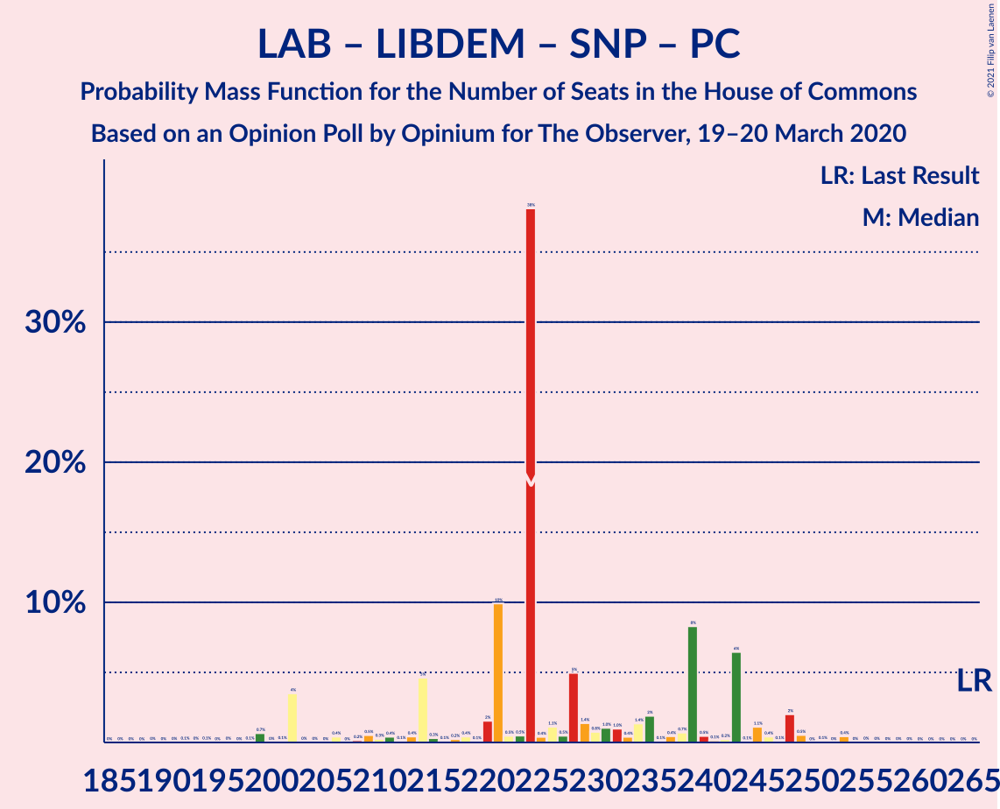

| Number of Seats | Probability | Accumulated | Special Marks |
|:---------------:|:-----------:|:-----------:|:-------------:|
| 186 | 0% | 100% |  |
| 187 | 0% | 99.9% |  |
| 188 | 0% | 99.9% |  |
| 189 | 0% | 99.9% |  |
| 190 | 0% | 99.9% |  |
| 191 | 0% | 99.9% |  |
| 192 | 0.1% | 99.9% |  |
| 193 | 0% | 99.8% |  |
| 194 | 0.1% | 99.8% |  |
| 195 | 0% | 99.7% |  |
| 196 | 0% | 99.7% |  |
| 197 | 0% | 99.7% |  |
| 198 | 0.1% | 99.6% |  |
| 199 | 0.7% | 99.6% |  |
| 200 | 0% | 98.9% |  |
| 201 | 0.1% | 98.9% |  |
| 202 | 4% | 98.8% |  |
| 203 | 0% | 95% |  |
| 204 | 0% | 95% |  |
| 205 | 0% | 95% |  |
| 206 | 0.4% | 95% |  |
| 207 | 0% | 95% |  |
| 208 | 0.2% | 95% |  |
| 209 | 0.5% | 95% |  |
| 210 | 0.3% | 94% |  |
| 211 | 0.4% | 94% |  |
| 212 | 0.1% | 93% |  |
| 213 | 0.4% | 93% |  |
| 214 | 5% | 93% |  |
| 215 | 0.3% | 88% |  |
| 216 | 0.1% | 88% |  |
| 217 | 0.2% | 88% |  |
| 218 | 0.4% | 88% |  |
| 219 | 0.1% | 87% |  |
| 220 | 2% | 87% |  |
| 221 | 10% | 86% |  |
| 222 | 0.5% | 76% |  |
| 223 | 0.5% | 75% |  |
| 224 | 38% | 75% | Median |
| 225 | 0.4% | 37% |  |
| 226 | 1.1% | 36% |  |
| 227 | 0.5% | 35% |  |
| 228 | 5% | 35% |  |
| 229 | 1.4% | 30% |  |
| 230 | 0.8% | 28% |  |
| 231 | 1.0% | 27% |  |
| 232 | 1.0% | 26% |  |
| 233 | 0.4% | 25% |  |
| 234 | 1.4% | 25% |  |
| 235 | 2% | 24% |  |
| 236 | 0.1% | 22% |  |
| 237 | 0.4% | 22% |  |
| 238 | 0.7% | 21% |  |
| 239 | 8% | 21% |  |
| 240 | 0.5% | 12% |  |
| 241 | 0.1% | 12% |  |
| 242 | 0.2% | 12% |  |
| 243 | 6% | 11% |  |
| 244 | 0.1% | 5% |  |
| 245 | 1.1% | 5% |  |
| 246 | 0.4% | 4% |  |
| 247 | 0.1% | 3% |  |
| 248 | 2% | 3% |  |
| 249 | 0.5% | 1.3% |  |
| 250 | 0% | 0.7% |  |
| 251 | 0.1% | 0.7% |  |
| 252 | 0% | 0.6% |  |
| 253 | 0.4% | 0.6% |  |
| 254 | 0% | 0.2% |  |
| 255 | 0% | 0.1% |  |
| 256 | 0% | 0.1% |  |
| 257 | 0% | 0.1% |  |
| 258 | 0% | 0% |  |
| 259 | 0% | 0% |  |
| 260 | 0% | 0% |  |
| 261 | 0% | 0% |  |
| 262 | 0% | 0% |  |
| 263 | 0% | 0% |  |
| 264 | 0% | 0% |  |
| 265 | 0% | 0% | Last Result |

### Labour Party – Scottish National Party – Plaid Cymru

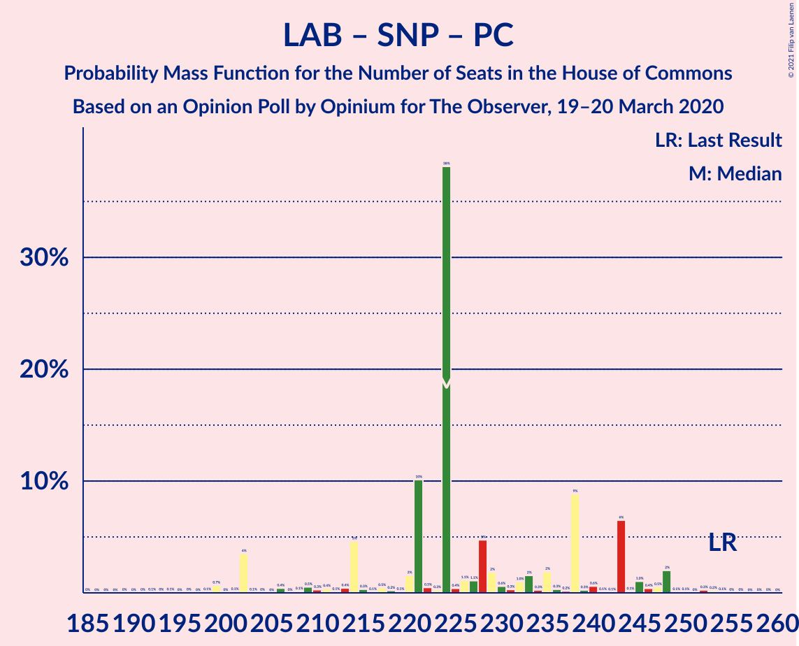

| Number of Seats | Probability | Accumulated | Special Marks |
|:---------------:|:-----------:|:-----------:|:-------------:|
| 185 | 0% | 100% |  |
| 186 | 0% | 99.9% |  |
| 187 | 0% | 99.9% |  |
| 188 | 0% | 99.9% |  |
| 189 | 0% | 99.9% |  |
| 190 | 0% | 99.9% |  |
| 191 | 0% | 99.9% |  |
| 192 | 0.1% | 99.9% |  |
| 193 | 0% | 99.8% |  |
| 194 | 0.1% | 99.8% |  |
| 195 | 0% | 99.7% |  |
| 196 | 0% | 99.7% |  |
| 197 | 0% | 99.6% |  |
| 198 | 0.1% | 99.6% |  |
| 199 | 0.7% | 99.6% |  |
| 200 | 0% | 98.9% |  |
| 201 | 0.1% | 98.9% |  |
| 202 | 4% | 98.8% |  |
| 203 | 0.1% | 95% |  |
| 204 | 0% | 95% |  |
| 205 | 0% | 95% |  |
| 206 | 0.4% | 95% |  |
| 207 | 0% | 95% |  |
| 208 | 0.1% | 95% |  |
| 209 | 0.5% | 95% |  |
| 210 | 0.3% | 94% |  |
| 211 | 0.4% | 94% |  |
| 212 | 0.1% | 93% |  |
| 213 | 0.4% | 93% |  |
| 214 | 5% | 93% |  |
| 215 | 0.3% | 88% |  |
| 216 | 0.1% | 88% |  |
| 217 | 0.5% | 88% |  |
| 218 | 0.2% | 87% |  |
| 219 | 0.1% | 87% |  |
| 220 | 2% | 87% |  |
| 221 | 10% | 86% |  |
| 222 | 0.5% | 75% |  |
| 223 | 0.3% | 75% |  |
| 224 | 38% | 75% | Median |
| 225 | 0.4% | 37% |  |
| 226 | 1.1% | 36% |  |
| 227 | 1.1% | 35% |  |
| 228 | 5% | 34% |  |
| 229 | 2% | 29% |  |
| 230 | 0.6% | 27% |  |
| 231 | 0.3% | 27% |  |
| 232 | 1.0% | 26% |  |
| 233 | 2% | 25% |  |
| 234 | 0.3% | 24% |  |
| 235 | 2% | 24% |  |
| 236 | 0.3% | 22% |  |
| 237 | 0.2% | 21% |  |
| 238 | 9% | 21% |  |
| 239 | 0.3% | 12% |  |
| 240 | 0.6% | 12% |  |
| 241 | 0.1% | 12% |  |
| 242 | 0.1% | 11% |  |
| 243 | 6% | 11% |  |
| 244 | 0.1% | 5% |  |
| 245 | 1.0% | 5% |  |
| 246 | 0.4% | 4% |  |
| 247 | 0.5% | 3% |  |
| 248 | 2% | 3% |  |
| 249 | 0.1% | 0.8% |  |
| 250 | 0.1% | 0.7% |  |
| 251 | 0% | 0.6% |  |
| 252 | 0.3% | 0.6% |  |
| 253 | 0.2% | 0.4% |  |
| 254 | 0.1% | 0.2% | Last Result |
| 255 | 0% | 0.1% |  |
| 256 | 0% | 0.1% |  |
| 257 | 0% | 0% |  |

### Labour Party – Liberal Democrats – Scottish National Party

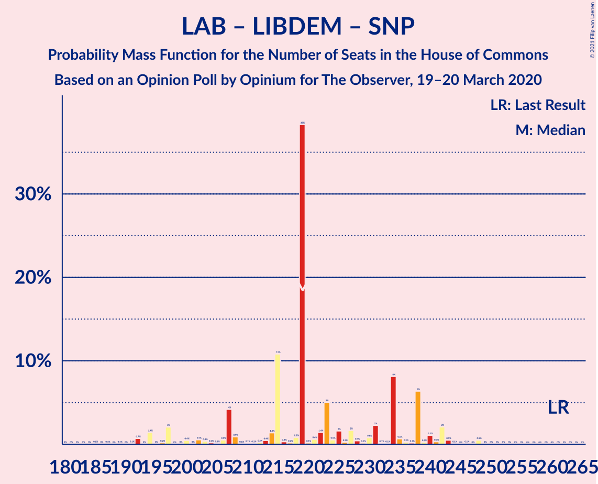

| Number of Seats | Probability | Accumulated | Special Marks |
|:---------------:|:-----------:|:-----------:|:-------------:|
| 181 | 0% | 100% |  |
| 182 | 0% | 99.9% |  |
| 183 | 0% | 99.9% |  |
| 184 | 0% | 99.9% |  |
| 185 | 0.1% | 99.9% |  |
| 186 | 0% | 99.8% |  |
| 187 | 0.1% | 99.8% |  |
| 188 | 0% | 99.8% |  |
| 189 | 0.1% | 99.8% |  |
| 190 | 0% | 99.7% |  |
| 191 | 0.1% | 99.7% |  |
| 192 | 0.7% | 99.6% |  |
| 193 | 0% | 98.9% |  |
| 194 | 1.4% | 98.9% |  |
| 195 | 0% | 98% |  |
| 196 | 0.2% | 97% |  |
| 197 | 2% | 97% |  |
| 198 | 0% | 95% |  |
| 199 | 0% | 95% |  |
| 200 | 0.4% | 95% |  |
| 201 | 0% | 95% |  |
| 202 | 0.5% | 95% |  |
| 203 | 0.4% | 94% |  |
| 204 | 0.2% | 94% |  |
| 205 | 0.1% | 94% |  |
| 206 | 0.5% | 94% |  |
| 207 | 4% | 93% |  |
| 208 | 0.9% | 89% |  |
| 209 | 0.1% | 88% |  |
| 210 | 0.1% | 88% |  |
| 211 | 0.1% | 88% |  |
| 212 | 0.2% | 88% |  |
| 213 | 0.4% | 88% |  |
| 214 | 1.4% | 87% |  |
| 215 | 11% | 86% |  |
| 216 | 0.3% | 75% |  |
| 217 | 0.2% | 75% |  |
| 218 | 0.8% | 75% |  |
| 219 | 38% | 74% | Median |
| 220 | 0.1% | 35% |  |
| 221 | 0.6% | 35% |  |
| 222 | 1.4% | 35% |  |
| 223 | 5% | 33% |  |
| 224 | 0.5% | 28% |  |
| 225 | 2% | 28% |  |
| 226 | 0.2% | 26% |  |
| 227 | 2% | 26% |  |
| 228 | 0.4% | 24% |  |
| 229 | 0.1% | 24% |  |
| 230 | 0.8% | 24% |  |
| 231 | 2% | 23% |  |
| 232 | 0.1% | 21% |  |
| 233 | 0.1% | 21% |  |
| 234 | 8% | 20% |  |
| 235 | 0.6% | 12% |  |
| 236 | 0.3% | 12% |  |
| 237 | 0.1% | 11% |  |
| 238 | 6% | 11% |  |
| 239 | 0.2% | 5% |  |
| 240 | 1.1% | 5% |  |
| 241 | 0.3% | 4% |  |
| 242 | 2% | 3% |  |
| 243 | 0.5% | 1.3% |  |
| 244 | 0.1% | 0.8% |  |
| 245 | 0% | 0.7% |  |
| 246 | 0.1% | 0.7% |  |
| 247 | 0% | 0.6% |  |
| 248 | 0.5% | 0.6% |  |
| 249 | 0% | 0.1% |  |
| 250 | 0% | 0.1% |  |
| 251 | 0% | 0.1% |  |
| 252 | 0% | 0.1% |  |
| 253 | 0% | 0% |  |
| 254 | 0% | 0% |  |
| 255 | 0% | 0% |  |
| 256 | 0% | 0% |  |
| 257 | 0% | 0% |  |
| 258 | 0% | 0% |  |
| 259 | 0% | 0% |  |
| 260 | 0% | 0% |  |
| 261 | 0% | 0% | Last Result |

### Labour Party – Scottish National Party

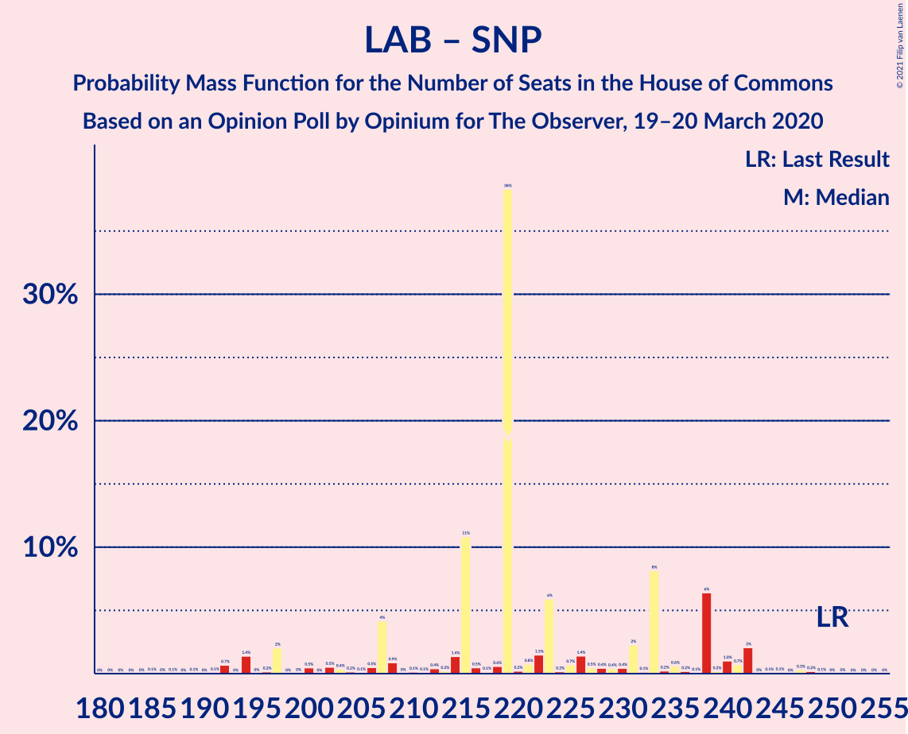

| Number of Seats | Probability | Accumulated | Special Marks |
|:---------------:|:-----------:|:-----------:|:-------------:|
| 181 | 0% | 100% |  |
| 182 | 0% | 99.9% |  |
| 183 | 0% | 99.9% |  |
| 184 | 0% | 99.9% |  |
| 185 | 0.1% | 99.9% |  |
| 186 | 0% | 99.8% |  |
| 187 | 0.1% | 99.8% |  |
| 188 | 0% | 99.8% |  |
| 189 | 0.1% | 99.8% |  |
| 190 | 0% | 99.7% |  |
| 191 | 0.1% | 99.7% |  |
| 192 | 0.7% | 99.6% |  |
| 193 | 0% | 98.9% |  |
| 194 | 1.4% | 98.9% |  |
| 195 | 0% | 98% |  |
| 196 | 0.2% | 97% |  |
| 197 | 2% | 97% |  |
| 198 | 0% | 95% |  |
| 199 | 0% | 95% |  |
| 200 | 0.5% | 95% |  |
| 201 | 0% | 95% |  |
| 202 | 0.5% | 95% |  |
| 203 | 0.4% | 94% |  |
| 204 | 0.2% | 94% |  |
| 205 | 0.1% | 94% |  |
| 206 | 0.5% | 94% |  |
| 207 | 4% | 93% |  |
| 208 | 0.9% | 89% |  |
| 209 | 0% | 88% |  |
| 210 | 0.1% | 88% |  |
| 211 | 0.1% | 88% |  |
| 212 | 0.4% | 88% |  |
| 213 | 0.2% | 87% |  |
| 214 | 1.4% | 87% |  |
| 215 | 11% | 86% |  |
| 216 | 0.5% | 75% |  |
| 217 | 0.1% | 74% |  |
| 218 | 0.6% | 74% |  |
| 219 | 38% | 74% | Median |
| 220 | 0.2% | 35% |  |
| 221 | 0.8% | 35% |  |
| 222 | 1.5% | 34% |  |
| 223 | 6% | 33% |  |
| 224 | 0.2% | 27% |  |
| 225 | 0.7% | 27% |  |
| 226 | 1.4% | 26% |  |
| 227 | 0.5% | 25% |  |
| 228 | 0.4% | 24% |  |
| 229 | 0.4% | 24% |  |
| 230 | 0.4% | 23% |  |
| 231 | 2% | 23% |  |
| 232 | 0.1% | 21% |  |
| 233 | 8% | 20% |  |
| 234 | 0.2% | 12% |  |
| 235 | 0.6% | 12% |  |
| 236 | 0.2% | 11% |  |
| 237 | 0.1% | 11% |  |
| 238 | 6% | 11% |  |
| 239 | 0.2% | 5% |  |
| 240 | 1.0% | 5% |  |
| 241 | 0.7% | 4% |  |
| 242 | 2% | 3% |  |
| 243 | 0% | 0.8% |  |
| 244 | 0.1% | 0.8% |  |
| 245 | 0.1% | 0.7% |  |
| 246 | 0% | 0.6% |  |
| 247 | 0.3% | 0.6% |  |
| 248 | 0.2% | 0.3% |  |
| 249 | 0.1% | 0.1% |  |
| 250 | 0% | 0.1% | Last Result |
| 251 | 0% | 0.1% |  |
| 252 | 0% | 0% |  |

### Labour Party – Liberal Democrats – Plaid Cymru

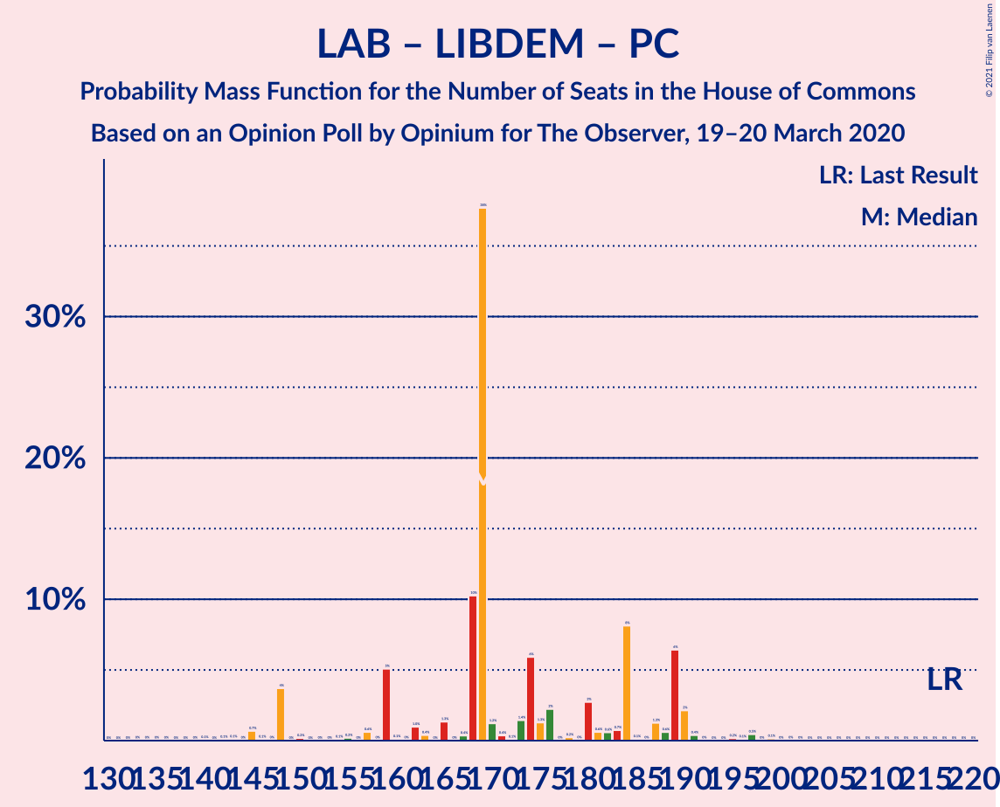

| Number of Seats | Probability | Accumulated | Special Marks |
|:---------------:|:-----------:|:-----------:|:-------------:|
| 134 | 0% | 100% |  |
| 135 | 0% | 99.9% |  |
| 136 | 0% | 99.9% |  |
| 137 | 0% | 99.9% |  |
| 138 | 0% | 99.9% |  |
| 139 | 0% | 99.9% |  |
| 140 | 0.1% | 99.9% |  |
| 141 | 0% | 99.8% |  |
| 142 | 0.1% | 99.8% |  |
| 143 | 0.1% | 99.7% |  |
| 144 | 0% | 99.6% |  |
| 145 | 0.7% | 99.6% |  |
| 146 | 0.1% | 98.9% |  |
| 147 | 0% | 98.8% |  |
| 148 | 4% | 98.8% |  |
| 149 | 0% | 95% |  |
| 150 | 0.2% | 95% |  |
| 151 | 0% | 95% |  |
| 152 | 0% | 95% |  |
| 153 | 0% | 95% |  |
| 154 | 0.1% | 95% |  |
| 155 | 0.2% | 95% |  |
| 156 | 0% | 95% |  |
| 157 | 0.6% | 95% |  |
| 158 | 0% | 94% |  |
| 159 | 5% | 94% |  |
| 160 | 0.1% | 89% |  |
| 161 | 0% | 89% |  |
| 162 | 1.0% | 89% |  |
| 163 | 0.4% | 88% |  |
| 164 | 0% | 87% |  |
| 165 | 1.3% | 87% |  |
| 166 | 0% | 86% |  |
| 167 | 0.4% | 86% |  |
| 168 | 10% | 86% |  |
| 169 | 38% | 75% | Median |
| 170 | 1.2% | 38% |  |
| 171 | 0.4% | 36% |  |
| 172 | 0.1% | 36% |  |
| 173 | 1.4% | 36% |  |
| 174 | 6% | 35% |  |
| 175 | 1.3% | 29% |  |
| 176 | 2% | 27% |  |
| 177 | 0% | 25% |  |
| 178 | 0.2% | 25% |  |
| 179 | 0% | 25% |  |
| 180 | 3% | 25% |  |
| 181 | 0.6% | 22% |  |
| 182 | 0.6% | 21% |  |
| 183 | 0.7% | 21% |  |
| 184 | 8% | 20% |  |
| 185 | 0.1% | 12% |  |
| 186 | 0% | 12% |  |
| 187 | 1.3% | 12% |  |
| 188 | 0.6% | 11% |  |
| 189 | 6% | 10% |  |
| 190 | 2% | 4% |  |
| 191 | 0.4% | 1.4% |  |
| 192 | 0% | 1.0% |  |
| 193 | 0% | 1.0% |  |
| 194 | 0% | 1.0% |  |
| 195 | 0.2% | 1.0% |  |
| 196 | 0.1% | 0.8% |  |
| 197 | 0.5% | 0.7% |  |
| 198 | 0% | 0.2% |  |
| 199 | 0.1% | 0.2% |  |
| 200 | 0% | 0.1% |  |
| 201 | 0% | 0.1% |  |
| 202 | 0% | 0% |  |
| 203 | 0% | 0% |  |
| 204 | 0% | 0% |  |
| 205 | 0% | 0% |  |
| 206 | 0% | 0% |  |
| 207 | 0% | 0% |  |
| 208 | 0% | 0% |  |
| 209 | 0% | 0% |  |
| 210 | 0% | 0% |  |
| 211 | 0% | 0% |  |
| 212 | 0% | 0% |  |
| 213 | 0% | 0% |  |
| 214 | 0% | 0% |  |
| 215 | 0% | 0% |  |
| 216 | 0% | 0% |  |
| 217 | 0% | 0% | Last Result |

### Labour Party – Plaid Cymru

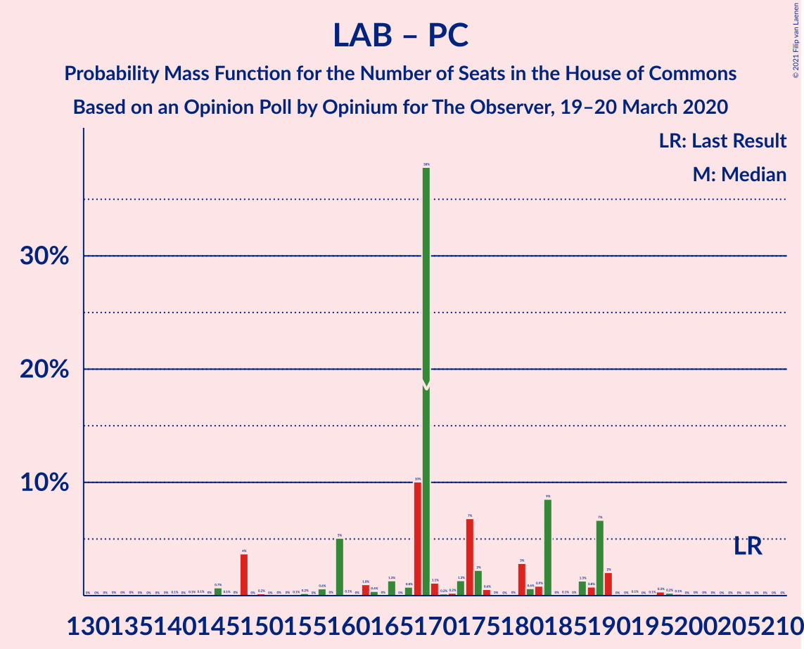

| Number of Seats | Probability | Accumulated | Special Marks |
|:---------------:|:-----------:|:-----------:|:-------------:|
| 134 | 0% | 100% |  |
| 135 | 0% | 99.9% |  |
| 136 | 0% | 99.9% |  |
| 137 | 0% | 99.9% |  |
| 138 | 0% | 99.9% |  |
| 139 | 0% | 99.9% |  |
| 140 | 0.1% | 99.9% |  |
| 141 | 0% | 99.8% |  |
| 142 | 0.1% | 99.8% |  |
| 143 | 0.1% | 99.7% |  |
| 144 | 0% | 99.6% |  |
| 145 | 0.7% | 99.6% |  |
| 146 | 0.1% | 98.9% |  |
| 147 | 0% | 98.8% |  |
| 148 | 4% | 98.8% |  |
| 149 | 0% | 95% |  |
| 150 | 0.2% | 95% |  |
| 151 | 0% | 95% |  |
| 152 | 0% | 95% |  |
| 153 | 0% | 95% |  |
| 154 | 0.1% | 95% |  |
| 155 | 0.2% | 95% |  |
| 156 | 0% | 95% |  |
| 157 | 0.6% | 95% |  |
| 158 | 0% | 94% |  |
| 159 | 5% | 94% |  |
| 160 | 0.1% | 89% |  |
| 161 | 0% | 89% |  |
| 162 | 1.0% | 89% |  |
| 163 | 0.4% | 88% |  |
| 164 | 0% | 87% |  |
| 165 | 1.3% | 87% |  |
| 166 | 0% | 86% |  |
| 167 | 0.8% | 86% |  |
| 168 | 10% | 85% |  |
| 169 | 38% | 75% | Median |
| 170 | 1.1% | 37% |  |
| 171 | 0.2% | 36% |  |
| 172 | 0.2% | 36% |  |
| 173 | 1.3% | 36% |  |
| 174 | 7% | 34% |  |
| 175 | 2% | 28% |  |
| 176 | 0.6% | 25% |  |
| 177 | 0% | 25% |  |
| 178 | 0% | 25% |  |
| 179 | 0% | 25% |  |
| 180 | 3% | 25% |  |
| 181 | 0.6% | 22% |  |
| 182 | 0.9% | 21% |  |
| 183 | 9% | 20% |  |
| 184 | 0% | 12% |  |
| 185 | 0.1% | 12% |  |
| 186 | 0% | 12% |  |
| 187 | 1.3% | 12% |  |
| 188 | 0.8% | 10% |  |
| 189 | 7% | 10% |  |
| 190 | 2% | 3% |  |
| 191 | 0% | 1.0% |  |
| 192 | 0% | 1.0% |  |
| 193 | 0.1% | 1.0% |  |
| 194 | 0% | 0.9% |  |
| 195 | 0.1% | 0.9% |  |
| 196 | 0.3% | 0.8% |  |
| 197 | 0.2% | 0.5% |  |
| 198 | 0.1% | 0.2% |  |
| 199 | 0% | 0.1% |  |
| 200 | 0% | 0.1% |  |
| 201 | 0% | 0% |  |
| 202 | 0% | 0% |  |
| 203 | 0% | 0% |  |
| 204 | 0% | 0% |  |
| 205 | 0% | 0% |  |
| 206 | 0% | 0% | Last Result |

### Labour Party

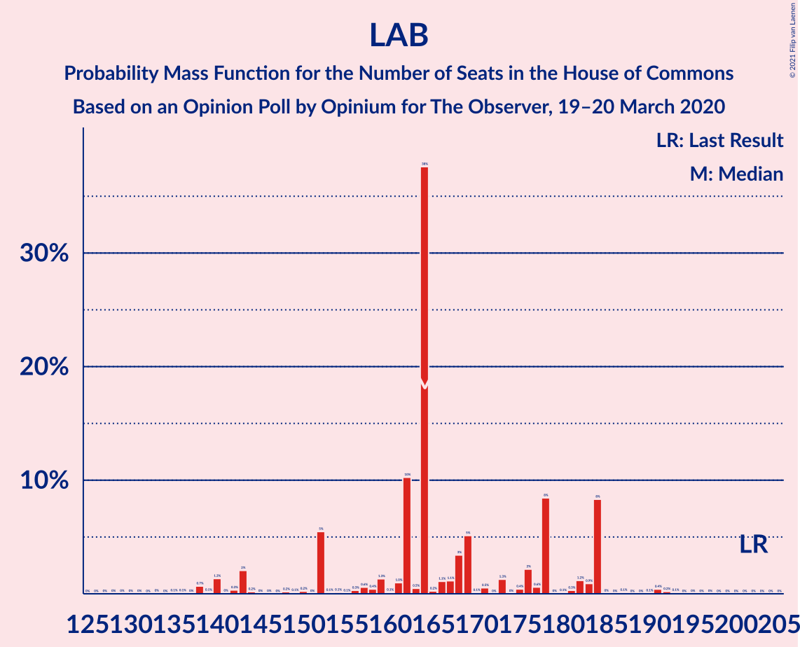

| Number of Seats | Probability | Accumulated | Special Marks |
|:---------------:|:-----------:|:-----------:|:-------------:|
| 129 | 0% | 100% |  |
| 130 | 0% | 99.9% |  |
| 131 | 0% | 99.9% |  |
| 132 | 0% | 99.9% |  |
| 133 | 0% | 99.9% |  |
| 134 | 0% | 99.8% |  |
| 135 | 0.1% | 99.8% |  |
| 136 | 0.1% | 99.8% |  |
| 137 | 0% | 99.7% |  |
| 138 | 0.7% | 99.7% |  |
| 139 | 0.1% | 99.0% |  |
| 140 | 1.3% | 98.9% |  |
| 141 | 0% | 98% |  |
| 142 | 0.3% | 97% |  |
| 143 | 2% | 97% |  |
| 144 | 0.2% | 95% |  |
| 145 | 0% | 95% |  |
| 146 | 0% | 95% |  |
| 147 | 0% | 95% |  |
| 148 | 0.2% | 95% |  |
| 149 | 0.1% | 95% |  |
| 150 | 0.2% | 95% |  |
| 151 | 0% | 94% |  |
| 152 | 5% | 94% |  |
| 153 | 0.1% | 89% |  |
| 154 | 0.1% | 89% |  |
| 155 | 0.1% | 89% |  |
| 156 | 0.3% | 89% |  |
| 157 | 0.6% | 88% |  |
| 158 | 0.4% | 88% |  |
| 159 | 1.3% | 87% |  |
| 160 | 0.1% | 86% |  |
| 161 | 1.0% | 86% |  |
| 162 | 10% | 85% |  |
| 163 | 0.5% | 75% |  |
| 164 | 38% | 74% | Median |
| 165 | 0.2% | 36% |  |
| 166 | 1.1% | 36% |  |
| 167 | 1.1% | 35% |  |
| 168 | 3% | 34% |  |
| 169 | 5% | 31% |  |
| 170 | 0.1% | 25% |  |
| 171 | 0.5% | 25% |  |
| 172 | 0% | 25% |  |
| 173 | 1.3% | 25% |  |
| 174 | 0% | 24% |  |
| 175 | 0.4% | 23% |  |
| 176 | 2% | 23% |  |
| 177 | 0.6% | 21% |  |
| 178 | 8% | 20% |  |
| 179 | 0% | 12% |  |
| 180 | 0.1% | 12% |  |
| 181 | 0.3% | 12% |  |
| 182 | 1.2% | 11% |  |
| 183 | 0.9% | 10% |  |
| 184 | 8% | 9% |  |
| 185 | 0% | 1.0% |  |
| 186 | 0% | 1.0% |  |
| 187 | 0.1% | 1.0% |  |
| 188 | 0% | 0.9% |  |
| 189 | 0% | 0.9% |  |
| 190 | 0.1% | 0.9% |  |
| 191 | 0.4% | 0.8% |  |
| 192 | 0.2% | 0.4% |  |
| 193 | 0.1% | 0.2% |  |
| 194 | 0% | 0.1% |  |
| 195 | 0% | 0.1% |  |
| 196 | 0% | 0% |  |
| 197 | 0% | 0% |  |
| 198 | 0% | 0% |  |
| 199 | 0% | 0% |  |
| 200 | 0% | 0% |  |
| 201 | 0% | 0% |  |
| 202 | 0% | 0% | Last Result |

### Labour Party – Liberal Democrats

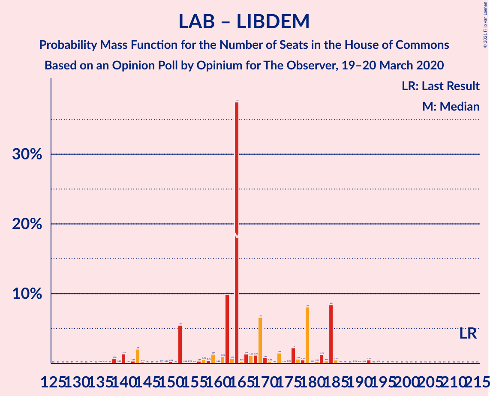

| Number of Seats | Probability | Accumulated | Special Marks |
|:---------------:|:-----------:|:-----------:|:-------------:|
| 129 | 0% | 100% |  |
| 130 | 0% | 99.9% |  |
| 131 | 0% | 99.9% |  |
| 132 | 0% | 99.9% |  |
| 133 | 0% | 99.9% |  |
| 134 | 0% | 99.8% |  |
| 135 | 0.1% | 99.8% |  |
| 136 | 0.1% | 99.8% |  |
| 137 | 0% | 99.7% |  |
| 138 | 0.7% | 99.7% |  |
| 139 | 0.1% | 99.0% |  |
| 140 | 1.4% | 98.9% |  |
| 141 | 0% | 98% |  |
| 142 | 0.3% | 97% |  |
| 143 | 2% | 97% |  |
| 144 | 0.2% | 95% |  |
| 145 | 0% | 95% |  |
| 146 | 0% | 95% |  |
| 147 | 0% | 95% |  |
| 148 | 0.1% | 95% |  |
| 149 | 0.1% | 95% |  |
| 150 | 0.2% | 95% |  |
| 151 | 0% | 94% |  |
| 152 | 5% | 94% |  |
| 153 | 0.1% | 89% |  |
| 154 | 0.1% | 89% |  |
| 155 | 0.1% | 89% |  |
| 156 | 0.3% | 89% |  |
| 157 | 0.6% | 88% |  |
| 158 | 0.4% | 88% |  |
| 159 | 1.3% | 87% |  |
| 160 | 0.1% | 86% |  |
| 161 | 1.0% | 86% |  |
| 162 | 10% | 85% |  |
| 163 | 0.7% | 75% |  |
| 164 | 37% | 74% | Median |
| 165 | 0.3% | 37% |  |
| 166 | 1.3% | 36% |  |
| 167 | 1.1% | 35% |  |
| 168 | 1.2% | 34% |  |
| 169 | 7% | 33% |  |
| 170 | 0.8% | 26% |  |
| 171 | 0.3% | 25% |  |
| 172 | 0% | 25% |  |
| 173 | 1.5% | 25% |  |
| 174 | 0.1% | 24% |  |
| 175 | 0.1% | 23% |  |
| 176 | 2% | 23% |  |
| 177 | 0.6% | 21% |  |
| 178 | 0.5% | 20% |  |
| 179 | 8% | 20% |  |
| 180 | 0.1% | 12% |  |
| 181 | 0.3% | 12% |  |
| 182 | 1.3% | 12% |  |
| 183 | 0.4% | 10% |  |
| 184 | 8% | 10% |  |
| 185 | 0.5% | 2% |  |
| 186 | 0% | 1.0% |  |
| 187 | 0% | 1.0% |  |
| 188 | 0% | 1.0% |  |
| 189 | 0.1% | 1.0% |  |
| 190 | 0.1% | 0.9% |  |
| 191 | 0.1% | 0.8% |  |
| 192 | 0.5% | 0.7% |  |
| 193 | 0% | 0.2% |  |
| 194 | 0.1% | 0.2% |  |
| 195 | 0% | 0.1% |  |
| 196 | 0% | 0.1% |  |
| 197 | 0% | 0% |  |
| 198 | 0% | 0% |  |
| 199 | 0% | 0% |  |
| 200 | 0% | 0% |  |
| 201 | 0% | 0% |  |
| 202 | 0% | 0% |  |
| 203 | 0% | 0% |  |
| 204 | 0% | 0% |  |
| 205 | 0% | 0% |  |
| 206 | 0% | 0% |  |
| 207 | 0% | 0% |  |
| 208 | 0% | 0% |  |
| 209 | 0% | 0% |  |
| 210 | 0% | 0% |  |
| 211 | 0% | 0% |  |
| 212 | 0% | 0% |  |
| 213 | 0% | 0% | Last Result |

## Technical Information

### Opinion Poll

+ **Polling firm:** Opinium
+ **Commissioner(s):** The Observer
+ **Fieldwork period:** 19–20 March 2020

### Calculations

+ **Sample size:** 1970
+ **Simulations done:** 131,072
+ **Error estimate:** 1.75%

