# Opinion Poll by Redfield & Wilton Strategies, 1–2 April 2020

<a href="#voting-intentions">Voting Intentions</a> | <a href="#seats">Seats</a> | <a href="#coalitions">Coalitions</a> | <a href="#technical-information">Technical Information</a>

## Voting Intentions

### Confidence Intervals

| Party | Last Result | Poll Result | 80% Confidence Interval | 90% Confidence Interval | 95% Confidence Interval | 99% Confidence Interval |
|:-----:|:-----------:|:-----------:|:-----------------------:|:-----------------------:|:-----------------------:|:-----------------------:|
| Conservative Party | 43.6% | 49.4% | 48.0–50.9% |47.6–51.3% |47.2–51.6% |46.5–52.3% |
| Labour Party | 32.1% | 29.2% | 28.0–30.6% |27.6–31.0% |27.3–31.3% |26.7–31.9% |
| Liberal Democrats | 11.5% | 8.1% | 7.3–8.9% |7.1–9.1% |7.0–9.4% |6.6–9.8% |
| Scottish National Party | 3.9% | 4.0% | 3.5–4.7% |3.4–4.8% |3.2–5.0% |3.0–5.3% |
| Green Party | 2.8% | 3.2% | 2.7–3.7% |2.6–3.9% |2.5–4.1% |2.3–4.3% |
| Plaid Cymru | 0.5% | 1.0% | 0.8–1.4% |0.7–1.5% |0.7–1.6% |0.5–1.8% |

*Note:* The poll result column reflects the actual value used in the calculations. Published results may vary slightly, and in addition be rounded to fewer digits.

## Seats

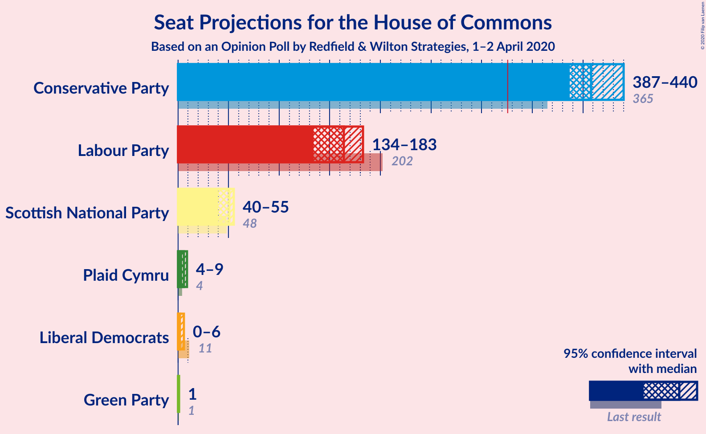

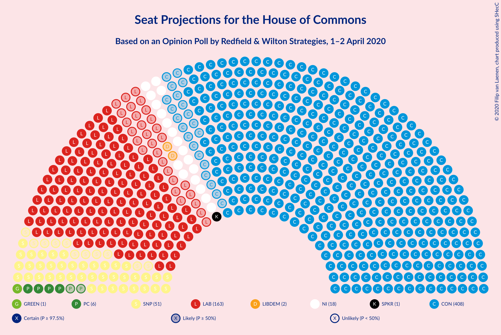

### Confidence Intervals

| Party | Last Result | Median | 80% Confidence Interval | 90% Confidence Interval | 95% Confidence Interval | 99% Confidence Interval |
|:-----:|:-----------:|:------:|:-----------------------:|:-----------------------:|:-----------------------:|:-----------------------:|
| <a href="#conservative-party">Conservative Party</a> | 365 | 408 | 394–430 |390–435 |387–440 |382–448 |
| <a href="#labour-party">Labour Party</a> | 202 | 164 | 142–177 |139–181 |134–183 |128–185 |
| <a href="#liberal-democrats">Liberal Democrats</a> | 11 | 2 | 0–4 |0–5 |0–6 |0–7 |
| <a href="#scottish-national-party">Scottish National Party</a> | 48 | 51 | 46–54 |42–55 |40–55 |36–56 |
| <a href="#green-party">Green Party</a> | 1 | 1 | 1 |1 |1 |1 |
| <a href="#plaid-cymru">Plaid Cymru</a> | 4 | 6 | 5–7 |4–7 |4–9 |4–10 |

### Conservative Party

*For a full overview of the results for this party, see the [Conservative Party](party-conservativeparty.html) page.*

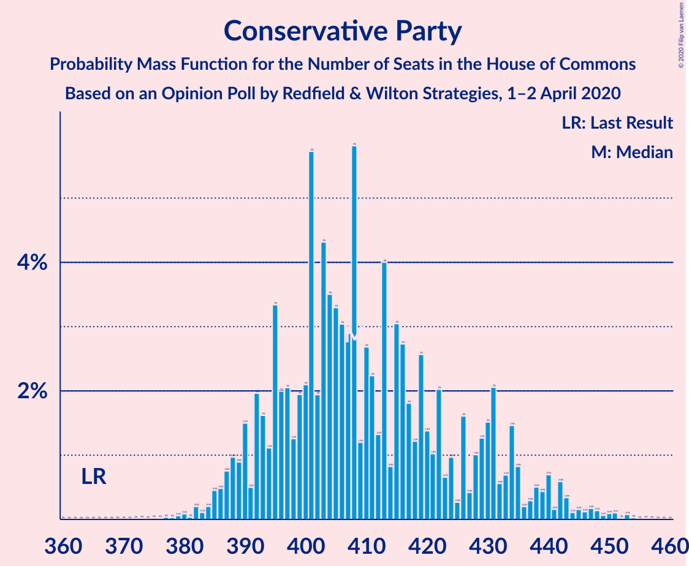

| Number of Seats | Probability | Accumulated | Special Marks |
|:---------------:|:-----------:|:-----------:|:-------------:|
| 365 | 0% | 100% | Last Result |
| 366 | 0% | 100% |  |
| 367 | 0% | 100% |  |
| 368 | 0% | 100% |  |
| 369 | 0% | 100% |  |
| 370 | 0% | 100% |  |
| 371 | 0% | 100% |  |
| 372 | 0% | 100% |  |
| 373 | 0% | 100% |  |
| 374 | 0% | 100% |  |
| 375 | 0% | 100% |  |
| 376 | 0% | 99.9% |  |
| 377 | 0% | 99.9% |  |
| 378 | 0% | 99.9% |  |
| 379 | 0.1% | 99.9% |  |
| 380 | 0.1% | 99.8% |  |
| 381 | 0% | 99.7% |  |
| 382 | 0.2% | 99.7% |  |
| 383 | 0.1% | 99.5% |  |
| 384 | 0.2% | 99.4% |  |
| 385 | 0.5% | 99.2% |  |
| 386 | 0.5% | 98.7% |  |
| 387 | 0.8% | 98% |  |
| 388 | 1.0% | 97% |  |
| 389 | 0.9% | 96% |  |
| 390 | 1.5% | 96% |  |
| 391 | 0.5% | 94% |  |
| 392 | 2% | 94% |  |
| 393 | 2% | 92% |  |
| 394 | 1.1% | 90% |  |
| 395 | 3% | 89% |  |
| 396 | 2% | 86% |  |
| 397 | 2% | 84% |  |
| 398 | 1.3% | 82% |  |
| 399 | 2% | 80% |  |
| 400 | 2% | 78% |  |
| 401 | 6% | 76% |  |
| 402 | 2% | 70% |  |
| 403 | 4% | 69% |  |
| 404 | 4% | 64% |  |
| 405 | 3% | 61% |  |
| 406 | 3% | 57% |  |
| 407 | 3% | 54% |  |
| 408 | 6% | 52% | Median |
| 409 | 1.2% | 46% |  |
| 410 | 3% | 44% |  |
| 411 | 2% | 42% |  |
| 412 | 1.3% | 40% |  |
| 413 | 4% | 38% |  |
| 414 | 0.8% | 34% |  |
| 415 | 3% | 33% |  |
| 416 | 3% | 30% |  |
| 417 | 2% | 28% |  |
| 418 | 1.2% | 26% |  |
| 419 | 3% | 25% |  |
| 420 | 1.4% | 22% |  |
| 421 | 1.0% | 21% |  |
| 422 | 2% | 20% |  |
| 423 | 0.7% | 18% |  |
| 424 | 1.0% | 17% |  |
| 425 | 0.3% | 16% |  |
| 426 | 2% | 16% |  |
| 427 | 0.4% | 14% |  |
| 428 | 1.0% | 14% |  |
| 429 | 1.3% | 13% |  |
| 430 | 2% | 11% |  |
| 431 | 2% | 10% |  |
| 432 | 0.6% | 8% |  |
| 433 | 0.7% | 7% |  |
| 434 | 1.5% | 7% |  |
| 435 | 0.8% | 5% |  |
| 436 | 0.2% | 4% |  |
| 437 | 0.3% | 4% |  |
| 438 | 0.5% | 4% |  |
| 439 | 0.4% | 3% |  |
| 440 | 0.7% | 3% |  |
| 441 | 0.2% | 2% |  |
| 442 | 0.6% | 2% |  |
| 443 | 0.3% | 1.5% |  |
| 444 | 0.1% | 1.1% |  |
| 445 | 0.2% | 1.0% |  |
| 446 | 0.1% | 0.8% |  |
| 447 | 0.2% | 0.7% |  |
| 448 | 0.1% | 0.6% |  |
| 449 | 0.1% | 0.4% |  |
| 450 | 0.1% | 0.4% |  |
| 451 | 0.1% | 0.3% |  |
| 452 | 0% | 0.2% |  |
| 453 | 0.1% | 0.1% |  |
| 454 | 0% | 0.1% |  |
| 455 | 0% | 0% |  |

### Labour Party

*For a full overview of the results for this party, see the [Labour Party](party-labourparty.html) page.*

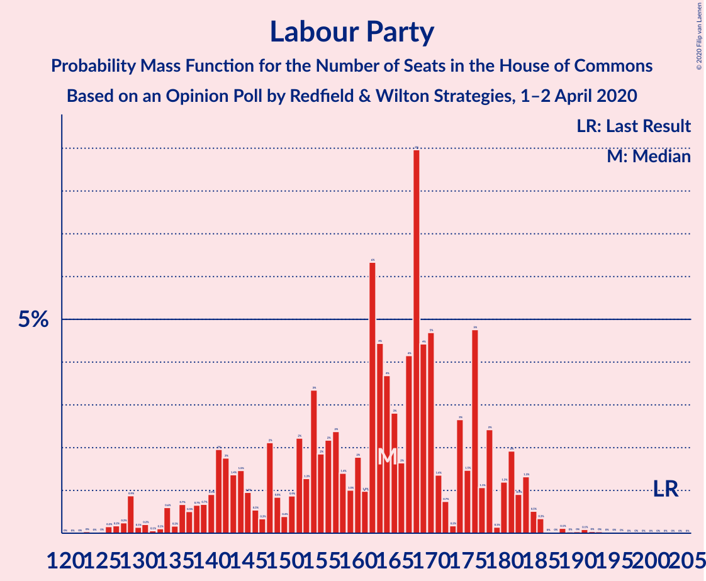

| Number of Seats | Probability | Accumulated | Special Marks |
|:---------------:|:-----------:|:-----------:|:-------------:|
| 123 | 0% | 100% |  |
| 124 | 0% | 99.9% |  |
| 125 | 0% | 99.9% |  |
| 126 | 0.2% | 99.9% |  |
| 127 | 0.2% | 99.7% |  |
| 128 | 0.2% | 99.5% |  |
| 129 | 0.9% | 99.3% |  |
| 130 | 0.1% | 98% |  |
| 131 | 0.2% | 98% |  |
| 132 | 0.1% | 98% |  |
| 133 | 0.1% | 98% |  |
| 134 | 0.6% | 98% |  |
| 135 | 0.2% | 97% |  |
| 136 | 0.7% | 97% |  |
| 137 | 0.5% | 96% |  |
| 138 | 0.7% | 96% |  |
| 139 | 0.7% | 95% |  |
| 140 | 0.9% | 95% |  |
| 141 | 2% | 94% |  |
| 142 | 2% | 92% |  |
| 143 | 1.4% | 90% |  |
| 144 | 1.5% | 89% |  |
| 145 | 1.0% | 87% |  |
| 146 | 0.5% | 86% |  |
| 147 | 0.3% | 86% |  |
| 148 | 2% | 85% |  |
| 149 | 0.8% | 83% |  |
| 150 | 0.4% | 82% |  |
| 151 | 0.9% | 82% |  |
| 152 | 2% | 81% |  |
| 153 | 1.3% | 79% |  |
| 154 | 3% | 78% |  |
| 155 | 2% | 74% |  |
| 156 | 2% | 72% |  |
| 157 | 2% | 70% |  |
| 158 | 1.4% | 68% |  |
| 159 | 1.0% | 66% |  |
| 160 | 2% | 65% |  |
| 161 | 1.0% | 64% |  |
| 162 | 6% | 63% |  |
| 163 | 4% | 56% |  |
| 164 | 4% | 52% | Median |
| 165 | 3% | 48% |  |
| 166 | 2% | 45% |  |
| 167 | 4% | 44% |  |
| 168 | 9% | 40% |  |
| 169 | 4% | 31% |  |
| 170 | 5% | 26% |  |
| 171 | 1.4% | 22% |  |
| 172 | 0.7% | 20% |  |
| 173 | 0.2% | 19% |  |
| 174 | 3% | 19% |  |
| 175 | 1.5% | 17% |  |
| 176 | 5% | 15% |  |
| 177 | 1.1% | 10% |  |
| 178 | 2% | 9% |  |
| 179 | 0.1% | 7% |  |
| 180 | 1.2% | 7% |  |
| 181 | 2% | 6% |  |
| 182 | 0.9% | 4% |  |
| 183 | 1.3% | 3% |  |
| 184 | 0.5% | 1.3% |  |
| 185 | 0.3% | 0.8% |  |
| 186 | 0% | 0.5% |  |
| 187 | 0% | 0.5% |  |
| 188 | 0.1% | 0.4% |  |
| 189 | 0% | 0.3% |  |
| 190 | 0% | 0.3% |  |
| 191 | 0.1% | 0.2% |  |
| 192 | 0% | 0.2% |  |
| 193 | 0% | 0.1% |  |
| 194 | 0% | 0.1% |  |
| 195 | 0% | 0.1% |  |
| 196 | 0% | 0% |  |
| 197 | 0% | 0% |  |
| 198 | 0% | 0% |  |
| 199 | 0% | 0% |  |
| 200 | 0% | 0% |  |
| 201 | 0% | 0% |  |
| 202 | 0% | 0% | Last Result |

### Liberal Democrats

*For a full overview of the results for this party, see the [Liberal Democrats](party-liberaldemocrats.html) page.*

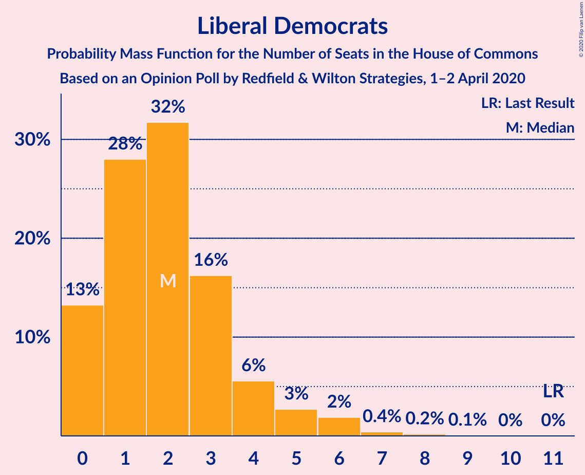

| Number of Seats | Probability | Accumulated | Special Marks |
|:---------------:|:-----------:|:-----------:|:-------------:|
| 0 | 13% | 100% |  |
| 1 | 28% | 87% |  |
| 2 | 32% | 59% | Median |
| 3 | 16% | 27% |  |
| 4 | 6% | 11% |  |
| 5 | 3% | 5% |  |
| 6 | 2% | 3% |  |
| 7 | 0.4% | 0.7% |  |
| 8 | 0.2% | 0.3% |  |
| 9 | 0.1% | 0.1% |  |
| 10 | 0% | 0% |  |
| 11 | 0% | 0% | Last Result |

### Scottish National Party

*For a full overview of the results for this party, see the [Scottish National Party](party-scottishnationalparty.html) page.*

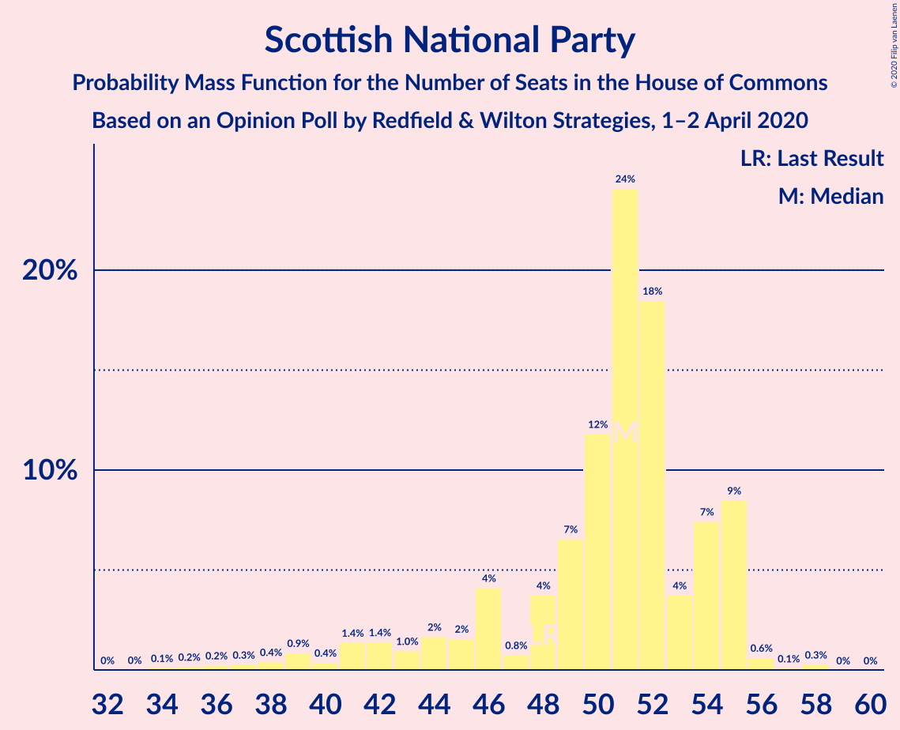

| Number of Seats | Probability | Accumulated | Special Marks |
|:---------------:|:-----------:|:-----------:|:-------------:|
| 32 | 0% | 100% |  |
| 33 | 0% | 99.9% |  |
| 34 | 0.1% | 99.9% |  |
| 35 | 0.2% | 99.8% |  |
| 36 | 0.2% | 99.6% |  |
| 37 | 0.3% | 99.4% |  |
| 38 | 0.4% | 99.1% |  |
| 39 | 0.9% | 98.7% |  |
| 40 | 0.4% | 98% |  |
| 41 | 1.4% | 97% |  |
| 42 | 1.4% | 96% |  |
| 43 | 1.0% | 95% |  |
| 44 | 2% | 94% |  |
| 45 | 2% | 92% |  |
| 46 | 4% | 90% |  |
| 47 | 0.8% | 86% |  |
| 48 | 4% | 85% | Last Result |
| 49 | 7% | 82% |  |
| 50 | 12% | 75% |  |
| 51 | 24% | 63% | Median |
| 52 | 18% | 39% |  |
| 53 | 4% | 21% |  |
| 54 | 7% | 17% |  |
| 55 | 9% | 10% |  |
| 56 | 0.6% | 1.0% |  |
| 57 | 0.1% | 0.4% |  |
| 58 | 0.3% | 0.3% |  |
| 59 | 0% | 0% |  |

### Green Party

*For a full overview of the results for this party, see the [Green Party](party-greenparty.html) page.*

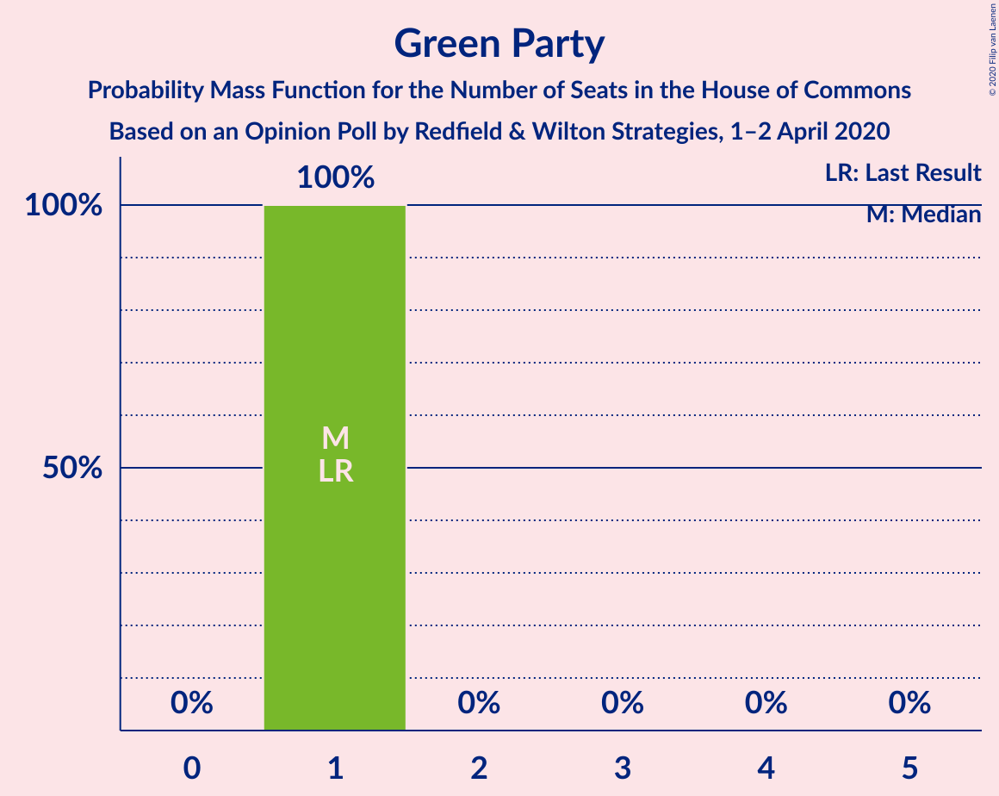

| Number of Seats | Probability | Accumulated | Special Marks |
|:---------------:|:-----------:|:-----------:|:-------------:|
| 1 | 100% | 100% | Last Result, Median |

### Plaid Cymru

*For a full overview of the results for this party, see the [Plaid Cymru](party-plaidcymru.html) page.*

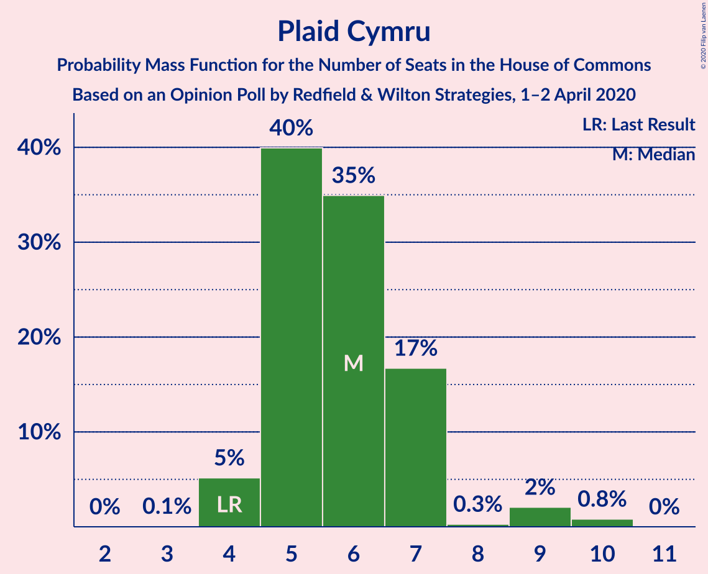

| Number of Seats | Probability | Accumulated | Special Marks |
|:---------------:|:-----------:|:-----------:|:-------------:|
| 3 | 0.1% | 100% |  |
| 4 | 5% | 99.9% | Last Result |
| 5 | 40% | 95% |  |
| 6 | 35% | 55% | Median |
| 7 | 17% | 20% |  |
| 8 | 0.3% | 3% |  |
| 9 | 2% | 3% |  |
| 10 | 0.8% | 0.8% |  |
| 11 | 0% | 0% |  |

## Coalitions

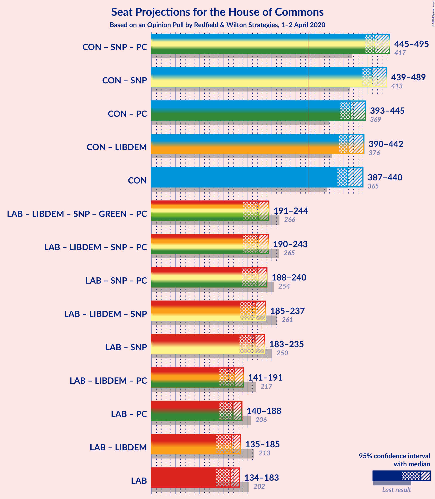

### Confidence Intervals

| Coalition | Last Result | Median | Majority? | 80% Confidence Interval | 90% Confidence Interval | 95% Confidence Interval | 99% Confidence Interval |
|:---------:|:-----------:|:------:|:---------:|:-----------------------:|:-----------------------:|:-----------------------:|:-----------------------:|
| Conservative Party – Scottish National Party – Plaid Cymru | 417 | 464 | 100% | 451–486 | 447–490 | 445–495 | 440–501 |
| Conservative Party – Scottish National Party | 413 | 458 | 100% | 445–480 | 441–484 | 439–489 | 434–495 |
| Conservative Party – Plaid Cymru | 369 | 414 | 100% | 400–436 | 396–441 | 393–445 | 388–454 |
| Conservative Party – Liberal Democrats | 376 | 409 | 100% | 396–431 | 392–436 | 390–442 | 386–449 |
| Conservative Party | 365 | 408 | 100% | 394–430 | 390–435 | 387–440 | 382–448 |
| Labour Party – Liberal Democrats – Scottish National Party – Green Party – Plaid Cymru | 266 | 223 | 0% | 201–237 | 196–241 | 191–244 | 183–249 |
| Labour Party – Liberal Democrats – Scottish National Party – Plaid Cymru | 265 | 222 | 0% | 200–236 | 195–240 | 190–243 | 182–248 |
| Labour Party – Scottish National Party – Plaid Cymru | 254 | 221 | 0% | 199–234 | 194–238 | 188–240 | 181–244 |
| Labour Party – Liberal Democrats – Scottish National Party | 261 | 216 | 0% | 194–230 | 189–234 | 185–237 | 176–242 |
| Labour Party – Scottish National Party | 250 | 215 | 0% | 192–229 | 188–232 | 183–235 | 174–239 |
| Labour Party – Liberal Democrats – Plaid Cymru | 217 | 172 | 0% | 150–185 | 146–189 | 141–191 | 135–196 |
| Labour Party – Plaid Cymru | 206 | 169 | 0% | 148–182 | 145–187 | 140–188 | 134–191 |
| Labour Party – Liberal Democrats | 213 | 166 | 0% | 144–179 | 140–183 | 135–185 | 129–190 |
| Labour Party | 202 | 164 | 0% | 142–177 | 139–181 | 134–183 | 128–185 |

### Conservative Party – Scottish National Party – Plaid Cymru

| Number of Seats | Probability | Accumulated | Special Marks |
|:---------------:|:-----------:|:-----------:|:-------------:|
| 417 | 0% | 100% | Last Result |
| 418 | 0% | 100% |  |
| 419 | 0% | 100% |  |
| 420 | 0% | 100% |  |
| 421 | 0% | 100% |  |
| 422 | 0% | 100% |  |
| 423 | 0% | 100% |  |
| 424 | 0% | 100% |  |
| 425 | 0% | 100% |  |
| 426 | 0% | 100% |  |
| 427 | 0% | 100% |  |
| 428 | 0% | 100% |  |
| 429 | 0% | 100% |  |
| 430 | 0% | 100% |  |
| 431 | 0% | 100% |  |
| 432 | 0% | 100% |  |
| 433 | 0% | 99.9% |  |
| 434 | 0% | 99.9% |  |
| 435 | 0% | 99.9% |  |
| 436 | 0% | 99.8% |  |
| 437 | 0.1% | 99.8% |  |
| 438 | 0.2% | 99.7% |  |
| 439 | 0% | 99.6% |  |
| 440 | 0% | 99.5% |  |
| 441 | 0.1% | 99.5% |  |
| 442 | 0.4% | 99.4% |  |
| 443 | 0.2% | 99.0% |  |
| 444 | 0.5% | 98.9% |  |
| 445 | 2% | 98% |  |
| 446 | 1.5% | 97% |  |
| 447 | 0.6% | 95% |  |
| 448 | 1.3% | 94% |  |
| 449 | 0.8% | 93% |  |
| 450 | 1.4% | 92% |  |
| 451 | 2% | 91% |  |
| 452 | 5% | 89% |  |
| 453 | 2% | 84% |  |
| 454 | 0.8% | 82% |  |
| 455 | 1.5% | 82% |  |
| 456 | 2% | 80% |  |
| 457 | 1.5% | 78% |  |
| 458 | 3% | 77% |  |
| 459 | 6% | 74% |  |
| 460 | 9% | 69% |  |
| 461 | 2% | 60% |  |
| 462 | 1.4% | 58% |  |
| 463 | 6% | 56% |  |
| 464 | 2% | 50% |  |
| 465 | 2% | 48% | Median |
| 466 | 6% | 47% |  |
| 467 | 4% | 41% |  |
| 468 | 1.4% | 36% |  |
| 469 | 2% | 35% |  |
| 470 | 2% | 33% |  |
| 471 | 1.3% | 32% |  |
| 472 | 2% | 30% |  |
| 473 | 3% | 28% |  |
| 474 | 2% | 25% |  |
| 475 | 0.7% | 23% |  |
| 476 | 3% | 23% |  |
| 477 | 2% | 20% |  |
| 478 | 1.2% | 18% |  |
| 479 | 0.1% | 17% |  |
| 480 | 1.5% | 17% |  |
| 481 | 1.3% | 16% |  |
| 482 | 0.5% | 14% |  |
| 483 | 0.4% | 14% |  |
| 484 | 2% | 13% |  |
| 485 | 1.4% | 12% |  |
| 486 | 1.5% | 10% |  |
| 487 | 2% | 9% |  |
| 488 | 1.1% | 7% |  |
| 489 | 0.7% | 6% |  |
| 490 | 0.8% | 5% |  |
| 491 | 0.7% | 4% |  |
| 492 | 0.4% | 4% |  |
| 493 | 0.4% | 3% |  |
| 494 | 0.3% | 3% |  |
| 495 | 0.6% | 3% |  |
| 496 | 0.1% | 2% |  |
| 497 | 0.2% | 2% |  |
| 498 | 0.2% | 2% |  |
| 499 | 0.5% | 2% |  |
| 500 | 0.3% | 1.1% |  |
| 501 | 0.3% | 0.7% |  |
| 502 | 0.2% | 0.5% |  |
| 503 | 0.2% | 0.3% |  |
| 504 | 0% | 0.1% |  |
| 505 | 0% | 0.1% |  |
| 506 | 0% | 0.1% |  |
| 507 | 0% | 0.1% |  |
| 508 | 0% | 0% |  |

### Conservative Party – Scottish National Party

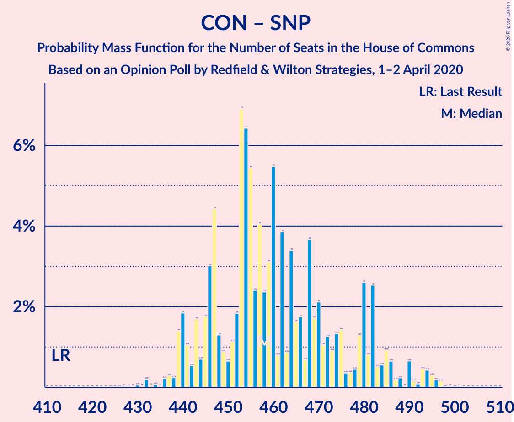

| Number of Seats | Probability | Accumulated | Special Marks |
|:---------------:|:-----------:|:-----------:|:-------------:|
| 413 | 0% | 100% | Last Result |
| 414 | 0% | 100% |  |
| 415 | 0% | 100% |  |
| 416 | 0% | 100% |  |
| 417 | 0% | 100% |  |
| 418 | 0% | 100% |  |
| 419 | 0% | 100% |  |
| 420 | 0% | 100% |  |
| 421 | 0% | 100% |  |
| 422 | 0% | 100% |  |
| 423 | 0% | 100% |  |
| 424 | 0% | 100% |  |
| 425 | 0% | 100% |  |
| 426 | 0% | 100% |  |
| 427 | 0% | 100% |  |
| 428 | 0% | 99.9% |  |
| 429 | 0% | 99.9% |  |
| 430 | 0.1% | 99.9% |  |
| 431 | 0% | 99.8% |  |
| 432 | 0.2% | 99.8% |  |
| 433 | 0% | 99.6% |  |
| 434 | 0.1% | 99.5% |  |
| 435 | 0% | 99.5% |  |
| 436 | 0.2% | 99.5% |  |
| 437 | 0.3% | 99.2% |  |
| 438 | 0.2% | 98.9% |  |
| 439 | 1.4% | 98.7% |  |
| 440 | 2% | 97% |  |
| 441 | 1.0% | 95% |  |
| 442 | 0.5% | 94% |  |
| 443 | 2% | 94% |  |
| 444 | 0.7% | 92% |  |
| 445 | 2% | 92% |  |
| 446 | 3% | 90% |  |
| 447 | 4% | 87% |  |
| 448 | 1.3% | 82% |  |
| 449 | 0.9% | 81% |  |
| 450 | 0.6% | 80% |  |
| 451 | 1.1% | 79% |  |
| 452 | 2% | 78% |  |
| 453 | 7% | 77% |  |
| 454 | 6% | 70% |  |
| 455 | 5% | 63% |  |
| 456 | 2% | 58% |  |
| 457 | 4% | 55% |  |
| 458 | 2% | 51% |  |
| 459 | 3% | 49% | Median |
| 460 | 5% | 46% |  |
| 461 | 0.8% | 40% |  |
| 462 | 4% | 40% |  |
| 463 | 0.9% | 36% |  |
| 464 | 3% | 35% |  |
| 465 | 2% | 31% |  |
| 466 | 2% | 30% |  |
| 467 | 0.7% | 28% |  |
| 468 | 4% | 27% |  |
| 469 | 2% | 24% |  |
| 470 | 2% | 22% |  |
| 471 | 1.0% | 20% |  |
| 472 | 1.3% | 19% |  |
| 473 | 0.9% | 18% |  |
| 474 | 1.3% | 17% |  |
| 475 | 1.4% | 15% |  |
| 476 | 0.4% | 14% |  |
| 477 | 0.4% | 14% |  |
| 478 | 0.4% | 13% |  |
| 479 | 1.3% | 13% |  |
| 480 | 3% | 12% |  |
| 481 | 0.8% | 9% |  |
| 482 | 3% | 8% |  |
| 483 | 0.5% | 6% |  |
| 484 | 0.6% | 5% |  |
| 485 | 0.9% | 5% |  |
| 486 | 0.6% | 4% |  |
| 487 | 0.2% | 3% |  |
| 488 | 0.2% | 3% |  |
| 489 | 0% | 3% |  |
| 490 | 0.7% | 2% |  |
| 491 | 0.1% | 2% |  |
| 492 | 0.1% | 2% |  |
| 493 | 0.5% | 2% |  |
| 494 | 0.4% | 1.2% |  |
| 495 | 0.3% | 0.7% |  |
| 496 | 0.2% | 0.4% |  |
| 497 | 0.1% | 0.2% |  |
| 498 | 0% | 0.1% |  |
| 499 | 0% | 0.1% |  |
| 500 | 0% | 0.1% |  |
| 501 | 0% | 0% |  |

### Conservative Party – Plaid Cymru

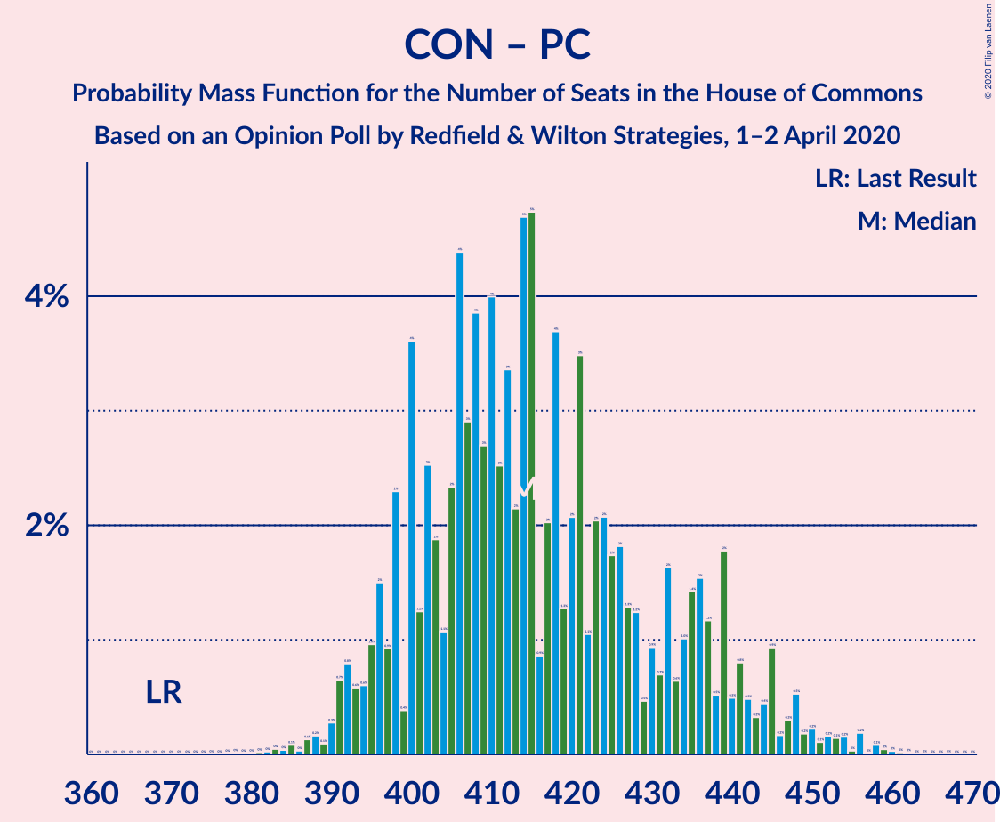

| Number of Seats | Probability | Accumulated | Special Marks |
|:---------------:|:-----------:|:-----------:|:-------------:|
| 369 | 0% | 100% | Last Result |
| 370 | 0% | 100% |  |
| 371 | 0% | 100% |  |
| 372 | 0% | 100% |  |
| 373 | 0% | 100% |  |
| 374 | 0% | 100% |  |
| 375 | 0% | 100% |  |
| 376 | 0% | 100% |  |
| 377 | 0% | 100% |  |
| 378 | 0% | 100% |  |
| 379 | 0% | 100% |  |
| 380 | 0% | 100% |  |
| 381 | 0% | 99.9% |  |
| 382 | 0% | 99.9% |  |
| 383 | 0% | 99.9% |  |
| 384 | 0% | 99.9% |  |
| 385 | 0.1% | 99.8% |  |
| 386 | 0% | 99.7% |  |
| 387 | 0.1% | 99.7% |  |
| 388 | 0.2% | 99.6% |  |
| 389 | 0.1% | 99.4% |  |
| 390 | 0.3% | 99.3% |  |
| 391 | 0.7% | 99.0% |  |
| 392 | 0.8% | 98% |  |
| 393 | 0.6% | 98% |  |
| 394 | 0.6% | 97% |  |
| 395 | 1.0% | 96% |  |
| 396 | 2% | 95% |  |
| 397 | 0.9% | 94% |  |
| 398 | 2% | 93% |  |
| 399 | 0.4% | 91% |  |
| 400 | 4% | 90% |  |
| 401 | 1.2% | 87% |  |
| 402 | 3% | 85% |  |
| 403 | 2% | 83% |  |
| 404 | 1.1% | 81% |  |
| 405 | 2% | 80% |  |
| 406 | 4% | 78% |  |
| 407 | 3% | 73% |  |
| 408 | 4% | 70% |  |
| 409 | 3% | 67% |  |
| 410 | 4% | 64% |  |
| 411 | 3% | 60% |  |
| 412 | 3% | 57% |  |
| 413 | 2% | 54% |  |
| 414 | 5% | 52% | Median |
| 415 | 5% | 47% |  |
| 416 | 0.9% | 42% |  |
| 417 | 2% | 41% |  |
| 418 | 4% | 39% |  |
| 419 | 1.3% | 36% |  |
| 420 | 2% | 35% |  |
| 421 | 3% | 32% |  |
| 422 | 1.1% | 29% |  |
| 423 | 2% | 28% |  |
| 424 | 2% | 26% |  |
| 425 | 2% | 24% |  |
| 426 | 2% | 22% |  |
| 427 | 1.3% | 20% |  |
| 428 | 1.2% | 19% |  |
| 429 | 0.5% | 18% |  |
| 430 | 0.9% | 17% |  |
| 431 | 0.7% | 16% |  |
| 432 | 2% | 16% |  |
| 433 | 0.6% | 14% |  |
| 434 | 1.0% | 13% |  |
| 435 | 1.4% | 12% |  |
| 436 | 2% | 11% |  |
| 437 | 1.2% | 9% |  |
| 438 | 0.5% | 8% |  |
| 439 | 2% | 8% |  |
| 440 | 0.5% | 6% |  |
| 441 | 0.8% | 5% |  |
| 442 | 0.5% | 5% |  |
| 443 | 0.3% | 4% |  |
| 444 | 0.4% | 4% |  |
| 445 | 0.9% | 3% |  |
| 446 | 0.2% | 2% |  |
| 447 | 0.3% | 2% |  |
| 448 | 0.5% | 2% |  |
| 449 | 0.2% | 1.4% |  |
| 450 | 0.2% | 1.2% |  |
| 451 | 0.1% | 1.0% |  |
| 452 | 0.2% | 0.9% |  |
| 453 | 0.1% | 0.7% |  |
| 454 | 0.2% | 0.6% |  |
| 455 | 0% | 0.4% |  |
| 456 | 0.2% | 0.4% |  |
| 457 | 0% | 0.2% |  |
| 458 | 0.1% | 0.2% |  |
| 459 | 0% | 0.1% |  |
| 460 | 0% | 0.1% |  |
| 461 | 0% | 0% |  |

### Conservative Party – Liberal Democrats

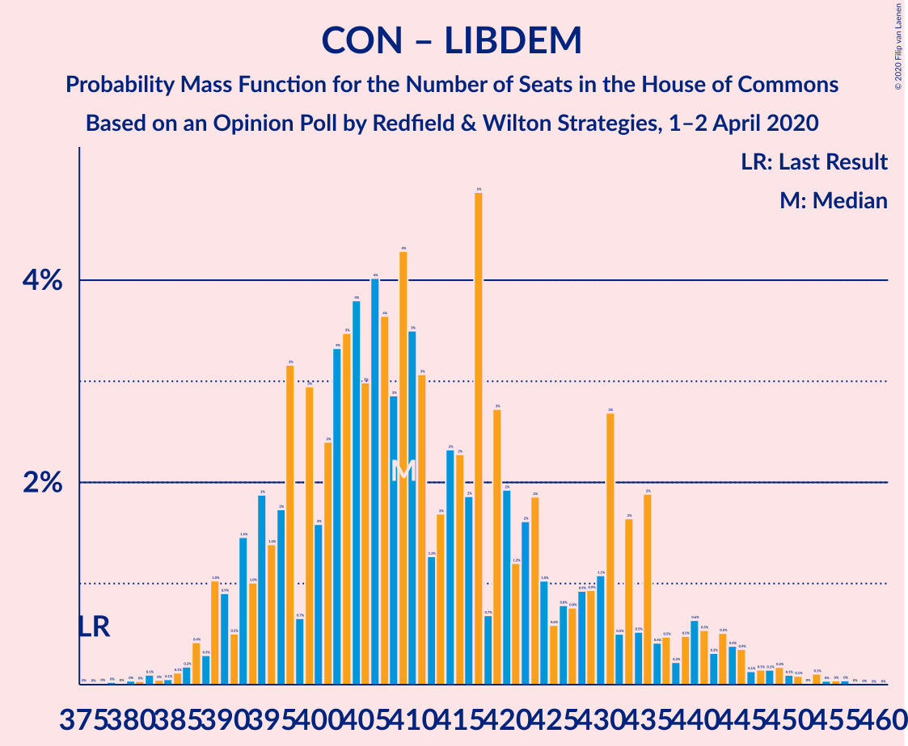

| Number of Seats | Probability | Accumulated | Special Marks |
|:---------------:|:-----------:|:-----------:|:-------------:|
| 376 | 0% | 100% | Last Result |
| 377 | 0% | 100% |  |
| 378 | 0% | 99.9% |  |
| 379 | 0% | 99.9% |  |
| 380 | 0% | 99.9% |  |
| 381 | 0% | 99.9% |  |
| 382 | 0.1% | 99.8% |  |
| 383 | 0% | 99.7% |  |
| 384 | 0.1% | 99.7% |  |
| 385 | 0.1% | 99.6% |  |
| 386 | 0.2% | 99.5% |  |
| 387 | 0.4% | 99.3% |  |
| 388 | 0.3% | 98.9% |  |
| 389 | 1.0% | 98.6% |  |
| 390 | 0.9% | 98% |  |
| 391 | 0.5% | 97% |  |
| 392 | 1.5% | 96% |  |
| 393 | 1.0% | 95% |  |
| 394 | 2% | 94% |  |
| 395 | 1.4% | 92% |  |
| 396 | 2% | 90% |  |
| 397 | 3% | 89% |  |
| 398 | 0.7% | 86% |  |
| 399 | 3% | 85% |  |
| 400 | 2% | 82% |  |
| 401 | 2% | 80% |  |
| 402 | 3% | 78% |  |
| 403 | 3% | 75% |  |
| 404 | 4% | 71% |  |
| 405 | 3% | 67% |  |
| 406 | 4% | 64% |  |
| 407 | 4% | 60% |  |
| 408 | 3% | 57% |  |
| 409 | 4% | 54% |  |
| 410 | 3% | 50% | Median |
| 411 | 3% | 46% |  |
| 412 | 1.3% | 43% |  |
| 413 | 2% | 42% |  |
| 414 | 2% | 40% |  |
| 415 | 2% | 38% |  |
| 416 | 2% | 35% |  |
| 417 | 5% | 34% |  |
| 418 | 0.7% | 29% |  |
| 419 | 3% | 28% |  |
| 420 | 2% | 25% |  |
| 421 | 1.2% | 23% |  |
| 422 | 2% | 22% |  |
| 423 | 2% | 21% |  |
| 424 | 1.0% | 19% |  |
| 425 | 0.6% | 18% |  |
| 426 | 0.8% | 17% |  |
| 427 | 0.8% | 16% |  |
| 428 | 0.9% | 16% |  |
| 429 | 0.9% | 15% |  |
| 430 | 1.1% | 14% |  |
| 431 | 3% | 13% |  |
| 432 | 0.5% | 10% |  |
| 433 | 2% | 9% |  |
| 434 | 0.5% | 8% |  |
| 435 | 2% | 7% |  |
| 436 | 0.4% | 5% |  |
| 437 | 0.5% | 5% |  |
| 438 | 0.2% | 4% |  |
| 439 | 0.5% | 4% |  |
| 440 | 0.6% | 4% |  |
| 441 | 0.5% | 3% |  |
| 442 | 0.3% | 3% |  |
| 443 | 0.5% | 2% |  |
| 444 | 0.4% | 2% |  |
| 445 | 0.4% | 1.4% |  |
| 446 | 0.1% | 1.1% |  |
| 447 | 0.1% | 0.9% |  |
| 448 | 0.1% | 0.8% |  |
| 449 | 0.2% | 0.6% |  |
| 450 | 0.1% | 0.5% |  |
| 451 | 0.1% | 0.4% |  |
| 452 | 0% | 0.3% |  |
| 453 | 0.1% | 0.3% |  |
| 454 | 0% | 0.2% |  |
| 455 | 0% | 0.1% |  |
| 456 | 0% | 0.1% |  |
| 457 | 0% | 0% |  |

### Conservative Party

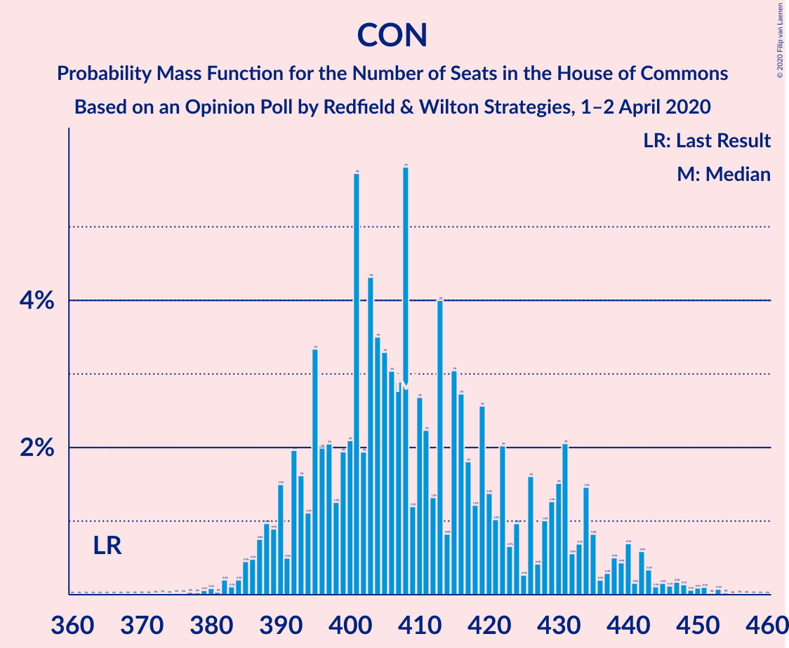

| Number of Seats | Probability | Accumulated | Special Marks |
|:---------------:|:-----------:|:-----------:|:-------------:|
| 365 | 0% | 100% | Last Result |
| 366 | 0% | 100% |  |
| 367 | 0% | 100% |  |
| 368 | 0% | 100% |  |
| 369 | 0% | 100% |  |
| 370 | 0% | 100% |  |
| 371 | 0% | 100% |  |
| 372 | 0% | 100% |  |
| 373 | 0% | 100% |  |
| 374 | 0% | 100% |  |
| 375 | 0% | 100% |  |
| 376 | 0% | 99.9% |  |
| 377 | 0% | 99.9% |  |
| 378 | 0% | 99.9% |  |
| 379 | 0.1% | 99.9% |  |
| 380 | 0.1% | 99.8% |  |
| 381 | 0% | 99.7% |  |
| 382 | 0.2% | 99.7% |  |
| 383 | 0.1% | 99.5% |  |
| 384 | 0.2% | 99.4% |  |
| 385 | 0.5% | 99.2% |  |
| 386 | 0.5% | 98.7% |  |
| 387 | 0.8% | 98% |  |
| 388 | 1.0% | 97% |  |
| 389 | 0.9% | 96% |  |
| 390 | 1.5% | 96% |  |
| 391 | 0.5% | 94% |  |
| 392 | 2% | 94% |  |
| 393 | 2% | 92% |  |
| 394 | 1.1% | 90% |  |
| 395 | 3% | 89% |  |
| 396 | 2% | 86% |  |
| 397 | 2% | 84% |  |
| 398 | 1.3% | 82% |  |
| 399 | 2% | 80% |  |
| 400 | 2% | 78% |  |
| 401 | 6% | 76% |  |
| 402 | 2% | 70% |  |
| 403 | 4% | 69% |  |
| 404 | 4% | 64% |  |
| 405 | 3% | 61% |  |
| 406 | 3% | 57% |  |
| 407 | 3% | 54% |  |
| 408 | 6% | 52% | Median |
| 409 | 1.2% | 46% |  |
| 410 | 3% | 44% |  |
| 411 | 2% | 42% |  |
| 412 | 1.3% | 40% |  |
| 413 | 4% | 38% |  |
| 414 | 0.8% | 34% |  |
| 415 | 3% | 33% |  |
| 416 | 3% | 30% |  |
| 417 | 2% | 28% |  |
| 418 | 1.2% | 26% |  |
| 419 | 3% | 25% |  |
| 420 | 1.4% | 22% |  |
| 421 | 1.0% | 21% |  |
| 422 | 2% | 20% |  |
| 423 | 0.7% | 18% |  |
| 424 | 1.0% | 17% |  |
| 425 | 0.3% | 16% |  |
| 426 | 2% | 16% |  |
| 427 | 0.4% | 14% |  |
| 428 | 1.0% | 14% |  |
| 429 | 1.3% | 13% |  |
| 430 | 2% | 11% |  |
| 431 | 2% | 10% |  |
| 432 | 0.6% | 8% |  |
| 433 | 0.7% | 7% |  |
| 434 | 1.5% | 7% |  |
| 435 | 0.8% | 5% |  |
| 436 | 0.2% | 4% |  |
| 437 | 0.3% | 4% |  |
| 438 | 0.5% | 4% |  |
| 439 | 0.4% | 3% |  |
| 440 | 0.7% | 3% |  |
| 441 | 0.2% | 2% |  |
| 442 | 0.6% | 2% |  |
| 443 | 0.3% | 1.5% |  |
| 444 | 0.1% | 1.1% |  |
| 445 | 0.2% | 1.0% |  |
| 446 | 0.1% | 0.8% |  |
| 447 | 0.2% | 0.7% |  |
| 448 | 0.1% | 0.6% |  |
| 449 | 0.1% | 0.4% |  |
| 450 | 0.1% | 0.4% |  |
| 451 | 0.1% | 0.3% |  |
| 452 | 0% | 0.2% |  |
| 453 | 0.1% | 0.1% |  |
| 454 | 0% | 0.1% |  |
| 455 | 0% | 0% |  |

### Labour Party – Liberal Democrats – Scottish National Party – Green Party – Plaid Cymru

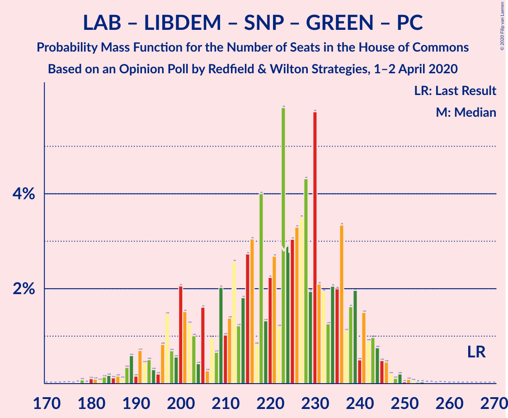

| Number of Seats | Probability | Accumulated | Special Marks |
|:---------------:|:-----------:|:-----------:|:-------------:|
| 177 | 0% | 100% |  |
| 178 | 0.1% | 99.9% |  |
| 179 | 0% | 99.9% |  |
| 180 | 0.1% | 99.8% |  |
| 181 | 0.1% | 99.7% |  |
| 182 | 0.1% | 99.6% |  |
| 183 | 0.1% | 99.6% |  |
| 184 | 0.2% | 99.4% |  |
| 185 | 0.1% | 99.3% |  |
| 186 | 0.2% | 99.2% |  |
| 187 | 0.1% | 99.0% |  |
| 188 | 0.3% | 98.9% |  |
| 189 | 0.6% | 98.5% |  |
| 190 | 0.2% | 98% |  |
| 191 | 0.7% | 98% |  |
| 192 | 0.4% | 97% |  |
| 193 | 0.5% | 97% |  |
| 194 | 0.3% | 96% |  |
| 195 | 0.2% | 96% |  |
| 196 | 0.8% | 96% |  |
| 197 | 1.5% | 95% |  |
| 198 | 0.7% | 93% |  |
| 199 | 0.6% | 93% |  |
| 200 | 2% | 92% |  |
| 201 | 2% | 90% |  |
| 202 | 1.3% | 89% |  |
| 203 | 1.0% | 87% |  |
| 204 | 0.4% | 86% |  |
| 205 | 2% | 86% |  |
| 206 | 0.3% | 84% |  |
| 207 | 1.0% | 84% |  |
| 208 | 0.7% | 83% |  |
| 209 | 2% | 82% |  |
| 210 | 1.0% | 80% |  |
| 211 | 1.4% | 79% |  |
| 212 | 3% | 78% |  |
| 213 | 1.2% | 75% |  |
| 214 | 2% | 74% |  |
| 215 | 3% | 72% |  |
| 216 | 3% | 70% |  |
| 217 | 0.8% | 67% |  |
| 218 | 4% | 66% |  |
| 219 | 1.3% | 62% |  |
| 220 | 2% | 60% |  |
| 221 | 3% | 58% |  |
| 222 | 1.2% | 56% |  |
| 223 | 6% | 54% |  |
| 224 | 3% | 48% | Median |
| 225 | 3% | 46% |  |
| 226 | 3% | 43% |  |
| 227 | 4% | 39% |  |
| 228 | 4% | 36% |  |
| 229 | 2% | 31% |  |
| 230 | 6% | 30% |  |
| 231 | 2% | 24% |  |
| 232 | 2% | 22% |  |
| 233 | 1.3% | 20% |  |
| 234 | 2% | 18% |  |
| 235 | 2% | 16% |  |
| 236 | 3% | 14% |  |
| 237 | 1.1% | 11% |  |
| 238 | 2% | 10% |  |
| 239 | 2% | 8% |  |
| 240 | 0.5% | 6% |  |
| 241 | 1.5% | 6% |  |
| 242 | 0.9% | 4% |  |
| 243 | 1.0% | 4% |  |
| 244 | 0.8% | 3% |  |
| 245 | 0.5% | 2% |  |
| 246 | 0.5% | 1.3% |  |
| 247 | 0.2% | 0.8% |  |
| 248 | 0.1% | 0.6% |  |
| 249 | 0.2% | 0.5% |  |
| 250 | 0% | 0.3% |  |
| 251 | 0.1% | 0.3% |  |
| 252 | 0.1% | 0.2% |  |
| 253 | 0% | 0.1% |  |
| 254 | 0% | 0.1% |  |
| 255 | 0% | 0.1% |  |
| 256 | 0% | 0.1% |  |
| 257 | 0% | 0% |  |
| 258 | 0% | 0% |  |
| 259 | 0% | 0% |  |
| 260 | 0% | 0% |  |
| 261 | 0% | 0% |  |
| 262 | 0% | 0% |  |
| 263 | 0% | 0% |  |
| 264 | 0% | 0% |  |
| 265 | 0% | 0% |  |
| 266 | 0% | 0% | Last Result |

### Labour Party – Liberal Democrats – Scottish National Party – Plaid Cymru

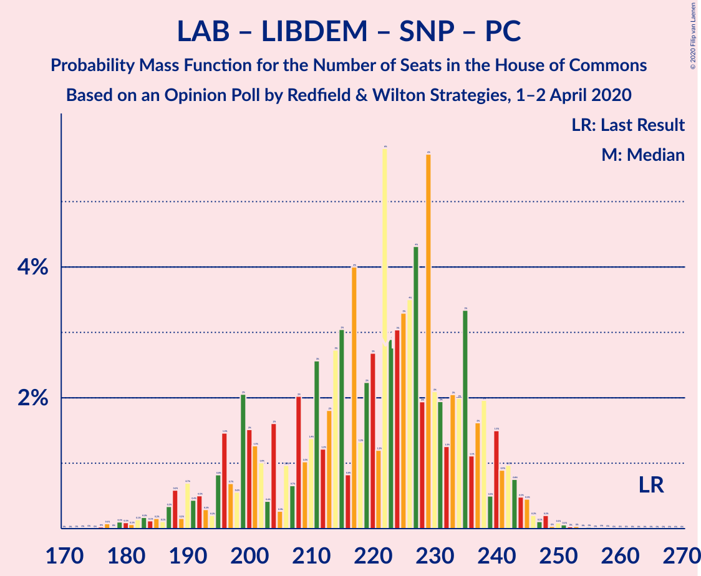

| Number of Seats | Probability | Accumulated | Special Marks |
|:---------------:|:-----------:|:-----------:|:-------------:|
| 176 | 0% | 100% |  |
| 177 | 0.1% | 99.9% |  |
| 178 | 0% | 99.9% |  |
| 179 | 0.1% | 99.8% |  |
| 180 | 0.1% | 99.7% |  |
| 181 | 0.1% | 99.6% |  |
| 182 | 0.1% | 99.6% |  |
| 183 | 0.2% | 99.4% |  |
| 184 | 0.1% | 99.3% |  |
| 185 | 0.2% | 99.2% |  |
| 186 | 0.1% | 99.0% |  |
| 187 | 0.3% | 98.9% |  |
| 188 | 0.6% | 98.5% |  |
| 189 | 0.2% | 98% |  |
| 190 | 0.7% | 98% |  |
| 191 | 0.4% | 97% |  |
| 192 | 0.5% | 97% |  |
| 193 | 0.3% | 96% |  |
| 194 | 0.2% | 96% |  |
| 195 | 0.8% | 96% |  |
| 196 | 1.5% | 95% |  |
| 197 | 0.7% | 93% |  |
| 198 | 0.6% | 93% |  |
| 199 | 2% | 92% |  |
| 200 | 2% | 90% |  |
| 201 | 1.3% | 89% |  |
| 202 | 1.0% | 87% |  |
| 203 | 0.4% | 86% |  |
| 204 | 2% | 86% |  |
| 205 | 0.3% | 84% |  |
| 206 | 1.0% | 84% |  |
| 207 | 0.7% | 83% |  |
| 208 | 2% | 82% |  |
| 209 | 1.0% | 80% |  |
| 210 | 1.4% | 79% |  |
| 211 | 3% | 78% |  |
| 212 | 1.2% | 75% |  |
| 213 | 2% | 74% |  |
| 214 | 3% | 72% |  |
| 215 | 3% | 70% |  |
| 216 | 0.8% | 67% |  |
| 217 | 4% | 66% |  |
| 218 | 1.3% | 62% |  |
| 219 | 2% | 60% |  |
| 220 | 3% | 58% |  |
| 221 | 1.2% | 56% |  |
| 222 | 6% | 54% |  |
| 223 | 3% | 48% | Median |
| 224 | 3% | 46% |  |
| 225 | 3% | 43% |  |
| 226 | 4% | 39% |  |
| 227 | 4% | 36% |  |
| 228 | 2% | 31% |  |
| 229 | 6% | 30% |  |
| 230 | 2% | 24% |  |
| 231 | 2% | 22% |  |
| 232 | 1.3% | 20% |  |
| 233 | 2% | 18% |  |
| 234 | 2% | 16% |  |
| 235 | 3% | 14% |  |
| 236 | 1.1% | 11% |  |
| 237 | 2% | 10% |  |
| 238 | 2% | 8% |  |
| 239 | 0.5% | 6% |  |
| 240 | 1.5% | 6% |  |
| 241 | 0.9% | 4% |  |
| 242 | 1.0% | 4% |  |
| 243 | 0.8% | 3% |  |
| 244 | 0.5% | 2% |  |
| 245 | 0.5% | 1.3% |  |
| 246 | 0.2% | 0.8% |  |
| 247 | 0.1% | 0.6% |  |
| 248 | 0.2% | 0.5% |  |
| 249 | 0% | 0.3% |  |
| 250 | 0.1% | 0.3% |  |
| 251 | 0.1% | 0.2% |  |
| 252 | 0% | 0.1% |  |
| 253 | 0% | 0.1% |  |
| 254 | 0% | 0.1% |  |
| 255 | 0% | 0.1% |  |
| 256 | 0% | 0% |  |
| 257 | 0% | 0% |  |
| 258 | 0% | 0% |  |
| 259 | 0% | 0% |  |
| 260 | 0% | 0% |  |
| 261 | 0% | 0% |  |
| 262 | 0% | 0% |  |
| 263 | 0% | 0% |  |
| 264 | 0% | 0% |  |
| 265 | 0% | 0% | Last Result |

### Labour Party – Scottish National Party – Plaid Cymru

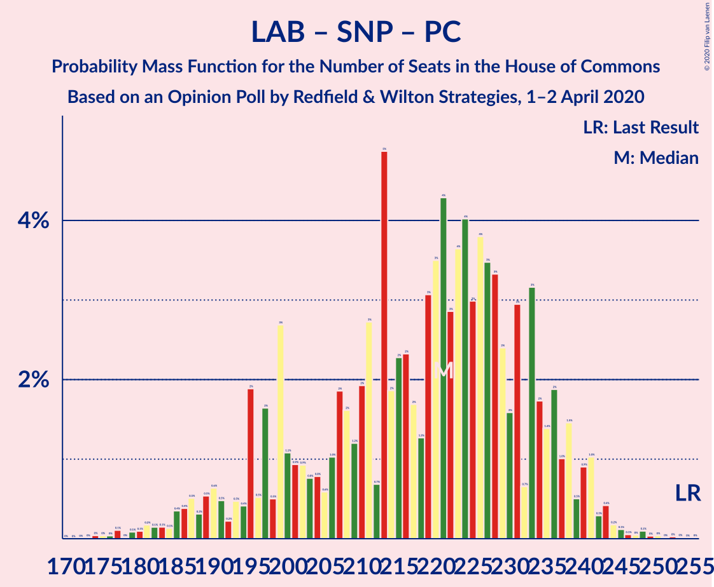

| Number of Seats | Probability | Accumulated | Special Marks |
|:---------------:|:-----------:|:-----------:|:-------------:|
| 174 | 0% | 100% |  |
| 175 | 0% | 99.9% |  |
| 176 | 0% | 99.9% |  |
| 177 | 0.1% | 99.8% |  |
| 178 | 0% | 99.7% |  |
| 179 | 0.1% | 99.7% |  |
| 180 | 0.1% | 99.6% |  |
| 181 | 0.2% | 99.5% |  |
| 182 | 0.1% | 99.4% |  |
| 183 | 0.1% | 99.2% |  |
| 184 | 0.1% | 99.1% |  |
| 185 | 0.4% | 98.9% |  |
| 186 | 0.4% | 98.6% |  |
| 187 | 0.5% | 98% |  |
| 188 | 0.3% | 98% |  |
| 189 | 0.5% | 97% |  |
| 190 | 0.6% | 97% |  |
| 191 | 0.5% | 96% |  |
| 192 | 0.2% | 96% |  |
| 193 | 0.5% | 96% |  |
| 194 | 0.4% | 95% |  |
| 195 | 2% | 95% |  |
| 196 | 0.5% | 93% |  |
| 197 | 2% | 92% |  |
| 198 | 0.5% | 91% |  |
| 199 | 3% | 90% |  |
| 200 | 1.1% | 87% |  |
| 201 | 0.9% | 86% |  |
| 202 | 0.9% | 85% |  |
| 203 | 0.8% | 84% |  |
| 204 | 0.8% | 84% |  |
| 205 | 0.6% | 83% |  |
| 206 | 1.0% | 82% |  |
| 207 | 2% | 81% |  |
| 208 | 2% | 79% |  |
| 209 | 1.2% | 78% |  |
| 210 | 2% | 77% |  |
| 211 | 3% | 75% |  |
| 212 | 0.7% | 72% |  |
| 213 | 5% | 71% |  |
| 214 | 2% | 66% |  |
| 215 | 2% | 65% |  |
| 216 | 2% | 62% |  |
| 217 | 2% | 60% |  |
| 218 | 1.3% | 58% |  |
| 219 | 3% | 57% |  |
| 220 | 3% | 54% |  |
| 221 | 4% | 50% | Median |
| 222 | 3% | 46% |  |
| 223 | 4% | 43% |  |
| 224 | 4% | 40% |  |
| 225 | 3% | 36% |  |
| 226 | 4% | 33% |  |
| 227 | 3% | 29% |  |
| 228 | 3% | 25% |  |
| 229 | 2% | 22% |  |
| 230 | 2% | 20% |  |
| 231 | 3% | 18% |  |
| 232 | 0.7% | 15% |  |
| 233 | 3% | 14% |  |
| 234 | 2% | 11% |  |
| 235 | 1.4% | 10% |  |
| 236 | 2% | 8% |  |
| 237 | 1.0% | 6% |  |
| 238 | 1.5% | 5% |  |
| 239 | 0.5% | 4% |  |
| 240 | 0.9% | 3% |  |
| 241 | 1.0% | 2% |  |
| 242 | 0.3% | 1.4% |  |
| 243 | 0.4% | 1.1% |  |
| 244 | 0.2% | 0.7% |  |
| 245 | 0.1% | 0.5% |  |
| 246 | 0.1% | 0.4% |  |
| 247 | 0% | 0.3% |  |
| 248 | 0.1% | 0.3% |  |
| 249 | 0% | 0.2% |  |
| 250 | 0% | 0.1% |  |
| 251 | 0% | 0.1% |  |
| 252 | 0% | 0.1% |  |
| 253 | 0% | 0.1% |  |
| 254 | 0% | 0% | Last Result |

### Labour Party – Liberal Democrats – Scottish National Party

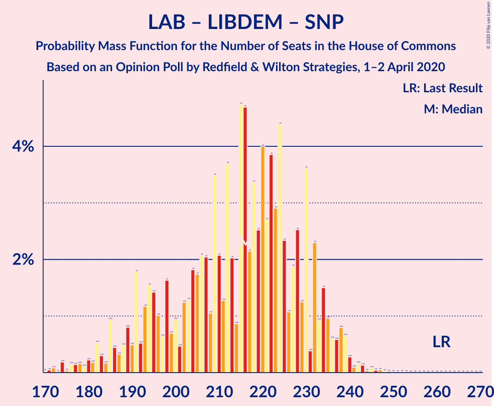

| Number of Seats | Probability | Accumulated | Special Marks |
|:---------------:|:-----------:|:-----------:|:-------------:|
| 170 | 0% | 100% |  |
| 171 | 0% | 99.9% |  |
| 172 | 0.1% | 99.9% |  |
| 173 | 0% | 99.8% |  |
| 174 | 0.2% | 99.8% |  |
| 175 | 0% | 99.6% |  |
| 176 | 0.2% | 99.6% |  |
| 177 | 0.1% | 99.4% |  |
| 178 | 0.2% | 99.3% |  |
| 179 | 0.1% | 99.1% |  |
| 180 | 0.2% | 99.0% |  |
| 181 | 0.2% | 98.8% |  |
| 182 | 0.5% | 98.6% |  |
| 183 | 0.3% | 98% |  |
| 184 | 0.2% | 98% |  |
| 185 | 0.9% | 98% |  |
| 186 | 0.4% | 97% |  |
| 187 | 0.3% | 96% |  |
| 188 | 0.5% | 96% |  |
| 189 | 0.8% | 95% |  |
| 190 | 0.5% | 95% |  |
| 191 | 2% | 94% |  |
| 192 | 0.5% | 92% |  |
| 193 | 1.2% | 92% |  |
| 194 | 2% | 91% |  |
| 195 | 1.4% | 89% |  |
| 196 | 1.0% | 88% |  |
| 197 | 0.6% | 87% |  |
| 198 | 2% | 86% |  |
| 199 | 0.7% | 84% |  |
| 200 | 0.9% | 84% |  |
| 201 | 0.5% | 83% |  |
| 202 | 1.2% | 82% |  |
| 203 | 1.3% | 81% |  |
| 204 | 2% | 80% |  |
| 205 | 2% | 78% |  |
| 206 | 2% | 76% |  |
| 207 | 2% | 74% |  |
| 208 | 1.1% | 72% |  |
| 209 | 3% | 71% |  |
| 210 | 2% | 68% |  |
| 211 | 1.3% | 65% |  |
| 212 | 4% | 64% |  |
| 213 | 2% | 61% |  |
| 214 | 0.9% | 59% |  |
| 215 | 5% | 58% |  |
| 216 | 5% | 53% |  |
| 217 | 2% | 48% | Median |
| 218 | 3% | 46% |  |
| 219 | 3% | 43% |  |
| 220 | 4% | 40% |  |
| 221 | 3% | 36% |  |
| 222 | 4% | 33% |  |
| 223 | 3% | 30% |  |
| 224 | 4% | 27% |  |
| 225 | 2% | 22% |  |
| 226 | 1.1% | 20% |  |
| 227 | 2% | 19% |  |
| 228 | 3% | 17% |  |
| 229 | 1.2% | 15% |  |
| 230 | 4% | 13% |  |
| 231 | 0.4% | 10% |  |
| 232 | 2% | 9% |  |
| 233 | 0.9% | 7% |  |
| 234 | 2% | 6% |  |
| 235 | 1.0% | 5% |  |
| 236 | 0.6% | 4% |  |
| 237 | 0.6% | 3% |  |
| 238 | 0.8% | 2% |  |
| 239 | 0.7% | 2% |  |
| 240 | 0.3% | 1.0% |  |
| 241 | 0.1% | 0.7% |  |
| 242 | 0.2% | 0.6% |  |
| 243 | 0.1% | 0.4% |  |
| 244 | 0% | 0.3% |  |
| 245 | 0.1% | 0.3% |  |
| 246 | 0% | 0.2% |  |
| 247 | 0% | 0.1% |  |
| 248 | 0% | 0.1% |  |
| 249 | 0% | 0.1% |  |
| 250 | 0% | 0.1% |  |
| 251 | 0% | 0% |  |
| 252 | 0% | 0% |  |
| 253 | 0% | 0% |  |
| 254 | 0% | 0% |  |
| 255 | 0% | 0% |  |
| 256 | 0% | 0% |  |
| 257 | 0% | 0% |  |
| 258 | 0% | 0% |  |
| 259 | 0% | 0% |  |
| 260 | 0% | 0% |  |
| 261 | 0% | 0% | Last Result |

### Labour Party – Scottish National Party

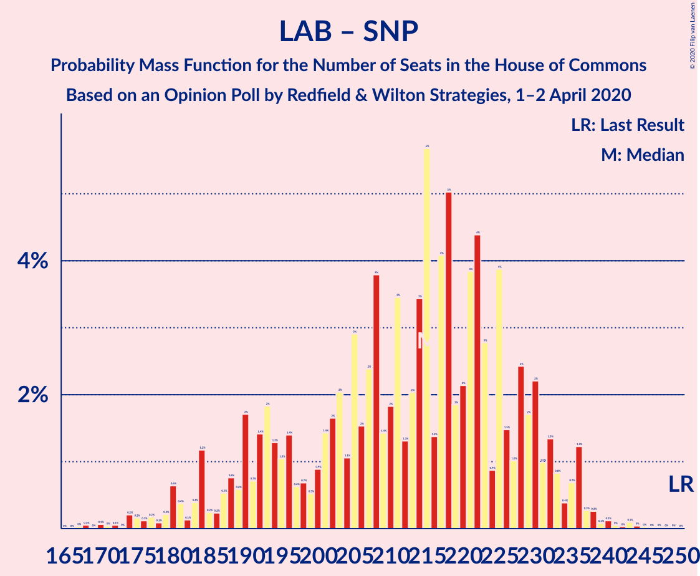

| Number of Seats | Probability | Accumulated | Special Marks |
|:---------------:|:-----------:|:-----------:|:-------------:|
| 167 | 0% | 100% |  |
| 168 | 0.1% | 99.9% |  |
| 169 | 0% | 99.9% |  |
| 170 | 0.1% | 99.9% |  |
| 171 | 0% | 99.8% |  |
| 172 | 0.1% | 99.8% |  |
| 173 | 0% | 99.7% |  |
| 174 | 0.2% | 99.7% |  |
| 175 | 0.2% | 99.5% |  |
| 176 | 0.1% | 99.3% |  |
| 177 | 0.2% | 99.2% |  |
| 178 | 0.1% | 99.0% |  |
| 179 | 0.2% | 98.9% |  |
| 180 | 0.6% | 98.7% |  |
| 181 | 0.4% | 98% |  |
| 182 | 0.1% | 98% |  |
| 183 | 0.4% | 98% |  |
| 184 | 1.2% | 97% |  |
| 185 | 0.2% | 96% |  |
| 186 | 0.2% | 96% |  |
| 187 | 0.5% | 96% |  |
| 188 | 0.8% | 95% |  |
| 189 | 0.6% | 94% |  |
| 190 | 2% | 94% |  |
| 191 | 0.7% | 92% |  |
| 192 | 1.4% | 91% |  |
| 193 | 2% | 90% |  |
| 194 | 1.3% | 88% |  |
| 195 | 1.0% | 87% |  |
| 196 | 1.4% | 86% |  |
| 197 | 0.6% | 84% |  |
| 198 | 0.7% | 84% |  |
| 199 | 0.5% | 83% |  |
| 200 | 0.9% | 82% |  |
| 201 | 1.4% | 82% |  |
| 202 | 2% | 80% |  |
| 203 | 2% | 78% |  |
| 204 | 1.1% | 76% |  |
| 205 | 3% | 75% |  |
| 206 | 2% | 72% |  |
| 207 | 2% | 71% |  |
| 208 | 4% | 69% |  |
| 209 | 1.4% | 65% |  |
| 210 | 2% | 63% |  |
| 211 | 3% | 61% |  |
| 212 | 1.3% | 58% |  |
| 213 | 2% | 57% |  |
| 214 | 3% | 55% |  |
| 215 | 6% | 51% | Median |
| 216 | 1.4% | 46% |  |
| 217 | 4% | 44% |  |
| 218 | 5% | 40% |  |
| 219 | 2% | 35% |  |
| 220 | 2% | 33% |  |
| 221 | 4% | 31% |  |
| 222 | 4% | 27% |  |
| 223 | 3% | 23% |  |
| 224 | 0.9% | 20% |  |
| 225 | 4% | 19% |  |
| 226 | 1.5% | 15% |  |
| 227 | 1.0% | 14% |  |
| 228 | 2% | 13% |  |
| 229 | 2% | 10% |  |
| 230 | 2% | 9% |  |
| 231 | 1.0% | 7% |  |
| 232 | 1.3% | 6% |  |
| 233 | 0.8% | 4% |  |
| 234 | 0.4% | 3% |  |
| 235 | 0.7% | 3% |  |
| 236 | 1.2% | 2% |  |
| 237 | 0.3% | 1.1% |  |
| 238 | 0.3% | 0.8% |  |
| 239 | 0.1% | 0.5% |  |
| 240 | 0.1% | 0.4% |  |
| 241 | 0% | 0.3% |  |
| 242 | 0% | 0.3% |  |
| 243 | 0.1% | 0.2% |  |
| 244 | 0% | 0.1% |  |
| 245 | 0% | 0.1% |  |
| 246 | 0% | 0.1% |  |
| 247 | 0% | 0.1% |  |
| 248 | 0% | 0% |  |
| 249 | 0% | 0% |  |
| 250 | 0% | 0% | Last Result |

### Labour Party – Liberal Democrats – Plaid Cymru

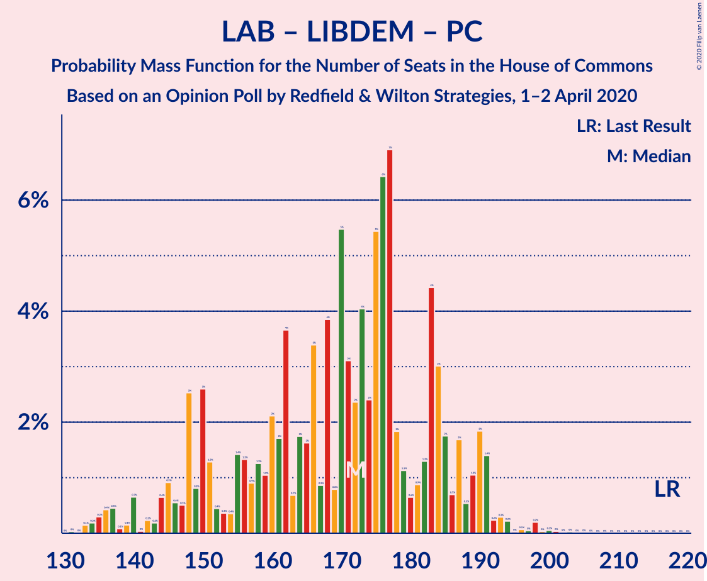

| Number of Seats | Probability | Accumulated | Special Marks |
|:---------------:|:-----------:|:-----------:|:-------------:|
| 130 | 0% | 100% |  |
| 131 | 0% | 99.9% |  |
| 132 | 0% | 99.9% |  |
| 133 | 0.1% | 99.9% |  |
| 134 | 0.2% | 99.8% |  |
| 135 | 0.3% | 99.6% |  |
| 136 | 0.4% | 99.3% |  |
| 137 | 0.5% | 98.8% |  |
| 138 | 0.1% | 98% |  |
| 139 | 0.1% | 98% |  |
| 140 | 0.7% | 98% |  |
| 141 | 0% | 98% |  |
| 142 | 0.2% | 97% |  |
| 143 | 0.2% | 97% |  |
| 144 | 0.6% | 97% |  |
| 145 | 0.9% | 96% |  |
| 146 | 0.6% | 95% |  |
| 147 | 0.5% | 95% |  |
| 148 | 3% | 94% |  |
| 149 | 0.8% | 92% |  |
| 150 | 3% | 91% |  |
| 151 | 1.3% | 88% |  |
| 152 | 0.4% | 87% |  |
| 153 | 0.4% | 87% |  |
| 154 | 0.4% | 86% |  |
| 155 | 1.4% | 86% |  |
| 156 | 1.3% | 85% |  |
| 157 | 0.9% | 83% |  |
| 158 | 1.3% | 82% |  |
| 159 | 1.0% | 81% |  |
| 160 | 2% | 80% |  |
| 161 | 2% | 78% |  |
| 162 | 4% | 76% |  |
| 163 | 0.7% | 73% |  |
| 164 | 2% | 72% |  |
| 165 | 2% | 70% |  |
| 166 | 3% | 69% |  |
| 167 | 0.9% | 65% |  |
| 168 | 4% | 64% |  |
| 169 | 0.8% | 60% |  |
| 170 | 5% | 60% |  |
| 171 | 3% | 54% |  |
| 172 | 2% | 51% | Median |
| 173 | 4% | 49% |  |
| 174 | 2% | 45% |  |
| 175 | 5% | 42% |  |
| 176 | 6% | 37% |  |
| 177 | 7% | 30% |  |
| 178 | 2% | 23% |  |
| 179 | 1.1% | 22% |  |
| 180 | 0.6% | 21% |  |
| 181 | 0.9% | 20% |  |
| 182 | 1.3% | 19% |  |
| 183 | 4% | 18% |  |
| 184 | 3% | 13% |  |
| 185 | 2% | 10% |  |
| 186 | 0.7% | 8% |  |
| 187 | 2% | 8% |  |
| 188 | 0.5% | 6% |  |
| 189 | 1.0% | 6% |  |
| 190 | 2% | 5% |  |
| 191 | 1.4% | 3% |  |
| 192 | 0.2% | 1.3% |  |
| 193 | 0.3% | 1.1% |  |
| 194 | 0.2% | 0.8% |  |
| 195 | 0% | 0.5% |  |
| 196 | 0.1% | 0.5% |  |
| 197 | 0% | 0.5% |  |
| 198 | 0.2% | 0.4% |  |
| 199 | 0% | 0.2% |  |
| 200 | 0.1% | 0.2% |  |
| 201 | 0% | 0.1% |  |
| 202 | 0% | 0.1% |  |
| 203 | 0% | 0.1% |  |
| 204 | 0% | 0% |  |
| 205 | 0% | 0% |  |
| 206 | 0% | 0% |  |
| 207 | 0% | 0% |  |
| 208 | 0% | 0% |  |
| 209 | 0% | 0% |  |
| 210 | 0% | 0% |  |
| 211 | 0% | 0% |  |
| 212 | 0% | 0% |  |
| 213 | 0% | 0% |  |
| 214 | 0% | 0% |  |
| 215 | 0% | 0% |  |
| 216 | 0% | 0% |  |
| 217 | 0% | 0% | Last Result |

### Labour Party – Plaid Cymru

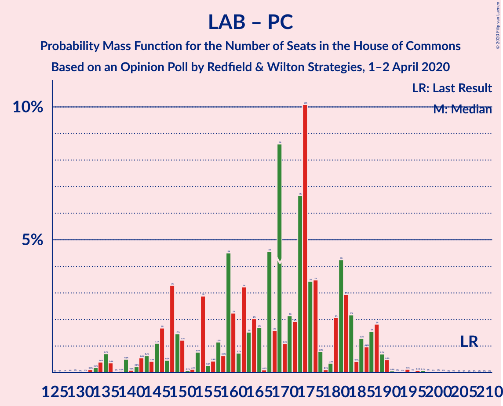

| Number of Seats | Probability | Accumulated | Special Marks |
|:---------------:|:-----------:|:-----------:|:-------------:|
| 129 | 0% | 100% |  |
| 130 | 0% | 99.9% |  |
| 131 | 0% | 99.9% |  |
| 132 | 0.1% | 99.9% |  |
| 133 | 0.2% | 99.8% |  |
| 134 | 0.4% | 99.6% |  |
| 135 | 0.7% | 99.2% |  |
| 136 | 0.4% | 98.5% |  |
| 137 | 0% | 98% |  |
| 138 | 0.1% | 98% |  |
| 139 | 0.5% | 98% |  |
| 140 | 0.1% | 98% |  |
| 141 | 0.2% | 97% |  |
| 142 | 0.6% | 97% |  |
| 143 | 0.6% | 97% |  |
| 144 | 0.4% | 96% |  |
| 145 | 1.1% | 96% |  |
| 146 | 2% | 95% |  |
| 147 | 0.5% | 93% |  |
| 148 | 3% | 92% |  |
| 149 | 1.5% | 89% |  |
| 150 | 1.2% | 88% |  |
| 151 | 0.1% | 86% |  |
| 152 | 0.1% | 86% |  |
| 153 | 0.8% | 86% |  |
| 154 | 3% | 85% |  |
| 155 | 0.3% | 83% |  |
| 156 | 0.4% | 82% |  |
| 157 | 1.1% | 82% |  |
| 158 | 0.6% | 81% |  |
| 159 | 5% | 80% |  |
| 160 | 2% | 76% |  |
| 161 | 0.7% | 73% |  |
| 162 | 3% | 73% |  |
| 163 | 2% | 69% |  |
| 164 | 2% | 68% |  |
| 165 | 2% | 66% |  |
| 166 | 0.1% | 64% |  |
| 167 | 5% | 64% |  |
| 168 | 2% | 59% |  |
| 169 | 9% | 58% |  |
| 170 | 1.1% | 49% | Median |
| 171 | 2% | 48% |  |
| 172 | 2% | 46% |  |
| 173 | 7% | 44% |  |
| 174 | 10% | 37% |  |
| 175 | 3% | 27% |  |
| 176 | 3% | 24% |  |
| 177 | 0.8% | 20% |  |
| 178 | 0.1% | 20% |  |
| 179 | 0.4% | 20% |  |
| 180 | 2% | 19% |  |
| 181 | 4% | 17% |  |
| 182 | 3% | 13% |  |
| 183 | 2% | 10% |  |
| 184 | 0.4% | 8% |  |
| 185 | 1.3% | 7% |  |
| 186 | 1.0% | 6% |  |
| 187 | 2% | 5% |  |
| 188 | 2% | 4% |  |
| 189 | 0.7% | 2% |  |
| 190 | 0.5% | 1.0% |  |
| 191 | 0.1% | 0.5% |  |
| 192 | 0% | 0.5% |  |
| 193 | 0% | 0.5% |  |
| 194 | 0.1% | 0.4% |  |
| 195 | 0% | 0.3% |  |
| 196 | 0.1% | 0.3% |  |
| 197 | 0.1% | 0.2% |  |
| 198 | 0% | 0.1% |  |
| 199 | 0% | 0.1% |  |
| 200 | 0% | 0.1% |  |
| 201 | 0% | 0% |  |
| 202 | 0% | 0% |  |
| 203 | 0% | 0% |  |
| 204 | 0% | 0% |  |
| 205 | 0% | 0% |  |
| 206 | 0% | 0% | Last Result |

### Labour Party – Liberal Democrats

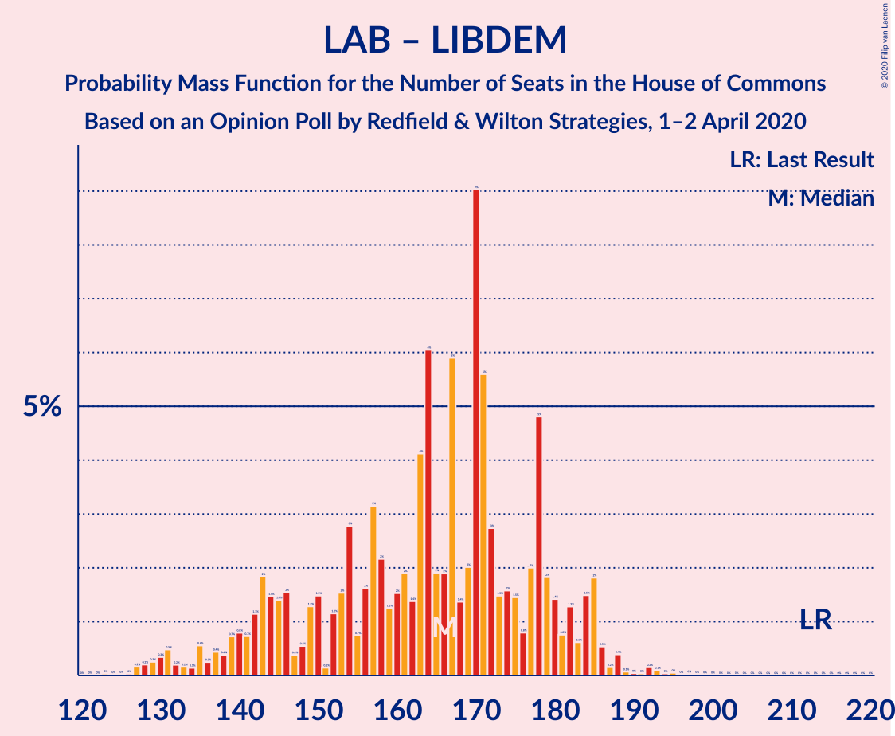

| Number of Seats | Probability | Accumulated | Special Marks |
|:---------------:|:-----------:|:-----------:|:-------------:|
| 123 | 0% | 100% |  |
| 124 | 0% | 99.9% |  |
| 125 | 0% | 99.9% |  |
| 126 | 0% | 99.9% |  |
| 127 | 0.2% | 99.9% |  |
| 128 | 0.2% | 99.7% |  |
| 129 | 0.3% | 99.5% |  |
| 130 | 0.3% | 99.3% |  |
| 131 | 0.5% | 98.9% |  |
| 132 | 0.2% | 98% |  |
| 133 | 0.2% | 98% |  |
| 134 | 0.1% | 98% |  |
| 135 | 0.6% | 98% |  |
| 136 | 0.3% | 97% |  |
| 137 | 0.4% | 97% |  |
| 138 | 0.4% | 97% |  |
| 139 | 0.7% | 96% |  |
| 140 | 0.8% | 96% |  |
| 141 | 0.7% | 95% |  |
| 142 | 1.1% | 94% |  |
| 143 | 2% | 93% |  |
| 144 | 1.5% | 91% |  |
| 145 | 1.4% | 90% |  |
| 146 | 2% | 88% |  |
| 147 | 0.4% | 87% |  |
| 148 | 0.5% | 86% |  |
| 149 | 1.3% | 86% |  |
| 150 | 1.5% | 84% |  |
| 151 | 0.1% | 83% |  |
| 152 | 1.2% | 83% |  |
| 153 | 2% | 82% |  |
| 154 | 3% | 80% |  |
| 155 | 0.7% | 77% |  |
| 156 | 2% | 77% |  |
| 157 | 3% | 75% |  |
| 158 | 2% | 72% |  |
| 159 | 1.3% | 70% |  |
| 160 | 2% | 68% |  |
| 161 | 2% | 67% |  |
| 162 | 1.4% | 65% |  |
| 163 | 4% | 64% |  |
| 164 | 6% | 59% |  |
| 165 | 2% | 53% |  |
| 166 | 2% | 52% | Median |
| 167 | 6% | 50% |  |
| 168 | 1.4% | 44% |  |
| 169 | 2% | 42% |  |
| 170 | 9% | 40% |  |
| 171 | 6% | 31% |  |
| 172 | 3% | 26% |  |
| 173 | 1.5% | 23% |  |
| 174 | 2% | 22% |  |
| 175 | 1.5% | 20% |  |
| 176 | 0.8% | 18% |  |
| 177 | 2% | 18% |  |
| 178 | 5% | 16% |  |
| 179 | 2% | 11% |  |
| 180 | 1.4% | 9% |  |
| 181 | 0.8% | 8% |  |
| 182 | 1.3% | 7% |  |
| 183 | 0.6% | 6% |  |
| 184 | 1.5% | 5% |  |
| 185 | 2% | 3% |  |
| 186 | 0.5% | 2% |  |
| 187 | 0.2% | 1.1% |  |
| 188 | 0.4% | 1.0% |  |
| 189 | 0.1% | 0.6% |  |
| 190 | 0% | 0.5% |  |
| 191 | 0% | 0.5% |  |
| 192 | 0.2% | 0.4% |  |
| 193 | 0.1% | 0.3% |  |
| 194 | 0% | 0.2% |  |
| 195 | 0% | 0.2% |  |
| 196 | 0% | 0.1% |  |
| 197 | 0% | 0.1% |  |
| 198 | 0% | 0.1% |  |
| 199 | 0% | 0% |  |
| 200 | 0% | 0% |  |
| 201 | 0% | 0% |  |
| 202 | 0% | 0% |  |
| 203 | 0% | 0% |  |
| 204 | 0% | 0% |  |
| 205 | 0% | 0% |  |
| 206 | 0% | 0% |  |
| 207 | 0% | 0% |  |
| 208 | 0% | 0% |  |
| 209 | 0% | 0% |  |
| 210 | 0% | 0% |  |
| 211 | 0% | 0% |  |
| 212 | 0% | 0% |  |
| 213 | 0% | 0% | Last Result |

### Labour Party

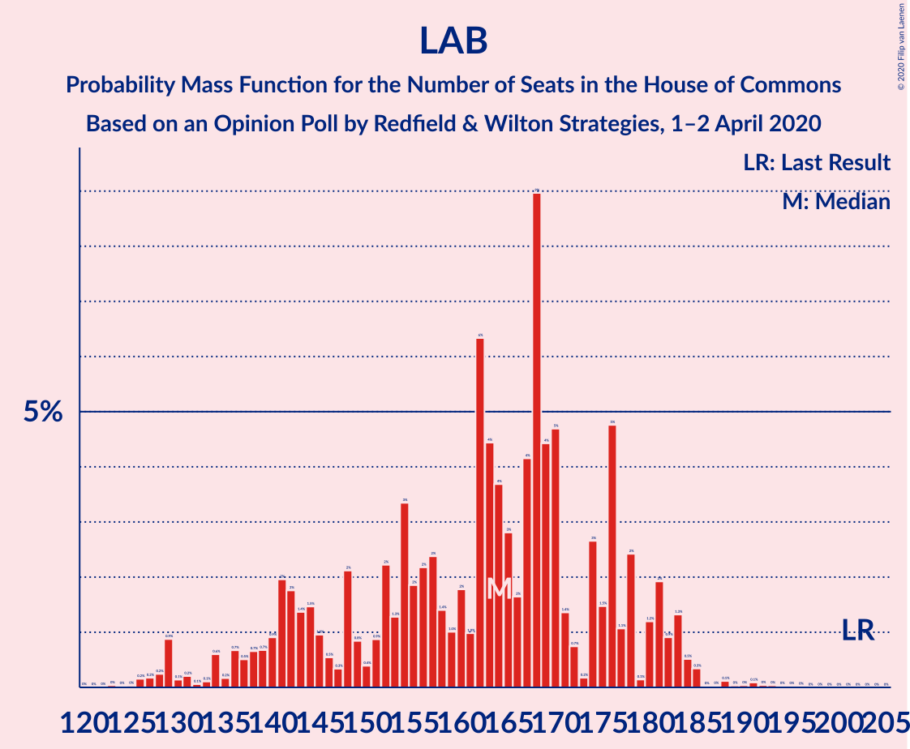

| Number of Seats | Probability | Accumulated | Special Marks |
|:---------------:|:-----------:|:-----------:|:-------------:|
| 123 | 0% | 100% |  |
| 124 | 0% | 99.9% |  |
| 125 | 0% | 99.9% |  |
| 126 | 0.2% | 99.9% |  |
| 127 | 0.2% | 99.7% |  |
| 128 | 0.2% | 99.5% |  |
| 129 | 0.9% | 99.3% |  |
| 130 | 0.1% | 98% |  |
| 131 | 0.2% | 98% |  |
| 132 | 0.1% | 98% |  |
| 133 | 0.1% | 98% |  |
| 134 | 0.6% | 98% |  |
| 135 | 0.2% | 97% |  |
| 136 | 0.7% | 97% |  |
| 137 | 0.5% | 96% |  |
| 138 | 0.7% | 96% |  |
| 139 | 0.7% | 95% |  |
| 140 | 0.9% | 95% |  |
| 141 | 2% | 94% |  |
| 142 | 2% | 92% |  |
| 143 | 1.4% | 90% |  |
| 144 | 1.5% | 89% |  |
| 145 | 1.0% | 87% |  |
| 146 | 0.5% | 86% |  |
| 147 | 0.3% | 86% |  |
| 148 | 2% | 85% |  |
| 149 | 0.8% | 83% |  |
| 150 | 0.4% | 82% |  |
| 151 | 0.9% | 82% |  |
| 152 | 2% | 81% |  |
| 153 | 1.3% | 79% |  |
| 154 | 3% | 78% |  |
| 155 | 2% | 74% |  |
| 156 | 2% | 72% |  |
| 157 | 2% | 70% |  |
| 158 | 1.4% | 68% |  |
| 159 | 1.0% | 66% |  |
| 160 | 2% | 65% |  |
| 161 | 1.0% | 64% |  |
| 162 | 6% | 63% |  |
| 163 | 4% | 56% |  |
| 164 | 4% | 52% | Median |
| 165 | 3% | 48% |  |
| 166 | 2% | 45% |  |
| 167 | 4% | 44% |  |
| 168 | 9% | 40% |  |
| 169 | 4% | 31% |  |
| 170 | 5% | 26% |  |
| 171 | 1.4% | 22% |  |
| 172 | 0.7% | 20% |  |
| 173 | 0.2% | 19% |  |
| 174 | 3% | 19% |  |
| 175 | 1.5% | 17% |  |
| 176 | 5% | 15% |  |
| 177 | 1.1% | 10% |  |
| 178 | 2% | 9% |  |
| 179 | 0.1% | 7% |  |
| 180 | 1.2% | 7% |  |
| 181 | 2% | 6% |  |
| 182 | 0.9% | 4% |  |
| 183 | 1.3% | 3% |  |
| 184 | 0.5% | 1.3% |  |
| 185 | 0.3% | 0.8% |  |
| 186 | 0% | 0.5% |  |
| 187 | 0% | 0.5% |  |
| 188 | 0.1% | 0.4% |  |
| 189 | 0% | 0.3% |  |
| 190 | 0% | 0.3% |  |
| 191 | 0.1% | 0.2% |  |
| 192 | 0% | 0.2% |  |
| 193 | 0% | 0.1% |  |
| 194 | 0% | 0.1% |  |
| 195 | 0% | 0.1% |  |
| 196 | 0% | 0% |  |
| 197 | 0% | 0% |  |
| 198 | 0% | 0% |  |
| 199 | 0% | 0% |  |
| 200 | 0% | 0% |  |
| 201 | 0% | 0% |  |
| 202 | 0% | 0% | Last Result |

## Technical Information

### Opinion Poll

+ **Polling firm:** Redfield & Wilton Strategies
+ **Commissioner(s):** —
+ **Fieldwork period:** 1–2 April 2020

### Calculations

+ **Sample size:** 1983
+ **Simulations done:** 131,072
+ **Error estimate:** 1.46%

