# Opinion Poll by Redfield & Wilton Strategies, 26 April 2020

<a href="#voting-intentions">Voting Intentions</a> | <a href="#seats">Seats</a> | <a href="#coalitions">Coalitions</a> | <a href="#technical-information">Technical Information</a>

## Voting Intentions

### Confidence Intervals

| Party | Last Result | Poll Result | 80% Confidence Interval | 90% Confidence Interval | 95% Confidence Interval | 99% Confidence Interval |
|:-----:|:-----------:|:-----------:|:-----------------------:|:-----------------------:|:-----------------------:|:-----------------------:|
| Conservative Party | 43.6% | 50.3% | 48.6–52.0% |48.2–52.4% |47.8–52.8% |47.0–53.7% |
| Labour Party | 32.1% | 33.2% | 31.7–34.8% |31.2–35.3% |30.9–35.7% |30.1–36.4% |
| Liberal Democrats | 11.5% | 7.1% | 6.3–8.0% |6.1–8.3% |5.9–8.5% |5.5–8.9% |
| Scottish National Party | 3.9% | 5.0% | 4.4–5.9% |4.2–6.1% |4.0–6.3% |3.7–6.7% |
| Green Party | 2.8% | 3.2% | 2.7–3.8% |2.5–4.0% |2.4–4.2% |2.1–4.5% |
| Plaid Cymru | 0.5% | 0.3% | 0.2–0.5% |0.1–0.6% |0.1–0.7% |0.1–0.9% |

*Note:* The poll result column reflects the actual value used in the calculations. Published results may vary slightly, and in addition be rounded to fewer digits.

## Seats

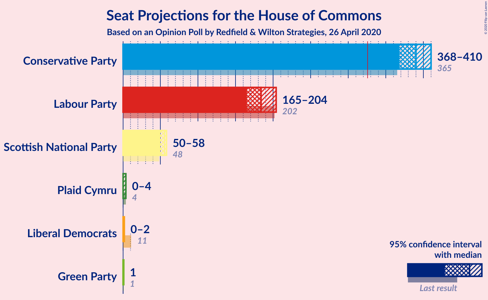

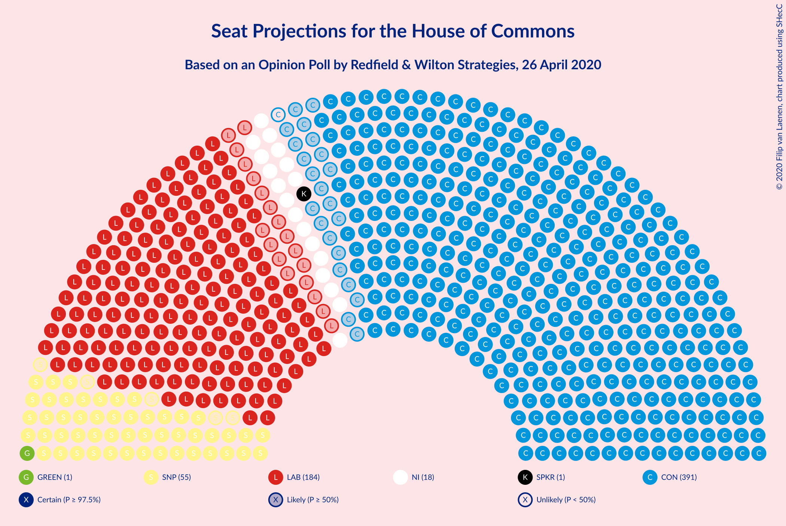

### Confidence Intervals

| Party | Last Result | Median | 80% Confidence Interval | 90% Confidence Interval | 95% Confidence Interval | 99% Confidence Interval |
|:-----:|:-----------:|:------:|:-----------------------:|:-----------------------:|:-----------------------:|:-----------------------:|
| <a href="#conservative-party">Conservative Party</a> | 365 | 390 | 376–401 |371–407 |368–410 |359–424 |
| <a href="#labour-party">Labour Party</a> | 202 | 184 | 172–196 |168–202 |165–204 |153–211 |
| <a href="#liberal-democrats">Liberal Democrats</a> | 11 | 0 | 0–2 |0–2 |0–2 |0–3 |
| <a href="#scottish-national-party">Scottish National Party</a> | 48 | 55 | 51–58 |51–58 |50–58 |49–58 |
| <a href="#green-party">Green Party</a> | 1 | 1 | 1 |1 |1 |1 |
| <a href="#plaid-cymru">Plaid Cymru</a> | 4 | 0 | 0–4 |0–4 |0–4 |0–5 |

### Conservative Party

*For a full overview of the results for this party, see the [Conservative Party](party-conservativeparty.html) page.*

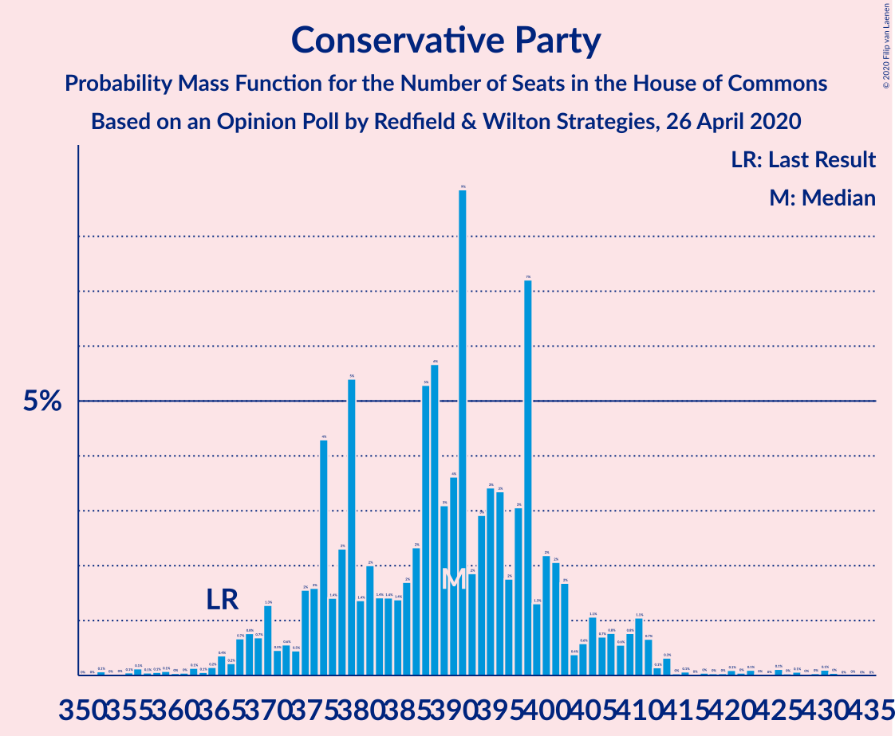

| Number of Seats | Probability | Accumulated | Special Marks |
|:---------------:|:-----------:|:-----------:|:-------------:|
| 351 | 0% | 100% |  |
| 352 | 0.1% | 99.9% |  |
| 353 | 0% | 99.9% |  |
| 354 | 0% | 99.9% |  |
| 355 | 0.1% | 99.8% |  |
| 356 | 0.1% | 99.8% |  |
| 357 | 0.1% | 99.7% |  |
| 358 | 0.1% | 99.6% |  |
| 359 | 0.1% | 99.5% |  |
| 360 | 0% | 99.5% |  |
| 361 | 0% | 99.4% |  |
| 362 | 0.1% | 99.4% |  |
| 363 | 0.1% | 99.2% |  |
| 364 | 0.2% | 99.2% |  |
| 365 | 0.4% | 99.0% | Last Result |
| 366 | 0.2% | 98.7% |  |
| 367 | 0.7% | 98% |  |
| 368 | 0.8% | 98% |  |
| 369 | 0.7% | 97% |  |
| 370 | 1.3% | 96% |  |
| 371 | 0.5% | 95% |  |
| 372 | 0.6% | 95% |  |
| 373 | 0.5% | 94% |  |
| 374 | 2% | 94% |  |
| 375 | 2% | 92% |  |
| 376 | 4% | 90% |  |
| 377 | 1.4% | 86% |  |
| 378 | 2% | 85% |  |
| 379 | 5% | 82% |  |
| 380 | 1.4% | 77% |  |
| 381 | 2% | 76% |  |
| 382 | 1.4% | 74% |  |
| 383 | 1.4% | 72% |  |
| 384 | 1.4% | 71% |  |
| 385 | 2% | 69% |  |
| 386 | 2% | 68% |  |
| 387 | 5% | 65% |  |
| 388 | 6% | 60% |  |
| 389 | 3% | 54% |  |
| 390 | 4% | 51% | Median |
| 391 | 9% | 48% |  |
| 392 | 2% | 39% |  |
| 393 | 3% | 37% |  |
| 394 | 3% | 34% |  |
| 395 | 3% | 31% |  |
| 396 | 2% | 27% |  |
| 397 | 3% | 26% |  |
| 398 | 7% | 22% |  |
| 399 | 1.3% | 15% |  |
| 400 | 2% | 14% |  |
| 401 | 2% | 12% |  |
| 402 | 2% | 10% |  |
| 403 | 0.4% | 8% |  |
| 404 | 0.6% | 8% |  |
| 405 | 1.1% | 7% |  |
| 406 | 0.7% | 6% |  |
| 407 | 0.8% | 5% |  |
| 408 | 0.6% | 5% |  |
| 409 | 0.8% | 4% |  |
| 410 | 1.1% | 3% |  |
| 411 | 0.7% | 2% |  |
| 412 | 0.1% | 1.5% |  |
| 413 | 0.3% | 1.3% |  |
| 414 | 0% | 1.0% |  |
| 415 | 0.1% | 1.0% |  |
| 416 | 0% | 0.9% |  |
| 417 | 0% | 0.9% |  |
| 418 | 0% | 0.8% |  |
| 419 | 0% | 0.8% |  |
| 420 | 0.1% | 0.8% |  |
| 421 | 0% | 0.7% |  |
| 422 | 0.1% | 0.6% |  |
| 423 | 0% | 0.5% |  |
| 424 | 0% | 0.5% |  |
| 425 | 0.1% | 0.5% |  |
| 426 | 0% | 0.4% |  |
| 427 | 0.1% | 0.3% |  |
| 428 | 0% | 0.3% |  |
| 429 | 0% | 0.3% |  |
| 430 | 0.1% | 0.2% |  |
| 431 | 0% | 0.1% |  |
| 432 | 0% | 0.1% |  |
| 433 | 0% | 0.1% |  |
| 434 | 0% | 0% |  |

### Labour Party

*For a full overview of the results for this party, see the [Labour Party](party-labourparty.html) page.*

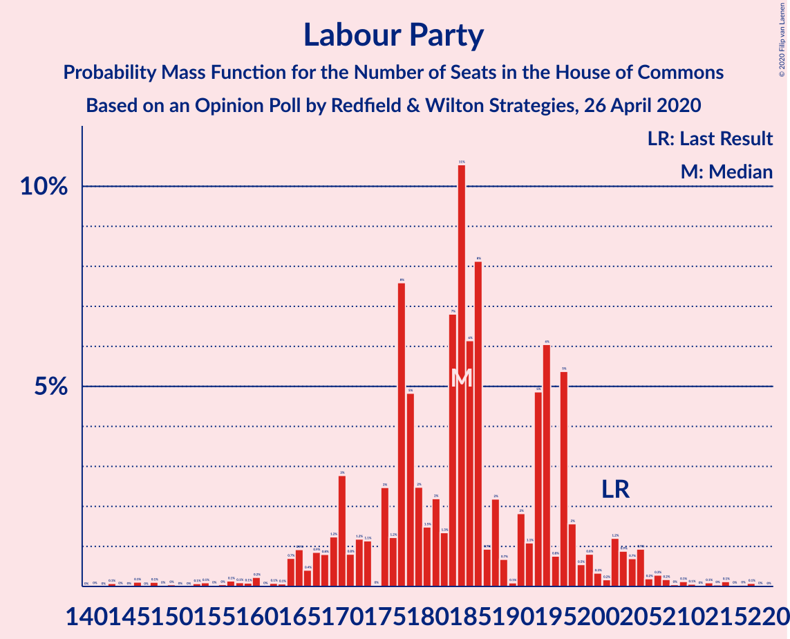

| Number of Seats | Probability | Accumulated | Special Marks |
|:---------------:|:-----------:|:-----------:|:-------------:|
| 141 | 0% | 100% |  |
| 142 | 0% | 99.9% |  |
| 143 | 0.1% | 99.9% |  |
| 144 | 0% | 99.9% |  |
| 145 | 0% | 99.9% |  |
| 146 | 0.1% | 99.8% |  |
| 147 | 0% | 99.7% |  |
| 148 | 0.1% | 99.7% |  |
| 149 | 0% | 99.6% |  |
| 150 | 0% | 99.6% |  |
| 151 | 0% | 99.5% |  |
| 152 | 0% | 99.5% |  |
| 153 | 0.1% | 99.5% |  |
| 154 | 0.1% | 99.5% |  |
| 155 | 0% | 99.4% |  |
| 156 | 0% | 99.3% |  |
| 157 | 0.1% | 99.3% |  |
| 158 | 0.1% | 99.1% |  |
| 159 | 0.1% | 99.0% |  |
| 160 | 0.2% | 99.0% |  |
| 161 | 0% | 98.7% |  |
| 162 | 0.1% | 98.7% |  |
| 163 | 0.1% | 98.6% |  |
| 164 | 0.7% | 98.6% |  |
| 165 | 0.9% | 98% |  |
| 166 | 0.4% | 97% |  |
| 167 | 0.9% | 97% |  |
| 168 | 0.8% | 96% |  |
| 169 | 1.2% | 95% |  |
| 170 | 3% | 94% |  |
| 171 | 0.8% | 91% |  |
| 172 | 1.2% | 90% |  |
| 173 | 1.1% | 89% |  |
| 174 | 0% | 88% |  |
| 175 | 2% | 88% |  |
| 176 | 1.2% | 85% |  |
| 177 | 8% | 84% |  |
| 178 | 5% | 76% |  |
| 179 | 2% | 72% |  |
| 180 | 1.5% | 69% |  |
| 181 | 2% | 68% |  |
| 182 | 1.3% | 65% |  |
| 183 | 7% | 64% |  |
| 184 | 11% | 57% | Median |
| 185 | 6% | 47% |  |
| 186 | 8% | 41% |  |
| 187 | 0.9% | 32% |  |
| 188 | 2% | 31% |  |
| 189 | 0.7% | 29% |  |
| 190 | 0.1% | 29% |  |
| 191 | 2% | 29% |  |
| 192 | 1.1% | 27% |  |
| 193 | 5% | 26% |  |
| 194 | 6% | 21% |  |
| 195 | 0.8% | 15% |  |
| 196 | 5% | 14% |  |
| 197 | 2% | 9% |  |
| 198 | 0.5% | 7% |  |
| 199 | 0.8% | 6% |  |
| 200 | 0.3% | 6% |  |
| 201 | 0.2% | 5% |  |
| 202 | 1.2% | 5% | Last Result |
| 203 | 0.9% | 4% |  |
| 204 | 0.7% | 3% |  |
| 205 | 0.9% | 2% |  |
| 206 | 0.2% | 1.4% |  |
| 207 | 0.3% | 1.2% |  |
| 208 | 0.2% | 0.9% |  |
| 209 | 0% | 0.7% |  |
| 210 | 0.1% | 0.7% |  |
| 211 | 0.1% | 0.6% |  |
| 212 | 0% | 0.5% |  |
| 213 | 0.1% | 0.5% |  |
| 214 | 0% | 0.4% |  |
| 215 | 0.1% | 0.3% |  |
| 216 | 0% | 0.2% |  |
| 217 | 0% | 0.2% |  |
| 218 | 0.1% | 0.1% |  |
| 219 | 0% | 0.1% |  |
| 220 | 0% | 0% |  |

### Liberal Democrats

*For a full overview of the results for this party, see the [Liberal Democrats](party-liberaldemocrats.html) page.*

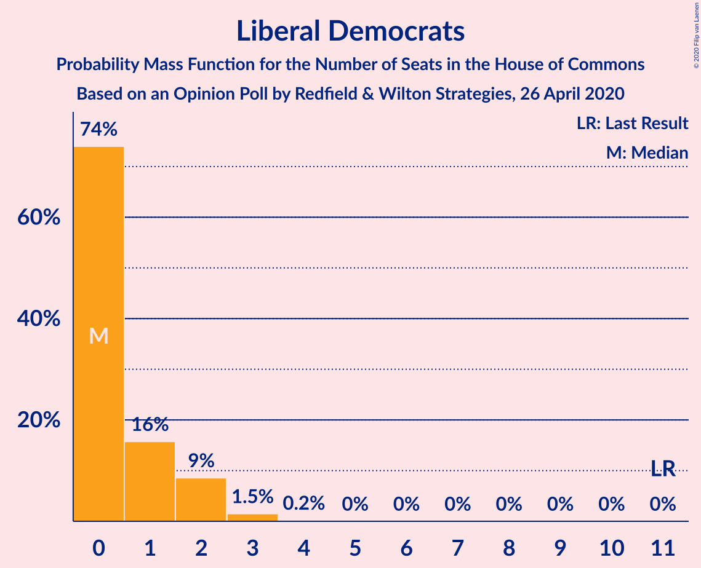

| Number of Seats | Probability | Accumulated | Special Marks |
|:---------------:|:-----------:|:-----------:|:-------------:|
| 0 | 74% | 100% | Median |
| 1 | 16% | 26% |  |
| 2 | 9% | 10% |  |
| 3 | 1.5% | 2% |  |
| 4 | 0.2% | 0.2% |  |
| 5 | 0% | 0% |  |
| 6 | 0% | 0% |  |
| 7 | 0% | 0% |  |
| 8 | 0% | 0% |  |
| 9 | 0% | 0% |  |
| 10 | 0% | 0% |  |
| 11 | 0% | 0% | Last Result |

### Scottish National Party

*For a full overview of the results for this party, see the [Scottish National Party](party-scottishnationalparty.html) page.*

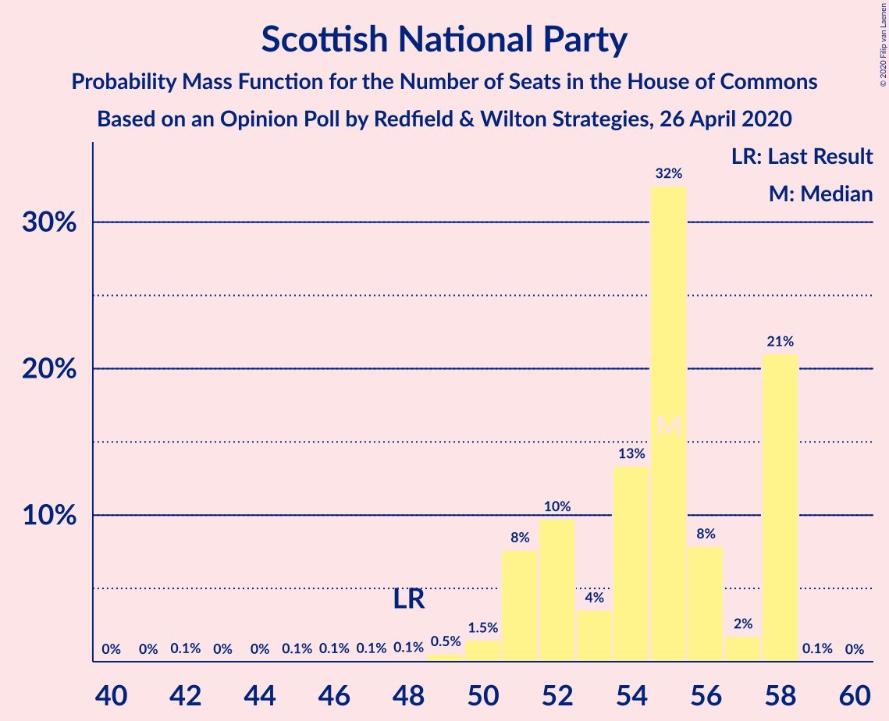

| Number of Seats | Probability | Accumulated | Special Marks |
|:---------------:|:-----------:|:-----------:|:-------------:|
| 42 | 0.1% | 100% |  |
| 43 | 0% | 99.9% |  |
| 44 | 0% | 99.9% |  |
| 45 | 0.1% | 99.8% |  |
| 46 | 0.1% | 99.8% |  |
| 47 | 0.1% | 99.7% |  |
| 48 | 0.1% | 99.6% | Last Result |
| 49 | 0.5% | 99.5% |  |
| 50 | 1.5% | 99.0% |  |
| 51 | 8% | 97% |  |
| 52 | 10% | 90% |  |
| 53 | 4% | 80% |  |
| 54 | 13% | 77% |  |
| 55 | 32% | 63% | Median |
| 56 | 8% | 31% |  |
| 57 | 2% | 23% |  |
| 58 | 21% | 21% |  |
| 59 | 0.1% | 0.1% |  |
| 60 | 0% | 0% |  |

### Green Party

*For a full overview of the results for this party, see the [Green Party](party-greenparty.html) page.*

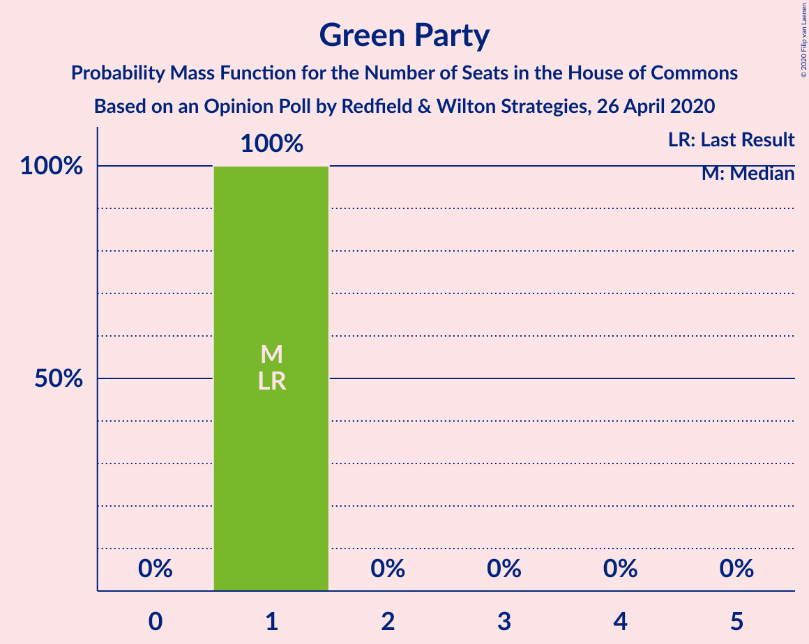

| Number of Seats | Probability | Accumulated | Special Marks |
|:---------------:|:-----------:|:-----------:|:-------------:|
| 1 | 100% | 100% | Last Result, Median |

### Plaid Cymru

*For a full overview of the results for this party, see the [Plaid Cymru](party-plaidcymru.html) page.*

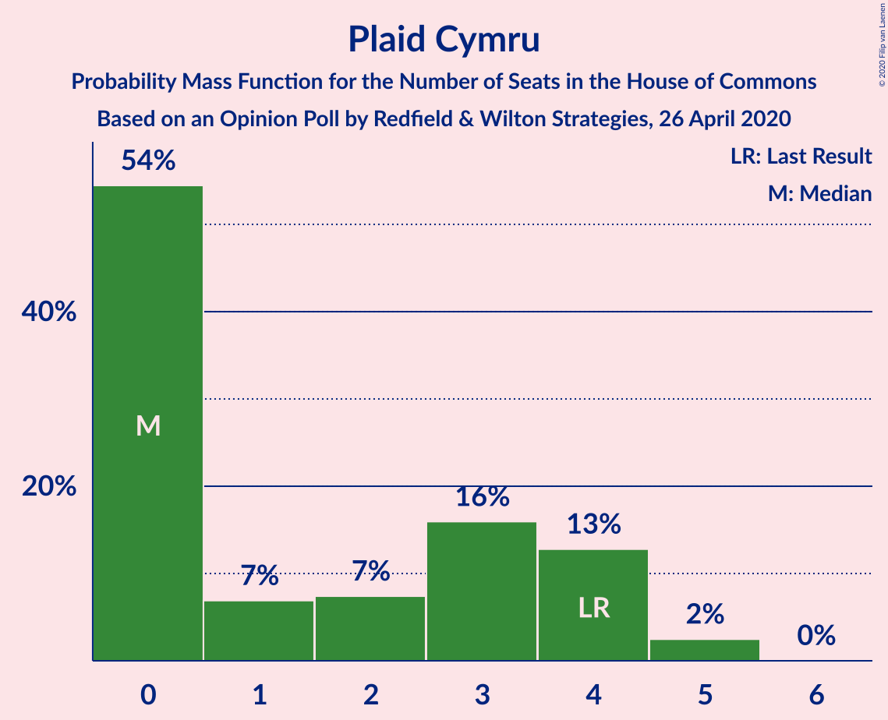

| Number of Seats | Probability | Accumulated | Special Marks |
|:---------------:|:-----------:|:-----------:|:-------------:|
| 0 | 54% | 100% | Median |
| 1 | 7% | 46% |  |
| 2 | 7% | 39% |  |
| 3 | 16% | 31% |  |
| 4 | 13% | 15% | Last Result |
| 5 | 2% | 2% |  |
| 6 | 0% | 0% |  |

## Coalitions

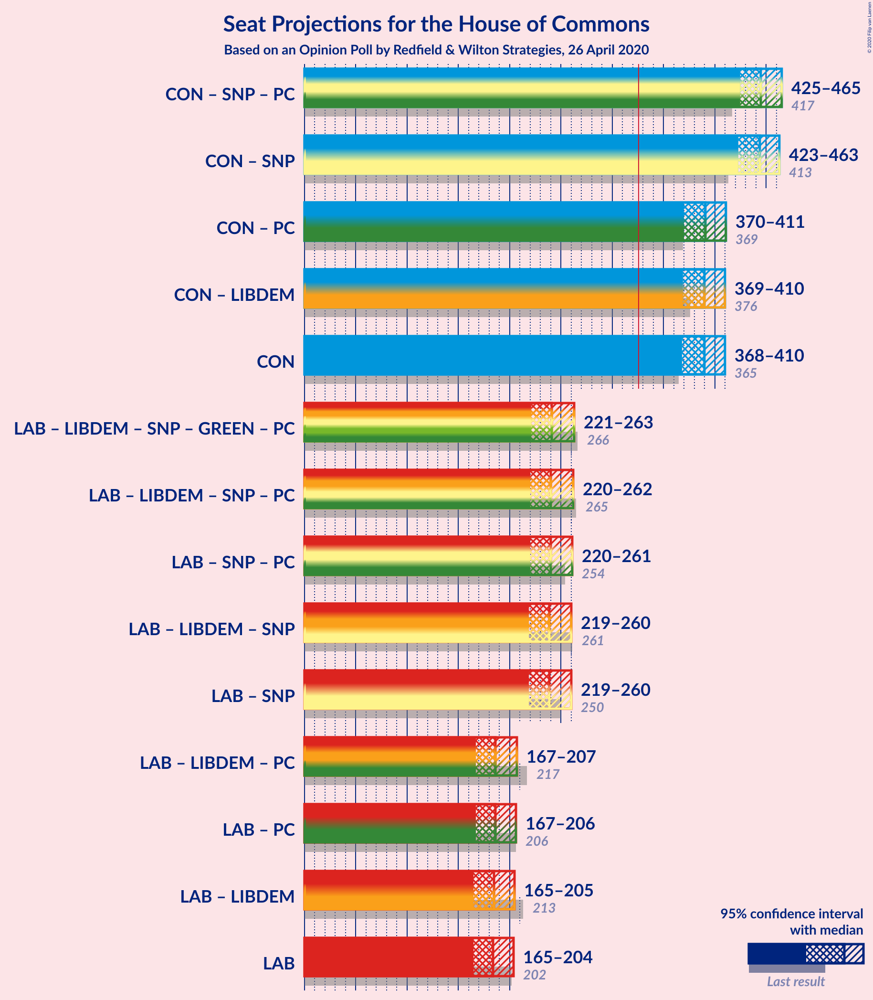

### Confidence Intervals

| Coalition | Last Result | Median | Majority? | 80% Confidence Interval | 90% Confidence Interval | 95% Confidence Interval | 99% Confidence Interval |
|:---------:|:-----------:|:------:|:---------:|:-----------------------:|:-----------------------:|:-----------------------:|:-----------------------:|
| Conservative Party – Scottish National Party – Plaid Cymru | 417 | 445 | 100% | 433–458 | 428–461 | 425–465 | 417–476 |
| Conservative Party – Scottish National Party | 413 | 444 | 100% | 432–457 | 427–460 | 423–463 | 416–476 |
| Conservative Party – Plaid Cymru | 369 | 391 | 100% | 377–403 | 373–408 | 370–411 | 361–425 |
| Conservative Party – Liberal Democrats | 376 | 390 | 100% | 376–401 | 371–407 | 369–410 | 360–424 |
| Conservative Party | 365 | 390 | 100% | 376–401 | 371–407 | 368–410 | 359–424 |
| Labour Party – Liberal Democrats – Scottish National Party – Green Party – Plaid Cymru | 266 | 241 | 0% | 230–255 | 224–260 | 221–263 | 207–272 |
| Labour Party – Liberal Democrats – Scottish National Party – Plaid Cymru | 265 | 240 | 0% | 229–254 | 223–259 | 220–262 | 206–271 |
| Labour Party – Scottish National Party – Plaid Cymru | 254 | 240 | 0% | 229–254 | 223–259 | 220–261 | 206–270 |
| Labour Party – Liberal Democrats – Scottish National Party | 261 | 239 | 0% | 227–253 | 222–257 | 219–260 | 205–269 |
| Labour Party – Scottish National Party | 250 | 239 | 0% | 226–252 | 222–256 | 219–260 | 205–268 |
| Labour Party – Liberal Democrats – Plaid Cymru | 217 | 186 | 0% | 173–198 | 170–203 | 167–207 | 154–214 |
| Labour Party – Plaid Cymru | 206 | 186 | 0% | 173–197 | 169–202 | 167–206 | 153–214 |
| Labour Party – Liberal Democrats | 213 | 185 | 0% | 172–197 | 169–202 | 165–205 | 154–213 |
| Labour Party | 202 | 184 | 0% | 172–196 | 168–202 | 165–204 | 153–211 |

### Conservative Party – Scottish National Party – Plaid Cymru

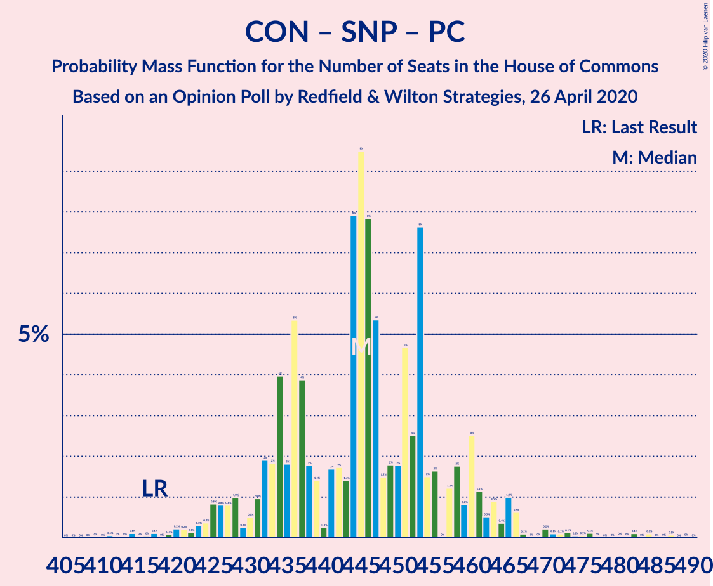

| Number of Seats | Probability | Accumulated | Special Marks |
|:---------------:|:-----------:|:-----------:|:-------------:|
| 409 | 0% | 100% |  |
| 410 | 0% | 99.9% |  |
| 411 | 0.1% | 99.9% |  |
| 412 | 0% | 99.9% |  |
| 413 | 0% | 99.8% |  |
| 414 | 0.1% | 99.8% |  |
| 415 | 0% | 99.7% |  |
| 416 | 0% | 99.6% |  |
| 417 | 0.1% | 99.6% | Last Result |
| 418 | 0% | 99.5% |  |
| 419 | 0.1% | 99.5% |  |
| 420 | 0.2% | 99.4% |  |
| 421 | 0.2% | 99.2% |  |
| 422 | 0.1% | 98.9% |  |
| 423 | 0.3% | 98.8% |  |
| 424 | 0.4% | 98.5% |  |
| 425 | 0.8% | 98% |  |
| 426 | 0.8% | 97% |  |
| 427 | 0.8% | 96% |  |
| 428 | 1.0% | 96% |  |
| 429 | 0.3% | 95% |  |
| 430 | 0.5% | 94% |  |
| 431 | 1.0% | 94% |  |
| 432 | 2% | 93% |  |
| 433 | 2% | 91% |  |
| 434 | 4% | 89% |  |
| 435 | 2% | 85% |  |
| 436 | 5% | 83% |  |
| 437 | 4% | 78% |  |
| 438 | 2% | 74% |  |
| 439 | 1.4% | 72% |  |
| 440 | 0.3% | 71% |  |
| 441 | 2% | 71% |  |
| 442 | 2% | 69% |  |
| 443 | 1.4% | 67% |  |
| 444 | 8% | 66% |  |
| 445 | 9% | 58% | Median |
| 446 | 8% | 49% |  |
| 447 | 5% | 41% |  |
| 448 | 1.5% | 35% |  |
| 449 | 2% | 34% |  |
| 450 | 2% | 32% |  |
| 451 | 5% | 30% |  |
| 452 | 3% | 26% |  |
| 453 | 8% | 23% |  |
| 454 | 2% | 15% |  |
| 455 | 2% | 14% |  |
| 456 | 0% | 12% |  |
| 457 | 1.2% | 12% |  |
| 458 | 2% | 11% |  |
| 459 | 0.8% | 9% |  |
| 460 | 3% | 8% |  |
| 461 | 1.1% | 6% |  |
| 462 | 0.5% | 5% |  |
| 463 | 0.9% | 4% |  |
| 464 | 0.4% | 3% |  |
| 465 | 1.0% | 3% |  |
| 466 | 0.6% | 2% |  |
| 467 | 0.1% | 1.4% |  |
| 468 | 0% | 1.3% |  |
| 469 | 0% | 1.3% |  |
| 470 | 0.2% | 1.3% |  |
| 471 | 0.1% | 1.0% |  |
| 472 | 0.1% | 0.9% |  |
| 473 | 0.1% | 0.8% |  |
| 474 | 0.1% | 0.7% |  |
| 475 | 0.1% | 0.7% |  |
| 476 | 0.1% | 0.6% |  |
| 477 | 0% | 0.5% |  |
| 478 | 0% | 0.5% |  |
| 479 | 0% | 0.5% |  |
| 480 | 0% | 0.4% |  |
| 481 | 0% | 0.4% |  |
| 482 | 0.1% | 0.4% |  |
| 483 | 0% | 0.3% |  |
| 484 | 0.1% | 0.3% |  |
| 485 | 0% | 0.2% |  |
| 486 | 0% | 0.1% |  |
| 487 | 0.1% | 0.1% |  |
| 488 | 0% | 0.1% |  |
| 489 | 0% | 0.1% |  |
| 490 | 0% | 0% |  |

### Conservative Party – Scottish National Party

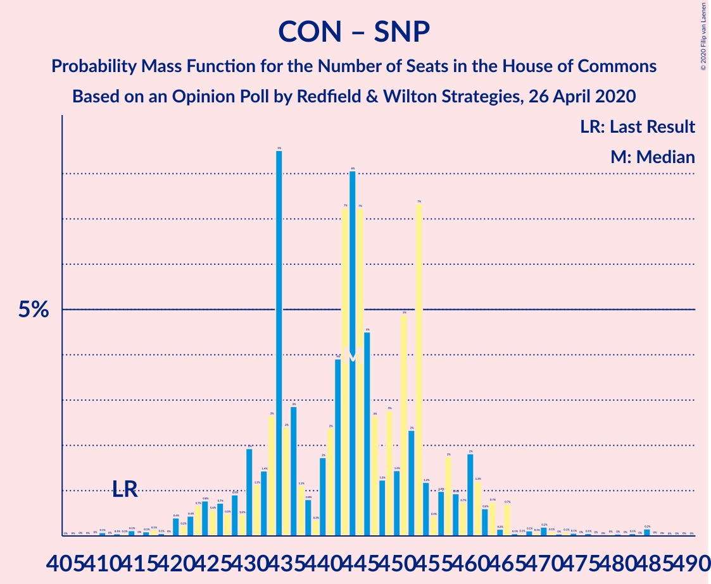

| Number of Seats | Probability | Accumulated | Special Marks |
|:---------------:|:-----------:|:-----------:|:-------------:|
| 407 | 0% | 100% |  |
| 408 | 0% | 99.9% |  |
| 409 | 0% | 99.9% |  |
| 410 | 0.1% | 99.9% |  |
| 411 | 0% | 99.8% |  |
| 412 | 0.1% | 99.8% |  |
| 413 | 0.1% | 99.8% | Last Result |
| 414 | 0.1% | 99.7% |  |
| 415 | 0% | 99.6% |  |
| 416 | 0.1% | 99.6% |  |
| 417 | 0.1% | 99.5% |  |
| 418 | 0.1% | 99.3% |  |
| 419 | 0% | 99.3% |  |
| 420 | 0.4% | 99.2% |  |
| 421 | 0.2% | 98.8% |  |
| 422 | 0.4% | 98.6% |  |
| 423 | 0.7% | 98% |  |
| 424 | 0.8% | 97% |  |
| 425 | 0.6% | 97% |  |
| 426 | 0.7% | 96% |  |
| 427 | 0.5% | 95% |  |
| 428 | 0.9% | 95% |  |
| 429 | 0.5% | 94% |  |
| 430 | 2% | 94% |  |
| 431 | 1.1% | 92% |  |
| 432 | 1.4% | 90% |  |
| 433 | 3% | 89% |  |
| 434 | 9% | 86% |  |
| 435 | 2% | 78% |  |
| 436 | 3% | 75% |  |
| 437 | 1.1% | 73% |  |
| 438 | 0.8% | 71% |  |
| 439 | 0.3% | 71% |  |
| 440 | 2% | 70% |  |
| 441 | 2% | 69% |  |
| 442 | 4% | 66% |  |
| 443 | 7% | 62% |  |
| 444 | 8% | 55% |  |
| 445 | 7% | 47% | Median |
| 446 | 5% | 40% |  |
| 447 | 3% | 35% |  |
| 448 | 1.2% | 33% |  |
| 449 | 3% | 31% |  |
| 450 | 1.4% | 29% |  |
| 451 | 5% | 27% |  |
| 452 | 2% | 22% |  |
| 453 | 7% | 20% |  |
| 454 | 1.2% | 13% |  |
| 455 | 0.4% | 11% |  |
| 456 | 1.0% | 11% |  |
| 457 | 2% | 10% |  |
| 458 | 0.9% | 8% |  |
| 459 | 0.7% | 7% |  |
| 460 | 2% | 7% |  |
| 461 | 1.2% | 5% |  |
| 462 | 0.6% | 4% |  |
| 463 | 0.7% | 3% |  |
| 464 | 0.2% | 2% |  |
| 465 | 0.7% | 2% |  |
| 466 | 0.1% | 1.4% |  |
| 467 | 0.1% | 1.3% |  |
| 468 | 0.1% | 1.2% |  |
| 469 | 0.1% | 1.1% |  |
| 470 | 0.2% | 1.1% |  |
| 471 | 0.1% | 0.9% |  |
| 472 | 0% | 0.8% |  |
| 473 | 0.1% | 0.7% |  |
| 474 | 0.1% | 0.6% |  |
| 475 | 0% | 0.6% |  |
| 476 | 0.1% | 0.5% |  |
| 477 | 0% | 0.5% |  |
| 478 | 0% | 0.4% |  |
| 479 | 0% | 0.4% |  |
| 480 | 0% | 0.4% |  |
| 481 | 0% | 0.3% |  |
| 482 | 0.1% | 0.3% |  |
| 483 | 0% | 0.3% |  |
| 484 | 0.2% | 0.2% |  |
| 485 | 0% | 0.1% |  |
| 486 | 0% | 0.1% |  |
| 487 | 0% | 0% |  |

### Conservative Party – Plaid Cymru

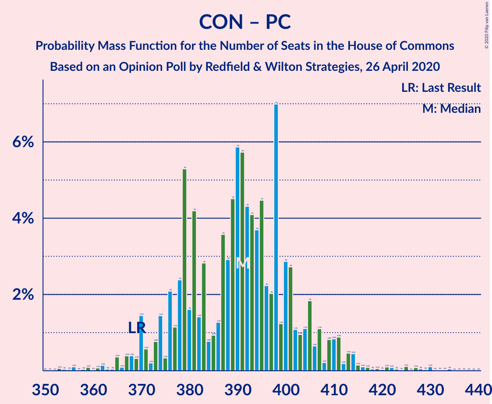

| Number of Seats | Probability | Accumulated | Special Marks |
|:---------------:|:-----------:|:-----------:|:-------------:|
| 353 | 0.1% | 100% |  |
| 354 | 0% | 99.9% |  |
| 355 | 0% | 99.9% |  |
| 356 | 0.1% | 99.8% |  |
| 357 | 0% | 99.7% |  |
| 358 | 0% | 99.7% |  |
| 359 | 0.1% | 99.7% |  |
| 360 | 0% | 99.6% |  |
| 361 | 0.1% | 99.6% |  |
| 362 | 0.1% | 99.5% |  |
| 363 | 0% | 99.4% |  |
| 364 | 0% | 99.3% |  |
| 365 | 0.4% | 99.3% |  |
| 366 | 0.1% | 98.9% |  |
| 367 | 0.4% | 98.8% |  |
| 368 | 0.4% | 98% |  |
| 369 | 0.3% | 98% | Last Result |
| 370 | 1.4% | 98% |  |
| 371 | 0.6% | 96% |  |
| 372 | 0.2% | 96% |  |
| 373 | 0.8% | 95% |  |
| 374 | 1.4% | 95% |  |
| 375 | 0.3% | 93% |  |
| 376 | 2% | 93% |  |
| 377 | 1.1% | 91% |  |
| 378 | 2% | 90% |  |
| 379 | 5% | 87% |  |
| 380 | 2% | 82% |  |
| 381 | 4% | 80% |  |
| 382 | 1.4% | 76% |  |
| 383 | 3% | 75% |  |
| 384 | 0.8% | 72% |  |
| 385 | 0.9% | 71% |  |
| 386 | 1.3% | 70% |  |
| 387 | 4% | 69% |  |
| 388 | 3% | 65% |  |
| 389 | 5% | 63% |  |
| 390 | 6% | 58% | Median |
| 391 | 6% | 52% |  |
| 392 | 4% | 46% |  |
| 393 | 4% | 42% |  |
| 394 | 4% | 38% |  |
| 395 | 4% | 34% |  |
| 396 | 2% | 30% |  |
| 397 | 2% | 28% |  |
| 398 | 7% | 26% |  |
| 399 | 1.2% | 19% |  |
| 400 | 3% | 17% |  |
| 401 | 3% | 15% |  |
| 402 | 1.1% | 12% |  |
| 403 | 1.0% | 11% |  |
| 404 | 1.1% | 10% |  |
| 405 | 2% | 9% |  |
| 406 | 0.6% | 7% |  |
| 407 | 1.1% | 6% |  |
| 408 | 0.2% | 5% |  |
| 409 | 0.8% | 5% |  |
| 410 | 0.8% | 4% |  |
| 411 | 0.9% | 3% |  |
| 412 | 0.2% | 2% |  |
| 413 | 0.5% | 2% |  |
| 414 | 0.4% | 2% |  |
| 415 | 0.1% | 1.2% |  |
| 416 | 0.1% | 1.1% |  |
| 417 | 0.1% | 1.0% |  |
| 418 | 0% | 0.9% |  |
| 419 | 0.1% | 0.9% |  |
| 420 | 0% | 0.8% |  |
| 421 | 0.1% | 0.8% |  |
| 422 | 0.1% | 0.7% |  |
| 423 | 0% | 0.6% |  |
| 424 | 0% | 0.6% |  |
| 425 | 0.1% | 0.5% |  |
| 426 | 0% | 0.4% |  |
| 427 | 0.1% | 0.4% |  |
| 428 | 0% | 0.3% |  |
| 429 | 0% | 0.3% |  |
| 430 | 0.1% | 0.3% |  |
| 431 | 0% | 0.2% |  |
| 432 | 0% | 0.1% |  |
| 433 | 0% | 0.1% |  |
| 434 | 0% | 0.1% |  |
| 435 | 0% | 0.1% |  |
| 436 | 0% | 0.1% |  |
| 437 | 0% | 0% |  |

### Conservative Party – Liberal Democrats

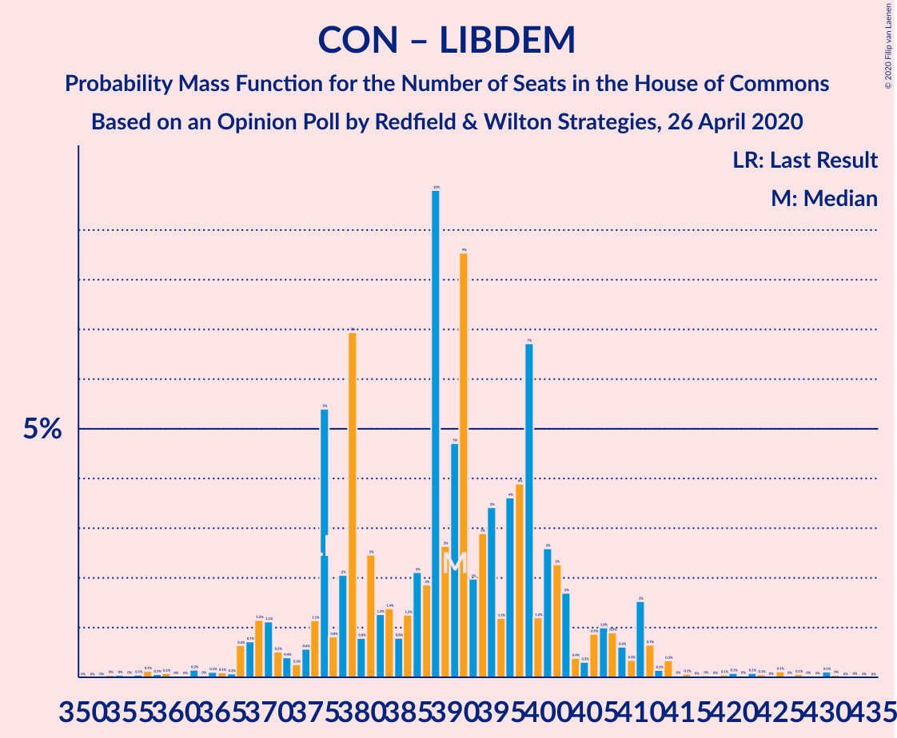

| Number of Seats | Probability | Accumulated | Special Marks |
|:---------------:|:-----------:|:-----------:|:-------------:|
| 353 | 0% | 100% |  |
| 354 | 0% | 99.9% |  |
| 355 | 0% | 99.9% |  |
| 356 | 0.1% | 99.8% |  |
| 357 | 0.1% | 99.8% |  |
| 358 | 0.1% | 99.6% |  |
| 359 | 0.1% | 99.6% |  |
| 360 | 0% | 99.5% |  |
| 361 | 0% | 99.5% |  |
| 362 | 0.2% | 99.4% |  |
| 363 | 0% | 99.3% |  |
| 364 | 0.1% | 99.3% |  |
| 365 | 0.1% | 99.2% |  |
| 366 | 0.1% | 99.1% |  |
| 367 | 0.6% | 99.0% |  |
| 368 | 0.7% | 98% |  |
| 369 | 1.2% | 98% |  |
| 370 | 1.1% | 96% |  |
| 371 | 0.5% | 95% |  |
| 372 | 0.4% | 95% |  |
| 373 | 0.3% | 94% |  |
| 374 | 0.6% | 94% |  |
| 375 | 1.1% | 94% |  |
| 376 | 5% | 92% | Last Result |
| 377 | 0.8% | 87% |  |
| 378 | 2% | 86% |  |
| 379 | 7% | 84% |  |
| 380 | 0.8% | 77% |  |
| 381 | 2% | 76% |  |
| 382 | 1.3% | 74% |  |
| 383 | 1.4% | 73% |  |
| 384 | 0.8% | 71% |  |
| 385 | 1.3% | 71% |  |
| 386 | 2% | 69% |  |
| 387 | 2% | 67% |  |
| 388 | 10% | 65% |  |
| 389 | 3% | 55% |  |
| 390 | 5% | 53% | Median |
| 391 | 9% | 48% |  |
| 392 | 2% | 40% |  |
| 393 | 3% | 38% |  |
| 394 | 3% | 35% |  |
| 395 | 1.2% | 31% |  |
| 396 | 4% | 30% |  |
| 397 | 4% | 26% |  |
| 398 | 7% | 23% |  |
| 399 | 1.2% | 16% |  |
| 400 | 3% | 15% |  |
| 401 | 2% | 12% |  |
| 402 | 2% | 10% |  |
| 403 | 0.4% | 8% |  |
| 404 | 0.3% | 8% |  |
| 405 | 0.9% | 7% |  |
| 406 | 1.0% | 7% |  |
| 407 | 0.9% | 6% |  |
| 408 | 0.6% | 5% |  |
| 409 | 0.3% | 4% |  |
| 410 | 2% | 4% |  |
| 411 | 0.7% | 2% |  |
| 412 | 0.1% | 2% |  |
| 413 | 0.3% | 1.4% |  |
| 414 | 0% | 1.0% |  |
| 415 | 0.1% | 1.0% |  |
| 416 | 0% | 0.9% |  |
| 417 | 0% | 0.9% |  |
| 418 | 0% | 0.9% |  |
| 419 | 0.1% | 0.8% |  |
| 420 | 0.1% | 0.8% |  |
| 421 | 0% | 0.7% |  |
| 422 | 0.1% | 0.7% |  |
| 423 | 0.1% | 0.6% |  |
| 424 | 0% | 0.5% |  |
| 425 | 0.1% | 0.5% |  |
| 426 | 0% | 0.4% |  |
| 427 | 0.1% | 0.3% |  |
| 428 | 0% | 0.3% |  |
| 429 | 0% | 0.3% |  |
| 430 | 0.1% | 0.2% |  |
| 431 | 0% | 0.1% |  |
| 432 | 0% | 0.1% |  |
| 433 | 0% | 0.1% |  |
| 434 | 0% | 0% |  |

### Conservative Party

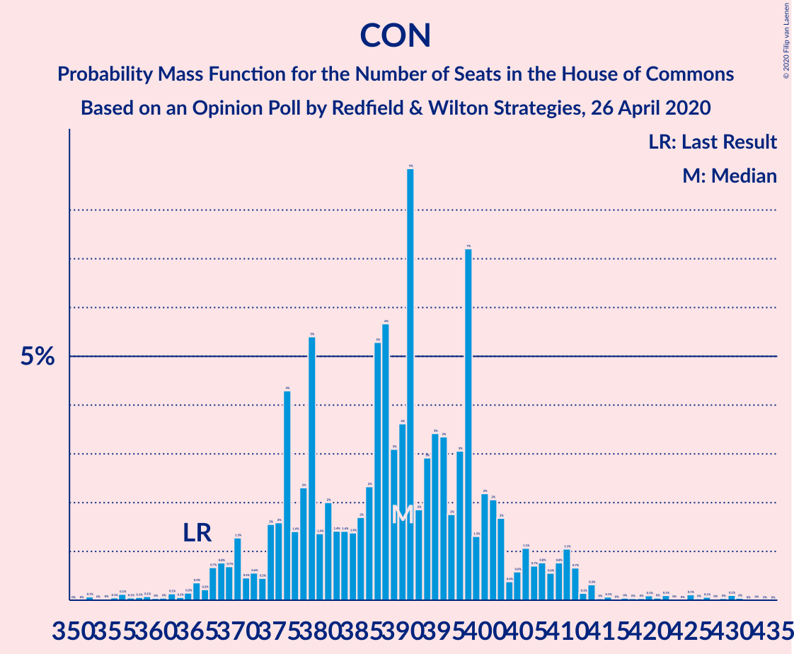

| Number of Seats | Probability | Accumulated | Special Marks |
|:---------------:|:-----------:|:-----------:|:-------------:|
| 351 | 0% | 100% |  |
| 352 | 0.1% | 99.9% |  |
| 353 | 0% | 99.9% |  |
| 354 | 0% | 99.9% |  |
| 355 | 0.1% | 99.8% |  |
| 356 | 0.1% | 99.8% |  |
| 357 | 0.1% | 99.7% |  |
| 358 | 0.1% | 99.6% |  |
| 359 | 0.1% | 99.5% |  |
| 360 | 0% | 99.5% |  |
| 361 | 0% | 99.4% |  |
| 362 | 0.1% | 99.4% |  |
| 363 | 0.1% | 99.2% |  |
| 364 | 0.2% | 99.2% |  |
| 365 | 0.4% | 99.0% | Last Result |
| 366 | 0.2% | 98.7% |  |
| 367 | 0.7% | 98% |  |
| 368 | 0.8% | 98% |  |
| 369 | 0.7% | 97% |  |
| 370 | 1.3% | 96% |  |
| 371 | 0.5% | 95% |  |
| 372 | 0.6% | 95% |  |
| 373 | 0.5% | 94% |  |
| 374 | 2% | 94% |  |
| 375 | 2% | 92% |  |
| 376 | 4% | 90% |  |
| 377 | 1.4% | 86% |  |
| 378 | 2% | 85% |  |
| 379 | 5% | 82% |  |
| 380 | 1.4% | 77% |  |
| 381 | 2% | 76% |  |
| 382 | 1.4% | 74% |  |
| 383 | 1.4% | 72% |  |
| 384 | 1.4% | 71% |  |
| 385 | 2% | 69% |  |
| 386 | 2% | 68% |  |
| 387 | 5% | 65% |  |
| 388 | 6% | 60% |  |
| 389 | 3% | 54% |  |
| 390 | 4% | 51% | Median |
| 391 | 9% | 48% |  |
| 392 | 2% | 39% |  |
| 393 | 3% | 37% |  |
| 394 | 3% | 34% |  |
| 395 | 3% | 31% |  |
| 396 | 2% | 27% |  |
| 397 | 3% | 26% |  |
| 398 | 7% | 22% |  |
| 399 | 1.3% | 15% |  |
| 400 | 2% | 14% |  |
| 401 | 2% | 12% |  |
| 402 | 2% | 10% |  |
| 403 | 0.4% | 8% |  |
| 404 | 0.6% | 8% |  |
| 405 | 1.1% | 7% |  |
| 406 | 0.7% | 6% |  |
| 407 | 0.8% | 5% |  |
| 408 | 0.6% | 5% |  |
| 409 | 0.8% | 4% |  |
| 410 | 1.1% | 3% |  |
| 411 | 0.7% | 2% |  |
| 412 | 0.1% | 1.5% |  |
| 413 | 0.3% | 1.3% |  |
| 414 | 0% | 1.0% |  |
| 415 | 0.1% | 1.0% |  |
| 416 | 0% | 0.9% |  |
| 417 | 0% | 0.9% |  |
| 418 | 0% | 0.8% |  |
| 419 | 0% | 0.8% |  |
| 420 | 0.1% | 0.8% |  |
| 421 | 0% | 0.7% |  |
| 422 | 0.1% | 0.6% |  |
| 423 | 0% | 0.5% |  |
| 424 | 0% | 0.5% |  |
| 425 | 0.1% | 0.5% |  |
| 426 | 0% | 0.4% |  |
| 427 | 0.1% | 0.3% |  |
| 428 | 0% | 0.3% |  |
| 429 | 0% | 0.3% |  |
| 430 | 0.1% | 0.2% |  |
| 431 | 0% | 0.1% |  |
| 432 | 0% | 0.1% |  |
| 433 | 0% | 0.1% |  |
| 434 | 0% | 0% |  |

### Labour Party – Liberal Democrats – Scottish National Party – Green Party – Plaid Cymru

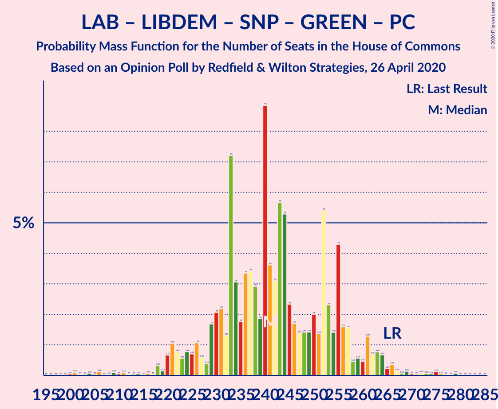

| Number of Seats | Probability | Accumulated | Special Marks |
|:---------------:|:-----------:|:-----------:|:-------------:|
| 198 | 0% | 100% |  |
| 199 | 0% | 99.9% |  |
| 200 | 0% | 99.9% |  |
| 201 | 0.1% | 99.9% |  |
| 202 | 0% | 99.8% |  |
| 203 | 0% | 99.7% |  |
| 204 | 0.1% | 99.7% |  |
| 205 | 0% | 99.7% |  |
| 206 | 0.1% | 99.6% |  |
| 207 | 0% | 99.5% |  |
| 208 | 0% | 99.5% |  |
| 209 | 0.1% | 99.5% |  |
| 210 | 0% | 99.4% |  |
| 211 | 0.1% | 99.3% |  |
| 212 | 0% | 99.2% |  |
| 213 | 0% | 99.2% |  |
| 214 | 0% | 99.2% |  |
| 215 | 0% | 99.1% |  |
| 216 | 0.1% | 99.1% |  |
| 217 | 0% | 99.0% |  |
| 218 | 0.3% | 99.0% |  |
| 219 | 0.1% | 98.7% |  |
| 220 | 0.7% | 98.5% |  |
| 221 | 1.1% | 98% |  |
| 222 | 0.8% | 97% |  |
| 223 | 0.6% | 96% |  |
| 224 | 0.8% | 95% |  |
| 225 | 0.7% | 95% |  |
| 226 | 1.1% | 94% |  |
| 227 | 0.6% | 93% |  |
| 228 | 0.4% | 92% |  |
| 229 | 2% | 92% |  |
| 230 | 2% | 90% |  |
| 231 | 2% | 88% |  |
| 232 | 1.3% | 86% |  |
| 233 | 7% | 85% |  |
| 234 | 3% | 78% |  |
| 235 | 2% | 74% |  |
| 236 | 3% | 73% |  |
| 237 | 3% | 69% |  |
| 238 | 3% | 66% |  |
| 239 | 2% | 63% |  |
| 240 | 9% | 61% | Median |
| 241 | 4% | 52% |  |
| 242 | 3% | 49% |  |
| 243 | 6% | 46% |  |
| 244 | 5% | 40% |  |
| 245 | 2% | 35% |  |
| 246 | 2% | 32% |  |
| 247 | 1.4% | 31% |  |
| 248 | 1.4% | 29% |  |
| 249 | 1.4% | 28% |  |
| 250 | 2% | 26% |  |
| 251 | 1.4% | 24% |  |
| 252 | 5% | 23% |  |
| 253 | 2% | 18% |  |
| 254 | 1.4% | 15% |  |
| 255 | 4% | 14% |  |
| 256 | 2% | 10% |  |
| 257 | 2% | 8% |  |
| 258 | 0.5% | 6% |  |
| 259 | 0.6% | 6% |  |
| 260 | 0.5% | 5% |  |
| 261 | 1.3% | 5% |  |
| 262 | 0.7% | 4% |  |
| 263 | 0.8% | 3% |  |
| 264 | 0.7% | 2% |  |
| 265 | 0.2% | 2% |  |
| 266 | 0.4% | 1.3% | Last Result |
| 267 | 0.2% | 1.0% |  |
| 268 | 0.1% | 0.8% |  |
| 269 | 0.1% | 0.8% |  |
| 270 | 0% | 0.6% |  |
| 271 | 0% | 0.6% |  |
| 272 | 0.1% | 0.5% |  |
| 273 | 0.1% | 0.5% |  |
| 274 | 0.1% | 0.4% |  |
| 275 | 0.1% | 0.3% |  |
| 276 | 0.1% | 0.2% |  |
| 277 | 0% | 0.2% |  |
| 278 | 0% | 0.1% |  |
| 279 | 0.1% | 0.1% |  |
| 280 | 0% | 0.1% |  |
| 281 | 0% | 0% |  |

### Labour Party – Liberal Democrats – Scottish National Party – Plaid Cymru

| Number of Seats | Probability | Accumulated | Special Marks |
|:---------------:|:-----------:|:-----------:|:-------------:|
| 197 | 0% | 100% |  |
| 198 | 0% | 99.9% |  |
| 199 | 0% | 99.9% |  |
| 200 | 0.1% | 99.9% |  |
| 201 | 0% | 99.8% |  |
| 202 | 0% | 99.7% |  |
| 203 | 0.1% | 99.7% |  |
| 204 | 0% | 99.7% |  |
| 205 | 0.1% | 99.6% |  |
| 206 | 0% | 99.5% |  |
| 207 | 0% | 99.5% |  |
| 208 | 0.1% | 99.5% |  |
| 209 | 0% | 99.4% |  |
| 210 | 0.1% | 99.3% |  |
| 211 | 0% | 99.2% |  |
| 212 | 0% | 99.2% |  |
| 213 | 0% | 99.2% |  |
| 214 | 0% | 99.1% |  |
| 215 | 0.1% | 99.1% |  |
| 216 | 0% | 99.0% |  |
| 217 | 0.3% | 99.0% |  |
| 218 | 0.1% | 98.7% |  |
| 219 | 0.7% | 98.5% |  |
| 220 | 1.1% | 98% |  |
| 221 | 0.8% | 97% |  |
| 222 | 0.6% | 96% |  |
| 223 | 0.8% | 95% |  |
| 224 | 0.7% | 95% |  |
| 225 | 1.1% | 94% |  |
| 226 | 0.6% | 93% |  |
| 227 | 0.4% | 92% |  |
| 228 | 2% | 92% |  |
| 229 | 2% | 90% |  |
| 230 | 2% | 88% |  |
| 231 | 1.3% | 86% |  |
| 232 | 7% | 85% |  |
| 233 | 3% | 78% |  |
| 234 | 2% | 74% |  |
| 235 | 3% | 73% |  |
| 236 | 3% | 69% |  |
| 237 | 3% | 66% |  |
| 238 | 2% | 63% |  |
| 239 | 9% | 61% | Median |
| 240 | 4% | 52% |  |
| 241 | 3% | 49% |  |
| 242 | 6% | 46% |  |
| 243 | 5% | 40% |  |
| 244 | 2% | 35% |  |
| 245 | 2% | 32% |  |
| 246 | 1.4% | 31% |  |
| 247 | 1.4% | 29% |  |
| 248 | 1.4% | 28% |  |
| 249 | 2% | 26% |  |
| 250 | 1.4% | 24% |  |
| 251 | 5% | 23% |  |
| 252 | 2% | 18% |  |
| 253 | 1.4% | 15% |  |
| 254 | 4% | 14% |  |
| 255 | 2% | 10% |  |
| 256 | 2% | 8% |  |
| 257 | 0.5% | 6% |  |
| 258 | 0.6% | 6% |  |
| 259 | 0.5% | 5% |  |
| 260 | 1.3% | 5% |  |
| 261 | 0.7% | 4% |  |
| 262 | 0.8% | 3% |  |
| 263 | 0.7% | 2% |  |
| 264 | 0.2% | 2% |  |
| 265 | 0.4% | 1.3% | Last Result |
| 266 | 0.2% | 1.0% |  |
| 267 | 0.1% | 0.8% |  |
| 268 | 0.1% | 0.8% |  |
| 269 | 0% | 0.6% |  |
| 270 | 0% | 0.6% |  |
| 271 | 0.1% | 0.5% |  |
| 272 | 0.1% | 0.5% |  |
| 273 | 0.1% | 0.4% |  |
| 274 | 0.1% | 0.3% |  |
| 275 | 0.1% | 0.2% |  |
| 276 | 0% | 0.2% |  |
| 277 | 0% | 0.1% |  |
| 278 | 0.1% | 0.1% |  |
| 279 | 0% | 0.1% |  |
| 280 | 0% | 0% |  |

### Labour Party – Scottish National Party – Plaid Cymru

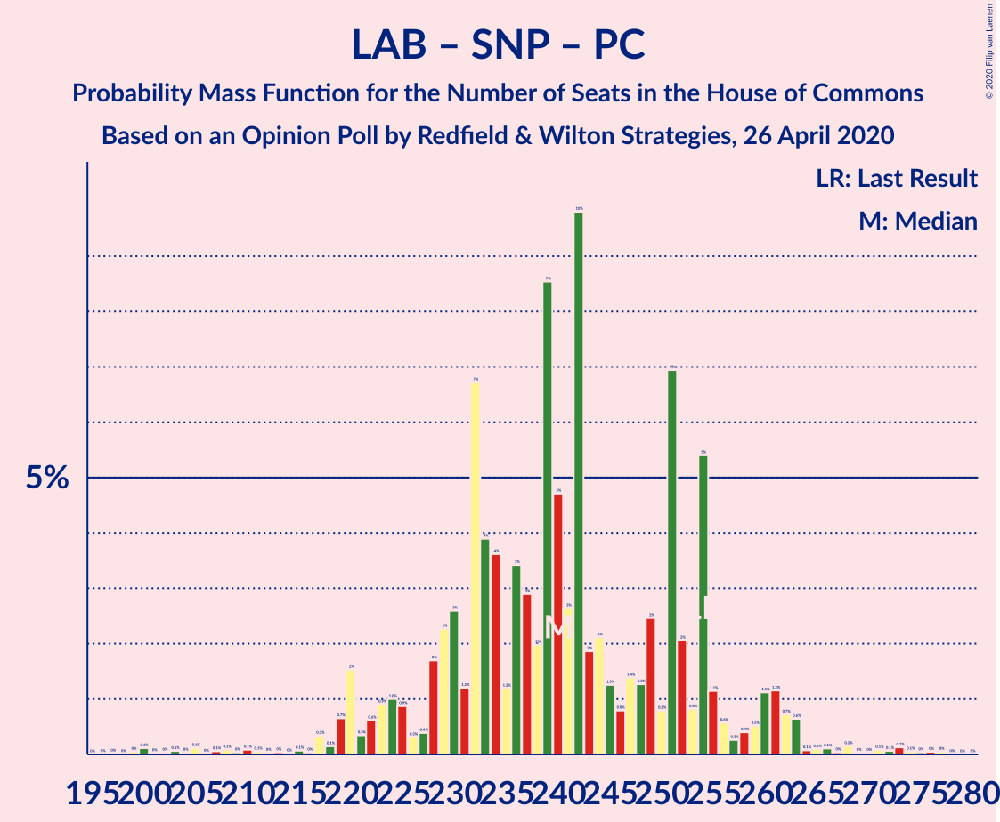

| Number of Seats | Probability | Accumulated | Special Marks |
|:---------------:|:-----------:|:-----------:|:-------------:|
| 197 | 0% | 100% |  |
| 198 | 0% | 99.9% |  |
| 199 | 0% | 99.9% |  |
| 200 | 0.1% | 99.9% |  |
| 201 | 0% | 99.8% |  |
| 202 | 0% | 99.7% |  |
| 203 | 0.1% | 99.7% |  |
| 204 | 0% | 99.7% |  |
| 205 | 0.1% | 99.6% |  |
| 206 | 0% | 99.5% |  |
| 207 | 0.1% | 99.5% |  |
| 208 | 0.1% | 99.4% |  |
| 209 | 0% | 99.3% |  |
| 210 | 0.1% | 99.3% |  |
| 211 | 0.1% | 99.2% |  |
| 212 | 0% | 99.2% |  |
| 213 | 0% | 99.1% |  |
| 214 | 0% | 99.1% |  |
| 215 | 0.1% | 99.1% |  |
| 216 | 0% | 99.0% |  |
| 217 | 0.3% | 99.0% |  |
| 218 | 0.1% | 98.6% |  |
| 219 | 0.7% | 98% |  |
| 220 | 2% | 98% |  |
| 221 | 0.3% | 96% |  |
| 222 | 0.6% | 96% |  |
| 223 | 0.9% | 95% |  |
| 224 | 1.0% | 94% |  |
| 225 | 0.9% | 93% |  |
| 226 | 0.3% | 93% |  |
| 227 | 0.4% | 92% |  |
| 228 | 2% | 92% |  |
| 229 | 2% | 90% |  |
| 230 | 3% | 88% |  |
| 231 | 1.2% | 85% |  |
| 232 | 7% | 84% |  |
| 233 | 4% | 77% |  |
| 234 | 4% | 74% |  |
| 235 | 1.2% | 70% |  |
| 236 | 3% | 69% |  |
| 237 | 3% | 65% |  |
| 238 | 2% | 62% |  |
| 239 | 9% | 60% | Median |
| 240 | 5% | 52% |  |
| 241 | 3% | 47% |  |
| 242 | 10% | 45% |  |
| 243 | 2% | 35% |  |
| 244 | 2% | 33% |  |
| 245 | 1.3% | 31% |  |
| 246 | 0.8% | 29% |  |
| 247 | 1.4% | 29% |  |
| 248 | 1.3% | 27% |  |
| 249 | 2% | 26% |  |
| 250 | 0.8% | 24% |  |
| 251 | 7% | 23% |  |
| 252 | 2% | 16% |  |
| 253 | 0.8% | 14% |  |
| 254 | 5% | 13% | Last Result |
| 255 | 1.1% | 8% |  |
| 256 | 0.6% | 6% |  |
| 257 | 0.3% | 6% |  |
| 258 | 0.4% | 6% |  |
| 259 | 0.5% | 5% |  |
| 260 | 1.1% | 5% |  |
| 261 | 1.2% | 4% |  |
| 262 | 0.7% | 2% |  |
| 263 | 0.6% | 2% |  |
| 264 | 0.1% | 1.0% |  |
| 265 | 0.1% | 0.9% |  |
| 266 | 0.1% | 0.8% |  |
| 267 | 0% | 0.7% |  |
| 268 | 0.2% | 0.7% |  |
| 269 | 0% | 0.6% |  |
| 270 | 0% | 0.5% |  |
| 271 | 0.1% | 0.5% |  |
| 272 | 0.1% | 0.4% |  |
| 273 | 0.1% | 0.4% |  |
| 274 | 0.1% | 0.2% |  |
| 275 | 0% | 0.2% |  |
| 276 | 0% | 0.1% |  |
| 277 | 0% | 0.1% |  |
| 278 | 0% | 0% |  |

### Labour Party – Liberal Democrats – Scottish National Party

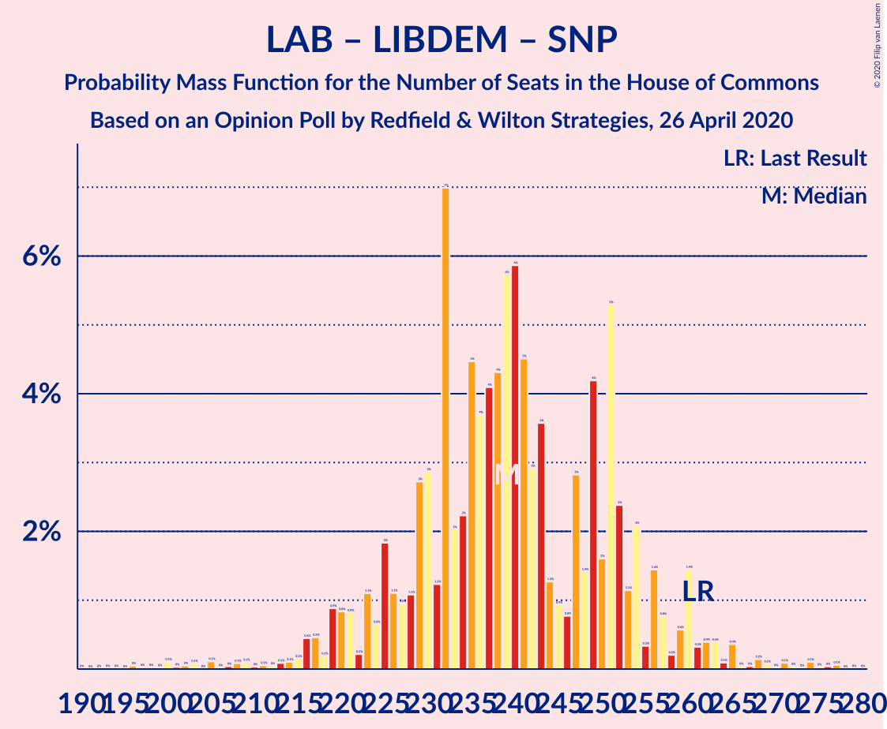

| Number of Seats | Probability | Accumulated | Special Marks |
|:---------------:|:-----------:|:-----------:|:-------------:|
| 194 | 0% | 100% |  |
| 195 | 0% | 99.9% |  |
| 196 | 0% | 99.9% |  |
| 197 | 0% | 99.9% |  |
| 198 | 0% | 99.9% |  |
| 199 | 0% | 99.9% |  |
| 200 | 0.1% | 99.8% |  |
| 201 | 0% | 99.7% |  |
| 202 | 0% | 99.7% |  |
| 203 | 0.1% | 99.7% |  |
| 204 | 0% | 99.6% |  |
| 205 | 0.1% | 99.6% |  |
| 206 | 0% | 99.5% |  |
| 207 | 0% | 99.4% |  |
| 208 | 0.1% | 99.4% |  |
| 209 | 0.1% | 99.3% |  |
| 210 | 0% | 99.2% |  |
| 211 | 0.1% | 99.2% |  |
| 212 | 0% | 99.1% |  |
| 213 | 0.1% | 99.1% |  |
| 214 | 0.1% | 99.0% |  |
| 215 | 0.1% | 98.9% |  |
| 216 | 0.4% | 98.8% |  |
| 217 | 0.5% | 98% |  |
| 218 | 0.2% | 98% |  |
| 219 | 0.9% | 98% |  |
| 220 | 0.8% | 97% |  |
| 221 | 0.8% | 96% |  |
| 222 | 0.2% | 95% |  |
| 223 | 1.1% | 95% |  |
| 224 | 0.6% | 94% |  |
| 225 | 2% | 93% |  |
| 226 | 1.1% | 91% |  |
| 227 | 1.0% | 90% |  |
| 228 | 1.1% | 89% |  |
| 229 | 3% | 88% |  |
| 230 | 3% | 85% |  |
| 231 | 1.2% | 83% |  |
| 232 | 7% | 81% |  |
| 233 | 2% | 74% |  |
| 234 | 2% | 72% |  |
| 235 | 4% | 70% |  |
| 236 | 4% | 66% |  |
| 237 | 4% | 62% |  |
| 238 | 4% | 58% |  |
| 239 | 6% | 54% | Median |
| 240 | 6% | 48% |  |
| 241 | 5% | 42% |  |
| 242 | 3% | 37% |  |
| 243 | 4% | 35% |  |
| 244 | 1.3% | 31% |  |
| 245 | 0.9% | 30% |  |
| 246 | 0.8% | 29% |  |
| 247 | 3% | 28% |  |
| 248 | 1.4% | 25% |  |
| 249 | 4% | 24% |  |
| 250 | 2% | 20% |  |
| 251 | 5% | 18% |  |
| 252 | 2% | 13% |  |
| 253 | 1.1% | 10% |  |
| 254 | 2% | 9% |  |
| 255 | 0.3% | 7% |  |
| 256 | 1.4% | 7% |  |
| 257 | 0.8% | 5% |  |
| 258 | 0.2% | 5% |  |
| 259 | 0.6% | 4% |  |
| 260 | 1.4% | 4% |  |
| 261 | 0.3% | 2% | Last Result |
| 262 | 0.4% | 2% |  |
| 263 | 0.4% | 2% |  |
| 264 | 0.1% | 1.2% |  |
| 265 | 0.4% | 1.1% |  |
| 266 | 0% | 0.7% |  |
| 267 | 0% | 0.7% |  |
| 268 | 0.1% | 0.6% |  |
| 269 | 0.1% | 0.5% |  |
| 270 | 0% | 0.4% |  |
| 271 | 0.1% | 0.4% |  |
| 272 | 0% | 0.3% |  |
| 273 | 0% | 0.3% |  |
| 274 | 0.1% | 0.3% |  |
| 275 | 0% | 0.2% |  |
| 276 | 0% | 0.1% |  |
| 277 | 0.1% | 0.1% |  |
| 278 | 0% | 0% |  |

### Labour Party – Scottish National Party

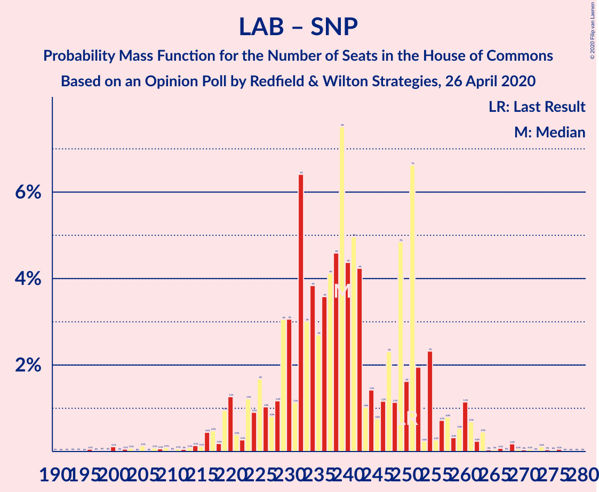

| Number of Seats | Probability | Accumulated | Special Marks |
|:---------------:|:-----------:|:-----------:|:-------------:|
| 194 | 0% | 100% |  |
| 195 | 0% | 99.9% |  |
| 196 | 0.1% | 99.9% |  |
| 197 | 0% | 99.9% |  |
| 198 | 0% | 99.9% |  |
| 199 | 0% | 99.9% |  |
| 200 | 0.1% | 99.8% |  |
| 201 | 0% | 99.7% |  |
| 202 | 0.1% | 99.7% |  |
| 203 | 0.1% | 99.6% |  |
| 204 | 0% | 99.6% |  |
| 205 | 0.1% | 99.6% |  |
| 206 | 0% | 99.4% |  |
| 207 | 0.1% | 99.4% |  |
| 208 | 0.1% | 99.4% |  |
| 209 | 0.1% | 99.3% |  |
| 210 | 0% | 99.2% |  |
| 211 | 0.1% | 99.2% |  |
| 212 | 0% | 99.1% |  |
| 213 | 0.1% | 99.1% |  |
| 214 | 0.1% | 99.0% |  |
| 215 | 0.1% | 98.9% |  |
| 216 | 0.4% | 98.7% |  |
| 217 | 0.5% | 98% |  |
| 218 | 0.2% | 98% |  |
| 219 | 0.9% | 98% |  |
| 220 | 1.3% | 97% |  |
| 221 | 0.4% | 95% |  |
| 222 | 0.3% | 95% |  |
| 223 | 1.2% | 95% |  |
| 224 | 0.9% | 94% |  |
| 225 | 2% | 93% |  |
| 226 | 1.0% | 91% |  |
| 227 | 0.8% | 90% |  |
| 228 | 1.2% | 89% |  |
| 229 | 3% | 88% |  |
| 230 | 3% | 85% |  |
| 231 | 1.1% | 82% |  |
| 232 | 6% | 81% |  |
| 233 | 3% | 74% |  |
| 234 | 4% | 71% |  |
| 235 | 3% | 67% |  |
| 236 | 4% | 65% |  |
| 237 | 4% | 61% |  |
| 238 | 5% | 57% |  |
| 239 | 8% | 52% | Median |
| 240 | 4% | 45% |  |
| 241 | 5% | 41% |  |
| 242 | 4% | 36% |  |
| 243 | 1.0% | 31% |  |
| 244 | 1.4% | 30% |  |
| 245 | 0.8% | 29% |  |
| 246 | 1.2% | 28% |  |
| 247 | 2% | 27% |  |
| 248 | 1.1% | 25% |  |
| 249 | 5% | 24% |  |
| 250 | 2% | 19% | Last Result |
| 251 | 7% | 17% |  |
| 252 | 2% | 10% |  |
| 253 | 0.2% | 8% |  |
| 254 | 2% | 8% |  |
| 255 | 0.3% | 6% |  |
| 256 | 0.7% | 6% |  |
| 257 | 0.8% | 5% |  |
| 258 | 0.3% | 4% |  |
| 259 | 0.5% | 4% |  |
| 260 | 1.1% | 3% |  |
| 261 | 0.7% | 2% |  |
| 262 | 0.2% | 1.5% |  |
| 263 | 0.5% | 1.2% |  |
| 264 | 0% | 0.8% |  |
| 265 | 0% | 0.8% |  |
| 266 | 0.1% | 0.7% |  |
| 267 | 0% | 0.6% |  |
| 268 | 0.2% | 0.6% |  |
| 269 | 0.1% | 0.4% |  |
| 270 | 0% | 0.4% |  |
| 271 | 0.1% | 0.3% |  |
| 272 | 0% | 0.3% |  |
| 273 | 0.1% | 0.3% |  |
| 274 | 0% | 0.2% |  |
| 275 | 0% | 0.1% |  |
| 276 | 0.1% | 0.1% |  |
| 277 | 0% | 0% |  |

### Labour Party – Liberal Democrats – Plaid Cymru

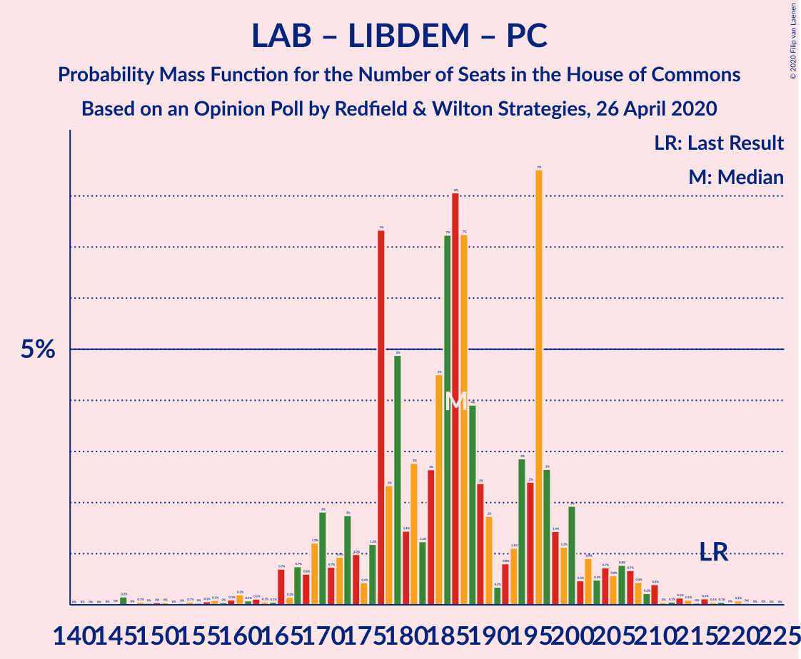

| Number of Seats | Probability | Accumulated | Special Marks |
|:---------------:|:-----------:|:-----------:|:-------------:|
| 144 | 0% | 100% |  |
| 145 | 0% | 99.9% |  |
| 146 | 0.2% | 99.9% |  |
| 147 | 0% | 99.8% |  |
| 148 | 0.1% | 99.7% |  |
| 149 | 0% | 99.7% |  |
| 150 | 0% | 99.7% |  |
| 151 | 0% | 99.6% |  |
| 152 | 0% | 99.6% |  |
| 153 | 0% | 99.6% |  |
| 154 | 0.1% | 99.5% |  |
| 155 | 0% | 99.5% |  |
| 156 | 0.1% | 99.4% |  |
| 157 | 0.1% | 99.4% |  |
| 158 | 0% | 99.3% |  |
| 159 | 0.1% | 99.2% |  |
| 160 | 0.2% | 99.1% |  |
| 161 | 0.1% | 98.9% |  |
| 162 | 0.1% | 98.9% |  |
| 163 | 0.1% | 98.8% |  |
| 164 | 0.1% | 98.7% |  |
| 165 | 0.7% | 98.6% |  |
| 166 | 0.2% | 98% |  |
| 167 | 0.7% | 98% |  |
| 168 | 0.6% | 97% |  |
| 169 | 1.2% | 96% |  |
| 170 | 2% | 95% |  |
| 171 | 0.7% | 93% |  |
| 172 | 0.9% | 93% |  |
| 173 | 2% | 92% |  |
| 174 | 1.0% | 90% |  |
| 175 | 0.4% | 89% |  |
| 176 | 1.2% | 89% |  |
| 177 | 7% | 87% |  |
| 178 | 2% | 80% |  |
| 179 | 5% | 78% |  |
| 180 | 1.4% | 73% |  |
| 181 | 3% | 71% |  |
| 182 | 1.2% | 69% |  |
| 183 | 3% | 67% |  |
| 184 | 5% | 65% | Median |
| 185 | 7% | 60% |  |
| 186 | 8% | 53% |  |
| 187 | 7% | 45% |  |
| 188 | 4% | 38% |  |
| 189 | 2% | 34% |  |
| 190 | 2% | 31% |  |
| 191 | 0.3% | 30% |  |
| 192 | 0.8% | 29% |  |
| 193 | 1.1% | 29% |  |
| 194 | 3% | 27% |  |
| 195 | 2% | 25% |  |
| 196 | 9% | 22% |  |
| 197 | 3% | 14% |  |
| 198 | 1.4% | 11% |  |
| 199 | 1.1% | 10% |  |
| 200 | 2% | 8% |  |
| 201 | 0.5% | 6% |  |
| 202 | 0.9% | 6% |  |
| 203 | 0.5% | 5% |  |
| 204 | 0.7% | 5% |  |
| 205 | 0.6% | 4% |  |
| 206 | 0.8% | 3% |  |
| 207 | 0.7% | 3% |  |
| 208 | 0.4% | 2% |  |
| 209 | 0.2% | 1.4% |  |
| 210 | 0.4% | 1.2% |  |
| 211 | 0% | 0.8% |  |
| 212 | 0.1% | 0.7% |  |
| 213 | 0.1% | 0.7% |  |
| 214 | 0.1% | 0.5% |  |
| 215 | 0% | 0.4% |  |
| 216 | 0.1% | 0.4% |  |
| 217 | 0.1% | 0.3% | Last Result |
| 218 | 0.1% | 0.2% |  |
| 219 | 0% | 0.2% |  |
| 220 | 0.1% | 0.2% |  |
| 221 | 0% | 0.1% |  |
| 222 | 0% | 0.1% |  |
| 223 | 0% | 0.1% |  |
| 224 | 0% | 0% |  |

### Labour Party – Plaid Cymru

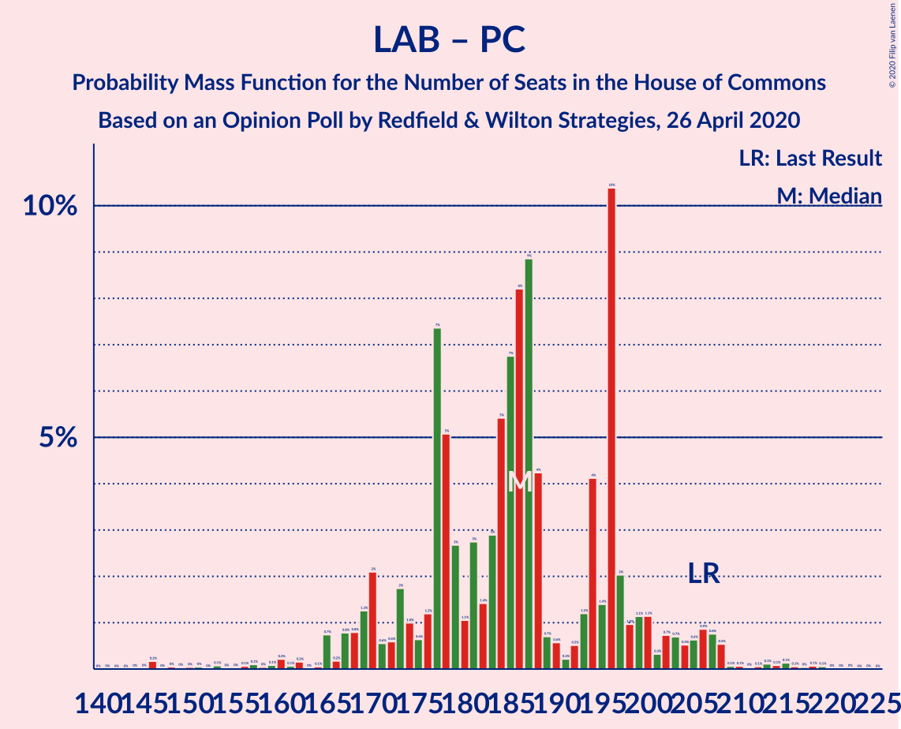

| Number of Seats | Probability | Accumulated | Special Marks |
|:---------------:|:-----------:|:-----------:|:-------------:|
| 144 | 0% | 100% |  |
| 145 | 0% | 99.9% |  |
| 146 | 0.2% | 99.9% |  |
| 147 | 0% | 99.7% |  |
| 148 | 0% | 99.7% |  |
| 149 | 0% | 99.7% |  |
| 150 | 0% | 99.7% |  |
| 151 | 0% | 99.6% |  |
| 152 | 0% | 99.6% |  |
| 153 | 0.1% | 99.6% |  |
| 154 | 0% | 99.5% |  |
| 155 | 0% | 99.5% |  |
| 156 | 0.1% | 99.4% |  |
| 157 | 0.1% | 99.4% |  |
| 158 | 0% | 99.3% |  |
| 159 | 0.1% | 99.2% |  |
| 160 | 0.2% | 99.1% |  |
| 161 | 0.1% | 98.9% |  |
| 162 | 0.2% | 98.9% |  |
| 163 | 0% | 98.7% |  |
| 164 | 0.1% | 98.7% |  |
| 165 | 0.7% | 98.6% |  |
| 166 | 0.2% | 98% |  |
| 167 | 0.8% | 98% |  |
| 168 | 0.8% | 97% |  |
| 169 | 1.3% | 96% |  |
| 170 | 2% | 95% |  |
| 171 | 0.6% | 93% |  |
| 172 | 0.6% | 92% |  |
| 173 | 2% | 92% |  |
| 174 | 1.0% | 90% |  |
| 175 | 0.6% | 89% |  |
| 176 | 1.2% | 88% |  |
| 177 | 7% | 87% |  |
| 178 | 5% | 80% |  |
| 179 | 3% | 75% |  |
| 180 | 1.1% | 72% |  |
| 181 | 3% | 71% |  |
| 182 | 1.4% | 68% |  |
| 183 | 3% | 67% |  |
| 184 | 5% | 64% | Median |
| 185 | 7% | 58% |  |
| 186 | 8% | 52% |  |
| 187 | 9% | 43% |  |
| 188 | 4% | 35% |  |
| 189 | 0.7% | 30% |  |
| 190 | 0.6% | 30% |  |
| 191 | 0.2% | 29% |  |
| 192 | 0.5% | 29% |  |
| 193 | 1.2% | 28% |  |
| 194 | 4% | 27% |  |
| 195 | 1.4% | 23% |  |
| 196 | 10% | 22% |  |
| 197 | 2% | 11% |  |
| 198 | 1.0% | 9% |  |
| 199 | 1.1% | 8% |  |
| 200 | 1.1% | 7% |  |
| 201 | 0.3% | 6% |  |
| 202 | 0.7% | 6% |  |
| 203 | 0.7% | 5% |  |
| 204 | 0.5% | 4% |  |
| 205 | 0.6% | 4% |  |
| 206 | 0.9% | 3% | Last Result |
| 207 | 0.8% | 2% |  |
| 208 | 0.5% | 1.4% |  |
| 209 | 0.1% | 0.8% |  |
| 210 | 0.1% | 0.8% |  |
| 211 | 0% | 0.7% |  |
| 212 | 0.1% | 0.7% |  |
| 213 | 0.1% | 0.6% |  |
| 214 | 0.1% | 0.5% |  |
| 215 | 0.1% | 0.4% |  |
| 216 | 0.1% | 0.3% |  |
| 217 | 0% | 0.2% |  |
| 218 | 0.1% | 0.2% |  |
| 219 | 0.1% | 0.1% |  |
| 220 | 0% | 0.1% |  |
| 221 | 0% | 0.1% |  |
| 222 | 0% | 0.1% |  |
| 223 | 0% | 0% |  |

### Labour Party – Liberal Democrats

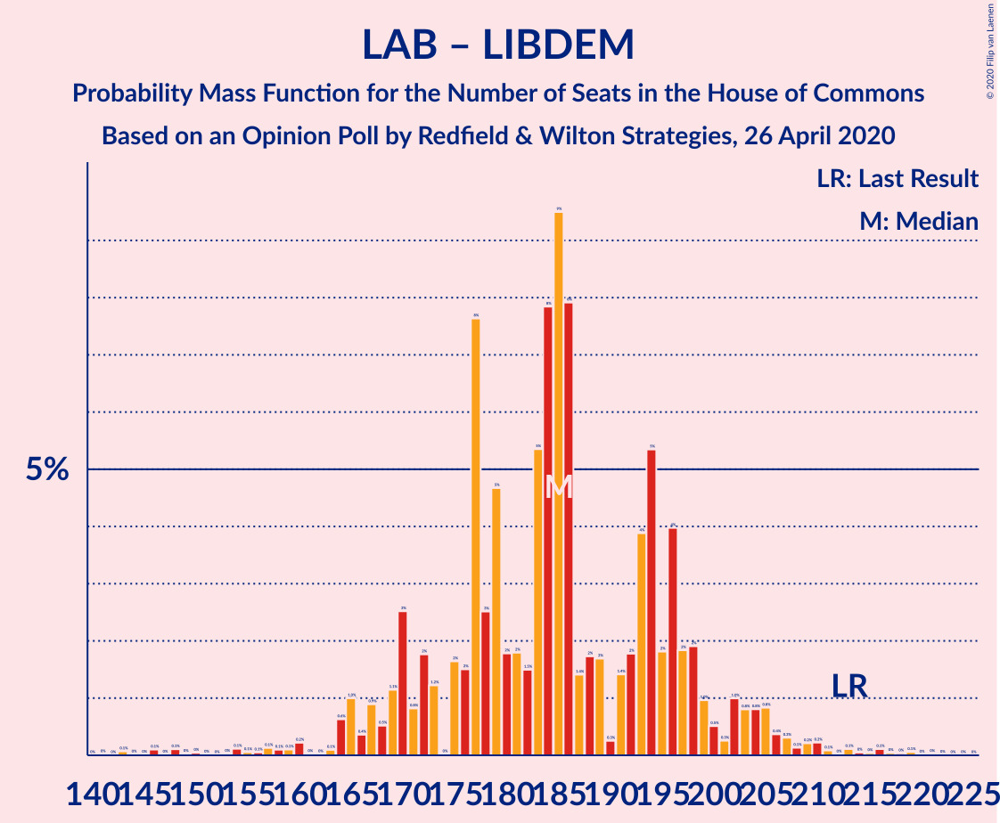

| Number of Seats | Probability | Accumulated | Special Marks |
|:---------------:|:-----------:|:-----------:|:-------------:|
| 141 | 0% | 100% |  |
| 142 | 0% | 99.9% |  |
| 143 | 0.1% | 99.9% |  |
| 144 | 0% | 99.9% |  |
| 145 | 0% | 99.9% |  |
| 146 | 0.1% | 99.8% |  |
| 147 | 0% | 99.7% |  |
| 148 | 0.1% | 99.7% |  |
| 149 | 0% | 99.6% |  |
| 150 | 0% | 99.6% |  |
| 151 | 0% | 99.6% |  |
| 152 | 0% | 99.5% |  |
| 153 | 0% | 99.5% |  |
| 154 | 0.1% | 99.5% |  |
| 155 | 0.1% | 99.4% |  |
| 156 | 0.1% | 99.3% |  |
| 157 | 0.1% | 99.3% |  |
| 158 | 0.1% | 99.2% |  |
| 159 | 0.1% | 99.1% |  |
| 160 | 0.2% | 99.0% |  |
| 161 | 0% | 98.7% |  |
| 162 | 0% | 98.7% |  |
| 163 | 0.1% | 98.7% |  |
| 164 | 0.6% | 98.6% |  |
| 165 | 1.0% | 98% |  |
| 166 | 0.4% | 97% |  |
| 167 | 0.9% | 97% |  |
| 168 | 0.5% | 96% |  |
| 169 | 1.1% | 95% |  |
| 170 | 3% | 94% |  |
| 171 | 0.8% | 92% |  |
| 172 | 2% | 91% |  |
| 173 | 1.2% | 89% |  |
| 174 | 0% | 88% |  |
| 175 | 2% | 88% |  |
| 176 | 2% | 86% |  |
| 177 | 8% | 85% |  |
| 178 | 3% | 77% |  |
| 179 | 5% | 74% |  |
| 180 | 2% | 70% |  |
| 181 | 2% | 68% |  |
| 182 | 1.5% | 66% |  |
| 183 | 5% | 65% |  |
| 184 | 8% | 59% | Median |
| 185 | 9% | 51% |  |
| 186 | 8% | 42% |  |
| 187 | 1.4% | 34% |  |
| 188 | 2% | 33% |  |
| 189 | 2% | 31% |  |
| 190 | 0.3% | 29% |  |
| 191 | 1.4% | 29% |  |
| 192 | 2% | 28% |  |
| 193 | 4% | 26% |  |
| 194 | 5% | 22% |  |
| 195 | 2% | 17% |  |
| 196 | 4% | 15% |  |
| 197 | 2% | 11% |  |
| 198 | 2% | 9% |  |
| 199 | 1.0% | 7% |  |
| 200 | 0.5% | 6% |  |
| 201 | 0.3% | 6% |  |
| 202 | 1.0% | 5% |  |
| 203 | 0.8% | 4% |  |
| 204 | 0.8% | 4% |  |
| 205 | 0.8% | 3% |  |
| 206 | 0.4% | 2% |  |
| 207 | 0.3% | 1.5% |  |
| 208 | 0.1% | 1.2% |  |
| 209 | 0.2% | 1.1% |  |
| 210 | 0.2% | 0.8% |  |
| 211 | 0.1% | 0.6% |  |
| 212 | 0% | 0.5% |  |
| 213 | 0.1% | 0.5% | Last Result |
| 214 | 0% | 0.4% |  |
| 215 | 0% | 0.4% |  |
| 216 | 0.1% | 0.3% |  |
| 217 | 0% | 0.2% |  |
| 218 | 0% | 0.2% |  |
| 219 | 0.1% | 0.1% |  |
| 220 | 0% | 0.1% |  |
| 221 | 0% | 0.1% |  |
| 222 | 0% | 0% |  |

### Labour Party

| Number of Seats | Probability | Accumulated | Special Marks |
|:---------------:|:-----------:|:-----------:|:-------------:|
| 141 | 0% | 100% |  |
| 142 | 0% | 99.9% |  |
| 143 | 0.1% | 99.9% |  |
| 144 | 0% | 99.9% |  |
| 145 | 0% | 99.9% |  |
| 146 | 0.1% | 99.8% |  |
| 147 | 0% | 99.7% |  |
| 148 | 0.1% | 99.7% |  |
| 149 | 0% | 99.6% |  |
| 150 | 0% | 99.6% |  |
| 151 | 0% | 99.5% |  |
| 152 | 0% | 99.5% |  |
| 153 | 0.1% | 99.5% |  |
| 154 | 0.1% | 99.5% |  |
| 155 | 0% | 99.4% |  |
| 156 | 0% | 99.3% |  |
| 157 | 0.1% | 99.3% |  |
| 158 | 0.1% | 99.1% |  |
| 159 | 0.1% | 99.0% |  |
| 160 | 0.2% | 99.0% |  |
| 161 | 0% | 98.7% |  |
| 162 | 0.1% | 98.7% |  |
| 163 | 0.1% | 98.6% |  |
| 164 | 0.7% | 98.6% |  |
| 165 | 0.9% | 98% |  |
| 166 | 0.4% | 97% |  |
| 167 | 0.9% | 97% |  |
| 168 | 0.8% | 96% |  |
| 169 | 1.2% | 95% |  |
| 170 | 3% | 94% |  |
| 171 | 0.8% | 91% |  |
| 172 | 1.2% | 90% |  |
| 173 | 1.1% | 89% |  |
| 174 | 0% | 88% |  |
| 175 | 2% | 88% |  |
| 176 | 1.2% | 85% |  |
| 177 | 8% | 84% |  |
| 178 | 5% | 76% |  |
| 179 | 2% | 72% |  |
| 180 | 1.5% | 69% |  |
| 181 | 2% | 68% |  |
| 182 | 1.3% | 65% |  |
| 183 | 7% | 64% |  |
| 184 | 11% | 57% | Median |
| 185 | 6% | 47% |  |
| 186 | 8% | 41% |  |
| 187 | 0.9% | 32% |  |
| 188 | 2% | 31% |  |
| 189 | 0.7% | 29% |  |
| 190 | 0.1% | 29% |  |
| 191 | 2% | 29% |  |
| 192 | 1.1% | 27% |  |
| 193 | 5% | 26% |  |
| 194 | 6% | 21% |  |
| 195 | 0.8% | 15% |  |
| 196 | 5% | 14% |  |
| 197 | 2% | 9% |  |
| 198 | 0.5% | 7% |  |
| 199 | 0.8% | 6% |  |
| 200 | 0.3% | 6% |  |
| 201 | 0.2% | 5% |  |
| 202 | 1.2% | 5% | Last Result |
| 203 | 0.9% | 4% |  |
| 204 | 0.7% | 3% |  |
| 205 | 0.9% | 2% |  |
| 206 | 0.2% | 1.4% |  |
| 207 | 0.3% | 1.2% |  |
| 208 | 0.2% | 0.9% |  |
| 209 | 0% | 0.7% |  |
| 210 | 0.1% | 0.7% |  |
| 211 | 0.1% | 0.6% |  |
| 212 | 0% | 0.5% |  |
| 213 | 0.1% | 0.5% |  |
| 214 | 0% | 0.4% |  |
| 215 | 0.1% | 0.3% |  |
| 216 | 0% | 0.2% |  |
| 217 | 0% | 0.2% |  |
| 218 | 0.1% | 0.1% |  |
| 219 | 0% | 0.1% |  |
| 220 | 0% | 0% |  |

## Technical Information

### Opinion Poll

+ **Polling firm:** Redfield & Wilton Strategies
+ **Commissioner(s):** —
+ **Fieldwork period:** 26 April 2020

### Calculations

+ **Sample size:** 1487
+ **Simulations done:** 131,072
+ **Error estimate:** 1.36%

