# Opinion Poll by Opinium for The Observer, 13–14 May 2020

<a href="#voting-intentions">Voting Intentions</a> | <a href="#seats">Seats</a> | <a href="#coalitions">Coalitions</a> | <a href="#technical-information">Technical Information</a>

## Voting Intentions

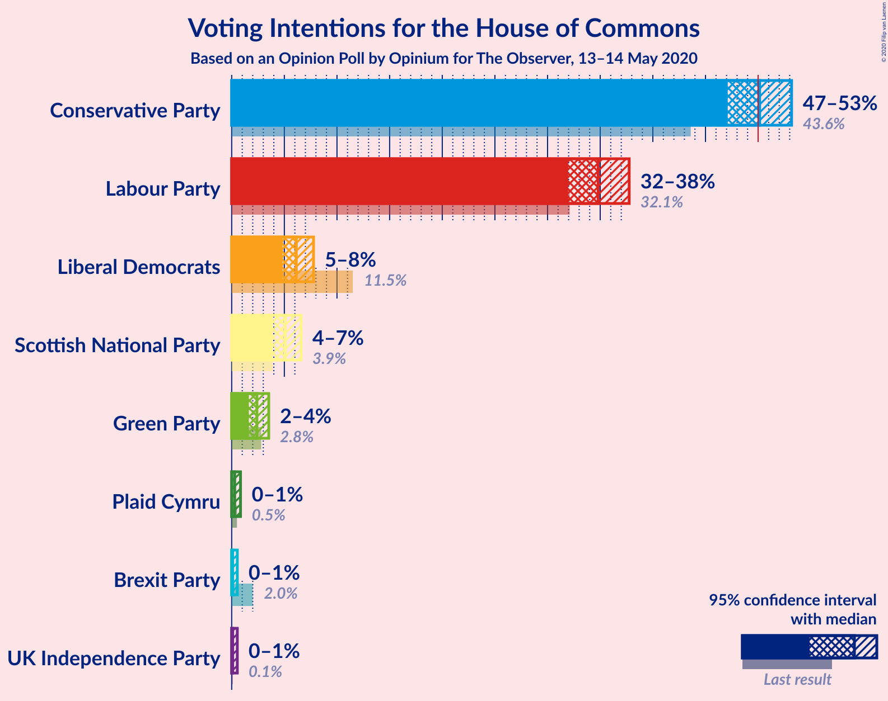

### Confidence Intervals

| Party | Last Result | Poll Result | 80% Confidence Interval | 90% Confidence Interval | 95% Confidence Interval | 99% Confidence Interval |
|:-----:|:-----------:|:-----------:|:-----------------------:|:-----------------------:|:-----------------------:|:-----------------------:|
| Conservative Party | 43.6% | 50.1% | 48.1–52.1% |47.6–52.7% |47.1–53.2% |46.2–54.1% |
| Labour Party | 32.1% | 34.8% | 32.9–36.7% |32.4–37.3% |32.0–37.8% |31.1–38.7% |
| Liberal Democrats | 11.5% | 6.1% | 5.3–7.2% |5.0–7.5% |4.8–7.8% |4.5–8.3% |
| Scottish National Party | 3.9% | 5.1% | 4.3–6.1% |4.1–6.3% |3.9–6.6% |3.6–7.1% |
| Green Party | 2.8% | 2.4% | 1.9–3.1% |1.7–3.3% |1.6–3.5% |1.4–3.9% |
| Plaid Cymru | 0.5% | 0.3% | 0.2–0.6% |0.1–0.7% |0.1–0.8% |0.1–1.1% |
| UK Independence Party | 0.1% | 0.1% | 0.0–0.4% |0.0–0.5% |0.0–0.5% |0.0–0.7% |
| Brexit Party | 2.0% | 0.1% | 0.0–0.4% |0.0–0.5% |0.0–0.5% |0.0–0.7% |

*Note:* The poll result column reflects the actual value used in the calculations. Published results may vary slightly, and in addition be rounded to fewer digits.

## Seats

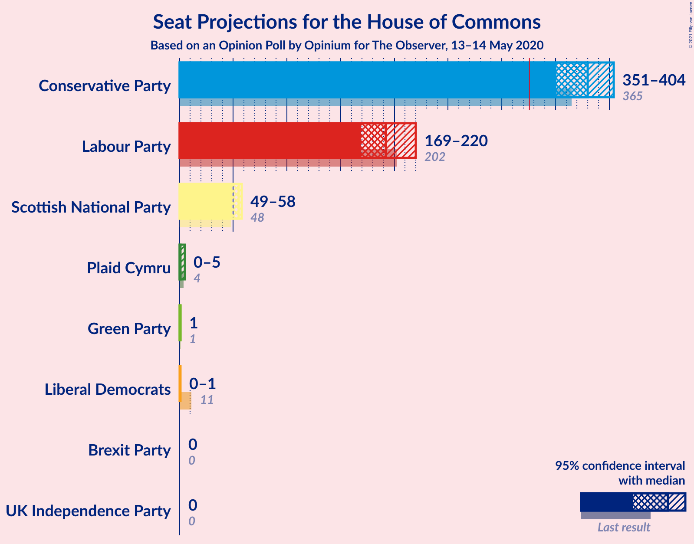

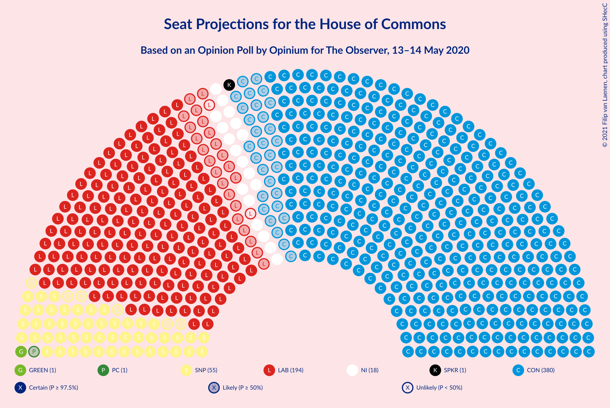

### Confidence Intervals

| Party | Last Result | Median | 80% Confidence Interval | 90% Confidence Interval | 95% Confidence Interval | 99% Confidence Interval |
|:-----:|:-----------:|:------:|:-----------------------:|:-----------------------:|:-----------------------:|:-----------------------:|
| <a href="#conservative-party">Conservative Party</a> | 365 | 380 | 365–397 |359–401 |351–404 |344–415 |
| <a href="#labour-party">Labour Party</a> | 202 | 192 | 178–208 |176–212 |169–220 |160–226 |
| <a href="#liberal-democrats">Liberal Democrats</a> | 11 | 0 | 0 |0–1 |0–1 |0–2 |
| <a href="#scottish-national-party">Scottish National Party</a> | 48 | 55 | 51–58 |50–58 |49–58 |43–58 |
| <a href="#green-party">Green Party</a> | 1 | 1 | 1 |1 |1 |1 |
| <a href="#plaid-cymru">Plaid Cymru</a> | 4 | 1 | 0–4 |0–5 |0–5 |0–5 |
| <a href="#uk-independence-party">UK Independence Party</a> | 0 | 0 | 0 |0 |0 |0 |
| <a href="#brexit-party">Brexit Party</a> | 0 | 0 | 0 |0 |0 |0 |

### Conservative Party

*For a full overview of the results for this party, see the [Conservative Party](party-conservativeparty.html) page.*

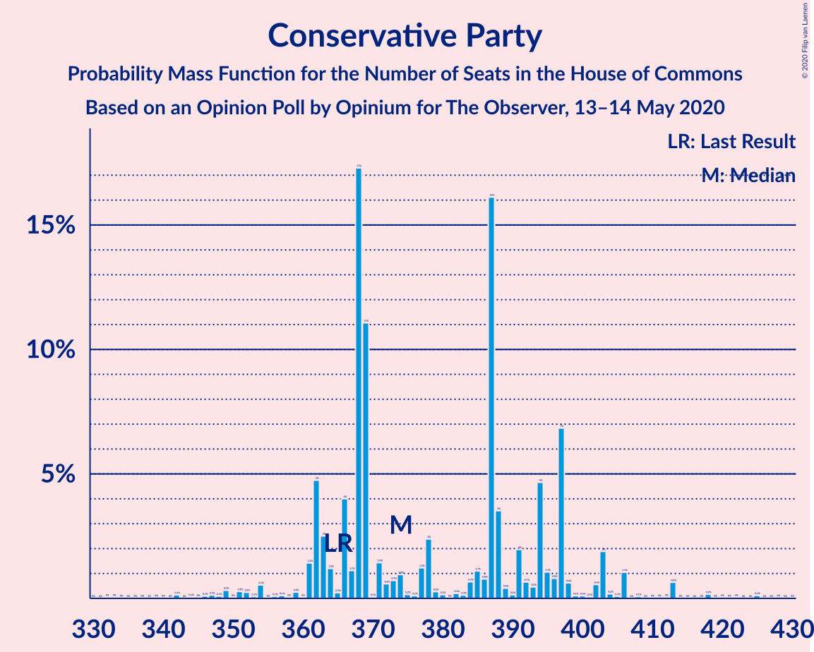

| Number of Seats | Probability | Accumulated | Special Marks |
|:---------------:|:-----------:|:-----------:|:-------------:|
| 332 | 0% | 100% |  |
| 333 | 0% | 99.9% |  |
| 334 | 0% | 99.9% |  |
| 335 | 0% | 99.9% |  |
| 336 | 0% | 99.9% |  |
| 337 | 0% | 99.9% |  |
| 338 | 0% | 99.9% |  |
| 339 | 0% | 99.9% |  |
| 340 | 0% | 99.9% |  |
| 341 | 0% | 99.9% |  |
| 342 | 0.1% | 99.8% |  |
| 343 | 0.1% | 99.7% |  |
| 344 | 0.2% | 99.7% |  |
| 345 | 0.1% | 99.4% |  |
| 346 | 0.9% | 99.4% |  |
| 347 | 0.1% | 98% |  |
| 348 | 0.5% | 98% |  |
| 349 | 0.1% | 98% |  |
| 350 | 0% | 98% |  |
| 351 | 0.5% | 98% |  |
| 352 | 0.1% | 97% |  |
| 353 | 0.3% | 97% |  |
| 354 | 0.2% | 97% |  |
| 355 | 0.2% | 97% |  |
| 356 | 0.1% | 97% |  |
| 357 | 0.4% | 96% |  |
| 358 | 0.5% | 96% |  |
| 359 | 0.9% | 95% |  |
| 360 | 0.1% | 95% |  |
| 361 | 0.6% | 94% |  |
| 362 | 2% | 94% |  |
| 363 | 0.9% | 92% |  |
| 364 | 0.7% | 91% |  |
| 365 | 1.1% | 91% | Last Result |
| 366 | 2% | 90% |  |
| 367 | 3% | 88% |  |
| 368 | 6% | 84% |  |
| 369 | 3% | 79% |  |
| 370 | 0.5% | 76% |  |
| 371 | 1.0% | 75% |  |
| 372 | 1.0% | 74% |  |
| 373 | 1.2% | 73% |  |
| 374 | 2% | 72% |  |
| 375 | 0.4% | 69% |  |
| 376 | 0.9% | 69% |  |
| 377 | 2% | 68% |  |
| 378 | 3% | 66% |  |
| 379 | 3% | 63% |  |
| 380 | 12% | 60% | Median |
| 381 | 7% | 48% |  |
| 382 | 0.5% | 41% |  |
| 383 | 0.8% | 41% |  |
| 384 | 0.8% | 40% |  |
| 385 | 1.3% | 39% |  |
| 386 | 3% | 38% |  |
| 387 | 6% | 34% |  |
| 388 | 1.3% | 29% |  |
| 389 | 9% | 28% |  |
| 390 | 0.5% | 19% |  |
| 391 | 0.7% | 18% |  |
| 392 | 0.7% | 18% |  |
| 393 | 0.3% | 17% |  |
| 394 | 3% | 17% |  |
| 395 | 1.2% | 13% |  |
| 396 | 2% | 12% |  |
| 397 | 2% | 11% |  |
| 398 | 3% | 9% |  |
| 399 | 0.4% | 6% |  |
| 400 | 0.1% | 5% |  |
| 401 | 0.8% | 5% |  |
| 402 | 0.2% | 4% |  |
| 403 | 2% | 4% |  |
| 404 | 0.2% | 3% |  |
| 405 | 0.3% | 2% |  |
| 406 | 0.5% | 2% |  |
| 407 | 0% | 2% |  |
| 408 | 0.1% | 2% |  |
| 409 | 0.2% | 1.5% |  |
| 410 | 0% | 1.3% |  |
| 411 | 0.2% | 1.3% |  |
| 412 | 0% | 1.1% |  |
| 413 | 0.2% | 1.1% |  |
| 414 | 0.3% | 0.9% |  |
| 415 | 0.2% | 0.6% |  |
| 416 | 0% | 0.4% |  |
| 417 | 0% | 0.4% |  |
| 418 | 0.1% | 0.4% |  |
| 419 | 0% | 0.3% |  |
| 420 | 0% | 0.2% |  |
| 421 | 0.1% | 0.2% |  |
| 422 | 0% | 0.2% |  |
| 423 | 0% | 0.1% |  |
| 424 | 0% | 0.1% |  |
| 425 | 0% | 0.1% |  |
| 426 | 0% | 0.1% |  |
| 427 | 0% | 0.1% |  |
| 428 | 0% | 0.1% |  |
| 429 | 0% | 0.1% |  |
| 430 | 0% | 0.1% |  |
| 431 | 0% | 0% |  |

### Labour Party

*For a full overview of the results for this party, see the [Labour Party](party-labourparty.html) page.*

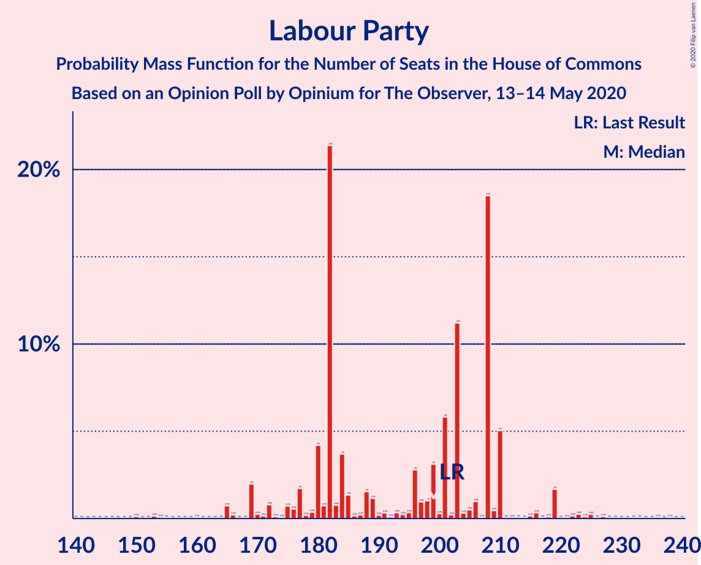

| Number of Seats | Probability | Accumulated | Special Marks |
|:---------------:|:-----------:|:-----------:|:-------------:|
| 144 | 0% | 100% |  |
| 145 | 0% | 99.9% |  |
| 146 | 0% | 99.9% |  |
| 147 | 0% | 99.9% |  |
| 148 | 0% | 99.9% |  |
| 149 | 0% | 99.9% |  |
| 150 | 0% | 99.9% |  |
| 151 | 0% | 99.9% |  |
| 152 | 0% | 99.9% |  |
| 153 | 0% | 99.9% |  |
| 154 | 0.1% | 99.8% |  |
| 155 | 0% | 99.8% |  |
| 156 | 0% | 99.7% |  |
| 157 | 0% | 99.7% |  |
| 158 | 0.1% | 99.7% |  |
| 159 | 0% | 99.6% |  |
| 160 | 0.2% | 99.6% |  |
| 161 | 0% | 99.4% |  |
| 162 | 0% | 99.4% |  |
| 163 | 0.3% | 99.4% |  |
| 164 | 0.1% | 99.1% |  |
| 165 | 0.3% | 99.0% |  |
| 166 | 0.1% | 98.8% |  |
| 167 | 0% | 98.7% |  |
| 168 | 0.4% | 98.6% |  |
| 169 | 0.8% | 98% |  |
| 170 | 1.4% | 97% |  |
| 171 | 0.4% | 96% |  |
| 172 | 0.2% | 96% |  |
| 173 | 0% | 95% |  |
| 174 | 0% | 95% |  |
| 175 | 0.4% | 95% |  |
| 176 | 0.5% | 95% |  |
| 177 | 2% | 95% |  |
| 178 | 3% | 93% |  |
| 179 | 0.5% | 89% |  |
| 180 | 1.3% | 89% |  |
| 181 | 2% | 88% |  |
| 182 | 5% | 86% |  |
| 183 | 2% | 80% |  |
| 184 | 2% | 78% |  |
| 185 | 8% | 76% |  |
| 186 | 5% | 68% |  |
| 187 | 0.1% | 63% |  |
| 188 | 0.5% | 63% |  |
| 189 | 0.3% | 63% |  |
| 190 | 0.2% | 62% |  |
| 191 | 12% | 62% |  |
| 192 | 1.1% | 50% | Median |
| 193 | 1.3% | 49% |  |
| 194 | 8% | 48% |  |
| 195 | 3% | 40% |  |
| 196 | 5% | 37% |  |
| 197 | 3% | 32% |  |
| 198 | 2% | 29% |  |
| 199 | 1.2% | 27% |  |
| 200 | 0.1% | 26% |  |
| 201 | 2% | 26% |  |
| 202 | 1.4% | 24% | Last Result |
| 203 | 4% | 23% |  |
| 204 | 3% | 19% |  |
| 205 | 0.6% | 16% |  |
| 206 | 0.7% | 15% |  |
| 207 | 0.7% | 14% |  |
| 208 | 5% | 14% |  |
| 209 | 0.6% | 9% |  |
| 210 | 2% | 8% |  |
| 211 | 2% | 7% |  |
| 212 | 0.2% | 5% |  |
| 213 | 0.1% | 5% |  |
| 214 | 0% | 5% |  |
| 215 | 0.6% | 5% |  |
| 216 | 0.5% | 4% |  |
| 217 | 0.3% | 4% |  |
| 218 | 0.2% | 3% |  |
| 219 | 0.5% | 3% |  |
| 220 | 0.2% | 3% |  |
| 221 | 0.2% | 2% |  |
| 222 | 0.5% | 2% |  |
| 223 | 0.3% | 2% |  |
| 224 | 0.1% | 1.5% |  |
| 225 | 0.1% | 1.4% |  |
| 226 | 0.9% | 1.3% |  |
| 227 | 0.1% | 0.4% |  |
| 228 | 0% | 0.3% |  |
| 229 | 0.1% | 0.3% |  |
| 230 | 0% | 0.2% |  |
| 231 | 0% | 0.2% |  |
| 232 | 0% | 0.1% |  |
| 233 | 0% | 0.1% |  |
| 234 | 0% | 0.1% |  |
| 235 | 0% | 0.1% |  |
| 236 | 0% | 0.1% |  |
| 237 | 0% | 0.1% |  |
| 238 | 0% | 0.1% |  |
| 239 | 0% | 0% |  |

### Liberal Democrats

*For a full overview of the results for this party, see the [Liberal Democrats](party-liberaldemocrats.html) page.*

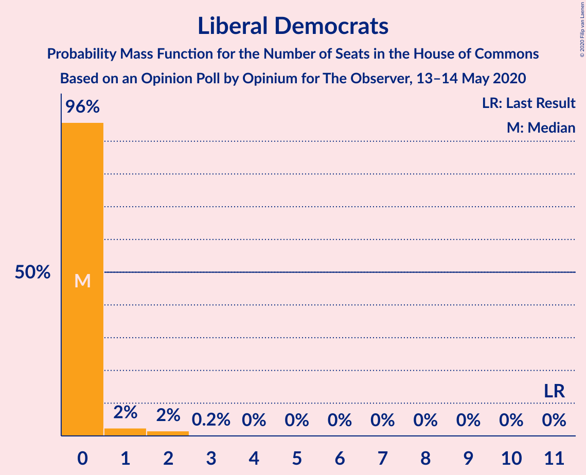

| Number of Seats | Probability | Accumulated | Special Marks |
|:---------------:|:-----------:|:-----------:|:-------------:|
| 0 | 95% | 100% | Median |
| 1 | 3% | 5% |  |
| 2 | 1.5% | 2% |  |
| 3 | 0.2% | 0.2% |  |
| 4 | 0% | 0% |  |
| 5 | 0% | 0% |  |
| 6 | 0% | 0% |  |
| 7 | 0% | 0% |  |
| 8 | 0% | 0% |  |
| 9 | 0% | 0% |  |
| 10 | 0% | 0% |  |
| 11 | 0% | 0% | Last Result |

### Scottish National Party

*For a full overview of the results for this party, see the [Scottish National Party](party-scottishnationalparty.html) page.*

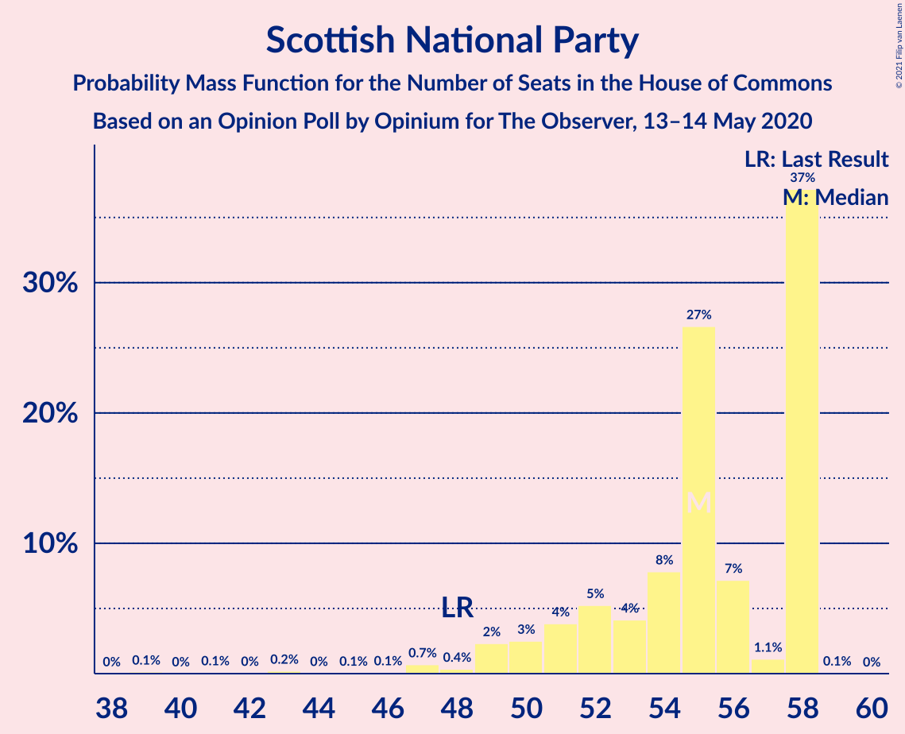

| Number of Seats | Probability | Accumulated | Special Marks |
|:---------------:|:-----------:|:-----------:|:-------------:|
| 38 | 0% | 100% |  |
| 39 | 0.1% | 99.9% |  |
| 40 | 0% | 99.8% |  |
| 41 | 0.1% | 99.8% |  |
| 42 | 0% | 99.7% |  |
| 43 | 0.2% | 99.6% |  |
| 44 | 0% | 99.4% |  |
| 45 | 0.1% | 99.4% |  |
| 46 | 0.1% | 99.3% |  |
| 47 | 0.7% | 99.2% |  |
| 48 | 0.4% | 98.5% | Last Result |
| 49 | 2% | 98% |  |
| 50 | 3% | 96% |  |
| 51 | 4% | 93% |  |
| 52 | 5% | 89% |  |
| 53 | 4% | 84% |  |
| 54 | 8% | 80% |  |
| 55 | 27% | 72% | Median |
| 56 | 7% | 46% |  |
| 57 | 1.1% | 38% |  |
| 58 | 37% | 37% |  |
| 59 | 0.1% | 0.1% |  |
| 60 | 0% | 0% |  |

### Green Party

*For a full overview of the results for this party, see the [Green Party](party-greenparty.html) page.*

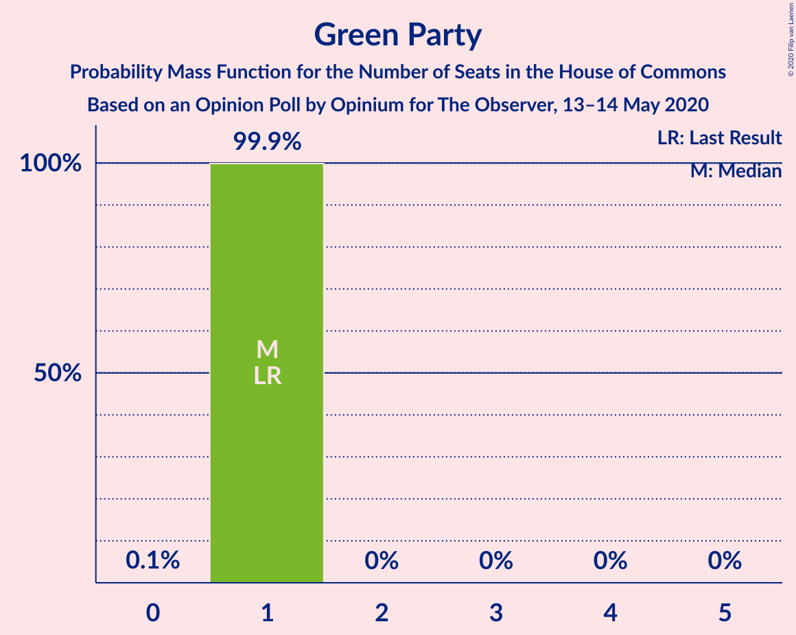

| Number of Seats | Probability | Accumulated | Special Marks |
|:---------------:|:-----------:|:-----------:|:-------------:|
| 1 | 100% | 100% | Last Result, Median |

### Plaid Cymru

*For a full overview of the results for this party, see the [Plaid Cymru](party-plaidcymru.html) page.*

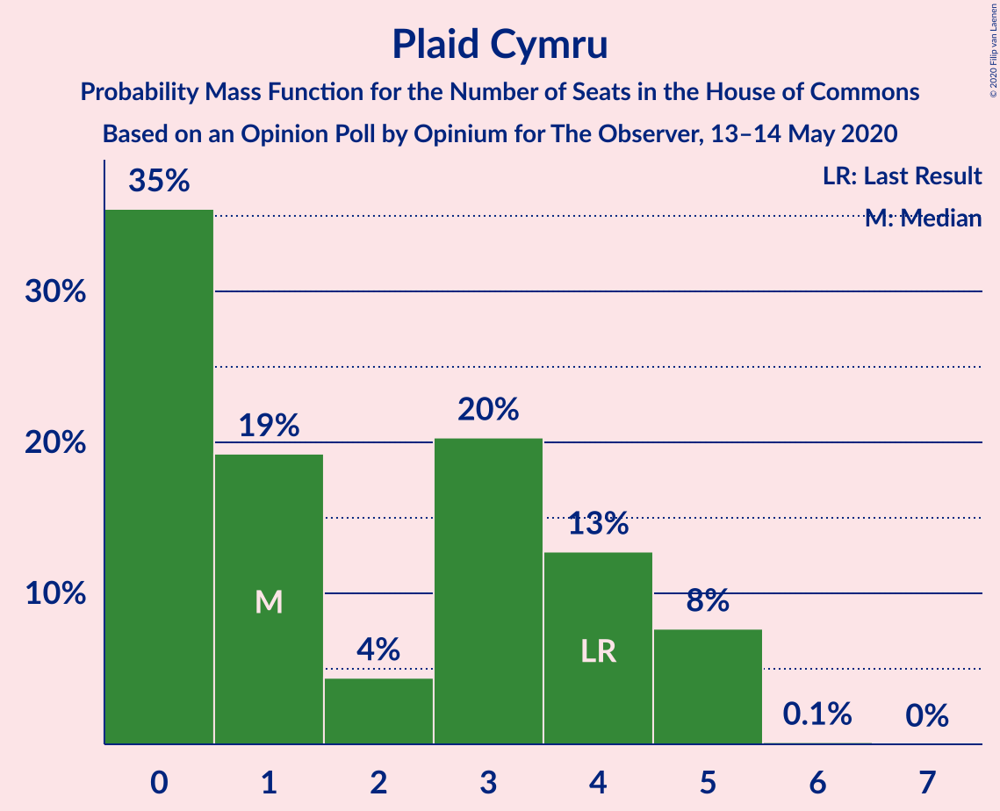

| Number of Seats | Probability | Accumulated | Special Marks |
|:---------------:|:-----------:|:-----------:|:-------------:|
| 0 | 46% | 100% |  |
| 1 | 18% | 54% | Median |
| 2 | 5% | 36% |  |
| 3 | 10% | 31% |  |
| 4 | 14% | 21% | Last Result |
| 5 | 7% | 7% |  |
| 6 | 0.2% | 0.2% |  |
| 7 | 0% | 0% |  |

### UK Independence Party

*For a full overview of the results for this party, see the [UK Independence Party](party-ukindependenceparty.html) page.*

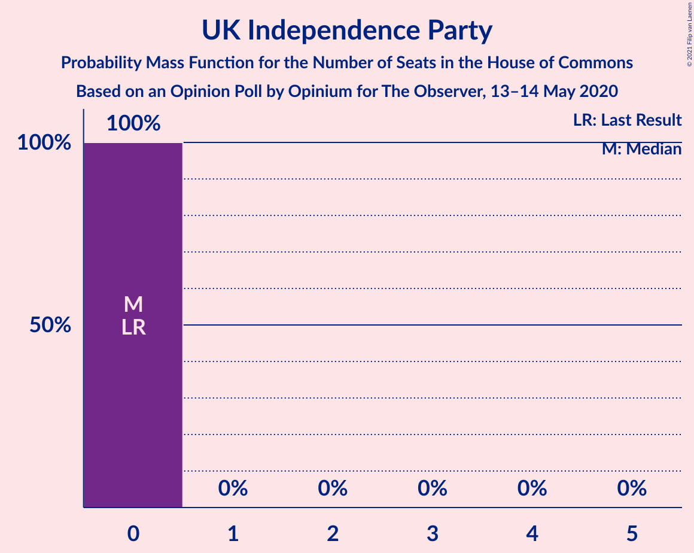

| Number of Seats | Probability | Accumulated | Special Marks |
|:---------------:|:-----------:|:-----------:|:-------------:|
| 0 | 100% | 100% | Last Result, Median |

### Brexit Party

*For a full overview of the results for this party, see the [Brexit Party](party-brexitparty.html) page.*

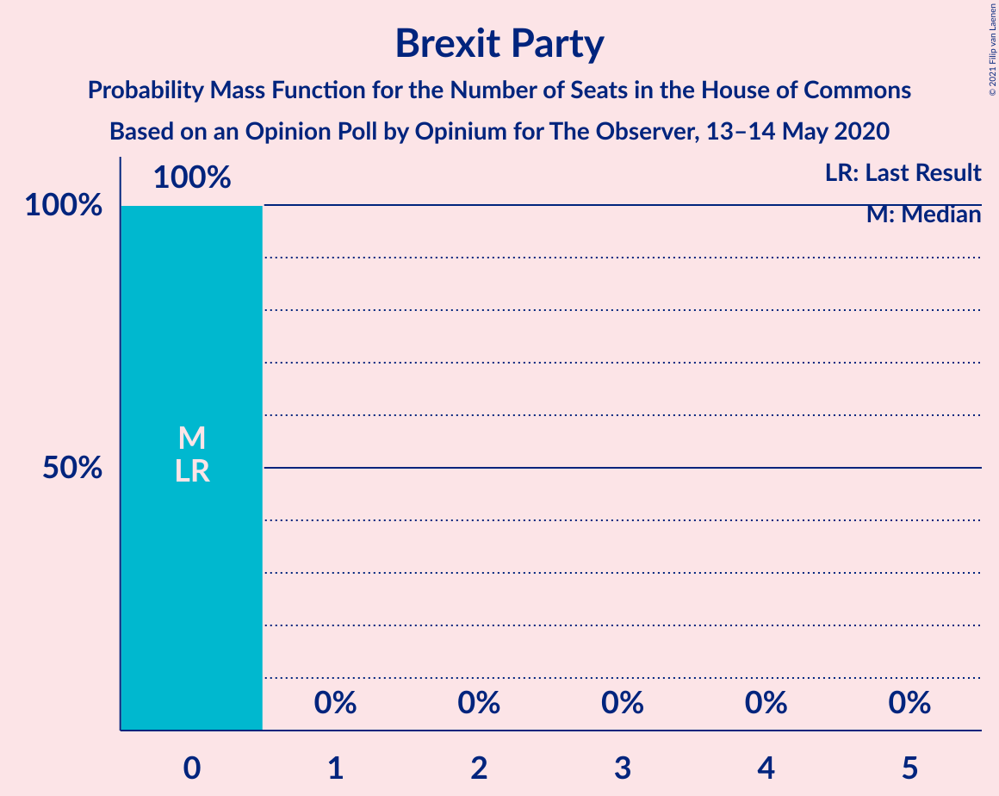

| Number of Seats | Probability | Accumulated | Special Marks |
|:---------------:|:-----------:|:-----------:|:-------------:|
| 0 | 100% | 100% | Last Result, Median |

## Coalitions

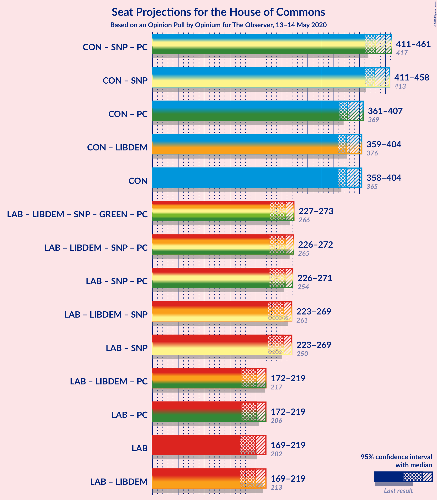

### Confidence Intervals

| Coalition | Last Result | Median | Majority? | 80% Confidence Interval | 90% Confidence Interval | 95% Confidence Interval | 99% Confidence Interval |
|:---------:|:-----------:|:------:|:---------:|:-----------------------:|:-----------------------:|:-----------------------:|:-----------------------:|
| Conservative Party – Scottish National Party – Plaid Cymru | 417 | 438 | 100% | 422–452 | 418–454 | 409–461 | 404–470 |
| Conservative Party – Scottish National Party | 413 | 436 | 100% | 420–449 | 415–452 | 407–460 | 401–470 |
| Conservative Party – Plaid Cymru | 369 | 381 | 100% | 367–398 | 361–402 | 354–407 | 346–417 |
| Conservative Party | 365 | 380 | 100% | 365–397 | 359–401 | 351–404 | 344–415 |
| Conservative Party – Liberal Democrats | 376 | 380 | 100% | 365–397 | 359–401 | 351–404 | 345–415 |
| Labour Party – Liberal Democrats – Scottish National Party – Green Party – Plaid Cymru | 266 | 251 | 0% | 234–266 | 230–272 | 227–280 | 216–287 |
| Labour Party – Liberal Democrats – Scottish National Party – Plaid Cymru | 265 | 250 | 0% | 233–265 | 229–271 | 226–279 | 215–286 |
| Labour Party – Scottish National Party – Plaid Cymru | 254 | 250 | 0% | 233–265 | 229–271 | 226–279 | 215–285 |
| Labour Party – Liberal Democrats – Scottish National Party | 261 | 249 | 0% | 232–263 | 228–269 | 223–276 | 213–284 |
| Labour Party – Scottish National Party | 250 | 249 | 0% | 232–262 | 228–269 | 223–275 | 213–284 |
| Labour Party – Liberal Democrats – Plaid Cymru | 217 | 194 | 0% | 181–210 | 178–215 | 170–223 | 160–229 |
| Labour Party – Plaid Cymru | 206 | 194 | 0% | 180–209 | 178–215 | 170–223 | 160–228 |
| Labour Party – Liberal Democrats | 213 | 192 | 0% | 178–208 | 176–212 | 169–221 | 160–226 |
| Labour Party | 202 | 192 | 0% | 178–208 | 176–212 | 169–220 | 160–226 |

### Conservative Party – Scottish National Party – Plaid Cymru

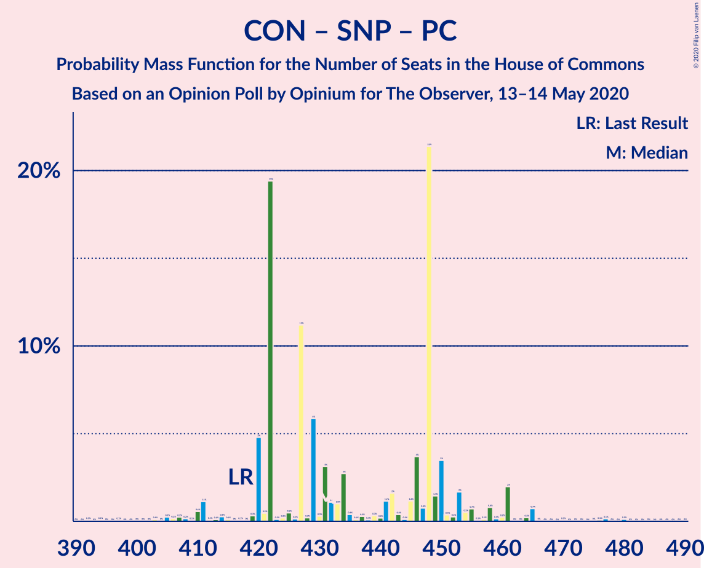

| Number of Seats | Probability | Accumulated | Special Marks |
|:---------------:|:-----------:|:-----------:|:-------------:|
| 392 | 0% | 100% |  |
| 393 | 0% | 99.9% |  |
| 394 | 0% | 99.9% |  |
| 395 | 0% | 99.9% |  |
| 396 | 0% | 99.9% |  |
| 397 | 0% | 99.9% |  |
| 398 | 0% | 99.9% |  |
| 399 | 0% | 99.8% |  |
| 400 | 0.1% | 99.8% |  |
| 401 | 0% | 99.8% |  |
| 402 | 0.1% | 99.7% |  |
| 403 | 0.1% | 99.6% |  |
| 404 | 0.9% | 99.6% |  |
| 405 | 0.1% | 98.7% |  |
| 406 | 0.2% | 98.6% |  |
| 407 | 0.1% | 98% |  |
| 408 | 0.5% | 98% |  |
| 409 | 0.2% | 98% |  |
| 410 | 0.3% | 97% |  |
| 411 | 0.4% | 97% |  |
| 412 | 0.1% | 97% |  |
| 413 | 0.3% | 97% |  |
| 414 | 0.5% | 96% |  |
| 415 | 0.6% | 96% |  |
| 416 | 0% | 95% |  |
| 417 | 0.1% | 95% | Last Result |
| 418 | 0.4% | 95% |  |
| 419 | 1.4% | 95% |  |
| 420 | 2% | 93% |  |
| 421 | 0.6% | 92% |  |
| 422 | 5% | 91% |  |
| 423 | 0.6% | 86% |  |
| 424 | 0.6% | 85% |  |
| 425 | 1.0% | 85% |  |
| 426 | 3% | 84% |  |
| 427 | 3% | 80% |  |
| 428 | 1.3% | 77% |  |
| 429 | 2% | 76% |  |
| 430 | 0.3% | 74% |  |
| 431 | 1.3% | 74% |  |
| 432 | 2% | 72% |  |
| 433 | 3% | 70% |  |
| 434 | 5% | 68% |  |
| 435 | 3% | 63% |  |
| 436 | 9% | 60% | Median |
| 437 | 0.5% | 51% |  |
| 438 | 1.3% | 51% |  |
| 439 | 11% | 49% |  |
| 440 | 0.2% | 38% |  |
| 441 | 0.3% | 38% |  |
| 442 | 0.5% | 37% |  |
| 443 | 0.1% | 37% |  |
| 444 | 5% | 37% |  |
| 445 | 8% | 32% |  |
| 446 | 3% | 24% |  |
| 447 | 2% | 22% |  |
| 448 | 5% | 20% |  |
| 449 | 2% | 14% |  |
| 450 | 1.1% | 12% |  |
| 451 | 0.5% | 11% |  |
| 452 | 4% | 11% |  |
| 453 | 2% | 7% |  |
| 454 | 0.5% | 5% |  |
| 455 | 0.4% | 5% |  |
| 456 | 0% | 5% |  |
| 457 | 0% | 5% |  |
| 458 | 0.3% | 5% |  |
| 459 | 0.3% | 4% |  |
| 460 | 1.4% | 4% |  |
| 461 | 0.8% | 3% |  |
| 462 | 0.4% | 2% |  |
| 463 | 0% | 1.4% |  |
| 464 | 0.1% | 1.3% |  |
| 465 | 0.3% | 1.2% |  |
| 466 | 0.1% | 1.0% |  |
| 467 | 0.3% | 0.9% |  |
| 468 | 0% | 0.6% |  |
| 469 | 0% | 0.6% |  |
| 470 | 0.2% | 0.6% |  |
| 471 | 0% | 0.4% |  |
| 472 | 0.1% | 0.4% |  |
| 473 | 0% | 0.3% |  |
| 474 | 0% | 0.3% |  |
| 475 | 0% | 0.3% |  |
| 476 | 0.1% | 0.2% |  |
| 477 | 0% | 0.2% |  |
| 478 | 0% | 0.1% |  |
| 479 | 0% | 0.1% |  |
| 480 | 0% | 0.1% |  |
| 481 | 0% | 0.1% |  |
| 482 | 0% | 0.1% |  |
| 483 | 0% | 0.1% |  |
| 484 | 0% | 0.1% |  |
| 485 | 0% | 0.1% |  |
| 486 | 0% | 0.1% |  |
| 487 | 0% | 0% |  |

### Conservative Party – Scottish National Party

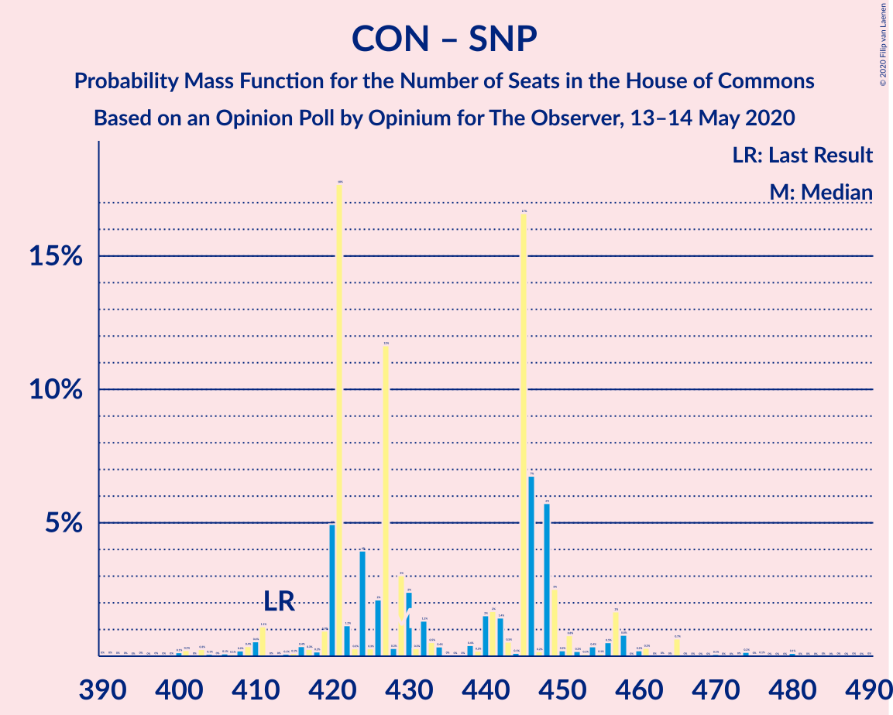

| Number of Seats | Probability | Accumulated | Special Marks |
|:---------------:|:-----------:|:-----------:|:-------------:|
| 390 | 0% | 100% |  |
| 391 | 0% | 99.9% |  |
| 392 | 0% | 99.9% |  |
| 393 | 0% | 99.9% |  |
| 394 | 0% | 99.9% |  |
| 395 | 0% | 99.9% |  |
| 396 | 0% | 99.9% |  |
| 397 | 0% | 99.9% |  |
| 398 | 0% | 99.8% |  |
| 399 | 0% | 99.8% |  |
| 400 | 0.1% | 99.8% |  |
| 401 | 0.2% | 99.6% |  |
| 402 | 0.2% | 99.5% |  |
| 403 | 0.1% | 99.3% |  |
| 404 | 0.9% | 99.2% |  |
| 405 | 0.3% | 98% |  |
| 406 | 0.5% | 98% |  |
| 407 | 0.1% | 98% |  |
| 408 | 0.1% | 97% |  |
| 409 | 0.2% | 97% |  |
| 410 | 0.5% | 97% |  |
| 411 | 0.6% | 97% |  |
| 412 | 0.2% | 96% |  |
| 413 | 0.2% | 96% | Last Result |
| 414 | 0.1% | 96% |  |
| 415 | 0.6% | 95% |  |
| 416 | 0.6% | 95% |  |
| 417 | 1.3% | 94% |  |
| 418 | 1.0% | 93% |  |
| 419 | 0.8% | 92% |  |
| 420 | 1.3% | 91% |  |
| 421 | 4% | 90% |  |
| 422 | 2% | 85% |  |
| 423 | 2% | 83% |  |
| 424 | 1.4% | 81% |  |
| 425 | 1.0% | 79% |  |
| 426 | 1.3% | 78% |  |
| 427 | 4% | 77% |  |
| 428 | 1.0% | 73% |  |
| 429 | 2% | 72% |  |
| 430 | 2% | 71% |  |
| 431 | 0.5% | 69% |  |
| 432 | 2% | 69% |  |
| 433 | 3% | 67% |  |
| 434 | 4% | 64% |  |
| 435 | 3% | 60% | Median |
| 436 | 7% | 57% |  |
| 437 | 0.3% | 50% |  |
| 438 | 12% | 50% |  |
| 439 | 0.2% | 38% |  |
| 440 | 0.7% | 38% |  |
| 441 | 3% | 37% |  |
| 442 | 0.9% | 34% |  |
| 443 | 1.4% | 33% |  |
| 444 | 6% | 32% |  |
| 445 | 8% | 26% |  |
| 446 | 3% | 18% |  |
| 447 | 0.4% | 15% |  |
| 448 | 2% | 14% |  |
| 449 | 3% | 13% |  |
| 450 | 1.0% | 10% |  |
| 451 | 0.2% | 9% |  |
| 452 | 4% | 9% |  |
| 453 | 0.1% | 5% |  |
| 454 | 0.3% | 5% |  |
| 455 | 0.1% | 5% |  |
| 456 | 0.4% | 4% |  |
| 457 | 0.6% | 4% |  |
| 458 | 0.3% | 3% |  |
| 459 | 0.3% | 3% |  |
| 460 | 1.4% | 3% |  |
| 461 | 0.2% | 1.5% |  |
| 462 | 0.1% | 1.3% |  |
| 463 | 0.1% | 1.2% |  |
| 464 | 0.3% | 1.2% |  |
| 465 | 0.3% | 0.9% |  |
| 466 | 0% | 0.6% |  |
| 467 | 0% | 0.6% |  |
| 468 | 0% | 0.6% |  |
| 469 | 0% | 0.5% |  |
| 470 | 0.2% | 0.5% |  |
| 471 | 0% | 0.3% |  |
| 472 | 0% | 0.3% |  |
| 473 | 0% | 0.3% |  |
| 474 | 0% | 0.2% |  |
| 475 | 0% | 0.2% |  |
| 476 | 0% | 0.1% |  |
| 477 | 0% | 0.1% |  |
| 478 | 0% | 0.1% |  |
| 479 | 0% | 0.1% |  |
| 480 | 0% | 0.1% |  |
| 481 | 0% | 0.1% |  |
| 482 | 0% | 0.1% |  |
| 483 | 0% | 0.1% |  |
| 484 | 0% | 0% |  |

### Conservative Party – Plaid Cymru

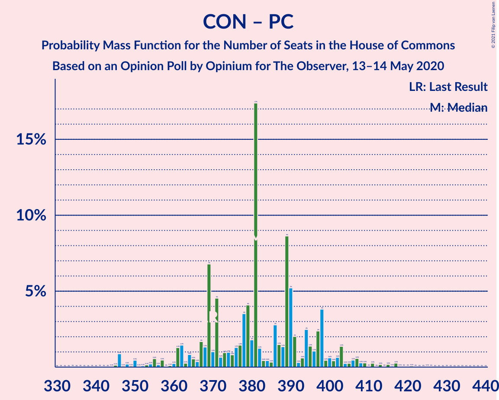

| Number of Seats | Probability | Accumulated | Special Marks |
|:---------------:|:-----------:|:-----------:|:-------------:|
| 334 | 0% | 100% |  |
| 335 | 0% | 99.9% |  |
| 336 | 0% | 99.9% |  |
| 337 | 0% | 99.9% |  |
| 338 | 0% | 99.9% |  |
| 339 | 0% | 99.9% |  |
| 340 | 0% | 99.9% |  |
| 341 | 0% | 99.9% |  |
| 342 | 0% | 99.9% |  |
| 343 | 0% | 99.8% |  |
| 344 | 0.1% | 99.8% |  |
| 345 | 0.1% | 99.8% |  |
| 346 | 0.9% | 99.7% |  |
| 347 | 0.1% | 98.8% |  |
| 348 | 0.2% | 98.7% |  |
| 349 | 0.1% | 98.5% |  |
| 350 | 0.5% | 98% |  |
| 351 | 0.1% | 98% |  |
| 352 | 0.1% | 98% |  |
| 353 | 0.1% | 98% |  |
| 354 | 0.2% | 98% |  |
| 355 | 0.6% | 97% |  |
| 356 | 0.2% | 97% |  |
| 357 | 0.5% | 97% |  |
| 358 | 0% | 96% |  |
| 359 | 0.1% | 96% |  |
| 360 | 0.2% | 96% |  |
| 361 | 1.3% | 96% |  |
| 362 | 1.4% | 95% |  |
| 363 | 0.3% | 93% |  |
| 364 | 0.8% | 93% |  |
| 365 | 0.5% | 92% |  |
| 366 | 0.4% | 92% |  |
| 367 | 2% | 91% |  |
| 368 | 1.3% | 90% |  |
| 369 | 7% | 88% | Last Result |
| 370 | 1.0% | 81% |  |
| 371 | 5% | 80% |  |
| 372 | 0.6% | 76% |  |
| 373 | 1.0% | 75% |  |
| 374 | 1.0% | 74% |  |
| 375 | 0.8% | 73% |  |
| 376 | 1.3% | 72% |  |
| 377 | 1.4% | 71% |  |
| 378 | 4% | 70% |  |
| 379 | 4% | 66% |  |
| 380 | 2% | 62% |  |
| 381 | 17% | 60% | Median |
| 382 | 1.2% | 43% |  |
| 383 | 0.4% | 42% |  |
| 384 | 0.4% | 41% |  |
| 385 | 0.3% | 41% |  |
| 386 | 3% | 41% |  |
| 387 | 1.5% | 38% |  |
| 388 | 1.3% | 36% |  |
| 389 | 9% | 35% |  |
| 390 | 5% | 26% |  |
| 391 | 2% | 21% |  |
| 392 | 0.3% | 19% |  |
| 393 | 0.6% | 19% |  |
| 394 | 2% | 18% |  |
| 395 | 1.4% | 16% |  |
| 396 | 1.1% | 14% |  |
| 397 | 2% | 13% |  |
| 398 | 4% | 11% |  |
| 399 | 0.4% | 7% |  |
| 400 | 0.6% | 7% |  |
| 401 | 0.4% | 6% |  |
| 402 | 0.6% | 6% |  |
| 403 | 1.4% | 5% |  |
| 404 | 0.2% | 4% |  |
| 405 | 0.2% | 3% |  |
| 406 | 0.5% | 3% |  |
| 407 | 0.6% | 3% |  |
| 408 | 0.3% | 2% |  |
| 409 | 0.3% | 2% |  |
| 410 | 0% | 1.5% |  |
| 411 | 0.3% | 1.4% |  |
| 412 | 0% | 1.2% |  |
| 413 | 0.2% | 1.2% |  |
| 414 | 0% | 1.0% |  |
| 415 | 0.2% | 0.9% |  |
| 416 | 0.1% | 0.8% |  |
| 417 | 0.3% | 0.7% |  |
| 418 | 0.1% | 0.4% |  |
| 419 | 0% | 0.4% |  |
| 420 | 0% | 0.3% |  |
| 421 | 0.1% | 0.3% |  |
| 422 | 0% | 0.2% |  |
| 423 | 0% | 0.2% |  |
| 424 | 0% | 0.2% |  |
| 425 | 0.1% | 0.2% |  |
| 426 | 0% | 0.1% |  |
| 427 | 0% | 0.1% |  |
| 428 | 0% | 0.1% |  |
| 429 | 0% | 0.1% |  |
| 430 | 0% | 0.1% |  |
| 431 | 0% | 0% |  |

### Conservative Party

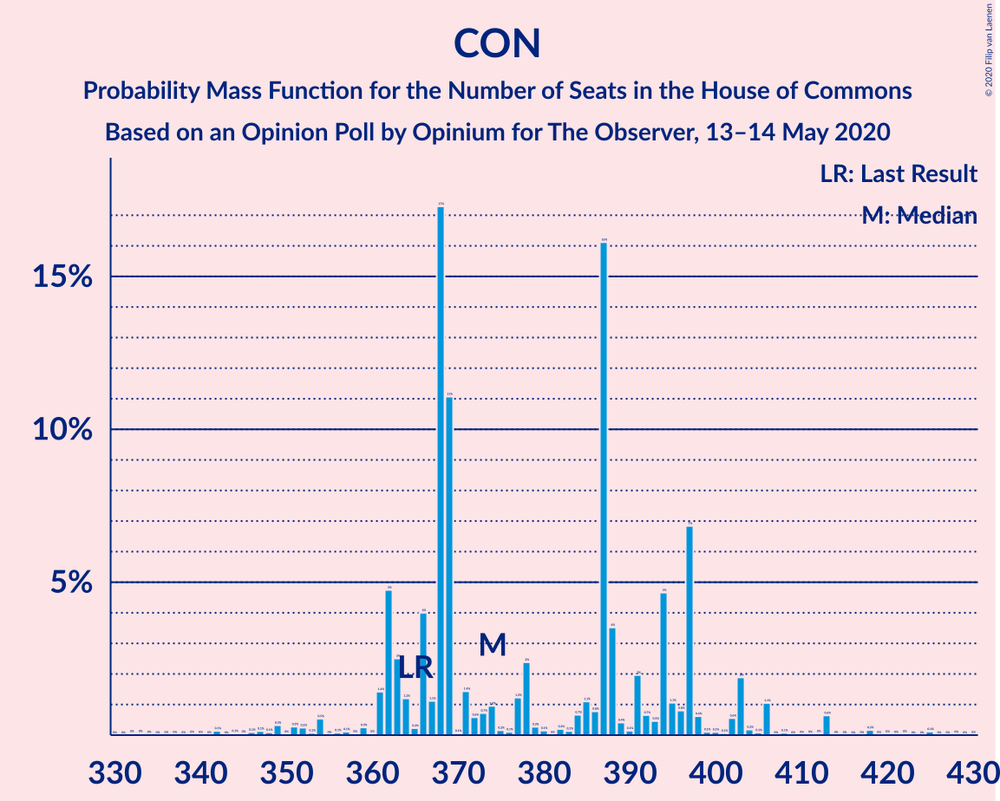

| Number of Seats | Probability | Accumulated | Special Marks |
|:---------------:|:-----------:|:-----------:|:-------------:|
| 332 | 0% | 100% |  |
| 333 | 0% | 99.9% |  |
| 334 | 0% | 99.9% |  |
| 335 | 0% | 99.9% |  |
| 336 | 0% | 99.9% |  |
| 337 | 0% | 99.9% |  |
| 338 | 0% | 99.9% |  |
| 339 | 0% | 99.9% |  |
| 340 | 0% | 99.9% |  |
| 341 | 0% | 99.9% |  |
| 342 | 0.1% | 99.8% |  |
| 343 | 0.1% | 99.7% |  |
| 344 | 0.2% | 99.7% |  |
| 345 | 0.1% | 99.4% |  |
| 346 | 0.9% | 99.4% |  |
| 347 | 0.1% | 98% |  |
| 348 | 0.5% | 98% |  |
| 349 | 0.1% | 98% |  |
| 350 | 0% | 98% |  |
| 351 | 0.5% | 98% |  |
| 352 | 0.1% | 97% |  |
| 353 | 0.3% | 97% |  |
| 354 | 0.2% | 97% |  |
| 355 | 0.2% | 97% |  |
| 356 | 0.1% | 97% |  |
| 357 | 0.4% | 96% |  |
| 358 | 0.5% | 96% |  |
| 359 | 0.9% | 95% |  |
| 360 | 0.1% | 95% |  |
| 361 | 0.6% | 94% |  |
| 362 | 2% | 94% |  |
| 363 | 0.9% | 92% |  |
| 364 | 0.7% | 91% |  |
| 365 | 1.1% | 91% | Last Result |
| 366 | 2% | 90% |  |
| 367 | 3% | 88% |  |
| 368 | 6% | 84% |  |
| 369 | 3% | 79% |  |
| 370 | 0.5% | 76% |  |
| 371 | 1.0% | 75% |  |
| 372 | 1.0% | 74% |  |
| 373 | 1.2% | 73% |  |
| 374 | 2% | 72% |  |
| 375 | 0.4% | 69% |  |
| 376 | 0.9% | 69% |  |
| 377 | 2% | 68% |  |
| 378 | 3% | 66% |  |
| 379 | 3% | 63% |  |
| 380 | 12% | 60% | Median |
| 381 | 7% | 48% |  |
| 382 | 0.5% | 41% |  |
| 383 | 0.8% | 41% |  |
| 384 | 0.8% | 40% |  |
| 385 | 1.3% | 39% |  |
| 386 | 3% | 38% |  |
| 387 | 6% | 34% |  |
| 388 | 1.3% | 29% |  |
| 389 | 9% | 28% |  |
| 390 | 0.5% | 19% |  |
| 391 | 0.7% | 18% |  |
| 392 | 0.7% | 18% |  |
| 393 | 0.3% | 17% |  |
| 394 | 3% | 17% |  |
| 395 | 1.2% | 13% |  |
| 396 | 2% | 12% |  |
| 397 | 2% | 11% |  |
| 398 | 3% | 9% |  |
| 399 | 0.4% | 6% |  |
| 400 | 0.1% | 5% |  |
| 401 | 0.8% | 5% |  |
| 402 | 0.2% | 4% |  |
| 403 | 2% | 4% |  |
| 404 | 0.2% | 3% |  |
| 405 | 0.3% | 2% |  |
| 406 | 0.5% | 2% |  |
| 407 | 0% | 2% |  |
| 408 | 0.1% | 2% |  |
| 409 | 0.2% | 1.5% |  |
| 410 | 0% | 1.3% |  |
| 411 | 0.2% | 1.3% |  |
| 412 | 0% | 1.1% |  |
| 413 | 0.2% | 1.1% |  |
| 414 | 0.3% | 0.9% |  |
| 415 | 0.2% | 0.6% |  |
| 416 | 0% | 0.4% |  |
| 417 | 0% | 0.4% |  |
| 418 | 0.1% | 0.4% |  |
| 419 | 0% | 0.3% |  |
| 420 | 0% | 0.2% |  |
| 421 | 0.1% | 0.2% |  |
| 422 | 0% | 0.2% |  |
| 423 | 0% | 0.1% |  |
| 424 | 0% | 0.1% |  |
| 425 | 0% | 0.1% |  |
| 426 | 0% | 0.1% |  |
| 427 | 0% | 0.1% |  |
| 428 | 0% | 0.1% |  |
| 429 | 0% | 0.1% |  |
| 430 | 0% | 0.1% |  |
| 431 | 0% | 0% |  |

### Conservative Party – Liberal Democrats

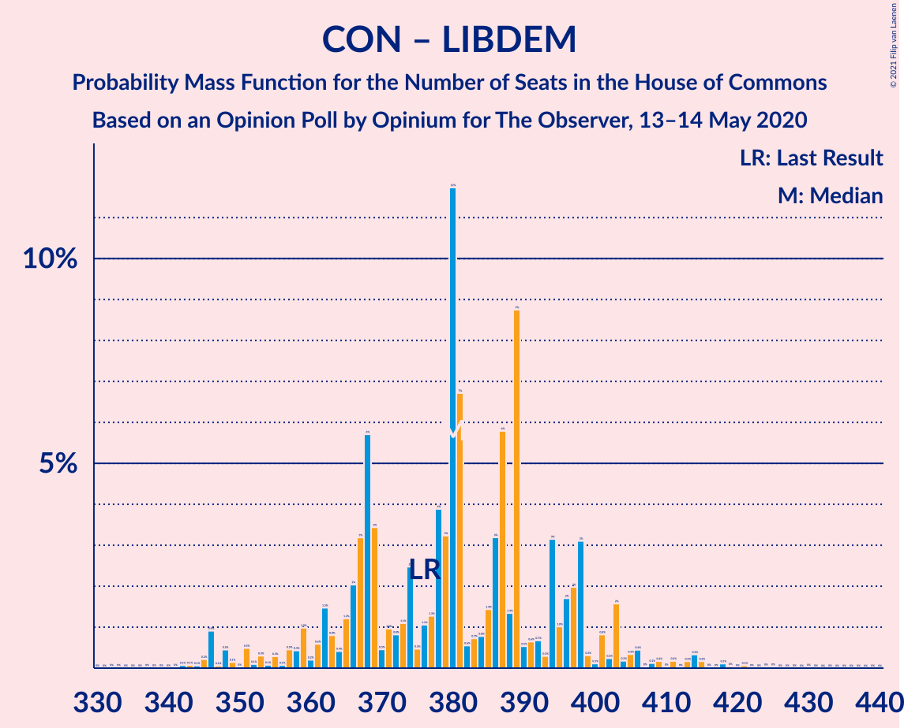

| Number of Seats | Probability | Accumulated | Special Marks |
|:---------------:|:-----------:|:-----------:|:-------------:|
| 332 | 0% | 100% |  |
| 333 | 0% | 99.9% |  |
| 334 | 0% | 99.9% |  |
| 335 | 0% | 99.9% |  |
| 336 | 0% | 99.9% |  |
| 337 | 0% | 99.9% |  |
| 338 | 0% | 99.9% |  |
| 339 | 0% | 99.9% |  |
| 340 | 0% | 99.9% |  |
| 341 | 0% | 99.9% |  |
| 342 | 0.1% | 99.8% |  |
| 343 | 0.1% | 99.8% |  |
| 344 | 0.1% | 99.7% |  |
| 345 | 0.2% | 99.6% |  |
| 346 | 0.9% | 99.4% |  |
| 347 | 0.1% | 98.5% |  |
| 348 | 0.5% | 98% |  |
| 349 | 0.1% | 98% |  |
| 350 | 0% | 98% |  |
| 351 | 0.5% | 98% |  |
| 352 | 0.1% | 97% |  |
| 353 | 0.3% | 97% |  |
| 354 | 0.1% | 97% |  |
| 355 | 0.3% | 97% |  |
| 356 | 0.1% | 97% |  |
| 357 | 0.5% | 96% |  |
| 358 | 0.4% | 96% |  |
| 359 | 1.0% | 96% |  |
| 360 | 0.2% | 95% |  |
| 361 | 0.6% | 94% |  |
| 362 | 1.5% | 94% |  |
| 363 | 0.8% | 92% |  |
| 364 | 0.4% | 92% |  |
| 365 | 1.2% | 91% |  |
| 366 | 2% | 90% |  |
| 367 | 3% | 88% |  |
| 368 | 6% | 85% |  |
| 369 | 3% | 79% |  |
| 370 | 0.5% | 76% |  |
| 371 | 1.0% | 75% |  |
| 372 | 0.8% | 74% |  |
| 373 | 1.1% | 73% |  |
| 374 | 2% | 72% |  |
| 375 | 0.5% | 70% |  |
| 376 | 1.1% | 69% | Last Result |
| 377 | 1.3% | 68% |  |
| 378 | 4% | 67% |  |
| 379 | 3% | 63% |  |
| 380 | 12% | 60% | Median |
| 381 | 7% | 48% |  |
| 382 | 0.6% | 41% |  |
| 383 | 0.7% | 41% |  |
| 384 | 0.8% | 40% |  |
| 385 | 1.4% | 39% |  |
| 386 | 3% | 38% |  |
| 387 | 6% | 35% |  |
| 388 | 1.3% | 29% |  |
| 389 | 9% | 28% |  |
| 390 | 0.5% | 19% |  |
| 391 | 0.6% | 18% |  |
| 392 | 0.7% | 18% |  |
| 393 | 0.3% | 17% |  |
| 394 | 3% | 17% |  |
| 395 | 1.0% | 13% |  |
| 396 | 2% | 12% |  |
| 397 | 2% | 11% |  |
| 398 | 3% | 9% |  |
| 399 | 0.3% | 6% |  |
| 400 | 0.1% | 5% |  |
| 401 | 0.8% | 5% |  |
| 402 | 0.2% | 4% |  |
| 403 | 2% | 4% |  |
| 404 | 0.2% | 3% |  |
| 405 | 0.3% | 2% |  |
| 406 | 0.4% | 2% |  |
| 407 | 0% | 2% |  |
| 408 | 0.1% | 2% |  |
| 409 | 0.2% | 1.5% |  |
| 410 | 0% | 1.3% |  |
| 411 | 0.2% | 1.3% |  |
| 412 | 0% | 1.1% |  |
| 413 | 0.2% | 1.1% |  |
| 414 | 0.3% | 0.9% |  |
| 415 | 0.2% | 0.6% |  |
| 416 | 0% | 0.4% |  |
| 417 | 0% | 0.4% |  |
| 418 | 0.1% | 0.4% |  |
| 419 | 0% | 0.3% |  |
| 420 | 0% | 0.2% |  |
| 421 | 0.1% | 0.2% |  |
| 422 | 0% | 0.2% |  |
| 423 | 0% | 0.1% |  |
| 424 | 0% | 0.1% |  |
| 425 | 0% | 0.1% |  |
| 426 | 0% | 0.1% |  |
| 427 | 0% | 0.1% |  |
| 428 | 0% | 0.1% |  |
| 429 | 0% | 0.1% |  |
| 430 | 0% | 0.1% |  |
| 431 | 0% | 0% |  |

### Labour Party – Liberal Democrats – Scottish National Party – Green Party – Plaid Cymru

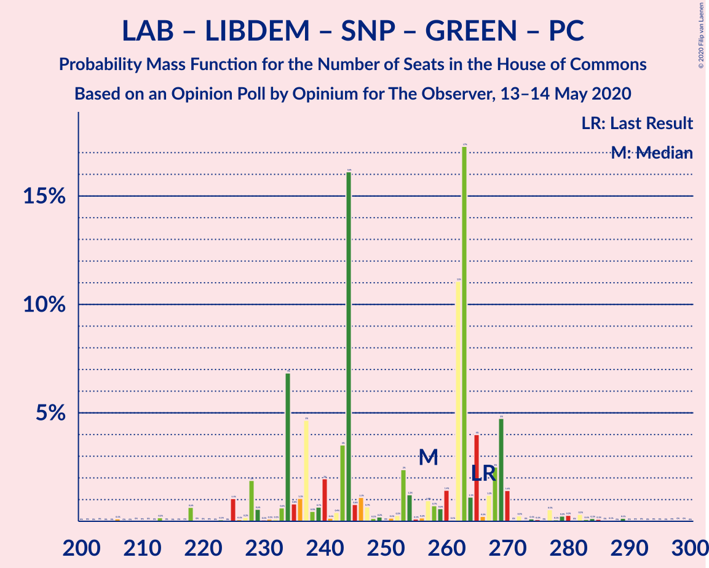

| Number of Seats | Probability | Accumulated | Special Marks |
|:---------------:|:-----------:|:-----------:|:-------------:|
| 201 | 0% | 100% |  |
| 202 | 0% | 99.9% |  |
| 203 | 0% | 99.9% |  |
| 204 | 0% | 99.9% |  |
| 205 | 0% | 99.9% |  |
| 206 | 0% | 99.9% |  |
| 207 | 0% | 99.9% |  |
| 208 | 0% | 99.9% |  |
| 209 | 0% | 99.9% |  |
| 210 | 0.1% | 99.8% |  |
| 211 | 0% | 99.8% |  |
| 212 | 0% | 99.8% |  |
| 213 | 0.1% | 99.7% |  |
| 214 | 0% | 99.6% |  |
| 215 | 0% | 99.6% |  |
| 216 | 0.2% | 99.6% |  |
| 217 | 0.3% | 99.4% |  |
| 218 | 0.2% | 99.1% |  |
| 219 | 0% | 98.9% |  |
| 220 | 0.2% | 98.9% |  |
| 221 | 0% | 98.7% |  |
| 222 | 0.2% | 98.7% |  |
| 223 | 0.1% | 98.5% |  |
| 224 | 0% | 98% |  |
| 225 | 0.5% | 98% |  |
| 226 | 0.3% | 98% |  |
| 227 | 0.2% | 98% |  |
| 228 | 2% | 97% |  |
| 229 | 0.2% | 96% |  |
| 230 | 0.8% | 96% |  |
| 231 | 0.1% | 95% |  |
| 232 | 0.4% | 95% |  |
| 233 | 3% | 94% |  |
| 234 | 2% | 91% |  |
| 235 | 2% | 89% |  |
| 236 | 1.2% | 88% |  |
| 237 | 3% | 87% |  |
| 238 | 0.3% | 83% |  |
| 239 | 0.7% | 83% |  |
| 240 | 0.7% | 82% |  |
| 241 | 0.5% | 82% |  |
| 242 | 9% | 81% |  |
| 243 | 1.3% | 72% |  |
| 244 | 6% | 71% |  |
| 245 | 3% | 66% |  |
| 246 | 1.3% | 62% |  |
| 247 | 0.8% | 61% |  |
| 248 | 0.8% | 60% |  |
| 249 | 0.5% | 59% | Median |
| 250 | 7% | 59% |  |
| 251 | 12% | 52% |  |
| 252 | 3% | 40% |  |
| 253 | 3% | 37% |  |
| 254 | 2% | 34% |  |
| 255 | 0.9% | 32% |  |
| 256 | 0.4% | 31% |  |
| 257 | 2% | 31% |  |
| 258 | 1.2% | 28% |  |
| 259 | 1.0% | 27% |  |
| 260 | 1.0% | 26% |  |
| 261 | 0.5% | 25% |  |
| 262 | 3% | 24% |  |
| 263 | 6% | 21% |  |
| 264 | 3% | 16% |  |
| 265 | 2% | 12% |  |
| 266 | 1.1% | 10% | Last Result |
| 267 | 0.7% | 9% |  |
| 268 | 0.9% | 9% |  |
| 269 | 2% | 8% |  |
| 270 | 0.6% | 6% |  |
| 271 | 0.1% | 6% |  |
| 272 | 0.9% | 5% |  |
| 273 | 0.5% | 5% |  |
| 274 | 0.4% | 4% |  |
| 275 | 0.1% | 4% |  |
| 276 | 0.2% | 3% |  |
| 277 | 0.2% | 3% |  |
| 278 | 0.3% | 3% |  |
| 279 | 0.1% | 3% |  |
| 280 | 0.5% | 3% |  |
| 281 | 0% | 2% |  |
| 282 | 0.1% | 2% |  |
| 283 | 0.5% | 2% |  |
| 284 | 0.1% | 2% |  |
| 285 | 0.9% | 2% |  |
| 286 | 0.1% | 0.6% |  |
| 287 | 0.2% | 0.6% |  |
| 288 | 0.1% | 0.3% |  |
| 289 | 0.1% | 0.3% |  |
| 290 | 0% | 0.2% |  |
| 291 | 0% | 0.1% |  |
| 292 | 0% | 0.1% |  |
| 293 | 0% | 0.1% |  |
| 294 | 0% | 0.1% |  |
| 295 | 0% | 0.1% |  |
| 296 | 0% | 0.1% |  |
| 297 | 0% | 0.1% |  |
| 298 | 0% | 0.1% |  |
| 299 | 0% | 0.1% |  |
| 300 | 0% | 0% |  |

### Labour Party – Liberal Democrats – Scottish National Party – Plaid Cymru

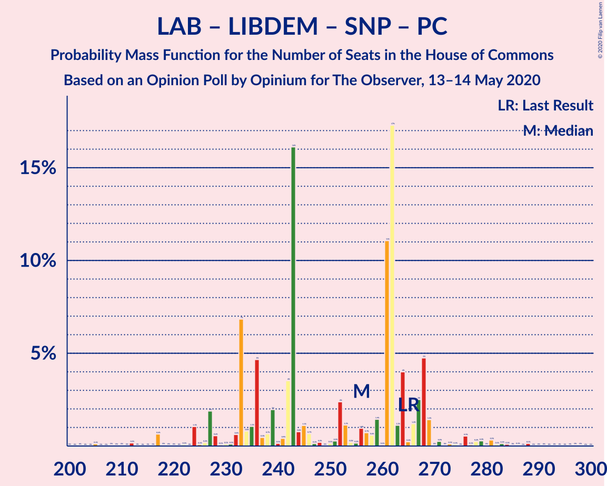

| Number of Seats | Probability | Accumulated | Special Marks |
|:---------------:|:-----------:|:-----------:|:-------------:|
| 200 | 0% | 100% |  |
| 201 | 0% | 99.9% |  |
| 202 | 0% | 99.9% |  |
| 203 | 0% | 99.9% |  |
| 204 | 0% | 99.9% |  |
| 205 | 0% | 99.9% |  |
| 206 | 0% | 99.9% |  |
| 207 | 0% | 99.9% |  |
| 208 | 0% | 99.9% |  |
| 209 | 0.1% | 99.8% |  |
| 210 | 0% | 99.8% |  |
| 211 | 0% | 99.8% |  |
| 212 | 0.1% | 99.7% |  |
| 213 | 0% | 99.6% |  |
| 214 | 0% | 99.6% |  |
| 215 | 0.2% | 99.6% |  |
| 216 | 0.3% | 99.4% |  |
| 217 | 0.2% | 99.1% |  |
| 218 | 0% | 98.9% |  |
| 219 | 0.2% | 98.9% |  |
| 220 | 0% | 98.7% |  |
| 221 | 0.2% | 98.7% |  |
| 222 | 0.1% | 98.5% |  |
| 223 | 0% | 98% |  |
| 224 | 0.5% | 98% |  |
| 225 | 0.3% | 98% |  |
| 226 | 0.2% | 98% |  |
| 227 | 2% | 97% |  |
| 228 | 0.2% | 96% |  |
| 229 | 0.8% | 96% |  |
| 230 | 0.1% | 95% |  |
| 231 | 0.4% | 95% |  |
| 232 | 3% | 94% |  |
| 233 | 2% | 91% |  |
| 234 | 2% | 89% |  |
| 235 | 1.2% | 88% |  |
| 236 | 3% | 87% |  |
| 237 | 0.3% | 83% |  |
| 238 | 0.7% | 83% |  |
| 239 | 0.7% | 82% |  |
| 240 | 0.5% | 82% |  |
| 241 | 9% | 81% |  |
| 242 | 1.3% | 72% |  |
| 243 | 6% | 71% |  |
| 244 | 3% | 66% |  |
| 245 | 1.3% | 62% |  |
| 246 | 0.8% | 61% |  |
| 247 | 0.8% | 60% |  |
| 248 | 0.5% | 59% | Median |
| 249 | 7% | 59% |  |
| 250 | 12% | 52% |  |
| 251 | 3% | 40% |  |
| 252 | 3% | 37% |  |
| 253 | 2% | 34% |  |
| 254 | 0.9% | 32% |  |
| 255 | 0.4% | 31% |  |
| 256 | 2% | 31% |  |
| 257 | 1.2% | 28% |  |
| 258 | 1.0% | 27% |  |
| 259 | 1.0% | 26% |  |
| 260 | 0.5% | 25% |  |
| 261 | 3% | 24% |  |
| 262 | 6% | 21% |  |
| 263 | 3% | 16% |  |
| 264 | 2% | 12% |  |
| 265 | 1.1% | 10% | Last Result |
| 266 | 0.7% | 9% |  |
| 267 | 0.9% | 9% |  |
| 268 | 2% | 8% |  |
| 269 | 0.6% | 6% |  |
| 270 | 0.1% | 6% |  |
| 271 | 0.9% | 5% |  |
| 272 | 0.5% | 5% |  |
| 273 | 0.4% | 4% |  |
| 274 | 0.1% | 4% |  |
| 275 | 0.2% | 3% |  |
| 276 | 0.2% | 3% |  |
| 277 | 0.3% | 3% |  |
| 278 | 0.1% | 3% |  |
| 279 | 0.5% | 3% |  |
| 280 | 0% | 2% |  |
| 281 | 0.1% | 2% |  |
| 282 | 0.5% | 2% |  |
| 283 | 0.1% | 2% |  |
| 284 | 0.9% | 2% |  |
| 285 | 0.1% | 0.6% |  |
| 286 | 0.2% | 0.6% |  |
| 287 | 0.1% | 0.3% |  |
| 288 | 0.1% | 0.3% |  |
| 289 | 0% | 0.2% |  |
| 290 | 0% | 0.1% |  |
| 291 | 0% | 0.1% |  |
| 292 | 0% | 0.1% |  |
| 293 | 0% | 0.1% |  |
| 294 | 0% | 0.1% |  |
| 295 | 0% | 0.1% |  |
| 296 | 0% | 0.1% |  |
| 297 | 0% | 0.1% |  |
| 298 | 0% | 0.1% |  |
| 299 | 0% | 0% |  |

### Labour Party – Scottish National Party – Plaid Cymru

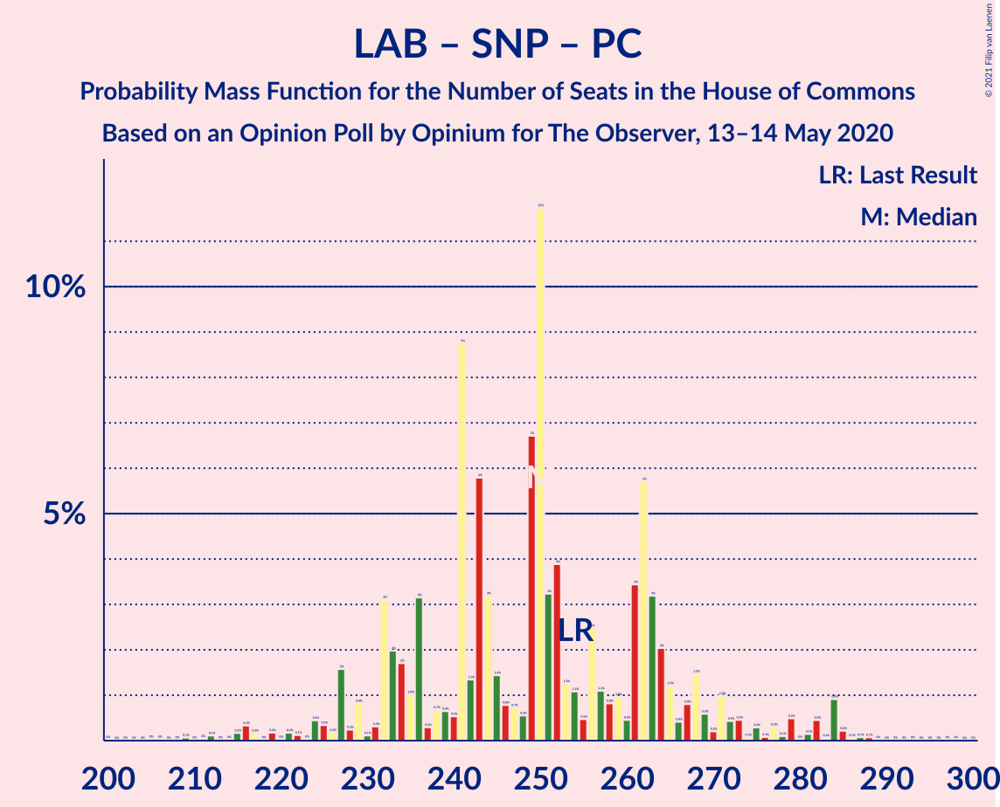

| Number of Seats | Probability | Accumulated | Special Marks |
|:---------------:|:-----------:|:-----------:|:-------------:|
| 200 | 0% | 100% |  |
| 201 | 0% | 99.9% |  |
| 202 | 0% | 99.9% |  |
| 203 | 0% | 99.9% |  |
| 204 | 0% | 99.9% |  |
| 205 | 0% | 99.9% |  |
| 206 | 0% | 99.9% |  |
| 207 | 0% | 99.9% |  |
| 208 | 0% | 99.9% |  |
| 209 | 0.1% | 99.8% |  |
| 210 | 0% | 99.8% |  |
| 211 | 0% | 99.8% |  |
| 212 | 0.1% | 99.7% |  |
| 213 | 0% | 99.6% |  |
| 214 | 0% | 99.6% |  |
| 215 | 0.2% | 99.6% |  |
| 216 | 0.3% | 99.4% |  |
| 217 | 0.2% | 99.1% |  |
| 218 | 0% | 98.9% |  |
| 219 | 0.2% | 98.9% |  |
| 220 | 0% | 98.7% |  |
| 221 | 0.2% | 98.7% |  |
| 222 | 0.1% | 98.5% |  |
| 223 | 0% | 98% |  |
| 224 | 0.4% | 98% |  |
| 225 | 0.3% | 98% |  |
| 226 | 0.2% | 98% |  |
| 227 | 2% | 97% |  |
| 228 | 0.2% | 96% |  |
| 229 | 0.8% | 96% |  |
| 230 | 0.1% | 95% |  |
| 231 | 0.3% | 95% |  |
| 232 | 3% | 94% |  |
| 233 | 2% | 91% |  |
| 234 | 2% | 89% |  |
| 235 | 1.0% | 88% |  |
| 236 | 3% | 87% |  |
| 237 | 0.3% | 83% |  |
| 238 | 0.7% | 83% |  |
| 239 | 0.6% | 82% |  |
| 240 | 0.5% | 82% |  |
| 241 | 9% | 81% |  |
| 242 | 1.3% | 72% |  |
| 243 | 6% | 71% |  |
| 244 | 3% | 65% |  |
| 245 | 1.4% | 62% |  |
| 246 | 0.8% | 61% |  |
| 247 | 0.7% | 60% |  |
| 248 | 0.6% | 59% | Median |
| 249 | 7% | 59% |  |
| 250 | 12% | 52% |  |
| 251 | 3% | 40% |  |
| 252 | 4% | 37% |  |
| 253 | 1.3% | 33% |  |
| 254 | 1.1% | 32% | Last Result |
| 255 | 0.5% | 31% |  |
| 256 | 2% | 30% |  |
| 257 | 1.1% | 28% |  |
| 258 | 0.8% | 27% |  |
| 259 | 1.0% | 26% |  |
| 260 | 0.5% | 25% |  |
| 261 | 3% | 24% |  |
| 262 | 6% | 21% |  |
| 263 | 3% | 15% |  |
| 264 | 2% | 12% |  |
| 265 | 1.2% | 10% |  |
| 266 | 0.4% | 9% |  |
| 267 | 0.8% | 8% |  |
| 268 | 1.5% | 8% |  |
| 269 | 0.6% | 6% |  |
| 270 | 0.2% | 6% |  |
| 271 | 1.0% | 5% |  |
| 272 | 0.4% | 4% |  |
| 273 | 0.5% | 4% |  |
| 274 | 0.1% | 4% |  |
| 275 | 0.3% | 3% |  |
| 276 | 0.1% | 3% |  |
| 277 | 0.3% | 3% |  |
| 278 | 0.1% | 3% |  |
| 279 | 0.5% | 3% |  |
| 280 | 0% | 2% |  |
| 281 | 0.1% | 2% |  |
| 282 | 0.5% | 2% |  |
| 283 | 0.1% | 2% |  |
| 284 | 0.9% | 1.5% |  |
| 285 | 0.2% | 0.6% |  |
| 286 | 0.1% | 0.4% |  |
| 287 | 0.1% | 0.3% |  |
| 288 | 0.1% | 0.2% |  |
| 289 | 0% | 0.2% |  |
| 290 | 0% | 0.1% |  |
| 291 | 0% | 0.1% |  |
| 292 | 0% | 0.1% |  |
| 293 | 0% | 0.1% |  |
| 294 | 0% | 0.1% |  |
| 295 | 0% | 0.1% |  |
| 296 | 0% | 0.1% |  |
| 297 | 0% | 0.1% |  |
| 298 | 0% | 0.1% |  |
| 299 | 0% | 0% |  |

### Labour Party – Liberal Democrats – Scottish National Party

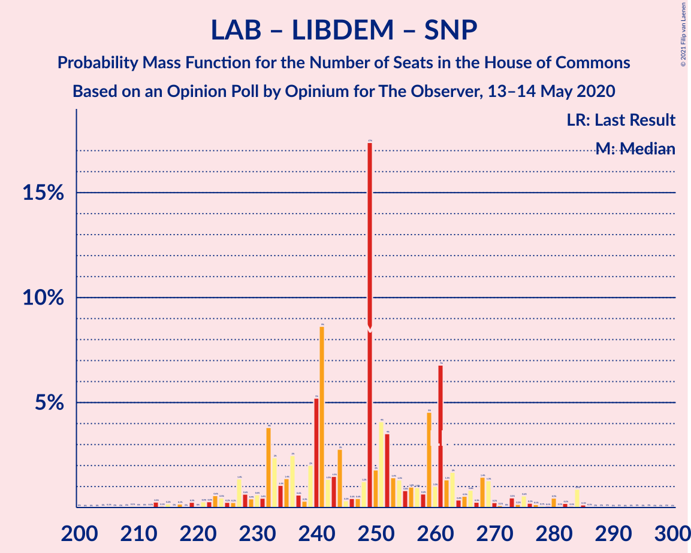

| Number of Seats | Probability | Accumulated | Special Marks |
|:---------------:|:-----------:|:-----------:|:-------------:|
| 200 | 0% | 100% |  |
| 201 | 0% | 99.9% |  |
| 202 | 0% | 99.9% |  |
| 203 | 0% | 99.9% |  |
| 204 | 0% | 99.9% |  |
| 205 | 0.1% | 99.9% |  |
| 206 | 0% | 99.8% |  |
| 207 | 0% | 99.8% |  |
| 208 | 0% | 99.8% |  |
| 209 | 0.1% | 99.8% |  |
| 210 | 0% | 99.7% |  |
| 211 | 0% | 99.7% |  |
| 212 | 0.1% | 99.6% |  |
| 213 | 0.3% | 99.6% |  |
| 214 | 0.1% | 99.3% |  |
| 215 | 0.2% | 99.2% |  |
| 216 | 0% | 99.1% |  |
| 217 | 0.2% | 99.0% |  |
| 218 | 0% | 98.8% |  |
| 219 | 0.3% | 98.8% |  |
| 220 | 0% | 98.6% |  |
| 221 | 0.3% | 98.5% |  |
| 222 | 0.3% | 98% |  |
| 223 | 0.6% | 98% |  |
| 224 | 0.5% | 97% |  |
| 225 | 0.2% | 97% |  |
| 226 | 0.2% | 97% |  |
| 227 | 1.4% | 96% |  |
| 228 | 0.6% | 95% |  |
| 229 | 0.4% | 94% |  |
| 230 | 0.6% | 94% |  |
| 231 | 0.4% | 93% |  |
| 232 | 4% | 93% |  |
| 233 | 2% | 89% |  |
| 234 | 1.1% | 87% |  |
| 235 | 1.4% | 86% |  |
| 236 | 2% | 84% |  |
| 237 | 0.6% | 82% |  |
| 238 | 0.3% | 81% |  |
| 239 | 2% | 81% |  |
| 240 | 5% | 79% |  |
| 241 | 9% | 74% |  |
| 242 | 1.3% | 65% |  |
| 243 | 1.5% | 64% |  |
| 244 | 3% | 62% |  |
| 245 | 0.3% | 59% |  |
| 246 | 0.4% | 59% |  |
| 247 | 0.4% | 59% | Median |
| 248 | 1.2% | 58% |  |
| 249 | 17% | 57% |  |
| 250 | 2% | 40% |  |
| 251 | 4% | 38% |  |
| 252 | 4% | 34% |  |
| 253 | 1.4% | 30% |  |
| 254 | 1.3% | 29% |  |
| 255 | 0.8% | 28% |  |
| 256 | 1.0% | 27% |  |
| 257 | 1.0% | 26% |  |
| 258 | 0.6% | 25% |  |
| 259 | 5% | 24% |  |
| 260 | 1.0% | 20% |  |
| 261 | 7% | 19% | Last Result |
| 262 | 1.3% | 12% |  |
| 263 | 2% | 10% |  |
| 264 | 0.4% | 9% |  |
| 265 | 0.5% | 8% |  |
| 266 | 0.8% | 8% |  |
| 267 | 0.3% | 7% |  |
| 268 | 1.4% | 7% |  |
| 269 | 1.3% | 5% |  |
| 270 | 0.2% | 4% |  |
| 271 | 0.1% | 4% |  |
| 272 | 0% | 4% |  |
| 273 | 0.5% | 4% |  |
| 274 | 0.2% | 3% |  |
| 275 | 0.6% | 3% |  |
| 276 | 0.2% | 3% |  |
| 277 | 0.1% | 2% |  |
| 278 | 0.1% | 2% |  |
| 279 | 0.1% | 2% |  |
| 280 | 0.5% | 2% |  |
| 281 | 0.1% | 2% |  |
| 282 | 0.2% | 1.5% |  |
| 283 | 0.1% | 1.3% |  |
| 284 | 0.9% | 1.2% |  |
| 285 | 0.1% | 0.3% |  |
| 286 | 0.1% | 0.2% |  |
| 287 | 0% | 0.2% |  |
| 288 | 0% | 0.2% |  |
| 289 | 0% | 0.1% |  |
| 290 | 0% | 0.1% |  |
| 291 | 0% | 0.1% |  |
| 292 | 0% | 0.1% |  |
| 293 | 0% | 0.1% |  |
| 294 | 0% | 0.1% |  |
| 295 | 0% | 0.1% |  |
| 296 | 0% | 0.1% |  |
| 297 | 0% | 0% |  |

### Labour Party – Scottish National Party

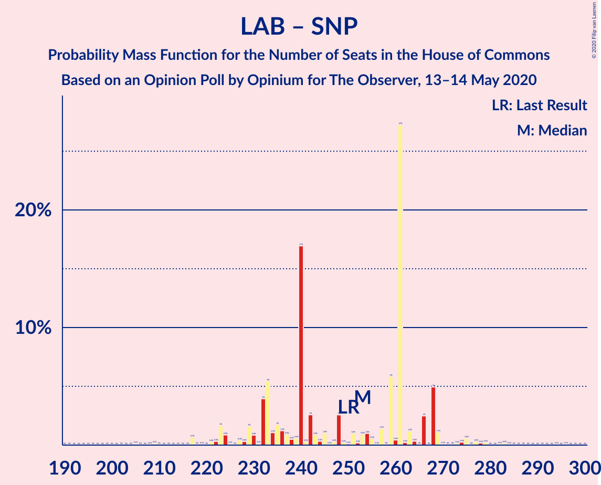

| Number of Seats | Probability | Accumulated | Special Marks |
|:---------------:|:-----------:|:-----------:|:-------------:|
| 200 | 0% | 100% |  |
| 201 | 0% | 99.9% |  |
| 202 | 0% | 99.9% |  |
| 203 | 0% | 99.9% |  |
| 204 | 0% | 99.9% |  |
| 205 | 0.1% | 99.9% |  |
| 206 | 0% | 99.8% |  |
| 207 | 0% | 99.8% |  |
| 208 | 0% | 99.8% |  |
| 209 | 0.1% | 99.8% |  |
| 210 | 0% | 99.7% |  |
| 211 | 0% | 99.7% |  |
| 212 | 0.1% | 99.6% |  |
| 213 | 0.3% | 99.6% |  |
| 214 | 0.1% | 99.3% |  |
| 215 | 0.2% | 99.2% |  |
| 216 | 0% | 99.1% |  |
| 217 | 0.2% | 99.0% |  |
| 218 | 0% | 98.8% |  |
| 219 | 0.3% | 98.8% |  |
| 220 | 0% | 98.6% |  |
| 221 | 0.3% | 98.5% |  |
| 222 | 0.3% | 98% |  |
| 223 | 0.6% | 98% |  |
| 224 | 0.5% | 97% |  |
| 225 | 0.3% | 97% |  |
| 226 | 0.3% | 97% |  |
| 227 | 1.3% | 96% |  |
| 228 | 0.7% | 95% |  |
| 229 | 0.4% | 94% |  |
| 230 | 0.6% | 94% |  |
| 231 | 0.5% | 93% |  |
| 232 | 4% | 93% |  |
| 233 | 2% | 89% |  |
| 234 | 1.2% | 87% |  |
| 235 | 1.3% | 86% |  |
| 236 | 2% | 84% |  |
| 237 | 0.6% | 82% |  |
| 238 | 0.3% | 81% |  |
| 239 | 2% | 81% |  |
| 240 | 5% | 79% |  |
| 241 | 8% | 73% |  |
| 242 | 1.3% | 65% |  |
| 243 | 1.5% | 64% |  |
| 244 | 3% | 62% |  |
| 245 | 0.4% | 59% |  |
| 246 | 0.3% | 59% |  |
| 247 | 0.7% | 59% | Median |
| 248 | 1.0% | 58% |  |
| 249 | 18% | 57% |  |
| 250 | 0.9% | 39% | Last Result |
| 251 | 4% | 38% |  |
| 252 | 4% | 34% |  |
| 253 | 1.5% | 30% |  |
| 254 | 1.5% | 29% |  |
| 255 | 0.8% | 27% |  |
| 256 | 1.0% | 26% |  |
| 257 | 0.8% | 25% |  |
| 258 | 0.6% | 25% |  |
| 259 | 5% | 24% |  |
| 260 | 1.1% | 20% |  |
| 261 | 7% | 18% |  |
| 262 | 1.3% | 11% |  |
| 263 | 1.3% | 10% |  |
| 264 | 0.3% | 9% |  |
| 265 | 0.6% | 8% |  |
| 266 | 0.8% | 8% |  |
| 267 | 0.2% | 7% |  |
| 268 | 1.5% | 7% |  |
| 269 | 1.3% | 5% |  |
| 270 | 0.1% | 4% |  |
| 271 | 0.1% | 4% |  |
| 272 | 0% | 4% |  |
| 273 | 0.5% | 4% |  |
| 274 | 0.2% | 3% |  |
| 275 | 0.7% | 3% |  |
| 276 | 0.1% | 2% |  |
| 277 | 0.1% | 2% |  |
| 278 | 0.1% | 2% |  |
| 279 | 0.1% | 2% |  |
| 280 | 0.4% | 2% |  |
| 281 | 0.2% | 2% |  |
| 282 | 0% | 1.3% |  |
| 283 | 0.1% | 1.3% |  |
| 284 | 1.0% | 1.2% |  |
| 285 | 0.1% | 0.2% |  |
| 286 | 0% | 0.2% |  |
| 287 | 0% | 0.2% |  |
| 288 | 0% | 0.1% |  |
| 289 | 0% | 0.1% |  |
| 290 | 0% | 0.1% |  |
| 291 | 0% | 0.1% |  |
| 292 | 0% | 0.1% |  |
| 293 | 0% | 0.1% |  |
| 294 | 0% | 0.1% |  |
| 295 | 0% | 0.1% |  |
| 296 | 0% | 0.1% |  |
| 297 | 0% | 0% |  |

### Labour Party – Liberal Democrats – Plaid Cymru

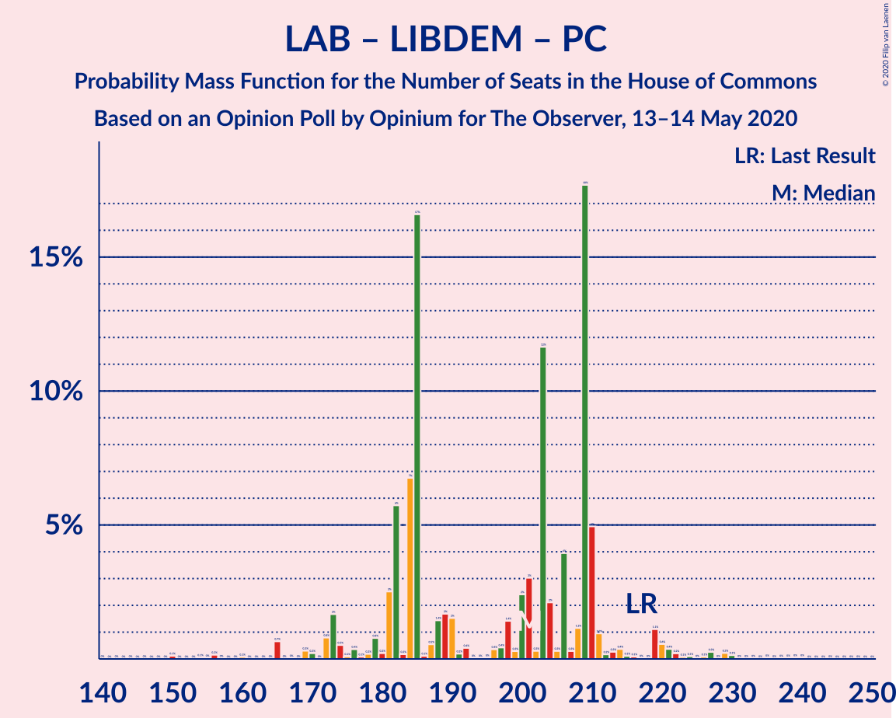

| Number of Seats | Probability | Accumulated | Special Marks |
|:---------------:|:-----------:|:-----------:|:-------------:|
| 147 | 0% | 100% |  |
| 148 | 0% | 99.9% |  |
| 149 | 0% | 99.9% |  |
| 150 | 0% | 99.9% |  |
| 151 | 0% | 99.9% |  |
| 152 | 0% | 99.9% |  |
| 153 | 0% | 99.9% |  |
| 154 | 0% | 99.9% |  |
| 155 | 0% | 99.9% |  |
| 156 | 0% | 99.8% |  |
| 157 | 0% | 99.8% |  |
| 158 | 0% | 99.7% |  |
| 159 | 0% | 99.7% |  |
| 160 | 0.2% | 99.7% |  |
| 161 | 0% | 99.5% |  |
| 162 | 0% | 99.5% |  |
| 163 | 0% | 99.4% |  |
| 164 | 0% | 99.4% |  |
| 165 | 0.3% | 99.4% |  |
| 166 | 0.3% | 99.1% |  |
| 167 | 0.1% | 98.8% |  |
| 168 | 0.1% | 98.8% |  |
| 169 | 0.2% | 98.7% |  |
| 170 | 1.4% | 98.5% |  |
| 171 | 0.3% | 97% |  |
| 172 | 0.3% | 97% |  |
| 173 | 0.6% | 97% |  |
| 174 | 0.4% | 96% |  |
| 175 | 0.1% | 96% |  |
| 176 | 0.3% | 95% |  |
| 177 | 0.1% | 95% |  |
| 178 | 4% | 95% |  |
| 179 | 0.2% | 91% |  |
| 180 | 1.0% | 91% |  |
| 181 | 3% | 90% |  |
| 182 | 2% | 87% |  |
| 183 | 0.4% | 86% |  |
| 184 | 3% | 85% |  |
| 185 | 8% | 82% |  |
| 186 | 6% | 74% |  |
| 187 | 1.4% | 68% |  |
| 188 | 0.9% | 67% |  |
| 189 | 3% | 66% |  |
| 190 | 0.7% | 63% |  |
| 191 | 0.2% | 62% |  |
| 192 | 12% | 62% |  |
| 193 | 0.3% | 51% | Median |
| 194 | 7% | 50% |  |
| 195 | 3% | 43% |  |
| 196 | 4% | 40% |  |
| 197 | 3% | 36% |  |
| 198 | 2% | 33% |  |
| 199 | 0.5% | 31% |  |
| 200 | 2% | 31% |  |
| 201 | 2% | 29% |  |
| 202 | 1.0% | 28% |  |
| 203 | 4% | 27% |  |
| 204 | 1.3% | 23% |  |
| 205 | 1.0% | 22% |  |
| 206 | 1.4% | 21% |  |
| 207 | 2% | 19% |  |
| 208 | 2% | 17% |  |
| 209 | 4% | 15% |  |
| 210 | 1.3% | 10% |  |
| 211 | 0.8% | 9% |  |
| 212 | 1.0% | 8% |  |
| 213 | 1.3% | 7% |  |
| 214 | 0.6% | 6% |  |
| 215 | 0.6% | 5% |  |
| 216 | 0.1% | 5% |  |
| 217 | 0.2% | 4% | Last Result |
| 218 | 0.2% | 4% |  |
| 219 | 0.6% | 4% |  |
| 220 | 0.5% | 3% |  |
| 221 | 0.2% | 3% |  |
| 222 | 0.1% | 3% |  |
| 223 | 0.1% | 3% |  |
| 224 | 0.5% | 2% |  |
| 225 | 0.3% | 2% |  |
| 226 | 0.9% | 2% |  |
| 227 | 0.1% | 0.8% |  |
| 228 | 0.2% | 0.7% |  |
| 229 | 0.2% | 0.5% |  |
| 230 | 0.1% | 0.4% |  |
| 231 | 0% | 0.3% |  |
| 232 | 0% | 0.2% |  |
| 233 | 0% | 0.2% |  |
| 234 | 0% | 0.1% |  |
| 235 | 0% | 0.1% |  |
| 236 | 0% | 0.1% |  |
| 237 | 0% | 0.1% |  |
| 238 | 0% | 0.1% |  |
| 239 | 0% | 0.1% |  |
| 240 | 0% | 0.1% |  |
| 241 | 0% | 0% |  |

### Labour Party – Plaid Cymru

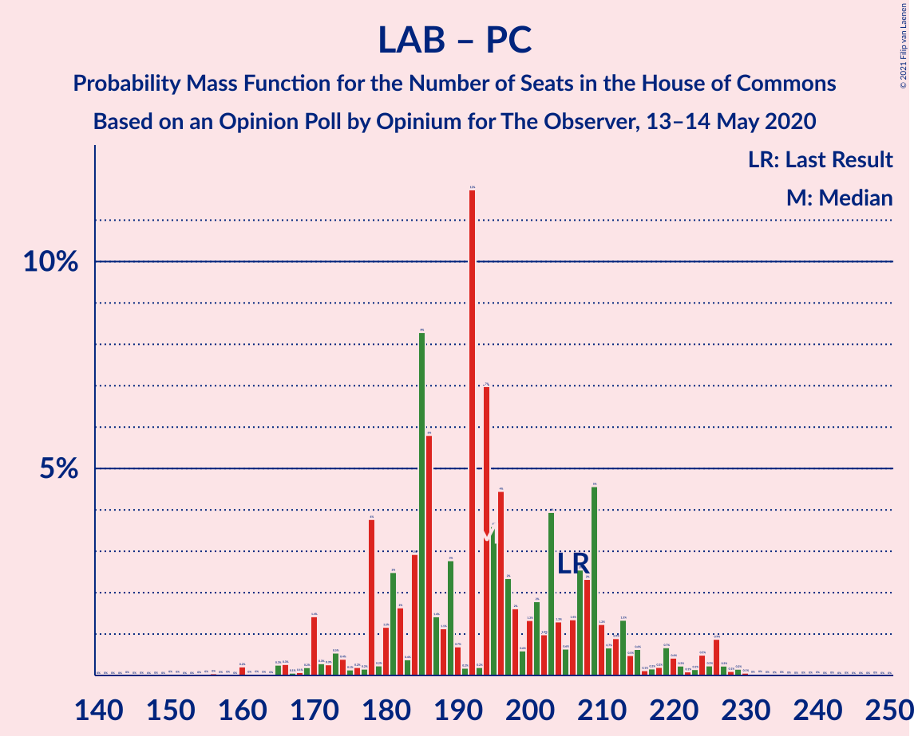

| Number of Seats | Probability | Accumulated | Special Marks |
|:---------------:|:-----------:|:-----------:|:-------------:|
| 146 | 0% | 100% |  |
| 147 | 0% | 99.9% |  |
| 148 | 0% | 99.9% |  |
| 149 | 0% | 99.9% |  |
| 150 | 0% | 99.9% |  |
| 151 | 0% | 99.9% |  |
| 152 | 0% | 99.9% |  |
| 153 | 0% | 99.9% |  |
| 154 | 0% | 99.9% |  |
| 155 | 0% | 99.9% |  |
| 156 | 0% | 99.8% |  |
| 157 | 0% | 99.8% |  |
| 158 | 0% | 99.7% |  |
| 159 | 0% | 99.7% |  |
| 160 | 0.2% | 99.7% |  |
| 161 | 0% | 99.5% |  |
| 162 | 0% | 99.5% |  |
| 163 | 0% | 99.4% |  |
| 164 | 0% | 99.4% |  |
| 165 | 0.3% | 99.4% |  |
| 166 | 0.3% | 99.1% |  |
| 167 | 0.1% | 98.8% |  |
| 168 | 0.1% | 98.8% |  |
| 169 | 0.2% | 98.7% |  |
| 170 | 1.4% | 98.5% |  |
| 171 | 0.3% | 97% |  |
| 172 | 0.3% | 97% |  |
| 173 | 0.5% | 97% |  |
| 174 | 0.4% | 96% |  |
| 175 | 0.1% | 96% |  |
| 176 | 0.2% | 95% |  |
| 177 | 0.2% | 95% |  |
| 178 | 4% | 95% |  |
| 179 | 0.2% | 91% |  |
| 180 | 1.2% | 91% |  |
| 181 | 2% | 90% |  |
| 182 | 2% | 87% |  |
| 183 | 0.4% | 86% |  |
| 184 | 3% | 85% |  |
| 185 | 8% | 82% |  |
| 186 | 6% | 74% |  |
| 187 | 1.4% | 68% |  |
| 188 | 1.1% | 67% |  |
| 189 | 3% | 66% |  |
| 190 | 0.7% | 63% |  |
| 191 | 0.2% | 62% |  |
| 192 | 12% | 62% |  |
| 193 | 0.2% | 50% | Median |
| 194 | 7% | 50% |  |
| 195 | 4% | 43% |  |
| 196 | 4% | 40% |  |
| 197 | 2% | 35% |  |
| 198 | 2% | 33% |  |
| 199 | 0.6% | 31% |  |
| 200 | 1.3% | 31% |  |
| 201 | 2% | 29% |  |
| 202 | 1.0% | 27% |  |
| 203 | 4% | 26% |  |
| 204 | 1.3% | 23% |  |
| 205 | 0.6% | 21% |  |
| 206 | 1.4% | 21% | Last Result |
| 207 | 3% | 19% |  |
| 208 | 2% | 17% |  |
| 209 | 5% | 14% |  |
| 210 | 1.2% | 10% |  |
| 211 | 0.7% | 9% |  |
| 212 | 0.9% | 8% |  |
| 213 | 1.3% | 7% |  |
| 214 | 0.5% | 6% |  |
| 215 | 0.6% | 5% |  |
| 216 | 0.1% | 4% |  |
| 217 | 0.2% | 4% |  |
| 218 | 0.2% | 4% |  |
| 219 | 0.7% | 4% |  |
| 220 | 0.4% | 3% |  |
| 221 | 0.2% | 3% |  |
| 222 | 0.1% | 3% |  |
| 223 | 0.1% | 3% |  |
| 224 | 0.5% | 2% |  |
| 225 | 0.2% | 2% |  |
| 226 | 0.9% | 2% |  |
| 227 | 0.2% | 0.8% |  |
| 228 | 0.1% | 0.6% |  |
| 229 | 0.2% | 0.5% |  |
| 230 | 0.1% | 0.3% |  |
| 231 | 0% | 0.2% |  |
| 232 | 0% | 0.2% |  |
| 233 | 0% | 0.2% |  |
| 234 | 0% | 0.1% |  |
| 235 | 0% | 0.1% |  |
| 236 | 0% | 0.1% |  |
| 237 | 0% | 0.1% |  |
| 238 | 0% | 0.1% |  |
| 239 | 0% | 0.1% |  |
| 240 | 0% | 0.1% |  |
| 241 | 0% | 0% |  |

### Labour Party – Liberal Democrats

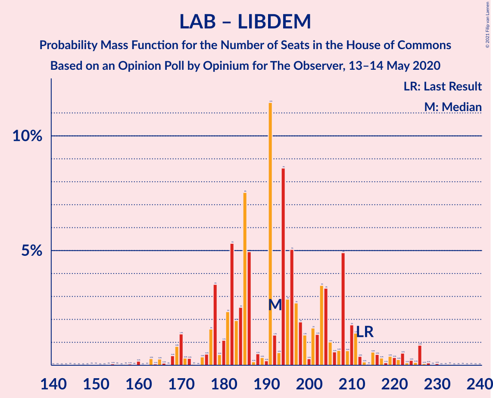

| Number of Seats | Probability | Accumulated | Special Marks |
|:---------------:|:-----------:|:-----------:|:-------------:|
| 144 | 0% | 100% |  |
| 145 | 0% | 99.9% |  |
| 146 | 0% | 99.9% |  |
| 147 | 0% | 99.9% |  |
| 148 | 0% | 99.9% |  |
| 149 | 0% | 99.9% |  |
| 150 | 0% | 99.9% |  |
| 151 | 0% | 99.9% |  |
| 152 | 0% | 99.9% |  |
| 153 | 0% | 99.9% |  |
| 154 | 0.1% | 99.8% |  |
| 155 | 0% | 99.8% |  |
| 156 | 0% | 99.7% |  |
| 157 | 0% | 99.7% |  |
| 158 | 0.1% | 99.7% |  |
| 159 | 0% | 99.6% |  |
| 160 | 0.2% | 99.6% |  |
| 161 | 0% | 99.4% |  |
| 162 | 0% | 99.4% |  |
| 163 | 0.3% | 99.4% |  |
| 164 | 0.1% | 99.1% |  |
| 165 | 0.3% | 99.0% |  |
| 166 | 0.1% | 98.8% |  |
| 167 | 0% | 98.7% |  |
| 168 | 0.4% | 98.6% |  |
| 169 | 0.8% | 98% |  |
| 170 | 1.4% | 97% |  |
| 171 | 0.3% | 96% |  |
| 172 | 0.3% | 96% |  |
| 173 | 0% | 95% |  |
| 174 | 0% | 95% |  |
| 175 | 0.4% | 95% |  |
| 176 | 0.5% | 95% |  |
| 177 | 2% | 95% |  |
| 178 | 4% | 93% |  |
| 179 | 0.5% | 89% |  |
| 180 | 1.1% | 89% |  |
| 181 | 2% | 88% |  |
| 182 | 5% | 86% |  |
| 183 | 2% | 80% |  |
| 184 | 3% | 78% |  |
| 185 | 8% | 76% |  |
| 186 | 5% | 68% |  |
| 187 | 0.2% | 63% |  |
| 188 | 0.5% | 63% |  |
| 189 | 0.3% | 63% |  |
| 190 | 0.2% | 62% |  |
| 191 | 11% | 62% |  |
| 192 | 1.3% | 51% | Median |
| 193 | 0.5% | 49% |  |
| 194 | 9% | 49% |  |
| 195 | 3% | 40% |  |
| 196 | 5% | 37% |  |
| 197 | 3% | 32% |  |
| 198 | 2% | 30% |  |
| 199 | 1.3% | 28% |  |
| 200 | 0.3% | 26% |  |
| 201 | 2% | 26% |  |
| 202 | 1.3% | 24% |  |
| 203 | 3% | 23% |  |
| 204 | 3% | 20% |  |
| 205 | 1.0% | 16% |  |
| 206 | 0.6% | 15% |  |
| 207 | 0.6% | 15% |  |
| 208 | 5% | 14% |  |
| 209 | 0.6% | 9% |  |
| 210 | 2% | 8% |  |
| 211 | 1.4% | 7% |  |
| 212 | 0.4% | 5% |  |
| 213 | 0.1% | 5% | Last Result |
| 214 | 0% | 5% |  |
| 215 | 0.6% | 5% |  |
| 216 | 0.5% | 4% |  |
| 217 | 0.3% | 4% |  |
| 218 | 0.1% | 3% |  |
| 219 | 0.4% | 3% |  |
| 220 | 0.3% | 3% |  |
| 221 | 0.2% | 3% |  |
| 222 | 0.5% | 2% |  |
| 223 | 0.1% | 2% |  |
| 224 | 0.2% | 2% |  |
| 225 | 0.1% | 1.4% |  |
| 226 | 0.9% | 1.3% |  |
| 227 | 0.1% | 0.4% |  |
| 228 | 0.1% | 0.4% |  |
| 229 | 0% | 0.3% |  |
| 230 | 0.1% | 0.2% |  |
| 231 | 0% | 0.2% |  |
| 232 | 0% | 0.2% |  |
| 233 | 0% | 0.1% |  |
| 234 | 0% | 0.1% |  |
| 235 | 0% | 0.1% |  |
| 236 | 0% | 0.1% |  |
| 237 | 0% | 0.1% |  |
| 238 | 0% | 0.1% |  |
| 239 | 0% | 0% |  |

### Labour Party

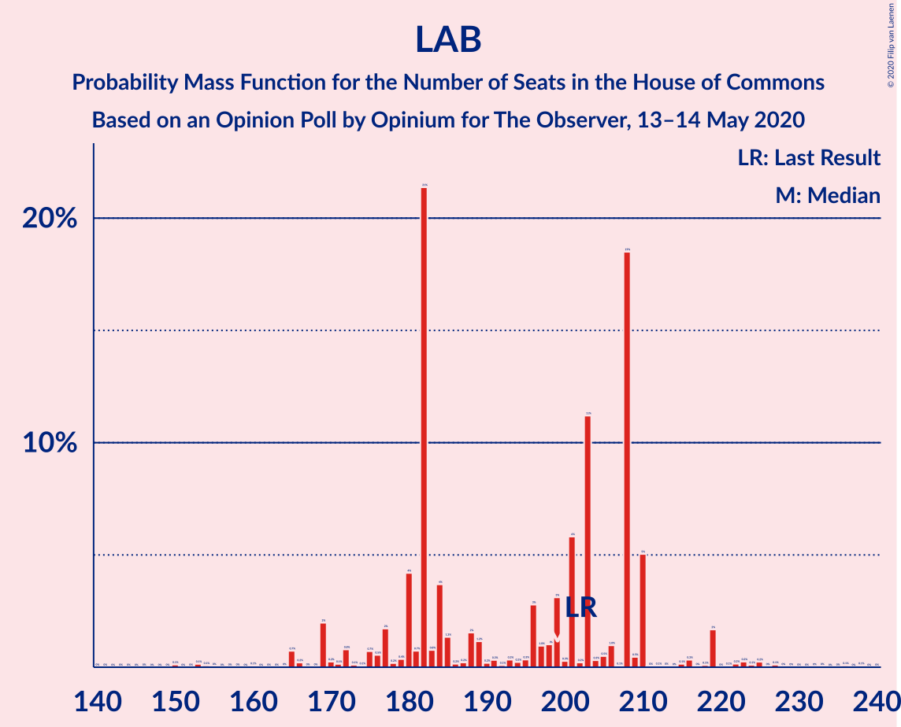

| Number of Seats | Probability | Accumulated | Special Marks |
|:---------------:|:-----------:|:-----------:|:-------------:|
| 144 | 0% | 100% |  |
| 145 | 0% | 99.9% |  |
| 146 | 0% | 99.9% |  |
| 147 | 0% | 99.9% |  |
| 148 | 0% | 99.9% |  |
| 149 | 0% | 99.9% |  |
| 150 | 0% | 99.9% |  |
| 151 | 0% | 99.9% |  |
| 152 | 0% | 99.9% |  |
| 153 | 0% | 99.9% |  |
| 154 | 0.1% | 99.8% |  |
| 155 | 0% | 99.8% |  |
| 156 | 0% | 99.7% |  |
| 157 | 0% | 99.7% |  |
| 158 | 0.1% | 99.7% |  |
| 159 | 0% | 99.6% |  |
| 160 | 0.2% | 99.6% |  |
| 161 | 0% | 99.4% |  |
| 162 | 0% | 99.4% |  |
| 163 | 0.3% | 99.4% |  |
| 164 | 0.1% | 99.1% |  |
| 165 | 0.3% | 99.0% |  |
| 166 | 0.1% | 98.8% |  |
| 167 | 0% | 98.7% |  |
| 168 | 0.4% | 98.6% |  |
| 169 | 0.8% | 98% |  |
| 170 | 1.4% | 97% |  |
| 171 | 0.4% | 96% |  |
| 172 | 0.2% | 96% |  |
| 173 | 0% | 95% |  |
| 174 | 0% | 95% |  |
| 175 | 0.4% | 95% |  |
| 176 | 0.5% | 95% |  |
| 177 | 2% | 95% |  |
| 178 | 3% | 93% |  |
| 179 | 0.5% | 89% |  |
| 180 | 1.3% | 89% |  |
| 181 | 2% | 88% |  |
| 182 | 5% | 86% |  |
| 183 | 2% | 80% |  |
| 184 | 2% | 78% |  |
| 185 | 8% | 76% |  |
| 186 | 5% | 68% |  |
| 187 | 0.1% | 63% |  |
| 188 | 0.5% | 63% |  |
| 189 | 0.3% | 63% |  |
| 190 | 0.2% | 62% |  |
| 191 | 12% | 62% |  |
| 192 | 1.1% | 50% | Median |
| 193 | 1.3% | 49% |  |
| 194 | 8% | 48% |  |
| 195 | 3% | 40% |  |
| 196 | 5% | 37% |  |
| 197 | 3% | 32% |  |
| 198 | 2% | 29% |  |
| 199 | 1.2% | 27% |  |
| 200 | 0.1% | 26% |  |
| 201 | 2% | 26% |  |
| 202 | 1.4% | 24% | Last Result |
| 203 | 4% | 23% |  |
| 204 | 3% | 19% |  |
| 205 | 0.6% | 16% |  |
| 206 | 0.7% | 15% |  |
| 207 | 0.7% | 14% |  |
| 208 | 5% | 14% |  |
| 209 | 0.6% | 9% |  |
| 210 | 2% | 8% |  |
| 211 | 2% | 7% |  |
| 212 | 0.2% | 5% |  |
| 213 | 0.1% | 5% |  |
| 214 | 0% | 5% |  |
| 215 | 0.6% | 5% |  |
| 216 | 0.5% | 4% |  |
| 217 | 0.3% | 4% |  |
| 218 | 0.2% | 3% |  |
| 219 | 0.5% | 3% |  |
| 220 | 0.2% | 3% |  |
| 221 | 0.2% | 2% |  |
| 222 | 0.5% | 2% |  |
| 223 | 0.3% | 2% |  |
| 224 | 0.1% | 1.5% |  |
| 225 | 0.1% | 1.4% |  |
| 226 | 0.9% | 1.3% |  |
| 227 | 0.1% | 0.4% |  |
| 228 | 0% | 0.3% |  |
| 229 | 0.1% | 0.3% |  |
| 230 | 0% | 0.2% |  |
| 231 | 0% | 0.2% |  |
| 232 | 0% | 0.1% |  |
| 233 | 0% | 0.1% |  |
| 234 | 0% | 0.1% |  |
| 235 | 0% | 0.1% |  |
| 236 | 0% | 0.1% |  |
| 237 | 0% | 0.1% |  |
| 238 | 0% | 0.1% |  |
| 239 | 0% | 0% |  |

## Technical Information

### Opinion Poll

+ **Polling firm:** Opinium
+ **Commissioner(s):** The Observer
+ **Fieldwork period:** 13–14 May 2020

### Calculations

+ **Sample size:** 1043
+ **Simulations done:** 524,288
+ **Error estimate:** 0.75%

