# Opinion Poll by YouGov for The Times, 18–19 May 2020

<a href="#voting-intentions">Voting Intentions</a> | <a href="#seats">Seats</a> | <a href="#coalitions">Coalitions</a> | <a href="#technical-information">Technical Information</a>

## Voting Intentions

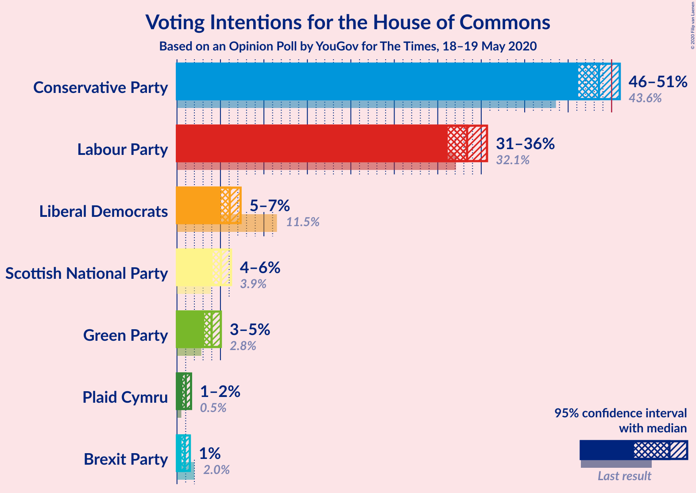

### Confidence Intervals

| Party | Last Result | Poll Result | 80% Confidence Interval | 90% Confidence Interval | 95% Confidence Interval | 99% Confidence Interval |
|:-----:|:-----------:|:-----------:|:-----------------------:|:-----------------------:|:-----------------------:|:-----------------------:|
| Conservative Party | 43.6% | 48.5% | 47.0–50.1% |46.5–50.6% |46.2–50.9% |45.4–51.7% |
| Labour Party | 32.1% | 33.4% | 31.9–34.9% |31.5–35.3% |31.2–35.7% |30.5–36.4% |
| Liberal Democrats | 11.5% | 6.1% | 5.4–6.9% |5.2–7.1% |5.0–7.3% |4.7–7.7% |
| Scottish National Party | 3.9% | 5.1% | 4.4–5.8% |4.3–6.0% |4.1–6.2% |3.8–6.6% |
| Green Party | 2.8% | 4.0% | 3.4–4.7% |3.3–4.9% |3.1–5.0% |2.9–5.4% |
| Plaid Cymru | 0.5% | 1.0% | 0.8–1.4% |0.7–1.5% |0.6–1.6% |0.5–1.8% |
| Brexit Party | 2.0% | 0.9% | 0.7–1.3% |0.6–1.4% |0.5–1.5% |0.4–1.7% |

*Note:* The poll result column reflects the actual value used in the calculations. Published results may vary slightly, and in addition be rounded to fewer digits.

## Seats

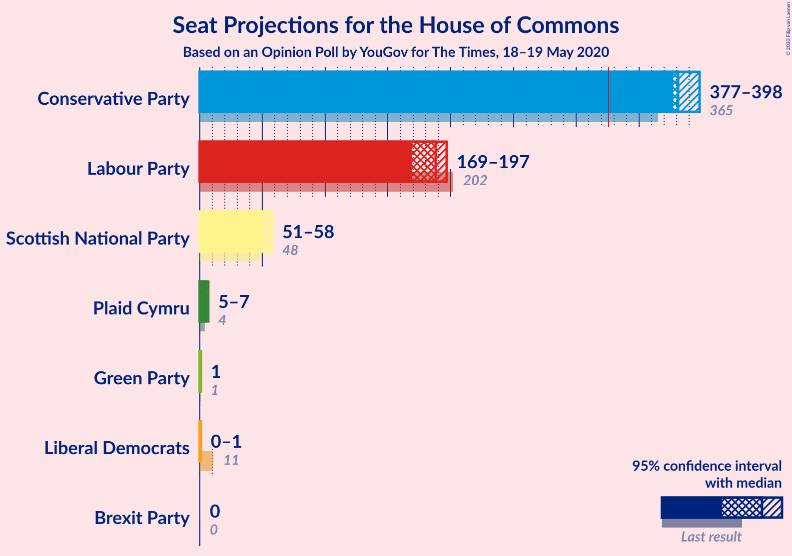

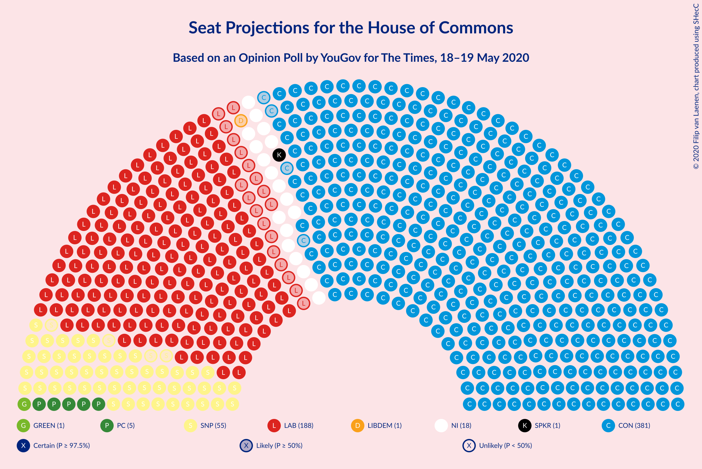

### Confidence Intervals

| Party | Last Result | Median | 80% Confidence Interval | 90% Confidence Interval | 95% Confidence Interval | 99% Confidence Interval |
|:-----:|:-----------:|:------:|:-----------------------:|:-----------------------:|:-----------------------:|:-----------------------:|
| <a href="#conservative-party">Conservative Party</a> | 365 | 381 | 381 |379–391 |377–398 |370–398 |
| <a href="#labour-party">Labour Party</a> | 202 | 188 | 188 |178–190 |169–197 |169–197 |
| <a href="#liberal-democrats">Liberal Democrats</a> | 11 | 1 | 0–1 |0–1 |0–1 |0–1 |
| <a href="#scottish-national-party">Scottish National Party</a> | 48 | 55 | 55 |52–56 |51–58 |51–58 |
| <a href="#green-party">Green Party</a> | 1 | 1 | 1 |1 |1 |1 |
| <a href="#plaid-cymru">Plaid Cymru</a> | 4 | 5 | 5 |5–6 |5–7 |5–7 |
| <a href="#brexit-party">Brexit Party</a> | 0 | 0 | 0 |0 |0 |0 |

### Conservative Party

*For a full overview of the results for this party, see the [Conservative Party](party-conservativeparty.html) page.*

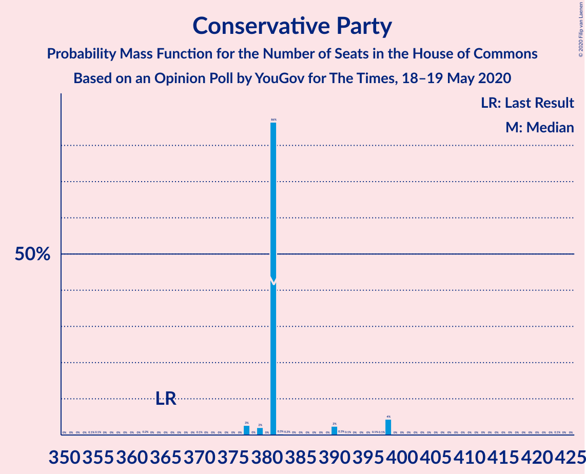

| Number of Seats | Probability | Accumulated | Special Marks |
|:---------------:|:-----------:|:-----------:|:-------------:|
| 352 | 0% | 100% |  |
| 353 | 0% | 99.9% |  |
| 354 | 0.1% | 99.9% |  |
| 355 | 0.1% | 99.9% |  |
| 356 | 0% | 99.8% |  |
| 357 | 0% | 99.8% |  |
| 358 | 0% | 99.8% |  |
| 359 | 0% | 99.8% |  |
| 360 | 0% | 99.8% |  |
| 361 | 0% | 99.8% |  |
| 362 | 0.2% | 99.8% |  |
| 363 | 0% | 99.6% |  |
| 364 | 0% | 99.6% |  |
| 365 | 0% | 99.6% | Last Result |
| 366 | 0% | 99.6% |  |
| 367 | 0% | 99.6% |  |
| 368 | 0% | 99.6% |  |
| 369 | 0% | 99.6% |  |
| 370 | 0.1% | 99.6% |  |
| 371 | 0% | 99.5% |  |
| 372 | 0% | 99.5% |  |
| 373 | 0% | 99.5% |  |
| 374 | 0% | 99.5% |  |
| 375 | 0% | 99.5% |  |
| 376 | 0% | 99.5% |  |
| 377 | 3% | 99.5% |  |
| 378 | 0% | 97% |  |
| 379 | 2% | 97% |  |
| 380 | 0% | 95% |  |
| 381 | 86% | 95% | Median |
| 382 | 0.3% | 8% |  |
| 383 | 0.2% | 8% |  |
| 384 | 0% | 8% |  |
| 385 | 0% | 8% |  |
| 386 | 0% | 8% |  |
| 387 | 0% | 8% |  |
| 388 | 0% | 8% |  |
| 389 | 0% | 8% |  |
| 390 | 2% | 8% |  |
| 391 | 0.3% | 5% |  |
| 392 | 0.1% | 5% |  |
| 393 | 0% | 5% |  |
| 394 | 0% | 5% |  |
| 395 | 0% | 5% |  |
| 396 | 0.1% | 5% |  |
| 397 | 0.1% | 5% |  |
| 398 | 4% | 5% |  |
| 399 | 0% | 0.1% |  |
| 400 | 0% | 0.1% |  |
| 401 | 0% | 0.1% |  |
| 402 | 0% | 0.1% |  |
| 403 | 0% | 0.1% |  |
| 404 | 0% | 0.1% |  |
| 405 | 0% | 0.1% |  |
| 406 | 0% | 0.1% |  |
| 407 | 0% | 0.1% |  |
| 408 | 0% | 0.1% |  |
| 409 | 0% | 0.1% |  |
| 410 | 0% | 0.1% |  |
| 411 | 0% | 0.1% |  |
| 412 | 0% | 0.1% |  |
| 413 | 0% | 0.1% |  |
| 414 | 0% | 0.1% |  |
| 415 | 0% | 0.1% |  |
| 416 | 0% | 0.1% |  |
| 417 | 0% | 0.1% |  |
| 418 | 0% | 0.1% |  |
| 419 | 0% | 0.1% |  |
| 420 | 0% | 0.1% |  |
| 421 | 0% | 0.1% |  |
| 422 | 0% | 0.1% |  |
| 423 | 0.1% | 0.1% |  |
| 424 | 0% | 0% |  |

### Labour Party

*For a full overview of the results for this party, see the [Labour Party](party-labourparty.html) page.*

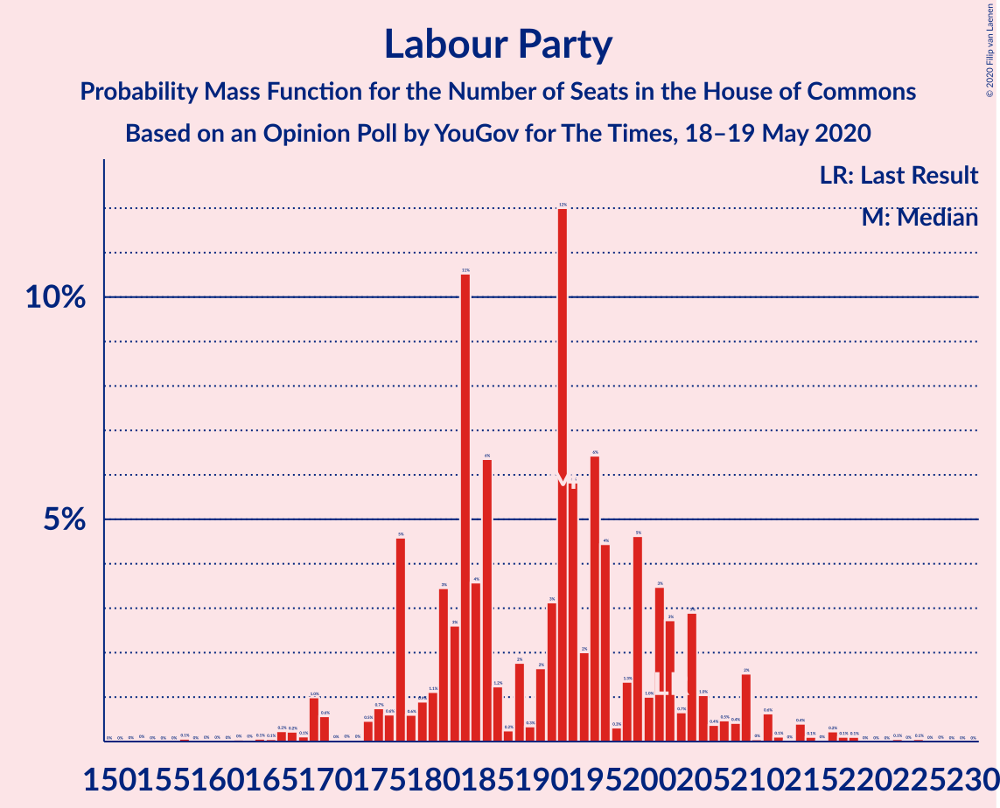

| Number of Seats | Probability | Accumulated | Special Marks |
|:---------------:|:-----------:|:-----------:|:-------------:|
| 152 | 0.1% | 100% |  |
| 153 | 0% | 99.9% |  |
| 154 | 0% | 99.9% |  |
| 155 | 0% | 99.9% |  |
| 156 | 0% | 99.9% |  |
| 157 | 0% | 99.9% |  |
| 158 | 0% | 99.9% |  |
| 159 | 0% | 99.9% |  |
| 160 | 0% | 99.9% |  |
| 161 | 0% | 99.9% |  |
| 162 | 0% | 99.9% |  |
| 163 | 0% | 99.9% |  |
| 164 | 0% | 99.9% |  |
| 165 | 0% | 99.9% |  |
| 166 | 0% | 99.9% |  |
| 167 | 0% | 99.9% |  |
| 168 | 0% | 99.9% |  |
| 169 | 4% | 99.9% |  |
| 170 | 0% | 96% |  |
| 171 | 0% | 96% |  |
| 172 | 0.1% | 96% |  |
| 173 | 0% | 96% |  |
| 174 | 0% | 96% |  |
| 175 | 0% | 96% |  |
| 176 | 0% | 96% |  |
| 177 | 0.4% | 96% |  |
| 178 | 0.3% | 95% |  |
| 179 | 0% | 95% |  |
| 180 | 2% | 95% |  |
| 181 | 0% | 92% |  |
| 182 | 0% | 92% |  |
| 183 | 0.2% | 92% |  |
| 184 | 0% | 92% |  |
| 185 | 0% | 92% |  |
| 186 | 0% | 92% |  |
| 187 | 0.3% | 92% |  |
| 188 | 86% | 92% | Median |
| 189 | 0% | 5% |  |
| 190 | 2% | 5% |  |
| 191 | 0% | 3% |  |
| 192 | 0% | 3% |  |
| 193 | 0.1% | 3% |  |
| 194 | 0% | 3% |  |
| 195 | 0% | 3% |  |
| 196 | 0% | 3% |  |
| 197 | 3% | 3% |  |
| 198 | 0% | 0.5% |  |
| 199 | 0% | 0.4% |  |
| 200 | 0% | 0.4% |  |
| 201 | 0% | 0.4% |  |
| 202 | 0.1% | 0.4% | Last Result |
| 203 | 0% | 0.3% |  |
| 204 | 0% | 0.3% |  |
| 205 | 0% | 0.3% |  |
| 206 | 0% | 0.3% |  |
| 207 | 0.1% | 0.3% |  |
| 208 | 0% | 0.2% |  |
| 209 | 0% | 0.2% |  |
| 210 | 0% | 0.2% |  |
| 211 | 0% | 0.2% |  |
| 212 | 0.1% | 0.2% |  |
| 213 | 0.1% | 0.1% |  |
| 214 | 0% | 0.1% |  |
| 215 | 0% | 0.1% |  |
| 216 | 0% | 0% |  |

### Liberal Democrats

*For a full overview of the results for this party, see the [Liberal Democrats](party-liberaldemocrats.html) page.*

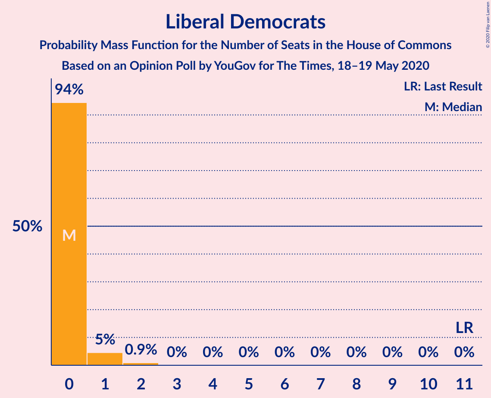

| Number of Seats | Probability | Accumulated | Special Marks |
|:---------------:|:-----------:|:-----------:|:-------------:|
| 0 | 11% | 100% |  |
| 1 | 89% | 89% | Median |
| 2 | 0.3% | 0.3% |  |
| 3 | 0% | 0% |  |
| 4 | 0% | 0% |  |
| 5 | 0% | 0% |  |
| 6 | 0% | 0% |  |
| 7 | 0% | 0% |  |
| 8 | 0% | 0% |  |
| 9 | 0% | 0% |  |
| 10 | 0% | 0% |  |
| 11 | 0% | 0% | Last Result |

### Scottish National Party

*For a full overview of the results for this party, see the [Scottish National Party](party-scottishnationalparty.html) page.*

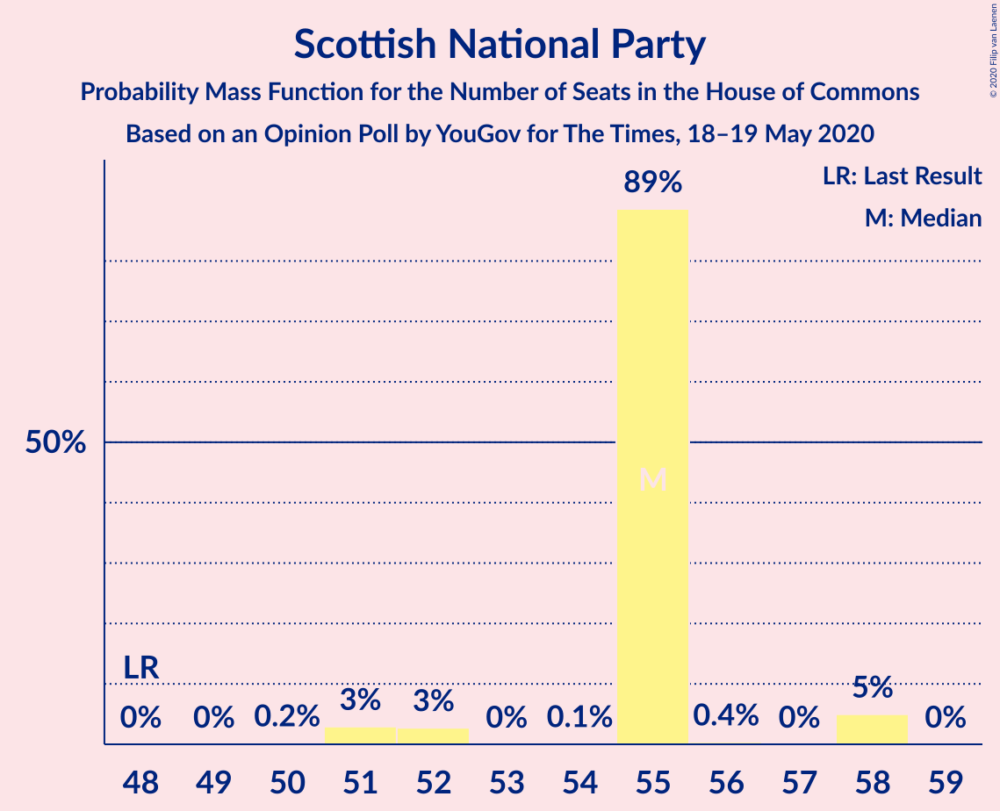

| Number of Seats | Probability | Accumulated | Special Marks |
|:---------------:|:-----------:|:-----------:|:-------------:|
| 48 | 0% | 100% | Last Result |
| 49 | 0% | 100% |  |
| 50 | 0.2% | 100% |  |
| 51 | 3% | 99.8% |  |
| 52 | 3% | 97% |  |
| 53 | 0% | 94% |  |
| 54 | 0.1% | 94% |  |
| 55 | 89% | 94% | Median |
| 56 | 0.4% | 5% |  |
| 57 | 0% | 5% |  |
| 58 | 5% | 5% |  |
| 59 | 0% | 0% |  |

### Green Party

*For a full overview of the results for this party, see the [Green Party](party-greenparty.html) page.*

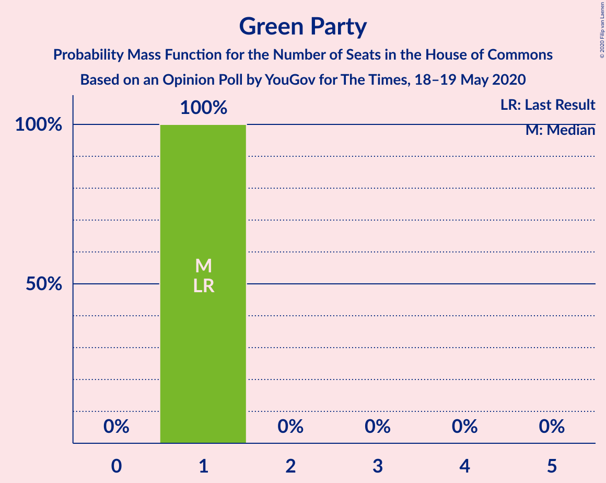

| Number of Seats | Probability | Accumulated | Special Marks |
|:---------------:|:-----------:|:-----------:|:-------------:|
| 1 | 100% | 100% | Last Result, Median |

### Plaid Cymru

*For a full overview of the results for this party, see the [Plaid Cymru](party-plaidcymru.html) page.*

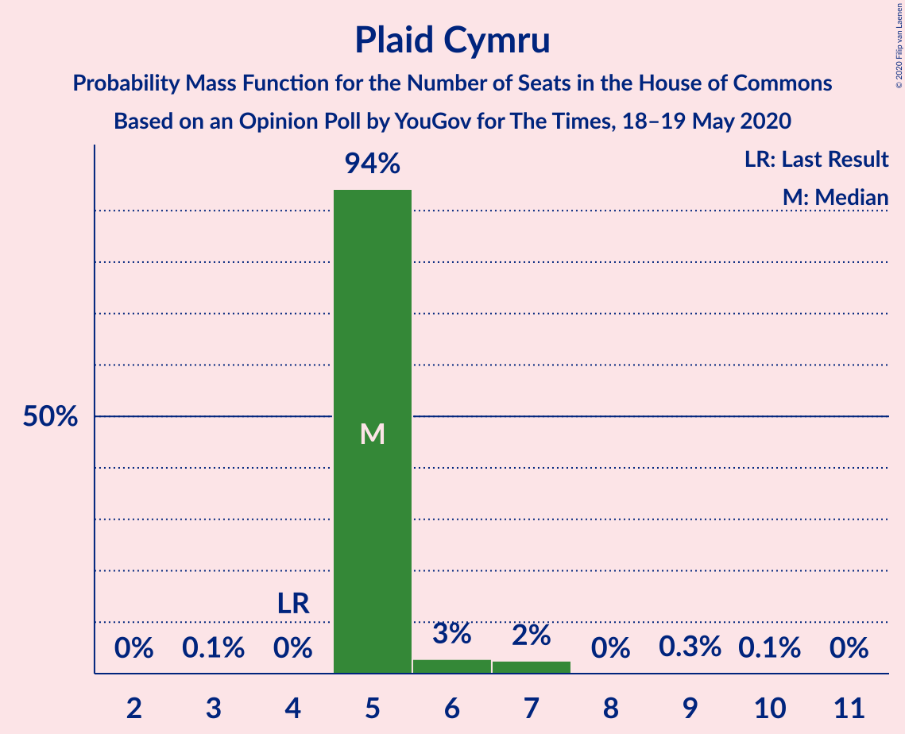

| Number of Seats | Probability | Accumulated | Special Marks |
|:---------------:|:-----------:|:-----------:|:-------------:|
| 3 | 0.1% | 100% |  |
| 4 | 0% | 99.9% | Last Result |
| 5 | 94% | 99.9% | Median |
| 6 | 3% | 6% |  |
| 7 | 2% | 3% |  |
| 8 | 0% | 0.4% |  |
| 9 | 0.3% | 0.4% |  |
| 10 | 0.1% | 0.1% |  |
| 11 | 0% | 0% |  |

### Brexit Party

*For a full overview of the results for this party, see the [Brexit Party](party-brexitparty.html) page.*

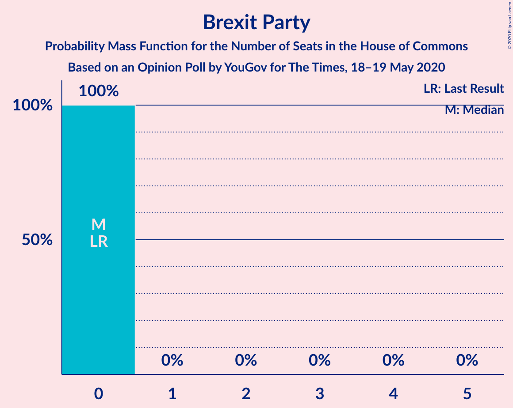

| Number of Seats | Probability | Accumulated | Special Marks |
|:---------------:|:-----------:|:-----------:|:-------------:|
| 0 | 100% | 100% | Last Result, Median |

## Coalitions

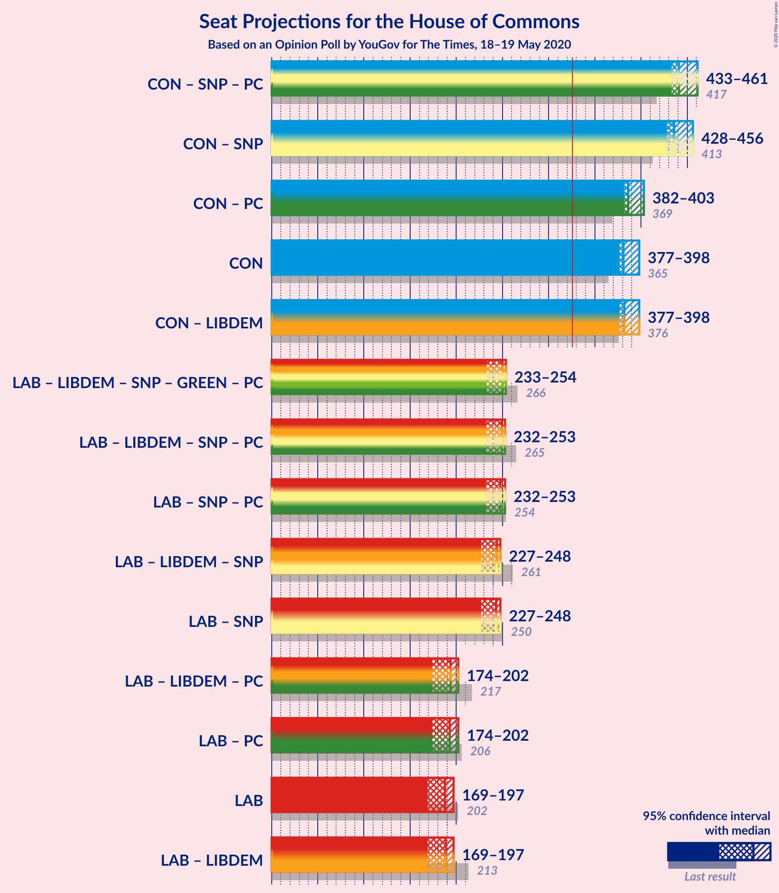

### Confidence Intervals

| Coalition | Last Result | Median | Majority? | 80% Confidence Interval | 90% Confidence Interval | 95% Confidence Interval | 99% Confidence Interval |
|:---------:|:-----------:|:------:|:---------:|:-----------------------:|:-----------------------:|:-----------------------:|:-----------------------:|
| Conservative Party – Scottish National Party – Plaid Cymru | 417 | 441 | 100% | 441 | 440–452 | 433–461 | 433–461 |
| Conservative Party – Scottish National Party | 413 | 436 | 100% | 436 | 434–443 | 428–456 | 428–456 |
| Conservative Party – Plaid Cymru | 369 | 386 | 100% | 386 | 385–400 | 382–403 | 377–403 |
| Conservative Party | 365 | 381 | 100% | 381 | 379–391 | 377–398 | 370–398 |
| Conservative Party – Liberal Democrats | 376 | 382 | 100% | 382 | 379–391 | 377–398 | 372–398 |
| Labour Party – Liberal Democrats – Scottish National Party – Green Party – Plaid Cymru | 266 | 250 | 0% | 250 | 240–252 | 233–254 | 233–261 |
| Labour Party – Liberal Democrats – Scottish National Party – Plaid Cymru | 265 | 249 | 0% | 249 | 239–251 | 232–253 | 232–260 |
| Labour Party – Scottish National Party – Plaid Cymru | 254 | 248 | 0% | 248 | 239–251 | 232–253 | 232–258 |
| Labour Party – Liberal Democrats – Scottish National Party | 261 | 244 | 0% | 244 | 230–245 | 227–248 | 227–253 |
| Labour Party – Scottish National Party | 250 | 243 | 0% | 243 | 230–245 | 227–248 | 227–251 |
| Labour Party – Liberal Democrats – Plaid Cymru | 217 | 194 | 0% | 194 | 187–196 | 174–202 | 174–202 |
| Labour Party – Plaid Cymru | 206 | 193 | 0% | 193 | 187–196 | 174–202 | 174–202 |
| Labour Party | 202 | 188 | 0% | 188 | 178–190 | 169–197 | 169–197 |
| Labour Party – Liberal Democrats | 213 | 189 | 0% | 189 | 178–190 | 169–197 | 169–197 |

### Conservative Party – Scottish National Party – Plaid Cymru

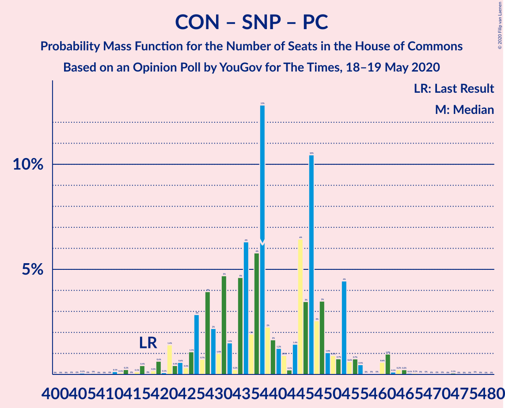

| Number of Seats | Probability | Accumulated | Special Marks |
|:---------------:|:-----------:|:-----------:|:-------------:|
| 415 | 0% | 100% |  |
| 416 | 0% | 99.9% |  |
| 417 | 0.1% | 99.9% | Last Result |
| 418 | 0.1% | 99.9% |  |
| 419 | 0% | 99.8% |  |
| 420 | 0% | 99.8% |  |
| 421 | 0.1% | 99.8% |  |
| 422 | 0% | 99.7% |  |
| 423 | 0% | 99.7% |  |
| 424 | 0% | 99.7% |  |
| 425 | 0% | 99.7% |  |
| 426 | 0.1% | 99.7% |  |
| 427 | 0% | 99.6% |  |
| 428 | 0% | 99.6% |  |
| 429 | 0% | 99.6% |  |
| 430 | 0% | 99.6% |  |
| 431 | 0% | 99.6% |  |
| 432 | 0% | 99.5% |  |
| 433 | 3% | 99.5% |  |
| 434 | 0% | 97% |  |
| 435 | 0.1% | 97% |  |
| 436 | 0% | 97% |  |
| 437 | 0% | 97% |  |
| 438 | 0% | 97% |  |
| 439 | 0% | 97% |  |
| 440 | 2% | 97% |  |
| 441 | 86% | 95% | Median |
| 442 | 0% | 8% |  |
| 443 | 0.3% | 8% |  |
| 444 | 0% | 8% |  |
| 445 | 0% | 8% |  |
| 446 | 0% | 8% |  |
| 447 | 0.2% | 8% |  |
| 448 | 0% | 8% |  |
| 449 | 2% | 8% |  |
| 450 | 0% | 5% |  |
| 451 | 0% | 5% |  |
| 452 | 0.3% | 5% |  |
| 453 | 0.4% | 5% |  |
| 454 | 0% | 4% |  |
| 455 | 0% | 4% |  |
| 456 | 0% | 4% |  |
| 457 | 0% | 4% |  |
| 458 | 0.1% | 4% |  |
| 459 | 0% | 4% |  |
| 460 | 0% | 4% |  |
| 461 | 4% | 4% |  |
| 462 | 0% | 0.1% |  |
| 463 | 0% | 0.1% |  |
| 464 | 0% | 0.1% |  |
| 465 | 0% | 0.1% |  |
| 466 | 0% | 0.1% |  |
| 467 | 0% | 0.1% |  |
| 468 | 0% | 0.1% |  |
| 469 | 0% | 0.1% |  |
| 470 | 0% | 0.1% |  |
| 471 | 0% | 0.1% |  |
| 472 | 0% | 0.1% |  |
| 473 | 0% | 0.1% |  |
| 474 | 0% | 0.1% |  |
| 475 | 0% | 0.1% |  |
| 476 | 0% | 0.1% |  |
| 477 | 0% | 0.1% |  |
| 478 | 0.1% | 0.1% |  |
| 479 | 0% | 0% |  |

### Conservative Party – Scottish National Party

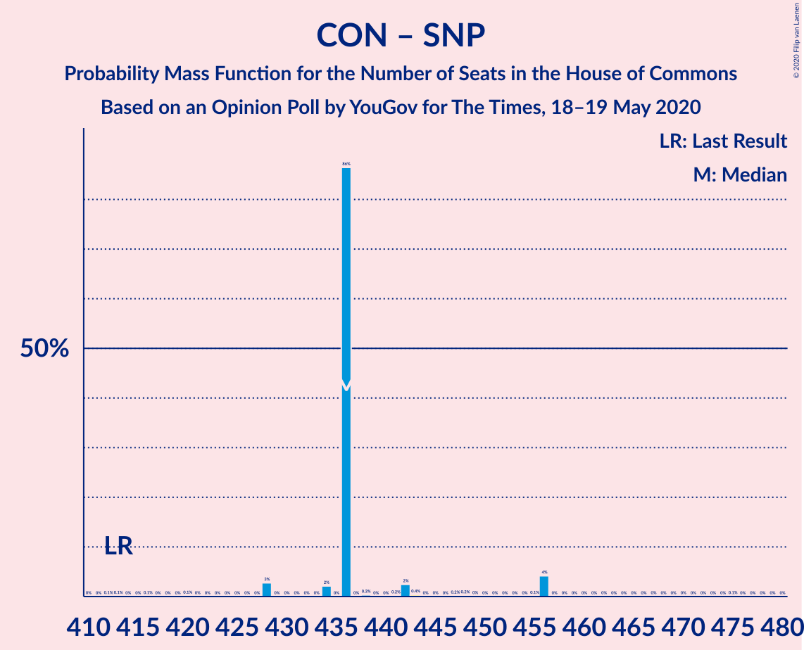

| Number of Seats | Probability | Accumulated | Special Marks |
|:---------------:|:-----------:|:-----------:|:-------------:|
| 410 | 0% | 100% |  |
| 411 | 0% | 99.9% |  |
| 412 | 0.1% | 99.9% |  |
| 413 | 0.1% | 99.9% | Last Result |
| 414 | 0% | 99.8% |  |
| 415 | 0% | 99.8% |  |
| 416 | 0.1% | 99.8% |  |
| 417 | 0% | 99.7% |  |
| 418 | 0% | 99.7% |  |
| 419 | 0% | 99.7% |  |
| 420 | 0.1% | 99.7% |  |
| 421 | 0% | 99.6% |  |
| 422 | 0% | 99.6% |  |
| 423 | 0% | 99.6% |  |
| 424 | 0% | 99.6% |  |
| 425 | 0% | 99.6% |  |
| 426 | 0% | 99.6% |  |
| 427 | 0% | 99.5% |  |
| 428 | 3% | 99.5% |  |
| 429 | 0% | 97% |  |
| 430 | 0% | 97% |  |
| 431 | 0% | 97% |  |
| 432 | 0% | 97% |  |
| 433 | 0% | 97% |  |
| 434 | 2% | 97% |  |
| 435 | 0% | 95% |  |
| 436 | 86% | 95% | Median |
| 437 | 0% | 8% |  |
| 438 | 0.3% | 8% |  |
| 439 | 0% | 8% |  |
| 440 | 0% | 8% |  |
| 441 | 0.2% | 8% |  |
| 442 | 2% | 8% |  |
| 443 | 0.4% | 5% |  |
| 444 | 0% | 5% |  |
| 445 | 0% | 5% |  |
| 446 | 0% | 5% |  |
| 447 | 0.2% | 5% |  |
| 448 | 0.2% | 5% |  |
| 449 | 0% | 4% |  |
| 450 | 0% | 4% |  |
| 451 | 0% | 4% |  |
| 452 | 0% | 4% |  |
| 453 | 0% | 4% |  |
| 454 | 0% | 4% |  |
| 455 | 0.1% | 4% |  |
| 456 | 4% | 4% |  |
| 457 | 0% | 0.1% |  |
| 458 | 0% | 0.1% |  |
| 459 | 0% | 0.1% |  |
| 460 | 0% | 0.1% |  |
| 461 | 0% | 0.1% |  |
| 462 | 0% | 0.1% |  |
| 463 | 0% | 0.1% |  |
| 464 | 0% | 0.1% |  |
| 465 | 0% | 0.1% |  |
| 466 | 0% | 0.1% |  |
| 467 | 0% | 0.1% |  |
| 468 | 0% | 0.1% |  |
| 469 | 0% | 0.1% |  |
| 470 | 0% | 0.1% |  |
| 471 | 0% | 0.1% |  |
| 472 | 0% | 0.1% |  |
| 473 | 0% | 0.1% |  |
| 474 | 0% | 0.1% |  |
| 475 | 0.1% | 0.1% |  |
| 476 | 0% | 0% |  |

### Conservative Party – Plaid Cymru

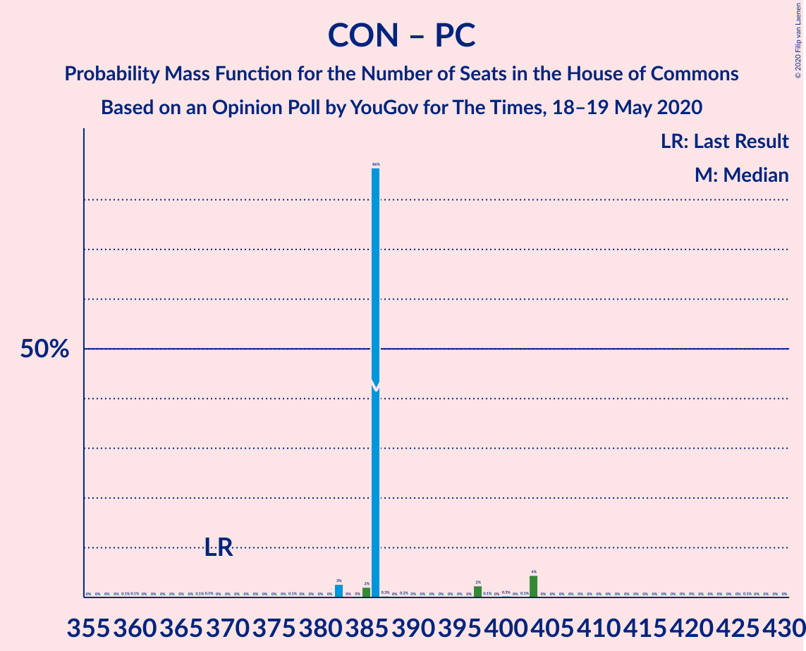

| Number of Seats | Probability | Accumulated | Special Marks |
|:---------------:|:-----------:|:-----------:|:-------------:|
| 357 | 0% | 100% |  |
| 358 | 0% | 99.9% |  |
| 359 | 0.1% | 99.9% |  |
| 360 | 0.1% | 99.9% |  |
| 361 | 0% | 99.8% |  |
| 362 | 0% | 99.8% |  |
| 363 | 0% | 99.8% |  |
| 364 | 0% | 99.8% |  |
| 365 | 0% | 99.8% |  |
| 366 | 0% | 99.8% |  |
| 367 | 0.1% | 99.8% |  |
| 368 | 0.1% | 99.7% |  |
| 369 | 0% | 99.6% | Last Result |
| 370 | 0% | 99.6% |  |
| 371 | 0% | 99.6% |  |
| 372 | 0% | 99.6% |  |
| 373 | 0% | 99.6% |  |
| 374 | 0% | 99.6% |  |
| 375 | 0% | 99.6% |  |
| 376 | 0% | 99.6% |  |
| 377 | 0.1% | 99.5% |  |
| 378 | 0% | 99.5% |  |
| 379 | 0% | 99.5% |  |
| 380 | 0% | 99.5% |  |
| 381 | 0% | 99.5% |  |
| 382 | 3% | 99.5% |  |
| 383 | 0% | 97% |  |
| 384 | 0% | 97% |  |
| 385 | 2% | 97% |  |
| 386 | 86% | 95% | Median |
| 387 | 0.3% | 8% |  |
| 388 | 0% | 8% |  |
| 389 | 0.2% | 8% |  |
| 390 | 0% | 8% |  |
| 391 | 0% | 8% |  |
| 392 | 0% | 8% |  |
| 393 | 0% | 8% |  |
| 394 | 0% | 8% |  |
| 395 | 0% | 8% |  |
| 396 | 0% | 8% |  |
| 397 | 2% | 8% |  |
| 398 | 0.1% | 5% |  |
| 399 | 0% | 5% |  |
| 400 | 0.3% | 5% |  |
| 401 | 0% | 5% |  |
| 402 | 0.1% | 5% |  |
| 403 | 4% | 5% |  |
| 404 | 0% | 0.1% |  |
| 405 | 0% | 0.1% |  |
| 406 | 0% | 0.1% |  |
| 407 | 0% | 0.1% |  |
| 408 | 0% | 0.1% |  |
| 409 | 0% | 0.1% |  |
| 410 | 0% | 0.1% |  |
| 411 | 0% | 0.1% |  |
| 412 | 0% | 0.1% |  |
| 413 | 0% | 0.1% |  |
| 414 | 0% | 0.1% |  |
| 415 | 0% | 0.1% |  |
| 416 | 0% | 0.1% |  |
| 417 | 0% | 0.1% |  |
| 418 | 0% | 0.1% |  |
| 419 | 0% | 0.1% |  |
| 420 | 0% | 0.1% |  |
| 421 | 0% | 0.1% |  |
| 422 | 0% | 0.1% |  |
| 423 | 0% | 0.1% |  |
| 424 | 0% | 0.1% |  |
| 425 | 0% | 0.1% |  |
| 426 | 0.1% | 0.1% |  |
| 427 | 0% | 0% |  |

### Conservative Party

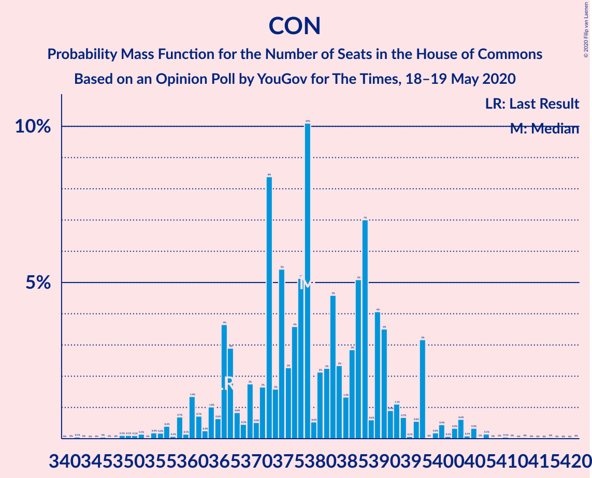

| Number of Seats | Probability | Accumulated | Special Marks |
|:---------------:|:-----------:|:-----------:|:-------------:|
| 352 | 0% | 100% |  |
| 353 | 0% | 99.9% |  |
| 354 | 0.1% | 99.9% |  |
| 355 | 0.1% | 99.9% |  |
| 356 | 0% | 99.8% |  |
| 357 | 0% | 99.8% |  |
| 358 | 0% | 99.8% |  |
| 359 | 0% | 99.8% |  |
| 360 | 0% | 99.8% |  |
| 361 | 0% | 99.8% |  |
| 362 | 0.2% | 99.8% |  |
| 363 | 0% | 99.6% |  |
| 364 | 0% | 99.6% |  |
| 365 | 0% | 99.6% | Last Result |
| 366 | 0% | 99.6% |  |
| 367 | 0% | 99.6% |  |
| 368 | 0% | 99.6% |  |
| 369 | 0% | 99.6% |  |
| 370 | 0.1% | 99.6% |  |
| 371 | 0% | 99.5% |  |
| 372 | 0% | 99.5% |  |
| 373 | 0% | 99.5% |  |
| 374 | 0% | 99.5% |  |
| 375 | 0% | 99.5% |  |
| 376 | 0% | 99.5% |  |
| 377 | 3% | 99.5% |  |
| 378 | 0% | 97% |  |
| 379 | 2% | 97% |  |
| 380 | 0% | 95% |  |
| 381 | 86% | 95% | Median |
| 382 | 0.3% | 8% |  |
| 383 | 0.2% | 8% |  |
| 384 | 0% | 8% |  |
| 385 | 0% | 8% |  |
| 386 | 0% | 8% |  |
| 387 | 0% | 8% |  |
| 388 | 0% | 8% |  |
| 389 | 0% | 8% |  |
| 390 | 2% | 8% |  |
| 391 | 0.3% | 5% |  |
| 392 | 0.1% | 5% |  |
| 393 | 0% | 5% |  |
| 394 | 0% | 5% |  |
| 395 | 0% | 5% |  |
| 396 | 0.1% | 5% |  |
| 397 | 0.1% | 5% |  |
| 398 | 4% | 5% |  |
| 399 | 0% | 0.1% |  |
| 400 | 0% | 0.1% |  |
| 401 | 0% | 0.1% |  |
| 402 | 0% | 0.1% |  |
| 403 | 0% | 0.1% |  |
| 404 | 0% | 0.1% |  |
| 405 | 0% | 0.1% |  |
| 406 | 0% | 0.1% |  |
| 407 | 0% | 0.1% |  |
| 408 | 0% | 0.1% |  |
| 409 | 0% | 0.1% |  |
| 410 | 0% | 0.1% |  |
| 411 | 0% | 0.1% |  |
| 412 | 0% | 0.1% |  |
| 413 | 0% | 0.1% |  |
| 414 | 0% | 0.1% |  |
| 415 | 0% | 0.1% |  |
| 416 | 0% | 0.1% |  |
| 417 | 0% | 0.1% |  |
| 418 | 0% | 0.1% |  |
| 419 | 0% | 0.1% |  |
| 420 | 0% | 0.1% |  |
| 421 | 0% | 0.1% |  |
| 422 | 0% | 0.1% |  |
| 423 | 0.1% | 0.1% |  |
| 424 | 0% | 0% |  |

### Conservative Party – Liberal Democrats

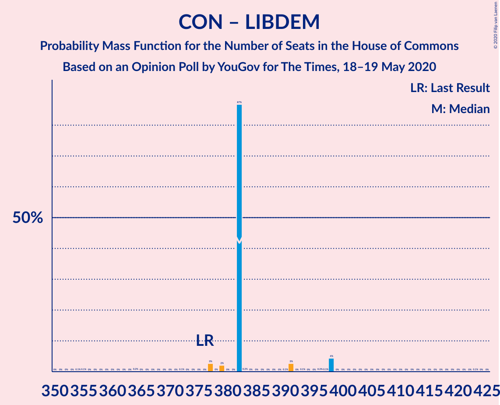

| Number of Seats | Probability | Accumulated | Special Marks |
|:---------------:|:-----------:|:-----------:|:-------------:|
| 352 | 0% | 100% |  |
| 353 | 0% | 99.9% |  |
| 354 | 0.1% | 99.9% |  |
| 355 | 0.1% | 99.9% |  |
| 356 | 0% | 99.8% |  |
| 357 | 0% | 99.8% |  |
| 358 | 0% | 99.8% |  |
| 359 | 0% | 99.8% |  |
| 360 | 0% | 99.8% |  |
| 361 | 0% | 99.8% |  |
| 362 | 0% | 99.8% |  |
| 363 | 0% | 99.8% |  |
| 364 | 0.2% | 99.8% |  |
| 365 | 0% | 99.6% |  |
| 366 | 0% | 99.6% |  |
| 367 | 0% | 99.6% |  |
| 368 | 0% | 99.6% |  |
| 369 | 0% | 99.6% |  |
| 370 | 0% | 99.6% |  |
| 371 | 0% | 99.6% |  |
| 372 | 0.1% | 99.6% |  |
| 373 | 0% | 99.5% |  |
| 374 | 0% | 99.5% |  |
| 375 | 0% | 99.5% |  |
| 376 | 0% | 99.5% | Last Result |
| 377 | 3% | 99.5% |  |
| 378 | 0% | 97% |  |
| 379 | 2% | 97% |  |
| 380 | 0% | 95% |  |
| 381 | 0% | 95% |  |
| 382 | 87% | 95% | Median |
| 383 | 0.2% | 8% |  |
| 384 | 0% | 8% |  |
| 385 | 0% | 8% |  |
| 386 | 0% | 8% |  |
| 387 | 0% | 8% |  |
| 388 | 0% | 8% |  |
| 389 | 0% | 8% |  |
| 390 | 0.1% | 8% |  |
| 391 | 3% | 8% |  |
| 392 | 0% | 5% |  |
| 393 | 0.1% | 5% |  |
| 394 | 0% | 5% |  |
| 395 | 0% | 5% |  |
| 396 | 0.2% | 5% |  |
| 397 | 0.1% | 5% |  |
| 398 | 4% | 5% |  |
| 399 | 0% | 0.1% |  |
| 400 | 0% | 0.1% |  |
| 401 | 0% | 0.1% |  |
| 402 | 0% | 0.1% |  |
| 403 | 0% | 0.1% |  |
| 404 | 0% | 0.1% |  |
| 405 | 0% | 0.1% |  |
| 406 | 0% | 0.1% |  |
| 407 | 0% | 0.1% |  |
| 408 | 0% | 0.1% |  |
| 409 | 0% | 0.1% |  |
| 410 | 0% | 0.1% |  |
| 411 | 0% | 0.1% |  |
| 412 | 0% | 0.1% |  |
| 413 | 0% | 0.1% |  |
| 414 | 0% | 0.1% |  |
| 415 | 0% | 0.1% |  |
| 416 | 0% | 0.1% |  |
| 417 | 0% | 0.1% |  |
| 418 | 0% | 0.1% |  |
| 419 | 0% | 0.1% |  |
| 420 | 0% | 0.1% |  |
| 421 | 0% | 0.1% |  |
| 422 | 0% | 0.1% |  |
| 423 | 0.1% | 0.1% |  |
| 424 | 0% | 0% |  |

### Labour Party – Liberal Democrats – Scottish National Party – Green Party – Plaid Cymru

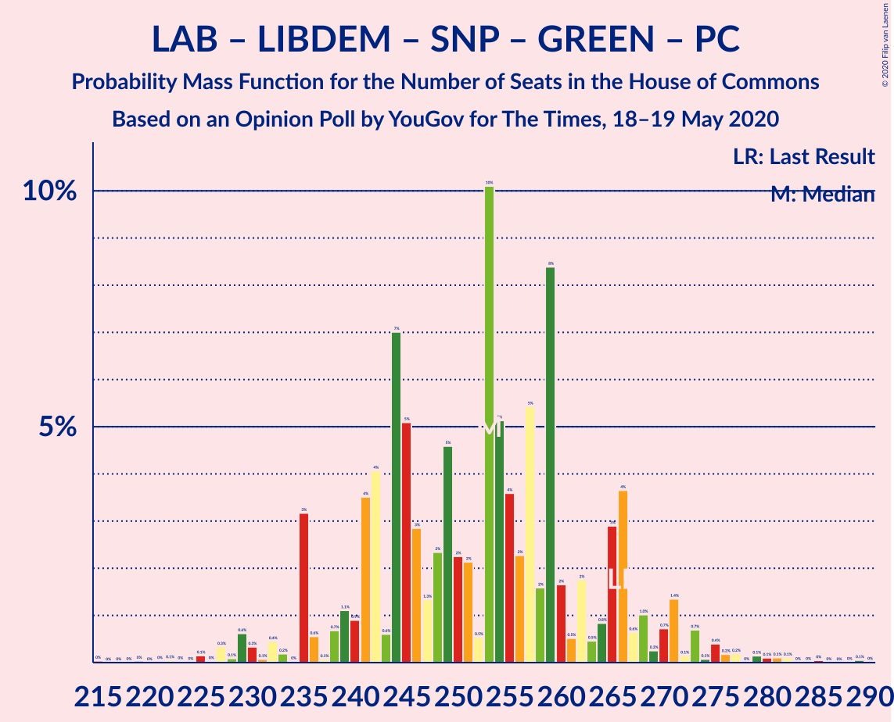

| Number of Seats | Probability | Accumulated | Special Marks |
|:---------------:|:-----------:|:-----------:|:-------------:|
| 208 | 0.1% | 100% |  |
| 209 | 0% | 99.9% |  |
| 210 | 0% | 99.9% |  |
| 211 | 0% | 99.9% |  |
| 212 | 0% | 99.9% |  |
| 213 | 0% | 99.9% |  |
| 214 | 0% | 99.9% |  |
| 215 | 0% | 99.9% |  |
| 216 | 0% | 99.9% |  |
| 217 | 0% | 99.9% |  |
| 218 | 0% | 99.9% |  |
| 219 | 0% | 99.9% |  |
| 220 | 0% | 99.9% |  |
| 221 | 0% | 99.9% |  |
| 222 | 0% | 99.9% |  |
| 223 | 0% | 99.9% |  |
| 224 | 0% | 99.9% |  |
| 225 | 0% | 99.9% |  |
| 226 | 0% | 99.9% |  |
| 227 | 0% | 99.9% |  |
| 228 | 0% | 99.9% |  |
| 229 | 0% | 99.9% |  |
| 230 | 0% | 99.9% |  |
| 231 | 0% | 99.9% |  |
| 232 | 0% | 99.9% |  |
| 233 | 4% | 99.9% |  |
| 234 | 0.1% | 95% |  |
| 235 | 0.1% | 95% |  |
| 236 | 0% | 95% |  |
| 237 | 0% | 95% |  |
| 238 | 0% | 95% |  |
| 239 | 0.1% | 95% |  |
| 240 | 0.3% | 95% |  |
| 241 | 2% | 95% |  |
| 242 | 0% | 92% |  |
| 243 | 0% | 92% |  |
| 244 | 0% | 92% |  |
| 245 | 0% | 92% |  |
| 246 | 0% | 92% |  |
| 247 | 0% | 92% |  |
| 248 | 0.2% | 92% |  |
| 249 | 0.3% | 92% |  |
| 250 | 86% | 92% | Median |
| 251 | 0% | 5% |  |
| 252 | 2% | 5% |  |
| 253 | 0% | 3% |  |
| 254 | 3% | 3% |  |
| 255 | 0% | 0.5% |  |
| 256 | 0% | 0.5% |  |
| 257 | 0% | 0.5% |  |
| 258 | 0% | 0.5% |  |
| 259 | 0% | 0.5% |  |
| 260 | 0% | 0.5% |  |
| 261 | 0.1% | 0.5% |  |
| 262 | 0% | 0.4% |  |
| 263 | 0% | 0.4% |  |
| 264 | 0% | 0.4% |  |
| 265 | 0% | 0.4% |  |
| 266 | 0% | 0.4% | Last Result |
| 267 | 0% | 0.4% |  |
| 268 | 0% | 0.4% |  |
| 269 | 0.2% | 0.4% |  |
| 270 | 0% | 0.2% |  |
| 271 | 0% | 0.2% |  |
| 272 | 0% | 0.2% |  |
| 273 | 0% | 0.2% |  |
| 274 | 0% | 0.2% |  |
| 275 | 0% | 0.2% |  |
| 276 | 0.1% | 0.2% |  |
| 277 | 0.1% | 0.1% |  |
| 278 | 0% | 0.1% |  |
| 279 | 0% | 0.1% |  |
| 280 | 0% | 0% |  |

### Labour Party – Liberal Democrats – Scottish National Party – Plaid Cymru

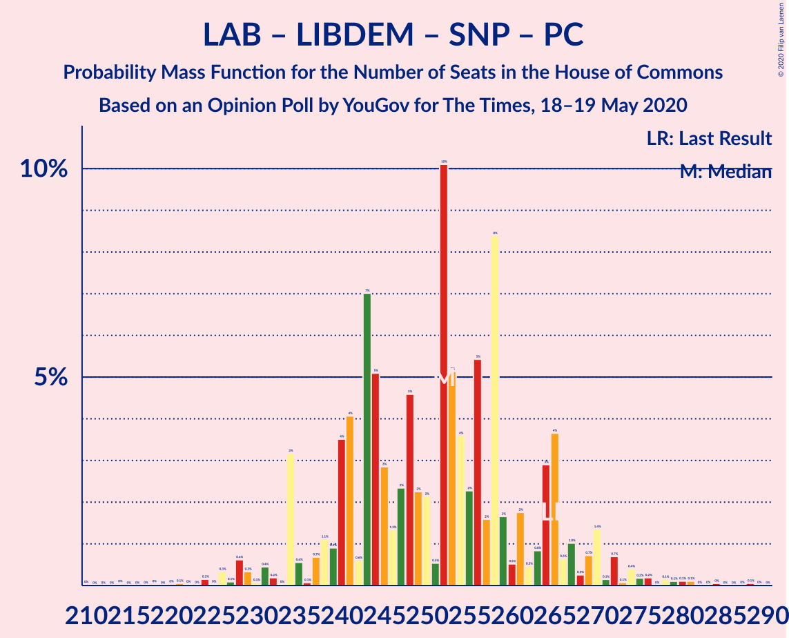

| Number of Seats | Probability | Accumulated | Special Marks |
|:---------------:|:-----------:|:-----------:|:-------------:|
| 207 | 0.1% | 100% |  |
| 208 | 0% | 99.9% |  |
| 209 | 0% | 99.9% |  |
| 210 | 0% | 99.9% |  |
| 211 | 0% | 99.9% |  |
| 212 | 0% | 99.9% |  |
| 213 | 0% | 99.9% |  |
| 214 | 0% | 99.9% |  |
| 215 | 0% | 99.9% |  |
| 216 | 0% | 99.9% |  |
| 217 | 0% | 99.9% |  |
| 218 | 0% | 99.9% |  |
| 219 | 0% | 99.9% |  |
| 220 | 0% | 99.9% |  |
| 221 | 0% | 99.9% |  |
| 222 | 0% | 99.9% |  |
| 223 | 0% | 99.9% |  |
| 224 | 0% | 99.9% |  |
| 225 | 0% | 99.9% |  |
| 226 | 0% | 99.9% |  |
| 227 | 0% | 99.9% |  |
| 228 | 0% | 99.9% |  |
| 229 | 0% | 99.9% |  |
| 230 | 0% | 99.9% |  |
| 231 | 0% | 99.9% |  |
| 232 | 4% | 99.9% |  |
| 233 | 0.1% | 95% |  |
| 234 | 0.1% | 95% |  |
| 235 | 0% | 95% |  |
| 236 | 0% | 95% |  |
| 237 | 0% | 95% |  |
| 238 | 0.1% | 95% |  |
| 239 | 0.3% | 95% |  |
| 240 | 2% | 95% |  |
| 241 | 0% | 92% |  |
| 242 | 0% | 92% |  |
| 243 | 0% | 92% |  |
| 244 | 0% | 92% |  |
| 245 | 0% | 92% |  |
| 246 | 0% | 92% |  |
| 247 | 0.2% | 92% |  |
| 248 | 0.3% | 92% |  |
| 249 | 86% | 92% | Median |
| 250 | 0% | 5% |  |
| 251 | 2% | 5% |  |
| 252 | 0% | 3% |  |
| 253 | 3% | 3% |  |
| 254 | 0% | 0.5% |  |
| 255 | 0% | 0.5% |  |
| 256 | 0% | 0.5% |  |
| 257 | 0% | 0.5% |  |
| 258 | 0% | 0.5% |  |
| 259 | 0% | 0.5% |  |
| 260 | 0.1% | 0.5% |  |
| 261 | 0% | 0.4% |  |
| 262 | 0% | 0.4% |  |
| 263 | 0% | 0.4% |  |
| 264 | 0% | 0.4% |  |
| 265 | 0% | 0.4% | Last Result |
| 266 | 0% | 0.4% |  |
| 267 | 0% | 0.4% |  |
| 268 | 0.2% | 0.4% |  |
| 269 | 0% | 0.2% |  |
| 270 | 0% | 0.2% |  |
| 271 | 0% | 0.2% |  |
| 272 | 0% | 0.2% |  |
| 273 | 0% | 0.2% |  |
| 274 | 0% | 0.2% |  |
| 275 | 0.1% | 0.2% |  |
| 276 | 0.1% | 0.1% |  |
| 277 | 0% | 0.1% |  |
| 278 | 0% | 0.1% |  |
| 279 | 0% | 0% |  |

### Labour Party – Scottish National Party – Plaid Cymru

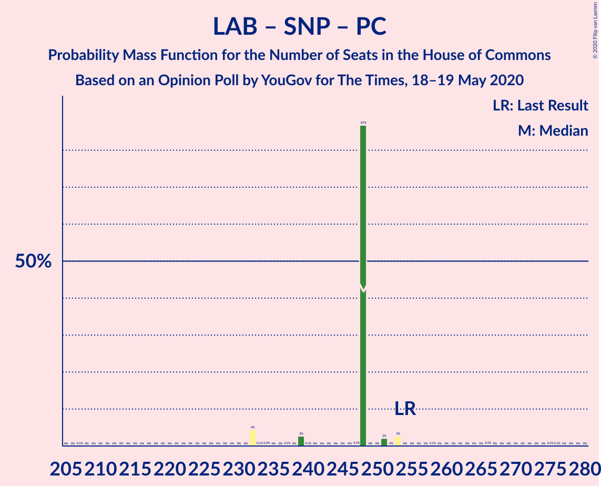

| Number of Seats | Probability | Accumulated | Special Marks |
|:---------------:|:-----------:|:-----------:|:-------------:|
| 207 | 0.1% | 100% |  |
| 208 | 0% | 99.9% |  |
| 209 | 0% | 99.9% |  |
| 210 | 0% | 99.9% |  |
| 211 | 0% | 99.9% |  |
| 212 | 0% | 99.9% |  |
| 213 | 0% | 99.9% |  |
| 214 | 0% | 99.9% |  |
| 215 | 0% | 99.9% |  |
| 216 | 0% | 99.9% |  |
| 217 | 0% | 99.9% |  |
| 218 | 0% | 99.9% |  |
| 219 | 0% | 99.9% |  |
| 220 | 0% | 99.9% |  |
| 221 | 0% | 99.9% |  |
| 222 | 0% | 99.9% |  |
| 223 | 0% | 99.9% |  |
| 224 | 0% | 99.9% |  |
| 225 | 0% | 99.9% |  |
| 226 | 0% | 99.9% |  |
| 227 | 0% | 99.9% |  |
| 228 | 0% | 99.9% |  |
| 229 | 0% | 99.9% |  |
| 230 | 0% | 99.9% |  |
| 231 | 0% | 99.9% |  |
| 232 | 4% | 99.9% |  |
| 233 | 0.1% | 95% |  |
| 234 | 0.2% | 95% |  |
| 235 | 0% | 95% |  |
| 236 | 0% | 95% |  |
| 237 | 0.1% | 95% |  |
| 238 | 0% | 95% |  |
| 239 | 3% | 95% |  |
| 240 | 0.1% | 92% |  |
| 241 | 0% | 92% |  |
| 242 | 0% | 92% |  |
| 243 | 0% | 92% |  |
| 244 | 0% | 92% |  |
| 245 | 0% | 92% |  |
| 246 | 0% | 92% |  |
| 247 | 0.2% | 92% |  |
| 248 | 87% | 92% | Median |
| 249 | 0% | 5% |  |
| 250 | 0% | 5% |  |
| 251 | 2% | 5% |  |
| 252 | 0% | 3% |  |
| 253 | 3% | 3% |  |
| 254 | 0% | 0.5% | Last Result |
| 255 | 0% | 0.5% |  |
| 256 | 0% | 0.5% |  |
| 257 | 0% | 0.5% |  |
| 258 | 0.1% | 0.5% |  |
| 259 | 0% | 0.4% |  |
| 260 | 0% | 0.4% |  |
| 261 | 0% | 0.4% |  |
| 262 | 0% | 0.4% |  |
| 263 | 0% | 0.4% |  |
| 264 | 0% | 0.4% |  |
| 265 | 0% | 0.4% |  |
| 266 | 0.2% | 0.4% |  |
| 267 | 0% | 0.2% |  |
| 268 | 0% | 0.2% |  |
| 269 | 0% | 0.2% |  |
| 270 | 0% | 0.2% |  |
| 271 | 0% | 0.2% |  |
| 272 | 0% | 0.2% |  |
| 273 | 0% | 0.2% |  |
| 274 | 0% | 0.2% |  |
| 275 | 0.1% | 0.2% |  |
| 276 | 0.1% | 0.1% |  |
| 277 | 0% | 0.1% |  |
| 278 | 0% | 0.1% |  |
| 279 | 0% | 0% |  |

### Labour Party – Liberal Democrats – Scottish National Party

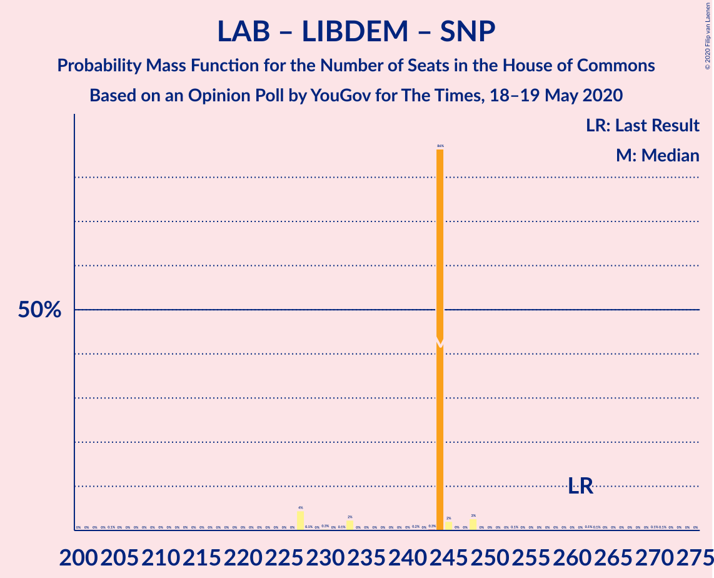

| Number of Seats | Probability | Accumulated | Special Marks |
|:---------------:|:-----------:|:-----------:|:-------------:|
| 204 | 0.1% | 100% |  |
| 205 | 0% | 99.9% |  |
| 206 | 0% | 99.9% |  |
| 207 | 0% | 99.9% |  |
| 208 | 0% | 99.9% |  |
| 209 | 0% | 99.9% |  |
| 210 | 0% | 99.9% |  |
| 211 | 0% | 99.9% |  |
| 212 | 0% | 99.9% |  |
| 213 | 0% | 99.9% |  |
| 214 | 0% | 99.9% |  |
| 215 | 0% | 99.9% |  |
| 216 | 0% | 99.9% |  |
| 217 | 0% | 99.9% |  |
| 218 | 0% | 99.9% |  |
| 219 | 0% | 99.9% |  |
| 220 | 0% | 99.9% |  |
| 221 | 0% | 99.9% |  |
| 222 | 0% | 99.9% |  |
| 223 | 0% | 99.9% |  |
| 224 | 0% | 99.9% |  |
| 225 | 0% | 99.9% |  |
| 226 | 0% | 99.9% |  |
| 227 | 4% | 99.9% |  |
| 228 | 0.1% | 95% |  |
| 229 | 0% | 95% |  |
| 230 | 0.3% | 95% |  |
| 231 | 0% | 95% |  |
| 232 | 0.1% | 95% |  |
| 233 | 2% | 95% |  |
| 234 | 0% | 92% |  |
| 235 | 0% | 92% |  |
| 236 | 0% | 92% |  |
| 237 | 0% | 92% |  |
| 238 | 0% | 92% |  |
| 239 | 0% | 92% |  |
| 240 | 0% | 92% |  |
| 241 | 0.2% | 92% |  |
| 242 | 0% | 92% |  |
| 243 | 0.3% | 92% |  |
| 244 | 86% | 92% | Median |
| 245 | 2% | 5% |  |
| 246 | 0% | 3% |  |
| 247 | 0% | 3% |  |
| 248 | 3% | 3% |  |
| 249 | 0% | 0.5% |  |
| 250 | 0% | 0.5% |  |
| 251 | 0% | 0.5% |  |
| 252 | 0% | 0.5% |  |
| 253 | 0.1% | 0.5% |  |
| 254 | 0% | 0.5% |  |
| 255 | 0% | 0.4% |  |
| 256 | 0% | 0.4% |  |
| 257 | 0% | 0.4% |  |
| 258 | 0% | 0.4% |  |
| 259 | 0% | 0.4% |  |
| 260 | 0% | 0.4% |  |
| 261 | 0% | 0.4% | Last Result |
| 262 | 0.1% | 0.4% |  |
| 263 | 0.1% | 0.3% |  |
| 264 | 0% | 0.2% |  |
| 265 | 0% | 0.2% |  |
| 266 | 0% | 0.2% |  |
| 267 | 0% | 0.2% |  |
| 268 | 0% | 0.2% |  |
| 269 | 0% | 0.2% |  |
| 270 | 0.1% | 0.2% |  |
| 271 | 0.1% | 0.1% |  |
| 272 | 0% | 0.1% |  |
| 273 | 0% | 0.1% |  |
| 274 | 0% | 0% |  |

### Labour Party – Scottish National Party

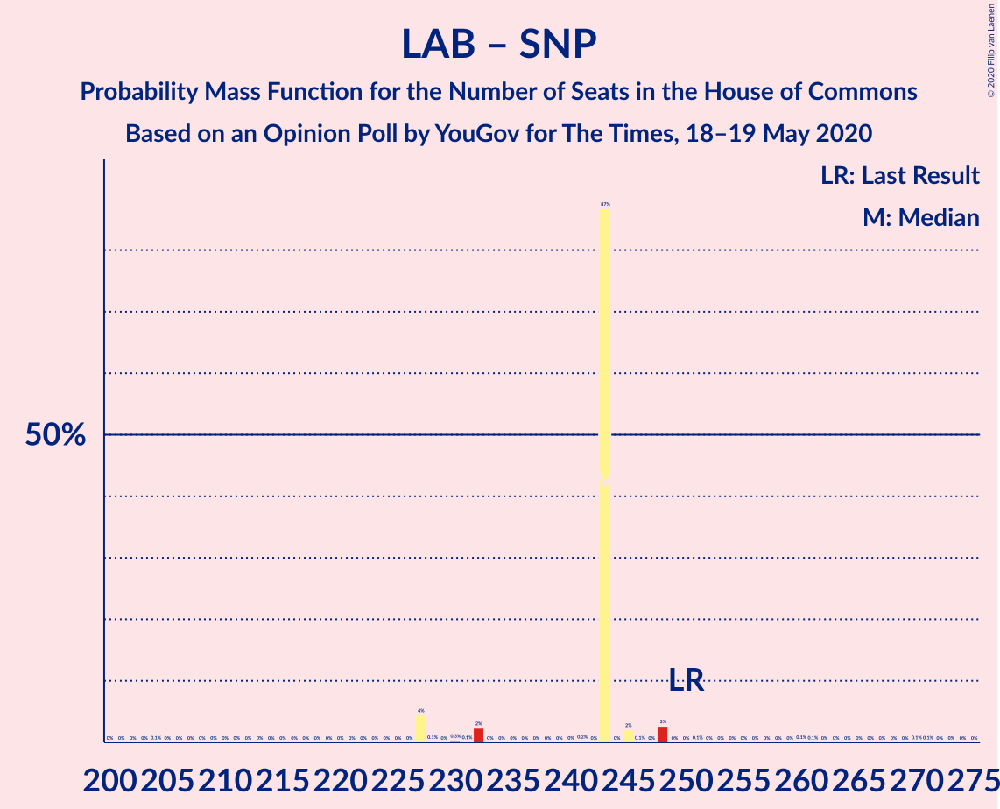

| Number of Seats | Probability | Accumulated | Special Marks |
|:---------------:|:-----------:|:-----------:|:-------------:|
| 204 | 0.1% | 100% |  |
| 205 | 0% | 99.9% |  |
| 206 | 0% | 99.9% |  |
| 207 | 0% | 99.9% |  |
| 208 | 0% | 99.9% |  |
| 209 | 0% | 99.9% |  |
| 210 | 0% | 99.9% |  |
| 211 | 0% | 99.9% |  |
| 212 | 0% | 99.9% |  |
| 213 | 0% | 99.9% |  |
| 214 | 0% | 99.9% |  |
| 215 | 0% | 99.9% |  |
| 216 | 0% | 99.9% |  |
| 217 | 0% | 99.9% |  |
| 218 | 0% | 99.9% |  |
| 219 | 0% | 99.9% |  |
| 220 | 0% | 99.9% |  |
| 221 | 0% | 99.9% |  |
| 222 | 0% | 99.9% |  |
| 223 | 0% | 99.9% |  |
| 224 | 0% | 99.9% |  |
| 225 | 0% | 99.9% |  |
| 226 | 0% | 99.9% |  |
| 227 | 4% | 99.9% |  |
| 228 | 0.1% | 95% |  |
| 229 | 0% | 95% |  |
| 230 | 0.3% | 95% |  |
| 231 | 0.1% | 95% |  |
| 232 | 2% | 95% |  |
| 233 | 0% | 92% |  |
| 234 | 0% | 92% |  |
| 235 | 0% | 92% |  |
| 236 | 0% | 92% |  |
| 237 | 0% | 92% |  |
| 238 | 0% | 92% |  |
| 239 | 0% | 92% |  |
| 240 | 0% | 92% |  |
| 241 | 0.2% | 92% |  |
| 242 | 0% | 92% |  |
| 243 | 87% | 92% | Median |
| 244 | 0% | 5% |  |
| 245 | 2% | 5% |  |
| 246 | 0.1% | 3% |  |
| 247 | 0% | 3% |  |
| 248 | 3% | 3% |  |
| 249 | 0% | 0.5% |  |
| 250 | 0% | 0.5% | Last Result |
| 251 | 0.1% | 0.5% |  |
| 252 | 0% | 0.4% |  |
| 253 | 0% | 0.4% |  |
| 254 | 0% | 0.4% |  |
| 255 | 0% | 0.4% |  |
| 256 | 0% | 0.4% |  |
| 257 | 0% | 0.4% |  |
| 258 | 0% | 0.4% |  |
| 259 | 0% | 0.4% |  |
| 260 | 0.1% | 0.4% |  |
| 261 | 0.1% | 0.3% |  |
| 262 | 0% | 0.2% |  |
| 263 | 0% | 0.2% |  |
| 264 | 0% | 0.2% |  |
| 265 | 0% | 0.2% |  |
| 266 | 0% | 0.2% |  |
| 267 | 0% | 0.2% |  |
| 268 | 0% | 0.2% |  |
| 269 | 0% | 0.2% |  |
| 270 | 0.1% | 0.2% |  |
| 271 | 0.1% | 0.1% |  |
| 272 | 0% | 0.1% |  |
| 273 | 0% | 0.1% |  |
| 274 | 0% | 0% |  |

### Labour Party – Liberal Democrats – Plaid Cymru

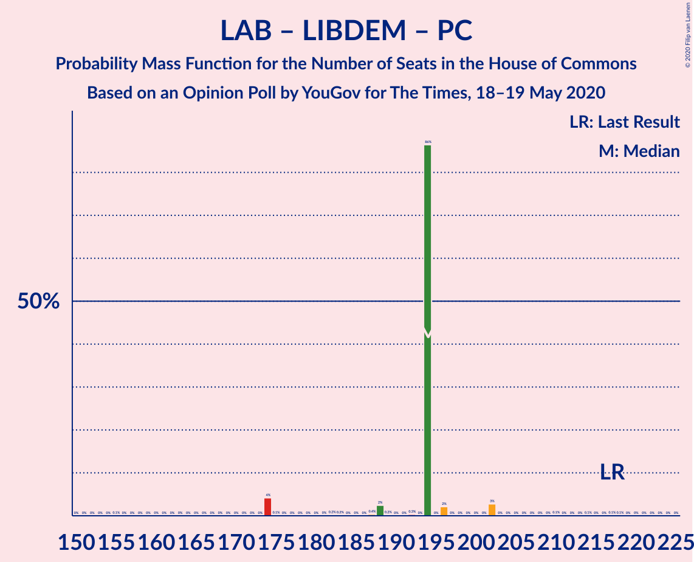

| Number of Seats | Probability | Accumulated | Special Marks |
|:---------------:|:-----------:|:-----------:|:-------------:|
| 155 | 0.1% | 100% |  |
| 156 | 0% | 99.9% |  |
| 157 | 0% | 99.9% |  |
| 158 | 0% | 99.9% |  |
| 159 | 0% | 99.9% |  |
| 160 | 0% | 99.9% |  |
| 161 | 0% | 99.9% |  |
| 162 | 0% | 99.9% |  |
| 163 | 0% | 99.9% |  |
| 164 | 0% | 99.9% |  |
| 165 | 0% | 99.9% |  |
| 166 | 0% | 99.9% |  |
| 167 | 0% | 99.9% |  |
| 168 | 0% | 99.9% |  |
| 169 | 0% | 99.9% |  |
| 170 | 0% | 99.9% |  |
| 171 | 0% | 99.9% |  |
| 172 | 0% | 99.9% |  |
| 173 | 0% | 99.9% |  |
| 174 | 4% | 99.9% |  |
| 175 | 0.1% | 96% |  |
| 176 | 0% | 96% |  |
| 177 | 0% | 96% |  |
| 178 | 0% | 96% |  |
| 179 | 0% | 96% |  |
| 180 | 0% | 96% |  |
| 181 | 0% | 96% |  |
| 182 | 0.2% | 96% |  |
| 183 | 0.2% | 95% |  |
| 184 | 0% | 95% |  |
| 185 | 0% | 95% |  |
| 186 | 0% | 95% |  |
| 187 | 0.4% | 95% |  |
| 188 | 2% | 95% |  |
| 189 | 0.2% | 92% |  |
| 190 | 0% | 92% |  |
| 191 | 0% | 92% |  |
| 192 | 0.3% | 92% |  |
| 193 | 0% | 92% |  |
| 194 | 86% | 92% | Median |
| 195 | 0% | 5% |  |
| 196 | 2% | 5% |  |
| 197 | 0% | 3% |  |
| 198 | 0% | 3% |  |
| 199 | 0% | 3% |  |
| 200 | 0% | 3% |  |
| 201 | 0% | 3% |  |
| 202 | 3% | 3% |  |
| 203 | 0% | 0.5% |  |
| 204 | 0% | 0.5% |  |
| 205 | 0% | 0.4% |  |
| 206 | 0% | 0.4% |  |
| 207 | 0% | 0.4% |  |
| 208 | 0% | 0.4% |  |
| 209 | 0% | 0.4% |  |
| 210 | 0.1% | 0.4% |  |
| 211 | 0% | 0.3% |  |
| 212 | 0% | 0.3% |  |
| 213 | 0% | 0.3% |  |
| 214 | 0.1% | 0.3% |  |
| 215 | 0% | 0.2% |  |
| 216 | 0% | 0.2% |  |
| 217 | 0.1% | 0.2% | Last Result |
| 218 | 0.1% | 0.1% |  |
| 219 | 0% | 0.1% |  |
| 220 | 0% | 0.1% |  |
| 221 | 0% | 0% |  |

### Labour Party – Plaid Cymru

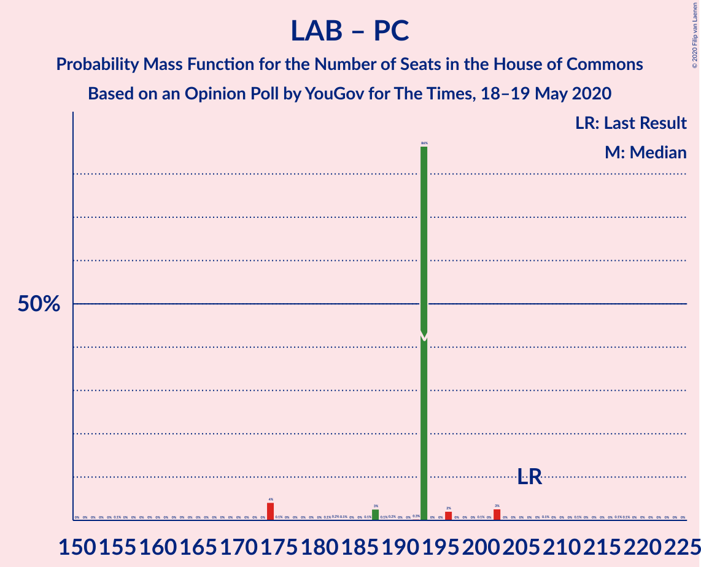

| Number of Seats | Probability | Accumulated | Special Marks |
|:---------------:|:-----------:|:-----------:|:-------------:|
| 155 | 0.1% | 100% |  |
| 156 | 0% | 99.9% |  |
| 157 | 0% | 99.9% |  |
| 158 | 0% | 99.9% |  |
| 159 | 0% | 99.9% |  |
| 160 | 0% | 99.9% |  |
| 161 | 0% | 99.9% |  |
| 162 | 0% | 99.9% |  |
| 163 | 0% | 99.9% |  |
| 164 | 0% | 99.9% |  |
| 165 | 0% | 99.9% |  |
| 166 | 0% | 99.9% |  |
| 167 | 0% | 99.9% |  |
| 168 | 0% | 99.9% |  |
| 169 | 0% | 99.9% |  |
| 170 | 0% | 99.9% |  |
| 171 | 0% | 99.9% |  |
| 172 | 0% | 99.9% |  |
| 173 | 0% | 99.9% |  |
| 174 | 4% | 99.9% |  |
| 175 | 0.1% | 96% |  |
| 176 | 0% | 96% |  |
| 177 | 0% | 96% |  |
| 178 | 0% | 96% |  |
| 179 | 0% | 96% |  |
| 180 | 0% | 96% |  |
| 181 | 0.1% | 96% |  |
| 182 | 0.2% | 96% |  |
| 183 | 0.1% | 95% |  |
| 184 | 0% | 95% |  |
| 185 | 0% | 95% |  |
| 186 | 0.1% | 95% |  |
| 187 | 3% | 95% |  |
| 188 | 0.1% | 92% |  |
| 189 | 0.2% | 92% |  |
| 190 | 0% | 92% |  |
| 191 | 0% | 92% |  |
| 192 | 0.3% | 92% |  |
| 193 | 86% | 92% | Median |
| 194 | 0% | 5% |  |
| 195 | 0% | 5% |  |
| 196 | 2% | 5% |  |
| 197 | 0% | 3% |  |
| 198 | 0% | 3% |  |
| 199 | 0% | 3% |  |
| 200 | 0.1% | 3% |  |
| 201 | 0% | 3% |  |
| 202 | 3% | 3% |  |
| 203 | 0% | 0.5% |  |
| 204 | 0% | 0.5% |  |
| 205 | 0% | 0.4% |  |
| 206 | 0% | 0.4% | Last Result |
| 207 | 0% | 0.4% |  |
| 208 | 0.1% | 0.4% |  |
| 209 | 0% | 0.3% |  |
| 210 | 0% | 0.3% |  |
| 211 | 0% | 0.3% |  |
| 212 | 0.1% | 0.3% |  |
| 213 | 0% | 0.2% |  |
| 214 | 0% | 0.2% |  |
| 215 | 0% | 0.2% |  |
| 216 | 0% | 0.2% |  |
| 217 | 0.1% | 0.2% |  |
| 218 | 0.1% | 0.1% |  |
| 219 | 0% | 0.1% |  |
| 220 | 0% | 0.1% |  |
| 221 | 0% | 0% |  |

### Labour Party

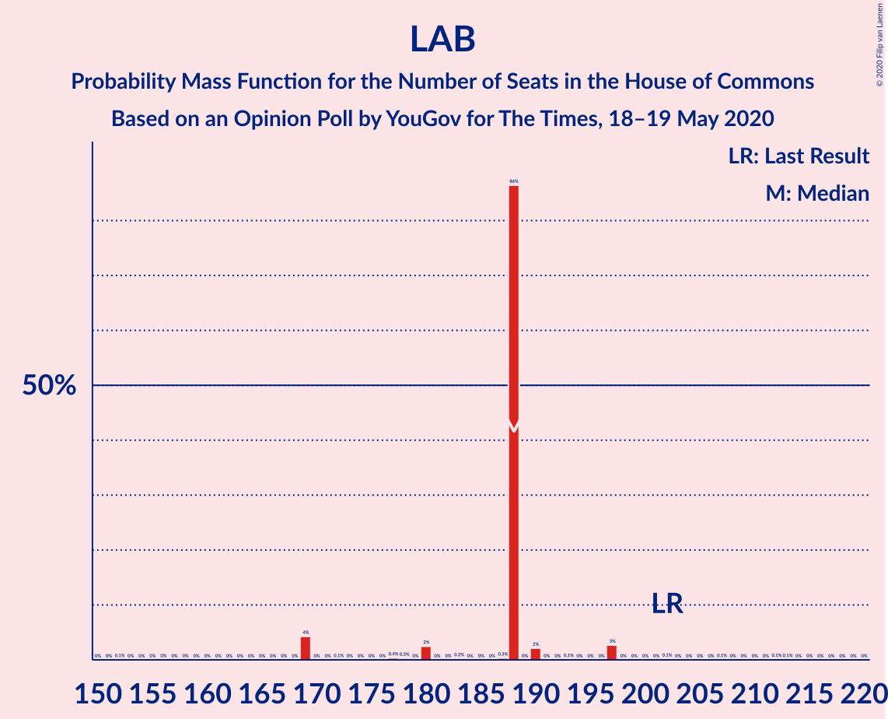

| Number of Seats | Probability | Accumulated | Special Marks |
|:---------------:|:-----------:|:-----------:|:-------------:|
| 152 | 0.1% | 100% |  |
| 153 | 0% | 99.9% |  |
| 154 | 0% | 99.9% |  |
| 155 | 0% | 99.9% |  |
| 156 | 0% | 99.9% |  |
| 157 | 0% | 99.9% |  |
| 158 | 0% | 99.9% |  |
| 159 | 0% | 99.9% |  |
| 160 | 0% | 99.9% |  |
| 161 | 0% | 99.9% |  |
| 162 | 0% | 99.9% |  |
| 163 | 0% | 99.9% |  |
| 164 | 0% | 99.9% |  |
| 165 | 0% | 99.9% |  |
| 166 | 0% | 99.9% |  |
| 167 | 0% | 99.9% |  |
| 168 | 0% | 99.9% |  |
| 169 | 4% | 99.9% |  |
| 170 | 0% | 96% |  |
| 171 | 0% | 96% |  |
| 172 | 0.1% | 96% |  |
| 173 | 0% | 96% |  |
| 174 | 0% | 96% |  |
| 175 | 0% | 96% |  |
| 176 | 0% | 96% |  |
| 177 | 0.4% | 96% |  |
| 178 | 0.3% | 95% |  |
| 179 | 0% | 95% |  |
| 180 | 2% | 95% |  |
| 181 | 0% | 92% |  |
| 182 | 0% | 92% |  |
| 183 | 0.2% | 92% |  |
| 184 | 0% | 92% |  |
| 185 | 0% | 92% |  |
| 186 | 0% | 92% |  |
| 187 | 0.3% | 92% |  |
| 188 | 86% | 92% | Median |
| 189 | 0% | 5% |  |
| 190 | 2% | 5% |  |
| 191 | 0% | 3% |  |
| 192 | 0% | 3% |  |
| 193 | 0.1% | 3% |  |
| 194 | 0% | 3% |  |
| 195 | 0% | 3% |  |
| 196 | 0% | 3% |  |
| 197 | 3% | 3% |  |
| 198 | 0% | 0.5% |  |
| 199 | 0% | 0.4% |  |
| 200 | 0% | 0.4% |  |
| 201 | 0% | 0.4% |  |
| 202 | 0.1% | 0.4% | Last Result |
| 203 | 0% | 0.3% |  |
| 204 | 0% | 0.3% |  |
| 205 | 0% | 0.3% |  |
| 206 | 0% | 0.3% |  |
| 207 | 0.1% | 0.3% |  |
| 208 | 0% | 0.2% |  |
| 209 | 0% | 0.2% |  |
| 210 | 0% | 0.2% |  |
| 211 | 0% | 0.2% |  |
| 212 | 0.1% | 0.2% |  |
| 213 | 0.1% | 0.1% |  |
| 214 | 0% | 0.1% |  |
| 215 | 0% | 0.1% |  |
| 216 | 0% | 0% |  |

### Labour Party – Liberal Democrats

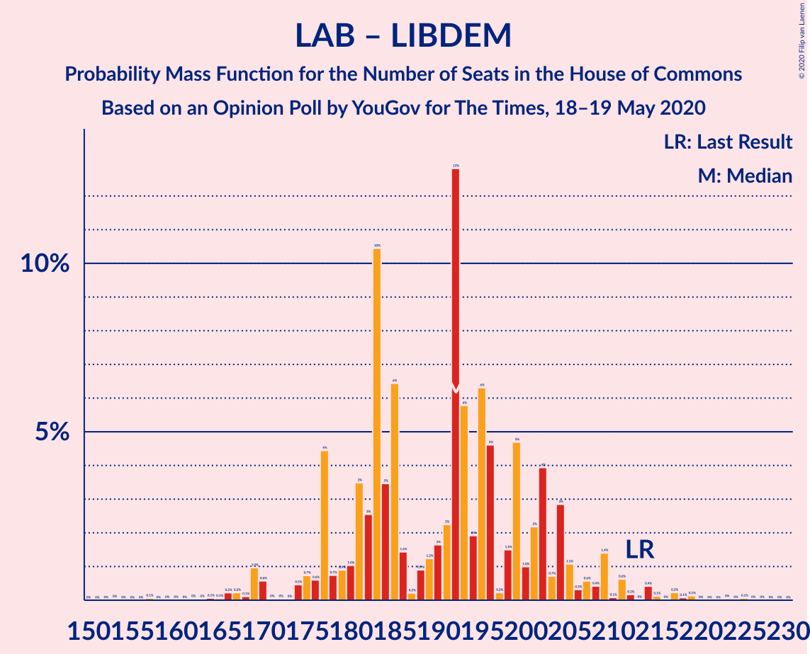

| Number of Seats | Probability | Accumulated | Special Marks |
|:---------------:|:-----------:|:-----------:|:-------------:|
| 152 | 0.1% | 100% |  |
| 153 | 0% | 99.9% |  |
| 154 | 0% | 99.9% |  |
| 155 | 0% | 99.9% |  |
| 156 | 0% | 99.9% |  |
| 157 | 0% | 99.9% |  |
| 158 | 0% | 99.9% |  |
| 159 | 0% | 99.9% |  |
| 160 | 0% | 99.9% |  |
| 161 | 0% | 99.9% |  |
| 162 | 0% | 99.9% |  |
| 163 | 0% | 99.9% |  |
| 164 | 0% | 99.9% |  |
| 165 | 0% | 99.9% |  |
| 166 | 0% | 99.9% |  |
| 167 | 0% | 99.9% |  |
| 168 | 0% | 99.9% |  |
| 169 | 4% | 99.9% |  |
| 170 | 0% | 96% |  |
| 171 | 0% | 96% |  |
| 172 | 0.1% | 96% |  |
| 173 | 0% | 96% |  |
| 174 | 0% | 96% |  |
| 175 | 0% | 96% |  |
| 176 | 0% | 96% |  |
| 177 | 0.4% | 96% |  |
| 178 | 0.3% | 95% |  |
| 179 | 0% | 95% |  |
| 180 | 0% | 95% |  |
| 181 | 2% | 95% |  |
| 182 | 0% | 92% |  |
| 183 | 0.2% | 92% |  |
| 184 | 0% | 92% |  |
| 185 | 0% | 92% |  |
| 186 | 0% | 92% |  |
| 187 | 0.3% | 92% |  |
| 188 | 0% | 92% |  |
| 189 | 86% | 92% | Median |
| 190 | 2% | 5% |  |
| 191 | 0% | 3% |  |
| 192 | 0% | 3% |  |
| 193 | 0% | 3% |  |
| 194 | 0% | 3% |  |
| 195 | 0.1% | 3% |  |
| 196 | 0% | 3% |  |
| 197 | 3% | 3% |  |
| 198 | 0% | 0.5% |  |
| 199 | 0% | 0.5% |  |
| 200 | 0% | 0.4% |  |
| 201 | 0% | 0.4% |  |
| 202 | 0% | 0.4% |  |
| 203 | 0% | 0.4% |  |
| 204 | 0.1% | 0.4% |  |
| 205 | 0% | 0.3% |  |
| 206 | 0% | 0.3% |  |
| 207 | 0% | 0.3% |  |
| 208 | 0% | 0.3% |  |
| 209 | 0.1% | 0.3% |  |
| 210 | 0% | 0.2% |  |
| 211 | 0% | 0.2% |  |
| 212 | 0.1% | 0.2% |  |
| 213 | 0.1% | 0.1% | Last Result |
| 214 | 0% | 0.1% |  |
| 215 | 0% | 0.1% |  |
| 216 | 0% | 0% |  |

## Technical Information

### Opinion Poll

+ **Polling firm:** YouGov
+ **Commissioner(s):** The Times
+ **Fieldwork period:** 18–19 May 2020

### Calculations

+ **Sample size:** 1681
+ **Simulations done:** 2,048
+ **Error estimate:** 2.38%

