# Opinion Poll by Survation, 3 June 2020

<a href="#voting-intentions">Voting Intentions</a> | <a href="#seats">Seats</a> | <a href="#coalitions">Coalitions</a> | <a href="#technical-information">Technical Information</a>

## Voting Intentions

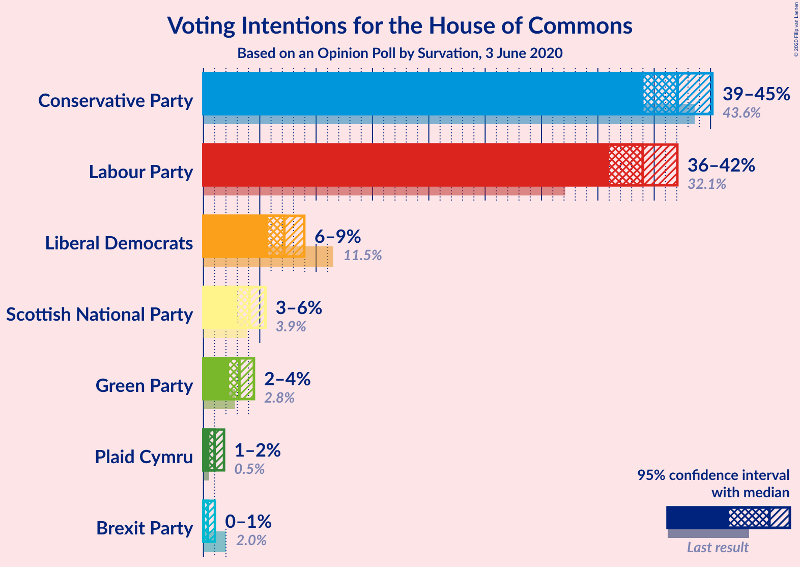

### Confidence Intervals

| Party | Last Result | Poll Result | 80% Confidence Interval | 90% Confidence Interval | 95% Confidence Interval | 99% Confidence Interval |
|:-----:|:-----------:|:-----------:|:-----------------------:|:-----------------------:|:-----------------------:|:-----------------------:|
| Conservative Party | 43.6% | 42.1% | 40.1–44.1% |39.5–44.7% |39.0–45.2% |38.1–46.1% |
| Labour Party | 32.1% | 39.0% | 37.0–41.0% |36.5–41.5% |36.0–42.1% |35.1–43.0% |
| Liberal Democrats | 11.5% | 7.2% | 6.2–8.3% |6.0–8.7% |5.7–8.9% |5.3–9.5% |
| Scottish National Party | 3.9% | 4.1% | 3.4–5.0% |3.2–5.3% |3.0–5.5% |2.7–6.0% |
| Green Party | 2.8% | 3.2% | 2.6–4.0% |2.4–4.3% |2.3–4.5% |2.0–4.9% |
| Plaid Cymru | 0.5% | 1.0% | 0.7–1.5% |0.6–1.7% |0.5–1.8% |0.4–2.1% |
| Brexit Party | 2.0% | 0.4% | 0.2–0.8% |0.2–0.9% |0.2–1.0% |0.1–1.2% |

*Note:* The poll result column reflects the actual value used in the calculations. Published results may vary slightly, and in addition be rounded to fewer digits.

## Seats

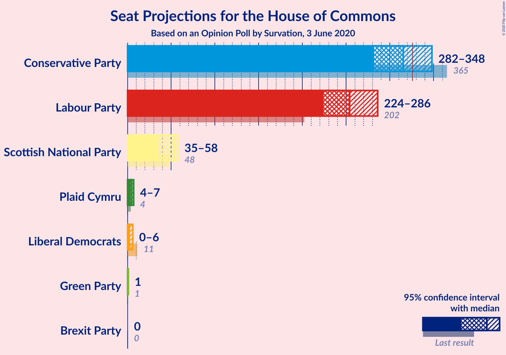

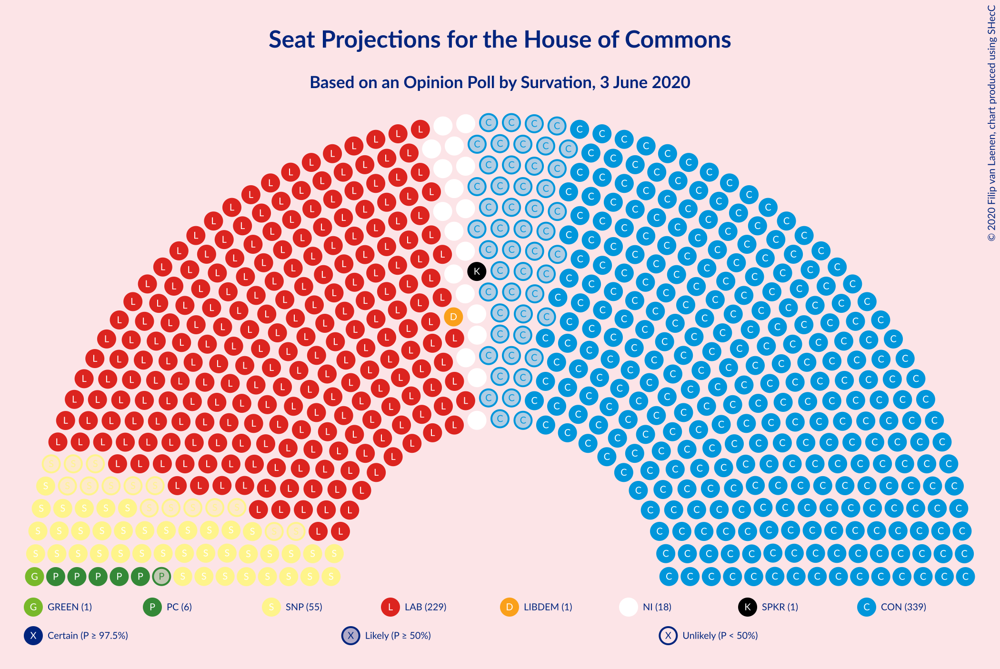

### Confidence Intervals

| Party | Last Result | Median | 80% Confidence Interval | 90% Confidence Interval | 95% Confidence Interval | 99% Confidence Interval |
|:-----:|:-----------:|:------:|:-----------------------:|:-----------------------:|:-----------------------:|:-----------------------:|
| <a href="#conservative-party">Conservative Party</a> | 365 | 339 | 297–339 |293–339 |290–339 |290–339 |
| <a href="#labour-party">Labour Party</a> | 202 | 229 | 229–276 |229–279 |229–283 |229–283 |
| <a href="#liberal-democrats">Liberal Democrats</a> | 11 | 1 | 1 |1–5 |1–9 |0–9 |
| <a href="#scottish-national-party">Scottish National Party</a> | 48 | 55 | 55 |44–58 |40–58 |40–58 |
| <a href="#green-party">Green Party</a> | 1 | 1 | 1 |1 |1 |1 |
| <a href="#plaid-cymru">Plaid Cymru</a> | 4 | 6 | 5–6 |5–6 |5–6 |4–7 |
| <a href="#brexit-party">Brexit Party</a> | 0 | 0 | 0 |0 |0 |0 |

### Conservative Party

*For a full overview of the results for this party, see the [Conservative Party](party-conservativeparty.html) page.*

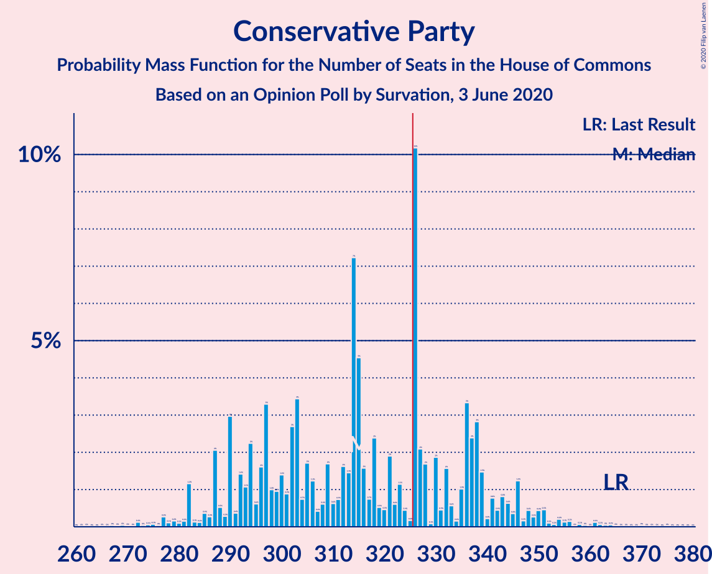

| Number of Seats | Probability | Accumulated | Special Marks |
|:---------------:|:-----------:|:-----------:|:-------------:|
| 266 | 0.2% | 100% |  |
| 267 | 0% | 99.8% |  |
| 268 | 0% | 99.8% |  |
| 269 | 0% | 99.8% |  |
| 270 | 0% | 99.8% |  |
| 271 | 0% | 99.8% |  |
| 272 | 0% | 99.8% |  |
| 273 | 0% | 99.8% |  |
| 274 | 0% | 99.8% |  |
| 275 | 0% | 99.8% |  |
| 276 | 0% | 99.8% |  |
| 277 | 0% | 99.8% |  |
| 278 | 0% | 99.8% |  |
| 279 | 0% | 99.8% |  |
| 280 | 0% | 99.8% |  |
| 281 | 0% | 99.8% |  |
| 282 | 0% | 99.8% |  |
| 283 | 0% | 99.8% |  |
| 284 | 0% | 99.8% |  |
| 285 | 0% | 99.8% |  |
| 286 | 0% | 99.8% |  |
| 287 | 0% | 99.8% |  |
| 288 | 0% | 99.8% |  |
| 289 | 0% | 99.8% |  |
| 290 | 3% | 99.8% |  |
| 291 | 0% | 96% |  |
| 292 | 0% | 96% |  |
| 293 | 4% | 96% |  |
| 294 | 0% | 92% |  |
| 295 | 0.6% | 92% |  |
| 296 | 0.2% | 92% |  |
| 297 | 3% | 92% |  |
| 298 | 0% | 88% |  |
| 299 | 0% | 88% |  |
| 300 | 0% | 88% |  |
| 301 | 0.1% | 88% |  |
| 302 | 0% | 88% |  |
| 303 | 0% | 88% |  |
| 304 | 0% | 88% |  |
| 305 | 0% | 88% |  |
| 306 | 0% | 88% |  |
| 307 | 0% | 88% |  |
| 308 | 0% | 88% |  |
| 309 | 0% | 88% |  |
| 310 | 0% | 88% |  |
| 311 | 0% | 88% |  |
| 312 | 0% | 88% |  |
| 313 | 0% | 88% |  |
| 314 | 0% | 88% |  |
| 315 | 0.1% | 88% |  |
| 316 | 1.0% | 88% |  |
| 317 | 0% | 87% |  |
| 318 | 0% | 87% |  |
| 319 | 0% | 87% |  |
| 320 | 0% | 87% |  |
| 321 | 0% | 87% |  |
| 322 | 0% | 87% |  |
| 323 | 0% | 87% |  |
| 324 | 0% | 87% |  |
| 325 | 0% | 87% |  |
| 326 | 0% | 87% | Majority |
| 327 | 0% | 87% |  |
| 328 | 0% | 87% |  |
| 329 | 0% | 87% |  |
| 330 | 0% | 87% |  |
| 331 | 1.0% | 87% |  |
| 332 | 0% | 86% |  |
| 333 | 0% | 86% |  |
| 334 | 0% | 86% |  |
| 335 | 0% | 86% |  |
| 336 | 0% | 86% |  |
| 337 | 0% | 86% |  |
| 338 | 0% | 86% |  |
| 339 | 86% | 86% | Median |
| 340 | 0% | 0.1% |  |
| 341 | 0% | 0.1% |  |
| 342 | 0% | 0.1% |  |
| 343 | 0% | 0.1% |  |
| 344 | 0% | 0.1% |  |
| 345 | 0% | 0.1% |  |
| 346 | 0% | 0.1% |  |
| 347 | 0% | 0.1% |  |
| 348 | 0% | 0.1% |  |
| 349 | 0% | 0.1% |  |
| 350 | 0% | 0.1% |  |
| 351 | 0% | 0.1% |  |
| 352 | 0% | 0.1% |  |
| 353 | 0% | 0.1% |  |
| 354 | 0% | 0.1% |  |
| 355 | 0% | 0.1% |  |
| 356 | 0% | 0.1% |  |
| 357 | 0% | 0.1% |  |
| 358 | 0% | 0.1% |  |
| 359 | 0% | 0.1% |  |
| 360 | 0% | 0.1% |  |
| 361 | 0% | 0.1% |  |
| 362 | 0% | 0.1% |  |
| 363 | 0% | 0.1% |  |
| 364 | 0% | 0.1% |  |
| 365 | 0% | 0% | Last Result |

### Labour Party

*For a full overview of the results for this party, see the [Labour Party](party-labourparty.html) page.*

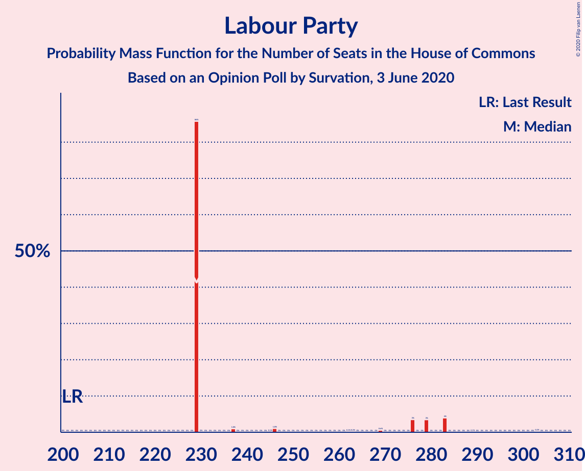

| Number of Seats | Probability | Accumulated | Special Marks |
|:---------------:|:-----------:|:-----------:|:-------------:|
| 202 | 0% | 100% | Last Result |
| 203 | 0% | 100% |  |
| 204 | 0% | 100% |  |
| 205 | 0% | 100% |  |
| 206 | 0% | 100% |  |
| 207 | 0% | 100% |  |
| 208 | 0% | 100% |  |
| 209 | 0% | 100% |  |
| 210 | 0% | 100% |  |
| 211 | 0% | 100% |  |
| 212 | 0% | 100% |  |
| 213 | 0% | 100% |  |
| 214 | 0% | 99.9% |  |
| 215 | 0% | 99.9% |  |
| 216 | 0% | 99.9% |  |
| 217 | 0% | 99.9% |  |
| 218 | 0% | 99.9% |  |
| 219 | 0% | 99.9% |  |
| 220 | 0% | 99.9% |  |
| 221 | 0% | 99.9% |  |
| 222 | 0% | 99.9% |  |
| 223 | 0% | 99.9% |  |
| 224 | 0% | 99.9% |  |
| 225 | 0% | 99.9% |  |
| 226 | 0% | 99.9% |  |
| 227 | 0% | 99.9% |  |
| 228 | 0% | 99.9% |  |
| 229 | 86% | 99.9% | Median |
| 230 | 0% | 14% |  |
| 231 | 0% | 14% |  |
| 232 | 0% | 14% |  |
| 233 | 0% | 14% |  |
| 234 | 0% | 14% |  |
| 235 | 0% | 14% |  |
| 236 | 0% | 14% |  |
| 237 | 1.0% | 14% |  |
| 238 | 0% | 13% |  |
| 239 | 0% | 13% |  |
| 240 | 0% | 13% |  |
| 241 | 0% | 13% |  |
| 242 | 0% | 13% |  |
| 243 | 0% | 13% |  |
| 244 | 0% | 13% |  |
| 245 | 0.1% | 13% |  |
| 246 | 1.0% | 13% |  |
| 247 | 0% | 12% |  |
| 248 | 0% | 12% |  |
| 249 | 0% | 12% |  |
| 250 | 0% | 12% |  |
| 251 | 0% | 12% |  |
| 252 | 0% | 12% |  |
| 253 | 0% | 12% |  |
| 254 | 0% | 12% |  |
| 255 | 0% | 12% |  |
| 256 | 0% | 12% |  |
| 257 | 0% | 12% |  |
| 258 | 0% | 12% |  |
| 259 | 0% | 12% |  |
| 260 | 0% | 12% |  |
| 261 | 0% | 12% |  |
| 262 | 0.1% | 12% |  |
| 263 | 0.2% | 12% |  |
| 264 | 0% | 12% |  |
| 265 | 0% | 12% |  |
| 266 | 0% | 12% |  |
| 267 | 0% | 12% |  |
| 268 | 0% | 12% |  |
| 269 | 0.6% | 12% |  |
| 270 | 0% | 11% |  |
| 271 | 0% | 11% |  |
| 272 | 0% | 11% |  |
| 273 | 0% | 11% |  |
| 274 | 0% | 11% |  |
| 275 | 0% | 11% |  |
| 276 | 3% | 11% |  |
| 277 | 0% | 8% |  |
| 278 | 0% | 8% |  |
| 279 | 3% | 8% |  |
| 280 | 0% | 4% |  |
| 281 | 0% | 4% |  |
| 282 | 0% | 4% |  |
| 283 | 4% | 4% |  |
| 284 | 0% | 0.3% |  |
| 285 | 0% | 0.3% |  |
| 286 | 0% | 0.3% |  |
| 287 | 0% | 0.3% |  |
| 288 | 0% | 0.3% |  |
| 289 | 0.1% | 0.3% |  |
| 290 | 0% | 0.2% |  |
| 291 | 0% | 0.2% |  |
| 292 | 0% | 0.2% |  |
| 293 | 0% | 0.2% |  |
| 294 | 0% | 0.2% |  |
| 295 | 0% | 0.2% |  |
| 296 | 0% | 0.2% |  |
| 297 | 0% | 0.2% |  |
| 298 | 0% | 0.2% |  |
| 299 | 0% | 0.2% |  |
| 300 | 0% | 0.2% |  |
| 301 | 0% | 0.2% |  |
| 302 | 0% | 0.2% |  |
| 303 | 0.2% | 0.2% |  |
| 304 | 0% | 0% |  |

### Liberal Democrats

*For a full overview of the results for this party, see the [Liberal Democrats](party-liberaldemocrats.html) page.*

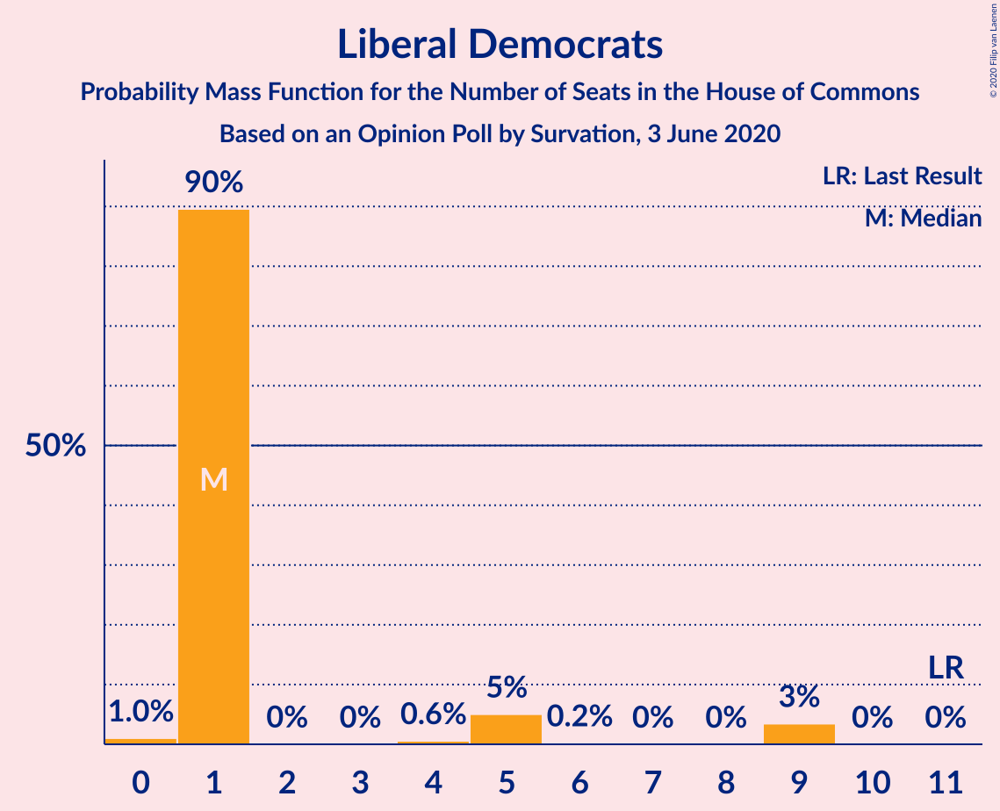

| Number of Seats | Probability | Accumulated | Special Marks |
|:---------------:|:-----------:|:-----------:|:-------------:|
| 0 | 1.0% | 100% |  |
| 1 | 90% | 99.0% | Median |
| 2 | 0% | 9% |  |
| 3 | 0% | 9% |  |
| 4 | 0.6% | 9% |  |
| 5 | 5% | 9% |  |
| 6 | 0.2% | 4% |  |
| 7 | 0% | 3% |  |
| 8 | 0% | 3% |  |
| 9 | 3% | 3% |  |
| 10 | 0% | 0% |  |
| 11 | 0% | 0% | Last Result |

### Scottish National Party

*For a full overview of the results for this party, see the [Scottish National Party](party-scottishnationalparty.html) page.*

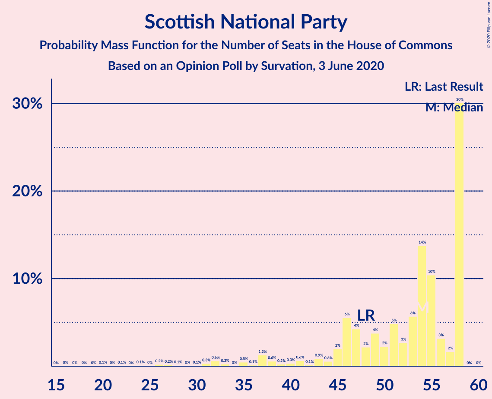

| Number of Seats | Probability | Accumulated | Special Marks |
|:---------------:|:-----------:|:-----------:|:-------------:|
| 38 | 0.1% | 100% |  |
| 39 | 0% | 99.9% |  |
| 40 | 3% | 99.9% |  |
| 41 | 0% | 96% |  |
| 42 | 0% | 96% |  |
| 43 | 0% | 96% |  |
| 44 | 4% | 96% |  |
| 45 | 0% | 92% |  |
| 46 | 0% | 92% |  |
| 47 | 0% | 92% |  |
| 48 | 0% | 92% | Last Result |
| 49 | 0% | 92% |  |
| 50 | 0% | 92% |  |
| 51 | 0% | 92% |  |
| 52 | 0% | 92% |  |
| 53 | 0.1% | 92% |  |
| 54 | 0.2% | 92% |  |
| 55 | 87% | 92% | Median |
| 56 | 0.2% | 6% |  |
| 57 | 0% | 5% |  |
| 58 | 5% | 5% |  |
| 59 | 0% | 0% |  |

### Green Party

*For a full overview of the results for this party, see the [Green Party](party-greenparty.html) page.*

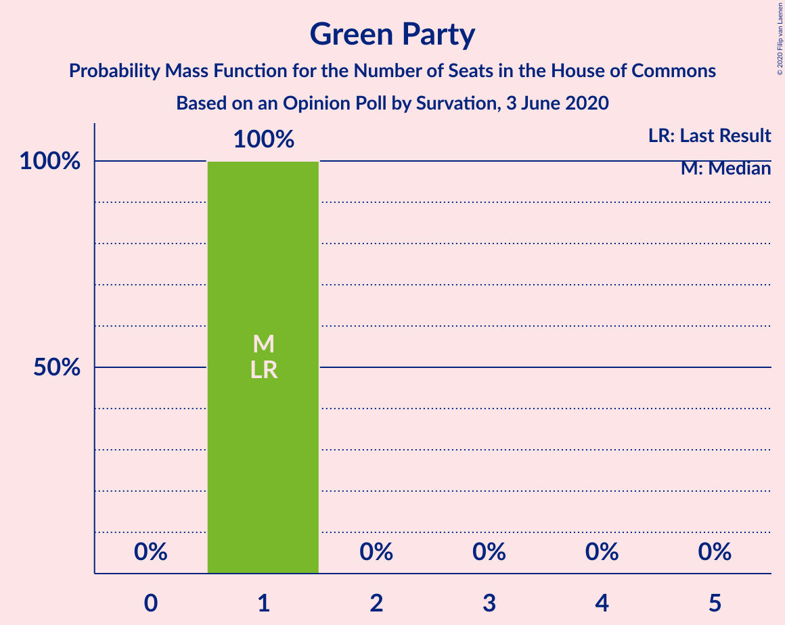

| Number of Seats | Probability | Accumulated | Special Marks |
|:---------------:|:-----------:|:-----------:|:-------------:|
| 1 | 100% | 100% | Last Result, Median |

### Plaid Cymru

*For a full overview of the results for this party, see the [Plaid Cymru](party-plaidcymru.html) page.*

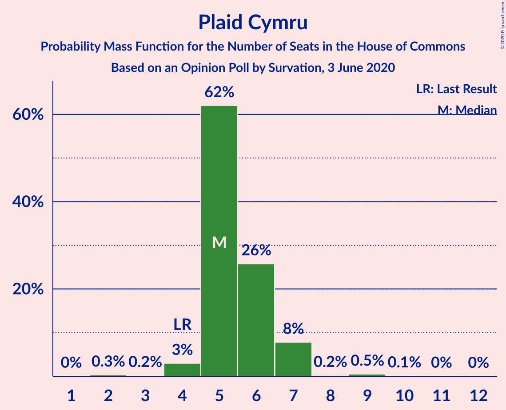

| Number of Seats | Probability | Accumulated | Special Marks |
|:---------------:|:-----------:|:-----------:|:-------------:|
| 4 | 0.8% | 100% | Last Result |
| 5 | 12% | 99.2% |  |
| 6 | 86% | 87% | Median |
| 7 | 1.0% | 1.3% |  |
| 8 | 0.1% | 0.3% |  |
| 9 | 0% | 0.2% |  |
| 10 | 0% | 0.2% |  |
| 11 | 0.2% | 0.2% |  |
| 12 | 0% | 0% |  |

### Brexit Party

*For a full overview of the results for this party, see the [Brexit Party](party-brexitparty.html) page.*

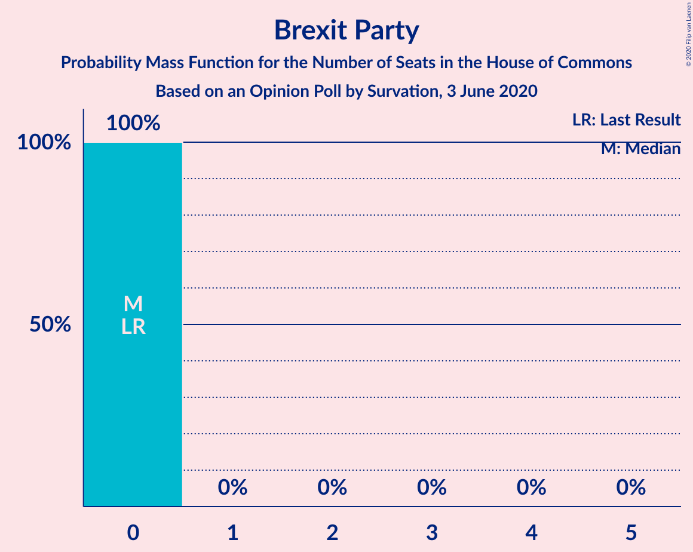

| Number of Seats | Probability | Accumulated | Special Marks |
|:---------------:|:-----------:|:-----------:|:-------------:|
| 0 | 100% | 100% | Last Result, Median |

## Coalitions

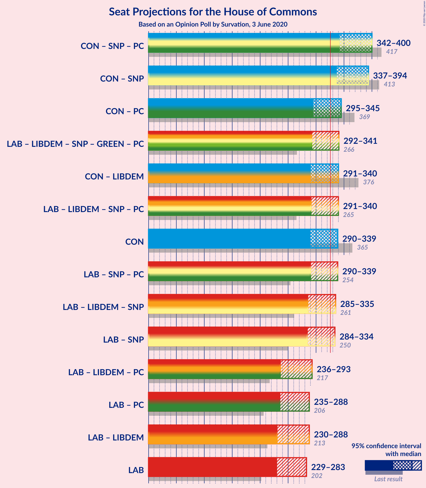

### Confidence Intervals

| Coalition | Last Result | Median | Majority? | 80% Confidence Interval | 90% Confidence Interval | 95% Confidence Interval | 99% Confidence Interval |
|:---------:|:-----------:|:------:|:---------:|:-----------------------:|:-----------------------:|:-----------------------:|:-----------------------:|
| Conservative Party – Scottish National Party – Plaid Cymru | 417 | 400 | 100% | 353–400 | 342–400 | 342–400 | 342–400 |
| Conservative Party – Scottish National Party | 413 | 394 | 99.8% | 348–394 | 337–394 | 337–394 | 337–394 |
| Conservative Party – Plaid Cymru | 369 | 345 | 87% | 302–345 | 298–345 | 295–345 | 295–345 |
| Labour Party – Liberal Democrats – Scottish National Party – Green Party – Plaid Cymru | 266 | 292 | 12% | 292–334 | 292–338 | 292–341 | 292–341 |
| Conservative Party – Liberal Democrats | 376 | 340 | 87% | 306–340 | 298–340 | 291–340 | 291–340 |
| Labour Party – Liberal Democrats – Scottish National Party – Plaid Cymru | 265 | 291 | 12% | 291–333 | 291–337 | 291–340 | 291–340 |
| Conservative Party | 365 | 339 | 87% | 297–339 | 293–339 | 290–339 | 290–339 |
| Labour Party – Scottish National Party – Plaid Cymru | 254 | 290 | 9% | 290–324 | 290–332 | 290–339 | 290–339 |
| Labour Party – Liberal Democrats – Scottish National Party | 261 | 285 | 12% | 285–328 | 285–332 | 285–335 | 285–335 |
| Labour Party – Scottish National Party | 250 | 284 | 8% | 284–319 | 284–327 | 284–334 | 284–334 |
| Labour Party – Liberal Democrats – Plaid Cymru | 217 | 236 | 0% | 236–282 | 236–293 | 236–293 | 236–293 |
| Labour Party – Plaid Cymru | 206 | 235 | 0% | 235–281 | 235–284 | 235–288 | 235–288 |
| Labour Party – Liberal Democrats | 213 | 230 | 0% | 230–277 | 230–288 | 230–288 | 230–288 |
| Labour Party | 202 | 229 | 0% | 229–276 | 229–279 | 229–283 | 229–283 |

### Conservative Party – Scottish National Party – Plaid Cymru

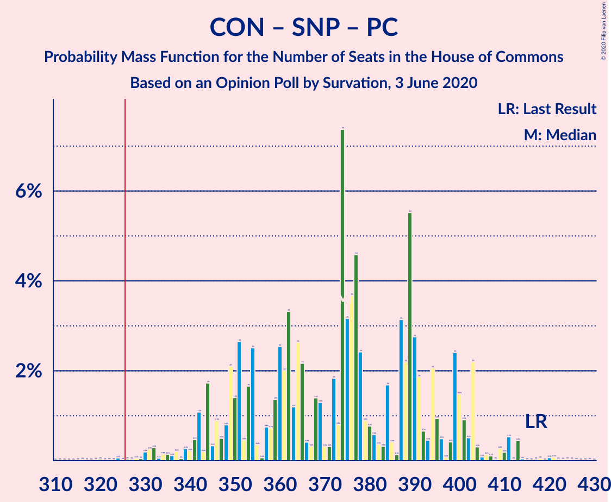

| Number of Seats | Probability | Accumulated | Special Marks |
|:---------------:|:-----------:|:-----------:|:-------------:|
| 326 | 0.2% | 100% | Majority |
| 327 | 0% | 99.8% |  |
| 328 | 0% | 99.8% |  |
| 329 | 0% | 99.8% |  |
| 330 | 0% | 99.8% |  |
| 331 | 0% | 99.8% |  |
| 332 | 0% | 99.8% |  |
| 333 | 0% | 99.8% |  |
| 334 | 0% | 99.8% |  |
| 335 | 0% | 99.8% |  |
| 336 | 0.1% | 99.8% |  |
| 337 | 0% | 99.7% |  |
| 338 | 0% | 99.7% |  |
| 339 | 0% | 99.7% |  |
| 340 | 0% | 99.7% |  |
| 341 | 0% | 99.7% |  |
| 342 | 7% | 99.7% |  |
| 343 | 0% | 92% |  |
| 344 | 0% | 92% |  |
| 345 | 0% | 92% |  |
| 346 | 0% | 92% |  |
| 347 | 0% | 92% |  |
| 348 | 0% | 92% |  |
| 349 | 0% | 92% |  |
| 350 | 0% | 92% |  |
| 351 | 0% | 92% |  |
| 352 | 0% | 92% |  |
| 353 | 3% | 92% |  |
| 354 | 0% | 89% |  |
| 355 | 0% | 89% |  |
| 356 | 0% | 89% |  |
| 357 | 0.6% | 89% |  |
| 358 | 0% | 88% |  |
| 359 | 0% | 88% |  |
| 360 | 0% | 88% |  |
| 361 | 0.2% | 88% |  |
| 362 | 0% | 88% |  |
| 363 | 0% | 88% |  |
| 364 | 0% | 88% |  |
| 365 | 0% | 88% |  |
| 366 | 0% | 88% |  |
| 367 | 0.1% | 88% |  |
| 368 | 0% | 88% |  |
| 369 | 0% | 88% |  |
| 370 | 0% | 88% |  |
| 371 | 0% | 88% |  |
| 372 | 0% | 88% |  |
| 373 | 0% | 88% |  |
| 374 | 0% | 88% |  |
| 375 | 0% | 88% |  |
| 376 | 0% | 88% |  |
| 377 | 0% | 88% |  |
| 378 | 0% | 88% |  |
| 379 | 1.1% | 88% |  |
| 380 | 0% | 87% |  |
| 381 | 0% | 87% |  |
| 382 | 0% | 87% |  |
| 383 | 0% | 87% |  |
| 384 | 0% | 87% |  |
| 385 | 0% | 87% |  |
| 386 | 0% | 87% |  |
| 387 | 0% | 87% |  |
| 388 | 0% | 87% |  |
| 389 | 0% | 87% |  |
| 390 | 0% | 87% |  |
| 391 | 0% | 87% |  |
| 392 | 0% | 87% |  |
| 393 | 1.0% | 87% |  |
| 394 | 0% | 86% |  |
| 395 | 0% | 86% |  |
| 396 | 0% | 86% |  |
| 397 | 0% | 86% |  |
| 398 | 0% | 86% |  |
| 399 | 0% | 86% |  |
| 400 | 86% | 86% | Median |
| 401 | 0% | 0.1% |  |
| 402 | 0% | 0.1% |  |
| 403 | 0% | 0.1% |  |
| 404 | 0% | 0.1% |  |
| 405 | 0% | 0.1% |  |
| 406 | 0% | 0.1% |  |
| 407 | 0% | 0.1% |  |
| 408 | 0% | 0.1% |  |
| 409 | 0% | 0.1% |  |
| 410 | 0% | 0.1% |  |
| 411 | 0% | 0.1% |  |
| 412 | 0% | 0.1% |  |
| 413 | 0% | 0.1% |  |
| 414 | 0% | 0.1% |  |
| 415 | 0% | 0.1% |  |
| 416 | 0% | 0% |  |
| 417 | 0% | 0% | Last Result |

### Conservative Party – Scottish National Party

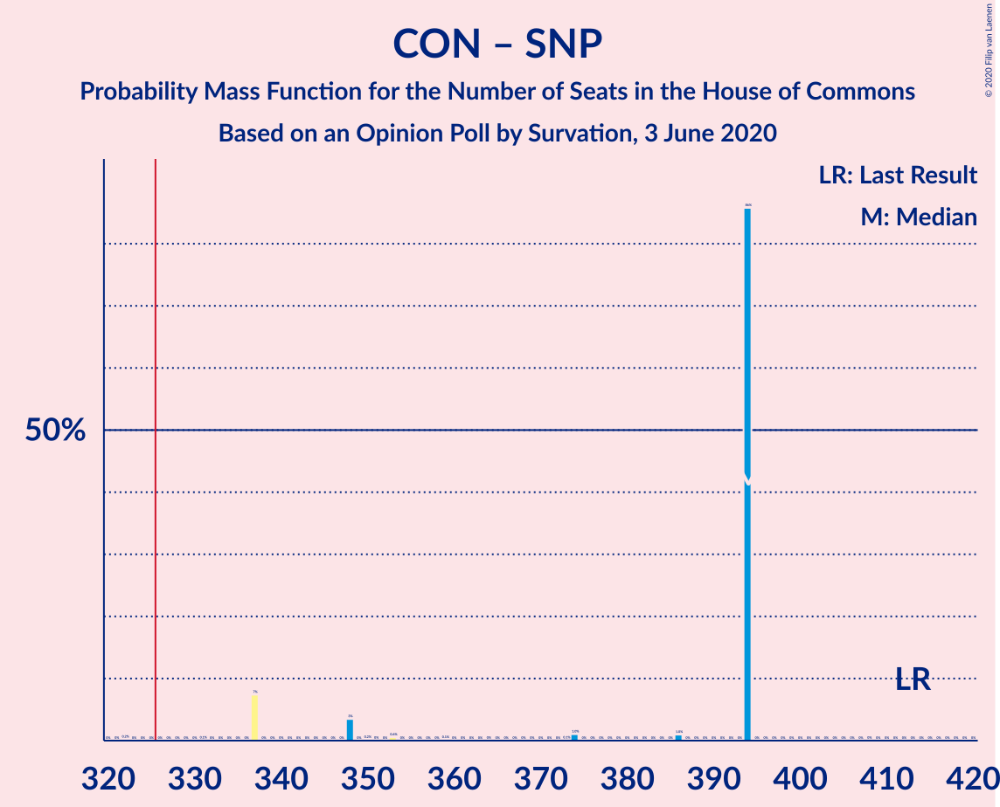

| Number of Seats | Probability | Accumulated | Special Marks |
|:---------------:|:-----------:|:-----------:|:-------------:|
| 322 | 0.2% | 100% |  |
| 323 | 0% | 99.8% |  |
| 324 | 0% | 99.8% |  |
| 325 | 0% | 99.8% |  |
| 326 | 0% | 99.8% | Majority |
| 327 | 0% | 99.8% |  |
| 328 | 0% | 99.8% |  |
| 329 | 0% | 99.8% |  |
| 330 | 0% | 99.8% |  |
| 331 | 0.1% | 99.8% |  |
| 332 | 0% | 99.7% |  |
| 333 | 0% | 99.7% |  |
| 334 | 0% | 99.7% |  |
| 335 | 0% | 99.7% |  |
| 336 | 0% | 99.7% |  |
| 337 | 7% | 99.7% |  |
| 338 | 0% | 92% |  |
| 339 | 0% | 92% |  |
| 340 | 0% | 92% |  |
| 341 | 0% | 92% |  |
| 342 | 0% | 92% |  |
| 343 | 0% | 92% |  |
| 344 | 0% | 92% |  |
| 345 | 0% | 92% |  |
| 346 | 0% | 92% |  |
| 347 | 0% | 92% |  |
| 348 | 3% | 92% |  |
| 349 | 0% | 89% |  |
| 350 | 0.2% | 89% |  |
| 351 | 0% | 89% |  |
| 352 | 0% | 89% |  |
| 353 | 0.6% | 89% |  |
| 354 | 0% | 88% |  |
| 355 | 0% | 88% |  |
| 356 | 0% | 88% |  |
| 357 | 0% | 88% |  |
| 358 | 0% | 88% |  |
| 359 | 0.1% | 88% |  |
| 360 | 0% | 88% |  |
| 361 | 0% | 88% |  |
| 362 | 0% | 88% |  |
| 363 | 0% | 88% |  |
| 364 | 0% | 88% |  |
| 365 | 0% | 88% |  |
| 366 | 0% | 88% |  |
| 367 | 0% | 88% |  |
| 368 | 0% | 88% |  |
| 369 | 0% | 88% |  |
| 370 | 0% | 88% |  |
| 371 | 0% | 88% |  |
| 372 | 0% | 88% |  |
| 373 | 0.1% | 88% |  |
| 374 | 1.0% | 88% |  |
| 375 | 0% | 87% |  |
| 376 | 0% | 87% |  |
| 377 | 0% | 87% |  |
| 378 | 0% | 87% |  |
| 379 | 0% | 87% |  |
| 380 | 0% | 87% |  |
| 381 | 0% | 87% |  |
| 382 | 0% | 87% |  |
| 383 | 0% | 87% |  |
| 384 | 0% | 87% |  |
| 385 | 0% | 87% |  |
| 386 | 1.0% | 87% |  |
| 387 | 0% | 86% |  |
| 388 | 0% | 86% |  |
| 389 | 0% | 86% |  |
| 390 | 0% | 86% |  |
| 391 | 0% | 86% |  |
| 392 | 0% | 86% |  |
| 393 | 0% | 86% |  |
| 394 | 86% | 86% | Median |
| 395 | 0% | 0.1% |  |
| 396 | 0% | 0.1% |  |
| 397 | 0% | 0.1% |  |
| 398 | 0% | 0.1% |  |
| 399 | 0% | 0.1% |  |
| 400 | 0% | 0.1% |  |
| 401 | 0% | 0.1% |  |
| 402 | 0% | 0.1% |  |
| 403 | 0% | 0.1% |  |
| 404 | 0% | 0.1% |  |
| 405 | 0% | 0.1% |  |
| 406 | 0% | 0.1% |  |
| 407 | 0% | 0.1% |  |
| 408 | 0% | 0.1% |  |
| 409 | 0% | 0% |  |
| 410 | 0% | 0% |  |
| 411 | 0% | 0% |  |
| 412 | 0% | 0% |  |
| 413 | 0% | 0% | Last Result |

### Conservative Party – Plaid Cymru

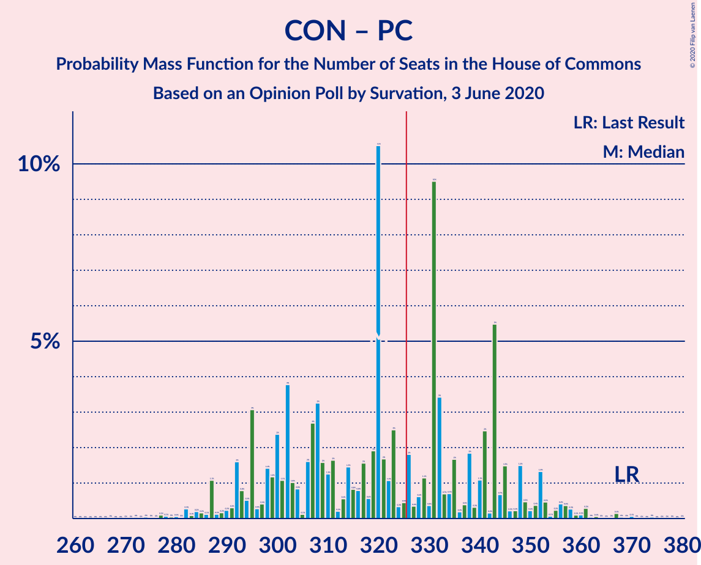

| Number of Seats | Probability | Accumulated | Special Marks |
|:---------------:|:-----------:|:-----------:|:-------------:|
| 270 | 0.2% | 100% |  |
| 271 | 0% | 99.8% |  |
| 272 | 0% | 99.8% |  |
| 273 | 0% | 99.8% |  |
| 274 | 0% | 99.8% |  |
| 275 | 0% | 99.8% |  |
| 276 | 0% | 99.8% |  |
| 277 | 0% | 99.8% |  |
| 278 | 0% | 99.8% |  |
| 279 | 0% | 99.8% |  |
| 280 | 0% | 99.8% |  |
| 281 | 0% | 99.8% |  |
| 282 | 0% | 99.8% |  |
| 283 | 0% | 99.8% |  |
| 284 | 0% | 99.8% |  |
| 285 | 0% | 99.8% |  |
| 286 | 0% | 99.8% |  |
| 287 | 0% | 99.8% |  |
| 288 | 0% | 99.8% |  |
| 289 | 0% | 99.8% |  |
| 290 | 0% | 99.8% |  |
| 291 | 0% | 99.8% |  |
| 292 | 0% | 99.8% |  |
| 293 | 0% | 99.8% |  |
| 294 | 0% | 99.8% |  |
| 295 | 3% | 99.8% |  |
| 296 | 0% | 96% |  |
| 297 | 0% | 96% |  |
| 298 | 4% | 96% |  |
| 299 | 0.6% | 92% |  |
| 300 | 0% | 92% |  |
| 301 | 0% | 92% |  |
| 302 | 3% | 92% |  |
| 303 | 0% | 88% |  |
| 304 | 0% | 88% |  |
| 305 | 0% | 88% |  |
| 306 | 0% | 88% |  |
| 307 | 0.2% | 88% |  |
| 308 | 0% | 88% |  |
| 309 | 0.2% | 88% |  |
| 310 | 0% | 88% |  |
| 311 | 0% | 88% |  |
| 312 | 0% | 88% |  |
| 313 | 0% | 88% |  |
| 314 | 0% | 88% |  |
| 315 | 0% | 88% |  |
| 316 | 0% | 88% |  |
| 317 | 0% | 88% |  |
| 318 | 0% | 88% |  |
| 319 | 0% | 88% |  |
| 320 | 0% | 88% |  |
| 321 | 1.1% | 88% |  |
| 322 | 0% | 87% |  |
| 323 | 0% | 87% |  |
| 324 | 0% | 87% |  |
| 325 | 0% | 87% |  |
| 326 | 0% | 87% | Majority |
| 327 | 0% | 87% |  |
| 328 | 0% | 87% |  |
| 329 | 0% | 87% |  |
| 330 | 0% | 87% |  |
| 331 | 0% | 87% |  |
| 332 | 0% | 87% |  |
| 333 | 0% | 87% |  |
| 334 | 0% | 87% |  |
| 335 | 0% | 87% |  |
| 336 | 0% | 87% |  |
| 337 | 0% | 87% |  |
| 338 | 1.0% | 87% |  |
| 339 | 0% | 86% |  |
| 340 | 0% | 86% |  |
| 341 | 0% | 86% |  |
| 342 | 0% | 86% |  |
| 343 | 0% | 86% |  |
| 344 | 0% | 86% |  |
| 345 | 86% | 86% | Median |
| 346 | 0% | 0.1% |  |
| 347 | 0% | 0.1% |  |
| 348 | 0% | 0.1% |  |
| 349 | 0% | 0.1% |  |
| 350 | 0% | 0.1% |  |
| 351 | 0% | 0.1% |  |
| 352 | 0% | 0.1% |  |
| 353 | 0% | 0.1% |  |
| 354 | 0% | 0.1% |  |
| 355 | 0% | 0.1% |  |
| 356 | 0% | 0.1% |  |
| 357 | 0% | 0.1% |  |
| 358 | 0% | 0.1% |  |
| 359 | 0% | 0.1% |  |
| 360 | 0% | 0.1% |  |
| 361 | 0% | 0.1% |  |
| 362 | 0% | 0.1% |  |
| 363 | 0% | 0.1% |  |
| 364 | 0% | 0.1% |  |
| 365 | 0% | 0.1% |  |
| 366 | 0% | 0.1% |  |
| 367 | 0% | 0.1% |  |
| 368 | 0% | 0.1% |  |
| 369 | 0% | 0.1% | Last Result |
| 370 | 0% | 0.1% |  |
| 371 | 0% | 0.1% |  |
| 372 | 0% | 0% |  |

### Labour Party – Liberal Democrats – Scottish National Party – Green Party – Plaid Cymru

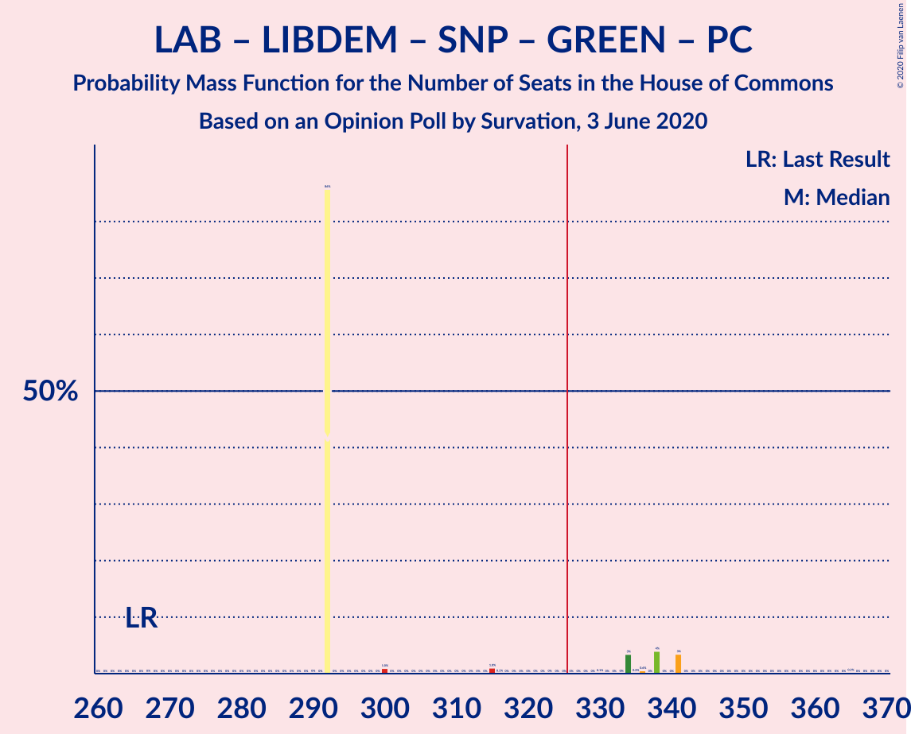

| Number of Seats | Probability | Accumulated | Special Marks |
|:---------------:|:-----------:|:-----------:|:-------------:|
| 266 | 0% | 100% | Last Result |
| 267 | 0% | 100% |  |
| 268 | 0% | 99.9% |  |
| 269 | 0% | 99.9% |  |
| 270 | 0% | 99.9% |  |
| 271 | 0% | 99.9% |  |
| 272 | 0% | 99.9% |  |
| 273 | 0% | 99.9% |  |
| 274 | 0% | 99.9% |  |
| 275 | 0% | 99.9% |  |
| 276 | 0% | 99.9% |  |
| 277 | 0% | 99.9% |  |
| 278 | 0% | 99.9% |  |
| 279 | 0% | 99.9% |  |
| 280 | 0% | 99.9% |  |
| 281 | 0% | 99.9% |  |
| 282 | 0% | 99.9% |  |
| 283 | 0% | 99.9% |  |
| 284 | 0% | 99.9% |  |
| 285 | 0% | 99.9% |  |
| 286 | 0% | 99.9% |  |
| 287 | 0% | 99.9% |  |
| 288 | 0% | 99.9% |  |
| 289 | 0% | 99.9% |  |
| 290 | 0% | 99.9% |  |
| 291 | 0% | 99.9% |  |
| 292 | 86% | 99.9% | Median |
| 293 | 0% | 14% |  |
| 294 | 0% | 14% |  |
| 295 | 0% | 14% |  |
| 296 | 0% | 14% |  |
| 297 | 0% | 14% |  |
| 298 | 0% | 14% |  |
| 299 | 0% | 14% |  |
| 300 | 1.0% | 14% |  |
| 301 | 0% | 13% |  |
| 302 | 0% | 13% |  |
| 303 | 0% | 13% |  |
| 304 | 0% | 13% |  |
| 305 | 0% | 13% |  |
| 306 | 0% | 13% |  |
| 307 | 0% | 13% |  |
| 308 | 0% | 13% |  |
| 309 | 0% | 13% |  |
| 310 | 0% | 13% |  |
| 311 | 0% | 13% |  |
| 312 | 0% | 13% |  |
| 313 | 0% | 13% |  |
| 314 | 0% | 13% |  |
| 315 | 1.0% | 13% |  |
| 316 | 0.1% | 12% |  |
| 317 | 0% | 12% |  |
| 318 | 0% | 12% |  |
| 319 | 0% | 12% |  |
| 320 | 0% | 12% |  |
| 321 | 0% | 12% |  |
| 322 | 0% | 12% |  |
| 323 | 0% | 12% |  |
| 324 | 0% | 12% |  |
| 325 | 0% | 12% |  |
| 326 | 0% | 12% | Majority |
| 327 | 0% | 12% |  |
| 328 | 0% | 12% |  |
| 329 | 0% | 12% |  |
| 330 | 0.1% | 12% |  |
| 331 | 0% | 12% |  |
| 332 | 0% | 12% |  |
| 333 | 0% | 12% |  |
| 334 | 3% | 12% |  |
| 335 | 0.2% | 8% |  |
| 336 | 0.6% | 8% |  |
| 337 | 0% | 8% |  |
| 338 | 4% | 8% |  |
| 339 | 0% | 4% |  |
| 340 | 0% | 4% |  |
| 341 | 3% | 4% |  |
| 342 | 0% | 0.2% |  |
| 343 | 0% | 0.2% |  |
| 344 | 0% | 0.2% |  |
| 345 | 0% | 0.2% |  |
| 346 | 0% | 0.2% |  |
| 347 | 0% | 0.2% |  |
| 348 | 0% | 0.2% |  |
| 349 | 0% | 0.2% |  |
| 350 | 0% | 0.2% |  |
| 351 | 0% | 0.2% |  |
| 352 | 0% | 0.2% |  |
| 353 | 0% | 0.2% |  |
| 354 | 0% | 0.2% |  |
| 355 | 0% | 0.2% |  |
| 356 | 0% | 0.2% |  |
| 357 | 0% | 0.2% |  |
| 358 | 0% | 0.2% |  |
| 359 | 0% | 0.2% |  |
| 360 | 0% | 0.2% |  |
| 361 | 0% | 0.2% |  |
| 362 | 0% | 0.2% |  |
| 363 | 0% | 0.2% |  |
| 364 | 0% | 0.2% |  |
| 365 | 0.2% | 0.2% |  |
| 366 | 0% | 0% |  |

### Conservative Party – Liberal Democrats

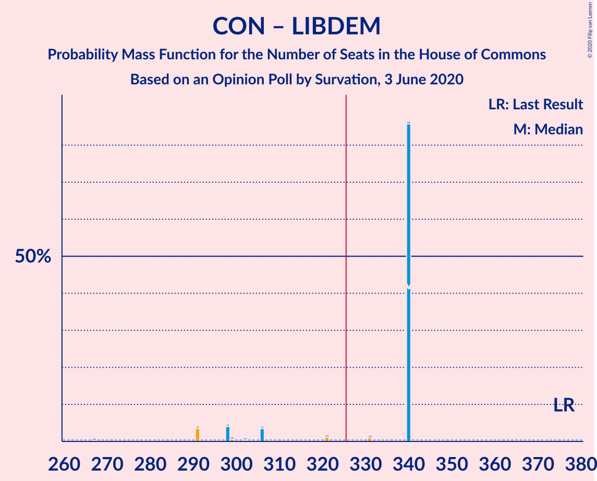

| Number of Seats | Probability | Accumulated | Special Marks |
|:---------------:|:-----------:|:-----------:|:-------------:|
| 267 | 0.2% | 100% |  |
| 268 | 0% | 99.8% |  |
| 269 | 0% | 99.8% |  |
| 270 | 0% | 99.8% |  |
| 271 | 0% | 99.8% |  |
| 272 | 0% | 99.8% |  |
| 273 | 0% | 99.8% |  |
| 274 | 0% | 99.8% |  |
| 275 | 0% | 99.8% |  |
| 276 | 0% | 99.8% |  |
| 277 | 0% | 99.8% |  |
| 278 | 0% | 99.8% |  |
| 279 | 0% | 99.8% |  |
| 280 | 0% | 99.8% |  |
| 281 | 0% | 99.8% |  |
| 282 | 0% | 99.8% |  |
| 283 | 0% | 99.8% |  |
| 284 | 0% | 99.8% |  |
| 285 | 0% | 99.8% |  |
| 286 | 0% | 99.8% |  |
| 287 | 0% | 99.8% |  |
| 288 | 0% | 99.8% |  |
| 289 | 0% | 99.8% |  |
| 290 | 0% | 99.8% |  |
| 291 | 3% | 99.8% |  |
| 292 | 0% | 96% |  |
| 293 | 0% | 96% |  |
| 294 | 0% | 96% |  |
| 295 | 0% | 96% |  |
| 296 | 0% | 96% |  |
| 297 | 0% | 96% |  |
| 298 | 4% | 96% |  |
| 299 | 0.6% | 92% |  |
| 300 | 0% | 92% |  |
| 301 | 0% | 92% |  |
| 302 | 0.3% | 92% |  |
| 303 | 0% | 91% |  |
| 304 | 0% | 91% |  |
| 305 | 0% | 91% |  |
| 306 | 3% | 91% |  |
| 307 | 0% | 88% |  |
| 308 | 0% | 88% |  |
| 309 | 0% | 88% |  |
| 310 | 0% | 88% |  |
| 311 | 0% | 88% |  |
| 312 | 0% | 88% |  |
| 313 | 0% | 88% |  |
| 314 | 0% | 88% |  |
| 315 | 0% | 88% |  |
| 316 | 0% | 88% |  |
| 317 | 0% | 88% |  |
| 318 | 0% | 88% |  |
| 319 | 0% | 88% |  |
| 320 | 0% | 88% |  |
| 321 | 1.1% | 88% |  |
| 322 | 0% | 87% |  |
| 323 | 0% | 87% |  |
| 324 | 0% | 87% |  |
| 325 | 0% | 87% |  |
| 326 | 0% | 87% | Majority |
| 327 | 0% | 87% |  |
| 328 | 0% | 87% |  |
| 329 | 0% | 87% |  |
| 330 | 0% | 87% |  |
| 331 | 1.0% | 87% |  |
| 332 | 0% | 86% |  |
| 333 | 0% | 86% |  |
| 334 | 0% | 86% |  |
| 335 | 0% | 86% |  |
| 336 | 0% | 86% |  |
| 337 | 0% | 86% |  |
| 338 | 0% | 86% |  |
| 339 | 0% | 86% |  |
| 340 | 86% | 86% | Median |
| 341 | 0% | 0.1% |  |
| 342 | 0% | 0.1% |  |
| 343 | 0% | 0.1% |  |
| 344 | 0% | 0.1% |  |
| 345 | 0% | 0.1% |  |
| 346 | 0% | 0.1% |  |
| 347 | 0% | 0.1% |  |
| 348 | 0% | 0.1% |  |
| 349 | 0% | 0.1% |  |
| 350 | 0% | 0.1% |  |
| 351 | 0% | 0.1% |  |
| 352 | 0% | 0.1% |  |
| 353 | 0% | 0.1% |  |
| 354 | 0% | 0.1% |  |
| 355 | 0% | 0.1% |  |
| 356 | 0% | 0.1% |  |
| 357 | 0% | 0.1% |  |
| 358 | 0% | 0.1% |  |
| 359 | 0% | 0.1% |  |
| 360 | 0% | 0.1% |  |
| 361 | 0% | 0.1% |  |
| 362 | 0% | 0.1% |  |
| 363 | 0% | 0.1% |  |
| 364 | 0% | 0.1% |  |
| 365 | 0% | 0.1% |  |
| 366 | 0% | 0% |  |
| 367 | 0% | 0% |  |
| 368 | 0% | 0% |  |
| 369 | 0% | 0% |  |
| 370 | 0% | 0% |  |
| 371 | 0% | 0% |  |
| 372 | 0% | 0% |  |
| 373 | 0% | 0% |  |
| 374 | 0% | 0% |  |
| 375 | 0% | 0% |  |
| 376 | 0% | 0% | Last Result |

### Labour Party – Liberal Democrats – Scottish National Party – Plaid Cymru

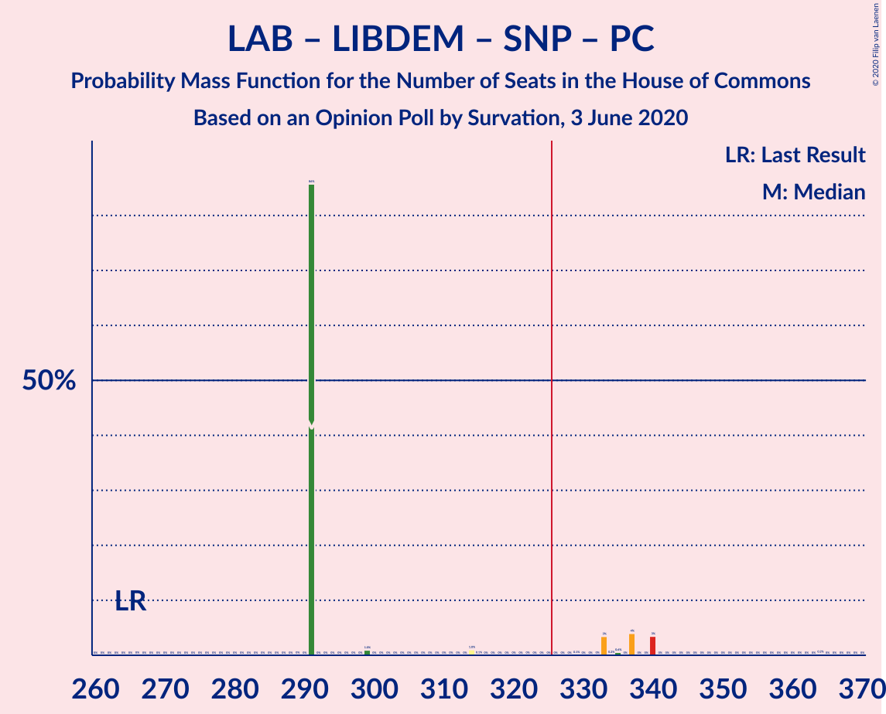

| Number of Seats | Probability | Accumulated | Special Marks |
|:---------------:|:-----------:|:-----------:|:-------------:|
| 265 | 0% | 100% | Last Result |
| 266 | 0% | 100% |  |
| 267 | 0% | 99.9% |  |
| 268 | 0% | 99.9% |  |
| 269 | 0% | 99.9% |  |
| 270 | 0% | 99.9% |  |
| 271 | 0% | 99.9% |  |
| 272 | 0% | 99.9% |  |
| 273 | 0% | 99.9% |  |
| 274 | 0% | 99.9% |  |
| 275 | 0% | 99.9% |  |
| 276 | 0% | 99.9% |  |
| 277 | 0% | 99.9% |  |
| 278 | 0% | 99.9% |  |
| 279 | 0% | 99.9% |  |
| 280 | 0% | 99.9% |  |
| 281 | 0% | 99.9% |  |
| 282 | 0% | 99.9% |  |
| 283 | 0% | 99.9% |  |
| 284 | 0% | 99.9% |  |
| 285 | 0% | 99.9% |  |
| 286 | 0% | 99.9% |  |
| 287 | 0% | 99.9% |  |
| 288 | 0% | 99.9% |  |
| 289 | 0% | 99.9% |  |
| 290 | 0% | 99.9% |  |
| 291 | 86% | 99.9% | Median |
| 292 | 0% | 14% |  |
| 293 | 0% | 14% |  |
| 294 | 0% | 14% |  |
| 295 | 0% | 14% |  |
| 296 | 0% | 14% |  |
| 297 | 0% | 14% |  |
| 298 | 0% | 14% |  |
| 299 | 1.0% | 14% |  |
| 300 | 0% | 13% |  |
| 301 | 0% | 13% |  |
| 302 | 0% | 13% |  |
| 303 | 0% | 13% |  |
| 304 | 0% | 13% |  |
| 305 | 0% | 13% |  |
| 306 | 0% | 13% |  |
| 307 | 0% | 13% |  |
| 308 | 0% | 13% |  |
| 309 | 0% | 13% |  |
| 310 | 0% | 13% |  |
| 311 | 0% | 13% |  |
| 312 | 0% | 13% |  |
| 313 | 0% | 13% |  |
| 314 | 1.0% | 13% |  |
| 315 | 0.1% | 12% |  |
| 316 | 0% | 12% |  |
| 317 | 0% | 12% |  |
| 318 | 0% | 12% |  |
| 319 | 0% | 12% |  |
| 320 | 0% | 12% |  |
| 321 | 0% | 12% |  |
| 322 | 0% | 12% |  |
| 323 | 0% | 12% |  |
| 324 | 0% | 12% |  |
| 325 | 0% | 12% |  |
| 326 | 0% | 12% | Majority |
| 327 | 0% | 12% |  |
| 328 | 0% | 12% |  |
| 329 | 0.1% | 12% |  |
| 330 | 0% | 12% |  |
| 331 | 0% | 12% |  |
| 332 | 0% | 12% |  |
| 333 | 3% | 12% |  |
| 334 | 0.2% | 8% |  |
| 335 | 0.6% | 8% |  |
| 336 | 0% | 8% |  |
| 337 | 4% | 8% |  |
| 338 | 0% | 4% |  |
| 339 | 0% | 4% |  |
| 340 | 3% | 4% |  |
| 341 | 0% | 0.2% |  |
| 342 | 0% | 0.2% |  |
| 343 | 0% | 0.2% |  |
| 344 | 0% | 0.2% |  |
| 345 | 0% | 0.2% |  |
| 346 | 0% | 0.2% |  |
| 347 | 0% | 0.2% |  |
| 348 | 0% | 0.2% |  |
| 349 | 0% | 0.2% |  |
| 350 | 0% | 0.2% |  |
| 351 | 0% | 0.2% |  |
| 352 | 0% | 0.2% |  |
| 353 | 0% | 0.2% |  |
| 354 | 0% | 0.2% |  |
| 355 | 0% | 0.2% |  |
| 356 | 0% | 0.2% |  |
| 357 | 0% | 0.2% |  |
| 358 | 0% | 0.2% |  |
| 359 | 0% | 0.2% |  |
| 360 | 0% | 0.2% |  |
| 361 | 0% | 0.2% |  |
| 362 | 0% | 0.2% |  |
| 363 | 0% | 0.2% |  |
| 364 | 0.2% | 0.2% |  |
| 365 | 0% | 0% |  |

### Conservative Party

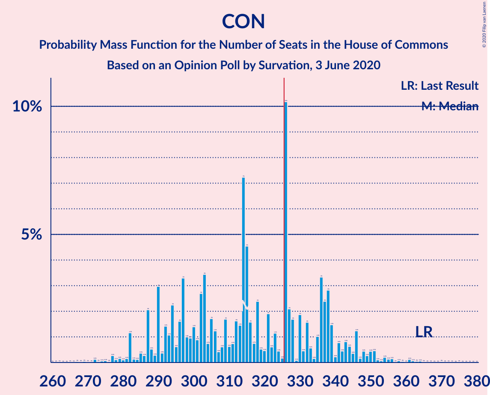

| Number of Seats | Probability | Accumulated | Special Marks |
|:---------------:|:-----------:|:-----------:|:-------------:|
| 266 | 0.2% | 100% |  |
| 267 | 0% | 99.8% |  |
| 268 | 0% | 99.8% |  |
| 269 | 0% | 99.8% |  |
| 270 | 0% | 99.8% |  |
| 271 | 0% | 99.8% |  |
| 272 | 0% | 99.8% |  |
| 273 | 0% | 99.8% |  |
| 274 | 0% | 99.8% |  |
| 275 | 0% | 99.8% |  |
| 276 | 0% | 99.8% |  |
| 277 | 0% | 99.8% |  |
| 278 | 0% | 99.8% |  |
| 279 | 0% | 99.8% |  |
| 280 | 0% | 99.8% |  |
| 281 | 0% | 99.8% |  |
| 282 | 0% | 99.8% |  |
| 283 | 0% | 99.8% |  |
| 284 | 0% | 99.8% |  |
| 285 | 0% | 99.8% |  |
| 286 | 0% | 99.8% |  |
| 287 | 0% | 99.8% |  |
| 288 | 0% | 99.8% |  |
| 289 | 0% | 99.8% |  |
| 290 | 3% | 99.8% |  |
| 291 | 0% | 96% |  |
| 292 | 0% | 96% |  |
| 293 | 4% | 96% |  |
| 294 | 0% | 92% |  |
| 295 | 0.6% | 92% |  |
| 296 | 0.2% | 92% |  |
| 297 | 3% | 92% |  |
| 298 | 0% | 88% |  |
| 299 | 0% | 88% |  |
| 300 | 0% | 88% |  |
| 301 | 0.1% | 88% |  |
| 302 | 0% | 88% |  |
| 303 | 0% | 88% |  |
| 304 | 0% | 88% |  |
| 305 | 0% | 88% |  |
| 306 | 0% | 88% |  |
| 307 | 0% | 88% |  |
| 308 | 0% | 88% |  |
| 309 | 0% | 88% |  |
| 310 | 0% | 88% |  |
| 311 | 0% | 88% |  |
| 312 | 0% | 88% |  |
| 313 | 0% | 88% |  |
| 314 | 0% | 88% |  |
| 315 | 0.1% | 88% |  |
| 316 | 1.0% | 88% |  |
| 317 | 0% | 87% |  |
| 318 | 0% | 87% |  |
| 319 | 0% | 87% |  |
| 320 | 0% | 87% |  |
| 321 | 0% | 87% |  |
| 322 | 0% | 87% |  |
| 323 | 0% | 87% |  |
| 324 | 0% | 87% |  |
| 325 | 0% | 87% |  |
| 326 | 0% | 87% | Majority |
| 327 | 0% | 87% |  |
| 328 | 0% | 87% |  |
| 329 | 0% | 87% |  |
| 330 | 0% | 87% |  |
| 331 | 1.0% | 87% |  |
| 332 | 0% | 86% |  |
| 333 | 0% | 86% |  |
| 334 | 0% | 86% |  |
| 335 | 0% | 86% |  |
| 336 | 0% | 86% |  |
| 337 | 0% | 86% |  |
| 338 | 0% | 86% |  |
| 339 | 86% | 86% | Median |
| 340 | 0% | 0.1% |  |
| 341 | 0% | 0.1% |  |
| 342 | 0% | 0.1% |  |
| 343 | 0% | 0.1% |  |
| 344 | 0% | 0.1% |  |
| 345 | 0% | 0.1% |  |
| 346 | 0% | 0.1% |  |
| 347 | 0% | 0.1% |  |
| 348 | 0% | 0.1% |  |
| 349 | 0% | 0.1% |  |
| 350 | 0% | 0.1% |  |
| 351 | 0% | 0.1% |  |
| 352 | 0% | 0.1% |  |
| 353 | 0% | 0.1% |  |
| 354 | 0% | 0.1% |  |
| 355 | 0% | 0.1% |  |
| 356 | 0% | 0.1% |  |
| 357 | 0% | 0.1% |  |
| 358 | 0% | 0.1% |  |
| 359 | 0% | 0.1% |  |
| 360 | 0% | 0.1% |  |
| 361 | 0% | 0.1% |  |
| 362 | 0% | 0.1% |  |
| 363 | 0% | 0.1% |  |
| 364 | 0% | 0.1% |  |
| 365 | 0% | 0% | Last Result |

### Labour Party – Scottish National Party – Plaid Cymru

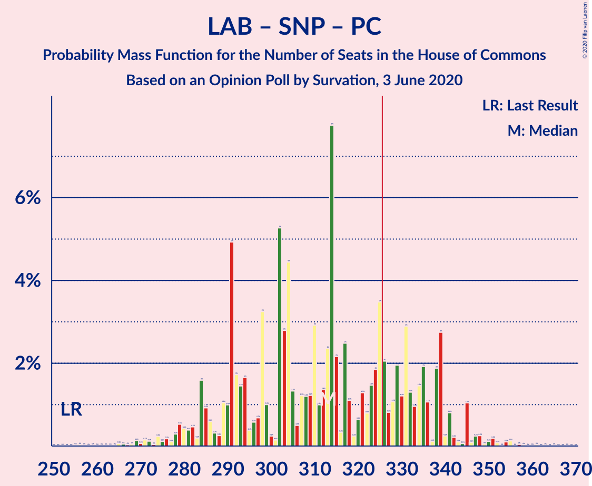

| Number of Seats | Probability | Accumulated | Special Marks |
|:---------------:|:-----------:|:-----------:|:-------------:|
| 254 | 0% | 100% | Last Result |
| 255 | 0% | 100% |  |
| 256 | 0% | 100% |  |
| 257 | 0% | 100% |  |
| 258 | 0% | 100% |  |
| 259 | 0% | 100% |  |
| 260 | 0% | 100% |  |
| 261 | 0% | 100% |  |
| 262 | 0% | 100% |  |
| 263 | 0% | 100% |  |
| 264 | 0% | 100% |  |
| 265 | 0% | 100% |  |
| 266 | 0% | 99.9% |  |
| 267 | 0% | 99.9% |  |
| 268 | 0% | 99.9% |  |
| 269 | 0% | 99.9% |  |
| 270 | 0% | 99.9% |  |
| 271 | 0% | 99.9% |  |
| 272 | 0% | 99.9% |  |
| 273 | 0% | 99.9% |  |
| 274 | 0% | 99.9% |  |
| 275 | 0% | 99.9% |  |
| 276 | 0% | 99.9% |  |
| 277 | 0% | 99.9% |  |
| 278 | 0% | 99.9% |  |
| 279 | 0% | 99.9% |  |
| 280 | 0% | 99.9% |  |
| 281 | 0% | 99.9% |  |
| 282 | 0% | 99.9% |  |
| 283 | 0% | 99.9% |  |
| 284 | 0% | 99.9% |  |
| 285 | 0% | 99.9% |  |
| 286 | 0% | 99.9% |  |
| 287 | 0% | 99.9% |  |
| 288 | 0% | 99.9% |  |
| 289 | 0% | 99.9% |  |
| 290 | 86% | 99.9% | Median |
| 291 | 0% | 14% |  |
| 292 | 0% | 14% |  |
| 293 | 0% | 14% |  |
| 294 | 0% | 14% |  |
| 295 | 0% | 14% |  |
| 296 | 0% | 14% |  |
| 297 | 0% | 14% |  |
| 298 | 0% | 14% |  |
| 299 | 1.0% | 14% |  |
| 300 | 0% | 13% |  |
| 301 | 0% | 13% |  |
| 302 | 0% | 13% |  |
| 303 | 0% | 13% |  |
| 304 | 0% | 13% |  |
| 305 | 0% | 13% |  |
| 306 | 0% | 13% |  |
| 307 | 0% | 13% |  |
| 308 | 0% | 13% |  |
| 309 | 1.1% | 13% |  |
| 310 | 0% | 12% |  |
| 311 | 0% | 12% |  |
| 312 | 0% | 12% |  |
| 313 | 0% | 12% |  |
| 314 | 0% | 12% |  |
| 315 | 0% | 12% |  |
| 316 | 0% | 12% |  |
| 317 | 0% | 12% |  |
| 318 | 0% | 12% |  |
| 319 | 0% | 12% |  |
| 320 | 0% | 12% |  |
| 321 | 0% | 12% |  |
| 322 | 0% | 12% |  |
| 323 | 0% | 12% |  |
| 324 | 3% | 12% |  |
| 325 | 0% | 9% |  |
| 326 | 0% | 9% | Majority |
| 327 | 0% | 9% |  |
| 328 | 0.3% | 9% |  |
| 329 | 0% | 8% |  |
| 330 | 0% | 8% |  |
| 331 | 0.6% | 8% |  |
| 332 | 4% | 8% |  |
| 333 | 0% | 4% |  |
| 334 | 0% | 4% |  |
| 335 | 0% | 4% |  |
| 336 | 0% | 4% |  |
| 337 | 0% | 4% |  |
| 338 | 0% | 4% |  |
| 339 | 3% | 4% |  |
| 340 | 0% | 0.2% |  |
| 341 | 0% | 0.2% |  |
| 342 | 0% | 0.2% |  |
| 343 | 0% | 0.2% |  |
| 344 | 0% | 0.2% |  |
| 345 | 0% | 0.2% |  |
| 346 | 0% | 0.2% |  |
| 347 | 0% | 0.2% |  |
| 348 | 0% | 0.2% |  |
| 349 | 0% | 0.2% |  |
| 350 | 0% | 0.2% |  |
| 351 | 0% | 0.2% |  |
| 352 | 0% | 0.2% |  |
| 353 | 0% | 0.2% |  |
| 354 | 0% | 0.2% |  |
| 355 | 0% | 0.2% |  |
| 356 | 0% | 0.2% |  |
| 357 | 0% | 0.2% |  |
| 358 | 0% | 0.2% |  |
| 359 | 0% | 0.2% |  |
| 360 | 0% | 0.2% |  |
| 361 | 0% | 0.2% |  |
| 362 | 0% | 0.2% |  |
| 363 | 0.2% | 0.2% |  |
| 364 | 0% | 0% |  |

### Labour Party – Liberal Democrats – Scottish National Party

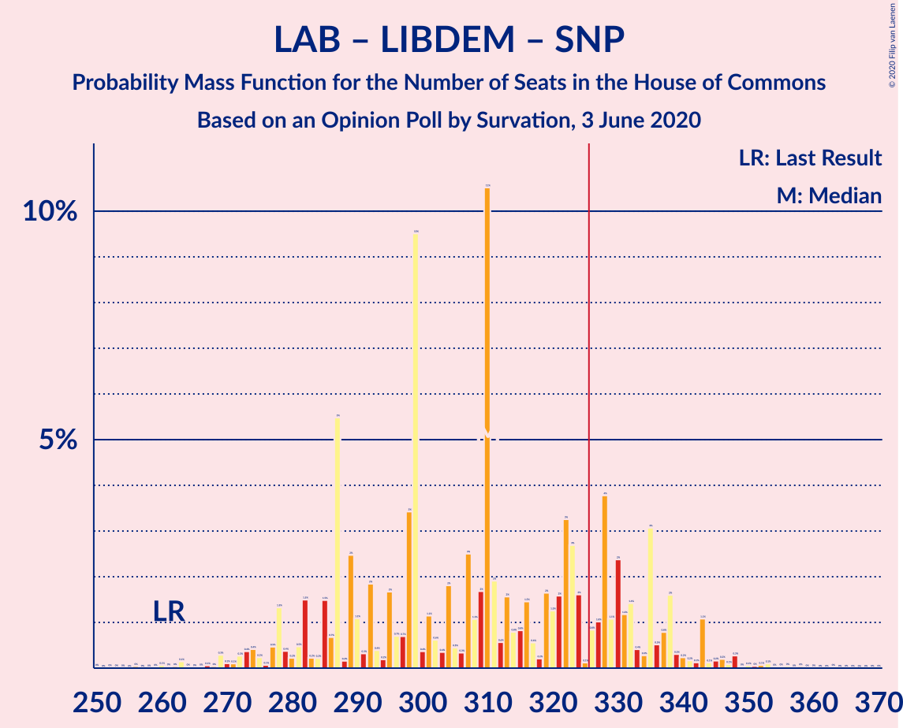

| Number of Seats | Probability | Accumulated | Special Marks |
|:---------------:|:-----------:|:-----------:|:-------------:|
| 259 | 0% | 100% |  |
| 260 | 0% | 99.9% |  |
| 261 | 0% | 99.9% | Last Result |
| 262 | 0% | 99.9% |  |
| 263 | 0% | 99.9% |  |
| 264 | 0% | 99.9% |  |
| 265 | 0% | 99.9% |  |
| 266 | 0% | 99.9% |  |
| 267 | 0% | 99.9% |  |
| 268 | 0% | 99.9% |  |
| 269 | 0% | 99.9% |  |
| 270 | 0% | 99.9% |  |
| 271 | 0% | 99.9% |  |
| 272 | 0% | 99.9% |  |
| 273 | 0% | 99.9% |  |
| 274 | 0% | 99.9% |  |
| 275 | 0% | 99.9% |  |
| 276 | 0% | 99.9% |  |
| 277 | 0% | 99.9% |  |
| 278 | 0% | 99.9% |  |
| 279 | 0% | 99.9% |  |
| 280 | 0% | 99.9% |  |
| 281 | 0% | 99.9% |  |
| 282 | 0% | 99.9% |  |
| 283 | 0% | 99.9% |  |
| 284 | 0% | 99.9% |  |
| 285 | 86% | 99.9% | Median |
| 286 | 0% | 14% |  |
| 287 | 0% | 14% |  |
| 288 | 0% | 14% |  |
| 289 | 0% | 14% |  |
| 290 | 0% | 14% |  |
| 291 | 0% | 14% |  |
| 292 | 1.0% | 14% |  |
| 293 | 0% | 13% |  |
| 294 | 0% | 13% |  |
| 295 | 0% | 13% |  |
| 296 | 0% | 13% |  |
| 297 | 0% | 13% |  |
| 298 | 0% | 13% |  |
| 299 | 0% | 13% |  |
| 300 | 0% | 13% |  |
| 301 | 0% | 13% |  |
| 302 | 0% | 13% |  |
| 303 | 0% | 13% |  |
| 304 | 0% | 13% |  |
| 305 | 0% | 13% |  |
| 306 | 0% | 13% |  |
| 307 | 0% | 13% |  |
| 308 | 0% | 13% |  |
| 309 | 1.1% | 13% |  |
| 310 | 0% | 12% |  |
| 311 | 0% | 12% |  |
| 312 | 0% | 12% |  |
| 313 | 0% | 12% |  |
| 314 | 0% | 12% |  |
| 315 | 0% | 12% |  |
| 316 | 0% | 12% |  |
| 317 | 0% | 12% |  |
| 318 | 0% | 12% |  |
| 319 | 0% | 12% |  |
| 320 | 0% | 12% |  |
| 321 | 0.2% | 12% |  |
| 322 | 0% | 12% |  |
| 323 | 0.2% | 12% |  |
| 324 | 0% | 12% |  |
| 325 | 0% | 12% |  |
| 326 | 0% | 12% | Majority |
| 327 | 0% | 12% |  |
| 328 | 3% | 12% |  |
| 329 | 0% | 8% |  |
| 330 | 0% | 8% |  |
| 331 | 0.6% | 8% |  |
| 332 | 4% | 8% |  |
| 333 | 0% | 4% |  |
| 334 | 0% | 4% |  |
| 335 | 3% | 4% |  |
| 336 | 0% | 0.2% |  |
| 337 | 0% | 0.2% |  |
| 338 | 0% | 0.2% |  |
| 339 | 0% | 0.2% |  |
| 340 | 0% | 0.2% |  |
| 341 | 0% | 0.2% |  |
| 342 | 0% | 0.2% |  |
| 343 | 0% | 0.2% |  |
| 344 | 0% | 0.2% |  |
| 345 | 0% | 0.2% |  |
| 346 | 0% | 0.2% |  |
| 347 | 0% | 0.2% |  |
| 348 | 0% | 0.2% |  |
| 349 | 0% | 0.2% |  |
| 350 | 0% | 0.2% |  |
| 351 | 0% | 0.2% |  |
| 352 | 0% | 0.2% |  |
| 353 | 0% | 0.2% |  |
| 354 | 0% | 0.2% |  |
| 355 | 0% | 0.2% |  |
| 356 | 0% | 0.2% |  |
| 357 | 0% | 0.2% |  |
| 358 | 0% | 0.2% |  |
| 359 | 0% | 0.2% |  |
| 360 | 0.2% | 0.2% |  |
| 361 | 0% | 0% |  |

### Labour Party – Scottish National Party

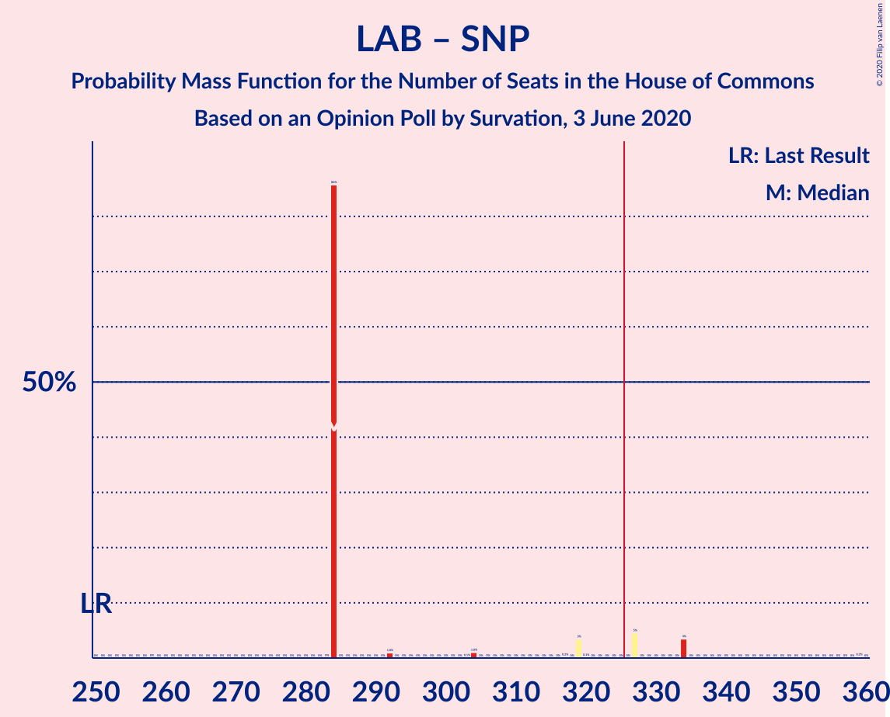

| Number of Seats | Probability | Accumulated | Special Marks |
|:---------------:|:-----------:|:-----------:|:-------------:|
| 250 | 0% | 100% | Last Result |
| 251 | 0% | 100% |  |
| 252 | 0% | 100% |  |
| 253 | 0% | 100% |  |
| 254 | 0% | 100% |  |
| 255 | 0% | 100% |  |
| 256 | 0% | 100% |  |
| 257 | 0% | 100% |  |
| 258 | 0% | 100% |  |
| 259 | 0% | 99.9% |  |
| 260 | 0% | 99.9% |  |
| 261 | 0% | 99.9% |  |
| 262 | 0% | 99.9% |  |
| 263 | 0% | 99.9% |  |
| 264 | 0% | 99.9% |  |
| 265 | 0% | 99.9% |  |
| 266 | 0% | 99.9% |  |
| 267 | 0% | 99.9% |  |
| 268 | 0% | 99.9% |  |
| 269 | 0% | 99.9% |  |
| 270 | 0% | 99.9% |  |
| 271 | 0% | 99.9% |  |
| 272 | 0% | 99.9% |  |
| 273 | 0% | 99.9% |  |
| 274 | 0% | 99.9% |  |
| 275 | 0% | 99.9% |  |
| 276 | 0% | 99.9% |  |
| 277 | 0% | 99.9% |  |
| 278 | 0% | 99.9% |  |
| 279 | 0% | 99.9% |  |
| 280 | 0% | 99.9% |  |
| 281 | 0% | 99.9% |  |
| 282 | 0% | 99.9% |  |
| 283 | 0% | 99.9% |  |
| 284 | 86% | 99.9% | Median |
| 285 | 0% | 14% |  |
| 286 | 0% | 14% |  |
| 287 | 0% | 14% |  |
| 288 | 0% | 14% |  |
| 289 | 0% | 14% |  |
| 290 | 0% | 14% |  |
| 291 | 0% | 14% |  |
| 292 | 1.0% | 14% |  |
| 293 | 0% | 13% |  |
| 294 | 0% | 13% |  |
| 295 | 0% | 13% |  |
| 296 | 0% | 13% |  |
| 297 | 0% | 13% |  |
| 298 | 0% | 13% |  |
| 299 | 0% | 13% |  |
| 300 | 0% | 13% |  |
| 301 | 0% | 13% |  |
| 302 | 0% | 13% |  |
| 303 | 0.1% | 13% |  |
| 304 | 1.0% | 13% |  |
| 305 | 0% | 12% |  |
| 306 | 0% | 12% |  |
| 307 | 0% | 12% |  |
| 308 | 0% | 12% |  |
| 309 | 0% | 12% |  |
| 310 | 0% | 12% |  |
| 311 | 0% | 12% |  |
| 312 | 0% | 12% |  |
| 313 | 0% | 12% |  |
| 314 | 0% | 12% |  |
| 315 | 0% | 12% |  |
| 316 | 0% | 12% |  |
| 317 | 0.2% | 12% |  |
| 318 | 0% | 12% |  |
| 319 | 3% | 12% |  |
| 320 | 0.1% | 8% |  |
| 321 | 0% | 8% |  |
| 322 | 0% | 8% |  |
| 323 | 0% | 8% |  |
| 324 | 0% | 8% |  |
| 325 | 0% | 8% |  |
| 326 | 0% | 8% | Majority |
| 327 | 5% | 8% |  |
| 328 | 0% | 4% |  |
| 329 | 0% | 4% |  |
| 330 | 0% | 4% |  |
| 331 | 0% | 4% |  |
| 332 | 0% | 4% |  |
| 333 | 0% | 4% |  |
| 334 | 3% | 4% |  |
| 335 | 0% | 0.2% |  |
| 336 | 0% | 0.2% |  |
| 337 | 0% | 0.2% |  |
| 338 | 0% | 0.2% |  |
| 339 | 0% | 0.2% |  |
| 340 | 0% | 0.2% |  |
| 341 | 0% | 0.2% |  |
| 342 | 0% | 0.2% |  |
| 343 | 0% | 0.2% |  |
| 344 | 0% | 0.2% |  |
| 345 | 0% | 0.2% |  |
| 346 | 0% | 0.2% |  |
| 347 | 0% | 0.2% |  |
| 348 | 0% | 0.2% |  |
| 349 | 0% | 0.2% |  |
| 350 | 0% | 0.2% |  |
| 351 | 0% | 0.2% |  |
| 352 | 0% | 0.2% |  |
| 353 | 0% | 0.2% |  |
| 354 | 0% | 0.2% |  |
| 355 | 0% | 0.2% |  |
| 356 | 0% | 0.2% |  |
| 357 | 0% | 0.2% |  |
| 358 | 0% | 0.2% |  |
| 359 | 0.2% | 0.2% |  |
| 360 | 0% | 0% |  |

### Labour Party – Liberal Democrats – Plaid Cymru

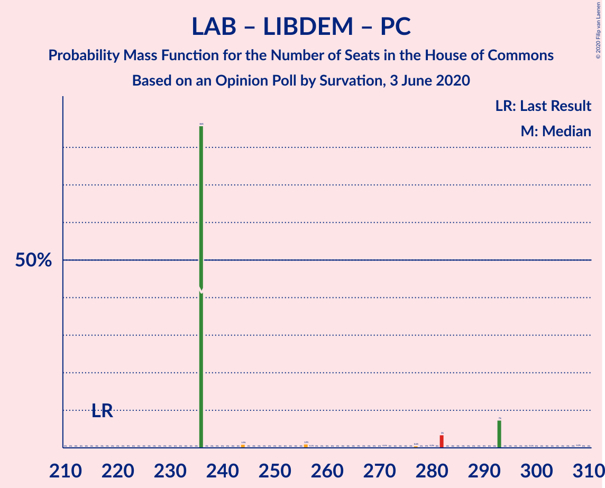

| Number of Seats | Probability | Accumulated | Special Marks |
|:---------------:|:-----------:|:-----------:|:-------------:|
| 217 | 0% | 100% | Last Result |
| 218 | 0% | 100% |  |
| 219 | 0% | 100% |  |
| 220 | 0% | 100% |  |
| 221 | 0% | 100% |  |
| 222 | 0% | 100% |  |
| 223 | 0% | 99.9% |  |
| 224 | 0% | 99.9% |  |
| 225 | 0% | 99.9% |  |
| 226 | 0% | 99.9% |  |
| 227 | 0% | 99.9% |  |
| 228 | 0% | 99.9% |  |
| 229 | 0% | 99.9% |  |
| 230 | 0% | 99.9% |  |
| 231 | 0% | 99.9% |  |
| 232 | 0% | 99.9% |  |
| 233 | 0% | 99.9% |  |
| 234 | 0% | 99.9% |  |
| 235 | 0% | 99.9% |  |
| 236 | 86% | 99.9% | Median |
| 237 | 0% | 14% |  |
| 238 | 0% | 14% |  |
| 239 | 0% | 14% |  |
| 240 | 0% | 14% |  |
| 241 | 0% | 14% |  |
| 242 | 0% | 14% |  |
| 243 | 0% | 14% |  |
| 244 | 1.0% | 14% |  |
| 245 | 0% | 13% |  |
| 246 | 0% | 13% |  |
| 247 | 0% | 13% |  |
| 248 | 0% | 13% |  |
| 249 | 0% | 13% |  |
| 250 | 0% | 13% |  |
| 251 | 0% | 13% |  |
| 252 | 0% | 13% |  |
| 253 | 0% | 13% |  |
| 254 | 0% | 13% |  |
| 255 | 0% | 13% |  |
| 256 | 1.0% | 13% |  |
| 257 | 0.1% | 12% |  |
| 258 | 0% | 12% |  |
| 259 | 0% | 12% |  |
| 260 | 0% | 12% |  |
| 261 | 0% | 12% |  |
| 262 | 0% | 12% |  |
| 263 | 0% | 12% |  |
| 264 | 0% | 12% |  |
| 265 | 0% | 12% |  |
| 266 | 0% | 12% |  |
| 267 | 0% | 12% |  |
| 268 | 0% | 12% |  |
| 269 | 0% | 12% |  |
| 270 | 0% | 12% |  |
| 271 | 0.1% | 12% |  |
| 272 | 0% | 12% |  |
| 273 | 0% | 12% |  |
| 274 | 0% | 12% |  |
| 275 | 0% | 12% |  |
| 276 | 0% | 12% |  |
| 277 | 0.6% | 12% |  |
| 278 | 0% | 11% |  |
| 279 | 0% | 11% |  |
| 280 | 0.2% | 11% |  |
| 281 | 0% | 11% |  |
| 282 | 3% | 11% |  |
| 283 | 0% | 8% |  |
| 284 | 0% | 8% |  |
| 285 | 0% | 8% |  |
| 286 | 0% | 8% |  |
| 287 | 0% | 8% |  |
| 288 | 0% | 8% |  |
| 289 | 0% | 8% |  |
| 290 | 0% | 8% |  |
| 291 | 0% | 8% |  |
| 292 | 0% | 8% |  |
| 293 | 7% | 8% |  |
| 294 | 0% | 0.3% |  |
| 295 | 0% | 0.3% |  |
| 296 | 0% | 0.3% |  |
| 297 | 0% | 0.3% |  |
| 298 | 0% | 0.3% |  |
| 299 | 0.1% | 0.3% |  |
| 300 | 0% | 0.2% |  |
| 301 | 0% | 0.2% |  |
| 302 | 0% | 0.2% |  |
| 303 | 0% | 0.2% |  |
| 304 | 0% | 0.2% |  |
| 305 | 0% | 0.2% |  |
| 306 | 0% | 0.2% |  |
| 307 | 0% | 0.2% |  |
| 308 | 0.2% | 0.2% |  |
| 309 | 0% | 0% |  |

### Labour Party – Plaid Cymru

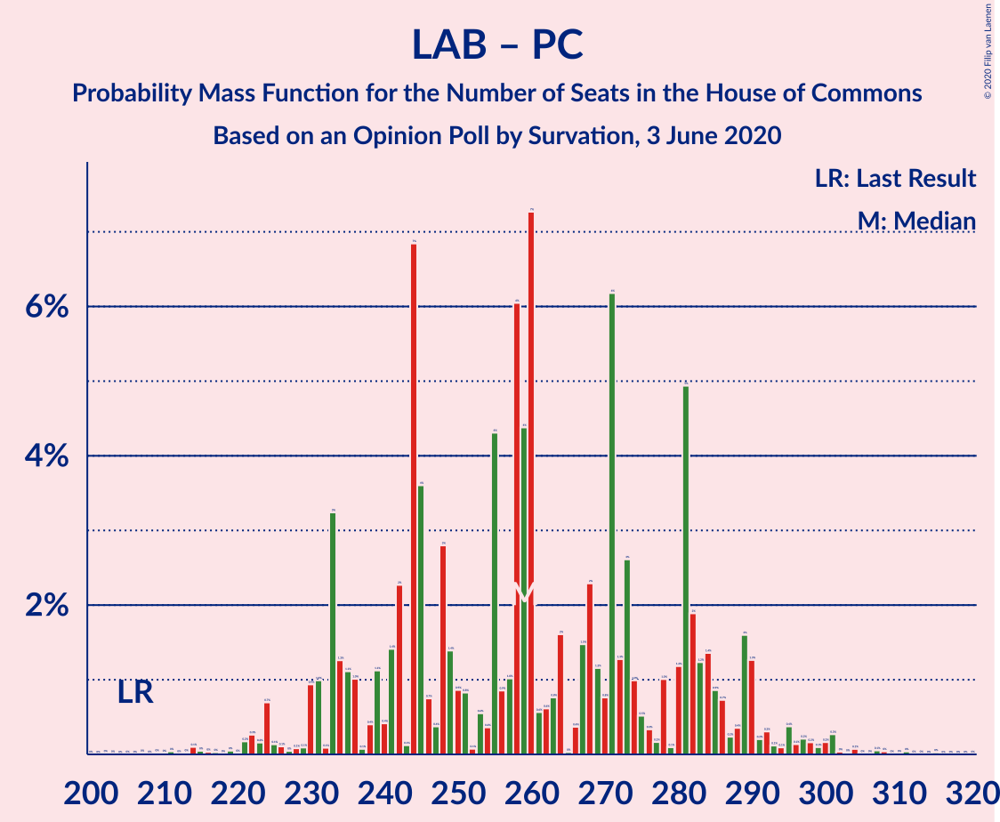

| Number of Seats | Probability | Accumulated | Special Marks |
|:---------------:|:-----------:|:-----------:|:-------------:|
| 206 | 0% | 100% | Last Result |
| 207 | 0% | 100% |  |
| 208 | 0% | 100% |  |
| 209 | 0% | 100% |  |
| 210 | 0% | 100% |  |
| 211 | 0% | 100% |  |
| 212 | 0% | 100% |  |
| 213 | 0% | 100% |  |
| 214 | 0% | 100% |  |
| 215 | 0% | 100% |  |
| 216 | 0% | 100% |  |
| 217 | 0% | 100% |  |
| 218 | 0% | 100% |  |
| 219 | 0% | 100% |  |
| 220 | 0% | 100% |  |
| 221 | 0% | 99.9% |  |
| 222 | 0% | 99.9% |  |
| 223 | 0% | 99.9% |  |
| 224 | 0% | 99.9% |  |
| 225 | 0% | 99.9% |  |
| 226 | 0% | 99.9% |  |
| 227 | 0% | 99.9% |  |
| 228 | 0% | 99.9% |  |
| 229 | 0% | 99.9% |  |
| 230 | 0% | 99.9% |  |
| 231 | 0% | 99.9% |  |
| 232 | 0% | 99.9% |  |
| 233 | 0% | 99.9% |  |
| 234 | 0% | 99.9% |  |
| 235 | 86% | 99.9% | Median |
| 236 | 0% | 14% |  |
| 237 | 0% | 14% |  |
| 238 | 0% | 14% |  |
| 239 | 0% | 14% |  |
| 240 | 0% | 14% |  |
| 241 | 0% | 14% |  |
| 242 | 0% | 14% |  |
| 243 | 0% | 14% |  |
| 244 | 1.0% | 14% |  |
| 245 | 0% | 13% |  |
| 246 | 0% | 13% |  |
| 247 | 0% | 13% |  |
| 248 | 0% | 13% |  |
| 249 | 0% | 13% |  |
| 250 | 0% | 13% |  |
| 251 | 1.1% | 13% |  |
| 252 | 0% | 12% |  |
| 253 | 0% | 12% |  |
| 254 | 0% | 12% |  |
| 255 | 0% | 12% |  |
| 256 | 0% | 12% |  |
| 257 | 0% | 12% |  |
| 258 | 0% | 12% |  |
| 259 | 0% | 12% |  |
| 260 | 0% | 12% |  |
| 261 | 0% | 12% |  |
| 262 | 0% | 12% |  |
| 263 | 0% | 12% |  |
| 264 | 0% | 12% |  |
| 265 | 0% | 12% |  |
| 266 | 0% | 12% |  |
| 267 | 0% | 12% |  |
| 268 | 0% | 12% |  |
| 269 | 0% | 12% |  |
| 270 | 0.1% | 12% |  |
| 271 | 0% | 12% |  |
| 272 | 0% | 12% |  |
| 273 | 0.6% | 12% |  |
| 274 | 0.2% | 11% |  |
| 275 | 0% | 11% |  |
| 276 | 0% | 11% |  |
| 277 | 0% | 11% |  |
| 278 | 0% | 11% |  |
| 279 | 0% | 11% |  |
| 280 | 0% | 11% |  |
| 281 | 3% | 11% |  |
| 282 | 0% | 8% |  |
| 283 | 0% | 8% |  |
| 284 | 3% | 8% |  |
| 285 | 0% | 4% |  |
| 286 | 0% | 4% |  |
| 287 | 0% | 4% |  |
| 288 | 4% | 4% |  |
| 289 | 0% | 0.3% |  |
| 290 | 0% | 0.3% |  |
| 291 | 0% | 0.3% |  |
| 292 | 0% | 0.3% |  |
| 293 | 0% | 0.3% |  |
| 294 | 0.1% | 0.3% |  |
| 295 | 0% | 0.2% |  |
| 296 | 0% | 0.2% |  |
| 297 | 0% | 0.2% |  |
| 298 | 0% | 0.2% |  |
| 299 | 0% | 0.2% |  |
| 300 | 0% | 0.2% |  |
| 301 | 0% | 0.2% |  |
| 302 | 0% | 0.2% |  |
| 303 | 0% | 0.2% |  |
| 304 | 0% | 0.2% |  |
| 305 | 0% | 0.2% |  |
| 306 | 0% | 0.2% |  |
| 307 | 0.2% | 0.2% |  |
| 308 | 0% | 0% |  |

### Labour Party – Liberal Democrats

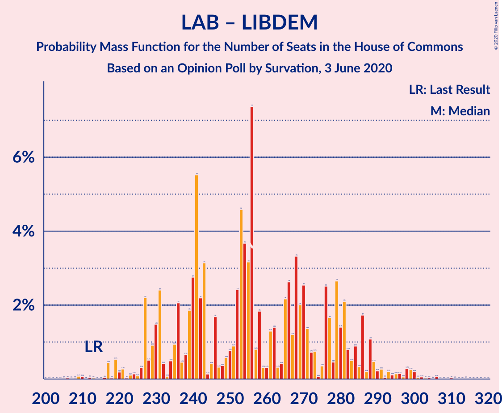

| Number of Seats | Probability | Accumulated | Special Marks |
|:---------------:|:-----------:|:-----------:|:-------------:|
| 213 | 0% | 100% | Last Result |
| 214 | 0% | 100% |  |
| 215 | 0% | 100% |  |
| 216 | 0% | 99.9% |  |
| 217 | 0% | 99.9% |  |
| 218 | 0% | 99.9% |  |
| 219 | 0% | 99.9% |  |
| 220 | 0% | 99.9% |  |
| 221 | 0% | 99.9% |  |
| 222 | 0% | 99.9% |  |
| 223 | 0% | 99.9% |  |
| 224 | 0% | 99.9% |  |
| 225 | 0% | 99.9% |  |
| 226 | 0% | 99.9% |  |
| 227 | 0% | 99.9% |  |
| 228 | 0% | 99.9% |  |
| 229 | 0% | 99.9% |  |
| 230 | 86% | 99.9% | Median |
| 231 | 0% | 14% |  |
| 232 | 0% | 14% |  |
| 233 | 0% | 14% |  |
| 234 | 0% | 14% |  |
| 235 | 0% | 14% |  |
| 236 | 0% | 14% |  |
| 237 | 1.0% | 14% |  |
| 238 | 0% | 13% |  |
| 239 | 0% | 13% |  |
| 240 | 0% | 13% |  |
| 241 | 0% | 13% |  |
| 242 | 0% | 13% |  |
| 243 | 0% | 13% |  |
| 244 | 0% | 13% |  |
| 245 | 0% | 13% |  |
| 246 | 0% | 13% |  |
| 247 | 0% | 13% |  |
| 248 | 0% | 13% |  |
| 249 | 0% | 13% |  |
| 250 | 0% | 13% |  |
| 251 | 1.1% | 13% |  |
| 252 | 0% | 12% |  |
| 253 | 0% | 12% |  |
| 254 | 0% | 12% |  |
| 255 | 0% | 12% |  |
| 256 | 0% | 12% |  |
| 257 | 0% | 12% |  |
| 258 | 0% | 12% |  |
| 259 | 0% | 12% |  |
| 260 | 0% | 12% |  |
| 261 | 0% | 12% |  |
| 262 | 0% | 12% |  |
| 263 | 0.1% | 12% |  |
| 264 | 0% | 12% |  |
| 265 | 0% | 12% |  |
| 266 | 0% | 12% |  |
| 267 | 0% | 12% |  |
| 268 | 0% | 12% |  |
| 269 | 0.2% | 12% |  |
| 270 | 0% | 12% |  |
| 271 | 0% | 12% |  |
| 272 | 0% | 12% |  |
| 273 | 0.6% | 12% |  |
| 274 | 0% | 11% |  |
| 275 | 0% | 11% |  |
| 276 | 0% | 11% |  |
| 277 | 3% | 11% |  |
| 278 | 0% | 8% |  |
| 279 | 0% | 8% |  |
| 280 | 0% | 8% |  |
| 281 | 0% | 8% |  |
| 282 | 0% | 8% |  |
| 283 | 0% | 8% |  |
| 284 | 0% | 8% |  |
| 285 | 0% | 8% |  |
| 286 | 0% | 8% |  |
| 287 | 0% | 8% |  |
| 288 | 7% | 8% |  |
| 289 | 0% | 0.3% |  |
| 290 | 0% | 0.3% |  |
| 291 | 0% | 0.3% |  |
| 292 | 0% | 0.3% |  |
| 293 | 0% | 0.3% |  |
| 294 | 0.1% | 0.3% |  |
| 295 | 0% | 0.2% |  |
| 296 | 0% | 0.2% |  |
| 297 | 0% | 0.2% |  |
| 298 | 0% | 0.2% |  |
| 299 | 0% | 0.2% |  |
| 300 | 0% | 0.2% |  |
| 301 | 0% | 0.2% |  |
| 302 | 0% | 0.2% |  |
| 303 | 0% | 0.2% |  |
| 304 | 0.2% | 0.2% |  |
| 305 | 0% | 0% |  |

### Labour Party

| Number of Seats | Probability | Accumulated | Special Marks |
|:---------------:|:-----------:|:-----------:|:-------------:|
| 202 | 0% | 100% | Last Result |
| 203 | 0% | 100% |  |
| 204 | 0% | 100% |  |
| 205 | 0% | 100% |  |
| 206 | 0% | 100% |  |
| 207 | 0% | 100% |  |
| 208 | 0% | 100% |  |
| 209 | 0% | 100% |  |
| 210 | 0% | 100% |  |
| 211 | 0% | 100% |  |
| 212 | 0% | 100% |  |
| 213 | 0% | 100% |  |
| 214 | 0% | 99.9% |  |
| 215 | 0% | 99.9% |  |
| 216 | 0% | 99.9% |  |
| 217 | 0% | 99.9% |  |
| 218 | 0% | 99.9% |  |
| 219 | 0% | 99.9% |  |
| 220 | 0% | 99.9% |  |
| 221 | 0% | 99.9% |  |
| 222 | 0% | 99.9% |  |
| 223 | 0% | 99.9% |  |
| 224 | 0% | 99.9% |  |
| 225 | 0% | 99.9% |  |
| 226 | 0% | 99.9% |  |
| 227 | 0% | 99.9% |  |
| 228 | 0% | 99.9% |  |
| 229 | 86% | 99.9% | Median |
| 230 | 0% | 14% |  |
| 231 | 0% | 14% |  |
| 232 | 0% | 14% |  |
| 233 | 0% | 14% |  |
| 234 | 0% | 14% |  |
| 235 | 0% | 14% |  |
| 236 | 0% | 14% |  |
| 237 | 1.0% | 14% |  |
| 238 | 0% | 13% |  |
| 239 | 0% | 13% |  |
| 240 | 0% | 13% |  |
| 241 | 0% | 13% |  |
| 242 | 0% | 13% |  |
| 243 | 0% | 13% |  |
| 244 | 0% | 13% |  |
| 245 | 0.1% | 13% |  |
| 246 | 1.0% | 13% |  |
| 247 | 0% | 12% |  |
| 248 | 0% | 12% |  |
| 249 | 0% | 12% |  |
| 250 | 0% | 12% |  |
| 251 | 0% | 12% |  |
| 252 | 0% | 12% |  |
| 253 | 0% | 12% |  |
| 254 | 0% | 12% |  |
| 255 | 0% | 12% |  |
| 256 | 0% | 12% |  |
| 257 | 0% | 12% |  |
| 258 | 0% | 12% |  |
| 259 | 0% | 12% |  |
| 260 | 0% | 12% |  |
| 261 | 0% | 12% |  |
| 262 | 0.1% | 12% |  |
| 263 | 0.2% | 12% |  |
| 264 | 0% | 12% |  |
| 265 | 0% | 12% |  |
| 266 | 0% | 12% |  |
| 267 | 0% | 12% |  |
| 268 | 0% | 12% |  |
| 269 | 0.6% | 12% |  |
| 270 | 0% | 11% |  |
| 271 | 0% | 11% |  |
| 272 | 0% | 11% |  |
| 273 | 0% | 11% |  |
| 274 | 0% | 11% |  |
| 275 | 0% | 11% |  |
| 276 | 3% | 11% |  |
| 277 | 0% | 8% |  |
| 278 | 0% | 8% |  |
| 279 | 3% | 8% |  |
| 280 | 0% | 4% |  |
| 281 | 0% | 4% |  |
| 282 | 0% | 4% |  |
| 283 | 4% | 4% |  |
| 284 | 0% | 0.3% |  |
| 285 | 0% | 0.3% |  |
| 286 | 0% | 0.3% |  |
| 287 | 0% | 0.3% |  |
| 288 | 0% | 0.3% |  |
| 289 | 0.1% | 0.3% |  |
| 290 | 0% | 0.2% |  |
| 291 | 0% | 0.2% |  |
| 292 | 0% | 0.2% |  |
| 293 | 0% | 0.2% |  |
| 294 | 0% | 0.2% |  |
| 295 | 0% | 0.2% |  |
| 296 | 0% | 0.2% |  |
| 297 | 0% | 0.2% |  |
| 298 | 0% | 0.2% |  |
| 299 | 0% | 0.2% |  |
| 300 | 0% | 0.2% |  |
| 301 | 0% | 0.2% |  |
| 302 | 0% | 0.2% |  |
| 303 | 0.2% | 0.2% |  |
| 304 | 0% | 0% |  |

## Technical Information

### Opinion Poll

+ **Polling firm:** Survation
+ **Commissioner(s):** —
+ **Fieldwork period:** 3 June 2020

### Calculations

+ **Sample size:** 1003
+ **Simulations done:** 1,024
+ **Error estimate:** 4.59%

