# Opinion Poll by Deltapoll, 4–5 June 2020

<a href="#voting-intentions">Voting Intentions</a> | <a href="#seats">Seats</a> | <a href="#coalitions">Coalitions</a> | <a href="#technical-information">Technical Information</a>

## Voting Intentions

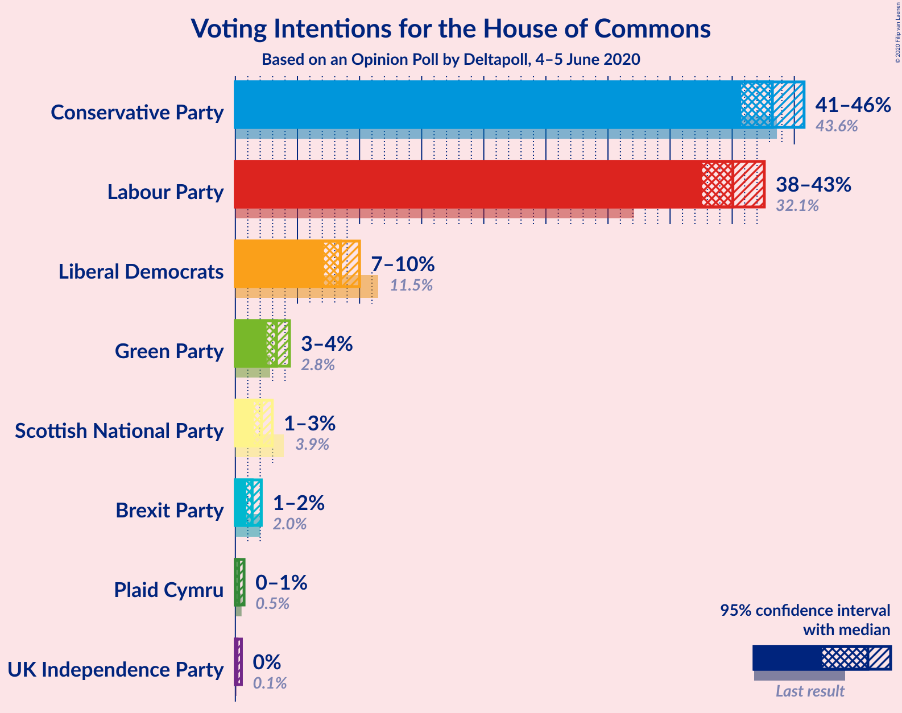

### Confidence Intervals

| Party | Last Result | Poll Result | 80% Confidence Interval | 90% Confidence Interval | 95% Confidence Interval | 99% Confidence Interval |
|:-----:|:-----------:|:-----------:|:-----------------------:|:-----------------------:|:-----------------------:|:-----------------------:|
| Conservative Party | 43.6% | 43.2% | 41.6–44.9% |41.1–45.4% |40.7–45.8% |39.9–46.6% |
| Labour Party | 32.1% | 40.1% | 38.4–41.7% |38.0–42.2% |37.6–42.6% |36.8–43.4% |
| Liberal Democrats | 11.5% | 8.5% | 7.6–9.5% |7.3–9.7% |7.1–10.0% |6.8–10.5% |
| Green Party | 2.8% | 3.3% | 2.8–4.0% |2.6–4.2% |2.5–4.4% |2.3–4.7% |
| Scottish National Party | 3.9% | 2.1% | 1.7–2.7% |1.6–2.8% |1.5–3.0% |1.3–3.3% |
| Brexit Party | 2.0% | 1.4% | 1.0–1.8% |0.9–2.0% |0.9–2.1% |0.7–2.3% |
| Plaid Cymru | 0.5% | 0.3% | 0.2–0.5% |0.1–0.6% |0.1–0.7% |0.1–0.9% |
| UK Independence Party | 0.1% | 0.1% | 0.1–0.4% |0.0–0.4% |0.0–0.5% |0.0–0.6% |

*Note:* The poll result column reflects the actual value used in the calculations. Published results may vary slightly, and in addition be rounded to fewer digits.

## Seats

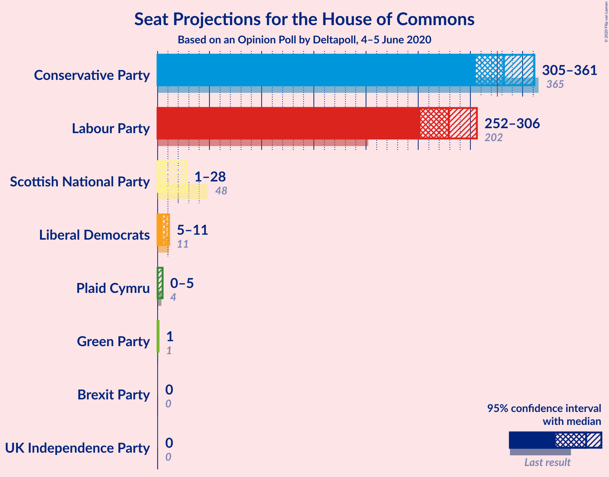

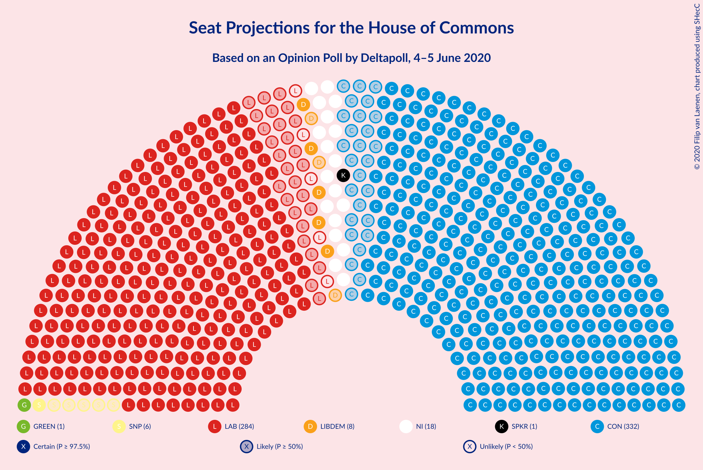

### Confidence Intervals

| Party | Last Result | Median | 80% Confidence Interval | 90% Confidence Interval | 95% Confidence Interval | 99% Confidence Interval |
|:-----:|:-----------:|:------:|:-----------------------:|:-----------------------:|:-----------------------:|:-----------------------:|
| <a href="#conservative-party">Conservative Party</a> | 365 | 332 | 310–350 |306–355 |305–361 |293–368 |
| <a href="#labour-party">Labour Party</a> | 202 | 279 | 256–301 |254–305 |252–306 |238–315 |
| <a href="#liberal-democrats">Liberal Democrats</a> | 11 | 8 | 7–11 |5–11 |5–11 |3–13 |
| <a href="#green-party">Green Party</a> | 1 | 1 | 1 |1 |1 |1 |
| <a href="#scottish-national-party">Scottish National Party</a> | 48 | 6 | 3–22 |2–28 |1–28 |0–42 |
| <a href="#brexit-party">Brexit Party</a> | 0 | 0 | 0 |0 |0 |0 |
| <a href="#plaid-cymru">Plaid Cymru</a> | 4 | 0 | 0–5 |0–5 |0–5 |0–5 |
| <a href="#uk-independence-party">UK Independence Party</a> | 0 | 0 | 0 |0 |0 |0 |

### Conservative Party

*For a full overview of the results for this party, see the [Conservative Party](party-conservativeparty.html) page.*

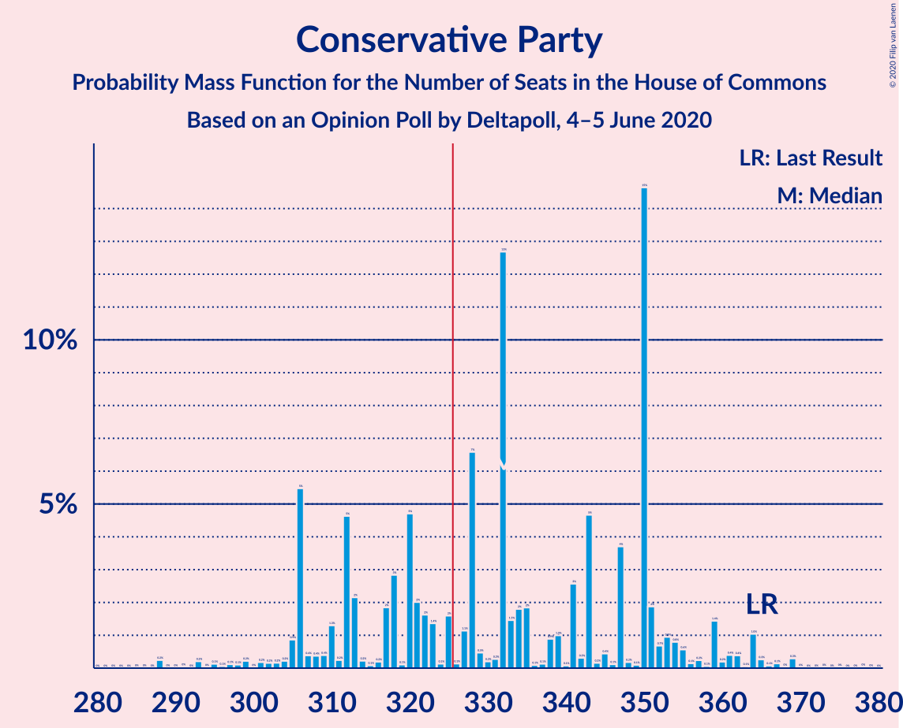

| Number of Seats | Probability | Accumulated | Special Marks |
|:---------------:|:-----------:|:-----------:|:-------------:|
| 288 | 0.2% | 100% |  |
| 289 | 0% | 99.7% |  |
| 290 | 0% | 99.7% |  |
| 291 | 0% | 99.7% |  |
| 292 | 0% | 99.6% |  |
| 293 | 0.2% | 99.6% |  |
| 294 | 0% | 99.4% |  |
| 295 | 0.1% | 99.4% |  |
| 296 | 0.1% | 99.3% |  |
| 297 | 0.1% | 99.2% |  |
| 298 | 0.1% | 99.1% |  |
| 299 | 0.2% | 99.0% |  |
| 300 | 0% | 98.8% |  |
| 301 | 0.2% | 98.8% |  |
| 302 | 0.2% | 98.6% |  |
| 303 | 0.2% | 98% |  |
| 304 | 0.2% | 98% |  |
| 305 | 0.9% | 98% |  |
| 306 | 5% | 97% |  |
| 307 | 0.4% | 92% |  |
| 308 | 0.4% | 91% |  |
| 309 | 0.4% | 91% |  |
| 310 | 1.3% | 91% |  |
| 311 | 0.2% | 89% |  |
| 312 | 5% | 89% |  |
| 313 | 2% | 84% |  |
| 314 | 0.2% | 82% |  |
| 315 | 0.1% | 82% |  |
| 316 | 0.2% | 82% |  |
| 317 | 2% | 82% |  |
| 318 | 3% | 80% |  |
| 319 | 0.1% | 77% |  |
| 320 | 5% | 77% |  |
| 321 | 2% | 72% |  |
| 322 | 2% | 70% |  |
| 323 | 1.4% | 69% |  |
| 324 | 0.1% | 67% |  |
| 325 | 2% | 67% |  |
| 326 | 0.1% | 65% | Majority |
| 327 | 1.1% | 65% |  |
| 328 | 7% | 64% |  |
| 329 | 0.5% | 58% |  |
| 330 | 0.2% | 57% |  |
| 331 | 0.3% | 57% |  |
| 332 | 13% | 57% | Median |
| 333 | 1.5% | 44% |  |
| 334 | 2% | 43% |  |
| 335 | 2% | 41% |  |
| 336 | 0.1% | 39% |  |
| 337 | 0.1% | 39% |  |
| 338 | 0.9% | 39% |  |
| 339 | 1.0% | 38% |  |
| 340 | 0.1% | 37% |  |
| 341 | 3% | 37% |  |
| 342 | 0.3% | 34% |  |
| 343 | 5% | 34% |  |
| 344 | 0.2% | 29% |  |
| 345 | 0.4% | 29% |  |
| 346 | 0.1% | 29% |  |
| 347 | 4% | 28% |  |
| 348 | 0.2% | 25% |  |
| 349 | 0.1% | 25% |  |
| 350 | 15% | 24% |  |
| 351 | 2% | 10% |  |
| 352 | 0.7% | 8% |  |
| 353 | 0.9% | 7% |  |
| 354 | 0.8% | 6% |  |
| 355 | 0.6% | 6% |  |
| 356 | 0.1% | 5% |  |
| 357 | 0.2% | 5% |  |
| 358 | 0.1% | 5% |  |
| 359 | 1.4% | 5% |  |
| 360 | 0.2% | 3% |  |
| 361 | 0.4% | 3% |  |
| 362 | 0.4% | 2% |  |
| 363 | 0.1% | 2% |  |
| 364 | 1.0% | 2% |  |
| 365 | 0.3% | 1.0% | Last Result |
| 366 | 0.1% | 0.7% |  |
| 367 | 0.1% | 0.7% |  |
| 368 | 0% | 0.5% |  |
| 369 | 0.3% | 0.5% |  |
| 370 | 0% | 0.2% |  |
| 371 | 0% | 0.2% |  |
| 372 | 0% | 0.2% |  |
| 373 | 0% | 0.2% |  |
| 374 | 0% | 0.1% |  |
| 375 | 0% | 0.1% |  |
| 376 | 0% | 0.1% |  |
| 377 | 0% | 0.1% |  |
| 378 | 0% | 0.1% |  |
| 379 | 0% | 0.1% |  |
| 380 | 0% | 0% |  |

### Labour Party

*For a full overview of the results for this party, see the [Labour Party](party-labourparty.html) page.*

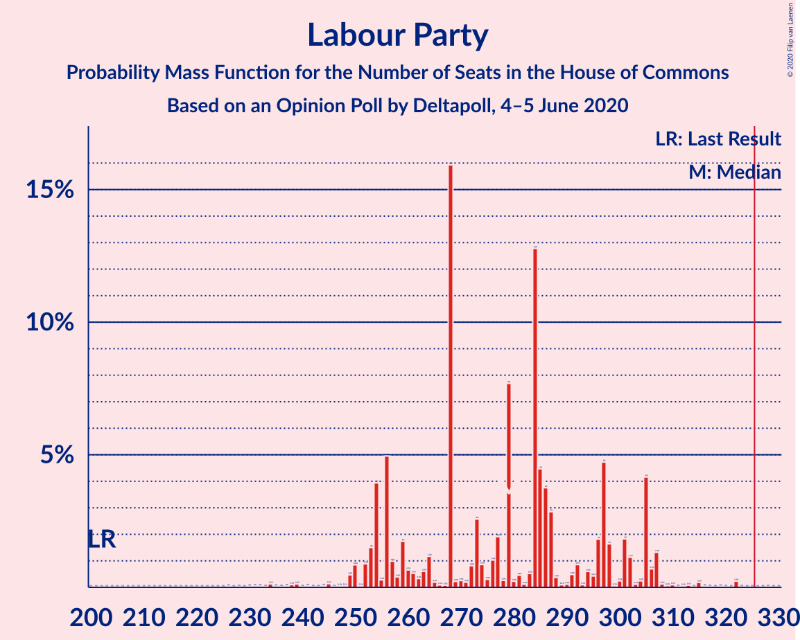

| Number of Seats | Probability | Accumulated | Special Marks |
|:---------------:|:-----------:|:-----------:|:-------------:|
| 202 | 0% | 100% | Last Result |
| 203 | 0% | 100% |  |
| 204 | 0% | 100% |  |
| 205 | 0% | 100% |  |
| 206 | 0% | 100% |  |
| 207 | 0% | 100% |  |
| 208 | 0% | 100% |  |
| 209 | 0% | 100% |  |
| 210 | 0% | 100% |  |
| 211 | 0% | 100% |  |
| 212 | 0% | 100% |  |
| 213 | 0% | 100% |  |
| 214 | 0% | 100% |  |
| 215 | 0% | 100% |  |
| 216 | 0% | 100% |  |
| 217 | 0% | 100% |  |
| 218 | 0% | 100% |  |
| 219 | 0% | 100% |  |
| 220 | 0% | 100% |  |
| 221 | 0% | 100% |  |
| 222 | 0% | 100% |  |
| 223 | 0% | 100% |  |
| 224 | 0% | 100% |  |
| 225 | 0% | 100% |  |
| 226 | 0% | 100% |  |
| 227 | 0% | 100% |  |
| 228 | 0% | 100% |  |
| 229 | 0% | 99.9% |  |
| 230 | 0% | 99.9% |  |
| 231 | 0% | 99.9% |  |
| 232 | 0% | 99.9% |  |
| 233 | 0% | 99.8% |  |
| 234 | 0.1% | 99.8% |  |
| 235 | 0% | 99.7% |  |
| 236 | 0% | 99.7% |  |
| 237 | 0% | 99.6% |  |
| 238 | 0.1% | 99.6% |  |
| 239 | 0.1% | 99.5% |  |
| 240 | 0% | 99.4% |  |
| 241 | 0% | 99.4% |  |
| 242 | 0% | 99.3% |  |
| 243 | 0% | 99.3% |  |
| 244 | 0% | 99.3% |  |
| 245 | 0.1% | 99.2% |  |
| 246 | 0% | 99.1% |  |
| 247 | 0.1% | 99.1% |  |
| 248 | 0.1% | 99.0% |  |
| 249 | 0.5% | 99.0% |  |
| 250 | 0.8% | 98.5% |  |
| 251 | 0.1% | 98% |  |
| 252 | 0.9% | 98% |  |
| 253 | 2% | 97% |  |
| 254 | 4% | 95% |  |
| 255 | 0.3% | 91% |  |
| 256 | 5% | 91% |  |
| 257 | 1.0% | 86% |  |
| 258 | 0.4% | 85% |  |
| 259 | 2% | 85% |  |
| 260 | 0.7% | 83% |  |
| 261 | 0.5% | 82% |  |
| 262 | 0.3% | 82% |  |
| 263 | 0.6% | 81% |  |
| 264 | 1.2% | 81% |  |
| 265 | 0.2% | 80% |  |
| 266 | 0.1% | 79% |  |
| 267 | 0.1% | 79% |  |
| 268 | 16% | 79% |  |
| 269 | 0.2% | 63% |  |
| 270 | 0.3% | 63% |  |
| 271 | 0.2% | 63% |  |
| 272 | 0.8% | 63% |  |
| 273 | 3% | 62% |  |
| 274 | 0.9% | 59% |  |
| 275 | 0.3% | 58% |  |
| 276 | 1.0% | 58% |  |
| 277 | 2% | 57% |  |
| 278 | 0.3% | 55% |  |
| 279 | 8% | 55% | Median |
| 280 | 0.2% | 47% |  |
| 281 | 0.5% | 47% |  |
| 282 | 0.1% | 47% |  |
| 283 | 0.5% | 46% |  |
| 284 | 13% | 46% |  |
| 285 | 4% | 33% |  |
| 286 | 4% | 29% |  |
| 287 | 3% | 25% |  |
| 288 | 0.4% | 22% |  |
| 289 | 0.1% | 22% |  |
| 290 | 0.1% | 22% |  |
| 291 | 0.5% | 21% |  |
| 292 | 0.9% | 21% |  |
| 293 | 0.1% | 20% |  |
| 294 | 0.6% | 20% |  |
| 295 | 0.4% | 19% |  |
| 296 | 2% | 19% |  |
| 297 | 5% | 17% |  |
| 298 | 2% | 12% |  |
| 299 | 0.1% | 11% |  |
| 300 | 0.2% | 11% |  |
| 301 | 2% | 11% |  |
| 302 | 1.1% | 9% |  |
| 303 | 0.1% | 8% |  |
| 304 | 0.2% | 7% |  |
| 305 | 4% | 7% |  |
| 306 | 0.7% | 3% |  |
| 307 | 1.3% | 2% |  |
| 308 | 0.1% | 1.0% |  |
| 309 | 0.1% | 0.9% |  |
| 310 | 0.1% | 0.8% |  |
| 311 | 0% | 0.7% |  |
| 312 | 0.1% | 0.7% |  |
| 313 | 0.1% | 0.6% |  |
| 314 | 0% | 0.6% |  |
| 315 | 0.2% | 0.6% |  |
| 316 | 0% | 0.4% |  |
| 317 | 0% | 0.3% |  |
| 318 | 0% | 0.3% |  |
| 319 | 0% | 0.3% |  |
| 320 | 0% | 0.3% |  |
| 321 | 0% | 0.3% |  |
| 322 | 0.2% | 0.3% |  |
| 323 | 0% | 0% |  |

### Liberal Democrats

*For a full overview of the results for this party, see the [Liberal Democrats](party-liberaldemocrats.html) page.*

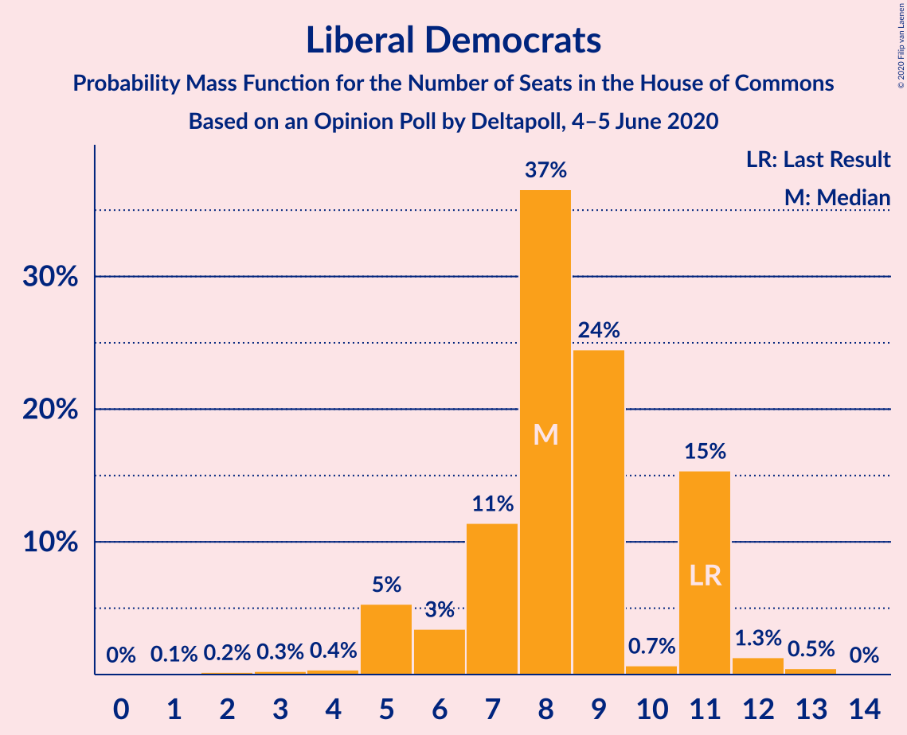

| Number of Seats | Probability | Accumulated | Special Marks |
|:---------------:|:-----------:|:-----------:|:-------------:|
| 1 | 0.1% | 100% |  |
| 2 | 0.2% | 99.9% |  |
| 3 | 0.3% | 99.7% |  |
| 4 | 0.4% | 99.5% |  |
| 5 | 5% | 99.1% |  |
| 6 | 3% | 94% |  |
| 7 | 11% | 90% |  |
| 8 | 37% | 79% | Median |
| 9 | 24% | 42% |  |
| 10 | 0.7% | 18% |  |
| 11 | 15% | 17% | Last Result |
| 12 | 1.3% | 2% |  |
| 13 | 0.5% | 0.5% |  |
| 14 | 0% | 0% |  |

### Green Party

*For a full overview of the results for this party, see the [Green Party](party-greenparty.html) page.*

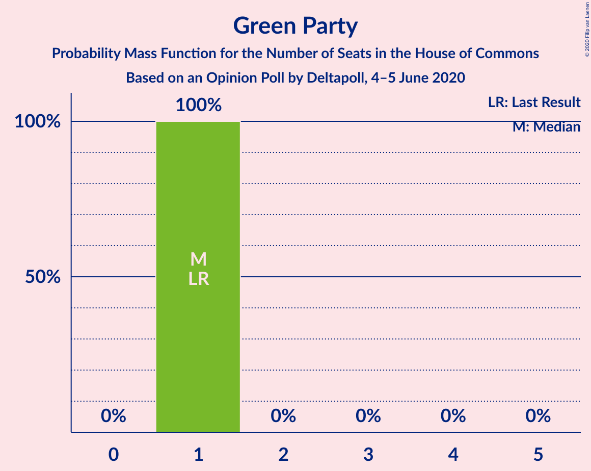

| Number of Seats | Probability | Accumulated | Special Marks |
|:---------------:|:-----------:|:-----------:|:-------------:|
| 1 | 100% | 100% | Last Result, Median |

### Scottish National Party

*For a full overview of the results for this party, see the [Scottish National Party](party-scottishnationalparty.html) page.*

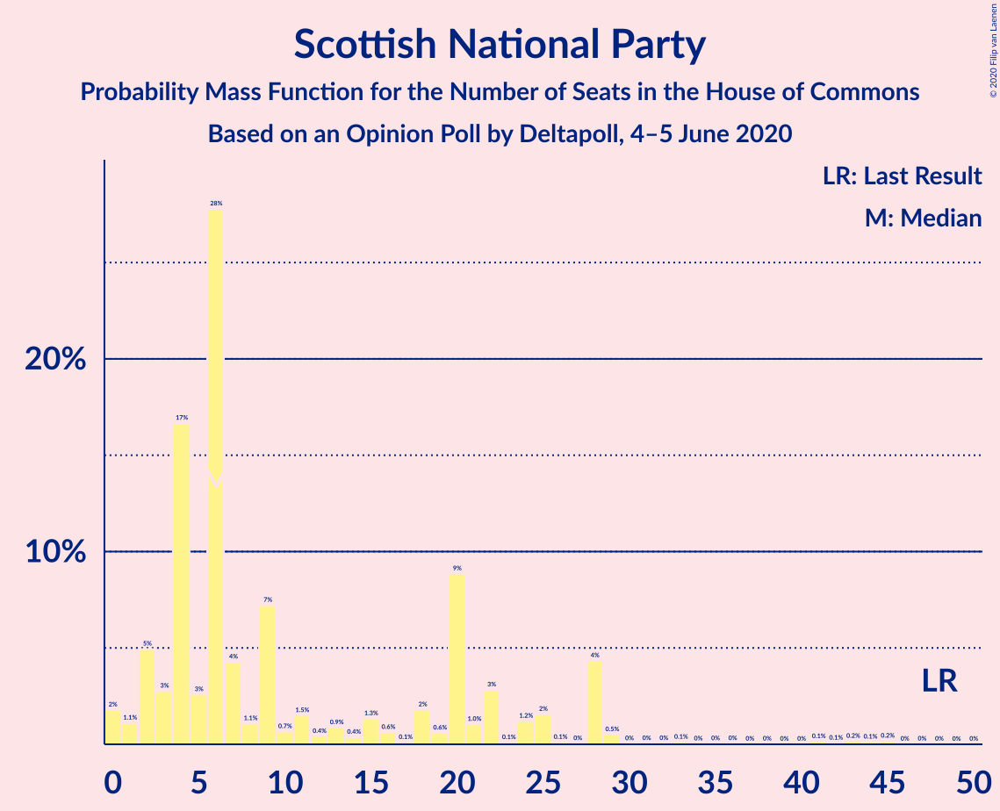

| Number of Seats | Probability | Accumulated | Special Marks |
|:---------------:|:-----------:|:-----------:|:-------------:|
| 0 | 2% | 100% |  |
| 1 | 1.1% | 98% |  |
| 2 | 5% | 97% |  |
| 3 | 3% | 92% |  |
| 4 | 17% | 89% |  |
| 5 | 3% | 73% |  |
| 6 | 28% | 70% | Median |
| 7 | 4% | 42% |  |
| 8 | 1.1% | 38% |  |
| 9 | 7% | 37% |  |
| 10 | 0.7% | 30% |  |
| 11 | 1.5% | 29% |  |
| 12 | 0.4% | 28% |  |
| 13 | 0.9% | 27% |  |
| 14 | 0.4% | 26% |  |
| 15 | 1.3% | 26% |  |
| 16 | 0.6% | 25% |  |
| 17 | 0.1% | 24% |  |
| 18 | 2% | 24% |  |
| 19 | 0.6% | 22% |  |
| 20 | 9% | 22% |  |
| 21 | 1.0% | 13% |  |
| 22 | 3% | 12% |  |
| 23 | 0.1% | 9% |  |
| 24 | 1.2% | 9% |  |
| 25 | 2% | 8% |  |
| 26 | 0.1% | 6% |  |
| 27 | 0% | 6% |  |
| 28 | 4% | 6% |  |
| 29 | 0.5% | 2% |  |
| 30 | 0% | 1.1% |  |
| 31 | 0% | 1.0% |  |
| 32 | 0% | 1.0% |  |
| 33 | 0.1% | 0.9% |  |
| 34 | 0% | 0.8% |  |
| 35 | 0% | 0.8% |  |
| 36 | 0% | 0.8% |  |
| 37 | 0% | 0.7% |  |
| 38 | 0% | 0.7% |  |
| 39 | 0% | 0.7% |  |
| 40 | 0% | 0.7% |  |
| 41 | 0.1% | 0.7% |  |
| 42 | 0.1% | 0.6% |  |
| 43 | 0.2% | 0.5% |  |
| 44 | 0.1% | 0.3% |  |
| 45 | 0.2% | 0.2% |  |
| 46 | 0% | 0% |  |
| 47 | 0% | 0% |  |
| 48 | 0% | 0% | Last Result |

### Brexit Party

*For a full overview of the results for this party, see the [Brexit Party](party-brexitparty.html) page.*

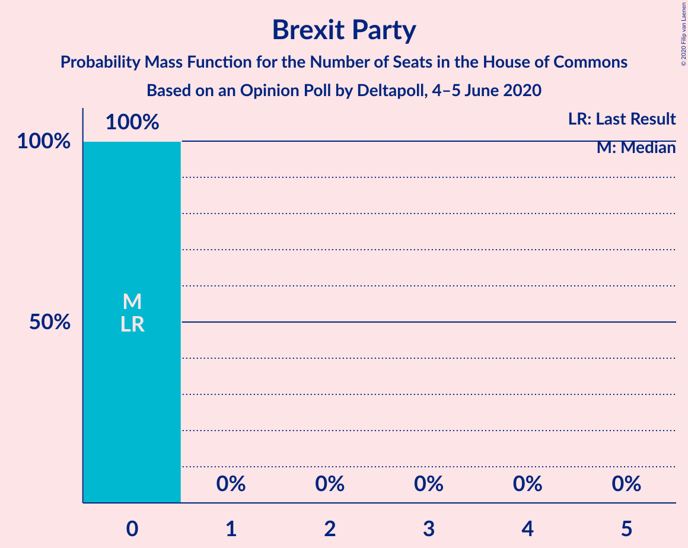

| Number of Seats | Probability | Accumulated | Special Marks |
|:---------------:|:-----------:|:-----------:|:-------------:|
| 0 | 100% | 100% | Last Result, Median |

### Plaid Cymru

*For a full overview of the results for this party, see the [Plaid Cymru](party-plaidcymru.html) page.*

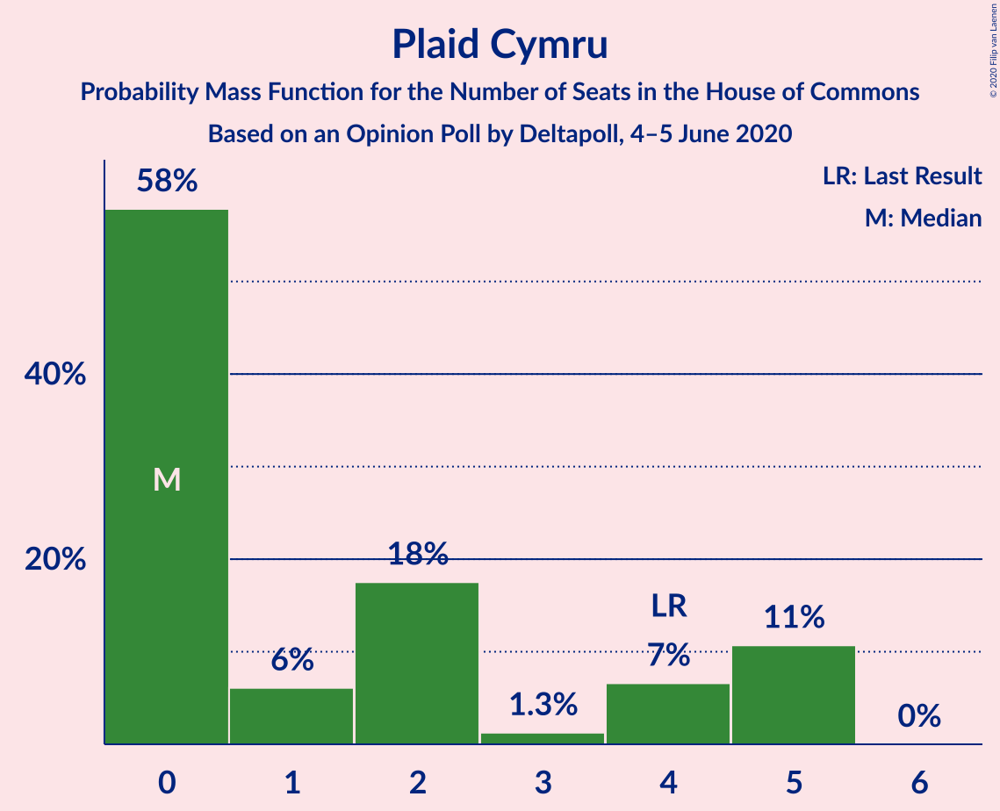

| Number of Seats | Probability | Accumulated | Special Marks |
|:---------------:|:-----------:|:-----------:|:-------------:|
| 0 | 58% | 100% | Median |
| 1 | 6% | 42% |  |
| 2 | 18% | 36% |  |
| 3 | 1.3% | 19% |  |
| 4 | 7% | 17% | Last Result |
| 5 | 11% | 11% |  |
| 6 | 0% | 0% |  |

### UK Independence Party

*For a full overview of the results for this party, see the [UK Independence Party](party-ukindependenceparty.html) page.*

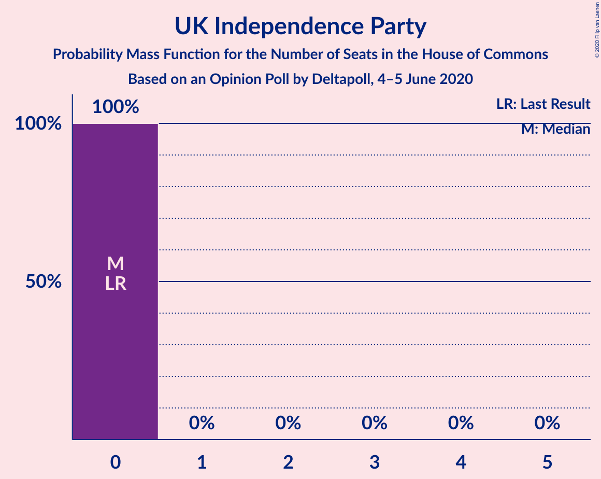

| Number of Seats | Probability | Accumulated | Special Marks |
|:---------------:|:-----------:|:-----------:|:-------------:|
| 0 | 100% | 100% | Last Result, Median |

## Coalitions

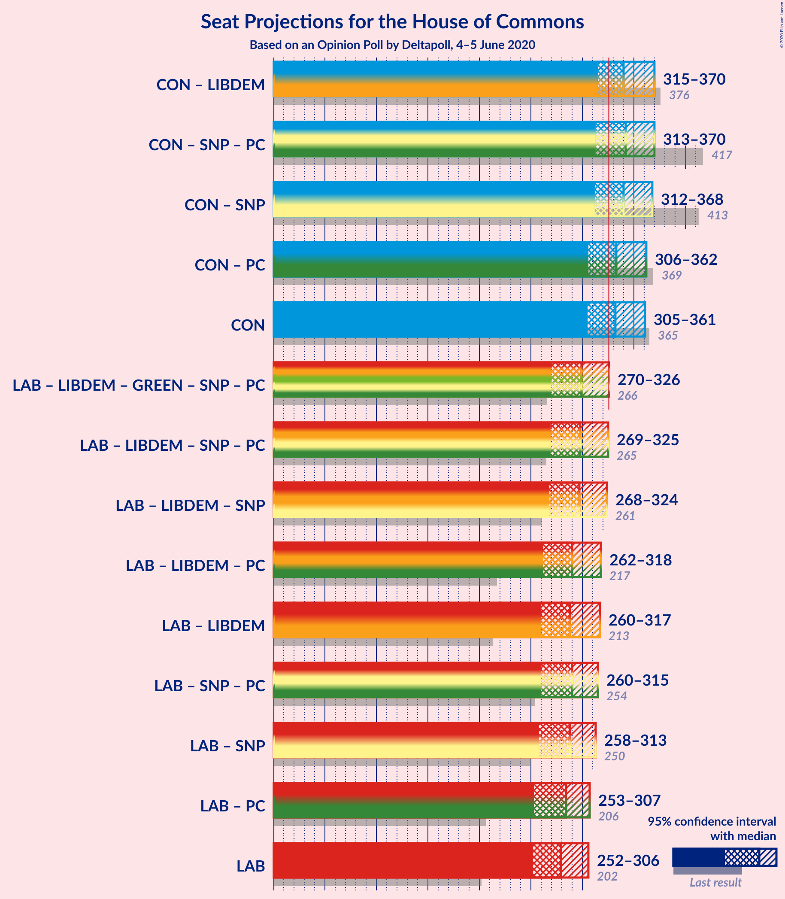

### Confidence Intervals

| Coalition | Last Result | Median | Majority? | 80% Confidence Interval | 90% Confidence Interval | 95% Confidence Interval | 99% Confidence Interval |
|:---------:|:-----------:|:------:|:---------:|:-----------------------:|:-----------------------:|:-----------------------:|:-----------------------:|
| Conservative Party – Liberal Democrats | 376 | 340 | 79% | 317–358 | 317–363 | 315–370 | 304–376 |
| Conservative Party – Scottish National Party – Plaid Cymru | 417 | 342 | 87% | 321–365 | 314–367 | 313–370 | 304–384 |
| Conservative Party – Scottish National Party | 413 | 340 | 85% | 320–365 | 312–367 | 312–368 | 302–382 |
| Conservative Party – Plaid Cymru | 369 | 333 | 69% | 311–352 | 308–358 | 306–362 | 295–369 |
| Conservative Party | 365 | 332 | 65% | 310–350 | 306–355 | 305–361 | 293–368 |
| Labour Party – Liberal Democrats – Green Party – Scottish National Party – Plaid Cymru | 266 | 299 | 3% | 281–321 | 276–325 | 270–326 | 263–338 |
| Labour Party – Liberal Democrats – Scottish National Party – Plaid Cymru | 265 | 298 | 2% | 280–320 | 275–324 | 269–325 | 262–337 |
| Labour Party – Liberal Democrats – Scottish National Party | 261 | 297 | 2% | 278–319 | 272–322 | 268–324 | 261–335 |
| Labour Party – Liberal Democrats – Plaid Cymru | 217 | 290 | 0.7% | 265–310 | 263–318 | 262–318 | 248–328 |
| Labour Party – Liberal Democrats | 213 | 288 | 0.5% | 265–309 | 263–316 | 260–317 | 246–326 |
| Labour Party – Scottish National Party – Plaid Cymru | 254 | 290 | 0.7% | 272–313 | 267–313 | 260–315 | 254–326 |
| Labour Party – Scottish National Party | 250 | 288 | 0.5% | 270–311 | 263–313 | 258–313 | 253–324 |
| Labour Party – Plaid Cymru | 206 | 284 | 0% | 256–303 | 254–307 | 253–307 | 241–317 |
| Labour Party | 202 | 279 | 0% | 256–301 | 254–305 | 252–306 | 238–315 |

### Conservative Party – Liberal Democrats

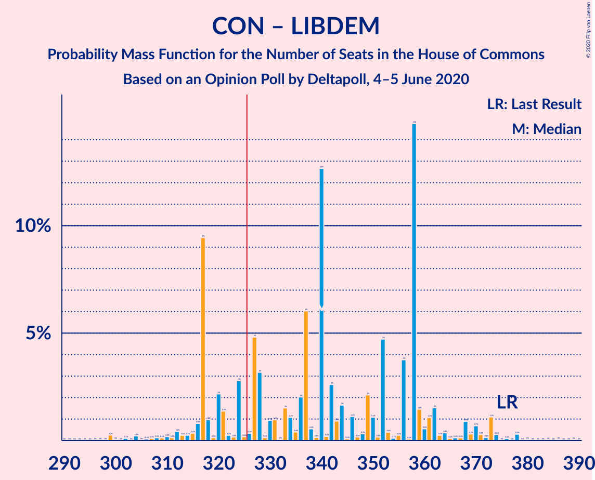

| Number of Seats | Probability | Accumulated | Special Marks |
|:---------------:|:-----------:|:-----------:|:-------------:|
| 297 | 0% | 100% |  |
| 298 | 0% | 99.9% |  |
| 299 | 0.3% | 99.9% |  |
| 300 | 0% | 99.7% |  |
| 301 | 0% | 99.6% |  |
| 302 | 0.1% | 99.6% |  |
| 303 | 0% | 99.5% |  |
| 304 | 0.2% | 99.5% |  |
| 305 | 0% | 99.3% |  |
| 306 | 0.1% | 99.3% |  |
| 307 | 0.1% | 99.2% |  |
| 308 | 0.1% | 99.1% |  |
| 309 | 0.1% | 99.0% |  |
| 310 | 0.2% | 98.9% |  |
| 311 | 0.1% | 98.7% |  |
| 312 | 0.4% | 98.6% |  |
| 313 | 0.2% | 98% |  |
| 314 | 0.2% | 98% |  |
| 315 | 0.3% | 98% |  |
| 316 | 0.8% | 97% |  |
| 317 | 9% | 97% |  |
| 318 | 1.0% | 87% |  |
| 319 | 0.1% | 86% |  |
| 320 | 2% | 86% |  |
| 321 | 1.4% | 84% |  |
| 322 | 0.2% | 82% |  |
| 323 | 0.2% | 82% |  |
| 324 | 3% | 82% |  |
| 325 | 0.2% | 79% |  |
| 326 | 0.3% | 79% | Majority |
| 327 | 5% | 79% |  |
| 328 | 3% | 74% |  |
| 329 | 0.1% | 71% |  |
| 330 | 0.9% | 71% |  |
| 331 | 1.0% | 70% |  |
| 332 | 0% | 69% |  |
| 333 | 2% | 69% |  |
| 334 | 1.1% | 67% |  |
| 335 | 0.4% | 66% |  |
| 336 | 2% | 66% |  |
| 337 | 6% | 64% |  |
| 338 | 0.5% | 58% |  |
| 339 | 0.1% | 57% |  |
| 340 | 13% | 57% | Median |
| 341 | 0.2% | 44% |  |
| 342 | 3% | 44% |  |
| 343 | 0.9% | 41% |  |
| 344 | 2% | 41% |  |
| 345 | 0.1% | 39% |  |
| 346 | 1.1% | 39% |  |
| 347 | 0.2% | 38% |  |
| 348 | 0.3% | 38% |  |
| 349 | 2% | 37% |  |
| 350 | 1.1% | 35% |  |
| 351 | 0.2% | 34% |  |
| 352 | 5% | 34% |  |
| 353 | 0.4% | 29% |  |
| 354 | 0.1% | 29% |  |
| 355 | 0.2% | 29% |  |
| 356 | 4% | 28% |  |
| 357 | 0.1% | 25% |  |
| 358 | 15% | 25% |  |
| 359 | 1.5% | 10% |  |
| 360 | 0.5% | 8% |  |
| 361 | 1.1% | 8% |  |
| 362 | 2% | 7% |  |
| 363 | 0.2% | 5% |  |
| 364 | 0.4% | 5% |  |
| 365 | 0.1% | 5% |  |
| 366 | 0.1% | 5% |  |
| 367 | 0.1% | 4% |  |
| 368 | 0.9% | 4% |  |
| 369 | 0.3% | 3% |  |
| 370 | 0.7% | 3% |  |
| 371 | 0.3% | 2% |  |
| 372 | 0.1% | 2% |  |
| 373 | 1.1% | 2% |  |
| 374 | 0.3% | 0.9% |  |
| 375 | 0% | 0.6% |  |
| 376 | 0.1% | 0.6% | Last Result |
| 377 | 0% | 0.5% |  |
| 378 | 0.3% | 0.5% |  |
| 379 | 0% | 0.2% |  |
| 380 | 0% | 0.2% |  |
| 381 | 0% | 0.1% |  |
| 382 | 0% | 0.1% |  |
| 383 | 0% | 0.1% |  |
| 384 | 0% | 0.1% |  |
| 385 | 0% | 0.1% |  |
| 386 | 0% | 0.1% |  |
| 387 | 0% | 0.1% |  |
| 388 | 0% | 0.1% |  |
| 389 | 0% | 0% |  |

### Conservative Party – Scottish National Party – Plaid Cymru

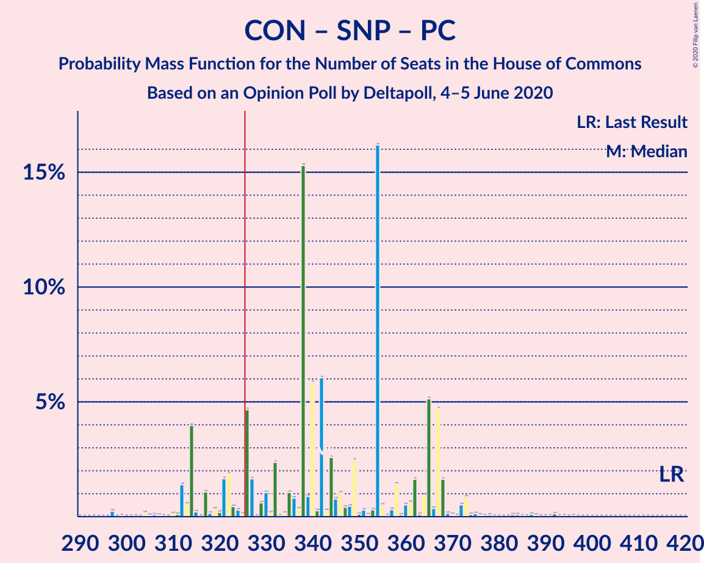

| Number of Seats | Probability | Accumulated | Special Marks |
|:---------------:|:-----------:|:-----------:|:-------------:|
| 297 | 0.2% | 100% |  |
| 298 | 0% | 99.7% |  |
| 299 | 0% | 99.7% |  |
| 300 | 0% | 99.7% |  |
| 301 | 0% | 99.7% |  |
| 302 | 0% | 99.7% |  |
| 303 | 0% | 99.7% |  |
| 304 | 0.2% | 99.7% |  |
| 305 | 0.1% | 99.5% |  |
| 306 | 0.1% | 99.4% |  |
| 307 | 0.1% | 99.4% |  |
| 308 | 0% | 99.3% |  |
| 309 | 0% | 99.3% |  |
| 310 | 0.1% | 99.3% |  |
| 311 | 0.1% | 99.1% |  |
| 312 | 1.4% | 99.0% |  |
| 313 | 0.5% | 98% |  |
| 314 | 4% | 97% |  |
| 315 | 0.2% | 93% |  |
| 316 | 0% | 93% |  |
| 317 | 1.1% | 93% |  |
| 318 | 0.1% | 92% |  |
| 319 | 0.3% | 92% |  |
| 320 | 0.2% | 91% |  |
| 321 | 2% | 91% |  |
| 322 | 2% | 90% |  |
| 323 | 0.4% | 88% |  |
| 324 | 0.3% | 87% |  |
| 325 | 0.1% | 87% |  |
| 326 | 5% | 87% | Majority |
| 327 | 2% | 82% |  |
| 328 | 0% | 80% |  |
| 329 | 0.6% | 80% |  |
| 330 | 1.1% | 80% |  |
| 331 | 0.2% | 79% |  |
| 332 | 2% | 79% |  |
| 333 | 0% | 76% |  |
| 334 | 0.1% | 76% |  |
| 335 | 1.1% | 76% |  |
| 336 | 0.8% | 75% |  |
| 337 | 0.3% | 74% |  |
| 338 | 15% | 74% | Median |
| 339 | 0.9% | 59% |  |
| 340 | 6% | 58% |  |
| 341 | 0.3% | 52% |  |
| 342 | 6% | 52% |  |
| 343 | 0.3% | 46% |  |
| 344 | 3% | 45% |  |
| 345 | 0.8% | 43% |  |
| 346 | 1.0% | 42% |  |
| 347 | 0.4% | 41% |  |
| 348 | 0.5% | 41% |  |
| 349 | 2% | 40% |  |
| 350 | 0.1% | 38% |  |
| 351 | 0.3% | 38% |  |
| 352 | 0.1% | 37% |  |
| 353 | 0.3% | 37% |  |
| 354 | 16% | 37% |  |
| 355 | 0.5% | 21% |  |
| 356 | 0% | 20% |  |
| 357 | 0.3% | 20% |  |
| 358 | 1.4% | 20% |  |
| 359 | 0.1% | 18% |  |
| 360 | 0.5% | 18% |  |
| 361 | 0.6% | 18% |  |
| 362 | 2% | 17% |  |
| 363 | 0.1% | 16% |  |
| 364 | 0.9% | 15% |  |
| 365 | 5% | 15% |  |
| 366 | 0.4% | 9% |  |
| 367 | 5% | 9% |  |
| 368 | 2% | 4% |  |
| 369 | 0.1% | 3% |  |
| 370 | 0.1% | 3% |  |
| 371 | 0% | 2% |  |
| 372 | 0.5% | 2% |  |
| 373 | 0.9% | 2% |  |
| 374 | 0.1% | 1.1% |  |
| 375 | 0.1% | 1.0% |  |
| 376 | 0.1% | 0.9% |  |
| 377 | 0% | 0.8% |  |
| 378 | 0.1% | 0.8% |  |
| 379 | 0% | 0.7% |  |
| 380 | 0% | 0.7% |  |
| 381 | 0% | 0.7% |  |
| 382 | 0% | 0.7% |  |
| 383 | 0.1% | 0.7% |  |
| 384 | 0.1% | 0.6% |  |
| 385 | 0% | 0.5% |  |
| 386 | 0% | 0.5% |  |
| 387 | 0.1% | 0.5% |  |
| 388 | 0.1% | 0.4% |  |
| 389 | 0% | 0.3% |  |
| 390 | 0% | 0.3% |  |
| 391 | 0% | 0.3% |  |
| 392 | 0.1% | 0.2% |  |
| 393 | 0% | 0.1% |  |
| 394 | 0% | 0.1% |  |
| 395 | 0% | 0% |  |
| 396 | 0% | 0% |  |
| 397 | 0% | 0% |  |
| 398 | 0% | 0% |  |
| 399 | 0% | 0% |  |
| 400 | 0% | 0% |  |
| 401 | 0% | 0% |  |
| 402 | 0% | 0% |  |
| 403 | 0% | 0% |  |
| 404 | 0% | 0% |  |
| 405 | 0% | 0% |  |
| 406 | 0% | 0% |  |
| 407 | 0% | 0% |  |
| 408 | 0% | 0% |  |
| 409 | 0% | 0% |  |
| 410 | 0% | 0% |  |
| 411 | 0% | 0% |  |
| 412 | 0% | 0% |  |
| 413 | 0% | 0% |  |
| 414 | 0% | 0% |  |
| 415 | 0% | 0% |  |
| 416 | 0% | 0% |  |
| 417 | 0% | 0% | Last Result |

### Conservative Party – Scottish National Party

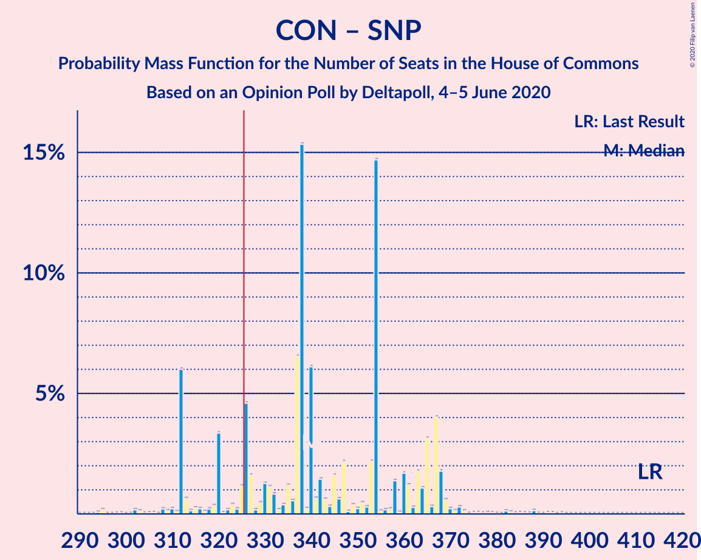

| Number of Seats | Probability | Accumulated | Special Marks |
|:---------------:|:-----------:|:-----------:|:-------------:|
| 294 | 0.1% | 100% |  |
| 295 | 0.2% | 99.9% |  |
| 296 | 0% | 99.7% |  |
| 297 | 0% | 99.7% |  |
| 298 | 0% | 99.7% |  |
| 299 | 0% | 99.7% |  |
| 300 | 0% | 99.7% |  |
| 301 | 0% | 99.7% |  |
| 302 | 0.2% | 99.7% |  |
| 303 | 0.1% | 99.5% |  |
| 304 | 0% | 99.4% |  |
| 305 | 0% | 99.3% |  |
| 306 | 0% | 99.3% |  |
| 307 | 0% | 99.3% |  |
| 308 | 0.2% | 99.3% |  |
| 309 | 0.1% | 99.1% |  |
| 310 | 0.2% | 98.9% |  |
| 311 | 0.1% | 98.7% |  |
| 312 | 6% | 98.6% |  |
| 313 | 0.6% | 93% |  |
| 314 | 0.1% | 92% |  |
| 315 | 0.2% | 92% |  |
| 316 | 0.2% | 92% |  |
| 317 | 0.1% | 91% |  |
| 318 | 0.2% | 91% |  |
| 319 | 0.3% | 91% |  |
| 320 | 3% | 91% |  |
| 321 | 0% | 87% |  |
| 322 | 0.2% | 87% |  |
| 323 | 0.4% | 87% |  |
| 324 | 0.2% | 87% |  |
| 325 | 1.2% | 87% |  |
| 326 | 5% | 85% | Majority |
| 327 | 2% | 81% |  |
| 328 | 0.2% | 79% |  |
| 329 | 0.5% | 79% |  |
| 330 | 1.3% | 79% |  |
| 331 | 1.1% | 77% |  |
| 332 | 0.8% | 76% |  |
| 333 | 0.2% | 75% |  |
| 334 | 0.4% | 75% |  |
| 335 | 1.2% | 75% |  |
| 336 | 0.5% | 74% |  |
| 337 | 7% | 73% |  |
| 338 | 15% | 67% | Median |
| 339 | 0.2% | 51% |  |
| 340 | 6% | 51% |  |
| 341 | 0.6% | 45% |  |
| 342 | 1.4% | 44% |  |
| 343 | 0.6% | 43% |  |
| 344 | 0.3% | 42% |  |
| 345 | 2% | 42% |  |
| 346 | 0.6% | 40% |  |
| 347 | 2% | 40% |  |
| 348 | 0.1% | 38% |  |
| 349 | 0.4% | 38% |  |
| 350 | 0.2% | 37% |  |
| 351 | 0.5% | 37% |  |
| 352 | 0.3% | 36% |  |
| 353 | 2% | 36% |  |
| 354 | 15% | 34% |  |
| 355 | 0.1% | 19% |  |
| 356 | 0.2% | 19% |  |
| 357 | 0.2% | 19% |  |
| 358 | 1.4% | 19% |  |
| 359 | 0.1% | 17% |  |
| 360 | 2% | 17% |  |
| 361 | 1.2% | 16% |  |
| 362 | 0.3% | 15% |  |
| 363 | 2% | 14% |  |
| 364 | 1.1% | 12% |  |
| 365 | 3% | 11% |  |
| 366 | 0.3% | 8% |  |
| 367 | 4% | 8% |  |
| 368 | 2% | 4% |  |
| 369 | 0.6% | 2% |  |
| 370 | 0.2% | 2% |  |
| 371 | 0.1% | 1.4% |  |
| 372 | 0.3% | 1.3% |  |
| 373 | 0.1% | 1.0% |  |
| 374 | 0% | 0.9% |  |
| 375 | 0% | 0.8% |  |
| 376 | 0% | 0.8% |  |
| 377 | 0% | 0.7% |  |
| 378 | 0.1% | 0.7% |  |
| 379 | 0% | 0.7% |  |
| 380 | 0% | 0.6% |  |
| 381 | 0% | 0.6% |  |
| 382 | 0.1% | 0.6% |  |
| 383 | 0.1% | 0.5% |  |
| 384 | 0% | 0.4% |  |
| 385 | 0% | 0.4% |  |
| 386 | 0% | 0.3% |  |
| 387 | 0% | 0.3% |  |
| 388 | 0.1% | 0.3% |  |
| 389 | 0% | 0.1% |  |
| 390 | 0% | 0.1% |  |
| 391 | 0% | 0.1% |  |
| 392 | 0% | 0.1% |  |
| 393 | 0% | 0% |  |
| 394 | 0% | 0% |  |
| 395 | 0% | 0% |  |
| 396 | 0% | 0% |  |
| 397 | 0% | 0% |  |
| 398 | 0% | 0% |  |
| 399 | 0% | 0% |  |
| 400 | 0% | 0% |  |
| 401 | 0% | 0% |  |
| 402 | 0% | 0% |  |
| 403 | 0% | 0% |  |
| 404 | 0% | 0% |  |
| 405 | 0% | 0% |  |
| 406 | 0% | 0% |  |
| 407 | 0% | 0% |  |
| 408 | 0% | 0% |  |
| 409 | 0% | 0% |  |
| 410 | 0% | 0% |  |
| 411 | 0% | 0% |  |
| 412 | 0% | 0% |  |
| 413 | 0% | 0% | Last Result |

### Conservative Party – Plaid Cymru

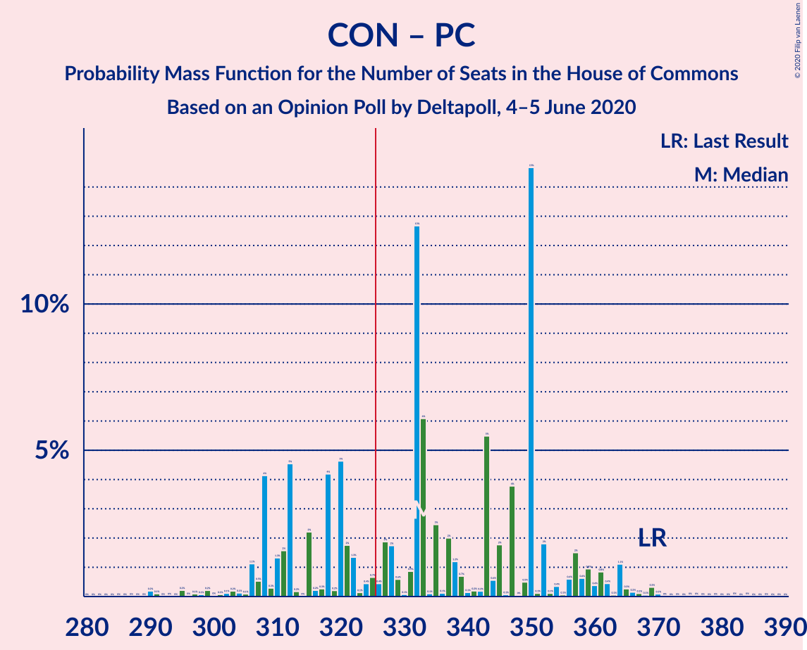

| Number of Seats | Probability | Accumulated | Special Marks |
|:---------------:|:-----------:|:-----------:|:-------------:|
| 290 | 0.2% | 100% |  |
| 291 | 0.1% | 99.8% |  |
| 292 | 0% | 99.7% |  |
| 293 | 0% | 99.7% |  |
| 294 | 0% | 99.6% |  |
| 295 | 0.2% | 99.6% |  |
| 296 | 0% | 99.4% |  |
| 297 | 0.1% | 99.4% |  |
| 298 | 0.1% | 99.3% |  |
| 299 | 0.2% | 99.2% |  |
| 300 | 0% | 99.0% |  |
| 301 | 0.1% | 99.0% |  |
| 302 | 0.1% | 98.9% |  |
| 303 | 0.2% | 98.8% |  |
| 304 | 0.1% | 98.6% |  |
| 305 | 0.1% | 98% |  |
| 306 | 1.1% | 98% |  |
| 307 | 0.5% | 97% |  |
| 308 | 4% | 97% |  |
| 309 | 0.3% | 93% |  |
| 310 | 1.3% | 92% |  |
| 311 | 2% | 91% |  |
| 312 | 5% | 89% |  |
| 313 | 0.2% | 85% |  |
| 314 | 0% | 85% |  |
| 315 | 2% | 85% |  |
| 316 | 0.2% | 82% |  |
| 317 | 0.3% | 82% |  |
| 318 | 4% | 82% |  |
| 319 | 0.2% | 78% |  |
| 320 | 5% | 78% |  |
| 321 | 2% | 73% |  |
| 322 | 1.3% | 71% |  |
| 323 | 0.1% | 70% |  |
| 324 | 0.4% | 70% |  |
| 325 | 0.7% | 69% |  |
| 326 | 0.4% | 69% | Majority |
| 327 | 2% | 68% |  |
| 328 | 2% | 66% |  |
| 329 | 0.6% | 64% |  |
| 330 | 0.1% | 64% |  |
| 331 | 0.9% | 64% |  |
| 332 | 13% | 63% | Median |
| 333 | 6% | 50% |  |
| 334 | 0.1% | 44% |  |
| 335 | 2% | 44% |  |
| 336 | 0.1% | 42% |  |
| 337 | 2% | 41% |  |
| 338 | 1.2% | 39% |  |
| 339 | 0.7% | 38% |  |
| 340 | 0.1% | 38% |  |
| 341 | 0.2% | 37% |  |
| 342 | 0.2% | 37% |  |
| 343 | 5% | 37% |  |
| 344 | 0.6% | 32% |  |
| 345 | 2% | 31% |  |
| 346 | 0.1% | 29% |  |
| 347 | 4% | 29% |  |
| 348 | 0% | 25% |  |
| 349 | 0.5% | 25% |  |
| 350 | 15% | 25% |  |
| 351 | 0.1% | 10% |  |
| 352 | 2% | 10% |  |
| 353 | 0.1% | 8% |  |
| 354 | 0.4% | 8% |  |
| 355 | 0.1% | 8% |  |
| 356 | 0.6% | 8% |  |
| 357 | 2% | 7% |  |
| 358 | 0.6% | 6% |  |
| 359 | 0.9% | 5% |  |
| 360 | 0.4% | 4% |  |
| 361 | 0.8% | 4% |  |
| 362 | 0.4% | 3% |  |
| 363 | 0.1% | 2% |  |
| 364 | 1.1% | 2% |  |
| 365 | 0.3% | 1.2% |  |
| 366 | 0.2% | 0.9% |  |
| 367 | 0.1% | 0.8% |  |
| 368 | 0.1% | 0.7% |  |
| 369 | 0.3% | 0.6% | Last Result |
| 370 | 0.1% | 0.3% |  |
| 371 | 0% | 0.2% |  |
| 372 | 0% | 0.2% |  |
| 373 | 0% | 0.2% |  |
| 374 | 0% | 0.2% |  |
| 375 | 0% | 0.2% |  |
| 376 | 0% | 0.1% |  |
| 377 | 0% | 0.1% |  |
| 378 | 0% | 0.1% |  |
| 379 | 0% | 0.1% |  |
| 380 | 0% | 0.1% |  |
| 381 | 0% | 0.1% |  |
| 382 | 0% | 0.1% |  |
| 383 | 0% | 0% |  |

### Conservative Party

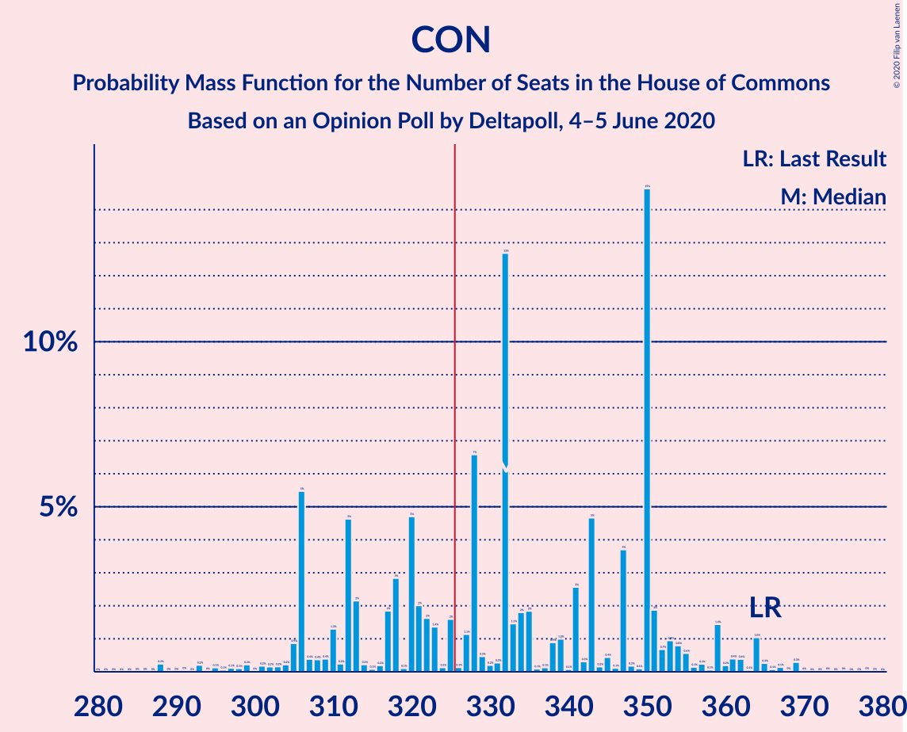

| Number of Seats | Probability | Accumulated | Special Marks |
|:---------------:|:-----------:|:-----------:|:-------------:|
| 288 | 0.2% | 100% |  |
| 289 | 0% | 99.7% |  |
| 290 | 0% | 99.7% |  |
| 291 | 0% | 99.7% |  |
| 292 | 0% | 99.6% |  |
| 293 | 0.2% | 99.6% |  |
| 294 | 0% | 99.4% |  |
| 295 | 0.1% | 99.4% |  |
| 296 | 0.1% | 99.3% |  |
| 297 | 0.1% | 99.2% |  |
| 298 | 0.1% | 99.1% |  |
| 299 | 0.2% | 99.0% |  |
| 300 | 0% | 98.8% |  |
| 301 | 0.2% | 98.8% |  |
| 302 | 0.2% | 98.6% |  |
| 303 | 0.2% | 98% |  |
| 304 | 0.2% | 98% |  |
| 305 | 0.9% | 98% |  |
| 306 | 5% | 97% |  |
| 307 | 0.4% | 92% |  |
| 308 | 0.4% | 91% |  |
| 309 | 0.4% | 91% |  |
| 310 | 1.3% | 91% |  |
| 311 | 0.2% | 89% |  |
| 312 | 5% | 89% |  |
| 313 | 2% | 84% |  |
| 314 | 0.2% | 82% |  |
| 315 | 0.1% | 82% |  |
| 316 | 0.2% | 82% |  |
| 317 | 2% | 82% |  |
| 318 | 3% | 80% |  |
| 319 | 0.1% | 77% |  |
| 320 | 5% | 77% |  |
| 321 | 2% | 72% |  |
| 322 | 2% | 70% |  |
| 323 | 1.4% | 69% |  |
| 324 | 0.1% | 67% |  |
| 325 | 2% | 67% |  |
| 326 | 0.1% | 65% | Majority |
| 327 | 1.1% | 65% |  |
| 328 | 7% | 64% |  |
| 329 | 0.5% | 58% |  |
| 330 | 0.2% | 57% |  |
| 331 | 0.3% | 57% |  |
| 332 | 13% | 57% | Median |
| 333 | 1.5% | 44% |  |
| 334 | 2% | 43% |  |
| 335 | 2% | 41% |  |
| 336 | 0.1% | 39% |  |
| 337 | 0.1% | 39% |  |
| 338 | 0.9% | 39% |  |
| 339 | 1.0% | 38% |  |
| 340 | 0.1% | 37% |  |
| 341 | 3% | 37% |  |
| 342 | 0.3% | 34% |  |
| 343 | 5% | 34% |  |
| 344 | 0.2% | 29% |  |
| 345 | 0.4% | 29% |  |
| 346 | 0.1% | 29% |  |
| 347 | 4% | 28% |  |
| 348 | 0.2% | 25% |  |
| 349 | 0.1% | 25% |  |
| 350 | 15% | 24% |  |
| 351 | 2% | 10% |  |
| 352 | 0.7% | 8% |  |
| 353 | 0.9% | 7% |  |
| 354 | 0.8% | 6% |  |
| 355 | 0.6% | 6% |  |
| 356 | 0.1% | 5% |  |
| 357 | 0.2% | 5% |  |
| 358 | 0.1% | 5% |  |
| 359 | 1.4% | 5% |  |
| 360 | 0.2% | 3% |  |
| 361 | 0.4% | 3% |  |
| 362 | 0.4% | 2% |  |
| 363 | 0.1% | 2% |  |
| 364 | 1.0% | 2% |  |
| 365 | 0.3% | 1.0% | Last Result |
| 366 | 0.1% | 0.7% |  |
| 367 | 0.1% | 0.7% |  |
| 368 | 0% | 0.5% |  |
| 369 | 0.3% | 0.5% |  |
| 370 | 0% | 0.2% |  |
| 371 | 0% | 0.2% |  |
| 372 | 0% | 0.2% |  |
| 373 | 0% | 0.2% |  |
| 374 | 0% | 0.1% |  |
| 375 | 0% | 0.1% |  |
| 376 | 0% | 0.1% |  |
| 377 | 0% | 0.1% |  |
| 378 | 0% | 0.1% |  |
| 379 | 0% | 0.1% |  |
| 380 | 0% | 0% |  |

### Labour Party – Liberal Democrats – Green Party – Scottish National Party – Plaid Cymru

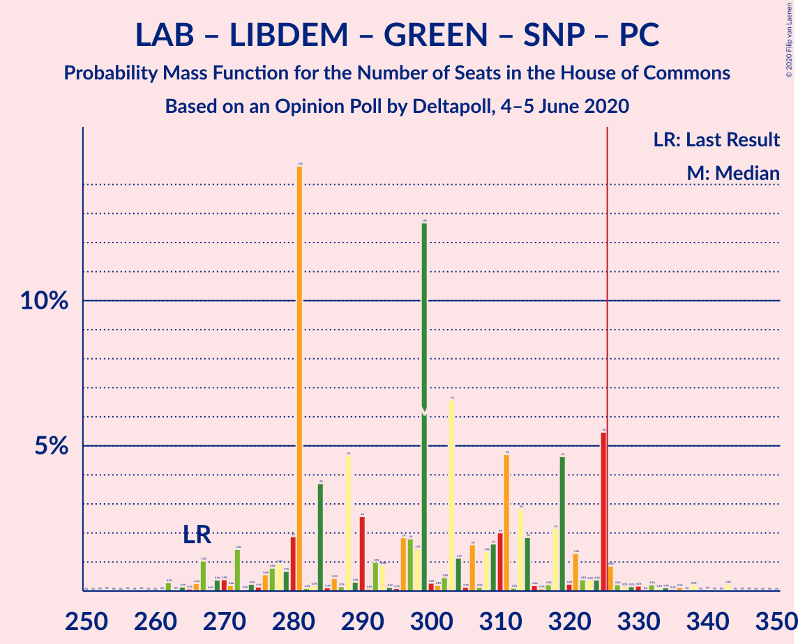

| Number of Seats | Probability | Accumulated | Special Marks |
|:---------------:|:-----------:|:-----------:|:-------------:|
| 252 | 0% | 100% |  |
| 253 | 0% | 99.9% |  |
| 254 | 0% | 99.9% |  |
| 255 | 0% | 99.9% |  |
| 256 | 0% | 99.9% |  |
| 257 | 0% | 99.9% |  |
| 258 | 0% | 99.9% |  |
| 259 | 0% | 99.8% |  |
| 260 | 0% | 99.8% |  |
| 261 | 0% | 99.8% |  |
| 262 | 0.3% | 99.8% |  |
| 263 | 0% | 99.5% |  |
| 264 | 0.1% | 99.5% |  |
| 265 | 0.1% | 99.3% |  |
| 266 | 0.3% | 99.3% | Last Result |
| 267 | 1.0% | 99.0% |  |
| 268 | 0.1% | 98% |  |
| 269 | 0.4% | 98% |  |
| 270 | 0.4% | 98% |  |
| 271 | 0.2% | 97% |  |
| 272 | 1.4% | 97% |  |
| 273 | 0.1% | 95% |  |
| 274 | 0.2% | 95% |  |
| 275 | 0.1% | 95% |  |
| 276 | 0.6% | 95% |  |
| 277 | 0.8% | 94% |  |
| 278 | 0.9% | 94% |  |
| 279 | 0.7% | 93% |  |
| 280 | 2% | 92% |  |
| 281 | 15% | 90% |  |
| 282 | 0.1% | 76% |  |
| 283 | 0.2% | 75% |  |
| 284 | 4% | 75% |  |
| 285 | 0.1% | 72% |  |
| 286 | 0.4% | 71% |  |
| 287 | 0.2% | 71% |  |
| 288 | 5% | 71% |  |
| 289 | 0.3% | 66% |  |
| 290 | 3% | 66% |  |
| 291 | 0.1% | 63% |  |
| 292 | 1.0% | 63% |  |
| 293 | 0.9% | 62% |  |
| 294 | 0.1% | 61% | Median |
| 295 | 0.1% | 61% |  |
| 296 | 2% | 61% |  |
| 297 | 2% | 59% |  |
| 298 | 1.5% | 57% |  |
| 299 | 13% | 56% |  |
| 300 | 0.3% | 43% |  |
| 301 | 0.2% | 43% |  |
| 302 | 0.5% | 43% |  |
| 303 | 7% | 42% |  |
| 304 | 1.1% | 36% |  |
| 305 | 0.1% | 35% |  |
| 306 | 2% | 35% |  |
| 307 | 0.1% | 33% |  |
| 308 | 1.4% | 33% |  |
| 309 | 2% | 31% |  |
| 310 | 2% | 30% |  |
| 311 | 5% | 28% |  |
| 312 | 0.1% | 23% |  |
| 313 | 3% | 23% |  |
| 314 | 2% | 20% |  |
| 315 | 0.2% | 18% |  |
| 316 | 0.1% | 18% |  |
| 317 | 0.2% | 18% |  |
| 318 | 2% | 18% |  |
| 319 | 5% | 16% |  |
| 320 | 0.2% | 11% |  |
| 321 | 1.3% | 11% |  |
| 322 | 0.4% | 9% |  |
| 323 | 0.4% | 9% |  |
| 324 | 0.4% | 9% |  |
| 325 | 5% | 8% |  |
| 326 | 0.9% | 3% | Majority |
| 327 | 0.2% | 2% |  |
| 328 | 0.2% | 2% |  |
| 329 | 0.2% | 2% |  |
| 330 | 0.2% | 1.4% |  |
| 331 | 0% | 1.2% |  |
| 332 | 0.2% | 1.2% |  |
| 333 | 0.1% | 1.0% |  |
| 334 | 0.1% | 0.9% |  |
| 335 | 0.1% | 0.8% |  |
| 336 | 0.1% | 0.7% |  |
| 337 | 0% | 0.6% |  |
| 338 | 0.2% | 0.6% |  |
| 339 | 0% | 0.4% |  |
| 340 | 0% | 0.4% |  |
| 341 | 0% | 0.3% |  |
| 342 | 0% | 0.3% |  |
| 343 | 0.2% | 0.3% |  |
| 344 | 0% | 0% |  |

### Labour Party – Liberal Democrats – Scottish National Party – Plaid Cymru

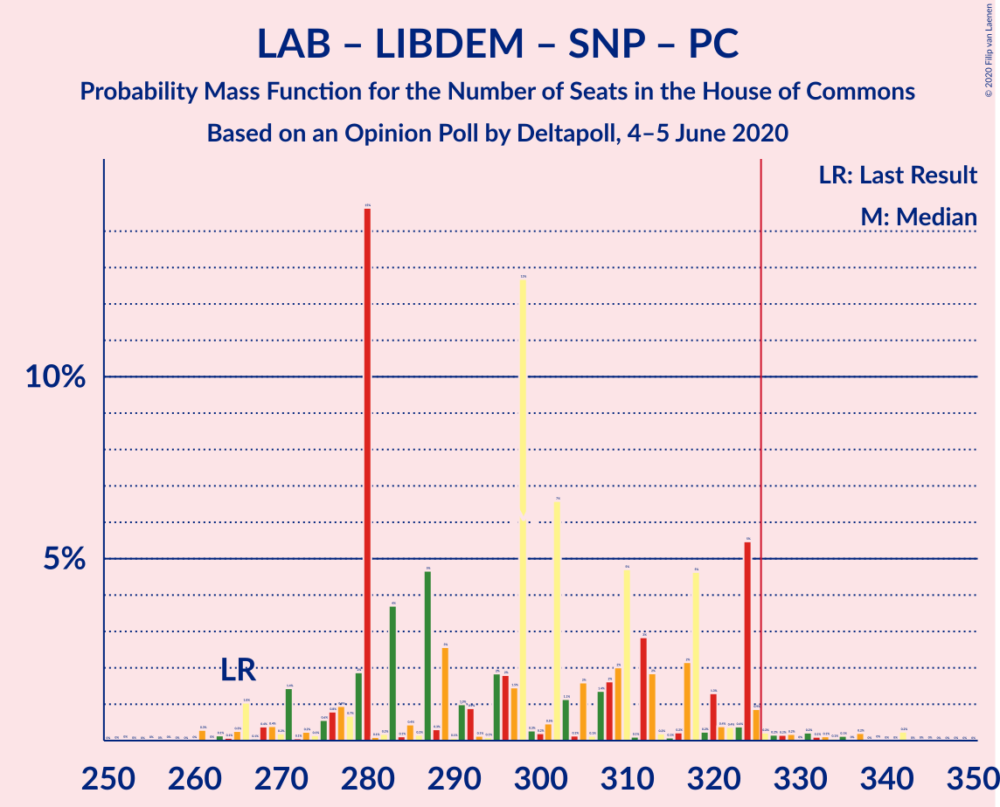

| Number of Seats | Probability | Accumulated | Special Marks |
|:---------------:|:-----------:|:-----------:|:-------------:|
| 251 | 0% | 100% |  |
| 252 | 0% | 99.9% |  |
| 253 | 0% | 99.9% |  |
| 254 | 0% | 99.9% |  |
| 255 | 0% | 99.9% |  |
| 256 | 0% | 99.9% |  |
| 257 | 0% | 99.9% |  |
| 258 | 0% | 99.8% |  |
| 259 | 0% | 99.8% |  |
| 260 | 0% | 99.8% |  |
| 261 | 0.3% | 99.8% |  |
| 262 | 0% | 99.5% |  |
| 263 | 0.1% | 99.5% |  |
| 264 | 0.1% | 99.3% |  |
| 265 | 0.3% | 99.3% | Last Result |
| 266 | 1.0% | 99.0% |  |
| 267 | 0.1% | 98% |  |
| 268 | 0.4% | 98% |  |
| 269 | 0.4% | 98% |  |
| 270 | 0.2% | 97% |  |
| 271 | 1.4% | 97% |  |
| 272 | 0.1% | 95% |  |
| 273 | 0.2% | 95% |  |
| 274 | 0.1% | 95% |  |
| 275 | 0.6% | 95% |  |
| 276 | 0.8% | 94% |  |
| 277 | 0.9% | 94% |  |
| 278 | 0.7% | 93% |  |
| 279 | 2% | 92% |  |
| 280 | 15% | 90% |  |
| 281 | 0.1% | 76% |  |
| 282 | 0.2% | 75% |  |
| 283 | 4% | 75% |  |
| 284 | 0.1% | 72% |  |
| 285 | 0.4% | 71% |  |
| 286 | 0.2% | 71% |  |
| 287 | 5% | 71% |  |
| 288 | 0.3% | 66% |  |
| 289 | 3% | 66% |  |
| 290 | 0.1% | 63% |  |
| 291 | 1.0% | 63% |  |
| 292 | 0.9% | 62% |  |
| 293 | 0.1% | 61% | Median |
| 294 | 0.1% | 61% |  |
| 295 | 2% | 61% |  |
| 296 | 2% | 59% |  |
| 297 | 1.5% | 57% |  |
| 298 | 13% | 56% |  |
| 299 | 0.3% | 43% |  |
| 300 | 0.2% | 43% |  |
| 301 | 0.5% | 43% |  |
| 302 | 7% | 42% |  |
| 303 | 1.1% | 36% |  |
| 304 | 0.1% | 35% |  |
| 305 | 2% | 35% |  |
| 306 | 0.1% | 33% |  |
| 307 | 1.4% | 33% |  |
| 308 | 2% | 31% |  |
| 309 | 2% | 30% |  |
| 310 | 5% | 28% |  |
| 311 | 0.1% | 23% |  |
| 312 | 3% | 23% |  |
| 313 | 2% | 20% |  |
| 314 | 0.2% | 18% |  |
| 315 | 0.1% | 18% |  |
| 316 | 0.2% | 18% |  |
| 317 | 2% | 18% |  |
| 318 | 5% | 16% |  |
| 319 | 0.2% | 11% |  |
| 320 | 1.3% | 11% |  |
| 321 | 0.4% | 9% |  |
| 322 | 0.4% | 9% |  |
| 323 | 0.4% | 9% |  |
| 324 | 5% | 8% |  |
| 325 | 0.9% | 3% |  |
| 326 | 0.2% | 2% | Majority |
| 327 | 0.2% | 2% |  |
| 328 | 0.2% | 2% |  |
| 329 | 0.2% | 1.4% |  |
| 330 | 0% | 1.2% |  |
| 331 | 0.2% | 1.2% |  |
| 332 | 0.1% | 1.0% |  |
| 333 | 0.1% | 0.9% |  |
| 334 | 0.1% | 0.8% |  |
| 335 | 0.1% | 0.7% |  |
| 336 | 0% | 0.6% |  |
| 337 | 0.2% | 0.6% |  |
| 338 | 0% | 0.4% |  |
| 339 | 0% | 0.4% |  |
| 340 | 0% | 0.3% |  |
| 341 | 0% | 0.3% |  |
| 342 | 0.2% | 0.3% |  |
| 343 | 0% | 0% |  |

### Labour Party – Liberal Democrats – Scottish National Party

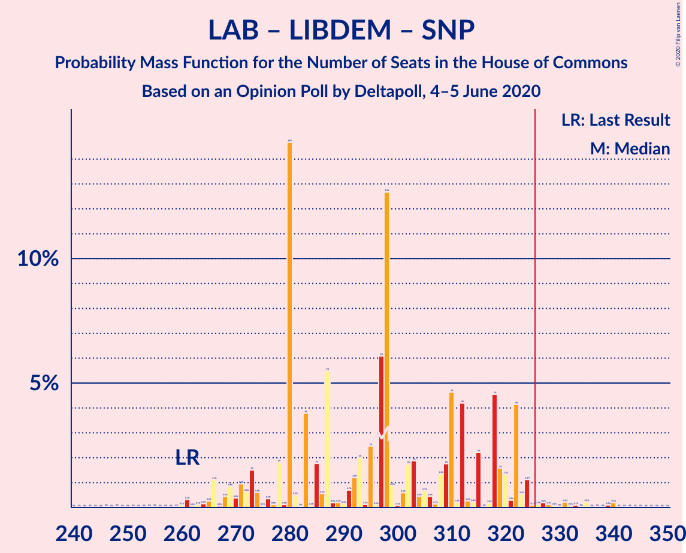

| Number of Seats | Probability | Accumulated | Special Marks |
|:---------------:|:-----------:|:-----------:|:-------------:|
| 248 | 0% | 100% |  |
| 249 | 0% | 99.9% |  |
| 250 | 0% | 99.9% |  |
| 251 | 0% | 99.9% |  |
| 252 | 0% | 99.9% |  |
| 253 | 0% | 99.9% |  |
| 254 | 0% | 99.9% |  |
| 255 | 0% | 99.9% |  |
| 256 | 0% | 99.8% |  |
| 257 | 0% | 99.8% |  |
| 258 | 0% | 99.8% |  |
| 259 | 0% | 99.8% |  |
| 260 | 0.1% | 99.8% |  |
| 261 | 0.3% | 99.7% | Last Result |
| 262 | 0.1% | 99.4% |  |
| 263 | 0.1% | 99.3% |  |
| 264 | 0.2% | 99.2% |  |
| 265 | 0.3% | 99.1% |  |
| 266 | 1.1% | 98.8% |  |
| 267 | 0.1% | 98% |  |
| 268 | 0.4% | 98% |  |
| 269 | 0.8% | 97% |  |
| 270 | 0.4% | 96% |  |
| 271 | 0.9% | 96% |  |
| 272 | 0.6% | 95% |  |
| 273 | 2% | 94% |  |
| 274 | 0.6% | 93% |  |
| 275 | 0.1% | 92% |  |
| 276 | 0.4% | 92% |  |
| 277 | 0.1% | 92% |  |
| 278 | 2% | 92% |  |
| 279 | 0.1% | 90% |  |
| 280 | 15% | 90% |  |
| 281 | 0.5% | 75% |  |
| 282 | 0% | 75% |  |
| 283 | 4% | 75% |  |
| 284 | 0.1% | 71% |  |
| 285 | 2% | 71% |  |
| 286 | 0.6% | 69% |  |
| 287 | 5% | 68% |  |
| 288 | 0.2% | 63% |  |
| 289 | 0.2% | 63% |  |
| 290 | 0.1% | 63% |  |
| 291 | 0.7% | 62% |  |
| 292 | 1.2% | 62% |  |
| 293 | 2% | 61% | Median |
| 294 | 0.1% | 59% |  |
| 295 | 2% | 58% |  |
| 296 | 0.1% | 56% |  |
| 297 | 6% | 56% |  |
| 298 | 13% | 50% |  |
| 299 | 0.9% | 37% |  |
| 300 | 0.1% | 36% |  |
| 301 | 0.6% | 36% |  |
| 302 | 2% | 36% |  |
| 303 | 2% | 34% |  |
| 304 | 0.4% | 32% |  |
| 305 | 0.7% | 31% |  |
| 306 | 0.4% | 31% |  |
| 307 | 0.1% | 30% |  |
| 308 | 1.3% | 30% |  |
| 309 | 2% | 29% |  |
| 310 | 5% | 27% |  |
| 311 | 0.2% | 22% |  |
| 312 | 4% | 22% |  |
| 313 | 0.3% | 18% |  |
| 314 | 0.2% | 18% |  |
| 315 | 2% | 18% |  |
| 316 | 0% | 15% |  |
| 317 | 0.2% | 15% |  |
| 318 | 5% | 15% |  |
| 319 | 2% | 11% |  |
| 320 | 1.3% | 9% |  |
| 321 | 0.3% | 8% |  |
| 322 | 4% | 7% |  |
| 323 | 0.5% | 3% |  |
| 324 | 1.1% | 3% |  |
| 325 | 0.1% | 2% |  |
| 326 | 0.1% | 2% | Majority |
| 327 | 0.2% | 1.4% |  |
| 328 | 0.1% | 1.2% |  |
| 329 | 0.1% | 1.1% |  |
| 330 | 0% | 1.0% |  |
| 331 | 0.2% | 1.0% |  |
| 332 | 0.1% | 0.8% |  |
| 333 | 0.1% | 0.7% |  |
| 334 | 0% | 0.6% |  |
| 335 | 0.2% | 0.6% |  |
| 336 | 0% | 0.4% |  |
| 337 | 0% | 0.4% |  |
| 338 | 0% | 0.3% |  |
| 339 | 0.1% | 0.3% |  |
| 340 | 0.2% | 0.2% |  |
| 341 | 0% | 0% |  |

### Labour Party – Liberal Democrats – Plaid Cymru

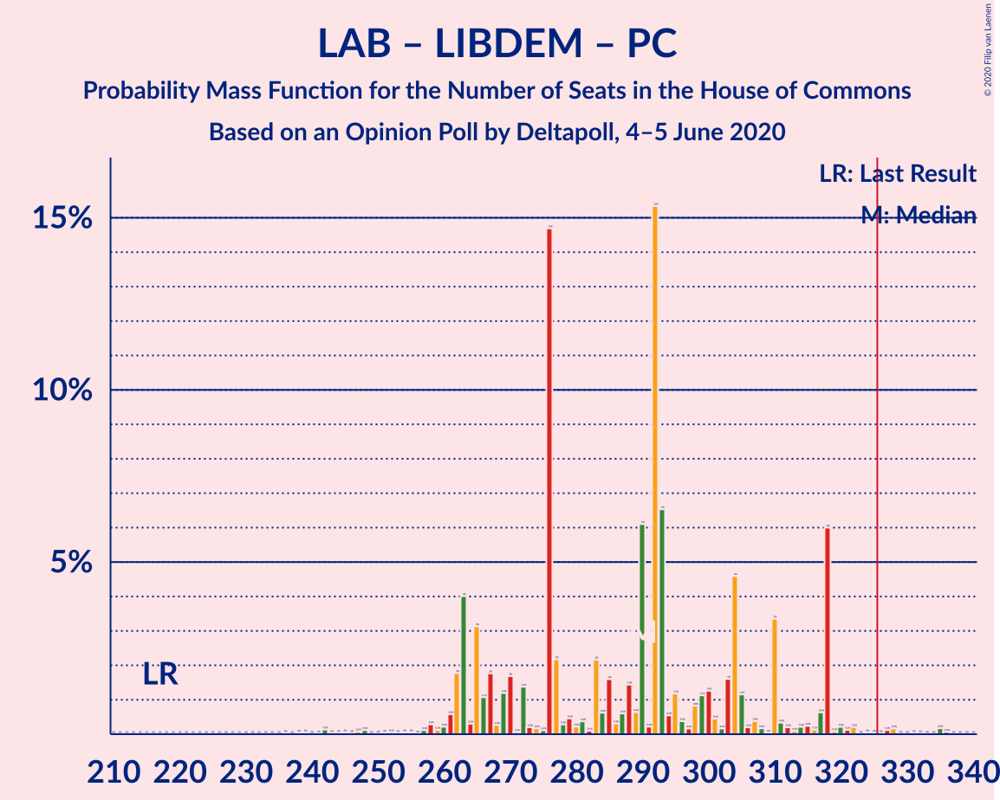

| Number of Seats | Probability | Accumulated | Special Marks |
|:---------------:|:-----------:|:-----------:|:-------------:|
| 217 | 0% | 100% | Last Result |
| 218 | 0% | 100% |  |
| 219 | 0% | 100% |  |
| 220 | 0% | 100% |  |
| 221 | 0% | 100% |  |
| 222 | 0% | 100% |  |
| 223 | 0% | 100% |  |
| 224 | 0% | 100% |  |
| 225 | 0% | 100% |  |
| 226 | 0% | 100% |  |
| 227 | 0% | 100% |  |
| 228 | 0% | 100% |  |
| 229 | 0% | 100% |  |
| 230 | 0% | 100% |  |
| 231 | 0% | 100% |  |
| 232 | 0% | 100% |  |
| 233 | 0% | 100% |  |
| 234 | 0% | 100% |  |
| 235 | 0% | 100% |  |
| 236 | 0% | 100% |  |
| 237 | 0% | 100% |  |
| 238 | 0% | 100% |  |
| 239 | 0% | 99.9% |  |
| 240 | 0% | 99.9% |  |
| 241 | 0% | 99.9% |  |
| 242 | 0.1% | 99.9% |  |
| 243 | 0% | 99.7% |  |
| 244 | 0% | 99.7% |  |
| 245 | 0% | 99.7% |  |
| 246 | 0% | 99.6% |  |
| 247 | 0.1% | 99.6% |  |
| 248 | 0.1% | 99.5% |  |
| 249 | 0% | 99.4% |  |
| 250 | 0% | 99.4% |  |
| 251 | 0% | 99.4% |  |
| 252 | 0.1% | 99.3% |  |
| 253 | 0% | 99.3% |  |
| 254 | 0% | 99.3% |  |
| 255 | 0% | 99.2% |  |
| 256 | 0% | 99.2% |  |
| 257 | 0.1% | 99.1% |  |
| 258 | 0.3% | 99.0% |  |
| 259 | 0.1% | 98.7% |  |
| 260 | 0.2% | 98.6% |  |
| 261 | 0.6% | 98% |  |
| 262 | 2% | 98% |  |
| 263 | 4% | 96% |  |
| 264 | 0.3% | 92% |  |
| 265 | 3% | 92% |  |
| 266 | 1.1% | 89% |  |
| 267 | 2% | 88% |  |
| 268 | 0.3% | 86% |  |
| 269 | 1.2% | 85% |  |
| 270 | 2% | 84% |  |
| 271 | 0.1% | 83% |  |
| 272 | 1.4% | 83% |  |
| 273 | 0.2% | 81% |  |
| 274 | 0.2% | 81% |  |
| 275 | 0.1% | 81% |  |
| 276 | 15% | 81% |  |
| 277 | 2% | 66% |  |
| 278 | 0.3% | 64% |  |
| 279 | 0.5% | 64% |  |
| 280 | 0.2% | 63% |  |
| 281 | 0.4% | 63% |  |
| 282 | 0.1% | 62% |  |
| 283 | 2% | 62% |  |
| 284 | 0.6% | 60% |  |
| 285 | 2% | 60% |  |
| 286 | 0.3% | 58% |  |
| 287 | 0.6% | 58% | Median |
| 288 | 1.4% | 57% |  |
| 289 | 0.6% | 56% |  |
| 290 | 6% | 55% |  |
| 291 | 0.2% | 49% |  |
| 292 | 15% | 49% |  |
| 293 | 7% | 33% |  |
| 294 | 0.5% | 27% |  |
| 295 | 1.2% | 26% |  |
| 296 | 0.4% | 25% |  |
| 297 | 0.2% | 25% |  |
| 298 | 0.8% | 25% |  |
| 299 | 1.1% | 24% |  |
| 300 | 1.3% | 23% |  |
| 301 | 0.5% | 21% |  |
| 302 | 0.2% | 21% |  |
| 303 | 2% | 21% |  |
| 304 | 5% | 19% |  |
| 305 | 1.2% | 15% |  |
| 306 | 0.2% | 13% |  |
| 307 | 0.4% | 13% |  |
| 308 | 0.2% | 13% |  |
| 309 | 0% | 13% |  |
| 310 | 3% | 13% |  |
| 311 | 0.3% | 9% |  |
| 312 | 0.2% | 9% |  |
| 313 | 0.1% | 9% |  |
| 314 | 0.2% | 9% |  |
| 315 | 0.2% | 8% |  |
| 316 | 0.1% | 8% |  |
| 317 | 0.6% | 8% |  |
| 318 | 6% | 7% |  |
| 319 | 0.1% | 1.4% |  |
| 320 | 0.2% | 1.3% |  |
| 321 | 0.1% | 1.1% |  |
| 322 | 0.2% | 0.9% |  |
| 323 | 0% | 0.7% |  |
| 324 | 0% | 0.7% |  |
| 325 | 0% | 0.7% |  |
| 326 | 0% | 0.7% | Majority |
| 327 | 0.1% | 0.6% |  |
| 328 | 0.2% | 0.5% |  |
| 329 | 0% | 0.3% |  |
| 330 | 0% | 0.3% |  |
| 331 | 0% | 0.3% |  |
| 332 | 0% | 0.3% |  |
| 333 | 0% | 0.3% |  |
| 334 | 0% | 0.3% |  |
| 335 | 0.2% | 0.3% |  |
| 336 | 0.1% | 0.1% |  |
| 337 | 0% | 0% |  |

### Labour Party – Liberal Democrats

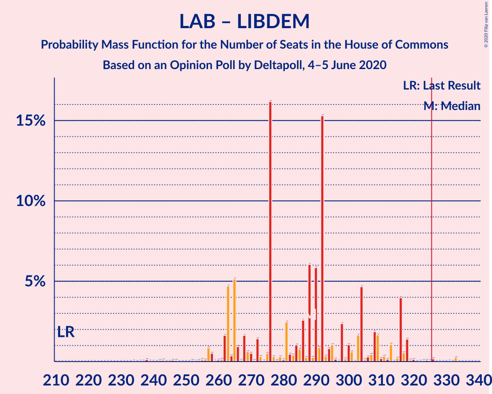

| Number of Seats | Probability | Accumulated | Special Marks |
|:---------------:|:-----------:|:-----------:|:-------------:|
| 213 | 0% | 100% | Last Result |
| 214 | 0% | 100% |  |
| 215 | 0% | 100% |  |
| 216 | 0% | 100% |  |
| 217 | 0% | 100% |  |
| 218 | 0% | 100% |  |
| 219 | 0% | 100% |  |
| 220 | 0% | 100% |  |
| 221 | 0% | 100% |  |
| 222 | 0% | 100% |  |
| 223 | 0% | 100% |  |
| 224 | 0% | 100% |  |
| 225 | 0% | 100% |  |
| 226 | 0% | 100% |  |
| 227 | 0% | 100% |  |
| 228 | 0% | 100% |  |
| 229 | 0% | 100% |  |
| 230 | 0% | 100% |  |
| 231 | 0% | 100% |  |
| 232 | 0% | 100% |  |
| 233 | 0% | 100% |  |
| 234 | 0% | 100% |  |
| 235 | 0% | 100% |  |
| 236 | 0% | 100% |  |
| 237 | 0% | 99.9% |  |
| 238 | 0.1% | 99.9% |  |
| 239 | 0% | 99.8% |  |
| 240 | 0% | 99.7% |  |
| 241 | 0% | 99.7% |  |
| 242 | 0.1% | 99.7% |  |
| 243 | 0.1% | 99.6% |  |
| 244 | 0% | 99.5% |  |
| 245 | 0% | 99.5% |  |
| 246 | 0.1% | 99.5% |  |
| 247 | 0.1% | 99.4% |  |
| 248 | 0% | 99.3% |  |
| 249 | 0% | 99.3% |  |
| 250 | 0% | 99.3% |  |
| 251 | 0% | 99.3% |  |
| 252 | 0.1% | 99.3% |  |
| 253 | 0% | 99.2% |  |
| 254 | 0.1% | 99.2% |  |
| 255 | 0.1% | 99.1% |  |
| 256 | 0.1% | 99.0% |  |
| 257 | 0.9% | 98.9% |  |
| 258 | 0.5% | 98% |  |
| 259 | 0% | 98% |  |
| 260 | 0.1% | 98% |  |
| 261 | 0.1% | 97% |  |
| 262 | 2% | 97% |  |
| 263 | 5% | 96% |  |
| 264 | 0.4% | 91% |  |
| 265 | 5% | 91% |  |
| 266 | 0.9% | 85% |  |
| 267 | 0.1% | 85% |  |
| 268 | 2% | 84% |  |
| 269 | 0.6% | 83% |  |
| 270 | 0.5% | 82% |  |
| 271 | 0.1% | 82% |  |
| 272 | 1.4% | 82% |  |
| 273 | 0.3% | 80% |  |
| 274 | 0% | 80% |  |
| 275 | 0.5% | 80% |  |
| 276 | 16% | 79% |  |
| 277 | 0.3% | 63% |  |
| 278 | 0.1% | 63% |  |
| 279 | 0.3% | 63% |  |
| 280 | 0.1% | 62% |  |
| 281 | 2% | 62% |  |
| 282 | 0.5% | 60% |  |
| 283 | 0.4% | 59% |  |
| 284 | 1.0% | 59% |  |
| 285 | 0.8% | 58% |  |
| 286 | 3% | 57% |  |
| 287 | 0.3% | 55% | Median |
| 288 | 6% | 54% |  |
| 289 | 0.3% | 48% |  |
| 290 | 6% | 48% |  |
| 291 | 0.9% | 42% |  |
| 292 | 15% | 41% |  |
| 293 | 0.3% | 26% |  |
| 294 | 0.8% | 26% |  |
| 295 | 1.1% | 25% |  |
| 296 | 0.1% | 24% |  |
| 297 | 0% | 24% |  |
| 298 | 2% | 24% |  |
| 299 | 0.2% | 21% |  |
| 300 | 1.1% | 21% |  |
| 301 | 0.6% | 20% |  |
| 302 | 0% | 20% |  |
| 303 | 2% | 20% |  |
| 304 | 5% | 18% |  |
| 305 | 0.1% | 13% |  |
| 306 | 0.3% | 13% |  |
| 307 | 0.4% | 13% |  |
| 308 | 2% | 12% |  |
| 309 | 2% | 10% |  |
| 310 | 0.2% | 9% |  |
| 311 | 0.3% | 9% |  |
| 312 | 0.1% | 8% |  |
| 313 | 1.1% | 8% |  |
| 314 | 0% | 7% |  |
| 315 | 0.2% | 7% |  |
| 316 | 4% | 7% |  |
| 317 | 0.5% | 3% |  |
| 318 | 1.4% | 2% |  |
| 319 | 0.1% | 1.0% |  |
| 320 | 0.1% | 0.9% |  |
| 321 | 0% | 0.7% |  |
| 322 | 0% | 0.7% |  |
| 323 | 0.1% | 0.7% |  |
| 324 | 0.1% | 0.6% |  |
| 325 | 0.1% | 0.6% |  |
| 326 | 0.2% | 0.5% | Majority |
| 327 | 0% | 0.3% |  |
| 328 | 0% | 0.3% |  |
| 329 | 0% | 0.3% |  |
| 330 | 0% | 0.3% |  |
| 331 | 0% | 0.3% |  |
| 332 | 0% | 0.3% |  |
| 333 | 0.2% | 0.3% |  |
| 334 | 0% | 0% |  |

### Labour Party – Scottish National Party – Plaid Cymru

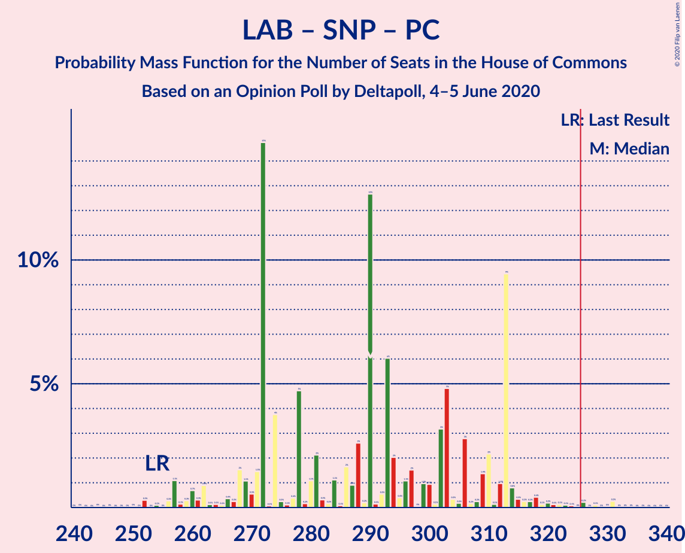

| Number of Seats | Probability | Accumulated | Special Marks |
|:---------------:|:-----------:|:-----------:|:-------------:|
| 242 | 0% | 100% |  |
| 243 | 0% | 99.9% |  |
| 244 | 0% | 99.9% |  |
| 245 | 0% | 99.9% |  |
| 246 | 0% | 99.9% |  |
| 247 | 0% | 99.9% |  |
| 248 | 0% | 99.9% |  |
| 249 | 0% | 99.9% |  |
| 250 | 0% | 99.9% |  |
| 251 | 0% | 99.8% |  |
| 252 | 0.3% | 99.8% |  |
| 253 | 0% | 99.5% |  |
| 254 | 0.1% | 99.5% | Last Result |
| 255 | 0% | 99.4% |  |
| 256 | 0.3% | 99.4% |  |
| 257 | 1.1% | 99.1% |  |
| 258 | 0.1% | 98% |  |
| 259 | 0.3% | 98% |  |
| 260 | 0.7% | 98% |  |
| 261 | 0.3% | 97% |  |
| 262 | 0.9% | 97% |  |
| 263 | 0.1% | 96% |  |
| 264 | 0.1% | 96% |  |
| 265 | 0.1% | 95% |  |
| 266 | 0.4% | 95% |  |
| 267 | 0.2% | 95% |  |
| 268 | 2% | 95% |  |
| 269 | 1.1% | 93% |  |
| 270 | 0.5% | 92% |  |
| 271 | 1.5% | 92% |  |
| 272 | 15% | 90% |  |
| 273 | 0.1% | 75% |  |
| 274 | 4% | 75% |  |
| 275 | 0.2% | 72% |  |
| 276 | 0.1% | 71% |  |
| 277 | 0.4% | 71% |  |
| 278 | 5% | 71% |  |
| 279 | 0.2% | 66% |  |
| 280 | 1.1% | 66% |  |
| 281 | 2% | 65% |  |
| 282 | 0.3% | 63% |  |
| 283 | 0.2% | 62% |  |
| 284 | 1.1% | 62% |  |
| 285 | 0.1% | 61% | Median |
| 286 | 2% | 61% |  |
| 287 | 0.9% | 59% |  |
| 288 | 3% | 59% |  |
| 289 | 0.2% | 56% |  |
| 290 | 13% | 56% |  |
| 291 | 0.1% | 43% |  |
| 292 | 0.5% | 43% |  |
| 293 | 6% | 42% |  |
| 294 | 2% | 36% |  |
| 295 | 0.4% | 34% |  |
| 296 | 1.1% | 34% |  |
| 297 | 2% | 33% |  |
| 298 | 0% | 31% |  |
| 299 | 1.0% | 31% |  |
| 300 | 0.9% | 30% |  |
| 301 | 0.1% | 29% |  |
| 302 | 3% | 29% |  |
| 303 | 5% | 26% |  |
| 304 | 0.3% | 21% |  |
| 305 | 0.2% | 21% |  |
| 306 | 3% | 21% |  |
| 307 | 0.2% | 18% |  |
| 308 | 0.2% | 18% |  |
| 309 | 1.4% | 18% |  |
| 310 | 2% | 16% |  |
| 311 | 0.1% | 14% |  |
| 312 | 1.0% | 14% |  |
| 313 | 9% | 13% |  |
| 314 | 0.8% | 3% |  |
| 315 | 0.3% | 3% |  |
| 316 | 0.2% | 2% |  |
| 317 | 0.2% | 2% |  |
| 318 | 0.4% | 2% |  |
| 319 | 0.1% | 1.4% |  |
| 320 | 0.2% | 1.3% |  |
| 321 | 0.1% | 1.1% |  |
| 322 | 0.1% | 1.0% |  |
| 323 | 0.1% | 0.9% |  |
| 324 | 0.1% | 0.8% |  |
| 325 | 0% | 0.7% |  |
| 326 | 0.2% | 0.7% | Majority |
| 327 | 0% | 0.5% |  |
| 328 | 0.1% | 0.5% |  |
| 329 | 0% | 0.4% |  |
| 330 | 0% | 0.4% |  |
| 331 | 0.3% | 0.3% |  |
| 332 | 0% | 0.1% |  |
| 333 | 0% | 0.1% |  |
| 334 | 0% | 0% |  |

### Labour Party – Scottish National Party

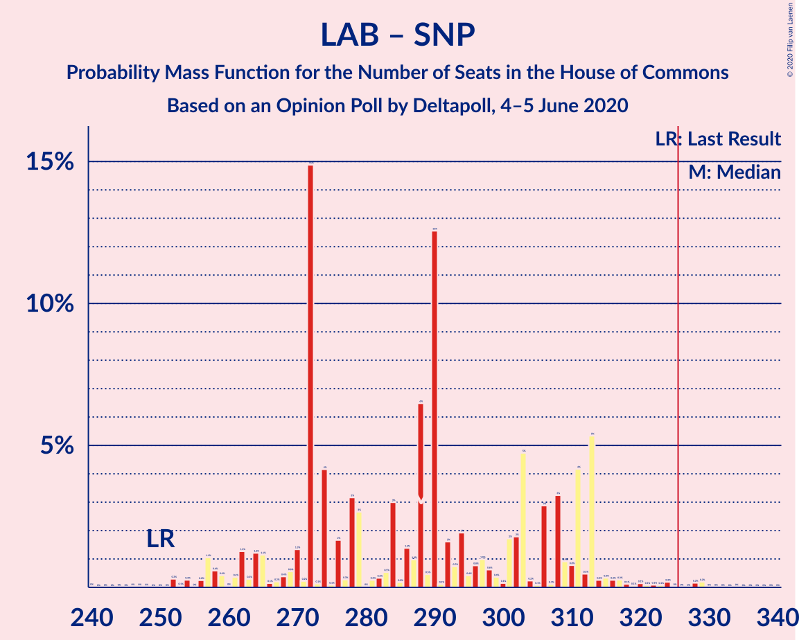

| Number of Seats | Probability | Accumulated | Special Marks |
|:---------------:|:-----------:|:-----------:|:-------------:|
| 240 | 0% | 100% |  |
| 241 | 0% | 99.9% |  |
| 242 | 0% | 99.9% |  |
| 243 | 0% | 99.9% |  |
| 244 | 0% | 99.9% |  |
| 245 | 0% | 99.9% |  |
| 246 | 0% | 99.9% |  |
| 247 | 0% | 99.9% |  |
| 248 | 0% | 99.8% |  |
| 249 | 0% | 99.8% |  |
| 250 | 0% | 99.8% | Last Result |
| 251 | 0% | 99.8% |  |
| 252 | 0.3% | 99.8% |  |
| 253 | 0.1% | 99.5% |  |
| 254 | 0.3% | 99.5% |  |
| 255 | 0% | 99.2% |  |
| 256 | 0.2% | 99.2% |  |
| 257 | 1.1% | 98.9% |  |
| 258 | 0.6% | 98% |  |
| 259 | 0.4% | 97% |  |
| 260 | 0% | 97% |  |
| 261 | 0.4% | 97% |  |
| 262 | 1.3% | 96% |  |
| 263 | 0.3% | 95% |  |
| 264 | 1.2% | 95% |  |
| 265 | 1.1% | 94% |  |
| 266 | 0.1% | 93% |  |
| 267 | 0.2% | 92% |  |
| 268 | 0.4% | 92% |  |
| 269 | 0.6% | 92% |  |
| 270 | 1.3% | 91% |  |
| 271 | 0.2% | 90% |  |
| 272 | 15% | 90% |  |
| 273 | 0.1% | 75% |  |
| 274 | 4% | 75% |  |
| 275 | 0.1% | 71% |  |
| 276 | 2% | 70% |  |
| 277 | 0.3% | 69% |  |
| 278 | 3% | 69% |  |
| 279 | 3% | 65% |  |
| 280 | 0% | 63% |  |
| 281 | 0.3% | 63% |  |
| 282 | 0.3% | 62% |  |
| 283 | 0.5% | 62% |  |
| 284 | 3% | 62% |  |
| 285 | 0.2% | 59% | Median |
| 286 | 1.4% | 58% |  |
| 287 | 1.0% | 57% |  |
| 288 | 6% | 56% |  |
| 289 | 0.5% | 50% |  |
| 290 | 13% | 49% |  |
| 291 | 0.1% | 37% |  |
| 292 | 2% | 36% |  |
| 293 | 0.7% | 35% |  |
| 294 | 2% | 34% |  |
| 295 | 0.4% | 32% |  |
| 296 | 0.8% | 32% |  |
| 297 | 1.0% | 31% |  |
| 298 | 0.6% | 30% |  |
| 299 | 0.4% | 29% |  |
| 300 | 0.1% | 29% |  |
| 301 | 2% | 29% |  |
| 302 | 2% | 27% |  |
| 303 | 5% | 25% |  |
| 304 | 0.2% | 21% |  |
| 305 | 0.1% | 20% |  |
| 306 | 3% | 20% |  |
| 307 | 0.1% | 17% |  |
| 308 | 3% | 17% |  |
| 309 | 0.9% | 14% |  |
| 310 | 0.8% | 13% |  |
| 311 | 4% | 12% |  |
| 312 | 0.5% | 8% |  |
| 313 | 5% | 8% |  |
| 314 | 0.3% | 2% |  |
| 315 | 0.3% | 2% |  |
| 316 | 0.3% | 2% |  |
| 317 | 0.3% | 2% |  |
| 318 | 0.1% | 1.2% |  |
| 319 | 0.1% | 1.1% |  |
| 320 | 0.1% | 1.1% |  |
| 321 | 0.1% | 0.9% |  |
| 322 | 0.1% | 0.8% |  |
| 323 | 0.1% | 0.8% |  |
| 324 | 0.2% | 0.7% |  |
| 325 | 0% | 0.5% |  |
| 326 | 0% | 0.5% | Majority |
| 327 | 0% | 0.4% |  |
| 328 | 0.2% | 0.4% |  |
| 329 | 0.2% | 0.3% |  |
| 330 | 0% | 0.1% |  |
| 331 | 0% | 0.1% |  |
| 332 | 0% | 0.1% |  |
| 333 | 0% | 0% |  |

### Labour Party – Plaid Cymru

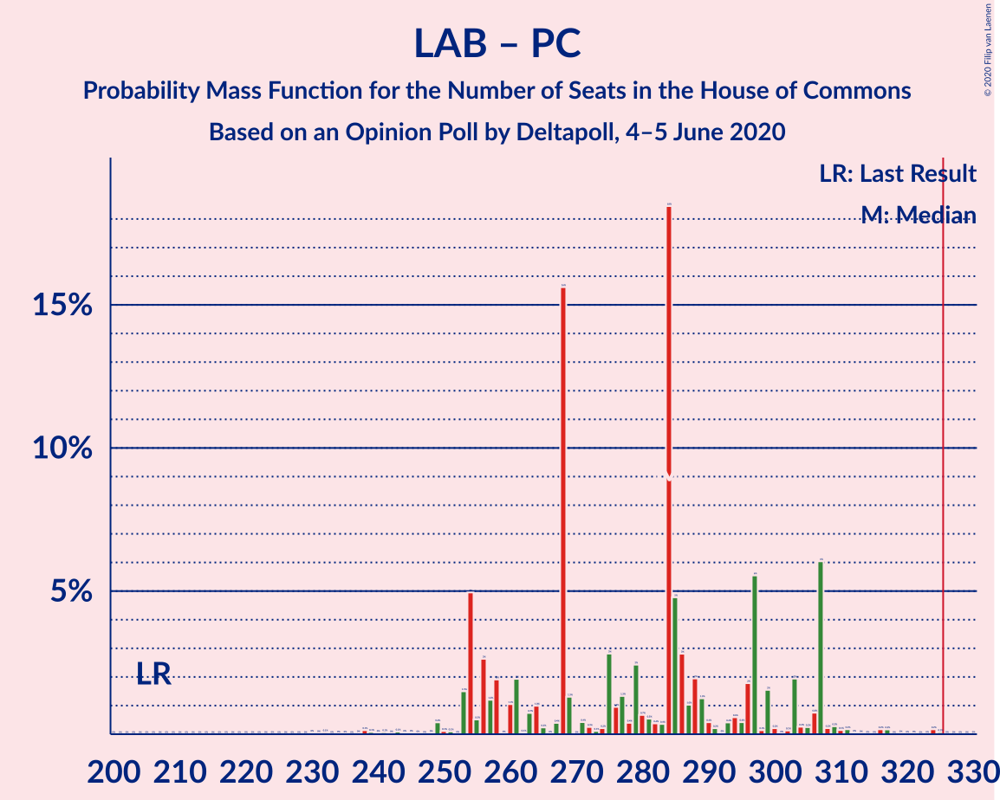

| Number of Seats | Probability | Accumulated | Special Marks |
|:---------------:|:-----------:|:-----------:|:-------------:|
| 206 | 0% | 100% | Last Result |
| 207 | 0% | 100% |  |
| 208 | 0% | 100% |  |
| 209 | 0% | 100% |  |
| 210 | 0% | 100% |  |
| 211 | 0% | 100% |  |
| 212 | 0% | 100% |  |
| 213 | 0% | 100% |  |
| 214 | 0% | 100% |  |
| 215 | 0% | 100% |  |
| 216 | 0% | 100% |  |
| 217 | 0% | 100% |  |
| 218 | 0% | 100% |  |
| 219 | 0% | 100% |  |
| 220 | 0% | 100% |  |
| 221 | 0% | 100% |  |
| 222 | 0% | 100% |  |
| 223 | 0% | 100% |  |
| 224 | 0% | 100% |  |
| 225 | 0% | 100% |  |
| 226 | 0% | 100% |  |
| 227 | 0% | 100% |  |
| 228 | 0% | 100% |  |
| 229 | 0% | 100% |  |
| 230 | 0% | 100% |  |
| 231 | 0% | 99.9% |  |
| 232 | 0.1% | 99.9% |  |
| 233 | 0% | 99.8% |  |
| 234 | 0% | 99.8% |  |
| 235 | 0% | 99.8% |  |
| 236 | 0% | 99.8% |  |
| 237 | 0% | 99.8% |  |
| 238 | 0.1% | 99.8% |  |
| 239 | 0.1% | 99.6% |  |
| 240 | 0% | 99.6% |  |
| 241 | 0.1% | 99.5% |  |
| 242 | 0% | 99.4% |  |
| 243 | 0.1% | 99.4% |  |
| 244 | 0% | 99.3% |  |
| 245 | 0% | 99.3% |  |
| 246 | 0% | 99.2% |  |
| 247 | 0% | 99.2% |  |
| 248 | 0% | 99.2% |  |
| 249 | 0.4% | 99.2% |  |
| 250 | 0.1% | 98.7% |  |
| 251 | 0.1% | 98.6% |  |
| 252 | 0% | 98.5% |  |
| 253 | 1.5% | 98.5% |  |
| 254 | 5% | 97% |  |
| 255 | 0.5% | 92% |  |
| 256 | 3% | 92% |  |
| 257 | 1.2% | 89% |  |
| 258 | 2% | 88% |  |
| 259 | 0% | 86% |  |
| 260 | 1.1% | 86% |  |
| 261 | 2% | 85% |  |
| 262 | 0.1% | 83% |  |
| 263 | 0.7% | 83% |  |
| 264 | 1.0% | 82% |  |
| 265 | 0.2% | 81% |  |
| 266 | 0% | 81% |  |
| 267 | 0.4% | 81% |  |
| 268 | 16% | 80% |  |
| 269 | 1.3% | 65% |  |
| 270 | 0% | 63% |  |
| 271 | 0.4% | 63% |  |
| 272 | 0.3% | 63% |  |
| 273 | 0.1% | 63% |  |
| 274 | 0.2% | 63% |  |
| 275 | 3% | 62% |  |
| 276 | 1.0% | 60% |  |
| 277 | 1.3% | 59% |  |
| 278 | 0.4% | 57% |  |
| 279 | 2% | 57% | Median |
| 280 | 0.7% | 55% |  |
| 281 | 0.5% | 54% |  |
| 282 | 0.4% | 53% |  |
| 283 | 0.4% | 53% |  |
| 284 | 18% | 53% |  |
| 285 | 5% | 34% |  |
| 286 | 3% | 29% |  |
| 287 | 1.0% | 27% |  |
| 288 | 2% | 25% |  |
| 289 | 1.3% | 24% |  |
| 290 | 0.4% | 22% |  |
| 291 | 0.2% | 22% |  |
| 292 | 0% | 22% |  |
| 293 | 0.4% | 22% |  |
| 294 | 0.6% | 21% |  |
| 295 | 0.4% | 21% |  |
| 296 | 2% | 20% |  |
| 297 | 6% | 18% |  |
| 298 | 0.1% | 13% |  |
| 299 | 2% | 13% |  |
| 300 | 0.2% | 11% |  |
| 301 | 0% | 11% |  |
| 302 | 0.1% | 11% |  |
| 303 | 2% | 11% |  |
| 304 | 0.3% | 9% |  |
| 305 | 0.2% | 9% |  |
| 306 | 0.8% | 8% |  |
| 307 | 6% | 8% |  |
| 308 | 0.2% | 2% |  |
| 309 | 0.3% | 1.4% |  |
| 310 | 0.1% | 1.1% |  |
| 311 | 0.2% | 0.9% |  |
| 312 | 0% | 0.8% |  |
| 313 | 0% | 0.7% |  |
| 314 | 0% | 0.7% |  |
| 315 | 0% | 0.7% |  |
| 316 | 0.2% | 0.7% |  |
| 317 | 0.2% | 0.5% |  |
| 318 | 0% | 0.3% |  |
| 319 | 0% | 0.3% |  |
| 320 | 0% | 0.3% |  |
| 321 | 0% | 0.3% |  |
| 322 | 0% | 0.3% |  |
| 323 | 0% | 0.3% |  |
| 324 | 0.2% | 0.3% |  |
| 325 | 0.1% | 0.1% |  |
| 326 | 0% | 0% | Majority |

### Labour Party

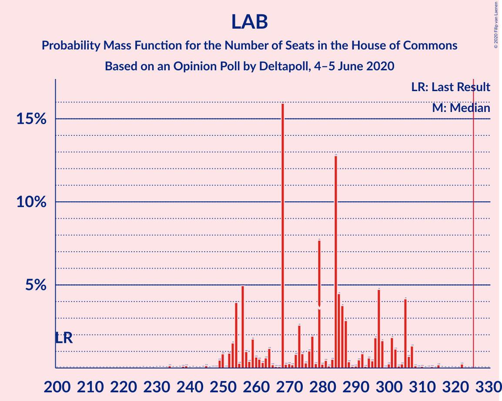

| Number of Seats | Probability | Accumulated | Special Marks |
|:---------------:|:-----------:|:-----------:|:-------------:|
| 202 | 0% | 100% | Last Result |
| 203 | 0% | 100% |  |
| 204 | 0% | 100% |  |
| 205 | 0% | 100% |  |
| 206 | 0% | 100% |  |
| 207 | 0% | 100% |  |
| 208 | 0% | 100% |  |
| 209 | 0% | 100% |  |
| 210 | 0% | 100% |  |
| 211 | 0% | 100% |  |
| 212 | 0% | 100% |  |
| 213 | 0% | 100% |  |
| 214 | 0% | 100% |  |
| 215 | 0% | 100% |  |
| 216 | 0% | 100% |  |
| 217 | 0% | 100% |  |
| 218 | 0% | 100% |  |
| 219 | 0% | 100% |  |
| 220 | 0% | 100% |  |
| 221 | 0% | 100% |  |
| 222 | 0% | 100% |  |
| 223 | 0% | 100% |  |
| 224 | 0% | 100% |  |
| 225 | 0% | 100% |  |
| 226 | 0% | 100% |  |
| 227 | 0% | 100% |  |
| 228 | 0% | 100% |  |
| 229 | 0% | 99.9% |  |
| 230 | 0% | 99.9% |  |
| 231 | 0% | 99.9% |  |
| 232 | 0% | 99.9% |  |
| 233 | 0% | 99.8% |  |
| 234 | 0.1% | 99.8% |  |
| 235 | 0% | 99.7% |  |
| 236 | 0% | 99.7% |  |
| 237 | 0% | 99.6% |  |
| 238 | 0.1% | 99.6% |  |
| 239 | 0.1% | 99.5% |  |
| 240 | 0% | 99.4% |  |
| 241 | 0% | 99.4% |  |
| 242 | 0% | 99.3% |  |
| 243 | 0% | 99.3% |  |
| 244 | 0% | 99.3% |  |
| 245 | 0.1% | 99.2% |  |
| 246 | 0% | 99.1% |  |
| 247 | 0.1% | 99.1% |  |
| 248 | 0.1% | 99.0% |  |
| 249 | 0.5% | 99.0% |  |
| 250 | 0.8% | 98.5% |  |
| 251 | 0.1% | 98% |  |
| 252 | 0.9% | 98% |  |
| 253 | 2% | 97% |  |
| 254 | 4% | 95% |  |
| 255 | 0.3% | 91% |  |
| 256 | 5% | 91% |  |
| 257 | 1.0% | 86% |  |
| 258 | 0.4% | 85% |  |
| 259 | 2% | 85% |  |
| 260 | 0.7% | 83% |  |
| 261 | 0.5% | 82% |  |
| 262 | 0.3% | 82% |  |
| 263 | 0.6% | 81% |  |
| 264 | 1.2% | 81% |  |
| 265 | 0.2% | 80% |  |
| 266 | 0.1% | 79% |  |
| 267 | 0.1% | 79% |  |
| 268 | 16% | 79% |  |
| 269 | 0.2% | 63% |  |
| 270 | 0.3% | 63% |  |
| 271 | 0.2% | 63% |  |
| 272 | 0.8% | 63% |  |
| 273 | 3% | 62% |  |
| 274 | 0.9% | 59% |  |
| 275 | 0.3% | 58% |  |
| 276 | 1.0% | 58% |  |
| 277 | 2% | 57% |  |
| 278 | 0.3% | 55% |  |
| 279 | 8% | 55% | Median |
| 280 | 0.2% | 47% |  |
| 281 | 0.5% | 47% |  |
| 282 | 0.1% | 47% |  |
| 283 | 0.5% | 46% |  |
| 284 | 13% | 46% |  |
| 285 | 4% | 33% |  |
| 286 | 4% | 29% |  |
| 287 | 3% | 25% |  |
| 288 | 0.4% | 22% |  |
| 289 | 0.1% | 22% |  |
| 290 | 0.1% | 22% |  |
| 291 | 0.5% | 21% |  |
| 292 | 0.9% | 21% |  |
| 293 | 0.1% | 20% |  |
| 294 | 0.6% | 20% |  |
| 295 | 0.4% | 19% |  |
| 296 | 2% | 19% |  |
| 297 | 5% | 17% |  |
| 298 | 2% | 12% |  |
| 299 | 0.1% | 11% |  |
| 300 | 0.2% | 11% |  |
| 301 | 2% | 11% |  |
| 302 | 1.1% | 9% |  |
| 303 | 0.1% | 8% |  |
| 304 | 0.2% | 7% |  |
| 305 | 4% | 7% |  |
| 306 | 0.7% | 3% |  |
| 307 | 1.3% | 2% |  |
| 308 | 0.1% | 1.0% |  |
| 309 | 0.1% | 0.9% |  |
| 310 | 0.1% | 0.8% |  |
| 311 | 0% | 0.7% |  |
| 312 | 0.1% | 0.7% |  |
| 313 | 0.1% | 0.6% |  |
| 314 | 0% | 0.6% |  |
| 315 | 0.2% | 0.6% |  |
| 316 | 0% | 0.4% |  |
| 317 | 0% | 0.3% |  |
| 318 | 0% | 0.3% |  |
| 319 | 0% | 0.3% |  |
| 320 | 0% | 0.3% |  |
| 321 | 0% | 0.3% |  |
| 322 | 0.2% | 0.3% |  |
| 323 | 0% | 0% |  |

## Technical Information

### Opinion Poll

+ **Polling firm:** Deltapoll
+ **Commissioner(s):** —
+ **Fieldwork period:** 4–5 June 2020

### Calculations

+ **Sample size:** 1478
+ **Simulations done:** 131,072
+ **Error estimate:** 1.48%

