# Opinion Poll by Redfield & Wilton Strategies, 11 June 2020

<a href="#voting-intentions">Voting Intentions</a> | <a href="#seats">Seats</a> | <a href="#coalitions">Coalitions</a> | <a href="#technical-information">Technical Information</a>

## Voting Intentions

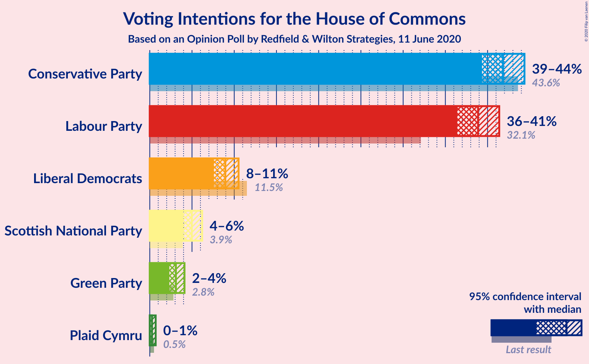

### Confidence Intervals

| Party | Last Result | Poll Result | 80% Confidence Interval | 90% Confidence Interval | 95% Confidence Interval | 99% Confidence Interval |
|:-----:|:-----------:|:-----------:|:-----------------------:|:-----------------------:|:-----------------------:|:-----------------------:|
| Conservative Party | 43.6% | 41.8% | 40.2–43.5% |39.7–44.0% |39.3–44.4% |38.6–45.2% |
| Labour Party | 32.1% | 38.9% | 37.3–40.5% |36.8–41.0% |36.4–41.4% |35.7–42.2% |
| Liberal Democrats | 11.5% | 8.9% | 8.0–10.0% |7.8–10.3% |7.6–10.5% |7.2–11.0% |
| Scottish National Party | 3.9% | 5.0% | 4.3–5.8% |4.1–6.0% |4.0–6.2% |3.7–6.6% |
| Green Party | 2.8% | 3.1% | 2.6–3.7% |2.4–3.9% |2.3–4.1% |2.1–4.5% |
| Plaid Cymru | 0.5% | 0.3% | 0.2–0.5% |0.1–0.6% |0.1–0.7% |0.1–0.9% |

*Note:* The poll result column reflects the actual value used in the calculations. Published results may vary slightly, and in addition be rounded to fewer digits.

## Seats

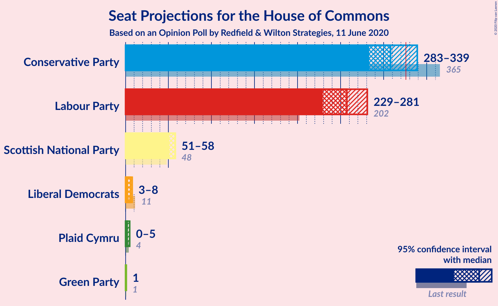

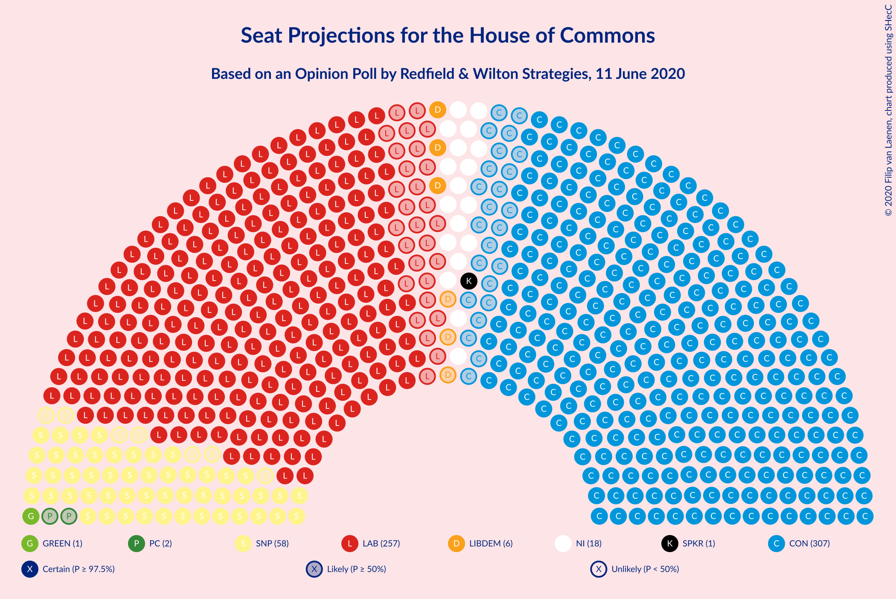

### Confidence Intervals

| Party | Last Result | Median | 80% Confidence Interval | 90% Confidence Interval | 95% Confidence Interval | 99% Confidence Interval |
|:-----:|:-----------:|:------:|:-----------------------:|:-----------------------:|:-----------------------:|:-----------------------:|
| <a href="#conservative-party">Conservative Party</a> | 365 | 308 | 292–330 |286–335 |283–339 |277–347 |
| <a href="#labour-party">Labour Party</a> | 202 | 257 | 238–273 |230–278 |229–281 |222–288 |
| <a href="#liberal-democrats">Liberal Democrats</a> | 11 | 6 | 4–7 |3–7 |3–8 |2–9 |
| <a href="#scottish-national-party">Scottish National Party</a> | 48 | 58 | 54–58 |53–58 |51–58 |47–58 |
| <a href="#green-party">Green Party</a> | 1 | 1 | 1 |1 |1 |1 |
| <a href="#plaid-cymru">Plaid Cymru</a> | 4 | 2 | 0–4 |0–5 |0–5 |0–5 |

### Conservative Party

*For a full overview of the results for this party, see the [Conservative Party](party-conservativeparty.html) page.*

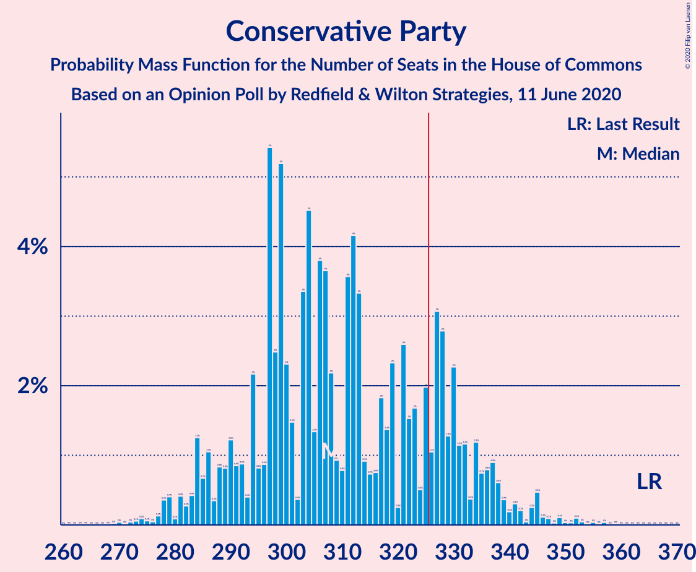

| Number of Seats | Probability | Accumulated | Special Marks |
|:---------------:|:-----------:|:-----------:|:-------------:|
| 269 | 0% | 100% |  |
| 270 | 0% | 99.9% |  |
| 271 | 0% | 99.9% |  |
| 272 | 0% | 99.9% |  |
| 273 | 0.1% | 99.8% |  |
| 274 | 0.1% | 99.8% |  |
| 275 | 0.1% | 99.7% |  |
| 276 | 0% | 99.6% |  |
| 277 | 0.1% | 99.6% |  |
| 278 | 0.4% | 99.4% |  |
| 279 | 0.4% | 99.1% |  |
| 280 | 0.1% | 98.7% |  |
| 281 | 0.4% | 98.6% |  |
| 282 | 0.3% | 98% |  |
| 283 | 0.4% | 98% |  |
| 284 | 1.3% | 97% |  |
| 285 | 0.7% | 96% |  |
| 286 | 1.1% | 96% |  |
| 287 | 0.3% | 95% |  |
| 288 | 0.8% | 94% |  |
| 289 | 0.8% | 93% |  |
| 290 | 1.2% | 93% |  |
| 291 | 0.9% | 91% |  |
| 292 | 0.9% | 90% |  |
| 293 | 0.4% | 90% |  |
| 294 | 2% | 89% |  |
| 295 | 0.8% | 87% |  |
| 296 | 0.9% | 86% |  |
| 297 | 5% | 85% |  |
| 298 | 2% | 80% |  |
| 299 | 5% | 77% |  |
| 300 | 2% | 72% |  |
| 301 | 1.5% | 70% |  |
| 302 | 0.4% | 68% |  |
| 303 | 3% | 68% |  |
| 304 | 5% | 65% |  |
| 305 | 1.3% | 60% |  |
| 306 | 4% | 59% |  |
| 307 | 4% | 55% |  |
| 308 | 2% | 51% | Median |
| 309 | 0.9% | 49% |  |
| 310 | 0.8% | 48% |  |
| 311 | 4% | 47% |  |
| 312 | 4% | 44% |  |
| 313 | 3% | 40% |  |
| 314 | 0.9% | 36% |  |
| 315 | 0.7% | 35% |  |
| 316 | 0.8% | 35% |  |
| 317 | 2% | 34% |  |
| 318 | 1.4% | 32% |  |
| 319 | 2% | 31% |  |
| 320 | 0.3% | 28% |  |
| 321 | 3% | 28% |  |
| 322 | 2% | 26% |  |
| 323 | 2% | 24% |  |
| 324 | 0.5% | 22% |  |
| 325 | 2% | 22% |  |
| 326 | 1.1% | 20% | Majority |
| 327 | 3% | 19% |  |
| 328 | 3% | 16% |  |
| 329 | 1.3% | 13% |  |
| 330 | 2% | 12% |  |
| 331 | 1.1% | 9% |  |
| 332 | 1.2% | 8% |  |
| 333 | 0.4% | 7% |  |
| 334 | 1.2% | 7% |  |
| 335 | 0.7% | 6% |  |
| 336 | 0.8% | 5% |  |
| 337 | 0.9% | 4% |  |
| 338 | 0.6% | 3% |  |
| 339 | 0.4% | 3% |  |
| 340 | 0.2% | 2% |  |
| 341 | 0.3% | 2% |  |
| 342 | 0.2% | 2% |  |
| 343 | 0% | 1.5% |  |
| 344 | 0.3% | 1.4% |  |
| 345 | 0.5% | 1.2% |  |
| 346 | 0.1% | 0.7% |  |
| 347 | 0.1% | 0.6% |  |
| 348 | 0% | 0.5% |  |
| 349 | 0.1% | 0.5% |  |
| 350 | 0% | 0.4% |  |
| 351 | 0% | 0.3% |  |
| 352 | 0.1% | 0.3% |  |
| 353 | 0% | 0.2% |  |
| 354 | 0% | 0.1% |  |
| 355 | 0% | 0.1% |  |
| 356 | 0% | 0.1% |  |
| 357 | 0% | 0.1% |  |
| 358 | 0% | 0% |  |
| 359 | 0% | 0% |  |
| 360 | 0% | 0% |  |
| 361 | 0% | 0% |  |
| 362 | 0% | 0% |  |
| 363 | 0% | 0% |  |
| 364 | 0% | 0% |  |
| 365 | 0% | 0% | Last Result |

### Labour Party

*For a full overview of the results for this party, see the [Labour Party](party-labourparty.html) page.*

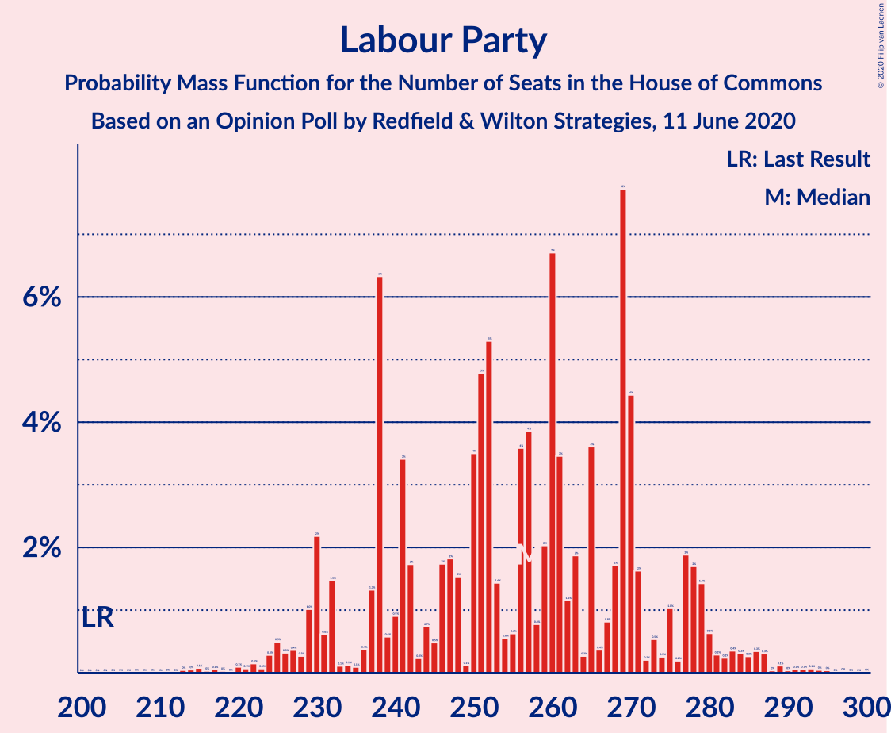

| Number of Seats | Probability | Accumulated | Special Marks |
|:---------------:|:-----------:|:-----------:|:-------------:|
| 202 | 0% | 100% | Last Result |
| 203 | 0% | 100% |  |
| 204 | 0% | 100% |  |
| 205 | 0% | 100% |  |
| 206 | 0% | 100% |  |
| 207 | 0% | 100% |  |
| 208 | 0% | 100% |  |
| 209 | 0% | 100% |  |
| 210 | 0% | 100% |  |
| 211 | 0% | 100% |  |
| 212 | 0% | 100% |  |
| 213 | 0% | 100% |  |
| 214 | 0% | 99.9% |  |
| 215 | 0.1% | 99.9% |  |
| 216 | 0% | 99.8% |  |
| 217 | 0.1% | 99.8% |  |
| 218 | 0% | 99.7% |  |
| 219 | 0% | 99.7% |  |
| 220 | 0.1% | 99.7% |  |
| 221 | 0.1% | 99.6% |  |
| 222 | 0.1% | 99.5% |  |
| 223 | 0.1% | 99.4% |  |
| 224 | 0.3% | 99.3% |  |
| 225 | 0.5% | 99.0% |  |
| 226 | 0.3% | 98.5% |  |
| 227 | 0.4% | 98% |  |
| 228 | 0.3% | 98% |  |
| 229 | 1.0% | 98% |  |
| 230 | 2% | 97% |  |
| 231 | 0.6% | 94% |  |
| 232 | 1.5% | 94% |  |
| 233 | 0.1% | 92% |  |
| 234 | 0.1% | 92% |  |
| 235 | 0.1% | 92% |  |
| 236 | 0.4% | 92% |  |
| 237 | 1.3% | 92% |  |
| 238 | 6% | 90% |  |
| 239 | 0.6% | 84% |  |
| 240 | 0.9% | 83% |  |
| 241 | 3% | 82% |  |
| 242 | 2% | 79% |  |
| 243 | 0.2% | 77% |  |
| 244 | 0.7% | 77% |  |
| 245 | 0.5% | 76% |  |
| 246 | 2% | 76% |  |
| 247 | 2% | 74% |  |
| 248 | 2% | 72% |  |
| 249 | 0.1% | 71% |  |
| 250 | 4% | 71% |  |
| 251 | 5% | 67% |  |
| 252 | 5% | 62% |  |
| 253 | 1.4% | 57% |  |
| 254 | 0.6% | 56% |  |
| 255 | 0.6% | 55% |  |
| 256 | 4% | 54% |  |
| 257 | 4% | 51% | Median |
| 258 | 0.8% | 47% |  |
| 259 | 2% | 46% |  |
| 260 | 7% | 44% |  |
| 261 | 3% | 37% |  |
| 262 | 1.2% | 34% |  |
| 263 | 2% | 33% |  |
| 264 | 0.3% | 31% |  |
| 265 | 4% | 31% |  |
| 266 | 0.4% | 27% |  |
| 267 | 0.8% | 27% |  |
| 268 | 2% | 26% |  |
| 269 | 8% | 24% |  |
| 270 | 4% | 17% |  |
| 271 | 2% | 12% |  |
| 272 | 0.2% | 10% |  |
| 273 | 0.5% | 10% |  |
| 274 | 0.3% | 10% |  |
| 275 | 1.0% | 9% |  |
| 276 | 0.2% | 8% |  |
| 277 | 2% | 8% |  |
| 278 | 2% | 6% |  |
| 279 | 1.4% | 5% |  |
| 280 | 0.6% | 3% |  |
| 281 | 0.3% | 3% |  |
| 282 | 0.2% | 2% |  |
| 283 | 0.4% | 2% |  |
| 284 | 0.3% | 2% |  |
| 285 | 0.3% | 1.4% |  |
| 286 | 0.3% | 1.1% |  |
| 287 | 0.3% | 0.8% |  |
| 288 | 0% | 0.5% |  |
| 289 | 0.1% | 0.5% |  |
| 290 | 0% | 0.4% |  |
| 291 | 0.1% | 0.3% |  |
| 292 | 0.1% | 0.3% |  |
| 293 | 0.1% | 0.2% |  |
| 294 | 0% | 0.1% |  |
| 295 | 0% | 0.1% |  |
| 296 | 0% | 0.1% |  |
| 297 | 0% | 0.1% |  |
| 298 | 0% | 0% |  |

### Liberal Democrats

*For a full overview of the results for this party, see the [Liberal Democrats](party-liberaldemocrats.html) page.*

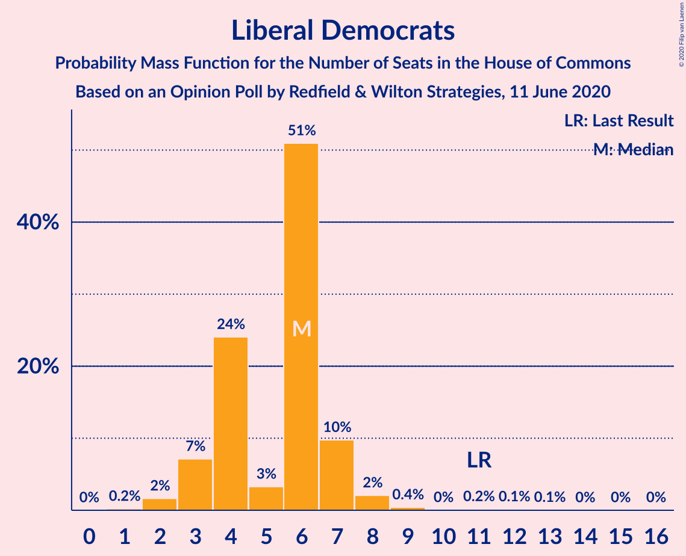

| Number of Seats | Probability | Accumulated | Special Marks |
|:---------------:|:-----------:|:-----------:|:-------------:|
| 1 | 0.2% | 100% |  |
| 2 | 2% | 99.8% |  |
| 3 | 7% | 98% |  |
| 4 | 24% | 91% |  |
| 5 | 3% | 67% |  |
| 6 | 51% | 64% | Median |
| 7 | 10% | 13% |  |
| 8 | 2% | 3% |  |
| 9 | 0.4% | 0.9% |  |
| 10 | 0% | 0.5% |  |
| 11 | 0.2% | 0.4% | Last Result |
| 12 | 0.1% | 0.3% |  |
| 13 | 0.1% | 0.1% |  |
| 14 | 0% | 0.1% |  |
| 15 | 0% | 0.1% |  |
| 16 | 0% | 0% |  |

### Scottish National Party

*For a full overview of the results for this party, see the [Scottish National Party](party-scottishnationalparty.html) page.*

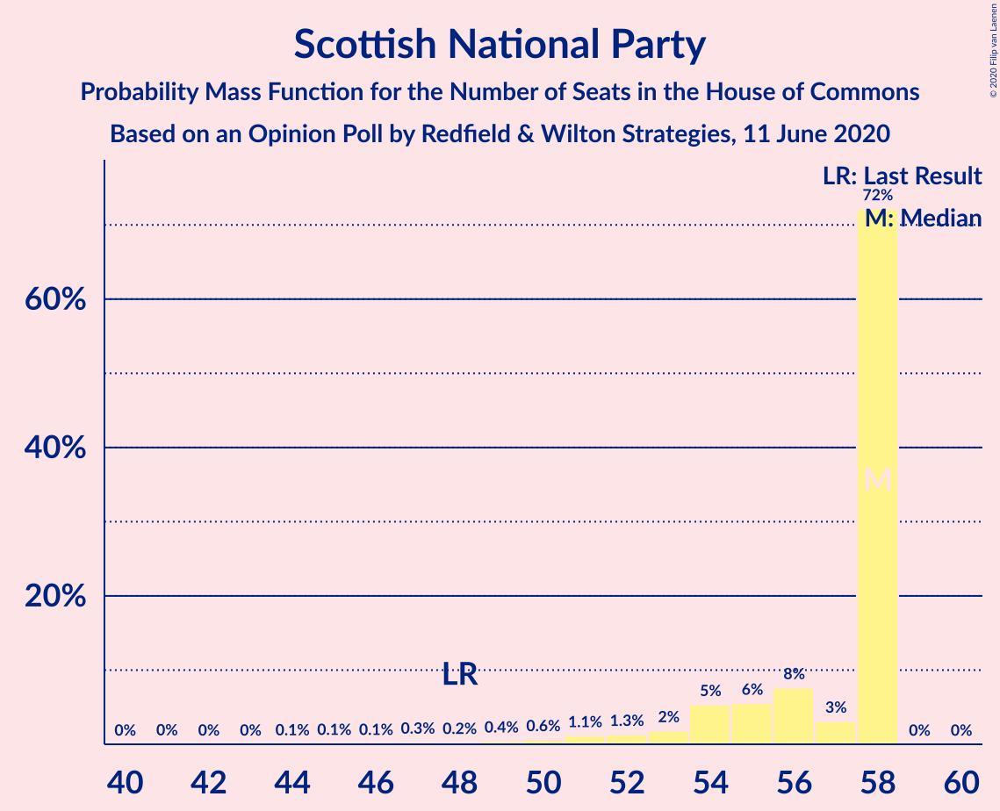

| Number of Seats | Probability | Accumulated | Special Marks |
|:---------------:|:-----------:|:-----------:|:-------------:|
| 41 | 0% | 100% |  |
| 42 | 0% | 99.9% |  |
| 43 | 0% | 99.9% |  |
| 44 | 0.1% | 99.9% |  |
| 45 | 0.1% | 99.8% |  |
| 46 | 0.1% | 99.7% |  |
| 47 | 0.3% | 99.6% |  |
| 48 | 0.2% | 99.3% | Last Result |
| 49 | 0.4% | 99.1% |  |
| 50 | 0.6% | 98.7% |  |
| 51 | 1.1% | 98% |  |
| 52 | 1.3% | 97% |  |
| 53 | 2% | 96% |  |
| 54 | 5% | 94% |  |
| 55 | 6% | 88% |  |
| 56 | 8% | 83% |  |
| 57 | 3% | 75% |  |
| 58 | 72% | 72% | Median |
| 59 | 0% | 0% |  |

### Green Party

*For a full overview of the results for this party, see the [Green Party](party-greenparty.html) page.*

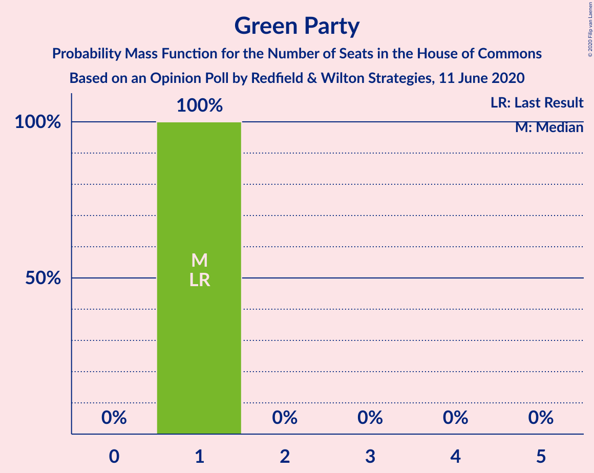

| Number of Seats | Probability | Accumulated | Special Marks |
|:---------------:|:-----------:|:-----------:|:-------------:|
| 1 | 100% | 100% | Last Result, Median |

### Plaid Cymru

*For a full overview of the results for this party, see the [Plaid Cymru](party-plaidcymru.html) page.*

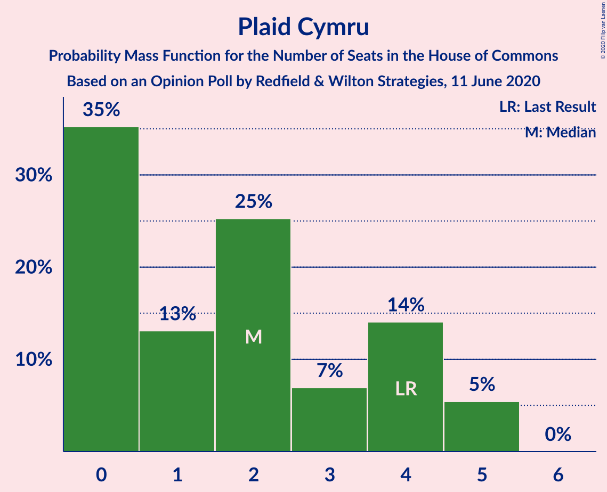

| Number of Seats | Probability | Accumulated | Special Marks |
|:---------------:|:-----------:|:-----------:|:-------------:|
| 0 | 35% | 100% |  |
| 1 | 13% | 65% |  |
| 2 | 25% | 52% | Median |
| 3 | 7% | 26% |  |
| 4 | 14% | 19% | Last Result |
| 5 | 5% | 5% |  |
| 6 | 0% | 0% |  |

## Coalitions

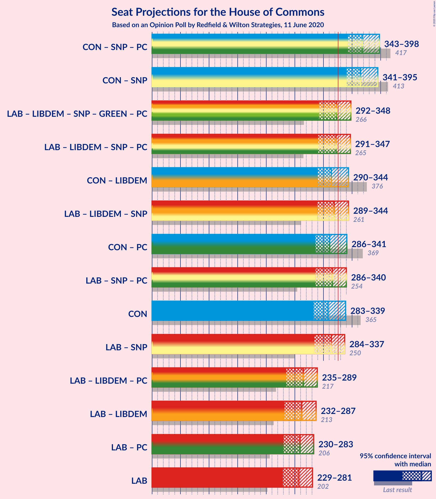

### Confidence Intervals

| Coalition | Last Result | Median | Majority? | 80% Confidence Interval | 90% Confidence Interval | 95% Confidence Interval | 99% Confidence Interval |
|:---------:|:-----------:|:------:|:---------:|:-----------------------:|:-----------------------:|:-----------------------:|:-----------------------:|
| Conservative Party – Scottish National Party – Plaid Cymru | 417 | 368 | 100% | 351–388 | 346–394 | 343–398 | 336–405 |
| Conservative Party – Scottish National Party | 413 | 365 | 99.9% | 349–388 | 343–392 | 341–395 | 334–404 |
| Labour Party – Liberal Democrats – Scottish National Party – Green Party – Plaid Cymru | 266 | 323 | 41% | 301–339 | 296–345 | 292–348 | 284–354 |
| Labour Party – Liberal Democrats – Scottish National Party – Plaid Cymru | 265 | 322 | 40% | 300–338 | 295–344 | 291–347 | 283–353 |
| Conservative Party – Liberal Democrats | 376 | 314 | 25% | 298–335 | 292–341 | 290–344 | 283–352 |
| Labour Party – Liberal Democrats – Scottish National Party | 261 | 319 | 33% | 299–335 | 293–342 | 289–344 | 281–352 |
| Conservative Party – Plaid Cymru | 369 | 311 | 23% | 295–331 | 288–337 | 286–341 | 278–349 |
| Labour Party – Scottish National Party – Plaid Cymru | 254 | 316 | 24% | 295–332 | 289–338 | 286–340 | 278–347 |
| Conservative Party | 365 | 308 | 20% | 292–330 | 286–335 | 283–339 | 277–347 |
| Labour Party – Scottish National Party | 250 | 314 | 22% | 294–329 | 288–336 | 284–337 | 276–345 |
| Labour Party – Liberal Democrats – Plaid Cymru | 217 | 265 | 0% | 242–281 | 238–287 | 235–289 | 226–296 |
| Labour Party – Liberal Democrats | 213 | 262 | 0% | 242–279 | 236–284 | 232–287 | 225–294 |
| Labour Party – Plaid Cymru | 206 | 259 | 0% | 238–276 | 232–281 | 230–283 | 222–290 |
| Labour Party | 202 | 257 | 0% | 238–273 | 230–278 | 229–281 | 222–288 |

### Conservative Party – Scottish National Party – Plaid Cymru

| Number of Seats | Probability | Accumulated | Special Marks |
|:---------------:|:-----------:|:-----------:|:-------------:|
| 327 | 0% | 100% |  |
| 328 | 0% | 99.9% |  |
| 329 | 0.1% | 99.9% |  |
| 330 | 0% | 99.9% |  |
| 331 | 0.1% | 99.9% |  |
| 332 | 0% | 99.8% |  |
| 333 | 0.1% | 99.7% |  |
| 334 | 0% | 99.6% |  |
| 335 | 0.1% | 99.6% |  |
| 336 | 0.2% | 99.5% |  |
| 337 | 0.3% | 99.4% |  |
| 338 | 0.3% | 99.1% |  |
| 339 | 0.3% | 98.7% |  |
| 340 | 0.3% | 98% |  |
| 341 | 0.4% | 98% |  |
| 342 | 0.2% | 98% |  |
| 343 | 0.3% | 98% |  |
| 344 | 0.7% | 97% |  |
| 345 | 2% | 97% |  |
| 346 | 1.2% | 95% |  |
| 347 | 0.7% | 94% |  |
| 348 | 1.4% | 93% |  |
| 349 | 0.5% | 92% |  |
| 350 | 0.5% | 91% |  |
| 351 | 1.0% | 91% |  |
| 352 | 0.3% | 90% |  |
| 353 | 2% | 89% |  |
| 354 | 3% | 88% |  |
| 355 | 5% | 84% |  |
| 356 | 2% | 79% |  |
| 357 | 4% | 78% |  |
| 358 | 0.5% | 74% |  |
| 359 | 4% | 73% |  |
| 360 | 1.1% | 70% |  |
| 361 | 2% | 69% |  |
| 362 | 0.8% | 66% |  |
| 363 | 4% | 66% |  |
| 364 | 4% | 62% |  |
| 365 | 3% | 58% |  |
| 366 | 0.9% | 55% |  |
| 367 | 4% | 54% |  |
| 368 | 1.3% | 50% | Median |
| 369 | 1.1% | 49% |  |
| 370 | 4% | 48% |  |
| 371 | 2% | 44% |  |
| 372 | 4% | 42% |  |
| 373 | 3% | 38% |  |
| 374 | 1.4% | 35% |  |
| 375 | 2% | 34% |  |
| 376 | 2% | 32% |  |
| 377 | 0.9% | 29% |  |
| 378 | 0.4% | 29% |  |
| 379 | 3% | 28% |  |
| 380 | 1.0% | 26% |  |
| 381 | 2% | 25% |  |
| 382 | 0.4% | 22% |  |
| 383 | 2% | 22% |  |
| 384 | 0.9% | 20% |  |
| 385 | 2% | 19% |  |
| 386 | 3% | 17% |  |
| 387 | 0.3% | 14% |  |
| 388 | 3% | 13% |  |
| 389 | 2% | 10% |  |
| 390 | 0.3% | 8% |  |
| 391 | 0.4% | 8% |  |
| 392 | 1.4% | 8% |  |
| 393 | 0.8% | 6% |  |
| 394 | 1.3% | 5% |  |
| 395 | 0.6% | 4% |  |
| 396 | 0.5% | 3% |  |
| 397 | 0.4% | 3% |  |
| 398 | 0.4% | 3% |  |
| 399 | 0.5% | 2% |  |
| 400 | 0.3% | 2% |  |
| 401 | 0.4% | 1.3% |  |
| 402 | 0.1% | 0.9% |  |
| 403 | 0.2% | 0.8% |  |
| 404 | 0.1% | 0.7% |  |
| 405 | 0.2% | 0.6% |  |
| 406 | 0% | 0.4% |  |
| 407 | 0.1% | 0.4% |  |
| 408 | 0% | 0.3% |  |
| 409 | 0% | 0.2% |  |
| 410 | 0% | 0.2% |  |
| 411 | 0% | 0.2% |  |
| 412 | 0.1% | 0.1% |  |
| 413 | 0% | 0.1% |  |
| 414 | 0% | 0.1% |  |
| 415 | 0% | 0% |  |
| 416 | 0% | 0% |  |
| 417 | 0% | 0% | Last Result |

### Conservative Party – Scottish National Party

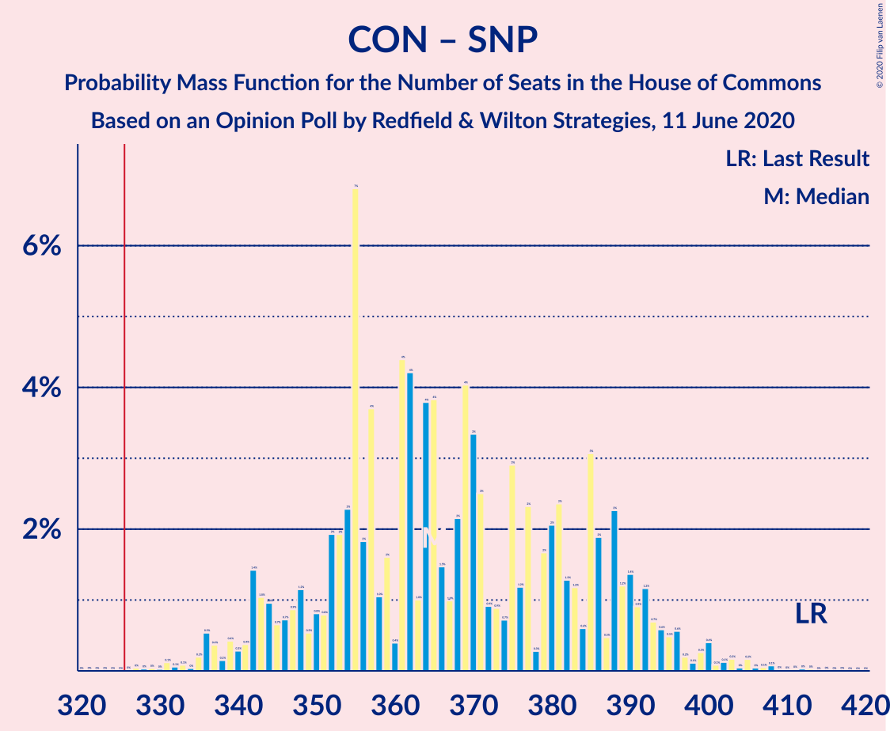

| Number of Seats | Probability | Accumulated | Special Marks |
|:---------------:|:-----------:|:-----------:|:-------------:|
| 325 | 0% | 100% |  |
| 326 | 0% | 99.9% | Majority |
| 327 | 0% | 99.9% |  |
| 328 | 0% | 99.9% |  |
| 329 | 0% | 99.9% |  |
| 330 | 0% | 99.8% |  |
| 331 | 0.1% | 99.8% |  |
| 332 | 0.1% | 99.7% |  |
| 333 | 0.1% | 99.6% |  |
| 334 | 0% | 99.5% |  |
| 335 | 0.2% | 99.5% |  |
| 336 | 0.5% | 99.3% |  |
| 337 | 0.4% | 98.8% |  |
| 338 | 0.2% | 98% |  |
| 339 | 0.4% | 98% |  |
| 340 | 0.3% | 98% |  |
| 341 | 0.4% | 98% |  |
| 342 | 1.4% | 97% |  |
| 343 | 1.0% | 96% |  |
| 344 | 1.0% | 95% |  |
| 345 | 0.7% | 94% |  |
| 346 | 0.7% | 93% |  |
| 347 | 0.9% | 92% |  |
| 348 | 1.2% | 91% |  |
| 349 | 0.5% | 90% |  |
| 350 | 0.8% | 90% |  |
| 351 | 0.8% | 89% |  |
| 352 | 2% | 88% |  |
| 353 | 2% | 86% |  |
| 354 | 2% | 84% |  |
| 355 | 7% | 82% |  |
| 356 | 2% | 75% |  |
| 357 | 4% | 73% |  |
| 358 | 1.0% | 70% |  |
| 359 | 2% | 69% |  |
| 360 | 0.4% | 67% |  |
| 361 | 4% | 67% |  |
| 362 | 4% | 62% |  |
| 363 | 1.0% | 58% |  |
| 364 | 4% | 57% |  |
| 365 | 4% | 53% |  |
| 366 | 1.5% | 49% | Median |
| 367 | 1.0% | 48% |  |
| 368 | 2% | 47% |  |
| 369 | 4% | 45% |  |
| 370 | 3% | 41% |  |
| 371 | 3% | 37% |  |
| 372 | 0.9% | 35% |  |
| 373 | 0.9% | 34% |  |
| 374 | 0.7% | 33% |  |
| 375 | 3% | 32% |  |
| 376 | 1.2% | 29% |  |
| 377 | 2% | 28% |  |
| 378 | 0.3% | 26% |  |
| 379 | 2% | 26% |  |
| 380 | 2% | 24% |  |
| 381 | 2% | 22% |  |
| 382 | 1.3% | 20% |  |
| 383 | 1.2% | 18% |  |
| 384 | 0.6% | 17% |  |
| 385 | 3% | 17% |  |
| 386 | 2% | 13% |  |
| 387 | 0.5% | 12% |  |
| 388 | 2% | 11% |  |
| 389 | 1.2% | 9% |  |
| 390 | 1.4% | 8% |  |
| 391 | 0.9% | 6% |  |
| 392 | 1.2% | 5% |  |
| 393 | 0.7% | 4% |  |
| 394 | 0.6% | 4% |  |
| 395 | 0.5% | 3% |  |
| 396 | 0.6% | 2% |  |
| 397 | 0.2% | 2% |  |
| 398 | 0.1% | 2% |  |
| 399 | 0.3% | 2% |  |
| 400 | 0.4% | 1.3% |  |
| 401 | 0.1% | 0.9% |  |
| 402 | 0.1% | 0.8% |  |
| 403 | 0.2% | 0.7% |  |
| 404 | 0% | 0.5% |  |
| 405 | 0.2% | 0.5% |  |
| 406 | 0% | 0.3% |  |
| 407 | 0.1% | 0.3% |  |
| 408 | 0.1% | 0.2% |  |
| 409 | 0% | 0.1% |  |
| 410 | 0% | 0.1% |  |
| 411 | 0% | 0.1% |  |
| 412 | 0% | 0.1% |  |
| 413 | 0% | 0.1% | Last Result |
| 414 | 0% | 0% |  |

### Labour Party – Liberal Democrats – Scottish National Party – Green Party – Plaid Cymru

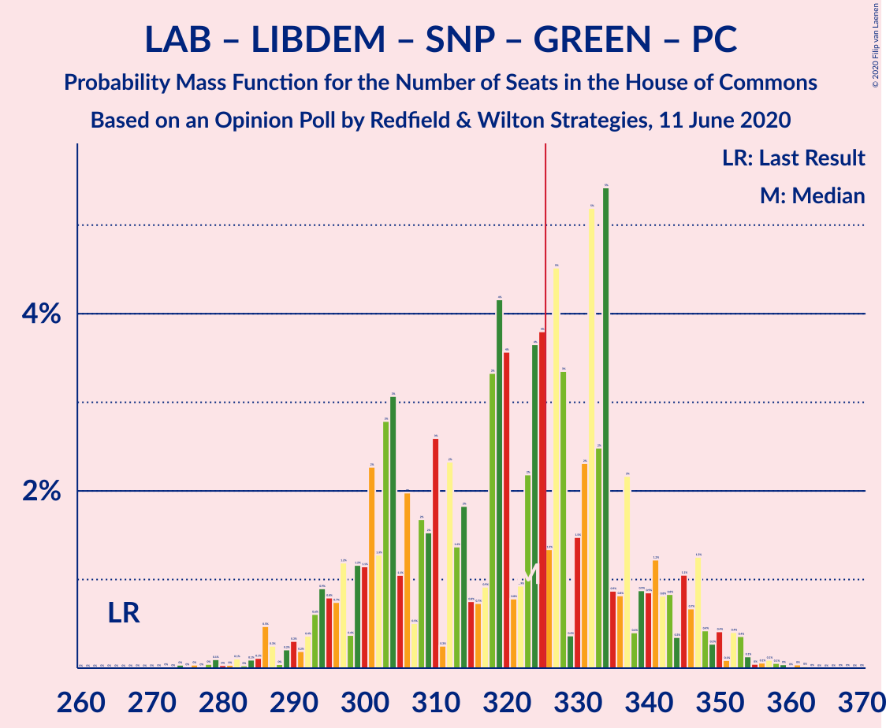

| Number of Seats | Probability | Accumulated | Special Marks |
|:---------------:|:-----------:|:-----------:|:-------------:|
| 266 | 0% | 100% | Last Result |
| 267 | 0% | 100% |  |
| 268 | 0% | 100% |  |
| 269 | 0% | 100% |  |
| 270 | 0% | 100% |  |
| 271 | 0% | 100% |  |
| 272 | 0% | 100% |  |
| 273 | 0% | 100% |  |
| 274 | 0% | 100% |  |
| 275 | 0% | 99.9% |  |
| 276 | 0% | 99.9% |  |
| 277 | 0% | 99.9% |  |
| 278 | 0% | 99.9% |  |
| 279 | 0.1% | 99.8% |  |
| 280 | 0% | 99.7% |  |
| 281 | 0% | 99.7% |  |
| 282 | 0.1% | 99.6% |  |
| 283 | 0% | 99.5% |  |
| 284 | 0.1% | 99.5% |  |
| 285 | 0.1% | 99.4% |  |
| 286 | 0.5% | 99.3% |  |
| 287 | 0.3% | 98.8% |  |
| 288 | 0% | 98.6% |  |
| 289 | 0.2% | 98.5% |  |
| 290 | 0.3% | 98% |  |
| 291 | 0.2% | 98% |  |
| 292 | 0.4% | 98% |  |
| 293 | 0.6% | 97% |  |
| 294 | 0.9% | 97% |  |
| 295 | 0.8% | 96% |  |
| 296 | 0.7% | 95% |  |
| 297 | 1.2% | 94% |  |
| 298 | 0.4% | 93% |  |
| 299 | 1.2% | 93% |  |
| 300 | 1.1% | 92% |  |
| 301 | 2% | 91% |  |
| 302 | 1.3% | 88% |  |
| 303 | 3% | 87% |  |
| 304 | 3% | 84% |  |
| 305 | 1.1% | 81% |  |
| 306 | 2% | 80% |  |
| 307 | 0.5% | 78% |  |
| 308 | 2% | 78% |  |
| 309 | 2% | 76% |  |
| 310 | 3% | 74% |  |
| 311 | 0.3% | 72% |  |
| 312 | 2% | 72% |  |
| 313 | 1.4% | 69% |  |
| 314 | 2% | 68% |  |
| 315 | 0.8% | 66% |  |
| 316 | 0.7% | 65% |  |
| 317 | 0.9% | 65% |  |
| 318 | 3% | 64% |  |
| 319 | 4% | 60% |  |
| 320 | 4% | 56% |  |
| 321 | 0.8% | 53% |  |
| 322 | 0.9% | 52% |  |
| 323 | 2% | 51% |  |
| 324 | 4% | 49% | Median |
| 325 | 4% | 45% |  |
| 326 | 1.3% | 41% | Majority |
| 327 | 5% | 40% |  |
| 328 | 3% | 35% |  |
| 329 | 0.4% | 32% |  |
| 330 | 1.5% | 32% |  |
| 331 | 2% | 30% |  |
| 332 | 5% | 28% |  |
| 333 | 2% | 23% |  |
| 334 | 5% | 20% |  |
| 335 | 0.9% | 15% |  |
| 336 | 0.8% | 14% |  |
| 337 | 2% | 13% |  |
| 338 | 0.4% | 11% |  |
| 339 | 0.9% | 10% |  |
| 340 | 0.9% | 10% |  |
| 341 | 1.2% | 9% |  |
| 342 | 0.8% | 7% |  |
| 343 | 0.8% | 7% |  |
| 344 | 0.3% | 6% |  |
| 345 | 1.1% | 5% |  |
| 346 | 0.7% | 4% |  |
| 347 | 1.3% | 4% |  |
| 348 | 0.4% | 3% |  |
| 349 | 0.3% | 2% |  |
| 350 | 0.4% | 2% |  |
| 351 | 0.1% | 1.4% |  |
| 352 | 0.4% | 1.3% |  |
| 353 | 0.4% | 0.9% |  |
| 354 | 0.1% | 0.6% |  |
| 355 | 0% | 0.4% |  |
| 356 | 0.1% | 0.4% |  |
| 357 | 0.1% | 0.3% |  |
| 358 | 0.1% | 0.2% |  |
| 359 | 0% | 0.2% |  |
| 360 | 0% | 0.1% |  |
| 361 | 0% | 0.1% |  |
| 362 | 0% | 0.1% |  |
| 363 | 0% | 0% |  |

### Labour Party – Liberal Democrats – Scottish National Party – Plaid Cymru

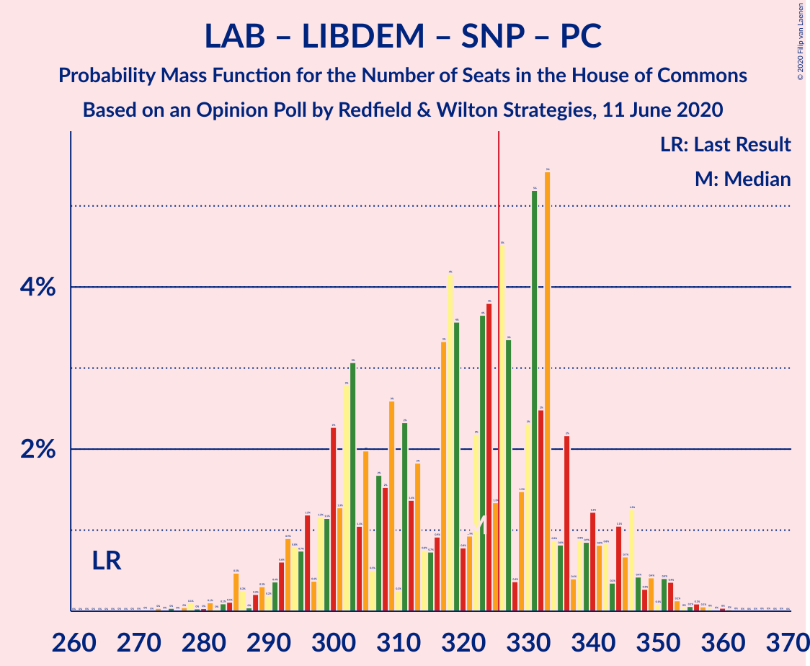

| Number of Seats | Probability | Accumulated | Special Marks |
|:---------------:|:-----------:|:-----------:|:-------------:|
| 265 | 0% | 100% | Last Result |
| 266 | 0% | 100% |  |
| 267 | 0% | 100% |  |
| 268 | 0% | 100% |  |
| 269 | 0% | 100% |  |
| 270 | 0% | 100% |  |
| 271 | 0% | 100% |  |
| 272 | 0% | 100% |  |
| 273 | 0% | 100% |  |
| 274 | 0% | 99.9% |  |
| 275 | 0% | 99.9% |  |
| 276 | 0% | 99.9% |  |
| 277 | 0% | 99.9% |  |
| 278 | 0.1% | 99.8% |  |
| 279 | 0% | 99.7% |  |
| 280 | 0% | 99.7% |  |
| 281 | 0.1% | 99.6% |  |
| 282 | 0% | 99.5% |  |
| 283 | 0.1% | 99.5% |  |
| 284 | 0.1% | 99.4% |  |
| 285 | 0.5% | 99.3% |  |
| 286 | 0.3% | 98.8% |  |
| 287 | 0% | 98.6% |  |
| 288 | 0.2% | 98.5% |  |
| 289 | 0.3% | 98% |  |
| 290 | 0.2% | 98% |  |
| 291 | 0.4% | 98% |  |
| 292 | 0.6% | 97% |  |
| 293 | 0.9% | 97% |  |
| 294 | 0.8% | 96% |  |
| 295 | 0.7% | 95% |  |
| 296 | 1.2% | 94% |  |
| 297 | 0.4% | 93% |  |
| 298 | 1.2% | 93% |  |
| 299 | 1.1% | 92% |  |
| 300 | 2% | 91% |  |
| 301 | 1.3% | 88% |  |
| 302 | 3% | 87% |  |
| 303 | 3% | 84% |  |
| 304 | 1.1% | 81% |  |
| 305 | 2% | 80% |  |
| 306 | 0.5% | 78% |  |
| 307 | 2% | 78% |  |
| 308 | 2% | 76% |  |
| 309 | 3% | 74% |  |
| 310 | 0.3% | 72% |  |
| 311 | 2% | 72% |  |
| 312 | 1.4% | 69% |  |
| 313 | 2% | 68% |  |
| 314 | 0.8% | 66% |  |
| 315 | 0.7% | 65% |  |
| 316 | 0.9% | 65% |  |
| 317 | 3% | 64% |  |
| 318 | 4% | 60% |  |
| 319 | 4% | 56% |  |
| 320 | 0.8% | 53% |  |
| 321 | 0.9% | 52% |  |
| 322 | 2% | 51% |  |
| 323 | 4% | 49% | Median |
| 324 | 4% | 45% |  |
| 325 | 1.3% | 41% |  |
| 326 | 5% | 40% | Majority |
| 327 | 3% | 35% |  |
| 328 | 0.4% | 32% |  |
| 329 | 1.5% | 32% |  |
| 330 | 2% | 30% |  |
| 331 | 5% | 28% |  |
| 332 | 2% | 23% |  |
| 333 | 5% | 20% |  |
| 334 | 0.9% | 15% |  |
| 335 | 0.8% | 14% |  |
| 336 | 2% | 13% |  |
| 337 | 0.4% | 11% |  |
| 338 | 0.9% | 10% |  |
| 339 | 0.9% | 10% |  |
| 340 | 1.2% | 9% |  |
| 341 | 0.8% | 7% |  |
| 342 | 0.8% | 7% |  |
| 343 | 0.3% | 6% |  |
| 344 | 1.1% | 5% |  |
| 345 | 0.7% | 4% |  |
| 346 | 1.3% | 4% |  |
| 347 | 0.4% | 3% |  |
| 348 | 0.3% | 2% |  |
| 349 | 0.4% | 2% |  |
| 350 | 0.1% | 1.4% |  |
| 351 | 0.4% | 1.3% |  |
| 352 | 0.4% | 0.9% |  |
| 353 | 0.1% | 0.6% |  |
| 354 | 0% | 0.4% |  |
| 355 | 0.1% | 0.4% |  |
| 356 | 0.1% | 0.3% |  |
| 357 | 0.1% | 0.2% |  |
| 358 | 0% | 0.2% |  |
| 359 | 0% | 0.1% |  |
| 360 | 0% | 0.1% |  |
| 361 | 0% | 0.1% |  |
| 362 | 0% | 0% |  |

### Conservative Party – Liberal Democrats

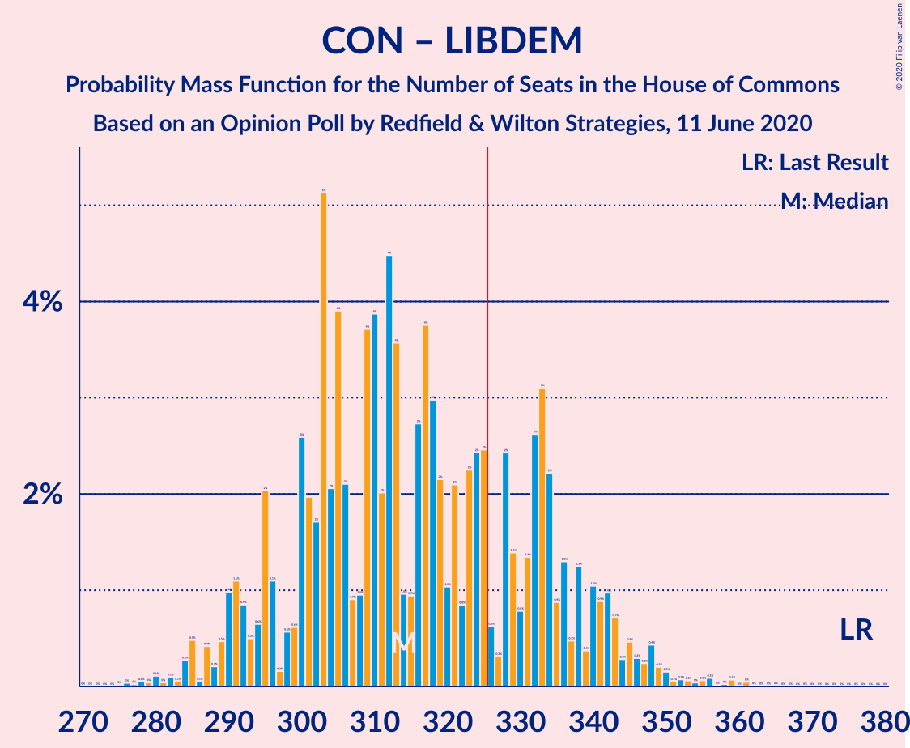

| Number of Seats | Probability | Accumulated | Special Marks |
|:---------------:|:-----------:|:-----------:|:-------------:|
| 276 | 0% | 100% |  |
| 277 | 0% | 99.9% |  |
| 278 | 0.1% | 99.9% |  |
| 279 | 0% | 99.8% |  |
| 280 | 0.1% | 99.8% |  |
| 281 | 0% | 99.7% |  |
| 282 | 0.1% | 99.6% |  |
| 283 | 0.1% | 99.5% |  |
| 284 | 0.3% | 99.5% |  |
| 285 | 0.5% | 99.2% |  |
| 286 | 0.1% | 98.7% |  |
| 287 | 0.4% | 98.7% |  |
| 288 | 0.2% | 98% |  |
| 289 | 0.5% | 98% |  |
| 290 | 1.0% | 98% |  |
| 291 | 1.1% | 97% |  |
| 292 | 0.9% | 96% |  |
| 293 | 0.5% | 95% |  |
| 294 | 0.6% | 94% |  |
| 295 | 2% | 94% |  |
| 296 | 1.1% | 91% |  |
| 297 | 0.2% | 90% |  |
| 298 | 0.6% | 90% |  |
| 299 | 0.6% | 90% |  |
| 300 | 3% | 89% |  |
| 301 | 2% | 86% |  |
| 302 | 2% | 84% |  |
| 303 | 5% | 83% |  |
| 304 | 2% | 78% |  |
| 305 | 4% | 76% |  |
| 306 | 2% | 72% |  |
| 307 | 0.9% | 70% |  |
| 308 | 1.0% | 69% |  |
| 309 | 4% | 68% |  |
| 310 | 4% | 64% |  |
| 311 | 2% | 60% |  |
| 312 | 4% | 58% |  |
| 313 | 4% | 54% |  |
| 314 | 1.0% | 50% | Median |
| 315 | 0.9% | 49% |  |
| 316 | 3% | 48% |  |
| 317 | 4% | 45% |  |
| 318 | 3% | 42% |  |
| 319 | 2% | 39% |  |
| 320 | 1.0% | 37% |  |
| 321 | 2% | 35% |  |
| 322 | 0.8% | 33% |  |
| 323 | 2% | 33% |  |
| 324 | 2% | 30% |  |
| 325 | 2% | 28% |  |
| 326 | 0.6% | 25% | Majority |
| 327 | 0.3% | 25% |  |
| 328 | 2% | 24% |  |
| 329 | 1.4% | 22% |  |
| 330 | 0.8% | 21% |  |
| 331 | 1.3% | 20% |  |
| 332 | 3% | 18% |  |
| 333 | 3% | 16% |  |
| 334 | 2% | 13% |  |
| 335 | 0.9% | 11% |  |
| 336 | 1.3% | 10% |  |
| 337 | 0.5% | 8% |  |
| 338 | 1.3% | 8% |  |
| 339 | 0.4% | 7% |  |
| 340 | 1.0% | 6% |  |
| 341 | 0.9% | 5% |  |
| 342 | 1.0% | 4% |  |
| 343 | 0.7% | 3% |  |
| 344 | 0.3% | 3% |  |
| 345 | 0.5% | 2% |  |
| 346 | 0.3% | 2% |  |
| 347 | 0.2% | 2% |  |
| 348 | 0.4% | 1.4% |  |
| 349 | 0.2% | 0.9% |  |
| 350 | 0.2% | 0.7% |  |
| 351 | 0.1% | 0.6% |  |
| 352 | 0.1% | 0.5% |  |
| 353 | 0.1% | 0.5% |  |
| 354 | 0% | 0.4% |  |
| 355 | 0.1% | 0.3% |  |
| 356 | 0.1% | 0.3% |  |
| 357 | 0% | 0.2% |  |
| 358 | 0% | 0.2% |  |
| 359 | 0.1% | 0.2% |  |
| 360 | 0% | 0.1% |  |
| 361 | 0% | 0.1% |  |
| 362 | 0% | 0% |  |
| 363 | 0% | 0% |  |
| 364 | 0% | 0% |  |
| 365 | 0% | 0% |  |
| 366 | 0% | 0% |  |
| 367 | 0% | 0% |  |
| 368 | 0% | 0% |  |
| 369 | 0% | 0% |  |
| 370 | 0% | 0% |  |
| 371 | 0% | 0% |  |
| 372 | 0% | 0% |  |
| 373 | 0% | 0% |  |
| 374 | 0% | 0% |  |
| 375 | 0% | 0% |  |
| 376 | 0% | 0% | Last Result |

### Labour Party – Liberal Democrats – Scottish National Party

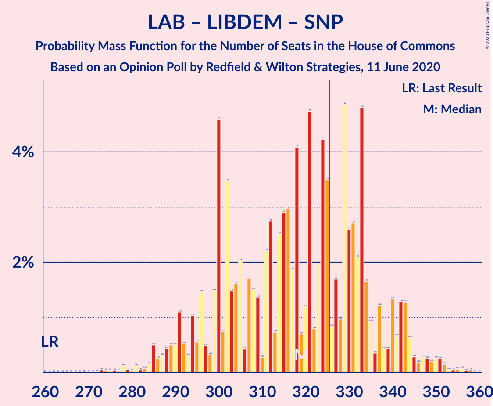

| Number of Seats | Probability | Accumulated | Special Marks |
|:---------------:|:-----------:|:-----------:|:-------------:|
| 261 | 0% | 100% | Last Result |
| 262 | 0% | 100% |  |
| 263 | 0% | 100% |  |
| 264 | 0% | 100% |  |
| 265 | 0% | 100% |  |
| 266 | 0% | 100% |  |
| 267 | 0% | 100% |  |
| 268 | 0% | 100% |  |
| 269 | 0% | 100% |  |
| 270 | 0% | 100% |  |
| 271 | 0% | 100% |  |
| 272 | 0% | 100% |  |
| 273 | 0% | 99.9% |  |
| 274 | 0% | 99.9% |  |
| 275 | 0% | 99.9% |  |
| 276 | 0% | 99.8% |  |
| 277 | 0% | 99.8% |  |
| 278 | 0.1% | 99.8% |  |
| 279 | 0.1% | 99.6% |  |
| 280 | 0% | 99.6% |  |
| 281 | 0.1% | 99.5% |  |
| 282 | 0% | 99.4% |  |
| 283 | 0.1% | 99.4% |  |
| 284 | 0.2% | 99.3% |  |
| 285 | 0.5% | 99.2% |  |
| 286 | 0.3% | 98.7% |  |
| 287 | 0.3% | 98% |  |
| 288 | 0.4% | 98% |  |
| 289 | 0.5% | 98% |  |
| 290 | 0.5% | 97% |  |
| 291 | 1.1% | 97% |  |
| 292 | 0.5% | 96% |  |
| 293 | 0.3% | 95% |  |
| 294 | 1.0% | 95% |  |
| 295 | 0.6% | 94% |  |
| 296 | 1.5% | 93% |  |
| 297 | 0.5% | 92% |  |
| 298 | 0.3% | 91% |  |
| 299 | 1.5% | 91% |  |
| 300 | 5% | 89% |  |
| 301 | 0.7% | 85% |  |
| 302 | 3% | 84% |  |
| 303 | 1.5% | 81% |  |
| 304 | 2% | 79% |  |
| 305 | 2% | 77% |  |
| 306 | 0.4% | 75% |  |
| 307 | 2% | 75% |  |
| 308 | 1.5% | 73% |  |
| 309 | 1.4% | 72% |  |
| 310 | 0.3% | 70% |  |
| 311 | 2% | 70% |  |
| 312 | 3% | 68% |  |
| 313 | 0.7% | 65% |  |
| 314 | 3% | 64% |  |
| 315 | 3% | 62% |  |
| 316 | 3% | 59% |  |
| 317 | 2% | 56% |  |
| 318 | 4% | 54% |  |
| 319 | 0.7% | 50% |  |
| 320 | 1.2% | 49% |  |
| 321 | 5% | 48% | Median |
| 322 | 0.8% | 44% |  |
| 323 | 2% | 43% |  |
| 324 | 4% | 41% |  |
| 325 | 3% | 37% |  |
| 326 | 0.8% | 33% | Majority |
| 327 | 2% | 32% |  |
| 328 | 1.0% | 31% |  |
| 329 | 5% | 30% |  |
| 330 | 3% | 25% |  |
| 331 | 3% | 22% |  |
| 332 | 2% | 19% |  |
| 333 | 5% | 17% |  |
| 334 | 2% | 12% |  |
| 335 | 0.9% | 11% |  |
| 336 | 0.4% | 10% |  |
| 337 | 1.2% | 10% |  |
| 338 | 0.4% | 8% |  |
| 339 | 0.4% | 8% |  |
| 340 | 1.3% | 7% |  |
| 341 | 0.7% | 6% |  |
| 342 | 1.3% | 5% |  |
| 343 | 1.3% | 4% |  |
| 344 | 0.6% | 3% |  |
| 345 | 0.3% | 2% |  |
| 346 | 0.2% | 2% |  |
| 347 | 0.3% | 2% |  |
| 348 | 0.3% | 2% |  |
| 349 | 0.2% | 1.2% |  |
| 350 | 0.3% | 1.0% |  |
| 351 | 0.3% | 0.8% |  |
| 352 | 0.2% | 0.5% |  |
| 353 | 0.1% | 0.4% |  |
| 354 | 0% | 0.3% |  |
| 355 | 0.1% | 0.3% |  |
| 356 | 0.1% | 0.2% |  |
| 357 | 0% | 0.1% |  |
| 358 | 0% | 0.1% |  |
| 359 | 0% | 0.1% |  |
| 360 | 0% | 0% |  |

### Conservative Party – Plaid Cymru

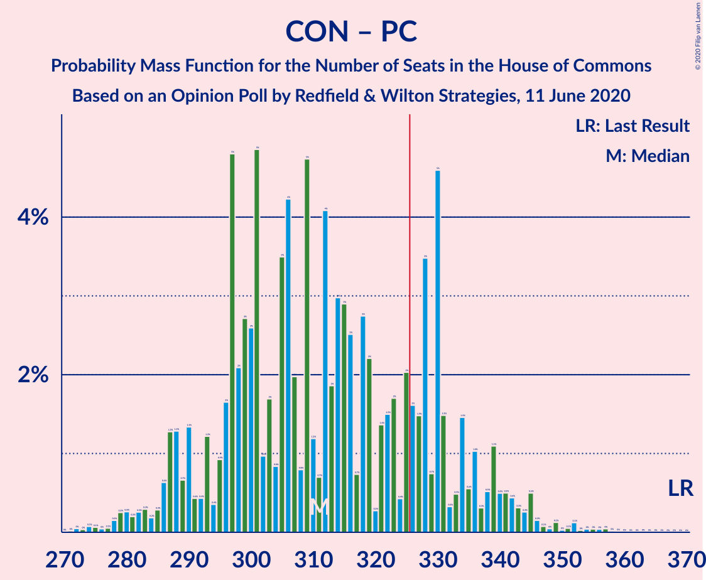

| Number of Seats | Probability | Accumulated | Special Marks |
|:---------------:|:-----------:|:-----------:|:-------------:|
| 271 | 0% | 100% |  |
| 272 | 0% | 99.9% |  |
| 273 | 0% | 99.9% |  |
| 274 | 0.1% | 99.9% |  |
| 275 | 0.1% | 99.8% |  |
| 276 | 0% | 99.7% |  |
| 277 | 0.1% | 99.7% |  |
| 278 | 0.2% | 99.6% |  |
| 279 | 0.3% | 99.5% |  |
| 280 | 0.3% | 99.2% |  |
| 281 | 0.2% | 99.0% |  |
| 282 | 0.3% | 98.8% |  |
| 283 | 0.3% | 98% |  |
| 284 | 0.2% | 98% |  |
| 285 | 0.3% | 98% |  |
| 286 | 0.6% | 98% |  |
| 287 | 1.3% | 97% |  |
| 288 | 1.3% | 96% |  |
| 289 | 0.7% | 95% |  |
| 290 | 1.3% | 94% |  |
| 291 | 0.4% | 93% |  |
| 292 | 0.4% | 92% |  |
| 293 | 1.2% | 92% |  |
| 294 | 0.4% | 90% |  |
| 295 | 0.9% | 90% |  |
| 296 | 2% | 89% |  |
| 297 | 5% | 88% |  |
| 298 | 2% | 83% |  |
| 299 | 3% | 81% |  |
| 300 | 3% | 78% |  |
| 301 | 5% | 75% |  |
| 302 | 1.0% | 70% |  |
| 303 | 2% | 69% |  |
| 304 | 0.8% | 68% |  |
| 305 | 3% | 67% |  |
| 306 | 4% | 63% |  |
| 307 | 2% | 59% |  |
| 308 | 0.8% | 57% |  |
| 309 | 5% | 56% |  |
| 310 | 1.2% | 52% | Median |
| 311 | 0.7% | 51% |  |
| 312 | 4% | 50% |  |
| 313 | 2% | 46% |  |
| 314 | 3% | 44% |  |
| 315 | 3% | 41% |  |
| 316 | 3% | 38% |  |
| 317 | 0.7% | 36% |  |
| 318 | 3% | 35% |  |
| 319 | 2% | 32% |  |
| 320 | 0.3% | 30% |  |
| 321 | 1.4% | 30% |  |
| 322 | 1.5% | 28% |  |
| 323 | 2% | 27% |  |
| 324 | 0.4% | 25% |  |
| 325 | 2% | 25% |  |
| 326 | 2% | 23% | Majority |
| 327 | 1.5% | 21% |  |
| 328 | 3% | 19% |  |
| 329 | 0.7% | 16% |  |
| 330 | 5% | 15% |  |
| 331 | 1.5% | 11% |  |
| 332 | 0.3% | 9% |  |
| 333 | 0.5% | 9% |  |
| 334 | 1.5% | 8% |  |
| 335 | 0.6% | 7% |  |
| 336 | 1.0% | 6% |  |
| 337 | 0.3% | 5% |  |
| 338 | 0.5% | 5% |  |
| 339 | 1.1% | 4% |  |
| 340 | 0.5% | 3% |  |
| 341 | 0.5% | 3% |  |
| 342 | 0.4% | 2% |  |
| 343 | 0.3% | 2% |  |
| 344 | 0.3% | 2% |  |
| 345 | 0.5% | 1.3% |  |
| 346 | 0.2% | 0.8% |  |
| 347 | 0.1% | 0.7% |  |
| 348 | 0% | 0.6% |  |
| 349 | 0.1% | 0.6% |  |
| 350 | 0% | 0.5% |  |
| 351 | 0.1% | 0.4% |  |
| 352 | 0.1% | 0.4% |  |
| 353 | 0% | 0.2% |  |
| 354 | 0% | 0.2% |  |
| 355 | 0% | 0.2% |  |
| 356 | 0% | 0.1% |  |
| 357 | 0% | 0.1% |  |
| 358 | 0% | 0.1% |  |
| 359 | 0% | 0% |  |
| 360 | 0% | 0% |  |
| 361 | 0% | 0% |  |
| 362 | 0% | 0% |  |
| 363 | 0% | 0% |  |
| 364 | 0% | 0% |  |
| 365 | 0% | 0% |  |
| 366 | 0% | 0% |  |
| 367 | 0% | 0% |  |
| 368 | 0% | 0% |  |
| 369 | 0% | 0% | Last Result |

### Labour Party – Scottish National Party – Plaid Cymru

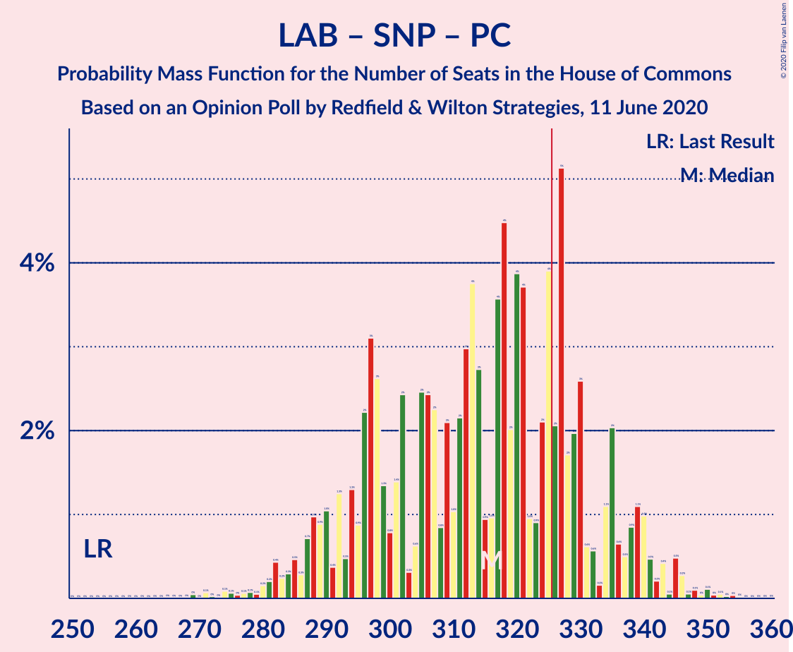

| Number of Seats | Probability | Accumulated | Special Marks |
|:---------------:|:-----------:|:-----------:|:-------------:|
| 254 | 0% | 100% | Last Result |
| 255 | 0% | 100% |  |
| 256 | 0% | 100% |  |
| 257 | 0% | 100% |  |
| 258 | 0% | 100% |  |
| 259 | 0% | 100% |  |
| 260 | 0% | 100% |  |
| 261 | 0% | 100% |  |
| 262 | 0% | 100% |  |
| 263 | 0% | 100% |  |
| 264 | 0% | 100% |  |
| 265 | 0% | 100% |  |
| 266 | 0% | 100% |  |
| 267 | 0% | 100% |  |
| 268 | 0% | 100% |  |
| 269 | 0% | 100% |  |
| 270 | 0% | 99.9% |  |
| 271 | 0.1% | 99.9% |  |
| 272 | 0% | 99.8% |  |
| 273 | 0% | 99.8% |  |
| 274 | 0.1% | 99.8% |  |
| 275 | 0.1% | 99.7% |  |
| 276 | 0% | 99.7% |  |
| 277 | 0.1% | 99.6% |  |
| 278 | 0.1% | 99.5% |  |
| 279 | 0.1% | 99.5% |  |
| 280 | 0.2% | 99.4% |  |
| 281 | 0.2% | 99.3% |  |
| 282 | 0.4% | 99.1% |  |
| 283 | 0.2% | 98.6% |  |
| 284 | 0.3% | 98% |  |
| 285 | 0.5% | 98% |  |
| 286 | 0.3% | 98% |  |
| 287 | 0.7% | 97% |  |
| 288 | 1.0% | 97% |  |
| 289 | 0.9% | 96% |  |
| 290 | 1.0% | 95% |  |
| 291 | 0.4% | 94% |  |
| 292 | 1.3% | 93% |  |
| 293 | 0.5% | 92% |  |
| 294 | 1.3% | 92% |  |
| 295 | 0.9% | 90% |  |
| 296 | 2% | 89% |  |
| 297 | 3% | 87% |  |
| 298 | 3% | 84% |  |
| 299 | 1.3% | 82% |  |
| 300 | 0.8% | 80% |  |
| 301 | 1.4% | 79% |  |
| 302 | 2% | 78% |  |
| 303 | 0.3% | 76% |  |
| 304 | 0.6% | 75% |  |
| 305 | 2% | 75% |  |
| 306 | 2% | 72% |  |
| 307 | 2% | 70% |  |
| 308 | 0.8% | 67% |  |
| 309 | 2% | 67% |  |
| 310 | 1.0% | 65% |  |
| 311 | 2% | 63% |  |
| 312 | 3% | 61% |  |
| 313 | 4% | 58% |  |
| 314 | 3% | 55% |  |
| 315 | 0.9% | 52% |  |
| 316 | 1.0% | 51% |  |
| 317 | 4% | 50% | Median |
| 318 | 4% | 46% |  |
| 319 | 2% | 42% |  |
| 320 | 4% | 40% |  |
| 321 | 4% | 36% |  |
| 322 | 1.0% | 32% |  |
| 323 | 0.9% | 31% |  |
| 324 | 2% | 30% |  |
| 325 | 4% | 28% |  |
| 326 | 2% | 24% | Majority |
| 327 | 5% | 22% |  |
| 328 | 2% | 17% |  |
| 329 | 2% | 16% |  |
| 330 | 3% | 14% |  |
| 331 | 0.6% | 11% |  |
| 332 | 0.6% | 10% |  |
| 333 | 0.2% | 10% |  |
| 334 | 1.1% | 10% |  |
| 335 | 2% | 9% |  |
| 336 | 0.6% | 6% |  |
| 337 | 0.5% | 6% |  |
| 338 | 0.9% | 5% |  |
| 339 | 1.1% | 4% |  |
| 340 | 1.0% | 3% |  |
| 341 | 0.5% | 2% |  |
| 342 | 0.2% | 2% |  |
| 343 | 0.4% | 2% |  |
| 344 | 0.1% | 1.3% |  |
| 345 | 0.5% | 1.3% |  |
| 346 | 0.3% | 0.8% |  |
| 347 | 0.1% | 0.5% |  |
| 348 | 0.1% | 0.5% |  |
| 349 | 0% | 0.4% |  |
| 350 | 0.1% | 0.3% |  |
| 351 | 0% | 0.2% |  |
| 352 | 0.1% | 0.2% |  |
| 353 | 0% | 0.1% |  |
| 354 | 0% | 0.1% |  |
| 355 | 0% | 0% |  |

### Conservative Party

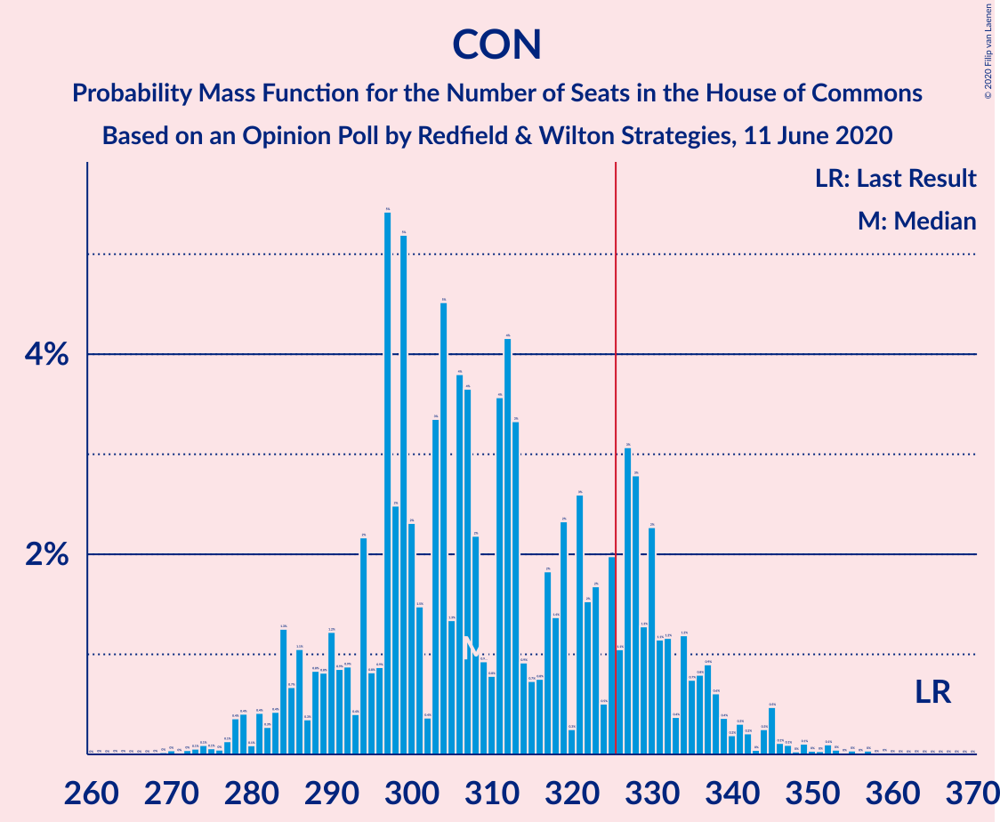

| Number of Seats | Probability | Accumulated | Special Marks |
|:---------------:|:-----------:|:-----------:|:-------------:|
| 269 | 0% | 100% |  |
| 270 | 0% | 99.9% |  |
| 271 | 0% | 99.9% |  |
| 272 | 0% | 99.9% |  |
| 273 | 0.1% | 99.8% |  |
| 274 | 0.1% | 99.8% |  |
| 275 | 0.1% | 99.7% |  |
| 276 | 0% | 99.6% |  |
| 277 | 0.1% | 99.6% |  |
| 278 | 0.4% | 99.4% |  |
| 279 | 0.4% | 99.1% |  |
| 280 | 0.1% | 98.7% |  |
| 281 | 0.4% | 98.6% |  |
| 282 | 0.3% | 98% |  |
| 283 | 0.4% | 98% |  |
| 284 | 1.3% | 97% |  |
| 285 | 0.7% | 96% |  |
| 286 | 1.1% | 96% |  |
| 287 | 0.3% | 95% |  |
| 288 | 0.8% | 94% |  |
| 289 | 0.8% | 93% |  |
| 290 | 1.2% | 93% |  |
| 291 | 0.9% | 91% |  |
| 292 | 0.9% | 90% |  |
| 293 | 0.4% | 90% |  |
| 294 | 2% | 89% |  |
| 295 | 0.8% | 87% |  |
| 296 | 0.9% | 86% |  |
| 297 | 5% | 85% |  |
| 298 | 2% | 80% |  |
| 299 | 5% | 77% |  |
| 300 | 2% | 72% |  |
| 301 | 1.5% | 70% |  |
| 302 | 0.4% | 68% |  |
| 303 | 3% | 68% |  |
| 304 | 5% | 65% |  |
| 305 | 1.3% | 60% |  |
| 306 | 4% | 59% |  |
| 307 | 4% | 55% |  |
| 308 | 2% | 51% | Median |
| 309 | 0.9% | 49% |  |
| 310 | 0.8% | 48% |  |
| 311 | 4% | 47% |  |
| 312 | 4% | 44% |  |
| 313 | 3% | 40% |  |
| 314 | 0.9% | 36% |  |
| 315 | 0.7% | 35% |  |
| 316 | 0.8% | 35% |  |
| 317 | 2% | 34% |  |
| 318 | 1.4% | 32% |  |
| 319 | 2% | 31% |  |
| 320 | 0.3% | 28% |  |
| 321 | 3% | 28% |  |
| 322 | 2% | 26% |  |
| 323 | 2% | 24% |  |
| 324 | 0.5% | 22% |  |
| 325 | 2% | 22% |  |
| 326 | 1.1% | 20% | Majority |
| 327 | 3% | 19% |  |
| 328 | 3% | 16% |  |
| 329 | 1.3% | 13% |  |
| 330 | 2% | 12% |  |
| 331 | 1.1% | 9% |  |
| 332 | 1.2% | 8% |  |
| 333 | 0.4% | 7% |  |
| 334 | 1.2% | 7% |  |
| 335 | 0.7% | 6% |  |
| 336 | 0.8% | 5% |  |
| 337 | 0.9% | 4% |  |
| 338 | 0.6% | 3% |  |
| 339 | 0.4% | 3% |  |
| 340 | 0.2% | 2% |  |
| 341 | 0.3% | 2% |  |
| 342 | 0.2% | 2% |  |
| 343 | 0% | 1.5% |  |
| 344 | 0.3% | 1.4% |  |
| 345 | 0.5% | 1.2% |  |
| 346 | 0.1% | 0.7% |  |
| 347 | 0.1% | 0.6% |  |
| 348 | 0% | 0.5% |  |
| 349 | 0.1% | 0.5% |  |
| 350 | 0% | 0.4% |  |
| 351 | 0% | 0.3% |  |
| 352 | 0.1% | 0.3% |  |
| 353 | 0% | 0.2% |  |
| 354 | 0% | 0.1% |  |
| 355 | 0% | 0.1% |  |
| 356 | 0% | 0.1% |  |
| 357 | 0% | 0.1% |  |
| 358 | 0% | 0% |  |
| 359 | 0% | 0% |  |
| 360 | 0% | 0% |  |
| 361 | 0% | 0% |  |
| 362 | 0% | 0% |  |
| 363 | 0% | 0% |  |
| 364 | 0% | 0% |  |
| 365 | 0% | 0% | Last Result |

### Labour Party – Scottish National Party

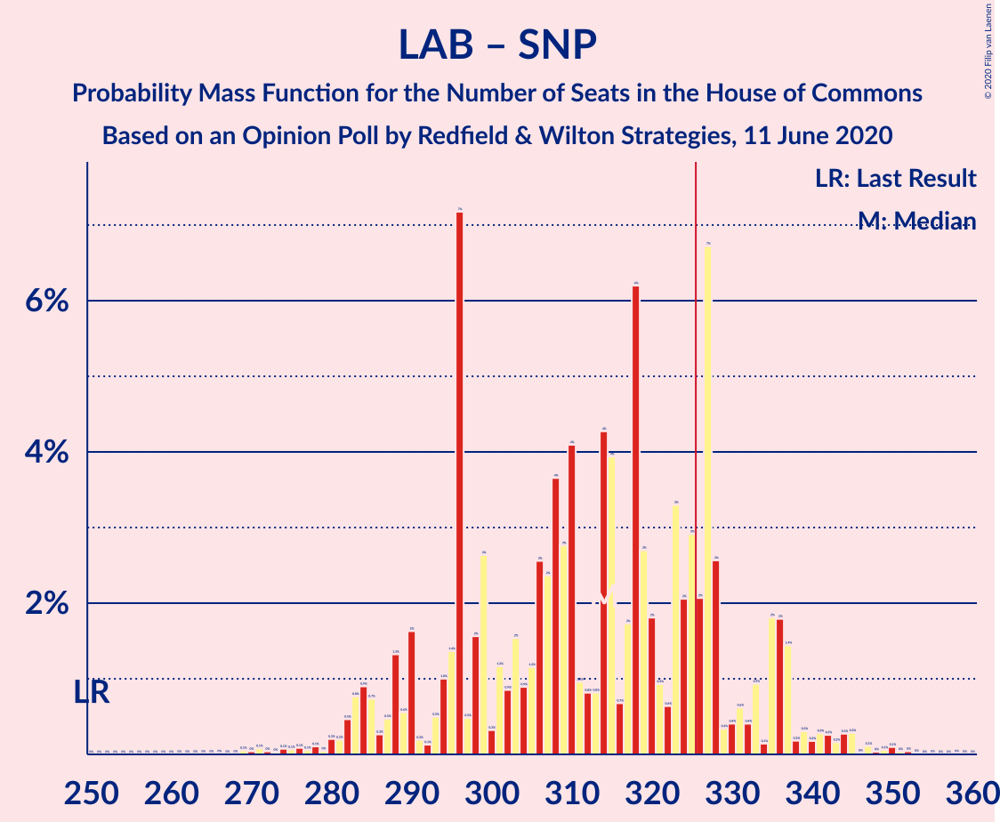

| Number of Seats | Probability | Accumulated | Special Marks |
|:---------------:|:-----------:|:-----------:|:-------------:|
| 250 | 0% | 100% | Last Result |
| 251 | 0% | 100% |  |
| 252 | 0% | 100% |  |
| 253 | 0% | 100% |  |
| 254 | 0% | 100% |  |
| 255 | 0% | 100% |  |
| 256 | 0% | 100% |  |
| 257 | 0% | 100% |  |
| 258 | 0% | 100% |  |
| 259 | 0% | 100% |  |
| 260 | 0% | 100% |  |
| 261 | 0% | 100% |  |
| 262 | 0% | 100% |  |
| 263 | 0% | 100% |  |
| 264 | 0% | 100% |  |
| 265 | 0% | 100% |  |
| 266 | 0% | 100% |  |
| 267 | 0% | 100% |  |
| 268 | 0% | 100% |  |
| 269 | 0.1% | 100% |  |
| 270 | 0% | 99.9% |  |
| 271 | 0.1% | 99.9% |  |
| 272 | 0% | 99.8% |  |
| 273 | 0% | 99.7% |  |
| 274 | 0.1% | 99.7% |  |
| 275 | 0.1% | 99.6% |  |
| 276 | 0.1% | 99.6% |  |
| 277 | 0.1% | 99.5% |  |
| 278 | 0.1% | 99.4% |  |
| 279 | 0% | 99.3% |  |
| 280 | 0.2% | 99.3% |  |
| 281 | 0.2% | 99.1% |  |
| 282 | 0.5% | 98.9% |  |
| 283 | 0.8% | 98% |  |
| 284 | 0.9% | 98% |  |
| 285 | 0.7% | 97% |  |
| 286 | 0.3% | 96% |  |
| 287 | 0.5% | 96% |  |
| 288 | 1.3% | 95% |  |
| 289 | 0.6% | 94% |  |
| 290 | 2% | 93% |  |
| 291 | 0.2% | 92% |  |
| 292 | 0.1% | 92% |  |
| 293 | 0.5% | 91% |  |
| 294 | 1.0% | 91% |  |
| 295 | 1.4% | 90% |  |
| 296 | 7% | 89% |  |
| 297 | 0.5% | 81% |  |
| 298 | 2% | 81% |  |
| 299 | 3% | 79% |  |
| 300 | 0.3% | 77% |  |
| 301 | 1.2% | 76% |  |
| 302 | 0.9% | 75% |  |
| 303 | 2% | 74% |  |
| 304 | 0.9% | 73% |  |
| 305 | 1.2% | 72% |  |
| 306 | 3% | 71% |  |
| 307 | 2% | 68% |  |
| 308 | 4% | 66% |  |
| 309 | 3% | 62% |  |
| 310 | 4% | 59% |  |
| 311 | 1.0% | 55% |  |
| 312 | 0.8% | 54% |  |
| 313 | 0.8% | 54% |  |
| 314 | 4% | 53% |  |
| 315 | 4% | 49% | Median |
| 316 | 0.7% | 45% |  |
| 317 | 2% | 44% |  |
| 318 | 6% | 42% |  |
| 319 | 3% | 36% |  |
| 320 | 2% | 33% |  |
| 321 | 0.9% | 31% |  |
| 322 | 0.6% | 31% |  |
| 323 | 3% | 30% |  |
| 324 | 2% | 27% |  |
| 325 | 3% | 25% |  |
| 326 | 2% | 22% | Majority |
| 327 | 7% | 20% |  |
| 328 | 3% | 13% |  |
| 329 | 0.3% | 10% |  |
| 330 | 0.4% | 10% |  |
| 331 | 0.6% | 10% |  |
| 332 | 0.4% | 9% |  |
| 333 | 0.9% | 8% |  |
| 334 | 0.1% | 8% |  |
| 335 | 2% | 7% |  |
| 336 | 2% | 6% |  |
| 337 | 1.4% | 4% |  |
| 338 | 0.2% | 2% |  |
| 339 | 0.3% | 2% |  |
| 340 | 0.2% | 2% |  |
| 341 | 0.3% | 2% |  |
| 342 | 0.3% | 1.4% |  |
| 343 | 0.2% | 1.2% |  |
| 344 | 0.3% | 1.0% |  |
| 345 | 0.3% | 0.7% |  |
| 346 | 0% | 0.4% |  |
| 347 | 0.1% | 0.4% |  |
| 348 | 0% | 0.3% |  |
| 349 | 0.1% | 0.3% |  |
| 350 | 0.1% | 0.2% |  |
| 351 | 0% | 0.1% |  |
| 352 | 0% | 0.1% |  |
| 353 | 0% | 0% |  |

### Labour Party – Liberal Democrats – Plaid Cymru

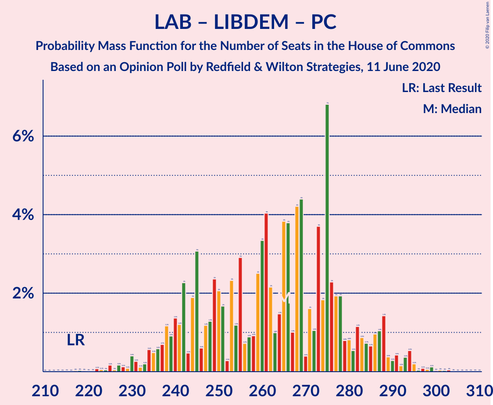

| Number of Seats | Probability | Accumulated | Special Marks |
|:---------------:|:-----------:|:-----------:|:-------------:|
| 217 | 0% | 100% | Last Result |
| 218 | 0% | 99.9% |  |
| 219 | 0% | 99.9% |  |
| 220 | 0% | 99.9% |  |
| 221 | 0% | 99.9% |  |
| 222 | 0.1% | 99.9% |  |
| 223 | 0.1% | 99.8% |  |
| 224 | 0% | 99.7% |  |
| 225 | 0.2% | 99.7% |  |
| 226 | 0% | 99.5% |  |
| 227 | 0.2% | 99.5% |  |
| 228 | 0.1% | 99.3% |  |
| 229 | 0.1% | 99.2% |  |
| 230 | 0.4% | 99.1% |  |
| 231 | 0.3% | 98.7% |  |
| 232 | 0.1% | 98% |  |
| 233 | 0.2% | 98% |  |
| 234 | 0.6% | 98% |  |
| 235 | 0.5% | 98% |  |
| 236 | 0.6% | 97% |  |
| 237 | 0.7% | 96% |  |
| 238 | 1.2% | 96% |  |
| 239 | 0.9% | 95% |  |
| 240 | 1.4% | 94% |  |
| 241 | 1.2% | 92% |  |
| 242 | 2% | 91% |  |
| 243 | 0.5% | 89% |  |
| 244 | 2% | 88% |  |
| 245 | 3% | 87% |  |
| 246 | 0.6% | 83% |  |
| 247 | 1.2% | 83% |  |
| 248 | 1.3% | 82% |  |
| 249 | 2% | 80% |  |
| 250 | 2% | 78% |  |
| 251 | 2% | 76% |  |
| 252 | 0.3% | 74% |  |
| 253 | 2% | 74% |  |
| 254 | 1.2% | 72% |  |
| 255 | 3% | 71% |  |
| 256 | 0.7% | 68% |  |
| 257 | 0.9% | 67% |  |
| 258 | 0.9% | 66% |  |
| 259 | 3% | 65% |  |
| 260 | 3% | 63% |  |
| 261 | 4% | 59% |  |
| 262 | 2% | 55% |  |
| 263 | 1.0% | 53% |  |
| 264 | 1.5% | 52% |  |
| 265 | 4% | 51% | Median |
| 266 | 4% | 47% |  |
| 267 | 1.0% | 43% |  |
| 268 | 4% | 42% |  |
| 269 | 4% | 38% |  |
| 270 | 0.4% | 33% |  |
| 271 | 2% | 33% |  |
| 272 | 1.0% | 31% |  |
| 273 | 4% | 30% |  |
| 274 | 2% | 27% |  |
| 275 | 7% | 25% |  |
| 276 | 2% | 18% |  |
| 277 | 2% | 16% |  |
| 278 | 2% | 14% |  |
| 279 | 0.8% | 12% |  |
| 280 | 0.8% | 11% |  |
| 281 | 0.5% | 10% |  |
| 282 | 1.2% | 10% |  |
| 283 | 0.9% | 9% |  |
| 284 | 0.7% | 8% |  |
| 285 | 0.7% | 7% |  |
| 286 | 1.0% | 6% |  |
| 287 | 1.0% | 5% |  |
| 288 | 1.4% | 4% |  |
| 289 | 0.4% | 3% |  |
| 290 | 0.3% | 2% |  |
| 291 | 0.4% | 2% |  |
| 292 | 0.2% | 2% |  |
| 293 | 0.4% | 2% |  |
| 294 | 0.5% | 1.2% |  |
| 295 | 0.2% | 0.7% |  |
| 296 | 0% | 0.5% |  |
| 297 | 0.1% | 0.5% |  |
| 298 | 0.1% | 0.4% |  |
| 299 | 0.1% | 0.3% |  |
| 300 | 0% | 0.2% |  |
| 301 | 0% | 0.2% |  |
| 302 | 0% | 0.1% |  |
| 303 | 0% | 0.1% |  |
| 304 | 0% | 0.1% |  |
| 305 | 0% | 0.1% |  |
| 306 | 0% | 0% |  |

### Labour Party – Liberal Democrats

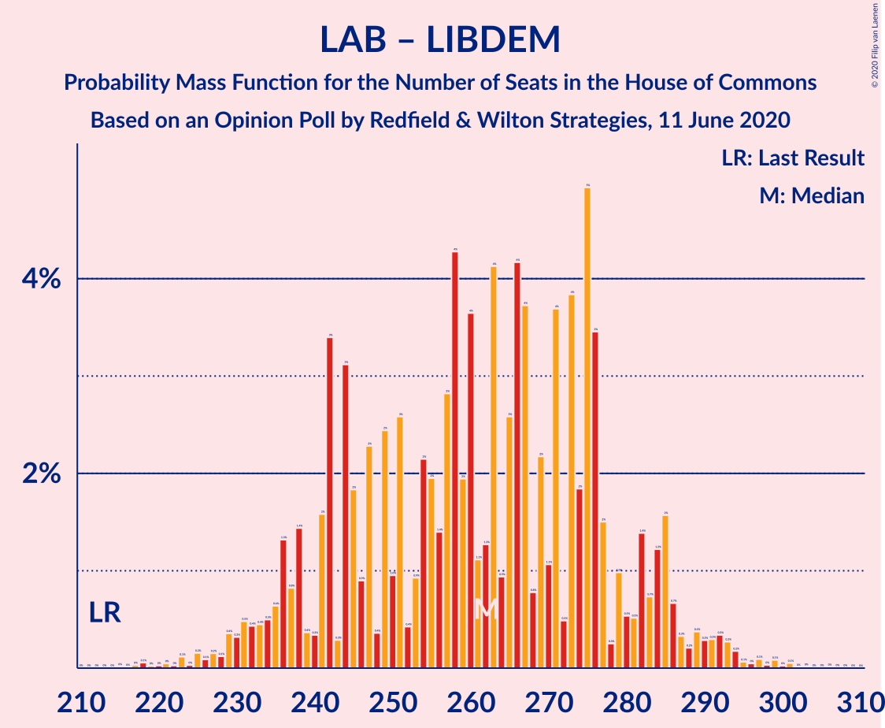

| Number of Seats | Probability | Accumulated | Special Marks |
|:---------------:|:-----------:|:-----------:|:-------------:|
| 213 | 0% | 100% | Last Result |
| 214 | 0% | 100% |  |
| 215 | 0% | 100% |  |
| 216 | 0% | 100% |  |
| 217 | 0% | 99.9% |  |
| 218 | 0.1% | 99.9% |  |
| 219 | 0% | 99.9% |  |
| 220 | 0% | 99.8% |  |
| 221 | 0% | 99.8% |  |
| 222 | 0% | 99.8% |  |
| 223 | 0.1% | 99.7% |  |
| 224 | 0% | 99.6% |  |
| 225 | 0.2% | 99.6% |  |
| 226 | 0.1% | 99.4% |  |
| 227 | 0.2% | 99.3% |  |
| 228 | 0.1% | 99.2% |  |
| 229 | 0.4% | 99.1% |  |
| 230 | 0.3% | 98.7% |  |
| 231 | 0.5% | 98% |  |
| 232 | 0.4% | 98% |  |
| 233 | 0.4% | 97% |  |
| 234 | 0.5% | 97% |  |
| 235 | 0.6% | 97% |  |
| 236 | 1.3% | 96% |  |
| 237 | 0.8% | 95% |  |
| 238 | 1.4% | 94% |  |
| 239 | 0.4% | 92% |  |
| 240 | 0.3% | 92% |  |
| 241 | 2% | 92% |  |
| 242 | 3% | 90% |  |
| 243 | 0.3% | 87% |  |
| 244 | 3% | 86% |  |
| 245 | 2% | 83% |  |
| 246 | 0.9% | 81% |  |
| 247 | 2% | 80% |  |
| 248 | 0.4% | 78% |  |
| 249 | 2% | 78% |  |
| 250 | 1.0% | 75% |  |
| 251 | 3% | 74% |  |
| 252 | 0.4% | 72% |  |
| 253 | 0.9% | 71% |  |
| 254 | 2% | 71% |  |
| 255 | 2% | 68% |  |
| 256 | 1.4% | 66% |  |
| 257 | 3% | 65% |  |
| 258 | 4% | 62% |  |
| 259 | 2% | 58% |  |
| 260 | 4% | 56% |  |
| 261 | 1.1% | 52% |  |
| 262 | 1.3% | 51% |  |
| 263 | 4% | 50% | Median |
| 264 | 0.9% | 46% |  |
| 265 | 3% | 45% |  |
| 266 | 4% | 42% |  |
| 267 | 4% | 38% |  |
| 268 | 0.8% | 34% |  |
| 269 | 2% | 34% |  |
| 270 | 1.1% | 31% |  |
| 271 | 4% | 30% |  |
| 272 | 0.5% | 27% |  |
| 273 | 4% | 26% |  |
| 274 | 2% | 22% |  |
| 275 | 5% | 21% |  |
| 276 | 3% | 16% |  |
| 277 | 2% | 12% |  |
| 278 | 0.3% | 11% |  |
| 279 | 1.0% | 10% |  |
| 280 | 0.5% | 9% |  |
| 281 | 0.5% | 9% |  |
| 282 | 1.4% | 8% |  |
| 283 | 0.7% | 7% |  |
| 284 | 1.2% | 6% |  |
| 285 | 2% | 5% |  |
| 286 | 0.7% | 3% |  |
| 287 | 0.3% | 3% |  |
| 288 | 0.2% | 2% |  |
| 289 | 0.4% | 2% |  |
| 290 | 0.3% | 2% |  |
| 291 | 0.3% | 2% |  |
| 292 | 0.3% | 1.3% |  |
| 293 | 0.3% | 0.9% |  |
| 294 | 0.2% | 0.6% |  |
| 295 | 0.1% | 0.5% |  |
| 296 | 0% | 0.4% |  |
| 297 | 0.1% | 0.4% |  |
| 298 | 0% | 0.3% |  |
| 299 | 0.1% | 0.2% |  |
| 300 | 0% | 0.1% |  |
| 301 | 0.1% | 0.1% |  |
| 302 | 0% | 0.1% |  |
| 303 | 0% | 0.1% |  |
| 304 | 0% | 0% |  |

### Labour Party – Plaid Cymru

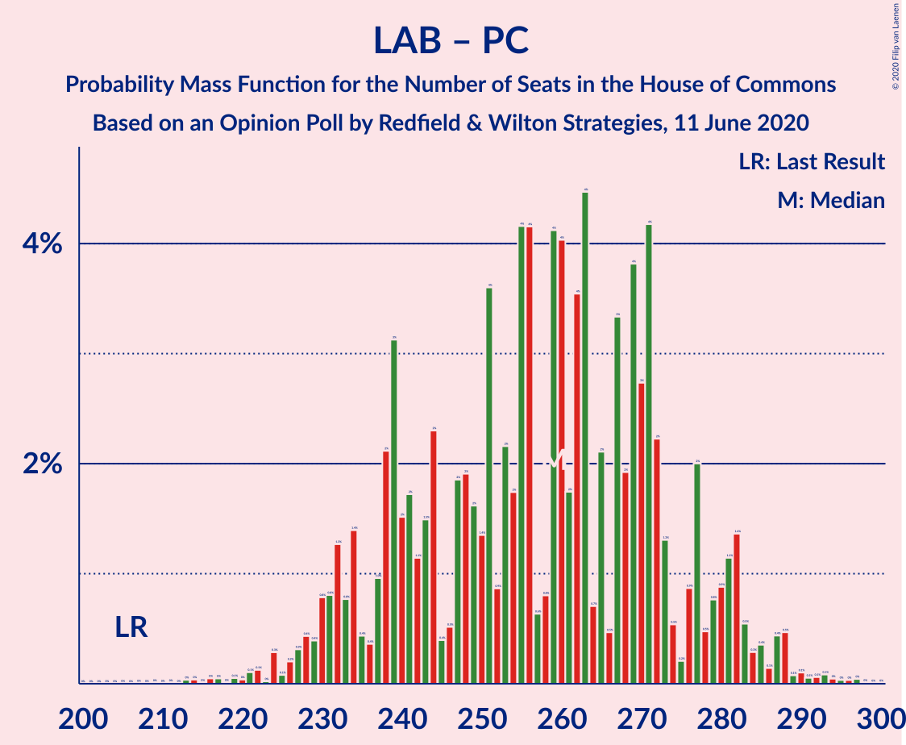

| Number of Seats | Probability | Accumulated | Special Marks |
|:---------------:|:-----------:|:-----------:|:-------------:|
| 206 | 0% | 100% | Last Result |
| 207 | 0% | 100% |  |
| 208 | 0% | 100% |  |
| 209 | 0% | 100% |  |
| 210 | 0% | 100% |  |
| 211 | 0% | 100% |  |
| 212 | 0% | 100% |  |
| 213 | 0% | 100% |  |
| 214 | 0% | 99.9% |  |
| 215 | 0% | 99.9% |  |
| 216 | 0% | 99.9% |  |
| 217 | 0% | 99.8% |  |
| 218 | 0% | 99.8% |  |
| 219 | 0.1% | 99.8% |  |
| 220 | 0% | 99.7% |  |
| 221 | 0.1% | 99.7% |  |
| 222 | 0.1% | 99.6% |  |
| 223 | 0% | 99.5% |  |
| 224 | 0.3% | 99.4% |  |
| 225 | 0.1% | 99.2% |  |
| 226 | 0.2% | 99.1% |  |
| 227 | 0.3% | 98.9% |  |
| 228 | 0.4% | 98.6% |  |
| 229 | 0.4% | 98% |  |
| 230 | 0.8% | 98% |  |
| 231 | 0.8% | 97% |  |
| 232 | 1.3% | 96% |  |
| 233 | 0.8% | 95% |  |
| 234 | 1.4% | 94% |  |
| 235 | 0.4% | 93% |  |
| 236 | 0.4% | 92% |  |
| 237 | 1.0% | 92% |  |
| 238 | 2% | 91% |  |
| 239 | 3% | 89% |  |
| 240 | 2% | 86% |  |
| 241 | 2% | 84% |  |
| 242 | 1.1% | 82% |  |
| 243 | 1.5% | 81% |  |
| 244 | 2% | 80% |  |
| 245 | 0.4% | 78% |  |
| 246 | 0.5% | 77% |  |
| 247 | 2% | 77% |  |
| 248 | 2% | 75% |  |
| 249 | 2% | 73% |  |
| 250 | 1.4% | 71% |  |
| 251 | 4% | 70% |  |
| 252 | 0.9% | 66% |  |
| 253 | 2% | 65% |  |
| 254 | 2% | 63% |  |
| 255 | 4% | 62% |  |
| 256 | 4% | 57% |  |
| 257 | 0.6% | 53% |  |
| 258 | 0.8% | 53% |  |
| 259 | 4% | 52% | Median |
| 260 | 4% | 48% |  |
| 261 | 2% | 44% |  |
| 262 | 4% | 42% |  |
| 263 | 4% | 38% |  |
| 264 | 0.7% | 34% |  |
| 265 | 2% | 33% |  |
| 266 | 0.5% | 31% |  |
| 267 | 3% | 31% |  |
| 268 | 2% | 27% |  |
| 269 | 4% | 25% |  |
| 270 | 3% | 22% |  |
| 271 | 4% | 19% |  |
| 272 | 2% | 15% |  |
| 273 | 1.3% | 12% |  |
| 274 | 0.5% | 11% |  |
| 275 | 0.2% | 11% |  |
| 276 | 0.9% | 10% |  |
| 277 | 2% | 9% |  |
| 278 | 0.5% | 7% |  |
| 279 | 0.8% | 7% |  |
| 280 | 0.9% | 6% |  |
| 281 | 1.1% | 5% |  |
| 282 | 1.4% | 4% |  |
| 283 | 0.5% | 3% |  |
| 284 | 0.3% | 2% |  |
| 285 | 0.4% | 2% |  |
| 286 | 0.1% | 2% |  |
| 287 | 0.4% | 1.5% |  |
| 288 | 0.5% | 1.0% |  |
| 289 | 0.1% | 0.6% |  |
| 290 | 0.1% | 0.5% |  |
| 291 | 0.1% | 0.4% |  |
| 292 | 0.1% | 0.3% |  |
| 293 | 0.1% | 0.3% |  |
| 294 | 0% | 0.2% |  |
| 295 | 0% | 0.2% |  |
| 296 | 0% | 0.1% |  |
| 297 | 0% | 0.1% |  |
| 298 | 0% | 0.1% |  |
| 299 | 0% | 0% |  |

### Labour Party

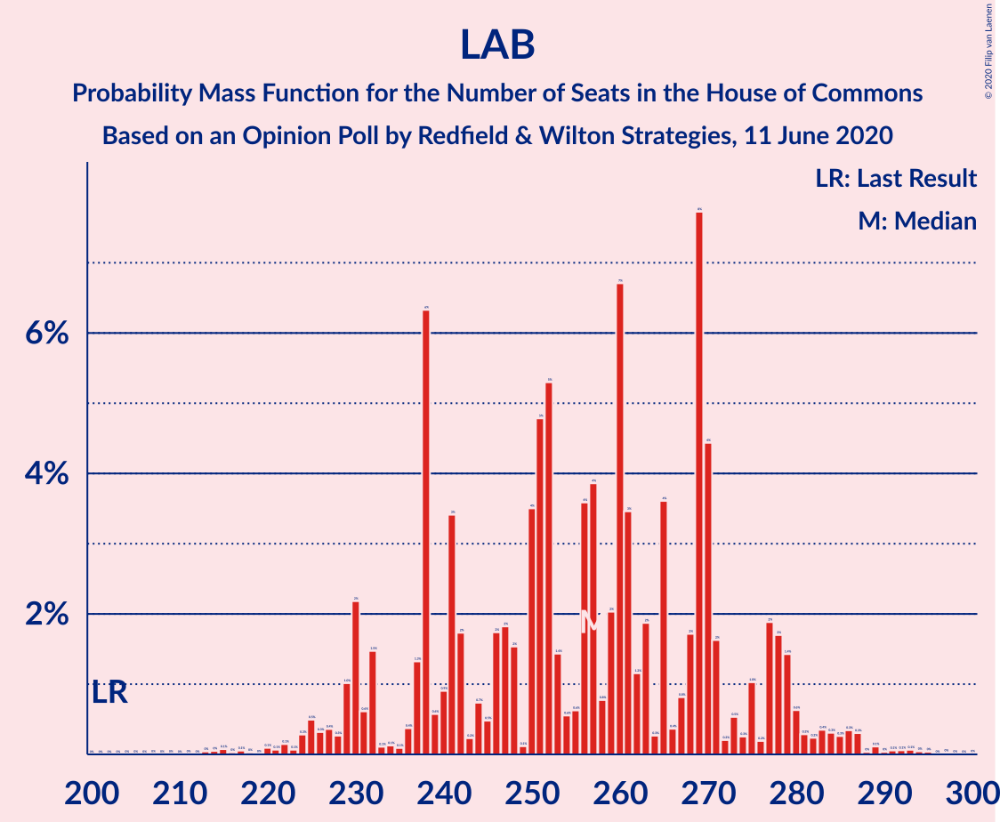

| Number of Seats | Probability | Accumulated | Special Marks |
|:---------------:|:-----------:|:-----------:|:-------------:|
| 202 | 0% | 100% | Last Result |
| 203 | 0% | 100% |  |
| 204 | 0% | 100% |  |
| 205 | 0% | 100% |  |
| 206 | 0% | 100% |  |
| 207 | 0% | 100% |  |
| 208 | 0% | 100% |  |
| 209 | 0% | 100% |  |
| 210 | 0% | 100% |  |
| 211 | 0% | 100% |  |
| 212 | 0% | 100% |  |
| 213 | 0% | 100% |  |
| 214 | 0% | 99.9% |  |
| 215 | 0.1% | 99.9% |  |
| 216 | 0% | 99.8% |  |
| 217 | 0.1% | 99.8% |  |
| 218 | 0% | 99.7% |  |
| 219 | 0% | 99.7% |  |
| 220 | 0.1% | 99.7% |  |
| 221 | 0.1% | 99.6% |  |
| 222 | 0.1% | 99.5% |  |
| 223 | 0.1% | 99.4% |  |
| 224 | 0.3% | 99.3% |  |
| 225 | 0.5% | 99.0% |  |
| 226 | 0.3% | 98.5% |  |
| 227 | 0.4% | 98% |  |
| 228 | 0.3% | 98% |  |
| 229 | 1.0% | 98% |  |
| 230 | 2% | 97% |  |
| 231 | 0.6% | 94% |  |
| 232 | 1.5% | 94% |  |
| 233 | 0.1% | 92% |  |
| 234 | 0.1% | 92% |  |
| 235 | 0.1% | 92% |  |
| 236 | 0.4% | 92% |  |
| 237 | 1.3% | 92% |  |
| 238 | 6% | 90% |  |
| 239 | 0.6% | 84% |  |
| 240 | 0.9% | 83% |  |
| 241 | 3% | 82% |  |
| 242 | 2% | 79% |  |
| 243 | 0.2% | 77% |  |
| 244 | 0.7% | 77% |  |
| 245 | 0.5% | 76% |  |
| 246 | 2% | 76% |  |
| 247 | 2% | 74% |  |
| 248 | 2% | 72% |  |
| 249 | 0.1% | 71% |  |
| 250 | 4% | 71% |  |
| 251 | 5% | 67% |  |
| 252 | 5% | 62% |  |
| 253 | 1.4% | 57% |  |
| 254 | 0.6% | 56% |  |
| 255 | 0.6% | 55% |  |
| 256 | 4% | 54% |  |
| 257 | 4% | 51% | Median |
| 258 | 0.8% | 47% |  |
| 259 | 2% | 46% |  |
| 260 | 7% | 44% |  |
| 261 | 3% | 37% |  |
| 262 | 1.2% | 34% |  |
| 263 | 2% | 33% |  |
| 264 | 0.3% | 31% |  |
| 265 | 4% | 31% |  |
| 266 | 0.4% | 27% |  |
| 267 | 0.8% | 27% |  |
| 268 | 2% | 26% |  |
| 269 | 8% | 24% |  |
| 270 | 4% | 17% |  |
| 271 | 2% | 12% |  |
| 272 | 0.2% | 10% |  |
| 273 | 0.5% | 10% |  |
| 274 | 0.3% | 10% |  |
| 275 | 1.0% | 9% |  |
| 276 | 0.2% | 8% |  |
| 277 | 2% | 8% |  |
| 278 | 2% | 6% |  |
| 279 | 1.4% | 5% |  |
| 280 | 0.6% | 3% |  |
| 281 | 0.3% | 3% |  |
| 282 | 0.2% | 2% |  |
| 283 | 0.4% | 2% |  |
| 284 | 0.3% | 2% |  |
| 285 | 0.3% | 1.4% |  |
| 286 | 0.3% | 1.1% |  |
| 287 | 0.3% | 0.8% |  |
| 288 | 0% | 0.5% |  |
| 289 | 0.1% | 0.5% |  |
| 290 | 0% | 0.4% |  |
| 291 | 0.1% | 0.3% |  |
| 292 | 0.1% | 0.3% |  |
| 293 | 0.1% | 0.2% |  |
| 294 | 0% | 0.1% |  |
| 295 | 0% | 0.1% |  |
| 296 | 0% | 0.1% |  |
| 297 | 0% | 0.1% |  |
| 298 | 0% | 0% |  |

## Technical Information

### Opinion Poll

+ **Polling firm:** Redfield & Wilton Strategies
+ **Commissioner(s):** —
+ **Fieldwork period:** 11 June 2020

### Calculations

+ **Sample size:** 1487
+ **Simulations done:** 131,072
+ **Error estimate:** 0.43%

