# Opinion Poll by Opinium for The Observer, 18–19 June 2020

<a href="#voting-intentions">Voting Intentions</a> | <a href="#seats">Seats</a> | <a href="#coalitions">Coalitions</a> | <a href="#technical-information">Technical Information</a>

## Voting Intentions

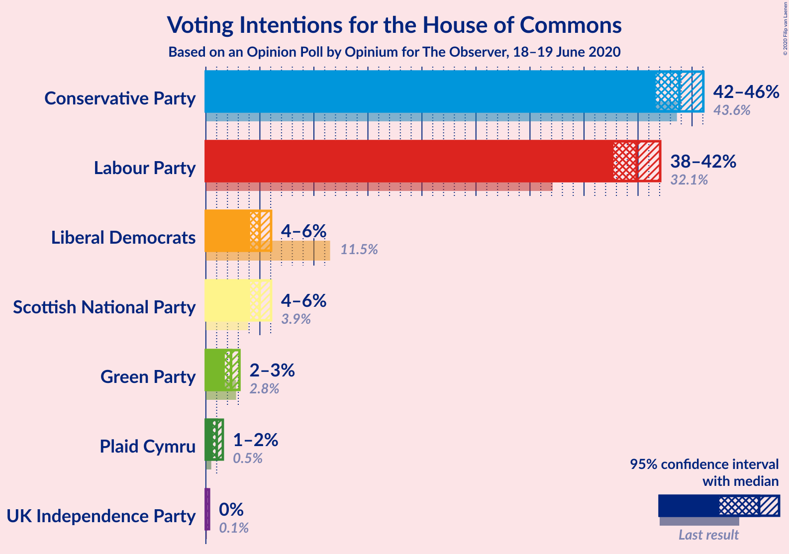

### Confidence Intervals

| Party | Last Result | Poll Result | 80% Confidence Interval | 90% Confidence Interval | 95% Confidence Interval | 99% Confidence Interval |
|:-----:|:-----------:|:-----------:|:-----------------------:|:-----------------------:|:-----------------------:|:-----------------------:|
| Conservative Party | 43.6% | 43.8% | 42.4–45.3% |42.0–45.7% |41.6–46.0% |41.0–46.7% |
| Labour Party | 32.1% | 39.9% | 38.5–41.3% |38.1–41.7% |37.7–42.1% |37.1–42.7% |
| Liberal Democrats | 11.5% | 5.0% | 4.4–5.7% |4.2–5.9% |4.1–6.0% |3.8–6.4% |
| Scottish National Party | 3.9% | 5.0% | 4.4–5.7% |4.2–5.9% |4.1–6.0% |3.8–6.4% |
| Green Party | 2.8% | 2.3% | 2.0–2.8% |1.8–3.0% |1.8–3.1% |1.6–3.4% |
| Plaid Cymru | 0.5% | 1.0% | 0.8–1.4% |0.7–1.5% |0.7–1.6% |0.5–1.8% |
| UK Independence Party | 0.1% | 0.1% | 0.0–0.2% |0.0–0.2% |0.0–0.3% |0.0–0.4% |

*Note:* The poll result column reflects the actual value used in the calculations. Published results may vary slightly, and in addition be rounded to fewer digits.

## Seats

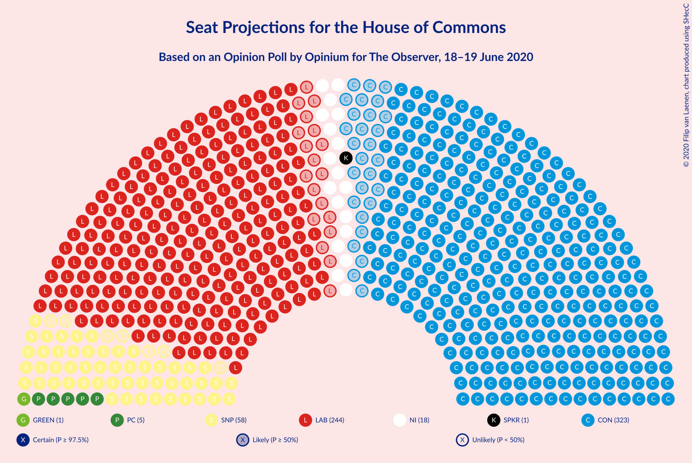

### Confidence Intervals

| Party | Last Result | Median | 80% Confidence Interval | 90% Confidence Interval | 95% Confidence Interval | 99% Confidence Interval |
|:-----:|:-----------:|:------:|:-----------------------:|:-----------------------:|:-----------------------:|:-----------------------:|
| <a href="#conservative-party">Conservative Party</a> | 365 | 323 | 304–335 |300–341 |295–342 |291–348 |
| <a href="#labour-party">Labour Party</a> | 202 | 244 | 233–264 |227–268 |225–274 |222–277 |
| <a href="#liberal-democrats">Liberal Democrats</a> | 11 | 0 | 0 |0 |0 |0 |
| <a href="#scottish-national-party">Scottish National Party</a> | 48 | 58 | 54–58 |54–58 |51–58 |48–58 |
| <a href="#green-party">Green Party</a> | 1 | 1 | 1 |1 |1 |1 |
| <a href="#plaid-cymru">Plaid Cymru</a> | 4 | 5 | 5 |5–6 |5–6 |4–7 |
| <a href="#uk-independence-party">UK Independence Party</a> | 0 | 0 | 0 |0 |0 |0 |

### Conservative Party

*For a full overview of the results for this party, see the [Conservative Party](party-conservativeparty.html) page.*

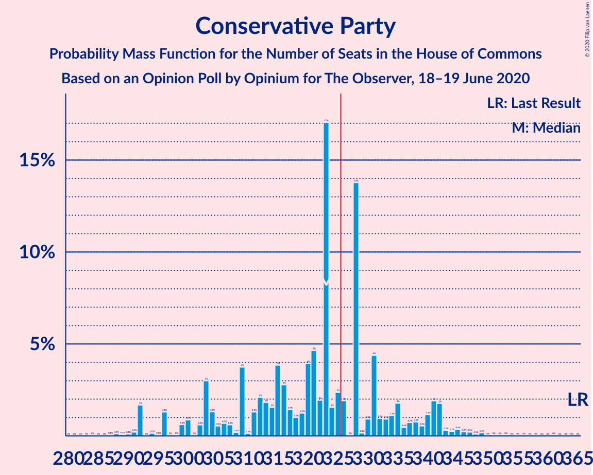

| Number of Seats | Probability | Accumulated | Special Marks |
|:---------------:|:-----------:|:-----------:|:-------------:|
| 284 | 0% | 100% |  |
| 285 | 0% | 99.9% |  |
| 286 | 0% | 99.9% |  |
| 287 | 0.1% | 99.9% |  |
| 288 | 0.1% | 99.9% |  |
| 289 | 0.1% | 99.8% |  |
| 290 | 0.1% | 99.7% |  |
| 291 | 0.2% | 99.6% |  |
| 292 | 2% | 99.4% |  |
| 293 | 0% | 98% |  |
| 294 | 0.1% | 98% |  |
| 295 | 0.1% | 98% |  |
| 296 | 1.3% | 97% |  |
| 297 | 0% | 96% |  |
| 298 | 0% | 96% |  |
| 299 | 0.6% | 96% |  |
| 300 | 0.9% | 95% |  |
| 301 | 0% | 95% |  |
| 302 | 0.6% | 95% |  |
| 303 | 3% | 94% |  |
| 304 | 1.3% | 91% |  |
| 305 | 0.5% | 90% |  |
| 306 | 0.7% | 89% |  |
| 307 | 0.6% | 88% |  |
| 308 | 0.2% | 88% |  |
| 309 | 4% | 88% |  |
| 310 | 0.1% | 84% |  |
| 311 | 1.3% | 84% |  |
| 312 | 2% | 82% |  |
| 313 | 2% | 80% |  |
| 314 | 2% | 79% |  |
| 315 | 4% | 77% |  |
| 316 | 3% | 73% |  |
| 317 | 1.4% | 70% |  |
| 318 | 1.0% | 69% |  |
| 319 | 1.2% | 68% |  |
| 320 | 4% | 67% |  |
| 321 | 5% | 63% |  |
| 322 | 2% | 58% |  |
| 323 | 17% | 56% | Median |
| 324 | 2% | 39% |  |
| 325 | 2% | 38% |  |
| 326 | 2% | 35% | Majority |
| 327 | 0% | 33% |  |
| 328 | 14% | 33% |  |
| 329 | 0.2% | 19% |  |
| 330 | 0.9% | 19% |  |
| 331 | 4% | 18% |  |
| 332 | 1.0% | 14% |  |
| 333 | 0.9% | 13% |  |
| 334 | 1.1% | 12% |  |
| 335 | 2% | 11% |  |
| 336 | 0.5% | 9% |  |
| 337 | 0.7% | 9% |  |
| 338 | 0.8% | 8% |  |
| 339 | 0.5% | 7% |  |
| 340 | 1.2% | 7% |  |
| 341 | 2% | 6% |  |
| 342 | 2% | 4% |  |
| 343 | 0.3% | 2% |  |
| 344 | 0.2% | 2% |  |
| 345 | 0.4% | 1.3% |  |
| 346 | 0.2% | 1.0% |  |
| 347 | 0.2% | 0.7% |  |
| 348 | 0.1% | 0.5% |  |
| 349 | 0.2% | 0.4% |  |
| 350 | 0% | 0.3% |  |
| 351 | 0% | 0.2% |  |
| 352 | 0% | 0.2% |  |
| 353 | 0% | 0.2% |  |
| 354 | 0% | 0.1% |  |
| 355 | 0% | 0.1% |  |
| 356 | 0% | 0.1% |  |
| 357 | 0% | 0.1% |  |
| 358 | 0% | 0.1% |  |
| 359 | 0% | 0.1% |  |
| 360 | 0% | 0.1% |  |
| 361 | 0% | 0% |  |
| 362 | 0% | 0% |  |
| 363 | 0% | 0% |  |
| 364 | 0% | 0% |  |
| 365 | 0% | 0% | Last Result |

### Labour Party

*For a full overview of the results for this party, see the [Labour Party](party-labourparty.html) page.*

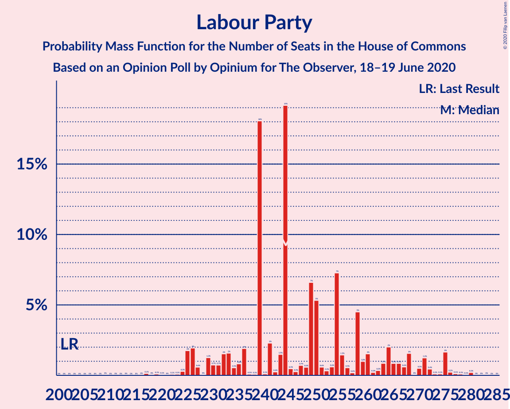

| Number of Seats | Probability | Accumulated | Special Marks |
|:---------------:|:-----------:|:-----------:|:-------------:|
| 202 | 0% | 100% | Last Result |
| 203 | 0% | 100% |  |
| 204 | 0% | 100% |  |
| 205 | 0% | 100% |  |
| 206 | 0% | 100% |  |
| 207 | 0% | 100% |  |
| 208 | 0% | 100% |  |
| 209 | 0% | 100% |  |
| 210 | 0% | 99.9% |  |
| 211 | 0% | 99.9% |  |
| 212 | 0% | 99.9% |  |
| 213 | 0% | 99.9% |  |
| 214 | 0% | 99.9% |  |
| 215 | 0% | 99.9% |  |
| 216 | 0% | 99.9% |  |
| 217 | 0.1% | 99.9% |  |
| 218 | 0% | 99.7% |  |
| 219 | 0.1% | 99.7% |  |
| 220 | 0.1% | 99.6% |  |
| 221 | 0% | 99.5% |  |
| 222 | 0.1% | 99.5% |  |
| 223 | 0.1% | 99.4% |  |
| 224 | 0.3% | 99.4% |  |
| 225 | 2% | 99.1% |  |
| 226 | 2% | 97% |  |
| 227 | 0.6% | 95% |  |
| 228 | 0% | 95% |  |
| 229 | 1.3% | 95% |  |
| 230 | 0.7% | 93% |  |
| 231 | 0.7% | 93% |  |
| 232 | 2% | 92% |  |
| 233 | 2% | 90% |  |
| 234 | 0.5% | 89% |  |
| 235 | 0.8% | 88% |  |
| 236 | 2% | 88% |  |
| 237 | 0.1% | 86% |  |
| 238 | 0.1% | 86% |  |
| 239 | 18% | 85% |  |
| 240 | 0.1% | 67% |  |
| 241 | 2% | 67% |  |
| 242 | 0.2% | 65% |  |
| 243 | 1.5% | 65% |  |
| 244 | 19% | 63% | Median |
| 245 | 0.5% | 44% |  |
| 246 | 0.3% | 44% |  |
| 247 | 0.7% | 43% |  |
| 248 | 0.6% | 43% |  |
| 249 | 7% | 42% |  |
| 250 | 5% | 35% |  |
| 251 | 0.6% | 30% |  |
| 252 | 0.3% | 30% |  |
| 253 | 0.6% | 29% |  |
| 254 | 7% | 29% |  |
| 255 | 1.5% | 21% |  |
| 256 | 0.5% | 20% |  |
| 257 | 0.2% | 19% |  |
| 258 | 5% | 19% |  |
| 259 | 1.0% | 15% |  |
| 260 | 2% | 14% |  |
| 261 | 0.2% | 12% |  |
| 262 | 0.3% | 12% |  |
| 263 | 0.9% | 12% |  |
| 264 | 2% | 11% |  |
| 265 | 0.9% | 9% |  |
| 266 | 0.9% | 8% |  |
| 267 | 0.6% | 7% |  |
| 268 | 2% | 6% |  |
| 269 | 0% | 5% |  |
| 270 | 0.5% | 5% |  |
| 271 | 1.2% | 4% |  |
| 272 | 0.4% | 3% |  |
| 273 | 0.1% | 3% |  |
| 274 | 0.1% | 3% |  |
| 275 | 2% | 2% |  |
| 276 | 0.2% | 0.8% |  |
| 277 | 0.1% | 0.6% |  |
| 278 | 0.1% | 0.5% |  |
| 279 | 0.1% | 0.4% |  |
| 280 | 0.2% | 0.3% |  |
| 281 | 0% | 0.1% |  |
| 282 | 0% | 0.1% |  |
| 283 | 0% | 0.1% |  |
| 284 | 0% | 0% |  |

### Liberal Democrats

*For a full overview of the results for this party, see the [Liberal Democrats](party-liberaldemocrats.html) page.*

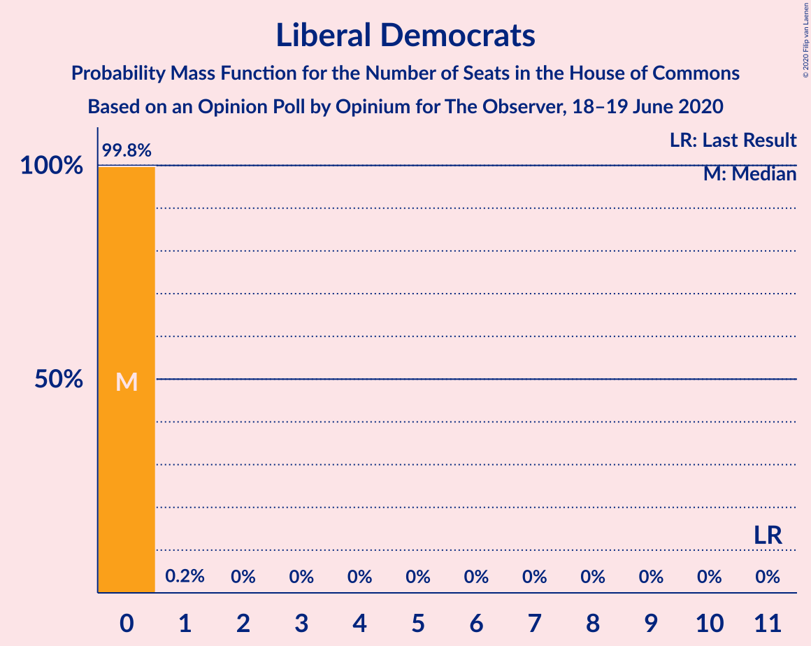

| Number of Seats | Probability | Accumulated | Special Marks |
|:---------------:|:-----------:|:-----------:|:-------------:|
| 0 | 99.8% | 100% | Median |
| 1 | 0.2% | 0.2% |  |
| 2 | 0% | 0% |  |
| 3 | 0% | 0% |  |
| 4 | 0% | 0% |  |
| 5 | 0% | 0% |  |
| 6 | 0% | 0% |  |
| 7 | 0% | 0% |  |
| 8 | 0% | 0% |  |
| 9 | 0% | 0% |  |
| 10 | 0% | 0% |  |
| 11 | 0% | 0% | Last Result |

### Scottish National Party

*For a full overview of the results for this party, see the [Scottish National Party](party-scottishnationalparty.html) page.*

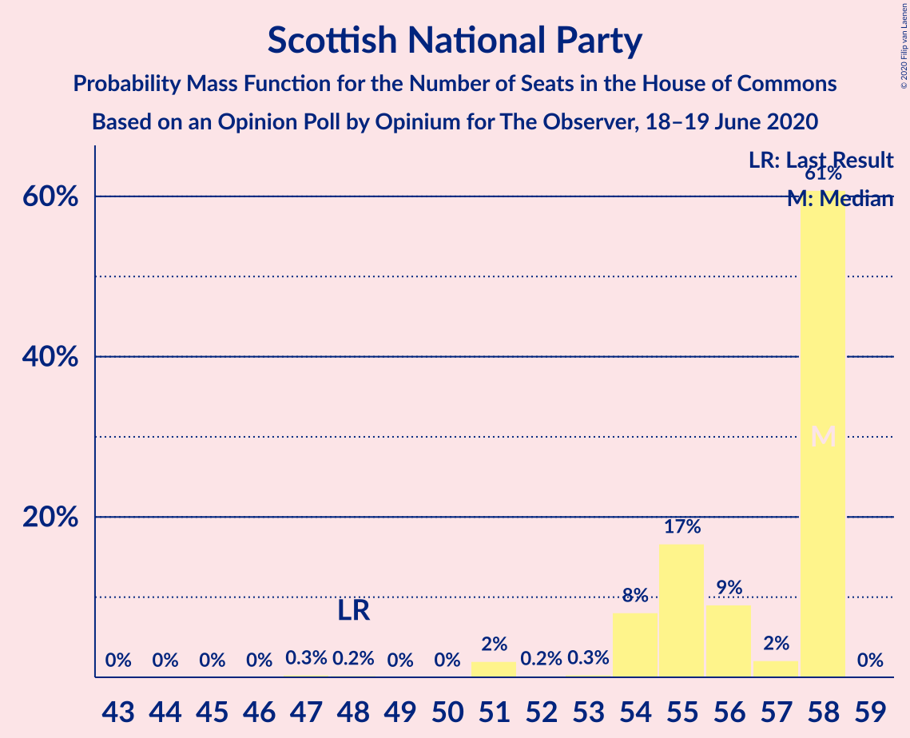

| Number of Seats | Probability | Accumulated | Special Marks |
|:---------------:|:-----------:|:-----------:|:-------------:|
| 43 | 0% | 100% |  |
| 44 | 0% | 99.9% |  |
| 45 | 0% | 99.9% |  |
| 46 | 0% | 99.9% |  |
| 47 | 0.3% | 99.9% |  |
| 48 | 0.2% | 99.6% | Last Result |
| 49 | 0% | 99.4% |  |
| 50 | 0% | 99.4% |  |
| 51 | 2% | 99.3% |  |
| 52 | 0.2% | 97% |  |
| 53 | 0.3% | 97% |  |
| 54 | 8% | 97% |  |
| 55 | 17% | 89% |  |
| 56 | 9% | 72% |  |
| 57 | 2% | 63% |  |
| 58 | 61% | 61% | Median |
| 59 | 0% | 0% |  |

### Green Party

*For a full overview of the results for this party, see the [Green Party](party-greenparty.html) page.*

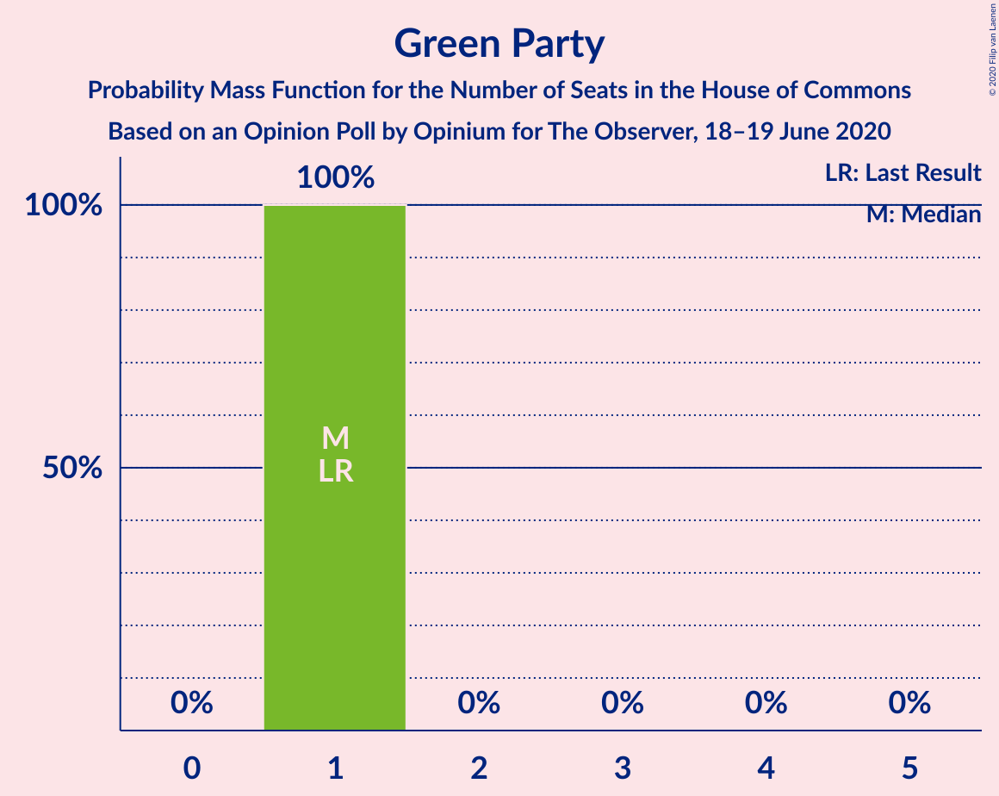

| Number of Seats | Probability | Accumulated | Special Marks |
|:---------------:|:-----------:|:-----------:|:-------------:|
| 1 | 100% | 100% | Last Result, Median |

### Plaid Cymru

*For a full overview of the results for this party, see the [Plaid Cymru](party-plaidcymru.html) page.*

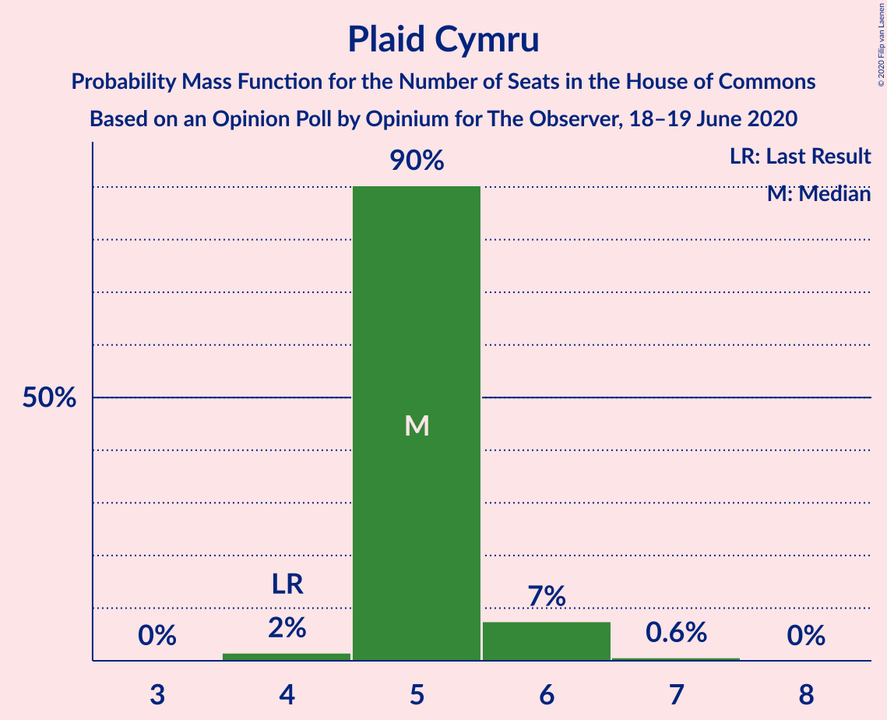

| Number of Seats | Probability | Accumulated | Special Marks |
|:---------------:|:-----------:|:-----------:|:-------------:|
| 3 | 0% | 100% |  |
| 4 | 2% | 99.9% | Last Result |
| 5 | 90% | 98% | Median |
| 6 | 7% | 8% |  |
| 7 | 0.6% | 0.7% |  |
| 8 | 0% | 0% |  |

### UK Independence Party

*For a full overview of the results for this party, see the [UK Independence Party](party-ukindependenceparty.html) page.*

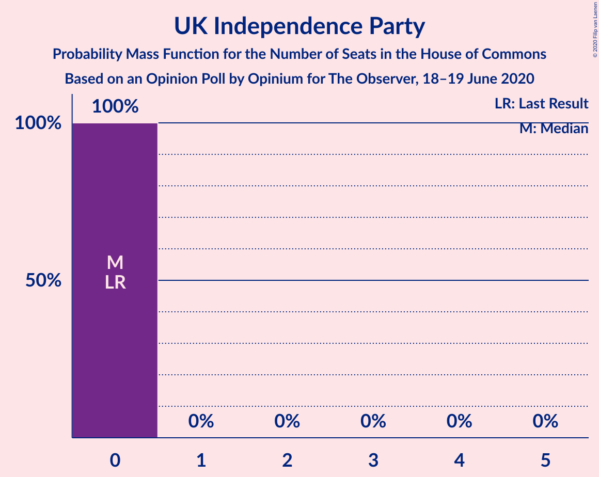

| Number of Seats | Probability | Accumulated | Special Marks |
|:---------------:|:-----------:|:-----------:|:-------------:|
| 0 | 100% | 100% | Last Result, Median |

## Coalitions

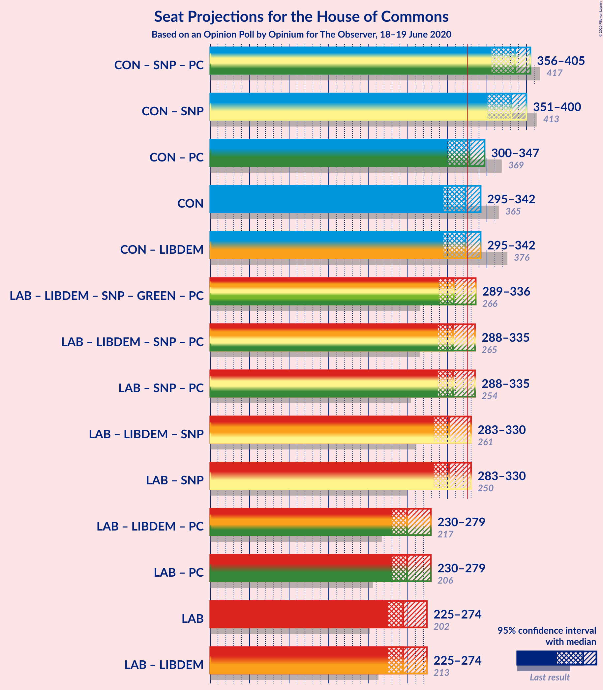

### Confidence Intervals

| Coalition | Last Result | Median | Majority? | 80% Confidence Interval | 90% Confidence Interval | 95% Confidence Interval | 99% Confidence Interval |
|:---------:|:-----------:|:------:|:---------:|:-----------------------:|:-----------------------:|:-----------------------:|:-----------------------:|
| Conservative Party – Scottish National Party – Plaid Cymru | 417 | 386 | 100% | 366–397 | 362–403 | 356–405 | 353–408 |
| Conservative Party – Scottish National Party | 413 | 381 | 100% | 361–392 | 357–398 | 351–400 | 348–402 |
| Conservative Party – Plaid Cymru | 369 | 328 | 63% | 309–340 | 305–346 | 300–347 | 296–353 |
| Conservative Party | 365 | 323 | 35% | 304–335 | 300–341 | 295–342 | 291–348 |
| Conservative Party – Liberal Democrats | 376 | 323 | 35% | 304–335 | 300–341 | 295–342 | 291–348 |
| Labour Party – Liberal Democrats – Scottish National Party – Green Party – Plaid Cymru | 266 | 308 | 11% | 296–327 | 290–331 | 289–336 | 283–340 |
| Labour Party – Liberal Democrats – Scottish National Party – Plaid Cymru | 265 | 307 | 10% | 295–326 | 289–330 | 288–335 | 282–339 |
| Labour Party – Scottish National Party – Plaid Cymru | 254 | 307 | 10% | 295–326 | 289–330 | 288–335 | 282–339 |
| Labour Party – Liberal Democrats – Scottish National Party | 261 | 302 | 5% | 290–321 | 284–325 | 283–330 | 277–334 |
| Labour Party – Scottish National Party | 250 | 302 | 5% | 290–321 | 284–325 | 283–330 | 277–334 |
| Labour Party – Liberal Democrats – Plaid Cymru | 217 | 249 | 0% | 238–269 | 232–273 | 230–279 | 228–282 |
| Labour Party – Plaid Cymru | 206 | 249 | 0% | 238–269 | 232–273 | 230–279 | 228–282 |
| Labour Party | 202 | 244 | 0% | 233–264 | 227–268 | 225–274 | 222–277 |
| Labour Party – Liberal Democrats | 213 | 244 | 0% | 233–264 | 227–268 | 225–274 | 222–277 |

### Conservative Party – Scottish National Party – Plaid Cymru

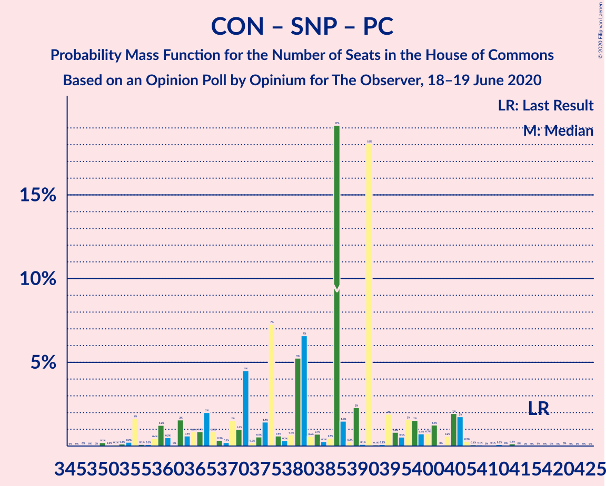

| Number of Seats | Probability | Accumulated | Special Marks |
|:---------------:|:-----------:|:-----------:|:-------------:|
| 347 | 0% | 100% |  |
| 348 | 0% | 99.9% |  |
| 349 | 0% | 99.9% |  |
| 350 | 0.2% | 99.9% |  |
| 351 | 0.1% | 99.7% |  |
| 352 | 0.1% | 99.6% |  |
| 353 | 0.1% | 99.5% |  |
| 354 | 0.2% | 99.4% |  |
| 355 | 2% | 99.2% |  |
| 356 | 0.1% | 98% |  |
| 357 | 0.1% | 97% |  |
| 358 | 0.4% | 97% |  |
| 359 | 1.2% | 97% |  |
| 360 | 0.5% | 96% |  |
| 361 | 0% | 95% |  |
| 362 | 2% | 95% |  |
| 363 | 0.6% | 94% |  |
| 364 | 0.8% | 93% |  |
| 365 | 0.9% | 92% |  |
| 366 | 2% | 91% |  |
| 367 | 0.9% | 89% |  |
| 368 | 0.3% | 88% |  |
| 369 | 0.2% | 88% |  |
| 370 | 2% | 88% |  |
| 371 | 1.0% | 86% |  |
| 372 | 5% | 85% |  |
| 373 | 0.2% | 81% |  |
| 374 | 0.5% | 81% |  |
| 375 | 1.4% | 80% |  |
| 376 | 7% | 79% |  |
| 377 | 0.6% | 71% |  |
| 378 | 0.3% | 71% |  |
| 379 | 0.7% | 70% |  |
| 380 | 5% | 70% |  |
| 381 | 7% | 64% |  |
| 382 | 0.6% | 58% |  |
| 383 | 0.7% | 57% |  |
| 384 | 0.3% | 57% |  |
| 385 | 0.5% | 56% |  |
| 386 | 19% | 56% | Median |
| 387 | 1.5% | 37% |  |
| 388 | 0.2% | 35% |  |
| 389 | 2% | 35% |  |
| 390 | 0.1% | 33% |  |
| 391 | 18% | 33% |  |
| 392 | 0.1% | 15% |  |
| 393 | 0.1% | 14% |  |
| 394 | 2% | 14% |  |
| 395 | 0.8% | 12% |  |
| 396 | 0.5% | 12% |  |
| 397 | 2% | 11% |  |
| 398 | 2% | 10% |  |
| 399 | 0.7% | 8% |  |
| 400 | 0.7% | 7% |  |
| 401 | 1.3% | 7% |  |
| 402 | 0% | 5% |  |
| 403 | 0.6% | 5% |  |
| 404 | 2% | 5% |  |
| 405 | 2% | 3% |  |
| 406 | 0.3% | 0.9% |  |
| 407 | 0.1% | 0.6% |  |
| 408 | 0.1% | 0.6% |  |
| 409 | 0% | 0.5% |  |
| 410 | 0.1% | 0.5% |  |
| 411 | 0.1% | 0.4% |  |
| 412 | 0% | 0.3% |  |
| 413 | 0.1% | 0.3% |  |
| 414 | 0% | 0.1% |  |
| 415 | 0% | 0.1% |  |
| 416 | 0% | 0.1% |  |
| 417 | 0% | 0.1% | Last Result |
| 418 | 0% | 0.1% |  |
| 419 | 0% | 0.1% |  |
| 420 | 0% | 0.1% |  |
| 421 | 0% | 0.1% |  |
| 422 | 0% | 0% |  |

### Conservative Party – Scottish National Party

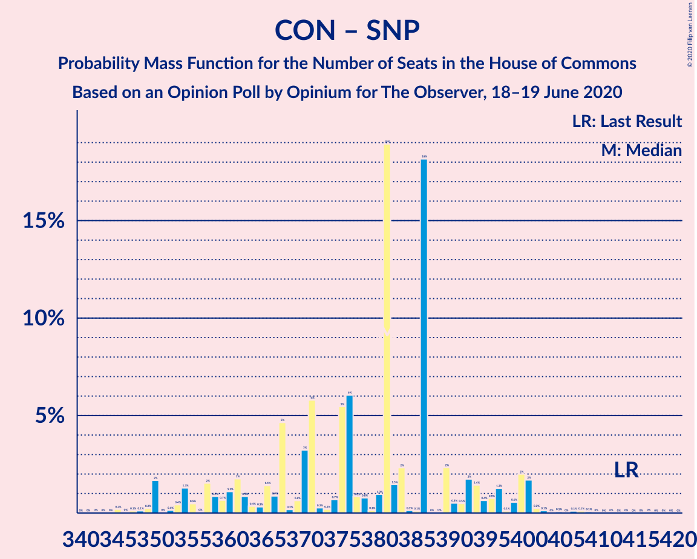

| Number of Seats | Probability | Accumulated | Special Marks |
|:---------------:|:-----------:|:-----------:|:-------------:|
| 342 | 0% | 100% |  |
| 343 | 0% | 99.9% |  |
| 344 | 0% | 99.9% |  |
| 345 | 0.2% | 99.9% |  |
| 346 | 0% | 99.7% |  |
| 347 | 0.1% | 99.7% |  |
| 348 | 0.1% | 99.5% |  |
| 349 | 0.2% | 99.4% |  |
| 350 | 2% | 99.2% |  |
| 351 | 0% | 98% |  |
| 352 | 0.1% | 97% |  |
| 353 | 0.4% | 97% |  |
| 354 | 1.3% | 97% |  |
| 355 | 0.5% | 96% |  |
| 356 | 0% | 95% |  |
| 357 | 2% | 95% |  |
| 358 | 0.9% | 94% |  |
| 359 | 0.7% | 93% |  |
| 360 | 1.1% | 92% |  |
| 361 | 2% | 91% |  |
| 362 | 0.9% | 89% |  |
| 363 | 0.4% | 88% |  |
| 364 | 0.3% | 88% |  |
| 365 | 1.4% | 88% |  |
| 366 | 0.9% | 86% |  |
| 367 | 5% | 85% |  |
| 368 | 0.2% | 81% |  |
| 369 | 0.6% | 81% |  |
| 370 | 3% | 80% |  |
| 371 | 6% | 77% |  |
| 372 | 0.3% | 71% |  |
| 373 | 0.2% | 71% |  |
| 374 | 0.7% | 70% |  |
| 375 | 5% | 70% |  |
| 376 | 6% | 64% |  |
| 377 | 0.8% | 58% |  |
| 378 | 0.8% | 57% |  |
| 379 | 0.1% | 57% |  |
| 380 | 1.0% | 56% |  |
| 381 | 19% | 56% | Median |
| 382 | 1.5% | 37% |  |
| 383 | 2% | 35% |  |
| 384 | 0.1% | 33% |  |
| 385 | 0.1% | 33% |  |
| 386 | 18% | 33% |  |
| 387 | 0% | 14% |  |
| 388 | 0% | 14% |  |
| 389 | 2% | 14% |  |
| 390 | 0.5% | 12% |  |
| 391 | 0.5% | 12% |  |
| 392 | 2% | 11% |  |
| 393 | 1.4% | 9% |  |
| 394 | 0.6% | 8% |  |
| 395 | 0.8% | 7% |  |
| 396 | 1.3% | 6% |  |
| 397 | 0.1% | 5% |  |
| 398 | 0.6% | 5% |  |
| 399 | 2% | 5% |  |
| 400 | 2% | 3% |  |
| 401 | 0.2% | 0.8% |  |
| 402 | 0.1% | 0.6% |  |
| 403 | 0% | 0.5% |  |
| 404 | 0.1% | 0.5% |  |
| 405 | 0% | 0.4% |  |
| 406 | 0.1% | 0.4% |  |
| 407 | 0.1% | 0.3% |  |
| 408 | 0.1% | 0.2% |  |
| 409 | 0% | 0.1% |  |
| 410 | 0% | 0.1% |  |
| 411 | 0% | 0.1% |  |
| 412 | 0% | 0.1% |  |
| 413 | 0% | 0.1% | Last Result |
| 414 | 0% | 0.1% |  |
| 415 | 0% | 0.1% |  |
| 416 | 0% | 0.1% |  |
| 417 | 0% | 0% |  |

### Conservative Party – Plaid Cymru

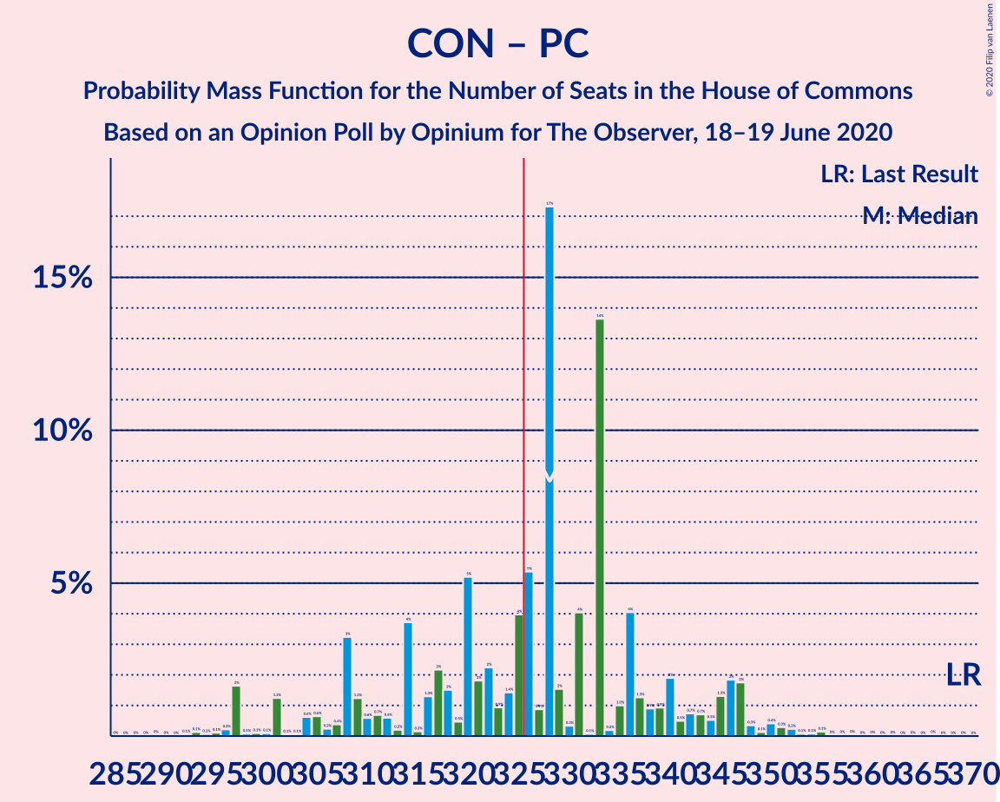

| Number of Seats | Probability | Accumulated | Special Marks |
|:---------------:|:-----------:|:-----------:|:-------------:|
| 289 | 0% | 100% |  |
| 290 | 0% | 99.9% |  |
| 291 | 0% | 99.9% |  |
| 292 | 0.1% | 99.9% |  |
| 293 | 0.1% | 99.9% |  |
| 294 | 0.1% | 99.7% |  |
| 295 | 0.1% | 99.7% |  |
| 296 | 0.2% | 99.6% |  |
| 297 | 2% | 99.4% |  |
| 298 | 0.1% | 98% |  |
| 299 | 0.1% | 98% |  |
| 300 | 0.1% | 98% |  |
| 301 | 1.2% | 97% |  |
| 302 | 0.1% | 96% |  |
| 303 | 0.1% | 96% |  |
| 304 | 0.6% | 96% |  |
| 305 | 0.6% | 95% |  |
| 306 | 0.2% | 95% |  |
| 307 | 0.4% | 95% |  |
| 308 | 3% | 94% |  |
| 309 | 1.2% | 91% |  |
| 310 | 0.6% | 90% |  |
| 311 | 0.7% | 89% |  |
| 312 | 0.6% | 88% |  |
| 313 | 0.2% | 88% |  |
| 314 | 4% | 88% |  |
| 315 | 0.2% | 84% |  |
| 316 | 1.3% | 84% |  |
| 317 | 2% | 82% |  |
| 318 | 2% | 80% |  |
| 319 | 0.5% | 79% |  |
| 320 | 5% | 78% |  |
| 321 | 2% | 73% |  |
| 322 | 2% | 71% |  |
| 323 | 0.9% | 69% |  |
| 324 | 1.4% | 68% |  |
| 325 | 4% | 67% |  |
| 326 | 5% | 63% | Majority |
| 327 | 0.9% | 57% |  |
| 328 | 17% | 56% | Median |
| 329 | 2% | 39% |  |
| 330 | 0.3% | 38% |  |
| 331 | 4% | 37% |  |
| 332 | 0.1% | 33% |  |
| 333 | 14% | 33% |  |
| 334 | 0.2% | 20% |  |
| 335 | 1.0% | 19% |  |
| 336 | 4% | 18% |  |
| 337 | 1.3% | 14% |  |
| 338 | 0.9% | 13% |  |
| 339 | 0.9% | 12% |  |
| 340 | 2% | 11% |  |
| 341 | 0.5% | 9% |  |
| 342 | 0.7% | 9% |  |
| 343 | 0.7% | 8% |  |
| 344 | 0.5% | 7% |  |
| 345 | 1.3% | 7% |  |
| 346 | 2% | 6% |  |
| 347 | 2% | 4% |  |
| 348 | 0.3% | 2% |  |
| 349 | 0.1% | 2% |  |
| 350 | 0.4% | 1.5% |  |
| 351 | 0.3% | 1.1% |  |
| 352 | 0.2% | 0.8% |  |
| 353 | 0.1% | 0.5% |  |
| 354 | 0.1% | 0.5% |  |
| 355 | 0.1% | 0.4% |  |
| 356 | 0% | 0.2% |  |
| 357 | 0% | 0.2% |  |
| 358 | 0% | 0.2% |  |
| 359 | 0% | 0.1% |  |
| 360 | 0% | 0.1% |  |
| 361 | 0% | 0.1% |  |
| 362 | 0% | 0.1% |  |
| 363 | 0% | 0.1% |  |
| 364 | 0% | 0.1% |  |
| 365 | 0% | 0.1% |  |
| 366 | 0% | 0% |  |
| 367 | 0% | 0% |  |
| 368 | 0% | 0% |  |
| 369 | 0% | 0% | Last Result |

### Conservative Party

| Number of Seats | Probability | Accumulated | Special Marks |
|:---------------:|:-----------:|:-----------:|:-------------:|
| 284 | 0% | 100% |  |
| 285 | 0% | 99.9% |  |
| 286 | 0% | 99.9% |  |
| 287 | 0.1% | 99.9% |  |
| 288 | 0.1% | 99.9% |  |
| 289 | 0.1% | 99.8% |  |
| 290 | 0.1% | 99.7% |  |
| 291 | 0.2% | 99.6% |  |
| 292 | 2% | 99.4% |  |
| 293 | 0% | 98% |  |
| 294 | 0.1% | 98% |  |
| 295 | 0.1% | 98% |  |
| 296 | 1.3% | 97% |  |
| 297 | 0% | 96% |  |
| 298 | 0% | 96% |  |
| 299 | 0.6% | 96% |  |
| 300 | 0.9% | 95% |  |
| 301 | 0% | 95% |  |
| 302 | 0.6% | 95% |  |
| 303 | 3% | 94% |  |
| 304 | 1.3% | 91% |  |
| 305 | 0.5% | 90% |  |
| 306 | 0.7% | 89% |  |
| 307 | 0.6% | 88% |  |
| 308 | 0.2% | 88% |  |
| 309 | 4% | 88% |  |
| 310 | 0.1% | 84% |  |
| 311 | 1.3% | 84% |  |
| 312 | 2% | 82% |  |
| 313 | 2% | 80% |  |
| 314 | 2% | 79% |  |
| 315 | 4% | 77% |  |
| 316 | 3% | 73% |  |
| 317 | 1.4% | 70% |  |
| 318 | 1.0% | 69% |  |
| 319 | 1.2% | 68% |  |
| 320 | 4% | 67% |  |
| 321 | 5% | 63% |  |
| 322 | 2% | 58% |  |
| 323 | 17% | 56% | Median |
| 324 | 2% | 39% |  |
| 325 | 2% | 38% |  |
| 326 | 2% | 35% | Majority |
| 327 | 0% | 33% |  |
| 328 | 14% | 33% |  |
| 329 | 0.2% | 19% |  |
| 330 | 0.9% | 19% |  |
| 331 | 4% | 18% |  |
| 332 | 1.0% | 14% |  |
| 333 | 0.9% | 13% |  |
| 334 | 1.1% | 12% |  |
| 335 | 2% | 11% |  |
| 336 | 0.5% | 9% |  |
| 337 | 0.7% | 9% |  |
| 338 | 0.8% | 8% |  |
| 339 | 0.5% | 7% |  |
| 340 | 1.2% | 7% |  |
| 341 | 2% | 6% |  |
| 342 | 2% | 4% |  |
| 343 | 0.3% | 2% |  |
| 344 | 0.2% | 2% |  |
| 345 | 0.4% | 1.3% |  |
| 346 | 0.2% | 1.0% |  |
| 347 | 0.2% | 0.7% |  |
| 348 | 0.1% | 0.5% |  |
| 349 | 0.2% | 0.4% |  |
| 350 | 0% | 0.3% |  |
| 351 | 0% | 0.2% |  |
| 352 | 0% | 0.2% |  |
| 353 | 0% | 0.2% |  |
| 354 | 0% | 0.1% |  |
| 355 | 0% | 0.1% |  |
| 356 | 0% | 0.1% |  |
| 357 | 0% | 0.1% |  |
| 358 | 0% | 0.1% |  |
| 359 | 0% | 0.1% |  |
| 360 | 0% | 0.1% |  |
| 361 | 0% | 0% |  |
| 362 | 0% | 0% |  |
| 363 | 0% | 0% |  |
| 364 | 0% | 0% |  |
| 365 | 0% | 0% | Last Result |

### Conservative Party – Liberal Democrats

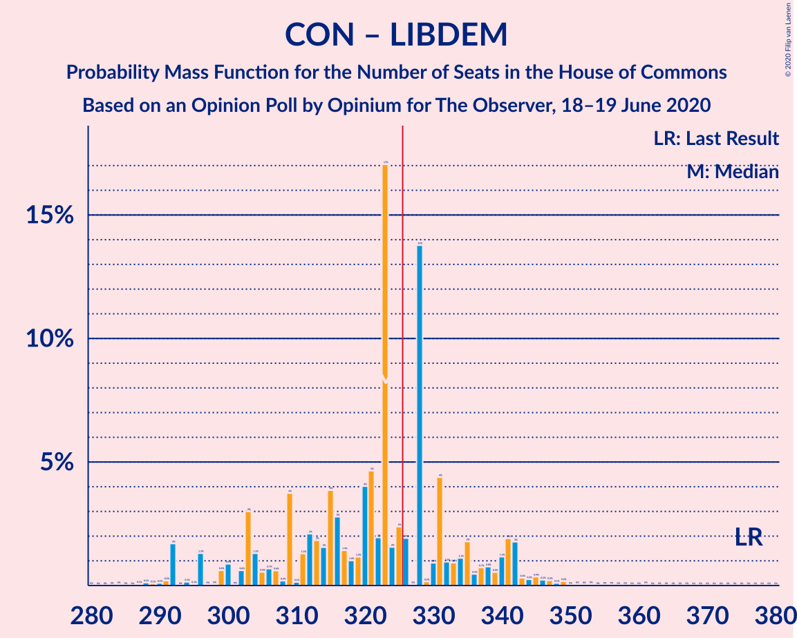

| Number of Seats | Probability | Accumulated | Special Marks |
|:---------------:|:-----------:|:-----------:|:-------------:|
| 284 | 0% | 100% |  |
| 285 | 0% | 99.9% |  |
| 286 | 0% | 99.9% |  |
| 287 | 0.1% | 99.9% |  |
| 288 | 0.1% | 99.9% |  |
| 289 | 0.1% | 99.8% |  |
| 290 | 0.1% | 99.7% |  |
| 291 | 0.2% | 99.6% |  |
| 292 | 2% | 99.4% |  |
| 293 | 0% | 98% |  |
| 294 | 0.1% | 98% |  |
| 295 | 0.1% | 98% |  |
| 296 | 1.3% | 97% |  |
| 297 | 0% | 96% |  |
| 298 | 0% | 96% |  |
| 299 | 0.6% | 96% |  |
| 300 | 0.9% | 95% |  |
| 301 | 0% | 95% |  |
| 302 | 0.6% | 95% |  |
| 303 | 3% | 94% |  |
| 304 | 1.3% | 91% |  |
| 305 | 0.5% | 90% |  |
| 306 | 0.7% | 89% |  |
| 307 | 0.6% | 88% |  |
| 308 | 0.2% | 88% |  |
| 309 | 4% | 88% |  |
| 310 | 0.1% | 84% |  |
| 311 | 1.3% | 84% |  |
| 312 | 2% | 82% |  |
| 313 | 2% | 80% |  |
| 314 | 2% | 79% |  |
| 315 | 4% | 77% |  |
| 316 | 3% | 73% |  |
| 317 | 1.4% | 70% |  |
| 318 | 1.0% | 69% |  |
| 319 | 1.2% | 68% |  |
| 320 | 4% | 67% |  |
| 321 | 5% | 63% |  |
| 322 | 2% | 58% |  |
| 323 | 17% | 56% | Median |
| 324 | 2% | 39% |  |
| 325 | 2% | 38% |  |
| 326 | 2% | 35% | Majority |
| 327 | 0% | 33% |  |
| 328 | 14% | 33% |  |
| 329 | 0.2% | 19% |  |
| 330 | 0.9% | 19% |  |
| 331 | 4% | 18% |  |
| 332 | 1.0% | 14% |  |
| 333 | 0.9% | 13% |  |
| 334 | 1.1% | 12% |  |
| 335 | 2% | 11% |  |
| 336 | 0.5% | 9% |  |
| 337 | 0.7% | 9% |  |
| 338 | 0.8% | 8% |  |
| 339 | 0.5% | 7% |  |
| 340 | 1.2% | 7% |  |
| 341 | 2% | 6% |  |
| 342 | 2% | 4% |  |
| 343 | 0.3% | 2% |  |
| 344 | 0.2% | 2% |  |
| 345 | 0.4% | 1.3% |  |
| 346 | 0.2% | 1.0% |  |
| 347 | 0.2% | 0.7% |  |
| 348 | 0.1% | 0.5% |  |
| 349 | 0.2% | 0.4% |  |
| 350 | 0% | 0.3% |  |
| 351 | 0% | 0.2% |  |
| 352 | 0% | 0.2% |  |
| 353 | 0% | 0.2% |  |
| 354 | 0% | 0.1% |  |
| 355 | 0% | 0.1% |  |
| 356 | 0% | 0.1% |  |
| 357 | 0% | 0.1% |  |
| 358 | 0% | 0.1% |  |
| 359 | 0% | 0.1% |  |
| 360 | 0% | 0.1% |  |
| 361 | 0% | 0% |  |
| 362 | 0% | 0% |  |
| 363 | 0% | 0% |  |
| 364 | 0% | 0% |  |
| 365 | 0% | 0% |  |
| 366 | 0% | 0% |  |
| 367 | 0% | 0% |  |
| 368 | 0% | 0% |  |
| 369 | 0% | 0% |  |
| 370 | 0% | 0% |  |
| 371 | 0% | 0% |  |
| 372 | 0% | 0% |  |
| 373 | 0% | 0% |  |
| 374 | 0% | 0% |  |
| 375 | 0% | 0% |  |
| 376 | 0% | 0% | Last Result |

### Labour Party – Liberal Democrats – Scottish National Party – Green Party – Plaid Cymru

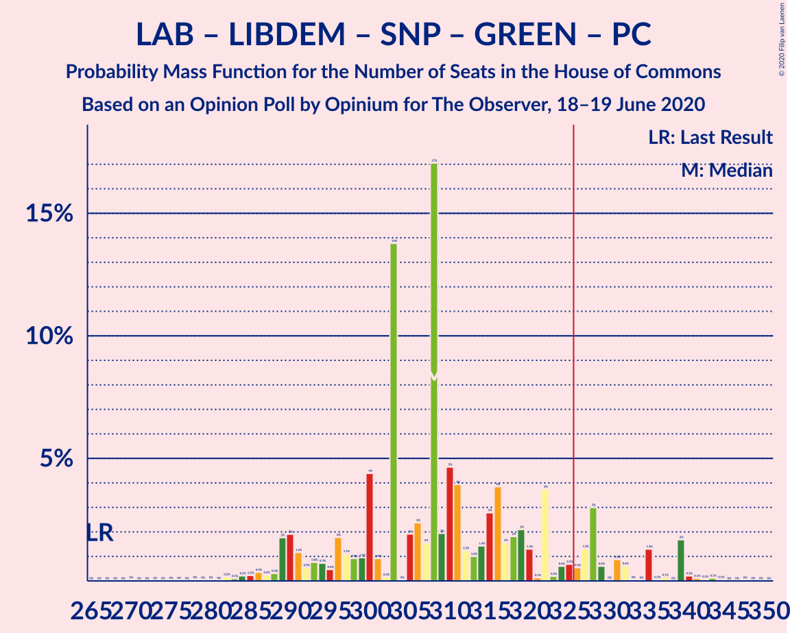

| Number of Seats | Probability | Accumulated | Special Marks |
|:---------------:|:-----------:|:-----------:|:-------------:|
| 266 | 0% | 100% | Last Result |
| 267 | 0% | 100% |  |
| 268 | 0% | 100% |  |
| 269 | 0% | 100% |  |
| 270 | 0% | 100% |  |
| 271 | 0% | 100% |  |
| 272 | 0% | 99.9% |  |
| 273 | 0% | 99.9% |  |
| 274 | 0% | 99.9% |  |
| 275 | 0% | 99.9% |  |
| 276 | 0% | 99.9% |  |
| 277 | 0% | 99.9% |  |
| 278 | 0% | 99.9% |  |
| 279 | 0% | 99.8% |  |
| 280 | 0% | 99.8% |  |
| 281 | 0% | 99.8% |  |
| 282 | 0.2% | 99.7% |  |
| 283 | 0.1% | 99.6% |  |
| 284 | 0.2% | 99.5% |  |
| 285 | 0.2% | 99.3% |  |
| 286 | 0.4% | 99.0% |  |
| 287 | 0.2% | 98.7% |  |
| 288 | 0.3% | 98% |  |
| 289 | 2% | 98% |  |
| 290 | 2% | 96% |  |
| 291 | 1.2% | 94% |  |
| 292 | 0.5% | 93% |  |
| 293 | 0.8% | 93% |  |
| 294 | 0.7% | 92% |  |
| 295 | 0.5% | 91% |  |
| 296 | 2% | 91% |  |
| 297 | 1.1% | 89% |  |
| 298 | 0.9% | 88% |  |
| 299 | 1.0% | 87% |  |
| 300 | 4% | 86% |  |
| 301 | 0.9% | 82% |  |
| 302 | 0.2% | 81% |  |
| 303 | 14% | 81% |  |
| 304 | 0% | 67% |  |
| 305 | 2% | 67% |  |
| 306 | 2% | 65% |  |
| 307 | 2% | 62% |  |
| 308 | 17% | 61% | Median |
| 309 | 2% | 44% |  |
| 310 | 5% | 42% |  |
| 311 | 4% | 37% |  |
| 312 | 1.2% | 33% |  |
| 313 | 1.0% | 32% |  |
| 314 | 1.4% | 31% |  |
| 315 | 3% | 30% |  |
| 316 | 4% | 27% |  |
| 317 | 2% | 23% |  |
| 318 | 2% | 21% |  |
| 319 | 2% | 20% |  |
| 320 | 1.3% | 18% |  |
| 321 | 0.1% | 16% |  |
| 322 | 4% | 16% |  |
| 323 | 0.2% | 12% |  |
| 324 | 0.6% | 12% |  |
| 325 | 0.7% | 12% |  |
| 326 | 0.5% | 11% | Majority |
| 327 | 1.3% | 10% |  |
| 328 | 3% | 9% |  |
| 329 | 0.6% | 6% |  |
| 330 | 0% | 5% |  |
| 331 | 0.9% | 5% |  |
| 332 | 0.6% | 5% |  |
| 333 | 0% | 4% |  |
| 334 | 0% | 4% |  |
| 335 | 1.3% | 4% |  |
| 336 | 0.1% | 3% |  |
| 337 | 0.1% | 2% |  |
| 338 | 0% | 2% |  |
| 339 | 2% | 2% |  |
| 340 | 0.2% | 0.6% |  |
| 341 | 0.1% | 0.4% |  |
| 342 | 0.1% | 0.3% |  |
| 343 | 0.1% | 0.2% |  |
| 344 | 0.1% | 0.1% |  |
| 345 | 0% | 0.1% |  |
| 346 | 0% | 0.1% |  |
| 347 | 0% | 0.1% |  |
| 348 | 0% | 0% |  |

### Labour Party – Liberal Democrats – Scottish National Party – Plaid Cymru

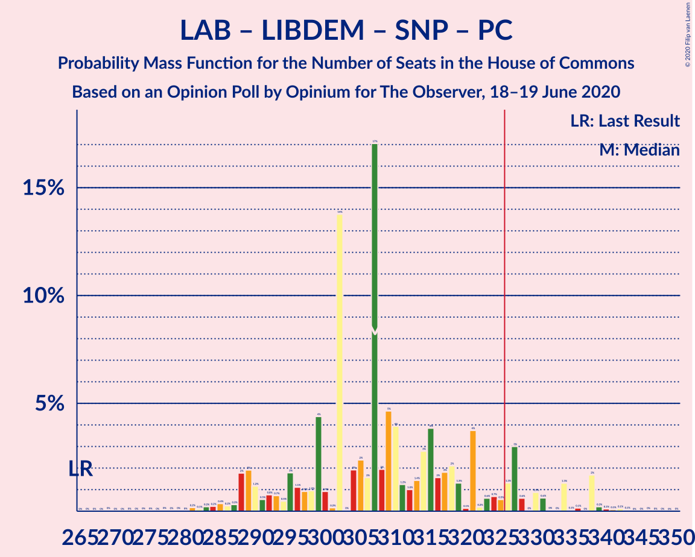

| Number of Seats | Probability | Accumulated | Special Marks |
|:---------------:|:-----------:|:-----------:|:-------------:|
| 265 | 0% | 100% | Last Result |
| 266 | 0% | 100% |  |
| 267 | 0% | 100% |  |
| 268 | 0% | 100% |  |
| 269 | 0% | 100% |  |
| 270 | 0% | 100% |  |
| 271 | 0% | 99.9% |  |
| 272 | 0% | 99.9% |  |
| 273 | 0% | 99.9% |  |
| 274 | 0% | 99.9% |  |
| 275 | 0% | 99.9% |  |
| 276 | 0% | 99.9% |  |
| 277 | 0% | 99.9% |  |
| 278 | 0% | 99.8% |  |
| 279 | 0% | 99.8% |  |
| 280 | 0% | 99.8% |  |
| 281 | 0.2% | 99.7% |  |
| 282 | 0.1% | 99.6% |  |
| 283 | 0.2% | 99.5% |  |
| 284 | 0.2% | 99.3% |  |
| 285 | 0.4% | 99.0% |  |
| 286 | 0.2% | 98.7% |  |
| 287 | 0.3% | 98% |  |
| 288 | 2% | 98% |  |
| 289 | 2% | 96% |  |
| 290 | 1.2% | 94% |  |
| 291 | 0.5% | 93% |  |
| 292 | 0.8% | 93% |  |
| 293 | 0.7% | 92% |  |
| 294 | 0.5% | 91% |  |
| 295 | 2% | 91% |  |
| 296 | 1.1% | 89% |  |
| 297 | 0.9% | 88% |  |
| 298 | 1.0% | 87% |  |
| 299 | 4% | 86% |  |
| 300 | 0.9% | 82% |  |
| 301 | 0.2% | 81% |  |
| 302 | 14% | 81% |  |
| 303 | 0% | 67% |  |
| 304 | 2% | 67% |  |
| 305 | 2% | 65% |  |
| 306 | 2% | 62% |  |
| 307 | 17% | 61% | Median |
| 308 | 2% | 44% |  |
| 309 | 5% | 42% |  |
| 310 | 4% | 37% |  |
| 311 | 1.2% | 33% |  |
| 312 | 1.0% | 32% |  |
| 313 | 1.4% | 31% |  |
| 314 | 3% | 30% |  |
| 315 | 4% | 27% |  |
| 316 | 2% | 23% |  |
| 317 | 2% | 21% |  |
| 318 | 2% | 20% |  |
| 319 | 1.3% | 18% |  |
| 320 | 0.1% | 16% |  |
| 321 | 4% | 16% |  |
| 322 | 0.2% | 12% |  |
| 323 | 0.6% | 12% |  |
| 324 | 0.7% | 12% |  |
| 325 | 0.5% | 11% |  |
| 326 | 1.3% | 10% | Majority |
| 327 | 3% | 9% |  |
| 328 | 0.6% | 6% |  |
| 329 | 0% | 5% |  |
| 330 | 0.9% | 5% |  |
| 331 | 0.6% | 5% |  |
| 332 | 0% | 4% |  |
| 333 | 0% | 4% |  |
| 334 | 1.3% | 4% |  |
| 335 | 0.1% | 3% |  |
| 336 | 0.1% | 2% |  |
| 337 | 0% | 2% |  |
| 338 | 2% | 2% |  |
| 339 | 0.2% | 0.6% |  |
| 340 | 0.1% | 0.4% |  |
| 341 | 0.1% | 0.3% |  |
| 342 | 0.1% | 0.2% |  |
| 343 | 0.1% | 0.1% |  |
| 344 | 0% | 0.1% |  |
| 345 | 0% | 0.1% |  |
| 346 | 0% | 0.1% |  |
| 347 | 0% | 0% |  |

### Labour Party – Scottish National Party – Plaid Cymru

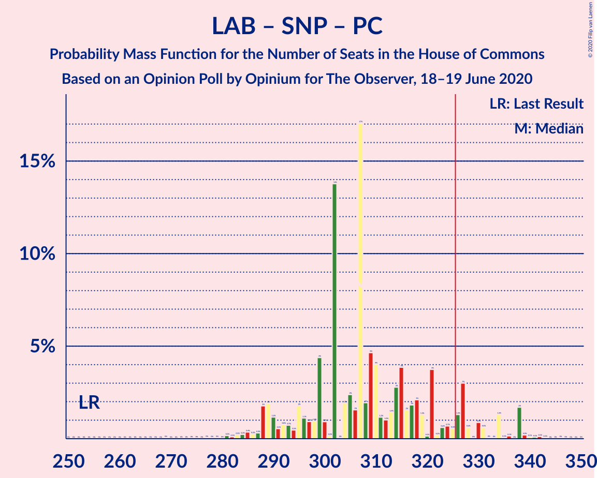

| Number of Seats | Probability | Accumulated | Special Marks |
|:---------------:|:-----------:|:-----------:|:-------------:|
| 254 | 0% | 100% | Last Result |
| 255 | 0% | 100% |  |
| 256 | 0% | 100% |  |
| 257 | 0% | 100% |  |
| 258 | 0% | 100% |  |
| 259 | 0% | 100% |  |
| 260 | 0% | 100% |  |
| 261 | 0% | 100% |  |
| 262 | 0% | 100% |  |
| 263 | 0% | 100% |  |
| 264 | 0% | 100% |  |
| 265 | 0% | 100% |  |
| 266 | 0% | 100% |  |
| 267 | 0% | 100% |  |
| 268 | 0% | 100% |  |
| 269 | 0% | 100% |  |
| 270 | 0% | 100% |  |
| 271 | 0% | 99.9% |  |
| 272 | 0% | 99.9% |  |
| 273 | 0% | 99.9% |  |
| 274 | 0% | 99.9% |  |
| 275 | 0% | 99.9% |  |
| 276 | 0% | 99.9% |  |
| 277 | 0% | 99.9% |  |
| 278 | 0% | 99.8% |  |
| 279 | 0% | 99.8% |  |
| 280 | 0% | 99.8% |  |
| 281 | 0.2% | 99.7% |  |
| 282 | 0.1% | 99.6% |  |
| 283 | 0.2% | 99.5% |  |
| 284 | 0.2% | 99.3% |  |
| 285 | 0.4% | 99.0% |  |
| 286 | 0.2% | 98.7% |  |
| 287 | 0.3% | 98% |  |
| 288 | 2% | 98% |  |
| 289 | 2% | 96% |  |
| 290 | 1.2% | 94% |  |
| 291 | 0.5% | 93% |  |
| 292 | 0.8% | 93% |  |
| 293 | 0.7% | 92% |  |
| 294 | 0.5% | 91% |  |
| 295 | 2% | 91% |  |
| 296 | 1.1% | 89% |  |
| 297 | 0.9% | 88% |  |
| 298 | 1.0% | 87% |  |
| 299 | 4% | 86% |  |
| 300 | 0.9% | 82% |  |
| 301 | 0.2% | 81% |  |
| 302 | 14% | 81% |  |
| 303 | 0% | 67% |  |
| 304 | 2% | 67% |  |
| 305 | 2% | 65% |  |
| 306 | 2% | 62% |  |
| 307 | 17% | 61% | Median |
| 308 | 2% | 44% |  |
| 309 | 5% | 42% |  |
| 310 | 4% | 37% |  |
| 311 | 1.2% | 33% |  |
| 312 | 1.0% | 32% |  |
| 313 | 1.4% | 31% |  |
| 314 | 3% | 30% |  |
| 315 | 4% | 27% |  |
| 316 | 2% | 23% |  |
| 317 | 2% | 21% |  |
| 318 | 2% | 20% |  |
| 319 | 1.3% | 18% |  |
| 320 | 0.1% | 16% |  |
| 321 | 4% | 16% |  |
| 322 | 0.2% | 12% |  |
| 323 | 0.6% | 12% |  |
| 324 | 0.7% | 12% |  |
| 325 | 0.5% | 11% |  |
| 326 | 1.3% | 10% | Majority |
| 327 | 3% | 9% |  |
| 328 | 0.6% | 6% |  |
| 329 | 0% | 5% |  |
| 330 | 0.9% | 5% |  |
| 331 | 0.6% | 5% |  |
| 332 | 0% | 4% |  |
| 333 | 0% | 4% |  |
| 334 | 1.3% | 4% |  |
| 335 | 0.1% | 3% |  |
| 336 | 0.1% | 2% |  |
| 337 | 0% | 2% |  |
| 338 | 2% | 2% |  |
| 339 | 0.2% | 0.6% |  |
| 340 | 0.1% | 0.4% |  |
| 341 | 0.1% | 0.3% |  |
| 342 | 0.1% | 0.2% |  |
| 343 | 0.1% | 0.1% |  |
| 344 | 0% | 0.1% |  |
| 345 | 0% | 0.1% |  |
| 346 | 0% | 0.1% |  |
| 347 | 0% | 0% |  |

### Labour Party – Liberal Democrats – Scottish National Party

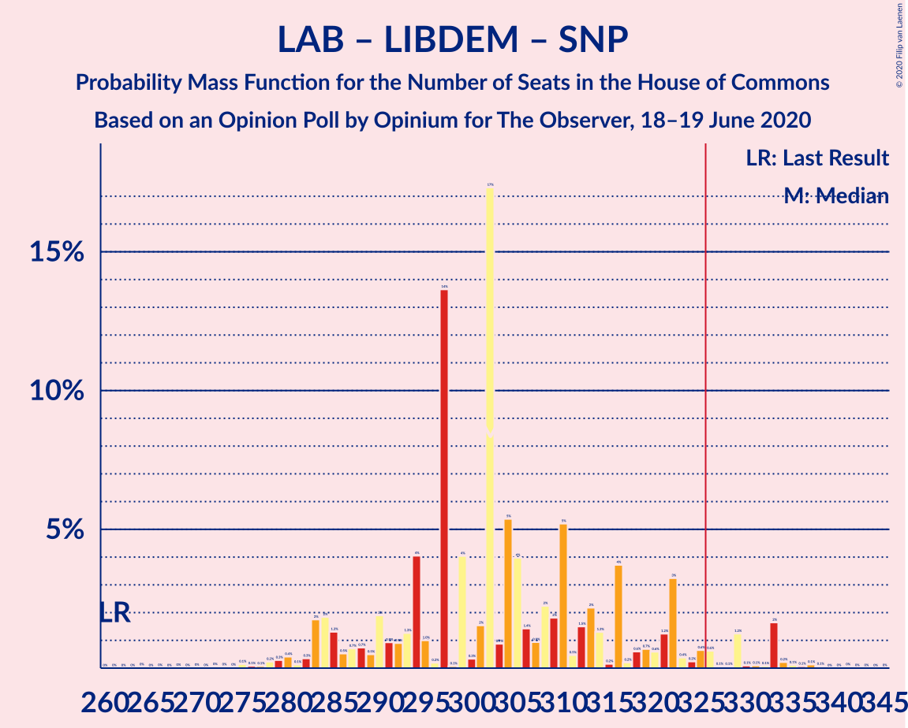

| Number of Seats | Probability | Accumulated | Special Marks |
|:---------------:|:-----------:|:-----------:|:-------------:|
| 261 | 0% | 100% | Last Result |
| 262 | 0% | 100% |  |
| 263 | 0% | 100% |  |
| 264 | 0% | 100% |  |
| 265 | 0% | 100% |  |
| 266 | 0% | 99.9% |  |
| 267 | 0% | 99.9% |  |
| 268 | 0% | 99.9% |  |
| 269 | 0% | 99.9% |  |
| 270 | 0% | 99.9% |  |
| 271 | 0% | 99.9% |  |
| 272 | 0% | 99.9% |  |
| 273 | 0% | 99.8% |  |
| 274 | 0% | 99.8% |  |
| 275 | 0.1% | 99.8% |  |
| 276 | 0.1% | 99.6% |  |
| 277 | 0.1% | 99.5% |  |
| 278 | 0.2% | 99.5% |  |
| 279 | 0.3% | 99.2% |  |
| 280 | 0.4% | 98.9% |  |
| 281 | 0.1% | 98.5% |  |
| 282 | 0.3% | 98% |  |
| 283 | 2% | 98% |  |
| 284 | 2% | 96% |  |
| 285 | 1.3% | 94% |  |
| 286 | 0.5% | 93% |  |
| 287 | 0.7% | 93% |  |
| 288 | 0.7% | 92% |  |
| 289 | 0.5% | 91% |  |
| 290 | 2% | 91% |  |
| 291 | 0.9% | 89% |  |
| 292 | 0.9% | 88% |  |
| 293 | 1.3% | 87% |  |
| 294 | 4% | 86% |  |
| 295 | 1.0% | 82% |  |
| 296 | 0.2% | 81% |  |
| 297 | 14% | 80% |  |
| 298 | 0.1% | 67% |  |
| 299 | 4% | 67% |  |
| 300 | 0.3% | 63% |  |
| 301 | 2% | 62% |  |
| 302 | 17% | 61% | Median |
| 303 | 0.9% | 44% |  |
| 304 | 5% | 43% |  |
| 305 | 4% | 37% |  |
| 306 | 1.4% | 33% |  |
| 307 | 0.9% | 32% |  |
| 308 | 2% | 31% |  |
| 309 | 2% | 29% |  |
| 310 | 5% | 27% |  |
| 311 | 0.5% | 22% |  |
| 312 | 1.5% | 21% |  |
| 313 | 2% | 20% |  |
| 314 | 1.3% | 18% |  |
| 315 | 0.2% | 16% |  |
| 316 | 4% | 16% |  |
| 317 | 0.2% | 12% |  |
| 318 | 0.6% | 12% |  |
| 319 | 0.7% | 12% |  |
| 320 | 0.6% | 11% |  |
| 321 | 1.2% | 10% |  |
| 322 | 3% | 9% |  |
| 323 | 0.4% | 6% |  |
| 324 | 0.2% | 5% |  |
| 325 | 0.6% | 5% |  |
| 326 | 0.6% | 5% | Majority |
| 327 | 0.1% | 4% |  |
| 328 | 0.1% | 4% |  |
| 329 | 1.2% | 4% |  |
| 330 | 0.1% | 3% |  |
| 331 | 0.1% | 2% |  |
| 332 | 0.1% | 2% |  |
| 333 | 2% | 2% |  |
| 334 | 0.2% | 0.6% |  |
| 335 | 0.1% | 0.4% |  |
| 336 | 0.1% | 0.3% |  |
| 337 | 0.1% | 0.3% |  |
| 338 | 0.1% | 0.1% |  |
| 339 | 0% | 0.1% |  |
| 340 | 0% | 0.1% |  |
| 341 | 0% | 0.1% |  |
| 342 | 0% | 0% |  |

### Labour Party – Scottish National Party

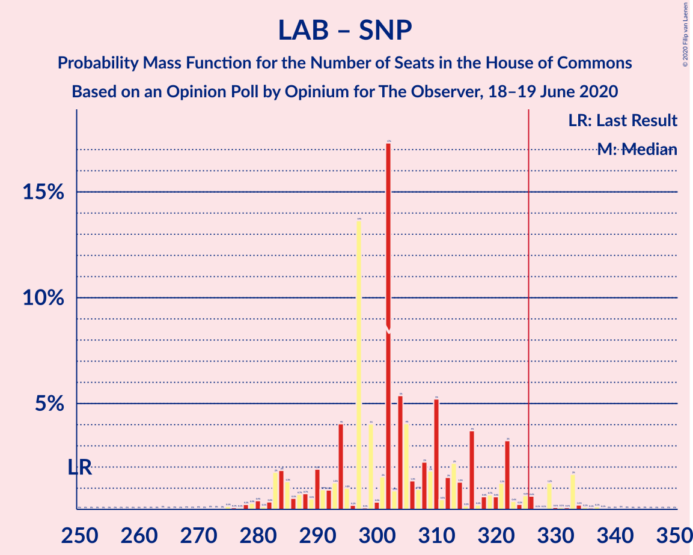

| Number of Seats | Probability | Accumulated | Special Marks |
|:---------------:|:-----------:|:-----------:|:-------------:|
| 250 | 0% | 100% | Last Result |
| 251 | 0% | 100% |  |
| 252 | 0% | 100% |  |
| 253 | 0% | 100% |  |
| 254 | 0% | 100% |  |
| 255 | 0% | 100% |  |
| 256 | 0% | 100% |  |
| 257 | 0% | 100% |  |
| 258 | 0% | 100% |  |
| 259 | 0% | 100% |  |
| 260 | 0% | 100% |  |
| 261 | 0% | 100% |  |
| 262 | 0% | 100% |  |
| 263 | 0% | 100% |  |
| 264 | 0% | 100% |  |
| 265 | 0% | 100% |  |
| 266 | 0% | 99.9% |  |
| 267 | 0% | 99.9% |  |
| 268 | 0% | 99.9% |  |
| 269 | 0% | 99.9% |  |
| 270 | 0% | 99.9% |  |
| 271 | 0% | 99.9% |  |
| 272 | 0% | 99.9% |  |
| 273 | 0% | 99.8% |  |
| 274 | 0% | 99.8% |  |
| 275 | 0.1% | 99.8% |  |
| 276 | 0.1% | 99.6% |  |
| 277 | 0.1% | 99.5% |  |
| 278 | 0.2% | 99.5% |  |
| 279 | 0.3% | 99.2% |  |
| 280 | 0.4% | 98.9% |  |
| 281 | 0.1% | 98.5% |  |
| 282 | 0.4% | 98% |  |
| 283 | 2% | 98% |  |
| 284 | 2% | 96% |  |
| 285 | 1.3% | 94% |  |
| 286 | 0.5% | 93% |  |
| 287 | 0.7% | 93% |  |
| 288 | 0.7% | 92% |  |
| 289 | 0.5% | 91% |  |
| 290 | 2% | 91% |  |
| 291 | 0.9% | 89% |  |
| 292 | 0.9% | 88% |  |
| 293 | 1.3% | 87% |  |
| 294 | 4% | 86% |  |
| 295 | 1.0% | 82% |  |
| 296 | 0.2% | 81% |  |
| 297 | 14% | 80% |  |
| 298 | 0.1% | 67% |  |
| 299 | 4% | 67% |  |
| 300 | 0.3% | 63% |  |
| 301 | 2% | 62% |  |
| 302 | 17% | 61% | Median |
| 303 | 0.9% | 44% |  |
| 304 | 5% | 43% |  |
| 305 | 4% | 37% |  |
| 306 | 1.3% | 33% |  |
| 307 | 0.9% | 32% |  |
| 308 | 2% | 31% |  |
| 309 | 2% | 29% |  |
| 310 | 5% | 27% |  |
| 311 | 0.5% | 22% |  |
| 312 | 2% | 21% |  |
| 313 | 2% | 20% |  |
| 314 | 1.3% | 18% |  |
| 315 | 0.2% | 16% |  |
| 316 | 4% | 16% |  |
| 317 | 0.2% | 12% |  |
| 318 | 0.6% | 12% |  |
| 319 | 0.7% | 12% |  |
| 320 | 0.6% | 11% |  |
| 321 | 1.2% | 10% |  |
| 322 | 3% | 9% |  |
| 323 | 0.4% | 6% |  |
| 324 | 0.2% | 5% |  |
| 325 | 0.6% | 5% |  |
| 326 | 0.6% | 5% | Majority |
| 327 | 0.1% | 4% |  |
| 328 | 0.1% | 4% |  |
| 329 | 1.2% | 4% |  |
| 330 | 0.1% | 3% |  |
| 331 | 0.1% | 2% |  |
| 332 | 0.1% | 2% |  |
| 333 | 2% | 2% |  |
| 334 | 0.2% | 0.6% |  |
| 335 | 0.1% | 0.4% |  |
| 336 | 0.1% | 0.3% |  |
| 337 | 0.1% | 0.3% |  |
| 338 | 0.1% | 0.1% |  |
| 339 | 0% | 0.1% |  |
| 340 | 0% | 0.1% |  |
| 341 | 0% | 0.1% |  |
| 342 | 0% | 0% |  |

### Labour Party – Liberal Democrats – Plaid Cymru

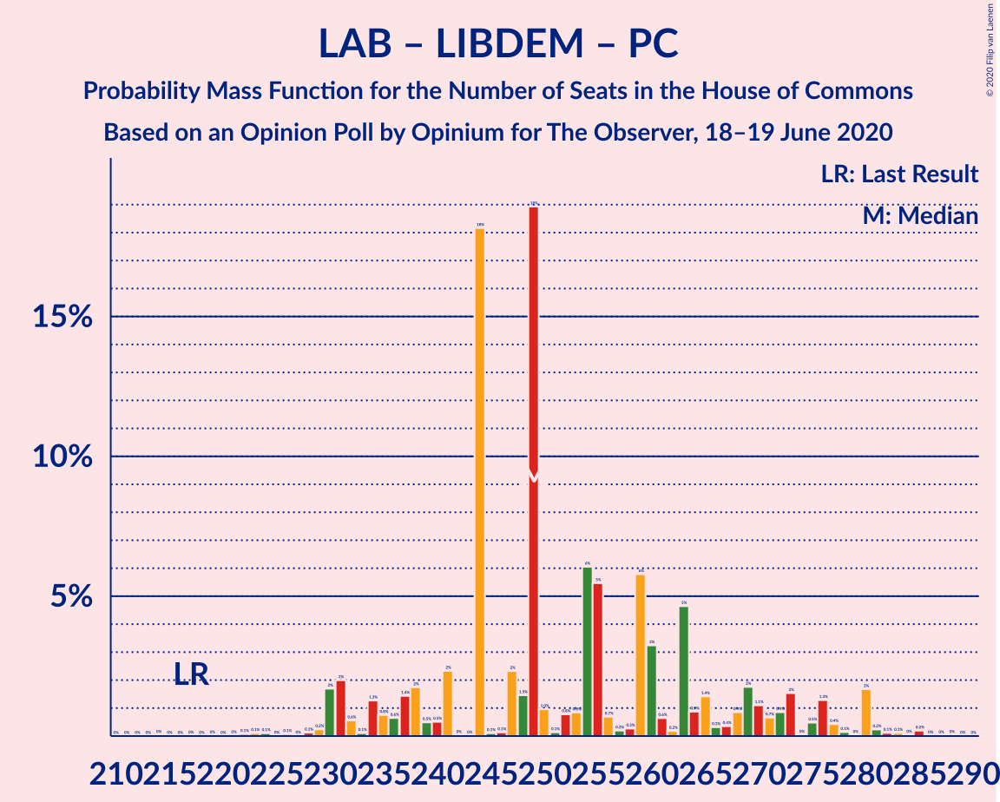

| Number of Seats | Probability | Accumulated | Special Marks |
|:---------------:|:-----------:|:-----------:|:-------------:|
| 214 | 0% | 100% |  |
| 215 | 0% | 99.9% |  |
| 216 | 0% | 99.9% |  |
| 217 | 0% | 99.9% | Last Result |
| 218 | 0% | 99.9% |  |
| 219 | 0% | 99.9% |  |
| 220 | 0% | 99.9% |  |
| 221 | 0% | 99.9% |  |
| 222 | 0.1% | 99.9% |  |
| 223 | 0.1% | 99.8% |  |
| 224 | 0.1% | 99.7% |  |
| 225 | 0% | 99.6% |  |
| 226 | 0.1% | 99.6% |  |
| 227 | 0% | 99.5% |  |
| 228 | 0.1% | 99.5% |  |
| 229 | 0.2% | 99.4% |  |
| 230 | 2% | 99.2% |  |
| 231 | 2% | 97% |  |
| 232 | 0.6% | 95% |  |
| 233 | 0.1% | 95% |  |
| 234 | 1.3% | 95% |  |
| 235 | 0.8% | 94% |  |
| 236 | 0.6% | 93% |  |
| 237 | 1.4% | 92% |  |
| 238 | 2% | 91% |  |
| 239 | 0.5% | 89% |  |
| 240 | 0.5% | 88% |  |
| 241 | 2% | 88% |  |
| 242 | 0% | 86% |  |
| 243 | 0% | 86% |  |
| 244 | 18% | 86% |  |
| 245 | 0.1% | 67% |  |
| 246 | 0.1% | 67% |  |
| 247 | 2% | 67% |  |
| 248 | 1.5% | 65% |  |
| 249 | 19% | 63% | Median |
| 250 | 1.0% | 44% |  |
| 251 | 0.1% | 44% |  |
| 252 | 0.8% | 43% |  |
| 253 | 0.8% | 43% |  |
| 254 | 6% | 42% |  |
| 255 | 5% | 36% |  |
| 256 | 0.7% | 30% |  |
| 257 | 0.2% | 30% |  |
| 258 | 0.3% | 29% |  |
| 259 | 6% | 29% |  |
| 260 | 3% | 23% |  |
| 261 | 0.6% | 20% |  |
| 262 | 0.2% | 19% |  |
| 263 | 5% | 19% |  |
| 264 | 0.9% | 15% |  |
| 265 | 1.4% | 14% |  |
| 266 | 0.3% | 12% |  |
| 267 | 0.4% | 12% |  |
| 268 | 0.9% | 12% |  |
| 269 | 2% | 11% |  |
| 270 | 1.1% | 9% |  |
| 271 | 0.7% | 8% |  |
| 272 | 0.9% | 7% |  |
| 273 | 2% | 6% |  |
| 274 | 0% | 5% |  |
| 275 | 0.5% | 5% |  |
| 276 | 1.3% | 4% |  |
| 277 | 0.4% | 3% |  |
| 278 | 0.1% | 3% |  |
| 279 | 0% | 3% |  |
| 280 | 2% | 2% |  |
| 281 | 0.2% | 0.8% |  |
| 282 | 0.1% | 0.6% |  |
| 283 | 0.1% | 0.5% |  |
| 284 | 0% | 0.3% |  |
| 285 | 0.2% | 0.3% |  |
| 286 | 0% | 0.1% |  |
| 287 | 0% | 0.1% |  |
| 288 | 0% | 0.1% |  |
| 289 | 0% | 0% |  |

### Labour Party – Plaid Cymru

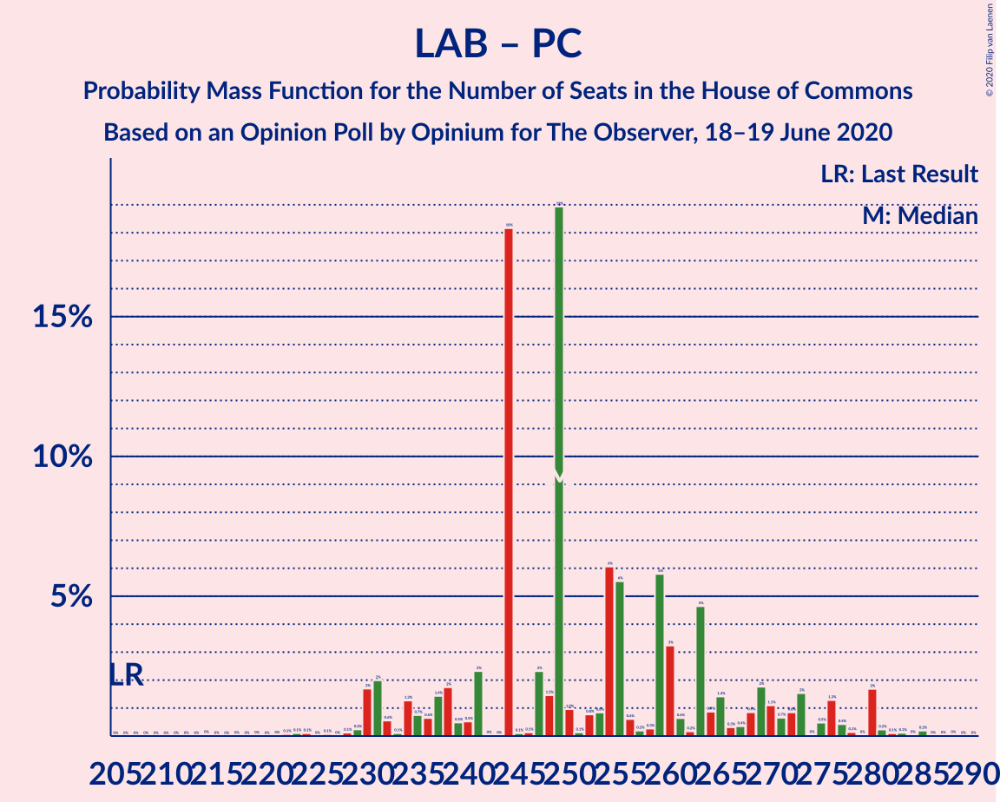

| Number of Seats | Probability | Accumulated | Special Marks |
|:---------------:|:-----------:|:-----------:|:-------------:|
| 206 | 0% | 100% | Last Result |
| 207 | 0% | 100% |  |
| 208 | 0% | 100% |  |
| 209 | 0% | 100% |  |
| 210 | 0% | 100% |  |
| 211 | 0% | 100% |  |
| 212 | 0% | 100% |  |
| 213 | 0% | 100% |  |
| 214 | 0% | 100% |  |
| 215 | 0% | 99.9% |  |
| 216 | 0% | 99.9% |  |
| 217 | 0% | 99.9% |  |
| 218 | 0% | 99.9% |  |
| 219 | 0% | 99.9% |  |
| 220 | 0% | 99.9% |  |
| 221 | 0% | 99.9% |  |
| 222 | 0.1% | 99.9% |  |
| 223 | 0.1% | 99.8% |  |
| 224 | 0.1% | 99.7% |  |
| 225 | 0% | 99.6% |  |
| 226 | 0.1% | 99.6% |  |
| 227 | 0% | 99.5% |  |
| 228 | 0.1% | 99.5% |  |
| 229 | 0.2% | 99.4% |  |
| 230 | 2% | 99.2% |  |
| 231 | 2% | 97% |  |
| 232 | 0.6% | 95% |  |
| 233 | 0.1% | 95% |  |
| 234 | 1.3% | 95% |  |
| 235 | 0.7% | 94% |  |
| 236 | 0.6% | 93% |  |
| 237 | 1.4% | 92% |  |
| 238 | 2% | 91% |  |
| 239 | 0.5% | 89% |  |
| 240 | 0.5% | 88% |  |
| 241 | 2% | 88% |  |
| 242 | 0% | 86% |  |
| 243 | 0% | 86% |  |
| 244 | 18% | 86% |  |
| 245 | 0.1% | 67% |  |
| 246 | 0.1% | 67% |  |
| 247 | 2% | 67% |  |
| 248 | 1.5% | 65% |  |
| 249 | 19% | 63% | Median |
| 250 | 1.0% | 44% |  |
| 251 | 0.1% | 44% |  |
| 252 | 0.8% | 43% |  |
| 253 | 0.8% | 43% |  |
| 254 | 6% | 42% |  |
| 255 | 6% | 36% |  |
| 256 | 0.6% | 30% |  |
| 257 | 0.2% | 30% |  |
| 258 | 0.3% | 29% |  |
| 259 | 6% | 29% |  |
| 260 | 3% | 23% |  |
| 261 | 0.6% | 20% |  |
| 262 | 0.2% | 19% |  |
| 263 | 5% | 19% |  |
| 264 | 0.9% | 15% |  |
| 265 | 1.4% | 14% |  |
| 266 | 0.3% | 12% |  |
| 267 | 0.4% | 12% |  |
| 268 | 0.9% | 12% |  |
| 269 | 2% | 11% |  |
| 270 | 1.1% | 9% |  |
| 271 | 0.7% | 8% |  |
| 272 | 0.8% | 7% |  |
| 273 | 2% | 6% |  |
| 274 | 0% | 5% |  |
| 275 | 0.5% | 5% |  |
| 276 | 1.3% | 4% |  |
| 277 | 0.4% | 3% |  |
| 278 | 0.1% | 3% |  |
| 279 | 0% | 3% |  |
| 280 | 2% | 2% |  |
| 281 | 0.2% | 0.8% |  |
| 282 | 0.1% | 0.6% |  |
| 283 | 0.1% | 0.5% |  |
| 284 | 0% | 0.3% |  |
| 285 | 0.2% | 0.3% |  |
| 286 | 0% | 0.1% |  |
| 287 | 0% | 0.1% |  |
| 288 | 0% | 0.1% |  |
| 289 | 0% | 0% |  |

### Labour Party

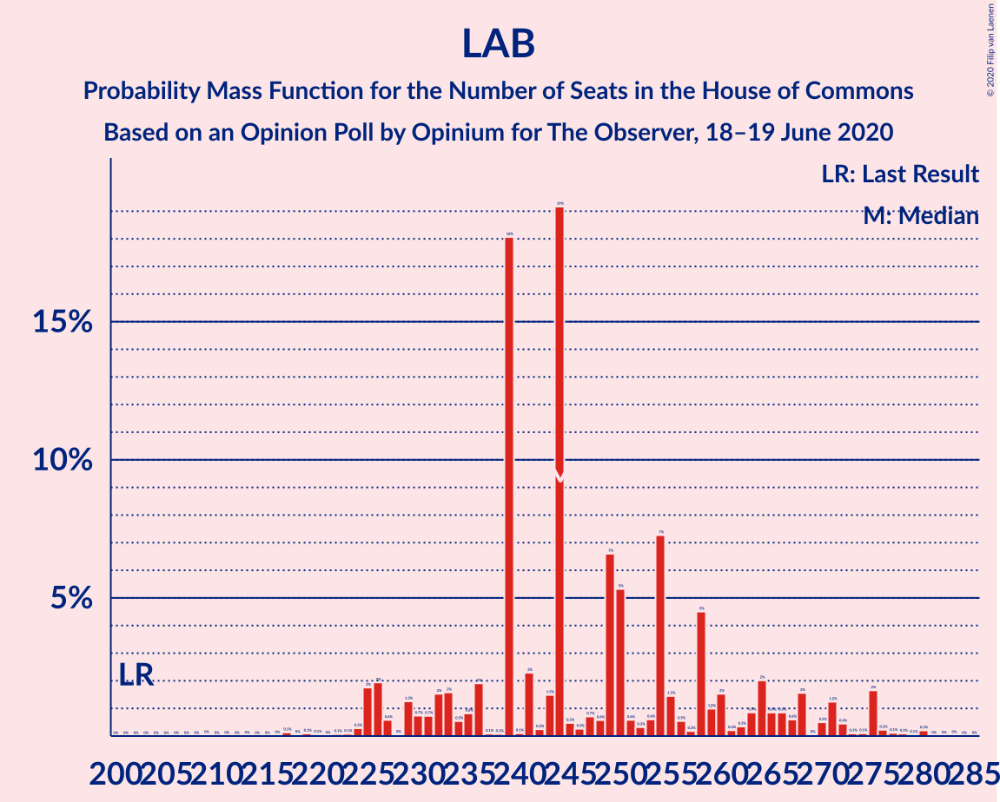

| Number of Seats | Probability | Accumulated | Special Marks |
|:---------------:|:-----------:|:-----------:|:-------------:|
| 202 | 0% | 100% | Last Result |
| 203 | 0% | 100% |  |
| 204 | 0% | 100% |  |
| 205 | 0% | 100% |  |
| 206 | 0% | 100% |  |
| 207 | 0% | 100% |  |
| 208 | 0% | 100% |  |
| 209 | 0% | 100% |  |
| 210 | 0% | 99.9% |  |
| 211 | 0% | 99.9% |  |
| 212 | 0% | 99.9% |  |
| 213 | 0% | 99.9% |  |
| 214 | 0% | 99.9% |  |
| 215 | 0% | 99.9% |  |
| 216 | 0% | 99.9% |  |
| 217 | 0.1% | 99.9% |  |
| 218 | 0% | 99.7% |  |
| 219 | 0.1% | 99.7% |  |
| 220 | 0.1% | 99.6% |  |
| 221 | 0% | 99.5% |  |
| 222 | 0.1% | 99.5% |  |
| 223 | 0.1% | 99.4% |  |
| 224 | 0.3% | 99.4% |  |
| 225 | 2% | 99.1% |  |
| 226 | 2% | 97% |  |
| 227 | 0.6% | 95% |  |
| 228 | 0% | 95% |  |
| 229 | 1.3% | 95% |  |
| 230 | 0.7% | 93% |  |
| 231 | 0.7% | 93% |  |
| 232 | 2% | 92% |  |
| 233 | 2% | 90% |  |
| 234 | 0.5% | 89% |  |
| 235 | 0.8% | 88% |  |
| 236 | 2% | 88% |  |
| 237 | 0.1% | 86% |  |
| 238 | 0.1% | 86% |  |
| 239 | 18% | 85% |  |
| 240 | 0.1% | 67% |  |
| 241 | 2% | 67% |  |
| 242 | 0.2% | 65% |  |
| 243 | 1.5% | 65% |  |
| 244 | 19% | 63% | Median |
| 245 | 0.5% | 44% |  |
| 246 | 0.3% | 44% |  |
| 247 | 0.7% | 43% |  |
| 248 | 0.6% | 43% |  |
| 249 | 7% | 42% |  |
| 250 | 5% | 35% |  |
| 251 | 0.6% | 30% |  |
| 252 | 0.3% | 30% |  |
| 253 | 0.6% | 29% |  |
| 254 | 7% | 29% |  |
| 255 | 1.5% | 21% |  |
| 256 | 0.5% | 20% |  |
| 257 | 0.2% | 19% |  |
| 258 | 5% | 19% |  |
| 259 | 1.0% | 15% |  |
| 260 | 2% | 14% |  |
| 261 | 0.2% | 12% |  |
| 262 | 0.3% | 12% |  |
| 263 | 0.9% | 12% |  |
| 264 | 2% | 11% |  |
| 265 | 0.9% | 9% |  |
| 266 | 0.9% | 8% |  |
| 267 | 0.6% | 7% |  |
| 268 | 2% | 6% |  |
| 269 | 0% | 5% |  |
| 270 | 0.5% | 5% |  |
| 271 | 1.2% | 4% |  |
| 272 | 0.4% | 3% |  |
| 273 | 0.1% | 3% |  |
| 274 | 0.1% | 3% |  |
| 275 | 2% | 2% |  |
| 276 | 0.2% | 0.8% |  |
| 277 | 0.1% | 0.6% |  |
| 278 | 0.1% | 0.5% |  |
| 279 | 0.1% | 0.4% |  |
| 280 | 0.2% | 0.3% |  |
| 281 | 0% | 0.1% |  |
| 282 | 0% | 0.1% |  |
| 283 | 0% | 0.1% |  |
| 284 | 0% | 0% |  |

### Labour Party – Liberal Democrats

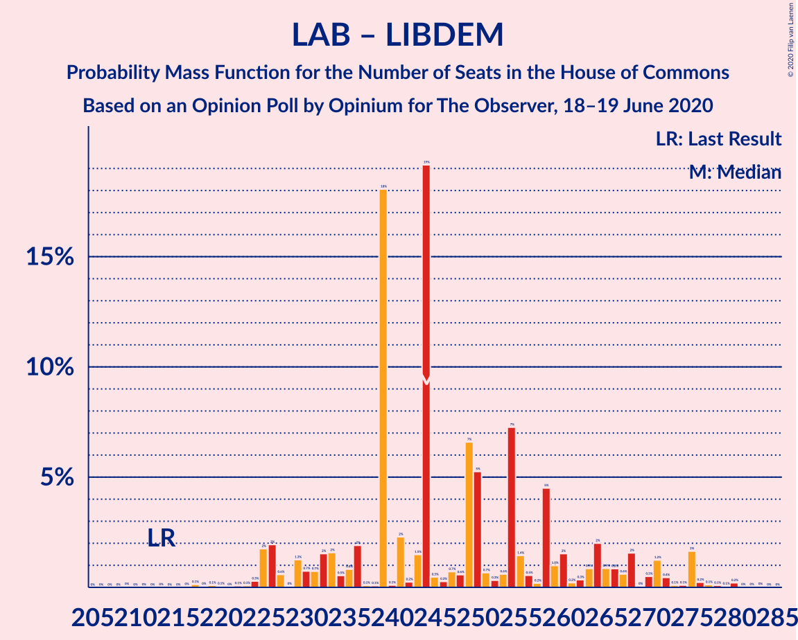

| Number of Seats | Probability | Accumulated | Special Marks |
|:---------------:|:-----------:|:-----------:|:-------------:|
| 209 | 0% | 100% |  |
| 210 | 0% | 99.9% |  |
| 211 | 0% | 99.9% |  |
| 212 | 0% | 99.9% |  |
| 213 | 0% | 99.9% | Last Result |
| 214 | 0% | 99.9% |  |
| 215 | 0% | 99.9% |  |
| 216 | 0% | 99.9% |  |
| 217 | 0.1% | 99.9% |  |
| 218 | 0% | 99.7% |  |
| 219 | 0.1% | 99.7% |  |
| 220 | 0.1% | 99.6% |  |
| 221 | 0% | 99.5% |  |
| 222 | 0.1% | 99.5% |  |
| 223 | 0.1% | 99.4% |  |
| 224 | 0.3% | 99.4% |  |
| 225 | 2% | 99.1% |  |
| 226 | 2% | 97% |  |
| 227 | 0.6% | 95% |  |
| 228 | 0% | 95% |  |
| 229 | 1.3% | 95% |  |
| 230 | 0.7% | 93% |  |
| 231 | 0.7% | 93% |  |
| 232 | 2% | 92% |  |
| 233 | 2% | 90% |  |
| 234 | 0.5% | 89% |  |
| 235 | 0.8% | 88% |  |
| 236 | 2% | 88% |  |
| 237 | 0.1% | 86% |  |
| 238 | 0.1% | 86% |  |
| 239 | 18% | 85% |  |
| 240 | 0.1% | 67% |  |
| 241 | 2% | 67% |  |
| 242 | 0.2% | 65% |  |
| 243 | 1.5% | 65% |  |
| 244 | 19% | 63% | Median |
| 245 | 0.5% | 44% |  |
| 246 | 0.3% | 44% |  |
| 247 | 0.7% | 43% |  |
| 248 | 0.6% | 43% |  |
| 249 | 7% | 42% |  |
| 250 | 5% | 36% |  |
| 251 | 0.7% | 30% |  |
| 252 | 0.3% | 30% |  |
| 253 | 0.6% | 29% |  |
| 254 | 7% | 29% |  |
| 255 | 1.4% | 21% |  |
| 256 | 0.5% | 20% |  |
| 257 | 0.2% | 19% |  |
| 258 | 5% | 19% |  |
| 259 | 1.0% | 15% |  |
| 260 | 2% | 14% |  |
| 261 | 0.2% | 12% |  |
| 262 | 0.3% | 12% |  |
| 263 | 0.9% | 12% |  |
| 264 | 2% | 11% |  |
| 265 | 0.9% | 9% |  |
| 266 | 0.8% | 8% |  |
| 267 | 0.6% | 7% |  |
| 268 | 2% | 6% |  |
| 269 | 0% | 5% |  |
| 270 | 0.5% | 5% |  |
| 271 | 1.2% | 4% |  |
| 272 | 0.4% | 3% |  |
| 273 | 0.1% | 3% |  |
| 274 | 0.1% | 3% |  |
| 275 | 2% | 2% |  |
| 276 | 0.2% | 0.8% |  |
| 277 | 0.1% | 0.6% |  |
| 278 | 0.1% | 0.5% |  |
| 279 | 0.1% | 0.4% |  |
| 280 | 0.2% | 0.3% |  |
| 281 | 0% | 0.1% |  |
| 282 | 0% | 0.1% |  |
| 283 | 0% | 0.1% |  |
| 284 | 0% | 0% |  |

## Technical Information

### Opinion Poll

+ **Polling firm:** Opinium
+ **Commissioner(s):** The Observer
+ **Fieldwork period:** 18–19 June 2020

### Calculations

+ **Sample size:** 1969
+ **Simulations done:** 131,072
+ **Error estimate:** 0.56%

