# Opinion Poll by Redfield & Wilton Strategies, 21 October 2020

<a href="#voting-intentions">Voting Intentions</a> | <a href="#seats">Seats</a> | <a href="#coalitions">Coalitions</a> | <a href="#technical-information">Technical Information</a>

## Voting Intentions

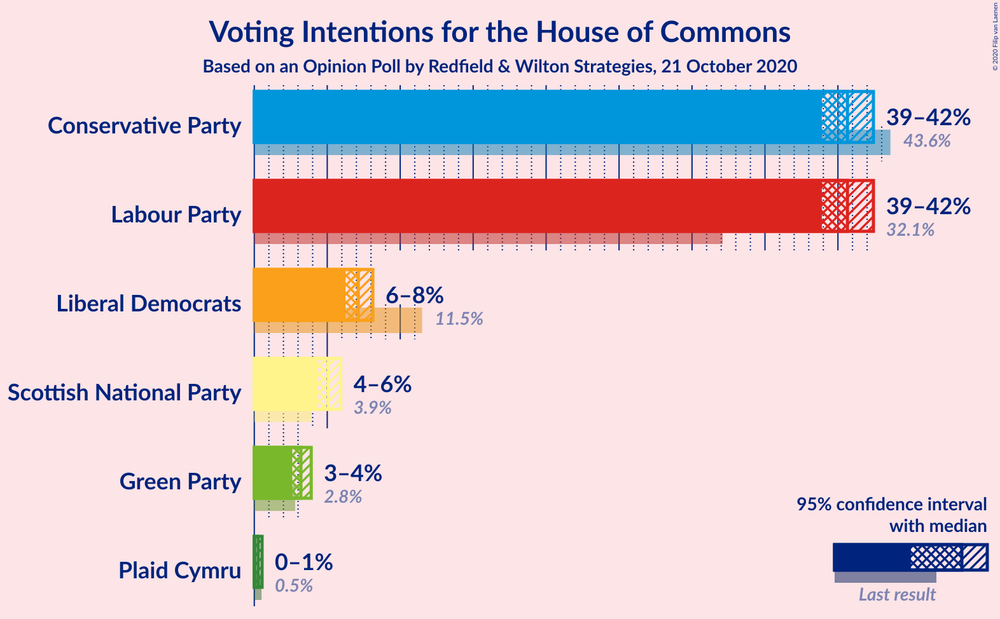

### Confidence Intervals

| Party | Last Result | Poll Result | 80% Confidence Interval | 90% Confidence Interval | 95% Confidence Interval | 99% Confidence Interval |
|:-----:|:-----------:|:-----------:|:-----------------------:|:-----------------------:|:-----------------------:|:-----------------------:|
| Conservative Party | 43.6% | 40.7% | 39.5–41.8% |39.2–42.1% |38.9–42.4% |38.3–43.0% |
| Labour Party | 32.1% | 40.7% | 39.5–41.8% |39.2–42.1% |38.9–42.4% |38.3–43.0% |
| Liberal Democrats | 11.5% | 7.1% | 6.6–7.8% |6.4–8.0% |6.2–8.1% |6.0–8.4% |
| Scottish National Party | 3.9% | 5.1% | 4.6–5.6% |4.5–5.8% |4.3–5.9% |4.1–6.2% |
| Green Party | 2.8% | 3.2% | 2.8–3.7% |2.7–3.8% |2.6–3.9% |2.4–4.1% |
| Plaid Cymru | 0.5% | 0.3% | 0.2–0.4% |0.2–0.5% |0.1–0.5% |0.1–0.6% |

*Note:* The poll result column reflects the actual value used in the calculations. Published results may vary slightly, and in addition be rounded to fewer digits.

## Seats

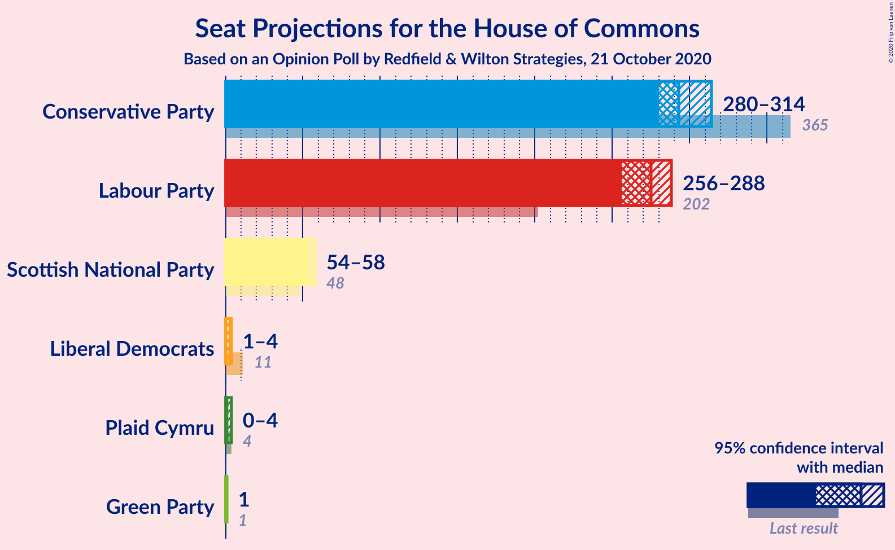

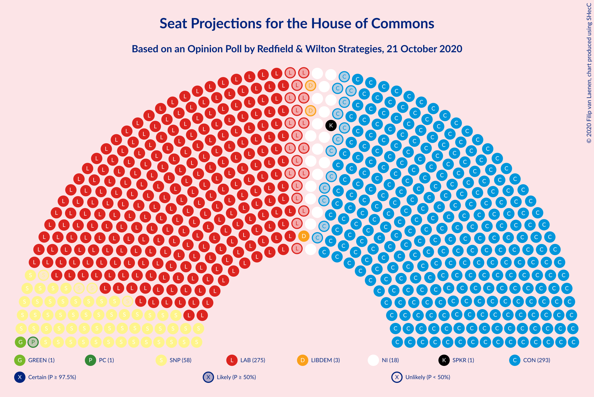

### Confidence Intervals

| Party | Last Result | Median | 80% Confidence Interval | 90% Confidence Interval | 95% Confidence Interval | 99% Confidence Interval |
|:-----:|:-----------:|:------:|:-----------------------:|:-----------------------:|:-----------------------:|:-----------------------:|
| <a href="#conservative-party">Conservative Party</a> | 365 | 293 | 283–306 |281–313 |280–314 |274–322 |
| <a href="#labour-party">Labour Party</a> | 202 | 275 | 260–284 |257–287 |256–288 |247–294 |
| <a href="#liberal-democrats">Liberal Democrats</a> | 11 | 3 | 1–4 |1–4 |1–4 |0–6 |
| <a href="#scottish-national-party">Scottish National Party</a> | 48 | 58 | 57–58 |55–58 |54–58 |53–58 |
| <a href="#green-party">Green Party</a> | 1 | 1 | 1 |1 |1 |1 |
| <a href="#plaid-cymru">Plaid Cymru</a> | 4 | 1 | 0–3 |0–4 |0–4 |0–4 |

### Conservative Party

*For a full overview of the results for this party, see the [Conservative Party](party-conservativeparty.html) page.*

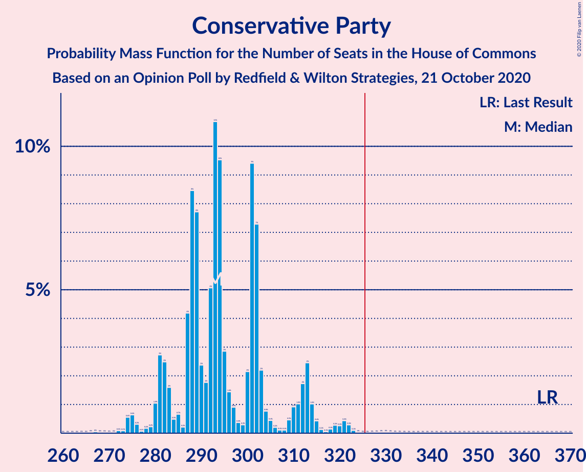

| Number of Seats | Probability | Accumulated | Special Marks |
|:---------------:|:-----------:|:-----------:|:-------------:|
| 266 | 0% | 100% |  |
| 267 | 0.1% | 99.9% |  |
| 268 | 0% | 99.9% |  |
| 269 | 0% | 99.9% |  |
| 270 | 0% | 99.8% |  |
| 271 | 0% | 99.8% |  |
| 272 | 0.1% | 99.8% |  |
| 273 | 0.1% | 99.7% |  |
| 274 | 0.5% | 99.6% |  |
| 275 | 0.7% | 99.1% |  |
| 276 | 0.3% | 98% |  |
| 277 | 0.1% | 98% |  |
| 278 | 0.2% | 98% |  |
| 279 | 0.3% | 98% |  |
| 280 | 0.9% | 98% |  |
| 281 | 3% | 97% |  |
| 282 | 2% | 94% |  |
| 283 | 2% | 91% |  |
| 284 | 0.6% | 89% |  |
| 285 | 0.7% | 89% |  |
| 286 | 0.2% | 88% |  |
| 287 | 4% | 88% |  |
| 288 | 9% | 84% |  |
| 289 | 7% | 75% |  |
| 290 | 3% | 67% |  |
| 291 | 2% | 65% |  |
| 292 | 5% | 63% |  |
| 293 | 10% | 58% | Median |
| 294 | 9% | 47% |  |
| 295 | 3% | 38% |  |
| 296 | 2% | 35% |  |
| 297 | 1.2% | 34% |  |
| 298 | 0.4% | 33% |  |
| 299 | 0.3% | 32% |  |
| 300 | 2% | 32% |  |
| 301 | 9% | 30% |  |
| 302 | 7% | 21% |  |
| 303 | 2% | 13% |  |
| 304 | 0.8% | 11% |  |
| 305 | 0.4% | 11% |  |
| 306 | 0.3% | 10% |  |
| 307 | 0.1% | 10% |  |
| 308 | 0.1% | 10% |  |
| 309 | 0.5% | 10% |  |
| 310 | 1.0% | 9% |  |
| 311 | 1.1% | 8% |  |
| 312 | 2% | 7% |  |
| 313 | 2% | 6% |  |
| 314 | 0.8% | 3% |  |
| 315 | 0.5% | 2% |  |
| 316 | 0.1% | 2% |  |
| 317 | 0.1% | 2% |  |
| 318 | 0.2% | 2% |  |
| 319 | 0.2% | 2% |  |
| 320 | 0.3% | 1.3% |  |
| 321 | 0.4% | 1.0% |  |
| 322 | 0.3% | 0.6% |  |
| 323 | 0.1% | 0.3% |  |
| 324 | 0% | 0.2% |  |
| 325 | 0% | 0.2% |  |
| 326 | 0% | 0.2% | Majority |
| 327 | 0% | 0.2% |  |
| 328 | 0% | 0.1% |  |
| 329 | 0% | 0.1% |  |
| 330 | 0% | 0.1% |  |
| 331 | 0% | 0.1% |  |
| 332 | 0% | 0% |  |
| 333 | 0% | 0% |  |
| 334 | 0% | 0% |  |
| 335 | 0% | 0% |  |
| 336 | 0% | 0% |  |
| 337 | 0% | 0% |  |
| 338 | 0% | 0% |  |
| 339 | 0% | 0% |  |
| 340 | 0% | 0% |  |
| 341 | 0% | 0% |  |
| 342 | 0% | 0% |  |
| 343 | 0% | 0% |  |
| 344 | 0% | 0% |  |
| 345 | 0% | 0% |  |
| 346 | 0% | 0% |  |
| 347 | 0% | 0% |  |
| 348 | 0% | 0% |  |
| 349 | 0% | 0% |  |
| 350 | 0% | 0% |  |
| 351 | 0% | 0% |  |
| 352 | 0% | 0% |  |
| 353 | 0% | 0% |  |
| 354 | 0% | 0% |  |
| 355 | 0% | 0% |  |
| 356 | 0% | 0% |  |
| 357 | 0% | 0% |  |
| 358 | 0% | 0% |  |
| 359 | 0% | 0% |  |
| 360 | 0% | 0% |  |
| 361 | 0% | 0% |  |
| 362 | 0% | 0% |  |
| 363 | 0% | 0% |  |
| 364 | 0% | 0% |  |
| 365 | 0% | 0% | Last Result |

### Labour Party

*For a full overview of the results for this party, see the [Labour Party](party-labourparty.html) page.*

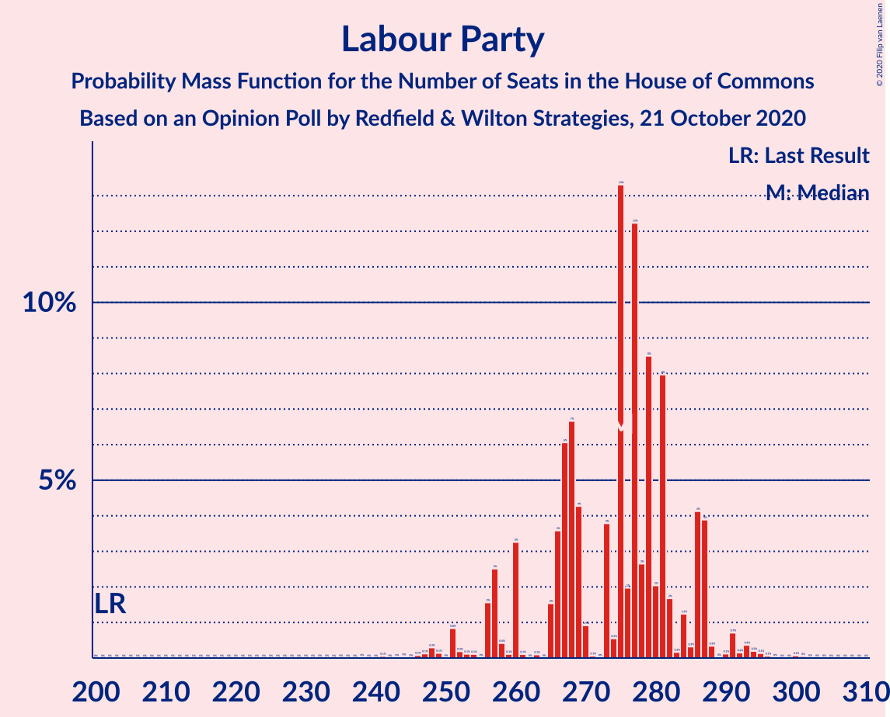

| Number of Seats | Probability | Accumulated | Special Marks |
|:---------------:|:-----------:|:-----------:|:-------------:|
| 202 | 0% | 100% | Last Result |
| 203 | 0% | 100% |  |
| 204 | 0% | 100% |  |
| 205 | 0% | 100% |  |
| 206 | 0% | 100% |  |
| 207 | 0% | 100% |  |
| 208 | 0% | 100% |  |
| 209 | 0% | 100% |  |
| 210 | 0% | 100% |  |
| 211 | 0% | 100% |  |
| 212 | 0% | 100% |  |
| 213 | 0% | 100% |  |
| 214 | 0% | 100% |  |
| 215 | 0% | 100% |  |
| 216 | 0% | 100% |  |
| 217 | 0% | 100% |  |
| 218 | 0% | 100% |  |
| 219 | 0% | 100% |  |
| 220 | 0% | 100% |  |
| 221 | 0% | 100% |  |
| 222 | 0% | 100% |  |
| 223 | 0% | 100% |  |
| 224 | 0% | 100% |  |
| 225 | 0% | 100% |  |
| 226 | 0% | 100% |  |
| 227 | 0% | 100% |  |
| 228 | 0% | 100% |  |
| 229 | 0% | 100% |  |
| 230 | 0% | 100% |  |
| 231 | 0% | 100% |  |
| 232 | 0% | 100% |  |
| 233 | 0% | 100% |  |
| 234 | 0% | 100% |  |
| 235 | 0% | 100% |  |
| 236 | 0% | 100% |  |
| 237 | 0% | 100% |  |
| 238 | 0% | 100% |  |
| 239 | 0% | 100% |  |
| 240 | 0% | 99.9% |  |
| 241 | 0.1% | 99.9% |  |
| 242 | 0% | 99.9% |  |
| 243 | 0% | 99.9% |  |
| 244 | 0% | 99.9% |  |
| 245 | 0% | 99.8% |  |
| 246 | 0.1% | 99.8% |  |
| 247 | 0.2% | 99.7% |  |
| 248 | 0.3% | 99.5% |  |
| 249 | 0.1% | 99.2% |  |
| 250 | 0% | 99.1% |  |
| 251 | 0.6% | 99.1% |  |
| 252 | 0.2% | 98% |  |
| 253 | 0.2% | 98% |  |
| 254 | 0.2% | 98% |  |
| 255 | 0% | 98% |  |
| 256 | 2% | 98% |  |
| 257 | 3% | 95% |  |
| 258 | 0.2% | 93% |  |
| 259 | 0.1% | 93% |  |
| 260 | 3% | 92% |  |
| 261 | 0.2% | 90% |  |
| 262 | 0% | 90% |  |
| 263 | 0.1% | 90% |  |
| 264 | 0% | 90% |  |
| 265 | 2% | 90% |  |
| 266 | 4% | 87% |  |
| 267 | 5% | 84% |  |
| 268 | 5% | 79% |  |
| 269 | 7% | 74% |  |
| 270 | 1.1% | 67% |  |
| 271 | 0.1% | 66% |  |
| 272 | 0% | 66% |  |
| 273 | 5% | 66% |  |
| 274 | 0.5% | 60% |  |
| 275 | 12% | 60% | Median |
| 276 | 2% | 48% |  |
| 277 | 10% | 46% |  |
| 278 | 3% | 36% |  |
| 279 | 7% | 33% |  |
| 280 | 2% | 26% |  |
| 281 | 11% | 23% |  |
| 282 | 1.3% | 12% |  |
| 283 | 0.1% | 11% |  |
| 284 | 1.4% | 11% |  |
| 285 | 0.3% | 10% |  |
| 286 | 3% | 9% |  |
| 287 | 3% | 6% |  |
| 288 | 0.6% | 3% |  |
| 289 | 0% | 2% |  |
| 290 | 0.2% | 2% |  |
| 291 | 0.7% | 2% |  |
| 292 | 0.1% | 1.4% |  |
| 293 | 0.5% | 1.2% |  |
| 294 | 0.2% | 0.7% |  |
| 295 | 0.2% | 0.5% |  |
| 296 | 0.1% | 0.3% |  |
| 297 | 0% | 0.2% |  |
| 298 | 0% | 0.2% |  |
| 299 | 0% | 0.2% |  |
| 300 | 0.1% | 0.2% |  |
| 301 | 0.1% | 0.1% |  |
| 302 | 0% | 0% |  |

### Liberal Democrats

*For a full overview of the results for this party, see the [Liberal Democrats](party-liberaldemocrats.html) page.*

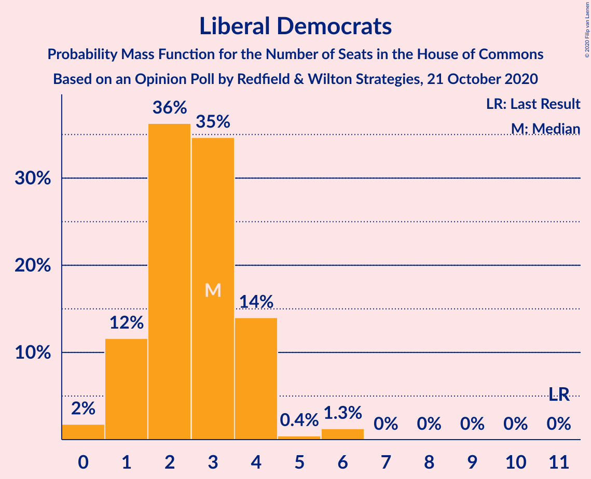

| Number of Seats | Probability | Accumulated | Special Marks |
|:---------------:|:-----------:|:-----------:|:-------------:|
| 0 | 2% | 100% |  |
| 1 | 13% | 98% |  |
| 2 | 35% | 85% |  |
| 3 | 36% | 51% | Median |
| 4 | 13% | 15% |  |
| 5 | 0.5% | 2% |  |
| 6 | 1.3% | 1.3% |  |
| 7 | 0% | 0% |  |
| 8 | 0% | 0% |  |
| 9 | 0% | 0% |  |
| 10 | 0% | 0% |  |
| 11 | 0% | 0% | Last Result |

### Scottish National Party

*For a full overview of the results for this party, see the [Scottish National Party](party-scottishnationalparty.html) page.*

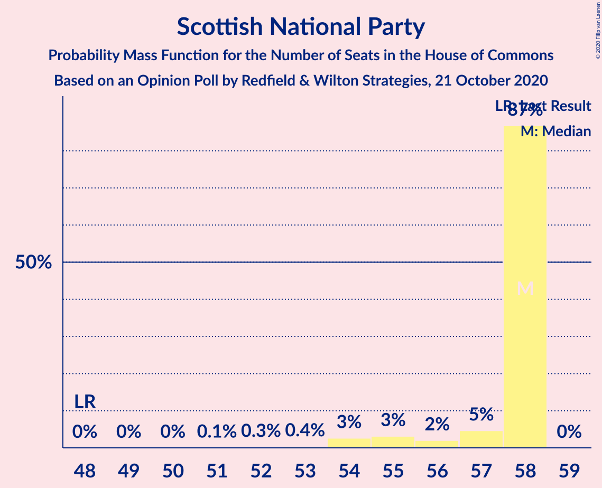

| Number of Seats | Probability | Accumulated | Special Marks |
|:---------------:|:-----------:|:-----------:|:-------------:|
| 48 | 0% | 100% | Last Result |
| 49 | 0% | 100% |  |
| 50 | 0% | 100% |  |
| 51 | 0.1% | 99.9% |  |
| 52 | 0.3% | 99.8% |  |
| 53 | 0.5% | 99.6% |  |
| 54 | 2% | 99.0% |  |
| 55 | 3% | 97% |  |
| 56 | 2% | 94% |  |
| 57 | 4% | 91% |  |
| 58 | 87% | 87% | Median |
| 59 | 0% | 0% |  |

### Green Party

*For a full overview of the results for this party, see the [Green Party](party-greenparty.html) page.*

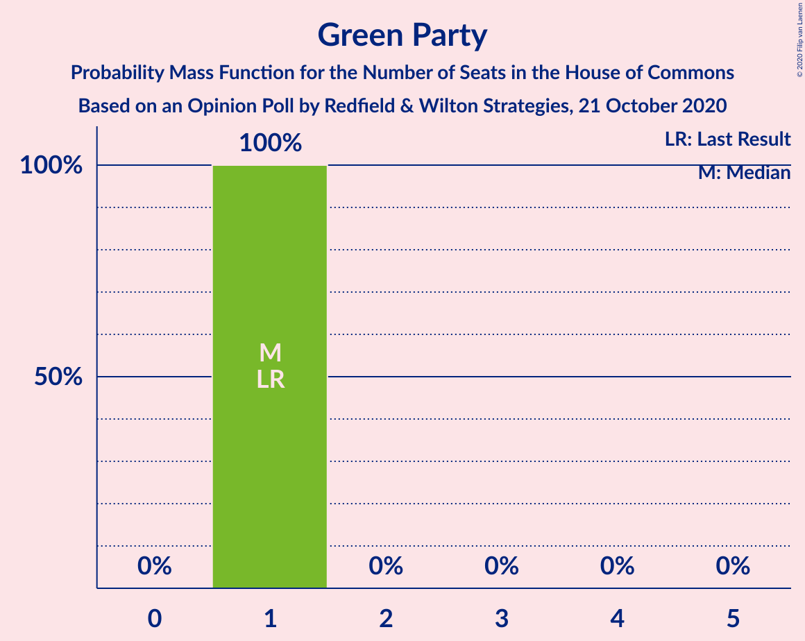

| Number of Seats | Probability | Accumulated | Special Marks |
|:---------------:|:-----------:|:-----------:|:-------------:|
| 1 | 100% | 100% | Last Result, Median |

### Plaid Cymru

*For a full overview of the results for this party, see the [Plaid Cymru](party-plaidcymru.html) page.*

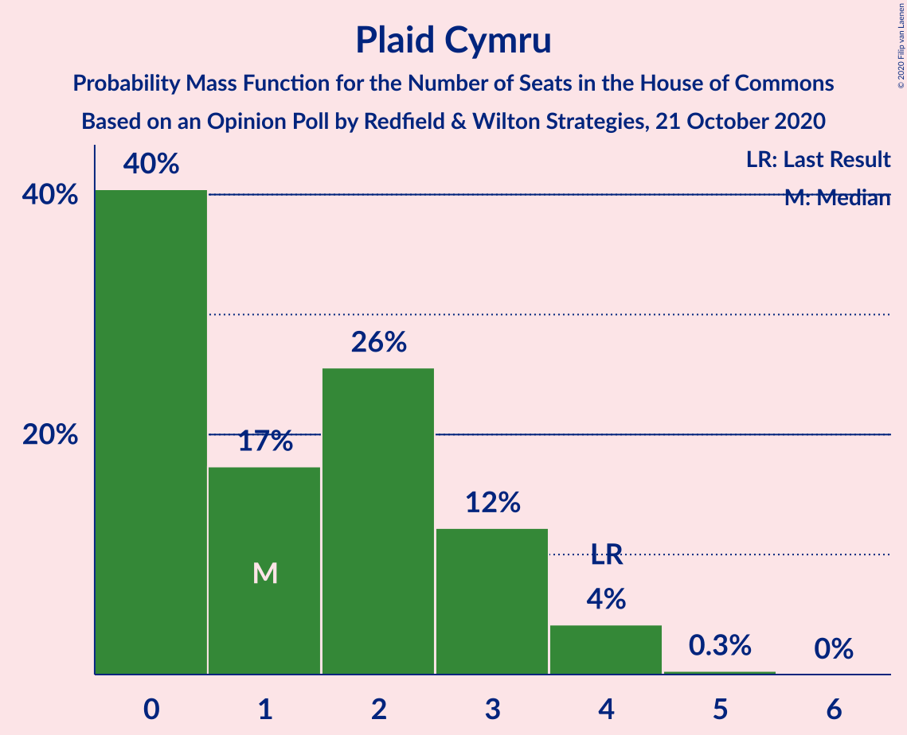

| Number of Seats | Probability | Accumulated | Special Marks |
|:---------------:|:-----------:|:-----------:|:-------------:|
| 0 | 42% | 100% |  |
| 1 | 16% | 58% | Median |
| 2 | 25% | 42% |  |
| 3 | 11% | 16% |  |
| 4 | 5% | 5% | Last Result |
| 5 | 0.3% | 0.3% |  |
| 6 | 0% | 0% |  |

## Coalitions

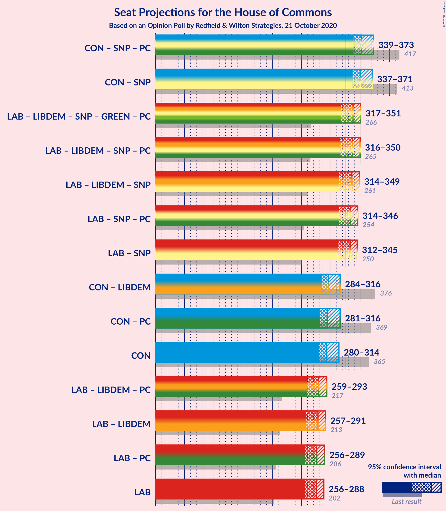

### Confidence Intervals

| Coalition | Last Result | Median | Majority? | 80% Confidence Interval | 90% Confidence Interval | 95% Confidence Interval | 99% Confidence Interval |
|:---------:|:-----------:|:------:|:---------:|:-----------------------:|:-----------------------:|:-----------------------:|:-----------------------:|
| Conservative Party – Scottish National Party – Plaid Cymru | 417 | 352 | 99.9% | 343–367 | 340–371 | 338–373 | 332–381 |
| Conservative Party – Scottish National Party | 413 | 351 | 99.9% | 341–364 | 339–370 | 337–371 | 331–379 |
| Labour Party – Liberal Democrats – Scottish National Party – Green Party – Plaid Cymru | 266 | 338 | 90% | 325–348 | 318–350 | 317–351 | 309–357 |
| Labour Party – Liberal Democrats – Scottish National Party – Plaid Cymru | 265 | 337 | 89% | 324–347 | 317–349 | 316–350 | 308–356 |
| Labour Party – Liberal Democrats – Scottish National Party | 261 | 336 | 87% | 321–345 | 316–348 | 314–349 | 307–355 |
| Labour Party – Scottish National Party – Plaid Cymru | 254 | 334 | 86% | 322–345 | 315–346 | 314–346 | 306–353 |
| Labour Party – Scottish National Party | 250 | 333 | 77% | 318–342 | 314–345 | 312–345 | 305–351 |
| Conservative Party – Liberal Democrats | 376 | 296 | 0.2% | 285–308 | 284–315 | 284–316 | 277–324 |
| Conservative Party – Plaid Cymru | 369 | 294 | 0.2% | 285–309 | 282–314 | 281–316 | 275–323 |
| Conservative Party | 365 | 293 | 0.2% | 283–306 | 281–313 | 280–314 | 274–322 |
| Labour Party – Liberal Democrats – Plaid Cymru | 217 | 279 | 0% | 266–289 | 260–291 | 259–293 | 251–299 |
| Labour Party – Liberal Democrats | 213 | 278 | 0% | 263–287 | 259–290 | 257–292 | 249–298 |
| Labour Party – Plaid Cymru | 206 | 276 | 0% | 264–287 | 258–288 | 257–289 | 249–295 |
| Labour Party | 202 | 275 | 0% | 260–284 | 257–287 | 256–288 | 247–294 |

### Conservative Party – Scottish National Party – Plaid Cymru

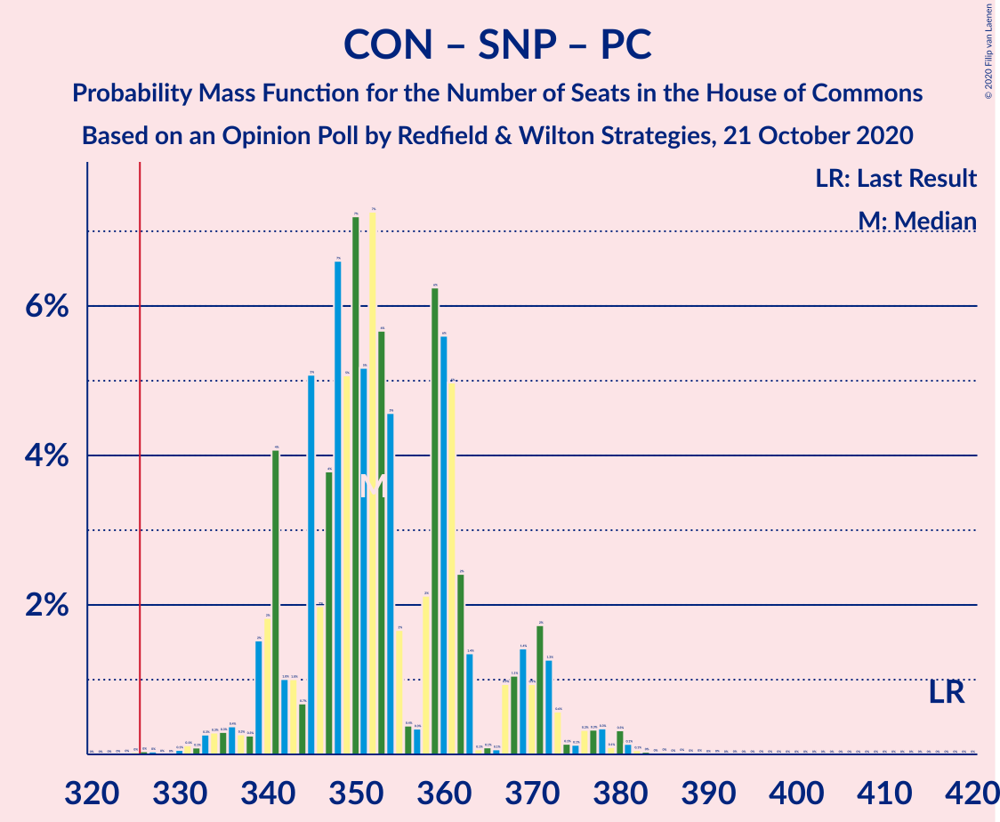

| Number of Seats | Probability | Accumulated | Special Marks |
|:---------------:|:-----------:|:-----------:|:-------------:|
| 325 | 0% | 100% |  |
| 326 | 0% | 99.9% | Majority |
| 327 | 0% | 99.9% |  |
| 328 | 0% | 99.9% |  |
| 329 | 0% | 99.8% |  |
| 330 | 0.1% | 99.8% |  |
| 331 | 0.1% | 99.8% |  |
| 332 | 0.2% | 99.6% |  |
| 333 | 0.4% | 99.5% |  |
| 334 | 0.3% | 99.1% |  |
| 335 | 0.3% | 98.8% |  |
| 336 | 0.4% | 98% |  |
| 337 | 0.3% | 98% |  |
| 338 | 0.4% | 98% |  |
| 339 | 1.2% | 97% |  |
| 340 | 2% | 96% |  |
| 341 | 3% | 94% |  |
| 342 | 1.4% | 92% |  |
| 343 | 1.0% | 90% |  |
| 344 | 0.7% | 89% |  |
| 345 | 3% | 89% |  |
| 346 | 5% | 85% |  |
| 347 | 5% | 80% |  |
| 348 | 6% | 75% |  |
| 349 | 5% | 70% |  |
| 350 | 5% | 64% |  |
| 351 | 6% | 59% |  |
| 352 | 6% | 53% | Median |
| 353 | 6% | 46% |  |
| 354 | 4% | 41% |  |
| 355 | 2% | 37% |  |
| 356 | 0.7% | 35% |  |
| 357 | 1.0% | 34% |  |
| 358 | 2% | 33% |  |
| 359 | 6% | 31% |  |
| 360 | 6% | 25% |  |
| 361 | 4% | 19% |  |
| 362 | 3% | 15% |  |
| 363 | 1.3% | 12% |  |
| 364 | 0.4% | 11% |  |
| 365 | 0.1% | 10% |  |
| 366 | 0.2% | 10% |  |
| 367 | 0.7% | 10% |  |
| 368 | 1.2% | 9% |  |
| 369 | 0.8% | 8% |  |
| 370 | 1.0% | 7% |  |
| 371 | 2% | 6% |  |
| 372 | 2% | 4% |  |
| 373 | 0.5% | 3% |  |
| 374 | 0.3% | 2% |  |
| 375 | 0.2% | 2% |  |
| 376 | 0.3% | 2% |  |
| 377 | 0.3% | 1.5% |  |
| 378 | 0.2% | 1.1% |  |
| 379 | 0.1% | 0.9% |  |
| 380 | 0.3% | 0.8% |  |
| 381 | 0.2% | 0.5% |  |
| 382 | 0.1% | 0.3% |  |
| 383 | 0% | 0.2% |  |
| 384 | 0% | 0.2% |  |
| 385 | 0% | 0.2% |  |
| 386 | 0% | 0.1% |  |
| 387 | 0% | 0.1% |  |
| 388 | 0% | 0.1% |  |
| 389 | 0% | 0.1% |  |
| 390 | 0% | 0% |  |
| 391 | 0% | 0% |  |
| 392 | 0% | 0% |  |
| 393 | 0% | 0% |  |
| 394 | 0% | 0% |  |
| 395 | 0% | 0% |  |
| 396 | 0% | 0% |  |
| 397 | 0% | 0% |  |
| 398 | 0% | 0% |  |
| 399 | 0% | 0% |  |
| 400 | 0% | 0% |  |
| 401 | 0% | 0% |  |
| 402 | 0% | 0% |  |
| 403 | 0% | 0% |  |
| 404 | 0% | 0% |  |
| 405 | 0% | 0% |  |
| 406 | 0% | 0% |  |
| 407 | 0% | 0% |  |
| 408 | 0% | 0% |  |
| 409 | 0% | 0% |  |
| 410 | 0% | 0% |  |
| 411 | 0% | 0% |  |
| 412 | 0% | 0% |  |
| 413 | 0% | 0% |  |
| 414 | 0% | 0% |  |
| 415 | 0% | 0% |  |
| 416 | 0% | 0% |  |
| 417 | 0% | 0% | Last Result |

### Conservative Party – Scottish National Party

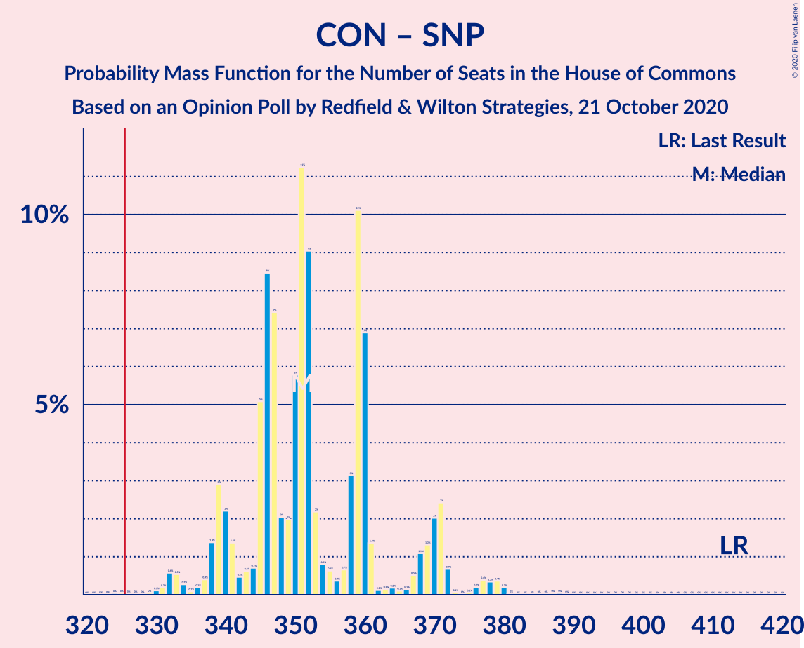

| Number of Seats | Probability | Accumulated | Special Marks |
|:---------------:|:-----------:|:-----------:|:-------------:|
| 324 | 0% | 100% |  |
| 325 | 0% | 99.9% |  |
| 326 | 0% | 99.9% | Majority |
| 327 | 0% | 99.8% |  |
| 328 | 0% | 99.8% |  |
| 329 | 0% | 99.8% |  |
| 330 | 0.1% | 99.8% |  |
| 331 | 0.2% | 99.6% |  |
| 332 | 0.6% | 99.4% |  |
| 333 | 0.6% | 98.8% |  |
| 334 | 0.2% | 98% |  |
| 335 | 0.1% | 98% |  |
| 336 | 0.2% | 98% |  |
| 337 | 0.5% | 98% |  |
| 338 | 1.3% | 97% |  |
| 339 | 3% | 96% |  |
| 340 | 2% | 93% |  |
| 341 | 1.5% | 91% |  |
| 342 | 0.5% | 89% |  |
| 343 | 0.7% | 89% |  |
| 344 | 0.8% | 88% |  |
| 345 | 5% | 87% |  |
| 346 | 9% | 82% |  |
| 347 | 7% | 73% |  |
| 348 | 2% | 66% |  |
| 349 | 2% | 64% |  |
| 350 | 6% | 61% |  |
| 351 | 11% | 56% | Median |
| 352 | 8% | 45% |  |
| 353 | 2% | 36% |  |
| 354 | 0.8% | 34% |  |
| 355 | 0.8% | 33% |  |
| 356 | 0.4% | 33% |  |
| 357 | 0.8% | 32% |  |
| 358 | 3% | 31% |  |
| 359 | 10% | 29% |  |
| 360 | 7% | 19% |  |
| 361 | 1.2% | 12% |  |
| 362 | 0.1% | 10% |  |
| 363 | 0.2% | 10% |  |
| 364 | 0.2% | 10% |  |
| 365 | 0.1% | 10% |  |
| 366 | 0.1% | 10% |  |
| 367 | 0.5% | 10% |  |
| 368 | 1.1% | 9% |  |
| 369 | 1.5% | 8% |  |
| 370 | 2% | 6% |  |
| 371 | 2% | 5% |  |
| 372 | 0.6% | 2% |  |
| 373 | 0.1% | 2% |  |
| 374 | 0% | 2% |  |
| 375 | 0% | 2% |  |
| 376 | 0.2% | 2% |  |
| 377 | 0.3% | 1.4% |  |
| 378 | 0.3% | 1.1% |  |
| 379 | 0.4% | 0.8% |  |
| 380 | 0.2% | 0.4% |  |
| 381 | 0% | 0.2% |  |
| 382 | 0% | 0.2% |  |
| 383 | 0% | 0.2% |  |
| 384 | 0% | 0.2% |  |
| 385 | 0% | 0.2% |  |
| 386 | 0% | 0.1% |  |
| 387 | 0% | 0.1% |  |
| 388 | 0% | 0.1% |  |
| 389 | 0% | 0% |  |
| 390 | 0% | 0% |  |
| 391 | 0% | 0% |  |
| 392 | 0% | 0% |  |
| 393 | 0% | 0% |  |
| 394 | 0% | 0% |  |
| 395 | 0% | 0% |  |
| 396 | 0% | 0% |  |
| 397 | 0% | 0% |  |
| 398 | 0% | 0% |  |
| 399 | 0% | 0% |  |
| 400 | 0% | 0% |  |
| 401 | 0% | 0% |  |
| 402 | 0% | 0% |  |
| 403 | 0% | 0% |  |
| 404 | 0% | 0% |  |
| 405 | 0% | 0% |  |
| 406 | 0% | 0% |  |
| 407 | 0% | 0% |  |
| 408 | 0% | 0% |  |
| 409 | 0% | 0% |  |
| 410 | 0% | 0% |  |
| 411 | 0% | 0% |  |
| 412 | 0% | 0% |  |
| 413 | 0% | 0% | Last Result |

### Labour Party – Liberal Democrats – Scottish National Party – Green Party – Plaid Cymru

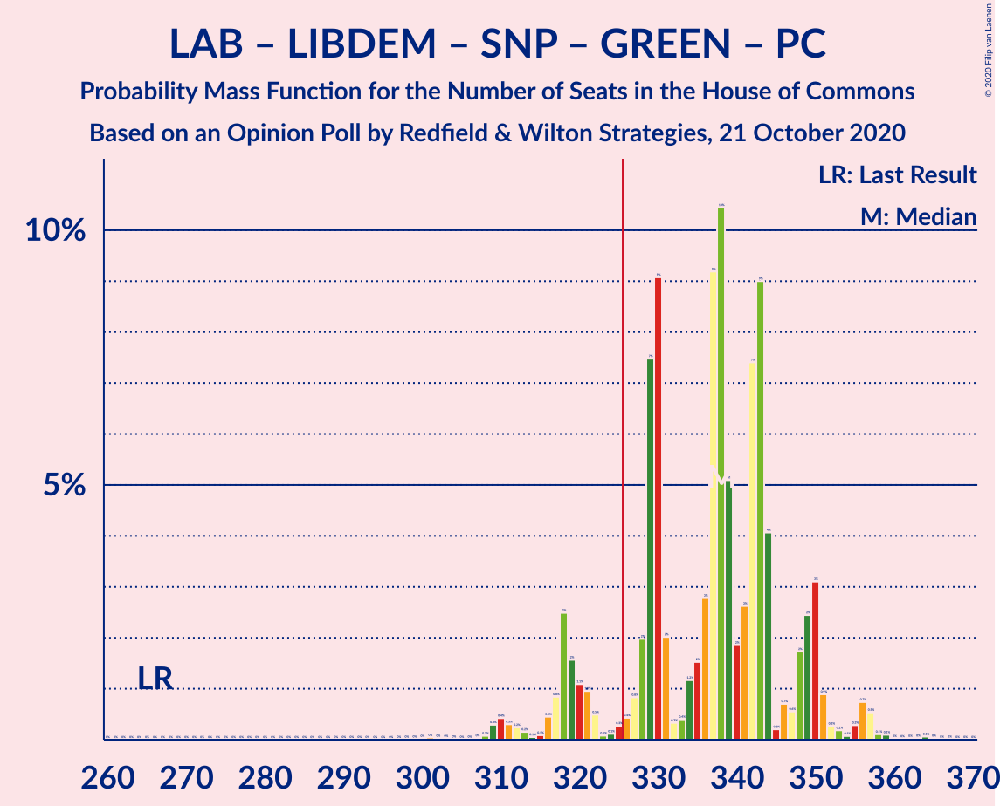

| Number of Seats | Probability | Accumulated | Special Marks |
|:---------------:|:-----------:|:-----------:|:-------------:|
| 266 | 0% | 100% | Last Result |
| 267 | 0% | 100% |  |
| 268 | 0% | 100% |  |
| 269 | 0% | 100% |  |
| 270 | 0% | 100% |  |
| 271 | 0% | 100% |  |
| 272 | 0% | 100% |  |
| 273 | 0% | 100% |  |
| 274 | 0% | 100% |  |
| 275 | 0% | 100% |  |
| 276 | 0% | 100% |  |
| 277 | 0% | 100% |  |
| 278 | 0% | 100% |  |
| 279 | 0% | 100% |  |
| 280 | 0% | 100% |  |
| 281 | 0% | 100% |  |
| 282 | 0% | 100% |  |
| 283 | 0% | 100% |  |
| 284 | 0% | 100% |  |
| 285 | 0% | 100% |  |
| 286 | 0% | 100% |  |
| 287 | 0% | 100% |  |
| 288 | 0% | 100% |  |
| 289 | 0% | 100% |  |
| 290 | 0% | 100% |  |
| 291 | 0% | 100% |  |
| 292 | 0% | 100% |  |
| 293 | 0% | 100% |  |
| 294 | 0% | 100% |  |
| 295 | 0% | 100% |  |
| 296 | 0% | 100% |  |
| 297 | 0% | 100% |  |
| 298 | 0% | 100% |  |
| 299 | 0% | 100% |  |
| 300 | 0% | 100% |  |
| 301 | 0% | 99.9% |  |
| 302 | 0% | 99.9% |  |
| 303 | 0% | 99.9% |  |
| 304 | 0% | 99.9% |  |
| 305 | 0% | 99.8% |  |
| 306 | 0% | 99.8% |  |
| 307 | 0% | 99.8% |  |
| 308 | 0.1% | 99.8% |  |
| 309 | 0.3% | 99.7% |  |
| 310 | 0.4% | 99.4% |  |
| 311 | 0.3% | 99.0% |  |
| 312 | 0.2% | 98.7% |  |
| 313 | 0.2% | 98% |  |
| 314 | 0.1% | 98% |  |
| 315 | 0.1% | 98% |  |
| 316 | 0.5% | 98% |  |
| 317 | 0.8% | 98% |  |
| 318 | 2% | 97% |  |
| 319 | 2% | 94% |  |
| 320 | 1.1% | 93% |  |
| 321 | 1.0% | 92% |  |
| 322 | 0.5% | 91% |  |
| 323 | 0.1% | 90% |  |
| 324 | 0.1% | 90% |  |
| 325 | 0.3% | 90% |  |
| 326 | 0.4% | 90% | Majority |
| 327 | 0.8% | 89% |  |
| 328 | 2% | 89% |  |
| 329 | 7% | 87% |  |
| 330 | 9% | 79% |  |
| 331 | 2% | 70% |  |
| 332 | 0.3% | 68% |  |
| 333 | 0.4% | 68% |  |
| 334 | 1.2% | 67% |  |
| 335 | 2% | 66% |  |
| 336 | 3% | 65% |  |
| 337 | 9% | 62% |  |
| 338 | 10% | 53% | Median |
| 339 | 5% | 42% |  |
| 340 | 2% | 37% |  |
| 341 | 3% | 35% |  |
| 342 | 7% | 33% |  |
| 343 | 9% | 25% |  |
| 344 | 4% | 16% |  |
| 345 | 0.2% | 12% |  |
| 346 | 0.7% | 12% |  |
| 347 | 0.6% | 11% |  |
| 348 | 2% | 11% |  |
| 349 | 2% | 9% |  |
| 350 | 3% | 6% |  |
| 351 | 0.9% | 3% |  |
| 352 | 0.3% | 2% |  |
| 353 | 0.2% | 2% |  |
| 354 | 0.1% | 2% |  |
| 355 | 0.3% | 2% |  |
| 356 | 0.7% | 2% |  |
| 357 | 0.5% | 0.9% |  |
| 358 | 0.1% | 0.4% |  |
| 359 | 0.1% | 0.3% |  |
| 360 | 0% | 0.2% |  |
| 361 | 0% | 0.2% |  |
| 362 | 0% | 0.2% |  |
| 363 | 0% | 0.1% |  |
| 364 | 0.1% | 0.1% |  |
| 365 | 0% | 0.1% |  |
| 366 | 0% | 0% |  |

### Labour Party – Liberal Democrats – Scottish National Party – Plaid Cymru

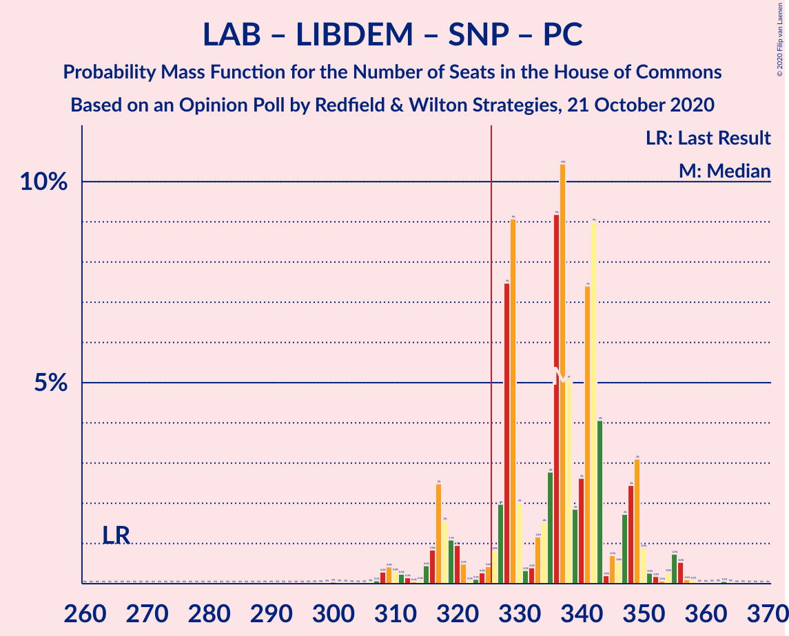

| Number of Seats | Probability | Accumulated | Special Marks |
|:---------------:|:-----------:|:-----------:|:-------------:|
| 265 | 0% | 100% | Last Result |
| 266 | 0% | 100% |  |
| 267 | 0% | 100% |  |
| 268 | 0% | 100% |  |
| 269 | 0% | 100% |  |
| 270 | 0% | 100% |  |
| 271 | 0% | 100% |  |
| 272 | 0% | 100% |  |
| 273 | 0% | 100% |  |
| 274 | 0% | 100% |  |
| 275 | 0% | 100% |  |
| 276 | 0% | 100% |  |
| 277 | 0% | 100% |  |
| 278 | 0% | 100% |  |
| 279 | 0% | 100% |  |
| 280 | 0% | 100% |  |
| 281 | 0% | 100% |  |
| 282 | 0% | 100% |  |
| 283 | 0% | 100% |  |
| 284 | 0% | 100% |  |
| 285 | 0% | 100% |  |
| 286 | 0% | 100% |  |
| 287 | 0% | 100% |  |
| 288 | 0% | 100% |  |
| 289 | 0% | 100% |  |
| 290 | 0% | 100% |  |
| 291 | 0% | 100% |  |
| 292 | 0% | 100% |  |
| 293 | 0% | 100% |  |
| 294 | 0% | 100% |  |
| 295 | 0% | 100% |  |
| 296 | 0% | 100% |  |
| 297 | 0% | 100% |  |
| 298 | 0% | 100% |  |
| 299 | 0% | 100% |  |
| 300 | 0% | 99.9% |  |
| 301 | 0% | 99.9% |  |
| 302 | 0% | 99.9% |  |
| 303 | 0% | 99.9% |  |
| 304 | 0% | 99.8% |  |
| 305 | 0% | 99.8% |  |
| 306 | 0% | 99.8% |  |
| 307 | 0.1% | 99.8% |  |
| 308 | 0.3% | 99.7% |  |
| 309 | 0.4% | 99.4% |  |
| 310 | 0.3% | 99.0% |  |
| 311 | 0.2% | 98.7% |  |
| 312 | 0.2% | 98% |  |
| 313 | 0.1% | 98% |  |
| 314 | 0.1% | 98% |  |
| 315 | 0.5% | 98% |  |
| 316 | 0.8% | 98% |  |
| 317 | 2% | 97% |  |
| 318 | 2% | 94% |  |
| 319 | 1.1% | 93% |  |
| 320 | 1.0% | 92% |  |
| 321 | 0.5% | 91% |  |
| 322 | 0.1% | 90% |  |
| 323 | 0.1% | 90% |  |
| 324 | 0.3% | 90% |  |
| 325 | 0.4% | 90% |  |
| 326 | 0.8% | 89% | Majority |
| 327 | 2% | 89% |  |
| 328 | 7% | 87% |  |
| 329 | 9% | 79% |  |
| 330 | 2% | 70% |  |
| 331 | 0.3% | 68% |  |
| 332 | 0.4% | 68% |  |
| 333 | 1.2% | 67% |  |
| 334 | 2% | 66% |  |
| 335 | 3% | 65% |  |
| 336 | 9% | 62% |  |
| 337 | 10% | 53% | Median |
| 338 | 5% | 42% |  |
| 339 | 2% | 37% |  |
| 340 | 3% | 35% |  |
| 341 | 7% | 33% |  |
| 342 | 9% | 25% |  |
| 343 | 4% | 16% |  |
| 344 | 0.2% | 12% |  |
| 345 | 0.7% | 12% |  |
| 346 | 0.6% | 11% |  |
| 347 | 2% | 11% |  |
| 348 | 2% | 9% |  |
| 349 | 3% | 6% |  |
| 350 | 0.9% | 3% |  |
| 351 | 0.3% | 2% |  |
| 352 | 0.2% | 2% |  |
| 353 | 0.1% | 2% |  |
| 354 | 0.3% | 2% |  |
| 355 | 0.7% | 2% |  |
| 356 | 0.5% | 0.9% |  |
| 357 | 0.1% | 0.4% |  |
| 358 | 0.1% | 0.3% |  |
| 359 | 0% | 0.2% |  |
| 360 | 0% | 0.2% |  |
| 361 | 0% | 0.2% |  |
| 362 | 0% | 0.1% |  |
| 363 | 0.1% | 0.1% |  |
| 364 | 0% | 0.1% |  |
| 365 | 0% | 0% |  |

### Labour Party – Liberal Democrats – Scottish National Party

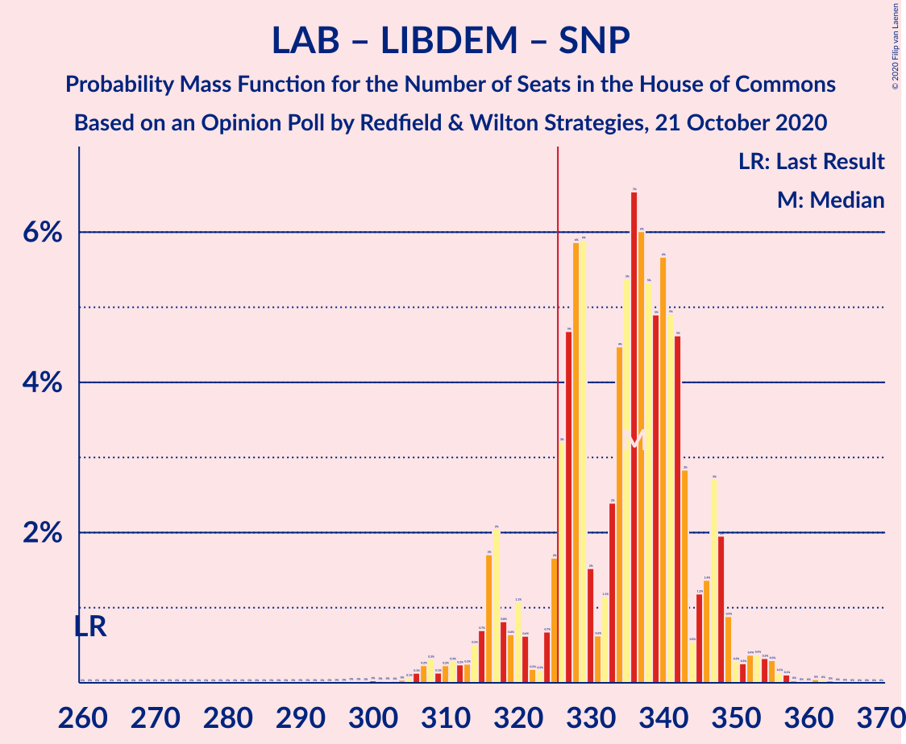

| Number of Seats | Probability | Accumulated | Special Marks |
|:---------------:|:-----------:|:-----------:|:-------------:|
| 261 | 0% | 100% | Last Result |
| 262 | 0% | 100% |  |
| 263 | 0% | 100% |  |
| 264 | 0% | 100% |  |
| 265 | 0% | 100% |  |
| 266 | 0% | 100% |  |
| 267 | 0% | 100% |  |
| 268 | 0% | 100% |  |
| 269 | 0% | 100% |  |
| 270 | 0% | 100% |  |
| 271 | 0% | 100% |  |
| 272 | 0% | 100% |  |
| 273 | 0% | 100% |  |
| 274 | 0% | 100% |  |
| 275 | 0% | 100% |  |
| 276 | 0% | 100% |  |
| 277 | 0% | 100% |  |
| 278 | 0% | 100% |  |
| 279 | 0% | 100% |  |
| 280 | 0% | 100% |  |
| 281 | 0% | 100% |  |
| 282 | 0% | 100% |  |
| 283 | 0% | 100% |  |
| 284 | 0% | 100% |  |
| 285 | 0% | 100% |  |
| 286 | 0% | 100% |  |
| 287 | 0% | 100% |  |
| 288 | 0% | 100% |  |
| 289 | 0% | 100% |  |
| 290 | 0% | 100% |  |
| 291 | 0% | 100% |  |
| 292 | 0% | 100% |  |
| 293 | 0% | 100% |  |
| 294 | 0% | 100% |  |
| 295 | 0% | 100% |  |
| 296 | 0% | 100% |  |
| 297 | 0% | 100% |  |
| 298 | 0% | 100% |  |
| 299 | 0% | 99.9% |  |
| 300 | 0% | 99.9% |  |
| 301 | 0% | 99.9% |  |
| 302 | 0% | 99.9% |  |
| 303 | 0% | 99.8% |  |
| 304 | 0% | 99.8% |  |
| 305 | 0.1% | 99.8% |  |
| 306 | 0.1% | 99.7% |  |
| 307 | 0.2% | 99.6% |  |
| 308 | 0.3% | 99.4% |  |
| 309 | 0.1% | 99.0% |  |
| 310 | 0.2% | 98.9% |  |
| 311 | 0.3% | 98.7% |  |
| 312 | 0.2% | 98% |  |
| 313 | 0.3% | 98% |  |
| 314 | 0.5% | 98% |  |
| 315 | 0.7% | 97% |  |
| 316 | 2% | 97% |  |
| 317 | 2% | 95% |  |
| 318 | 0.8% | 93% |  |
| 319 | 0.6% | 92% |  |
| 320 | 1.1% | 91% |  |
| 321 | 0.6% | 90% |  |
| 322 | 0.2% | 90% |  |
| 323 | 0.2% | 90% |  |
| 324 | 0.7% | 89% |  |
| 325 | 2% | 89% |  |
| 326 | 3% | 87% | Majority |
| 327 | 5% | 84% |  |
| 328 | 6% | 79% |  |
| 329 | 6% | 73% |  |
| 330 | 2% | 67% |  |
| 331 | 0.6% | 66% |  |
| 332 | 1.1% | 65% |  |
| 333 | 2% | 64% |  |
| 334 | 4% | 62% |  |
| 335 | 5% | 57% |  |
| 336 | 7% | 52% | Median |
| 337 | 6% | 45% |  |
| 338 | 5% | 39% |  |
| 339 | 5% | 34% |  |
| 340 | 6% | 29% |  |
| 341 | 5% | 23% |  |
| 342 | 5% | 18% |  |
| 343 | 3% | 14% |  |
| 344 | 0.5% | 11% |  |
| 345 | 1.2% | 10% |  |
| 346 | 1.4% | 9% |  |
| 347 | 3% | 8% |  |
| 348 | 2% | 5% |  |
| 349 | 0.9% | 3% |  |
| 350 | 0.3% | 2% |  |
| 351 | 0.3% | 2% |  |
| 352 | 0.4% | 2% |  |
| 353 | 0.4% | 1.5% |  |
| 354 | 0.3% | 1.1% |  |
| 355 | 0.3% | 0.7% |  |
| 356 | 0.1% | 0.4% |  |
| 357 | 0.1% | 0.3% |  |
| 358 | 0% | 0.2% |  |
| 359 | 0% | 0.2% |  |
| 360 | 0% | 0.2% |  |
| 361 | 0% | 0.1% |  |
| 362 | 0% | 0.1% |  |
| 363 | 0% | 0% |  |

### Labour Party – Scottish National Party – Plaid Cymru

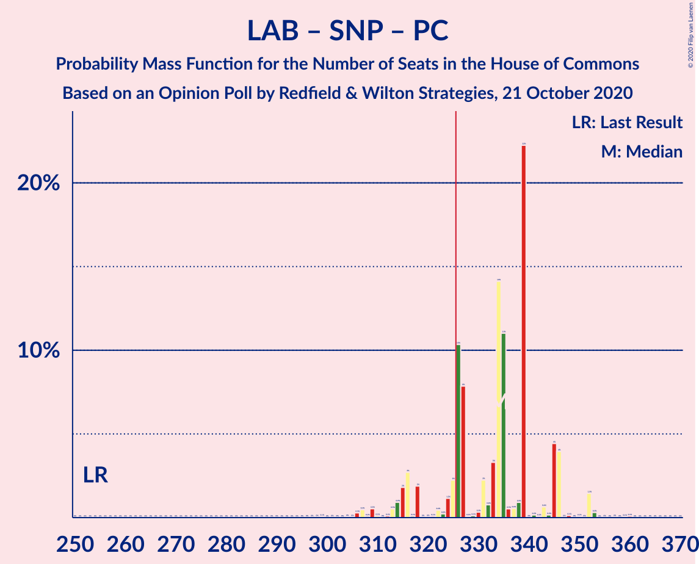

| Number of Seats | Probability | Accumulated | Special Marks |
|:---------------:|:-----------:|:-----------:|:-------------:|
| 254 | 0% | 100% | Last Result |
| 255 | 0% | 100% |  |
| 256 | 0% | 100% |  |
| 257 | 0% | 100% |  |
| 258 | 0% | 100% |  |
| 259 | 0% | 100% |  |
| 260 | 0% | 100% |  |
| 261 | 0% | 100% |  |
| 262 | 0% | 100% |  |
| 263 | 0% | 100% |  |
| 264 | 0% | 100% |  |
| 265 | 0% | 100% |  |
| 266 | 0% | 100% |  |
| 267 | 0% | 100% |  |
| 268 | 0% | 100% |  |
| 269 | 0% | 100% |  |
| 270 | 0% | 100% |  |
| 271 | 0% | 100% |  |
| 272 | 0% | 100% |  |
| 273 | 0% | 100% |  |
| 274 | 0% | 100% |  |
| 275 | 0% | 100% |  |
| 276 | 0% | 100% |  |
| 277 | 0% | 100% |  |
| 278 | 0% | 100% |  |
| 279 | 0% | 100% |  |
| 280 | 0% | 100% |  |
| 281 | 0% | 100% |  |
| 282 | 0% | 100% |  |
| 283 | 0% | 100% |  |
| 284 | 0% | 100% |  |
| 285 | 0% | 100% |  |
| 286 | 0% | 100% |  |
| 287 | 0% | 100% |  |
| 288 | 0% | 100% |  |
| 289 | 0% | 100% |  |
| 290 | 0% | 100% |  |
| 291 | 0% | 100% |  |
| 292 | 0% | 100% |  |
| 293 | 0% | 100% |  |
| 294 | 0% | 100% |  |
| 295 | 0% | 100% |  |
| 296 | 0% | 100% |  |
| 297 | 0% | 100% |  |
| 298 | 0% | 100% |  |
| 299 | 0.1% | 99.9% |  |
| 300 | 0% | 99.9% |  |
| 301 | 0% | 99.9% |  |
| 302 | 0% | 99.8% |  |
| 303 | 0% | 99.8% |  |
| 304 | 0% | 99.8% |  |
| 305 | 0% | 99.8% |  |
| 306 | 0.3% | 99.8% |  |
| 307 | 0.5% | 99.5% |  |
| 308 | 0.1% | 99.0% |  |
| 309 | 0.5% | 98.9% |  |
| 310 | 0.1% | 98% |  |
| 311 | 0% | 98% |  |
| 312 | 0.1% | 98% |  |
| 313 | 0.5% | 98% |  |
| 314 | 0.9% | 98% |  |
| 315 | 2% | 97% |  |
| 316 | 3% | 95% |  |
| 317 | 0.1% | 92% |  |
| 318 | 2% | 92% |  |
| 319 | 0% | 90% |  |
| 320 | 0% | 90% |  |
| 321 | 0.1% | 90% |  |
| 322 | 0.4% | 90% |  |
| 323 | 0.2% | 90% |  |
| 324 | 1.2% | 89% |  |
| 325 | 2% | 88% |  |
| 326 | 10% | 86% | Majority |
| 327 | 8% | 76% |  |
| 328 | 0.1% | 68% |  |
| 329 | 0.1% | 68% |  |
| 330 | 0.3% | 68% |  |
| 331 | 2% | 67% |  |
| 332 | 0.8% | 65% |  |
| 333 | 3% | 64% |  |
| 334 | 14% | 61% | Median |
| 335 | 11% | 47% |  |
| 336 | 0.5% | 36% |  |
| 337 | 0.6% | 35% |  |
| 338 | 0.9% | 35% |  |
| 339 | 22% | 34% |  |
| 340 | 0% | 12% |  |
| 341 | 0.2% | 12% |  |
| 342 | 0.1% | 11% |  |
| 343 | 0.6% | 11% |  |
| 344 | 0.2% | 11% |  |
| 345 | 4% | 11% |  |
| 346 | 4% | 6% |  |
| 347 | 0% | 2% |  |
| 348 | 0.1% | 2% |  |
| 349 | 0% | 2% |  |
| 350 | 0.1% | 2% |  |
| 351 | 0% | 2% |  |
| 352 | 1.5% | 2% |  |
| 353 | 0.3% | 0.5% |  |
| 354 | 0% | 0.2% |  |
| 355 | 0% | 0.2% |  |
| 356 | 0% | 0.2% |  |
| 357 | 0% | 0.2% |  |
| 358 | 0% | 0.2% |  |
| 359 | 0.1% | 0.1% |  |
| 360 | 0.1% | 0.1% |  |
| 361 | 0% | 0% |  |

### Labour Party – Scottish National Party

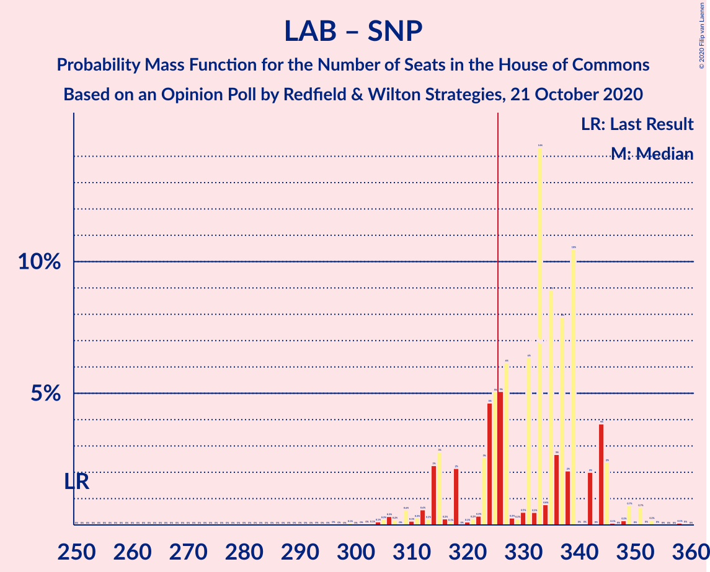

| Number of Seats | Probability | Accumulated | Special Marks |
|:---------------:|:-----------:|:-----------:|:-------------:|
| 250 | 0% | 100% | Last Result |
| 251 | 0% | 100% |  |
| 252 | 0% | 100% |  |
| 253 | 0% | 100% |  |
| 254 | 0% | 100% |  |
| 255 | 0% | 100% |  |
| 256 | 0% | 100% |  |
| 257 | 0% | 100% |  |
| 258 | 0% | 100% |  |
| 259 | 0% | 100% |  |
| 260 | 0% | 100% |  |
| 261 | 0% | 100% |  |
| 262 | 0% | 100% |  |
| 263 | 0% | 100% |  |
| 264 | 0% | 100% |  |
| 265 | 0% | 100% |  |
| 266 | 0% | 100% |  |
| 267 | 0% | 100% |  |
| 268 | 0% | 100% |  |
| 269 | 0% | 100% |  |
| 270 | 0% | 100% |  |
| 271 | 0% | 100% |  |
| 272 | 0% | 100% |  |
| 273 | 0% | 100% |  |
| 274 | 0% | 100% |  |
| 275 | 0% | 100% |  |
| 276 | 0% | 100% |  |
| 277 | 0% | 100% |  |
| 278 | 0% | 100% |  |
| 279 | 0% | 100% |  |
| 280 | 0% | 100% |  |
| 281 | 0% | 100% |  |
| 282 | 0% | 100% |  |
| 283 | 0% | 100% |  |
| 284 | 0% | 100% |  |
| 285 | 0% | 100% |  |
| 286 | 0% | 100% |  |
| 287 | 0% | 100% |  |
| 288 | 0% | 100% |  |
| 289 | 0% | 100% |  |
| 290 | 0% | 100% |  |
| 291 | 0% | 100% |  |
| 292 | 0% | 100% |  |
| 293 | 0% | 100% |  |
| 294 | 0% | 100% |  |
| 295 | 0% | 100% |  |
| 296 | 0% | 100% |  |
| 297 | 0% | 99.9% |  |
| 298 | 0% | 99.9% |  |
| 299 | 0.1% | 99.9% |  |
| 300 | 0% | 99.9% |  |
| 301 | 0% | 99.9% |  |
| 302 | 0% | 99.8% |  |
| 303 | 0% | 99.8% |  |
| 304 | 0.1% | 99.7% |  |
| 305 | 0.2% | 99.6% |  |
| 306 | 0.3% | 99.4% |  |
| 307 | 0.2% | 99.1% |  |
| 308 | 0% | 98.9% |  |
| 309 | 0.6% | 98.9% |  |
| 310 | 0.2% | 98% |  |
| 311 | 0.3% | 98% |  |
| 312 | 0.5% | 98% |  |
| 313 | 0.3% | 97% |  |
| 314 | 2% | 97% |  |
| 315 | 2% | 95% |  |
| 316 | 0.3% | 92% |  |
| 317 | 0.1% | 92% |  |
| 318 | 2% | 92% |  |
| 319 | 0% | 90% |  |
| 320 | 0.1% | 90% |  |
| 321 | 0.3% | 90% |  |
| 322 | 0.3% | 89% |  |
| 323 | 3% | 89% |  |
| 324 | 4% | 86% |  |
| 325 | 5% | 82% |  |
| 326 | 5% | 77% | Majority |
| 327 | 7% | 72% |  |
| 328 | 0.3% | 66% |  |
| 329 | 0.2% | 65% |  |
| 330 | 0.6% | 65% |  |
| 331 | 6% | 65% |  |
| 332 | 0.8% | 59% |  |
| 333 | 13% | 58% | Median |
| 334 | 0.9% | 45% |  |
| 335 | 10% | 45% |  |
| 336 | 3% | 34% |  |
| 337 | 7% | 32% |  |
| 338 | 2% | 24% |  |
| 339 | 11% | 22% |  |
| 340 | 0% | 11% |  |
| 341 | 0% | 11% |  |
| 342 | 2% | 11% |  |
| 343 | 0% | 9% |  |
| 344 | 4% | 9% |  |
| 345 | 3% | 5% |  |
| 346 | 0.1% | 2% |  |
| 347 | 0% | 2% |  |
| 348 | 0.2% | 2% |  |
| 349 | 0.7% | 2% |  |
| 350 | 0% | 1.2% |  |
| 351 | 0.7% | 1.2% |  |
| 352 | 0% | 0.5% |  |
| 353 | 0.2% | 0.4% |  |
| 354 | 0% | 0.2% |  |
| 355 | 0% | 0.2% |  |
| 356 | 0% | 0.2% |  |
| 357 | 0% | 0.2% |  |
| 358 | 0.1% | 0.1% |  |
| 359 | 0.1% | 0.1% |  |
| 360 | 0% | 0% |  |

### Conservative Party – Liberal Democrats

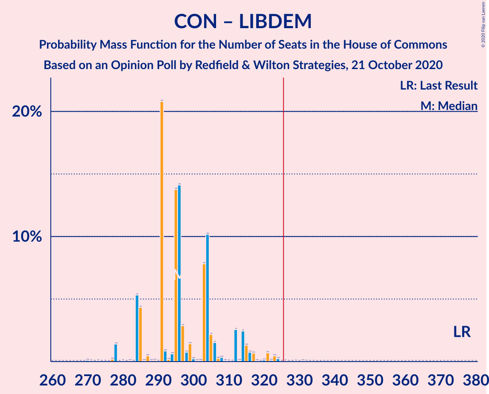

| Number of Seats | Probability | Accumulated | Special Marks |
|:---------------:|:-----------:|:-----------:|:-------------:|
| 270 | 0.1% | 100% |  |
| 271 | 0.1% | 99.9% |  |
| 272 | 0% | 99.9% |  |
| 273 | 0% | 99.8% |  |
| 274 | 0% | 99.8% |  |
| 275 | 0% | 99.8% |  |
| 276 | 0% | 99.8% |  |
| 277 | 0.3% | 99.8% |  |
| 278 | 1.5% | 99.5% |  |
| 279 | 0% | 98% |  |
| 280 | 0.1% | 98% |  |
| 281 | 0% | 98% |  |
| 282 | 0.1% | 98% |  |
| 283 | 0% | 98% |  |
| 284 | 4% | 98% |  |
| 285 | 4% | 94% |  |
| 286 | 0.2% | 89% |  |
| 287 | 0.6% | 89% |  |
| 288 | 0.1% | 89% |  |
| 289 | 0.2% | 89% |  |
| 290 | 0% | 88% |  |
| 291 | 22% | 88% |  |
| 292 | 0.9% | 66% |  |
| 293 | 0.6% | 65% |  |
| 294 | 0.5% | 65% |  |
| 295 | 11% | 64% |  |
| 296 | 14% | 53% | Median |
| 297 | 3% | 39% |  |
| 298 | 0.8% | 36% |  |
| 299 | 2% | 35% |  |
| 300 | 0.3% | 33% |  |
| 301 | 0.1% | 32% |  |
| 302 | 0.1% | 32% |  |
| 303 | 8% | 32% |  |
| 304 | 10% | 24% |  |
| 305 | 2% | 14% |  |
| 306 | 1.2% | 12% |  |
| 307 | 0.2% | 11% |  |
| 308 | 0.4% | 10% |  |
| 309 | 0.1% | 10% |  |
| 310 | 0% | 10% |  |
| 311 | 0% | 10% |  |
| 312 | 2% | 10% |  |
| 313 | 0.1% | 8% |  |
| 314 | 3% | 8% |  |
| 315 | 2% | 5% |  |
| 316 | 0.9% | 3% |  |
| 317 | 0.5% | 2% |  |
| 318 | 0.1% | 2% |  |
| 319 | 0% | 2% |  |
| 320 | 0.1% | 2% |  |
| 321 | 0.5% | 2% |  |
| 322 | 0.1% | 1.1% |  |
| 323 | 0.5% | 1.0% |  |
| 324 | 0.3% | 0.5% |  |
| 325 | 0% | 0.2% |  |
| 326 | 0% | 0.2% | Majority |
| 327 | 0% | 0.2% |  |
| 328 | 0% | 0.2% |  |
| 329 | 0% | 0.2% |  |
| 330 | 0% | 0.1% |  |
| 331 | 0.1% | 0.1% |  |
| 332 | 0% | 0.1% |  |
| 333 | 0% | 0% |  |
| 334 | 0% | 0% |  |
| 335 | 0% | 0% |  |
| 336 | 0% | 0% |  |
| 337 | 0% | 0% |  |
| 338 | 0% | 0% |  |
| 339 | 0% | 0% |  |
| 340 | 0% | 0% |  |
| 341 | 0% | 0% |  |
| 342 | 0% | 0% |  |
| 343 | 0% | 0% |  |
| 344 | 0% | 0% |  |
| 345 | 0% | 0% |  |
| 346 | 0% | 0% |  |
| 347 | 0% | 0% |  |
| 348 | 0% | 0% |  |
| 349 | 0% | 0% |  |
| 350 | 0% | 0% |  |
| 351 | 0% | 0% |  |
| 352 | 0% | 0% |  |
| 353 | 0% | 0% |  |
| 354 | 0% | 0% |  |
| 355 | 0% | 0% |  |
| 356 | 0% | 0% |  |
| 357 | 0% | 0% |  |
| 358 | 0% | 0% |  |
| 359 | 0% | 0% |  |
| 360 | 0% | 0% |  |
| 361 | 0% | 0% |  |
| 362 | 0% | 0% |  |
| 363 | 0% | 0% |  |
| 364 | 0% | 0% |  |
| 365 | 0% | 0% |  |
| 366 | 0% | 0% |  |
| 367 | 0% | 0% |  |
| 368 | 0% | 0% |  |
| 369 | 0% | 0% |  |
| 370 | 0% | 0% |  |
| 371 | 0% | 0% |  |
| 372 | 0% | 0% |  |
| 373 | 0% | 0% |  |
| 374 | 0% | 0% |  |
| 375 | 0% | 0% |  |
| 376 | 0% | 0% | Last Result |

### Conservative Party – Plaid Cymru

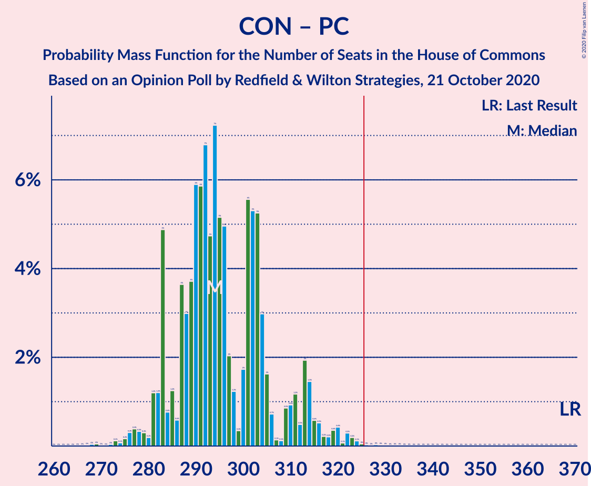

| Number of Seats | Probability | Accumulated | Special Marks |
|:---------------:|:-----------:|:-----------:|:-------------:|
| 268 | 0% | 100% |  |
| 269 | 0% | 99.9% |  |
| 270 | 0% | 99.9% |  |
| 271 | 0% | 99.8% |  |
| 272 | 0% | 99.8% |  |
| 273 | 0.1% | 99.8% |  |
| 274 | 0.1% | 99.7% |  |
| 275 | 0.3% | 99.6% |  |
| 276 | 0.3% | 99.3% |  |
| 277 | 0.4% | 98.9% |  |
| 278 | 0.4% | 98.5% |  |
| 279 | 0.3% | 98% |  |
| 280 | 0.3% | 98% |  |
| 281 | 0.9% | 98% |  |
| 282 | 2% | 97% |  |
| 283 | 3% | 95% |  |
| 284 | 1.4% | 92% |  |
| 285 | 1.2% | 91% |  |
| 286 | 0.5% | 90% |  |
| 287 | 3% | 89% |  |
| 288 | 5% | 86% |  |
| 289 | 5% | 82% |  |
| 290 | 6% | 77% |  |
| 291 | 5% | 71% |  |
| 292 | 5% | 66% |  |
| 293 | 6% | 61% |  |
| 294 | 7% | 55% | Median |
| 295 | 5% | 48% |  |
| 296 | 4% | 43% |  |
| 297 | 2% | 38% |  |
| 298 | 1.1% | 36% |  |
| 299 | 0.6% | 35% |  |
| 300 | 2% | 34% |  |
| 301 | 6% | 33% |  |
| 302 | 6% | 27% |  |
| 303 | 5% | 21% |  |
| 304 | 3% | 16% |  |
| 305 | 2% | 13% |  |
| 306 | 0.7% | 11% |  |
| 307 | 0.2% | 11% |  |
| 308 | 0.2% | 10% |  |
| 309 | 0.6% | 10% |  |
| 310 | 1.1% | 10% |  |
| 311 | 0.6% | 9% |  |
| 312 | 0.8% | 8% |  |
| 313 | 2% | 7% |  |
| 314 | 2% | 5% |  |
| 315 | 0.7% | 3% |  |
| 316 | 0.5% | 3% |  |
| 317 | 0.3% | 2% |  |
| 318 | 0.2% | 2% |  |
| 319 | 0.3% | 2% |  |
| 320 | 0.2% | 1.3% |  |
| 321 | 0.1% | 1.1% |  |
| 322 | 0.3% | 1.0% |  |
| 323 | 0.2% | 0.6% |  |
| 324 | 0.1% | 0.4% |  |
| 325 | 0.1% | 0.3% |  |
| 326 | 0% | 0.2% | Majority |
| 327 | 0% | 0.2% |  |
| 328 | 0% | 0.2% |  |
| 329 | 0% | 0.1% |  |
| 330 | 0% | 0.1% |  |
| 331 | 0% | 0.1% |  |
| 332 | 0% | 0.1% |  |
| 333 | 0% | 0% |  |
| 334 | 0% | 0% |  |
| 335 | 0% | 0% |  |
| 336 | 0% | 0% |  |
| 337 | 0% | 0% |  |
| 338 | 0% | 0% |  |
| 339 | 0% | 0% |  |
| 340 | 0% | 0% |  |
| 341 | 0% | 0% |  |
| 342 | 0% | 0% |  |
| 343 | 0% | 0% |  |
| 344 | 0% | 0% |  |
| 345 | 0% | 0% |  |
| 346 | 0% | 0% |  |
| 347 | 0% | 0% |  |
| 348 | 0% | 0% |  |
| 349 | 0% | 0% |  |
| 350 | 0% | 0% |  |
| 351 | 0% | 0% |  |
| 352 | 0% | 0% |  |
| 353 | 0% | 0% |  |
| 354 | 0% | 0% |  |
| 355 | 0% | 0% |  |
| 356 | 0% | 0% |  |
| 357 | 0% | 0% |  |
| 358 | 0% | 0% |  |
| 359 | 0% | 0% |  |
| 360 | 0% | 0% |  |
| 361 | 0% | 0% |  |
| 362 | 0% | 0% |  |
| 363 | 0% | 0% |  |
| 364 | 0% | 0% |  |
| 365 | 0% | 0% |  |
| 366 | 0% | 0% |  |
| 367 | 0% | 0% |  |
| 368 | 0% | 0% |  |
| 369 | 0% | 0% | Last Result |

### Conservative Party

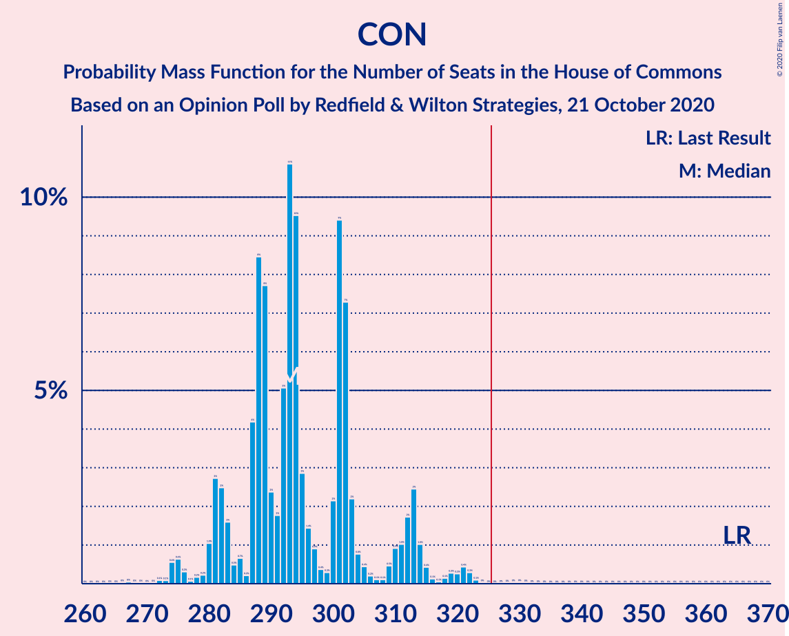

| Number of Seats | Probability | Accumulated | Special Marks |
|:---------------:|:-----------:|:-----------:|:-------------:|
| 266 | 0% | 100% |  |
| 267 | 0.1% | 99.9% |  |
| 268 | 0% | 99.9% |  |
| 269 | 0% | 99.9% |  |
| 270 | 0% | 99.8% |  |
| 271 | 0% | 99.8% |  |
| 272 | 0.1% | 99.8% |  |
| 273 | 0.1% | 99.7% |  |
| 274 | 0.5% | 99.6% |  |
| 275 | 0.7% | 99.1% |  |
| 276 | 0.3% | 98% |  |
| 277 | 0.1% | 98% |  |
| 278 | 0.2% | 98% |  |
| 279 | 0.3% | 98% |  |
| 280 | 0.9% | 98% |  |
| 281 | 3% | 97% |  |
| 282 | 2% | 94% |  |
| 283 | 2% | 91% |  |
| 284 | 0.6% | 89% |  |
| 285 | 0.7% | 89% |  |
| 286 | 0.2% | 88% |  |
| 287 | 4% | 88% |  |
| 288 | 9% | 84% |  |
| 289 | 7% | 75% |  |
| 290 | 3% | 67% |  |
| 291 | 2% | 65% |  |
| 292 | 5% | 63% |  |
| 293 | 10% | 58% | Median |
| 294 | 9% | 47% |  |
| 295 | 3% | 38% |  |
| 296 | 2% | 35% |  |
| 297 | 1.2% | 34% |  |
| 298 | 0.4% | 33% |  |
| 299 | 0.3% | 32% |  |
| 300 | 2% | 32% |  |
| 301 | 9% | 30% |  |
| 302 | 7% | 21% |  |
| 303 | 2% | 13% |  |
| 304 | 0.8% | 11% |  |
| 305 | 0.4% | 11% |  |
| 306 | 0.3% | 10% |  |
| 307 | 0.1% | 10% |  |
| 308 | 0.1% | 10% |  |
| 309 | 0.5% | 10% |  |
| 310 | 1.0% | 9% |  |
| 311 | 1.1% | 8% |  |
| 312 | 2% | 7% |  |
| 313 | 2% | 6% |  |
| 314 | 0.8% | 3% |  |
| 315 | 0.5% | 2% |  |
| 316 | 0.1% | 2% |  |
| 317 | 0.1% | 2% |  |
| 318 | 0.2% | 2% |  |
| 319 | 0.2% | 2% |  |
| 320 | 0.3% | 1.3% |  |
| 321 | 0.4% | 1.0% |  |
| 322 | 0.3% | 0.6% |  |
| 323 | 0.1% | 0.3% |  |
| 324 | 0% | 0.2% |  |
| 325 | 0% | 0.2% |  |
| 326 | 0% | 0.2% | Majority |
| 327 | 0% | 0.2% |  |
| 328 | 0% | 0.1% |  |
| 329 | 0% | 0.1% |  |
| 330 | 0% | 0.1% |  |
| 331 | 0% | 0.1% |  |
| 332 | 0% | 0% |  |
| 333 | 0% | 0% |  |
| 334 | 0% | 0% |  |
| 335 | 0% | 0% |  |
| 336 | 0% | 0% |  |
| 337 | 0% | 0% |  |
| 338 | 0% | 0% |  |
| 339 | 0% | 0% |  |
| 340 | 0% | 0% |  |
| 341 | 0% | 0% |  |
| 342 | 0% | 0% |  |
| 343 | 0% | 0% |  |
| 344 | 0% | 0% |  |
| 345 | 0% | 0% |  |
| 346 | 0% | 0% |  |
| 347 | 0% | 0% |  |
| 348 | 0% | 0% |  |
| 349 | 0% | 0% |  |
| 350 | 0% | 0% |  |
| 351 | 0% | 0% |  |
| 352 | 0% | 0% |  |
| 353 | 0% | 0% |  |
| 354 | 0% | 0% |  |
| 355 | 0% | 0% |  |
| 356 | 0% | 0% |  |
| 357 | 0% | 0% |  |
| 358 | 0% | 0% |  |
| 359 | 0% | 0% |  |
| 360 | 0% | 0% |  |
| 361 | 0% | 0% |  |
| 362 | 0% | 0% |  |
| 363 | 0% | 0% |  |
| 364 | 0% | 0% |  |
| 365 | 0% | 0% | Last Result |

### Labour Party – Liberal Democrats – Plaid Cymru

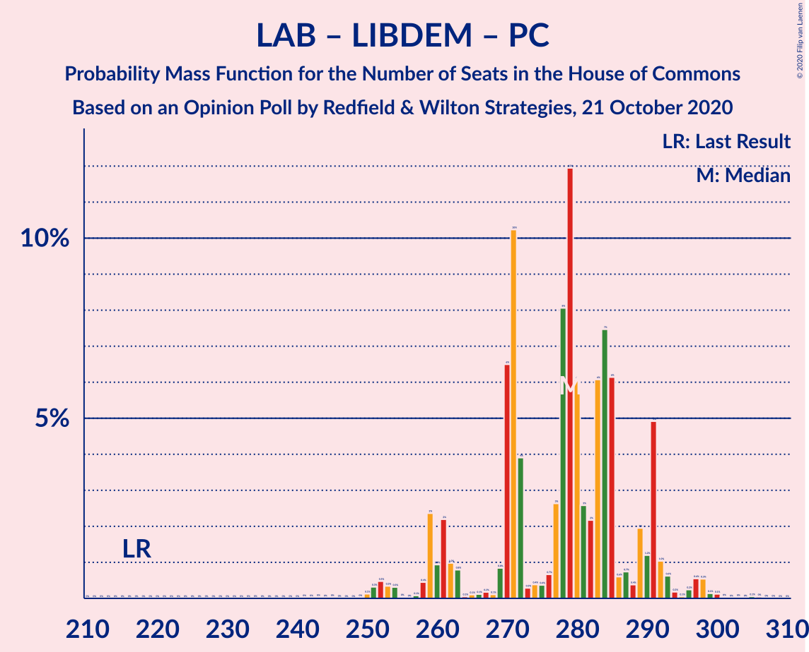

| Number of Seats | Probability | Accumulated | Special Marks |
|:---------------:|:-----------:|:-----------:|:-------------:|
| 217 | 0% | 100% | Last Result |
| 218 | 0% | 100% |  |
| 219 | 0% | 100% |  |
| 220 | 0% | 100% |  |
| 221 | 0% | 100% |  |
| 222 | 0% | 100% |  |
| 223 | 0% | 100% |  |
| 224 | 0% | 100% |  |
| 225 | 0% | 100% |  |
| 226 | 0% | 100% |  |
| 227 | 0% | 100% |  |
| 228 | 0% | 100% |  |
| 229 | 0% | 100% |  |
| 230 | 0% | 100% |  |
| 231 | 0% | 100% |  |
| 232 | 0% | 100% |  |
| 233 | 0% | 100% |  |
| 234 | 0% | 100% |  |
| 235 | 0% | 100% |  |
| 236 | 0% | 100% |  |
| 237 | 0% | 100% |  |
| 238 | 0% | 100% |  |
| 239 | 0% | 100% |  |
| 240 | 0% | 100% |  |
| 241 | 0% | 100% |  |
| 242 | 0% | 100% |  |
| 243 | 0% | 99.9% |  |
| 244 | 0% | 99.9% |  |
| 245 | 0% | 99.9% |  |
| 246 | 0% | 99.8% |  |
| 247 | 0% | 99.8% |  |
| 248 | 0% | 99.8% |  |
| 249 | 0% | 99.8% |  |
| 250 | 0.2% | 99.8% |  |
| 251 | 0.4% | 99.6% |  |
| 252 | 0.3% | 99.2% |  |
| 253 | 0.3% | 98.9% |  |
| 254 | 0.2% | 98.6% |  |
| 255 | 0% | 98% |  |
| 256 | 0% | 98% |  |
| 257 | 0.1% | 98% |  |
| 258 | 0.6% | 98% |  |
| 259 | 2% | 98% |  |
| 260 | 2% | 95% |  |
| 261 | 1.5% | 94% |  |
| 262 | 1.1% | 92% |  |
| 263 | 0.5% | 91% |  |
| 264 | 0.1% | 90% |  |
| 265 | 0.1% | 90% |  |
| 266 | 0.2% | 90% |  |
| 267 | 0.2% | 90% |  |
| 268 | 0.1% | 90% |  |
| 269 | 1.2% | 90% |  |
| 270 | 7% | 88% |  |
| 271 | 10% | 81% |  |
| 272 | 3% | 71% |  |
| 273 | 0.8% | 69% |  |
| 274 | 0.4% | 68% |  |
| 275 | 0.8% | 67% |  |
| 276 | 0.8% | 67% |  |
| 277 | 2% | 66% |  |
| 278 | 8% | 64% |  |
| 279 | 11% | 55% | Median |
| 280 | 6% | 44% |  |
| 281 | 2% | 39% |  |
| 282 | 2% | 36% |  |
| 283 | 7% | 34% |  |
| 284 | 9% | 27% |  |
| 285 | 5% | 18% |  |
| 286 | 0.8% | 13% |  |
| 287 | 0.7% | 12% |  |
| 288 | 0.5% | 11% |  |
| 289 | 1.5% | 11% |  |
| 290 | 2% | 9% |  |
| 291 | 3% | 7% |  |
| 292 | 1.3% | 4% |  |
| 293 | 0.5% | 3% |  |
| 294 | 0.2% | 2% |  |
| 295 | 0.1% | 2% |  |
| 296 | 0.2% | 2% |  |
| 297 | 0.6% | 2% |  |
| 298 | 0.6% | 1.2% |  |
| 299 | 0.2% | 0.6% |  |
| 300 | 0.1% | 0.4% |  |
| 301 | 0% | 0.2% |  |
| 302 | 0% | 0.2% |  |
| 303 | 0% | 0.2% |  |
| 304 | 0% | 0.2% |  |
| 305 | 0% | 0.1% |  |
| 306 | 0% | 0.1% |  |
| 307 | 0% | 0% |  |

### Labour Party – Liberal Democrats

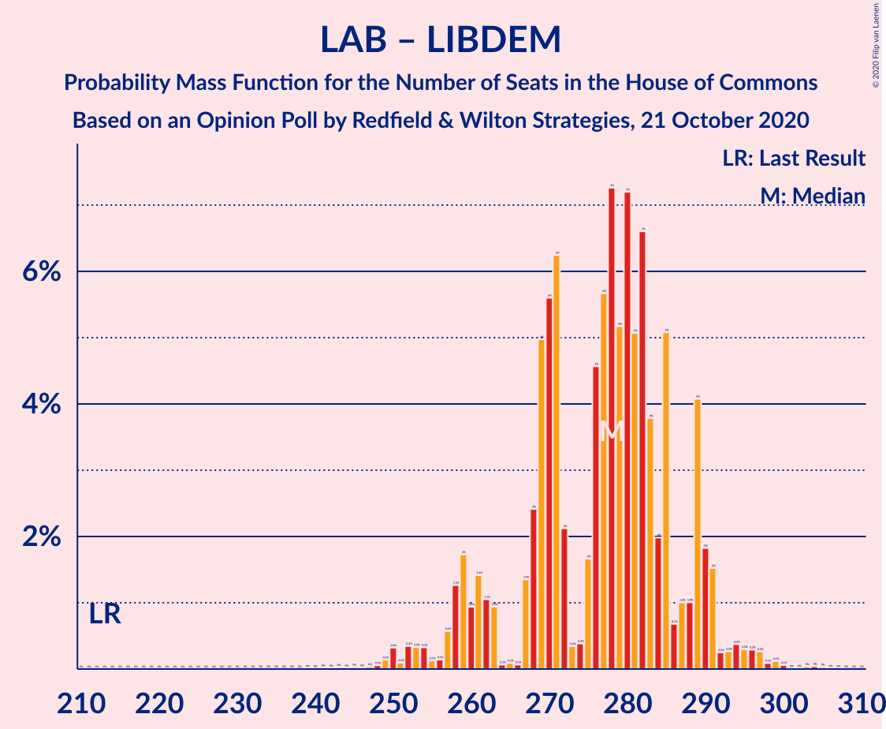

| Number of Seats | Probability | Accumulated | Special Marks |
|:---------------:|:-----------:|:-----------:|:-------------:|
| 213 | 0% | 100% | Last Result |
| 214 | 0% | 100% |  |
| 215 | 0% | 100% |  |
| 216 | 0% | 100% |  |
| 217 | 0% | 100% |  |
| 218 | 0% | 100% |  |
| 219 | 0% | 100% |  |
| 220 | 0% | 100% |  |
| 221 | 0% | 100% |  |
| 222 | 0% | 100% |  |
| 223 | 0% | 100% |  |
| 224 | 0% | 100% |  |
| 225 | 0% | 100% |  |
| 226 | 0% | 100% |  |
| 227 | 0% | 100% |  |
| 228 | 0% | 100% |  |
| 229 | 0% | 100% |  |
| 230 | 0% | 100% |  |
| 231 | 0% | 100% |  |
| 232 | 0% | 100% |  |
| 233 | 0% | 100% |  |
| 234 | 0% | 100% |  |
| 235 | 0% | 100% |  |
| 236 | 0% | 100% |  |
| 237 | 0% | 100% |  |
| 238 | 0% | 100% |  |
| 239 | 0% | 100% |  |
| 240 | 0% | 100% |  |
| 241 | 0% | 100% |  |
| 242 | 0% | 99.9% |  |
| 243 | 0% | 99.9% |  |
| 244 | 0% | 99.9% |  |
| 245 | 0% | 99.9% |  |
| 246 | 0% | 99.8% |  |
| 247 | 0% | 99.8% |  |
| 248 | 0.1% | 99.8% |  |
| 249 | 0.2% | 99.7% |  |
| 250 | 0.3% | 99.5% |  |
| 251 | 0.1% | 99.2% |  |
| 252 | 0.2% | 99.1% |  |
| 253 | 0.3% | 98.9% |  |
| 254 | 0.3% | 98.5% |  |
| 255 | 0.2% | 98% |  |
| 256 | 0.3% | 98% |  |
| 257 | 0.5% | 98% |  |
| 258 | 2% | 97% |  |
| 259 | 2% | 96% |  |
| 260 | 1.0% | 94% |  |
| 261 | 0.8% | 93% |  |
| 262 | 1.2% | 92% |  |
| 263 | 0.7% | 91% |  |
| 264 | 0.2% | 90% |  |
| 265 | 0.1% | 90% |  |
| 266 | 0.4% | 90% |  |
| 267 | 1.3% | 89% |  |
| 268 | 3% | 88% |  |
| 269 | 4% | 85% |  |
| 270 | 6% | 81% |  |
| 271 | 6% | 75% |  |
| 272 | 2% | 69% |  |
| 273 | 1.0% | 67% |  |
| 274 | 0.7% | 66% |  |
| 275 | 2% | 65% |  |
| 276 | 4% | 63% |  |
| 277 | 6% | 59% |  |
| 278 | 6% | 54% | Median |
| 279 | 6% | 47% |  |
| 280 | 5% | 41% |  |
| 281 | 5% | 36% |  |
| 282 | 6% | 30% |  |
| 283 | 5% | 25% |  |
| 284 | 5% | 20% |  |
| 285 | 3% | 15% |  |
| 286 | 0.7% | 11% |  |
| 287 | 1.0% | 11% |  |
| 288 | 1.4% | 10% |  |
| 289 | 3% | 8% |  |
| 290 | 2% | 6% |  |
| 291 | 1.2% | 4% |  |
| 292 | 0.4% | 3% |  |
| 293 | 0.3% | 2% |  |
| 294 | 0.4% | 2% |  |
| 295 | 0.3% | 2% |  |
| 296 | 0.3% | 1.2% |  |
| 297 | 0.4% | 0.9% |  |
| 298 | 0.2% | 0.5% |  |
| 299 | 0.1% | 0.4% |  |
| 300 | 0.1% | 0.2% |  |
| 301 | 0% | 0.2% |  |
| 302 | 0% | 0.2% |  |
| 303 | 0% | 0.1% |  |
| 304 | 0% | 0.1% |  |
| 305 | 0% | 0.1% |  |
| 306 | 0% | 0% |  |

### Labour Party – Plaid Cymru

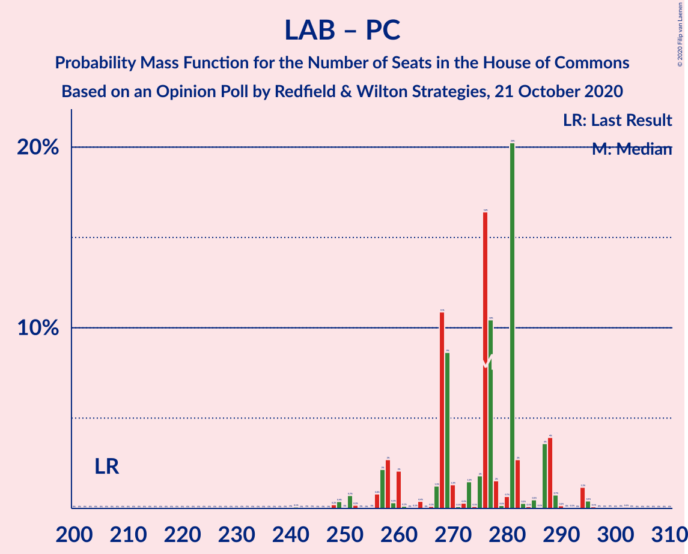

| Number of Seats | Probability | Accumulated | Special Marks |
|:---------------:|:-----------:|:-----------:|:-------------:|
| 206 | 0% | 100% | Last Result |
| 207 | 0% | 100% |  |
| 208 | 0% | 100% |  |
| 209 | 0% | 100% |  |
| 210 | 0% | 100% |  |
| 211 | 0% | 100% |  |
| 212 | 0% | 100% |  |
| 213 | 0% | 100% |  |
| 214 | 0% | 100% |  |
| 215 | 0% | 100% |  |
| 216 | 0% | 100% |  |
| 217 | 0% | 100% |  |
| 218 | 0% | 100% |  |
| 219 | 0% | 100% |  |
| 220 | 0% | 100% |  |
| 221 | 0% | 100% |  |
| 222 | 0% | 100% |  |
| 223 | 0% | 100% |  |
| 224 | 0% | 100% |  |
| 225 | 0% | 100% |  |
| 226 | 0% | 100% |  |
| 227 | 0% | 100% |  |
| 228 | 0% | 100% |  |
| 229 | 0% | 100% |  |
| 230 | 0% | 100% |  |
| 231 | 0% | 100% |  |
| 232 | 0% | 100% |  |
| 233 | 0% | 100% |  |
| 234 | 0% | 100% |  |
| 235 | 0% | 100% |  |
| 236 | 0% | 100% |  |
| 237 | 0% | 100% |  |
| 238 | 0% | 100% |  |
| 239 | 0% | 100% |  |
| 240 | 0% | 100% |  |
| 241 | 0.1% | 100% |  |
| 242 | 0% | 99.9% |  |
| 243 | 0% | 99.9% |  |
| 244 | 0% | 99.9% |  |
| 245 | 0% | 99.8% |  |
| 246 | 0% | 99.8% |  |
| 247 | 0% | 99.8% |  |
| 248 | 0.2% | 99.8% |  |
| 249 | 0.4% | 99.6% |  |
| 250 | 0% | 99.2% |  |
| 251 | 0.7% | 99.2% |  |
| 252 | 0.2% | 98.5% |  |
| 253 | 0% | 98% |  |
| 254 | 0% | 98% |  |
| 255 | 0.1% | 98% |  |
| 256 | 0.7% | 98% |  |
| 257 | 2% | 98% |  |
| 258 | 3% | 96% |  |
| 259 | 0.3% | 93% |  |
| 260 | 2% | 93% |  |
| 261 | 0.2% | 90% |  |
| 262 | 0% | 90% |  |
| 263 | 0.1% | 90% |  |
| 264 | 0.5% | 90% |  |
| 265 | 0% | 90% |  |
| 266 | 0.1% | 90% |  |
| 267 | 1.2% | 90% |  |
| 268 | 11% | 88% |  |
| 269 | 8% | 78% |  |
| 270 | 1.4% | 69% |  |
| 271 | 0.1% | 68% |  |
| 272 | 0.3% | 68% |  |
| 273 | 2% | 68% |  |
| 274 | 0.1% | 66% |  |
| 275 | 2% | 66% |  |
| 276 | 14% | 64% | Median |
| 277 | 12% | 50% |  |
| 278 | 2% | 38% |  |
| 279 | 0.2% | 36% |  |
| 280 | 0.8% | 36% |  |
| 281 | 20% | 35% |  |
| 282 | 3% | 15% |  |
| 283 | 0.3% | 12% |  |
| 284 | 0.1% | 12% |  |
| 285 | 0.5% | 12% |  |
| 286 | 0.1% | 11% |  |
| 287 | 4% | 11% |  |
| 288 | 4% | 7% |  |
| 289 | 0.8% | 3% |  |
| 290 | 0.2% | 2% |  |
| 291 | 0.1% | 2% |  |
| 292 | 0.1% | 2% |  |
| 293 | 0% | 2% |  |
| 294 | 1.2% | 2% |  |
| 295 | 0.5% | 0.8% |  |
| 296 | 0.1% | 0.4% |  |
| 297 | 0% | 0.2% |  |
| 298 | 0% | 0.2% |  |
| 299 | 0% | 0.2% |  |
| 300 | 0% | 0.2% |  |
| 301 | 0% | 0.2% |  |
| 302 | 0.1% | 0.1% |  |
| 303 | 0% | 0% |  |

### Labour Party

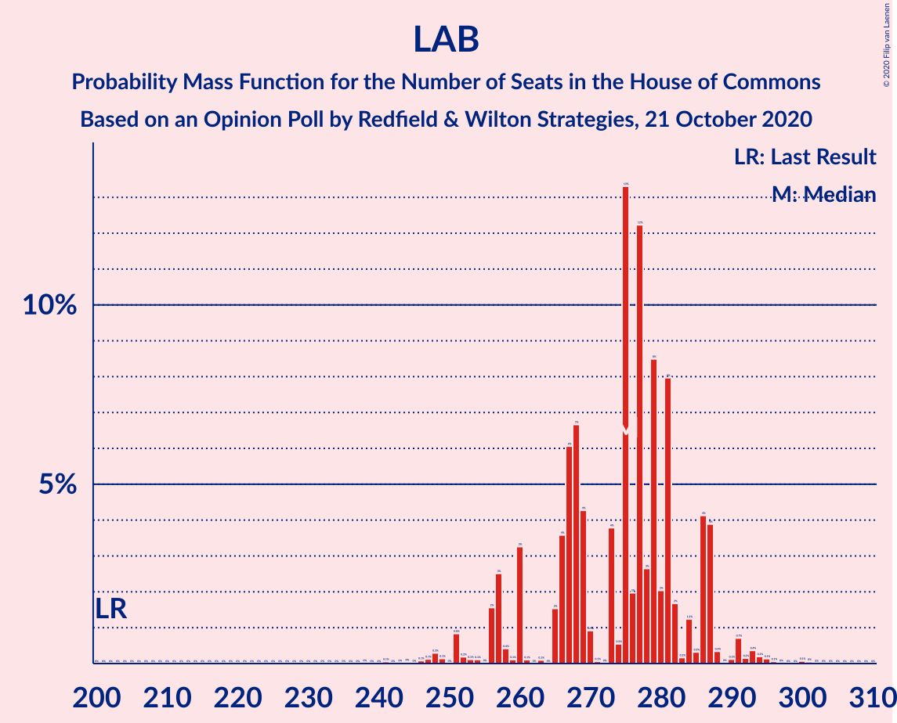

| Number of Seats | Probability | Accumulated | Special Marks |
|:---------------:|:-----------:|:-----------:|:-------------:|
| 202 | 0% | 100% | Last Result |
| 203 | 0% | 100% |  |
| 204 | 0% | 100% |  |
| 205 | 0% | 100% |  |
| 206 | 0% | 100% |  |
| 207 | 0% | 100% |  |
| 208 | 0% | 100% |  |
| 209 | 0% | 100% |  |
| 210 | 0% | 100% |  |
| 211 | 0% | 100% |  |
| 212 | 0% | 100% |  |
| 213 | 0% | 100% |  |
| 214 | 0% | 100% |  |
| 215 | 0% | 100% |  |
| 216 | 0% | 100% |  |
| 217 | 0% | 100% |  |
| 218 | 0% | 100% |  |
| 219 | 0% | 100% |  |
| 220 | 0% | 100% |  |
| 221 | 0% | 100% |  |
| 222 | 0% | 100% |  |
| 223 | 0% | 100% |  |
| 224 | 0% | 100% |  |
| 225 | 0% | 100% |  |
| 226 | 0% | 100% |  |
| 227 | 0% | 100% |  |
| 228 | 0% | 100% |  |
| 229 | 0% | 100% |  |
| 230 | 0% | 100% |  |
| 231 | 0% | 100% |  |
| 232 | 0% | 100% |  |
| 233 | 0% | 100% |  |
| 234 | 0% | 100% |  |
| 235 | 0% | 100% |  |
| 236 | 0% | 100% |  |
| 237 | 0% | 100% |  |
| 238 | 0% | 100% |  |
| 239 | 0% | 100% |  |
| 240 | 0% | 99.9% |  |
| 241 | 0.1% | 99.9% |  |
| 242 | 0% | 99.9% |  |
| 243 | 0% | 99.9% |  |
| 244 | 0% | 99.9% |  |
| 245 | 0% | 99.8% |  |
| 246 | 0.1% | 99.8% |  |
| 247 | 0.2% | 99.7% |  |
| 248 | 0.3% | 99.5% |  |
| 249 | 0.1% | 99.2% |  |
| 250 | 0% | 99.1% |  |
| 251 | 0.6% | 99.1% |  |
| 252 | 0.2% | 98% |  |
| 253 | 0.2% | 98% |  |
| 254 | 0.2% | 98% |  |
| 255 | 0% | 98% |  |
| 256 | 2% | 98% |  |
| 257 | 3% | 95% |  |
| 258 | 0.2% | 93% |  |
| 259 | 0.1% | 93% |  |
| 260 | 3% | 92% |  |
| 261 | 0.2% | 90% |  |
| 262 | 0% | 90% |  |
| 263 | 0.1% | 90% |  |
| 264 | 0% | 90% |  |
| 265 | 2% | 90% |  |
| 266 | 4% | 87% |  |
| 267 | 5% | 84% |  |
| 268 | 5% | 79% |  |
| 269 | 7% | 74% |  |
| 270 | 1.1% | 67% |  |
| 271 | 0.1% | 66% |  |
| 272 | 0% | 66% |  |
| 273 | 5% | 66% |  |
| 274 | 0.5% | 60% |  |
| 275 | 12% | 60% | Median |
| 276 | 2% | 48% |  |
| 277 | 10% | 46% |  |
| 278 | 3% | 36% |  |
| 279 | 7% | 33% |  |
| 280 | 2% | 26% |  |
| 281 | 11% | 23% |  |
| 282 | 1.3% | 12% |  |
| 283 | 0.1% | 11% |  |
| 284 | 1.4% | 11% |  |
| 285 | 0.3% | 10% |  |
| 286 | 3% | 9% |  |
| 287 | 3% | 6% |  |
| 288 | 0.6% | 3% |  |
| 289 | 0% | 2% |  |
| 290 | 0.2% | 2% |  |
| 291 | 0.7% | 2% |  |
| 292 | 0.1% | 1.4% |  |
| 293 | 0.5% | 1.2% |  |
| 294 | 0.2% | 0.7% |  |
| 295 | 0.2% | 0.5% |  |
| 296 | 0.1% | 0.3% |  |
| 297 | 0% | 0.2% |  |
| 298 | 0% | 0.2% |  |
| 299 | 0% | 0.2% |  |
| 300 | 0.1% | 0.2% |  |
| 301 | 0.1% | 0.1% |  |
| 302 | 0% | 0% |  |

## Technical Information

### Opinion Poll

+ **Polling firm:** Redfield & Wilton Strategies
+ **Commissioner(s):** —
+ **Fieldwork period:** 21 October 2020

### Calculations

+ **Sample size:** 2974
+ **Simulations done:** 524,288
+ **Error estimate:** 0.32%

