# Opinion Poll by Survation, 5–6 November 2020

<a href="#voting-intentions">Voting Intentions</a> | <a href="#seats">Seats</a> | <a href="#coalitions">Coalitions</a> | <a href="#technical-information">Technical Information</a>

## Voting Intentions

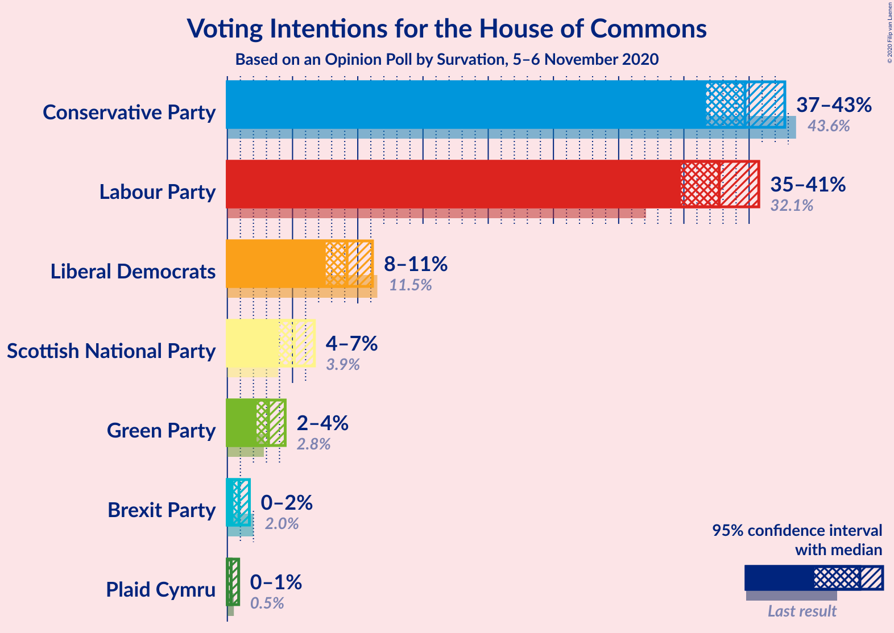

### Confidence Intervals

| Party | Last Result | Poll Result | 80% Confidence Interval | 90% Confidence Interval | 95% Confidence Interval | 99% Confidence Interval |
|:-----:|:-----------:|:-----------:|:-----------------------:|:-----------------------:|:-----------------------:|:-----------------------:|
| Conservative Party | 43.6% | 39.7% | 37.7–41.7% |37.2–42.2% |36.7–42.7% |35.8–43.7% |
| Labour Party | 32.1% | 37.7% | 35.8–39.7% |35.2–40.3% |34.8–40.7% |33.9–41.7% |
| Liberal Democrats | 11.5% | 9.2% | 8.1–10.5% |7.8–10.8% |7.5–11.1% |7.1–11.8% |
| Scottish National Party | 3.9% | 5.1% | 4.3–6.1% |4.1–6.4% |3.9–6.7% |3.6–7.2% |
| Green Party | 2.8% | 3.2% | 2.6–4.0% |2.4–4.2% |2.2–4.4% |2.0–4.9% |
| Brexit Party | 2.0% | 0.9% | 0.6–1.4% |0.5–1.6% |0.5–1.7% |0.4–2.0% |
| Plaid Cymru | 0.5% | 0.3% | 0.2–0.7% |0.1–0.8% |0.1–0.9% |0.1–1.1% |

*Note:* The poll result column reflects the actual value used in the calculations. Published results may vary slightly, and in addition be rounded to fewer digits.

## Seats

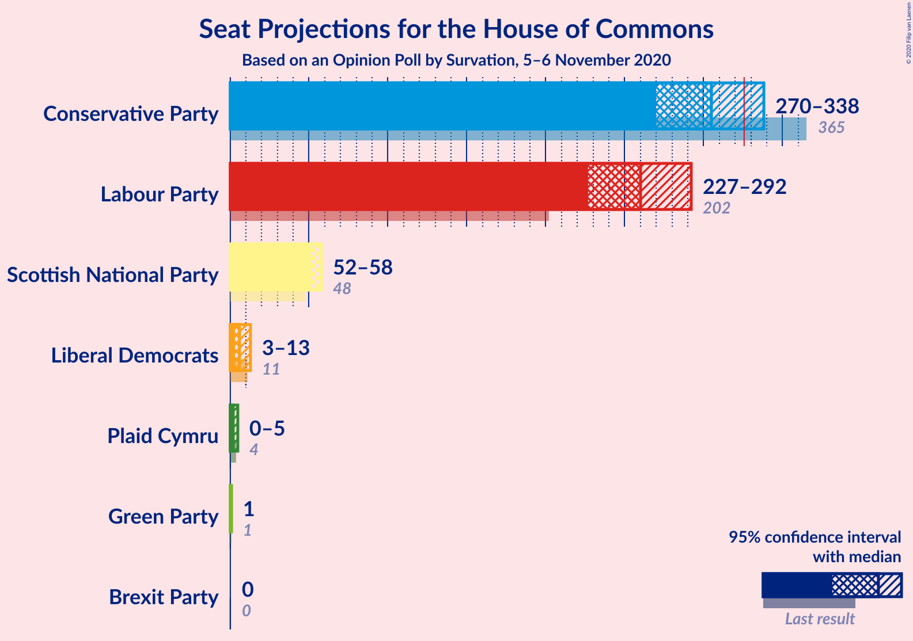

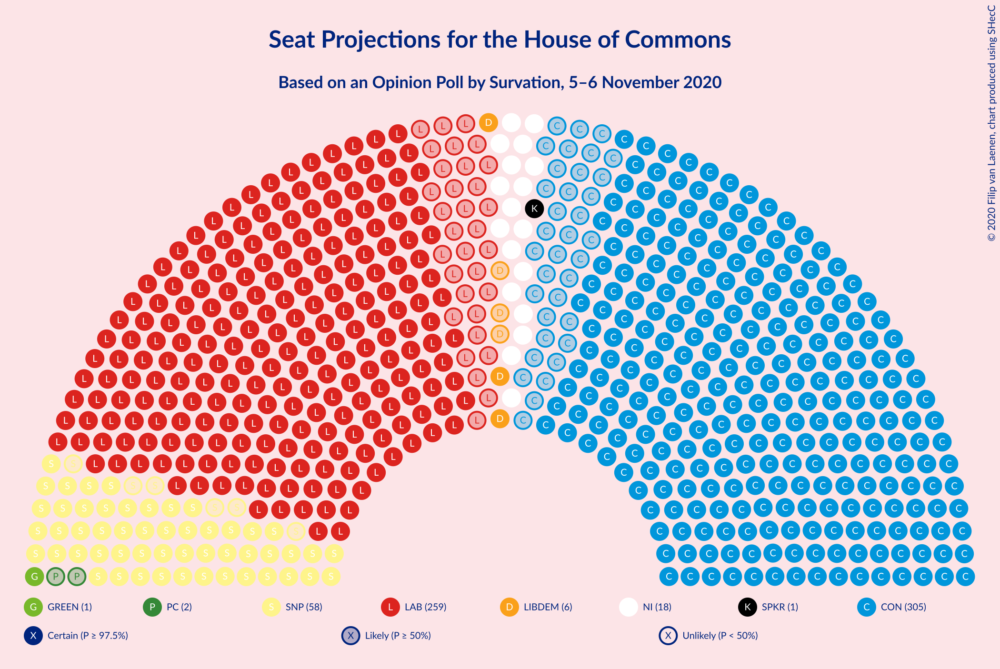

### Confidence Intervals

| Party | Last Result | Median | 80% Confidence Interval | 90% Confidence Interval | 95% Confidence Interval | 99% Confidence Interval |
|:-----:|:-----------:|:------:|:-----------------------:|:-----------------------:|:-----------------------:|:-----------------------:|
| <a href="#conservative-party">Conservative Party</a> | 365 | 305 | 280–330 |276–334 |272–338 |263–347 |
| <a href="#labour-party">Labour Party</a> | 202 | 258 | 236–282 |231–287 |227–291 |219–298 |
| <a href="#liberal-democrats">Liberal Democrats</a> | 11 | 6 | 4–8 |4–11 |3–13 |2–17 |
| <a href="#scottish-national-party">Scottish National Party</a> | 48 | 58 | 55–58 |53–58 |52–58 |47–58 |
| <a href="#green-party">Green Party</a> | 1 | 1 | 1 |1 |1 |1 |
| <a href="#brexit-party">Brexit Party</a> | 0 | 0 | 0 |0 |0 |0 |
| <a href="#plaid-cymru">Plaid Cymru</a> | 4 | 2 | 0–5 |0–5 |0–5 |0–5 |

### Conservative Party

*For a full overview of the results for this party, see the [Conservative Party](party-conservativeparty.html) page.*

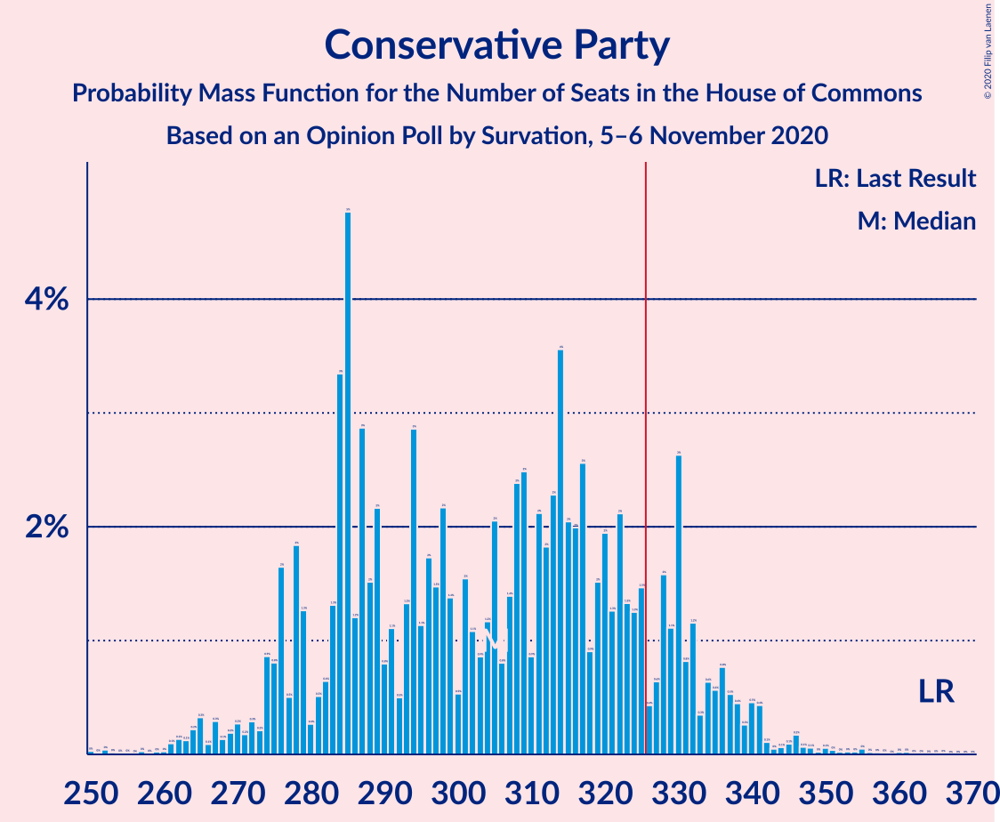

| Number of Seats | Probability | Accumulated | Special Marks |
|:---------------:|:-----------:|:-----------:|:-------------:|
| 250 | 0% | 100% |  |
| 251 | 0% | 99.9% |  |
| 252 | 0% | 99.9% |  |
| 253 | 0% | 99.9% |  |
| 254 | 0% | 99.9% |  |
| 255 | 0% | 99.8% |  |
| 256 | 0% | 99.8% |  |
| 257 | 0% | 99.8% |  |
| 258 | 0% | 99.8% |  |
| 259 | 0% | 99.8% |  |
| 260 | 0% | 99.8% |  |
| 261 | 0.1% | 99.7% |  |
| 262 | 0.1% | 99.6% |  |
| 263 | 0.1% | 99.5% |  |
| 264 | 0.2% | 99.4% |  |
| 265 | 0.3% | 99.2% |  |
| 266 | 0.1% | 98.8% |  |
| 267 | 0.3% | 98.7% |  |
| 268 | 0.1% | 98% |  |
| 269 | 0.2% | 98% |  |
| 270 | 0.3% | 98% |  |
| 271 | 0.2% | 98% |  |
| 272 | 0.3% | 98% |  |
| 273 | 0.2% | 97% |  |
| 274 | 0.9% | 97% |  |
| 275 | 0.8% | 96% |  |
| 276 | 2% | 96% |  |
| 277 | 0.5% | 94% |  |
| 278 | 2% | 93% |  |
| 279 | 1.3% | 92% |  |
| 280 | 0.3% | 90% |  |
| 281 | 0.5% | 90% |  |
| 282 | 0.6% | 89% |  |
| 283 | 1.3% | 89% |  |
| 284 | 3% | 88% |  |
| 285 | 5% | 84% |  |
| 286 | 1.2% | 79% |  |
| 287 | 3% | 78% |  |
| 288 | 2% | 75% |  |
| 289 | 2% | 74% |  |
| 290 | 0.8% | 72% |  |
| 291 | 1.1% | 71% |  |
| 292 | 0.5% | 70% |  |
| 293 | 1.3% | 69% |  |
| 294 | 3% | 68% |  |
| 295 | 1.1% | 65% |  |
| 296 | 2% | 64% |  |
| 297 | 1.5% | 62% |  |
| 298 | 2% | 61% |  |
| 299 | 1.4% | 59% |  |
| 300 | 0.5% | 57% |  |
| 301 | 2% | 57% |  |
| 302 | 1.1% | 55% |  |
| 303 | 0.9% | 54% |  |
| 304 | 1.2% | 53% |  |
| 305 | 2% | 52% | Median |
| 306 | 0.8% | 50% |  |
| 307 | 1.4% | 49% |  |
| 308 | 2% | 48% |  |
| 309 | 2% | 45% |  |
| 310 | 0.9% | 43% |  |
| 311 | 2% | 42% |  |
| 312 | 2% | 40% |  |
| 313 | 2% | 38% |  |
| 314 | 4% | 36% |  |
| 315 | 2% | 32% |  |
| 316 | 2% | 30% |  |
| 317 | 3% | 28% |  |
| 318 | 0.9% | 26% |  |
| 319 | 2% | 25% |  |
| 320 | 2% | 23% |  |
| 321 | 1.3% | 21% |  |
| 322 | 2% | 20% |  |
| 323 | 1.3% | 18% |  |
| 324 | 1.3% | 17% |  |
| 325 | 1.5% | 15% |  |
| 326 | 0.4% | 14% | Majority |
| 327 | 0.6% | 13% |  |
| 328 | 2% | 13% |  |
| 329 | 1.1% | 11% |  |
| 330 | 3% | 10% |  |
| 331 | 0.8% | 7% |  |
| 332 | 1.2% | 7% |  |
| 333 | 0.3% | 5% |  |
| 334 | 0.6% | 5% |  |
| 335 | 0.6% | 4% |  |
| 336 | 0.8% | 4% |  |
| 337 | 0.5% | 3% |  |
| 338 | 0.4% | 3% |  |
| 339 | 0.3% | 2% |  |
| 340 | 0.5% | 2% |  |
| 341 | 0.4% | 1.4% |  |
| 342 | 0.1% | 1.0% |  |
| 343 | 0% | 0.9% |  |
| 344 | 0.1% | 0.8% |  |
| 345 | 0.1% | 0.8% |  |
| 346 | 0.2% | 0.7% |  |
| 347 | 0.1% | 0.5% |  |
| 348 | 0.1% | 0.4% |  |
| 349 | 0% | 0.4% |  |
| 350 | 0.1% | 0.4% |  |
| 351 | 0% | 0.3% |  |
| 352 | 0% | 0.3% |  |
| 353 | 0% | 0.2% |  |
| 354 | 0% | 0.2% |  |
| 355 | 0% | 0.2% |  |
| 356 | 0% | 0.1% |  |
| 357 | 0% | 0.1% |  |
| 358 | 0% | 0.1% |  |
| 359 | 0% | 0.1% |  |
| 360 | 0% | 0.1% |  |
| 361 | 0% | 0.1% |  |
| 362 | 0% | 0% |  |
| 363 | 0% | 0% |  |
| 364 | 0% | 0% |  |
| 365 | 0% | 0% | Last Result |

### Labour Party

*For a full overview of the results for this party, see the [Labour Party](party-labourparty.html) page.*

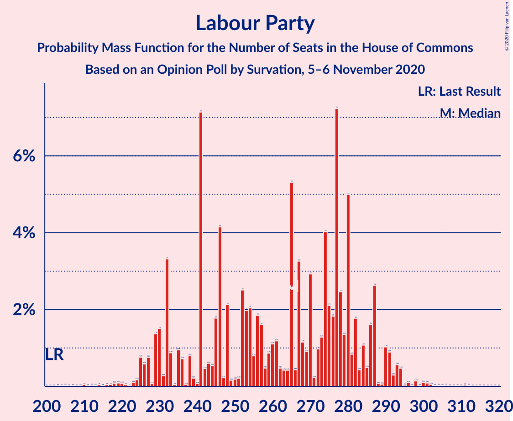

| Number of Seats | Probability | Accumulated | Special Marks |
|:---------------:|:-----------:|:-----------:|:-------------:|
| 202 | 0% | 100% | Last Result |
| 203 | 0% | 100% |  |
| 204 | 0% | 100% |  |
| 205 | 0% | 100% |  |
| 206 | 0% | 99.9% |  |
| 207 | 0% | 99.9% |  |
| 208 | 0% | 99.9% |  |
| 209 | 0% | 99.9% |  |
| 210 | 0% | 99.9% |  |
| 211 | 0% | 99.8% |  |
| 212 | 0% | 99.8% |  |
| 213 | 0% | 99.8% |  |
| 214 | 0% | 99.8% |  |
| 215 | 0% | 99.7% |  |
| 216 | 0% | 99.7% |  |
| 217 | 0% | 99.7% |  |
| 218 | 0.1% | 99.6% |  |
| 219 | 0.1% | 99.6% |  |
| 220 | 0.2% | 99.4% |  |
| 221 | 0% | 99.3% |  |
| 222 | 0.1% | 99.2% |  |
| 223 | 0.1% | 99.2% |  |
| 224 | 0.1% | 99.1% |  |
| 225 | 0.3% | 99.0% |  |
| 226 | 0.9% | 98.7% |  |
| 227 | 0.4% | 98% |  |
| 228 | 0.3% | 97% |  |
| 229 | 0.6% | 97% |  |
| 230 | 1.3% | 96% |  |
| 231 | 0.8% | 95% |  |
| 232 | 1.3% | 94% |  |
| 233 | 0.3% | 93% |  |
| 234 | 0.4% | 93% |  |
| 235 | 1.0% | 92% |  |
| 236 | 3% | 91% |  |
| 237 | 0.5% | 89% |  |
| 238 | 2% | 88% |  |
| 239 | 0.4% | 86% |  |
| 240 | 1.0% | 86% |  |
| 241 | 3% | 85% |  |
| 242 | 0.7% | 82% |  |
| 243 | 1.3% | 81% |  |
| 244 | 0.9% | 80% |  |
| 245 | 1.4% | 79% |  |
| 246 | 4% | 78% |  |
| 247 | 3% | 74% |  |
| 248 | 0.9% | 71% |  |
| 249 | 0.2% | 70% |  |
| 250 | 3% | 69% |  |
| 251 | 2% | 67% |  |
| 252 | 4% | 64% |  |
| 253 | 1.3% | 61% |  |
| 254 | 1.2% | 59% |  |
| 255 | 2% | 58% |  |
| 256 | 4% | 56% |  |
| 257 | 1.4% | 52% |  |
| 258 | 0.8% | 51% | Median |
| 259 | 2% | 50% |  |
| 260 | 1.2% | 48% |  |
| 261 | 2% | 47% |  |
| 262 | 0.2% | 45% |  |
| 263 | 0.8% | 45% |  |
| 264 | 0.4% | 44% |  |
| 265 | 4% | 44% |  |
| 266 | 1.4% | 40% |  |
| 267 | 3% | 38% |  |
| 268 | 1.2% | 35% |  |
| 269 | 2% | 34% |  |
| 270 | 2% | 32% |  |
| 271 | 0.7% | 31% |  |
| 272 | 0.5% | 30% |  |
| 273 | 1.2% | 29% |  |
| 274 | 1.4% | 28% |  |
| 275 | 2% | 27% |  |
| 276 | 1.2% | 24% |  |
| 277 | 4% | 23% |  |
| 278 | 3% | 19% |  |
| 279 | 1.0% | 16% |  |
| 280 | 3% | 15% |  |
| 281 | 1.1% | 12% |  |
| 282 | 1.2% | 11% |  |
| 283 | 1.1% | 9% |  |
| 284 | 0.6% | 8% |  |
| 285 | 0.9% | 8% |  |
| 286 | 1.3% | 7% |  |
| 287 | 1.2% | 5% |  |
| 288 | 0.5% | 4% |  |
| 289 | 0.5% | 4% |  |
| 290 | 0.6% | 3% |  |
| 291 | 0.5% | 3% |  |
| 292 | 0.3% | 2% |  |
| 293 | 0.4% | 2% |  |
| 294 | 0.4% | 1.5% |  |
| 295 | 0.4% | 1.1% |  |
| 296 | 0.1% | 0.7% |  |
| 297 | 0.1% | 0.7% |  |
| 298 | 0.1% | 0.6% |  |
| 299 | 0.1% | 0.5% |  |
| 300 | 0.1% | 0.4% |  |
| 301 | 0.1% | 0.3% |  |
| 302 | 0% | 0.2% |  |
| 303 | 0% | 0.2% |  |
| 304 | 0% | 0.1% |  |
| 305 | 0% | 0.1% |  |
| 306 | 0% | 0.1% |  |
| 307 | 0% | 0.1% |  |
| 308 | 0% | 0.1% |  |
| 309 | 0% | 0.1% |  |
| 310 | 0% | 0.1% |  |
| 311 | 0% | 0.1% |  |
| 312 | 0% | 0% |  |

### Liberal Democrats

*For a full overview of the results for this party, see the [Liberal Democrats](party-liberaldemocrats.html) page.*

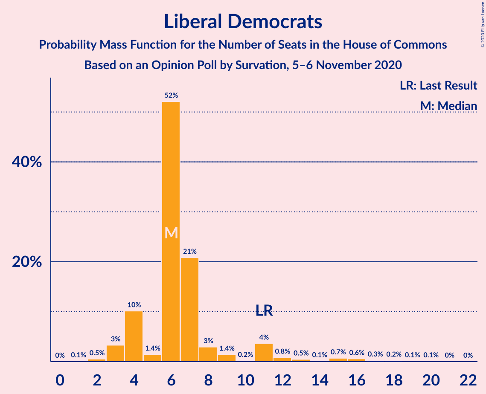

| Number of Seats | Probability | Accumulated | Special Marks |
|:---------------:|:-----------:|:-----------:|:-------------:|
| 1 | 0.1% | 100% |  |
| 2 | 0.5% | 99.9% |  |
| 3 | 3% | 99.4% |  |
| 4 | 10% | 96% |  |
| 5 | 1.4% | 86% |  |
| 6 | 52% | 85% | Median |
| 7 | 21% | 32% |  |
| 8 | 3% | 12% |  |
| 9 | 1.4% | 9% |  |
| 10 | 0.2% | 7% |  |
| 11 | 4% | 7% | Last Result |
| 12 | 0.8% | 3% |  |
| 13 | 0.5% | 3% |  |
| 14 | 0.1% | 2% |  |
| 15 | 0.7% | 2% |  |
| 16 | 0.6% | 1.3% |  |
| 17 | 0.3% | 0.8% |  |
| 18 | 0.2% | 0.5% |  |
| 19 | 0.1% | 0.3% |  |
| 20 | 0.1% | 0.2% |  |
| 21 | 0% | 0.1% |  |
| 22 | 0% | 0% |  |

### Scottish National Party

*For a full overview of the results for this party, see the [Scottish National Party](party-scottishnationalparty.html) page.*

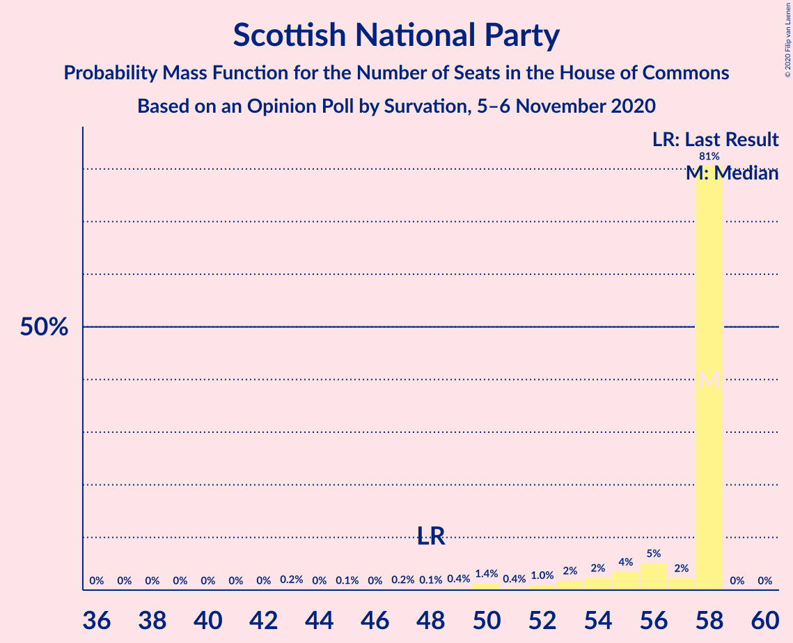

| Number of Seats | Probability | Accumulated | Special Marks |
|:---------------:|:-----------:|:-----------:|:-------------:|
| 37 | 0% | 100% |  |
| 38 | 0% | 99.9% |  |
| 39 | 0% | 99.9% |  |
| 40 | 0% | 99.9% |  |
| 41 | 0% | 99.9% |  |
| 42 | 0% | 99.9% |  |
| 43 | 0.1% | 99.8% |  |
| 44 | 0.1% | 99.8% |  |
| 45 | 0.1% | 99.7% |  |
| 46 | 0.1% | 99.6% |  |
| 47 | 0.2% | 99.5% |  |
| 48 | 0.1% | 99.4% | Last Result |
| 49 | 0.4% | 99.2% |  |
| 50 | 0.6% | 98.9% |  |
| 51 | 0.4% | 98% |  |
| 52 | 2% | 98% |  |
| 53 | 1.4% | 96% |  |
| 54 | 2% | 95% |  |
| 55 | 4% | 93% |  |
| 56 | 3% | 89% |  |
| 57 | 3% | 85% |  |
| 58 | 82% | 82% | Median |
| 59 | 0% | 0% |  |

### Green Party

*For a full overview of the results for this party, see the [Green Party](party-greenparty.html) page.*

| Number of Seats | Probability | Accumulated | Special Marks |
|:---------------:|:-----------:|:-----------:|:-------------:|
| 1 | 100% | 100% | Last Result, Median |

### Brexit Party

*For a full overview of the results for this party, see the [Brexit Party](party-brexitparty.html) page.*

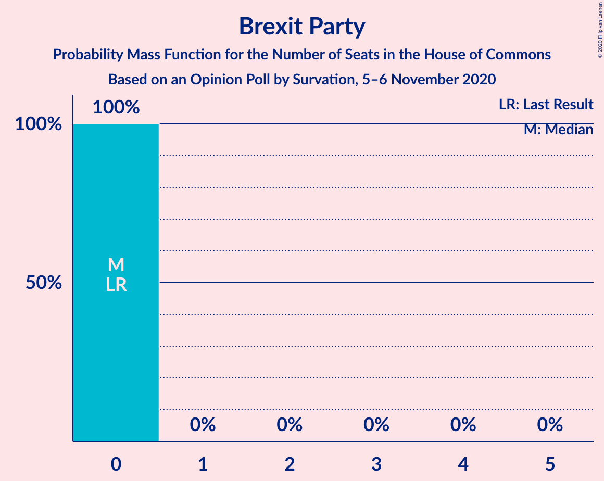

| Number of Seats | Probability | Accumulated | Special Marks |
|:---------------:|:-----------:|:-----------:|:-------------:|
| 0 | 100% | 100% | Last Result, Median |

### Plaid Cymru

*For a full overview of the results for this party, see the [Plaid Cymru](party-plaidcymru.html) page.*

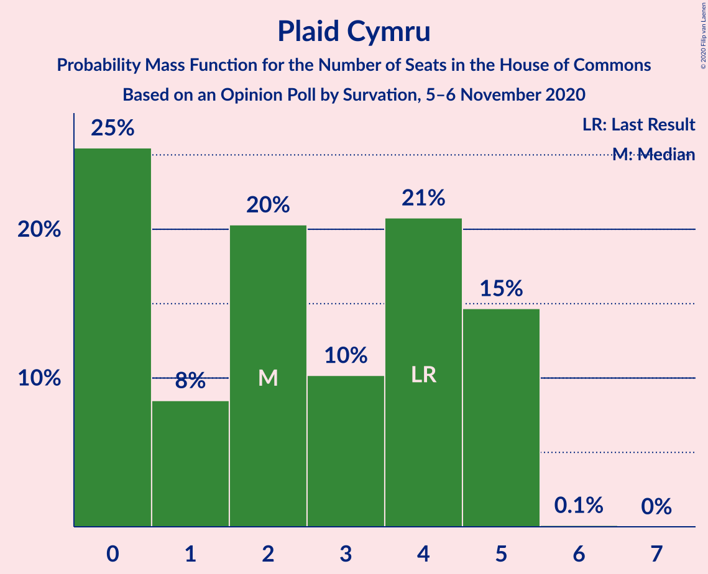

| Number of Seats | Probability | Accumulated | Special Marks |
|:---------------:|:-----------:|:-----------:|:-------------:|
| 0 | 25% | 100% |  |
| 1 | 8% | 75% |  |
| 2 | 20% | 66% | Median |
| 3 | 10% | 46% |  |
| 4 | 21% | 36% | Last Result |
| 5 | 15% | 15% |  |
| 6 | 0.1% | 0.1% |  |
| 7 | 0% | 0% |  |

## Coalitions

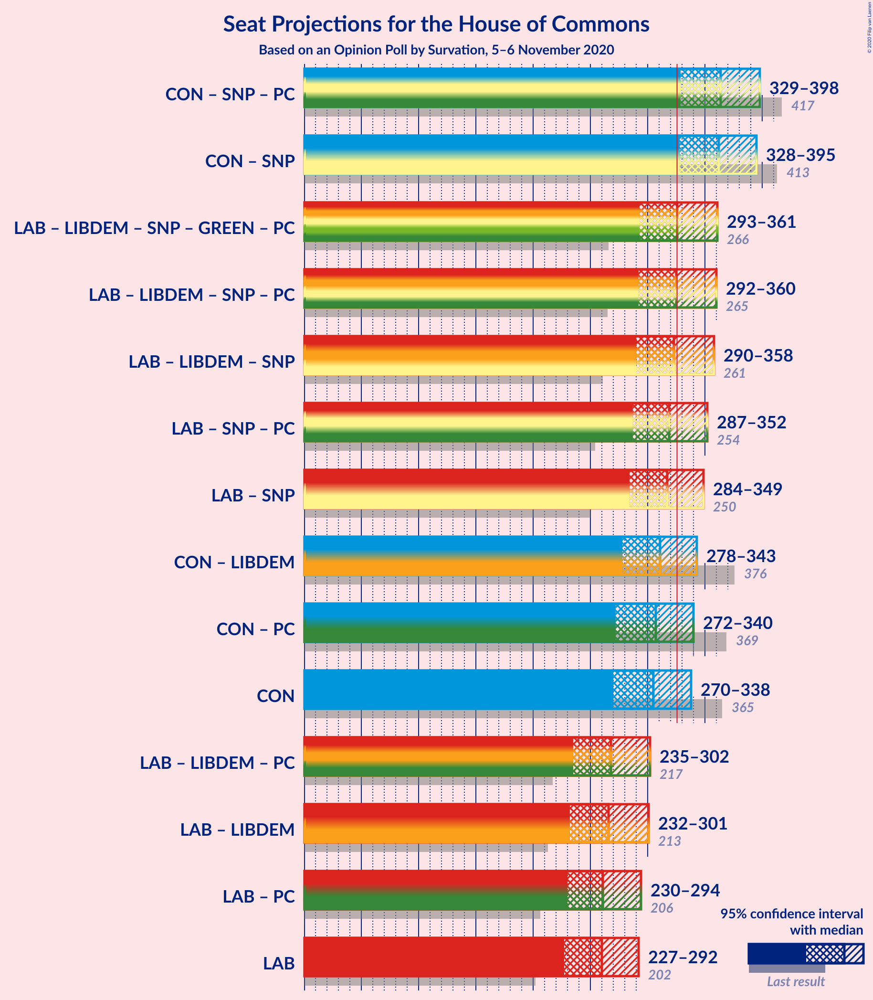

### Confidence Intervals

| Coalition | Last Result | Median | Majority? | 80% Confidence Interval | 90% Confidence Interval | 95% Confidence Interval | 99% Confidence Interval |
|:---------:|:-----------:|:------:|:---------:|:-----------------------:|:-----------------------:|:-----------------------:|:-----------------------:|
| Conservative Party – Scottish National Party – Plaid Cymru | 417 | 364 | 98.7% | 340–388 | 336–393 | 332–398 | 323–405 |
| Conservative Party – Scottish National Party | 413 | 363 | 98% | 337–386 | 334–390 | 329–395 | 320–404 |
| Labour Party – Liberal Democrats – Scottish National Party – Green Party – Plaid Cymru | 266 | 326 | 50% | 301–351 | 297–355 | 293–359 | 284–368 |
| Labour Party – Liberal Democrats – Scottish National Party – Plaid Cymru | 265 | 325 | 48% | 300–350 | 296–354 | 292–358 | 283–367 |
| Labour Party – Liberal Democrats – Scottish National Party | 261 | 322 | 45% | 300–348 | 294–351 | 290–356 | 281–364 |
| Labour Party – Scottish National Party – Plaid Cymru | 254 | 317 | 40% | 295–342 | 291–347 | 287–350 | 278–357 |
| Labour Party – Scottish National Party | 250 | 315 | 34% | 294–340 | 288–344 | 284–349 | 276–355 |
| Conservative Party – Liberal Democrats | 376 | 313 | 23% | 288–335 | 283–339 | 280–343 | 273–352 |
| Conservative Party – Plaid Cymru | 369 | 308 | 16% | 282–330 | 279–336 | 274–340 | 265–349 |
| Conservative Party | 365 | 305 | 14% | 280–330 | 276–334 | 272–338 | 263–347 |
| Labour Party – Liberal Democrats – Plaid Cymru | 217 | 267 | 0% | 244–293 | 240–296 | 235–301 | 226–310 |
| Labour Party – Liberal Democrats | 213 | 266 | 0% | 242–290 | 237–294 | 232–298 | 225–307 |
| Labour Party – Plaid Cymru | 206 | 261 | 0% | 238–284 | 234–289 | 230–293 | 220–300 |
| Labour Party | 202 | 258 | 0% | 236–282 | 231–287 | 227–291 | 219–298 |

### Conservative Party – Scottish National Party – Plaid Cymru

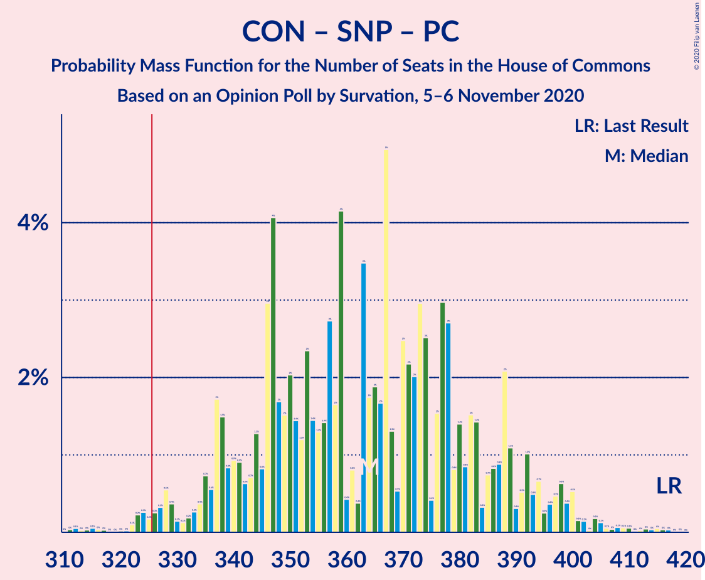

| Number of Seats | Probability | Accumulated | Special Marks |
|:---------------:|:-----------:|:-----------:|:-------------:|
| 310 | 0% | 100% |  |
| 311 | 0% | 99.9% |  |
| 312 | 0.1% | 99.9% |  |
| 313 | 0% | 99.8% |  |
| 314 | 0% | 99.8% |  |
| 315 | 0% | 99.8% |  |
| 316 | 0% | 99.8% |  |
| 317 | 0% | 99.8% |  |
| 318 | 0% | 99.8% |  |
| 319 | 0% | 99.8% |  |
| 320 | 0% | 99.8% |  |
| 321 | 0% | 99.7% |  |
| 322 | 0.1% | 99.7% |  |
| 323 | 0.3% | 99.6% |  |
| 324 | 0.3% | 99.2% |  |
| 325 | 0.2% | 98.9% |  |
| 326 | 0.3% | 98.7% | Majority |
| 327 | 0.1% | 98% |  |
| 328 | 0.3% | 98% |  |
| 329 | 0.2% | 98% |  |
| 330 | 0.1% | 98% |  |
| 331 | 0.2% | 98% |  |
| 332 | 0.3% | 98% |  |
| 333 | 0.3% | 97% |  |
| 334 | 0.5% | 97% |  |
| 335 | 0.8% | 96% |  |
| 336 | 0.9% | 96% |  |
| 337 | 2% | 95% |  |
| 338 | 2% | 93% |  |
| 339 | 0.8% | 91% |  |
| 340 | 1.1% | 90% |  |
| 341 | 0.7% | 89% |  |
| 342 | 0.3% | 88% |  |
| 343 | 0.6% | 88% |  |
| 344 | 2% | 87% |  |
| 345 | 1.3% | 85% |  |
| 346 | 4% | 84% |  |
| 347 | 5% | 80% |  |
| 348 | 2% | 75% |  |
| 349 | 2% | 73% |  |
| 350 | 1.4% | 72% |  |
| 351 | 1.0% | 70% |  |
| 352 | 0.8% | 69% |  |
| 353 | 0.5% | 68% |  |
| 354 | 1.4% | 68% |  |
| 355 | 2% | 66% |  |
| 356 | 1.4% | 65% |  |
| 357 | 2% | 64% |  |
| 358 | 1.5% | 61% |  |
| 359 | 4% | 60% |  |
| 360 | 0.3% | 56% |  |
| 361 | 0.5% | 56% |  |
| 362 | 0.7% | 55% |  |
| 363 | 2% | 55% |  |
| 364 | 3% | 52% |  |
| 365 | 0.8% | 50% | Median |
| 366 | 2% | 49% |  |
| 367 | 2% | 47% |  |
| 368 | 1.1% | 44% |  |
| 369 | 0.4% | 43% |  |
| 370 | 2% | 43% |  |
| 371 | 2% | 41% |  |
| 372 | 3% | 39% |  |
| 373 | 3% | 36% |  |
| 374 | 2% | 33% |  |
| 375 | 0.2% | 30% |  |
| 376 | 1.0% | 30% |  |
| 377 | 3% | 29% |  |
| 378 | 3% | 26% |  |
| 379 | 1.0% | 22% |  |
| 380 | 0.6% | 21% |  |
| 381 | 1.3% | 21% |  |
| 382 | 2% | 19% |  |
| 383 | 2% | 17% |  |
| 384 | 0.2% | 15% |  |
| 385 | 0.9% | 15% |  |
| 386 | 1.0% | 14% |  |
| 387 | 0.7% | 13% |  |
| 388 | 4% | 12% |  |
| 389 | 0.8% | 8% |  |
| 390 | 0.3% | 8% |  |
| 391 | 0.4% | 7% |  |
| 392 | 1.4% | 7% |  |
| 393 | 0.6% | 5% |  |
| 394 | 1.0% | 5% |  |
| 395 | 0.2% | 4% |  |
| 396 | 0.4% | 4% |  |
| 397 | 0.5% | 3% |  |
| 398 | 1.0% | 3% |  |
| 399 | 0.4% | 2% |  |
| 400 | 0.5% | 1.4% |  |
| 401 | 0% | 0.9% |  |
| 402 | 0.1% | 0.9% |  |
| 403 | 0% | 0.8% |  |
| 404 | 0.2% | 0.8% |  |
| 405 | 0.1% | 0.6% |  |
| 406 | 0.1% | 0.5% |  |
| 407 | 0% | 0.4% |  |
| 408 | 0.1% | 0.4% |  |
| 409 | 0.1% | 0.3% |  |
| 410 | 0% | 0.3% |  |
| 411 | 0% | 0.2% |  |
| 412 | 0% | 0.2% |  |
| 413 | 0% | 0.2% |  |
| 414 | 0% | 0.2% |  |
| 415 | 0% | 0.2% |  |
| 416 | 0% | 0.1% |  |
| 417 | 0% | 0.1% | Last Result |
| 418 | 0% | 0.1% |  |
| 419 | 0% | 0.1% |  |
| 420 | 0% | 0% |  |

### Conservative Party – Scottish National Party

| Number of Seats | Probability | Accumulated | Special Marks |
|:---------------:|:-----------:|:-----------:|:-------------:|
| 307 | 0% | 100% |  |
| 308 | 0% | 99.9% |  |
| 309 | 0% | 99.9% |  |
| 310 | 0% | 99.9% |  |
| 311 | 0% | 99.9% |  |
| 312 | 0% | 99.8% |  |
| 313 | 0% | 99.8% |  |
| 314 | 0% | 99.8% |  |
| 315 | 0% | 99.8% |  |
| 316 | 0% | 99.8% |  |
| 317 | 0% | 99.8% |  |
| 318 | 0% | 99.7% |  |
| 319 | 0.1% | 99.7% |  |
| 320 | 0.2% | 99.6% |  |
| 321 | 0.2% | 99.4% |  |
| 322 | 0.2% | 99.2% |  |
| 323 | 0.3% | 99.0% |  |
| 324 | 0.2% | 98.6% |  |
| 325 | 0.2% | 98% |  |
| 326 | 0.1% | 98% | Majority |
| 327 | 0.2% | 98% |  |
| 328 | 0.3% | 98% |  |
| 329 | 0.2% | 98% |  |
| 330 | 0.3% | 97% |  |
| 331 | 0.3% | 97% |  |
| 332 | 0.8% | 97% |  |
| 333 | 0.8% | 96% |  |
| 334 | 2% | 95% |  |
| 335 | 1.0% | 93% |  |
| 336 | 1.3% | 92% |  |
| 337 | 2% | 91% |  |
| 338 | 0.3% | 89% |  |
| 339 | 0.5% | 89% |  |
| 340 | 0.5% | 89% |  |
| 341 | 2% | 88% |  |
| 342 | 4% | 86% |  |
| 343 | 5% | 83% |  |
| 344 | 2% | 78% |  |
| 345 | 3% | 76% |  |
| 346 | 2% | 74% |  |
| 347 | 1.0% | 72% |  |
| 348 | 0.9% | 71% |  |
| 349 | 0.8% | 70% |  |
| 350 | 0.5% | 69% |  |
| 351 | 2% | 69% |  |
| 352 | 3% | 67% |  |
| 353 | 1.4% | 64% |  |
| 354 | 2% | 62% |  |
| 355 | 1.3% | 61% |  |
| 356 | 2% | 59% |  |
| 357 | 1.4% | 58% |  |
| 358 | 0.2% | 56% |  |
| 359 | 2% | 56% |  |
| 360 | 0.9% | 55% |  |
| 361 | 0.9% | 54% |  |
| 362 | 2% | 53% |  |
| 363 | 3% | 51% | Median |
| 364 | 0.9% | 48% |  |
| 365 | 1.1% | 48% |  |
| 366 | 3% | 46% |  |
| 367 | 1.3% | 43% |  |
| 368 | 0.5% | 42% |  |
| 369 | 2% | 41% |  |
| 370 | 2% | 39% |  |
| 371 | 3% | 37% |  |
| 372 | 4% | 35% |  |
| 373 | 2% | 31% |  |
| 374 | 2% | 29% |  |
| 375 | 3% | 27% |  |
| 376 | 0.9% | 24% |  |
| 377 | 2% | 23% |  |
| 378 | 2% | 22% |  |
| 379 | 0.6% | 20% |  |
| 380 | 2% | 19% |  |
| 381 | 1.0% | 17% |  |
| 382 | 1.1% | 16% |  |
| 383 | 1.5% | 15% |  |
| 384 | 0.7% | 13% |  |
| 385 | 1.0% | 13% |  |
| 386 | 2% | 12% |  |
| 387 | 0.9% | 10% |  |
| 388 | 3% | 9% |  |
| 389 | 0.8% | 6% |  |
| 390 | 1.3% | 6% |  |
| 391 | 0.2% | 4% |  |
| 392 | 0.3% | 4% |  |
| 393 | 0.4% | 4% |  |
| 394 | 0.9% | 3% |  |
| 395 | 0.7% | 3% |  |
| 396 | 0.5% | 2% |  |
| 397 | 0.1% | 1.4% |  |
| 398 | 0.3% | 1.3% |  |
| 399 | 0.2% | 1.1% |  |
| 400 | 0.1% | 0.9% |  |
| 401 | 0% | 0.7% |  |
| 402 | 0% | 0.7% |  |
| 403 | 0.1% | 0.7% |  |
| 404 | 0.2% | 0.6% |  |
| 405 | 0.1% | 0.4% |  |
| 406 | 0.1% | 0.4% |  |
| 407 | 0% | 0.3% |  |
| 408 | 0% | 0.3% |  |
| 409 | 0% | 0.3% |  |
| 410 | 0% | 0.2% |  |
| 411 | 0% | 0.2% |  |
| 412 | 0% | 0.2% |  |
| 413 | 0% | 0.2% | Last Result |
| 414 | 0% | 0.1% |  |
| 415 | 0% | 0.1% |  |
| 416 | 0% | 0.1% |  |
| 417 | 0% | 0.1% |  |
| 418 | 0% | 0.1% |  |
| 419 | 0% | 0.1% |  |
| 420 | 0% | 0% |  |

### Labour Party – Liberal Democrats – Scottish National Party – Green Party – Plaid Cymru

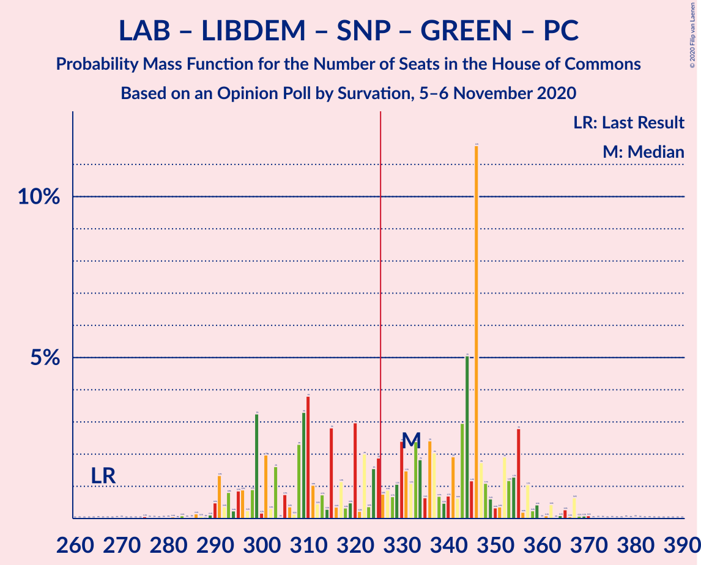

| Number of Seats | Probability | Accumulated | Special Marks |
|:---------------:|:-----------:|:-----------:|:-------------:|
| 266 | 0% | 100% | Last Result |
| 267 | 0% | 100% |  |
| 268 | 0% | 100% |  |
| 269 | 0% | 100% |  |
| 270 | 0% | 100% |  |
| 271 | 0% | 99.9% |  |
| 272 | 0% | 99.9% |  |
| 273 | 0% | 99.9% |  |
| 274 | 0% | 99.9% |  |
| 275 | 0% | 99.9% |  |
| 276 | 0% | 99.9% |  |
| 277 | 0% | 99.8% |  |
| 278 | 0% | 99.8% |  |
| 279 | 0% | 99.8% |  |
| 280 | 0% | 99.7% |  |
| 281 | 0.1% | 99.7% |  |
| 282 | 0% | 99.6% |  |
| 283 | 0.1% | 99.6% |  |
| 284 | 0.1% | 99.6% |  |
| 285 | 0.2% | 99.5% |  |
| 286 | 0.1% | 99.3% |  |
| 287 | 0.1% | 99.2% |  |
| 288 | 0% | 99.2% |  |
| 289 | 0.1% | 99.1% |  |
| 290 | 0.4% | 99.0% |  |
| 291 | 0.5% | 98.6% |  |
| 292 | 0.3% | 98% |  |
| 293 | 0.4% | 98% |  |
| 294 | 0.5% | 97% |  |
| 295 | 0.8% | 97% |  |
| 296 | 0.6% | 96% |  |
| 297 | 0.6% | 96% |  |
| 298 | 0.3% | 95% |  |
| 299 | 1.2% | 95% |  |
| 300 | 0.8% | 93% |  |
| 301 | 3% | 93% |  |
| 302 | 1.1% | 90% |  |
| 303 | 2% | 89% |  |
| 304 | 0.6% | 87% |  |
| 305 | 0.4% | 87% |  |
| 306 | 1.5% | 86% |  |
| 307 | 1.3% | 85% |  |
| 308 | 1.3% | 83% |  |
| 309 | 2% | 82% |  |
| 310 | 1.3% | 80% |  |
| 311 | 2% | 79% |  |
| 312 | 2% | 77% |  |
| 313 | 0.9% | 75% |  |
| 314 | 3% | 74% |  |
| 315 | 2% | 72% |  |
| 316 | 2% | 70% |  |
| 317 | 4% | 68% |  |
| 318 | 2% | 64% |  |
| 319 | 2% | 62% |  |
| 320 | 2% | 60% |  |
| 321 | 0.9% | 58% |  |
| 322 | 2% | 57% |  |
| 323 | 2% | 55% |  |
| 324 | 1.4% | 52% |  |
| 325 | 0.8% | 51% | Median |
| 326 | 2% | 50% | Majority |
| 327 | 1.2% | 48% |  |
| 328 | 0.9% | 47% |  |
| 329 | 1.1% | 46% |  |
| 330 | 2% | 45% |  |
| 331 | 0.5% | 43% |  |
| 332 | 1.4% | 43% |  |
| 333 | 2% | 41% |  |
| 334 | 1.5% | 39% |  |
| 335 | 2% | 38% |  |
| 336 | 1.1% | 36% |  |
| 337 | 3% | 35% |  |
| 338 | 1.3% | 32% |  |
| 339 | 0.5% | 31% |  |
| 340 | 1.1% | 30% |  |
| 341 | 0.8% | 29% |  |
| 342 | 2% | 28% |  |
| 343 | 2% | 26% |  |
| 344 | 3% | 25% |  |
| 345 | 1.2% | 22% |  |
| 346 | 5% | 21% |  |
| 347 | 3% | 16% |  |
| 348 | 1.3% | 12% |  |
| 349 | 0.6% | 11% |  |
| 350 | 0.5% | 11% |  |
| 351 | 0.3% | 10% |  |
| 352 | 1.3% | 10% |  |
| 353 | 2% | 8% |  |
| 354 | 0.5% | 7% |  |
| 355 | 2% | 6% |  |
| 356 | 0.8% | 4% |  |
| 357 | 0.9% | 4% |  |
| 358 | 0.2% | 3% |  |
| 359 | 0.3% | 3% |  |
| 360 | 0.2% | 2% |  |
| 361 | 0.3% | 2% |  |
| 362 | 0.2% | 2% |  |
| 363 | 0.1% | 2% |  |
| 364 | 0.3% | 2% |  |
| 365 | 0.1% | 1.2% |  |
| 366 | 0.3% | 1.1% |  |
| 367 | 0.3% | 0.8% |  |
| 368 | 0.1% | 0.6% |  |
| 369 | 0.2% | 0.5% |  |
| 370 | 0% | 0.3% |  |
| 371 | 0% | 0.2% |  |
| 372 | 0% | 0.2% |  |
| 373 | 0% | 0.2% |  |
| 374 | 0% | 0.2% |  |
| 375 | 0% | 0.2% |  |
| 376 | 0% | 0.2% |  |
| 377 | 0% | 0.1% |  |
| 378 | 0% | 0.1% |  |
| 379 | 0% | 0.1% |  |
| 380 | 0% | 0.1% |  |
| 381 | 0% | 0% |  |

### Labour Party – Liberal Democrats – Scottish National Party – Plaid Cymru

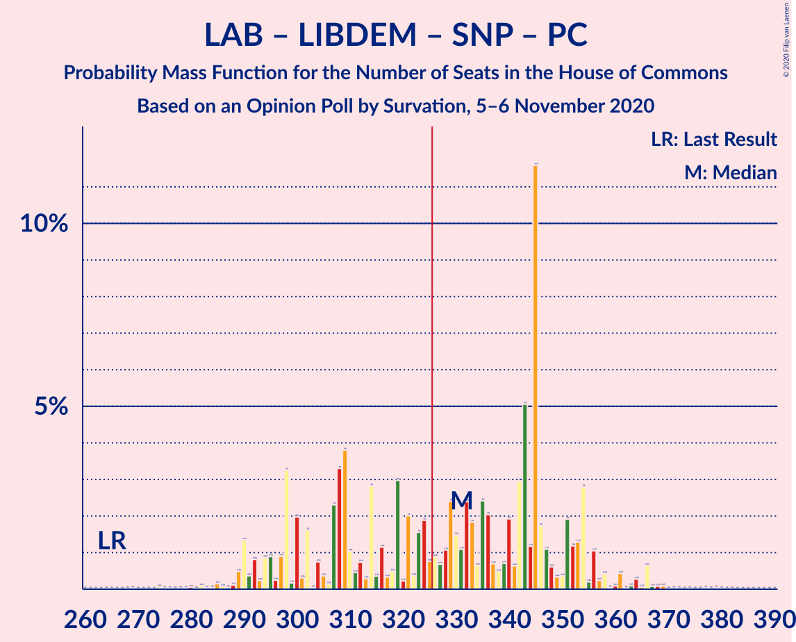

| Number of Seats | Probability | Accumulated | Special Marks |
|:---------------:|:-----------:|:-----------:|:-------------:|
| 265 | 0% | 100% | Last Result |
| 266 | 0% | 100% |  |
| 267 | 0% | 100% |  |
| 268 | 0% | 100% |  |
| 269 | 0% | 100% |  |
| 270 | 0% | 99.9% |  |
| 271 | 0% | 99.9% |  |
| 272 | 0% | 99.9% |  |
| 273 | 0% | 99.9% |  |
| 274 | 0% | 99.9% |  |
| 275 | 0% | 99.9% |  |
| 276 | 0% | 99.8% |  |
| 277 | 0% | 99.8% |  |
| 278 | 0% | 99.8% |  |
| 279 | 0% | 99.7% |  |
| 280 | 0.1% | 99.7% |  |
| 281 | 0% | 99.6% |  |
| 282 | 0.1% | 99.6% |  |
| 283 | 0.1% | 99.6% |  |
| 284 | 0.2% | 99.5% |  |
| 285 | 0.1% | 99.3% |  |
| 286 | 0.1% | 99.2% |  |
| 287 | 0% | 99.2% |  |
| 288 | 0.1% | 99.1% |  |
| 289 | 0.4% | 99.0% |  |
| 290 | 0.5% | 98.6% |  |
| 291 | 0.3% | 98% |  |
| 292 | 0.4% | 98% |  |
| 293 | 0.5% | 97% |  |
| 294 | 0.8% | 97% |  |
| 295 | 0.6% | 96% |  |
| 296 | 0.6% | 96% |  |
| 297 | 0.3% | 95% |  |
| 298 | 1.2% | 95% |  |
| 299 | 0.8% | 93% |  |
| 300 | 3% | 93% |  |
| 301 | 1.1% | 90% |  |
| 302 | 2% | 89% |  |
| 303 | 0.6% | 87% |  |
| 304 | 0.4% | 87% |  |
| 305 | 1.5% | 86% |  |
| 306 | 1.3% | 85% |  |
| 307 | 1.3% | 83% |  |
| 308 | 2% | 82% |  |
| 309 | 1.3% | 80% |  |
| 310 | 2% | 79% |  |
| 311 | 2% | 77% |  |
| 312 | 0.9% | 75% |  |
| 313 | 3% | 74% |  |
| 314 | 2% | 72% |  |
| 315 | 2% | 70% |  |
| 316 | 4% | 68% |  |
| 317 | 2% | 64% |  |
| 318 | 2% | 62% |  |
| 319 | 2% | 60% |  |
| 320 | 0.9% | 58% |  |
| 321 | 2% | 57% |  |
| 322 | 2% | 55% |  |
| 323 | 1.4% | 52% |  |
| 324 | 0.8% | 51% | Median |
| 325 | 2% | 50% |  |
| 326 | 1.2% | 48% | Majority |
| 327 | 0.9% | 47% |  |
| 328 | 1.1% | 46% |  |
| 329 | 2% | 45% |  |
| 330 | 0.5% | 43% |  |
| 331 | 1.4% | 43% |  |
| 332 | 2% | 41% |  |
| 333 | 1.5% | 39% |  |
| 334 | 2% | 38% |  |
| 335 | 1.1% | 36% |  |
| 336 | 3% | 35% |  |
| 337 | 1.3% | 32% |  |
| 338 | 0.5% | 31% |  |
| 339 | 1.1% | 30% |  |
| 340 | 0.8% | 29% |  |
| 341 | 2% | 28% |  |
| 342 | 2% | 26% |  |
| 343 | 3% | 25% |  |
| 344 | 1.2% | 22% |  |
| 345 | 5% | 21% |  |
| 346 | 3% | 16% |  |
| 347 | 1.3% | 12% |  |
| 348 | 0.6% | 11% |  |
| 349 | 0.5% | 11% |  |
| 350 | 0.3% | 10% |  |
| 351 | 1.3% | 10% |  |
| 352 | 2% | 8% |  |
| 353 | 0.5% | 7% |  |
| 354 | 2% | 6% |  |
| 355 | 0.8% | 4% |  |
| 356 | 0.9% | 4% |  |
| 357 | 0.2% | 3% |  |
| 358 | 0.3% | 3% |  |
| 359 | 0.2% | 2% |  |
| 360 | 0.3% | 2% |  |
| 361 | 0.2% | 2% |  |
| 362 | 0.1% | 2% |  |
| 363 | 0.3% | 2% |  |
| 364 | 0.1% | 1.2% |  |
| 365 | 0.3% | 1.1% |  |
| 366 | 0.3% | 0.8% |  |
| 367 | 0.1% | 0.6% |  |
| 368 | 0.2% | 0.5% |  |
| 369 | 0% | 0.3% |  |
| 370 | 0% | 0.2% |  |
| 371 | 0% | 0.2% |  |
| 372 | 0% | 0.2% |  |
| 373 | 0% | 0.2% |  |
| 374 | 0% | 0.2% |  |
| 375 | 0% | 0.2% |  |
| 376 | 0% | 0.1% |  |
| 377 | 0% | 0.1% |  |
| 378 | 0% | 0.1% |  |
| 379 | 0% | 0.1% |  |
| 380 | 0% | 0% |  |

### Labour Party – Liberal Democrats – Scottish National Party

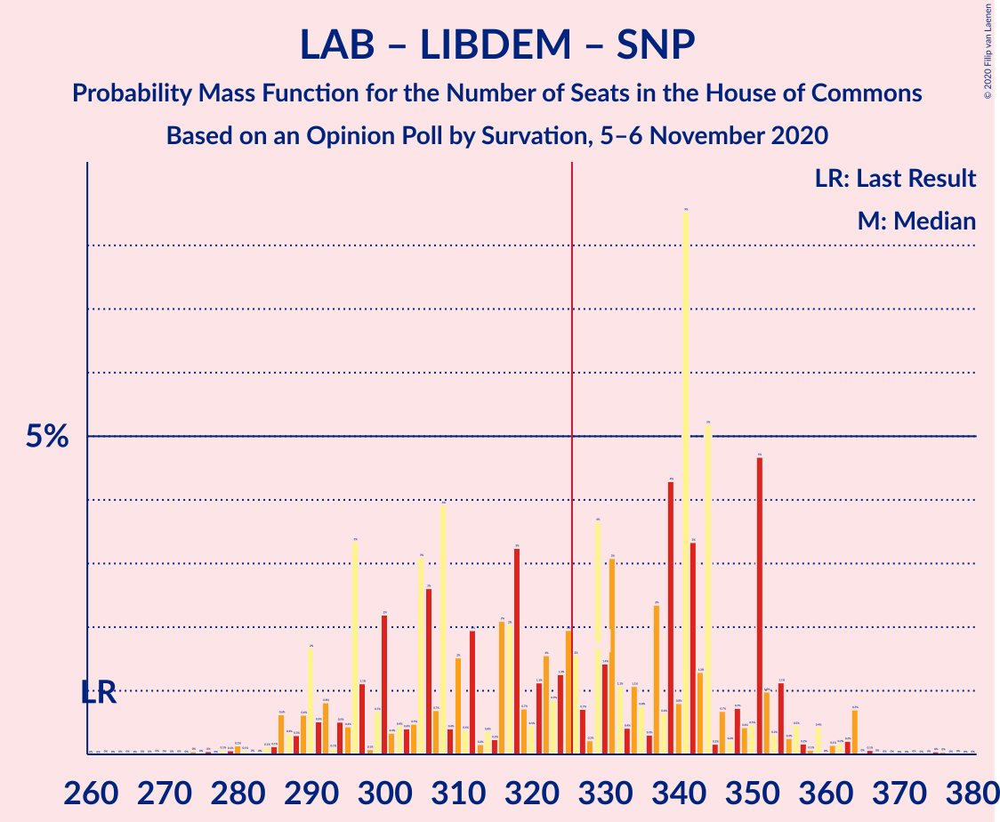

| Number of Seats | Probability | Accumulated | Special Marks |
|:---------------:|:-----------:|:-----------:|:-------------:|
| 261 | 0% | 100% | Last Result |
| 262 | 0% | 100% |  |
| 263 | 0% | 100% |  |
| 264 | 0% | 100% |  |
| 265 | 0% | 100% |  |
| 266 | 0% | 100% |  |
| 267 | 0% | 99.9% |  |
| 268 | 0% | 99.9% |  |
| 269 | 0% | 99.9% |  |
| 270 | 0% | 99.9% |  |
| 271 | 0% | 99.9% |  |
| 272 | 0% | 99.9% |  |
| 273 | 0% | 99.9% |  |
| 274 | 0% | 99.8% |  |
| 275 | 0% | 99.8% |  |
| 276 | 0% | 99.8% |  |
| 277 | 0% | 99.7% |  |
| 278 | 0% | 99.7% |  |
| 279 | 0.1% | 99.7% |  |
| 280 | 0.1% | 99.6% |  |
| 281 | 0% | 99.5% |  |
| 282 | 0.1% | 99.5% |  |
| 283 | 0.1% | 99.4% |  |
| 284 | 0.3% | 99.3% |  |
| 285 | 0.1% | 99.1% |  |
| 286 | 0.2% | 99.0% |  |
| 287 | 0.3% | 98.7% |  |
| 288 | 0.4% | 98% |  |
| 289 | 0.3% | 98% |  |
| 290 | 0.9% | 98% |  |
| 291 | 0.7% | 97% |  |
| 292 | 0.9% | 96% |  |
| 293 | 0.1% | 95% |  |
| 294 | 0.6% | 95% |  |
| 295 | 0.6% | 95% |  |
| 296 | 1.2% | 94% |  |
| 297 | 0.9% | 93% |  |
| 298 | 0.4% | 92% |  |
| 299 | 0.9% | 91% |  |
| 300 | 4% | 90% |  |
| 301 | 0.7% | 87% |  |
| 302 | 1.2% | 86% |  |
| 303 | 0.6% | 85% |  |
| 304 | 0.4% | 84% |  |
| 305 | 2% | 84% |  |
| 306 | 2% | 82% |  |
| 307 | 1.3% | 80% |  |
| 308 | 2% | 79% |  |
| 309 | 1.0% | 77% |  |
| 310 | 2% | 76% |  |
| 311 | 3% | 74% |  |
| 312 | 1.2% | 70% |  |
| 313 | 0.4% | 69% |  |
| 314 | 3% | 68% |  |
| 315 | 2% | 66% |  |
| 316 | 4% | 64% |  |
| 317 | 2% | 60% |  |
| 318 | 2% | 58% |  |
| 319 | 0.7% | 56% |  |
| 320 | 1.1% | 55% |  |
| 321 | 4% | 54% |  |
| 322 | 1.2% | 51% | Median |
| 323 | 0.8% | 49% |  |
| 324 | 2% | 49% |  |
| 325 | 3% | 47% |  |
| 326 | 0.6% | 45% | Majority |
| 327 | 0.7% | 44% |  |
| 328 | 0.4% | 43% |  |
| 329 | 4% | 43% |  |
| 330 | 1.4% | 39% |  |
| 331 | 2% | 38% |  |
| 332 | 1.4% | 35% |  |
| 333 | 1.4% | 34% |  |
| 334 | 1.2% | 33% |  |
| 335 | 0.7% | 31% |  |
| 336 | 0.9% | 31% |  |
| 337 | 1.3% | 30% |  |
| 338 | 1.5% | 29% |  |
| 339 | 3% | 27% |  |
| 340 | 2% | 25% |  |
| 341 | 4% | 22% |  |
| 342 | 3% | 18% |  |
| 343 | 1.2% | 15% |  |
| 344 | 2% | 14% |  |
| 345 | 0.2% | 12% |  |
| 346 | 0.5% | 11% |  |
| 347 | 0.9% | 11% |  |
| 348 | 1.2% | 10% |  |
| 349 | 0.6% | 9% |  |
| 350 | 2% | 8% |  |
| 351 | 2% | 6% |  |
| 352 | 0.8% | 5% |  |
| 353 | 0.7% | 4% |  |
| 354 | 0.5% | 3% |  |
| 355 | 0.3% | 3% |  |
| 356 | 0.3% | 3% |  |
| 357 | 0.1% | 2% |  |
| 358 | 0.1% | 2% |  |
| 359 | 0.3% | 2% |  |
| 360 | 0.3% | 2% |  |
| 361 | 0.2% | 1.5% |  |
| 362 | 0.3% | 1.3% |  |
| 363 | 0.2% | 1.0% |  |
| 364 | 0.3% | 0.7% |  |
| 365 | 0.1% | 0.4% |  |
| 366 | 0.1% | 0.3% |  |
| 367 | 0% | 0.2% |  |
| 368 | 0% | 0.2% |  |
| 369 | 0% | 0.2% |  |
| 370 | 0% | 0.2% |  |
| 371 | 0% | 0.2% |  |
| 372 | 0% | 0.2% |  |
| 373 | 0% | 0.2% |  |
| 374 | 0% | 0.1% |  |
| 375 | 0% | 0.1% |  |
| 376 | 0% | 0.1% |  |
| 377 | 0% | 0% |  |

### Labour Party – Scottish National Party – Plaid Cymru

| Number of Seats | Probability | Accumulated | Special Marks |
|:---------------:|:-----------:|:-----------:|:-------------:|
| 254 | 0% | 100% | Last Result |
| 255 | 0% | 100% |  |
| 256 | 0% | 100% |  |
| 257 | 0% | 100% |  |
| 258 | 0% | 100% |  |
| 259 | 0% | 100% |  |
| 260 | 0% | 100% |  |
| 261 | 0% | 100% |  |
| 262 | 0% | 100% |  |
| 263 | 0% | 100% |  |
| 264 | 0% | 99.9% |  |
| 265 | 0% | 99.9% |  |
| 266 | 0% | 99.9% |  |
| 267 | 0% | 99.9% |  |
| 268 | 0% | 99.9% |  |
| 269 | 0% | 99.9% |  |
| 270 | 0% | 99.8% |  |
| 271 | 0% | 99.8% |  |
| 272 | 0% | 99.8% |  |
| 273 | 0% | 99.8% |  |
| 274 | 0% | 99.7% |  |
| 275 | 0% | 99.7% |  |
| 276 | 0.1% | 99.6% |  |
| 277 | 0.1% | 99.6% |  |
| 278 | 0.2% | 99.5% |  |
| 279 | 0.1% | 99.4% |  |
| 280 | 0.1% | 99.3% |  |
| 281 | 0% | 99.2% |  |
| 282 | 0.1% | 99.2% |  |
| 283 | 0.2% | 99.0% |  |
| 284 | 0.3% | 98.9% |  |
| 285 | 0.6% | 98.6% |  |
| 286 | 0.2% | 98% |  |
| 287 | 0.4% | 98% |  |
| 288 | 1.0% | 97% |  |
| 289 | 0.4% | 96% |  |
| 290 | 0.9% | 96% |  |
| 291 | 0.4% | 95% |  |
| 292 | 2% | 95% |  |
| 293 | 0.5% | 93% |  |
| 294 | 2% | 93% |  |
| 295 | 0.8% | 90% |  |
| 296 | 2% | 90% |  |
| 297 | 0.6% | 88% |  |
| 298 | 1.5% | 88% |  |
| 299 | 1.2% | 86% |  |
| 300 | 0.9% | 85% |  |
| 301 | 1.5% | 84% |  |
| 302 | 2% | 82% |  |
| 303 | 1.2% | 80% |  |
| 304 | 2% | 79% |  |
| 305 | 2% | 77% |  |
| 306 | 1.3% | 75% |  |
| 307 | 3% | 74% |  |
| 308 | 1.3% | 71% |  |
| 309 | 2% | 70% |  |
| 310 | 4% | 68% |  |
| 311 | 2% | 64% |  |
| 312 | 2% | 62% |  |
| 313 | 4% | 60% |  |
| 314 | 0.8% | 56% |  |
| 315 | 2% | 55% |  |
| 316 | 1.0% | 53% |  |
| 317 | 3% | 52% |  |
| 318 | 0.4% | 50% | Median |
| 319 | 3% | 49% |  |
| 320 | 0.5% | 47% |  |
| 321 | 1.1% | 46% |  |
| 322 | 0.6% | 45% |  |
| 323 | 2% | 44% |  |
| 324 | 0.7% | 43% |  |
| 325 | 2% | 42% |  |
| 326 | 2% | 40% | Majority |
| 327 | 2% | 38% |  |
| 328 | 2% | 36% |  |
| 329 | 0.9% | 35% |  |
| 330 | 2% | 34% |  |
| 331 | 2% | 32% |  |
| 332 | 1.0% | 30% |  |
| 333 | 0.8% | 29% |  |
| 334 | 1.0% | 28% |  |
| 335 | 1.4% | 27% |  |
| 336 | 3% | 26% |  |
| 337 | 1.3% | 23% |  |
| 338 | 3% | 22% |  |
| 339 | 4% | 19% |  |
| 340 | 3% | 14% |  |
| 341 | 1.5% | 12% |  |
| 342 | 1.2% | 10% |  |
| 343 | 0.5% | 9% |  |
| 344 | 0.8% | 9% |  |
| 345 | 1.2% | 8% |  |
| 346 | 1.1% | 7% |  |
| 347 | 1.3% | 5% |  |
| 348 | 0.5% | 4% |  |
| 349 | 0.6% | 4% |  |
| 350 | 0.6% | 3% |  |
| 351 | 0.2% | 2% |  |
| 352 | 0.5% | 2% |  |
| 353 | 0.3% | 2% |  |
| 354 | 0.4% | 1.3% |  |
| 355 | 0.2% | 0.9% |  |
| 356 | 0.1% | 0.7% |  |
| 357 | 0.1% | 0.6% |  |
| 358 | 0% | 0.5% |  |
| 359 | 0.1% | 0.5% |  |
| 360 | 0.1% | 0.4% |  |
| 361 | 0.1% | 0.3% |  |
| 362 | 0% | 0.2% |  |
| 363 | 0% | 0.2% |  |
| 364 | 0% | 0.1% |  |
| 365 | 0% | 0.1% |  |
| 366 | 0% | 0.1% |  |
| 367 | 0% | 0.1% |  |
| 368 | 0% | 0.1% |  |
| 369 | 0% | 0.1% |  |
| 370 | 0% | 0.1% |  |
| 371 | 0% | 0.1% |  |
| 372 | 0% | 0% |  |

### Labour Party – Scottish National Party

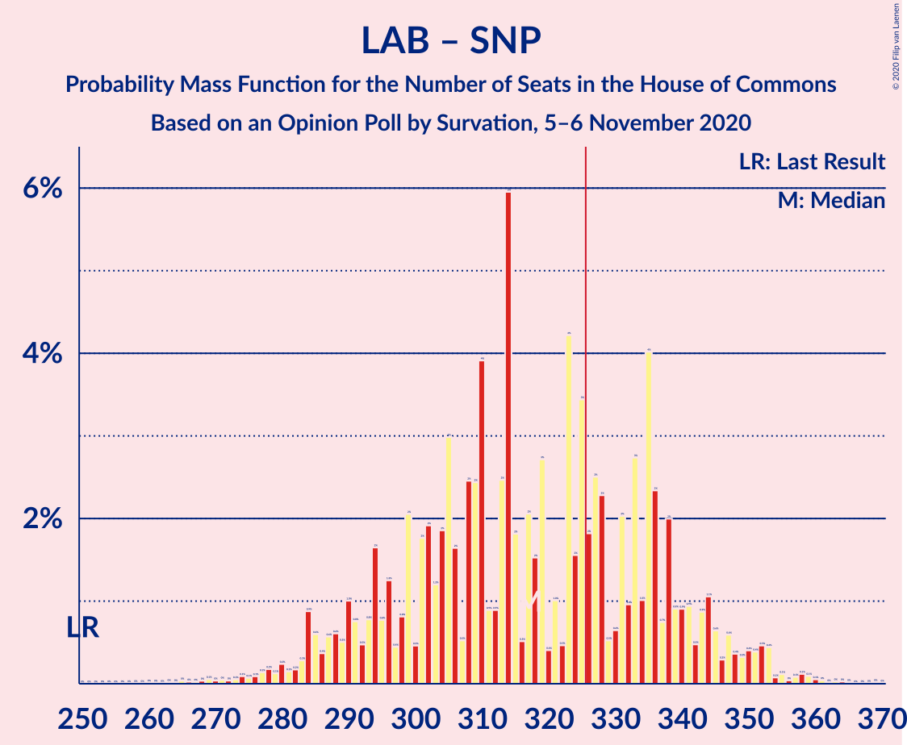

| Number of Seats | Probability | Accumulated | Special Marks |
|:---------------:|:-----------:|:-----------:|:-------------:|
| 250 | 0% | 100% | Last Result |
| 251 | 0% | 100% |  |
| 252 | 0% | 100% |  |
| 253 | 0% | 100% |  |
| 254 | 0% | 100% |  |
| 255 | 0% | 100% |  |
| 256 | 0% | 100% |  |
| 257 | 0% | 100% |  |
| 258 | 0% | 100% |  |
| 259 | 0% | 100% |  |
| 260 | 0% | 100% |  |
| 261 | 0% | 100% |  |
| 262 | 0% | 100% |  |
| 263 | 0% | 99.9% |  |
| 264 | 0% | 99.9% |  |
| 265 | 0% | 99.9% |  |
| 266 | 0% | 99.9% |  |
| 267 | 0% | 99.9% |  |
| 268 | 0% | 99.9% |  |
| 269 | 0% | 99.8% |  |
| 270 | 0% | 99.8% |  |
| 271 | 0% | 99.8% |  |
| 272 | 0% | 99.7% |  |
| 273 | 0% | 99.7% |  |
| 274 | 0.1% | 99.6% |  |
| 275 | 0% | 99.6% |  |
| 276 | 0.1% | 99.5% |  |
| 277 | 0.2% | 99.5% |  |
| 278 | 0.2% | 99.3% |  |
| 279 | 0.1% | 99.1% |  |
| 280 | 0.3% | 99.0% |  |
| 281 | 0.1% | 98.7% |  |
| 282 | 0.2% | 98.6% |  |
| 283 | 0.3% | 98% |  |
| 284 | 1.1% | 98% |  |
| 285 | 0.4% | 97% |  |
| 286 | 0.5% | 97% |  |
| 287 | 0.7% | 96% |  |
| 288 | 0.8% | 95% |  |
| 289 | 0.6% | 95% |  |
| 290 | 1.3% | 94% |  |
| 291 | 0.9% | 93% |  |
| 292 | 0.5% | 92% |  |
| 293 | 0.8% | 91% |  |
| 294 | 2% | 90% |  |
| 295 | 0.8% | 88% |  |
| 296 | 2% | 87% |  |
| 297 | 0.2% | 85% |  |
| 298 | 1.0% | 85% |  |
| 299 | 3% | 84% |  |
| 300 | 0.8% | 81% |  |
| 301 | 2% | 80% |  |
| 302 | 2% | 79% |  |
| 303 | 1.2% | 77% |  |
| 304 | 2% | 76% |  |
| 305 | 3% | 73% |  |
| 306 | 1.3% | 70% |  |
| 307 | 0.6% | 69% |  |
| 308 | 3% | 68% |  |
| 309 | 3% | 65% |  |
| 310 | 4% | 63% |  |
| 311 | 0.8% | 59% |  |
| 312 | 1.0% | 58% |  |
| 313 | 3% | 57% |  |
| 314 | 3% | 54% |  |
| 315 | 0.8% | 51% |  |
| 316 | 0.7% | 50% | Median |
| 317 | 1.5% | 49% |  |
| 318 | 1.1% | 48% |  |
| 319 | 2% | 46% |  |
| 320 | 0.3% | 44% |  |
| 321 | 1.0% | 44% |  |
| 322 | 0.3% | 43% |  |
| 323 | 4% | 43% |  |
| 324 | 1.4% | 39% |  |
| 325 | 3% | 37% |  |
| 326 | 1.2% | 34% | Majority |
| 327 | 2% | 33% |  |
| 328 | 1.2% | 31% |  |
| 329 | 0.7% | 30% |  |
| 330 | 0.6% | 29% |  |
| 331 | 1.2% | 29% |  |
| 332 | 2% | 27% |  |
| 333 | 3% | 26% |  |
| 334 | 1.1% | 23% |  |
| 335 | 4% | 21% |  |
| 336 | 3% | 17% |  |
| 337 | 0.8% | 15% |  |
| 338 | 3% | 14% |  |
| 339 | 0.5% | 11% |  |
| 340 | 1.1% | 10% |  |
| 341 | 2% | 9% |  |
| 342 | 0.4% | 7% |  |
| 343 | 0.9% | 7% |  |
| 344 | 1.3% | 6% |  |
| 345 | 0.9% | 5% |  |
| 346 | 0.4% | 4% |  |
| 347 | 0.6% | 4% |  |
| 348 | 0.5% | 3% |  |
| 349 | 0.5% | 3% |  |
| 350 | 0.3% | 2% |  |
| 351 | 0.4% | 2% |  |
| 352 | 0.4% | 1.3% |  |
| 353 | 0.3% | 0.9% |  |
| 354 | 0.1% | 0.6% |  |
| 355 | 0.1% | 0.6% |  |
| 356 | 0% | 0.5% |  |
| 357 | 0.1% | 0.4% |  |
| 358 | 0.1% | 0.3% |  |
| 359 | 0.1% | 0.3% |  |
| 360 | 0% | 0.2% |  |
| 361 | 0% | 0.1% |  |
| 362 | 0% | 0.1% |  |
| 363 | 0% | 0.1% |  |
| 364 | 0% | 0.1% |  |
| 365 | 0% | 0.1% |  |
| 366 | 0% | 0.1% |  |
| 367 | 0% | 0.1% |  |
| 368 | 0% | 0.1% |  |
| 369 | 0% | 0% |  |

### Conservative Party – Liberal Democrats

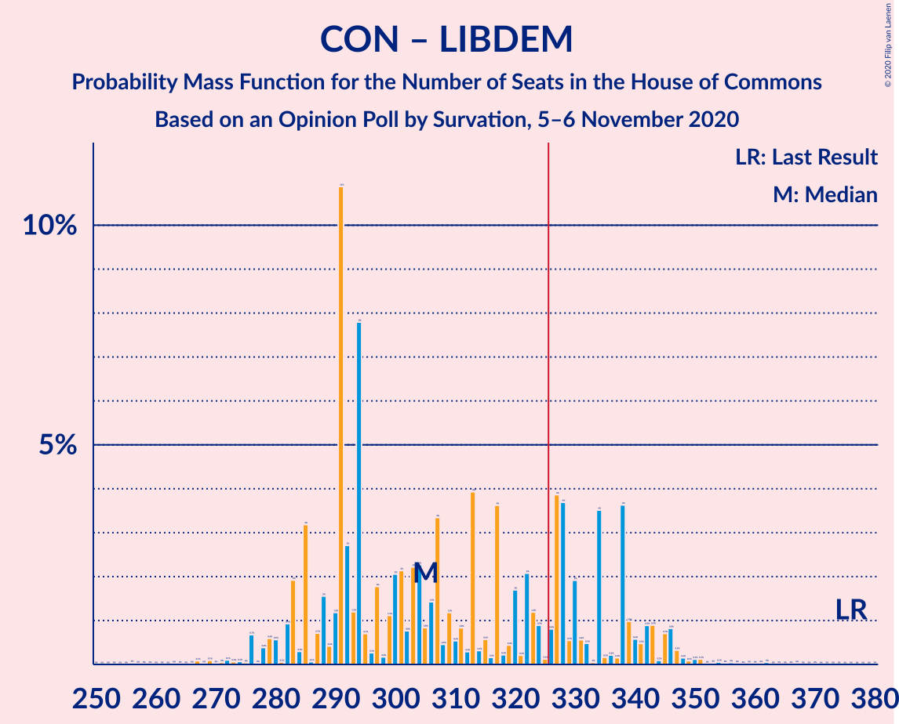

| Number of Seats | Probability | Accumulated | Special Marks |
|:---------------:|:-----------:|:-----------:|:-------------:|
| 258 | 0% | 100% |  |
| 259 | 0% | 99.9% |  |
| 260 | 0% | 99.9% |  |
| 261 | 0% | 99.9% |  |
| 262 | 0% | 99.9% |  |
| 263 | 0% | 99.9% |  |
| 264 | 0% | 99.9% |  |
| 265 | 0% | 99.9% |  |
| 266 | 0% | 99.9% |  |
| 267 | 0% | 99.9% |  |
| 268 | 0.1% | 99.8% |  |
| 269 | 0.1% | 99.7% |  |
| 270 | 0% | 99.6% |  |
| 271 | 0.1% | 99.6% |  |
| 272 | 0% | 99.5% |  |
| 273 | 0.1% | 99.5% |  |
| 274 | 0.1% | 99.4% |  |
| 275 | 0.2% | 99.3% |  |
| 276 | 0.4% | 99.1% |  |
| 277 | 0.3% | 98.7% |  |
| 278 | 0.5% | 98% |  |
| 279 | 0.2% | 98% |  |
| 280 | 0.6% | 98% |  |
| 281 | 0.6% | 97% |  |
| 282 | 0.5% | 96% |  |
| 283 | 1.3% | 96% |  |
| 284 | 1.1% | 95% |  |
| 285 | 1.2% | 93% |  |
| 286 | 0.8% | 92% |  |
| 287 | 0.5% | 91% |  |
| 288 | 1.2% | 91% |  |
| 289 | 1.5% | 90% |  |
| 290 | 3% | 88% |  |
| 291 | 4% | 86% |  |
| 292 | 3% | 81% |  |
| 293 | 1.3% | 78% |  |
| 294 | 3% | 77% |  |
| 295 | 1.4% | 74% |  |
| 296 | 1.0% | 73% |  |
| 297 | 0.8% | 72% |  |
| 298 | 1.0% | 71% |  |
| 299 | 2% | 70% |  |
| 300 | 2% | 68% |  |
| 301 | 0.9% | 66% |  |
| 302 | 2% | 65% |  |
| 303 | 2% | 64% |  |
| 304 | 2% | 62% |  |
| 305 | 2% | 60% |  |
| 306 | 0.7% | 58% |  |
| 307 | 2% | 57% |  |
| 308 | 0.6% | 56% |  |
| 309 | 1.1% | 55% |  |
| 310 | 0.5% | 54% |  |
| 311 | 3% | 53% | Median |
| 312 | 0.4% | 51% |  |
| 313 | 3% | 50% |  |
| 314 | 1.0% | 48% |  |
| 315 | 2% | 47% |  |
| 316 | 0.8% | 45% |  |
| 317 | 4% | 44% |  |
| 318 | 2% | 40% |  |
| 319 | 2% | 38% |  |
| 320 | 4% | 36% |  |
| 321 | 2% | 32% |  |
| 322 | 1.3% | 30% |  |
| 323 | 3% | 29% |  |
| 324 | 1.3% | 26% |  |
| 325 | 2% | 25% |  |
| 326 | 2% | 23% | Majority |
| 327 | 1.2% | 21% |  |
| 328 | 2% | 20% |  |
| 329 | 1.5% | 18% |  |
| 330 | 0.9% | 16% |  |
| 331 | 1.2% | 15% |  |
| 332 | 1.5% | 14% |  |
| 333 | 0.6% | 12% |  |
| 334 | 2% | 12% |  |
| 335 | 0.8% | 10% |  |
| 336 | 2% | 10% |  |
| 337 | 0.5% | 7% |  |
| 338 | 2% | 7% |  |
| 339 | 0.4% | 5% |  |
| 340 | 0.9% | 5% |  |
| 341 | 0.4% | 4% |  |
| 342 | 1.0% | 4% |  |
| 343 | 0.4% | 3% |  |
| 344 | 0.2% | 2% |  |
| 345 | 0.6% | 2% |  |
| 346 | 0.3% | 1.4% |  |
| 347 | 0.2% | 1.1% |  |
| 348 | 0.1% | 1.0% |  |
| 349 | 0% | 0.8% |  |
| 350 | 0.1% | 0.8% |  |
| 351 | 0.1% | 0.7% |  |
| 352 | 0.2% | 0.6% |  |
| 353 | 0.1% | 0.5% |  |
| 354 | 0.1% | 0.4% |  |
| 355 | 0% | 0.4% |  |
| 356 | 0% | 0.3% |  |
| 357 | 0% | 0.3% |  |
| 358 | 0% | 0.2% |  |
| 359 | 0% | 0.2% |  |
| 360 | 0% | 0.2% |  |
| 361 | 0% | 0.2% |  |
| 362 | 0% | 0.1% |  |
| 363 | 0% | 0.1% |  |
| 364 | 0% | 0.1% |  |
| 365 | 0% | 0.1% |  |
| 366 | 0% | 0.1% |  |
| 367 | 0% | 0.1% |  |
| 368 | 0% | 0% |  |
| 369 | 0% | 0% |  |
| 370 | 0% | 0% |  |
| 371 | 0% | 0% |  |
| 372 | 0% | 0% |  |
| 373 | 0% | 0% |  |
| 374 | 0% | 0% |  |
| 375 | 0% | 0% |  |
| 376 | 0% | 0% | Last Result |

### Conservative Party – Plaid Cymru

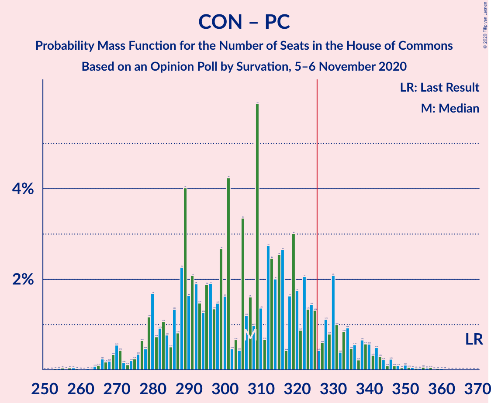

| Number of Seats | Probability | Accumulated | Special Marks |
|:---------------:|:-----------:|:-----------:|:-------------:|
| 253 | 0% | 100% |  |
| 254 | 0% | 99.9% |  |
| 255 | 0% | 99.9% |  |
| 256 | 0% | 99.9% |  |
| 257 | 0% | 99.8% |  |
| 258 | 0% | 99.8% |  |
| 259 | 0% | 99.8% |  |
| 260 | 0% | 99.8% |  |
| 261 | 0% | 99.8% |  |
| 262 | 0% | 99.8% |  |
| 263 | 0% | 99.8% |  |
| 264 | 0.1% | 99.7% |  |
| 265 | 0.1% | 99.6% |  |
| 266 | 0.3% | 99.5% |  |
| 267 | 0.2% | 99.2% |  |
| 268 | 0.3% | 99.0% |  |
| 269 | 0.2% | 98.7% |  |
| 270 | 0.3% | 98.5% |  |
| 271 | 0.3% | 98% |  |
| 272 | 0.1% | 98% |  |
| 273 | 0.1% | 98% |  |
| 274 | 0.3% | 98% |  |
| 275 | 0.3% | 97% |  |
| 276 | 0.5% | 97% |  |
| 277 | 0.7% | 97% |  |
| 278 | 0.8% | 96% |  |
| 279 | 2% | 95% |  |
| 280 | 2% | 94% |  |
| 281 | 0.6% | 92% |  |
| 282 | 1.2% | 91% |  |
| 283 | 0.9% | 90% |  |
| 284 | 0.5% | 89% |  |
| 285 | 0.2% | 89% |  |
| 286 | 2% | 88% |  |
| 287 | 1.2% | 86% |  |
| 288 | 3% | 85% |  |
| 289 | 4% | 82% |  |
| 290 | 2% | 78% |  |
| 291 | 3% | 75% |  |
| 292 | 1.5% | 73% |  |
| 293 | 1.3% | 71% |  |
| 294 | 0.9% | 70% |  |
| 295 | 0.7% | 69% |  |
| 296 | 1.2% | 69% |  |
| 297 | 1.4% | 67% |  |
| 298 | 1.4% | 66% |  |
| 299 | 2% | 65% |  |
| 300 | 1.4% | 62% |  |
| 301 | 4% | 61% |  |
| 302 | 0.4% | 57% |  |
| 303 | 0.7% | 57% |  |
| 304 | 0.6% | 56% |  |
| 305 | 3% | 55% |  |
| 306 | 2% | 53% |  |
| 307 | 0.8% | 51% | Median |
| 308 | 1.2% | 51% |  |
| 309 | 4% | 49% |  |
| 310 | 1.1% | 46% |  |
| 311 | 0.7% | 45% |  |
| 312 | 2% | 44% |  |
| 313 | 2% | 42% |  |
| 314 | 4% | 40% |  |
| 315 | 2% | 36% |  |
| 316 | 3% | 34% |  |
| 317 | 0.4% | 32% |  |
| 318 | 1.2% | 31% |  |
| 319 | 3% | 30% |  |
| 320 | 2% | 26% |  |
| 321 | 1.0% | 24% |  |
| 322 | 2% | 23% |  |
| 323 | 1.3% | 21% |  |
| 324 | 2% | 20% |  |
| 325 | 2% | 18% |  |
| 326 | 0.4% | 16% | Majority |
| 327 | 0.6% | 16% |  |
| 328 | 1.2% | 15% |  |
| 329 | 0.7% | 14% |  |
| 330 | 4% | 13% |  |
| 331 | 0.9% | 10% |  |
| 332 | 0.4% | 9% |  |
| 333 | 0.9% | 8% |  |
| 334 | 1.2% | 7% |  |
| 335 | 0.6% | 6% |  |
| 336 | 0.6% | 5% |  |
| 337 | 0.1% | 5% |  |
| 338 | 0.9% | 5% |  |
| 339 | 0.7% | 4% |  |
| 340 | 0.9% | 3% |  |
| 341 | 0.3% | 2% |  |
| 342 | 0.4% | 2% |  |
| 343 | 0.3% | 2% |  |
| 344 | 0.2% | 1.3% |  |
| 345 | 0.1% | 1.0% |  |
| 346 | 0.3% | 0.9% |  |
| 347 | 0.1% | 0.7% |  |
| 348 | 0.1% | 0.6% |  |
| 349 | 0% | 0.5% |  |
| 350 | 0.1% | 0.5% |  |
| 351 | 0.1% | 0.4% |  |
| 352 | 0% | 0.3% |  |
| 353 | 0% | 0.3% |  |
| 354 | 0% | 0.3% |  |
| 355 | 0% | 0.2% |  |
| 356 | 0% | 0.2% |  |
| 357 | 0% | 0.2% |  |
| 358 | 0% | 0.1% |  |
| 359 | 0% | 0.1% |  |
| 360 | 0% | 0.1% |  |
| 361 | 0% | 0.1% |  |
| 362 | 0% | 0.1% |  |
| 363 | 0% | 0.1% |  |
| 364 | 0% | 0.1% |  |
| 365 | 0% | 0% |  |
| 366 | 0% | 0% |  |
| 367 | 0% | 0% |  |
| 368 | 0% | 0% |  |
| 369 | 0% | 0% | Last Result |

### Conservative Party

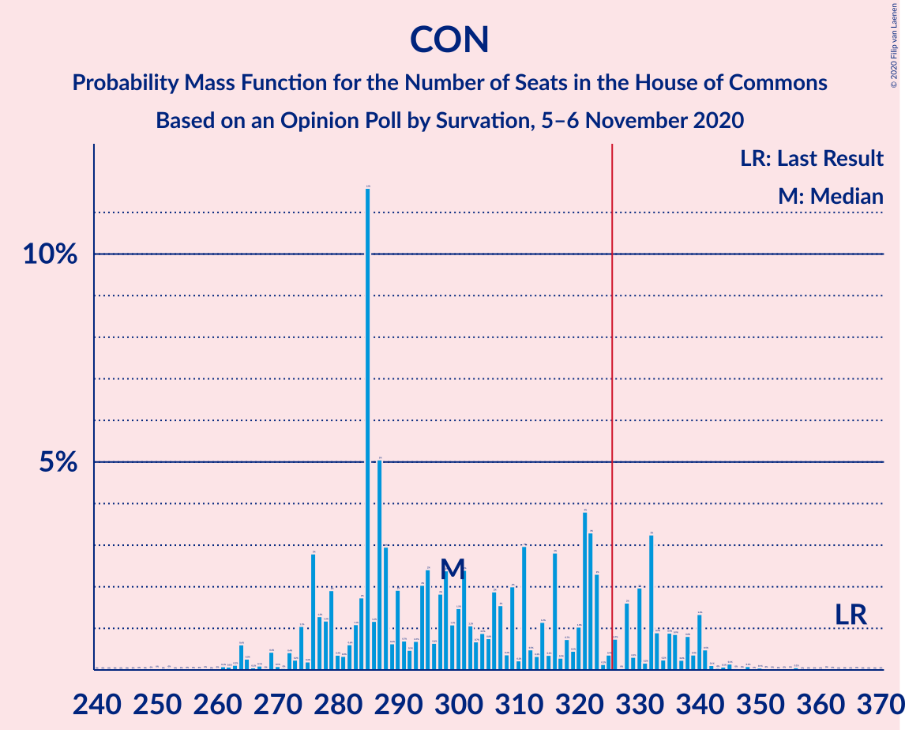

| Number of Seats | Probability | Accumulated | Special Marks |
|:---------------:|:-----------:|:-----------:|:-------------:|
| 250 | 0% | 100% |  |
| 251 | 0% | 99.9% |  |
| 252 | 0% | 99.9% |  |
| 253 | 0% | 99.9% |  |
| 254 | 0% | 99.9% |  |
| 255 | 0% | 99.8% |  |
| 256 | 0% | 99.8% |  |
| 257 | 0% | 99.8% |  |
| 258 | 0% | 99.8% |  |
| 259 | 0% | 99.8% |  |
| 260 | 0% | 99.8% |  |
| 261 | 0.1% | 99.7% |  |
| 262 | 0.1% | 99.6% |  |
| 263 | 0.1% | 99.5% |  |
| 264 | 0.2% | 99.4% |  |
| 265 | 0.3% | 99.2% |  |
| 266 | 0.1% | 98.8% |  |
| 267 | 0.3% | 98.7% |  |
| 268 | 0.1% | 98% |  |
| 269 | 0.2% | 98% |  |
| 270 | 0.3% | 98% |  |
| 271 | 0.2% | 98% |  |
| 272 | 0.3% | 98% |  |
| 273 | 0.2% | 97% |  |
| 274 | 0.9% | 97% |  |
| 275 | 0.8% | 96% |  |
| 276 | 2% | 96% |  |
| 277 | 0.5% | 94% |  |
| 278 | 2% | 93% |  |
| 279 | 1.3% | 92% |  |
| 280 | 0.3% | 90% |  |
| 281 | 0.5% | 90% |  |
| 282 | 0.6% | 89% |  |
| 283 | 1.3% | 89% |  |
| 284 | 3% | 88% |  |
| 285 | 5% | 84% |  |
| 286 | 1.2% | 79% |  |
| 287 | 3% | 78% |  |
| 288 | 2% | 75% |  |
| 289 | 2% | 74% |  |
| 290 | 0.8% | 72% |  |
| 291 | 1.1% | 71% |  |
| 292 | 0.5% | 70% |  |
| 293 | 1.3% | 69% |  |
| 294 | 3% | 68% |  |
| 295 | 1.1% | 65% |  |
| 296 | 2% | 64% |  |
| 297 | 1.5% | 62% |  |
| 298 | 2% | 61% |  |
| 299 | 1.4% | 59% |  |
| 300 | 0.5% | 57% |  |
| 301 | 2% | 57% |  |
| 302 | 1.1% | 55% |  |
| 303 | 0.9% | 54% |  |
| 304 | 1.2% | 53% |  |
| 305 | 2% | 52% | Median |
| 306 | 0.8% | 50% |  |
| 307 | 1.4% | 49% |  |
| 308 | 2% | 48% |  |
| 309 | 2% | 45% |  |
| 310 | 0.9% | 43% |  |
| 311 | 2% | 42% |  |
| 312 | 2% | 40% |  |
| 313 | 2% | 38% |  |
| 314 | 4% | 36% |  |
| 315 | 2% | 32% |  |
| 316 | 2% | 30% |  |
| 317 | 3% | 28% |  |
| 318 | 0.9% | 26% |  |
| 319 | 2% | 25% |  |
| 320 | 2% | 23% |  |
| 321 | 1.3% | 21% |  |
| 322 | 2% | 20% |  |
| 323 | 1.3% | 18% |  |
| 324 | 1.3% | 17% |  |
| 325 | 1.5% | 15% |  |
| 326 | 0.4% | 14% | Majority |
| 327 | 0.6% | 13% |  |
| 328 | 2% | 13% |  |
| 329 | 1.1% | 11% |  |
| 330 | 3% | 10% |  |
| 331 | 0.8% | 7% |  |
| 332 | 1.2% | 7% |  |
| 333 | 0.3% | 5% |  |
| 334 | 0.6% | 5% |  |
| 335 | 0.6% | 4% |  |
| 336 | 0.8% | 4% |  |
| 337 | 0.5% | 3% |  |
| 338 | 0.4% | 3% |  |
| 339 | 0.3% | 2% |  |
| 340 | 0.5% | 2% |  |
| 341 | 0.4% | 1.4% |  |
| 342 | 0.1% | 1.0% |  |
| 343 | 0% | 0.9% |  |
| 344 | 0.1% | 0.8% |  |
| 345 | 0.1% | 0.8% |  |
| 346 | 0.2% | 0.7% |  |
| 347 | 0.1% | 0.5% |  |
| 348 | 0.1% | 0.4% |  |
| 349 | 0% | 0.4% |  |
| 350 | 0.1% | 0.4% |  |
| 351 | 0% | 0.3% |  |
| 352 | 0% | 0.3% |  |
| 353 | 0% | 0.2% |  |
| 354 | 0% | 0.2% |  |
| 355 | 0% | 0.2% |  |
| 356 | 0% | 0.1% |  |
| 357 | 0% | 0.1% |  |
| 358 | 0% | 0.1% |  |
| 359 | 0% | 0.1% |  |
| 360 | 0% | 0.1% |  |
| 361 | 0% | 0.1% |  |
| 362 | 0% | 0% |  |
| 363 | 0% | 0% |  |
| 364 | 0% | 0% |  |
| 365 | 0% | 0% | Last Result |

### Labour Party – Liberal Democrats – Plaid Cymru

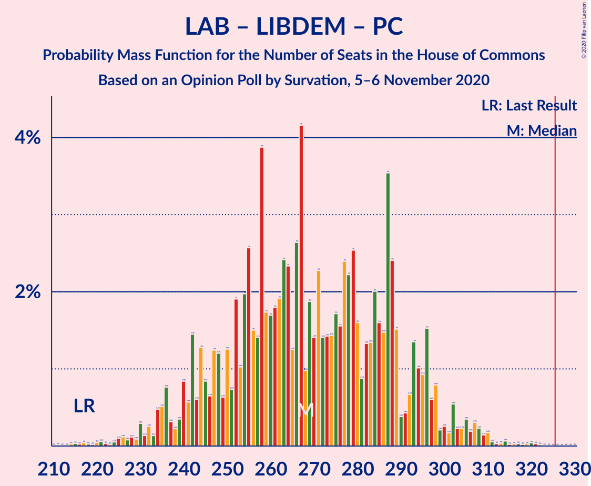

| Number of Seats | Probability | Accumulated | Special Marks |
|:---------------:|:-----------:|:-----------:|:-------------:|
| 211 | 0% | 100% |  |
| 212 | 0% | 99.9% |  |
| 213 | 0% | 99.9% |  |
| 214 | 0% | 99.9% |  |
| 215 | 0% | 99.9% |  |
| 216 | 0% | 99.9% |  |
| 217 | 0% | 99.9% | Last Result |
| 218 | 0% | 99.8% |  |
| 219 | 0% | 99.8% |  |
| 220 | 0% | 99.8% |  |
| 221 | 0% | 99.8% |  |
| 222 | 0% | 99.7% |  |
| 223 | 0% | 99.7% |  |
| 224 | 0.1% | 99.7% |  |
| 225 | 0.1% | 99.6% |  |
| 226 | 0.2% | 99.6% |  |
| 227 | 0.1% | 99.4% |  |
| 228 | 0% | 99.3% |  |
| 229 | 0% | 99.3% |  |
| 230 | 0.1% | 99.3% |  |
| 231 | 0.2% | 99.1% |  |
| 232 | 0.3% | 98.9% |  |
| 233 | 0.1% | 98.7% |  |
| 234 | 0.5% | 98.6% |  |
| 235 | 0.7% | 98% |  |
| 236 | 0.9% | 97% |  |
| 237 | 0.4% | 97% |  |
| 238 | 0.3% | 96% |  |
| 239 | 0.2% | 96% |  |
| 240 | 1.3% | 96% |  |
| 241 | 0.8% | 94% |  |
| 242 | 3% | 94% |  |
| 243 | 0.9% | 91% |  |
| 244 | 2% | 90% |  |
| 245 | 1.0% | 88% |  |
| 246 | 0.7% | 87% |  |
| 247 | 1.5% | 87% |  |
| 248 | 1.1% | 85% |  |
| 249 | 1.0% | 84% |  |
| 250 | 2% | 83% |  |
| 251 | 0.6% | 81% |  |
| 252 | 2% | 80% |  |
| 253 | 2% | 78% |  |
| 254 | 0.9% | 77% |  |
| 255 | 3% | 76% |  |
| 256 | 2% | 73% |  |
| 257 | 2% | 71% |  |
| 258 | 4% | 69% |  |
| 259 | 3% | 65% |  |
| 260 | 2% | 63% |  |
| 261 | 2% | 61% |  |
| 262 | 0.5% | 59% |  |
| 263 | 1.3% | 58% |  |
| 264 | 3% | 57% |  |
| 265 | 1.1% | 54% |  |
| 266 | 0.9% | 52% | Median |
| 267 | 3% | 52% |  |
| 268 | 2% | 49% |  |
| 269 | 0.9% | 47% |  |
| 270 | 0.9% | 46% |  |
| 271 | 2% | 45% |  |
| 272 | 0.2% | 44% |  |
| 273 | 1.4% | 44% |  |
| 274 | 2% | 42% |  |
| 275 | 1.3% | 41% |  |
| 276 | 2% | 39% |  |
| 277 | 1.4% | 38% |  |
| 278 | 3% | 36% |  |
| 279 | 2% | 33% |  |
| 280 | 0.5% | 31% |  |
| 281 | 0.8% | 31% |  |
| 282 | 0.9% | 30% |  |
| 283 | 1.0% | 29% |  |
| 284 | 2% | 28% |  |
| 285 | 3% | 26% |  |
| 286 | 2% | 24% |  |
| 287 | 5% | 22% |  |
| 288 | 4% | 17% |  |
| 289 | 2% | 14% |  |
| 290 | 0.5% | 12% |  |
| 291 | 0.5% | 11% |  |
| 292 | 0.3% | 11% |  |
| 293 | 2% | 11% |  |
| 294 | 1.3% | 9% |  |
| 295 | 1.0% | 8% |  |
| 296 | 2% | 7% |  |
| 297 | 0.8% | 5% |  |
| 298 | 0.8% | 4% |  |
| 299 | 0.3% | 3% |  |
| 300 | 0.3% | 3% |  |
| 301 | 0.2% | 3% |  |
| 302 | 0.3% | 2% |  |
| 303 | 0.2% | 2% |  |
| 304 | 0.1% | 2% |  |
| 305 | 0.2% | 2% |  |
| 306 | 0.2% | 2% |  |
| 307 | 0.3% | 1.3% |  |
| 308 | 0.3% | 1.0% |  |
| 309 | 0.1% | 0.7% |  |
| 310 | 0.3% | 0.6% |  |
| 311 | 0.1% | 0.4% |  |
| 312 | 0% | 0.3% |  |
| 313 | 0% | 0.3% |  |
| 314 | 0% | 0.2% |  |
| 315 | 0% | 0.2% |  |
| 316 | 0% | 0.2% |  |
| 317 | 0% | 0.2% |  |
| 318 | 0% | 0.2% |  |
| 319 | 0% | 0.2% |  |
| 320 | 0% | 0.1% |  |
| 321 | 0% | 0.1% |  |
| 322 | 0% | 0.1% |  |
| 323 | 0% | 0% |  |

### Labour Party – Liberal Democrats

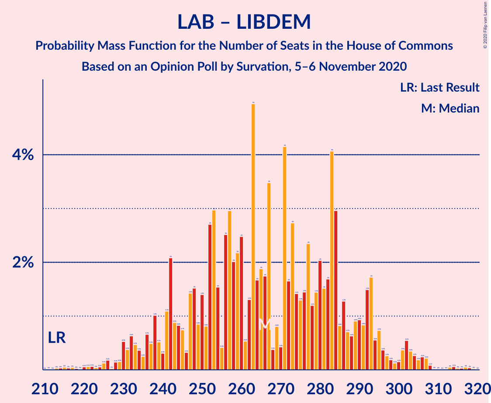

| Number of Seats | Probability | Accumulated | Special Marks |
|:---------------:|:-----------:|:-----------:|:-------------:|
| 211 | 0% | 100% |  |
| 212 | 0% | 99.9% |  |
| 213 | 0% | 99.9% | Last Result |
| 214 | 0% | 99.9% |  |
| 215 | 0% | 99.9% |  |
| 216 | 0% | 99.8% |  |
| 217 | 0% | 99.8% |  |
| 218 | 0% | 99.8% |  |
| 219 | 0% | 99.8% |  |
| 220 | 0% | 99.8% |  |
| 221 | 0.1% | 99.7% |  |
| 222 | 0.1% | 99.7% |  |
| 223 | 0% | 99.6% |  |
| 224 | 0.1% | 99.6% |  |
| 225 | 0.1% | 99.5% |  |
| 226 | 0.2% | 99.4% |  |
| 227 | 0% | 99.2% |  |
| 228 | 0.1% | 99.2% |  |
| 229 | 0% | 99.1% |  |
| 230 | 0.5% | 99.1% |  |
| 231 | 0.4% | 98.6% |  |
| 232 | 1.0% | 98% |  |
| 233 | 0.5% | 97% |  |
| 234 | 0.4% | 97% |  |
| 235 | 0.2% | 96% |  |
| 236 | 1.0% | 96% |  |
| 237 | 0.6% | 95% |  |
| 238 | 1.4% | 95% |  |
| 239 | 0.4% | 93% |  |
| 240 | 0.3% | 93% |  |
| 241 | 0.8% | 92% |  |
| 242 | 4% | 92% |  |
| 243 | 0.7% | 88% |  |
| 244 | 1.0% | 87% |  |
| 245 | 0.9% | 86% |  |
| 246 | 0.2% | 85% |  |
| 247 | 2% | 85% |  |
| 248 | 2% | 83% |  |
| 249 | 1.3% | 81% |  |
| 250 | 0.6% | 79% |  |
| 251 | 1.0% | 79% |  |
| 252 | 3% | 78% |  |
| 253 | 3% | 74% |  |
| 254 | 1.0% | 71% |  |
| 255 | 0.2% | 70% |  |
| 256 | 2% | 70% |  |
| 257 | 3% | 67% |  |
| 258 | 3% | 64% |  |
| 259 | 2% | 61% |  |
| 260 | 2% | 59% |  |
| 261 | 0.4% | 57% |  |
| 262 | 1.1% | 57% |  |
| 263 | 2% | 56% |  |
| 264 | 2% | 53% | Median |
| 265 | 0.8% | 51% |  |
| 266 | 3% | 50% |  |
| 267 | 2% | 48% |  |
| 268 | 0.7% | 45% |  |
| 269 | 0.5% | 45% |  |
| 270 | 0.3% | 44% |  |
| 271 | 4% | 44% |  |
| 272 | 1.5% | 40% |  |
| 273 | 2% | 39% |  |
| 274 | 1.4% | 36% |  |
| 275 | 2% | 35% |  |
| 276 | 1.4% | 34% |  |
| 277 | 0.5% | 32% |  |
| 278 | 0.8% | 32% |  |
| 279 | 1.0% | 31% |  |
| 280 | 1.4% | 30% |  |
| 281 | 2% | 28% |  |
| 282 | 2% | 27% |  |
| 283 | 5% | 25% |  |
| 284 | 4% | 20% |  |
| 285 | 1.3% | 16% |  |
| 286 | 2% | 15% |  |
| 287 | 0.6% | 13% |  |
| 288 | 0.3% | 12% |  |
| 289 | 0.7% | 12% |  |
| 290 | 1.1% | 11% |  |
| 291 | 0.8% | 10% |  |
| 292 | 2% | 9% |  |
| 293 | 2% | 7% |  |
| 294 | 0.9% | 5% |  |
| 295 | 0.8% | 4% |  |
| 296 | 0.5% | 4% |  |
| 297 | 0.3% | 3% |  |
| 298 | 0.3% | 3% |  |
| 299 | 0.2% | 2% |  |
| 300 | 0.1% | 2% |  |
| 301 | 0.2% | 2% |  |
| 302 | 0.3% | 2% |  |
| 303 | 0.2% | 2% |  |
| 304 | 0.3% | 2% |  |
| 305 | 0.1% | 1.2% |  |
| 306 | 0.4% | 1.0% |  |
| 307 | 0.3% | 0.7% |  |
| 308 | 0.1% | 0.4% |  |
| 309 | 0% | 0.3% |  |
| 310 | 0% | 0.2% |  |
| 311 | 0% | 0.2% |  |
| 312 | 0% | 0.2% |  |
| 313 | 0% | 0.2% |  |
| 314 | 0% | 0.2% |  |
| 315 | 0% | 0.2% |  |
| 316 | 0% | 0.2% |  |
| 317 | 0% | 0.2% |  |
| 318 | 0% | 0.1% |  |
| 319 | 0% | 0.1% |  |
| 320 | 0% | 0% |  |

### Labour Party – Plaid Cymru

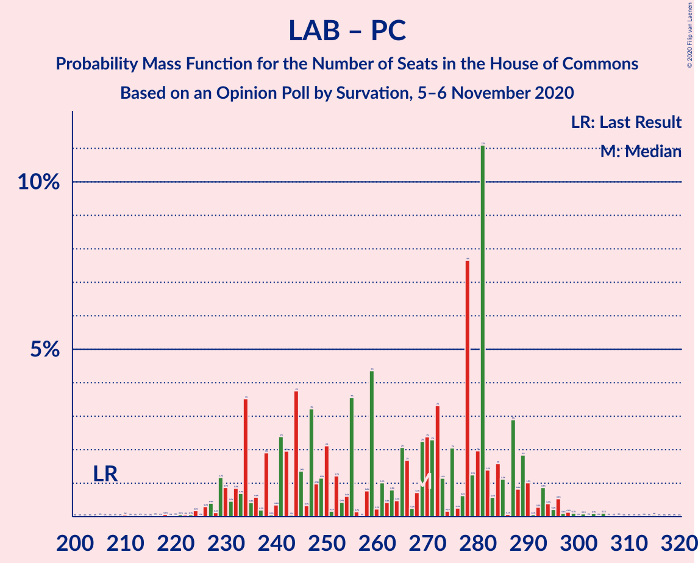

| Number of Seats | Probability | Accumulated | Special Marks |
|:---------------:|:-----------:|:-----------:|:-------------:|
| 206 | 0% | 100% | Last Result |
| 207 | 0% | 99.9% |  |
| 208 | 0% | 99.9% |  |
| 209 | 0% | 99.9% |  |
| 210 | 0% | 99.9% |  |
| 211 | 0% | 99.9% |  |
| 212 | 0% | 99.9% |  |
| 213 | 0% | 99.8% |  |
| 214 | 0% | 99.8% |  |
| 215 | 0% | 99.8% |  |
| 216 | 0% | 99.8% |  |
| 217 | 0% | 99.7% |  |
| 218 | 0.1% | 99.7% |  |
| 219 | 0.1% | 99.7% |  |
| 220 | 0.2% | 99.6% |  |
| 221 | 0.1% | 99.4% |  |
| 222 | 0% | 99.4% |  |
| 223 | 0% | 99.3% |  |
| 224 | 0.1% | 99.3% |  |
| 225 | 0% | 99.2% |  |
| 226 | 0.2% | 99.2% |  |
| 227 | 0.3% | 99.0% |  |
| 228 | 0.2% | 98.7% |  |
| 229 | 0.4% | 98.6% |  |
| 230 | 1.1% | 98% |  |
| 231 | 0.4% | 97% |  |
| 232 | 0.6% | 97% |  |
| 233 | 0.2% | 96% |  |
| 234 | 2% | 96% |  |
| 235 | 0.8% | 94% |  |
| 236 | 2% | 93% |  |
| 237 | 0.6% | 91% |  |
| 238 | 1.0% | 90% |  |
| 239 | 0.6% | 89% |  |
| 240 | 2% | 89% |  |
| 241 | 2% | 87% |  |
| 242 | 1.0% | 86% |  |
| 243 | 1.3% | 85% |  |
| 244 | 2% | 83% |  |
| 245 | 0.5% | 81% |  |
| 246 | 2% | 81% |  |
| 247 | 2% | 78% |  |
| 248 | 1.2% | 77% |  |
| 249 | 3% | 75% |  |
| 250 | 1.3% | 72% |  |
| 251 | 2% | 71% |  |
| 252 | 4% | 68% |  |
| 253 | 1.4% | 65% |  |
| 254 | 2% | 63% |  |
| 255 | 3% | 61% |  |
| 256 | 2% | 58% |  |
| 257 | 2% | 57% |  |
| 258 | 1.0% | 55% |  |
| 259 | 3% | 54% |  |
| 260 | 0.5% | 51% | Median |
| 261 | 3% | 50% |  |
| 262 | 0.5% | 47% |  |
| 263 | 1.0% | 47% |  |
| 264 | 0.7% | 46% |  |
| 265 | 1.1% | 45% |  |
| 266 | 0.9% | 44% |  |
| 267 | 2% | 43% |  |
| 268 | 2% | 41% |  |
| 269 | 1.4% | 39% |  |
| 270 | 2% | 38% |  |
| 271 | 0.9% | 36% |  |
| 272 | 2% | 35% |  |
| 273 | 2% | 32% |  |
| 274 | 1.1% | 31% |  |
| 275 | 0.7% | 30% |  |
| 276 | 1.0% | 29% |  |
| 277 | 0.6% | 28% |  |
| 278 | 3% | 27% |  |
| 279 | 1.2% | 25% |  |
| 280 | 4% | 24% |  |
| 281 | 4% | 20% |  |
| 282 | 3% | 16% |  |
| 283 | 2% | 13% |  |
| 284 | 1.2% | 11% |  |
| 285 | 0.7% | 10% |  |
| 286 | 0.8% | 9% |  |
| 287 | 1.4% | 8% |  |
| 288 | 1.0% | 7% |  |
| 289 | 2% | 6% |  |
| 290 | 0.5% | 4% |  |
| 291 | 0.6% | 4% |  |
| 292 | 0.6% | 3% |  |
| 293 | 0.3% | 3% |  |
| 294 | 0.5% | 2% |  |
| 295 | 0.4% | 2% |  |
| 296 | 0.4% | 1.5% |  |
| 297 | 0.3% | 1.1% |  |
| 298 | 0.2% | 0.8% |  |
| 299 | 0% | 0.6% |  |
| 300 | 0.1% | 0.6% |  |
| 301 | 0.1% | 0.5% |  |
| 302 | 0% | 0.4% |  |
| 303 | 0.1% | 0.4% |  |
| 304 | 0% | 0.2% |  |
| 305 | 0% | 0.2% |  |
| 306 | 0% | 0.2% |  |
| 307 | 0% | 0.1% |  |
| 308 | 0% | 0.1% |  |
| 309 | 0% | 0.1% |  |
| 310 | 0% | 0.1% |  |
| 311 | 0% | 0.1% |  |
| 312 | 0% | 0.1% |  |
| 313 | 0% | 0.1% |  |
| 314 | 0% | 0.1% |  |
| 315 | 0% | 0% |  |

### Labour Party

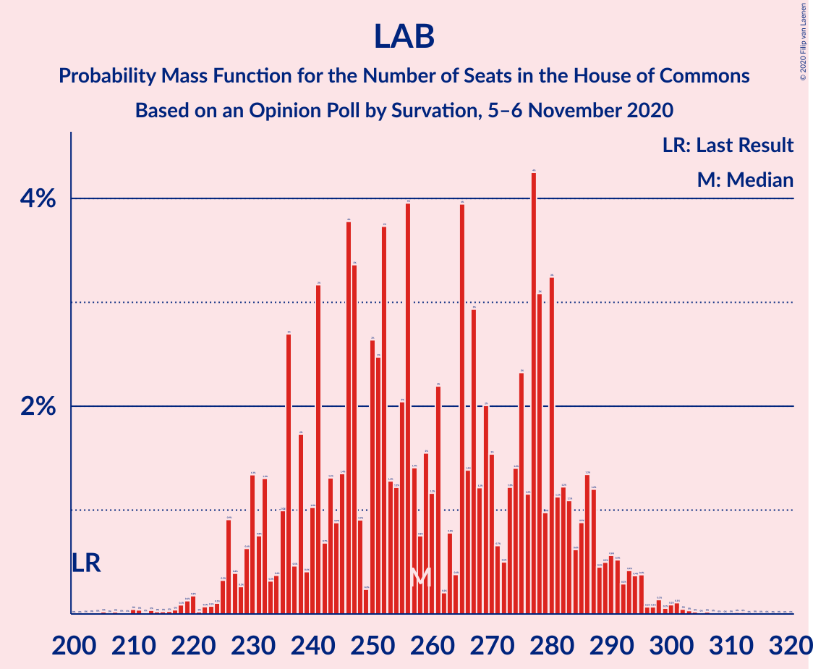

| Number of Seats | Probability | Accumulated | Special Marks |
|:---------------:|:-----------:|:-----------:|:-------------:|
| 202 | 0% | 100% | Last Result |
| 203 | 0% | 100% |  |
| 204 | 0% | 100% |  |
| 205 | 0% | 100% |  |
| 206 | 0% | 99.9% |  |
| 207 | 0% | 99.9% |  |
| 208 | 0% | 99.9% |  |
| 209 | 0% | 99.9% |  |
| 210 | 0% | 99.9% |  |
| 211 | 0% | 99.8% |  |
| 212 | 0% | 99.8% |  |
| 213 | 0% | 99.8% |  |
| 214 | 0% | 99.8% |  |
| 215 | 0% | 99.7% |  |
| 216 | 0% | 99.7% |  |
| 217 | 0% | 99.7% |  |
| 218 | 0.1% | 99.6% |  |
| 219 | 0.1% | 99.6% |  |
| 220 | 0.2% | 99.4% |  |
| 221 | 0% | 99.3% |  |
| 222 | 0.1% | 99.2% |  |
| 223 | 0.1% | 99.2% |  |
| 224 | 0.1% | 99.1% |  |
| 225 | 0.3% | 99.0% |  |
| 226 | 0.9% | 98.7% |  |
| 227 | 0.4% | 98% |  |
| 228 | 0.3% | 97% |  |
| 229 | 0.6% | 97% |  |
| 230 | 1.3% | 96% |  |
| 231 | 0.8% | 95% |  |
| 232 | 1.3% | 94% |  |
| 233 | 0.3% | 93% |  |
| 234 | 0.4% | 93% |  |
| 235 | 1.0% | 92% |  |
| 236 | 3% | 91% |  |
| 237 | 0.5% | 89% |  |
| 238 | 2% | 88% |  |
| 239 | 0.4% | 86% |  |
| 240 | 1.0% | 86% |  |
| 241 | 3% | 85% |  |
| 242 | 0.7% | 82% |  |
| 243 | 1.3% | 81% |  |
| 244 | 0.9% | 80% |  |
| 245 | 1.4% | 79% |  |
| 246 | 4% | 78% |  |
| 247 | 3% | 74% |  |
| 248 | 0.9% | 71% |  |
| 249 | 0.2% | 70% |  |
| 250 | 3% | 69% |  |
| 251 | 2% | 67% |  |
| 252 | 4% | 64% |  |
| 253 | 1.3% | 61% |  |
| 254 | 1.2% | 59% |  |
| 255 | 2% | 58% |  |
| 256 | 4% | 56% |  |
| 257 | 1.4% | 52% |  |
| 258 | 0.8% | 51% | Median |
| 259 | 2% | 50% |  |
| 260 | 1.2% | 48% |  |
| 261 | 2% | 47% |  |
| 262 | 0.2% | 45% |  |
| 263 | 0.8% | 45% |  |
| 264 | 0.4% | 44% |  |
| 265 | 4% | 44% |  |
| 266 | 1.4% | 40% |  |
| 267 | 3% | 38% |  |
| 268 | 1.2% | 35% |  |
| 269 | 2% | 34% |  |
| 270 | 2% | 32% |  |
| 271 | 0.7% | 31% |  |
| 272 | 0.5% | 30% |  |
| 273 | 1.2% | 29% |  |
| 274 | 1.4% | 28% |  |
| 275 | 2% | 27% |  |
| 276 | 1.2% | 24% |  |
| 277 | 4% | 23% |  |
| 278 | 3% | 19% |  |
| 279 | 1.0% | 16% |  |
| 280 | 3% | 15% |  |
| 281 | 1.1% | 12% |  |
| 282 | 1.2% | 11% |  |
| 283 | 1.1% | 9% |  |
| 284 | 0.6% | 8% |  |
| 285 | 0.9% | 8% |  |
| 286 | 1.3% | 7% |  |
| 287 | 1.2% | 5% |  |
| 288 | 0.5% | 4% |  |
| 289 | 0.5% | 4% |  |
| 290 | 0.6% | 3% |  |
| 291 | 0.5% | 3% |  |
| 292 | 0.3% | 2% |  |
| 293 | 0.4% | 2% |  |
| 294 | 0.4% | 1.5% |  |
| 295 | 0.4% | 1.1% |  |
| 296 | 0.1% | 0.7% |  |
| 297 | 0.1% | 0.7% |  |
| 298 | 0.1% | 0.6% |  |
| 299 | 0.1% | 0.5% |  |
| 300 | 0.1% | 0.4% |  |
| 301 | 0.1% | 0.3% |  |
| 302 | 0% | 0.2% |  |
| 303 | 0% | 0.2% |  |
| 304 | 0% | 0.1% |  |
| 305 | 0% | 0.1% |  |
| 306 | 0% | 0.1% |  |
| 307 | 0% | 0.1% |  |
| 308 | 0% | 0.1% |  |
| 309 | 0% | 0.1% |  |
| 310 | 0% | 0.1% |  |
| 311 | 0% | 0.1% |  |
| 312 | 0% | 0% |  |

## Technical Information

### Opinion Poll

+ **Polling firm:** Survation
+ **Commissioner(s):** —
+ **Fieldwork period:** 5–6 November 2020

### Calculations

+ **Sample size:** 1013
+ **Simulations done:** 524,288
+ **Error estimate:** 2.42%

